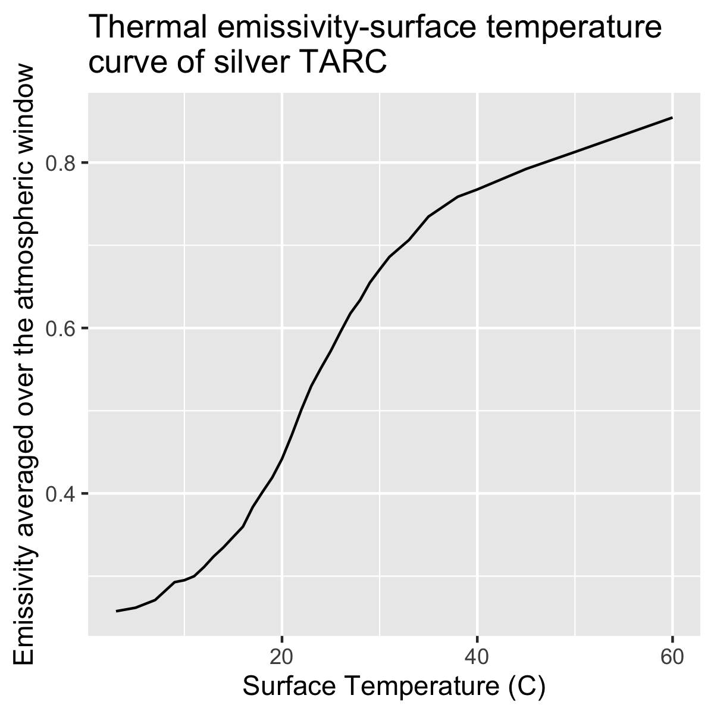

Modeling Dynamic Coating for Opaque Surfaces
================

**Yujie Xu, Tianzhen Hong**

**Lawrence Berkeley National Laboratory***

 - Original Date: Nov 17, 2021
 - Modified Date: Nov 28, 2021

## Justification for Feature Update

Currently, EnergyPlus assumes constant thermal and solar absorptance for exterior wall and roof materials. In order to model dynamic coatings with changing solar or thermal absorptance, users need to use the EnergyManagementSystem (EMS) feature to write code to overwrite these properties. Although this can be done by advanced users, it can be a challenge for normal EnergyPlus users as learning and debugging EMS code is not an easy task. 

The proposed new feature will enable user input of the stimulus-absorptance relationship in the form of a table or curve. The variables triggering solar or thermal absorptance change can be surface temperature, solar radiation, space heating/cooling status, a schedule, etc. An idd object will be added to capture detailed input of solar and thermal absorptance as a function of different triggers.

## Overview ##

Dynamic coatings are among the hottest topics of novel building materials that have significant potentials of reducing heating and cooling loads in buildings. Such materials can change their solar or thermal absorptance with a variety of triggers. Based on the type of triggers, they can be classified into passive and active. Most passive dynamic coatings are driven by surface temperature. For these materials, there is usually a high value and a low value for thermal emissivity or solar reflectance. When the surface temperature is higher than a certain threshold, the material will switch to a state with high emissivity or reflectance. When the surface temperature is lower than a certain threshold (which could be different from the previous one), the material will switch to another state with lower emissivity or reflectance. Active dynamic coatings can be tuned with control signals based on space heating/cooling status, occupancy, indoor temperature or thermal comfort metrics. The control signal can actuate the change in material optical/thermal properties by changing the position of movable structures, applying forces, or distributing chemical content to the material. The following table lists examples of dynamic coating studies with various triggers.

 Table 1. Common triggers of dynamic coating material.

|type|trigger|example studies|
|----|-------|---------------|
|Passive|Surface temperature|[1]–[4]|
|Active	|Mechanical structure|[5], [6]|
||Force (stretching or compression)|[7], [8]|
||Distribution of chemical content|[9]|
||Electric current|[10]|

Based on the above brief review of dynamic coating material, we propose to enable the modeling of the trigger-solar/thermal absorption in EnergyPlus directly as opposed to relying on EMS. We propose to add a new Material object to hold trigger-solar/thermal absorption curve or table data. This user input will overwrite the corresponding material properties based on the value of the trigger.

## Approach

Two new idd object, *MaterialProperty:VariableThermalAbsorptance* and *MaterialProperty:VariableSolarAbsorptance*, will be added to host user input data on the trigger-coating property relationship.

## Testing/Validation/Data Source(s)

The feature will be tested and demonstrated with a test file derived from *"RefBldgSmallOfficeNew2004_Chicago.idf* with various dynamic coatings. The simulation results will be verified against the EMS approach. One of the dynamic coating material to be simulated is from Professor Junqial Wu’s group at UC Berkeley [11]. The following is a plot of its surface temperature-emissivity relationship.

 Figure 1. Surface temperature-emissivity relationship for the silver Temperature Adaptive Radiative Cooling material from Professor Junqiao Wu’s group [11].

## IDD Object changes

There could be two potential idd designs as follows. The first design creates a material object with the full set of properties users can specify, including roughness, thickness, conductivity, etc. The second approach will add the specification of the trigger-solar/thermal absorption alone. The first approach has the flexibility of specifying the roughness, thickness, conductivity, etc. for the new material itself, but on the other hand, could be challenging for users when some of this information is not readily available. The second approach only requires the trigger-solar/thermal absorptance information, which could be handy for users to test out the performance of the coating while assuming the coating itself is thin enough and the conductivity difference between the coating and the opaque layer beneath it is negligible. When the "coating" is a thick structure, where such differences are not negligible, users can first create a *Material* layer with the roughness, thickness, conductivity, etc. of the thick dynamic coating layer, then add the *MaterialProperty:VariableThermalAbsorptance* on top of it to hold the trigger-solar/thermal absorptance data.

Based on the reasoning above, two material add-on objects will be added, *MaterialProperty:VariableThermalAbsorptance* and *MaterialProperty:VariableSolarAbsorptance*.

    MaterialProperty:VariableThermalAbsorptance,
      A1 , \field Name
           \required-field
           \type alpha
           \note The name of the dynamic coating material with variable thermal absorptance.
      A2 , \field Reference Material Name
           \required-field
           \type object-list
           \object-list MaterialName
           \note Regular Material Name to which the additional properties will be added.
           \note this the material name for the basic material properties.
      A3 , \field Control Signal
           \required-field
           \type choice
           \key SurfaceTemperature
           \key SurfaceReceivedSolarRadiation
           \key SpaceHeatingCoolingMode
           \key Scheduled
           \default SurfaceTemperature
      A4 , \field Trigger Thermal Absorptance Function Name
          \note A Curve:* or Table:Lookup object encoding the relationship between the trigger and surface thermal absorptance. For longwave radiation.
      A5 ; \field Thermal Absorptance Schedule Name
           \note only used when Control Signal = “Scheduled”

    MaterialProperty:VariableSolarAbsorptance,
      A1 , \field Name
           \required-field
           \type alpha
           \note The name of the dynamic coating material with variable solar absorptance.
      A2 , \field Reference Material Name
           \required-field
           \type object-list
           \object-list MaterialName
           \note Regular Material Name to which the additional properties will be added.
           \note this the material name for the basic material properties.
      A3 , \field Control Signal
           \required-field
           \type choice
           \key SurfaceTemperature
           \key SurfaceReceivedSolarRadiation
           \key SpaceHeatingCoolingMode
           \key Scheduled
           \default SurfaceTemperature
      A4 , \field Trigger Solar Absorptance Function Name
          \note A Curve:* or Table:Lookup object encoding the relationship between the trigger and surface solar absorptance. For longwave radiation.
      A5 ; \field Solar Absorptance Schedule Name
           \note only used when Control Signal = “Scheduled”

## Proposed additions to Meters:

N/A
 
## Proposed Report Variables:

N/A
 
## References

[1]	T. Karlessi, M. Santamouris, K. Apostolakis, A. Synnefa, and I. Livada, “Development and testing of thermochromic coatings for buildings and urban structures,” Sol. Energy, vol. 83, no. 4, pp. 538–551, 2009. 
[2]	A. Butt et al., “Investigating the energy saving potential of thermochromic coatings on building envelopes,” Appl. Energy, vol. 291, p. 116788, Jun. 2021, doi: 10.1016/j.apenergy.2021.116788. 
[3]	S. Taylor, Y. Yang, and L. Wang, “Vanadium dioxide based Fabry-Perot emitter for dynamic radiative cooling applications,” J. Quant. Spectrosc. Radiat. Transf., vol. 197, pp. 76–83, Aug. 2017, doi: 10.1016/j.jqsrt.2017.01.014. 
[4]	C. Wang, Y. Zhu, and X. Guo, “Thermally responsive coating on building heating and cooling energy efficiency and indoor comfort improvement,” Appl. Energy, vol. 253, p. 113506, 2019. 
[5]	X. Li et al., “Integration of daytime radiative cooling and solar heating for year-round energy saving in buildings,” Nat. Commun., vol. 11, no. 1, pp. 1–9, 2020. 
[6]	Z. Yang, Y. Jia, and J. Zhang, “Hierarchical-Morphology Metal/Polymer Heterostructure for Scalable Multimodal Thermal Management,” ACS Appl. Mater. Interfaces, 2022. 
[7]	H. Zhao, Q. Sun, J. Zhou, X. Deng, and J. Cui, “Switchable Cavitation in Silicone Coatings for Energy-Saving Cooling and Heating,” Adv. Mater., vol. 32, no. 29, p. 2000870, 2020, doi: 10.1002/adma.202000870. 
[8]	A. Butler and C. Argyropoulos, “Mechanically tunable radiative cooling for adaptive thermal control,” Appl. Therm. Eng., vol. 211, p. 118527, Jul. 2022, doi: 10.1016/j.applthermaleng.2022.118527. 
[9]	J. Fei et al., “Switchable Surface Coating for Bifunctional Passive Radiative Cooling and Solar Heating,” Adv. Funct. Mater., vol. 32, no. 27, p. 2203582, 2022, doi: 10.1002/adfm.202203582. 
[10]	P.-C. Hsu, “Electrochemical non-volatile dynamic tuning between solar heating and radiative cooling,” in Photonic and Phononic Properties of Engineered Nanostructures XII, Mar. 2022, vol. PC12010, p. PC1201010. doi: 10.1117/12.2610174. 
[11]	K. Tang et al., “Temperature-adaptive radiative coating for all-season household thermal regulation,” Science, vol. 374, no. 6574, pp. 1504–1509, Dec. 2021, doi: 10.1126/science.abf7136. 
