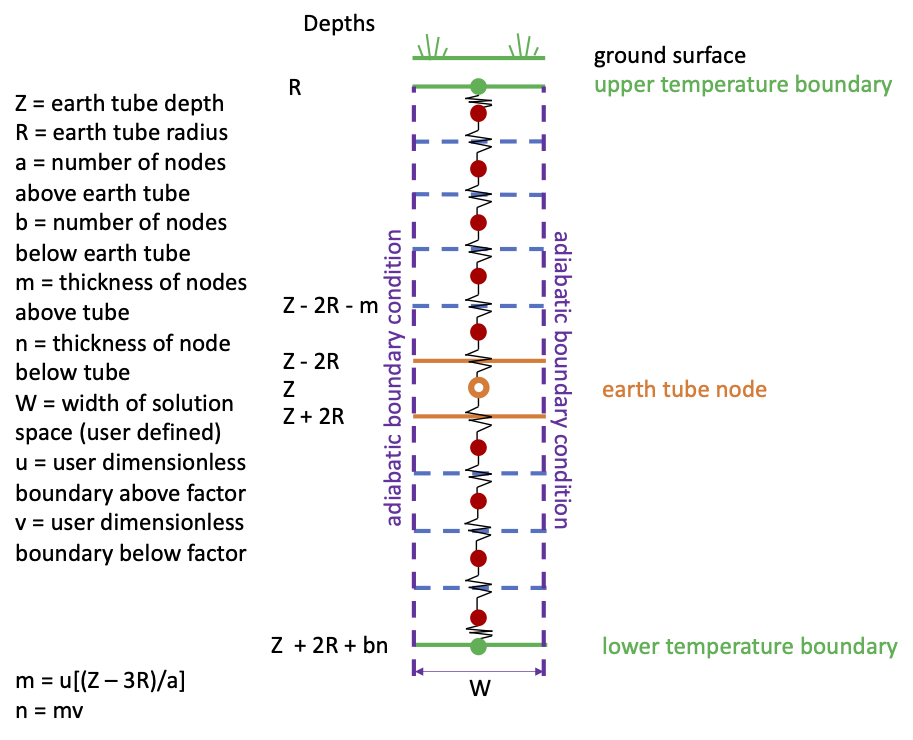

Earth Tube 1-D Conduction Enhancement (Design Document)
================

**Rick Strand, University of Illinois at Urbana-Champaign**

 - April 2023
 - Revision Date (Version 2): May 11, 2023
 - Revision Date (Version 3): May 12, 2023
 - Revision Date (Version 4): June 7, 2023 (converted to a design document, minor grammatical edits, addition of the Code Development setion)
 - Revision Date (Version 5): June 27, 2023 (switch to LU decomposition)
 

## Justification for New Feature ##

It has long been known that the earth tube model in EnergyPlus, though an important addition to the program, has one critical assumption that potentially affects the accuracy of the earth tube results.  The assumption is that the presence of the earth tube and any heat transfer from the air passing through it to the ground is negligible.  While this is a common assumption for many first principle models in the literature (these models generally all use the model used in EnergyPlus to determine the temperature at a particular depth), it does not take into account any changes that the heat rejection from the outside air to the ground itself.  It is not currently known how much of an impact this will have, but it would seem at least plausible that the ground around the earth tube would be impacted and that this would affect the potential outlet temperatures that can be achieved and thus the amount of cooling that is possible.  The goal is to provide a more accurate assessment of these systems using EnergyPlus.
The improvement of the earth tube model will be done in stages.  The first step is to handle the impact of the earth on the ground surrounding the earth in a single dimension (with the soil depth being that dimension).  Future work would potentially handle heat transfer axially along the length of the tube, the impact of more than one earth tube and the impact that adjacent tubes have on each other, and any time lag due to the air passing through the earth tube.

## E-mail, Slack, and Conference Call Conclusions ##

Technicalities Meeting (5/3/23): team review the document briefly and stated the desire for this to get additional feedback in the next technicalities meeting.  Two initial requests from the team included modifying the proposal to factor in the impact of the soil at the depth of the earth tube since this would be more realistic of the situation (as in, the earth tube in not infinite in width) and to contact John Nelson who has expertise in earth tube modeling and has requested improved earth tube simulation capabilities in EnergyPlus in the past.  This update includes a modification of the finite difference scheme to address the concern regarding what is happening at the depth of the earth tube itself.  In addition, GitHub was used to contact John Nelson and that conversation is contained in the comments for the GitHub issue regarding earth tubes (https://github.com/NREL/EnergyPlus/issues/6627).  John suggested that the model at some point include the ability to model temperature variation axially along the earth tube (something already logged as a potential future enhancement) and also to provide some improved controls where air might bypass the earth tube and use heat recovery in certain situations to save the earth tube’s ability to cool.  This is an interesting idea but may also be fairly complicated because it may deal with specific control algorithms and bridging between the zone and air loop simulations.  Such a concept is different from what is currently in EnergyPlus and there doesn’t appear to be another model in E+ that bridges with air flow at the zone and air loop level.  Such a concept is definitely beyond the scope of this initial enhancement.

Slack Discussion (5/11/23): Neal Kruis brought up two issues in this NFP.  First, there is the issue of the infinitely wide domain which is unrealistic.  Second, there is the question of what air temperature is being used for heat transfer between the earth tube and the air passing through it.  The second issue will be resolved by adding the discussion of the effectiveness-NTU heat exchanger model that is being used.  This will be similar in the assumptions as the heat exchanger algorithm used in the low temperature radiant system model (solid side with a “constant” temperature and a fluid side which has a temperature which varies throughout).  The first issue will be addressed by modifying the solution domain to have a user-defined width with adiabatic boundary conditions on either side.  In reality, at some distance from the earth tube there will be negligible heat transfer toward/away from the earth tube.  Making this a user-defined input parameter will allow the width to be studied.

Technicalities Meeting (6/14/23): Jason DeGraw expressed specific concern about using matrix inversion as part of the solution technique due to concerns about slow execution speeds.  He recommended that an LU decomposition technique be used as a much faster approach and noted that there were several already in EnergyPlus.  As a result, this document was modified to remove inversion as a solution approach and replace it with LU decomposition, using the existing routines in the Window Manager.

## Overview ##

The earth tube model in EnergyPlus uses an established equation for determining the temperature of soil below grade.  This equation is published in the literature and is documented in the EnergyPlus Engineering Reference.  In EnergyPlus, this equation for temperature as a function of distance is integrated over the diameter of the earth tube to come up with an average temperature that is then used as the soil temperature with which the earth tube interacts.  While this is useful and is a common assumption in much of the existing literature, it does not take into account any impact that the earth tube has on the surrounding soil in any direction.  The model simply assumes that the earth tube does not impact the local soil temperature.

Clearly, over an entire season of cooling, there would be some impact on the local soil temperature due to the presence of the earth tube.  While the base equation does account for seasonal variation of the undisturbed earth temperature, it does not include any terms that would account for the heat gains in the soil due to the cooling effect on the air passing through the earth tube.  This would vary the soil temperature in all directions around the coil—vertically, horizontally, and axially along the length of the tube.  So, to better model an earth tube and its performance within EnergyPlus, improvements must be made to account for the transient impact of the earth tube on the local soil temperatures in all directions.  In addition, there should be some sort of accounting for the potential presence of more than a single earth tube, since it is common for such systems to have more than a single pipe/tube.

In addition, the current model also assumes that the air passing through the tube does so without any time delay.  In other words, the air instantaneously passes through the earth tube and this has an immediate impact on the space.  In reality, there is a time lag since air entering the tube must pass through the entire length of the tube.  While the impact of this assumption has not been explored, it could potentially be another element of the existing model that could be improved.

Given all of these areas of potential improvement to the model and the limited availability of resources, this initial phase of enhancing the existing earth tube model in EnergyPlus will be to focus on the impact of the heat transfer within the earth tube on the local soil conditions in the vertical direction only.  There is actually a good reason to focus on that direction first.  It is the direction in which there is an existing equation for temperature as a function of soil depth.

Furthermore, research in this area seems to at least give the impression that the biggest impact is in the vertical direction.  Research by Liu, Xu, Guo, and Zhu (2019) shows that the direction that is the most important as far as variations in temperature are the vertical direction.  While temperature variation does occur horizontally and axially as well, the largest temperature changes in comparison to the undisturbed temperature happen vertically.  So, it makes the most sense to make the first enhancement pass to the model to look at the vertical temperature variation caused by the heat transfer due to the earth tube.

## Approach ##

Overall, the approach will be to add a new 1-D heat transfer model that will run as a separate option from the existing model.  The reason for this is two-fold: execution speed and comparative accuracy.  First, the new model will be slower than the existing model.  It may be that users do not wish to have their run times increase and at this time it is uncertain how much the run time will be impacted given the solution technique that will be used, particularly as additional dimensions of heat transfer get added later.  Second, it would be helpful to know how much the solution was impacted by the new enhancement of 1-D heat conduction.  This will allow test cases to be run and comparisons made to deduce when the use of the new enhancement will be necessary and how much the soil temperature is impacted.  This might also give the team useful information on how important additional solution dimensions will be.

The 1-D heat conduction model itself will be implemented using a 1-D implicit finite difference scheme.  The solution dimension will be bounded by a temperature just below grade at the top of the solution space and another temperature boundary condition at a depth below the earth tube.  The temperatures at these upper and lower boundaries will be set using the existing equation from the literature for undisturbed soil temperature.  At the sides of the solution space, adiabatic conditions will be assumed.  The user will be given the option to specify the overall thickness of the solution region, but there will only be heat transfer vertically (none horizontally since it will be adiabatic on the “sides”).

The finite difference grid will include an upper portion from the upper temperature boundary to the node just above the earth tube and also a lower portion from the node just below the earth tube to the lower boundary condition.  The node at the earth tube itself will also be modeled as an “all soil” node but also include a connection to the earth tube itself.  In a one dimensional model like the one proposed for this enhancement, it is more realistic to model the level at the earth tube to be soil because in all directions there will be soil and not an entire layer of air/earth tube.  Thus, this earth tube node will capture the conditions of the soil at that level, and a heat exchanger model that connects to the  temperature of the earth tube node will be used, and checks will be made to insure that the heat loss of the air is equal to the total heat gain of the soil.

The solution for this finite difference model will use an implicit scheme.  Implicit schemes are known for being inherently stable.  Since it is possible that the number of nodes may be small and thus the nodes large, it will be important to avoid potential stability issues in the solution.  The user will be given some flexibility in the input to specify the number of nodes above and below the earth tube.  While some reasonable limits will be applied to those inputs to avoid too few or too many nodes, the control of the number of nodes will also help during the testing and verification process to make sure that the model is producing results that make sense and are believable.  An example of the node layout is shown in the figure below.

 Figure 1. Earth Tube 1-D Model Solution Space Node Diagram.

The heat transfer between the soil and the air flowing through the earth tube will be calculated using an effectiveness-NTU heat exchanger formulation.  Because the soil temperature does not vary axially along the earth tube in this model, the effectiveness for a heat exchanger equation in this situation where one side is at constant temperature and the other side (air side) varies in temperature is:

\begin{equation}
\varepsilon  = 1 - {e^{ - NTU}}
\end{equation}

This is similar to the reasoning used in the low temperature radiant system models where similar assumptions are made for the embedding material and the fluid being circulated through the tubing.  The effectiveness will then used to calculate the outlet air temperature based on an inlet air temperature, soil temperature, and other conditions of the situation (flow, thermal properties, etc.).  The overall heat exchange between the soil and the air is calculated using this effectiveness, and there is no need to determine the "average" temperature of the air as it passes through the earth tube.  The heat exchanger model defines the heat exchange using the effectiveness and the theoretical maximum heat transfer between the air and soil.

Another important point regarding this model is that unlike the existing model which only calculates the performance of the earth tube when the earth tube is actually operating, the enhancement 1-D model will need to calculate the response of the soil even when the earth tube is not running, whether that is due to no cooling being needed, the earth tube is turned off, or it being not the appropriate season for the earth tube to operate.  So, while the existing model simply skips the earth tube code when it is “off”, the enhanced model will have to calculate node conditions all the time.  This again could add to the execution run time as the earth tube calculations will have to be made all of the time.  This will naturally be impacted by the number of nodes selected by the users.  At this time, it is uncertain how much time this model will add to execution time.  Testing will be done with the new model to help identify some benchmarks and provide some helpful guidance to users via the Engineering Reference documentation.

This work will also include modernization of the earth tube code based on recent standard practices implemented by the EnergyPlus development team.

## Testing/Validation/Data Sources ##

Explicit data sets for earth tube performance that monitors temperature in the vertical direction have not been published in the literature.  More qualitative graphs have been published but it is difficult to get exact data from these diagrams.  They can, however, be used to establish trends that can be checked against the results from the new EnergyPlus enhancement.  The more important testing and validation that will occur will compare the results of the new model with the existing one at various depths, different number of nodes (upper and lower), and for different soil conditions.  Comparisons can then be made both to the existing model as well as different depths, node arrangements, and soil conditions to establish the improvement in the temperature predictions of both the soil conditions as well as the outlet air temperatures.  It is anticipated that this work will result in a publication following the completion of this work in EnergyPlus.

## Input Output Reference Documentation ##

The existing input output reference documentation that already exists for earth tubes will be reviewed and corrected as needed for the model that is already in the code.  The most significant changes to the documentation will be the addition of two new fields in the input syntax for earth tubes and the addition of a new input object for the details of the finite difference solution.  This is shown starting in the next paragraph.

\subsection{ZoneEarthtube}\label{zoneearthtube-earth-tube}

An earth tube is a long, underground metal or plastic pipe through which air is drawn. During cooling season, as air travels through the pipe, it gives up some of its heat to the surrounding soil and enters the room as cooler air. Similarly, during heating season, as air travels through the pipe, it receives some of its heat from the soil and enters the zone as warmer air. Simple earth tubes in EnergyPlus can be controlled by a schedule and through the specification of minimum, maximum, and delta temperatures as described below. As with infiltration and ventilation, the actual flow rate of air through the earth tube can be modified by the temperature difference between the inside and outside environment and the wind speed. The basic equation used to calculate air flow rate of earth tube in EnergyPlus is:

\begin{equation}
EarthTubeFlowRate = \left( {{E_{design}}} \right)\left( {{F_{schedule}}} \right)\left[ {A + B\left| {{T_{zone}} - {T_{odb}}} \right| + C\left( {WindSpeed} \right) + D\left( {WindSpee{d^2}} \right)} \right]
\end{equation}

For the simulation of the earth tube, a weather data file is required and, therefore, the earth tube cannot run without weather data file. The required input fields to simulate the earth tube include the average soil surface temperature, the amplitude of soil surface temperature, and the phase constant of soil surface temperature. These fields should be calculated in advance by using a separate stand-alone program (CalcSoilSurfTemp) and should be input into earth tube.

\subsubsection{CalcSoilSurfTemp -- Auxiliary Programs Document}\label{calcsoilsurftemp-auxiliary-programs-document}

The CalcSoilSurfTemp program is simple and requires only two input fields: soil condition and soil surface condition in addition to a valid weather file. For soil condition, the user should select the number corresponding to the actual condition of the soil surrounding the earth tube from the four following options: 1. HEAVY AND SATURATED, 2. HEAVY AND DAMP, 3. HEAVY AND DRY and 4. LIGHT AND DRY. This determines the thermal diffusivity and thermal conductivity of the surrounding soil. For soil surface conditions, the user should select the number corresponding to the actual condition of the ground surface above the earth tube from the eight following options: 1. BARE AND WET, 2. BARE AND MOIST, 3. BARE AND ARID, 4. BARE AND DRY, 5. COVERED AND WET, 6. COVERED AND MOIST, 7. COVERED AND ARID and 8. COVERED AND DRY. This determines the absorption coefficient and the fraction of evaporation rate of the ground surface.

## Input Description ##

\subsubsection{Inputs}
From this information and an analysis of the weather for the location selected, the CalcSoilSurfTemp program (ref. Auxiliary Programs document) calculates the three parameters listed above. The user must then add these parameters as input into EnergyPlus. The full input description of an earth tube (EARTHTUBE object) in EnergyPlus is given below.

\paragraph{Field: Zone Name}\label{field-zone-name-5}

This field is the name of the zone (ref: Zone) and attaches a particular earth tube statement to a thermal zone in the building.

\paragraph{Field: Schedule Name}\label{field-schedule-name-6}

This field is the name of the schedule (ref: Schedule) that modifies the maximum design volume flow rate parameter (see next field). This fraction between 0.0 and 1.0 is noted as F\(_{schedule}\) in the above equation.

\paragraph{Field: Design Flow Rate}\label{field-design-flow-rate-4}

This number (noted as E\(_{design}\) in the above equation) is the maximum amount of air mass flow rate of the earth tube expected at design conditions. The flow rate is expressed in units of m\(^{3}\)/s. The design value is modified by the schedule fraction (see previous field) and user specified coefficients (see last four fields).

\paragraph{Field: Minimum Zone Temperature when Cooling}\label{field-minimum-zone-temperature-when-cooling}

This is the indoor temperature (in Celsius) below which the earth tube is shut off. This lower temperature limit is intended to avoid overcooling a space and thus result in a heating load. For example, if the user specifies a minimum temperature of 20$^\circ$C, earth tube is assumed to be available if the zone air temperature is above 20$^\circ$C. If the zone air temperature drops below 20$^\circ$C, then earth tube is automatically turned off.

\paragraph{Field: Maximum Zone Temperature when Heating}\label{field-maximum-zone-temperature-when-heating}

This is the indoor temperature (in Celsius) above which the earth tube is shut off. This higher temperature limit is intended to avoid overheating a space and thus result in a cooling load. For example, if the user specifies a maximum temperature of 20$^\circ$C, earth tube is assumed to be available if the zone air temperature is below 20$^\circ$C. If the zone air temperature rises above 20$^\circ$C, then earth tube is automatically turned off.

\paragraph{Field: Delta Temperature}\label{field-delta-temperature-4}

This is the temperature difference (in Celsius) between the indoor and outdoor air dry-bulb temperatures below which the earth tube is shut off. This is to allow the earth tube to be stopped either if the temperature outside is too warm and could potentially heat the space or if the temperature outside is too cold and could potentially cool the space. For example, if the user specifies a delta temperature of 2$^\circ$C, earth tube is assumed to be available if the temperature difference between indoor and outdoor temperature is at least 2$^\circ$C. If the outside air dry-bulb temperature is less than 2$^\circ$C cooler or warmer than the indoor dry-bulb temperature, then the earth tube is automatically turned off.

\paragraph{Field: Earthtube Type}\label{field-earthtube-type}

This alpha character string defines the type of earth tube as one of the following options: \emph{Natural}, \emph{Exhaust}, or \emph{Intake}. A \emph{Natural} earth tube is assumed to be air movement/exchange that will not consume any fan energy or is the result of natural air flow through the tube and into the building. Values for fan pressure and efficiency for a natural flow earth tube are ignored. For either \emph{Exhaust} or \emph{Intake} earth tubes, values for fan pressure and efficiency define the fan electric consumption. For \emph{Natural} and \emph{Exhaust} earth tubes, the conditions of the air entering the space are assumed to be equivalent to the air which is cooled or heated by passing along the pipe. For \emph{Intake} earth tubes, an appropriate amount of fan heat is added to the air stream.

\paragraph{Field: Fan Pressure Rise}\label{field-fan-pressure-rise-1}

This is the pressure rise experienced across the fan in Pascals (N/m\(^{2}\)). This is a function of the fan and plays a role in determining the amount of energy consumed by the fan.

\paragraph{Field: Fan Total Efficiency}\label{field-fan-total-efficiency-1}

This is the total fan efficiency (a decimal number between 0.0 and 1.0). This is a function of the fan and plays a role in determining the amount of energy consumed by the fan.

\paragraph{Field: Pipe Radius}\label{field-pipe-radius}

This is the radius of the earth tube/pipe (in meters). This plays a role in determining the amount of heat transferred from the surrounding soil to the air passing along the pipe. If the pipe has non-circular cross section, user can use the concept of hydraulic diameter as follows.

\begin{equation}
D = 4 \times Area/Perimeter
\end{equation}

However, since this field requires the pipe radius, hydraulic diameter should be divided by two.

\paragraph{Field: Pipe Thickness}\label{field-pipe-thickness}

This is the thickness of the pipe wall (in meters). This plays a role in determining the amount of heat transferred from the surrounding soil to the air passing along the pipe.

\paragraph{Field: Pipe Length}\label{field-pipe-length}

This is the total length of the pipe (in meters). This plays a role in determining the amount of heat transferred from the surrounding soil to the air passing along the pipe. As the length of the pipe becomes longer, the amount of the heat transfer becomes larger.

\paragraph{Field: Pipe Thermal Conductivity}\label{field-pipe-thermal-conductivity}

This is the thermal conductivity of the pipe (in W/m-C). This plays a role in determining the amount of heat transferred from the surrounding soil to the air passing along the pipe.

\paragraph{Field: Pipe Depth Under Ground Surface}\label{field-pipe-depth-under-ground-surface}

This is the depth of the pipe under the ground surface (in meters). This plays a role in determining the temperature of the soil surrounding the pipe.

\paragraph{Field: Soil Condition}\label{field-soil-condition}

This alpha character string defines the actual condition of the soil surrounding the earth tube and can be one of any of the following options: HeavyAndSaturated, HeavyAndDamp, HeavyAndDry or LightAndDry. This determines the thermal diffusivity and thermal conductivity of the surrounding soil, which play a role in determining the amount of heat transferred from the surrounding soil to the air passing along the pipe.

\paragraph{Field: Average Soil Surface Temperature}\label{field-average-soil-surface-temperature}

This is the annual average soil surface temperature straight above the earth tube, which plays a role in determining the temperature of the soil surrounding the pipe. This field should be calculated in advance using the separate CalcSoilSurfTemp program.

\paragraph{Field: Amplitude of Soil Surface Temperature}\label{field-amplitude-of-soil-surface-temperature}

This is the amplitude of soil surface temperature above the earth tube, which plays a role in determining the temperature of the soil surrounding the pipe. This is the difference between the maximum and minimum soil surface temperature for the whole year divided by two. This field should be calculated in advance using the separate CalcSoilSurfTemp program.

\paragraph{Field: Phase Constant of Soil Surface Temperature}\label{field-phase-constant-of-soil-surface-temperature}

This is the phase constant of the soil surface temperature straight above the earth tube, which play a role in determining the temperature of the soil surrounding the pipe at particular time. This is the time elapsed from the beginning of the year until the soil surface temperature reaches the minimum value of the year. This field should be calculated in advance using the separate CalcSoilSurfTemp program.

\paragraph{Field: Constant Term Flow Coefficient}\label{field-constant-term-flow-coefficient}

This number is the ``A'' parameter in the above earth tube equation. It is part of the user specified modifying parameters that are a function of environmental factors. This parameter, however, is a constant under all conditions and is not modified by any environmental effect. As a result, it is dimensionless.

\paragraph{Field: Temperature Term Flow Coefficient}\label{field-temperature-term-flow-coefficient}

This number is the ``B'' parameter in the above earth tube equation. It is part of the user specified modifying parameters that are a function of environmental factors. This parameter is modified by the temperature difference between the outdoor and indoor air dry-bulb temperatures. The units for this parameter are inverse Celsius.

\paragraph{Field: Velocity Term Flow Coefficient}\label{field-velocity-term-flow-coefficient}

This number is the ``C'' parameter in the above earth tube equation. It is part of the user specified modifying parameters that are a function of environmental factors. This parameter is modified by the speed of wind being experienced outside the building. The units for this parameter are s/m.

\paragraph{Field: Velocity Squared Term Flow Coefficient}\label{field-velocity-squared-term-flow-coefficient}

This number is the ``D'' parameter in the above earth tube equation. It is part of the user specified modifying parameters that are a function of environmental factors. This parameter is modified by square of the speed of wind being experienced outside the building. The units for this parameter are s\(^{2}\)/m\(^{2}\).

\paragraph{Field: Earth Tube Model Type}\label{field-earth-tube-model-type}

This field determines which modeling technique will be used to assess the performance of the earth tube.  The options are: Simple and Vertical.  In the Simple modeling approach, the temperature of the soil at the earth tube is approximated by the undisturbed ground conditions.  In the Vertical modeling approach, the temperature of the soil around the earth tube is modeled using a finite difference scheme to account for the impact of the earth tube on the surrounding soil conditions in a single direction (1-D).  For more information on the model type, reference the Earth Tube section of the EnergyPlus Engineering Reference.  This input is optional, and the default value is Simple.

\paragraph{Field: Earth Tube Model Parameters}\label{field-earth-tube-model-parameters}

This field refers to separate input syntax (see below) that is used for controlling parameters for the 1-D (Vertical) solution technique.  This input field is ignored for the Simple model.

\paragraph{EarthTube:Parameters}\label{field-earth-tube-parameters}
For the 1-D (Vertical) model, some additional optional parameters are available for the user to potentially control the solution space (number of nodes, distances) for the finite difference solution.  These are described below.

\paragraph{Field: Earth Tube Parameters Name}\label{field-earth-tube-parameters-name}
This name is used as a reference in the main EarthTube input syntax.  It is used to identify the parameters that the user desires to use to control what is being modeled and how detailed the model is.

\paragraph{Field: Earth Tube Nodes Above}\label{field-earth-tube-nodes-above}
This parameter sets the number of nodes above the earth tube, between the earth tube and the ground surface.  It has a minimum of three nodes and a maximum of ten nodes.  These limits were chosen to avoid the extremes of excessive execution times and overly simplified results.  The default value for this parameter is 5 (nodes).

\paragraph{Field: Earth Tube Nodes Below}\label{field-earth-tube-nodes-below}
This parameter sets the number of nodes below the earth tube, between the earth tube and the deep ground boundary.  It has a minimum of three nodes and a maximum of ten nodes.  These limits were chosen to avoid the extremes of excessive execution times and overly simplified results.  The default value for this parameter is 3 (nodes) or the minimum.

\paragraph{Field: Earth Tube Dimensionless Boundary Above}\label{field-earth-tube-dimensionless-boundary-above}
This parameter sets the dimensionless distance above the earth tube for the solution space.  The maximum value is 1.0, and the minimum value is 0.25.  When this parameter is set to 1.0, the upper boundary is set to be half of the diameter below the ground surface and the solution space thickness above the earth tube is the depth of the earth tube minus the earth tube diameter.  This maximum distance (earth tube depth minus diameter) is multiplied by this parameter to constrain the solution space to less than the maximum (when the parameter is less than 1.0).    The default value for this parameter is 1.0 (the maximum value).

\paragraph{Field: Earth Tube Dimensionless Boundary Below}\label{field-earth-tube-dimensionless-boundary-below}
This parameter sets the dimensionless distance below the earth tube for the solution space.  The maximum value is 1.0, and the minimum value is 0.25.  This parameter is interpreted in a similar fashion as the previous parameter where the depth of the solution space below the earth tube is determined by the maximum distance above the earth tube (earth tube depth minus diameter).  This allows the user to have different thickness for the modeled portion of the ground above and below the earth tube.  The default value for this parameter is 0.25 (the minimum value).

\paragraph{Field: Earth Tube Dimensionless Solution Space Width}\label{field-earth-tube-dimensionless-solution-space-width}
This parameter sets the dimensionless width of the solution space horizontally as a function of the earth tube radius as defined in the main earth tube input syntax.  The maximum value is 20.0, and the minimum value is 3.0.  The default value for this parameter is 4.0 which means that the width of the solution space is four times the radius.  In other words, this would include soil one radius length beyond the edges of the tube on either side of the earth tube.

An IDF example:

\begin{lstlisting}

EARTHTUBE,
  Zone 2,           !- Zone Name
  1D Modeled Tube,  !- Schedule Name
  3.425198,         !- Design Volume Flow Rate
  10.0,             !- Minimum Zone Temperature when Cooling
  30.0,             !- Maximum Zone Temperature when Heating
  1.0,              !- Delta Temperature
  NATURAL,          !- EarthTube Type
  350.0,            !- Fan Pressure Rise
  0.9,              !- Fan Total Efficiency
  0.25,             !- Pipe Radius
  0.2,              !- Pipe Thickness
  15.0,             !- Pipe Length
  200.0,            !- Pipe Thermal Conductivity
  3.5,              !- Pipe Depth Under Ground Surface
  HeavyAndDamp,     !- Soil Condition
  15.0,             !- Average Soil Surface Temperature
  5.6,              !- Amplitude of Soil Surface Temperature
  0.0,              !- Phase Constant of Soil Surface Temperature
  0.6060000    ,    !- Constant Term Flow Coef
  2.0199999E-02,    !- Temp Term Flow Coef
  5.9800001E-04,    !- Velocity Term Flow Coef
  0.0000000E+00,    !- Velocity**2 Term Flow Coef
  Vertical,         !- Earth Tube Model Type
  EarthTubeParams;  !- Earth Tube Model Parameters
  
EarthTube:Parameters,
  EarthTubeParams,  !- Earth Tube Model Parameters (Name)
  5,                !- Earth Tube Nodes Above
  3,                !- Earth Tube Nodes Below
  1.0,              !- Earth Tube Dimensionless Boundary Above
  0.5,              !- Earth Tube Dimensionless Boundary Below
  4.0;              !- Earth Tube Dimensionless Solution Space Width
  
\end{lstlisting}

## Outputs Description ##

\subsubsection{Outputs}\label{zoneearthtube-outputs}

Current Earth Tube output variables:

\begin{itemize}
\item
  HVAC,Sum,Earth Tube Zone Sensible Cooling Energy {[}J{]}
\item
  HVAC,Average,Earth Tube Zone Sensible Cooling Rate {[}W{]}
\item
  HVAC,Sum,Earth Tube Zone Sensible Heating Energy {[}J{]}
\item
  HVAC,Average,Earth Tube Zone Sensible Heating Rate {[}W{]}
\item
  HVAC,Sum,Earth Tube Air Flow Volume {[}m3{]}
\item
  HVAC,Average,Earth Tube Current Density Volume Flow Rate {[}m3/s{]}
\item
  HVAC,Average,Earth Tube Standard Density Volume Flow Rate {[}m3/s{]}
\item
  HVAC,Sum,Earth Tube Air Flow Mass {[}kg{]}
\item
  HVAC,Average,Earth Tube Air Mass Flow Rate {[}kg/s{]}
\item
  HVAC,Average,Earth Tube Water Mass Flow Rate {[}kg/s{]}
\item
  HVAC,Sum,Earth Tube Fan Electricity Energy {[}J{]}
\item
  HVAC,Average,Earth Tube Fan Electricity Rate {[}W{]}
\item
  HVAC,Average,Earth Tube Zone Inlet Air Temperature {[}C{]}
\item
  HVAC,Average,Earth Tube Ground Interface Temperature {[}C{]}
\item
  HVAC,Average,Earth Tube Outdoor Air Heat Transfer Rate {[}W{]}
\item
  HVAC,Average,Earth Tube Inlet Wet Bulb Temperature {[}C{]}
\item
  HVAC,Average,Earth Tube Inlet Humidity Ratio {[}kgWater/kgDryAir{]}
\item
  HVAC,Average,Earth Tube Node Temperatures {[}C{]}
\item
  HVAC,Average,Earth Tube Undisturbed Ground Temperatures {[}C{]}
\end{itemize}

\paragraph{Earth Tube Zone Sensible Cooling Energy {[}J{]}}\label{earth-tube-zone-sensible-cooling-energy-j}

\paragraph{Earth Tube Zone Sensible Cooling Rate {[}W{]}}\label{earth-tube-zone-sensible-cooling-rate-w}

These are the energy and rate associated with the zone cooling provided by the air from the earth tube.~ This occurs when the earth tube outlet air temperature is less than zone air temperature.

\paragraph{Earth Tube Zone Sensible Heating Energy {[}J{]}}\label{earth-tube-zone-sensible-heating-energy-j}

\paragraph{Earth Tube Zone Sensible Heating Rate {[}W{]}}\label{earth-tube-zone-sensible-heating-rate-w}

These are the energy and rate associated with the zone heating provided by the air from the earth tube.~ This occurs when the earth tube outlet air temperature is greater than the zone air temperature.

\paragraph{Earth Tube Air Flow Volume {[}m3{]}}\label{earth-tube-air-flow-volume-m3}

The volume flow of air through the earth tube.

\paragraph{Earth Tube Current Density Volume Flow Rate {[}m3/s{]}}\label{earth-tube-air-current-density-volumetric-flow-rate-m3s}

The volume flow rate of air through the earth tube evaluating density at current zone conditions.

\paragraph{Earth Tube Standard Density Volume Flow Rate {[}m3/s{]}}\label{earth-tube-air-standard-density-volumetric-flow-rate-m3s}

The volume flow rate of air through the earth tube evaluating density at standard conditions.

\paragraph{Earth Tube Air Flow Mass {[}kg{]}}\label{earth-tube-air-flow-mass-kg}

The mass flow of air through the earth tube.

\paragraph{Earth Tube Air Mass Flow Rate {[}kg/s{]}}\label{earth-tube-air-mass-flow-rate-kgs}

The mass flow rate of air through the earth tube.

\paragraph{Earth Tube Water Mass Flow Rate {[}kg/s{]}}\label{earth-tube-water-mass-flow-rate-kgs}

The mass flow rate of water vapor at the exit of the earth tube.

\paragraph{Earth Tube Fan Electricity Energy {[}J{]}}\label{earth-tube-fan-electric-energy-j}

\paragraph{Earth Tube Fan Electricity Rate {[}W{]}}\label{earth-tube-fan-electric-power-w}

These are the fan electricity consumption and power for intake or exhaust earth tube types.

\paragraph{Earth Tube Zone Inlet Air Temperature {[}C{]}}\label{earth-tube-zone-inlet-air-temperature-c}

This is the temperature of the air entering the zone after passing through the earth tube {[}C{]}.~ This temperature includes the cooling or heating of outdoor air as it passes along the pipe. ~When intake fan assist is used, then the additional heat due to the fan is included in the inlet air temperature.

\paragraph{Earth Tube Ground Interface Temperature {[}C{]}}\label{earth-tube-ground-interface-temperature-c}

This is the average temperature of the ground along the outer surface of the earth tube {[}C{]}.

\paragraph{Earth Tube Outdoor Air Heat Transfer Rate {[}W{]}}\label{earth-tube-outdoor-air-heat-transfer-rate-w}

This is the rate of heat transfer from the earth tube to the outdoor air {[}W{]}.~ Positive values indicate the rate at which outdoor air is preheated; negative values indicate the rate of precooling.

\paragraph{Earth Tube Zone Inlet Wet Bulb Temperature {[}C{]}}\label{earth-tube-zone-inlet-wet-bulb-temperature-c}

This is the wet bulb temperature of the air entering the zone after passing through the earth tube {[}C{]}.

\paragraph{Earth Tube Zone Inlet Humidity Ratio {[}kgWater/krDryAir{]}}\label{earth-tube-zone-inlet-humidity-ratio-kgWater/kgDryAir}

This is the humidity ratio of the air entering the zone after passing through the earth tube {[}kgWater/kgDryAir{]}.

\paragraph{Earth Tube Node Temperatures {[}C{]}}\label{earth-tube-node-temperatures}

This will generate the internal node temperatures {[}C{]} for the earth tube as a result of the 1-D finite difference model.  This is only valid for the 1-D (Vertical) model.

\paragraph{Earth Tube Undisturbed Ground Temperatures {[}C{]}}\label{earth-tube-node-temperatures}

This will report the theoretical undisturbed ground temperature at the location of the internal node temperatures {[}C{]} as well as the average for the location of the earth tube for the 1-D finite difference model.  This is only valid for the 1-D (Vertical) model and provides a comparison of conditions for the simple model and the 1-D (Vertical) model.

## Engineering Reference ##

Note: The existing engineering reference section on earth tubes will be kept with some editing to account for the fact that there will be two potential models that can be used for the earth tube.  Much of the existing text and description can stay since it will apply to both models.  A new sections will be added to specifically describe the 1-D (Vertical) earth tube modeling technique.  This section will outline the assumptions and boundary conditions of the 1-D model and refer back to the existing description and equations to show what the two models have in common.  As this documentation will be specific to how the new model solves for earth tube temperature, this new section of documentation will be written once the approach outlined above has gained the approval of the development team.

## Example File and Transition Changes ##

There is already an existing EarthTubeSimpleTest.idf file that is used to test the earth tube as presented in the current version of EnergyPlus.  This file will be duplicated, renamed to EarthTubeVerticalTest.idf, and modified to test the 1-D (Vertical) earth tube model being added for this enhancement.

Due to the fact that the two new fields in the EarthTube input are at the end of the current description and are both optional, no transition changes will be needed.  Existing files will continue to run without problem and will default to the simple solution method.  In addition, the new input syntax EarthTube:Parameters is also optional and only needed for the 1-D (Vertical) model.  Thus, current user files will not need this new input to continue to run their earth tube models.

## Code Development ##

The current code has one main subroutine that is tasked with the calculation of the earth tube performance.  First, after some preliminary initializations, the air flow related terms are calculated for the air side of the earth tube.  Then, the average earth temperature between the depth of the top of the earth tube and the bottom of the earth tube.  Next, given the air flow and thermal properties of the soil, the heat transfer coefficient including the various thermal resistances are calculated.  Finally, given the various conditions already calculated, an outlet air temperature is calculated for the earth tube.

All of this methodology must be preserved since the goal of this implementation is to allow the modeing of both the existing model and the new enhancement so that the results can be compared side-by-side.  Most of the auxiliary functions that will be shared between the existing and the new model (air flow terms, heat transfer coefficients, etc.) will be converted to subroutines, reducing the clutter in the main calculation routine.  The existing model will also be converted into a function that will calculate the average temperature for various depths.  The main calculation routine will then chose one of two options: the existing model or the "vertical" model.  The existing model will continue to calculate the ground tempeature as is currently done, using the undisturbed temperature correlation using the new subroutine for average temperature between two depths.  The new "vertical" model will call out to a new subroutine that will implement the implicit finite difference scheme presented above.

The new subroutine that will actually contain new code and not simply code moved from the main routine will deal with the calculation of the new vertical model being installed for this work.  The main purpose of this new subroutine will be the calculation of the node temperatures using the implicit finite difference scheme.  There will likely also need to be a one-time initialization routine for the various terms in the node equations since they will be based on thermo-physical properties of the unique situation (based on user input) and thus constant (assumption).

Another initialization that only needs to be done once per day is the calculation of the soil temperatures.  In the current implementation, the soil temperature at the depth of the earth tube is calculated every zone time step.  This is unnecessary because the equation for the soil temperature at a given depth is set based on the day of the year, not on the hour of the day.  So, this initialization could be calculated once each day, increasing the efficiency of the routine.

The new routine for the vertical model will have the following sequence/components:

1. Initialize the node equation terms (once per simulation).  Also calculate the depth of the various nodes for the vertical solution.  Also make initial guesses for the various node temperatures based on the undisturbed ground temperature model.
2. Calculate the air flow related terms for the air side of the earth tube (impacting the air heat balance of the zone).
3. Calculate the soil temperature at the various node depths used for the model (once per day).  This includes the temperature at the depth of the tube as well as at the depth of the top and the bottom of the solution space.
4. Calculate the heat transfer coefficients and thermal resistances that will be used for the heat exchanger model.  This will have an impact on the earth tube node equation since there will be heat exchange between the earth tube node, surrounding nodes, and the air passing through the earth tube.
5. Calculate the node temperatures and outlet air temperature using an implicit finite difference scheme.  The node equations will be set up in a matrix format that follows the general layout of Ax = b.  This will be solved via the LU Decomposition strategy using existing EnergyPlus routines (see subroutine LUdecomposition and LUsolution in WindowManager.cc--will need to update so that it is no longer limited to an index of 10).  This will avoid the need for iteration to obtain a solution, but it will require the decomposition and solution to be calculated each time step because one of the terms in the A matrix will include the effectiveness (based on NTU as shown above) of the heat transfer between the air passing through the earth tube and the ground.  The remaining terms in the A matrix will include thermo-physical properties of the ground and the earth tube material itself which will all be assumed to be constant.  Experience with the existing earth tube model and the low temperature hydronic radiant system model has shown that in many situations, the effectiveness is very close or equal to 1.  So, during initializations, the decomposed matris for A when the effectiveness is 1 will be calculated and stored to hopefully reduce the time required to obtain a solution.  In addition, the decomposition of the A matrix for when the earth tube is not operating (zero flow conditions).  This is because the earth tube could spend considerable time being turned off (not needed during cooling season or not being run during heating season, for example).  However, due to the transient nature of the model, it will need to model the ground temperature nodes even when the earth tube is not running.  Storing A for zero flow and an effectiveness of one will increase data requirements but this will provide a faster solution since during those times, the A matrix will already have been LU decomposed and thus only the solution routine will need to be run.
6. Record and report output from the vertical model.  Output for the vertical model will include all of the existing output for the current model.  In addition, output variables will be established for the node temperatures both above the earth tube, below the earth tube, and at the location of the earth tube.

One potential improvememt that could be considered in the future for the model is the ability to specify starting ground temperatures rather than calculate them based on the undisturbed ground temperature as the initial starting point.  The point of this would be to allow the user to run multiple simulations sequentially.  The last node temperatures of one annual simulation could then be plugged into the next annual simulation as a way to get a better starting point or to see what happens when the earth tube is present for multiple years.  Eventually the starting conditions would be no longer be a factor, but at this point it is uncertain whether such a feature is necessary.  It is possible that a single annual simulation might be long enough to establish a realistic trend, but this is not known at this time and would be studied at a later date in a future FY.

## References ##

Existing EnergyPlus Earth Tube Model, EnergyPlus Engineering Reference, EnergyPlus Input-Output Reference.

Liu, X., M. Xu, J. Guo, and R. Zhu.  2019.  “Conceptual Development of the Earth Tube Cooling System For a Tall Building,” Journal of Green Building (2019) 14 (2): 1–28.

