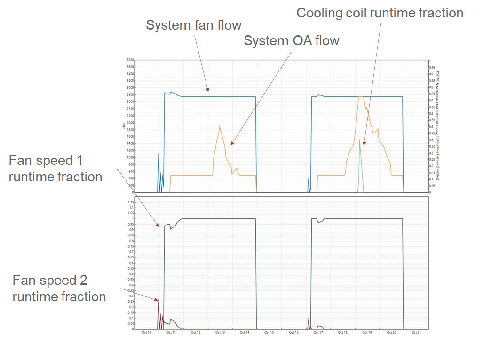
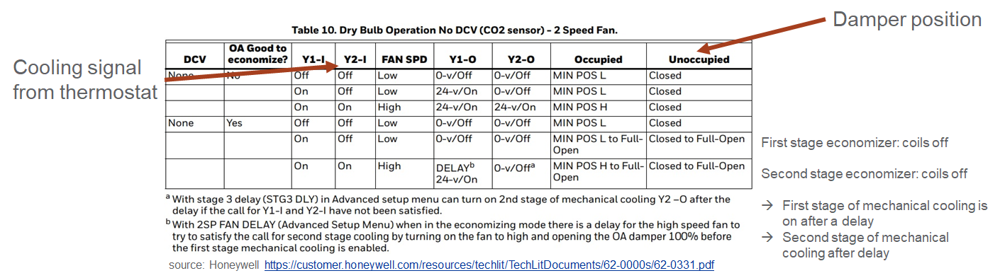
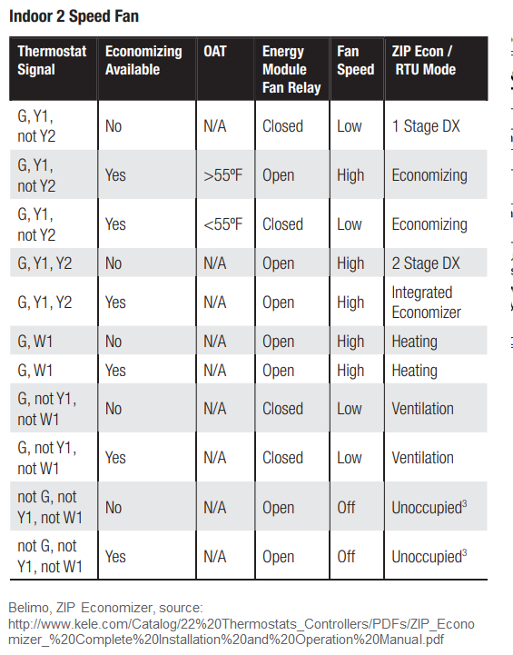
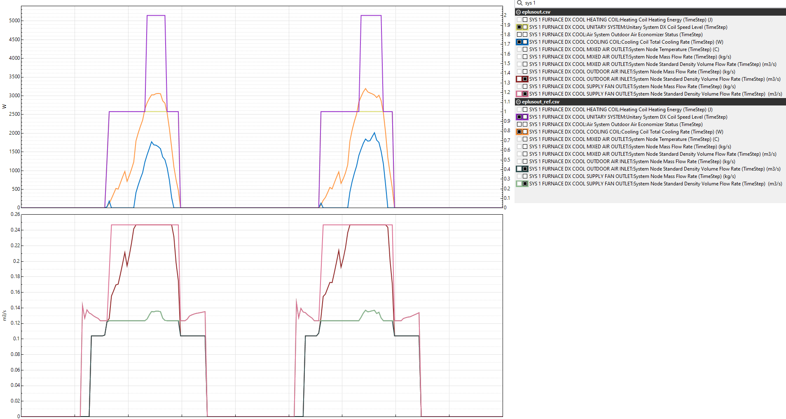

Multi-stage Economizer
================

**Jeremy Lerond, Pacific Northwest National Laboratory**

 - Original Date: Nov 28, 2022
 - Revision Date: Apr 18, 2023

## Justification for New Feature ##

Currently, unitary system economizer operation is dependent on the operating cooling speed being simulated. For example, if a unitary system with a two-speed fan is modeled along with an economizer, the economizer will be used at the low-speed fan whenever the system is operating at the low cooling operating speed, and at the high speed whenever the system is operating at the high operating speed, see Figure 0.



*Figure 0 - Simulation results excerpt for an `AirLoopHVAC:UnitarySystem` with a 2-speed `Fan:SystemModel` and a `Coil:Cooling:DX:MultiSpeed`*

This is not how actual single-zone systems, and their controllers operate. Figures 1 and 2 show actual sequence of operation of two widely used controllers. Both figures show that the economizer, if conditions allow its operation, runs first at low and high speed before mechanical cooling is turned on (and cooling stages/speeds incrementally increased).



*Figure 1 - Honeywell JADE controller*



*Figure 2 - Belimo ZIP Economizer controller*

Moreover, this control approach is a building energy code requirement. For instance, ASHRAE Standard 90.1-2019 states in Section 6.5.3.2.1 that "*units that include an air economizer to meet the requirements of Section 6.5.1 shall have a minimum of two speeds of fan control during economizer operation*".

The proposed feature will enable EnergyPlus to simulate more closely the performance of multi-speed single-zone equipment and enable building energy code requirements to be modeled.

## E-mail and  Conference Call Conclusions ##

## Overview ##

This proposal is to add a new feature to EnergyPlus to simulate multi-stage economizers for sensible-load based controlled single-zone systems modeled through an `AirLoopHVAC:UnitarySystem` object. Here, a multi-stage economizer is an economizer that is simulated independently of the operating cooling fan speed for a `AirLoopHVAC:UnitarySystem` object and dictates the overall system air flow rate.

## Approach ##

A new input will be added to the `Controller:OutdoorAir` object to turn on/off the proposed multi-stage economizer operation. The default behavior will be to use the current approach. With this new approach, the economizer operation dictates the system's air flow rate. EnergyPlus will determine which of the cooling speed air flow rate the economizer should use for its operation, what the mixed air temperature should be at this air flow to meet the zone load, and finally the outdoor air fraction necessary to meet the load. The approach will apply to constant and cycling fan operating modes.

## Testing/Validation/Data Sources ##

Appropriate unit tests will be added to test the new feature and make sure that the current implementation still works as it does now.

## Input Output Reference Documentation ##

Documentation for the new input will be added to the I/O reference guide. A description of how the two approaches (current and proposed one) will be provided for both the `Controller:OutdoorAir` object and `AirLoopHVAC:UnitarySystem`.

## Input Description ##

The following new input will be added to the `Controller:OutdoorAir` object:

```
Controller:OutdoorAir,
[...]
  A20; \field Economizer Staging Operation
       \type choice
       \key EconomizerFirst
       \key InterlockedWithMechanicalCooling
       \default InterlockedWithMechanicalCooling
       \note This input is only used when the Controller:OutdoorAir is used in conjunction
       \note with an AirLoopHVAC:UnitarySystem with multiple cooling speeds.
       \note When modeling an AirLoopHVAC:UnitarySystem with multiple cooling speeds
       \note (as specified in a UnitarySystemPerformance:Multispeed), EconomizerFirst runs
       \note the economizer at all speeds, all the way to the highest cooling speed before
       \note mechanical cooling is used to meet the load. InterlockedWithMechanicalCooling
       \note runs the economizer at the cooling speed chosen by the AirLoopHVAC:UnitarySystem.
       \note
       \note Use EconomizerFirst to model typical economizer staging for multi-speed
       \note packaged single-zone equipment with sensible load control (Control Type input of
       \note the AirLoopHVAC:UnitarySystem should be set to Load).
```

## Outputs Description ##

No new output is currently planned for this new feature.

## Engineering Reference ##

No updates to the engineering reference are currently planned for this new feature.

## Example File and Transition Changes ##

No transition files will be needed since the default will be wired to the current approach.

A new example file based on `UnitarySystem_MultiSpeedDX.idf` will be created to showcase the new feature. It will apply the new feature to all "multi-speed" coils: `Coil:Cooling:DX`, `Coil:Cooling:DX:MultiSpeed`, and `Coil:Cooling:DX:VariableSpeed`.

## Design Document ##
Based on the information presented above, the following design plan only pertains to sensible load-based control for unitary systems. It is also assumed that the economizer stages/speeds align with the system's cooling speed's air flow ratios.

- A new `UnitarySys` variable will be defined to indicate a system's economizer air flow speed at a particular timestep.
- A new function that will determine whether or not the current zone load can be met using the system's economizer or not, and if so, at what cooling air flow ratio, will be created.
  - The function will be called in `UnitarySys::controlUnitarySystemOutput`, just after the general purpose `PLR=0` system output calculation which are used to see if a system can meet the zone load without having to turn on the system's cooling coil.
  - The function will iterate through each of the system's cooling speed's air flow ratios to estimate at which one the zone load can be met. If the economizer can meet the zone load at any speed other than the minimum speed, the system's mixed air flow rate will be set (`state.dataAirLoop->AirLoopControlInfo(AirLoopNum).LoopFlowRateSet = true`) to the air flow rate corresponding to this cooling speed's air flow ratio using `state.dataAirLoop->AirLoopFlow(AirLoopNum).ReqSupplyFrac`: this cooling's speed air flow rate / maximum cooling speed air flow rate.
  - The mixed air node setpoint will then be recalculated based on the cooling speed's air flow rate since the setpoint calculated by the `SetpointManager:MixedAir` is based on the lowest cooling speed; Fan power at the cooling speed's air flow rate will be considered.
  - Finally, the new outdoor air fraction will be determined by calling `MixedAir::ManageOutsideAirSystem`.
- If the economizer is operating and is doing so at a speed higher than the lowest speed, the "compressor on" air flow rate and "compressor off" air flow rate assigned in `UnitarySys::setOnOffMassFlowRate` will be set to the flow rate corresponding to the economizer speed. That way, the system air flow is not driven by the operating cooling speed, but by the air flow rate needed by the economizer to meet the load.
- If the load is met at `PLR=0` at the determined system air flow rate and at the calculated outdoor air fraction `UnitarySys::controlUnitarySystemOutput` returns
- If the load is not met, and the economizer is active, the system will run at the high cooling speed air flow rate but `UnitarySys::controlUnitarySystemOutput` will iterate through each cooling speed to see the which one in addition to the economizer will meet the load. This mean that, following the manufacturer sequence of operation presented above, the economizer will force the system to run at high speed and that the cooling coil object will incrementally increase its speed to meet the load.

A preliminary version of this design has been implemented and tested on the `UnitarySystem_MultiSpeedDX.idf` example file (ran in Seattle, marine climate zone where economizer is usually advantageous). The figure below shows a simulation output for two of the days simulated. Results for the current implementation is presented by the colors under `eplusout_ref.csv` section, and the new implementation by the colors under the `eplusout.csv` section. As expected, the results show a trade-off between fan power and mechanical cooling. An annual simulation shows that the proposed design for that example file show a slightly lower energy use for a similar zone temperature control. In the debugger, the model also ran faster which is probably due to the fact the since more of the cooling load is met through economizer operation, less cooling speed iteration is needed for the cooling coil operation (not confirmed).


*Figure 3 - Results of Preliminary Implementation*

## References ##

- GitHub issue, [2 speed operation with Air Economizer in UnitarySystem](https://github.com/NREL/EnergyPlus/issues/6109)
- ASHRAE. 2019. ANSI/ASHRAE/IES 90.1-2019, Energy Standard for Buildings Except Low-Rise
Residential Buildings. ASHRAE, Atlanta, GA
- [Honeywell JADE controller](https://customer.honeywell.com/resources/techlit/TechLitDocuments/62-0000s/62-0331.pdf)
- [Belimo ZIP Economizer controller](http://www.kele.com/Catalog/22%20Thermostats_Controllers/PDFs/ZIP_Economizer_%20Complete%20Installation%20and%20Operation%20Manual.pdf)
