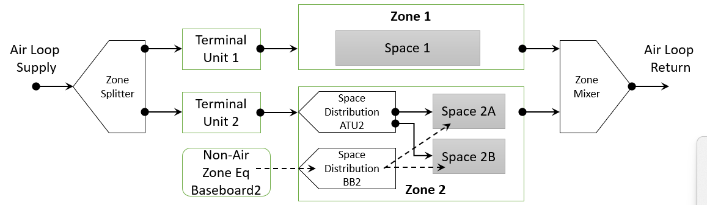

Extend Spaces to Sizing and HVAC
================

**Michael J. Witte, GARD Analytics, Inc.**

 - Original April 26, 2023
 - Revised May 5, 2023 - and now for something somewhat different
 - Revised May 19, 2023 - add conf call and email comments, add design
 - Revised Jun 14, 2023 - some editing and more design

## Table of Contents ##

[Justification for New Feature](#justification-for-new-feature)

[E-mail and Conference Call Conclusions](#e-mail-and-conference-call-conclusions)

[Overiew](#overview)

[Approach](#approach)

[Testing/Validation/Data Sources](#testingvalidationdata-sources)

[Input Description](#input-description)

[Outputs Description](#outputs-description)

[Engineering Reference](#engineering-reference)

[Example File and Transition Changes](#example-file-and-transition-changes)

[Design](#design)

## Justification for New Feature ##

Space was added as a new concept in v9.6. Each EnergyPlus Zone contains one or more Spaces which are used for:

  * assigning and allocating internal gains
  * specifying enclosure boundaries,
  * reporting inputs grouped by space types, and 
  * reporting select output grouped by space types.
  
For the zone heat balance each thermal Zone is composed of one or more Spaces controlled by a single thermostat or HVAC system control point such as a VAV terminal unit.

In version 23.1 options were added to perform the air heat balance for each Space or each Zone, and space-level heat balance output variables were added.

This NFP proposes additional optional capabilities:

  * Space-level (room-by-room) sizing to size individual room diffusers or equipment such as PTACs. 
  
  * Zone-level equipment may be sized to either the coincident or non-coincident peak across the Spaces (rooms). 

  * Space-by-space HVAC simulation to allow modeling the impact of thermostat placement in a specific space (room). This may result in less-than-ideal temperature control for other spaces in the same Zone. For some applications, such as a unitary system with a single thermostat, this can already be modeled with the "control zone" options. This feature would extend to other system types, including VAV systems or unitary systems with zoning controls.

## E-mail and Conference Call Conclusions ##

Lots of useful comments and input from Rich R.

Other conf call and email comments/questions:

Q1: What about return air nodes from spaces?

A1: The hope is that return air can be collected at the zone level, but implementation may require adding space return nodes.

Q2: These Setpoint Not Met Time output variables seem important. Seems like a clear method for how the space level results get rolled up to the zone level will be needed, eg. average temperature for zone first and then compare to setpoint, or is zone unmet if any spaces are unmet.

A2: Agreed, initial thought is that space hours not met will be reported separately, and zone hours not met would be based on the zone thermostat location.


## Overview ##

The `ZoneAirHeatBalanceAlgorithm` object has options for space heat balance.
```
ZoneAirHeatBalanceAlgorithm,
    ThirdOrderBackwardDifference,  !- Algorithm
    Yes,                      !- Do Space Heat Balance for Sizing
    Yes;                      !- Do Space Heat Balance for Simulation
```
These currently result in additional output variables for Space, but nothing more.

### Extend Spaces to Sizing
When "Do Space Heat Balance for Sizing" is active, the following sizing changes will be active:

1. Sizing results will be reported for every Space and Zone.
2. Space sizing will follow the same method currently used for Zone sizing.
3. Zone sizing will be based on coincident or non-coincident Space sizing results.
4. Zone sizing results will be used to size air loops.
5. Space sizing results will be used to size space-level HVAC if specified.


### Extend Spaces to HVAC
Inputs will be added to describe optional Space-level HVAC equipment, such as:

1. Space air terminal units supplied by a single zone-level air distribution unit. e.g. A zone-level VAV damper supplying multiple space diffusers.
2. Self-contained zone equipment, such as PTACs and fancoil units may be distribute to one or more Spaces.
3. Thermostats will still control a Zone, but they may be placed in a specific Space and will control that Space's temperature.
4. Finish adding Space Name options to various features such as ZoneThermalChimney (if budget allows, otherwise restrict these to single-space zones).


## Approach ##
### Sizing
* Refactor sizing so it can be at the Zone or Space level, with reporting for both.

### HVAC
* Leave exsiting ZoneHVAC inputs as-is with the addition of an optional field or two.
* Add inputs to distribute Zone HVAC equipment supply air flows to one or more Spaces within a Zone.
* Add inputs to distribute non-air Zone HVAC equipment output to one or more Spaces within a Zone.
* Allow thermostat control to be placed in a specific Space or averaged across the Zone.
* Keep return flows at the Zone level.




## Testing/Validation/Data Sources ##

Compare Space vs Zone-level results.

## Input Description ##
Some new objects and some changes to existing objects are proposed.

### ZoneControl:Thermostat:\*
* *Change field "Zone or ZoneList Name" to "Zone or ZoneList or Space or SpaceList Name."*
* When a thermostat is assigned to a Zone, it will calculate the lumped loads to setpoint for all spaces in the zone.
* When a thermostat is assigned to a Space, it will calculate the loads to setpoint for that Space.

### SpaceHVAC:EquipmentConnections
* *New object to connect nodes to a Space, same as ZoneHVAC:EquipmentConnections, but for Spaces.*

```
SpaceHVAC:EquipmentConnections,
       \memo Specifies the HVAC equipment connections for a Space. Node names are specified for the
       \memo Space air node and air inlet nodes.
  A1 , \field Space Name
       \required-field
       \type object-list
       \object-list SpaceNames
  A2 , \field Space Air Inlet Node or NodeList Name
       \type node
  A3 , \field Space Air Exhaust Node or NodeList Name
       \type node
  A4 , \field Space Air Node Name
       \required-field
       \type node
```

### ZoneHVAC:SpaceDistribution:AirFlow and ZoneHVAC:SpaceDistribution:NonAirFlow
* *New objects, split the air flow or non-air output from a single piece of zone equipment to one or more Spaces.*
* *References a piece of zone equipment to attach to, similar to AirTerminal:SingleDuct:Mixer.*
* *Listed in a ZoneHVAC:SpaceDistributionList that's referenced at the end of the ZoneHVAC:EquuipmentConnections object
```
ZoneHVAC:SpaceDistribution:AirFlow,
       \extensible:3
       \memo Distributes the airflow from a piece of zone equipment to one or more Spaces in the Zone.
   A1, \field Name
       \required-field
       \reference SpaceDistributionNames
   A2, \field Zone Equipment Object Type
       \required-field
       \type choice
       \key ZoneHVAC:TerminalUnit:VariableRefrigerantFlow
       \key ZoneHVAC:AirDistributionUnit
       \key ZoneHVAC:EnergyRecoveryVentilator
       \key ZoneHVAC:EvaporativeCoolerUnit
       \key ZoneHVAC:HybridUnitaryHVAC
       \key ZoneHVAC:ForcedAir:UserDefined
       \key ZoneHVAC:FourPipeFanCoil
       \key ZoneHVAC:OutdoorAirUnit
       \key ZoneHVAC:PackagedTerminalAirConditioner
       \key ZoneHVAC:PackagedTerminalHeatPump
       \key ZoneHVAC:UnitHeater
       \key ZoneHVAC:UnitVentilator
       \key ZoneHVAC:VentilatedSlab
       \key ZoneHVAC:WaterToAirHeatPump
       \key ZoneHVAC:WindowAirConditioner
       \key ZoneHVAC:Dehumidifier:DX
       \key ZoneHVAC:IdealLoadsAirSystem
       \key ZoneHVAC:RefrigerationChillerSet
       \key Fan:ZoneExhaust
       \key WaterHeater:HeatPump:PumpedCondenser
       \key WaterHeater:HeatPump:WrappedCondenser
       \key HeatExchanger:AirToAir:FlatPlate
       \key AirLoopHVAC:UnitarySystem
   A3, \field Zone Equipment Name
       \required-field
       \type object-list
       \object-list ZoneEquipmentNames
   A4, \field Zone Equipment Outlet Node Name
       \required-field
       \type node
   A5, \field Thermostat Control Method
       \type choice
       \key SingleSpace
       \key SpaceAverage
       \default SpaceAverage
   A6, \field Thermostat Space Name
       \note Used with SingleSpace thermostat control method
       \type object-list
       \object-list SpaceNames
   A7, \field Space Sizing Basis
       \type choice
       \default DesignLoad
       \key DesignLoad
       \key FloorArea
       \key Volume
       \key PerimeterLength
   A8, \field Space 1 Name
       \begin-extensible
       \required-field
       \type object-list
       \object-list SpaceNames
   A9, \field Space 1 Supply Node Name
       \note Matches a SpaceHVAC:EquipmentConnections Inlet Node Name
       \required-field
       \type node
   N1, \field Space 1 Maximum Air Flow Rate
       \default autosize
       \units m3/s
       \minimum 0.0
       \autosizable
  A10, \field Space 2 Name
       \required-field
       \type object-list
       \object-list SpaceNames
  A11, \field Space 2 Supply Node Name
       \required-field
       \type node
   N2; \field Space 2 Maximum Air Flow Rate
       \default autosize
       \units m3/s
       \minimum 0.0
       \autosizable

ZoneHVAC:SpaceDistribution:NonAirFlow,
       \extensible:2
       \memo Distributes the output from a piece of zone equipment to one or more Spaces in the Zone.
   A1, \field Name
       \required-field
       \reference SpaceDistribution
   A2, \field Zone Equipment Object Type
       \required-field
       \type choice
       \key ZoneHVAC:Baseboard:RadiantConvective:Electric
       \key ZoneHVAC:Baseboard:RadiantConvective:Water
       \key ZoneHVAC:Baseboard:RadiantConvective:Steam
       \key ZoneHVAC:CoolingPanel:RadiantConvective:Water
       \key ZoneHVAC:Baseboard:Convective:Electric
       \key ZoneHVAC:Baseboard:Convective:Water
       \key ZoneHVAC:HighTemperatureRadiant
       \key ZoneHVAC:LowTemperatureRadiant:VariableFlow
       \key ZoneHVAC:LowTemperatureRadiant:ConstantFlow
       \key ZoneHVAC:LowTemperatureRadiant:Electric
   A3, \field Zone Equipment Name
       \required-field
       \type object-list
       \object-list ZoneEquipmentNames
   A5, \field Thermostat Control Method
       \type choice
       \key SingleSpace
       \key SpaceAverage
       \default SpaceAverage
   A6, \field Thermostat Space Name
       \note Used with SingleSpace thermostat control method
       \type object-list
       \object-list SpaceNames
   A7, \field Space Sizing Basis
       \type choice
       \default DesignLoad
       \key DesignLoad
       \key FloorArea
       \key Volume
       \key PerimeterLength
   A8, \field Space 1 Name
       \begin-extensible
       \required-field
       \type object-list
       \object-list SpaceNames
   N1, \field Space 1 Output Fraction
       \default autosize
       \units dimensionless
       \minimum 0.0
       \maximum 1.0
       \autosizable
   A9, \field Space 2 Name
       \required-field
       \type object-list
       \object-list SpaceNames
   N2, \field Space 2 Output Fraction
       \default autosize
       \units dimensionless
       \minimum 0.0
       \maximum 1.0
       \autosizable
```

### ZoneHVAC:SpaceDistributionList
* *New object to list ZoneHVAC:SpaceDistribution objects for a Zone.*
```
  A1 , \field Name
       \ memo List of ZoneHVAC:SpaceDisribution objects for a given Zone.
       \ memo There must be one space distribution object for each piece of equipment in the ZoneHVAC:EquipmentList (order does not matter).
       \extensible:2
       \required-field
       \reference SpaceDistributionLists
  A2 , \field Space Distribution 1 Object Type
       \begin-extensible
       \required-field
       \type choice
       \key ZoneHVAC:SpaceDistribution:AirFlow
       \key ZoneHVAC:SpaceDistribution:NonAirFlow
  A3 , \field Space Distribution 1 Name
       \required-field
       \type object-list
       \object-list SpaceDistributionNames   
```

### ZoneHVAC:EquipmentConnections
* *Add a new field to reference a ZoneHVAC:SpaceDistributionList object.*

```
ZoneHVAC:EquipmentConnections,

  A9, \field Space Distribution List Name
      \type object-list
      \object-list SpaceDistributionLists
```

### ZoneRefrigerationDoorMixing
(If budget allows, otherwise limit these to single-space zones.)
* *Change field "Zone 1 Name" to "Zone or Space Name 1."*

* *Change field "Zone 2 Name" to "Zone or Space Name 2."*

### ZoneCoolTower:Shower
(If budget allows, otherwise limit these to single-space zones.)
* *Change field "Zone Name" to "Zone or Space Name."*

### ZoneThermalChimney
(If budget allows, otherwise limit these to single-space zones.)
* *Change field "Zone N Name" to "Inlet Zone or Space Name N."*

### idf Example
```
ZoneHVAC:EquipmentConnections,
  Zone 1,                  !- Zone Name
  Zone 1 Eq,               !- Zone Conditioning Equipment List Name
  Zone 1 In Node,          !- Zone Air Inlet Node or NodeList Name
  ,                        !- Zone Air Exhaust Node or NodeList Name
  Zone 1 Node,             !- Zone Air Node Name
  Zone 1 Out Node;         !- Zone Return Air Node or NodeList Name
  ,                        !- Zone Return Air Node 1 Flow Rate Fraction Schedule Name
  ,                        !- Zone Return Air Node 1 Flow Rate Basis Node or NodeList Name
  Zone 1 Space Distribution; !- Space Distribution List Name
  
ZoneHVAC:EquipmentList,
  Zone 1 Eq,               !- Name
  SequentialLoad,          !- Load Distribution Scheme
  ZoneHVAC:Baseboard:Convective:Electric,  !- Zone Equipment 1 Object Type
  Zone 1 Baseboard,        !- Zone Equipment 1 Name
  1,                       !- Zone Equipment 1 Cooling Sequence
  1,                       !- Zone Equipment 1 Heating or No-Load Sequence
  ,                        !- Zone Equipment 1 Sequential Cooling Fraction Schedule Name
  ,                        !- Zone Equipment 1 Sequential Heating Fraction Schedule Name
  ZoneHVAC:AirDistributionUnit,  !- Zone Equipment 1 Object Type
  Zone 1 ATU,              !- Zone Equipment 1 Name
  2,                       !- Zone Equipment 1 Cooling Sequence
  2,                       !- Zone Equipment 1 Heating or No-Load Sequence
  ,                        !- Zone Equipment 1 Sequential Cooling Fraction Schedule Name
  ;                        !- Zone Equipment 1 Sequential Heating Fraction Schedule Name

ZoneHVAC:SpaceDistributionList,
  Zone 1 Space Distribution,  !- Name
  ZoneHVAC:SpaceDistribution:AirFlow, !- Space Distribution 1 Object Type
  Zone 1 VAV Splitter,     !- Space Distribution 1 Object Name
  ZoneHVAC:SpaceDistribution:NonAirFlow, !- Space Distribution 1 Object Type
  Zone 1 Baseboard Splitter; !- Space Distribution 2 Object Name
    
SpaceHVAC:EquipmentConnections,
  Space 1A,                !-Space Name
  Space 1A VAV Supply Node, !-Space Air Inlet Node or NodeList Name
  ,                        !-Space Air Exhanust Node or NodeList Name
  Space 1A Node;           !-Space Air Node Name

SpaceHVAC:EquipmentConnections,
  Space 1B,                !-Space Name
  Space 1B VAV Supply Node, !-Space Air Inlet Node or NodeList Name
  ,                        !-Space Air Exhanust Node or NodeList Name
  Space 1B Node;           !-Space Air Node Name
 
ZoneHVAC:SpaceDistribution:AirFlow,
   Zone 1 VAV Splitter,    !-Name
   ZoneHVAC:AirDistributionUnit, !-Zone Equipment Object Type
   Zone 1 VAV Box,         !-Zone Equipment Name
   Zone 1 VAV Outlet Node, !-Zone Equipment Outlet Node Name
   SingleSpace,            !-Thermostat Control Method
   Space 1A,               !-Thermostat Space Name
   DesignLoad,             !-Space Sizing Basis
   Space 1A,               !-Space 1 Name
   Space 1A VAV Supply Node, !-Space 1 Supply Node Name
   autosize,               !-Space 2 Maximum Air Flow Rate {m3/s}
   Space 1B,               !-Space 2 Name
   Space 1B VAV Supply Node, !-Space 2 Supply Node Name
   autosize;               !-Space 2 Maximum Air Flow Rate {m3/s}

ZoneHVAC:SpaceDistribution:NonAirFlow,
   Zone 1 Baseboard Splitter, !-Name
   ZoneHVAC:Baseboard:Convective:Electric, !-Zone Equipment Object Type
   Zone 1 Baseboard,       !-Zone Equipment Name
   SpaceAverage,           !-Thermostat Control Method
   Space 1A,               !-Thermostat Space Name
   PerimeterLength,        !-Space Sizing Basis
   Space 1A,               !-Space 1 Name
   autosize,               !-Space 1 Output Fraction
   Space 1B,               !-Space 2 Name
   autosize;               !-Space 2 Output Fraction
```


## Outputs Description ##
Existing relevant Space Output Variables (from 5ZoneAirCooledWithSpaceHeatBalance.rdd)
```
Output:Variable,*,Space Mean Air Temperature,hourly; !- Zone Average [C]
Output:Variable,*,Space Operative Temperature,hourly; !- Zone Average [C]
Output:Variable,*,Space Mean Air Dewpoint Temperature,hourly; !- Zone Average [C]
Output:Variable,*,Space Mean Air Humidity Ratio,hourly; !- Zone Average [kgWater/kgDryAir]
Output:Variable,*,Space Air Heat Balance Internal Convective Heat Gain Rate,hourly; !- HVAC Average [W]
Output:Variable,*,Space Air Heat Balance Surface Convection Rate,hourly; !- HVAC Average [W]
Output:Variable,*,Space Air Heat Balance Interzone Air Transfer Rate,hourly; !- HVAC Average [W]
Output:Variable,*,Space Air Heat Balance Outdoor Air Transfer Rate,hourly; !- HVAC Average [W]
Output:Variable,*,Space Air Heat Balance System Air Transfer Rate,hourly; !- HVAC Average [W]
Output:Variable,*,Space Air Heat Balance System Convective Heat Gain Rate,hourly; !- HVAC Average [W]
Output:Variable,*,Space Air Heat Balance Air Energy Storage Rate,hourly; !- HVAC Average [W]

Output:Variable,*,Space Air Temperature,hourly; !- HVAC Average [C]
Output:Variable,*,Space Air Humidity Ratio,hourly; !- HVAC Average []
Output:Variable,*,Space Air Relative Humidity,hourly; !- HVAC Average [%]

Output:Variable,*,Space Air System Sensible Heating Energy,hourly; !- HVAC Sum [J]
Output:Variable,*,Space Air System Sensible Cooling Energy,hourly; !- HVAC Sum [J]
Output:Variable,*,Space Air System Sensible Heating Rate,hourly; !- HVAC Average [W]
Output:Variable,*,Space Air System Sensible Cooling Rate,hourly; !- HVAC Average [W]
Output:Variable,*,Space Predicted Sensible Load to Setpoint Heat Transfer Rate,hourly; !- HVAC Average [W]
Output:Variable,*,Space Predicted Sensible Load to Heating Setpoint Heat Transfer Rate,hourly; !- HVAC Average [W]
Output:Variable,*,Space Predicted Sensible Load to Cooling Setpoint Heat Transfer Rate,hourly; !- HVAC Average [W]
Output:Variable,*,Space System Predicted Sensible Load to Setpoint Heat Transfer Rate,hourly; !- HVAC Average [W]
Output:Variable,*,Space System Predicted Sensible Load to Heating Setpoint Heat Transfer Rate,hourly; !- HVAC Average [W]
Output:Variable,*,Space System Predicted Sensible Load to Cooling Setpoint Heat Transfer Rate,hourly; !- HVAC Average [W]

Output:Variable,*,Space Predicted Moisture Load Moisture Transfer Rate,hourly; !- HVAC Average [kgWater/s]
Output:Variable,*,Space Predicted Moisture Load to Humidifying Setpoint Moisture Transfer Rate,hourly; !- HVAC Average [kgWater/s]
Output:Variable,*,Space Predicted Moisture Load to Dehumidifying Setpoint Moisture Transfer Rate,hourly; !- HVAC Average [kgWater/s]
Output:Variable,*,Space System Predicted Moisture Load Moisture Transfer Rate,hourly; !- HVAC Average [kgWater/s]
Output:Variable,*,Space System Predicted Moisture Load to Humidifying Setpoint Moisture Transfer Rate,hourly; !- HVAC Average [kgWater/s]
Output:Variable,*,Space System Predicted Moisture Load to Dehumidifying Setpoint Moisture Transfer Rate,hourly; !- HVAC Average [kgWater/s]
```

*Space equivalents may be added for the following zone output variables (not sure about some of these):*

```
Zone,Average,Zone Mean Radiant Temperature [C]

HVAC,Sum,Zone Infiltration Sensible Heat Loss Energy [J]
HVAC,Sum,Zone Infiltration Sensible Heat Gain Energy [J]
HVAC,Sum,Zone Infiltration Latent Heat Loss Energy [J]
HVAC,Sum,Zone Infiltration Latent Heat Gain Energy [J]
HVAC,Sum,Zone Infiltration Total Heat Loss Energy [J]
HVAC,Sum,Zone Infiltration Total Heat Gain Energy [J]
HVAC,Average,Zone Infiltration Current Density Volume Flow Rate [m3/s]
HVAC,Average,Zone Infiltration Standard Density Volume Flow Rate [m3/s]
HVAC,Sum,Zone Infiltration Current Density Volume [m3]
HVAC,Sum,Zone Infiltration Standard Density Volume [m3]
HVAC,Sum,Zone Infiltration Mass [kg]
HVAC,Average,Zone Infiltration Mass Flow Rate [kg/s]
HVAC,Average,Zone Infiltration Air Change Rate [ach]

HVAC,Average,Zone Thermostat Air Temperature [C]
Zone,Average,Zone Thermostat Control Type []
HVAC,Average,Zone Thermostat Heating Setpoint Temperature [C]
HVAC,Average,Zone Thermostat Cooling Setpoint Temperature [C]
Zone,Average,Zone Adaptive Comfort Operative Temperature Set Point [C]
HVAC,Average,Zone Predicted Sensible Load Room Air Correction Factor []

HVAC,Sum,Zone Oscillating Temperatures Time [hr]
HVAC,Sum,Zone Oscillating Temperatures During Occupancy Time [hr]
HVAC,Sum,Zone Oscillating Temperatures in Deadband Time [hr]
HVAC,Sum,Facility Any Zone Oscillating Temperatures Time [hr]
HVAC,Sum,Facility Any Zone Oscillating Temperatures During Occupancy Time [hr]
HVAC,Sum,Facility Any Zone Oscillating Temperatures in Deadband Time [hr]
Zone,Sum,Zone Thermal Comfort ASHRAE 55 Simple Model Summer Clothes Not Comfortable Time [hr]
Zone,Sum,Zone Thermal Comfort ASHRAE 55 Simple Model Winter Clothes Not Comfortable Time [hr]
Zone,Sum,Zone Thermal Comfort ASHRAE 55 Simple Model Summer or Winter Clothes Not Comfortable Time [hr]

Zone,Sum,Zone Heating Setpoint Not Met Time [hr]
Zone,Sum,Zone Heating Setpoint Not Met While Occupied Time [hr]
Zone,Sum,Zone Cooling Setpoint Not Met Time [hr]
Zone,Sum,Zone Cooling Setpoint Not Met While Occupied Time [hr]
```

## Engineering Reference ##

Summary paragraphs or sentences will be added to indicate that references to "Zone" throughout the heat balance documentation are applicable to "Space or Zone".

## Example File and Transition Changes ##

* No transition will be required for idf inputs.

* Field name changes will be required for epJSON inputs.

* The existing example file 5ZoneAirCooledWithSpaces will extended to add Space HVAC objects.

## Design ##

### Sizing ###

When Space sizing is requested, the following arrays will be created for Spaces.

```
    Array2D<DataSizing::ZoneSizingData> ZoneSizing;               // Data for zone sizing (all data, all design)
    EPVector<DataSizing::ZoneSizingData> FinalZoneSizing;         // Final data for zone sizing including effects
    Array2D<DataSizing::ZoneSizingData> CalcZoneSizing;           // Data for zone sizing (all data)
    EPVector<DataSizing::ZoneSizingData> CalcFinalZoneSizing;     // Final data for zone sizing (calculated only)
```

The main calculation flow for Zone sizing is:

* `SizingManager::ManageSizing`
    * Get sizing inputs (`GetOARequirements . . . GetPlantSizingInput`).
    * Loop over sizing environments and days
        ```
          UpdateZoneSizing(state, Constant::CallIndicator::BeginDay);
          Loop over hours and timesteps
            ManageWeather(state);
            UpdateSysSizing(state, Constant::CallIndicator::DuringDay);
            ManageHeatBalance(state);
          UpdateZoneSizing(state, Constant::CallIndicator::EndDay);
        UpdateZoneSizing(state, Constant::CallIndicator::EndZoneSizingCalc);
        ```
        * Repeat (with a pulse) if zone component loads report is requested.
 * `ZoneEquipmentManager::UpdateZoneSizing` (where all the work is done.)
     * `case Constant::CallIndicator::BeginDay:`
         * Do some initializations on `CalcZoneSizing`
     * `case Constant::CallIndicator::DuringDay:`
         * Called from `HVACManager`
         * save the results of the ideal zone component calculation in the CalcZoneSizing sequence variables
         * Works on `ZoneSizing` and `CalcZoneSizing`
     * `case Constant::CallIndicator::EndDay:`
         * Compute moving averages
         * Save values at peak heating and cooling
         * Works on `CalcZoneSizing` and `CalcFinalZoneSizing`
     * `case Constant::CallIndicator::EndZoneSizingCalc:`
         * Apply EMS overrides
         * Output sizing results from `CalcFinalZoneSizing`
         * Move sizing data into final sizing array according to sizing method
         * Works on `CalcZoneSizing`, `CalcFinalZoneSizing`, `ZoneSizing`, and `FinalZoneSizing`
         * Lots going on in here.
     * Each case block has one or more zone loops
         * Move the guts of each loop to a separate function
         * Pass in the pertinent zone or space arrays as function parameters
         * Add a section to collect space results to the zone level
     * When doing Space sizing, which arrays are really needed?
         * All four arrays will be needed for Space `SpaceSizing`, `CalcSpaceSizing`, `CalcFinalSpaceSizing`, and `FinalSpaceSizing`
         * It's possible that only `FinalZoneSizing` is needed at the zone level. But will need to search the code to see if any of the other zone sizing arrays might be accessed elsewhere outside of the zone sizing calcs.
         
### HVAC ###

The main calculation flow for Zone and Space HVAC in `HVACManager:ManageHVAC` is as follows, with notes about changes required for Space-HVAC.

* `ZoneTempPredictorCorrector::ManageZoneAirUpdates(... GetZoneSetPoints)`
    * `CalcZoneAirTempSetPoints`
       * Add Space-level thermostats
* `ZoneTempPredictorCorrector::ManageZoneAirUpdates(... PredictStep)`
    * `PredictSystemLoads`
       * Add Space-level thermostats.
       * Space-level predicted loads are already implemented.
       * Some "TODO: For Now" comments need to be replaced with full Space-level assignments
* `SimHVAC`
    * `SetPointManager::ManageSetPoints(state);`
    * `SimSelectedEquipment`
        * `SimAirServingZones::ManageAirLoops`
        * `ZoneEquipmentManager::ManageZoneEquipment`
            * Add functions here to distribute zone-level airflows and non-air HVAC equipment output to Spaces
        * `PlantManager::ManagePlantLoops`
* `ZoneTempPredictorCorrector::ManageZoneAirUpdates(... CorrectStep)`
    * `correctZoneAirTemps`
       * Space-level corrections for air temps and humidity are already implemented.
       * Some "TODO: For Now" comments need to be replaced with full Space-level assignments


