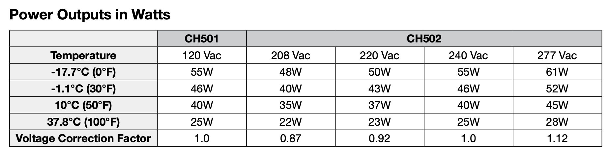

Enhancement of Crankcase Heater in EnergyPlus
================

**Yujie Xu, Tianzhen Hong**

**Lawrence Berkeley National Laboratory***

 - Original Date: Apr 11, 2023
 - Modified Date: Apr 11, 2023

## Justification for Feature Update

Crankcase heaters use a simple electrical circuit to create heat within the
crankcase when the compressor of chiller or heat pump is not in use. The heat
keeps the refrigerant from condensing and prevents refrigerant from migrating
through the seals into the oil. Poor control of crankcase heater could result in
excessive energy consumption as high as about 2-6% of the total cooling energy
[1]. Some of the existing products start to provide variable heater power based
on different outdoor temperature condition [2], [3]. Currently, EnergyPlus can
only model a constant power crankcase heater with a temperature cutoff. This
feature proposes to enhance the crankcase heater in EnergyPlus to allow for
variable heater power, which enables to model realistic performance of heat
pumps.

## Overview ##

According to [1], existing crankcase heater control mode is usually one or a combination of the following:
1.	Always on
2.	Positive temperature coefficient (PTC) heater: decreased power as a result of increased heater temperature, which causes increased resistance
3.	Off when compressor is on
4.	Turning off when ambient temperature is greater than some threshold or the difference between the compressor and the ambient temperature is larger than the threshold

EnergyPlus uses a combination of the above option 3 and 4 and models a
constant-power crankcase heater with a temperature threshold to switch on in
cold weather when the compressor is off.

For a series of heating/cooling coil objects (*Coil:Cooling:DX:\* *,
*Coil:Heating:DX:\* *, and *Coil:WaterHeating:AirToWaterHeatPump:\* *, the following
two fields are used in crankcase heater calculations. According to the
documentation, the crankcase heater is switched on if the outdoor air dry-bulb
temperature is below the "Maximum Outdoor Dry-bulb Temperature for Crankcase
Heater Operation" and the compressor is not running.

    Ni, \field Crankcase Heater Capacity
       \type real
       \minimum 0.0
       \default 0.0
       \units W
       \ip-units W
    Nj, \field Maximum Outdoor Dry-Bulb Temperature for Crankcase Heater Operation
       \type real
       \minimum 0.0
       \default 10.0
       \units C

For VRF objects and the WaterToAirHeatPump (HVACTemplate:System:VRF,
AirConditioner:VariableRefrigerantFlow), the following four fields are used in
crankcase heater-related calculations. Each compressor has a constant power
crankcase heater. The condensing unit part-load ratio determines how many
crankcase heaters are on when the outdoor temperature is lower than the
threshold specified in "Maximum Outdoor Dry-Bulb Temperature for Crankcase
Heater". If there are n compressors, then k crankcase heater is on when
part-load-ratio is less than 1 – k/n, during the period when the outdoor
temperature is low enough.

    Ni, \field Crankcase Heater Power per Compressor
          \type real
          \units W
          \default 33.0
          \note Enter the value of the resistive heater located in the compressor(s). This heater
          \note is used to warm the refrigerant and oil when the compressor is off.
    Nj, \field Number of Compressors
          \type integer
          \units dimensionless
          \default 2
          \note Enter the total number of compressor. This input is used only for crankcase
          \note heater calculations.
    Nk, \field Ratio of Compressor Size to Total Compressor Capacity
          \type real
          \units W/W
          \default 0.5
          \note Enter the ratio of the first stage compressor to total compressor capacity.
          \note All other compressors are assumed to be equally sized. This inputs is used
          \note only for crankcase heater calculations.
    Nl, \field Maximum Outdoor Dry-Bulb Temperature for Crankcase Heater
          \type real
          \units C
          \default 5.0
          \note Enter the maximum outdoor temperature above which the crankcase heaters are disabled.

Some crankcase heater products have variable power at different outdoor
temperature (Figure 1). However, the heater power in EnergyPlus is constant.
This feature proposes to enable modeling of temperature-dependent crankcase
heater power.

 Figure 1. Example of a crankcase heater with different power output at different temperature [2].

## Approach

To allow for a non-constant crankcase heater power, the feature proposes to add
an optional field enabling users to specify a curve or lookup table after the
field "Crankcase Heater Capacity". The curve or lookup table can describe the
temperature dependent heater power. If this field is missing or empty, the
default assumption is constant crankcase heater power which is consistent with
the current EnergyPlus behavior. See section “IDD Object changes” for more
details.

## Testing/Validation/Data Source(s)

The feature will be tested and demonstrated with a test file derived from 
MultiSpeedHP_StagedThermostat.idf

## IDD Object changes

For the following idd objects which contain the input field *Crankcase Heater
Capacity*, an optional input field, *Outdoor Temperature Dependent Crankcase
Heater Capacity Curve Name*, will be add to reference a curve or table object
that defines the relationship between outdoor air temperature and crankcase
heater capacity.

* Coil:Cooling:DX:CurveFit:Performance
* Coil:Cooling:DX:SingleSpeed
* Coil:Cooling:DX:MultiSpeed
* Coil:Cooling:DX:VariableSpeed
* Coil:Cooling:DX:TwoStageWithHumidityControlMode
* Coil:Heating:DX:SingleSpeed
* Coil:Heating:DX:MultiSpeed
* Coil:Heating:DX:VariableSpeed
* Coil:WaterHeating:AirToWaterHeatPump:Pumped
* Coil:WaterHeating:AirToWaterHeatPump:Wrapped
* Coil:WaterHeating:AirToWaterHeatPump:VariableSpeed

The added optional field is:

    Ai, \field Crankcase Heater Capacity Function of Outdoor Temperature Curve Name
        \note A Curve:* or Table:Lookup object encoding the relationship between
        \note the crankcase heater capacity and the outdoor air temperature. When this field is 
        \note missing or empty, constant crankcase heater capacity will be assumed.

For the following idd objects with the "Crankcase Heater Power per Compressor"
field, the addition of an optional capacity curve field will be combined in a
VRF-focused feature in the future.

* HVACTemplate:System:VRF
* AirConditioner:VariableRefrigerantFlow
* AirConditioner:VariableRefrigerantFlow:FluidTemperatureControl
* AirConditioner:VariableRefrigerantFlow:FluidTemperatureControl:HR

## Proposed additions to Meters:

N/A

## Proposed Report Variables:

N/A
 
## References

[1]	J. McHugh, M. Energy, A. German, and F. Energy, "Heat Pump Controls: Decarbonizing Buildings While Avoiding Electric Resistance Heating and Higher Net Peak Demand," presented at the 2022 Summer Study on Energy Efficiency in Buildings, California, California, 2022.
[2]	EasyHeat, "Crankcase Heater Specification Sheet," 2013. [Online]. Available: https://www.appleton.emerson.com/documents/specification-sheet-crankcase-heaters-40001-004-easyheat-en-7440916.pdf
[3]	Pentair, "Self-regulating crankcase heater," 2014.
