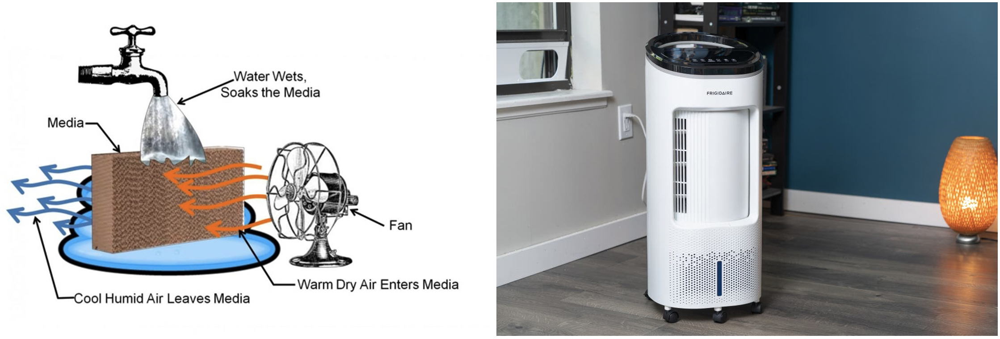

Enhancement of Evaporative Cooler in EnergyPlus
================

**Yujie Xu, Tianzhen Hong**

**Lawrence Berkeley National Laboratory***

 - Original Date: Apr 7, 2023
 - Modified Date: Apr 11, 2023

## Justification for Feature Update

As global climate change continues, the frequency, duration and intensity of heatwaves could increase. As an affordable and energy efficient cooling option [1], evaporative cooling could become more prevalent in the future, especially in hot and dry climates. As a result, it is crucial to provide accurate and more user-friendly simulation support for prototyping new evaporative coolers and their applications. With this motivation, this EnergyPlus feature is proposed to provide an additional relative humidity-driven control option.

 Figure 1. Conceptual diagram of a direct evaporative cooler [source](https://basc.pnnl.gov/resource-guides/evaporative-cooling-systems#edit-group-description) (left), an example of a zone-level direct evaporative cooler[source](https://www.nytimes.com/wirecutter/blog/do-swamp-coolers-work/) (right).

The enhancement was motivated by discussions with the CBE research group at UC Berkeley: Hui Zhang, Roberto Rugani, and Maria Andre.

## Overview ##

The introduction of excessive moisture is one of the potential issues of direct evaporative coolers. A humidity control could become useful in preventing the evaporative cooler from raising indoor humidity to an uncomfortable level. Currently, the direct evaporative cooler can be controlled with the sensor node temperature using AvailabilityManagers (*AvailabilityManager:LowTemperatureTurnOff* or *AvailabilityManager:HighTemperatureTurnOn*). This feature proposes to add a relative humidity (RH) control to shut down the evaporative cooler when the indoor relative humidity is too high.

We plan to enhance the zone level evaporative cooler object, *ZoneHVAC:EvaporativeCoolerUnit*. This is a compound object that combines a fan and one
Each evaporative cooler in this object can be a direct or indirect. This feature will add some additional fields to this zone-level object, allowing user to specify a relative-humidity threshold above which the unit will be turned off.

## Approach

To enable a high-relative-humidity-cutoff control, a field will be added to the *ZoneHVAC:EvaporativeCoolerUnit* object. See Section IDD object change for details.

## Testing/Validation/Data Source(s)

This feature will be tested and demonstrated with a test file derived from StripMallZoneEvapCooler.idf. Manual check of the time-step EnergyPlus simulation results will be conducted to confirm the added feature is working correctly. 

## IDD Object changes

A field (N4) will be added to the ZoneHVAC:EvaporativeCoolerUnit

    ZoneHVAC:EvaporativeCoolerUnit,
        \memo Zone evaporative cooler. Forced-convection cooling-only unit with supply fan,
        \memo 100% outdoor air supply. Optional relief exhaust node
        \min-fields 15
    A1 , \field Name
        \required-field
        \reference ZoneEquipmentNames
    A2 , \field Availability Schedule Name
        \note Availability schedule name for this system. Schedule value > 0 means the system is available.
        \note If this field is blank, the system is always available.
        \type object-list
        \object-list ScheduleNames
    A3,  \field Availability Manager List Name
        \note Enter the name of an AvailabilityManagerAssignmentList object.
        \type object-list
        \object-list SystemAvailabilityManagerLists
    A4 , \field Outdoor Air Inlet Node Name
        \required-field
        \type node
        \note this is an outdoor air node
    A5 , \field Cooler Outlet Node Name
        \required-field
        \type node
        \note this is a zone inlet node
    A6 , \field Zone Relief Air Node Name
        \type node
        \note this is a zone exhaust node, optional if flow is being balanced elsewhere
    A7 , \field Supply Air Fan Object Type
        \required-field
        \type choice
        \key Fan:SystemModel
        \key Fan:ComponentModel
        \key Fan:ConstantVolume
        \key Fan:OnOff
        \key Fan:VariableVolume
    A8 , \field Supply Air Fan Name
        \required-field
        \type object-list
        \object-list Fans
    N1 , \field Design Supply Air Flow Rate
        \required-field
        \units m3/s
        \minimum> 0
        \autosizable
    A9 , \field Fan Placement
        \required-field
        \type choice
        \key BlowThrough
        \key DrawThrough
    A10, \field Cooler Unit Control Method
        \required-field
        \type choice
        \key ZoneTemperatureDeadbandOnOffCycling
        \key ZoneCoolingLoadOnOffCycling
        \key ZoneCoolingLoadVariableSpeedFan
    N2 , \field Throttling Range Temperature Difference
        \note used for ZoneTemperatureDeadbandOnOffCycling hystersis range for thermostatic control
        \type real
        \units deltaC
        \default 1.0
        \minimum> 0.0
    N3 , \field Cooling Load Control Threshold Heat Transfer Rate
        \type real
        \units W
        \default 100.0
        \note Sign convention is that positive values indicate a cooling load
        \minimum> 0.0
    A11, \field First Evaporative Cooler Object Type
        \required-field
        \type choice
        \key EvaporativeCooler:Direct:CelDekPad
        \key EvaporativeCooler:Direct:ResearchSpecial
        \key EvaporativeCooler:Indirect:CelDekPad
        \key EvaporativeCooler:Indirect:WetCoil
        \key EvaporativeCooler:Indirect:ResearchSpecial
    A12, \field First Evaporative Cooler Object Name
        \required-field
        \type object-list
        \object-list EvapCoolerNames
    A13, \field Second Evaporative Cooler Object Type
        \note optional, used for direct/indirect configurations
        \note second cooler must be immediately downstream of first cooler, if present
        \type choice
        \key EvaporativeCooler:Direct:CelDekPad
        \key EvaporativeCooler:Direct:ResearchSpecial
        \key EvaporativeCooler:Indirect:CelDekPad
        \key EvaporativeCooler:Indirect:WetCoil
        \key EvaporativeCooler:Indirect:ResearchSpecial
    A14, \field Second Evaporative Cooler Name
        \note optional, used for direct/indirect configurations
        \type object-list
        \object-list EvapCoolerNames
    A15, \field Design Specification ZoneHVAC Sizing Object Name
        \note Enter the name of a DesignSpecificationZoneHVACSizing object.
        \type object-list
        \object-list DesignSpecificationZoneHVACSizingName
    N4; \field Shut Off Relative Humidity
        \note Zone relative humidity above which the evap cooler is shut off.
        \type real
        \minimum 0.00
        \maximum 100.00
        \units percent

## Proposed additions to Meters:

N/A

## Proposed Report Variables:

N/A
 
## References

[1] https://www.energy.gov/energysaver/evaporative-coolers  
