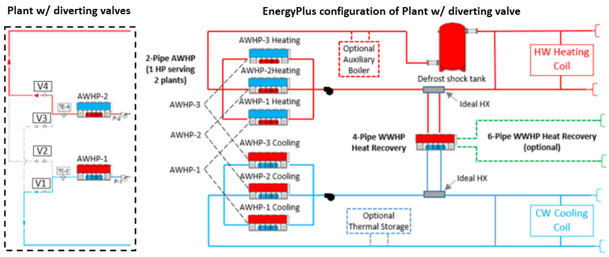

Chiller Plant Support for Carbon Initiatives
================

**Richard Raustad**

**University of Central Florida, Florida Solar Energy Center**

 - Original Date: Apr 24, 2023
 - Modified Date: May 5, 2023 (update changes to feature)
 
*Preface:*

This new feature is a request provided by Trane North America. The plant configuration(s) described herein are currently deployed at several locations in the NE US. The Trane team has invested several months of development for this new feature and the following discussion is a result of that work. 

*Acknowledgments:*

 - Nagappan Chidambaram, Trane North America, provided coordination of EnergyPlus engine design with 3rd party expectations 
 - Ronnie Moffitt, Trane North America, provided a detailed description of chiller heater heat pump performance 
- Robert Coleman, Trane North America, provided an overview of advanced plant dispatch and controls 
- Lawrence Scheier, S.E.I Associates, model development coordination with historic methods
- Brent Griffith, Trane consultant, provided design of plant supervisory controls 
- Richard Raustad, FSEC, provide enhancements to existing HeatPump:PlantLoop:EIR objects 

## Justification for Feature Update

The push for higher HVAC system efficiency and decarbonization has led to HVAC systems with new designs for hot and cold water plants that use heat pumps to serve both plants. Manufacturers, building owners and operators, and design professionals request improved tools to model these advanced plant configurations for todays HVAC systems.

From a historical perspective, chilled water plants have traditionally used thermal storage to minimize building peak demand to help utility companies delay construction of new power plants. Current trends are now using thermal storage as a pathway for heat recovery and improved HVAC system plant efficiency. A water plant utilizing heat pumps could make ice during early morning or late evening hours when heating is required and burn that ice during the day to offset cooling loads. These plants would use high efficiency heat pumps and optimized plant configurations that cannot be modeled in current building simulation software tools. A plant design such as this would also require advanced controls to dispatch heat recovery heat pumps, multiple chiller heaters serving the hot and cold water loops, and determine times for ice thermal storage production.

This proposal outlines a new feature for a plant supervisory controller and an expansion of the existing HeatPump:PlantLoop:EIR:Cooling and HeatPump:PlantLoop:EIR:Heating objects to include typical equipment operating features and limitations. The supervisory controller will build on the existing plant control techniques by adding a new object to manage control of the hot and cold water plants and the equipment serving those plants as *PlantEquipmentOperation:ChillerHeaterChangeover*. The existing HeatPump:PlantLoop:EIR objects will be improved to include new features, for example defrost controls, operating temperature limits, and allow controls to meet either a plant load or a chiller heater leaving water set point.

The proposed approach would be to develop the new supervisory controller and add new functionality to the existing chiller heaters such that a plant of this type could be modeled. Added controls and alternate plant designs could be added in the future. 

## Overview ##

HVAC system water plant equipment would typically include a chiller and boiler. Newer plants use heat pumps with diverting values such that one or more chiller heaters could serve either plant (return side diverting valves not shown in figure). This plant configuration would mix plant fluids from both loops. A discussion of whether to model diverting valves or rely on the traditional EnergyPlus plant loop topology resulted in the selection of the current plant topology.

In EnergyPlus, water plant operation will be coordinated using the supervisory control manager. This manager will identify building HVAC loads and dispatch plant equipment by choosing which plant component to operate at any given time using, tentatively, the plant RunFlag variable. The left side of Figure 1 shows a traditional plant with 2 heat pumps. Either heat pump can serve either plant loop using diverting valves. This concept can be modeled in EnergyPlus using a pair of HeatPump:PlantLoop:EIR objects, where only 1 of the pair can be active at any given time. A PlantEquipmentOperation:ChillerHeaterChangeover object will monitor building loads and manage plant operation. The figure also includes as an example optional equipment for an auxiliary boiler, in case the chiller heater temperature limits may limit operation, and thermal storage, for heat recovery or traditional use, and various chiller heater configurations. The heat pumps could be configured as 2-pipe air-cooled, 4-pipe water-cooled, or 6-pipe heat recovery. This new feature intends to build the basic components required to operate these advanced plant configurations.

Notes on this figure:
 - An ideal HX may be required to connect a heat recovery heat pump between plant loops because EnergyPlus allows only a single mixer/splitter per loop. The ideal HX won't have losses. An alternative is to place this HR HP on the plant inlet or outlet branch where no HX is required.
 - Mixing of plant fluids is not part of this feature, which is likely not an issue other than checking plant loop fluid properties and providing warnings.
 - Optional equipment shown will operate under independent controls without supervisory control until such time that additional controls can be added to the supervisor.
 - The 4-pipe heat recovery heat pump might be placed on the supply or demand side of the plant loop to allow for both constant and variable speed pump configurations.
 - Plant loop temperature fluctuations due to defrost are not explicitly modeled at this time (i.e., the defrost shock tank would absorb the majority of this temperature swing, but actual plant temperature changes are not modeled.
 - Thermal ice storage dispatch is not yet included as part of this feature.

 

 Figure 1. Advanced Heat Recovery Plant Design

## Approach

This new feature will include a new object **PlantEquipmentOperation:ChillerHeaterChangeover** and also include updates to the 2-pipe and 4-pipe version of a chiller heater using the existing objects *HeatPump:PlantLoop:EIR:Cooling* and *HeatPump:PlantLoop:EIR:Heating*. This new feature will not include advanced controls for the ice storage system or auxiliary boiler discussed here. Additional equipment controls for the boiler and ice tank, if needed, may be added at a future time.

Trane has provided normalized capacity and power performance curves for heat pump equipment that would be (and currently are field deployed) used in this type of plant. The power curve was converted to energy input ratio to be consistent with existing models in EnergyPlus. Trane also provide a new defrost model as an alternative to those used for DX heating coils. All 3 defrost models will be included in the modifications to the HeatPump:PlantLoop:EIR:Heating object.

Trane has also identified minimum and maximum operating temperature limits which are included to more accurately model this equipment type.

The advanced operation of the chilled and hot water plants will be managed by the supervisory control manager. Zones attached to these plants will be polled for loads and summed to represent each plant load. The chiller heaters will be dispatched as either cooling only, heating only, or simultaneous cooling and heating. Controls to dispatch a heat pump heat recovery unit are being investigated (center right of figure).

## Testing/Validation/Data Source(s)

This new feature/enhancement will be tested and demonstrated with a new test file that  includes the supervisory control manager using the new PlantEquipmentOperations object and expanded versions of the existing chiller heater objects.

## IDD Object changes

Updates to the HeatPump:PlantLoop:EIR:Cooling object are shown below. New fields are added at the end of the object such that existing example files still execute. Min-fields has not changed. Note that default values are used for each real type input filed since these inputs are past min-fields (more on that later). Existing fields in this object are not shown here:

    HeatPump:PlantLoop:EIR:Cooling,
      // the following fields are past min-fields
      A11, \field Control Type
           \note Heat pump can be controlled on leaving water temperature set point or plant load
           \type choice
           \key Setpoint
           \key Load
           \default Load
      A12, \field Flow Mode
           \note Select operating mode for fluid flow through the chiller. "ConstantFlow" is for
           \note constant pumping with flow controlled by chiller to operate at full design
           \note flow rate. "VariableSpeedPumping" is for variable pumping with flow proportional
           \note to chiller operating part load ratio.
           \type choice
           \key ConstantFlow
           \key VariableSpeedPumping
           \default ConstantFlow
      N6,  \field Minimum Part Load Ratio
           \note Below this operating limit compressor cycling will occur
           \type real
           \minimum 0.0
           \default 0.0
      N7,  \field Minimum Source Inlet Temperature
           \type real
           \units C
           \default -100.0
           \note Enter the minimum inlet outdoor air dry-bulb temperature
           \note for air-cooled units or minimum inlet water temperature for water-cooled units.
           \note The unit is disabled below this temperature.
      N8,  \field Maximum Source Inlet Temperature
           \type real
           \units C
           \default 100.0
           \note Enter the maximum inlet outdoor air dry-bulb temperature
           \note for air-cooled units or maximum inlet water temperature for water-cooled units.
           \note The unit is disabled above this temperature.
      N9,  \field Minimum Supply Water Temperature Curve Name
           \type object-list
           \object-list UniVariateFunctions
           \note quadratic curve = a + b*OAT is typical, other univariate curves may be used
           \note OAT = Outdoor Dry-Bulb Temperature
      N10; \field Maximum Supply Water Temperature Curve Name
           \type object-list
           \object-list UniVariateFunctions
           \note quadratic curve = a + b*OAT is typical, other univariate curves may be used
           \note OAT = Outdoor Dry-Bulb Temperature

Updates to the HeatPump:PlantLoop:EIR:Heating object are shown below. New fields are added at the end of the object such that existing example files still execute. Min-fields has not changed.  Note that default values are used for each real type input field since these inputs are past min-fields. Existing fields in this object are not shown here:

    HeatPump:PlantLoop:EIR:Heating,
      // the following fields are past min-fields
      N6,  \field Heating To Cooling Capacity Sizing Ratio
           \note Maintains heating capacity to cooling capacity ratio
           \type real
           \minimum 0.0
           \default 1.0
      A11, \field Heat Pump Sizing Method
           \note Specifies sizing method when companion coil exists
           \type choice
           \key CoolingCapacity
           \key HeatingCapacity
           \key GreaterOfHeatingOrCooling
           \default CoolingCapacity
      A12, \field Control Type
           \note Heat pump can be controlled on leaving water temperature set point or plant load
           \type choice
           \key Setpoint
           \key Load
           \default Load
      A13, \field Flow Mode
           \note Select operating mode for fluid flow through the chiller. "ConstantFlow" is for
           \note constant pumping with flow controlled by chiller to operate at full design
           \note flow rate. "VariableSpeedPumping" is for variable pumping with flow proportional
           \note to chiller operating part load ratio.
           \type choice
           \key ConstantFlow
           \key VariableSpeedPumping
           \default ConstantFlow
      N7,  \field Minimum Part Load Ratio
           \note Below this operating limit compressor cycling will occur
           \type real
           \minimum 0.0
           \default 0.0
      N8,  \field Minimum Source Inlet Temperature
           \type real
           \units C
           \default -100.0
           \note Enter the minimum inlet outdoor air dry-bulb temperature
           \note for air-cooled units or minimum inlet water temperature for water-cooled units.
           \note The unit is disabled below this temperature.
      N9,  \field Maximum Source Inlet Temperature
           \type real
           \units C
           \default 100.0
           \note Enter the maximum inlet outdoor air dry-bulb temperature
           \note for air-cooled units or maximum inlet water temperature for water-cooled units.
           \note The unit is disabled above this temperature.
      A14, \field Minimum Supply Water Temperature Curve Name
           \type object-list
           \object-list UniVariateFunctions
           \note quadratic curve = a + b*OAT is typical, other univariate curves may be used
           \note OAT = Outdoor Dry-Bulb Temperature
      A15, \field Maximum Supply Water Temperature Curve Name
           \type object-list
           \object-list UniVariateFunctions
           \note quadratic curve = a + b*OAT is typical, other univariate curves may be used
           \note OAT = Outdoor Dry-Bulb Temperature
      A16, \field Dry Outdoor Correction Factor Curve Name
           \type object-list
           \object-list UniVariateFunctions
      N10, \field Maximum Outdoor Dry Bulb Temperature For Defrost Operation
           \type real
           \default 10.0
           \note defrost operation will not be active above this outdoor temperature
      A17, \field Heat Pump Defrost Control
           \type choice
           \key Timed
           \key OnDemand
           \key TimedEmpirical
           \default Timed
      N11, \field Heat Pump Defrost Time Period Fraction
           \type real
           \minimum 0.0
           \default 0.058333
           \note Fraction of time in defrost mode, default = 5 minutes.
           \note Only applicable if Timed or TimedEmpirical heat pump defrost control is specified
      A18, \field Defrost Energy Input Ratio Function of Temperature Curve Name
           \type object-list
           \object-list BivariateFunctions
           \note Biquadratic curve = a + b*WB + c*WB**2 + d*OAT + e*OAT**2 + f*WB*OAT
           \note WB = wet-bulb temperature (C) of air entering the indoor coil
           \note OAT = outdoor air dry-bulb temperature (C)
           \note Only required if Timed or OnDemand defrost strategy is specified
      A19, \field Timed Empirical Defrost Frequency Curve Name
           \type object-list
           \object-list UniVariateFunctions
           \note Quadratic curve = a + b*OAT is typical, other univariate curves may be used
           \note OAT = outdoor air dry-bulb temperature (C)
           \note Timed Empirical Defrost Frequency fraction in hours = curve output
           \note Only applicable if TimedEmpirical defrost control is specified
      A20, \field Timed Empirical Defrost Heat Load Penalty Curve Name
           \type object-list
           \object-list UniVariateFunctions
           \object-list BivariateFunctions
           \note Quadratic curve = a + b*OAT is typical, other univariate curves may be used
           \note Biquadratic curve = a + b*WB + c*WB**2 + d*OAT + e*OAT**2 + f*WB*OAT
           \note OAT = outdoor air dry-bulb temperature (C)
           \note WB = wet-bulb temperature (C) of air entering the indoor coil
           \note Timed Empirical Defrost Heat Load Penalty in watts = hot load * curve output
           \note Only applicable if TimedEmpirical defrost control is specified
      A21; \field Timed Empirical Defrost Heat Input Energy Fraction Curve Name
           \type object-list
           \object-list UniVariateFunctions
           \object-list BivariateFunctions
           \note Quadratic curve = a + b*oat is typical, other univariate curves may be used
           \note Biquadratic curve = a + b*WB + c*WB**2 + d*OAT + e*OAT**2 + f*WB*OAT
           \note OAT = outdoor air dry-bulb temperature (C)
           \note WB = wet-bulb temperature (C) of air entering the indoor coil
           \note Timed Empirical Defrost Heat Input Energy in watts = rated hot load * curve output
           \note Only applicable if TimedEmpirical defrost control is specified

The new object used as a supervisory controller is shown here. The most notable input is the Zone Load Polling ZoneList Name input. A list of zone names associated with this plant loop pair is used to identify plant loads based on "polled" building zone loads and anticipated outdoor air loads. This method is chosen as an alternate to looking at actual plant loads, which can be hard to identify with complex plant topology. Regardless of the method, plant manager dispatch logic will determine which plant loop is active and which plant equipment will serve those loads.

    PlantEquipmentOperation:ChillerHeaterChangeover,
        \memo Plant equipment operation object to control switchover between chiller
        \memo and heater operation of chiller heater heat pump serving 2 plant loops. 
        \memo Poll zone loads and determine if plant should be in heating, cooling
        \memo or simultaneous heating and cooling and dispatch equipment accordingly.
    A1, \field Name
        \required-field
        \reference ControlSchemeList
    N1, \field Primary Cooling Plant Setpoint Temperature
        \required-field
        \type real
        \units C
        \minimum -10.0
        \maximum 20.0
    N2, \field Secondary Distribution Cooling Plant Setpoint Temperature
        \type real
        \units C
        \minimum  0.0
        \maximum 20.0
    N3, \field Primary Heating Plant Setpoint at Outdoor High Temperature
        \note 
        \required-field
        \type real
        \units C
        \minimum 20.0
        \maximum 80.0
    N4, \field Outdoor High Temperature
        \required-field
        \type real
        \units C
        \minimum 0.0
        \maximum 35.0
    N5, \field Primary Heating Plant Setpoint at Outdoor Low Temperature
        \required-field
        \type real
        \units C
        \minimum 20.0
        \maximum 80.0
    N6, \field Outdoor Low Temperature
        \required-field
        \type real
        \units C
        \minimum -20.0
        \maximum 35.0
    N7, \field Secondary Distribution Heating Plant Setpoint Temperature
        \type real
        \units C
        \minimum 20.0
        \maximum 80.0
    A2, \field Zone Load Polling ZoneList Name
        \type object-list
        \object-list ZoneListNames
    A3, \field Cooling Only Load Plant Equipment Operation Cooling Load Name
        \type object-list
        \object-list ControlSchemeList
    A4, \field Heating Only Load Plant Equipment Operation Heating Load Name
        \type object-list
        \object-list ControlSchemeList
    A5, \field Simultaneous Cooling And Heating Plant Equipment Operation Cooling Load Name
        \type object-list
        \object-list ControlSchemeList
    A6, \field Simultaneous Cooling And Heating Plant Equipment Operation Heating Load Name
        \type object-list
        \object-list ControlSchemeList
    A7, \field Dedicated Chilled Water Return Recovery Heat Pump Name
        \type object-list
        \object-list validPlantEquipmentNames
        \note enter name of HeatPump:PlantLoop:EIR:Cooling object to control chilled water return adding heat to hot water return
    A8, \field Dedicated Hot Water Return Recovery Heat Pump Name
        \type object-list
        \object-list validPlantEquipmentNames
        \note enter name of HeatPump:PlantLoop:EIR:Heating object to control hot water return cooling the chilled water return
    N8; \field Dedicated Recovery Heat Pump Control Load Capacity Factor
        \type real
        \default 0.1
  

## Proposed additions to Meters:

HeatPump:PlantLoop:EIR:Heating

    Heat Pump Defrost Electricity Energy

## Proposed Report Variables:

HeatPump:PlantLoop:EIR:Cooling 
HeatPump:PlantLoop:EIR:Heating

    Heat Pump Part Load Ratio 
    Heat Pump Cycling Ratio

HeatPump:PlantLoop:EIR:Heating

    Heat Pump Load Due To Defrost
    Heat Pump Fractional Defrost Time
    Heat Pump Defrost Electricity Rate
    Heat Pump Defrost Electricity Energy

PlantEquipmentOperation:ChillerHeaterChangeOver

    Supervisory Plant Heat Pump Operation Mode
    Supervisory Plant Heat Recovery Operation Mode
    Supervisory Plant Operation Polled Building Heating Load
    Supervisory Plant Operation Polled Building Cooling Load
    Supervisory Plant Operation Primary Plant Heating Load
    Supervisory Plant Operation Primary Plant Cooling Load
    Supervisory Plant Auxiliary Boiler Mode
    

## Engineering and Input Output Reference Documents

New documentation describing each of these changes.

## Transition

Not needed.

## References

 - [Trane Ascend Air-To-Water Heat Pump](https://www.trane.com/commercial/north-america/us/en/products-systems/chillers/air-cooled-chillers/ascend-air-to-water-heat-pump.html) 
 - [Trane Installation, Operation, and Maintenance Ascend™ Air-Cooled Chiller
Models ACS and ACX](https://www.trane.com/content/dam/Trane/Commercial/global/products-systems/equipment/chillers/air-cooled/ascend/AC-SVX002E-EN_10062021.pdf)

## Code Design Documentation

The HeatPump:PlantLoop:EIR object changes are fairly straight-forward. New class variables are added to represent each new input field. A code example for the new Control Type input field with a \default value = Load. Note here that the default value is not checked and assumed to be Load. The default field value will be further discussed in the next example.

    constexpr std::array<std::string_view, 
            static_cast<int>(ControlType::Num)> PLHPCtrlTypeNamesUC = {"SETPOINT", "LOAD"};
    auto const controlType = fields.find("control_type");
    if (controlType != fields.end()) {
        thisPLHP.sysControlType = static_cast<ControlType>(
                    getEnumerationValue(PLHPCtrlTypeNamesUC,
                    UtilityRoutines::MakeUPPERCase(controlType.value().get<std::string>())));
    } else { // default to Load as specified in idd, without checking for default?
        thisPLHP.sysControlType = ControlType::Load;
    }

As another example of getInput where an input field has a default specified, the Minimum Part Load Ratio field has a default of 0. The class variable representing this field will also be initialized to 0. If the default value was removed from this idd input field, the entire else section of this getInput could be removed and the result of a blank field would still be 0 without the need for the extra checking. This of course does not allow the user to change the default value in the json idd, but the user can always enter a value. Using this same methodology, the default value could be removed from the Control Type field example above. Documentation could describe that blank fields default to Load and 0, respectively.

The suggestion here is to remove defaults for specific inputs without a required-field tag and instead use the method described above and document the default action (e.g., the IORef says the field above defaults to Load if left blank). If the user wants a different result, the field can be filled in with that intent. Applies to non-required key choices and numeric inputs.

    auto const minPLR = fields.find("minimum_part_load_ratio");
    if (minPLR != fields.end()) {
        thisPLHP.minimumPLR = minPLR.value().get<Real64>();
    } else { // get default value
        Real64 defaultVal = 0.0;
        bool defaultFound = state.dataInputProcessing->inputProcessor->getDefaultValue(
            state, cCurrentModuleObject, "minimum_part_load_ratio", defaultVal);
        if (!defaultFound) {
            // excluding from coverage
            ShowWarningError(state, // LCOV_EXCL_LINE
                 format("EIR PLHP \"{}\": Heat Pump Minimum Part Load Ratio not entered and default value not found.",
                                    thisPLHP.name)); // LCOV_EXCL_LINE
                 errorsFound = true;                 // LCOV_EXCL_LINE
        } else {
            thisPLHP.minimumPLR = defaultVal;
        }
    }

## Water Plant Supervisory Control

The larger effort of this new feature is to develop a plant supervisory controller that determines building loads and dispatches equipment according to the user specified plant equipment operation schemes.

A typical plant supervisory control system will include the existing plant equipment operation scheme objects.

    PlantEquipmentOperation:ChillerHeaterChangeover,
      Two AWHP Operation Scheme ,            !- Name
      4.44444444444444 ,                     !- Primary Cooling Plant Setpoint Temperature
      4.8888888888889 ,                      !- Secondary Distribution Cooling Plant
                                                  Setpoint Temperature
      48.0 ,            !- Primary Heating Plant Setpoint at Outdoor High Temperature
      36.0 ,            !- Outdoor High Temperature
      56.0 ,            !- Primary Heating Plant Setpoint at Outdoor Low Temperature
      -10.0 ,           !- Outdoor Low Temperature
      54.0 ,            !- Secondary Distribution Heating Plant Setpoint Temperature
      All Conditioned Zones,             !- Zone Load Polling ZoneList Name
      Two AWHP Cooling Operation Scheme, !- Cooling Only Load Plant Equipment
                                              Operation Cooling Load Name
      Two AWHP Heating Operation Scheme, !- Heating Only Load Plant Equipment
                                              Operation Heating Load Name
      One AWHP Cooling Operation Scheme, !- Simultaneous Cooling And Heating Plant
                                              Equipment Operation Cooling Load Name
      One AWHP Heating Operation Scheme, !- Simultaneous Cooling And Heating Plant
                                              Equipment Operation Heating Load Name
      ,           !- Dedicated Chilled Water Return Recovery HeatPump Name
      ,           !- Dedicated Hot Water Return Recovery HeatPump Name
      ;           !- Dedicated Recovery Heat Pump Control Load Capacity Factor

The controls model inlucdes inputs for primary and secondary plant set point temperature inputs. One supervisory controller would be used for each plant loop pair specified in the input.

A truncated list of zones attached to this plant configuration:

    ZoneList,
      All Conditioned Zones,
      Zone_FC_07,
      Zone_FC_36,
      Zone_FC_10,

And one example of a plant equipment operating scheme input:

    PlantEquipmentOperation:CoolingLoad,
      Two AWHP Cooling Operation Scheme,  !- Name
      0.0,                                !- Load Range 1 Lower Limit {W}
      50000,                              !- Load Range 1 Upper Limit {W}
      One AWHP Cooling Equipment List,    !- Range 1 Equipment List Name
      50000,                              !- Load Range 2 Lower Limit {W}
      10000000000000,                     !- Load Range 2 Upper Limit {W}
      Two AWHP Cooling Equipment List;    !- Range 2 Equipment List Name
    
    PlantEquipmentList,
      One AWHP Cooling Equipment List,    !- Name
      HeatPump:PlantLoop:EIR:Cooling,     !- Equipment 1 Object Type
      AWHP_1 Cooling Side;                !- Equipment 1 Name

    PlantEquipmentList,
      Two AWHP Cooling Equipment List,    !- Name
      HeatPump:PlantLoop:EIR:Cooling,     !- Equipment 1 Object Type
      AWHP_1 Cooling Side,                !- Equipment 1 Name
      HeatPump:PlantLoop:EIR:Cooling,     !- Equipment 2 Object Type
      AWHP_2 Cooling Side;                !- Equipment 2 Name    
      
The final 3 inputs of this new object holds the name of the chiller heater used for heat recovery between plant loops and a load factor where the heat recovery chiller heater is allowed to operate. The intention of this model is that the heat recovery chiller heater will meet low loads on one of the plants. When any primary equipment on that plant are active the heat recovery chiller heater is off. The use of a heat recovery heat pump is anticipated to be included with this new feature development effort.

The supervisory class will reside in the unused source file EquipAndOperations.cc. The pointer to ChillerHeaterSupervisoryOperation will be added to state.

    struct TempSetpoint
    {
        Real64 PrimCW = 0.0;      // Chilled water setpoint for primary plant loop
        Real64 SecCW = 0.0;       // CW setpoint for secondary/distribution plant loop
        Real64 PrimHW_High = 0.0; // HW primary plant setpoint at High Outdoor Air
                                     Temperature, or higher, Deg. C
        Real64 PrimHW_Low = 0.0;  // HW primary plant setpoint at Low Outdoor Air
                                     Temperature, or Lower, Deg. C
        Real64 SecHW = 0.0;       // HW setpoint for secondary/distribution plant loop
    };

    struct TempResetData
    {
        Real64 HighOutdoorTemp = 0.0;
        Real64 LowOutdoorTemp = 0.0;
    };

    struct PlantOpsData
    {
        int NumOfZones = 0;           // Number of zones in the list
        int NumOfAirLoops = 0;        // number of air loops
        int numPlantLoadProfiles = 0; // number of load profiles
        int numBoilers = 0;           // number of boilers
        int numPlantHXs = 0;          // number of fluid to fluid heat exchangers
        int NumHeatingOnlyEquipLists = 0;
        int NumCoolingOnlyEquipLists = 0;
        int NumSimultHeatCoolHeatingEquipLists = 0;
        int NumSimultHeatCoolCoolingEquipLists = 0;
        int EquipListNumForLastCoolingOnlyStage = 0;
        int EquipListNumForLastHeatingOnlyStage = 0;
        int EquipListNumForLastSimultHeatCoolCoolingStage = 0;
        int EquipListNumForLastSimultHeatCoolHeatingStage = 0;
        bool SimultHeatCoolOpAvailable = false;
        bool SimultHeatCoolHeatingOpInput = false;
        bool SimulHeatCoolCoolingOpInput = false;
        bool DedicatedHR_ChWRetControl_Input = false;
        bool DedicatedHR_HWRetControl_Input = false;
        Real64 DedicatedHR_SecChW_DesignCapacity = 0.0;
        Real64 DedicatedHR_SecHW_DesignCapacity = 0.0;
        Real64 DedicatedHR_CapacityControlFactor = 0.0;
        bool AirSourcePlantHeatingOnly = false;           // operation mode, if true primary
                                                          plant appears to only need heating
        bool AirSourcePlantCoolingOnly = false;           // operation mode, if true primary
                                                          plant appears to only need cooling
        bool AirSourcePlantSimultaneousHeatingAndCooling = false; // operation mode, if true primary plant appears to need both heating and cooling
        int PrimaryHWLoopIndex = 0;
        int PrimaryChWLoopIndex = 0;
        int SecondaryHWLoopIndex = 0;
        int SecondaryChWLoopIndex = 0;
    };

    struct ReportData
    {
        int AirSourcePlant_OpMode = 0;    //  heat only = 1, cool only = 2,
                                              simult heat cool = 3
        Real64 BuildingPolledHeatingLoad = 0.0; // current  building heating loads from
                                                   predicted sensible zone loads, air system
                                                   ventilation loads, and
                                                // any plant load profile process laods
        Real64 BuildingPolledCoolingLoad = 0.0; //  current building Cooling loads from
                                                    predicted sensible zone loads, air
                                                    system ventilation loads, and
                                                //  any plant load profile process laods
        Real64 AirSourcePlantHeatingLoad = 0.0; // current apparant plant load on hot water
                                                   plant served by air source heatpumps
        Real64 AirSourcePlantCoolingLoad = 0.0; // current apparant plant load on chilled
                                                  water plant served by air source heatpumps
        int DedicHR_OpMode = 0;   //  heating led = 1, cooling led = 2, , not dispatched = 0
        int BoilerAux_OpMode = 0; // Not Dispatched = 0, Secondary Boiler On = 1,
                             Primary Boiler On = 3, Both Secondary and Primary Boiler On = 4
    };

    struct ChillerHeaterSupervisoryOperationData
    // Custom supervisory plant operation scheme, control dispatch across a set of related set of plant loops
    // For two-pipe chiller heater. 1..N chiller heater, 1..M chiller only.
    // poll zone list to decide mode between chiller only, heater only, or simultaneous

    {
        // get rid of these strings if possible
        std::string Name;
        std::string TypeOf;
        std::string ZoneListName;
        std::string DedicatedHR_ChWRetControl_Name;
        std::string DedicatedHR_HWRetControl_Name;

        bool oneTimeSetupComplete = false;
        DataPlant::OpScheme Type = DataPlant::OpScheme::Invalid; // Op scheme type (from keyword)

        TempSetpoint Setpoint;
        TempResetData TempReset;
        PlantOpsData PlantOps;
        Array1D_int ZonePtrs;
        Array1D_int AirLoopPtrs;
        Array1D<EquipOpList> HeatingOnlyEquipList;
        Array1D<EquipOpList> CoolingOnlyEquipList;
        Array1D<EquipOpList> SimultHeatCoolHeatingEquipList;
        Array1D<EquipOpList> SimultHeatCoolCoolingEquipList;
        EquipListCompData DedicatedHR_ChWRetControl_LoadSideComp;
        EquipListCompData DedicatedHR_ChWRetControl_SourceSideComp;
        EquipListCompData DedicatedHR_HWRetControl_LoadSideComp;
        EquipListCompData DedicatedHR_HWRetControl_SourceSideComp;
        Array1D<int> PlantLoopIndicesBeingSupervised;
        Array1D<int> SecondaryPlantLoopIndicesBeingSupervised;
        Array1D<PlantLocation> PlantLoadProfileComps;
        Array1D<PlantLocation> PlantBoilerComps;   // Boilers that may need to be managed.
        Array1D<PlantLocation> PlantHXComps; // fluid to fluid heat exchangers
        ReportData Report;

        void OneTimeInitChillerHeaterChangeoverOpScheme(EnergyPlusData &state);

        void EvaluateChillerHeaterChangeoverOpScheme(EnergyPlusData &state, bool const FirstHVACIteration);

        void OneTimeInitChillerHeaterChangeoverOpScheme(EnergyPlusData &state);

        void EvaluateChillerHeaterChangeoverOpScheme(EnergyPlusData &state, bool const FirstHVACIteration);

        void DetermineCurrentBuildingLoads(EnergyPlusData &state);

        void DetermineCurrentPlantLoads(EnergyPlusData &state);

        void ProcessSupervisoryControlLogicForAirSourcePlants(EnergyPlusData &state);

        void InitAirSourcePlantEquipmentOff(EnergyPlusData &state, bool const FirstHVACIteration);

        void ProcessAndSetAirSourcePlantEquipLists(EnergyPlusData &state);

        void ProcessAndSetDedicatedHeatRecovWWHP(EnergyPlusData &state, bool const FirstHVACIteration);

        void ProcessAndSetAuxilBoiler(EnergyPlusData &state, bool const FirstHVACIteration);

        Real64 DetermineHWSetpointOARest(EnergyPlusData &state);
    };

    struct OperationData
    {
        ChillerHeaterSupervisoryOperationData *ChillerHeaterSupervisoryOperation = nullptr;
    }

## Chiller Heater Heat Pump Performance

A Trane systems development engineering document dated March 10, 2022 included several performance aspects of a chiller heater product. This internal document contained:

 - Cooling and heating capacity curves and IP performance curve coefficients
 - Cooling and heating power curves and IP performance curve coefficients
 - A graph of minimum and maximum hot water temperature versus outdoor temperature with associated IP performance curve coefficients
 - A detailed defrost model with associated IP performance curve coefficients
 - A heating capacity adjustment model for latent loading on the condenser fins
 - Cooling and heating part-load ratio curves with associated IP performance curve coefficients

 This document was reviewed and enhancements/additions to the HeatPump:PlantLoop:EIR model were designed and implemented. Control sequences formed the basis for the supervisory control implementation.
