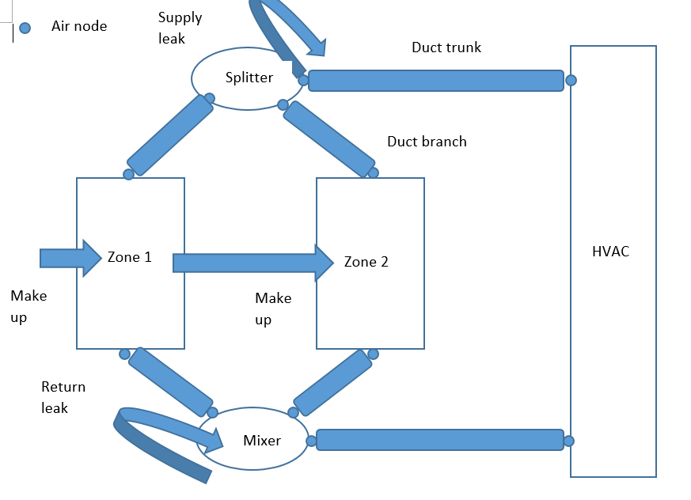
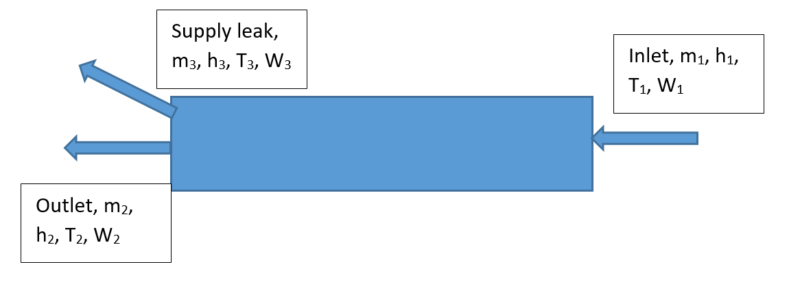
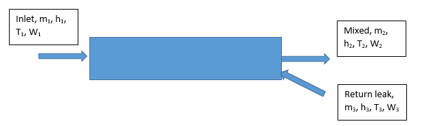
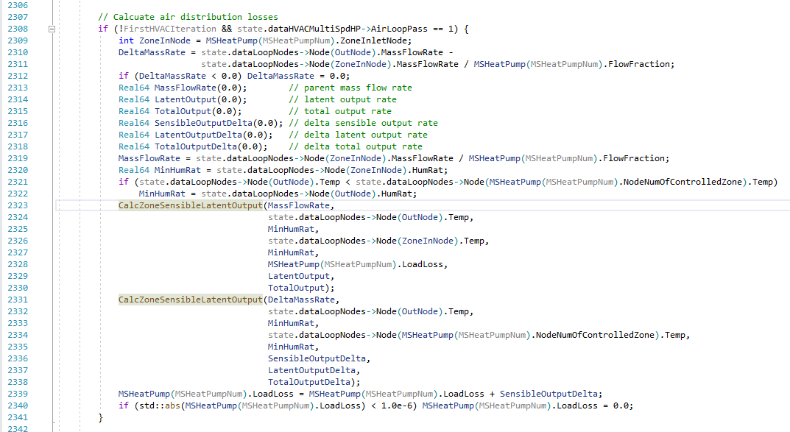

Duct model road map
================

** Lixing Gu **

** Florida Solar Energy Center**

 - 5th draft, 3/6/24

	After a technicalities call on 3/6/24

 - 4th draft, 2/22/24

	After a conference call with Scott on 2/22/24

 - Third draft, 2/15/24

	After Technicalities on 2/7/24

 - Second draft, 2/7/24

	After Technicalities on 2/7/24

 - Original draft, 1/20/24

## Background ##

The AFN model is able to simulate duct conduction and leakage losses. The driving force is the pressure difference. NREL wants duct model can be performed wihtout using the AFN model. In other words, duct losses can be simulated without any pressure calculation and under AirLoopHVAC configurations. The following required may be met:

1. The proposed new objects may be compatible with the AFN objects. In other words, no duplication is required.
2. The new model should be able to simulate duct conduction and leakage losses.

Since the process is very complicated, a roadmap is needed to provide dicrection how to implement the new feature. It may involve changes of existing AFN objects.

## E-mail and Conference Call Conclusions ##

### E-mail communication with Mike ###

The most important restriction is that any proposed new objects or existing objects have to be used in the AFN model for the roadmap.

I'm not sure I understand. I thought the goal here was a simplified model that didn't require AFN.
Mike

On 2/6/2024 2:08 PM, gu@fsec.ucf.edu wrote:
Mike:
 
Thanks for your comments. Let me explain what I need to define duct objects to calculate conduction loss and leakage first. Here are requirements.
 
1.	Air node
 
Some nodes are needed to be redefined, in addition to air node defined in AirLoopHAVC. For example, the inlet node of a zone splitter is the same node of AirloopHVAC demand outlet node. In order to build a duct, I need to make two separate nodes, instead of one.
 
2.	Duct as a linkage
 
A linkage is needed to use two air nodes to represent a duct for conduction loss calculation.
 
3.	Leak as a linkage
 
A zone and an air node have to used to represent a supply or return leak
 
4.	Make up air as a linkage
 
Due to unbalanced supply and return leaks, additional flows between outdoor and a zone, and between two zones have to be defined based on a leakage
 
5.	Duct component
 
Duct geometry and materials are needed for conduction loss calculation
 
6.	Leakage component
 
The fraction flow is needed to represent leakage
 
The most important restriction is that any proposed new objects or existing objects have to be used in the AFN model for the roadmap.
 
Therefore, I propose to use existing the AFN objects. An alternative choice is that the AFN objects may be renames by removing “AirflowNetwork” for general purpose. For example, AirflowNetwork:Distribution:Node can be replaced by Distribution:Node.
 
Therefore, expansion of ZoneHVAC:AirDistributionUnit may not be enough to cover what I need. The object may not be used in the AFN model. 
 
Thanks.
 
Gu
 
From: Michael J. Witte <mjwitte@gard.com> 
Sent: Tuesday, February 6, 2024 12:49 PM
To: Lixing Gu <gu@fsec.ucf.edu>; 'Lee, Edwin' <Edwin.Lee@nrel.gov>; 'Horowitz, Scott' <Scott.Horowitz@nrel.gov>; 'Winkler, Jon' <Jon.Winkler@nrel.gov>; 'DeGraw, Jason' <degrawjw@ornl.gov>; 'Neal Kruis' <neal.kruis@bigladdersoftware.com>; rraustad@fsec.ucf.edu
Subject: Re: Roadmap for comments
 
Gu,

Did you consider extending the leakage options in ZoneHVAC:AirDistributionUnit instead of using the AFN objects?

ZoneHVAC:AirDistributionUnit,

  N1 , \field Nominal Upstream Leakage Fraction
       \note fraction at system design Flow; leakage Flow constant, leakage fraction
       \note varies with variable system Flow Rate.
 N2 , \field Constant Downstream Leakage Fraction

Mike

### Discussion in the technicalities on 2/7/24 ###

The roadmap was discussed in the Technicalities on 2/7/24. Here are comments and my reply after my name.

Scott: Temperature control at the exterior boundary conditions

Gu: I am going to add 3 more fields at the end of Duct:Loss:

\field Environment Type
\field Ambient Temperature Zone Name
\field Ambient Temperature Schedule Name

Mike: Heat dump from condution and leakaga to the zone?

Scott: Use regain factor

Gu: Any energy loss or gain from conduction and leakage will be added as zone loads. The detailed implementation will be addressed in the design document

Jason DeGraw: Not undesrand fully and will need time to provide comments later.

Gu: Will make offline contact

Scott: Solve option in the AirflowNetwork:SimulationControl may be controversial, so that the AirflowNetwork:SimulationControl object may not be used.

Jason: Agree.

Brett: It is odd to use AirflowNetwork:SimulationControl for non AFN simplified duct model.

Gu: I agree not to use AirflowNetwork:SimulationControl to trigger the simplified duct model. Instead, a new proposed object of Duct:Loss will be used.

The trigger option using AirflowNetwork:SimulationControl in the Roadmap will be removed.

### Discussion in the conference call on 2/15/24 ###

A group of team members attanded the conference call for further discussion: Mike, Jason, Edwin and Gu. Scott missed the call and will get a chance to review the thrid draft.

#### General agreement ####

The group is OK with the proposed inputs.

#### Undecided items ####

The group have different opinions for the new object of Duct:Lose

1. Keep a single object as Duct:Loss and A4 field with 3 choice as Conduction, Leakage and MakeupAir
2. Use 3 new objects wihtout A4 field

The detailed approaches are provided below.

#### Suggestion ####

When the makeup air is introduced, it is better to investigate the ZoneAirMassFlowConservation to see possible connection.

Gu: There are two types of makeup air. The first type is that the makeup aie flows from outdoor to a zone, equivalent to Infiltration. The second type is that the makeup air flows from a zone to another zone, equivalent to Mixing object. It is possible to assign makeup air into Infiltration and Mixing airflows and call ZoneAirMassFlowConservation to perform mass conservation. 
 
### Discussion in the conference call on 2/22/24 ###

Scott and Gu attended the conference call.

#### New objects ####

Scott prefer to use 3 new objects to represent conduction, leakage and makeup air, respectively.

#### Supply leak calculation ####

Scott also agrees to calculate equivalent temperature and humidity ratio after supply leak without chancge the mass flow rate of Airloop mass flow rate.

#### Have a concern ####

Although Scott accepts the proposed new and existing objects, he would like to reserve his opinion: no AFN names for none AFN approach.

Gu's response: In order to keep the roadmap moving, the existing AFN objects will be used.

### Discussion in the technicalities call on 3/6/24 ###

The design document was presented in the call.

Mike asked a question why added duct loss is restricted to a system. The general is preferred.

Gu's reply: 

There is a function to calculate zone sensible and latent outputs as CalcZoneSensibleLatentOutput in the GeneralRoutines module.

	void CalcZoneSensibleLatentOutput(Real64 const MassFlow,  // air mass flow rate, {kg/s}
	                                  Real64 const TDBEquip,  // dry-bulb temperature at equipment outlet {C}
	                                  Real64 const WEquip,    // humidity ratio at equipment outlet
	                                  Real64 const TDBZone,   // dry-bulb temperature at zone air node {C}
	                                  Real64 const WZone,     // humidity ratio at zone air node
	                                  Real64 &SensibleOutput, // sensible output rate (state 2 -> State 1), {W}
	                                  Real64 &LatentOutput,   // latent output rate (state 2 -> State 1), {W}
	                                  Real64 &TotalOutput     // total = sensible + latent putput rate (state 2 -> State 1), {W}
	)
	{
	
	    // Purpose:
	    // returns total, sensible and latent heat rate of transfer between the supply air zone inlet
	    // node and zone air node. The moist air energy transfer can be cooling or heating depending
	    // on the supply air zone inlet node and zone air node conditions.
	
	    // Methodology:
	    // Q_total = m_dot * (hEquip - hZone)
	    // Q_sensible = m_dot * Psychrometrics::PsyDeltaHSenFnTdbEquipTdbWZone(TDBEquip, TDBZone, WZone);
	    // or Q_sensible = m_dot * cp_moistair_zoneHumRat * (TDBEquip - TDBZone)
	    //    cp_moistair_zoneHumRat = Psychrometrics::PsyCpAirFnW(WZone);
	    // Q_latent = Q_total - Q_latent;
	
	    TotalOutput = 0.0;
	    LatentOutput = 0.0;
	    SensibleOutput = 0.0;
	    if (MassFlow > 0.0) {
	        TotalOutput = MassFlow * (Psychrometrics::PsyHFnTdbW(TDBEquip, WEquip) -
	                                  Psychrometrics::PsyHFnTdbW(TDBZone, WZone));                         // total addition/removal rate, {W};
	        SensibleOutput = MassFlow * Psychrometrics::PsyDeltaHSenFnTdb2Tdb1W(TDBEquip, TDBZone, WZone); // sensible addition/removal rate, {W};
	        LatentOutput = TotalOutput - SensibleOutput;                                                   // latent addition/removal rate, {W}
	    }
	}
	
There are several modules to call this function: Furnace, HVACMultispeedHeatPump, HVACStandAloneERV, and UnitarySystem.

Here is an example function to call CalcZoneSensibleLatentOutput in UnitarySystem:

    void UnitarySys::calculateCapacity(EnergyPlusData &state, Real64 &SensOutput, Real64 &LatOutput)
    {

        // Check delta T (outlet to reference temp), IF positive use reference HumRat ELSE outlet humrat to calculate
        // sensible capacity as MdotDeltaH at constant humidity ratio
        int OutletNode = this->AirOutNode;
        Real64 AirMassFlow = state.dataLoopNodes->Node(OutletNode).MassFlowRate;
        Real64 RefTemp = 0.0;
        Real64 RefHumRat = 0.0;
        if (this->m_ControlType == UnitarySysCtrlType::Setpoint) {
            RefTemp = state.dataLoopNodes->Node(this->AirInNode).Temp;
            RefHumRat = state.dataLoopNodes->Node(this->AirInNode).HumRat;
        } else {
            RefTemp = state.dataLoopNodes->Node(this->NodeNumOfControlledZone).Temp;
            RefHumRat = state.dataLoopNodes->Node(this->NodeNumOfControlledZone).HumRat;
        }
        Real64 SensibleOutput(0.0); // sensible output rate, {W}
        Real64 LatentOutput(0.0);   // latent output rate, {W}
        Real64 TotalOutput(0.0);    // total output rate, {W}
        // calculate sensible load met
        if (this->ATMixerExists) {
			.....
        } else {
            // Calculate sensible load met
            CalcZoneSensibleLatentOutput(AirMassFlow,
                                         state.dataLoopNodes->Node(OutletNode).Temp,
                                         state.dataLoopNodes->Node(OutletNode).HumRat,
                                         RefTemp,
                                         RefHumRat,
                                         SensibleOutput,
                                         LatentOutput,
                                         TotalOutput);
            SensOutput = SensibleOutput - this->m_SenLoadLoss;
            if (this->m_Humidistat) {
                LatOutput = LatentOutput - this->m_LatLoadLoss;
            } else {
                LatOutput = 0.0;
            }
        }
        this->m_SensibleLoadMet = SensOutput;
        this->m_LatentLoadMet = LatOutput;
    } 

The sensible and latent zone loads are claculated based on system outlet node (this->AirOutNode) and zone node, instead of zone supply inlet node. The assumtion is that air conditions at both zone supply inlet node and system outlet node are the same. It misses any possible losses between both nodes. The proposed new feature will add any possible losses between both nodes.

It is recommended that possible refactor for any systems should use zone supply inlet condition, instead of system outlet condition.
  
## Roadmap ##

The roadmap presents my view to implement simplified duct model without using the AFN model. The proposed new feature should meet the above requirements and include three new objects and possible modifications of existing objects. The present document addresses the possible inputs and partial design document so far.

Any more design document will be followed.

The following figure represents proposed duct configuration.

Note: Any air movement from a zone to outdoors is not presented in the figure, becuase exfiltration is not a part of zone energy balance.

### General inputs ###

This section presents inputs used in both losses of conduction and leakage.

The group has not finalized the new objects. There are two choices. The first has a new object with A4 field with 3 choices. The second has 3 new objects: Duct:Loss:Conduction, Duct:Loss:Leakage, and Duct:Loss:MakeupAir.

#### 3 new objects ####

An alternative approach is to have 3 new obejcts. Each object represents each loss type explicitly. 

	Duct:Loss:Conduction,
   	A1,  \field Name
        \required-field
   	A2,  \field AirLoopHAVC Name
        \required-field
        \type object-list
        \object-list AirPrimaryLoops
   	A3;  \field AirflowNetwork:Distribution:Linkage Name
        \required-field
        \type object-list
        \object-list AirflowNetworkDistributionLinkageNames
    A4,  \field Environment Type
        \type choice
        \key Zone
        \key Schedule
        \default Zone
   	A5,  \field Ambient Temperature Zone Name
        \type object-list
        \object-list ZoneNames
   	A6;  \field Ambient Temperature Schedule Name
        \type object-list
        \object-list ScheduleNames

	Duct:Loss:Leakage,
   	A1,  \field Name
        \required-field
   	A2,  \field AirLoopHAVC Name
        \required-field
        \type object-list
        \object-list AirPrimaryLoops
   	A3;  \field AirflowNetwork:Distribution:Linkage Name
        \required-field
        \type object-list
        \object-list AirflowNetworkDistributionLinkageNames

	Duct:Loss:MakeupAir,
   	A1,  \field Name
        \required-field
   	A2,  \field AirLoopHAVC Name
        \required-field
        \type object-list
        \object-list AirPrimaryLoops
   	A3;  \field AirflowNetwork:Distribution:Linkage Name
        \required-field
        \type object-list
        \object-list AirflowNetworkDistributionLinkageNames
 
#### Existing object AirflowNetwork:Distribution:Node ####

The added choice is highlighted in red.

	AirflowNetwork:Distribution:Node,
      \min-fields 4
      \memo This object represents an air distribution node in the AirflowNetwork model.
 	A1 , \field Name
      \required-field
      \type alpha
      \reference AirflowNetworkNodeAndZoneNames
      \note Enter a unique name for this object.
 	A2 , \field Component Name or Node Name
      \type alpha
      \note Designates node names defined in another object. The node name may occur in air branches.
      \note Enter a node name to represent a node already defined in an air loop.
      \note Leave this field blank if the Node or Object Type field below is entered as
      \note AirLoopHVAC:ZoneMixer, AirLoopHVAC:ZoneSplitter, AirLoopHVAC:OutdoorAirSystem, or Other.
 	A3 , \field Component Object Type or Node Type
      \type choice
      \key AirLoopHVAC:ZoneMixer
      \key AirLoopHVAC:ZoneSplitter
      \key AirLoopHVAC:OutdoorAirSystem
      \key OAMixerOutdoorAirStreamNode
      \key OutdoorAir:NodeList
      \key OutdoorAir:Node
      \key Other

      \key Zone

      \default Other
      \note Designates Node type for the Node or Component Name defined in the field above.
      \note AirLoopHVAC:ZoneMixer -- Represents a AirLoopHVAC:ZoneMixer object.
      \note AirLoopHVAC:ZoneSplitter -- Represents a AirLoopHVAC:ZoneSplitter object.
      \note AirLoopHVAC:OutdoorAirSystem -- Represents an AirLoopHVAC:OutdoorAirSystem object.
      \note OAMixerOutdoorAirStreamNode -- Represents an external node used in the OutdoorAir:Mixer
      \note OutdoorAir:NodeList -- Represents an external node when a heat exchanger is used before
      \note the OutdoorAir:Mixer
      \note OutdoorAir:Node -- Represents an external node when a heat exchanger is used before
      \note the OutdoorAir:Mixer
      \note Other -- none of the above, the Node name already defined in the previous field is part
      \note of an air loop.
      \note Zone -- Enter a zone name for duct simple model to calculate duct leakage loss.
 	N1 ; \field Node Height
      \type real
      \units m
      \default 0.0
      \note Enter the reference height used to calculate the relative pressure.

Note for AirflowNetwork:Distribution:Node: 

1. Component Name or Node Name

The field of Component Name or Node Name is either Air Node name or Zone name. If a Zone name or an outdoor air node is entered, this node is used as a return leakage source or a supply leak target.

2. N1 field are ignored

Since the proposed feature is used for duct energy losses from conduction and leakage, N1 field is not used in energy loss calculation. The outdoor air node is allowed as either leakage source or target.

3. A new choice of A3 field is added as zone name. When AFN is fully implemented, the zone name is defined in AirflowNetwork:MultiZone:Zone. For the simplified duct model without using AFN, the added new choice can be used to define a zone for duct leakage calculation. Therefore, there is no need to use AirflowNetwork:MultiZone:Zone.  

#### Existing object AirflowNetwork:Distribution:Linkage ####

	AirflowNetwork:Distribution:Linkage,
      \min-fields 4
      \memo This object defines the connection between two nodes and a component.
 	A1 , \field Name
      \required-field
      \type alpha
      \note Enter a unique name for this object.
      \reference AirflowNetworkDistributionLinkageNames
 	A2 , \field Node 1 Name
      \required-field
      \type object-list
      \object-list AirflowNetworkNodeAndZoneNames
      \note Enter the name of zone or AirflowNetwork Node or Air Node.
 	A3 , \field Node 2 Name
      \required-field
      \type object-list
      \object-list AirflowNetworkNodeAndZoneNames
      \object-list AirNodeAndZoneNames
      \note Enter the name of zone or AirflowNetwork Node or Air Node.
 	A4 , \field Component Name
      \required-field
      \type object-list
      \object-list AirflowNetworkComponentNames
      \object-list FansCVandOnOffandVAV
      \object-list AFNCoilNames
      \object-list AFNHeatExchangerNames
      \object-list AFNTerminalUnitNames
      \note Enter the name of an AirflowNetwork component. A component is one of the
      \note following AirflowNetwork:Distribution:Component objects: Leak, LeakageRatio,
      \note Duct, ConstantVolumeFan, Coil, TerminalUnit, ConstantPressureDrop, or HeatExchanger.
 	A5 ; \field Thermal Zone Name
      \type object-list
      \object-list ZoneNames
      \note Only used if component = AirflowNetwork:Distribution:Component:Duct
      \note The zone name is where AirflowNetwork:Distribution:Component:Duct is exposed. Leave this field blank if the duct
      \note conduction loss is ignored.

Note for AirflowNetwork:Distribution:Linkage: 

1. Conduction

If duct conduction loss is simulated, the selected Component Name should be AirflowNetwork:Distribution:Component:Duct. Node 1 and Node 2 names should be Air Node names, provided in the list of AirflowNetwork:Distribution:Node.

2. Leakage

If duct leakage loss is simulated, the selected Component Name should be AirflowNetwork:Distribution:Component:LeakageRatio. The input of Effective Leakage Ratio field should be a fraction of mass flow rate of the AirLoopHVAC. The other field inputs are not used. One of nodes should be either zone name or outdoor air node name.

If a supply leak is defined, Node 1 name should be an air node, Node 2 name should be either a zone name or an outdoor air node name.

If a return leak is defined, Node 1 name should be either a zone name or an outdoor air node name, Node 2 name should be an air node.

3. Restriction

Although there is no restriction of the number of ducts and locations, it is proposed for Phase 1 to have limits as follows. 

3.1 There is a single duct used for SupplyTrunk and ReturnTrunk.

The connection of SupplyTrunk is between the inlet node (AirloopHVAC Demand Side Inlet Node) of AirLoopHVAC and the AirLoopHVAC:ZoneSplitter inlet node. If AirLoopHVAC:ZoneMixer is available, The connection of ReturnTrunk is between AirLoopHVAC:ZoneMixer outlet node and the outlet node (AirloopHVAC Demand Side Outlet Node) of AirLoopHVAC.

3.2 Each branch has a single duct.

The connection of SupplyBranch is between AirLoopHVAC:ZoneSplitter outlet node and one of the Air terminal inlet node. If AirLoopHVAC:ZoneMixer is available, The connection of ReturnBranch is between the zone outlet node and the AirLoopHVAC:ZoneMixer inlet node.

### Conduction loss ###

The AirflowNetwork:Distribution:Component:Duct object is used to calculate duct conduction loss.

#### Existing object for duct conduction loss as AirflowNetwork:Distribution:Component:Duct ####

	AirflowNetwork:Distribution:Component:Duct,
      \min-fields 8
      \memo This object defines the relationship between pressure and air flow through the duct.
 	A1 , \field Name
      \required-field
      \type alpha
      \reference AirflowNetworkComponentNames
      \note Enter a unique name for this object.
 	N1 , \field Duct Length
      \required-field
      \type real
      \units m
      \minimum> 0.0
      \note Enter the length of the duct.
 	N2 , \field Hydraulic Diameter
      \required-field
      \type real
      \units m
      \minimum> 0.0
      \note Enter the hydraulic diameter of the duct.
      \note Hydraulic diameter is defined as 4 multiplied by cross section area divided by perimeter
 	N3 , \field Cross Section Area
      \required-field
      \type real
      \units m2
      \minimum> 0.0
      \note Enter the cross section area of the duct.
 	N4 , \field Surface Roughness
      \type real
      \units m
      \default 0.0009
      \minimum> 0.0
      \note Enter the inside surface roughness of the duct.
 	N5 , \field Coefficient for Local Dynamic Loss Due to Fitting
      \type real
      \units dimensionless
      \default 0.0
      \minimum 0.0
      \note Enter the coefficient used to calculate dynamic losses of fittings (e.g. elbows).

 
   	A2,  \field Construction Name
        \required-field
        \type object-list
        \object-list ConstructionNames

 	N6 , \field Overall Moisture Transmittance Coefficient from Air to Air
      \type real
      \units kg/m2
      \minimum> 0.0
      \default 0.001
      \note Enter the overall moisture transmittance coefficient
      \note including moisture film coefficients at both surfaces.
 	N7 , \field Outside Convection Coefficient
      \note optional. convection coefficient calculated automatically, unless specified
      \type real
      \units W/m2-K
      \minimum> 0.0
 	N8 ; \field Inside Convection Coefficient
      \note optional. convection coefficient calculated automatically, unless specified
      \type real
      \units W/m2-K
      \minimum> 0.0

Note:

1. Replace N6 by A2

Heat Transmittance Coefficient (U-Factor) for Duct Wall Construction field is replaced by construction name. Since inside and outside film coefficients are provided, there is no reason to requires U factor, if the construction object can be use.

2. Keep N6 Overall Moisture Transmittance Coefficient from Air to Air

Although I can require to add one more field for moisture diffusivity in the Material object, this property is driven by humidity ratio. As we know, heat transfer is driven by the temperature difference, while the mositure transfer is driven by partial vapor pressure difference. The humidity ratio, as an independent variable, may not be proper.

Let's keep the field for the time being. We may need to think to use the partial vapor pressure as driving force to simulate moisture performance across walls. 

3. The Component:Duct is the only component listed in the Component Name defined in the Linkage object for conduction loss calculation.

4. The Component:LeakageRatio is the only component listed in the Component Name defined in the Linkage object for conduction leakage calculation.

An example of objects used to calculate duct condiuction loss in an IDF is:

\begin{lstlisting}

	Duct:Loss:Conduction,
      Main duct,    !- Name
      Main AirLoopHVAC,    !- AirLoopHAVC Name
   	  Mail Duct Linkage,   !- AirflowNetwork:Distribution:Linkage Name
      Zone,         !- Environment Type
   	  Zone 1,       !- Ambient Temperature Zone Name
      ;             !- Ambient Temperature Schedule Name

  	AirflowNetwork:Distribution:Node,
      EquipmentOutletNode,      !- Name
      Equipment outlet node,  !- Component Name or Node Name
      Other,                   !- Component Object Type or Node Type
      3.0;                     !- Node Height {m}

  	AirflowNetwork:Distribution:Node,
      SplitterInletNode,      !- Name
      ZoneSplitter Inlet Node,  !- Component Name or Node Name
      Other,                   !- Component Object Type or Node Type
      3.0;                     !- Node Height {m}

  	AirflowNetwork:Distribution:Component:Duct,
      AirLoopSupply,           !- Name
      0.1,                     !- Duct Length {m}
      1.0,                     !- Hydraulic Diameter {m}
      0.7854,                  !- Cross Section Area {m2}
      ,                  !- Surface Roughness {m}
      ,                    !- Coefficient for Local Dynamic Loss Due to Fitting {dimensionless}
      Duct Wall,                !- Construction Name
      0.0001,                  !- Overall Moisture Transmittance Coefficient from Air to Air {kg/m2}
      0.006500,                !- Outside Convection Coefficient {W/m2-K}
      0.032500;                !- Inside Convection Coefficient {W/m2-K}

  	AirflowNetwork:Distribution:Linkage,
      Mail Duct Linkage,             !- Name
      EquipmentOutletNode,      !- Node 1 Name
      SplitterInletNode,     !- Node 2 Name
      AirLoopSupply,              !- Component Name
      Attic Zone;              !- Thermal Zone Name

\end{lstlisting}

### Leakage losses without mass flow changes ###

Assumptions:

1. The leakage loss calculation is based on energy transfer. In other words, no mass flows are involved in both AirLoopHVAC and zones. For example, when a supply leak is applied, the supply fan flow rate remains the same, the changes may be outlet equivalent temperatures and humidity ratios

2. Any energy losses for supply leak occur in the source duct and target zone or outdoor air node only. No more extension to other ducts and zones.

3. Any energy losses for return leak occur in the source zone or outdoor air node and and target duct only. No more extension to other ducts and zones.

4. Any air movement between zones caused by duct leakage can be accomplished by make up air.

#### Existing objects ####

AirflowNetwork:Distribution:Node and AirflowNetwork:Distribution:Linkage are the same as above

No change of AirflowNetwork:Distribution:Component:LeakageRatio.

Note for AirflowNetwork:Distribution:Component:LeakageRatio

Field Effective Leakage Ratio is used as leakage, a fraction of AirLoopHVAC flow. The inputs of the rest of fields are not used.

#### Makeup air ####

An important factor for duct leakage is to introduce make up flow due to supply and return leaks. Since we don't use pressure to calculate make up airflow impact, we will allow users to specify makeup air flows and direction using existing AFN object, so that make up airflows can flow from outdoor to a zone, and from a zone to another zone. The requirements are as follows:

1. The Node 1 name and Node 2 name in the AirflowNetwork:Distribution:Linkage object have to be either zone names for both fields or a zone name and an outdoor node name. The Node 1 name represents flow starting point, and the Node 2 name represents flow ending points. The flow direction for a linkage with a zone name and an outdoor node name should be from outdoor to a zone, equivalent to air infiltration. When both zone names are specified, the equivalent object should Zobe Mixing. 

2. Exfiltration is not used in energy calculation. In other words, an outdoor air node can not be specified as Node 2 name.

3. The current makeup air is limited in a single AirLoopHVAC. When multiple AirLoopHVACs are applied, makeup air movement between two zones can be very complicated. More deep discussion may be needed after implementation with a single AirLoopHVAC.  

An example of objects used to calculate duct leak loss in an IDF is:

\begin{lstlisting}

	Duct:Loss:Leakage,
      Main duct leak,    !- Name
      Main AirLoopHVAC,    !- AirLoopHAVC Name
   	  Mail Duct Leak;  \field AirflowNetwork:Distribution:Linkage Name

  	AirflowNetwork:Distribution:Node,
      SplitterInletNode,      !- Name
      ZoneSplitter Inlet Node,  !- Component Name or Node Name
      Other,                   !- Component Object Type or Node Type
      3.0;                     !- Node Height {m}

  	AirflowNetwork:Distribution:Node,
      Attic Zone,      !- Name
      Attic zone Name,  !- Component Name or Node Name
      Other,                   !- Component Object Type or Node Type
      3.0;                     !- Node Height {m}

  	AirflowNetwork:Distribution:Component:LeakageRatio,
      ZoneSupplyELR,          !- Name
      0.05,                    !- Effective Leakage Ratio {dimensionless}
      1.9,                     !- Maximum Flow Rate {m3/s}
      59.0,                    !- Reference Pressure Difference {Pa}
      0.65;                    !- Air Mass Flow Exponent {dimensionless}

  	AirflowNetwork:Distribution:Linkage,
      Main Duct Leak,             !- Name
      SplitterInletNode,      !- Node 1 Name
      Attic Zone,     !- Node 2 Name
      ZoneSupplyELR,              !- Component Name
      ;              !- Thermal Zone Name

! Make up air

	Duct:Loss:MakeupAir,
      Makeup air,    !- Name
      Main AirLoopHVAC,    !- AirLoopHAVC Name
   	  Duct Leak Makeup;  \field AirflowNetwork:Distribution:Linkage Name

  	AirflowNetwork:Distribution:Node,
      OutdoorAirNode,      !- Name
      Outdoor Air Node,  !- Component Name or Node Name
      Other,                   !- Component Object Type or Node Type
      3.0;                     !- Node Height {m}

  	AirflowNetwork:Distribution:Node,
      Living Zone,      !- Name
      Living zone Name,  !- Component Name or Node Name
      Other,                   !- Component Object Type or Node Type
      3.0;                     !- Node Height {m}

  	AirflowNetwork:Distribution:Component:LeakageRatio,
      MakeupAirELR,          !- Name
      0.05,                    !- Effective Leakage Ratio {dimensionless}
      1.9,                     !- Maximum Flow Rate {m3/s}
      59.0,                    !- Reference Pressure Difference {Pa}
      0.65;                    !- Air Mass Flow Exponent {dimensionless}

  	AirflowNetwork:Distribution:Linkage,
      Duct Leak Makeup,             !- Name
      OutdoorAirNode,      !- Node 1 Name
      Living Zone,     !- Node 2 Name
      MakeupAirELR,              !- Component Name
      ;              !- Thermal Zone Name

\end{lstlisting}

### Trigger ###

The duct model can be trigged by two choices. The first choice is to use a new object as Duct:Loss. The second choice is add more choices in the AirflowNetwork Control field of the AirflowNetwork:SimulationControl object. I prefer the first choice. The main reason is that the simplified duct mode does not use the AFN model. Instead, the model only uses the existing AFN objects. 

#### Can be triggered by new chocies of AirflowNetwork Control ####

Thie option is removed based on most people opinions in the Technicalities.

#### Self start with new obejcts only ####

I prefer to use this approach:

	Duct:Loss objects are used without any modifications of AirflowNetwork:SimulationControl. 

### Leakage losses with mass flow changes ###

The inputs of objects in this section should be the same as the section of Leakage losses without mass flow changes. The differences between two sections are internal code implementation. The changes will be addressed in Design document.

## Design Document ##

This section will provide algorithms and code implementation approach.

### Algorithms ###

The algorithms cover temperature and humidity ratio at the outlet for supply and return leaks.

#### Conduction ####

Section of 13.1.4 Node Temperature Calculations in Engineering Reference presents temperature at duct outlet node due to conduction losses:

The outlet air temperature at the end of the duct (x = L) is:

To = T∞ + (Ti − T∞)*exp[-UA/(mCp)]

where:

Ti = Inlet air temperature [°C]

To = Outlet air temperature [°C]

T∞ = Temperature of air surrounding the duct element [°C]

U = Overall heat transfer coefficient [W/m2-K]

A = Surface area (Perimeter * Length) [m2]

m˙ = Airflow rate [kg/s]

The heat transfer by convection to ambient, Q, is:

Qsen = m* Cp(T∞ − Ti){1-exp[-UA/(mCp)]}

13.1.5 Node Humidity Ratio Calculations presents temperature and humidity ratio at duct outlet node due to diffusion losses:

The outlet air humidity ratio at the end of the duct (x = L) is:

Wo = W∞ + (Wi − W∞)*exp[-UmA/m]

where:

Wi = Inlet air temperature [°C]

Wo = Outlet air temperature [°C]

W∞ = Temperature of air surrounding the duct element [°C]

Um = Overall moisture transfer coefficient [W/m2-K]

A = Surface area (Perimeter * Length) [m2]

m˙ = Airflow rate [kg/s]

The mositure transfer by convection to ambient, Q, is:

Qlat = m* (W∞ − Wi){1-exp[-UmA/m]}

#### Supply leaks ####

The schmetic of supply leak is shown below.

Assumption:

No mass flow rate in the Airloop will be changed. Instead, the equivalent temperature and humidity ratio at the outlet will be calculated as follows

Energy balance for a supply leak

m1h1 = m2 h2 + m3 h3

Mass balance

m1 = m2 + m3 

Assumption:

When a supply leak occurs, it assumes to be at the outlet of the duct. The reality is that the outlet enthalpy remains the same, and supply mass flow rate is changed. However, if we assume the same mass flow rate in the Airloop and keep energy balanced, the equivalent ourlet temperature and humidity will be calculated. 

Based on EnergyPlus psychrometric functions, the enthalpy may be calculayed as follows:

h = 1.00484e3 * TDB + max(dW, 1.0e-5) * (2.50094e6 + 1.85895e3 * TDB); // enthalpy {J/kg}   

where TDB is dry bulb temperature with units of C.

The above equation may be simplified as

h = a\*T + W *(b+c\*T)

where a, b, and c are constants.

The energy balance equation can be re-written using the same mass flow rate at the outlet:

m1h1 = m2 h2 + m3 h3 = m1 h4 + m3 h3

where 

h4 = [(m1 - m3) \*h1]/m1 = h1*( 1 - m3/m1 )

By substituting E+ enthalpy equation, the energy balance equation can be written as:

h4 = h1*( 1 - m3/m1 )

[a\*T4 + W4 *(b+c\*T4)] = [a\*T1 + W1 *(b+c\*T1)] *( 1 - m3/m1 ) 

Since there are two variables, one set of possible solutions can be

T4 = T1 *( 1 - m3/m1 )

W4 = [W1 \*(b+c\*T1)] \*( 1 - m3/m1 ) / [b+c\*T1*( 1 - m3/m1 )]

#### Return leaks ####

The schmetic of return leak is shown below.

The algorithm and code to calculate outlet condition of OAMixer is apply to return leaks.

OAMixer calculation:

    Real64 RecircMassFlowRate = state.dataMixedAir->OAMixer(OAMixerNum).RetMassFlowRate - state.dataMixedAir->OAMixer(OAMixerNum).RelMassFlowRate;

	state.dataMixedAir->OAMixer(OAMixerNum).MixMassFlowRate = state.dataMixedAir->OAMixer(OAMixerNum).OAMassFlowRate + RecircMassFlowRate;

    state.dataMixedAir->OAMixer(OAMixerNum).MixEnthalpy =
        (RecircMassFlowRate * RecircEnthalpy +
         state.dataMixedAir->OAMixer(OAMixerNum).OAMassFlowRate * state.dataMixedAir->OAMixer(OAMixerNum).OAEnthalpy) /
        state.dataMixedAir->OAMixer(OAMixerNum).MixMassFlowRate;
    state.dataMixedAir->OAMixer(OAMixerNum).MixHumRat = (RecircMassFlowRate * RecircHumRat + state.dataMixedAir->OAMixer(OAMixerNum).OAMassFlowRate *                                                                                                 state.dataMixedAir->OAMixer(OAMixerNum).OAHumRat) /                                                         state.dataMixedAir->OAMixer(OAMixerNum).MixMassFlowRate;

    state.dataMixedAir->OAMixer(OAMixerNum).MixTemp =
        Psychrometrics::PsyTdbFnHW(state.dataMixedAir->OAMixer(OAMixerNum).MixEnthalpy, state.dataMixedAir->OAMixer(OAMixerNum).MixHumRat);

Return leak calculation:

1. Calculate recirculate flow

mRecirculate = mAirloop - mReturnleak

2. Calculate mixed flow

mMixed = mRecirculate + mreturnleak

3. Calculate mixed air properties

Mass flow rate weighted air properties

TMixed = (TRecirculte * mRecirculte +  TReturnleak * mReturnleak ) /mMixed

WMixed = (WRecirculte * mRecirculte +  WReturnleak * mReturnleak ) /mMixed

#### Makeup air ####

The additional energy losses from makeup air is treated as infiltration with airflow from outdoor to a zone, and mixing with airflow from a zone to another.

##### Infiltration #####

Qsen = minf* Cp(T∞ − Ti)

Qlat = minfhg(W∞ − Wi)

##### Mixing #####

Qsen = mmix* Cp(Tj − Ti)

Qlat = mmixhg(Wj − Wi)

#### Add loss to zone load and system load ####

This section provides treament pathway of losses to either a system or a zone. 

1. Duct conduction and leakage loss

When the system outlet node is replaced by the zone supply inlet zone, duct losses can be included for system capacity request without any changes of system load prediction. This happens every iteration.

2. Makeup losses

I have two choices for the makeup losses. The first choice is to add losses as a part of system load, so that all losses will be added every system iteration. The second choice is to treat makeup losses as zone load used in the next time step. 

Here is a reason: 

When makeup losses are added as zone gain, they are excluded in the predictor calculation, so that requested system load will not have makeup losses at beginning of every time step. Thereofre, the makeup losses needs to be caught in the next zone time step. 

I will try the first choice first. If not working well, the second choice will be implemented.

##### Conduction and leakage #####

All losses from conduction and leakage will be added to a system as Duct loss. The implementation code is similar to the DuctLoss code in UntarySystem, Furnace and Multispeed AirToAir Heat pump mdules. The addon is summed by all conduction and leakage losses served to a system by the same Airloop.  

It hsould be pointed out that the added loss is calculated at every iteration of the whole Airloop.

Since the loss addon is system-based one. Each individual system modification will be performed.

###### Possible approach ######

If the system outlet node is changed to a zone inlet node in the call of CalcZoneSensibleLatentOutput, the added losses may be removed. I will test this approach to see if it works or not.

##### Makeup air #####

The energy losses from makeup air will be added in a zone used for the next time step.

### New module ###

A new module of DuctLoss will be created for inputs process and calculations. Here is a list of possible functions and associated functionality.

1. SimDuctLoss
2. GetDuctLossInput
3. InitDuctLoss
4. CalcDuctLoss
5. ReportDuctLoss

#### SimDuctLoss ####

A possible function is:

void DuctLoss::SimDuctLoss(EnergyPlusData &state, bool const FirstHVACIteration)

The function may contain calls shown below:

        if (state.dataDuctLoss->GetInputOnceFlag) {
            // Get the AirLoopHVACDOAS input
            getDuctLossSInput(state);
            state.dataDuctLoss->GetInputOnceFlag = false;
        }

        this->initDuctLoss(state, FirstHVACIteration);

        this->CalcDuctLoss(state, FirstHVACIteration);

        this->ReportDuctLoss(state);

The function will be called in the SimZoneEquipment of the ZoneEquipmentManager. The location will be similar with the call of SplitterComponent::SimAirLoopSplitter or the call of ReturnAirPathManager::SimReturnAirPath.

#### GetDuctLossInput ####

The 3 new objects (Duct:Loss:XXX) will be processed in the new module. The other related AFN objects will be handled in the AFN module to read Node, Linkage, Duct and Leakage object. I will check to see possiblity if separated functions are needed or not in the AFN model, because AFN model and Non AFN model need to process the same objects of Node, Linkage, Duct and Leakage.

The function may contain functionality shown below:

Read all inputs for Duct:Loss:XXX
Check possible errors
Setup node connections
Call AFN model functions to get all required AFN objects

##### Local variables #####

All new objects and AFN obejcts will have local array variables defined in the header file.   

#### InitDuctLoss ####

This function has two functionalities. The first one is to assign component values and check error when some components data are not available in the process of GetDuctLossInput.

The second functionality is to assign component values at each AirLoop iteration.

#### CalcDuctLoss ####

All duct losses will be calculated in this function, including conduction, leaks and makeup air. The outputs will be temperature and humidity ratio at outlet nodes.

#### ReportDuctLoss ####

All sensible and latent losses from each Duct:Loss:XXX object will be reported.

### Other module revisions ###

The major revisions will be performed in 3 modules, UnitarySystem, MultispeedHeatPump, and Furnace. The change will replace system outlet node by supply inlet node to call CalcZoneSensibleLatentOutput, so that duct losses will be included automatically when system capacity is requested to reach zone setpoint.
