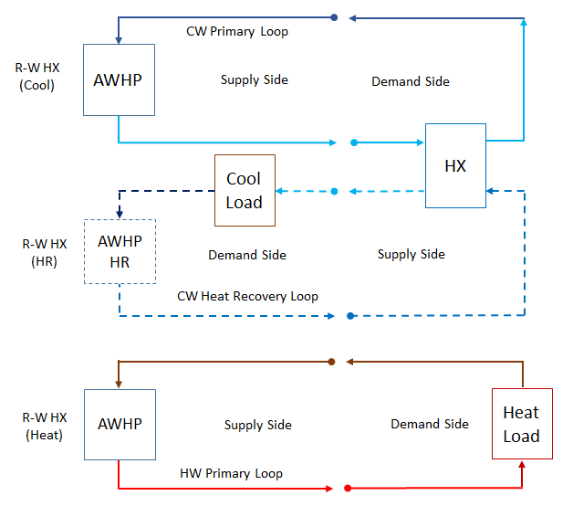

Air-To-Water Heat Pump Heat Recovery Mode
======================

**Bereket Nigusse**

**Florida Solar Energy Center**

 - First draft: January 26, 2024
 - Modified Date: February 01, 2024
 - Added Design Document: February 13, 2024
 - Modified Date: February 27, 2024

## Justification for New Feature ##

Modern air-to-water heat pumps for commercial applications often include heat recovery for simultaneous heating and cooling. The air-to-water heat pump simulation in EnergyPlus was improved during the FY23 development cycle; however, the current model supports heat-only and cool-only modes of operation. EnergyPlus should be able to support heat recovery mode for the air-to-water heat pump simulations.

**- The new feature was requested by Design Builder **

## E-mail and  Conference Call Conclusions ##

* technicalities call, Feb 07, 2024 *

  Brent: you may run into supply side temperature control problem if you have lower setpoint temperature than the temperature limits (e.g., HW Recovery).

  Bereket: may be we should check the minimum of these temperatures. This will be investigated during implementation.
  
  Brent: are we going to use the same air source performance curves for heat recovery?

  Bereket: I have to think about it. Brent said he will check with Trane engineers for curves

## Overview ##

### Current Code ###

The existing Air-to-Water Heat Pump model supports heat-only and cool-only mode simulations. 

**- This enhancement allows simultaneous cooling and heating modes of operation for Air-to-Water Heat Pump model.

## Implementation Approach ##

*(1) This new feature can be implemented by modifying the following existing objects:

     Existing objects: `HeatPump:PlantLoop:EIR:Cooling` and `HeatPump:PlantLoop:EIR:Heating`

*(2) Adds six new input fields to support heat recovery operation mode for each HeatPump:PlantLoop:EIR:* object.

     Adds new heat recovery fluid inlet and outlet nodes: 
     New input fields `Heat Recovery Inlet Node Name` and `Heat Recovery Outlet Node Name` will be added to the `HeatPump:PlantLoop:EIR:Cooling` object.
	 New input fields `Heat Recovery Inlet Node Name` and `Heat Recovery Outlet Node Name` will be added to the `HeatPump:PlantLoop:EIR:Heating` object.
	 
     Adds heat recovery side reference water flow rate:
	 New input field `Heat Recovery Reference Flow Rate` will be added to the `HeatPump:PlantLoop:EIR:Cooling` and `HeatPump:PlantLoop:EIR:Heating` objects.      

	 Adds heat recovery fluid temperature limits:
     New input field `Maximum Heat Recovery Outlet Temperature` will be added to the `HeatPump:PlantLoop:EIR:Cooling` object.
	 New input field `Minimum Heat Recovery Outlet Temperature` will be added to the `HeatPump:PlantLoop:EIR:Heating` object.

     Adds heat recovery capacity and EIR modifier curves:
	 New input field `Heat Recovery Capacity Modifier Function of Temperature Curve Name` will be added to the `HeatPump:PlantLoop:EIR:*` objects.
	 New input field `Heat Recovery Electric Input to Output Ratio Modifier Function of Temperature Curve Name` will be added to the `HeatPump:PlantLoop:EIR:*` objects.

		
*(3) Adds new code that supports calculating the heat rate and outlet node fluid temperature of the heat recovery system

	 Hot Water Recovery Rate Calculation:
	 {CAPFT_Val} = CAPFT(T_lSide_Cool, T_hrSide_Heat)
	 {Q_dot_{load,cool,avail}} = {Q_dot_{load,cool,ref}} * {CAPFT_Val}	 
	 {Q_dot_{HR,heat,avail}} = {Q_dot_{load,cool,avail}} + {Power_{cool}}
	 		
	 Heat Recovery Outlet Node Fluid Temperature Calculation:
	 {T_{HR,heat,out}} = {T_{HR,heat,in}} + {Q_dot_{HR,heat,avail}} / {{Cp_{heat}} * {m_dot_{HR,heat}}}

     Chilled Water Recovery Rate Calculation:
	 {CAPFT_Val} = CAPFT(T_lSide_Heat, T_hrSide_Cool) 
	 {Q_dot_{load,heat,avail}} = {Q_dot_{load,heat,ref}} * {CAPFT_Val} 
     {Q_dot_{HR,cool,avail}} = {Q_dot_{load,heat,avail}} - {Power_{heat}}

	 Heat Recovery Outlet Node Fluid Temperature Calculation:
	 {T_{HR,cool,out}} = {T_{HR,cool,in}} - {Q_dot_{HR,cool,avail}} / {{Cp_{cool}} * {m_dot_{HR,cool}}}

	 where,
	 CAPFT					 = capacity modifier normalized curve as a function of temperature
	 CAPFT_val				 = capacity modifier normalized curve value
	 {Q_dot_{load,heat,ref}} = heating coil reference capacity, W
	 {Q_dot_{load,cool,ref}} = cooling coil reference capacity, W
	 {Q_dot_{load,heat,avail}} = load side available heating rate, W
	 {Q_dot_{load,cool,avail}} = load side available cooling rate, W
	 {Q_dot_{HR,heat,avail}} = heat recovery available heating rate, W
	 {Q_dot_{HR,cool,avail}} = heat recovery available cooling rate, W
	 {T_{HR,heat,in}}		 = hot water heat recovery inlet node temperature, C
	 {T_{HR,heat,out}}		 = hot water heat recovery outlet node temperature, C
	 {{Cp_{heat}} 		 	 = hot water specific heat capacity, J/kgK
	 {m_dot_{HR,heat}}}		 = hot water heat recovery fluid mass flow rate, kg/s	 
	 {T_{HR,cool,in}}		 = chilled water heat recovery inlet node temperature, C
	 {T_{HR,cool,out}}		 = chilled water heat recovery outlet node temperature, C
	 {{Cp_{cool}} 		 	 = chilled water specific heat capacity, J/kgK
	 {m_dot_{HR,cool}}}		 = chilled water heat recovery fluid mass flow rate, kg/s
	 T_lSide_Cool			 = chiller load side entering fluid temperature, C 
	 T_hrSide_Heat		 	 = chiller heat recovery side entering fluid temperature, C
	 T_lSide_Heat			 = Heater load side entering fluid temperature, C 
	 T_hrSide_Cool			 = Heater heat recovery side entering fluid temperature, C

	 
*(4) Heat recovery operating mode simulation control.
      
	 ** the heat recovery mode operation is activated if heat recovery nodes are specified. **
	 
	 The heat recovery mode is essentially a passive operation. Hence, the HR delivered capacity is determined by the actual 
	 capacity of the chiller or heater operation.  Thus, the actual HR rate delivered can be estimated using the chiller or 
	 heater part-load ratio.
	 
	 Hot Water Heat Recovery:
	 {Q_dot_{HR,heat,actual}} = {PLR_{cool}} * {Q_dot_{load,cool,avail}} + {Power_{cool}}
	 
	 * the available capacity must be prorated by the chiller PLR to get the delivered hot water recovery rate. *

		 
	 Chilled Water Heat Recovery:
	 {Q_dot_{HR,cool,actual}} = {PLR_{heat}} * {Q_dot_{load,heat,avail}} - {Power_{heat}}
	 
     * the available capacity must be prorated by the heater PLR to get the delivered chilled water recovery rate. *
	 
	 ** required to check the user specified temperature limit at the heat recovery outlet node is not violated. ** 
	 * if the user specified temperature limit are exceeded then reset the heat recovery outlet temperature to the limit. *
	 * recalculate the heat recovery rate based on the temperature limit. *
	 * need to investigate how to represent the net balance between the available and actual heat recovery rate. *

	 where,
	 {Q_dot_{HR,heat,actual}} = heat recovery actual heating rate, W
	 {Q_dot_{HR,cool,actual}} = heat recovery actual cooling rate, W
	 {PLR_{cool}}		 	  = chiller part-load ratio, -
	 {PLR_{heat}}		 	  = heater part-load ratio, -
	 
*(5) Adds capacity and fluid flow rates sizing calculation for the heat recovery system.

	 Heat Recovery Reference Capacities Sizing: 
	 Hot Water Heating Reference Capacity:
	 {Q_dot_{HR,heat,ref}} = {Q_{ref,cool,coil}} * [1 + 1/{COP_cool}] 
 
	 Chilled Water Cooling Reference Capacity:
	 {Q_dot_{HR,cool,ref}} = {Q_{ref,heat,coil}} * [1 - 1/{COP_heat}]
	  
	 Heat Recovery Fluid Flow Rates Sizing:
	 Hot Water Recovery Design Flow Rate:
	 {m_dot_{HR,design,heat}} = {Sizing_Factor_{cool}} * {Q_dot_{HR,heat,ref}} / [{Cp_{heat}} * {DeltaT_{heat}}]
	 
	 Chilled Water Recovery Design Flow Rate:
	 {m_dot_{HR,design,cool}} = {Sizing_Factor_{heat}} * {Q_dot_{HR,cool,ref}} / [{Cp_{cool}} * {DeltaT_{cool}}]

	 where,
	 {Q_{ref,cool,coil}} 	= reference capacity of the chiller, W
	 {Q_{ref,heat,coil}} 	= reference capacity of the heater, W
	 {COP_cool})		 	= reference COP of the chiller, W/W
	 {COP_heat})		 	= reference COP of the heater, W/W
	 {Q_dot_{HR,heat,ref}}	= reference capacity of hot water heat recovery, W
	 {Q_dot_{HR,cool,ref}}	= reference capacity of chilled water heat recovery, W
	 {DeltaT_{heat}}  	 	= hot water loop design temperature difference, K
	 {DeltaT_{cool}}  	 	= chilled water loop design temperature difference, K
	 {Sizing_Factor_{cool}} = sizing factor of the chiller, (-)
	 {Sizing_Factor_{heat}} = sizing factor of the heater (heat pump), (-)

    * sizing output variable *
    
    * Design Size Heat Recovery Side Volume Flow Rate [m3/s] *
	
*(6) Schematic diagram of cooling and heating dominated heat recovery operating modes:

 Figure 1. Air-To-Water Heat Pump (Chiller) with Heat Recovery Mode Diagram.

 Figure 2. Air-To-Water Heat Pump (Heater) with Heat Recovery Mode Diagram.

### Existing Object HeatPump:PlantLoop:EIR:Cooling ###

    * added four new input fields and increased the min-fields to 18 from 15 *
	
HeatPump:PlantLoop:EIR:Cooling,
        \memo An EIR formulated water to water heat pump model, cooling operation.
        \min-fields 18
   A1,  \field Name
        \type alpha
        \reference PLHPCoolingNames
        \required-field
        \reference-class-name validPlantEquipmentTypes
        \reference validPlantEquipmentNames
        \reference-class-name validBranchEquipmentTypes
        \reference validBranchEquipmentNames
   A2,  \field Load Side Inlet Node Name
        \required-field
        \type node
   A3,  \field Load Side Outlet Node Name
        \required-field
        \type node
   A4,  \field Condenser Type
        \type choice
        \key WaterSource
        \key AirSource
        \default WaterSource
   A5,  \field Source Side Inlet Node Name
        \required-field
        \type node
   A6,  \field Source Side Outlet Node Name
        \required-field
        \type node
   A7,  \field Heat Recovery Inlet Node Name
        \type node
		\note Not available with water source condenser type
   A8,  \field Heat Recovery Outlet Node Name
        \type node
		\note Not available with water source condenser type
   A9,  \field Companion Heat Pump Name
        \note This field allows the user to specify a companion heating
        \note object for this cooling object. The companion is used in
        \note sizing the heat pump as well as to allow checks for unexpected
        \note simultaneous operation of the two objects.
        \type object-list
        \object-list PLHPHeatingNames
   N1,  \field Load Side Reference Flow Rate
        \note This component is currently a constant-flow device, meaning it will always
        \note try to request the full design flow from the central plant manager.
        \type real
        \minimum> 0.0
        \units m3/s
        \ip-units gal/min
        \autosizable
        \default autosize
   N2,  \field Source Side Reference Flow Rate
        \type real
        \minimum> 0.0
        \units m3/s
        \ip-units gal/min
        \autosizable
        \default autosize
   N3,  \field Heat Recovery Reference Flow Rate
        \type real
        \minimum> 0.0
        \units m3/s
        \ip-units gal/min
        \autosizable
        \default autosize
		\note Not available with water source condenser type
   N4,  \field Reference Capacity
        \type real
        \minimum> 0.0
        \units W
        \autosizable
        \default autosize
   N5,  \field Reference Coefficient of Performance
        \type real
        \minimum> 0.0
        \units W/W
        \default 3.0
   N6,  \field Sizing Factor
        \note Multiplies the autosized load side reference flow rate which is then used to autosize the capacity
        \type real
        \minimum> 0.0
        \default 1.0
   A10, \field Capacity Modifier Function of Temperature Curve Name
        \note Cooling capacity modifier as a function of CW supply temp and entering condenser temp
        \required-field
        \type object-list
        \object-list BivariateFunctions
        \note curve = a + b*CWS + c*CWS**2 + d*ECT + e*ECT**2 + f*CWS*ECT
        \note CWS = supply (leaving) chilled water temperature(C)
        \note ECT = entering condenser fluid temperature(C)
   A11, \field Electric Input to Output Ratio Modifier Function of Temperature Curve Name
        \note Electric Input Ratio (EIR) modifier as a function of temperature
        \note EIR = 1/COP
        \required-field
        \type object-list
        \object-list BivariateFunctions
        \note curve = a + b*CWS + c*CWS**2 + d*ECT + e*ECT**2 + f*CWS*ECT
        \note CWS = supply (leaving) chilled water temperature(C)
        \note ECT = entering condenser fluid temperature(C)
   A12, \field Electric Input to Output Ratio Modifier Function of Part Load Ratio Curve Name
        \note Electric Input Ratio (EIR) modifier as a function of Part Load Ratio (PLR)
        \note EIR = 1/COP
        \required-field
        \type object-list
        \object-list UniVariateFunctions
        \note quadratic curve = a + b*PLR + c*PLR**2 is typical, other univariate curves may be used
        \note PLR = part load ratio (cooling load/steady state capacity)
   A13, \field Control Type
        \note Heat pump can be controlled on leaving water temperature set point or plant load
        \type choice
        \key Setpoint
        \key Load
        \default Load
   A14, \field Flow Mode
        \note Select operating mode for fluid flow through the chiller. "ConstantFlow" is for
        \note constant pumping with flow controlled by chiller to operate at full design
        \note flow rate. "VariableSpeedPumping" is for variable pumping with flow proportional
        \note to chiller operating part load ratio.
        \type choice
        \key ConstantFlow
        \key VariableSpeedPumping
        \default ConstantFlow
   N7,  \field Minimum Part Load Ratio
        \note Below this operating limit compressor cycling will occur
        \type real
        \minimum 0.0
        \default 0.0
   N8,  \field Minimum Source Inlet Temperature
        \type real
        \units C
        \default -100.0
        \note Enter the minimum inlet outdoor air dry-bulb temperature
        \note for air-cooled units or minimum inlet water temperature for water-cooled units.
        \note The unit is disabled below this temperature.
   N9,  \field Maximum Source Inlet Temperature
        \type real
        \units C
        \default 100.0
        \note Enter the maximum inlet outdoor air dry-bulb temperature
        \note for air-cooled units or maximum inlet water temperature for water-cooled units.
        \note The unit is disabled above this temperature.
   N10, \field Minimum Supply Water Temperature Curve Name
        \type object-list
        \object-list UniVariateFunctions
        \note quadratic curve = a + b*OAT is typical, other univariate curves may be used
        \note OAT = Outdoor Dry-Bulb Temperature
   N11, \field Maximum Supply Water Temperature Curve Name
        \type object-list
        \object-list UniVariateFunctions
        \note quadratic curve = a + b*OAT is typical, other univariate curves may be used
        \note OAT = Outdoor Dry-Bulb Temperature
   N12, \field Maximum Heat Recovery Outlet Temperature
        \type real
        \units C
        \default 60.0
        \note Enter the maximum heat recovery leaving water temperature limit
        \note The hot water temperature is not allowed to exceed this value
	    \note Not available with water source condenser type
   A15, \field Heat Recovery Capacity Modifier Function of Temperature Curve Name
        \note Cooling capacity modifier as a function of CW supply temp and condenser entering fluid temp
        \required-field
        \type object-list
        \object-list BivariateFunctions
        \note curve = a + b*CWS + c*CWS**2 + d*ECT + e*ECT**2 + f*CWS*ECT
        \note CWS = supply (leaving) chilled water temperature(C)
        \note ECT = entering condenser fluid temperature(C)
		\note If this field is blank, the AWHP curve without heat recovery will be used
   A16; \field Heat Recovery Electric Input to Output Ratio Modifier Function of Temperature Curve Name
        \note Electric Input Ratio (EIR) modifier as a function of temperature
        \note EIR = 1/COP
        \required-field
        \type object-list
        \object-list BivariateFunctions
        \note curve = a + b*CWS + c*CWS**2 + d*ECT + e*ECT**2 + f*CWS*ECT
        \note CWS = supply (leaving) chilled water temperature(C)
        \note ECT = entering condenser fluid temperature(C)
		\note If this field is blank, the AWHP curve without heat recovery will be used		

### Existing Object HeatPump:PlantLoop:EIR:Heating ###

    * added four new input fields and increased the min-fields to 18 from 15 *

HeatPump:PlantLoop:EIR:Heating,
        \memo An EIR formulated water to water heat pump model, heating operation
        \min-fields 18
   A1,  \field Name
        \type alpha
        \reference PLHPHeatingNames
        \required-field
        \reference-class-name validPlantEquipmentTypes
        \reference validPlantEquipmentNames
        \reference-class-name validBranchEquipmentTypes
        \reference validBranchEquipmentNames
   A2,  \field Load Side Inlet Node Name
        \required-field
        \type node
   A3,  \field Load Side Outlet Node Name
        \required-field
        \type node
   A4,  \field Condenser Type
        \type choice
        \key WaterSource
        \key AirSource
        \default WaterSource
   A5,  \field Source Side Inlet Node Name
        \required-field
        \type node
   A6,  \field Source Side Outlet Node Name
        \required-field
        \type node
   A7,  \field Heat Recovery Inlet Node Name
        \type node
		\note Not available with water source condenser type
   A8,  \field Heat Recovery Outlet Node Name
        \type node
		\note Not available with water source condenser type
   A9,  \field Companion Heat Pump Name
        \note This field allows the user to specify a companion cooling
        \note object for this heating object. The companion is used in
        \note sizing the heat pump as well as to allow checks for unexpected
        \note simultaneous operation of the two objects.
        \type object-list
        \object-list PLHPCoolingNames
   N1,  \field Load Side Reference Flow Rate
        \note This component is currently a constant-flow device, meaning it will always
        \note try to request the full design flow from the central plant manager.
        \type real
        \minimum> 0.0
        \units m3/s
        \ip-units gal/min
        \autosizable
        \default autosize
   N2,  \field Source Side Reference Flow Rate
        \type real
        \minimum> 0.0
        \units m3/s
        \ip-units gal/min
        \autosizable
        \default autosize
   N3,  \field Heat Recovery Reference Flow Rate
        \type real
        \minimum> 0.0
        \units m3/s
        \ip-units gal/min
        \autosizable
        \default autosize
		\note Not available with water source condenser type
   N4,  \field Reference Capacity
        \type real
        \minimum> 0.0
        \units W
        \autosizable
        \default autosize
   N5,  \field Reference Coefficient of Performance
        \type real
        \minimum> 0.0
        \units W/W
        \default 3.0
   N6,  \field Sizing Factor
        \note Multiplies the autosized load side reference flow rate which is then used to autosize the capacity
        \type real
        \minimum> 0.0
        \default 1.0
   A10,  \field Capacity Modifier Function of Temperature Curve Name
        \note Heating capacity modifier as a function of CW supply temp and entering condenser temp
        \required-field
        \type object-list
        \object-list BivariateFunctions
        \note curve = a + b*CWS + c*CWS**2 + d*ECT + e*ECT**2 + f*CWS*ECT
        \note CWS = supply (leaving) hot water temperature(C)
        \note ECT = entering condenser fluid temperature(C)
   A11, \field Electric Input to Output Ratio Modifier Function of Temperature Curve Name
        \note Electric Input Ratio (EIR) modifier as a function of temperature
        \note EIR = 1/COP
        \required-field
        \type object-list
        \object-list BiVariateFunctions
        \note curve = a + b*CWS + c*CWS**2 + d*ECT + e*ECT**2 + f*CWS*ECT
        \note CWS = supply (leaving) hot water temperature(C)
        \note ECT = entering condenser fluid temperature(C)
   A12, \field Electric Input to Output Ratio Modifier Function of Part Load Ratio Curve Name
        \note Electric Input Ratio (EIR) modifier as a function of Part Load Ratio (PLR)
        \note EIR = 1/COP
        \required-field
        \type object-list
        \object-list UnivariateFunctions
        \note quadratic curve = a + b*PLR + c*PLR**2 is typical, other univariate curves may be used
        \note PLR = part load ratio (hot load/steady state capacity)
   N7,  \field Heating To Cooling Capacity Sizing Ratio
        \note Multiplies the autosized heating capacity
        \type real
        \minimum 0.0
        \default 1.0
   A13, \field Heat Pump Sizing Method
        \note Specifies sizing method when companion coil exists
        \type choice
        \key CoolingCapacity
        \key HeatingCapacity
        \key GreaterOfHeatingOrCooling
        \default CoolingCapacity
   A14, \field Control Type
        \note Heat pump can be controlled on leaving water temperature set point or plant load
        \type choice
        \key Setpoint
        \key Load
        \default Load
   A15, \field Flow Mode
        \note Select operating mode for fluid flow through the chiller. "ConstantFlow" is for
        \note constant pumping with flow controlled by chiller to operate at full design
        \note flow rate. "VariableSpeedPumping" is for variable pumping with flow proportional
        \note to chiller operating part load ratio.
        \type choice
        \key ConstantFlow
        \key VariableSpeedPumping
        \default ConstantFlow
   N8,  \field Minimum Part Load Ratio
        \note Below this operating limit compressor cycling will occur
        \type real
        \minimum 0.0
        \default 0.0
   N9,  \field Minimum Source Inlet Temperature
        \type real
        \units C
        \default -100.0
        \note Enter the minimum inlet outdoor air dry-bulb temperature
        \note for air-cooled units or minimum inlet water temperature for water-cooled units.
        \note The unit is disabled below this temperature.
   N10, \field Maximum Source Inlet Temperature
        \type real
        \units C
        \default 100.0
        \note Enter the maximum inlet outdoor air dry-bulb temperature
        \note for air-cooled units or maximum inlet water temperature for water-cooled units.
        \note The unit is disabled above this temperature.
   A16, \field Minimum Supply Water Temperature Curve Name
        \type object-list
        \object-list UniVariateFunctions
        \note quadratic curve = a + b*OAT is typical, other univariate curves may be used
        \note OAT = Outdoor Dry-Bulb Temperature
   A17, \field Maximum Supply Water Temperature Curve Name
        \type object-list
        \object-list UniVariateFunctions
        \note quadratic curve = a + b*OAT is typical, other univariate curves may be used
        \note OAT = Outdoor Dry-Bulb Temperature
   A18, \field Dry Outdoor Correction Factor Curve Name
        \type object-list
        \object-list UniVariateFunctions
   N11, \field Maximum Outdoor Dry Bulb Temperature For Defrost Operation
        \type real
        \default 10.0
        \note defrost operation will not be active above this outdoor temperature
   A19, \field Heat Pump Defrost Control
        \type choice
        \key None
        \key Timed
        \key OnDemand
        \key TimedEmpirical
        \note A blank field is the same as None.
   N12, \field Heat Pump Defrost Time Period Fraction
        \type real
        \minimum 0.0
        \default 0.058333
        \note Nominal fraction of time in defrost mode
        \note only applicable if Timed or TimedEmpirical heat pump defrost control is specified
   A20, \field Defrost Energy Input Ratio Function of Temperature Curve Name
        \type object-list
        \object-list BivariateFunctions
        \note univariate curve = a + b*OAT is typical, other univariate curves may be used
        \note bivariate curve = a + b*WB + c*WB**2 + d*OAT + e*OAT**2 + f*WB*OAT
        \note OAT = outdoor air dry-bulb temperature (C)
        \note WB = wet-bulb temperature (C) of air entering the indoor coil
        \note only required if Timed or OnDemand defrost strategy is specified
   A21, \field Timed Empirical Defrost Frequency Curve Name
        \type object-list
        \object-list UniVariateFunctions
        \note univariate curve = a + b*OAT is typical, other univariate curves may be used
        \note OAT = outdoor air dry-bulb temperature (C)
        \note Timed Empirical Defrost Frequency fraction in hours = curve output
        \note only applicable if TimedEmpirical defrost control is specified
   A22, \field Timed Empirical Defrost Heat Load Penalty Curve Name
        \type object-list
        \object-list UniVariateFunctions
        \object-list BivariateFunctions
        \note univariate curve = a + b*OAT is typical, other univariate curves may be used
        \note bivariate curve = a + b*WB + c*WB**2 + d*OAT + e*OAT**2 + f*WB*OAT
        \note OAT = outdoor air dry-bulb temperature (C)
        \note WB = wet-bulb temperature (C) of air entering the indoor coil
        \note Timed Empirical Defrost Heat Load Penalty in watts = hot load * curve output
        \note only applicable if TimedEmpirical defrost control is specified
   A23, \field Timed Empirical Defrost Heat Input Energy Fraction Curve Name
        \type object-list
        \object-list UniVariateFunctions
        \object-list BivariateFunctions
        \note univariate curve = a + b*OAT is typical, other univariate curves may be used
        \note bivariate curve = a + b*WB + c*WB**2 + d*OAT + e*OAT**2 + f*WB*OAT
        \note OAT = outdoor air dry-bulb temperature (C)
        \note WB = wet-bulb temperature (C) of air entering the indoor coil
        \note Timed Empirical Defrost Heat Input Energy in watts = rated hot load * curve output
        \note only applicable if TimedEmpirical defrost control is specified
   N13, \field Minimum Heat Recovery Outlet Temperature
        \type real
        \units C
        \default 4.5
        \note Enter the minimum heat recovery leaving water temperature limit
        \note The chilled water temperature is not allowed to drop below this value
	    \note Not available with water source condenser type
   A24, \field Heat Recovery Capacity Modifier Function of Temperature Curve Name
        \note Heating capacity modifier as a function of CW supply temp and entering condenser fluid temp
        \required-field
        \type object-list
        \object-list BivariateFunctions
        \note curve = a + b*HWS + c*HWS**2 + d*ECT + e*ECT**2 + f*HWS*ECT
        \note HWS = supply (leaving) hot water temperature(C)
        \note ECT = entering condenser fluid temperature(C)
   A25; \field Heat Recovery Electric Input to Output Ratio Modifier Function of Temperature Curve Name
        \note Electric Input Ratio (EIR) modifier as a function of temperature
        \note EIR = 1/COP
        \required-field
        \type object-list
        \object-list BiVariateFunctions
        \note curve = a + b*HWS + c*HWS**2 + d*ECT + e*ECT**2 + f*HWS*ECT
        \note HWS = supply (leaving) hot water temperature(C)
        \note ECT = entering condenser fluid temperature(C)
		\note If this field is blank, the AWHP curve without heat recovery will be used	
		
## Testing/Validation/Data Source(s): ##

Demonstrate that the air-to-water heat pump object supports heat recovery mode simulation. Unit tests will be added to demonstrate the new feature.

## Input Output Reference Documentation ##

Documentation for the new input fields will be added to the I/O reference guide of `HeatPump:PlantLoop:EIR:Cooling` and `HeatPump:PlantLoop:EIR:Heating` objects.

### HeatPump:PlantLoop:EIR:Cooling ##

\subsection{HeatPump:PlantLoop:EIR:Cooling}\label{plhp_eir_cooling}

The EIR-formulated cooling model objects are described.

...

* New input fields definition * 

\paragraph{Field: Heat Recovery Inlet Node Name}\label{plhp_eir_cooling_inputs_heat_recovery_inlet_node}

This alpha field contains the heat pump's heat recovery inlet node name.

\paragraph{Field: Heat Recovery Outlet Node Name}\label{plhp_eir_cooling_inputs_heat_recovery_outlet_node}

This alpha field contains the heat pump's heat recovery outlet node name.

\paragraph{Field: Heat Recovery Reference Flow Rate}\label{plhp_eir_cooling_inputs_heat_recovery_flow}

This autosizable field defines the heat recovery reference flow rate for the heat pump. This field is used as the nominal heat recovery flow request for this heat pump unit during the simulation. The units for this field is[m3/s].

\paragraph{Field: Maximum Heat Recovery Outlet Temperature}\label{plhp_eir_cooling_inputs_maximum_heat_recovery_outlet_temperature}

This optional numeric field specifies the maximum leaving water temperature at the heat recovery outlet node. The hot water temperature is not allowed to exceed this value. The default value is 60. The units for this field are [C]. If the heat recovery coil entering hot water temperature is at or exceeds this temperature limit, the heat recovery operation is disabled, and the heat pump operates in cooling-only mode.

\paragraph{Field: Heat Recovery Capacity Modifier Function of Temperature Curve Name}\label{plhp_eir_cooling_inputs_heat_recovery_capft}

This field is the name of a bivariate curve or table that defines an available capacity modifier of the unit as a function of the load side outlet temperature and the heat recovery side inlet temperature. The temperatures are in degrees Celsius when used in the function and the output of the function is multiplied by the reference capacity to get a current available capacity when the unit is operating in heat recovery mode.

\paragraph{Field: Heat Recovery Electric Input to Output Ratio Modifier Function of Temperature Curve Name}\label{plhp_eir_cooling_inputs_heat_recovery_eirft}

This field is the name of a bivariate curve or table that defines an EIR (1/COP) modifier as a function of the load side outlet temperature and the heat recovery side inlet temperature. The temperatures are in degrees Celsius when used in the function. The output of this function and the output of the EIR Modifier Function of PLR are multiplied by the reference EIR to get a current EIR when the unit is operating in heat recovery mode.
		
### HeatPump:PlantLoop:EIR:Heating ##

\subsection{HeatPump:PlantLoop:EIR:Heating}\label{plhp_eir_heating}

The EIR-formulated heating model objects are described.

...
		
* New input fields definition * 

\paragraph{Field: Heat Recovery Inlet Node Name}\label{plhp_eir_heating_inputs_heat_recovery_inlet_node}

This alpha field contains the heat pump's heat recovery inlet node name.

\paragraph{Field: Heat Recovery Outlet Node Name}\label{plhp_eir_heating_inputs_heat_recovery_outlet_node}

This alpha field contains the heat pump's heat recovery outlet node name.

\paragraph{Field: Heat Recovery Reference Flow Rate}\label{plhp_eir_heating_inputs_heat_recovery_flow}

This autosizable field defines the heat recovery reference flow rate for the heat pump. This field is used as the nominal heat recovery flow request for this heat pump unit during the simulation. The units for this field is [m3/s].

\paragraph{Field: Minimum Heat Recovery Outlet Temperature}\label{plhp_eir_heating_inputs_minimum_heat_recovery_outlet_temperature}

This optional numeric field specifies the minimum leaving water temperature at the heat recovery outlet node. The chilled water temperature is not allowed to drop below this value. The default value is 4.5. The units for this field is [C]. If the chilled water recovery coil entering water temperature is at or below this temperature limit, the heat recovery operation is disabled, and the heat pump operates in heating-only mode.

\paragraph{Field: Heat Recovery Capacity Modifier Function of Temperature Curve Name}\label{plhp_eir_heating_inputs_heat_recovery_capft}

This field is the name of a bivariate curve or table that defines an available capacity modifier of the unit as a function of the load side outlet temperature and the heat recovery side inlet temperature. The temperatures are in degrees Celsius when used in the function and the output of the function is multiplied by the reference capacity to get a current available capacity when the unit is operating in heat recovery mode.

\paragraph{Field: Heat Recovery Electric Input to Output Ratio Modifier Function of Temperature Curve Name}\label{plhp_eir_heating_inputs_heat_recovery_eirft}

This field is the name of a bivariate curve or table that defines an EIR (1/COP) modifier as a function of the load side outlet temperature and the heat recovery side inlet temperature. The temperatures are in degrees Celsius when used in the function. The output of this function and the output of the EIR Modifier Function of PLR are multiplied by the reference EIR to get a current EIR when the unit is operating in heat recovery mode.

		
## Engineering Reference ##
As needed.

## Example File and Transition Changes ##

A new example file will be created for the heat recovery mode of air-to-water heat pumps. Simulation results will be examined, and sample results will be provided.

Transition is required to handle the two nodes and the heat recovery reference flow rate input fields.

## Proposed Report Variables: ##

Adds five output variables.

\subsubsection{Outputs}\label{outputs-12-004}

\begin{itemize}
    ...
    \item
    HVAC,Sum,Heat Pump Heat Recovery Heat Transfer Energy {[}J{]}
    \item
    HVAC,Average,Heat Pump Heat Recovery Heat Transfer Rate {[}W{]}
    \item
    HVAC,Average,Heat Pump Heat Recovery Outlet Temperaturee {[}$^\circ$C{]}
    \item
    HVAC,Average,Heat Pump Heat Recovery Inlet Temperature {[}$^\circ$C{]}
    \item
    HVAC,Average,Heat Pump Heat Recovery Mass Flow Rate {[}kg/s{]}
	\item
	HVAC,Average,Heat Pump Heat Recovery Operation Status {[}{]}
\end{itemize}

...

\paragraph{Heat Pump Heat Recovery Heat Transfer Energy {[}J{]}}\label{water-to-water-heat-pump-heat-recovery-heat-transfer-energy-j}

This output variable represents the cumulative heat transfer across the heat recovery coil. The values are calculated for each HVAC system time step being simulated, and the results are summed across the reporting period.

\paragraph{Heat Pump Heat Recovery Heat Transfer Rate {[}W{]}}\label{water-to-water-heat-pump-heat-recovery-heat-transfer-rate-w}

This output variable represents the heat transfer across the heat recovery coil. The values are calculated for each HVAC system time step being simulated, and the results are averaged for the time step being reported.
   
\paragraph{Heat Pump Heat Recovery Outlet Temperature {[}C{]}}\label{water-to-water-heat-pump-heat-recovery-outlet-temperature-c}

This output variable represents the average fluid temperature leaving the heat recovery coil. The values are calculated for each HVAC system time step being simulated, and the results are averaged for the time step being reported.

\paragraph{Heat Pump Source Side Inlet Temperature {[}C{]}}\label{water-to-water-heat-pump-source-side-inlet-temperature-c}

This output variable represents the average fluid temperature entering the heat recovery coil.~ The values are calculated for each HVAC system time step being simulated, and the results are averaged for the time step being reported.

\paragraph{Heat Pump Heat Recovery Mass Flow Rate {[}kg/s{]}}\label{water-to-water-heat-pump-heat-recovery-mass-flow-rate-kgs}

This output variable represents the average fluid flow rate through the heat recovery coil. The values are calculated for each HVAC system time step being simulated, and the results are averaged for the time step being reported.

\paragraph{Heat Pump Heat Recovery Operation Status {[}{]}}\label{water-to-water-heat-pump-heat-recovery-operating-status}

This output variable represents the average operating status of heat recovery operation. The values are calculated for each HVAC system time step being simulated, and the results are averaged for the time step being reported. 0 means the heat recovery operation is off or disabled, 1 means the heat recovery operation is active.

## References ##
NA
## Design Documentation ##

The new feature may modify the following modules:

   ** PlantLoopHeatPumpEIR.cc, PlantLoopHeatPumpEIR.hh, EquiAndOperation.cc, PlantCondLoopOperation.cc **
   
   
The following changes are required to implement the new feature

   PlantLoopHeatPumpEIR.hh,
	** add the following new member variables **
		 
	   Module Member Variables:
	   // simulation variables
	   Real64 heatRecoveryInletTemp = 0.0;    // heat recovery fluid inlet node temperature
	   Real64 heatRecoveryOutletTemp = 0.0;   // heat recovery fluid outlet node temperature 
       Real64 heatRecoveryRate = 0.0;         // heat recovery heat transfer rate
	   Real64 heatRecoveryEnergy = 0.0;       // heat recovery heat transfer energy
	
	   // topology variables
	   PlantLocation heatRecoveryPlantLoc;    // heat recovery plant loop location
	   InOutNodePair heatRecoveryNodes;       // heat recovery inlet and outlet node pairs

	   // flow rate terms
	   Real64 heatRecoveryDesignVolFlowRate = 0.0;
	   bool heatRecoveryDesignVolFlowRateWasAutoSized = false;
	   Real64 heatRecoveryDesignMassFlowRate = 0.0;
	   Real64 heatRecoveryMassFlowRate = 0.0;   
	   bool heatRecoveryIsActive = false;
	   bool heatRecoveryAvailable = false;
	   int heatRecoveryOperatingStatus = 0;
		
		
   EIRPlantLoopHeatPump::resetReportingVariables()
    ** reset the heat recovery new member variables **
    void EIRPlantLoopHeatPump::resetReportingVariables()
    {   
	 * reset new member variables of the heat recovery *

     `this->heatRecoveryRate = 0.0;`
     `this->heatRecoveryEnergy = 0.0;`
	 `this->heatRecoveryMassFlowRate = 0.0;`
     `this->heatRecoveryOutletTemp = this->heatRecoveryInletTemp;`
	 `this->heatRecoveryIsActive = false;`
	 `this->heatRecoveryOperatingStatus = 0;`
    }
	
	
   Get Input Function:
   EIRPlantLoopHeatPump::processInputForEIRPLHP()
   	** Update the get input function to read the four new input fields **
   
   EIRPlantLoopHeatPump::onInitLoopEquip()
   
   New Sizing Functions:
   EIRPlantLoopHeatPump::sizeHeatRecoveryASHP()   
    ** add heat recovery sizing procedure to new sizeHeatRecoveryASHP() function **

    if (this->heatRecoveryAvailable) {
	
    ** add sizing for `Heat Recovery Reference Flow Rate` new input field **
	
	   `*equations are described in the approach section above*` 
    
	}
      
   Simulate and Calc Functions:
   EIRPlantLoopHeatPump::simulate()
   
    * set heat recovery inlet temperature * 
    
	this->heatRecoveryInletTemp = state.dataLoopNodes->Node(this->heatRecoveryNodes.inlet).Temp;
	
	* init heat recovery plant loop flows *
	
   EIRPlantLoopHeatPump::doPhysics()
   
	** Refactor defrost calculation part of the doPhysics() function ** 
	
	* defrost calculation is used with air-source heat pump only *
	EIRPlantLoopHeatPump::doDefrost()

	* Create doDefrost() new function for defrost calculation. *
	* Defrost is not required for Water-to-Water Heat Pump *
   
    ** Refactor available capacity calculation part of the doPhysics() function ** 
	
	* create a new calcAvailableCapacity() functions for capacity calculation *
    * refactor the capacity modifier applied for dry-air as a source used with heating coil *
	EIRPlantLoopHeatPump::calcAvailableCapacity()  
   
    ** Refactor curve checks part of the doPhysics() function *
	
	* create a new CurveCheck() functions that wraps the cruve checks *
	EIRPlantLoopHeatPump::CapModFTCurveCheck()
    EIRPlantLoopHeatPump::EIRModCurveCheck()

    * create a new functions for load side, power and source side calcultion *
	EIRPlantLoopHeatPump::calcLoadSideHeatTransfer()
	EIRPlantLoopHeatPump::calcPowerUsage()
	
	* refactor source side heat transfer calculation for ASHP and WSHP *
	EIRPlantLoopHeatPump::calcSourceSideHeatTransferWSHP()
	EIRPlantLoopHeatPump::calcSourceSideHeatTransferASHP()
	
	* create a new function that updates report variables and nodes information *
	EIRPlantLoopHeatPump::report()
	
	
    ** Refactor ASHP and WSHP part of the doPhysics function **
	
	* create one for ASHP and another for WSHP functions **

    * the existing dPhysics() function will be used as a wrapper function *

	EIRPlantLoopHeatPump::doPhysicsWSHP()
	EIRPlantLoopHeatPump::doPhysicsASHP()
	
    
	** modify the new dPhysicsASHP() function to support heat recovery calculation **
	
	if (this->heatRecoveryIsActive) {
	
	   ** heat recovery loop connected **
	   
	   * do the heatrecovery side heat transfer calculation *
	   	   
	   * account for the HR effect on the load side heat transfer *
	   
	   * capacity modifier curve calculation must use HR entering temperature instead of outside air *
	   
	   * do the outlet temperature calculation *
	   
	   * check heat reovery outlet temperature limit *
	   
	   * calculate the heat recovery actual heat transfer rate if the temperature limit is exceeded *
	   
	   * report the balance heat recovery heat transfer rate *
	   	   
	} else {
	  
	  ** no heat recovery loop connected **
	  
	  * do the existing calculation *	  
	
	}
	

	** Calculate heat recovery outlet temperature **
    
	if (this->heatRecoveryIsActive) {
	
	   * HR side outlet temperature calculation*

	   * the load side heat transfer must include the effect of HR operation *

	   * the effect of heat recovery operation on the Heat Pump is accounted for via performance curves *
	   
		 `this->sourceSideHeatTransfer = 0.0;`

	} else {
	
	   * No HR, use existing source side outlet temperature calculation *
	   
	   * No HR, set the heat recovery mass flow rate to zero *`
	       `this->heatRecoveryMassFlowRate = 0.0;`
		   
       * No HR, set the heat recovery heat transfer rate to zero *`
	       `this->heatRecoveryRate = 0.0;`
	   
	   * No HR, set the outlet temperature to the inlet temperature *`
           `this->heatRecoveryOutletTemp = this->heatRecoveryInletTemp;`
	   
	}
   
   
   EIRPlantLoopHeatPump::setOperatingFlowRatesASHP()
   
   ** if heat recovery is active then set operating flow rate for heat recovery side **

    `* set heat recovery flow rates for ON and OFF modes *`
	
    `this->heatRecoveryMassFlowRate = 0.0;`
    `if (!this->running) {`
	    `* reset the HR flow to zero if the heat pump is off *`
        `this->heatRecoveryMassFlowRate = 0.0;`
        `PlantUtilities::SetComponentFlowRate(state, this->heatRecoveryMassFlowRate, this->heatRecoveryNodes.inlet, this->heatRecoveryNodes.outlet, this->heatRecoveryPlantLoc);`
    `} else {`
		`* check if the HR is active *`
	    `* set Heat Recovery flows if the heat pump is running *`
        `this->heatRecoveryMassFlowRate = this->heatRecoveryDesignMassFlowRate;`
	}

    * if there's no flow in the load side turn off the HR side as well*
    `if (this->loadSideMassFlowRate <= 0.0) {`
    `   this->heatRecoveryMassFlowRate = 0.0;`
    `}`

   EIRPlantLoopHeatPump::oneTimeInit()
   
   ** add the following five new report variables for heat recovery **
   
   `* Heat Pump Heat Recovery Mass Flow Rate *`
   `* Heat Pump Heat Recovery Heat Transfer Rate *`
   `* Heat Pump Heat Recovery Heat Transfer Energy *`
   `* Heat Pump Heat Recovery Inlet Temperature *`
   `* Heat Pump Heat Recovery Outlet Temperature *`
   `* Heat Pump Heat Recovery Operation Status *`