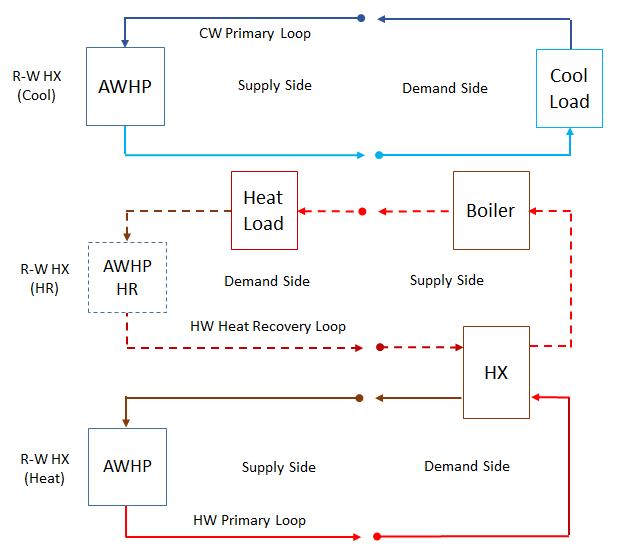

Air-To-Water Heat Pump Heat Recovery Mode
======================

**Bereket Nigusse**

**Florida Solar Energy Center**

 - First draft: January 26, 2024
 - Modified Date: February 01, 2024
 - Added Design Document: NA
 

## Justification for New Feature ##

Modern air-to-water heat pumps for commercial applications often include heat recovery for simultaneous heating and cooling. The air-to-water heat pump simulation in EnergyPlus was improved during the FY23 development cycle; however, the current model supports heat-only and cool-only modes of operation. EnergyPlus should be able to support heat recovery mode for the air-to-water heat pump simulations.

**- The new feature was requested by Design Builder **

## E-mail and  Conference Call Conclusions ##

- NA

## Overview ##

### Current Code ###

The existing Air-to-Water Heat Pump model supports heat-only and cool-only mode simulations. 

**- This enhancement allows simultaneous cooling and heating modes of operation for Air-to-Water Heat Pump model.

## Implementation Approach ##

*(1) This new feature can be implemented by modifying the following existing objects:

     Existing objects: `HeatPump:PlantLoop:EIR:Cooling` and `HeatPump:PlantLoop:EIR:Heating`

*(2) Adds four new input fields to support heat recovery operation mode for each HeatPump:PlantLoop:EIR:* object.

     Adds new heat recovery fluid inlet and outlet nodes: 
     New input fields `Heat Recovery Inlet Node Name` and `Heat Recovery Outlet Node Name` will be added to the `HeatPump:PlantLoop:EIR:Cooling` object.
	 New input fields `Heat Recovery Inlet Node Name` and `Heat Recovery Outlet Node Name` will be added to the `HeatPump:PlantLoop:EIR:Heating` object.
	 
     Adds heat recovery side reference water flow rate:
	 New input field `Heat Recovery Reference Flow Rate` will be added to the `HeatPump:PlantLoop:EIR:Cooling` and `HeatPump:PlantLoop:EIR:Heating` objects.      

	 Adds heat recovery fluid temperature limits:
     New input field `Maximum Heat Recovery Outlet Temperature` will be added to the `HeatPump:PlantLoop:EIR:Cooling` object.
	 New input field `Minimum Heat Recovery Outlet Temperature` will be added to the `HeatPump:PlantLoop:EIR:Heating` object.

		
*(3) Adds new code that supports calculating the heat rate and outlet node fluid temperature of the heat recovery system

	 Hot Water Recovery Rate Calculation:
	 {CAPFT_Val} = CAPFT(T_lSide_Cool, T_hrSide_Heat)
	 {Q_dot_{load,cool,avail}} = {Q_dot_{load,cool,ref}} * {CAPFT_Val}	 
	 {Q_dot_{HR,heat,avail}} = {Q_dot_{load,cool,avail}} + {Power_{cool}}
	 		
	 Heat Recovery Outlet Node Fluid Temperature Calculation:
	 {T_{HR,heat,out}} = {T_{HR,heat,in}} + {Q_dot_{HR,heat,avail}} / {{Cp_{heat}} * {m_dot_{HR,heat}}}

     Chilled Water Recovery Rate Calculation:
	 {CAPFT_Val} = CAPFT(T_lSide_Heat, T_hrSide_Cool) 
	 {Q_dot_{load,heat,avail}} = {Q_dot_{load,heat,ref}} * {CAPFT_Val} 
     {Q_dot_{HR,cool,avail}} = {Q_dot_{load,heat,avail}} - {Power_{heat}}

	 Heat Recovery Outlet Node Fluid Temperature Calculation:
	 {T_{HR,cool,out}} = {T_{HR,cool,in}} - {Q_dot_{HR,cool,avail}} / {{Cp_{cool}} * {m_dot_{HR,cool}}}

	 where,
	 CAPFT					 = capacity modifier normalized curve as a function of temperature
	 CAPFT_val				 = capacity modifier normalized curve value
	 {Q_dot_{load,heat,ref}} = heating coil reference capacity, W
	 {Q_dot_{load,cool,ref}} = cooling coil reference capacity, W
	 {Q_dot_{load,heat,avail}} = load side available heating rate, W
	 {Q_dot_{load,cool,avail}} = load side available cooling rate, W
	 {Q_dot_{HR,heat,avail}} = heat recovery available heating rate, W
	 {Q_dot_{HR,cool,avail}} = heat recovery available cooling rate, W
	 {T_{HR,heat,in}}		 = hot water heat recovery inlet node temperature, C
	 {T_{HR,heat,out}}		 = hot water heat recovery outlet node temperature, C
	 {{Cp_{heat}} 		 	 = hot water specific heat capacity, J/kgK
	 {m_dot_{HR,heat}}}		 = hot water heat recovery fluid mass flow rate, kg/s	 
	 {T_{HR,cool,in}}		 = chilled water heat recovery inlet node temperature, C
	 {T_{HR,cool,out}}		 = chilled water heat recovery outlet node temperature, C
	 {{Cp_{cool}} 		 	 = chilled water specific heat capacity, J/kgK
	 {m_dot_{HR,cool}}}		 = chilled water heat recovery fluid mass flow rate, kg/s
	 T_lSide_Cool			 = chiller load side entering fluid temperature, C 
	 T_hrSide_Heat		 	 = chiller heat recovery side entering fluid temperature, C
	 T_lSide_Heat			 = Heater load side entering fluid temperature, C 
	 T_hrSide_Cool			 = Heater heat recovery side entering fluid temperature, C

	 
*(4) Heat recovery operating mode simulation control.
      
	 ** the heat recovery mode operation is activated if heat recovery nodes are specified. **
	 
	 The heat recovery mode is essentially a passive operation. Hence, the HR delivered capacity is determined by the actual 
	 capacity of the chiller or heater operation.  Thus, the actual HR rate delivered can be estimated using the chiller or 
	 heater part-load ratio.
	 
	 Hot Water Heat Recovery:
	 {Q_dot_{HR,heat,actual}} = {PLR_{cool}} * {Q_dot_{load,cool,avail}} + {Power_{cool}}
	 
	 * the available capacity must be prorated by the chiller PLR to get the delivered hot water recovery rate. *

		 
	 Chilled Water Heat Recovery:
	 {Q_dot_{HR,cool,actual}} = {PLR_{heat}} * {Q_dot_{load,heat,avail}} - {Power_{heat}}
	 
     * the available capacity must be prorated by the heater PLR to get the delivered chilled water recovery rate. *
	 
	 ** required to check the user specified temperature limit at the heat recovery outlet node is not violated. ** 
	 * if the user specified temperature limit are exceeded then reset the heat recovery outlet temperature to the limit. *
	 * recalculate the heat recovery rate based on the temperature limit. *
	 * need to investigate how to represent the net balance between the available and actual heat recovery rate. *

	 where,
	 {Q_dot_{HR,heat,actual}} = heat recovery actual heating rate, W
	 {Q_dot_{HR,cool,actual}} = heat recovery actual cooling rate, W
	 {PLR_{cool}}		 	  = chiller part-load ratio, -
	 {PLR_{heat}}		 	  = heater part-load ratio, -
	 
*(5) Adds capacity and fluid flow rates sizing calculation for the heat recovery system.

	 Heat Recovery Reference Capacities Sizing: 
	 Hot Water Heating Reference Capacity:
	 {Q_dot_{HR,heat,ref}} = {Q_{ref,cool,coil}} * [1 + 1/{COP_cool}] 
 
	 Chilled Water Cooling Reference Capacity:
	 {Q_dot_{HR,cool,ref}} = {Q_{ref,heat,coil}} * [1 - 1/{COP_heat}]
	  
	 Heat Recovery Fluid Flow Rates Sizing:
	 Hot Water Recovery Design Flow Rate:
	 {m_dot_{HR,design,heat}} = {Sizing_Factor_{cool}} * {Q_dot_{HR,heat,ref}} / [{Cp_{heat}} * {DeltaT_{heat}}]
	 
	 Chilled Water Recovery Design Flow Rate:
	 {m_dot_{HR,design,cool}} = {Sizing_Factor_{heat}} * {Q_dot_{HR,cool,ref}} / [{Cp_{cool}} * {DeltaT_{cool}}]

	 where,
	 {Q_{ref,cool,coil}} 	= reference capacity of the chiller, W
	 {Q_{ref,heat,coil}} 	= reference capacity of the heater, W
	 {COP_cool})		 	= reference COP of the chiller, W/W
	 {COP_heat})		 	= reference COP of the heater, W/W
	 {Q_dot_{HR,heat,ref}}	= reference capacity of hot water heat recovery, W
	 {Q_dot_{HR,cool,ref}}	= reference capacity of chilled water heat recovery, W
	 {DeltaT_{heat}}  	 	= hot water loop design temperature difference, K
	 {DeltaT_{cool}}  	 	= chilled water loop design temperature difference, K
	 {Sizing_Factor_{cool}} = sizing factor of the chiller, (-)
	 {Sizing_Factor_{heat}} = sizing factor of the heater (heat pump), (-)

	 
*(6) Schematic diagram of cooling and heating dominated heat recovery operating modes:

 Figure 1. Air-To-Water Heat Pump (Chiller) with Heat Recovery Mode Diagram.

 Figure 2. Air-To-Water Heat Pump (Heater) with Heat Recovery Mode Diagram.

### Existing Object HeatPump:PlantLoop:EIR:Cooling ###

HeatPump:PlantLoop:EIR:Cooling,
        \memo An EIR formulated water to water heat pump model, cooling operation.
        \min-fields 15 (18)
   A1,  \field Name
        \type alpha
        \reference PLHPCoolingNames
        \required-field
        \reference-class-name validPlantEquipmentTypes
        \reference validPlantEquipmentNames
        \reference-class-name validBranchEquipmentTypes
        \reference validBranchEquipmentNames
   A2,  \field Load Side Inlet Node Name
        \required-field
        \type node
   A3,  \field Load Side Outlet Node Name
        \required-field
        \type node
   A4,  \field Condenser Type
        \type choice
        \key WaterSource
        \key AirSource
        \default WaterSource
   A5,  \field Source Side Inlet Node Name
        \required-field
        \type node
   A6,  \field Source Side Outlet Node Name
        \required-field
        \type node

   A7,  \field Heat Recovery Inlet Node Name
        \required-field
        \type node
   A8,  \field Heat Recovery Outlet Node Name
        \required-field
        \type node
		
        ... 
		
   N6,  \field Heat Recovery Reference Flow Rate
        \type real
        \minimum> 0.0
        \units m3/s
        \ip-units gal/min
        \autosizable
        \default autosize		

        ...

   N8,  \field Minimum Source Inlet Temperature
        \type real
        \units C
        \default -100.0
        \note Enter the minimum inlet outdoor air dry-bulb temperature
        \note for air-cooled units or minimum inlet water temperature for water-cooled units.
        \note The unit is disabled below this temperature.
   N9,  \field Maximum Source Inlet Temperature
        \type real
        \units C
        \default 100.0
        \note Enter the maximum inlet outdoor air dry-bulb temperature
        \note for air-cooled units or maximum inlet water temperature for water-cooled units.
        \note The unit is disabled above this temperature.
   N10,  \field Minimum Supply Water Temperature Curve Name
        \type object-list
        \object-list UniVariateFunctions
        \note quadratic curve = a + b*OAT is typical, other univariate curves may be used
        \note OAT = Outdoor Dry-Bulb Temperature
   N11; \field Maximum Supply Water Temperature Curve Name
        \type object-list
        \object-list UniVariateFunctions
        \note quadratic curve = a + b*OAT is typical, other univariate curves may be used
        \note OAT = Outdoor Dry-Bulb Temperature
		

		
   N12; \field Maximum Heat Recovery Outlet Temperature
        \type real
        \units C
        \default 60.0
        \note Enter the maximum heat recovery leaving water temperature limit
        \note The hot water temperature is not allowed to exceed this value.

### Existing Object HeatPump:PlantLoop:EIR:Heating ###

HeatPump:PlantLoop:EIR:Heating,
        \memo An EIR formulated water to water heat pump model, heating operation
        \min-fields 15 (18)
   A1,  \field Name
        \type alpha
        \reference PLHPHeatingNames
        \required-field
        \reference-class-name validPlantEquipmentTypes
        \reference validPlantEquipmentNames
        \reference-class-name validBranchEquipmentTypes
        \reference validBranchEquipmentNames
   A2,  \field Load Side Inlet Node Name
        \required-field
        \type node
   A3,  \field Load Side Outlet Node Name
        \required-field
        \type node
   A4,  \field Condenser Type
        \type choice
        \key WaterSource
        \key AirSource
        \default WaterSource
   A5,  \field Source Side Inlet Node Name
        \required-field
        \type node
   A6,  \field Source Side Outlet Node Name
        \required-field
        \type node
		

   A7,  \field Heat Recovery Inlet Node Name
        \required-field
        \type node
   A8,  \field Heat Recovery Outlet Node Name
        \required-field
        \type node
		
        ... 		
	
   N6,  \field Heat Recovery Reference Flow Rate
        \type real
        \minimum> 0.0
        \units m3/s
        \ip-units gal/min
        \autosizable
        \default autosize			
		
        ...

   A22, \field Timed Empirical Defrost Heat Load Penalty Curve Name
        \type object-list
        \object-list UniVariateFunctions
        \object-list BivariateFunctions
        \note univariate curve = a + b*OAT is typical, other univariate curves may be used
        \note bivariate curve = a + b*WB + c*WB**2 + d*OAT + e*OAT**2 + f*WB*OAT
        \note OAT = outdoor air dry-bulb temperature (C)
        \note WB = wet-bulb temperature (C) of air entering the indoor coil
        \note Timed Empirical Defrost Heat Load Penalty in watts = hot load * curve output
        \note only applicable if TimedEmpirical defrost control is specified
   A23; \field Timed Empirical Defrost Heat Input Energy Fraction Curve Name
        \type object-list
        \object-list UniVariateFunctions
        \object-list BivariateFunctions
        \note univariate curve = a + b*OAT is typical, other univariate curves may be used
        \note bivariate curve = a + b*WB + c*WB**2 + d*OAT + e*OAT**2 + f*WB*OAT
        \note OAT = outdoor air dry-bulb temperature (C)
        \note WB = wet-bulb temperature (C) of air entering the indoor coil
        \note Timed Empirical Defrost Heat Input Energy in watts = rated hot load * curve output
        \note only applicable if TimedEmpirical defrost control is specified
		

	
   N13; \field Minimum Heat Recovery Outlet Temperature
        \type real
        \units C
        \default 4.5
        \note Enter the minimum heat recovery leaving water temperature limit
        \note The chilled water temperature is not allowed to drop below this value.		
	

	   
## Testing/Validation/Data Source(s): ##

Demonstrate that the air-to-water heat pump object supports heat recovery mode simulation. Unit tests will be added to demonstrate the new feature.

## Input Output Reference Documentation ##

Documentation for the new input fields will be added to the I/O reference guide of `HeatPump:PlantLoop:EIR:Cooling` and `HeatPump:PlantLoop:EIR:Heating` objects.

### HeatPump:PlantLoop:EIR:Cooling ##

\subsection{HeatPump:PlantLoop:EIR:Cooling}\label{plhp_eir_cooling}

The EIR-formulated cooling model objects are described.

...

* New input fields definition * 

\paragraph{Field: Heat Recovery Inlet Node Name}\label{plhp_eir_cooling_inputs_heat_recovery_inlet_node}

This alpha field contains the heat pump's heat recovery inlet node name. This field is autosizable.

\paragraph{Field: Heat Recovery Outlet Node Name}\label{plhp_eir_cooling_inputs_heat_recovery_outlet_node}

This alpha field contains the heat pump's heat recovery outlet node name. This field is autosizable.

\paragraph{Field: Heat Recovery Reference Flow Rate}\label{plhp_eir_cooling_inputs_heat_recovery_flow}

This autosizable field defines the heat recovery reference flow rate for the heat pump. This field is used as the nominal heat recovery flow request for this heat pump unit during the simulation. The units for this field is[m3/s].

\paragraph{Field: Maximum Heat Recovery Outlet Temperature}\label{plhp_eir_cooling_inputs_maximum_heat_recovery_outlet_temperature}

This optional numeric field specifies the maximum leaving water temperature at the heat recovery outlet node. The hot water temperature is not allowed to exceed this value. The default value is 60. The units for this field are [C].

		
### HeatPump:PlantLoop:EIR:Heating ##

\subsection{HeatPump:PlantLoop:EIR:Heating}\label{plhp_eir_heating}

The EIR-formulated heating model objects are described.

...
		
* New input fields definition * 

\paragraph{Field: Heat Recovery Inlet Node Name}\label{plhp_eir_heating_inputs_heat_recovery_inlet_node}

This alpha field contains the heat pump's heat recovery inlet node name. This field is autosizable.

\paragraph{Field: Heat Recovery Outlet Node Name}\label{plhp_eir_heating_inputs_heat_recovery_outlet_node}

This alpha field contains the heat pump's heat recovery outlet node name. This field is autosizable.

\paragraph{Field: Heat Recovery Reference Flow Rate}\label{plhp_eir_heating_inputs_heat_recovery_flow}

This autosizable field defines the heat recovery reference flow rate for the heat pump. This field is used as the nominal heat recovery flow request for this heat pump unit during the simulation. The units for this field is [m3/s].

\paragraph{Field: Minimum Heat Recovery Outlet Temperature}\label{plhp_eir_heating_inputs_minimum_heat_recovery_outlet_temperature}

This optional numeric field specifies the minimum leaving water temperature at the heat recovery outlet node. The chilled water temperature is not allowed to drop below this value. The default value is 4.5. The units for this field is [C].

		
## Engineering Reference ##
As needed.

## Example File and Transition Changes ##

A new example file will be created for the heat recovery mode of air-to-water heat pumps. Simulation results will be examined, and sample results will be provided.

Transition is required to handle the two node input fields.

## Proposed Report Variables: ##

Add output variables as needed.

## References ##
NA