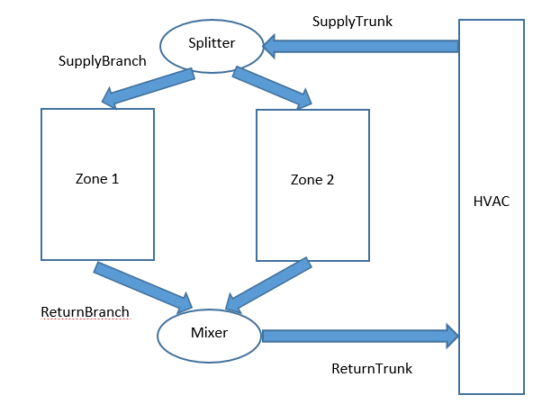

An Improved Duct Model
================

** Lixing Gu **

** Florida Solar Energy Center**

 - 2nd draft NFP, 1/7/24

	Remove Dynamic losses with thermal mass Phase 3

	Add more fields to allow user to select exterior film coefficients

 - First revision on 1/4/24

	Had a conference call with NREL residential group

 - Original NFP, 12/15/23
  
 - 
 

## Justification for New Feature ##

EnergyPlus is being used by many tools around the world, and used as the calculation basis for hundreds of thousands of residential homes leading to billions of dollars of federal energy efficiency rebates in coming years. One aspect that potentially holds back the impact of these studies is related to duct simulation in EnergyPlus. There is skepticism about the accuracy of the model when we cannot simulate certain duct physics in a simplified manner. Although the airflow network model can handle ducts well, we need a duct model that captures duct heat transfer without having to build out a full airflow network.

## E-mail and Conference Call Conclusions ##

### Conference call with NREL residential group ###

The conference call with NREL residential group was held on 1/4/24. Attendees are Edwin Lee, Scott Horowitz, Jon Winkler, and Lixing Gu.

Before the conference call, Lixing Gu sent the FSEC original NFP to Scott. The original NFP presents how FSEC wanted to accomplish the new feature. Scott also sent NREL E+ Duct Model document to Lixing Gu. The NREL document presents a big wish list from NREL point of view.

The conference call discussed both documents. Herer are discussion topics based on the NREL document and associated agreements and differences.

#### Requirements ####

The NFP allows multiple supply and return ducts using exisitng E+ configuration of Splitters and Mixers. Both parties agree to use FSEC proposed confiuration as a starting point.

#### Inputs ####

Both parties agree the proposed new duct object. NREL wants to cove duct leakage. FSEC agrees that the duct leakage is important to the duct model. However, based on current scope and budget, the duct leakage will be developed in later phases.

The conference call also discussed inputs of effective R-value of duct. FSEC thinks the effective R-value should be user input. Duct shape is also dicussed. Hydronic diameter input is required. The user are required to convert any shapes into hydronic diameter as pre-processing.

#### Modeling algorithm ####

Both parties agree to use the exisitng algorithm to handle duct steady state heat transfer based on 13.1.4 Node Temperature Calculations in the Energuneering Reference.

No leakage will be included in the present new feature.

#### Testing/validation ####

FSEC will validate the model compared to Excel calculation results. NREL will compare model results with EMS  implementations.

#### Other ####

NREL request relationship to ZoneHVAC:AirDistributionUnit ("Simplified Duct Leakage Model").

The paragraph is extracted from Input Output Reference:

The Air Distribution unit also allows the user to specify leaks in the supply air duct system. These inputs are used in the EnergyPlus Simplified Duct Leakage Model (SDLM). This model simulates a specific configuration: supply leaks to a return plenum in a commercial VAV or CV system.

Since the proposed new feature does not deal with duct leakage, there is no relationship.

Unfortunately, no discription of Simplified Duct Leakage Model is found in the Input Output Reference.

NREL also mentions CSE duct model.

The CSE duct model is available in the link at https://www.energycodeace.com/site/custom/public/reference-ace-2019/index.html#!Documents/110ductsystemmodel.htm

Here is model simple description extracted from the link:

The duct model builds on the procedure given by Palmiter (see Francisco and Palmiter, 2003), that uses a steady state heat exchanger effectiveness approach to get analytical expressions for instantaneous duct loss and system efficiencies. The duct model, developed for this program by Palmiter, makes use of many of the same fundamental steady state equations and approach, but given the considerable complexity of the multiple duct systems, does not do a simultaneous solution of all the equations which a generalized Francisco and Palmiter scheme may imply.  Instead the approach takes advantage of the small time steps used in the code, and in effect decouples the systems from each other and the zone by basing all losses and other heat transfers occurring during the time step on the driving conditions of Tair and Tmrt known at the beginning of the time step, similar to how heat transfers are determined during mass temperature updates.

Other assumptions made in the duct program: mass and thermal siphon effects in the duct system are ignored.

The duct system performance is analyzed at every time step. The duct air temperatures are calculated assuming they are operating at steady state, in equilibrium with the thermal conditions at the beginning of the time-step in the attic. Heat capacity effects of the ducts are ignored.

The model simplifies the heat transfer calculation with the multiple duct system. Since the new feature calculates heat transfer one by one, the proposed new feature can provide more accurated duct losses without any simplifications.

### Follow-up E-mail communication after NREL conference call ###

Thu 1/4/2024 5:05 PM

Thanks! A couple comments:

•	"NREL will compare model results with EMS and AFN implementations." -- Please remove the AFN part. I don't think we will be able to do that as we are not set up to easily create models w/ AFN.

•	"FSEC thinks the effective R-value should be user input." – You are referring to the effective R-value excluding interior/exterior air films, right? To be clear, I was originally thinking that E+ might ask for the effective R-value including interior/exterior air films, since they may be prescribed by a standard. E.g., the ANSI/RESNET standard currently says to model uninsulated ducts using an effective R-1.5. Perhaps that could be a separate input for air film or convection coefficient, or there could be some way to connect the SurfaceProperty:ConvectionCoefficients object to these duct objects.

•	"Duct shape is also dicussed. Hydronic diameter input is required. The user are required to convert any shapes into hydronic diameter as pre-processing." – Agreed. But an equally important consideration for duct shape is that the nominal insulation R-Value is derated relative to a rectangular duct. That effect can presumably be accounted for in the duct construction materials (effective R-value), though a typical user may not realize they should do this.

Also, I found another description of how ducts are modeled for California here. It may not have any new/different information than what you already saw.

Scott

## Overview ##

The objective is to design and implement the code changes required to support a new duct model, or modifications to an existing duct model, that enable duct heat transfer to be captured without requiring an airflow network to be set up. We will discuss with NREL’s residential group for guidance on implementation requirements and ensure that the implementation will directly address the skepticism around this capability to ensure EnergyPlus can be used confidently in residential building studies.

###Assumptions###

1. The proposed duct model deals with heat transfer only. In other words, no duct air leakage will be modeled.

2. There are 4 duct types to be simulated: SupplyTrunk, SupplyBranch, ReturnTrunk, and ReturnBranch.

3. There is a single duct used for SupplyTrunk and ReturnTrunk. 

The connection of SupplyTrunk is between the inlet node (AirloopHVAC Demand Side Inlet Node) of AirLoopHVAC:ZoneSplitter and AirLoopHVAC:ZoneSplitter itself. If AirLoopHVAC:ZoneMixer is available, The connection of ReturnTrunk is between AirLoopHVAC:ZoneMixer itself and the outlet node (AirloopHVAC Demand Side Outlet Node) of AirLoopHVAC:ZoneMixer. 

4. Each branch has a single duct.

The connection of SupplyBranch is between AirLoopHVAC:ZoneSplitter itself and one of the outlet node (Air terminal inlet node) of AirLoopHVAC:ZoneSplitter. If AirLoopHVAC:ZoneMixer is available, The connection of ReturnBranch is between the inlet node of AirLoopHVAC:ZoneMixer and AirLoopHVAC:ZoneMixer itself.

5. Inlet node temperature, humidity, and mass flow rate are known

6. No return ducts when AirloopHVAC:ZoneReturnPlenum is used

The following figure shows proposed duct configurration.

Figure 1. Schematic for proposed ducts with blue arrow object. The arrows show flow directions.

###Model###

There are 2 approaches to simulate duct heat transfer with conduction losses. The outcome is to provide duct outlet node temperature and humidity ratio.

####Steady state with convection only as Phase 1####

The outlet node temperature will be calculated based on 13.1.4 Node Temperature Calculations in the Energuneering Reference.

The outlet node humidity ratio will be calculated based on 13.1.5 Node Humidity Ratio Calculations in the Energuneering Reference.

####Steady state with both convection and radiation as Phase 2####

Duct radiation will be added based on Phase 1 using the method decribed in 13.1.4.2 Duct Radiation in the Energuneering Reference. 

The radiation exchange has low priority from NREL point of view. FSEC agrees.

####Dynamic losses with thermal mass Phase 3####

Removed

###Possible accomplishment###

Due to time and budget limit, we will lay down foundation of structure for duct inputs and guarantee to deliver duct loss calculation using Steadystate method. The SteadystateWithRadiation method is in the plan and may not be  delivered.  

## Approach ##

A new object simular to Pipe:Indoor is proposed. The main differences are that Fluid Inlet Node Name and Fluid Outlet Node Name are replaced by Inlet Name and Outlet Name. See detailed description in the Section of Input Description.

NREL suggested "Perhaps that could be a separate input for air film or convection coefficient, or there could be some way to connect the SurfaceProperty:ConvectionCoefficients object to these duct objects".

The SurfaceProperty:ConvectionCoefficients object is mainly used based on a surface. The proposed Duct:Heatransfer object has no connection with any surfaces. More fields extracted from the SurfaceProperty:ConvectionCoefficients object will be added in the proposed object to accommodate user selection for duct exterior surface convective coefficients as shown below:   

	Convection Coefficient Type
	Convection Coefficient 
	Convection Coefficient Schedule Name
	Convection Coefficient User Curve Name 

## Testing/Validation/Data Sources ##

insert text

## Input Output Reference Documentation ##

\subsection{Duct:HeatTransfer}\label{ductheattransfer}

This object specifies inputs which are used to simulate the heat transfer from an air duct placed in a zone or when a user schedule is used to specify an environment.

The data definition for object is shown below.

\subsubsection{Inputs}\label{inputs-6-014}

\paragraph{Field: Name}\label{field-name-6-011}

This alpha field is used as an identifying field for the pipe.

\paragraph{Field: AirLoopHAVC Name}\label{airloophvac-name-6-011}

This alpha field is used to identify the this object as a component of the AirLoopHVAC.

\paragraph{Field: Construction Name}\label{field-construction-name-002}

This alpha field references a `wall' construction object that gives a layer-by-layer description of the pipe wall and its insulation.~ The construction object follows standard conventions, describing material properties for each layer beginning with the outermost insulation layer and ending with the pipe wall layer.

\paragraph{Field: Duct Type}\label{field-duct-type}

This field is used to specify duct type. There are the following 4 key choice to choose from:

SupplyTrunk: a main supply trunk duct, only one for each AirLoopHVAC. 
SupplyBranch: a supply branch duct for a connection between a splitter and a zone terminal
ReturnTrunk: a main return trunk duct, only one for each AirLoopHVAC
ReturnBranch: a return branch duct for a connection between a mixer and a zone outlet

\paragraph{Field: Fluid Inlet Name}\label{field-fluid-inlet-name-000}

This alpha field contains the name of the duct inlet. Here are specific requirements for different duct types:

When SupplyTrunk in the Duct Type field is entered, the name of inlet node of AirLoopHVAC:ZoneSplitter is entered.

When ReturnTrunk in the Duct Type field is entered, the name of AirLoopHVAC:ZoneMixer is entered. 

When SupplyBranch in the Duct Type field is entered, the name of AirLoopHVAC:ZoneSplitter is entered.

When ReturnBranch in the Duct Type field is entered, the name of inlet node of AirLoopHVAC:ZoneMixer is entered. 

\paragraph{Field: Fluid Outlet Name}\label{field-fluid-node-name-000}

This alpha field contains the name of the duct outlet. Here are specific requirements for different duct types:

When SupplyTrunk in the Duct Type field is entered, the name of AirLoopHVAC:ZoneSplitter is entered.

When ReturnTrunk in the Duct Type field is entered, the name of outlet node of AirLoopHVAC:ZoneMixer is entered. 

When SupplyBranch in the Duct Type field is entered, the name of outlet node of AirLoopHVAC:ZoneSplitter is entered.

When ReturnBranch in the Duct Type field is entered, the name of AirLoopHVAC:ZoneMixer is entered. 

\paragraph{Field: Environment Type}\label{field-environment-type}

Environment type is the environment in which the duct is placed. It can be either \textbf{Zone} or \textbf{Schedule}. If specified as Zone, a zone name must be specified in the next field. If specified as Schedule, the Ambient Temperature Zone can be left blank, while a schedule must be specified for the temperature and air velocity.

\paragraph{Field: Ambient Temperature Zone Name}\label{field-ambient-temperature-zone-name}

If \textbf{Zone} is specified as the environment type, this field is used to specify the name of the zone in which the pipe is located.~ The zone temperature is used to calculate the heat transfer rate from the pipe.

\paragraph{Field: Ambient Temperature Schedule Name}\label{field-ambient-temperature-schedule-name}

If \textbf{Schedule} is specified as the environment type, this field is used to specify the name of the temperature schedule that gives the ambient air temperature surrounding the duct.~ This temperature is used as the outside boundary condition to calculate heat transfer from the pipe.

\paragraph{Field: Ambient Air Velocity Schedule Name}\label{field-ambient-air-velocity-schedule-name}

If \textbf{Schedule} is specified as the environment type, this field is used to specify the name of the velocity schedule that gives the air velocity near the duct.~ This velocity is used to calculate the convection heat transfer coefficient used in the pipe heat transfer calculation.

\paragraph{Field: Duct Length}\label{field-duct-length-000}

This field is used to enter the length of the duct in units of m. Duct length must be a positive number.

\paragraph{Field: Convection Coefficient Type}\label{field-convection-coefficient-type}

The entries can be of several types: Value (simple numeric value), Schedule (name of schedule with the values), the usual key choices for overall models for Outside or Inside (Simple, SimpleCombined, TARP, AdaptiveConvectionAlgorithm etc.), the key choices for individual convection equations used for customizing the adaptive algorithm, or a custom user defined correlation. The field should contain one of the keys listed in the table below along with face they can be applied. T.

\begin{longtable}[c]{p{3.49in}p{2.5in}}
\toprule
Key choice & Applies to Inside or Outside \tabularnewline
\midrule
\endfirsthead

\toprule
Key choice & Applies to Inside or Outside \tabularnewline
\midrule
\endhead

Value & Both \tabularnewline
Schedule & Both \tabularnewline
Simple & Inside \tabularnewline
SimpleCombined & Outside \tabularnewline
TARP & Both \tabularnewline
DOE-2 & Outside \tabularnewline
MoWitt & Outside \tabularnewline
McAdams & Outside \tabularnewline
Mitchell & Outside \tabularnewline
\bottomrule
\end{longtable}

\paragraph{Field: Convection Coefficient}\label{field-convection-coefficient}

If the Convection type was ``Value'', then this field is filled and contains the simple value to be used. Otherwise, this can be blank.

\paragraph{Field: Convection Coefficient Schedule Name}\label{field-convection-coefficient-schedule-name}

If the Convection type was ``Schedule'', then this field contains the name of a schedule describing the value to be used during the time intervals for the schedule.

\paragraph{Field: Convection Coefficient User Curve Name}\label{field-convection-coefficient-user-curve-name}

If the Convection type was ``UserCurve'', then this field contains the name of a SurfaceConvectionAlgorithm:UserCurve input object describing the model equations to be used during the time intervals for the schedule.

\paragraph{Field: Overall Moisture Transmittance Coefficient from Air to Air}\label{field-overall-moisture-transmittance-coefficient-from-air-to-air-0000}

This numeric field is defined as the overall moisture transmittance coefficient (kg/m\(^{2}\)) from air to air, including film coefficients at both surfaces.

An example of this object in an IDF is:

\begin{lstlisting}

	Duct:HeatTransfer,
      Main duct,    !- Name
      Main AirLoopHVAC,    !- AirLoopHAVC Name
      Insulated Pipe,         !- Construction name
      SupplyTrunk,            !- Duct type
      Equipment outlet node,  !- Inlet Name
      ZoneSplitter,           !- Outlet Name
      Zone,                   !- Environment Type
      Zone 1,                 !- field Ambient Temperature Zone name
      ,                       !- Ambient Temperature Schedule Name
      ,                       !- Ambient Air Velocity Schedule Name
      0.05,                   !- Duct Inside Diameter (thickness in construction data)
      100.0,                  !- Duct length
	  Value,                  !- Convection Coefficient Type
      5.0,                    !- Convection Coefficient
      ,                       !- Convection Coefficient Schedule Name
      ,                       !- Convection Coefficient User Curve Name
      0.001,                  !- Overall Moisture Transmittance Coefficient from Air to Air

\end{lstlisting}

## Input Description ##

A new object of Duct:HeatTransfer to cover duct inputs is provided below.

	Duct:HeatTransfer,
        \memo duct model with heat transfer to the environment.
   	A1,  \field Name
        \required-field
   	A2,  \field AirLoopHAVC Name
        \required-field
        \type object-list
        \object-list AirPrimaryLoops
   	A3,  \field Construction Name
        \required-field
        \type object-list
        \object-list ConstructionNames
   	A4,  \field Duct Type
        \required-field
       \type choice
       \key SupplyTrunk
       \key SupplyBranch
       \key ReturnTrunk
       \key ReturnBranch
       \default SupplyTrunk
   	A5,  \field Inlet Name
        \required-field
        \note When SupplyTrunk in the Duct Type field is entered, the name of inlet node of
        \note AirLoopHVAC:ZoneSplitter is entered.
        \note When ReturnTrunk in the Duct Type field is entered, the name of AirLoopHVAC:ZoneMixer
        \note is entered. 
        \note When SupplyBranch in the Duct Type field is entered, the name of AirLoopHVAC:ZoneSplitter
        \note is entered.
        \note When ReturnBranch in the Duct Type field is entered, the name of inlet node of 
        \note AirLoopHVAC:ZoneMixer is entered. 
   	A6,  \field Outlet Name
        \required-field
        \note When SupplyTrunk in the Duct Type field is entered, the name of AirLoopHVAC:ZoneSplitter 
        \note is entered.
        \note When ReturnTrunk in the Duct Type field is entered, the name of outlet node of 
        \note AirLoopHVAC:ZoneMixer is entered. 
        \note When SupplyBranch in the Duct Type field is entered, the name of outlet node of 
        \note AirLoopHVAC:ZoneSplitter is entered.
        \note When ReturnBranch in the Duct Type field is entered, the name of AirLoopHVAC:ZoneMixer 
        \note is entered. 
  	A7,  \field Environment Type
        \type choice
        \key Zone
        \key Schedule
        \default Zone
   	A8,  \field Ambient Temperature Zone Name
        \type object-list
        \object-list ZoneNames
   	A9,  \field Ambient Temperature Schedule Name
        \type object-list
        \object-list ScheduleNames
   	A10,  \field Ambient Air Velocity Schedule Name
        \type object-list
        \object-list ScheduleNames
   	N1,  \field Duct Inside Diameter (or hydronic diameter)
        \type real
        \units m
        \minimum> 0
        \ip-units in
   	N2,  \field Duct Length
        \type real
        \units m
        \minimum> 0.0
  	A11, \field Convection Coefficient Type
      \required-field
      \type choice
      \key Value
      \key Schedule
      \key UserCurve
      \key Simple
      \key SimpleCombined
      \key TARP
      \key DOE-2
      \key MoWitt
      \key McAdams
      \key Mitchell
  	N3, \field Convection Coefficient
      \note used if Convection Type=Value, min and max limits are set in HeatBalanceAlgorithm object.
      \note Default limits are Minimum >= 0.1 and Maximum <= 1000
      \units W/m2-K
  	A12, \field Convection Coefficient Schedule Name
      \note used if Convection Type=Schedule,  min and max limits are set in HeatBalanceAlgorithm object.
      \note Default limits are Minimum >= 0.1 and Maximum <= 1000
      \type object-list
      \object-list ScheduleNames
  	A13, \field Convection Coefficient User Curve Name
      \note used if Convection Type = UserCurve
      \type object-list
      \object-list UserConvectionModels
   	N4;  \field Overall Moisture Transmittance Coefficient from Air to Air
      \type real
      \units kg/m2
      \minimum> 0.0
      \default 0.001
      \note Enter the overall moisture transmittance coefficient
      \note including moisture film coefficients at both surfaces.

Note: There are many convection coefficient types in the SurfaceProperty:ConvectionCoefficients object. However, most types may not be used in duct heat transfer convective coefficient, becuase the new object does not have surface connection and associated properties, like location, geometry and tilt, etc. The available types will be related to air velocity and zone temperatures, or reference temperature.

Future expansion with optional fields

	A14, \field  Heat Transfer Solution Method
        \type choice
        \key SteadyState
        \key SteadStateWithRadiation
        \key Dynamic
        \default SteadyState
	A15; \field DuctViewFactors Object Name
       \type object-list
       \object-list AirflowNetworkComponentNames
       \note The name of the duct view factor specification object used to calculate radiation exchange.

	AirflowNetwork:Distribution:DuctViewFactors,
       \extensible:2 - repeat last two fields, remembering to remove ; from "inner" fields.
       \memo This object is used to allow user-defined view factors to be used for duct-surface radiation
       \memo calculations.

  	A1,  \field Linkage or Duct:HeatTransfer Name

       \required-field
       \type object-list
       \object-list AirflowNetworkComponentNames
    .....

Note:

In order to be general, the AirflowNetwork:Distribution:DuctViewFactors object may be renamed as DuctViewFactors, so that this object can be used either AFN or general duct heat transfer.
 
## Outputs Description ##

insert text

## Engineering Reference ##

insert text

## Example File and Transition Changes ##

insert text

## References ##

The next two references are used to present how thermal dynamic impacts are simulated:

Hanby, V.I., Wright, J.A., Fletcher, D.W and Jones, D.N.T. 2002. Modeling the Dynamic Response
of Conduits. International Journal of HVACR&R, Vol.8, No.1. pp. 1-12.

D. Parker, P. Fairey, L. Gu, Simulation of the effects of duct leakage and heat transfer on residential space-cooling energy use, Published 1993 Engineering Energy and Buildings

