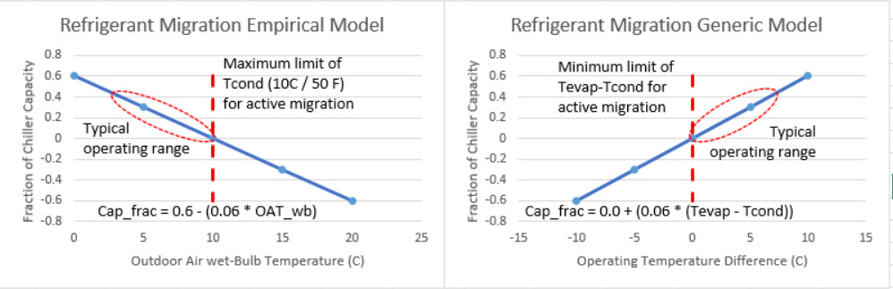
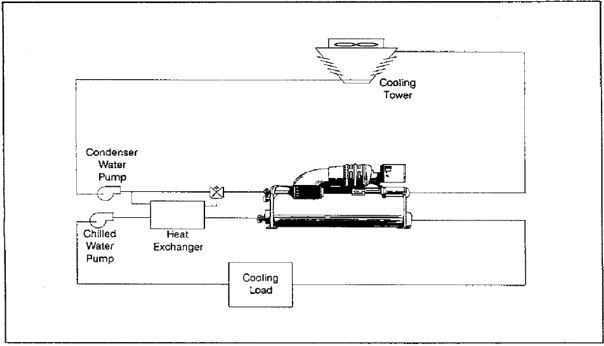

New Feature for Plant Decarbonization
================

**Richard Raustad**

**Florida Solar Energy Center***

 - Original Date: Feb 27, 2024
 - Final NFP - updated Apr 9, 2024
 - Add Refrigerant Migration model 7/10/2024
 - Add HeatExchanger:FluidToFluid plant configuration schematics 7/17/2024

## Justification for Feature Update

Decarbonization efforts to electrify buildings has led to use of less common efficiency improvements. Use of chiller refrigerant migration, free cooling in air-cooled chillers, and integrated water-side economizer with air-cooled chiller, to name a few. The downside is that these equipment features come at varying costs. Table 1. ASHRAE 90.1-2013, 6.5.1-3 shows part-load efficiency improvements that would provide equivalent energy savings to a particular efficiency improvement as a trade-off for a specific code required control.

```
Energy standards and model codes do not have blanket exceptions for these systems.
However, there are a number of exceptions to consider. For small terminals <54,000
Btu/h, no economizer is required by ASHRAE Standard 90.1-2013.

Systems with condenser heat recovery may qualify for an exception. Air-cooled
chillers serving central equipment can use the efficiency trade off for equipment
(Table 1), condenser heat recovery or desuperheaters, or add a free cooling circuit.
```

For this reason the ability to model these features in EnergyPlus is crucial for both the software and the user.

## Overview ##

### Chiller refrigerant migration ###

Involves using cold condenser inlet fluid temperature (colder than the evaporator water temperature) to force refrigerant migration without the need to energize the compressor (1). This may include special refrigerant circuits or valves to ensure proper refrigerant flow. Studies have shown up to 40% of chiller capacity is available using this technique. An empirical model that requires no knowledge of the refrigerant type or chiller configuration is to use a mathematical representation of the fraction of available chiller capacity when this operating mode is viable (i.e., lower condenser inlet temperature with respect to the chilled water leaving water temperature [refrigerant pressure surrogates]). This empirical model assumes a 10 C (50 F) maximum outdoor air wet-bulb temperature for a water-cooled chiller (left figure). The proposed generic model would use the temperature difference between the evaporator leaving water temperature set point and the condenser entering fluid temperature (right figure).


</img>

Figure 1. Operating envelope and conditions for refrigerant migration

### Approach

This feature proposes to add 2 optional fields to chillers representing the refrigerant migration (or generically a thermosiphon for passive heat exchange) empirical model. Tentatively at the end of the object but these fields could be inserted near the capacity and COP inputs if that seems better placement. The curve is likely the only required input field to denote the use of this equipment enhancement (i.e., the resulting curve fraction will determine if the chiller can meet the load using only refrigerant migration), however, the zero crossing of the performance curve may not accurately represent the actual operating range and an additional field is suggested as Refrigerant Migration Minimum Temperature Difference (see following example for HeatPump:PlantLoop:EIR:Cooling). It is anticipated that both of these fields will be implemented in each chiller type.

```
HeatPump:PlantLoop:EIR:Cooling,
  A13, \field Thermosiphon Temperature Difference Curve Name
       \type object-list
       \object-list UniVariateFunctions
       \note quadratic curve = a + b * dT is typical, other univariate curves may be used
       \note dT = evaporator outlet temperature minus condenser inlet temperature
  N10; \field Thermosiphon Minimum Temperature Difference
       \type real
       \minimum 0.0
       \default 0.0
       \note thermosiphon model is disabled below this minimum limit and
       \note when the load is greater than calculated using the prevoius field.

Chiller:Electric,
  A14; \field Thermosiphon Temperature Difference Curve Name
       \type object-list
       \object-list UniVariateFunctions
       \note quadratic curve = a + b * dT is typical, other univariate curves may be used

Chiller:Electric:EIR,
  A17; \field Thermosiphon Temperature Difference Curve Name
       \type object-list
       \object-list UniVariateFunctions
       \note quadratic curve = a + b * dT is typical, other univariate curves may be used

Chiller:Electric:Reformulated:EIR,
  A16; \field Thermosiphon Temperature Difference Curve Name
       \type object-list
       \object-list UniVariateFunctions
       \note quadratic curve = a + b * dT is typical, other univariate curves may be used
```

### Free cooling in air-cooled chillers ###

Free cooling from air-cooled chillers typically happens through air-side economizers. Although the previous discussion of refrigerant migration applied to water-cooled chillers, there is no reason this same concept could not be applied to air-cooled equipment. This concept would be applied to the same chillers described above.

### Integrated water-side economizer with air- or water-cooled chiller ###

Integrated water-side economizer with air-cooled chillers is likely possible with existing objects with minor additions to control of the water flow through the WWHX (HeatExchanger:FluidToFluid). One side of the WWHX would be connected to the supply side inlet node of the chiller evaporator (or other appropriate branch in the plant, i.e., pre-cool entire plant loop) while the other side of the WWHX would be connected to a demand side branch of the condenser loop. Activation of the condenser loop flow through the HX, to activate free cooling, would be accomplished through controls modification (2). The WWHX object already has inputs for Control Type, Heat Exchanger Setpoint Node Name, Minimum Temperature Difference to Activate Heat Exchanger, Operation Minimum Temperature Limit, and Operation Maximum Temperature Limit. I am unsure at this time which of these fields would be used for configuration as an integrated water-side economizer or if other inputs would be required. It may be as simple as adding a new Control Type = IntegratedWaterSideEconomizer to allow the proper controls. Investigation into the new control will include review of the Component Override Loop inputs (e.g., using chiller condenser inlet or evaporator outlet node temperature as a control point).


</img>

Figure 2. Integrated Water-Side Economizer


```
HeatExchanger:FluidToFluid,
        \memo A fluid/fluid heat exchanger designed to couple the supply side of one loop to the demand side of another loop
        \memo Loops can be either plant or condenser loops but no air side connections are allowed
        \min-fields 14
   A1 , \field Name
        \required-field
   A2 , \field Availability Schedule Name
   A3 , \field Loop Demand Side Inlet Node Name
   A4 , \field Loop Demand Side Outlet Node Name
   N1 , \field Loop Demand Side Design Flow Rate
        \autosizable
   A5 , \field Loop Supply Side Inlet Node Name
   A6 , \field Loop Supply Side Outlet Node Name
   N2 , \field Loop Supply Side Design Flow Rate
   A7 , \field Heat Exchange Model Type
        \type choice
        \key CrossFlowBothUnMixed
        \key CrossFlowBothMixed
        \key CrossFlowSupplyMixedDemandUnMixed
        \key CrossFlowSupplyUnMixedDemandMixed
        \key ParallelFlow
        \key CounterFlow
        \key Ideal
        \default Ideal
   N3 , \field Heat Exchanger U-Factor Times Area Value
   A8 , \field Control Type
        \type choice
        \key UncontrolledOn
        \key OperationSchemeModulated
        \key OperationSchemeOnOff
        \key HeatingSetpointModulated
        \key HeatingSetpointOnOff
        \key CoolingSetpointModulated
        \key CoolingSetpointOnOff
        \key DualDeadbandSetpointModulated
        \key DualDeadbandSetpointOnOff
        \key CoolingDifferentialOnOff
        \key CoolingSetpointOnOffWithComponentOverride
        \key IntegratedWaterSideEconomizer                 <-- new key choice
        \default UncontrolledOn
   A9 , \field Heat Exchanger Setpoint Node Name
        \note Setpoint node is needed with any Control Type that is "*Setpoint*"
   N4 , \field Minimum Temperature Difference to Activate Heat Exchanger
        \note Tolerance between control temperatures used to determine if heat exchanger should run.
        \type real
        \minimum 0.0
        \maximum 50
        \default 0.01
        \units deltaC
   A10, \field Heat Transfer Metering End Use Type
        \note This field controls end use reporting for heat transfer meters
        \type choice
        \key FreeCooling
        \key HeatRecovery
        \key HeatRejection
        \key HeatRecoveryForCooling
        \key HeatRecoveryForHeating
        \key LoopToLoop
        \default LoopToLoop
   A11, \field Component Override Loop Supply Side Inlet Node Name
        \type node
        \note This field is only used if Control Type is set to CoolingSetpointOnOffWithComponentOverride
   A12, \field Component Override Loop Demand Side Inlet Node Name
        \type node
        \note This field is only used if Control Type is set to CoolingSetpointOnOffWithComponentOverride
   A13, \field Component Override Cooling Control Temperature Mode
        \type choice
        \key WetBulbTemperature
        \key DryBulbTemperature
        \key Loop
        \default Loop
        \note This field is only used if Control Type is set to CoolingSetpointOnOffWithComponentOverride
   N5 , \field Sizing Factor
        \note Multiplies the autosized flow rates for this device
        \type real
        \minimum> 0.0
        \default 1.0
   N6 , \field Operation Minimum Temperature Limit
        \note Lower limit on inlet temperatures, heat exchanger will not operate if either inlet is below this limit
        \type real
        \units C
   N7 ; \field Operation Maximum Temperature Limit
        \note Upper limit on inlet temperatures, heat exchanger will not operate if either inlet is above this limit
        \type real
        \units C
```

## Testing/Validation/Data Source(s)

These features will be tested and demonstrated with one or more test files derived from 5Zone_AirCooled.idf and incorporation of integrated water-side in a similar example file. An attempt will be made to integrate these concepts into existing example files.

## Proposed additions to Meters:

N/A (these features should already be accounted for on meters)

## Proposed Report Variables:

- Refrigerant Migration Status (0 or 1)

WWHX report for Fluid Heat Exchanger Operation Status should provide the necessary information to understand when the HX is active as an economizer.

```
if ((std::abs(this->HeatTransferRate) > DataHVACGlobals::SmallLoad) && (this-DemandSideLoop.InletMassFlowRate > 0.0) && 
    (this->SupplySideLoop.InletMassFlowRate > 0.0)) {
    this->OperationStatus = 1.0;
} else {
    this->OperationStatus = 0.0;
}
```
 
## References

1) Trane Engineers Newsletter 37-3 "free" cooling using
Water Economizers
<https://www.trane.com/content/dam/Trane/Commercial/global/products-systems/education-training/engineers-newsletters/waterside-design/admapn029en_0808.pdf>

2) Trane Engineers Newsletter 45-2 waterside economizers
Keeping the "Free" In Free-Cooling
<https://www.trane.com/content/dam/Trane/Commercial/global/products-systems/education-training/engineers-newsletters/waterside-design/ADM-APN058-EN_06012016.pdf>