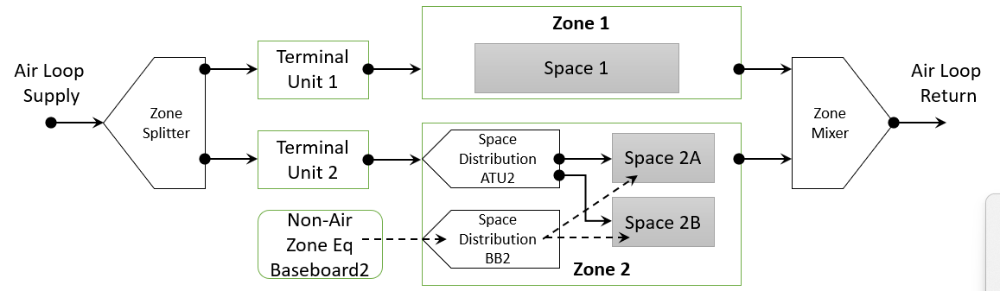

Extend Spaces to Sizing and HVAC - Part 4
================

**Michael J. Witte, GARD Analytics, Inc.**

 - Original June 17, 2024
 - Revised, August 2, 2024

## Table of Contents ##

[E-mail and Conference Call Conclusions](#e-mail-and-conference-call-conclusions)

[Background and Overiew](#background-and-overview)

[Approach](#approach)

[Testing/Validation/Data Sources](#testingvalidationdata-sources)

[Input Description](#input-description)

[Outputs Description](#outputs-description)

[Engineering Reference](#engineering-reference)

[Example File and Transition Changes](#example-file-and-transition-changes)

[Design](#design)

## E-mail and Conference Call Conclusions ##
June 17-20, Q&A in the pull request with rraustad. Made some minor updates to the NFP to clarify the sizing methods and to mention that an spsz output file will be created, similar to the existing zsz output.


## Background and Overview ##

Space was added as a new concept in v9.6. Each EnergyPlus Zone contains one or more Spaces which are used for:

  * assigning and allocating internal gains
  * specifying enclosure boundaries,
  * reporting inputs grouped by space types, and 
  * reporting select output grouped by space types.
  
For the zone heat balance each thermal Zone is composed of one or more Spaces controlled by a single thermostat or HVAC system control point such as a VAV terminal unit.

In version 23.1 options were added to perform the air heat balance for each Space or each Zone, and space-level heat balance output variables were added.

In version 23.2, the following capabilities were added:
  
  * When ZoneAirHeatBalanceAlgorithm "Do Space Heat Balance for Sizing" = Yes, zone sizing is also done for all spaces. The HVAC Sizing Summary table report will include subtables for Space Sensible Cooling and Heating as well as for Zone Sensible Cooling and Heating. Space Sizing will also be reported to the eio output. The space sizing results are reported, but not used.

  * Three new objects, SpaceHVAC:EquipmentConnections, SpaceHVAC:ZoneEquipmentSplitter, and SpaceHVAC:ZoneEquipmentMixer allow one or more zones to be simulated at the space level for HVAC, leading to independent air temperature and humidity in each space.
  
  * For zone equipment serving multiple spaces, three thermostat control options (SingleSpace, Ideal, and Maximum).

This NFP proposes additional optional capabilities:

  * Use the Space-level (room-by-room) sizing results to size Zone-level equipment to either the coincident or non-coincident peak across the Spaces (rooms).
  
  * Refine existing Space-level HVAC simulation.
  
  * Extend space HVAC to support more special objects (e.g. ZoneThermalChimney, if budget allows).


## Approach ##
### Sizing
A new input will be added to Sizing:Zone to allow zone sizing using the non-coincident space peaks or the coincident peak. 

Space sizing is an actual heat balance on each space. Currently zone sizing is an actual heat balance on each zone (as a whole) although some of the components for the zone heat balance are sums across the spaces (even when space heat balance is off). e.g. internal gains. The current zone sizing calculations will be used to calculate the coincident zone sizing using the combined spaces. 

For the non-coincident zone sizing, the individual space peaks will be summed and other values (such as outdoor temperature) will be averaged.

When space sizing is active, sizing results are reported in the table output for both spaces and zones. There will be no change here.

When space sizing is active, a new spssz output file will be generated, similar to the existing zsz output. This will require a new field in the OutputControl:Files object.


### HVAC
* Calculate return flows at the Space level. Currently, space return nodes can be specified, but there is no flow assigned to them. All return flow is lumped at the zone level.





## Testing/Validation/Data Sources ##

Compare Space vs Zone-level results.

## Input Description ##
Some new objects and some changes to existing objects are proposed.

### Sizing:Zone
* *New field at the end:"*
```
  A15; \field Type of Space Sum to Use
      \type choice
      \key Coincident
      \key NonCoincident
      \default Coincident
```

### OutputControl:Files
* *New field in the middle:"*
```
  A9 , \field Output Space Sizing
       \type choice
       \key Yes
       \key No
       \default Yes
```

### ZoneRefrigerationDoorMixing
(If budget allows, otherwise limit these to single-space zones.)
* *Change field "Zone 1 Name" to "Zone or Space Name 1."*

* *Change field "Zone 2 Name" to "Zone or Space Name 2."*

### ZoneCoolTower:Shower
(If budget allows, otherwise limit these to single-space zones.)
* *Change field "Zone Name" to "Zone or Space Name."*

### ZoneThermalChimney
(If budget allows, otherwise limit these to single-space zones.)
* *Change field "Zone N Name" to "Inlet Zone or Space Name N."*

### idf Example


## Outputs Description ##
A new Spsz output file will be created when space sizing is active.


## Engineering Reference ##


## Example File and Transition Changes ##

* Transition will be required for idf OutputControl:Files.

* Field name changes may be required for epJSON inputs for ZoneRefrigerationDoorMixing, ZoneCoolTower:Shower, and/or ZoneThermalChimney.

* The existing example file 5ZoneAirCooledWithSpaces will be copied to a new example file that uses the new Sizing:Zone Coincident Space sum option.


## Design ##

### Sizing ###

When Space sizing is requested, the following arrays are created for Spaces.

```
    Array2D<DataSizing::ZoneSizingData> SpaceSizing;                      // Data for space sizing (all data, all design)
    EPVector<DataSizing::ZoneSizingData> FinalSpaceSizing;                // Final data for space sizing including effects
    Array2D<DataSizing::ZoneSizingData> CalcSpaceSizing;                  // Data for space sizing (all data)
    EPVector<DataSizing::ZoneSizingData> CalcFinalSpaceSizing;            // Final data for space sizing (calculated only)
```

The main calculation flow for Zone sizing is:

* `SizingManager::ManageSizing`
    * Get sizing inputs (`GetOARequirements . . . GetPlantSizingInput`).
    * Loop over sizing environments and days
        ```
          UpdateZoneSizing(state, Constant::CallIndicator::BeginDay);
          Loop over hours and timesteps
            ManageWeather(state);
            UpdateSysSizing(state, Constant::CallIndicator::DuringDay);
            ManageHeatBalance(state);
          UpdateZoneSizing(state, Constant::CallIndicator::EndDay);
        UpdateZoneSizing(state, Constant::CallIndicator::EndZoneSizingCalc);
        ```
        * Repeat (with a pulse) if zone component loads report is requested.
 * `ZoneEquipmentManager::UpdateZoneSizing` (where all the work is done.)
     * `case Constant::CallIndicator::BeginDay:`
         * Do some initializations on `CalcZoneSizing`
     * `case Constant::CallIndicator::DuringDay:`
         * Called from `HVACManager`
         * save the results of the ideal zone component calculation in the CalcZoneSizing sequence variables
         * Works on `ZoneSizing` and `CalcZoneSizing`
     * `case Constant::CallIndicator::EndDay:`
         * Compute moving averages
         * Save values at peak heating and cooling
         * Works on `CalcZoneSizing` and `CalcFinalZoneSizing`
         * *In this function add the zone sizing coincident/non-coincident option and calculations.*

     * `case Constant::CallIndicator::EndZoneSizingCalc:`
         * Apply EMS overrides
         * Output sizing results from `CalcFinalZoneSizing`
         * Move sizing data into final sizing array according to sizing method
         * Works on `CalcZoneSizing`, `CalcFinalZoneSizing`, `ZoneSizing`, and `FinalZoneSizing`
         * Lots going on in here.
         
### HVAC ###

The main calculation flow for Zone and Space HVAC in `HVACManager:ManageHVAC` is as follows, with notes about changes required for Space-HVAC.

* `ZoneTempPredictorCorrector::ManageZoneAirUpdates(... GetZoneSetPoints)`
    * `CalcZoneAirTempSetPoints`
* `ZoneTempPredictorCorrector::ManageZoneAirUpdates(... PredictStep)`
    * `PredictSystemLoads`
* `SimHVAC`
    * `SetPointManager::ManageSetPoints(state);`
    * `SimSelectedEquipment`
        * `SimAirServingZones::ManageAirLoops`
        * `ZoneEquipmentManager::ManageZoneEquipment`
            * `CalcZoneReturnFlows`*
                * *Add space return flow calculations here.*
                * *Likely refactor this function to be callable for either zone or space.*
        * `PlantManager::ManagePlantLoops`
* `ZoneTempPredictorCorrector::ManageZoneAirUpdates(... CorrectStep)`
    * `correctZoneAirTemps`


