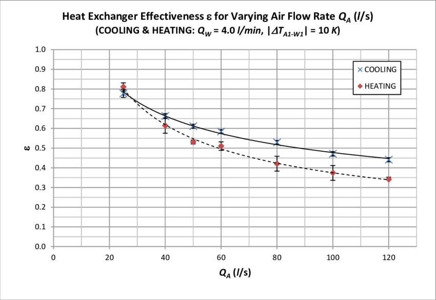

Enhancement for Variable-Speed Heat Recovery Ventilation in Laboratories
================

**Yujie Xu, Tianzhen Hong**

**Lawrence Berkeley National Laboratory***

 - Original Date: Oct 24, 2023

## Justification for Feature Update

For lab buildings, the heating-cooling air flow rate could vary substantially
depending on the occupancy, the type of experiment, and the operation protocol.
Correctly capturing its HVAC energy consumption and heat recovery performance
requires accurate information on heat exchangers' sensible and latent
effectiveness at various flow conditions. However, in EnergyPlus, the heat
exchanger object, HeatExchanger:AirToAir:SensibleAndLatent, describes the
sensible and latent effectiveness at only two reference points (100% and 75%
airflow) for either heating or cooling. This feature will add four new optional
fields at the end of the HeatExchanger:AirToAir:SensibleAndLatent object. These
new fields will specify four performance curves to more flexibly express the
relationship between sensible and latent effectiveness at different relative
airflow (the percentage of the actual airflow relative to the nominal supply
airflow). Being able to characterize the efficiency at low-flow-rate conditions
can allow more accurate modeling of the heat recovery system and justify the
adoption of high-potential energy-saving strategies like using variable speed
fans in the exhaust air heat recovery systems in laboratories.

A team led by Jon McHugh, who is doing EnergyPlus modeling to support California
Title 24 development, requested the feature. This feature supports ANSI/ASSP
Z9.5-2022 Laboratory Ventilation standard, which requires variable-airflow
exhaust system operations.

## Overview ##

### Existing approach ###

Currently, the HeatExchanger:AirToAir:SensibleAndLatent in EnergyPlus only has
two reference points to describe the relationship between relative airflow and
heat exchange effectiveness in transferring sensible and latent heat (the fields
between the two arrows in the following example).

Example:

    HeatExchanger:AirToAir:SensibleAndLatent,
        OA Heat Recovery 1,            !- Heat exchanger name
        FanAndCoilAvailSched,          !- Availability schedule name
        0.05,                          !- Nominal supply air flow rate {m3/s}
        .76,                           !- Sensible effectiveness at 100% airflow heating condition     <--
        .68,                           !- Latent effectiveness at 100% airflow heating condition
        .81,                           !- Sensible effectiveness at 75% airflow heating condition
        .73,                           !- Latent effectiveness at 75% airflow heating condition
        .76,                           !- Sensible effectiveness at 100% airflow cooling condition
        .68,                           !- Latent effectiveness at 100% airflow cooling condition
        .81,                           !- Sensible effectiveness at 75% airflow cooling condition
        .73,                           !- Latent effectiveness at 75% airflow cooling condition        <--
        ERV Outdoor air Inlet Node,    !- Supply air inlet node name
        Heat Recovery Outlet Node,     !- Supply air outlet node name
        Zone 1 Exhaust Node,           !- Exhaust air inlet node name
        Heat Recovery Secondary Outlet Node,  !- Exhaust air outlet node name
        50.0,                          !- Nominal electric power {W}
        Yes,                           !- Supply air outlet temperature control
        Rotary,                        !- Heat exchanger type
        MinimumExhaustTemperature,   !- Frost control type
        1.7;                           !- Threshold temperature

### The gap in the modeling capability ###

In current EnergyPlus, a linear relationship is specified for the heat exchanger
effectiveness at different relative airflow, using the performance at 75% and
100% of the supply air flow rate. The linear performance curve is valid for
relative airflow from 50% to 130%. However, some heat exchangers could have
non-linear performance curves as shown in Figure 1 and Figure 2. In the example
of Figure 2, the effectiveness is a function of both air flow rate and liquid
capacity flow ratio (the minimum capacity flow rate of all streams in a heat
exchanger divided by the maximum). If the capacity flow ratio is fixed at some
value, say 1.0, then the distances between the curves for different air flow
rates are not even. This indicates the non-linear relationship between the
airflow and the effectiveness. The air-flow-and-effectiveness relationship could
be non-monotonic as well for certain values of capacity flow ratio[2]

</img>

Figure 1. An example of a heat exchanger with non-linear performance curves at different airflow conditions [1]

</img>

Figure 2. Another example of heat exchanger effectiveness being non-linear and non-mototonic with air flow

Furthermore, when the relative airflow is below 50% or above 130%, the program
will throw a warning, "Average air volume flow rate is <50% or >130% of the
nominal HX supply air volume flow rate.", indicating that there could be an
issue of linearly extrapolating the curve. This also suggests the need for more
points to better capture the heat exchanger performance at very low or very high
airflow conditions.

## Approach

This feature proposes to add 4 optional fields holding 4 performance curves at
the end of the HeatExchanger:AirToAir:SensibleAndLatent. These fields will
specify the heating/cooling sensible or latent effectiveness multiplier as a
function of relative airflow. The effectiveness at a certain airflow ratio will
be the value of the curve at that airflow ratio multiplied by the corresponding
effectiveness value at 100% airflow at the beginning of the object. The four
fields corresponding to effectiveness at 75% airflow conditions will be removed.
The warning message of "Average air volume flow rate is <50% or >130% of the
nominal HX supply air volume flow rate." will be removed too.

    HeatExchanger:AirToAir:SensibleAndLatent,
          \memo This object models an air-to-air heat exchanger using effectiveness relationships.
          \memo The heat exchanger can transfer sensible energy, latent energy, or both between the
          \memo supply (primary) and exhaust (secondary) air streams.
          \min-fields 19
      A1,  \field Name
          \required-field
          \type alpha
          \reference HXAirToAirNames
          \reference HXAirToAirSensibleAndLatentNames
          \reference AFNHeatExchangerNames
          \reference-class-name validBranchEquipmentTypes
          \reference validBranchEquipmentNames
          \reference-class-name validOASysEquipmentTypes
          \reference validOASysEquipmentNames
      A2, \field Availability Schedule Name
          \note Availability schedule name for this system. Schedule value > 0 means the system is available.
          \note If this field is blank, the system is always available.
          \type object-list
          \object-list ScheduleNames
      N1, \field Nominal Supply Air Flow Rate
          \required-field
          \type real
          \autosizable
          \minimum> 0.0
          \units m3/s
      N2, \field Sensible Effectiveness at 100% Heating Air Flow
          \type real
          \units dimensionless
          \minimum 0.0
          \maximum 1.0
          \default 0.0
      N3, \field Latent Effectiveness at 100% Heating Air Flow
          \type real
          \units dimensionless
          \minimum 0.0
          \maximum 1.0
          \default 0.0                                             <- remove two 75% effectiveness point after here
      N4, \field Sensible Effectiveness at 100% Cooling Air Flow
          \type real
          \units dimensionless
          \minimum 0.0
          \maximum 1.0
          \default 0.0
      N5, \field Latent Effectiveness at 100% Cooling Air Flow
          \type real
          \units dimensionless
          \minimum 0.0
          \maximum 1.0
          \default 0.0                                             <- remove two 75% effectiveness point after here
      A7, \field Supply Air Inlet Node Name
          \required-field
          \type node
      A4, \field Supply Air Outlet Node Name
          \required-field
          \type node
      A5, \field Exhaust Air Inlet Node Name
          \required-field
          \type node
      A6, \field Exhaust Air Outlet Node Name
          \required-field
          \type node
      N6, \field Nominal Electric Power
          \type real
          \units W
          \ip-units W
          \minimum 0.0
          \default 0.0
      A7, \field Supply Air Outlet Temperature Control
          \type choice
          \key No
          \key Yes
          \default No
      A8, \field Heat Exchanger Type
          \type choice
          \key Plate
          \key Rotary
          \default Plate
      A9, \field Frost Control Type
          \type choice
          \key None
          \key ExhaustAirRecirculation
          \key ExhaustOnly
          \key MinimumExhaustTemperature
          \default None
      N7, \field Threshold Temperature
          \type real
          \units C
          \default 1.7
          \note Supply (outdoor) air inlet temp threshold for exhaust air recirculation and
          \note exhaust only frost control types. Exhaust air outlet threshold Temperature for
          \note minimum exhaust temperature frost control type.
      N8, \field Initial Defrost Time Fraction
          \type real
          \units dimensionless
          \minimum 0.0
          \maximum 1.0
          \default 0.083
          \note Fraction of the time when frost control will be invoked at the threshold temperature.
          \note This field only used for exhaust air recirc and exhaust-only frost control types.
      N9, \field Rate of Defrost Time Fraction Increase
          \type real
          \units 1/K
          \minimum 0.0
          \default 0.012
          \note Rate of increase in defrost time fraction as actual temp falls below threshold temperature.
          \note This field only used for exhaust air recirc and exhaust-only frost control types.
      A10,\field Economizer Lockout
          \type choice
          \key Yes
          \key No
          \default Yes
          \note Yes means that the heat exchanger will be locked out (off)
          \note when the economizer is operating or high humidity control is active
      A11,\field Sensible Effectiveness of Heating Air Flow Curve Name
          \note optional
          \note if this field has value, then the sensivle effectiveness for heating
          \note will be the value in N2 multiplied by this curve value
          \type object-list
          \object-list UnivariateFunctions
      A12,\field Latent Effectiveness of Heating Air Flow Curve Name
          \note optional
          \note if this field has value, then the latent effectiveness for heating
          \note will be the value in N3 multiplied by this curve value
          \type object-list
          \object-list UnivariateFunctions
      A13,\field Sensible Effectiveness of Cooling Air Flow Curve Name
          \note optional
          \note if this field has value, then the sensivle effectiveness for cooling
          \note will be the value in N4 multiplied by this curve value
          \type object-list
          \object-list UnivariateFunctions
      A14;\field Latent Effectiveness of Cooling Air Flow Curve Name
          \note optional
          \note if this field has value, then the latent effectiveness for cooling
          \note will be the value in N5 multiplied by this curve value
          \type object-list
          \object-list UnivariateFunctions

## Testing/Validation/Data Source(s)

The feature will be tested and demonstrated with a test file derived from 5Zone_Unitary_HXAssistedCoil.idf.

## Acknowledgments

LBNL had a few meetings with Jon McHugh and his team who made the original request of the new feature.

## Proposed additions to Meters:

N/A

## Proposed Report Variables:

N/A
 
## References

[1]	W. J. Turner, "Investigation and Development of Hybrid Ventilation Wall Convector," The University of Reading, 2009. [Online]. Available: https://www.researchgate.net/publication/263209666_Investigation_and_Development_of_Hybrid_Ventilation_Wall_Convector/figures?lo=1
[2] Mahmoud, M., Filipsson, P., Brunninge, S., & Dalenbäck, J. O. (2022). Flow rate optimization in run-around heat recovery systems. Applied Thermal Engineering, 200, 117599.
