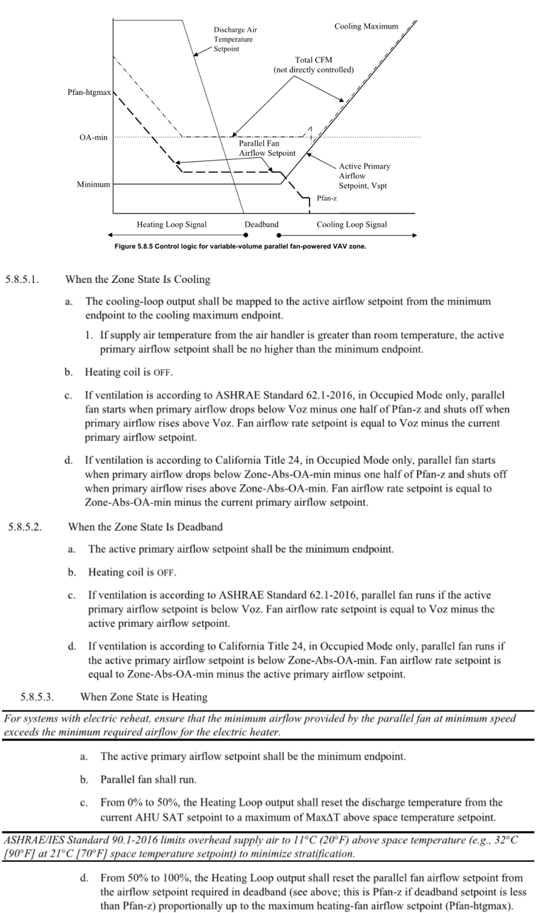
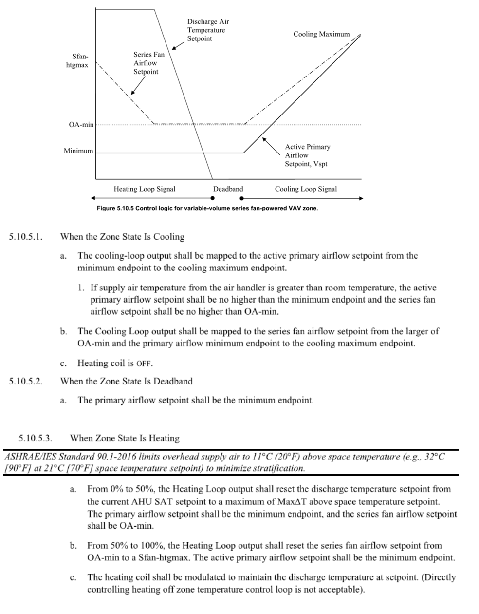
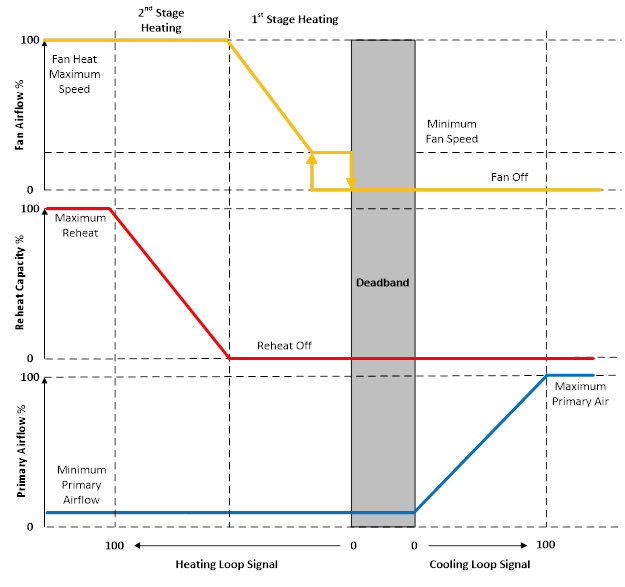
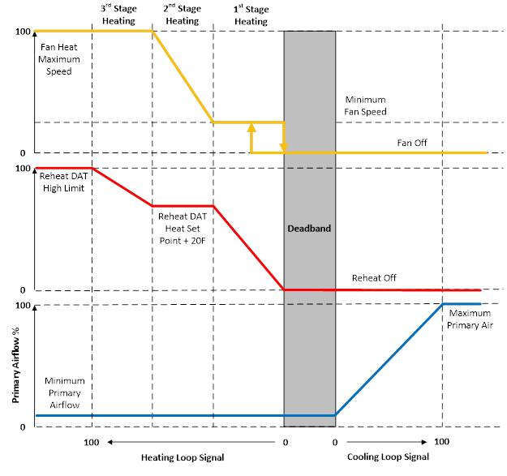

Variable Speed Power Induction Units (Series/Parallel)
================

**Jeremy Lerond, Pacific Northwest National Laboratory**

 - Original Date: 11/2023
 - Revision Date: N/A
 

## Justification for New Feature ##

Certain building energy codes require fan powered VAV boxes to use variable speed fans. The code section below is an example from section C403.7.10 of the Washington State Energy Code. Currently, EnergyPlus can only simulate constant speed fans with PIU terminals, even when a variable speed fan object (`Fan:VariableVolume` or `Fan:SystemModel`) is used.

    All fan powered VAV terminal units (series or parallel) shall be provided with electronically commutated motors. The DDC system shall be configured to vary the speed of the motor as a function of the heating and cooling load in the space. Minimum speed shall not be greater than 66 percent of design airflow required for the greater of heating or cooling operation. Minimum speed shall be used during periods of low heating and cooling operation and ventilation-only operation.

There is also a user request for it, see [here](https://github.com/NREL/EnergyPlus/issues/7311).

## E-mail and  Conference Call Conclusions ##

TRANE has agreed to share their variable speed series fan powered terminal units hence this NFP will focus on the implementation of parallel fan powered terminal units. See this [PR](https://github.com/NREL/EnergyPlus/pull/10336) for reference.

## Overview ##

This new feature will enable users to simulate parallel fan powered boxes with variable speed fans by using a `Fan:SystemModel` as part of an `AirTerminal:SingleDuct:ParallelPIU:Reheat` with a `Continuous` speed control method input. `Fan:VariableVolume` will not be supported as part of this new feature.

The ASHRAE Guideline 36 provides sequence of operation during heating, cooling and deadband (ventilation) operation for both series and parallel fan powered boxes, see Figure 1 and Figure 2 below.



_Figure 1 - Sequence of Operation of a VAV parallel FPB According to ASHRAE Guideline 36_

In summary, Figure 1 shows that VAV parallel FPB should operate as follows:
- **Heating**: the fan should operate at minimum airflow rate until the maximum reheat discharge air temperature is reached, and then the airflow should be raised to meet the load.
- **Deadband**: the fan should be off, unless the primary airflow rate falls under the minimum outdoor airflow rate. When it's the case the fan flow rate is equal to minimum outdoor airflow rate minus the primary airflow rate. The sequence of operation does not specify it but the implementation will respect the fan's minimum flow rate which means that in that instance the airflow rate will be the maximum of the minimum airflow rate and the  minimum outdoor airflow rate minus the primary airflow rate.
- **Cooling**: the fan is off unless the primary airflow rate falls under the minimum outdoor airflow rate (same case as in deadband).



_Figure 2 - Sequence of Operation of a VAV series FPB According to ASHRAE Guideline 36_

In summary, Figure 2 shows that VAV series FPB should operate as follows:
- **Heating**: the fan should operate at the minimum airflow rate (fan minimum airflow rate or outdoor air minimum flow rate) until the maximum reheat discharge air temperature is reached, and then the airflow should be raised to meet the load.
- **Deadband**: the fan shall operate at the minimum airflow rate (fan minimum airflow rate or outdoor air minimum flow rate).
- **Cooling**: the fan air flow rate will be adjusted based on the primary airflow rate ratio (ratio of actual primary airflow rate to maximum airflow rate).

PIU terminals currently don't have a maximum reheat air temperature input but is necessary to support such an implementation.

Currently, both the `CalcSeriesPIU` and `CalcParallelPIU` routine follow a similar approach which is to 1. determine the primary/secondary airflow rates, 2. simulate the fan, 3. simulate the heating coil. The new implementation will use a "two-step" approach when the terminal sees a heating load: First, the `Calc` methods will force the terminal to run at its minimum flow rate, if the maximum reheat temperature is reached and the load is not met, then flow rate will be increased so the load can be met (at that maximum reheat temperature). The "Deadband" and "Cooling" sequences of operations specified above can be implemented using the current structure of the routines (see 1.).

TRANE has shared some documentation that describe how their product operate. This document is the bases for [PR #10336](https://github.com/NREL/EnergyPlus/pull/10336). The following figures shows how staged and modulated heating elements can be controlled along with variable speed fans in parallel fan powered terminals to meet space loads.



_Figure 3 - Sequence of Operation of a VAV parallel FPB with Staged Heating_ (source: TRANE)

During heating operations and during the first stage of heating, the terminal coil is off and the terminal fan speed is increased until the maximum flow rate is reached. If the load is not met, the coil is cycled on/off to meet the load while the fan operates at its maximum flow rates. The primary flow rate is unchanged and is at the minimum primary flow rate. During deadband operations, the heating coil is off and the terminal fan is off too, same during cooling operations.



_Figure 4 - Sequence of Operation of a VAV parallel FPB with Modulated Heating_ (source: TRANE)

During heating operations and during the first stage of heating, the terminal fan is on and operating at its minimum flow rate and the heating coil is modulated to provide additional heating if need be until the design heating discharge air temperature is reached. Then, the fan flow rate is increased until it reaches the fan's maximum flow rate. If additional heat is needed to meet the load, the heating coil is modulated further to reach the maximum reheat discharge air temperature of the terminal.

## Approach ##

After presenting to the development team, feedback was that the Guideline 36 are specific to high performance building system. Hence, the TRANE sequences will be implemented in EnergyPlus to align with [PR #10336](https://github.com/NREL/EnergyPlus/pull/10336).

The following new inputs will be added to the `AirTerminal:SingleDuct:ParallelPIU:Reheat`:
- `Fan Control Type`
- `Minimum Fan Turn Down Ratio`
- `Heating Control Type`
- `Design Heating Discharge Air Temperature`
- `High Limit Heating Discharge Air Temperature`

## Testing/Validation/Data Sources ##

Appropriate unit tests will be provided for all sequences for both terminals.

## Input Output Reference Documentation ##

```latex
\paragraph{Field: Fan Control Type}\label{field-fan-control-type-parallelPIU}

This field can be used to declare that a model for variable speed fan should be used. There are two choices, \textbf{VariableSpeed} or \textbf{Constant}.  Enter VariableSpeed to indicate that the air terminal should operate with variable fan and emulate a modern controller. To use VariableSpeed the fan type needs to be a Fan:SystemModel and the named fan needs to be setup for variable flow. Enter Constant to use the legacy model for constant fan operation.

\paragraph{Field: Minimum Fan Turn Down Ratio}\label{field-fan-turn-down-ratio-parallelPIU}

This field is used to determine the minimum fan speed as a fraction when modeling variable speed fan. This ratio or fraction is multiplied by the Maximum Air Flow Rate to determine the minimum air flow rate while the fan is operating.

\paragraph{Field: Heating Control Type}\label{field-heat-control-type-parallelPIU}

This field is used to declare how the heating coil is to be controlled. There are two choices, \textbf{Staged} or \textbf{Modulated}, see the control diagrams above. 

Staged heat control has two stages. The first stage increases the fan flow first while leaving the reheat coil off.  The second stage runs the fan at full speed and brings on heating.  

Modulated heat control has three stages and considers discharge air temperature. The first stage of heating leaves fan speed at the minimum and brings on heat until the design discharge air temperature is reached. The second stage of heating maintains the design discharge air temperature and ramps up the fan speed. The third stage of heating runs at full fan speed and allows the discharge air temperature to exceed the design up until it reaches a high limit. When using the Modulated heat control type the following two fields are needed for input on the discharge air temperatures. 

\paragraph{Field: Design Heating Discharge Air Temperature}\label{field-heat-design-DAT-parallelPIU}

This field is used to indicate the design discharge air temperature during stage two heating for Modulated heat control. There is a default of 32.1 C (90F). 

\paragraph{Field: High Limit Heating Discharge Air Temperature}\label{field-heat-limit-DAT-parallelPIU}

This field is used to indicate the high limit on discharge air temperature at the end of stage three heating for Modulated heat control.  There is a default of 37.7C (100F).

```

## Input Description ##

```
  A11, \field Fan Control Type
       \note If VariableSpeed, then the fan object type must be Fan:SystemModel
       \type choice
       \key VariableSpeed
       \key Constant
       \default Constant
  N8,  \field Minimum Fan Turn Down Ratio
       \type real
       \units dimensionless
       \note flow through terminal at minimum fan speed is this ratio multiplied by Maximum Air Flow Rate
       \minimum 0.0
       \maximum 1.0
       \default 0.3
  A12, \field Heating Control Type
       \type choice
       \key Staged
       \key Modulated
  N9,  \field Design Heating Discharge Air Temperature
       \type real
       \units C
       \default 32.1
       \note Only used if Heating Control Type is Modulated
       \note Used to control second stage heating, typically zone heat setpoint plus 20F
  N10;  \field High Limit Heating Discharge Air Temperature
       \type real
       \units C
       \default 37.7
       \note Only used if Heating Control Type is Modulated
       \note Used to determine end of third stage heating.
```

## Outputs Description ##

TODO: address last item

```latex

\paragraph{Zone Air Terminal Total Air Mass Flow Rate {[}kg/s{]}}

This field reports the total air mass flow rate discharging from the air terminal into the zone, in kg/s. The flow rate will vary when using VariableSpeed fan option and this is a convenient method of reporting the flow.

\paragraph{Zone Air Terminal Primary Air Mass Flow Rate {[}kg/s{]}}

This field reports the air mass flow entering the terminal from the primary node, typically a central air handling unit, in kg/s. The flow will vary during cooling when using a central variable speed fan. 

\paragraph{Zone Air Terminal Secondary Air Mass Flow Rate {[}kg/s{]}}

This field reports the air mass flow entering the terminal from the secondary node, in kg/s. This air is typically local recirculated or induced air drawn from the return plenum or directly from the zone. The flow rate will vary during heating when using a variable speed fan.

\paragraph{Zone Air Terminal Outlet Discharge Air Temperature {[}C{]}}

This field reports the drybulb temperature of the air leaving the terminal and discharging into the zone. When using Modulated heating control method, the air terminal controls the discharge temperature with design and high limit values.  This output is convenient for examining the controlling.

\paragraph{Zone Air Terminal Current Operation Control Stage}

This field reports the current control stage of a PIU terminal. The controller diagrams above show the different stages.  This output helps to monitor what control stage the air terminal is in at a given time.  The output itself is an integer value that is mapped to a stage in the following list.  Note that the frequency of reporting needs to be at the highest level because averaging integers across more than one system timestep makes them meaningless. 

\begin{itemize}
\item
  value = -1  => Not determined, should not occur, please report to developers  
\item
  value = 0 => Terminal Shut Down, system is not available. 
\item
  value = 1 => First Stage Cooling
\item
  value = 4 => In Deadband, neither cooling or heating
\item
  value = 5 => First Stage Heating, Staged Heat Control
\item
  value = 6 => Second Stage Heating, Staged Heat Control
\item
  value = 8 => First Stage Heating, Modulated Heat Control
\item
  value = 9 => Second Stage Heating, Modulated Heat Control
\item
  value = 10 => Third Stage Heating, Modulated Heat Control
\item
  value = 11 => Legacy Constant Volume Cooling
\item 
  value = 12 => Legacy Constant Volume Heating
\end{itemize}

```

## Engineering Reference ##

Documentation of the implementation of the TRANE sequences of operation will be added to the engineering reference guide.

## Example File and Transition Changes ##

One example file showcasing both sequences of operations will be provided, probably based on `PIUAuto.idf`.

## References ##

ASHRAE, Guideline. 36: High performance sequences of operation for HVAC systems. American Society of Heating, Refrigerating and Air-Conditioning Engineers, Atlanta, 2018.

Washington State Energy Code; International Code Council: Country Club Hills, IL, USA, 2015.