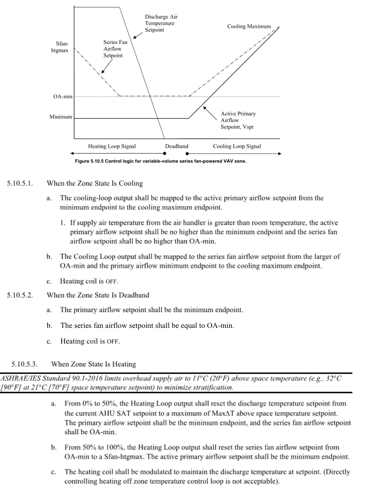

Variable Speed Power Induction Units (Series/Parallel)
================

**Jeremy Lerond, Pacific Northwest National Laboratory**

 - Original Date: 11/2023
 - Revision Date: N/A
 

## Justification for New Feature ##

Certain building energy codes require fan powered VAV boxes to use variable speed fans. The code section below is an example from section C403.7.10 of the Washington State Energy Code. Currently, EnergyPlus can only simulate constant speed fans with PIU terminals, even when a variable speed fan object (`Fan:VariableVolume` or `Fan:SystemModel`) is used.

    All fan powered VAV terminal units (series or parallel) shall be provided with electronically commutated motors. The DDC system shall be configured to vary the speed of the motor as a function of the heating and cooling load in the space. Minimum speed shall not be greater than 66 percent of design airflow required for the greater of heating or cooling operation. Minimum speed shall be used during periods of low heating and cooling operation and ventilation-only operation.

There is also a user request for it, see [here](https://github.com/NREL/EnergyPlus/issues/7311).

## E-mail and  Conference Call Conclusions ##

N/A

## Overview ##

This new feature will enable users to simulate fan powered boxes with variable speed fans by using a `Fan:SystemModel` as part of an `AirTerminal:SingleDuct:SeriesPIU:Reheat` or `AirTerminal:SingleDuct:ParallelPIU:Reheat` with a `Continuous` speed control method input. `Fan:VariableVolume` is not currently allowed as a fan type.

## Approach ##

The ASHRAE Guideline 36 provides sequence of operation during heating, cooling and deadband (ventilation) operation for both series and parallel fan powered boxes, see Figure 1 and Figure 2 below.


_Figure 1 - Sequence of Operation of a VAV parallel FPB According to ASHRAE Guideline 36_

In summary, Figure 1 shows that VAV parallel FPB should operate as follows:
- **Heating**: the fan should operate at minimum airflow rate until the maximum reheat discharge air temperature is reached, and then the airflow should be raised to meet the load.
- **Deadband**: the fan should be off, unless the primary airflow rate falls under the minimum outdoor airflow rate. When it's the case the fan flow rate is equal to minimum outdoor airflow rate minus the primary airflow rate. The sequence of operation does not specify it but the implementation will respect the fan's minimum flow rate which means that in that instance the airflow rate will be the maximum of the minimum airflow rate and the  minimum outdoor airflow rate minus the primary airflow rate.
- **Cooling**: the fan is off unless the primary airflow rate falls under the minimum outdoor airflow rate (same case as in deadband).



_Figure 2 - Sequence of Operation of a VAV series FPB According to ASHRAE Guideline 36_

In summary, Figure 2 shows that VAV series FPB should operate as follows:
- **Heating**: the fan should operate at the minimum airflow rate (fan minimum airflow rate or outdoor air minimum flow rate) until the maximum reheat discharge air temperature is reached, and then the airflow should be raised to meet the load.
- **Deadband**: the fan shall operate at the minimum airflow rate (fan minimum airflow rate or outdoor air minimum flow rate).
- **Cooling**: the fan air flow rate will be adjusted based on the primary airflow rate ratio (ratio of actual primary airflow rate to maximum airflow rate).

PIU terminal currently don't have a maximum reheat air temperature input but is necessary to implement the Guideline 36 implementation.

Currently, both the `CalcSeriesPIU` and `CalcParallelPIU` routine follow a similar approach which is to 1. determine the primary/secondary airflow rates, 2. simulate the fan, 3. simulate the heating coil. The new implementation will use a "two-step" approach when the terminal sees a heating load: First, the `Calc` methods will force the terminal to run at its minimum flow rate, if the maximum reheat temperature is reached and the load is not met, then flow rate will be increased so the load can be met (at that maximum reheat temperature). The "Deadband" and "Cooling" sequences of operations specified above can be implemented using the current structure of the routines (see 1.).

## Testing/Validation/Data Sources ##

Appropriate unit tests will be provided for all sequences for both terminals.

## Input Output Reference Documentation ##

Documentation for the new maximum reheat air temperature input will be added for the PIU terminal objects.

## Input Description ##

A new `Maximum Reheat Air Temperature` input will be added. The input will be added at the end of the object so no transition rule are necessary.

```
Maximum Reheat Air Temperature
This field specifies a maximum supply air temperature (deg. C) leaving the reheat coil in a PIU terminal unit during heating operation. If leaving blank, the temperature of the supply air to the space in heating operation may get unrealistic.
```

## Outputs Description ##

No new output will be added.

## Engineering Reference ##

Documentation of the implementation of the Guideline 36 sequences of operation will be added to the engineering reference guide.

## Example File and Transition Changes ##

One example file showcasing both sequences of operations will be provided, probably based on `PIUAuto.idf`.

## References ##

ASHRAE, Guideline. 36: High performance sequences of operation for HVAC systems. American Society of Heating, Refrigerating and Air-Conditioning Engineers, Atlanta, 2018.

Washington State Energy Code; International Code Council: Country Club Hills, IL, USA, 2015.