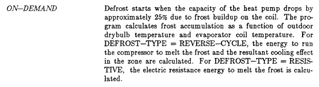
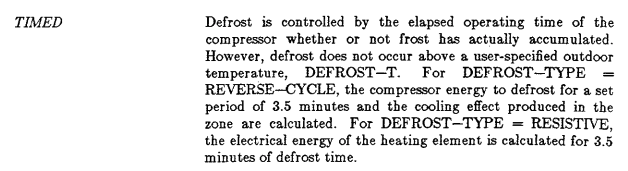

# Current model overview
The model includes two defrost strategies: timed and on-demand. For both strategies, the coil's capacity and power are adjusted for frost built-up as follows:

For timed defrost:

$$F_Q = 0.909 - 107.33 \cdot \Delta W$$

$$F_P = 0.9 - 36.45 \cdot \Delta W$$

For on-demand defrost:

$$f_{def} = \frac{1}{1 + \frac{0.01446}{\Delta W}}$$

$$F_Q = 0.875 \cdot (1 - f_{def})$$

$$F_P = 0.954 \cdot (1 - f_{def})$$

Where:

- $F_Q$ is the heating capacity multiplier
- $F_P$ is the input power multiplier
- $f_{def}$ is the fractional defrost time
- $\Delta W = W_o - W_s$ is the humidity ratio difference (kg/kg), where $W_o$ is the outdoor air humidity ratio and $W_s$ is the saturated humidity ratio at the outdoor coil surface temperature
- The outdoor coil temperature is estimated as $T_{coil} = 0.82 \cdot T_{db} - 8.589$ (°C)

According to the EnergyPlus documentation, the DOE-2.1E model is derived from the EPRI report EM-4226 "Performance of Air-Source Heat Pumps". A full derivation of the equations shown above from the EPRI report is not available anywhere.

The following table shows how the different variables were characterized experimentally.

**Table 3-5: Final Frosting and Defrosting Algorithm Equations**

| Function | Equation | Empirical Constants |
|---|---|---|
| Defrost Period | $t_d = 7.8 - 5.7 \frac{q_{di}}{q_s}$ (min) | Two coefficients for linear function of capacity ratio |
| | $t_d = 1.1$ (min) | Average dry coil defrost length |
| Defrost Power | $P_d = 2.0$ kW | Constant average |
| Defrost Cooling | $q_d = 13500 - 300 \cdot T_a$ (Btu/hr) | Coefficient of linear temperature dependence |
| Recovery Length | $t_r = 7.8 - 5.7 \frac{q_{di}}{q_s}$ | Same as defrost length |
| Recovery Capacity | $q_s$ or $q_{cy}$ | Steady state capacity or average capacity during cycling |
| Recovery Power | $P_s$ or $P_{cy}$ | Steady state power or average power during cycling |
| Frosting Capacity | $\frac{q}{q_s} = 1.02 - 5.3 \cdot \Delta W \cdot t$ | Two coefficients of linear function of the product of specific humidity difference and frosting period |
| Frosting Power | $\frac{P}{P_s} = 1.0 - 1.8 \cdot \Delta W \cdot t$ | One coefficient of a proportional function of the product of specific humidity difference and frosting period |

Where:

$q_{di}$ = capacity at defrost initiation, $q_s$ = steady state capacity, $T_a$ = ambient temperature (°F), $\Delta W$ = specific humidity difference (lb/lb), $t$ = frosting period (minutes), $q_{cy}$ = average capacity during cycling, $P_{cy}$ = average power during cycling

# Re-derivation of the capacity and power modifiers

## On-demand

**Assumption:** Demand defrost triggers when capacity drops to 75% of steady state, i.e., $\frac{q_{di}}{q_s} = 0.75$ as per this input description from DOE-2.1E

**Step 1: Frosting period**

From the EPRI frosting capacity equation (Table 3-5):

$$\frac{q}{q_s} = 1.02 - 5.3 \cdot \Delta W \cdot t$$

Setting $\frac{q}{q_s} = 0.75$ and solving for $t$:

$$t_{frost} = \frac{1.02 - 0.75}{5.3 \cdot \Delta W} = \frac{0.27}{5.3 \cdot \Delta W} = \frac{0.05094}{\Delta W} \text{ (min)}$$

**Step 2: Defrost period**

From the EPRI defrost period equation (Table 3-5):

$$t_d = 7.8 - 5.7 \cdot \frac{q_{di}}{q_s} = 7.8 - 5.7 \cdot 0.75 = 3.525 \text{ min}$$

**Step 3: Fractional defrost time**

$$f_{def} = \frac{t_d}{t_{frost} + t_d} = \frac{3.525}{\frac{0.05094}{\Delta W} + 3.525} = \frac{1}{1 + \frac{0.05094}{3.525 \cdot \Delta W}} = \frac{1}{1 + \frac{0.01445}{\Delta W}} \approx \frac{1}{1 + \frac{0.01446}{\Delta W}}$$

**Step 4: Average capacity multiplier over frosting period**

Capacity degrades linearly from $\frac{q}{q_s} = 1.0$ to $\frac{q}{q_s} = 0.75$:

$$F_Q = \frac{1.0 + 0.75}{2} = 0.875$$

Applied only during the non-defrost fraction:

$$F_Q = 0.875 \cdot (1 - f_{def})$$

**Step 5: Average power multiplier over frosting period**

From the EPRI frosting power equation (Table 3-5):

$$\frac{P}{P_s} = 1.0 - 1.8 \cdot \Delta W \cdot t$$

At defrost initiation ($t = t_{frost}$):

$$\frac{P}{P_s} = 1.0 - 1.8 \cdot \Delta W \cdot \frac{0.05094}{\Delta W} = 1.0 - 1.8 \cdot 0.05094 = 1.0 - 0.0917 = 0.9083$$

Note that $\Delta W$ cancels out. Averaging linearly from 1.0 to 0.9083:

$$F_P = \frac{1.0 + 0.9083}{2} = 0.954$$

Applied only during the non-defrost fraction:

$$F_P = 0.954 \cdot (1 - f_{def})$$

## Timed

**Assumptions:**
- Tests in the EPRI report were conducted for 45 min or 90 min. Here we assume a timed defrost cycle of $T = 45$ min (compressor operation between defrosts)
- While the DOE-2.1E documentation available online shows a defrost time of 3.5 min (see figure below), review of the original DOE-2.1E source code shows that the defrost time used to be 6 min which corresponds to a hourly defrost fraction $DefF = 0.1$ and later got changed to 3.5 min

**Step 1: Time-average the EPRI frosting equations over the 45-min cycle**

For a linear function $f(t) = a - b \cdot t$ averaged from $t = 0$ to $t = T$:

$$\overline{f} = a - b \cdot \frac{T}{2}$$

From the EPRI frosting capacity equation (Table 3-5):

$$\frac{q}{q_s} = 1.02 - 5.3 \cdot \Delta W \cdot t$$

Time-averaged over $T = 45$ min:

$$\overline{\frac{q}{q_s}} = 1.02 - 5.3 \cdot \Delta W \cdot \frac{45}{2} = 1.02 - 119.25 \cdot \Delta W$$

From the EPRI frosting power equation (Table 3-5 shown above):

$$\frac{P}{P_s} = 1.0 - 1.8 \cdot \Delta W \cdot t$$

Time-averaged over $T = 45$ min:

$$\overline{\frac{P}{P_s}} = 1.0 - 1.8 \cdot \Delta W \cdot \frac{45}{2} = 1.0 - 40.5 \cdot \Delta W$$

**Step 2: Scale by the non-defrost fraction**

The non-defrost fraction $(1 - DefF) = 0.9$ accounts for defrost and recovery time within the hour. Multiplying the time-averaged equations:

$$F_Q = (1 - DefF) \cdot \overline{\frac{q}{q_s}} = 0.9 \cdot (1.02 - 119.25 \cdot \Delta W) = 0.918 - 107.33 \cdot \Delta W$$

$$F_P = (1 - DefF) \cdot \overline{\frac{P}{P_s}} = 0.9 \cdot (1.0 - 40.5 \cdot \Delta W) = 0.9 - 36.45 \cdot \Delta W$$

These equations match with the ones from the EnergyPlus documentation, except for the intercept for the capacity modifier ($0.909$ vs $0.918$). The difference is small, and is perhaps a typo.

Note that the derivation is using $DefF = 0.1$. A later code change in DOE-2.1E replaced the fractional defrost time with $\frac{3.5}{60} = 0.0583$ without updating the four multiplier coefficients. If $DefF = 0.0583$ is the intended value, the coefficients should probably be recalculated as:

$$F_Q = 0.9511 - 112.30 \cdot \Delta W$$

$$F_P = 0.9417 - 38.13 \cdot \Delta W$$

# Potential issues with the current model

## Timed
- The current intercept of the capacity modifier might be incorrect assuming a $DefF = 0.1$
- In EnergyPlus, the default fractional defrost time $DefF$ is set to 0.0583 (i.e., 3.5 min). If the derivation above is correct, both the capacity and power modifiers should be recalculated. Further, since $DefF$ is a user input, the coefficients should be recalculated when the user input differs from the default value.

## On-demand
The on-demand strategy applies at least a 0.875 and 0.954 modifier to the coil's capacity and power, respectively, as long as the OAT is below the coil's maximum outdoor dry-bulb temperature for defrost operation. This assumes that the coil's capacity is going to be reduced by 75% during a particular timestep. However, in low humidity conditions, the time it would take for frost to reduce the capacity of the unit by 75% can largely exceed one hour, making the adjustment incorrect for any sub-hourly period. For instance:

$$t_{frost} = \frac{1.02 - 0.75}{5.3 \cdot \Delta W} = \frac{0.05094}{\Delta W}$$

Consider outdoor conditions of 2°C at 57% RH. The outdoor coil temperature is $T_{coil} = 0.82 \cdot 2 - 8.589 \approx -7°C$. The outdoor humidity ratio is $W_o = 0.0025$ kg/kg and the saturated humidity ratio at the coil temperature is $W_s(T_{coil}) = 0.002$ kg/kg, giving $\Delta W = 0.0005$ kg/kg. Under these conditions:

$$t_{frost} = \frac{0.05094}{0.0005} \approx 102 \text{ min}$$

This means the unit would need to operate for nearly two hours before the demand defrost trigger is reached, yet the model applies the full 0.875 capacity penalty at every timestep regardless. For an hourly timestep under these conditions, no defrost would actually occur. The true time-averaged capacity modifier over 60 minutes of pure frosting is:

$$F_Q = 1.02 - 5.3 \cdot 0.0005 \cdot \frac{60}{2} = 0.941$$

The on-demand formula instead gives $F_Q = 0.875 \cdot (1 - 0.0334) = 0.846$, underpredicting heating capacity by approximately 11%.