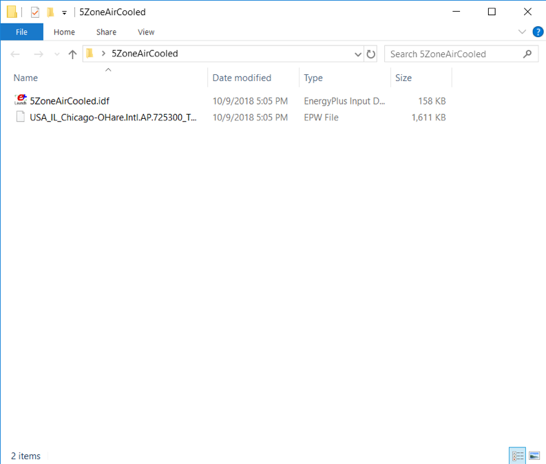
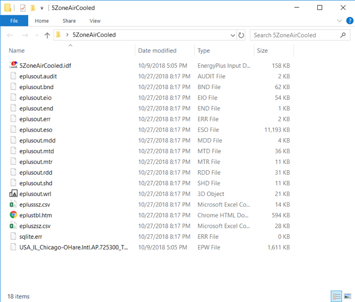
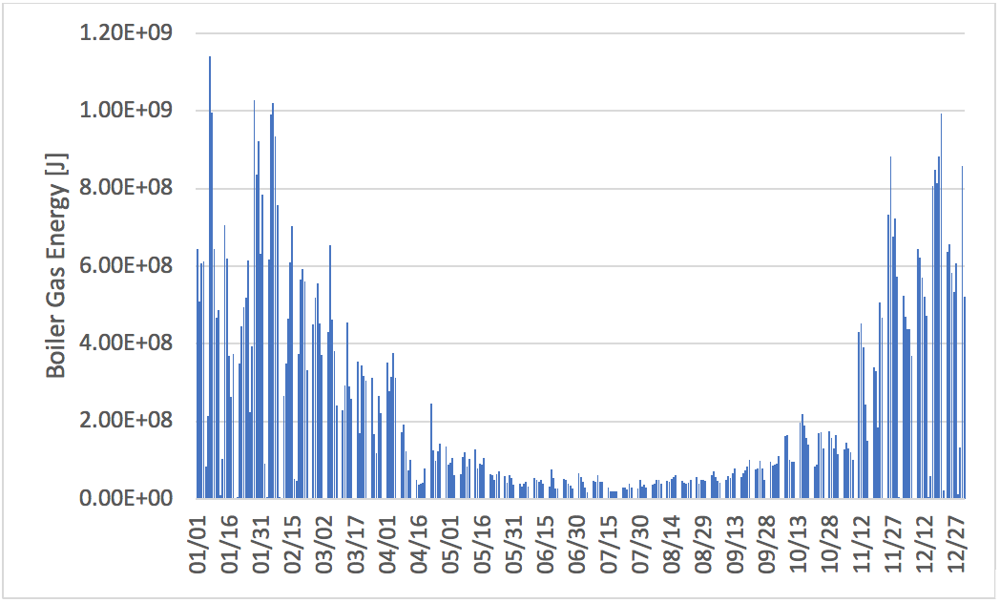

Quick Start Guide
=================

Welcome to the EnergyPlus Quick Start guide!

The following guide is intended to give a very high-level
overview of EnergyPlus and get you up and running quickly with
the program. So, while this run-through will introduce many of
the concepts that are needed, it will not go into detail on any
subject. For more in-depth coverage of the topics covered here,
the full EnergyPlus documentation (which is installed with
EnergyPlus) is available as well as training offerings from a
variety of sources (see the `Support & Training
page <https://energyplus.net/support-training>`__ for further
details).

Who should be using this guide?
-------------------------------

This guide is intended for users that are interested in
directly running EnergyPlus. Many users interact with
EnergyPlus through graphical user interface that handle
the details of running EnergyPlus. If you are using one
of these interfaces, and are interested in directly
interacting with EnergyPlus, you may find value in this
guide as an introduction to the EnergyPlus example files.
This guide will presume some familiarity with
command-line execution of programs. Tutorials on this
aspect of using EnergyPlus are readily available online
and are beyond the scope of this document.

What is EnergyPlus?
-------------------

EnergyPlus is an energy analysis and thermal load
simulation program. Based on a user’s description of a
building’s geometry, construction materials, usage, and
systems, EnergyPlus will calculate the heating and
cooling loads necessary to maintain thermal control
setpoints, conditions throughout secondary HVAC system
and coil loads, and the energy consumption of primary
plant equipment as well as many other simulation details
that are necessary to verify that the simulation is
performing as the actual building would. EnergyPlus is a
command-line tool that takes input files and produces
output files.

Finally, EnergyPlus is open source and available under a
permissive license with no “give back” provisions. The
source code of the program is available and open for
public inspection and revision, hosted at
`www.github.com/NREL/EnergyPlus <https://www.github.com/NREL/EnergyPlus>`__
. The program is not intended to be a black box that is
unintelligible to the users and developers around the
world. The hope is that this access to source code will
improve the accuracy and usability of the program over
the long term and allow many developers to work on the
program simultaneously.

Installing EnergyPlus
---------------------

EnergyPlus is provided in compiled form for several major
operating systems, including Windows, Mac, and Linux.
Check
`www.github.com/NREL/EnergyPlus/releases <https://www.github.com/NREL/EnergyPlus/releases>`__
to see if your system is supported. After downloading the
correct installer, install the program. If your operating
system allows for the selection of a custom installation
location, keep in mind that it is best to install on a
local drive (i.e., not on a drive that your computer
connects to via network). Make a note of the installation
directory, this directory will be referred to throughout
this guide as .

.. note::

    If EnergyPlus was installed as part of a user
    interface, it is possible that not all the
    support files will be present. In this
    situation, it may be best to install the
    EnergyPlus package on a computer system that
    does not have the user interface installer in
    order to avoid any conflicts. If you decide to
    install on a system with a user interface
    installed, take care that you do not overwrite
    or interfere with the version that came with
    your user interface (e.g., by adding to your
    path). This guide does not assume that
    EnergyPlus is in your path or make use of any
    features that might require this.

.. note::

    Note 2
    Throughout the rest of this guide, “/” path
    separators will be used. Take care if you are on
    Windows systems to replace these separators with
    “\”.

Running EnergyPlus
------------------

What to Expect When Running EnergyPlus
**************************************

As noted above, EnergyPlus is a command line tool that
takes input files and produces output files. The general
model for running EnergyPlus is:

Collect
   Collect information on the building to be
   modeled (building size and shape, mechanical
   system details, etc.)

Author
   Author the input files

Run
   Run EnergyPlus (simple models may take only
   minutes; complex models may take many hours)

Analyze
   Analyze the outputs

The first step is beyond the scope of this guide, but
this first step is often the most difficult. For this
guide the assumption will be that all relevant building
details are available. In many situations, two input
files will need to be supplied as inputs:

- **IDF building model description file**: The primary
  way model inputs are communicated to EnergyPlus are
  through the **I**\ nput **D**\ ata **F**\ ile (IDF).
  This file is a plain text file that contains a set of
  objects that represent the building and associated
  systems. See the “Input Output Reference” in the
  EnergyPlus documentation for many more details.
- **EPW weather file**: Weather plays an extremely
  important role in the energy use of buildings, and
  most EnergyPlus simulations use weather inputs from an
  **E**\ nergy\ **P**\ lus **W**\ eather (EPW) file.
  This file is also a plain text file that contains
  weather information. The file format is documented in
  the “Auxiliary Program Guide” documentation.
  EnergyPlus ships with Typical Meteorological Year
  (TMY) weather files for a number of locations in the
  United States and additional weather files are
  available from other sources, including the EnergyPlus
  website (energyplus.net).

Running EnergyPlus with these two files will produce a
set of output files which are used in the final step,
analysis of results. Which files are produced depends on
exactly how the program is run and what is in the input
file. If EnergyPlus is run via an interface, the
interface may intercept some of the output files and
reformat them.

EnergyPlus produces a number of files that are unique to
EnergyPlus, including:

#. **ESO** (**E** nergyPlus **S** tandard **O** utput): raw report variable output in text form.
#. **SQL**: if requested in the input file, the output variables stored in SQLite format.
   This format is most often by interfaces as it is convenient for automatic use.
#. **RDD** (**R** eport variable **D** ata **D** ictionary): list of output variables available from the run.
#. **MDD** (report **M** eter **D** ata **D** itionary): list of output meters available from the run.
#. **EIO** (**E** nergyPlus **I** nvariant **O** utput): additional EnergyPlus results, including diagnostic messages.
#. **ERR** (**ERR** ors): list of errors and warnings produced by the run.
#. **MTR** (**M** e **T** e **R** Output): raw report meter output, formatted as the ESO.
#. **MTD** (**M** e **T** er **D** etails): list of meter component variables.

Command Line Interface
----------------------

EnergyPlus is a console-based tool, so it can be executed
from a console or terminal. Assuming that is your
EnergyPlus installation path and $ is the prompt,
executing

::

  $/energyplus --help

will cause EnergyPlus to list all of the command line
options available. For now, the only two options you will
need are:

::

  -i or --idd: this option specifies the location of the
  IDD file for EnergyPlus. IDD stands for Input Data
  Dictionary, and is used in the processing of inputs

::

  -w or --weather: this option is used to specify the input EPW weather file

Assuming you have an input file named "mymodel.idf" and
an EPW file named "myweather.epw" in your working
directory, running the model is accomplished with:

::
  $/energyplus --idd /EnergyPlus.idd --weather
  myweather.epw mymodel.idf

This will result in outputs stored in the working
directory.

Using the EnergyPlus Example Files
----------------------------------

Overview
********

EnergyPlus ships with a large number of example files
that demonstrate the use of the various features of the
solver. For the most part, each object or module that is
part of EnergyPlus is demonstrated in these example
files. The example files are available as part of the
installation package in the directory: ``<root>/ExampleFiles/``.

Suppose, for example, that you are interested in modeling
hot water boilers. In the ExampleFiles directory, there
are files that provide information about what is
in each of the example files: ``ExampleFiles.html`` and ``ExampleFiles-ObjectsLink.html``

Opening ExampleFiles-ObjectsLink.html in a browser and
search for “Boiler:Hotwater”. The search should result in
pointing to following information (as of version 9.0):

.. table::

    =============== =========================== ====================== ========================== =============================
    Object Name     Number of Files with Object First File with Object Second File with Object    Third File with Object
    =============== =========================== ====================== ========================== =============================
    BOILER:HOTWATER 142                         5ZoneAirCooled.idf     5ZoneAirCooledConvCoef.idf 5ZoneAirCooledConvCoefPIU.idf
    =============== =========================== ====================== ========================== =============================

This indicates that 142 files use the object of interest.
For simplicity, choose the first file:
5ZoneAirCooled.idf. Opening this file in a text editor
(being careful not to modify the contents) will show that
the model contains the following item:

::

    Boiler:HotWater,
    Central Boiler,   !- Name
    NaturalGas,       !- Fuel Type
    autosize,         !- Nominal Capacity {W}
    0.8,              !- Nominal Thermal Efficiency
    LeavingBoiler,    !- Efficiency Curve Temperature Evaluation Variable
    BoilerEfficiency, !- Normalized Boiler Efficiency Curve Name
    autosize,         !- Design Water Flow Rate {m3/s}
    0.0,              !- Minimum Part Load Ratio
    1.2,              !- Maximum Part Load Ratio
    1.0,              !- Optimum Part Load Ratio
    Central Boiler Inlet Node, !- Boiler Water Inlet Node Name
    Central Boiler Outlet Node, !- Boiler Water Outlet Node Name
    100.,             !- Water Outlet Upper Temperature Limit {C}
    LeavingSetpointModulated; !- Boiler Flow Mode

In EnergyPlus terminology, this input object
represents the hot water boiler. The **input object**
specifies the parameters that are needed to simulate
the boiler and its interactions with the rest of the
building systems. This boiler uses natural gas as
fuel, and the capacity and design flow rates are
“autosized”. This means that EnergyPlus will determine
the values for these parameters that most likely meet
the needs of the building. All input objects in
EnergyPlus input files will look something like this.

Running a simulation
--------------------

Step-By-Step Instructions
*************************

#. The model file is located in your EnergyPlus
   installation folder, in
   /ExampleFiles/5ZoneAirCooled.idf. Make a new
   directory in a convenient location and copy the
   input file into this location. Take care to place
   this directory in a location that is local to the
   machine you are using, and keep in mind that in
   some environments it can be hard to tell what is
   local and what is not.
#. Obtain a weather file. This model is situated in
   Chicago, IL, so copy the Chicago weather file
   ``/WeatherData/USA_IL_Chicago-OHare.Intl.AP.725300_TMY3.epw``
   into the directory with the IDF file. At this
   point the directory will look something like
   what is shown in Figure 1.
#. Start up a terminal or command window and change
   directories into the directory created in step 1.
#. Run EnergyPlus: ``energyplus -i /Energy+.idd -w USA_IL_Chicago-OHare.Intl.AP.725300_TMY3.epw 5ZoneAirCooled.idf``

On some systems (e.g. Windows) it may be
necessary to enclose the IDD path in quotes.
After completion of this step, the directory
will have many more files in it, see Figure 2.
Congratulations! You’ve completed your first
simulation!

Analysis
********

This run was an annual simulation and the performance
of the building and its systems was simulated from
January 1 to December 1. Before proceeding to look at
the output, take a moment to review a couple of the
output files:

#. Check that the error file (eplusout.err) does not
   contain any error messages. The file is plain text
   and can be opened in any text editor.
#. Look at the EIO file (eplusout.eio) to see what the
   invariant output looks like. This file is also a
   plain text file.
#. Open the tabular output report (eplusout.htm) in a
   web browser. This file contains a number of
   summary-type tables

   Directory Contents Before Run

   Directory Contents After Run

EnergyPlus produces a number of different output files
that contain different kinds of output. The summary
table in eplusout.htm is useful and scanning through
it will provide some information about the behavior of
the boiler. For example (for EnergyPlus 9.0), the
boiler used 68.52 GJ worth of natural gas annually.
This is useful, but in many situations the results
required are somewhat more granular. To see what
outputs are available, open the report variable data
dictionary (eplusout.rdd) and search for “Boiler”. The
following items should show up:

::

    HVAC,Average,Boiler Heating Rate [W]
    HVAC,Sum,Boiler Heating Energy [J]
    HVAC,Average,Boiler NaturalGas Rate [W]
    HVAC,Sum,Boiler NaturalGas Energy [J]
    HVAC,Average,Boiler Inlet Temperature [C]
    HVAC,Average,Boiler Outlet Temperature [C]
    HVAC,Average,Boiler Mass Flow Rate [kg/s]
    HVAC,Average,Boiler Ancillary Electric Power [W]
    HVAC,Sum,Boiler Ancillary Electric Energy [J]
    HVAC,Average,Boiler Part Load Ratio []

Adding an additional output for the fourth item on the
list (“HVAC,Sum,Boiler NaturalGas Energy [J]”) will report
information on the gas use more granularly than for
entire run of the simulation. Furthermore, the outputs
that EnergyPlus has produced in the ESO file are not
in a form that is readily postprocessed.

Adding an output variable
-------------------------

Step-By-Step Instructions
*************************

#. Copy the model file into a new file named
   5ZAC_DailyGas.idf and open the file in a text
   editor.
#. Add the following object to the end of the file:

   ::

      Output:Variable,*,Boiler NaturalGas Energy,daily;

   This adds an output variable to the reports that
   EnergyPlus produces for the boiler gas energy. The
   “*” means that the reporting will occur for all
   boilers, but since there’s only one boiler in this
   model there will be only one dataset produced.
#. Run EnergyPlus, with an additional command line option “-r”:

   ::

      $/energyplus -i /Energy+.idd -w USA_IL_Chicago-OHare.Intl.AP.725300_TMY3.epw -r 5ZAC_DailyGas.idf

   The “-r” option (synonymous with “--readvars”) will
   execute the ReadVarsESO program after EnergyPlus
   runs to generates a CSV file from the ESO.

**Note**—Strictly speaking, making a separate copy of
the input file before making any changes is not
required. However, it is good practice to keep backup
copies of working files in the event that you make a
mistake in editing the file, and that’s the reason for
creation of a new version of the input file. Since the
input files are text files, any procedure that tracks
modifications of text files (e.g. most version control
systems) could be used to keep backup copies.

Analysis
********

The CSV file that was written is named eplusout.csv.
Load the file into your favorite spreadsheet program
and you will find that it has quite a lot of data in
it. The variables are arranged in columns, and the
variable of interest is in the column named “CENTRAL
BOILER:Boiler NaturalGas Energy [J](Daily)”. Find that column
and note that it only has one entry per day. Even
though the variable values are in the rows of the last
hour of each day, each result applies to the whole day
(and not just the last hour). Plotting the variable
results in the graph shown in Figure 3.

   Daily Boiler NaturalGas Energy

Energy use of the boiler is, as expected for a
building located in northern Illinois, somewhat higher
in the winter months. Boiler energy use is much lower,
but nonzero, during summer months.

Wrap Up and Further Reading
---------------------------

If you’ve made it this far, you’ve run a basic
simulation, added an output variable, and seen how
boiler energy use varies throughout the year for one
the EnergyPlus example models. The example files are a
very good way to familiarize yourself with the various
feature of EnergyPlus, but additional documentation is
available. EnergyPlus is a complex program with many
features, and the following documents are installed in
/Documentation and provide additional details on the
features:

EnergyPlus Essentials
     This is a longer introduction to the use of EnergyPlus,
     including more background on the program itself and
     the ecosystem. It also provides some guidance as to
     how to determine what potential sources of errors
     are when EnergyPlus runs into problems and how
     serious those problems might be.

Engineering Reference
     The Engineering Reference provides in-depth
     coverage of the theoretical basis behind the
     various calculations contained in the program. This
     reference includes more information on modeling
     equations, limitations, and literature references.

Input Output Reference
     This document is a thorough description of the
     various input and output files related to
     EnergyPlus, the format of these files, and how the
     files interact and interrelate.

Output Details and Examples
     While the Input Output Reference document touches
     on some of the outputs from EnergyPlus, this
     document has more details and specific examples. It
     also addresses the reference data sets that are
     included with the installation package.

Additional documentation and online information
sources available to users can be found on the
`documentation
page <https://energyplus.net/documentation>`__.
