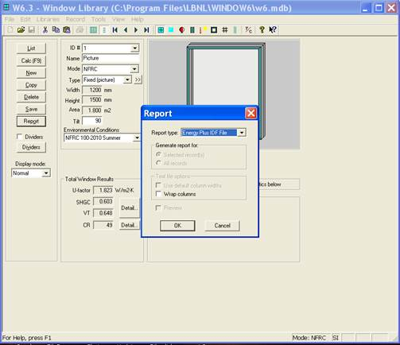
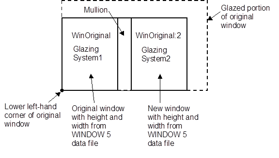
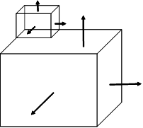
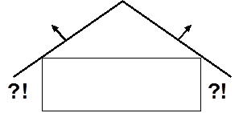
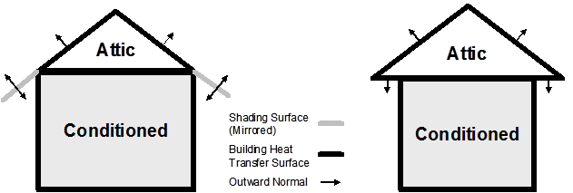
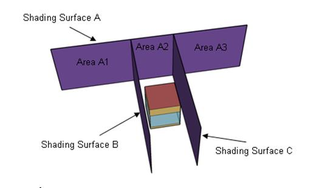
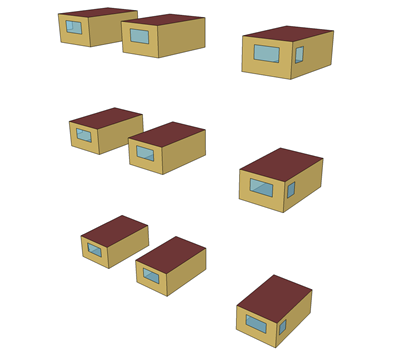
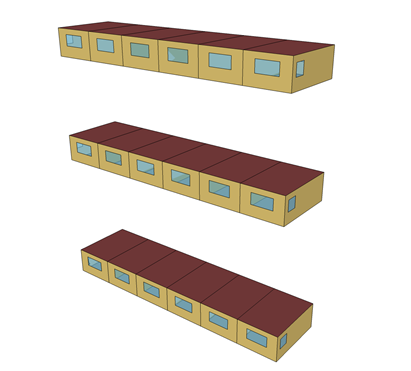
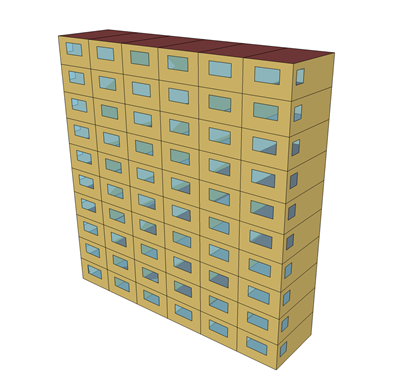

Tips and Tricks for Using EnergyPlus
************************************

.. raw:: html

   <form><input type="BUTTON" value="Back to top of page" onclick="window.location.href='#top'" style="position:fixed;bottom:5%;left:50%"></form>

.. contents::
   :depth: 2

Introduction & Support
======================

This is a quick guide for using and troubleshooting EnergyPlus
simulation software. The information here is taken from the knowledge
base and from EnergyPlus users looking for answers.

**Note that these tips are based on actual user questions and may
not be applicable to your model.**

For more detailed information about using EnergyPlus, refer to the user
guides and manuals that are installed in the Documentation folder and
are also available from `www.energyplus.net <https://energyplus.net>`__.

Organization
------------

The organization of this document roughly uses the categories of the new
features documents that have been included with EnergyPlus since April
2001 (the initial offering).

Under the subject categories, there may be a mix of short articles and
Q&A format.

EnergyPlus Support
------------------

**Please refer to the Support page for up to date information**:
https://energyplus.net/support

The primary EnergyPlus support site is supplied at:
https://energyplushelp.freshdesk.com/

The site is monitored by EnergyPlus developers and questions are
attempted to be answered in a timely manner. Standard EnergyPlus support
is provided free of charge by the U.S. Department of Energy, as part of a
continuing effort to improve the EnergyPlus building simulation tool.
Expedited, priority support may be available from other sources. The
helpdesk has a files area where important (after release) files may be
put as well as the storage for the Transition file set that are prior to
the current release.

General
=======

What EnergyPlus Is
------------------

The primary website for EnergyPlus is https://energyplus.net

EnergyPlus is an energy analysis and thermal load simulation program.
Based on a user’s description of a building from the perspective of the
building’s physical make-up, associated mechanical systems, etc.,
EnergyPlus will calculate the heating and cooling loads necessary to
maintain thermal control set points, conditions throughout a secondary
HVAC system and coil loads, and the energy consumption of primary plant
equipment as well as many other simulation details that are necessary to
verify that the simulation is performing as the actual building would.
More details on what EnergyPlus is can be found in the *GettingStarted
Document*.

No program is able to handle every simulation situation. However, it is
the intent of EnergyPlus to handle as many building and HVAC design
options either directly or indirectly through links to other programs in
order to calculate thermal loads and/or energy consumption on for a
design day or an extended period of time (up to, including, and beyond a
year).

What EnergyPlus Isn’t
---------------------

-  a user interface. It is intended to be the simulation engine around
   which a third-party interface can be wrapped. Inputs and outputs are
   simple ASCII text that is decipherable but may be best left to a GUI
   (graphical user interface). The current known third-party
   interfaces/tools can be found at
   https://www.buildingenergysoftwaretools.com/?keys=EnergyPlus

-  a life cycle cost analysis tool. It produces results that can then be
   fed into an LCC program.

-  an architect or design engineer replacement. It does not check input,
   verify the acceptability or range of various parameters (expect for a
   limited number of very basic checks), or attempt to interpret the
   results. However, it does have several reporting features to help you
   do exactly that.

Getting Started
---------------

If you’re familiar with building simulation, use the 300+ example files
that come with the program and the Input/Output Reference to help you.

If you’re new to building simulation, read and work through the
tutorials in the “Getting Started” document or visit the online
tutorial, https://energyplus.net/quickstart.

Comparing EnergyPlus to Other Programs
--------------------------------------

A paper comparing and contrasting Energy Simulation Programs can be
found here:

http://www.ibpsa.org/proceedings/BS2005/BS05_0231_238.pdf

As this paper was published in 2005, it is out of date (at least with
current EnergyPlus capabilities).

The feature highlights from EnergyPlus releases can be seen here:

https://energyplus.net/features
https://github.com/NREL/EnergyPlus/releases

In addition you can see how EnergyPlus compares to other programs (which
have submitted their models) in our testing reports:

https://energyplus.net/testing

DataSets
========

Datasets aka Libraries
----------------------

EnergyPlus uses the term DataSets for what many would call libraries.
These files are included, for the most part, in the installation package
but may be available from other sites (such as the helpdesk or Yahoo
Groups).

There are two flavors of DataSets: **simple** and **Macro**. Some sets
have files in both camps (for example, Solar Collectors). Both flavors
contain IDF objects ready to be put into EnergyPlus input files. With
the simple datasets, you may need to use a text editor or the IDF Editor
to search the file for the one you want to use. With the macro datasets
and a simply structured imf (input macro file), you can name the item
you want to include. (The macro program is described in the `Auxiliary
Programs document <AuxiliaryPrograms.pdf>`__).

Primary documentation for each dataset is found in the `Output Details
and Examples document <OutputDetailsAndExamples.pdf>`__. Highlights of
some datasets are given here.

Locations-DesignDays
--------------------

This file (Locations-DesignDays.xls) can be found in the MacroDataSets
folder. While not strictly a macro file, it leads one to be able to
download the ASHRAE design day definitions from the EnergyPlus website.
The spreadsheet format contains a sheet for each of the WMO regions as
well as the California Climate Zones, specifically sheets included are:

-  Readme – an upfront readme page

-  WMO1 Africa

-  WMO2 Asia

-  WMO3 South America

-  WMO4 North & Central America

-  CZ Files – California Climate Zones

-  WMO5 Southwest Pacific

-  WMO6 Europe

-  WMO7 Antarctica

Each WMO (World Meteorological Organization) page contains the countries
represented, specific cities that have design conditions data from
ASHRAE, a link to the full imf file with location, daylighting saving
and design day definitions as well as a link to that region’s weather
page on the EnergyPlus website. Pressing the links here will allow you
to download the files.

Design Day / Weather Data
=========================

Design Day Creation
-------------------

*How do I create the profile used in the SizingPeriod:DesignDay object?*

Typically, the EnergyPlus Development Team uses the data from the most
recent ASHRAE Handbook of Fundamentals to create a set of design day
profiles that can be used. Description of ASHRAE’s data is contained in
Chapter 14 of the 2009 Handbook of Fundamentals.
Table\ `[table:multistory-vs-multistory-2-and-multistory-3] <#table:multistory-vs-multistory-2-and-multistory-3>`__
shows the kind of data that is embodied in the design day definitions
shown earlier (ref. Locations-DesignDays).

Design Days (aka Design Conditions) are very important for use in HVAC
Sizing calculations – refer to the ASHRAE Handbook of Fundamentals for
further information.

From this, you can determine if you should use one of these profiles and
modify it or determine how to create your own profile.

The Weather Converter program accesses this file when it processes (even
for statistics) a weather file. Design Day definitions are also included
with the zips on the EnergyPlus weather data site. For locations that
don’t have ASHRAE design conditions, the Weather Converter uses the data
within the weather file to generate pseudo conditions in the statistics
file.

EPW Weather Files
-----------------

The WeatherConverter converts from other source formats to EPW and
EnergyPlus CSV formats. The WeatherConverter also produces a statistics
file that provides a quick synopsis of the converted data and is used by
the tabular reports (ref: Climatic Data Summary report). For Ecotect
users, the Weather Converter can also save as .wea format. We do not
support conversion of EPWs to other formats, including to TMY2. The
Weather Converter is described in detail in the `Auxiliary Programs
document <AuxiliaryPrograms.pdf>`__.

Meteonorm Weather Files
-----------------------

For locations that aren’t on the regular EnergyPlus weather site
(https://energyplus.net/weather), the team has created weather data
using the Meteonorm\ :sup:`TM` software. Meteonorm extrapolates hourly
data from statistical data for a location. Where statistical data aren’t
available, Meteonorm interpolates from other nearby sites. Generally, a
statistical approach is a last resort—weather files generated from
statistics will not demonstrate the normal hour-to-hour and day-to-day
variability seen in measured data. Each .ZIP includes a .STAT
(EnergyPlus weather data statistics), .EPW (EnergyPlus weather file),
and .INFO (Information about the source data and limitations from
Meteonorm).

In all cases, review the .STAT file for the location before using any of
these files to ensure that it represents the climate of the locations as
you understand it. In many cases, a nearby location with measured data
may be more appropriate than one derived from statistics. These files,
once created, are published on the EnergyPlus Yahoo Group site.

As always, if you know of sources of weather data that we might be able
to share with the EnergyPlus community, please contact us.

Weather Data for Simulations
----------------------------

Weather data can be used for various purposes by simulation program such
as EnergyPlus. For some purposes, such as validating a model to actual
energy use, you may wish to match the weather data to the simulation
period. However, for most purposes, you will wish to have a more typical
weather data profile. Information on selecting weather data is described
in this paper:

Drury B. Crawley. 1998. “Which Weather Data Should You Use for Energy
Simulations of Commercial Buildings?” in ASHRAE Transactions,
pp.498-515, Vol. 104, Pt. 2. Atlanta: ASHRAE. (PDF 197 KB)

Click
`here <https://energyplus.net/sites/all/modules/custom/weather/weather_files/whichweatherdatashouldyouuseforenergysimulations.pdf>`__
for the PDF of the above paper.

Weather File Sources
--------------------

The description of sources for the EnergyPlus weather data that is on
the website are available here: https://energyplus.net/weather/sources

Measuring Solar Data
--------------------

*Can the following weather file metrics be directly measured by some
inexpensive devices?*

Extraterrestrial Horizontal Radiation {Wh/m2} Extraterrestrial Direct
Normal Radiation {Wh/m2} Horizontal Infrared Radiation Intensity from
Sky {Wh/m2} Global Horizontal Radiation {Wh/m2} Direct Normal Radiation
{Wh/m2} Diffuse Horizontal Radiation {Wh/m2} Global Horizontal
Illuminance {lux} Direct Normal Illuminance {lux} Diffuse Horizontal
Illuminance {lux}

You can’t measure extraterrestrial unless you’re in outer space, but
then it’s assumed to be constant anyway. For the various radiation and
illuminance values, they can measured by various instrumentation ranging
from the very cheap to the very expensive. Properly, radiation needs to
be measured with a pyranometer (Eppley), which is pricey, but I’m also
seen people use simpler apparatus (Lycors) that are really photometers.
Direct beam is generally not measured, but derived by subtracting the
diffuse from the global. Diffuse is measured by adding a shadow band
over a pyranometer to block out the direct beam. Pyranometers measure
heat, photometers measure light. All the illuminance on the weather
files are derived from the radiation and sky conditions.

Do not forget that the quantities you list are the inputs to the models
that are used to derive the variables you really need in practice:
irradiance and illuminance on the facets of the building (windows
especially). These facets are usually NOT horizontal. Measuring all the
components for all tilts and azimuths can be a costly proposition, and
that’s why it is rarely done (hence the need for models), but that’s
what should be done in serious experiments to remove the (large)
uncertainties in modeled radiation.

Illuminance is measured with photometers (from, e.g., Licor), which
resemble silicon-based pyranometers. Both are less costly than
thermopile radiometers, which are normally the best in terms of
accuracy. Measurements obtained with silicon-based pyranometers need
various corrections to account for their limited spectral range. No
correction is needed for photometers, though. So you have this issue of
accuracy vs cost to consider.

Direct irradiance is measured with a pyrheliometer, which tracks the sun
and is therefore costly, but also the most accurate of all radiometers.
Obtaining direct irradiance by subtracting diffuse from global is
convenient, but not accurate, as shown in recent publications.

Input
=====

Creating Files for EnergyPlus
-----------------------------

The install package includes the IDF Editor (Windows platform) for
creating EnergyPlus Input Files (aka IDFs). Likewise, text editors such
as NotePad or WordPad can be used to create flat ASCII files for use
with EnergyPlus.

dxf or dwg CAD Files
~~~~~~~~~~~~~~~~~~~~

*How can I convert dxf or dwg CAD files to EnergyPlus?*

Several EnergyPlus interfaces, including DesignBuilder and
`OpenStudio <https://www.openstudio.net/>`__, allow you to import the
dxf drawings and trace over them to create EnergyPlus geometry. If you
have the full AutoCAD 3-D dwg model (more than just dxf), then you might
be able to export to EnergyPlus using one of the available utilities
that work with AutoCAD, but only if the model was created in the correct
way to support these tools.

Click
`here <https://www.buildingenergysoftwaretools.com/?keys=EnergyPlus>`__
for more information about current tools which support EnergyPlus.

OpenStudio
~~~~~~~~~~

`OpenStudio <https://www.openstudio.net/>`__ is a cross-platform
(Windows, Mac, and Linux) collection of software tools to support whole
building energy modeling using EnergyPlus and advanced daylight analysis
using Radiance. OpenStudio is an open source project to facilitate
community development, extension, and private sector adoption.
OpenStudio includes graphical interfaces along with a Software
Development Kit (SDK).

The graphical applications include the Trimble SketchUp Plug-in,
RunManager, and DView. The Trimble SketchUp Plug-in is an extension to
Trimble’s popular 3D modeling tool that adds EnergyPlus context to the
SketchUp program. The Plug-in allows users to quickly create geometry
needed for EnergyPlus using the built-in functionality of Trimble
SketchUp including existing drawing tools, integration with Google
Earth, Building Maker, and Photo Match. RunManager manages simulations
and workflows and gives users access to the output files through a
graphical interface. DView enables browsing, plotting, and comparing
EnergyPlus output data, especially time series.

The OpenStudio SDK allows building researchers and software developers
to quickly get started through its multiple entry levels, including
access through C++, Ruby, and C#.

Converting Older Version EnergyPlus Files
-----------------------------------------

*Can I convert an older file to a newer version of EnergyPlus?*

If the older version is from a previous release (since Version 7.2),
then yes. Use the IDF Version Updater utility in the PreProcess folder
of your EnergyPlus install. Simply select the file that needs to be
updated by finding it on your computer and the click on the Update File
button. This will update the older IDF file to the latest version of
EnergyPlus installed on the computer.

If the older version is older than Version 7.2, then you must use the
multiple transition program. You can request the transition programs
from the `EnergyPlus Help Desk
Support <https://energyplushelp.freshdesk.com/>`__ site. After clicking
on this link, go to the “downloads” tab.

The Multiple Transition folder is set up on the EnergyPlus install.

Unzip the file into the MultipleTransition folder and use the IDF
Converter GUI program to transition your older files. The IDF converter
can also save the transitioned file for each intermediate version, if
desired.

Using Macros and Editing Inputs in IDF Editor
---------------------------------------------

*How can I use macros, and continue to edit my input in IDF editor?*

*(Using or ignoring macros in the IDF editor is a potential Enhancement
List item.)*

1)Separate files into “IDF editable” and “macro” (actually, the
AbsorptionChiller_Macro.imf example file shows a little of this but it
doesn’t really use macros). For the pieces you think you’d like to
manipulate in the IDF editor, call them with extension IDF. For the
others, they would be IMF and the master file would be IMF with
“includes” of your IDF pieces.

2)Use the expanded IDF (extension epmidf) file for your IDF editor
changes and then run it from there.

Getting data from WINDOW program
--------------------------------

The WINDOW program is published from LBNL at
http://windows.lbl.gov/software. More specifics on the program and its
details are shown in the Input Output Reference under “Importing Windows
from WINDOW program” topic.

EnergyPlus IDF Excerpt Data
~~~~~~~~~~~~~~~~~~~~~~~~~~~

The preferred method of using WINDOW data in EnergyPlus is to excerpt or
“report” a specific Window from the Window library screen (see below):

   WINDOW screen for exporting IDF Window specifications
   `fig:window-screen-for-exporting-idf-window`_

The file can then be saved at a location of your choice and added into
your overall simulation IDF file.

WINDOW Data File
~~~~~~~~~~~~~~~~

The other “older” option for creating data for EnergyPlus is to use the
“EnergyPlus” option above and create a WindowDataFile. The general
format of this data is described in the following paragraphs and must
use the Construction:WindowDataFile object and an external file to be
used in EnergyPlus. While this is a convenient small file (that can
contain multiple windows), there is no way to import this file back into
WINDOW and obtain the above, more preferred method.

Please note that there is a bug in WINDOW 5 that causes two of the lines
in the EnergyPlus data file to be joined. This bug is fixed in versions
of Window 5.02 (and above). To be sure, you can check the data file for
a line that looks like:

GLAZING SYSTEM OPTICAL DATA

Angle 0 10 20 30 40 50 60 70 80 90 Hemis

The fixed version of the program will not show the above line; rather,
there will be two lines such as shown below. If you have the above
condition, with an editor you would break this into two lines:

GLAZING SYSTEM OPTICAL DATA

Angle 0 10 20 30 40 50 60 70 80 90 Hemis

In EnergyPlus, the Window data file is searched for each
“Construction:WindowDataFile” object in the EnergyPlus input. This
object has a very simple form:

Construction:WindowDataFile,

ConstructionName,

FileName; ! Default is Window5DataFile.dat in the “run” folder.

If there is a window called ConstructionName on the Window data file,
the data for that window is read from the file and the following
EnergyPlus objects and their names are created. The “W5” prefixed to
these names indicates that the object originated in the Window5 data
file.

-  **WindowMaterial:Glazing** for each of the glass layers. They will be
   named **W5:ConstructionName:GLASS1**, **W5:ConstructionName:GLASS2**
   , etc.

-  **WindowMaterial:Gas** or **WindowMaterial:GasMixture** for each of
   the gap layers. They will be named **W5:ConstructionName:GAP1**,
   **W5:ConstructionName:GAP2** , etc.

-  **WindowProperty:FrameAndDivider** (if the window on the Window5 data
   file has a frame and/or divider). It will be named
   **W5:ConstructionName**. This WindowProperty:FrameAndDivider will be
   assigned to any window on the input file that has a construction
   called “ConstructionName” *even if that window has referenced
   another WindowProperty:FrameAndDivider (i.e., if
   WindowProperty:FrameAndDivider Name for that window is specified).*
   In this case a warning will result.

Note that:

An entry on the WINDOW data file usually has just one glazing system. It
is also possible to have an entry with two glazing systems separated by
a horizontal or vertical mullion. In this case, the two glazing systems
can have different dimensions and different properties. For example, one
of the two glazing systems could be single glazed and the other could be
double glazed. An example of the two glazing system case is given in
the sample WINDOW data file shown below (although in this case the
properties of the two glazing systems are the same).

EnergyPlus handles the “one glazing system” and “two glazing systems”
cases differently. If there is one glazing system, the glazing system
height and width from the Window5 data file are not used. Instead, the
window dimensions are obtained from the window vertices that have been
specified on the IDF file. However, a warning message will result if the
height or width calculated from the window’s vertex inputs differs from
the corresponding Window5 data file values by more than 10%. This
warning is given since the effective frame and edge-of-glass
conductances on the WINDOW data file can depend on the window dimensions
if the frame is non-uniform, i.e., consists of sections with different
values of width, projection, or thermal properties.

If the WINDOW data file entry has two glazing systems, System1 and
System2, the following happens, as shown in the figure below. Assume
that the original window is called WinOriginal. System1 is assigned to
WinOriginal. Then EnergyPlus automatically creates a second window,
called WinOriginal:2, and assigns System2 to it. The dimensions of
WinOriginal are ignored; the dimensions of System1 on the data file are
assigned to it, but the position of the lower left-hand vertex of
WinOriginal is retained. The dimensions of System2 on the data file are
assigned to WinOriginal:2. The lower left-hand vertex of WinOriginal:2
is determined from the mullion orientation and width.

**Note: WinOriginal would have been the IDF window definition – it’s
dimensions will be overridden by the systems dimensions from the Window
data file. Two windows will be made and called WinOriginal and
WinOriginal:2.**

   Window Glazing system with dual glazing constructions
   `fig:window-glazing-system-with-dual-glazing`_

The Window Data File contains no information on shading devices. See
“Specify the Material Name of the Shading Device” under
WindowShadingControl for a method to attach a shading layer to windows
read in from this file.

Following is an example WINDOW data file for a slider window with two
identical double low-E glazing systems separated by a horizontal
mullion. Each system has a frame and divider. Note that all dimensions,
such as glazing height and width, are in millimeters; when EnergyPlus
reads the file these are converted to meters. Following the data file
example is a description of the contents of the file. That data used by
EnergyPlus is shown in bold.

Window5 Data File for EnergyPlus

<WINDOW program version>

Date : Tue Nov 13 17:07:40 2001

Window name : **DoubleLowE**

Description : Horizontal Slider, AA

# Glazing Systems: **2**

GLAZING SYSTEM DATA: Height Width nPanes Uval-center SC-center
SHGC-center Tvis-center

System1 : 1032 669 2 1.660 0.538
0.467 0.696

System2 : 1033 669 2 1.660 0.538
0.467 0.696

FRAME/MULLION DATA: Width OutsideProj InsideProj Cond EdgeCondRatio
SolAbs VisAbs Emiss Orient’n (mull)

L Sill : 97.3 25.4 25.4 500.000 1.467 0.500 0.500 0.90

R Sill : 97.3 25.4 25.4 500.000 1.467 0.500 0.500 0.90

L Head : 70.2 25.4 25.4 18.822 1.490 0.500 0.500 0.90

R Head : 70.2 25.4 25.4 18.822 1.490 0.500 0.500 0.90

Top L Jamb : 54.3 25.4 25.4 31.141 1.503 0.500 0.500 0.90

Bot L Jamb : 54.3 25.4 25.4 500.000 1.494 0.500 0.500 0.90

Top R Jamb : 70.2 25.4 25.4 500.000 1.518 0.500 0.500 0.90

Bot R Jamb : 97.6 25.4 25.4 264.673 1.547 0.500 0.500 0.90

Mullion : 53.5 25.4 25.4 500.000 1.361 0.500 0.500 0.90 **Horizontal**

Average frame: **75.5 25.4 25.4 326.149 1.464 0.500 0.500 0.90**

DIVIDER DATA : Width OutsideProj InsideProj Cond EdgeCondRatio SolAbs VisAbs Emiss Type #Hor #Vert

System1 : **25.4 25.4 25.4 3.068 1.191 0.500 0.500 0.900 DividedLite 2 3**

System2 : **25.4 25.4 25.4 3.068 1.191 0.500 0.500 0.900 DividedLite 2 3**

GLASS DATA : Layer# Thickness Cond Tsol Rfsol Rbsol Tvis Rfvis Rbvis Tir EmissF EmissB SpectralDataFile

System1 : 1 **3.00 0.900** 0.50 0.33 0.39 0.78 0.16 0.13 **0.00 0.16 0.13** CMFTIR_3.AFG

 2 **6.00 0.900** 0.77 0.07 0.07 0.88 0.08 0.08 **0.00 0.84 0.84** CLEAR_6.DAT

System2 : 1 **3.00 0.900** 0.50 0.33 0.39 0.78 0.16 0.13 **0.00 0.16 0.13** CMFTIR_3.AFG

 2 **6.00 0.900** 0.77 0.07 0.07 0.88 0.08 0.08 **0.00 0.84 0.84** CLEAR_6.DAT

GAP DATA : Gap# Thick nGasses

System1 : 1 **12.70 1**

System2 : 1 **12.70 1**

GAS DATA : GasName Fraction MolWeight ACond BCond CCond AVisc BVisc CVisc ASpHeat BSpHeat CSpHeat

System1 Gap1 : Air **1.0000 28.97 0.002873 7.76e-5 0.0 3.723e-6 4.94e-8 0.0 1002.737 0.012324 0.0**

System2 Gap1 : Air **1.0000 28.97 0.002873 7.76e-5 0.0 3.723e-6 4.94e-8 0.0 1002.737 0.012324 0.0**

GLAZING SYSTEM OPTICAL DATA

Angle 0 10 20 30 40 50 60 70 80 90 Hemis

System1

Tsol **0.408 0.410 0.404 0.395 0.383 0.362 0.316 0.230 0.106 0.000 0.338**

Abs1 **0.177 0.180 0.188 0.193 0.195 0.201 0.218 0.239 0.210 0.001 0.201**

Abs2 **0.060 0.060 0.061 0.061 0.063 0.063 0.061 0.053 0.038 0.000 0.059**

Rfsol **0.355 0.350 0.348 0.350 0.359 0.374 0.405 0.478 0.646 0.999 0.392**

Rbsol **0.289 0.285 0.283 0.282 0.285 0.296 0.328 0.411 0.594 1.000 0.322**

Tvis **0.696 0.700 0.690 0.677 0.660 0.625 0.548 0.399 0.187 0.000 0.581**

Rfvis **0.207 0.201 0.198 0.201 0.212 0.234 0.278 0.374 0.582 0.999 0.260**

Rbvis **0.180 0.174 0.173 0.176 0.189 0.215 0.271 0.401 0.648 1.000 0.251**

System2

Tsol **0.408 0.410 0.404 0.395 0.383 0.362 0.316 0.230 0.106 0.000 0.338**

Abs1 **0.177 0.180 0.188 0.193 0.195 0.201 0.218 0.239 0.210 0.001 0.201**

Abs2 **0.060 0.060 0.061 0.061 0.063 0.063 0.061 0.053 0.038 0.000 0.059**

Rfsol **0.355 0.350 0.348 0.350 0.359 0.374 0.405 0.478 0.646 0.999 0.392**

Rbsol **0.289 0.285 0.283 0.282 0.285 0.296 0.328 0.411 0.594 1.000 0.322**

Tvis **0.696 0.700 0.690 0.677 0.660 0.625 0.548 0.399 0.187 0.000 0.581**

Rfvis **0.207 0.201 0.198 0.201 0.212 0.234 0.278 0.374 0.582 0.999 0.260**

Rbvis **0.180 0.174 0.173 0.176 0.189 0.215 0.271 0.401 0.648 1.000 0.251**

**Description of Contents of WINDOW Data File**

(Quantities used in EnergyPlus are in bold; others are informative only)

Second line = version of WINDOW used to create the data file

*Date* = date the data file was created

**Window name** = name of this window; chosen by WINDOW5 user;
EnergyPlus user enters the same name in EnergyPlus as name of a
“Construction from Window5 Data File” object. EnergyPlus will search the
Window5 data file for an entry of this name.

*Description* = One-line description of the window; this is treated as a
comment.

**# Glazing Systems**: 1 or 2; value is usually 1 but can be 2 if window
has a horizontal or vertical mullion that separates the window into two
glazing systems that may or may not be different.

GLAZING SYSTEM DATA

*System1, System2*: separate characteristics given if window has a
mullion.

**Height**, \*\ **width** = height and width of glazed portion (i.e.,
excluding frame; and, if mullion present, excluding mullion).

**nPanes** = number of glass layers

*Uval-center* = center-of-glass U-value (including air films) under
standard winter conditions* (W/m2)

*SC-center* = center-of-glass shading coefficient under standard
summer conditions*.

*SHCG-center* = center-of-glass solar heat gain coefficient under
standard summer conditions*.

*Tvis-center* = center-of-glass visible transmittance at normal
incidence

FRAME/MULLION DATA

*L,R Sill* = left, right sill of frame

*L,R Head* = left, right header of frame

*Top L, Bot L jamb* = top-left, bottom-left jamb of frame

*Bot L, Bot R jamb* = bottom-left, bottom-right jamb of frame

**Average frame** = average characteristics of frame for use in
EnergyPlus calculation. If mullion is present, original window is
divided into two separate windows with the same average frame (with the
mullion being split lengthwise and included in the average frame).

**Width** = width (m)

**OutsideProj** = amount of projection from outside glass (m)

**InsideProj** = amount of projection from inside glass (m)

**Cond** = effective surface-to-surface conductance (from THERM
calculation) (W/m2)

**EdgeCondRatio** = ratio of surface-to-surface edge-of-glass
conductance to surface-to-surface center-of-glass conductance (from
THERM calculation)

**SolAbs** = solar absorptance

**VisAbs** = visible absorptance

**Emiss** = hemispherical thermal emissivity

**Orientation** = Horizontal or Vertical (mullion only); = None if no
mullion.

DIVIDER DATA

**Width** through **Emiss** are the same as for FRAME/MULLION DATA

**#Hor** = number of horizontal dividers

**#Vert** = number of vertical dividers

**Type** = DividedLite or Suspended

GLASS DATA

*System1, System2*: separate characteristics are given if window has a
mullion.

**Cond** = conductivity (W/m-K)

*Tsol* = spectral-average solar transmittance at normal incidence

*Rfsol* = spectral-average front solar reflectance at normal
incidence

*Rbsol* = spectral-average back solar reflectance at normal
incidence

*Tvis* = spectral-average visible transmittance at normal
incidence

*Rfvis* = spectral-average front visible reflectance at normal
incidence

*Rbvis* = spectral-average back visible reflectance at normal
incidence

**Tir** = hemispherical IR transmittance

**EmissF** = hemispherical front emissivity

**EmissB** = hemispherical back emissivity

SpectralDataFile = name of spectral data file with wavelength-dependent
transmission and reflection data used by WINDOW 5 to calculate the
glazing system optical data. “None” will appear here if spectral-average
data for this glass layer were used by WINDOW 5.

GAP DATA

System1, System2: separate characteristics are given if the window has a
mullion.

**Thick** = thickness (m)

**nGasses** = number of gasses (1, 2 or 3)

GasName = name of the gas

**Fraction** = fraction of the gas

**MolecWeight** = molecular weight of the Nth gas

(In the following, conductivity, viscosity and specific heat as a
function

of temperature, T (deg K), are expressed as A + B*T + C*T^2)

**ACond** = A coeff of conductivity (W/m-K)

**BCond** = B coeff of conductivity (W/m-K^2)

**CCond** = C coeff of conductivity (W/m-K^3)

**AVisc** = A coeff of viscosity (g/m-s)

**BVisc** = B coeff of viscosity (g/m-s-K)

**CVisc** = C coeff of viscosity (g/m-s-K^2)

**ASpHeat** = A coeff of specific heat (J/kg-K)

**BSpHeat** = B coeff of specific heat (J/kg-K^2)

**CSpHeat** = C coeff of specific heat (J/kg-K^3)

GLAZING SYSTEM OPTICAL DATA

System1, System2: separate characteristics are given if the window has a
mullion.

**Hemisph** = hemispherical (i.e., diffuse)

**Tsol** = solar transmittance vs.angle of incidence

**AbsN** = solar absorptance of Nth layer vs.angle of incidence

**Rfsol** = front solar reflectance vs.angle of incidence

**Rbsol** = back solar reflectance vs.angle of incidence

**Tvis** = visible transmittance vs.angle of incidence

**Rfvis** = front visible reflectance vs.angle of incidence

**Rbvis** = back visible reflectance vs.angle of incidence

--------------

Standard conditions are

Winter:

 Indoor air temperature = 21.1C (70F)

 Outdoor air temperature = -17.8C (0F)

 Wind speed = 6.71 m/s (15 mph)

 No solar radiation

Summer:

 Indoor air temperature = 23.9C (75F)

 Outdoor air temperature = 31.7C (89F)

 Wind speed = 3.35 m/s (7.5 mph)

 783 W/m2 (248 Btu/h-ft2) incident beam solar radiation normal to glazing

Building Geometry, Shading & Zone Model
=======================================

Building Surface Dimensions – Inside, Outside or Centerline
-----------------------------------------------------------

When describing the geometry of building surfaces in EnergyPlus, all
surfaces are a thin plane without any thickness. The thickness property
of the materials which are assigned to the building surface are only
used for heat conduction and thermal mass calculations. Because
EnegyPlus geometry is represented with a thin plane, which actual
dimension is the proper one to use: inside, outside, or centerline
dimensions. For most buildings, the difference is small, and the user
may use whatever dimensions are most convenient. A suggested approach is
to use outside dimensions for exterior surfaces, and centerline
dimensions for interior surfaces. This produces fully connected geometry
with an appropriate amount of floor area, zone volume, and thermal mass.
If desired, zone volume and floor area may be overridden by entering
values in the Zone object. For buildings with very thick walls, such as
centuries-old masonry buildings, it is recommended that centerline
dimensions be used for all surfaces (exterior and interior) so that the
model will have the correct amount of thermal mass.

Describing Roof Overhangs
-------------------------

Building heat transfer surfaces, such as roofs and walls, only cast
shadows in a hemisphere in the direction of the outward facing normal
(see
Figure `fig:building-heat-transfer-surfaces-cast-shadows`_.
Because roof surfaces generally face upward, a roof surface which
extends beyond the walls of the building will not cast shadows on the
walls below it (see
Figure `fig:extended-roof-surface-will-not-shade`_.

   Building heat transfer surfaces cast shadows in the direction of
   outward facing normal.
   `fig:building-heat-transfer-surfaces-cast-shadows`_

   Extended roof surface will not shade the walls below.
   `fig:extended-roof-surface-will-not-shade`_

Figure `fig:proper-surface-configurations-for-roof`_
shows the proper surface configurations for two types of attic
construction. In all cases, the roof surface should only include the
area of the roof which contacts the zone below it. In these drawings,
this is an unconditioned attic space, but it could also be a conditioned
zone. Any extensions of the roof which are exposed to the outdoors on
both sides should be described as a shading surface.

For the configuration on the left, the overhang should be a shading
surface which will cast shadows in both directions (if the default
mirroring is disabled the shading surface must face downward). This
ensures that the correct shading will be modeled, and it also avoids
overstating the heat transfer through the roof into the attic.

For the configuration on the right, the attic is fully enclosed with
building heat transfer surfaces for the roof and soffits. The soffits
would be described as floor surfaces in the attic and would face
downward. The central portion of the attic floor would be described as
an interzone floor surface where the outside boundary condition is the
ceiling surface in the zone below.

   Proper surface configurations for roof overhangs for two types of
   attic construction. [fig:proper-surface-configurations-for-roof]

Solar Reflection from Shading Surfaces
--------------------------------------

Exterior shading surfaces modeled using
“FullInteriorAndExteriorWithReflections” can show some sky diffuse solar
getting through the shades. When “\*WithReflections” is active a
partially sunlit shading surface reflects uniformly from the entire
surface. If using WithReflections, shading surfaces should be broken
into multiple surfaces at lines of intersection with other shading
surfaces. This also includes places where another surface may tee into a
shading surface.

For example, a building is shaded by surfaces A, B, and C. Shading
Surface A intercepts with Shading Surfaces B and C, and are broken into
three areas A1, A2, and A3. Surface A should be entered as the shown
three shading areas in order to correctly model sky diffuse solar
reflection from Shading Surface A.

   Limitations in modeling reflections from surfaces
   [fig:limitations-in-modeling-reflections-from]

Air wall, Open air connection between zones
-------------------------------------------

Modeling the interactions between thermal zones which are connected by a
large opening requires special consideration. EnergyPlus models only
what is explicitly described in the input file, so simply leaving a void
(no surfaces) between two zones will accomplish nothing - the two zones
will not be connected. A building surface or fenestration surface with
Construction:AirBoundary may be used connect the zones.
Construction:AirBoundary has options for modeling the interactions which
occur across the dividing line between two zones which are fully open to
each other:

* Convection or airflow transfers both sensible heat and moisture. Some modelers use
  ZoneMixing (one-way flow) or ZoneCrossMixing (two-way flow) to move
  air between the zones, but the user must specify airflow rates and
  schedules for this flow. Other modelers use AirFlowNetwork with large
  openings between the zones as well as other openings and cracks in
  the exterior envelope to provide the driving forces. ZoneMixing flows
  can be linked to HVAC system operation using
  ZoneAirMassFlowConservation or AirflowNetwork:Distribution:\*.
  Construction:AirBoundary has an option to automatically add a pair of
  ZoneMixing objects.

* Solar gains and daylighting gains in perimeter zones often project into a core zone across an
  open air boundary. Normally, the only way to pass solar and daylight
  from one zone to the next is through a window or glass door described
  as a subsurface on an interzone wall surface. Note that all solar is
  diffuse after passing through an interior window.
  Construction:AirBoundary groups adjacent zones into a common
  enclosure for solar and daylighting distribution allowing both direct
  and diffuse solar (and daylighting) to pass between the adjacent
  zones.

* Radiant (long-wave thermal) transfer can be significant between exterior surfaces of a perimeter zone and
  interior surfaces of a core zone with an open boundary between them.
  Normally, there is no direct radiant exchange between surfaces in
  different thermal zones. Construction:AirBoundary groups adjacent
  zones into a common enclosure for radiant exchange, allowing surfaces
  in different zones to “see” each other.

* Visible and thermal radiant output from internal gains will not normally cross zone boundaries.
  Construction:AirBoundary will distribute these gains across all
  surfaces in the grouped enclosure.

Daylight Modeling
-----------------

*Why isn’t my lighting energy being reduced with a daylighting system?*

In order to see changes in the lighting electric power consumption due
to daylighting, the Fraction Replaceable in the **Lights** input object
must be set to 1.0. This is documented in the I/O reference, and also a
warning is generated in the ERR file.

Rain Flag
---------

*Why is my exterior convection coefficient value 1000?*

When the outside environment indicates that it is raining, the exterior
surfaces (exposed to wind) are assumed to be wet. The convection
coefficient is set to a very high number (1000) and the outside
temperature used for the surface will be the wet-bulb temperature. (If
you choose to report this variable, you will see 1000 as its value.)

Interzone Exterior Convection
-----------------------------

*Why is my exterior convection coefficient value 0?*

When two surfaces are linked as interzone surfaces, the “exterior” side
of these surfaces does not really exist. EnergyPlus links the two
surfaces by using the inside temperature of surface A as the outside
temperature of surface B, and the reverse. For example:

Zone1WestWall has an outside boundary of Surface = Zone2EastWall

Zone2EastWall has an outside boundary of Surface = Zone1WestWall

Let’s say that at hour 2, the inside surface temperature of
Zone1WestWall is 19C, and the inside temperature of Zone2EastWall is
22C. When the heat balance is calculated for Zone1WestWall, its outside
surface temperature will be set to 22C. Likewise, when the heat balance
is calculated for Zone2EastWall, its outside surface temperature will be
set to 19C. So, for interzone surfaces, h ext does not apply. That is
why it is reported as zero.

Modeling Reflective Radiant Barriers
------------------------------------

*Can EnergyPlus model reflective radiant barriers?*

#. For radiant barriers which are exposed to a thermal zone, such as an
   attic space, specify a reduced thermal absorptance for the innermost
   material layer.

For example, an attic roof construction might be (outer to inner)

::

   Asphalt shingles,
     R-30 insulation,
     Radiant barrier;

The radiant barrier material would be a thin layer with some small
resistance with a low thermal absorptance value. This will reduce the
radiant heat transfer from the roof surface to other surfaces in the
attic zone.

#. If the radiant barrier is within a cavity which is not modeled as a
   separate thermal zone, then there is not an easy way to model its
   impact. For example, a wall construction:

::

   Brick,
     R-12 insulation,
     Radiant barrier,
     Air gap,
     Gypsum board;

Here, the radiant barrier would reduce the radiant transfer across the
air gap. But EnergyPlus air gaps are a fixed thermal resistance,
specified in the Material:Airgap object. The user would need to compute
an average effective resistance which represents the reduced radiant
heat transfer across the air gap due to the radiant barrier. This
resistance could then be assigned to the radiant barrier material layer.

Cavity Algorithm Model
----------------------

*Reading the documentation, I’m wondering if the Cavity algorithm is
usable for other double facade types or only Trombe wall? In other
words, does Cavity implicitly presume that the inner wall is highly
solar absorbent and so generate specific convection?*

The Trombe wall convection algorithm is applicable to just about any
vertical cavity with a high aspect ratio and relatively narrow width.
I’m not sure if a double facade cavity would meet the aspect ratio
requirement. But I do know the Trombe wall algorithm is not picky about
whether the inner wall is highly absorbent, or about any particular
properties of the walls. Actually the same basic algorithm is used by
the window model to calculate the convection between the two panes of a
window. The full reference is ISO 15099.

Using Multipliers (Zone and/or Window)
--------------------------------------

Background and Study using Multipliers
~~~~~~~~~~~~~~~~~~~~~~~~~~~~~~~~~~~~~~

Multipliers are used in EnergyPlus for convenience in modeling. Though
window multipliers are useful for any size building when you have
multiple windows on a façade, zone multipliers are more useful in large
buildings with several to many stories.

Zone multipliers are designed as a “multiplier” for floor area, zone
loads, and energy consumed by internal gains. It takes the calculated
load for the zone and multiplies it, sending the multiplied load to the
attached HVAC system. The HVAC system size is specified to meet the
entire multiplied zone load and will report the amount of the load met
in the Zone/Sys Sensible Heating or Cooling Energy/Rate report variable.
Autosizing automatically accounts for multipliers. Metered energy
consumption by internal gains objects such as Lights or Electric
Equipment will be multiplied.

To illustrate the benefits (and comparison of results), the
MultiStory.idf example file was used. The MultiStory file is a 9 zone,
10 story/floored building with heating
(ZoneHVAC:Baseboard:Convective:Electric object) and cooling
(ZoneHVAC:WindowAirConditioner object). The middle zone of each floor in
the original represents 4 zones (multiplier = 4) and the middle floor
(ZoneGroup) represents 8 floors (ZoneGroup multiplier = 8). Clone
representations were made for comparisons:

   Original Multistory IDF [fig:original-multistory-idf]

In the figure above, each “middle” zone represents 4 zones. The middle
“floor” represents 8 floors. Additionally, each of the windows has a
multiplier of 4 – so each window represents 4 windows of the same size.
For the Multistory file, the Zone object for the center zones has the
multiplier of 4. And for the center floors, the ZoneList and ZoneGroup
objects to collect the zones and apply multipliers. The top floor then
uses the Zone object multiplier for the center zones. Specifically:

::

   <snip>
       Zone,
         Gnd Center Zone,         !- Name
         0.0,                     !- Direction of Relative North {deg}
         8.0, 0.0, 0.0,           !- Origin [X,Y,Z] {m}
         1,                       !- Type
         4,                       !- Multiplier
         autocalculate,           !- Ceiling Height {m}
         autocalculate;           !- Volume {m3}
     <snip>

       ZoneGroup,
         Mid Floor,               !- Zone Group Name
         Mid Floor List,          !- Zone List Name
         8;                       !- Zone List Multiplier

       ZoneList,
         Mid Floor List,          !- Zone List Name
         Mid West Zone,           !- Zone 1 Name
         Mid Center Zone,         !- Zone 2 Name
         Mid East Zone;           !- Zone 3 Name
     <snip>

       Zone,
         Top Center Zone,         !- Name
         0.0,                     !- Direction of Relative North {deg}
         8.0,                     !- X Origin {m}
         0.0,                     !- Y Origin {m}
         22.5,                    !- Z Origin {m}
         1,                       !- Type
         4,                       !- Multiplier
         autocalculate,           !- Ceiling Height {m}
         autocalculate;           !- Volume {m3}

For comparison purposes, clones of the middle zones were done.

   Multistory with cloned middle zones.
   [fig:multistory-with-cloned-middle-zones.]

And, finally, the entire building was created:

   Multistory building – fully cloned.
   [fig:multistory-building-fully-cloned.]

The building is autosized. For convenience in comparison, the extreme
summer and winter days were used for autosizing and the simulation was
run for the 5 United States weather files that are included in the
EnergyPlus release: Chicago IL; San Francisco CA; Golden CO; Tampa FL;
and Washington DC.

Comparisons were done with the Zone Group Loads values (Zone Group
Sensible Heating Energy and Zone Group Sensible Cooling Energy) as well
as meter values for Electricity. Using the regression testing limits
that are used during EnergyPlus development testing (i.e.small
differences are within .001 or .5%; big differences are greater than
those limits).

For the purposes of discussion, the buildings will be called:

* Multistory 1 – the original 9 zone building (with multipliers and groups) ref: Figure `fig:original-multistory-idf`_;
* Multistory 2 – the building shown in Figure `fig:multistory-with-cloned-middle-zones`_.
* Multistory with cloned middle zones.
* Multistory 3 – the fully configured building – ref Figure `fig:multistory-building-fully-cloned`_.

The following table illustrates the regression testing for Multistory 2
and Multistory 3, group loads and meters versus Multistory 1 results.
For these tables, the location indicators refer to the following
EnergyPlus weather files: Chicago (USA IL Chicago-OHare.Intl.AP.725300
TMY3), San Francisco (USA CA San.Francisco.Intl.AP.724940 TMY3),
Colorado(USA CO Golden-NREL.724666 TMY3), Tampa (USA FL
Tampa.Intl.AP.722110 TMY3), and Washington DC(USA VA
Sterling-Washington.Dulles.Intl.AP.724030 TMY3).

.. table:: Multistory vs Multistory 2 and Multistory 3

   +---------------+---------------------+---------------------+---------------------+---------------------+
   |   LOCATION    | MULTI-STORY 2 LOADS | MULTI-STORY 2 METER | MULTI-STORY 3 LOADS | MULTI-STORY 3 METER |
   +===============+=====================+=====================+=====================+=====================+
   |    Chicago    |     Small Diffs     |        Equal        |   Big Diffs (76%)   |   Big Diffs (62%)   |
   +---------------+---------------------+---------------------+---------------------+---------------------+
   | San Francisco |  Big Diffs (2.43%)  |  Big Diffs (0.6%)   |   Big Diffs (49%)   |   Big Diffs (41%)   |
   +---------------+---------------------+---------------------+---------------------+---------------------+
   |   Colorado    |     Small Diffs     |     Small Diffs     |   Big Diffs (26%)   |   Big Diffs (24%)   |
   +---------------+---------------------+---------------------+---------------------+---------------------+
   |     Tampa     |     Small Diffs     |     Small Diffs     |   Big Diffs (6%)    |   Big Diffs (2%)    |
   +---------------+---------------------+---------------------+---------------------+---------------------+
   | Washington DC |        Equal        |        Equal        |   Big Diffs (91%)   |   Big Diffs (72%)   |
   +---------------+---------------------+---------------------+---------------------+---------------------+

Note that Big Diffs maximum occur in monthly values whereas the runperiod values are much smaller.

To try to pare down the discrepancies shown here, the effects of height
that are used in the calculations were removed (i.e., the
Site:WeatherStation and Site:HeightVariation objects were entered as
below to negate the effects of height on the environmental variables
such as wind and temperature). In addition the height effect was
removed from the OutdoorAir:Node object.

::

     Site:WeatherStation,
         ,          !- Wind Sensor Height Above Ground {m}
         ,          !- Wind Speed Profile Exponent
         ,          !- Wind Speed Profile Boundary Layer Thickness {m}
         0;         !- Air Temperature Sensor Height Above Ground {m}

       Site:HeightVariation,
         0,         !- Wind Speed Profile Exponent
         ,          !- Wind Speed Profile Boundary Layer Thickness {m}
         0;         !- Air Temperature Gradient Coefficient {K/m}

Figure 10. Objects removing height from building impacts.

With these included, the files were rerun with the following results:

.. table:: Multiplier Results with negated height variation.

   +---------------+---------------------+---------------------+---------------------+---------------------+
   |   Location    | Multi-story 2 Loads | Multi-story 2 Meter | Multi-story 3 Loads | Multi-story 3 Meter |
   +===============+=====================+=====================+=====================+=====================+
   |    Chicago    |     Small diffs     |     Small diffs     |     Small diffs     |     Small diffs     |
   +---------------+---------------------+---------------------+---------------------+---------------------+
   | San Francisco |     Small diffs     |     Small diffs     |     Small diffs     |     Small diffs     |
   +---------------+---------------------+---------------------+---------------------+---------------------+
   |   Colorado    |     Small diffs     |     Small diffs     |     Small diffs     |     Small diffs     |
   +---------------+---------------------+---------------------+---------------------+---------------------+
   |     Tampa     |     Small diffs     |     Small diffs     |     Small diffs     |     Small diffs     |
   +---------------+---------------------+---------------------+---------------------+---------------------+
   | Washington DC |     Small diffs     |     Small diffs     |     Small diffs     |     Small diffs     |
   +---------------+---------------------+---------------------+---------------------+---------------------+

To investigate if other systems might have different results, the Ideal
Loads System was used as the system. Similar results were found for the
multipliers vs cloned results. However, it may also be noted that the
results between the original systems (baseboard and window ac) vs the
ideal loads were very similar.

The biggest difference really comes in calculation time. As shown in the
following table,

.. table:: Runtimes for Multistory files (baseboard/window ac)

   +---------------+---------------------------------+----------------------------------+----------------------------------+
   |   Location    | Multi-story 1 (9 zones) (mm:ss) | Multi-story 2 (18 zones) (MM:SS) | Multi-story 3 (60 zones) (MM:SS) |
   +===============+=================================+==================================+==================================+
   |    Chicago    |           01:05:00 AM           |           02:14:00 AM            |           01:15:00 PM            |
   +---------------+---------------------------------+----------------------------------+----------------------------------+
   | San Francisco |           01:04:00 AM           |           02:05:00 AM            |           01:20:00 PM            |
   +---------------+---------------------------------+----------------------------------+----------------------------------+
   |   Colorado    |           01:17:00 AM           |           02:28:00 AM            |           02:43:00 PM            |
   +---------------+---------------------------------+----------------------------------+----------------------------------+
   |     Tampa     |           01:11:00 AM           |           02:21:00 AM            |           01:43:00 PM            |
   +---------------+---------------------------------+----------------------------------+----------------------------------+
   | Washington DC |           01:05:00 AM           |           02:15:00 AM            |           01:18:00 PM            |
   +---------------+---------------------------------+----------------------------------+----------------------------------+

Because the overall results were so similar, the run times for the Ideal
Loads runs are included:

.. table:: Runtime for Multistory files (ideal loads)

   +---------------+---------------------------------+----------------------------------+----------------------------------+
   |   Location    | Multi-story 1 (9 zones) (mm:ss) | Multi-story 2 (18 zones) (MM:SS) | Multi-story 3 (60 zones) (MM:SS) |
   +===============+=================================+==================================+==================================+
   |    Chicago    |           12:51:00 AM           |           01:34:00 AM            |           09:37:00 AM            |
   +---------------+---------------------------------+----------------------------------+----------------------------------+
   | San Francisco |           12:50:00 AM           |           01:34:00 AM            |           09:59:00 AM            |
   +---------------+---------------------------------+----------------------------------+----------------------------------+
   |   Colorado    |           12:51:00 AM           |           01:40:00 AM            |           10:31:00 AM            |
   +---------------+---------------------------------+----------------------------------+----------------------------------+
   |     Tampa     |           12:51:00 AM           |           01:36:00 AM            |           10:05:00 AM            |
   +---------------+---------------------------------+----------------------------------+----------------------------------+
   | Washington DC |           12:51:00 AM           |           01:36:00 AM            |           09:48:00 AM            |
   +---------------+---------------------------------+----------------------------------+----------------------------------+

More zones (and, particularly more surfaces) make for longer run times.

Guidelines for Using Multipliers and Groups
~~~~~~~~~~~~~~~~~~~~~~~~~~~~~~~~~~~~~~~~~~~

-  If the basic zone geometry is identical, make one zone, copy & paste
   it as necessary, then change the Zone Origin field to locate each
   zone correctly.

-  Do not use interzone surfaces between zones that are multiplied. Set
   the adjoining surfaces to be adiabatic, i.e.use the OtherZoneSurface
   exterior boundary condition with the other surface pointing back to
   itself.

-  Locate the middle floor zones roughly halfway between top and ground
   because exterior convection coefficients change with height. Halfway
   should cause the differences to average out. If you have many stories
   (the example only has 10 stories), consider using more middle floor
   zones.

-  Consider removing the effects of height variation for the simulation.

-  Follow guidelines in HVACTemplate and other objects about sizing if
   you are mixing autosize fields with hard sized fields (recommended to
   “autosize” all fields rather than mix).

-  All HVAC system sizes must be specified to meet the entire multiplied
   zone load.

-  Autosizing automatically accounts for multipliers.

Using OSC (Other Side Coefficients) to create controlled panels
---------------------------------------------------------------

The Other Side Coefficient (OSC) equation permits setting either the
outside surface temperature or the outside air temperature to a constant
value or a scheduled value based on the size of the first input
parameter, N1. The original temperature equation was:

.. math:: T = N_2 T_{zone} + N_3 T_{oadb} + N_4 N_5 + N_6 T_{grnd} + N_7 W_{spd} T_{oadb}

where:

-  :math:`T` = Outside Air Temperature when N1 (Combined
   convective/radiative film Coeff) > 0

-  :math:`T` = Exterior Surface Temperature when N1 (Combined
   convective/radiative film Coeff) < = 0

-  :math:`T_{zone}` = MAT = Temperature of the zone being simulated (°C)

-  :math:`T_{oadb}` = Dry-bulb temperature of the outdoor air (°C)

-  :math:`T_{grnd}` = Temperature of the ground (°C) Wspd = Outdoor wind
   speed (m/sec)

The coefficients N\ :math:`_{2}`, N\ :math:`_{3}`, N\ :math:`_{4}`,
N\ :math:`_{6}`, and N\ :math:`_{7}` scale the contribution of the
various terms that follow them. In the case of N\ :math:`_{4}`, it is
followed by another term N\ :math:`_{5}`. This is a constant
temperature that can also be overridden by a scheduled value. Note that
in some EnergyPlus documentation, the N’s are given as C’s.

This object has been changed to permit the outside temperature, T, to be
controlled to a set point temperature that is specified as
N\ :math:`_{5}` or comes from the schedule A2.

Note that since the surface that contains the panel subsurfaces (that
must be called doors in EnergyPlus) receives that same outside
temperature as the panels, it should have a construction with a very
high thermal resistance to essentially take it out of the room heat
balance calculation.

An Example input file object is shown below.

::

   SurfaceProperty:OtherSideCoefficients,
        Zn001:Roof001:OSC, !- Name
        0,   ! (N1) Combined Convective/Radiative Film Coefficient {W/m2-K}
        0,   ! (N5) Constant Temperature {C}
        0.95,!(N4) Constant Temperature Coefficient
        ,    ! (N3)External Dry-Bulb Temperature Coefficient
        ,    ! (N6)Ground Temperature Coefficient
        ,    ! (N7)Wind Speed Coefficient
        -.95,! (N2) Zone Air Temperature Coefficient
        ConstantCooling,     ! (A2) Constant Temperature Schedule Name
        No,  ! (A3)Sinusoidal Variation of Constant Temperature Coefficient
        24,  ! (N8)Period of Sinusoidal Variation {hr}
        1.,  ! (N9)Previous Other Side Temperature Coefficient
        5.,  !(N10) Minimum Other Side Temperature Limit
        25.; ! (N11) Maximum Other Side Temperature Limit

This object results in the following equation for T:

T = 1.0*Tlast +0.95*(Tsetpoint – TzoneAir) (with limits)

The result of this is that the surface temperature, T, will be changed
to the temperature that will force the zone air temperature to the
setpoint providing the temperature limits are not reached. When the zone
air temperature is at the setpoint, T remains at the value it had in the
prior time step.

A complete example with all pertinent objects:

::

     Construction,
         PanelConst,              !- Name
         Std Steel_Brown_Regular; !- Outside Layer

       Material,
         Std Steel_Brown_Regular, !- Name
         Smooth,                  !- Roughness
         1.5000000E-03,           !- Thickness {m}
         44.96960,                !- Conductivity {W/m-K}
         7689.000,                !- Density {kg/m3}
         418.0000,                !- Specific Heat {J/kg-K}
         0.9000000,               !- Thermal Absorptance
         0.9200000,               !- Solar Absorptance
         0.92000000;              !- Visible Absorptance

       BuildingSurface:Detailed,
         Zn001:Roof001,           !- Name
         Roof,                    !- Surface Type
         ROOF31,                  !- Construction Name
         ZONE ONE,                !- Zone Name
         OtherSideCoefficients,   !- Outside Boundary Condition
         Zn001:Roof001:OSC,       !- Outside Boundary Condition Object
         NoSun,                   !- Sun Exposure
         NoWind,                  !- Wind Exposure
         0,                       !- View Factor to Ground
         4,                       !- Number of Vertices
         0.000000,15.24000,4.572,  !- X,Y,Z = = > Vertex 1 {m}
         0.000000,0.000000,4.572,  !- X,Y,Z = = > Vertex 2 {m}
         15.24000,0.000000,4.572,  !- X,Y,Z = = > Vertex 3 {m}
         15.24000,15.24000,4.572;  !- X,Y,Z = = > Vertex 4 {m}

       FenestrationSurface:Detailed,
         panel002,                !- Name
         Door,                    !- Surface Type
         PanelConst,              !- Construction Name
         Zn001:Roof001,           !- Building Surface Name
         ,                        !- Outside Boundary Condition Object
         autocalculate,           !- View Factor to Ground
         ,                        !- Frame and Divider Name
         1,                       !- Multiplier
         4,                       !- Number of Vertices
         3,2,4.572,  !- X,Y,Z = = > Vertex 1 {m}
         3,3,4.572,  !- X,Y,Z = = > Vertex 2 {m}
         4,3,4.572,  !- X,Y,Z = = > Vertex 3 {m}
         4,2,4.572;  !- X,Y,Z = = > Vertex 4 {m}

       SurfaceProperty:OtherSideCoefficients,
         Zn001:Roof001:OSC,       !- Name
         0,            !- Combined Convective/Radiative Film Coefficient {W/m2-K}
         0,                       !- Constant Temperature {C}
         0.95,                    !- Constant Temperature Coefficient
         ,                        !- External Dry-Bulb Temperature Coefficient
         ,                        !- Ground Temperature Coefficient
         ,                        !- Wind Speed Coefficient
         -.95,                    !- Zone Air Temperature Coefficient
         ConstantTwentyTwo,       !- Constant Temperature Schedule Name
         No,           !- Sinusoidal Variation of Constant Temperature Coefficient
         24,                      !- Period of Sinusoidal Variation {hr}
         1.,                      !- Previous Other Side Temperature Coefficient
         5.,                      !- Minimum Other Side Temperature Limit {C}
         25.;                     !- Maximum Other Side Temperature Limit {C}

     Schedule:Constant,ConstantTwentyTwo,PanelControl,22;

Natural and Mechanical Ventilation
==================================

AirflowNetwork and EarthTube
----------------------------

*When I use an Earthtube with an AirFlowNetwork, I get a “Orphan Object”
warning.*

Currently, Earthtube and AirFlowNetworks do not work together. If both
objects co-exist, the AirflowNetwork mode supersedes the Earthtube mode
at two control choices. Since this causes the Earthtube objects to not
be used, the “orphan” warning appears.

There are four control choices in the second field of the AirflowNetwork
Simulation object (spaces included for readability)

-  MULTIZONE WITH DISTRIBUTION

-  MULTIZONE WITHOUT DISTRIBUTION

-  MULTIZONE WITH DISTRIBUTION ONLY DURING FAN OPERATION

-  NO MULTIZONE OR DISTRIBUTION

When the first two choices are selected, the AirflowNetwork model takes
over airflow calculation. The earthtube objects are not used in the
airflow calculation, causing the “orphan” warning. The example file,
AirflowNetwork_Multizone_SmallOffice.idf, uses the first choice. When
the second choice is used, the AirflowNetwork model is only used during
HVAC operation time. During system off time, the earthtube model is used
to calculate airflows. Thus, no “orphan” warning will be given, but the
earthtube may be being used less than expected. The example file,
AirflowNetwork_Simple_House.idf, uses the third choice.

HVAC, Sizing, Equipment Simulation and Controls
===============================================

HVAC Sizing Tips
----------------

To help achieve successful autosizing of HVAC equipment, note the
following general guidelines.

-  Begin with everything fully autosized (no user-specified values) and
   get a working system before trying to control any specific sized.

-  The user must coordinate system controls with sizing inputs. For
   example, if the Sizing:System “Central Cooling Design Supply Air
   Temperature” is set to 13C, the user must make sure that the setpoint
   manager for the central cooling coil controls to 13C as design
   conditions. EnergyPlus does not cross-check these inputs. The sizing
   calculations use the information in the Sizing:\* objects. The
   simulation uses the information in controllers and setpoint managers.

-  User-specified flow rates will only impact the sizing calculations if
   entered in the Sizing:Zone or Sizing:System objects. Sizing
   information flows only from the sizing objects to the components. The
   sizing calculations have no knowledge of user-specified values in a
   component. The only exception to this rule is that plant loop sizing
   will collect all component design water flow rates whether autosized
   or user-specified.

-  The zone thermostat schedules determine the times at which design
   loads will be calculated. All zone-level schedules (such as lights,
   electric equipment, infiltration) are active during the sizing
   calculations (using the day type specified for the sizing period).
   System and plant schedules (such as availability managers and
   component schedules) are unknown to the sizing calculations. To
   exclude certain times of day from the sizing load calculations, use
   the thermostat setpoint schedules for SummerDesignDay and/or
   WinterDesignDay. For example, setting the cooling setpoint schedule
   to 99C during nighttime hours for the SummerDesignDay day type will
   turn off cooling during those hours.

For more information, read the Input Output Reference section on “Input
for Design Calculations and Component Autosizing.”

Variable Refrigerant Flow Air Conditioner
-----------------------------------------

**Since its V7.0 release (October 2011), EnergyPlus has included a model
for VRF systems. See AirConditioner:VariableRefrigerantFlow and related
objects.**

*Can I model a VRV or VRF system in EnergyPlus?*

Variable Refrigerant Flow (VRF, or Variable Refrigerant Volume - VRV)
air conditioners are available in EnergyPlus V7 and later.

Otherwise, the closest model available would be the multi-speed cooling
and heating AC (AirLoopHVAC:UnitaryHeatPump:AirToAir:MultiSpeed used
with Coil:Cooling:DX:Multispeed and Coil:Heating:DX:Multispeed coils).
This model will provide information for cooling-only or heating-only
operation (VRF heat pump mode).

Others have attempted to simulate a VRF system with the existing VAV
model. This model will only provide valid information when cooling is
required. The results will only be as good as the DX cooling coil
performance curves allow. The heating side of a VAV system does not use
a DX compression system (i.e., uses gas or electric heat) so this part
of the VRV system cannot be modeled with a VAV system.

Note that using either of these models will not provide accurate results
since each of these system types provides conditioned air to all zones
served by the HVAC system. The VAV system terminal unit may be set to
use a minimum flow of 0 where the resulting air flow to that zone is 0
when cooling is not required. Energy use in this case may be slightly
more accurate.

Modeling Desiccant DeHumidifiers
--------------------------------

*How do I enter performance data for a desiccant dehumidifier?*

It depends on which specific EnergyPlus object you are trying to use.

The Dehumidifier:Desiccant:NoFans object has default performance curves
within the model itself that you can use. Set field A12, “Performance
Model,” to DEFAULT. Alternatively, you could also obtain manufacturer’s
data and develop your own curve fits, then set “Performance Model” to
User Curves. See the Input Output Reference for more details.

If you want to use the Dehumidifier:Desiccant:System object, then some
data set inputs for the required
HeatExchanger:Desiccant:BalancedFlow:PerformanceDataType1 object are
contained in the file “PerfCurves.idf” in the DataSets folder. You
could also obtain manufacturer’s data and develop your own inputs for
the HeatExchanger:Desiccant:BalancedFlow:PerformanceDataType1 object.

Boiler Control Schedule
-----------------------

*How can I get my boiler to only work when the outdoor temperature is
less than 5°C?*

To schedule the boiler to work only when the outdoor dry bulb
temperature is below 5°C, create two schedules based on the temperatures
in the weather file. You can do this by reporting Outdoor Dry Bulb
hourly, then make a spreadsheet with two columns, one which = 1 whenever
ODB≥5, and the other which = 1 whenever ODB < 5. Save this spreadsheet
as a csv format file, and then you can use Schedule:File to read these
as EnergyPlus schedules. Use these schedules in the
PlantEquipmentOperationSchemes object to make “boiler heating” active in
cold weather and “heatpump Heating” active in warmer weather.

Note that you will need to have two PlantEquipmentList objects, one
which lists only the boiler, and the other which lists only the heat
pump. And the two different PlantEquipmentOperation:HeatingLoad objects
should reference different PlantEquipmentList objects.

Report temperatures and flow rates at selected points on the hot water
loop to see if things are working properly.

Difference between EIR and Reformulated EIR Chillers
----------------------------------------------------

*What is the difference between the EIR and ReformulatedEIR models of
Electric Chillers? I am getting strange results.*

The COP of a chiller is a function of part load ratio. It is mainly
determined by the Energy Input to Cooling Output Ratio Function of Part
Load Ratio Curve. When the EIR model is used for an electric chiller,
the curve has an independent variable: part load ratio. For the
ReformulatedEIR model, the curve requires two independent variables:
leaving condenser water temperature and part load ratio. Each
independent variable has its min and max values. If a variable is
outside the allowed range, the nearest allowed value is used, possibly
resulting in an unexpected result.

If you would like to compare COP values for two types of chillers, you
may need to ensure that the same conditions are applied. For simplicity,
you may want to use a spreadsheet to calculate the curve values.

Using Well Water
----------------

The water-to-water heat pumps have not been programmed to allow well
water. However, cooling towers have (see 5ZoneWaterSystems.idf) and you
should be able to connect the WSHP to a condenser loop with a cooling
tower.

Currently, there is no method to directly simulate well water as the
condensing fluid for water source heat pumps. So to get as close as
possible, program the cooling towers to allow well water via the water
use object. If the cooling tower inlet node water temperature represents
the well water temperature, and if you can set up the cooling tower to
provide an outlet water temperature very close to the inlet water
temperature, then this would be the same as connecting the well water
directly to the WSHP. Minimize the cooling tower fan energy or disregard
it completely when performing your simulation. Use report variables at
the inlet/outlet node of the cooling tower to investigate how close you
can get to your equipment configuration.

Plant Load Profile
------------------

The Plant Load Profile object is used to “pass” a load to the plant
where the plant meets this load. The load profile places an inlet and
outlet water temperature and a mass flow rate at the inlet to the plant
loop. This is where you will need to focus when you try to alter the
boiler performance.

HVAC System Turn Off
--------------------

*My HVAC system won’t turn off even when my availability schedule is 0
(off).*

The night cycle option is set to Cycle On Any in the
HVACTemplate:System:Unitary object. This will turn on the AC system.
Change the night cycle option to Stay Off and the system shuts down
correctly. For future reference, an indicator of night cycle operation
is the on one time step, off the next type of operation.

Fan Types
---------

*I am confused about the differences between the different fan types.
Can you explain?*

In short:

Fan:ConstantVolume is a constant volume, continuous operation fan which
can be turned on and off via a schedule.

Fan:OnOff is similar to the one above, but it cycles itself on and off
as required by its thermostat … all during the scheduled operation
period. This is a typical mode of operation for a home furnace.

Fan:VariableVolume runs continuously during the Schedule period, but
varies its volume to meet the heating or cooling demand.

Consult the `Input Output Reference
document <InputOutputReference.pdf>`__ (group Fans) for additional
information.

Use of Set Point Managers
-------------------------

A coil will check its inlet air temperature compared to the set point
temperature. For cooling, if the inlet air temperature is above the set
point temp, the coil turns on. It’s opposite that for heating. In the
5ZoneAutoDXVAV example file, a schedule temperature set point is placed
at the system outlet node. This is the temperature the designer wants at
the outlet. The mixed air SP manager is used to account for fan heat and
places the required SP at the outlet of the cooling coil so the coil
slightly overcools the air to overcome fan heat and meet the system
outlet node set point.

You don’t blindly place the SP’s at the coil outlet node, but this is a
likely starting point in most cases. If there is a fan after the coil’s,
the “actual” SP will need to be placed on a different node (other than
the coils). Then a mixed air manager will be used to reference that SP
and the fan’s inlet/outlet node to calculate the correct SP to place
wherever you want (at the coil outlet, the mixed air node, etc.). Place
it at the mixed air node if you want the outside air system to try and
meet that setpoint through mixing. Place it at the cooling coil outlet
if you want the coil control to account for fan heat. Place it at both
locations if you want the outside air system to try and meet the load
with the coil picking up the remainder of the load.

See if the coils are fully on when the SP is not met. If they are the
coils are too small. If they are at part-load, the control SP is
calculated incorrectly.

Relationship of Set Point Managers and Controllers
~~~~~~~~~~~~~~~~~~~~~~~~~~~~~~~~~~~~~~~~~~~~~~~~~~

*Could you elaborate further on the relation between SetPoint managers
and Controllers?*

SetpointManager objects place a setpoint on a node, for example, one
might place a setpoint of 12C on the node named “Main Cooling Coil Air
Outlet Node”.

In the case of Controller:WaterCoil which controls a hot water or chilled
water coil, the controller reads the setpoint and tries to adjust the
water flow so that the air temperature at the controlled node matches
the current setpoint. Continuing the example above:

::

     Controller:WaterCoil,
         Main Cooling Coil Controller,  !- Name
         Temperature,                   !- Control variable
         Reverse,                       !- Action
         Flow,                          !- Actuator variable
         Main Cooling Coil Air Outlet Node,   !- Control_Node
         Main Cooling Coil Water Inlet Node,  !- Actuator_Node
         0.002,                         !- Controller Convergence Tolerance:
                                        !- delta temp from setpoint temp {deltaC}
         autosize,                      !- Max Actuated Flow {m3/s}
         0.0;                           !- Min Actuated Flow {m3/s}

It is possible to place the control node downstream of the actual object
being controlled, for example after other coils and the supply fan, but
I recommend using the coil leaving air node as the control node for
tighter control.

Model Appendix G Temperature Reset
~~~~~~~~~~~~~~~~~~~~~~~~~~~~~~~~~~

Hot Water Supply Temperature Reset
^^^^^^^^^^^^^^^^^^^^^^^^^^^^^^^^^^

*Appendix G, in G3.1.3.4, mandates to reset Hot Water Supply Temperature
based on outdoor dry-bulb temperature, 82.22°C / 180 at -6.66°C / 20
and below, 65.56°C / 150 at10°C / 50 and above. How can I do this in
EnergyPlus?*

For this, you would place a **SetpointManager:OutdoorAirReset** on your
PlantLoop supply outlet node, defining the appropriate temperatures:

::

     SetpointManager:OutdoorAirReset,
       Appendix G HW Reset Setpoint,  !- Name
       Temperature,                   !- Control Variable
       82.22,                         !- Setpoint at Outdoor Low Temperature {C}
       -6.66,                         !- Outdoor Low Temperature {C}
       65.56,                         !- Setpoint at Outdoor High Temperature {C}
       10.0,                          !- Outdoor High Temperature {C}
       HW Loop Supply Outlet Node;    !- Setpoint Node or NodeList Name

Chilled Water Supply Temperature Reset
^^^^^^^^^^^^^^^^^^^^^^^^^^^^^^^^^^^^^^

*Appendix G, in G3.1.3.9 mandates to reset Hot Water Supply Temperature
based on outdoor dry-bulb temperature, 6.66°C / 44 at 26.66°C / 80 and
above, 12.22°C / 54 at 15.56°C / 60 and below, and ramped linearly in
between.*

*How can I do this in EnergyPlus?*

For this, you would place a **SetpointManager:OutdoorAirReset** on your
PlantLoop supply outlet node, defining the appropriate temperatures:

::

     SetpointManager:OutdoorAirReset,
       Appendix G ChW Reset Setpoint, !- Name
       Temperature,                   !- Control Variable
       12.22,                         !- Setpoint at Outdoor Low Temperature {C}
       15.56,                         !- Outdoor Low Temperature {C}
       6.66,                          !- Setpoint at Outdoor High Temperature {C}
       26.66,                         !- Outdoor High Temperature {C}
       ChW Loop Supply Outlet Node;   !- Setpoint Node or NodeList Name

Supply Air Temperature Reset
^^^^^^^^^^^^^^^^^^^^^^^^^^^^

*Appendix G, in G3.1.3.12, mandates that the air temperature for cooling
shall be reset higher by 2.77°C / 5 under the minimum cooling load
condition. How can I do this in EnergyPlus?*

For this, you would use a **SetpointManager:Warmest** on your
AirLoopHVAC Supply outlet node, defining the appropriate temperatures:

Start by identifying the correct supply air temperature based on
G3.1.2.9.1, which in general calls for a 20 supply-air-to-room-air
temperature difference. In our case, let’s assume we have VAV With
Reheat (System Type 7), and that we want 75 in cooling mode. Our
AirLoopHVAC supply temperature should then be 75-20 = 55, or 12.78°C.
12.78 + 2.77 = 15.56°C. We can now create our
**SetpointManager:Warmest**:

::

     SetpointManager:Warmest,
       Appendix G LAT Reset Setpoint, !- Name
       Temperature,                   !- Control Variable
       VAV with Reheat,               !- HVAC Air Loop Name
       12.78,                         !- Minimum Setpoint Temperature {C}
       15.56,                         !- Maximum Setpoint Temperature {C}
       MaximumTemperature,            !- Strategy
       VAV with Reheat SAT Nodes;     !- Setpoint Node or NodeList Name

Cooling Tower Temperature Reset
^^^^^^^^^^^^^^^^^^^^^^^^^^^^^^^

*Heat Rejection (Systems 7 and 8). The heat rejection device shall be an
axial fan cooling tower with two-speed fans, and shall meet the
performance requirements of Table 6.8.1G. Condenser water design supply
temperature shall be 85 or 10 approaching design wet-bulb temperature,
whichever is lower, with a design temperature rise of 10. The tower
shall be controlled to maintain a 70 leaving water temperature where
weather permits, floating up to leaving water temperature at design
conditions. The baseline building design condenser-water pump power
shall be 19 W/gpm. Each chiller shall be modeled with separate condenser
water and chilled- water pumps interlocked to operate with the
associated chiller*

*How am I supposed to translate that into EnergyPlus format?*

Let’s assume our cooling tower is designed at CTI (the Cooling
Technology Institute) standard conditions: 95 DB / 78 WB. With a 10
approach, that would give use 88 LWT, which is higher than 85.

That means our leaving chilled water temperature is 85 / 29.44°C, with
an approach of 7.

In order to maintain a 70 // 21.11°C leaving water temperature where
weather permits, floating up to leaving water temperature at design
conditions, we use a **SetpointManager:FollowOutdoorAirTemperature** on
our condenser loop Supply outlet node, defining the appropriate
temperatures:

::

     SetpointManager:FollowOutdoorAirTemperature,
       Appendix G CndW Reset Setpoint,!- Name
       Temperature,                   !- Control Variable
       OutdoorAirWetBulb,             !- Reference Temperature Type
       7,                             !- Offset Temperature Difference {deltaC}
       29.44,                         !- Maximum Setpoint Temperature {C}
       21.11,                         !- Minimum Setpoint Temperature {C}
       Condenser Supply Outlet Node;  !- Setpoint Node or NodeList Name

HVAC Availability Schedules
---------------------------

*How do availability schedules work?*

Apply the availability schedule to the HVAC System (i.e., Furnace or
DXSystem), the coils and the fan objects. If compact HVAC objects are
used, apply the availability schedule to the compact HVAC object. You
will get different results depending on the selection for the night
cycle option.

HVAC System Types
-----------------

*What kind of systems are available in EnergyPlus?*

EnergyPlus HVAC systems input is flexible, so many different types of
systems can be built using the basic available components. There are
also compound components which represent common equipment types, and
HVACTemplate systems which simplify the input for specific systems. This
list gives an overview of HVAC objects in EnergyPlus:

HVAC Templates

-  HVACTemplate:Thermostat

-  HVACTemplate:Zone:IdealLoadsAirSystem

-  HVACTemplate:Zone:FanCoil

-  HVACTemplate:Zone:PTAC

-  HVACTemplate:Zone:PTHP

-  HVACTemplate:Zone:Unitary

-  HVACTemplate:Zone:VAV

-  HVACTemplate:Zone:VAV:FanPowered

-  HVACTemplate:Zone:WaterToAirHeatPump

-  HVACTemplate:System:Unitary

-  HVACTemplate:System:Unitary:AirToAir

-  HVACTemplate:System:VAV

-  HVACTemplate:System:PackagedVAV

-  HVACTemplate:System:DedicatedOutdoorAir

-  HVACTemplate:Plant:ChilledWaterLoop

-  HVACTemplate:Plant:Chiller

-  HVACTemplate:Plant:Tower

-  HVACTemplate:Plant:HotWaterLoop

-  HVACTemplate:Plant:Boiler

-  HVACTemplate:Plant:MixedWaterLoop

Zone HVAC Forced Air Units

-  ZoneHVAC:IdealLoadsAirSystem

-  ZoneHVAC:FourPipeFanCoil

-  ZoneHVAC:WindowAirConditioner

-  ZoneHVAC:PackagedTerminalAirConditioner

-  ZoneHVAC:PackagedTerminalHeatPump

-  ZoneHVAC:WaterToAirHeatPump

-  ZoneHVAC:Dehumidified:DX

-  ZoneHVAC:EnergyRecoveryVentilator

-  ZoneHVAC:EnergyRecoveryVentilator:Controller

-  ZoneHVAC:UnitVentilator

-  ZoneHVAC:UnitHeater

-  ZoneHVAC:OutdoorAirUnit

-  ZoneHVAC:TerminalUnit:VariableRefrigerantFlow

Zone HVAC Radiative/Convective Units

-  ZoneHVAC:Baseboard:RadiantConvective:Water

-  ZoneHVAC:Baseboard:RadiantConvective:Steam

-  ZoneHVAC:Baseboard:RadiantConvective:Electric

-  ZoneHVAC:Baseboard:Convective:Water

-  ZoneHVAC:Baseboard:Convective:Electric

-  ZoneHVAC:LowTemperatureRadiant:VariableFlow

-  ZoneHVAC:LowTemperatureRadiant:ConstantFlow

-  ZoneHVAC:LowTemperatureRadiant:Electric

-  ZoneHVAC:HighTemperatureRadiant

-  ZoneHVAC:VentilatedSlab

Zone HVAC Air Loop Terminal Units

-  AirTerminal:SingleDuct:ConstantVolume:NoReheat

-  AirTerminal:SingleDuct:ConstantVolume:Reheat

-  AirTerminal:SingleDuct:VAV:NoReheat

-  AirTerminal:SingleDuct:VAV:Reheat

-  AirTerminal:SingleDuct:VAV:Reheat:VariableSpeedFan

-  AirTerminal:SingleDuct:VAV:HeatAndCool:NoReheat

-  AirTerminal:SingleDuct:VAV:HeatAndCool:Reheat

-  AirTerminal:SingleDuct:SeriesPIU:Reheat

-  AirTerminal:SingleDuct:ParallelPIU:Reheat

-  AirTerminal:SingleDuct:ConstantVolume:FourPipeInduction

-  AirTerminal:SingleDuct:ConstantVolume:FourPipeBeam

-  AirTerminal:SingleDuct:ConstantVolume:CooledBeam

-  AirTerminal:DualDuct:ConstantVolume

-  AirTerminal:DualDuct:VAV

-  AirTerminal:DualDuct:VAV:OutdoorAir

-  ZoneHVAC:AirDistributionUnit

Fans

-  Fan:ConstantVolume

-  Fan:VariableVolume

-  Fan:OnOff

-  Fan:ZoneExhaust

-  FanPerformance:NightVentilation

-  Fan:ComponentModel

Coils

-  Coil:Cooling:Water

-  Coil:Cooling:Water:DetailedGeometry

-  Coil:Cooling:DX:SingleSpeed

-  Coil:Cooling:DX:TwoSpeed

-  Coil:Cooling:DX:MultiSpeed

-  Coil:Cooling:DX:TwoStageWithHumidityControlMode

-  CoilPerformance:DX:Cooling

-  Coil:Cooling:DX:VariableRefrigerantFlow

-  Coil:Heating:DX:VariableRefrigerantFlow

-  Coil:Heating:Water

-  Coil:Heating:Steam

-  Coil:Heating:Electric

-  Coil:Heating:Fuel

-  Coil:Heating:Desuperheater

-  Coil:Heating:DX:SingleSpeed

-  Coil:Heating:DX:MultiSpeed

-  Coil:Cooling:WaterToAirHeatPump:ParameterEstimation

-  Coil:Heating:WaterToAirHeatPump:ParameterEstimation

-  Coil:Cooling:WaterToAirHeatPump:EquationFit

-  Coil:Cooling:WaterToAirHeatPump:VariableSpeedEquationFit

-  Coil:Heating:WaterToAirHeatPump:EquationFit

-  Coil:Heating:WaterToAirHeatPump:VariableSpeedEquationFit

-  Coil:WaterHeating:AirToWaterHeatPump

-  Coil:WaterHeating:Desuperheater

-  CoilSystem:Cooling:DX

-  CoilSystem:Heating:DX

-  CoilSystem:Cooling:Water:HeatExchangerAssisted

-  CoilSystem:Cooling:DX:HeatExchangerAssisted

Evaporative Coolers

-  EvaporativeCooler:Direct:CelDekPad

-  EvaporativeCooler:Indirect:CelDekPad

-  EvaporativeCooler:Indirect:WetCoil

-  EvaporativeCooler:Indirect:ResearchSpecial

Humidifiers and Dehumidifiers

-  Humidifier:Steam:Electric

-  Dehumidifier:Desiccant:NoFans

-  Dehumidifier:Desiccant:System

Heat Recovery

-  HeatExchanger:AirToAir:FlatPlate

-  HeatExchanger:AirToAir:SensibleAndLatent

-  HeatExchanger:Desiccant:BalancedFlow

-  HeatExchanger:Desiccant:BalancedFlow:PerformanceDataType1

Unitary Equipment

-  AirLoopHVAC:Unitary:Furnace:HeatOnly

-  AirLoopHVAC:Unitary:Furnace:HeatCool

-  AirLoopHVAC:UnitaryHeatOnly

-  AirLoopHVAC:UnitaryHeatCool

-  AirLoopHVAC:UnitaryHeatPump:AirToAir

-  AirLoopHVAC:UnitaryHeatPump:WaterToAir

-  AirLoopHVAC:UnitaryHeatCool:VAVChangeoverBypass

-  AirLoopHVAC:UnitaryHeatPump:AirToAir:MultiSpeed

Variable Refrigerant Flow Equipment

-  AirConditioner:VariableRefrigerantFlow

Air Distribution

-  AirLoopHVAC

-  AirLoopHVAC:OutdoorAirSystem:EquipmentList

-  AirLoopHVAC:OutdoorAirSystem

-  OutdoorAir:Mixer

-  AirLoopHVAC:ZoneSplitter

-  AirLoopHVAC:SupplyPlenum

-  AirLoopHVAC:SupplyPath

-  AirLoopHVAC:ZoneMixer

-  AirLoopHVAC:ReturnPlenum

-  AirLoopHVAC:ReturnPath

Pumps

-  Pump:VariableSpeed

-  Pump:ConstantSpeed

-  Pump:VariableSpeed:Condensate

-  HeaderedPumps:VariableSpeed

-  HeaderedPumps:ConstantSpeed

Solar Collectors

-  SolarCollectorPerformance:FlatPlate

-  SolarCollector:FlatPlate:Water

-  SolarCollector:FlatPlate:PhotovoltaicThermal

-  SolarCollectorPerformance:PhotovoltaicThermal:Simple

-  SolarCollector:IntegralCollectorStorage

-  SolarCollectorPerformance:IntegralCollectorStorage

-  SolarCollector:UnglazedTranspired

-  SolarCollector:UnglazedTranspired:Multisystem

Plant Heating and Cooling Equipment

-  Boiler:HotWater

-  Boiler:Steam

-  Chiller:Electric:EIR

-  Chiller:Electric:ReformulatedEIR

-  Chiller:Electric

-  Chiller:Absorption:Indirect

-  Chiller:Absorption

-  Chiller:ConstantCOP

-  Chiller:EngineDriven

-  Chiller:CombustionTurbine

-  ChillerHeater:Absorption:DirectFired

-  ChillerHeater:Absorption:DoubleEffect

-  HeatPump:WaterToWater:EquationFit:Heating

-  HeatPump:WaterToWater:EquationFit:Cooling

-  HeatPump:WaterToWater:ParameterEstimation:Cooling

-  HeatPump:WaterToWater:ParameterEstimation:Heating

-  DistrictCooling

-  DistrictHeating

Condenser Equipment and Heat Exchangers

-  CoolingTower:SingleSpeed

-  CoolingTower:TwoSpeed

-  CoolingTower:VariableSpeed

-  CoolingTowerPerformance:CoolTools

-  CoolingTowerPerformance:YorkCalc

-  EvaporativeFluidCooler:SingleSpeed

-  EvaporativeFluidCooler:TwoSpeed

-  FluidCooler:SingleSpeed

-  FluidCooler:TwoSpeed

-  GroundHeatExchanger:System

-  GroundHeatExchanger:Slinky

-  GroundHeatExchanger:Pond

-  GroundHeatExchanger:Surface

-  HeatExchanger:FluidToFluid

Water Heaters and Thermal Storage

-  WaterHeater:Mixed

-  WaterHeater:Stratified

-  WaterHeater:Sizing

-  WaterHeater:HeatPump:PumpedCondenser

-  WaterHeater:HeatPump:WrappedCondenser

-  ThermalStorage:Ice:Simple

-  ThermalStorage:Ice:Detailed

-  ThermalStorage:ChilledWater:Mixed

-  ThermalStorage:ChilledWater:Stratified

Plant-Condenser Loops

-  PlantLoop

-  CondenserLoop

-  Pipe:Adiabatic

-  Pipe:Adiabatic:Steam

-  Pipe:Indoor

-  Pipe:Outdoor

-  Pipe:Underground

Separating Ventilation Loads v. Zone Loads
------------------------------------------

*Can I determine the ventilation load for PAU in PAU + FCUs system? If
can, how to split the total cooling load into room load and ventilation
load for PAU sizing in energyplus?*

*In the HTML report, “Nominal total capacity [W]” (EquipmentSummary) and
“Design Load [W]” (HVACSizingSummary) can be found. Are they equal to
“Total cooling load” and “Room load”? (i.e.Ventilation load = “nominal
total capacity” - “Design Load”)*

PAU – Primary Fresh Air Handling Unit or DOAS – Dedicated Outdoor Air
Unit

FCU – Fan Coil Unit

There are several ways to split the total cooling load into room load
and ventilation load for PAU sizing in EnergyPlus:

1)In the eio output, section, the heating and cooling loads reported
there are the peak \*sensible\* loads for each zone, without any
ventilation load. These are the same values reported as “Design Load” in
the HVACSizingSummary table report.

2)In the EquipmentSummary table report, the component capacities
reported there are the total (cooling, sensible for heating) output
capacities include any ventilation load if it impacts that component.

3)If you have a central air loop that serves only the ventilation
load, and zone equipment that serves only the zone load, there is an
autosizing option in Sizing:System that should autosize the central
system appropriately.

From example file 5ZoneCoolBeam.idf:

::

   Sizing:System,
     VAV Sys 1, !- AirLoop Name
     VentilationRequirement, !- Type of Load to Size On
     autosize, !- Design Outdoor Air Flow Rate {m3/s}
     1.0, !- Minimum System Air Flow Ratio

When you run a simulation, if you want to report ventilation loads, the
following Output:Variable names are available:

-  HVAC,Sum,Zone Mechanical Ventilation No Load Heat Removal [J]

-  HVAC,Sum,Zone Mechanical Ventilation Cooling Load Increase [J]

-  HVAC,Sum,Zone Mech Ventilation Cooling Load Increase: OverHeating [J]

-  HVAC,Sum,Zone Mechanical Ventilation Cooling Load Decrease [J]

-  HVAC,Sum,Zone Mechanical Ventilation No Load Heat Addition [J]

-  HVAC,Sum,Zone Mechanical Ventilation Heating Load Increase [J]

-  HVAC,Sum,Zone Mech Ventilation Heating Load Increase: OverCooling [J]

-  HVAC,Sum,Zone Mechanical Ventilation Heating Load Decrease [J]

System not Cooling
------------------

*I built a very simple system 5 zones VAV no reheat to understand how a
E+ system is put together. The results show that the cooling coil is not
seeing a load. I then build the same HVACTemplate system and made sure
all the details are exactly the same. The template works but not my
system.*

It is much easier to use HVACTemplate objects to set up your system. All
required supporting objects are set up for you. Notice in your 5Zone
input file, you have specified AHU1CCController for BOTH cooling coil
controller lists. The second controller list should use controller name
AHU2CCController. The 5Zone file worked when I used the correct
controller name.

::

   AirLoopHVAC:ControllerList,
         AHU1SystemController,    !- Name
         Controller:WaterCoil,       !- Controller Type 1
         AHU1CCController;        !- Controller Name 1

     AirLoopHVAC:ControllerList,
         AHU2SystemController,    !- Name
         Controller:WaterCoil,       !- Controller Type 1
         AHU1CCController;        !- Controller Name 1

Low Temperature Radiant Undersizing Issues
------------------------------------------

Some users have noted difficulties when trying to size certain aspects
of low temperature radiant systems, particularly in cooling mode for the
hydronic (variable flow) and constant flow low temperature radiant
systems when using autosize. The problem appears to be that the system
is not sizing properly or is undersizing, leaving zone conditions that
are no where near the setpoint temperatures established by the radiant
system. This is confusing because the nature of autosizing should take
some of the guesswork out of establishing certain parameters that are
not always obvious and autosizing does not have issues with conventional
forced air systems.

The problem stems from the nature of radiant systems and how they meet
the load or reach the thermostatic condition set by the user. A
conventional forced air system delivers air to a space at a particular
temperature and humidity condition. In order to provide more heating or
cooling, the flow rate is simply increased until the thermal load of the
zone is met. A low temperature radiant system is not as simple.
Increasing the water flow rate to the system does not necessarily
increase the load that the system can meet. In fact, in many situations,
increasing the water flow rate in a hydronic system past a certain point
does not provide any additional heating or cooling. All such continued
increases in flow rates provide are temperatures in the slab at the
hydronic tubes getting closer and closer to the plant loop water
temperature. So, for a given chilled water temperature, for example, the
system maximum capacity is limited in a sense and increased flow beyond
a certain point will not produce any additional cooling like in a forced
air system. It is possible that the same problem could be encountered in
heating mode as well. If the hot water loop temperature is too low, then
the system might not have enough theoretical capacity to meet whatever
load is present depending upon the conditions of the zone and its
physical characteristics.

So, given this limitation, the question becomes: how does one arrive at
a solution that allows one to use a radiant system and still use
autosizing? The answer is that it will require some iteration, just as
achieving thermal comfort using a low temperature radiant system and its
setpoint temperatures requires some iteration. For example, when coming
up with the proper setpoint temperatures for a radiant system that will
provide neutral comfort based on a thermal comfort model, one generally
will have to try different setpoint temperatures to achieve acceptable
comfort. In the same way, different hot or chilled water temperatures
may need to be tried to find the proper value that achieves the right
capacity for the radiant system to meet the thermal loads of the zone.

Below are several steps or suggestions that can be followed to provide
better success when autosizing low temperature radiant systems that meet
the proper comfort conditions within those zones.

Turn Off Condensation Controls
~~~~~~~~~~~~~~~~~~~~~~~~~~~~~~

In many cooling situations, low temperature radiant systems may result
in a radiant system surface temperature that drops below the dew-point
temperature in the space. When this happens, if the user has selected
one of the condensation control methods, the radiant system could
throttle back or turn off completely, leaving the zone without cooling.
Over time, this can lead to a situation where the zone temperature
builds up to a point where the radiant system simply cannot catch up.
So, to avoid such a situation while attempting to size the system, it is
recommended that the user turn the condensation controls to OFF. While
this is not realistic for an actual system since it may result in
condensation on the surface and the energy associated with such
condensation is not handled by EnergyPlus, having the system turning off
unexpectedly will complicate the autosizing iterations further. It is
better to size the system first and then work out the issue of
condensation.

Adjust Chilled Water Loop Temperature
~~~~~~~~~~~~~~~~~~~~~~~~~~~~~~~~~~~~~

Once the low temperature system is no longer turning off due to
condensation and the user feels fairly confident that the radiant system
setpoint temperatures for the zone will provide reasonable comfort, run
the input file and check to see whether or not the temperatures are
achieved and also potentially whether the thermal comfort criteria has
been met (using one of the thermal comfort models available in
EnergyPlus). If it is NOT being met, try adjusting the water temperature
of the water loop serving the radiant system. Keep in mind that you may
need to adjust this in a variety of places in the input file to get
everything to agree. This includes, but is not limited to, the low
temperature radiant system water temperature setpoints, the setpoint
temperature of the plant supply loop serving the radiant system,
temperatures in the plant sizing input, and any limit temperatures for
the individual supply side equipment. If the user does not adjust all of
these, the loop temperature may not change as anticipated. The
adjustment process may be somewhat iterative as it is not possible to
predict exactly how much higher or lower the loop temperature needs to
be to meet the load. A second run will often give the user an idea of
how much a change in loop temperature will impact the zone temperature
and can use this information to interpolate/extrapolate for a new loop
temperature guess. When the loop temperature has been adjusted to a
value that results in zone temperatures that are acceptable or meet the
temperature setpoints, the user must then evaluate whether or not these
temperatures are realistic. In cooling, lower water temperatures are
associated with higher chiller energy consumption and thus may not be
desirable. In low energy passive heating systems, high temperatures may
not be achievable without auxiliary heating equipment. Thus, the user
needs to consider the implications of the loop temperatures needed to
meet the loads.

Analyze Zone Characteristics
~~~~~~~~~~~~~~~~~~~~~~~~~~~~

Finally, another thing to consider is the zone itself. Is a low
temperature radiant system appropriate for the zone it is serving? Low
temperature radiant systems can be excellent choices for many
situations. However some situations like high internal gains or other
high load situations may result in a space where the radiant system
simply does not have enough area and temperature difference to provide
adequate heating or cooling to meet the thermal needs of the zone. The
user should critically evaluate all aspects of the zone including the
physical characteristics of the zone, constructions, windows, internal
gains from people/lights/equipment, etc. While a forced air system can
provide "unlimited" conditioning by simply increasing the flow rate of
air to the space, a radiant system cannot do this as has been discussed
above.

Schedules And Availability Manager
==================================

.. _schedules-and-availability-manager-1:

Schedules And Availability Manager
----------------------------------

Regarding component schedules, the general rule is don’t schedule any
components except the supply fan and the corresponding availability
manager(s). Beyond that, every component should always be available and
let the controls determine what runs or doesn’t run. If a component
other than the supply fan is scheduled off, then it will remain off even
if the night cycle manager turns on the system.

For unitary systems, don’t use the night cycle manager. Use a scheduled
availability manager and let the system be always on. Then use the
Supply Air Fan Operating Mode Schedule Name in the unitary system to
switch between continuous fan (for ventilation) during occupied periods
and switch to cycling fan for unoccupied. The system will cycle on as
the thermostat requests, and this way it will run just enough to meet
the load - no need for a minimum cycle time.

Output
======

Output does not match EPW values
--------------------------------

*Why do values in the EPW differ from the output reports of EnergyPlus?*

This is expected. The difference comes from interpolating hourly weather
data for subhourly timesteps in EnergyPlus. In an hourly weather file,
the temperatures and other state-point readings are the value at the
time the reading was taken. For example, in the
USA_IL_Chicago-OHare_TMY2.epw file, the outdoor dry bulb value for July
2, hour 1, is 19.4C. This is the temperature at 1:00 am.

If you set Timestep = 1, then EnergyPlus will report 19.4C for 07/02
01:00 and will use that value for the entire one hour timestep.

If Timestep = 4, then 19.4C is used only for the time step which ends at
01:00. The other timesteps use linearly interpolated values between the
hourly weather file values. When you report at the “hourly” frequency in
EnergyPlus, you see the average temperature over the hour. If you report
at the “timestep” frequency, you will see the values from the weather
data file appear at the last timestep of each hour.

Schedules off by 1 hour
-----------------------

When active, DaylightSavingTime will shift all scheduled items by one
hour. Reporting is always in standard time and uses the same day
(scheduled values wrap). In short, the Daylight Saving Time flag uses
the schedule value from the *next hour* in the simulation. This can be
confusing if your schedules are not symmetric around the midnight hours.
Because… the new schedule value will show up on the *same day*, not the
next day as it might in real life. EnergyPlus does not currently to look
ahead/back for next hour schedules (particularly at day boundaries).

More information on Daylight Saving Periods can be seen on the web
`here <http://www.webexhibits.org/daylightsaving/>`__.

Reporting Options
-----------------

There are many report variables in EnergyPlus. The ones available for a
specific simulation are listed in the report data dictionary (rdd) file.
These report variables may be generated automatically if the following
is included in the input file.

::

   Output:VariableDictionary,
     Regular; !- Key Field

When the object above is included in an input file, the rdd file is
available for review AFTER the simulation has completed. If this object
is not included in the input file, the user may still use report
variables, but must select them based on the objects included in the
simulation. The Input Output Reference document describes all report
variables available for each EnergyPlus object.

There are two flavors to output variables: ZONE or HVAC. ZONE does not
mean that it is a zone variable – rather, it is produced at the Zone
Time Step (the same timestep that you specify in the Timestep object.
HVAC type variables, likewise, are produced at the HVAC timestep (which
can differ from the zone timestep frequency based on the
ConvergenceLimits object).

There are several choices on format with this object. You can specify
“Regular” as the key field and the rdd will show all report variables
along with the variable description as shown below.

-  HVAC,Average,Boiler Heating Output Rate [W]

-  HVAC,Sum,Boiler Heating Output Energy [J]

-  HVAC,Average,Boiler Gas Consumption Rate [W]

-  HVAC,Sum,Boiler Gas Consumption [J]

-  HVAC,Average,Boiler Water Inlet Temp [C]

-  HVAC,Average,Boiler Water Outlet Temp [C]

-  HVAC,Average,Boiler Water Mass Flow Rate [kg/s]

-  HVAC,Average,Boiler Parasitic Electric Consumption Rate [W]

-  HVAC,Sum,Boiler Parasitic Electric Consumption [J]

-  HVAC,Average,Boiler Part-Load Ratio []

As an alternative, the key field “IDF” may also be used.

::

   Output:VariableDictionary,
     IDF; !- Key Field

With this option the rdd will format the report variable so that they
may be copied directly into the input file using a text editor.

-  Output:Variable,*,Boiler Heating Output Rate,hourly; !- HVAC Average
   [W]

-  Output:Variable,*,Boiler Heating Output Energy,hourly; !- HVAC Sum
   [J]

-  Output:Variable,*,Boiler Gas Consumption Rate,hourly; !- HVAC Average
   [W]

-  Output:Variable,*,Boiler Gas Consumption,hourly; !- HVAC Sum [J]

-  Output:Variable,*,Boiler Water Inlet Temp,hourly; !- HVAC Average [C]

-  Output:Variable,*,Boiler Water Outlet Temp,hourly; !- HVAC Average
   [C]

-  Output:Variable,*,Boiler Water Mass Flow Rate,hourly; !- HVAC Average
   [kg/s]

-  Output:Variable,*,Boiler Parasitic Electric Consumption Rate,hourly;
   !- HVAC Average [W]

-  Output:Variable,*,Boiler Parasitic Electric Consumption,hourly; !-
   HVAC Sum [J]

-  Output:Variable,*,Boiler Part-Load Ratio,hourly; !- HVAC Average ]

A different version of the output variable object is shown below.

::

   Output:Variable,
     *, !- Key Value
     Boiler Heating Output Rate, !- Variable Name
     hourly, !- Reporting Frequency
     MyReportVarSchedule; !- Schedule Name

     Schedule:Compact,
     MyReportVarSchedule, !- Name
     On/Off, !- Schedule Type Limits Name
     Through: 1/20, !- Field 1
     For: AllDays, !- Field 2
     Until: 24:00, 0.0, !- Field 4
     Through: 12/31, !- Field 5
     For: AllDays, !- Field 6
     Until: 24:00, 1.0; !- Field 8

     ScheduleTypeLimits,
     On/Off, !- Name
     0:1, !- Range
     DISCRETE; !- Numeric Type

This allows several options for reporting. First the key value may be an
asterisk (*) where all report variables of this type are reported (for
all boilers). Or the key value could be specified such that only a
single output will be generated. For example if the key value was
specified as “My Boiler” and a boiler object with the name My Boiler was
included in the input, only the Boiler Heating Output Rate for this
specific boiler will be in the output file (.csv). The reporting output
for all other boilers in the simulation will not be included in the csv
file.

The reporting frequency is also another option and may be one of several
choices (e.g., Timestep, Hourly, Daily, Monthly, RunPeriod, Environment,
Annual or Detailed).

The detailed reporting frequency reports the data for every simulation
time step (HVAC variable time steps). This choice is useful for detailed
troubleshooting and reporting. The other choices average or sum the data
over the selected interval. Timestep refers to the zone Timestep/Number
of Timesteps in hour value and reports the data at regular intervals.
Using RunPeriod, Environment, or Annual will have the same affect on the
reporting frequency and refer to the length of the simulaiton as
specified in the RunPeriod object.

::

   Timestep,
     4; !- Number of Timesteps per Hour

     RunPeriod,
     1, !- Begin Month
     1, !- Begin Day of Month
     12, !- End Month
     31, !- End Day of Month
     Tuesday, !- Day of Week for Start Day
     Yes, !- Use Weather File Holidays and Special Days
     Yes, !- Use Weather File Daylight Saving Period
     No, !- Apply Weekend Holiday Rule
     Yes, !- Use Weather File Rain Indicators
     Yes; !- Use Weather File Snow Indicator

A schedule may also be used to turn on or off report variable at
selected intervals.

Table reports and meters are also available as reporting options. See
the Input Output and Engineering Reference manuals for further details.

Output Variables in IDF Editor
------------------------------

You must run the simulation before anything will show in the dropdown
menu (rdd/mdd files must be present).

Output Variable Definition
--------------------------

In order to define output variables in your simulation, you must place
the following statement in your input file:

::

   Output:VariableDictionary,IDF;

Then you can cut and paste from the rdd file directly into your idf
file. You must first run your simulation to create the rdd file. Output
variables found in the rdd file are specific to the simulation and are
based on the objects used in your input file.

::

   Output:Variable,*,System Node Temp,hourly; !- HVAC Average [C]

To get only information for a single node, change to:
Output:Variable,“The Name of the Node”,System Node Temp,hourly; !- HVAC
Average [C].

Where “The Name of the Node” is the specific node name for one or more
nodes.

Advanced Output Variable Reporting
----------------------------------

Files for the following exercise can be found in the
ExampleFiles\AdvancedOutput folder in your installation. A four page
instruction sheet is included.

A shortened, bulleted list of steps is shown:

-  run the existing input file to generate a list of the report
   variables available for your simulations.

-  add report variables at various time aggregations to the file and run
   the simulation again.

-  create a .RVI file to extract specific data at various time
   aggregations.

Read more about obtaining custom output files (.CSV) using .RVI (Report
Variable Input) files from the output in the InputOutputReference.pdf,
subject: Using ReadVarsESO.

Simply said, an .RVI is a text file with a list of report variables that
you want reported in a .CSV. You can easily develop multiple .RVI files
which create different types of .CSV files. For example, separate .CSVs
for only the exterior environment data or for only equipment energy
consumption. MVI files are the equivalent kind of files for meter only
output files (the .mtr files). Both .RVI and .MVI files follow this
structure:

::

   eplusout.eso   ! name of input eso file
   eplusout.csv   ! name of target csv file (or .tab)

… 0

The first two lines are the default output file .ESO and the default
.CSV filename. This is followed by a list of report variables, with the
last line containing a 0.

1 Run the ExerciseOutput1.IDF file.

2 Open ExerciseOutput1.RDD and select at least 10 loads-related
variables. *Note in ExerciseOutput1.IDF, the object
“Output:VariableDictionary, idf;” writes the RDD output file as complete
objects which can be pasted directly into the IDF file and then edit the
reporting frequency.*

Edit ExerciseOutput1.IDF using the text editor, and save as
ExerciseOutput1A.IDF. Paste output:variable objects for each of your
loads-related variables requesting hourly data. Then copy each object
and paste in 4 copies for a total of 5. Then edit the frequency
parameter on each, changing “hourly” to timestep, daily, monthly, and
annual, retaining hourly for one of them. There are already system
related output variables with multiple reporting frequencies in the .idf
file that you can use as a model. For example, Zone Window Heat Gain and
Zone Window Heat Loss, insert these objects in your IDF to get data at
each of these time steps:

-  Output:Variable, \*, Zone Window Heat Gain, timestep;

-  Output:Variable, \*, Zone Window Heat Gain, hourly;

-  Output:Variable, \*, Zone Window Heat Gain, daily;

-  Output:Variable, \*, Zone Window Heat Gain, monthly;

-  Output:Variable, \*, Zone Window Heat Gain, annual;

-  Output:Variable, \*, Zone Window Heat Loss, timestep;

-  Output:Variable, \*, Zone Window Heat Loss, hourly;

-  Output:Variable, \*, Zone Window Heat Loss, daily;

-  Output:Variable, \*, Zone Window Heat Loss, monthly;

-  Output:Variable, \*, Zone Window Heat Loss, annual;

*Note that this step may also be done using IDF Editor. When an RDD file
is present, the Output:Variable object will have an active drop-down
list showing all of the report variable names present in the RDD output
file.*

-  Run the ExerciseOutput1A.IDF file.

-  Using your text editor, open ExerciseOutput1A.idf. Open a new file,
   and save it as ExerciseOutput1A-LOADS.RVI. Type in the following:

::

   eplusout.eso eplusout.csv

In the .idf file, locate the Output:Variable commands you just added.
Copy them, and paste them into the new .RVI file. Delete the duplicates
with different reporting frequencies, saving one instance of each
variable. Delete everything but the variable name. Add a final line
containing only a 0 (zero). For Window Heat Loss and Heat Gain, the .RVI
file would look like this:

::

   eplusout.eso
   eplusout.csv
   Zone Window Heat Gain
   Zone Window Heat Loss
   0

-  Rename file “ExerciseOutput1-CustomCSV.b~t” to
   “ExerciseOutput1¬CustomCSV.bat” and edit this file in a text editor
   to make sure the path at the top of the file matches where your
   version of EnergyPlus is installed. The current path in the file is:

-  set post_proc = C:\EnergyPlusV6-0-0\PostProcess\\

-  Open a Command Window (Start, Run, Command)

-  Change to the directory containing your ExerciseOutput1A.IDF, results
   files, and your new ExerciseOutput1A-LOADS.RVI. For example:

-  CD D:\EnergyPlus Training\EnergyPlusExercises ßsubstitute your path
   here

Note: This assumes that the ExerciseOutput1-CustomCSV.bat file is
located in the same directory as your IDF and RVI. This is what
EP-Launch does for single simulations.

-  Type: ExerciseOutput1-CustomCSV ExerciseOutput1A
   ExerciseOutput1A-LOADS and press Enter. That is,

ExerciseOutput1-CustomCSV ExerciseOutput1A ExerciseOutput1A-LOADS

-  ExerciseOutput1-CustomCSV reads the ESO output and creates a .CSV for
   the .RVI for only the variables listed in the .RVI. A .CSV is created
   for each of the time steps in the output file–timestep, hourly,
   daily, monthly, or runperiod: inputfilename_timestep.csv, or for this
   exercise, ExerciseOutput1A.idf:

ExerciseOutput1A_timestep.csv

ExerciseOutput1A_hourly.csv

ExerciseOutput1A_daily.csv

ExerciseOutput1A_monthly.csv

ExerciseOutput1A_annual.csv

If there is no data at the requested time step, that .CSV file will be
empty, although that should not occur here.*

-  Add report variables to the IDF for energy end-uses. Review .RDD,
   .MDD and .MTR file for variables to include. Open and save
   ExerciseOutput1A.idf as ExerciseOutput1B.idf. Create an energy
   end-use .MVI using the same structure as above but replace
   eplusout.eso with eplusout.mtr in the first line. Rerun the new IDF
   and run ExerciseOutput1-CustomCSV again:

ExerciseOutput1-CustomCSV ExerciseOutput1B ExerciseOutput1B-ENERGYENDUSE

-  Experiment with creating other .RVIs and variables. Example .RVIs for
   ExerciseOutput1-EquipmentConsumption and
   ExerciseOutput1-ExternalEnvironment are included.

Use of Comma and Point in Numeric Output
----------------------------------------

All EnergyPlus numeric output is written using the U.S. convention of a
period or point “.” as the decimal separator. No thousands separator is
used. For example, the numeric output for “one thousand two hundred and
one half” would be 1200.5 in output files. The same conventions apply
for EnergyPlus input files (idf), Exponent format (1.2005E+03) is also
valid on input but is not used in output files.

Commas are used to separate values or fields in EnergyPlus input and
output. They should not be used as part of any numeric value, not as a
decimal separator and not as a thousands separator. This can cause
problems for users in regions of the world which normally use comma as
the decimal separator. This is especially important when viewing
EnergyPlus variables (\*.csv) and meters (\*Meter.csv) output files.
Typically csv output files are viewed in a spreadsheet program, such as
Excel. “csv” stands for “comma separated values”, so the spreadsheet
software needs to recognize comma as a list separator, not a decimal or
thousands separator. If the values from a csv file appear to be nonsense
when displayed in a spreadsheet program, this may be the source of the
problem. Change the decimal separator to be “.” in your system settings
or in the spreadsheet program settings.

Utilities
=========

EnergyPlus comes with a wide variety of pre- and post-processing that
are found in the PreProcess and PostProcess folders in the main
EnergyPlus install folder. These utilities have been developed since the
initial release of EnergyPlus and can be helpful during the creation of
input data for EnergyPlus or interpreting its output.

Documentation and Guides
========================

Note that all of the documentation for EnergyPlus are formatted as PDF
documents and fully indexed and searchable. This will save you time
while you are waiting for support to answer on some questions or may
even help you find the answer you are looking for without needing to
contact support.

Errors and Warnings
===================

Max iterations exceeded
-----------------------

*I get the “Max Iteration” warning often, in varying quantities. I’d
like to understand better what they mean.*

*1) If these are a concern, at what frequency? (e.g., “whenever it
occurs more than 100? 500? 1000? times in a full year run.”)*

*2) Roughly how much does it affect accuracy of the simulation? (A lot
or a little? proportional to the number of occurrences?)*

*3) Any tips about how to avoid it?*

This is a good question, but it is difficult to answer. It is something
to be concerned about, but in many cases there does not seem to be a way
to completely eliminate them and they aren’t necessarily a cause for
alarm.

#. The total count is a difficult measure to use because it varies with
   number of zones, number and type of air systems, and length of run
   period. A 1,000 might not be a problem for a big model with an
   annual run, but it could be way too many for a single zone design day
   run. The errors are more common with VAV than CV. The frequency is
   key though. I look at the timing of the errors. If they happen every
   time step during some period, then it usually means there is
   something wrong with HVAC. If they happen only sometimes, and those
   times are when things are changing quickly (like recovery from
   setback), then I don’t worry much.

#. It depends if the system is succeeding at controlling the zone
   conditions. If the systems are controlling well, and the errors are
   intermittent, then the results are probably not affected
   significantly. If the systems are not controlling zone conditions,
   then the errors are probably very significant. Check the comfort
   conditions and zone air temperatures to see.

#. When the errors are significant, they usually indicate something is
   wrong with HVAC input that EnergyPlus isn’t able to trap in some
   other way. Possibilities include all sorts of things that can go
   wrong such as: systems connected wrong (node connections usually),
   sized wrong (mixing hard and auto sizes), controlled wrong (check
   operation of set point managers by reporting node set point values).

Error Messages (Details)
========================

Error messages are produced from several parts of EnergyPlus and at
several times prior to and during Input Processing (comparing IDF
fields/values to IDD requirements); during GetInput for each module
(further checking for correct values from the IDF); during Sizing
operations; during Warmup operations; and finally during simulation of
the environments.

It is easy to separate the Sizing and Warmup errors from the rest. A
summary is provided at the end of the simulation:

::

   ************* EnergyPlus Warmup Error Summary. During Warmup: 0 Warning; 0 Severe Errors.
   ************* EnergyPlus Sizing Error Summary. During Sizing: 0 Warning; 0 Severe Errors.
   ************* EnergyPlus Completed Successfully-- 1 Warning; 0 Severe Errors; Elapsed Time = 00hr 00min  6.58sec

Standard Error Message Format
-----------------------------

Standard error message format changes depending on where the error
message is coming from. The standard error message format for GetInput
goes something like this:

<modulename><routine name>: <object name> = <name field> “condition”

<several lines with more information may follow>

The <modulename>(optional) <routinename> part is so that people
answering support questions can more easily find the code, if necessary
and without running the input file through the debugger.

As noted elsewhere, errors come in several flavors with typical user
responses required.

In the examples for this section, the severity (Warning/Severe/Fatal)
will be left off the message unless necessary for the rest of the
example. For example:

**GetPlantLoopData/GetPlantAvailabilityManager:**
AvailabilityManagerAssignmentList = ALWAYS_ON not found in lists. No
availability will be used.

Here the routine GetPlantLoopData/GetPlantAvailabilityManager for object
AvailabilityManagerAssignmentList with name Always_On is not found. And
then the result is shown. (This is a warning level error, by the way).

The development team is working to standardize the error format, as time
allows. So, sometimes you will likely see something like:

Check input. Pump nominal power or motor efficiency is set to 0, for
pump = HEAT RECOVERY CIRC PUMP

Here, at least you know which pump (Heat Recovery Circ Pump) has the
power or motor efficiency of 0.

Example Error Messages for Preprocessors
----------------------------------------

All of the preprocessing programs (e.g., EP-Macro, ExpandObjects)
produce Output:PreprocessorMessage objects for the errors they detect.
Any preprocessor can produce these objects. You may need to consult
with actual preprocessor program documentation to understand these
errors. The output preprocessor messages appear first in the .err file.
The format for the messages are: <objectname>
(i.e.Output:Preprocessormessage) followed by the program name
(e.g.EPMacro) in quotes and then the strings for the message, whether
Warning, Severe or Fatal. If Fatal, EnergyPlus will fatal out after
producing all the error messages.

Here are some examples:

.. _warning-000:

Warning
~~~~~~~

::

   Output:PreprocessorMessage = "EPXMLPreProc2" has the following Warning conditions:
      **   ~~~   ** Problem with the width for requested floor area and
      **   ~~~   ** perimeter depth.  Reduced perimeter depth from 4.57
      **   ~~~   ** to 3.656 to accommodate perimeter and core layout

.. _severe-000:

Severe
~~~~~~

::

   Output:PreprocessorMessage = "EPMacro" has the following Severe conditions:
      **   ~~~   ** at approximately input line number = 200: column = 11
      **   ~~~   ** cannot find/read include file
      **   ~~~   ** symbol = HVAC3ZoneMat-Const.imf
      **   ~~~   ** refer to <file>.epmdet for details.

Some preprocessor utility programs will give more details than others.
Here, you see at input file line number 200, about column 11, that the
program cannot find (or read) the include file and that there will be
more details after the end of EnergyPlus processing in the file with
epmdet for extension.

::

   Output:PreprocessorMessage = "GroundTempCalc - Slab" has the following Fatal condition:
      **   ~~~   ** No in.epw file found

This message is coming from the Slab preprocessor program after the
ExpandObjects program has processed the input file and triggered the
Slab program to be executed. There is no weather file and the Slab
program cannot run.

.. _fatal-000:

Fatal
~~~~~

Preprocessor condition(s) cause termination.

As you can see from the above Slab message, preprocessor programs may
signal a fatal condition but the actual message you see in the .err file
is a Severe. You will see the above message if any of the preprocessor
conditions signaled a fatal error.

Example Error Messages for the Input Processor
----------------------------------------------

The InputProcessor is a part of the EnergyPlus program and scans each
input file, matching it against requirements from the Energy+.idd file
(Input Data Dictionary). InputProcessor errors all start with IP as
their first characters.

.. _warning-001:

Warning
~~~~~~~

::

   IP: Note -- Some missing fields have been filled with defaults. See the audit output file for details.

This message notes that you have some objects where the “min-fields” for
the object have not been fulfilled and, therefore, the object will be
filled with defaults. If you are curious, open the .audit file and
search for Warnings.

.. _severe-001:

Severe
~~~~~~

::

   IP: IDF line~345 Did not find "UNTIL: 22:00" in list of Objects

You may have entered a semi-colon character (;) at the end of one of the
lines in a Schedule:Compact input when you meant to enter a comma (,).
Note that the approximate line number in your file (345) is given to
help you locate it in a text editor. Look in the prior line – it
probably needs to end in a comma.

::

   IP: IDF line~xxx Did not find "xxxxxx" in list of Objects

Same basic description as the previous error message. The line number
in your file is given to help you locate it. Look in the prior line
(ignoring any comment lines) – it probably needs to end with a comma.

::

   IP: No items found for Required Object = BUILDING
   IP: Required Object = "BUILDING" not found in IDF.

The Building object is required for all inputs. It was not found in
this input file.

::

   IP: No items found for Required Object = GLOBALGEOMETRYRULES
   IP: Required Object = "GLOBALGEOMETRYRULES" not found in IDF.

The GlobalGeometryRules object is required for all inputs. It was not
found in this input file.

::

   IP: Possible incorrect IDD File
   IDD Version:"IDD\_Version xxx"
   Possible Invalid Numerics or other problems

This message means the program is about to terminate. You look at
previous error messages in the .err file to determine the most likely
cause(s). The IDD version number is given in case you have an “x”
version file and you are running it with a “y” version IDD (which may or
may not work, in general).

.. _fatal-001:

Fatal
~~~~~

::

   IP: Errors occurred on processing IDF file. Preceding condition(s) cause termination.

Just the final note before the program terminates. Look at previous
error messages in the .err file.

Example Error Messages from Module GetInput routines
----------------------------------------------------

As the simulation starts, each module gets called and gets the values
from the input file. These are usually referred to as GetInput routines.
They add another error check on the inputs that cannot be fully
described by the IDD limits plus they are privy to interactions that
their object may have to another object.

.. _warning-002:

Warning
~~~~~~~

::

   Site:GroundTemperature:BuildingSurface: Some values fall outside the range of 15-25C.
   These values may be inappropriate.  Please consult the Input Output Reference for more details.

Ground temperatures can have a significant influence on buildings.
Values outside the range indicated may give you inaccurate simulation
temperatures. Consult the Input Output Reference for more details.

::

   GetSurfaceData: CAUTION -- Interzone surfaces are usually in different zones
   Surface = WALLMASS, Zone = ZONE1
   Surface = iz-WALLMASS, Zone = ZONE1

Conventionally, interzone surfaces separate two zones. However, some
advanced users may create them in the same zone for certain heat
transfer efficiencies. This warning message alerts you in case that was
not your intention.

::

   Weather file location will be used rather than entered Location object.
   ..Location object = ATLANTA
   ..Weather File Location = Tampa International Ap FL USA TMY3 WMO# = 722110
   ..due to location differences, Latitude difference = [5.68] degrees, Longitude difference = [1.89] degrees.
   ..Time Zone difference = [0.0] hour(s), Elevation difference = [98.10] percent, [309.00] meters.

You have “attached” a weather file that contains different location
information than your Site:Location object. The program is warning you
of this condition.

::

   GetPollutionFactorInput: Requested reporting for Carbon Equivalent Pollution, but insufficient information is entered.

Both “FuelFactors” and “EnvironmentalImpactFactors” must be entered or
the displayed carbon pollution will all be zero.

You have requested reporting for Carbon Equivalent Pollution (output
variables) but you have not entered the required FuelFactor and
EnvironmentalImpactFactor objects that are necessary to trigger these
outputs properly.

::

   BuildingSurface:Detailed = "SURF:xyz", Sun Exposure = "SUNEXPOSED".
    ..This surface is not exposed to External Environment.  Sun exposure has no effect.

The surface has been entered with SunExposed but it is not an
exterior/outdoor surface.

::

   GetSurfaceData: InterZone Surface Areas do not match as expected and might not satisfy conservation of energy:
      Area = 1.4E-002 in Surface = 319767, Zone = 2PAV_CONDIC_LOJA_D
      Area = 67.0 in Surface = 6C0708, Zone = 3PAV_CONDIC_TEATRO_G

Interzone surface areas usually should be matching between the two
zones.

::

   GetSurfaceData: InterZone Surface Azimuths do not match as expected.
      Azimuth = 270.0, Tilt = 90.0, in Surface = 319767, Zone = 2PAV_CONDIC_LOJA_D
      Azimuth = 180.0, Tilt = 90.0, in Surface = 6C0708, Zone = 3PAV_CONDIC_TEATRO_G
   ..surface class of base surface = Wall

Interzone surfaces should be opposite each other – therefore when
Azimuth/Facing do not differ by 180 degrees, a warning is shown.
Likewise, Tilt angles should be checked here.

::

   GetVertices: Floor is upside down! Tilt angle = [0.0], should be near 180, Surface = "ROOM302-FLOOR", in Zone = "ROOM302".
   Automatic fix is attempted.

::

   GetVertices: Roof is upside down! Tilt angle = [180.0], should be near 0, Surface = "ROOM302-CEILING", in Zone = "ROOM302".
   Automatic fix is attempted.

In both of these messages, it has been detected that the outward surface
normal for the surfaces is not as expected. With not as expected angles,
the sun will not be received on these surfaces (typically), so it is
something to correct. The program attempts to fix these – usually caused
by entering the vertices backwards (i.e.clockwise when should have been
counter-clockwise or vice versa).

::

   GetInternalHeatGains: Zone = "02AO_FCU04_AN" occupant density is extremely high.
   Occupant Density = [14] person/m2.
   Occupant Density = [7.000E-002] m2/person. Problems in Temperature Out of Bounds may result.

The Get Internal Heat Gains routine does some checks as far as Design
Level (and maximum schedule \* Design Level) and compares to density
values. Extremely high gains, especially when no exit for the air
(i.e.infiltration, ventilation) can often result in Temperature Out of
Bounds errors (see below in Simulation messages) and these can be fatal.

::

   GetVertices: Distance between two vertices < .01, possibly coincident. for Surface = 1%PIANOINTERRATO:UFFICI_WALL_3_0_1, in Zone = 1%PIANOINTERRATO:UFFICI
   Vertex [2] = (-53.99,5.86,0.50)
   Vertex [1] = (-53.99,5.86,0.51)
   Dropping Vertex [2].

The distance between two vertices is very small (.01 meter ~ .4 inches).
This distance is too small for shading calculations and the vertex is
dropped.

::

   CheckConvexity: Surface = "ZN001:ROOF001" is non-convex.

Shown when DisplayExtraWarnings is on and a surface is not a convex
shape. By itself, this is only a warning but see the severe in the next
section when it has impact on the calculations.

.. _severe-002:

Severe
~~~~~~

::

   GetSurfaceData: Some Outward Facing angles of subsurfaces differ significantly from base surface.
   ...use Output:Diagnostics,DisplayExtraWarnings; to show more details on individual surfaces.

::

   GetSurfaceData: Outward facing angle [95.5] of subsurface = "WL2-1" significantly different than
   ..facing angle [275.5] of base surface = WEST WALL 2 Tilt = 90.0
   ..surface class of base surface = Wall

These are two versions of the same message. The first is shown when
DisplayExtraWarnings is not activated. The second is shown for details
on each subsurface that has the error. The error is usually that the
subsurface vertices have been entered in opposite order (i.e.clockwise
vs counter-clockwise) from the base surface.

::

   This building has no thermal mass which can cause an unstable solution.
   Use Material object for all opaque material definitions except very light insulation layers.

You have probably defined all the surfaces in this building with
resistive only constructions (i.e.object Material:NoMass). An unstable
solution can result (including crashes).

::

   GetVertices: Distance between two vertices < .01, possibly coincident. for Surface = 1%PIANOINTERRATO:UFFICI_WALL_3_0_1, in Zone = 1%PIANOINTERRATO:UFFICI
   Vertex [3] = (-44.82,-12.14,0.51)
   Vertex [2] = (-44.82,-12.14,0.50)
   Cannot Drop Vertex [3].
   Number of Surface Sides at minimum.

The distance between two vertices is very small (.01 meter ~ .4 inches).
This distance is too small for shading calculations but the vertex
cannot be dropped as that would bring the surface to less than 3 sides.
This surface is degenerate and should be removed from your input file.

::

   DetermineShadowingCombinations: Surface = "0%VESPAIO:ZONA1\_ROOF\_1\_6\_0" is a receiving surface and is non-convex.
   ...Shadowing values may be inaccurate. Check .shd report file for more surface shading details

Receiving surfaces which are not convex shapes will not be calculated
correctly with the shadowing routines. You should view the results
carefully.

.. _fatal-002:

Fatal
~~~~~

Severes in this realm usually lead to Fatals. Preceding conditions lead
to termination.

Example Error Messages during Sizing and Simulation
---------------------------------------------------

Warning
~~~~~~~

::

   Calculated design cooling load for zone = B1AE_FCU02_AN is zero.
   Check Sizing:Zone and ZoneControl:Thermostat inputs.

::

   Calculated design heating load for zone = B1AE\_FCU02\_AN is zero.
   Check Sizing:Zone and ZoneControl:Thermostat inputs.

Two flavors of the same message showing up during Sizing. Read about Day
Types in the Sizing:\* objects. Schedules may affect how the program
looks at loads during sizing. Another suggestion is:

Plot the zone temperature and check against the zone thermostat set
point temperature.

::

   Output:Variable,*,Zone/Sys Air Temperature at Thermostat,timestep;
   Output:Variable,*,Zone/Sys Thermostat Heating Setpoint,timestep;

If the zone temperature never falls below the thermostat set point
temperature then there really is no load and lighting, equipment,
occupancy, etc inputs/schedules need to be checked. Usually these types
of load will be turned off for the design days in winter to correctly
size the heating system. If the zone temperature does fall below the
zone thermostat temperature, then the zone sizing objects probably have
bad inputs.

Severe
~~~~~~

::

   Temperature (high) out of bounds (206.82] for zone = "ZONE 1", for surface = "SOUTH WALL"
   During Warmup & Sizing, Environment = ALEXANDRIA ESLER REGIONAL AP ANN HTG 99.6% CONDNS DB, at Simulation time = 12/21 01:00 - 01:04
   Zone = "ZONE 1", Diagnostic Details:
   ...Internal Heat Gain [155.557] W/m2
   ...Infiltration/Ventilation [3.500E-002] m3/s
   ...Mixing/Cross Mixing [0.000] m3/s
   ...Zone is part of HVAC controlled system.

This error may be related to one of the warnings during get input
routines on the Design Level of some heat gains at the zone level. Also
to be noted here is the amount of Infiltration/Ventilation being
introduced at the zone level. This diagnostics detail is produced once
for each zone where the error occurs.

Fatal
~~~~~

::

   EnergyPlus has exited due to the reason stated above
   ...Summary of Errors that led to program termination:
   ..... Reference severe error count = 11
   ..... Last severe error = Temperature (high) out of bounds (210.11] for zone = "ZONE 1", for surface = "ROOF1"

Typical fatal condition. A small summary of the number of severe errors
that were produced along with the last severe error.

Recurring Errors
----------------

The recurring error category is employed during the actual simulation
periods. Usually, a heading message will appear:

::

      ** Warning ** Coil:Cooling:DX:SingleSpeed "DXCOOLINGCOIL_SOUTHZONE_2NDFLOOR" - Full load outlet air dry-bulb temperature < 2C. This indicates the possibility of coil frost/freeze. Outlet temperature = -4.60 C.
      **   ~~~   **  ...Occurrence info = Washington Dc Dulles IntL Ar VA USA TMY3 WMO# = 724030, 01/02 06:01 - 06:02
      **   ~~~   ** ... Possible reasons for low outlet air dry-bulb temperatures are: This DX coil
      **   ~~~   **    1) may have a low inlet air dry-bulb temperature. Inlet air temperature = 9.778 C.
      **   ~~~   **    2) may have a low air flow rate per watt of cooling capacity. Check inputs.
      **   ~~~   **    3) is used as part of a HX assisted cooling coil which uses a high sensible effectiveness. Check inputs.

This message contains quite a bit of information: the basic object and
name of the object, the context of the error, the time of the error as
well as some reasons why this might have occurred.

At the end of the simulation, the summary appears:

::

      *************  ** Warning ** Coil:Cooling:DX:SingleSpeed "DXCOOLINGCOIL_SOUTHZONE_2NDFLOOR" - Full load outlet temperature indicates a possibility of frost/freeze error continues. Outlet air temperature statistics follow:
      *************  **   ~~~   **   This error occurred 1240 total times;
      *************  **   ~~~   **   during Warmup 0 times;
      *************  **   ~~~   **   during Sizing 0 times.
      *************  **   ~~~   **   Max = 1.995912  Min = -4.60024

Here you see a summary of how many times the error occurred (1240) as
well as how many times during Warmup (0) and how many times during
Sizing (0). Plus a minimum (-4.6) and maximum (1.99) for the terms of
the message.

Summaries at End of Simulation
------------------------------

Some classes of warnings produce more information at the end of the
simulation. For example,

::

   Loads Initialization did not Converge (CheckWarmupConvergence) after 25 warmup days.
   Environment = SAN_FRANCISCO ANN CLG 1% CONDNS DB = >MWB
   Max Temp Comparison = 9.15E-002 vs Temperature Convergence Tolerance = 4.00E-003 - Fail Convergence
   Min Temp Comparison = 1.75E-003 vs Temperature Convergence Tolerance = 4.00E-003 - Pass Convergence
   Max Cool Load Comparison = 2.9010E-002 vs Loads Convergence Tolerance = 4.00E-002 - Pass Convergence
   Then, at the end of the simulation, you will see:
   ******** The following error categories occurred.  Consider correcting or noting.
   ******** Loads Initialization did not Converge
   ******** ..1) very high thermal mass such as very thick concrete (solution: increase max number of warmup
   ******** ...   days in the BUILDING object);
   ******** ..2) moderate mass and inadequate space conditioning such that the building keeps getting warmer
   ******** ...   and warmer on successive days (solution: add HVAC, check building thermal properties,
   ******** ...   check if infiltration is included, make sure HVAC properly controlled);
   ******** ..3) a soil layer modeled below the concrete slab - (solution remove this layer and read about
   ******** ...   ground temperatures in the Auxiliary Programs document).
   ******** ..4) unreasonable (too small) limits in the BUILDING object for temperature (.4 default) or
   ******** ...   loads tolerances (.04 default)

Psychrometric Errors
--------------------

EnergyPlus has built-in psychrometric routines that perform various
calculations for the simulation modules. They typically fall into the
recurring error category but may warrant some view:

::

      ** Warning ** Calculated Relative Humidity out of range (PsyRhFnTdbWPb)
      **   ~~~   **  Routine = NodeReportingCalc:NODE_1, Environment = CHICAGO_IL_USA ANNUAL COOLING 1% DESIGN CONDITIONS DB/MCWB, at Simulation time = 07/21 00:00 - 00:10
      **   ~~~   **  Dry-Bulb = 13.00 Humidity Ratio = 1.000E-002 Calculated Relative Humidity [%] = 104.65
      **   ~~~   ** Relative Humidity being reset to 100.0%

This warning notes that the calculated relative humidity is out of rage
(routine name: PsyRhFnTdbWPb). It happened during routine
NodeReportingCalc for NODE_1 at the environment “CHICAGO_IL_USA ANNUAL
COOLING 1% DESIGN CONDITIONS DB/MCWB” during the time interval 00:00 –
00:10 on July 21. The dry bulb temperature was 13 C, the humidity ratio
was .001 for a calculated relative humidity of 104.65%. It is reset to
100%.

Then, at the end of the run, you will see a summary of how many times
that occur and the min/max extent:

::

      *************  ** Warning ** Calculated Relative Humidity out of range (PsyRhFnTdbWPb)
      *************  **   ~~~   **   This error occurred 645 total times;
      *************  **   ~~~   **   during Warmup 0 times;
      *************  **   ~~~   **   during Sizing 0 times.
      *************  **   ~~~   **   Max = 104.652877 %  Min = 104.652877 %

Error Summary
-------------

This section has provided a flavor of the breadth of messages coming out
of EnergyPlus for various conditions. They are consolidated into one
file (eplusout.err) for the most part though some may have more contexts
given in other files. (eplusout.audit may illustrate exact places in the
IDF where warnings or errors occur – as noted during Input Processing.)

The error section in this document will continue to grow as time allows.
Suggestions are always welcome.

Validation and Testing
======================

An important ongoing part of EnergyPlus development is testing using
industry standard methods as major builds are completed. The goal is to
make EnergyPlus as bug-free as possible. Three major types of tests are
currently conducted:

-  Analytical tests:

-  HVAC tests, based on ASHRAE Research Project 865

-  Building fabric tests, based on ASHRAE Research Project 1052

-  Comparative tests:

-  ANSI/ASHRAE Standard 140-2007

-  International Energy Agency Solar Heating and Cooling Programme (IEA
   SHC) BESTest (Building Energy Simulation Test) methods not yet in
   Standard 140

-  EnergyPlus HVAC Component Comparative tests

-  EnergyPlus Global Heat Balance tests

-  Release and executable tests

For detailed reports, please use the following link:

https://energyplus.net/testing

Platforms and Run-Time
======================

EnergyPlus is available for the Windows, Macintosh, and Linux Platforms.
It may not be available for all flavors of those platforms. Usually, the
newer versions of those platforms will be the ones most supported with
some older versions as well.

Reduce EnergyPlus Run Time
--------------------------

*What affects EnergyPlus Run-Time?*

Compared with creating energy models either by hand coding the IDF file
or by using GUI tools or a combination of both, EnergyPlus run time is
normally a small fraction of the total time needed to complete an energy
modeling job. Therefore it is very important to build a clean and
concise EnergyPlus model up front. Techniques of simplifying large and
complex building and systems should be used during the creation of
energy models, especially during the early design process when detailed
zoning and other information is not available. Producing lots of hourly
or sub-hourly reports from EnergyPlus runs can take significant amount
of time. Modelers should only request time step reports when necessary.
On the other hand, producing summary reports and typical monthly reports
take relatively small amount of run time. These reports are valuable
references for troubleshooting and model fine tuning.

With powerful personal computers get more and more affordable,
EnergyPlus modelers should choose to use current available PCs with 3 or
more GHZ clock speed and 3 or more GB of RAM and multiple core
processors. EP-Launch will now automatically launch multiple runs on
multiple processors (group runs).

For modelers, most time is spent on troubleshooting and fine tuning
energy models. During the early modeling process, it is recommended to
keep the model as simple as possible and make quick runs to identify
problems. Then modify the IDF file to fix problems and re-run the model.
This is an iterative process until satisfactory solutions are found. The
simulation process can be split into three phases: the diagnostic runs,
the preliminary runs, and the final runs. The three phases would use
different simulation settings. The diagnostic runs would use a set of
simulation settings to speed up the runs with simulation accuracy being
set as the second priority. The diagnostic runs will help catch most
model problems by running simulations on summer and winter design days.
The preliminary runs use a tighter set of simulation settings in order
to catch problems missed in the diagnostic runs, and provide better
results for quality assurance purpose. The final runs use the EnergyPlus
recommended set of simulation settings in order to achieve better
accuracy for simulation results ready for review and reporting.

Specifically, recommendations (and particularly recommended for large
buildings with large numbers of surfaces and shading surfaces):

.. table:: Recommended Reduce Time Settings for Early Diagnostic runs

   ======================= ================================================================================
   Object                  Recommended Early Diagnostic Setting
   Building                MinimalShadowing (Solar Distribution field)
   ShadowCalculation       200 (Maximum Figures in Shadow Overlap Calculations field)
   SizingPeriod:DesignDays Only perform design day or limited run period runs until you have the model set.
   ======================= ================================================================================

You might want to read the report on EnergyPlus run time at
http://repositories.cdlib.org/lbnl/LBNL-1311E/

Remember, too, that EnergyPlus is, by design, a multiple timestep per
hour simulation. Comparing its run-time to programs that are only hourly
has potential for comparing apples and grapes. In addition, EnergyPlus
is a simultaneous solution of the building loads, HVAC system and plant
equipment simulation with possible multiple iterations to reach balance.

Run EnergyPlus in Parallel
--------------------------

EnergyPlus is a multi-thread application but is not optimized for
parallel runs on multi-core machines. However, multiple parametric runs
can be launched in parallel if these runs are independent. One way to do
it is to create multiple folders and copy files EnergyPlus.exe,
Energy+.idd, DElight2.dll, libexpat.dll, bcvtb.dll, EPMacro.exe (if
macros are used), ExpandObjects.exe (if HVACTemplate or Compact HVAC
objects are used) from the original EnergyPlus installed folder. Inside
each folder, copy IDF file as in.idf and EPW file as in.epw, then run
EnergyPlus.exe from each folder. This is better handled with a batch
file. If the Energy+.ini file exists in one of the created folders, make
sure it is empty or points to the current EnergyPlus folder.

EP-Launch now does this automatically for Group or
Parametric-Preprocessor runs.

The benefit of run time savings depends on computer configurations
including number of CPUs, CPU clock speed, amount of RAM and cache, and
hard drive speed. To be time efficient, the number of parallel
EnergyPlus runs should not be more than the number of CPUs on a
computer. The EnergyPlus utility program EP-Launch is being modified to
add the parallel capability for group simulations. The long term goal is
to run EnergyPlus in parallel on multi-core computers even for a single
EnergyPlus run without degradation to accuracy.

Running EnergyPlus on Windows Vista and/or Windows 7
----------------------------------------------------

For all operating systems, make sure that you have read and write access
to files in the main EnergyPlus folder (by default EnergyPlus is
installed in C:\EnergyPlus<version>). If you do not have this kind of
access some very peculiar messages may appear when you try to run
simulations.

EnergyPlus has no problems running on Vista or Windows 7 computers if it
is run directly by executing the EnergyPlus.exe file assuming you have
prepared the in.idf and in.epw files at the same folder. There were some
issues running earlier versions of EP-Launch, but most have been fixed
for the latest version of EP-Launch. If EnergyPlus was installed at a
user folder like C:\\ EnergyPlusV3-0-0, there should be no problems
running EP-Launch. If EnergyPlus was installed at a windows system
folder like ‘C:\Program files\\ EnergyPlusV3-0-0’, you have to run
EP-Launch every time with administrator rights by right clicking the
EP-Launch.exe file and choose ‘Run as Administrator’. Another way is to
create a shortcut to EPLaunch and change settings appropriately.

