<br/>
<p><h1>EnergyPlus<sup>TM</sup> Documentation</h1></p>
<hr>
<h1>Auxiliary EnergyPlus Programs</h1>
<h2>Extra programs for EnergyPlus</h2>
<br/>
<p><i>(Extra! Extra! Read all about it!)</i></p>
<br/>
<br/>
<br/>
<br/>
<br/>
<br/>
<br/>
<br/>
<br/>
<br/>
<br/>
<br/>
<br/>
<br/>
<br/>
<p><small>COPYRIGHT (c) 1996-2015 THE BOARD OF TRUSTEES OF THE UNIVERSITY OF ILLINOIS AND THE REGENTS OF THE UNIVERSITY OF CALIFORNIA THROUGH THE ERNEST ORLANDO LAWRENCE BERKELEY NATIONAL LABORATORY. ALL RIGHTS RESERVED. NO PART OF THIS MATERIAL MAY BE REPRODUCED OR TRANSMITTED IN ANY FORM OR BY ANY MEANS WITHOUT THE PRIOR WRITTEN PERMISSION OF THE UNIVERSITY OF ILLINOIS OR THE ERNEST ORLANDO LAWRENCE BERKELEY NATIONAL LABORATORY. ENERGYPLUS IS A TRADEMARK OF THE US DEPARTMENT OF ENERGY.</small></p>
<p style="page-break-after:always;"></p>
<div id="generated-toc"></div>
<p style="page-break-after:always;"></p>

Auxiliary Programs Introduction
===============================

This document will describe several of the "auxiliary programs" of the EnergyPlus system in more detail. Some of these programs are only available or only distributed for certain platforms. Typically, the programs are available on the Windows platform. Within the descriptions, other platforms will be noted as applicable. These programs include:

**Weather Converter Program** (aka "Weather")

**Ground Heat Transfer in EnergyPlus** - Procedure for Ground Temperature creation

**View Factor Calculation Program** - Auxiliary program used to calculate View Factors which can be used with EnergyPlus

**Using Older Version Input Files - Transition** - to convert input files from one version to another upon release of a new version

**EPDraw** - Create DXF files from your input files

**Input Macros** - Use a macro language to increase efficiency in creating EnergyPlus input files.  Unfortunately, IDF files containing macros cannot be read in the IDF Editor.

**HVAC Diagram** - Use a post processing program to diagram your HVAC inputs.

**CoeffConv/CoeffCheck** - Convert DOE-2 temperature dependent curves (Fahrenheit) to EnergyPlus temperature curves (Centigrade/Celsius)

**ExpandObjects** - Some technical details of the Expand Objects program which preprocessed HVACTemplate:\* and GroundHeatTransfer:\* objects for use inside EnergyPlus.

**CSVproc** - Get simple statistics from CSV output files.

**convertESOMTR** - convert your outputs to Inch-Pound (default) or other custom unit conversions.

**CalcSoilSurfTemp Program** - calculate soil surface parameters used in the Earth Tube simulation

**HVAC Performance Curve Fit Tool**- generates HVAC performance curves in EnergyPlus IDF format

**Parametric Spreadsheets** - Parametric spreadsheets are available to help illustrate or calculate some parameters/coefficients.

**ParametricPreprocessor** **-** Special objects can be inserted in IDF files and generate a series of IDF files from a single source IDF file that contains parametric objects and expressions. Unlike using the macro language, these input files are capable of being read in the IDF Editor.

**AppGPostProcess - Appendix G PostProcessing program** - The ASHRAE 90.1 Appendix G postprocessing program takes simulation outputs and processes them to help meet Appendix G requirements..

**BLASTTranslator** - The BLAST translator can take BLAST (Building Loads Analysis and System Thermodynamics) input files and make them ready for running in EnergyPlus.

**DOE2Translator** - The DOE-2 translator can take DOE-2 program input files and make them ready for running in EnergyPlus.

**Running Console Applications** - this section describes how to run console applications that are part of EnergyPlus and how you might modify these to your specific needs. Instructions for running individual programs are included in their descriptions.

**Technical Details of Running EnergyPlus** - this section gives full instructions on both EP-Launch and the IDF-Editor as well as some more details on running EnergyPlus manually.

**EP-Compare** - A utility to graphically compare tabular results from multiple simulation files.

Weather Converter Program
=========================

The Weather Converter program is stored in the EnergyPlus folder area under "PreProcess" and subsequently in the "WeatherConverter" folder.

To perform annual/run period simulations in EnergyPlus, one needs weather data. Most weather data is still issued in an hour by hour (hourly) format though as you will see, EnergyPlus and its weather converter can accept data that has a finer resolution on the data (such as every 10 or 15 minutes).

The special weather format (EPW) used in EnergyPlus is a simple, ascii format as is common in the rest of the inputs for EnergyPlus.

Background
----------

All building simulation programs employ some means of representing local climatic conditions relative to the building models. For example, Radiance (Ward 1996) needs a description of sky conditions and illuminance values to calculate solar distribution through a window and within a space. Three of the widely used energy simulation programs in the UK and US, ESP-r (ESRU 1999), BLAST (UI 1998), and DOE-2 (Winkelmann et al. 1993) also use weather conditions to simulate the response of a building. But even after 30 years of significant development advances in simulation capabilities, these programs use the same climate representations as in the past-a simple set of hourly temperature, humidity, wind speed and direction, and atmospheric pressure and solar radiation or cloud cover data. These data are often 'typical' data derived from hourly observations at a specific location by the national weather service or meteorological office. Examples of these typical data include TMY2 (NREL 1995) and WYEC2 (ASHRAE 1997) in the United States and Canada and TRY (CEC 1985) in Europe. The TMY2 and WYEC2 typical weather years contain more solar radiation and illumination data than older formats such as TMY (NCDC 1983), WYEC (ASHRAE 1985), and TRY (NCDC 1981) in the U.S. Crawley (1998) demonstrated that the methods used to select data for the US TMY2 and European TRY data sets better fits the long-term climate patterns.

Radiation and illumination data are becoming increasingly necessary in simulation programs. Anyone who has ever attempted to measure daylight factors will be familiar with the fluctuations in lighting levels under partly cloudy conditions. The expansion and contraction of lightweight building components also shares sensitivity to rapid fluctuations in solar radiation. Single-sided ventilation is dependant on wind pressure fluctuations and pedestrians in many cities are acquainted with the disarming tendency of the wind to guest and change direction. It is increasingly the case that design questions touch on such issues.

In a research context, the advent of tools such as LabVIEW (National Instruments Corporation 1999) have made it possible for increasing numbers of researchers to acquire and process test-cell data. The increasing use of building energy management systems (BEMS) has also provided high frequency information from which simulation could be used as a predictive tool for future control strategies. Other issues of control, particularly of advanced daylighting control require sub-hourly illumination data to ensure that possible control regimes are tested under realistic conditions. Janak (1997) observed that the differences between 5 minute and hourly illumination data could result in prediction variations approaching 40%.

Thus far, projects that mix empirical and simulation-based work have had to store and access such data via temporal database facilities (ESRU 1999). As the number of high quality datasets increases so does the need to encapsulate such information in a form that can be broadly distributed. The simulation community must also consider the uncertainty in high frequency performance predictions that are based on boundary conditions that have been sampled at one or two magnitudes less temporal resolution.

The simulation community must also consider practitioner demands and issues of quality assurance. Someone who is not a native of Copenhagen may not know that there are three or four recognizable patterns of winter weather that should be included in detailed assessments. A data set that lacks documentation or is dependent on separately held lists of assumptions can be effectively useless.

In the absence of data within the weather data format, the simulation programs must calculate these data often with older calculation methods. As the simulation programs have become more capable, data at hourly resolution is no longer enough-interpolating between hourly observations does not accurately represent weather conditions that change much more frequently such as illumination.

We have developed a generalized weather data format for use by energy simulation programs has been developed and adopted by both ESP-r (in the UK) and EnergyPlus (in the US). Anticipating the need for data at time steps less than one hour, the format includes a minute field to facilitate the use of sub hourly data. The data include basic location identifiers such as location name, data source, latitude, longitude, time zone, elevation, peak design conditions, holidays, daylight saving period, typical and extreme periods, ground temperatures, period(s) covered by the data and space for descriptive comments. The time step data include dry bulb and dew point temperature, relative humidity, station pressure, solar radiation (global, extraterrestrial, horizontal infrared, direct, and diffuse), illuminance, wind direction and speed, sky cover, and current weather.

Weather Format for Simulation Programs
--------------------------------------

For these reasons, we developed a generalized weather data format for use with two major simulation programs-ESP-r and EnergyPlus (Crawley et al. 1999). All the data are in SI units. The format is simple, text-based with comma-separated data. It is based on the data available within the TMY2 weather format but has been rearranged to facilitate visual inspection of the data. The TMY2 data are a strict, position-specific format-filling missing data with nines and zero values with zeroes. The new weather data format contains commas to facilitate data reading and analysis with spreadsheet programs. By eliminating redundant 'fill' values, the size of each file is only slightly larger than the original TMY2 format. Details about the TMY2 format can be found in the TMY2 User's manual (see references at the end of this section).

The traditional distribution of data source and uncertainty flags within the raw data fields carries with it not only the need for many field separators, it obfuscates the relationships between non-numerical data. In a set of minute data, which could easily require hundreds of thousands of records, the space penalty is considerable. In the E/E file format, all data source and uncertainty fields have been clumped together as a single field immediately following the day and time stamp. For applications where uncertainty is not an issue such data can be easily ignored. When it is important, a single text field is conceptually and computationally easy to parse.

Another difference between the EnergyPlus/ESP-r (E/E) format and TMY2 is the addition of two new data fields-minute and infrared sky. The minute field facilitates use of data observed at intervals of less than one hour such as measured data from a research study of energy efficiency for a particular building. This will allow easier and more accurate calibration of a simulation model to measured data than possible in the past. The infrared sky field allows the programs to calculate the effective sky temperature for re-radiation during nighttime.

The last difference is that a full year of data (such as 8760 hours) is not required-subsets of years are acceptable. Which periods are covered by the data is described in the files.  Periods of typical weather patterns based on analysis of the data are also included within the format. A side-by-side comparison of data included in the E/E weather format with data previously used by ESP-r, DOE-2, and BLAST is shown in Table 1.  A deficiency noted within ESP-r for example is the lack of correcting air volumes for elevation change-many of the users of ESP-r are in relatively low elevations. For DOE-2 and BLAST, neither program used illumination data in daylighting calculations or infrared sky temperatures-it was always recalculated at time of use.

By including the uncertainty and data source information found in TMY2, users now can evaluate the potential impact of weather variability on the performance of the building.

McDonald and Strachan (1998) are introducing uncertainty analysis into ESP-r.

We use the EnergyPlus data dictionary format to describe the E/E weather data set. (See the end of this document). Each line in the format is preceded by a keyword such as LOCATION, DESIGN CONDITIONS, followed by a list of variables beginning either with A or N and a number. A stands for alphanumeric; N for numeric. The number following A/N is the sequence of that number in the keyword list. Commas separate data. (Refer to the IDD Conventions document in "[Input Output Reference](InputOutputReference.pdf)" for further explanation of the format). The header information consists of eight lines (keywords):  LOCATION, DESIGN CONDITIONS, TYPICAL/EXTREME PERIODS, GROUND TEMPERATURES, HOLIDAYS/DAYLIGHT SAVINGS, COMMENTS 1, COMMENTS 2, and DATA PERIODS. This is followed by the time step data.

The first eight lines or header within each E/E weather file define basic location information such as longitude, latitude, time zone, elevation, annual design conditions, monthly average ground temperatures, typical and extreme periods, holidays/daylight saving periods, and data periods included. There is also space for users to document any special features or information about the file such as sources of data.

Weather Data Availability
-------------------------

Typically, acquisition of weather data has been a user's burden. Though this will remain the case in many instances for EnergyPlus users, the EnergyPlus team has been successful in making a wealth of US, Canadian and International data available to our users. To summarize, the weather data for 2092 locations is available at the EnergyPlus web site: [www.energyplus.gov](http://www.energyplus.gov)

The details are shown in Table 18. Summary of Downloadable Weather Data by Type.   This data has been selected with the energy simulation user in mind. All the data (as well as the statistical reports - described later in this document) are downloadable for individual locations.

Table 1. Comparison of E/E with ESP-r/DOE-2/BLAST Weather Data Formats

<table class="table table-striped">
  <tr>
    <th>Data Element</th>
    <th>DOE-2</th>
    <th>BLAST</th>
    <th>ESP-r</th>
    <th>E/E</th>
  </tr>
  <tr>
    <td>Location (name, latitude, longitude, elevation, time zone)</td>
    <td>X</td>
    <td>X</td>
    <td>X</td>
    <td>X</td>
  </tr>
  <tr>
    <td>Data source</td>
    <td></td>
    <td></td>
    <td></td>
    <td>X</td>
  </tr>
  <tr>
    <td>Commentary</td>
    <td></td>
    <td></td>
    <td>X</td>
    <td>X</td>
  </tr>
  <tr>
    <td>Design conditions</td>
    <td></td>
    <td></td>
    <td></td>
    <td>X</td>
  </tr>
  <tr>
    <td>Typical/extreme periods</td>
    <td></td>
    <td></td>
    <td>X</td>
    <td>X</td>
  </tr>
  <tr>
    <td>Data periods</td>
    <td></td>
    <td></td>
    <td></td>
    <td>X</td>
  </tr>
  <tr>
    <td>Holiday/Daylight Saving</td>
    <td></td>
    <td>X</td>
    <td></td>
    <td>X</td>
  </tr>
  <tr>
    <td>Solar Angles/Equation of Time Hours</td>
    <td></td>
    <td>X</td>
    <td></td>
    <td></td>
  </tr>
  <tr>
    <td>Degree Days</td>
    <td></td>
    <td>X</td>
    <td></td>
    <td>X</td>
  </tr>
  <tr>
    <td>Year</td>
    <td>X</td>
    <td>X</td>
    <td>X</td>
    <td>X</td>
  </tr>
  <tr>
    <td>Month</td>
    <td>X</td>
    <td>X</td>
    <td>X</td>
    <td>X</td>
  </tr>
  <tr>
    <td>Day</td>
    <td>X</td>
    <td>X</td>
    <td>X</td>
    <td>X</td>
  </tr>
  <tr>
    <td>Hour</td>
    <td>X</td>
    <td>X</td>
    <td>X</td>
    <td>X</td>
  </tr>
  <tr>
    <td>Minute</td>
    <td></td>
    <td></td>
    <td></td>
    <td>X</td>
  </tr>
  <tr>
    <td>Data source and uncertainty flags</td>
    <td></td>
    <td></td>
    <td></td>
    <td>X</td>
  </tr>
  <tr>
    <td>Dry bulb temperature</td>
    <td>X</td>
    <td>X</td>
    <td>X</td>
    <td>X</td>
  </tr>
  <tr>
    <td>Wet bulb temperature</td>
    <td>X</td>
    <td>X</td>
    <td></td>
    <td></td>
  </tr>
  <tr>
    <td>Dew point temperature</td>
    <td>X</td>
    <td></td>
    <td></td>
    <td>X</td>
  </tr>
  <tr>
    <td>Atmospheric station pressure</td>
    <td>X</td>
    <td>X</td>
    <td></td>
    <td>X</td>
  </tr>
  <tr>
    <td>Humidity ratio</td>
    <td>X</td>
    <td>X</td>
    <td></td>
    <td></td>
  </tr>
  <tr>
    <td>Relative humidity</td>
    <td></td>
    <td></td>
    <td>X</td>
    <td>X</td>
  </tr>
  <tr>
    <td>Enthalpy</td>
    <td>X</td>
    <td></td>
    <td></td>
    <td></td>
  </tr>
  <tr>
    <td>Density</td>
    <td>X</td>
    <td></td>
    <td></td>
    <td></td>
  </tr>
  <tr>
    <td>Wind Speed</td>
    <td>X</td>
    <td>X</td>
    <td>X</td>
    <td>X</td>
  </tr>
  <tr>
    <td>Wind Direction</td>
    <td>X</td>
    <td>X</td>
    <td>X</td>
    <td>X</td>
  </tr>
  <tr>
    <td>Infrared Sky Temperature</td>
    <td></td>
    <td>X</td>
    <td></td>
    <td>X</td>
  </tr>
  <tr>
    <td>Solar Radiation (global, normal, diffuse)</td>
    <td>X</td>
    <td>X</td>
    <td>X</td>
    <td>X</td>
  </tr>
  <tr>
    <td>Illuminance (global, normal, diffuse)</td>
    <td></td>
    <td></td>
    <td></td>
    <td>X</td>
  </tr>
  <tr>
    <td>Sky cover (cloud amount)</td>
    <td>X</td>
    <td></td>
    <td></td>
    <td>X</td>
  </tr>
  <tr>
    <td>Opaque sky cover</td>
    <td></td>
    <td></td>
    <td></td>
    <td>X</td>
  </tr>
  <tr>
    <td>Visibility</td>
    <td></td>
    <td></td>
    <td></td>
    <td>X</td>
  </tr>
  <tr>
    <td>Ceiling height</td>
    <td></td>
    <td></td>
    <td></td>
    <td>X</td>
  </tr>
  <tr>
    <td>Clearness (monthly)</td>
    <td>X</td>
    <td></td>
    <td></td>
    <td></td>
  </tr>
  <tr>
    <td>"Undisturbed" Ground temperatures (monthly)</td>
    <td>X</td>
    <td></td>
    <td></td>
    <td>X</td>
  </tr>
  <tr>
    <td>Present weather observation and codes (rain, snow)</td>
    <td></td>
    <td>X</td>
    <td></td>
    <td>X</td>
  </tr>
  <tr>
    <td>Precipitable water</td>
    <td></td>
    <td></td>
    <td></td>
    <td>X</td>
  </tr>
  <tr>
    <td>Aerosol optical depth</td>
    <td></td>
    <td></td>
    <td></td>
    <td>X</td>
  </tr>
  <tr>
    <td>Snow depth</td>
    <td></td>
    <td></td>
    <td></td>
    <td>X</td>
  </tr>
  <tr>
    <td>Days since last snowfall</td>
    <td></td>
    <td></td>
    <td></td>
    <td>X</td>
  </tr>
  <tr>
    <td>Albedo</td>
    <td></td>
    <td></td>
    <td></td>
    <td>X</td>
  </tr>
  <tr>
    <td>Liquid Precipitation Depth</td>
    <td></td>
    <td></td>
    <td></td>
    <td>X</td>
  </tr>
  <tr>
    <td>Liquid Precipitation Quantity</td>
    <td></td>
    <td></td>
    <td></td>
    <td>X</td>
  </tr>
</table>

Using the Weather Converter
---------------------------

We developed a utility for the E/E format to read standard weather service file types such as SAMSON and newer 'typical year' weather files such as TMY2, WYEC2, and IWEC. The utility also reads ESP-r (CLM format), DOE-2 (fmt format), BLAST (Ascii format) files and other files.

The utility translates and extends typical weather data into the E/E format. The processor makes the calculations necessary for supplying data (when data is missing) and calculates the Horizontal Infrared Radiation Intensity values-not typically currently an observed value reported by the meteorological offices through the world. The utility also prepares an statistical summary of the weather data set as part of the processing. An additional "output format" from the utility is a comma-delimited file that can easily be imported into a spreadsheet program such as Excel™ for further user perusal, charting and/or editing.

The utility consists of two parts: a user interface that executes on standard Wintel systems and a DLL that does the work of the processing. The DLL interface is described in a later section for those developers who might wish to access it directly.

The user front end is a simple to use program with standard graphical user interface menus. It is executed from the Start Menu programs using the specific folder where the EnergyPlus program was installed. (e.g., Start Menu -&gt; EnergyPlus &lt;version&gt; -&gt; WeatherConverter). For convenience, it automatically opens with the "convert" option.

EP-Launch can also be used to run the weather utility program.  Weather is one of the options on the Utilities tab in EP-Launch. See the section on EP-Launch in this document for more information on how to use EP-Launch with the weather utility program.


Figure 1. Main menu screen of the Weather Converter Utility


### File Menu

The file menu has four options:

#### Fix Out of Range Data

This is a toggle option that once selected is saved in the registry with other options (for example, screen size) for the program. As shown in the IDD type description of the Weather Data, there are minimum and maximum values for several of the fields. The weather converter program can ignore these (and just report them) or it can try to fix them with appropriate values. If the option is "checked", then the processor will try to fix the data; if it is blank, the processor will not fix the data though it will report any out of range data that it finds.

#### Select Delta DB Trigger

Depending on the quality control and accuracy of the weather data collection, time period (usually hour to hour) changes in some data values may make the data suspect for that time period. This selection brings up the screen shown below and will allow the user some control over the actual value reporting. Note that this data is not "fixed", merely reported by the program in the audit output file.


Figure 2. Delta DB Trigger Selection

Though only one "trigger" value is selected from this screen, consecutive values of dry-bulb temperature, dew-point temperature and wind speed are reported using appropriate calculated values. Both dew-point and wind speed use a calculated value based on mean of their values over the entire data period and standard deviation from that mean, heuristically derived.

An excerpt from the audit file is illustrative:

Average Delta DB Change=  0.78°C ; Std Dev=  0.83°C

 Average Delta DP Change=  0.68°C ; Std Dev=  0.78°C

 Average Delta Relative Humidity Change=  4.02% ; Std Dev=  4.22%

 Average Delta Wind Speed Change=  0.91m/s ; Std Dev=  0.88m/s

 Hourly Dry Bulb temperature change trigger = minimum of  12.13°C  and  10.°C

     12.13°C = calculated trigger based on mean change in dry-bulb temperature and standard deviation shown above

     10.°C = trigger set by user

Here the calculated DB trigger would be 12.13°C, but the user chosen trigger is 10°C. Changes &gt;= 10°C will be reported.

- Delta DB/DP Range Triggered for Apr 30

- Change in DB= 11.60°C, Hour=14

Such detail allows the user to hand edit the incoming data, if desired.

#### Delete File

You may use this menu option to browse your computer and delete files.

#### Input Folder =&gt; Output Folder

Choosing this option (a check will show and will carry over from one use to the next) sets the output folder for saving files to be the same as the input folder where the original files are located.

#### Exit

This choice exits the program.

### Converting Data

This screen is automatically shown when you start the program - it will allow you to select raw data for processing, change the default type (based on file extension), select the kind of conversion you want, select where and what name to store for the processed data, and process the data. An "almost" completed screen shows:


Figure 3. Convert Data Screen selections


The screen is navigated by choosing the following buttons on the left portion of the screen. Interpretation from the program is shown in the status boxes on the right portion of the screen.

#### Select File to Convert

Selecting this command button brings up a common dialog interface that allows you to select a file for conversion from a specific set of default file extensions. These are shown in the following table. Note that you can (mostly) override the default file extension by the use of a simple DEF file and change the input file type.

Table 2. Input File Extensions with implied Data types

<table class="table table-striped">
  <tr>
    <th>File Extension</th>
    <th>Implicit Data File Type</th>
  </tr>
  <tr>
    <td>LST</td>
    <td>Processing List of Files</td>
  </tr>
  <tr>
    <td>&lt;any&gt; or CST</td>
    <td>Custom - must have "def" file as specified below</td>
  </tr>
  <tr>
    <td>EPW</td>
    <td>EnergyPlus E/E</td>
  </tr>
  <tr>
    <td>CSV</td>
    <td>Comma Delimited File (EPW Format) Note: special EnergyPlus CSV format. For other CSV files use the DEF file and describe the format.</td>
  </tr>
  <tr>
    <td>TM2</td>
    <td>TMY2</td>
  </tr>
  <tr>
    <td>TMY</td>
    <td>TMY</td>
  </tr>
  <tr>
    <td>IWC</td>
    <td>IWEC</td>
  </tr>
  <tr>
    <td>WY2</td>
    <td>WYEC2</td>
  </tr>
  <tr>
    <td>DAT</td>
    <td>SAMSON</td>
  </tr>
  <tr>
    <td>FMT</td>
    <td>DOE-2 Formatted File</td>
  </tr>
  <tr>
    <td>CLM</td>
    <td>ESP-r Climate Formatted File</td>
  </tr>
  <tr>
    <td>ASC</td>
    <td>BLAST ASCII</td>
  </tr>
  <tr>
    <td>SWE</td>
    <td>SWERA</td>
  </tr>
  <tr>
    <td>WEA</td>
    <td>Ecotect WEA file</td>
  </tr>
</table>

Of course, the "all files" (\*.\*) may be used as well. If the file selected is not one of the above types, you will be cautioned to use the "override default type" button to select the correct type before proceeding. Most of the data file types are described in other publications and won't be described in detail here.

Note on the input CSV format:  It is the EPW CSV format. The CSV format must mirror the output CSV format very closely. The processor expects a Location header record and the headers for the data fields as a minimum (as well as the data that supports those header fields). If you have a differently formatted file, possible comma delimited, investigate the "custom" format option.

The LST data type allows you to specify a list of files to be "batch processed". The format of this file is very simple (however, the default extensions from the preceding table **must** be used **or** you must include a "def" file - see below for details).

Each line of the LST file can have a columnar structure as shown in the following table or can have the input file separated from the output file with a TAB character.


Table 3. LST File Structure

<table class="table table-striped">
<tr>
<th>Columns</th>
<th>Contents</th>
</tr>
<tr>
<td>1-45</td>
<td>Name of Input File to be Processed</td>
</tr>
<tr>
<td>46-105 (or follow the first name with a {TAB})</td>
<td>Output File with:
EPW - same as output type "EPW"
CSV - same as output type "CSV"
Both - same as output type "both"
Rpt - same as output type "rpt"</td>
</tr>
<tr>
<td>106-end (or follow the second name with a {TAB})</td>
<td>URL for KML output</td>
</tr>
</table>

#### Definitions File

An auxiliary file, the Definitions File (extension .def) can be used to specify additional or replacement characteristics for the incoming data. This file is fully described in the section "Definitions File & Custom File Processing" later in this document.

#### Override Default Type

This button is used as described above to select the correct data type for a file that might have one of the standard "default" extensions but may, in fact, be a data file of an entirely different type. For example, the BLAST ASCII files as they exist on the BLAST CD have extensions of .dat - our default type for the SAMSON data. You must select the proper data type for your data or the processor probably won't work anywhere near what you expect.

#### Select Output Format

You may select from four options of output format:

- EPW Format  -- both an epw file and a statistical report file are produced

- CSV Format - both a csv file and a statistical report file are produced

- Both EPW and CSV - epw, csv, and statistical report files are produced

- Rpt only - only a statistical report file is produced (output extension is "stat")

Note that the CSV file is very similar to the EPW format file but is ready to be imported into a spreadsheet program such as Excel™ and has some additional "header" records in front of each EPW style header record

#### Save File As…

This button allows you to select the location to save your file set from the output format selection. The utility automatically places a "data type" extension on the file name to show its original data file type.

Note on Save As…  Since you select the "save as" file name from a dialog, the processor DOES NOT warn you of overwriting previous files of the same name. In addition, if you have previously saved several types (e.g. EPW and CSV) but this time only save the RPT - it DOES NOT create new of the others nor does it delete the previous ones.

#### Convert File

Pressing this button causes the processing of the data to proceed. If you choose a ".lst" input format, you will see messages as each once is completed and/or has errors. If you choose a single data file, you will see a similar message box once the processing is done (or has terminated due to errors).

### Help

No online help is available. This brings up an "about" box for the program.

Definitions File & Custom File Processing
-----------------------------------------

### Description of "Def" input file

Some of the data formats have inherent omissions (e.g. TMY does not have location data, BLAST ASCII does not have elevations). In order to overcome this limitation and to provide further flexibility, a definitions file (extension must be .def) is implemented. By naming this with the same "file name" as your input file (in the same folder), the weather converter will read the format and use that data, as appropriate, in the file conversions. The .def file uses Fortran "Namelist" input fields as shown in the example below. For flexibility, you can also define a "presets.def" file (such as when you have a list of files to process and the format or some portion is all the same between the group of files. The two def files (one named the same as the file name for the raw data and one named presets.def) will both be processed. Conflicts between the two will be shown in the .audit file. The set of namelist groups is:

- &location - Location data

- &miscdata - Comments to be applied to "COMMENT2" in the EPW file and "Source Data"

- &wthdata -  weather data specifications including file type, custom formats

- &datacontrol - user specified control over "missing" data (Custom format only)

**Note that the "Def" formats are entirely different from the usual IDF formats of EnergyPlus.  No commas separate fields.  No semicolon terminates the entry.**

    &location
    City='Hong Kong'
    StateProv=' '
    Country='CHN'
    InLat=22.75
    InLong=115
    InTime=8
    InElev=0
    InWMO=450040
    /
    
    &miscdata
    Comments1='This file was given to us by....'
    SourceData='Original xyz data'
    /

The "slash" (/) character terminating each block is very important - omissions results in incorrect reading of data.

Definitions File Details are shown in the following table. You may leave out a field if you wish - the program will use whatever default is applicable (or usable) from the data format. All data formats accept this additional file. Only Custom format currently uses the &datacontrol element. And only Custom format input type uses the Data Elements, Format and Conversion factors from the &wthdata element.

Note that strings in the "def" should be enclosed in single quotes if there is more than one word in the string - if only one word, quotes do not need to be used.

Table 4. Definitions File &location description

<table class="table table-striped">
<tr>
<th>&amp;location Field Description</th>
<th>Field Name</th>
<th>Type</th>
</tr>
<tr>
<td>Name of City</td>
<td>City</td>
<td>String</td>
</tr>
<tr>
<td>State or Province</td>
<td>StateProv</td>
<td>String</td>
</tr>
<tr>
<td>Country Code</td>
<td>Country</td>
<td>String (3 characters)</td>
</tr>
<tr>
<td>Latitude (N+/S-)</td>
<td>InLat</td>
<td>Numeric</td>
</tr>
<tr>
<td>Longitude (W-/E+)</td>
<td>InLong</td>
<td>Numeric</td>
</tr>
<tr>
<td>Time Zone (GMT +/-)</td>
<td>InTime</td>
<td>Numeric</td>
</tr>
<tr>
<td>Elevation (meters)</td>
<td>InElev</td>
<td>Numeric</td>
</tr>
<tr>
<td>WMO #</td>
<td>InWMO</td>
<td>Numeric or String (6 characters)</td>
</tr>
</table>

### Expected Formats for &location

#### Fields: City, StateProv, Country

These fields are string variables. If Country is *not* included, an attempt to use the State/Prov entry may be used to determine country. Otherwise, these fields are not validated and are used to create part of the "location" header record in the EPW file. City can be up to 30 characters in length; StateProv up to 15 characters; Country up to 10 characters (standard 3 character abbreviation preferred).

#### Fields: InLat, InLong

These fields are decimal equivalent for Latitude and Longitude. The convention is North Latitude is positive; South is negative. Likewise, East Longitude is positive; West Longitude is negative. That is, if your latitude is N 30° 15' (North 30 degrees, 15 minutes) then your input is +30.25.

#### Field: InTime

This field is the decimal equivalent for the Time Zone value. The convention is GMT +/-. That is, if your time zone is "behind" GMT time by 6 hours, your input would be -6.

#### Field: InElev

This field is the location elevation in meters. Range can be from -300 to 6096. (These are the values from EnergyPlus - there is no validation of these in the weather converter.)

#### Field: InWMO

This field is the WMO (World Meterological Organization) number for the location. Though not validated per se, if found in the "design conditions" auxiliary files, the Design Day information can be generated.

Table 5. Definitions File - &miscdata description

<table class="table table-striped">
<tr>
<th>&amp;mischata Field Description</th>
<th>Field Name</th>
<th>Type</th>
</tr>
<tr>
<td>String for Comments 1 header</td>
<td>Comments1</td>
<td>String</td>
</tr>
<tr>
<td>String for Comments 2 header</td>
<td>Comments2</td>
<td>String</td>
</tr>
<tr>
<td>String for Source Data in Location header</td>
<td>SourceData</td>
<td>String</td>
</tr>
<tr>
<td>URL for output</td>
<td>OutputURL</td>
<td>String</td>
</tr>
</table>

### Expected Formats for &miscdata

#### Fields: Comments1, Comments2

These are strings. After concatenation, they become part of the comment header lines in the EPW headers. Up to 150 characters each is allowed.

#### Field: SourceData

This string is applied to the "Source Data" field in the Location Header. Up to 60 characters is allowed.

#### Field: OutputURL

When a list of files is being processed, one of the outputs that results from the processing is a KML (Keyhole Markup Language) file that can be used with Google Earth to pinpoint the locations of the weather site. This field can be used to set this URL for later output. The list file format also includes a URL as its third (optional) parameter. If included, this input would overwrite other URL designations.

Table 6. Definitions file - &wthdata description

<table class="table table-striped">
  <tr>
    <th>&amp;wthdata Field Description</th>
    <th>Field Name</th>
    <th>Type</th>
  </tr>
  <tr>
    <td>Input File Type</td>
    <td>InputFileType</td>
    <td>String</td>
  </tr>
  <tr>
    <td>Number of records per hour</td>
    <td>NumInHour</td>
    <td>Integer</td>
  </tr>
  <tr>
    <td>Data Element Names</td>
    <td>DataElements</td>
    <td>Strings</td>
  </tr>
  <tr>
    <td>Data Units</td>
    <td>DataUnits</td>
    <td>Strings</td>
  </tr>
  <tr>
    <td>Multiplicative Conversion Factors for Data</td>
    <td>DataConversionFactors</td>
    <td>Numeric</td>
  </tr>
  <tr>
    <td>Special Missing Values</td>
    <td>DataMissingValues</td>
    <td>Numeric</td>
  </tr>
  <tr>
    <td>Format for input</td>
    <td>InFormat</td>
    <td>Format String or "delimited"</td>
  </tr>
  <tr>
    <td>Delimiter Character</td>
    <td>DelimiterChar</td>
    <td></td>
  </tr>
  <tr>
    <td>Decimal Delimiter Character</td>
    <td>DecimalSymbolChar</td>
    <td>String</td>
  </tr>
  <tr>
    <td>Date Separator</td>
    <td>DateSeparator</td>
    <td>String (single character)</td>
  </tr>
</table>

### Expected Formats for &wthdata

#### Field: InputFileType

You can always use this field and def file to "override" the default input format type that depends on the extension of your file (see Table 2. Input File Extensions with implied Data types). A complete set of valid values for Input File types is shown in the following table. Data Files are described more fully in the section Source Weather Data Formats that occurs later in this document.

Table 7. Input File Type Values

<table class="table table-striped">
<tr>
<th>Value</th>
<th>File Type Description</th>
</tr>
<tr>
<td>Tmy or ,tm2</td>
<td>TMY2 Data File</td>
</tr>
<tr>
<td>Iwec or iwc</td>
<td>IWEC Data File</td>
</tr>
<tr>
<td>Samson or dat</td>
<td>SAMSON Data File</td>
</tr>
<tr>
<td>wyec2 or wy2</td>
<td>WYEC2 Data File</td>
</tr>
<tr>
<td>Fmt or txt</td>
<td>DOE-2 FMT File</td>
</tr>
<tr>
<td>Clm or esp-r</td>
<td>ESP-r Formatted (CLM) data file</td>
</tr>
<tr>
<td>Blast or asc</td>
<td>BLAST ASCII Data File</td>
</tr>
<tr>
<td>Tmy</td>
<td>TMY Data File</td>
</tr>
<tr>
<td>Epw</td>
<td>EPW Data File</td>
</tr>
<tr>
<td>Csv</td>
<td>EPW - CSV Data File</td>
</tr>
<tr>
<td>Wea</td>
<td>Ecotect wea Data File</td>
</tr>
<tr>
<td>Swera or swe</td>
<td>SWERA Data File</td>
</tr>
<tr>
<td>Custom or User</td>
<td>Custom Data File</td>
</tr>
</table>

#### Field: NumInHour

This field can be used to specify multi-interval (per hour) files. Without this field, the only formats that can have multiple intervals per hour are the EPW and CSV file formats - using the header record DataPeriods value for that field.

#### Fields below only used in "Custom" format processing

#### Field: DataElements

For custom files, you will need to indicate which data elements are in which positions of the raw data file. The fields must come from a standardized list of names see following tables that include internal names (short and long - as shown in Table 8) as well as the EnergyPlus CSV format names (short and long - shown in Table 9) plus some further elements that can be specified when the standard data elements are not part of the raw data (as shown in Table 10). "Ignore" is used to skip a raw data field that is not applicable to the weather converter formats. Note that variables listed in the following table (in italics) are allowed for flexibility - i.e. wetbulb temperature can be used to determine relative humidity and/or dewpoint temperature. The following three tables illustrate the names for data elements.

Table 8. Internal Data Element Names (directly applicable to EPW)

<table class="table table-striped">
  <tr>
    <th>Short Name</th>
    <th>Long Name</th>
    <th>Default EPW Units</th>
    <th>Used by EnergyPlus</th>
  </tr>
  <tr>
    <td>year</td>
    <td>Year</td>
    <td>-</td>
    <td>n</td>
  </tr>
  <tr>
    <td>month</td>
    <td>Month</td>
    <td>-</td>
    <td>y</td>
  </tr>
  <tr>
    <td>day</td>
    <td>Day</td>
    <td>-</td>
    <td>y</td>
  </tr>
  <tr>
    <td>hour</td>
    <td>hour</td>
    <td>-</td>
    <td>y</td>
  </tr>
  <tr>
    <td>minute</td>
    <td>minute</td>
    <td>-</td>
    <td>n</td>
  </tr>
  <tr>
    <td>datasource</td>
    <td>datasource</td>
    <td>-</td>
    <td>n</td>
  </tr>
  <tr>
    <td>drybulb</td>
    <td>dry_bulb_temperature</td>
    <td>C</td>
    <td>y</td>
  </tr>
  <tr>
    <td>dewpoint</td>
    <td>dew_point_temperature</td>
    <td>C</td>
    <td>y</td>
  </tr>
  <tr>
    <td>relhum</td>
    <td>relative_humidity</td>
    <td>%</td>
    <td>y</td>
  </tr>
  <tr>
    <td>atmos_pressure</td>
    <td>atmospheric_pressure</td>
    <td>Pa</td>
    <td>y</td>
  </tr>
  <tr>
    <td>exthorrad</td>
    <td>extraterrestrial_horizontal_radiation</td>
    <td>Wh/m2</td>
    <td>n</td>
  </tr>
  <tr>
    <td>extdirrad</td>
    <td>extraterrestrial_direct_normal_radiation</td>
    <td>Wh/m2</td>
    <td>n</td>
  </tr>
  <tr>
    <td>horirsky</td>
    <td>horizontal_infrared_radiation_intensity_from_sky</td>
    <td>Wh/m2</td>
    <td>y</td>
  </tr>
  <tr>
    <td>glohorrad</td>
    <td>global_horizontal_radiation</td>
    <td>Wh/m2</td>
    <td>n</td>
  </tr>
  <tr>
    <td>dirnorrad</td>
    <td>direct_normal_radiation</td>
    <td>Wh/m2</td>
    <td>y</td>
  </tr>
  <tr>
    <td>difhorrad</td>
    <td>diffuse_horizontal_radiation</td>
    <td>Wh/m2</td>
    <td>y</td>
  </tr>
  <tr>
    <td>glohorillum</td>
    <td>global_horizontal_illuminance</td>
    <td>lux</td>
    <td>n</td>
  </tr>
  <tr>
    <td>dirnorillum</td>
    <td>direct_normal_illuminance</td>
    <td>lux</td>
    <td>n</td>
  </tr>
  <tr>
    <td>difhorillum</td>
    <td>diffuse_horizontal_illuminance</td>
    <td>lux</td>
    <td>n</td>
  </tr>
  <tr>
    <td>zenlum</td>
    <td>zenith_luminance</td>
    <td>lux</td>
    <td>n</td>
  </tr>
  <tr>
    <td>winddir</td>
    <td>wind_direction</td>
    <td>degrees</td>
    <td>y</td>
  </tr>
  <tr>
    <td>windspd</td>
    <td>wind_speed</td>
    <td>m/2</td>
    <td>y</td>
  </tr>
  <tr>
    <td>totskycvr</td>
    <td>total_sky_cover</td>
    <td>tenths</td>
    <td>n</td>
  </tr>
  <tr>
    <td>opaqskycvr</td>
    <td>opaque_sky_cover</td>
    <td>tenths</td>
    <td>n</td>
  </tr>
  <tr>
    <td>visibility</td>
    <td>visibility</td>
    <td>km</td>
    <td>n</td>
  </tr>
  <tr>
    <td>ceiling_hgt</td>
    <td>ceiling_height</td>
    <td>m</td>
    <td>n</td>
  </tr>
  <tr>
    <td>presweathobs</td>
    <td>present_weather_observation</td>
    <td>-</td>
    <td>y</td>
  </tr>
  <tr>
    <td>presweathcodes</td>
    <td>present_weather_codes</td>
    <td>-</td>
    <td>y</td>
  </tr>
  <tr>
    <td>precip_wtr</td>
    <td>precipitable_water</td>
    <td>mm</td>
    <td>n</td>
  </tr>
  <tr>
    <td>aerosol_opt_depth</td>
    <td>aerosol_optical_depth</td>
    <td>thousandths</td>
    <td>N</td>
  </tr>
  <tr>
    <td>snowdepth</td>
    <td>snow_depth</td>
    <td>cm</td>
    <td>Y</td>
  </tr>
  <tr>
    <td>days_last_snow</td>
    <td>days_since_last_snow</td>
    <td>-</td>
    <td>N</td>
  </tr>
  <tr>
    <td>Albedo</td>
    <td>albedo</td>
    <td>-</td>
    <td>N</td>
  </tr>
  <tr>
    <td>liq_precip_depth</td>
    <td>liquid_precip_depth</td>
    <td>mm</td>
    <td>Y</td>
  </tr>
  <tr>
    <td>liq_precip_rate</td>
    <td>liquid_precip_rate</td>
    <td>Hour</td>
    <td>N</td>
  </tr>
</table>

The following table illustrates that the EnergyPlus CSV header names can be used for data elements in DEF files, if desired.

Table 9. Names from the EnergyPlus CSV files

<table class="table table-striped">
  <tr>
    <th>Short Name</th>
    <th>Long Name</th>
    <th>Default EPW Units</th>
    <th>Used by EnergyPlus</th>
  </tr>
  <tr>
    <td>Date</td>
    <td>Date (used to derive Month/Day)</td>
    <td>-</td>
    <td>N</td>
  </tr>
  <tr>
    <td>hh:mm</td>
    <td>HH:MM (used to derive hour/minute)</td>
    <td>-</td>
    <td>N</td>
  </tr>
  <tr>
    <td>datasource</td>
    <td>datasource</td>
    <td>-</td>
    <td>N</td>
  </tr>
  <tr>
    <td>Drybulb</td>
    <td>dry bulb temperature</td>
    <td>C</td>
    <td>Y</td>
  </tr>
  <tr>
    <td>dewpoint</td>
    <td>dew point temperature</td>
    <td>C</td>
    <td>Y</td>
  </tr>
  <tr>
    <td>Relhum</td>
    <td>relative humidity</td>
    <td>%</td>
    <td>Y</td>
  </tr>
  <tr>
    <td>atmos pressure</td>
    <td>atmospheric pressure</td>
    <td>Pa</td>
    <td>Y</td>
  </tr>
  <tr>
    <td>exthorzrad</td>
    <td>extraterrestrial horizontal radiation</td>
    <td>Wh/m2</td>
    <td>N</td>
  </tr>
  <tr>
    <td>extdirrad</td>
    <td>extraterrestrial direct normal radiation</td>
    <td>Wh/m2</td>
    <td>N</td>
  </tr>
  <tr>
    <td>horzirsky</td>
    <td>horizontal infrared radiation intensity from sky</td>
    <td>Wh/m2</td>
    <td>Y</td>
  </tr>
  <tr>
    <td>glohorzrad</td>
    <td>global horizontal radiation</td>
    <td>Wh/m2</td>
    <td>N</td>
  </tr>
  <tr>
    <td>dirnorzrad</td>
    <td>direct normal radiation</td>
    <td>Wh/m2</td>
    <td>Y</td>
  </tr>
  <tr>
    <td>difhorzrad</td>
    <td>diffuse horizontal radiation</td>
    <td>Wh/m2</td>
    <td>Y</td>
  </tr>
  <tr>
    <td>glohorzillum</td>
    <td>global horizontal illuminance</td>
    <td>lux</td>
    <td>N</td>
  </tr>
  <tr>
    <td>dirnorzillum</td>
    <td>direct normal illuminance</td>
    <td>lux</td>
    <td>N</td>
  </tr>
  <tr>
    <td>difhorzillum</td>
    <td>diffuse horizontal illuminance</td>
    <td>lux</td>
    <td>N</td>
  </tr>
  <tr>
    <td>Zenlum</td>
    <td>zenith luminance</td>
    <td>lux</td>
    <td>N</td>
  </tr>
  <tr>
    <td>winddir</td>
    <td>wind direction</td>
    <td>degrees</td>
    <td>Y</td>
  </tr>
  <tr>
    <td>windspd</td>
    <td>wind speed</td>
    <td>m/2</td>
    <td>Y</td>
  </tr>
  <tr>
    <td>totskycvr</td>
    <td>total sky cover</td>
    <td>tenths</td>
    <td>N</td>
  </tr>
  <tr>
    <td>opaqskycvr</td>
    <td>opaque sky cover</td>
    <td>tenths</td>
    <td>N</td>
  </tr>
  <tr>
    <td>visibility</td>
    <td>visibility</td>
    <td>km</td>
    <td>N</td>
  </tr>
  <tr>
    <td>ceiling hgt</td>
    <td>ceiling height</td>
    <td>m</td>
    <td>N</td>
  </tr>
  <tr>
    <td>presweathobs</td>
    <td>present weather observation</td>
    <td>-</td>
    <td>Y</td>
  </tr>
  <tr>
    <td>presweathcodes</td>
    <td>present weather codes</td>
    <td>-</td>
    <td>Y</td>
  </tr>
  <tr>
    <td>precip wtr</td>
    <td>precipitable water</td>
    <td>mm</td>
    <td>N</td>
  </tr>
  <tr>
    <td>aerosol opt depth</td>
    <td>aerosol optical depth</td>
    <td>thousandths</td>
    <td>N</td>
  </tr>
  <tr>
    <td>snowdepth</td>
    <td>snow depth</td>
    <td>cm</td>
    <td>Y</td>
  </tr>
  <tr>
    <td>days last snow</td>
    <td>days since last snow</td>
    <td>-</td>
    <td>N</td>
  </tr>
  <tr>
    <td>Albedo</td>
    <td>albedo</td>
    <td>-</td>
    <td>N</td>
  </tr>
  <tr>
    <td>rain</td>
    <td>liquid precipitation depth</td>
    <td>mm</td>
    <td>Y</td>
  </tr>
  <tr>
    <td>rain quantity</td>
    <td>liquid precipitation rate</td>
    <td>Hour</td>
    <td>N</td>
  </tr>
</table>

### Custom Files - Auxiliary Data

Often raw data files will not have the preceding elements but similar elements that can be used to derive the values used in the EPW files and in EnergyPlus. (For example, dew point temperature and relative humidity are needed and can be derived from dry builb temperature and a humidity indicating element such as wet bulb temperature or humidity ratio). The following table contains the data element names that can be used in the Weather Converter program to derive other data which will then be placed into the EPW data fields.

Table 10. Auxiliary Data for Custom Files

<table class="table table-striped">
<tr>
<th>Short Name</th>
<th>Long Name</th>
<th>Units</th>
<th>Useh by EnergyPlus</th>
</tr>
<tr>
<td>wetbulb</td>
<td>wet_bulb_temperature</td>
<td>C</td>
<td>N</td>
</tr>
<tr>
<td>humratio</td>
<td>humidity_ratio</td>
<td>g/kg</td>
<td>N</td>
</tr>
<tr>
<td>dirhorrad</td>
<td>direct_horizontal_radiation</td>
<td>Wh/m2</td>
<td>N</td>
</tr>
<tr>
<td>interval</td>
<td>Interval</td>
<td>unit</td>
<td>N</td>
</tr>
<tr>
<td>hour_yr</td>
<td>hour_of_year</td>
<td>hour</td>
<td>N</td>
</tr>
<tr>
<td>time</td>
<td>Time</td>
<td>hh:mm</td>
<td>N</td>
</tr>
<tr>
<td>hh:mm</td>
<td>HH:MM</td>
<td>hh:mm</td>
<td>N</td>
</tr>
<tr>
<td>Date</td>
<td>Date</td>
<td>mm/dd/yyyy</td>
<td>N</td>
</tr>
</table>


Explanation of these data elements follows:

#### Wetbulb (Wet Bulb Temperature)

If you have the wet bulb temperature, this data element can be used to derive the dew point temperature and relative humidity.

#### HumRatio (Humidity Ratio)

If you have the humidity ratio, this data element can be used to derive the dew point temperature and relative humidity.

#### Dirhorrad (Direct Horizontal Radiation)

If you have direct horizontal radiation (and at least one other solar element from global horizontal radiation or diffuse horizontal radaition), this data element will be used to derive the direct normal radiation.

#### Interval

If your "number of records per hour" is &gt;1, then you can designate each interval of that hour with this field.

#### Hour\_Of\_Year

If you wish, you can just put in the hour of the year for each record.  Note that if no date element is entered, then the default is that the data is in hour of the year (including possible number of records per hour).

#### Time (or HH:MM)

Time can be entered (rather than hour) and the units must be hh:mm; this is then decoded on each record to the appropriate hour.

#### Date

Dates can be entered as month, day, and year.  The units field must be entered and should designate the format for the date decoding. Date separator characters for this field are entered in the DateSeparator item. Default date separator is "/" and that is what is used in the table that shows the allowable units:

Table 11. Allowable hate formats for Custom Data entries.

<table class="table table-stripeh">
<tr>
<th>Units Format</th>
<th>Interpretation</th>
<th>Example</th>
</tr>
<tr>
<td>mm/dd/yyyy mm/dd/yy m/d/y</td>
<td>Month, day, year</td>
<td>12/13/2009</td>
</tr>
<tr>
<td>yyyy/mm/dd yy/mm/dd y/m/d</td>
<td>Year, month, day</td>
<td>2009/12/13</td>
</tr>
<tr>
<td>dd/mm/yyyy dd/mm/yy d/m/y</td>
<td>Day, month, year</td>
<td>13/12/2009</td>
</tr>
</table>


#### Field: DataUnits

There should be as many DataUnits entries as DataElement entries. These are not generally used but may be used in the future for automatic conversions. The exception to this is "temperature" fields. Use "f" for Fahrenheit, "k" for Kelvin temperatures. Note that the DataConversionFactor for this field will be applied prior to conversion. (Many formats use integer numbers to represent values that are in tenths, for example.)

#### Field: DataConversionFactors

There should be as many DataConversionFactors entries as DataElement entries. These factors are multiplicative factors (i.e. the input value is multiplied by this factor) and can be used to process input data into the values used in the EPW weather files.

#### Field: DataMissingValues

There should be as many entries (though some can be blank) as DataElement entries. The values entered will override the default "missing" values (from the EPW data dictionary) and, whereas the defaults may be interpreted as a &gt;= missing value (i.e. &gt;= 999), these values will be exact (i.e. = -999.)

#### Field: InFormat

The value in this field should be "delimited" if you are using a free format data file or specify a "Fortran style" format statement.

#### Field: DelimiterChar

If you use a "delimited" format file, you need to specify a delimiter character. Only a single character may be specified.

#### Field: DecimalSymbolChar

A single character can be used to specify the decimal "point" character. Default is the US Standard ".". With use of DelimiterChar and this field, one can essentially use the fields to specify European Standard Excel export formats.

#### Field: DateSeparator

If you are entering the aforementiond "date" Data Element and your date separator is a character other than slash ("/"), then you need to enter a single character so the program can interpret your date entries.

Table 12. Definitions file - &datacontrol description

<table class="table table-striped">
  <tr>
    <th>&amp;datacontrol Field Description</th>
    <th>Field Name</th>
    <th>Type</th>
  </tr>
  <tr>
    <td>Records to Skip</td>
    <td>NumRecordsToSkip</td>
    <td>Integer</td>
  </tr>
  <tr>
    <td>Records to Read</td>
    <td>MaxNumRecordsToRead</td>
    <td>Integer</td>
  </tr>
  <tr>
    <td>Missing Data Action</td>
    <td>MissingDataAction</td>
    <td></td>
  </tr>
  <tr>
    <td>Missing Wind Direction Action</td>
    <td>MissingWindDirAction</td>
    <td></td>
  </tr>
  <tr>
    <td>Missing Wind Direction Value</td>
    <td>MissingWindDirValue</td>
    <td>Real</td>
  </tr>
  <tr>
    <td>Missing Opaque Sky Cover Action</td>
    <td>MissingOpaqueSkyCoverAction</td>
    <td></td>
  </tr>
  <tr>
    <td>Missing Opaque Sky Cover Value</td>
    <td>MissingOpaqueSkyCoverValue</td>
    <td>Real (Value 0.0 to 10.0) - tenths of sky cover</td>
  </tr>
  <tr>
    <td>Maximum Wind Speed</td>
    <td>MaxWindSpeed</td>
    <td>Real</td>
  </tr>
  <tr>
    <td>Maximum Direct Solar</td>
    <td>MaxDirectSolar</td>
    <td>Real</td>
  </tr>
  <tr>
    <td>Maximum Diffuse Solar</td>
    <td>MaxDiffuseSolar</td>
    <td>Real</td>
  </tr>
  <tr>
    <td>Maximum Illuminance Value</td>
    <td>MaxIlluminanceValue</td>
    <td>Real</td>
  </tr>
  <tr>
    <td>Generate Solar Radiation Warnings</td>
    <td>GenerateSolarRadiationWarnings</td>
    <td></td>
  </tr>
  <tr>
    <td>Generate Illuminance Warnings</td>
    <td>GenerateIlluminanceWarnings</td>
    <td></td>
  </tr>
</table>

### Expected Formats for &datacontrol

Most of the items in this element are particularly applicable to custom format input files. Currently, they are only used in custom files, but may be more generally applicable in future releases.

#### Field: NumRecordsToSkip

This is an integer number of records to skip during processing. You might use this if your input file has some information at the top of the file.

#### Field: MaxNumRecordsToRead

This is an integer number of records to read (typically 8760 for a full year). You might use this if your input file has some information after the data records.

#### Fields: MissingDataAction, MissingWindDirAction, MissingOpaqueSkyCoverAction

These fields tell the converter program what to do with "missing" data. Missing data can be found in two forms:  totally not included in the DataElements or a missing value (as defined in the EPW format). Valid values for these fields are:

- DEFAULT - use the default processing that the weather converter already uses - starts off with a specific value and updates if data is found.

- CONSTANT - use a constant value to replace all missing data

- RANDOM - use a random number to generate the missing data

An additional value for MissingOpaqueSkyCoverAction is:

- TOTALSKY - use the value for Total Sky Cover

#### Fields: MissingWindDirValue, MissingOpaqueSkyCoverValue

The values specified in this field are used with the action fields previously mentioned.

#### Field: MaxWindSpeed

The default maximum wind speed (40m/s) may not be enough for some locations - this allows the override capability.

#### Field: MaxDirectSolar, MaxDiffuseSolar, MaxIlluminanceValue

Default maximum solar values may not be enough for some locations - this allows the override capability.

#### Field: GenerateSolarRadiationWarnings, GenerateIlluminanceWarnings

If you don't want to see extra warnings when input values are greater than max values (default or as specified in previous fields), use NO as the keyword. Use YES to make sure you see the warnings. Default is YES.

### Def File Examples

In the following examples, every attempt has been made to make sure that these work with the Weather Converter program. However, we cannot foresee all possible combinations. **Caveat emptor - user beware.**

Here's an example where the delimiter between fields is a semi-colon (;) and the decimal symbol character is a comma (,) - typical of some non-USA regional settings:

    &location
    City=&lt;cityname&gt;
    StateProv=&lt;state/province&gt;
    Country=&lt;country&gt;
    InWMO=&lt;wmo&gt;
    InLat=&lt;latitude&gt;
    InLong=&lt;longitude&gt;
    InElev=&lt;elevation&gt;
    InTime=&lt;timezone&gt;
    /
    
    &wthdata
    NumInHour=1
    InputFileType='CUSTOM'
    InFormat='DELIMITED'
    DataElements=Date,HH:MM,Datasource,Dry Bulb Temperature,Dew Point Temperature,Relative Humidity,Atmospheric Pressure,Extraterrestrial Horizontal Radiation,Extraterrestrial Direct Normal Radiation,Horizontal Infrared Radiation Intensity from Sky,Global Horizontal Radiation,Direct Normal Radiation,Diffuse Horizontal Radiation,Global Horizontal Illuminance,Direct Normal Illuminance,Diffuse Horizontal Illuminance,Zenith Luminance,Wind Direction,Wind Speed,Total Sky Cover,Opaque Sky Cover,Visibility,Ceiling Height,Present Weather Observation,Present Weather Codes,Precipitable Water,Aerosol Optical Depth,Snow Depth,Days Since Last Snow,Albedo,Liquid Precipitation Depth,Liquid Precipitation Quantity
    DataUnits='mm.dd.yyyy','hh:mm','x','x','x','x','C','C','%','Pa','Wh/m2','Wh/m2','Wh/m2','Wh/m2','Wh/m2','Wh/m2','lux','lux','lux','Cd/m2','deg','m/s','tenths','tenths','km','m','x','x','mm','{.001}','cm','x','{.01}','mm','hr'
    DataConversionFactors=1,1,1,1,1,1,1,1,1,1,1,1,1,1,1,1,1,1,1,1,1,1,1,1,1,1,1,1,1,1,1,1,1,1,1
    DelimiterChar=';'
    DateSeparator='.'
    DecimalSymbolChar=','
    /

    &datacontrol
    NumRecordsToSkip=19
    MaxNumRecordsToRead=8784
    MissingWindDirAction=RANDOM
    /

Figure 4. DEF file for with non-standard field delimiter and decimal symbol


Here's an example of a file used to "enhance" a DOE-2 FMT file:

    &location
    City='Kelburn'
    StateProv='Wellington'
    Country='NZL'
    InWMO=934360
    InLat=-42.3333
    InLong=174.8
    InElev=8
    InTime=1
    /
    
    &wthdata
    NumInHour=1
    InputFileType='FMT'
    /
    
    &miscdata
    Comments1='Standard Data Files for Computer Thermal Simulation of Solar Low Energy Non-residential Buildings; ven der Werff, Amor, and Donn 1990'
    Comments2='Full Actual year of dataSource data is TRY format converted to DOE-2 format;'
    /

Figure 5. DEF file for DOE-2 FMT file

Here's an example of a fixed format used for custom file processing. Note that random sky cover is used, to facilitate calculating Horizontal IR from Sky that is used in EnergyPlus. Also, random wind direction is used because the data set does not contain wind direction.

    &location
    City='Torino-Caselle'
    StateProv=' '
    Country='ITA'
    InWMO=160590
    InLat=45.18333
    InLong=7.65
    InElev=282
    InTime=1
    /
    
    &wthdata
    NumInHour=1
    InputFileType='CUSTOM'
    InFormat='(I2, I2, I2, F7.2, F7.2, F5.1, F5.1, F5.1)'
    DataElements=Month,Day,Hour,DirNorRad,DifHorRad,DryBulb,Wind\_Speed,Relative\_Humidity
    DataUnits=,,,'kJ/M2','kJ/M2','C','m/s','%'
    DataConversionFactors=1,1,1,.2777778,.2777778,1,1,1
    /
    
    &miscdata
    Comments1='Italian Climate Data Set Gianni de Giorgio'
    Comments2='Period of record 1951-1970'
    SourceData='IGDG Data Set'
    /

    &datacontrol
    MissingOpaqueSkyCoverAction=RANDOM
    MissingWindDirAction=RANDOM
    /

Figure 6. DEF file for formatted custom file.


An example of a free format custom file. Here, there were several lines of text after the numeric data at the end of the file - thus we used the number of records to read parameter rather than hand editing each input file.

    &location
    City='Beijing'
    StateProv='Beijing'
    Country='CHN'
    InWMO='545110'
    InLat=39.92
    InLong=116.27
    InElev=55
    InTime=8
    /
    
    &miscdata
    Comments1='China Data Set - Zhang/Huang'
    /
    
    &wthdata
    NumInHour=1
    InputFileType='CUSTOM'
    InFormat='DELIMITED'
    DataElements=Ignore,Year,Month,Day,Hour,Ignore,DryBulb,DewPoint,Ignore,Relative\_Humidity,Ignore,DirNorRad,DifHorRad,WindDir,Wind\_Speed,OpaqSkyCvr,Atmos\_Pressure
    DataUnits=x,x,x,x,x,x,'k','k',x,'%',x,'wh/m2','wh/m2','deg','m/s',x,'Pa'
    DataConversionFactors=1,1,1,1,1,1,.1,.1,1,1,1,1,1,1,.1,.1,10
    DelimiterChar=' '
    /
    
    
    &datacontrol
    NumRecordsToSkip=0
    MaxNumRecordsToRead=8760
    /

Figure 7. DEF File for delimited custom file.


Suppose you have a file that is "almost" TMY2 format. You can easily specify a Def file to treat it as a custom file rather than a TMY2 file (which, by standards, will have the data filled).

    &location
    City=&lt;cityname&gt;
    StateProv=&lt;state/province&gt;
    Country=&lt;country&gt;
    InWMO=&lt;wmo&gt;
    InLat=&lt;latitude&gt;
    InLong=&lt;longitude&gt;
    InElev=&lt;elevation&gt;
    InTime=&lt;timezone&gt;
    /
    
    &wthdata
    NumInHour=1
    InputFileType='CUSTOM'
    InFormat='(1X,I2,I2,I2,I2,I4,I4,I4,A2,I4,A2,I4,A2,I4,A2,I4,A2,I4,A2,I4,A2,I2,A2,I2,A2,I4,A2,I4,A2,I3,A2,I4,A2,I3,A2,I3,A2,I4,A2,I5,A2,I1,A9,I3,A2,I3,A2,I3,A2,I2,A2)'
    DataElements=ignore,year,month,day,hour,ExtHorzRad,ExtDirNormRad,GloHorzRad,ignore,DirNormRad,ignore,DifHorzRad,ignore,GloHorzIllum,ignore,DirNormIllum,ignore,DifHorzIllum,ignore,ZenithLum,ignore,ignore,ignore,ignore,ignore,DryBulb,ignore,DewPoint,ignore,RelHumid,ignore,Pressure,ignore,WindDir,ignore,WindSpd,ignore,Visibility,ignore,CeilHgt,ignore,ObsIndicator,WeatherCodes,PrecWtr,ignore,AerOptDepth,ignore,SnowDepth,ignore,DaysSnow,ignore
    DataUnits='x','x','x','x','x','x','Wh/m2','Wh/m2','Wh/m2','x','Wh/m2','x','Wh/m2','x','lux','x','lux','x','lux','x','Cd/m2','x','x','x','x','x','C','x','C','x','%','x','x','x','deg','x','m/s','x','x','x','x','x','x','x','x','x','x','x','x','x','x','x'
    DataConversionFactors=1,1,1,1,1,1,1,1,1,1,1,1,1,1,1,1,1,1,1,1,1,1,1,1,1,0.1,1,0.1,1,1,1,100,1,1,1,0.1,1,1,1,1,1,1,1,1,1,1,1,1,1,1,1
    /
    
    &miscdata
    Comments1='Custom DEF format for TMY2 formatted files.'
    SourceData='TMY2'
    /
    
    &datacontrol
    NumRecordsToSkip=1
    MaxNumRecordsToRead=8784
    MissingWindDirAction=RANDOM
    MissingDataAction=DEFAULT
    MissingOpaqueSkyCoverAction=RANDOM
    /

Figure 8. DEF File for almost TMY2 files.


Finally, an example of using an EPW file as a custom file with a DEF format. Note that the specially formatted CSV files from EnergyPlus can be automatically read in and this format is provided as an extra bonus.

    &location
    City=&lt;cityname&gt;
    StateProv=&lt;state/province&gt;
    Country=&lt;country&gt;
    InWMO=&lt;wmo&gt;
    InLat=&lt;latitude&gt;
    InLong=&lt;longitude&gt;
    InElev=&lt;elevation&gt;
    InTime=&lt;timezone&gt;
    /
    
    &wthdata
    NumInHour=1
    InputFileType='CUSTOM'
    InFormat='DELIMITED'
    DataElements=year,month,day,hour,minute,datasource,Dry\_Bulb\_Temperature,Dew\_Point\_Temperature,Relative\_Humidity,Atmospheric\_Pressure,Extraterrestrial\_Horizontal\_Radiation,Extraterrestrial\_Direct\_Normal\_Radiation,Horizontal\_Infrared\_Radiation\_Intensity\_from\_Sky,Global\_Horizontal\_Radiation,Direct\_Normal\_Radiation,Diffuse\_Horizontal\_Radiation,Global\_Horizontal\_Illuminance,Direct\_Normal\_Illuminance,Diffuse\_Horizontal\_Illuminance,Zenith\_Luminance,Wind\_Direction,Wind\_Speed,Total\_Sky\_Cover,Opaque\_Sky\_Cover,Visibility,Ceiling\_Height,Present\_Weather\_Observation,Present\_Weather\_Codes,Precipitable\_Water,Aerosol\_Optical\_Depth,Snow\_Depth,Days\_Since\_Last\_Snow,Albedo,Liquid\_Precipitation\_Depth,Liquid\_Precipitation\_Quantity
    DataUnits='x','x','x','x','x','x','C','C','%','Pa','Wh/m2','Wh/m2','Wh/m2','Wh/m2','Wh/m2','Wh/m2','lux','lux','lux','Cd/m2','deg','m/s','tenths','tenths','km','m','x','x','mm','{.001}','cm','x','{.01}','mm','hr'
    DataConversionFactors=1,1,1,1,1,1,1,1,1,1,1,1,1,1,1,1,1,1,1,1,1,1,1,1,1,1,1,1,1,1,1,1,1,1,1
    DelimiterChar=','
    /
    
    &miscdata
    Comments1='Standard EPW Custom def format for reading EPW files in EnergyPlus Weather Converter'
    SourceData='EPW'
    /
    
    &datacontrol
    NumRecordsToSkip=8
    MaxNumRecordsToRead=8784
    MissingWindDirAction=RANDOM
    /

Figure 9. DEF File for EPW files.

### Custom File Processing

In "normal" file processing, conversion from the input data elements to the EPW data elements is automatic. In "custom" file processing, there is limited flexibility in this regard. For example, the user may use "wet bulb" temperature in their inputs - this will allow the weather converter to calculate appropriate values for dew point temperature (if it is missing) and/or relative humidity. Again, limited calculations/derivations are done - should one input wet bulb temperature along with dew point temperature and relative humidity. Likewise, if only values for global horizontal radiation and diffuse horizontal radiation are given, the program will calculate a value for direct normal radiation using commonly recognized relationships between these values.

### Custom File Processing - Solar Radiation Value Calculation

EnergyPlus only uses the solar radiation data for Direct Normal and Diffuse Horizontal radation in its calculations. But many data sources have only Global Horizontal (sometimes called Total) or none of the solar radiation elements.

With any two of the solar components, it is reasonable to use the simple relationship of Global, Diffuse and Direct, such as:

<div>\[Global_{horizontalradiation} = Direct_{horizontalradiation}+Diffuse_{horizontalradiation}\]</div>

Using known solar position (calculated internally by the Weather converter from latitude, longitude, date and hour), one has:

<div>\[Direct_{normalradiation} = \frac{Direct_{horizontalradiation}}{\sin(Solar_{height}}\]</div>

Thus, having two of the solar radiation components makes it relatively simple to derive the third.

However, many data sources may not have any solar radiation components. A study was undertaken to find an appropriate solar model to fill in missing solar data for weather files. The goal was to determine one or more possible solar models to use in the weather conversion/creation process. One model seemed better overall with the usual given data from the sources than others. The model, termed Zhang-Huang, has been used in a variety of locations and data creations, including the upcoming IWEC2 data. The model uses a simplistic approach of recent drybulb temperatures, sky cover, global solar constant and solar position. This model is only used when all solar values are missing from the incoming data. When global radiation is available, then a different model (Perez split) is used to split the global into direct normal and diffuse horizontal values.

Results, of course, can vary depending on locations.

For example, in Brisbane AUS, comparing the solar creation with the original IWEC data looks very good:


Figure 10. Solar radiation comparison - IWEC vs Weather Solar Model (Brisbane AUS)

Of course, there are other locations that don't compare quite as well:


Figure 11. Comparison of IWEC vs Weather program Solar Model (Singapore)

Reports/Files Produced by the Weather Converter
-----------------------------------------------

Minimally, two outputs are produced for every weather converter run: an audit / log file and a statistical report file. The audit / log file shows details of the processing (including any errors) as well as the statistical report. The statistical report produced from the weather conversion process is a short, but complete, picture of the weather data on the file. A single file (.stat extension) is produced of the "statistics" about the data file. A feature of the weather converter is to look in several design condition files for possible design conditions for the location from the stored design condition files (source: ASHRAE Handbook of Fundamentals, 2001). If found (WMO (World Meteorological Organization) id is used for matching), these will be shown in the report as well as included in the output data files (EPW and CSV, as applicable). In addition, the K&ouml;ppen classification scheme is used to characterize the climate based on the data file's contents. Other statistics are given as well to help you visualize the data.

In the "reporting" section of the file, each line contains "tab-delimited" elements. This will allow you to easily place the data into a spreadsheet program for further refinement but the tabs are not as intrusive for "normal viewing" as commas.

### Audit / Log File

As an example, the initial portion of an audit file is shown (illustrating the error reporting):

```
 -Input File Type=WY2, with FileName=D:\DevTests\Release\WeatherData\04772.wy2
 -Out of Range Data items will NOT be corrected.
 Warning ** Dew Point=   5.00&deg;C > Dry Bulb=   4.90&deg;C on date= 5/ 1 at hour= 4
 Warning ** Dew Point=   4.80&deg;C > Dry Bulb=   4.40&deg;C on date= 5/ 1 at hour= 5
 Warning ** Dew Point=   4.70&deg;C > Dry Bulb=   3.80&deg;C on date= 5/ 1 at hour= 6
 Warning ** Suspected missing data line after processing          365  days
  Month=           0  Day=           0  Hour=           0
  Processing continues but may be in error
 Warning ** Suspected Blank line after processing          365  days
 ** Remaining records, if any, will be ignored
 Warning ** Missing Data Found on Source Weather Data File
 ** Missing (and corrected) Aerosol Optical Depth, Number of items= 8760
 Warning ** Out of Range Data Found on Weather Data File
 ** Out of Range Dew Point Temperatures > Dry Bulb Temperatures, Number of items=    3

 - Start Date/End Date for Weather Source
 Start Date=Jan  1; End Date=Dec 31


 - Actual Data Years for Monthly Data**
             Jan    Feb    Mar    Apr    May    Jun    Jul    Aug    Sep    Oct    Nov    Dec
              1966  1980  1964  1964  1968  1970  1977  1981  1979  1969  1974  1960
 - ** Not all weather data sources represent contiguous years.
 - ** Monthly data values may come from different years.

 - Data Sources should be checked for relevancy to these statistics.

 Average Delta DB Change=  0.76&deg;C ; Std Dev=  0.73&deg;C
 Average Delta DP Change=  0.62&deg;C ; Std Dev=  0.69&deg;C
 Average Delta Relative Humidity Change=  3.50% ; Std Dev=  3.63%
 Average Delta Wind Speed Change=  0.93m/s ; Std Dev=  0.88m/s
 Hourly Dry Bulb temperature change trigger = minimum of  11.07&deg;C  and  10.&deg;C
     11.07&deg;C = calculated trigger based on mean change in dry-bulb temperature and standard deviation shown above
     10.&deg;C = trigger set by user

 -Output File Type=epw, with FileName=D:\DevTests\Release\WeatherData\Out\CAN\_Ottawa-International\_Airport\_CWEC.epw
 -Output File Type=csv, with FileName=D:\DevTests\Release\WeatherData\Out\CAN\_Ottawa-International\_Airport\_CWEC.csv
```

### Statistical Report File

As will be seen in comparison with a "statistical" report shown following, the audit file may contain some details about the data that the statistical report does not (such as the data years for the weather data). Some basic statistics are shown first:

```
Statistics for USA_CA_San.Francisco.Intl.AP.724940_TMY3
 Location -- San Francisco Intl Ap CA USA
      {N 37&deg; 37'} {W 122&deg; 24'} {GMT -8.0 Hours}
 Elevation --     2m above sea level
 Standard Pressure at Elevation -- 101301Pa
 Data Source -- TMY3


 WMO Station 724940


- Displaying Design Conditions from "Climate Design Data 2009 ASHRAE Handbook"
 - ASHRAE design conditions are carefully generated from a period of record
 - (typically 30 years) to be representative of that location and to be suitable
 - for use in heating/cooling load calculations.


      Design Stat   ColdestMonth  DB996  DB990  DP996  HR_DP996      DB_DP996      DP990  HR_DP990       DB_DP990      WS004c DB_WS004c     WS010c DB_WS010c     WS_DB996      WD_DB996
      Units  {}     {&deg;C}   {&deg;C}   {&deg;C}   {}     {&deg;C}   {&deg;C}   {}     {&deg;C}   {m/s}  {&deg;C}   {m/s}  {&deg;C}       {m/s}  {deg}
      Heating       1      3.8    4.9    -3.7   2.8    10.7   -1.2   3.4    11.2   12.9   12.1   11.6       12.2   2.2    150


      Design Stat   HottestMonth  DBR    DB004  WB_DB004      DB010  WB_DB010      DB020  WB_DB020       WB004  DB_WB004      WB010  DB_WB010      WB020  DB_WB020      WS_DB004      WD_DB004      DP004       HR_DP004      DB_DP004      DP010  HR_DP010      DB_DP010      DP020  HR_DP020      DB_DP020       EN004  DB_EN004      EN010  DB_EN010      EN020  DB_EN020      \#Hrs_8-4_&_DB-12.8/20.6
      Units  {}     {&deg;C}   {&deg;C}   {&deg;C}   {&deg;C}   {&deg;C}   {&deg;C}   {&deg;C}   {&deg;C}   {&deg;C}   {&deg;C}   {&deg;C}   {&deg;C}       {&deg;C}   {m/s}  {deg}  {&deg;C}   {}     {&deg;C}   {&deg;C}   {}     {&deg;C}   {&deg;C}   {}     {&deg;C}   {kJ/kg}       {&deg;C}   {kJ/kg}       {&deg;C}   {kJ/kg}       {&deg;C}   {}
      Cooling       8      8.5    28.3   17.2   25.7   16.7   23.6   16.2   18.6   25.7   17.8   23.9   17       22.4   5.9    310    16.1   11.5   19.9   15.3   10.9   19.2   14.7   10.4   18.7   52.4   25.8       49.8   23.8   47.6   22.4   2038


      Design Stat   WS010  WS025  WS050  WBmax  DBmin_mean    DBmax_mean    DBmin_stddev  DBmax_stddev       DBmin05years  DBmax05years  DBmin10years  DBmax10years  DBmin20years  DBmax20years  DBmin50years       DBmax50years
      Units  {m/s}  {m/s}  {m/s}  {&deg;C}   {&deg;C}   {&deg;C}   {&deg;C}   {&deg;C}   {&deg;C}   {&deg;C}   {&deg;C}   {&deg;C}   {&deg;C}       {&deg;C}   {&deg;C}   {&deg;C}
      Extremes      12.8   11.5   10.6   22.3   1.8    34.6   1.5    2.3    0.8    36.2   -0.1   37.5   -0.9    38.8   -1.9   40.5


 - Displaying Monthly Design Conditions "Climate Design Data 2009 ASHRAE Handbook"
 - Monthly Optical Sky Depth Beam (taub) and Diffuse (taud)
                                 Jan    Feb    Mar    Apr    May    Jun    Jul    Aug    Sep    Oct       Nov    Dec
                   taub (beam)   0.316  0.326  0.334  0.362  0.368  0.353  0.371  0.365  0.352  0.335       0.320  0.318
                taud (diffuse)   2.608  2.528  2.525  2.345  2.360  2.496  2.395  2.435  2.518  2.545       2.611  2.538


                          taub   = Clear Sky Optical Depth for Beam Irradiance
                          taud   = Clear Sky Optical Depth for Diffuse Irradiance


 - Monthly Solar Irradiance Wh/m<sup>2</sup> (noon on 21st of month)
                     ib (beam)    879   910   933   918   912   923   903   904   901   887   866     846
                  id (diffuse)     79    93   100   124   123   108   118   112    99    90    78       80


                            ib   = Clear Sky Noon Beam Normal Irradiance on 21st Day
                            id   = Clear Sky Noon Diffuse Horizontal Irradiance on 21st Day


 - Monthly Drybulb and Mean Coincident Wetbulb Temperatures&deg;C
                                 Jan    Feb    Mar    Apr    May    Jun    Jul    Aug    Sep    Oct       Nov    Dec
                  Drybulb 0.4%   17.8  21.1  23.3  26.9  28.3  31.5  29.4  29.2  31.1  29.5  22.7   17.5
        Coincident Wetbulb 0.4%   12.1  13.9  14.4  16.2  17.3  17.7  18.4  18.2  18.0  16.5  14.0   12.9
                  Drybulb 2.0%   15.8  17.9  19.8  22.5  23.7  25.6  25.3  25.0  27.1  25.5  20.0   16.2
        Coincident Wetbulb 2.0%   12.1  12.7  13.4  14.4  15.8  16.7  17.3  17.5  17.1  15.6  13.5   13.0
                  Drybulb 5.0%   14.6  16.2  17.6  19.5  21.1  22.3  22.7  22.9  23.9  22.6  18.2   15.2
        Coincident Wetbulb 5.0%   11.8  12.6  13.0  13.6  15.1  15.8  16.5  16.8  16.6  15.2  13.4   12.5
                  Drybulb 10.%   13.5  15.0  16.2  17.5  19.1  20.6  21.2  21.5  21.8  20.5  16.8   14.2
        Coincident Wetbulb 10.%   11.2  12.1  12.5  12.9  14.1  15.1  15.9  16.2  16.1  14.9  13.3   11.7


                  Drybulb 0.4%   = 0.4% Monthly Design Drybulb Temperature
        Coincident Wetbulb 0.4%   = 0.4% Monthly Mean Coincident Wetbulb Temperature
                  Drybulb 2.0%   = 2.0% Monthly Design Drybulb Temperature
        Coincident Wetbulb 2.0%   = 2.0% Monthly Mean Coincident Wetbulb Temperature
                  Drybulb 5.0%   = 5.0% Monthly Design Drybulb Temperature
        Coincident Wetbulb 5.0%   = 5.0% Monthly Mean Coincident Wetbulb Temperature
                  Drybulb 10.%   = 10.% Monthly Design Drybulb Temperature
        Coincident Wetbulb 10.%   = 10.% Monthly Mean Coincident Wetbulb Temperature
```


Or, if the weather converter must calculate the design stats:

```
-EnergyPlus Weather Converter V7.1.0.010
 Statistics for FaroCST
 Location -- Faro - PRT 
      {N 37&deg;  2'} {E   7&deg; 55'} {GMT +0.0 Hours}
 Elevation --   100m above sea level
 Standard Pressure at Elevation -- 100129Pa
 Data Source -- Custom-085790
 
 WMO Station 085790
 
 - Displaying Design Conditions calculated from this weather file.
 -  The following design temperature statistics are calculated based on THIS weather file ONLY
 -  and may not be representative of a long-term  period of record normally used for
 -  design temperatures. Also, note that dew point temperatures are listed where
 -  wet-bulb temperatures are normally presented.
 
       Design Stat   Coldest Month HDB 99.6%     HDB 99%
         Units         {}          {C}         {C} 
        Heating     3      5.6   6.0
 
       Design Stat   Hottest Month CDB .4%       CDB 1% CDB 2% CDP .4%       CDP 1% CDP 2%
         Units         {}         {C}          {C}   {C}   {C}          {C}   {C}
        Cooling     8     33.3  32.5  31.8  22.6  22.0  21.7
 
       Design Stat   Jan    Feb    Mar    Apr    May    Jun    Jul    Aug    Sep    Oct    Nov    Dec
         Units     {m/s}  {m/s}  {m/s}  {m/s}  {m/s}  {m/s}  {m/s}  {m/s}  {m/s}  {m/s}  {m/s}  {m/s}
       Max WS  0.0   0.0   0.0   0.0   0.0   0.0   0.0   0.0   0.0   0.0   0.0   0.0
 
 - Heating/Cooling Degree Days/Hours calculated from this weather file are later in this report.
```


These are followed by groupings of Monthly temperature data.


```idf
- Monthly Statistics for Dry Bulb temperatures&deg;C
             Jan    Feb    Mar    Apr    May    Jun    Jul    Aug    Sep    Oct    Nov    Dec   
Maximum       16.7  22.2  23.9  28.3  29.4  32.8  26.7  29.4  30.0  26.7  20.6  16.1 
 Day:Hour     19:13  14:13  12:15  2:15  1:12  30:14  12:13  2:13  15:14  20:14  1:14  1:15 
 
Minimum        2.2   5.0   4.4   8.3   8.9   9.4  11.1  11.1  11.1   7.8   3.3   2.8 
 Day:Hour     24:06  26:07  23:05  19:05  4:02  22:03  1:04  28:05  7:02  31:05  30:05  26:05 
 
Daily Avg     9.6   11.3  12.7  13.7  15.0  15.3  15.9  16.6  16.7  15.1  12.8  10.7  
 
   - Maximum Dry Bulb temperature of  32.8&deg;C on Jun 30
   - Minimum Dry Bulb temperature of   2.2&deg;C on Jan 24
 
 - Monthly Statistics for Extreme Dry Bulb temperatures&deg;C
  \#Days      Jan    Feb    Mar    Apr    May    Jun    Jul    Aug    Sep    Oct    Nov    Dec   
Max >= 32                                         1                                        
Max <=  0                                                                                  
Min <=  0                                                                                  
Min <=-18                                                                                  
 
 - Monthly Statistics for Dew Point temperatures&deg;C
             Jan    Feb    Mar    Apr    May    Jun    Jul    Aug    Sep    Oct    Nov    Dec   
Maximum      13.3  12.2  13.9  15.0  16.7  16.1  14.0  16.7  16.7  14.4  14.4  13.9  
 Day:Hour     17:12  21:04  29:15  2:14  14:09  5:12  8:14  3:10  23:12  6:14  11:12  7:03 
 
Minimum      -1.1  0.6   -1.1  -0.6  0.0   5.0   6.1   4.4   7.8   -1.7  -3.3  -5.6  
 Day:Hour     24:05  24:07  12:15  12:13  2:17  18:17  2:13  30:12  15:17  16:21  21:21  19:12 
 
Daily Avg     6.4   6.6   8.1   8.2   9.4   10.0  10.7  11.5  12.5  9.4   8.3   6.1   
 
   - Maximum Dew Point temperature of  16.7&deg;C on May 14
   - Minimum Dew Point temperature of  -5.6&deg;C on Dec 19
For the dry bulb and dew point temperatures, an average hourly report, by month, is also given:
- Average Hourly Statistics for Dry Bulb temperatures&deg;C
             Jan    Feb    Mar    Apr    May    Jun    Jul    Aug    Sep    Oct    Nov    Dec   
 0:01- 1:00    8.9   9.9  10.6  11.6  12.3  12.1  13.4  14.0  14.4  13.3  11.6   9.7 
 1:01- 2:00    8.7   9.5  10.3  11.4  12.1  12.0  13.2  13.7  14.3  12.7  11.2   9.4 
 2:01- 3:00    8.3   9.0  10.1  11.3  12.0  11.7  13.1  13.5  14.1  12.4  11.0   9.2 
 3:01- 4:00    7.8   8.6  10.0  11.2  12.0  11.6  12.9  13.4  14.0  12.4  11.1   8.9 
 4:01- 5:00    7.9   8.5   9.7  11.0  11.8  11.5  13.4  13.3  13.8  12.0  10.6   8.7 
 5:01- 6:00    7.8   8.4   9.6  11.3  12.4  12.3  13.8  13.5  13.9  12.2  10.8   8.5 
 6:01- 7:00    7.9   8.3   9.8  12.2  14.0  14.1  14.3  14.9  14.6  12.5  10.9   8.5 
 7:01- 8:00    7.9   9.2  11.5  13.1  15.5  15.7  15.4  16.3  16.1  14.3  11.5   8.9 
 8:01- 9:00    8.8  10.1  12.6  14.1  16.6  16.6  16.5  17.5  17.4  15.3  12.6   9.9 
 9:01-10:00    9.5  11.0  13.7  15.0  17.7  17.7  17.5  18.4  18.5  16.1  13.2  10.9 
10:01-11:00   10.1  12.1  14.5  16.2  18.8  19.1  18.4  19.6  19.6  17.2  13.8  11.5 
11:01-12:00   10.6  13.2  15.6  16.8  19.3  19.9  19.3  20.6  20.5  18.0  14.3  11.9 
12:01-13:00   11.4  14.2  16.4  17.1  19.2  20.6  20.2  21.3  21.3  18.9  14.9  12.5 
13:01-14:00   11.5  14.5  16.9  17.0  19.0  20.5  19.8  21.5  21.4  19.2  15.4  12.9 
14:01-15:00   11.9  14.8  16.8  17.0  18.4  19.7  19.4  21.1  21.0  19.1  15.7  13.0 
15:01-16:00   11.6  15.1  16.0  16.7  17.6  18.8  19.0  20.1  19.9  18.2  15.4  13.0 
16:01-17:00   11.0  14.1  15.1  15.8  16.7  17.6  18.0  18.8  18.8  17.0  14.3  12.4 
17:01-18:00   10.6  13.1  13.8  14.4  15.7  16.6  16.9  17.4  17.0  15.8  13.7  12.0 
18:01-19:00   10.3  12.2  12.7  13.3  14.4  15.3  15.8  16.1  15.9  15.3  13.4  11.5 
19:01-20:00   10.0  11.8  12.3  12.9  13.4  13.8  15.3  15.4  15.6  14.9  13.0  11.1 
20:01-21:00    9.7  11.4  11.7  12.6  13.2  13.3  14.8  15.0  15.1  14.5  12.6  10.6 
21:01-22:00    9.6  11.0  11.6  12.3  13.0  12.9  14.2  14.7  14.8  14.2  12.1  10.4 
22:01-23:00    9.5  10.6  11.3  12.0  12.7  12.5  14.0  14.3  14.6  13.8  12.1  10.3 
23:01-24:00    9.2  10.3  11.1  11.8  12.4  12.5  13.7  14.3  14.5  13.5  11.7  10.0 
 Max Hour      15    16    14    13    12    13    13    14    14    14    15    15  
 Min Hour       6     7     6     5     5     5     4     5     5     5     5     6  
 
 - Average Hourly Statistics for Dew Point temperatures&deg;C
             Jan    Feb    Mar    Apr    May    Jun    Jul    Aug    Sep    Oct    Nov    Dec   
 0:01- 1:00    6.7   6.6   8.0   8.1   9.5   9.7   9.9  11.4  12.3   9.7   8.0   5.7 
 1:01- 2:00    6.6   6.1   7.7   8.1   9.4   9.6  10.1  11.2  12.3   9.3   8.0   5.8 
 2:01- 3:00    6.3   5.9   7.4   8.2   9.3   9.4  10.0  11.2  12.2   9.1   7.6   5.9 
 3:01- 4:00    5.9   5.9   7.7   8.0   9.3   9.5   9.7  11.0  12.1   8.9   8.0   5.8 
 4:01- 5:00    5.9   5.6   7.6   8.0   9.2   9.4   9.9  11.0  12.1   9.1   7.6   5.5 
 5:01- 6:00    5.9   5.5   7.5   8.1   9.4   9.8  10.1  11.1  12.1   9.1   7.8   5.7 
 6:01- 7:00    6.0   5.7   7.6   8.5   9.7  10.3  10.2  11.6  12.4   9.5   7.8   5.8 
 7:01- 8:00    5.9   6.1   8.4   8.8   9.7  10.6  10.8  11.8  12.7  10.4   7.9   6.1 
 8:01- 9:00    6.1   6.8   8.8   9.0  10.0  10.8  11.0  12.1  12.9  10.4   8.2   6.3 
 9:01-10:00    6.1   7.3   8.8   8.9   9.7  10.9  11.0  12.4  13.2  10.4   8.1   6.3 
10:01-11:00    6.4   7.1   8.5   8.7   9.8  10.8  11.4  12.0  13.4   9.9   8.3   6.2 
11:01-12:00    6.3   6.8   8.3   8.6   9.5  10.6  11.5  11.8  13.3   9.7   8.1   6.2 
12:01-13:00    6.2   6.9   8.3   8.5   9.4  10.5  11.5  11.6  12.8   9.2   8.3   6.5 
13:01-14:00    6.3   6.8   8.0   8.7   9.2  10.2  11.6  11.5  12.6   9.3   8.4   6.6 
14:01-15:00    6.4   7.1   8.4   8.1   9.2  10.1  11.5  11.4  12.4   8.8   8.7   6.4 
15:01-16:00    6.6   7.6   8.0   7.7   9.0   9.9  11.4  11.2  12.4   8.9   8.6   6.3 
16:01-17:00    6.6   7.1   7.9   7.8   9.0   9.7  11.2  11.4  12.3   9.0   9.3   6.7 
17:01-18:00    6.6   6.8   7.9   7.8   9.1   9.6  11.0  11.4  12.3   8.9   9.4   6.7 
18:01-19:00    6.5   6.7   7.9   7.9   9.4   9.6  10.6  11.4  12.3   9.0   9.1   6.7 
19:01-20:00    6.5   6.5   7.9   8.0   9.3   9.6  10.7  11.5  12.4   9.2   8.9   6.3 
20:01-21:00    6.6   6.6   8.2   7.7   9.5   9.6  10.6  11.5  12.4   9.3   8.5   6.2 
21:01-22:00    6.8   6.8   8.0   8.1   9.5   9.7  10.2  11.4  12.5   9.5   8.6   6.0 
22:01-23:00    6.7   6.6   8.3   8.0   9.7   9.7  10.4  11.5  12.4   9.6   8.4   6.1 
23:01-24:00    6.6   6.5   8.4   8.1   9.6   9.6  10.3  10.7  12.4   9.4   8.5   5.9 
 Max Hour      22    16     9     9     9    10    14    10    11     9    18    19  
 Min Hour       6     6     3    16    16     5     4    24     4    15     3     5  


Humidity/precipitation: Relative Humidity (both monthly and average hourly by month)
- Monthly Statistics for Relative Humidity %
             Jan    Feb    Mar    Apr    May    Jun    Jul    Aug    Sep    Oct    Nov    Dec
Maximum        100    96    96   100   100    96    93    96   100    96    96   100
 Day:Hour     7:05  6:04  20:22  9:03  25:02  5:01  18:04  7:02  4:07  7:07  11:07  7:05


Minimum         23    30    22    24    25    30    25    36    19    20    32    25
 Day:Hour    17:15  14:13  4:16  5:10  9:12  17:10  2:13  14:13  28:15  30:13  20:15  24:15


Daily Avg       77    75    70    72    73    73    71    74    72    73    74    79


 - Average Hourly Relative Humidity %
             Jan    Feb    Mar    Apr    May    Jun    Jul    Aug    Sep    Oct    Nov    Dec
 0:01- 1:00     83    81    77    81    85    84    83    86    84    81    81    84
 1:01- 2:00     84    82    75    80    87    84    83    86    85    82    81    85
 2:01- 3:00     86    83    76    83    88    85    83    87    85    82    82    86
 3:01- 4:00     87    84    78    82    87    85    83    87    85    83    83    85
 4:01- 5:00     88    84    79    83    88    83    81    88    85    83    83    86
 5:01- 6:00     89    84    80    83    88    81    80    88    85    83    83    86
 6:01- 7:00     89    84    80    79    81    80    78    84    82    83    83    86
 7:01- 8:00     88    82    75    73    74    75    73    77    78    78    79    86
 8:01- 9:00     83    81    70    70    68    69    68    71    71    74    74    82
 9:01-10:00     77    79    68    65    64    64    62    67    65    70    70    79
10:01-11:00     74    74    65    62    59    62    59    60    59    65    66    76
11:01-12:00     69    69    59    60    55    60    56    57    54    60    63    73
12:01-13:00     65    63    58    59    53    58    53    55    52    55    59    71
13:01-14:00     62    63    58    60    54    59    55    55    54    56    61    68
14:01-15:00     61    63    58    60    56    60    56    57    56    58    62    67
15:01-16:00     61    62    59    62    59    60    58    61    58    59    64    69
16:01-17:00     66    65    62    63    62    65    62    63    63    64    67    74
17:01-18:00     71    68    67    66    67    69    67    69    67    69    70    76
18:01-19:00     74    71    71    69    73    74    72    75    73    73    73    76
19:01-20:00     77    73    72    73    79    76    75    79    76    75    74    77
20:01-21:00     78    74    74    75    81    78    77    82    78    77    76    78
21:01-22:00     79    76    76    76    83    80    80    83    79    78    77    79
22:01-23:00     79    78    76    78    84    81    81    84    81    79    78    82
23:01-24:00     82    79    76    79    84    83    82    84    82    80    80    82
 Max Hour       7     7     7     5     5     4     1     6     5     5     7     7
 Min Hour      15    16    15    13    13    13    13    13    13    13    13    15


 - Monthly Indicators for Precipitation/Moisture (kPa)
             Jan    Feb    Mar    Apr    May    Jun    Jul    Aug    Sep    Oct    Nov    Dec
               0.8   1.1   0.9   1.0   1.1   1.2   1.3   1.3   1.3   1.2   1.1   0.9


Wind and Wind Chill/Heat Index
- Monthly Statistics for Wind Chill/Heat Index temperatures&deg;C **
             Jan    Feb    Mar    Apr    May    Jun    Jul    Aug    Sep    Oct    Nov    Dec
Minimum WC      -1    -1    -6    -1    -2     4                         9     0    -8
 Day:Hour     19:09  2:10  16:06  15:04  5:24  1:23                     27:04  27:04  28:04


Average WC       6     7     4     5     5     6                         9     7     4
Avg Del WC       1     2     5     3     4     4                         0     2     3
 \# Hours WC    293   166   258   159    56    10                         3    86   358


Maximum HI                                             27    28                    
 Day:Hour                                            2:10  15:11                    


Average HI                                             27    28                    
Avg Del HI                                              0     0                    
 \# Hours HI                                             1     1                    


  - **WindChill/HeatIndex Temps -- statistics...only those different from Air Temps


- Monthly Wind Direction % {N=0 or 360,E=90,S=180,W=270}
             Jan    Feb    Mar    Apr    May    Jun    Jul    Aug    Sep    Oct    Nov    Dec
North           20    11     6     5     4     3     7     6     9     8    16    27
NorthEast       10    10     6     3     3     2     3     3     5     6     6    13
East             8     8     6     3     2     1     1     3     3     5     9     8
SouthEast       13     7     6     2     1     0     0     0     1     6    17    17
South           18    10     9     5     3     1     0     1     5    14    14    12
SouthWest        7     6    19     8     5     2     1     6     7     8    11     4
West             9    14    31    35    32    59    21    32    22    16    10     5
NorthWest       15    35    18    39    50    33    66    50    49    36    17    15


 - Monthly Statistics for Wind Speed m/s
             Jan    Feb    Mar    Apr    May    Jun    Jul    Aug    Sep    Oct    Nov    Dec
Maximum       11.8  14.9  17.0  12.9  15.9  11.8  12.4  13.4  14.9  10.8   8.8  13.4
 Day:Hour    29:12  10:22  2:15  9:16  10:17  10:16  4:16  29:14  11:15  22:19  3:10  27:13


Minimum        0.0   0.0   0.0   0.0   0.0   0.0   0.0   0.0   0.0   0.0   0.0   0.0
 Day:Hour     1:04  1:10  4:04  4:19  8:05  17:07  1:07  1:07  1:07  3:04  2:01  2:03


Daily Avg      2.5   3.5   5.1   4.8   6.5   5.6   5.7   5.5   4.8   3.9   2.7   3.6


  - Maximum Wind Speed of  17.0 m/s on Mar  2
  - Minimum Wind Speed of   0.0 m/s on Jan  1


Rain/Albedo:
 - Monthly Statistics for Liquid Precipitation mm
            Jan    Feb    Mar    Apr    May    Jun    Jul    Aug    Sep    Oct    Nov    Dec
Total        47    0     3     24    22    0     0     0     2     14    21    72  


 - Monthly Statistics for Albedo
             Jan    Feb    Mar    Apr    May    Jun    Jul    Aug    Sep    Oct    Nov    Dec
Average      0.160  0.000  0.130  0.130  0.130  0.140  0.000  0.000  0.180  0.180  0.160  0.210


Solar Radiation
- Monthly Statistics for Solar Radiation  (Direct Normal, Diffuse, Global Horizontal) Wh/m<sup>2</sup>
             Jan    Feb    Mar    Apr    May    Jun    Jul    Aug    Sep    Oct    Nov    Dec   
Direct Avg   2537  3829  4485  5123  5691  6743  6867  6329  6017  4178  3080  3314  
 
Direct Max   5405  7987  8803  8786  10462  10595  10692  10218  8485  7348  6194  6730  
    Day        27    18    20    18    23     2    25     3    10     3     2    25  
 
Diffuse Avg   1127  1300  1763  2344  2335  2247  2148  1998  1643  1610  1252  912   
 
Global Avg   2136  3160  4402  5672  6419  7148  7129  6401  5460  3761  2530  2127  
   - Maximum Direct Normal Solar of 10692 Wh/m<sup>2</sup> on Jul 25
 
 - Average Hourly Statistics for Direct Normal Solar Radiation Wh/m<sup>2</sup>
             Jan    Feb    Mar    Apr    May    Jun    Jul    Aug    Sep    Oct    Nov    Dec   
 0:01- 1:00      0     0     0     0     0     0     0     0     0     0     0     0 
 1:01- 2:00      0     0     0     0     0     0     0     0     0     0     0     0 
 2:01- 3:00      0     0     0     0     0     0     0     0     0     0     0     0 
 3:01- 4:00      0     0     0     0     0     0     0     0     0     0     0     0 
 4:01- 5:00      0     0     0     0     0     1     0     0     0     0     0     0 
 5:01- 6:00      0     0     0    25    47    87    51    22     1     0     0     0 
 6:01- 7:00      0     2    38   194   201   283   200   162    85    64     0     0 
 7:01- 8:00     50    98   210   340   345   413   310   304   239   279   168    63 
 8:01- 9:00    220   246   309   407   439   509   444   466   365   383   297   266 
 9:01-10:00    277   338   424   470   526   575   525   554   523   399   372   375 
10:01-11:00    288   449   477   456   561   599   617   594   653   438   428   413 
11:01-12:00    303   467   531   546   576   641   657   643   744   445   426   473 
12:01-13:00    342   498   537   504   572   653   705   666   732   533   360   455 
13:01-14:00    398   494   535   536   579   687   732   675   730   537   414   461 
14:01-15:00    326   487   481   494   553   659   712   678   688   478   314   403 
15:01-16:00    295   413   433   403   499   570   660   621   593   393   229   306 
16:01-17:00     37   273   348   363   395   499   584   488   447   186    73   101 
17:01-18:00      2    65   153   285   286   368   432   352   208    44     0     0 
18:01-19:00      0     0     8   100   107   186   222   103     9     0     0     0 
19:01-20:00      0     0     0     0     2    13    14     2     0     0     0     0 
20:01-21:00      0     0     0     0     0     0     0     0     0     0     0     0 
21:01-22:00      0     0     0     0     0     0     0     0     0     0     0     0 
22:01-23:00      0     0     0     0     0     0     0     0     0     0     0     0 
23:01-24:00      0     0     0     0     0     0     0     0     0     0     0     0 
 Max Hour*     14    13    13    12    14    14    14    15    12    14    11*   12  
 Min Hour       1     1     1     1     1     1     1     1     1     1     1     1  
 
 - Average Hourly Statistics for Diffuse Horizontal Solar Radiation Wh/m<sup>2</sup>
             Jan    Feb    Mar    Apr    May    Jun    Jul    Aug    Sep    Oct    Nov    Dec   
 0:01- 1:00      0     0     0     0     0     0     0     0     0     0     0     0 
 1:01- 2:00      0     0     0     0     0     0     0     0     0     0     0     0 
 2:01- 3:00      0     0     0     0     0     0     0     0     0     0     0     0 
 3:01- 4:00      0     0     0     0     0     0     0     0     0     0     0     0 
 4:01- 5:00      0     0     0     0     0     0     0     0     0     0     0     0 
 5:01- 6:00      0     0     0     1    26    35    24    12     0     0     0     0 
 6:01- 7:00      0     1    14    45    81    79    73    56    36     5     0     0 
 7:01- 8:00      2    28    70   107   135   129   140   112    98    61    28    11 
 8:01- 9:00     51    82   124   155   190   177   182   159   146   118    84    57 
 9:01-10:00    105   123   169   225   215   192   199   196   181   155   127   100 
10:01-11:00    146   164   203   268   255   235   224   219   192   208   167   131 
11:01-12:00    174   187   227   267   260   232   242   225   189   226   192   141 
12:01-13:00    176   173   224   281   249   242   211   231   190   225   205   153 
13:01-14:00    170   178   227   258   244   221   205   207   178   191   178   134 
14:01-15:00    148   154   194   226   211   201   192   184   156   184   147    98 
15:01-16:00    122   118   159   216   188   190   167   154   134   144   114    67 
16:01-17:00     34    71   100   162   149   148   137   128    95    91    10    20 
17:01-18:00      0    24    49   126    93   109    96    81    46     3     0     0 
18:01-19:00      0     0     2     9    39    54    47    31     3     0     0     0 
19:01-20:00      0     0     0     0     0     5     9     1     0     0     0     0 
20:01-21:00      0     0     0     0     0     0     0     0     0     0     0     0 
21:01-22:00      0     0     0     0     0     0     0     0     0     0     0     0 
22:01-23:00      0     0     0     0     0     0     0     0     0     0     0     0 
23:01-24:00      0     0     0     0     0     0     0     0     0     0     0     0 
 Max Hour*     13    12    14    13    12    13    12    13    11*   12    13    13  
 Min Hour       1     1     1     1     1     1     1     1     1     1     1     1  
 
 - Average Hourly Statistics for Global Horizontal Solar Radiation Wh/m<sup>2</sup>
             Jan    Feb    Mar    Apr    May    Jun    Jul    Aug    Sep    Oct    Nov    Dec   
 0:01- 1:00      0     0     0     0     0     0     0     0     0     0     0     0 
 1:01- 2:00      0     0     0     0     0     0     0     0     0     0     0     0 
 2:01- 3:00      0     0     0     0     0     0     0     0     0     0     0     0 
 3:01- 4:00      0     0     0     0     0     0     0     0     0     0     0     0 
 4:01- 5:00      0     0     0     0     0     0     0     0     0     0     0     0 
 5:01- 6:00      0     0     0     2    31    45    29    14     0     0     0     0 
 6:01- 7:00      0     1    17    83   136   165   127    91    47     8     0     0 
 7:01- 8:00      3    39   119   237   295   330   282   234   175   122    47    15 
 8:01- 9:00     92   150   254   383   469   511   462   429   330   269   164   108 
 9:01-10:00    197   268   414   558   625   650   607   600   520   368   277   222 
10:01-11:00    272   409   532   641   749   773   769   717   684   486   382   306 
11:01-12:00    326   473   626   746   800   845   863   805   790   531   425   367 
12:01-13:00    353   490   638   726   787   872   886   840   786   589   401   373 
13:01-14:00    365   476   619   708   763   855   879   797   735   528   381   336 
14:01-15:00    280   409   505   595   656   751   786   716   613   433   269   239 
15:01-16:00    206   281   381   463   523   594   634   560   445   292   170   135 
16:01-17:00     40   135   221   321   349   421   456   366   252   131    15    27 
17:01-18:00      0    30    73   196   184   244   254   187    80     4     0     0 
18:01-19:00      0     0     2    14    53    87    86    44     3     0     0     0 
19:01-20:00      0     0     0     0     0     5    11     1     0     0     0     0 
20:01-21:00      0     0     0     0     0     0     0     0     0     0     0     0 
21:01-22:00      0     0     0     0     0     0     0     0     0     0     0     0 
22:01-23:00      0     0     0     0     0     0     0     0     0     0     0     0 
23:01-24:00      0     0     0     0     0     0     0     0     0     0     0     0 
 Max Hour      14    13    13    12    12    13    13    13    12    13    12    13  
 Min Hour       1     1     1     1     1     1     1     1     1     1     1     1  
 
 - Average Hourly Statistics for Total Sky Cover %
             Jan    Feb    Mar    Apr    May    Jun    Jul    Aug    Sep    Oct    Nov    Dec   
 0:01- 1:00     59    43    54    47    43    28    37    41    42    31    49    42 
 1:01- 2:00     60    46    60    53    41    26    41    40    51    33    45    40 
 2:01- 3:00     62    52    59    48    43    27    45    41    55    30    46    43 
 3:01- 4:00     60    55    61    52    42    31    50    38    59    30    46    44 
 4:01- 5:00     63    57    65    56    50    40    52    45    65    33    49    43 
 5:01- 6:00     62    61    60    53    54    37    55    52    64    39    54    38 
 6:01- 7:00     60    63    59    59    55    36    58    54    63    41    55    38 
 7:01- 8:00     61    67    63    51    51    34    52    54    62    42    52    43 
 8:01- 9:00     65    68    64    48    48    32    45    42    59    44    49    50 
 9:01-10:00     64    71    59    43    46    29    38    38    43    40    44    50 
10:01-11:00     63    66    54    42    45    30    32    35    33    37    46    52 
11:01-12:00     58    64    55    42    48    26    26    33    25    36    42    49 
12:01-13:00     52    59    53    43    46    27    19    30    25    35    39    50 
13:01-14:00     50    61    55    40    46    24    18    27    22    34    41    48 
14:01-15:00     49    62    62    39    44    24    17    27    20    31    43    44 
15:01-16:00     47    64    59    41    47    25    16    26    20    32    46    43 
16:01-17:00     47    62    56    43    48    27    19    31    21    27    46    44 
17:01-18:00     49    61    57    40    45    27    24    33    22    29    46    45 
18:01-19:00     47    59    51    40    43    29    27    36    18    26    46    42 
19:01-20:00     51    54    45    39    42    31    28    37    18    25    47    41 
20:01-21:00     53    49    47    41    39    30    27    38    19    27    44    42 
21:01-22:00     54    44    45    43    39    26    29    40    27    26    46    45 
22:01-23:00     58    43    46    40    38    30    32    38    32    27    44    44 
23:01-24:00     55    41    50    40    38    26    36    41    39    26    46    49 
 Max Hour       9    10     5     7     7     5     7     7     5     9     7    11  
 Min Hour      16    24    22    15    23    14    16    16    19    20    13     6  
 
 - Average Hourly Statistics for Opaque Sky Cover %
             Jan    Feb    Mar    Apr    May    Jun    Jul    Aug    Sep    Oct    Nov    Dec   
 0:01- 1:00     57    36    41    41    38    28    36    35    38    26    44    36 
 1:01- 2:00     57    38    44    45    34    26    40    36    46    30    43    35 
 2:01- 3:00     58    39    43    43    37    27    44    36    51    27    43    37 
 3:01- 4:00     57    41    49    50    39    31    48    34    57    28    45    37 
 4:01- 5:00     60    43    45    54    45    39    50    36    62    30    47    35 
 5:01- 6:00     60    46    46    52    45    36    54    41    57    37    51    33 
 6:01- 7:00     58    48    49    58    48    35    56    45    52    39    52    32 
 7:01- 8:00     59    49    46    50    44    31    50    46    52    40    49    38 
 8:01- 9:00     62    51    50    46    40    29    43    36    47    43    48    43 
 9:01-10:00     61    53    43    41    37    26    37    32    34    38    43    44 
10:01-11:00     59    50    41    40    35    27    30    31    25    36    45    44 
11:01-12:00     55    46    35    40    35    22    25    26    16    34    38    41 
12:01-13:00     49    42    33    40    33    21    18    23    15    30    37    43 
13:01-14:00     46    41    34    38    34    18    15    20    13    30    36    40 
14:01-15:00     45    40    37    37    32    20    15    18    13    27    40    42 
15:01-16:00     44    39    37    39    33    22    13    19    14    29    42    39 
16:01-17:00     41    40    36    41    36    24    16    24    16    25    44    39 
17:01-18:00     46    39    38    38    34    24    21    22    16    27    42    40 
18:01-19:00     44    40    30    38    36    24    25    26    14    24    42    36 
19:01-20:00     45    37    27    36    36    27    26    29    14    23    42    36 
20:01-21:00     49    35    31    37    35    27    25    33    16    25    39    35 
21:01-22:00     49    32    32    40    35    25    27    36    22    23    41    38 
22:01-23:00     53    33    31    38    33    30    31    35    26    24    41    39 
23:01-24:00     52    33    35    38    31    26    35    36    33    23    43    43 
 Max Hour       9    10     9     7     7     5     7     8     5     9     7    10  
 Min Hour      17    22    20    20    24    14    16    15    14    20    14     7  
```


The program calculated "undisturbed" ground temperatures:

```idf
- Monthly Calculated "undisturbed" Ground Temperatures**&deg;C
             Jan    Feb    Mar    Apr    May    Jun    Jul    Aug    Sep    Oct    Nov    Dec
  0.5 m       9.8   9.5  10.1  11.5  13.4  15.1  16.3  16.7  16.0  14.6  12.8  11.0
  2.0 m      11.0  10.4  10.6  11.4  12.6  14.0  15.1  15.7  15.6  14.8  13.5  12.1
  4.0 m      12.0  11.4  11.3  11.6  12.4  13.3  14.2  14.8  14.9  14.5  13.8  12.8


- **These ground temperatures should NOT BE USED in the GroundTemperatures object to compute building floor losses.
-   The temperatures for 0.5 m depth can be used for GroundTemperatures:Surface.
-   The temperatures for 4.0 m depth can be used for GroundTemperatures:Deep.
-   Calculations use a standard soil diffusivity of 2.3225760E-03 {m**2/day}
As noted in the above statistics calculation, the "undisturbed" ground temperatures calculated by the weather converter should not be used in building losses but are appropriate to be used in the GroundTemperatures:Surface and GroundTemperatures:Deep objects. The reasoning (for building losses) is that these values are too extreme for the soil under a conditioned building. For best results, use the Slab or Basement program described in this document to calculate custom monthly average ground temperatures (see the Ground Heat Transfer section). This is especially important for residential applications and very small buildings. If one of these ground temperature preprocessors is not used, for typical commercial buildings in the USA, a reasonable default value is 2C less than the average indoor space temperature.
Heating/cooling degree days from the weather file are shown.  Long term heating/cooling degree days are shown earlier if available from ASHRAE HOF for the location/WMO.
- Monthly Heating/Cooling Degree Days/Hours
             Jan    Feb    Mar    Apr    May    Jun    Jul    Aug    Sep    Oct    Nov    Dec
HDD 10C         52     3     7     1     0     0     0     0     0     0     1    36
HDD 18C        290   188   223   173   130   100    73    59    54    92   169   273


CDD 10C         10    39    32    68   118   142   188   189   200   157    72    10
CDD 18C          0     0     0     0     0     3    14     0    14     1     0     0


CDH 20C          0     9     0    45    93   136   330   223   410   129     0     0
CDH 23C          0     0     0     5    13    41   167    50   169    13     0     0
CDH 27C          0     0     0     0     0     0    61     5    59     0     0     0


   - 1227 annual cooling degree-days (10&deg;C baseline)
   -  100 annual heating degree-days (10&deg;C baseline)


   -   32 annual cooling degree-days (18&deg;C baseline)
   - 1825 annual heating degree-days (18&deg;C baseline)
In the preceding display for degree-days, users more familiar with degree days to a Fahrenheit temperature base, may wish to multiply the degree day or degree hour values by 9/5.
And then the K&ouml;ppen, ASHRAE and typical/extreme period calculations:
- Climate type "Cfb" (K&ouml;ppen classification)**
 - Marine west coastal (warm summer, mild winter, rain all year, lat. 35-60&deg;N)
* - **Note that the K&ouml;ppen classification shown here is derived algorithmically from the source weather data.*
* -   It may not be indicative of the long term climate for this location.*


 - Climate type "3C" (ASHRAE Standards 90.1-2004 and 90.2-2004 Climate Zone)**
 - Warm - Marine, Probable K&ouml;ppen classification=Cs, Dry Summer Subtropical (Mediterranean)
* - **Note that the ASHRAE classification shown here is derived algorithmically from the source weather data.*
* -   It may not be indicative of the long term climate for this location.*


 - Typical/Extreme Period Determination


 - Summer is Jul:Sep
    Extreme Summer Week (nearest maximum temperature for summer)
    Extreme Hot Week Period selected: Sep 23:Sep 29, Maximum Temp=  35.10&deg;C, Deviation=|16.393|&deg;C
    Typical Summer Week (nearest average temperature for summer)
    Typical Week Period selected: Aug 19:Aug 25, Average Temp=  16.27&deg;C, Deviation=| 0.032|&deg;C


 - Winter is Jan:Mar
    Extreme Winter Week (nearest minimum temperature for winter)
    Extreme Cold Week Period selected: Jan 22:Jan 28, Minimum Temp=  -0.40&deg;C, Deviation=| 8.532|&deg;C
    Typical Winter Week (nearest average temperature for winter)
    Typical Week Period selected: Mar  5:Mar 11, Average Temp=  10.19&deg;C, Deviation=| 0.417|&deg;C


 - Autumn is Oct:Dec
    Typical Autumn Week (nearest average temperature for autumn)
    Typical Week Period selected: Nov 12:Nov 18, Average Temp=  12.19&deg;C, Deviation=| 0.990|&deg;C


 - Spring is Apr:Jun
    Typical Spring Week (nearest average temperature for spring)
    Typical Week Period selected: May 13:May 19, Average Temp=  13.59&deg;C, Deviation=| 0.018|&deg;C
```


As this data is all tab-delimited, putting in a spreadsheet and displaying is not difficult:


Figure 12. Monthly Dry Bulb Data in SpreadSheet (for graphing)

And these can be easily used to produce graphs:


 Figure 13. Graph of Spreadsheet Data

### Design Day Calculations Output

Using the WMO field (or determining it from the WBAN field), the Weather Converter performs table look up in the Design Condition files to see if there are recorded design conditions for the subject location. If this location is found, then design day objects are produced on the resultant design day object (ddy extension) file - ready for inclusion into an EnergyPlus input data file. If no design conditions are located, then the design day object file will still include a location object for inclusion with EnergyPlus. However, statistics using the weather file are displayed to the statistics file - these "can" be used to create your own design day definitions but you should read the warning that is issued and take care if your weather file is only a "single instance" weather data representation.

The location objects as well as the design condition objects are constrained by the data source. Some data sources do not have elevation information - thus, a location object from such a source will have an elevation of 0.0. Likewise, the time zone of some locations may not be available from the source data nor other data resources that the weather converter uses. A time zone will be estimated from the standard meridian of the location (determined by the longitude) but it may not be accurate. A user needs to be aware of these limitations when taking the design day files from the weather converter.

Note that you can always include a "def" file with this data to assure accuracy regardless of input format limitations.

An excerpt of a design day output is shown in the following (actual design day objects have been deleted for brevity). Note that with the 2009 ASHRAE HOF climate conditions, a possible DaylightSavingPeriod object may be included.
```idf
! The following Location and Design Day data are produced as possible from the indicated data source.
 ! Wind Speeds follow the indicated design conditions rather than traditional values (6.7 m/s heating, 3.35 m/s cooling)
 ! No special attempts at re-creating or determining missing data parts (e.g. Wind speed or direction)
 ! are done.  Therefore, you should look at the data and fill in any incorrect values as you desire.


 Site:Location,
  Chicago Ohare Intl Ap_IL_USA Design_Conditions,     !- Location Name
      41.98,     !- Latitude {N+ S-}
     -87.92,     !- Longitude {W- E+}
      -6.00,     !- Time Zone Relative to GMT {GMT+/-}
     201.00;     !- Elevation {m}


 !  WMO=725300 Time Zone=NAC: (GMT-06:00) Central Time (US & Canada)
 !  Data Source=ASHRAE 2009 Annual Design Conditions
 RunPeriodControl:DaylightSavingTime,
   2nd Sunday in March,    !- StartDate
   2nd Sunday in November;    !- EndDate


! Using Design Conditions from "Climate Design Data 2009 ASHRAE Handbook"
 ! Chicago Ohare Intl Ap_IL_USA Extreme Annual Wind Speeds, 1%=11.1m/s, 2.5%=9.4m/s, 5%=8.6m/s
 ! Chicago Ohare Intl Ap_IL_USA Extreme Annual Temperatures, Max Drybulb=-23.7&deg;C Min Drybulb=35.9&deg;C


 ! Chicago Ohare Intl Ap_IL_USA Annual Heating Design Conditions Wind Speed=4.9m/s Wind Dir=270
 ! Chicago Ohare Intl Ap Annual Cooling Design Conditions Wind Speed=5.2m/s Wind Dir=230
 
 ! Coldest Month=January
 ! Chicago Ohare Intl Ap IL USA Annual Heating 99.6%, MaxDB=-20&deg;C


 ! Chicago Ohare Intl Ap IL USA Annual Heating 99%, MaxDB=-16.6&deg;C


 ! Chicago Ohare Intl Ap IL USA Annual Cooling (DB=>MWB) 1%, MaxDB=31.6&deg;C MWB=23&deg;C


 ! Chicago Ohare Intl Ap IL USA Annual Humidification 99.6% Design Conditions DP=>MCDB, DP=-25.7&deg;C


 ! Chicago Ohare Intl Ap IL USA Annual Humidification 99% Design Conditions DP=>MCDB, DP=-22.1&deg;C


 ! Chicago Ohare Intl Ap IL USA Annual Heating Wind 99.6% Design Conditions WS=>MCDB, WS=12.4m/s


 ! Chicago Ohare Intl Ap IL USA Annual Heating Wind 99% Design Conditions WS=>MCDB, WS=11.4m/s


! Hottest Month=July
 ! Chicago Ohare Intl Ap IL USA Annual Cooling (DB=>MWB) .4%, MaxDB=33.3&deg;C MWB=23.7&deg;C


 ! Chicago Ohare Intl Ap IL USA Annual Heating Design Conditions Wind Speed=4.9m/s Wind Dir=270


 ! Chicago Ohare Intl Ap IL USA Annual Cooling (DB=>MWB) 2%, MaxDB=30.1&deg;C MWB=22.1&deg;C


 ! Chicago Ohare Intl Ap IL USA Annual Cooling (WB=>MDB) .4%, MDB=31.2&deg;C WB=25.5&deg;C


 ! Chicago Ohare Intl Ap IL USA Annual Cooling (WB=>MDB) 1%, MDB=29.6&deg;C WB=24.5&deg;C


 ! Chicago Ohare Intl Ap IL USA Annual Cooling (WB=>MDB) 2%, MDB=28.1&deg;C WB=23.5&deg;C


 ! Chicago Ohare Intl Ap IL USA Annual Cooling (DP=>MDB) .4%, MDB=28.9&deg;C DP=23.8&deg;C HR=0.0192


 ! Chicago Ohare Intl Ap IL USA Annual Cooling (DP=>MDB) 1%, MDB=27.7&deg;C DP=22.9&deg;C HR=0.0180


 ! Chicago Ohare Intl Ap IL USA Annual Cooling (DP=>MDB) 2%, MDB=26.5&deg;C DP=21.9&deg;C HR=0.0170


 ! Chicago Ohare Intl Ap IL USA Annual Cooling (Enthalpy=>MDB) .4%, MDB=31.4&deg;C Enthalpy=79.2kJ/kg


 ! Chicago Ohare Intl Ap IL USA Annual Cooling (Enthalpy=>MDB) 1%, MDB=29.6&deg;C Enthalpy=75.1kJ/kg


 ! Chicago Ohare Intl Ap IL USA Annual Cooling (Enthalpy=>MDB) 2%, MDB=28.2&deg;C Enthalpy=70.9kJ/kg
```


Design day "definitions" originate in the ASHRAE Handbook of Fundamentals. Prior to 1997, these conditions were described for winter and summer (heating and cooling). They were based on seasonal percentages.

EnergyPlus uses the design day object values and creates an entire day of weather data - this is described more fully in the Input Output Reference under the **DesignDay** object. The weather converter program assigns "SummerDesignDay" and "WinterDesignDay" day types by default - these day types influence "scheduling" of various elements. How to use these effectively is described during the **DesignDay** and **Schedule** objects discussions in the Input Output Reference.

Beginning in 1997, and continuing (the latest version was published in 2009), the design condition data is based on annual percentages. In addition, only locations with long-term hourly observations data (on which to form the basis) are included.

#### [From ASHRAE Handbook of Fundamentals, 2009]:

Design data based on dry-bulb temperature represent peak occurrences of the sensible component of ambient outdoor conditions. Design values based on wet-bulb temperature are related to the enthalpy of the outdoor air. Conditions based on dew point relate to the peaks of the humidity ratio. The designer, engineer, or other user must decide which set(s) of conditions and probability of occurrence apply to the design situation under consideration.

The 99.6% and 99% Heating conditions are often used in the sizing of heating equipment.

The 0.4, 1.0, and 2.0% dry-bulb temperatures and mean coincident wet-bulb temperatures (i.e., DB=&gt;MWB) often represent conditions on hot, mostly sunny days. These are often used in sizing cooling equipment such as chillers or air-conditioning units.

Design conditions based on wet-bulb temperatures (i.e., WB=&gt;MDB) represent extremes of the total sensible plus latent heat of outdoor air. This information is useful for cooling towers, evaporative coolers, and fresh air ventilation system design.

Design conditions based on dew-point temperatures (i.e., DP=&gt;MDB)  are directly related to extremes of humidity ratio, which represent peak moisture loads from the weather. Extreme dew-point conditions may occur on days with moderate dry-bulb temperatures, resulting in high relative humidity. These values are especially useful for humidity control applications, such as desiccant cooling and dehumidification, cooling-based dehumidification, and fresh-air ventilation systems. The values are also used as a check point when analyzing the behavior of cooling systems at part-load conditions, particularly when such systems are used for humidity control as a secondary function. Humidity ratio values are calculated from the corresponding dew-point temperature and the standard pressure at the location's elevation.

The enthalpy design conditions (i.e. Enthalpy =&gt; MDB) gives the annual enthalpy for the cooling season; this is used for calculating cooling loads caused by infiltration and/or ventilation into buildings. Enthalpy represents the total heat content of air (the sum of its sensible and latent energies). Cooling loads can be easily calculated knowing the conditions of both the outdoor ambient and the building's interior air.

K&ouml;ppen Climate Classification
------------------------------------------------------------------------

Various attempts have been made to classify the climates of the earth into climatic regions. One notable, yet ancient and misguided example is that of Aristotle's Temperate, Torrid, and Frigid Zones. However, the 20th century classification developed by German climatologist and amateur botanist Wladimir K&ouml;ppen (1846-1940) continues to be the authoritative map of the world climates in use today.

Introduced in 1928 as a wall map co-authored with student Rudolph Geiger, the K&ouml;ppen system of classification (map) was updated and modified by K&ouml;ppen until his death. Since that time, it has been modified by several geographers.

The modified K&ouml;ppen Climate Classification System is the most widely used system for classifying the world's climates. Its categories are based on the annual and monthly averages of temperature and precipitation. The K&ouml;ppen system recognizes six major climatic types; each type is designated by a capital letter.

In addition to the major climate types, each category is further sub-divided into sub-categories based on temperature and precipitation. There are only 24 sub-categories possible - making the general schemes quite easy to comprehend.

For example, the U.S. states located along the Gulf of Mexico are designated as "Cfa." The "C" represents the "mild mid-latitude" category, the second letter "f" stands for the German word *feucht* or "moist," and the third letter "a" indicates that the average temperature of the warmest month is above 22°C. Thus, "Cfa" gives us a good indication of the climate of this region, a mild mid-latitude climate with no dry season and a hot summer.

The K&ouml;ppen classification code (and some statistics) was adapted (with permission of Peter Schild) from the COMIS weather program code.

Table 13. K&ouml;ppen Climate Classification -- Major Groups

<table class="table table-striped">
<tr>
<th>K&ouml;ppen Climate Type</th>
<th>Description</th>
</tr>
<tr>
<td>A</td>
<td>Tropical Moist Climates: all months have average temperatures above 18 degrees Celsius</td>
</tr>
<tr>
<td>B</td>
<td>Dry Climates: with deficient precipitation during most of the year</td>
</tr>
<tr>
<td>C</td>
<td>Moist Mid-latitude Climates with Mild Winters</td>
</tr>
<tr>
<td>D</td>
<td>Moist Mid-Latitude Climates with Cold Winters</td>
</tr>
<tr>
<td>E</td>
<td>Polar Climates: with extremely cold winters and summers</td>
</tr>
<tr>
<td>H</td>
<td>Highland areas: Due to mountainous areas, this classification can encompass any of the previous five.</td>
</tr>
</table>

More details on each of the major categories and sub-categories follow:

### Tropical Moist Climates (A)

Tropical moist climates extend northward and southward from the equator to about 15 to 25 degrees of latitude. In these climates all months have average temperatures greater than 18 degrees Celsius. Annual precipitation is greater than 1500 mm. Three minor K&ouml;ppen climate types exist in the A group and their designation is based on seasonal distribution of rainfall. **Af** or tropical wet is a tropical the climate where precipitation occurs all year long. Monthly temperature variations in this climate are less than 3 degrees Celsius. Because of intense surface heating and high humidity cumulus and cumulonimbus clouds form early in the afternoons almost every day. Daily highs are about 32 degrees Celsius while night time temperatures average 22 degrees Celsius. **Am** is a tropical monsoon climate. Annual rainfall is equal to or greater than **Af**, but falls in the 7 to 9 hottest months. During the dry season very little rainfall occurs. The tropical wet and dry or savanna (**Aw**) has an extended dry season during winter. Precipitation during the wet season is usually less than 1000 millimeters and only during the summer season.

### Dry Climates (B)

The most obvious climatic feature of these climates is potential evaporation and transpiration exceeds precipitation. These climates extend from 20 - 35 degrees North and South of the equator and in large continental regions of the mid-latitudes often surrounded by mountains. Minor types of this climate include: **Bw** - dry arid (desert) is a true desert climate. It covers 12 % of the earth's land surface and is dominated by xerophytic vegetation. **Bs** - dry semiarid (steppe) is a grassland climate that covers 14% of the earth's land surface. It receives more precipitation than the **Bw** either from the inter-tropical convergence zone or from mid-latitude cyclones.

### Moist Subtropical Mid-Latitude Climates (C)

This climate generally has warm and humid summers with mild winters. Its extent is from 30 to 50 degrees of latitude mainly on the eastern and western borders of most continents. During the winter the main weather feature is the mid-latitude cyclone. Convective thunderstorms dominate summer months. Three minor types exist: **Cfa** - humid subtropical; **Cs** - mediterranean; and **Cfb** - marine. The humid subtropical climate (**Cfa**) has hot muggy summers and mainly thunderstorms. Winters are mild and precipitation during this season comes from mid-latitude cyclones. A good example of a **Cfa** climate is the southeastern USA. **Cfb**, marine, climates are found on the western coasts of continents. They have a humid climate with short dry summer. Heavy precipitation occurs during the mild winters because of continuous presence of mid-latitude cyclones. Mediterranean climates (**Cs**) receive rain primarily during winter season from the mid-latitude cyclone. Extreme summer aridity is caused by the sinking air of the subtropical highs and may exist for up to 5 months. Locations in North America are from Portland, Oregon to all of California.

### Moist Continental Mid-latitude Climates (D)

Moist continental mid-latitude climates have warm to cool summers and cold winters. The location of these climates is pole ward of the C climates. The warmest month is greater than 10º C, while the coldest month is less than -30º C. Winters are severe with snowstorms, strong winds, bitter cold from Continental Polar or Arctic air masses. Like the C climates there are three minor types: **Dw** - dry winters; **Ds** - dry summers; and **Df** - wet all seasons.

### Polar Climates (E)

Polar climates have year-round cold temperatures with warmest month less than 10º C. Polar climates are found on the northern coastal areas of North America and Europe, Asia and on the landmasses of Greenland and Antarctica. Two minor climate types exist. **ET** or polar tundra is a climate where the soil is permanently frozen to depths of hundreds of meters, a condition known as permafrost. Vegetation is dominated by mosses, lichens, dwarf trees and scattered woody shrubs. **EF** or polar ice caps has a surface that is permanently covered with snow and ice.

### Highlands Areas (H)

Highland areas can encompass any of the previously mentioned major categories -- the determining factor is one of altitude (temperature decreases roughly 2º C for every increase of 305 m). This is a complex climate zone. Highland regions roughly correspond to the major categories change in temperature with latitude - with one important exception. Seasons only exist in highlands if they also exist in the nearby lowland regions. For example, although **A** climates have cooler temperatures at higher elevations, the seasonal changes of **C**, **D** and **E** climates are not present.

The following shows an overview of the world and its K&ouml;ppen classifications.

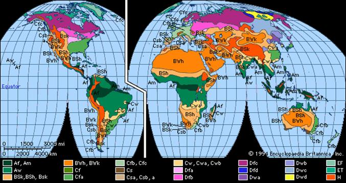

Figure 14. World viewed as K&ouml;ppen Climate Zones

And a more basic view with monthly dry bulb temperature and dew point temperatures for these zones (Northern Hemisphere).


Figure 15. Monthly Dry Bulb Temperatures in K&ouml;ppen Climates (Northern Hemisphere)


Figure 16. Monthly Dew Point in K&ouml;ppen Climates (Northern Hemisphere)


ASHRAE Climate Classification
------------------------------------------------------------------------

For the ASHRAE 90.1 and 90.2 standards (2004), a climate zone classification scheme was introduced, similar to the K&ouml;ppen classification. The methodology is described in two ASHRAE Transactions papers - Briggs - 2002.

EnergyPlus Weather File (EPW) Data Dictionary
----------------------------------------------------------

The "data dictionary" for EnergyPlus Weather Data is shown below. Note that semi-colons do NOT terminate lines in the EnergyPlus Weather Data. It helps if you have familiarity with the IDD conventions please view them in the Input Output Reference document. Briefly, we have similar "\\" conventions that are important for reading the following tables:

\\minimum, \\minimum&gt; - values for this field must be either &gt;= or &gt; than the following number

\\maximum, \\maximum&lt; - values for this field must be either &lt;= or &lt; than the following number

\\missing - if values in this field are &gt;= the following number, it is considered "missing" and missing data rules will apply

\\default - blank fields will receive the following as "default" values

\\units - expected units for the field. Standard EnergyPlus units are shown in the Input Output Reference Document.

Note that in the header records where "date" is used, the interpretation is shown in the following table.

Table 14. Weather File Date Field Interpretation

<table class="table table-striped">
<tr>
<th>Field Contents</th>
<th>Interpretation</th>
<th>Header Applicability</th>
</tr>
<tr>
<td>&lt;number&gt;</td>
<td>Julian Day of Year</td>
<td>All date fields</td>
</tr>
<tr>
<td>&lt;number&gt; / &lt;number&gt;</td>
<td>Month / Day</td>
<td>All date fields</td>
</tr>
<tr>
<td>&lt;number&gt; / &lt;number&gt; / &lt;number&gt;</td>
<td>Month / Day / Year</td>
<td>DataPeriod only - special multiple year file - ref: RunPeriod:CustomRange object in IDF / Input Output Reference document</td>
</tr>
<tr>
<td>&lt;number&gt; Month</td>
<td>Day and Month</td>
<td>All date fields</td>
</tr>
<tr>
<td>Month &lt;number&gt;</td>
<td>Day and Month</td>
<td>All date fields</td>
</tr>
<tr>
<td>&lt;number&gt; Weekday in Month</td>
<td>Numbered weekday of month</td>
<td>Holiday, DaylightSavingPeriod</td>
</tr>
<tr>
<td>Last Weekday In Month</td>
<td>Last weekday of month</td>
<td>Holiday, DaylightSavingPeriod</td>
</tr>
</table>

In the table, Month can be one of (January, February, March, April, May, June, July, August, September, October, November, December). Abbreviations of the first three characters are also valid.

In the table, Weekday can be one of (Sunday, Monday, Tuesday, Wednesday, Thursday, Friday, Saturday). Abbreviations of the first three characters are also valid.

```idd
!ESP(r)/EnergyPlus Weather Format
!April 2002
\memo Dates in the EPW file can be several formats:
\memo <number>/<number>  (month/day)
\memo <number> Month
\memo Month <number>
\memo <number> (taken to be Julian day of year)
\memo Months are January, February, March, April, May,
\memo            June, July, August, September, October, November, December
\memo Months can be the first 3 letters of the month
```

```idd
LOCATION,
   A1, \field city
   \type alpha
   A2, \field State Province Region
   \type alpha
   A3, \field Country
   \type alpha
   A4, \field Source
   \type alpha
   N1, \field WMO
    \note usually a 6 digit field. Used as alpha in EnergyPlus
    \type alpha
   N2 , \field Latitude
       \units deg
       \minimum -90.0
       \maximum +90.0
       \default 0.0
       \note + is North, - is South, degree minutes represented in decimal (i.e. 30 minutes is .5)
       \type real
   N3 , \field Longitude
       \units deg
       \minimum -180.0
       \maximum +180.0
       \default 0.0
       \note - is West, + is East, degree minutes represented in decimal (i.e. 30 minutes is .5)
       \type real
   N4 , \field TimeZone
       \units hr - not on standard units list???
       \minimum -12.0
       \maximum +12.0
       \default 0.0
       \note  Time relative to GMT.
       \type real
   N5 ; \field Elevation
       \units m
       \minimum -1000.0
       \maximum< +9999.9
       \default 0.0
       \type real
```

The Location header record duplicates the information required for the Location Object. When only a Run Period object is used (i.e. a weather file), then the Location Object Is not needed. When a Run Period and Design Day objects are entered, then the Location on the weather file (as described previously) is used and overrides any Location Object entry.

```idd
DESIGN CONDITIONS,
     N1, \field Number of Design Conditions
     A1, \field Design Condition Source
         \note current sources are ASHRAE HOF 2009 US Design Conditions, Canadian Design Conditions
         \note and World Design Conditions
     A2, \field Design Condition Type (HEATING)
       \note fields here will be dependent on the source, they are shown in a header/data format 
       \note in both the .rpt and .csv files that are produced by the WeatherConverter program
     ...
     An, \field Design Condition Type (COOLING)
       \note same as note on Heating Design Conditions
```

The Design Conditions header record encapsulates matching (using WMO\# -- World Meteorological Organization Station Number) design conditions for a weather file location. Currently only those design conditions contained in the ASHRAE Handbook of Fundamentals 2009 are contained in the weather files. These conditions can be used as desired. In addition, Design Day definition files have been created of all World, Canada, and United States Design Conditions. These files are available in the DataSet folder of the EnergyPlus installation.

```idd
TYPICAL/EXTREME PERIODS,
     N1, \field Number of Typical/Extreme Periods
     A1, \field Typical/Extreme Period 1 Name
     A2, \field Typical/Extreme Period 1 Type
     A3, \field Period 1 Start Day
     A4, \field Period 1 End Day
     \note repeat (A1-A3) until number of typical periods
 -- etc to # of periods entered
```

Using a heuristic method, the weather converter can determine typical and extreme weather periods for full year weather files. These will then be shown on the Typical/Extreme Periods header record. These are also reported in the statistical report output from the Weather Converter.

```idd
GROUND TEMPERATURES,
       N1, Number of Ground Temperature Depths
       N2, \field Ground Temperature Depth 1
         \units m
       N3, \field Depth 1 Soil Conductivity
         \units W/m-K,
       N4, \field Depth 1 Soil Density
         \units kg/m3
       N5, \field Depth 1 Soil Specific Heat
         \units J/kg-K,
       N6, \field Depth 1 January Average Ground Temperature
        \units C
       N7, \field Depth 1 February Average Ground Temperature
        \units C
       N8, \field Depth 1 March Average Ground Temperature
        \units C
       N9, \field Depth 1 April Average Ground Temperature
        \units C
       N10, \field Depth 1 May Average Ground Temperature
        \units C
       N11, \field Depth 1 June Average Ground Temperature
        \units C
       N12, \field Depth 1 July Average Ground Temperature
        \units C
       N13, \field Depth 1 August Average Ground Temperature
        \units C
       N14, \field Depth 1 September Average Ground Temperature
        \units C
       N15, \field Depth 1 October Average Ground Temperature
        \units C
       N16, \field Depth 1 November Average Ground Temperature
        \units C
       N17, \field Depth 1 December Average Ground Temperature
        \units C
      \note repeat above (N2-N17) to number of ground temp depths indicated
-- etc to # of depths entered
```

The weather converter program can use a full year weather data file to calculate "undisturbed" ground temperatures based on temperatures. Since an important part of soil heat transfer includes soil properties such as conductivity, density and specific heat AND these cannot be calculated from simple weather observations, this header record is provided primarilyfor user information. However, with the FC construction option, these are automatically selected (.5 depth) for use if the user does not include values in the Site:GroundTemperature:FcfactorMethod object.

As noted in the statistics report, the "undisturbed" ground temperatures calculated by the weather converter should not be used in building losses but are appropriate to be used in the GroundTemperatures:Surface and GroundTemperatures:Deep objects. The reasoning (for building losses) is that these values are too extreme for the soil under a conditioned building. For best results, use the Slab or Basement program described in this document to calculate custom monthly average ground temperatures (see the Ground Heat Transfer section). This is especially important for residential applications and very small buildings. If one of these ground temperature preprocessors is not used, for typical commercial buildings in the USA, a reasonable default value is 2C less than the average indoor space temperature.

```idd
HOLIDAYS/DAYLIGHT SAVING,
     A1, \field LeapYear Observed
      \type choice
      \key Yes
      \key No
      \note Yes if Leap Year will be observed for this file
      \note No if Leap Year days (29 Feb) should be ignored in this file
     A2, \field Daylight Saving Start Day
     A3, \field Daylight Saving End Day
     N1, \field Number of Holidays (essentially unlimited)
     A4, \field Holiday 1 Name
     A5, \field Holiday 1 Day
     \note repeat above two fields until Number of Holidays is reached
-- etc to # of Holidays entered
```

The Holidays / Daylight Saving header record details the start and end dates of Daylight Saving Time and other special days such as might be recorded for the weather file. These can be used by keying "Yes" for appropriate fields in the Run Period Object.

Note: EnergyPlus processed weather files available on the EnergyPlus web site:  have neither special days specified nor daylight saving period.

For example, using a RunPeriod:

```idf
RunPeriod,
    1,                       !- Begin Month
    1,                       !- Begin Day Of Month
    12,                      !- End Month
    31,                      !- End Day Of Month
    Wednesday,               !- Day Of Week For Start Day
    Yes,                     !- Use WeatherFile Holidays/Special Days
    No,                      !- Use WeatherFile DaylightSavingPeriod
    Yes,                     !- Apply Weekend Holiday Rule
    Yes,                     !- Use WeatherFile Rain Indicators
    Yes;                     !- Use WeatherFile Snow Indicators
```

Will use any holidays specified in the Holidays / Daylight Saving header record of the weather file but will not use the Daylight Saving Period that is specified there (if any). In addition, the user can specify Special Day Periods via the Special Day Period object and/or Daylight Saving Period via the Daylight Saving Period object to additionally specify these items.

```idd
COMMENTS 1, A1 \field Comments_1
COMMENTS 2, A1 \field Comments_2
```

The Comment header records may provide additional information about the weather data source or other information which may not fit in other header record formats.

```idd
DATA PERIODS,
     N1, \field Number of Data Periods
     N2, \field Number of Records per hour
     A1, \field Data Period 1 Name/Description
     A2, \field Data Period 1 Start Day of Week
       \type choice
       \key  Sunday
       \key  Monday
       \key  Tuesday
       \key  Wednesday
       \key  Thursday
       \key  Friday
       \key  Saturday
     A3, \field Data Period 1 Start Day
     A4, \field Data Period 1 End Day
     \note repeat above to number of data periods
-- etc to # of periods entered
```

A weather file may contain several "data periods" though this is not required (and, in fact, may be detrimental). In addition, a weather file may contain multiple records per hour BUT these must match the Number of Time Steps In Hour for the simulation. Multiple interval data files can be valued when you want to be sure of the weather values for each time step (rather than relying on "interpolated" weather data). A weather file may also contain several consecutive years of weather data. EnergyPlus will automatically process the extra years when the Number of Years field is used in the RunPeriod object. Sorry - there is no way to jump into a year in the middle of the EPW file.


Note that a Run Period object may not cross Data Period boundary lines.

For those interested in creating their own weather data in the CSV or EPW formats or reading the .csv and .epw files that are produced by the Weather Converter program, the fields are shown in the following "IDD" description. Items shown in bold are used directly in the EnergyPlus program.

```idd
! Actual data does not have a descriptor
     N1, \field Year
     N2, \field Month
     N3, \field Day
     N4, \field Hour
     N5, \field Minute
     A1, \field Data Source and Uncertainty Flags
     \note Initial day of weather file is checked by EnergyPlus for validity (as shown below)
     \note Each field is checked for "missing" as shown below. Reasonable values, calculated
     \note values or the last "good" value is substituted.
     N6, \field Dry Bulb Temperature
        \units C
        \minimum> -70
        \maximum< 70
        \missing 99.9
     N7, \field Dew Point Temperature
        \units C
        \minimum> -70
        \maximum< 70
        \missing 99.9
     N8, \field Relative Humidity
         \missing 999.
         \minimum 0
         \maximum 110
     N9, \field Atmospheric Station Pressure
        \units Pa
        \missing 999999.
        \minimum> 31000
        \maximum< 120000
     N10, \field Extraterrestrial Horizontal Radiation
        \units Wh/m2
        \missing 9999.
        \minimum 0
     N11, \field Extraterrestrial Direct Normal Radiation
        \units Wh/m2
        \missing 9999.
        \minimum 0
     N12, \field Horizontal Infrared Radiation Intensity
        \units Wh/m2
        \missing 9999.
        \minimum 0
     N13, \field Global Horizontal Radiation
        \units Wh/m2
        \missing 9999.
        \minimum 0
     N14, \field Direct Normal Radiation
        \units Wh/m2
        \missing 9999.
        \minimum 0
     N15, \field Diffuse Horizontal Radiation
        \units Wh/m2
        \missing 9999.
        \minimum 0
     N16, \field Global Horizontal Illuminance
        \units lux
        \missing 999999.
        \note will be missing if >= 999900
        \minimum 0
     N17, \field Direct Normal Illuminance
        \units lux
        \missing 999999.
        \note will be missing if >= 999900
        \minimum 0
     N18, \field Diffuse Horizontal Illuminance
        \units lux
        \missing 999999.
        \note will be missing if >= 999900
        \minimum 0
     N19, \field Zenith Luminance
        \units Cd/m2
        \missing 9999.
        \note will be missing if >= 9999
        \minimum 0
     N20, \field Wind Direction
        \units degrees
        \missing 999.
        \minimum 0
        \maximum 360
     N21, \field Wind Speed
        \units m/s
        \missing 999.
        \minimum 0
        \maximum 40
     N22, \field Total Sky Cover
        \missing 99
        \minimum 0
        \maximum 10
     N23, \field Opaque Sky Cover (used if Horizontal IR Intensity missing)
        \missing 99
        \minimum 0
        \maximum 10
     N24, \field Visibility
        \units km
        \missing 9999
     N25, \field Ceiling Height
        \units m
        \missing 99999
     N26, \field Present Weather Observation
     N27, \field Present Weather Codes
     N28, \field Precipitable Water
        \units mm
        \missing 999
     N29, \field Aerosol Optical Depth
        \units thousandths
        \missing .999
     N30, \field Snow Depth
        \units cm
        \missing 999
     N31, \field Days Since Last Snowfall
        \missing 99
     N32, \field Albedo
        \missing 999
     N33, \field Liquid Precipitation Depth
          \units mm
        \missing 999
     N34; \field Liquid Precipitation Quantity
          \units hr
        \missing 99
```

### Data Field Descriptions

Descriptions of the fields are taken from the IWEC manual - as descriptive of what should be contained in the data fields.

#### Field: Year

This is the Year of the data. Not really used in EnergyPlus. Used in the Weather Converter program for display in audit file.

#### Field: Month

This is the month (1-12) for the data. Cannot be missing.

#### Field: Day

This is the day (dependent on month) for the data. Cannot be missing.

#### Field: Hour

This is the hour of the data. (1 - 24). Hour 1 is 00:01 to 01:00. Cannot be missing.

#### Field: Minute

This is the minute field. (1..60)

#### Field: Data Source and Uncertainty Flags

The data source and uncertainty flags from various formats (usually shown with each field) are consolidated in the E/E+ EPW format. More is shown about Data Source and Uncertainty in Data Sources/Uncertainty section later in this document.

#### Field: Dry Bulb Temperature

This is the dry bulb temperature in C at the time indicated. Note that this is a full numeric field (i.e. 23.6) and not an integer representation with tenths. Valid values range from -70&deg;C to 70&deg;C. Missing value for this field is 99.9.

#### Field: Dew Point Temperature

This is the dew point temperature in C at the time indicated. Note that this is a full numeric field (i.e. 23.6) and not an integer representation with tenths. Valid values range from -70&deg;C to 70&deg;C. Missing value for this field is 99.9.

#### Field: Relative Humidity

This is the Relative Humidity in percent at the time indicated. Valid values range from 0% to 110%. Missing value for this field is 999.

#### Field: Atmospheric Station Pressure

This is the station pressure in Pa at the time indicated. Valid values range from 31,000 to 120,000. (These values were chosen from the standard barometric pressure for all elevations of the World). Missing value for this field is 999999.

#### Field: Extraterrestrial Horizontal Radiation

This is the Extraterrestrial Horizontal Radiation in Wh/m2. It is not currently used in EnergyPlus calculations. It should have a minimum value of 0; missing value for this field is 9999.

#### Field: Extraterrestrial Direct Normal Radiation

This is the Extraterrestrial Direct Normal Radiation in Wh/m2. (Amount of solar radiation in Wh/m2 received on a surface normal to the rays of the sun at the top of the atmosphere during the number of minutes preceding the time indicated). It is not currently used in EnergyPlus calculations. It should have a minimum value of 0; missing value for this field is 9999.

#### Field: Horizontal Infrared Radiation Intensity

This is the Horizontal Infrared Radiation Intensity in Wh/m2. If it is missing, it is calculated from the Opaque Sky Cover field as shown in the following explanation. It should have a minimum value of 0; missing value for this field is 9999.

<div>\[Horizontal_{IR} = \epsilon\sigma T^4_{drybulb}\]</div>

where

* <span>\(Horizontal_{IR}\)</span> is the horizontal IR intensity {W/m<sup>2</sup>}
* <span>\(\epsilon\)</span> is the sky emissivity
* <span>\(\sigma\)</span> is the Stefan-Boltzmann constant = 5.6697e-8 W/m<sup>2</sup>-K<sup>4</sup>
* <span>\(T_{drybulb}\)</span> is the drybulb temperature {K}

The sky emissivity is given by

<div>\[ \epsilon = \left( 0.787 +0.764 \ln\left(\frac{T_{dewpoint}}{273}\right)\right)\left( 1 + 0.0224N + 0.0035N^2 + 0.00028N^3 \right)\]</div>

where

* <span>\(T_{dewpoint}\)</span> is the dewpoint temperature {K}
* <span>\(N\)</span> is the opaque sky cover {tenths}

Example: Clear sky (<span>\(N=0\)</span>), <span>\(T_{drybulb} = 273+20=293 K\)</span>, <span>\(T_{dewpoint} = 273+10=283 K\)</span>:

<span>\(\epsilon = 0.787 + 0.764*0.036 = 0.815\)</span>

<span>\(Horizontal_{IR} = 0.815*5.6697e-8*(293^4) = 340.6 W/m^2\)</span>

References (Walton, 1983) (Clark, Allen, 1978) for these calculations are contained in the references section at the end of this list of fields.

#### Field: Global Horizontal Radiation

This is the Global Horizontal Radiation in Wh/m2. (Total amount of direct and diffuse solar radiation in Wh/m2 received on a horizontal surface during the number of minutes preceding the time indicated.) It is not currently used in EnergyPlus calculations. It should have a minimum value of 0; missing value for this field is 9999.

#### Field: Direct Normal Radiation

This is the Direct Normal Radiation in Wh/m2. (Amount of solar radiation in Wh/m2 received directly from the solar disk on a surface perpendicular to the sun's rays, during the number of minutes preceding the time indicated.)  If the field is missing (<span>\(\ge 9999\)</span>) or invalid (<span>\(<0\)</span>), it is set to 0. Counts of such missing values are totaled and presented at the end of the runperiod.

#### Field: Diffuse Horizontal Radiation

This is the Diffuse Horizontal Radiation in Wh/m2. (Amount of solar radiation in Wh/m2 received from the sky (excluding the solar disk) on a horizontal surface during the number of minutes preceding the time indicated.) If the field is missing (<span>\(\ge 9999\)</span>) or invalid (<span>\(<0\)</span>), it is set to 0. Counts of such missing values are totaled and presented at the end of the runperiod.

#### Field: Global Horizontal Illuminance

This is the Global Horizontal Illuminance in lux. (Average total amount of direct and diffuse illuminance in hundreds of lux received on a horizontal surface during the number of minutes preceding the time indicated.) It is not currently used in EnergyPlus calculations. It should have a minimum value of 0; missing value for this field is 999999 and will be considered missing if greater than or equal to 999900.

#### Field: Direct Normal Illuminance

This is the Direct Normal Illuminance in lux. (Average amount of illuminance in hundreds of lux received directly from the solar disk on a surface perpendicular to the sun's rays, during the number of minutes preceding the time indicated.)  It is not currently used in EnergyPlus calculations. It should have a minimum value of 0; missing value for this field is 999999 and will be considered missing if greater than or equal to 999900.

#### Field: Diffuse Horizontal Illuminance

This is the Diffuse Horizontal Illuminance in lux. (Average amount of illuminance in hundreds of lux received from the sky (excluding the solar disk) on a horizontal surface during the number of minutes preceding the time indicated.)  It is not currently used in EnergyPlus calculations. It should have a minimum value of 0; missing value for this field is 999999 and will be considered missing if greater than or equal to 999900.

#### Field: Zenith Luminance

This is the Zenith Illuminance in Cd/m2. (Average amount of luminance at the sky's zenith in tens of Cd/m2 during the number of minutes preceding the time indicated.) It is not currently used in EnergyPlus calculations. It should have a minimum value of 0; missing value for this field is 9999.

#### Field: Wind Direction

This is the Wind Direction in degrees where the convention is that North=0.0, East=90.0, South=180.0, West=270.0. (Wind direction in degrees at the time indicated. If calm, direction equals zero.) Values can range from 0 to 360. Missing value is 999.

#### Field: Wind Speed

This is the wind speed in m/sec. (Wind speed at time indicated.) Values can range from 0 to 40. Missing value is 999.

#### Field: Total Sky Cover

This is the value for total sky cover (tenths of coverage). (i.e. 1 is 1/10 covered. 10 is total coverage). (Amount of sky dome in tenths covered by clouds or obscuring phenomena at the hour indicated at the time indicated.) Minimum value is 0; maximum value is 10; missing value is 99.

#### Field: Opaque Sky Cover

This is the value for opaque sky cover (tenths of coverage). (i.e. 1 is 1/10 covered. 10 is total coverage). (Amount of sky dome in tenths covered by clouds or obscuring phenomena that prevent observing the sky or higher cloud layers at the time indicated.)  This is not used unless the field for Horizontal Infrared Radiation Intensity is missing and then it is used to calculate Horizontal Infrared Radiation Intensity. Minimum value is 0; maximum value is 10; missing value is 99.

#### Field: Visibility

This is the value for visibility in km. (Horizontal visibility at the time indicated.)  It is not currently used in EnergyPlus calculations. Missing value is 9999.

#### Field: Ceiling Height

This is the value for ceiling height in m. (77777 is unlimited ceiling height. 88888 is cirroform ceiling.) It is not currently used in EnergyPlus calculations. Missing value is 99999.

#### Field: Present Weather Observation

If the value of the field is 0, then the observed weather codes are taken from the following field. If the value of the field is 9, then "missing" weather is assumed. Since the primary use of these fields (Present Weather Observation and Present Weather Codes) is for rain/wet surfaces, a missing observation field or a missing weather code implies no rain.

Table 15. Present Weather Observation Values

<table class="table table-striped">
<tr>
<th>Element</th>
<th>Values</th>
<th>Definition</th>
</tr>
<tr>
<td>Observation Indicator</td>
<td>0 or 9</td>
<td>0 = Weather observation made; 9 = Weather observation not made, or missing</td>
</tr>
</table>


#### Field: Present Weather Codes

The present weather codes field is assumed to follow the TMY2 conventions for this field. Note that though this field may be represented as numeric (e.g. in the CSV format), it is really a text field of 9 single digits. This convention along with values for each "column" (left to right) is presented in Table 16. Note that some formats (e.g. TMY) does not follow this convention - as much as possible, the present weather codes are converted to this convention during WeatherConverter processing. Also note that the most important fields are those representing liquid precipitation - where the surfaces of the building would be wet. EnergyPlus uses "Snow Depth" to determine if snow is on the ground.

Table 16. Weather Codes Field Interpretation
<table class="table table-striped">
  <tr>
    <th>Column - Poisition in Field</th>
    <th>Element Description</th>
    <th>Possible Values</th>
    <th>Definition</th>
  </tr>
  <tr>
    <td>1</td>
    <td>Occurrence ofThunderstorm,Tornado, orSquall</td>
    <td>0 - 2, 4, 6- 9</td>
    <td>
    0 = Thunderstorm-lightning and thunder. Wind gusts less than 25.7 m/s, and hail, if any, less than 1.9 cm diameter <BR>
    1 = Heavy or severe thunderstorm-frequent intense lightning and thunder. Wind gusts greater than 25.7 m/s and hail, if any, 1.9 cm or greater diameter <BR>
    2 = Report of tornado or waterspout <BR>
    4 = Moderate squall-sudden increase of windspeed by at least 8.2 m/s, reaching 11.3 m/s or more and lasting for at least 1 minute <BR>
    6 = Water spout (beginning January 1984) <BR>
    7 = Funnel cloud (beginning January 1984) <BR>
    8 = Tornado (beginning January 1984) <BR>
    9 = None if Observation Indicator element equals 0, or else unknown or missing if Observation Indicator element equals 9
    </td>
  </tr>
  <tr>
    <td>2</td>
    <td>Occurrence ofRain, RainShowers, orFreezing Rain</td>
    <td>0 - 9</td>
    <td>
    0 = Light rain <BR>
    1 = Moderate rain <BR>
    2 = Heavy rain <BR>
    3 = Light rain showers <BR>
    4 = Moderate rain showers <BR>
    5 = Heavy rain showers <BR>
    6 = Light freezing rain <BR>
    7 = Moderate freezing rain <BR>
    8 = Heavy freezing rain <BR>
    9 = None if Observation Indicator element equals 0, or else unknown or missing if Observation Indicator element equals 9  <BR>
    Notes: <BR>
    Light = up to 0.25 cm per hour  <BR>
    Moderate = 0.28to 0.76 cm per hour  <BR>
    Heavy = greater than 0.76cm per hour <BR>
    </td>
  </tr>
  <tr>
    <td>3</td>
    <td>Occurrence ofRain Squalls,Drizzle, orFreezing Drizzle</td>
    <td>0, 1, 3-9</td>
    <td>
    0 = Light rain squalls <BR>
    1 = Moderate rain squalls <BR>
    3 = Light drizzle <BR>
    4 = Moderate drizzle <BR>
    5 = Heavy drizzle <BR>
    6 = Light freezing drizzle <BR>
    7 = Moderate freezing drizzle <BR>
    8 = Heavy freezing drizzle <BR>
    9 = None if Observation Indicator element equals 0, or else unknown or missing if Observation Indicator element equals 9 <BR>
    Notes: When drizzle or freezing drizzle occurswith other weather phenomena: Light = up to0.025 cm per hour Moderate = 0.025 to 0.051cm per hour Heavy = greater than 0.051 cmper hour When drizzle or freezing drizzle occurs alone:  <BR>
    Light = visibility 1 km or greater  <BR>
    Moderate =visibility between 0.5 and 1 km  <BR>
    Heavy =visibility 0.5 km or less <BR>
    </td>
  </tr>
  <tr>
    <td>4</td>
    <td>Occurrence ofSnow, SnowPellets, or IceCrystals</td>
    <td>0 - 9</td>
    <td>
    0 = Light snow <BR>
    1 = Moderate snow <BR>
    2 = Heavy snow <BR>
    3 = Light snow pellets <BR>
    4 = Moderate snow pellets <BR>
    5 = Heavy snow pellets <BR>
    6 = Light ice crystals <BR>
    7 = Moderate ice crystals <BR>
    8 = Heavy ice crystals <BR>
    9 = None if Observation Indicator element equals 0, or else unknown or missing if Observation Indicator element equals 9  <BR>
    Notes:Beginning in April 1963, any occurrence of icecrystals is recorded as a 7. <BR>
    </td>
  </tr>
  <tr>
    <td>5</td>
    <td>Occurrence ofSnow Showers,Snow Squalls, orSnow Grains</td>
    <td>0 - 7, 9</td>
    <td>
    0 = Light snow <BR>
    1 = Moderate snow showers <BR>
    2 = Heavy snow showers <BR>
    3 = Light snow squall <BR>
    4 = Moderate snow squall <BR>
    5 = Heavy snow squall <BR>
    6 = Light snow grains <BR>
    7 = Moderate snow grains <BR>
    9 = None if Observation Indicator element equals 0, or else unknown or missing if Observation Indicator element equals 9 <BR>
    </td>
  </tr>
  <tr>
    <td>6</td>
    <td>Occurrence ofSleet, SleetShowers, or Hail</td>
    <td>0 - 2, 4, 9</td>
    <td>
    0 = Light ice pellet showers <BR>
    1 = Moderate ice pellet showers <BR>
    2 = Heavy ice pellet showers <BR>
    4 = Hail <BR>
    9 = None if Observation Indicator element equals 0, or else unknown or missing if Observation Indicator element equals 9 <BR>
    Notes: Prior to April 1970, ice pellets werecoded as sleet. Beginning in April 1970, sleetand small hail were redefined as ice pellets andare coded as 0, 1, or 2.
    </td>
  </tr>
  <tr>
    <td>7</td>
    <td>Occurrence ofFog, BlowingDust, or Blowing Sand</td>
    <td>0 - 9</td>
    <td>
    0 = Fog <BR>
    1 = Ice fog <BR>
    2 = Ground fog <BR>
    3 = Blowing dust <BR>
    4 = Blowing sand <BR>
    5 = Heavy fog <BR>
    6 = Glaze (beginning 1984) <BR>
    7 = Heavy ice fog (beginning 1984) <BR>
    8 = Heavy ground fog (beginning 1984) <BR>
    9 = None if Observation Indicator element equals 0, or else unknown or missing if Observation Indicator element equals 9 <BR>
    Notes:These values recorded only when visibility isless than 11 km.
    </td>
  </tr>
  <tr>
    <td>8</td>
    <td>Occurrence ofSmoke, Haze,Smoke andHaze, BlowingSnow, BlowingSpray, or Dust</td>
    <td>0 - 7, 9</td>
    <td>
    0 = Smoke <BR>
    1 = Haze <BR>
    2 = Smoke and haze <BR>
    3 = Dust <BR>
    4 = Blowing snow <BR>
    5 = Blowing spray <BR>
    6 = Dust storm (beginning 1984) <BR>
    7 = Volcanic ash <BR>
    9 = None if Observation Indicator element equals 0, or else unknown or missing if Observation Indicator element equals 9 <BR>
    Notes: These values recorded only when visibility is less than 11 km.
    </td>
  </tr>
  <tr>
    <td>9</td>
    <td>Occurrence ofIce Pellets</td>
    <td>0 - 2, 9</td>
    <td>
    0 = Light ice pellets <BR>
    1 = Moderate ice pellets <BR>
    2 = Heavy ice pellets <BR>
    9 = None if Observation Indicator element equals 0, or else unknown or missing if Observation Indicator element equals 9
    </td>
  </tr>
</table>


For example, a Present Weather Observation (previous field) of 0 and a Present Weather Codes field of 929999999 notes that there is heavy rain for this data period (usually hourly but depends on the number of intervals per hour field in the "Data Periods" record).

#### Field: Precipitable Water

This is the value for Precipitable Water in mm. (This is not rain - rain is inferred from the PresWeathObs field but a better result is from the Liquid Precipitation Depth field)). It is not currently used in EnergyPlus calculations (primarily due to the unreliability of the reporting of this value). Missing value is 999.

#### Field: Aerosol Optical Depth

This is the value for Aerosol Optical Depth in thousandths. It is not currently used in EnergyPlus calculations. Missing value is .999.

#### Field: Snow Depth

This is the value for Snow Depth in cm. This field is used to tell when snow is on the ground and, thus, the ground reflectance may change. Missing value is 999.

#### Field: Days Since Last Snowfall

This is the value for Days Since Last Snowfall. It is not currently used in EnergyPlus calculations. Missing value is 99.

#### Field: Albedo

The ratio (unitless) of reflected solar irradiance to global horizontal irradiance. It is not currently used in EnergyPlus.

#### Field: Liquid Precipitation Depth

The amount of liquid precipitation (mm) observed at the indicated time for the period indicated in the liquid precipitation quantity field. If this value is not missing, then it is used and overrides the "precipitation" flag as rainfall.  Conversely, if the precipitation flag shows rain and this field is missing or zero, it is set to 1.5 (mm).

#### Field: Liquid Precipitation Quantity

The period of accumulation (hr) for the liquid precipitation depth field. It is not currently used in EnergyPlus.

### References

Walton, G. N. 1983. Thermal Analysis Research Program Reference Manual. NBSSIR 83-2655. National Bureau of Standards, p. 21.

Clark, G. and C. Allen, "The Estimation of Atmospheric Radiation for Clear and Cloudy Skies," Proceedings 2nd National Passive Solar Conference (AS/ISES), 1978, pp. 675-678.

EPW CSV Format (In/Out)
-----------------------

EPW CSV Format to the Weather Converter is a special CSV format which echoes the format of the EPW file.  For the "header" records in the CSV file, they are basically the same as the header records for the EPW file (see above). However, in the CSV file, each header is shown and then the data. Partial year files will not have all of these headers "filled" in. Also see Figure 17. EnergyPlus EPW CSV file (spreadsheet view) and Figure 18. EnergyPlus EPW CSV Data Records (spreadsheet view) for snapshot pictures of the EnergyPlus EPW CSV file as shown in a spreadsheet.

### Location Header/Data (CSV)

Location Title,Latitude {N+/S-},Longitude {E+/W-},TimeZone {+/- GMT},Elevation {m}

LOCATION\_SYDNEY\_\_AUS\_IWEC Data\_947670,-33.95,151.18,10.0,3.0

LOCATION + the city, state/province, country and WMO fields from the EPW file are concatenated to form the "Location Title". The latitude, longitude, time zone and elevation fields are numeric.

### Design Conditions Header/Data (CSV)

If there are design conditions, then the format is as follows:

Number of Design Conditions,Title of Design Condition,Design Stat,HDB 99.6%,HDB 99%,X WS 1%,X WS 2.5%,X WS 5%,CM WS .4%,CM MDB .4%,CM WS 1%,CM MDB 1%,MWS 99.6%,PWD 99.6%,MWS .4%,PWD .4%,X MnDB Max,X MnDB Min,X StdDB Max,X StdDB Min,Design Stat,CDB .4%,C MWB .4%,CDB 1%,C MWB 1%,CDB 2%,C MWB 2%,E WB .4%,E MDB .4%,E WB 1%,E MDB 1%,E WB 2%,E MDB 2%,DP .4%,HR .4%,MDB .4%,DP 1%,HR 1%,MDB 1%,DP 2%,HR 2%,MDB 2%,DB Range

,,Units,{°C},{°C},{m/s},{m/s},{m/s},{m/s},{°C},{m/s},{°C},{m/s},{Degree},{m/s},{Degree},{°C},{°C},{°C},{°C},Units,{°C},{°C},{°C},{°C},{°C},{°C},{°C},{°C},{°C},{°C},{°C},{°C},{°C},{g/kg},{°C},{°C},{g/kg},{°C},{°C},{g/kg},{°C},{°C}

1,World Climate Design Data 2001 ASHRAE Handbook,HEATING,5.8,6.8,11.3,9.9,8.8,11.1,14.2,9.1,13.4,1.1,320,5.3,300,39.3,3.1,2.9,1.9,COOLING,32.2,20,29.5,19.7,27.9,20.1,23,28,22.3,26.2,21.7,25.3,21.7,16.4,24.8,21.1,15.8,24.3,20.6,15.3,23.9,6.7

However, if there are no design conditions, then the format looks like:

Number of Design Conditions,Title of Design Condition,

0

Theoretically, there can be more than one design condition included.

### Typical/Extreme Periods Header/Data (CSV)

The results from the typical / extreme period heuristic calculation are shown.

Number of Typical/Extreme Periods,Period Name,Period Type,Period Start Day,Period End Day,&lt;repeat to \# periods&gt;

6,Summer - Week Nearest Max Temperature For Period,Extreme,1/ 4,1/10,Summer - Week Nearest Average Temperature For Period,Typical,11/29,12/ 5,Winter - Week Nearest Min Temperature For Period,Extreme,7/ 3,7/ 9,Winter - Week Nearest Average Temperature For Period,Typical,6/ 5,6/11,Autumn - Week Nearest Average Temperature For Period,Typical,3/22,3/28,Spring - Week Nearest Average Temperature For Period,Typical,8/ 1,8/ 7

### Ground Temperatures Header/Data (CSV)

The results from the ground temperature heuristic calculation are shown, typically for 3 depths. Users may also fill in the blank fields (soil conductivity, soil density, soil specific heat) with known values and/or perform their own calculations and depths and supply those. These should be considered "undisturbed" ground temperatures - temperatures of soil that have not been disturbed by construction. They are not considered appropriate for calculations of building losses.

The program uses a heuristic, time lagged calculation based on dry bulb temperature and location. References on the topic are found in Kusuda (see references).

Number of Ground Temperature Depths,Ground Temperature Depth {m},Soil Conductivity {W/m-K},Soil Density {kg/m3},Soil Specific Heat {J/kg-K},Jan {C},Feb{C},Mar {C},Apr {C},May {C},Jun {C},Jul {C},Aug {C},Sep {C},Oct {C},Nov {C},Dec {C},&lt;repeat to Number of temperature depths&gt;

3,.5,,,,20.69,22.30,22.69,22.26,19.95,17.43,15.09,13.43,12.99,13.86,15.84,18.29,2,,,,19.18,20.71,21.41,21.40,20.16,18.43,16.58,15.03,14.25,14.45,15.59,17.28,4,,,,18.18,19.38,20.10,20.30,19.82,18.80,17.56,16.35,15.56,15.39,15.89,16.89

### Holiday/Daylight Saving Header/Data (CSV)

If these data are entered, the weather converter will process them. Default weather processing contains no holidays or daylight saving period. Of course, these can also be specified in your input data file for EnergyPlus and do not need to be embedded in the weather file.

Leap Year Observed?,Daylight Saving Start Date,Daylight Saving End Date,Number of Holidays,Holiday Name,Holiday Date,&lt;repeat for \# Holidays&gt;

No,0,0,0

### Comment 1 Header/Data (CSV)

Some original data files fill the comment 1 header and some do not. Typically, it will display at least a "station" number and potentially more information.

Comment Line \#1

"IWEC- WMO\#947670 - South-west Pacific -- Original Source Data (c) 2001 American Society of Heating, Refrigerating and Air-Conditioning Engineers (ASHRAE), Inc., Atlanta, GA, USA. www.ashrae.org  All rights reserved as noted in the License Agreement and Additional Conditions. DISCLAIMER OF WARRANTIES: The data is provided 'as is' without warranty of any kind, either expressed or implied. The entire risk as to the quality and performance of the data is with you. In no event will ASHRAE or its contractors be liable to you for any damages, including without limitation any lost profits, lost savings, or other incidental or consequential damages arising out of the use or inability to use this data."

### Comment 2 Header/Data (CSV)

Comment Line \#2

 -- Ground temps produced with a standard soil diffusivity of 2.3225760E-03 {m\*\*2/day}

### Data Period Header/Data (CSV)

Number of Data Periods [DP],Number of Intervals per Hour,DP Name/Description,DP Start Day of Week,DP Start Day, DP End Day,&lt;repeat to \# Data Periods&gt;

1,1,Data,Sunday, 1/ 1,12/31

### Data Records (CSV)

The field "names" for each item are shown. First, the "short" names:

Date,HH:MM,Datasource,DryBulb {C},DewPoint {C},RelHum {%},Atmos Pressure {Pa},ExtHorzRad {Wh/m2},ExtDirRad {Wh/m2},HorzIRSky {Wh/m2},GloHorzRad {Wh/m2},DirNormRad {Wh/m2},DifHorzRad {Wh/m2},GloHorzIllum {lux},DirNormIllum {lux},DifHorzIllum {lux},ZenLum {Cd/m2},WindDir {deg},WindSpd {m/s},TotSkyCvr {.1},OpaqSkyCvr {.1},Visibility {km},Ceiling Hgt {m},PresWeathObs,PresWeathCodes,Precip Wtr {mm},Aerosol Opt Depth {.001},SnowDepth {cm},Days Last Snow,Albedo {.01},Rain {mm},Rain Quantity {hr}

Then, the longer names:

Date,HH:MM,Datasource,Dry Bulb Temperature {C},Dew Point Temperature {C},Relative Humidity {%},Atmospheric Pressure {Pa},Extraterrestrial Horizontal Radiation {Wh/m2},Extraterrestrial Direct Normal Radiation {Wh/m2},Horizontal Infrared Radiation Intensity from Sky {Wh/m2},Global Horizontal Radiation {Wh/m2},Direct Normal Radiation {Wh/m2},Diffuse Horizontal Radiation {Wh/m2},Global Horizontal Illuminance {lux},Direct Normal Illuminance {lux},Diffuse Horizontal Illuminance {lux},Zenith Luminance {Cd/m2},Wind Direction {deg},Wind Speed {m/s},Total Sky Cover {.1},Opaque Sky Cover {.1},Visibility {km},Ceiling Height {m},Present Weather Observation,Present Weather Codes,Precipitable Water {mm},Aerosol Optical Depth {.001},Snow Depth {cm},Days Since Last Snow,Albedo {.01},Liquid Precipitation Depth {mm},Liquid Precipitation Quantity {hr}

As noted previously, these headers and data are in the identical order to the items in the EPW records. Then the data is shown:

1983/1/1,01:00,C9C9C9C9\*0?9?9?9?9?9?9?9\*0C8C8C8C8\*0\*0E8\*0\*0,26.2,19.2,65,101100,0,1415,412,0,0,0,0,0,0,0,180,6.5,9,7,23.3,77777,9,'999999999,0,0.2300,0,88

The Date and Time fields need a bit of description. The Date field (e.g. 1983/1/1) uses your standard system date for formatting. In the EPW file, these are three separate fields (year, month, and day in this example). The time field combines the hours and minutes into one field (hh:mm). This makes it easier for graphing with spreadsheet programs but a bit harder if you use the CSV format as input.

Each data item field obeys the same "missing" and other content rules as shown above in the EnergyPlus Weather File (EPW) Data Dictionary.


Figure 17. EnergyPlus EPW CSV file (spreadsheet view)

The figure above shows how the EnergyPlus EPW CSV file (initial header records) looks when opened in a spreadsheet.  Each header record is shown in bold with data following the headers..

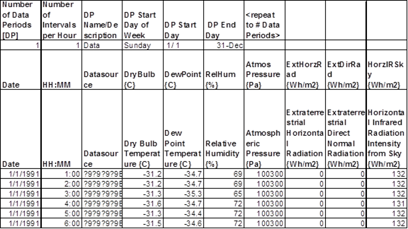

Figure 18. EnergyPlus EPW CSV Data Records (spreadsheet view)

The above figure shows how the data periods header record and the individual data records look when opened in a spread sheet. Again, the headers are shown in bold.  Note that there are two header records for the data records - one with short names - one with longer more descriptive names.

Missing Weather File Data
-------------------------

The following data contains "missing" descriptors; a new concept not introduced previously in our IDD conventions. In this case, it will be processed as though those values are "missing" in the weather conversions. This may not always be desirable though the weather processor will fill in "missing" value with something "appropriate". Eventually, these missing values will be available through the weather processor. Until then, the following are used for initial missing conditions. When a valid value is encountered from weather data, however, it will become the new "missing" replacement value:

Table 17. Missing weather replacement values

<table class="table table-striped">
<tr>
<th>Data item</th>
<th>Supplied Value</th>
<th>Units</th>
</tr>
<tr>
<td>Dry Bulb Temperature</td>
<td>6</td>
<td>C</td>
</tr>
<tr>
<td>Dew Point Temperature</td>
<td>3</td>
<td>C</td>
</tr>
<tr>
<td>Relative Humidity</td>
<td>50</td>
<td>%</td>
</tr>
<tr>
<td>Atmospheric Pressure</td>
<td>Standard** Barometric Pressure (altitude based)</td>
<td>Pa</td>
</tr>
<tr>
<td>Wind Speed</td>
<td>2.5</td>
<td>m/s</td>
</tr>
<tr>
<td>Wind Direction</td>
<td>180</td>
<td>Deg</td>
</tr>
<tr>
<td>Total Sky Cover</td>
<td>5</td>
<td>(tenths)</td>
</tr>
<tr>
<td>Opaque Sky Cover</td>
<td>5</td>
<td>(tenths)</td>
</tr>
<tr>
<td>Visibility</td>
<td>777.7</td>
<td>Km</td>
</tr>
<tr>
<td>Ceiling Height</td>
<td>77777</td>
<td>m</td>
</tr>
<tr>
<td>Precipitable Water</td>
<td>0</td>
<td>Mm</td>
</tr>
<tr>
<td>Aerosol Optical Depth</td>
<td>0</td>
<td>Broadband turbidity</td>
</tr>
<tr>
<td>Snow Depth</td>
<td>0</td>
<td>Cm</td>
</tr>
<tr>
<td>Days Since Last Snow</td>
<td>88</td>
<td>Days</td>
</tr>
<tr>
<td>Radiation Values (Direct/Diffuse)</td>
<td>0.0</td>
<td>Wh/m2</td>
</tr>
<tr>
<td>Illuminance Values</td>
<td>0.0</td>
<td>lux (or CD/m2)</td>
</tr>
</table>

\*\*Standard Barometric pressure based on location elevation is taken from ASHRAE 2001 Handbook of Fundamentals, pages 6.1 & 6.2.

Source Weather Data Formats
---------------------------

Source weather data for building energy simulation programs can be broken into two major classes: *historical data* and *typical weather years*. Historical data is just "real" data: usually measured (but sometimes modeled) data from a particular location for a given period of record. Typical years are ersatz years assembled to match the long term data from a particular location using a particular statistical measure. Typical data may also be "real" data but may not be a contiguous year - the data may be comprised of months from multiple years.

The primary source for historical weather data is the U.S. National Climatic Data Center (NCDC) in Asheville, NC: http://www.ncdc.noaa.gov/. NCDC can provide hourly historical data for thousands of locations around the world. This data may not always be complete; data items or periods of record may be missing.

### Data Set vs. Data Format

In this document as well in many others, you will read about a certain "data set" and you will also read about data in a "certain" format - e.g., the TMY2 data set and the TMY2 data format. Simply stated, a data set refers to a set of data files developed around a set of procedures for selection and usually with a specific purpose for use. A data format is merely the identification of data elements in a data file. In the TMY2 example, the TMY2 data set was developed as described below and the format of the data is usually called a TMY2 format.

Any data *could* be put into a TMY2 format, but it wouldn't necessarily be selected using the same procedures as the TMY2 data set.

### SAMSON Data Set/Format

A highly reliable source of historical data for U.S. locations is the Solar and Meteorological Surface Observational Network (SAMSON) data set assembled by the National Renewable Energy Laboratory (NREL) in Golden, CO: http://www.nrel.gov/. The SAMSON data set contains a 30 year (1961 to 1990) period of record for 239 locations and are available from the NCDC.

SAMSON also describes a file format. Though no data from the SAMSON data set are available for download in EPW format, the weather conversion utility can read and process this file format.

### TMY2 Data Set/Format

The TMY2 are data sets of hourly values of solar radiation and meteorological elements for a 1-year period. Their intended use is for computer simulations of solar energy conversion systems and building systems to facilitate performance comparisons of different system types, configurations, and locations in the United States and its territories. Because they represent typical rather than extreme conditions, they are not suited for designing systems to meet the worst-case conditions occurring at a location. The data are available from the National Renewable Energy Laboratory for download or on CD.

TMY3 files have somewhat replaced TMY2 files but all TMY2 files are available for download from the website.

### Solar and Wind Energy Resource Assessment (SWERA) Format

The Solar and Wind Energy Resource Assessment (SWERA) project, funded by the United Nations Environment Program, is developing high quality information on solar and wind energy resources in 14 developing countries. Currently typical year hourly data are available for 156 locations in Belize, Brazil, China, Cuba, El Salvador, Ethiopia, Ghana, Guatemala, Honduras, Kenya, Maldives, Nicaragua, and Sri Lanka. The data are available from the SWERA project web site. http://swera.unep.net/;

The SWERA format is very similar to the TMY2 format except:  WMO stations are used (6 character) in the header and 4 digit years have been adopted in the data lines.

### WYEC2 Data Set/Format

Culminating in the early 1980s, ASHRAE published their "Weather Year for Energy Calculations" (WYEC) hourly weather files for 51 US and Canadian locations. These files were intended to support the then growing interest in computer simulation of energy use in buildings. In the late 1980s, a major revision was initiated - this included the addition of 26 Typical Meteorological Year (TMY) hourly weather files to the original WYEC data set and a number of improvements.

The work of revising and improving the WYEC data base was performed by at the National Renewable Energy Laboratory (NREL) as part of the Solar Radiation Resource Assessment Program (SRRAP), during the period 1989 through 1993. Richard Perez, at the State University of New York at Albany -- Atmospheric Sciences Research Center provided a substantial contribution to this work. The resulting set of 77 revised and corrected hourly weather files are referred to as WYEC Version 2 or "WYEC2" data set.

The WYEC2 format is used as the format for several other data sets. The WYEC2 data set, however, was not made available for download though, of course, those files can be read if desired with the EnergyPlus Weather Converter utility.

### Canadian Weather for Energy Calculations (CWEC)

Produced by Numerical Logics in collaboration with Environment Canada and the National Research Council of Canada, the CWEC were derived using a methodology similar to the TMY2 and TMY. CWEC hourly files represent weather conditions that result in approximately average heating and cooling loads in buildings. The National Energy Code of Canada requires the use of a CWEC file representative of a location when the performance path and customized design calculations are chosen as the means of building energy consumption compliance. The CWEC follow the ASHRAE WYEC2 format and were derived from the Canadian Energy and Engineering Data Sets (CWEEDS) of hourly weather information for Canada from the 1953-1995 period of record.

The 80 CWEC files contain hourly weather observations representing an artificial one-year period specifically designed for building energy calculations. All 80 locations in the CWEC data set are available for download in EnergyPlus weather format.

### International Weather for Energy Calculations (IWEC)

The IWEC are the result of ASHRAE Research Project 1015 conducted by Numerical Logics and Bodycote Materials Testing Canada for ASHRAE Technical Committee 4.2 Weather Information. The IWEC data files are 'typical' weather files suitable for use with building energy simulation programs for 227 locations outside the USA and Canada.

The files are derived from up to 18 years of DATSAV3 hourly weather data originally archived at the U S National Climatic Data Center. The weather data is supplemented by solar radiation estimated on an hourly basis from earth-sun geometry and hourly weather elements, particularly cloud amount information. The IWEC CD-ROM is available from ASHRAE.

The Department of Energy has licensed the IWEC data from ASHRAE. Our license with ASHRAE allows us to: "Distribute versions of the individual IWEC files in converted format suitable for EnergyPlus (EPW). Make the EnergyPlus versions of the IWEC files available to users at no cost via this EnergyPlus web site."  All 227 locations in the IWEC data set are available for download in EnergyPlus weather format.

The IWEC source data is © 2001 American Society of Heating, Refrigerating and Air-Conditioning Engineers (ASHRAE), Inc., Atlanta, GA, USA. http://www.ashrae.org/ All rights reserved as noted in the License Agreement and Additional Conditions.

IWEC also describes a data format, very similar to the TMY2 data format.

### Typical Meteorological Year (TMY)

Data for 230 locations in the USA plus four locations in Cuba, Marshall Islands, Palau, and Puerto Rico, derived from a 1948-1980 period of record. Many of the locations in the TMY data set were subsequently updated by the TMY2.

Similar to the TMY2, the TMY are data sets of hourly values of solar radiation and meteorological elements for a 1-year period. Their intended use is for computer simulations of solar energy conversion systems and building systems to facilitate performance comparisons of different system types, configurations, and locations in the United States and its territories. Because they represent typical rather than extreme conditions, they are not suited for designing systems to meet the worst-case conditions occurring at a location. The data are available for purchase from the National Climatic Data Center.

All TMY locations are available for download in EnergyPlus weather format.

TMY also describes a data format.

### California Climate Zones 2 (CTZ2)

Updated weather data for 16 California climate zones for use to demonstrate compliance with Title 24 with approved building energy simulation programs. All 16 CTZ2 weather files are available for download in EnergyPlus weather format. The original source data is available from the California Energy Commission. These source data files are described using the WYEC2 format.

### Solar and Wind Energy Resource Assessment (SWERA)

The Solar and Wind Energy Resource Assessment (SWERA) project, funded by the United Nations Environment Program, is developing high quality information on solar and wind energy resources in 13 developing countries. Currently typical year hourly data are available for 48 locations in Belize, Cuba, El Salvador, Guatemala, Honduras, Maldives, Nicaragua, and Sri Lanka. The data are available from the SWERA project web site. SWERA plans to release new data for Brazil, Ethiopia, Ghana, Kenya, and Nepal over the coming few months. These source data files are described using the SWERA format.

### Spanish Weather for Energy Calculations (SWEC)

Originally developed for use with Calener, a new program for building energy labelling in Spain, these weather files cover all 52 Spanish provincial capitals. Calener was developed by the Grupo de Termotecnia of the Escuela Superior de Ingeneiros in Seville for the Spanish Government. The weather files were synthetically generated using Climed (Portuguese software developed by Ricardo Aguiar) from mean monthly data coming from the Spanish Meteorological National Institute. These weather files were converted from the DOE-2 binary to EnergyPlus format and include constant wind speeds of 6.7 m/s.

For more information on these weather files, contact: Profesor Luis Pérez-Lombard ([lpl@tmt.us.es](file:///E:\Docs4PDFs\lpl@tmt.us.es)) Escuela Superior de Ingenieros

### Italian Climatic data collection "Gianni De Giorgio" (IGDG)

Developed for use in simulating renewable energy technologies, this set of 66 weather files is based on a 1951-1970 period of record. The data were created by Professor Livio Mazzarella, Politecnico di Milano, and is named in honor of Gianni de Giorgio.

### Chinese Typical Year Weather (CTYW)

Developed for use in simulating building heating and air conditioning loads and energy use, and for calculating renewable energy utilization, this set of 57 weather files is based on a 1982-1997 period of record with data obtained from the U. S. National Climatic Data Center. The data were created by Prof. ZHANG Qingyuan of Tsukuba University Japan, in collaboration with Joe Huang of Lawrence Berkeley National Laboratory. The original typical year weather files are contained in: Zhang Qingyuan and Joe Huang. 2004. Chinese Typical Year Weather Data for Architectural Use (in Chinese). ISBN 7-111-14810-X. Beijing: China Machine Press. Available from: China Machine Press; No. 22 Baiwanzhuang Dajie; Beijing, CHINA 100037.

The CTYW files are no longer available for download from the web site.

### INETI Synthetic data for Portugal

Two weather files for Portugal developed by Ricardo Aguiar of Instituto Nacional de Engenharia, Tecnologia e Inovação (INETI). Synthetic data set based on spatially interpolation of public climatic data published by Instituto de Meteorologia 1951-80 combined with INETI owned data and other freely available data sources. INETI has granted DOE permission to distribute versions of the individual INETI files in converted format suitable for EnergyPlus (EPW) and make those files available to users at no cost via this EnergyPlus web site.

The INETI synthetic data are © 2005 Instituto Nacional de Engenharia, Tecnologia e Inovação, Lisboa, Portugal. http://www.ineti.pt

### ISHRAE India Weather Data Files (ISHRAE)

Developed for use in simulating building heating and air conditioning loads and energy use, and for calculating renewable energy utilization, this set of 58 weather files was developed by the Indian Society of Heating, Refrigerating, and Air-Conditioning Engineers (ISHRAE). The source data are Copyright 2005 ISHRAE. ISHRAE has made these data available to DOE under license for use at no cost to the EnergyPlus user community.

### City University of Hong Kong (CUHK) Data Set

CityUHK-45007 -- WMO\#450070   Typical year file Hong Kong originally in IWEC format spreadsheet jointly developed by Dr TT Chow and ALS Chan of the City University of Hong Kong supported by a CERG grant from the Research Grants Council of the Hong Kong Special Administrative Region of China. Solar radiation measured from observatory station at 22.32N  114.17'E  65m above mean sea level.

### Chinese Standard Weather Data (CSWD)

Developed for use in simulating building heating and air conditioning loads and energy use, and for calculating renewable energy utilization, this set of 270 typical hourly data weather files. These data were developed by Dr. Jiang Yi, Department of Building Science and Technology at Tsinghua University and China Meteorological Bureau. The source data include annual design data, typical year data,  and extreme years for maximum enthalpy, and maximum and minimum temperature and solar radiation.

China Meteorological Bureau, Climate Information Center, Climate Data Office and Tsinghua University, Department of Building Science and Technology. 2005. China Standard Weather Data for Analyzing Building Thermal Conditions, April 2005. Beijing: China Building Industry Publishing House, ISBN 7-112-07273-3 (13228). http://www.china-building.com.cn.

### Kuwait Weather Data from Kuwait Institute for Scientific Research (KISR)

Two weather files for Kuwait based on measured meteorological data for Kuwait International Airport and KISR's coastal weather station. Provided by KISR in spreadsheet format.

### Egyptian Weather for Energy Calculations (EWEC)

Developed for standards development and energy simulation by Joe Huang from data provided by National Climatic Data Center for periods of record from 12 to 21 years, all ending in 2003. Joe Huang and Associates, Moraga, California, USA.

### Israel weather data (MSI)

Weather data for Israel locations developed by Faculty of Civil and Environmental Engineering, Technion - Israel Institute of Technology, Haifa, Israel, from data provided by the Israel Meteorological Service.

### Representative Meteorological Year (RMY) Australia Climatic Data

RMY Australia Representative Meteorological Year Climate Files Developed for the Australia Greenhouse Office for use in complying with Building Code of Australia. These data are licensed through ACADS BSG Ltd for use by EnergyPlus users. For use in any other formats, users must contact ACADS BSG Ltd for licensing information.

The RMY data are © 2006 Commonwealth of Australia, Department of the Environment and Water Resources, Australia Greenhouse Office, Canberra, ACT, Australia. [www.greenhouse.gov.au/buildings/code.html](https://web.archive.org/web/20070608213812/http://www.greenhouse.gov.au/buildings/code.html) (URL has since been removed, so replaced with a link on The Internet Archive from 2007.)  All intellectual property rights reserved.

### Iranian Typical Meteorological Year (ITMY)

Typical year weather files have been created for Tehran from weather data for 1992 through 2003 published by the Islamic Republic of Iran Meteorological Organization (IRIMO) for Tehran Mehrabad. Developed for standards development and energy simulation by Joe Huang, White Box Technologies.

### New Zealand National Institute of Water & Atmospheric Research Ltd (NIWA)

The New Zealand Energy Efficiency and Conservation Authority (EECA) has developed a Home Energy Rating Scheme (HERS) for New Zealand households based on software simulation of energy loss and demand. The software requires hourly data to represent the different climates zones around New Zealand, especially for larger population centres. These climate data consist of hourly records for an artificial year created from twelve representative months.

Liley, J Ben, Hisako Shiona, James Sturman, David S Wratt. 2007. Typical Meteorological Years for the New Zealand Home Energy Rating Scheme. Prepared for the Energy Efficiency and Conservation Authority. NIWA Client Report: LAU2007- 02-JBL. NIWA, Omakau, New Zealand.

### Chartered Institution of Building Services Engineers (CIBSE)

The CIBSE, in association with the (UK) Met Office has produced 'Test Reference Years' and 'Design Summer Years' for 14 UK locations for use with building energy simulation software. The data sets are available in various formats, including EnergyPlus/ESP-r. These data are NOT available on the EnergyPlus web site. For further details, see:

[www.cibse.org/index.cfm?go=publications.view&PubID=332&S1=y&L1=0&L2=0](file:///E:\Docs4PDFs\www.cibse.org\index.cfm%3fgo=publications.view&PubID=332&S1=y&L1=0&L2=0)

### Meteonorm Data

Meteonorm software can be used when there is no measured data near the location for the simulation. Meteonorm extrapolates hourly data from statistical data for a location. Where statistical data aren't available, Meteonorm interpolates from other nearby sites. Generally a statistical approach is a last resort -- weather files generated from statistics will not demonstrate the normal hour-to-hour and day-to-day variability seen in measured data. Meteonorm version 6 will directly write EPW files.

### Other Formats

The data sets and formats described above are some of the newest formats available for use with building simulation programs. Source data comes in various formats. Typically the files are ASCII, but the data items, units, item location, and record length vary from format to format. NCDC can provide historical data in a variety of formats: TD-3280, TD-3510, TD-9950 (DATSAV2), TD-9956 (DATSAV3) and TD-1440 (CD144). The EnergyPlus weather processor cannot process any of the types directly.

Table 18. Summary of Downloadable Weather Data by Type
<table class="table table-striped">
  <tr>
    <th rowspan="3">Source</th>
    <th colspan="8" align="center">WMO Region</th>
    <th></th>
  </tr>
  <tr>
    <td colspan="3">North and Central America</td>
    <td></td>
    <td></td>
    <td></td>
    <td></td>
    <td></td>
    <td></td>
  </tr>
  <tr>
    <td>USA</td>
    <td>Canada</td>
    <td>Central America</td>
    <td>Africa</td>
    <td>Asia</td>
    <td>South America</td>
    <td>Southwest Pacific</td>
    <td>Europe</td>
    <td>Total</td>
  </tr>
  <tr>
    <td>ETMY</td>
    <td></td>
    <td></td>
    <td></td>
    <td>11</td>
    <td></td>
    <td></td>
    <td></td>
    <td></td>
    <td>11</td>
  </tr>
  <tr>
    <td>IGDG</td>
    <td></td>
    <td></td>
    <td></td>
    <td></td>
    <td></td>
    <td></td>
    <td></td>
    <td>66</td>
    <td>66</td>
  </tr>
  <tr>
    <td>IMGW</td>
    <td></td>
    <td></td>
    <td></td>
    <td></td>
    <td></td>
    <td></td>
    <td></td>
    <td>61</td>
    <td>61</td>
  </tr>
  <tr>
    <td>INETI</td>
    <td></td>
    <td></td>
    <td></td>
    <td></td>
    <td></td>
    <td></td>
    <td></td>
    <td>2</td>
    <td>2</td>
  </tr>
  <tr>
    <td>ISHRAE</td>
    <td></td>
    <td></td>
    <td></td>
    <td></td>
    <td>58</td>
    <td></td>
    <td></td>
    <td></td>
    <td>58</td>
  </tr>
  <tr>
    <td>ITMY</td>
    <td></td>
    <td></td>
    <td></td>
    <td></td>
    <td>1</td>
    <td></td>
    <td></td>
    <td></td>
    <td>1</td>
  </tr>
  <tr>
    <td>IWEC</td>
    <td></td>
    <td></td>
    <td>5</td>
    <td>12</td>
    <td>49</td>
    <td>19</td>
    <td>20</td>
    <td>122</td>
    <td>227</td>
  </tr>
  <tr>
    <td>KISR</td>
    <td></td>
    <td></td>
    <td></td>
    <td></td>
    <td>2</td>
    <td></td>
    <td></td>
    <td></td>
    <td>2</td>
  </tr>
  <tr>
    <td>Los Alamos TMY2</td>
    <td>1</td>
    <td></td>
    <td></td>
    <td></td>
    <td></td>
    <td></td>
    <td></td>
    <td></td>
    <td>1</td>
  </tr>
  <tr>
    <td>MSI</td>
    <td></td>
    <td></td>
    <td></td>
    <td></td>
    <td></td>
    <td></td>
    <td></td>
    <td>4</td>
    <td>4</td>
  </tr>
  <tr>
    <td>NIWA</td>
    <td></td>
    <td></td>
    <td></td>
    <td></td>
    <td></td>
    <td></td>
    <td>16</td>
    <td></td>
    <td>16</td>
  </tr>
  <tr>
    <td>RMY</td>
    <td></td>
    <td></td>
    <td></td>
    <td></td>
    <td></td>
    <td></td>
    <td>80</td>
    <td></td>
    <td>80</td>
  </tr>
  <tr>
    <td>SWEC</td>
    <td></td>
    <td></td>
    <td></td>
    <td>2</td>
    <td></td>
    <td></td>
    <td></td>
    <td>50</td>
    <td>52</td>
  </tr>
  <tr>
    <td>SWERA</td>
    <td></td>
    <td></td>
    <td>37</td>
    <td>33</td>
    <td>66</td>
    <td>20</td>
    <td></td>
    <td></td>
    <td>156</td>
  </tr>
  <tr>
    <td>TMY</td>
    <td>229</td>
    <td></td>
    <td>1</td>
    <td></td>
    <td></td>
    <td></td>
    <td>4</td>
    <td></td>
    <td>234</td>
  </tr>
  <tr>
    <td>TMY2</td>
    <td>235</td>
    <td></td>
    <td>1</td>
    <td></td>
    <td></td>
    <td></td>
    <td>1</td>
    <td></td>
    <td>237</td>
  </tr>
  <tr>
    <td>TMY3</td>
    <td>1011</td>
    <td></td>
    <td>7</td>
    <td></td>
    <td></td>
    <td></td>
    <td>2</td>
    <td></td>
    <td>1020</td>
  </tr>
  <tr>
    <td>Totals</td>
    <td>1476</td>
    <td>0</td>
    <td>51</td>
    <td>58</td>
    <td>176</td>
    <td>39</td>
    <td>123</td>
    <td>305</td>
    <td></td>
  </tr>
</table>

One other format worth mentioning is TRY. TRY is "test reference year" data that did not include solar radiation data. "Test Reference Year" is a term that usually denotes selection of a specific year of "real" data based on some statistical procedure. The original TRY data (TD-9706) was based on an ASHRAE procedure to select the data from a "period of record". "The principle of the selection is to eliminate years in the period of record containing months with extremely high or low mean temperatures until only one year remains."  The weather conversion utility cannot process data in "TRY" format. However, many organizations develop data for reference year data (e.g. European TRY, Moisture Reference Data).

### Custom Format

Using a "definitions" file (see Description of "Def" input file), the weather converter can process a wide range of data formats. In the table above, both the GDG and CTYW weather data was processed by a custom format approach.

### Solar Data

Source weather data files may or may not contain solar data. All of the files that can be processed by the EnergyPlus Weather conversion utility contain solar data. The weather processor will transfer this data to the EPW weather file and the EnergyPlus simulation program will use it.

Historical weather data files in CD144 format do not contain solar data nor is such data generally available for a specific location and time period. In this case, ersatz solar data must be generated from cloud cover and other data using sky models and regression formulas. Currently, neither the Weather Conversion utility nor the EnergyPlus program synthesizes this data.  However, the weather conversion utility can use any two of the commonly recorded data (i.e. two of Global Horizontal Radiation, Horizontal Diffuse Radiation and Direct Normal (or Direct Horizontal) Radiation to calculate the EnergyPlus primary solar data of Direct Normal and Horizontal Diffuse Radiation values).

Data Sources/Uncertainty
------------------------

More recent weather data source files have introduced the concept of data sources and uncertainty flags for many of the fields. The EnergyPlus weather format faithfully reproduces these fields as appropriate for the input source data types. By and large, most of the data sources and uncertainties have used the TMY2 established fields and values (See following table). As noted earlier, to enhance readability and reduce obfuscation, the EnergyPlus format for the data source and uncertainty flags collates them into one large field. Each data element still has its data source and uncertainty: it is positionally embodied depending on its place in the EPW data record.

Table 19. Key to Data Source and Uncertainty Flags

<table class="table table-striped">
<tr>
<th>Data Flag</th>
<th>Flag Values</th>
</tr>
<tr>
<td>Dry Bulb Temperature Data Source</td>
<td>A-F</td>
</tr>
<tr>
<td>Dry Bulb Temperature Data Uncertainty</td>
<td>0-9</td>
</tr>
<tr>
<td>Dew Point Temperature Data Source</td>
<td>A-F</td>
</tr>
<tr>
<td>Dew Point Temperature Data Uncertainty</td>
<td>0-9</td>
</tr>
<tr>
<td>Relative Humidity Data Source</td>
<td>A-F</td>
</tr>
<tr>
<td>Relative Humidity Data Uncertainty</td>
<td>0-9</td>
</tr>
<tr>
<td>Atmospheric Station Pressure Data Source</td>
<td>A-F</td>
</tr>
<tr>
<td>Atmospheric Station Pressure Data Uncertainty</td>
<td>0-9</td>
</tr>
<tr>
<td>Horizontal Infrared Radiation Data Source</td>
<td>A-H, ?</td>
</tr>
<tr>
<td>Horizontal Infrared Radiation Data Uncertainty</td>
<td>0-9</td>
</tr>
<tr>
<td>Global Horizontal Radiation Data Source</td>
<td>A-H, ?</td>
</tr>
<tr>
<td>Global Horizontal Radiation Data Uncertainty</td>
<td>0-9</td>
</tr>
<tr>
<td>Direct Normal Radiation Data Source</td>
<td>A-H, ?</td>
</tr>
<tr>
<td>Direct Normal Radiation Data Uncertainty</td>
<td>0-9</td>
</tr>
<tr>
<td>Diffuse Horizontal Radiation Data Source</td>
<td>A-H, ?</td>
</tr>
<tr>
<td>Diffuse Horizontal Radiation Data Uncertainty</td>
<td>0-9</td>
</tr>
<tr>
<td>Global Horizontal Illuminance Data Source</td>
<td>I, ?</td>
</tr>
<tr>
<td>Global Horizontal Illuminance Data Uncertainty</td>
<td>0-9</td>
</tr>
<tr>
<td>Direct Normal Illuminance Data Source</td>
<td>I, ?</td>
</tr>
<tr>
<td>Direct Normal Illuminance Data Uncertainty</td>
<td>0-9</td>
</tr>
<tr>
<td>Diffuse Horizontal Illuminance Data Source</td>
<td>I, ?</td>
</tr>
<tr>
<td>Diffuse Horizontal Illuminance Data Uncertainty</td>
<td>0-9</td>
</tr>
<tr>
<td>Zenith Luminance Data Source</td>
<td>I, ?</td>
</tr>
<tr>
<td>Zenith Luminance Data Uncertainty</td>
<td>0-9</td>
</tr>
<tr>
<td>Wind Direction Data Source</td>
<td>A-F</td>
</tr>
<tr>
<td>Wind Direction Data Uncertainty</td>
<td>0-9</td>
</tr>
<tr>
<td>Wind Speed Data Source</td>
<td>A-F</td>
</tr>
<tr>
<td>Wind Speed Data Uncertainty</td>
<td>0-9</td>
</tr>
<tr>
<td>Total Sky Cover Data Source</td>
<td>A-F</td>
</tr>
<tr>
<td>Total Sky Cover Data Uncertainty</td>
<td>0-9</td>
</tr>
<tr>
<td>Opaque Sky Cover Data Source</td>
<td>A-F</td>
</tr>
<tr>
<td>Opaque Sky Cover Data Uncertainty</td>
<td>0-9</td>
</tr>
<tr>
<td>Visibility Data Source</td>
<td>A-F, ?</td>
</tr>
<tr>
<td>Visibility Data Uncertainty</td>
<td>0-9</td>
</tr>
<tr>
<td>Ceiling Height Data Source</td>
<td>A-F, ?</td>
</tr>
<tr>
<td>Ceiling Height Data Uncertainty</td>
<td>0-9</td>
</tr>
<tr>
<td>Precipitable Water Data Source</td>
<td>A-F</td>
</tr>
<tr>
<td>Precipitable Water Data Uncertainty</td>
<td>0-9</td>
</tr>
<tr>
<td>Broadband Aerosol Optical Depth Data Source</td>
<td>A-F</td>
</tr>
<tr>
<td>Broadband Aerosol Optical Depth Data Uncertainty</td>
<td>0-9</td>
</tr>
<tr>
<td>Snow Depth Data Source</td>
<td>A-F, ?</td>
</tr>
<tr>
<td>Snow Cover Data Uncertainty</td>
<td>0-9</td>
</tr>
<tr>
<td>Days Since Last Snowfall Data Source</td>
<td>A-F, ?</td>
</tr>
<tr>
<td>Days Since Last Snowfall Data Uncertainty</td>
<td>0-9</td>
</tr>
</table>


The definition of the solar radiation source flags and solar radiation uncertainty flags are shown in the following two tables:

Table 20. Solar Radiation and Illuminance Data Source Flag Codes

<table class="table table-striped">
<tr>
<th>Flag Code</th>
<th>Definition</th>
</tr>
<tr>
<td>A</td>
<td>Post-1976 measured solar radiation data as received from NCDC or other sources</td>
</tr>
<tr>
<td>B</td>
<td>Same as &quot;A&quot; except the global horizontal data underwent a calibration correction</td>
</tr>
<tr>
<td>C</td>
<td>Pre-1976 measured global horizontal data (direct and diffuse were not measured before 1976), adjusted from solar to local time, usually with a calibration correction</td>
</tr>
<tr>
<td>D</td>
<td>Data derived from the other two elements of solar radiation using the relationship, global = diffuse + direct ´ cosine (zenith)</td>
</tr>
<tr>
<td>E</td>
<td>Modeled solar radiation data using inputs of observed sky cover (cloud amount) and aerosol optical depths derived from direct normal data collected at the same location</td>
</tr>
<tr>
<td>F</td>
<td>Modeled solar radiation data using interpolated sky cover and aerosol optical depths derived from direct normal data collected at the same location</td>
</tr>
<tr>
<td>G</td>
<td>Modeled solar radiation data using observed sky cover and aerosol optical depths estimated from geographical relationships</td>
</tr>
<tr>
<td>H</td>
<td>Modeled solar radiation data using interpolated sky cover and estimated aerosol optical depths</td>
</tr>
<tr>
<td>I</td>
<td>Modeled illuminance or luminance data derived from measured or modeled solar radiation data</td>
</tr>
<tr>
<td>?</td>
<td>Source does not fit any of the above categories. Used for nighttime values and missing data</td>
</tr>
</table>


Table 21. Solar Radiation and Illuminance Data Uncertainty Flag Codes

<table class="table table-striped">
<tr>
<th>Flag</th>
<th>Uncertainty Range (%)</th>
</tr>
<tr>
<td>1</td>
<td>Not used</td>
</tr>
<tr>
<td>2</td>
<td>2 - 4</td>
</tr>
<tr>
<td>3</td>
<td>4 - 6</td>
</tr>
<tr>
<td>4</td>
<td>6 - 9</td>
</tr>
<tr>
<td>5</td>
<td>9 - 13</td>
</tr>
<tr>
<td>6</td>
<td>13 - 18</td>
</tr>
<tr>
<td>7</td>
<td>18 - 25</td>
</tr>
<tr>
<td>8</td>
<td>25 - 35</td>
</tr>
<tr>
<td>9</td>
<td>35 - 50</td>
</tr>
<tr>
<td>0</td>
<td>Not applicable</td>
</tr>
</table>

Finally, the Meteorological data source and uncertainty flag/codes are shown in the following two tables:

Table 22. Meteorological Data Source Flag Codes

<table class="table table-striped">
<tr>
<th>Flag</th>
<th>Definition</th>
</tr>
<tr>
<td>A</td>
<td>Data as received from NCDC, converted to SI units</td>
</tr>
<tr>
<td>B</td>
<td>Linearly interpolated</td>
</tr>
<tr>
<td>C</td>
<td>Non-linearly interpolated to fill data gaps from 6 to 47 hours in length</td>
</tr>
<tr>
<td>D</td>
<td>Not used</td>
</tr>
<tr>
<td>E</td>
<td>Modeled or estimated, except: precipitable water, calculated from radiosonde data; dew point temperature calculated from dry bulb temperature and relative humidity; and relative humidity calculated from dry bulb temperature and dew point temperature</td>
</tr>
<tr>
<td>F</td>
<td>Precipitable water, calculated from surface vapor pressure; aerosol optical depth, estimated from geographic correlation</td>
</tr>
<tr>
<td>?</td>
<td>Source does not fit any of the above. Used mostly for missing data</td>
</tr>
</table>


Table 23. Meteorological Uncertainty Flag Codes

<table class="table table-striped">
<tr>
<th>Flag</th>
<th>Definition</th>
</tr>
<tr>
<td>1- 6</td>
<td>Not used</td>
</tr>
<tr>
<td>7</td>
<td>Uncertainty consistent with NWS practices and the instrument or observation used to obtain the data</td>
</tr>
<tr>
<td>8</td>
<td>Greater uncertainty than 7 because values were interpolated or estimated</td>
</tr>
<tr>
<td>9</td>
<td>Greater uncertainty than 8 or unknown.</td>
</tr>
<tr>
<td>0</td>
<td>Not definable.</td>
</tr>
</table>


Advanced use - accessing weather conversion capabilities
--------------------------------------------------------

### Interface to the EPlusWth.dll

To provide information for outside developers/interfaces that might want to use the basic weather processing utility from within their interface, the EPlusWth.dll was developed. It is actually used by the weather converter utility. In addition to the basic interface calls, six important files are also used by this library. These are placed in the WeatherConverter folder during install of EnergyPlus.

### Files used by EPlusWth.dll

Each of the files is in a general comma-delimited format. Thus, they can be easily viewed by importing into a spreadsheet program such as Excel™. The files are used to support information lacking in the source data files and/or supply additional information used during the conversion process. In each case (with one exception), there will be a single or set of "header" records describing each column of the file and then the data values of the file will follow on subsequent records. Each of the files is described briefly in the next few sections.

#### Abbreviations.csv

This file does not have a header record, but it consists of 3 columns. It is used for data files that might have 2-character abbreviations for US States or Canadian provinces and provides a translation to the full name and 3-character country code. Likewise, it can use the full name of these items to obtain the 2-character abbreviation or 3-character country code.

#### WBANLocations.csv

In many older data sets, the station identifier for the weather data uses the WBAN (Weather Bureau Army-Navy) designation system. This has largely been superseded by the WMO (World Meteorological Organization) designation for station collection site identifiers. This file provides a translation between the two identifier systems. In addition, this file contains latitude, longitude, time zone and elevation information for the sites.

#### Cal Climate Zone Lat Long data.csv

Note that this file has spaces in the name. The California c limate zone data source files do not have standard station identifiers. Rather they use a climate zone designator from 1-16. This file is used to obtain the latitude, longitude, time zone and elevation data for these climate zones. The WYEC2 "File Source Code" (field 2, column 6 of each data record) is used to determine that the file is a California compliance type file.

#### ASHRAE\_2009\_Yearly\_DesignConditions.csv

The three files for design conditions have roughly the same format. These are the values from the ASHRAE Handbook of Fundamentals, 2009, Chapter 14, Appendix. The WMO station identifier is used to determine the design condition values that apply to a source data file and, thus, are included in the DESIGN CONDITION header record on the EPW file produced as part of the conversion. This information is also included in the statistical report file (STAT) produced from the weather converter utility. In addition, these are used to supply the information for the design day object (DDY) file creation.

### Public calls to EPlusWth.dll

Several points of the library are made available for use with external programs. In each case the parameters passed will be described along with the Visual Basic™ (VB6) code that is used to declare them as well as Fortran 90 style "Interface" statements to the same calls. The library is placed in the same folder with the weather converter utility - you may need to copy it to your program's folder if you choose to add external calls from your program to it.

#### SetupPWInternalDataPath

This call designates the "path" to the files listed above. This is the location where the ProcessWeather call will expect to find the files. Having this incorrectly specified is not fatal, but will probably cause confusion.

VB declaration statement:

Private Declare Sub SetupPWInternalDataPath Lib "EPlusWth" (ByVal strPath As String, ByVal InPathLen As Long)

And a call from a VB program:


```basic
Call SetupPWInternalDataPath(AppPath, Len(AppPath))
```


Likewise for Fortran 90/95:


```fortran
  INTERFACE
    SUBROUTINE SetupPWInternalDataPath (Path)
    CHARACTER(len=\*), INTENT(IN) :: Path    ! Path where data files reside
    END SUBROUTINE
  END INTERFACE
```

And then calling it from Fortran:


```fortran
Character(len=255) DataPath
CALL SetupPWInternalDataPath(trim(DataPath))
```

#### SetFixOutOfRangeData

As shown earlier (file menu option in the weather converter utility), there is an option to "fix" out of range data or not. By default, this is turned off (does not fix data). Again a character convention ("yes" for fixing; "no" for not fixing) is used. Case of the actual string is ignored.

VB Declaration statement:

Private Declare Sub SetFixOutOfRangeData Lib "EPlusWth" (ByVal strValue As String, ByVal strValueLen As Long)

And calling it from VB:

```basic
    Global FixOutOfRangeData As String
    FixOutOfRangeData = "Yes"
    Call SetFixOutOfRangeData(FixOutOfRangeData, Len(FixOutOfRangeData))
```

For Fortran 90/95:

```fortran
  INTERFACE
    SUBROUTINE SetFixOutOfRangeData (YesNo)
    CHARACTER(len=\*),INTENT(IN) :: YesNo    ! 'yes' to set fixing option;
                                            ! 'no' to not
    END SUBROUTINE
  END INTERFACE
```

And then calling it:

```fortran
CALL SetFixOutOfRangeData('no')
```

#### SetDefaultChgLimit

This call sets the value for the DB trigger shown earlier. Both values passed in are strings and are specific to the dialog shown earlier:

Table 24. Trigger Limit Call Values
<table class="table table-striped">
  <tr>
    <th>Trigger <BR> Limit</th>
    <th>Result</th>
    <th>Ignore <BR> Calc <BR> Trigger</th>
    <th>Result</th>
  </tr>
  <tr>
    <td>0</td>
    <td>use only calculated trigger</td>
    <td>0</td>
    <td>Uses Calculated Trigger</td>
  </tr>
  <tr>
    <td>1</td>
    <td>use 5&deg;C</td>
    <td>1</td>
    <td>Ignores calculated trigger</td>
  </tr>
  <tr>
    <td>2</td>
    <td>use 10&deg;C</td>
    <td></td>
    <td></td>
  </tr>
  <tr>
    <td>3</td>
    <td>use 15&deg;C</td>
    <td></td>
    <td></td>
  </tr>
</table>


You can also choose to ignore the calculated trigger entirely. If you do not "ignore" the calculated trigger, then the trigger is the minimum of the calculated and your trigger limit selection.

VB Declaration Statement:

```basic
Private Declare Sub SetDefaultChgLimit Lib "EPlusWth" (ByVal strValue As String, ByVal strValueLen As Long, ByVal strValue As String, ByVal strValueLen As Long)
```

And a call from VB:

```basic
    Call SetDefaultChgLimit(TriggerLimit, Len(TriggerLimit), IgnoreCalcTrigger, Len(IgnoreCalcTrigger))
```

#### ProcessWeather

The "meat" of the processing is done by this routine. It gets passed the input file name (source data), the input file type, output file name, and output file type. As an output it can provide a notice that the processing was successful or not.

VB Declaration Statement:

```basic
Private Declare Sub ProcessWeather Lib "EPlusWth" (ByVal strInType As String, ByVal InTypeLen As Long, ByVal strOutType As String, ByVal OutTypeLen As Long, ByVal strInFileName As String, ByVal InFileNameLen As Long, ByVal strOutFileName As String, ByVal OutFileNameLen As Long, ErrorFlag As Boolean, Optional ByVal strOutFileURL As String, Optional ByVal OutFileURLlen As Long)
```

Calling it from VB:

```basic
Call ProcessWeather(InputFileDataType, Len(InputFileDataType),
      OutputFileDataType, Len(OutputFileDataType),
      InputFileName, Len(InputFileName),
      OutputFileName, Len(OutputFileName),
      ErrorFlag)
```

Valid values for the Input File Data Type are shown in the following table:

Table 25. Valid Input File Types for "ProcessWeather" call

<table class="table table-striped">
<tr>
<th>Input File Type</th>
<th>Source Data file Format Type</th>
</tr>
<tr>
<td>TMY2 or TM2</td>
<td>TMY2 data file</td>
</tr>
<tr>
<td>IWEC or IWC</td>
<td>IWEC data file</td>
</tr>
<tr>
<td>SAMSON or DAT</td>
<td>SAMSON data file</td>
</tr>
<tr>
<td>WYEC2 or WY2</td>
<td>WYEC2 data file</td>
</tr>
<tr>
<td>FMT or TXT</td>
<td>DOE-2 Formatted data file</td>
</tr>
<tr>
<td>CLM or ESP-r</td>
<td>ESP-r formatted data file</td>
</tr>
<tr>
<td>BLAST or ASC</td>
<td>BLAST ASCII formatted data file</td>
</tr>
<tr>
<td>EPW</td>
<td>EnergyPlus EPW file</td>
</tr>
<tr>
<td>CSV</td>
<td>EnergyPlus CSV file</td>
</tr>
<tr>
<td>TMY</td>
<td>TMY data files</td>
</tr>
<tr>
<td>WEA</td>
<td>Eco-Tect WEA files</td>
</tr>
<tr>
<td>SWERA or SWE</td>
<td>SWERA data files</td>
</tr>
<tr>
<td>&lt;any&gt;</td>
<td>Custom - must have "def" file</td>
</tr>
</table>

Valid values for the Output File Type(s) are shown in the following table:

Table 26. Valid Output File Types for the "ProcessWeather" call

<table class="table table-striped">
<tr>
<th>Output File Type</th>
<th>File(s) produced</th>
</tr>
<tr>
<td>EPW</td>
<td>EPW and RPT files</td>
</tr>
<tr>
<td>CSV</td>
<td>CSV and RPT files</td>
</tr>
<tr>
<td>BOTH</td>
<td>EPW, CSV and RPT files</td>
</tr>
<tr>
<td>RPT</td>
<td>RPT file</td>
</tr>
</table>

For Input and Output file names, the complete paths should be included.

ErrorFlag will be returned as "true" if an error occurs during processing or "false" if the process is successful.

Fortran 90/95 Declaration:

```fortran
INTERFACE
  SUBROUTINE ProcessWeather(InType,OutType,InFileName,OutFileName,ErrFlag)
    CHARACTER(len=\*), INTENT(IN) :: InType       ! InputFile Type
    CHARACTER(len=\*), INTENT(IN) :: OutType      ! OutputFile Type
    CHARACTER(len=\*), INTENT(IN) :: InFileName   ! InputFile Name (Full path)
    CHARACTER(len=\*), INTENT(IN) :: OutFileName  ! OutputFileName (Full path)
    LOGICAL(Byte2), INTENT(OUT)  :: ErrFlag      ! If errors are found,
                                                 ! set to true and put
                                                 ! description put in file.
  END SUBROUTINE
END INTERFACE
```

And calling it from Fortran:

```fortran
call processweather(trim(intype),trim(outtype),    &
                    trim(infilename),trim(outfilename),errflag)
```


Note that the file where error messages will be placed is the RPT file. If the value of the output file path is incorrect, you may need to search for this file by using the RPT extension.

References
----------

ASHRAE. 1985. *Weather Year for Energy Calculations*. Atlanta: American Society of Heating, Refrigerating and Air-Conditioning Engineers, Inc.

ASHRAE. 1997. *WYEC2 Weather Year for Energy Calculations 2, Toolkit and Data*, Atlanta: ASHRAE.

ASHRAE. 2001. *International Weather for Energy Calculations (IWEC Weather Files) Users Manual and CD-ROM*, Atlanta: ASHRAE

ASHRAE. 2004. *ANSI/ASHRAE Standard 90.2-2004*, "Energy-Efficient Design of Low-Rise Residential Buildings," September 2004. Atlanta: American Society of Heating, Refrigerating, and Air-conditioning Engineers.

ASHRAE. 2004. *ANSI/ASHRAE/IESNA Standard 90.1-2004*, "Energy-Efficient Design of Buildings Except Low-Rise Residential," September 2004. Atlanta: American Society of Heating, Refrigerating, and Air-conditioning Engineers.

ASHRAE, 2009. Handbook of Fundamentals, Atlanta: American Society of Heating, Refrigerating, and Air-conditioning Engineers.

Briggs, Robert S., Robert G. Lucas, and Z. Todd Taylor. 2002. "Climate Classification for Building Energy Codes and Standards: Part 1 - Development Process" in *ASHRAE Transactions 2002*, 109, Pt 1. Atlanta:  ASHRAE.

Briggs, Robert S., Robert G. Lucas, and Z. Todd Taylor. 2002. "Climate Classification for Building Energy Codes and Standards: Part 2 - Zone Definitions, Maps and Comparisons" in *ASHRAE Transactions*, 109, Pt 1. Atlanta:  ASHRAE.

Buhl, W.F. 1998. DOE-2 Weather Processor, DOE2.1E Documentation Update, Berkeley: Lawrence Berkeley National Laboratory.

COMIS Weather Program, http://www.byggforsk.no/hybvent/COMISweather.htm

China Meteorological Bureau, Climate Information Center, Climate Data Office and Tsinghua University, Department of Building Science and Technology. 2005. China Standard Weather Data for Analyzing Building Thermal Conditions, April 2005. Beijing: China Building Industry Publishing House, ISBN 7-112-07273-3 (13228). http://www.china-building.com.cn.

Commission of the European Community. 1985. *Test Reference Years,* Weather data sets for computer simulations of solar energy systems and energy consumption in buildings, CEC, DG XII. Brussels, Belgium: Commission of the European Community.

Crawley, Drury B., Linda K. Lawrie, Curtis O. Pedersen, Richard J. Liesen, Daniel E. Fisher, Richard K. Strand, Russell D. Taylor, Frederick C. Winkelmann, W.F. Buhl, A. Ender Erdem, and Y. Joe Huang. 1999. "EnergyPlus, A New-Generation Building Energy Simulation Program," in *Proceedings of Building Simulation '99*, Kyoto, Japan. IBPSA.

Crawley, Drury B. 1998. "Which Weather Data Should You Use for Energy Simulations of Commercial Buildings?," *ASHRAE Transactions*, pp. 498-515, Vol. 104, Pt. 2. Atlanta:  ASHRAE.
http://energyplus.gov/pdfs/bibliography/whichweatherdatashouldyouuseforenergysimulations.pdf

Crawley, Drury B., Jon Hand, and Linda K. Lawrie, 1999. "Improving the Weather Information Available to Simulation Programs", in *Proceedings of Building Simulation '99*, Kyoto, Japan. September 1999. IBPSA.

Energy Simulation Research Unit. 1999.  http://www.strath.ac.uk/Departments/ESRU

Janak, M. 1997. "Coupling Building Energy and Lighting Simulation," in *Proceedings of Building Simulation 97*, September 1997, Volume II pp 313-319, Prague, Czech Republic, IBPSA.

K&ouml;ppen, W. 1931. Grundriss der Klimakunde. Berlin: Walter de Gruyter & Co.

Kusuda, T., "Earth Temperatures Beneath Five Different Surfaces", Institute for Applied Technology, NBS Report 10-373, 1971, NBS, Washington DC 20234.

Kusuda, T., Least Squares Technique for the Analysis of Periodic Temperature of the Earth's Surface Region, NBS Journal of Research, Vol. 71C, Jan-Mar. 1967, pp 43-50.

National Instruments Corporation. 1999. *LabVIEW User Manual*. Austin, Texas:  National Instruments Corporation.

McDonald, Iain, and Paul Strachan. 1998. "Practical Application of Uncertainty Analysis" in *Proceedings of EPIC 98: Second International Conference on Energy Performance and Indoor Climate in Buildings*, Lyon, France, 19-21 November 1998.

National Climatic Data Center (NCDC). 1976. *Test Reference Year (TRY)*, Tape Reference Manual, TD-9706, September 1976. Asheville, North Carolina: National Climatic Data Center, U.S. Department of Commerce.

NCDC. 1981. *Typical Meteorological Year User's Manual, TD-9734, Hourly Solar Radiation -- Surface Meteorological Observations*, May 1981. Asheville, North Carolina: National Climatic Data Center, U.S. Department of Commerce.

NCDC. 1981. *Meteorological Observations*, May 1981. Asheville, North Carolina: National Climatic Data Center, U.S. Department of Commerce.

NCDC. 1993. *Solar and Meteorological Surface Observation Network, 1961-1990, Version 1.0*, September 1993. Asheville, North Carolina: National Climatic Data Center, U.S. Department of Commerce.

National Renewable Energy Laboratory (NREL). 1995. *User's Manual for TMY2s (Typical Meteorological Years)*, NREL/SP-463-7668, and *TMY2s, Typical Meteorological Years Derived from the 1961-1990 National Solar Radiation Data Base*, June 1995, CD-ROM. Golden, Colorado: National Renewable Energy Laboratory.

http://rredc.nrel.gov/solar/pubs/tmy2/

Numerical Logics. 1999. Canadian Weather for Energy Calculations, Users Manual and CD-ROM. Downsview, Ontario: Environment Canada.

Oliver, John E. 1991. "The History, Status and Future of Climatic Classification," in Physical Geography 1991, Vol 12, No. 3, pp. 231-251.

Perez R, Ineichen P, Maxwell E, Seals R and Zelenka. A 1992. Dynamic Global-to-Direct Irradiance Conversion Models. *ASHRAE Transactions-Research Series*,354-369.

Perez R, Ineichen P, Seals R, Michalsky J and Stewart R. 1990. Modeling daylight.availability and irradiance components from direct and global irradiance. *Solar.Energy*44, 271-289.

University of Illinois. 1998. *BLAST User's Guide.* Building Systems Laboratory, University of Illinois. Urbana, Illinois:  University of Illinois, Department of Industrial and Mechanical Engineering.

Ward. G. 1996. *Radiance.* Berkeley:  Lawrence Berkeley National Laboratory.

Winkelmann, F.C., W.F. Buhl, B. Birdsall, A. E. Erdem, and K. Ellington. 1994. *DOE-2.1E Supplement*, DE-940-11218. Lawrence Berkeley Laboratory, Berkeley, California. Springfield, Virginia: NTIS.

Zhang, Q. Y., Y. J. Huang. 2002. "Development of Typical Year Weather Files for Chinese Locations", in ASHRAE Transactions, Volume 108, Part 2.

Web Resources
-------------

Building Energy Tools Directory, a directory of information on 340+ energy tools from around the world.

http://www.energytoolsdirectory.gov/

Energy Systems Research Unit, University of Strathclyde, authors of ESP-r, up-to-date information on ESP-r and other energy systems research and software development.

http://www.strath.ac.uk/Departments/ESRU

EnergyPlus, up-to-date information on the current status of EnergyPlus and working with the team, and documentation such as input data structure, output data structure, and licensing opportunities. Additional weather files may be posted here as well.

http://www.energyplus.gov

Description of the SWERA project. http://swera.unep.net/swera/

Weather Analytics ([www.wxaglobal.com](http://www.wxaglobal.com)) - Site specific weather files in EnergyPlus format based on the latest 30 years of hourly data are now available from the private sector company Weather Analytics for any official weather station or over 600,000 35-km grid tiles across the globe. These files are built by integrating hourly weather station observations and the new NOAA reanalysis data sets.  Both Typical Meteorological Year (TMY) files and individual, Actual Meteorological Year (AMY) files are available as well as files constructed from the previous 12 months.

Meteonorm ([www.meteonorm.com](http://www.meteonorm.com)) - Files for specific locations can be purchased in EnergyPlus format from Meteonorm company. Meteonorm extrapolates hourly data from statistical data for a location. Where statistical data aren't available, Meteonorm interpolates from other nearby sites. Generally a statistical approach is a last resort--weather files generated from statistics will not demonstrate the normal hour-to-hour and day-to-day variability seen in measured data.

Ground Heat Transfer in EnergyPlus
==================================

Caution
-------

For ground-contact surfaces in EnergyPlus, it is important to specify appropriate ground temperatures. Do not use the "undisturbed" ground temperatures from the weather data. These values are too extreme for the soil under a conditioned building. For best results, use the Slab or Basement program described in this section to calculate custom monthly average ground temperatures. This is especially important for residential applications and very small buildings. If one of these ground temperature preprocessors is not used, for typical commercial buildings in the USA, a reasonable default value is 2C less than the average indoor space temperature.

Introduction
------------

There are two difficulties behind linking ground heat transfer calculations to EnergyPlus. One is the fact that the conduction calculations in EnergyPlus (and in DOE-2 and BLAST previously) are one-dimensional and the ground heat transfer calculations are two or three-dimensional. This causes severe modeling problems irrespective of the methods being used for the ground heat transfer calculation. The other difficulty is the markedly different time scales involved in the processes. Basically, the zone model is on an hour scale and the ground heat transfer is on a monthly time scale. The basic heat balance based zone model of EnergyPlus has to be considered as the foundation for building energy simulation at the present time and for some time in the future. Thus, it is necessary to be able to relate ground heat transfer calculations to that model.

The heat balance zone model considers a single room or thermal zone in a building and performs a heat balance on it. A fundamental modeling assumption is that the faces of the enclosure are isothermal planes. A ground heat transfer calculation usually considers an entire building and the earth that surrounds it, resulting in non-isothermal face planes where there is ground contact. While it is not impossible to imagine multi-zone, whole building models that include the surrounding earth and non-isothermal building surfaces, such models will not be practical for some time in the future, and their usefulness even then is not clear.

The EnergyPlus development team addressed the problem and decided that the most reasonable first step would be to partially decouple the ground heat transfer calculation from the thermal zone calculation. The most important parameter for the zone calculation is the outside face temperature of the building surface that is in contact with the ground. Thus this becomes a reasonable "separation plane" for the two calculations. It was further decided that the current usage of monthly average ground temperature was reasonable for this separation plane temperature as well, since the time scales of the building heat transfer processes are so much shorter than those of the ground heat transfer processes.

Using the separation plane premise, the 3D ground heat transfer programs for slabs developed by Bahnfleth (1989, 1990) were modified by Clements (2004) to produce outside face temperatures. EnergyPlus permits separate monthly average inside temperatures as input. The program produces outside face temperatures for the core area and the perimeter area of the slab. It is described in the section "Use of the Ground Temperatures with Slabs" below.

A 3D basement program also is included with EnergyPlus. This is described below in Using Ground Temperatures with Basements. It uses the same principle as the slab procedure; it determines the outside face (surface) temperature of the walls and floor of a basement in contact with the ground.

It should be noted that either for slabs or basements the ground heat transfer is usually small unless the building is very small or has some special characteristics.

Multiple Ground Temperatures shows how the OtherSideCoefficients object of EnergyPlus can be used to supply multiple ground temperatures.

Use of the Ground Temperatures with Slabs
-----------------------------------------

The Slab program produces temperature profiles for the outside surface at the core and at the perimeter of the slab. It also produces the average based on the perimeter and core areas used in the calculation. This allows the user to apply the Slab temperatures one of two ways in EnergyPlus:

*Option 1 - Core and Perimeter Temperatures*:  The EnergyPlus OtherSideCoefficients object can be used to provide two sets of twelve monthly average ground temperature values. In this way, both the perimeter and the core values from the Slab program can be used in the succeeding EnergyPlus run. This method assumes that the floor slab will be described using at least two different heat transfer surfaces. The use of OtherSideCoefficients to provide additional ground contact surfaces is described in detail in the "Multiple Ground Temperatures" section below.

*Option 2 - Average Temperatures: * Use the monthly average temperatures produced by the Slab program in the EnergyPlus GroundTemperatures object. This will provide an average ground temperature at the outside face of any heat transfer surface whose OutsideFaceEnvironment field is set to "ground".

EnergyPlus accepts twelve separate monthly average inside temperatures. In addition, it is possible to add an hourly sinusoidal variation of the inside temperature with a 24 hour period sine function. This was included to show the effect of something such as night setback on the face temperature. Generally, the effect is quite small.

First the results for a monthly specified constant average inside temperature. The location is Minneapolis, and the slab is insulated.

```
Monthly Slab Outside Face Temperatures, C
Perimeter Area: 304.00  Core Area: 1296.00
Month   Average   Perimeter    Core      Inside
1      17.67     16.11      18.03       18.0
2      17.45     15.92      17.81       18.0
3      17.43     16.07      17.74       18.0
4      19.00     17.82      19.27       20.0
5      19.24     18.23      19.48       20.0
6      19.31     18.42      19.52       20.0
7      20.92     20.14      21.11       22.0
8      21.17     20.44      21.35       22.0
9      21.22     20.45      21.40       22.0
10      21.21     20.26      21.44       22.0
11      19.62     18.54      19.88       20.0
12      19.35     17.99      19.67       20.0
```

The resulting heat flux is shown below. The inside heat transfer coefficient and slab thermal properties are specified in the input file. For this example the total thermal resistance from the inside air to the slab bottom surface was 0.27 (m<sup>2</sup> C)/W. This value is controlled by the user with the inside heat transfer coefficient and slab thermal properties values in the slab program input file.


<table class="table table-striped">
<tr>
<th>Month</th>
<th>Average</th>
<th>Perimeter</th>
<th>Core</th>
<th>Inside</th>
<th>Perimeter Heat Flux W/m<sup>2</sup></th>
<th>Average Heat Flux W/m<sup>2</sup></th>
</tr>
<tr>
<td>1</td>
<td>17.67</td>
<td>16.11</td>
<td>18.03</td>
<td>18</td>
<td>7.00</td>
<td>1.22</td>
</tr>
<tr>
<td>2</td>
<td>17.45</td>
<td>15.92</td>
<td>17.81</td>
<td>18</td>
<td>7.70</td>
<td>2.04</td>
</tr>
<tr>
<td>3</td>
<td>17.43</td>
<td>16.07</td>
<td>17.74</td>
<td>18</td>
<td>7.15</td>
<td>2.11</td>
</tr>
<tr>
<td>4</td>
<td>19</td>
<td>17.82</td>
<td>19.27</td>
<td>20</td>
<td>8.07</td>
<td>3.70</td>
</tr>
<tr>
<td>5</td>
<td>19.24</td>
<td>18.23</td>
<td>19.48</td>
<td>20</td>
<td>6.56</td>
<td>2.81</td>
</tr>
<tr>
<td>6</td>
<td>19.31</td>
<td>18.42</td>
<td>19.52</td>
<td>20</td>
<td>5.85</td>
<td>2.56</td>
</tr>
<tr>
<td>7</td>
<td>20.92</td>
<td>20.14</td>
<td>21.11</td>
<td>22</td>
<td>6.89</td>
<td>4.00</td>
</tr>
<tr>
<td>8</td>
<td>21.17</td>
<td>20.44</td>
<td>21.35</td>
<td>22</td>
<td>5.78</td>
<td>3.07</td>
</tr>
<tr>
<td>9</td>
<td>21.22</td>
<td>20.45</td>
<td>21.4</td>
<td>22</td>
<td>5.74</td>
<td>2.89</td>
</tr>
<tr>
<td>10</td>
<td>21.21</td>
<td>20.26</td>
<td>21.44</td>
<td>22</td>
<td>6.44</td>
<td>2.93</td>
</tr>
<tr>
<td>11</td>
<td>19.62</td>
<td>18.54</td>
<td>19.88</td>
<td>20</td>
<td>5.41</td>
<td>1.41</td>
</tr>
<tr>
<td>12</td>
<td>19.35</td>
<td>17.99</td>
<td>19.67</td>
<td>20</td>
<td>7.44</td>
<td>2.41</td>
</tr>
</table>

Then for the same conditions, the results with a 2 degree C amplitude 24-hour sine wave variation. Notice that the inside temperatures are the same since they are monthly averages and the daily variation oscillates about the mean. The core and perimeter slab temperatures are affected slightly.

```
Monthly Slab Outside Face Temperatures, C
Perimeter Area: 304.00  Core Area: 1296.00
Month   Average   Perimeter    Core      Inside
1      17.51     16.03      17.86       18.0
2      17.29     15.85      17.63       18.0
3      17.27     16.00      17.57       18.0
4      18.87     17.77      19.13       20.0
5      19.11     18.16      19.34       20.0
6      19.17     18.34      19.37       20.0
7      20.81     20.07      20.98       22.0
8      21.05     20.36      21.21       22.0
9      21.09     20.38      21.26       22.0
10      21.08     20.19      21.29       22.0
11      19.47     18.45      19.71       20.0
12      19.20     17.92      19.51       20.0
```


An example of a 24-hour inside temperature profile for this case is shown below. The sine wave amplitude was 2 C.

```
Day       Hour   Perim Out Ts    Core Out Ts    Inside Temp
1           1   17.30827       19.15832       18.51749
1           2   17.29503       19.15274       18.99974
1           3   17.30236       19.16732       19.41389
1           4   17.32258       19.19376       19.73175
1           5   17.34834       19.22526       19.93166
1           6   17.37288       19.25529       20.00000
1           7   17.39023       19.27798       19.93212
1           8   17.39544       19.28838       19.73265
1           9   17.38485       19.28117       19.41517
1          10   17.35602       19.24733       19.00130
1          11   17.30590       19.18686       18.51924
1          12   17.23507       19.10210       18.00180
1          13   17.14650       18.99703       17.48425
1          14   17.04291       18.87713       17.00183
1          15   16.92873       18.74895       16.58738
1          16   16.81076       18.61963       16.26915
1          17   16.69609       18.49656       16.06881
1          18   16.59243       18.38671       16.00000
1          19   16.50669       18.29626       16.06741
1          20   16.44276       18.23010       16.26645
1          21   16.40369       18.19161       16.58356
1          22   16.38873       18.18218       16.99714
1          23   16.39435       18.19834       17.47902
1          24   16.41942       18.23298       17.99639
```

A plot of the daily profiles is shown below. Note that the inside temperature change of 4 C produces only a small change in the slab lower face temperature.

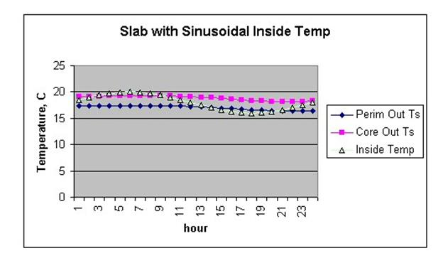

Figure 19. Daily Temperature Profiles (Slab)

The resulting heat fluxes are shown below.  They can be compared with the fluxes shown above for the constant inside temperature run. The changes resulting from a fairly large 4 C daily temperature variation are probably not significant.


<table class="table table-striped">
<tr>
<th>Month</th>
<th>Average</th>
<th>Perimeter</th>
<th>Core</th>
<th>Inside</th>
<th>Perimeter Heat Flux W/m<sup>2</sup></th>
<th>Average Heat Flux W/m<sup>2</sup></th>
</tr>
<tr>
<td>1</td>
<td>17.51</td>
<td>16.03</td>
<td>17.86</td>
<td>18</td>
<td>7.30</td>
<td>1.81</td>
</tr>
<tr>
<td>2</td>
<td>17.29</td>
<td>15.85</td>
<td>17.63</td>
<td>18</td>
<td>7.96</td>
<td>2.63</td>
</tr>
<tr>
<td>3</td>
<td>17.27</td>
<td>16</td>
<td>17.57</td>
<td>18</td>
<td>7.41</td>
<td>2.70</td>
</tr>
<tr>
<td>4</td>
<td>18.87</td>
<td>17.77</td>
<td>19.13</td>
<td>20</td>
<td>8.26</td>
<td>4.19</td>
</tr>
<tr>
<td>5</td>
<td>19.11</td>
<td>18.16</td>
<td>19.34</td>
<td>20</td>
<td>6.81</td>
<td>3.30</td>
</tr>
<tr>
<td>6</td>
<td>19.17</td>
<td>18.34</td>
<td>19.37</td>
<td>20</td>
<td>6.15</td>
<td>3.07</td>
</tr>
<tr>
<td>7</td>
<td>20.81</td>
<td>20.07</td>
<td>20.98</td>
<td>22</td>
<td>7.15</td>
<td>4.41</td>
</tr>
<tr>
<td>8</td>
<td>21.05</td>
<td>20.36</td>
<td>21.21</td>
<td>22</td>
<td>6.07</td>
<td>3.52</td>
</tr>
<tr>
<td>9</td>
<td>21.09</td>
<td>20.38</td>
<td>21.26</td>
<td>22</td>
<td>6.00</td>
<td>3.37</td>
</tr>
<tr>
<td>10</td>
<td>21.08</td>
<td>20.19</td>
<td>21.29</td>
<td>22</td>
<td>6.70</td>
<td>3.41</td>
</tr>
<tr>
<td>11</td>
<td>19.47</td>
<td>18.45</td>
<td>19.71</td>
<td>20</td>
<td>5.74</td>
<td>1.96</td>
</tr>
<tr>
<td>12</td>
<td>19.2</td>
<td>17.92</td>
<td>19.51</td>
<td>20</td>
<td>7.70</td>
<td>2.96</td>
</tr>
</table>


Slab configuration Drawing
--------------------------

The slab configuration used in the slab model is a "slab in grade" model. That is, the slab top surface is assumed level with the outside earth surface. If a "slab on grade" configuration, having the bottom surface of the slab level with the outside earth surface is desired, the best approximation is to use the horizontal insulation configuration. The edge of the slab will have a small thermal resistance due to the two dimensional path through the earth, but the effect is small. In any case, uninsulated slab edges are certainly not recommended in cold climates.


Figure 20. Slab-in-grade illustration

Running the Slab Program
------------------------

EP-Launch can be used to run the Slab program using two different methods.

If the Slab objects (see Description of the Objects in the E+SlabGHT.IDD) are located in the standard EnergyPlus IDF input file than the Single Input File and Group of Input File tabs of EP-Launch can be used and the Slab preprocessor will be called automatically during the simulation process. In this case the Slab objects should all appear with the object name starting with "**GroundHeatTransfer:Slab:**" This option also requires a **GroundHeatTransfer:Control** object in the EnergyPlus idf file (see Input Output Reference).

If the Slab objects are located in a separate file, they should be run using the Slab option on the Utilities tab in EP-Launch. See the EP-Launch section in this document for more information on how to use EP-Launch with the Slab program.

You can also run the slab program as a console application.  To execute it, we have provided the batch file:

RunSlab

Steps for running the program

1)   Open a DOS command prompt window (Start à Programs à Accessories à Command Prompt)

2)   Change to the directory where EnergyPlus is installed (modify the commands below if you did not install EnergyPlus in the default install path):

C:

CD \\&lt;rootfolder&gt;\&lt;/span>

3)   Change to the specific folder for the console application:

CD PreProcess\\GrndTempCalc

4)   Run the program (for example use the example included with the install):

RunSlab SlabExample USA\_IL\_Chicago-OHare\_TMY2

In the following section, some description of modifying the batch file and details on files that the slab program uses are given.

Technical Details on Files for Ground Heat Transfer with Slabs
--------------------------------------------------------------

The slab program used to calculate the results is included with the EnergyPlus distribution. It requires an input file named GHTin.idf in input data file format. The needed corresponding idd file is SlabGHT.idd. An EnergyPlus weather file for the location is also needed. A batch file, RunSlab, is placed in the same folder with the program and sample files. To use it (Command mode or DOS mode), one may modify several important lines:

```
:Instructions:
:  Complete the following path and program names.
:  path names must have a following \\ or errors will happen
 set program\_path=
 set program\_name=Slab.exe
 set input\_path=
 set output\_path=
 set weather\_path=C:\\EnergyPlus\\WeatherData\\
```

and then in command mode issue the run command:

```
RunSlab myinput Chicago
```

Where you would have myinput.idf in "input\_path" and Chicago would be the name of the .epw file in the "weather\_path".

You should set up the command mode so that it does not automatically close the window at the end of program termination if you want to see the commands as they run and know for sure that no errors occurred.

Slab Program Output Files
-------------------------

The following output files are created by the Slab program and saved in the output file path specified in the RunSlab.bat file:


\*\_slab.ger - Error file. Input errors are reported here.

\*\_slab.out - Summary of inputs, location data, and grid coordinates

\*\_slab.gtp - Monthly ground temperatures and EnergyPlus idf objects


### EnergyPlus idf Objects from Slab Program

If the objects are placed in the normal EnergyPlus input IDF file using the "GroundHeatTransfer:Slab:" prefix, then the values resulting from the Slab preprocessor will be automatically included in the simulation at run time. The surfaces can reference these values using Outside Boundary Conditions of:

* GroundSlabPreprocessorAverage

* GroundSlabPreprocessorCore

* GroundSlabPreprocessorPerimeter

The objects that support this include:

* BuildingSurface:Detailed

* Wall:Detailed

* RoofCeiling:Detailed

* Floor:Detailed

The slab program is capable of supplying the EnergyPlus idf objects needed to use the slab program outputs directly by copying the objects into the EnergyPlus idf file. The file containing these objects has the extension gtp, and an example is shown below. It contains the output temperatures and heat fluxes, and in addition it contains an OtherSideCoefficient object example as mentioned above, and three compact schedule objects that can be used to describe the average, core and perimeter temperatures directly in EnergyPlus. The Name in the compact schedule corresponds to the GroundTemperatureScheduleName in the OtherSideCoefficient object.

================================================

 CHECK CONVERGENCE MESSAGE AT END OF THIS FILE!

 ================================================

```
   Monthly Slab Outside Face Temperatures, C and Heat Fluxes(loss), W/(m^2)
 Perimeter Area: 304.00  Core Area: 1296.00
       Month   TAverage   TPerimeter    TCore      TInside AverageFlux PerimeterFlux CoreFlux
          1      17.74     16.41        18.05       18.00       0.88        5.39       -0.17
          2      17.49     16.15        17.81       18.00       1.73        6.29        0.66
          3      17.45     16.23        17.74       18.00       1.86        6.02        0.88
          4      18.96     17.86        19.22       20.00       3.51        7.24        2.64
          5      19.22     18.22        19.45       20.00       2.66        6.04        1.86
          6      19.28     18.38        19.49       20.00       2.44        5.48        1.73
          7      20.83     19.98        21.03       22.00       3.96        6.87        3.28
          8      21.12     20.39        21.29       22.00       2.98        5.47        2.40
          9      21.18     20.46        21.35       22.00       2.76        5.22        2.19
         10      21.17     20.23        21.39       22.00       2.82        6.02        2.08
         11      19.64     18.63        19.88       20.00       1.22        4.63        0.42
         12      19.36     18.14        19.65       20.00       2.16        6.30        1.19

! OTHER SIDE COEFFICIENT OBJECT EXAMPLE FOR IDF FILE
 SurfaceProperty:OtherSideCoefficients,
 ExampleOSC,                !- OtherSideCoeff Name \*\*\*CHANGE THIS!\*\*\*
 0,                         !- Combined convective/radiative film coefficient
 1,                         !- N2,User selected Constant Temperature {C}
 1,                         !- Coefficient modifying the user selected constant temperature
 0,                         !- Coefficient modifying the external dry bulb temperature
 0,                         !- Coefficient modifying the ground temperature
 0,                         !- Coefficient modifying the wind speed term (s/m)
 0,                         !- Coefficient modifying the zone air temperature
                            !  part of the equation
 GroundTempCompactSchedName; !- Name of Schedule for values of const
                            ! temperature. Schedule values replace N2.
                            !  \*\*\*REPLACE WITH CORRECT NAME\*\*\*


Schedule:Compact,
MonthlyAveSurfaceTemp, !Name
Temperature ,            !- ScheduleType
Through:   1/31,
For:AllDays,
Until:24:00,
 17.74    ,
Through:   2/28,
For:AllDays,
Until:24:00,
 17.49    ,
Through:   3/31,
For:AllDays,
Until:24:00,
 17.45    ,
Through:   4/30,
For:AllDays,
Until:24:00,
 18.96    ,
Through:   5/31,
For:AllDays,
Until:24:00,
 19.22    ,
Through:   6/30,
For:AllDays,
Until:24:00,
 19.28    ,
Through:   7/31,
For:AllDays,
Until:24:00,
 20.83    ,
Through:   8/31,
For:AllDays,
Until:24:00,
 21.12    ,
Through:   9/30,
For:AllDays,
Until:24:00,
 21.18    ,
Through:  10/31,
For:AllDays,
Until:24:00,
 21.17    ,
Through:  11/30,
For:AllDays,
Until:24:00,
 19.64    ,
Through:  12/31,
For:AllDays,
Until:24:00,
 19.36    ;

<reduced for brevity> - compact schedules for MonthlyPerimeterTemp and MonthlyCoreTemp are included.

  Convergence has been gained.
```

Description of the Objects in the E+SlabGHT.IDD
-----------------------------------------------

These objects also appear in the main Energy+.IDD file with the prefix "GroundHeatTransfer:Slab:"

### Materials or GroundHeatTransfer:Slab:Materials Object

The materials object gives an overall description of the ground heat transfer model.

#### Field: NMAT: Number of Materials

This field specifies the number of different materials that will be used in the model. Typically only a ground material and a slab material are used.

#### Field: Albedo: Surface Albedo: NoSnow

#### Field: Albedo: Surface Albedo: Snow

Two fields specify the albedo value of the surface: first for no snow coverage days; second for days with snow coverage. The albedo is the solar reflectivity of the surface, and can vary from 0.05 for blacktop to 0.95 for fresh snow. Typical values for North America reported by Bahnfleth range from 0.16 to 0.4.

#### Field EPSLW: Surface Emissivity: NoSnow

#### Field EPSLW: Surface Emissivity: Snow

This field specifies the long wavelength (thermal) emissivity of the ground surface. It is primarily important for nighttime radiation to the sky, and a value of 0.95 for both snow and no snow is reasonable.

#### Field: Z0 Surface Roughness: NoSnow

#### Field: Z0 Surface Roughness: Snow

These two fields specify a surface roughness that is used in the determination of the convection heat transfer coefficient between the ground surface and the air. This roughness is based on boundary layer considerations, and specifies the height at which an experimentally measured velocity profile goes to zero. The units are centimeters, not meters. Typical values are 0.75 cm for no snow, and 0.05 cm for snow.

#### Field: HIN: Indoor Hconv: Downward Flow

#### Field: HIN: Indoor Hconv: Upward Flow

These fields specify the combined convective and radiative heat transfer coefficient between the slab top inside surface and the room air for the cases where heat is flowing downward, and upward. The program toggles between the two if the direction of the heat flux changes. Typical values can be found in the ASHRAE Handbook of Fundamentals, but should be about 6 W/(m<sup>2</sup>-K) for downward heat flow and 9 W/(m<sup>2</sup>-K) for upward heat flow.

The Materials object in the IDD is shown below.

```idf
Materials,
 N1, \field NMAT: Number of materials
  \note typical 2
 N2, \field ALBEDO: Surface Albedo: No Snow
  \note typical value= 0-1
 N3, \field ALBEDO: Surface Albedo: Snow
  \note typical value= 0-1
 N4, \field EPSLW: Surface Emissivity: No Snow
  \note typical value= 0.9
 N5, \field EPSLW: Surface Emissivity: Snow
  \note typical value= 0.9
 N6, \field Z0: Surface Roughness: No Snow
  \note typical value= 0-10 cm
 N7, \field Z0: Surface Roughness: Snow
  \note typical value= 0-10
 N8, \field HIN: Indoor HConv: Downward Flow
  \note typical value= 4-10
  \units W/m2-K
 N9; \field HIN: Indoor HConv: Upward
  \note typical value= 4-10
  \units W/m2-K
```


### MatlProps or GroundHeatTransfer:Slab:MatlProps Object

This object contains the material properties that describe the materials used in the model. The fields are quite self explanatory and consist of the following:

#### Field: RHO: Slab Material Density

#### Field: RHO: Soil Density

These two fields specify the density of the slab material and the soil in SI units of kg/m<sup>3</sup>

#### Field: CP: Slab CP

#### Field: CP: Soil CP

These two fields specify the specific heat of the slab and soil in SI units of J/(kg-K).

#### Field: TCON: Slab K

#### Field: TCON: Soil K

These two fields specify the thermal conductivity of the slab and soil in W/(m<sup>2</sup>-K)

The IDD object is shown below:

```
MatlProps,
        N1, \field RHO: Slab Material density
            \note typical value= 2300.0
            \units kg/m3
        N2, \field RHO: Soil Density
            \note typical value= 1200.0
            \units kg/m3
        N3, \field CP: Slab CP
            \note typical value=650.0
            \units J/kg-K
        N4, \field CP: Soil CP
            \note typical value= 1200.0
            \units J/kg-K
        N5, \field TCON: Slab k
            \note typical value= .9
            \units W/m2-K
        N6; \field TCON: Soil k
            \note typical value= 1.0
            \units W/m2-K
```

### BoundConds or GroundHeatTransfer:Slab:BoundConds Object

This object supplies some of the boundary conditions used in the simulation.

#### Field: EVTR: Is surface evapotranspiration modeled

This field specifies whether or not to use the evapotransporation model. Evapotransportation comprises all of the processes at the ground surface the involve exchanges of latent heat. The inclusion of evapotransporation in the calculation has the greatest effect in warm dry climates, primarily on the ground surface temperature. This field can be used to turn the evapotransporation off and on to check sensitivity to it.

#### Field: FIXBC: is the lower boundary at a fixed temperature

This field permits using a fixed temperature at the lower surface of the model instead of a zero heat flux condition. This change normally has a very small effect on the results. If the flag is set to use a specified temperature, the program calculates an undisturbed temperature profile and used the value at the model depth. The model depth is set by the program using the domain size from the EquivAutoGrid object below.

#### Field: TDEEPin

The fixed lower level temperature as described in the FIXBC field.

#### Field: USPHflag: Is the ground surface h specified by the user?

This field flags the use of a user specified heat transfer coefficient on the ground surface. This condition is used primarily for testing. For normal runs (USPHflag is FALSE), the program calculates the heat transfer coefficient using the weather conditions.

#### Field: USERH: User specified ground surface heat transfer coeff

This field supplies the value of the heat transfer coefficient if USPHflag is TRUE. W/(m<sup>2</sup>-K)

The BoundConds object is shown below:

```
BoundConds,
        A1, \field EVTR: Is surface evapotranspiration modeled
            \type choice
            \key TRUE
            \key FALSE
        A2, \field FIXBC: is the lower boundary at a fixed temperature
            \type choice
            \key TRUE
            \key FALSE
            \note FALSE selects the zero flux lower boundary condition
        N1, \field TDEEPin,
            \note User input lower boundary temperature if FIXBC is TRUE
            \units C
            \note Blank for FIXBC FALSE or
            \note to use the calculated 1-D deep ground temperature.
        A3, \field USRHflag: Is the ground surface h specified by the user?
            \type choice
            \key TRUE
            \key FALSE
        N2; \field USERH: User specified ground surface heat transfer coeff
            \units W/(m2-K)
            \note Used only if USRHflag is TRUE
```

### BldgProps or GroundHeatTransfer:Slab:BldgProps Object

This object provides information about the building and its operating conditions.

#### Field: IYRS Number of years to iterate

This field specifies the number of years to iterate. This means that the simulation comes to an either an annual steady periodic condition by converging to a tolerance (see ConvTol field) or it runs for this number of years. A ten year maximum is usually sufficient. It is important to note that the ground heat transfer behavior will change during the first several years of operating a ground contact structure. It takes several years to change from the undisturbed profile to the disturbed profile under a building.

#### Field: Shape Slab shape

Use only the value 0 here. Only a rectangular shape is implemented.

#### Field: HBLDG: Building Height

This field supplies the building height. This is used to calculate the building shadowing on the ground. Height is in meters.

#### Field: TIN1 - TIN12 &lt;month&gt; Indoor Average temperature set point

The next twelve fields specify the average indoor building set point temperatures for each month of the year. These fields are useful for simulating a building that is not temperature controlled for some of the year. In such a case, the average indoor set point temperatures can be obtained by first running the model in EnergyPlus with an insulated floor boundary condition, and then using the resulting monthly average zone temperatures in these fields.

#### Field: TINAmp: Daily Indoor sine wave variation amplitude

This field permits imposing a daily sinusoidal variation in the indoor setpoint temperature to simulate the effect of a setback profile. The value specified will be the amplitude of the sine wave.

#### Field: ConvTol: Convergence Tolerance

This final field specifies the convergence tolerance used to control the iteration. When the temperature change of all nodes is less than the convergence value, iteration ceases.

The entire BldgProps Object is shown below.

```
BldgProps,
      N1, \field IYRS: Number of years to iterate
          \note typical value= 10
      N2, \field Shape: Slab shape
          \note only value= 0
      N3, \field HBLDG: Building height
          \note typical value= 0-20
          \units m
      N4, \field TIN1: January Indoor Average temperature set point
          \note typical value=22
          \units C
      N5, \field TIN2: February Indoor Average temperature set point
          \note typical value=22
          \units C
      N6, \field TIN3: March Indoor Average temperature set point
          \note typical value=22
          \units C
      N7, \field TIN4: April Indoor Average temperature set point
          \note typical value=22
          \units C
      N8, \field TIN5: May Indoor Average temperature set point
          \note typical value=22
          \units C
      N9, \field TIN6: June Indoor Average temperature set point
          \note typical value=22
          \units C
      N10, \field TIN7: July Indoor Average temperature set point
          \note typical value=22
          \units C
      N11, \field TIN8: August Indoor Average temperature set point
          \note typical value=22
          \units C
      N12, \field TIN9: September Indoor Average temperature set point
          \note typical value=22
          \units C
      N13, \field TIN10: October Indoor Average temperature set point
          \note typical value=22
          \units C
      N14, \field TIN11: NovemberIndoor Average temperature set point
          \note typical value=22
          \units C
      N15, \field TIN12: December Indoor Average temperature set point
          \note typical value=22
          \units C
      N16, \field TINAmp: Daily Indoor sine wave variation amplitude
           \note typical value: 0
           \units C
      N17; \field ConvTol: Convergence Tolerance
           \note typical value= 0.1
```

### Insulation or GroundHeatTransfer:Slab:Insulation  Object

This object supplies the information about insulation used around the slab. There are two possible configurations: under the slab or vertical insulation around the slab.

#### Field RINS: R value of under slab insulation

This field provides the thermal resistance value of the under slab insulation. It should be zero if the vertical insulation configuration is selected. Units are m<sup>2</sup> K/W.

#### Field DINS: Width of strip of under slab insulation

This specifies the width of the perimeter strip of insulation under the slab in meters. Again a zero value should be used for the vertical insulation configuration. Units are m.

#### Field RVINS: R value of vertical insulation

This field specifies the thermal resistance of the vertical insulation. It should be zero if the under slab insulation configuration is in effect. Units are m<sup>2</sup> K/W.

#### Field ZVINS: Depth of vertical insulation

This field specifies the depth of the vertical insulation into the ground in meters. Note that it starts at the slab upper surface and extends into the ground. Only .2 .4 .6 .8 1.0 1.5 2.0 2.5  or 3.0 m should be used. Units are m.

#### Field IVINS: Flag: Is there vertical insulation?

This final field specifies that vertical the vertical insulation configuration is being used. The value of 1 specifies yes and 0 specifies no.

The Insulation object is shown below.

```
Insulation,
        N1, \field RINS: R value of under slab insulation
            \note typical value= 0-2.0
            \units m2-K/W
        N2, \field DINS: Width of strip of under slab insulation
            \note typical value= 0-2.0
            \units m
        N3, \field RVINS: R value of vertical insulation
            \note typical value= 0-3.0
            \units m2-K/W
        N4, \field ZVINS: Depth of vertical insulation
            \note only use values= .2 .4 .6 .8 1.0 1.5 2.0 2.5 3.0
            \units m
        N5; \field IVINS: Flag: Is there vertical insulation
            \note values: 1=yes 0=no
```

### EquivalentSlab or GroundHeatTransfer:Slab:EquivalentSlab Object

This object provides the basic information for running a model that uses the area over perimeter ratio of the slab to determine the size of an equivalent rectangular slab.

#### Field APRatio: The area to perimeter ratio for this slab

This field specifies the area over perimeter ratio of the slab in meters.

#### Field SLABDEPTH: Thickness of slab on grade

This field specifies the thickness of the slab in meters. Note that the slab top surface is level with the ground surface, so this is the depth into the ground. The slab depth has a significant effect on the temperature calculation, and it is also important for the auto-grid process. The finite difference grids are set in such a way that they use the slab thickness to determine the vertical grid spacing. Because of this, autogridding will fail if the slab thickness is specified larger than 0.25 meters. The program also is set up so that the slab is a single finite difference cell in the vertical direction. Thus, if the slab thickness is set too large, the accuracy of the calculation may be suspect. The results with three different slab thicknesses are shown below.

All other inputs for the runs were the same. It is clear that the slab thickness has a significant effect because of the horizontal component of conduction in both directions in the slab.

#### Field CLEARANCE: Distance from edge of slab to domain edge

This field specifies the distance from the slab to the edge of the area that will be modeled with the grid system. It is the basic size dimension that is used to set the horizontal extent of the domain. The units are meters, and 15 meters is a reasonable value.

#### Field ZCLEARANCE: Distance from bottom of slab to domain bottom

This field specifies the vertical distance from the slab to the bottom edge of the area that will be modeled with the grid system. It is the basic size dimension that is used to set vertical extent of the domain. The units are meters, and 15 meters is a reasonable value.

The object is shown below.

```
EquivalentSlab,
\memo Using an equivalent slab allows non-rectangular shapes to be modeled accurately
        N1, \field APRatio: The area to perimeter ratio for this slab
            \units m
        N2, \field SLABDEPTH: Thickness of slab on grade
            \note typical value= 0.1
            \units m
        N3, \field CLEARANCE: Distance from edge of slab to domain edge
            \note typical value= 15.0
            \units m
        N4; \field ZCLEARANCE: Distance from bottom of slab to domain bottom
            \note typical value= 15.0
            \units m
```

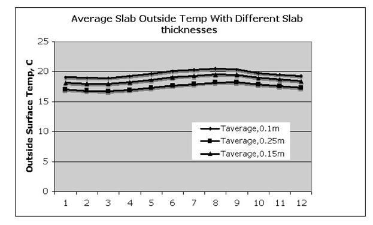

Figure 21. Graph of Slab Outside Temperature vs Slab Thickness

**The EquivSlab object and the EquivAutoGrid Objects that follow have been replaced by the EquivalentSlab object above.  They are included in the idd so that old idf files can still be read.**

### EquivSlab Object - Obsolete

This object provides the basic information for running a model that uses the area over perimeter ratio of the slab to determine the size of an equivalent rectangular slab.

#### Field APRatio: The area to perimeter ratio for this slab

This field specifies the area over perimeter ratio of the slab in meters.

#### Field: EquivSizing

This field value should be TRUE. This means that the program will determine the dimensions of the equivalent slab that satisfactorily models the A/P ratio.

The object is shown below.

```
EquivSlab,
\memo Using an equivalent slab allows non-rectangular shapes to be modeled accurately
\memo The simulation default should be EquivSizing=True
        N1, \field APRatio: The area to perimeter ratio for this slab
            \units m
        A1; \field EquivSizing:
            \note Flag: Will the dimensions of an equivalent slab
            \note be calculated (TRUE) or will the dimensions be input directly? (FALSE)
            \note It is recommended that EnergyPlus users use TRUE.
```

### EquivAutoGrid Object - Obsolete

This object provides the information needed by the program to automatically generate the calculation grid when the slab is described as an equivalent slab. It is necessary for EnergyPlus users because equivalent slab is the appropriate option.

#### Field SLABDEPTH: Thickness of slab on grade

This field specifies the thickness of the slab in meters. Note that the slab top surface is level with the ground surface, so this is the depth into the ground. The slab depth has a significant effect on the temperature calculation, and it is also important for the auto-grid process. The finite difference grids are set in such a way that they use the slab thickness to determine the vertical grid spacing. Because of this, autogridding will fail if the slab thickness is specified larger than 0.25 meters. The program also is set up so that the slab is a single finite difference cell in the vertical direction. Thus, if the slab thickness is set too large, the accuracy of the calculation may be suspect. The results with three different slab thicknesses are shown below.

All other inputs for the runs were the same. It is clear that the slab thickness has a significant effect because of the horizontal component of conduction in both directions in the slab.

#### Field CLEARANCE: Distance from edge of slab to domain edge

This field specifies the distance from the slab to the edge of the area that will be modeled with the grid system. It is the basic size dimension that is used to set both the horizontal and vertical extent of the domain. The units are meters, and 15 meters is a reasonable value.

The EquivAutoGrid object is shown below.

```
EquivAutoGrid, \memo  EquivAutoGrid only necessary when EquivSizing is true
               \memo  EnergyPlus users normally use this option.
        N1, \field SLABDEPTH: Thickness of slab on grade
            \note typical value= 0.1
            \units m
        N2; \field CLEARANCE: Distance from edge of slab to domain edge
            \note typical value= 15.0
            \units m
```

### Additional Objects

There are five additional objects in the IDD that can be used under very special situations by researchers who want to generate special calculation grids. They are normally not useful to EnergyPlus users. They will be shown as IDD sections only. They do not need to be in the IDF.

```
AutoGrid,   \memo AutoGrid only necessary when EquivSizing is false
            \memo  Not normally needed by EnergyPlus users.
        N1, \field SLABX: X dimension of the building slab
            \note typical values= 0-60.0
            \units m
        N2, \field SLABY: Y dimension of the building slab
            \note typical values= 0-60.0
            \units m
        N3, \field SLABDEPTH: Thickness of slab on grade
            \note typical value= .1
            \units m
        N4; \field CLEARANCE: Distance from edge of slab to domain edge
            \note typical value= 15.0
            \units m

ManualGrid, \memo Manual Grid only necessary using manual gridding (not recommended)
            \memo   Used only in special cases.
        N1, \field NX: Number of cells in the X direction
            \note typical values= 15
        N2, \field NY: Number of cells in the Y direction
            \note typical values= 15
        N3, \field NZ: Number of cells in the Z direction
            \note typical values= 15
        N4, \field IBOX: X direction cell indicator of slab edge
            \note typical values= 1-10
        N5; \field JBOX: Y direction cell indicator of slab edge
            \note typical values= 1-10

XFACE,  \memo This is only needed when using manual gridding (not recommended)
        \memo XFACE: X Direction cell face coordinates: m
  N1, N2, N3, N4, N5, N6, N7, N8, N9, N10, N11, N12, N13, N14,
  N15, N16, N17, N18, N19, N20, N21, N22, N23, N24, N25, N26, N27, N28, N29,
  N30, N31, N32, N33, N34, N35, N36, N37, N38, N39, N40;

YFACE,  \memo This is only needed when using manual gridding (not recommended)
        \memo YFACE: Y Direction cell face coordinates: m,
  N1, N2, N3, N4, N5, N6, N7, N8, N9, N10, N11, N12, N13, N14,
  N15, N16, N17, N18, N19, N20, N21, N22, N23, N24, N25, N26, N27, N28, N29,
  N30, N31, N32, N33, N34, N35, N36, N37, N38, N39, N40;

ZFACE,  \memo This is only needed when usuing manual gridding (not recommended)
        \memo ZFACE: Z Direction cell face coordinates: m
        N1, N2, N3, N4, N5, N6, N7, N8, N9, N10, N11, N12, N13, N14,
        N15, N16, N17, N18, N19, N20, N21, N22, N23, N24, N25;
```

### Sample IDF File - Slab Program

A sample IDF file is shown below.

```idf

!-Generator IDFEditor 1.12
!-NOTE: All comments with '!-' are ignored by the IDFEditor and are generated automatically.
!-      Use '!' comments if they need to be retained when using the IDFEditor.

!-   ===========  ALL OBJECTS IN CLASS: MATERIALS ===========

Materials,
 2,           !- NMAT: Number of materials
 0.158,       !- ALBEDO: Surface Albedo: No Snow
 0.379,       !- ALBEDO: Surface Albedo: Snow
 0.9,         !- EPSLW: Surface Emissivity: No Snow
 0.9,         !- EPSLW: Surface Emissivity: Snow
 0.75,        !- Z0: Surface Roughness: No Snow
 0.03,        !- Z0: Surface Roughness: Snow
 6.13,        !- HIN: Indoor HConv: Downward Flow {W/m2-K}
 9.26;        !- HIN: Indoor HConv: Upward {W/m2-K}

!-   ===========  ALL OBJECTS IN CLASS: MATLPROPS ===========

MatlProps,
 2300,        !- RHO: Slab Material density {kg/m3}
 1200,        !- RHO: Soil Density {kg/m3}
 653,         !- CP: Slab CP {J/kg-K}
 1200,        !- CP: Soil CP {J/kg-K}
 0.93,        !- TCON: Slab k {W/m-K}
 1;           !- TCON: Soil k {W/m-K}

!-   ===========  ALL OBJECTS IN CLASS: BOUNDCONDS ===========

BoundConds,
 TRUE,        !- EVTR: Is surface evapotranspiration modeled
 TRUE,        !- FIXBC: is the lower boundary at a fixed temperature
 FALSE;       !- OLDTG: is there an old ground temperature file

!-   ===========  ALL OBJECTS IN CLASS: BLDGPROPS ===========

BldgProps,
 10,          !- IYRS: Number of years to iterate
 0,           !- Shape: Slab shape
 4,           !- HBLDG: Building height {m}
 18,          !- TIN1: January Indoor Average temperature set point {C}
 18,          !- TIN2: February Indoor Average temperature set point {C}
 18,          !- TIN3: March Indoor Average temperature set point {C}
 20,          !- TIN4: April Indoor Average temperature set point {C}
 20,          !- TIN5: May Indoor Average temperature set point {C}
 20,          !- TIN6: June Indoor Average temperature set point {C}
 22,          !- TIN7: July Indoor Average temperature set point {C}
 22,          !- TIN8: August Indoor Average temperature set point {C}
 22,          !- TIN9: September Indoor Average temperature set point {C}
 22,          !- TIN10: October Indoor Average temperature set point {C}
 20,          !- TIN11: NovemberIndoor Average temperature set point {C}
 20,          !- TIN12: December Indoor Average temperature set point {C}
 0,           !- TINAmp: Daily sine wave variation amplitude {C}
 0.10;        !- ConvTol: Convergence Tolerance

!-   ===========  ALL OBJECTS IN CLASS: INSULATION ===========

Insulation,
 0.,          !- RINS: R value of under slab insulation {m2-K/W}
 0.,          !- DINS: Width of strip of under slab insulation {m}
 2.0,         !- RVINS: R value of vertical insulation {m2-K/W}
 2.0,         !- ZVINS: Depth of vertical insulation {m}
 1;           !- IVINS: Flag: Is there vertical insulation

!-   ===========  ALL OBJECTS IN CLASS: EQUIVSLAB ===========

EquivalentSlab,
 10,          !- APRatio: The area to perimeter ratio for this slab {m}
 0.1,         !- SLABDEPTH: Thickness of slab on grade {m}
 15,          !- CLEARANCE: Distance from edge of slab to domain edge {m}
 10;          !-ZCLEARANCE: Distance from bottom of slab to domain bottom
```


Using Ground Temperatures with Basements
----------------------------------------

The basement routine is used to calculate the face (surface) temperatures on the outside of the basement wall or the floor slab. This is the plane between the outside insulation and the basement wall. The insulation thermal resistance can range from zero (no insulation) to any reasonable value. The units are K/(W/m<sup>2</sup>). The program will simulate two conditions: full insulation from grade to the footing or half insulation that extends halfway down from grade to footing. The temperature on this plane is used with the OtherSideCoefficients object in EnergyPlus to supply the outside face temperature of the walls or slab.


Figure 22. Basement Configuration


The output from the program is a csv file, named MonthlyResults.csv, as shown below.


Figure 23. Output from Basement program

Column B gives the basement zone temperature. This can vary month by month as will be explained later. Column C is the monthly average wall outside face temperature, as shown in the diagram above. Column D is the corresponding average monthly average inside wall face temperature. Columns E and F contain the same information for the basement floor slab. Columns G-J contain the same information for the upper half and the lower half of the basement walls.

Columns K through N contain the monthly average heat flux for the floor, the walls, the upper half of the walls and the lower half of the walls. The flux is reported in units of W/m<sup>2</sup>.

The program also produces an output file named EPObjects.TXT. This file contains the necessary idf objects to make it easy to include the wall outside surface temperatures in an EnergyPlus input file. Idf objects for all of the temperatures in the output file shown above are included. These objects are explained in detail in the section Using the Interface Surface Temperature Results in EnergyPlus.

Running the Basement Program
----------------------------

EP-Launch can be used to run the Basement program.

If the Basement Objects (see The Basement idd below) are located in the standard EnergyPlus IDF input file than the Single Input File and Group of Input File tabs of EP-Launch can be used and the Basement preprocessor will be called automatically during the simulation process. In this case the Basement objects should all appear with the object name starting with "**GroundHeatTransfer:Basement:**" This option also requires a **GroundHeatTransfer:Control** object in the EnergyPlus idf file (see Input Output Reference).

If the Basement objects are located in a separate file, they should be run using the Basement option on the Utilities tab in EP-Launch. See the EP-Launch section in this document for more information on how to use EP-Launch with the Basement program.

You can also run the Basement program as a console application. To execute it, we have provided the batch file:

RunBasement

Steps for running the program

1)   Open a DOS command prompt window (Start -&gt; Programs -&gt; Accessories -&gt; Command Prompt)

2)   Change to the directory where EnergyPlus is installed (modify the commands below if you did not install EnergyPlus in the default install path):

C:

CD \\&lt;rootfolder&gt;\&lt;/span>

3)   Change to the specific folder for the console application:

CD PreProcess\\GrndTempCalc

4)   Run the program (for example use the example included with the install):

RunBasement BasementExample USA\_IL\_Chicago-OHare\_TMY2

In the following section, some description of modifying the batch file and details on files that the basement program uses are given.

Technical Details on Files for Ground Heat Transfer with Basements
------------------------------------------------------------------

The basement program used to calculate the results is included with the EnergyPlus distribution. It requires an input file named BasementGHTin.idf in input data file format. The needed corresponding idd file is BasementGHT.idd. An EnergyPlus weather file for the location is also needed. A batch file, RunBasement, is placed in the same folder with the program and sample files. To use it (Command mode or DOS mode), one may modify several important lines:

```
:Instructions:
:  Complete the following path and program names.
:  path names must have a following \\ or errors will happen
 set program\_path=
 set program\_name=Basement.exe
 set input\_path=
 set output\_path=
 set weather\_path=C:\\EnergyPlus\\WeatherData\\
```

and then in command mode issue the run command:

```
RunBasement myinput Chicago
```

Where you would have myinput.idf in "input\_path" and Chicago would be the name of the .epw file in the "weather\_path".

You should set up the command mode so that it does not automatically close the window at the end of program termination if you want to see the commands as they run and know for sure that no errors occurred.

Basement Program Output Files
-----------------------------

The following output files are created by the Basement program and saved in the output file path specified in the RunBasement.bat file:


\*.audit - Audit file. Input errors are reported here as well as other information about the progress of the program..

\*.out - Summary of inputs, location data, and grid coordinates

\*.csv - Monthly temperatures and fluxes for each surface.

\*.idf - the EPObjects.txt file - ready to be included in an EnergyPlus input file (idf)

The Basement idd
----------------

The basement idd objects and fields are shown below. These objects also appear in the main Energy+.IDD file with the prefix "GroundHeatTransfer:Basement:"

```
! Basement foundation heat transfer module Input Data Dictionary file
! Created:    August 18, 2000
! Written by: Edward Clements
! Modified for EnergyPlus Auxiliary Application by C. O. Pedersen 10/04
! Description format: FORTRAN var.: description, units, typ. values

SimParameters,
      N1,\field F: Multiplier for the ADI solution:
         \note 0<F<1.0,
         \note typically 0.1 (0.5 for high k soil]
      N2; \field IYRS: Maximum number of yearly iterations:
         \note typically 15-30]

MatlProps,
     N1, \field NMAT: Number of materials in this domain
         \maximum 6
     N2, \field Density for Foundation Wall
         \note typical value 2243
         \units kg/m3
     N3, \field density for Floor Slab
         \note typical value 2243
         \units kg/m3
     N4, \field density for Ceiling
         \note typical value 311
         \units kg/m3
     N5, \field density for Soil
         \note typical value 1500
         \units kg/m3
     N6, \field density for Gravel
         \note typical value 2000
         \units kg/m3
     N7, \field density for Wood
         \note typical value 449
         \units kg/m3
     N8,  \field Specific heat for foundation wall
          \note typical value 880
          \units J/kg-K
     N9,  \field Specific heat for floor slab
          \note typical value 880
          \units J/kg-K
     N10, \field Specific heat for ceiling
          \note typical value 1530
          \units J/kg-K
     N11, \field Specific heat for soil
          \note typical value 840
          \units J/kg-K
     N12, \field Specific heat for gravel
          \note typical value 720
          \units J/kg-K
     N13, \field Specific heat for wood
          \note typical value 1530
          \units J/kg-K
     N14, \field Thermal conductivity for foundation wall
          \note typical value 1.4
          \units W/m-K
     N15, \field Thermal conductivity for floor slab
          \note typical value 1.4
          \units W/m-K
     N16, \field Thermal conductivity for ceiling
          \note typical value 0.09
          \units W/m-K
     N17,  \field thermal conductivity for soil
          \note typical value 1.1
          \units W/m-K
     N18, \field thermal conductivity for gravel
          \note typical value 1.9
          \units W/m-K
     N19; \field thermal conductivity for wood
          \note typical value 0.12
          \units W/m-K


Insulation,
     N1, \field REXT: R Value of any exterior insulation, K/(W/m2)]
         \units m2-K/W
     A1; \field INSFULL: Flag: Is the wall fully insulated?
         \note  True for full insulation
         \note  False for insulation half way down side wall from grade line

SurfaceProps,
     N1, \field ALBEDO: Surface albedo for No snow conditions
         \note typical value 0.16
     N2, \field ALBEDO: Surface albedo for snow conditions
         \note typical value 0.40
     N3, \field EPSLN: Surface emissivity No Snow
         \note typical value 0.94
     N4, \field EPSLN: Surface emissivity  with Snow
         \note typical value 0.86
     N5, \field VEGHT: Surface roughness No snow conditions,cm
         \note typical value 6.0
         \units cm
     N6, \field VEGHT: Surface roughness Snow conditions, cm, ]
         \note typical value 0.25
         \units cm
     A1; \field PET: Flag, Potential evapotranspiration on? T/F]
         \note  Typically, PET is True

BldgData,
     N1, \field DWALL: Wall thickness,
         \note typical value .2]
         \units m
     N2, \field DSLAB: Floor slab thickness,
         \units m
         \maximum 0.25
     N3, \field DGRAVXY: Width of gravel pit beside basement wall
         \units  m
     N4, \field DGRAVZN: Gravel depth extending above the floor slab
         \units m
     N5; \field DGRAVZP: Gravel depth below the floor slab,
         \units m
         \note typical value 0.1

Interior,
   A1, \field COND: Flag: Is the basement conditioned?
       \note TRUE or FALSE
       \note for EnergyPlus this should be TRUE
   N1, \field HIN: Downward convection only heat transfer coefficient
       \units W/m2-K
   N2, \field HIN: Upward convection only heat transfer coefficient
       \units W/m2-K
   N3, \field HIN: Horizontal convection only heat transfer coefficient
       \units W/m2-K
   N4, \field HIN: Downward combined (convection and radiation) heat transfer coefficient
       \units W/m2-K
   N5, \field HIN: Upward combined (convection and radiation) heat transfer coefficient
       \units W/m2-K
   N6; \field HIN: Horizontal combined (convection and radiation) heat transfer coefficient
       \units W/m2-K

ComBldg,
\memo ComBldg contains the monthly average temperatures (C) and possibility of daily variation amplitude
   N1,  \field January average temperature
        \units C
   N2,  \field February average temperature
        \units C
   N3,  \field March average temperature
        \units C
   N4,  \field April average temperature
        \units C
   N5,  \field May average temperature
        \units C
   N6,  \field June average temperature
        \units C
   N7,  \field July average temperature
        \units C
   N8,  \field August average temperature
        \units C
   N9,  \field September average temperature
        \units C
   N10, \field October average temperature
        \units C
   N11, \field November average temperature
        \units C
   N12, \field December average temperature
        \units C
   N13; \field Daily variation sine wave amplitude
        \units C
        \note (Normally zero, just for checking)

EquivSlab,  !  Supplies the EquivSizing Flag
    ! Using an equivalent slab allows non-rectangular shapes to be
    !    modeled accurately.
    ! The simulation default should be EquivSizing=True
   N1, \field APRatio: The area to perimeter ratio for this slab
       \ units m
   A1; \field EquivSizing: Flag
         \note Will the dimensions of an equivalent slab be calculated (TRUE)
         \note or will the dimensions be input directly? (FALSE)]
         \note Only advanced special simulations should use FALSE.

EquivAutoGrid,
     \memo EquivAutoGrid necessary when EquivSizing=TRUE, TRUE is is the normal case.
       N1, \field CLEARANCE: Distance from outside of wall to edge of 3-D ground domain
         \units m
         \note typical value 15m
       N2, \field SlabDepth: Thickness of the floor slab
         \units m
         \note typical value 0.1m
       N3; \field BaseDepth: Depth of the basement wall below grade
         \units m

!
! ******** The following input objects are required only for special cases.
!

AutoGrid,   ! NOTE: AutoGrid only necessary when EquivSizing is false
! If the modelled building is not a rectangle or square, Equivalent
! sizing MUST be used to get accurate results
       N1, \field CLEARANCE: Distance from outside of wall to edge, 15m]
       N2, \field SLABX: X dimension of the building slab, 0-60.0 m]
       N3, \field SLABY: Y dimension of the building slab, 0-60.0 m]
       N4, \field ConcAGHeight: Height of the fndn wall above grade, m]
       N5, \field SlabDepth: Thickness of the floor slab, m, 0.1]
       N6; \field BaseDepth: Depth of the basement wall below grade, m]

ManualGrid, ! NOTE: Manual Grid only necessary using manual gridding
!  (not recommended)
       N1, \field NX: Number of cells in the X direction: 20]
       N2, \field NY: Number of cells in the Y direction: 20]
       N3, \field NZAG: Number of cells in the Z direction
!              above grade: 4 Always]
       N4, \field NZBG: Number of cells in Z dir. below grade: 10-35]
       N5, \field IBASE: X direction cell indicator of slab edge: 5-20]
       N6, \field JBASE: Y direction cell indicator of slab edge: 5-20]
       N7; \field KBASE: Z direction cell indicator
!              of the top of the floor slab: 5-20]

XFACE,       ! NOTE: This is only needed when using manual gridding
!  (not recommended)
!       [XFACE: X Direction cell face coordinates: m]
       N1, N2, N3, N4, N5, N6, N7, N8, N9, N10, N11, N12, N13, N14,
       N15, N16, N17, N18, N19, N20, N21, N22, N23, N24, N25, N26,
       N27, N28, N29, N30, N31, N32, N33, N34, N35, N36, N37, N38,
       N39, N40, N41, N42, N43, N44;

YFACE,  !NOTE: This is only needed when using manual gridding
!  (not recommended)
!       [YFACE: Y Direction cell face coordinates: m],
       N1, N2, N3, N4, N5, N6, N7, N8, N9, N10, N11, N12, N13, N14,
       N15, N16, N17, N18, N19, N20, N21, N22, N23, N24, N25, N26,
       N27, N28, N29, N30, N31, N32, N33, N34, N35, N36, N37, N38,
       N39, N40, N41, N42, N43, N44;

ZFACE,  !NOTE: This is only needed when using manual gridding
!  (not recommended)
!       [ZFACE: Z Direction cell face coordinates: m]
       N1, N2, N3, N4, N5, N6, N7, N8, N9, N10, N11, N12, N13, N14,
       N15, N16, N17, N18, N19, N20, N21, N22, N23, N24, N25, N26,
       N27, N28, N29, N30, N31, N32, N33, N34, N35, N36, N37, N38,
      N39, N40;
```

Description of the Objects in the BasementGHT.idd
-------------------------------------------------

These objects also appear in the main Energy+.IDD file with the prefix "GroundHeatTransfer:Basement:"

### SimParameters or GroundHeatTransfer:Basement:SimParameters Object

#### Field:  F: Multiplier for the ADI solution:

This field specifies an alternating direction iteration scheme multiplier. It should normally be set to 0.1. It can be increased if the soil conductivity is high.

#### Field: IYRS: Maximum number of yearly iterations:

This specifies the maximum number of years the simulation will be allowed to run. If convergence is reached, the simulation will not run this long. It can be used to stop simulation before quasi steady convergence state is reached.

### MatlProps or GroundHeatTransfer:Basement:MatlProps Object

#### Field: NMAT: Number of materials in this domain

This field specifies the number of materials whose properties are going to be specified. The order of the materials is not adjustable so six materials need to be specified. For the EnergyPlus basement application, only the foundation wall, floor slab, soil, and gravel are used.

#### Field: Density for Foundation Wall

This field is the density (kg/m3) of the foundation wall. Typical value is 2243.

#### Field: Density for Floor Slab

This field is the density (kg/m3) of the floor slab. Typical value is 2243.

#### Field: Density for Ceiling

This field is the density (kg/m3) of the ceiling. Typical value is 311.

#### Field: Density for Soil

This field is the density (kg/m3) of soil. Typical value is 1500.

#### Field: Density for Gravel

This field is the density (kg/m3) of gravel. Typical value is 2000.

#### Field: Density for Wood

This field is the density (kg/m3) of wood. Typical value is 449.

#### Field: Specific Heat for Foundation Wall

This field is the specific heat (J/kg-K) of the foundation wall. Typical value is 880.

#### Field: Specific Heat for Floor Slab

This field is the specific heat (J/kg-K) of the floor slab. Typical value is 880.

#### Field: Specific Heat for Ceiling

This field is the specific heat (J/kg-K) of the ceiling. Typical value is 1530.

#### Field: Specific Heat for Soil

This field is the specific heat (J/kg-K) of soil. Typical value is 840.

#### Field: Specific Heat for Gravel

This field is the specific heat (J/kg-K) of gravel. Typical value is 720.

#### Field: Specific Heat for Wood

This field is the specific heat (J/kg-K) of wood. Typical value is 1530.

#### Field: Thermal Conductivity for Foundation Wall

This field is the thermal conductivity (W/m-K) of the foundation wall. Typical value is 1.4.

#### Field: Thermal Conductivity for Floor Slab

This field is the thermal conductivity (W/m-K) of the floor slab. Typical value is 1.4.

#### Field: Thermal Conductivity for Ceiling

This field is the thermal conductivity (W/m-K) of the ceiling. Typical value is 0.09.

#### Field: Thermal Conductivity for Soil

This field is the thermal conductivity (W/m-K) of soil. Typical value is 1.1.

#### Field: Thermal Conductivity for Gravel

This field is the thermal conductivity (W/m-K) of gravel. Typical value is 1.9.

#### Field: Thermal Conductivity for Wood

This field is the thermal conductivity (W/m-K) of wood. Typical value is 0.12.

### Insulation or GroundHeatTransfer:Basement:Insulation Object

This object describes the insulation.

#### Field: REXT: R Value of any exterior insulation

This field is the R value (m2-K/W) of any exterior insulation.

#### Field: INSFULL: Flag: Is the wall fully insulated?

This field uses "true" for fully insulated walls and "false" for insulation half way down the side wall from the grade line.

### SurfaceProps or GroundHeatTransfer:Basement:SurfaceProps Object

The first six fields in this object specify the parameters used in the surface heat transfer boundary condition determination. They are specified for no snow and snow covered conditions.

#### Field: ALBEDO: Surface albedo for No snow conditions

This field specifies the surface solar albedo for no snow conditions. Solar albedo is more commonly available than the solar absorptivity. The total solar energy absorbed by a horizontal surface is (1-albedo)\*(Total solar). Typical value for this field is 0.16.

#### Field: ALBEDO: Surface albedo for snow conditions

This field specifies the surface solar albedo for snow covered conditions. Solar albedo is more commonly available than the solar absorptivity. The total solar energy absorbed by a horizontal surface is (1-albedo)\*(Total solar). Typical value for this field is 0.40.

#### Field: EPSLN: Surface emissivity No Snow

This field specifies the long wavelength or thermal radiation emissivity for the ground surface under no snow conditions. Typical value is 0.94.

#### Field: EPSLN: Surface emissivity with Snow

This field specifies the long wavelength or thermal radiation emissivity for the ground surface under snow covered conditions. Typical value is 0.86.

#### Field: VEGHT: Surface roughness No snow conditions

This field specifies the surface roughness or vegetation height (cm) that is used in determining the convective heat transfer coefficient on the surface under no snow conditions. Typical value is 6.0.

#### Field: VEGHT: Surface roughness snow conditions

This field specifies the surface roughness or vegetation height (cm) that is used in determining the convective heat transfer coefficient on the surface under snow covered conditions. Typical value is 0.25.

#### Field: PET: Flag, Potential evapotranspiration on?

This field is a flag that invokes the evapotranspiration calculation at the surface. This covers all forms of latent heat transfer from the surface. It normally should be included. The user enters "true" for "yes" and "false" for no.

### BldgData or GroundHeatTransfer:Basement:BldgData Object

This object specifies the major configuration parameters for the basement. The 3-D grid used in the simulation has the capability of including a gravel "fill" around the basement. Thus several dimensions must be specified. All units are in meters.

#### Field: DWALL: Wall thickness

This field specifies the basement wall thickness (m). Typical value is 0.2.

#### Field: DSLAB: Floor Slab thickness

This field specifies the thickness of the floor slab (m). Typical value is 0.25.

#### Field: DGRAVXY: Width of gravel pit beside basement wall

This field specifies the width of the gravel "fill" bed beside the basement wall (m).

#### Field: DGRAVZN: Gravel depth extending above the floor slab

This field specifies the depth of the gravel fill above the floor slab (m).

#### Field: DGRAVZP: Gravel depth below the floor slab

This field specifies the depth of the gravel fill below the floor slab (m).

### Interior or GroundHeatTransfer:Basement:Interior Object

This object provides the information needed to simulate the boundary conditions inside the basement.

#### Field: COND: Flag: Is the basement conditioned?

This flag indicates that the basement temperature is controlled. For EnergyPlus runs, this should be TRUE.

#### Field: HIN: Downward convection only heat transfer coefficient

This field specifies the convection only heat transfer coefficient for floors (downward heat flux - W/m2-K).

#### Field: HIN: Upward convection only heat transfer coefficient

This field specifies the convection only heat transfer coefficient for floors (upward heat flux - W/m2-K).

#### Field: HIN: Horizontal convection only heat transfer coefficient

This field specifies the convection only heat transfer coefficient for walls (horizontal heat flux - W/m2-K).

#### Field: HIN: Downward combined (convection and radiation) heat transfer coefficient

This field specifies the combined thermal radiation and convection heat transfer coefficient for floors (downward heat flux - W/m2-K).

#### Field: HIN: Upward combined (convection and radiation) heat transfer coefficient

This field specifies the combined thermal radiation and convection heat transfer coefficient for floors (upward heat flux - W/m2-K).

#### Field: HIN: Horizontal combined (convection and radiation) heat transfer coefficient

This field specifies the combined thermal radiation and convection heat transfer coefficient for walls (horizontal heat flux - W/m2-K).

### ComBldg or GroundHeatTransfer:Basement:ComBldg Object

This object specifies the 12 monthly average basement temperatures (air temperature). The last field allows a daily sine wave variation to be placed on the inside temperature. During testing, it was found that entering values for the daily sine wave amplitude had very little effect on the results.

#### Field: January average temperature

This field is the average air temperature (C) for the basement for January.

#### Field: February average temperature

This field is the average air temperature (C) for the basement for February.

#### Field: March average temperature

This field is the average air temperature (C) for the basement for March.

#### Field: April average temperature

This field is the average air temperature (C) for the basement for April.

#### Field: May average temperature

This field is the average air temperature (C) for the basement for May.

#### Field: June average temperature

This field is the average air temperature (C) for the basement for June.

#### Field: July average temperature

This field is the average air temperature (C) for the basement for July.

#### Field: August average temperature

This field is the average air temperature (C) for the basement for August.

#### Field: September average temperature

This field is the average air temperature (C) for the basement for September.

#### Field: October average temperature

This field is the average air temperature (C) for the basement for October.

#### Field: November average temperature

This field is the average air temperature (C) for the basement for November.

#### Field: December average temperature

This field is the average air temperature (C) for the basement for December.

#### Field: Daily variation sine wave amplitude

This field is the amplitude (variation) for a daily sine wave variation to be placed on the inside temperature. This has been shown to have little effect on results so zero can be used safely.

### EquivSlab or GroundHeatTransfer:Basement:EquivSlab Object

This object provides the information needed to do the simulation as an equivalent square geometry by utilizing the area to perimeter ratio. This procedure was shown to be accurate by Cogil (1998).

#### Field: APRatio: The area to perimeter ratio for this slab

This field specifies the Area to Perimeter (A/P) ratio for the slab.

#### Field: EquivSizing: Flag

This field should always be TRUE unless the user wants to specifically look at the differences between the long wall and the short wall on a rectangular configuration.

### EquivAutoGrid or GroundHeatTransfer:Basement:EquivAutoGrid Object

This is a necessary object when the EquivSizing Flag in the EquivSlab object is TRUE. This object provides the information needed to set up the three dimensional conduction grid surrounding the basement.

#### Field: CLEARANCE: Distance from outside of wall to edge of 3-D ground domain

This field specifies the distance to the outside of the field from the basement wall. It has been determined that 15 meters is quite satisfactory.

#### Field: SlabDepth: Thickness of the floor slab

This field specifies the thickness of the slab in meters. Note that the slab top surface is level with the ground surface, so this is the depth into the ground. The slab depth has a significant effect on the temperature calculation, and it is also important for the auto-grid process. The finite difference grids are set in such a way that they use the slab thickness to determine the vertical grid spacing. Because of this, autogridding will fail if the slab thickness is specified larger than 0.25 meters. The program also is set up so that the slab is a single finite difference cell in the vertical direction. Thus, if the slab thickness is set too large, the accuracy of the calculation may be suspect. Typical value is 0.1.

#### Field: BaseDepth: Depth of the basement wall below grade

This field specifies the depth of the basement wall below grade level (m). This is the height of the wall above the footing.

Field N2 specifies the height of the basement wall above the grade level. This should be zero for EnergyPlus runs since if an above grade segment is to be simulated, it should be done with EnergyPlus not with the basement program.

Field N3 specifies the floor slab thickness.

Field N4 specifies the depth of the basement wall below grade level.  This is the height of the wall above the footing.

### Sample idf File - Basement

```idf
! Minneapolis Test Cases
SimParameters,
 0.1,     ! [F: Multiplier for the ADI solution: 0&lt;F&lt;1.0,
 !         typically 0.1 (0.5 for high k
 1;       ! [IYRS: Maximum number of iterations: typically 25-30

MatlProps,
 6, ! [NMAT: Number of materials in this domain, UP TO 6]
 2242.6, 2242.6, 311.66, 1500.0, 2000.0, 448.5,! [RHO(1-6): Matl density
 !(Fndn wall, Floor Slab, Ceiling,Soil, Gravel, Wood), kg/m3, ]
 880.0, 880.0, 1513.0, 840.0, 720.0, 1630.0,!       [CP(1-6): Specific Heat: J/kg-K,
 1.402, 1.402, 0.093, 0.5, 1.9, 0.119;  !       [TCON(1-6): Conductivity: W/m-K

Insulation,
 5.0, ! [REXT: R Value of any exterior insulation, K/(W/m2)]
 TRUE; ! [INSFULL: Flag: Is the wall fully insulated? TRUE/FALSE]

SurfaceProps,
 .16, .40, ! [ALBEDO: Surface albedo array, .16 .40]
 .94, .86, ! [EPSLN: Surface emissivity No Snow/ Snow .94 .86]
 6.0, 0.25, ! [VEGHT: Surface roughness NS/S, cm, 6.0, 0.25]
 TRUE;! [PET: Flag, Potential evapotranspiration on? T/F]
 !                Typically, PET is True

BldgData,
 .2, ! [DWALL: Wall thickness, m, .2]
 .1, ! [DSLAB: Floor slab thickness, m, 0.1]
 .3, ! [DGRAVXY: Width of gravel pit beside footing, m, 0.3]
 .2, ! [DGRAVZN: Gravel depth above the floor slab, m, 0.2]
 .1;! [DGRAVZP: Gravel depth below the floor slab, m, 0.1]

Interior,
 TRUE, ! [COND: Flag: Is the basement conditioned? TRUE/FALSE]
 ! [HIN: Indoor convective heat transfer coefficients, W/m2-K
 !       Convection Only: 1)Q Downward 2)Q Upward 3)Q Horizontal
 !       Conv and Radiation: 4)Q Downward 5)Q Upward 6)Q Horizontal]
 0.92, !Q Downward Convection Only
 4.04,!Q Upward Convection Only
 3.08,!Q HorizontalConvection Only
 6.13, !Q Downward Conv and Radiation
 9.26, !Q Upward Conv and Radiation
 8.29;!Q Horizontal Conv and Radiation

EquivSlab,
 15.0, ! [APRatio: The area to perimeter ratio for this slab: m]
 TRUE;! [EquivSizing: Flag: Will the dimensions of an equivalent
 !             slab be calculated (TRUE) or will the dimensions be
 !              input directly? (FALSE)]
 !             Only advanced special simulations should use FALSE.

EquivAutoGrid,   ! NOTE: EquivAutoGrid necessary when EquivSizing=TRUE
 !                This is the normal case.
 ! If the modelled building is not a rectangle or square, Equivalent
 ! sizing MUST be used to get accurate results
 15, ! [CLEARANCE: Distance from outside of wall to edge, 15m]
 .1,  ! [SlabDepth: Thickness of the floor slab, m, 0.1]
 2.4; ! [BaseDepth: Depth of the basement wall below grade, m]

ComBldg, !  Commercial building
 20.,  !  Jan Ave basement temp
 20.,  !  Feb Ave basement temp
 20.,  !  Mar Ave basement temp
 20.,  !  Apr Ave basement temp
 20.,  !  May Ave basement temp
 20.,  !  Jun Ave basement temp
 20.,  !  Jul Ave basement temp
 20.,  !  Aug Ave basement temp
 20.,  !  Sep Ave basement temp
 20.,  !  Oct Ave basement temp
 20.,  !  Nov Ave basement temp
 20.,  !  Dec Ave basement temp
 0.0;  !  Daily variation Sine Wave amplitude
```

### Additional Objects

There are five additional objects in the IDD that can be used under very special situations by researchers who want to generate special calculation grids. They are normally not useful to EnergyPlus users. They will be shown as IDD sections only. They do not need to be in the IDF.

```
AutoGrid,
\memo AutoGrid only necessary when EquivSizing is false
\memo If the modelled building is not a rectangle or square, Equivalent
\memo sizing MUST be used to get accurate results
       N1, \field CLEARANCE: Distance from outside of wall to edge, 15m]
       N2, \field SLABX: X dimension of the building slab, 0-60.0 m]
       N3, \field SLABY: Y dimension of the building slab, 0-60.0 m]
       N4, \field ConcAGHeight: Height of the fndn wall above grade, m]
       N5, \field SlabDepth: Thickness of the floor slab, m, 0.1]
       N6; \field BaseDepth: Depth of the basement wall below grade, m]

ManualGrid,
\memo Manual Grid only necessary using manual gridding (not recommended)
       N1, \field NX: Number of cells in the X direction: 20]
       N2, \field NY: Number of cells in the Y direction: 20]
       N3, \field NZAG: Number of cells in the Z direction. above grade: 4 Always]
       N4, \field NZBG: Number of cells in Z direction. below grade: 10-35]
       N5, \field IBASE: X direction cell indicator of slab edge: 5-20]
       N6, \field JBASE: Y direction cell indicator of slab edge: 5-20]
       N7; \field KBASE: Z direction cell indicator of the top of the floor slab: 5-20]

XFACE,
\memo This is only needed when using manual gridding (not recommended)
\memo XFACE: X Direction cell face coordinates: m
       N1, N2, N3, N4, N5, N6, N7, N8, N9, N10, N11, N12, N13, N14,
       N15, N16, N17, N18, N19, N20, N21, N22, N23, N24, N25, N26,
       N27, N28, N29, N30, N31, N32, N33, N34, N35, N36, N37, N38,
       N39, N40, N41, N42, N43, N44;

YFACE,
\memo This is only needed when using manual gridding (not recommended)
\memo YFACE: Y Direction cell face coordinates: m
       N1, N2, N3, N4, N5, N6, N7, N8, N9, N10, N11, N12, N13, N14,
       N15, N16, N17, N18, N19, N20, N21, N22, N23, N24, N25, N26,
       N27, N28, N29, N30, N31, N32, N33, N34, N35, N36, N37, N38,
       N39, N40, N41, N42, N43, N44;

ZFACE,
\memo This is only needed when using manual gridding (not recommended)
\memo ZFACE: Z Direction cell face coordinates: m
       N1, N2, N3, N4, N5, N6, N7, N8, N9, N10, N11, N12, N13, N14,
       N15, N16, N17, N18, N19, N20, N21, N22, N23, N24, N25, N26,
       N27, N28, N29, N30, N31, N32, N33, N34, N35, N36, N37, N38,
       N39, N40;
```

Using the Interface Surface Temperature Results in EnergyPlus
-------------------------------------------------------------

If the objects are placed in the normal EnergyPlus input IDF file using the "GroundHeatTransfer:Basement:" prefix, then the values resulting from the Basement preprocessor will be automatically included in the simulation at run time. The surfaces can reference these values using Outside Boundary Conditions of:

* GroundBasementPreprocessorAverageWall

* GroundBasementPreprocessorAverageFloor

* GroundBasementPreprocessorUpperWall

* GroundBasementPreprocessorLowerWall

The objects that support this include:

* BuildingSurface:Detailed

* Wall:Detailed

* RoofCeiling:Detailed

* Floor:Detailed

The monthly results from the basement program are used with the SurfaceProperty:OtherSideCoefficients object in EnergyPlus. The idd corresponding to that object is shown below. The two applicable fields are N2 and A2. N2 should have the value 1.0. It will be modified by a schedule that is named in A2, and that temperature will be used on the outside of the surface specified as having the OtherSideCoeffcients named in A1.

```idf
SurfaceProperty:OtherSideCoefficients,
  \memo This object sets the other side conditions for a surface in a variety of ways.
  \min-fields 8
 A1, \field Name
  \required-field
  \reference OSCNames
  \reference OutFaceEnvNames
 N1, \field Combined Convective/Radiative Film Coefficient
  \required-field
  \type real
  \note if>0, this field becomes the exterior convective/radiative film coefficient
  \note and the other fields are used to calculate the outdoor air temperature
  \note then exterior surface temperature based on outdoor air and specified coefficient
  \note if<=0, then remaining fields calculate the outside surface temperature
  \note following fields are used in the equation:
  \note SurfTemp=N7*TempZone + N4*OutdoorDry-bulb + N2*N3 + GroundTemp*N5 + WindSpeed*N6*OutdoorDry-bulb
 N2, \field Constant Temperature
  \units C
  \type real
  \default 0
  \note This parameter will be overwritten by the values from the Constant Temperature Schedule Name (below) if one is present
 N3, \field Constant Temperature Coefficient
  \note This coefficient is used even with a Schedule.  It should normally be 1.0 in that case
  \default 1
 N4, \field External Dry-Bulb Temperature Coefficient
  \type real
  \default 0
 N5, \field Ground Temperature Coefficient
  \type real
  \default 0
 N6, \field Wind Speed Coefficient
  \type real
  \default 0
 N7, \field Zone Air Temperature Coefficient
  \type real
  \default 0
 A2; \field Constant Temperature Schedule Name
  \note Name of schedule for values of constant temperature.
  \note Schedule values replace any value specified in the field Constant Temperature.
  \type object-list
  \object-list ScheduleNames
```


A sample idf for this object is shown below.

```idf
SurfaceProperty:OtherSideCoefficients, OSCCoef:Zn005:Wall003, !- OSC Name
 !  Example input for second ground temperature
 0.0000000E+00,    !- OSC SurfFilmCoef
 0.000000    ,    !- OSC Temp
 1.000000    ,    !- OSC Temp Coef
 0.000000    ,    !- OSC dry-bulb
 0.000000    ,    !- OSC GrndTemp
 0.000000    ,    !- OSC WindSpdCoeff
 0.000000    ,    !- OSC ZoneAirTemp
 GroundTempSched;  !  Name of schedule defining additional ground temperature.
```


The OSC object can be repeated for as many outside temperatures as needed. A more detailed explanation of how to use this object is contained in the next section, and an example object is output by the program in the file EPObjects.txt.

### Multiple Ground Temperatures

These three objects show how the OtherSideCoefficients object can be used to provide extra ground temperatures for surfaces exposed to different ground temperatures.

Here is the surface description. Note that the OutsideFaceEnvironment is specified as OtherSideCoeff.

```idf
BuildingSurface:Detailed,
    OSCTest:South Wall,      !- User Supplied Surface Name
    Wall,                    !- Surface Type
    Exterior,                !- Construction Name of the Surface
    OSCTest,                 !- Zone
    OtherSideCoefficients,   !- Outside Boundary Condition
    ExampleOSC,              !- Outside Boundary Condition Object
    NoSun  ,                 !- Sun Exposure
    NoWind  ,                !- Wind Exposure
    0.5,                     !- View Factor to Ground
    4,                       !- Number of Vertices
    0,0,0,                   !- Vertex 1 X,Y,Z-coordinates {m}
    6.096,0,0,               !- Vertex 2 X,Y,Z-coordinates {m}
    6.096,0,4.572,           !- Vertex 3 X,Y,Z-coordinates {m}
    0,0,4.572;               !- Vertex 4 X,Y,Z-coordinates {m}
```

The OtherSideCoefficients object has to supply the basic form of the environment. Note that the name corresponds to thee name in the Surface object. This object also supplies the name of a schedule that will provide the monthly ground temperature values.

```idf
SurfaceProperty:OtherSideCoefficients,
  ExampleOSC,              !- OtherSideCoeff Name
  0,                       !- Combined convective/radiative film coefficient
  1,                       !- User selected Constant Temperature {C}
  1,                       !- Coefficient modifying the user selected constant temperature
  0,                       !- Coefficient modifying the external dry bulb temperature
  0,                       !- Coefficient modifying the ground temperature
  0,                       !- Coefficient modifying the wind speed term (s/m)
  0,                       !- Coefficient modifying the zone air temperature part of the equation
  GroundTempCompactSched;  !- Schedule Name for values of "const" temperature. Schedule values replace N2.
```

The schedule named in the last field of the OtherSideCoefficients object must be supplied. In compact schedule format it would appear as shown below. Again, objects for each of the surface temperatures are produced by the program and output in the file EPObjects.txt.

```idf
Schedule:Compact,
    GroundTempCompactSched,  !- Name
    Temperature ,            !- ScheduleType
    Through: 1/31,           !- Complex Field \#1
    For:AllDays,             !- Complex Field \#2
    Until: 24:00,            !- Complex Field \#3
    16,                      !- Complex Field \#4
    Through: 2/28,           !- Complex Field \#5
    For:AllDays,             !- Complex Field \#6
    Until: 24:00,            !- Complex Field \#7
    17,                      !- Complex Field \#8
    Through: 3/31,           !- Complex Field \#9
    For:AllDays,             !- Complex Field \#10
    Until: 24:00,            !- Complex Field \#11
    18,                      !- Complex Field \#12
    Through: 4/30,           !- Complex Field \#13
    For:AllDays,             !- Complex Field \#14
    Until: 24:00,            !- Complex Field \#15
    19,                      !- Complex Field \#16
    Through: 5/31,           !- Complex Field \#17
    For:AllDays,             !- Complex Field \#18
    Until: 24:00,            !- Complex Field \#19
    20,                      !- Complex Field \#20
    Through: 6/30,           !- Complex Field \#21
    For:AllDays,             !- Complex Field \#22
    Until: 24:00,            !- Complex Field \#23
    20,                      !- Complex Field \#24
    Through: 7/31,           !- Complex Field \#25
    For:AllDays,             !- Complex Field \#26
    Until: 24:00,            !- Complex Field \#27
    20,                      !- Complex Field \#28
    Through: 8/31,           !- Complex Field \#29
    For:AllDays,             !- Complex Field \#30
    Until: 24:00,            !- Complex Field \#31
    19,                      !- Complex Field \#32
    Through: 9/30,           !- Complex Field \#33
    For:AllDays,             !- Complex Field \#34
    Until: 24:00,            !- Complex Field \#35
    18,                      !- Complex Field \#36
    Through: 10/31,          !- Complex Field \#37
    For:AllDays,             !- Complex Field \#38
    Until: 24:00,            !- Complex Field \#39
    17,                      !- Complex Field \#40
    Through: 11/30,          !- Complex Field \#41
    For:AllDays,             !- Complex Field \#42
    Until: 24:00,            !- Complex Field \#43
    16,                      !- Complex Field \#44
    Through: 12/31,          !- Complex Field \#45
    For:AllDays,             !- Complex Field \#46
    Until: 24:00,            !- Complex Field \#47
    16;                      !- Complex Field \#48
```

References
----------

Bahnfleth, W.P. 1989. *Three Dimensional Modeling of Heat Transfer from Slab Floors*, Ph.D. dissertation, also published as USACERL TM E-89/11, University of Illinois.

Bahnfleth, W.P. and C.O. Pedersen. 1990. A Three Dimensional Numerical Study of Slab-on-Grade Heat Transfer. *ASHRAE Transactions* Pt. 2, 96:61-72.

Clements, Edward. 2004. *Three Dimensional Foundation Heat Transfer Modules for Whole-Building Energy Analysis*, MS Thesis, Pennsylvania State University.

Cogil, Cynthia A. 1998. Modeling of Basement Heat Transfer and Parametric Study of Basement Insulation for Low Energy Housing. MS Thesis of Architectural Engineering, Pennsylvania State University.

View Factor Calculation Program
===============================

EnergyPlus has the capability of accepting user defined view factors for special research situations. This option is not recommended for general use because the normal approximate view factor determination within EnergyPlus accounts for such practical things as thermal mass (furniture), and realistic exchange limits. However, when a user desires to supply view factors, this auxiliary program can be used to calculate them for a variety of configurations. The program is named View3D, and was developed at NIST (1). This document will describe how to use the program.

Associated Files
----------------

Three files come with the auxiliary view factor package. They are:

- View3D.exe

- ViewFactorInterface.xls

- View3D32.doc

The first is the executable program that calculates the view factors. The second is an excel interface that will set up the input files and execute View3D.exe. The third file is the documentation file from NIST that contains some explanation of the program.

Using the View Factor Interface program
---------------------------------------

The interface program has two main sheets. One, named ZoneSheet, uses surface areas, tilts and facing directions to develop the input for View3D. The other one, named VerticesZoneSheet, uses the surface vertices to develop the input for View3D. The sheets are shown in Figure 24 and Figure 25.


Figure 24. View Factor Interface ZoneSheet


Figure 25. View Factor Interface VerticesZoneSheet

Either sheet can be used to generate an input file for the View3D program. An example of that file is shown below.

```
T Test case from Excel interface
C encl=  1  list=  2  eps=  0.0001  maxu=  8  maxo=  8  mino=  0  emit=  0
F  3
V  1  50  0  0
V  2  0  0  0
V  3  0  0  8
V  4  50  0  8
S  1  1  2  3  4   0  0   .999  SouthWall
! =========================
V  5  50  60  0
V  6  50.00025  0  0
V  7  50.00026  0  8
V  8  50.00001  60  8
S  2  5  6  7  8   0  0   .999  EastWall
! =========================
V  9  0  60  0
V  10  50  60.00014  0
V  11  50  60.00015  8
V  12  0  60.00001  8
S  3  9  10  11  12   0  0   .999  NorthWall
! =========================
V  13  0  0  0
V  14  0  60  0
V  15  0  60  8
V  16  0  0  8
S  4  13  14  15  16   0  0   .999  WestWall
! =========================
V  17  0  0  0
V  18  50  1.377901E-04  0
V  19  49.99984  60.00014  0
V  20 -1.653482E-04  60  0
S  5  17  18  19  20   0  0   .999  Floor
! =========================
V  21  0  60  8
V  22  50  60.00014  8
V  23  50.00016  1.373291E-04  8.000166
V  24  1.653482E-04  0  8.000166
S  6  21  22  23  24   0  0   .999  Roof
! =========================
End Of Data
```

Notice the title from row 6 on the interface appears at the top of the input file, and the control line information in rows 7 and 8 appear below the title line in a line with the character C at the left end. The explanation of the control parameters from the program document states:


(C c)  The control line includes the following parameters (in order): name = value

eps = 1.0e-4

integration convergence criterion for both adaptive integration and view obstruction. This is not an exact measure of the accuracy of the computed view factors, but smaller values will usually lead to more precise values. The convergence criteria should not be less than about 1.0e-6 because many of the intermediate calculations are accurate only to single (32-bit) precision.

maxU = 8

maximum recursions used in computing the unobstructed view factors.

maxO = 8

maximum recursions used in computing the obstructed view factors. Limiting the maximum number of recursions limits the total execution time of the program but may prevent reaching the specified convergence.

minO = 0

minimum recursions: used in computing the obstructed view factors. This can help in cases where an obstruction occurs very near the view between the edges of two surfaces. The normal adaptive integration may miss the obstruction. Increasing this value from its normal value of 0 to 1 or 2 may catch the obstruction. This is probably not necessary except when very accurate view factors are desired. It can add considerably to execution time.

row = 0

selected row for computing view factors (0 = all rows)

col = 0

selected column for computing view factors (0 = all columns)

encl = 0

1 indicates that the surfaces form an enclosure; 0 indicates that they do not. This data is used to adjust the view factors of an enclosure to guarantee conservation of energy.

emit = 0

1 indicates that diffuse reflectance effects will be included in the computed view factors; 0 indicates they will not, i.e., surfaces will be considered 'black'.

out = 0

view factor output file format - 1 = …gence criterion for the numerical integration used to compute view factors between surfaces that have view obstructing surfaces between them.

list = 0

computational summary written to the VIEW3D.LOG file; 0 gives minimal information; 1 gives slightly more; 2 prints all the view factors; 3 causes dumping of some intermediate values.


The values of the parameters shown on the interface sheets are reasonable defaults, and they should need to be adjusted only rarely.

In the upper right corner of either sheet is a button that causes two files to be generated and View3D to be executed. The two files generated are the input file that uses the name from cell D13 with the extension vs3, and a file with the same name and an extension dxf. VoloView can be used with this file to generate a wire frame drawing of the zone being analyzed.

Two paths are needed for executing the program. The directory path where the vs3 and dxf files will be placed is specified in cell D11. This directory can be selected using the Browse button in cell B11. The path to the View3D.exe program is specified by cell D15. This directory can be selected with the Browse button in cell B15.

If you are using the ZoneSheet, the zone surfaces are described in the region from row 17 to row 27. Each column supplies the details for one surface. Additional surface columns can be added by copying and pasting a desired starting column to the right of column H. If either the surface height or base surface length is zero, the gross area cell will be zero and column is ignored. The facing direction of the surface is the direction an inward normal to the surface would point. So, the south wall of a zone faces north or 0 degrees. Note that this is different from EnergyPlus where the facing direction of a surface is based on the outward normal. The facing direction becomes just slightly more difficult with horizontal surfaces like floors and ceilings. The key to determining their facing direction is to visualize them being rotated slightly into the zone around their base surface axis. In the example, both ceiling and floor are chosen to face south. The tilt of a surface is relative to a horizontal upward facing (in the conventional sense) surface such as a floor. A ceiling or flat roof it tilted 180 degrees. Vertical surfaces have a tilt of 90 degrees.

The remaining information needed to describe the surfaces is the coordinates of the lower left hand corner of the surface when viewed from inside the zone. This is where the visualization of a slight rotation of the floor and roof becomes helpful. Consider the roof surface on the sheet. Its base side lies along the east west axis since it faces south. With a slight inward rotation, it is clear that the lower left hand corner is the northwest corner of the roof. This corner has coordinates of 0, 60, and 8.

If the VerticesZoneSheet is being used, the description of the surfaces consists only of the vertices. For this program, the vertices are specified in a counter clockwise rotation order if looking at the surface from the inside, and in a clockwise rotation order if looking from the outside.

The vs3 file produced is shown previously and the dxf file generates the wire frame drawing shown in Figure 26.


Figure 26. DXF Format of Example Zone

The input file and the output files produced by View3D are read into the interface spreadsheet, and appear on new worksheets.

Figure 27 shows the lower corner of the interface sheet with the additional sheet tabs.


Figure 27. Files brought into the Interface Workbook

The results file is named with the name in cell D13 with an extension of out. This file is shown below.

```
View3D 3.2 0 1 0 6
400 480 400 480 3000 3000
0.000000 0.078244 0.029324 0.078217 0.407109 0.407106
0.065204 0.000000 0.065204 0.044282 0.412652 0.412659
0.029324 0.078245 0.000000 0.078217 0.407110 0.407105
0.065181 0.044282 0.065181 0.000000 0.412679 0.412677
0.054281 0.066024 0.054281 0.066029 0.000000 0.759385
0.054281 0.066025 0.054281 0.066028 0.759385 0.000000
0.999 0.999 0.999 0.999 0.999 0.999
```

Excel macro capabilities are used by the interface to convert the text to columns and add the surface names and other headings. The modified results are placed on the Results worksheet as shown in Figure 28.


Figure 28. View Factors with Surface Names Inserted

The results file information is used to generate a UserViewFactor object for EnergyPlus. This object is located in the first column of a new worksheet named UserVFObject. This column can simply be copied and inserted into the EnergyPlus idf file.

If the results sheet does not appear, or the program terminates, the sheet named View3Dlog or the output file by the same name should be consulted. It contains a complete history of the execution. Any problem with the input file or the calculations should show up there.

The extra sheets generated by the VBA macros will be deleted if the program is called with the run button while they are present. The user will be queried to make sure the sheets should be deleted.   During the succeeding run, new sheets will be created.

Additional Information
----------------------

The interface and this document do not describe all of the features of the View3D program. Additional information can be found in the NIST document View3D32.pdf that accompanies the distribution. For example, if an obstruction wall is desired, it can be placed using the interface, but then the "C" at the left end of the row describing that surface in the input file should be changed to "O". The program can then be rerun with the new input file. If View3D.exe is double clicked, it will ask for the names of the input file and the output file.

An additional point should be emphasized. The program will not calculate view factors for walls containing windows. That is all surfaces must be convex. Therefore,  a wall containing a subsurface must be described as four sections surrounding the subsurface. They can be combined using the "comb" column as described in the View3D document. However, this in not necessary if the user is willing to work with a few additional surfaces.


Using Older Version Input Files - Transition
============================================

The transition program(s) are console programs that assist users in converting input files from prior release versions to the current (or interim). Sometimes many changes are made to the input file syntax; sometimes very few but the Transition program(s) can do the fastest job of making the conversions. An ObjectStatus spreadsheet is also included for those who want the details of each object's change.

IDF Version Updater
-------------------

The transition programs have been written as console applications similar to EnergyPlus. However, that may not be the easiest for users who want to transition several versions or several files at one time. Thus the IDF Version Updater GUI application was created.

The IDF Version Updater lives in the folder with the multiple transition programs -- see **Error! Reference source not found.**. Note that this application is also available from the EP-Launch Utilities tab (utility: IDFVersionUpdater). If you need to convert files from older than V6.0, the transition program set will need to be downloaded before use.  Once "IDF Version Updater" is selected from the Utilities pulldown list, click on the "Run IDF Version Updater" box and the single window shown below appears:


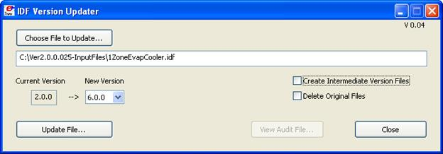

Figure 29.  Transition GUI screen

Using the program is quite simple. As the window indicates, you press "Choose File to Update" to select a file or list of files (see IDF Version Converter / Transition File Lists) to convert. If doing multiple transitions using a transition file list you also press the "Choose File to Update, a browse window will appear at the bottom of which is a pulldown list for the "Files of Type".  Select the "Text File With List of EnergyPlus Files (\*.lst)" (see the section IDF Version Converter / Transition File Lists for format of this .lst file) option.  Once a file is found, its version is checked and appears as the "Current Version". By default, the latest "New Version" will be selected by the program - you can override this by choosing a different file version as the end version. The "Update File" button will then be able to be selected and the conversion will be done. The audit from the multiple transitions will be able to be viewed once the process is complete. If you are doing multiple transitions (e.g., from V2.2 to V6), you can select the check box "Create Intermediate Files" and after each transition, a file for the resultant version will be created and labeled &lt;filename&gt;)\_Vx.idf (where x is an abbreviated version number).

The converted file becomes the new &lt;file&gt;.idf and the original file is saved in the original folder as &lt;file&gt;\_original.idf. To delete the original file instead of saving it, check the "Delete Original Files" checkbox.

Table 27. IDF Version Updater Output Files and Descriptions.

<table class="table table-striped">
<tr>
<th>Transition Output File Name</th>
<th>Description</th>
</tr>
<tr>
<td>&lt;filename&gt;_Transition.audit</td>
<td>This is the contents of what you would see on the screen if you sat and watched the transition process during a console run. If you convert multiple versions, all the messages are shown in this file.</td>
</tr>
<tr>
<td>&lt;filename&gt;.idf</td>
<td>Converted results to the latest version or version selected.</td>
</tr>
<tr>
<td>&lt;filename&gt;_Vxxx.idf</td>
<td>If you don't select "create intermediate versions", this will only be the original version. Otherwise will have each version.</td>
</tr>
</table>

Transition Console Program Details
----------------------------------

For those who are interested, this is the detailed description of the Transition console applications including the current one. There are methods to use the program set from the command line; those details are not included in this document but available from EnergyPlus Support group.

TransitionV6-0-0-to-V7-0-0.exe is the current transition program that is distributed with the V7.0 release. It uses several important files that are included in the main "EnergyPlus" folder.

Table 28. Transition files for current release

<table class="table table-striped">
<tr>
<th>File Name</th>
<th>Description</th>
</tr>
<tr>
<td>TransitionV6-0-0-to-V7-0-0.exe</td>
<td>The executable program</td>
</tr>
<tr>
<td>V6-0-0-Energy+.idd</td>
<td>Version 6.0.0.037 release Energy+.idd file</td>
</tr>
<tr>
<td>V7-0-0-Energy+.idd</td>
<td>Identical to Energy+.idd when distributed</td>
</tr>
<tr>
<td>Report Variables 6-0-0-023 to 7-0-0.csv</td>
<td>Report variable name changes</td>
</tr>
</table>

 Another file "Rules6-0-0-to-7-0-0.xls" is not used directly by the program but contains the "rules" for translating objects from version 6.0 release to the 7.0 release. The ObjectStatus file can also be viewed - it will show if deleted objects are automatically transitioned to the new input file versions.

There are several methods to executing the transition program - these methods give you the most flexibility in changing files from one version to the next. The easiest transition is through the EP-Launch program which can detect if the input file about to be run is of the same version as the IDD or not and suggest transitioning. You can also manually transition from the file menu in EP-Launch. (To have this feature, you must also have the files from the preceding table in the same folder as EP-Launch - which is usually the folder that also has the EnergyPlus.exe program).

There are two command line methods to execute the transition version (from the Command Prompt). One is to simply use the file name you want transitioned (including .rvi or .mvi file names) or you can use a file name with a .lst extension and simply enter file names to be done in a text file. When you execute the transition program in this fashion, you will get the "typical" program defaults of a "full" transition, field names will be shown at each field with units, and any blank fields will be left blank rather than filled in with the current defaults.

IDF Version Converter / Transition File Lists
---------------------------------------------

Both the console program and the IDF-Version Updater (see) can use a text file of file names to perform the transitions. The file is a very simple list of file names:

```
FileName1
FileName2
```

But you must include the path name in the file if it is not in the same folder as the transition set of programs:

```
C:\Myfiles\abc.idf
C:\My Working Files\abcdef.idf
D:\OtherFiles\xxxxxyyyyy.idf
Etc
```

Note that the files need not be in the same folder. And, if you use the IDF Version Updater app, they need not all be the same version! If you use the straight batch files form the CMD line, all files in this list must be the same starting version and you will need to select that version when you run the batch file. List files have the implicit transition options seen in the following section.

Converting imf files
--------------------

The transition/conversion programs can "automatically" transition imf (ep-macro) files. One note of caution: if your macro file contains \#if statements in the form:

```idf
PEOPLE,
    ZONE ONE,                !- Zone Name
**\#\#if \#[DoSizing[] EQSU Y]**
    \#[FAREA[] / OCCDENPEAK[]],        !- Number of People
  **\#\#else**
    \#[FAREA[] / OCCDENAVG[]],         !- Number of People
**\#\#endif   **
    OCCSCHED[],       !- Number of People SCHEDULE Name (real--fraction)
    0.5000000,        !- Fraction Radiant
    Activity Sch;     !- Activity level SCHEDULE Name (units W/person, real)
```

They should look like this:

```idf
**\#\#if \#[DoSizing[] EQSU Y]**
PEOPLE,
    ZONE ONE,                !- Zone Name
    \#[FAREA[] / OCCDENPEAK[]],       !- Number of People
    OCCSCHED[],       !-   Number of People SCHEDULE Name (real--fraction)
    0.5000000,        !- Fraction Radiant
    Activity Sch;     !- Activity level SCHEDULE Name (units W/person, real)
  **\#\#else**
PEOPLE,
    ZONE ONE,                !- Zone Name
    \#[FAREA[] / OCCDENAVG[]],        !- Number of People
    OCCSCHED[],       !- Number of People SCHEDULE Name (real--fraction)
    0.5000000,        !- Fraction Radiant
    Activity Sch;     !- Activity level SCHEDULE Name (units W/person, real)
**\#\#endif   **
```

EPDrawGUI
=========

The EPDrawGUI program is a simple utility that can be used to generate a dxf file from an input file without running EnergyPlus. It is a simple cross platform application is stored in the Preprocess subfolder of the EnergyPlus folder upon installation. A companion DLL (EPlusDrw.dll) is also needed in the same folder. And its library folders are required in a subfolder (EPDrawGUI Libs).


Figure 30. EPDrawGUI Main Screen

Help is offered on the Main Tab and on the Options Tab when you place the mouse, without clicking, over the buttons, check boxes, and option boxes. In addition, the program copyright information is displayed when the mouse is over the Version number text in the lower left corner.

Main Tab
--------

The Main Tab, shown in Figure 30, contains the "Create DXF from IDF" button which is the button to use to create a DXF file from an IDF file, the main function of the EPDrawGUI program. This is the primary button that you will need to use. When pressed, you select an IDF file that you want to use as the basis for a drawing.  If the "Show DXF File After Created" check box is check, when the "Create DXF from IDF" button is pressed, the drawing will be viewed immediately after the DXF file is created. Normally, the viewer for DXF files is automatically found but if the program cannot find a drawing viewer program, you can select one manually on the Options Tab.


Figure 31. EPDrawGUI Options Tab

Option Tab
----------

The Option Tab, shown in Figure 31, contains an additional option to control some complex drawings as well as ways to select the DXF file viewer and view DXF files.

The "View DXF File" button is used to select a previously created DXF file and view it with the DXF file viewer. The DXF viewer is usually found automatically but if this function does not work, you may want to select the DXF file viewer manually using the Select DXF Viewer button.

The "Select DXF Viewer" button allows you to manually select the program used to display DXF files. Normally, it is not necessary to use this function since the DXF file viewer program is automatically detected but if the wrong file viewer is automatically detected or no file viewer is detected, this button can be used to select the viewer program.

For IDF files that contain surfaces with more than four sides, the options under "Polygons with 5+ Sides" can affect the way the drawing is shown. Polygons with &gt;4 sides do not display with the DXF 3DFACE command used for surfaces of 3 and 4 sides which subsequently will display very nicely as a "solid" in many DXF viewers.

Thus there are four options which the user may choose to display &gt;4 sided polygons.

- Attempt Triangulation

This option attempts simple triangulation for the polygon (&gt;4 sides) surfaces.  This triangulation will show in the wireframe views but will appear as a solid face in 3D views. This triangulation is only for drawing purposes and does not affect the simulations in any way. The triangle algorithm is not perfect and warnings do result when the software cannot triangulate a surface. If unable to triangulate simply, a warning error is generated to the .EPDerr file.

- Thick Polyline

With this option, the &gt;4 sided polygon appears as a thicker line in all views of the building model. This option creates a 'thick' line at the border of the polygon (&gt;4 sides) surfaces. It will look like a hole in the drawing with a thicker edge. This thick border shows in wireframe as well as 3D views and can be confusing, due to overlap with other surfaces.

- Regular Polyline

With this option, the &gt;4 sided polygon appears as a wire frame line in all views of the building model. This option creates a 'regular' polyline for all polygon (&gt;4 sides) surfaces. It will look like a hole in the drawing.  Also, it will look the same in both wireframe and 3D views.

- Wireframe

This option creates a wireframe drawing (all lines) for all surfaces.  All surfaces will appear as lines in both wireframe and 3D views.

Note that the EPDrawGUI program only processes building and shading surfaces. It does not process daylighting reference points though the similar option in the EnergyPlus program (Report, Surfaces, DXF;) does show the daylighting reference points (but not illuminance map points) in the DXF view.

Input Macros
============

Introduction
------------

The Input Macros feature increases the flexibility of the EnergyPlus input files. This feature is intended for advanced users who are already familiar with EnergyPlus IDF files and need to prepare input manually. The basic capabilities are:

- Incorporating external files containing pieces of IDF into the main EnergyPlus input stream.

- Selectively accepting or skipping portions of the input.

- Defining a block of input with parameters and later referencing this block.

- Performing arithmetic and logical operations on the input.

- Input macro debugging and listing control.

These capabilities are invoked in the EP-MACRO program by using macro commands. Macro commands are preceded by \#\# to distinguish them from regular EnergyPlus input commands. After execution by the EP-MACRO processor, macro commands produce regular lines of EnergyPlus input that are shown in the resultant IDF file (**out.idf**) and, subsequently, in the EnergyPlus echo print (**audit.out**). Following are descriptions of the macro commands associated with the above capabilities. A detailed example of input macros is given at the end of this section; you should review it before reading the macro command descriptions.

Running the EP-Macro program
----------------------------

The EP-Macro program is run automatically from the batch files (RunEPlus or EPL-Run from EP-Launch). Skip this small section if you are using either the RunEPlus batch file or EP-Launch. If you wish to run it by hand, it is found in the main folder of the EnergyPlus install (bin folder in the Linux install). Note that in EP-Launch and other script files for use with EP-Macro the convention is to name the file &lt;filename&gt;.imf (input macro file). If you name it &lt;filename&gt;.idf (input data file), the scripts will most likely think it is a "normal" EnergyPlus input file and ignore using EP-Macro on it - giving you a less than desireable result.

Table 29. Files used in EP-Macro program

<table class="table table-striped">
<tr>
<th>File Name</th>
<th>Description</th>
</tr>
<tr>
<td>in.imf</td>
<td>Input file containing the macro commands</td>
</tr>
<tr>
<td>audit.out</td>
<td>audit of the EPMacro run</td>
</tr>
<tr>
<td>out.idf</td>
<td>Output file that can be run with EnergyPlus</td>
</tr>
</table>

The EP-Macro program is a Console Application, so to run by hand you would need to open a command prompt in the Main EnergyPlus install folder. Then, you would need to copy your input file containing the macro commands from its folder to this folder with the name "in.imf". The installed name of the EP-Macro program is "epmacro.exe". After execution, you can save the out.idf in an appropriate folder or rename it to in.idf in order to execute EnergyPlus. You can view the audit.out file for any errors that might have occurred during EP-Macro processing.


Incorporating External Files
----------------------------

**\#\#include** {includefilename}

This command puts all of the lines in an external file into the EnergyPlus input stream starting right after the command line. The name of the file that is included is the concatenation of {prefixpathname}, entered using  **\#\#fileprefix** , and {includefilename}. The lines in the external file will be listed in the resultant IDF file. When all the lines in the external file have been read in, input reverts back to the original input file at the line following the  **\#\#include**  command.

**\#\#fileprefix**  {prefixpathname}

specifies a pathname that will be prefixed to the filename given in an  **\#\#include** command. The **\#\#fileprefix**  command allows commonly-used include files to be kept in a directory other than the directory in which the current input file resides.

Example: on a PC, the combination

**\#\#fileprefix**  C:\\EnergyPlus\\Library

**\#\#include**  SCHEDULES.IDF

will include into the EnergyPlus input stream the file whose full name is

C:\\EnergyPlus\\Library\\SCHEDULES.IDF

**\#\#includesilent**  {includefilename}

This command is identical to  **\#\#include**, except that the lines in the included file will not be listed in the EP-MACRO echo.

**\#\#nosilent**

Overrides the listing suppression of  **\#\#includesilent**. Used for debugging purposes only. After  **\#\#nosilent** , all following  **\#\#includesilent**  commands are treated as  **\#\#include** commands. 

Example:   Assume the following files contain the indicated lines:

<table class="table table-striped">
<tr>
<th>Main input file:</th>
<th>External file:</th>
</tr>
<tr>
<td>input1.inp</td>
<td>file2.inp</td>
</tr>
<tr>
<td>line 1a</td>
<td>line 2a</td>
</tr>
<tr>
<td>##include  file2.inp</td>
<td>line 2b</td>
</tr>
<tr>
<td>line 1b</td>
<td>line 2c</td>
</tr>
<tr>
<td>line 1c</td>
<td> </td>
</tr>
</table>

The end result of processing **\#\#include** input1.inp will be:

    line 1a     (from input1.inp)

    line 2a     (from file2.inp)

    line 2b    (from file2.inp)

    line 2c     (from file2.inp)

    line 1b    (from input1.inp)

    line 1c     (from input1.inp)

External files can also contain  **\#\#include** commands, as shown in the following example:

<table class="table table-striped">
<tr>
<th>Main input file:</th>
<th>First external file:</th>
<th>Seconh external file:</th>
</tr>
<tr>
<td>input1.inp</td>
<td>file2.inp</td>
<td>file3.inp</td>
</tr>
<tr>
<td>line 1a</td>
<td>line 2a</td>
<td>line 3a</td>
</tr>
<tr>
<td>##include  file2.inp</td>
<td>line 2b</td>
<td>line 3b</td>
</tr>
<tr>
<td>line 1b</td>
<td>##include file3.inp</td>
<td>line 3c</td>
</tr>
<tr>
<td>line 1c</td>
<td>line 2c</td>
<td>line 3d</td>
</tr>
</table>

The end result of processing **\#\#include** input1.tmp will be:

    line 1a     (from input1.inp)

    line 2a     (from file2.inp)

    line 2b    (from file2.inp)

    line 3a     (from file3.inp)

    line 3b    (from file3.inp)

    line 3c     (from file3.inp)

    line 3d    (from file3.inp)

    line 2c     (from file2.inp)

    line 1b    (from input1.inp)

    line 1c     (from input1.inp)

Note:  Up to nine  **\#\#include** commands can be nested. However, there should be no recursion. This is an example of a recursion:

file1.inp contains   **\#\#include**   file2.inp

file2.inp contains   **\#\#include**   file1.inp

Selectively Accepting or Skipping Lines of Input
------------------------------------------------

The  **\#\#if**  series of commands is used to selectively accept or skip lines of input according to the following sequence:


```idf
**##if ** {condition1}
  line1a
  line1b
...

**##elseif ** {condition2}
  line2a
  line2b
...

**##elseif ** {condition3**}**
  line3a
  line3b
...

**##else**
  line N a
  line N b
...

**##endif**

Then the lines that will be included into the EnergyPlus input stream are:

```idf
If {condition 1} is TRUE,
  line1a
  line1b
...

otherwise

If {condition 2} is TRUE,
  line2a
  line2b
...

otherwise

If {condition 3} is TRUE,
  line3a
  line3b
...

otherwise

If {condition 1}, {condition 2}, {condition 3} are all FALSE.
  line N a
  line N b
...
```

There are six different  **\#\#if...** commands:

Command


Result

**\#\#ifdef**

{macro name}

:  if macro name defined, include following lines

**\#\#ifndef**

{macro name}

:  if macro name NOT defined, include following lines

**\#\#if**

{condition}

:  if condition is TRUE, include following lines

**\#\#elseif**

{condition}

:  if condition is TRUE, and previous conditions are FALSE, include

   following lines

**\#\#else**


:  if all previous conditions are FALSE, include following lines

**\#\#endif**


:  indicates the end of the if block

Notes:

{macro name} is explained in section *Defining Blocks of Input*, below.

{condition} is 0 or BLANK meaning FALSE, and any other character meaning TRUE.

**\#\#ifdef**  and  **\#\#ifndef**  do not have corresponding  **\#\#elseif**  commands, but they do have

       corresponding  **\#\#else**  and  **\#\#endif**  commands.


Defining Blocks of Input
------------------------

The  **\#\#def** command allows a block of input text to be defined and given a name. The block of text can then be inserted anywhere in the EnergyPlus input stream by simply referencing the name of the block. (This process is called macro expansion.)  The block can have parameters (also called arguments) that can be given different values each time the block is referenced.

The syntax of the  **\#\#def** command is as follows:

```
        unique name
           |         zero or more arguments   macro text
           |            |                     |
           |            |                     |
    ##def  macro-name [ arg1 arg2,arg3 ...]   text line 1
  |_     |           | |    |_   |   _|     |
    |    |           | |      |  |  |       |
    |    |           | |      |  |  |       
zero    one       zero_|     space(s)       one
or      or        or         or comma       or
more    more      more                      more
spaces  spaces    spaces                    spaces
```

Example:    Define a schedule macro with name "All\_Const":

```
**##def** All_Const[x]
**       ** Fraction, WeekON, 1,1, 12,31;
    WEEKSCHEDULE, WeekON,
        DayON,DayON,DayON,
        DayON,DayON,DayON,
        DayON,DayON,DayON,
        DayON,DayON,DayON;
    DAYSCHEDULE, DayON, Fraction,
        x,x,x,x,x,x,x,x,x,x,x,x,
        x,x,x,x,x,x,x,x,x,x,x,x ;
**##enddef**
```

Then, in the EnergyPlus input stream (file in.imf), when we write :

```idf
SCHEDULE, Constant At 0.8, All_Const[0.8]
```

the result (file out.idf) is equivalent to:

```
SCHEDULE, Constant At 0.8,
        Fraction, WeekON, 1,1, 12,31;
    WEEKSCHEDULE, WeekON,
        DayON,DayON,DayON,
        DayON,DayON,DayON,
        DayON,DayON,DayON,
        DayON,DayON,DayON;
    DAYSCHEDULE, DayON, Fraction,
        0.8,0.8,0.8,0.8,0.8,0.8,0.8,0.8,0.8,0.8,0.8,0.8,
        0.8,0.8,0.8,0.8,0.8,0.8,0.8,0.8,0.8,0.8,0.8,0.8 ;
```

Macro definitions may have one or more arguments; the maximum number of arguments is 32. When a macro with arguments is referenced, its arguments must be given values. When a macro has no arguments, the brackets are still required both for macro definition and reference.

Caution: Square brackets [  ] have been used in some versions of EnergyPlus inputs as comment/units fields. These will be expanded if left in the IDF and sent to EPMacro.

Macro names must be unique (except see **\#\#set1** below); i.e., when a macro name is defined it cannot be defined again. Macro names are limited to 40 characters.

To summarize, commands you use to define macros are the following:

**\#\#def**   macro-name  [**arg1**,..,**arg*n*** ]  macro-text

Defines a macro with the name macro-name  and arguments "arg1" through "arg*n*". "Macro-text" is one or more lines of text. If there are no arguments, the syntax is **\#\#def** macro-name macro-text.

**\#\#enddef**

Indicates the end of the macro definition initiated by **\#\#def.**

**\#\#def1**    macro-name  [**arg1**,..,**arg*n*** ]  macro-text

This is the same as  **\#\#def** but there is only one line of text so that the terminating command  **\#\#enddef** is not required.

**\#\#set1**    macro-name   macro-text

Like  **\#\#def1**  but has no arguments and macro-text is evaluated before storing. "Macro-text is evaluated" means that if macro-text contains other macros, these macros will be expanded, and the expanded text becomes the macro-text defined by  **\#\#set1**.

Example:

                    **\#\#def1**   xx  123
                    **\#\#set1**   yy  xx[]

is equivalent to:   **\#\#set1**   yy  123

**\#\#set1**  can also be used to redefine macro-name.

**\#\#set1**   x   0
  .
  .
  .

**\#\#set1**   x    **\#eval**[ x[]+1 ]


(see Arithmetic Operations for description of the **\#eval** macro.)

### Arithmetic Operations

The built-in macro called  **\#eval[ ] ** can be used to perform arithmetic, literal, and logical operations. It can be abbreviated to **\# [ ].**

\#eval[ X OP Y  ]  or  \#[ X OP Y ]

gives the result  X OP Y. The allowed values for X, OP, and Y, and the corresponding result, are shown in the following table.

<table class="table table-striped">
  <tr>
    <th>X*</th>
    <th>OP **</th>
    <th>Y</th>
    <th>Result</th>
  </tr>
  <tr>
    <td>number</td>
    <td>+ (plus)</td>
    <td>number</td>
    <td>number</td>
  </tr>
  <tr>
    <td>number</td>
    <td>- (minus)</td>
    <td>number</td>
    <td>number</td>
  </tr>
  <tr>
    <td>number</td>
    <td>* (times)</td>
    <td>number</td>
    <td>number</td>
  </tr>
  <tr>
    <td>number</td>
    <td>/ (divided by)</td>
    <td>number</td>
    <td>number</td>
  </tr>
  <tr>
    <td>number</td>
    <td>min</td>
    <td>number</td>
    <td>number</td>
  </tr>
  <tr>
    <td>number</td>
    <td>max</td>
    <td>number</td>
    <td>number</td>
  </tr>
  <tr>
    <td>number</td>
    <td>mod</td>
    <td>number</td>
    <td>number</td>
  </tr>
  <tr>
    <td>number</td>
    <td>** (power)</td>
    <td>number</td>
    <td>number</td>
  </tr>
  <tr>
    <td>SIN</td>
    <td>OF</td>
    <td>number (degrees)</td>
    <td>number</td>
  </tr>
  <tr>
    <td>COS</td>
    <td>OF</td>
    <td>number (degrees)</td>
    <td>number</td>
  </tr>
  <tr>
    <td>TAN</td>
    <td>OF</td>
    <td>number (degrees)</td>
    <td>number</td>
  </tr>
  <tr>
    <td>SQRT</td>
    <td>OF</td>
    <td>number</td>
    <td>number</td>
  </tr>
  <tr>
    <td>ABS</td>
    <td>OF</td>
    <td>number</td>
    <td>number</td>
  </tr>
  <tr>
    <td>ASIN</td>
    <td>OF</td>
    <td>number</td>
    <td>number (degrees)</td>
  </tr>
  <tr>
    <td>ACOS</td>
    <td>OF</td>
    <td>number</td>
    <td>number (degrees)</td>
  </tr>
  <tr>
    <td>ATAN</td>
    <td>OF</td>
    <td>number</td>
    <td>number</td>
  </tr>
  <tr>
    <td>INT</td>
    <td>OF</td>
    <td>number</td>
    <td>number</td>
  </tr>
  <tr>
    <td>LOG10</td>
    <td>OF</td>
    <td>number</td>
    <td>number</td>
  </tr>
  <tr>
    <td>LOG</td>
    <td>OF</td>
    <td>number</td>
    <td>number</td>
  </tr>
  <tr>
    <td>literal1</td>
    <td>// (concatenate)</td>
    <td>literal2</td>
    <td>literal "literal1literal2"</td>
  </tr>
  <tr>
    <td>literal1</td>
    <td>/// (concatenate)</td>
    <td>literal2</td>
    <td>literal "literal1 literal2"</td>
  </tr>
  <tr>
    <td>literal</td>
    <td>EQS (=)</td>
    <td>literal</td>
    <td>logical (true or false) case sensitive</td>
  </tr>
  <tr>
    <td>literal</td>
    <td>NES (&ne;)</td>
    <td>literal</td>
    <td>logical (true or false) case sensitive</td>
  </tr>
  <tr>
    <td>literal</td>
    <td>EQSU (=)</td>
    <td>literal</td>
    <td>logical (true or false) not case sensitive</td>
  </tr>
  <tr>
    <td>literal</td>
    <td>NESU (&ne;)</td>
    <td>literal</td>
    <td>logical (true or false) not case sensitive</td>
  </tr>
  <tr>
    <td>logical</td>
    <td>AND</td>
    <td>logical</td>
    <td>logical (true or false)</td>
  </tr>
  <tr>
    <td>logical</td>
    <td>OR</td>
    <td>logical</td>
    <td>logical (true or false)</td>
  </tr>
  <tr>
    <td></td>
    <td>NOT</td>
    <td>logical</td>
    <td>logical (true or false)</td>
  </tr>
  <tr>
    <td>number</td>
    <td>EQ (=)</td>
    <td>number</td>
    <td>logical (true or false)</td>
  </tr>
  <tr>
    <td>number</td>
    <td>NE (&ne;)</td>
    <td>number</td>
    <td>logical (true or false)</td>
  </tr>
  <tr>
    <td>number</td>
    <td>GT (&gt;)</td>
    <td>number</td>
    <td>logical (true or false)</td>
  </tr>
  <tr>
    <td>number</td>
    <td>GE (&ge;)</td>
    <td>number</td>
    <td>logical (true or false)</td>
  </tr>
  <tr>
    <td>number</td>
    <td>LT (&lt;)</td>
    <td>number</td>
    <td>logical (true or false)</td>
  </tr>
  <tr>
    <td>number</td>
    <td>LE (&le;)</td>
    <td>number</td>
    <td>logical (true or false)</td>
  </tr>
  <tr>
    <td colspan="4">* Upper or lower case is allowed for SIN, COS, etc.</td>
  </tr>
  <tr>
    <td colspan="4">** Upper or lower case is allowed for OF, EQS, etc.</td>
  </tr>
</table>

Example

**\#eval[**  1 + 2  **]**     when expanded becomes 3.

**\#eval[** 1 +  **\#eval**[2 \* 3] **]**  when expanded becomes 7.

Example

**\#\#set1** city[] Washington

  DesignDay, \#[ city[ ] /// SUMMER ], ! Design Day Name

gives

     DesignDay, "Washington SUMMER", ! Design Day Name

The following example illustrates the use of **\#eval**  inside  **\#if**  commands:

**\#\#if**  **\#[** city[ ] EQS  Chicago **]**

**\#\#if**  **\#[\#[** city[ ] EQS  Chicago ] and **\#[** occup[ ] NES low **]** **]**

Notes:

1.   For logical values:

False = 0 or BLANK,

True = any other character

2.   A literal must be enclosed inside a pair of double quotes if it contains BLANKs or reserved characters like [ ]  ( )  ,

E.g., "abc \*def"

Otherwise, the quotes around the literals are optional.

3.   Literal concatenation operators // and /// produce quoted literals.

E.g.,  \#  [ large  ///  office ]   gives  "large office"

4.   Literals are case sensitive. For example, "Chicago", "CHICAGO" and "chicago" are distinct.

5.   EQS and NES are case sensitive string comparisons. EQSU and NESU are case insensitive string comparisons.

6.   Literals are limited to 40 characters.

Macro Debugging and Listing Control
-----------------------------------

**\#\#list**

Turn on listing; echo of input lines on the OUTPUT file is enabled. This is the default condition.

**\#\#nolist**

Turn off listing; echo of input lines on the output file is disabled.

**\#\#show**

Start printing expanded line on output file. After this command, if a macro expansion was done, the expanded line is printed on the output file. In this way you can see the end result of macro expansions, which is the input as seen by the EnergyPlus Input processor.

**\#\#noshow**

Stop printing expanded line on output file. This is the default condition.

**\#\#showdetail**

Start printing each macro expansion. After this command, every time a macro expansion is done the result of the expansion is printed. This can produce lots of output.

**\#\#noshowdetail**

Stop printing each macro expansion. This is the default condition.

\#\#expandcomment

Comment fields may contain macro expansion directions. Following this command, the macros will be expanded in comments.

For example, you might have:

\#\#set1 Location = "Colorado Springs, CO"

! Simulation run for Location[]

If \#\#expandcomment preceded the set1 command, then the output would look like:

! Simulation run for Colorado Springs, CO

\#\#noexpandcomment

This does not expand macros in comment fields. This is the default condition.

**\#\#traceback**

Give full traceback when printing an error message. After this command, if there is a EP-MACRO error, a full traceback of the macro expansions in progress is printed. This is the default condition.

**\#\#notraceback**

Don't give full traceback when printing an error message.

**\#\#write**

Start writing expanded text into file 22. This is similar to  **\#\#show** except that the expanded lines are written into file 22. Therefore, file 22 will contain only the text that will be seen by the EnergyPlus processor. This file is used only for debugging purposes. It allows you to see what the macro-processed input file looks like.

**\#\#nowrite**

Stop writing expanded text into file 22. This is the default condition.

**\#\#symboltable**

Prints table of current macro names. All of the macro names that are defined will be printed.

**\#\#clear**

Clear all macro definitions. All the macro names defined up to this point will be deleted.

**\#\#reserve**   TEXT  *k*    NAMES  *l*    STACK  *m*

Allocates memory.

Reserves    *k*          words of space in AA array for macro definition storage.

Reserves    *l*           positions in macro definition names table.

Reserves    *m*         words of stack space.

If used, the  **\#\#reserve**  command must precede  all other macro commands in the EP-MACRO input. This command should be used only if one or more of the following error messages is received:

"Need more memory for storing macro definitions"

Use  "**\#\#reserve** TEXT nnnnnn" command to get more memory. Current value of  *nnnnnn*  is: \_ \_ \_

"Macro table capacity exceeded"

Use "**\#\#reserve** NAMES nnnnnn" command to get more memory. Current value of  *nnnnnn*  is: \_ \_ \_

"Macro stack overflow"

Use "**\#\#reserve** STACK nnnnnn" command to get more memory. Current value of  *nnnnnn*  is: \_ \_ \_

**\#\#! &lt;comment&gt;**

Allows you to enter comment lines inside a macro. **&lt;comment&gt; ** is printed in the EP-MACRO echo but is not acted on by the macro processor.

*Example:*

This example shows the use of the  **\#\#set**, **\#\#include**, **\#\#eval** and **\#\#if** commands. Let an external file called cities.idf contain the following text:


** \#\#if \#**[ city[ ] **EQS** CHICAGO ]

  Location,Chicago IL,  !- Location Name

   41.880,  !- Latitude

   -87.63,  !- Longitude

   -6.0,    !- Time Zone

   2.;      !- Elevation {m}

**\#\#elseif \#**[ city[ ] **EQS** WASHINGTON ]

  Location,Washington DC,  !- Location Name

   38.9,   !- Latitude

   -77.0,  !- Longitude

   -5.0,   !- Time Zone

   15.;    !- Elevation {m}

**\#\#else**

** ** ERROR --- City Undefined

**\#\#endif**


Then the EnergyPlus input

**\#\#set1** city[ ] CHICAGO

**\#\#include** cities.idf

will be converted, after macro processing, to:

Location,Chicago IL,  !- Location Name

   41.880,  !- Latitude

   -87.63,  !- Longitude

   -6.0,    !- Time Zone

   2.;      !- Elevation {m}

Listing Format
--------------

The format of listing from EP-MACRO gives information about the status of the input macros, as shown in the following:

```
 1. 1.1  * 123 * ...... EnergyPlus input line
 -  - -  ------- ----------------------------------
 |  | |     |     echo of EnergyPlus input line
 |  | |     |
 |  | |    line number ( if the current line is being skipped
 |  | |                  by " ##if... " etc, this is indicated
 |  | |                  by printing "- 123 -" instead of
 |  | |                  "* 123 *" in the line number field;
 |  | |                  if the current line is part of a
 |  | |                  macro command, it is indicated by
 |  | |                  printing "# 123 #" )
 |  | |
 |  | macro expansion nesting level
 |  |
 |"##if" nesting level
 |
 "##include" nesting level
```

HVAC Diagram
============

Introduction
------------

The HVAC-Diagram program is a simple utility that can be used to generate a svg file based on the bnd file generated by EnergyPlus. It is a stored in the primary EnergyPlus\\PostProcessor folder upon installation.

It creates a series of diagrams for the layout of the HVAC system components. The SVG file can be viewed with a number of internet browser plug-ins such as produced by Adobe that can be downloaded at [www.adobe.com/svg](http://www.adobe.com/svg). To get help within the Adobe viewer, right click anywhere on the drawing.

Each diagram should be read from left to right, which is the direction of the flow of the fluid through the components.

The HVAC-Diagram program is automatically called when using EP-Launch but can also be included in other batch files. To view the drawing in EP-Launch, click on the drawing button. You can zoom in on this drawing and with the "copy" command, paste a zoomed in portion as a bitmap in your document.

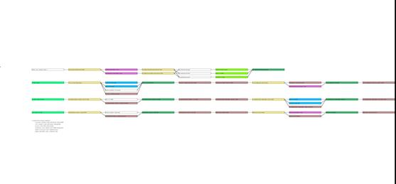

Figure 32. HVAC Diagram -- SVG Drawing


Objects that are recognized by the HVAC diagram are shown in Table 30 (sorted by Object Name) and Table 31 (sorted by color).


Table 30. HVAC Diagram Object Names (primary sort) Colors

<table class="table table-striped">
<tr>
<th>Object Name</th>
<th>Color</th>
</tr>
<tr>
<td>AirLoopHVAC:ReturnPlenum</td>
<td>lightgreen</td>
</tr>
<tr>
<td>AirLoopHVAC:SupplyPlenum</td>
<td>lightgreen</td>
</tr>
<tr>
<td>AirLoopHVAC:ZoneMixer</td>
<td>wheat</td>
</tr>
<tr>
<td>AirLoopHVAC:ZoneSplitter</td>
<td>wheat</td>
</tr>
<tr>
<td>AirTerminal:DualDuct:ConstantVolume</td>
<td>wheat</td>
</tr>
<tr>
<td>AirTerminal:DualDuct:VAV</td>
<td>wheat</td>
</tr>
<tr>
<td>AirTerminal:SingleDuct:Uncontrolled</td>
<td>none</td>
</tr>
<tr>
<td>AirTerminal:SingleDuct:VAV:NoReheat</td>
<td>wheat</td>
</tr>
<tr>
<td>AirTerminal:SingleDuct:VAV:Reheat</td>
<td>wheat</td>
</tr>
<tr>
<td>Boiler:HotWater</td>
<td>indianred</td>
</tr>
<tr>
<td>Chiller:Absorption</td>
<td>powderblue</td>
</tr>
<tr>
<td>Chiller:CombustionTurbine</td>
<td>powderblue</td>
</tr>
<tr>
<td>Chiller:ConstantCOP</td>
<td>powderblue</td>
</tr>
<tr>
<td>Chiller:Electric</td>
<td>powderblue</td>
</tr>
<tr>
<td>Chiller:EngineDriven</td>
<td>powderblue</td>
</tr>
<tr>
<td>ChillerHeater:Absorption:DirectFired</td>
<td>powderblue</td>
</tr>
<tr>
<td>Coil:Cooling:DX:MultiSpeed</td>
<td>skyblue</td>
</tr>
<tr>
<td>Coil:Cooling:DX:SingleSpeed</td>
<td>skyblue</td>
</tr>
<tr>
<td>Coil:Cooling:Water</td>
<td>skyblue</td>
</tr>
<tr>
<td>Coil:Cooling:Water:DetailedGeometry</td>
<td>skyblue</td>
</tr>
<tr>
<td>Coil:Cooling:WaterToAirHeatPump:EquationFit</td>
<td>skyblue</td>
</tr>
<tr>
<td>Coil:Cooling:WaterToAirHeatPump:ParameterEstimation</td>
<td>skyblue</td>
</tr>
<tr>
<td>Coil:Heating:DX:SingleSpeed</td>
<td>skyblue</td>
</tr>
<tr>
<td>Coil:Heating:Electric</td>
<td>salmon</td>
</tr>
<tr>
<td>Coil:Heating:Gas</td>
<td>salmon</td>
</tr>
<tr>
<td>Coil:Heating:Water</td>
<td>salmon</td>
</tr>
<tr>
<td>Coil:Heating:WaterToAirHeatPump:EquationFit</td>
<td>salmon</td>
</tr>
<tr>
<td>Coil:Heating:WaterToAirHeatPump:ParameterEstimation</td>
<td>salmon</td>
</tr>
<tr>
<td>Connector:Mixer</td>
<td>lightgreen</td>
</tr>
<tr>
<td>Connector:Splitter</td>
<td>wheat</td>
</tr>
<tr>
<td>Controller:OutdoorAir</td>
<td>none</td>
</tr>
<tr>
<td>Controller:WaterCoil</td>
<td>none</td>
</tr>
<tr>
<td>CoolingTower:SingleSpeed</td>
<td>pink</td>
</tr>
<tr>
<td>Dehumidifier:Desiccant:NoFans</td>
<td>tan</td>
</tr>
<tr>
<td>DistrictCooling</td>
<td>none</td>
</tr>
<tr>
<td>DistrictHeating</td>
<td>none</td>
</tr>
<tr>
<td>EvaporativeCooler:Direct:CelDekPad</td>
<td>aliceblue</td>
</tr>
<tr>
<td>EvaporativeCooler:Indirect:CelDekPad</td>
<td>aliceblue</td>
</tr>
<tr>
<td>EvaporativeCooler:Indirect:ResearchSpecial</td>
<td>aliceblue</td>
</tr>
<tr>
<td>Fan:ConstantVolume</td>
<td>silver</td>
</tr>
<tr>
<td>Fan:OnOff</td>
<td>silver</td>
</tr>
<tr>
<td>Fan:VariableVolume</td>
<td>silver</td>
</tr>
<tr>
<td>Fan:ZoneExhaust</td>
<td>silver</td>
</tr>
<tr>
<td>Generator:CombustionTurbine</td>
<td>orange</td>
</tr>
<tr>
<td>Generator:InternalCombustionEngine</td>
<td>orange</td>
</tr>
<tr>
<td>GroundHeatExchanger:Pond</td>
<td>paleturquoise</td>
</tr>
<tr>
<td>GroundHeatExchanger:Surface</td>
<td>paleturquoise</td>
</tr>
<tr>
<td>GroundHeatExchanger:Vertical</td>
<td>paleturquoise</td>
</tr>
<tr>
<td>HeatExchanger:AirToAir:FlatPlate</td>
<td>paleturquoise</td>
</tr>
<tr>
<td>HeatExchanger:AirToAir:SensibleAndLatent</td>
<td>paleturquoise</td>
</tr>
<tr>
<td>HeatExchanger:Hydronic</td>
<td>paleturquoise</td>
</tr>
<tr>
<td>HeatPump:WaterToWater:EquationFit:Cooling</td>
<td>lightslategray</td>
</tr>
<tr>
<td>HeatPump:WaterToWater:EquationFit:Heating</td>
<td>lightslategray</td>
</tr>
<tr>
<td>HeatPump:WaterToWater:ParameterEstimation:Cooling</td>
<td>lightslategray</td>
</tr>
<tr>
<td>HeatPump:WaterToWater:ParameterEstimation:Heating</td>
<td>lightslategray</td>
</tr>
<tr>
<td>Humidifier:Steam:Electric</td>
<td>lavender</td>
</tr>
<tr>
<td>LoadProfile:Plant</td>
<td>none</td>
</tr>
<tr>
<td>OutdoorAir:Mixer</td>
<td>lawngreen</td>
</tr>
<tr>
<td>OutdoorAir:NodeList</td>
<td>none</td>
</tr>
<tr>
<td>Pipe:Adiabatic</td>
<td>wheat</td>
</tr>
<tr>
<td>PlantLoopConnection</td>
<td>wheat</td>
</tr>
<tr>
<td>Pump:ConstantSpeed</td>
<td>springgreen</td>
</tr>
<tr>
<td>Pump:VariableSpeed</td>
<td>springgreen</td>
</tr>
<tr>
<td>SolarCollector:FlatPlate:Water</td>
<td>yellow</td>
</tr>
<tr>
<td>WaterHeater:Mixed</td>
<td>orange</td>
</tr>
<tr>
<td>WaterHeater:Stratified</td>
<td>orange</td>
</tr>
<tr>
<td>ZoneHVAC:Baseboard:Convective:Water</td>
<td>salmon</td>
</tr>
<tr>
<td>ZoneHVAC:EnergyRecoveryVentilator:Controller</td>
<td>none</td>
</tr>
<tr>
<td>ZoneHVAC:EquipmentConnections</td>
<td>chartreuse</td>
</tr>
<tr>
<td>ZoneHVAC:IdealLoadsAirSystem</td>
<td>none</td>
</tr>
<tr>
<td>ZoneHVAC:LowTemperatureRadiant:ConstantFlow</td>
<td>orangered</td>
</tr>
<tr>
<td>ZoneHVAC:LowTemperatureRadiant:VariableFlow</td>
<td>orangered</td>
</tr>
<tr>
<td>ZoneHVAC:UnitVentilator</td>
<td>sandybrown</td>
</tr>
</table>


Table 31. HVAC Diagram Object Names and Color (primary sort)

<table class="table table-striped">
<tr>
<th>Object Name</th>
<th>Color</th>
</tr>
<tr>
<td>EvaporativeCooler:Direct:CelDekPad</td>
<td>aliceblue</td>
</tr>
<tr>
<td>EvaporativeCooler:Indirect:CelDekPad</td>
<td>aliceblue</td>
</tr>
<tr>
<td>EvaporativeCooler:Indirect:ResearchSpecial</td>
<td>aliceblue</td>
</tr>
<tr>
<td>ZoneHVAC:EquipmentConnections</td>
<td>chartreuse</td>
</tr>
<tr>
<td>Boiler:HotWater</td>
<td>indianred</td>
</tr>
<tr>
<td>Humidifier:Steam:Electric</td>
<td>lavender</td>
</tr>
<tr>
<td>OutdoorAir:Mixer</td>
<td>lawngreen</td>
</tr>
<tr>
<td>AirLoopHVAC:ReturnPlenum</td>
<td>lightgreen</td>
</tr>
<tr>
<td>AirLoopHVAC:SupplyPlenum</td>
<td>lightgreen</td>
</tr>
<tr>
<td>Connector:Mixer</td>
<td>lightgreen</td>
</tr>
<tr>
<td>HeatPump:WaterToWater:EquationFit:Cooling</td>
<td>lightslategray</td>
</tr>
<tr>
<td>HeatPump:WaterToWater:EquationFit:Heating</td>
<td>lightslategray</td>
</tr>
<tr>
<td>HeatPump:WaterToWater:ParameterEstimation:Cooling</td>
<td>lightslategray</td>
</tr>
<tr>
<td>HeatPump:WaterToWater:ParameterEstimation:Heating</td>
<td>lightslategray</td>
</tr>
<tr>
<td>AirTerminal:SingleDuct:Uncontrolled</td>
<td>none</td>
</tr>
<tr>
<td>Controller:OutdoorAir</td>
<td>none</td>
</tr>
<tr>
<td>Controller:WaterCoil</td>
<td>none</td>
</tr>
<tr>
<td>DistrictCooling</td>
<td>none</td>
</tr>
<tr>
<td>DistrictHeating</td>
<td>none</td>
</tr>
<tr>
<td>LoadProfile:Plant</td>
<td>none</td>
</tr>
<tr>
<td>OutdoorAir:NodeList</td>
<td>none</td>
</tr>
<tr>
<td>ZoneHVAC:EnergyRecoveryVentilator:Controller</td>
<td>none</td>
</tr>
<tr>
<td>ZoneHVAC:IdealLoadsAirSystem</td>
<td>none</td>
</tr>
<tr>
<td>Generator:CombustionTurbine</td>
<td>orange</td>
</tr>
<tr>
<td>Generator:InternalCombustionEngine</td>
<td>orange</td>
</tr>
<tr>
<td>WaterHeater:Mixed</td>
<td>orange</td>
</tr>
<tr>
<td>WaterHeater:Stratified</td>
<td>orange</td>
</tr>
<tr>
<td>ZoneHVAC:LowTemperatureRadiant:ConstantFlow</td>
<td>orangered</td>
</tr>
<tr>
<td>ZoneHVAC:LowTemperatureRadiant:VariableFlow</td>
<td>orangered</td>
</tr>
<tr>
<td>GroundHeatExchanger:Pond</td>
<td>paleturquoise</td>
</tr>
<tr>
<td>GroundHeatExchanger:Surface</td>
<td>paleturquoise</td>
</tr>
<tr>
<td>GroundHeatExchanger:Vertical</td>
<td>paleturquoise</td>
</tr>
<tr>
<td>HeatExchanger:AirToAir:FlatPlate</td>
<td>paleturquoise</td>
</tr>
<tr>
<td>HeatExchanger:AirToAir:SensibleAndLatent</td>
<td>paleturquoise</td>
</tr>
<tr>
<td>HeatExchanger:Hydronic</td>
<td>paleturquoise</td>
</tr>
<tr>
<td>CoolingTower:SingleSpeed</td>
<td>pink</td>
</tr>
<tr>
<td>Chiller:Absorption</td>
<td>powderblue</td>
</tr>
<tr>
<td>Chiller:CombustionTurbine</td>
<td>powderblue</td>
</tr>
<tr>
<td>Chiller:ConstantCOP</td>
<td>powderblue</td>
</tr>
<tr>
<td>Chiller:Electric</td>
<td>powderblue</td>
</tr>
<tr>
<td>Chiller:EngineDriven</td>
<td>powderblue</td>
</tr>
<tr>
<td>ChillerHeater:Absorption:DirectFired</td>
<td>powderblue</td>
</tr>
<tr>
<td>Coil:Heating:Electric</td>
<td>salmon</td>
</tr>
<tr>
<td>Coil:Heating:Gas</td>
<td>salmon</td>
</tr>
<tr>
<td>Coil:Heating:Water</td>
<td>salmon</td>
</tr>
<tr>
<td>Coil:Heating:WaterToAirHeatPump:EquationFit</td>
<td>salmon</td>
</tr>
<tr>
<td>Coil:Heating:WaterToAirHeatPump:ParameterEstimation</td>
<td>salmon</td>
</tr>
<tr>
<td>ZoneHVAC:Baseboard:Convective:Water</td>
<td>salmon</td>
</tr>
<tr>
<td>ZoneHVAC:UnitVentilator</td>
<td>sandybrown</td>
</tr>
<tr>
<td>Fan:ConstantVolume</td>
<td>silver</td>
</tr>
<tr>
<td>Fan:OnOff</td>
<td>silver</td>
</tr>
<tr>
<td>Fan:VariableVolume</td>
<td>silver</td>
</tr>
<tr>
<td>Fan:ZoneExhaust</td>
<td>silver</td>
</tr>
<tr>
<td>Coil:Cooling:DX:MultiSpeed</td>
<td>skyblue</td>
</tr>
<tr>
<td>Coil:Cooling:DX:SingleSpeed</td>
<td>skyblue</td>
</tr>
<tr>
<td>Coil:Cooling:Water</td>
<td>skyblue</td>
</tr>
<tr>
<td>Coil:Cooling:Water:DetailedGeometry</td>
<td>skyblue</td>
</tr>
<tr>
<td>Coil:Cooling:WaterToAirHeatPump:EquationFit</td>
<td>skyblue</td>
</tr>
<tr>
<td>Coil:Cooling:WaterToAirHeatPump:ParameterEstimation</td>
<td>skyblue</td>
</tr>
<tr>
<td>Coil:Heating:DX:SingleSpeed</td>
<td>skyblue</td>
</tr>
<tr>
<td>Pump:ConstantSpeed</td>
<td>springgreen</td>
</tr>
<tr>
<td>Pump:VariableSpeed</td>
<td>springgreen</td>
</tr>
<tr>
<td>Dehumidifier:Desiccant:NoFans</td>
<td>tan</td>
</tr>
<tr>
<td>AirLoopHVAC:ZoneMixer</td>
<td>wheat</td>
</tr>
<tr>
<td>AirLoopHVAC:ZoneSplitter</td>
<td>wheat</td>
</tr>
<tr>
<td>AirTerminal:DualDuct:ConstantVolume</td>
<td>wheat</td>
</tr>
<tr>
<td>AirTerminal:DualDuct:VAV</td>
<td>wheat</td>
</tr>
<tr>
<td>AirTerminal:SingleDuct:VAV:NoReheat</td>
<td>wheat</td>
</tr>
<tr>
<td>AirTerminal:SingleDuct:VAV:Reheat</td>
<td>wheat</td>
</tr>
<tr>
<td>Connector:Splitter</td>
<td>wheat</td>
</tr>
<tr>
<td>Pipe:Adiabatic</td>
<td>wheat</td>
</tr>
<tr>
<td>PlantLoopConnection</td>
<td>wheat</td>
</tr>
<tr>
<td>SolarCollector:FlatPlate:Water</td>
<td>yellow</td>
</tr>
</table>

CoeffConv/CoeffCheck
====================

These two programs are stored in the PreProcess folder of your EnergyPlus installation under a folder CoeffConv.

CoeffConv
---------

CoeffConv is a program to convert DOE-2 temperature dependent curves in Fahrenheit to EnergyPlus curves in Centigrade. The program converts the DOE-2 coefficients of a biquadratic curve to the equivalent EnergyPlus biquadratic curve coefficients.

EP-Launch can be used to run the CoeffConv program. CoeffConv is one of the options on the Utilities tab in EP-Launch. See the EP-Launch section in this document for more information on how to use EP-Launch with the CoeffConv program. When using EP-Launch to run CoeffConv the input file must have the file extension .coi and will create an output file with the file extension .coo.

You can also run the CoeffConv program as a console application. The input file then must be from file CoeffConvInput.txt (status=OLD). There are 6 lines of ascii input.

For example:

```
VarSpeedCoolCapFt
-0.29382,0.0222213,0.00006988,0.0040928,-0.00000226,-0.00013774
55.,75.
75.,115.
67.0,95.0
5.0
```

* The 1st line is the user selected name of the curve.
* The 2nd line contains the 6 biquadratic curve coefficients, comma separated. These are the Doe-2 coefficients.
* The 3rd line contains the min and max values of the 1st independent variable, comma separated, deg F.
* The 4th line contains the min and max values of the 2nd independent variable, comma separated, deg F.
* The 5th line contains the rated values of the 1st & 2nd independent variables, comma separated, deg F.
* The 6th line contains the delta T for the output performance maps.

All the input lines should start in column 1.

The above sequence can be repeated up to 100 times.

The output file is CoeffConvOutput.txt (status=NEW) (that means you need to delete any existing CoeffConvOutput.txt).

The output file will contain the EnergyPlus idf input for the curve, as well as any error messages;

Also, the DOE-2 and EnergyPlus curve values at the rating point (where the value should be 1.0) and performance maps for the curves - both DOE-2 and EnergyPlus.

There is an example input file and an example output file installed with the program.

CoeffCheck
----------

CoeffCheck is a program to print out a performance map given a bi-quadratic performance curve.

EP-Launch can be used to run the CoeffCheck program. CoeffCheck is one of the options on the Utilities tab in EP-Launch. See the EP-Launch section in this document for more information on how to use EP-Launch with the CoeffCheck program. When using EP-Launch to run CoeffCheck the input file must have the file extension .cci and will create an output file with the file extension .cco.

You can also run the CoeffCheck program as a console application. The input file then must be from file CoeffCheckInput.txt (status=OLD). There are 6 lines of ascii input.

For example:

```
VarSpeedCoolCapFt
0.476428E+00,0.401147E-01,0.226411E-03,-0.827136E-03,-0.732240E-05,-0.446278E-03
12.777778,23.888889
23.888889,46.111111
19.444444,35.0
2.777778
```

* The 1st line is the user selected name of the curve.
* The 2nd line contains the 6 biquadratic curve coefficients, comma separated.
* The 3rd line contains the min and max values of the 1st independent variable, comma separated
* The 4th line contains the min and max values of the 2nd independent variable, comma separated
* The 5th line contains the rated values of the 1st & 2nd independent variables, comma separated
* The 6th line contains the delta T for the output performance map

The output file is CoeffCheckOutput.txt (status=NEW).

There is an example input file and an example output file installed with the program.

Running the CoeffConv or CoeffCheck programs
--------------------------------------------

EP-Launch can be used to run both the CoeffConv and CoeffCheck programs.  CoeffConv and CoeffCheck are two of the options on the Utilities tab in EP-Launch.  See the EP-Launch section in this document for more information on how to use EP-Launch with the CoeffConv and CoeffCheck programs.

You can also run both programs as console applications and, because they are small, they are automatically installed with EnergyPlus. You will need to open a command window using the following steps:

1)   Open a DOS command prompt window (Start -&gt; Programs -&gt; Accessories -&gt; Command Prompt)

2)   Change to the directory where EnergyPlus is installed (modify the commands below if you did not install EnergyPlus in the default install path):

C:

CD \\&lt;rootfolder&gt;\&lt;/span>

3)   Change to the specific folder for the coefficient conversion applications:

CD PreProcess\\CoeffConv

4)   Run the program:

After creating your files as shown above, enter either CoeffConv or CoeffCheck as desired. The folder also contains a "readme.txt" file which you can peruse.

ExpandObjects
=============

Introduction
------------

The ExpandObjects program uses HVACTemplate objects in the IDF file to "expand" them into full fledged objects for EnergyPlus.  Read more details of the systems and the individual fields in the HVACTemplate objects in the Input Output Reference document.

ExpandObjects also processes GroundHeatTransfer objects, sends an input file to the Slab and Basement preprocessors, and replaces ground heat transfer boundary condition fields in building surface objects. Read more details of the ground heat transfer processing in the Input Output Reference.

Technically speaking, the ExpandObjects program is a preprocessor that is currently used with the HVACTemplate objects. The preprocessor reads an **idf** file and generates an expanded.idf file (usually with the extension .**expidf**). The original idf file contains objects that will be read by the preprocessor and those that are ignored by the preprocessor. The objects read can be either commented out or left as is. The objects created by the preprocessor in the expanded.idf file should require no further preprocessing. The preprocessor does not read the EnergyPlus Data Dictionary file (Energy+.IDD) and does limited validation. Most of the object values that are created are "passed" through from input objects. This allows EnergyPlus to provide most of the validation. If errors are found, error messages are passed to the EnergyPlus program using the Output:Preprocessor object. These errors will be shown in the usual EnergyPlus error file. When used with EP-Launch, the expanded.idf file is renamed to the original file name with the extension **expidf**.

HVAC Template Objects Processed
-------------------------------

The HVACTemplate objects that are currently read by the ExpandObjects preprocessor are:

- HVACTemplate:Thermostat

- HVACTemplate:Zone:IdealLoadsAirSystem

- HVACTemplate:Zone:FanCoil

- HVACTemplate:Zone:PTAC

- HVACTemplate:Zone:PTHP

- HVACTemplate:Zone:Unitary

- HVACTemplate:Zone:VAV

- HVACTemplate:Zone:VAV:FanPowered

- HVACTemplate:Zone:WatertoAirHeatPump

- HVACTemplate:System:Unitary

- HVACTemplate:System:UnitaryHeatPump:AirToAir

- HVACTemplate:System:VAV

- HVACTemplate:System:PackagedVAV

- HVACTemplate:System:DedicatedOutdoorAir

- HVACTemplate:Plant:ChilledWaterLoop

- HVACTemplate:Plant:Chiller

- HVACTemplate:Plant:Chiller:ObjectReference

- HVACTemplate:Plant:Tower

- HVACTemplate:Plant:Tower:ObjectReference

- HVACTemplate:Plant:HotWaterLoop

- HVACTemplate:Plant:Boiler

- HVACTemplate:Plant:Boiler:ObjectReference

Ground Heat Transfer Objects Processed
--------------------------------------

The GroundHeatTransfer objects that are currently read by the ExpandObjects preprocessor are:

- GroundHeatTransfer:Control

- GroundHeatTransfer:Slab:Materials

- GroundHeatTransfer:Slab:MatlProps

- GroundHeatTransfer:Slab:BoundConds

- GroundHeatTransfer:Slab:BldgProps

- GroundHeatTransfer:Slab:Insulation

- GroundHeatTransfer:Slab:EquivalentSlab

- GroundHeatTransfer:Slab:AutoGrid

- GroundHeatTransfer:Slab:ManualGrid

- GroundHeatTransfer:Slab:XFACE

- GroundHeatTransfer:Slab:YFACE

- GroundHeatTransfer:Slab:ZFACE

- GroundHeatTransfer:Basement:SimParameters

- GroundHeatTransfer:Basement:MatlProps

- GroundHeatTransfer:Basement:Insulation

- GroundHeatTransfer:Basement:SurfaceProps

- GroundHeatTransfer:Basement:BldgData

- GroundHeatTransfer:Basement:Interior

- GroundHeatTransfer:Basement:ComBldg

- GroundHeatTransfer:Basement:EquivSlab

- GroundHeatTransfer:Basement:EquivAutoGrid

- GroundHeatTransfer:Basement:AutoGrid

- GroundHeatTransfer:Basement:ManualGrid

- GroundHeatTransfer:Basement:XFACE

- GroundHeatTransfer:Basement:YFACE

- GroundHeatTransfer:Basement:ZFACEHVACTemplate:Thermostat

Building Surface Objects Processed
----------------------------------

The building surface objects that are currently modified by the ExpandObjects preprocessor are:

- BuildingSurface:Detailed

- Wall:Detailed

- RoofCeiling:Detailed

- Floor:Detailed

- Site:GroundTemperature:BuildingSurface

CSVproc
=======

This simple post processing utility may be useful when doing parametric analyses. It takes a CSV (comma separated values file) and performs some simple statistics. It is a very small application with no interface. It is typically executed from the command line.

1)   Open a DOS command prompt window (Start à Programs à Accessories à Command Prompt)

2)   Change to the directory where EnergyPlus is installed (modify the commands below if you did not install EnergyPlus in the default install path):

C:

CD \\&lt;root folder&gt;\&lt;/span>

3)   Change to the specific folder for the coefficient conversion applications:

CD PostProcess

4)   Run the program:

CSVproc &lt;filename&gt;

Where &lt;filename&gt; is the name of a CSV file, including extension. There is a simple readme.txt file in the folder. The program performs some simple statistics on each column and creates a new file with the same name without extension and -PROC.CSV added to the name.

The statistics performed on each column are:

* SUM

* MAX

* MIN

* AVERAGE

* COUNT

* COUNTIF &gt; 0

* COUNTIF &gt; 5

* COUNTIF &gt; 10

* COUNTIF &gt; 15

* COUNTIF &gt; 20

* COUNTIF &gt; 25

* COUNTIF &gt; 30

* COUNTIF &gt; 35

* COUNTIF &gt; 40

* COUNTIF &gt; 45

* COUNTIF &gt; 50

* COUNTIF &gt; 55

* COUNTIF &gt; 60

* COUNTIF &gt; 65

* COUNTIF &gt; 70

* COUNTIF &gt; 75

* COUNTIF &gt; 80

* COUNTIF &gt; 85

* COUNTIF &gt; 90

* COUNTIF &gt; 95

* COUNTIF &gt; 100

* COUNTIF = 1

* COUNTIF &lt; 19.9

* COUNTIF &gt; 24.0

Obviously, not all statistics are relevant for every output report variable. The average is based on the sum divided by the number of non-blank rows. The average is not based on the length of time for that timestep. Due to this, CSVproc is best suited for an hourly output file.

Source code is available upon request from jglazer@gard.com.

convertESOMTR
=============

This simple post processing utility will convert the raw data "ESO" and "MTR" files to IP (Inch-Pound) units before later processing into CSV files. EP-Launch has an option to automatically convert to IP units that invokes convertESOMTR, see VIEW - Options - Miscellaneous dialog box. The ReadVarsESO program will take these converted files and make them into normal CSV files but will have IP units. The RunEPlus batch file does not include this option but could be edited to perform the same functions if desired.

Technically speaking, the convertESOMTR program uses the "convert.txt" file which contains the conversion factors. It creates files "ip.eso" and "ip.mtr" as appropriate. The batch examples then renames the old eplusout.eso to eplusout.esoold, old eplusout.mtr to eplusout.mtrold and the ip files to the default eplusout.eso, eplusout.mtr.

The convert.txt file contains the conversion factors using three different commands.

conv,&lt;si-unit&gt;,&lt;ip-unit&gt;,&lt;multiplier&gt;,&lt;offset&gt;

wild,&lt;match-string&gt;,&lt;si-unit&gt;,&lt;ip-unit&gt;

vari,&lt;variable-name-no-units&gt;,&lt;si-unit&gt;,&lt;ip-unit&gt;

If a specific variable needs to be converted, the 'vari' line may be used to convert the units on that specific variable only. To convert a class of variables that contains a specific string of characters in the names of the variables, the 'wild' line may be used. The 'conv' lines are the lines that actually create the conversion factors.  If no 'vari' or 'wild' match a variable, then it is converted used the first 'conv' line that matches. The default convert.txt file contains some conversions for Inch-Pound units but any set of units may be used by editing the convert.txt file. Note that the convert.txt file uses the standard EnergyPlus comment character (!).

A snippet of the convert.txt file:

```
! Power
!------------------------------
!    (1 kW / 1000 W)
conv,W,kW,0.001,0
!    (1 Btuh/ 0.2928751 W) * (1 kBtuh/1000 Btuh)
conv,W,kBtuh,3.41442E-03,0
```

CalcSoilSurfTemp Program
========================

The CalcSoilSurfTemp program calculates three important parameters for the simulation of the earth tube:

- the annual average soil surface temperature

- the amplitude of soil surface temperature

- the phase constant of soil surface temperature

Since soil temperature is one of the most significant factors affecting the overall performance of earth tube system, soil temperature around the earth tube should be accurately predicted.

Before the soil temperature around earth tube can be calculated during the running period of earth tube model in EnergyPlus, the ground surface temperature straight above earth tube should be predicted. Using CalcSoilSurfTemp program, these parameters are predicted by considering the convective heat transfer between the air and ground, solar radiation absorption by the ground, long-wave radiation emitted from the soil, and latent heat loss due to the moisture evaporation at the ground surface.

Running the Program
-------------------

EP-Launch can be used to run the CalcSoilSurfTemp program. CalcSoilSurfTemp is one of the options on the Utilities tab in EP-Launch. See the EP-Launch section in this document for more information on how to use EP-Launch with the CalcSoilSurfTemp program.

You can also run the CalcSoilSurfTemp program as a console application with a batch file RunCalcSoilSurfTemp. The argument to the batch file is the name of the weather file to be used. Steps to running this program follow:

1)   Open a DOS command prompt window (Start à Programs à Accessories à Command Prompt)

2)   Change to the directory where EnergyPlus is installed (modify the commands below if you did not install EnergyPlus in the default install path):

C:

CD \\&lt;root folder&gt;\&lt;/span>

3)   Change to the calculate surface soil temperature folder:

CD PreProcess\\CalcSoilSurfTemp

4)   Run the program:

runcalcsoilsurftemp USA\_IL\_Chicago-OHare\_TMY2

When installed, the batch file automatically points the path for weather data to the installed weather data path. If you save your weather files in a different location, you will need to modify the batch file or create your own with your own folder paths.

Note that the program is interactive (expects user responses) from the command line. These inputs are described in the following section.

Program Inputs
--------------

In order to use the CalcSoilSurfTemp program, a weather data file is used. The entire year of weather data is used to calculate parameters of the soil surface temperature.

The CalcSoilSurfTemp program is simple and requires only two input fields: soil condition and soil surface condition. First, the user will see the four following options in the screen for the selection of the soil condition:

1. HEAVY AND SATURATED

2. HEAVY AND DAMP

3. HEAVY AND DRY

4. LIGHT AND DRY

Among them, the user should select the number corresponding to the particular soil condition. This determines the thermal diffusivity and thermal conductivity of the surrounding soil.

After the selection of soil condition, the user should also select the number corresponding to the condition of the ground surface above the earth tube from the eight following options:

1. BARE AND WET

2. BARE AND MOIST

3. BARE AND ARID

4. BARE AND DRY

5. COVERED AND WET

6. COVERED AND MOIST

7. COVERED AND ARID

8. COVERED AND DRY

This determines the absorption coefficient and the fraction of evaporation rate of the ground surface.

Note that both soil condition and soil surface condition are the average of the year -  not a particular time period within the year.

From this information and an analysis of the weather data, the CalcSoilSurfTemp program calculates the annual average soil surface temperature, the amplitude of soil surface temperature, and the phase constant of soil surface temperature. The user must then add these parameters as input parameter into earth tube model in EnergyPlus.

Program Outputs
---------------

As noted earlier, there are three output parameters and they are automatically saved in the CalcSoilSurfTemp.out file. The basic concept and description of three output parameters are as follows.

**Annual Average Soil Surface Temperature**

This is the annual average value of soil surface temperature.

**Amplitude of Soil Surface Temperature**

This is the difference between the maximum and minimum soil surface temperature of the whole year divided by two.

**Phase Constant of Soil Surface Temperature**

This is the time elapsed from the beginning of the year at which the soil surface temperature reaches the minimum value in the year.

These values are placed in the ZoneEarthTube object numeric fields (12, 13, 14) of similar names. The ZoneEarthTube IDD definition with these fields highlighted is included:

```idf
ZoneEarthtube,
  \min-fields 22
  \memo  Earth Tube is specified as a design level which is modified by a Schedule fraction, temperature difference and wind speed:
  \memo  Earthtube=Edesign * Fschedule * (A + B*|(Tzone-Todb)| + C*WindSpd + D * WindSpd**2)
 A1, \field Zone Name
  \required-field
  \type object-list
  \object-list ZoneNames
 A2, \field Schedule Name
  \required-field
  \type object-list
  \object-list ScheduleNames
 N1, \field Design Flow Rate
  \required-field
  \units m3/s
  \note  "Edesign" in Equation
  \type real
  \minimum 0
 N2, \field Minimum Zone Temperature when Cooling
  \required-field
  \note this is the indoor temperature below which the earth tube is shut off
  \units C
  \type real
  \minimum -100
  \maximum 100
 N3, \field Maximum Zone Temperature when Heating
  \required-field
  \note this is the indoor temperature above which the earth tube is shut off
  \units C
  \type real
  \minimum -100
  \maximum 100
 N4, \field Delta Temperature
  \required-field
  \note This is the temperature difference between indoor and outdoor below which the earth tube is shut off
  \units deltaC
  \type real
  \minimum 0
 A3, \field Earthtube Type
  \required-field
  \type choice
  \key Natural
  \key Intake
  \key Exhaust
  \default Natural
 N5, \field Fan Pressure Rise
  \required-field
  \note pressure rise across the fan
  \type real
  \units Pa
  \minimum 0
  \default 0
 N6, \field Fan Total Efficiency
  \required-field
  \type real
  \minimum> 0
  \default 1
 N7, \field Pipe Radius
  \required-field
  \units m
  \type real
  \minimum> 0
  \default 1
 N8, \field Pipe Thickness
  \required-field
  \units m
  \type real
  \minimum> 0
  \default 0.2
 N9, \field Pipe Length
  \required-field
  \units m
  \type real
  \minimum> 0
  \default 15
 N10, \field Pipe Thermal Conductivity
  \required-field
  \units W/m-K
  \type real
  \minimum> 0
  \default 200
 N11, \field Pipe Depth Under Ground Surface
  \required-field
  \units m
  \type real
  \minimum> 0
  \default 3
 A4, \field Soil Condition
  \required-field
  \type choice
  \key HeavyAndSaturated
  \key HeavyAndDamp
  \key HeavyAndDry
  \key LightAndDry
  \default HeavyAndDamp
 N12, \field Average Soil Surface Temperature
  \required-field
  \units C
  \type real
  \default 0
 N13, \field Amplitude of Soil Surface Temperature
  \required-field
  \units C
  \type real
  \minimum 0
  \default 0
 N14, \field Phase Constant of Soil Surface Temperature
  \required-field
  \units days
  \type real
  \minimum 0
  \default 0
 N15, \field Constant Term Flow Coefficient
  \required-field
  \note  "A" in Equation
  \type real
  \default 1
 N16, \field Temperature Term Flow Coefficient
  \required-field
  \note  "B" in Equation
  \type real
  \default 0
 N17, \field Velocity Term Flow Coefficient
  \required-field
  \note  "C" in Equation
  \type real
  \default 0
 N18; \field Velocity Squared Term Flow Coefficient
  \required-field
  \note  "D" in Equation
  \type real
  \default 0
```

HVAC Performance Curve Fit Tool
===============================

Introduction
------------

This auxiliary tool generates HVAC performance curves in EnergyPlus curve object format.  For each set of performance data entered, Capacity and EIR performance curves are generated, and these curves are generated either as a function of temperature(s) or flow fraction.  The Capacity and EIR of Cooling DX Coils as a function of temperatures require only Biquadratic curve whereas Capacity and EIR of Heating DX Coils may use Biquadratic, Cubic and Quadratic curves. The selection of either of these curves is dependent on availability of performance data. The Capacity and EIR as a function of flow fraction allows either Cubic or Quadratic curve type. The curve types allowed are:

Biquadratic: <span>\(\text{CurveValue} = a_0 + a_1 X + a_2 X^2 + a_3 Y + a_4 Y^2 + a_5 XY \)</span>

Cubic: <span>\(\text{CurveValue} = a_0 + a_1 X + a_2 X^2 + a_3 X^3 \)</span>

Quadratic: <span>\(\text{CurveValue} = a_0 + a_1 X + a_2 X^2 \)</span>

These performance curves as a function of temperatures are generated for a given set of input data at a given speed. The curves as a function of flow fraction are generated at the rated temperature conditions.  The rated test condition is the AHRI standard test condition (AHRI 2003;2007; 2008).  The AHRI standard test condition may vary by the equipment type.   For multiple speeds or multiple stage DX Coils, different curve sets can be generated by entering a different set of data for each speed or stage at a time.  The tool automatically populates the labels for each data inputs variable when users select the Coil Type, Independent Variables, Curve Type, and Units. The curve fit tool interface in Figure 1 shows labels selected to generate capacity and EIR biquadratic curves as function of temperatures for DX cooling coil.


Figure 33. Curve Fit Tool Input Interface

The tool can be used for Coil:Cooing:DX:SingleSpeed, Coil:Heating:DX:SingleSpeed, Coil:Cooing:DX:TwoSpeed (high and low speed) , CoilPerformance:DX:Cooling (each stage), and any HVAC equipment that use Biquadratic, Cubic or Quadratic curves. To add this flexibility generic input data labels can be populated by selecting "Other" for DX Coil Type input field, located in Cell B3 in Figure 33.

Inputs
------

First step in curve generation is to select appropriate parameters from the dropdown menu.  These inputs define the DX Coil Type, Curve Type, Independent Variable and the Units type. The choices available for each input parameters are described in table-1. Once these input parameters are selected the tool read in the values and automatically populates labels for each of the independent and dependent variables. The labels guide users to enter the data for each variable in the corresponding worksheet input range.   Two sets of input data are required for curve generation: Rated, and Performance Data.

Table-1 Input parameters description

<table class="table table-striped">
<tr>
<th>Input Parameter</th>
<th>Description of Inputs</th>
</tr>
<tr>
<td>DX Coil Type</td>
<td>Cooling: applicable for DX cooling coil single speed
Heating: applicable for DX heating coil single speed
Other: applicable for any equipment that use the three curve types</td>
</tr>
<tr>
<td>Independent Variables</td>
<td>Temperature
Flow</td>
</tr>
<tr>
<td>Curve Types</td>
<td>Biquadratic: Capacity and EIR as a function of temperature
Cubic: Capacity and EIR as a function of flow fraction or temperature
Quadratic: capacity and EIR as a function of flow fraction</td>
</tr>
<tr>
<td>Units</td>
<td>IP: Temperature in °F, Capacity in kBtu/h, Power in kW, and Flow in CFM
SI: Temperature in °C, Capacity in kW, Power in kW, and Flow in m<sup>3</sup>/s</td>
</tr>
<tr>
<td>Curve Object Name</td>
<td>This input is optional.  This string is appended to the default curve object name, or if left blank the default curve object name will be displayed. A curve object is named is created by concatenation as follows:
<span>\(
=
\left\{
 \begin{array}{c}
  \text{User Specified} \\
  \text{Curve Object Name}
 \end{array}
\right\} + 
\text{"DXCoilType"} + 
\left\{
 \begin{array}{c}
  \text{CAPFTemp} \\ 
  \text{CAPFFF} \\
  \text{EIRFTemp} \\
  \text{EIRFFF}
 \end{array}
\right\}
\)</span></td>
</tr>
</table>

Rated Data
----------

The rated data is used to normalize the performance data set. The rated test conditions depend on the equipment type.  For DX cooling coil the rated test temperatures are 67°F (19.4°C) indoor coil entering wet bulb, 80°F (26.7°C) indoor coil entering dry bulb and 95°F (35.0°C) outdoor coil entering dry bulb air temperatures per ANSI/AHRI Std. 210/240 (AHRI 2008).  If the rated test temperatures are different from the values populated by the tool, then the user may enter the applicable values manually.  The rated data can be one of the performance data points depending on the speed or stage. The rated data set is entered in the Cells range "B11:E11" of the INPUT tab as shown in Figure 1.

Performance Data
----------------

The performance data set entered depends on the type of independent variables selected.  To generate performance curves (e.g. DX Coils) as a function of temperatures require the capacity and power data at various combinations of indoor and outdoor coil entering air temperatures at a rated supply air flow rate. And performance curves (e.g. DX Coil) as function of flow fraction require  capacity and power data at various supply air flow rates and rated indoor and outdoor coil entering air (or water) temperatures. The performance data set may include the rated data as one of the data points. The performance data set is entered starting from row 15 and down for each of the variables as shown in Figure 33.

The total cooling and heating capacities must be the gross values, i.e., not corrected for the supply fan heating effect.  Also the input power has to exclude the supply air fan power, but includes other miscellaneous power inputs (e.g. control panel power).   If manufacturers provide the total power, then the supply fan power must be deducted from the former.  If the capacity and power data are normalized values, then enter 1.0 for rated gross capacity and power in the ***Rated Data*** input Cells range (B11:E11 in the INPUT tab). Two samples of performance and rated data set are included in the "**INSTRUCTION**" tab.

Outputs
-------

The generated curves are post-processed to make sure that the curve value is 1.0 at the rated condition.  The post processing is applied only if the curve value at the rated condition deviates by a value less than or equal to 0.025 and the performance data set contains the rated data set as one the data points. The coefficients of these curves are displayed on the "OUTPUT" tab as shown in Figure 2.


Figure 34. Curve Fit Tool Output Interface

Besides the curve coefficients, the goodness of curve fit indicator statistical parameters *R<sup>2</sup>* is also reported.  The *R<sup>2</sup>* is the ratio of the sum of the squared deviations of the curve fit values from the mean to the sum of the squared deviations of the original data from the mean.  R squared values closer to 1.0 are good.  The tool has an option to save the curve objects to an output file by running another macro (SaveCurveObjToTextFile).  The option output files and the directory path are specified in the OUPUT tab in cells C2 and C3, respectively, as shown in Figure 34. If the output file name and path are left blank, then default names, "EplusCurveObjects.IDF" and the local directory where the tool is located are used.  The local directory where the tool is located must not have write restriction.

Sample EnergyPlus curve objects output file generated using this auxiliary tool.

```idf
Curve:Biquadratic,
 HeatPumpCoolingCAPFTemp,      !- Name
 1.4248528695,                !- Coefficient1 Constant
 -0.0554469607,                !- Coefficient2 x
 0.0027506982,                !- Coefficient3 x**2
 -0.0017453896,                !- Coefficient4 y
 -0.0000081,                   !- Coefficient5 y**2
 -0.0004638975,                !- Coefficient6 x*y
 13.8888888889,                !- Minimum Value of x
 22.2222222222,                !- Maximum Value of x
 29.4444444444,                !- Minimum Value of y
 46.1111111111,                !- Maximum Value of y
 0.7875,                       !- Minimum Curve Output
 1.1725,                       !- Maximum Curve Output
 Temperature,                  !- Input Unit Type for X
 Temperature,                  !- Input Unit Type for Y
 Dimensionless;                !- Output Unit Type

Curve:Biquadratic,
 HeatPump1CoolingEIRFTemp,     !- Name
 0.1566419771,                 !- Coefficient1 Constant
 0.0522807347,                 !- Coefficient2 x
 -0.0017986792,                !- Coefficient3 x**2
 0.009523995,                  !- Coefficient4 y
 0.0002405903,                 !- Coefficient5 y**2
 -0.0001781171,                !- Coefficient6 x*y
 13.8888888889,                !- Minimum Value of x
 22.2222222222,                !- Maximum Value of x
 29.4444444444,                !- Minimum Value of y
 46.1111111111,                !- Maximum Value of y
 0.8216,                       !- Minimum Curve Output
 1.3703,                       !- Maximum Curve Output
 Temperature,                  !- Input Unit Type for X
 Temperature,                  !- Input Unit Type for Y
 Dimensionless;                !- Output Unit Type
```


Error Message
-------------

Reports progress of the curve object generation calculation starting from reading input data to error massage output file "errorCurveObjects.txt".  This error message file provides information whether the tool run successfully or not.  Also points to the step where problem occurred.

Notes
-----

This tool has been tested on Ubuntu 11 using Libre Office and MS Office Macintosh 2011 machines.  But the button for running the macro may not be imported properly on Ubuntu hence users may have to run the tool manually by selecting "**ManageCurveFit**" and "**SaveCurveObjToTextFile**" subroutine from the macro list.

References
----------

AHRI 2008. ANSI/AHRI Standard 210/240: 2008 Standard for Performance Rating of Unitary Air-Conditioning & Air-Source Heat Pump Equipment. Arlington, VA: Air-Conditioning, Heating, and Refrigeration Institute.

AHRI 2007. ANSI/AHRI Standard 340/360: 2007 Standard for Performance Rating of Commercial and Industrial Unitary Air-Conditioning and Heat Pump Equipment. Arlington, VA: Air-Conditioning, Heating, and Refrigeration Institute.

AHRI 2003. ANSI/AHRI Standard 550/590: 2003 Standard for Performance Rating Of Water -Chilling Packages Using The Vapor Compression Cycle. Arlington, VA: Air-Conditioning, Heating, and Refrigeration Institute.


Parametric Spreadsheets
=======================

Several spreadsheet applications are included in the Preprocess\\ParametricSpreadsheets folder.  These include spreadsheets (Excel™) for the Water Source heat pumps and Water to Air heat pumps.

Water-to-Water Heat Pump Parameter / Coefficient Generator (Cooling and Heating Mode)
-------------------------------------------------------------------------------------

This document gives brief instructions on generating the parameters/ coefficients for the water-to-water heat pump models in cooling and heating mode. The Excel™ spreadsheets (WaterWater\_PE\_Cooling.xls and WaterWater\_PE\_Heating.xls) are used. Since the spreadsheet functions are very similar for both cooling and heating modes, only one instruction document is supplied. The spreadsheet generates:

- parameters for the parameter estimation based model.

- coefficients for the curve-fit model.

The following theses have detailed information about the curve-fit model and parameter estimation based model:

Jin, Hui. 2002. Parameter Estimation Based Models of Water Source Heat Pumps. Phd. Thesis, Department of Mechanical and Aerospace Engineering, Oklahoma State University. (downloadable at [www.hvac.okstate.edu](http://www.hvac.okstate.edu))

Shenoy,Arun. 2004. Simulation, Modeling and Analysis of Water to Air Heat Pump. M.S. Thesis, Department of Mechanical and Aerospace Engineering, Oklahoma State University. (downloadable at [www.hvac.okstate.edu](http://www.hvac.okstate.edu))

Tang,C.C. 2004. Modeling Packaged Heat Pumps in a Quasi-Steady State Energy Simulation Program. M.S. Thesis, Department of Mechanical and Aerospace Engineering, Oklahoma State University. (downloadable at [www.hvac.okstate.edu](http://www.hvac.okstate.edu))

### Step 1: Catalog Data Input

Data points are obtained from the heat pump manufacturer data. Minimum data points for the parameter estimation based model are 32 data points according to Jin (2002). The curve-fit model performance is not affected by the number of data points and a minimum of 5 data points is required since the governing equations require 6 coefficients. The data points must have varying inlet conditions (e.g. water flow rates, inlet water temperatures, etc.) that covers the entire range of the heat pump operating conditions. Correction tables provided by the manufacturer should be used to extend the catalog data range in order to have a good set of parameters/coefficients.

- Using the heat pump performance data, enter the values to Table 1 in worksheet "CATALOG DATA". The values can be in SI or IP units.

- Click on Button 1 based on the units used.

For IP units:


For SI units:


- The program will convert the values to the desired units and display them on Table 2 in worksheet "INPUT".

- The button shown below is used clearing Table 1 (worksheet "CATALOG DATA"), and Table 2 (worksheet "INPUT"). It is advisable to clear the tables before generating parameters/coefficients for a new heat pump model.


After Table 2 is created, the parameters/coefficients are then calculated as follows:

- Worksheet "ParamEstimator" is used for generating the parameters for the parameter estimation based model using Nelder Mead Simplex. Refer to the steps in the Parameter Estimation Procedure.

- Worksheet "CoeffCalculator" is used for calculate the coefficients for the curve-fit model using the generalized least square method. Refer to the steps in the Curve Fit Model procedure.

### Parameter Estimation Procedure

#### Step 2a: Generating First Set of Parameters (PE-Based Model)

- Using Table 2, the program can generate parameters. The user must fill all the cells colored light blue in worksheet "ParamEstimator".

- **Accuracy:** Start with a low accuracy for faster convergence, recommended value of 0.001.

- **Compressor Type:** Only reciprocating compressor is currently available in EnergyPlus. One might be able to generate parameters for heat pump model with different compressor types but this might result in unrealistic parameters.

- **Refrigerant:** Contact the manufacturer on the refrigerant used to generate the catalog data and select from the list of refrigerants. Usually the refrigerant used is R22. .

- **Which Initial Guess?:**  The user may choose a set of initial guesses(1-5) that will be used by the optimization routine in generating the parameters. Start with 1, which is the set of initial guess 1 at column B.

- **Initial Guess:** Initial guess for all the parameters. For Initial Guess 1, enter a value of 1 for all the parameters except for the loss factor (less than 1.0). The loss factor should be less than 1.0 because the efficiency of the compressor should be less than 100%. Adjust the values in Initial Guess 1 if the program happens to crash and try again.

-  Now click on Button 2 shown below to generate the parameters.


It will take some time to generate the parameters depending on the number of data points. The parameters generated will be displayed at Parameters 1.

- Look at the error analysis of Error 1 which gives the user a summary of the errors for Qload, Qsource and Power. An average error of 5-8% is achievable for all the values.

- The errors for all the individual catalog data points are displayed in worksheet "RESULT".

#### Step 2b: Improving the Set of Parameters (PE-Based Model)

- After the initial set of parameters has been generated, the user can increase the accuracy of the parameters by using parameters generated as the initial guess for the second simulation and increasing the accuracy of the program.

- Copy and Paste Parameters 1 to Initial Guess 2.

- Change the initial guess indicator (**Which Initial Guess?:)** from 1 to 2.

- Increase the accuracy by twice. For example, set accuracy to 0.000001.

- Now click on Button 2 shown below to generate the second set of parameters.


The simulation time would most likely be less but it depends on the accuracy value as well. And the parameters generated will be displayed at Parameter 2.

- Compare Error 2 to Error 1, the error values should be less which means that the parameters are getting better and more accurate.

- Repeat the steps in 2a and 2b until a desired set of error values is achieved or the errors stop decreasing

#### Step 3: Generating EnergyPlus Input Parameters

- Click on the Button 3 shown below to convert and arrange the parameters generated to fit EnergyPlus Input File (IDF) which will be listed from cell B52:B59 for cooling mode and B46:B54 for heating mode.


- The button shown below in worksheet "ParamEstimator" is used for clearing Initial Guess (2-5), Parameters(1-5), Error(1-5), EnergyPlus Input parameters and Result(1-5) in worksheet "RESULT".


### End Parameter Estimation Procedure

### Curve Fit Model Procedure

#### Step 2: Generating the coefficients (Curve-Fit Model)

- Using Table 2, the program is ready to generate the coefficients. User is required to fill all the cells colored light blue in worksheet "CoeffCalculator".

- **RatedLoadVolFlowRate:** Rated load side volumetric flow rate (m<sup>3</sup>/s) which corresponds to the highest load side heat transfer rate listed in the catalog data.

- **RatedSourceVolFlowRate:** Rated source side volumetric flow rate (m<sup>3</sup>/s) which corresponds to the highest load side heat transfer rate listed in the catalog data.

- **RatedQload:** Rated load side heat transfer rate (W) which is the highest load side heat transfer rate listed in the catalog data.

- **RatedPower:** Rated power consumption (W) which corresponds to the highest load side heat transfer rate listed in the catalog data.

- Now click on Button 2 shown below to calculate the coefficients.


- The coefficients for the corresponding curves are listed at cell B12:C16. Error analysis of model is listed at cell B19:B27.

- The errors for all the individual catalog data points are displayed in worksheet "RESULT".

- The button shown below in worksheet "CoeffCalculator" is used for clearing the coefficients, the error analysis and the outputs in worksheet "RESULT".


### End Curve Fit Model Procedure

Water-to-Air Heat Pump Parameter / Coefficient Generator (Cooling)
------------------------------------------------------------------

This document gives brief instructions on generating the parameters or coefficients for the water-to-air heat pump models in cooling mode. The Excel™ spreadsheets (WaterAir\_PE\_Cooling.xls) are used. The spreadsheet generates:

- parameters for the parameter estimation based model.

- coefficients for the curve-fit model.

The following theses have detailed information about the curve-fit model and parameter estimation based model:

Jin, Hui. 2002. Parameter Estimation Based Models of Water Source Heat Pumps. Phd. Thesis, Department of Mechanical and Aerospace Engineering, Oklahoma State University. (downloadable at [www.hvac.okstate.edu](http://www.hvac.okstate.edu))

Shenoy,Arun. 2004. Simulation, Modeling and Analysis of Water to Air Heat Pump. M.S. Thesis, Department of Mechanical and Aerospace Engineering, Oklahoma State University. (downloadable at [www.hvac.okstate.edu](http://www.hvac.okstate.edu))

Tang,C.C. 2004. Modeling Packaged Heat Pumps in a Quasi-Steady State Energy Simulation Program. M.S. Thesis, Department of Mechanical and Aerospace Engineering, Oklahoma State University. (downloadable at [www.hvac.okstate.edu](http://www.hvac.okstate.edu))

### Step 1: Catalog Data Input

Data points are obtained from the heat pump manufacturer data. Minimum data points for the parameter estimation based model are 32 data points according to Jin (2002). The curve-fit model performance is not affected by the number of data points and a minimum of 6 data points is required since the sensible cooling capacity requires 6 coefficients. The data points must have varying inlet conditions (e.g. air flow rates, inlet water temperatures, and etc.) that covers the entire range of the heat pump operating conditions. Correction tables provided by the manufacturer should be used to extend the catalog data range in order to have a good set of parameters/coefficients.

- Using the heat pump performance data, enter the values to Table 1 in worksheet "CATALOG DATA". The values can be in SI or IP units.

- Click on Button 1 based on the units used.

For IP units:


For SI units:


- The program will convert the values to the desired units and display them on Table 2 in worksheet "INPUT".  Then the program will discard bad catalog points by calculating the relative humidity of the exiting air at the load side (relative humidity should be less or equal to 1). Table 3 in worksheet "INPUT" shows the input catalog data that will be used by the parameter/coefficient generator program.

- The button shown below is used clearing Table 1 (worksheet "CATALOG DATA"), Table 2, and Table 3 (worksheet "INPUT"). It is advisable to clear the tables before generating parameters/coefficients for a new heat pump model.


After Table 3 is created, the parameters/coefficients are then calculated as follows:

- Worksheet "ParamEstimator" is used for generating the parameters for the parameter estimation based model using Nelder Mead Simplex. Refer to the steps in the Parameter Estimation Procedure.

- Worksheet "CoeffCalculator" is used for calculate the coefficients for the curve-fit model using the generalized least square method. Refer to the steps in the Curve Fit Model procedure.

### Parameter Estimation Procedure

#### Step 2a: Generating First Set of Parameters (PE-Based Model)

- Using contents of Table 3, the program can generate parameters. The user must fill all the cells colored light blue in worksheet "ParamEstimator".

- **Accuracy:** Start with a low accuracy for faster convergence, recommended value of 0.001.

- **Compressor Type:** User is allowed to select from 3 types of compressors: scroll, rotary or reciprocating. Contact the manufacturer to make sure that the compressor selected is correct. Wrong type of compressor selected would lead to the program crashing or inaccurate parameters.

- **Refrigerant:** Contact the manufacturer on the refrigerant used to generate the catalog data and select from the list of refrigerants. Usually the refrigerant used is R22. .

- **Which Initial Guess?:**  The user may choose a set of initial guesses(1-5) that will be used by the optimization routine in generating the parameters. Start with 1, which is the set of initial guesses 1 at column B.

- **Initial Guess:** Initial guess for all the parameters. For Initial Guess 1, enter a value of 1 for all the parameters except for the loss factor (less than 1.0). The loss factor should be less than 1.0 because the efficiency of the compressor should be less than 100%. Adjust the values in Initial Guess 1 if the program happens to crash and try again.

-  Now click on Button 2 shown below to generate the parameters.


It will take some time to generate the parameters depending on the number of data points. The parameters generated will be displayed at Parameters 1.

- Look at the error analysis of Error 1, which gives the user a summary of the errors for Qtotal, Qsensible, Qsource and Power. An average error of 5-8% is achievable for all the values.

- The errors for all the individual catalog data points are displayed in worksheet "RESULT".

#### Step 2b: Improving the Set of Parameters (PE-Based Model)

- After the initial set of parameters has been generated, the user can increase the accuracy of the parameters by using parameters generated as the initial guess for the second simulation and increasing the accuracy of the program.

- Copy and Paste Parameters 1 to Initial Guess 2.

- Change the initial guess indicator **(Which Initial Guess?)** from 1 to 2.

- Increase the accuracy by twice. For example, set accuracy to 0.000001.

- Now click on Button 2 shown below to generate the second set of parameters.


The simulation time would most likely be less but it depends on the accuracy value as well. The parameters generated will be displayed at Parameter 2.

- Compare Error 2 to Error 1, the error values should be less which means that the parameters are getting better and more accurate.

- Repeat the steps in 2a and 2b until a desired set of error values is achieved or the errors stop decreasing

#### Step 3: Generating EnergyPlus Input Parameters

- Click on the Button 3 shown below to convert and arrange the parameters generated to fit EnergyPlus Input File (IDF), which will be listed from cell B52:B61.


- The button shown below in worksheet "ParamEstimator" is used for clearing Initial Guess (2-5), Parameters(1-5), Error(1-5), EnergyPlus Input parameters and Result(1-5) in worksheet "RESULT".


### End Parameter Estimation Procedure

### Curve Fit Model Procedure

#### Step 2: Generating the coefficients (Curve-Fit Model)

- Using the contents of Table 3, the program can generate the coefficients. The user must fill all the cells colored light blue in worksheet "CoeffCalculator".

- **RatedAirVolFlowRate:** Rated volumetric air flow rate (m<sup>3</sup>/s) which corresponds to the highest total cooling capacity listed in the catalog data.

- **RatedWaterVolFlowRate:** Rated volumetric water flow rate (m<sup>3</sup>/s) which corresponds to the highest total cooling capacity listed in the catalog data.

- **RatedTotalCap:** Rated total cooling capacity (W) which is the highest total cooling capacity listed in the catalog data.

- **RatedSensCap:** Rated sensible cooling capacity (W) which corresponds to the highest total cooling capacity listed in the catalog data.

- **RatedPower:** Rated power consumption (W) which corresponds to the highest total cooling capacity listed in the catalog data.

- Now click on Button 2 shown below to calculate the coefficients.


- The coefficients for the corresponding curves are listed at cell B12:D17. Error analysis of model are listed at cell B19:B30.

- The errors for all the individual catalog data points are displayed in worksheet "RESULT".

- The button shown below in worksheet "CoeffCalculator" is used for clearing the coefficients, the error analysis and the outputs in worksheet "RESULT".


### End Curve Fit Model Procedure

Water-to-Air Heat Pump Parameter / Coefficient Generator (Heating Mode)
-----------------------------------------------------------------------

This document gives brief instructions on generating the parameters/ coefficients for the water-to-air heat pump models in heating mode. The Excel™ spreadsheets (WaterAir\_PE\_Heating.xls) are used. The spreadsheet generates:

- parameters for the parameter estimation based model.

- coefficients for the curve-fit model.

The following theses have detailed information about the curve-fit model and parameter estimation based model:

Jin, Hui. 2002. Parameter Estimation Based Models of Water Source Heat Pumps. Phd. Thesis, Department of Mechanical and Aerospace Engineering, Oklahoma State University. (downloadable at [www.hvac.okstate.edu](http://www.hvac.okstate.edu))

Shenoy,Arun. 2004. Simulation, Modeling and Analysis of Water to Air Heat Pump. M.S. Thesis, Department of Mechanical and Aerospace Engineering, Oklahoma State University. (downloadable at [www.hvac.okstate.edu](http://www.hvac.okstate.edu))

Tang,C.C. 2004. Modeling Packaged Heat Pumps in a Quasi-Steady State Energy Simulation Program. M.S. Thesis, Department of Mechanical and Aerospace Engineering, Oklahoma State University. (downloadable at [www.hvac.okstate.edu](http://www.hvac.okstate.edu))

### Step 1: Catalog Data Input

Data points are obtained from the heat pump manufacturer data. Minimum data points for the parameter estimation based model are 32 data points according to Jin (2002). The curve-fit model performance is not affected by the number of data points and a minimum of 5 data points is required since the governing equations require 5 coefficients. The data points must have varying inlet conditions (e.g. air flow rates, inlet water temperatures, and etc.) that covers the entire range of the heat pump operating conditions. Correction tables provided by the manufacturer should be used to extend the catalog data range in order to have a good set of parameters/coefficients.

- Using the heat pump performance data, enter the values to Table 1 in worksheet "CATALOG DATA". The values can be in SI or IP units.

- Click on Button 1 based on the units used.

For IP units:


For SI units:

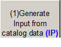

- The program will convert the values to the desired units and display them on Table 2 in worksheet "INPUT" which will be used by the parameter/coefficient generator program.

- The button shown below is used for clearing Table 1 (worksheet "CATALOG DATA") and Table 2 (worksheet "INPUT"). It is advisable to clear the tables before generating parameters/coefficients for a new heat pump model.


After Table 2 is created, the parameters/coefficients are then calculated as follows:

- Worksheet "ParamEstimator" is used for generating the parameters for the parameter estimation based model using Nelder Mead Simplex. Refer to the steps in the Parameter Estimation Procedure.

- Worksheet "CoeffCalculator" is used for calculate the coefficients for the curve-fit model using the generalized least square method. Refer to the steps in the Curve Fit Model procedure.

### Parameter Estimation Procedure

#### Step 2a: Generating First Set of Parameters (PE-Based Model)

- Using Table 2, the program can generate parameters. The user must fill all the cells colored light blue in worksheet "ParamEstimator".

- **Accuracy:** Start with a low accuracy for faster convergence, recommended value of 0.001.

- **Compressor Type:** User is allowed to select from 3 types of compressors: scroll, rotary or reciprocating. Contact the manufacturer to make sure that the compressor selected is correct. Wrong type of compressor selected would lead to the program crashing or inaccurate parameters.

- **Refrigerant:** Contact the manufacturer on the refrigerant used to generate the catalog data and select from the list of refrigerants. Usually the refrigerant used is R22. .

- **Source Side Fluid:** Select the type of fluid used for the source side. 0: Water, 1: Antifreeze Mixture. Note that the number of parameters will change depending on the type of fluid. Antifreeze mixture requires one additional parameter.

- **Which Initial Guess?:**  The user may choose a set of initial guesses(1-5) that will be used by the optimization routine in generating the parameters. Start with 1, which is the set of initial guesses 1 at column B.

- **Initial Guess:** Initial guess for all the parameters. For Initial Guess 1, enter a value of 1 for all the parameters except for the loss factor (less than 1.0). The loss factor should be less than 1.0 because the efficiency of the compressor should be less than 100%. Adjust the values in Initial Guess 1 if the program happens to crash and try again.

-  Now click on Button 2 shown below to generate the parameters.


It will take some time to generate the parameters depending on the number of data points. The parameters generated will be displayed at Parameters 1.

- Look at the error analysis of Error 1, which gives the user a summary of the errors for Heating Capacity, Heating Absorption and Power. An average error of 5-8% is achievable for all the values.

- The errors for all the individual catalog data points are displayed in worksheet "RESULT".

#### Step 2b: Improving the Set of Parameters (PE-Based Model)

- After the initial set of parameters has been generated, the user can increase the accuracy of the parameters by using parameters generated as the initial guess for the second simulation and increasing the accuracy of the program.

- Copy and Paste Parameters 1 to Initial Guess 2.

- Change the initial guess indicator **(Which Initial Guess?)** from 1 to 2.

- Increase the accuracy by twice. For example, set accuracy to 0.000001.

- Now click on Button 2 shown below to generate the second set of parameters.


The simulation time would most likely be less but it depends on the accuracy value as well. And the parameters generated will be displayed at Parameter 2.

- Compare Error 2 to Error 1, the error values should be less, which means that the parameters are getting better and more accurate.

- Repeat the steps in 2a and 2b until a desired set of error values is achieved or the errors stop decreasing

#### Step 3: Generating EnergyPlus Input Parameters

- Click on the Button 3 shown below to convert and arrange the parameters generated to fit EnergyPlus Input File (IDF), which will be listed from cell B46:B54.


- The button shown below in worksheet "ParamEstimator" is used for clearing Initial Guess (2-5), Parameters(1-5), Error(1-5), EnergyPlus Input parameters and Result(1-5) in worksheet "RESULT".


### End Parameter Estimation Procedure

### Curve Fit Model Procedure

#### Step 2: Generating the coefficients (Curve-Fit Model)

- Using Table 2, the program can generate the coefficients. The user must fill all the cells colored light blue in Worksheet "CoeffCalculator".

- **RatedAirVolFlowRate:** Rated volumetric air flow rate (m<sup>3</sup>/s) which corresponds to the highest heating capacity listed in the catalog data.

- **RatedWaterVolFlowRate:** Rated volumetric water flow rate (m<sup>3</sup>/s) which corresponds to the highest heating capacity listed in the catalog data.

- **RatedTotalCap:** Rated heating capacity (W) which is the highest heating capacity listed in the catalog data.

- **RatedPower:** Rated power consumption (W) which corresponds to the highest heating capacity listed in the catalog data.

- Now click on Button 2 shown below to calculate the coefficients.


- The coefficients for the corresponding curves are listed at cell B12:C16. Error analysis of model are listed at cell B19:B27.

- The errors for all the individual catalog data points are displayed in worksheet "RESULT".

- The button shown below in worksheet "CoeffCalculator" is used for clearing the coefficients, the error analysis and the outputs in worksheet "RESULT".


### End Curve Fit Model Procedure

G-Function Spreadsheet
----------------------

The spreadsheet (g-function\_library.xls) has comparison plots for different configurations/grouts for the Ground Heat Exchanger:Vertical. A user can see how the boreholes interact with each other in different configurations. It has the actual screen shot (GLHEPro) showing the conditions/inputs used to obtain the data. GLHEPro is not included with EnergyPlus and it or something similar should be used to generate similar values. Some of the values used in getting g-functions are not used in the EnergyPlus Ground loop model, but the spreadsheet screen shot gives an idea of what the inputs were in obtaining the g-functions.

The reference data set GLHERefData.idf contains sets of parameters for the Ground Heat Exchangers:

"This file contains sample input for the ground loop heat exchanger model. The response of the borehole/ground is found from the 'G-function' that is defined in the input as series of 'n' pairs of values (LNTTSn, GNFCn). It is important to note that the G-functions have to be calculated for specific GHE configurations and borehole resitance, length and borehole/ length ratio. That is, the parameters for the units vary with each design. The data in this file are intended as examples/samples and may not represent actual designs.

The sample data has been calculated for a number of configurations:

- 1 x 2 boreholes

- 4 x 4 boreholes

- 8 x 8 boreholes

Data is given for both 'standard' grout (k=0.744 W/m.K) and 'thermally enhanced' grout (k= 1.471 W/m.K). The flow rate per borehole is .1514 kg/s. The pipe given is 0.75in. Dia. SDR11 HDPE. The fluid is water. The borehole/length ratio is 0.06 (76.2m/4.572m [300ft/15ft])

ParametricPreprocessor
======================

The parametric preprocessor used to create a series of resulting IDF files from a single source IDF file that contains parametric objects and expressions. The parametric objects in EnergyPlus are interpreted by the ParametricPreprocessor and are:

* Parametric:SetValueForRun
* Parametric:Logic
* Parametric:RunControl
* Parametric:FileNameSuffix

The ParametricPreprocessor reads the source IDF file and removes the Parametric objects shown above, processes these objects and any embedded expressions and produces a series of resulting IDF files, one for each "run" described by the objects.

An intermediate file called parametric.int is used that contains references to all embedded expressions that will need to be substituted into the file.

An error file called parametric.err is also produced to help debug problems with the objects.

The Parametric objects are described in detail in the InputOutputReference document.

ParametricPreprocessor can be called at the command line with the name of the source file as the only argument.

The ParametricPreprocessor is used in the batch files that come with EnergyPlus and is used by EP-Launch automatically.

AppGPostProcess - Appendix G PostProcessing program
===================================================

The baseline for Standard 90.1 Appendix G requires simulating the baseline building in four cardinal directions and comparing the average of those simulation results with the proposed building simulation results.  The AppGPostProcess utility helps perform the averaging needed. The utility takes the four HTML files generated by EnergyPlus and creates an average HTML file. In addition, the AppGPostProcess utility takes the four CSV files (based on ESO files) and creates an average CSV file as well as averaging the meter CSV files (based on the MTR files).  The source files must have specific names for this utility to work:

fileNameRoot-G000.csv

fileNameRoot-G090.csv

fileNameRoot-G180.csv

fileNameRoot-G270.csv

fileNameRoot-G000Meter.csv

fileNameRoot-G090Meter.csv

fileNameRoot-G180Meter.csv

fileNameRoot-G270Meter.csv

fileNameRoot-G000Table.html

fileNameRoot-G090Table.html

fileNameRoot-G180Table.html

fileNameRoot-G270Table.html

Where "fileNameRoot" can be the characters typically used to name files without extension. A single command line argument is passed to the AppGPostProcess utility which is the name of one of the HTML files. The remaining file names will be used based on any of the HTML files selected.

The utility creates the files

fileNameRoot-GAVG.csv

fileNameRoot-GAVGMeter.csv

fileNameRoot-GAVGTable.html

The numeric values in the output files are the average results from the four corresponding source files. In the HTML file, if not all the four files contain a numeric value, then the four values are displayed instead. The source files must have identical structure for AppGPostProcess to work. For CSV files, the same number of rows and the same number of columns are needed each file. This means that monthly or hourly values should be included in the CSV file, and not TimeStep values. For HTML files, the same reports should be included in each and the IDF files should be identical.

The intention is that the four baseline IDF files would be identical except for the use of the Compliance:Building object and only the value of the field "Building Rotation for Appendix G" would change.

EP-Launch can be used to run both the AppGPostProcess program by using the Utilities tab in EP-Launch.  See the EP-Launch section in this document for more information on how to use EP-Launch.


BLASTTranslator
===============

The BLAST Translator will produce an IDF file from an existing BLAST Input File (usually called &lt;something&gt;.bin. For anyone that is unfamiliar, BLAST stands for the Building Loads Analysis and Systems Thermodynamics computer program.  Documentation is included here though the BLAST Translator is no longer included with the EnergyPlus Installation - it is available as a special download for those who need it.

A special batch file (**RunXLate.bat**) can be used to run the translation program. Similar to running EnergyPlus (see above), you run this batch file:

RunXLate &lt;blastinputfile&gt;

Where &lt;blastinputfile&gt; is the part of the file name without extension. The program produces a .idf file of the same name.

The BLASTTranslator uses an "Energy+.ini" file for some parameters. For example:

```
[program]
dir=
ver=
surf=group

[weather]
dir=
```

The above BLASTTranslator ini file sets the "version" of EnergyPlus to the current version and has the "surf" parameter set to "group". This BLASTTranslator run will produce an EnergyPlus input file for the current release version format and will name surfaces by Zone and Class (e.g. ZN001:Wall001). The alternative "Consecutive" will number surfaces in sequence.

DOE2Translator
==============

The DOE2Translator program creates an EnergyPlus input file from a DOE-2.1E input file. The translation is not intended to be complete but simply an aid to help you move your library of DOE-2.1E input files into EnergyPlus. You should look over the resulting EnergyPlus input file, review the documentation of EnergyPlus, and make any necessary edits to the translated file. Documentation is included here though the BLAST Translator is no longer included with the EnergyPlus Installation - it is available as a special download for those who need it.

To use the DOE2Translator program, at the DOS prompt (or the command prompt for Windows NT/2000 systems), go to the directory that the DOE2Translator is located. That directory is likely to be:

  c:\\EnergyPlus\\PreProcess\\DOE2Translator

In this directory there should be several files:

  DOE2Translator.exe   - the program

  D2E\_macr.txt         - a support file that contains the header of the translated file

  D2comkey.dat         - a support file that contains a list of DOE-2 keywords

  Samp4n.inp         -  sample DOE-2.1E input file

  Samp4n.imf         - the EnergyPlus macro input file resulting from the sample

To use the DOE2Translator simply type

  DOE2Translator  &lt;file&gt;

Where you substitute the file you want to translate for &lt;file&gt; without a file extension. The ".inp" file extension is assumed. For example, if you want to translate one of the sample DOE-2.1E input files you would type:

  DOE2Translator  samp1b

The &lt;file&gt; can also have a full path, but it should not have an extension. If you have spaces in your path name, enclose the whole thing in ".

Several files get created when you run the DOE2Translator program. In the same directory as the DOE-2.1E input file, a new file with the same name and the file extension of ".imf" contains the EnergyPlus translation.

This is an EnergyPlus macro file and the macro processor EPMacro needs to be used. The DOE2Tranlator uses many macros so using EPMacro is essensial. EP-Launch automatically runs EP-Macro when an ".imf" file is selected. In the translated file, comments shown with a tilde "~" are messages from the DOE2Translator program that may be helpful in understanding the limits of the translation.

The D2EP.log file contains a detailed log of the translation process. The D2E\_TEMP.txt file contains an intermediate version of the log file. Both of these files are created in the same directory as the DOE2Translator program and can usually be deleted.

Since DOE-2.1e and EnergyPlus share a common macro language, many macro features are passed to the EnergyPlus file unchanged, including \#\#set1, \#\#if, \#\#def and other macro commands. References to macro variables (i.e., "var[]") and expressions (i.e., " \#[x[] + 1]") are usually passed through to the resulting EneryPlus IMF unless the DOE2Translator needs to understand that field during the translation process. The DOE2Translator does not evaluate macro expressions and if it needs to understand a field value and a macro is present instead will use a default value for the field instead. Most fields do not need to be understood by the translator and are directly passed through to the IMF file unchanged.

Files that are included with the \#\#include are not translated automatically and would each need to be run through the DOE2Translator. If the included file does not have the INP extension it would need to be changed prior to the translation. In addition, the user would need to edit the \#\#include commands to use the IMF extension instead of the INP extension.

In this version of the DOE2Translator program, translation is limited to the following DOE-2 commands, which represent the majority of the building envelope and internal gains:

```
    SPACE (except SHAPE=BOX)
    SPACE-CONDITIONS
    DAY-SCHEDULE (except use of HOURS and VALUES keywords)
    WEEK-SCHEDULE (except use of DAYS and DAY-SCHEDULE keywords)
    SCHEDULE (except use of WEEK-SCHEDULE keyword)
    MATERIAL
    LAYERS
    CONSTRUCTION
    EXTERIOR-WALL, ROOF (except polygon)
    INTERIOR-WALL
    FIXED-SHADE
    WINDOW
    DOOR
    RUN-PERIOD
    DESIGN-DAY
    LIKE
    SET-DEFAULT
```

Running Console Applications
============================

Several of the auxiliary programs included with EnergyPlus are Console Applications. This designation means that they are executed from the "command window" (Windows OS) or terminal window (Linux OS). We will include generic instructions for the Windows OS use of these applications in this section. Each program will also include specifics for the Windows OS in the individual program documentation.

As installed, the batch files that accompany console applications will be set so that file extensions are not included for input parameters, paths to installed data (such as weather data) will be set automatically, and these paths can be modified by the user as desired. (Instructions included a bit later in this section).

Generally, the steps for executing a console application is:

1)   Open a DOS command prompt window (Start à Programs à Accessories à Command Prompt)

2)   Change to the directory where EnergyPlus is installed (modify the commands below if you did not install EnergyPlus in the default install path):

C:

CD \\&lt;root folder&gt;\&lt;/span>

3)   Change to the specific folder for the console application:

CD &lt;folder&gt;

4)   Run the program:

&lt;batchfile&gt; &lt;input parameters&gt;

Modifying the batch file
------------------------

Generally, the batch files set several environment variables that govern the execution of the specific program.

Table 32. Environment Variables used in Batch Files
<table class="table table-striped">
  <tr>
    <th>Environment Variable Name</th>
    <th>Description</th>
  </tr>
  <tr>
    <td>Program Path</td>
    <td>Specific or relative program path</td>
  </tr>
  <tr>
    <td>Program Name</td>
    <td>Name of program</td>
  </tr>
  <tr>
    <td>Input_Path</td>
    <td>Input Path Specification</td>
  </tr>
  <tr>
    <td>Output_Path</td>
    <td>Output Path Specification</td>
  </tr>
  <tr>
    <td>Weather_Path</td>
    <td>Weather Data Path Specification</td>
  </tr>
</table>

Or, as seen in the batch file text:

```
:Instructions:
:  Complete the following path and program names.
:  path names must have a following \ or errors will happen
 set program_path=
 set program_name=<specific program name will be here>
 set input_path=
 set output_path=
 set weather_path=..\..\WeatherData\
```

As the instructions in the batch file show, the path character must terminate the path specification or errors can occur. The "weather\_path" specification shows an example of using a "relative" path specification. Depending on the program, this specification, of course, might change.

```
set weather_path=..\..\WeatherData\
```

What the specification says is that above (..) and above again (..) and then "WeatherData" is where the weather data files are located. This kind of relative path would be true for most "Preprocess" programs in the installed folders. The following illustrates the folder tree:

```
<Root Folder> (this is usually EnergyPlusV<version>)
      Preprocess
                  Specific Program Folders
      WeatherData
```

Thus, the user can simply put the name of the weather data file onto the batch file run and it will look for that file in the installed WeatherData folder.

Technical Details of Running EnergyPlus
=======================================

This section will contain the details of running EnergyPlus - more (and some duplicated) information on EP-Launch (basic discussion included in the Getting Started manual) and "by hand" - describing the batch files that are included with the install. The first parts of this section deal with using EnergyPlus on a Wintel/Windows OS system. Though similar commands can be used on other OS - such as Linux, they will not be exactly the same commands (usually).

EP-Launch Program
-----------------

EP-Launch is an optional component of the EnergyPlus Windows installation (it is not available for Linux and Mac platforms). For users that want a simple way of selecting files and running EnergyPlus, EP-Launch provides this and more. In addition, EP-Launch can help open a text editor for the input and output files, open a spreadsheet for the postprocessor results files, a web browser for the tabular results file, and start up a viewer for the selected drawing file.


Figure 35. EP-Launch Screen


### Start EP-Launch

EP-Launch is located in the main directory/folder for EnergyPlus. In addition, it is available on the shortcut menu for EnergyPlus.  By double clicking on the EP-Launch icon you get the screen shown above (Figure 35) for running a single input file. The EP-Launch program simply starts other programs and allows you to avoid having to use the DOS command line prompt to run EnergyPlus. More help is provided for the program under the "Help" menu.

### Selecting Input and Weather Files

The input file and weather files can be selected on the Single  Input File tab from the two pull down lists which show recently used files or you can press the "Browse…" buttons to locate an input or weather file that you have created yourself. If this is your first time using EP-Launch, the pull down lists will show some files from the ExampleFiles subdirectory. These are not the only examples, use browse to open other example files from the ExampleFiles subdirectory or other EnergyPlus input files.

### Running a Single Input File

On the Single Input File tab, after you select the weather and input files simply push the "Simulate…" button to start the EnergyPlus building energy simulation engine. At this point a black DOS window should pop up on your screen and show the progress of your simulation. The simulation is complete when the black DOS box closes. The EnergyPlus program black DOS window will show scrolling text as the simulation procedure progresses. If you would like to see these messages more slowly you have two options:

1)   Press the "Control-S" key combination to try to stop the progress and any key to continue.

2)   Under the "View" menu on the EP-Launch program, select "Options" then "Command Window" then check "Pause During Simulation" and this will pause the process immediately after EnergyPlus executes. To continue after the pause, press any key.

If the file contains Parametric objects, the single input file may cause multiple simulations to be performed. If multiple simulations are performed, the output files will be listed on the History tab and will be named with either the file suffixes defined in the input file or with a serial number.

Multiple single input file and group simulations can be started at the same time. On a computer with multiple-processors or multiple-cores, this will enable the simulations to complete more quickly than starting one after another.

### Looking at the Results

After you have run a simulation and the black DOS window closes, EnergyPlus has completed, and a status message is displayed (see figure below):

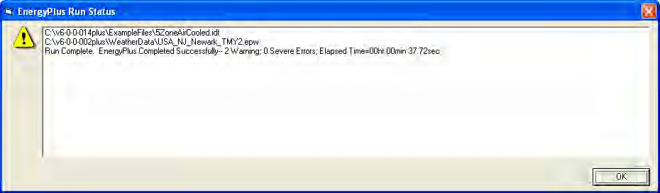

Figure 36. EP-Launch Finish Status.

This status gives you a quick overview of whether there were warning (**should look at**), severe (**should probably fix**) or fatal (**must fix**) errors in the run as well as the time it took for the simulation to complete.  After pressing "OK" from this box, selecting "ERR/EIO/BND Output Files Only" from the "View" menu will display the ERR, EIO, and BND files - useful when errors may have occurred. Alternatively, pressing the F2 function key will display the same three files.

Another way to open files easily is by using the View Results buttons as shown in 29. Two different panels of buttons can be used under View Results, one shown by using the "All" tab on the left edge and by using the "Sets" tab on the left edge. The "All" tab shows all the various files by file extension that can be viewed individually. Files available for view  based on the current input file name, are "enabled" (extension names clearly readable).

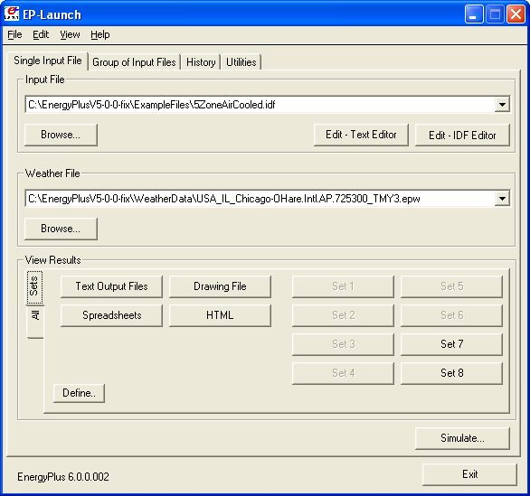

Figure 37. EP-Launch with the Sets tab of View Results

The figure above shows the same main screen of EP-Launch but with the "Sets" tab selected on the left edge of the View Results section. The buttons on this tab can open many files at the same time and are a shortcut to opening the files that may be commonly used. The Text Output Files, Drawing Files, and Spreadsheets buttons cause several different results files to open at once based on the currently selected Input File. The HTML file opens just the tabular results file if that file was produced (see *OutputControl:Table:Style*). The buttons labeled as Set 1 to Set 8 allow you to select which sets of files you want to open. Press the "Define" button in order to define the files to view.


Figure 38. Define Files to View

When the "Define" button is pressed on the Sets tab of the View Results section of the main screen, the dialog box in the figure above is shown. This allows the files extensions to be selected that would be opened for each of the Set 1 to Set 8 buttons. One or many files can be selected for each of the Set buttons. This allows you to define exactly which files you want opened.

The content of each file extension is listed below.  The contents (along with examples) are discussed in the [Output Details](file:///E:\Docs4PDFs\OutputDetailsAndExamples.pdf) document.

By pressing the "Text Output Files" button, a text editor will open each of the text output files. Up to 29 files will open, if they exist. Selecting "Single File" from the 'View'  menu displays a menu of all available output files from which any file can be opened individually. Each file may also be opened with an associated function key. The output files and function key shortcuts are listed below:

1.    Variable - tabulated results in comma, tab or space delimited format (generated by the ReadVarsESO postprocessor) (F4)

2.    ESO - raw report variable output (F5),

3.    RDD - list of output variables available from the run (F6).

4.    MDD - list of output meters available from the run (Shift-Ctrl-F3)

5.    EIO - additional EnergyPlus results (F7),

6.    ERR - list of errors and warnings (F8),

7.    BND - HVAC system node and component connection details (F9),

8.    MTR - raw report meter output (F11),

9.    MTD - list of meter component variables (F12)

10. METER File - tabulated meter report in comma, tab or space delimited format (generated by the ReadVarsESO postprocessor) (Ctrl-F4)

11. ZSZ - zone sizing details in comma, tab or space delimited format (Ctrl+F5)

12. SSZ - system sizing details in comma, tab or space delimited format (Ctrl+F6)

13. AUDIT - input file echo with input processor errors and warnings (Ctrl+F8)

14. SLN - output from "report, surfaces, lines" (Ctrl+F9)

15. DBG - output from the debug command (Ctrl+F11)

16. SHD - output related to shading (Ctrl+F12)

17. SVG - HVAC Diagram (Shift+ F4)

18. EPMIDF - clean idf file after EP-Macro processing (Shift+F5)

19. EPMDET - EP-Macro detailed output with errors and warnings (Shift+F6)

20. MAP - daylighting illuminance map (Shift+F7)

21. TABLE - tabulated report of bin and monthly data in comma, tab or space delimited or HTML format  (Shift+F8)

22. VMRL - drawing file in VRML (Virtual Reality Markup Language) format (Shift F+F11)

23. DXF - drawing file in AutoCAD DXF format (Shift+F12)

24. Delight IN - DElight input generated from EnergyPlus processed input (Shift+Ctrl+F4)

25. Delight OUT - Detailed DElight output (Shift+Ctrl+F5)

26. Delight ELDMP - DElight reference point illuminance per time step (Shift+Ctrl+F6)

27. Delight DFDMP - DElight warning and error messages (Shift+Ctrl+F7)

28. EXPIDF - Expanded IDF when using HVACTemplate objects (Shift+Ctrl+F8)

29. Group Error - combined error files for a group run. (Shift+Ctrl+F9)

30. VCpErr - Transition program error file (Shift+Ctrl+F11)

31. Screen (Shift+Ctrl+f12)

32. Proc CSV - Simple statistiscs generated from CSVProc (also see Create Statistics File option under View-Options).

33. EDD - Energy Management System details.

Clicking on the "Drawing File" button will open the generated DXF file if an appropriate viewer has been configured (see *Selecting Viewers and Editors* below). The DXF file is a CAD format that displays the physical shape of the building being modeled in three dimensions. The "Drawing File" button also opens the HVAC diagram generated with the HVAC-Diagram utility (see Auxiliary Programs).

Clicking on the "Spreadsheets" buttons will open any generated CSV files if an appropriate viewer has been configured (see *Selecting Viewers and Editors* below).

### Viewing the Drawing File without Running a Simulation

The "Drawing" button (or the View menu Drawing File option) will automatically run EPDrawGUI if the DXF file does not exist or it is older than the input file. This allows the building geometry to be viewed without running a full simulation. For more information about EPDrawGUI, see the EPDrawGUI section in this document.

### Editing the Input Files

The input file, called IDF file that is selected from the top pull-down list, can be edited by pressing one of two buttons in the "Input File" area. The "Edit - Text Editor" button will start a text editor and the "Edit - IDF Editor" will start the separate program called the IDF Editor. Remember to save any changes you make in either editor before returning to EP-Launch to run the simulations again.

### File Menu

The File menu can be used for selecting input and weather files just like the "Browse…" buttons (see the *Selecting Input and Weather Files* section above)

If you are upgrading from the previous version of EnergyPlus you can use the "File", "Transition" menu option to upgrade your EnergyPlus input files (IDF and IMF) to the most recent version (see the section Using Older Version Input Files - Transition for more information about the Transition program). This EP-Launch option only works for upgrading input files one version.

### Edit Menu

No cutting or pasting is used in this program so the edit menu shows options that duplicate the functions of the "Edit - Text Editor" and "Edit - IDF Editor" buttons. In addition, the weather file and the postprocessor command file (rvi) may be opened in the text editor.

### View Menu

The View menu (see Figure 39) duplicates the options in the "View Results" area of the main screen (see the *Looking at the Results* section above) and allows opening of selected output files. You can also open the folders that contain the active input and weather files. Opening a single file is under a submenu and is very similar to the Quick Open Panel for Single Simulation described above. Selecting "HTML File" from the "View" menu will open any user created files saved in the format: &lt;filename&gt;table.html (see *OutputControl:Table:Style*).


Figure 39. EP-Launch View Menu

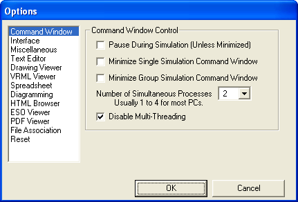

Figure 40. EP-Launch Options Screen.

The "View" menu also accesses the "Options" menu item shown in Figure 40 that is used to control many of the optional features of EP-Launch. These optional features are described below:

#### Command Window Options

**Pause During Simulation (Unless Minimized)** - Stops the progress of the EnergyPlus run at different points. This does not stop the simulation itself but pauses before or after important events as files are copied or utility programs are run. It is usually used only for diagnosing problems with the EPL-RUN batch file. The feature is also described in the *Running a Single Input File* section above.

**Minimize Single Simulation Command Window** - For a single input file, minimizes the Command Window that EP-Launch uses to run EnergyPlus. The command window will appear only in the Windows taskbar and the command window will not be visible. You can restore the command window be clicking on the taskbar item labeled "EnergyPlus Process". This option should be used with caution since you will not see any indication of the simulation being complete other than the "EnergyPlus Process" taskbar item will disappear.

**Minimum Group Simulation Command Window** - For a group of input files, minimizes the Command Window that EP-Launch uses to run EnergyPlus. This is a good option when working on something else on your computer at the same time as the group of simulations is running since the command window normally becomes the front window each time a new simulation starts. This option prevents the command window coming to the front for each simulation. The command window will appear only in the Windows taskbar and the command window will not be visible. You can restore the command window be clicking on the taskbar item labeled "EnergyPlus Process". This option should be used with caution since you will not see any indication of the simulation being complete other than the "EnergyPlus Process" taskbar item will not be present.

**Number of Simultaneous Processes** - Select the maximum number of simulations that should be able to be run at the same time. For a computer with multiple processors or multiple cores, this will allow better utilization of the computers power. The value selected should correspond to the number of processors/cores but higher or lower number can be used as well.

**Disable Multi-Threading** - Check this box if you wish to disable the built in multi-threading capabilities of EnergyPlus. Portions of EnergyPlus have been programmed to use more than one processor, or CPU core, at the same time during a single simulation. This multithreading may not be desirable when running more than one simulation at a time on the same computer (because it can actually run more slowly). When this check box is checked multi-threading is turned off. The check box sets the **EP\_OMP\_NUM\_THREADS** environmental variable to 1. The multi-threading capability of EnergyPlus can also be controlled using the **ProgramControl** object field called Number of Threads Allowed. That field takes precedence over the setting of the checkbox. Also note that when multiple simulations are started from EP-Launch, this automatically disables multithreading by setting the EP\_OMP\_NUM\_THREADS environmental variable to 1 whether this box is checked or not. The ProgramControl object is described in the Input Output Reference document.

#### Interface Options

**Extra Wide Window** - Select this option to make the main EP-Launch window wider. This is useful when files are used with very long file path names.

**Alternative layout** - Changes the layout of the EP-Launch window to an alternative arrangement of buttons.

#### Miscellaneous Options

**Tab Delimited Open with Spreadsheet** - Selecting "Single File" and then "Main Results File" from the "View" menu or pressing the F4 function key will open TAB files with the default spreadsheet application rather than the text editor. Comma-separated variable (CSV) is the default setting for viewing tabulated results set in the RVI file. If the user changes the setting for viewing tabulated results to TAB or TXT format, selecting "Single File" and then "Main Results File" from the "View" menu or pressing the F4 function key will open the files in the default text editor.  TAB files, when selected, will also be opened by the text editor when the "Text Output Files" button is pressed after a successful run.

**Allow More Than 250 Columns** - Tabulated data that exceeds 250 columns, the MS Excel maximum, will be truncated to that limit unless "Allow &gt;250 Columns" is selected. Excel versions prior to 2007 were limited to 255 columns in a sheet; later versions allow unlimited number of columns. This limitation may not be true for other spreadsheet programs.

**Check VERSION Prior to Simulation** - Automatically check the VERSION object in the selected EnergyPlus input file prior to simulation and if it is an older version than the current version will run the Transition program to update the file.

**Convert ESO/MTR to IP Units** - Runs the convertESOMTR utility program (see AuxiliaryPrograms documentation for more information). This utility will convert the ESO and MTR files into Inch-Pound units. The CSV file created from these files will also be in Inch-Pound units.

**Create Statistics File** - Runs the CSVProc utility program (see the AuxiliaryPrograms documentation for more information) and creates the -Proc.csv file. This file contains some simple statistics on each variable in the normal CSV file.

**Create Batch File to Run EnergyPlus** - Traditionally EP-Launch has created a batch file in order to execute EnergyPlus with the various options chosen. This can cause problems with some operating systems, such as Windows Vista, when set to a higher security setting.  This option can be unchecked and a batch file is not created when running EnergyPlus instead parameters are passed to an existing batch file.

**Run ParametricPreprocessor** - When this option is checked, if Parametric objects are present in the file, the ParametricPreprocessor will be run prior to the first simulation and if multiple simulations are needed they will all be executed. See the Auxiliary Programs documentation for details.

**Check for Updates to EnergyPlus** - When this option is checked, EP-Launch will check every seven days if an update to EnergyPlus or any of the files distributed with EnergyPlus are available to download. If they are available a message will be shown upon start up.  You can also manually check by going to HELP .. CHECK FOR UPDATES.

#### Text Editor Options

EP-Launch will start a text editor when editing a IDF file or when viewing many of the results files.  The text editor that will be used is shown but can be changed by either pressing the Select button or by pressing the Auto Find button. The Select button allows you to find the text editor of your choice. The Auto Find button will automatically find the program that is associated with the TXT file extension and use that program. Auto Find is invoked the first time EP-Launch is started so that a text editor is available immediately. The most common text editor is NOTEPAD.EXE and is built into Windows but many other text editors are also available.

#### Drawing Viewer Options

The default drawing viewer is the application associated with DXF files. This can be changed to your favorite drawing program by using the Select button then locating the executable file for your favorite drawing software capable of reading a DXF file. The Auto Find button will automatically find the program that is associated with the DXF file extension and use that program. A variety of programs (free of charge) can render DXF files for viewing.  The [Output Details](file:///E:\Docs4PDFs\OutputDetailsAndExamples.pdf) document lists some of these programs as well as displaying what a DXF rendered file looks like on the screen.

#### VRML Viewer Options

EP-Launch will start a VRML Viewer when a building drawing is created using the Report, Surfaces, VRML option in your IDF file.  The VRML Viewer that will be used is shown but can be changed by either pressing the Select button or by pressing the Auto Find button. The Select button allows you to find the VRML Viewer of your choice. The Auto Find button will automatically find the program that is associated with the WRL file extension and use that program. Auto Find is invoked the first time EP-Launch is started so that a VRML Viewer is available immediately. Many other VRML Viewers are available.

#### Spreadsheet Options

EP-Launch will start a spreadsheet program when viewing many of the results files.  The spreadsheet that will be used is shown but can be changed by either pressing the Select button or by pressing the Auto Find button. The Select button allows you to find the spreadsheet program of your choice. The Auto Find button will automatically find the program that is associated with the CSV file extension and use that program. Auto Find is invoked the first time EP-Launch is started so that a spreadsheet program is available immediately.

#### Diagramming Options

EP-Launch will start a diagramming program to view SVG files from HVAC Diagram.  The diagramming program that will be used is shown but can be changed by either pressing the Select button, the Auto Find button, the Use Firefox button or the Use Opera button. The Select button allows you to find the diagramming program of your choice but make sure it is capable of opening SVG files. The Auto Find button will automatically find the program that is associated with the SVG file extension and use that program. Auto Find is invoked the first time EP-Launch is started so that a spreadsheet program is available immediately.  Since both Firefox and Opera web browsers can view SVG files, those buttons will select those respective browsers if available.

#### HTML Browser Options

EP-Launch will start a HTML browser program when viewing the tabular results file when HTML is chosen in OutputControl:Table:Style.  The HTML browser that will be used is shown but can be changed by either pressing the Select button or by pressing the Auto Find button. The Select button allows you to find the HTML browser of your choice. The Auto Find button will automatically find the program that is associated with the HTML file extension and use that program. Auto Find is invoked the first time EP-Launch is started so that a HTML browser is available immediately.

#### ESO Viewer Options

By default, ESO files are opened with a text editor. ESO files are the raw output file containing results from EnergyPlus for Report Variable objects. They are often processed into CSV files to make it easier to view them. At least one utility program has been developed to view ESO files directly (see the EnergyPlus.gov web site under "Interfaces & Other Tools", "Third-party EnergyPlus Tools).  The Auto Find and Select buttons work the same way as other viewer selectors. If no special ESO viewer is selected the box will be shown as empty. It can also be emptied by using the Clear button.

#### PDF Viewer Options

EP-Launch will start a PDF viewer program when opening the EnergyPlus documentation under the Help menu.  The PDF Viewer that will be used is shown but can be changed by either pressing the Select button or by pressing the Auto Find button. The Select button allows you to find the PDF Viewer of your choice. The Auto Find button will automatically find the program that is associated with the PDF file extension and use that program. Auto Find is invoked the first time EP-Launch is started so that a PDF Viewer is available immediately.

#### File Association Options

When installing EnergyPlus, you are given an option if you want IDF, IMF, and EPG files associated with EP-Launch. This allows double clicking on files with those extensions and having EP-Launch start automatically with those files. If during the install that option is not selected or if you have changed the program that opens IDF, IMF and EPG files and want to change it back to EP-Launch, the button for this option will do that.

#### Reset Options

Two reset options are available here.

The **Auto Find All File Viewers** button will autofind all the file viewers in one step. This is equivalent to pressing the Auto Find button for each viewer program.

The **Reset All Options and Exit** button will clear all options and restore the default values used when first invoking EP-Launch for the first time. This also clears the list of recently used IDF and weather files.  This option will exit EP-Launch and you will have to start EP-Launch again.

### Help Menu

The Help menu can be used to open the EnergyPlus documentation files and the EP-Launch help file. In addition, you can check for updates to the EnergyPlus program and other files in the EnergyPlus distribution.

### Recently Used Files

The recently used input, weather and group file pull down lists can hold a maximum of twenty items. These lists, like the viewers selected, are saved between times you use the EP-Launch program.

### Running Groups of Input Files

If you are running EnergyPlus on one file or even just a few different files, the easiest way to do this is on the Single Simulation tab. If you are performing an analysis of a building which requires running EnergyPlus for a larger number of times, you may want to consider the Group of Input Files tab, shown below. You may also want to set the Number of Simultaneous Processes option under View Options Command Window so that the simulations are completed as fast as your computer will allow.


Figure 41. EP-Launch Group of Input Files Tab.

This tab lets you manage EPG, EnergyPlus Group files which contain a list of simulations that need to be performed. The EPG file is simply a text file that contains on each line the input file and weather file names to be used for a simulation along with how the output files should be named and a counter.

You do not need to manually create EPG files, instead press the New Group button on the Group of Input Files Tab and a step-by-step "wizard" will help to create a new EPG, EnergyPlus Group file. The first step of the wizard is to selected the EnergyPlus input files that should be simulated as part of the group:


Figure 42. EP-Launch Step 1 of New Group Wizard.

Use the boxes next to each file to select the files to be simulated. The path to files shown may be changed using the "path" button. Once the files in a certain directory are selected the "next" button should be pressed. If additional files are desired in different directories, you will get a chance to add them to the EnergyPlus group file in a later step.

Select one or several weather files using the second step of the wizard, shown below:


Figure 43. EP-Launch Step 2 of New Group Wizard.

The next step is to review the simulations selected. Each combination of weather file and input file is initially shown. Each simulation is displayed as a single row. You may select a row and delete the simulation at this point. In addition, if additional simulations are desired, the "Add more simulations button" brings you back to the first step of the wizard to add more file.


Figure 44. EP-Launch Step 3 of New Group Wizard.

The next step of the wizard allows you to decide exactly where you want the output files located and what they should be named. For most people just trying to group their simulations and wanting the output files in the same directory as the input files, just select "Original Input File Locations".


Figure 45. EP-Launch Step 4 of New Group Wizard.

More advanced users may choose to define their locations for the output files using symbols that define the name of the directory and file name using:

%I = input file name

%G = group file name

%W =  weather file name

%N = repeat number for IMF files

%J = input file path

%H = group file path

%X = weather file path

Each of these symbols may be used in the location field and substitutions will be made for each when defining the output file location.

For macro files (they have an extension IMF instead of IDF) used in a parametric analysis, the macro file may be run repeatedly up to 999 times. Each time they are simulated a new COUNTER.INC file is created which sets a macro parameter. The COUNTER.INC file should be included using the \#\#include statement in the macro file.

Finally, you can save the EPG, EnergyPlus Group, file wherever you would like.

To run the simulations press the "Simulate Group" button on the Group of Input Files tab. To prevent a specific simulation from being performed, edit the file and use a comment character (an exclamation point) to comment out the line.

When the group of input file simulations is running, the title bar of EP-Launch will show the progress.

### History of Simulations Performed

The History tab allows you to see what files were associated with a particular simulation that was performed. The list shows the date and time of the simulation along with the input and weather file names.


Figure 46. EP-Launch History Tab.


You can expand the level of detail by clicking on the plus signs or double clicking on the entry. The detail shown includes the names of all the input and output files associated with that simulation along with the message summary of the warnings and errors generated. It is possible that a file may be shown that no longer exists.

The View Files button will display the selected file using a spreadsheet, text editor, DXF file viewer, SVG file viewer, or HTML web browser. When groups of simulations are performed using the Group of Input File tab and User Defined Locations are used for the output files, the history view is the only way to access those files using EP-Launch.

The history tab displays the HISTORY.CSV file that is located in the same directory as EP-Launch. If EP-Launch seems to be starting slowly, it is possible that the history file has grown very large. It may be deleted or renamed and a new history file will be automatically created during the next simulation. The HISTORY.CSV file may also be opened in a spreadsheet program.

### Utilities Tab

The utilities tab shown in the following figure allows several utility programs that come with EnergyPlus to be used directly. More information on each utility is also available in the AuxiliaryPrograms documentation.


Figure 47. EP-Launch Utilities Tab.

For each utility, input files can be selected by using the Browse Button. The input file can be opened using a text editor and, for certain utilities, the IDF Editor. If a weather file is needed for a utility it can also be selected. For other utilities, no weather file is needed and that portion of the screen is not shown. The appropriate output files can be opened by the "Open" button near the bottom of the screen. To run the utility, use the "Run" button in the lower left corner of the screen above the "Exit" button.

In addition, for each utility, a brief description of the function of the utility is shown in the about box but much more information is available in the AuxiliaryPrograms documentation.

### Caveats

Remember to save changes made in the editor before you run another simulation.

The simulation cannot write new results to open files which are locked by another application.

You will need to close the spreadsheet program that views the resulting CSV files prior to another simulation and you may need to close the text editor windows also (depending on your editor).

The EPL-RUN.BAT batch file is used to run EnergyPlus from the EP-Launch program. It can be edited with care if other postprocessors or preprocessors are to be used.

### When things go wrong

Though EnergyPlus has had several releases (including beta releases prior to initial release), there still may be problems when input files meet with EnergyPlus. If you are using EP-Launch when this happens, you will see a window appear as in the figure below (Figure 48). Follow the instructions listed on the screen.


Figure 48. EnergyPlus crash within EP-Launch.

### Bugs

The EP-Launch program has been through several "releases" but there is still a chance you will find bugs. Please report them to the energyplus-support@gard.com address so that we can fix them prior to the release.

If the pull-down lists ever are shown as blank the "reset" button may be used. This unlabeled button is very small in the lower left-hand corner of the main screen. It removes the items shown in the recently used file list and causes the program to forget the selected viewers and text editors; and exits the program. When you start EP-Launch again, you will need to make these selections (viewers and text editors) again.

EP-Launch Lite
--------------

EP-Launch Lite is a small application included with the EnergyPlus Macintosh installation. It is a small GUI application that provides a simple way to run EnergyPlus models. Its purpose is similar to EP-Launch but it is a much simpler application with fewer features.

EnergyPlus File Extensions
--------------------------

This section will present a list (perhaps not complete) of EnergyPlus file extensions and what they mean. This will help you after the EP-Launch program finishes.

### Input Files

The following files are input to the EnergyPlus program.

#### IDD

The *input data dictionary* (IDD) is an ascii (text) file containing a list of all possible EnergyPlus objects and a specification of the data each object requires. This file is analogous to the DOE-2 keyword file. The *Guide for Interface Developers* contains a full description of the input data dictionary.

#### idf

The *input data file* (IDF) is an ascii file containing the data describing the building and HVAC system to be simulated. Many example files are installed as part of the EnergyPlus installation. Additionally, a spreadsheet file "ExampleFiles.xls"  contains columnar descriptions of each file's features.

#### imf

The *input macro file* (IMF) is an ascii file containing the data describing the building and HVAC system to be simulated and will have some contents of "macro" commands. The Auxiliary programs document describes use of the macro commands and the program that processes them - EP-Macro.   Many example files are installed as part of the EnergyPlus installation.

#### ini

This is the EnergyPlus initialization file. It is an optional ascii input file that allows the user to specify the path for the directory containing Energy+.idd. This file, using the actual directories of the install, will be created during the install. Unless you change where the EnergyPlus.exe file resides, you will not need to change this file.

#### epw

The *EnergyPlus weather* file is an ascii file containing the hourly or sub-hourly weather data needed by the simulation program. The data format is described in detail in the Auxiliary Programs Document. It is also described succinctly in the Input Output Reference document.

### Output Files

More information (and more up-to-date) about output files is shown in the [Output Details and Examples](file:///E:\Docs4PDFs\OutputDetailsAndExamples.pdf) Document.

#### err

A text file containing the error messages issued by EnergyPlus. **This is the first output that should be examined after a simulation.**Error messages may be issued by EnergyPlus during its input phase or during the simulation. There are three levels of error severity: *fatal*, *severe*, and *warning* as well as simple *"message"* lines. A fatal error causes the program to terminate immediately. The following table illustrates the necessary actions.

Table 33. Error Message Levels - Required Actions

<table class="table table-striped">
<tr>
<th>Error Level</th>
<th>Action</th>
</tr>
<tr>
<td>Information</td>
<td>Informative, usually a follow-on to one of the others. No action required.</td>
</tr>
<tr>
<td>Warning</td>
<td>Take note. Fix as applicable.</td>
</tr>
<tr>
<td>Severe</td>
<td>Should Fix</td>
</tr>
<tr>
<td>Fatal</td>
<td>Program will abort</td>
</tr>
</table>


An example of an error message due to an input syntax error is:

```
** Severe  ** Did not find " DessignDay" in list of Objects
   **  Fatal  ** Errors occurred on processing IDF file -
       probable incorrect IDD file. View "audit.out" for details.
   ************* EnergyPlus Terminated--Error(s) Detected.
```

#### audit

This is an text file which echoes the IDD and IDF files, flagging syntax errors in either file. Note that both *err* and *audit* will show most of the error messages caused by input syntax errors; however only *err* will show errors issued during the actual simulation. The *audit* can be used when you need to see the context of the error message to fully ascertain the cause. The *audit* file also contains potentially extra information that may be useful from the input scan.

#### eso

The *EnergyPlus Standard Output* (ESO) is a text file containing the time varying simulation output. The format of the file is discussed in the *Guide for Interface Developers* and the *InputOutputReference*. The contents of the file are controlled by *Output:Variable* commands in the IDF file. Although the ESO is a text file, it is not easily interpretable by a human. Usually postprocessing will be done on this file in order to put it in a format that can be read by a spreadsheet; however a quick visual inspection of the file does show whether the expected variables are output at the desired time step.

#### mtr

The *EnergyPlus Meter Output* (MTR) is a text file containing the time varying simulation output. The format of the file is similar to the ESO file. As described in the Getting Started document, meters are a powerful reporting tool in EnergyPlus. Values are grouped onto logical meters and can be viewed the same way that the ESO variables are used. The contents of the file are controlled by *Output:Meter* commands in the IDF file. Although the MTR is a text file, it is not easily interpretable by a human. Usually postprocessing will be done on this file in order to put it in a format that can be read by a spreadsheet; however a quick visual inspection of the file does show whether the expected variables are output at the desired time step.

#### mtd

This file contains all the details (i.e., which report variables are on a meter and, conversely, what meters contain) about meters.

#### eio

The *EnergyPlus Invariant Output* (EIO) is a text file containing output that does not vary with time. For instance, location information (latitude, longitude, time zone, altitude) appears on this file.

#### rdd

#### mdd

The *Report (variable) Data Dictionary* (RDD) is a text file listing those variables available for reporting (on the ESO) for this particular simulation. Which variables are available for output depends on the actual simulation problem described in the IDF. The *Report (meter) Data Dictionary* (MDD) is a text file listing those variables available for reporting (on the MTR) for this particular simulation. Which meters are available for output depends on the actual simulation problem described in the IDF. A simulation with no chiller would not permit the output of any chiller report variables. The user may need to examine the RDD or MDD to find out which report variables are available in a particular simulation. The RDD and MDD are written only if the following is included in the IDF file.

```
Output:VariableDictionary, Regular;
```

A variant produces the same files in a IDF "ready" format.

```
Output:VariableDictionary, IDF;
```

#### dbg

This is a text file containing *debug* output for use by EnergyPlus developers. Generally developers will add debug print statements wherever in the code that that they wish. There is a "standard" debug output that prints out conditions at all the HVAC nodes. This output is triggered by placing

```
Output:DebuggingData,1;
```

in the IDF file. If Output:DebuggingData, 0 is entered, you will get an empty eplusout.dbg file.

#### dxf

This is a file in AutoCad DXF format showing all the surfaces defined in the IDF file. It provides a means of viewing the building geometry. The DXF file from EnergyPlus highlights different building elements (shading, walls, subsurfaces) in differing colors. A number of programs can read and display DXF files. Output of this file is triggered by

```
Output:Reports, Surfaces, DXF;
```

in the IDF.

#### sln

A text file containing the coordinates of the vertices of the surfaces in the IDF.

Output of this file is triggered by

Output:Reports, Surfaces, Lines;

in the IDF.

### Postprocessing Program/Files

A postprocessing program *ReadVarsESO.exe* is available that will read an ESO or MTR file and produce a file that can be read by Excel™. It can use an input file or not. In batch mode it is run by the little batch file *RunReadESO.bat*:  Further information on this program is provided in the [Input Output Reference](file:///E:\Docs4PDFs\InputOutputReference.pdf) under a section heading called "Using ReadVarsESO".

RunEPlus batch file
-------------------

It is simple to run EnergyPlus: open a DOS or CMD box in the EnergyPlus directory and use the RunEPlus.bat procedure file. The procedure file takes two arguments - the input file name (containing the building description) and the weather file name:

RunEPlus &lt;input\_file\_name&gt; &lt;weather\_file\_name&gt;

Though it's possible to supply arguments to the batch file with embedded blanks, it's better practice not to. More extensive information about the intricacies of EnergyPlus execution is given in the next parts of this section.

As installed, the RunEPlus is ready to run the sample files that are included. If you wish to create and run other files, you may wish to modify the batch file to your own preferences. See "RunEPlus details" later in this document for parts of the batch file that you will need to modify.

Running EnergyPlus by Hand
--------------------------

EnergyPlus runs as a console application with optional command line arguments. The arguments may be listed by typing energyplus --help (Windows OS) or man energyplus (Linux OS). For more information about the command line interface, see https://github.com/NREL/EnergyPlus/blob/develop/doc/running-energyplus-from-command-line.md. The remainder of this section describes running EnergyPlus in legacy mode (i.e. no command-line arguments) on Windows OS.
 
To run the program bring up the command prompt and "cd" to the directory containing the executable. Assume that the executable is called *EnergyPlus.exe*. In the same directory EnergyPlus expects *in.idf*, the input data file; *Energy+.idd*, the data dictionary file; *in.epw*, the weather file (needed only if there is a RunPeriod in the input); and optionally *Energy+.ini*, the initialization file. Typing "EnergyPlus" (and hitting the *Enter* key) will execute the program. EnergyPlus will write messages to the command window as it runs. A simulation with two design days and one run period looks like:

```
 EnergyPlus Starting
 EnergyPlus, Version 1.3
 Warming up
 Initializing Response Factors
 Calculating CTFs for "EXTWALL80", Construction \#1
 Calculating CTFs for "PARTITION06", Construction \#2
 Calculating CTFs for "FLOOR SLAB 8 IN", Construction \#3
 Calculating CTFs for "ROOF34", Construction \#4
 Initializing Window Optical Properties
 Initializing Solar Calculations
 Initializing HVAC
 Warming up
 Warming up
 Warming up
 Performing Zone Sizing Simulation
 Warming up
 Warming up
 Warming up
 Performing Zone Sizing Simulation
 Initializing New Environment Parameters
 Warming up {1}
 Warming up {2}
 Warming up {3}
 Warming up {4}
 Starting Simulation at 01/14 for CHICAGO IL UNITED STATES TMY2 94846 WMO#=725340
 Initializing New Environment Parameters
 Warming up {1}
 Warming up {2}
 Warming up {3}
 Warming up {4}
 Starting Simulation at 07/07 for CHICAGO IL UNITED STATES TMY2 94846 WMO#=725340
 EnergyPlus Run Time=00hr 00min  7.31sec
```

When execution is finished, *eplusout.err* and *eplusout.audit* will always appear. If the program terminated with an input error, these may be the only output files. If the program runs normally, *eplusout.eio* will appear. Depending on what was requested in the input, the other output files described above will also be written.

RunEPlus details
----------------

A procedure (batch) file is the normal way to run a console application. The *installed* procedure file **RunEPlus.bat** can be used to execute EnergyPlus and deal with all the file handling and postprocessing. It can accommodate running the EPMacro program if you name your files appropriately. And it can use ExpandObjects to expand the special "HVACTemplate" objects into "normal" IDF objects.

The "set" statements near the beginning of the procedure file can be customized for each local system. Thus "program\_path" should be set to the directory path where the program executable resides on your local computer, "program\_name" should be set to the name of the EnergyPlus executable file, "input\_path" should be set to the directory path containing the input (IDF) file, and so forth. Each of the path environment variables must have "\\" as the final character or things won't run correctly. As mentioned before, the batch file is executed by typing:


RunEPlus &lt;input\_filename&gt; &lt;weather\_filename&gt;


where &lt;input\_filename&gt; is the name of the IDF file, without the file extension, and &lt;weather\_filename&gt; is the name of the weather file, without the file extension.The &lt;input\_filename&gt; can also be a complete path to the file (without extension) and it will work.

 In addition, RunEPlus can be called from a different directory and the temporary files will be created in the directory it is called from. This enables multiple RunEPlus.bat to be used with multiple processors or a multiple-core processor without the temporary files of one set of simulations interfering with another. Each call to RunEPlus.bat should be from different directories.

Instructions appear at the top of the batch file:

```
:Instructions:
:  Complete the following path and program names.
:  path names must have a following \ or errors will happen
:  does not have the capability to run input macro files (yet)
:   %program_path% contains the path to the executable as well as IDD and is
:                  the root directory
:   %program_name% contains the name of the executable (normally EnergyPlus.exe)
:   %input_path%   contains the path to the input file (passed in as first argument)
:   %output_path%  contains the path where the result files should be stored
:   %post_proc%    contains the path to the post processing program (ReadVarsESO)
:   %weather_path% contains the path to the weather files (used with optional argument 2)
:   %pausing%      contains Y if pause should occur between major portions of
:                  batch file (mostly commented out)
:   %maxcol%       contains "250" if limited to 250 columns otherwise contains
:                  "nolimit" if unlimited (used when calling readVarsESO)

 echo ===== %0 (Run EnergyPlus) %1 %2 ===== Start =====
 set program_path=
 set program_name=EnergyPlus.exe
 set input_path=ExampleFiles\
 set output_path=Test\
 set post_proc=PostProcess\
 set weather_path=WeatherData\
 set pausing=N
 set maxcol=250

:  This batch file will perform the following steps:
:
:   1. Clean up directory by deleting old working files from prior run
:   2. Clean up target directory
:   3. Copy %1.idf (input) into In.idf
:   4. Copy %2 (weather) into In.epw
:   5. Execute EnergyPlus
:   6. If available Copy %1.rvi (post processor commands) into Eplusout.inp
:   7. Execute ReadVarsESO.exe (the Post Processing Program)
:   8. If available Copy %1.mvi (post processor commands) into test.mvi
:       or create appropriate input to get meter output from eplusout.mtr
:   9. Execute ReadVarsESO.exe (the Post Processing Program) for meter output
:  10. Copy Eplusout.* to %1.*
:  11. Clean up working directory.
```

RunDirMulti Batch File
----------------------

The RunDirMulti.bat batch file runs all the IDF files in the directory that it is located in. The batch file is used to run EnergyPlus simulations using the RunEPlus.bat for all the files in the current directory across multiple separate processor cores.  It has  two parameters, the weather file name to use for simulations and the number of processors.

RunDirMulti &lt;weather file&gt; (opt) &lt;number processor cores&gt; (opt)

The RunDirMulti batch file loops through the files located in the current directory and puts RunEPlus calls to each file into as many temporary batch files as processor cores and then starts each of the batch files. No load balancing between the cores is achieved using this method. The RunDirMulti.bat file should be located in a directory that contains the IDF files. Editing of the file may be necessary to match the directory that EnergyPlus is installed in.

Since the batch file starts up other batch files in different CMD windows, the only way to know that the simulations are all complete is when all of the other CMD windows are closed. Those windows are named "Batch Simulation&lt;n&gt;" where n is 1 to the number of processor cores you selected to use.


EnergyPlus Files
----------------

### Input Files

The following files are input to the EnergyPlus program.

#### Energy+.idd

The *input data dictionary* (IDD) is an ascii (text) file containing a list of all possible EnergyPlus objects and a specification of the data each object requires. This file is analogous to the DOE-2 keyword file. The *Guide for Interface Developers* contains a full description of the input data dictionary.

#### in.idf

The *input data file* (IDF) is an ascii file containing the data describing the building and HVAC system to be simulated. The *Guide for Interface Developers* shows examples of IDF input. Many example files are installed as part of the EnergyPlus installation.

#### in.imf

The *input macro file* (IMF) is an ascii file that is formatted for the EP-Macro program.  Output from the EP-Macro program will be the standard in.idf format.  IMF files are not directly read by EnergyPlus.

#### Energy+.ini

This is the EnergyPlus initialization file. It is an optional ascii input file that allows the user to specify the path for the directory containing Energy+.idd. This file, using the actual directories of the install, will be created during the install. An example is:

```
[program]
dir=C:\EnergyPlus

[weather]
dir=

[BasementGHT]
dir=PreProcess\GrndTempCalc

[SlabGHT]
dir= PreProcess\GrndTempCalc
```

Under [program], dir should indicate the folder where EnergyPlus is installed (e.g. C:\\Program Files\\EnergyPlusV2-0-0 or C:\\EnergyPlusV2-0-0).  This is automatically generated during the install and may be the "shortened form" of these folder names. The "weather" portion of the initialization file is unused for normal EnergyPlus. [BasementGHT] and [SlabGHT] are used by the EP-Launch program when the Utilities tab is used to execute the Basement and Slab programs, respectively.

#### in.epw

The *EnergyPlus weather* file is an ascii file containing the hourly or sub-hourly weather data needed by the simulation program. The data format is described in this document in the section: EnergyPlus Weather File (EPW) Data Dictionary.

### Output Files

More information (and more up-to-date) about output files is shown in the [Output Details and Examples](file:///E:\Docs4PDFs\OutputDetailsAndExamples.pdf) Document.

#### eplusout.err

A text file containing the error messages issued by EnergyPlus. This is the first output that should be examined after a simulation. Error messages are issued by EnergyPlus during its input phase or during the simulation. There are three levels of error severity: *fatal*, *severe*, and *warning* as well as simple *"message"* lines. A fatal error causes the program to terminate immediately. The following table illustrates the necessary actions.

Table 34. Error Message Levels - Required Actions

<table class="table table-striped">
<tr>
<th>Error Level</th>
<th>Action</th>
</tr>
<tr>
<td>"Information"</td>
<td>Informative, usually a follow-on to one of the others. No action required.</td>
</tr>
<tr>
<td>Warning</td>
<td>Take note. Fix as applicable.</td>
</tr>
<tr>
<td>Severe</td>
<td>Should Fix</td>
</tr>
<tr>
<td>Fatal</td>
<td>Program will abort</td>
</tr>
</table>


An example of an error message due to an input syntax error is:

```
** Severe  ** Did not find " DessignDay" in list of Objects
   **  Fatal  ** Errors occurred on processing IDF file -
       probable incorrect IDD file. View "audit.out" for details.
   ************* EnergyPlus Terminated--Error(s) Detected.
```

#### eplusout.audit

This is an text file which echoes the IDD and IDF files, flagging syntax errors in either file. Note that both *eplusout.err* and *eplusout.audit* will show the error messages caused by input syntax errors; however only *eplusout.err* will show errors issued during the actual simulation. *eplusout.audit* can be used when you need to see the context of the error message to fully ascertain the cause.

#### eplusout.eso

The *EnergyPlus Standard Output* (ESO) is a text file containing the time varying simulation output. The format of the file is discussed in the *Guide for Interface Developers* and the *InputOutputReference*. The contents of the file are controlled by *Report Variable* commands in the IDF file. Although the ESO is a text file, it is not easily interpretable by a human. Usually postprocessing will be done on this file in order to put it in a format that can be read by a spreadsheet; however a quick visual inspection of the file does show whether the expected variables are output at the desired time step.

#### eplusout.mtr

The *EnergyPlus Meter Output* (MTR) is a text file containing the time varying simulation output. The format of the file is similar to the ESO file. Meters are a powerful reporting tool in EnergyPlus. Values are grouped onto logical meters and can be viewed the same way that the ESO variables are used. The contents of the file are controlled by *Report Meter* commands in the IDF file. Although the MTR is a text file, it is not easily interpretable by a human. Usually postprocessing will be done on this file in order to put it in a format that can be read by a spreadsheet; however a quick visual inspection of the file does show whether the expected variables are output at the desired time step.

#### eplusout.eio

The *EnergyPlus Invariant Output* (EIO) is a text file containing output that does not vary with time. For instance, location information (latitude, longitude, time zone, altitude) appears on this file.

#### eplusout.rdd

The *Report (variable) Data Dictionary* (RDD) is a text file listing those variables available for reporting (on the ESO or MTR) for this particular simulation. Which variables are available for output on the ESO or MTR depends on the actual simulation problem described in the IDF. A simulation with no chiller would not permit the output of any chiller report variables. The user may need to examine the RDD to find out which report variables are available in a particular simulation. The RDD is written only if

```
Output:VariableDictionary, <either Regular or IDF>;
```

appears in the input (IDF) file.

#### eplusout.dbg

This is a text file containing *debug* output for use by EnergyPlus developers. Generally developers will add debug print statements wherever in the code that that they wish. There is a "standard" debug output that prints out conditions at all the HVAC nodes. This output is triggered by placing

DEBUG OUTPUT,1;

in the IDF file. If DEBUG OUTPUT, 0 is entered, you will get an empty eplusout.dbg file.

#### eplusout.dxf

This is a file in AutoCad DXF format showing all the surfaces defined in the IDF file. It provides a means of viewing the building geometry. The DXF file from EnergyPlus highlights different building elements (shading, walls, subsurfaces) in differing colors. A number of programs can read and display DXF files. One that works well is Volo View Express, available free from the Autodesk web site. Output of this file is triggered by

Report, Surfaces, DXF;

in the IDF.

#### eplusout.sln

A text file containing the coordinates of the vertices of the surfaces in the IDF.

Output of this file is triggered by

Report, Surfaces, Lines;

in the IDF.

### Postprocessing Program/Files

A postprocessing program *ReadVarsESO.exe* is available that will read an ESO or MTR file and produce a file that can be read by Excel™. It can use an input file or not. In batch mode it is run by the little batch file *RunReadESO.bat*:  Further information on this program is provided in the [Input Output Reference](file:///E:\Docs4PDFs\InputOutputReference.pdf) as well as the [Output Details and Examples](file:///E:\Docs4PDFs\OutputDetailsAndExamples.pdf) documents.

You can also used the CSVProc and convertESOMTR described earlier in this document as part of your post processing strategy.


Creating Input Files
====================

EnergyPlus has several options for the user to create input files. One of the goals of EnergyPlus was to make a simple, readable input file for the program. More of this background and explanation is contained in the Interface Developer's Guide. Understanding the Input Data Dictionary (IDD) is the key to reading the input file. We have set some conventions for commenting the IDD so that the units, minimum, maximum, and other information. This changes some of the information that is shown in the Interface Developer's guide. The Energy+.idd (delivered with the install program) contains the most current information. In addition to the four methods for creating inputs described below, several other items are described that may assist you in getting the results you want from EnergyPlus in a timely manner.

Four methods (with the installed program) are available to create input files:

1)    IDFEditor - this is a very simple, "intelligent" editor that reads the IDD and IDFs and allows creation/revision of IDF files. It can be run from a shortcut in the main EnergyPlus directory (created as part of the install) or directly from EP-Launch.

2)    BLAST Translator - if you already have BLAST and/or BLAST input files, this program will produce the bulk of a translation to EnergyPlus for you. It generates a complete IDF file but does not include specifics for Systems or Plants. (It does include the System and Plant schedules that were in the BLAST deck). Many of the sample files included with the install started out as BLAST input files.

3)    DOE-2 Translator - if you already have  DOE-2.1e input files, this program will produce the bulk of a translation to EnergyPlus for you. It generates a IMF (input macro file) that must be run through the EnergyPlus Macro (EPMacro) program before it can be used by EnergyPlus.

4)    Hand editing - for simple changes to an existing file (such as one of the sample files), you can hand edit a file using your knowledge of the IDD, comments in the IDF file, and a text editor such as NOTEPAD™ (Wordpad™ for large files). For creating HVAC simulations - the HVACtemplate objects provide a quick way to start at HVAC simulation.

IDD Conventions
---------------

The following is a basic description of the structure of the IDD (it's actually taken directly from the IDD file). As noted within, ! signifies a comment character as does the \\. \\ has also been adopted as a convention for including more specific comments about each field in an object. These have been used with success in the IDFEditor and it is hoped the flexibility will provide other interface developers with useful information.

```
! Object Description
! ------------------
! To define an object (a record with data), develop a key word that is unique
! Each data item to the object can be A (Alphanumeric string) or N (numeric)
! Number each A and N.  This will show how the data items will be put into the
! arrays that are passed to the Input Processor "Get" (GetObjectItem) routines.
! All alpha fields are limited to 100 characters.  Numeric fields should be
! valid numerics (can include such as 1.0E+05) and are placed into double
! precision variables.
!
! NOTE: Even though a field may be optional, a comma representing that field
!   must be included (unless it is the last field in the object).  Since the
!   entire input is "field-oriented" and not "keyword-oriented", the EnergyPlus
!   Input Processor must have some representation (even if blank) for each
!   field.
!
! Object Documentation
! --------------------
! In addition, the following special comments appear one per line and
! most are followed by a value.  Comments may apply to a field or the object
! or a group of objects.
!
! Field-level comments:
!
!  \field           Name of field
!                     (should be succinct and readable, blanks are encouraged)
!
!  \note            Note describing the field and its valid values
!
!  \required-field  To flag fields which may not be left blank
!                     (this comment has no "value")
!
!  \begin-extensible  Marks the first field at which the object accepts an extensible
!                   field set.  A fixed number of fields from this marker define the
!                   extensible field set, see the object code \extensible for
!                   more information.
!
!  \units           Units (must be from EnergyPlus standard units list)
!                   EnergyPlus units are standard SI units
!
!  \ip-units        IP-Units (for use by input processors with IP units)
!                   This is only used if the default conversion is not
!                   appropriate.
!
!  \unitsBasedOnField  For fields that may have multiple possible units, indicates
!                   the field in the object that can be used to determine
!                   the units. The field reference is in the A2 form.
!
!  \minimum         Minimum that includes the following value
!
!  \minimum>        Minimum that must be > than the following value
!
!  \maximum         Maximum that includes the following value
!
!  \maximum<        Maximum that must be < than the following value
!
!  \default         Default for the field (if N/A then omit entire line)
!
!  \deprecated      This field is not really used and will be deleted from the object.
!                   The information is gotten internally within the program.
!
!  \autosizable     Flag to indicate that this field can be used with the Auto
!                   Sizing routines to produce calculated results for the
!                   field.  If a value follows this, then that will be used
!                   when the "Autosize" feature is flagged.  To trigger
!                   autosizing for a field, enter Autosize as the field's
!                   value.  Only applicable to numeric fields.
!
! \autocalculatable Flag to indicate that this field can be automatically
!                   calculated. To trigger auto calculation for a field, enter
!                   Autocalculate as the field's value.  Only applicable to
!                   numeric fields.
!
!  \type            Type of data for the field -
!                     integer
!                     real
!                     alpha       (arbitrary string),
!                     choice      (alpha with specific list of choices, see
!                                 \key)
!                     object-list (link to a list of objects defined elsewhere,
!                                  see \object-list and \reference)
!                     node        (name used in connecting HVAC components)
!
!  \retaincase      Retains the alphabetic case for alpha type fields
!
!  \key             Possible value for "\type choice" (blanks are significant)
!                     use multiple \key lines to indicate all valid choices
!
!  \object-list     Name of a list of user-provided object names that are valid
!                     entries for this field (used with "\reference")
!                     see Zone and BuildingSurface:Detailed objects below for
!                     examples.
!                  ** Note that a field may have multiple \object-list commands.
!
!  \reference       Name of a list of names to which this object belongs
!                     used with "\type object-list" and with "\object-list"
!                     see Zone and BuildingSurface:Detailed objects below for
!                     examples:
!
!                        Zone,
!                          A1 , \field Name
!                               \type alpha
!                               \reference ZoneNames
!
!                        BuildingSurface:Detailed,
!                          A4 , \field Zone Name
!                               \note Zone the surface is a part of
!                               \type object-list
!                               \object-list ZoneNames
!
!             For each zone, the field "Name" may be referenced
!             by other objects, such as BuildingSurface:Detailed, so it is
!             commented with "\reference ZoneNames"
!             Fields that reference a zone name, such as BuildingSurface:Detailed's
!             "Zone Name", are commented as
!             "\type object-list" and "\object-list ZoneNames"
!             ** Note that a field may have multiple \reference commands.
!             ** This is useful if the object belongs to a small specific
!             object-list as well as a larger more general object-list.
!
! Object-level comments:
!
!  \memo            Memo describing the object
!
!  \unique-object   To flag objects which should appear only once in an idf
!                     (this comment has no "value")
!
!  \required-object To flag objects which are required in every idf
!                     (this comment has no "value")
!
!  \min-fields      Minimum number of fields that should be included in the
!                   object.  If appropriate, the Input Processor will fill
!                   any missing fields with defaults (for numeric fields).
!                   It will also supply that number of fields to the "get"
!                   routines using blanks for alpha fields (note -- blanks
!                   may not be allowable for some alpha fields).
!
!  \obsolete        This object has been replaced though is kept (and is read)
!                   in the current version.  Please refer to documentation as
!                   to the dispersal of the object.  If this object is
!                   encountered in an IDF, the InputProcessor will post an
!                   appropriate message to the error file.
!                   usage:  \obsolete New=>[New object name]
!
!  \extensible:<#>  This object is dynamically extensible -- meaning, if you
!           change the IDD appropriately (if the object has a simple list
!           structure -- just add items to the list arguments (i.e. BRANCH
!           LIST). These will be automatically redimensioned and used during
!           the simulation. <#> should be entered by the developer to signify
!           how many of the last fields are needed to be extended (and EnergyPlus
!           will attempt to auto-extend the object).  The first field of the first
!           instance of the extensible field set is marked with \begin-extensible.
!
!  \begin-extensible See previous item, marks beginning of extensible fields in
!                   an object.
!
!  \format          The object should have a special format when saved in
!                   the IDF Editor with the special format option enabled.
!                   The options include SingleLine, Vertices, CompactSchedule,
!                   FluidProperties, ViewFactors, and Spectral.
!                   The SingleLine option puts all the fields for the object
!                   on a single line. The Vertices option is used in objects
!                   that use X, Y and Z fields to format those three fields
!                   on a single line.
!                   The CompactSchedule formats that specific object.
!                   The FluidProperty option formats long lists of fluid
!                   properties to ten values per line.
!                   The ViewFactor option formats three fields related to
!                   view factors per line.
!                   The Spectral option formats the four fields related to
!                   window glass spectral data per line.
!
!   \reference-class-name Adds the name of the class to the reference list
!                   similar to \reference.
!
! Group-level comments:
!
!  \group          Name for a group of related objects
!
!
! Notes on comments
! -----------------
!
! 1.  If a particular comment is not applicable (such as units, or default)
! then simply omit the comment rather than indicating N/A.
!
! 2.  Memos and notes should be brief (recommend 5 lines or less per block).
! More extensive explanations are expected to be in the user documentation
!
! Default IP conversions (no \ip-units necessary)
!     m                      =>   ft                  3.281
!     W                      =>   Btu/h               3.412
!     m3/s                   =>   ft3/min             2118.6438
!     C                      =>   F                   1.8 (plus 32)
!     kg/J                   =>   lb/Btu              2325.83774250441
!     Pa                     =>   psi                 0.0001450377
!     W/m-K                  =>   Btu-in/h-ft2-F      6.93481276005548
!     W/K                    =>   Btu/h-F             1.8987
!     deltaC                 =>   deltaF              1.8
!     m2                     =>   ft2                 10.764961
!     K                      =>   R                   1.8
!     1/K                    =>   1/R                 0.555555556
!     (kg/s)/W               =>   (lbm/sec)/(Btu/hr)  0.646078115385742
!     J/kg                   =>   Btu/lb              0.00042986 (plus 7.686)
!     kg-H2O/kg-air          =>   lb-H2O/lb-air       1
!     kJ/kg                  =>   Btu/lb              0.429925
!     lux                    =>   foot-candles        0.092902267
!     kg/m3                  =>   lb/ft3              0.062428
!     kg/s                   =>   lb/s                2.2046
!     kg/s-m                 =>   lb/s-ft             0.67194
!     m3                     =>   ft3                 35.319837041
!     m3                     =>   gal                 264.172
!     W/m2-K                 =>   Btu/h-ft2-F         0.176110194261872
!     1/m                    =>   1/ft                0.304785126485827
!     J/kg-K                 =>   Btu/lb-F            0.000239005736137667
!     J/m3-K                 =>   Btu/ft3-F           1.49237004739337E-05
!     m/s                    =>   ft/min              196.86
!     m/s                    =>   miles/hr            2.2369
!     m2-K/W                 =>   ft2-F-hr/Btu        5.678263
!     W/m2                   =>   Btu/h-ft2           0.316957210776545
!     A/K                    =>   A/F                 0.555555555555556
!     g/kg                   =>   grains/lb           7.00000
!     g/m-s                  =>   lb/ft-s             0.000671968949659
!     g/m-s-K                =>   lb/ft-s-F           0.000373574867724868
!     J/K                    =>   Btu/F               0.000526917584820558
!     J/kg-K2                =>   Btu/lb-F2           0.000132889924714692
!     J/m3                   =>   Btu/ft3             2.68096514745308E-05
!     kg/kg-K                =>   lb/lb-F             0.555555555555556
!     kPa                    =>   psi                 0.145038
!     kPa                    =>   inHg                0.29523
!     m2/s                   =>   ft2/s               10.764961
!     m3/kg                  =>   ft3/lb              16.018
!     m3/m3                  =>   ft3/ft3             1
!     N-s/m2                 =>   lbf-s/ft2           0.0208857913669065
!     V/K                    =>   V/F                 0.555555555555556
!     W/m-K2                 =>   Btu/h-F2-ft         0.321418310071648
!     m3/s-m                 =>   ft3/min-ft          645.89
!     J/m2-K                 =>   Btu/ft2-F           4.89224766847393E-05
!     cycles/hr              =>   cycles/hr           1
!     kg/kg                  =>   lb/lb               1
!     J/J                    =>   Btu/Btu             1
!     g/GJ                   =>   lb/MWh              0.00793664091373665
!     L/GJ                   =>   gal/kWh             0.000951022349025202
!     m3/GJ                  =>   ft3/MWh             127.13292
!     m3/s-m2                =>   ft3/min-ft2         196.85
!     m3/s-person            =>   ft3/min-person      2118.6438
!     W/m2-K2                =>   Btu/h-ft2-F2        0.097826
!     g/MJ                   =>   lb/MWh              7.93664091373665
!     L/MJ                   =>   gal/kWh             0.951022349025202
!     m3/MJ                  =>   ft3/kWh             127.13292
!     W/W                    =>   Btuh/Btuh           1
!     $/m2                   =>   $/ft2               0.0928939733269818
!     $                      =>   $                   1
!     $/kW                   =>   $/(kBtuh/h)         0.293083235638921
!     $/m3                   =>   $/ft3               0.0283127014102352
!     years                  =>   years               1
!     $/(W/K)                =>   $/(Btu/h-F)         0.52667614683731
!     $/(m3/s)               =>   $/(ft3/min)         0.000472000059660808
!     W/m                    =>   Btu/h-ft            1.04072
!     K/m                    =>   F/ft                0.54861322767449
!     W/s                    =>   W/s                 1
!     kmol                   =>   kmol                1
!     J                      =>   Wh                  0.000277777777777778
!     GJ                     =>   ton-hrs             78.9889415481832
!     kg/m2                  =>   lb/ft2              0.204794053596664
!     kg                     =>   lb                  2.2046
!     percent/K              =>   percent/F           0.555555555555556
!     kg/s2                  =>   lb/s2               2.2046
!     g/mol                  =>   lb/mol              0.0022046
!     deltaJ/kg              =>   deltaBtu/lb         0.0004299
!     person/m2              =>   person/ft2          0.0928939733269818
!     m2/person              =>   ft2/person          10.764961
!     W/person               =>   Btu/h-person        3.412
!     m3/person              =>   ft3/person          35.319837041
!     m3/hr-person           =>   ft3/hr-person       35.319837041
!     m3/m2                  =>   ft3/ft2             3.281
!     m3/hr-m2               =>   ft3/hr-ft2          3.281
!     m3/hr                  =>   ft3/hr              35.319837041
!     s/m                    =>   s/ft                0.304785126485827
!     m2/m                   =>   ft2/ft              3.281
!     L/day                  =>   pint/day            2.11337629827348
!     L/kWh                  =>   pint/kWh            2.11337629827348
!     kg/Pa-s-m2             =>   lb/psi-s-ft2        1412.00523459398
!     m/hr                   =>   ft/hr               3.281
!     Mode                   =>   Mode                1
!     Control                =>   Control             1
!     Availability           =>   Availability        1
!     rev/min                =>   rev/min             1
!     W/(m3/s)               =>   W/(ft3/min)         0.0004719475
!     VA                     =>   VA                  1
!     N-m                    =>   lbf-in              8.85074900525547
!     m3/s-W                 =>   ft3-h/min-Btu       621.099127332943
!     cm2                    =>   inch2               0.15500031000062
!     kg/m                   =>   lb/ft               0.67196893069637
!     m/yr                   =>   inch/yr             39.37
!
! Other conversions supported (needs the \ip-units code)
!
!     m                      =>   in                  39.37
!     W                      =>   W                   1
!     m3/s                   =>   gal/min             15852
!     m3/s                   =>   lbH2O/hr            7936289.998
!     Pa                     =>   inHg                0.00029613
!     Pa                     =>   inH2O               0.00401463
!     Pa                     =>   ftH2O               0.00033455
!     W/person               =>   W/person            1
!     W/m2                   =>   W/m2                1
!     W/m2                   =>   W/ft2               0.0928939733269818
!     W/m-K                  =>   Btu/h-ft-F          0.577796066000163
!
! Units fields that are not translated
!     deg
!     hr
!     A
!     dimensionless
!     V
!     ohms
!     A/V
!     eV
!     percent
!     s
!     W/m2 or deg C
!     W/m2, W or deg C
!     minutes
!     1/hr
! **************************************************************************
```

IDFEditor
---------

IDF Editor is an optional component of the EnergyPlus installation. For users who want a simple way of creating or editing EnergyPlus input data files (IDF), IDF Editor provides this service.  The IDF Editor does not check inputs for validity, although some numeric fields are highlighted if out of range and some text fields are highlighted if they contain an invalid reference. For instructions and rules that must be followed when creating an IDF file the user should refer to the [*Input/Output Reference*](../../EnergyPlusFromStarTeam/EnergyPlusFromStarTeam/Documentation/sources/InputOutputReference.pdf) document.


Figure 49. IDF Editor Screen.

### Start IDF Editor

IDF Editor should be located in the EnergyPlus\\PreProcessor\\IDFEditor directory where you installed EnergyPlus. By double clicking on the IDF Editor icon you will get a screen similar to the one shown above. IDF Editor works in conjunction with the current EnergyPlus Input Data Directory (IDD) file that resides in the directory where EnergyPlus is installed. Another way to start the IDF Editor is from EP-Launch. Multiple IDF files can be opened at once.

### Creating or Selecting an Input Data File

Creating a new input data file or selecting an existing input data file can be accomplished either through use of the File menu on the menu bar at the top of the screen or through use of the New File icon button or Open File icon button on the tool bar.

### Class List and Objects

The classes that can be used to make up an IDF file have been organized into groups as shown in the 'Class List' portion of the screen. A class is made up of a group of objects. Select a class from the list by clicking on and highlighting the class. The field to the left of the selected class in the 'Class List' will either contain [------] to indicate that this class has no objects in the IDF file or it will contain a number like [0003] to indicate the number of times the object currently appears in the IDF file. For example, for the BuildingSurface:Detailed class selected in the screen above under the Thermal Zone Description/Geometry group, there are 40 objects in the IDF file. The details for these 40 objects or any new object that is defined are displayed in columns within the grid. Each object is made up of fields and can be used to further define the object. Any units attached to each field are shown in the second column. You may need to scroll down the 'field' list or maximize the application to see all of the fields. Likewise, you may need to scroll to the right of the main grid to see other objects.

Options under the view menu can change how you use the Class List. To display only classes that contain objects select the "show classes with objects only" option on the "View" menu. You can also toggle this feature on and off with CTRL+L. If the file is empty and has no objects, this toggle does not impact the display.

The "Show Quick Select Dropdowns" view menu option adds two new input fields to the main screen. The input fields can be used to go quickly to different classes in the main list of classes. By typing in the top input field, the group that starts with those letters are displayed. After selecting one and pressing the tab button, classes in that group are shown and by typing the first few letters, you can easily select a specific class. Pressing tab again displays that class and it objects. This method allows for quick selection of classes if you remember the group name and class name.

### Changing Values

By clicking and highlighting a value within an object, several things happen:

1)   Any user comments from the IDF file will be displayed in the 'Comments from IDF' portion of the screen

2)   Any notes contained in the IDD for this input field will be displayed in the 'Explanation of Keyword' portion of the screen

3)   The value can be edited. Depending on the field, a drop down list may display the default value, maximum and minimum, or other keywords that can be used with the field.

4)   Numeric fields that can be autosized will include "autosize" as a selection in the drop down list.

5)   Some numeric fields have a maximum and/or minimum value specified in the IDD. If the value entered is outside this range, the cell will be highlighted in pale orange.

6)   For values that are names of nodes, a new dialog box titled "Edit or Select Node Name" can be shown when the small button is pressed that is on the right side in each node name cell as described in the next section.

### Edit or Select Node Names Dialog

The following dialog box is displayed when the small button is pressed that is on the right side of cells used for node names. Double clicking on cells containing node names can also make the dialog box appear.


Figure 50. Edit or Select Node Name Dialog Box

To enter a new node name, type it in the "Node Name" field near the top of the dialog. To select a name of a node that is already being used in the file, choose a node name from the list shown on the left of the dialog box and labeled "Other Node Names." When a node name is selected from the list on the left side of the dialog box, the box near the bottom left shown as "Where Selected Other Node Name Appears in File" will display the name of the class, name of the object and name of the field for each other location in the file that node name is currently be used.

The Other Node Names list on the left side of the dialog box may contain a very long list of node names depending on the complexity of the HVAC system. To help with this, four options are available just above the list titled All, Recent, Containing, and Class or Field. The All option shows all node names used in the file while the other options are used to narrow the list down to only certain node names. The Recent option shows only node names that have recently been edited. The Containing option shows a list on the right side of the dialog box called "Filter by Contents" which shows all of the various words used as part of node names. These words can be selected and the Other Node Names list will only show node names that contain those words. By selecting words from this list, the list of Other Node Names can be shortened very quickly. The last option, Class or Field, shows a hierarchical list on the right side titled Filter by Object or Field containing the list of classes and fields that can have node names. By selecting an object or a field, the Other Node Names list on the right shows only node names that are present in the selected object or field. This is another way of quickly shortening the list of Other Node Names so that the appropriate node name can be selected.

Finally, the Containing Text field just above the OK button can be typed in. Whatever you type limits the Other Node Names list to just those characters. The more typed, the shorter the list becomes. This is another method of quickly finding the node name used in other parts of the file. The Containing Text field is usually used with the All option but can be used with the other display options as well.

### Working with Objects

To delete an object, first click on any value for the object and then click on the "Del Obj" button. To add a new object, click on the "New Obj" button and a new object column with fields set to blanks, zeros, or default values will be added to the far right of the grid. The "Dup Obj" button is similar to "New Obj", but copies the values of the fields of the currently selected object. Copying and pasting an object or groups of objects is also possible using the "Copy Obj" and "Paste Obj" buttons.  These allow objects to be copied between files are also good for copying from files in the DataSets subdirectory. (Also see the Edit menu to perform these functions.)

### File Menu

The File menu can be used for creating or selecting input files just like the buttons on the IDF Editor screen (see the *Creating or Selecting an Input File* section above). In addition, the File menu is used to save a file or exit the IDF Editor. More than one file can be opened at a time.

The "File", "Save Options" screen is shown below.


 

Figure 51. IDF Editor Save Options Screen.

The save options allow the order of the objects in the file to be sorted by type of object or to keep the original order of the objects (for an existing file). The placement of new objects when the original order is specified can be either at the top or bottom of the file.

In addition, the Save Options also allow certain objects to be written to the file using a specific format that some users prefer.

The settings for the save options are kept for each file saved from the IDF Editor.

The "Set as Default" option allows you to keep the save options intact for files that have not been saved yet with a version of IDF Editor that has this capability.

The Help that is available from the Save Options screen is reproduced below:

* The save options are related to the layout of the IDF file after it is saved. These options are not important if you never edit the IDF file with a text editor.

* The sorted order of saving objects is the traditional way the IDF Editor sorts objects within files. Each type of object is presented in groups in the order they appear in the Energy+.IDD. The other options preserve the original order of the objects from the file but each object will be still be reformatted. By preserving the order, the objects are not rearranged so you can group them using a text editor and they will stay in that order. New objects are placed either near the top of the file or near the bottom of the file so that they can be easily found when using a text editor.

* You can also choose to specially format some objects. This affects how individual fields in objects are arranged when saved. Selecting this option will format the following objects on a single line: Report, Report Meter, Report Variable, Version, Timestep in Hour, Inside Convection Algorithm, Outside Convection Algorithm, Solution Algorithm, Shadowing Calculations, Ground Reflectances, and GroundTemperatures:Deep. In addition, Schedule:Compact objects will be formatted to have two field for some lines. With this option, objects with geometric vertices are formatted to have the X, Y, and Z values on the same line. Those objects include: Surface:HeatTransfer, Surface:HeatTransfer:Sub, Surface:Shading:Detached:Fixed, Surface:Shading:Detached:Building and Surface:Shading:Attached.

* These options are saved for each file. If a file has not been saved with IDF Editor yet, the default is used  but if a file does not specify the default values for these can also be set by using the set as default option. The saved file keeps these options by using the !-option line with SortedOrder, OriginalOrderTop, OriginalOrderBottom, and UseSpecialFormat."

* Full line comments which begin with "!" are preserved by IDF Editor and become associated with the object immediately followin the comment line(s).

* Endline comments which begin with "!" are preserved by IDF Editor and are placed immediately before the object they are found in.

* Endline comment which being with "!-" are automatic comments which IDF Editor will overwrite with the field name and units. User-provided text which follows "!-" will be lost. User comments should be added above the pertinent object using "!" to begin the line.

Also on the File menu is the Open DataSet menu and submenu. This allows you to open any input file that appears in the DataSet subdirectory and copy objects from them into another file. This is required because EnergyPlus does not read the DataSet files, it is up to you to include objects from them.

### Edit Menu

The Edit Menu offers options to create a new object, duplicate an object, and delete an object as well as finding and searching. The object options are the same operations as can be accomplished by using the 'New Obj', 'Dup Obj' and 'Del Obj' buttons (see the *Working with Objects* section above). In addition, the "Next Row after Enter" option can be toggled. When this option is on, the selection moves down one row after pressing Enter. The copy and paste object commands allow a single object to be copied within a file or between files. The pasted object appears as the last object in the class. This capability makes it easier to utilize the data in the DataSets directory.

The Find Class menu item brings up the following dialog box used to search through the Class List:


Figure 52. Find Class Dialog Box

The Find Class dialog can be used to find class names quickly and can be activated by the CTRL-F keyboard combination. The Find Previous Class (CTRL-T) and Find Next Class (CTRL-G) can continue the searching process for the next and previous times that the searched text is found in the Class List. If you find this option useful you may also want to try the Show Quick Select Dropdowns option under the View menu which also speeds up searching through the Class List.

The Search and Replace menu item or CTRL-H activates the following dialog box:


Figure 53. Search and Replace Diaglog Box

The Search and Replace dialog box can be used to find and change each instance of text being searched with some replacement text. The Search and Replace dialog is used to search and replace values of fields rather than classes like the Find Class dialog. To use the Search and Replace dialog, enter the text being searched in the Find What field and press the Find button.  After the Find button is pressed, the list shows the places in the file that the text appears. For each time the text is found, the entire field value is shown followed by the class name, name of the object, and the name of the field in parentheses.  Each item in the list can be selected using the check box to the left. The All and None buttons will select all or none of the items found. After the locations are selected that need to be replaced, you should enter the text in the Replace With field. When the Replace Selected button is pressed the value in each of locations that were checked will be replaced with the Replace with text.

The dialog will usually open with the Find What field filled with the value of the currently selected cell. If the current cell has just been changed, the Find What and the Replace With fields will contain the before and after values of the change in the current cell. This makes it easy to change other instances in the file to be consistent with the changes just made. If renaming objects, the recommended approach is to rename the object and select the cell again and open the Search and Replace dialog. This will show other places in the file that use that object name that also may need to be changed.

### View Menu

The View menu offers options for units and column widths. The Narrow/Medium/Wide Column options set the standard column width for items in the object grid. Individual columns can also be resized by dragging the column separator. The displayed value is rounded and/or expressed in scientific notation to fit within the column width.

1)   EnergyPlus input files are always in SI units. However, selecting "Inch-Pound" (IP) units in the View menu displays and edits values in IP units in the IDF editor. The IP unit will be displayed in the units column of the object grid. Some SI units convert to multiple IP units. For example, W becomes Btu/hr for heating and cooling capacity but remains as W for lighting and electrical equipment.

2)   All conversion factors used in the IDF editor are documented in a block of comments near the top of the Energy+.IDD file.

3)   Schedules, fluid properties and curves now support IP unit conversions. For curves, the minimum and maximum values are converted but the coefficients are not.

To display only classes that contain objects select the "show classes with objects only" option on the "View" menu. You can also toggle this feature on and off with CTRL+L. If the file is empty and has no objects, this toggle does not impact the display.

The "Show Quick Select Dropdowns" option, which can also be turned on and off with CTRL-Q, displays two dropdown lists above the class list that can be quickly used to select classes. The first list displays the possible groups. Once those are selected, the second list contains only the classes within that group. This option may be used to quickly access classes while avoiding scrolling through the long class list. In addition these pull down menus may be used with the keyboard to select groups and class names based on the first few letters of the names.

The figure below shows the "Layout Options" also accessible under the View menu.


Figure 54. IDF Editor Layout Options Screen.

This option allows for different arrangements of the layout for the main screen of the IDF Editor. Select one of the four layouts available.

The "Show Quick Select Dropdowns" view menu option adds two new input fields to the main screen. The input fields can be used to go quickly to different classes in the main list of classes.

The "Validity Check" function has replaced and expanded upon the old "Check Out-of-Range" function. It can also be started by using CTRL-R. The "Validity Check" function performs three kinds of validity checks and displays the results as shown in the dialog box below:


Figure 55. Validity Check Dialog Box

The list displays the values and locations for objects with values that are either above the maximum or below the minimum values. This allows you to check your input for out-of-range values prior to running EnergyPlus.  It also displays fields that contain invalid references. An invalid reference is when a name is used that should be the name of object but no object exists that uses that name. For example, if a Construction object references a layer named IN20 but no Material (or Material:NoMass, etc.) object is named IN20. When viewing the class that contains invalid references, those references are shown with a different background color similar to numbers that are out of range. The "Validity Check" dialog also shows when an entry for a field is not one of the possible lists of choices. The Goto button allows you to jump directly to the selected identified problems. The Perform Validity Check When Saving File can be turned on and off and automatically performs the check whenever the file is saved.

### Help Menu

The Help menu offers options to open the EnergyPlus documentation files.

### Caveats

Remember to save any changes made before you create or edit another input file.

No "Run EnergyPlus" button is available. Save your IDF file and use EP-Launch to execute an EnergyPlus run.

You cannot edit comments in the 'Comments from IDF' section of the screen.

The use of point "." or comma "," as the decimal symbol is controlled by the windows system settings. This setting is found in the Control Panel, Regional Options, Number tab, Decimal Symbol field. IDF Editor will use the current decimal symbol to signify the start of the fractional portion of the number and will ignore other symbols. The idf file is always written using point "." as the decimal symbol.

### Bugs

Please report any bugs to the helpdesk (email to energyplus-support@gard.com) so that we can fix them prior to the next release.

Manipulating Output Files
=========================

EP-Compare
----------

The EP-Compare program is intended to be used to compare the tabular results of several simulations including the ABUPS summary report. To generate tabular reports in EnergyPlus use the Output:Table:SummaryReports object and make sure the OutputControl:Table:Style includes HTML output. EP-Compare displays bar graphs and monthly line graphs for most of the tabular reports. It can be used in Windows, Linux and Macintosh systems. The main screen is shown below:


Figure 56. EP-Compare Main Screen

The main screen shows both the graph being displayed at the bottom and allows the user to select a graph from a list at the top. The list of graphs is based on each table name and subtable name and then has a list of graphs supported including stacked bars, simple bar, 100% stacked bars, side-by-side bars, and monthly line graphs. The program window can be resized.

The first time the program is started no graphs are shown because no files have been selected. To select files use the "Manage Files" button. This brings up the Manage Files dialog box shown below:

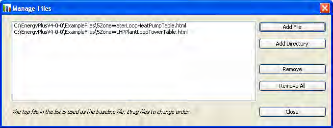

Figure 57. EP-Compare Dialog box

This dialog lets you add and remove files from the list of files. The files selected should be HTML or HTM files that are produced by EnergyPlus when using the Output:Table:SummaryReports object with OutputControl:Table:Style set to produce HTML files. It is best to compare files that have similar reports otherwise missing values will be shown as zeros.The dialog also provides a button to add entire directories of files but that adding too many files makes the graphs difficult to understand. To change the order that files appear in the graph, the files can be dragged up and down the list of files in the Manage Files dialog. The dialog box window can be resized to view longer files names if necessary.

When EP-Compare is started again, the files last selected are shown in the graph if they are still available.

The Copy button allows the current graph (as it is sized in the window) to be copied to another application such as Microsoft Word or PowerPoint. To paste a copied image to those programs use the Paste Special option and select one of the bitmap formats.


