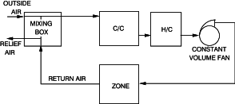
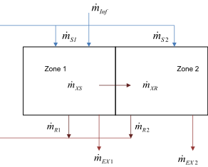

Integrated Solution Manager
===========================

EnergyPlus is an integrated simulation. This means that all three of the major parts, building, system, and plant, must be solved simultaneously. In programs with sequential simulation, such as BLAST or DOE-2, the building zones, air handling systems, and central plant equipment are simulated sequentially with no feedback from one to the other. The sequential solution begins with a zone heat balance that updates the zone conditions and determines the heating/cooling loads at all time steps. This information is fed to the air handling simulation to determine the system response; but that response does not affect zone conditions. Similarly, the system information is passed to the plant simulation without feedback. This simulation technique works well when the system response is a well-defined function of the air temperature of the conditioned space. For a cooling situation, a typical supply and demand situation is shown schematically in the Figure 3. Here, the operating point is at the intersection of the supply and demand curves.


Figure 3. Sequential Simulation Supply/Demand Relationship.

However, in most situations the system capacity is dependent on outside conditions and/or other parameters of the conditioned space. The simple supply and demand situation above becomes a more complex relationship and the system curve is not fixed. The solution should move up and down the demand curve. This doesn’t happen in sequential simulation methods and the lack of feedback from the system to the building can lead to nonphysical results. For example, if the system provides too much cooling to a conditioned space the excess is reported by the program as "overcooling". Other categories of unmatched loads exist and are similarly reported by the program. While this kind of reporting enables the affected system or plant components to be properly sized, the system designer would, in most cases, prefer to see the actual change in zone temperature. The same mismatches can occur between the system and plant simulations when they are simulated sequentially.

To obtain a simulation that is physically realistic, the elements have to be linked in a simultaneous solution scheme. The entire integrated program can be represented as a series of functional elements connected by fluid loops as shown in Figure “Schematic of Simultaneous Solution Scheme”. In EnergyPlus all the elements are integrated and controlled by the Integrated Solution Manager. The loops are divided into supply and demand sides, and the solution scheme generally relies on successive substitution iteration to reconcile supply and demand using the Gauss-Seidell philosophy of continuous updating.


Figure 4. Schematic of Simultaneous Solution Scheme

In the sections which follow, the various individual functions of the integrated solution will be described.

Basis for the Zone and Air System Integration
---------------------------------------------

The basis for the zone and air system integration is to formulate energy and moisture balances for the zone air and solve the resulting ordinary differential equations using a predictor-corrector approach. The formulation of the solution scheme starts with a heat balance on the zone air.

<div>$${C_z}\frac{{d{T_z}}}{{dt}} = \sum\limits_{i = 1}^{{N_{sl}}} {{{\dot Q}_i}}  + \sum\limits_{i = 1}^{{N_{surfaces}}} {{h_i}} {A_i}\left( {{T_{si}} - {T_z}} \right) + \sum\limits_{i = 1}^{{N_{zones}}} {{{\dot m}_i}} {C_p}\left( {{T_{zi}} - {T_z}} \right)\, + {\dot m_{\inf }}{C_p}\left( {{T_\infty } - {T_z}} \right) + {\dot Q_{sys}}$$</div>

where:

<span>\(\sum\limits_{i = 1}^{{N_{sl}}} {{{\dot Q}_i}} \)</span> = sum of the convective internal loads

<span>\(\sum\limits_{i = 1}^{{N_{surfaces}}} {{h_i}} {A_i}\left( {{T_{si}} - {T_z}} \right)\)</span> = convective heat transfer from the zone surfaces

<span>\({\dot m_{\inf }}{C_p}\left( {{T_\infty } - {T_z}} \right)\)</span> = heat transfer due to infiltration of outside air

<span>\(\sum_{i=1}^{N_{zones}} \dot m_i C_p\left( T_{zi} - {T_z} \right)\)</span> = heat transfer due to interzone air mixing

<span>\({\dot Q_{sys}}\)</span> = air systems output

<span>\({C_z}\frac{{d{T_z}}}{{dt}} = \)</span>energy stored in zone air

C<sub>z</sub> = ρ<sub>air</sub>C<sub>p</sub>C<sub>T</sub>

ρ<sub>air</sub> = zone air density

C<sub>p</sub> = zone air specific heat

C<sub>T</sub> = sensible heat capacity multiplier (Detailed description is provided below)

If the air capacitance is neglected, the steady-state system output must be:

<div>$$ - {\dot Q_{sys}} = \sum\limits_{i = 1}^{{N_{sl}}} {{{\dot Q}_i}}  + \sum\limits_{i = 1}^{{N_{surfaces}}} {{h_i}} {A_i}\left( {{T_{si}} - {T_z}} \right) + \sum\limits_{i = 1}^{{N_{zones}}} {{{\dot m}_i}} {C_p}\left( {{T_{zi}} - {T_z}} \right)\, + {\dot m_{\inf }}{C_p}\left( {{T_\infty } - {T_z}} \right)$$</div>

Air systems provide hot or cold air to the zones to meet heating or cooling loads. The system energy provided to the zone, Qsys, can thus be formulated from the difference between the supply air enthalpy and the enthalpy of the air leaving the zone as in Equation :

<div>$${\dot Q_{sys}} = {\dot m_{sys}}{C_p}\left( {{T_{\sup }} - {T_z}} \right)$$</div>

This equation assumes that the zone supply air mass flow rate is exactly equal to the sum of the air flow rates leaving the zone through the system return air plenum and being exhausted directly from the zone. Both air streams exit the zone at the zone mean air temperature. The result of substituting Equation for Qsys in the heat balance Equation is shown in Equation :

<div>$$
  \begin{array}{ll}
    {C_z}\frac{{d{T_z}}}{{dt}} &= \sum\limits_{i = 1}^{{N_{sl}}} {{{\dot Q}_i}}  + \sum\limits_{i = 1}^{{N_{surfaces}}} {{h_i}} {A_i}\left( {{T_{si}} - {T_z}} \right) + \sum\limits_{i = 1}^{{N_{zones}}} {{{\dot m}_i}} {C_p}\left( {{T_{zi}} - {T_z}} \right) \\
                               &+ {{\dot m}_{\inf }}{C_p}\left( {{T_\infty } - {T_z}} \right) + {{\dot m}_{sys}}{C_p}\left( {{T_{\sup }} - {T_z}} \right)
  \end{array}
$$</div>

The sum of zone loads and air system output now equals the change in energy stored in the zone. Typically, the capacitance Cz would be that of the zone air only. However, thermal masses assumed to be in equilibrium with the zone air could be included in this term.

EnergyPlus provides three different solution algorithms to solve the zone air energy and moisture balance equations. These are defined in the Algorithm field in the ZoneAirHeatBalanceAlgorithm object: 3rdOrderBackwardDifference, EulerMethod and AnalyticalSolution. The first two methods to solve Equation use the finite difference approximation while the third uses an analytical solution. A short description is given below.

In order to calculate the derivative term with respect to time, a finite difference approximation may be used, such as:

<div>$$\frac{{dT}}{{dt}} = {\left( {\delta t} \right)^{ - 1}}\left( {{T_z}^t - {T_z}^{t - \delta t}} \right) + {\rm O}\left( {\delta t} \right)$$</div>

The use of numerical integration in a long time simulation is a cause for some concern due to the potential build-up of truncation error over many time steps. In this case, the finite difference approximation is of low order that further aggravates the problem. However, the cyclic nature of building energy simulations should cause truncation errors to cancel over each daily cycle so that no net accumulation of error occurs, even over many days of simulation (Walton, 1990). The Euler formula, Equation , was employed in Equation to replace the derivative term. All the terms containing the zone mean air temperature were then grouped on the left hand side of the equation.  Since the remaining terms are not known at the current time, they were lagged by one time step and collected on the right hand side. This manipulation resulted in Equation , the formula for updating the zone mean air temperature:

<div>$$\begin{array}{l}{C_z}\frac{{T_z^t - T_z^{t - \delta t}}}{{dt}} + T_z^t\left( {\sum\limits_{i = 1}^{{N_{surfaces}}} {{h_i}} {A_i} + \sum\limits_{i = 1}^{{N_{zones}}} {{{\dot m}_i}} {C_p} + {{\dot m}_{\inf }}{C_p} + {{\dot m}_{sys}}{C_p}} \right) = \\\sum\limits_{i = 1}^{{N_{sl}}} {\dot Q_i^t}  + {{\dot m}_{sys}}{C_p}T_{{\rm{supply}}}^t + {\left( {\sum\limits_{i = 1}^{{N_{surfaces}}} {{h_i}} {A_i}{T_{si}} + \sum\limits_{i = 1}^{{N_{zones}}} {{{\dot m}_i}} {C_p}{T_{zi}} + {{\dot m}_{\inf }}{C_p}{T_\infty }} \right)^{t - \delta t}}\end{array}$$</div>

One final rearrangement was to move the lagged temperature in the derivative approximation to the right side of the equation. The explicit appearance of the zone air temperature was thus eliminated from one side of the equation. An energy balance equation that includes the effects of zone capacitance was then obtained by dividing both sides by the coefficient of Tz:

<div>$$T_z^t = \frac{{\sum\limits_{i = 1}^{{N_{sl}}} {\dot Q_i^t}  + {{\dot m}_{sys}}{C_p}T_{{\rm{supply}}}^t + {{\left( {{C_z}\frac{{T_z^{}}}{{\delta t}} + \sum\limits_{i = 1}^{{N_{surfaces}}} {{h_i}} {A_i}{T_{si}} + \sum\limits_{i = 1}^{{N_{zones}}} {{{\dot m}_i}} {C_p}{T_{zi}} + {{\dot m}_{\inf }}{C_p}{T_\infty }} \right)}^{t - \delta t}}}}{{\frac{{{C_z}}}{{\delta t}} + \left( {\sum\limits_{i = 1}^{{N_{surfaces}}} {{h_i}} {A_i} + \sum\limits_{i = 1}^{{N_{zones}}} {{{\dot m}_i}} {C_p} + {{\dot m}_{\inf }}{C_p} + {{\dot m}_{sys}}{C_p}} \right)}}$$</div>

Equation could be used to estimate zone air temperatures, and is defined as the EulerMethod, one of the three solution algorithms provided in the ZoneAirHeatBalanceAlgorithm object. However, it can severely limit the time step size under some conditions. To improve on this, higher order expressions for the first derivative, with corresponding higher-order truncation errors, were developed. The goal of this approach was to allow for the use of larger time steps in the simulation than would be possible using the first order Euler form, without experiencing instabilities. Approximations from second through fifth order were tried as reported by Taylor, et al. (1990) with the conclusion that the third order finite difference approximation, shown below, gave the best results:

<div>$${\left. {\frac{{d{T_z}}}{{dt}}} \right|_t} \approx {\left( {\delta t} \right)^{ - 1}}\left( {\frac{{11}}{6}T_z^t - 3T_z^{t - \delta t} + \frac{3}{2}T_z^{t - 2\delta t} - \frac{1}{3}T_z^{t - 3\delta t}} \right) + O\left( {\delta {t^3}} \right)$$</div>

When this form for the derivative is used, equation changes to:

<div>$$\begin{array}{l}{C_z}{\left( {\delta t} \right)^{ - 1}}\left( {\frac{{11}}{6}T_z^t - 3T_z^{t - \delta t} + \frac{3}{2}T_z^{t - 2\delta t} - \frac{1}{3}T_z^{t - 3\delta t}} \right) = \sum\limits_{i = 1}^{{N_{sl}}} {{{\dot Q}_i}}  + \sum\limits_{i = 1}^{{N_{surfaces}}} {{h_i}} {A_i}\left( {{T_{si}} - {T_z}} \right) + \sum\limits_{i = 1}^{{N_{zones}}} {{{\dot m}_i}} {C_p}\left( {{T_{zi}} - {T_z}} \right)\\\,\,\,\,\,\,\,\,\,\,\,\,\,\,\,\,\,\,\,\,\,\, + {{\dot m}_{\inf }}{C_p}\left( {{T_\infty } - {T_z}} \right) + {{\dot m}_{sys}}{C_p}\left( {{T_{\sup }} - {T_z}} \right)\end{array}$$</div>

and the zone temperature update equation becomes:

<div>$$T_z^t = \frac{{\sum\limits_{i = 1}^{{N_{sl}}} {{{\dot Q}_i}}  + \sum\limits_{i = 1}^{{N_{surfaces}}} {{h_i}} {A_i}{T_{si}} + \sum\limits_{i = 1}^{{N_{zones}}} {{{\dot m}_i}} {C_p}{T_{zi}}\, + {{\dot m}_{\inf }}{C_p}{T_\infty } + {{\dot m}_{sys}}{C_p}{T_{{\rm{supply}}}} - \left( {\frac{{{C_z}}}{{\delta t}}} \right)\left( { - 3T_z^{t - \delta t} + \frac{3}{2}T_z^{t - 2\delta t} - \frac{1}{3}T_z^{t - 3\delta t}} \right)}}{{\left( {\frac{{11}}{6}} \right)\frac{{{C_z}}}{{\delta t}} + \sum\limits_{i = 1}^{{N_{surfaces}}} {{h_i}} A + \sum\limits_{i = 1}^{{N_{zones}}} {{{\dot m}_i}} {C_p} + {{\dot m}_{\inf }}{C_p} + {{\dot m}_{sys}}C}}$$</div>

This is the form historically used in EnergyPlus and is the current default referred to as 3rdOrderBackwardDifference in the ZoneAirHeatBalanceAlgorithm object. This algorithm requires zone air temperatures at three previous time steps and uses constant temperature coefficients. The assumption is that three previous time steps lengths are the same.

The AnalyticalSolution algorithm is an integration approach. While the 3<sup>rd</sup> order finite difference approximation provides stability without requiring a prohibitively small time step, the method still has truncation errors and requires a fixed time step length for the previous three simulation time steps. Therefore, different time step lengths for the previous three simulation time steps may make the temperature coefficients invalid.

The AnalyticalSolution algorithm provides a possible way to obtain solutions without truncation errors and independent of time step length. In addition, the algorithm only requires the zone air temperature for one previous time step, instead of three previous time steps as required by the 3rdOrderBackwardDifference algorithm. The integrated (analytical) solution for Eq. (4) may be expressed as follows:

<div>$$\begin{array}{l}T_z^t = \left( {T_z^{t - \delta t} - \frac{{\sum\limits_{i = 1}^{{N_{sl}}} {{{\dot Q}_i}}  + \sum\limits_{i = 1}^{{N_{surfaces}}} {{h_i}} {A_i}{T_{si}} + \sum\limits_{i = 1}^{{N_{zones}}} {{{\dot m}_i}} {C_p}{T_{zi}} + {{\dot m}_{\inf }}{C_p}{T_\infty } + {{\dot m}_{sys}}{C_p}{T_{\sup }}}}{{\sum\limits_{i = 1}^{{N_{surfaces}}} {{h_i}} {A_i} + \sum\limits_{i = 1}^{{N_{zones}}} {{{\dot m}_i}} {C_p} + {{\dot m}_{\inf }}{C_p} + {{\dot m}_{sys}}{C_p}}}} \right)\\\;\;\;\;\;\;\;*\exp \left( { - \frac{{\sum\limits_{i = 1}^{{N_{surfaces}}} {{h_i}} {A_i} + \sum\limits_{i = 1}^{{N_{zones}}} {{{\dot m}_i}} {C_p} + {{\dot m}_{\inf }}{C_p} + {{\dot m}_{sys}}{C_p}}}{{{C_z}}}\delta t} \right)\\\;\;\;\;\;\;\; + \frac{{\sum\limits_{i = 1}^{{N_{sl}}} {{{\dot Q}_i}}  + \sum\limits_{i = 1}^{{N_{surfaces}}} {{h_i}} {A_i}{T_{si}} + \sum\limits_{i = 1}^{{N_{zones}}} {{{\dot m}_i}} {C_p}{T_{zi}} + {{\dot m}_{\inf }}{C_p}{T_\infty } + {{\dot m}_{sys}}{C_p}{T_{\sup }}}}{{\sum\limits_{i = 1}^{{N_{surfaces}}} {{h_i}} {A_i} + \sum\limits_{i = 1}^{{N_{zones}}} {{{\dot m}_i}} {C_p} + {{\dot m}_{\inf }}{C_p} + {{\dot m}_{sys}}{C_p}}}\end{array}$$</div>

Since the load on the zone drives the entire process, that load is used as a starting point to give a demand to the air system. Then a simulation of the air system provides the actual supply capability and the zone temperature is adjusted if necessary. This process in EnergyPlus is referred to as a Predictor/Corrector process. It is summarized below.

Code Reference: the **ZoneTempPredictorCorrector** module performs the calculations.

### Zone Sensible Heat Capacity Multiplier

If the Zone Sensible Heat Capacity Multiplier = 1.0, this represents just the sensible heat capacitance of the air volume in the specified zone. If the value is not defined, it is set to 1.0. This multiplier can be greater than 1.0 if the zone air sensible heat capacity needs to be increased for stability of the simulation. This multiplier increases the capacitance of the air volume by increasing the zone volume that is used in the zone predictor-corrector algorithm in the simulation. This can be done for numerical reasons, such as to increase the stability by decreasing the zone air temperature deviations at the time step level. Or it can be increased to try and account for the additional capacitance in the air loop not specified in the zone, i.e. dampers, diffusers, duct work, etc., to see the effect on the dynamics of the simulation. See the Input/Output Reference for additional information (Object: ZoneCapacitanceMultiplier:ResearchSpecial).

In the source code below we see how the ZoneVolCapMultpSens increases the zone volume used for the air ratio at the time step in the air system. This multiplier is constant throughout the simulation.

````
    AIRRAT(ZoneNum) = Zone(ZoneNum)%Volume\***ZoneVolCapMultpSens**\* &
               PsyRhoAirFnPbTdbW(OutBaroPress,MAT(ZoneNum),ZoneAirHumRat(ZoneNum))\* &
               PsyCpAirFnWTdb(ZoneAirHumRat(ZoneNum),MAT(ZoneNum))/(TimeStepSys\*SecInHour)
````


Summary of Predictor-Corrector Procedure
----------------------------------------

The predictor-corrector scheme can be summarized as follows:

 - Using equation , an estimate is made of the air system energy required to balance the equation with the zone air temperature equal to the setpoint temperature.
 - With that quantity as a demand, the air system is simulated to determine its actual supply capability at the time of the simulation. This will include a plant simulation if necessary.
 - The actual air system capability is used in equation to calculate the resulting zone temperature.

Air System Control
------------------

Previously, the formulation of a new heat balance equation with an unsteady zone capacitance term was discussed Equation . In this equation the updated zone temperature was calculated by removing its explicit dependence from the right hand side and lagging, by one time step, the unknown terms on that side. However, the right hand side still contains implicit dependencies on the zone temperature through the air system control logic; the need for heating or cooling in the zones, is based on zone temperature. In real buildings the control system consists of one or more sensing units in the zone, such as a wall thermostat that samples the air temperature and sends signals to a control unit. The controller looks at the difference between the actual zone temperature and the desired temperature to ascertain if heating or cooling is required and then sends appropriate signals to the air system components to drive the zone temperature closer to the desired value.

Although many control systems use only the zone air temperature to control the air system, most modern energy management systems consider many other variables, such as outside environment conditions. Simulating such controllers would seem to be relatively straightforward in a simulation especially since some of the more complex control problems, such as managing duct pressures and flow rates, are not always modeled. However, real controllers have an advantage because they can sample zone conditions, and thus update air system response, on a time scale much shorter than any characteristic time of the air system or zone. Thus the feedback between zone and air system usually results in steady or, at worst, slowly oscillating zone conditions and air system operation unless the air system is grossly oversized. On the other hand, the numerical model is only able to sample zone conditions at discrete time intervals. In the interest of minimizing computation time, these intervals need to be as long as possible. Frequently, they are of the order of, or longer than, the characteristic times of the air system and zones, except in the case of small air system capacity in relation to zone capacitance. This situation has the potential for unstable feedback between the zone and air system, resulting in an oscillatory or diverging solution.

Prior to implementing the new heat balance method (3rdOrderBackwardDifference) in IBLAST, several air system control strategies were considered. The primary objective was selection of a control method that would be numerically stable over a reasonable range of conditions, realistic from the standpoint of looking and operating like an actual air system controller, and flexible enough to be applied to all current and projected systems. The method actually implemented in IBLAST, and later EnergyPlus, took advantage of the computational model's "knowledge" of how much energy enters or leaves the zone as a function of zone air temperature i.e., the zone load. The real controller, on the other hand, does not have this information. The net zone load is given by Equation :

<div>$${\dot Q_{load}} = \sum\limits_{i = 1}^{{N_{sl}}} {\dot Q_i^{}}  + \sum\limits_{i = 1}^{{N_{surfaces}}} {{h_i}} {A_i}\left( {{T_{si}} - {T_z}} \right) + \sum\limits_{i = 1}^{{N_{zones}}} {{{\dot m}_i}} {C_p}\left( {{T_{zi}} - {T_z}} \right) + {\dot m_{\inf }}{C_p}\left( {{T_\infty } - {T_z}} \right)$$</div>

This is Equation without the term due to the air system. In addition, Tz is now the *desired* zone temperature as defined by the control system setpoints that must be specified for each zone. An assumption was made that if the air system has sufficient capacity (based on the desired zone air temperature) to meet the zone conditioning requirements (i.e. Qsys=Qload) at the desired zone air temperature then those requirements will be met. On the other hand, if the air system cannot provide enough conditioning to the zone to maintain the desired temperature, then the air system provides its maximum output to the zone and the zone air temperature is allowed to "float."  Equation was used to calculate the air system output required to maintain the desired zone air temperature; the actual zone temperature update was accomplished using Equation . This method was called *predictive system energy balance*. It has many characteristics of a predictor-corrector method since the air system response is first approximated based on a predicted zone temperature and then the actual change in zone temperature is determined from that air system response. The predictive air system energy balance method required that the system controls on air mass flow rate, supply air temperature, etc., be formulated as a function of the zone air temperature. However, this was not a serious drawback. The first example considered was a single zone draw through air system. Typically, such systems have a cooling coil and heating coil in series, and constant air volume flow rate. Single zone draw through systems run at maximum capacity when turned on; so the only way to regulate net air system output and keep the zone air temperature within the desired range is to turn the air system on and off. A simplified schematic of this system type is shown in Figure 5. Simplified Single Zone Draw Through Air System.



Figure 5. Simplified Single Zone Draw Through Air System

The amount of heating or cooling provided by the air system in relation to the desired zone air temperature is given by:

<div>$${\dot Q_{sys}} = {\dot m_{sys}}{C_p}\eta \left( {{T_{\sup }} - {T_{z,\,desired}}} \right)$$</div>

where h is the fraction of the time step that the air system is turned on and varies between 0 and 1. The supply air temperature is also implicitly limited by the effectiveness of the coils and the operating parameters of the central plant components. These interactions are discussed later.

A far more complex, though again simplified, air system is the variable air volume (VAV) system, shown in Figure 6. Simplified Variable Volume Air System. In VAV systems, the supply air temperature, as well as the supply air volume, are continuous functions of zone air temperature. As shown in Figure 7. Idealized Variable Volume System Operation., when the zone air temperature is between Tcl and Tcu, cooling is required and the air system varies the supply air flow rate while maintaining a constant supply air temperature. When the zone air temperature is between Thl and Thu, heating is required and air is supplied at a constant minimum flow rate while the supply air temperature is varied.


Figure 6. Simplified Variable Volume Air System.

The next figure (Idealized variable volume system operation) shows idealized behavior of a VAV system; in practice, the air flow rate and temperature are not exact linear functions of zone air temperature.


Figure 7. Idealized Variable Volume System Operation.

As long as a VAV system has sufficient capacity, the zone air temperatures can be expected to vary within the limits defining the range of operation of the air damper, when cooling, or the throttling range of the reheat coil, when the air system is heating. This means that the desired zone air temperature, used to predict the air system response, is variable and must be calculated in order to determine the air system output. For the purposes of this calculation, the following definitions were found useful:

<div>$${\dot Q_0} = \sum\limits_{i = 1}^{{N_{sl}}} {{{\dot Q}_i}}  + \sum\limits_{i = 1}^{{N_{surfaces}}} {{h_i}} {A_i}{T_{si}} + \sum\limits_{i = 1}^{{N_{zones}}} {{{\dot m}_i}} {C_p}{T_{zi}} + {\dot m_{\inf }}{C_p}{T_\infty }$$</div>

<div>$${\dot Q_{slope}} = \sum\limits_{i = 1}^{{N_{surfaces}}} {{h_i}} {A_i} + \sum\limits_{i = 1}^{{N_{zones}}} {{{\dot m}_i}} {C_p} + {\dot m_{\inf }}{C_p}$$</div>

Equations and are derived, respectively, from the numerator and denominator of Equation but with the system related terms omitted. Also excluded from these expressions are the effects of zone capacitance.

When a zone requires cooling, the VAV system is designed to provide air to that zone at a constant supply air temperature. The amount of cooling is matched to the load by dampers in the supply air duct that vary the air volume flow rate of being supplied to the zone. Assuming that the volume flow rate varies linearly with zone air temperature, the volume flow rate of supply air normalized to the maximum flow rate, or supply air fraction, is given by:

<div>$${\eta_c} = {\eta_{c,\,\min }} + \left( {1 - {\eta_{c,\,\min }}} \right)\left( {\frac{{{T_z} - {T_{c,\,lower}}}}{{{T_{c,\,upper}} - {T_{c,\,lower}}}}} \right);\,{\eta_{c,\,\min }} \le {\eta_c} \le 1.0$$</div>

Normally, the minimum supply air fraction hc,min must be greater than zero to ensure a supply of fresh air sufficient to eliminate contaminants from the zone.

Conversely, when heating is required in a zone, the VAV system becomes a constant volume flow rate system with a variable supply air temperature. The dampers are set to provide air to the zone at the minimum supply air fraction. Throttling the hot water supply to the reheat coil, which effectively alters the coil’s heating capacity, modulates the supply air temperature. Again, assuming the heat energy output varies linearly with zone air temperature and normalizing with respect to the maximum coil output gives the following result:

<div>$${\eta_h} = \left( {\frac{{{T_{h,\,upper}} - {T_z}}}{{{T_{h,\,upper}} - {T_{h,\,lower}}}}} \right);\,0 \le {\eta_h} \le 1.0$$</div>

Observe that when hh is equal to zero, the zone is supplied with air at the cooling coil outlet temperature at the minimum air fraction. Because the control strategies of the VAV system are different whether the air system is heating or cooling, two equations are necessary to describe the air system output in terms of hh and hc. These expressions are as shown in Equations and :

<div>$${\dot Q_{sys,h}} = {\eta_h}{\dot Q_{h/c,\,\max }} + {C_p}\rho {\dot V_{\min }}\left( {{T_{c/c}} - {T_{z,pred,heat}}} \right)$$</div>

<div>$${\dot Q_{sys,c}} = {C_p}\rho \left( {{\eta_c}{{\dot V}_{\max }}} \right)\left( {{T_{c/c}} - {T_{z,pred,cool}}} \right)$$</div>

Equation is valid for zone air temperatures below Th,upper, while Equation is valid for all temperatures above this value. Equating the system output to the zone load, as given by Equation , the definitions of hc and hh were then used to develop expressions for the predicted zone air temperature in the cases of heating and cooling:

<div>$${T_{z,pred,heat}} = \frac{{{{\dot Q}_{h/c,\max }}{T_{h,upper}}}}{{{T_{h,upper}} - {T_{h,lower}}}} + {\dot Q_0} + \frac{{{C_p}\rho {{\dot V}_{\min }}{T_{c/c}}}}{{\frac{{{{\dot Q}_{h/c,\max }}}}{{{T_{h,upper}} - {T_{h,lower}}}} + {C_p}\rho {{\dot V}_{\min }} + {{\dot Q}_{slope}}}}$$</div>

<div>$${T_{z,pred,cool}} = \frac{{{B_1} + \sqrt {B_1^2 + {B_2}} }}{2}$$</div>

where,

<div>$${B_1} = {T_{c/c}} + {T_{c,lower}} - \frac{{{\eta_{c,\min }} - {C_2}}}{{{C_1}}}$$</div>

<div>$${B_2} = 4\left( {\frac{{{C_3}}}{{{C_1}}} + {T_{c/c}}\left( {\frac{{{\eta_{c,\min }}}}{{{C_1}}} - {T_{c,lower}}} \right)} \right)$$</div>

and,

<div>$${C_1} = \frac{{1 - {\eta_{c,\min }}}}{{{T_{c,upper}} - {T_{c,lower}}}}$$</div>

<div>$${C_2} = \frac{{{{\dot Q}_{slope}}}}{{{C_p}\rho {{\dot V}_{\max }}}}$$</div>

<div>$${C_3} = \frac{{{{\dot Q}_0}}}{{{C_p}\rho {{\dot V}_{\max }}}}$$</div>

Once the predicted zone air temperature has been calculated from Equations and , the air system response may be determined. When a zone requires cooling the system supply air temperature is constant at the cooling coil outlet temperature and the volume flow rate is given by:

<div>$${\dot V_{\sup ply}} = {\eta_c}{\dot V_{\max }}$$</div>

where the supply air fraction hc is computed from Equation . When heating is required by the zone, the air system provides air at the minimum volume flow rate and at a temperature given by:

<div>$${T_{\sup ply}} = {T_{c/c}} + \frac{{{\eta_h}{{\dot Q}_{h/c,\max }}}}{{{C_p}\rho {{\dot V}_{\min }}}}$$</div>

The reheat coil capacity fraction hh is determined by using Equation . Once Equation or , has been used, the supply air flow rate and temperature are known. These values are then used in Equation to calculate the updated zone air temperature. The equations describing VAV system operation may be solved without iteration if the cooling coil outlet temperature is constant, i.e. if the coil has infinite capacity, and if the reheat coil capacity varies linearly with zone air temperature. This is not the case, either in practice or in simulations, when realistic coil models are used. Therefore, an iteration scheme was developed that solved these equations simultaneously with the coil performance models.

Moisture Predictor-Corrector
----------------------------

The transient air mass balance equation for the change in the zone humidity ratio = sum of internal scheduled latent loads + infiltration + system + multizone airflows + convection to the zone surfaces may be expressed as follows:

<div>$$\begin{array}{l}{\rho_{air}}{V_z}{C_W}\frac{{d{W_z}}}{{dt}} = \sum\limits_{i = 1}^{{N_{sl}}} {k{g_{mas{s_{sched\;load}}}}}  + \sum\limits_{i = 1}^{{N_{surfaces}}} {{A_i}{h_{mi}}} {\rho_{ai{r_z}}}\left( {{W_{surf{s_i}}} - W_z^t} \right) + \sum\limits_{i = 1}^{{N_{zones}}} {{{\dot m}_i}} \left( {{W_{zi}} - W_z^t} \right)\\\;\;\;\;\;\;\;\;\;\;\;\;\;\;\;\;\;\;\;\;\;\;\;\;\;\;\;\;\;\;\;\;\;\;\;\;\;\; + {{\dot m}_{\inf }}\left( {{W_\infty } - W_z^t} \right) + {{\dot m}_{sys}}\left( {{W_{\sup }} - W_z^t} \right)\end{array}$$</div>

where

C<sub>W</sub> = humidity capacity multiplier (See the InputOutput Reference for additional information on the object ZoneCapacitanceMultiplier:ResearchSpecial)

In the same manner as described above for zone air temperature (ref. Basis for the Zone and Air System Integration), the solution algorithms provided in the ZoneAirHeatBalanceAlgorithm object are also applied to zone air moisture calculations.

In order to calculate the derivative term with respect to time, the first order backward finite difference method, defined as the EulerMethod in the ZoneAirHeatBalanceAlgorithm object, may be used:

 <div>$$\frac{{dW}}{{dt}} = {\left( {\delta t} \right)^{ - 1}}(W_z^t - W_z^{t - \delta t}) + O(\delta t)$$</div>

The zone air humidity ratio update at the current time step using the EulerMethod may be expressed as follows:

<div>$$\begin{array}{l}{\rho_{air}}V{C_W}{\left( {\delta t} \right)^{ - 1}}\left( {W_z^t - W_z^{t - \delta t}} \right) = \sum\limits_{i = 1}^{{N_{sl}}} {k{g_{mas{s_{sched\;load}}}}}  + \sum\limits_{i = 1}^{{N_{surfaces}}} {{A_i}{h_{mi}}} {\rho_{ai{r_z}}}\left( {{W_{surf{s_i}}} - W_z^t} \right) + \sum\limits_{i = 1}^{{N_{zones}}} {{{\dot m}_i}} \left( {{W_{zi}} - W_z^t} \right)\\\;\;\;\;\;\;\;\;\;\;\;\;\;\;\;\;\;\;\;\;\;\;\;\;\;\;\;\;\;\;\;\;\;\;\;\;\;\; + {{\dot m}_{\inf }}\left( {{W_\infty } - W_z^t} \right) + {{\dot m}_{sys}}\left( {{W_{\sup }} - W_z^t} \right)\end{array}$$</div>

To preserve the stability of the calculation of the zone humidity ratio, the third order differential approximation, derived by a Taylor Series and used in the calculation of the next time step’s zone air temperature, is also applied to the zone air humidity ratio calculations. This algorithm is the default choice and is defined as 3rdOrderBackwardDifference in the ZoneAirHeatBalanceAlgorithm object.

The third order derivative derived from a Taylor Series expansion is defined as:

<div>$${\left. {\frac{{d{W_z}}}{{dt}}} \right|_t} \approx \frac{{\left( {{\textstyle{{11} \over 6}}W_z^t - 3W_z^{t - \delta t} + {\textstyle{3 \over 2}}W_z^{t - 2\delta t} - {\textstyle{1 \over 3}}W_z^{t - 3\delta t}} \right)}}{{\delta t}} + O\left( {\delta {t^3}} \right)$$</div>.

The coefficients of the approximated derivative are very close to the coefficients of the analogous Adams-Bashforth algorithm. Then the approximated derivative is substituted into the mass balance and the terms with the humidity ratio at past time steps are all put on the right hand side of the equation. This third order derivative zone humidity ratio update increases the number of previous time steps that are used in calculating the new zone humidity ratio, and decreases the dependence on the most recent. The higher order derivative approximations have the potential to allow the use of larger time steps by smoothing transitions through sudden changes in zone operating conditions.

<div>$$\begin{array}{l}\frac{{{\rho_{air}}{V_z}{C_W}}}{{\delta t}}\left( {\frac{{11}}{6}} \right)W_z^t + \sum\limits_{i = 1}^{{N_{surfaces}}} {{A_i}{h_{mi}}} {\rho_{ai{r_z}}}W_z^t + \sum\limits_{i = 1}^{{N_{zones}}} {{{\dot m}_i}} W_z^t + {{\dot m}_{\inf }}W_z^t + {{\dot m}_{sys}}W_z^t = \sum\limits_{i = 1}^{{N_{sl}}} {k{g_{mas{s_{sched\;load}}}}}  + \sum\limits_{i = 1}^{{N_{surfaces}}} {{A_i}{h_{mi}}} {\rho_{ai{r_z}}}{W_{surf{s_i}}}\\\;\;\;\;\;\;\;\;\;\; + \sum\limits_{i = 1}^{{N_{zones}}} {{{\dot m}_i}} {W_{zi}} + {{\dot m}_{\inf }}{W_\infty } + {{\dot m}_{sys}}{W_{\sup }} - \frac{{{\rho_{air}}{V_z}{C_W}}}{{\delta t}}\left( { - 3W_z^{t - \delta t} + \frac{3}{2}W_z^{t - 2\delta t} - \frac{1}{2}W_z^{t - 3\delta t}} \right)\end{array}$$</div>

This gives us the basic air mass balance equation that will be solved two different ways, one way for the predict step and one way for the correct step.

Since the third choice of solution algorithms uses an integration approach, defined as AnalyticalSolution in the ZoneAirHeatBalanceAlgorithm object, it does not require any approximations and has no truncation errors. The solutions in both prediction and correction are provided below in detail.

### Moisture Prediction

For the moisture prediction case the equation is solved for the anticipated system response as shown below.

<div>$$
  \begin{array}{l}
    \rm{PredictedSystemLoad} = \dot{m}_{sys}*\left(W_z^t - W_{sup}\right) \\
    \rm{MassFlow * HumRat} = \frac{kg_{air}}{sec}\frac{kg_{water}}{kg_{air}} = \frac{kg_{water}}{sec}
  \end{array}
$$</div>

Since the program provides three solution algorithms, the moisture prediction from each solution algorithm is given below.

#### EulerMethod

For this solution algorithm, the air mass balance for the predicted air system load or response is:

<div>$$\begin{array}{l}{\rm{PredictedSystemLoad}}\;[k{g_{Water}}/\sec ] = {\rho_{air}}{V_z}{C_W}{\left( {\delta t} \right)^{ - 1}}\left( {W_{{\rm{setpoint}}}^t - W_z^{t - \delta t}} \right)\\\;\;\;\; - \left[ {\sum\limits_{i = 1}^{{N_{sl}}} {k{g_{mas{s_{sched\;load}}}}}  + \sum\limits_{i = 1}^{{N_{surfaces}}} {{A_i}{h_{mi}}} {\rho_{ai{r_z}}}\left( {{W_{surf{s_i}}} - W_{{\rm{setpoint}}}^t} \right) + \sum\limits_{i = 1}^{{N_{zones}}} {{{\dot m}_i}} \left( {{W_{zi}} - W_{{\rm{setpoint}}}^t} \right) + {{\dot m}_{\inf }}\left( {{W_\infty } - W_{{\rm{setpoint}}}^t} \right)} \right]\\\;\;\;\;\;\;\;\;\;\;\;\;\;\;\;\;\;\;\;\;\;\;\;\;\;\;\;\;\;\;\;\;\;\;\;\end{array}$$</div>

#### ThirdOrderBackwardDifference

For this solution algorithm, the air mass balance for the predicted system load or response is given below:

<div>$$\begin{array}{l}{\rm{PredictedSystemLoad}}\;[k{g_{Water}}/\sec ] = \left( {\frac{{{\rho_{air}}{V_z}{C_W}}}{{\delta t}}\left( {\frac{{11}}{6}} \right) + \sum\limits_{i = 1}^{{N_{surfaces}}} {{A_i}{h_{mi}}} {\rho_{ai{r_z}}} + \sum\limits_{i = 1}^{{N_{zones}}} {{{\dot m}_i}}  + {{\dot m}_{\inf }}} \right)W_z^t - \\\;\;\;\left[ {\sum\limits_{i = 1}^{{N_{sl}}} {k{g_{mas{s_{sched\;load}}}}}  + \sum\limits_{i = 1}^{{N_{surfaces}}} {{A_i}{h_{mi}}} {\rho_{ai{r_z}}}{W_{surf{s_i}}} + \sum\limits_{i = 1}^{{N_{zones}}} {{{\dot m}_i}} {W_{zi}} + {{\dot m}_{\inf }}{W_\infty } + \frac{{{\rho_{air}}{V_z}{C_W}}}{{\delta t}}\left( {3W_z^{t - \delta t} - \frac{3}{2}W_z^{t - 2\delta t} + \frac{1}{3}W_z^{t - 3\delta t}} \right)} \right]\;\;\end{array}$$</div>

Then, using the following substitutions, the air mass balance equation becomes:

<div>$$A = \sum\limits_{i = 1}^{{N_{surfaces}}} {{A_i}{h_{mi}}} {\rho_{ai{r_z}}} + \sum\limits_{i = 1}^{{N_{zones}}} {{{\dot m}_i}}  + {\dot m_{\inf }}$$</div>

<div>$$B = \;\sum\limits_{i = 1}^{{N_{sl}}} {k{g_{mas{s_{sched\;load}}}}}  + \sum\limits_{i = 1}^{{N_{surfaces}}} {{A_i}{h_{mi}}} {\rho_{ai{r_z}}}{W_{surf{s_i}}} + \sum\limits_{i = 1}^{{N_{zones}}} {{{\dot m}_i}} {W_{zi}} + {\dot m_{\inf }}{W_\infty }\;$$</div>

<div>$$C = \frac{{{\rho_{air}}{V_z}{C_W}}}{{\delta t}}\;$$</div>

<div>$$\begin{array}{l}{\rm{PredictedSystemLoad}}\;[k{g_{Water}}/\sec ] = \left[ {\frac{{11}}{6}*C + A} \right]\;*{W_{SetPo{\mathop{\rm int}} }} - \\\;\;\;\;\;\;\;\;\;\left[ {B + C*\left( {3W_z^{t - \delta t} - \frac{3}{2}W_z^{t - 2\delta t} + \frac{1}{3}W_z^{t - 3\delta t}} \right)} \right]\end{array}$$</div>

#### AnalyticalSolution

For this solution algorithm, the air mass balance for the predicted air system load or response is given below:

<div>$$\begin{array}{l}{\rm{PredictedSystemLoad}}\;[k{g_{Water}}/\sec ] = \left[ {\sum\limits_{i = 1}^{{N_{surfaces}}} {{A_i}{h_{mi}}} {\rho_{ai{r_z}}} + \sum\limits_{i = 1}^{{N_{zones}}} {{{\dot m}_i}} {W_{zi}}\; + {{\dot m}_{\inf }}} \right]*\\\;\;\;\left[ {W_{{\rm{setpoint}}}^t - W_z^{t - \delta t}*\exp \left( { - \frac{{\sum\limits_{i = 1}^{{N_{surfaces}}} {{A_i}{h_{mi}}} {\rho_{ai{r_z}}} + \sum\limits_{i = 1}^{{N_{zones}}} {{{\dot m}_i}} {W_{zi}}\; + {{\dot m}_{\inf }}}}{{{\rho_{air}}{V_z}{C_W}}}\delta t} \right)} \right]*\\\;\;\;{\left[ {1 - \exp \left( { - \frac{{\sum\limits_{i = 1}^{{N_{surfaces}}} {{A_i}{h_{mi}}} {\rho_{ai{r_z}}} + \sum\limits_{i = 1}^{{N_{zones}}} {{{\dot m}_i}} \; + {{\dot m}_{\inf }}}}{{{\rho_{air}}{V_z}{C_W}}}\delta t} \right)} \right]^{ - 1}} - \\\;\;\;\left( {\sum\limits_{i = 1}^{{N_{sl}}} {k{g_{mas{s_{sched\;load}}}}} \sum\limits_{i = 1}^{{N_{surfaces}}} {{A_i}{h_{mi}}} {\rho_{ai{r_z}}}{W_{surf{s_i}}} + \sum\limits_{i = 1}^{{N_{zones}}} {{{\dot m}_i}} {W_{zi}}\; + {{\dot m}_{\inf }}{W_\infty }} \right)\end{array}$$</div>

At the prediction point in the simulation, the system air mass flows are not known; therefore, the system response is approximated. The predicted air system moisture load is then used in the system simulation to achieve the best results possible. The system simulation components that have moisture control will try to meet this predicted moisture load. For example, humidifiers will look for positive moisture loads and add moisture at the specified rate to achieve the relative humidity setpoint. Likewise, dehumidification processes will try to remove moisture at the specified negative predicted moisture load to meet the relative humidity setpoint.

After the system simulation is completed the actual response from the air system is used in the moisture correction of step, which is shown next.

### Moisture Correction

For the correct step the expanded air mass balance equation is solved for the final zone humidity ratio at the current time step. When the air system is operating, the mass flow for the system outlet includes the infiltration mass flow rate, therefore the infiltration mass flow rate is not included as a separate term in the air mass balance equation. But when the air system is off, the infiltration mass flow in is then exhausted out of the zone directly.

In the same manner as described above for predicting the moisture load to be met by the air system, the zone air moisture correction calculation will be described individually for the three solution algorithms.

#### EulerMethod

<div>$$W_z^t = \frac{{\sum\limits_{i = 1}^{{N_{sl}}} {k{g_{mas{s_{sched\;load}}}}}  + \sum\limits_{i = 1}^{{N_{surfaces}}} {{A_i}{h_{mi}}} {\rho_{ai{r_z}}}{W_{surf{s_i}}} + \sum\limits_{i = 1}^{{N_{zones}}} {{{\dot m}_i}} {W_{zi}} + {{\dot m}_{\inf }}{W_\infty } + {{\dot m}_{sys}}{W_{\sup }} + {\rho_{air}}{V_z}{C_W}\frac{{W_z^{t - \delta t}}}{{\delta t}}}}{{\frac{{{\rho_{air}}{V_z}{C_W}}}{{\delta t}} + \sum\limits_{i = 1}^{{N_{surfaces}}} {{A_i}{h_{mi}}{\rho_{ai{r_z}}}}  + \sum\limits_{i = 1}^{{N_{zones}}} {{{\dot m}_i}}  + {{\dot m}_{\inf }} + {{\dot m}_{sys}}}}$$</div>

#### ThirdOrderBackwardDifference

<div>$$W_z^t = \frac{{\sum\limits_{i = 1}^{{N_{sl}}} {k{g_{mas{s_{sched\;load}}}}}  + \sum\limits_{i = 1}^{{N_{surfaces}}} {{A_i}{h_{mi}}} {\rho_{ai{r_z}}}{W_{surf{s_i}}} + \sum\limits_{i = 1}^{{N_{zones}}} {{{\dot m}_i}} {W_{zi}} + {{\dot m}_{\inf }}{W_\infty } + {{\dot m}_{sys}}{W_{\sup }} + \frac{{{\rho_{air}}{V_z}{C_W}}}{{\delta t}}(3W_z^{t - \delta t} - \frac{3}{2}W_z^{t - 2\delta t} + \frac{1}{3}W_z^{t - 3\delta t})}}{{\frac{{{\rho_{air}}{V_z}{C_W}}}{{\delta t}}\left( {\frac{{11}}{6}} \right) + \sum\limits_{i = 1}^{{N_{surfaces}}} {{A_i}{h_{mi}}{\rho_{ai{r_z}}}}  + \sum\limits_{i = 1}^{{N_{zones}}} {{{\dot m}_i}}  + {{\dot m}_{\inf }} + {{\dot m}_{sys}}}}$$</div>

Using the same A, B, and C parameters from the prediction step modified with actual zone mass flows with the air system ON and OFF result in:


**If** (ZoneSupplyAirMassFlowRate &gt; 0.0) **Then**

<div>$$A = \sum\limits_{i = 1}^{{N_{surfaces}}} {{A_i}{h_{mi}}} {\rho_{ai{r_z}}} + \sum\limits_{i = 1}^{{N_{zones}}} {{{\dot m}_i}}  + {\dot m_{\inf }} + {\dot m_{sys}}$$</div>

<div>$$B = \;\sum\limits_{i = 1}^{{N_{sl}}} {k{g_{mas{s_{sched\;load}}}}}  + \sum\limits_{i = 1}^{{N_{surfaces}}} {{A_i}{h_{mi}}} {\rho_{ai{r_z}}}{W_{surf{s_i}}} + \sum\limits_{i = 1}^{{N_{zones}}} {{{\dot m}_i}} {W_{zi}} + {\dot m_{\inf }}{W_\infty }\; + {\dot m_{sys}}{W_{\sup }}$$</div>

<div>$$C = \frac{{{\rho_{air}}{V_z}{C_W}}}{{\delta t}}\;$$</div>

**Else If** (ZoneSupplyAirMassFlowRate &lt;= 0.0) **Then**

<div>$$A = \sum\limits_{i = 1}^{{N_{surfaces}}} {{A_i}{h_{mi}}} {\rho_{ai{r_z}}} + \sum\limits_{i = 1}^{{N_{zones}}} {{{\dot m}_i}}  + {\dot m_{\inf }} + {\dot m_{Exhaust}}$$</div>

<div>$$B = \;\sum\limits_{i = 1}^{{N_{sl}}} {k{g_{mas{s_{sched\;load}}}}}  + \sum\limits_{i = 1}^{{N_{surfaces}}} {{A_i}{h_{mi}}} {\rho_{ai{r_z}}}{W_{surf{s_i}}} + \sum\limits_{i = 1}^{{N_{zones}}} {{{\dot m}_i}} {W_{zi}} + {\dot m_{\inf }}{W_\infty }\; + {\dot m_{Exhaust}}{W_\infty }$$</div>

<div>$$C = \frac{{{\rho_{air}}{V_z}{C_W}}}{{\delta t}}\;$$</div>

**End If**

Inserting in the parameters A, B and C above in the air mass balance equation, it simplifies to:

<div>$$W_z^t = \left[ {\frac{{B + C * \left( {3W_z^{t - \delta t} - {\textstyle{3 \over 2}}W_z^{t - 2\delta t} + {\textstyle{1 \over 3}}W_z^{t - 3\delta t}} \right)}}{{\left( {{\textstyle{{11} \over 6}}} \right) * C + A}}} \right]$$</div>

#### AnalyticalSolution

<div>$$\begin{array}{l}W_z^t = \left[ \begin{array}{l}W_z^{t - \delta t} - \frac{{\sum\limits_{i = 1}^{{N_{sl}}} {k{g_{mas{s_{sched\;load}}}}}  + \sum\limits_{i = 1}^{{N_{surfaces}}} {{A_i}{h_{mi}}} {\rho_{ai{r_z}}}{W_{surf{s_i}}} + \sum\limits_{i = 1}^{{N_{zones}}} {{{\dot m}_i}} {W_{zi}}\; + {{\dot m}_{\inf }}{W_\infty } + {{\dot m}_{sys}}{W_{\sup }}}}{{\sum\limits_{i = 1}^{{N_{surfaces}}} {{A_i}{h_{mi}}} {\rho_{ai{r_z}}} + \sum\limits_{i = 1}^{{N_{zones}}} {{{\dot m}_i}} \; + {{\dot m}_{\inf }} + {{\dot m}_{sys}}}}\\\end{array} \right]*\\\;\;\;\exp \left( { - \frac{{\sum\limits_{i = 1}^{{N_{surfaces}}} {{A_i}{h_{mi}}} {\rho_{ai{r_z}}} + \sum\limits_{i = 1}^{{N_{zones}}} {{{\dot m}_i}} \; + {{\dot m}_{\inf }} + {{\dot m}_{sys}}}}{{{\rho_{air}}{V_z}{C_W}}}\delta t} \right) + \\\;\;\;\frac{{\sum\limits_{i = 1}^{{N_{sl}}} {k{g_{mas{s_{sched\;load}}}}}  + \sum\limits_{i = 1}^{{N_{surfaces}}} {{A_i}{h_{mi}}} {\rho_{ai{r_z}}}{W_{surf{s_i}}} + \sum\limits_{i = 1}^{{N_{zones}}} {{{\dot m}_i}} {W_{zi}}\; + {{\dot m}_{\inf }}{W_\infty } + {{\dot m}_{sys}}{W_{\sup }}}}{{\sum\limits_{i = 1}^{{N_{surfaces}}} {{A_i}{h_{mi}}} {\rho_{ai{r_z}}} + \sum\limits_{i = 1}^{{N_{zones}}} {{{\dot m}_i}} \; + {{\dot m}_{\inf }} + {{\dot m}_{sys}}}}\end{array}$$</div>

The above solutions are implemented in the Correct Zone Air Humidity Ratio step in EnergyPlus. This moisture update equation is used for the Conduction Transfer Function (CTF) heat balance algorithm, in addition to the effective moisture penetration depth (EMPD) with conduction transfer function heat balance algorithm. The equations are identical except that the convection to the zone surfaces is non-zero for the moisture penetration depth case. This moisture update allows both methods to be updated in the same way, with the only difference being the additional moisture capacitance of the zone surfaces for the Effective Moisture Penetration Depth (EMPD) solution approach.

When the HAMT (Combined Heat And Moisture Finite Element) defined in the HeatBalanceAlgorithm object is applied, the moisture update equations are also the same as the equations used in the effective moisture penetration depth (EMPD) with conduction transfer function solution algorithm.

Carbon Dioxide Predictor-Corrector
----------------------------------

The transient air mass balance equation for the change in zone air carbon dioxide concentration may be expressed as follows:

<div>$${\rho_{air}}{V_z}{C_{CO2}}\frac{{dC_z^t}}{{dt}} = \sum\limits_{i = 1}^{{N_{sl}}} {k{g_{mas{s_{sched\;load}}}}*{{1.0}^6}}  + \sum\limits_{i = 1}^{{N_{zones}}} {{{\dot m}_i}} \left( {{C_{zi}} - C_z^t} \right)\; + {\dot m_{\inf }}\left( {{C_\infty } - C_z^t} \right) + {\dot m_{sys}}\left( {{C_{\sup }} - C_z^t} \right)$$</div>

where:

<span>\(\sum\limits_{i = 1}^{{N_{sl}}} {k{g_{mas{s_{sched\;load}}}}} \)</span> = sum of scheduled internal carbon dioxide loads. The zone air density is used to convert the volumetric rate of carbon dioxide generation from user input into mass generation rate [kg/s].The coefficient of 10<sup>6</sup> is used to make the units of carbon dioxide as ppm.

<span>\(\sum_{i=1}^{N_{zones}} \dot m_i \left( C_{zi} - C_z^t \right) \)</span> = carbon dioxide transfer due to interzone air mixing [ppm-kg/s]

<span>\({C_{zi}}\)</span> = carbon dioxide concentration in the zone air being transferred into this zone [ppm]

<span>\({\dot m_{\inf }}\left( {{C_\infty } - C_z^t} \right)\)</span> = carbon dioxide transfer due to infiltration and ventilation of outdoor air [ppm-kg/s]

<span>\({C_\infty }\)</span> = carbon dioxide concentration in outdoor air [ppm]

<span>\({\dot m_{sys}}\left( {{C_{\sup }} - C_z^t} \right)\)</span> = carbon dioxide transfer due to system supply [ppm-kg/s]

<span>\({C_{\sup }}\)</span> = carbon dioxide concentration in the system supply airstream [ppm]

<span>\({\dot m_{sys}}\)</span> = air system supply mass flow rate [kg/s]

<span>\({\rho_{air}}{V_z}\frac{{dC_z^t}}{{dt}}\)</span>= carbon dioxide storage term in zone air [kg/s]

<span>\(C_z^t\)</span> = zone air carbon dioxide concentration at the current time step [ppm]

<span>\({\rho_{air}}\)</span>= zone air density [kg/m<sup>3</sup>]

<span>\({V_z}\)</span>= zone volume [m<sup>3</sup>]

C<sub>CO2</sub> = carbon dioxide capacity multiplier [dimensionless] (See the InputOutput Reference for additional information on the object ZoneCapacitanceMultiplier:ResearchSpecial)

In the same manner as described above for zone air temperature (ref. Basis for the Zone and Air System Integration), the solution algorithms provided in the ZoneAirHeatBalanceAlgorithm object are also applied to the zone air carbon dioxide calculations.

In order to calculate the derivative term with respect to time, the first order backward finite difference method, defined as the EulerMethod in the ZoneAirHeatBalanceAlgorithm object, may be used:

<div>$$\frac{{dC_z^t}}{{dt}} = {\left( {\delta t} \right)^{ - 1}}(C_z^t - C_z^{t - \delta t}) + O(\delta t)$$</div>

The zone air carbon dioxide concentration update at the current time step using the EulerMethod may be expressed as follows:

<div>$${\rho_{air}}{V_Z}{C_{CO2}}{\left( {\delta t} \right)^{ - 1}}\left( {C_z^t - C_z^{t - \delta t}} \right) = \sum\limits_{i = 1}^{{N_{sl}}} {k{g_{mas{s_{sched\;load}}}}} *{10^6} + \sum\limits_{i = 1}^{{N_{zones}}} {{{\dot m}_i}} \left( {{C_{zi}} - C_z^t} \right) + {\dot m_{\inf }}\left( {{C_\infty } - C_z^t} \right) + {\dot m_{sys}}\left( {{C_{\sup }} - C_z^t} \right)$$</div>

To preserve the stability of the calculation of the zone carbon dioxide concentration, the third order differential approximation, derived by a Taylor Series and used in the calculation of the next time step’s zone air temperature, is also applied to the zone air carbon dioxide calculations. This algorithm is the default choice and is defined as ThirdOrderBackwardDifference in the ZoneAirHeatBalanceAlgorithm object.

The third order derivative derived from a Taylor Series expansion is defined as:

<div>$$\frac{{dC_z^t}}{{dt}} \approx \frac{{\frac{{11}}{6}C_z^t - 3C_z^{t - \delta t} + \frac{3}{2}C_z^{t - 2\delta t} - \frac{1}{3}C_z^{t - 3\delta t}}}{{\delta t}} + O(\delta {t^3})$$</div>

The coefficients of the approximated derivative are very close to the coefficients of the analogous Adams-Bashforth algorithm. Then the approximated derivative is substituted into the mass balance and the terms with the carbon dioxide concentration at past time steps are all put on the right-hand side of the equation. This third order derivative zone carbon dioxide update increases the number of previous time steps that are used in calculating the new zone carbon dioxide concentration, and decreases the dependence on the most recent. The higher order derivative approximations have the potential to allow the use of larger time steps by smoothing transitions through sudden changes in zone operating conditions.

<div>$$\begin{array}{l}\frac{{{\rho_{air}}{V_z}{C_{CO2}}}}{{\delta t}}\left( {\frac{{11}}{6}} \right)C_z^t + \sum\limits_{i = 1}^{{N_{zones}}} {{{\dot m}_i}} C_z^t + {{\dot m}_{\inf }}C_z^t + {{\dot m}_{sys}}C_z^t = \sum\limits_{i = 1}^{{N_{sl}}} {k{g_{mas{s_{sched\;load}}}}} *{10^6}\\\;\;\;\;\;\;\; + \sum\limits_{i = 1}^{{N_{zones}}} {{{\dot m}_i}} {C_{zi}} + {{\dot m}_{\inf }}{C_\infty } + {{\dot m}_{sys}}{C_{\sup }} - \frac{{{\rho_{air}}{V_z}{C_{CO2}}}}{{\delta t}}( - 3C_z^{t - \delta t} + \frac{3}{2}C_z^{t - 2\delta t} - \frac{1}{3}C_z^{t - 3\delta t})\end{array}$$</div>

This gives us the basic air mass balance equation that will be solved two different ways, one way for the predict step and one way for the correct step.

Since the third choice of solution algorithms uses an integration approach, defined as AnalyticalSolution in the ZoneAirHeatBalanceAlgorithm object, it does not require any approximations and has no truncation errors. The solutions in both prediction and correction are provided below in detail.

### Carbon Dioxide Prediction

For the carbon dioxide concentration prediction case, the equation is solved for the anticipated system response as shown below.

<div>$${\rm{PredictedSystemLoad}} = {\dot m_{sys}}\left( {{C_{\sup }} - C_z^t} \right)$$</div>

Since the program provides three solution algorithms, the carbon dioxide prediction from each solution algorithm is given below.

#### EulerMethod

For this solution algorithm, the air mass balance for the predicted air system load or response is:

<div>$$\begin{array}{l}{\rm{PredictedSystemLoad}}\;[kg/\sec ] = {\rho_{air}}{V_Z}{C_{CO2}}{\left( {\delta t} \right)^{ - 1}}\left( {C_{{\rm{setpoint}}}^t - C_z^{t - \delta t}} \right)\\\;\;\;\; - \left[ {\sum\limits_{i = 1}^{{N_{sl}}} {k{g_{mas{s_{sched\;load}}}}} *{{10}^6} + \sum\limits_{i = 1}^{{N_{zones}}} {{{\dot m}_i}} \left( {{C_{zi}} - C_{{\rm{setpoint}}}^t} \right) + {{\dot m}_{\inf }}\left( {{C_\infty } - C_{{\rm{setpoint}}}^t} \right)} \right]\\\;\;\;\;\;\;\;\;\;\;\;\;\;\;\;\;\;\;\;\;\;\;\;\;\;\;\;\;\;\;\;\;\;\;\;\end{array}$$</div>

#### ThirdOrderBackwardDifference

For this solution algorithm, the air mass balance for the predicted system load or response is given below:

<div>$$\begin{array}{l}{\rm{PredictedSystemLoad}}\;[kg/\sec ] = \left[ {\frac{{{\rho_{air}}{V_z}{C_{CO2}}}}{{\delta t}}\left( {\frac{{11}}{6}} \right) + \sum\limits_{i = 1}^{{N_{zones}}} {{{\dot m}_i}}  + {{\dot m}_{\inf }}} \right]*C_{{\rm{setpoint}}}^t\\\;\;\;\; - \left[ {\sum\limits_{i = 1}^{{N_{sl}}} {k{g_{mas{s_{sched\;load}}}}*{{10}^6}}  + \sum\limits_{i = 1}^{{N_{zones}}} {{{\dot m}_i}} {C_{zi}} + {{\dot m}_{\inf }}{C_\infty } + \frac{{{\rho_{air}}{V_z}{C_{CO2}}}}{{\delta t}}\left( {3C_z^{t - \delta t} - \frac{3}{2}C_z^{t - 2\delta t} + \frac{1}{3}C_z^{t - 3\delta t}} \right)} \right]\\\;\;\;\;\;\;\;\;\;\;\;\;\;\;\;\;\;\;\;\;\;\;\;\;\;\;\;\;\;\;\;\;\;\;\;\end{array}$$</div>

#### AnalyticalSolution

For this solution algorithm, the air mass balance for the predicted air system load or response is given below:

<div>$$\begin{array}{l}{\rm{PredictedSystemLoad}}\;[kg/\sec ] = \left[ {\sum\limits_{i = 1}^{{N_{zones}}} {{{\dot m}_i}} \; + {{\dot m}_{\inf }}} \right]*\;\left[ {C_{{\rm{setpoint}}}^t - C_z^{t - \delta t}*\exp \left( { - \frac{{\sum\limits_{i = 1}^{{N_{zones}}} {{{\dot m}_i}}  + {{\dot m}_{\inf }}}}{{{\rho_{air}}{V_Z}{C_{CO2}}}}\delta t} \right)} \right]*\\\;\;\;{\left[ {1 - \exp \left( { - \frac{{\sum\limits_{i = 1}^{{N_{zones}}} {{{\dot m}_i}} \; + {{\dot m}_{\inf }}}}{{{\rho_{air}}{V_Z}{C_{CO2}}}}\delta t} \right)} \right]^{ - 1}} - \;\left( {\sum\limits_{i = 1}^{{N_{sl}}} {k{g_{mas{s_{sched\;load}}}}*{{10}^6}}  + \sum\limits_{i = 1}^{{N_{zones}}} {{{\dot m}_i}} {C_{zi}}\; + {{\dot m}_{\inf }}{C_\infty }} \right)\end{array}$$</div>

At the prediction point in the simulation, the system air mass flows are not known; therefore, the system response is approximated. The predicted air system carbon dioxide load is then used in the system simulation to achieve the best results possible. If a central HVAC system provides the outdoor flow rate from a Controller:MechanicalVentilation object, the outdoor airflow rate may be approximated as:

<div>$${\rm{PredictedSystemLoad}} = {\dot m_{sys}}\left( {{C_{\sup }} - C_z^t} \right) \approx {\dot m_{OA,z}}\left( {{C_\infty } - C_{{\rm{setpoint}}}^t} \right)$$</div>

where:

<span>\({\dot m_{OA,z}}\)</span>= supply outdoor airflow rate into the controlled zone [kg/s]

The above approximation is based on the assumption that the carbon dioxide concentration at the outdoor air (OA) mixer inlet is equal to the zone air outlet concentration level, and the carbon dioxide level at the zone supply air inlet is equal to the level at the outlet node of the OA mixer.

After the system simulation is completed the actual response from the air system is used in the carbon dioxide correction step, which is shown next.

### Carbon Dioxide Correction

For the correct step the expanded air mass balance equation is solved for the final zone carbon dioxide concentration at the current time step. In the same manner as described above for predicting the carbon dioxide load to be met by the air system, the zone air carbon dioxide correction calculation will be described individually for the three solution algorithms.


#### EulerMethod

<div>$$C_z^t = \frac{{\sum\limits_{i = 1}^{{N_{sl}}} {k{g_{mas{s_{sched\;load}}}}*{{10}^6}}  + \sum\limits_{i = 1}^{{N_{zones}}} {{{\dot m}_i}} {C_{zi}} + {{\dot m}_{\inf }}{C_\infty } + {{\dot m}_{sys}}{C_{\sup }} + {\rho_{air}}{V_Z}{C_{CO2}}\frac{{C_z^{t - \delta t}}}{{\delta t}}}}{{\frac{{{\rho_{air}}{V_Z}{C_{CO2}}}}{{\delta t}} + \sum\limits_{i = 1}^{{N_{zones}}} {{{\dot m}_i}}  + {{\dot m}_{\inf }} + {{\dot m}_{sys}}}}$$</div>

#### ThirdOrderBackwardDifference

<div>$$C_z^t = \frac{{\sum\limits_{i = 1}^{{N_{sl}}} {k{g_{mas{s_{sched\;load}}}}*{{10}^6}}  + \sum\limits_{i = 1}^{{N_{zones}}} {{{\dot m}_i}} {C_{zi}} + {{\dot m}_{\inf }}{C_\infty } + {{\dot m}_{sys}}{C_{\sup }} + \frac{{{\rho_{air}}{V_Z}{C_{CO2}}}}{{\delta t}}(3C_z^{t - \delta t} - \frac{3}{2}C_z^{t - 2\delta t} + \frac{1}{3}C_z^{t - 3\delta t})}}{{\frac{{{\rho_{air}}{V_Z}{C_{CO2}}}}{{\delta t}}\left( {\frac{{11}}{6}} \right) + \sum\limits_{i = 1}^{{N_{zones}}} {{{\dot m}_i}}  + {{\dot m}_{\inf }} + {{\dot m}_{sys}}}}$$</div>

#### AnalyticalSolution

<div>$$\begin{array}{l}C_z^t = \left[ {C_z^{t - \delta t} - \frac{{\sum\limits_{i = 1}^{{N_{sl}}} {k{g_{mas{s_{sched\;load}}}}*{{10}^6}}  + \sum\limits_{i = 1}^{{N_{zones}}} {{{\dot m}_i}} {C_{zi}}\; + {{\dot m}_{\inf }}{C_\infty } + {{\dot m}_{sys}}{C_{sys}}}}{{\sum\limits_{i = 1}^{{N_{zones}}} {{{\dot m}_i}} \; + {{\dot m}_{\inf }} + {{\dot m}_{sys}}}}} \right]*\exp \left( { - \frac{{\sum\limits_{i = 1}^{{N_{zones}}} {{{\dot m}_i}} \; + {{\dot m}_{\inf }} + {{\dot m}_{sys}}}}{{{\rho_{air}}{V_Z}{C_{CO2}}}}\delta t} \right) + \\\;\;\;\frac{{\sum\limits_{i = 1}^{{N_{sl}}} {k{g_{mas{s_{sched\;load}}}}*{{10}^6}}  + \sum\limits_{i = 1}^{{N_{zones}}} {{{\dot m}_i}} {C_{zi}}\; + {{\dot m}_{\inf }}{C_\infty } + {{\dot m}_{sys}}{C_{sys}}}}{{\sum\limits_{i = 1}^{{N_{zones}}} {{{\dot m}_i}} \; + {{\dot m}_{\inf }} + {{\dot m}_{sys}}}}\end{array}$$</div>

The above solutions are implemented in the Correct Zone Air Carbon Dioxide step in the Zone Contaminant Predictor Corrector module of EnergyPlus.

Generic Contaminant Predictor-Corrector
---------------------------------------

The transient air mass balance equation for the change in zone air generic contaminant concentration may be expressed as follows:

<div>$$\begin{array}{l}{\rho_{air}}{V_z}{M_{for}}\frac{{dC_{f,z}^t}}{{dt}} = \sum\limits_{i = 1}^{{N_{source}}} {{\rho_{air}}{G_{f,i}}*{{1.0}^6} - } {\rho_{air}}\sum\limits_i^{N{\rm{sink}}} {{R_{f,i}}{C_{f,z}}}  + \sum\limits_{i = 1}^{{N_{zones}}} {{{\dot m}_i}} \left( {{C_{f,z,i}} - C_{f,z}^t} \right)\; + {{\dot m}_{\inf }}\left( {{C_{f,\infty }} - C_{f,z}^t} \right)\\\;\;\;\;\;\;\;\;\;\;\;\;\;\;\;\; + {{\dot m}_{sys}}\left( {{C_{f,\sup }} - C_{f,z}^t} \right) + \sum\limits_j {{h_j}\rho {A_j}(\frac{{{C_{s,j}}}}{{{k_j}}} - {C_{f,z}})}  + {S_f}(C_{f,z}^{t - \delta t})\end{array}$$</div>

where:

<span>\(\sum\limits_{i = 1}^{{N_{source}}} {{\rho_{air}}{G_{f,i}}} \)</span>=  Sum of internal generic contaminant loads from sources in a zone or interior surfaces.

The zone air density is used to convert the volumetric rate of generic contaminant generation from user input into mass generation rate [kg/s].The coefficient of 10<sup>6</sup> is used to make the units of generic contaminant as ppm.

<span>\({\rho_{air}}\sum\limits_i^{N{\rm{sink}}} {{R_{f,i}}{C_{f,z}}} \)</span>= Sum of removal rate from sinks in a zone or interior surfaces [ppm-kg/s]

<span>\(\sum_{i=1}^{N_{zones}} \dot m_i \left( C_{f,z,i} - C_{f,z}^t \right)\)</span> = Generic contaminant transfer due to interzone air mixing [ppm-kg/s]

<span>\({C_{f,z,i}}\)</span> = Generic contaminant concentration in the zone air being transferred into this zone [ppm]

<span>\({\dot m_{\inf }}\left( {{C_{f,\infty }} - C_{f,z}^t} \right)\)</span>   = Generic contaminant transfer due to infiltration and ventilation of outdoor air [ppm-kg/s]

<span>\({C_{f,\infty }}\)</span> = Generic contaminant concentration in outdoor air [ppm]

<span>\({\dot m_{sys}}\left( {{C_{f,\sup }} - C_{f,z}^t} \right)\)</span> = Generic contaminant transfer due to system supply [ppm-kg/s]

<span>\({C_{f,\sup }}\)</span> = Generic contaminant concentration in the system supply airstream [ppm]

<span>\({\dot m_{sys}}\)</span> = Air system supply mass flow rate [kg/s]

<span>\({\rho_{air}}{V_z}\frac{{dC_{f,z}^t}}{{dt}}\)</span>= Generic contaminant storage term in zone air [ppm-kg/s]

<span>\(C_{f,z}^t\)</span> = Zone air generic contaminant concentration at the current time step [ppm]

<span>\({\rho_{air}}\)</span>= Zone air density [kg/m<sup>3</sup>]

<span>\({V_z}\)</span>= Zone volume [m<sup>3</sup>]

<span>\(\sum\limits_j {{h_j}\rho {A_j}(\frac{{{C_{s,j}}}}{{{k_j}}} - {C_{f,z}})} \)</span>       = Generic contaminant transport through diffusion between interior surfaces and zone air

<span>\({S_f}(C_{f,z}^{t - \delta t})\)</span>= Generic contaminant generation or removal rate as a function of zone air generic contaminant level at the previous time step

Mfor = Generic contaminant capacity multiplier [dimensionless] (See the InputOutput Reference for additional information on the object ZoneCapacitanceMultiplier:ResearchSpecial)

In the same manner as described above for zone air temperature (ref. Basis for the Zone and Air System Integration), the solution algorithms provided in the ZoneAirHeatBalanceAlgorithm object are also applied to the zone air carbon dioxide calculations.

In order to calculate the derivative term with respect to time, the first order backward finite difference method, defined as the EulerMethod in the ZoneAirHeatBalanceAlgorithm object, may be used:

<div>$$\frac{{dC_{f,z}^t}}{{dt}} = {\left( {\delta t} \right)^{ - 1}}(C_{f,z}^t - C_{f,z}^{t - \delta t}) + O(\delta t)$$</div>

The zone air generic contaminant concentration update at the current time step using the EulerMethod may be expressed as follows:

<div>$$\begin{array}{l}{\rho_{air}}{V_z}{M_{for}}{\left( {\delta t} \right)^{ - 1}}\left( {C_{f,z}^t - C_{f,z}^{t - \delta t}} \right) = \sum\limits_{i = 1}^{{N_{source}}} {{\rho_{air}}{G_{f,i}}*{{1.0}^6} - } {\rho_{air}}\sum\limits_i^{N{\rm{sink}}} {{R_{f,i}}{C_{f,z}}}  + \sum\limits_{i = 1}^{{N_{zones}}} {{{\dot m}_i}} \left( {{C_{f,z,i}} - C_{f,z}^t} \right)\;\\\;\;\;\;\;\;\;\;\;\;\;\;\;\;\;\; + {{\dot m}_{\inf }}\left( {{C_{f,\infty }} - C_{f,z}^t} \right) + {{\dot m}_{sys}}\left( {{C_{f,\sup }} - C_{f,z}^t} \right) + \sum\limits_j {{h_j}\rho {A_j}(\frac{{{C_{s,j}}}}{{{k_j}}} - {C_{f,z}})}  + {S_f}\end{array}$$</div>

To preserve the stability of the calculation of the zone generic contaminant concentration, the third order differential approximation, derived by a Taylor Series and used in the calculation of the next time step’s zone air temperature, is also applied to the zone air carbon dioxide calculations. This algorithm is the default choice and is defined as ThirdOrderBackwardDifference in the ZoneAirHeatBalanceAlgorithm object.

The third order derivative resulting from a Taylor Series expansion is defined as:

<div>$$\frac{{dC_{f,z}^t}}{{dt}} \approx \frac{{\frac{{11}}{6}C_{f,z}^t - 3C_{f,z}^{t - \delta t} + \frac{3}{2}C_{f,z}^{t - 2\delta t} - \frac{1}{3}C_{f,z}^{t - 3\delta t}}}{{\delta t}} + O(\delta {t^3})$$</div>

The coefficients of the approximated derivative are very close to the coefficients of the analogous Adams-Bashforth algorithm. Then the approximated derivative is substituted into the mass balance, and the terms with the carbon dioxide concentration at past time steps are all put on the right-hand side of the equation. This third order derivative zone carbon dioxide update increases the number of previous time steps that are used in calculating the new zone generic contaminant concentration and decreases the dependence on the most recent. The higher order derivative approximations have the potential to allow the use of larger time steps by smoothing transitions through sudden changes in zone operating conditions.

<div>$$\begin{array}{l}\frac{{{\rho_{air}}{V_z}{M_{for}}}}{{\delta t}}\left( {\frac{{11}}{6}} \right)C_{f,z}^t + {\rho_{air}}\sum\limits_i^{N{\rm{sink}}} {{R_{f,i}}C_{f,z}^t}  + \sum\limits_{i = 1}^{{N_{zones}}} {{{\dot m}_i}} C_{f,z}^t + {{\dot m}_{\inf }}C_{f,z}^t + {{\dot m}_{sys}}C_{f,z}^t + \sum\limits_j {{h_j}\rho {A_j}C_{f,z}^t} \\\;\;\;\;\;\;\;\;\;\;\;\;\;\;\; = \sum\limits_{i = 1}^{{N_{source}}} {{\rho_{air}}{G_{f,i}}*{{1.0}^6}}  + \sum\limits_{i = 1}^{{N_{zones}}} {{{\dot m}_i}} {C_{f,z,i}} + {{\dot m}_{\inf }}{C_{f,\infty }} + {{\dot m}_{sys}}{C_{f,\sup }} + \sum\limits_j {{h_j}\rho {A_j}\frac{{{C_{s,j}}}}{{{k_j}}}}  + {S_f}\\\;\;\;\;\;\;\;\;\;\;\;\;\;\;\; - \frac{{{\rho_{air}}{V_z}{M_{for}}}}{{\delta t}}\left( { - 3C_{f,z}^{t - \delta t} + \frac{3}{2}C_{f,z}^{t - 2\delta t} - \frac{1}{3}C_{f,z}^{t - 3\delta t}} \right)\end{array}$$</div>

This gives us the basic air mass balance equation that will be solved in two different ways, one way for the predict step and one way for the correct step.

Since the third choice of solution algorithms uses an integration approach, defined as AnalyticalSolution in the ZoneAirHeatBalanceAlgorithm object, it does not require any approximations and has no truncation errors. The solutions in both prediction and correction are provided below in detail.

### Generic Contaminant Prediction

For the generic contaminant concentration prediction case, the equation is solved for the anticipated system response as shown below.

<div>$${\rm{PredictedSystemLoad}} = {\dot m_{sys}}\left( {{C_{f,\sup }} - C_{f,z}^t} \right)$$</div>

Since the program provides three solution algorithms, the generic contaminant prediction from each solution algorithm is given below.

#### EulerMethod

For this solution algorithm, the air mass balance for the predicted air system load or response is:

<div>$$\begin{array}{l}{\rm{PredictedSystemLoad}}\;[kg/\sec ] = {\rho_{air}}{V_z}{M_{for}}{\left( {\delta t} \right)^{ - 1}}\left( {{C_{{\rm{setpoint}}}} - C_{f,z}^{t - \delta t}} \right)\\\;\;\;\;\;\;\; - \left[ {\sum\limits_{i = 1}^{{N_{source}}} {{\rho_{air}}{G_{f,i}}*{{1.0}^6} - } {\rho_{air}}\sum\limits_i^{N{\rm{sink}}} {{R_{f,i}}{C_{{\rm{setpoint}}}}}  + \sum\limits_{i = 1}^{{N_{zones}}} {{{\dot m}_i}} \left( {{C_{f,z,i}} - {C_{{\rm{setpoint}}}}} \right) + {S_f}} \right]\\\;\;\;\;\;\; - \left[ {{{\dot m}_{\inf }}\left( {{C_{f,\infty }} - {C_{{\rm{setpoint}}}}} \right) + \sum\limits_j {{h_j}\rho {A_j}(\frac{{{C_{s,j}}}}{{{k_j}}} - {C_{{\rm{setpoint}}}})} } \right]\;\\\;\;\;\;\;\;\;\;\;\;\;\;\;\;\;\;\end{array}$$</div>

#### ThirdOrderBackwardDifference

For this solution algorithm, the air mass balance for the predicted system load or response is given below:

<div>$$\begin{array}{l}{\rm{PredictedSystemLoad}}\;[kg/\sec ] = \frac{{{\rho_{air}}{V_z}{M_{for}}}}{{\delta t}}\left( {\frac{{11}}{6}} \right){C_{{\rm{setpoint}}}} - \left[ {{\rho_{air}}\sum\limits_i^{N{\rm{sink}}} {{R_{f,i}}{C_{{\rm{setpoint}}}}}  + \sum\limits_{i = 1}^{{N_{zones}}} {{{\dot m}_i}} {C_{{\rm{setpoint}}}} + {{\dot m}_{\inf }}{C_{{\rm{setpoint}}}}} \right]\\\;\;\;\;\;\;\;\;\;\;\;\;\;\;\; - \left[ {\sum\limits_j {{h_j}\rho {A_j}{C_{{\rm{setpoint}}}}}  + \sum\limits_{i = 1}^{{N_{source}}} {{\rho_{air}}{G_{f,i}}*{{1.0}^6}}  + \sum\limits_{i = 1}^{{N_{zones}}} {{{\dot m}_i}} {C_{f,z,i}} + {{\dot m}_{\inf }}{C_{f,\infty }} + \sum\limits_j {{h_j}\rho {A_j}\frac{{{C_{s,j}}}}{{{k_j}}} + {S_f}} } \right]\\\;\;\;\;\;\;\;\;\;\;\;\;\;\;\; + \frac{{{\rho_{air}}{V_z}{M_{for}}}}{{\delta t}}\left( { - 3C_{f,z}^{t - \delta t} + \frac{3}{2}C_{f,z}^{t - 2\delta t} - \frac{1}{3}C_{f,z}^{t - 3\delta t}} \right)\end{array}$$</div>

#### AnalyticalSolution

For this solution algorithm, the air mass balance for the predicted air system load or response is given below:

<div>$$\begin{array}{l}{\rm{PredictedSystemLoad}}\;[kg/\sec ] = \left[ {\sum\limits_{i = 1}^{{N_{zones}}} {{{\dot m}_i}} \; + {{\dot m}_{\inf }} + {\rho_{air}}\sum\limits_i^{{N_{{\rm{sink}}}}} {{R_{f,i}} + \sum\limits_j {{h_j}\rho {A_j}} } } \right]*\\\;\;\;\;\;\;\;\;\;\;\;\left[ {C_{{\rm{setpoint}}}^t - C_z^{t - \delta t}*\exp \left( { - \frac{{\sum\limits_{i = 1}^{{N_{zones}}} {{{\dot m}_i}}  + {{\dot m}_{\inf }} + {\rho_{air}}\sum\limits_i^{{N_{{\rm{sink}}}}} {{R_{f,i}} + \sum\limits_j {{h_j}\rho {A_j}} } }}{{{\rho_{air}}{V_Z}{M_{FOR}}}}\delta t} \right)} \right]*\\\;\;\;\;\;\;\;\;\;\;\;{\left[ {1 - \exp \left( { - \frac{{\sum\limits_{i = 1}^{{N_{zones}}} {{{\dot m}_i}} \; + {{\dot m}_{\inf }} + {\rho_{air}}\sum\limits_i^{{N_{{\rm{sink}}}}} {{R_{f,i}} + \sum\limits_j {{h_j}\rho {A_j}} } }}{{{\rho_{air}}{V_Z}{M_{FOR}}}}\delta t} \right)} \right]^{ - 1}} - \\\;\;\;\;\;\;\;\;\;\;\;\left( {\sum\limits_{i = 1}^{{N_{source}}} {{\rho_{air}}{G_{f,i}}*{{1.0}^6}}  + \sum\limits_{i = 1}^{{N_{zones}}} {{{\dot m}_i}} {C_{f,z,i}}\; + {{\dot m}_{\inf }}{C_{f,\infty }} + \sum\limits_j {{h_j}\rho {A_j}} \frac{{{C_{s,j}}}}{{{k_j}}} + {S_f}} \right)\end{array}$$</div>

At the prediction point in the simulation, the system air mass flows are not known; therefore, the system response is approximated. The predicted air system generic contaminant load is then used in the system simulation to achieve the best results possible. If a central HVAC system provides the outdoor flow rate from a Controller:MechanicalVentilation object, the outdoor airflow rate may be approximated as:

<div>$${\rm{PredictedSystemLoad}} = {\dot m_{sys}}\left( {{C_{f,\sup }} - C_{f,z}^t} \right) \approx {\dot m_{OA,z}}\left( {{C_{f,\infty }} - C_{{\rm{setpoint}}}^t} \right)$$</div>

where:

<span>\({\dot m_{OA,z}}\)</span>= Supply outdoor airflow rate into the controlled zone [kg/s]

The above approximation is based on the assumption that the generic contaminant concentration at the outdoor air (OA) mixer inlet is equal to the zone air outlet concentration level, and the generic contaminant level at the zone supply air inlet is equal to the level at the outlet node of the OA mixer.

After the system simulation is completed, the actual response from the air system is used in the generic contaminant correction step, which is shown next.

### Generic Contaminant Correction

For the correct step, the expanded air mass balance equation is solved for the final zone generic contaminant concentration at the current time step. In the same manner as described above for predicting the carbon dioxide load to be met by the air system, the zone air carbon dioxide correction calculation will be described individually for the three solution algorithms.

#### EulerMethod

<div>$$\begin{array}{l}C_{f,z}^t = \frac{{\sum\limits_{i = 1}^{{N_{source}}} {{\rho_{air}}{G_{f,i}}*{{1.0}^6}}  + \sum\limits_{i = 1}^{{N_{zones}}} {{{\dot m}_i}{C_{f,z,i}}}  + {{\dot m}_{\inf }}{C_{f,\infty }} + {{\dot m}_{sys}}{C_{f,\sup }} + \sum\limits_j {{h_j}\rho {A_j}\frac{{{C_{s,j}}}}{{{k_j}}} + {\rho_{air}}{V_Z}{M_{FOR}}\frac{{C_{f,z}^{t - \delta t}}}{{\delta t}} + {S_f}} }}{{{\rho_{air}}{V_z}{M_{for}}{{\left( {\delta t} \right)}^{ - 1}} + {\rho_{air}}\sum\limits_i^{N{\rm{sink}}} {{R_{f,i}}}  + \sum\limits_{i = 1}^{{N_{zones}}} {{{\dot m}_i}}  + {{\dot m}_{\inf }} + {{\dot m}_{sys}} + \sum\limits_j {{h_j}\rho {A_j}} }}\\\end{array}$$</div>

#### ThirdOrderBackwardDifference

<div>$$\begin{array}{l}C_{f,z}^t = \frac{\begin{array}{l}\sum\limits_{i = 1}^{{N_{source}}} {{\rho_{air}}{G_{f,i}}*{{1.0}^6}}  + \sum\limits_{i = 1}^{{N_{zones}}} {{{\dot m}_i}{C_{f,z,i}}}  + {{\dot m}_{\inf }}{C_{f,\infty }} + {{\dot m}_{sys}}{C_{f,\sup }}\\ + \sum\limits_j {{h_j}\rho {A_j}\frac{{{C_{s,j}}}}{{{k_j}}} + \frac{{{\rho_{air}}{V_Z}{M_{FOR}}}}{{\delta t}}(3C_{f,z}^{t - \delta t} - \frac{3}{2}C_{f,z}^{t - 2\delta t} + \frac{1}{3}C_{f,z}^{t - 3\delta t}) + {S_f}} \end{array}}{{{\rho_{air}}{V_z}{M_{for}}{{\left( {\delta t} \right)}^{ - 1}}\left( {\frac{{11}}{6}} \right) + {\rho_{air}}\sum\limits_i^{N{\rm{sink}}} {{R_{f,i}}}  + \sum\limits_{i = 1}^{{N_{zones}}} {{{\dot m}_i}}  + {{\dot m}_{\inf }} + {{\dot m}_{sys}} + \sum\limits_j {{h_j}\rho {A_j}} }}\\\end{array}$$</div>

#### AnalyticalSolution

<div>$$\begin{array}{l}C_{f,z}^t = \left[ {C_{f,z}^{t - \delta t} - \frac{{\sum\limits_{i = 1}^{{N_{source}}} {{\rho_{air}}{G_{f,i}}*{{1.0}^6}}  + \sum\limits_{i = 1}^{{N_{zones}}} {{{\dot m}_i}} {C_{f,z,i}}\; + {{\dot m}_{\inf }}{C_{f,\infty }} + {{\dot m}_{sys}}{C_{f,sys}} + \sum\limits_j {{h_j}\rho {A_j}} \frac{{{C_{s,j}}}}{{{k_j}}}}}{{\sum\limits_{i = 1}^{{N_{zones}}} {{{\dot m}_i}} \; + {{\dot m}_{\inf }} + {{\dot m}_{sys}} + {\rho_{air}}\sum\limits_i^{{N_{{\rm{sink}}}}} {{R_{f,i}} + \sum\limits_j {{h_j}\rho {A_j}} } }}} \right]*\\\;\;\;\;\;\;\;\;\;\exp \left[ { - \frac{{\sum\limits_{i = 1}^{{N_{zones}}} {{{\dot m}_i}}  + {{\dot m}_{\inf }} + {{\dot m}_{sys}} + {\rho_{air}}\sum\limits_i^{{N_{{\rm{sink}}}}} {{R_{f,i}} + \sum\limits_j {{h_j}\rho {A_j}} } }}{{{\rho_{air}}{V_Z}{M_{FOR}}}}\delta t} \right] + \\\;\;\;\;\;\;\;\;\frac{{\sum\limits_{i = 1}^{{N_{source}}} {{\rho_{air}}{G_{f,i}}*{{1.0}^6}}  + \sum\limits_{i = 1}^{{N_{zones}}} {{{\dot m}_i}} {C_{f,z,i}}\; + {{\dot m}_{\inf }}{C_{f,\infty }} + {{\dot m}_{sys}}{C_{f,sys}} + \sum\limits_j {{h_j}\rho {A_j}} \frac{{{C_{s,j}}}}{{{k_j}}} + {S_f}}}{{\sum\limits_{i = 1}^{{N_{zones}}} {{{\dot m}_i}}  + {{\dot m}_{\inf }} + {{\dot m}_{sys}} + {\rho_{air}}\sum\limits_i^{{N_{{\rm{sink}}}}} {{R_{f,i}} + \sum\limits_j {{h_j}\rho {A_j}} } }}\end{array}$$</div>

The above solutions are implemented in the Correct Zone Air Generic Contaminant step in the Zone Contaminant Predictor Corrector module of EnergyPlus.

Zone Air Mass Flow Conservation
-------------------------------

The zone air mass flow conservation object is intended to trigger zone air mass flow balance calculations.  This feature is available for zones defined in an air loop only and requires that zone mixing objects is defined.  If there are no zone mixing flows to adjacent zones, then the zone air mass flow is balanced by setting the Zone Mixing objects mass flow rate to zero. If there are no zone exhaust fans defined and there are no zone mixing objects specified, then a zone in an air loop is always balanced.  The zone simple flow objects (ventilation, ZoneCrossMixing etc.) with exception of zone mixing and infiltration are assumed to be self-balanced hence are not included in the zone air mass flow conservation calculation. Infiltration objects air mass flow is included in the zone air mass flow balance of zones that serve only as a source zone of zone mixing objects. And the infiltration mass flow rate used may be adjusted from the value calculated based on user inputs for zone air mass flow balance purpose. The zone air mass flow conservation equation includes: supply air flow rates, return air flow rates, zone exhaust fan flow rates, zone mixing objects flow rates and infiltration object flow rates. However, infiltration objects air mass flow rate are used to balance source zones only. Infiltration air mass flow is included in the zone air mass flow conservation only when the source zone supply air flow rate is not large enough to offset the source mass flow rate. A particular zone can be a source zone, receiving zone, or both depending on the number of ZoneMixing objects specified for that zone. Zone air mass flow balance calculation is performed when user specifies an optional object “ZoneAirMassFlowBalance” and set the input field “***Adjust Zone Mixing For Zone Air Mass Flow Balance***” to “Yes” and zones have at least one ZoneMixing object defined.  A zone may have multiple zone mixing objects connecting adjacent zones.  Zone air mass flow balance calculation is two steps procedure.  The modified return air mass flow rate calculation is given by:


<div>$${\dot m_R} = MAX\left( {0.0,\,{{\dot m}_S} + {{\dot m}_{XR}} - {{\dot m}_{EX}} - {{\dot m}_{XS}}} \right)$$</div>


where,

<span>\({\dot m_R}\)</span>   =    zone return air mass flow rate, (kg/s)

<span>\({\dot m_{EX}}\)</span>  =    zone exhaust air mass flow rate from exhaust fans, (kg/s)

<span>\({\dot m_{XR}}\)</span>  =    zone mixing mass flow rate as a receiving zone, (kg/s)

<span>\({\dot m_{XS}}\)</span>  =    zone mixing mass flow rate as a source zone, (kg/s)

<span>\({\dot m_S}\)</span>   =    zone supply air mass flow rate, (kg/s)


Figure 8 illustrates the zone mass flow components for an air loop system providing conditioned air to the two zones connected with a zone mixing object. Since Zone 1 is a source zone only, infiltration object is defined for zone 1 only.  The zone mixing object air flow rate depends on the user specified values and the zone air mass flow balance requirements.  When required the zone mixing object flow rate is adjusted from the user specified value for balancing purpose.





Figure 8. Illustration of zone air mass flow balance components


Individual zone may be a source zone for multiple receiving zones, and at the same time the same source zone may receive mixing flows from multiple adjacent zones in an air loop.  The source and receiving mass flow rates of ZoneMixing objects are calculated from user defined mixing flow rates at the first HVAC iteration for each time step and adjusted in subsequent iterations to balance the zone air mass flow. The source zone mixing mass flow rate is calculated by tracking the mass flow rates of ZoneMixing objects connected to a zone and is given by:


<div>$${\dot m_{XS}} = \sum\nolimits_j {{{\dot m}_{XS,j}}} $$</div>


Determine the zone return air mass flow rate as follows:


<div>$${\dot m_R} = MAX\left( {0.0,\,{{\dot m}_S} + {{\dot m}_{XR}} - {{\dot m}_{EX}} - {{\dot m}_{XS}}} \right)$$</div>


Adjust the zone mixing mass flow rates based on the current zone return air mass flow rate as follows:


<div>$${\dot m_{XR,\,new}} = {\dot m_R} + {\dot m_{EX}} + {\dot m_{XS}} - {\dot m_S}$$</div>


Then this updated receiving zone mixing air mass flow rate is distributed to the mixing objects connected to the current zone proportional to user specified design flow rate. A single zone may be connected to more than one adjacent zone using multiple ZoneMixing objects.  Thus, the mixing flow rate of each contributing mixing objects defined in the current zone is updated as follows:


<div>$${\dot m_{XR,\,new,j}} = \left( {{{\dot m}_{XR,jDesign}}/{{\dot m}_{XR,Design}}} \right) \cdot {\dot m_{XR,\,new}}$$</div>


Zones serving as a source zone only are allowed to draw outside air using infiltration object.   Outdoor air is drawn via infiltration objects to replenish the the zone and when the zone’s return air flow rates is zero. The infiltration air mass flow rate is determined as follows:


<div>$${\dot m_{Inf}} = {\dot m_{XS}} + {\dot m_{EX}} - {\dot m_S}$$</div>

<div>$${\dot m_R} = 0;$$</div>


This infiltration air mass flow rate calculated is either added to the base infiltration air flow, which is calculated from user inputs, or overrides the base infiltration air flow depending on user choice. The two user Key choice inputs for Source Zone Infiltration Treatment are “**AddInfiltrationFlow**” and “**AdjustInfiltrationFlow**”.


There is an additional constraint to the return air mass flow rate calculation.  The sum of the return air mass flow rates of zones in air loop must satisfy the air loop return air mass flow balance.  The above four sets of equations are iterated for each zone in an air loop until the convergence criterion is satisfied or until the maximum iteration limit is exceeded.


The mass conservation calculations are performed in routine CalcZoneMassBalance in ZoneEquipmentManager module. The latest ZoneMixing object flow rate is communicated back to the zone air heat balance terms. This is done by re-simulating the simple flow objects as zone equipment during each HVAC iteration.  This requires calling the routine “CalcAirFlowSimple” in “SimZoneEquipment” routine as a zone equipment.


*Zone Mass Conservation Convergence*

The zone mass conservation calculation convergence criterion is based on the absolute difference of the zone mixing objects mass flow rates between successive iteration.  If the difference is above tolerance limits of 0.00001 then the HVAC Air loop is simulated again.


Summary of Time Marching Solution
---------------------------------

EnergyPlus models building performance over time spans of days to years using a time marching method based on *timesteps*. This section provides more information on issues related to timestep formulation.

### Summary of Timestep Model Formulation

An EnergyPlus simulation covers a certain period of time, such as a day or a year, that is broken down into a series of discrete bins of time that are referred to as *timesteps*. The program marches through time by recalculating model equations at each timestep. The figure below diagrams some of these basic concepts.


Figure 9. Diagram of TimeStep Formulation

Most models in EnergyPlus are quasi-steady energy balance equations used to predict the conditions present during each timestep. Various input data and boundary conditions for the models are time-varying and a “staircase” approach is used where such values are determined for a particular timestep and then essentially held constant over the entire timestep. Predictions for state variables, such as temperature, are averages over the timestep. Predictions for summed variables, such as energy use, are simple totals over the timestep.

EnergyPlus produces time-series results for selected output variables at selected frequencies. The time values associated with the time-series data, or timestamps, are output for the end of the timestep, but the values of the variables are for the entire bin of time prior to the timestamp. When data are reported at coarser frequencies such as hourly, then the results are averages or simple totals for all the timesteps that are contained within the larger bin of time.

To simplify solutions that would otherwise need to be simultaneous, models sometimes use data that are “lagged” which means that the values used in the calculations for the current timestep are actually results from the previous timestep. Many models just use the most current results available and so may use lagged data for a first iteration, but then use current data that are not lagged for subsequent iterations.

### Zone Update Method

A zone is not necessarily a single room but is usually defined as a region of the building or a collection of rooms subject to the same type of thermal control and having similar internal load profiles that, subsequently, can be grouped together. Zones can interact with each other thermally through adjacent surfaces and by intermixing of zone air. In EnergyPlus, the conditions in each zone are updated by Equation , which uses previously calculated values of the zone conditions. This means that EnergyPlus does not have to iterate to find a self-consistent solution of the updated zone conditions. However, because heat transfer through each zone's surfaces and interzone mixing of air still occur, the new space temperatures must be computed at the same simulation time and on the same time step in all zones, even though conditions in one zone may be changing much more rapidly than conditions in the other zones. We have previously documented the method used to update the zone temperature at each time step. This method, called the predictor corrector method, has proved to be satisfactory over a wide range of conditions.

### Variable Timestep

The need for a variable timestep in EnergyPlus was identified during development of its predecessor IBLAST. Prior to the integration of the central plant simulation in IBLAST, a time step Dt for the zone temperature update of 0.25 hours (15 minutes) was found to give stable results without a large increase in computation time. The first step in integrating plant was to implement the detailed coil models and coil control strategies without actually adding the plant models themselves. This meant that the user had to specify the coil water inlet temperature and the maximum coil inlet water flow rate to run the simulation. The real life analogy would be a chiller of very large, though not infinite, capacity. The coil capacity was controlled by adjusting the water flow rate, but the effect of the plant on the chilled water temperature was eliminated. After implementation of this step, experience with the program showed that updating the zone temperatures on a fixed time step frequently resulted in instabilities unless a very short time step was used. However, as the time step got shorter the time required to execute the program got prohibitively high.

Clearly, an adaptive time step was required. This would shorten the time step to maintain stability of the zone air energy balance calculation when zone conditions were changing rapidly and expand it to speed computation when zone conditions were relatively unchanging. But, the adaptive time step could not be applied easily to the surface heat transfer calculations, even using interpolation methods to determine new temperature and flux histories. The problem of updating the zone temperature was resolved by using a two-time-step approach in which the zone air temperature is updated using an adaptive time step that ensures stability. In this two time level scheme, the contributions to the zone loads from the surfaces, and user specified internal loads are updated at the default or user specified time step that is constant. This is often referred to as the “zone” time step. The contributions to the zone loads from HVAC system response, infiltration, and air mixing are updated at a second variable time step, referred to as the “system” time step. The system time step is limited to between one minute and the zone time step. The lower limit of the system time step can be increased to larger than one minute by the user with a System Convergence Limits object (which may be useful to decrease simulation run times at the expense of some accuracy).

The program’s decision to adapt the time step is made by first using the usual zone time step and executing the full predictor-corrector calculations to find resulting zone temperatures. The maximum temperature change experienced by any zone in the model is determined. If this maximum zone temperature change is more than a preset limit of 0.3°C, then the simulation switches to using the shorter system time step. The number of system time steps (within a particular zone time step) is modeled from the results for the maximum zone temperature change (just obtained from the corrector) by assuming that temperature change is linear.  The number of system time steps indicated by the temperatures is:

<div>$$\left( {\frac{{Maximum{\kern 1pt} \;Zone\;Temperature\;Change}}{{Maximum\;Zone\;Temperature\;Difference\;\{ .3C\} }}} \right) + 1.0$$</div>

The limit for the number of system time steps is:

<div>$$\left( {\frac{{Zone\;Time\;Step}}{{Minimum\;System\;Time\;Step}}} \right)$$</div>

EnergyPlus takes the smallest of these two, truncates them to a whole number and calculates a system time step as:

<div>$$System\;Time\;Step = \left( {\frac{{Zone\;Time\;Step}}{{Number\;of\;System\;Time\;Steps}}} \right)$$</div>

The same length of time is used for all the system time steps within a particular zone time step, but the system time step length can vary between different zone time steps. Report variables that use the “detailed” frequency show results at the system time step time scale.

This approach can be justified because the internal loads and surface temperatures vary on a different and longer time scale than the system response and the zone air temperature.

When the simulation down-steps from using the zone time step to the system time step, linear interpolation is used to generate zone condition history terms:

<div>$$
 \begin{array}{l}
  T_z^{t-\delta t} \\
  T_z^{t-2\delta t} \\
  T_z^{t-3\delta t}
 \end{array}
$$</div>

for the system time steps using the history data for the zone time step. If two consecutive zone time steps both down-step to have the same number of system time steps, then the system time step history is preserved and used directly rather than being interpolated from zone time step history. The zone temperature update is made for each system time step using the same equation as for the zone time step except that the zone temperature history and time difference (delta-t) terms are for the system time step instead of for the zone time step.

### Simultaneous Solution of Plant/System Water Loop

Simultaneous solution of the system and plant operating parameters required that the temperature of the water entering the coils must be the same as the temperature leaving the chillers or boilers. In addition, the temperature of the return water from the coils must be equal to the chiller or boiler entering water temperature. In practice so long as the plant is not out of capacity the leaving water temperature from chillers and boilers is constant and equal to the design value. No iteration was required to match system and plant boundary conditions. However, if either the chiller or boiler plant was overloaded then the temperature of the water leaving the plant was not equal to the design value and the maximum output of the plant could change because of the off-design conditions. An iterative scheme using the secant method to predict successive updates to the plant leaving water conditions was therefore employed to solve for the water loop conditions with the plant operating at its maximum capacity. The simulation of the system and plant loops is described in greater detail in the later sections.

### References

Ceylan, H. T., and G. E. Myers. 1980. Long-time Solutions to Heat Conduction Transients with Time-Dependent Inputs. ASME Journal of Heat Transfer, Volume 102, No. 1, pp. 115-120.

Hittle, D. C. 1979. Calculating Building Heating and Cooling Loads Using the Frequency Response of Multilayered Slabs, Ph.D. Thesis, University of Illinois, Urbana, IL.

Hittle, D. C., and R. Bishop. 1983. An Improved Root-Finding Procedure for Use in Calculating Transient Heat Flow Through Multilayered Slabs. International Journal of Heat and Mass Transfer, Vol. 26, No. 11, pp. 1685-1693.

Ouyang, K., and F. Haghighat. 1991. A Procedure for Calculating Thermal Response Factors of Multi-layered Walls--State Space Method. Building and Environment, Vol. 26, No. 2, pp. 173-177.

Seem, J. E. 1987. Modeling of Heat Transfer in Buildings, Ph.D. Thesis, University of Wisconsin, Madison, WI.

Strand, R. K. 1995. Heat Source Transfer Functions and Their Application to Low Temperature Radiant Heating Systems, Ph.D. Thesis, University of Illinois, Urbana, IL.

Taylor, R. D., C.O. Pedersen, L.K. Lawrie. 1990. *Simultaneous Simulation of Buildings and Mechanical Systems in Heat Balance Based Energy Analysis Programs*, Proceedings of the 3rd International Conference on System Simulation in Buildings, Liege, Belgium, December 3-5, 1990.

Taylor, R.D., C.O. Pedersen, D.E. Fisher, R. J. Liesen, L.K. Lawrie. 1991. Impact of Simultaneous Simulation of Buildings and Mechanical Systems in Heat Balance Based Energy Analysis Programs on System Response and Control, Conference Proceedings IBPSA Building Simulation '91, Nice, France, August 20-22, 1991.


