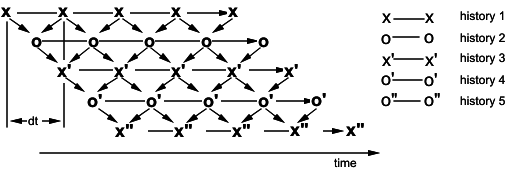
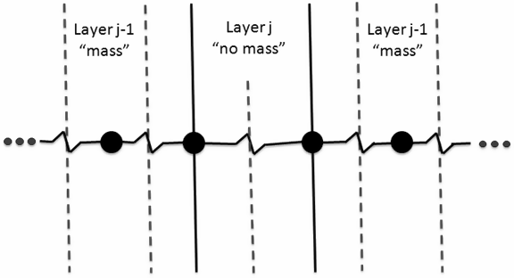
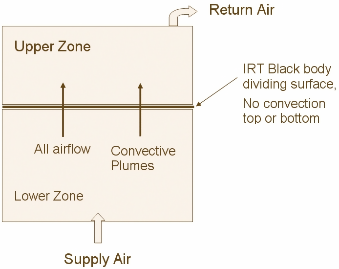
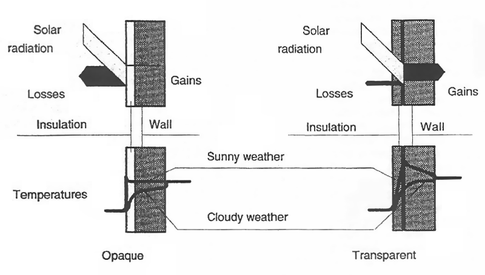
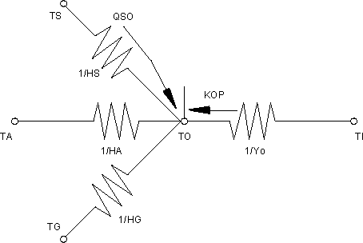
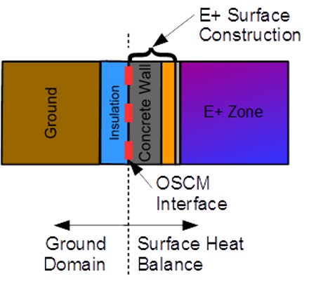

Surface Heat Balance Manager / Processes
========================================

Conduction Through The Walls
----------------------------

### Conduction Transfer Function Module

The most basic time series solution is the response factor equation which relates the flux at one surface of an element to an infinite series of temperature histories at both sides as shown by Equation :

<div>$${q''_{ko}}(t) = \sum\limits_{j = 0}^\infty  {{X_j}} {T_{o,t - j\delta }} - \sum\limits_{j = 0}^\infty  {{Y_j}} {T_{i,t - j\delta }}$$</div>

where q” is heat flux, T is temperature, i signifies the inside of the building element, o signifies the outside of the building element, t represents the current time step, and X and Y are the response factors.

While in most cases the terms in the series decay fairly rapidly, the infinite number of terms needed for an exact response factor solution makes it less than desirable.  Fortunately, the similarity of higher order terms can be used to replace them with flux history terms.  The new solution contains elements that are called conduction transfer functions (CTFs).  The basic form of a conduction transfer function solution is shown by the following equation:

<div>$${q''_{ki}}(t) =  - {Z_o}{T_{i,t}} - \sum\limits_{j = 1}^{nz} {{Z_j}} {T_{i,t - j\delta }} + {Y_o}{T_{o,t}} + \sum\limits_{j = 1}^{nz} {{Y_j}} {T_{o,t - j\delta }} + \sum\limits_{j = 1}^{nq} {{\Phi_j}{{q''}_{ki,t - j\delta }}} $$</div>

for the inside heat flux, and

<div>$${q''_{ko}}(t) =  - {Y_o}{T_{i,t}} - \sum\limits_{j = 1}^{nz} {{Y_j}} {T_{i,t - j\delta }} + {X_o}{T_{o,t}} + \sum\limits_{j = 1}^{nz} {{X_j}} {T_{o,t - j\delta }} + \sum\limits_{j = 1}^{nq} {{\Phi_j}{{q''}_{ko,t - j\delta }}} $$</div>

for the outside heat flux (q²=q/A)

where:

X*<sub>j</sub>*  = Outside CTF coefficient, j= 0,1,...nz.

Y*<sub>j</sub>* = Cross CTF coefficient, j= 0,1,...nz.

Z*<sub>j</sub>* = Inside CTF coefficient, j= 0,1,...nz.

F*<sub>j</sub>* = Flux CTF coefficient, j = 1,2,...nq.

T*<sub>i</sub>* = Inside face temperature

T*<sub>o</sub>* = Outside face temperature

<span>\({q''_{ko}}\)</span> = Conduction heat flux on outside face

<span>\(q''\)</span> = Conduction heat flux on inside face

The subscript following the comma indicates the time period for the quantity in terms of the time step d.  Note that the first terms in the series (those with subscript 0) have been separated from the rest in order to facilitate solving for the current temperature in the solution scheme.  These equations state that the heat flux at either face of the surface of any generic building element is linearly related to the current and some of the previous temperatures at both the interior and exterior surface as well as some of the previous flux values at the interior surface.

The final CTF solution form reveals why it is so elegant and powerful.  With a single, relatively simple, linear equation with constant coefficients, the conduction heat transfer through an element can be calculated.  The coefficients (CTFs) in the equation are constants that only need to be determined once for each construction type.  The only storage of data required are the CTFs themselves and a limited number of temperature and flux terms.  The formulation is valid for any surface type and does not require the calculation or storage of element interior temperatures.

### Calculation of Conduction Transfer Functions

The basic method used in EnergyPlus for CTF calculations is known as the state space method (Ceylan and Myers 1980; Seem 1987; Ouyang and Haghighat 1991).  Another common, older method used Laplace transformations to reach the solution;  the Laplace method was  used in BLAST (Hittle, 1979; Hittle & Bishop, 1983).  The basic state space system is defined by the following linear matrix equations:

<div>$$\frac{{d\left[ {\bf{x}} \right]}}{{dt}} = \left[ {\bf{A}} \right]\left[ {\bf{x}} \right] + \left[ {\bf{B}} \right]\left[ {\bf{u}} \right]$$</div>

<div>$$\left[ {\bf{y}} \right] = \left[ {\bf{C}} \right]\left[ {\bf{x}} \right] + \left[ {\bf{D}} \right]\left[ {\bf{u}} \right]$$</div>

where x is a vector of state variables, u is a vector of inputs, y is the output vector, t is time, and A, B, C, and D are coefficient matrices.  Through the use of matrix algebra, the vector of state variables (x) can be eliminated from the system of equations, and the output vector (y) can be related directly to the input vector (u) and time histories of the input and output vectors.

This formulation can be used to solve the transient heat conduction equation by enforcing a finite difference grid over the various layers in the building element being analyzed.  In this case, the state variables are the nodal temperatures, the environmental temperatures (interior and exterior) are the inputs, and the resulting heat fluxes at both surfaces are the outputs.  Thus, the state space representation with finite difference variables would take the following form:

<div>$$
  \frac{d\left[\begin{array}{c}T_1 \\ \vdots \\ T_n\end{array}\right]}{dt} = \left[\bf{A}\right]\left[\begin{array}{c}T_1 \\ \vdots \\ T_n\end{array}\right]+\left[\bf{B}\right]\left[\begin{array}{c}T_i \\ T_o\end{array}\right]
$$</div>

<div>$$
  \left[\begin{array}{c}{q''}_i \\ {q''}_o\end{array}\right] = \left[\bf{C}\right]\left[\begin{array}{c}T_1 \\ \vdots \\ T_n\end{array}\right]+\left[\bf{D}\right]\left[\begin{array}{c}T_i \\ T_o\end{array}\right]
$$</div>

where T1, T2, ..., Tn-1, Tn are the finite difference nodal temperatures, n is the number of nodes, Ti and To are the interior and exterior environmental temperatures, and q"i and q"o are the heat fluxes (desired output).

Seem (1987) shows that for a simple one layer slab with two interior nodes as in Figure 7 and convection at both sides the resulting finite difference equations are given by:

<div>$$C\frac{{d{T_1}}}{{dt}} = hA\left( {{T_o} - {T_1}} \right) + \frac{{{T_2} - {T_1}}}{R}$$</div>

<div>$$C\frac{{d{T_2}}}{{dt}} = hA\left( {{T_i} - {T_2}} \right) + \frac{{{T_1} - {T_2}}}{R}$$</div>

<div>$$q{``_i} = h\left( {{T_i} - {T_2}} \right)$$</div>

<div>$$q{``_o} = h\left( {{T_1} - {T_o}} \right)$$</div>

where:

<span>\(R = \frac{\ell }{{kA}}\)</span>,

<span>\(C = \frac{{\rho {c_p}\ell A}}{2}\)</span>, and

A is the area of the surface exposed to the environmental temperatures.

In matrix format:

<div>$$
  \left[\begin{array}{c}\frac{dT_1}{dt} \\ \frac{dT_2}{dt}\end{array}\right] = 
     \left[\begin{array}{cc}-\frac{1}{RC}-\frac{hA}{C} & \frac{1}{RC} \\ \frac{1}{RC} & -\frac{1}{RC}-\frac{hA}{C}\end{array}\right]\left[\begin{array}{c}T_1 \\ T_2\end{array}\right] + 
     \left[\begin{array}{cc}\frac{hA}{C} & 0 \\ 0 & \frac{hA}{C}\end{array}\right]\left[\begin{array}{c}T_o \\ T_i\end{array}\right]
$$</div>

<div>$$
  \left[\begin{array}{c}{q''}_o \\ {q''}_i\end{array}\right] = 
    \left[\begin{array}{cc}0 & -h \\ h & 0\end{array}\right] \left[\begin{array}{c}T_1 \\ T_2\end{array}\right] +
    \left[\begin{array}{cc}0 & h \\ -h & 0\end{array}\right] \left[\begin{array}{c}T_o \\ T_i\end{array}\right]
$$</div>


Figure 10.  Two Node State Space Example.

The important aspect of the state space technique is that through the use of matrix algebra the state space variables (nodal temperatures) can be eliminated to arrive at a matrix equation that gives the outputs (heat fluxes) as a function of the inputs (environmental temperatures) only.  This eliminates the need to solve for roots in the Laplace domain.  In addition, the resulting matrix form has more physical meaning than complex functions required by the Laplace transform method.

The accuracy of the state space method of calculating CTFs has been addressed in the literature.  Ceylan and Myers (1980) compared the response predicted by the state space method to various other solution techniques including an analytical solution.  Their results showed that for an adequate number of nodes the state space method computed a heat flux at the surface of a simple one layer slab within 1% of the analytical solution.  Ouyang and Haghighat (1991) made a direct comparison between the Laplace and state space methods.  For a wall composed of insulation between two layers of concrete, they found almost no difference in the response factors calculated by each method.

Seem (1987) summarizes the steps required to obtain the CTF coefficients from the A, B, C, and D matrices.  While more time consuming than calculating CTFs using the Laplace Transform method, the matrix algebra (including the calculation of an inverse and exponential matrix for A) is easier to follow than root find algorithms.  Another difference between the Laplace and State Space methods is the number of coefficients required for a solution.  In general, the State Space method requires more coefficients.  In addition, the number of temperature and flux history terms is identical (nz=nq).  Note that as with the Laplace method that the actual number of terms will vary from construction to construction.

Two distinct advantages of the State Space method over the Laplace method that are of interest when applying a CTF solution for conduction through a building element are the ability to obtain CTFs for much shorter time steps and the ability to obtain 2- and 3-D conduction transfer functions.  While not implemented in the Toolkit, both Seem (1987) and Strand (1995) have demonstrated the effectiveness of the State Space method in handling these situations that can have important applications in buildings.

### Conduction Transfer Function (CTF) Calculations in EnergyPlus

Conduction transfer functions are an efficient method to compute surface heat fluxes because they eliminate the need to know temperatures and fluxes within the surface.  However, conduction transfer function series become progressively more unstable as the time step decreases.  This became a problem as investigations into short time step computational methods for the zone/system interactions progressed because, eventually, this instability caused the entire simulation to diverge.  This phenomenon was most apparent for thermally massive constructions with long characteristic times and, correspondingly, requiring a large number of terms in the CTF series. This indicates that the problem is related to round-off and truncation error and is in no way an indictment of the CTF method itself.  Methods that develop CTF series from finite difference approximations to the heat conduction equation (Meyers, 1980; Seem, 1987) were considered to address this problem.  Seem's method did give better accuracy and stability at short time steps than the current BLAST technique but, the method still had difficulty computing stable CTF series for time steps of less than 1/4 hour for the heaviest constructions in the BLAST library.

The zone heat gains consist of specified internal heat gains, air exchange between zones, air exchange with the outside environment, and convective heat transfer from the zone surfaces.  Of these, the surface convection load requires the most complicated calculations because a detailed energy balance is required at the inside and outside surface of each wall, floor, and roof.  In addition, the transient heat conduction in the material between the surfaces must be solved.  This solution gives the inside and outside temperatures and heat fluxes that must be known in order to calculate the convection component to the zone load for each zone surface.  BLAST uses a conduction transfer function CTF method attributed to Hittle (1980) to solve the transient conduction problem for each surface.  The method results in a time series of weighting factors that, when multiplied by previous values of the surface temperatures and fluxes and the current inside and outside surface temperatures, gives the current inside and outside heat flux.  The method is easily applied to multilayered constructions for which analytical solutions are unavailable.  In addition, determining the series of CTF coefficients is a one-time calculation, making the method much faster than finite difference calculations.

A problem with CTF methods is that the series time step is fixed; that is, a CTF series computed for a one hour time step takes information at t-1 hours, t-2 hours, etc. and computes conditions at the current time t.  As time advances the oldest term in the input series is dropped and the data moved back one time step to allow the newest value to be added to the series.  For convenience, the time step used to determine the CTF series should be the same as the time step used to update the zone mean air temperature in the zone energy balance.  But, as the time step used to calculate the CTF series gets shorter, the number of terms in the series grows.  Eventually, with enough terms, the series becomes unstable due to truncation and round-off error.  Heavy constructions, such as slab-on-grade floors (12" heavyweight concrete over 18" dirt), have accuracy and stability problems at time steps as large as 0.5 hours when modeled by Hittle's CTF method.  In an attempt to overcome this problem, Hittle's method was replaced by Seem's method (1987) in IBLAST.  This resulted in some improvement in stability at shorter time steps, but not enough to allow IBLAST to run at a 0.1 hour time step without restricting the types of surfaces that could be used.

Even though CTF methods require that values of the surface temperatures and fluxes be stored for only a few specific times before the current time, the temperature and flux histories are, actually, continuous functions between those discrete points.  However, there is no way to calculate information at these intermediate times once a series has been initialized.  The terms in the temperature and flux histories are out of phase with these points.  However, they can be calculated by shifting the phase of the temperature and flux histories by only a fraction of a time step.  This procedure would allow a CTF series computed for a time step Dt, to be used to compute information at times t+Dt/2, t+Dt/3, t+Dt/4, or any other arbitrary fraction of the time step, so long as the surface temperatures and flux values were still Dt apart.  Several ways of doing this are described below.

The method shown in the Figure 11 maintains two sets of histories out of phase with each other.  The figure shows how this would work for two sets of histories out of phase by one half of a time step.  More sets of temperature and flux histories could be used, allowing the simulation time step to take on values: 1/3, 1/4, 1/5, etc., of the minimum time step allowed for the CTF calculations.  The time step between inputs to the CTF series would be the smallest convenient interval at which the CTF series is stable.  This scenario is illustrated in this figure for two separate sets of temperature and flux histories.  Cycling through each history, in order, allowed calculations of the zone energy balance to be performed with updated surface information at a shorter time step than one CTF history series would otherwise allow.  This method required no interpolation between the series once each set of histories was initialized.  However, if the smallest time step for a stable CTF series was large compared to the zone temperature update time step, significant memory was required to store all the sets of histories.


Figure 11. Multiple, staggered time history scheme

Another method is shown in Figure 12. Sequential interpolation of new histories that uses successive interpolations to determine the next set of temperature and flux histories.  The current history is interpolated directly from the previous history set using the required time phase shift between the two.  This method required permanent storage for only one set of temperature and flux histories at a time, but smoothed out temperature and flux data as more interpolations were performed.  As a result, at concurrent simulation times current values of history terms were different form previous "in phase" history terms.  This was unacceptable from, a physical point of view, because it allowed current information to change data from a previous time.



Figure 12. Sequential interpolation of new histories

A final method, shown in Figure 13. Master history with interpolation, was something of a hybrid of the previous two methods.  One "master" history set was maintained and updated for all time; this solved the problem of current events propagating information backwards in time.  When surface fluxes needed to be calculated at times out of phase with this master history a new, temporary history was interpolated from the master values.  This method proved to be the best of the three options described because it eliminated propagation of information backwards in time and only required concurrent storage of two sets of temperature and flux histories. This method was subsequently incorporated into the IBLAST program in conjunction with Seem's procedure for calculating the coefficients of the CTF series.


Figure 13. Master history with interpolation

### Conduction Transfer Function (CTF) Calculations Special Case: R-Value Only Layers

Most users will elect to enter materials with four parameters that are of interest for calculating conduction transfer functions: thickness, conductivity, density, and specific heat.  For these materials, EnergyPlus will divide each material layer within a construction into between 6 and 18 nodes for the application of the state-space method.  For multi-layered constructions, nodes are also placed at the interface between two layers.  These interface nodes consist of half a node of the first layer and half a node of the second layer.

In some cases, either due to a lack of information or a desire to simplify input, a user may choose to enter a material layer as a “no mass” or “R-Value only” material.  This assumption essentially says that these layers add nothing to the thermal mass of the overall construction and only add to the overall resistance or R-Value of the construction as a whole.  While this is not recommended, it is allowed and in some cases is not a poor assumption for extremely lightweight materials such as some types of insulation.

In the past, when a user enters such a “no mass” material into EnergyPlus, internally the properties of this layer are converted to approximate the properties of air (density, specific heat, and conductivity) with the thickness adjusted to maintain the user’s desired R-Value.  This allowed such layers to be handled internally in the same way as other layers without any additional changes to the code.  This solution was deemed accurate enough as air has very little thermal mass and it made the coding of the state space method simpler.

It is possible to account for layers that have no thermal mass in the state space solution without resorting to the assignment of fictitious material properties.  The EnergyPlus internal equations for assigning values to portions of the A, B, C, and D matrices as shown in the previous subsections have been altered to account for the potential presence of R-Value only (or no mass) layers without resorting to assigning these materials the properties of air.  This is handled by assuming that the “no mass” layer is a single node layer.  As nodes are defined that the interface between material layers, the “no mass” layer is essentially two “half nodes” that are shared with the surrounding layers.  This allows the surrounding material layers to provide thermal capacitance for each of the nodes at the material interfaces.

In EnergyPlus, there are two possible cases for the existence of “no mass” layers: either between two other solid, thermally massive layers (multiple “no mass” layers next to each other are simply combined in this approach) or at the inner or outer most layers of a construction.  There are potential issues with having a resistance-only layer at either the inner or outer most layers of a construction.  A little or no mass layer there could receive intense thermal radiation from internal sources or the sun causing the temperature at the inner or outer surface to achieve very high levels.  This is undesirable from a simulation standpoint as there are limits to temperature levels in EnergyPlus that could be exceeded causing the simulation to terminate and is likely unrealistic from a real-world perspective.  Thus, for such potentially problematic calculational scenarios, EnergyPlus will continue to convert a “no mass” layer at either the inner or outer most layer of a construction into a thermal mass layer using the properties of air as has been done in the past.

The case where a resistance-only layer is defined anywhere except the inner or outer layer of a construction is handled by treating the “no mass” layer as a single node layer.  This will result in a node at each interface as in the standard material layer cases.  When a “no mass” material is present, the R-Value only layer will not add any thermal capacitance to the nodes at the interfaces at either side of the material.  It will simply add resistance between the two nodes.



Figure 14. Illustration of no-mass layer between two mass layers

From the EnergyPlus code, the A matrix (AMat) is assigned with values at the interface using the following equations (taken from the actual code):

````
cap = ( rho(Layer)\*cp(Layer)\*dx(Layer) + rho(Layer+1)\*cp(Layer+1)\*dx(Layer+1) ) \* 0.5D0
AMat(Node,Node-1) = rk(Layer)/dx(Layer)/cap           ! Assign matrix values for the current node
AMat(Node,Node)   = -1.0D0 \* ( rk(Layer)/dx(Layer)+rk(Layer+1)/dx(Layer+1) ) / cap
AMat(Node,Node+1) = rk(Layer+1)/dx(Layer+1)/cap       ! node.
````

Note that these equations do not change.  For “no mass” layers, the density (rho) and the specific heat (cp) variables will be assigned zero values.  In addition, the thickness (dx) will be equated with the user-defined R-Value and conductivity (rk) will be assigned a value of unity.  In addition, the number of nodes for the “no mass” layer will be set to 1.

This handles resistive layers correctly without resorting to assigning the properties of air to the “no mass” layer.  The only potential problem with this is if two resistive layers are placed next to each other.  In that case, the interface between the two resistive layers would have no mass (variable “cap” would equal zero) and a divide by zero would result.  To avoid this, adjacent “no mass” layers are combined internally so that the user does not have to do this and also to avoid any divide by zero errors.

While from a results standpoint, the difference in output between assigning air properties for specific heat, density, etc. and handling the no mass materials explicitly is negligible, handling the no mass layers properly does provide better code efficiency from a calculation speed standpoint.

### References

Ceylan, H. T., and G. E. Myers. 1980. Long-time Solutions to Heat Conduction Transients with Time-Dependent Inputs. ASME Journal of Heat Transfer, Volume 102, No. 1, pp. 115-120.

Hittle, D. C. 1979. Calculating Building Heating and Cooling Loads Using the Frequency Response of Multilayered Slabs, Ph.D. Thesis, University of Illinois, Urbana, IL.

Hittle, D. C., and R. Bishop. 1983. An Improved Root-Finding Procedure for Use in Calculating Transient Heat Flow Through Multilayered Slabs. International Journal of Heat and Mass Transfer, Vol. 26, No. 11, pp. 1685-1693.

Ouyang, K., and F. Haghighat. 1991. A Procedure for Calculating Thermal Response Factors of Multi-layered Walls--State Space Method. Building and Environment, Vol. 26, No. 2, pp. 173-177.

Seem, J. E. 1987. Modeling of Heat Transfer in Buildings, Ph.D. Thesis, University of Wisconsin, Madison, WI.

Strand, R. K. 1995. Heat Source Transfer Functions and Their Application to Low Temperature Radiant Heating Systems, Ph.D. Thesis, University of Illinois, Urbana, IL.

Taylor, R. D., C.O. Pedersen, D.E. Fisher, R. J. Liesen, L.K. Lawrie. 1990. *Simultaneous Simulation of Buildings and Mechanical Systems in Heat Balance Based Energy Analysis Programs*, Proceedings of the 3rd International Conference on System Simulation in Buildings, Liege, Belgium, December 3-5, 1990.

Taylor, R.D., C.O. Pedersen, D.E. Fisher, R. J. Liesen, L.K. Lawrie. 1991. Impact of Simultaneous Simulation of Buildings and Mechanical Systems in Heat Balance Based Energy Analysis Programs on System Response and Control, Conference Proceedings IBPSA Building Simulation '91, Nice, France, August 20-22, 1991.

Conduction Finite Difference Solution Algorithm
-----------------------------------------------

### Basic Finite Difference Solution Approach

EnergyPlus models follow fundamental heat balance principles very closely in almost all aspects of the program. However, the simulation of building surface constructions has relied on a conduction transfer function (CTF) transformation carried over from BLAST. This has all the usual restrictions of a transformation-based solution: constant properties, fixed values of some parameters, and do not produce results for the interior of the surface. As the energy analysis field moves toward simulating more advanced constructions, such as phase change materials (PCM), it becomes necessary to step back from transformations to more fundamental forms. Accordingly, a conduction finite difference (CondFD) solution algorithm has been incorporated into EnergyPlus. This does not replace the CTF solution algorithm, but complements it for cases where the user needs to simulate phase change materials or variable thermal conductivity. It is also possible to use the finite difference algorithm for zone time steps as short as one minute.

EnergyPlus includes two different options for the specific scheme or formulation used for the finite difference model.  The first scheme is referred to as Crank-Nicholson and was the formulation used in EnergyPlus prior to version 7.  As of version 7 a second scheme was added and is referred to as fully implicit.  The selection between the two can be made by the user with the HeatBalanceSettings:ConductionFiniteDifference input object.  Once selected, the same scheme is used throughout the simulation.  Although the two different schemes differ in their fundamental heat transfer equations, they share nearly all the same supporting models for material properties, data storage, solution schemes, and spatial discretization algorithms.

The Crank-Nicholson scheme is semi-implicit and based on an Adams-Moulton solution approach. It is considered second-order in time.  The algorithm uses an implicit finite difference scheme coupled with an enthalpy-temperature function to account for phase change energy accurately. The implicit formulation for an internal node is shown in the equation below.

<div>$$
  C_p \rho \Delta x \frac{T_i^{j+1}-T_i^j}{\Delta t} = 
     \frac{1}{2}\left(k_W\frac{T_{i+1}^{j+1}-T_{i}^{j+1}}{\Delta x} +
                      k_E\frac{T_{i-1}^{j+1}-T_{i}^{j+1}}{\Delta x} + 
                      k_W\frac{T_{i+1}^{j}-T_{i}^{j}}{\Delta x} +
                      k_E\frac{T_{i-1}^{j}-T_{i}^{j}}{\Delta x}\right)
$$</div>

Where:

T <sub>=</sub> node temperature

Subscripts:

i = node being modeled

i+1 = adjacent node to interior of construction

i-1 = adjacent node to exterior of construction

j+1 = new time step

j = previous time step

Dt = calculation time step

Dx = finite difference layer thickness (always less than construction layer thickness)

C<sub>p</sub> = specific heat of material

k<sub>w</sub> = thermal conductivity for interface between i node and i+1 node

k<sub>E</sub> = thermal conductivity for interface between i node and i-1 node

r  = density of material

Then, this equation is accompanied by a second equation that relates enthalpy and temperature.

<div>$${h_i} = HTF\left( {{T_i}} \right)$$</div>

where HTF is an enthalpy-temperature function that uses user input data.

The fully implicit scheme is also based on an Adams-Moulton solution approach. It is considered first order in time.  The model equation for this scheme is show in the following equation.

<div>$${C_p}\rho {\rm{\Delta x}}\frac{{T_i^{j + 1} - T_i^j}}{{{\rm{\Delta }}t}} = \left( {{k_W}\frac{{\left( {T_{i + 1}^{j + 1} - T_i^{j + 1}} \right)}}{{{\rm{\Delta x}}}} + {k_E}\frac{{\left( {T_{i - 1}^{j + 1} - T_i^{j + 1}} \right)}}{{{\rm{\Delta x}}}}} \right)$$</div>

For both schemes, EnergyPlus uses the following four types of nodes, as shown in the figure below (1) interior surface nodes, (2) interior nodes, (3) material interface nodes and (4) external surface nodes. The grid for each material is established by specifying a half node for each edge of a material and equal size nodes for the rest of the material. Equations such as are formed for all nodes in a construction. The formulation of all node types is basically the same.


Figure 15. Node depiction for Conduction Finite Difference Model

In the CondFD model, surface discretization depends on the thermal diffusivity of the material (α) and time step (Δt) selected, as shown in the equation below. The default value of 3 for the space discretization constant, *C*, is basically the inverse of the Fourier Number:

<div>$$
Fo = \frac{\alpha \Delta t}{\Delta x^2}
$$</div>

and is based on the stability requirement for the explicit mode that requires values higher than 2, or a Fourier number lower than 0.5. However, CondFD uses implicit schemes that do not have the same stability requirements as the explicit mode. Thus, the default 3 was originally set rather arbitrary.  As of version 7, the value of this constant can be controlled by the user with the input field called Space Discretization Constant in the HeatBalanceSettings:ConductionFiniteDifference input object.   The discretization method allows CondFD to assign different node spacing or grid size to different material layers in a wall or roof, as building walls and roofs typically consist of several layers of different materials having different thermal properties.

<div>$${\rm{\Delta x}} = \sqrt {{\rm{C\alpha \Delta t}}} $$</div>

The actual integer number of nodes for each layer is then calculated by rounding off the result from dividing the length of the material layer by the result of the equation above. After this, Δx is recalculated by dividing the length of the material by the number of nodes. A full node is equal to two half nodes. Lower values for the Space Discretization Constant yield more nodes, with higher values yield fewer nodes.

Because the solution is implicit, a Gauss-Seidell iteration scheme is used to update to the new node temperatures in the construction and under-relaxation is used for increased stability.  The Gauss-Seidell iteration loop is the inner-most solver and is called for each surface.  It is limited to 30 iterations but will exit early when the sum of all the node temperatures changes between the last call and the current call, normalized by the sum of the temperature values, is below  0.000001C. This convergence criteria is typically met after 3 iterations, except when PCMs are simulated as it takes an average of 2-3 more iterations when PCM are changing phase. If the number if iterations needed to met convergence criteria start to increase, an automatic internal relaxation factor stabilities the solution and in most cases keep the number of iterations less than 10.

EnergyPlus also uses a separate, outer iteration loop across all the different inside surface heat balances so that internal long-wave radiation exchange can be properly solved.  For CTF formulations, this iteration is controlled by a maximum allowable temperature difference of 0.002C for inside face surface temperatures from one iteration to the next (or a limit of 100 iterations). CondFD uses the same default value for allowable temperature difference as CTF. However, this parameter was found to often need to be smaller for stability and so the inside surface heat balance manager uses a separate allowable maximum temperature difference when modeling CondFD.  The user can control the value of the relaxation factor by using the input field called  Inside Face Surface Temperature Convergence Criteria in the HeatBalanceSettings:ConductionFiniteDifference input object. In addition, if the program detects that there is instability by watching for excessive numbers of iterations in this outer loop and may decrease the relaxation factor. Users can also output the number of iterations inside of CondFD loop for each surface and the outer internal heat balance loop for each zone with “CondFD Inner Solver Loop Iterations” and “Heat Balance Inside Surfaces Calculation Iterations” respectively.

<div>$${T_{i,new}} = {T_{i,old}} + \left( {{T_{i,new}} - {T_{i,old}}} \right)*Relax$$</div>

Because of the iteration scheme used for CondFD,  the node enthalpies get updated each iteration, and then they are used to develop a variable Cp if a phase change material is being simulated. This is done by including a third equation for Cp.

<div>$$Cp = \frac{{{h_{i,new}} - {h_{i,old}}}}{{{T_{i,new}} - {T_{i,old}}}}$$</div>

The iteration scheme assures that the correct enthalpy, and therefore the correct Cp is used in each time step, and the enthalpy of the material is accounted for accurately. Of course, if the material is regular, the user input constant Cp is used.

The algorithm also has a provision for including a temperature coefficient to modify the thermal conductivity. The thermal conductivity is obtained from:

<div>$$k = {k_o} + {k_1}\left( {{T_i} - 20} \right)$$</div>

where:

k<sub>o</sub> is the 20°C value of thermal conductivity (normal idf  input)

k<sub>1</sub> is the change in conductivity per degree temperature difference from 20°C

As of Version 7, the CondFD implementation was changed to evaluate the thermal conductivity at the interface between nodes, as shown below. In this case, EnergyPlus uses a linear interpolation between nodal points.

<div>$${C_p}\rho {\rm{\Delta x}}\frac{{T_i^{j + 1} - T_i^j}}{{{\rm{\Delta }}t}} = \frac{1}{2}\left[ {\left( {{k_W}\frac{{\left( {T_{i + 1}^{j + 1} - T_i^{j + 1}} \right)}}{{{\rm{\Delta x}}}} + {k_E}\frac{{\left( {T_{i - 1}^{j + 1} - T_i^{j + 1}} \right)}}{{{\rm{\Delta x}}}}} \right) + \left( {{k_W}\frac{{\left( {T_{i + 1}^j - T_i^j} \right)}}{{{\rm{\Delta x}}}} + {k_E}\frac{{\left( {T_{i - 1}^j - T_i^j} \right)}}{{{\rm{\Delta x}}}}} \right)} \right]$$</div>

Where,

<div>$${k_W} = \frac{{\left( {k_{i + 1}^{j + 1} + k_i^{j + 1}} \right)}}{2}$$</div>

<div>$${{\rm{k}}_{\rm{E}}} = \frac{{\left( {{\rm{k}}_{{\rm{i}} - 1}^{{\rm{j}} + 1} + {\rm{k}}_{\rm{i}}^{{\rm{j}} + 1}} \right)}}{2}$$</div>

These additional property information values are put into the input file as explained in the Input/Output Reference Document, but it consists simply of a value for k1 and set of enthalpy temperature pairs that describe the enthalpy of the phase change material in straight line segments with respect to temperature.

A graph showing the effect of a large PCM on the outside surface of a zone is shown below. The phase change temperature was 30°C, and the flat temperature response during the phase change is obvious. This example was run with a zone time step of one minute to show that such small time steps can be done with the finite difference solution technique. It is more efficient to set the zone time step shorter than those used for the CTF solution algorithm. It should be set to 20 time steps per hour or greater, and can range up to 60. The finite difference algorithm actually works better with shorter zone time steps. The computation time has a minimum at a zone time step around two minutes (30 time steps/hr), and increases for shorter or longer zone time steps.


Figure 16. Effects of Large PCM on Outside Zone Surface

### Finite Difference Node Arrangement in Surfaces

The Conduction Finite Difference algorithm determines the number of nodes in each layer of the surface based on the Fourier stability criteria.  The node thicknesses are normally selected so that the time step is near the explicit solution limit in spite of the fact that the solution is implicit. For very thin, high conductivity layers, a minimum of two nodes is used.  This means two half thickness nodes with the node temperatures representing the inner and outer faces of the layer. All thicker layers also have two half thickness nodes at their inner and outer faces. These nodes produce layer interface temperatures.

The ConductionFiniteDifferenceSimplified capability was removed as of Version 7.2.

### Conduction Finite Difference Variable Thermal Conductivity

The Conduction Finite Difference algorithm has also been given the capability to use an expanded thermal conductivity function. This function, explained in the input/output document, is similar to the temperature enthalpy function. It consists of pairs of temperature and thermal conductivity values that form a linear segmented function. It is established with the MaterialProperty:VariableThermalConductivity object.

### Conduction Finite Difference Source Sink Layers

The Conduction Finite Difference algorithm can also invoke the source/sink layer capability by using the **Construction:InternalSource** object.

### References

Pedersen C.O., Enthalpy Formulation of conduction heat transfer problems involving latent heat, Simulation, Vol 18, No. 2, February 1972

Versteeg, H. and Malalasekra, W. 1996. An introduction to computational fluid dynamic: the finite volume method approach. Prentice Hall.

[Tabares-Velasco, P.C. and Griffith, B. 2012. Diagnostic Test Cases for Verifying Surface Heat Transfer Algorithms and Boundary Conditions in Building Energy Simulation Programs, Journal of Building Performance Simulation, doi:10.1080/19401493.2011.595501](../../../Documents%20and%20Settings/ptabares/My%20Documents/Paulo/CV/Tabares%20Velasco%20CV%20UPDATED2.doc)

Tabares-Velasco, P.C., Christensen, C. and Bianchi, M. 2012. Verification and Validation of EnergyPlus Phase Change Material Model for Opaque Wall Assemblies, Building and Environment 54: 186-196.

Combined Heat and Moisture Transfer (HAMT) Model
------------------------------------------------

### Overview

The combined heat and moisture transfer finite (HAMT) solution algorithm is a completely coupled, one-dimensional, finite element, heat and moisture transfer model simulating the movement and storage of heat and moisture in surfaces simultaneously from and to both the internal and external environments. As well as simulating the effects of moisture buffering, HAMT is also be able to provide temperature and moisture profiles through composite building walls, and help to identify surfaces with high surface humidity.

### HAMT Nomenclature

Dependencies on moisture content are indicated by a superscript <sup>w</sup>, on heat by a superscript <sup>h</sup> and vapor pressure by a superscript <sup>v</sup>.

Table 2. Combined Heat and Moisture Transfer Model Nomenclature

<table class="table table-striped">
<tr>
<th>Symbol</th>
<th>Units</th>
<th>Meaning</th>
</tr>
<tr>
<td>T</td>
<td>°C</td>
<td>Temperature</td>
</tr>
<tr>
<td>RH,φ</td>
<td>%, fraction</td>
<td>Relative humidity</td>
</tr>
<tr>
<td>W</td>
<td>kg/m<sup>3</sup></td>
<td>Moisture Content</td>
</tr>
<tr>
<td><span>\({\raise0.7ex\hbox{${\partial H}$} \!\mathord{\left/ {\vphantom {{\partial H} {\partial T}}}\right.}\!\lower0.7ex\hbox{${\partial T}$}}\)</span></td>
<td>J/m<sup>3</sup>C</td>
<td>Moisture dependent heat storage capacity</td>
</tr>
<tr>
<td><span>\({\raise0.7ex\hbox{${\partial w}$} \!\mathord{\left/ {\vphantom {{\partial w} {\partial \phi }}}\right.}\!\lower0.7ex\hbox{${\partial \phi }$}}\)</span></td>
<td>kg/m<sup>3</sup></td>
<td>Moisture dependent moisture storage capacity</td>
</tr>
<tr>
<td><span>\({k^w}\)</span></td>
<td>W/mC</td>
<td>Moisture dependent thermal conductivity</td>
</tr>
<tr>
<td><span>\({h_v}\)</span></td>
<td>J/kg</td>
<td>Evaporation enthalpy of water (= 2, 489, 000J/kg)</td>
</tr>
<tr>
<td><span>\(\delta \)</span></td>
<td>kg/msPa</td>
<td>Vapor diffusion coefficient in air</td>
</tr>
<tr>
<td><span>\(\mu \)</span></td>
<td>-</td>
<td>Moisture dependent vapor diffusion resistance factor</td>
</tr>
<tr>
<td>P</td>
<td>Pa</td>
<td>Vapor pressure</td>
</tr>
<tr>
<td>p<sub>ambient</sub></td>
<td>Pa</td>
<td>Ambient air pressure</td>
</tr>
<tr>
<td>C</td>
<td>J/kgC</td>
<td>Specific heat capacity of dry material</td>
</tr>
<tr>
<td>c<sup>w</sup></td>
<td>J/KgC</td>
<td>Specific heat capacity of water (=4,180J/kg<sup>o</sup>C@ 20<sup>o</sup>C)</td>
</tr>
<tr>
<td><span>\(\rho \)</span></td>
<td>kg/m<sup>3</sup></td>
<td>Material Density</td>
</tr>
<tr>
<td><span>\({\rho ^w}\)</span></td>
<td>kg/m<sup>3</sup></td>
<td>Density of water (= 1000kg/m3)</td>
</tr>
<tr>
<td><span>\({D^w}\)</span></td>
<td>m<sup>2</sup>/s</td>
<td>Liquid Transport Coefficient</td>
</tr>
<tr>
<td>A</td>
<td>m<sup>2</sup></td>
<td>Contact Surface area</td>
</tr>
<tr>
<td><span>\(\Delta {V_i}\)</span></td>
<td>m<sup>3</sup></td>
<td>Cell Volume</td>
</tr>
<tr>
<td><span>\(t\)</span></td>
<td>s</td>
<td>Time</td>
</tr>
<tr>
<td><span>\(\Delta \tau \)</span></td>
<td>s</td>
<td>Time step between calculations</td>
</tr>
<tr>
<td>x</td>
<td>m</td>
<td>Distance between cell centres</td>
</tr>
<tr>
<td><span>\(C_i^h\)</span></td>
<td>J/C</td>
<td>Heat Capacitance of cell i</td>
</tr>
<tr>
<td><span>\(C_i^w\)</span></td>
<td>kg</td>
<td>Moisture Capacitance of cell i</td>
</tr>
<tr>
<td><span>\(R_{ij}^h\)</span></td>
<td>C/W</td>
<td>Heat Resistance between cells i and j</td>
</tr>
<tr>
<td><span>\(R_{ij}^v\)</span></td>
<td>sPa/kg</td>
<td>Vapor Resistance between cells i and j</td>
</tr>
<tr>
<td><sup><span>\(R_{ij}^w\)</span></sup></td>
<td>s/kg</td>
<td>Liquid Moisture Resistance between cells i and j</td>
</tr>
<tr>
<td><sup><span>\(q_i^v\)</span></sup></td>
<td>W</td>
<td>Heat due to Vaporisation</td>
</tr>
<tr>
<td><sup><span>\(q_i^{adds}\)</span></sup></td>
<td>W</td>
<td>Heat from additional Sources</td>
</tr>
<tr>
<td>P</td>
<td>m3/m3</td>
<td>Material Porosity</td>
</tr>
<tr>
<td>p(as a superscript)</td>
<td>s</td>
<td>Present Time Step</td>
</tr>
<tr>
<td>i,j</td>
<td>-</td>
<td>Cell indices</td>
</tr>

</table>

### HAMT Model Description

Equations and are derived from heat and moisture balance equations and are taken from [Künzel, H.M. (1995)]. They describe a theoretical model for the transfer of heat and moisture through a material.

<div>$$\frac{{\partial H}}{{\partial T}}\frac{{\partial T}}{{\partial \tau }} = \frac{\partial }{{\partial x}}\left( {{k^w}\frac{{\partial T}}{{\partial x}}} \right) + {h_v}\frac{\partial }{{\partial x}}\left( {\frac{\delta }{\mu }\frac{{\partial T}}{{\partial x}}} \right)$$</div>

The three terms in equation describe the storage, transport and generation of heat respectively.

<div>$$\frac{{\partial w}}{{\partial \phi }}\frac{{\partial \phi }}{{\partial \tau }} = \frac{\partial }{{\partial x}}\left( {{D^w}\frac{{\partial w}}{{\partial \phi }}\frac{{\partial \phi }}{{\partial x}}} \right) + \frac{\partial }{{\partial x}}\left( {\frac{\delta }{\mu }\frac{{\partial T}}{{\partial x}}} \right)$$</div>

The three terms in equation describe the storage of moisture, the transport of liquid moisture and the transport of vapor respectively. The equation to calculate the vapor diffusion coefficient in air (<span>\(\delta \)</span>) used in the third term of both equations, is also taken from Künzel,

<div>$$\delta  = \frac{{\left( {2 \times {{10}^{ - 7}} \times {{\left( {T + 273.15} \right)}^{0.81}}} \right)}}{{{P_{ambient}}}}$$</div>

The heat storage capacity (<span>\(\frac{\partial H}{\partial T}\)</span>) depends on the moisture content w of the material by the following equation.

<div>$$\frac{{\partial H}}{{\partial T}} = \left( {c\rho  + {c^w}w} \right)$$</div>

The moisture content of the material w and the vapor diffusion resistance factor μ depend on the relative humidity inside the material. The parameters <span>\(\frac{\partial w}{\partial \phi}\)</span>, <span>\({k^w}\)</span> and <span>\({D^w}\)</span>are also moisture dependent parameters.

The following sections describe how the above equations are used within the HAMT model.

#### Surfaces, Material Layers and Cells

“Surfaces” are made of a number of layers of potentially any combination of materials. Each surface is split into its constituent materials and is then split up further into cells through its depth. HAMT will generate no more than 10 cells per material with widths that are thinner near the boundaries of each material where most changes are expected and detail is needed.

#### Heat Transfer

Equation 1 can be re-written and used to describe the heat storage and transfer through the i<sup>th</sup> cell in a surface.

<div>$$\left( {{c_i}{\rho_i} + {c^w}{w_i}} \right)\Delta {V_i}\frac{{T_i^{p + 1} - T_i^p}}{{\Delta \tau }} = \sum\limits_j {k_{ij}^w{A_{ij}}\frac{{T_j^{p + 1} - T_i^{p + 1}}}{{{x_{ij}}}}}  + \sum\limits_j {{h_v}\frac{{{\delta_{ij}}}}{{{\mu_{ij}}}}{A_{ij}}\frac{{p_j^{p + 1} - p_i^{p + 1}}}{{{x_{ij}}}}} $$</div>

In the one dimensional case there are only two adjacent cells each labelled j. The heat generated due to vaporisation<span>\(q_i^v\)</span> can be calculated separately.

<div>$$q_i^v = \sum\limits_j {{h_v}\frac{{{\delta_{ij}}}}{{{\mu_{ij}}}}{A_{ij}}\frac{{p_j^{p + 1} - p_i^{p + 1}}}{{{x_{ij}}}}} $$</div>

Rearranging equation and including other sources of heat (<span>\(q_i^{adds}\)</span>) such as radiation from other surfaces in the calculation gives the temperature in a cell in the next time step as,

<div>$$T_i^{p + 1} = \frac{{\sum\nolimits_j {\frac{{T_j^{p + 1}}}{{R_{ij}^h}}}  + q_i^v + q_i^{adds} + C_i^h\frac{{T_i^p}}{{\Delta \tau }}}}{{\frac{{C_i^h}}{{\Delta \tau }} + \sum\nolimits_j {\frac{1}{{R_{ij}^h}}} }}$$</div>

where<span>\(C_i^h = \left( {{c_i}{\rho_i} + {c^w}{w_i}} \right)\Delta {V_i}\)</span> is thermal heat capacitance of cell i and <span>\(R_{ij}^h = \frac{x_{ij}}{k_{ij}A_{ij}}\)</span> is the thermal resistance between cells i and j.

This equation can be solved using the Gauss-Seidel iteration technique. The i<sup>th</sup> cell temperature is calculated whilst the j<sup>th</sup> cell temperatures are kept as up to date as possible. The iteration is stopped when the maximum difference between two consecutive calculations in all cells is less than a threshold of 0.002°C.

#### Moisture Content w

The moisture content (w) of a cell is needed for the calculation of the heat transfer through the cell as it affects the thermal resistance and heat capacitance. The moisture content of cells is calculated from the relative humidity (RH) of the material. The relationship between w and the RH for each material is known as the sorption isotherm and measured data points are entered into EnergyPlus as a series of coordinates. HAMT interpolates between the measurements to obtain the moisture content of a material for any RH value. The sorption isotherm input is via the MaterialProperty:HeatAndMoistureTransfer:SorptionIsotherm object and is described in the Input Output Reference document.

#### Porosity P

The porosity of a material (P) is an input variable and defined as the maximum fraction, by volume, of a material that can be taken up with moisture. It is used to calculate the maximum point on the sorption isotherm curve.  The porosity is entered for each material via the MaterialProperty:HeatAndMoistureTransfer:Settings object, as described in the Input Output Reference document.

#### Moisture Dependant Thermal Conductivity k<sup>w</sup>

The thermal conductivity (k<sup>w</sup>) of the cell is determined by interpolating between data points of thermal conductivity versus the moisture content of the material, entered into EnergyPlus via the MaterialProperty:HeatAndMoistureTransfer:ThermalConductivity object. The moisture content is determined via the sorption isotherm which gives the moisture content as a function of Relative Humidity.

#### Moisture Dependant Moisture Diffusion Coefficient μ

This is used in the third term of equation to describe the heat transfer due to vapor movement. It is determined by interpolating between data points of moisture diffusion coefficient versus the moisture content of the material, entered into EnergyPlus via the MaterialProperty:HeatAndMoistureTransfer:Diffusion object. A simple linear interpolation is used to obtain the conductivity between measured points.

#### Moisture Transfer

Moisture, as well as heat, is transported through materials as either liquid (w) or vapor (p). There are two different potentials that control the movement though the material. Liquid transfer is driven by differences in relative humidity whereas vapor transfer is driven by differences in vapor pressure. Materials also have a capacity to store moisture. Equation can be re-written for a discrete cell in a continuous material.

<div>$$\frac{{dw}}{{d{\phi_i}}}\Delta {V_i}\frac{{\phi_i^{p + 1} - \phi_i^p}}{{\Delta \tau }} = \sum\limits_j {{k_{ij}}{A_{ij}}\frac{{\phi_j^{p + 1} - \phi_i^{p + 1}}}{{{x_{ij}}}}}  + \sum\limits_j {\frac{{{\delta_{ij}}}}{{{\mu_{ij}}}}{A_{ij}}\frac{{p_j^{p + 1} - p_i^{p + 1}}}{{{x_{ij}}}}} $$</div>

Equation can be rearranged to provide the relative humidity of the i<sup>th</sup> cell in the next time step.

<div>$$\phi_i^{p + 1} = \frac{{\sum\nolimits_j {\frac{{\phi_j^{p + 1}}}{{R_{ij}^w}}}  + \sum\nolimits_j {\frac{{p_i^{p + 1}}}{{R_{ij}^v}}}  + C_i^w\frac{{\phi_i^p}}{{\Delta \tau }}}}{{\frac{{C_i^w}}{{\Delta \tau }} + \sum\nolimits_j {\frac{1}{{R_{ij}^w}} + \sum\nolimits_j {\frac{{p_i^{sat}}}{{R_{ij}^v}}} } }}$$</div>

where <span>\(C_i^w = \frac{dw}{d\phi_{i}}\Delta {V_i}\)</span> is the "Moisture Capacitance" of cell i,

<div>$$R_{ij}^w = \frac{{{x_{ij}}}}{{{A_{ij}}D_{ij}^w\frac{{dw}}{{d\phi }}}}$$</div>

is the moisture resistance between cells i and j and <span>\(R_{ij}^v = \frac{\mu_{ij}x_{ij}}{A_{ij}\delta_{ij}}\)</span> is the vapor resistance between cells i and j.

Equation can be used together with the heat equation in an alternate step by step fashion to calculate the new temperature and relative humidity profiles for each cell for the next time step.

#### Liquid Transport Coefficient D<sup>w</sup>

The Moisture Dependant Liquid Transport Coefficient is entered as a series of moisture density and liquid transport coefficient data points. There are two different coefficients, one for suction, where the surface is wet due to rain, and one for redistribution where the surface is no longer wet. If the weather file has a rain flag it is used to switch between these two types of coefficient. HAMT-SUCTION and HAMT-REDISTRIBUTION.

#### Moisture Dependent Moisture Capacity <span>\(\frac{\partial w}{\partial \phi}\)</span>

This is simply the gradient of moisture sorption isotherm at the RH of the material.

#### Convective Heat Transfer

The internal and external heat transfer coefficients are used to calculate the thermal resistance of the boundary layer between the zone air and the surface of the surface. They are either supplied by the user via the advanced surface concepts object “SurfaceProperty:ConvectionCoefficients” or, if these are not provided, dynamic values are calculated.

#### Convective Vapor Transfer

The internal and external vapor transfer coefficients are used to calculate the resistance to vapour transfer of the boundary layer between the zone air and the surface of the surface. They are also either supplied by the user via the advanced surface concept object SurfaceProperties:VaporCoefficients. If these are not provided then dynamic values are calculated based on the convective heat transfer coefficients.

#### Initial Moisture Content

At the start of an EnergyPlus simulation “warm up” days are used to ensure that the temperatures of surfaces come to equilibrium with the environment before the simulation starts proper. Moisture content within some building fabrics can take a very long time to come to equilibrium with its environment and it is therefore necessary to set initial or typical values of moisture content for each material to be used at the start of the simulation. These initial values are entered for each material via the MaterialProperty:HeatAndMoistureTransfer:Settings object as described in the Input Output Reference document.

#### Using the Model

As an illustration of the use of the Heat and Moisture Transfer (HAMT) model, the material properties for a small sample of six generic materials have been provided in the EnergyPlus Reference DataSets (MoistureMaterials.idf). The properties were synthesised from the Annex 24 database [Kumar Kumaran, M. (1996)], supplemented, when required, by data from the database of the WUFI model [WUFI (1999)] and are therefore not related to any unique, measured material. Users should consult material property catalogues and other primary sources when the properties of a specific material are required.

Moisture and heat from the surfaces are used by EnergyPlus to calculate the room air temperature and moisture content. EnergyPlus with HAMT works best with as short a time step as possible. However the optimum time step which gives a good prediction for a short computing time will very much depend on the nature of the weather and type of building. Buildings with frequent and large changes in internal and external temperature will need a small time step, maybe even 60 steps per hour. Slowly evolving temperatures and relative humidity’s will not require such a short time step and 20, or even 6, steps per hour may be sufficient.

### References

Künzel, H.M. (1995) Simultaneous Heat and Moisture Transport in Building Components. One- and two-dimensional calculation using simple parameters. IRB Verlag 1995

Holman, J.P. (2002) Heat Transfer, Ninth Edition. McGraw-Hill

Winterton, R.H.S. (1997) Heat Transfer. (Oxford Chemistry Primers; 50) Oxford University Press

Kumar Kumaran, M. (1996) IEA ANNEX 24, Final Report, Volume 3

WUFI (1999) version 2.2 Simultaneous Heat and Moisture Transport in Building components. Fraunhofer IBP, Holzkirchen, Germany

Effective Moisture Penetration Depth (EMPD) Model
---------------------------------------------------------------------------

### Overview

Moisture has little effect on heating system performance, but a profound effect on the performance of air conditioning systems.  In order to accurately describe building performance during periods when cooling is needed, it is very important to know the moisture conditions of the building.  If one assumes that all building moisture is contained in the room air, then one ignores the fact that the materials that bound the room (e.g. wall surfaces, furnishings, linens, etc.) store and release moisture.  Thus, to assume that the only moisture that effects cooling system performance is contained in the room air is a false, and it can lead to significant error in the prediction of room moisture conditions and cooling system loads.

The EMPD (Effective Moisture Penetration Depth) model is a simplified, lumped approach to simulate surface moisture adsorption and desorption.

### EMPD Model Description

The EMPD concept assumes that a thin layer (δ<sub>M</sub>) close to the wall surface behaves dynamically and exchanges moisture with the air domain when exposed to cyclic air moisture pulses.  For short periods where the cyclic integral of the total moisture adsorption and desorption is near zero (i.e. there is no net moisture storage), the EMPD concept has been shown to be a reasonable approximation of reality (Kerestecioglu et al, 1989).  In other words, the following constraint must be met:

<div>$$\int_{{\tau_1}}^{{\tau_2}} {\frac{{dU}}{{d\tau }}} d\tau  = 0$$</div>

where, τ<sub>2</sub>-τ<sub>1</sub> denotes the finite time interval over which the equation holds.  The EMPD model assumes no spatial distribution of moisture content across the thickness (L) of the solid; rather, a thin layer (δ<sub>M</sub>) of uniform moisture content (U) is assumed to represent the total moisture content of the solid. This may be mathematically stated as:

<div>$$\int_0^L {U(x)dx = U{\delta_M}} $$</div>

For most building materials, the equilibrium moisture sorption isotherm can be defined by the following general equation (Kerestecioglu et al. 1988):

<div>$$U = a{\varphi ^b} + c{\varphi ^d}$$</div>

where

<div>$$\varphi  \approx \frac{{{W^*}}}{{{W_{sat}}^*}}$$</div>

and

<div>$${W_{sat}}^* = \frac{1}{{{R_v}{\rho_a}{T^*}}}\exp \left( {23.7093 - \frac{{4111}}{{{T^*} - 35.45}}} \right)$$</div>

 Given that U=U(W<sup>\*</sup>,T<sup>\*</sup>), the moisture content may be differentiated with respect to time in the following manner:

<div>$$\frac{{du}}{{d\tau }} = \frac{{\partial U}}{{\partial {W^*}}}\frac{{d{W^*}}}{{d\tau }} + \frac{{\partial U}}{{\partial {T^*}}}\frac{{d{T^*}}}{{d\tau }} = {A_T}\frac{{d{W^*}}}{{d\tau }} - {B_\rho }\frac{{d{T^*}}}{{d\tau }}$$</div>

where A<sub>T</sub> and B<sub>ρ</sub> are the isothermal moisture capacity and thermo-gradient coefficient, respectively.  From Eqs. , and , they can be expressed as:

<div>$${A_T} = \frac{{ab{\varphi ^b} + cd{\varphi ^d}}}{{{W^*}}}$$</div>

and

<div>$${B_\rho } =  - \left[ {\frac{1}{{{T^*}}} - \frac{{4111}}{{{{({T^*} - 35.45)}^2}}}} \right]*(ab{\varphi ^b} + cd{\varphi ^d})$$</div>

The lumped mass transfer equation for the i-th solid domain may be written as

<div>$${(A{\rho_b}{\delta_M})_i}\frac{{d{U_i}}}{{d\tau }} = {h_{M,i}}{A_i}({W_r} - {W_i}^*)$$</div>

Using Eqs. , , and , one obtains the final equation needed for closure moisture transfer at internal surface.

<div>$${({A_i}{\rho_b}{\delta_M}{A_T})_i}\frac{{d{W_i}^*}}{{d\tau }} = {h_{M,i}}{A_i}({W_r} - {W_i}^*) + {(A{\rho_b}{\delta_M}{B_\rho })_i}\frac{{d{T_i}^*}}{{d\tau }}$$</div>

The energy equation for the envelope contains the surface temperature and is given by the conduction equation

<div>$$\rho {C_p}\frac{{dT}}{{d\tau }} = \nabla  \cdot (k\nabla T)$$</div>

with the boundary conditions at interior surface

<div>$$ - k\nabla T =  - {q_T}`` + {h_T}({T^*} - {T_r}) + \lambda {h_M}({W^*} - {W_r})$$</div>

A more detailed account of the numerical solution procedure can be found in Kerestecioglu et al. (1988).

### EMPD Value Determination

An effective moisture penetration depth may be determined from either experimental or detailed simulation data by using actual surface areas and moisture vapor diffusivity.  An empirical function derived from the detailed simulation may be used to determine the EMPD value (Kerestecioglu et al, 1989):

<div>$${\delta_M} = 12.567024 - 12.21373*\exp \left( { - 267.0211*{D_v}^{0.7}*{\xi ^{ - 0.7}}} \right)$$</div>

where

<div>$$\xi  = \left| {\frac{{\Delta \varphi }}{{\Delta \tau }}} \right|$$</div>

Figure 17 gives the EMPD values to be used for various vapor diffusivities evaluated at different ambient excitations.


Figure 17. Limit of Effective Penetration Depth Values for Various Vapor Diffusivities at Different Ambient Excitations.

### EMPD Nomenclature

A                = Area [m<sup>2</sup>]

A<sub>T</sub>               = Isothermal moisture capacity [m<sup>3</sup>/kg]

B<sub>ρ</sub>               = Thermo-gradient coefficient [kg/kg-K]

C<sub>p</sub>               = Specific heat [J/kg.K]

h<sub>M</sub>               = Convective mass transfer coeff. [kg/m<sup>2</sup>-s]

h<sub>T</sub>               = Convective heat transfer coeff. [W/m<sup>2</sup>-K]

k                = Thermal conductivity [W/m-K]

L                = Length [m]

q"<sub>T</sub>              = Imposed heat flux [W/m<sup>2</sup>]

R<sub>v</sub>               = Ideal gas constant [461.52 J/kg-K]

T                = Temperature [K]

U                = Moisture content [kg/kg]

W               = Humidity ratio [kg/kg]

#### Greek letters

δ<sub>M</sub>              = Effective penetration depth for moisture equation [m]

λ                = Heat of vaporization [J/kg]

ρ                = Density [kg/m<sup>3</sup>]

τ                 = Time [s]

φ                = Relative humidity [0 to 1]

ξ                 = Ambient moisture excitation rate [1/h]


#### Subscripts and superscripts

a                = Air

b                = Bulk

\*                 = Surface

i                 = i-th surface

### References

Kerestecioglu, A., Swami, M., Dabir, R., Razzaq, N., and Fairey, P., 1988, "Theoretical and Computational Investigation of Algorithms for Simultaneous Heat and Moisture Transport in Buildings," FSEC-CR-191-88, Florida Solar Energy Center, Cape Canaveral, FL.

Kerestecioglu, A., M. Swami and A. Kamel, 1989, "Theoretical and Computational Investigation of Simultaneous Heat and Moisture Transfer in Buildings: Effective Penetration Depth Theory."  ASHRAE Winter Meeting, Atlanta, GA.

Kerestecioglu, A., M. V. Swami, P. Brahma, L. Gu, P. Fairey, and S. Chandra, 1989, “FSEC 1.1 User’s Manual,” Florida Solar Energy Center, Cape Canaveral, FL

Outside Surface Heat Balance
----------------------------


Figure 18. Outside Heat Balance Control Volume Diagram

The heat balance on the outside face is:

<div>$${q''_{\alpha sol}} + {q''_{LWR}} + {q''_{conv}} - {q''_{ko}} = 0$$</div>

where:

<sub><span>\({q''_{\alpha sol}}\)</span> </sub>= Absorbed direct and diffuse solar (short wavelength) radiation heat flux.

<sub><span>\({q''_{LWR}}\)</span> </sub>= Net long wavelength (thermal) radiation flux exchange with the air and surroundings.

<sub><span>\({q''_{conv}}\)</span> </sub>= Convective flux exchange with outside air.

<sub><span>\({q''_{ko}}\)</span> </sub> = Conduction heat flux (q/A) into the wall.

All terms are positive for net flux to the face except the conduction term, which is traditionally taken to be positive in the direction from outside to inside of the wall.  Simplified procedures generally combine the first three terms by using the concept of a *sol-air temperature*.  Each of these heat balance components is introduced briefly below.

### External Shortwave Radiation

<sub><span>\({q''_{\alpha sol}}\)</span> </sub> is calculated using procedures presented later in this manual and includes both direct and diffuse incident solar radiation absorbed by the surface face.  This is influenced by location, surface facing angle and tilt, surface face material properties, weather conditions, etc.

### External Longwave Radiation

<span>\({q''_{LWR}}\)</span> is a standard radiation exchange formulation between the surface, the sky, and the ground.  The radiation heat flux is calculated from the surface absorptivity, surface temperature, sky and ground temperatures, and sky and ground view factors.

The longwave radiation heat exchange between surfaces is dependent on surface temperatures, spatial relationships between surfaces and surroundings, and material properties of the surfaces. The relevant material properties of the surface, emissivity e and absorptivity a, are complex functions of temperature, angle, and wavelength for each participating surface. However, it is generally agreed that reasonable assumptions for building loads calculations are (Chapman 1984; Lienhard 1981):

·        each surface emits or reflects diffusely and is gray and opaque (a = e, t = 0, r = 1- e)

·        each surface is at a uniform temperature

·        energy flux leaving a surface is evenly distributed across the surface,

·        the medium within the enclosure is non-participating.

These assumptions are frequently used in all but the most critical engineering applications.


Table 3. Nomenclature List of Variables.

<table class="table table-striped">
<tr>
<th>Mathematical variable</th>
<th>Description</th>
<th>Units</th>
<td>Range</td>
</tr>
<tr>
<td>q&quot;<sub>LWR</sub></td>
<td>Exterior surface longwave radiation flux</td>
<td>W/m<sup>2</sup></td>
<td>-</td>
</tr>
<tr>
<td>h<sub>r</sub></td>
<td>Linearized radiative heat transfer  coefficient to air temperature</td>
<td>W/(m<sup>2</sup> K)</td>
<td>-</td>
</tr>
<tr>
<td>T<sub>surf</sub></td>
<td>Surface Outside face temperatures</td>
<td>K</td>
<td>-</td>
</tr>
<tr>
<td>T<sub>air</sub></td>
<td>Outside air temperature</td>
<td>K</td>
<td>-</td>
</tr>
<tr>
<td>T<sub>gnd</sub>
 </td>
<td>Environmental ground surface temperature</td>
<td>K</td>
<td>-</td>
</tr>
<tr>
<td>T<sub>sky</sub></td>
<td>Sky Effective temperature</td>
<td>K</td>
<td>-</td>
</tr>
<tr>
<td>F<sub>gnd</sub></td>
<td>view factor of wall surface to ground surface</td>
<td>-</td>
<td>0~1</td>
</tr>
<tr>
<td>F<sub>sky</sub></td>
<td>View factor of wall surface to sky</td>
<td>-</td>
<td>0~1</td>
</tr>
<tr>
<td>F<sub>air</sub></td>
<td>View factor of wall surface to air</td>
<td>-</td>
<td>0~1</td>
</tr>
<tr>
<td>e</td>
<td>Surface long-wave emissivity</td>
<td>-</td>
<td>0~1</td>
</tr>
<tr>
<td>s</td>
<td>Stefan-Boltzmann constant</td>
<td>W/m<sup>2</sup>-K<sup>4</sup></td>
<td>0.0000000567</td>
</tr>

</table>

Consider an enclosure consisting of building exterior surface, surrounding ground surface, and sky.  Using the assumptions above, we can determine the longwave radiative heat flux at the building exterior surface (Walton 1983; McClellan and Pedersen 1997).  The total longwave radiative heat flux is the sum of components due to radiation exchange with the ground, sky, and air.

<div>$$q_{LWR}^`` = {q''_{gnd}} + {q''_{sky}} + {q''_{air}}$$</div>

Applying the Stefan-Boltzmann Law to each component yields:

<div>$$q_{_{LWR}}^`` = \varepsilon \sigma {F_{gnd}}(T_{gnd}^4 - T_{surf}^4) + \varepsilon \sigma {F_{sky}}(T_{sky}^4 - T_{surf}^4) + \varepsilon \sigma {F_{air}}(T_{air}^4 - T_{surf}^4)$$</div>

where

e=long-wave emittance of the surface

s=Stefan-Boltzmann constant

F<sub>gnd</sub> = view factor of wall surface to ground surface temperature

F<sub>sky</sub> = view factor of wall surface to sky temperature

F<sub>air</sub> =view factor of wall surface to air temperature

T<sub>surf</sub> = outside surface temperature

T<sub>gnd</sub> = ground surface temperature

T<sub>sky</sub> = sky temperature

T<sub>air</sub> = air temperature

Linearized radiative heat transfer coefficients are introduced to render the above equation more compatible with the heat balance formulation,

<div>$$q_{_{LWR}}^`` = {h_{r,gnd}}({T_{gnd}} - {T_{surf}}) + {h_{r,sky}}({T_{sky}} - {T_{surf}}) + {h_{r,air}}({T_{air}} - {T_{surf}})$$</div>

where

<div>$${h_{r,gnd}} = \frac{{\varepsilon \sigma {F_{gnd}}(T_{surf}^4 - T_{gnd}^4)}}{{{T_{surf}} - {T_{gnd}}}}$$</div>

<div>$${h_{r,sky}} = \frac{{\varepsilon \sigma {F_{sky}}(T_{surf}^4 - T_{sky}^4)}}{{{T_{surf}} - {T_{sky}}}}$$</div>

<div>$${h_{r,air}} = \frac{{\varepsilon \sigma {F_{air}}(T_{surf}^4 - T_{air}^4)}}{{{T_{surf}} - {T_{air}}}}$$</div>

The longwave view factors to ground and sky are calculated with the following expressions (Walton 1983):

<div>$${F_{ground}} = 0.5(1 - \cos \phi )$$</div>

<div>$${F_{sky}} = 0.5(1 + \cos \phi )$$</div>

where *f* is the tilt angle of the surface.  The view factor to the sky is further split between sky and air radiation by:

<div>$$\beta  = \sqrt {0.5\left( {1 + \cos \phi } \right)} $$</div>

The ground surface temperature is assumed to be the same as the air temperature.  The final forms of the radiative heat transfer coefficients are shown here.

<div>$${h_{r,gnd}} = \frac{{\varepsilon \sigma {F_{gnd}}(T_{surf}^4 - T_{air}^4)}}{{{T_{surf}} - {T_{air}}}}$$</div>

<div>$${h_{r,sky}} = \frac{{\varepsilon \sigma {F_{sky}}\beta (T_{surf}^4 - T_{sky}^4)}}{{{T_{surf}} - {T_{sky}}}}$$</div>

<div>$${h_{r,air}} = \frac{{\varepsilon \sigma {F_{sky}}\left( {1 - \beta } \right)(T_{surf}^4 - T_{air}^4)}}{{{T_{surf}} - {T_{air}}}}$$</div>

### References

ASHRAE. 1993. 1993 ASHRAE Handbook – Fundamentals. Atlanta: American Society of Heating, Refrigerating, and Air-Conditioning Engineers, Inc.

Chapman, A. J. 1984. Heat Transfer, 4<sup>th</sup> Edition, New York: Macmillan Publishing Company.

Lienhard, J. H. 1981. A Heat Transfer Textbook, Englewood Cliffs, N.J.: Prentice-Hall, Inc.

McClellan, T. M., and C. O. Pedersen. 1997. Investigation of Outside Heat Balance Models for Use in a Heat Balance Cooling Load Calculation. ASHRAE Transactions, Vol. 103, Part 2, pp. 469-484.

Walton, G. N. 1983. Thermal Analysis Research Program Reference Manual. NBSSIR 83-2655. National Bureau of Standards.

### Atmospheric Variation

All buildings are located in the troposphere, the lowest layer of the atmosphere.  The troposphere extends from sea level to an altitude of 11 km.  Throughout the troposphere, air temperature decreases almost linearly with altitude at a rate of approximately 1°C per 150 m.  Barometric pressure decreases more slowly.  Wind speed, on the other hand, increases with altitude.

Because the atmosphere changes with altitude (defined as *height above ground* in this case), tall buildings can experience significant differences in local atmospheric properties between the ground floor and the top floor.  Buildings interact with the atmosphere through convective heat transfer between the outdoor air and the exterior surfaces of the building envelope, and through the exchange of air between the outside and inside of the building via infiltration and ventilation.

Impetus for using this modeling is illustrated in the next table.  Using a 70 story (284 meters) building as an example, the atmospheric variables are significant.

Table 4.  Atmospheric Variables at Two Different Altitudes above Ground Level

<table class="table table-striped">
<tr>
<th>Variable</th>
<th>1.5 Meters</th>
<th>284 meters</th>
<th>Absolute Diff</th>
<th>Percent Diff</th>
</tr>
<tr>
<td>Air Temperature</td>
<td>15°C</td>
<td>13.15°C</td>
<td>1.85°C</td>
<td>12.3%</td>
</tr>
<tr>
<td>Barometric Pressure</td>
<td>101,325 Pa</td>
<td>97,960 Pa</td>
<td>3,365 Pa</td>
<td>3.3%</td>
</tr>
<tr>
<td>Wind Speed</td>
<td>2.46 m/s</td>
<td>7.75 m/s</td>
<td>5.29 m/s</td>
<td>215%</td>
</tr>

</table>

Comparing the annual energy usage between 60 discretely modeled floors of a building, it turns out that the effect due to wind speed change is dominant over the first ten floors.  But at floor 25, surprisingly, the effect due to air temperature has caught up and is about equal to the effect of wind speed.  Above floor 25 the effect due to air temperature is now dominant.  Clearly it is desirable to model air temperature variation with altitude for high-rise buildings.

To accommodate atmospheric variation EnergyPlus automatically calculates the local outdoor air temperature and wind speed separately for each zone and surface that is exposed to the outdoor environment.  The zone centroid or surface centroid are used to determine the height above ground.  Only local outdoor air temperature and wind speed are currently calculated because they are important factors for the exterior convection calculation for surfaces (see Exterior Convection below) and can also be factors in the zone infiltration and ventilation calculations.  Variation in barometric pressure, however, is considered when using the Airflow Network objects.

#### Local Outdoor Air Temperature Calculation

Variation in outdoor air temperature is calculated using the U.S. Standard Atmosphere (1976).  According to this model, the relationship between air temperature and altitude in a given layer of the atmosphere is:

<div>$${T_z} = {T_b} + L\left( {{H_z} - {H_b}} \right)$$</div>

where

*T<sub>z</sub>* = air temperature at altitude *z*

*T<sub>b</sub>* = air temperature at the base of the layer, i.e., ground level for the troposphere

*L* = air temperature gradient, equal to –0.0065 K/m in the troposphere

*H<sub>b</sub>* = offset equal to zero for the troposphere

*H<sub>z</sub>* = geopotential altitude.

The variable *H<sub>z</sub>* is defined by:

<div>$${H_z} = \frac{{Ez}}{{\left( {E + z} \right)}}$$</div>

where

*E* = 6,356 km, the radius of the Earth

*z* = altitude.

For the purpose of modeling buildings in the troposphere, altitude *z* refers to the height above ground level, not the height above sea level.  The height above ground is calculated as the height of the centroid, or area-weighted center point, for each zone and surface.

The air temperature at ground level, *T<sub>b</sub>*, is derived from the weather file air temperature by inverting the equation above:

<div>$${T_b} = {T_{z,met}} - L\left( {\frac{{E{z_{met}}}}{{E + {z_{met}}}} - {H_b}} \right)$$</div>

where

*T<sub>z,met</sub>* = weather file air temperature (measured at the meteorological station)

*z<sub>met</sub>* = height above ground of the air temperature sensor at the meteorological station.

The default value for *z<sub>met</sub>* for air temperature measurement is 1.5 m above ground.  This value can be overridden by using the Site:WeatherStation object.

#### Local Wind Speed Calculation

Chapter 16 of the Handbook of Fundamentals (ASHRAE 2005).  The wind speed measured at a meteorological station is extrapolated to other altitudes with the equation:

<div>$${V_z} = {V_{met}}{\left( {\frac{{{\delta_{met}}}}{{{z_{met}}}}} \right)^{{\alpha_{met}}}}{\left( {\frac{z}{\delta }} \right)^\alpha }$$</div>

where

*z* = altitude, height above ground

*V<sub>z</sub>* = wind speed at altitude *z*

*a* = wind speed profile exponent at the site

*d* = wind speed profile boundary layer thickness at the site

*z<sub>met</sub>* = height above ground of the wind speed sensor at the meteorological station

*V<sub>met</sub>* = wind speed measured at the meteorological station

*a<sub>met</sub>* = wind speed profile exponent at the meteorological station

*d<sub>met</sub>* = wind speed profile boundary layer thickness at the meteorological station.

The wind speed profile coefficients *a*, *d*, *a<sub>met</sub>*, and *d<sub>met</sub>*, are variables that depend on the roughness characteristics of the surrounding terrain.  Typical values for *a* and d are shown in the following table:


Table 5. Wind Speed Profile Coefficients (ASHRAE Fundamentals 2005).

<table class="table table-striped">
<tr>
<th>Terrain Description</th>
<th>Exponent,a</th>
<th>Boundary Layer Thickness,d (m)</th>
</tr>
<tr>
<td>Flat, open country</td>
<td>0.14</td>
<td>270</td>
</tr>
<tr>
<td>Rough, wooded country</td>
<td>0.22</td>
<td>370</td>
</tr>
<tr>
<td>Towns and cities</td>
<td>0.33</td>
<td>460</td>
</tr>
<tr>
<td>Ocean</td>
<td>0.10</td>
<td>210</td>
</tr>
<tr>
<td>Urban, industrial, forest</td>
<td>0.22</td>
<td>370</td>
</tr>

</table>


The terrain types above map to the options in the *Terrain* field of the Building object.  The *Terrain* field can be overridden with specific values for *a* and d by using the Site:HeightVariation object.

The default value for *z<sub>met</sub>* for wind speed measurement is 10 m above ground.  The default values for *a<sub>met</sub>* and *d<sub>met</sub>* are 0.14 and 270 m, respectively, because most meteorological stations are located in an open field.  These values can be overridden by using the Site:WeatherStation object.

### Outdoor/Exterior Convection

Heat transfer from surface convection is modeled using the classical formulation:

<div>$${Q_c} = {h_{c,ext}}A\left( {{T_{surf}} - {T_{air}}} \right)$$</div>

where

*Q<sub>c</sub>* = rate of exterior convective heat transfer

*h<sub>c,ext</sub>* = exterior convection coefficient

*A* = surface area

*T<sub>surf</sub>* = surface temperature

*T<sub>air</sub>* = outdoor air temperature

Substantial research has gone into the formulation of models for estimating the exterior convection coefficient. Since the 1930's there have been many different methods published for calculating this coefficient, with much disparity between them (Cole and Sturrock 1977; Yazdanian and Klems 1994).  More recently Palyvos (2008) surveyed correlations cataloging some 91 different correlations into four categories based on functional form of the model equation.  EnergyPlus therefore offers a wide selection of different methods for determining values for *h<sub>c,ext</sub>*. The selection of model equations for *h<sub>c,ext</sub>* can be made at two different levels. The first is the set of options available in the input object SurfaceConvectionAlgorithm:Outside that provides a way of broadly selecting which model equations are applied throughout the model.  The input objects SurfaceProperty:ConvectionCoefficients and SurfaceProperty:ConvectionCoefficients:MultipleSurface also provide ways of selecting which model equations or values are applied for specific surfaces.  These basic options are identified by the key used for input and include:

* SimpleCombined

* TARP

* MoWiTT

* DOE-2

* AdaptiveConvectionAlgorithm

Note that when the outside environment indicates that it is raining, the exterior surfaces (exposed to wind) are assumed to be wet.  The convection coefficient is set to a very high number (1000) and the outside temperature used for the surface will be the wet-bulb temperature.  (If you choose to report this variable, you will see 1000 as its value.)

When the AdaptiveConvectionAlgorithm is used, there is a second, deeper level of control available for selecting among a larger variety of *h<sub>c,ext</sub>* equations and also defining custom equations using curve or table objects.  These options are described in this section.

In addition to the correlation choices described below, it is also possible to override the convection coefficients on the outside of any surface by other means:

* Use the SurfaceProperty:ConvectionCoefficients object in the input file to set the convection coefficient value on either side of any surface.

* Use the SurfaceProperty:OtherSideCoefficients object in the input file to set heat transfer coefficients and temperatures on surfaces.

* Use the EnergyManagementSystem Actuators that are available for overriding h<sub>c</sub> values.

These options can also use schedules to control values over time. Specific details are given in the Input Output Reference document.

#### Simple Combined

The simple algorithm uses surface roughness and local surface windspeed to calculate the exterior heat transfer coefficient (key:SimpleCombined).  The basic equation used is:

<div>$$h = D + E{V_z} + F{V_z}^2$$</div>

where

*h* = heat transfer coefficient

*V<sub>z</sub>* = local wind speed calculated at the height above ground of the surface centroid

D, E, F = material roughness coefficients

The roughness correlation is taken from Figure 1, Page 22.4, ASHRAE Handbook of Fundamentals (ASHRAE 1989).  The roughness coefficients are shown in the following table:

Table 6.  Roughness Coefficients D, E, and F.

<table class="table table-striped">
<tr>
<th>Roughness Index</th>
<th>D</th>
<th>E</th>
<th>F</th>
<th>Example Material</th>
</tr>
<tr>
<td>1 (Very Rough)</td>
<td>11.58</td>
<td>5.894</td>
<td>0.0</td>
<td>Stucco</td>
</tr>
<tr>
<td>2 (Rough)</td>
<td>12.49</td>
<td>4.065</td>
<td>0.028</td>
<td>Brick</td>
</tr>
<tr>
<td>3 (Medium Rough)</td>
<td>10.79</td>
<td>4.192</td>
<td>0.0</td>
<td>Concrete</td>
</tr>
<tr>
<td>4 (Medium Smooth)</td>
<td>8.23</td>
<td>4.0</td>
<td>-0.057</td>
<td>Clear pine</td>
</tr>
<tr>
<td>5 (Smooth)</td>
<td>10.22</td>
<td>3.1</td>
<td>0.0</td>
<td>Smooth Plaster</td>
</tr>
<tr>
<td>6 (Very Smooth)</td>
<td>8.23</td>
<td>3.33</td>
<td>-0.036</td>
<td>Glass</td>
</tr>

</table>

Note that the simple correlation yields a combined convection and radiation heat transfer coefficient.  Radiation to sky, ground, and air is included in the exterior convection coefficient for this algorithm.

All other algorithms yield a *convection only* heat transfer coefficient.  Radiation to sky, ground, and air is calculated automatically by the program.

#### TARP ALGORITHM

TARP, or Thermal Analysis Research Program, is an important predecessor of EnergyPlus (Walton 1983).  Walton developed a comprehensive model for exterior convection by blending correlations from ASHRAE and flat plate experiments by Sparrow et. al. In older versions of EnergyPlus, prior to version 6, the “TARP” model was called “Detailed.”  The model was reimplemented in version 6 to use Area and Perimeter values for the group of surfaces that make up a facade or roof, rather than the single surface being modeled.

Table 7. Nomenclature List of Variables.

<table class="table table-striped">
<tr>
<th>Variable</th>
<th>Description</th>
<th>Units</th>
<th>Range</th>
</tr>
<tr>
<td>A</td>
<td>Surface area of the surface</td>
<td>m<sup>2</sup></td>
<td>/= 0</td>
</tr>
<tr>
<td>h<sub>c</sub></td>
<td>Surface exterior convective heat transfer coefficient</td>
<td>W/(m<sup>2</sup>K)</td>
<td>-</td>
</tr>
<tr>
<td>h<sub>f</sub></td>
<td>Forced convective heat transfer coefficient</td>
<td>W/(m<sup>2</sup>K)</td>
<td>-</td>
</tr>
<tr>
<td>h<sub>n</sub></td>
<td>Natural convective heat transfer coefficient</td>
<td>W/(m<sup>2</sup>K)</td>
<td>-</td>
</tr>
<tr>
<td>P</td>
<td>Perimeter of surface</td>
<td>m</td>
<td>-</td>
</tr>
<tr>
<td>R<sub>f</sub></td>
<td>Surface roughness multiplier</td>
<td>-</td>
<td>-</td>
</tr>
<tr>
<td>T<sub>air</sub></td>
<td>Local outdoor air temperature calculated at the height above ground of the surface centroid</td>
<td>°C</td>
<td>-</td>
</tr>
<tr>
<td>T<sub>so</sub></td>
<td>Outside surface temperature</td>
<td>°C</td>
<td>-</td>
</tr>
<tr>
<td>DT</td>
<td>Temperature difference between the surface and air,</td>
<td>°C</td>
<td>-</td>
</tr>
<tr>
<td>V<sub>z</sub></td>
<td>Local wind speed calculated at the height above ground of the surface centroid</td>
<td>m/s</td>
<td>-</td>
</tr>
<tr>
<td>W<sub>f</sub></td>
<td>Wind direction modifier</td>
<td>-</td>
<td>-</td>
</tr>
<tr>
<td>f</td>
<td>Angle between the ground outward normal and the surface outward normal</td>
<td>degree</td>
<td>-</td>
</tr>
<tr>
<td>Roughness Index</td>
<td>Surface roughness index (6=very smooth, 5=smooth, 4=medium smooth, 3=medium rough, 2=rough, 1=very rough)</td>
<td>-</td>
<td>1~6</td>
</tr>

</table>


The Detailed, BLAST, and TARP convection models are very similar.  In all three models, convection is split into forced and natural components (Walton 1981).  The total convection coefficient is the sum of these components.

<div>$${h_c} = {h_f} + {h_n}$$</div>

The forced convection component is based on a correlation by Sparrow, Ramsey, and Mass (1979):

<div>$${h_f} = 2.537{W_f}{R_f}{\left( {\frac{{P{V_z}}}{A}} \right)^{1/2}}$$</div>

where

W<sub>f</sub>  =  1.0 for windward surfaces

or

W<sub>f</sub>  = 0.5 for leeward surfaces

Leeward is defined as greater than 100 degrees from normal incidence (Walton 1981).

The surface roughness multiplier Rf is based on the ASHRAE graph of surface conductance (ASHRAE 1981) and may be obtained from the following table:

Table 8.  Surface Roughness Multipliers (Walton 1981).

<table class="table table-striped">
<tr>
<th>Roughness Index</th>
<th>Rf</th>
<th>Example Material</th>
</tr>
<tr>
<td>1 (Very Rough)</td>
<td>2.17</td>
<td>Stucco</td>
</tr>
<tr>
<td>2 (Rough)</td>
<td>1.67</td>
<td>Brick</td>
</tr>
<tr>
<td>3 (Medium Rough)</td>
<td>1.52</td>
<td>Concrete</td>
</tr>
<tr>
<td>4 (Medium Smooth)</td>
<td>1.13</td>
<td>Clear pine</td>
</tr>
<tr>
<td>5 (Smooth)</td>
<td>1.11</td>
<td>Smooth Plaster</td>
</tr>
<tr>
<td>6 (Very Smooth)</td>
<td>1.00</td>
<td>Glass</td>
</tr>

</table>

The natural convection component *h<sub>n</sub>* is calculated in the same way as the interior "Detailed" model.  The detailed natural convection model correlates the convective heat transfer coefficient to the surface orientation and the difference between the surface and zone air temperatures (where DT = Air Temperature - Surface Temperature).  The algorithm is taken directly from Walton (1983).  Walton derived his algorithm from the ASHRAE Handbook (2001), Table 5 on p. 3.12, which gives equations for natural convection heat transfer coefficients in the turbulent range for large, vertical plates and for large, horizontal plates facing upward when heated (or downward when cooled).   A note in the text also gives an approximation for large, horizontal plates facing downward when heated (or upward when cooled) recommending that it should be half of the facing upward value.  Walton adds a curve fit as a function of the cosine of the tilt angle to provide intermediate values between vertical and horizontal.  The curve fit values at the extremes match the ASHRAE values very well.

For no temperature difference OR a vertical surface the following correlation is used:

<div>$$h = 1.31{\left| {\Delta T} \right|^{\frac{1}{3}}}$$</div>

For (DT &lt; 0.0 AND an upward facing surface)  OR  (DT &gt; 0.0 AND an downward facing surface) an enhanced convection correlation is used:

<div>$$h = \frac{{9.482{{\left| {\Delta T} \right|}^{\frac{1}{3}}}}}{{7.283 - \left| {\cos \Sigma } \right|}}$$</div>

where S is the surface tilt angle.

For (DT &gt; 0.0 AND an upward facing surface)  OR  (DT &lt; 0.0 AND an downward facing surface) a reduced convection correlation is used:

<div>$$h = \frac{{1.810{{\left| {\Delta T} \right|}^{\frac{1}{3}}}}}{{1.382 + \left| {\cos \Sigma } \right|}}$$</div>

where S is the surface tilt angle.

#### MoWiTT Algorithm

Table 9.  Nomenclature List of Variables.

<table class="table table-striped">
<tr>
<th>Variable</th>
<th>Description</th>
<th>Units</th>
<th>Range</th>
</tr>
<tr>
<td>A</td>
<td>Constant</td>
<td>W/(m<sup>2</sup>K(m/s)<sup>b</sup></td>
<td>-</td>
</tr>
<tr>
<td>B</td>
<td>Constant</td>
<td>-</td>
<td>-</td>
</tr>
<tr>
<td>C<sub>t</sub></td>
<td>Turbulent natural convection constant</td>
<td>W/(m<sup>2</sup>K<sup>4/3</sup>)</td>
<td>-</td>
</tr>
<tr>
<td>h<sub>c</sub></td>
<td>Surface exterior convective heat transfer coefficient</td>
<td>W/(m<sup>2</sup>K)</td>
<td>-</td>
</tr>
<tr>
<td>T<sub>so</sub></td>
<td>Outside surface temperature</td>
<td>°C/K</td>
<td>-</td>
</tr>
<tr>
<td>DT</td>
<td>Temperature difference between the surface and air</td>
<td>°C/K</td>
<td>-</td>
</tr>

</table>


The MoWiTT model is based on measurements taken at the Mobile Window Thermal Test (MoWiTT) facility (Yazdanian and Klems 1994).  The correlation applies to very smooth, vertical surfaces (e.g. window glass) in low-rise buildings and has the form:

<div>$${h_c} = \sqrt {{{\left[ {{C_t}{{\left( {\Delta T} \right)}^{\frac{1}{3}}}} \right]}^2} + {{\left[ {aV_z^b} \right]}^2}} $$</div>

Constants a, b and turbulent natural convection constant C<sub>t</sub> are given in Table 10.  The original MoWiTT model has been modified for use in EnergyPlus so that it is sensitive to the local suface’s wind speed which varies with the height above ground.  The original MoWiTT model was formulated for use with the air velocity at the location of the weather station.  As of Version 7.2, EnergyPlus uses the “a” model coefficients derived by Booten et al. (2012) rather than the original values from Yazdanian and Klems (1994).

NOTE:  The MoWiTT algorithm may not be appropriate for rough surfaces, high-rise surfaces, or surfaces that employ movable insulation.

Table 10. MoWiTT Coefficients (Yazdanian and Klems 1994, Booten et al. 2012)

<table class="table table-striped">
<tr>
<th>Wind Direction</th>
<th>Ct</th>
<th>a</th>
<th>b</th>
</tr>
<tr>
<td>(Units)</td>
<td>W/m<sup>2</sup>K<sup>4/3</sup></td>
<td>W/m<sup>2</sup>K(m/s)<sup>b</sup></td>
<td>-</td>
</tr>
<tr>
<td>Windward</td>
<td>0.84</td>
<td>3.26</td>
<td>0.89</td>
</tr>
<tr>
<td>Leeward</td>
<td>0.84</td>
<td>3.55</td>
<td>0.617</td>
</tr>

</table>


#### DOE-2 Model

Table 11.  Nomenclature List of Variables.

<table class="table table-striped">
<tr>
<th>Variable</th>
<th>Description</th>
<th>Units</th>
<th>Range</th>
</tr>
<tr>
<td>a</td>
<td>Constant</td>
<td>W/(m<sup>2</sup>K(m/s)<sup>b</sup></td>
<td>-</td>
</tr>
<tr>
<td>b</td>
<td>Constant</td>
<td>-</td>
<td>-</td>
</tr>
<tr>
<td>h<sub>c</sub></td>
<td>Surface exterior convective heat transfer coefficient</td>
<td>W/(m<sup>2</sup>K)</td>
<td>-</td>
</tr>
<tr>
<td>h<sub>c,glass</sub></td>
<td>Convective heat transfer coefficient for very smooth surfaces (glass)</td>
<td>W/(m<sup>2</sup>K)</td>
<td>-</td>
</tr>
<tr>
<td>h<sub>n</sub></td>
<td>Natural convective heat transfer coefficient</td>
<td>W/(m<sup>2</sup>K)</td>
<td>-</td>
</tr>
<tr>
<td>R<sub>f</sub></td>
<td>Surface roughness multiplier</td>
<td>-</td>
<td>-</td>
</tr>
<tr>
<td>T<sub>so</sub></td>
<td>Outside surface temperature</td>
<td>°C/K</td>
<td>-</td>
</tr>
<tr>
<td>DT</td>
<td>Temperature difference between the surface and air,</td>
<td>°C/K</td>
<td>-</td>
</tr>
<tr>
<td>f</td>
<td>Angle between the ground outward normal and the surface outward normal</td>
<td>radian</td>
<td>-</td>
</tr>

</table>

##### 

The DOE-2 convection model is a combination of the MoWiTT and BLAST Detailed convection models (LBL 1994). The convection coefficient for very smooth surfaces (e.g. glass) is calculated as:

<div>$${h_{c,glass}} = \sqrt {h_n^2 + {{\left[ {aV_z^b} \right]}^2}} $$</div>

h<sub>n</sub> is calculated using Equation or Equation .  Constants a and b are given in Table 10.

For less smooth surfaces, the convection coefficient is modified according to the equation

<div>$${h_c} = {h_n} + {R_f}({h_{c,glass}} - {h_n})$$</div>

where R<sub>f</sub> is the roughness multiplier given by Table 8.

#### Adaptive Convection Algorithm

This algorithm has a structure that allows for finer control over the models used for particular surfaces.  The algorithm for the outside face was developed for EnergyPlus but it borrows concepts and its name from the research done by Beausoleil-Morrison (2000, 2002) for convection at the inside face (see the description below for interior convection).

The adaptive convection algorithm implemented in EnergyPlus for the outside face is much simpler than that for the inside face. The surface classification system has a total of 4 different categories for surfaces that depend on current wind direction and heat flow directions.  However it is more complex in that the *h<sub>c</sub>* equation is split into two parts and there are separate model equation selections for forced convection, *h<sub>f</sub>*, and natural convection, *h<sub>n</sub>*. The following table summarizes the categories and the default assignments for *h<sub>c</sub>* equations. The individual *h<sub>c</sub>* equations are documented below.

Table 12. Adaptive Convection Algorithm Details

<table class="table table-striped">
<tr>
<th>#</th>
<th>Surface Classifi-cation</th>
<th>Heat Flow Direction</th>
<th>Wind Direct-ion</th>
<th>h<sub>f</sub>  Models</th>
<th>h<sub>n</sub> Models</th>
</tr>
<tr>
<td>1</td>
<td>Roof Stable</td>
<td>Down</td>
<td>Any</td>
<td>TARPWindward MoWiTTWindward DOE2Windward NusseltJurges BlockenWindward EmmelRoof ClearRoof</td>
<td>WaltonStableHorizontalOrTilt AlamdariStableHorizontal</td>
</tr>
<tr>
<td>2</td>
<td>Roof Unstable</td>
<td>Up</td>
<td>Any</td>
<td>TARPWindward MoWiTTWindward DOE2Windward NusseltJurges BlockenWindward EmmelRoof ClearRoof</td>
<td>WaltonUnstableHorizontalOrTilt AlamdariUnstableHorizontal</td>
</tr>
<tr>
<td>3</td>
<td>Vertical Wall Windward</td>
<td>Any</td>
<td>Windward</td>
<td>TARPWindward DOE2Windward MoWiTTWindward NusseltJurges McAdams Mitchell BlockenWindward EmmelVertical</td>
<td>ASHRAEVerticalWall AlamdariHammondVerticalWall FohannoPolidoriVerticalWall ISO15099Windows</td>
</tr>
<tr>
<td>4</td>
<td>Vertical Wall Leeward</td>
<td>Any</td>
<td>Leeward</td>
<td>TARPLeeward MoWiTTLeeward DOE2Leeward EmmelVertical NusseltJurges McAdams Mitchell</td>
<td>ASHRAEVerticalWall AlamdariHammondVerticalWall FohannoPolidoriVerticalWall ISO15099Windows</td>
</tr>

</table>


##### Outside Face Surface Classification

During an initial setup phase, all the heat transfer surfaces in the input file are analyzed in groups to determine appropriate values for geometry scales used in many of the convection correlations.  Eight separate groups are assembled for nominally vertical exterior surfaces for eight bins of azimuth: north, northeast, east, southeast, south, southwest, west, northwest.  Surfaces with the same range of azimuth are grouped together and analyzed for overall geometry parameters.  A ninth group is assembled for nominally horizontal exterior surfaces for a roof bin that is also analyzed for geometry.  These geometry routines find bounds and limits of all the surfaces in the group and then model geometric parameters from these limits.

##### Sparrow Windward

As discussed above for the TARP algorithm, a Sparrow et al. (1979) conducted flat plate measurements and develop the following correlation for finite-size flat plates oriented to windward.

<div>$${h_f} = 2.53{R_f}{\left( {\frac{{P{V_z}}}{A}} \right)^{{\raise0.7ex\hbox{$1$} \!\mathord{\left/ {\vphantom {1 2}}\right.}\!\lower0.7ex\hbox{$2$}}}}$$</div>

##### Sparrow Leeward

Sparrow et al. (1979) conducted flat plate measurements and develop the following correlation for finite-size flat plates oriented to leeward.

<div>$${h_f} = \frac{{2.53}}{2}{R_f}{\left( {\frac{{P{V_z}}}{A}} \right)^{{\raise0.7ex\hbox{$1$} \!\mathord{\left/ {\vphantom {1 2}}\right.}\!\lower0.7ex\hbox{$2$}}}}$$</div>

##### MoWITT Windward

As discussed above, Yazdanian and Klems (1994) used outdoor laboratory measurements to develop the following correlation for smooth surfaces oriented to windward. Booten et al. (2012) developed revised coefficients for use with local surface wind speeds.

<div>$${h_c} = \sqrt {{{\left[ {0.84{{\left| {\Delta T} \right|}^{{\raise0.7ex\hbox{$1$} \!\mathord{\left/ {\vphantom {1 3}}\right.}\!\lower0.7ex\hbox{$3$}}}}} \right]}^2} + {{\left[ {2.38{\kern 1pt} {\kern 1pt} V_z^{0.89}} \right]}^2}} $$</div>

This model equation is for the total film coefficient and includes the natural convection portion. Therefore it should not be used in conjunction with a second natural convection model equation.

##### MoWITT Leeward

Yazdanian and Klems (1994) used outdoor laboratory measurements to develop the following correlation for smooth surfaces oriented to leeward. Booten et al. (2012) developed revised coefficients for use with local surface wind speeds.

<div>$${h_c} = \sqrt {{{\left[ {0.84{{\left| {\Delta T} \right|}^{{\raise0.7ex\hbox{$1$} \!\mathord{\left/ {\vphantom {1 3}}\right.}\!\lower0.7ex\hbox{$3$}}}}} \right]}^2} + {{\left[ {2.86{\kern 1pt} {\kern 1pt} V_z^{0.617}} \right]}^2}} $$</div>

This model equation is for the total film coefficient and includes the natural convection portion. Therefore it should not be used in conjunction with a second natural convection model equation.

##### Blocken

Blocken et al. (2009) developed a set of correlations for windward facing outdoor surfaces using numerical methods (key: BlockenWindward).

<div>$$
  \begin{array}{lcl}
    h_f = 4.6V^{0.89}_{10m} & : & \theta \leq 11.25 \\
    h_f = 5.0V^{0.80}_{10m} & : & 11.25 &lt; \theta \leq 33.75 \\
    h_f = 4.6V^{0.84}_{10m} & : & 33.75 &lt; \theta \leq 56.25 \\
    h_f = 4.5V^{0.81}_{10m} & : & 56.25 &lt; \theta \leq 100.0
  \end{array}
$$</div>

Where *V<sub>10m</sub>* is the air velocity at the location of the weather station and θ is the angle of incidence between the wind and the surface in degrees.  This model is only applicable to windward surfaces and lacks a natural convection component and therefore cannot be used on its own but only within the adaptive convection algorithm for the outside face.

##### Clear

Clear et al. (2003) developed correlations from measurements for horizontal roofs on two commercial buildings. In EnergyPlus the implementation uses the model for natural convection plus turbulent forced convection (eq. 8A in the reference) and applies it to the center point of each surface section that makes up the roof.

<div>$${h_c} = \eta \frac{k}{{{L_n}}}0.15Ra_{{L_n}}^{{\raise0.7ex\hbox{$1$} \!\mathord{\left/ {\vphantom {1 3}}\right.}\!\lower0.7ex\hbox{$3$}}} + \frac{k}{x}{R_f}0.0296{\mathop{\rm Re}\nolimits}_x^{{\raise0.7ex\hbox{$4$} \!\mathord{\left/ {\vphantom {4 5}}\right.}\!\lower0.7ex\hbox{$5$}}}{\Pr ^{{\raise0.7ex\hbox{$1$} \!\mathord{\left/ {\vphantom {1 3}}\right.}\!\lower0.7ex\hbox{$3$}}}}$$</div>

Where

* *x* is the distance to the surface centroid from where the wind begins to intersect the roof. In EnergyPlus this is currently simplified to half the square root of the roof surface.

* <span>\({L_n} = \frac{{Area}}{{Perimeter}}\)</span> of overall roof

* <span>\(k\)</span> is the thermal conductivity of air

* <span>\(\eta  = \frac{ln\left(1+\frac{Gr_{L,x}}{Re_x^2}\right)} {1+ln\left(1+\frac{Gr_{L,x}}{Re_x^2}\right)} is the weighting factor for natural convection (suppressed at high forced convection rates)

* <span>\(R{a_{{L_n}}} = G{r_{{L_n}}}\Pr \)</span> is the Rayleigh number

* <span>\(G{r_{{L_n}}} = \frac{{g{\rho ^2}{L_n}^3\Delta T}}{{{T_f}{\mu ^2}}}\)</span>is the Grashof number

* <span>\({{\mathop{\rm Re}\nolimits}_x} = \frac{{{V_z}\rho x}}{\mu }\)</span>is the Reynolds number at x

* Pr is the Prandtl number

This model only claims to be applicable to horizontal roof surfaces so it may not be applicable to tilted roofs. It combines natural and forced convection and therefore should not be used in conjunction with yet another natural convection model.

##### Emmel

Emmel et al. (2007) developed a set of correlations for outdoor surfaces using numerical methods.  The following equations are for vertical surfaces (key: EmmelVertical):

<div>$$
  \begin{array}{lcl}
    h_f = 5.15V^{0.81}_{10m} & : & \theta \leq 22.5 \\
    h_f = 3.34V^{0.84}_{10m} & : & 22.5 &lt; \theta \leq 67.5 \\
    h_f = 4.78V^{0.71}_{10m} & : & 67.5 &lt; \theta \leq 112.5 \\
    h_f = 4.05V^{0.77}_{10m} & : & 112.5 &lt; \theta \leq 157.5 \\
    h_f = 3.54V^{0.76}_{10m} & : & 157.5 &lt; \theta \leq 180.0
  \end{array}
$$</div>

Where *V<sub>10m</sub>* is the air velocity at the location of the weather station and θ is the angle of incidence between the wind and the surface in degrees.  The following equations are used for horizontal (roof) surfaces (key: EmmelRoof):

<div>$$
  \begin{array}{lcl}
    h_f = 5.11V^{0.78}_{10m} & : & \theta \leq 22.5 \\
    h_f = 4.60V^{0.79}_{10m} & : & 22.5 &lt; \theta \leq 67.5 \\
    h_f = 3.67V^{0.85}_{10m} & : & 67.5 &lt; \theta \leq 90
  \end{array}
$$</div>

Where θ is the angle of incidence between the wind and the longest edge of the roof surface in degrees.

This model is for all wind directions but lacks a natural convection component.  The model was developed for simple, rectangular low-rise buildings.  It is available only within the adaptive convection algorithm for the outside face

##### Nusselt Jurges

Perhaps the oldest equation for wind-driven convection was developed by Nusselt and Jurges (1922).  Palyvos (2008) casts their model in simplified form in SI units as:

<div>$${h_c} = 5.8 + 3.94\;{V_z}$$</div>

Where *V<sub>z</sub>* is the wind velocity in m/s, in EnergyPlus that velocity is adjusted for height above ground using the z axis coordinate of the surface’s centroid and the site wind model.  This model can be applied to all surfaces and the relatively large constant is assumed to represent the natural convection portion of a total convection coefficient.  The model is not sensitive to wind direction nor surface roughness.

##### McAdams

A venerable equation for wind-driven convection was developed by McAdams (1954) which Palyvos (2008) casts in SI units as:

<div>$${h_c} = 5.7 + 3.8\;{V_z}$$</div>

Where *V<sub>z</sub>* is the wind velocity in m/s that has been adjusted for height above ground using the z axis coordinate of the surface’s centroid.  This model can be applied to all surfaces and the relatively large constant is assumed to represent the natural convection portion of a total convection coefficient.  The model is not sensitive to wind direction nor surface roughness.

##### Mitchell

A useful geometric scale based on building volume is used in an equation developed by Mitchell (1976).  The wind-driven convection equation is cast by Palyvos as:

<div>$${h_f} = \frac{{8.6\;V_z^{0.6}}}{{{L^{0.4}}}}$$</div>

Where *V<sub>z</sub>* is the wind velocity in m/s that has been adjusted for height above ground using the z axis coordinate of the surface’s centroid and *L* is the cube root of the building’s total volume. EnergyPlus interprets this as the sum of the volume of all the zones in the input file.

### Exterior/External Conduction

The conduction term, <span>\({q''_{ko}}\)</span><sub>,</sub> can in theory be calculated using a wide variety of heat conduction formulations. Typically in EnergyPlus, the Conduction Transfer Function (CTF) method is used. The available models are described in this section: Conduction Through The Walls.

### References

ASHRAE. 1981. 1981 ASHRAE Handbook – Fundamentals, Atlanta: American Society of Heating, Refrigerating, and Air-Conditioning Engineers, Inc.

ASHRAE. 1989. 1989 ASHRAE Handbook – Fundamentals, Atlanta: American Society of Heating, Refrigerating, and Air-Conditioning Engineers, Inc.

ASHRAE. 1993. 1993 ASHRAE Handbook – Fundamentals, Chapter 3, Heat Transfer, I-P & S-I Editions, Atlanta: American Society of Heating, Refrigerating, and Air-Conditioning Engineers, Inc.

ASHRAE. 2001. 2001 ASHRAE Handbook – Fundamentals, Atlanta: American Society of Heating, Refrigerating, and Air-Conditioning Engineers, Inc.

ASHRAE. 2005. 2005 ASHRAE Handbook – Fundamentals, Chapter 16, Air Flow Around Buildings, Atlanta: American Society of Heating, Refrigerating, and Air-Conditioning Engineers, Inc.

Booten, C., N. Kruis, and C. Christensen. 2012. Identifying and Resolving Issues in EnergyPlus and DOE-2 Window Heat Transfer Calculations. National Renewable Energy Laboratory. NREL/TP-5500-55787. Golden, CO.

Cole, R. J., and N. S. Sturrock. 1977. The Convective Heat Exchange at the External Surface of Buildings. Building and Environment, Vol. 12, p. 207.

Ellis, P.G., and P.A. Torcellini. 2005. "Simulating Tall Buildings Using EnergyPlus", Proceedings of the Ninth International IBPSA Conference, Building Simulation 2005, Montreal, Canada, August 15-18, 2005.

Lawrence Berkeley Laboratory (LBL). 1994. DOE2.1E-053 source code.

Sparrow, E. M., J. W. Ramsey, and E. A. Mass. 1979. Effect of Finite Width on Heat Transfer and Fluid Flow about an Inclined Rectangular Plate. Journal of Heat Transfer, Vol. 101, p. 204.

U.S. Standard Atmosphere. 1976. U.S. Government Printing Office, Washington, D.C.

Walton, G. N. 1981. Passive Solar Extension of the Building Loads Analysis and System Thermodynamics (BLAST) Program, Technical Report, United States Army Construction Engineering Research Laboratory, Champaign, IL.

Walton, G. N. 1983. Thermal Analysis Research Program Reference Manual. NBSSIR 83-2655. National Bureau of Standards.

Yazdanian, M. and J. H. Klems. 1994. Measurement of the Exterior Convective Film Coefficient for Windows in Low-Rise Buildings. ASHRAE Transactions, Vol. 100, Part 1, p. 1087.

Inside Heat Balance
-------------------

The heart of the heat balance method is the internal heat balance involving the inside faces of the zone surfaces.  This heat balance is generally modeled with four coupled heat transfer components: 1) conduction through the building element, 2) convection to the air, 3) short wave radiation absorption and reflectance and 4) longwave radiant interchange.  The incident short wave radiation is from the solar radiation entering the zone through windows and emittance from internal sources such as lights.  The longwave radiation interchange includes the absorption and emittance of low temperature radiation sources, such as all other zone surfaces, equipment, and people.

The heat balance on the inside face can be written as follows:

<div>$${q''_{LWX}} + {q''_{SW}} + {q''_{LWS}} + {q''_{ki}} + {q''_{sol}} + {q''_{conv}} = 0$$</div>

where:

<span>\({q''_{LWX}}\)</span>= Net longwave radiant exchange flux between zone surfaces.

<span>\({q''_{SW}}\)</span> = Net short wave radiation flux to surface from lights.

<span>\({q''_{LWS}}\)</span>= Longwave radiation flux from equipment in zone.

<span>\({q''_{ki}}\)</span> = Conduction flux through the wall.

<span>\({q''_{sol}}\)</span> = Transmitted solar radiation flux absorbed at surface.

<span>\({q''_{conv}}\)</span> = Convective heat flux to zone air.

Each of these heat balance components is introduced briefly below.


Figure 19.  Inside Heat Balance Control Volume Diagram

### Internal Long-Wave Radiation Exchange

#### LW Radiation Exchange Among Zone Surfaces

There are two limiting cases for internal LW radiation exchange that are easily modeled:

nThe zone air is completely transparent to LW radiation.

nThe zone air completely absorbs LW radiation from the surfaces within the zone.

The limiting case of completely absorbing air has been used for load calculations and also in some energy analysis calculations.  This model is attractive because it can be formulated simply using a combined radiation and convection heat transfer coefficient from each surface to the zone air.  However, it oversimplifies the zone surface exchange problem, and as a result, the heat balance formulation in EnergyPlus treats air as completely transparent.  This means that it does not participate in the LW radiation exchange among the surfaces in the zone. The model, which considers room air to be completely transparent, is reasonable physically because of the low water vapor concentrations and the short mean path lengths.  It also permits separating the radiant and convective parts of the heat transfer at the surface, which is an important attribute of the heat balance method.

EnergyPlus uses a grey interchange model for the longwave radiation among zone surfaces.  This model is based on the “ScriptF” concept developed by Hottel (Hottel and Sarofim, Radiative Transfer, Chapter 3, McGraw Hill, 1967).  This procedure relies on a matrix of exchange coefficients between pairs of surfaces that include all exchange paths between the surfaces.  In other words all reflections, absorptions and re-emissions  from other surfaces in the enclosure are included in the exchange coefficient, which is called ScriptF.  The major assumptions are that all surface radiation properties are grey and all radiation is diffuse.  Both assumptions are reasonable for building zone interchange.

 The ScriptF coefficients are developed by starting with the traditional direct radiation view factors.  In the case of building rooms and zones, there are several complicating factors in finding the direct view factors-–the main one being that the location of surfaces such as thermal mass representing furniture and partitions are not known.  The other limitation is that the exact calculation of direct view factors is computationally very intensive even if the positions of all surfaces are known. Accordingly, EnergyPlus uses a procedure to approximate the direct view factors.  The procedure has two steps:

1)   Determine the total area of other surfaces “seen” by a surface.

2)   Approximate the direct view factor from surface 1 to surface 2 as the ratio of the area of surface 2 to the total area “seen” by surface 1.

The determination of the “seen” area has several constraints:

·        No surface sees itself.

·        All surfaces see thermal mass surfaces.

·        No surface facing within 10 degrees of another surface is seen by the other surface.

·        All surfaces see roofs, floors and ceilings (subject to the preceding facing direction constraint).

Because the approximate view factors may not satisfy the basic requirements of reciprocity (two surfaces should exchange equal amounts of heat in each direction), and completeness (every surface should have a direct view factor sum of 1.0), EnergyPlus does a view factor fix operation before they are used in the ScriptF determination.  Normally both of the requirements are satisfied, but in some special situations they are not, and special rules are applied.

·        If a user includes less than four surfaces in a zone, only reciprocity is enforced.

·        If the area of one surface in a zone is greater than the sum of the areas of all other surfaces, reciprocity only is enforced, but sometimes, for very large surfaces, that enforcement becomes impossible, and the view factors are modified so that only the large surface is seen by very small surfaces.

Warning messages are produced for both of these cases, and the results should be examined very carefully to ascertain that they are reasonable.   The suggested action for the second case (the extra-large surface) is to divide the large surface into several smaller surfaces; then the enclosure will be treated as normal.

Once the ScriptF coefficients are determined, the longwave radiant exchange is calculated for each surface using:

<div>$${q_{i,j}} = {A_i}{F_{i,j}}\left( {T_i^4 - T_j^4} \right)$$</div>

where ***F***<sub>i,j</sub> is the ScriptF between surfaces i and j.

#### Thermal Mass and Furniture

Furniture in a zone has the effect of increasing the amount of surface area that can participate in the radiation and convection heat exchanges.  It also adds participating thermal mass to the zone.  These two changes both affect the response to temperature changes in the zone and also affect the heat extraction characteristics.

The proper modeling of furniture is an area that needs further research, but the heat balance formulation allows the effect to be modeled in a realistic manner by including the furniture surface area and thermal mass in the heat exchange process.

#### LW Radiation From Internal Sources

The traditional model for this source is to define a radiative/convective split for the heat introduced into a zone from equipment.  The radiative part is then distributed over the surfaces within the zone in some prescribed manner.  This, of course, is not a completely realistic model, and it departs from the heat balance principles. However, it is virtually impossible to treat this source in any more detail since the alternative would require knowledge of the placement and surface temperatures of all equipment.

### Internal Short-Wave Radiation

#### SW Radiation from Lights

The short wavelength radiation from lights is distributed over the surfaces in the zone in some prescribed manner.

#### Transmitted Solar

Transmitted solar radiation is also distributed over the surfaces in the zone in a prescribed manner.  It would be possible to calculate the actual position of beam solar radiation, but that would involve partial surface irradiation, which is inconsistent with the rest of the zone model that assumes uniform conditions over an entire surface.  The current procedures incorporate a set of prescribed distributions.  Since the heat balance approach can deal with any distribution function, it is possible to change the distribution function if it seems appropriate.

#### Convection to Zone Air

The convection flux is calculated using the heat transfer coefficients as follows:

<span>\({q''_{conv}} = {h_c}({T_s} - {T_a})\)</span>                                                                                      (89)

The inside convection coefficients (*h<sub>c</sub>*) can be calculated using one of many different models.  Currently the implementation uses coefficients based on correlations for natural, mixed, and forced convection.

### Interior Conduction

This contribution to the inside surface heat balance is the wall conduction term, <span>\({q''_{ki}}\)</span> shown in Equation (30).  This represents the heat transfer to the inside face of the building element. Again, a CTF formulation is used to determine this heat flux.

### Interior Convection

There are many different modeling options available in EnergyPlus for inside convection coefficients, *h<sub>c</sub>*.  There are four different settings to direct how EnergyPlus managers select *h<sub>c</sub>* models during a simulation.  There are numerous individual model equations for *h<sub>c</sub>* in EnergyPlus to cover different situations that arise from surface orientations, room airflow conditions, and heat flow direction.  Additionally, in many cases multiple researchers have developed competing models for the same situations that differ and there is no way to declare one is better than another.  An overall default for the simulation is selected in the “SurfaceConvectionAlgorithm:Inside” object and can be overridden by selecting a different option in a zone description.  These models are explained in the following sections. In addition to the correlation choices described below, it is also possible to override the convection coefficients on the inside of any surface by using the “SurfaceProperty:ConvectionCoefficients” object in the input file to set the convection coefficient value on the inside of any surface. The values can be specified directly or with schedules. Specific details are given in the Input Output Reference document.

#### Adaptive Convection Algorithm

Beausoleil-Morrison (2000, 2002) developed a methodology for dynamically managing the selection of *h<sub>c</sub>* equations called *adaptive convection algorithm*.  The algorithm is used to select among the available *h<sub>c</sub>* equations for the one that is most appropriate for a given surface at a given time.  As Beausoleil-Morrison notes, the adaptive convection algorithm is intended to be expanded and altered to reflect different classification schemes and/or new *h<sub>c</sub>* equations.  The implementation in EnergyPlus has been modified from the original in the following ways:

* An input mechanism is provided (see the SurfaceConvectionAlgorithm:Inside:AdapativeModelSelections object) so that the user can customize the specific selections of *h<sub>c</sub>* equations that are applied for different flow regimes and surface orientations.  The changes apply in a general way to the entire model (but can be overridden by setting surface properties).

* To avoid requiring additional user input on the position of ZoneHVAC-type equipment within a zone, there is no distinction between zones that have convective zone heater equipment located underneath the windows and those that have convective heaters located away from the windows.  This applies to the air flow regime associated with convective zone heaters.  Using Beausoleil-Morrison’s terminology, regimes B1 and B2 are combined into just one B regime.

* To avoid requiring additional user input on the position of ZoneHVAC-type equipment within a zone, there is no distinction between surfaces that are directly blown on the fan and those that are away from the fan for the air flow regime associated with mechanical circulation from a zone fan (ZoneHVAC type equipment).

* The correlation for horizontal free jet developed by Fisher (1995) is not used.  Ceiling diffuser models are used for all mechanical circulation from central air system.  This decision was made for two reasons: (1) to avoid requiring additional user input on the position of, and momentum generated by, air terminal units, and (2) because Fisher (1995) found that the Coanda effect is so significant that in practice a free horizontal jet is difficult to maintain and mechanical-driven room airflows generally attach to surfaces and tend to match the flow regime of a ceiling diffuser much more often than a free jet.

* EnergyPlus supports arbitrary geometry so surfaces can be tilted with respect to vertical or horizontal.  Beausoleil-Morrison’s adaptive convection algorithm was originally structured to use *h<sub>c</sub>* equations that have no functional dependence on surface tilt angle.  However, tilted surfaces do perform differently than vertical or horizontal surface when buoyancy forces are significant.  Therefore, the EnergyPlus implementation expands the structure of the algorithm to include additional categories for tilted surfaces.  The *h<sub>c</sub>* equations developed by Walton (1983) are selected as the defaults for tilted surfaces because they have a functional dependence on tilt angle.

* Fohanno and Polidari (2006) produced a new *h<sub>c</sub>* equation for vertical walls inside buildings with a simple buoyancy flow regime.  They used a theoretical approach based on integral formalism and uniform heat flux (rather than uniform temperature) that covers both laminar and turbulent flow situations.  In EnergyPlus, this model is selected as the default in place of the model by Alamdari and Hammond (1983) for vertical walls.

* Karadag (2009) produced a new *h<sub>c</sub>* equation for ceiling surfaces that are actively chilled.  He used computation fluid dynamics and various sized rooms and temperature conditions.  In EnergyPlus, this model is selected as the default for surfaces that have active, in-ceiling cooling (in place of the model by Alamdari and Hammond (1983) for unstable ceilings).

* International Standard Organization (ISO) completed Standard 15099-2003 which includes *h<sub>c</sub>* equations for the inside face of windows.  EnergyPlus strives to adhere to formal modeling Standards where possible.  Therefore the implementation includes a larger structure for the adaptive algorithm that includes additional categories for windows in all flow regimes and ISO 15099-2003 models are used as the default for windows in natural convection flow regimes.  The ISO 15099 model applies to various tilt angles.

* Goldstein and Novosalec (2010) produced new *h<sub>c</sub>* equations for forced air situations with ceiling slot diffusers along perimeters with significant glazing fractions.  They used experiments with full-sized test room.  These new equations are selected as the default for windows, ceilings and floors when there is an active central air system.

* Interior mass surfaces are assigned the *h<sub>c</sub>* equation that would apply (stable or unstable) to a horizontal, upward facing surface for each flow regime.

* The algorithm switches between forced, mixed, and natural flow regimes by calculating the Richardson number, Ri = Gr/Re^2, for the zone.  Large values of Ri indicate buoyancy dominates, while small values indicate forced flows dominate. To distinguish between opposing Zone unit type equipment (with fans) are assumed to force air up walls, and central air type equipment (with diffusers) are assumed to force air down walls.

The adaptive convection algorithm implemented in EnergyPlus for the inside face has a total of 45 different categories for surfaces and 29 different options for *h<sub>c</sub>* equation selections.  The following table summarizes the categories and the default assignments for *h<sub>c</sub>* equations.  The individual *h<sub>c</sub>* equations are documented below.

<table class="table table-striped">
  <caption>Table 13. Inside Convection Categories and Assignments</caption>
  <tr>
    <th>#</th>
    <th>Zone Air Flow Regime</th>
    <th>IB-M's #</th>
    <th>Surface orientation and heat flow direction</th>
    <th>Keywords for Applicable Model Equation Sources</th>
  </tr>
  <tr>
    <td>1</td>
    <td rowspan="10">Simple Buoyancy</td>
    <td rowspan="10">A3</td>
    <td rowspan="3">Vertical Walls</td>
    <td>FohannoPolidoriVerticalWall *</td>
  </tr>
  <tr>
    <td></td>
    <td>AlamdariHammondVerticalWall</td>
  </tr>
  <tr>
    <td></td>
    <td>ASHRAEVerticalWall</td>
  </tr>
  <tr>
    <td>2</td>
    <td rowspan="2">Stable Horizontal</td>
    <td>AlamdariHammondStableHorizontal *</td>
  </tr>
  <tr>
    <td></td>
    <td>WaltonStableHorizontalOrTilt</td>
  </tr>
  <tr>
    <td>3</td>
    <td rowspan="2">Unstable Horizontal</td>
    <td>AlamdariHammondUnstableHorizontal *</td>
  </tr>
  <tr>
    <td></td>
    <td>WaltonUnstableHorizontalOrTilt</td>
  </tr>
  <tr>
    <td>4</td>
    <td>Stable Tilted</td>
    <td>WaltonStableHorizontalOrTilt *</td>
  </tr>
  <tr>
    <td>5</td>
    <td>Unstable Tilted</td>
    <td>WaltonUnstableHorizontalOrTilt *</td>
  </tr>
  <tr>
    <td>6</td>
    <td>Windows</td>
    <td>ISO15099Windows *</td>
  </tr>
  <tr>
    <td>7</td>
    <td rowspan="17">In-floor Heating or In-ceiling Cooling</td>
    <td rowspan="17">A1</td>
    <td rowspan="4">Vertical Walls</td>
    <td>KhalifaEq3WallAwayFromHeat *</td>
  </tr>
  <tr>
    <td></td>
    <td>FohannoPolidoriVerticalWall</td>
  </tr>
  <tr>
    <td></td>
    <td>AlamdariHammondVerticalWall</td>
  </tr>
  <tr>
    <td></td>
    <td>ASHRAEVerticalWall</td>
  </tr>
  <tr>
    <td>8</td>
    <td rowspan="2">Stable Horizontal</td>
    <td>AlamdariHammondStableHorizontal *</td>
  </tr>
  <tr>
    <td></td>
    <td>WaltonStableHorizontalOrTilt</td>
  </tr>
  <tr>
    <td>9</td>
    <td rowspan="3">Unstable Horizontal</td>
    <td>KhalifaEq4CeilingAwayFromHeat *</td>
  </tr>
  <tr>
    <td></td>
    <td>AlamdariHammondUnstableHorizontal</td>
  </tr>
  <tr>
    <td></td>
    <td>WaltonUnstableHorizontalOrTilt</td>
  </tr>
  <tr>
    <td>10</td>
    <td rowspan="3">Heated Floor</td>
    <td>AwbiHattonHeatedFloor *</td>
  </tr>
  <tr>
    <td></td>
    <td>WaltonUnstableHorizontalOrTilt</td>
  </tr>
  <tr>
    <td></td>
    <td>AlamdariHammondUnstableHorizontal</td>
  </tr>
  <tr>
    <td>11</td>
    <td rowspan="2">Chilled Ceiling</td>
    <td>KaradagChilledCeiling *</td>
  </tr>
  <tr>
    <td></td>
    <td>WaltonUnstableHorizontalOrTilt</td>
  </tr>
  <tr>
    <td>12</td>
    <td>Stable Tilted</td>
    <td>WaltonStableHorizontalOrTilt *</td>
  </tr>
  <tr>
    <td>13</td>
    <td>Unstable Tilted</td>
    <td>WaltonUnstableHorizontalOrTilt *</td>
  </tr>
  <tr>
    <td>14</td>
    <td>Windows</td>
    <td>ISO15099Windows *</td>
  </tr>
  <tr>
    <td>15</td>
    <td rowspan="12">Wall Panel Heating</td>
    <td rowspan="12">A2</td>
    <td rowspan="3">Vertical Walls (non-heated)</td>
    <td>KhalifaEq6NonHeatedWalls *</td>
  </tr>
  <tr>
    <td></td>
    <td>FohannoPolidoriVerticalWall</td>
  </tr>
  <tr>
    <td></td>
    <td>ASHRAEVerticalWall</td>
  </tr>
  <tr>
    <td>16</td>
    <td>Heated Wall</td>
    <td>AwbiHattonHeatedWall *</td>
  </tr>
  <tr>
    <td>17</td>
    <td rowspan="2">Stable Horizontal</td>
    <td>AlamdariHammondStableHorizontal *</td>
  </tr>
  <tr>
    <td></td>
    <td>WaltonStableHorizontalOrTilt</td>
  </tr>
  <tr>
    <td>18</td>
    <td rowspan="3">Unstable Horizontal</td>
    <td>KhalifaEq7Ceiling *</td>
  </tr>
  <tr>
    <td></td>
    <td>AlamdariHammondUnstableHorizontal</td>
  </tr>
  <tr>
    <td></td>
    <td>WaltonUnstableHorizontalOrTilt</td>
  </tr>
  <tr>
    <td>19</td>
    <td>Stable Tilted</td>
    <td>WaltonStableHorizontalOrTilt *</td>
  </tr>
  <tr>
    <td>20</td>
    <td>Unstable Tilted</td>
    <td>WaltonUnstableHorizontalOrTilt *</td>
  </tr>
  <tr>
    <td>21</td>
    <td>Windows</td>
    <td>ISO15099Windows *</td>
  </tr>
  <tr>
    <td>22</td>
    <td rowspan="14">Convective Zone Heater</td>
    <td rowspan="14">B</td>
    <td rowspan="5">Vertical Walls not near heater</td>
    <td>FohannoPolidoriVerticalWall *</td>
  </tr>
  <tr>
    <td></td>
    <td>KhalifaEq6NonHeatedWalls</td>
  </tr>
  <tr>
    <td></td>
    <td>KhalifaEq3WallAwayFromHeat</td>
  </tr>
  <tr>
    <td></td>
    <td>AlamdariHammondVerticalWall</td>
  </tr>
  <tr>
    <td></td>
    <td>ASHRAEVerticalWall</td>
  </tr>
  <tr>
    <td>23</td>
    <td>Vertical Walls near heater</td>
    <td>KhalifaEq5WallNearHeat *</td>
  </tr>
  <tr>
    <td>24</td>
    <td rowspan="2">Stable Horizontal</td>
    <td>AlamdariHammondStableHorizontal *</td>
  </tr>
  <tr>
    <td></td>
    <td>WaltonStableHorizontalOrTilt</td>
  </tr>
  <tr>
    <td>25</td>
    <td rowspan="3">Unstable Horizontal</td>
    <td>KhalifaEq7Ceiling *</td>
  </tr>
  <tr>
    <td></td>
    <td>KhalifaEq4CeilingAwayFromHeat</td>
  </tr>
  <tr>
    <td></td>
    <td>WaltonUnstableHorizontalOrTilt</td>
  </tr>
  <tr>
    <td>26</td>
    <td>Stable Tilted</td>
    <td>WaltonStableHorizontalOrTilt *</td>
  </tr>
  <tr>
    <td>27</td>
    <td>Unstable Tilted</td>
    <td>WaltonUnstableHorizontalOrTilt *</td>
  </tr>
  <tr>
    <td>28</td>
    <td>Windows</td>
    <td>ISO15099Windows *</td>
  </tr>
  <tr>
    <td>29</td>
    <td rowspan="7">Mechanical Central Air Diffuser</td>
    <td rowspan="7">C</td>
    <td rowspan="2">Walls</td>
    <td>GoldsteinNovoselacCeilingDiffuserWalls *</td>
  </tr>
  <tr>
    <td></td>
    <td>FisherPedersenCeilingDiffuserWalls</td>
  </tr>
  <tr>
    <td>30</td>
    <td>Ceiling</td>
    <td>FisherPedersenCeilingDiffuserCeiling *</td>
  </tr>
  <tr>
    <td>31</td>
    <td rowspan="2">Floor</td>
    <td>GoldsteinNovoselacCeilingDiffuserFloor *</td>
  </tr>
  <tr>
    <td></td>
    <td>FisherPedersenCeilingDiffuserFloor</td>
  </tr>
  <tr>
    <td>32</td>
    <td rowspan="2">Windows</td>
    <td>GoldsteinNovoselacCeilingDiffuserWindow *</td>
  </tr>
  <tr>
    <td></td>
    <td>ISO15099Windows</td>
  </tr>
  <tr>
    <td>33</td>
    <td rowspan="9">Mechanical Zone Fan Circulation</td>
    <td rowspan="9">D</td>
    <td>Walls</td>
    <td>KhalifaEq3WallAwayFromHeat *</td>
  </tr>
  <tr>
    <td>34</td>
    <td rowspan="2">Stable Horizontal</td>
    <td>AlamdariHammondStableHorizontal *</td>
  </tr>
  <tr>
    <td></td>
    <td>WaltonStableHorizontalOrTilt</td>
  </tr>
  <tr>
    <td>35</td>
    <td rowspan="2">Unstable Horizontal</td>
    <td>KhalifaEq4CeilingAwayFromHeat *</td>
  </tr>
  <tr>
    <td></td>
    <td>WaltonUnstableHorizontalOrTilt</td>
  </tr>
  <tr>
    <td>36</td>
    <td>Stable Tilted</td>
    <td>WaltonStableHorizontalOrTilt *</td>
  </tr>
  <tr>
    <td>37</td>
    <td>Unstable Tilted</td>
    <td>WaltonUnstableHorizontalOrTilt *</td>
  </tr>
  <tr>
    <td>38</td>
    <td rowspan="2">Windows</td>
    <td>GoldsteinNovoselacCeilingDiffuserWindow *</td>
  </tr>
  <tr>
    <td></td>
    <td>ISO15099Windows</td>
  </tr>
  <tr>
    <td>39</td>
    <td rowspan="8">Mixed</td>
    <td rowspan="8">E</td>
    <td>Assisting Flow Walls</td>
    <td>BeausoleilMorrisonMixedAssistedWall *</td>
  </tr>
  <tr>
    <td>40</td>
    <td>Opposing Flow Walls</td>
    <td>BeausoleilMorrisonMixedOpposingWall *</td>
  </tr>
  <tr>
    <td>41</td>
    <td>Stable Floor</td>
    <td>BeausoleilMorrisonMixedStableFloor *</td>
  </tr>
  <tr>
    <td>42</td>
    <td>Unstable Floor</td>
    <td>BeausoleilMorrisonMixedUnstableFloor *</td>
  </tr>
  <tr>
    <td>43</td>
    <td>Stable Ceiling</td>
    <td>BeausoleilMorrisonMixedStableCeiling *</td>
  </tr>
  <tr>
    <td>44</td>
    <td>Unstable Ceiling</td>
    <td>BeausoleilMorrisonMixedUnstableCeiling *</td>
  </tr>
  <tr>
    <td>45</td>
    <td rowspan="2">Windows</td>
    <td>GoldsteinNovoselacCeilingDiffuserWindow *</td>
  </tr>
  <tr>
    <td></td>
    <td>ISO15099Windows</td>
  </tr>
</table>

\*Indicates the default selection for *h<sub>c</sub>* model equation.

#### Inside Face Surface Classification

The adaptive convection algorithm is based on classifying surfaces by flow regime and orientation so that the correct *h<sub>c</sub>* equation can be chosen at a particular point in time during the simulation.  The classification depends on user input with some aspects processed only once at the beginning and others during each timestep.  There are also various parameters or inputs to the *h<sub>c</sub>* equations that need static or dynamic processing.

For each surface, it and the zone it is attached to are processed for the following static characteristics.

* Characteristic height for convection is taken as the zone height.

* Surfaces listed as receiving heat from Zone HVAC equipment with radiative models are considered “near” the heater.

* Zones are examined for low temperature radiant systems.  The surfaces that contain the active elements are examined and the zone characterized to know if it has in-floor heating, in-ceiling cooling, or in-wall heating.

* A hydraulic diameter is calculated for horizontal surfaces for the entire zone.

and calculating various parameters needed by *h<sub>c</sub>* equations.  Selecting flow regime is done in the following manner.  For each surface, we examine the zone on the inside face for the following:

* HVAC system type

* HVAC operating status

* HVAC system ACH

The surfaces are evaluated to determine:

* Surface classification: Floor, wall, roof, window, types

* Tilt angle

* Convective stability (sign of ΔT)

The individual *h<sub>c</sub>* model equations and their respective references are listed in next by the keyword used to identify them.

#### ASHRAE Vertical Wall

Walton adopted the following equation for natural convection from ASHRAE .

<div>$$h = 1.31{\left| {\Delta T} \right|^{\frac{1}{3}}}$$</div>

This is usually bound at a minimum of .1 in EnergyPlus. This is a component of the TARP overall algorithm described below.

#### Walton Unstable Horizontal Or Tilt

Walton (11983) developed the following equation by fitting curves from various sources.

<div>$$h = \frac{{9.482{{\left| {\Delta T} \right|}^{\frac{1}{3}}}}}{{7.283 - \left| {\cos \Sigma } \right|}}$$</div>

Unstable refers to the direction of heat flow and the associated buoyancy relative to the surfaces. Unstable is when the natural tendency is to enhance flow in the sense that rising warmer air, or falling cooler air, is free to move away from the surface. This is usually bound at a minimum of .1 in EnergyPlus. This is a component of the TARP overall algorithm described below.

#### Walton Stable Horizontal Or Tilt

Walton (11983) developed the following equation by fitting curves from various sources.

<div>$$h = \frac{{1.810{{\left| {\Delta T} \right|}^{\frac{1}{3}}}}}{{1.382 + \left| {\cos \Sigma } \right|}}$$</div>

Stable refers to the direction of heat flow and the associated buoyancy relative to the surfaces. Stable is when the natural tendency is to retard flow in the sense that rising warmer air, or falling cooler air, is driven against the surface. This is usually bound at a minimum of .1 in EnergyPlus. This is a component of the TARP overall algorithm described below.

#### Fisher Pedersen Ceiling Diffuser Walls

Fisher and Pedersen 1997) developed the following equation from laboratory chamber measurements.

<div>$$h = 1.208 + 1.012 * AC{H^{0.604}}$$</div>

This is a component of the CeilingDiffuser overall algorithm described below.

#### Fisher Pedersen Ceiling Diffuser Ceiling

Fisher and Pedersen (1997) developed the following equation from laboratory chamber measurements.

<div>$$h = 2.234 + 4.099 * AC{H^{0.503}}$$</div>

This is a component of the CeilingDiffuser overall algorithm described below.

#### Fisher Pedersen Ceiling Diffuser Floor

Fisher and Pedersen 1997) developed the following equation from laboratory chamber measurements.

<div>$$h = 3.873 + 0.082 * AC{H^{0.98}}$$</div>

This is a component of the CeilingDiffuser overall algorithm described below.

#### Alamdari Hammond Stable Horizontal

Alamdari and Hammond (1983) developed the following correlation for horizontal surfaces in stable thermal situation.

<div>$$h = 0.6{\left( {\frac{{\left| {\Delta T} \right|}}{{D_h^2}}} \right)^{{\raise0.7ex\hbox{$1$} \!\mathord{\left/ {\vphantom {1 5}}\right.}\!\lower0.7ex\hbox{$5$}}}}$$</div>

where,

<span>\({D_h} = \frac{{4A}}{P}\)</span>, hydraulic diameter of horizontal surface, *A* is area (m<sup>2</sup>) and *P* is the perimeter (m) of the entire zone.

#### Alamdari Hammond Unstable Horizontal

Alamdari and Hammond (1983) developed the following correlation for horizontal surfaces in a buoyant thermal situation.

<div>$$h = {\left\{ {{{\left[ {1.4{{\left( {\frac{{\left| {\Delta T} \right|}}{{{D_h}}}} \right)}^{^{{\raise0.7ex\hbox{$1$} \!\mathord{\left/ {\vphantom {1 4}}\right.}\!\lower0.7ex\hbox{$4$}}}}}} \right]}^6} + {{\left[ {1.63{{\left| {\Delta T} \right|}^{{\raise0.7ex\hbox{$1$} \!\mathord{\left/ {\vphantom {1 3}}\right.}\!\lower0.7ex\hbox{$3$}}}}} \right]}^6}} \right\}^{{\raise0.7ex\hbox{$1$} \!\mathord{\left/ {\vphantom {1 6}}\right.}\!\lower0.7ex\hbox{$6$}}}}$$</div>

#### Alamdari Hammond Vertical Wall

Alamdari and Hammond (1983) developed the following correlation for vertical surfaces.

<div>$$h = {\left\{ {{{\left[ {1.5{{\left( {\frac{{\left| {\Delta T} \right|}}{H}} \right)}^{^{{\raise0.7ex\hbox{$1$} \!\mathord{\left/ {\vphantom {1 4}}\right.}\!\lower0.7ex\hbox{$4$}}}}}} \right]}^6} + {{\left[ {1.23{{\left| {\Delta T} \right|}^{{\raise0.7ex\hbox{$1$} \!\mathord{\left/ {\vphantom {1 3}}\right.}\!\lower0.7ex\hbox{$3$}}}}} \right]}^6}} \right\}^{{\raise0.7ex\hbox{$1$} \!\mathord{\left/ {\vphantom {1 6}}\right.}\!\lower0.7ex\hbox{$6$}}}}$$</div>

where,

      *H* is the characteristic height for the surface.  In EnergyPlus this is the zone’s ceiling height (which could be larger than the height of an individual surface when wall are subdivided into more than one surface).

#### Khalifa Eq3 Wall Away From Heat

Khalifa (1989) conducted experiments with test chambers and developed correlations for certain types of surfaces.  One of them, identified as “Equation 3” in original reference, is for convectively heated zones and applies to the inside surfaces of walls away from the heat source:

<div>$$h = 2.07{\left| {\Delta T} \right|^{0.23}}$$</div>

#### Khalifa Eq4 Ceiling Away From Heat

Khalifa (1989) conducted experiments with test chambers and developed correlations for certain types of surfaces.  One of them, identified as “Equation 4” in original reference, is for convectively heated zones and applies to the inside surfaces of ceilings away from the heat source:

<div>$$h = 2.72{\left| {\Delta T} \right|^{0.13}}$$</div>

#### Khalifa Eq5 Wall Near Heat

Khalifa (1989) conducted experiments with test chambers and developed correlations for certain types of surfaces.  One of them, identified as “Equation 5” in original reference, is for convectively heated zones and applies to the inside surfaces of walls near the heat source:

<div>$$h = 1.98{\left| {\Delta T} \right|^{0.32}}$$</div>

#### Khalifa Eq6 Non Heated Walls

Khalifa (1989) conducted experiments with test chambers and developed correlations for certain types of surfaces.  One of them, identified as “Equation 6” in original reference, is for heated zones and applies to the inside surfaces of walls that are not heated:

<div>$$h = 2.30{\left| {\Delta T} \right|^{0.24}}$$</div>

#### Khalifa Eq7 Ceiling

Khalifa (1989) conducted experiments with test chambers and developed correlations for certain types of surfaces.  One of them, identified as “Equation 7” in original reference, is for heated zones and applies to the inside surfaces of ceilings:

<div>$$h = 3.10{\left| {\Delta T} \right|^{0.17}}$$</div>

#### Awbi Hatton Heated Floor

Awbi and Hatton (1999) conducted laboratory measurements using environmental chambers and developed the following correlation for floor surfaces that are being actively heated.

<div>$$h = \frac{{2.175{{\left| {\Delta T} \right|}^{0.308}}}}{{D_h^{0.076}}}$$</div>

where,

<span>\({D_h} = \frac{{4A}}{P}\)</span> , hydraulic diameter of horizontal surface, *A* is area (m<sup>2</sup>) and *P* is the perimeter (m) of the entire zone (all of the adjacent floor surfaces if more than one in the zone).

#### Awbi Hatton Heated Wall

Awbi and Hatton (1999) developed the following correlation for wall surfaces that are being actively heated.

<div>$$h = \frac{{1.823{{\left| {\Delta T} \right|}^{0.293}}}}{{D_h^{0.076}}}$$</div>

where,

<span>\({D_h} = \frac{{4A}}{P}\)</span> , hydraulic diameter of wall surface, *A* is area (m<sup>2</sup>) and *P* is the perimeter (m) of the entire wall (all of the adjacent wall surfaces if more than one along the wall).

#### Beausoleil Morrison Mixed Assisted Wall

Beausoleil-Morrison (2000) used blending techniques to combine correlations originally developed by Alamdari and Hammond (1983) and Fisher and Pedersen (1997) to create the following correlation is for walls where the flow driving forces from mechanical forces are augmented by the driving forces from buoyancy.

<div>
$$
h = \left( 
\left\{
\left[1.5\left(\frac{\left|\Delta T\right|}{H}\right)^{1/4}\right]^6 +
\left[1.23\left|\Delta T\right|^2\right]^{1/6}
\right\}^{1/2} + 
\left\{
\left[\frac{T_{surf}-T_{SAT}}{\left|\Delta T\right|}\right]
\left[-0.199+0.190\cdot ACH^{0.8}\right]
\right\}^3
\right)^{1/3}
$$
</div>

where,

      *T<sub>SAT</sub>* is the supply air temperature at the diffuser.

Here the reference temperature is the zone air temperature rather than the diffuser supply air temperature.

#### Beausoleil Morrison Mixed Opposing Wall

Beausoleil-Morrison (2000) used blending techniques to combine correlations originally developed by Alamdari and Hammond (1983) and Fisher and Pedersen (1997) to create the following correlation is for walls where the flow driving forces from mechanical forces are opposed by the driving forces from buoyancy.

<div>
$$
h = \max \left\{
\begin{array}{l}
\left(\left\{\left[1.5\left(\frac{\left|\Delta T\right|}{H}\right)^{1/4}\right]^6+\left[1.23\left|\Delta T\right|^2\right]^{1/6}\right\}^{1/2}-\left\{\left[\frac{T_{surf}-T_{SAT}}{\left|\Delta T\right|}\right]\cdot\left[-0.199+0.190\cdot ACH^{0.8}\right]\right\}^3\right)^{1/3} \\
0.8\cdot \left\{\left[1.5\left(\frac{\left|\Delta T\right|}{H}\right)^{1/4}\right]^6+\left[1.23\left|\Delta T\right|^2\right]\right\}^{1/6} \\
0.8\cdot \left\{\left[\frac{T_{surf}-T_{SAT}}{\left|\Delta T\right|}\right]\cdot\left[-0.199+0.190\cdot ACH^{0.8}\right]\right\}
\end{array}
\right.
$$
</div>

#### Beausoleil Morrison Mixed Stable Floor

Beausoleil-Morrison (2000) used blending techniques to combine correlations originally developed by Alamdari and Hammond (1983) and Fisher and Pedersen (1997) to create the following correlation is for floors where the flow driving forces include both mechanical forces and thermally stable buoyancy.

<div>$$h = {\left( {{{\left\{ {0.6 \cdot {{\left( {\frac{{\left| {\Delta T} \right|}}{{{D_H}}}} \right)}^{{\raise0.7ex\hbox{$1$} \!\mathord{\left/ {\vphantom {1 5}}\right.}\!\lower0.7ex\hbox{$5$}}}}} \right\}}^3} + {{\left\{ {\left[ {\frac{{{T_{surf}} - {T_{SAT}}}}{{\left| {\Delta T} \right|}}} \right]\cdot\left[ {0.159 + 0.116AC{H^{0.8}}} \right]} \right\}}^3}} \right)^{{\raise0.7ex\hbox{$1$} \!\mathord{\left/ {\vphantom {1 3}}\right.}\!\lower0.7ex\hbox{$3$}}}}$$</div>

#### Beausoleil Morrison Mixed Unstable Floor

Beausoleil-Morrison (2000) used blending techniques to combine correlations originally developed by Alamdari and Hammond (1983) and Fisher and Pedersen (1997) to create the following correlation is for floors where the flow driving forces include both mechanical forces and thermally unstable buoyancy.

<div>$$h = {\left( {{{\left\{ {{{\left[ {1.4{{\left( {\frac{{\left| {\Delta T} \right|}}{{{D_h}}}} \right)}^{^{{\raise0.7ex\hbox{$1$} \!\mathord{\left/ {\vphantom {1 4}}\right.}\!\lower0.7ex\hbox{$4$}}}}}} \right]}^6} + {{\left[ {1.63{{\left| {\Delta T} \right|}^{{\raise0.7ex\hbox{$1$} \!\mathord{\left/ {\vphantom {1 3}}\right.}\!\lower0.7ex\hbox{$3$}}}}} \right]}^6}} \right\}}^{{\raise0.7ex\hbox{$3$} \!\mathord{\left/ {\vphantom {3 6}}\right.}\!\lower0.7ex\hbox{$6$}}}} + {{\left\{ {\left[ {\frac{{{T_{surf}} - {T_{SAT}}}}{{\left| {\Delta T} \right|}}} \right]\cdot\left[ {0.159 + 0.116AC{H^{0.8}}} \right]} \right\}}^3}} \right)^{{\raise0.7ex\hbox{$1$} \!\mathord{\left/ {\vphantom {1 3}}\right.}\!\lower0.7ex\hbox{$3$}}}}$$</div>

#### Beausoleil Morrison Mixed Stable Ceiling

Beausoleil-Morrison (2000) used blending techniques to combine correlations originally developed by Alamdari and Hammond (1983) and Fisher and Pedersen (1997) to create the following correlation is for ceilings where the flow driving forces include both mechanical forces and thermally Stable buoyancy.

<div>$$h = {\left( {{{\left\{ {0.6 \cdot {{\left( {\frac{{\left| {\Delta T} \right|}}{{{D_H}}}} \right)}^{{\raise0.7ex\hbox{$1$} \!\mathord{\left/ {\vphantom {1 5}}\right.}\!\lower0.7ex\hbox{$5$}}}}} \right\}}^3} + {{\left\{ {\left[ {\frac{{{T_{surf}} - {T_{SAT}}}}{{\left| {\Delta T} \right|}}} \right]\cdot\left[ { - 0.166 + 0.484AC{H^{0.8}}} \right]} \right\}}^3}} \right)^{{\raise0.7ex\hbox{$1$} \!\mathord{\left/ {\vphantom {1 3}}\right.}\!\lower0.7ex\hbox{$3$}}}}$$</div>

#### Beausoleil Morrison Mixed Unstable Ceiling

Beausoleil-Morrison (2000) used blending techniques to combine correlations originally developed by Alamdari and Hammond (1983) and Fisher and Pedersen (1997) to create the following correlation is for ceilings where the flow driving forces include both mechanical forces and thermally unstable buoyancy.

<div>
 $$
  h = \left(
   \left(
    \left[
     1.4 \left(
      \frac{
       \left|
        \Delta T
       \right|
      }{
       D_h
      }
     \right)^{1/4}
    \right]^6 +
    \left[
     1.63 \left|\Delta T\right|^{1/3}
    \right]^6
   \right)^{3/6} +
   \left(
    \left[
     \frac{
      T_{surf}-T_{SAT}
     }{
      \left|\Delta T\right|
     }
    \right]
    \cdot
    \left[
     -0.166 + 0.484 \cdot ACH^{0.8}
    \right]
   \right)^3
  \right)^{1/3}
 $$
</div>

#### Fohanno Polidori Vertical Wall

Fohanno and Polidori (2006) developed the following equation for *h<sub>c</sub>* for vertical walls under simple buoyancy flow conditions.

<div>$$h = \left\{ \begin{array}{l}1.332{\left( {\frac{{\left| {\Delta T} \right|}}{H}} \right)^{{\raise0.7ex\hbox{$1$} \!\mathord{\left/ {\vphantom {1 4}}\right.}\!\lower0.7ex\hbox{$4$}}}}\quad ,\quad Ra_H^* \le 6.3 \times {10^9}\\1.235{e^{\left( {0.0467H} \right)}}{\left| {\Delta T} \right|^{0.316}}\quad ,\quad Ra_H^* > 6.3 \times {10^9}\end{array} \right.$$</div>

where,

<div>$$Ra_H^* = \frac{{g{\beta_f}{{q''}_c}{H^4}}}{{{k_f}\nu_f^2}}{\Pr_f}$$</div>

#### Karadag Chilled Ceiling

Karadag (2009) used numerical methods to develop the following equation for *h<sub>c</sub>* for chilled-ceiling surfaces.

<div>$$h = 3.1{\left| {\Delta T} \right|^{0.22}}$$</div>

#### ISO 15099 Windows

ISO Standard 15099-2003 includes the equations for *h<sub>c</sub>* for room-side of windows and surfaces with any tilt angle and heat flow direction.  The ISO 15099 correlation is for still room air angle and is determined in terms of the Nusselt number, <span>\(Nu\)</span>, where

<div>$${h_i} = Nu\left( {\frac{\lambda }{H}} \right)$$</div>

where,

<span>\(\lambda \)</span> is the thermal conductivity of air, and

<span>\(H\)</span> is the height of the window.

The Rayleigh number based on height, <span>\(R{a_H}\)</span>, is calculated using,

<div>$$R{a_H} = \frac{{{\rho ^2}{H^3}g\,{c_p}\left| {{T_{surf,i}} - {T_{air}}} \right|}}{{{T_{m,f}}\mu \lambda }}$$</div>

where,

<span>\(\rho \)</span> is the density of air

<span>\(g\)</span> is the acceleration due to gravity,

<span>\({c_p}\)</span> is the specific heat of air,

<span>\(\mu \)</span> is the dynamic viscosity of air, and

<span>\({T_{m,f}}\)</span> is the mean film temperature in Kelvin given by,

<div>$${T_{m,f}} = {T_{air}} + \frac{1}{4}\left( {{T_{surf,i}} - {T_{air}}} \right)$$</div>

There are four cases for the Nusselt correlation that vary by the tilt angle in degrees, <span>\(\gamma \)</span>, and are based on heating conditions.  For cooling conditions (where <span>\({T_{surf,i}} > {T_{air}}\)</span>) the tilt angle is complemented so that <span>\(\gamma  = 180 - \gamma \)</span>

Case A. <span>\({0^\circ } \le \gamma  &lt; 15^\circ \)</span>

<div>$$Nu = 0.13Ra_H^{{\raise0.7ex\hbox{$1$} \!\mathord{\left/ {\vphantom {1 3}}\right.}\!\lower0.7ex\hbox{$3$}}}$$</div>

Case B. <span>\(15^\circ  \le \gamma  \le 90^\circ \)</span>

<div>$$R{a_{cv}} = 2.5 \times {10^5}{\left( {\frac{{{e^{0.72\gamma }}}}{{\sin \lambda }}} \right)^{{\raise0.7ex\hbox{$1$} \!\mathord{\left/ {\vphantom {1 5}}\right.}\!\lower0.7ex\hbox{$5$}}}}$$</div>

<div>$$Nu = 0.56{\left( {R{a_H}\sin \gamma } \right)^{{\raise0.7ex\hbox{$1$} \!\mathord{\left/ {\vphantom {1 4}}\right.}\!\lower0.7ex\hbox{$4$}}}};\;for\;R{a_H} \le R{a_{CV}}$$</div>

<div>$$Nu = 0.13\left( {Ra_H^{{\raise0.7ex\hbox{$1$} \!\mathord{\left/ {\vphantom {1 3}}\right.}\!\lower0.7ex\hbox{$3$}}} - Ra_{CV}^{{\raise0.7ex\hbox{$1$} \!\mathord{\left/ {\vphantom {1 3}}\right.}\!\lower0.7ex\hbox{$3$}}}} \right) + 0.56{\left( {R{a_{CV}}\sin \gamma } \right)^{{\raise0.7ex\hbox{$1$} \!\mathord{\left/ {\vphantom {1 4}}\right.}\!\lower0.7ex\hbox{$4$}}}};\;R{a_H} > R{a_{CV}}$$</div>

Case C. <span>\(90^\circ  &lt; \gamma  \le 179^\circ \)</span>

<div>$$Nu = 0.56{\left( {R{a_H}\sin \gamma } \right)^{{\raise0.7ex\hbox{$1$} \!\mathord{\left/ {\vphantom {1 4}}\right.}\!\lower0.7ex\hbox{$4$}}}};\;{10^5} \le R{a_H}\sin \gamma  &lt; {10^{11}}$$</div>

Case D. <span>\(179^\circ  &lt; \gamma  \le 180^\circ \)</span>

<div>$$Nu = 0.58Ra_H^{{\raise0.7ex\hbox{$1$} \!\mathord{\left/ {\vphantom {1 5}}\right.}\!\lower0.7ex\hbox{$5$}}};\;R{a_H} \le {10^{11}}$$</div>

The material properties are evaluated at the mean film temperature.  Standard EnergyPlus psychrometric functions are used for <span>\(\rho \)</span> and <span>\({c_p}\)</span>.  Thermal conductivity is calculated using,

<span>\(\lambda  = 2.873 \times {10^{ - 3}} + 7.76 \times {10^{ - 8}}{T_{m,f}}\)</span>.

Kinematic viscosity is calculated using,

<span>\(\mu  = 3.723 \times {10^{ - 6}} + 4.94 \times {10^{ - 8}}{T_{m,f}}\)</span>.

This correlation depends on the surface temperature of the room-side glazing surface and is therefore included inside the window heat balance iteration loop.

#### Goldstein Novoselac Ceiling Diffuser Window

Goldstein and Novoselac (2010) used laboratory chamber measurements to develop convection correlations for perimeter zones with highly glazed spaces served by overhead slot-diffuser-based air systems. The following are for bare windows in such spaces.

For WWR&lt;50% with window in upper part of wall:

<div>$$h = 0.117{\left( {\frac{{\dot V}}{L}} \right)^{0.8}}$$</div>

For WWR&lt;50% with window in lower part of wall

<div>$$h = 0.093{\left( {\frac{{\dot V}}{L}} \right)^{0.8}}$$</div>

For WWR &gt; 50%

<div>$$h = 0.103{\left( {\frac{{\dot V}}{L}} \right)^{0.8}}$$</div>

Where,

 WWR is the window to wall ratio.

 *L* is the length of exterior wall with glazing in the zone.

 <span>\(\dot V\)</span>is the air system flow rate in m<sup>3</sup>/s.

#### Goldstein Novoselac Ceiling Diffuser Walls

Goldstein and Novoselac (2010) used laboratory chamber measurements to develop convection correlations for perimeter zones with highly glazed spaces served by overhead slot-diffuser-based air systems. The following are for exterior walls in such spaces.

For walls located below a window

<div>$$h = 0.063{\left( {\frac{{\dot V}}{L}} \right)^{0.8}}$$</div>

For walls located above a window

<div>$$h = 0.093{\left( {\frac{{\dot V}}{L}} \right)^{0.8}}$$</div>

#### Goldstein Novoselac Ceiling Diffuser Floor

Goldstein and Novoselac (2010) used laboratory chamber measurements to develop convection correlations for perimeter zones with highly glazed spaces served by overhead slot-diffuser-based air systems. The following is for floors in such spaces.

<div>$$h = 0.048{\left( {\frac{{\dot V}}{L}} \right)^{0.8}}$$</div>

Separate from the above model structure, there are also other comprehensive algorithm structures which are described below.

#### TARP Algorithm

The comprehensive natural convection model, accessed using the keyword “TARP,” correlates the convective heat transfer coefficient to the surface orientation and the difference between the surface and zone air temperatures (where DT = Surface Temperature - Air Temperature).  The algorithm is taken directly from Walton (1983).  Walton derived his algorithm from ASHRAE literature which can now be found for example in the ASHRAE Handbook (HoF 2001), Table 5 on p. 3.12, which gives equations for natural convection heat transfer coefficients in the turbulent range for large, vertical plates and for large, horizontal plates facing upward when heated (or downward when cooled).   A note in the text also gives an approximation for large, horizontal plates facing downward when heated (or upward when cooled) recommending that it should be half of the facing upward value.  Walton adds a curve fit as a function of the cosine of the tilt angle to provide intermediate values between vertical and horizontal.  The curve fit values at the extremes match the ASHRAE values very well.

For no temperature difference OR a vertical surface the following correlation is used:

<span>\(h = 1.31{\left| {\Delta T} \right|^{\frac{1}{3}}}\)</span>                                                                                             (90)

For (DT &lt; 0.0 AND an upward facing surface)  OR  (DT &gt; 0.0 AND an downward facing surface) an enhanced convection correlation is used:

<span>\(h = \frac{{9.482{{\left| {\Delta T} \right|}^{\frac{1}{3}}}}}{{7.283 - \left| {\cos \Sigma } \right|}}\)</span>                                                                                     (91)

where S is the surface tilt angle.

For (DT &gt; 0.0 AND an upward facing surface)  OR  (DT &lt; 0.0 AND an downward facing surface) a reduced convection correlation is used:

<span>\(h = \frac{{1.810{{\left| {\Delta T} \right|}^{\frac{1}{3}}}}}{{1.382 + \left| {\cos \Sigma } \right|}}\)</span>                                                                                     (92)

where S is the surface tilt angle.

#### Simple Natural Convection Algorithm

The simple convection model uses constant coefficients for different heat transfer configurations, using the same criteria as the detailed model to determine reduced and enhanced convection.  The coefficients are also taken directly from Walton (1983).  Walton derived his coefficients from the surface conductances for e=0.90 found in the ASHRAE Handbook (1985) in Table 1 on p. 23.2.  The radiative heat transfer component was estimated at 1.02 \* 0.9 = 0.918 BTU/h-ft2-F and then subtracted off.  Finally the coefficients were converted to SI units to yield the values below.

For a vertical surface:

<div>$${\rm{h  =  3}}{\rm{.076}}$$</div>

For a horizontal surface with reduced convection:

<div>$${\rm{h  =  0}}{\rm{.948}}$$</div>

For a horizontal surface with enhanced  convection:

<div>$${\rm{h  =  4}}{\rm{.040}}$$</div>

For a tilted surface with reduced convection:

<div>$${\rm{h  =  2}}{\rm{.281}}$$</div>

For a tilted surface with enhanced convection:

<div>$${\rm{h  =  3}}{\rm{.870}}$$</div>

#### Ceiling Diffuser Algorithm

The ceiling diffuser algorithm is based on empirical correlations developed by Fisher and Pedersen (1997).  The correlation was reformulated to use the room outlet temperature as the reference temperature.  The correlations are shown below.

For Floors:

<span>\(h = 3.873 + 0.082 * AC{H^{0.98}}\)</span>                                                                      (93)

The correlation for floors is illustrated in the following figure:


Figure 1017.  Ceiling Diffuser Correlation for Floors

For ceilings:

<span>\(h = 2.234 + 4.099 * AC{H^{0.503}}\)</span>                                                                     (94)

The correlation for ceilings is illustrated in the following figure:


Figure 1018.  Ceiling Diffuser Correlation for Ceilings

For Walls:

<span>\(h = 1.208 + 1.012 * AC{H^{0.604}}\)</span>                                                                      (95)

The correlation for walls is illustrated in the following figure:


Figure 1019.  Ceiling Diffuser Correlation for Walls

#### Trombe Wall Algorithm

The Trombe wall algorithm is used to model convection in a "Trombe wall zone", i.e. the air space between the storage wall surface and the exterior glazing.  (See the later sections on Passive and Active Trombe Walls below for more information about Trombe walls.)  The algorithm is identical to the convection model (based on ISO 15099) used in Window5 for convection between glazing layers in multi-pane window systems.  The use of the algorithm for modeling an unvented Trombe wall has been validated against experimental data by Ellis (2003).

This algorithm gives the convection coefficients for air in a narrow vertical cavity that is sealed and not ventilated.  This applies both to the air gap in between panes of a window or to the air gap between the Trombe wall glazing and the inner surface (often a selective surface).  These convection coefficients are really the only difference between a normal zone and a Trombe zone.  The rest of the zone heat balance is the same, e.g., transmitted solar, long-wave radiation between surfaces, etc.

For a vertical cavity, the correlation from ISO 15099 is:

<span>\({\rm{NU1 = 0}}{\rm{.0673838 R}}{{\rm{a}}^{{\textstyle{{\rm{1}} \over {\rm{3}}}}}}\)</span>                                                        for 5E4 &lt; Ra &lt; 1E6

<span>\({\rm{NU1 = 0}}{\rm{.028154 R}}{{\rm{a}}^{{\rm{0}}{\rm{.4134}}}}\)</span>                                                     for 1E4 &lt; Ra &lt; 5E4

<span>\({\rm{NU1 = 1 + 1}}{\rm{.7596678E - 10 R}}{{\rm{a}}^{{\rm{2}}{\rm{.2984755}}}}\)</span>                                           for Ra &lt;= 1E4

<div>$${\rm{NU2}} = 0.242{\left( {{\raise0.7ex\hbox{${{\rm{Ra}}}$} \!\mathord{\left/ {\vphantom {{{\rm{Ra}}} {\rm{A}}}}\right.}\!\lower0.7ex\hbox{${\rm{A}}$}}} \right)^{0.272}}$$</div>

<div>$${\rm{NU = MAX(NU1,NU2)}}$$</div>

where

Nu = Nusselt number

Ra = Rayleigh number

A = aspect ratio of cavity

This is then used in EnergyPlus as follows:

Net convection coefficient from glazing to wall is:

<div>$${h_{net}} = {\rm{k}}\left( {{\raise0.7ex\hbox{${{\rm{NU}}}$} \!\mathord{\left/ {\vphantom {{{\rm{NU}}} {\rm{L}}}}\right.}\!\lower0.7ex\hbox{${\rm{L}}$}}} \right)$$</div>

where

k = conductivity of air

L = air gap thickness

Convection coefficient applied to each wall separately and actually used in the zone heat balance is:

<div>$${h_c} = 2{h_{net}}$$</div>

#### References

Alamdari, F. and G.P. Hammond. 1983. Improved data correlations for buoyancy-driven convection in rooms.  Building Services Engineering Research & Technology. Vol. 4, No. 3.

ASHRAE. 1985. 1985 ASHRAE Handbook – Fundamentals, Atlanta: American Society of Heating, Refrigerating, and Air-Conditioning Engineers, Inc.

ASHRAE. 2001. 2001 ASHRAE Handbook – Fundamentals, Atlanta: American Society of Heating, Refrigerating, and Air-Conditioning Engineers, Inc.

Awbi, H.B. and A. Hatton. 1999. Natural convection from heated room surfaces. Energy and Buildings 30 (1999) 233-244.

Beausoleil-Morrison, I. 2000. The adaptive coupling of heat and air flow modeling within dynamic whole-building simulations. PhD. Thesis. University of Strathclyde, Glasgow, UK.

Ellis, Peter G. 2003. Development and Validation of the Unvented Trombe Wall Model in EnergyPlus. Master's Thesis, University of Illinois at Urbana-Champaign.

Fisher, D.E. and C.O. Pedersen. 1997. "Convective Heat Transfer in Building Energy and Thermal Load Calculations", ASHRAE Transactions, Vol. 103, Pt. 2.

Fohanno, S., and G. Polidori. 2006. Modelling of natural convective heat transfer at an internal surface. Energy and Buildings 38 (2006) 548 - 553

Goldstein, K. and A. Novoselac. 2010. Convective Heat Transfer in Rooms With Ceiling Slot Diffusers (RP-1416). *HVAC&R Research Journal* TBD

Karadag, R. 2009. New approach relevant to total heat transfer coefficient including the effect of radiation and convection at the ceiling in a cooled ceiling room. Applied Thermal Engineering 29 (2009) 1561-1565

Khalifa AJN. 1989. Heat transfer processes in buildings. Ph.D. Thesis, University of Wales College of Cardiff, Cardiff, UK.

ISO. 2003. ISO 15099:2003. Thermal performance of windows, doors, and shading devices – Detailed calculations. International Organization for Standardization.

Walton, G. N. 1983. Thermal Analysis Research Program Reference Manual. NBSSIR 83-2655. National Bureau of Standards (now NIST). This is documentation for “TARP.”

Adiabatic Boundary Conditions
-----------------------------

Adiabatic boundary conditions are applied to two surface types in EnergyPlus:

1)   Surfaces with adiabatic outside boundary conditions

2)   Internal Mass objects

For both surface types, EnergyPlus will apply the same boundary conditions to each side of the construction so that there is no temperature difference across the surface. In this case, all heat transfer into the surface is a result of the dynamic response of the construction to varying inside boundary conditions. The surface will store and release heat only at the inside face of the surface (it is assumed that the outside face is not within the zone). If both faces are within the zone, this situation can be modeled either by creating another adiabatic or internal mass surface with the reverse construction, or, for symmetric constructions, simply doubling the area of the surface.

Infrared Radiation Transfer Material
------------------------------------

One of the important technical features of EnergyPlus is that the fundamental zone model includes infrared (IR) radiation exchange among all surfaces within the zone. A zone can consist of a single room or multiple rooms having similar thermal characteristics. The other fundamental characteristic of a zone in EnergyPlus is that the air within the zone is modeled with the assumption that it is well-stirred, so it is characterized by a single uniform air temperature. Normally, this corresponds to the desired physical state of the air within a zone. Practically, this is accomplished with the mixing caused by the air distribution system or even with the addition of ceiling fans. However, there are situations where the well-stirred model condition does not fit the physical conditions within a space (e.g., large atria spaces, displacement ventilation systems, and under floor air distribution systems). In these cases, the air temperature varies spatially within the zone, but the surfaces in the regions that have different air temperatures still exchange IR radiation with the other surfaces in the zone, even those in regions having a different air temperature.

Historically, several approaches have been taken to model such situations. They all involve unrealistically modifying the convective heat transfer characteristics within a single zone to produce reasonable total heat transfer for the zone while maintaining the zone IR radiation in its basic form. The IRT model takes a different, more fundamental approach. The space is divided into subzones, each having the basic well-stirred air model, but surfaces in these subzones are able to exchange IR radiation with other surfaces throughout the original space. Any convective air exchange between subzones is handled using the existing flexible capabilities within EnergyPlus. In other words, the subzones are standard EnergyPlus zones but they have been given the capability of allowing IR radiation to be exchanged with surfaces in adjacent zones.

The IR radiation exchange is accomplished by introducing special IR Transparent (IRT) surfaces to link adjacent zones. These surfaces transmit the IR radiation incident on them to the surfaces in adjacent zone. The special surfaces have no thermal resistance, and they also have zero convective heat transfer coefficients on both sides. Consider a stratified atrium as an example. The atrium would be divided into stacked vertical zones, with each zone having the special IRT surface between it and the next lower zone. All physical surfaces in the two zones exchange radiation with the IRT surface, but it does not impede the transfer of radiation from one zone to the other. On each side it interacts as a black body surface and any radiation incident on it is absorbed. Since it has no other heat transfer mechanisms, it comes to equilibrium with zero net radiation transfer.

Schematic diagrams of the application of the IRT surfaces are shown in Figure 20 and Figure 21. The first figure shows it applied between two stacked zones that could be part of an atrium. All radiation incident on the IRT in the lower and upper zone is completely absorbed by the surface. It is prevented from participating in the zone air heat balance by fixing the heat transfer coefficients on either side at zero.


Figure 20. Schematic View of Stacked Zones

The same arrangement can be used for simulating a underfloor air distribution system (UFAD). The two zones represent the lower occupied (mixed) zone and the upper stratified zone. Since the upper zone is being modeled as a mixed EnergyPlus zone, it is not precisely the stratified zone concept. However, if a user has concern about having the entire upper part of the space at a single average temperature, the space could be modeled with two stacked upper zones. In that case the stratified temperature profile would be established by the relative size of the mixing from the convective plumes. The user would have to supply those estimates from external knowledge of the behavior of UFAD systems and plumes.



Figure 21. Schematic Model of a UFAD Zone

### Radiation Exchange Basics

The behavior of the IRT surface can be analyzed by considering three parallel black plates infinite in extent, as shown in Figure 22. The outside plates are held at two different temperatures, and the intermediate plate assumes an equilibrium temperature when the net heat flux goes to zero. All plates have black body surface characteristics.


Figure 22. Radiation Exchange Model

The radiant exchange between surface 1 and 2 is:

<div>$${q_{1 - 2}} = \sigma A\left( {T_1^4 - T_2^4} \right)$$</div>

The exchange between surfaces 2 and 3 is:

<div>$${q_{2 - 3}} = \sigma A\left( {T_2^4 - T_3^4} \right)$$</div>

Equating heat fluxes and eliminating T<sub>2</sub> gives:

<div>$${q_{1 - 3}} = \frac{\sigma }{2}A\left( {T_1^4 - T_3^4} \right)$$</div>

where:

q is the heat flux in W/m<sup>2</sup>

σ is the Stephan Boltzman constant

A is the plate area in m<sup>2</sup>, and

T is the temperature in K.

Equation shows that the presence of a black body surface between a source and a sink reduces the heat flux by a factor of two. The same result occurs when the IRT surface is between two zones in EnergyPlus. In that case the adjacent zones behave as black body cavities at some equivalent temperature. In order to account for this reduction, the IRT area must be doubled. This can be done without any difficulty in the EnergyPlus radiant exchange routine because the radiation view factors are determined by an approximate procedure that is based on the areas of the surfaces. Thus, doubling the surface area of the IRT surface results in the correct transfer of radiation through the IRT surface. The doubling will occur automatically in the program as described in the Input Output Reference document.

It should be noted that, because of the black body behavior of the IRT surface, any visible or solar short wavelength radiation incident on the surface will be absorbed and included with the long wavelength (IR) exchange with the adjacent zone. No energy will be lost, but zones with IRT surfaces should not be used in any lighting analyses.

### Radiation Transfer Surface Details

#### Specifying an Infrared Transparent (IRT) surface

The Infrared Transparent (IRT) surface is similar to a resistance-only surface. The idd object for this type of surface is shown below. The fields indicate that the surface will actually participate in the transfer of visible and solar radiation by doing a wavelength transformation and making all short wavelength radiation that is incident on the surface into long wavelength radiation and having it participate in the long wavelength radiant exchange. The Material:InfraredTransparent object requires only a name. All other parameters are set internally.

The Infrared Transparent surface should not participate in a convective/conductive exchange between the zones it separates. In order to minimize this effect, the SurfaceProperty:ConvectionCoefficients object must be used. Outside and Inside values for the surface’s convection coefficients should be on the order of .1.  Further examples are given in the Input Output Reference document.

### Behavior Checks

The behavior of multi zones separated with infrared transparent surfaces can be checked with a simple comparison. Begin with a single zone model as shown below. This model has a south-facing window, and four walls exposed to wind and sun, and a roof exposed to wind and sun.


Figure 23. Single Zone Model

The single zone model will be compared with a stacked three zone model that has zones separated by interzone infrared transparent surfaces. This model is shown below.


Figure 24. Stacked Three Zone Model

The two upper zones have south facing windows whose total area is the same as the area of the single window in the single zone model. The top and the sides are again exposed to sun and wind. The separating surfaces are modeled as IRT surfaces. All zones in both models are controlled at the same setpoint temperature using purchased air.

The sensible heating results are shown below. The results show the sum of the sensible cooling load for the three stacked zones and the single zone. It is clear that the IRT surfaces are very effective in transmitting infrared radiation between the zones. Some small differences, such as those shown, will occur because of the conversion from short wavelength solar to infrared through the special IRT dividing surfaces.


Figure 25. Comparison of Single and Three Stacked Zones

Transparent Insulation Material (TIM)
-------------------------------------

### Introduction

The input object “SurfaceControl:MovableInsulation” allows modeling Transparent Insulation Materials (TIM) that were originally designed for use in solar collector systems, where there was a need to increase the insulation in the solar collector without dramatically reducing solar energy transmittance.  Transparent Insulation provides both these properties, insulation from heat loss and transmittance of solar energy.  The combination of these properties is achieved, because Transparent Insulation is a transmitter of short wave radiation but a barrier to longwave radiation.  Therefore short wave solar radiation passes through the Transparent Insulation and longwave heat radiation is insulated by the transparent insulation. Incident solar energy falling on the transparent insulation is reflected and re-reflected within the material and eventually falls on the absorber.  In addition, transparent insulation materials also have increase thermal resistance due to conduction in comparison to standard glass.

Transparent Insulation is now used in the housing industry as a passive solar feature. It is attached to the walls of houses for insulation and solar energy gains are transmitted to the house during the right ambient conditions. The walls of the house act as a thermal mass, absorbing the sunlight at the surface and converting it into heat which is slowly transmitted to the inside of the house.

### Comparison of Opaque and Transparent Insulation

A qualitative comparison between the performance of Transparent Insulation and opaque insulation is shown diagrammatically in the figure below. The upper half of the figure represents approximate heat transfer through the wall cross-section for both transparent and opaque insulation cases.  The lower half of this figure shows representative temperature variations through the wall cross-sections for different solar conditions.



Figure 26.  Energy Flows of Opaquely and Transparently Insulated Walls (Wood and Jesch 1993).

While both types of insulation reduce energy losses from the building via conduction through the building surfaces, transparent insulation allows solar radiation to penetrate deeper into the surface construction.  This increases the construction internal temperature and can result in heat being conducted into the building under the proper weather conditions.  This can be seen in the lower half of the above figure during a sunny day.  The temperature plot shows a maximum between the transparent insulation and the rest of the surface construction.  As a result, the temperature gradient results in heat transfer from this point into the interior space, causing a heating effect on the zone.  Thus, the advantage of transparent insulation is that, like opaque insulation, it reduces winter heat transfer losses during low or no solar conditions and has the possibility of providing heating during sunny winter days.  It should be noted that this same effect in summer could be detrimental to the cooling loads of a building since the introduction of solar radiation closer to the space will increase the solar heating within the zone.  Most systems counteract this with a shading device or with sophisticated transparent insulation systems.

### Types of Transparent Insulation Materials

Transparent insulation can be classified into four general categories:

Absorber Parallel Covers

Cavity Structures

Absorber Vertical Covers

Quasi-Homogeneous Structures

Cross-sections of each of these types is shown in the figure below.  The arrows in these diagrams indicate solar rays and the path these rays trace as they are transmitted through the transparent insulation layer.  The most advantageous set-up (see absorber-parallel below) would send most of the rays downward towards the interior of the building while minimizing the rays that are reflected back to the exterior environment.


Figure 27.  Geometrical Categories of Classification for Transparent Insulation Material (Wood and Jesch 1993).

### TIM- Basic Mathematical Model


Figure 28.  Cross Section of TIM and wall, showing energy flow

Mathematical model to calculate amount of energy absorbed at the surface of moveable insulation (TIM) and at the Outside surface of the Wall.

<div>$$QSM = {\alpha_{TIM}}\cdot Incident\;Solar$$</div>

The total solar gain on any exterior surface is a combination of the absorption of direct and diffuse solar radiation given by

***<span>\(Incident\;Solar = ({I_b}\cdot \cos \theta \cdot \frac{{{S_s}}}{S} + {I_s}\cdot {F_{ss}} + {I_g}\cdot {F_{sg}})\)</span>                                      ***

Where,

a<sub>       </sub> = solar absorptance of the surface

<span>\(\theta \)</span>   = angle of incidence of the sun’s rays

S<sub>       </sub> = area of the surface

S<sub>s     </sub> = sunlit area of the surface

I<sub>b        </sub> = intensity of the beam (direct) radiation

I<sub>s        </sub> = intensity of the sky diffuse radiation

I<sub>g       </sub> = intensity of the beam (direct) radiation

F<sub>ss   </sub> = angle factor between the surface and the sky

F<sub>sg   </sub> = angle factor between the surface and the ground

Now,

<div>$${\alpha_{wall}} + {\rho_{wall}} = 1$$</div>

The model for TIM is simplified in that it assumes that absorption of solar radiation takes place at the inside and outside of the TIM only, not throughout the material.  In addition, the model assumes that the solar radiation absorbed during the first pass through the TIM affects the outside surface of the TIM while the solar radiation reflected at the outer wall surface that gets absorbed during the back reflection will affect the inside TIM surface (which is also the outside surface of the wall).  Thus, the heat absorbed at the outside of the TIM is as shown in Equation .

The heat absorbed at the inside of the TIM/outside of the wall includes two components.  The first component is the amount of solar that is transmitted through the TIM and absorbed at the inside of the wall.  This is characterized by the following equation:

<div>$$First\,pass\,solar\,absorbed\,by\,wall = \left( {{\tau_{TIM}}\cdot Incident\,Solar} \right)\cdot \left( {{\alpha_{wall}}} \right)$$</div>

The amount of solar absorbed by the TIM and aggregated at the inside surface of the TIM (outside wall surface) is:

<div>$$Amount\,of\,back\,reflection\,absorbed\,by\,TIM = \left( {{\tau_{TIM}}\cdot Incident\,Solar} \right)\cdot \left( {1 - {\alpha_{wall}}} \right)\cdot {\alpha_{TIM}}$$</div>

The heat absorbed at the interface between the wall and the TIM includes both of these components.  Thus, QSO is equal to:

<div>$$QSO = \left( {{\tau_{TIM}}\cdot Incident\,Solar} \right)\cdot \left\{ {{\alpha_{wall}} + \left( {1 - {\alpha_{wall}}} \right)\cdot \alpha {}_{TIM}} \right\}$$</div>

Substituting the definition for QSM into this equation and rearranging results in:

<div>$$QSO = \left\{ {\frac{{{\tau_{TIM}}\cdot QSM}}{{{\alpha_{TIM}}}}} \right\}\cdot \left\{ {{\alpha_{wall}} + \left( {1 - {\alpha_{wall}}} \right)\cdot {\alpha_{TIM}}} \right\}$$</div>

<div>$$QSO = \left( {{\tau_{TIM}}\cdot QSM} \right)\cdot \left\{ {\left( {\frac{{{\alpha_{wall}}}}{{{\alpha_{TIM}}}}} \right) + \left( {1 - {\alpha_{wall}}} \right)} \right\}$$</div>

Where,

*QSM*           = Short wave radiant flux absorbed at surface of Movable Insulation

*QSO*           = Short wave radiant flux absorbed at surface of Wall.

a<sub>TIM                        </sub> = Absorptance of TIM

t<sub>TIM                         </sub> = Transmittance of TIM.

a<sub>WALL                     </sub> = Absorptance of Wall.

r <sub>WALL                   </sub> = Reflectance of Wall surface

Following is the FORTRAN Code used in the HeatBalanceSurfaceManager module, to determine the short wave radiation absorbed on outside of movable insulation and the short wave radiation absorbed on outside of opaque surface of the wall.

IF (Surface(SurfNum)%MaterialMovInsulExt.GT.0)                                     &

    CALL EvalOutsideMovableInsulation(SurfNum,HMovInsul,RoughIndexMovInsul,AbsExt)

    IF (HMovInsul &gt; 0) THEN    ! Movable outside insulation in place

      QRadSWOutMvIns(SurfNum) = QRadSWOutAbs(SurfNum)\*AbsExt          &

                       /Material(Construct(ConstrNum)%LayerPoint(1))%AbsorpSolar

!  For Transparent Insulation

      QRadSWOutAbs(SurfNum) = Material(Surface(SurfNum)%MaterialMovInsulExt)%Trans  &

             \*QRadSWOutMvIns(SurfNum)\*                              &

                 (  (Material(Construct(ConstrNum)%LayerPoint(1))%AbsorpSolar/AbsExt)   &

                        +(1-Material(Construct(ConstrNum)%LayerPoint(1))%AbsorpSolar)  )

### Sample Test Run Cases: – Comparison

A series of test cases were run in EnergyPlus to test the TIM model.  The building was a very simple box with walls facing north, south, east, and west, all of which are exterior walls.  Transparent Insulation Material has been applied to the south wall (except as noted in the table below).  The program was run for this fictional 1 zone building located in Chanute AFB IL, for two design days, (21<sup>st</sup> June and 21<sup>st</sup> January).  The main purpose of these runs was to verify that the transparent insulation model was predicting results that were reasonable using a simple test case.  The winter design day was also modified in some runs to have a clearness of 1.0 so that the effect that solar radiation during winter-time conditions could be studied.

The Transparent Insulation material is conceived by applying a SurfaceControl:MoveableInsulation on the exterior.  In the test cases, the TIM had the following thermal properties:

    0.05, ! Thickness {m}

    0.90,  ! Solar transmittance at normal incidence

    0.031,  ! Solar reflectance at normal incidence: front side

    0.031,  ! Solar reflectance at normal incidence: back side

    0.90,  ! Visible transmittance at normal incidence

    0.05,  ! Visible reflectance at normal incidence: front side

    0.05,  ! Visible reflectance at normal incidence: back side

    0.0,   ! IR transmittance at normal incidence

    0.84,  ! IR emissivity: front side

    0.84,  ! IR emissivity: back side

    0.04;   ! Conductivity {W/m-K}

The Wall Construction is defined as an EXTWALL80 composed of 1” Stucco, 4” Common Brick and ¾” Plaster or Gypboard.

The following two tables shows data for two series of runs.  The first “summer table” illustrates the execution of a summer design day.  The second “winter table” shows winter conditions with clearness=0 (the typical default for a winter design day) and clearness=1 (to illustrate solar radiation with other winter conditions).  Test cases included no movable insulation, moveable opaque insulation, and TIM on the exterior (south wall unless otherwise noted).  Savings reported are heating and cooling loads for the design days only.  The results showed that the TIM model was performing reasonably well and was producing results that were within expectations.


Table 14.  TIM with Summer Conditions

<table class="table table-striped">
<tr>
<th> </th>
<th>Conductivity</th>
<th>Thick-ness.</th>
<th>Sensible</th>
<th>Energy Saved</th>
</tr>
<tr>
<td>EXTWALL80 Construction</td>
<td> </td>
<td> </td>
<td>Cooling Energy</td>
<td> </td>
</tr>
<tr>
<td> </td>
<td>[W/m-K]</td>
<td>[m]</td>
<td>[J]</td>
<td>[J]</td>
</tr>
<tr>
<td>Normal case
Without any Insulation</td>
<td>0.000</td>
<td>0.000</td>
<td>3.37E+08</td>
<td>0.00E+00</td>
</tr>
<tr>
<td>With Dense Insulation Present</td>
<td>0.040</td>
<td>0.025</td>
<td>3.17E+08</td>
<td>2.05E+07</td>
</tr>
<tr>
<td>With Dense Insulation Present</td>
<td>0.040</td>
<td>0.050</td>
<td>3.09E+08</td>
<td>2.84E+07</td>
</tr>
<tr>
<td>With Dense Insulation Present</td>
<td>0.040</td>
<td>0.100</td>
<td>3.02E+08</td>
<td>3.53E+07</td>
</tr>
<tr>
<td>With TIM Present</td>
<td>0.040</td>
<td>0.025</td>
<td>4.27E+08</td>
<td>-9.01E+07</td>
</tr>
<tr>
<td>With TIM Present</td>
<td>0.040</td>
<td>0.050</td>
<td>4.63E+08</td>
<td>-1.26E+08</td>
</tr>
<tr>
<td>With TIM Present</td>
<td>0.040</td>
<td>0.100</td>
<td>4.89E+08</td>
<td>-1.52E+08</td>
</tr>
<tr>
<td>With TIM Present -R value =
( 0.05m,0.04W/m-K)</td>
<td>0.035</td>
<td>0.044</td>
<td>4.63E+08</td>
<td>-1.26E+08</td>
</tr>
<tr>
<td>With TIM Present
(EAST WALL)</td>
<td>0.040</td>
<td>0.050</td>
<td>5.49E+08</td>
<td>-2.12E+08</td>
</tr>
<tr>
<td>With TIM Present
(NORTH WALL)</td>
<td>0.040</td>
<td>0.050</td>
<td>3.63E+08</td>
<td>-2.57E+07</td>
</tr>
<tr>
<td>With TIM Present
(WEST WALL)</td>
<td>0.040</td>
<td>0.050</td>
<td>5.64E+08</td>
<td>-2.27E+08</td>
</tr>

</table>


Table 15. TIM with Winter Conditions

<table class="table table-striped">
<tr>
<th> </th>
<th>Conduc-tivity</th>
<th>Thick-ness.</th>
<th>Sensible</th>
<th>Energy Saved</th>
<th>Sensible</th>
<th> Energy Saved</th>
</tr>
<tr>
<td>EXTWALL80 Construction</td>
<td> </td>
<td> </td>
<td>Heating Energy</td>
<td>Winter Clear-ness=0</td>
<td>Heating Energy</td>
<td>Winter Clear-ness=1</td>
</tr>
<tr>
<td> </td>
<td>[W/m-K]</td>
<td>[m]</td>
<td>[J]</td>
<td>[J]</td>
<td>[J]</td>
<td>[J]</td>
</tr>
<tr>
<td>Normal case
Without any Insulation</td>
<td>0.000</td>
<td>0.000</td>
<td>1.47E+09</td>
<td>0.00E+00</td>
<td>1.05E+09</td>
<td>0.00E+00</td>
</tr>
<tr>
<td>With Dense Insulation Present</td>
<td>0.040</td>
<td>0.025</td>
<td>1.30E+09</td>
<td>1.70E+08</td>
<td>9.76E+08</td>
<td>7.40E+07</td>
</tr>
<tr>
<td>With Dense Insulation Present</td>
<td>0.040</td>
<td>0.050</td>
<td>1.26E+09</td>
<td>2.10E+08</td>
<td>9.73E+08</td>
<td>7.70E+07</td>
</tr>
<tr>
<td>With Dense Insulation Present</td>
<td>0.040</td>
<td>0.100</td>
<td>1.22E+09</td>
<td>2.50E+08</td>
<td>9.74E+08</td>
<td>7.60E+07</td>
</tr>
<tr>
<td>With TIM Present</td>
<td>0.040</td>
<td>0.025</td>
<td>1.30E+09</td>
<td>1.70E+08</td>
<td>5.66E+08</td>
<td>4.84E+08</td>
</tr>
<tr>
<td>With TIM Present</td>
<td>0.040</td>
<td>0.050</td>
<td>1.26E+09</td>
<td>2.10E+08</td>
<td>4.41E+08</td>
<td>6.09E+08</td>
</tr>
<tr>
<td>With TIM Present</td>
<td>0.040</td>
<td>0.100</td>
<td>1.22E+09</td>
<td>2.50E+08</td>
<td>3.57E+08</td>
<td>6.93E+08</td>
</tr>
<tr>
<td>With TIM Present -R value =
( 0.05m,0.04W/m-K)</td>
<td>0.035</td>
<td>0.044</td>
<td>1.26E+09</td>
<td>2.10E+08</td>
<td>4.40E+08</td>
<td>6.10E+08</td>
</tr>
<tr>
<td>With TIM Present
(EAST WALL)</td>
<td>0.040</td>
<td>0.050</td>
<td>1.26E+09</td>
<td>2.10E+08</td>
<td>7.36E+08</td>
<td>3.14E+08</td>
</tr>
<tr>
<td>With TIM Present
(NORTH WALL)</td>
<td>0.040</td>
<td>0.050</td>
<td>1.24E+09</td>
<td>2.30E+08</td>
<td>8.31E+08</td>
<td>2.19E+08</td>
</tr>
<tr>
<td>With TIM Present
(WEST WALL)</td>
<td>0.040</td>
<td>0.050</td>
<td>1.24E+09</td>
<td>2.30E+08</td>
<td>7.07E+08</td>
<td>3.43E+08</td>
</tr>

</table>


### References

P.O. Braun, A. Goetzberger, J. Schmid, and W.Stahl. Transparent Insulation of Building Facades- Steps from Research to Commercial applications, Fraunhofer Institute for Solar Energy Systems, Oltmannsstrasse 22, D-7800 Freiburg, Germany.

Thermotropic materials and Systems for Overheating Protection.

Robert Hausner. Arbeitsgemeinschaft Erneuerbare energie, Transparent Insulation- Areas of Application, Society for Renewable Energy.

Werner J.Platzer. Transparent Insulation materials: a review, Fraunhofer Institute for Solar Energy Systems, Oltmannsstr. 5, D-79100 Freiburg, Germany.

Volker Wittwer. The use of Transparent Insulation Materials and Optical Switching Layers in Window Systems, Fraunhofer Institute for Solar Energy Systems, Oltmannsstr. 5, D-79100 Freiburg, Germany.

M. Wood and L.F. Jesch. 1993. Transparent insulation technology: a technical note, Ambient Press Limited.

Façade Modules with back-ventilated Transparent Insulation- Research and Development toward Series Application.

Two 0-Energy Houses,

Advanced Building Technologies – Transparent Insulation Materials ( TIM ).

Transparent Insulation,

G. Verbeeck, H. Hens. Transparent Insulation: an alternative solution for summer discomfort. Die neue Transparenz: Warmedamm-Verbund- system StoTherm Solar.

E.Lindauer, H.Leonhardt. Brauchwasservorerwarmmung mit transparent gedammten Bauteilen ( Hybridsystem ), Fraunhofer- Institut fur Bauphysik.

Surface Heat Balance With Moveable Insulation
---------------------------------------------

### Basic Heat Balance Cases

A heat balance must exist at the outside surface-air interface. The incoming conductive, convective, and radiative fluxes must sum up to zero:

<div>$$Conductive + Convective + Radiative = 0$$</div>

In contrast to the internal surface heat balance that treats all surfaces simultaneously, the external thermal balance for each surface is performed independent of all other surfaces. This implies that there is no direct interaction between the individual surfaces.

TARP includes four possible representations for the basic outside surface heat balance. The first two depend on which of the optimal surface conductance algorithms the user selects. The simple outside surface conductance that includes both the convective and thermal interchange between the surface and the environment in a single coefficient, is represented by the thermal network in Figure 29. Equation can also be expressed as:

<div>$$\left[ {{\rm{KO}}{{\rm{P}}_{\rm{t}}} + {{\rm{Y}}_{\rm{0}}}\cdot {\rm{T}}{{\rm{I}}_t} - {{\rm{X}}_{\rm{0}}}\cdot {\rm{T}}{{\rm{O}}_{\rm{t}}}} \right]{\rm{ + }}\left[ {{\rm{HO}}\cdot \left( {{{\rm{T}}_{\rm{a}}} - {\rm{T}}{{\rm{O}}_t}} \right)} \right]{\rm{  + QSO  =  0}}$$</div>

This can be solved for the outside surface temperature.

<div>$${\rm{T}}{{\rm{O}}_{\rm{t}}}{\rm{ = }}\left[ {\frac{{{\rm{KO}}{{\rm{P}}_{\rm{t}}} + {\rm{QSO}} + {{\rm{Y}}_0}\cdot {\rm{T}}{{\rm{I}}_{\rm{t}}}{\rm{ + HO}}\cdot {{\rm{T}}_{\rm{a}}}}}{{{{\rm{X}}_{\rm{0}}}{\rm{ + HO}}}}} \right]{\rm{  }}$$</div>

The detailed outside surface conductance model considers convection and radiant interchange with the sky and with the ground as separate factors. Its use in the outside thermal balance is shown in Figure 30.In this case, equation can be expanded to give

<div>$$\left[ {{\rm{KO}}{{\rm{P}}_{\rm{t}}}{\rm{ + }}{{\rm{Y}}_{\rm{0}}}\cdot {\rm{T}}{{\rm{I}}_{\rm{t}}}{\rm{ - }}{{\rm{X}}_{\rm{0}}}\cdot {\rm{T}}{{\rm{O}}_{\rm{t}}}} \right]{\rm{ + }}\left[ {{\rm{HA}}\cdot \left( {{{\rm{T}}_{\rm{a}}}{\rm{ - T}}{{\rm{O}}_{\rm{t}}}} \right){\rm{ + HS}}\cdot \left( {{{\rm{T}}_{\rm{s}}}{\rm{ - T}}{{\rm{O}}_{\rm{t}}}} \right){\rm{ + HG}}\cdot \left( {{{\rm{T}}_{\rm{g}}}{\rm{ - T}}{{\rm{O}}_{\rm{t}}}} \right)} \right]{\rm{  + QSO  =  0  }}$$</div>

This can be solved for the outside surface temperature:

<div>$${\rm{T}}{{\rm{O}}_{\rm{t}}}{\rm{ = }}\left[ {\frac{{{\rm{KO}}{{\rm{P}}_{\rm{t}}} + {\rm{QSO}} + {{\rm{Y}}_0}\cdot {\rm{T}}{{\rm{I}}_{\rm{t}}}{\rm{ + HA}}\cdot {{\rm{T}}_{\rm{a}}}{\rm{ + HS}}\cdot {{\rm{T}}_{\rm{s}}}{\rm{ + HG}}\cdot {{\rm{T}}_{\rm{g}}}}}{{{{\rm{X}}_{\rm{0}}}{\rm{ + HA + HS + HG}}}}} \right]{\rm{  }}$$</div>

The third and fourth representations occur when the outside surface has been covered with movable insulation. The insulation has a conductance of UM. The thermal network in Figure 31 represents this case.The insulation must be mass-less because it is not generally possible to perform a correct thermal balance at the juncture of two surfaces each modeled by CTF.

The equation for the thermal balance between the surface and the insulation is

<div>$$\left[ {{\rm{KO}}{{\rm{P}}_{\rm{t}}} + {{\rm{Y}}_{\rm{0}}}\cdot {\rm{T}}{{\rm{I}}_t} - {{\rm{X}}_{\rm{0}}}\cdot {\rm{T}}{{\rm{O}}_{\rm{t}}} + {\rm{UM}}\cdot \left( {{\rm{TM - T}}{{\rm{O}}_{\rm{t}}}} \right)} \right]{\rm{ + QSO  =  0}}$$</div>

Which can be rewritten to solve for TO :

<div>$${\rm{T}}{{\rm{O}}_{\rm{t}}}{\rm{ = }}\left[ {\frac{{{\rm{KO}}{{\rm{P}}_{\rm{t}}} + {\rm{QSO}} + {{\rm{Y}}_0}\cdot {\rm{T}}{{\rm{I}}_{\rm{t}}}{\rm{ + UM}}\cdot {\rm{TM}}}}{{{{\rm{X}}_{\rm{0}}}{\rm{ + UM}}}}} \right]{\rm{  }}$$</div>

Depending on whether or not the detailed or simple algorithm for surface conductance is being used, there are two expressions for TM, the outside temperature of the insulation. For the simple conductance:

<div>$${\rm{TM}} = \left[ {\frac{{{\rm{QSM + UM}}\cdot {\rm{T}}{{\rm{O}}_{\rm{t}}}{\rm{ + HO}}\cdot {{\rm{T}}_{\rm{a}}}}}{{{\rm{UM + HO}}}}} \right]$$</div>

For the detailed conductance:

<div>$${\rm{T}}{{\rm{O}}_{\rm{t}}}{\rm{ = }}\left[ {\frac{{{\rm{QSM}} + {\rm{UM}}\cdot {\rm{T}}{{\rm{O}}_{\rm{t}}}{\rm{ + HA}}\cdot {{\rm{T}}_{\rm{a}}}{\rm{ + HS}}\cdot {{\rm{T}}_{\rm{s}}}{\rm{ + HG}}\cdot {{\rm{T}}_{\rm{g}}}}}{{{\rm{UM + HA + HS + HG}}}}} \right]{\rm{  }}$$</div>

In this case the values of HA, HS and HG must be found by using an estimated value of TM in place of TO.


Figure 29.  Thermal Network for Simple Outside Surface Coefficient



Figure 30.  Thermal Network for Detailed Outside Surface Coefficient


Figure 31.  Thermal Network for Outside Moveable Insulation

### Heat Balance Cases

TO<sub>t</sub> and TI<sub>t  </sub> are related through the Y<sub>0</sub> CTF<sub>. </sub> However TI<sub>t  </sub> is also unknown. While it is possible to combine the outside and the inside surface heat balances to compute TO<sub>t</sub> and TI<sub>t  </sub> simultaneously, TARP uses a simpler procedure where TO<sub>t </sub> is based on a previous value of TI. When Y<sub>0</sub> is small, as occurs in well insulated or very massive surfaces, TI<sub>t  </sub> can be replaced by TI<sub>t\\ -1  </sub> (which is known for the previous hour’s heat balance) without significantly effecting the value of TO<sub>t\\ . </sub> When Y<sub>0</sub> is large, TO and TI can so strongly be coupled that separate outside and inside heat balances do not work because the environment and zone temperatures have negligible influence on the heat balances. The TARP uses the inside surface heat balance to couple TO<sub>t  </sub> with TZ and TR. These two temperatures are less strongly influenced by TO and allow a reasonable heat balance. On the first heat balance iteration, TZ and TR are the values at time t-1. The user may optionally require that TO<sub>t </sub> be recomputed with every iteration of TI<sub>t \\ .</sub>  In this case TZ and TR have values from the previous iteration and a true simultaneous solution is achieved. In most conventional constructions, recomputing TO<sub>t</sub> does not significantly change the computed zone loads and temperatures. The inside surface heat balance is given by

<div>$${\rm{T}}{{\rm{I}}_{\rm{t}}} = \left[ {\frac{{KI{P_t} + QSI + HC\cdot TZ + HR\cdot TR + {Y_0}\cdot TO}}{{{Z_0} + HC + HR}}} \right]$$</div>

The surface heat balances can be combined in eight ways according to conditions for calculations of the outside surface temperature

<div>$${F_1} = \left[ {\frac{{{Y_0}}}{{{Z_0} + HI + HR}}} \right]$$</div>

<div>$${F_2} = \left[ {\frac{{UM}}{{UM + HO}}} \right]$$</div>

<div>$${F_3} = \left[ {\frac{{UM}}{{UM + HA + HS + HG}}} \right]$$</div>

#### Case1: Y<sub>0</sub>  small, simple conductance, no movable insulation:

From Equation

<div>$${\rm{T}}{{\rm{O}}_{\rm{t}}}{\rm{ = }}\left[ {\frac{{{\rm{KO}}{{\rm{P}}_{\rm{t}}} + {\rm{QSO}} + {{\rm{Y}}_0}\cdot {\rm{T}}{{\rm{I}}_{{\rm{t - 1}}}}{\rm{ + HO}}\cdot {{\rm{T}}_{\rm{a}}}}}{{{{\rm{X}}_{\rm{0}}}{\rm{ + HO}}}}} \right]{\rm{  }}$$</div>

#### Case2: Y<sub>0</sub> not small, simple conductance, no movable insulation:

From Equations and

<div>$${\rm{T}}{{\rm{O}}_{\rm{t}}}{\rm{ = }}\left[ {\frac{{{\rm{KO}}{{\rm{P}}_{\rm{t}}} + {\rm{QSO}} + {\rm{HO}}\cdot {{\rm{T}}_{\rm{a}}} + {{\rm{F}}_1}\cdot \left( {{\rm{KI}}{{\rm{P}}_{\rm{t}}}{\rm{ + QSI + HI}}\cdot {\rm{TZ + HR}}\cdot {\rm{TR}}} \right)}}{{{{\rm{X}}_{\rm{0}}}{\rm{ + HO - }}{{\rm{F}}_{\rm{1}}}\cdot {{\rm{Y}}_0}}}} \right]{\rm{  }}$$</div>

#### Case3: Y<sub>0</sub>  small, detailed conductance, no movable insulation:

From Equation

<div>$${\rm{T}}{{\rm{O}}_{\rm{t}}}{\rm{ = }}\left[ {\frac{{{\rm{KO}}{{\rm{P}}_{\rm{t}}} + {\rm{QSO}} + {{\rm{Y}}_0}\cdot {\rm{T}}{{\rm{I}}_{{\rm{t - 1}}}}{\rm{ + HA}}\cdot {{\rm{T}}_{\rm{a}}} + {\rm{HS}}\cdot {{\rm{T}}_{\rm{s}}} + {\rm{HG}}\cdot {{\rm{T}}_{\rm{g}}}}}{{{{\rm{X}}_{\rm{0}}}{\rm{ + HA + HS + HG}}}}} \right]{\rm{  }}$$</div>

#### Case4: Y<sub>0</sub> not small, detailed conductance, no movable insulation:

From Equations and

<div>$${\rm{T}}{{\rm{O}}_{\rm{t}}}{\rm{ = }}\left[ {\frac{{{\rm{KO}}{{\rm{P}}_{\rm{t}}} + {\rm{QSO}} + {\rm{HA}}\cdot {{\rm{T}}_{\rm{a}}} + {\rm{HS}}\cdot {{\rm{T}}_{\rm{s}}} + {\rm{HG}}\cdot {{\rm{T}}_{\rm{g}}} + {{\rm{F}}_{\rm{1}}}\cdot \left( {{\rm{KI}}{{\rm{P}}_{\rm{t}}}{\rm{ + QSI + HI}}\cdot {\rm{TZ + HR}}\cdot {\rm{TR}}} \right)}}{{{{\rm{X}}_{\rm{0}}}{\rm{ + HA + HS + HG - }}{{\rm{F}}_1}\cdot {{\rm{Y}}_0}}}} \right]{\rm{  }}$$</div>

#### Case5: Y<sub>0</sub>  small, simple conductance, with movable insulation:

From Equations and
<span>\(
  TO_t = \left[ \frac{ KOP_t + QSO + HA \cdot T_a + HS \cdot T_s + HG \cdot T_g + F_1 \cdot \left( KIP_t QS1 + HI \cdot TZ + HR \cdot TR \right) } { X_0 + HA + HS + HG - F_1 \cdot Y_0 } \right]
\)</span>

#### Case6: Y<sub>0</sub> not small, simple conductance, with movable insulation:

From Equations , and

<div>$${\rm{T}}{{\rm{O}}_{\rm{t}}}{\rm{ = }}\left[ {\frac{{{\rm{KO}}{{\rm{P}}_{\rm{t}}} + {\rm{QSO}} + {{\rm{F}}_2}\cdot \left( {{\rm{QSM + HO}}\cdot {{\rm{T}}_{\rm{a}}}} \right) + {{\rm{F}}_1}\cdot \left( {{\rm{KI}}{{\rm{P}}_{\rm{t}}}{\rm{ + QSI + HI}}\cdot {\rm{TZ + HR}}\cdot {\rm{TR}}} \right)}}{{{{\rm{X}}_{\rm{0}}} + {\rm{UM - }}{{\rm{F}}_{\rm{2}}}\cdot {\rm{UM - }}{{\rm{F}}_{\rm{1}}}\cdot {{\rm{Y}}_{\rm{0}}}}}} \right]{\rm{  }}$$</div>

#### Case7: Y<sub>0</sub>  small, detailed conductance, with movable insulation:

From Equations and

<div>$${\rm{T}}{{\rm{O}}_{\rm{t}}}{\rm{ = }}\left[ {\frac{{{\rm{KO}}{{\rm{P}}_{\rm{t}}} + {\rm{QSO}} + {{\rm{Y}}_0}\cdot {\rm{T}}{{\rm{I}}_{{\rm{t - 1}}}}{\rm{ + }}{{\rm{F}}_{\rm{3}}}\left( {{\rm{QSM + HA}}\cdot {{\rm{T}}_{\rm{a}}}{\rm{ + HS}}\cdot {{\rm{T}}_{\rm{s}}}{\rm{ + HG}}\cdot {{\rm{T}}_{\rm{g}}}} \right)}}{{{{\rm{X}}_{\rm{0}}}{\rm{ + UM - }}{{\rm{F}}_{\rm{3}}}\cdot {\rm{UM}}}}} \right]{\rm{  }}$$</div>

#### Case8: Y<sub>0</sub> not small, detailed conductance, with movable insulation:

From Equations , and

<div>$${\rm{T}}{{\rm{O}}_{\rm{t}}}{\rm{ = }}\left[ {\frac{{{\rm{KO}}{{\rm{P}}_{\rm{t}}} + {\rm{QSO}} + {{\rm{F}}_1}\cdot \left( {{\rm{KI}}{{\rm{P}}_{\rm{t}}}{\rm{ + QSI + HI}}\cdot {\rm{TZ + HR}}\cdot {\rm{TR}}} \right){\rm{ + }}{{\rm{F}}_{\rm{3}}}\left( {{\rm{QSM + HA}}\cdot {{\rm{T}}_{\rm{a}}}{\rm{ + HS}}\cdot {{\rm{T}}_{\rm{s}}}{\rm{ + HG}}\cdot {{\rm{T}}_{\rm{g}}}} \right)}}{{{{\rm{X}}_{\rm{0}}}{\rm{ + UM - }}{{\rm{F}}_{\rm{3}}}\cdot {\rm{UM - }}{{\rm{F}}_{\rm{1}}}\cdot {{\rm{Y}}_{\rm{0}}}}}} \right]{\rm{  }}$$</div>

### Fortran Algorithm Examples

#### Case5: Y<sub>0</sub>  small, simple conductance, with movable insulation:

From Equation

! Outside heat balance case: Movable insulation, slow conduction, simple convection

 F2 = DBLE(HmovInsul) / ( DBLE(HmovInsul) + DBLE(HExtSurf(SurfNum)) )

 TH(SurfNum,1,1) = (-CTFConstOutPart(SurfNum)  &

                    +DBLE(QRadSWOutAbs(SurfNum) )  &

           +Construct(ConstrNum)%CTFCross(0)\*TempSurfIn(SurfNum)  &

           +F2\* ( DBLE(QRadSWOutMvIns(SurfNum))                   &

           + DBLE(HExtSurf(SurfNum))\* DBLE(TempExt) )   )         &

           /( Construct(ConstrNum)%CTFOutside(0) + DBLE(HmovInsul) &

          - F2\* DBLE(HMovInsul))

#### Case6: Y<sub>0</sub> not small, simple conductance, with movable insulation:

From Equation

! Outside heat balance case: Movable insulation, quick conduction, simple convection

F2 = DBLE(HmovInsul) / ( DBLE(HmovInsul) + DBLE(HExtSurf(SurfNum)) )

TH(SurfNum,1,1) = (-CTFConstOutPart(SurfNum)             &

+ DBLE(QRadSWOutAbs(SurfNum))                            &

+F2\*( DBLE(QRadSWOutMvIns(SurfNum))                      &

+DBLE(HExtSurf(SurfNum))\* DBLE(TempExt)  )               &

+F1\*( CTFConstInPart(SurfNum)                            &

+ DBLE(QRadSWInAbs(SurfNum))                             &

+ DBLE(QRadThermInAbs(SurfNum))                          &

+ DBLE(HConvIn(SurfNum))\*MAT(ZoneNum)                    &

+ DBLE(NetLWRadToSurf(SurfNum))  ) )                     &

/( Construct(ConstrNum)%CTFOutside(0) + DBLE(HmovInsul)  &

-F2\* DBLE(HMovInsul )- F1\*Construct(ConstrNum)%CTFCross(0) )

#### Case7: Y<sub>0</sub>  small, detailed conductance, with movable insulation:

From Equation

! Outside heat balance case: Movable insulation, slow conduction, detailed convection

F2 = DBLE(HMovInsul)/ ( DBLE(HMovInsul) + DBLE(HExtSurf(SurfNum)) &

           +DBLE(HSky) + DBLE(HGround) )

TH(SurfNum,1,1) = (-CTFConstOutPart(SurfNum)                      &

+DBLE(QRadSWOutAbs(SurfNum))                                      &

+Construct(ConstrNum)%CTFCross(0)\*TempSurfIn(SurfNum)             &

+F2\*( DBLE(QRadSWOutMvIns(SurfNum))                               &

+DBLE(HExtSurf(SurfNum))\*DBLE(TempExt)                            &

+DBLE(HSky)\*DBLE(SkyTemp)                                         &

+DBLE(HGround)\*DBLE(OutDryBulbTemp) ) )                           &

/( Construct(ConstrNum)%CTFOutside(0)                             &

+DBLE(HMovInsul) - F2\*DBLE(HMovInsul) )

#### Case8: Y<sub>0</sub> not small, detailed conductance, with movable insulation:

From Equation

! Outside heat balance case: Movable insulation, quick conduction, detailed convection

F2 = DBLE(HMovInsul)/ ( DBLE(HMovInsul) + DBLE(HExtSurf(SurfNum)) &

           +DBLE(HSky) + DBLE(HGround) )

TH(SurfNum,1,1) = (-CTFConstOutPart(SurfNum)                      &

+DBLE(QRadSWOutAbs(SurfNum))                                      &

+F1\*( CTFConstInPart(SurfNum)                                     &

+DBLE(QRadSWInAbs(SurfNum))                                       &

+DBLE(QRadThermInAbs(SurfNum))                                    &

+DBLE(HConvIn(SurfNum))\*MAT(ZoneNum)                              &

+DBLE(NetLWRadToSurf(SurfNum)) )                                  &

+F2\*( DBLE(QRadSWOutMvIns(SurfNum))                               &

+DBLE(HExtSurf(SurfNum))\*DBLE(TempExt)                            &

+DBLE(HSky)\*DBLE(SkyTemp)                                         &

+DBLE(HGround)\*DBLE(OutDryBulbTemp) )                             &

/( Construct(ConstrNum)%CTFOutside(0)                             &

+DBLE(HMovInsul) - F2\*DBLE(HMovInsul)                             &

-F1\*Construct(ConstrNum)%CTFCross(0)   )


### Fortran Variable Descriptions

Table 16.  Fortran Variables and Descriptions

<table class="table table-striped">
<tr>
<th>FORTRAN Variable</th>
<th>Description</th>
<th>Tarp Variable</th>
<th>Units</th>
<th>Description</th>
</tr>
<tr>
<td>TH(SurfNum,1,1)</td>
<td>Temperature History(SurfNum,Hist Term,In/Out), where: Hist Term (1 = Current Time, 2-MaxCTFTerms = previous times), In/Out (1 = Outside, 2 = Inside)</td>
<td>TO<sub>t</sub></td>
<td>C</td>
<td>Temperature of outside of surface I at time t</td>
</tr>
<tr>
<td>Construct(ConstrNum)%CTFCross(0)</td>
<td>Cross or Y term of the CTF equation</td>
<td>Y0</td>
<td>W/m<sup>2</sup>K</td>
<td>Cross CTF term</td>
</tr>
<tr>
<td>Construct(ConstrNum)%CTFInside(0)</td>
<td>Inside or Z terms of the CTF equation</td>
<td>Z0</td>
<td>W/m<sup>2</sup>K</td>
<td>Inside CTF term</td>
</tr>
<tr>
<td>Construct(ConstrNum)%CTFOutside(0)</td>
<td>Outside or X terms of the CTF equation</td>
<td>X0</td>
<td>W/m<sup>2</sup>K</td>
<td>Outside CTF term</td>
</tr>
<tr>
<td>CTFConstInPart(SurfNum)</td>
<td>Constant inside portion of the CTF calculation</td>
<td>KIP<sub>t</sub></td>
<td>W/m<sup>2</sup></td>
<td>Portion of inward conductive flux based on previous temperature and flux history terms</td>
</tr>
<tr>
<td>CTFConstOutPart(SurfNum)</td>
<td>Constant Outside portion of the CTF calculation</td>
<td>KOP<sub>t</sub></td>
<td>W/m<sup>2</sup></td>
<td>Portion of outward conductive flux based on previous temperature and flux history terms</td>
</tr>
<tr>
<td>F1, F2, F3</td>
<td>Intermediate calculation variables</td>
<td>F1, F2, F3</td>
<td> </td>
<td>Radiation interchange factor between surfaces</td>
</tr>
<tr>
<td>GroundTemp</td>
<td>Ground surface temperature</td>
<td>T<sub>g</sub></td>
<td>C</td>
<td>Temperature of ground at the surface exposed to the outside environment</td>
</tr>
<tr>
<td>HConvIn(SurfNum)</td>
<td>Inside convection coefficient</td>
<td>HI</td>
<td>W/m<sup>2</sup>K</td>
<td>Inside convection coefficient</td>
</tr>
<tr>
<td>HExtSurf(SurfNum)</td>
<td>Outside Convection Coefficient</td>
<td>HO, HA</td>
<td>W/m<sup>2</sup>K</td>
<td>Overall outside surface conductance</td>
</tr>
<tr>
<td>HGround</td>
<td>Radiant exchange (linearized) coefficient</td>
<td>HG</td>
<td>W/m<sup>2</sup>K</td>
<td>Radiative conductance (outside surface to ground temperature</td>
</tr>
<tr>
<td>HmovInsul</td>
<td>Conductance or &quot;h&quot; value of movable insulation</td>
<td>UM</td>
<td>W/m<sup>2</sup>K</td>
<td>Conductance of Movable insulation</td>
</tr>
<tr>
<td>HSky</td>
<td>Radiant exchange (linearized) coefficient</td>
<td>HS</td>
<td>W/m<sup>2</sup>K</td>
<td>Radiative conductance (outside surface to sky radiant temperature</td>
</tr>
<tr>
<td>MAT(ZoneNum)</td>
<td>Zone temperature</td>
<td>TZ</td>
<td>C</td>
<td>Temperature of zone air</td>
</tr>
<tr>
<td>NetLWRadToSurf(SurfNum)</td>
<td>Net interior longwave radiation to a surface from other surfaces</td>
<td>HR*TR</td>
<td>W/m<sup>2</sup></td>
<td>Net surface to surface radiant exchange</td>
</tr>
<tr>
<td>QRadSWInAbs(SurfNum)</td>
<td>Short-wave radiation absorbed on inside of opaque surface</td>
<td>QSI</td>
<td>W/m<sup>2</sup></td>
<td>Short wave radiant flux absorbed at inside of surface</td>
</tr>
<tr>
<td>QRadSWOutAbs(SurfNum)</td>
<td>Short wave radiation absorbed on outside opaque surface</td>
<td>QSO</td>
<td>W/m<sup>2</sup></td>
<td>Short wave radiant flux absorbed at outside of surface</td>
</tr>
<tr>
<td>QRadSWOutMvIns(SurfNum)</td>
<td>Short wave radiation absorbed on outside of movable insulation</td>
<td>QSM</td>
<td>W/m<sup>2</sup></td>
<td>Short wave radiant flux absorbed at surface of movable insulation</td>
</tr>
<tr>
<td>QRadThermInAbs(SurfNum)</td>
<td>Thermal Radiation absorbed on inside surfaces</td>
<td> </td>
<td>W/m<sup>2</sup></td>
<td>Longwave radiant flux from internal gains</td>
</tr>
<tr>
<td>SkyTemp</td>
<td>Sky temperature</td>
<td>T<sub>s</sub></td>
<td>C</td>
<td>Sky temp</td>
</tr>
<tr>
<td>TempExt</td>
<td>Exterior surface temperature or exterior air temperature</td>
<td>TM, T<sub>a</sub></td>
<td>C</td>
<td>Temperature of external surface of movable insulation or outside ambient air temperature</td>
</tr>
<tr>
<td>TempSurfIn(SurfNum)</td>
<td>Temperature of inside surface for each heat transfer surface</td>
<td>TI<sub>t-1</sub></td>
<td>C</td>
<td>Temperature of inside of surface I at time t-1</td>
</tr>

</table>


### References

Walton, G.N. 1983. “The Thermal Analysis Research Program Reference Manual Program (TARP)”, National Bureau of Standards (now National Institute of Standards and Technology).

Ground Heat Transfer Calculations using C and F Factor Constructions
--------------------------------------------------------------------

Building energy code and standards like ASHRAE 90.1, 90.2 and California Title 24 require the underground wall constructions and slabs-on-grade or underground floors not to exceed certain maximum values of C-factor and F-factor, which do not specify detailed layer-by-layer materials for the constructions. If using the normal approach (layer by layer) of ground constructions with EnergyPlus, users would need to create a pseudo wall or floor construction to match the thermal performance such as thermal mass effect and U-factor, and rely on the EnergyPlus Basement and Slabs tools to generate the monthly ground temperatures.

A simplified approach is introduced to create equivalent constructions and model the ground heat transfer through underground walls and ground floors for the building energy code compliance calculations. The approach is to create constructions based on the user defined C or F factor with two layers: one concrete layer (0.15 m thick) with thermal mass, and one fictitious insulation layer with no thermal mass.

Three objects are used in the C and F factor calculations:

* Construction:CfactorUndergroundWall

* Construction:FfactorGroundFloor

* Site:GroundTemperature:FCfactorMethod

Site:GroundTemperature:FCfactorMethod is used only by the underground walls or slabs-on-grade or underground floors defined with C-factor (Construction:CfactorUndergroundWall) and F-factor (Construction:FfactorGroundFloor) method for code compliance calculations where detailed construction layers are unknown. Only one such ground temperature object can be included. The monthly ground temperatures for this object are close to the monthly outside air temperatures delayed by three months. If user does not input this object in the IDF file, it will be defaulted to the 0.5m set of monthly ground temperatures from the weather file if they are available.

Detailed description of the three objects is in the Input Output Reference document. The following section describes how the equivalent material layers are created based on the C-factor and F-factor.

#### Slab-on-grade and Underground Floors Defined with F-factors

The steady state heat transfer through the floor is calculated as,

Q = Area \* U<sub>eff</sub> \* (T<sub>air,out</sub> – T<sub>air,in</sub>) = (T<sub>air,out</sub> – T<sub>air,in</sub>) \* (P<sub>exp</sub> \* F-factor)

Where,

Q is the steady state heat transfer through the floor in Watt

Area is the area of the floor in m<sup>2</sup>

U<sub>eff</sub> is the effective heat transfer coefficient including the floor construction, the soil, and the thermal resistance of the interior and exterior air films.

T<sub>air,in</sub> is the indoor air temperature in °C

T<sub>air,out</sub> is the outside air temperature in °C

P<sub>exp</sub> is the exposed perimeter of the floor in m

F-Factor is the heat transfer through the floor, induced by a unit temperature difference between the outside and inside air temperature, on the per linear length of the exposed perimeter of the floor. The unit is W/m·K.

Therefore,

U<sub>eff</sub> = (P<sub>exp</sub> \* F-factor) / Area

1 / U<sub>eff</sub> = R<sub>eff</sub> + R<sub>film,in</sub> + R<sub>film,\\ out</sub>

R<sub>eff</sub> = Area / (P<sub>exp</sub> \* F-factor) - R<sub>film,in</sub> - R<sub>film,\\ out</sub>

Where,

R<sub>eff</sub> is the effective thermal resistance in m<sup>2</sup>·K/W, including the soil and the floor construction

R<sub>film,in</sub> and R<sub>film,\\ out</sub> are the air film resistance of the inside and outside surfaces, respectively.

The outside air film resistance R<sub>film,\\ out</sub> = 0.03 m<sup>2</sup>·K/W. The inside air film resistance R<sub>film,in</sub> = 0.125 m<sup>2</sup>·K/W, which is the average of the 0.14 m<sup>2</sup>·K/W for heat flow up and 0.11 m<sup>2</sup>·K/W for heat flow down.

Approximate the thermal mass of the floor construction with a 6-inch (0.15 m) heavy concrete, and use a fictitious insulation layer with no thermal mass to match the thermal resistance of the construction.

We have,

R<sub>fic</sub> = R<sub>eff</sub> – R<sub>con</sub>

Where,

R<sub>fic</sub> is the thermal resistance of the fictitious insulation layer in m<sup>2</sup>·K/W.

R<sub>con</sub> is the thermal resistance of the concrete layer in m<sup>2</sup>·K/W.

Properties of the concrete layer are:

Thickness = 0.15 m

Conductivity = 1.95 W/m·K

Density = 2240 kg/m<sup>3</sup>

Specific heat = 900 J/kg·K

R<sub>con</sub> = 0.15/1.95 = 0.077 m<sup>2</sup>·K/W

Finally,

R<sub>fic</sub> = R<sub>eff</sub> – 0.077


Figure 32. Schematic for Slab on Grade - Two Spaces

For slabs-on-grade as shown in the figure above, the exposed perimeter is (2A + C) for the Dining area, and (2B + C) for the Kitchen area. For underground floors with no exposed perimeter, the R<sub>eff</sub> can be assumed a big value such as 1000 hr·ft<sup>2</sup>·°F/Btu (177 m<sup>2</sup>·K/W).

***Underground Walls Defined with C-Factors***

The steady state heat transfer through the underground wall is calculated as,

Q = Area \* U<sub>eff</sub> \* (T<sub>air,out</sub> – T<sub>air,in</sub>)

1 / U<sub>eff</sub> = R<sub>eff</sub> + R<sub>film,out</sub> + R<sub>film,in</sub>

Where,

Q is the heat transfer through the wall in Watt

Area is the area of the wall in m2

U<sub>eff</sub> is the effective heat transfer coefficient including the floor construction, the soil, and the thermal resistance of the interior and exterior air films.

R<sub>eff</sub> is the effective thermal resistance in m<sup>2</sup>·K/W, including the soil and the wall construction

R<sub>film,in</sub> and R<sub>film,\\ out</sub> are the air film resistance of the inside and outside surfaces, respectively.

C-factor is the time rate of steady-state heat flow through unit area of the construction, induced by a unit temperature difference between the body surfaces. The C-Factor unit is W/m<sup>2</sup>·K. The C-factor does not include soil or air films.

R<sub>eff</sub> = 1/C-factor + R<sub>soil</sub> <sub> </sub>

R<sub>soil</sub> is the effective R-value of the soil. Reference values from Table C6.10.1 of the SI version of the ASHRAE Standard 90.1-2010 are as follows:

Table 17. Effective R-Value of Soil for Below-Grade Walls


A fairly good linear regression (R<sup>2</sup> = 0.9967) for the above data is,

R<sub>soil</sub> = 0.0607 + 0.3479 \* Depth

Approximate the thermal mass of the wall construction with a 6-inch (0.15 m) heavy concrete, and use a fictitious insulation layer with no thermal mass to match the thermal resistance of the construction. Then we have the thermal resistance of the insulation layer,

R<sub>fic</sub> = R<sub>eff</sub> – R<sub>con</sub>

Where,

R<sub>fic</sub> is the thermal resistance of the fictitious insulation layer

R<sub>con</sub> is the thermal resistance of the concrete layer in m<sup>2</sup>·K/W.

Properties of the concrete layer are:

Thickness = 0.15 m

Conductivity = 1.95 W/m·K

Density = 2240 kg/m<sup>3</sup>

Specific heat = 900 J/kg·K

R<sub>con</sub> = 0.15/1.95 = 0.077 m<sup>2</sup>·K/W

Ground Heat Transfer Calculations using Site:GroundDomain:Slab
--------------------------------------------------------------

In order to simulate heat transfer with horizontal building surfaces in contact with the ground, a general finite difference ground model has been implemented. The model simulates heat transfer with the horizontal building surfaces through the ground domain. The domain can simulate heat transfer for slab-in-grade or slab-on-grade scenarios. In all scenarios, the ground domain must interact with the zone through an OthersideConditionsModel as the horizontal surface’s outside boundary condition.

#### Approach

This model is generalized to be able to handle a number of different slab and insulation configurations.  It uses an implicit finite difference formulation to solve for the ground temperatures. As a result the simulation is stable for all timesteps and grid sizes, but an iteration loop must be employed to converge the temperatures in the domain for each domain timestep.

Multiple horizontal surfaces can be coupled to each ground domain object. The model determines which surfaces are coupled to the ground domain and creates a surface of equivalent surface area within the ground domain as a representation of the horizontal surfaces coupled to the ground domain. This surface then interacts with the ground providing updated other side conditions model temperatures to the coupled surfaces for use in their surface heat balance calculations.

#### Boudary Conditions

At the interface surface, the average surface conduction heat flux from all surfaces connected to the ground domain is imposed as a GroundDomain boundary condition at the Surface/GroundDomain interface cells. Far-field temperatures are applied as boundary temperature at the GroundDomain sides and lower surface. The ground temperature profile at the domain sides and lower surface are taken from Kusuda & Achenbach 1965. The correlation requires annual ground surface temperature data.

Ground surface cells are treated as a heat balance, where long and short wave radiation, conduction, and convection are considered. Evapotranspiration is also considered. The evapotranspiration rate is calculated as a moisture loss by using the Allen et al. (2005) model, and translated into a heat loss by multiplication with the density and latent heat of evaporation of water. The evapotranspiration rate is dependent on the type of vegetation at the surface; the user can vary the surface vegetation from anywhere between a concrete surface and a fairly tall grass (about 7”).

Once the ground model has run, the updated cells with zone surface boundary conditions will update the OtherSideConditionsModel temperatures which are the used at the next timestep in the surface heat balance calculations.

#### Simulation Methodology

The ground domain is updated at each zone timestep, or hourly as specified by the user. For situations when the ground domain is updated at each timestep, the domain is simulated by applying the surface heat flux boundary conditions from the previous timestep and calculating a new OthersideConditionsModeltemperature. At this point, the surface heat balance algorithms can then take the new outside surface temperatures to update their surface heat fluxes. For situations when the user has elected to have the domain update on an hourly basis, the surface heat balance for each coupled surface is aggregated and passed to the domain as an average surface heat flux from the previous hour, which will then update the outside surface temperatures for the surface heat balance’s next iteration.

Both in-grade and on-grade scenarios are simulated with the GroundDomain object. The key difference being that for in-grade situations, the slab and horizontal insulation are simulated by the ground domain, whereas for the on-grade situations the slab and horizontal insulation must be included in the floor construction object. All possible insulation/slab configurations are seen in Table 18.

Table 18. Possible insulation/slab configurations for Site:GroundDomain model.

<table class="table table-striped">
<tr>
<th>Situations</th>
<th>Vert. Ins.</th>
<th>Horiz Ins. (Full)</th>
<th>Horiz Ins. (Perim)</th>
</tr>
<tr>
<td rowspan="6">In-Grade</td>
<td>1</td>
<td>X</td>
<td></td>
<td></td>
</tr>
<tr>
<td>2</td>
<td>X</td>
<td>X</td>
<td></td>
</tr>
<tr>
<td>3</td>
<td>X</td>
<td></td>
<td>X</td>
</tr>
<tr>
<td>4</td>
<td></td>
<td></td>
<td></td>
</tr>
<tr>
<td>5</td>
<td></td>
<td>X</td>
<td></td>
</tr>
<tr>
<td>6</td>
<td></td>
<td></td>
<td>X</td>
</tr>
<tr>
<td rowspan="4">On-Grade</td>
<td>7</td>
<td>X</td>
<td></td>
<td></td>
</tr>
<tr>
<td>8*</td>
<td>X</td>
<td>X</td>
<td></td>
</tr>
<tr>
<td>9</td>
<td></td>
<td></td>
<td></td>
</tr>
<tr>
<td>10*</td>
<td></td>
<td>X</td>
<td></td>
</tr>
</table>
\* Horizontal insulation must be included in the floor construction

For the slab-in-grade scenarios, a thin surface layer must be included in the floor construction. This can be a very thin layer of the slab or other floor covering materials above the slab. This provides a zone boundary condition for the GroundDomain while still allowing 3-dimensional heat transfer effects to occur within the slab.

#### References

Kusuda, T. & Achenbach, P. 1965. Earth Temperature and Thermal Diffusivity at Selected Stations in the United States, ASHRAE Transactions 71(1): 61–75.

Allen, R.G., Walter, I.A., Elliott, R.L., Howell, T.A., Itenfisu, D., Jensen, M.E., Snyder, R.L. 2005. The ASCE Standardized Reference Evapotranspiration Equation. Reston, VA: American Society of Civil Engineers.

Ground Heat Transfer Calculations using Site:GroundDomain:Basement
------------------------------------------------------------------

Basement heat transfer calculations are performed by the same model used by Site:GroundDomain:Slab to simulate zone-ground coupled surfaces. To simulate basements, the previous model is extended to situations where surfaces are below ground.

#### Approach

This model is generalized to be able to handle several basement surface and insulation configurations. An implicit finite difference formulation is used to solve for the ground temperatures. As a result the simulation is stable for all timesteps and grid sizes, but an iteration loop must be employed to converge the temperatures in the domain for each domain timestep.

Multiple basement zones can be coupled to each basement domain object. The model determines which floor surfaces are coupled to the basement domain and creates a floor surface of equivalent surface area within the basement domain as a representation of the horizontal surfaces coupled to the domain. The user defined aspect ratio, which is the ratio of basement width to length, along with the total surface area of all surfaces connected to this basement floor will define the size and shape of the basement ground domain.

Vertical basement depth below the ground surface of the domain is user specified. For situations when the ground surface is lower than the first above ground level a separate surface should be employed to bridge the space between the ground domain, and the first above-ground level.

Basement wall and floor surfaces are created normally using the BuildingSurface:Detailed objects, with the outside boundary condition being the OtherSideConditionsModel used for the walls and floor of the basement domain. The interface between the basement walls and floors occurs at the outside surface of the walls and floor. Outside underground insulation is simulated by the ground domain, and therefore should not be included in the basement wall and floor construction objects.

#### Boundary Conditions

At the zone interface surfaces, the average surface conduction heat flux from all surfaces connected to the ground domain is imposed as a boundary condition at the Surface/Domain interface cells. Far-field temperatures are applied as boundary temperature at the domain sides and lower surface. The ground temperature profile at the domain sides and lower surface are taken from Kusuda & Achenbach 1965. The correlation requires annual ground surface temperature data. Ground surface temperature data can be determined by using the CalcSoilSurfTemp preprocessor; or, if the user has average monthly ground surface temperature data available, they can use the Site:GroundTemperature:Shallow object to provide the model monthly ground surface temperatures. From that, the model can then determine the ground temperature model parameters for the Kusuda & Achenbach (1965) ground temperature model.

Ground surface cells are treated as a heat balance, where long and short wave radiation, conduction, and convection are considered. Evapotranspiration is also considered. The evapotranspiration rate is calculated as a moisture loss by using the Allen et al. (2005) model, and translated into a heat loss by multiplication with the density and latent heat of evaporation of water. The evapotranspiration rate is dependent on the type of vegetation at the surface; the user can vary the surface vegetation from anywhere between a concrete surface and a fairly tall grass (about 7”). The model can be sensitive to variations in this parameter, especially in hot dry climates.

Once the basement model has run, the updated cells with zone surface boundary conditions will update the OtherSideConditionsModel temperatures which are then used at the next timestep in the surface heat balance calculations.

#### Simulation Methodology

The ground domain is updated at each zone timestep, or hourly as specified by the user. For situations when the ground domain is updated at each timestep, the domain is simulated by applying the surface heat flux boundary conditions from the previous timestep and calculating a new OthersideConditionsModel temperature. At this point, the surface heat balance algorithms can then take the new outside surface temperatures to update their surface heat fluxes. For situations when the user has elected to have the domain update on an hourly basis, the surface heat flux for each coupled surface is aggregated and passed to the domain as an average surface heat flux from the previous hour, which will then update the outside surface temperatures for the surface heat balance’s next iteration.

The basement floor and walls are simulated by standard surface heat balance models within EnergyPlus (CTF, finite difference). The horizontal and vertical insulation are simulated by the ground domain finite difference solver. This is shown in the [Figure](#BasementGHTFigure1) below where the dotted red line defines the OtherSideConditionsModel interface separating the two solution domains. This methodology applies to the basement floor and walls.



Figure: Example surface construction. <a name="BasementGHTFigure1"></a>

References

Kusuda, T. & Achenbach, P. 1965. ‘Earth Temperature and Thermal Diffusivity at Selected Stations in the United States’, ASHRAE Transactions 71(1): 61–75.

Allen, R.G., Walter, I.A., Elliott, R.L., Howell, T.A., Itenfisu, D., Jensen, M.E., Snyder, R.L. 2005. The ASCE standardized reference evapotranspiration equation. Reston, VA: American Society of Civil Engineers.
