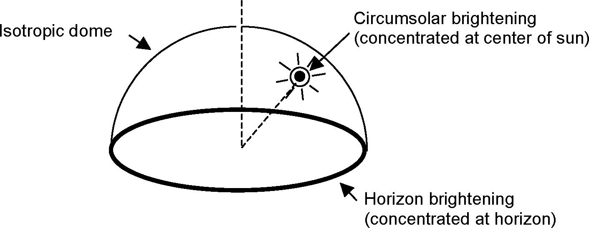
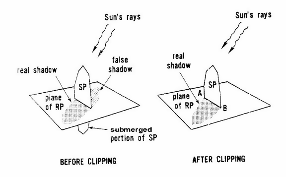

Climate, Sky and Solar/Shading Calculations
===========================================

Climate Calculations
--------------------

The location of the facility under analysis is critical for the determination of energy consumption, heating/cooling loads, daylighting potential, and a host of other calculations. In EnergyPlus, both external (i.e, weather files supplied from others) and internal (i.e., solar position, design day temperature/humidity/solar profiles) data is used during simulations.

The “Site:Location” input object includes parameters (Latitude, Longitude, Elevation, Timezone) that allow EnergyPlus to calculate the solar position (using Latitude, Longitude and Timezone) for any day of the year as well as supply the standard barometric pressure (using elevation). Solar position modeling is discussed in more detail in both the Sky Radiance and Shading Calculation sections that directly follow this section.

Weather files have hourly or sub-hourly data for each of the critical elements needed during the calculations (i.e., Dry-Bulb Temperature, Dew-Point Temperature, Relative Humidity, Barometric Pressure, Direct Normal Radiation, Diffuse Horizontal Radiation, Total & Opaque Sky Cover, Wind Direction, Wind Speed) as well as some auxiliary data such as Rain or Snow that assist in certain calculational aspects. Weather file excerpts such as might be used in sizing calculations also have this breadth of data. The input object “SizingPeriod:DesignDay” describes design days (meant to mimic ASHRAE design conditions but in a whole day profile) using certain characteristics for the day and then EnergyPlus supplies the remaining portions to complete outdoor conditions needed for program execution. SizingPeriod:DesignDay are perhaps the best objects for sizing equipment as the ASHRAE specified design conditions can be input AND weather files may or may not have the conditions necessary to size equipment properly.

Two other objects, however, can be used at times: SizingPeriod:WeatherFileDays and SizingPeriod:WeatherFileConditionType.  With the first of these, one specifies a set of weather file days similar to a RunPeriod (but will be used for the Sizing calculations). In the second, the extreme or typical conditions that are calculated for the weather file during processing can be used by name.  Of course, either of these can be used as a measure of usage over small periods.

The ASHRAE Handbook of Fundamentals describes their criteria in creating design condition synopses. “Design data based on dry-bulb temperature represent peak occurrences of the sensible component of ambient outdoor conditions. Design values based on wet-bulb temperature are related to the enthalpy of the outdoor air. Conditions based on dewpoint relate to the peaks of the humidity ratio. The designer, engineer, or other user must decide which set(s) of conditions and probability of occurrence apply to the design situation under consideration.”

### EnergyPlus Design Day Temperature Calculations

In EnergyPlus, the typical design day input includes a “high” and a “low” dry-bulb temperature for the day. As these two temperatures are insufficient to represent a full 24 hour period, the program uses a “range multiplier” profile to represent the full day’s temperatures:

Figure 36. Default Daily Temperature Range Profile

The multipliers are taken from the ASHRAE 2009 HOF, Table # 6, p. 14.11.. More explicitly, EnergyPlus creates an air temperature for each timestep by using the entered maximum dry-bulb temperature in conjunction with the entered daily range and the above multiplier values. The actual equation used is shown below:

$${T_{current}} = {T_{Max}} - {T_{range}}\cdot {T_{Multiplier}}$$

where

Tcurrent= Air temperature of current Hour of Day

TMax= User supplied Max Dry-bulb Temperature

Trange= User supplied Daily Temperature Range

TMultiplier= Range multiplier as shown on the above graph

The range multiplier values represent typical conditions of diurnal temperatures (i.e. the low temperature for the day occurring about 5:00 AM and the maximum temperature for the day occurring about 3:00 PM.  Note that EnergyPlus does not shift the profile based on the time of solar noon as is optionally allowed by ASHRAE procedures.

ASHRAE research indicates that dry-bulb and wet-bulb temperatures typically follow the same profile, so EnergyPlus can use the default daily temperature profile to generate humidity conditions based on maximum and range of wet-bulb temperature.

Since this default temperature profile may not be applicable to all locations, the user can give a different profile as part of the design day definition.

### Sky Radiation Modeling

EnergyPlus calculates the Horizontal Infrared Radiation Intensity in Wh/m2, if it is missing on the weather file or for design days, from the Opaque Sky Cover field as shown in the following explanation.

$$Horizontal\_IR = Sk{y_{emissivity}}\cdot Sigma\cdot Temperature_{drybulb}^4$$

where

Horizontal\_IR = horizontal IR intensity {W/m2}

Skyemissivity = sky emissivity

Sigma = Stefan-Boltzmann constant = 5.6697e-8 {W/m2-K4}

Temperaturedrybulb = drybulb temperature {K}

The sky emissivity is given by

$$Sk{y_{emissivity}} = \left( {.787 + .764\cdot \ln \left( {\frac{{Temperatur{e_{dewpoint}}}}{{273.}}} \right)} \right)\cdot \left( {1. + .0224N - .0035{N^2} + .00028{N^3}} \right)$$

where

Temperaturedewpoint = dewpoint temperature {K}

N = opaque sky cover {tenths}

Example: Clear sky (N=0), Temperaturedrybulb = 273+20=293 K, Temperaturedewpoint = 273+10=283 K:

Skyemissivity = 0.787 + 0.764\*0.036 = 0.815

Horizontal\_IR = 0.815\*5.6697e-8\*(293\*\*4) = 340.6 W/m2

References for these calculations are contained in the references section at the end of this list of fields. (Walton, 1983) (Clark and Allen, 1978).

### EnergyPlus Sky Temperature Calculation

The default calculation for sky temperature is:

$$Sk{y_{Temperature}} = {\left( {\frac{{Horizontal\_IR}}{{Sigma}}} \right)^{.25}} - Temperatur{e_{Kelvin}}$$

Where

SkyTemperature = Sky radiative temperature {C}

Horiizontal\_IR = Horizontal Infrared Radiation Intensity as described in the previous section {Wh/m2}

TemperatureKelvin = Temperature conversion from Kelvin to C, i.e. 273.15

The Sky Temperature can also be set by the user from several options using the **WeatherProperty:SkyTemperature** object.

### EnergyPlus Design Day Solar Radiation Calculations

Similarly, calculating solar irradiance (solar modeling) is one of the important effects to be accomplished. Several solar models exist with varying complexity.

#### ASHRAE Clear Sky Solar Model

The default model used is the ASHRAE Clear Sky model. The ASHRAE clear sky model described in ASHRAE HOF 2005 Chapter 31 can be used to estimate hourly clear-day solar radiation for any month of the year in U.S. or similar temperate climates in the northern hemisphere. EnergyPlus calculations extend the clear sky application to both northern and southern hemispheres.  Note that the Clear Sky model has been updated in the ASHRAE HOF 2009 (see ASHRAE Revised Clear Sky Model below).

At the earth’s surface on a clear day, direct normal irradiation is represented by

$$Direct\;Normal\;Irradiation = \frac{A}{{exp\left( {{\raise0.7ex\hbox{$B$} \!\mathord{\left/ {\vphantom {B {\sin \beta }}}\right.}\!\lower0.7ex\hbox{${\sin \beta }$}}} \right)}}$$

where

*A* = apparent solar irradiation at air mass m = 0 (Table 20)

B = atmospheric extinction coefficient Table 20)

Values of A and B vary during the year because of seasonal changes in the dust and water vapor content of the atmosphere and because of the changing earth-sun distance. Equation does not give the maximum value of direct normal irradiation that can occur in each month but yields values that are representative of conditions on cloudless days for a relatively dry and clear atmosphere. For very clear atmospheres, direct normal irradiation can be 15% higher than indicated by Equation , using values of A and B in Table 20 below.

Table 20. Extraterrestrial Solar Irradiance and Related Data
 Note: Data are for 21st day of each month during the base year of 1964.

<table class="table table-striped">
<tr>
<th> </th>
<th>Io {W/m2}</th>
<th>Equation of Time {minutes}</th>
<th>Declination {degrees}</th>
<th>A {W/m2}</th>
<th>B {}</th>
<th>C {}</th>
</tr>
<tr>
<td>Jan</td>
<td>1416</td>
<td>-11.2</td>
<td>-20.0</td>
<td>1202</td>
<td>0.141</td>
<td>0.103</td>
</tr>
<tr>
<td>Feb</td>
<td>1401</td>
<td>-13.9</td>
<td>-10.8</td>
<td>1187</td>
<td>0.142</td>
<td>0.104</td>
</tr>
<tr>
<td>Mar</td>
<td>1381</td>
<td>-7.5</td>
<td>0.0</td>
<td>1164</td>
<td>0.149</td>
<td>0.109</td>
</tr>
<tr>
<td>Apr</td>
<td>1356</td>
<td>1.1</td>
<td>11.6</td>
<td>1130</td>
<td>0.164</td>
<td>0.120</td>
</tr>
<tr>
<td>May</td>
<td>1336</td>
<td>3.3</td>
<td>20.0</td>
<td>1106</td>
<td>0.177</td>
<td>0.130</td>
</tr>
<tr>
<td>Jun</td>
<td>1336</td>
<td>-1.4</td>
<td>23.45</td>
<td>1092</td>
<td>0.185</td>
<td>0.137</td>
</tr>
<tr>
<td>Jul</td>
<td>1336</td>
<td>-6.2</td>
<td>20.6</td>
<td>1093</td>
<td>0.186</td>
<td>0.138</td>
</tr>
<tr>
<td>Aug</td>
<td>1338</td>
<td>-2.4</td>
<td>12.3</td>
<td>1107</td>
<td>0.182</td>
<td>0.134</td>
</tr>
<tr>
<td>Sep</td>
<td>1359</td>
<td>7.5</td>
<td>0.0</td>
<td>1136</td>
<td>0.165</td>
<td>0.121</td>
</tr>
<tr>
<td>Oct</td>
<td>1380</td>
<td>15.4</td>
<td>-10.5</td>
<td>1166</td>
<td>0.152</td>
<td>0.111</td>
</tr>
<tr>
<td>Nov</td>
<td>1405</td>
<td>13.8</td>
<td>-19.8</td>
<td>1190</td>
<td>0.144</td>
<td>0.106</td>
</tr>
<tr>
<td>Dec</td>
<td>1417</td>
<td>1.6</td>
<td>-23.45</td>
<td>1204</td>
<td>0.141</td>
<td>0.103</td>
</tr>

</table>

For locations where clear, dry skies predominate (e.g., at high elevations) or, conversely, where hazy and humid conditions are frequent, values found by using Equation and Table 20 should be multiplied by the clearness numbers in Threlkeld and Jordan (1958), reproduced as Figure # 5 in Chapter 33 of the 2007 ASHRAE Handbook—HVAC Applications.

The Clear Sky model usually over estimates the amount of solar radiation available to the building.

#### ASHRAE Revised Clear Sky Model (“Tau Model”)

The ASHRAE 2009 HOF introduced a revised clear sky model based on location-specific optical depths for direct and diffuse radiation.  These values are tabulated by month for all 5564 locations in the ASHRAE design data that accompanies the 2009 HOF.

The model requires air mass, m, calculated as follows --

$$m = {1 \mathord{\left/ {\vphantom {1 {\left[ {\sin \beta  + 0.50572 \cdot {{\left( {6.07995 + \beta } \right)}^{ - 1.6364}}} \right]}}} \right. } {\left[ {\sin \beta  + 0.50572 \cdot {{\left( {6.07995 + \beta } \right)}^{ - 1.6364}}} \right]}}$$

where \(\beta \) = solar altitude, degrees.

Direct and diffuse irradiance are determined with the following relationships,

$${E_b} = {E_o} \cdot \exp \left[ { - {\tau_b} \cdot {m^{ab}}} \right]$$

$${E_d} = {E_o} \cdot \exp \left[ { - {\tau_d} \cdot {m^{ad}}} \right]$$

where:

\({E_b}\) = beam normal irradiance, W/m2

\({E_d}\) = diffuse horizontal irradiance,

\({E_o}\) = extraterrestrial normal irradiance,

*\(m\)* = air mass

tb and td = beam and diffuse optical depths (from ASHRAE climatic design data)

\(ab\) and \(ad\) = beam and diffuse air mass exponents (see below)

Values of tb and td are location-specific and vary during the year. They embody the dependence of clear sky solar radiation upon local conditions, such as elevation, precipitable water content, and aerosols.

The air mass exponents \(ab\) and \(ad\) were correlated to tb and td through the following empirical relationships:

$$ab = 1.219 - 0.043 \cdot {\tau_b} - 0.151 \cdot {\tau_d} - 0.204 \cdot {\tau_b} \cdot {\tau_d}$$

$$ad = 0.202 + 0.852 \cdot {\tau_b} - 0.007 \cdot {\tau_d} - 0.357 \cdot {\tau_b} \cdot {\tau_d}$$

Studies done as part of ASHRAE research projects show that the revised tau model produces more physically plausible irradiance values than does the traditional clear sky model.  In particular, diffuse irradiance values are more realistic.

#### Zhang-Huang Solar Model

The Zhang-Huang solar model was developed for initial use in modeling typical meteorological years for China weather sites. This model seems to be good for other locations as well. Using total cloud cover, dry-bulb temperature, relative humidity, and wind speed as the independent variables, the total (global horizontal) solar radiation is estimated by:

$$I = \frac{{\left[ {{I_0}\cdot \sin (h)\cdot \left( {{c_0} + {c_1}\cdot CC + {c_2}\cdot C{C^2} + {c_3}\left( {{T_n} - {T_{n - 3}}} \right) + {c_4}\cdot \varphi  + {c_5}\cdot {V_w}} \right) + d} \right]}}{k}$$

Where

I = estimated hourly solar radiation, W/m2

I0= global solar constant, 1355 W/m2

h=solar altitude angle, i.e, the angle between the horizontal and the line to the sun

CC = cloud cover

\(\varphi \) = relative humidity, %

\({T_n},{T_{n - 3}}\) = dry-bulb temperature at hours n (current) and n-3, respectively

\({V_w}\) = Wind speed, m/s

\({c_0},{c_1},{c_2},{c_3},{c_4},{c_5},d,k\) = regression coefficients

The constants were determined by analysis from measured data and are as follows:

c0 = .5598, c1 = .4982, c2 = -.6762, c3 = .02842, c4 = -.00317, c5 = .014,
 d = -17.853, k = .843.

This is the same model used to estimate the global solar radiation value (when it is absent from the source data) in the Weather Converter. References given in the reference section (Watanabe, Urano, Hayashi, 1983) (Zhang, Huang, 2002).

### Perez Direct/Diffuse Splitting Model

Splitting from global calculated (EnergyPlus) or entered values (WeatherConverter) into direct normal and diffuse horizontal components are done using the Perez direct/diffuse split. References shown in the reference section (Perez et al, 1992) (Perez et al, 1990)

### Weather File Solar Interpolation

The solar values on the weather file are average values over the hour. For interpolation of hourly weather data (i.e., when the specified timestep is greater than 1), the average value is assumed to be the value at the midpoint of the hour.  The reported values in the output are totals for each reporting period. So, hourly reported values will not match the original values in the weather file, but the total solar for a day should agree. Reference (Ellis, Liesen, Pedersen, 2003)

### References

Walton, G. N. 1983. Thermal Analysis Research Program Reference Manual. NBSSIR 83-2655. National Bureau of Standards, p. 21.

Clark, G. and C. Allen, "The Estimation of Atmospheric Radiation for Clear and Cloudy Skies," Proceedings 2nd National Passive Solar Conference (AS/ISES), 1978, pp. 675-678.

Watanabe, T., Urano, Y., and Hayashi, T. 1983. "Procedures for Separating Direct and Diffuse Insolation on a Horizontal Surface and Prediction of Insolation on Tilted Surfaces" (in Japanese), Transactions, No. 330, Architectural Institute of Japan, Tokyo, Japan.

Zhang, Q.Y. and Huang, Y.J. 2002. Development of typical year weather files for Chinese locations, LBNL-51436, ASHRAE Transactions, Vol. 108, Part 2.

Perez R., Ineichen P., Maxwell E., Seals, R. and Zelenka, A. 1992. Dynamic Global-to-Direct Irradiance Conversion Models. ASHRAE Transactions-Research Series,354-369.

Perez, R., Ineichen, P., Seals, R., Michalsky, J. and Stewart, R. 1990. Modeling daylight availability and irradiance components from direct and global irradiance. Solar Energy 44, 271-289.

Ellis, P.G., Liesen, R.J. and Pedersen, C.O. 2003. “Energyplus Experimental Data Validation Work: Development and Validation of the Unvented Trombe Wall Model and Other Heat Balance Components”, CERL Final Report DACA42-01-D-0004, Task 3.

Design Week Specification
-------------------------

A design week (or longer) may be specified in EnergyPlus by selecting a RunPeriod of one week.  One-week custom weather files may be constructed if extreme design week conditions are desired or one can use the specific dates from the EPW weather files that designate the extreme conditions on the weather file.  The design week simulation requires that the simulation reach a ‘steady-periodic’ state for the one week time period.  This is achieved manually by increasing the ‘number of years of simulation’ until the weekly profile does not change from one year to the next.  The ‘steady-periodic’ output for the last week of the simulation represents the design week simulation results.

Using the SizingPeriod:WeatherFileDays object, one could size equipment from a longer period.

Sky Radiance Model
------------------

In EnergyPlus the calculation of diffuse solar radiation from the sky incident on an exterior surface takes into account the anisotropic radiance distribution of the sky. For this distribution, the diffuse sky irradiance on a surface is given by

$$AnisoSkyMultiplie{r_{surface}}\cdot DiffuseSolarIrradiance$$

Where

Diffuse Solar Irradiance is the diffuse solar irradiance from the sky on the ground.

surface is the surface being analyzed.

AnisoSkyMultiplier is determined by surface orientation and sky radiance distribution, and accounts for the effects of shading of sky diffuse radiation by shadowing surfaces such as overhangs. It does not account for *reflection* of sky diffuse radiation from shadowing surfaces.

The sky radiance distribution is based on an empirical model based on radiance measurements of real skies, as described in Perez et al., 1990. In this model the radiance of the sky is determined by three distributions that are superimposed (see Figure 37)

(1) An isotropic distribution that covers the entire sky dome;

(2) A circumsolar brightening centered at the position of the sun;

(3) A horizon brightening.

Figure 37. Schematic view of sky showing solar radiance distribution as a superposition of three components: dome with isotropic radiance, circumsolar brightening represented as a point source at the sun, and horizon brightening represented as a line source at the horizon.

The proportions of these distributions depend on the sky condition, which is characterized by two quantities, *clearness factor* and *brightness factor*, defined below, which are determined from sun position and solar quantities from the weather file.

The *circumsolar brightening* is assumed to be concentrated at a point source at the center of the sun although this region actually begins at the periphery of the solar disk and falls off in intensity with increasing angular distance from the periphery.

The *horizon brightening* is assumed to be a linear source at the horizon and to be independent of azimuth. In actuality, for clear skies, the horizon brightening is highest at the horizon and decreases in intensity away from the horizon. For overcast skies the horizon brightening has a negative value since for such skies the sky radiance increases rather than decreases away from the horizon.

Table 21.  Variables in Anisotropic Sky Model and Shadowing of Sky Diffuse Radiation

<table class="table table-striped">
 <tr>
  <th>Mathematical variable</th>
  <th>Description</th>
  <th>Units</th>
  <th>FORTRAN variable</th>
 </tr>
 <tr>
  <td>Isky</td>
  <td>Solar irradiance on surface from sky</td>
  <td>W/m2</td>
  <td>-</td>
 </tr>
 <tr>
  <td>Ihorizon</td>
  <td>Solar irradiance on surface from sky horizon</td>
  <td>W/m2</td>
  <td>-</td>
 </tr>
 <tr>
  <td>Idome</td>
  <td>Solar irradiance on surface from sky dome</td>
  <td>W/m2</td>
  <td>-</td>
 </tr>
 <tr>
  <td>Icircumsolar</td>
  <td>Solar irradiance on surface from circumsolar region</td>
  <td>W/m2</td>
  <td>-</td>
 </tr>
 <tr>
  <td>Ih</td>
  <td>Horizontal solar irradiance</td>
  <td>W/m2</td>
  <td>-</td>
 </tr>
 <tr>
  <td>S</td>
  <td>Surface tilt</td>
  <td>radians</td>
  <td>Surface(SurfNum)%Tilt\*DegToRadians</td>
 </tr>
 <tr>
  <td>a, b</td>
  <td>intermediate variables</td>
  <td>-</td>
  <td>-</td>
 </tr>
 <tr>
  <td>F1, F2</td>
  <td>Circumsolar and horizon brightening coefficients</td>
  <td>-</td>
  <td>F1, F2</td>
 </tr>
 <tr>
  <td>α</td>
  <td>Incidence angle of sun on surface</td>
  <td>radians</td>
  <td>IncAng</td>
 </tr>
 <tr>
  <td>Z</td>
  <td>Solar zenith angle</td>
  <td>radians</td>
  <td>ZenithAng</td>
 </tr>
 <tr>
  <td>
$\Delta$
</td>
  <td>Sky brightness factor</td>
  <td>-</td>
  <td>Delta</td>
 </tr>
 <tr>
  <td>ε</td>
  <td>Sky clearness factor</td>
  <td>-</td>
  <td>Epsilon</td>
 </tr>
 <tr>
  <td>m</td>
  <td>relative optical air mass</td>
  <td>-</td>
  <td>AirMass</td>
 </tr>
 <tr>
  <td>IO</td>
  <td>Extraterrestrial solar irradiance</td>
  <td>W/m2</td>
  <td>-</td>
 </tr>
 <tr>
  <td>I</td>
  <td>Direct normal solar irradiance</td>
  <td>W/m2</td>
  <td>Material%Thickness</td>
 </tr>
 <tr>
  <td>κ</td>
  <td>constant = 1.041 for Z in radians</td>
  <td>radians-3</td>
  <td>-</td>
 </tr>
 <tr>
  <td>Fij</td>
  <td>Brightening coefficient factors</td>
  <td>-</td>
  <td>F11R, F12R, etc.</td>
 </tr>
 <tr>
  <td>Rcircumsolar</td>
  <td>Shadowing factor for circumsolar radiation</td>
  <td>-</td>
  <td>SunLitFrac</td>
 </tr>
 <tr>
  <td>Rdome</td>
  <td>Shadowing factor for sky dome radiation</td>
  <td>-</td>
  <td>DifShdgRatioIsoSky</td>
 </tr>
 <tr>
  <td>Rhorizon</td>
  <td>Shadowing factor for horizon radiation</td>
  <td>-</td>
  <td>DifShdgRatioHoriz</td>
 </tr>
 <tr>
  <td>E</td>
  <td>Sky radiance</td>
  <td>W/m2</td>
  <td>-</td>
 </tr>
 <tr>
  <td>*θ*</td>
  <td>Azimuth angle of point in sky</td>
  <td>radians</td>
  <td>Theta</td>
 </tr>
 <tr>
  <td>φ</td>
  <td>Altitude angle of point in sky</td>
  <td>radians</td>
  <td>Phi</td>
 </tr>
 <tr>
  <td>Ii</td>
  <td>Irradiance on surface from a horizon element</td>
  <td>W/m2</td>
  <td>-</td>
 </tr>
 <tr>
  <td>Iij</td>
  <td>Irradiance on surface from a sky dome element</td>
  <td>W/m2</td>
  <td>-</td>
 </tr>
 <tr>
  <td>SF</td>
  <td>Sunlit fraction</td>
  <td>-</td>
  <td>FracIlluminated</td>
 </tr>
 <tr>
  <td>I’</td>
  <td>Sky solar irradiance on surface with shadowing</td>
  <td>W/m2</td>
  <td>-</td>
 </tr>
</table>

### Sky Diffuse Solar Radiation on a Tilted Surface

The following calculations are done in subroutine AnisoSkyViewFactors in the SolarShading module.

In the absence of shadowing, the sky formulation described above gives the following expression for sky diffuse irradiance, *Isky*, on a tilted surface:

$${I_{sky}} = {I_{horizon}} + {I_{dome}} + {I_{circumsolar}}$$

where

$$
  \begin{array}{rcl}
    I_{horizon} &= \rm{irradiance on surface from sky horizon} &= I_h F_2\sin S \\
    I_{dome}    &= \rm{irradiance on surface from sky dome}    &= I_h (1 - F_1)(1 + \cos S)/2 \\
    I_{circumsolar} &= \rm{irradiance on surface from circumsolar region} &= I_h F_1 a/b
  \end{array}
$$

AnisoSkyMult is then *Isky* /DifSolarRad.

In the above equations:

Ih = horizontal solar irradiance (W/m2)

*S* = surface tilt (radians)

*a* = max(0,cos*α*)

*b* = max(0.087, cos*Z*)

*F1* = circumsolar brightening coefficient

*F2* = horizon brightening coefficient

where

*α* = incidence angle of sun on the surface (radians)

*Z* = solar zenith angle (radians).

The brightening coefficients are a function of sky conditions; they are given by

$$
  \begin{array}{rl}
    F_1 &= F_{11}(\varepsilon ) + F_{12}(\varepsilon )\Delta  + F_{13}(\varepsilon )Z  \\
    F_2 &= F_{21}(\varepsilon ) + F_{22}(\varepsilon )\Delta  + F_{23}(\varepsilon )Z
  \end{array}
$$

Here the sky brightness factor is

$$\Delta  = {I_h}m/{I_o}$$

where

*m* = relative optical air mass

*Io* = extraterrestrial irradiance (taken to have an average annual value of 1353 W/m2);

and the sky *clearness factor* is

$$\varepsilon  = \frac{{({I_h} + I)/{I_h} + \kappa {Z^3}}}{{1 + \kappa {Z^3}}}$$

where

I = direct normal solar irradiance

κ = 1.041 for Z in radians

The factors *Fij*  are shown in the following table. The Fij values in this table were provided by R. Perez, private communication, 5/21/99. These values have higher precision than those listed in Table # 6 of Perez et al., 1990.

Table 22.  Fij Factors as a Function of Sky Clearness Range.

<table class="table table-striped">
<tr>
<th>ε  Range</th>
<th>1.000-1.065</th>
<th>1.065-1.230</th>
<th>1.230-1.500</th>
<th>1.500-1.950</th>
<th>1.950-2.800</th>
<th>2.800-4.500</th>
<th>4.500-6.200</th>
<th>&gt; 6.200</th>
</tr>
<tr>
<td>F11</td>
<td>-0.0083117</td>
<td>0.1299457</td>
<td>0.3296958</td>
<td>0.5682053</td>
<td>0.8730280</td>
<td>1.1326077</td>
<td>1.0601591</td>
<td>0.6777470</td>
</tr>
<tr>
<td>F12</td>
<td>0.5877285</td>
<td>0.6825954</td>
<td>0.4868735</td>
<td>0.1874525</td>
<td>-0.3920403</td>
<td>-1.2367284</td>
<td>-1.5999137</td>
<td>-0.3272588</td>
</tr>
<tr>
<td>F13</td>
<td>-0.0620636</td>
<td>-0.1513752</td>
<td>-0.2210958</td>
<td>-0.2951290</td>
<td>-0.3616149</td>
<td>-0.4118494</td>
<td>-0.3589221</td>
<td>-0.2504286</td>
</tr>
<tr>
<td>F21</td>
<td>-0.0596012</td>
<td>-0.0189325</td>
<td>0.0554140</td>
<td>0.1088631</td>
<td>0.2255647</td>
<td>0.2877813</td>
<td>0.2642124</td>
<td>0.1561313</td>
</tr>
<tr>
<td>F22</td>
<td>0.0721249</td>
<td>0.0659650</td>
<td>-0.0639588</td>
<td>-0.1519229</td>
<td>-0.4620442</td>
<td>-0.8230357</td>
<td>-1.1272340</td>
<td>-1.3765031</td>
</tr>
<tr>
<td>F23</td>
<td>-0.0220216</td>
<td>-0.0288748</td>
<td>-0.0260542</td>
<td>-0.0139754</td>
<td>0.0012448</td>
<td>0.0558651</td>
<td>0.1310694</td>
<td>0.2506212</td>
</tr>

</table>

### Shadowing of Sky Diffuse Solar Radiation

Sky diffuse solar shadowing on an exterior surface is calculated as follows in subroutine SkyDifSolarShading in the SolarShading module. The sky is assumed to be a superposition of the three Perez sky comp1onents described above.

For the horizon source the following ratio is calculated by dividing the horizon line into 24 intervals of equal length:

$${R_{horiz}} = \frac{{{\rm{Irradiance from horizon with obstructions}}}}{{{\rm{Irradiance from horizon without obstructions}}}} = \frac{{\sum\limits_{i = 1}^{24} {{I_i}S{F_i}} }}{{\sum\limits_{i = 1}^{24} {{I_i}} }}$$

where* Ii*is the unobstructed irradiance on the surface from the* i*th interval, *SFi* is the sunlit fraction from radiation coming from the *i*th interval, and the sums are over intervals whose center lies in front of the surface. *SFi* is calculated using the beam solar shadowing method as though the sun were located at the *i*th horizon point. Here

$${I_i} = E({\theta_i})d\theta \cos {\alpha_i}$$

where

*E* (*θi*) = radiance of horizon band (independent of θ)

*dθ* = 2π/24 = azimuthal extent of horizon interval (radians)

*θi* = 0O, 15O, … , 345O

αi = incidence angle on surface of radiation from *θi*

The corresponding ratio for the isotropic sky dome is given by

$${R_{dome}} = \frac{{{\rm{Irradiance from dome with obstructions}}}}{{{\rm{Irradiance from dome without obstructions}}}} = \frac{{\sum\limits_{i = 1}^{24} {\sum\limits_{j = 1}^6 {{I_{ij}}S{F_{ij}}} } }}{{\sum\limits_{i = 1}^{24} {\sum\limits_{j = 1}^6 {{I_{ij}}} } }}$$

where (*i,j*) is a grid of 144 points (6 in altitude by 24 in azimuth) covering the sky dome, *Iij* is the unobstructed irradiance on the surface from the sky element at the *ij*th point, *SFij* is the sunlit fraction for radiation coming from the *ij*th element, and the sum is over points lying in front of the surface. Here

$${I_{ij}} = E({\theta_i},{\phi_j})\cos {\phi_j}d\theta d\phi \cos {\alpha_{ij}}$$

where

*E* (*θi*,*φj*) = sky radiance (independent of θ and φ for isotropic dome)

*dθ* = 2π/24 = azimuthal extent of sky element (radians)

*dφ* = (π/2)/6 = altitude extent of sky element (radians)

*θi* = 0O, 15O, … , 345O

*φj*= 7.5O, 22.5O, … , 82.5O

αij = incidence angle on surface of radiation from (*θi*,*φj*)

Because the circumsolar region is assumed to be concentrated at the solar disk, the circumsolar ratio is

$${R_{circumsolar}} = \frac{{{\rm{Irradiance from circumsolar region with obstructions}}}}{{{\rm{Irradiance from circumsolar without obstructions}}}} = S{F_{sun}}$$

where *SFsun* is the beam sunlit fraction. The total sky diffuse irradiance on the surface with shadowing is then

$${I'_{sky}} = {R_{horizon}}{I_{horizon}} + {R_{dome}}{I_{dome}} + {R_{circumsolar}}{I_{circumsolar}}$$

*Rhorizon* and *Rdome* are calculated once for each surface since they are independent of sun position.

With shadowing we then have:

AnisoSkyMult = *I’sky* /DifSolarRad.

### Shadowing of Sky Long-Wave Radiation

EnergyPlus calculates the sky long-wave radiation incident on exterior surfaces assuming that the sky long-wave radiance distribution is isotropic. If obstructions such as overhangs are present the sky long-wave incident on a surface is multiplied by the isotropic shading factor, *Rdome*, described above. The long-wave radiation from these obstructions is added to the long-wave radiation from the ground; in this calculation both obstructions and ground are assumed to be at the outside air temperature and to have an emissivity of 0.9.

Shading Module
--------------

### Shading and Sunlit Area Calculations

When assessing heat gains in buildings due to solar radiation, it is necessary to know how much of each part of the building is shaded and how much is in direct sunlight. As an example, the figure below shows a flat roofed, L-shaped structure with a window in each of the visible sides. The sun is to the right so that walls 1 and 3 and windows a and c are completely shaded, and wall 4 and window d are completely sunlit. Wall 2 and window b are partially shaded. The sunlit area of each surface changes as the position of the sun changes during the day. The purpose of the EnergyPlus shadow algorithm is to compute these **sunlit areas**.  Predecessors to the EnergyPlus shadowing concepts include the BLAST and TARP shadowing algorithms.

The shadow algorithm is based on coordinate transformation methods similar to Groth and Lokmanhekim and the shadow overlap method of Walton.

Using the **ShadowCalculation** object, you can set how often the shadowing calculations are performed. Having them calculated each day is obviously the most accurate but may also be the most time consuming.  Using a greater length of time (number of days) before calculating again can yield speedier results.  For lengths of time greater than one day, the solar position values (e.g. equation of time, sun position angles) are averaged over that time period for the shadowing calculations.

Figure 38.  Overall Shadowing Scheme Depiction

### Solar Position

Current solar position is described in terms of three direction cosines that are convenient for determining the angle of incidence of the sun’s rays on a building surface.  The following procedure is used to determine the direction cosines.  The values of the solar declination angle, d, and the equation of time, e, are based on *Astronomical Algorithms*, Meeus.  Solar declination is a function of local/site latitude.

The fractional year is calculated, in radians:

$$\gamma  = \frac{{2\pi }}{{366}}(day\_of\_year)$$

From this fractional year, the equation of time and solar declination angle are calculated.  For each time step (time value = fractional hour), the hour angle is calculated from:

$$HourAngle = \left( {15\cdot \left( {12 - \left( {TimeValue + EquationOfTime} \right)} \right) + \left( {TimeZoneMeridian - Longitude} \right)} \right)$$

TimeZoneMeridian is the standard meridian for the location’s time zone {GMT +/-}.

Solar HourAngle (*H*) gives the apparent solar time for the current time period (degrees); HourAngle is positive before noon, negative after noon.  It is common astronomical practice to express the hour angle in hours, minutes and seconds of time rather than in degrees.  You can convert the hour angle displayed from EnergyPlus to time by dividing by 15.  (Note that 1 hour is equivalent to 15 degrees; 360° of the Earth’s rotation takes place every 24 hours.)  The relationship of angles in degrees to time is shown in the following table:

Table 23.  Relationship of Angles (degrees) to Time

<table class="table table-striped">
<tr>
<th>Unit of Angle</th>
<th>Equivalent time</th>
</tr>
<tr>
<td>1 radian</td>
<td>3.819719 hours</td>
</tr>
<tr>
<td>1 degree</td>
<td>4 minutes</td>
</tr>
<tr>
<td>1 arcmin</td>
<td>4 seconds</td>
</tr>
<tr>
<td>1 arcsec</td>
<td>0.066667 seconds</td>
</tr>

</table>

The Solar Altitude Angle (b) is the angle of the sun above the horizontal (degrees).  The Solar Azimuth Angle (f) is measured from the North (clockwise) and is expressed in degrees.  This is shown more clearly in the following figure.

Figure 39.  Solar Position Illustration

### Surface Geometry

Shadow calculations first require that the building surfaces be described geometrically. Surfaces are described by the coordinates of their vertices in a three dimensional Cartesian coordinate system. This Right-hand coordinate system has the X-axis pointing east, the Y-axis pointing north, and the Z-axis pointing up (see figure below). The azimuth angle (y) of a surface is the angle from the north axis to the projection onto the X-Y plane of a normal to the surface (clockwise positive). The surface tilt angle (f) is the angle between the Z-axis and the normal to the surface. The vertices are recorded in counter-clockwise sequence (as the surface is viewed from outside its zone).

During surface entry, surfaces are checked for convex or non-convex shape. If non-convex and inappropriate (used as a receiving surface) then a severe error is produced telling the user that shadowing calculations may be inaccurate.

Similarly collinear points (or as noted below, points within 1 mm distance) are removed unless removing would make an illegal surface (less than 3 points). But degenerate collinear surfaces *should* be removed – they make the shadowing routines do extra work which takes extra time.

Collinear – points that essentially form a “line” rather than a surface shape.

Resolution of 1mm or less – near collinear points.

Note that the resolution on surfaces/shadowing is 1 mm – using resolution beyond that will result in truncation of the shadowing.

Figure 40.  EnergyPlus Coordinate System

The GlobalGeometryRules object specifies to EnergyPlus how the surface vertices will be presented in the input file.  Of pertinent interest here is that the user may specify the vertices in either “relative” or “world” coordinates.  Regardless of input specifications, when vertices are reported, they are reported in world coordinates, starting at the upper-left-corner (4-sided surface) and are listed counter-clockwise.

#### Relative Coordinate Transformation

When vertices are specified in “relative” coordinates, there can be a “building” north axis as well as a “zone” north axis.  The building north axis/coordinate system is a rotation of yb degrees from the global/world coordinate system.  The global coordinates of zone origins are related to the building relative coordinates by:

$${X_{zo}} = {X_{br}}\cdot \cos {\psi_b} - {Y_{br}}\cdot \sin {\psi_b}$$

$${Y_{zo}} = {Y_{br}}\cdot \sin {\psi_b} - {Y_{br}}\cdot \cos {\psi_b}$$

$${Z_{zo}} = {Z_{br}}$$

Where

zo – represents Zone Origin

br – represents the Zone Origin as input (relative to building origin)

The zone may also be rotated yz degrees relative to the building coordinates. Origins of zone surfaces are then given relative to the zone coordinate system. The global coordinates of the surface origins are calculated by:

$${X_{so}} = {X_{zo}} + {X_{zr}}\cdot \cos {\psi_z} - {Y_{zr}}\cdot \sin {\psi_z}$$

$${Y_{so}} = {Y_{zo}} + {X_{zr}}\cdot \sin {\psi_z} - {Y_{zr}}\cdot \cos {\psi_z}$$

$${X_{so}} = {X_{zo}} + {X_{zr}}\cdot \cos {\psi_z} - {Y_{zr}}\cdot \sin {\psi_z}$$

A surface azimuth angle relative to the zone coordinate system (ys) is converted to a global azimuth by:

$$\psi  = {\psi_s} + {\psi_z} + {\psi_b}$$

The surface tilt angle (f) is not changed by these rotations about the Z-axis.

The coordinates of the surface vertices are given in a coordinate system in the plane of the surface relative to the second vertex as shown for surfaces in Figure 40. The X-axis of the surface coordinate system is a horizontal line through the second vertex. The global coordinates of the surface vertices are given by:

$$X = {X_{so}} + {X_{sr}}\cdot \cos \psi  - {Y_{sr}}\cdot \sin \psi \cdot \cos \phi $$

$$Y = {Y_{so}} + {X_{sr}}\cdot \sin \psi  - {Y_{sr}}\cdot \cos \psi \cdot \cos \phi $$

$$Z = {Z_{so}} + {Y_{sr}}\cdot \sin \phi $$

#### World Coordinates è Relative Coordinates

Vertices in the global coordinate system can be transformed to the coordinate system relative to a given surface by

$${X'} = X - {X_{so}}$$

$${Y'} = Y - {Y_{so}}$$

$${Z'} = Z - {Z_{so}}$$

$${X_{sr}} =  - {X'}\cdot \cos \psi  + {Y'}\cdot \sin \psi $$

$${Y_{sr}} =  - {X'}\cdot \sin \psi \cdot \cos \phi  + {Y'}\cdot \cos \psi \cdot \cos \phi  + {Z'}\cdot \sin \phi $$

$${Z_{sr}} =  - {X'}\cdot \sin \psi \cdot \sin \phi  + {Y'}\cdot \cos \psi \cdot \sin \phi  + {Z'}\cdot \cos \phi $$

### Shadow Projection

All architectural forms are represented by plane polygons. This can give good accuracy even for curved surfaces: a sphere can be approximated by the 20 nodes of an icosahedron with only 3 percent error in the shadow area cast by the sphere. Consider how a solid object, which is composed of a set of enclosing plane polygons, casts a shadow. Figure 41 shows a box shaped structure on a horizontal surface. The structure consists of a top (surface 1) and four vertical surfaces (2 and 3 visible to the observer and 4 and 5 not visible). The sun is positioned behind and to the right of the structure and a shadow is cast onto the horizontal surface (the ground).

Surfaces 1, 4, and 5 are in sunlight; 2 and 3 are in shade. It is possible to think of the structure's shadow as the combination of shadows cast by surfaces 1, 2, 3, 4 and 5 or by 1, 4 and 5, or by surfaces 2 and 3.  This last combination of shadow casting surfaces is the simplest. In the EnergyPlus shadow algorithm every surface is considered to be one of the surfaces that enclose a solid, and only those surfaces that are not sunlit at a given hour are considered shadowing surfaces.

Figure 41.  Basic shadowing concept structure

The expressions in equation are the direction cosines of the surface:

$$C{W_1} = \sin \psi \cdot \cos \phi $$

$$C{W_2} = \cos \psi \cdot \sin \phi $$

$$C{W_3} = \cos \phi $$

The cosine of the angle of incidence of the sun's rays on the surface are given by the dot product of surface and sun direction cosines.

$$\cos \theta  = C{S_1}\cdot C{W_1} + C{S_2}\cdot C{W_2} + C{S_3}\cdot C{W_3}$$

If \(\cos \theta \) is less than zero, the sun is behind the surface.

A shadow is projected from the vertices of the shadowing polygon (SP) along the direction of the sun's rays to the plane of the shadow receiving polygon (RP).  If any vertices of the SP are below the plane of the RP (z &lt; 0), a false shadow is cast as in Figure 42.  The "submerged" portion of the SP must be clipped off before projection.

Figure 42.  Illustration of Shadow Clipping

This is done by finding, through linear interpolation, the points on the perimeter of the SP, which intersect the plane of the RP. These points become new vertices of the SP, which together with the other positive vertices define a clipped SP that casts only a real shadow.

A vertex located at (x, y, z) relative to the RP coordinate system casts a shadow to a point in the plane of the RP given by

$${x'} = x - \frac{{z\cdot a}}{{\cos \theta }}$$

$${y'} = y - \frac{{z\cdot b}}{{\cos \theta }}$$

where

$$a = \sin \psi \cdot C{S_1} - \cos \psi \cdot C{S_2}$$

and

$$b =  - \cos \psi \cdot \cos \phi \cdot C{S_1} - \sin \psi \cdot \cos \phi \cdot C{S_2} + \sin \phi \cdot C{S_3}$$

More explicitly, a casting surface – a shadow casting surface or general casting surface – is one that casts a shadow on other surfaces. A receiving surface – a shadow receiving surface – is one that receives shadows from other surfaces (i.e. casting surfaces). A back surface – an inside surface – is one that may be partially sunlit/receive solar transmission for interior solar distribution.

### Homogeneous Coordinates

Two-dimensional homogeneous coordinate techniques are used to determine the vertices of shadow overlaps. In homogeneous coordinates, points and lines are represented by a single form that allows simple vector operations between those forms [Newman-Sproul].  A point (X, Y) is represented by a three element vector (x, y, w) where x = w\*X, y = w\*Y, and w is any real number except zero. A line is also represented by a three element vector (a, b, c). The directed line (a, b, c) from point (x1, y1, w1) to point (x2, y2, w2) is given by:

$$(a,b,c) = ({x_1},{y_1},{z_1}) \otimes ({x_2},{y_2},{z_2})$$

The sequence in the cross product is a convention to determine sign. The condition that a point (x, y, w) lie on a line (a, b, c) is that

$$(a,b,c) \bullet (x,y,w) = 0$$

The point is normalized by dividing by w. Then if

$$(a,b,c) \bullet (x/w,y/w,1) > 0$$

the point is to the left of the line.  If it is less than zero, the point is to the right of the line. The intercept (x, y, w) of line (a1, b1, c1) and line (a2, b2, c2) is given by:

$$(x,y,w) = ({a_1},{b_1},{c_1}) \otimes ({a_2},{b_2},{c_2})$$

Note that the use of homogeneous coordinates as outlined above provides a consistent method and notation for defining points and lines, for determining intercepts, and for determining whether a point lies to the left, to the right, or on a line.  Normalization provides the means for transforming to and from homogeneous notation and Cartesian coordinates.  Thus, if (X, Y) is a Cartesian coordinate pair, its homogeneous coordinates are (X, Y, 1).  Similarly, the homogeneous coordinates (x, y, w) can be transformed to the Cartesian point with coordinates (x/w, y/w).

### Polygon Clipping Algorithms

Two methods for polygon clipping (treating of overlapping shadows) are currently in use in EnergyPlus.

* Convex Weiler - Atherton

* Sutherland – Hodgman

The original EnergyPlus method for polygon clipping is a special version of the Weiler-Atherton model (Weiler, Atherton, 1977). It was developed to be sufficiently general to clip concave polygons with holes. The implementation in the current version of EnergyPlus, however, does not support concave shadowing surfaces or holes. The relative computational complexity is preserved – the algorithm is carried out in four steps. For example, if A and B are polygons (see Figure 43).

1)   A call to INCLOS determines which vertices of X lie within Y.

2)   A second call determines which vertices of Y lie within X.

3)   If neither polygon is contained completely within the other, INTCPT is called to collect points of intersection between X and Y.

4)   Since the points are usually gathered out of order, they must then be oriented.

The Sutherland-Hodgman algorithm (Sutherland, Hodgman, 1974) is less complex compared to the Weiler-Atherton method and is well-suited to clipping convex polygons. In actuality, only convex shading surfaces are currently supported by EnergyPlus. Let X be a polygon called the “subject polygon” (SP) and Y be a polygon called the “clipping polygon” (CP). The method performs the computation by iterating over the edges of the CP and removing points from the SP that fall in the clipping plane, i.e. points that fall to the left of the edge of the CP. Intersections between the clip edge and the edges of the SP are added appropriately, and points falling outside of the clipping plane, i.e. to the right of the edge of the CP, are added the output polygon as well. This resultant polygon is stored and the process is repeated for the rest of the clip edges in CP. The process is analogous to cutting off pieces of the SP one-by-one with respect to each edge of the CP. The result is ordered and identical to the polygon produced by the Weiler-Atherton method.

### Overlapping Shadows

After transforming the shadows onto the plane of the receiving surface, the basic job of the shadow algorithm is to determine the area of the overlap between the polygons representing the shadows and the polygon representing the receiving surface. Concave surfaces are supported only for exterior wall heat transfer surfaces, when using SutherlandHodgman option. Concave shading devices are not supported by the this option. Neither concave shading devices nor concave exterior wall heat transfer surfaces are supported by the ConvexWeilerAtherton clipping routine.

When only convex shading devices are considered, this provides a great simplification. The overlap between two convex polygons (i.e. projections of shading devices via the direction of the sun) is another convex polygon. Coordinate and projection transformations of a convex polygon produce another convex polygon. Any non-convex polygon can be constructed as the union of convex ones.

For ConvexWeilerAtherton, there is considerable simplification if only convex (no interior angle &gt; 180 ) polygons are considered. The overlap between two convex polygons is another convex polygon. Coordinate and projection transformations of a convex polygon produce another convex polygon. Any non-convex polygon can be constructed as a sum of convex ones.

The vertices that define the overlap between two convex polygons, A and B, consist of:

* the vertices of A enclosed by B

* the vertices of B enclosed by A

* and the intercepts of the sides of A with the sides of B

In Figure 43, point a is the result of rule 1, point c is the result of rule 2, and points b and d result from rule 3. The overlap of A and B is the polygon a-b-c-d. Figure 44 shows an overlap where all of the vertices of B are enclosed by A.  Figure 45 shows an overlap defined only by the intercepts of A and B. Figure 46 shows a more complex overlap.

Figure 43.  Point a – Vertex of A Enclosed by B

Coordinate transformation retains the order of the vertices of a polygon, while a projection reverses the order. The sequence of vertices of the receiving polygons should be reversed so it and all shadow polygons will have the same sequence.

Figure 44.  Surface A Totally Overlaps Surface B.

A point is enclosed by a clockwise, convex polygon if the point lies to the right of all sides (or does not lie to the left of any side) of the polygon.  The intercept of two sides may not lie beyond the ends of either side. These are "line segments" rather than "lines". It is possible to tell if line segments A and B intercept within their end points by noting that the ends of A must lie on both sides of B, and the ends of B must lie on both sides of A. This should be done before the intercept is calculated.

Figure 45.  Figure Formed from Intercept Overlaps Between A and B

Once the vertices are determined, they must be sorted into clockwise order for the area to be computed.  Given a closed, planar polygon of n sequential vertices (x1, y1), (x2, y2) …, (xn, yn), its **area** is given:

$$Area = {\textstyle{1 \over 2}}\sum\limits_{i = 1}^n {({x_i}{y_{i + 1}} - {x_{i + 1}}{y_i})} $$

where (xn+1,yn+1)= (x1, y1)

The area is positive if the vertices are counter-clockwise and negative if they are clockwise.

Figure 46.  Complex Overlapping Condition

If two shadows overlap the receiving surface, they may also overlap each other as in Figure 47. The vertices of this overlap can be computed.  The areas of all overlaps can be computed.  The total sunlit area can be expressed as the sum of all polygon areas given a proper sign on each of the areas.

The following convention was adopted:

Table 24.  Surface / Area Characteristic / Convention

<table class="table table-striped">
<tr>
<th>Surface Characteristic</th>
<th>Area Convention</th>
</tr>
<tr>
<td>receiving surface</td>
<td>positive (A)</td>
</tr>
<tr>
<td>overlap between shadow and receiving</td>
<td>negative (B &amp; C)</td>
</tr>
<tr>
<td>overlap between two shadows</td>
<td>positive (D)</td>
</tr>

</table>

and so on through multiple overlaps where the sign of the overlap area is the product of the signs of the overlapping areas.

Figure 47.  Multiple Shadow Overlaps

Partially transparent shadowing surfaces can also be modeled by giving a transparency (t)to every shadowing polygon. Let tof the receiving polygon be one. Then the tof every overlap of polygons i and jis the product of tiand tjThe shaded area is then computed by summing Ai·(1 - ti) for all overlap polygons.

It is easy to determine the sunlit area of a window once all the shadow and overlap vertices on the wall have been computed. Consider wall 2 of Figure 38. First, the wall is considered a simple rectangle and the window on it is ignored. The shadow overlapping is performed and the sunlit portion of the gross wall area is computed. Then the window rectangle is overlapped with the shadow to determine its sunlit area. The sunlit area of the window is subtracted from the gross wall sunlit area to determine the net wall sunlit area. During this calculation it is not necessary to recompute the shadows, because they were precisely determined on the wall.

When the SutherlandHodgman option is selected, the overlap is computed using the Sutherland-Hodgman algorithm for polygon clipping when. Let X be a polygon called the “subject polygon” (SP) and Y be a polygon called the “clipping polygon” (CP). The method performs the computation by iterating over the edges of the CP and removing points from the SP that fall in the clipping plane, i.e. points that fall to the left of the edge of the CP. If it is to the left of any edge, it the point does not overlap with the CP. Intersections between the clip edge and the edges of the SP are added appropriately, and points falling outside of the clipping plane, i.e. to the right of the edge of the CP, are added the output polygon as well. This resultant polygon is stored and the process is repeated for the rest of the clip edges in CP. The process is analogous to cutting off pieces of the SP one-by-one with respect to each edge of the CP. Note that the SP may be concave, but the CP may not. This means that the exterior wall surfaces may be concave, while shading devices may not be concave.

### Solar Gains

The total solar gain on any exterior surface is a combination of the absorption of direct and diffuse solar radiation given by

$${Q_{so}} = \alpha \cdot \left( {{I_b}\cdot \cos \theta \cdot \frac{{{S_s}}}{S} + {I_s}\cdot {F_{ss}} + {I_g}\cdot {F_{sg}}} \right)$$

where

a =solar absorptance of the surface

A =angle of incidence of the sun's rays

S =area of the surface

Ss = sunlit area

Ib =intensity of beam (direct) radiation

Is =intensity of sky diffuse radiation

Ig =intensity of ground reflected diffuse radiation

Fss = angle factor between the surface and the sky

Fsg = angle factor between the surface and the ground

For the surface of a building located on a featureless plain

$${F_{ss}} = \frac{{1 + \cos \phi }}{2}$$

and

$${F_{sg}} = \frac{{1 - \cos \phi }}{2}$$

If the surface is shaded the program modifies *Fss*by a correction factor that takes into account the radiance distribution of the sky (see “Shadowing of Sky Diffuse Solar Radiation”).

Shading of ground diffuse solar radiation is not calculated by the program. It is up to the user to estimate the effect of this shading and modify the input value of *Fsg*accordingly.

### Solar Distribution

As discussed in the Input Output Reference (Object: Building), the field Solar Distribution, in the “Building” input object, determines how EnergyPlus will treat beam solar radiation entering a zone through exterior windows.  There are five choices: **MinimalShadowing**, **FullExterior**, **FullInteriorAndExterior, FullExteriorWithReflections**, and **FullInteriorAndExteriorWithReflections**.

#### MinimalShadowing

In this case, there is no exterior shadowing except from window and door reveals. All beam solar radiation entering the zone is assumed to fall on the floor, where it is absorbed according to the floor's solar absorptance. Any reflected by the floor is added to the transmitted diffuse radiation, which is assumed to be uniformly distributed on all interior surfaces. If no floor is present in the zone, the incident beam solar radiation is absorbed on all interior surfaces according to their absorptances. The zone heat balance is then applied at each surface and on the zone's air with the absorbed radiation being treated as a flux on the surface.

#### FullExterior

In this case, shadow patterns on exterior surfaces caused by detached shading, wings, overhangs, and exterior surfaces of all zones are computed. As for MinimalShadowing, shadowing by window and door reveals is also calculated. Beam solar radiation entering the zone is treated as for MinimalShadowing.

#### FullExteriorWithReflections

This case is the same interior distribution as the preceding option but uses exterior reflections as well (see the section Solar Radiation Reflected from Exterior Surfaces for further explanation).

#### FullInteriorAndExterior

This is the same as FullExterior except that instead of assuming all transmitted beam solar falls on the floor the program calculates the amount of beam radiation falling on each surface in the zone, including floor, walls and windows, by projecting the sun's rays through the exterior windows, taking into account the effect of exterior shadowing surfaces and window shading devices.

If this option is used, you should be sure that the surfaces of the zone totally enclose a space. This can be determined by viewing the **eplusout.dxf** file with a program like AutoDesk’s Volo View Express. You should also be sure that the zone is **convex**. Examples of convex and non-convex zones are shown in Figure 48. The most common non-convex zone is an L-shaped zone. (A formal definition of convex is that any straight line passing through the zone intercepts at most two surfaces.)  If the zone’s surfaces do not enclose a space or if the zone is not convex you should use Solar Distribution = **FullExterior** instead of **FullInteriorAndExterior**.

If you use **FullInteriorAndExterior** the program will calculate how much beam radiation falling on an interior window is absorbed by the window, how much is reflected back into the zone, and how much is transmitted into the adjacent zone. (Interior windows are assumed to have no shading device).

If you use **FullInteriorAndExterior** the program will also calculate how much beam radiation falling on the inside of an exterior window (from other windows in the zone) is absorbed by the window, how much is reflected back into the zone, and how much is transmitted to the outside. In this calculation the effect of an interior or exterior shading device, if present, is accounted for.

#### FulInteriorAndlExteriorWithReflections

This case is the same interior distribution as the preceding option but uses exterior reflections as well (see Solar Radiation Reflected from Exterior Surfaces for further explanation).

Figure 48. Illustration of Convex and Non-convex Zones

### Details of the Interior Solar Distribution Calculation

EnergyPlus calculates the distribution of short-wave radiation in the interior of each thermal zone. This radiation consists of beam solar radiation, diffuse solar radiation, and short-wave radiation from electric lights. The program determines the amount of this radiation that is (1) absorbed on the inside face of opaque surfaces, (2) absorbed in the glass and shading device layers of the zone’s exterior and interior windows, (3) transmitted through the zone’s interior windows to adjacent zones, and (4) transmitted back out of the exterior windows. The effects of movable shading devices on the exterior windows are taken into account; *the program does not allow shading devices on interior windows*. Most of this calculation is done in subroutine CalcInteriorSolarDistribution in the SolarShading module.

#### Initial Distribution of Diffuse Solar Transmitted through Exterior and Interior Windows

Diffuse solar (from sky and ground sources) transmitted through exterior windows is first distributed to the interior heat transfer surfaces in the zone containing the exterior windows. This initial distribution apportions the transmitted diffuse solar to interior surfaces using the approximate view factors described above in “LW Radiation Exchange Among Zone Surfaces.” The amount of this initially distributed diffuse solar absorbed by each interior surface, and each window material layer, is calculated and later added to the “short-wave radiation absorbed” values described below. The amount of this initially distributed diffuse solar that is reflected is accumulated for each zone and redistributed uniformly as part of the QD calculation described below. The amount of this initially distributed diffuse solar that is transmitted by interior windows to adjacent zones is initially distributed to the interior heat transfer surfaces in the adjacent zone in the same manner as just described.

This new treatment of diffuse solar is intended to more accurately account for the initial absorption, transmittance, and reflection of short-wave radiation prior to the uniform distribution described below.

#### Interior Solar Radiation Absorbed by Opaque Surfaces

The short-wave radiation absorbed on the inside face of an opaque surface (floor, wall or ceiling) is given by

$$
  QRadSWInAbs(SurfNum) = QS(ZoneNum)*AbsIntSurf(SurfNum) + AISurf(SurfNum)*BeamSolarRad [W/m2]
$$

where

*SurfNum*= surface number

*ZoneNum =*number of zone that surface belongs to

*QS(ZoneNum)*= short-wave diffuse irradiance in the zone [W/m2]

*AbsIntSurf(SurfNum)*= inside solar absorptance of the surface

*AISurf(SurfNum)* = inside beam solar irradiance factor for the surface [-]

*BeamSolarRad* = outside beam normal solar irradiance [W/m2]

##### Interior Diffuse Radiation

*QS* is assumed to be uniformly distributed throughout the zone. It is calculated as follows. Let *Qsw* be the total diffuse short-wave radiation entering the zone or originating in the zone. Since *Qsw* is ultimately absorbed or transmitted by zone heat transfer surfaces, summing over these surfaces gives the following energy balance equation:

$$\sum\limits_{i = 1}^{{N_{surf}}} {QS(ZoneNum)*{\alpha_i}{A_i} = {Q_{SW}}(ZoneNum)} $$

where

*i* = zone surface number counter

*Nsurf*= number of heat transfer surfaces in zone

*Ai* = surface area [m2]

\({\alpha_i}\)= inside solar absorptance for an opaque surface, or, for a window, = back diffuse transmittance plus back diffuse system absorptance of glass layers and shading device layers (if present)

Solving this equation for *QS* gives:

$$QS(ZoneNum) = \frac{{{Q_{SW}}(ZoneNum)}}{{\sum\limits_{i = 1}^{{N_{surf}}} {AbsInsSur{f_i}{A_i}} }} = {Q_{SW}}(ZoneNum)*VMULT(ZoneNum)$$

where

$$VMULT(ZoneNum) = \frac{1}{{\sum\limits_{i = 1}^{{N_{surf}}} {AbsIntSur{f_i}*{A_i}} }}{\rm{    [}}{{\rm{m}}^{{\rm{ - 2}}}}]$$

*Qsw* is given by

$$
  Q{S_{SW}} = QD(ZoneNum) + ZoneIntGain(ZoneNum)\% QLTSW + ZoneIntGain(ZoneNum)\% T\_QLTSW [W]
$$

where

*ZoneIntGain(ZoneNum)%QLTSW* = short-wave radiation into zone from general (overhead) electric lighting [W]

*ZoneIntGain(*ZoneNum*)%T\_QLTSW* = short-wave radiation into zone from task electric lighting [W]

*QD(ZoneNum)* = diffuse solar radiation entering or originating in zone [W]

*QD(ZoneNum)* is given by:

$$QD(ZoneNum) = DBZone(ZoneNum)*BeamSolarRad + InitialDifSolDistReflectedW(ZoneNum)$$

where

*BeamSolarRad* is the outside beam normal solar irradiance [W/m2]

*DBZone(ZoneNum)* is the diffuse solar radiation originating from beam solar that passes through the exterior windows in the zone and reflects diffusely from inside zone surfaces plus beam solar entering the zone as diffuse radiation from windows with shading devices or diffusing glass (all divided by BeamSolarRad)   [m2]

*InitialDifSolDistReflectedW(ZoneNum)* is the diffuse solar radiation originating from sky and sun related diffuse solar transmitted through the zone’s exterior or interior windows into the zone, and reflected diffusely from inside zone surfaces.

*DBZone(ZoneNum)* is calculated as:

$$DBZone(ZoneNum) = BTOTZone - BABSZone{\rm{    [}}{{\rm{m}}^{\rm{2}}}]$$

where

*BTOTZone* = total beam solar incident on the zone’s exterior windows that is transmitted as beam or diffuse.[[1]](#_ftn1)

*BABSZone=* total beam solar absorbed inside the zone.

*BTOTZone* is given by:

$$BTOTZone = \sum\limits_{i = 1}^{{N_{extwin}}} {TBmAl{l_i}*SunlitFrac{t_i}*CosIn{c_i}*Are{a_i}*InOutprojSLFracMul{t_i}} $$

*+ Diffuse entering zone from beam reflected by window inside reveal surfaces[**[2]**](#_ftn2)*

*+ Diffuse transmitted by windows from beam reflected by outside reveal surfaces*

*–  Beam absorbed by window inside reveal surfaces*

Here,

*TBmAll* = beam-to-beam plus beam-to-diffuse transmittance of window

*SunlitFract* = fraction of window irradiated by sun

*CosInc* = cosine of solar incidence angle on window

*Area* = glazed area of window [m2]

*InOutProjSLFracMult* = shadowing factor due to inside and outside projections of window frame and/or divider (= 1.0 if there is no frame or divider).

*BABSZone* is given by the following sum (see Figure 49):

*BABSZone* =  *Beam absorbed by opaque inside surfaces[**[3]**](#_ftn3)*

*                        + Beam transmitted through the zone’s interior windows +*

*                        + Beam transmitted back out of the zone’s exterior windows +*

*                        + Beam absorbed by the zone’s exterior and interior windows +*

*                        + Beam absorbed by inside daylighting shelves*

Figure 49. Vertical section through a two-zone building showing where transmitted beam solar falls. Some of the beam solar from exterior window EW is absorbed by the floor, D, interior wall, B, and interior window, IW. Some is transmitted by IW to the adjacent zone, Z2. Aoverlap is the irradiated area of a surface projected back onto the plane of EW. Beam reflected by D, B and IW contributes to the interior short-wave radiation flux in Z1.

If zone *ZoneNum* shares interior windows with other zones, *QS(ZoneNum)* is modified to take into account short-wave radiation received from the other zones through these windows:

$$
  \begin{array}{rl}
   QS(ZoneNum) &= QS(ZoneNum) \\
               &+ \sum_{otherZones}\text{FractDifShortZtoZ(OtherZoneNum,ZoneNum)} \\
               &* [QD(OtherZoneNum) + ZoneIntGain(OtherZoneNum)\% QLTSW + ZoneIntGain(OtherZoneNum)\% T\_QLTSW]
  \end{array}
$$

where

*FractDifShortZtoZ(OtherZoneNum,ZoneNum)* = “diffuse solar exchange factor” = fraction of short-wave radiation in *OtherZoneNum* that is transmitted to *ZoneNum*. This factor is calculated in subroutine ComputeDifSolExcZonesWIZWindows taking into account multiple reflection between zones. For example, for two zones means that some of the radiation transmitted from Zone1 to Zone2 is reflected back to Zone1, and some of this is in turn reflected back to Zone2, etc.

##### Interior Beam Radiation

The inside beam solar irradiance factor[[4]](#_ftn4) in is given by:

\(AISurf(SurfNum) = \frac{{AbsIntSurf(SurfNum)}}{{A(SurfNum)}}\sum\limits_{i = 1}^{{N_{extwin}}} {TB{m_i}*Aoverla{p_i}(SurfNum)*CosIn{c_i}} \)where

*i* = exterior window number

*Nextwin=* number of exterior windows in zone

*CosInci* = cosine of angle of incidence of beam on exterior window *i*

*TBmi* = beam-to-beam transmittance of exterior window* i*at *CosInci* [[5]](#_ftn5)

*Aoverlapi(SurfNum)* = beam solar irradiated area of surface *SurfNum* projected back onto the plane of exterior window* i* (the *Aoverlap*’s for an exterior window sum up to the glazed area of the window). These overlap areas (Figure 49) are determined with the EnergyPlus shadowing routines by considering a zone’s exterior window as a “sending” surface and the inside faces of the zone’s other surfaces as “receiving” surfaces (see “Shading Module”). The overlap areas for a particular exterior window depend on the sun position, the geometry of the window, the geometry of the interior surfaces, and the location of the window with respect to the interior surfaces.

*AbsIntSurf(SurfNum)*= inside face solar absorptance of surface *SurfNum*

*A(SurfNum)* = area of surface *SurfNum* [m2]

#### Interior Solar Radiation Absorbed by Windows

The interior short-wave radiation absorbed by layer *l* (glass, shade or blind) of a window is equal to:

\(\begin{array}{l}QS(ZoneNum)*\alpha_{l,back}^{dif}(SurfNum) + \\BeamSolarRad*\frac{{\alpha_{l,back}^{beam}(SurfNum)}}{{A(SurfNum)}}\sum\limits_{i = 1}^{{N_{extwin}}} {TB{m_i}*Aoverla{p_i}(SurfNum)} *CosIn{c_i}{\rm{  [W/}}{{\rm{m}}^{\rm{2}}}]\end{array}\)where

\(\alpha_{l,back}^{dif}\)= the system diffuse solar absorptance of layer* l* for irradiance from the back side

\(\alpha_{l,back}^{beam}\)= the system beam solar absorptance of layer* l* for irradiance from the back side

*A(SurfNum)*= glazing area [m2]

Note that as of Version 2.1, the initially distributed diffuse solar absorbed by each surface (as described above under “Initial Distribution of Diffuse Solar Transmitted through Exterior and Interior Windows”) is added to this uniformly distributed short-wave radiation.

#### Interior Solar Radiation Transmitted by Interior Windows

##### Interior Diffuse Radiation Transmitted by Interior Windows

The interior diffuse short-wave radiation transmitted by an interior window to the adjacent zone is given by

$$QS(ZoneNum)*{\tau ^{dif}}(SurfNum)*A(SurfNum){\rm{    [W]}}$$

where

\({\tau ^{dif}}(SurfNum)\)= diffuse transmittance of the interior window

##### Interior Beam Radiation Transmitted by Interior Windows

The interior beam solar radiation transmitted by an interior window to the adjacent zone is

$$BeamSolarRad*{\tau ^{beam}}(SurfNum)\sum\limits_{i = 1}^{{N_{extwin}}} {TB{m_i}*Aoverla{p_i}(SurfNum)*CosIn{c_i}{\rm{    [W}}]} $$

where \({\tau ^{beam}}(SurfNum)\)is the beam-to-beam transmittance of the interior window at the angle of incidence of beam solar from the exterior window on the interior window. The program does not track where this radiation falls in the adjacent zone: it is counted as diffuse radiation in that zone. Therefore,

$$QS(ZoneNum) \to QS(ZoneNum) + [{\rm{beam solar from adjacent zones]}}*VMULT(ZoneNum)$$

### Ground Reflectances

Ground reflectance values (Ref Object: Site:GroundReflectance) are used to calculate the ground reflected solar amount.  This fractional amount (entered monthly) is used in the following equation:

$${\rm{GroundReflectedSolar = (BeamSolar}} \bullet {\rm{COS(SunZenithAngle) + DiffuseSolar)}} \bullet {\rm{GroundReflectance}}$$

Of course, the Ground Reflected Solar is never allowed to be negative.  The Snow Ground Reflectance Modifier can further modify the ground reflectance when snow is on the ground.  If the user enters 0.0 for each month, no ground reflected solar is used.

### Ground Reflectances (Snow)

When snow is on the ground, ground reflectances may change.  (Ref Object: Site:GroundReflectance:SnowModifier).  This object allows the user to specify two values, Ground Reflected Solar Modifier and Daylighting Ground Reflected Solar Modifier.

Ground Reflected Solar Modifier is used to modified the basic monthly ground reflectance when snow is on the ground (from design day input or weather data values). Values can range from 0.0 to 1.0.

$${\rm{GroundReflectanc}}{{\rm{e}}_{{\rm{used}}}} = {\rm{GroundReflectance}} \bullet SolarModifie{r_{Snow}}$$

Daylighting Ground Reflected Solar Modifier is used to modified the basic monthly ground reflectance when snow is on the ground (from design day input or weather data values). Values can range from 0.0 to 1.0.

$${\rm{DaylightingGroundReflectanc}}{{\rm{e}}_{{\rm{used}}}} = {\rm{GroundReflectance}} \bullet DaylightingModifie{r_{Snow}}$$

### References

ASHRAE. 2005. Handbook of Fundamentals, Chapter 31, Atlanta: ASHRAE.

ASHRAE. 2007. HVAC Applications, Chapter 33, Atlanta, ASHRAE.

Zhang, Qingyuan, Joe Huang, and Siwei Lang. 2002. "Development of Typical Year Weather Data for Chinese Locations", American Society of Heating Refrigeration and Air-Conditioning Engineers, ASHRAE Transactions, Vol 108, Part 2.

Threlkeld, J.L. and R.C. Jordan. 1958. Direct solar radiation available on clear days. ASHRAE Transactions 64:45.

Groth, C. C., and Lokmanhekim, M. 1969. "Shadow ‑ A New Technique for the Calculation of Shadow Shapes and Areas by Digital Computer," Second Hawaii International Conference on System Sciences, Honolulu, HI, January 22‑24, 1969.

Walton, G.N. 1983. “The Thermal Analysis Research Program Reference Manual Program (TARP)”, National Bureau of Standards (now National Institute of Standards and Technology).

Walton, G. N. 1978. "The Application of Homogeneous Coordinates to Shadowing Calculations", American Society of Heating Refrigeration and Air-Conditioning Engineers, ASHRAE Transactions, Vol 84, Part I.

Meeus, Jean. 2000. Astronomical Algorithms, Willmann-Bell.

Newman, M. W., and Sproul, R. F. 1973. Principles of Interactive Computer Graphics, McGraw‑Hill.

Polygon area derived from Green’s Theorem.  Graphic Gems repository.

Weiler, Kevin, Atherton, Peter. “Hidden Surface Removal Using Polygon Area Sorting.” Program of Computer Graphics, Cornell University. Ithaca, NY: 1977.

Sutherland, I.E., and Hodgman, G.W. 1974. “Reentrant Polygon Clipping”, Communication of Association for Computing Machinery (CACM), vol. 17, pp. 32-42.

Maillot,Patrick-Gilles.** “**A New, Fast Method For 2D Polygon Clipping: Analysis and Software Implementation.” Sun Microsystems, inc. Mountain View, CA: 1992.

Wisstein, Eric W. “Convex Polygon” From Mathworld- A Wolfram Web Resource.

