Daylighting and Window Calculations
===================================

Daylighting Calculations
------------------------

The EnergyPlus daylighting model, in conjunction with the thermal analysis, determines the energy impact of daylighting strategies based on analysis of daylight availability, site conditions, window management in response to solar gain and glare, and various lighting control strategies.

The daylighting calculation has three main steps:

1.    *Daylight factors*, which are ratios of interior illuminance or luminance to exterior horizontal illuminance, are calculated and stored. The user specifies the coordinates of one or two reference points in each daylit zone. EnergyPlus then integrates over the area of each exterior window in the zone to obtain the contribution of direct light from the window to the illuminance at the reference points, and the contribution of light that reflects from the walls, floor and ceiling before reaching the reference points. Window luminance and window background luminance, which are used to determine glare, are also calculated. Taken into account are such factors as sky luminance distribution, window size and orientation, glazing transmittance, inside surface reflectances, sun control devices such as movable window shades, and external obstructions. Dividing daylight illuminance or luminance by exterior illuminance yields daylight factors. These factors are calculated for the hourly sun positions on sun-paths for representative days of the run period. To avoid the spikes of daylight and glare factors calculated during some sunrise and/or sunset hours when exterior horizontal illuminance is very low, the daylight and glare factors for those hours are reset to 0.

2.    A daylighting calculation is performed each heat-balance time step when the sun is up. In this calculation the illuminance at the reference points in each zone is found by interpolating the stored daylight factors using the current time step’s sun position and sky condition, then multiplying by the exterior horizontal illuminance. If glare control has been specified, the program will automatically deploy window shading, if available, to decrease glare below a specified comfort level. A similar option uses window shades to automatically control solar gain.

3.    The electric lighting control system is simulated to determine the lighting energy needed to make up the difference between the daylighting illuminance level and the design illuminance. Finally, the zone lighting electric reduction factor is passed to the thermal calculation, which uses this factor to reduce the heat gain from lights.

The EnergyPlus daylighting calculation is derived from the daylighting calculation in DOE-2.1E, which is described in [Winkelmann, 1983] and [Winkelmann and Selkowitz, 1985]. There are two major differences between the two implementations: (1) In EnergyPlus daylight factors are calculated for four different sky types—clear, clear turbid, intermediate, and overcast; in DOE-2 only two sky types are used—clear and overcast. (2) In EnergyPlus the clear-sky daylight factors are calculated for hourly sun-path sun positions several times a year whereas in DOE-2 these daylight factors are calculated for a set of 20 sun positions that span the annual range of sun positions for a given geographical location.

Daylight Factor Calculation
---------------------------

Table 25.  Variables in Daylighting Calculations

<table class="table table-striped">
  <tr>
    <th>Mathematical Variable</th>
    <th>Description</th>
    <th>Units</th>
    <th>Internal Variable</th>
  </tr>
  <tr>
    <td>E<sub>h,sky</sub></td>
    <td>Exterior horizontal illuminance due to light from the sky</td>
    <td>lux</td>
    <td>GILSK</td>
  </tr>
  <tr>
    <td>E<sub>h,sun</sub></td>
    <td>Exterior horizontal illuminance due to light from the sun</td>
    <td>lux</td>
    <td>GILSU</td>
  </tr>
  <tr>
    <td>d<sub>sky</sub>,d<sub>sun</sub></td>
    <td>Interior illuminance factor due</td>
    <td>-</td>
    <td>DFACSK,DFACSU</td>
  </tr>
  <tr>
    <td>w<sub>sky</sub>,w<sub>sun</sub></td>
    <td>Window luminance factor due to sky, sun related light</td>
    <td>cd/lm</td>
    <td>SFACSK, SFACSU</td>
  </tr>
  <tr>
    <td>b<sub>sky</sub>,b<sub>sun</sub></td>
    <td>Window background luminance factor due to sky, sun related light</td>
    <td>cd/lm</td>
    <td>BFACSK, BFACSU</td>
  </tr>
  <tr>
    <td>N Number of exterior windows</td>
    <td>Number of exterior windows in a zone</td>
    <td>-</td>
    <td>NWD</td>
  </tr>
  <tr>
    <td>θ<sub>sky</sub>,φ<sub>sky</sub></td>
    <td>Azimuth and altitude angles of a point in the sky</td>
    <td>radians</td>
    <td>THSKY, PHSKY</td>
  </tr>
  <tr>
    <td>ψ<sub>cs</sub></td>
    <td>Clear sky luminance distribution</td>
    <td>cd/m2</td>
    <td>-</td>
  </tr>
  <tr>
    <td>ψ<sub>ts</sub></td>
    <td>Clear turbid sky luminance distribution</td>
    <td>cd/m2</td>
    <td>-</td>
  </tr>
  <tr>
    <td>ψ<sub>os</sub></td>
    <td>Intermediate sky luminance distribution</td>
    <td>cd/m2</td>
    <td>-</td>
  </tr>
  <tr>
    <td>ψ<sub>os</sub></td>
    <td>Overcast sky luminance distribution</td>
    <td>cd/m2</td>
    <td>-</td>
  </tr>
  <tr>
    <td>φ<sub>sun</sub></td>
    <td>Altitude angle of the sun</td>
    <td>radians or degrees</td>
    <td>PHSUN</td>
  </tr>
  <tr>
    <td>γ</td>
    <td>Angle between point in the sky and the sun; or angle between vertical and ray from reference point to window element</td>
    <td>radians</td>
    <td>G</td>
  </tr>
  <tr>
    <td>L<sub>z</sub></td>
    <td>Sky zenith luminance</td>
    <td>cd/m2</td>
    <td>ZENL</td>
  </tr>
  <tr>
    <td>Mathematical Variable</td>
    <td>Optical air mass of the atmosphere</td>
    <td>m</td>
    <td>AM</td>
  </tr>
  <tr>
    <td>h</td>
    <td>Building altitude</td>
    <td>m</td>
    <td>ELEVATION</td>
  </tr>
  <tr>
    <td>E<sub>h,k</sub></td>
    <td>Exterior horizontal illuminance for sky type k</td>
    <td>lux</td>
    <td>-</td>
  </tr>
  <tr>
    <td>N<sub>θ</sub>,N<sub>φ</sub></td>
    <td>Number of azimuth, altitude steps for sky integration</td>
    <td></td>
    <td>NTH, NPH</td>
  </tr>
  <tr>
    <td><span>\(\vec{R}_{ref}\)</span></td>
    <td>Vector from zone origin to reference point</td>
    <td>m</td>
    <td>RREF</td>
  </tr>
  <tr>
    <td><span>\(\vec{R}_{win}\)</span></td>
    <td>Vector from zone origin to window element</td>
    <td>m</td>
    <td>RWIN</td>
  </tr>
  <tr>
    <td>dΩ</td>
    <td>Solid angle subtended by window element</td>
    <td>steradians</td>
    <td>DOMEGA</td>
  </tr>
  <tr>
    <td>L<sub>w</sub></td>
    <td>Luminance of a window element as seen from reference point</td>
    <td>cd/m2</td>
    <td>WLUMSK, WLUMSU</td>
  </tr>
  <tr>
    <td>L<sub>w,shade</sub></td>
    <td>Luminance of window element with shade in place</td>
    <td>cd/m2</td>
    <td>WLUMSK, WLUMSU</td>
  </tr>
  <tr>
    <td>dE<sub>h</sub></td>
    <td>Horizontal illuminance at reference point from window element</td>
    <td>lux</td>
    <td>-</td>
  </tr>
  <tr>
    <td>dx, dy</td>
    <td>Size of window element</td>
    <td>m</td>
    <td>DWX, DWY</td>
  </tr>
  <tr>
    <td>D</td>
    <td>Distance from reference point to window element</td>
    <td>m</td>
    <td>DIS</td>
  </tr>
  <tr>
    <td>B</td>
    <td>Angle between window element's outward normal and rat from reference point to window element</td>
    <td>radians</td>
    <td>-</td>
  </tr>
  <tr>
    <td><span>\(\hat{R}_{ref}\)</span></td>
    <td>Unit vector from reference point to window element</td>
    <td>-</td>
    <td>RAY</td>
  </tr>
  <tr>
    <td><span>\(\hat{W}_{n}\)</span></td>
    <td>Unit vector normal to window element, pointing away from zone</td>
    <td>-</td>
    <td>WNORM</td>
  </tr>
  <tr>
    <td><span>\(\hat{W}_{21}\)</span></td>
    <td>Unit vector along window y-axis</td>
    <td>-</td>
    <td>W21</td>
  </tr>
  <tr>
    <td><span>\(\hat{W}_{23}\)</span></td>
    <td>Unit vector along window x-axis</td>
    <td>-</td>
    <td>W23</td>
  </tr>
  <tr>
    <td>τ<sub>vis</sub></td>
    <td>Glass visible transmittance</td>
    <td>-</td>
    <td>TVISB</td>
  </tr>
  <tr>
    <td>L</td>
    <td>Luminance of sky or obstruction</td>
    <td>cd/m2</td>
    <td>ELUM, -</td>
  </tr>
  <tr>
    <td>Φ<sub>FW</sub></td>
    <td>Downgoing luminous flux from a window</td>
    <td>lm</td>
    <td>FLFW –</td>
  </tr>
  <tr>
    <td>Φ<sub>CW</sub></td>
    <td>Upgoing luminous flux from a window</td>
    <td>lm</td>
    <td>FLCW –</td>
  </tr>
  <tr>
    <td>F<sub>1</sub></td>
    <td>First-reflected flux</td>
    <td>lm</td>
    <td>-</td>
  </tr>
  <tr>
    <td>ρ<sub>FW</sub></td>
    <td>Area-weighted reflectance of floor and upper part of walls</td>
    <td>-</td>
    <td>SurfaceWindow%RhoFloorWall</td>
  </tr>
  <tr>
    <td>ρ<sub>CW</sub></td>
    <td>Area-weighted reflectance of ceiling and upper part of walls</td>
    <td>-</td>
    <td>SurfaceWindow%RhoCeilingWall</td>
  </tr>
  <tr>
    <td>E<sub>r</sub></td>
    <td>Average internally-reflected illuminance</td>
    <td>lux</td>
    <td>EINTSK, EINTSU</td>
  </tr>
  <tr>
    <td>A</td>
    <td>Total inside surface area of a zone</td>
    <td>m2</td>
    <td>ATOT</td>
  </tr>
  <tr>
    <td>ρ</td>
    <td>Area-weighted average reflectance of zone interior surfaces</td>
    <td>-</td>
    <td>ZoneDaylight%AveVisDiffREflect</td>
  </tr>
  <tr>
    <td>θ, φ</td>
    <td>Azimuth and altitude angle of a sky or ground element</td>
    <td>radians</td>
    <td>TH, PH</td>
  </tr>
  <tr>
    <td>L(θ, φ)</td>
    <td>Luminance of sky or ground element at (θ, φ)</td>
    <td>cd/m2</td>
    <td>HitPointLum--</td>
  </tr>
  <tr>
    <td>A<sub>w</sub></td>
    <td>Area of glazed part of window</td>
    <td>m2</td>
    <td>Surface%Area</td>
  </tr>
  <tr>
    <td>β</td>
    <td>Angle of incidence, at center of window, of light from a sky or ground element</td>
    <td>radians</td>
    <td>-</td>
  </tr>
  <tr>
    <td>T(β)</td>
    <td>Glazing visible transmittance at incidence angle β</td>
    <td></td>
    <td>TVISBR</td>
  </tr>
  <tr>
    <td>dΦ<sub>inc</sub></td>
    <td>Luminous flux incident on window from sky or ground element</td>
    <td>lm</td>
    <td>-</td>
  </tr>
  <tr>
    <td>dΦ</td>
    <td>Luminous flux from sky or ground element transmitted through window</td>
    <td>lm</td>
    <td>-</td>
  </tr>
  <tr>
    <td>dΦ<sub>FW|, dΦ<sub>CW</sub></td>
    <td>Luminous flux from sky or ground element transmitted through window and going downward, upward</td>
    <td>lm</td>
    <td>-</td>
  </tr>
  <tr>
    <td>{min</sub>, θ{max</sub></td>
    <td>Azimuth angle integration limits</td>
    <td>radians</td>
    <td>THMIN, THMAX</td>
  </tr>
  <tr>
    <td>φ<sub>w</sub></td>
    <td>Window normal altitude angle</td>
    <td>radians</td>
    <td>-</td>
  </tr>
  <tr>
    <td>Φ<sub>sh</sub>,Φ<sub>unsh</sub></td>
    <td>Transmitted flux through window and shade, without shade</td>
    <td>lm</td>
    <td>-</td>
  </tr>
  <tr>
    <td>Φ<sub>CW,sh</sub>,Φ<sub>FW,sh</sub></td>
    <td>Upgoing and downgoing portions of transmitted flux through window with shade</td>
    <td>lm</td>
    <td>-</td>
  </tr>
  <tr>
    <td>Φ<sub>CW,unsh</sub>,Φ<sub>FW,unsh</sub></td>
    <td>Upgoing and downgoing portions of transmitted flux through window without shade</td>
    <td>lm</td>
    <td>-</td>
  </tr>
  <tr>
    <td>f</td>
    <td>Fraction of hemisphere seen by the inside of window that lies above the window midplane</td>
    <td>-</td>
    <td>SurfaceWindow%Fraction UpGoing</td>
  </tr>
  <tr>
    <td>Φ<sub>inc</sub></td>
    <td>Flux incident on glazing from direct sun</td>
    <td>lm</td>
    <td>-</td>
  </tr>
  <tr>
    <td>f<sub>sunlit</sub></td>
    <td>Fraction of glazing that is sunlit</td>
    <td>-</td>
    <td>SunLitFrac</td>
  </tr>
  <tr>
    <td>Φ</td>
    <td>Transmitted flux from direct sun</td>
    <td>-</td>
    <td>-</td>
  </tr>
  <tr>
    <td>L<sub>sh</sub></td>
    <td>Luminance of window with shade</td>
    <td>cd/m2</td>
    <td>-</td>
  </tr>
  <tr>
    <td>L<sub>b</sub></td>
    <td>Window background luminance</td>
    <td>cd/m2</td>
    <td>BLUM</td>
  </tr>
  <tr>
    <td>G</td>
    <td>Discomfort glare constant</td>
    <td>-</td>
    <td>GTOT</td>
  </tr>
  <tr>
    <td>G<sub>i</sub></td>
    <td>Discomfort glare constant from window I</td>
    <td>-</td>
    <td>-</td>
  </tr>
  <tr>
    <td>ω</td>
    <td>Solid angle subtended by window with respect to reference point</td>
    <td>steradians</td>
    <td>SolidAngAtRefPt</td>
  </tr>
  <tr>
    <td>Ω</td>
    <td>Solid angle subtended by window with respect to reference point, modified to take direction of occupant view into account</td>
    <td>steradians</td>
    <td>SolidAngAtRefPtWtd</td>
  </tr>
  <tr>
    <td>N<sub>x</sub>,N<sub>y</sub></td>
    <td>Number of elements in x and y direction that window is divided into for glare calculation</td>
    <td>-</td>
    <td>NWX, NWY</td>
  </tr>
  <tr>
    <td>p(x<sub>R</sub>,y<sub>R</sub>)</td>
    <td>Position factor for horizontal and vertical displacement ratios x_{R} and y_{R}</td>
    <td>-</td>
    <td>DayltgGlarePositionFactor</td>
  </tr>
  <tr>
    <td>p<sub>H</sub></td>
    <td>Hopkinson position factor</td>
    <td>-</td>
    <td>DayltgGlarePositionFactor</td>
  </tr>
  <tr>
    <td>L<sub>b</sub></td>
    <td>Window background luminance</td>
    <td>cd/m2</td>
    <td>BLUM</td>
  </tr>
  <tr>
    <td>E<sub>b</sub></td>
    <td>Illuminance on window background</td>
    <td>lm</td>
    <td>-</td>
  </tr>
  <tr>
    <td>E<sub>r</sub></td>
    <td>Total internally-reflected component of daylight illuminance</td>
    <td>lm</td>
    <td>-</td>
  </tr>
  <tr>
    <td>E<sub>s</sub></td>
    <td>Illuminance setpoint</td>
    <td>lm</td>
    <td>IllumSetPoint</td>
  </tr>
  <tr>
    <td>G<sub>i</sub></td>
    <td>Glare Index</td>
    <td>-</td>
    <td>GLINDX</td>
  </tr>
</table>

### Overview

There are three types of daylight factors: interior illuminance factors, window luminance factors, and window background luminance factors. To calculate these factors the following steps are carried out for each hourly sun position on the sun paths for the design days and for representative days[[8]](#_ftn8) during the simulation run period:

1.    Calculate exterior horizontal daylight illuminance from sky and sun for standard (CIE) clear and overcast skies.

2.    Calculate interior illuminance, window luminance and window background luminance for each window/reference-point combination, for bare and for shaded window conditions (if a shading device has been specified), for overcast sky and for standard clear sky.

3.    Divide by exterior horizontal illuminance to obtain daylight factors.

### Interior Illuminance Components

To calculate daylight factors, daylight incident on a window is separated into two components: (1) light that originates from the *sky* and reaches the window directly or by reflection from exterior surfaces; and (2) light that originates from the *sun* and reaches the window directly or by reflection from exterior surfaces. Light from the window reaches the workplane directly or via reflection from the interior surfaces of the room.

For fixed sun position, sky condition (clear or overcast) and room geometry, the sky-related interior daylight will be proportional to the exterior horizontal illuminance, *E<sub>h,sky</sub>*, due to light from the sky. Similarly, the sun-related interior daylight will be proportional to the exterior horizontal solar illuminance, *E<sub>h,sun</sub>*.

### Daylight Factors

The following daylight factors are calculated:

<div>$${d_{sky}} = \frac{{{\rm{Illuminance at reference point due to sky - related light}}}}{{{E_{h,sky}}}}$$</div>

<div>$${d_{sun}} = \frac{{{\rm{Illuminance at reference point due to sun - related light}}}}{{{E_{h,sun}}}}$$</div>

<div>$${w_{sky}} = \frac{{{\rm{Average window luminance due to sky - related light}}}}{{{E_{h,sky}}}}$$</div>

<div>$${w_{sun}} = \frac{{{\rm{Average window luminance due to sun - related light}}}}{{{E_{h,sun}}}}$$</div>

<div>$${b_{sky}} = \frac{{{\rm{Window background luminance due to sky - related light}}}}{{{E_{h,sky}}}}$$</div>

<div>$${b_{sun}} = \frac{{{\rm{Window background luminance due to sun - related light}}}}{{{E_{h,sun}}}}$$</div>

For a daylit zone with *N* windows these six daylight factors are calculated for each of the following combinations of reference point, window, sky-condition/sun-position and shading device:

<div>$$
  \left[
    \begin{array}{c}
      Ref pt 1 \\
      Ref pt 2
    \end{array}
  \right]
  \left[
    \begin{array}{c}
      Window 1 \\
      Window 2 \\
      ... \\
      Window N
    \end{array}
  \right]
  \left[
    \begin{array}{c}
      Clear sky, first sun-up hour \\
      Clear/turbid sky, first sun-up hour \\
      Intermediate sky, first sun-up hour \\
      Overcast sky, first sun-up hour \\
      ...
      Clear sky, last sun-up hour \\
      Clear/turbid sky, last sun-up hour \\
      Intermediate sky, last sun-up hour \\
      Overcase sky, last sun-up hour
    \end{array}
   \right]
   \left[
     \begin{array}{c}
       Unshaded window \\
       Shaded window \\
       (if shade assigned)
     \end{array}
   \right]
$$</div>

### Sky Luminance Distributions

The luminance distribution of the sky is represented as a superposition of four standard CIE skies using the approach described in (Perez et al. 1990). The standard skies are as follows.

#### Clear Sky

The clear sky luminance distribution has the form (Kittler, 1965; CIE, 1973)

<div>$${\psi_{cs}}({\theta_{sky}},{\phi_{sky}}) = {L_z}\frac{{(0.91 + 10{e^{ - 3\gamma }} + 0.45{{\cos }^2}\gamma )(1 - {e^{ - 0.32{\rm{cosec}}{\phi_{sky}}}})}}{{0.27385(0.91 + 10{e^{ - 3(\frac{\pi }{2} - {\phi_{sun}})}} + 0.45{{\sin }^2}{\phi_{sun}})}}$$</div>

Here, *L<sub>z</sub>* is the zenith luminance (i.e., the luminance of the sky at a point directly overhead). In the calculation of daylight factors, which are ratios of interior and exterior illumination quantities that are both proportional to *L<sub>z</sub>*, the zenith luminance cancels out. For this reason we will use *L<sub>z</sub>* = 1.0 for all sky luminance distributions.

The various angles, which are defined in the building coordinate system, are shown in Figure 48. The angle,* γ*, between sun and sky element is given by

<div>$$\gamma  = {\cos ^{ - 1}}\left[ {\sin {\phi_{sky}}\sin {\phi_{sun}} + \cos {\phi_{sky}}\cos {\phi_{sun}}\cos ({\theta_{sky}} - {\theta_{sun}})} \right]$$</div>

The general characteristics of the clear-sky luminance distribution are a large peak near the sun; a minimum at a point on the other side of  the zenith from the sun, in the vertical plane containing the sun; and an increase in luminance as the horizon is approached.

#### Clear Turbid Sky

The clear turbid sky luminance distribution has the form [Matsuura, 1987]

<div>$${\psi_{ts}}({\theta_{sky}},{\phi_{sky}}) = {L_z}\frac{{(0.856 + 16{e^{ - 3\gamma }} + 0.3{{\cos }^2}\gamma )(1 - {e^{ - 0.32{\rm{cosec}}{\phi_{sky}}}})}}{{0.27385(0.856 + 10{e^{ - 3(\frac{\pi }{2} - {\phi_{sun}})}} + 0.3{{\sin }^2}{\phi_{sun}})}}$$</div>

#### Intermediate Sky

The intermediate sky luminance distribution has the form [Matsuura, 1987]

<div>$${\psi_{is}}\left( {{\theta_{sky}},{\phi_{sky}}} \right) = {L_z}{Z_1}{Z_2}/({Z_3}{Z_4})$$</div>

where

<span>\({Z_1} = \left[ {1.35(\sin (3.59{\phi_{sky}} - 0.009) + 2.31)\sin (2.6{\phi_{sun}} + 0.316) + {\phi_{sky}} + 4.799} \right]/2.326\)</span><span>\({Z_2} = \exp \left[ { - 0.563\gamma \{ ({\phi_{sun}} - 0.008)({\phi_{sky}} + 1.059) + 0.812\} } \right]\)</span>

<div>$${Z_3} = 0.99224\sin (2.6{\phi_{sun}} + 0.316) + 2.73852$$</div>

<div>$${Z_4} = \exp \left[ { - 0.563({\textstyle{\pi  \over 2}} - {\phi_{sun}})\{ 2.6298({\phi_{sun}} - 0.008) + 0.812\} } \right]$$</div>


Figure 57.  Angles appearing in the expression for the clear-sky luminance distribution.

#### Overcast Sky

The overcast sky luminance distribution has the form [Moon & Spencer, 1942]

<div>$${\psi_{os}}({\phi_{sky}}) = {L_z}\frac{{1 + 2\sin {\phi_{sky}}}}{3}$$</div>

Unlike the clear sky case, the overcast sky distribution does not depend on the solar azimuth or the sky azimuth. Note that at fixed solar altitude the zenith (<span>\({\phi_{sky}} = \pi /2\)</span>) is three times brighter than the horizon (<span>\({\phi_{sky}} = 0\)</span>).

### Direct Normal Solar Illuminance

For purposes of calculating daylight factors associated with beam solar illuminance, the direct normal solar illuminance is taken to be 1.0 W/m<sup>2</sup>. The actual direct normal solar illuminance, determined from direct normal solar irradiance from the weather file and empirically-determined luminious efficacy, is used in the time-step calculation.

### Exterior Horizontal Illuminance

The illuminance on an unobstructed horizontal plane due to diffuse radiation from the sky is calculated for each of the four sky types by integrating over the appropriate sky luminance distribution:

<div>$${E_{h,k}} = \int\limits_0^{2\pi } {\int\limits_0^{\pi /2} {{\psi_k}({\theta_{sky}},{\phi_{sky}})\sin {\phi_{sky}}\cos {\phi_{sky}}d{\theta_{sky}}} } d{\phi_{sky}}$$</div>

where* k* = *cs*, *ts*, *is* or *os*. The integral is evaluated as a double summation:

<div>$${E_{h,k}} = \sum\limits_{i = 1}^{{N_\theta }} {\sum\limits_{j = 1}^{{N_\phi }} {{\psi_k}\left( {{\theta_{sky}}(i),{\phi_{sky}}(j)} \right)} } \sin {\phi_{sky}}(j)\cos {\phi_{sky}}(j)\Delta {\theta_{sky}}\Delta {\phi_{sky}}$$</div>

where

<div>$$
  \begin{array}{l}
    \theta_{sky}(i) = (i - 1/2) \Delta \theta_{sky} \\
    \phi_{sky}(j) = (j - 1/2) \Delta \phi_{sky} \\
    \Delta \theta_{sky} = 2 \pi / N_{\theta} \\
    \Delta \phi_{sky} = \pi / 2N_{\phi} 
  \end{array}
$$</div>

<span>\({N_\theta } = 18\)</span> and <span>\({N_\phi } = 8\)</span> were found to give a <span>\(\pm 1\% \)</span>accuracy in the calculation of <span>\({E_h}_{,k}\)</span>.

### Direct Component of Interior Daylight Illuminance

The direct daylight illuminance at a reference point from a particular window is determined by dividing the window into an x-y grid and finding the flux reaching the reference point from each grid element. The geometry involved is shown in Figure 58. The horizontal illuminance at the reference point, <span>\({\vec R_{ref}}\)</span>, due to a window element is

<div>$$d{E_h} = {L_w}d\Omega \cos \gamma $$</div>

where *L<sub>w</sub>* is the luminance of the window element as seen from the reference point.

The subtended solid angle is approximated by

<div>$$d\Omega  = \frac{{dxdy}}{{{D^2}}}\cos B$$</div>

where

<div>$$D = \left| {{{\bar R}_{win}} - {{\bar R}_{ref}}} \right|$$</div>

*CosB* is found from

<div>$$\cos B = {\hat R_{ray}} \cdot {\hat W_n}$$</div>

where

<div>$${\vec R_{ray}} = ({\vec R_{win}} - {\vec R_{ref}})/D$$</div>

<div>$${\hat W_n} = {\rm{ window outward normal }} = {\hat W_{21}} \times {\hat W_{23}} = \frac{{{{\vec W}_1} - {{\vec W}_2}}}{{\left| {{{\vec W}_1} - {{\vec W}_2}} \right|}} \times \frac{{{{\vec W}_3} - {{\vec W}_2}}}{{\left| {{{\vec W}_3} - {{\vec W}_2}} \right|}}$$</div>

Equation becomes exact as <span>\(dx/D{\rm{ and }}dy/D \to 0\)</span>and is accurate to better than about 1% for <span>\(dx \le D/4{\rm{ and }}dy \le D/4\)</span>.

The net illuminance from the window is obtained by summing the contributions from all the window elements:

<div>$${E_h} = \sum\limits_{\scriptstyle window\atop\scriptstyle elements} {{L_w}d\Omega \cos \gamma } $$</div>

In performing the summation, window elements that lie below the workplane (<span>\(\cos \gamma  &lt; 0\)</span>) are omitted since light from these elements cannot reach the workplane directly.

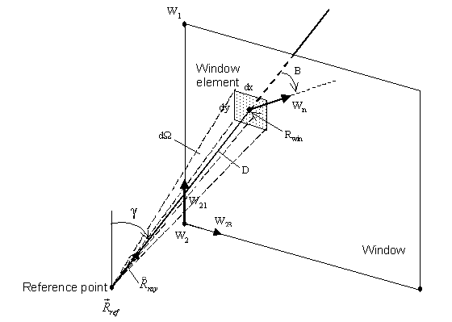

Figure 58.  Geometry for calculation of direct component of daylight illuminance at a reference point. Vectors R<sub>ref</sub>, W<sub>1</sub>, W<sub>2</sub>, W<sub>3</sub> and R<sub>win</sub> are in the building coordinate system.

#### Unshaded Window

For the unshaded window case, the luminance of the window element is found by projecting the ray from reference point to window element and determining whether it intersects the sky or an exterior obstruction such as an overhang. If *L* is the corresponding luminance of the sky or obstruction, the window luminance is

<div>$${L_w} = L{\tau_{vis}}$$</div>

where <span>\({\tau_{vis}}\)</span>is the visible transmittance of the glass for incidence angle *B*.

Exterior obstructions are generally opaque (like fins, overhangs, neighboring buildings, and the building’s own wall and roof surfaces) but can be transmitting (like a tree or translucent awning). Exterior obstructions are assumed to be non-reflecting. If *L<sub>sky</sub>* is the sky luminance and *t<sub>obs</sub>* is the transmittance of the obstruction (assumed independent of incidence angle), then *L* =* L<sub>sky</sub>t<sub>obs</sub>*. Interior obstructions are assumed to be opaque (*t<sub>obs</sub>* = 0).

#### Shaded Window

For the window-plus-shade case the shade is assumed to be a perfect diffuser, i.e., the luminance of the shade is independent of angle of emission of light, position on shade, and angle of incidence of solar radiation falling on the shade. Closely-woven drapery fabric and translucent roller shades are closer to being perfect diffusers than Venetian blinds or other slatted devices, which usually have non-uniform luminance characteristics.

The calculation of the window luminance with the shade in place, *L<sub>w,sh</sub>*, is described in [Winkelmann, 1983]. The illuminance contribution at the reference point from a shaded window element is then given by Eq. (152) with <span>\({L_w} = {L_{w,sh}}\)</span>.

### Internally-Reflected Component of Interior Daylight Illuminance

Daylight reaching a reference point after reflection from interior surfaces is calculated using the *split-flux* method [Hopkinson et al., 1954], [Lynes, 1968]. In this method the daylight transmitted by the window is split into two parts—a downward-going flux, <span>\({\Phi_{FW}}\)</span>(lumens), which falls on the floor and portions of the walls below the imaginary horizontal plane passing through the center of the window (*window midplane*), and an upward-going flux, <span>\({\Phi_{CW}}\)</span>, that strikes the ceiling and portions of the walls above the window midplane. A fraction of these fluxes is absorbed by the room surfaces. The remainder, the first-reflected flux, *F<sub>1</sub>*, is approximated by

<div>$${F_1} = {\Phi_{FW}}{\rho_{FW}} + {\Phi_{CW}}{\rho_{CW}}$$</div>

where *ρ<sub>FW</sub>* is the area-weighted average reflectance of the floor and those parts of the walls below the window midplane, and *ρ<sub>CW</sub>* is the area-weighted average reflectance of the ceiling and those parts of the walls above the window midplane.

To find the final average internally-reflected illuminance, *E<sub>r</sub>*, on the room surfaces (which in this method is uniform throughout the room) a flux balance is used. The total reflected flux absorbed by the room surfaces (or lost through the windows) is *AE<sub>r</sub>(1-ρ)*, where *A* is the total inside surface area of the floor, walls, ceiling and windows in the room, and *ρ* is the area-weighted average reflectance of the room surfaces, including windows. From conservation of energy

<div>$$A{E_r}(1 - \rho ) = {F_1}$$</div>

or

<div>$${E_r} = \frac{{{\Phi_{FW}}{\rho_{FW}} + {\Phi_{CW}}{\rho_{CW}}}}{{A(1 - \rho )}}$$</div>

This procedure assumes that the room behaves like an integrating sphere with perfectly diffusing interior surfaces and with no internal obstructions. It therefore works best for rooms that are close to cubical in shape, have matte surfaces (which is usually the case), and have no internal partitions. Deviations from these conditions, such as would be the case for rooms whose depth measured from the window-wall is more than three times greater than ceiling height, can lead to substantial inaccuracies in the split-flux calculation.

### Transmitted Flux from Sky and Ground

The luminous flux incident on the center of the window from a luminous element of sky or ground at angular position <span>\((\theta ,\phi )\)</span>, of luminance <span>\(L(\theta ,\phi )\)</span>, and subtending a solid angle <span>\(\cos \phi d\theta d\phi \)</span> is

<div>$$d{\Phi_{inc}} = {A_w}L(\theta ,\phi )\cos \beta \cos \phi d\theta d\phi $$</div>

The transmitted flux is

<div>$$d\Phi  = d{\Phi_{inc}}T(\beta )$$</div>

where *T(β)* is the window transmittance for light at incidence angle *β*. This transmittance depends on whether or not the window has a shade.

For an unshaded window the total downgoing transmitted flux is obtained by integrating over the part of the exterior hemisphere seen by the window that lies above the window midplane. This gives

<div>$${\Phi_{FW,unshaded}} = {A_w}\int\limits_{{\theta_{\min }}}^{{\theta_{\max }}} {\int\limits_0^{\pi /2} {L(\theta ,\phi )T(\beta )\cos \beta \cos \phi d\theta d\phi } } $$</div>

The upgoing flux is obtained similarly by integrating over the part of the exterior hemisphere that lies below the window midplane:

<div>$${\Phi_{CW,unshaded}} = {A_w}\int\limits_{{\theta_{\min }}}^{{\theta_{\max }}} {\int\limits_{\pi /2 - {\phi_w}}^0 {L(\theta ,\phi )T(\beta )\cos \beta \cos \phi d\theta d\phi } } $$</div>

where <span>\({\phi_w}\)</span>is the angle the window outward normal makes with the horizontal plane.

For a window with a diffusing shade the total transmitted flux is

<div>$${\Phi_{sh}} = {A_w}\int\limits_{{\theta_{\min }}}^{{\theta_{\max }}} {\int\limits_{\pi /2 - {\phi_w}}^{\pi /2} {L(\theta ,\phi )T(\beta )\cos \beta \cos \phi d\theta d\phi } } $$</div>

The downgoing and upgoing portions of this flux are

<div>$$
  \begin{array}{l}
    \Phi_{FW,sh} = \Phi (1 - f) \\
    \Phi_{CW,sh} = \Phi f
  \end{array}
$$</div>

where *f*, the fraction of the hemisphere seen by the inside of the window that lies above the window midplane, is given by

<div>$$f = 0.5 - {\phi_w}/\pi $$</div>

For a vertical window (<span>\({\phi_w} = 0\)</span>) the up- and down-going transmitted fluxes are equal:

<span>\({\Phi_{FW,sh}} = {\Phi_{CW,sh}} = \Phi /2\)</span>.

For a horizontal skylight (<span>\({\phi_w} = \pi /2\)</span>):

<div>$${\Phi_{FW,sh}} = \Phi ,{\Phi_{CW,sh}} = 0$$</div>

The limits of integration of *θ* in Equations (153), (154) and (155) depend on <span>\(\phi \)</span>. From [Figure # 12 - Winkelmann, 1983] we have

<div>$$\sin \alpha  = \sin (A - \pi /2) = \frac{{\sin \phi \tan {\phi_w}}}{{\cos \phi }}$$</div>

which gives

<div>$$A = {\cos ^{ - 1}}(\tan \phi \tan {\phi_w})$$</div>

Thus

<div>$$
  \begin{array}{l}
    \theta_{min} &=  - \left| \cos^{-1}(-\tan\phi\tan\phi_w) \right| \\
    \theta_{max} &= \left| \cos^{-1}(-\tan\phi\tan\phi_w) \right| 
  \end{array}
$$</div>

### Transmitted Flux from Direct Sun

The flux incident on the window from direct sun is

<div>$${\Phi_{inc}} = {A_w}{E_{DN}}\cos \beta {f_{sunlit}}$$</div>

The transmitted flux is

<div>$$\Phi  = T(\beta ){\Phi_{inc}}$$</div>

where T is the net transmittance of the window glazing (plus shade, if present).

For an unshaded window all of the transmitted flux is downward since the sun always lies above the window midplane. Therefore

<div>$$
  \begin{array}{l}
    \Phi_{FW,unsh} = \Phi \\
    \Phi_{CW,unsh} = 0
  \end{array}
$$</div>

For a window with a diffusing shade

<div>$$
  \begin{array}{l}
    \Phi_{FW,sh} = \Phi (1 - f) \\
    \Phi_{CW,sh} = \Phi f
  \end{array}
$$</div>

### Luminance of Shaded Window

The luminance of a shaded window is determined at the same time that the transmitted flux is calculated. It is given by

<div>$${L_{sh}} = \frac{1}{\pi }\int\limits_{{\theta_{\min }}}^{{\theta_{\max }}} {\int\limits_{\pi /2 - {\phi_w}}^{\pi /2} {L(\theta ,\phi )T(\beta )\cos \beta \cos \phi d\theta d\phi } } $$</div>

### Daylight Discomfort Glare

The discomfort glare at a reference point due to luminance contrast between a window and the interior surfaces surrounding the window is given by [Hopkinson, 1970] and [Hopkinson, 1972]:

<div>$$G = \frac{{L_w^{1.6}{\Omega ^{0.8}}}}{{{L_b} + 0.07{\omega ^{0.5}}{L_w}}}$$</div>

where

*G* = discomfort glare constant

*L<sub>w</sub>* = average luminance of the window as seen from the reference point

*Ω* = solid angle subtended by window, modified to take direction of occupant view into account

*L<sub>b</sub>* = luminance of the background area surrounding the window

By dividing the window into *N<sub>x</sub>* by *N<sub>y</sub>* rectangular elements, as is done for calculating the direct component of interior illuminance, we have

<div>$${L_w} = \frac{{\sum\limits_{j = 1}^{{N_y}} {\sum\limits_{i = 1}^{{N_x}} {{L_w}(i,j)} } }}{{{N_x}{N_y}}}$$</div>

where *L<sub>w</sub>(i,j)* is the luminance of element* (i,j)* as seen from the reference point.

Similarly,

<div>$$\omega  = \sum\limits_{j = 1}^{{N_y}} {\sum\limits_{i = 1}^{{N_x}} {d\omega (i,j)} } $$</div>

where *dω(i,j)* is the solid angle subtended by element* (i,j)*with respect to the reference point.

The modified solid angle is

 <span>\(\Omega  = \sum\limits_{j = 1}^{{N_y}} {\sum\limits_{i = 1}^{{N_x}} {d\omega (i,j)} } p({x_R},{y_R})\)</span>

where p is a “position factor” [Petherbridge & Longmore, 1954] that accounts for the decrease in visual excitation as the luminous element moves away from the line of sight. This factor depends on the horizontal and vertical displacement ratios, *x<sub>R</sub>* and *y<sub>R</sub>* (Figure 59),  given by

<div>$$
  \begin{array}{rl}
    x_R(i,j) &= \frac{\sqrt{A^2-(YD)^2}}{RR} \\
    y_R(i,j) &= \left|YD/RR\right|
  \end{array}
$$</div>

where

<div>$$
  \begin{array}{rl}
    RR &= D (\hat{R}_{ray}\cdot\hat{v}_{view}) \\
    A^2 &= D^2 - (RR)^2 \\
    YD = R_{win}(3) - R_{ref}(3)
  \end{array}
$$</div>


Figure 59.  Geometry for calculation of displacement ratios used in the glare formula.

The factor *p* can be obtained from graphs given in [Petherbridge & Longmore, 1954] or it can be calculated from tabulated values of *p<sub>H</sub>*, the Hopkinson position factor [Hopkinson, 1966], since <span>\(p = p_H^{1.25}\)</span>. The values resulting from the latter approach are given in Table 26. Interpolation of this table is used in EnergyPlus to evaluate *p* at intermediate values of *x<sub>R</sub>* and *y<sub>R</sub>*.

Table 26.  Position factor for glare calculation

<table class="table table-striped">
 <tr>
  <th colspan="2" rowspan="2"></th>
  <th colspan="8">X<sub>R</sub>: Horizontal Displacement Factor</th>
 </tr>
 <tr>
  <th>0.0</th>
  <th>0.5</th>
  <th>1.0</th>
  <th>1.5</th>
  <th>2.0</th>
  <th>2.5</th>
  <th>3.0</th>
  <th>&gt;3.0</th>
 </tr>
 <tr>
  <th rowspan="6">y<sub>R</sub>: Vertical Displacement Factor</th>
  <th>0</th>
  <td>1.00</td>
  <td>0.492</td>
  <td>0.226</td>
  <td>0.128</td>
  <td>0.081</td>
  <td>0.061</td>
  <td>0.057</td>
  <td>0</td>
 </tr>
 <tr>
  <th>0.5</th>
  <td>0.123</td>
  <td>0.119</td>
  <td>0.065</td>
  <td>0.043</td>
  <td>0.029</td>
  <td>0.026</td>
  <td>0.023</td>
  <td>0</td>
 </tr>
 <tr>
  <th>1.0</th>
  <td>0.019</td>
  <td>0.026</td>
  <td>0.019</td>
  <td>0.016</td>
  <td>0.014</td>
  <td>0.011</td>
  <td>0.011</td>
  <td>0</td>
 </tr>
 <tr>
  <th>1.5</th>
  <td>0.008</td>
  <td>0.008</td>
  <td>0.008</td>
  <td>0.008</td>
  <td>0.008</td>
  <td>0.006</td>
  <td>0.006</td>
  <td>0</td>
 </tr>
 <tr>
  <th>2.0</th>
  <td>0</td>
  <td>0</td>
  <td>0.003</td>
  <td>0.003</td>
  <td>0.003</td>
  <td>0.003</td>
  <td>0.003</td>
  <td>0</td>
 </tr>
 <tr>
  <th>&gt;2.0</th>
  <td>0</td>
  <td>0</td>
  <td>0</td>
  <td>0</td>
  <td>0</td>
  <td>0</td>
  <td>0</td>
  <td>0</td>
 </tr>
 <tr>
  <th>1.5</th>
  <td>0.008</td>
  <td>0.008</td>
  <td>0.008</td>
  <td>0.008</td>
  <td>0.008</td>
  <td>0.006</td>
  <td>0.006</td>
  <td>0</td>
 </tr>
</table>

The background luminance is

<div>$${L_b} = {E_b}{\rho_b}$$</div>

where *ρ<sub>b</sub>* is approximated by the average interior surface reflectance of the entire room and

<div>$${E_b} = \max ({E_r},{E_s})$$</div>

where *E<sub>r</sub>*is the total internally-reflected component of daylight illuminance produced by all the windows in the room and *E<sub>s</sub>* is the illuminance setpoint at the reference point at which glare is being calculated. A precise calculation of *E<sub>b</sub>* is not required since the glare index (see next section) is logarithmic. A factor of two variation in *E<sub>b</sub>* generally produces a change of only 0.5 to 1.0 in the glare index.

#### Glare Index

The net daylight glare at a reference point due to all of the windows in a room is expressed in terms of a *glare index* given by

<div>$${G_I} = 10{\log_{10}}\sum\limits_{i = 1}^{\scriptstyle{\rm{number of}}\atop\scriptstyle{\rm{windows}}} {{{\rm{G}}_{\rm{i}}}} $$</div>

where *G<sub>i</sub>* is the glare constant at the reference point due to the *i<sup>th</sup>* window

Time-Step Daylighting Calculation
---------------------------------

### Overview

A daylighting calculation is performed each time step that the sun is up for each zone that has one or two daylighting reference points specified. The exterior horizontal illuminance from the sun and sky is determined from solar irradiance data from the weather file. The interior illuminance at each reference point is found for each window by interpolating the daylight illuminance factors for the current sun position, then, for sky-related interior illuminance, multiplying by the exterior horizontal illuminance from the appropriate sky types that time step, and, for sun-related interior illuminance, multiplying by the exterior horizontal solar illuminance that time step. By summation, the net illuminance and glare due to all of the windows in a zone are found. If glare control has been specified window shading (by movable shading devices or switchable glazing) is deployed to reduce glare. Finally the illuminance at each reference point for the final window and shade configuration is used by the lighting control system simulation to determine the electric lighting power required to meet the illuminance setpoint at each reference point.

Table 27.  Variables in Time-Step Calculations

<table class="table table-striped">
<tr>
<th>Mathematical variable</th>
<th>Description</th>
<th>Units</th>
<th>FORTRAN variable</th>
</tr>
<tr>
<td>S<sub>norm,dir</sub></td>
<td>Direct normal solar irradiance</td>
<td>W/m<sup>2</sup></td>
<td>BeamSolarRad</td>
</tr>
<tr>
<td>S<sub>h,dif</sub></td>
<td>Exterior diffuse horizontal solar irradiance</td>
<td>W/m<sup>2</sup></td>
<td>SDIFH, DifSolarRad</td>
</tr>
<tr>
<td>S<sub>h,dir</sub></td>
<td>Exterior direct horizontal solar irradiance</td>
<td>W/m<sup>2</sup></td>
<td>SDIRH</td>
</tr>
<tr>
<td>Z</td>
<td>Solar zenith angle</td>
<td>radians</td>
<td>Zeta</td>
</tr>
<tr>
<td>m</td>
<td>Relative optical air mass</td>
<td>-</td>
<td>AirMass</td>
</tr>
<tr>
<td>Δ</td>
<td>Sky brightness</td>
<td>-</td>
<td>SkyBrightness</td>
</tr>
<tr>
<td>ε</td>
<td>Sky clearness</td>
<td>-</td>
<td>SkyClearness</td>
</tr>
<tr>
<td>k, k’</td>
<td>Sky type index</td>
<td>-</td>
<td>ISky</td>
</tr>
<tr>
<td>s<sub>k,k’</sub></td>
<td>Interpolation factor for skies k and k’</td>
<td>-</td>
<td>SkyWeight</td>
</tr>
<tr>
<td>ψ<sub>k,k’</sub></td>
<td>Sky luminance distribution formed from linear interpolation of skies k and k’</td>
<td>cd/m<sup>2</sup></td>
<td>-</td>
</tr>
<tr>
<td>f<sub>k</sub></td>
<td>Fraction of sky that is type k</td>
<td>-</td>
<td>-</td>
</tr>
<tr>
<td>E<sub>h,k</sub></td>
<td>Horizontal illuminance from sky type k</td>
<td>cd/m<sup>2</sup></td>
<td>HorIllSky</td>
</tr>
<tr>
<td>E<sub>h,sky</sub></td>
<td>Exterior horizontal illuminance from sky</td>
<td>lux</td>
<td>HISKF</td>
</tr>
<tr>
<td>E<sub>h,sun</sub></td>
<td>Exterior horizontal illuminance from sun</td>
<td>lux</td>
<td>HISUNF</td>
</tr>
<tr>
<td>η<sub>dif</sub>, η<sub>dir</sub></td>
<td>Luminous efficacy of diffuse and direct solar radiation</td>
<td>lm/W</td>
<td>DiffLumEff, DirLumEff</td>
</tr>
<tr>
<td>I<sub>win</sub></td>
<td>Interior illuminance from a window</td>
<td>lux</td>
<td>DaylIllum</td>
</tr>
<tr>
<td>S<sub>win</sub></td>
<td>Window luminance</td>
<td>cd/m<sup>2</sup></td>
<td>SourceLumFromWinAtRefPt</td>
</tr>
<tr>
<td>B<sub>win</sub></td>
<td>Window background luminance</td>
<td>cd/m<sup>2</sup></td>
<td>BACLUM</td>
</tr>
<tr>
<td>d<sub>sun</sub>, d<sub>sky,k</sub></td>
<td>Interior illuminance factor for sun, for sky of type k</td>
<td>-</td>
<td>DaylIllFacSun, DFSUHR, DaylIllFacSky, DFSUHR</td>
</tr>
<tr>
<td>w<sub>sun</sub>, w<sub>sky,k</sub></td>
<td>Window luminance factor for sun, for sky of type k</td>
<td>-</td>
<td>DaylSourceFacSun, SFSUHR, DaylSourceFacSky, SFSKHR</td>
</tr>
<tr>
<td>b<sub>sun</sub>, b<sub>sky,k</sub></td>
<td>Window background luminance factor for sun, for sky of type k</td>
<td>-</td>
<td>DaylBackFacSun, BFSUHR, DaylBackFacSky, BFSKHR</td>
</tr>
<tr>
<td>w<sub>j</sub></td>
<td>Weighting factor for time step interpolation</td>
<td>-</td>
<td>WeightNow</td>
</tr>
<tr>
<td>i<sub>L</sub></td>
<td>Reference point index</td>
<td>-</td>
<td>IL</td>
</tr>
<tr>
<td>i<sub>S</sub></td>
<td>Window shade index</td>
<td>-</td>
<td>IS</td>
</tr>
<tr>
<td>I<sub>tot</sub></td>
<td>Total daylight illuminance at reference point</td>
<td>lux</td>
<td>DaylIllum</td>
</tr>
<tr>
<td>B<sub>tot</sub>, B</td>
<td>Total window background luminance</td>
<td>cd/m<sup>2</sup></td>
<td>BLUM</td>
</tr>
<tr>
<td>I<sub>set</sub></td>
<td>Illuminance setpoint</td>
<td>lux</td>
<td>ZoneDaylight%IllumSetPoint</td>
</tr>
<tr>
<td>f<sub>L</sub></td>
<td>Fractional electric lighting output</td>
<td>-</td>
<td>FL</td>
</tr>
<tr>
<td>f<sub>P</sub></td>
<td>Fractional electric lighting input power</td>
<td>-</td>
<td>FP</td>
</tr>
<tr>
<td>N<sub>L</sub></td>
<td>Number of steps in a stepped control system</td>
<td>-</td>
<td>LightControlSteps</td>
</tr>
<tr>
<td>M<sub>P</sub></td>
<td>Lighting power multiplier</td>
<td>-</td>
<td>ZonePowerReductionFactor</td>
</tr>

</table>


### Time-Step Sky Luminance

The sky luminance distribution, *ψ*, for a particular time step is expressed as a linear interpolation of two of the four standard skies — *ψ<sub>cs</sub>*, *ψ<sub>ts</sub>* , *ψ<sub>is</sub>* and *ψ<sub>os</sub>* — described above under “Sky Luminance Distributions.” The two sky types that are interpolated depend on the value of the sky clearness. The interpolation factors are a function of sky clearness and sky brightness (Perez et al., 1990). Sky clearness is given by

<div>$$\varepsilon  = \frac{{\frac{{{S_{h,dif}} + {S_{norm,dir}}}}{{{S_{h,dif}}}} + \kappa {Z^3}}}{{1 + \kappa {Z^3}}}$$</div>

where *S<sub>h,dif</sub>* is the diffuse horizontal solar irradiance, *S<sub>norm,dir</sub>*is the direct normal solar irradiance, *Z* is the solar zenith angle and *κ* is a constant equal to 1.041 for *Z* in radians.

Sky brightness is given by

<div>$$\Delta  = {S_{h,dif}}m/S_{norm,dir}^{ext}$$</div>

where *m* is the relative optical air mass and <span>\(S_{norm,dir}^{ext}\)</span>is the extraterrestrial direct normal solar irradiance.

If *ε* ≤ 1.2

<div>$${\psi_{is,os}} = {s_{is,os}}{\psi_{is}} + (1 - {s_{is,os}}){\psi_{os}}$$</div>

where *ψ<sub>is</sub>* is the intermediate sky luminance distribution, *ψ<sub>os</sub>* is the overcast sky luminance distribution, and

<div>$${s_{is,os}} = \min \{ 1,\max [0,(\varepsilon  - 1)/0.2,(\Delta  - 0.05)/0.4]\} $$</div>

If 1.2&lt;*ε* ≤ 3

<div>$${\psi_{ts,is}} = {s_{ts,is}}{\psi_{ts}} + (1 - {s_{ts,is}}){\psi_{is}}$$</div>

where *ψ<sub>ts</sub>* is the clear turbid sky luminance distribution and

<div>$${s_{ts,is}} = (\varepsilon  - 1.2)/1.8$$</div>

If *ε* &gt; 3

<div>$${\psi_{cs,ts}} = {s_{cs,ts}}{\psi_{cs}} + (1 - {s_{cs,ts}}){\psi_{ts}}$$</div>

where *ψ<sub>cs</sub>* is the clear sky luminance distribution and

<div>$${s_{cs,ts}} = \min [1,(\varepsilon  - 3)/3]$$</div>

### Interior Illuminance

For each time step the interior illuminance, *I<sub>win</sub>*, from a window is calculated as follows by multiplying daylight factors and exterior illuminance.

First, the sun- and sky-related daylight illuminance factors for the time step are determined by interpolation of the hourly factors:

<div>$${\bar d_{sun}}({i_L},{i_S}) = {w_j}{d_{sun}}({i_L},{i_S},{i_h}) + (1 - {w_j}){d_{sun}}({i_L},{i_S},{i_h} + 1)$$</div>

<div>$${\bar d_{sky,k}}({i_L},{i_S}) = {w_j}{d_{sky,k}}({i_L},{i_S},{i_h}) + (1 - {w_j}){d_{sky,k}}({i_L},{i_S},{i_h} + 1)$$</div>

where *i<sub>L</sub>* is the reference point index (1 or 2), *i<sub>S</sub>* is the window shade index (1 for unshaded window, 2 for shaded window),* i<sub>h</sub>* is the hour number, and *k* is the sky type index. For the* j*th time step in an hour, the time-step interpolation weight is given by

<div>$${w_j} = 1 - \min [1,j/{N_t}]$$</div>

where *N<sub>t</sub>* is the number of  time steps per hour.

The interior illuminance from a window is calculated as

<div>$${I_{win}}({i_L},{i_S}) = {\bar d_{sun}}{E_{h,sun}} + [{\bar d_{sky,k}}({i_L},{i_S}){f_k} + {\bar d_{sky,k'}}({i_L},{i_S}){f_{k'}}]{E_{h,sky}}$$</div>

where *E<sub>h,sun</sub>* and *E<sub>h,sky</sub>* are the exterior horizontal illuminance from the sun and sky, respectively, and *f<sub>k</sub>* and *f<sub>k’</sub>* are the fraction of the exterior horizontal illuminance from the sky that is due to sky type *k* and *k’*, respectively.

The horizontal illuminance from sun and sky are given by

<div>$$
  \begin{array}{rl}
    E_{h,sun} &= \eta_{dir} S_{norm,dir} \cos Z \\
    E_{h,sky} &= \eta_{dif} S_{h,dif}
  \end{array}
$$</div>

where *Z* is the solar zenith angle,  *η<sub>dif</sub>* is the luminous efficacy (in lumens/Watt) of diffuse solar radiation from the sky and *η<sub>dir</sub>* is the luminous efficacy of direct radiation from the sun. The efficacies are calculated from direct and global solar irradiance using a method described in (Perez et al, 1990).

The fractions *f<sub>k</sub>* and *f<sub>k’</sub>* are given by

<div>$$
  \begin{array}{rl}
    f_k    &= \frac{ s_{k,k'} E_{h,k} } { s_{k,k'} E_{h,k} + (1 - s_{k,k'})E_{h,k'}} \\
    f_{k'} &= \frac{ (1 - s_{k,k'} ) E_{h,k'} } { s_{k,k'} E_{h,k} + (1 - s_{k,k'} ) E_{h,k'}}
  \end{array}
$$</div>

where *E<sub>h,k</sub>* and *E<sub>h,k’</sub>* are the horizontal illuminances from skies *k* and *k’*, respectively (see “Exterior Horizontal Luminance,” above), and *s<sub>k,k’</sub>* is the interpolation factor for skies *k*and *k’*(see “Time-Step Sky Luminance,” above).  For example, if  *ε* &gt; 3, *k*= *cs* (clear sky), *k’* = *ts* (clear turbid sky) and

 <span>\(s_{k,k'} = s_{cs,ts} = \min [1,(\varepsilon  - 3)/3]\)</span>

Similarly, the window source luminance, *S<sub>win</sub>*, and window background luminance, *B<sub>win</sub>*, for a window are calculated from

<div>$${S_{win}}({i_L},{i_S}) = {\bar w_{sun}}{E_{h,sun}} + [{\bar w_{sky,k}}({i_L},{i_S}){f_k} + {\bar w_{sky,k'}}({i_L},{i_S}){f_{k'}}]{E_{h,sky}}$$</div>

<div>$${B_{win}}({i_L},{i_S}) = {\bar b_{sun}}{E_{h,sun}} + [{\bar b_{sky,k}}({i_L},{i_S}){f_k} + {\bar b_{sky,k'}}({i_L},{i_S}){f_{k'}}]{E_{h,sky}}$$</div>

The total illuminance at a reference point from all of the exterior windows in a zone is

<div>$${I_{tot}}({i_L}) = \sum\limits_{\scriptstyle{\rm{windows}}\atop\scriptstyle{\rm{in zone}}} {{I_{win}}({i_s},{i_L})} $$</div>

where* i<sub>S</sub>* = 1 if the window is unshaded and *i<sub>S</sub>* = 2 if the window is shaded that time step. (Before the illuminance calculation is done the window shading control will have been simulated to determine whether or not the window is shaded.)

Similarly, the total background luminance is calculated:

<div>$${B_{tot}}({i_L}) = \sum\limits_{\scriptstyle{\rm{windows}}\atop\scriptstyle{\rm{in zone}}} {{B_{win}}({i_s},{i_L})} $$</div>

### Glare Index

The net glare index at each reference point is calculated as

<div>$${G_I}({i_L}) = 10{\log_{10}}\sum\limits_{\scriptstyle{\rm{windows}}\atop\scriptstyle{\rm{in zone}}} {\frac{{{S_{win}}{{({i_L},{i_S})}^{1.6}}\Omega {{({i_L})}^{0.8}}}}{{B({i_L}) + 0.07\omega {{({i_L})}^{0.5}}{S_{win}}({i_L},{i_S})}}} $$</div>

where

<div>$$B\left( {{i_L}} \right) = max\left( {{B_{win}}\left( {{i_L}} \right),{\rho_b}{I_{set}}\left( {{i_L}} \right)} \right)$$</div>

In the last relationship, the background luminance is approximated as the larger of the background luminance from daylight and the average background luminance that would be produced by the electric lighting at full power if the illuminance on the room surfaces were equal to the setpoint illuminance. In a more detailed calculation, where the luminance of each room surface is separately determined, *B(i<sub>L</sub>)* would be better approximated as an area-weighted luminance of the surfaces surrounding a window, taking into account the luminance contribution from the electric lights.

#### Glare Control Logic

If glare control has been specified and the glare index at either reference point exceeds a user-specified maximum value, *G<sub>I,max</sub>*, then the windows in the zone are shaded one by one in attempt to bring the glare at both points below *G<sub>I,max</sub>*. (Each time a window is shaded the glare and illuminance at each reference point is recalculated.) The following logic is used:

5)   If there is only one reference point, shade a window if it is unshaded and shading it decreases the glare, even if it does not decrease the glare below *G<sub>I,max</sub>*. Note that if a window  has already been shaded, say to control solar gain, it will be left in the shaded state.

6)   If there are two reference points, then:

  * If glare is too high at both points, shade the window if it decreases glare at both points.

  * If glare is too high only at the first point, shade the window if the glare at the first point decreases, and the glare at the second point stays below *G<sub>I,max</sub>*.

  * If glare is too high only at the second point, shade the window if the glare at the second point decreases, and the glare at the first point stays below *G<sub>I,max</sub>*.

7)   Shades are closed in the order of window input until glare at both points is below *G<sub>I,max</sub>*, or until there are no more windows left to shade.

### Lighting Control System Simulation

Once the final daylight illuminance value at each reference point has been determined, the electric lighting control is simulated. The fractional electric lighting output, *f<sub>L</sub>*, required to meet the setpoint at reference point *i<sub>L</sub>* is given by

<div>$${f_L}({i_L}) = {\rm{max}}\left[ {0,\frac{{{I_{set}}({i_L}) - {I_{tot}}({i_L})}}{{{I_{set}}({i_L})}}} \right]$$</div>

Here, *I<sub>set</sub>* is the illuminance setpoint and *I<sub>tot</sub>* is the daylight illuminance at the reference point. This relationship assumes that the electric lights at full power produce an illuminance equal to *I<sub>set</sub>* at the reference point.

The fractional electric lighting input power, *f<sub>P</sub>*, corresponding to *f<sub>L</sub>* is then calculated. The relationship between *f<sub>P</sub>* and *f<sub>L</sub>* depends on the lighting control type.

#### Continuous Dimming Control

For a continuously-dimmable control system, it is assumed that *f<sub>P</sub>* is constant and equal to *f<sub>P,min</sub>*for *f<sub>L</sub>&lt;f<sub>L,min</sub>* and that f<sub>P</sub> increases linearly from *f<sub>P,min</sub>* to 1.0 as *f<sub>L</sub>* increases from *f<sub>L,min</sub>* to 1.0 (Figure 60). This gives

<div>$${f_P} = \left\{ \begin{array}{l}{f_{P,\min }} & {\rm{for }}{f_L} &lt; {f_{L,\min }}\\\frac{{{f_L} + (1 - {f_L}){f_{P,\min }} - {f_{L,\min }}}}{{1 - {f_{L,\min }}}}\end{array} \right.{\rm{   for }}{f_{L,\min }} \le {f_L} \le 1$$</div>


Figure 60.  Control action for a continuous dimming system.

#### Continuous/Off Dimming Control

A “continuous/off” dimming system has the same behavior as a continuous dimming system except that the lights switch off for *f<sub>L</sub> &lt; f<sub>L,min</sub>* rather than staying at *f<sub>P,min</sub>*.

#### Stepped Control

For a stepped control system, *f<sub>P</sub>* takes on discrete values depending on the range of *f<sub>L</sub>*and the number of steps, *N<sub>L</sub>*<sub> </sub> (Figure 61). This gives

<div>$${f_P} = \left\{ \begin{array}{l}0, & {\rm{if }}{f_L} = 0\\\frac{{{\mathop{\rm int}} ({N_L}{f_L}) + 1}}{{{N_L}}}, & {\rm{for }}0 &lt; {f_L} &lt; 1\\1, & {\rm{if }}{f_L} = 1\end{array} \right.$$</div>

If a lighting control probability,* p<sub>L</sub>*, is specified,* f<sub>P</sub>* is set one level higher a fraction of the time equal to *1-p<sub>L</sub>*. Specifically, if* f<sub>P</sub>* &lt;1,* f<sub>P</sub>*à* f<sub>P</sub>*+ 1/*N<sub>L</sub>* if a random number between 0 and 1 exceeds *p<sub>L</sub>*. This can be used to simulate the uncertainty associated with manual switching of lights.

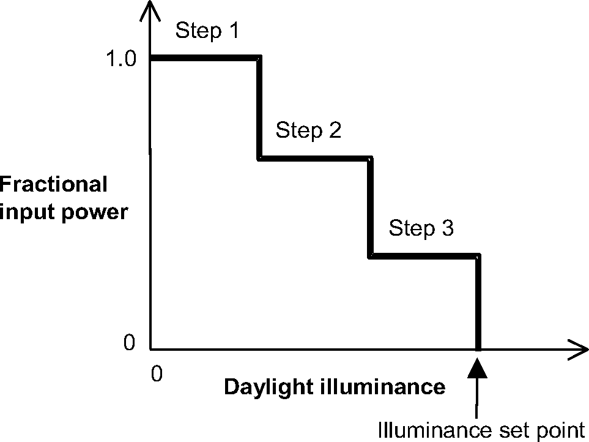

Figure 61.  Stepped lighting control with three steps.

#### Lighting Power Reduction

Using the value of *f<sub>P</sub>*at each reference point and the fraction *f<sub>Z</sub>* of the zone controlled by the reference point, the net lighting power multiplier, *M<sub>P</sub>*, for the entire zone is calculated; this value multiplies the lighting power output without daylighting.

<div>$${M_P} = \sum\limits_{{i_L} = 1}^2 {{f_P}({i_L})} {f_Z}({i_L}) + \left( {1 - \sum\limits_{{i_L} = 1}^2 {} {f_Z}({i_L})} \right)$$</div>

In this expression, the term to the right in the parentheses corresponds to the fraction of the zone not controlled by either reference point. For this fraction the electric lighting is unaffected and the power multiplier is 1.0.

### References

CIE Technical Committee 4.2. 1973. Standardization of the Luminance Distribution on Clear Skies. CIE Pub. No. 22, Commission Internationale d’Eclairage, Paris.

Hopkinson, R.G., J. Longmore and P. Petherbridge. 1954. An Empirical Formula for the Computation of the Indirect Component of Daylight Factors. Trans. Illum. Eng. Soc. (London) 19, 201.

Hopkinson, R.G., P. Petherbridge and J. Longmore. 1966. Daylighting. Heinnemann, London, p. 322.

Hopkinson, R.G. 1970. Glare from Windows. Construction Research and Development Journal 2, 98.

Hopkinson, R.G. 1972. Glare from Daylighting in Buildings. Applied Ergonomics 3, 206.

Kittler, R. 1965. Standardization of Outdoor Conditions for the Calculation of the Daylight Factor with Clear Skies. Proc. CIE Inter-Session Meeting on Sunlight, Newcastle-Upon-Tyne.

Lynes, J.A. 1968. Principles of Natural Lighting. Applied Science Publishers, Ltd., London, p. 129.

Matsuura, K. 1987. Luminance Distributions of Various Reference Skies. CIE Technical Report of TC 3-09.

Moon, P. and D. Spencer. 1942. Illumination from a Nonuniform Sky. Illuminating Engineering 37, 707-726.


------------------------------------------------------------------------

[[1]](#_ftnref1) For beam incident on an exterior window we have the following: For transparent glass with no shade or blind there is only beam-to-beam transmission. For diffusing glass, or if a window shade is in place, there is only beam-to-diffuse transmission. If a window blind is in place there is beam-to-diffuse transmission, and, depending on slat angle, solar profile angle, etc., there can also be beam-to-beam transmission.

[[2]](#_ftnref2) See “Beam Solar Reflection from Window Reveal Surfaces.”

[[3]](#_ftnref3) If Solar Distribution = FullInteriorAndExterior in the Building object, the program calculates where beam solar from exterior windows falls inside the zone. Otherwise, all beam solar is assumed to fall on the floor.

[[4]](#_ftnref4) For the purposes of the surface heat balance calculation, any beam solar radiation absorbed by a surface is assumed to be uniformly distributed over the surface even though in reality it is likely to be concentrated in one or more discrete patches on the surface.

[[5]](#_ftnref5) *TBm<sub>i</sub>*<sub></sub>is zero if the window has diffusing glass or a shade. *TBm<sub>i</sub>* can be &gt; 0 if a blind is present and the slat angle, solar profile angle, etc., are such that some beam passes between the slats.

[[6]](#_ftnref6) A different method from that described here is used for calculating reflections from daylighting shelves (see “Daylighting Shelves”).

[[7]](#_ftnref7) The ground surface is assumed to be diffusely reflecting so there is no specular reflection from the ground. The program could be improved by adding a ground surface specular component, which could be important for snow-cover conditions.

[[8]](#_ftnref8) The sun positions for which the daylight factors are calculated are the same as those for which the solar shadowing calculations are done.


Perez, R., P. Ineichen, R. Seals, J. Michalsky and R. Stewart. 1990. Modeling Daylight Availability and Irradiance Components from Direct and Global Irradiance. Solar Energy 44, 271-289.

Petherbridge, P. and J. Longmore. 1954. Solid Angles Applied to Visual Comfort Problems. Light and Lighting 47,173.

Winkelmann, F.C.  1983. Daylighting Calculation in DOE-2*.* Lawrence Berkeley Laboratory report no. LBL-11353, January 1983.

Winkelmann, F.C. and S. Selkowitz. 1985. Daylighting Simulation in the DOE-2 Building Energy Analysis Program*.* Energy and Buildings 8, 271-286.

DElight Daylighting Calculations
--------------------------------

The Daylighting:DELight series of input objects provide an alternative daylighting model.  The DElight method of analyzing daylighting applies to both simple apertures (i.e., windows and skylights) and complex fenestration systems that include geometrically complicated shading (e.g., roof monitors) and/or optically complicated glazings (e.g., prismatic or holographic glass).  The DElight daylighting calculation methods are derived from the daylighting calculations in DOE-2.1E (as are the models accessed with Daylighting:Controls input object), and Superlite, with several key modifications.  The engineering documentation included here focuses on the details of these differences from methods documented elsewhere.  For the details of the heritage calculations, refer to the section in this documentation entitled “Daylighting Calculations” and to [Winkelmann, 1983], [Winkelmann and Selkowitz, 1985], and  [Modest, 1982].

For each point in time, DElight calculates the interior daylighting illuminance at user specified reference points and then determines how much the electric lighting can be reduced while still achieving a combined daylighting and electric lighting illuminance target.  The daylight illuminance level in a zone depends on many factors, including exterior light sources; location, size, and visible light transmittance of simple and complex fenestration systems; reflectance of interior surfaces; and location of reference points. The subsequent reduction of electric lighting depends on daylight illuminance level, design illuminance setpoint, fraction of zone controlled by reference point, and type of lighting control.

The DElight daylighting calculation has three main steps:

1.    *Daylight Factor Calculation:*  Daylight factors, which are ratios of interior illuminance to exterior horizontal illuminance, are pre-calculated and stored for later use. The user spcifies the coordinates of one or more reference points in each daylit zone. DElight first calculates the contribution of light transmitted through all simple and complex fenestration systems in the zone to the illuminance at each reference point, and to the luminance at subdivided nodal patches of interior surfaces, for a given exterior luminous environment (including sky, sun, and exterior reflecting surfaces).  The effect of inter-reflection of this initial light between interior reflecting surfaces is then calculated, resulting in a final total illuminance at each reference point.  This total illuminace is then divided by the exterior horizontal illuminance for the given exterior environment to give a daylight factor.  Daylight factors are calculated for each reference point, for a set of sun positions and sky conditions that are representative of the building location.

2.    *Time-Step Interior Daylighting Calculation*:  A daylighting calculation is performed for each heat-balance time step when the sun is up. In this calculation the illuminance at the reference points in each zone is found by interpolating the stored daylight factors using the current time step sun position and sky condition, then multiplying by the exterior horizontal illuminance.

3.    *Electric Lighting Control Calculation*:  The electric lighting control system is simulated to determine the proportion of lighting energy needed to make up the difference between the daylighting illuminance level at the given time step, and the design illuminance level. Finally, the zone lighting electric reduction factor is passed to the thermal calculation, which uses this factor to reduce the heat gain from lights.

### DElight Daylight Factor Calculation Differences from EnergyPlus Detailed Methods

* *Initial Interior Illuminance/Luminance Calculation:*  DElight calculates the total initial contribution of light transmitted through all simple fenestration systems (i.e., windows and skylights) in the zone to the illuminance at each reference point, and to the luminance at each gridded nodal patch of interior surfaces.  This differs from the models behind the “Daylighting:Controls” object (henceforth referred to as “EnergyPlus Detailed”) in two ways. The first is that EnergyPlus Detailed calculates initial illuminace values at reference points for each pair of reference point and aperture (window/skylight) in the zone, whereas DElight calculates the total contribution from all apertures to each reference point.  The second difference from EnergyPlus Detailed is that the initial luminance of interior surface nodal patches is calculated to support the inter-reflection calculation described below.  This calculation uses the same formula as EnergyPlus Detailed modified for arbitrarily oriented surfaces (i.e., non-horizontal), and to calculate luminance rather than illuminance.  Note however, DElight does not account for interior surface obstructions (e.g., partitions) in this initial interior illuminance/luminance distribution.  The EnergyPlus Detailed method does account for interior surface obstruction of initial illuminance distribution on reference points.

* *Reference Points:*  DElight allows up to 100 reference points to be arbitrarily positioned with a daylighting zone.  At this time all reference points are assumed to be oriented on a horizontal virtual surface “facing” toward the zenith and “seeing” the hemisphere above the horizontal plane.

* *Complex Fenestration System Calculation:*  DElight calculates the contribution to the initial interior illuminance at each reference point, and to the luminance at each gridded nodal patch of interior surfaces, of the light transmitted by complex fenestration systems (CFS).  The analysis of a CFS within DElight is based on the characterization of the system using bi-directional transmittance distribution functions (BTDF), which must be either pre-calculated (e.g., using ray-tracing techniques) or pre-measured, prior to analysis by DElight.  A BTDF is a set of data for a given CFS, which gives the ratios of incident to transmitted light for a range of incoming and outgoing directions.  As illustrated in Figure 62, a BTDF can be thought of as collapsing a CFS to a “black box” that is represented geometrically as a flat two-dimensional light-transmitting surface that will be treated as an aperture surface in the daylit zone description. For each incoming direction across the exterior hemisphere of the CFS, varying portions of that light are transmitted at multiple outgoing directions across the interior hemisphere of the CFS.  The two-dimensional CFS “surface” and directional hemispheres are “abstract” in that they may not literally correspond to actual CFS component geometric details.


Figure 62.  Bi-Directional Transmittance Data.

The pre-calculated or pre-measured BTDF for a CFS is independent of its final position and orientation within a building.  Once a specific instance of a CFS aperture has been positioned within a building, the incident light from all exterior sources across the CFS exterior hemisphere can be integrated over all incident directions for each relevant transmitted direction to determine the light transmitted by the CFS surface in that direction. The light transmitted by the CFS aperture is then distributed to surfaces in the zone according to its non-uniform directionality.  The algorithms for this BTDF treatment of CFS in DElight are still under development, and are subject to change in the future.

* *Inter-reflected Interior Illuminance/Luminance Calculation:*  The effect of inter-reflection of the initial interior illuminance/luminance between interior reflecting surfaces is calculated using a radiosity method derived from Superlite [Modest, 1982].  This method subdivides each reflecting surface in the zone into nodal patches and uses view factors between all nodal patch pairs in an iterative calculation of the total contribution of reflected light within the zone.  This method replaces the split-flux method used in EnergyPlus Detailed, resulting in a more accurate calculation of the varied distribution of inter-reflected light throughout the zone.  The ability to input up to 100 reference points supports a more complete assessment of this distribution.  Also, the radiosity method explicitly accounts for interior obstructions between pairs of nodal patches.  The split-flux method used in the EnergyPlus Detailed approach only implicitly accounts for interior surfaces by including their reflectance and surface area in the zone average surface reflectance calculations.

### DElight Time-Step Interior Daylighting Calculation Differences from EnergyPlus Detailed Methods

* *Interior Illuminance Calculation:*  As discussed above, DElight only calculates daylight factors for the total contribution from all windows/skylights and CFS to each defined reference point.  Thus DElight does not support dynamic control of fenestration shading during the subsequent time-step calculations, as does EnergyPlus Detailed.

* *Visual Quality:*  DElight does not currently calculate a measure of visual quality such as glare due to daylighting.  DElight does calculate luminance on nodal patches of all interior, reflecting surfaces.  A variety of visual quality metrics could be calculated from these data in future implementations.

* *Electric Lighting Control Calculation:*  Up to 100 reference points can be defined within a DElight daylighting zone.  One or more of these reference points must be included in the control of the electric lighting system in the zone.  Each reference point input includes the fraction of the zone controlled by that point.  Values of 0.0 are valid, which allows the definition of reference points for which interior illuminance levels are calculated, but which do not control the electric lighting.  Any non-zero fraction is thus the equivalent of a relative weighting given to that reference point’s influence on the overall electric lighting control.  The sum of all fractions for defined reference points must less than or equal to 1.0 for this relative weighting to make physical sense.  If the sum is less than 1.0, the remaining fraction is assumed to have no lighting control.

### References

Modest, M. 1982. A General Model for the Calculation of Daylighting in Interior Spaces, Energy and Buildings 5, 66-79, and Lawrence Berkeley Laboratory report no. LBL-12599A.

Winkelmann, F.C. 1983. Daylighting Calculation in DOE-2*.* Lawrence Berkeley Laboratory report no. LBL-11353, January 1983.

Winkelmann, F.C. and S. Selkowitz. 1985. Daylighting Simulation in the DOE-2 Building Energy Analysis Program*.* Energy and Buildings 8, 271-286.


Complex Fenestration Daylighting Calculations
---------------------------------------------

The complex fenestration systems (CFS) daylighting calculation method results in the same Daylighting Factor style output as the it is described in Daylighting Calculations chapter.

Transmitted solar radiation reaches the daylighting sensor in two different ways. The first is an indirect path when solar radiation is reflected from surfaces and uniformly distributed into the space. The second is a direct path when the sensor is directly illuminated by the fenestration system.

For the indirect path, the method performs a one-bounce calculation to determine the diffuse illumination for the zone. For a certain sky condition, including the sun position, the method will calculate which surfaces are illuminated from each of the BSDF directions, taking into account the reflectance of the surfaces. This indirect illumination is calculated from both direct sunlight hitting a window with or without a shading device and diffuse illumination calculated from diffuse light coming into the zone from the sky or the ground. This transmitted light strikes the zone interior surfaces and creates a diffuse component. The CFS daylighting method determines the contribution of each sky patch to the illumination of the zone surfaces based on the BSDF transmittances and then luminance is calculated based on the surface reflection.

For the direct path, the window is subdivided using existing subdivision procedures. From the center of each subdivided element, the angle is calculated to the reference point. The illuminance is calculated based on the BSDF data for the outgoing direction that corresponds to that angle and the incident illumination from sky, ground and sun.

### Internal Average Reflected Illuminance From Window

To calculate internal average reflected illumiance from the window it is necessary to calculate transmitted flux at the window.  Observing an infinitesimal window element, illuminance can originate from the sky or sun, and in both cases the ray can reach the window directly or after reflecting from the ground.  Based on this, the calculation of luminance at the window is divided into three parts:

* Sky-related illuminance and luminous flux

* Sun-related illuminance and luminous flux, excluding entering beam

* Sun-related illuminance and luminous flux, due to entering beam

where total illuminance will be calculated as a superposition of these three parts.

For any case, illuminace at a window element can be calculated by using the following general approach:

<div>$$dE{W_{at\_window}} = Lu{m_{el}}({\theta_{el}},{\phi_{el}}) \cdot cos({\beta_{el}}) \cdot \cos ({\phi_{el}}) \cdot d{\theta_{el}} \cdot d{\phi_{el}}$$</div>

where <span>\(dE{W_{at\_window}}\)</span> is the illuminance at a window element, <span>\(Lu{m_{el}}({\theta_{el}},{\phi_{el}})\)</span> represents the function of horizontal luminance from the exterior element in the direction <span>\(({\theta_{el}},{\phi_{el}})\)</span>, <span>\({\beta_{el}}\)</span> represents the angle at which the ray hits the surface of the window and <span>\(({\theta_{el}},{\phi_{el}})\)</span> represents the exterior element azimuth and altitude relative to the window (see Figure 63).


Figure 63: Exterior Luminance Element

This will produce luminous flux at the interior side of the window:

<div>$$d\phi {W_{inside}} = dE{W_{at\_window}} \cdot \tau ({\beta_{el}}) \cdot dA$$</div>

where <span>\(dE{W_{at\_window}}\)</span> is given by equation , <span>\(\tau ({\beta_{el}})\)</span> is the window transmittance at the incoming angle <span>\({\beta_{el}}\)</span> and <span>\(dA\)</span> is infinitesimal window element surface area.

Integrating luminous flux given by equation over entire window area will give luminous flux on the interior side of the window.

To calculate the interan average reflected illumiance from the window, a simillar approch will be used as described in the chapter “Internally-Reflected Component of Interior Daylight Illuminance”, which gives the flux balance equation:

<div>$$A \cdot {E_r} \cdot (1 - \rho ) = {F_1}$$</div>

where <span>\({F_1}\)</span>represents first reflected flux which in the case of non-CFS is calculated by using the split-flux method.  In the case of CFS, first the reflected flux can be calculated more precisely by using light patches area.  Since each CFS is described by a BSDF, it is possible to calculate the light patches for each outgoing direction (see Figure 64).


Figure 64: Complex Fenestration System Light Patches

Considering the total flux passing through the window at the outgoing direction “k”, the first reflect flux (<span>\({F_{1,k}}\)</span>) can be calculated as:

<div>$${F_{1,k}} = {\phi_k} \cdot \frac{{\sum\limits_{a = 1}^N {({A_{overlap,k,a}} \cdot {\rho_{vis,k,a}})} }}{{\sum\limits_{a = 1}^N {{A_{overlap,k,a}}} }}$$</div>

where <span>\({\phi_k}\)</span> is the total flux entering the zone at the BSDF outgoing direction “k” and is calculated by integrating equation over the entire window area for a given outgoing direction “k”, N is the number of interior surfaces hit by the BSDF outgoing direction “k” (see Figure 64), <span>\({A_{overlap,k,a}}\)</span> is the surface (patch) area which the window from the BSDF outgoing direction “k” makes at surface “a” and <span>\({\rho_{vis,k,a}}\)</span> is the visible reflectance from surface “a”.

Summing all the outgoing directions will result in total first reflected flux:

<div>$${F_1} = \sum\limits_{k = 1}^{{N_{out}}} {{F_{1,k}}} $$</div>

### Luminance from Exterior Elements

The case of CFS luminance from exterior elements can be calculated by using BSDF incoming directions defined for a given CFS.  Applying equation for a certain incoming BSDF direction will give:

<div>$$\Delta E{W_{el,i}} = Lum({\theta_i},{\psi_i}) \cdot \cos ({\beta_i}) \cdot \cos ({\phi_i}) \cdot \Delta {\theta_i} \cdot \Delta {\psi_i}$$</div>

This equation can be translated in the BSDF coordinate system where instead of standard azimuth and altitude angles, the equation will be transformed into the BSDF coordinate system.  In that case, equation becomes:

<div>$$\Delta E{W_{el,i}} = Lum({\theta_i},{\psi_i}) \cdot {\Lambda_i}$$</div>

where <span>\({\Lambda_i}\)</span>represents the lambda value for the incoming direction “i”.

### Luminous Flux and Direct Illuminance at Interior Side of the Window

In the case of CFS it is of interest to calculate fluxes for each outgoing BSDF direction.  For a given amount of illuminance at an incoming direction “i”, flux into direction “o” will be calculated as:

<div>$$\Delta \phi {W_{i,o}} = \Delta E{W_{el}} \cdot {T_{dir - dir,i,o}}$$</div>

where <span>\({T_{dir - dir,i,o}}\)</span> is the direct-direct transmittance for given incoming and outgoing directions (“i” and “o”).


Figure 65: Complex Fenestration System Flux Transition - Single Incoming Direction to Single Outgoing Direction

Total flux from the window at the outgoing direction “o” can be calculated by summing over all the incoming directions:

<div>$$\Delta \phi {W_o} = \sum\limits_{i = 1}^{{N_{inc}}} {(\Delta E{W_{el,i}} \cdot {T_{dir - dir,i,o}})} $$</div>

where <span>\({N_{inc}}\)</span> is the number of BSDF incident directions.

Flux transmitted in the outgoing direction “o”, calculated by equation , can be used for any given distribution of an exterior luminous element.  Knowing the intensity of the luminous flux, the direct illuminance at a certain point is calculated as:

<div>$$E{D_o} = \Delta {\Omega_{el}} \cdot \sin ({\phi_{el}}) \cdot \Delta \phi {W_o}$$</div>

where <span>\(E{D_o}\)</span> is the direct illuminance at the BSDF outgoing direction “o”, <span>\(\Delta {\Omega_{el}}\)</span> is the spatial angle of the element viewed from a certain reference point and <span>\({\phi_{el}}\)</span> is the altitude of the window element viewed from the reference point.

### Handling Exterior Obstructions

Exterior obstructions are handled for two different cases.  The first case is to handle obstructions between the luminous element (sky/ground/sun) and the CFS window element. In that case, the direct illuminance at the window element is modified for the product of all the obstruction transmittances between the luminous and window elements, and equation is modified as:

<div>$$\Delta E{W_{el,i}} = Lum({\theta_i},{\psi_i}) \cdot {\Lambda_i} \cdot \prod\limits_{p = 1}^{{N_o}} {{\tau_{obs,p}}} $$</div>

where <span>\({N_o}\)</span>  is the number of exterior obstructions and <span>\({\tau_{obs,p}}\)</span> is the visible transmittance of obstruction “p”.

The second case is to handle all obstructions between the luminous elements and the ground element.  The luminance from the ground element is calculated as:

<div>$$Lu{m_{gnd}} = \frac{{{E_h}}}{\pi } \cdot {\rho_{gnd}}$$</div>

where <span>\({E_h}\)</span> is the horizontal illuminance and <span>\({\rho_{gnd}}\)</span> is the ground reflectance.  Horizontal illuminance is obtained by the integration over sky/sun elements and it is of interest to examine if all elements are visible from a certain ground point.  The integration examines if the ray between the sky and the ground element is hitting an obstruction.  It does not take into account whether or not the obstruction is transparent, it simply counts the number of hits.  The sky obstruction multiplier is calculated as:

<div>$$SOM = \frac{{NumberOfUnobstructedRays}}{{NumberOfRays}}$$</div>

and in case the incoming element is from the ground, the illuminance at the window element (equation ) will be additionally modified from the sky obstruction multiplier:

<div>$$\Delta E{W_{el,i}} = Lum({\theta_i},{\psi_i}) \cdot {\Lambda_i} \cdot SOM \cdot \prod\limits_{p = 1}^{{N_o}} {{\tau_{obs,p}}} $$</div>

Daylighting Devices
-------------------

Daylighting devices are used to improve daylighting in a zone.  Besides their contribution to illuminance, daylighting devices also have a thermal impact on the zone heat balance.  As a result the simulation of daylighting devices is tightly integrated into both the daylighting model and the zone heat balance.

There are two types of daylighting device in EnergyPlus:  tubular daylighting devices and daylighting shelves.

### Tubular Daylighting Devices

The input object DaylightingDevice:Tubular provides a special model for fenestration components known as Tubular Daylighting Devices (TDDs), also known as tubular skylights or light pipes.  TDDs are constructed of three components: a dome, a pipe, and a diffuser.


Figure 66.  Tubular Daylighting Devices

The dome is typically a hemisphere made of clear plastic.  It allows daylight into the pipe while keeping exterior weather out.  The pipe is assumed to be a smooth cylinder with a highly reflective inside surface.  The surface is usually either bare polished metal or a special reflective sheet adhered to the inside.  The pipe channels the daylight from the dome to the diffuser via multiple internal reflections.  The diffuser is typically a flat frosted plastic cover.  The diffuser evenly distributes the daylight to the zone.  The dome/diffuser area and pipe area must be approximately equal (within 2%) for running the simulation successfully.

In EnergyPlus the TDD model includes three different, but related, phenomena:

* Daylighting

* Solar gains

* Conductive/convective gains

Solar gains and conductive/convective gains are simulated by the zone heat balance.  Daylighting is simulated independently.

For both daylighting and heat balance simulations, the dome and diffuser are treated as special window surfaces to take advantage of many of the standard daylighting and heat transfer routines.  Together the dome and diffuser become "receiver" and "transmitter", i.e. radiation entering the dome ends up exiting the diffuser.


Figure 67.  Dome and Diffuser Surfaces

The pipe is simulated by a separate code module.  While several different measures for characterizing TDD performance are in use (Zhang 2002; Harrison 1998), the total transmittance of the TDD is most compatible with the EnergyPlus daylighting and heat balance code.  Calculation of the transmittance of the pipe and the TDD for different types of radiation is fundamental to all phenomena covered by the model.

#### Pipe Beam Transmittance

The transmittance of beam radiation is derived from the integration of the transmittance of many discrete rays.  The transmittance of a discrete ray through a pipe is dependent on the reflectivity of the inside pipe surface, the aspect ratio of the pipe, the incident angle of the ray, and the point of entry into the pipe.


Figure 68.  Discrete Ray in a Pipe

For an opaque surface, the reflectivity is:

<div>$$\rho  = 1 - \alpha $$</div>

where a = surface absorptivity.  Visible (i.e. daylighting) and solar absorptivities give visible and solar reflectivities, respectively.  Measured reflectivities for commercial TDDs range from 0.90 to 0.99.  Although the actual surface reflectivity is slightly dependent on the incident angle, the model assumes a constant reflectivity for all angles.

The full analytical expression for the transmittance of a beam of light in a highly reflective pipe has been developed by Swift and Smith and verified by experiment (1994).  By integrating over all rays incident on the pipe entrance, they find the transmittance of a beam of collimated radiation to be:

<div>$$\tau  = \frac{4}{\pi }\int_{s = 0}^1 {\frac{{{s^2}}}{{\sqrt {1 - {s^2}} }}} {\rho ^{INT\left[ {a\tan \theta /s} \right]}}\left( {1 - \left( {1 - \rho } \right)\left( {a\tan \theta /s - INT\left[ {a\tan \theta /s} \right]} \right)} \right)ds$$</div>

where

a = L/D, the aspect ratio of the TDD

r = surface reflectivity

q = incident angle

s = entry point

This integral does not have an analytical solution and must be calculated numerically.  It was found that a large number of points (100,000) were necessary to achieve an acceptable accuracy.  Since the integration is time consuming and the transmittance of the pipe must be utilized many times at every time step, values are calculated over a range of incident angles and stored in a table.  The tabulated values are interpolated to rapidly give the transmittance at any incident angle.  A polynomial fit was also considered but it was found that interpolation gave superior results.

In the graph below, interpolated values from EnergyPlus are compared to the results of ray tracing simulations performed at the Florida Solar Energy Center for an incident angle of 30 degrees (McCluney 2003).


Figure 69.  Pipe Transmittance Comparison.

During initialization of each unique TDD, the program integrates and tabulates values for the visible and solar transmittance of the pipe.  The results are subsequently used in the daylighting simulation and heat balance simulation respectively.

The effect of bends in the pipe on beam transmittance is not included in this model.  Recent research (Zhang 2002) has suggested that a 30 degree bend has a 20% loss in transmitted light.  If the effect of bends must be simulated, it can be approximated by the user by appropriately decreasing the transmittance of the diffuser material.


#### TDD Beam Transmittance

The beam transmittance of the TDD takes into account the dome and diffuser transmittances in addition to the pipe transmittance.

<div>$${\tau_{TDD}}(\theta ) = {\tau_{dome}}(\theta ){\tau_{pipe}}(\theta ){\tau_{diffuser}}$$</div>

where

t<sub>dome</sub>(q) = beam transmittance of the dome glazing at the incident angle

t<sub>pipe</sub>(q) = beam transmittance of the pipe at the incident angle, as described above

t<sub>diffuser</sub> = diffuse transmittance of the diffuser glazing

The dome transmittance is calculated for a flat window.  The model does not take into account refraction due to the curvature of the dome surface.

Diffuse transmittance is always assumed for the diffuser because multiple internal reflections in the pipe scatter the beam with a diffusing effect.  Although the light exiting the pipe is not isotropic, it can be approximated as diffuse.  The use of a frosted diffuser on the TDD, however, ensures that the light delivered to the zone is very close to isotropic diffuse.

The calculation of TDD diffuse transmittance is considerably more complex and is handled differently in the daylighting simulation and the heat balance simulation.  The details are discussed in the following sections.

#### Daylighting

The daylighting simulation of the TDD treats the diffuser surface as a regular window illuminated from the outside by sun, sky, and ground.  However, the TDD model replaces the window glazing transmittance with the appropriate TDD transmittance and converts all transmitted light to diffuse.

The illuminance due to the direct beam of the sun is found using the TDD beam transmittance t<sub>TDD</sub>(q) as described above.  The incident angle q is relative to the dome surface.

The illuminance due to sky radiation and ground reflected radiation is calculated with the normal daylighting model integration over the sky and ground within the viewable hemisphere of the dome.  The transmittance of each sky or ground  element is also found using the TDD beam transmittance at the incident angle of the sky or ground element relative to the dome.

Light from the diffuser is converted to diffuse inside the zone in the same way as an interior shade.

#### Solar Gains

Solar radiation incident on a window is calculated separately as sun, sky, and ground radiation.  A different transmittance must be applied for each type of radiation.

For beam radiation the TDD beam transmittance t<sub>TDD</sub>(q) for the solar spectrum is used as described above.  For sky and ground radiation a diffuse transmittance for the TDD must be developed.

The transmittance of diffuse radiation can be defined as the total transmitted flux divided by the total incident flux.

<div>$${\tau_{diff}} = \frac{{\sum {{I_{trans}}} }}{{\sum {{I_{inc}}} }}$$</div>

Swift and Smith (1994) suggest a weighted integral of the beam transmittance over the hemisphere for an arbitrary angular distribution:

<div>$${\tau_{diff}} = \frac{{\int_{\theta  = 0}^{\pi /2} {\tau (\theta )P(\theta )} \sin \theta d\theta }}{{\int_{\theta  = 0}^{\pi /2} {P(\theta )} \sin \theta d\theta }}$$</div>

where

P(q) = angular distribution function

For isotropic diffuse radiation P(q) is the cosine of the incident angle q.

<div>$${\tau_{diff,iso}} = \frac{{\int_{\theta  = 0}^{\pi /2} {\tau (\theta )\cos \theta } \sin \theta d\theta }}{{\int_{\theta  = 0}^{\pi /2} {\cos \theta } \sin \theta d\theta }}$$</div>

For a given pipe or TDD, t<sub>diff,iso</sub> is a constant.  The program calculates t<sub>diff,iso</sub> once during initialization using a numerical integration.

The diffuse isotropic transmittance is useful, but not sufficient, for determining the transmittance of sky radiation.  As described in the *Sky Radiance Model* section, sky radiation has an anisotropic distribution modeled as the superposition of three simple distributions: a diffuse isotropic background, a circumsolar brightening near the sun, and a horizon brightening.  While the daylighting model is capable of calculating the luminance of any position in the sky, the solar code only calculates the ultimate irradiance on a surface.  For this reason it is not possible to integrate over an angular distribution function for sky radiance.  Instead the three sky distributions must be handled piecewise.

<div>$${\tau_{diff,aniso}} = \frac{{\sum {{I_{trans,aniso}}} }}{{\sum {{I_{inc,aniso}}} }} = \frac{{{I_{trans,iso}} + {I_{trans,circumsolar}} + {I_{trans,horiz}}}}{{{I_{inc,iso}} + {I_{inc,circumsolar}} + {I_{inc,horiz}}}}$$</div>

Substituting in the appropriate transmittances:

<div>$${\tau_{diff,aniso}} = \frac{{{\tau_{diff,iso}}{I_{inc,iso}} + \tau (\theta ){I_{inc,circumsolar}} + {\tau_{diff,horiz}}{I_{inc,horiz}}}}{{{I_{inc,iso}} + {I_{inc,circumsolar}} + {I_{inc,horiz}}}}$$</div>

where

t<sub>diff,iso</sub> = diffuse isotropic transmittance

t(q) = beam transmittance at incident angle q of sun

t<sub>diff,horiz</sub> = diffuse transmittance of the horizon, derived below

It is important to note that transmittances above are for the total TDD.  The transmittance of the dome and diffuser must be included to account for their angular dependences as well.

The beam transmittance is used as an approximation for all circumsolar radiation.

The diffuse horizon transmittance is found by integrating the beam transmittance over the arc of the horizon.

<div>$${\tau_{diff,horiz}} = \frac{{\sum {{I_{trans,horiz}}} }}{{\sum {{I_{inc,horiz}}} }} = \frac{{\int_{\theta  =  - \pi /2}^{\pi /2} {\tau (\theta )\cos \theta d\theta } }}{{\int_{\theta  =  - \pi /2}^{\pi /2} {\cos \theta d\theta } }}$$</div>

Since the radiance of the horizon is isotropic, and therefore constant across the entire horizon, the actual value of the radiance cancels out.  The result is a constant that is calculated once during initialization.

Ground radiation is assumed to be isotropic diffuse.  The transmittance of ground radiation is the diffuse isotropic transmittance.

<div>$${\tau_{diff,gnd}} = {\tau_{diff,iso}}$$</div>

The solar flux transmitted by a TDD due to beam, sky, and ground radiation is calculated as normal for a window but uses the respective transmittances for the TDD.

<div>$${q''_{TDD - trans,beam}} = \left( {{I_{sun}}\cos \theta } \right){f_{sunlit}}{\tau_{TDD}}(\theta )$$</div>

<div>$${q''_{TDD - trans,sky}} = {I_{h,sky}}{f_{skymult}}{\tau_{TDD,diff,aniso}}$$</div>

<div>$${q''_{TDD - trans,gnd}} = \left( {{I_{sun}}\cos \theta  + {I_{h,sky}}} \right){F_{sg}}{\tau_{TDD,diff,iso}}$$</div>

where

I<sub>sun</sub> = solar beam intensity of the sun

I<sub>h,sky</sub> = total horizontal diffuse solar radiation due to the sky

q = incident angle of the beam on the dome

f<sub>sunlit</sub> = sunlit beam fraction of the dome area

f<sub>skymult</sub> = anisotropic sky view multiplier (see AnisoSkyMult)

F<sub>sg</sub> = view from ground to dome

t<sub>TDD</sub>(q) = TDD beam transmittance

t<sub>TDD,diff,aniso</sub> = TDD anisotropic sky transmittance

t<sub>TDD,diff,iso</sub> = TDD isotropic diffuse transmittance

#### Daylighting vs. Solar

The beam transmittance of a TDD is calculated in the same way for both daylighting and solar gains.  If the visible and solar properties (i.e. absorptances in the input file) are the same, the reported TDD beam transmittances are equal.

However, because the daylighting and solar models treat diffuse radiation differently, the TDD diffuse transmittances reported for visible and solar radiation will not necessarily be equal, even though the properties may be the same.

Since the daylighting model calculates the diffuse illuminance using a sky and ground integration of many discrete elements, a visible diffuse transmittance is not required for the TDD daylighting simulation.  For reporting purposes only, the visible diffuse transmittance is estimated concurrent with the sky and ground integration using:

<div>$${\tau_{diff}} = \frac{{\int {{\tau_{TDD}}(\theta )d{\Phi_{inc}}} }}{{\int {d{\Phi_{inc}}} }}$$</div>

#### Conductive/Convective Gains

For conductive and convective heat gain, TDDs are treated as one entity with an effective thermal resistance (i.e. R-value) between the outside and inside surfaces.  The outside face temperature of the dome and the inside face temperature of the diffuser are calculated as usual by the outside and inside heat balances respectively.  The temperatures are then copied to the inside face of the dome and the outside face of the diffuser.  Normal exterior and interior convection and IR radiation exchange occurs for both surfaces.

Although little research has been done on the thermal characteristics of TDDs, one experiment (Harrison 1998) reports an average effective thermal resistance of 0.279 m<sup>2</sup> K/W for a commercial TDD measuring 0.33 m in diameter by 1.83 m in length.  This value, however, reflects a measurement from outdoor air temperature to indoor air temperature.  The model assumes an effective thermal resistance from outside surface temperature to inside surface temperature.

Solar radiation is inevitably absorbed by the TDD before it reaches the zone.  Every reflection in the pipe leaves behind some solar radiation according to the surface absorptance.  Rays incident at a greater angle make more reflections and leave behind more absorbed solar in the pipe wall.

The total absorbed solar radiation in the TDD is the sum of the following gains:

* Inward bound solar absorbed by multiple pipe reflections

* Outward bound solar absorbed by multiple pipe reflections due to:

* Reflection off of diffuser surface (inside of TDD)

* Zone diffuse interior shortwave incident on the diffuser from lights, etc.

* Inward flowing absorbed solar in dome and diffuser glazing

<div>$${Q_{abs,pipe}} = {Q_{abs,in}} + {Q_{abs,out}} + {Q_{abs,glazing}}$$</div>

The inward bound solar absorbed by the pipe is the difference between the solar transmitted by the dome and the solar incident on the diffuser.

<div>$${Q_{abs,in}} = {q''_{trans,dome}}{A_{dome}} - {q''_{inc,diffuser}}{A_{diffuser}}$$</div>

The solar transmitted by the dome q"<sub>trans,dome</sub> is calculated as usual for a window.  The solar incident on the diffuser q"<sub>inc,diffuser</sub> is more complicated because each component must be treated separately.

<div>$${q''_{inc,diffuser}} = {q''_{beam}}\frac{{{\tau_{TDD,beam}}(\theta )}}{{{\tau_{diffuser}}}} + {q''_{sky}}\frac{{{\tau_{TDD,aniso}}(Hour)}}{{{\tau_{diffuser}}}} + {q''_{gnd}}\frac{{{\tau_{TDD,iso}}}}{{{\tau_{diffuser}}}}$$</div>

The outward bound solar absorbed by the pipe is given by:

<div>$${Q_{abs,out}} = \left( {{{q''}_{refl,diffuser}}\frac{{\left( {1 - {\tau_{TDD}}} \right)}}{{{\tau_{diffuser}}}} + {{q''}_{zoneSW}}\left( {1 - {\tau_{TDD}}} \right)} \right){A_{diffuser}}$$</div>

where q"<sub>zoneSW</sub> is the zone interior diffuse shortwave flux from window, lights, and ambient surface reflections, and

<div>$${q''_{refl,diffuser}} = {q''_{inc,diffuser}} - {q''_{abs,diffuser}} - {q''_{trans,diffuser}}$$</div>

The inward flowing portion of solar absorbed in the dome and diffuser glazing is:

<div>$${Q_{abs,glazing}} = \frac{{{{q''}_{abs,dome}}{A_{dome}}}}{2} + \frac{{{{q''}_{abs,diffuser}}{A_{diffuser}}}}{2}$$</div>

All absorbed solar radiation in the TDD is distributed among the transition zones that the pipe passes through between dome and diffuser.  The transition zone heat gain is proportional to the length of the zone.  Any exterior length of pipe also receives a proportional amount of heat, but this is lost to the outside. 

#### References

Harrison, S. J., McCurdy, G. G., Cooke, R. 1998.  "Preliminary Evaluation of the Daylighting and Thermal Performance of Cylindrical Skylights", Proceedings of International Daylight Conference, Ottawa, Canada, pp. 205-212.

McCluney, R. 2003. "Rating of Tubular Daylighting Devices for Visible Transmittance and Solar Heat Gain -- Final Report", FSEC-CR-1385-03, January 15, 2003, Florida Solar Energy Center, 1679 Clearlake Rd., Cocoa, FL 32922.

Swift, P. D., and Smith, G. B. 1995. "Cylindrical Mirror Light Pipes", Solar Energy Materials and Solar Cells 36, pp. 159-168.

Zhang, X., Muneer, T., and Kubie, J. 2002.  "A Design Guide For Performance Assessment of Solar Light-Pipes", Lighting Research & Technology 34, 2, pp. 149-169.

### Daylighting Shelves

The input object DaylightingDevice:Shelf provides a special model for light shelves used to augment daylighting.  Light shelves are constructed from up to three components: a window, an inside shelf, and an outside shelf.  The inside shelf acts to reflect all transmitted light from the upper window onto the ceiling of the zone as diffuse light.  The outside shelf changes the amount of light incident on the window.  All light reflected from the outside shelf also goes onto the zone ceiling.  The inside shelf and outside shelf are both optional.  However, if neither shelf is specifed, the daylighting shelf object has no effect on the simulation.

The window is divided into two window surfaces: an upper window and a lower window.  The upper window interacts with the daylighting shelf but the lower window does not, except to receive shading from the outside shelf.


Figure 70.  Daylighting Shelf Diagram

Daylighting shelves are simulated separately for daylighting and the zone heat balance.  The general model is similar in both cases, but the details vary.

#### Inside Shelf Daylighting

The inside shelf is modeled in the daylighting simulation by converting all light transmitted by the upper window into diffuse upgoing flux.  It is assumed that no beam or downgoing flux can pass the end of the shelf regardless of the shelf's position or orientation.

In the daylighting simulation this is accomplished by forcing all the transmitted flux to be upgoing:

<div>$${\Phi_{CW}} = \Phi $$</div>

<div>$${\Phi_{FW}} = 0$$</div>

where

F<sub>CW</sub> = upgoing flux

F<sub>FW</sub> = downgoing flux

F = total flux

Since it is assumed that all light falls on the inside shelf, it is implied that the upper window  cannot contribute any direct illuminance (i.e. the upper window cannot be seen from anywhere in the zone).  The remaining light is entirely interreflected sky-related and interreflected sun-related upgoing flux.

#### Inside Shelf Heat Balance

In the heat balance simulation the inside shelf is defined as an interzone heat transfer surface, e.g. partition.  Since the inside shelf external boundary condition is required to refer to itself, the shelf is essentially equivalent to internal mass.  Because the shelf surface has two sides that participate in the zone heat balance, the surface area is doubled by the program during initialization.  Like internal mass, the shelf surface is allowed to interact convectively and radiatively with the zone air and other zone surfaces.

The zone interior solar distribution is modified by the inside shelf.  Regardless of the solar distribution selected in the input file, all beam solar radiation transmitted by the upper window is incident on one side (half the doubled surface area) of the shelf surface.  The beam radiation not absorbed is reflected throughout the zone as diffuse shortwave radiation.  The treatment of sky and ground radiation is unchanged; both are added directly to the zone diffuse shortwave.

The total beam, sky, and ground radiation transmitted by the upper window does not change.

#### Outside Shelf Daylighting

In the daylighting model the luminous flux transmitted by the upper window is determined by integrating over the sky and ground and summing the luminance contribution of each sky or ground element.  The luminance of any intervening exterior or interior surfaces is assumed to be zero.  As a shading surface, the effect of the outside shelf during the integration is to block part of the view of the ground, thereby reducing the window transmitted flux due to diffuse ground luminance.  After the integration is complete, the program calculates the amount of diffuse light that is reflected through the window from the outside shelf and adds it as a lump sum to the upgoing flux transmitted by the window.

The additional shelf upgoing flux is the sum of sun-related and sky-related flux:

<div>$${\Phi_{shelf,CW}} = {\Phi_{shelf,sun}} + {\Phi_{shelf,sky}}$$</div>

where

<div>$${\Phi_{shelf,sun}} = \left( {{E_{sun}}\cos \theta } \right){f_{sunlit}}{\rho_{vis}}{F_{ws}}{\tau_{diff,vis}}$$</div>

<div>$${\Phi_{shelf,sky}} = {E_{h,sky}}{f_{skymult}}{\rho_{vis}}{F_{ws}}{\tau_{diff,vis}}$$</div>

and

E<sub>sun</sub> = exterior illuminance due to light from the sun

E<sub>h,\\ sky</sub> = exterior horizontal illuminance due to light from the sky

q = incident angle of the beam on the shelf

f<sub>sunlit</sub> = sunlit beam fraction of the shelf surface area

f<sub>skymult</sub> = anisotropic sky view multiplier (see AnisoSkyMult)

r<sub>vis</sub> = shelf surface reflectivity in the visible spectrum

F<sub>ws</sub> = view factor from window to shelf

t<sub>diff,\\ vis</sub> = diffuse window transmittance in the visible spectrum

The sunlit beam fraction f<sub>sunlit</sub> and the anisotropic sky view multiplier f<sub>skymult</sub> are borrowed from the heat balance solar calculations.

The sunlit beam fraction f<sub>sunlit</sub> takes into account the effect of shading due to other surfaces.  Although shadows on the shelf surface change the luminance distribution of the shelf, there is no angular dependence because diffuse properties are assumed.  Therefore, the flux is simply proportional to the sunlit fraction.

The anisotropic sky view multiplier f<sub>skymult</sub> takes into account the anisotropic distribution of sky radiation, the shelf view factor to the sky, and shading.  This value is utilized in the heat balance simulation for solar calculations but is not currently available in the daylighting simulation.  A value of 1.0 is assumed until a better model is developed.  For this reason the sky-related flux may be over-predicted for some building and shelf geometries.  However, for clear sky conditions the sun-related flux is dominant and the resulting error is small.

The view factor to the outside shelf, F<sub>ws</sub>, if not specified by the user in the input object, is an exact view factor calculated for adjacent perpendicular rectangles.


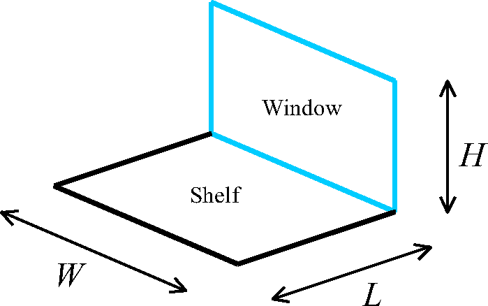

Figure 71.  Window and Outside Shelf as Adjacent Perpendicular Rectangles.

For this geometry the view factor is given by (Mills 1995):

<div>$${F_{ws}} = \frac{1}{{\pi M}}\left\{ \begin{array}{l}M{\tan ^{ - 1}}\left( {\frac{1}{M}} \right) + N{\tan ^{ - 1}}\left( {\frac{1}{N}} \right) - {\left( {{M^2} + {N^2}} \right)^{1/2}}{\tan ^{ - 1}}\left( {{{\left( {{M^2} + {N^2}} \right)}^{ - 1/2}}} \right)\\ + \frac{1}{4}\ln \left[ {\left( {\frac{{\left( {1 + {M^2}} \right)\left( {1 + {N^2}} \right)}}{{1 + {M^2} + {N^2}}}} \right){{\left( {\frac{{{M^2}\left( {1 + {M^2} + {N^2}} \right)}}{{\left( {1 + {M^2}} \right)\left( {{M^2} + {N^2}} \right)}}} \right)}^{{M^2}}}{{\left( {\frac{{{N^2}\left( {1 + {M^2} + {N^2}} \right)}}{{\left( {1 + {N^2}} \right)\left( {{M^2} + {N^2}} \right)}}} \right)}^{{N^2}}}} \right]\end{array} \right\}$$</div>

where

<div>$$M = H/W$$</div>

<div>$$N = L/W$$</div>

#### Outside Shelf Heat Balance

The heat balance simulation does not do a sky and ground integration.  View factors to sky and ground are used instead.  Consequently, the heat balance calculation for the outside shelf is very similar to the daylighting calculation.  The main difference is that the incident flux on the upper window is calculated first and reported.  The transmitted and absorbed fractions are subsequently determined.

The solar flux incident on the upper window due to the shelf is given by:

<div>$${q''_{shelf - inc}} = {q''_{shelf - inc,sun}} + {q''_{shelf - inc,sky}}$$</div>

where

<div>$${q''_{shelf - inc,sun}} = \left( {{I_{sun}}\cos \theta } \right){f_{sunlit}}{\rho_{sol}}{F_{ws}}$$</div>

<div>$${q''_{shelf - inc,sky}} = {I_{h,sky}}{f_{skymult}}{\rho_{sol}}{F_{ws}}$$</div>

and

I<sub>sun</sub> = solar beam intensity of the sun

I<sub>h,\\ sky</sub> = total horizontal diffuse solar radiation due to the sky

q = incident angle of the beam on the shelf

f<sub>sunlit</sub> = sunlit beam fraction of the surface area

f<sub>skymult</sub> = anisotropic sky view multiplier (see AnisoSkyMult)

r<sub>sol</sub> = shelf surface reflectivity in the solar spectrum

F<sub>ws</sub> = view factor from window to shelf

The view factor F<sub>ws</sub> is the same as described above for daylighting.

The total diffuse incident radiation due to the shelf is internally added to the ground diffuse incident radiation on the window.  For reporting purposes the shelf radiation is included in the *Surface Outside Face Incident Ground Diffuse Solar Radiation Rate per Area* output variable.

With the incident radiation determined, the remaining window heat balance is calculated normally.  The resulting transmitted diffuse radiation from the sky, ground, and shelf is:

<div>$${q''_{trans}} = \left( {{{q''}_{sky - inc}} + {{q''}_{gnd - inc}} + {{q''}_{shelf - inc}}} \right){\tau_{diff,sol}}$$</div>

where

t<sub>diff,\\ sol</sub> = diffuse window transmittance in the solar spectrum

#### References

Mills, A. F. 1995. Heat and Mass Transfer, p. 499.

### Window Light Well

The input object DaylightingDevice:LightWell provides a model for attenuation of light transmitted by windows and skylights that can result from surrounding interior finish surfaces that form a “light well.”  The light well model simply attenuates the light transmitted by the exterior window.  The model does not redirect light distributions or alter the relative mixture of diffuse and beam transmitted by the window.

The attenuation is characterized by the **well efficiency**, which is the ratio of the amount of light leaving the well to the amount of light entering the well. The well efficiency varies from close to 1.0  to close to zero if there is high attenuation. The well efficiency is used only in the EnergyPlus detailed daylighting calculation, where it multiplies the beam and diffuse light transmitted by the skylight. (The well efficiency is not used in calculating the solar gain through the skylight.)


Figure 72. Skylight with light well: (a) perspective view, (b) vertical section.
 If the bottom of the light well is a rectangle of side lengths c and d, as shown in (a), then the perimeter of the bottom of the well = 2(c+d) and the area = cd (see description of field names for the Light Well object).

The well efficiency depends on the visible reflectance of well’s side walls and on the well cavity ratio, ***WCR***, which is given by:

<div>$$WCR = \frac{{{\rm{2}}{\rm{.5 x Well Height x Well Perimeter}}}}{{{\rm{Well Area}}}}$$</div>

Well Height, Well Perimeter and Well Area are inputs to the model and are discussed in the figure caption above.

The model in EnergyPlus was implemented by fitting a curve to the data presented as Figure 8-21, “Efficiency factors for various depths of light wells based on well-interreflectance values,” found in the Lighting Handbook (IES 1993).  The figure below reproduces that reference data and shows well efficiency vs. WCR for different side wall reflectances. For use in the EnergyPlus calculation, a fit has been made to this graph that gives the following mathematical expression, where “Reflectance” is the user input value of the well-wall reflectance expressed as a fraction:

<div>$${\rm{Well efficiency}} = {e^{ - WCR*(0.16368 - 0.144678*{\rm{Reflectance}})}}$$</div>


Figure 73. Graph showing light well efficiency vs. well cavity ratio (WCR) for well-wall visible reflectances of 80% (upper curve), 60% (middle curve) and 40% (lower curve). Based on Fig. 8-21 of the Lighting Handbook: Reference and Application, 8<sup>th</sup> Edition, 1993, Illuminating Engineering Society of North America.

The well efficiency calculated using this curve fit and user inputs is then applied to daylight transmission rates to attenuate daylight as a result of the presence of the light well,

#### References

Lighting Handbook: Reference & Application, 8th Edition, Illuminating Engineering Society of North America, 1993.

Window Calculation Module
-------------------------

This section describes two potential modeling approaches for Windows.  The first (layer by layer) is implemented.  The second, simple approach, reuses the layer-by-layer approach but converts an arbitrary window performance into an equivalent single layer.

The primary Window calculation is a layer-by-layer approach where windows are considered to be composed of the following components, only the first of which, glazing, is required to be present:

* ***Glazing***, which consists of one or more plane/parallel glass layers. If there are two or more glass layers, the layers are separated by gaps filled with air or another gas. The glazing optical and thermal calculations are based on algorithms from the WINDOW 4 and WINDOW 5 programs [Arasteh et al., 1989], [Finlayson et al., 1993].  Glazing layers are described using te input object WindowMaterial:Glazing.

* ***Gap***, layers filled with air or another gas that separate glazing layers.  Gaps are described using the input object WindowMaterial:Gas.

* ***Frame***, which surrounds the glazing on four sides.  Frames are described using the input object WindowProperty:FrameAndDivider.

* ***Divider***, which consists of horizontal and/or vertical elements that divide the glazing into individual lites.

* ***Shading device***, which is a separate layer, such as drapery, roller shade or blind, on the inside or outside of the glazing, whose purpose is to reduce solar gain, reduce heat loss (movable insulation) or control daylight glare.  Shading layers are described using “WindowProperty:ShadingControl” input objects.

In the following, the description of the layer-by-layer glazing algorithms is based on material from Finlayson et al., 1993. The frame and divider thermal model, and the shading device optical and thermal models, are new to EnergyPlus.

A second approch has been developed where windows are modeled in a simplified approach that requires minimal user input that is processed to develop and equivalent layer that then reuses much of the layer-by-model.  This “Simple Window Construction: model is described below.

### Optical Properties of Glazing

The solar radiation transmitted by a system of glass layers and the solar radiation absorbed in each layer depends on the solar transmittance, reflectance and absorptance properties of the individual layers. The absorbed solar radiation enters the glazing heat balance calculation that determines the inside surface temperature and, therefore, the heat gain to the zone from the glazing (see “Window Heat Balance Calculation”). The transmitted solar radiation is absorbed by interior zone surfaces and, therefore, contributes to the zone heat balance. In addition, the visible transmittance of the glazing is an important factor in the calculation of interior daylight illuminance from the glazing.

Table 28.  Variables in Window Calculations

<table class="table table-striped">
<tr>
<th>Mathematical variable</th>
<th>Description</th>
<th>Units</th>
<th>FORTRAN variable</th>
</tr>
<tr>
<td>T</td>
<td>Transmittance</td>
<td>-</td>
<td>-</td>
</tr>
<tr>
<td>R</td>
<td>Reflectance</td>
<td>-</td>
<td>-</td>
</tr>
<tr>
<td>R<sup>f</sup>, R<sup>b</sup></td>
<td>Front reflectance, back reflectance</td>
<td>-</td>
<td>-</td>
</tr>
<tr>
<td>T<sub>i,j</sub></td>
<td>Transmittance through glass layers i to j</td>
<td>-</td>
<td>-</td>
</tr>
<tr>
<td>T<sup>dir</sup><sub>gl</sub></td>
<td>Direct transmittance of glazing</td>
<td>-</td>
<td>-</td>
</tr>
<tr>
<td>R<sup>f</sup><sub>i,j</sub>, R<sup>b</sup><sub>i,j</sub></td>
<td>Front reflectance, back reflectance from glass layers i to j</td>
<td>-</td>
<td>-</td>
</tr>
<tr>
<td>R<sup>dir</sup><sub>gl,f</sub>, R<sup>dir</sup><sub>gl,b</sub></td>
<td>Direct front and back reflectance of glazing</td>
<td>-</td>
<td>-</td>
</tr>
<tr>
<td>A<sup>f</sup><sub>i</sub>, A<sup>b</sup><sub>i</sub></td>
<td>Front  absorptance, back absorptance of layer i</td>
<td>-</td>
<td>-</td>
</tr>
<tr>
<td>N</td>
<td>Number of glass layers</td>
<td>-</td>
<td>Nlayer</td>
</tr>
<tr>
<td>λ</td>
<td>Wavelength</td>
<td>microns</td>
<td>Wle</td>
</tr>
<tr>
<td>E<sub>s</sub>(λ)</td>
<td>Solar spectral irradiance function</td>
<td>W/m<sup>2</sup>-micron</td>
<td>E</td>
</tr>
<tr>
<td>V(λ)</td>
<td>Photopic response function of the eye</td>
<td>-</td>
<td>y30</td>
</tr>
<tr>
<td>φ</td>
<td>Angle of incidence (angle between surface normal and direction of incident beam radiation)</td>
<td>Rad</td>
<td>Phi</td>
</tr>
<tr>
<td>τ</td>
<td>Transmittivity or transmittance</td>
<td>-</td>
<td>tf0</td>
</tr>
<tr>
<td>ρ</td>
<td>Reflectivity or reflectance</td>
<td>-</td>
<td>rf0, rb0</td>
</tr>
<tr>
<td>α</td>
<td>Spectral absorption coefficient</td>
<td>m<sup>-1</sup></td>
<td>-</td>
</tr>
<tr>
<td>d</td>
<td>Glass thickness</td>
<td>M</td>
<td>Material%Thickness</td>
</tr>
<tr>
<td>n</td>
<td>Index of refraction</td>
<td>-</td>
<td>ngf, ngb</td>
</tr>
<tr>
<td>κ</td>
<td>Extinction coefficient</td>
<td>-</td>
<td>-</td>
</tr>
<tr>
<td>β</td>
<td>Intermediate variable</td>
<td>-</td>
<td>betaf, betab</td>
</tr>
<tr>
<td>P, p</td>
<td>A general property, such as transmittance</td>
<td>-</td>
<td>-</td>
</tr>
<tr>
<td>τ<sub>sh</sub></td>
<td>Shade transmittance</td>
<td>-</td>
<td>Material%Trans</td>
</tr>
<tr>
<td>ρ<sub>sh</sub></td>
<td>Shade reflectance</td>
<td>-</td>
<td>Material%ReflectShade</td>
</tr>
<tr>
<td>α<sub>sh</sub></td>
<td>Shade absorptance</td>
<td>-</td>
<td>Material%AbsorpSolar</td>
</tr>
<tr>
<td>τ<sub>bl,</sub>ρ<sub>bl,</sub>α<sub>bl</sub></td>
<td>Blind transmittance, reflectance, absorptance</td>
<td>-</td>
<td>-</td>
</tr>
<tr>
<td>Q, G, J</td>
<td>Source, irradiance and radiosity for blind optical properties calculation</td>
<td>W/m<sup>2</sup></td>
<td>-</td>
</tr>
<tr>
<td>F<sub>ij</sub></td>
<td>View factor between segments i and j</td>
<td>-</td>
<td>-</td>
</tr>
<tr>
<td>f<sub>switch</sub></td>
<td>Switching factor</td>
<td>-</td>
<td>SwitchFac</td>
</tr>
<tr>
<td>T</td>
<td>Transmittance</td>
<td>-</td>
<td>-</td>
</tr>
<tr>
<td>R</td>
<td>Reflectance</td>
<td>-</td>
<td>-</td>
</tr>
<tr>
<td>R<sup>f</sup>, R<sup>b</sup></td>
<td>Front reflectance, back reflectance</td>
<td>-</td>
<td>-</td>
</tr>
<tr>
<td>T<sub>i,j</sub></td>
<td>Transmittance through glass layers i to j</td>
<td>-</td>
<td>-</td>
</tr>
<tr>
<td>R<sup>f</sup><sub>i,j</sub>, R<sup>b</sup><sub>i,j</sub></td>
<td>Front reflectance, back reflectance from glass layers i to j</td>
<td>-</td>
<td>-</td>
</tr>
<tr>
<td>A<sup>f</sup><sub>i</sub>, A<sup>b</sup><sub>i</sub></td>
<td>Front  absorptance, back absorptance of layer i</td>
<td>-</td>
<td>-</td>
</tr>
<tr>
<td>N</td>
<td>Number of glass layers</td>
<td>-</td>
<td>Nlayer</td>
</tr>
<tr>
<td>λ</td>
<td>Wavelength</td>
<td>microns</td>
<td>Wle</td>
</tr>
<tr>
<td>E<sub>s</sub>(λ)</td>
<td>Solar spectral irradiance function</td>
<td>W/m<sup>2</sup>-micron</td>
<td>E</td>
</tr>
<tr>
<td>R(λ)</td>
<td>Photopic response function of the eye</td>
<td>-</td>
<td>y30</td>
</tr>
<tr>
<td>φ'</td>
<td>Relative azimuth angle (angle between screen surface normal and vertical plane through sun, Ref. Figure 87)</td>
<td>Rad</td>
<td>SunAzimuthToScreenNormal</td>
</tr>
<tr>
<td>α'</td>
<td>Relative altitude angle (angle between screen surface horizontal normal plane and direction of incident beam radiation, Ref. Figure 87)</td>
<td>Rad</td>
<td>SunAltitudeToScreenNormal</td>
</tr>
<tr>
<td>ρ<sub>sc</sub></td>
<td>Beam-to-diffuse solar reflectance of screen material</td>
<td>-</td>
<td>Screens%ReflectCylinder</td>
</tr>
<tr>
<td>γ</td>
<td>Screen material aspect ratio</td>
<td>-</td>
<td>Screens%ScreenDiameterTo
SpacingRatio</td>
</tr>
<tr>
<td>Α</td>
<td>Spectral absorption coefficient</td>
<td>m<sup>-1</sup></td>
<td>-</td>
</tr>
<tr>
<td>D</td>
<td>Glass thickness</td>
<td>M</td>
<td>Material%Thickness</td>
</tr>
<tr>
<td>N</td>
<td>Index of refraction</td>
<td>-</td>
<td>ngf, ngb</td>
</tr>
<tr>
<td>Κ</td>
<td>Extinction coefficient</td>
<td>-</td>
<td>-</td>
</tr>
<tr>
<td>Β</td>
<td>Intermediate variable</td>
<td>-</td>
<td>betaf, betab</td>
</tr>
<tr>
<td>P, p</td>
<td>A general property, such as transmittance</td>
<td>-</td>
<td>-</td>
</tr>

</table>

### Glass Layer Properties

In EnergyPlus, the optical properties of individual glass layers are given by the following quantities at normal incidence as a function of wavelength:

Transmittance, *T*

Front reflectance, *R<sup>f</sup>*

Back reflectance, *R<sup>b</sup>*

Here “front” refers to radiation incident on the side of the glass closest to the outside environment, and “back” refers to radiant incident on the side of the glass closest to the inside environment. For glazing in exterior walls, “front” is therefore the side closest to the outside air and “back” is the side closest to the zone air. For glazing in interior (i.e., interzone) walls, “back” is the side closest to the zone in which the wall is defined in and “front” is the side closest to the adjacent zone.

### Glass Optical Properties Conversion

#### Conversion from Glass Optical Properties Specified as Index of Refraction and Transmittance at Normal Incidence

The optical properties of uncoated glass are sometimes specified by index of refraction, *n*,*
* and transmittance at normal incidence, *T*.

The following equations show how to convert from this set of values to the transmittance and reflectance values required by Material:WindowGlass. These equations apply only to uncoated glass, and can be used to convert either spectral-average solar properties or spectral-average visible properties (in general, *n* and *T* are different for the solar and visible). Note that since the glass is uncoated, the front and back reflectances are the same and equal to the *R* that is solved for in the following equations.

Given *n* and *T*, find *R*:

<div>$$\begin{array}{l}r = {\left( {\frac{{n - 1}}{{n + 1}}} \right)^2}\\\tau  = \frac{{{{\left[ {{{(1 - r)}^4} + 4{r^2}{T^2}} \right]}^{1/2}} - {{(1 - r)}^2}}}{{2{r^2}T}}\\R = r + \frac{{{{(1 - r)}^2}r{\tau ^2}}}{{1 - {r^2}{\tau ^2}}}\end{array}$$</div>

**Example:**

*T* = 0.86156

*n* = 1.526

<div>$$\begin{array}{l}r = {\left( {\frac{{1.526 - 1}}{{1.526 + 1}}} \right)^2}\\\tau  = 0.93974\\R = 0.07846\end{array}$$</div>

### Simple Window Model

EnergyPlus includes an alternate model that allows users to enter in simplified window performance indices.  This model is accessed through the WindowMaterial:SimpleGlazingSystem input object and converts the simple indices into an equivalent single layer window.  (In addition a special model is used to determine the angular properties of the system – described below).  Once the model generates the properties for the layer, the program reuses the bulk of the layer-by-layer model for subsequent calculations.  The properties of the equivalent layer are determined using the step by step method outlined by Arasteh, Kohler, and Griffith (2009).  The core equations are documented here.  The reference contains additional information.

The simplified window model accepts U and SHGC indices and is useful for several reasons:

1)   Sometimes, the only thing that is known about the window are its U and SHGC;

2)   Codes, standards, and voluntary programs are developed in these terms;

3)   A single-layer calculation is faster than multi-layer calculations.

Note: This use of U and SHGC to describe the thermal properties of windows is only appropriate for specular glazings.

While it is important to include the ability to model windows with only U-value and SHGC, we note that any method to use U and SHGC alone in building simulation software will inherently be approximate.  This is due primarily to the following factors:

* SHGC combines directly transmitted solar radiation and radiation absorbed by the glass which flows inward.  These have different implications for space heating/cooling.  Different windows with the same SHGC often have different ratios of transmitted to absorbed solar radiation.

* SHGC is determined at normal incidence; angular properties of glazings vary with number of layers, tints, coatings.  So products which have the same SHGC, can have different angular properties.

* Window U-factors vary with temperatures.

Thus, for modeling specific windows, we recommend using more detailed data than just the U and SHGC, if at all possible.

The simplified window model determines the properties of an equivalent layer in the following steps.

#### Step 1.  Determine glass-to-glass Resistance.

Window U-values include interior and exterior surface heat transfer coefficients.  The resistance of the bare window product, or glass-to-glass resistance is augmented by these film coefficients so that,

<div>$$\frac{1}{U} = {R_{i,w}} + {R_{o,w}} + {R_{l,w}}$$</div>

Where,

<span>\({R_{i,w}}\)</span> is the resistance of the interior film coefficient under standard winter conditions in units of m<sup>2</sup>·K/W,

<span>\({R_{o,w}}\)</span> is the resistance of the exterior film coefficient under standard winter conditions in units of m<sup>2</sup>·K/W, and

<span>\({R_{l,w}}\)</span> is the resisance of the bare window under winter conditions (without the film coefficients) in units of m<sup>2</sup>·K/W.

The values for <span>\({R_{i,w}}\)</span> and <span>\({R_{o,w}}\)</span> depend on U and are calculated using the following correlations.

<div>$${R_{i,w}} = \frac{1}{{(0.359073\;Ln(U) + 6.949915)}};\quad for\quad U &lt; 5.85$$</div>

<div>$${R_{i,w}} = \frac{1}{{(1.788041\;U - 2.886625)}};\quad for\quad U \ge 5.85$$</div>

<div>$${R_{o,w}} = \frac{1}{{(0.025342\;U + 29.163853)}}$$</div>

So that the glass-to-glass resistance is calculated using,

<span>\({R_{l,w}} = \frac{1}{U} - {R_{i,w}} - {R_{o,w}}\)</span>.

Because the window model in EnergyPlus is for flat geometries, the models are not necessarily applicable to low-performance projecting products, such as skylights with unisulated curbs.  The model cannot support glazing systems with a U higher than 7.0 because the thermal resistance of the film coefficients alone can provide this level of performance and none of the various resistances can be negative.

#### Step 2.  Determine Layer Thickness.

The thickness of the equivalent layer in units of meters is calculated using,

<div>$$Thickness = 0.002\;;\quad for\;{\raise0.7ex\hbox{$1$} \!\mathord{\left/ {\vphantom {1 {{R_{l,w}}}}}\right.}\!\lower0.7ex\hbox{${{R_{l,w}}}$}} > 7.0$$</div>

<div>$$Thickness = 0.05914 - \left( {\frac{{0.00714}}{{{R_{l,w}}}}} \right);\;{\raise0.7ex\hbox{$1$} \!\mathord{\left/ {\vphantom {1 {{R_{l,w}}}}}\right.}\!\lower0.7ex\hbox{${{R_{l,w}}}$}} \le 7.0$$</div>

#### Step 3.  Determine Layer Thermal Conductivity

The effective thermal conductivity, <span>\({\lambda_{eff}}\)</span>, of the equivalent layer is calculated using,

<div>$${\lambda_{eff}} = \frac{{Thickness}}{{{R_{l,w}}}}$$</div>

#### Step 4.  Determine Layer Solar Transmittance

The layer’s solar transmittance at normal incidence, <span>\({T_{sol}}\)</span>, is calculated using correlations that are a function of SHGC and U-Factor.

<div>$${T_{sol}} = 0.939998\;SHG{C^2} + 0.20332\;SHGC;\quad U > 4.5;\;SHGC &lt; 0.7206$$</div>

<div>$${T_{sol}} = 1.30415SHGC - 0.30515\;;\quad U > 4.5;\;SHGC \ge 0.7206$$</div>

<div>$${T_{sol}} = 0.41040\;SHGC;\quad U &lt; 3.4;\;SHGC \le 0.15$$</div>

<div>$${T_{sol}} = 0.085775\;SHG{C^2} + 0.963954\;SHGC - 0.084958\;;\;\;U &lt; 3.4;\;SHGC > 0.15$$</div>

And for U-values between 3.4 and 4.5, the value for <span>\({T_{sol}}\)</span> is interpolated using results of the equations for both ranges.

#### Step 5.  Determine Layer Solar Reflectance

The layer’s solar reflectance is calculated by first determining the inward flowing fraction which requires values for the resistance of the inside and outside film coefficients under summer conditions, <span>\({R_{i,s}}\)</span> and <span>\({R_{o,s}}\)</span>respectively.  The correlations are

<span>\({R_{i,s}} = \frac{1}{{\left( {29.436546\;{{\left( {SHGC - {T_{Sol}}} \right)}^3} - 21.943415{{\left( {SHGC - {T_{Sol}}} \right)}^2} + 9.945872\left( {SHGC - {T_{Sol}}} \right) + 7.426151} \right)}};\,U > 4.5\)</span><span>\({R_{i,s}} = \frac{1}{{\left( {199.8208128\;{{\left( {SHGC - {T_{Sol}}} \right)}^3} - 90.639733{{\left( {SHGC - {T_{Sol}}} \right)}^2} + 19.737055\left( {SHGC - {T_{Sol}}} \right) + 6.766575} \right)}};\,U &lt; 3.4\)</span><span>\({R_{o,s}} = \frac{1}{{\left( {2.225824(SHGC - {T_{Sol}}) + 20.57708} \right)}};\;U > 4.5\)</span>

<div>$${R_{o,s}} = \frac{1}{{\left( {5.763355(SHGC - {T_{Sol}}) + 20.541528} \right)}};\;U &lt; 3.4$$</div>

And for U-values between 3.4 and 4.5, the values are interpolated using results from both sets of equations.

The inward flowing fraction, <span>\(Fra{c_{inward}}\)</span>, is then calculated using

<div>$$Fra{c_{inward}} = \frac{{\left( {{R_{o,s}} + 0.5\,{R_{l,w}}} \right)}}{{\left( {{R_{o,s}} + {R_{l,w}} + {R_{i,s}}} \right)}}$$</div>

The the solar reflectances of the front face, <span>\({R_{s,f}}\)</span>, and back face, <span>\({R_{s,b}}\)</span>, are calculated using,

<span>\({R_{s,f}} = {R_{s,b}} = 1 - {T_{Sol}} - \frac{{\left( {SHGC - {T_{Sol}}} \right)}}{{Fra{c_{inward}}}}\)</span>.

The thermal absorptance, or emittance, is take as 0.84 for both the front and back and the longwave transmittance is 0.0.

#### Step 6.  Determine Layer Visible Properties

The user has the option of entering a value for visible transmittance as one of the simple performance indices.  If the user does not enter a value, then the visible properties are the same as the solar properties.  If the user does enter a value then layer’s visible transmittance at normal incidence, <span>\({T_{Vis}}\)</span>,is set to that value.  The visible light reflectance for the back surface is calculated using,

<div>$${R_{Vis,b}} =  - 0.7409\,T_{Vis}^3 + 1.6531\,T_{Vis}^2 - 1.2299\,{T_{Vis}} + 0.4547$$</div>

The visible light reflectance for the front surface is calculated using,

<div>$${R_{Vis,f}} =  - 0.0622\,T_{Vis}^3 + 0.4277\,T_{Vis}^2 - 0.4169\,{T_{Vis}} + 0.2399$$</div>

#### Step 7. Determine Angular Performance

The angular properties of windows are important because during energy modeling, the solar incidence angles are usually fairly high.  Angles of incidence are defined as angles from the normal direction extending out from the window.  The simple glazing system model includes a range of correlations that are selected based on the values for U and SHGC.  These were chosen to match the types of windows likely to have such performance levels.  The matrix of possible combinations of U and SHGC values have been mapped to set of 28 bins shown in the following figure.


 

Figure 74. Diagram of Transmittance and Reflectance Correlations Used based on U and SHGC.

There are ten different correlations, A thru J, for both transmission and reflectance.  The correlations are used in various weighting and interpolation schemes according the figure above.  The correlations are normalized against the performance at normal incidence.  EnergyPlus uses these correlations to store the glazing system’s angular performance at 10 degree increments and interpolates between them during simulations.  The model equations use the cosine of the incidence angle, <span>\(\cos (\varphi )\)</span>, as the independent variable.  The correlations have the form:

<div>$$T\;or\;R = a\cos {(\varphi )^4} + b\cos {(\varphi )^3} + c\cos {(\varphi )^2} + d\cos (\varphi ) + e$$</div>

The coefficient values for a, b, c, d, and e are listed in the following tables for each of the curves.


Figure 75. Normalized Transmittance Correlations for Angular Performance


Figure 76. Normalized Reflectanct Correlations for Angular Performance

#### Application Issues

EnergyPlus’s normal process of running the detailed layer-by-layer model, with the equivalent layer produced by this model, creates reports (sent to the EIO file) of the overall performance indices and the properties of the equivalent layer. Both of these raise issues that may be confusing.

The simplified window model does not reuse all aspects of the detailed layer-by-layer model, in that the angular solar transmission properties use a different model when the simple window model is in effect. If the user takes the material properties of an equivalent glazing layer from the simple window model and then re-enters them into just the detailed model, then the performance will not be the same because of the angular transmission model will have changed. It is not proper use of the model to re-enter the equivalent layer’s properties and expect the exact level of performance.

There may not be exact agreement between the performance indices echoed out and those input in the model. This is expected with the model and the result of a number of factors. For example, although input is allowed to go up to U-7 W/m<sup>2</sup>∙K, the actual outcome is limited to no higher than about 5.8W/m<sup>2</sup>∙K. This is because the thermal resistance to heat transfer at the surfaces is already enough resistance to provide an upper limit to the conductance of a planar surface. Sometimes there is conflict between the SHGC and the U that are not physical and compromises need to be made. In general, the simple window model is intended to generate a physically-reasonable glazing that approximates the input entered as well as possible. But the model is not always be able to do exactly what is specified when the specifications are not physical.

#### References

Arasteh, D., J.C. Kohler, B. Griffith, Modeling Windows in EnergyPlus with Simple Performance Indices. Lawrence Berkeley National Laboratory. In Draft. Available at

### Glazing System Properties

The optical properties of a glazing system consisting of *N* glass layers separated by nonabsorbing gas layers (Figure 77.  Schematic of transmission, reflection and absorption of solar radiation within a multi-layer glazing system.) are determined by solving the following recursion relations for *T<sub>i,j</sub>*, the transmittance through layers* i* to* j*; *R<sup>f</sup><sub>i,j</sub>* and *R<sup>b</sup><sub>i,j</sub>*, the front and back reflectance, respectively, from layers* i* to* j*; and *A<sub>j</sub>*, the absorption in layer* j*. Here layer 1 is the outermost layer and layer *N* is the innermost layer. These relations account for multiple internal reflections within the glazing system. Each of the variables is a function of wavelength.

<div>$${T_{i,j}} = \frac{{{T_{i,j - 1}}{T_{j,j}}}}{{1 - R_{j,j}^fR_{j - 1,i}^b}}$$</div>

<div>$$R_{i,j}^f = R_{i,j - 1}^f + \frac{{T_{i,j - 1}^2R_{j,j}^f}}{{1 - R_{j,j}^fR_{j - 1,i}^b}}$$</div>

<div>$$R_{j,i}^b = R_{j,j}^b + \frac{{T_{j,j}^2R_{j - 1,i}^b}}{{1 - R_{j - 1,i}^bR_{j,j}^f}}$$</div>

<div>$$A_j^f = \frac{{{T_{1,j - 1}}(1 - {T_{j,j}} - R_{j,j}^f)}}{{1 - R_{j,N}^fR_{j - 1,1}^b}} + \frac{{{T_{1,j}}R_{j + 1,N}^f(1 - {T_{j,j}} - R_{j,j}^b)}}{{1 - R_{j,N}^fR_{j - 1,1}^b}}$$</div>

In Eq. *T<sub>i,j</sub>* = 1 and *R<sub>i,j</sub>* = 0 if* i*&lt;0 or* j*&gt;*N*.


Figure 77.  Schematic of transmission, reflection and absorption of solar radiation within a multi-layer glazing system.

As an example, for double glazing (*N*=2) these equations reduce to

<div>$${T_{1,2}} = \frac{{{T_{1,1}}{T_{2,2}}}}{{1 - R_{2,2}^fR_{1,1}^b}}$$</div>

<div>$$R_{1,2}^f = R_{1,1}^f + \frac{{T_{1,1}^2R_{2,2}^f}}{{1 - R_{2,2}^fR_{1,1}^b}}$$</div>

<div>$$R_{2,1}^b = R_{2,2}^b + \frac{{T_{2,2}^2R_{1,1}^b}}{{1 - R_{1,1}^bR_{2,2}^f}}$$</div>

<div>$$A_1^f = (1 - {T_{1,1}} - R_{1,1}^f) + \frac{{{T_{1,1}}R_{2,2}^f(1 - {T_{1,1}} - R_{1,1}^b)}}{{1 - R_{2,2}^fR_{1,1}^b}}$$</div>

<div>$$A_2^f = \frac{{{T_{1,1}}(1 - {T_{2,2}} - R_{2,2}^f)}}{{1 - R_{2,2}^fR_{1,1}^b}}$$</div>

If the above transmittance and reflectance properties are input as a function of wavelength, EnergyPlus calculates “spectral average” values of the above glazing system properties by integrating over wavelength:

The spectral-average solar property is

<div>$${P_s} = \frac{{\int {P(\lambda ){E_s}(\lambda )d\lambda } }}{{\int {{E_s}(\lambda )d\lambda } }}$$</div>

The spectral-average visible property is

<div>$${P_v} = \frac{{\int {P(\lambda ){E_s}(\lambda )V(\lambda )d\lambda } }}{{\int {{E_s}(\lambda )V(\lambda )d\lambda } }}$$</div>

where <span>\({E_s}(\lambda )\)</span>is the solar spectral irradiance function and <span>\(V(\lambda )\)</span>is the photopic response function of the eye. The default functions are shown in Table 29 and Table 30. They can be overwritten by user defined solar and/or visible spectrum using the objects Site:SolarAndVisibleSpectrum and Site:SpectrumData. They are expressed as a set of values followed by the corresponding wavelengths for values.

If a glazing layer has optical properties that are roughly constant with wavelength, the wavelength-dependent values of *T<sub>i,i</sub>* , *R<sup>f</sup><sub>i,i</sub>* and *R<sup>b</sup><sub>i,i</sub>* in Eqs. to can be replaced with constant values for that layer.

Table 29. Solar spectral irradiance function.

<table class="table table-striped">
<tr>
<td>Air mass 1.5 terrestrial solar global spectral irradiance values (W/m<sup>2</sup>-micron) on a 37<sup>o</sup> tilted surface. Corresponds to wavelengths in following data block. Based on ISO 9845-1 and ASTM E 892; derived from Optics5 data file ISO-9845GlobalNorm.std, 10-14-99.</td>
</tr>
<tr>
<td>                  0.0,   9.5,  42.3, 107.8, 181.0, 246.0, 395.3, 390.1, 435.3, 438.9,
       483.7, 520.3, 666.2, 712.5, 720.7,1013.1,1158.2,1184.0,1071.9,1302.0,
      1526.0,1599.6,1581.0,1628.3,1539.2,1548.7,1586.5,1484.9,1572.4,1550.7,
      1561.5,1501.5,1395.5,1485.3,1434.1,1419.9,1392.3,1130.0,1316.7,1010.3,
      1043.2,1211.2,1193.9,1175.5, 643.1,1030.7,1131.1,1081.6, 849.2, 785.0,
       916.4, 959.9, 978.9, 933.2, 748.5, 667.5, 690.3, 403.6, 258.3, 313.6,
       526.8, 646.4, 746.8, 690.5, 637.5, 412.6, 108.9, 189.1, 132.2, 339.0,
       460.0, 423.6, 480.5, 413.1, 250.2,  32.5,   1.6,  55.7, 105.1, 105.5,
       182.1, 262.2, 274.2, 275.0, 244.6, 247.4, 228.7, 244.5, 234.8, 220.5,
       171.5,  30.7,   2.0,   1.2,  21.2,  91.1,  26.8,  99.5,  60.4,  89.1,
        82.2,  71.5,  70.2,  62.0,  21.2,  18.5,   3.2</td>
</tr>
<tr>
<td>Wavelengths (microns) corresponding to above data block</td>
</tr>
<tr>
<td>           0.3000,0.3050,0.3100,0.3150,0.3200,0.3250,0.3300,0.3350,0.3400,0.3450,
      0.3500,0.3600,0.3700,0.3800,0.3900,0.4000,0.4100,0.4200,0.4300,0.4400,
      0.4500,0.4600,0.4700,0.4800,0.4900,0.5000,0.5100,0.5200,0.5300,0.5400,
      0.5500,0.5700,0.5900,0.6100,0.6300,0.6500,0.6700,0.6900,0.7100,0.7180,
      0.7244,0.7400,0.7525,0.7575,0.7625,0.7675,0.7800,0.8000,0.8160,0.8237,
      0.8315,0.8400,0.8600,0.8800,0.9050,0.9150,0.9250,0.9300,0.9370,0.9480,
      0.9650,0.9800,0.9935,1.0400,1.0700,1.1000,1.1200,1.1300,1.1370,1.1610,
      1.1800,1.2000,1.2350,1.2900,1.3200,1.3500,1.3950,1.4425,1.4625,1.4770,
      1.4970,1.5200,1.5390,1.5580,1.5780,1.5920,1.6100,1.6300,1.6460,1.6780,
      1.7400,1.8000,1.8600,1.9200,1.9600,1.9850,2.0050,2.0350,2.0650,2.1000,
      2.1480,2.1980,2.2700,2.3600,2.4500,2.4940,2.5370</td>
</tr>

</table>

Table 30. Photopic response function.

<table class="table table-striped">


<tr>
<td>Photopic response function values corresponding to wavelengths in following data block. Based on CIE 1931 observer; ISO/CIE 10527, CIE Standard Calorimetric Observers; derived from Optics5 data file &quot;CIE 1931 Color Match from E308.txt&quot;, which is the same as WINDOW4 file Cie31t.dat.</td>
</tr>
<tr>
<td>      0.0000,0.0001,0.0001,0.0002,0.0004,0.0006,0.0012,0.0022,0.0040,0.0073,
      0.0116,0.0168,0.0230,0.0298,0.0380,0.0480,0.0600,0.0739,0.0910,0.1126,
      0.1390,0.1693,0.2080,0.2586,0.3230,0.4073,0.5030,0.6082,0.7100,0.7932,
      0.8620,0.9149,0.9540,0.9803,0.9950,1.0000,0.9950,0.9786,0.9520,0.9154,
      0.8700,0.8163,0.7570,0.6949,0.6310,0.5668,0.5030,0.4412,0.3810,0.3210,
      0.2650,0.2170,0.1750,0.1382,0.1070,0.0816,0.0610,0.0446,0.0320,0.0232,
      0.0170,0.0119,0.0082,0.0158,0.0041,0.0029,0.0021,0.0015,0.0010,0.0007,
      0.0005,0.0004,0.0002,0.0002,0.0001,0.0001,0.0001,0.0000,0.0000,0.0000,
      0.0000 /</td>
</tr>
<tr>
<td>Wavelengths (microns) corresponding to above data block</td>
</tr>
<tr>
<td>      .380,.385,.390,.395,.400,.405,.410,.415,.420,.425,
      .430,.435,.440,.445,.450,.455,.460,.465,.470,.475,
      .480,.485,.490,.495,.500,.505,.510,.515,.520,.525,
      .530,.535,.540,.545,.550,.555,.560,.565,.570,.575,
      .580,.585,.590,.595,.600,.605,.610,.615,.620,.625,
      .630,.635,.640,.645,.650,.655,.660,.665,.670,.675,
      .680,.685,.690,.695,.700,.705,.710,.715,.720,.725,
      .730,.735,.740,.745,.750,.755,.760,.765,.770,.775,
      .780</td>
</tr>

</table>

### Calculation of Angular Properties

Calculation of optical properties is divided into two categories: uncoated glass and coated glass.

#### Angular Properties for Uncoated Glass

The following discussion assumes that optical quantities such as transmissivity, reflectvity, absorptivity, and index of refraction are a function of wavelength, λ. If there are no spectral data the angular dependence is calculated based on the single values for transmittance and reflectance in the visible and solar range. In the visible range an average wavelength of 0.575 microns is used in the calculations. In the solar range an average wavelength of 0.898 microns is used.

The spectral data include the transmittance, *T*, and the reflectance, *R*. For uncoated glass the reflectance is the same for the front and back surfaces. For angle of incidence, <span>\(\phi \)</span>, the transmittance and reflectance are related to the transmissivity, τ,and reflectivity, ρ, by the following relationships:

<div>$$T(\phi ) = \frac{{\tau {{(\phi )}^2}{e^{ - \alpha d/\cos \phi '}}}}{{1 - \rho {{(\phi )}^2}{e^{ - 2\alpha d/\cos \phi '}}}}$$</div>

<div>$$R(\phi ) = \rho (\phi )\left( {1 + T(\phi ){e^{ - \alpha d/\cos \phi '}}} \right)$$</div>

The spectral reflectivity is calculated from Fresnel’s equation assuming unpolarized incident radiation:

<div>$$\rho (\phi ) = \frac{1}{2}\left( {{{\left( {\frac{{n\cos \phi  - \cos \phi '}}{{n\cos \phi  + \cos \phi '}}} \right)}^2} + {{\left( {\frac{{n\cos \phi ' - \cos \phi }}{{n\cos \phi ' + \cos \phi }}} \right)}^2}} \right)$$</div>

The spectral transmittivity is given by

<div>$$\tau (\phi ) = 1 - \rho (\phi )$$</div>

The spectral absorption coefficient is defined as

<div>$$\alpha  = 4\pi \kappa /\lambda $$</div>

where κ is the dimensionless spectrally-dependent extinction coefficient and λ is the wavelength expressed in the same units as the sample thickness.

Solving Eq. at normal incidence gives

<div>$$n = \frac{{1 + \sqrt {\rho (0)} }}{{1 - \sqrt {\rho (0)} }}$$</div>

Evaluating Eq. at normal incidence gives the following expression for *κ*

<div>$$\kappa  =  - \frac{\lambda }{{4\pi d}}\ln \frac{{R(0) - \rho (0)}}{{\rho (0)T(0)}}$$</div>

Eliminating the exponential in Eqs. and  gives the reflectivity at normal incidence:

<div>$$\rho (0) = \frac{{\beta  - \sqrt {{\beta ^2} - 4(2 - R(0))R(0)} }}{{2(2 - R(0))}}$$</div>

where

<div>$$\beta  = T{(0)^2} - R{(0)^2} + 2R(0) + 1$$</div>

The value for the reflectivity, *ρ*(0),from Eq. is substituted into Eqs. and . The result from Eq. is used to calculate the absorption coefficient in Eq. . The index of refraction is used to calculate the reflectivity in Eq. which is then used to calculate the transmittivity in Eq. . The reflectivity, transmissivity and absorption coefficient are then substituted into Eqs. and to obtain the angular values of the reflectance and transmittance.

#### Angular Properties for Coated Glass

A regression fit is used to calculate the angular properties of coated glass from properties at normal incidence. If the transmittance of the coated glass is &gt; 0.645, the angular dependence of uncoated clear glass is used. If the transmittance of the coated glass is ≤ 0.645, the angular dependence of uncoated bronze glass is used. The values for the angular functions for the transmittance and reflectance of both clear glass <span>\(({\bar \tau_{clr}},{\bar \rho_{clr}})\)</span> and bronze glass <span>\(({\bar \tau_{bnz}},{\bar \rho_{bnz}})\)</span>are determined from a fourth-order polynomial regression:

<div>$$\bar \tau (\phi ) = {\bar \tau_0} + {\bar \tau_1}\cos (\phi ) + {\bar \tau_2}{\cos ^2}(\phi ) + {\bar \tau_3}{\cos ^3}(\phi ) + {\bar \tau_4}{\cos ^4}(\phi )$$</div>

and

<div>$$\bar \rho (\phi ) = {\bar \rho_0} + {\bar \rho_1}\cos (\phi ) + {\bar \rho_2}{\cos ^2}(\phi ) + {\bar \rho_3}{\cos ^3}(\phi ) + {\bar \rho_4}{\cos ^4}(\phi ) - \bar \tau (\phi )$$</div>

The polynomial coefficients are given in Table 31.

Table 31. Polynomial coefficients used to determine angular properties of coated glass.

<table class="table table-striped">
<tr>
<th> </th>
<th>0</th>
<th>1</th>
<th>2</th>
<th>3</th>
<th>4</th>
</tr>
<tr>
<td><span>\({\bar \tau_{clr}}\)</span></td>
<td>-0.0015</td>
<td>3.355</td>
<td>-3.840</td>
<td>1.460</td>
<td>0.0288</td>
</tr>
<tr>
<td><span>\({\bar \rho_{clr}}\)</span></td>
<td>0.999</td>
<td>-0.563</td>
<td>2.043</td>
<td>-2.532</td>
<td>1.054</td>
</tr>
<tr>
<td><span>\({\bar \tau_{bnz}}\)</span></td>
<td>-0.002</td>
<td>2.813</td>
<td>-2.341</td>
<td>-0.05725</td>
<td>0.599</td>
</tr>
<tr>
<td><span>\({\bar \rho_{bnz}}\)</span></td>
<td>0.997</td>
<td>-1.868</td>
<td>6.513</td>
<td>-7.862</td>
<td>3.225</td>
</tr>

</table>

These factors are used as follows to calculate the angular transmittance and reflectance:

For *T*(0) &gt; 0.645:

<div>$$T(\phi ) = T(0){\bar \tau_{clr}}(\phi )$$</div>

<div>$$R(\phi ) = R(0)(1 - {\bar \rho_{clr}}(\phi )) + {\bar \rho_{clr}}(\phi )$$</div>

For *T*(0) ≤ 0.645:

<div>$$T(\phi ) = T(0){\bar \tau_{bnz}}(\phi )$$</div>

<div>$$R(\phi ) = R(0)(1 - {\bar \rho_{bnz}}(\phi )) + {\bar \rho_{bnz}}(\phi )$$</div>

#### Angular Properties for Simple Glazing Systems

When the glazing system is modeled using the simplified method, an alternate method is used to determine the angular properties.  The equation for solar transmittance as a function of incidence angle, <span>\(T\left( \phi  \right)\)</span>, is,

<div>$$T\left( \phi  \right) = T\left( {\phi  = 0} \right)\,\cos \left( \phi  \right)\,\,\left( {1 + (0.768 + 0.817\,SHG{C^4})\;{{\sin }^3}\left( \phi  \right)} \right)$$</div>

where,

<span>\(T\left( {\phi  = 0} \right)\)</span> is the normal incidence solar transmittance, <span>\({T_{Sol}}\)</span>.

The equation for solar reflectance as a function of incidence angle,  <span>\(R\left( \phi  \right)\)</span>, is,

<div>$$R\left( \phi  \right) = \frac{{R\left( {\phi  = 0} \right)\left( {{f_1}\left( \phi  \right) + {f_2}\left( \phi  \right)\sqrt {SHGC} } \right)}}{{{R_{fit,o}}}}$$</div>

where,

<div>$${f_1}\left( \phi  \right) = \left( {\left( {\left( {2.403\cos \left( \phi  \right) - 6.192} \right)\cos \left( \phi  \right) + 5.625} \right)\cos \left( \phi  \right) - 2.095} \right)\cos \left( \phi  \right) + 1$$</div>

<div>$${f_2}\left( \phi  \right) = \left( {\left( {\left( { - 1.188\cos \left( \phi  \right) + 2.022} \right)\cos \left( \phi  \right) + 0.137} \right)\cos \left( \phi  \right) - 1.720} \right)\cos \left( \phi  \right)$$</div>

<div>$${R_{fit,o}} = 0.7413 - \left( {0.7396\;\sqrt {SHGC} } \right)$$</div>

### Calculation of Hemispherical Values

The hemispherical value of a property is determined from the following integral:

<div>$${P_{hemispherical}} = 2\int_0^{\frac{\pi }{2}} {P(\phi )\cos (\phi )\sin (\phi )d\phi } $$</div>

The integral is evaluated by Simpson’s rule for property values at angles of incidence from 0 to 90 degrees in 10-degree increments.

### Optical Properties of Window Shading Devices

Shading devices affect the system transmittance and glass layer absorptance for short-wave radiation and for long-wave (thermal) radiation. The effect depends on the shade position (interior, exterior or between-glass), its transmittance, and the amount of inter-reflection between the shading device and the glazing. Also of interest is the amount of radiation absorbed by the shading device.

In EnergyPlus, shading devices are divided into four categories, “shades,” ”blinds,” “screens,” and “switchable glazing.” “Shades” are assumed to be perfect diffusers. This means that direct radiation incident on the shade is reflected and transmitted as hemispherically uniform diffuse radiation: there is no direct component of transmitted radiation. It is also assumed that the transmittance, *τ<sub>sh</sub>*, reflectance, *ρ<sub>sh</sub>*, and absorptance, *α<sub>sh</sub>*, are the same for the front and back of the shade and are independent of angle of incidence. Many types of drapery and pull-down roller devices are close to being perfect diffusers and can be categorized as “shades.”

“Blinds” in EnergyPlus are slat-type devices such as venetian blinds. Unlike shades, the optical properties of blinds are strongly dependent on angle of incidence. Also, depending on slat angle and the profile angle of incident direct radiation, some of the direct radiation may pass between the slats, giving a direct component of transmitted radiation.

“Screens” are debris or insect protection devices made up of metallic or non-metallic materials. Screens may also be used as shading devices for large glazing areas where excessive solar gain is an issue. The EnergyPlus window screen model assumes the screen is composed of intersecting orthogonally-crossed cylinders, with the surface of the cylinders assumed to be diffusely reflecting. Screens may only be used on the exterior surface of a window construction. As with blinds, the optical properties affecting the direct component of transmitted radiation are dependent on the angle of incident direct radiation.

With “Switchable glazing,” shading is achieved making the glazing more absorbing or more reflecting, usually by an electrical or chemical mechanism. An example is electrochromic glazing where the application of an electrical voltage or current causes the glazing to switch from light to dark.

Shades and blinds can be either fixed or moveable. If moveable, they can be deployed according to a schedule or according to a trigger variable, such as solar radiation incident on the window. Screens can be either fixed or moveable according to a schedule.

#### Shades

#### Shade/Glazing System Properties for Short-Wave Radiation

Short-wave radiation includes

1)   Beam solar radiation from the sun and diffuse solar radiation from the sky and ground incident on the outside of the window,

2)   Beam and/or diffuse radiation reflected from exterior obstructions or the building itself,

3)   Solar radiation reflected from the inside zone surfaces and incident as diffuse radiation on the inside of the window,

4)   Beam solar radiation from one exterior window incident on the inside of another window in the same zone, and

5)   Short-wave radiation from electric lights incident as diffuse radiation on the inside of the window.

**Exterior Shade**

For an exterior shade we have the following expressions for the system transmittance, the effective system glass layer absorptance, and the system shade absorptance, taking inter-reflection between shade and glazing into account. Here, “system” refers to the combination of glazing and shade. The system properties are given in terms of the isolated shade properties (i.e., shade properties in the absence of the glazing) and the isolated glazing properties (i.e., glazing properties in the absence of the shade).

<div>$${T_{sys}}(\phi ) = T_{1,N}^{dif}\frac{{{\tau_{sh}}}}{{1 - R_f^{dif}{\rho_{sh}}}}$$</div>

<div>$$T_{sys}^{dif} = T_{1,N}^{dif}\frac{{{\tau_{sh}}}}{{1 - R_f^{dif}{\rho_{sh}}}}$$</div>

<div>$$A_{j,f}^{sys}(\phi ) = A_{j,f}^{dif}\frac{{{\tau_{sh}}}}{{1 - {R_f}{\rho_{sh}}}},\quad j = 1{\rm{to}}N$$</div>

<div>$$A_{j,f}^{dif,sys} = A_{j,f}^{dif}\frac{{{\tau_{sh}}}}{{1 - {R_f}{\rho_{sh}}}},\quad j = 1{\rm{ to }}N$$</div>

<div>$$A_{j,b}^{dif,sys} = A_{j,b}^{dif}\frac{{T_{1,N}^{dif}{\rho_{sh}}}}{{1 - {R_f}{\rho_{sh}}}},\quad j = 1{\rm{ to }}N$$</div>

<div>$$\alpha_{sh}^{sys} = {\alpha_{sh}}\left( {1 + \frac{{{\tau_{sh}}{R_f}}}{{1 - {R_f}{\rho_{sh}}}}} \right)$$</div>

**Interior Shade**

The system properties when an interior shade is in place are the following.

<div>$${T_{sys}}(\phi ) = T_{1,N}^{}(\phi )\frac{{{\tau_{sh}}}}{{1 - R_b^{dif}{\rho_{sh}}}}$$</div>

<div>$$T_{sys}^{dif} = T_{1,N}^{dif}\frac{{{\tau_{sh}}}}{{1 - R_b^{dif}{\rho_{sh}}}}$$</div>

<div>$$A_{j,f}^{sys}(\phi ) = {A_{j,f}}(\phi ) + {T_{1,N}}(\phi )\frac{{{\rho_{sh}}}}{{1 - R_b^{dif}{\rho_{sh}}}}A_{j,b}^{dif},\quad j = 1{\rm{ to }}N$$</div>

<div>$$A_{j,f}^{dif,sys} = A_{j,f}^{dif} + T_{1,N}^{dif}\frac{{{\rho_{sh}}}}{{1 - R_b^{dif}{\rho_{sh}}}}A_{j,b}^{dif},\quad j = 1{\rm{ to }}N$$</div>

<div>$$A_{j,b}^{dif,sys} = \frac{{{\tau_{sh}}}}{{1 - R_b^{dif}{\rho_{sh}}}}A_{j,b}^{dif},{\rm{    }}j = 1{\rm{ to }}N$$</div>

<div>$$\alpha_{sh}^{sys}(\phi ) = T_{1,N}^{}(\phi )\frac{{{\alpha_{sh}}}}{{1 - R_b^{dif}{\rho_{sh}}}}$$</div>

<div>$$\alpha_{sh}^{dif,sys} = T_{1,N}^{dif}\frac{{{\alpha_{sh}}}}{{1 - R_b^{dif}{\rho_{sh}}}}$$</div>

#### Long-Wave Radiation Properties of Window Shades

Long-wave radiation includes

       Thermal radiation from the sky, ground and exterior obstructions incident on the outside of the window,

       Thermal radiation from other room surfaces incident on the inside of the window, and

       Thermal radiation from internal sources, such as equipment and electric lights, incident on the inside of the window.

The program calculates how much long-wave radiation is absorbed by the shade and by the adjacent glass surface. The system emissivity (thermal absorptance) for an interior or exterior shade, taking into account reflection of long-wave radiation between the glass and shade, is given by

<div>$$\varepsilon_{sh}^{lw,sys} = \varepsilon_{sh}^{lw}\left( {1 + \frac{{\tau_{sh}^{lw}\rho_{gl}^{lw}}}{{1 - \rho_{sh}^{lw}\rho_{gl}^{lw}}}} \right)$$</div>

where <span>\(\rho_{gl}^{lw}\)</span>is the long-wave reflectance of the outermost glass surface for an exterior shade or the innermost glass surface for an interior shade, and it is assumed that the long-wave transmittance of the glass is zero.

The innermost (for interior shade) or outermost (for exterior shade) glass surface emissivity when the shade is present is

<div>$$\varepsilon_{gl}^{lw,sys} = \varepsilon_{gl}^{lw}\frac{{\tau_{sh}^{lw}}}{{1 - \rho_{sh}^{lw}\rho_{gl}^{lw}}}$$</div>

#### Switchable Glazing

For switchable glazing, such as electrochromics, the solar and visible optical properties of the glazing can switch from a light state to a dark state. The switching factor, *f<sub>switch</sub>*, determines what state the glazing is in. An optical property, *p*, such as transmittance or glass layer absorptance, for this state is given by

<div>$$p = (1 - {f_{switch}}){p_{light}} + {f_{switch}}{p_{dark}}$$</div>

where

*p<sub>light</sub>*is the property value for the unswitched, or light state, and *p<sub>dark</sub>* is the property value for the fully switched, or dark state.

The value of the switching factor in a particular time step depends on what type of switching control has been specified: “schedule,” “trigger,” or “daylighting.” If “schedule,” *f<sub>switch</sub>* = schedule value, which can be 0 or 1.

### Thermochromic Windows

Thermochromic (TC) materials have active, reversible optical properties that vary with temperature. Thermochromic windows are adaptive window systems for incorporation into building envelopes. Thermochromic windows respond by absorbing sunlight and turning the sunlight energy into heat. As the thermochromic film warms it changes its light transmission level from less absorbing to more absorbing. The more sunlight it absorbs the lower the light level going through it. Figure 78 shows the variations of window properties with the temperature of the thermochromic glazing layer. By using the suns own energy the window adapts based solely on the directness and amount of sunlight. Thermochromic materials will normally reduce optical transparency by absorption and/or reflection, and are specular (maintaining vision).


Figure 78. Variations of Window Properties with the Temperature of the Thermochromic Glazing Layer

On cloudy days the window is at full transmission and letting in diffuse daylighting. On sunny days the window maximizes diffuse daylighting and tints based on the angle of the sun relative to the window. For a south facing window (northern hemisphere) the daylight early and late in the day is maximized and the direct sun at mid day is minimized.

The active thermochromic material can be embodied within a laminate layer or a surface film. The overall optical state of the window at a given time is a function primarily of

* thermochromic material properties

* solar energy incident on the window

* construction of the window system that incorporates the thermochromic layer

* environmental conditions (interior, exterior, air temperature, wind, etc).

The tinted film, in combination with a heat reflecting, low-e layer allows the window to reject most of the absorbed radiation thus reducing undesirable heat load in a building. In the absence of direct sunlight the window cools and clears and again allows lower intensity diffuse radiation into a building. TC windows can be designed in several ways (Figure 79), with the most common being a triple pane windows with the TC glass layer in the middle a double pane windows with the TC layer on the inner surface of the outer pane or for sloped glazing a double pane with the laminate layer on the inner pane with a low-e layer toward the interior. The TC glass layer has variable optical properties depending on its temperature, with a lower temperature at which the optical change is initiated, and an upper temperature at which a minimum transmittance is reached. TC windows act as passive solar shading devices without the need for sensors, controls and power supplies but their optical performance is dependent on varying solar and other environmental conditions at the location of the window.


Figure 79. Configurations of Thermochromic Windows

EnergyPlus describes a thermochromic window with a Construction object which references a special layer defined with a WindowMaterial:GlazingGroup:Thermochromic object. The WindowMaterial:GlazingGroup:Thermochromic object further references a series of WindowMaterial:Glazing objects corresponding to each specification temperature of the TC layer. During EnergyPlus run time, a series of TC windows corresponding to each specification temperature is created once. At the beginning of a particular time step calculations, the temperature of the TC glass layer from the previous time step is used to look up the most closed specification temperature whose corresponding TC window construction will be used for the current time step calculations. The current time step calculated temperature of the TC glass layer can be different from the previous time step, but no iterations are done in the current time step for the new TC glass layer temperature. This is an approximation that considers the reaction time of the TC glass layer can be close to EnergyPlus simulation time step say 10 to 15 minutes.

#### Blinds

Window blinds in EnergyPlus are defined as a series of equidistant slats that are oriented horizontally or vertically. All of the slats are assumed to have the same optical properties. The overall optical properties of the blind are determined by the slat geometry (width, separation and angle) and the slat optical properties (front-side and back-side transmittance and reflectance). Blind properties for direct radiation are also sensitive to the “profile angle,” which is the angle of incidence in a plane that is perpendicular to the window plane and to the direction of the slats. The blind optical model in EnergyPlus is based on Simmler, Fischer and Winkelmann, 1996; however, that document has numerous typographical errors and should be used with caution.

The following assumptions are made in calculating the blind optical properties:

* The slats are flat.

* The spectral dependence of inter-reflections between slats and glazing is ignored; spectral-average slat optical properties are used.

* The slats are perfect diffusers. They have a perfectly matte finish so that reflection from a slat is isotropic (hemispherically uniform) and independent of angle of incidence, i.e., the reflection has no specular component. This also means that absorption by the slats is hemispherically uniform with no incidence angle dependence. If the transmittance of a slat is non-zero, the transmitted radiation is isotropic and the transmittance is independent of angle of incidence.

* Inter-reflection between the blind and wall elements near the periphery of the blind is ignored.

* If the slats have holes through which support strings pass, the holes and strings are ignored. Any other structures that support or move the slats are ignored.

#### Slat Optical Properties

The slat optical properties used by EnergyPlus are shown in the following table.

Table 32.  Slat Optical Properties

<table class="table table-striped">
<tr>
<td><span>\({\tau_{dir,dif}}\)</span>
 </td>
<td>Direct-to-diffuse transmittance (same for front and back of slat)</td>
</tr>
<tr>
<td><span>\({\tau_{dif,dif}}\)</span>
 </td>
<td>Diffuse-to-diffuse transmittance (same for front and back of slat)</td>
</tr>
<tr>
<td><span>\(\rho_{dir,dif}^f{\rm{ , }}\rho_{dir,dif}^b\)</span>
 </td>
<td>Front and back direct-to-diffuse reflectance</td>
</tr>
<tr>
<td><span>\(\rho_{dif,dif}^f{\rm{ , }}\rho_{dif,dif}^b\)</span></td>
<td>Front and back diffuse-to-diffuse reflectance</td>
</tr>

</table>

It is assumed that there is no direct-to-direct transmission or reflection, so that <span>\({\tau_{dir,dir}} = 0\)</span>, <span>\(\rho_{dir,dir}^f = 0\)</span>, and <span>\(\rho_{dir,dir}^b = 0\)</span>. It is further assumed that the slats are perfect diffusers, so that <span>\({\tau_{dir,dif}}\)</span>, <span>\(\rho_{dir,dif}^f\)</span>and <span>\(\rho_{dir,dif}^b\)</span>are independent of angle of incidence. Until the EnergyPlus model is improved to take into account the angle-of-incidence dependence of slat transmission and reflection, it is assumed that <span>\({\tau_{dir,dif}}\)</span>= <span>\({\tau_{dif,dif}}\)</span>, <span>\(\rho_{dir,dif}^f\)</span>=<span>\(\rho_{dif,dif}^f\)</span>, and <span>\(\rho_{dir,dif}^b\)</span>=<span>\(\rho_{dif,dif}^b\)</span>.

#### Direct Transmittance of Blind

The direct-to-direct and direct-to-diffuse transmittance of a blind is calculated using the slat geometry shown in Figure 80 (a), which shows the side view of one of the cells of the blind. For the case shown, each slat is divided into two segments, so that the cell is bounded by a total of six segments, denoted by *s<sub>1</sub>* through *s<sub>6</sub>* (note in the following that *s<sub>i</sub>* refers to both segment *i* and the length of segment *i)*.The lengths of *s<sub>1</sub>* and *s<sub>2</sub>* are equal to the slat separation, *h*, which is the distance between adjacent slat faces. *s<sub>3</sub>* and *s<sub>4</sub>* are the segments illuminated by direct radiation. In the case shown in Figure 80 (a) the cell receives radiation by reflection of the direct radiation incident on *s<sub>4</sub>* and, if the slats have non-zero transmittance, by transmission through *s<sub>3</sub>*, which is illuminated from above.

The goal of the blind direct transmission calculation is to determine the direct and diffuse radiation leaving the cell through *s<sub>2</sub>* for unit direct radiation entering the cell through *s<sub>1</sub>*.


Figure 80. (a) Side view of a cell formed by adjacent slats showing how the cell is divided into segments, *s<sub>i</sub>*,  for the calculation of direct solar transmittance; (b) side view of a cell showing case where some of the direct solar passes between adjacent slats without touching either of them. In this figure φ<sub>s</sub> is the profile angle and φ<sub>b</sub> is the slat angle.

#### Direct-to-Direct Blind Transmittance

Figure 80 (b) shows the case where some of the direct radiation passes through the cell without hitting the slats. From the geometry in this figure we see that

<div>$$\tau_{bl,f}^{dir,dir} = 1 - \frac{{|w|}}{h},{\rm{       }}|w|{\rm{ }} \le {\rm{ }}h$$</div>

where

<div>$$w = s\frac{{\cos ({\varphi_b} - {\varphi_s})}}{{\cos {\varphi_s}}}$$</div>

Note that we are assuming that the slat thickness is zero. A correction for non-zero slat thickness is described later.

#### Direct-to-Diffuse Blind Transmittance, Reflectance and Absorptance

The direct-to-diffuse and transmittance and reflectance of the blind are calculated using a radiosity method that involves the following three vector quantities:

*J<sub>i</sub>* = the radiosity of segment *s<sub>i</sub>*, i.e., the total radiant flux into the cell from  *s<sub>i</sub>*

*G<sub>i</sub>*= the irradiance on the cell side of *s<sub>i</sub>*

*Q<sub>i</sub>*= the source flux from the cell side of s*<sub>i</sub>*

Based on these definitions we have the following equations that relate *J*, *G* and *Q* for the different segments:

<div>$$
  \begin{array}{rl}
   J_1 &= Q_1 \\
   J_2 &= Q_2 \\
   J_3 &= Q_3 + \rho_{dif,dif}^b G_3 + \tau_{dif,dif} G_4 \\
   J_4 &= Q_4 + \tau_{dif,dif} G_3 + \rho_{dif,dif}^f G_4 \\
   J_5 &= Q_5 + \rho_{dif,dif}^b G_5 + \tau_{dif,dif} G_6 \\
   J_6 &= Q_6 + \tau_{dif,dif} G_5 + \rho_{dif,dif}^f G_6
  \end{array}
$$</div>

In addition we have the following equation relating *G* and* J*:

<div>$${G_i} = \sum\limits_{j = 1}^6 {{J_j}{F_{ji}}{\rm{ ,    }}i = 1,6} $$</div>

where <span>\({F_{ji}}\)</span>is the view factor between <span>\({s_j}\)</span>and <span>\({s_i}\)</span>, i.e., <span>\({F_{ji}}\)</span>is the fraction of radiation leaving <span>\({s_j}\)</span>that is intercepted by <span>\({s_i}\)</span>.

Using <span>\({J_1} = {Q_1} = 0\)</span>and <span>\({J_2} = {Q_2} = 0\)</span> and combining the above equations gives the following equation set relating* J* and* Q*:

<div>$${J_3} - \rho_{dif,dif}^b\sum\limits_{j = 3}^6 {{J_j}{F_{j3}} - {\tau_{dif,dif}}\sum\limits_{j = 3}^6 {{J_j}{F_{j4}} = {Q_3}} } $$</div>

<div>$${J_4} - \tau_{dif,dif}^{}\sum\limits_{j = 3}^6 {{J_j}{F_{j3}} - \rho_{dif,dif}^f\sum\limits_{j = 3}^6 {{J_j}{F_{j4}} = {Q_4}} } $$</div>

<div>$${J_5} - \rho_{dif,dif}^b\sum\limits_{j = 3}^6 {{J_j}{F_{j5}} - {\tau_{dif,dif}}\sum\limits_{j = 3}^6 {{J_j}{F_{j6}} = {Q_5}} } $$</div>

<div>$${J_6} - \tau_{dif,dif}^{}\sum\limits_{j = 3}^6 {{J_j}{F_{j3}} - \rho_{dif,dif}^f\sum\limits_{j = 3}^6 {{J_j}{F_{j6}} = {Q_6}} } $$</div>

This can be written in the form

<div>$$Q' = XJ'$$</div>

where *X* is a 4x4 matrix and

<div>$$
  J' = \left[ \begin{array}
   J_3 \\
   J_4 \\
   J_5 \\
   J_6 \end{array} \right]
$$</div>  
  
<div>$$
  Q' = \left[ \begin{array}
    Q_3 \\
    Q_4 \\
    Q_5 \\
    Q_6 \end{array} \right]
$$</div>

We then obtain <span>\(J'\)</span> from

<div>$$J' = {X^{ - 1}}Q'$$</div>

The view factors, <span>\({F_{ij}}\)</span>, are obtained as follows. The cell we are dealing with is a convex polygon with *n* sides. In such a polygon the view factors must satisfy the following constraints:

<div>$$\sum\limits_{j = 1}^n {{F_{ij}} = 1{\rm{,  }}i = 1,n} $$</div>

<div>$${s_i}{F_{ij}} = {s_j}{F_{ji}}{\rm{,  }}i = 1,n{\rm{;  }}j = 1,n$$</div>

<div>$${F_{ii}} = 0{\rm{,  }}i = 1,n$$</div>

These constraints lead to simple equations for the view factors for* n* = 3 and 4. For *n* = 3, we have the following geometry and view factor expression:


For  *n* = 4  we have:


Applying these to the slat cell shown in Figure 81 we have the following:

<div>$${F_{12}} = \frac{{{d_1} + {d_2} - 2s}}{{2h}}$$</div>

<div>$${F_{13}} = \frac{{h + {s_3} - {d_3}}}{{2h}}{\rm{ ,  etc}}{\rm{.}}$$</div>


Figure 81. Slat cell showing geometry for calculation of view factors between the segments of the cell.

The sources for the direct-to-diffuse transmittance calculation are:

<div>$${Q_1} = {Q_2} = {Q_5} = {Q_6} = 0 \;  (and therefore) {J_1} = {J_2} = 0$$</div>

<div>$$
  \left. 
    \begin{array}{l}
      Q_3 = \tau_{dir,dif} \\
      Q_4 = \rho_{dir,dif}^f 
    \end{array} 
  \right\} 
  \;
  \varphi_b \le \varphi_s + \frac{\pi }{2} 
  \;
  \rm{ (beam hits front of slats)}
$$</div>

<div>$$
  \left.
    \begin{array}{l}
      Q_3 = \rho_{dir,dif}^b \\
      Q_4 = \tau_{dir,dif}
    \end{array}
  \right\}
  \;
  \varphi_b \gt \varphi_s + \frac{\pi }{2}
  \;
  \rm{ (beam hits back of slats)}
$$</div>

For unit incident direct flux, the front direct-to-diffuse transmittance and reflectance of the blind are:

<div>$$\begin{array}{l}\tau_{bl,f}^{dir,dif} = {G_2}\\\rho_{bl,f}^{dir,dif} = {G_1}\end{array}$$</div>

where

<div>$$
  \begin{array}{l}
    G_2 = \sum_{j=3}^6 J_j F_{j2} \\
    G_1 = \sum_{j=3}^6 J_j F_{j1} 
  \end{array}
$$</div>

and <span>\({J_3}\)</span>to <span>\({J_6}\)</span>are given by Eq. .  

The front direct absorptance of the blind is then

<div>$$\alpha_{bl,f}^{dir} = 1 - \tau_{bl,f}^{dir,dif} - \tau_{bl,f}^{dir,dir} - \rho_{bl,f}^{dir,dif}$$</div>

The direct-to-diffuse calculations are performed separately for solar and visible slat properties to get the corresponding solar and visible blind properties.

#### Dependence on Profile Angle

The direct-to-direct and direct-to-diffuse blind properties are calculated for direct radiation profile angles (see Figure 80) ranging from –90<sup>O</sup> to +90<sup>O</sup> in 5<sup>O</sup> increments. (The “profile angle” is the angle of incidence in a plane that is perpendicular to the window *and* perpendicular to the slat direction.) In the time step loop the blind properties for a particular profile angle are obtained by interpolation.

#### Dependence on Slat Angle

All blind properties are calculated for slat angles ranging from –90<sup>O</sup> to +90<sup>O</sup> in 10<sup>O</sup> increments. In the time-step loop the slat angle is determined by the slat-angle control mechanism and then the blind properties at that slat angle are determined by interpolation. Three slat-angle controls are available: (1) slat angle is adjusted to just block beam solar incident on the window; (2) slat angle is determined by a schedule; and (3) slat angle is fixed.

#### Diffuse-to-Diffuse Transmittance and Reflectance of Blind

To calculate the diffuse-to-diffuse properties, assuming uniformly distributed incident diffuse radiation, each slat bounding the cell is divided into two segments of equal length (Figure 82), i.e., <span>\({s_3} = {s_4}\)</span>and <span>\({s_5} = {s_6}\)</span>.  For front-side properties we have a unit source, <span>\({Q_1} = 1\)</span>.  All the other <span>\({Q_i}\)</span>are zero. Using this source value, we apply the methodology described above to obtain *G<sub>2</sub>*and *G<sub>1</sub>*. We then have

<div>$$\begin{array}{l}\tau_{bl,f}^{dif,dif} = {G_2}\\\rho_{bl,f}^{dif,dif} = {G_1}\\\alpha_{bl,f}^{dif} = 1 - \tau_{bl,f}^{dif,dif} - \rho_{bl,f}^{dif,dif}\end{array}$$</div>

The back-side properties are calculated in a similar way by setting *Q<sub>2</sub>* = 1 with the other <span>\({Q_i}\)</span>equal to zero.

The diffuse-to-diffuse calculations are performed separately for solar, visible and IR slat properties to get the corresponding solar, visible and IR blind properties.

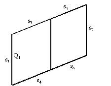

Figure 82. Slat cell showing arrangement of segments and location of source for calculation of diffuse-to-diffuse optical properties.

#### Blind properties for sky and ground diffuse radiation

For horizontal slats on a vertical window (the most common configuration) the blind diffuse-to-diffuse properties will be sensitve to whether the radiation is incident upward from the ground or downward from the sky (Figure 83). For this reason we also calculate the following solar properties for a blind consisting of horizontal slats in a vertical plane:

<span>\(\tau_{bl,f}^{gnd - dif,dif} = {\rm{ }}\)</span>front transmittance for ground diffuse solar

<span>\(\tau_{bl,f}^{sky - dif,dif} = {\rm{ }}\)</span>front transmittance for sky diffuse solar

<span>\({\rm{ }}\rho_{bl,f}^{gnd - dif,dif} = \)</span>front reflectance for ground diffuse solar

<span>\(\rho_{bl,f}^{sky - dif,dif} = {\rm{ }}\)</span>front reflectance for sky diffuse solar

<span>\(\alpha_{bl,f}^{gnd - dif,dif} = {\rm{ }}\)</span>front absorptance for ground diffuse solar

<span>\(\alpha_{bl,f}^{sky - dif,dif} = {\rm{ }}\)</span>front absorptance for sky diffuse solar

These are obtained by integrating over sky and ground elements, as shown in Figure 83, treating each element as a source of direct radiation of irradiance <span>\(I({\phi_s})\)</span> incident on the blind at profile angle <span>\({\phi_s}\)</span>. This gives:

<div>$$\tau_{bl,f}^{sky - dif,dif} = \frac{{\int\limits_0^{\pi /2} {\left[ {\tau_{bl,f}^{dir,dir}({\phi_s}) + \tau_{bl,f}^{dir,dif}({\phi_s})} \right]{I_{sky}}({\phi_s})\cos {\phi_s}d{\phi_s}} }}{{\int\limits_0^{\pi /2} {{I_{sky}}({\phi_s})\cos {\phi_s}d{\phi_s}} }}$$</div>

<div>$$\rho_{bl,f}^{sky - dif,dif} = \frac{{\int\limits_0^{\pi /2} {\rho_{bl,f}^{dir,dif}{I_{sky}}({\phi_s})\cos {\phi_s}d{\phi_s}} }}{{\int\limits_0^{\pi /2} {{I_{sky}}({\phi_s})\cos {\phi_s}d{\phi_s}} }}$$</div>

<div>$$\alpha_{bl,f}^{sky - dif} = \frac{{\int\limits_0^{\pi /2} {\alpha_{bl,f}^{dir}{I_{sky}}({\phi_s})\cos {\phi_s}d{\phi_s}} }}{{\int\limits_0^{\pi /2} {{I_{sky}}({\phi_s})\cos {\phi_s}d{\phi_s}} }}$$</div>


Figure 83.  Side view of horizontal slats in a vertical blind showing geometry for calculating blind transmission, reflection and absorption properties for sky and ground diffuse radiation.

We assume that the sky radiance is uniform. This means that <span>\({I_{sky}}\)</span>is independent of <span>\({\phi_s}\)</span>, giving:

<div>$$\tau_{bl,f}^{sky - dif,dif} = \int\limits_0^{\pi /2} {\left[ {\tau_{bl,f}^{dir,dir} + \tau_{bl,f}^{dir,dif}} \right]\cos {\phi_s}d{\phi_s}} $$</div>

<div>$$\rho_{bl,f}^{sky - dif,dif} = \int\limits_0^{\pi /2} {\rho_{bl,f}^{dir,dif}\cos {\phi_s}d{\phi_s}} $$</div>

<div>$$\alpha_{bl,f}^{sky - dif} = \int\limits_0^{\pi /2} {\alpha_{bl,f}^{dir}\cos {\phi_s}d{\phi_s}} $$</div>

The corresponding ground diffuse quantities are obtained by integrating <span>\({\phi_s}\)</span> from <span>\(- \pi /2\)</span> to 0.

An improvement to this calculation would be to allow the sky radiance distribution to be non-uniform, i.e.,  to depend on sun position and sky conditions, as is done in the detailed daylighting calculation (see “Sky Luminance Distributions” under “Daylight Factor Calculation”).

#### Correction Factor for Slat Thickness

A correction has to be made to the blind transmittance, reflectance and absorptance properties to account for the amount of radiation incident on a blind that is reflected and absorbed by the slat edges (the slats are assumed to be opaque to radiation striking the slat edges). This is illustrated in Figure 84 for the case of direct radiation incident on the blind. The slat cross-section is assumed to be rectangular. The quantity of interest is the fraction, *f<sub>edge</sub>*, of direct radiation incident on the blind that strikes the slat edges. Based on the geometry shown in Figure 84 we see that

<div>$${f_{edge}} = \frac{{t\cos \gamma }}{{\left( {h + \frac{t}{{\cos \xi }}} \right)\cos {\varphi_s}}} = \frac{{t\cos ({\varphi_s} - \xi )}}{{\left( {h + \frac{t}{{\cos \xi }}} \right)\cos {\varphi_s}}} = \frac{{t\sin ({\varphi_b} - {\varphi_s})}}{{\left( {h + \frac{t}{{\sin {\varphi_b}}}} \right)\cos {\varphi_s}}}$$</div>

The edge correction factor for diffuse incident radiation is calculated by averaging this value of *f<sub>edge</sub>* over profile angles, *φ<sub>s</sub>*, from –90<sup>O</sup> to +90<sup>O</sup>.

As an example of how the edge correction factor is applied, the following two equations show how blind front diffuse transmittance and reflectance calculated assuming zero slat thickness are modified by the edge correction factor. It is assumed that the edge transmittance is zero and that the edge reflectance is the same as the slat front reflectance, *ρ<sub>f</sub>*.

<div>$$\begin{array}{l}\tau_{bl,f}^{dif,dif} \to \tau_{bl,f}^{dif,dif}\left( {1 - {f_{edge}}} \right)\\\rho_{bl,f}^{dif} \to \rho_{bl,f}^{dif}\left( {1 - {f_{edge}}} \right) + {f_{edge}}{\rho_f}\end{array}$$</div>


Figure 84. Side view of slats showing geometry for calculation of slat edge correction factor for incident direct radiation.

#### Comparison with ISO 15099 Calculation of Blind Optical Properties

Table 33 compares EnergyPlus and ISO 15099 [2001] calculations of blind optical properties for a variety of profile angles, slat angles and slat optical properties. The ISO 15099 calculation method is similar to that used in EnergyPlus, except that the slats are divided into five equal segments. The ISO 15099 and EnergyPlus results agree to within 12%, except for the solar transmittances for the 10-degree slat angle case. Here the transmittances are small (from 1% to about 5%) but differ by about a factor of up to two between ISO 15099 and EnergyPlus. This indicates that the slats should be divided into more than two segments at small slat angles.


Table 33. Comparison of blind optical properties calculated with the EnergyPlus and ISO 15099 methods. EnergyPlus values that differ by more than 12% from ISO 15099 values are shown in bold italics.

<table class="table table-striped">
  <tr>
    <th colspan="11">Slat Properties</th>
  </tr>
  <tr>
    <td>Separation (m)</td>
    <td colspan="2">0.012</td>
    <td colspan="2">0.012</td>
    <td colspan="2">0.012</td>
    <td colspan="2">0.012</td>
    <td colspan="2">0.012</td>
  </tr>
  <tr>
    <td>Width (m)</td>
    <td colspan="2">0.016</td>
    <td colspan="2">0.016</td>
    <td colspan="2">0.016</td>
    <td colspan="2">0.016</td>
    <td colspan="2">0.016</td>
  </tr>
  <tr>
    <td>Angle (deg)</td>
    <td colspan="2">45</td>
    <td colspan="2">45</td>
    <td colspan="2">45</td>
    <td colspan="2">10</td>
    <td colspan="2">45</td>
  </tr>
  <tr>
    <td>IR transmittance</td>
    <td colspan="2">0</td>
    <td colspan="2">0</td>
    <td colspan="2">0</td>
    <td colspan="2">0</td>
    <td colspan="2">0.4</td>
  </tr>
  <tr>
    <td>IR emissivity, front side</td>
    <td colspan="2">0.9</td>
    <td colspan="2">0.9</td>
    <td colspan="2">0.9</td>
    <td colspan="2">0.9</td>
    <td colspan="2">0.55</td>
  </tr>
  <tr>
    <td>IR emissivity, back side</td>
    <td colspan="2">0.9</td>
    <td colspan="2">0.9</td>
    <td colspan="2">0.9</td>
    <td colspan="2">0.9</td>
    <td colspan="2">0.55</td>
  </tr>
  <tr>
    <td>Solar transmittance</td>
    <td colspan="2">0</td>
    <td colspan="2">0</td>
    <td colspan="2">0</td>
    <td colspan="2">0</td>
    <td colspan="2">0.4</td>
  </tr>
  <tr>
    <td>Solar reflectance, front side</td>
    <td colspan="2">0.7</td>
    <td colspan="2">0.55</td>
    <td colspan="2">0.7</td>
    <td colspan="2">0.7</td>
    <td colspan="2">0.5</td>
  </tr>
  <tr>
    <td>Solar reflectance, back side</td>
    <td colspan="2">0.7</td>
    <td colspan="2">0.55</td>
    <td colspan="2">0.4</td>
    <td colspan="2">0.4</td>
    <td colspan="2">0.5</td>
  </tr>
  <tr>
    <td colspan="11"></td>
  </tr>
  <tr>
    <td>Solar Profile angle (deg)</td>
    <td>0</td>
    <td>60</td>
    <td>0</td>
    <td>60</td>
    <td>0</td>
    <td>60</td>
    <td>0</td>
    <td>60</td>
    <td>0</td>
    <td>60</td>
  </tr>
  <tr>
    <td colspan="11"></td>
  </tr>
  <tr>
    <td colspan="11">Calculated blind properties (first row = ISO 15099 calculation, second row (in italics) = EnergyPlus calculation)</td>
  </tr>
  <tr>
    <td rowspan="2">Front solar transmittance, direct to Direct</td>
    <td>0.057</td>
    <td>0</td>
    <td>0.057</td>
    <td>0</td>
    <td>0.057</td>
    <td>0</td>
    <td>0</td>
    <td>0</td>
    <td>0.057</td>
    <td>0</td>
  </tr>
  <tr>
    <td>0.057</td>
    <td>0</td>
    <td>0.057</td>
    <td>0</td>
    <td>0.057</td>
    <td>0</td>
    <td>0</td>
    <td>0</td>
    <td>0.057</td>
    <td>0</td>
  </tr>
  <tr>
    <td rowspan="2">Back solar transmittance, direct to direct</td>
    <td>0.057</td>
    <td>0.31</td>
    <td>0.057</td>
    <td>0.31</td>
    <td>0.057</td>
    <td>0.31</td>
    <td>0</td>
    <td>0.088</td>
    <td>0.057</td>
    <td>0.31</td>
  </tr>
  <tr>
    <td>0.057</td>
    <td>0.309</td>
    <td>0.057</td>
    <td>0.309</td>
    <td>0.057</td>
    <td>0.309</td>
    <td>0</td>
    <td>0.087</td>
    <td>0.057</td>
    <td>0.309</td>
  </tr>
  <tr>
    <td rowspan="2">Front solar transmittance, direct to diffuse</td>
    <td>0.141</td>
    <td>0.073</td>
    <td>0.09</td>
    <td>0.047</td>
    <td>0.096</td>
    <td>0.051</td>
    <td>0.012</td>
    <td>0.005</td>
    <td>0.373</td>
    <td>0.277</td>
  </tr>
  <tr>
    <td>0.155</td>
    <td>0.074</td>
    <td>0.1</td>
    <td>0.048</td>
    <td>0.104</td>
    <td>0.051</td>
    <td>0.019</td>
    <td>0.006</td>
    <td>0.375</td>
    <td>0.275</td>
  </tr>
  <tr>
    <td rowspan="2">Back solar transmittance, direct to diffuse</td>
    <td>0.141</td>
    <td>0.288</td>
    <td>0.09</td>
    <td>0.216</td>
    <td>0.076</td>
    <td>0.271</td>
    <td>0.011</td>
    <td>0.027</td>
    <td>0.373</td>
    <td>0.306</td>
  </tr>
  <tr>
    <td>0.155</td>
    <td>0.284</td>
    <td>0.1</td>
    <td>0.214</td>
    <td>0.085</td>
    <td>0.269</td>
    <td>0.019</td>
    <td>0.052</td>
    <td>0.375</td>
    <td>0.304</td>
  </tr>
  <tr>
    <td rowspan="2">Front solar reflectance, direct to diffuse</td>
    <td>0.394</td>
    <td>0.558</td>
    <td>0.295</td>
    <td>0.43</td>
    <td>0.371</td>
    <td>0.544</td>
    <td>0.622</td>
    <td>0.678</td>
    <td>0.418</td>
    <td>0.567</td>
  </tr>
  <tr>
    <td>0.389</td>
    <td>0.558</td>
    <td>0.293</td>
    <td>0.431</td>
    <td>0.368</td>
    <td>0.546</td>
    <td>0.636</td>
    <td>0.679</td>
    <td>0.416</td>
    <td>0.568</td>
  </tr>
  <tr>
    <td rowspan="2">Back solar reflectance, direct to diffuse</td>
    <td>0.394</td>
    <td>0.103</td>
    <td>0.295</td>
    <td>0.066</td>
    <td>0.216</td>
    <td>0.07</td>
    <td>0.356</td>
    <td>0.273</td>
    <td>0.418</td>
    <td>0.273</td>
  </tr>
  <tr>
    <td>0.389</td>
    <td>0.115</td>
    <td>0.293</td>
    <td>0.074</td>
    <td>0.214</td>
    <td>0.077</td>
    <td>0.363</td>
    <td>0.272</td>
    <td>0.416</td>
    <td>0.275</td>
  </tr>
  <tr>
    <td rowspan="2">Front solar transmittance, hemispherical diffuse to diffuse</td>
    <td>0.332</td>
    <td></td>
    <td>0.294</td>
    <td></td>
    <td>0.291</td>
    <td></td>
    <td>0.038</td>
    <td></td>
    <td>0.495</td>
    <td></td>
  </tr>
  <tr>
    <td>0.338</td>
    <td></td>
    <td>0.298</td>
    <td></td>
    <td>0.295</td>
    <td></td>
    <td>0.053</td>
    <td></td>
    <td>0.502</td>
    <td></td>
  </tr>
  <tr>
    <td rowspan="2">Back solar transmittance, hemispherical diffuse to diffuse</td>
    <td>0.332</td>
    <td></td>
    <td>0.294</td>
    <td></td>
    <td>0.291</td>
    <td></td>
    <td>0.038</td>
    <td></td>
    <td>0.495</td>
    <td></td>
  </tr>
  <tr>
    <td>0.338</td>
    <td></td>
    <td>0.298</td>
    <td></td>
    <td>0.295</td>
    <td></td>
    <td>0.053</td>
    <td></td>
    <td>0.502</td>
    <td></td>
  </tr>
  <tr>
    <td rowspan="2">Front hemispherical IR transmittance</td>
    <td>0.227</td>
    <td></td>
    <td>0.227</td>
    <td></td>
    <td>0.227</td>
    <td></td>
    <td>0.0245</td>
    <td></td>
    <td>0.385</td>
    <td></td>
  </tr>
  <tr>
    <td>0.227</td>
    <td></td>
    <td>0.227</td>
    <td></td>
    <td>0.227</td>
    <td></td>
    <td>0.025</td>
    <td></td>
    <td>0.387</td>
    <td></td>
  </tr>
  <tr>
    <td rowspan="2">Back hemispherical IR transmittance</td>
    <td>0.227</td>
    <td></td>
    <td>0.227</td>
    <td></td>
    <td>0.227</td>
    <td></td>
    <td>0.0245</td>
    <td></td>
    <td>0.385</td>
    <td></td>
  </tr>
  <tr>
    <td>0.227</td>
    <td></td>
    <td>0.227</td>
    <td></td>
    <td>0.227</td>
    <td></td>
    <td>0.025</td>
    <td></td>
    <td>0.387</td>
    <td></td>
  </tr>
  <tr>
    <td rowspan="2">Front hemispherical IR emissivity</td>
    <td>0.729</td>
    <td></td>
    <td>0.729</td>
    <td></td>
    <td>0.729</td>
    <td></td>
    <td>0.89</td>
    <td></td>
    <td>0.536</td>
    <td></td>
  </tr>
  <tr>
    <td>0.73</td>
    <td></td>
    <td>0.73</td>
    <td></td>
    <td>0.73</td>
    <td></td>
    <td>0.895</td>
    <td></td>
    <td>0.534</td>
    <td></td>
  </tr>
  <tr>
    <td rowspan="2">Back hemispherical IR emissivity</td>
    <td>0.729</td>
    <td></td>
    <td>0.729</td>
    <td></td>
    <td>0.729</td>
    <td></td>
    <td>0.89</td>
    <td></td>
    <td>0.536</td>
    <td></td>
  </tr>
  <tr>
    <td>0.73</td>
    <td></td>
    <td>0.73</td>
    <td></td>
    <td>0.73</td>
    <td></td>
    <td>0.895</td>
    <td></td>
    <td>0.534</td>
    <td></td>
  </tr>
</table>

#### Blind/Glazing System Properties for Short-Wave Radiation

When a blind is in place we have the following expressions for the system transmittance, the system glass layer absorptance, and the system blind absorptance, taking inter-reflection between blind and glazing into account. The system properties, indicated by “sys,” are given in terms of the isolated blind properties (i.e., blind properties in the absence of the glazing)—indicated by “bl” —and the isolated glazing properties (i.e., glazing properties in the absence of the blind)—indicated by “gl.”

#### Interior Blind

The system properties when an interior blind is in place are the following:

<div>$$T_{f,sys}^{dir,all}(\phi ,{\phi_s}) = T_{gl}^{dir}(\phi )\left( {\tau_{bl,f}^{dir,dir}({\phi_s}) + \tau_{bl,f}^{dir,dif}({\phi_s}) + \frac{{\tau_{bl,f}^{dif}\rho_{bl,f}^{dir,dif}({\phi_s})R_{gl,b}^{dif}}}{{1 - \rho_{bl,f}^{dif}R_{gl,b}^{dif}}}} \right)$$</div>

<div>$$A_{gl,j,f}^{dir,sys}(\phi ,{\phi_s}) = A_{gl,j,f}^{dir}(\phi ) + \frac{{T_{gl}^{dir}(\phi )\alpha_{gl,j,b}^{dif}\rho_{bl,f}^{dir}({\phi_s})}}{{1 - \rho_{bl,f}^{dir}({\phi_s})R_{gl,b}^{dif}}}{\rm{,    }}j = 1,N$$</div>

<div>$$\alpha_{bl,f}^{dir,sys}(\phi ,{\phi_s}) = T_{gl}^{dir}(\phi )\left( {\alpha_{bl,f}^{dir}({\phi_s}) + \frac{{\rho_{bl,f}^{dir}({\phi_s})R_{gl,b}^{dif}\alpha_{bl,f}^{dif}}}{{1 - \rho_{bl,f}^{dif}R_{gl,b}^{dif}}}} \right)$$</div>

<div>$$T_{f,sys}^{dif,dif} = \frac{{T_{gl}^{dif}\tau_{bl,f}^{dif,dif}}}{{1 - \rho_{bl,f}^{dif}R_{gl,b}^{dif}}}$$</div>


<div>$$T_{f,sys}^{sky - dif,dif} = \frac{{T_{gl}^{dif}\tau_{bl,f}^{sky - dif,dif}}}{{1 - \rho_{bl,f}^{sky - dif}R_{gl,b}^{dif}}}$$</div>

<div>$$T_{f,sys}^{gnd - dif,dif} = \frac{{T_{gl}^{dif}\tau_{bl,f}^{gnd - dif,dif}}}{{1 - \rho_{bl,f}^{gnd - dif}R_{gl,b}^{dif}}}$$</div>

<div>$$A_{gl,j,f}^{dif,sys} = A_{gl,j,f}^{dif} + \frac{{T_{gl}^{dif}\rho_{bl,f}^{dif}A_{gl,j,b}^{dif}}}{{1 - \rho_{bl,f}^{dif}R_{gl,b}^{dif}}}{\rm{,    }}j = 1,N$$</div>

<div>$$A_{gl,j,f}^{sky - dif,sys} = A_{gl,j,f}^{dif} + \frac{{T_{gl}^{dif}\rho_{bl,f}^{sky - dif}A_{gl,j,b}^{dif}}}{{1 - \rho_{bl,f}^{sky - dif}R_{gl,b}^{dif}}}{\rm{,    }}j = 1,N$$</div>

<div>$$A_{gl,j,f}^{gnd - dif,sys} = A_{gl,j,f}^{dif} + \frac{{T_{gl}^{dif}\rho_{bl,f}^{gnd - dif}A_{gl,j,b}^{dif}}}{{1 - \rho_{bl,f}^{gnd - dif}R_{gl,b}^{dif}}}{\rm{,    }}j = 1,N$$</div>

<div>$$\alpha_{bl,f}^{dif,sys} = \frac{{T_{gl}^{dif}\alpha_{bl,f}^{dif}}}{{1 - \rho_{bl,f}^{dif}R_{gl,b}^{dif}}}$$</div>

<div>$$\alpha_{bl,f}^{sky - dif,sys} = \frac{{T_{gl}^{dif}\alpha_{bl,f}^{sky - dif}}}{{1 - \rho_{bl,f}^{sky - dif}R_{gl,b}^{dif}}}$$</div>

<div>$$\alpha_{bl,f}^{gnd - dif,sys} = \frac{{T_{gl}^{dif}\alpha_{bl,f}^{gnd - dif}}}{{1 - \rho_{bl,f}^{gnd - dif}R_{gl,b}^{dif}}}$$</div>

#### Exterior Blind

The system properties when an exterior blind is in place are the following:

<div>$$T_{f,sys}^{dir,all}(\phi ,{\phi_s}) = \tau_{bl,f}^{dir,dir}({\phi_s})\left( {T_{gl}^{dir}(\phi ) + \frac{{T_{gl}^{dif}R_{gl,f}^{dir}\rho_{bl,b}^{dir,dif}}}{{1 - R_{gl,f}^{dif}\rho_{bl,b}^{dif}}}} \right) + \frac{{\tau_{bl}^{dir,dif}({\phi_s})T_{gl}^{dif}}}{{1 - R_{gl,f}^{dif}\rho_{bl,b}^{dif}}}$$</div>

<div>$$
  A_{gl,j,f}^{dir,sys}(\phi ,\phi_s) = 
     \tau_{bl,f}^{dir,dir}(\phi_s) A_{gl,j,f}^{dir}(\phi ) + 
     \frac{
       \left(
         \tau_{bl,f}^{dir,dir}(\phi_s) R_{gl}^{dir}(\phi) \rho_{bl,b}^{dir}(\phi_s)+ \tau_{bl,f}^{dir,dif}(\phi_s)
       \right) A_{gl,j,f}^{dif}
     } {
       1 - R_{gl,f}^{dif}\rho_{bl,b}^{dif}
     },\;j = 1,N
$$</div>

<div>$$
  \alpha_{bl,f}^{dir,sys}(\phi ,\phi_s) = 
     \alpha_{bl,f}^{dir}(\phi_s) + 
     \alpha_{bl,b}^{dir}(\phi_s) R_{gl,f}^{dir}(\phi) \tau_{bl,f}^{dir,dir}(\phi_s) + 
     \frac{
       \alpha_{bl,b}^{dif}R_{gl,f}^{dif}
     }{
       1 - \rho_{bl,b}^{dif} R_{gl,f}^{dif}
     }
     \left(
       R_{gl,f}^{dir}(\phi) \tau_{bl,f}^{dir,dir}(\phi_s) \rho_{bl,b}^{dir}(\phi_s) + \tau_{bl,f}^{dir,dif}(\phi_s) 
     \right)
$$</div>

<div>$$T_{f,sys}^{dif,dif} = \frac{{\tau_{bl,f}^{dif,dif}T_{gl}^{dif}}}{{1 - R_{gl,f}^{dif}\rho_{bl,b}^{dif}}}$$</div>

<div>$$T_{f,sys}^{sky - dif,dif} = \frac{{\tau_{bl,f}^{sky - dif,dif}T_{gl}^{dif}}}{{1 - R_{gl,f}^{dif}\rho_{bl,b}^{dif}}}$$</div>

<div>$$T_{f,sys}^{gnd - dif,dif} = \frac{{\tau_{bl,f}^{gnd - dif,dif}T_{gl}^{dif}}}{{1 - R_{gl,f}^{dif}\rho_{bl,b}^{dif}}}$$</div>

<div>$$A_{gl,j,f}^{dif,sys} = \frac{{\tau_{bl,f}^{dif,dif}A_{gl,j,f}^{dif}}}{{1 - R_{gl,f}^{dif}\rho_{bl,b}^{dif}}},{\rm{    }}j = 1,N$$</div>

<div>$$A_{gl,j,f}^{sky - dif,sys} = \frac{{\tau_{bl,f}^{sky - dif,dif}A_{gl,j,f}^{dif}}}{{1 - R_{gl,f}^{dif}\rho_{bl,b}^{dif}}},{\rm{    }}j = 1,N$$</div>

<div>$$A_{gl,j,f}^{gnd - dif,sys} = \frac{{\tau_{bl,f}^{gnd - dif,dif}A_{gl,j,f}^{dif}}}{{1 - R_{gl,f}^{dif}\rho_{bl,b}^{dif}}},{\rm{    }}j = 1,N$$</div>

<div>$$\alpha_{bl,f}^{dif,sys} = \alpha_{bl,f}^{dif} + \frac{{\tau_{bl,f}^{dif,dif}R_{gl,f}^{dif}}}{{1 - R_{gl,f}^{dif}\rho_{bl,b}^{dif}}}\alpha_{bl,b}^{dif}$$</div>

<div>$$\alpha_{bl,f}^{sky - dif,sys} = \alpha_{bl,f}^{sky - dif} + \frac{{\tau_{bl,f}^{sky - dif,dif}R_{gl,f}^{dif}}}{{1 - R_{gl,f}^{dif}\rho_{bl,b}^{dif}}}\alpha_{bl,b}^{dif}$$</div>

<div>$$\alpha_{bl,f}^{gnd - dif,sys} = \alpha_{bl,f}^{gnd - dif} + \frac{{\tau_{bl,f}^{gnd - dif,dif}R_{gl,f}^{dif}}}{{1 - R_{gl,f}^{dif}\rho_{bl,b}^{dif}}}\alpha_{bl,b}^{dif}$$</div>

#### Blind/Glazing System Properties for Long-Wave Radiation

The program calculates how much long-wave radiation is absorbed by the blind and by the adjacent glass surface. The effective emissivity (long-wave absorptance) of an interior or exterior blind, taking into account reflection of long-wave radiation between the glass and blind, is given by

<div>$$\varepsilon_{bl}^{lw,eff} = \varepsilon_{bl}^{lw}\left( {1 + \frac{{\tau_{bl}^{lw}\rho_{gl}^{lw}}}{{1 - \rho_{bl}^{lw}\rho_{gl}^{lw}}}} \right)$$</div>

where <span>\(\rho_{gl}^{lw}\)</span>is the long-wave reflectance of the outermost glass surface for an exterior blind or the innermost glass surface for an interior blind, and it is assumed that the long-wave transmittance of the glass is zero.

The effective innermost (for interior blind) or outermost (for exterior blind) glass surface emissivity when the blind is present is

<div>$$\varepsilon_{gl}^{lw,eff} = \varepsilon_{gl}^{lw}\frac{{\tau_{bl}^{lw}}}{{1 - \rho_{bl}^{lw}\rho_{gl}^{lw}}}$$</div>

The effective inside surface emissivity is the sum of the effective blind and effective glass emissivities:

<div>$$\varepsilon_{ins}^{lw,eff} = \varepsilon_{bl}^{lw,eff} + \varepsilon_{gl}^{lw,eff}$$</div>

The effective temperature of the blind/glazing combination that is used to calculate the window’s contribution to the zone’s mean radiant temperature (MRT) is given by

<div>$$T_{}^{eff} = \frac{{\varepsilon_{bl}^{lw,eff}{T_{bl}} + \varepsilon_{gl}^{lw,eff}{T_{gl}}}}{{\varepsilon_{bl}^{lw,eff} + \varepsilon_{gl}^{lw,eff}}}$$</div>


#### Solar Radiation Transmitted and Absorbed by a Window/Blind System

Let the direct solar incident on the window be

<div>$${I_{dir,inc}} = {f_{sunlit}}{I_{dir,norm}}\cos \phi {\rm{    }}(W/{m^2})$$</div>

where <span>\({f_{sunlit}}\)</span>is the fraction of the window that is sunlit (determined by the shadowing calculations), <span>\({I_{dir,norm}}\)</span>is the direct normal solar irradiance, and <span>\(\phi \)</span> is the angle of incidence.

Let <span>\({I_{sky,inc}}\)</span>be the irradiance on the window due to diffuse solar radiation from the sky (W/m<sup>2</sup>) and let <span>\({I_{gnd,inc}}\)</span>be the irradiance on the window due to diffuse solar radiation from the ground (W/m<sup>2</sup>).

Then we have the following expressions for different classes of transmitted and absorbed solar radiation for the window/blind system (where <span>\({\phi_s}\)</span>is the direct solar profile angle), all in W/m<sup>2</sup>:

*Direct solar entering zone from incident direct solar:*

<div>$${I_{dir,inc}}T_{f,sys}^{dir,dir}(\phi ,{\phi_s})$$</div>

*Diffuse solar entering zone from incident direct solar:*

<div>$${I_{dir,inc}}T_{f,sys}^{dir,dif}(\phi ,{\phi_s})$$</div>

*Direct solar absorbed by blind:*

<div>$${I_{dir,inc}}\alpha_{bl,f}^{dir,sys}(\phi ,{\phi_s})$$</div>

*Direct solar absorbed by glass layers:*

<div>$${I_{dir,inc}}A_{gl,j,f}^{dir,sys}(\phi ,{\phi_s}),{\rm{    }}j = 1,N$$</div>

#### For windows whose blinds have vertical slats:

*Diffuse solar entering zone from incident diffuse solar:*

<div>$$({I_{sky,inc}} + {I_{gnd,inc}})T_{f,sys}^{dif,dif}$$</div>

*Diffuse solar absorbed by blind:*

<div>$$({I_{sky,inc}} + {I_{gnd,inc}})\alpha_{bl,f}^{dif,sys}$$</div>

*Diffuse solar absorbed by glass layers:*

<div>$$({I_{sky,inc}} + {I_{gnd,inc}})A_{gl,j,f}^{dif,sys},{\rm{   }}j = 1,N{\rm{ }}$$</div>

#### For windows of tilt angle <span>\(\gamma \)</span> whose blinds have horizontal slats:

(vertical windows have tilt = 90<sup>O</sup>, horizontal windows have tilt = 0<sup>O</sup>)

*Diffuse solar entering zone from incident diffuse solar:*

**<span>\(T_{f,sys}^{sky - dif,dif}\left[ {\left( {1 - \frac{{|\cos \gamma |}}{2}} \right){I_{sky,inc}} + \frac{{|\cos \gamma |}}{2}{I_{gnd,inc}}} \right] + T_{f,sys}^{gnd - dif,dif}\left[ {\frac{{|\cos \gamma |}}{2}{I_{sky,inc}} + \left( {1 - \frac{{|\cos \gamma |}}{2}} \right){I_{gnd,inc}}} \right]\)</span>**

*Diffuse solar absorbed by blind:*

<div>$$\alpha_{bl,f}^{sky - dif,sys}\left[ {\left( {1 - \frac{{|\cos \gamma |}}{2}} \right){I_{sky,inc}} + \frac{{|\cos \gamma |}}{2}{I_{gnd,inc}}} \right] + \alpha_{bl,f}^{gnd - dif,sys}\left[ {\frac{{|\cos \gamma |}}{2}{I_{sky,inc}} + \left( {1 - \frac{{|\cos \gamma |}}{2}} \right){I_{gnd,inc}}} \right]$$</div>

*Diffuse solar absorbed by glass layers:*

<div>$$\begin{array}{l}A_{gl,j,f}^{sky - dif,sys}\left[ {\left( {1 - \frac{{|\cos \gamma |}}{2}} \right){I_{sky,inc}} + \frac{{|\cos \gamma |}}{2}{I_{gnd,inc}}} \right] + \\A_{gl,j,f}^{gnd - dif,sys}\left[ {\frac{{|\cos \gamma |}}{2}{I_{sky,inc}} + \left( {1 - \frac{{|\cos \gamma |}}{2}} \right){I_{gnd,inc}}} \right],{\rm{    }}j = 1,N\end{array}$$</div>

#### Screens

The model for window screens currently allows placement on the exterior surface of a window system (i.e., between glass and interior window screens can not be modeled). The exterior screen is modeled as a planar semi-transparent sheet having specular transmittance that is dependent on the angle of incidence of beam solar radiation. The screen transmittance algorithm includes two components. The first one, *T<sub>beam</sub>* (α’, φ'), accounts for the blockage of the sun’s rays by the screen material. This component accounts for the beam solar radiation passing through the screen openings without hitting the screen material. The second part, *T<sub>scatt</sub>*  (α’, φ'), accounts for the additional flux of transmitted beam solar radiation by diffuse reflectance (scattering) from the screen material. Since the reflected component is small compared with the incident beam and the direction of scattering is highly dependent on incident angle, the component of transmitted beam radiation due to screen material reflectance can be treated in one of three ways based on a user input to the model.

The user may elect not to model the inward reflected beam transmittance due to the uncertainty of the direction of scattering or its low magnitude for low-reflecting screen materials. The user may alternately choose to model the inwardly-reflected transmitted beam as an additive component to the direct beam transmittance in the same solid angle and direction. Finally, the additional flux due to the inward reflection of direct beam radiation may be modeled as hemispherically-diffuse transmittance.

This reflected beam transmittance component depends upon the diffuse (i.e., beam-to-diffuse) reflectance of the screen material, so this reflectance (ρ<sub>sc</sub>) is a required input to the model. Guidance input values for this diffuse reflectance are provided, to account for screens that are dark, medium, or light colored in appearance, in the likely case that more accurate values for the material reflectance are difficult or time-consuming to obtain. If the diffuse reflectance of the screen material is known, use this value in place of the guidance provided.

The model is based on an orthogonal crossed cylinder geometry in which the screen material’s cylindrical diameter and spacing are known. The model assumes that the screen material diameter and spacing are the same in both directions. Figure 85 shows a rendering of intersecting orthogonal crossed cylinders used as the basis for the EnergyPlus screen model.


Figure 85. Screen model rendering of intersecting orthogonal crossed cylinders

If the required screen material dimensions are not available from the manufacturer, they may be determined using the following procedure:

* Lay the screen next to a finely-divided scale or ruler. A magnifying glass may be helpful in determining the screen material dimensions. Alternately, a photograph can be taken and the image enlarged.

* Determine the diameter *D* of an individual screen material “cylinder”. Average the diameter values if different in opposing directions.

* Determine the average center-to-center spacing *S* of the screen material or measure from one side of a “cylinder” to the same side of the next ”cylinder” and record the spacing *S*. Average the spacing values if different in opposing directions.

* Enter these values as inputs to the exterior window screen model.

The screen material diameter and spacing are then used to determine the screen material aspect ratio for use in the screen model.

<div>$$\gamma  = {D \mathord{\left/ {\vphantom {D S}} \right. } S}$$</div>

where

<span>\(\gamma \)</span>   = Screen material aspect ratio, dimensionless

<span>\(D\)</span>  = Screen material diameter, m

<span>\(S\)</span>  = Screen material spacing, m


Figure 86 below shows the input requirements for material diameter and spacing and the associated calculation for openness factor, the equivalent to *T<sub>beam</sub>* at direct normal incidence.


Figure 86. Physical screen material properties

### Screen Properties and Calculations

#### Screen Beam Transmittance

The first component of the window screen transmittance model is a geometric representation of the open area of the screen material and is dependent on the angle of incident beam radiation. Figure 87 shows a schematic of a South-facing vertical window screen and the solar angles used in EnergyPlus. The window screen model is based on the relative angles of incidence of the sun’s rays with respect the the window screen outward normal. In the figure, the relative solar azimuth and relative solar altitude are represented as φ’ and α’, respectively.


Figure 87. Schematic of a vertical window screen facing due South

Given the diffuse reflectance ρ<sub>sc</sub> and the screen aspect ratio γ, the model takes the direction of solar incidence, the relative solar altitude angle α’ and the relative solar azimuth angle φ', illustrated in Figure 87, and calculates the direct beam transmittance *T<sub>beam</sub>* (α’, φ') as follows. Since the direct beam transmittance is only a function of the incident angle and the screen material aspect ratio, the following applies to both solar and visible radiation.

<div>$$\alpha '' = {\rm{arctan}}\left( {\tan \alpha '\sec \varphi '} \right)$$</div>

<div>$$\beta  = \frac{\pi }{2} - \varphi '$$</div>

<div>$${T_y} = 1 - \gamma \left[ {\cos \alpha '' + \sin \alpha ''\tan \alpha '{{\left( {1 + {{\cot }^2}\beta } \right)}^{\frac{1}{2}}}} \right]$$</div>

<div>$$\mu  = \arccos \left( {{{\left[ {{{\cos }^2}\alpha '{{\cos }^2}\varphi ' + {{\sin }^2}\alpha '} \right]}^{\frac{1}{2}}}} \right)$$</div>

<div>$$\varepsilon  = \arccos \left( {{\raise0.7ex\hbox{${\left[ {\cos \alpha '\cos \varphi '} \right]}$} \!\mathord{\left/ {\vphantom {{\left[ {\cos \alpha '\cos \varphi '} \right]} {\cos \mu }}}\right.}\!\lower0.7ex\hbox{${\cos \mu }$}}} \right)$$</div>

<div>$$\eta  = \frac{\pi }{2} - \varepsilon $$</div>

<div>$$\mu ' = \arctan \left( {\tan \mu \sec \varepsilon } \right)$$</div>

<div>$${T_x} = 1 - \gamma \left[ {\cos \mu ' + \sin \mu '\tan \mu {{\left( {1 + {{\cot }^2}\eta } \right)}^{\frac{1}{2}}}} \right]$$</div>

<div>$${T_{beam}}\left( {\alpha ',\varphi '} \right) = T_{beam}^{vis}\left( {\alpha ',\varphi '} \right) = {T_x}{T_y}$$</div>

where

<span>\({T_y}\)</span> = vertical component of direct beam transmittance

<span>\({T_x}\)</span> = horizontal component of direct beam transmittance

<span>\({T_{beam}}\)</span> = direct screen transmittance that accounts for beam solar radiation passing through the screen openings without hitting the screen material

<span>\(T_{beam}^{vis}\)</span> = direct visible screen transmittance that accounts for beam solar radiation passing through the screen openings without hitting the screen material

α’   = relative solar altitude angle [radians]

φ'   = relative solar azimuth angle [radians]

<span>\(\gamma \)</span>   = Screen material aspect ratio, dimensionless

<span>\(\alpha '',\beta ,\mu ,\varepsilon ,\eta ,\mu '\)</span> = intermediate variables

This first component of screen direct beam transmittance was developed using geometric principals and was verified using an optical ray tracing software program.

The second component of the window screen transmittance model is an empirical algorithm that accounts for the inward reflection of incident beam radiation off the screen material surface. The calculation procedure for the screen’s transmittance via beam reflection, *T<sub>scatt</sub>* (α’, φ') is as follows:

<div>$$\begin{array}{l}{T_{scattmax}} = 0.0229\,\gamma  + 0.2971\,{\rho_{sc}} - 0.03624\,{\gamma ^2}\, + \\\,\,\,\,\,\,\,\,\,\,\,\,\,\,\,\,\,\,\,\,0.04763\,{\rho_{sc}}^2 - 0.44416\,\gamma \,{\rho_{sc}}\end{array}$$</div>

<div>$$\begin{array}{l}T_{scattmax}^{vis} = 0.0229\,\gamma  + 0.2971\,\rho_{sc}^{vis} - 0.03624\,{\gamma ^2}\, + \\\,\,\,\,\,\,\,\,\,\,\,\,\,\,\,\,\,\,\,\,0.04763{\left( {\rho_{sc}^{vis}} \right)^2} - 0.44416\,\gamma \,\rho_{sc}^{vis}\end{array}$$</div>

<div>$${\delta_{max}} = 89.7 - {{10\gamma } \mathord{\left/ {\vphantom {{10\gamma } {0.16}}} \right. } {0.16}}$$</div>

<div>$$\delta  = {\left( {\alpha_d^{'2} + \varphi_d^{'2}} \right)^{\frac{1}{2}}}$$</div>

<div>$$Pea{k_{ratio}} = {\raise0.7ex\hbox{${1.0}$} \!\mathord{\left/ {\vphantom {{1.0} {\left( {0.2{\rho_{sc}}\left( {1 - \gamma } \right)} \right)}}}\right.}\!\lower0.7ex\hbox{${\left( {0.2{\rho_{sc}}\left( {1 - \gamma } \right)} \right)}$}}$$</div>

<div>$$Peak_{ratio}^{vis} = {\raise0.7ex\hbox{${1.0}$} \!\mathord{\left/ {\vphantom {{1.0} {\left( {0.2\rho_{sc}^{vis}\left( {1 - \gamma } \right)} \right)}}}\right.}\!\lower0.7ex\hbox{${\left( {0.2\rho_{sc}^{vis}\left( {1 - \gamma } \right)} \right)}$}}$$</div>

<div>$${T_{scatt}}\left( {\alpha ',\varphi '} \right) = 0.2{\rho_{sc}}{T_{scattmax}}\left( {1 - \gamma } \right)\left( {1 + \left( {Pea{k_{ratio}} - 1} \right){e^{\frac{{ - {{\left| {\delta  - {\delta_{max}}} \right|}^{2.0}}}}{{600}}}}} \right)$$</div>

<div>$$T_{scatt}^{vis}\left( {\alpha ',\varphi '} \right) = 0.2\rho_{sc}^{vis}T_{scattmax}^{vis}\left( {1 - \gamma } \right)\left( {1 + \left( {Peak_{ratio}^{vis} - 1} \right){e^{\frac{{ - {{\left| {\delta  - {\delta_{max}}} \right|}^{2.0}}}}{{600}}}}} \right)$$</div>

<div>$$
  \begin{array}{rl}
    IF \left( \delta \gt \delta_{max} \right) \; T_{scatt} \left( \alpha ',\varphi ' \right) &= 
      0.2 \rho_{sc} T_{scattmax} \left( 1 - \gamma \right) \left( 1 + \left( Peak_{ratio} - 1 \right) e^{\frac{- \left| \delta - \delta_{max} \right|^{2.5}}{600}} \right) - 0.2 \rho_{sc} T_{scattmax} \left( 1 - \gamma \right) \left( \max \left( 0.0, \frac{\delta  - \delta_{max}}{90. - {delta_{max}}} \right) \right) \\
    IF \left( \delta \gt \delta_{max} \right) \; T_{scatt}^{vis} \left( \alpha ',\varphi ' \right) &= 
      0.2 \rho_{sc}^{vis} T_{scattmax}^{vis} \left( 1 - \gamma \right) \left( 1 + \left( Peak_{ratio}^{vis} - 1 \right) e^{\frac{- \left| \delta - \delta_{max} \right|^{2.5}}{600}} \right) - 0.2 \rho_{sc}^{vis} T_{scattmax}^{vis} \left( 1 - \gamma \right) \left( \max \left( 0.0, \frac{\delta  - \delta_{max}}{90. - {delta_{max}}} \right) \right) \\
  \end{array}
$$</div>

where

<span>\({T_{scattmax}}\)</span> = maximum reflected (scattered) beam transmittance

<span>\(T_{scattmax}^{vis}\)</span> = maximum visible reflected (scattered) beam transmittance

<span>\({\delta_{max}},\delta \)</span> = intermediate variables [degrees]

<span>\(\alpha_d'\)</span> = relative solar altitude [degrees]

<span>\(\varphi_d'\)</span> = relative solar azimuth [degrees]

<span>\(Pea{k_{ratio}}\)</span>= Ratio of peak scattered beam transmittance to scattered beam transmittance at direct normal incidence.

<span>\(Peak_{ratio}^{vis}\)</span>= Ratio of peak scattered visible transmittance to scattered visible transmittance at direct normal incidence.

<span>\({\rho_{sc}}\)</span>= diffuse solar reflectance of the screen material

<span>\(\rho_{sc}^{vis}\)</span>= diffuse visible reflectance of the screen material

<span>\({T_{scatt}}\)</span> = beam solar transmittance due to reflectance (scattering)

<span>\(T_{scatt}^{vis}\)</span> = beam visible transmittance due to reflectance (scattering)

The reflected (scattered) transmittance of incident beam radiation is an empirical model derived by curvefitting results from optical ray trace modeling. Ray traces were performed for a range of screen aspect ratios, diffuse screen reflectances, and relative solar azimuth and altitude angles. The surface of the screen cylinders was assumed to be diffusely reflecting, having the optical properties of a Lambertian surface. The transmitted flux due to reflection was determined by a hemispherical detector on the transmitted side of the screen.

These two components of beam solar transmittance are then used to specify the properties for beam-to-beam and beam-to-diffuse transmittance for the screen based on the user selection for Reflected Beam Transmittance Accounting Method in the WindowMaterial:Screen object. The calculations below apply to both the solar and visible beam solar transmittance.

If the user selects DoNotModel, the direct beam transmittance is set to *T<sub>beam</sub>* and the reflected (scattered) portion of the beam solar transmittance is ignored:

<div>$$T_{sc}^{dir,dir} = {T_{beam}}\left( {\alpha ',\varphi '} \right)$$</div>

<div>$$T_{sc}^{dir,dif} = 0.0$$</div>

<div>$$T_{sc,\,vis}^{dir,dir} = {T_{beam}}\left( {\alpha ',\varphi '} \right)$$</div>

<div>$$T_{sc,\,vis}^{dir,dif} = 0.0$$</div>

where

<span>\(T_{sc}^{dir,dir}\)</span> = direct-to-direct beam transmittance of the screen (output report variable Surface Window Screen Beam to Beam Solar Transmittance)

<span>\(T_{sc}^{dir,dif}\)</span>= direct-to-diffuse beam transmittance of the screen (output report variable Surface Window Screen Beam to Diffuse Solar Transmittance)

<span>\(T_{sc,\,vis}^{dir,dir}\)</span> = direct-to-direct visible transmittance of the screen

<span>\(T_{sc,\,vis}^{dir,dif}\)</span>= direct-to-diffuse visible transmittance of the screen

If the user selects Model as Direct Beam, the reflected (scattered) portion of the beam solar transmittance is added to the direct beam transmittance *T<sub>beam</sub>* in the same solid angle and direction of the unattenuated solar beam:

<div>$$T_{sc}^{dir,dir} = {T_{beam}}\left( {\alpha ',\varphi '} \right) + {T_{scatt}}\left( {\alpha ',\varphi '} \right)$$</div>

<div>$$T_{sc}^{dir,dif} = 0.0$$</div>

<div>$$T_{sc,\,vis}^{dir,dir} = {T_{beam}}\left( {\alpha ',\varphi '} \right) + T_{scatt}^{vis}\left( {\alpha ',\varphi '} \right)$$</div>

<div>$$T_{sc,\,vis}^{dir,dif} = 0.0$$</div>

If the user selects Model as Diffuse Beam, the direct beam transmittance is set to *T<sub>beam</sub>* and the reflected (scattered) portion of the beam solar transmittance is modeled as diffuse hemispherical radiation:

<div>$$T_{sc}^{dir,dir} = {T_{beam}}\left( {\alpha ',\varphi '} \right)$$</div>

<div>$$T_{sc}^{dir,dif} = {T_{scatt}}\left( {\alpha ',\varphi '} \right)$$</div>

<div>$$T_{sc,\,vis}^{dir,dir} = {T_{beam}}\left( {\alpha ',\varphi '} \right)$$</div>

<div>$$T_{sc,\,vis}^{dir,dif} = T_{scatt}^{vis}\left( {\alpha ',\varphi '} \right)$$</div>

#### Screen Beam Reflectance

The screen reflectance (overall value for the screen assembly, accounting for the screen material itself and the open spaces between the screen material) is calculated by first subtracting the direct-to-direct screen transmittance from the unit incident beam. This approximates the fraction of incident beam solar radiation striking the screen that is not inwardly transmitted. The result is then multiplied by the screen material diffuse reflectance ρ<sub>sc</sub>. The inwardly scattered transmittance is then subtracted from this quantity to obtain an approximate value for the screen’s reflectance R<sub>sc</sub> to beam radiation incident as a function of the relative angles of incident radiation. This equation is used for both beam and visible reflectance:

<div>$$R_{SC}^{dir,dif}\left( {\alpha ',\varphi '} \right) = {\rho_{SC}}\left( {1 - T_{SC}^{dir,dir}} \right) - T_{SC}^{dir,dif}$$</div>

<div>$$R_{SC,vis}^{dir,dif}\left( {\alpha ',\varphi '} \right) = \rho_{SC}^{vis}\left( {1 - T_{SC,vis}^{dir,dir}} \right) - T_{SC,vis}^{dir,dif}$$</div>

#### Screen Beam Absorptance

The screen absorptance(overall value for the screen assembly, accounting for the screen material itself and the open spaces between the screen material) is calculated as the quantity of the unit incident flux (1) less the directly-transmitted component *T<sub>dir,dir</sub>* multiplied by the quantity 1 minus the screen material diffuse reflectance.

<div>$$A_{SC}^{dir}\left( {\alpha ',\varphi '} \right) = \left( {1 - T_{SC}^{dir,dir}} \right)\left( {1 - {\rho_{SC}}} \right)$$</div>

#### Screen Diffuse Properties

The transmittance of the screen to half-hemispherical diffuse (sky) radiation is calculated by performing a finite-element-summation, approximately equivalent to an integration over the solid angle of the beam transmittance, assuming uniform radiance. This single-number screen diffuse transmittance is then multiplied by the irradiance incident on the screen from a uniform half-hemisphere of sky- or ground-reflected radiation to determine the level of additional flux transmitted by the screen to the window from the diffuse sky or ground. The sun angles shown in the figure below represent the solar altitude angle (θ) and solar azimuth angle (Ф) in polar coordinates. These angles are used to calculate the average diffuse-to-diffuse properties for screens in the following derivations.


Figure 88. Sun Angles in Screen Calculations.

The screen transmittance to diffuse radiation *T<sub>dif,dif</sub>* (γ, ρ<sub>sc</sub>)  is computed as the integrated average of the combined beam transmittance *T<sub>tot</sub>* (γ, ρ, θ, Ф) over the directions of incidence using spherical coordinates (θ, Ф) in which the z-axis is perpendicular to the plane of the screen. Using a finite element computation, this is:

<div>$${T_{tot}}(\gamma ,{\rho_{sc}},{\theta_j},{\phi_i}) = {T_{beam}}\left( {\alpha ',\varphi '} \right) + {T_{scatt}}\left( {\alpha ',\varphi '} \right)$$</div>

<div>$$T_{sc}^{dif,dif}(\gamma ,{\rho_{sc}}) = \frac{{\sum\limits_{j = 1}^N {\sum\limits_{i = 1}^M {{T_{tot}}(\gamma ,{\rho_{sc}},{\theta_j},{\phi_i})\sin ({\theta_j})\cos ({\theta_j})} } }}{{\sum\limits_{j = 1}^N {\sum\limits_{i = 1}^M {\sin ({\theta_j})\cos ({\theta_j})} } }}$$</div>

where

<span>\(\theta \)</span> = solar altitude angle in polar coordinates [radians]

<span>\(\phi \)</span> = solar azimuth angle in polar coordinates [radians]

<span>\(T_{sc}^{dif,dif}(\gamma ,{\rho_{sc}})\)</span>= diffuse-diffuse transmittance (output report variable Surface Window Screen Diffuse to Diffuse Solar Transmittance)

Similarly, the reflectance of the screen to diffuse radiation is given by

<div>$$R_{sc}^{dif,dif}(\gamma ,{\rho_{sc}}) = \frac{{\sum\limits_{j = 1}^N {\sum\limits_{i = 1}^M {R_{sc}^{dir,dif}(\gamma ,{\rho_{sc}},{\theta_j},{\phi_i})\sin ({\theta_j})\cos ({\theta_j})} } }}{{\sum\limits_{j = 1}^N {\sum\limits_{i = 1}^M {\sin ({\theta_j})\cos ({\theta_j})} } }}$$</div>

There is an assumption in both of these formulas that the brightness of the sky (or ground) diffuse radiation is the same for all directions. For this reason, the solar azimuth angle Ф and solar altitude angle θ have a range of 0 to <span>\({\pi  \mathord{\left/ {\vphantom {\pi  2}} \right. } 2}\)</span> (instead of <span>\({{ - \pi } \mathord{\left/ {\vphantom {{ - \pi } 2}} \right. } 2}\)</span> to <span>\({{ + \pi } \mathord{\left/ {\vphantom {{ + \pi } 2}} \right. } 2}\)</span>) because the screen is assumed to have identical optical properties for radiation incident at the same angles on either side of a vertical or horizontal plane perpendicular to the screen.

Since the screen direct transmittance model is derived with respect to a different coordinate axis labeling, a coordinate transform is needed in order to calculate the diffuse optical properties. In these calculations, for each spherical solar coordinates (θ, Ф) we need the corresponding screen relative solar coordinates (α’, φ') to evaluate the screen transmittance model for that direction.

For each θ and Ф in the summation, the corresponding values for the relative solar altitude α’ and relative solar azimuth φ’ needed to calculate screen transmittance are determined with the following coordinate transform equations:

<div>$$\sin \alpha ' = \sin \theta \cos \phi $$</div>

<div>$$\tan \varphi ' = \tan \theta \sin \phi $$</div>

The absorptance of the screen to diffuse incident radiation is calculated by subtracting the diffuse transmittance and diffuse reflectance from unity as follows:

<div>$$A_{sc}^{dif}(\gamma ,{\rho_{sc}}) = 1 - T_{sc}^{dif,dif}(\gamma ,{\rho_{sc}}) - R_{sc}^{dif,dif}(\gamma ,{\rho_{sc}})$$</div>

#### Screen/Glass System Properties for Short-Wave Radiation

The combined system properties of the screen/glass combination are calculated using the properties of the screen in combination with the bare glass material properties. Interreflections of radiation between the screen and glass surfaces are included. The following infinite series serves as an example for calculating the combined screen/glass system properties. The terms of the series are built up as illustrated in the following figure. The terms shown at the right of the figure represent each term in the infinite series for the combined screen/glass property (beam transmittance in this example).

For the example of beam transmittance, the incident solar beam strikes the screen at the incident angle associated with the current relative azimuth and altitude angle. The incident beam splits into reflected and transmitted components at the screen. The transmitted component is attenuated as it passes through the screen material by the screen’s beam transmittance (<span>\(T_{sc}^{dir,dir}\)</span>, shown as<span>\(T_{sc}^{dir}\)</span> in the figure and equations below) at this incident angle. The reflected (scattered) transmittance of incident solar beam is also shown at this point and will be discussed later in this section. As the attenuated solar beam continues on towards the front glass surface, a portion of the screen-transmitted beam splits at the window surface into transmitted and reflected components. The reflected component reflects off the front surface of the glass material (<span>\(T_{sc}^{dir,dir}R_{gl,f}^{dir}\)</span>) and the transmitted component continues to travel through the glass material and is further attenuated by the glass beam transmittance. Thus the first term of the combined screen/glass solar beam transmittance is shown as <span>\(T_{sc}^{dir,dir}T_{gl}^{dir}\)</span>. Interreflections are accounted for by following the beam as it continues to reflect off the front surface of the glass material and the back surface of the screen material. Continuing on with the glass-reflected beam (<span>\(T_{sc}^{dir,dir}R_{gl,f}^{dir}\)</span>) described above, this beam strikes the back surface of the screen material at the same incident angle as the incident solar beam. This reflected beam is also assumed to be a collimated beam (solid lines) which strikes the back surface of the screen material and reflects as hemispherically-diffuse radiation (dotted lines). The reflective property of the screen material used here is the beam reflectance calculated at the incident solar angle (<span>\(R_{sc}^{dir,dif}\)</span>). A single ray of this diffuse light will be followed through the remaining steps and represents the energy associated with **all** diffuse rays interreflecting between the screen and glass layers. To determine the second term of the combined screen/glass beam transmittance, the diffusely-reflected ray (<span>\(T_{sc}^{dir,dir}R_{gl,f}^{dir}R_{sc}^{dir,dif}\)</span>) passes through and is attenuated by the glass layer. Since this ray originates from diffuse reflection, the attenuation of this ray is accounted for using the diffuse transmittance property of the glass. Thus, the second term is shown as <span>\(T_{sc}^{dir,dir}R_{gl,f}^{dir}R_{sc}^{dir,dif}T_{gl}^{dif}\)</span>. Defining the remaining terms continues in a similar fashion using diffuse properties of both the screen and glass material. Notice that the 3<sup>rd</sup> and 4<sup>th</sup> terms shown below are similar to the 2<sup>nd</sup> term, but additional terms are raised to increasing powers.


Figure 89. Screen/Glass System Transmittance Equation Schematic.

The screen/glass system transmittance equation shown in the figure above is repeated here in an alternate format to emphasize the recurring nature of the infinite series. This equation represents the final solar beam transmittance equation for the screen/glass combination. The recurring terms are shown as a summation of a quantity raised to the n power, with n ranging from 0 to infinity. Since the quantity <span>\(R_{gl}^{dif}R_{sc}^{dif,dif}\)</span> is less than 1, the summation <span>\(\sum\limits_{n = 0}^\infty  {{{(R_{gl,f}^{dif}R_{sc}^{dif,dif})}^n}} \)</span>converges and can be expressed as <span>\({\raise0.7ex\hbox{$1$} \!\mathord{\left/ {\vphantom {1 {\left( {1 - R_{gl,f}^{dif}R_{sc}^{dif,dif}} \right)}}}\right.}\!\lower0.7ex\hbox{${\left( {1 - R_{gl,f}^{dif}R_{sc}^{dif,dif}} \right)}$}}\)</span>. Since the reflected (scattered) transmittance of incident solar beam (<span>\(T_{sc}^{dir,dif}\)</span>) and the diffusely reflecting beam <span>\(T_{sc}^{dir,dir}R_{gl,f}^{dir}R_{sc}^{dir,dif}\)</span> are both assumed to be hemispherically diffuse radiation, the reflected (scattered) transmittance of incident solar beam is added to the infinite series as shown below.

<div>$$\begin{array}{l}T_{sys}^{dir,all}(\alpha ',\varphi ',\phi ) = T_{sc}^{dir,dir}(\alpha ',\varphi ')T_{gl}^{dir}\left( \phi  \right) + (T_{sc}^{dir,dir}(\alpha ',\varphi ')R_{gl,f}^{dir}R_{sc}^{dir,dif}(\alpha ',\varphi ') + T_{sc}^{dir,dif}(\alpha ',\varphi '))T_{gl}^{dif}\sum\limits_{n = 0}^\infty  {{{(R_{gl,f}^{dif}R_{sc}^{dif,dif})}^n}} \\\;\;\;\;\;\;\;\;\;\;\;\;\;\;\;\;\;\;\;\; - or - \end{array}$$</div>

<div>$$T_{sys}^{dir,all}(\alpha ',\varphi ',\phi ) = T_{sc}^{dir,dir}(\alpha ',\varphi ')T_{gl}^{dir}\left( \phi  \right) + \frac{{(T_{sc}^{dir,dir}(\alpha ',\varphi ')R_{gl,f}^{dir}R_{sc}^{dir,dif}(\alpha ',\varphi ') + T_{sc}^{dir,dif}(\alpha ',\varphi '))T_{gl}^{dif}}}{{1 - R_{gl,f}^{dif}R_{sc}^{dif,dif}}}$$</div>

where

<span>\(T_{sys}^{dir,all}(\alpha ',\varphi ',\phi )\)</span> = screen/glass system beam transmittance (output report variable Surface Window Screen and Glazing System Beam Solar Transmittance)

Properties for beam absorptance of the individual glass layers and screen/glass combination are derived in a similar fashion to the transmittance calculation described above. Diffuse transmittance and absorptance of individual glass layers and the screen/glass combination are also shown here.

<span>\(\begin{array}{l}A_{gl,j,f}^{dir,sys}\left( {\alpha ',\varphi ',\phi } \right) = T_{sc}^{dir,dir}\left( {\alpha ',\varphi '} \right)A_{gl,j,f}^{dir}\left( \phi  \right) + \\\;\;\;\;\;\;\;\;\;\;\;\;\;\;\,\,\,\,\,\,\,\,\,\,\,\,\,\,\,\,\,\,\,\,\;\;\;\;\;\;\frac{{\left( {T_{sc}^{dir,dir}\left( {\alpha ',\varphi '} \right)R_{gl}^{dir}\left( \phi  \right)R_{sc}^{dir,dif}\left( {\alpha ',\varphi '} \right) + T_{sc}^{dir,dif}\left( {\alpha ',\varphi '} \right)} \right)A_{gl,j,f}^{dif}}}{{1 - R_{gl,f}^{dif}R_{sc}^{dif,dif}}},\;j = 1,N\end{array}\)</span><span>\(\begin{array}{l}\alpha_{sc}^{dir,sys}\left( {\alpha ',\varphi ',\phi } \right) = A_{sc}^{dir}\left( {\alpha ',\varphi '} \right)\left( {1 + R_{gl,f}^{dir}\left( \phi  \right)T_{sc}^{dir,dir}\left( {\alpha ',\varphi '} \right)} \right) + \\\;\;\;\;\;\;\;\;\;\;\;\;\;\;\;\;\;\;\;\;\;\;\;\;\;\;\;\;\;\;\;\frac{{A_{sc}^{dif}R_{gl,f}^{dif}}}{{1 - R_{sc}^{dif,dif}R_{gl,f}^{dif}}}\left( {R_{gl,f}^{dir}\left( \phi  \right)T_{sc}^{dir,dir}\left( {\alpha ',\varphi '} \right)R_{sc}^{dir,dif}\left( {\alpha ',\varphi '} \right)} \right)\end{array}\)</span>

<div>$$T_{sys}^{dif,dif} = \frac{{T_{sc}^{dif,dif}T_{gl}^{dif}}}{{1 - R_{gl,f}^{dif}R_{sc}^{dif,dif}}}$$</div>

<div>$$A_{gl,j,f}^{dif,sys} = \frac{{T_{sc}^{dif,dif}A_{gl,j,f}^{dif}}}{{1 - R_{gl,f}^{dif}R_{sc}^{dif,dif}}},\;j = 1,N$$</div>

<div>$$\alpha_{sc}^{dif,\,sys} = A_{sc}^{dif}\left( {1 + \frac{{T_{sc}^{dif,dif}R_{gl,f}^{dif}}}{{1 - R_{gl,f}^{dif}R_{sc}^{dif,dif}}}} \right)$$</div>


where

<span>\(A_{gl,j,f}^{dir,sys}\left( {\alpha ',\varphi ',\phi } \right)\)</span> = glass layer beam absorptance including interreflections with screen material

<span>\(\alpha_{sc}^{dir,sys}\left( {\alpha ',\varphi ',\phi } \right)\)</span> = beam absorptance of screen material including interreflections with glass

<span>\(T_{sys}^{dif,dif}\)</span> = screen/glass system diffuse transmittance (output report variable Surface Window Screen and Glazing System Diffuse Solar Transmittance)

<span>\(A_{gl,j,f}^{dif,sys}\)</span> = glass layer diffuse absorptance including interreflections with screen material

<span>\(\alpha_{sc}^{dif,sys}\)</span> = diffuse absorptance of screen material including interreflections with glass

#### Screen/Glazing System Properties for Long-Wave Radiation

The program calculates how much long-wave radiation is absorbed by the screen and by the adjacent glass surface. The effective long-wave emissivity (equal to the long-wave absorptance on a wavelength-by-wavelength basis or over the same spectral range) of an exterior screen, taking into account reflection of long-wave radiation between the glass and screen, is given by

<div>$$\varepsilon_{sc}^{lw,eff} = \varepsilon_{sc}^{lw}\left( {1 + \frac{{T_{sc}^{dif,dif}\rho_{gl}^{lw}}}{{1 - R_{sc}^{dif,dif}\rho_{gl}^{lw}}}} \right)$$</div>

where <span>\(\rho_{gl}^{lw}\)</span>is the long-wave reflectance of the outermost glass surface facing an exterior screen, and it is assumed that the long-wave transmittance of the glass is zero.

The effective outermost (for exterior screen) glass surface emissivity when the screen is present is

<div>$$\varepsilon_{gl}^{lw,eff} = \varepsilon_{gl}^{lw}\frac{{T_{sc}^{dif,dif}}}{{1 - R_{sc}^{dif,dif}\rho_{gl}^{lw}}}$$</div>

The effective inside surface emissivity is the sum of the effective screen and effective glass emissivities:

<div>$$\varepsilon_{ins}^{lw,eff} = \varepsilon_{sc}^{lw,eff} + \varepsilon_{gl}^{lw,eff}$$</div>

The effective temperature of the screen/glazing combination that is used to calculate the window’s contribution to the zone’s mean radiant temperature (MRT) is given by

<div>$${T^{eff}} = \frac{{\varepsilon_{sc}^{lw,eff}{T_{sc}} + \varepsilon_{gl}^{lw,eff}{T_{gl}}}}{{\varepsilon_{sc}^{lw,eff} + \varepsilon_{gl}^{lw,eff}}}$$</div>

#### Solar Radiation Transmitted and Absorbed by a Window/Screen System

Let the direct solar incident on the window be

<div>$${I_{dir,inc}} = {f_{sunlit}}{I_{dir,norm}}\cos \phi {\rm{    }}(W/{m^2})$$</div>

where <span>\({f_{sunlit}}\)</span>is the fraction of the window that is sunlit (determined by the shadowing calculations), <span>\({I_{dir,norm}}\)</span>is the direct normal solar irradiance, and <span>\(\phi \)</span> is the angle of incidence.

Let <span>\({I_{sky,inc}}\)</span>be the irradiance on the window due to diffuse solar radiation from the sky (W/m<sup>2</sup>) and let <span>\({I_{gnd,inc}}\)</span>be the irradiance on the window due to diffuse solar radiation from the ground (W/m<sup>2</sup>).

Then we have the following expressions for different classes of transmitted and absorbed solar radiation for the window/screen system, all in W/m<sup>2</sup>:

*Direct and diffuse solar entering zone from incident direct solar:*

<div>$${I_{dir,inc}}T_{sys}^{dir,all}\left( {\alpha ',\varphi '} \right)$$</div>

*Direct solar absorbed by screen:*

<div>$${I_{dir,inc}}\alpha_{sc}^{dir,sys}\left( {\alpha ',\varphi '} \right)$$</div>

*Direct solar absorbed by glass layers:*

<div>$${I_{dir,inc}}A_{gl,j,f}^{dir,sys}(\phi ,{\phi_s}),{\rm{    }}j = 1,N$$</div>

*Diffuse solar entering zone from incident diffuse solar:*

<div>$$\left( {{I_{sky,inc}} + {I_{gnd,inc}}} \right)T_{sys}^{dif,dif}$$</div>

*Diffuse solar absorbed by screen:*

<div>$$\left( {Isky,inc + Ignd,inc} \right)\alpha_{sc}^{dif,sys}$$</div>

*Diffuse solar absorbed by glass layers:*

<div>$$({I_{sky,inc}} + {I_{gnd,inc}})A_{gl,j,f}^{dif,sys},{\rm{   }}j = 1,N{\rm{ }}$$</div>

### Complex Fenestration Calculation Module

This section describes detailed method for modeling complex fenestration systems, including shading devices and general fenestration attachments. This detailed method primarily refers to the optical side of modeling complex fenestration systems. Thermal modeling is done according to ISO 15099 standard, which is described in the Window Heat Balance Calculation section with the addition of deflection and vacuum glazing systems modeling and some modifications to shading layer algorithms, which is described in Shading Device Thermal Model section. Optical caclulations in this method are done using Bidirectional Scattering Distribution Function (BSDF) approach.  The concept behind BSDF is based on the definition of descrete set of incident and outgoing angles, which fully describes optical performance of any system, simple or complex, limited only by the resolution of angular discretization.  In this method each layer, as well as the whole system is described by a matrix of incident and outgoing angles.

#### Complex Fenestration Solar-Optical Calculations

##### **Solar radiation calculation outline**

For solar radiation calculations, each of the layers as well as entire glazing system can be represented with the set of Bi-directional Scattering Distribution Functions or BSDF, consisting of Bi-directional Reflectance Distribution Function or BRDF and Bi-directional Transmittance Distribution Function or BTDF.  Each function is a matrix 145 x 145 that describes reflectance or transmittance distribution in the outgoing hemisphere for each incident angle in the incidence hemisphere.  For each function there is forward and back matrix, for a total of 4 145 x 145 matrices.  Depending on the purpose of calculations, description of entire glazing system is divided into solar and visible spectrum, which means that there can be 8 matrices describing visible and complete solar spectrums.  Reflectance and transmittance being non-dimnsional ratios of reflected or transmitted energy over incident energy, in order to get total reflected and transmitted energy it is necessary to supply vector of incident solar energy, which usually consists of direct and diffuse radition.Specifics of calculations of direct and diffuse solar radiationis be described in some detail in oncoming chapters.

###### **Scattering (Non-Specular) Glazing and Shading Devices**

A general scattering fenestration system is characterized by BTDFs and BRDFs, which were described above.  Given an incident direction ***p***<sup>(I)</sup>, and an incident irradiance *E*( ***p***<sup>(I)</sup>), the transmitted radiance in the outgoing direction ***p***<sup>(T)</sup> is

<div>$$S({{\bf{p}}^{{\rm{(T)}}}}) = {\mathop{\rm T}\nolimits} ({{\bf{p}}^{{\rm{(T)}}}},{{\bf{p}}^{{\rm{(I)}}}})dE({{\bf{p}}^{{\rm{(I)}}}})$$</div>

where the function T is the BTDF.  In the absence of a source of effectively plane-parallel incident radiation (such as direct sunlight) d*E(**p***<sup>(I)</sup>*)* is an infinitesimal quantity, and the right side of the equation must be summed over the irradiance from all incident directions to produce the outgoing radiance:

<div>$$S({{\bf{p}}^{{\rm{(T)}}}}) = \int {{\mathop{\rm T}\nolimits} ({{\bf{p}}^{{\rm{(T)}}}},{{\bf{p}}^{{\rm{(I)}}}})\frac{{dE({{\bf{p}}^{{\rm{(I)}}}})}}{{d\Omega }}d\Omega } $$</div>

A similar equation gives the reflected radiance in the direction ***p***<sup>(R)</sup>:

<div>$$S({{\bf{p}}^{{\rm{(R)}}}}) = \int {{\mathop{\rm R}\nolimits} ({{\bf{p}}^{{\rm{(R)}}}},{{\bf{p}}^{{\rm{(I)}}}})\frac{{dE({{\bf{p}}^{{\rm{(I)}}}})}}{{d\Omega }}d\Omega } $$</div>

We can express the irradiance in terms of the exterior luminance, S, in that direction,

<div>$$dE({{\bf{p}}^{{\rm{(I)}}}})dA = {S^{{\rm{(I)}}}}({{\bf{p}}^{{\rm{(I)}}}})\left( { - {{\bf{p}}^{{\rm{(I)}}}}\cdot {\bf{n}}} \right)d{\Omega ^{{\rm{(I)}}}}dA$$</div>

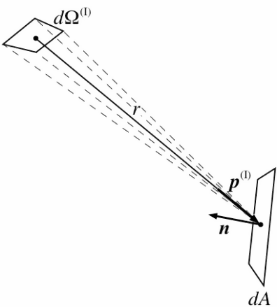

Figure 90. Irradiance geometry

which allows one to express the transmittance of exterior radiation to produce the total outgoing radiance from the fenestration into the room in a particular direction:

<div>$$S({{\bf{p}}^{{\rm{(T)}}}}) = \int\limits_{{\Omega ^{{\rm{(I)}}}}} {{\mathop{\rm T}\nolimits} ({{\bf{p}}^{{\rm{(T)}}}},{{\bf{p}}^{{\rm{(I)}}}}){S^{{\rm{(I)}}}}({{\bf{p}}^{{\rm{(I)}}}})\left( { - {{\bf{p}}^{{\rm{(I)}}}}\cdot {\bf{n}}} \right)d{\Omega ^{{\rm{(I)}}}}} $$</div>

The negative sign is added to account for the fact that ***p***<sup>(I)</sup> and ***n*** have opposite sign for incoming radiation.

The radiance in equation is emitted from the back side of the element of area shown in Figure 90.  Considering a second surface, viewing the back side of the fenestration system, we can use equation to calculate the irradiance on surface 2,

<div>$${E^{{\rm{(2)}}}}({{\bf{p}}^{{\rm{(T)}}}})d{A^{{\rm{(2)}}}} = {S^{{\rm{(T)}}}}({{\bf{p}}^{{\rm{(T)}}}})\left( { - {{\bf{p}}^{{\rm{(T)}}}}\cdot {{\bf{n}}^{{\rm{(2)}}}}} \right)d{\Omega ^{{\rm{(I,2)}}}}d{A^{{\rm{(2)}}}}$$</div>

This expression, however, contains a number of new quantities, such as <span>\(d{\Omega ^{{\rm{(I,2)}}}}\)</span>, the element of solid angle for incoming radiation as seen from surface 2.  We can sort this out by referring to Figure 91 and making some changes and clarifications in notation.

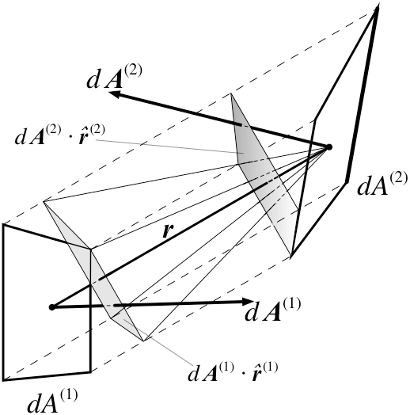

Figure 91. Radiation exchange between two surface elements

In this figure we consider that surface 1 is the back side of the fenestration system, and surface 2 is some other surface in the room that receives the transmitted solar radiation through the fenestration system.  We consider infinitesimal elements *dA*<sup>(1)</sup> and *dA*<sup>(2)</sup> of the two surfaces, and define vector surface elements by *d**A*****<sup>(</sup>**<sup>1)</sup>=*dA*<sup>(1)</sup>***n***<sup>(1)</sup> and *d**A*****<sup>(</sup>**<sup>1)</sup>=*dA*<sup>(1)</sup>***n***<sup>(1)</sup>.  The quantity ***r*** in the figure denotes a vector pointing from surface 1 to surface 2, the magnitude of which is the distance *r* between the two surface elements.  This is used to define two unit vectors: <span>\({{\bf{\hat r}}^{{\rm{(1)}}}} = {{\bf{r}} \mathord{\left/ {\vphantom {{\bf{r}} r}} \right. } r}\)</span> is a unit vector pointing from surface element 1 to surface element 2, and <span>\({{\bf{\hat r}}^{{\rm{(2)}}}} =  - {{\bf{r}} \mathord{\left/ {\vphantom {{\bf{r}} r}} \right. } r}\)</span> is a unit vector pointing from surface element 2 back to surface element 1.  The unit vector ***p***<sup>(T)</sup> in equation is in fact <span>\({{\bf{\hat r}}^{{\rm{(1)}}}}\)</span>.  The shaded quadrilaterals in the figure are the projected area elements normal to ***r***.  Since the areas are infinitesimal, all the radiation leaving one surface element and arriving at the other will be in the direction ***r***, so that all radiation will be contained within the parallelepiped defined by the dashed lines (parallel to ***r***) joining the corners of the two surface elements.  It follows that the area *dA*<sup>(2)</sup>  is not independent of *dA*<sup>(1)</sup>.  The figure also shows the solid angle that has been denoted *d*W<sup>(I,2)</sup> above, which is the solid angle subtended by *dA*<sup>(1)</sup> as seen from *dA*<sup>(2)</sup> and is given by

<div>$$d{\Omega ^{{\rm{(I,2)}}}} = \frac{{d{{\bf{A}}^{{\rm{(1)}}}} \cdot {{\bf{r}}^{{\rm{(1)}}}}}}{{{r^2}}}$$</div>

The net power from surface element 1 to surface element 2 is

<div>$${W^{(1 \to 2)}} = \left( {{S^{{\rm{(1)}}}}({{{\bf{\hat r}}}^{{\rm{(1)}}}}) - {S^{{\rm{(2)}}}}({{{\bf{\hat r}}}^{{\rm{(2)}}}})} \right)\frac{{\left( {d{{\bf{A}}^{{\rm{(1)}}}} \cdot {{{\bf{\hat r}}}^{{\rm{(1)}}}}} \right)\left( {d{{\bf{A}}^{{\rm{(2)}}}} \cdot {{{\bf{\hat r}}}^{{\rm{(2)}}}}} \right)}}{{{r^2}}}$$</div>

where <span>\({S^{{\rm{(1)}}}}({{\bf{\hat r}}^{{\rm{(1)}}}})\)</span> is the radiance leaving surface element 1 in the direction of surface element 2, and vice-versa for <span>\({S^{{\rm{(2)}}}}({{\bf{\hat r}}^{{\rm{(2)}}}})\)</span>.  In this case, the latter is zero and the former is the quantity called *S*<sup>(T)</sup>(***p***<sup>(T)</sup>) above.  Given equation , we can recognize the quantity multiplying the radiance as the solid angle *d*W<sup>(I,2)</sup> times the projected area of surface element 2 perpendicular to ***r***.  But the expression is symmetrical in the two surface elements, so we could also express it as

<div>$${W^{(1 \to 2)}} = {S^{{\rm{(T)}}}}({{\bf{p}}^{{\rm{(T)}}}})\left( {d{{\bf{A}}^{{\rm{(1)}}}} \cdot {{{\bf{\hat r}}}^{{\rm{(1)}}}}} \right)d{\Omega ^{{\rm{(T)}}}}$$</div>

where

<div>$$d{\Omega ^{{\rm{(T)}}}} = \frac{{\left( {d{{\bf{A}}^{{\rm{(2)}}}} \cdot {{{\bf{\hat r}}}^{{\rm{(2)}}}}} \right)}}{{{r^2}}}$$</div>

The superscript (T) is used here because the solid angle element pertains to the direction ***p***<sup>(T)</sup>.  In the particular case under discussion that restricts attention to those directions for which the outgoing radiation strikes surface element 2.  We can now rewrite equation as

<div>$${E^{{\rm{(2)}}}}({{\bf{p}}^{{\rm{(T)}}}})d{A^{{\rm{(2)}}}} = {S^{{\rm{(T)}}}}({{\bf{p}}^{{\rm{(T)}}}})\left( {{{\bf{n}}^{{\rm{(1)}}}} \cdot {{{\bf{\hat r}}}^{{\rm{(1)}}}}} \right)d{\Omega ^{{\rm{(T)}}}}d{A^{{\rm{(1)}}}}$$</div>

and since, as can readily be seen from Figure 91, <span>\(\left( {d{{\bf{A}}^{{\rm{(1)}}}} \cdot {{{\bf{\hat r}}}^{{\rm{(1)}}}}} \right) = \left( {d{{\bf{A}}^{{\rm{(2)}}}} \cdot {{{\bf{\hat r}}}^{{\rm{(2)}}}}} \right)\)</span>, this becomes

<div>$${E^{{\rm{(2)}}}}({{\bf{p}}^{{\rm{(T)}}}}) = {S^{{\rm{(T)}}}}({{\bf{p}}^{{\rm{(T)}}}})\left( { - {{\bf{p}}^{{\rm{(T)}}}} \cdot {{\bf{n}}^{{\rm{(2)}}}}} \right)d{\Omega ^{{\rm{(T)}}}}$$</div>

Substituting equation for *S*<sup>(T)</sup>(***p***<sup>(T)</sup>, we obtain a propagation equation for outside radiation passing through the window and arriving at surface element 2:

<div>$$
    E^{(2)}(\bf{p}^{(T)}) = \int_{\Omega^{(I)}} 
      \rm T (\bf{p}^{(T)},\bf{p}^{(I)}) 
      S^{(I)}(\bf{p}^{(I)})(-\bf{p}^{(I)}\cdot\bf{n}^{(I)})
      d\Omega^{(I)}(-\bf{p}^{(T)}\cdot\bf{n}^{(2)})d\Omega^{(T)}
$$</div>

or, in terms involving only irradiance,

<div>$${E^{{\rm{(2)}}}}({{\bf{p}}^{{\rm{(T)}}}}) = \int\limits_{{\Omega ^{{\rm{(I)}}}}} {{\mathop{\rm T}\nolimits} ({{\bf{p}}^{{\rm{(T)}}}},{{\bf{p}}^{{\rm{(I)}}}})E({{\bf{p}}^{{\rm{(I)}}}})d{\Omega ^{{\rm{(I)}}}}} \left( { - {{\bf{p}}^{{\rm{(T)}}}} \cdot {{\bf{n}}^{{\rm{(2)}}}}} \right)d{\Omega ^{{\rm{(T)}}}}$$</div>

Comparing these two equations with equations and , we can see that physically they represent the processes of (a) propagation of radiation outgoing at one surface (initially, the sky “surface”), where it is characterized by radiance, to incidence on a second surface, characterized by irradiance, followed (b) transmittance, which converts incoming radiation traveling in a given direction to outgoing radiation in a different set of directions, characterized again by radiance.  We can make the former of these processes explicit by defining a propagation function.  Considering the first surface element to be located at a position specified by the vector ***x***<sup>(1)</sup> and the second at ***x***<sup>(2)</sup>, then radiation leaving surface 1 in a direction ***p***<sup>(1)</sup> and arriving at surface 2 in a direction ***p***<sup>(2)</sup> produces an irradiance given by

<div>$${E^{(2)}}({{\bf{p}}^{{\rm{(2)}}}}) = \int {L({{\bf{x}}^{{\rm{(2)}}}},{{\bf{p}}^{{\rm{(2)}}}};{{\bf{x}}^{{\rm{(1)}}}},{{\bf{p}}^{{\rm{(1)}}}}){S^{{\rm{(1)}}}}({{\bf{p}}^{{\rm{(1)}}}})} d{\Omega ^{{\rm{(1)}}}}$$</div>

where the propagation function L is defined by

<div>$$L({{\bf{x}}^{{\rm{(2)}}}},{{\bf{p}}^{{\rm{(2)}}}};{{\bf{x}}^{{\rm{(1)}}}},{{\bf{p}}^{{\rm{(1)}}}}) = \left( { - {{\bf{p}}^{{\rm{(2)}}}}\cdot {{\bf{n}}^{{\rm{(2)}}}}} \right)d{\Omega ^{{\rm{(2)}}}}\delta ({{\bf{p}}^{{\rm{(2)}}}},{{\bf{p}}^{{\rm{(1)}}}})\delta ({{\bf{x}}^{{\rm{(2)}}}},{{\bf{x}}^{{\rm{(1)}}}} + {\bf{r}})$$</div>

The spatial dependence is inserted to guarantee that the geometrical relations in Figure 91 are preserved.  The delta functions in direction and spatial vectors are the mathematically standard d-distributions defined so that

<div>$$\int {\delta ({{\bf{p}}^{{\rm{(2)}}}},{{\bf{p}}^{{\rm{(1)}}}})} f({{\bf{p}}^{{\rm{(1)}}}})d{\Omega ^{{\rm{(1)}}}} = f({{\bf{p}}^{{\rm{(2)}}}})$$</div>

<div>$$\int\limits_\Omega  {\delta ({{\bf{p}}^{{\rm{(2)}}}},{{\bf{p}}^{{\rm{(1)}}}})d{\Omega ^{{\rm{(1)}}}}}  = \left\{ {\begin{array}{*{20}{c}}1&{{{\bf{p}}^{{\rm{(2)}}}} \in \Omega }\\0&{{{\bf{p}}^{{\rm{(2)}}}} \notin \Omega }\end{array}} \right.$$</div>

<div>$$\int {\delta ({{\bf{x}}^{{\rm{(2)}}}},{{\bf{x}}^{{\rm{(1)}}}})} f({{\bf{x}}^{{\rm{(1)}}}})d{A^{{\rm{(1)}}}} = f({{\bf{x}}^{{\rm{(2)}}}})$$</div>

<div>$$\int\limits_A {\delta ({{\bf{x}}^{{\rm{(2)}}}},{{\bf{x}}^{{\rm{(1)}}}})d{A^{{\rm{(1)}}}}}  = \left\{ {\begin{array}{*{20}{c}}1&{{{\bf{x}}^{{\rm{(2)}}}} \in A}\\0&{{{\bf{x}}^{{\rm{(2)}}}} \notin A}\end{array}} \right.$$</div>

for an arbitrary function *f*.  [In equations and the integration is assumed to be over all possible values of either direction or position, so that the vectors ***p***<sup>(2)</sup> and ***x***<sup>(2)</sup> are necessarily within the domain of integration.]

###### Physical Caveats

In equations and the functions T and R pertain to the overall glazing system, and are assumed to be averaged over both wavelength and polarization with appropriate weightings.  [EnergyPlus considers wavelength only in that it distinguishes between radiation in the longwave thermal IR region and in the shortwave solar/visible region.  (In considering daylighting, there is a further limitation to the visible region.)  In this discussion we are concerned solely with the shortwave solar/visible region.]  While fenestration properties may depend on both wavelength and polarization, for externally incident radiation this dependence is taken into account in the calculation and averaging of T and R.  However, both the wavelength distribution (within the solar region) and the polarization state of the outgoing radiation will generally be different from that of the incident radiation.  This is not a feature peculiar to non-specular fenestration systems; it is also true of specular ones, and may in fact be more important there.  For most interior surfaces, where the radiation is either absorbed or diffusely reflected (and where both processes are assumed wavelength and polarization independent), this is of no importance, but in the case of either interior windows or the back-reflectance from exterior windows, it could in principle cause errors, unless proper account is taken in specifying T and R for these cases.

###### Discretization: The LBNL Method

A series of 6 papers (Papamichael, Klems et al. 1988; Klems 1994A; Klems 1994B; Klems and Warner 1995; Klems and Kelley 1996; Klems, Warner et al. 1996) formulated the LBNL method of characterizing scattering fenestration systems.  The relevant aspects of that method will be summarized here.  This method has been incorporated into the WINDOW (from LBNL 2012) computer program.

The method begins by approximating the integrals in equations and by finite sums.  It does this by defining a set of finite solid angle elements {<span>\(\Delta {\Omega_i} \)</span>} that covers the relevant solid angle hemisphere (whether incident, transmitted or reflected directions).  Each solid angle element is characterized by a direction ***p****<sub>i</sub>*, and it is assumed that this may be substituted for any direction within the solid angle element.  This set of solid angle elements and corresponding directions is termed a basis.  Note that, since ***p****<sub>i</sub>* is a two-dimensional vector, enumerating the solid angle elements with a single index *i* implicitly includes specifying an ordering of the direction vectors.  Equation then becomes

<div>$$S({{\bf{p}}_j}^{{\rm{(T)}}}) = \sum\limits_i {{\mathop{\rm T}\nolimits} ({{\bf{p}}_j}^{{\rm{(T)}}},{{\bf{p}}_i}^{{\rm{(I)}}}){S^{{\rm{(I)}}}}({{\bf{p}}_i}^{{\rm{(I)}}})\left( { - {{\bf{p}}_i}^{{\rm{(I)}}}\cdot {\bf{n}}} \right)\Delta {\Omega_i}^{{\rm{(I)}}}} $$</div>

and equation becomes

<div>$${E^{(2)}}({{\bf{p}}_j}^{{\rm{(2)}}}) = \sum\limits_i {\int\limits_{\Delta {\Omega_i}} {L({{\bf{x}}^{{\rm{(2)}}}},{{\bf{p}}_j}^{{\rm{(2)}}};{{\bf{x}}^{{\rm{(1)}}}},{{\bf{p}}_i}^{{\rm{(1)}}}){S^{{\rm{(1)}}}}({{\bf{p}}_i}^{{\rm{(1)}}})d{\Omega ^{{\rm{(1)}}}}} } $$</div>

Referring to the definition of the propagation function in equation and properties of the d-distribution in equation , we see that the integrals in the summation will all be zero, except when ***p****<sub>j</sub>*<sup>(2)</sup> is contained in the solid angle element DW*<sub>i</sub>*.  In that case the integration produces ***p****<sub>i</sub>*<sup>(1)</sup>= ***p****<sub>j</sub>*<sup>(2)</sup>.  We can retain the formal summation by utilizing the finite-dimensional form of the d-distribution, known as the Kronicker delta, d*<sub>ij</sub>*:

<div>$${\delta_{ij}} = \left\{ {\begin{array}{*{20}{c}}1&{i = j}\\0&{i \ne j}\end{array}} \right.$$</div>

Then the integral becomes

<div>$$\int\limits_{\Delta {\Omega_i}} {L({{\bf{x}}^{{\rm{(2)}}}},{{\bf{p}}_j}^{{\rm{(2)}}};{{\bf{x}}^{{\rm{(1)}}}},{{\bf{p}}_i}^{{\rm{(1)}}}){S^{{\rm{(1)}}}}({{\bf{p}}_i}^{{\rm{(1)}}})d{\Omega ^{{\rm{(1)}}}}}  = \lambda ( - {{\bf{p}}_j}^{{\rm{(2)}}}){\delta_{ij}} \cdot \delta ({{\bf{x}}^{{\rm{(2)}}}},{{\bf{x}}^{{\rm{(1)}}}} + {\bf{r}})$$</div>

where the function *l* is defined as

<div>$${\lambda ^{{\rm{(s)}}}}({{\bf{p}}_j}) = \left( {{{\bf{p}}_j}\cdot {{\bf{n}}^{{\rm{(s)}}}}} \right)\Delta {\Omega_j}$$</div>

and the superscript (s) refers to the surface.

The LBNL method, which focuses on glazing systems consisting of plane-parallel layers, makes particular assumptions that allow one to ignore the spatial dependence of L.  Since the only effect of the function <span>\(\delta ({{\bf{x}}^{{\rm{(2)}}}},{{\bf{x}}^{{\rm{(1)}}}} + {\bf{r}})\)</span> in equation is to require that if the expression is formally integrated over two separate surface areas, only the parts of the integration that satisfy the geometric constraints will contribute (in effect, the integration is over only one of the surfaces), we will drop the spatial dependence in the present discussion and replace it later when we consider the total energy transfer between different surfaces.

Equations (without the delta distribution in ***x***) and are then considered to define the components of a diagonal matrix,

<div>$$\begin{array}{*{20}{c}}{{\bf{\Lambda }^{{\rm{(s)}}}} = \left( {{\Lambda ^{{\rm{(s)}}}}_{ij}} \right)}&{{\rm{where}}}&{\Lambda_{ij}^{{\rm{(s)}}} = \left( {{{\bf{p}}_j}\cdot {{\bf{n}}^{{\rm{(s)}}}}} \right)\Delta {\Omega_j}{\delta_{ij}}}\end{array}$$</div>

Considering the radiance in the various basis directions to be the components of a vector,

<div>$$
  \bf{S} = \left( 
    \begin{array}
      S_1 \\ ... \\ S_j \\ ...
    \end{array}
  \right)
  \text{where}
  S_j = S(\bf{p}_j)
$$</div>
  
equation becomes

<div>$$\begin{array}{*{20}{c}}{{S^{{\rm{(T)}}}}_j = \sum\limits_i {{T_{ji}}} \sum\limits_k {{\Lambda_{ik}}} {S_k}}&{{\rm{where}}}&{{T_{ji}} = {\mathop{\rm T}\nolimits} ({{\bf{p}}_j}^{{\rm{(T)}}},{{\bf{p}}_i}^{{\rm{(I)}}})}\end{array}$$</div>

which has the obvious character of a series of matrix multiplications.  (Note that the superscript (T) here means transmitted, not the matrix operation transpose.)  Similarly, the reflectance matrix elements are

<div>$${R_{ij}} = {\mathop{\rm R}\nolimits} ({{\bf{p}}^{{\rm{(R)}}}},{{\bf{p}}^{{\rm{(I)}}}})$$</div>

The method then identifies the infinitesimal directional irradiances in equation with the components of an irradiance vector,

<div>$$
  E = \left( 
    \begin{array}
      E_1 \\ ... \\ E_i \\ ...
    \end{array}
  \right)
  \text{where}
  E_i = \frac{dE(\bf{p}_j)}{d\Omega}
$$</div>

and equations - can be rewritten as matrix equations,

<div>$${{\bf{S}}^{{\rm{(T)}}}} = {\bf{T}} \cdot {{\bf{E}}^{{\rm{(I)}}}}$$</div>

<div>$${{\bf{S}}^{{\rm{(R)}}}} = {\bf{R}} \cdot {{\bf{E}}^{{\rm{(I)}}}}$$</div>

<div>$${{\bf{E}}^{{\rm{(I)}}}}{\bf{ = }}{\bf{\Lambda }^{{\rm{(I)}}}} \cdot {{\bf{S}}^{{\rm{(I)}}}}$$</div>

<div>$${{\bf{S}}^{{\rm{(T)}}}}{\bf{ = T}} \cdot {\bf{\Lambda }^{{\rm{(I)}}}} \cdot {{\bf{S}}^{{\rm{(I)}}}}$$</div>

(These are for radiation incident on the front surface of the fenestration; there is a similar set of equations for radiation incident on the back surface and propagating in an opposite sense to that in the above equations.)

In the LBNL method, these equations are used extensively to calculate the overall properties of a fenestration system from those of its component layers.  Here we will assume that the components of the system property matrices are given at input.  These may be from a calculation by WINDOW or determined by some other method.  The quantities needed for each fenestration are:

Table 34: Fenestration properties needed for the calculation


Exterior Window

<div>$$T_{ij}^F$$</div>

Front Transmittance  matrix elements

<div>$$R_{ij}^F$$</div>

Back Reflectance matrix elements

<div>$${\mathop{\rm A}\nolimits}_i^{F,n}$$</div>

In-situ absorptance of n<sup>th</sup> layer for front incidence

<div>$${\mathop{\rm A}\nolimits}_i^{B,n}$$</div>

In-situ absorptance of n<sup>th</sup> layer for back incidence


Interior Window

<div>$$T_{ij}^F$$</div>

Front Transmittance matrix elements

<div>$$T_{ij}^B$$</div>

Back Transmittance matrx elements

<div>$$R_{ij}^F$$</div>

Front Reflectance matrix elements

<div>$$R_{ij}^B$$</div>

Back Reflectance matrix elements

<div>$${\mathop{\rm A}\nolimits}_i^{F,n}$$</div>

In-situ absorptance of n<sup>th</sup> layer for front incidence

<div>$${\mathop{\rm A}\nolimits}_i^{B,n}$$</div>

In-situ absorptance of n<sup>th</sup> layer for back incidence


The transmittance and reflectance are overall system properties.  (For daylighting calculations, one also needs the transmittance and reflectance averaged over the visible spectrum only; the quantities indicated in the table pertain to the entire solar spectrum.)  For the optical calculations we do not need to know anything about the individual layers making up the fenestration.  However, the thermal calculation of heat flow through the fenestration requires knowledge of the amount of radiation absorbed in each of the fenestration layers.  As indicated in the table, we therefore need the in-situ layer absorptance for each layer, referenced to the incident surface.  This is denoted <span>\({\mathop{\rm A}\nolimits}_i^{F,n}\)</span> for the fraction of the *i<sup>th</sup>* component of the irradiance incident on the front surface of the fenestration that is absorbed in layer *n*, with a similar quantity, <span>\({\mathop{\rm A}\nolimits}_i^{B,n}\)</span>, for irradiance incident on the back surface.  The term “in-situ layer absorptance” is used because these are not simply the absorptance of the layer, but include the transmittance and interreflection by other layers of the system prior to the absorptance in layer *n*.  The absorptance is a row vector, having possibly a different value for each direction of the incident irradiance, so that for an irradiance *E<sub>i</sub><sup>F</sup>* on the front surface of a fenestration and *E<sub>i</sub><sup>B</sup>* on the back surface, the power *Q<sup>n</sup>* absorbed per unit area in layer *n* would be

<div>$${Q^n} = \sum\limits_i {{\mathop{\rm A}\nolimits}_i^{F,n}E_i^F}  + \sum\limits_j {{\mathop{\rm A}\nolimits}_j^{B,n}E_j^B} $$</div>

(In the vector/matrix language, <span>\({Q^n} = {\bf{A}^{F,n}} \cdot {{\bf{E}}^F} + {\bf{A}^{B,n}} \cdot {{\bf{E}}^B}\)</span>)

###### Bases and Coordinate Systems

The introduction of a basis or multiple bases is a bit more complicated than indicated in the text preceding equation .  There for transmission we need coordinates describing incoming radiation on one surface of the physical layer and outgoing radiation at the second (opposite) surface, while reflection adds the need for coordinates describing outgoing radiation at the first surface.  Back transmittance and reflectance add the requirement for coordinates describing incoming radiation at the second surface.  The usual way of assigning coordinates to radiation involves specifying its line of propagation relative to the local surface normal. This means that there are separate coordinate systems for the first and second surfaces, and that, moreover, the description is different for incoming and outgoing radiation: for incoming radiation one is specifying a unit vector pointing toward the source of the radiation (*i*.*e*., antiparallel to the direction of propagation), while for outgoing radiation one is specifying a unit vector in the direction of propagation of the radiation.  In principle, then, one needs four coordinate systems or bases (for each physical layer), and the process of transmission or reflection involves a discontinuous transition between an input basis and an output basis.

The LBNL method used by WINDOW uses a particular choice of coordinate systems in which incoming radiation at the first surface and outgoing radiation at the second are described by one coordinate system, while the same coordinate system reflected through the layer is used to describe incoming radiation at the second surface and outgoing radiation at the first.  The reason for this choice is that it greatly simplifies the matrix representations: specular transmittance or reflectance is always represented by a diagonal matrix, one can mix matrices representing forward or backward incidence processes, and all of the coordinate systems have propagation matrices with the same representation, so in effect there is one *L* matrix rather than four.

The point of this discussion is that the components of the transmittance and reflectance matrices, and the layer absorptance vectors, depend on the definition of these four bases.  If they were generated by WINDOW, then they assume the particular coordinate system described above.  (If they were produced by some other means, they may be specified in yet some other coordinate system.)  While the LBNL coordinate system gives an intuitive description of outgoing radiation, as a description of incoming radiation it is very unintuitive.  And in any case, the coordinate system is different from that of EnergyPlus.  It will be necessary to translate the matrices and vectors into the correct EnergyPlus coordinate system.

###### Matching the WINDOW6 Calculation to EnergyPlus

It is useful to have some sense of how well the basis normally used in WINDOW calculations matches the requirements of EnergyPlus.  In using a BSDF window, a user would presumably be interested in the directionality of the transmitted radiation; if the size of the solid angle bins in the basis is large compared to the solid angle subtended by the typical surface in a zone, then that directional information will be lost.  On the other hand, if the bins are very small compared to this solid angle, then (since EnergyPlus does not consider the spatial variations within a surface) the directions are being oversampled.  Since the calculation time will be proportional to the number of matrix elements, which is the square of the number of basis directions, oversampling is to be avoided.

Because of the great variety of buildings that may be modeled with EnergyPlus, and because the user has control over the basis for the BSDF properties, it is not possible to answer this question in a definitive way.  Here we consider the effect of the normal WINDOW basis in a typical perimeter office space, 10 ft wide, 15 ft deep and 11 ft high.  It is assumed to have a window 9 ft wide by 6 ft high, with the sill height 3 ft.  The window is placed to have a 4 in inner reveal.

The normal WINDOW “full” basis has 145 output directions.  Figure 92 shows how the window and the solid angle bin project onto the inner surfaces for three of those directions.  In each case the solid angle bin is projected from the window center, and the window edges are projected along the central ray.

In general, the basis appears to be reasonably matched to the calculation, with neither a loss of angular detail nor great oversampling.


Figure 92. Transmitted Radiation in Three Directions for a Perimeter Office.  (a) q=0º; (b) q=40º, f=15º; (c) q=70º, f=67.5º.  q and f are the normal spherical angle coordinates in a right-handed coordinate system where y points up and z is normal to the window p

###### Complex Fenestrations in EnergyPlus

Exterior

EnergyPlus models the exterior radiance in two parts, a moving sun radiance <span>\({S^{{\rm{(Sun)}}}}(t)\Delta {\Omega ^{{\rm{(Sun)}}}}\)</span> and a constant-shape direction-dependent sky radiance <span>\({S^{{\rm{(Sky)}}}}({\bf{p}},t)\)</span>.  The intensities of these vary with time.  For the solar radiation there is a single sky radiance model.  For daylight calculations the treatment is similar for exterior luminance, except that there are a number of user-selectable sky luminance models.  Here we will discuss radiance; the treatment of luminance is analogous.

The direct normal solar intensity (at a given time) is

<div>$${I^{{\rm{(D)}}}}(t) = {S^{{\rm{(Sun)}}}}(t)\Delta {\Omega ^{{\rm{(Sun)}}}}$$</div>

and if we let

<div>$${S^{{\rm{(Sky)}}}}({\bf{p}},t) = {I^{{\rm{(Sky)}}}}(t)s({\bf{p}})$$</div>

where the shape function for the sky radiance model, *s*, is defined so that

<div>$$\int\limits_{2\pi } {s({\bf{p}})d\Omega }  = 1$$</div>

then the global solar irradiance on a horizontal surface at a given time is

<div>$${I^{{\rm{(G)}}}}(t) = {I^{{\rm{(Sky)}}}}(t)\left( {1 - \int\limits_{\Delta {\Omega ^{{\rm{(Sun)}}}}} {s({\bf{p}})d\Omega } } \right) + {I^{{\rm{(D)}}}}(t)\cos {\theta ^{{\rm{(Sun)}}}}(t)$$</div>

It must be understood that in equation the integration region 2p means integration over the sky hemisphere, and that *s(**p**)* is zero for upward-going directions.

With the sky radiance shape *s(**p**)* specified in the EnergyPlus code, the angular size of the sun <span>\(\Delta {\Omega ^{{\rm{(Sun)}}}}\)</span> known, and the solar zenith angle <span>\({\theta ^{{\rm{(Sun)}}}}(t)\)</span> calculated in the code, the two hourly input quantities *I*<sup>(D*)*</sup>*(t)* and *I*<sup>(G)</sup>*(t)* determine the exterior radiance for any given hour.

In this context, the transmitted radiance for a complex fenestration system given in equation becomes

<div>$$\begin{array}{c}S({{\bf{p}}^{{\rm{(T)}}}}) = {I^{({\bf{Sky}})}}(t)\int\limits_{{\Omega ^{{\rm{(Sky)}}}}} {{\mathop{\rm T}\nolimits} ({{\bf{p}}^{{\rm{(T)}}}},{{\bf{p}}^{{\rm{(I)}}}})s({{\bf{p}}^{{\rm{(I)}}}})\left( { - {{\bf{p}}^{{\rm{(I)}}}}\cdot {\bf{n}}} \right)d{\Omega ^{{\rm{(I)}}}}} \\ + \int\limits_{{\Omega ^{{\rm{(Gnd)}}}}} {{\mathop{\rm T}\nolimits} ({{\bf{p}}^{{\rm{(T)}}}},{{\bf{p}}^{{\rm{(I)}}}}){S^{{\rm{(Gnd)}}}}({{\bf{p}}^{{\rm{(I)}}}},t)\left( { - {{\bf{p}}^{{\rm{(I)}}}}\cdot {\bf{n}}} \right)d{\Omega ^{{\rm{(I)}}}}} \\ + H\left( {\Delta {\Omega ^{{\rm{(Sun)}}}}(t) \not\subset {\Omega ^{{\rm{(Sf)}}}}} \right)\int\limits_{\Delta {\Omega ^{{\rm{(Sun)}}}}(t)} {{\mathop{\rm T}\nolimits} ({{\bf{p}}^{{\rm{(T)}}}},{{\bf{p}}^{{\rm{(I)}}}}){S^{{\rm{(Sun)}}}}({{\bf{p}}^{{\rm{(I)}}}},t)\left( { - {{\bf{p}}^{{\rm{(I)}}}}\cdot {\bf{n}}} \right)d{\Omega ^{{\rm{(I)}}}}} \\ + \int\limits_{{\Omega ^{{\rm{(Sf)}}}}} {{\mathop{\rm T}\nolimits} ({{\bf{p}}^{{\rm{(T)}}}},{{\bf{p}}^{{\rm{(I)}}}}){S^{{\rm{(Refl)}}}}({{\bf{p}}^{{\rm{(I)}}}},t)\left( { - {{\bf{p}}^{{\rm{(I)}}}}\cdot {\bf{n}}} \right)d{\Omega ^{{\rm{(I)}}}}} \end{array}$$</div>

where the incoming hemisphere viewed by the fenestration has been broken up into four parts.  The viewed sky (excluding the part containing the sun) is <span>\({\Omega ^{{\rm{(Sky)}}}}\)</span>, the viewed ground is <span>\({\Omega ^{{\rm{(Gnd)}}}}\)</span>, the part subtended by the sun is DW<sup>(Sun)</sup>, and the part subtended by one or more exterior surfaces (shading or reflecting objects) is W<sup>(Sf)</sup>.  These solid angles must exclude the exterior surfaces.  The symbol *H* represents a Helmholtz function: Its value is one if its logical argument is true, zero otherwise.  It has been inserted into the equation to account for those times when the sun is behind an exterior object.  Where there are multiple exterior shading or reflecting objects, W<sup>(Sf)</sup> may consist of several regions that may be disjoint or connected, depending on the exterior geometry.  As indicated in the equation, DW<sup>(Sun)</sup> is time-dependent, to account for the sun’s movement; W<sup>(Gnd)</sup> and W<sup>(Sf)</sup>  are fixed, but as written <span>\({\Omega ^{{\rm{(Sky)}}}}\)</span> has a time dependence induced by the exclusion of the solid angle subtended by the sun.  So that we can discuss the parts separately, we break the outgoing radiance down by source:

<div>$$S({{\bf{p}}^{{\rm{(T)}}}}) = {S^{{\rm{(Sky)}}}}({{\bf{p}}^{{\rm{(T)}}}}) + {S^{{\rm{(Gnd)}}}}({{\bf{p}}^{{\rm{(T)}}}}) + {S^{{\rm{(Sun)}}}}({{\bf{p}}^{{\rm{(T)}}}}) + {S^{{\rm{(Sf)}}}}({{\bf{p}}^{{\rm{(T)}}}})$$</div>

By subtracting the radiation from the part of the sky hidden by the sun from <span>\({S^{{\rm{(Sun)}}}}\)</span> and adding it back into *S*<sup>(Sky)</sup> we can remove the time dependence of W<sup>(Sky)</sup>:

<div>$$\begin{array}{c}{S^{{\rm{(Sun)}}}}({{\bf{p}}^{{\rm{(T)}}}}) = H\left( {\Delta {\Omega ^{{\rm{(Sun)}}}}(t) \not\subset {\Omega ^{{\rm{(Sf)}}}}} \right)\\ \times \int\limits_{\Delta {\Omega ^{{\rm{(Sun)}}}}(t)} {{\mathop{\rm T}\nolimits} ({{\bf{p}}^{{\rm{(T)}}}},{{\bf{p}}^{{\rm{(I)}}}})\left[ {{S^{{\rm{(Sun)}}}}({{\bf{p}}^{{\rm{(I)}}}},t) - {I^{({\bf{Sky}})}}(t)s({{\bf{p}}^{{\rm{(I)}}}})} \right]\left( { - {{\bf{p}}^{{\rm{(I)}}}}\cdot {\bf{n}}} \right)d{\Omega ^{{\rm{(I)}}}}} \end{array}$$</div>

<div>$${S^{{\rm{(Sky)}}}}({{\bf{p}}^{{\rm{(T)}}}}) = {I^{({\bf{Sky}})}}(t)\int\limits_{{\Omega ^{{\rm{(Sky)}}}}} {{\mathop{\rm T}\nolimits} ({{\bf{p}}^{{\rm{(T)}}}},{{\bf{p}}^{{\rm{(I)}}}})s({{\bf{p}}^{{\rm{(I)}}}})\left( { - {{\bf{p}}^{{\rm{(I)}}}}\cdot {\bf{n}}} \right)d{\Omega ^{{\rm{(I)}}}}} $$</div>

Now in equation the integral is to be evaluated without regard to the sun position, and therefore <span>\({\Omega ^{{\rm{(Sky)}}}}\)</span> is time-independent.

We can further simplify equation by noting that the angular size of the sun is small, and both *s*(***p***<sup>(I)</sup>) and T(***p***<sup>(T)</sup>, ***p***<sup>(I)</sup>) can be considered as constant over the range of directions in DW<sup>(Sun)</sup>.  We can therefore evaluate them at the direction ***p***<sup>(Sun)</sup>(t) of the center of the sun and move them out of the integration, resulting in

<div>$${S^{{\rm{(Sun)}}}}({{\bf{p}}^{{\rm{(T)}}}}) = {\mathop{\rm T}\nolimits} ({{\bf{p}}^{{\rm{(T)}}}},{{\bf{p}}^{{\rm{(Sun)}}}})\left[ {{I^{{\rm{(D)}}}} - {I^{{\rm{(Sky)}}}}s({{\bf{p}}^{{\rm{(Sun)}}}})\Delta {\Omega ^{{\rm{(Sun)}}}}} \right]\cos {\theta ^{{\rm{(Sun)}}}}H\left( {{{\bf{p}}^{{\rm{(Sun)}}}} \not\subset {\Omega ^{{\rm{(Sf)}}}}} \right)$$</div>

In this equation we have dropped the explicit time dependence, but ***p***<sup>(Sun)</sup>, *q*<sup>(Sun)</sup>, *I*<sup>(D)</sup>, and *I*<sup>(Sky)</sup> are time-varying, while DW<sup>(Sun)</sup> is simply the constant angular size of the sun.

We separate the reflected radiance *S*<sup>(Sf)</sup> into separate components for each surface,

<div>$${S^{{\rm{(Sf)}}}} = \sum\limits_n {{S^{{\rm{(Sf, n)}}}}} $$</div>

The individual shading surface reflected radiances are then

<div>$${S^{{\rm{(Sf, n)}}}}({{\bf{p}}^{{\rm{(T)}}}}) = \int\limits_{{\Omega ^{{\rm{(Sf, n)}}}}} {{\mathop{\rm T}\nolimits} ({{\bf{p}}^{{\rm{(T)}}}},{{\bf{p}}^{{\rm{(I)}}}}){S^{{\rm{(Refl, n)}}}}({{\bf{p}}^{{\rm{(I)}}}},t)\left( { - {{\bf{p}}^{{\rm{(I)}}}}\cdot {\bf{n}}} \right)d{\Omega ^{{\rm{(I)}}}}} $$</div>

The solid angle of integration in this expression is subtended by the portion of the exterior reflecting surface *n* viewed by the fenestration; if one surface lies behind another, the hidden part of its surface is removed from the solid angle it subtends.  This is summarized by the requirement

<div>$$\begin{array}{l}{\Omega ^{{\rm{(Sf)}}}} = \bigcup\limits_n {{\Omega ^{{\rm{(Sf, n)}}}}} \\\bigcap\limits_n {{\Omega ^{{\rm{(Sf, n)}}}}}  = 0\end{array}$$</div>

(This requirement will need to be modified to handle the case of transmitting exterior surfaces.)

*S*<sup>(Refl,n)</sup> is time dependent because the incident radiation on the surface depends on the sun position. * *Equation must be evaluated after the exterior surface shading or reflectance calculations, in order to enforce the requirement that

<div>$${\Omega ^{{\rm{(Sky)}}}} \cap {\Omega ^{{\rm{(Sf)}}}} = 0$$</div>

Finally, the transmitted radiance from the ground-reflected exterior radiation is

<div>$${S^{{\rm{(Gnd)}}}}({{\bf{p}}^{{\rm{(T)}}}}) = \int\limits_{{\Omega ^{{\rm{(Gnd)}}}}} {{\mathop{\rm T}\nolimits} ({{\bf{p}}^{{\rm{(T)}}}},{{\bf{p}}^{{\rm{(I)}}}}){S^{{\rm{(Gnd)}}}}({{\bf{p}}^{{\rm{(I)}}}},t)\left( { - {{\bf{p}}^{{\rm{(I)}}}}\cdot {\bf{n}}} \right)d{\Omega ^{{\rm{(I)}}}}} $$</div>

Here, not only is there the requirement that

<div>$${\Omega ^{{\rm{(Gnd)}}}} \cap {\Omega ^{{\rm{(Sf)}}}} = 0$$</div>

but also the incident radiation on the ground may be affected by shading or reflection from exterior surfaces.  Since this is dependent on the sun position, *S*<sup>(Gnd)</sup> is time dependent, as indicated in equation .

Applying the discretization of the previous section and the definitions in equations -, we can rewrite equation as

<div>$${S_j}^{{\rm{(T,Sky)}}} = {I^{({\bf{Sky}})}}(t)\sum\limits_{i \in {\Omega ^{{\rm{(Sky)}}}}} {{T_{ji}}{\Lambda_{ii}}{s_i}} $$</div>

where

<div>$${s_i} = s({{\bf{p}}_i}^{{\rm{(I)}}})$$</div>

is the sky radiance shape factor evaluated at the central direction of the i<sup>th</sup> solid angle bin.  A “T” superscript has been added on the left-hand side of the equation to denote that *S* is the transmitted outgoing radiance (due to incident sky radiation for the fenestration under discussion).  The stipulation <span>\(i \in {\Omega ^{{\rm{(Sky)}}}}\)</span> on the summation means that the sum is to include only those solid angle elements for which the sky is viewed by the fenestration.  This is essentially a shading calculation, in addition to a restriction to downward-going incident directions.  We anticipate the result of this calculation by defining a sky geometric factor:

<div>$$
  V_i^{(Sky)} = \left\{
    \begin{array}
      1                      & \text{all of } \Delta\Omega_i \text{ views sky for all of fenestration} \\
      \text{viewed fraction} & \text{some of } \Delta\Omega_i \text{, fenestration views sky} \\
      0                      & \text{none of } \Delta\Omega_i \text{ views sky for any part of fenestration
$$</div>

Then we can carry out the summation over all downward directions and write

<div>$${S_j}^{{\rm{(T,Sky)}}} = {I^{({\bf{Sky}})}}(t)\sum\limits_{i{\rm{ }}down} {{T_{ji}}{\Lambda_{ii}}V_i^{{\rm{(Sky)}}}{s_i}} $$</div>

Similarly, equation becomes

<div>$${S_j}^{{\rm{(T, Sf, n)}}} = \sum\limits_{i{\rm{ }}down} {{T_{ji}}{\Lambda_{ii}}V_i^{{\rm{(Sf, n)}}}{S^{{\rm{(Refl, n)}}}}({{\bf{p}}_i}^{{\rm{(I)}}},t)} $$</div>

where *V<sub>i</sub>*<sup>(Sf,\\ n)</sup> is another geometric view factor, defined analogously to equation , giving the fraction of the solid angle <span>\(\Delta {\Omega_i}\)</span> that views the exterior surface *n*.  Note that

<div>$$V_i^{{\rm{(Sky)}}} + \sum\limits_{\rm{n}} {V_i^{{\rm{(Sf, n)}}}}  = 1$$</div>

The quantity <span>\(S^{(Refl,n)} (\bf{p}_i^{(I)},t)\)</span> is in fact the reflected radiance at a particular location on the n<sup>th</sup> exterior surface—the location where the direction ***p****<sub>i</sub>*<sup>(I)</sup> intersects the surface.  (This statement will become more precise when the spatial dependence dropped from equation is re-inserted.)  This surface is assumed to have either a diffuse reflectance *r*<sup>(n)</sup> or a specular reflectance *r*<sup>(sp,\\ n)</sup>.  (Both properties are possible simultaneously, but EnergyPlus assumes that an exterior surface is either diffusing or specular, but not both.)  The reflectance is assumed uniform over the surface, but the particular location (effectively, the image of the fenestration projected onto surface n) may or may not view the sky, or, at a particular time, the sun.  We denote the incident irradiance of the surface n by <span>\(E_i^n\)</span>.  This irradiance pertains only to the surface n (in the present EnergyPlus calculation) and is independent of the fenestration or its basis.  We attach the subscript i simply as a reminder that (2) the irradiance pertains to the portion of the surface that is viewed by the solid angle element <span>\(\Delta {\Omega_i}\)</span> of the fenestration f (which would become important if the EnergyPlus shading calculations were modified to relax the assumption of uniform incident irradiance on exterior surfaces) and that the irradiance pertains only to those surfaces n that are viewed by the solid angle element i.  For specularly reflecting surfaces, we make the following definitions: First, within the set of basis solid angles <span>\(\Delta {\Omega_i}\)</span>, let s(*t*) identify the one containing the sun direction at time *t*, and let r(*t*) identify the one containing the specular reflection direction of the sun at time *t*.  We then define a contingent direct beam irradiance, which we denote by <span>\(E_{i{\rm{ }}r(t)}^{(D,n)}\)</span>. This irradiance is non-zero only if <span>\(i = r(t)\)</span>this direction is such that i is the specularly reflected direction for the surface n.  If this is the case, then <span>\(E_{i=r(t)}^{(D,n)}\)</span> is the incident direct beam irradiance.  With this definition,

<div>$${S^{{\rm{(Refl, n)}}}}({{\bf{p}}_i}^{{\rm{(I)}}},t) = {\rho ^{{\rm{(sp, n)}}}}E_{i{\rm{ }}r(t)}^{(D,n)} + {\rho ^{{\rm{(n)}}}}E_i^n$$</div>

If we then define normalized irradiance factors *U* by <span>\(E_i^n = U_i^{(Sky,n)}{I^{(Sky)}}(t) + U_{i{\rm{ }}Sun(tsh)}^{(D,n)}{I^{(D)}}(t)\)</span> and <span>\(E_{i{\rm{ }}r(t)}^{(D,n)} = U_{i{\rm{ }}r(t)}^{(D,n)}{I^{(D)}}(t)\)</span>, where <span>\(U_{i{\rm{ }}Sun(tsh)}^{(D,n)}\)</span> denotes the fraction of the beam solar that irradiates the surface for a given sun direction.  It is evaluated during the shading calculation, as indicated by the notation *Sun(tsh)*.  With these definitions we can rewrite the equation as

<div>$$
  S^{(Refl,n)}(\bf{p}_i^{(I)},t) = 
  I^{(D)}(t) U_{i r(t)}^{(D,n)} \rho^{(sp,n)} +
  I^{(D)}(t) U_{i Sun(tsh)}^{(D,n)} \rho^{(n)} +
  I^{(sky)}(t) U_i^{(Sky,n)} \rho^{(n)}
$$</div>

and equation becomes, in terms of the incident irradiances,

<div>$${S_j}^{{\rm{(T, Sf, n)}}} = \sum\limits_{i{\rm{ }}down} {{T_{ji}}{\Lambda_{ii}}V_i^{{\rm{(Sf, n)}}}\left( {{\rho ^{{\rm{(sp, n)}}}}E_{i{\rm{ }}r(t)}^{(D,n)} + {\rho ^{{\rm{(n)}}}}E_i^n} \right)} $$</div>

and in terms of the normalized irradiance factors,

<div>$$\begin{array}{c}{S_j}^{{\rm{(T, Sf, n)}}} = \sum\limits_{i{\rm{ }}down} {{T_{ji}}{\Lambda_{ii}}V_i^{{\rm{(Sf, n)}}}{I^{{\rm{(D)}}}}(t)U_{i{\rm{ r(}}t{\rm{)}}}^{{\rm{(D,n)}}}{\rho ^{{\rm{(sp, n)}}}}} \\ + \sum\limits_{i{\rm{ }}down} {{T_{ji}}{\Lambda_{ii}}V_i^{{\rm{(Sf, n)}}}\left[ {{I^{{\rm{(D)}}}}(t)U_{i{\rm{ }}Sun(tsh)}^{{\rm{(D,n)}}}{\rho ^{{\rm{(n)}}}} + {I^{(Sky)}}(t)U_i^{{\rm{(Sky,n)}}}{\rho ^{{\rm{(n)}}}}} \right]} \end{array}$$</div>

The specularly reflected term can be removed from the sum, since only one value of i can contribute:

<div>$${S_j}^{{\rm{(T, Sf, n)}}} = {T_{j{\rm{ r(}}t{\rm{)}}}}{\Lambda_{{\rm{ r(}}t{\rm{) r(}}t{\rm{)}}}}V_{{\rm{ r(}}t{\rm{)}}}^{{\rm{(Sf, n)}}}E_{{\rm{ r(}}t{\rm{) r(}}t{\rm{)}}}^{{\rm{(D,n)}}}{\rho ^{{\rm{(sp, n)}}}} + {\rho ^{{\rm{(n)}}}}\sum\limits_{i{\rm{ }}down} {{T_{ji}}{\Lambda_{ii}}V_i^{{\rm{(Sf, n)}}}E_i^n} $$</div>

and

<div>$$\begin{array}{c}{S_j}^{{\rm{(T, Sf, n)}}} = {T_{j{\rm{ r(}}t{\rm{)}}}}{\Lambda_{{\rm{ r(}}t{\rm{) r(}}t{\rm{)}}}}V_{{\rm{ r(}}t{\rm{)}}}^{{\rm{(Sf, n)}}}U_{{\rm{ r(}}t{\rm{) r(}}t{\rm{)}}}^{{\rm{(D,n)}}}{I^{(D)}}(t){\rho ^{{\rm{(sp, n)}}}}\\ + {\rho ^{{\rm{(n)}}}}\sum\limits_{i{\rm{ }}down} {{T_{ji}}{\Lambda_{ii}}V_i^{{\rm{(Sf, n)}}}\left( {{I^{{\rm{(D)}}}}(t)U_{i{\rm{ }}Sun(tsh)}^{{\rm{(D,n)}}} + U_i^{(Sky,n)}{I^{(Sky)}}(t)} \right)} \end{array}$$</div>

which separates specular and diffuse reflectance from the exterior surfaces.

With respect to shading and reflection of exterior radiation into the fenestration, the exterior reveal surfaces can be treated as additional diffusely reflecting exterior surfaces.

Ground radiation is treated in the same way as radiation reflected from interior surfaces, except that one sums only over upward-going incident directions, and the ground is assumed to be diffusely reflecting.  The transmitted radiance from ground reflectance is

<div>$${S_j}^{{\rm{(T, Gnd)}}} = {\rho ^{{\rm{(Gnd)}}}}\sum\limits_{i{\rm{ }}up} {{T_{ji}}{\Lambda_{ii}}V_i^{{\rm{(Gnd)}}}E_i^{(Gnd)}} $$</div>

In this equation, the symbol <span>\(E_i^{(Gnd)}\)</span> is shorthand for a spatial calculation.  The solid angle region <span>\(\Delta {\Omega_i}\)</span> views (from various points over the fenestration area) some spatial region of the ground.  The symbol <span>\(E_i^{(Gnd)}\)</span> denotes the incident irradiance on the ground over this spatial region.  In the absence of shading, this would be simply <span>\({I^{(G)}} = {I^{(Sky)}} + {I^{(D)}}\cos {\theta_{Sun}}\)</span>; shading requires a more complex calculation.  Currently the EnergyPlus code does a Monte-Carlo calculation: rays are randomly generated from the window, when they strike the ground a calculation is made to determine whether that point receives direct solar radiation and what portion of the sky it views (reflected radiation from surfaces is neglected).  Here we would perform that calculation for each region of the ground i viewed by a basis solid angle element, instead of generating random rays from the window.  We denote the results of that calculation by <span>\(E_i^{(Gnd)} = U_{i{\rm{ }}Sun(tsh)}^{(D,Gnd)}{I^{(D)}}(t) + U_i^{(Sky,Gnd)}{I^{(Sky)}}(t)\)</span>, where the *U*’s are average viewing factors for the sun and sky, calculated as part of the shading calculation (which is indicated by the subscript *tsh*: *Sun(tsh)* is the sun direction as specified by the shading calculation.  This then gives

<div>$${S_j}^{{\rm{(T, Gnd)}}} = {\rho ^{{\rm{(Gnd)}}}}\sum\limits_{i{\rm{ }}up} {{T_{ji}}{\Lambda_{ii}}V_i^{{\rm{(Gnd)}}}\left( {U_{i{\rm{ }}Sun(tsh)}^{(D,Gnd)}{I^{(D)}}(t) + U_i^{(Sky,Gnd)}{I^{(Sky)}}(t)} \right)} $$</div>

The transmitted radiance from direct beam radiation is

<div>$${S_j}^{{\rm{(T, Sun)}}} = {T_{j{\rm{ s}}(t)}}\cos {\theta ^{{\rm{(Sun)}}}}{I^{{\rm{(D)}}}}(t)V_{i{\rm{ s(}}t{\rm{)}}}^{{\rm{(D)}}}$$</div>

This introduces yet one more geometric view factor: 

<div>$$
  V_{i s(t)}^(D)}
$$</div> 

is zero if the sun direction s*(t)* is not *i*; if *i*=s(*t*) it is the fraction of the fenestration area irradiated by the direct sun.  Equation uses the fact that the angular size of the sun is smaller than any basis solid angle element, and that EnergyPlus treats the sun and circumsolar region as a point source [hence the absence of the sky correction in equation ].

At this point we have developed separate expressions for a fenestration’s  transmitted radiance in a particular direction depending on the exterior source of the radiation.  These expressions utilize the discretized BTDF of the fenestration in the form of transmittance matrix elements over an angular basis.  The exterior geometry is re-expressed in the form of geometric view factors in this basis.  In the process, the explicit time dependence of the exterior radiation has been reduced to the time-varying direct and diffuse solar intensities and the solar position.  The time dependence of the solar position, however, consists merely in specifying, for a particular time, which of the basis solid angle elements contains the solar direction.  The entire exterior geometry necessary for the fenestration transmittance calculation can therefore be pre-calculated.

Interior

We begin with the discretized form of equation , in which we also modify the surface notation.  In that equation, the surfaces involved are termed (1) and (2), where radiation is outgoing from surface 1 and incoming to surface 2.  Here radiation is outgoing from the inner surface of the fenestration, so we label that surface (f).  The receiving surface is one of the surfaces of the zone in which the fenestration is located.  We number those surfaces with the index *k*, so the receiving surface is labeled (*k*).  Equation then becomes

<div>$$dW_j^{{\rm{(f}} \to k{\rm{)}}} = {E^{{\rm{(}}k{\rm{)}}}}({{\bf{p}}_j}^{{\rm{(T)}}})d{A^{{\rm{(}}k{\rm{)}}}} = {S_j}^{{\rm{(T)}}} \cdot \left( {{{\bf{n}}^{{\rm{(f)}}}} \cdot {{\bf{p}}_j}^{{\rm{(T)}}}} \right)\Delta {\Omega_j}^{{\rm{(T)}}}d{A^{{\rm{(f)}}}}$$</div>

or, noting that <span>\( \left(\bf{n}^{(f)}\cdot\bf{p}_j^{(T)}\right) \Delta\Omega^{(T)} = \Lambda_{jj}^{(T)} \)</span> (where the superscript T is retained in case the incoming and outgoing bases are defined differently),

<div>$$dW_j^{{\rm{(f}} \to k{\rm{)}}} = {E^{{\rm{(}}k{\rm{)}}}}({{\bf{p}}_j}^{{\rm{(T)}}})d{A^{{\rm{(}}k{\rm{)}}}} = {S_j}^{{\rm{(T)}}}\Lambda_{jj}^{{\rm{(T)}}}d{A^{{\rm{(f)}}}}$$</div>

If we integrate this expression over the fenestration area *A*<sup>(f)</sup> we obtain the total power leaving the fenestration surface in direction *j*; however, all of that power may not reach surface *k*: some may strike the inner window reveal or a different zone surface.  If we define a spatial projection operator by

<div>$${{\bf{x}}^{{\rm{(}}k{\rm{)}}}} = {{\mathop{\rm P}\nolimits} ^{{\rm{(}}k{\rm{)}}}}({\bf{p}}_j^{{\rm{(T)}}},{{\bf{x}}^{{\rm{(f)}}}}) \equiv {{\mathop{\rm P}\nolimits}_j}^{{\rm{(}}k{\rm{)}}}({{\bf{x}}^{{\rm{(f)}}}})$$</div>

where ***x***<sup>(*k*)</sup> is in the plane of surface *k*, and a geometric form factor by

<div>$$F_j^{{\rm{(}}k{\rm{)}}} = \frac{1}{{{A^{{\rm{(f)}}}}}}\int\limits_{{{\mathop{\rm P}\nolimits}_j}^{{\rm{(}}k{\rm{)}}}({{\bf{x}}^{{\rm{(f)}}}}) \in {A^{{\rm{(}}k{\rm{)}}}}} {d{A^{{\rm{(f)}}}}} $$</div>

then

<div>$$dW_j^{{\rm{(f}} \to k{\rm{)}}} = {S_j}^{{\rm{(T)}}}\Lambda_{jj}^{{\rm{(T)}}}F_j^{{\rm{(}}k{\rm{)}}}{A^{{\rm{(f)}}}}$$</div>

The total power leaving the fenestration (in any direction) and arriving at surface *k* is then

<div>$$W_j^{{\rm{(f}} \to k{\rm{)}}} = \sum\limits_j {{S_j}^{{\rm{(T)}}}\Lambda_{jj}^{{\rm{(T)}}}F_j^{{\rm{(}}k{\rm{)}}}{A^{{\rm{(f)}}}}} $$</div>

Substituting equations , , , , into equation yields a series of expressions for the total power arriving at surface *k* (by transmission through fenestration f) from each of the sources of exterior radiation.  However, the equations for transmitted radiation describe an infinitesimal region, which means that the radiation in a given direction will always come from one source.  When one integrates the transmitted power over the fenestration surface, one encounters the problem that for this direction different parts of the fenestration area may receive radiation from different sources.  Also, for a given outgoing direction, the projection of a receiving surface back onto the fenestration may produce an image that covers only part of the fenestration area, and this image may not be identical with the part of the area that receives incident radiation from a particular source.  The most important origin of this problem is the existence of inner and outer window reveals, as illustrated in Figure 93.


Figure 93. Mismatch of irradiated and viewed fenestration areas for different incident and outgoing directions

In this figure, the portion of the fenestration area not viewed by the plane of surface *k* is instead viewed by one or more of the inner window reveals.  Similarly, the portion of the fenestration not irradiated in the figure is in fact irradiated by diffusely reflected radiation from the outer window reveals.  We can account for this by replacing the area *A*<sup>(f)</sup> in equation with the overlap area <span>\(A_{ji}^{{\rm{(f, Src), }}k}\)</span>* *(dark shaded in the figure), where “Src” stands for the source of the incident radiation.  This area is defined by

<div>$$A_{ji}^{\left( {f,Src} \right),k} = \left. {A_i^{\left( {f,Src} \right)}} \right|A_j^{\left( f \right),k}$$</div>

The total power at the interior surface *k* for each source of radiation then becomes

<div>$${W^{{\rm{(Sky), }}k}} = {I^{({\bf{Sky}})}}(t)\sum\limits_j {\Lambda_{jj}^{{\rm{(T)}}}F_j^{{\rm{(}}k{\rm{)}}}\sum\limits_{i{\rm{ }}down} {{T_{ji}}{\Lambda_{ii}}V_i^{{\rm{(Sky)}}}A_{ji}^{{\rm{(f, Sky), }}k}{s_i}} } $$</div>

<div>$$\begin{array}{c}{W^{{\rm{(Sf,n)}},k}} = {I^{{\rm{(D)}}}}(t){\rho ^{{\rm{(sp, n)}}}}\sum\limits_j {\Lambda_{jj}^{{\rm{(T)}}}F_j^{{\rm{(}}k{\rm{)}}}{T_{j{\rm{ r(}}t{\rm{)}}}}{\Lambda_{{\rm{ r(}}t{\rm{) r(}}t{\rm{)}}}}V_{{\rm{ r(}}t{\rm{)}}}^{{\rm{(Sf, n)}}}A_{j{\rm{ r(}}t{\rm{)}}}^{{\rm{(f, Sf, n), }}k}U_{{\rm{ r(}}t{\rm{) s(}}t{\rm{)}}}^{{\rm{(D,n)}}}} \\ + {I^{(D)}}(t){\rho ^{{\rm{(n)}}}}\sum\limits_j {\Lambda_{jj}^{{\rm{(T)}}}F_j^{{\rm{(}}k{\rm{)}}}\sum\limits_{i{\rm{ }}down} {{T_{ji}}{\Lambda_{ii}}V_i^{{\rm{(Sf, n)}}}A_{ji}^{{\rm{(f, Sf, n), }}k}U_{i{\rm{ }}Sun(tsh)}^{{\rm{(D,n)}}}} } \\ + {I^{(Sky)}}(t){\rho ^{{\rm{(n)}}}}\sum\limits_j {\Lambda_{jj}^{{\rm{(T)}}}F_j^{{\rm{(}}k{\rm{)}}}\sum\limits_{i{\rm{ }}down} {{T_{ji}}{\Lambda_{ii}}V_i^{{\rm{(Sf, n)}}}A_{ji}^{{\rm{(f, Sf, n), }}k}U_i^{{\rm{(Sky,n)}}}} } \end{array}$$</div>

<div>$$\begin{array}{c}{W^{{\rm{(Gnd)}},k}} = {I^{{\rm{(D)}}}}(t){\rho ^{{\rm{(Gnd)}}}}\sum\limits_j {\Lambda_{jj}^{{\rm{(T)}}}F_j^{{\rm{(}}k{\rm{)}}}\sum\limits_{i{\rm{ }}up} {{T_{ji}}{\Lambda_{ii}}V_i^{{\rm{(Gnd)}}}A_{ji}^{{\rm{(f, Gnd), }}k}U_{i{\rm{ }}Sky(tch)}^{{\rm{(D, Gnd)}}}} } \\ + {I^{({\bf{Sky}})}}(t){\rho ^{{\rm{(Gnd)}}}}\sum\limits_j {\Lambda_{jj}^{{\rm{(T)}}}F_j^{{\rm{(}}k{\rm{)}}}\sum\limits_{i{\rm{ }}up} {{T_{ji}}{\Lambda_{ii}}V_i^{{\rm{(Gnd)}}}A_{ji}^{{\rm{(f, Gnd), }}k}U_i^{{\rm{( Sky,Gnd)}}}} } \end{array}$$</div>

<div>$${W^{{\rm{(Sun)}},k}} = {I^{{\rm{(D)}}}}(t)\sum\limits_j {F_j^{{\rm{(}}k{\rm{)}}}\Lambda_{jj}^{{\rm{(T)}}}{T_{j{\rm{ s}}(t)}}\cos {\theta_{{\rm{s(}}t{\rm{)}}}}^{{\rm{(Sun)}}}V_{i{\rm{ s(}}t{\rm{)}}}^{{\rm{(D)}}}A_{j{\rm{ s(}}t{\rm{)}}}^{{\rm{(f, Sun), }}k}} $$</div>

If we define a series of solar irradiation factors, Z, that describe the fraction of the radiation incident on the fenestration due to a given exterior radiation source that is ultimately incident on the interior surface *k*,

<div>$${Z^{{\rm{(Sky), }}k}} = \sum\limits_j {\Lambda_{jj}^{{\rm{(T)}}}F_j^{{\rm{(}}k{\rm{)}}}\sum\limits_{i{\rm{ }}down} {{T_{ji}}{\Lambda_{ii}}V_i^{{\rm{(Sky)}}}A_{ji}^{{\rm{(f, Sky), }}k}{s_i}} } $$</div>

<div>$${Z_{{\rm{r(}}t{\rm{)}}}}^{{\rm{(sp, Sf, n)}},k} = \sum\limits_j {\Lambda_{jj}^{{\rm{(T)}}}F_j^{{\rm{(}}k{\rm{)}}}{T_{j{\rm{ r(}}t{\rm{)}}}}{\Lambda_{{\rm{ r(}}t{\rm{) r(}}t{\rm{)}}}}V_{{\rm{ r(}}t{\rm{)}}}^{{\rm{(Sf, n)}}}A_{j{\rm{ r(}}t{\rm{)}}}^{{\rm{(f, Sf, n), }}k}U_{{\rm{ r(}}t{\rm{) s(}}t{\rm{)}}}^{{\rm{(D,n)}}}} $$</div>

<div>$${Z_{{\rm{s(}}t{\rm{)}}}}^{{\rm{(Sun, Sf, n)}},k} = \sum\limits_j {\Lambda_{jj}^{{\rm{(T)}}}F_j^{{\rm{(}}k{\rm{)}}}\sum\limits_{i{\rm{ }}down} {{T_{ji}}{\Lambda_{ii}}V_i^{{\rm{(Sf, n)}}}A_{ji}^{{\rm{(f, Sf, n), }}k}U_{i{\rm{ }}Sun(tsh)}^{{\rm{(D,n)}}}} } $$</div>

<div>$${Z^{{\rm{(Sky, Sf, n)}},k}} = \sum\limits_j {\Lambda_{jj}^{{\rm{(T)}}}F_j^{{\rm{(}}k{\rm{)}}}\sum\limits_{i{\rm{ }}down} {{T_{ji}}{\Lambda_{ii}}V_i^{{\rm{(Sf, n)}}}A_{ji}^{{\rm{(f, Sf, n), }}k}U_i^{{\rm{(Sky, n)}}}} } $$</div>

<div>$${Z_{{\rm{s(}}t{\rm{)}}}}^{{\rm{(D, Gnd)}},k} = \sum\limits_j {\Lambda_{jj}^{{\rm{(T)}}}F_j^{{\rm{(}}k{\rm{)}}}\sum\limits_{i{\rm{ }}up} {{T_{ji}}{\Lambda_{ii}}V_i^{{\rm{(Gnd)}}}A_{ji}^{{\rm{(f, Gnd), }}k}U_{i{\rm{ }}Sun(tsh)}^{{\rm{(D, Gnd)}}}} } $$</div>

<div>$${Z^{{\rm{(Sky, Gnd)}},k}} = \sum\limits_j {\Lambda_{jj}^{{\rm{(T)}}}F_j^{{\rm{(}}k{\rm{)}}}\sum\limits_{i{\rm{ }}up} {{T_{ji}}{\Lambda_{ii}}V_i^{{\rm{(Gnd)}}}A_{ji}^{{\rm{(f, Gnd), }}k}U_i^{{\rm{(Sky, Gnd)}}}} } $$</div>

<div>$${Z_{{\rm{s(}}t{\rm{)}}}}^{{\rm{(Sun)}},k} = \sum\limits_j {F_j^{{\rm{(}}k{\rm{)}}}\Lambda_{jj}^{{\rm{(T)}}}{T_{j{\rm{ s}}(t)}}\cos {\theta_{{\rm{s(}}t{\rm{)}}}}^{{\rm{(Sun)}}}V_{i{\rm{ s(}}t{\rm{)}}}^{{\rm{(D)}}}A_{j{\rm{ s(}}t{\rm{)}}}^{{\rm{(f, Sun), }}k}} $$</div>

then equations through become

<div>$${W^{{\rm{(Sky), }}k}} = {I^{({\bf{Sky}})}}(t){Z^{{\rm{(Sky), }}k}}$$</div>

<div>$$\begin{array}{c}{W^{{\rm{(Sf,n)}},k}} = {I^{{\rm{(D)}}}}(t){\rho ^{{\rm{(sp, n)}}}}{Z_{{\rm{r(}}t{\rm{)}}}}^{{\rm{(sp, Sf, n)}},k} + {I^{{\rm{(D)}}}}(t){\rho ^{{\rm{(n)}}}}{Z_{{\rm{s(}}t{\rm{)}}}}^{{\rm{(Sun, Sf, n)}},k}\\ + {I^{({\bf{Sky}})}}(t){\rho ^{{\rm{(n)}}}}{Z^{{\rm{(Sky, Sf, n)}},k}}\end{array}$$</div>

<div>$${W^{{\rm{(Gnd)}},k}} = {I^{{\rm{(D)}}}}(t){\rho ^{{\rm{(Gnd)}}}}{Z_{{\rm{s(}}t{\rm{)}}}}^{{\rm{(D, Gnd)}},k} + {I^{({\bf{Sky}})}}(t){\rho ^{{\rm{(Gnd)}}}}{Z^{{\rm{(Sky, Gnd)}},k}}$$</div>

<div>$${W^{{\rm{(Sun)}},k}} = {I^{{\rm{(D)}}}}(t){Z_{{\rm{s(}}t{\rm{)}}}}^{{\rm{(Sun)}},k}$$</div>

The notation s(*t*) appearing in a subscript in several of the above equations refers to the basis direction for which the sun direction is contained in the basis solid angle element.  This is of course time dependent.  What is meant here is that at any given time the particular basis element containing the sun is to be picked out.  (If no basis element for the fenestration contains the sun at a given time, then the corresponding view factor—and therefore irradiance or absorption factor—is zero.)  It is therefore necessary to tabulate those quantities with an s(*t*) subscript for all basis directions *s* that could possibly contain the sun direction (and for *r(t)*, all basis directions that could possibly contain the reflected sun angle for the surface n).  This is a set considerably smaller than that of all incoming basis directions.  Figure 94 illustrates this point for direct irradiation of fenestrations in three different orientations in a building at a particular latitude, using the W6 full basis, which has 145 incoming directions.  In the worst case (west-facing) one only needs to consider around 50 of these, with much fewer needed in other orientations.  The specific numbers for a given fenestration will depend on the choice of basis, orientation and latitude.  The basis direction values can of course be interpolated where greater directional resolution is warranted.  In equation the specular direction r(*t*) is uniquely determined by the sun direction s(*t*), so the Z factor does not need an additional index for *s*.


Figure 94. Sun Paths and Incident Basis for Three Window Orientations, 38º N. Latitude.  The nodal positions (blue dots) for a W6 full basis are compared with the summer solstice (red curve) and winter solstice (green curve) solar paths.  Solar paths for other days of the year will lie between these two extremes.  (Note: the basis points are to be interpreted as the direction of a vector pointing from the fenestration to the sun.)  (a) South facing.  (b) West facing.  (c) North facing (the winter path is off the figure (i.e., the window is shaded); allowed paths will be outside the red path.

The reason for the definition of the Z factors is that to a great extent they can be precalculated, so that within the hourly calculation only equations - need to be used.  In addition, there are fewer Z factors to be stored than transmittance matrix elements.  The storage determinants for the foregoing calculations are summarized in the following table.

Table 35: Determination of array sizes

<table class="table table-striped">
  <tr>
    <th colspan="2">Parameters</th>
  </tr>
  <tr>
    <td>*N<sub>Basis</sub>*</td>
    <td>Number of elements in the (incoming or outgoing) basis</td>
  </tr>
  <tr>
    <td>*N<sub>Sun</sub>*</td>
    <td>Number of basis directions that may be sun directions (depends on fenestration orientation</td>
  </tr>
  <tr>
    <td>*<span>\(N_{Sun}^{(Gnd)}\)</span>*</td>
    <td>Number of sun directions that give significantly different ground irradiation conditions, as seen by fenestration</td>
  </tr>
  <tr>
    <td>*N<sub>Sf</sub>*</td>
    <td>Number of reflecting surfaces viewable by fenestration (depends on fenestration orientation)</td>
  </tr>
  <tr>
    <td><sup><span>\(N_{Sun}^{{\rm{(Sf, n)}}}\)</span></sup></td>
    <td>Number of time steps for which surface *n* is sunlit (depends on orientation of surface *n*; determined during shading calculation)</td>
  </tr>
  <tr>
    <td><sup><span>\(N_{Refl}^{{\rm{(Sf, n)}}}\)</span></sup></td>
    <td>Number of basis directions that may be reflected sun directions from surface *n* (depends on orientation of fenestration and surface *n*).</td>
  </tr>
  <tr>
    <td>*N<sub>IntSurf</sub>*</td>
    <td>Number of interior surfaces in the zone containing the fenestration</td>
  </tr>
  <tr>
    <td>*N<sub>Layers</sub>*</td>
    <td>Number of thermal layers in the fenestration system</td>
  </tr>
  <tr>
    <td colspan="2">Arrays</td>
  </tr>
  <tr>
    <td><div>$$\begin{array}{*{20}{c}}{{\mathop{\rm A}\nolimits}_i^{F,l},}&amp;{{\mathop{\rm A}\nolimits}_i^{B,l}}\end{array}$$</div></td>
    <td>Absorptance vector element; *N<sub>Basis</sub>*</td>
  </tr>
  <tr>
    <td>*T<sub>ij</sub>*</td>
    <td>Transmittance matrix element; *N<sub>Basis </sub>* X *N<sub>Basis</sub>*</td>
  </tr>
  <tr>
    <td><div>$$V_i^{{\rm{(Sky)}}}$$</div></td>
    <td>Sky viewed fraction; one-dimensional, *N<sub>Basis</sub>*</td>
  </tr>
  <tr>
    <td><div>$$V_i^{{\rm{(Sf, n)}}}$$</div></td>
    <td>Fraction of surface *n* viewed; *N<sub>Basis</sub>* X *N<sub>Sf</sub>*</td>
  </tr>
  <tr>
    <td>*r*<sup>(n)</sup>,*r*<sup>(sp,\\ n)</sup></td>
    <td>Surface *n* diffuse, specular reflectance; *N<sub>Sf</sub>*  (already stored by E+)</td>
  </tr>
  <tr>
    <td><div>$$U_{i{\rm{ }}Sun(tsh)}^{{\rm{(D,n)}}}$$</div></td>
    <td>Fraction of the image of <span>\(\Delta {\Omega_i}\)</span> on surface *n* that views the sun when it is in direction Sun(tsh); *N<sub>Basis</sub>* X *N<sub>Sf</sub>* X <span>\(N_{Sun}^{{\rm{(Sf, n)}}}\)</span></td>
  </tr>
  <tr>
    <td><div>$$V_i^{{\rm{(Gnd)}}}$$</div></td>
    <td>Fraction of <span>\(\Delta {\Omega_i}\)</span> that views ground; *N<sub>Basis</sub>*</td>
  </tr>
  <tr>
    <td><div>$$U_i^{{\rm{(Sky, Gnd)}}}$$</div></td>
    <td>Fraction of sky radiation received by the image of <span>\(\Delta {\Omega_i}\)</span> on the ground; *N<sub>Basis</sub>*</td>
  </tr>
  <tr>
    <td><div>$$U_{i{\rm{ }}Sun(tsh)}^{{\rm{(D, Gnd)}}}$$</div></td>
    <td>Fraction of direct solar radiation for sun direction Sun(tsh) received by image of <span>\(\Delta {\Omega_i}\)</span> on ground; <span>\(N_{Sim}^{Gnd}\)</span>*<sub> </sub>*X *N<sub>Basis</sub>*</td>
  </tr>
  <tr>
    <td><div>$$V_{i{\rm{ s(}}t{\rm{)}}}^{{\rm{(D)}}}$$</div></td>
    <td>Fraction of fenestration area irradiated by direct solar radiation for direction *i*, given that sun angle is s(*t*); N*<sub>Sun</sub>* X *N<sub>Basis</sub>*</td>
  </tr>
  <tr>
    <td><div>$$F_j^{{\rm{(}}k{\rm{)}}}$$</div></td>
    <td>Fraction of radiation in direction *j* leaving fenestration interior that arrives at surface *k*; *N<sub>Basis</sub>* X *N<sub>IntSurf</sub>*</td>
  </tr>
  <tr>
    <td><div>$${Z^{{\rm{(Sky), }}k}}$$</div></td>
    <td>Sky irradiation factor; *N<sub>IntSurf</sub>*</td>
  </tr>
  <tr>
    <td><div>$${Z_{{\rm{r(}}t{\rm{)}}}}^{{\rm{(sp, Sf, n)}},k}$$</div></td>
    <td>Exterior surface specular irradiation factor; <span>\(N_{Sun}^{{\rm{(Sf, n)}}}\)</span>X *N<sub>Sf</sub>* X *N<sub>IntSurf</sub>*</td>
  </tr>
  <tr>
    <td><div>$${Z_{{\rm{s(}}t{\rm{)}}}}^{{\rm{(Sun, Sf, n)}},k}$$</div></td>
    <td>Exterior surface direct-diffuse irradiation factor; <span>\(N_{Sun}^{{\rm{(Sf, n)}}}\)</span> X *N<sub>Sf</sub>* X *N<sub>IntSurf</sub>*</td>
  </tr>
  <tr>
    <td><div>$${Z^{{\rm{(Sky, Sf, n)}},k}}$$</div></td>
    <td>Exterior surface sky irradiation factor; *N<sub>Sf</sub>* X *N<sub>IntSurf</sub>*</td>
  </tr>
  <tr>
    <td><div>$${Z_{{\rm{s(}}t{\rm{)}}}}^{{\rm{(D, Gnd)}},k}$$</div></td>
    <td>Ground-reflected direct solar irradiaton factor (given sun direction s(*t*)); <span>\(N_{Sun}^{Gnd}\)</span> X *N<sub>IntSurf</sub>*</td>
  </tr>
  <tr>
    <td><div>$${Z^{{\rm{(Sky, Gnd)}},k}}$$</div></td>
    <td>Ground-reflected diffuse solar irradiation factor; *N<sub>IntSurf</sub>*</td>
  </tr>
  <tr>
    <td><div>$${Z_{{\rm{s(}}t{\rm{)}}}}^{{\rm{(Sun)}},k}$$</div></td>
    <td>Direct solar irradiation factor; *N<sub>Sun</sub>* X *N<sub>IntSurf</sub>*</td>
  </tr>
  <tr>
    <td><div>$${K^{{\rm{(Sky), }}l}}$$</div></td>
    <td>Sky absorption factor; *N<sub>Layers</sub>*</td>
  </tr>
  <tr>
    <td><div>$${K_{{\rm{r(}}t{\rm{)}}}}^{{\rm{(sp, Sf, n)}},l}$$</div></td>
    <td>Exterior surface specular absorption factor; *N<sub>Sf</sub>* X <span>\(N_{Refl}^{{\rm{(Sf, n)}}}\)</span> X *N<sub>Layers</sub>*</td>
  </tr>
  <tr>
    <td><div>$${K_{{\rm{s(}}t{\rm{)}}}}^{{\rm{(Sun, Sf, n)}},l}$$</div></td>
    <td>Exterior surface diffusely reflected direct sun absorption factor; *N<sub>Sf</sub>* X <span>\(N_{Sun}^{{\rm{(Sf, n)}}}\)</span> X *N<sub>Layers</sub>*</td>
  </tr>
  <tr>
    <td><div>$${K^{{\rm{(Sky, Sf, n)}},l}}$$</div></td>
    <td>Exterior surface reflected sky radiation absorption factor;</td>
  </tr>
  <tr>
    <td><div>$${K_{{\rm{s(}}t{\rm{)}}}}^{{\rm{(D, Gnd)}},l}$$</div></td>
    <td>Ground-reflected direct solar absorption factor; <span>\(N_{Sun}^{(Gnd)}\)</span>X *N<sub>Layers</sub>*</td>
  </tr>
  <tr>
    <td><div>$${K^{{\rm{(Sky, Gnd)}},l}}$$</div></td>
    <td>Ground-reflected sky radiation absorption factor; *N<sub>Layers</sub>*</td>
  </tr>
  <tr>
    <td><div>$${K_{{\rm{s(}}t{\rm{)}}}}^{{\rm{(Sun)}},l}$$</div></td>
    <td>Direct sunlight absorption factor; *N<sub>Sun</sub>* X *N<sub>Layers</sub>*</td>
  </tr>
</table>

###### Absorption

For thermal calculations it is necessary to know the energy absorbed in each layer of the fenestration.  This depends only on the incident geometry, but otherwise is calculated in the same manner as the solar flux incident on interior surfaces.  For a given layer l of a fenestration f, we define a source-referenced absorption factor, K(source),l.  This is the amount of energy absorbed in layer l divided by the relevant solar intensity (which might be beam, diffuse, or reflected beam or diffuse, depending on the source of the radiation).  These absorption factors and the resultant source-specific absorbed solar powers are calculated by the analogs [see equation of equations through :

<div>$${K^{{\rm{(Sky), }}l}} = {A^{{\rm{(f)}}}}\sum\limits_{i{\rm{ }}down} {{\mathop{\rm A}\nolimits}_i^{F,l}{\Lambda_{ii}}V_i^{{\rm{(Sky)}}}{s_i}} $$</div>

<div>$${Q^{{\rm{(Sky), }}l}} = {I^{({\bf{Sky}})}}(t){K^{{\rm{(Sky), }}l}}$$</div>

<div>$${K_{{\rm{r(}}t{\rm{)}}}}^{{\rm{(sp, Sf, n)}},l} = {A^{{\rm{(f)}}}}{\mathop{\rm A}\nolimits}_{r(t)}^{F,l}{\Lambda_{{\rm{ r(}}t{\rm{) r(}}t{\rm{)}}}}V_{{\rm{ r(}}t{\rm{)}}}^{{\rm{(Sf, n)}}}U_{{\rm{ r(}}t{\rm{) s(}}t{\rm{)}}}^{{\rm{(D,n)}}}$$</div>

<div>$${K_{{\rm{s(}}t{\rm{)}}}}^{{\rm{(Sun, Sf, n)}},l} = {A^{{\rm{(f)}}}}\sum\limits_{i{\rm{ }}down} {{\mathop{\rm A}\nolimits}_i^{F,l}{\Lambda_{ii}}V_i^{{\rm{(Sf, n)}}}U_{i{\rm{ }}Sun(tsh)}^{{\rm{(D,n)}}}} $$</div>

<div>$${K^{{\rm{(Sky, Sf, n)}},l}} = {A^{{\rm{(f)}}}}\sum\limits_{i{\rm{ }}down} {{\mathop{\rm A}\nolimits}_i^{F,l}{\Lambda_{ii}}V_i^{{\rm{(Sf, n)}}}U_i^{{\rm{(Sky, n)}}}} $$</div>

<div>$$\begin{array}{c}{Q^{{\rm{(Sf,n)}},l}} = {I^{{\rm{(D)}}}}(t){\rho ^{{\rm{(sp, n)}}}}{K_{{\rm{r(}}t{\rm{)}}}}^{{\rm{(sp, Sf, n)}},l} + {I^{{\rm{(D)}}}}(t){\rho ^{{\rm{(n)}}}}{K_{{\rm{s(}}t{\rm{)}}}}^{{\rm{(Sun, Sf, n)}},l}\\ + {I^{({\bf{Sky}})}}(t){\rho ^{{\rm{(n)}}}}{K^{{\rm{(Sky, Sf, n)}},l}}\end{array}$$</div>

<div>$${K_{{\rm{s(}}t{\rm{)}}}}^{{\rm{(D, Gnd)}},l} = {A^{{\rm{(f)}}}}\sum\limits_{i{\rm{ }}up} {{\mathop{\rm A}\nolimits}_i^{F,l}{\Lambda_{ii}}V_i^{{\rm{(Gnd)}}}U_{i{\rm{ }}Sun(tsh)}^{{\rm{(D, Gnd)}}}} $$</div>

<div>$${K^{{\rm{(Sky, Gnd)}},l}} = {A^{{\rm{(f)}}}}\sum\limits_{i{\rm{ }}up} {{\mathop{\rm A}\nolimits}_i^{F,l}{\Lambda_{ii}}V_i^{{\rm{(Gnd)}}}U_i^{{\rm{(Sky, Gnd)}}}} $$</div>

<div>$${Q^{{\rm{(Gnd)}},l}} = {I^{{\rm{(D)}}}}(t){\rho ^{{\rm{(Gnd)}}}}{K_{{\rm{s(}}t{\rm{)}}}}^{{\rm{(D, Gnd)}},l} + {I^{({\bf{Sky}})}}(t){\rho ^{{\rm{(Gnd)}}}}{K^{{\rm{(Sky, Gnd)}},l}}$$</div>

<div>$${K_{{\rm{s(}}t{\rm{)}}}}^{{\rm{(Sun)}},l} = {A^{{\rm{(f)}}}}{\mathop{\rm A}\nolimits}_{{\rm{s}}(t)}^{F,l}\cos {\theta_{{\rm{s(}}t{\rm{)}}}}^{{\rm{(Sun)}}}V_{i{\rm{ s(}}t{\rm{)}}}^{{\rm{(D)}}}$$</div>

<div>$${Q^{{\rm{(Sun)}},l}} = {I^{{\rm{(D)}}}}(t){K_{{\rm{s(}}t{\rm{)}}}}^{{\rm{(Sun)}},l}$$</div>

###### Comment on Bases

Use of the basis in the above discussion has been mostly implicit, but it should nevertheless be clear that the essential feature of the basis is that it is a two-element list (i.e., a 2 X N array): it associates with an incident (i) or outgoing (j) direction index a vector pi (or pj ) that is a unit vector giving the direction of the radiation, the specification of which is two angles in some coordinate system.  The incident and outgoing bases of course must match the matrix elements of the fenestration properties.  These bases will (certainly in the case of WINDOW program; probably in the case of other input sources) have a structure: ordering of the elements, etc.  However, after the initialization of the hourly loop calculation, this structure will be irrelevant:  EnergyPlus will retain only those incoming and outgoing directions that are essential to the calculation with (one would hope, most of) the others combined into irradiation factors.  At this point, the basis will truly be an arbitrary list.  It follows that the specification of the basis in the EnergyPlus input should be determined by (1) the source of fenestration property data, and (2) user convenience.

A related point concerns the specification of a basis for specular glazings, i.e., multiple layers of glass.  These fenestrations are both specular (input direction=output direction) and axially symmetric.  These properties have different effects on the calculation.

The specular property means that one should not be using equation at all to describe the transmittance.  Instead, one should use the equation

<div>$$S({{\bf{p}}^{{\rm{(T)}}}}) = \tau ({{\bf{p}}^{{\rm{(T)}}}}) \cdot E({{\bf{p}}^{{\rm{(T)}}}})$$</div>

This equation is shoehorned into the integral calculation  of  equation through the use of a delta function in the incident direction vector, resulting (after the discretization) in a diagonal matrix for the transmittance (or reflectance).  The outgoing radiance element on the diagonal would be calculated as *T<sub>ii</sub>*L*<sub>ii</sub>*, where multiplication by L*<sub>ii</sub>* substitutes for integration over the basis solid angle element.  For a specular glazing, <span>\(T_{ii} = \tau(\bf{p}_i^{(T)})/\Lambda_{ii} \)</span>, so one recovers the correct transmittance when one does the multiplication.  However, there is still a problem in principle:  For a specular fenestration, the angular spread of the outgoing radiation will be that of the source, which for direct sunlight is very small; the calculation, however, assumes the angular spread of the basis element.  This problem disappears in the geometric approximation to be used in EnergyPlus: by considering only the central direction of each basis element, the outgoing radiation in that direction is essentially assumed to be specular, so the blurring in the discretization is undone.

The axial symmetry of conventional glazings means that the transmittance (or reflectance) depends on only the incident angle, not the azimuthal angle about the normal to the fenestration plane.  So if one specifies the diagonal elements of the matrix, all of the terms with the same incident angles but different azimuthal angles will be the same.  One could alternatively specify only the specular transmittance at each of the incident angle values, provided one also indicated that it was for an axially symmetric fenestration.  Since expanding this set of values to the equivalent diagonal elements is a trivial calculation, how one specifies a specular glazing is completely a question of user convenience.  For example, if one were dealing with the WINDOW full basis, would it be more user-friendly to specify

(1) <span>\(T_{ii} = \tau(\bf{p}_i^{(T)})/\Lambda_{ii}\)</span>, for 145 values, 135 of which are repeats of the previous value

(2) <span>\(\tau ({\theta_i})\)</span> for 9 values of incident angle, *q<sub>i</sub>* ?

###### Interior Solar Radiation Transmitted by Complex Fenestration

Diffuse Solar Radiation Transmitted by Complex Fenestration

Distribution of solar radiation transmitted through exterior window is divided on diffuse and direct part.

Diffuse solar transmitted through exterior complex fenestration and absorbed in interor walls is calculated and treated in same way as described in the section on Initial Distribution of Diffuse Solar Transmitted through Exterior and Interior Windows. Even though that BSDF is given for various directions, for purpose of diffuse solar radiation, transmittance and reflectances of fenestration system is integrated over incoming and outgoing hemisphere.  Because incoming diffuse solar radiation is divided on ground and sky parts, integration of incoming hemisphere is also perfomed over ground and sky part (see equation .

Direct Solar Radiation Transmitted by Complex Fenestration

Direct solar (beam) transmitted through exterior window is using same overlap calculations (see Figure 49) for each outgoing basis direction.  For certain sun position, algorithm calculatates equivalent incoming beam number.  The inside beam solar irradiance is calculated in similar manner as described in the section titled Interior Beam Radiation.

<div>$$
  AISurf\left(SurfNum\right) = 
    \frac{AbsIntSurf\left(SurfNum\right)}
         {A\left(SurfNum\right)} \cdot
    \sum_{i=1}^{N_{extwin}} \left( 
       \sum_{j=1}^{N_{out}} 
          TB{m_{k,j}} \cdot \Lambda_{k,j} \cdot \text{Aoverlap}_{k,j} \left( SurfNum \right)
       \right) \cdot \text{CosInc}_i
$$</div>

*i* = exterior window number

*N<sub>extwin</sub>=* number of exterior windows in zone

*N<sub>out</sub>=* Beam number of exterior windows in zone

*CosInc<sub>i</sub>* = cosine of angle of incidence of beam on exterior window *i*

*TBm<sub>k,j</sub>* = beam-to-beam transmittance of exterior window* i*at incidence direction k outgoing direction j

*Λ<sub>k,j</sub>* = lambda value of exterior window* i*at incidence direction k for outgoing direction j

*Aoverlap<sub>k,j</sub>(SurfNum)* = beam solar irradiated area of surface *SurfNum* projected back onto the plane of exterior window* i* for incoming direction k and outgoing direction j (the *Aoverlap*’s for an exterior window sum up to the glazed area of the window)

*AbsIntSurf(SurfNum)*= inside face solar absorptance of surface *SurfNum*

*A(SurfNum)* = area of surface *SurfNum* [m<sup>2</sup>]

Equation is valid as long as surface which is hit by transmitted solar radiation is not another complex fenestration.  In that case, for beam which is transmitted from other exterior window and reaches back surface of this window, angle of incidence needs to be taken into account.

###### Interior Solar Absorbed by Complex Fenestration

Solar radiation absorbed in window layers is coming from three sources: Diffuse radiation from sky and ground, direct radiation from the sun and beam radiation coming from the sun and it is transmitted through other exterior windows.

Diffuse Radiation from Sky and Ground

Energy absorbed in the layers and which originates from diffuse radiation from sky and ground is represented by following equation:

<div>$$
  \text{QRadSWwinAbs}(Surf, Lay) = 
  \sum_{i=1}^{N_{layers}} \left(
    \text{WinSkyFtAbs}(Surf, Lay) \cdot \text{SkySolarInc} + \text{WinSkyGndAbs}(Surf, Lay) \cdot \text{GndSolarInc}
  \right)
$$</div>
  
where,

*WinSkyFtAbs(Lay)* = front absorptance averaged over sky for layer (Lay) and window belonging to Surf

*WinSkyGndAbs(Lay)* = front absorptance averaged over ground for layer (Lay) and window belonging to Surf

*SkySolarInc =* incident diffuse solar from the sky

*GndSolarInc* = incident diffuse solar from the ground

Direct Radiation from the Sun

Energy absorbed in the layers and which originates from direct solar radiation is given by following equation:

<div>$$
  \text{QRadSWwinAbs}(SurfNum, Lay) = \text{AWinSurf}(SurfNum, Lay) \cdot \text{BeamSolar}
$$</div>

where,

*AWinSurf(SurfNum,Lay)* – is time step value of factor for beam absorbed in fenestration glass layers

*BeamSolar* – Current beam normal solar irradiance

Factor for time step value is given by equation:

<div>$$
  \text{AWinSurf}(SurfNum,Lay) = \text{WinBmFtAbs}(Lay,HourOfDay,TimeStep) \cdot \text{CosInc} \cdot \text{SunLitFract} \cdot \text{OutProjSLFracMult}(HourOfDay)
$$</div>

where,

*WinBmFtAbs(Lay,HourOfDay,TimeStep)* – is front directional absorptance for given layer and time

*CosInc* – cosine of beam solar incident angle

*SunLitFract* – sunlit fraction without shadowing effects of frame and divider

*OutProjSLFracMult(HourOfDay)* - Multiplier on sunlit fraction due to shadowing of glass by frame and divider outside projections.

Direct Solar Radiation Coming from Sun and it is Transmitted Through Other Windows

Direct solar radiation transmitted through other windows is using solar overlap calculations described in the section on Overlapping Shadows. Overlapping is used to determine amount of energy transferred through the window is hitting certain surface.  That is used to calculate energy absorbed in walls and same approach will be used to calculate energy absorbed in window layers (equation ).  In case when receiving surface is complex fenestration, it is not enought just to apply equation because factor AbsIntSurf is now depending of incoming angle which is defined through front and back directional absorptance matrices.  It would mean that for each outgoing directions of transmitting complex fenestration, algorithm would need to determine what is best matching basis direction of receiving surface.  Best receiving direction is used to determine absorptance factors which will be used in equation .  It is important to understand that for basis definition, each unit vector defining one beam is going towards surface, which would mean that best matching directions from surface to surface will actually have minimal dot product.

<div>$$Bes{t_{in}} = {\rm{min}}\left( {dot\left( {ou{t_p},i{n_1}} \right),dot\left( {ou{t_p},i{n_2}} \right), \ldots ,dot\left( {ou{t_p},i{n_N}} \right)} \right)$$</div>

where,

Best<sub>in</sub> – is best matching receiving direction basis dot product (in<sub>k</sub>)

out<sub>p</sub> – current transmitting complex fenestration direction

in<sub>1</sub>, ..., in<sub>N</sub> – set of receiving complex fenestration basis directions

Result of equation is minimal dot product, which corresponds to best matching direction of receiving surface.  If we mark that direction with index k, then equation becomes:

<div>$$
  \begin{array}{l}
    AWinSurf(SurfNum,Lay) = \\
      \frac{1}{A(SurfNum)} \cdot \\
      \sum_{i = 1}^{N_{extwin}} (\sum\limits_{j = 1}^{N_{out}} AbsIntSur{f_k}(SurfNum) \cdot TB{m_{k,j}} \cdot \\
      A_{k,j} \cdot \text{Aoverlap}_{k,j}(SurfNum)) \cdot \text{CosInc}_i
  \end{array}
$$</div>


where,

*AbsIntSurf<sub>k</sub>(SurfNum)* – directional absorptance for the receiving surface for the best matching direction

Everything else is same as described in equation .

#### References

Klems, J. H. 1994A. "A New Method for Predicting the Solar Heat Gain of Complex Fenestration Systems: I. Overview and Derivation of the Matrix Layer Calculation.". ASHRAE Transactions. 100(pt.1): 1073-1086.

Klems, J. H. 1994B. "A New Method for Predicting the Solar Heat Gain of Complex Fenestration Systems: II. Detailed Description of the Matrix Layer Calculation.". ASHRAE Transactions. 100(pt.1): 1073-1086.

Klems, J. H. 1995. "Measurements of Bidirectional Optical Properties of Complex Shading Devices.". ASHRAE Transactions. 101(pt 1; Symposium Paper CH-95-8-1(RP-548)): 791-801.

Klems, J. H. 1996. "A Comparison between Calculated and Measured SHGC for Complex Glazing Systems.". ASHRAE Transactions. 102(Pt. 1; Symposium Paper AT-96-16-1): 931-939.

Klems, J. H. 1996. "Calorimetric Measurements of Inward-Flowing Fraction for Complex Glazing and Shading Systems.". ASHRAE Transactions. 102(Pt. 1; Symposium Paper AT-96-16-3): 947-954.

Papamichael, K. J. 1998. "Determination and Application of Bidirectional Solar-Optical Properties of Fenestration Systems.". Cambridge, MA: 13th National Passive Solar Conference.

Window Heat Balance Calculation
-------------------------------

Table 36.  Fortran Variables used in Window Heat Balance Calculations

<table class="table table-striped">
<tr>
<th>Mathematical variable</th>
<th>Description</th>
<th>Units</th>
<th>FORTRAN variable</th>
</tr>
<tr>
<td>N</td>
<td>Number of glass layers</td>
<td>-</td>
<td>nlayer</td>
</tr>
<tr>
<td>σ</td>
<td>Stefan-Boltzmann constant</td>
<td> </td>
<td>sigma</td>
</tr>
<tr>
<td>ε<sub>i</sub></td>
<td>Emissivity of face i</td>
<td>-</td>
<td>emis</td>
</tr>
<tr>
<td>k<sub>i</sub></td>
<td>Conductance of glass layer i</td>
<td>W/m<sup>2</sup>-K</td>
<td>scon</td>
</tr>
<tr>
<td>h<sub>o</sub>, h<sub>i</sub></td>
<td>Outside, inside air film convective conductance</td>
<td>W/m<sup>2</sup>-K</td>
<td>hcout, hcout</td>
</tr>
<tr>
<td>h<sub>j</sub></td>
<td>Conductance of gap j</td>
<td>W/m<sup>2</sup>-K</td>
<td>hgap</td>
</tr>
<tr>
<td>T<sub>o</sub>, T<sub>i</sub></td>
<td>Outdoor and indoor air temperatures</td>
<td>K</td>
<td>tout, tin</td>
</tr>
<tr>
<td>E<sub>o</sub>, E<sub>i</sub></td>
<td>Exterior, interior long-wave radiation incident on window</td>
<td>W/m<sup>2</sup></td>
<td>outir, rmir</td>
</tr>
<tr>
<td>θ<sub>i</sub></td>
<td>Temperature of face i</td>
<td>K</td>
<td>thetas</td>
</tr>
<tr>
<td>S<sub>i</sub></td>
<td>Radiation (short-wave, and long-wave from zone internal sources) absorbed by face i</td>
<td>W/m<sup>2</sup></td>
<td>AbsRadGlassFace</td>
</tr>
<tr>
<td>I<sup>ext</sup><sub>bm</sub></td>
<td>Exterior beam normal solar irradiance</td>
<td>W/m<sup>2</sup></td>
<td>BeamSolarRad</td>
</tr>
<tr>
<td>I<sup>ext</sup><sub>dif</sub></td>
<td>Exterior diffuse solar irradiance on glazing</td>
<td>W/m<sup>2</sup></td>
<td>-</td>
</tr>
<tr>
<td>I<sup>int</sup><sub>sw</sub></td>
<td>Interior short-wave radiation (from lights and from reflected diffuse solar) incident on glazing from inside</td>
<td>W/m<sup>2</sup></td>
<td>QS</td>
</tr>
<tr>
<td>I<sup>int</sup><sub>lw</sub></td>
<td>Long-wave radiation from lights and equipment incident on glazing from inside</td>
<td>W/m<sup>2</sup></td>
<td>QL</td>
</tr>
<tr>
<td>φ</td>
<td>Angle of incidence</td>
<td>radians</td>
<td>-</td>
</tr>
<tr>
<td>A<sup>f</sup><sub>j</sub></td>
<td>Front beam solar absorptance of glass layer j</td>
<td>-</td>
<td>-</td>
</tr>
<tr>
<td>A<sub>j</sub><sup>f,dif</sup>, A<sub>j</sub><sup>b,dif</sup></td>
<td>Front and back diffuse solar absorptance of glass layer j</td>
<td>-</td>
<td>AbsDiff, AbsDiffBack</td>
</tr>
<tr>
<td>A, B</td>
<td>Matrices used to solve glazing heat balance equations</td>
<td>W/m<sup>2</sup>, W/m<sup>2</sup>-K</td>
<td>Aface, Bface</td>
</tr>
<tr>
<td>h<sub>r,i</sub></td>
<td>Radiative conductance for face i</td>
<td>W/m<sup>2</sup>-K</td>
<td>hr(i)</td>
</tr>
<tr>
<td>Δθ<sub>i</sub></td>
<td>Difference in temperature of face i between successive iterations</td>
<td>K</td>
<td>-</td>
</tr>

</table>


### The Glazing Heat Balance Equations

The window glass face temperatures are determined by solving the heat balance equations on each face every time step. For a window with *N* glass layers there are 2*N* faces and therefore 2*N* equations to solve. Figure 95 shows the variables used for double glazing (*N*=2).


Figure 95.  Glazing system with two glass layers showing variables used in heat balance equations.

The following assumptions are made in deriving the heat balance equations:

1)    The glass layers are thin enough (a few millimeters) that heat storage in the glass can be neglected; therefore, there are no heat capacity terms in the equations.

2)    The heat flow is perpendicular to the glass faces and is one dimensional. See “Edge of Glass Corrections,” below, for adjustments to the gap conduction in multi-pane glazing to account for 2-D conduction effects across the pane separators at the boundaries of the glazing.

3)    The glass layers are opaque to IR. This is true for most glass products. For thin plastic suspended films this is not a good assumption, so the heat balance equations would have to be modified to handle this case.

4)    The glass faces are isothermal. This is generally a good assumption since glass conductivity is very high.

5)    The short wave radiation absorbed in a glass layer can be apportioned equally to the two faces of the layer.

The four equations for double-glazing are as follows. The equations for single glazing (*N*=1) and for *N*=3 and *N*=4 are analogous and are not shown.

<div>$${E_o}{\varepsilon_1} - {\varepsilon_1}\sigma \theta_1^4 + {k_1}\left( {{\theta_2} - {\theta_1}} \right) + {h_o}\left( {{T_o} - {\theta_1}} \right) + {S_1} = 0$$</div>

<div>$${k_1}\left( {{\theta_1} - {\theta_2}} \right) + {h_1}\left( {{\theta_3} - {\theta_2}} \right) + \sigma \frac{{{\varepsilon_2}{\varepsilon_3}}}{{1 - \left( {1 - {\varepsilon_2}} \right)\left( {1 - {\varepsilon_3}} \right)}}\left( {\theta_3^4 - \theta_2^4} \right) + {S_2} = 0$$</div>

<div>$${h_1}({\theta_2} - {\theta_3}) + {k_2}({\theta_4} - {\theta_3}) + \sigma \frac{{{\varepsilon_2}{\varepsilon_3}}}{{1 - \left( {1 - {\varepsilon_2}} \right)\left( {1 - {\varepsilon_3}} \right)}}\left( {\theta_2^4 - \theta_3^4} \right) + {S_3} = 0$$</div>

<div>$${E_i}{\varepsilon_4} - {\varepsilon_4}\sigma \theta_4^4 + {k_2}\left( {{\theta_3} - {\theta_4}} \right) + {h_i}\left( {{T_i} - {\theta_4}} \right) + {S_4} = 0$$</div>

#### Absorbed Radiation

*S<sub>i</sub>* in Equations to is the radiation (short-wave and long-wave from zone lights and equipment) absorbed on the *i*<sup>th</sup> face. Short-wave radiation (solar and short-wave from lights) is assumed to be absorbed uniformly along a glass layer, so for the purposes of the heat balance calculation it is split equally between the two faces of a layer. Glass layers are assumed to be opaque to IR so that the thermal radiation from lights and equipment is assigned only to the inside (room-side) face of the inside glass layer. For *N* glass layers *S<sub>i</sub>* is given by

<div>$${S_{2j - 1}} = {S_{2j}} = \frac{1}{2}\left( {I_{bm}^{ext}\cos \phi A_j^f(\phi ) + I_{dif}^{ext}A_j^{f,dif} + I_{sw}^{{\mathop{\rm int}} }A_j^{b,dif}} \right),{\rm{     }}j = 1{\rm{ to }}N$$</div>

<div>$${S_{2N}} = {S_{2N}} + {\varepsilon_{2N}}I_{lw}^{{\mathop{\rm int}} }$$</div>

Here

<span>\(I_{bm}^{ext}\)</span>= exterior beam normal solar irradiance

<span>\(I_{dif}^{ext}\)</span>= exterior diffuse solar incident on glazing from outside

<span>\(I_{sw}^{{\mathop{\rm int}} }\)</span>= interior short-wave radiation (from lights and from reflected diffuse solar) incident on glazing from inside

<span>\(I_{lw}^{{\mathop{\rm int}} }\)</span>= long-wave radiation from lights and equipment incident on glazing from inside

<span>\({\varepsilon_{2N}}\)</span>= emissivity (thermal absorptance) of the room-side face of the inside glass layer

### Room-Side Convection

The correlation for room-side convection coefficient, <span>\({h_i}\)</span>, is from ISO 15099 section 8.3.2.2.  (Prior to EnergyPlus version 3.1, the value for <span>\({h_i}\)</span> was modeled using the “Detailed” algorithm for opaque surface heat transfer, e.g. for a vertical surface <span>\({h_i} = 1.31{\left| {\Delta T} \right|^{{\raise0.7ex\hbox{$1$} \!\mathord{\left/ {\vphantom {1 3}}\right.}\!\lower0.7ex\hbox{$3$}}}}\)</span>; see section Detailed Natural Convection Algorithm).  The ISO 15099 correlation is for still room air and is determined in terms of the Nusselt number, <span>\(Nu\)</span>, where

<div>$${h_i} = Nu\left( {\frac{\lambda }{H}} \right)$$</div>

where,

<span>\(\lambda \)</span> is the thermal conductivity of air, and

<span>\(H\)</span> is the height of the window.

The Rayleigh number based on height, <span>\(R{a_H}\)</span>, is calculated using,

<div>$$R{a_H} = \frac{{{\rho ^2}{H^3}g\,{c_p}\left| {{T_{surf,i}} - {T_{air}}} \right|}}{{{T_{m,f}}\mu \lambda }}$$</div>

where,

<span>\(\rho \)</span> is the density of air

<span>\(g\)</span> is the acceleration due to gravity,

<span>\({c_p}\)</span> is the specific heat of air,

<span>\(\mu \)</span> is the dynamic viscosity of air, and

<span>\({T_{m,f}}\)</span> is the mean film temperature in Kelvin given by,

<div>$${T_{m,f}} = {T_{air}} + \frac{1}{4}\left( {{T_{surf,i}} - {T_{air}}} \right)$$</div>

There are four cases for the Nusselt correlation that vary by the tilt angle in degrees, <span>\(\gamma \)</span>, and are based on heating conditions.  For cooling conditions (where <span>\({T_{surf,i}} > {T_{air}}\)</span>) the tilt angle is complemented so that <span>\(\gamma  = 180 - \gamma \)</span>

Case A. <span>\({0^\circ } \le \gamma  &lt; 15^\circ \)</span>

<div>$$Nu = 0.13Ra_H^{{\raise0.7ex\hbox{$1$} \!\mathord{\left/ {\vphantom {1 3}}\right.}\!\lower0.7ex\hbox{$3$}}}$$</div>

Case B. <span>\(15^\circ  \le \gamma  \le 90^\circ \)</span>

<div>$$R{a_{cv}} = 2.5 \times {10^5}{\left( {\frac{{{e^{0.72\gamma }}}}{{\sin \lambda }}} \right)^{{\raise0.7ex\hbox{$1$} \!\mathord{\left/ {\vphantom {1 5}}\right.}\!\lower0.7ex\hbox{$5$}}}}$$</div>

<div>$$Nu = 0.56{\left( {R{a_H}\sin \gamma } \right)^{{\raise0.7ex\hbox{$1$} \!\mathord{\left/ {\vphantom {1 4}}\right.}\!\lower0.7ex\hbox{$4$}}}};\;for\;R{a_H} \le R{a_{CV}}$$</div>

<div>$$Nu = 0.13\left( {Ra_H^{{\raise0.7ex\hbox{$1$} \!\mathord{\left/ {\vphantom {1 3}}\right.}\!\lower0.7ex\hbox{$3$}}} - Ra_{CV}^{{\raise0.7ex\hbox{$1$} \!\mathord{\left/ {\vphantom {1 3}}\right.}\!\lower0.7ex\hbox{$3$}}}} \right) + 0.56{\left( {R{a_{CV}}\sin \gamma } \right)^{{\raise0.7ex\hbox{$1$} \!\mathord{\left/ {\vphantom {1 4}}\right.}\!\lower0.7ex\hbox{$4$}}}};\;R{a_H} > R{a_{CV}}$$</div>

Case C. <span>\(90^\circ  &lt; \gamma  \le 179^\circ \)</span>

<div>$$Nu = 0.56{\left( {R{a_H}\sin \gamma } \right)^{{\raise0.7ex\hbox{$1$} \!\mathord{\left/ {\vphantom {1 4}}\right.}\!\lower0.7ex\hbox{$4$}}}};\;{10^5} \le R{a_H}\sin \gamma  &lt; {10^{11}}$$</div>

Case D. <span>\(179^\circ  &lt; \gamma  \le 180^\circ \)</span>

<div>$$Nu = 0.58Ra_H^{{\raise0.7ex\hbox{$1$} \!\mathord{\left/ {\vphantom {1 5}}\right.}\!\lower0.7ex\hbox{$5$}}};\;R{a_H} \le {10^{11}}$$</div>

The material properties are evaluated at the mean film temperature.  Standard EnergyPlus pyschrometric functions are used for <span>\(\rho \)</span> and <span>\({c_p}\)</span>.  Thermal conductivity is calculated using,

<span>\(\lambda  = 2.873 \times {10^{ - 3}} + 7.76 \times {10^{ - 5}}{T_{m,f}}\)</span>.

Kinematic viscosity is calculated using,

<span>\(\mu  = 3.723 \times {10^{ - 6}} + 4.94 \times {10^{ - 8}}{T_{m,f}}\)</span>.

This correlation depends on the surface temperature of the room-side glazing surface and is therefore included inside the window heat balance interation loop.


### Solving the Glazing Heat Balance Equations

The equations are solved as follows:

1)    Linearize the equations by defining <span>\({h_{r,i}} = {\varepsilon_i}\sigma \theta_i^3\)</span>.  For example, Equation becomes

<div>$${E_o}{\varepsilon_1} - {h_{r,1}}{\theta_1} + {k_1}\left( {{\theta_2} - {\theta_1}} \right) + {h_o}\left( {{T_o} - {\theta_1}} \right) + {S_1} = 0$$</div>

2)    Write the equations in the matrix form <span>\(A\theta  = B\)</span>

3)    Use previous time step’s values of <span>\({\theta_i}\)</span>as initial values for the current time step. For the first time step of a design day or run period the initial values are estimated by treating the layers as a simple RC network.

4)    Save the <span>\({\theta_i}\)</span> for use in the next iteration: <span>\({\theta_{prev,i}} = {\theta_i}\)</span>

5)    Using <span>\({\theta_{2N}}\)</span>, reevaluate the room-side face surface convection coefficient <span>\({h_i}\)</span>

6)    Using the <span>\({\theta_i}\)</span> to evaluate the radiative conductances <span>\({h_{r,i}}\)</span>

7)    Find the solution <span>\(\theta  = {A^{ - 1}}B\)</span>by LU decomposition

8)    Perform relaxation on the the new <span>\({\theta_i}\)</span>**:** <span>\({\theta_i} \to \left( {{\theta_i} + {\theta_{prev,i}}} \right)/2\)</span>

9)    Go to step 4

Repeat steps 4 to 9 until the difference, <span>\(\Delta {\theta_i}\)</span>, between values of the <span>\({\theta_i}\)</span> in successive iterations is less than some tolerance value. Currently, the test is

<div>$$\frac{1}{{2N}}\sum\limits_{i = 1}^{2N} {|\Delta {\theta_i}|{\rm{ }} &lt; 0.02K} $$</div>

If this test does not pass after 100 iterations, the tolerance is increased to 0.2K. If the test still fails the program stops and an error message is issued.

The value of the inside face temperature, <span>\({\theta_{2N}}\)</span>, determined in this way participates in the zone heat balance solution (see Outdoor/Exterior Convection) and thermal comfort calculation (see Occupant Thermal Comfort).

### Edge-Of-Glass Effects

Table 37.  Fortran Variables used in Edge of Glass calculations

<table class="table table-striped">
<tr>
<th>Mathematical variable</th>
<th>Description</th>
<th>Units</th>
<th>FORTRAN variable</th>
</tr>
<tr>
<td><span>\(\bar h\)</span></td>
<td>Area-weighted net conductance of glazing including edge-of-glass effects</td>
<td>W/m<sup>2</sup>-K</td>
<td>-</td>
</tr>
<tr>
<td>A<sub>cg</sub></td>
<td>Area of center-of-glass region</td>
<td>m<sup>2</sup></td>
<td>CenterGlArea</td>
</tr>
<tr>
<td>A<sub>fe</sub></td>
<td>Area of frame edge region</td>
<td>m<sup>2</sup></td>
<td>FrameEdgeArea</td>
</tr>
<tr>
<td>A<sub>de</sub></td>
<td>Area of divider edge region</td>
<td>m<sup>2</sup></td>
<td>DividerEdgeArea</td>
</tr>
<tr>
<td>A<sub>tot</sub></td>
<td>Total glazing area</td>
<td>m<sup>2</sup></td>
<td>Surface%Area</td>
</tr>
<tr>
<td>h<sub>cg</sub></td>
<td>Conductance of center-of-glass region (without air films)</td>
<td>W/m<sup>2</sup>-K</td>
<td>-</td>
</tr>
<tr>
<td>h<sub>fe</sub></td>
<td>Conductance of frame edge region (without air films)</td>
<td>W/m<sup>2</sup>-K</td>
<td>-</td>
</tr>
<tr>
<td>h<sub>de</sub></td>
<td>Conductance of divider edge region (without air films)</td>
<td>W/m<sup>2</sup>-K</td>
<td>-</td>
</tr>
<tr>
<td>h<sub>ck</sub></td>
<td>Convective conductance of gap k</td>
<td>W/m<sup>2</sup>-K</td>
<td>-</td>
</tr>
<tr>
<td>h<sub>rk</sub></td>
<td>Radiative conductance of gap k</td>
<td>W/m<sup>2</sup>-K</td>
<td>-</td>
</tr>
<tr>
<td>η</td>
<td>Area ratio</td>
<td>-</td>
<td>-</td>
</tr>
<tr>
<td>α</td>
<td>Conductance ratio</td>
<td>-</td>
<td>FrEdgeToCenterGlCondRatio, DivEdgeToCenterGlCondRatio</td>
</tr>

</table>

Because of thermal bridging across the spacer separating the glass layers in multi-pane glazing, the conductance of the glazing near the frame and divider, where the spacers are located, is higher than it is in the center of the glass. The area-weighted net conductance (without inside and outside air films) of the glazing in this case can be written

<div>$$\overline h  = \left( {{A_{cg}}{h_{cg}} + {A_{fe}}{h_{fe}} + {A_{de}}{h_{de}}} \right)/{A_{tot}}$$</div>

where

*h<sub>cg</sub>* = conductance of center-of-glass region (without air films)

*h<sub>fe</sub>* = conductance of frame edge region (without air films)

*h<sub>de</sub>* = conductance of divider edge region (without air films)

*A<sub>cg</sub>*= area of center-of-glass region

*A<sub>fe</sub>*= area of frame edge region

*A<sub>de</sub>*= area of divider edge region

*A<sub>tot</sub>*= total glazing area = <span>\({A_{cg}} + {A_{fe}} + {A_{de}}\)</span>

The different regions are shown in Figure 96:


Figure 96:  Different types of glass regions.

Equation can be rewritten as

<div>$$\overline h  = {h_{cg}}\left( {{\eta_{cg}} + {\alpha_{fe}}{\eta_{fe}} + {\alpha_{de}}{\eta_{de}}} \right)$$</div>

where

<div>$${\eta_{cg}} = {A_{cg}}/{A_{tot}}$$</div>

<div>$${\eta_{fe}} = {A_{fe}}/{A_{tot}}$$</div>

<div>$${\eta_{de}} = {A_{de}}/{A_{tot}}$$</div>

<div>$${\alpha_{fe}} = {h_{fe}}/{h_{cg}}$$</div>

<div>$${\alpha_{de}} = {h_{de}}/{h_{cg}}$$</div>

The conductance ratios <span>\({\alpha_{fe}}\)</span> and <span>\({\alpha_{de}}\)</span>are user inputs obtained from Window 5. They depend on the glazing construction as well as the spacer type, gap width, and frame and divider type.

In the EnergyPlus glazing heat balance calculation effective gap convective conductances are used to account for the edge-of-glass effects. These effective conductances are determined as follows for the case with two gaps (triple glazing). The approach for other numbers of gaps is analogous.

Neglecting the very small resistance of the glass layers, the center-of-glass conductance (without inside and outside air films) can be written as

<div>$${h_{cg}} = {\left( {{{\left( {{h_{r,1}} + {h_{c,1}}} \right)}^{ - 1}} + {{\left( {{h_{r,2}} + {h_{c,2}}} \right)}^{ - 1}}} \right)^{ - 1}}$$</div>

where

<span>\({h_{c,k}} = \)</span>convective conductance of the *k<sup>th</sup>* gap

<span>\({h_{r,k}} = \)</span>radiative conductance of the *k<sup>th</sup>* gap

<div>$$ = \frac{1}{2}\sigma \frac{{{\varepsilon_i}{\varepsilon_j}}}{{1 - \left( {1 - {\varepsilon_i}} \right)\left( {1 - {\varepsilon_j}} \right)}}{\left( {{\theta_i} + {\theta_j}} \right)^3}$$</div>

<span>\({\varepsilon_i},{\varepsilon_j} = \)</span>emissivity of the faces bounding the gap

<span>\({\theta_i},{\theta_j} = \)</span>temperature of faces bounding the gap (K)

Equation then becomes

<div>$$\overline h  = \left( {{\eta_{cg}} + {\alpha_{fe}}{\eta_{fe}} + {\alpha_{de}}{\eta_{de}}} \right){\left( {{{\left( {{h_{r,1}} + {h_{c,1}}} \right)}^{ - 1}} + {{\left( {{h_{r,2}} + {h_{c,2}}} \right)}^{ - 1}}} \right)^{ - 1}}$$</div>

We can also write <span>\(\overline h \)</span>in terms of effective convective conductances of the gaps as

<div>$$\overline h  = {\left( {{{\left( {{h_{r,1}} + {{\overline h }_{c,1}}} \right)}^{ - 1}} + {{\left( {{h_{r,2}} + {{\overline h }_{c,2}}} \right)}^{ - 1}}} \right)^{ - 1}}$$</div>

Comparing Eqs. and we obtain

<div>$${h_{r,k}} + {\overline h_{c,k}} = \left( {{\eta_{cg}} + {\alpha_{fe}}{\eta_{fe}} + {\alpha_{de}}{\eta_{de}}} \right)\left( {{h_{r,k}} + {h_{c,k}}} \right)$$</div>

Using <span>\({\eta_{cg}} = 1 - {\eta_{fe}} - {\eta_{de}}\)</span> gives

<div>$${\overline h_{c,k}} = {h_{r,k}}\left( {{\eta_{fe}}\left( {{\alpha_{fe}} - 1} \right) + {\eta_{de}}\left( {{\alpha_{de}} - 1} \right)} \right) + {h_{c,k}}\left( {1 + {\eta_{fe}}\left( {{\alpha_{fe}} - 1} \right) + {\eta_{de}}\left( {{\alpha_{de}} - 1} \right)} \right)$$</div>

This is the expression used by EnergyPlus for the gap convective conductance when a frame or divider is present.

### Apportioning of Absorbed Short-Wave Radiation in Shading Device Layers

If a shading device has a non-zero short-wave transmittance then absorption takes place throughout the shading device layer. The following algorithm is used to apportion the absorbed short-wave radiation to the two faces of the layer. Here *f<sub>1</sub>* is the fraction assigned to the face closest to the incident radiation and *f<sub>2</sub>* is the fraction assigned to the face furthest from the incident radiation.

 <span>\({f_1} = 1,{\rm{ }}{f_2} = 0{\rm{   if }}{\tau_{sh}} = 0\)</span>

Otherwise

<div>$$
  \begin{array}{cl}
    f_1 = 0,\;f_2 = 0 &\text{if} \alpha_{sh} \le 0.01 \\
    f_1 = 1,\;f_2 = 0 &\text{if} \alpha_{sh} \gt 0.999 \\
    \left.
      \begin{array}{l}
        f_1 = \frac{1 - e^{0.5 \ln (1 - \alpha_{sh}}} {\alpha_{sh}} \\
        f_2 = 1 - {f_1}
      \end{array}
    \right\} &\text{if} 0.01 lt \alpha_{sh} \le 0.999
  \end{array}
$$</div>

### Window  Frame and Divider Calculation

For the zone heat balance calculation the inside surface temperature of the frame and that of the divider are needed. These temperatures are determined by solving the heat balance equations on the inside and outside surfaces of the frame and divider.

Table 38.  Fortran Variables used in Window/Frame and Divider calculations

<table class="table table-striped">
<tr>
<th>Mathematical variable</th>
<th>Description</th>
<th>Units</th>
<th>FORTRAN variable</th>
</tr>
<tr>
<td>Q<sub>ExtIR,abs</sub></td>
<td>IR from the exterior surround absorbed by outside frame surfaces</td>
<td>W</td>
<td>-</td>
</tr>
<tr>
<td>Q<sub>IR,emitted</sub></td>
<td>IR emitted by outside frame surfaces</td>
<td>W</td>
<td>-</td>
</tr>
<tr>
<td>Q<sub>conv</sub></td>
<td>Convection from outside air to outside frame surfaces</td>
<td>W</td>
<td>-</td>
</tr>
<tr>
<td>Q<sub>cond</sub></td>
<td>Conduction through frame from inside frame surfaces to outside frame surfaces</td>
<td>W</td>
<td>-</td>
</tr>
<tr>
<td>Q<sub>abs</sub></td>
<td>Solar radiation plus outside glass IR absorbed by outside of frame</td>
<td>W</td>
<td>-</td>
</tr>
<tr>
<td>Q<sup>dif</sup><sub>abs,sol</sub></td>
<td>Diffuse solar absorbed by outside frame surfaces, per unit frame face area</td>
<td>W/ m<sup>2</sup></td>
<td>-</td>
</tr>
<tr>
<td>Q<sup>bm</sup><sub>abs,sol</sub></td>
<td>Beam solar absorbed by outside frame surfaces, per unit frame face area</td>
<td>W/ m<sup>2</sup></td>
<td>-</td>
</tr>
<tr>
<td>I<sup>dif</sup><sub>ext</sub></td>
<td>Diffuse solar incident on window</td>
<td>W/ m<sup>2</sup></td>
<td>-</td>
</tr>
<tr>
<td>I<sup>bm</sup><sub>ext</sub></td>
<td>Direct normal solar irradiance</td>
<td>W/ m<sup>2</sup></td>
<td>-</td>
</tr>
<tr>
<td>α<sup>fr</sup><sub>sol</sub></td>
<td>Solar absorptance of frame</td>
<td>-</td>
<td>FrameSolAbsorp</td>
</tr>
<tr>
<td>R<sub>gl</sub><sup>f,dif</sup></td>
<td>Front diffuse solar reflectance of glazing</td>
<td>-</td>
<td> </td>
</tr>
<tr>
<td>R<sub>gl</sub><sup>f,bm</sup></td>
<td>Front beam solar reflectance of glazing</td>
<td>-</td>
<td> </td>
</tr>
<tr>
<td>cos(β<sub>face</sub>)</td>
<td>Cosine of angle of incidence of beam solar on frame outside face</td>
<td> </td>
<td>CosIncAng</td>
</tr>
<tr>
<td>Cos(β<sub>h</sub>)</td>
<td>Cosine of angle of incidence of beam solar on frame projection parallel to window x-axis</td>
<td>-</td>
<td>CosIncAngHorProj</td>
</tr>
<tr>
<td>Cos(β<sub>v</sub>)</td>
<td>Cosine of angle of incidence of beam solar on frame projection parallel to window y-axis</td>
<td>-</td>
<td>CosIncAngVertProj</td>
</tr>
<tr>
<td>f<sub>sunlit</sub></td>
<td>Fraction of window that is sunlit</td>
<td>-</td>
<td>SunlitFrac</td>
</tr>
<tr>
<td>A<sub>f</sub></td>
<td>Area of frame’s outside face (same as area of frame’s inside face)</td>
<td>m<sup>2</sup></td>
<td>-</td>
</tr>
<tr>
<td>A<sub>p1</sub>, A<sub>p2</sub></td>
<td>Area of frame’s outside and inside projection faces</td>
<td>m<sup>2</sup></td>
<td>-</td>
</tr>
<tr>
<td>F<sub>f</sub></td>
<td>Form factor of frame’s outside or inside face for IR</td>
<td>-</td>
<td>-</td>
</tr>
<tr>
<td>F<sub>p1</sub>, F<sub>p2</sub></td>
<td>Form factor of frame outside projection for exterior IR; form factor of frame inside projection for interior IR</td>
<td>-</td>
<td>-</td>
</tr>
<tr>
<td>E<sub>o</sub></td>
<td>Exterior IR incident on window plane</td>
<td>W/m<sup>2</sup></td>
<td>outir</td>
</tr>
<tr>
<td>E<sub>i</sub></td>
<td>Interior IR incident on window plane</td>
<td>W/m<sup>2</sup></td>
<td>SurroundIRfromParentZone</td>
</tr>
<tr>
<td>ε<sub>1</sub>, ε<sub>2</sub></td>
<td>Outside, inside frame surface emissivity</td>
<td>-</td>
<td>FrameEmis</td>
</tr>
<tr>
<td>θ<sub>1</sub>, θ<sub>2</sub></td>
<td>Frame outside, inside surface temperature</td>
<td>K</td>
<td>FrameTempSurfOut, FrameTempSurfIn</td>
</tr>
<tr>
<td>T<sub>o</sub>, T<sub>i</sub></td>
<td>Outdoor and indoor air temperatures</td>
<td>K</td>
<td>tout, tin</td>
</tr>
<tr>
<td>h<sub>o,c</sub>, h<sub>i,c</sub></td>
<td>Frame outside and inside air film convective conductance</td>
<td>W/m2-K</td>
<td>HOutConv, HInConv</td>
</tr>
<tr>
<td>k</td>
<td>Effective inside-surface to outside-surface conductance of frame per unit area of frame projected onto window plane</td>
<td>W/m<sup>2</sup>-K</td>
<td>FrameConductance, FrameCon</td>
</tr>
<tr>
<td>S<sub>1</sub></td>
<td>Q<sub>abs</sub>/A<sub>f</sub></td>
<td>W/m<sup>2</sup>-K</td>
<td>FrameQRadOutAbs</td>
</tr>
<tr>
<td>S<sub>2</sub></td>
<td>Interior short-wave radiation plus interior IR from internal sources absorbed by inside of frame divided by A<sub>f</sub></td>
<td>W/m<sup>2</sup>-K</td>
<td>FrameQRadInAbs</td>
</tr>
<tr>
<td>η<sub>1</sub>, η<sub>2</sub></td>
<td>A<sub>p1</sub>/A<sub>f</sub>, A<sub>p2</sub>/A<sub>f</sub></td>
<td>-</td>
<td>-</td>
</tr>
<tr>
<td>H</td>
<td>Height of glazed portion of window</td>
<td>m</td>
<td>Surface%Height</td>
</tr>
<tr>
<td>W</td>
<td>Width of glazed portion of window</td>
<td>m</td>
<td>Surface%Width</td>
</tr>
<tr>
<td>w<sub>f</sub>, w<sub>d</sub></td>
<td>Frame width, divider width</td>
<td>m</td>
<td>FrameWidth, DividerWidth</td>
</tr>
<tr>
<td>p<sub>f1</sub>, p<sub>f2</sub></td>
<td>Frame outside, inside projection</td>
<td>m</td>
<td>FrameProjectionOut, FrameProjectionIn</td>
</tr>
<tr>
<td>N<sub>h</sub>, N<sub>v</sub></td>
<td>Number of horizontal, vertical dividers</td>
<td>-</td>
<td>HorDividers, VertDividers</td>
</tr>
<tr>
<td>T<sub>o,r</sub>, T<sub>i,r</sub></td>
<td>Frame outside, inside radiative temperature</td>
<td>K</td>
<td>TOutRadFr, TInRadFr</td>
</tr>
<tr>
<td>h<sub>o,r</sub>, h<sub>i,r</sub></td>
<td>Frame outside, inside surface radiative conductance</td>
<td>W/m<sup>2</sup>-K</td>
<td>HOutRad, HInRad</td>
</tr>
<tr>
<td>A</td>
<td>Intermediate variable in frame heat balance solution</td>
<td>K</td>
<td>Afac</td>
</tr>
<tr>
<td>C</td>
<td>Intermediate variable in frame heat balance solution</td>
<td>-</td>
<td>Efac</td>
</tr>
<tr>
<td>B, D</td>
<td>Intermediate variables in frame heat balance solution</td>
<td>-</td>
<td>Bfac, Dfac</td>
</tr>

</table>


#### Frame Temperature Calculation

Figure 97 shows a cross section through a window showing frame and divider. The outside and inside frame and divider surfaces are assumed to be isothermal. The frame and divider profiles are approximated as rectangular since this simplifies calculating heat gains and losses (see “Error Due to Assuming a Rectangular Profile,” below).


Figure 97.  Cross section through a window showing frame and divider (exaggerated horizontally).

** **

#### Frame Outside Surface Heat Balance

The outside surface heat balance equation is

<div>$${Q_{ExtIR,abs}} - {Q_{IR,emitted}} + {Q_{conv}} + {Q_{cond}} + {Q_{abs}} = 0$$</div>

where

<span>\({Q_{ExtIR,abs}}\)</span> = IR from the exterior surround (sky and ground) absorbed by outside frame surfaces

<span>\({Q_{IR,emitted}}\)</span>= IR emitted by outside frame surfaces

<span>\({Q_{conv}}\)</span>= convection from outside air to outside frame surfaces

<span>\({Q_{cond}}\)</span>= conduction through frame from inside frame surfaces to outside frame surfaces

<span>\({Q_{abs}}\)</span>= solar radiation (from sun, sky and ground) plus IR from outside window surface absorbed by outside frame surfaces (see “Calculation of Absorbed Solar Radiation,” below).

The first term can be written as the sum of the exterior IR absorbed by the outside face of the frame and the exterior IR absorbed by the frame’s outside projection surfaces.

<div>$${Q_{ExtIR,abs}} = {\varepsilon_1}{E_o}{A_f}{F_f} + {\varepsilon_1}{E_o}{A_{p1}}{F_{p1}}$$</div>

where *ε<sub>1</sub>* is the outside surface emissivity.

The exterior IR incident on the plane of the window, *E<sub>o</sub>*, is the sum of the IR from the sky, ground and obstructions. For the purposes of the frame heat balance calculation it is assumed to be isotropic. For isotropic incident IR, *F<sub>f</sub>*= 1.0 and *F<sub>p1</sub>* = 0.5, which gives

<div>$${Q_{ExtIR,abs}} = {\varepsilon_1}{E_o}({A_f} + \frac{1}{2}{A_{p1}})$$</div>

The IR emitted by the outside frame surfaces is

<div>$${Q_{ExtIR,emitted}} = {\varepsilon_1}\sigma ({A_f} + {A_{p1}})\theta_1^4$$</div>

The convective heat flow from the outside air to the outside frame surfaces is

<div>$${Q_{conv}} = {h_{o,c}}({A_f} + {A_{p1}})({T_o} - {\theta_1})$$</div>

The conduction through the frame from inside to outside is

<div>$${Q_{cond}} = k{A_f}({\theta_2} - {\theta_1})$$</div>

Note that *A<sub>f</sub>  *is used here since the conductance, *k*, is, by definition, per unit area of frame projected onto the plane of the window.

Adding these expressions for the *Q* terms and dividing by* A<sub>f</sub>* gives

<div>$${E_0}{\varepsilon_1}\left( {1 + \frac{1}{2}{\eta_1}} \right) - {\varepsilon_1}\left( {1 + {\eta_1}} \right)\theta_1^4 + {h_{o,c}}\left( {1 + {\eta_1}} \right)\left( {{T_0} - {\theta_1}} \right) + k\left( {{\theta_2} - {\theta_1}} \right) + {S_1} = 0$$</div>

where *S<sub>1</sub>* = *Q<sub>abs</sub>/A<sub>f</sub>* and

<div>$${\eta_1} = \frac{{{A_{p1}}}}{{{A_f}}} = \left( {\frac{{{p_{f,1}}}}{{{w_f}}}} \right)\frac{{H + W - ({N_h} + {N_v}){w_d}}}{{H + W + 2{w_f}}}$$</div>

We linearize Eq. as follows.

Write the first two terms as

<div>$${\varepsilon_1}(1 + {\eta_1})[{E_o}(1 + \frac{1}{2}{\eta_1})/(1 + {\eta_1}) - \theta_1^4]$$</div>

and define a radiative temperature

<div>$${T_{o,r}} = {[{E_o}(1 + \frac{1}{2}{\eta_1})/(1 + {\eta_1})]^{1/4}}$$</div>

This gives

<div>$${\varepsilon_1}(1 + {\eta_1})[T_{o,r}^4 - \theta_1^4]$$</div>

which, within a few percent, equals

<div>$${\varepsilon_1}(1 + {\eta_1})\frac{{{{({T_{o,r}} + {\theta_1})}^3}}}{2}({T_{o,r}} - {\theta_1})$$</div>

Defining an outside surface radiative conductance as follows

<div>$${h_{o,r}} = {\varepsilon_1}(1 + {\eta_1})\frac{{{{({T_{o,r}} + {\theta_1})}^3}}}{2}$$</div>

then gives

<div>$${h_{o,r}}({T_{o,r}} - {\theta_1})$$</div>

The final outside surface heat balance equation in linearized form is then

<div>$${h_{o,r}}({T_{o,r}} - {\theta_1}) + {h_{o,c}}(1 + {\eta_1})({T_o} - {\theta_1}) + k({\theta_2} - {\theta_1}) + {S_1} = 0$$</div>

#### Frame Inside Surface Heat Balance

A similar approach can be used to obtain the following linearized *inside* surface heat balance equation:

<div>$${h_{i,r}}({T_{i,r}} - {\theta_2}) + {h_{i,c}}(1 + {\eta_2})({T_i} - {\theta_2}) + k({\theta_1} - {\theta_2}) + {S_2} = 0$$</div>

where

<div>$${T_{i,r}} = {[{E_i}(1 + \frac{1}{2}{\eta_2})/(1 + {\eta_2})]^{1/4}}$$</div>

<div>$${\eta_2} = \frac{{{A_{p2}}}}{{{A_f}}} = \left( {\frac{{{p_{f,2}}}}{{{w_f}}}} \right)\frac{{H + W - ({N_h} + {N_v}){w_d}}}{{H + W + 2{w_f}}}$$</div>

and *E<sub>i</sub>* is the interior IR irradiance incident on the plane of the window.

Solving Eqs. and simultaneously gives

<div>$${\theta_2} = \frac{{D + CA}}{{1 - CB}}$$</div>

with

<div>$$A = \frac{{{h_{o,r}}{T_{o,r}} + {h_{o,c}}{T_o} + {S_1}}}{{{h_{o,r}} + k + {h_{o,c}}}}$$</div>

<div>$$B = \frac{k}{{{h_{o,r}} + k + {h_{o,c}}}}$$</div>

<div>$$C = \frac{k}{{{h_{i,r}} + k + {h_{i,c}}}}$$</div>

<div>$$D = \frac{{{h_{i,r}}{T_{i,r}} + {h_{i,c}}{T_i} + {S_2}}}{{{h_{i,r}} + k + {h_{i,c}}}}$$</div>

#### Calculation of Solar Radiation Absorbed by Frame

The frame outside face and outside projections and inside projections absorb beam solar radiation (if sunlight is striking the window) and diffuse solar radiation from the sky and ground. For the outside surfaces of the frame, the absorbed diffuse solar per unit frame face area is

<div>$$Q_{abs,sol}^{dif} = I_{ext}^{dif}{\alpha_{fr,sol}}\left( {{A_f} + {F_{p1}}{A_{p1}}} \right)/{A_f} = I_{ext}^{dif}{\alpha_{fr,sol}}\left( {1 + 0.5\frac{{{A_{p1}}}}{{{A_f}}}} \right)$$</div>

If there is no exterior window shade, * I<sup>dif</sup><sub>ext</sub>* includes the effect of diffuse solar reflecting off of the glazing onto the outside frame projection, i.e.,

<div>$$I_{ext}^{dif} \to I_{ext}^{dif}\left( {1 + R_{gl}^{f,dif}} \right)$$</div>

The beam solar absorbed by the outside face of the frame, per unit frame face area is

<div>$$Q_{abs,sol}^{bm,face} = I_{ext}^{bm}{\alpha_{fr,sol}}\cos {\beta_{face}}{f_{sunlit}}$$</div>

The beam solar absorbed by the frame outside projection parallel to the window x-axis is

<div>$$Q_{abs,sol}^{bm,h} = I_{ext}^{bm}{\alpha_{fr,sol}}\cos {\beta_h}{p_{f1}}\left( {W - {N_v}{w_d}} \right){f_{sunlit}}/{A_f}$$</div>

Here it is assumed that the sunlit fraction, *f<sub>sunlit</sub>*, for the window can be applied to the window frame. Note that at any given time beam solar can strike only one of the two projection surfaces that are parallel to the window x-axis. If there is no exterior window shade, *I<sup>bm</sup><sub>ext</sub>* includes the effect of beam solar reflecting off of the glazing onto the outside frame projection, i.e.,

<div>$$I_{ext}^{bm} \to I_{ext}^{bm}\left( {1 + R_{gl}^{f,bm}} \right)$$</div>

The beam solar absorbed by the frame outside projection parallel to the window y-axis is

<div>$$Q_{abs,sol}^{bm,v} = I_{ext}^{bm}{\alpha_{fr,sol}}\cos {\beta_v}{p_{f1}}\left( {H - {N_h}{w_d}} \right){f_{sunlit}}/{A_f}$$</div>

Using a similar approach, the beam and diffuse solar absorbed by the *inside* frame projections is calculated, taking the transmittance of the glazing into account.

#### Error Due to Assuming a Rectangular Profile

Assuming that the inside and outside frame profile is rectangular introduces an error in the surface heat transfer calculation if the profile is non-rectangular. The percent error in the calculation of convection and emitted IR is approximately 100<span>\(\left| {{L_{profile,rect}} - {L_{profile,actual}}} \right|/{L_{profile,rect}}\)</span>, where *L<sub>profile,rect</sub>* is the profile length for a rectangular profile (*w<sub>f</sub>* +* p<sub>f1</sub>* for outside of frame or *w<sub>f</sub>* + *p<sub>f2</sub>*for inside of frame) and *L<sub>profile,actual</sub>* is the actual profile length. For example, for a circular profile *vs* a square profile the error is about 22%. The error in the calculation of absorbed beam radiation is close to zero since the beam radiation intercepted by the profile is insensitive to the shape of the profile. The error in the absorbed diffuse radiation and absorbed IR depends on details of the shape of the profile. For example, for a circular profile vs. a square profile the error is about 15%.

#### Divider Temperature Calculation

The divider inside and outside surface temperatures are determined by a heat balance calculation that is analogous to the frame heat balance calculation described above.

### Beam Solar Reflection from Window Reveal Surfaces

This section describes how beam solar radiation that is reflected from window reveal surfaces is calculated. Reflection from outside reveal surfaces—which are associated with the setback of the glazing from the outside surface of the window’s parent wall—increases the solar gain through the glazing. Reflection from inside reveal surfaces—which are associated with the setback of the glazing from the inside surface of the window’s parent wall—decreases the solar gain to the zone because some of this radiation is reflected back out of the window.

The amount of beam solar reflected from reveal surfaces depends, among other things, on the extent to which reveal surfaces are shadowed by other reveal surfaces. An example of this shadowing is shown in Figure 98. In this case the sun is positioned such that the top reveal surfaces shadow the left and bottom reveal surfaces. And the right reveal surfaces shadow the bottom reveal surfaces. The result is that the left/outside, bottom/outside, left/inside and bottom/inside reveal surfaces each have sunlit areas. Note that the top and right reveal surfaces are facing away from the sun in this example so their sunlit areas are zero.


Figure 98.  Example of shadowing of reveal surfaces by other reveal surfaces.

The size of the shadowed areas, and the size of the corresponding illuminated areas, depends on the following factors:

* The sun position relative to the window

* The height and width of the window

* The depth of the outside and inside reveal surfaces

We will assume that the reveal surfaces are perpendicular to the window plane and that the window is rectangular. Then the above factors determine a unique shadow pattern. From the geometry of the pattern the shadowed areas and corresponding illuminated areas can be determined. This calculation is done in subroutine CalcBeamSolarReflectedFromWinRevealSurface in the SolarShading module. The window reveal input data is specified in the WindowProperty:FrameAndDivider object expect for the depth of the outside reveal, which is determined from the vertex locations of the window and its parent wall.

If an exterior shading device (shade, screen or blind) is in place it is assumed that it blocks beam solar before it reaches outside or inside reveal surfaces. Correspondingly, it is assumed that an interior or between-glass shading device blocks beam solar before it reaches inside reveal surfaces.

Representative shadow patterns are shown in Figure 99 for a window with no shading device, and without and with a frame. The case with a frame has to be considered separately because the frame can cast an additional shadow on the inside reveal surfaces.

The patterns shown apply to both vertical and horizontal reveal surfaces. It is important to keep in mind that, for a window of arbitrary tilt, if the left reveal surfaces are illuminated the right surfaces will not be, and vice versa. And if the bottom reveal surfaces are illuminated the top surfaces will not be, and vice versa. (Of course, for a vertical window, the top reveal surfaces will never be illuminated by beam solar if the reveal surfaces are perpendicular to the glazing, as is being assumed.

For each shadow pattern in Figure 99, equations are given for the shadowed areas <span>\({A_{1,sh}}\)</span> and *<span>\({A_{2,sh}}\)</span>* of the outside and inside reveal surfaces, respectively. The variables in these equations are the following (see also Figure 100):

<span>\({d_1}\)</span>        = depth of outside reveal, measured from the outside plane of the glazing to the edge of the reveal, plus one half of the glazing thickness.

<span>\({d_2}\)</span>        = depth of inside reveal (or, for illumination on bottom reveal surfaces,  inside sill depth), measured from the inside plane of the glazing to the edge of the reveal or the sill, plus one half of the glazing thickness.

<span>\(L\)</span>        = window height for vertical reveal surfaces or window width for horizontal reveal surfaces

<span>\(\alpha \)</span>          = vertical solar profile angle for shadowing on vertical reveal surfaces or horizontal solar profile angle for shadowing on horizontal reveal surfaces.

<span>\({p_1}({p_2})\)</span> = distance from outside (inside) surface of frame to glazing midplane.

<span>\({d_2}^\prime \)</span>      = depth of shadow cast by top reveal on bottom reveal, or by left reveal on right reveal, or by right reveal on left reveal.

<span>\({d_2}^{\prime \prime }\)</span>     = depth of shadow cast by frame.


For simplicity it is assumed that, for the case without a frame, the shadowed and illuminated areas extend into the glazing region. For this reason, <span>\({d_1}\)</span>and <span>\({d_2}\)</span>are measured from the midplane of the glazing. For the case with a frame, the beam solar absorbed by the surfaces formed by the frame outside and inside projections perpendicular to the glazing is calculated as described in “Window Frame and Divider Calculation: Calculation of Solar Radiation Absorbed by Frame.”


Figure 99.  Expression for area of shaded regions for different shadow patterns: (a) window without frame, (b) window with frame


Figure 100.  Vertical section through a vertical window with outside and inside reveal showing calculation of the shadows cast by the top reveal onto the inside sill and by the frame onto the inside sill.

The following logic gives expressions for the shadowed areas for all possible shadow patterns. Here:

d1 = <span>\({d_1}\)</span>

d2= <span>\({d_2}\)</span>

P1 = <span>\({p_1}\)</span>

P2= <span>\({p_2}\)</span>

f1= <span>\({d_1} - {p_1}\)</span>

f2= <span>\({d_2} - {p_2}\)</span>

d2prime = <span>\({d_2}^\prime \)</span>

d2prime2= <span>\({d_2}^{\prime \prime }\)</span>

d12 = <span>\({d_1} + {d_2} - {d_2}^\prime \)</span>

TanAlpha = <span>\(\tan \alpha \)</span>

A1sh= <span>\({A_{1,sh}}\)</span>

A2sh= <span>\({A_{2,sh}}\)</span>

L = <span>\(L\)</span>

L1 = average distance to frame of illuminated area of outside reveal (used to calculate view factor to frame).

L2 = average distance to frame of illuminated area of inside reveal (used to calculate view factor to frame).


```
 IF(window does not have a frame) THEN
      IF(d2prime <= d2) THEN
     IF(d12*TanAlpha <= L) THEN
       A1sh = 0.5*TanAlpha*d1**2
       A2sh = d2prime*L + 0.5*TanAlpha*d12**2 - A1sh
     ELSE  ! d12*TanAlpha > L
       IF(d1*TanAlpha <= L) THEN
         A1sh = 0.5*TanAlpha*d1**2
         A2sh = d2*L - 0.5*TanAlpha*(L/TanAlpha - d1)**2
       ELSE  ! d1*TanAlpha > L
         A1sh = d1*L - (0.5/TanAlpha)*L**2
         A2sh = d2*L
       END IF
     END IF
   ELSE  ! d2prime > d2
     A2sh = d2*L
     IF(d2prime &lt; d1+d2) THEN
       IF(d12*TanAlpha <= L) THEN
         A1sh = L*(d2prime-d2) + 0.5*TanAlpha*d12**2
       ELSE  ! d12*TanAlpha > L
         A1sh = d1*L - 0.5*L**2/TanAlpha
       END IF
     ELSE  ! d2prime >= d1+d2
       A1sh = d1*L
     END IF
   END IF
 ELSE  ! Window has a frame
  f1 = d1-P1
  f2 = d2-P2
  d2prime2 = FrameWidth/TanGamma
  IF(vertical reveal) THEN  ! Vertical reveal
    IF(InsReveal+0.5*GlazingThickness <= P2) d2 = P2 + 0.001
  ELSE                      ! Horizontal
    IF(bottom reveal surfaces may be illuminated) THEN
      ! Bottom reveal surfaces may be illuminated
      IF(InsSillDepth+0.5*GlazingThickness<=P2) d2= P2 + 0.001
    ELSE
      ! Top reveal surfaces may be illuminated
      IF(InsReveal+0.5*GlazingThickness <= P2) d2 = P2 + 0.001
    END IF
  END IF
  IF(d2prime <= f2) THEN
    ! Shadow from opposing reveal does not go beyond inside
     !  surface of frame
    IF(d12*TanAlpha <= L) THEN
      A1sh = 0.5*TanAlpha*f1**2
      L1   = f1*(f1*TanAlpha/(6*L)+0.5)
      IF(d2-(d2prime+d2prime2+P2) >= 0.) THEN
        A2sh = (d2prime+d2prime2)*L + &
          0.5*TanAlpha*((d1+d2-d2prime)**2-d1+p2+d2prime2)**2)
        L2   = d2prime2 + 0.5*(d2-(d2prime+d2prime2+P2))
      ELSE  ! d2-(d2prime+d2prime2+P2) &lt; 0.
        ! Inside reveal is fully shadowed by frame and/or
         !opposing reveal
        A2sh = f2*L
        L2   = f2
      END IF
    ELSE  ! d12*TanAlpha >= L
      IF((d1+P2)*TanAlpha <= L) THEN
        A1sh = 0.5*TanAlpha*f1**2
        L1 = f1*((f1*TanAlpha)/(6*L) + 0.5)
        IF((d1+P2+d2prime2)*TanAlpha >= L) THEN
          A2sh = f2*L
          L2   = f2
        ELSE  ! (d1+P2+d2prime2)*TanAlpha &lt; L
          A2sh = f2*L - 0.5*(L-(d1+P2)*TanAlpha)**2/TanAlpha &
             + d2prime2*(L-(d1+P2+d2prime2/2)*TanAlpha)
          L2 = d2prime2 + (L/TanAlpha - (d1+P2+d2prime2))/3
        END IF
      ELSE  ! (d1+P2)*TanAlpha > L
        L2 = f2
        A2sh = f2*L
        IF(f1*TanAlpha <= L) THEN
          A1sh = 0.5*TanAlpha*f1**2
          L1 = f1*((f1*TanAlpha)/(6*L) + 0.5)
        ELSE  ! f1*TanAlpha > L
          A1sh = f1*L - 0.5*L**2/TanAlpha
          L1 = f1-(L/TanAlpha)/3
        END IF
      END IF
    END IF
  ELSE
     ! d2prime > f2 -- Shadow from opposing reveal goes beyond
     ! inside of frame
    A2sh = f2*L
    L2 = f2
    IF(d2prime >= d1+d2) THEN
      A1sh = 0.0
      L1   = f1
    ELSE  ! d2prime &lt; d1+d2
      IF(d2prime <= d2+P1) THEN
        IF(f1*TanAlpha <= L) THEN
          A1sh = 0.5*TanAlpha*f1**2
          L1 = f1*((f1*TanAlpha)/(6*L) + 0.5)
        ELSE  ! f1*TanAlpha > L
          A1sh = f1*L - 0.5*L**2/TanAlpha
              L1   = f1 - (L/TanAlpha)/3
            END IF
          ELSE  ! d2prime > d2+P1
            IF(d12*TanAlpha <= L) THEN
              A1sh = L*(d2prime-(d2+P1)) + 0.5*TanAlpha*d12**2
              L1   = (L*(f1-d12/2)-d12*TanAlpha* &
                 (f1/2-d12/3))/(L-d12*TanAlpha/2)
            ELSE  ! d12*TanAlpha > L
              A1sh = f1*L - 0.5*L**2/TanAlpha
              L1   = f1 - (L/TanAlpha)/3
            END IF
          END IF
        END IF
      END IF
      FracToGlassOuts = 0.5*(1.0 - ATAN(FrameWidth/L1)/PiOvr2)
      FracToGlassIns  = 0.5*(1.0 - ATAN(FrameWidth/L2)/PiOvr2)
    END IF  ! End of check if window has frame
```


The beam solar reflected from a sunlit region of area <span>\(A\)</span>is given by

<div>$$R = {I_B}A\cos \beta (1 - a){\rm{ }}$$</div>

where

<span>\(R\)</span>= reflected solar radiation [W]

<span>\({I_B}\)</span>= beam normal irradiance [W/m<sup>2</sup>]

<span>\(A\)</span>= sunlit area [m<sup>2</sup>]

<span>\(\beta \)</span>= beam solar angle of incidence on reveal surface

<span>\(a\)</span>= solar absorptance of reveal surface

All reflected radiation is assumed to be isotropic diffuse. For outside reveal surfaces it is assumed that <span>\(R/2\)</span> goes toward the window and <span>\(R/2\)</span> goes to the exterior environment. Of the portion that goes toward the window a fraction <span>\({F_1}\)</span> goes toward the frame, if present, and <span>\(1 - {F_1}\)</span> goes toward the glazing.

The view factor <span>\({F_1}\)</span> to the frame calculated by assuming that the illuminated area can be considered to be a line source. Then the area-weighted average distance, <span>\({L_1}\)</span>, of the source to the frame is calculated from the shape of the illuminated area (see above psuedo-code). Then <span>\({F_1}\)</span> is related as follows to the average angle subtended by the frame of width <span>\({w_f}\)</span>:

<div>$${F_1} = \frac{{{{\tan }^{ - 1}}({w_f}/{L_1})}}{{\pi /2}}$$</div>

For the portion going towards the frame, <span>\((R/2){F_1}{a_f}\)</span>is absorbed by the frame (where <span>\({a_f}\)</span>is the solar absorptance of the frame) and contributes to the frame heat conduction calculation. The rest, <span>\((R/2){F_1}(1 - {a_f})\)</span>, is assumed to be reflected to the exterior environment.

If the glazing has diffuse transmittance <span>\({\tau_{diff}}\)</span>, diffuse front reflectance <span>\(\rho_{diff}^f\)</span>, and layer front absorptance <span>\(\alpha_{l,diff}^f\)</span>, then, of the portion, <span>\((R/2)(1 - {F_1})\)</span>, that goes toward the glazing, <span>\((R/2)(1 - {F_1}){\tau_{diff}}\)</span>is transmitted to the zone, <span>\((R/2)(1 - {F_1})\alpha_{l,diff}^f\)</span>is absorbed in glass layer <span>\(l\)</span>and contributes to the glazing heat balance calculation, and <span>\((R/2)(1 - {F_1})\rho_{dif{f_{}}}^f\)</span>is reflected to the exterior environment.

The beam solar absorbed by an outside reveal surface is added to the other solar radiation absorbed by the outside of the window’s parent wall.

For inside reveal surfaces it is assumed that <span>\(R/2\)</span> goes towards the window and <span>\(R/2\)</span> goes into the zone. Of the portion that goes toward the window a fraction <span>\((R/2){F_2}\)</span> goes toward the frame, if present, and <span>\((R/2)(1 - {F_2})\)</span>goes toward the glazing (<span>\({F_2}\)</span> is calculated using a method analogous to that used for <span>\({F_1}\)</span>). For the portion going towards the frame, <span>\((R/2){F_2}{a_f}\)</span>is absorbed by the frame and contributes to the frame heat conduction calculation. The rest, <span>\((R/2){F_2}(1 - {a_f})\)</span>, is assumed to be reflected back into the zone.

If the glazing has diffuse back reflectance <span>\(\rho_{diff}^b\)</span>, and layer back absorptance <span>\(\alpha_{l,diff}^b\)</span>, then, of the portion <span>\((R/2)(1 - {F_2})\)</span> that goes toward the glazing, <span>\((R/2)(1 - {F_2}){\tau_{diff}}\)</span>is transmitted back out the glazing, <span>\((R/2)(1 - {F_2})\alpha_{l,diff}^b\)</span>is absorbed in glass layer <span>\(l\)</span>and contributes to the glazing heat balance calculation, and <span>\((R/2)(1 - {F_2})\rho_{dif{f_{}}}^b\)</span>is reflected into the zone.

The beam solar absorbed by an inside reveal surface is added to the other solar radiation absorbed by the inside of the window’s parent wall.

### Shading Device Thermal Model

Shading devices in EnergyPlus can be on the exterior or interior sides of the window or between glass layers. The window shading device thermal model accounts for the thermal interactions between the shading layer (shade, screen or blind) and the adjacent glass, and between the shading layer and the room (for interior shading) or the shading layer and the outside surround (for exterior shading).

An important feature of the shading device thermal model is calculating the natural convection airflow between the shading device and glass. This flow affects the temperature of the shading device and glazing and, for interior shading, is a determinant of the convective heat gain from the shading layer and glazing to the zone air. The airflow model is based on one described in the ISO Standard 15099, “Thermal Performance of Windows, Doors and Shading Devices—Detailed Calculations” [ISO15099, 2001]. (Between-glass forced airflow is also modeled; see “Airflow Windows.”)

The following effects are considered by the shading device thermal model:

* For interior and exterior shading device: Long-wave radiation (IR) from the surround absorbed by shading device, or transmitted by the shading device and absorbed by the adjacent glass. For interior shading the surround consists of the other zone surfaces. For exterior shading the surround is the sky and ground plus exterior shadowing surfaces and exterior building surfaces “seen” by the window.

* Inter-reflection of IR between the shading device and adjacent glass.

* Direct and diffuse solar radiation absorbed by the shading device.

* Inter-reflection of solar radiation between shading layer and glass layers.

* Convection from shading layer and glass to the air in the gap (or, for between-glass shading, gaps) between the shading layer and adjacent glass, and convection from interior shading layer to zone air or from exterior shading layer to outside air.

* Natural convection airflow in the gap (or, for between-glass shading, gaps) between shading layer and adjacent glass induced by buoyancy effects, and the effect of this flow on the shading-to-gap and glass-to-gap convection coefficients.

* For interior shading, convective gain (or loss) to zone air from gap airflow.

In the following it is assumed that the shading device, when in place, covers the glazed part of the window (and dividers, if present) and is parallel to the glazing. For interior and exterior shading devices it is assumed that the shading layer is separated from the glazing by an air gap. A between-glass shading layer is assumed to be centered between two glass layers and separated from the adjacent glass layers by gaps that is filled with the same gas. If the window has a frame, it is assumed that the shading device does *not* cover the frame.

### Heat Balance Equations for Shading Device and Adjacent Glass

If a window shading device is deployed the heat balance equations for the glass surfaces facing the shading layer are modified, and two new equations, one for each face of the shading layer, are added. Figure 101 illustrates the case of double glazing with an interior shading device.


Figure 101. Glazing system with two glass layers and an interior shading layer showing variables used in heat balance equations.


The heat balance equation for the glass surface facing the gap between glass and shading layer (called in the following, “gap”) is

<div>$$\frac{{{E_i}{\varepsilon_4}{\tau_{sh}}}}{{1 - {\rho_4}{\rho_{sh}}}} + \frac{{\sigma {\varepsilon_4}}}{{1 - {\rho_4}{\rho_{sh}}}}\left[ {\theta_5^4{\varepsilon_{sh}} - \theta_4^4(1 - {\rho_{sh}})} \right] + {k_2}\left( {{\theta_3} - {\theta_4}} \right) + {h_{cv}}\left( {{T_{gap}} - {\theta_4}} \right) + {S_4} = 0$$</div>

where

*τ<sub>sh</sub>* = IR diffuse transmittance of shading device

*ε<sub>sh</sub>* = diffuse emissivity of shading device

*ρ<sub>sh</sub>* = IR diffuse reflectance of shading device ( = 1 - ( *τ<sub>sh</sub>* + *ε<sub>sh</sub>*))

*θ<sub>5</sub>* = temperature of the surface of the shading layer that faces the gap (K).

The term 1 – *ρ<sub>4</sub> ρ<sub>sh</sub>* accounts for the inter-reflection of IR radiation between glass and shading layer.

The convective heat transfer from glass layer \#2 to the air in the gap is

<div>$${q_{c,gl}} = {h_{cv}}({\theta_4} - {T_{gap}})$$</div>

where

*T<sub>gap</sub>* = effective mean temperature of the gap air (K).

*h<sub>cv</sub>*= convective heat transfer coefficient from glass or shading layer to gap air (W/m<sup>2</sup>K).

The corresponding heat transfer from shading layer to gap air is

<div>$${q_{c,sh}} = {h_{cv}}({\theta_5} - {T_{gap}})$$</div>

The convective heat transfer coefficient is given by

<div>$${h_{cv}} = 2{h_c} + 4v$$</div>

where

*h<sub>c</sub>*= surface-to-surface heat transfer coefficient for non-vented (closed) cavities (W/m<sup>2</sup>K)

*v* = mean air velocity in the gap (m/s).

The quantities *h<sub>cv</sub>* and *T<sub>gap</sub>* depend on the airflow velocity in the gap, which in turn depends on several factors, including height of shading layer, glass/shading layer separation (gap depth), zone air temperature for interior shading or outside air temperature for exterior shading, and shading layer and glass face temperatures. The calculation of *h<sub>cv</sub>* and *T<sub>gap</sub>* is described in the following sections.

The heat balance equation for the shading layer surface facing the gap is

<div>$$
  \frac{E_i \tau_{sh} \rho_4 \varepsilon_{sh}} {1 - \rho_4 \rho_{sh}} + 
  \frac{\sigma \varepsilon_{sh}} {1 - \rho_4 \rho_{sh}} \left[
    \varepsilon_4 \theta_4^4 - \theta_5^4 (
      1 - \rho_4( 
        \varepsilon_{sh} + \rho_{sh}
      )
    )
  \right] + 
  k_{sh} \left(
    \theta_6 - \theta_5
  \right) + 
  h_{cv} \left(
    T_{gap} - \theta_5
  \right) + 
  S_{sh,1} = 0
$$</div>

where

*k<sub>sh</sub>* = shading layer conductance (W/m<sup>2</sup>K).

*θ<sub>6</sub>* = temperature of shading layer surface facing the zone air (K).

*S<sub>sh,1</sub>* = solar radiation plus short-wave radiation from lights plus IR radiation from lights and zone equipment absorbed by the gap-side face of the shading layer (W/m<sup>2</sup>K).

The heat balance equation for the shading layer surface facing the zone air is

<div>$${E_i}{\varepsilon_{sh}} - {\varepsilon_{sh}}\sigma \theta_6^4 + {k_{sh}}\left( {{\theta_5} - {\theta_6}} \right) + {h_i}\left( {{T_i} - {\theta_6}} \right) + {S_{sh,2}} = 0$$</div>

where

*S<sub>sh,2</sub>* = solar radiation plus short-wave radiation from lights plus IR radiation from lights and zone equipment absorbed by the zone-side face of the shading layer (W/m<sup>2</sup>K).

### Solving for Gap Airflow and Temperature

For interior and exterior shading devices a pressure-balance equation is used to determine gap air velocity, gap air mean equivalent temperature and gap outlet air temperature given values of zone air temperature (or outside temperature for exterior shading), shading layer face temperatures and gap geometry. The pressure balance equates the buoyancy pressure acting on the gap air to the pressure losses associated with gap airflow between gap inlet and outlet [ISO15099, 2001]. The variables used in the following analysis of the interior shading case are shown in Figure 102.

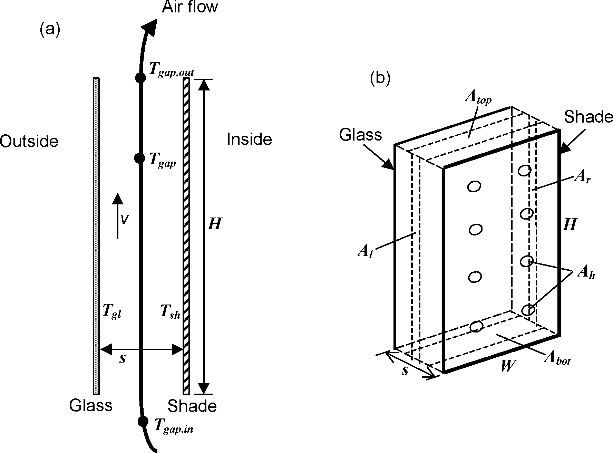

Figure 102.  Vertical section (a) and perspective view (b) of glass layer and interior shading layer showing variables used in the gap airflow analysis. The opening areas *A<sub>bot</sub>*, *A<sub>top</sub>*, *A<sub>l</sub>*, *A<sub>r</sub>* and *A<sub>h</sub>* are shown schematically.

#### Pressure Balance Equation

The pressure balance equation for airflow through the gap is

<div>$$\Delta {p_T} = \Delta {p_B} + \Delta {p_{HP}} + \Delta {p_Z}$$</div>

Here, *Δp<sub>T</sub>*is the driving pressure difference between room air and gap air. It is given by

<div>$$\Delta {p_T} = {\rho_0}{T_0}gH\sin \phi \frac{{\left| {{T_{gap}} - {T_{gap,in}}} \right|}}{{{T_{gap}}{T_{gap,in}}}}$$</div>

where

*ρ<sub>0</sub>* = density of air at temperature *T<sub>0</sub>* (kg/m<sup>3</sup>)

*T<sub>0</sub>* = reference temperature (283K)

*g* = acceleration due to gravity (m/s<sup>2</sup>)

*H* = height of shading layer (m)

*φ* = tilt angle of window (vertical = 90<sup>o</sup>)

*T<sub>gap</sub>* = effective mean temperature of the gap air (K)

*T<sub>gap,in</sub>* = gap inlet temperature ( = zone air temperature for interior shading) (K)

The *Δp<sub>B</sub>* term is due to the acceleration of air to velocity *v* (Bernoulli’s law). It is given by

<div>$$\Delta {p_B} = \frac{\rho }{2}{v^2}{\rm{    (Pa)}}$$</div>

where  *ρ*is the gap air density evaluated at *T<sub>gap</sub>* (kg/m<sup>3</sup>).

The *Δp<sub>HP</sub>* term represents the pressure drop due to friction with the shading layer and glass surfaces as the air moves through the gap. Assuming steady laminar flow, it is given by the Hagen-Poiseuille law for flow between parallel plates [Munson et al. 1998]:

<div>$$\Delta {p_{HP}} = 12\mu \frac{H}{{{s^2}}}{v^{}}{\rm{    (Pa)}}$$</div>

where * μ*  is the viscosity of air at temperature *T<sub>gap</sub>* (Pa-s).

The  *Δp<sub>Z</sub>* term is the sum of the pressure drops at the inlet and outlet openings:

<div>$$\Delta {p_Z} = \frac{{\rho {v^2}}}{2}\left( {{Z_{in}} + {Z_{out}}} \right){\rm{    (Pa)}}$$</div>

Here, the inlet pressure drop factor,* Z<sub>in</sub>*, and the outlet pressure drop factor, *Z<sub>out</sub>*, are given by

<div>$$
  \begin{array}{rl}
    Z_{in}  &= \left( \frac{A_{gap}}{0.66A_{eq,in}}  - 1 \right)^2 \\
    Z_{out} &= \left( \frac{A_{gap}}{0.60A_{eq,out}} - 1 \right)^2
  \end{array}
$$</div>

<div>$$\begin{array}{l}{Z_{in}} = {\left( {\frac{{{A_{gap}}}}{{0.66{A_{eq,in}}}} - 1} \right)^2}\\\{Z_{out}} = {\left( {\frac{{{A_{gap}}}}{{0.60{A_{eq,out}}}} - 1} \right)^2}\end{array}$$</div>

where

*A<sub>eq,in</sub>* = equivalent inlet opening area (m<sup>2</sup>)

*A<sub>eq,out</sub>* = equivalent outlet opening area (m<sup>2</sup>)

*A<sub>gap</sub>* = cross-sectional area of the gap = *sW*(m<sup>2</sup>)

If  T<sub>gap</sub> &gt; T<sub>gap,in</sub>

<div>$$
  \begin{array}{rl}
    A_{eq,in}  &= A_{bot} + \frac{A_{top}}{2(A_{bot}+A_{top}} \left( A_l + A_r + A_h \right) \\
    A_{eq,out} &= A_{top} + \frac{A_{bot}}{2(A_{bot}+A_{top}} \left( A_l + A_r + A_h \right) 
  \end{array}
$$</div>

If  T<sub>gap</sub> ≤ T<sub>gap,in</sub>

<div>$$
  \begin{array}{rl}
    A_{eq,in}  &= A_{top} + \frac{A_{bot}}{2(A_{bot}+A_{top}} \left( A_l + A_r + A_h \right) 
    A_{eq,out} &= A_{bot} + \frac{A_{top}}{2(A_{bot}+A_{top}} \left( A_l + A_r + A_h \right) \\
  \end{array}
$$</div>

Here, the area of the openings through which airflow occurs (see Figure 102 and Figure 103) are defined as follows:

A<sub>bot</sub> = area of the bottom opening (m<sup>2</sup>)

A<sub>top</sub> = area of the top opening (m<sup>2</sup>)

A<sub>l</sub> = area of the left-side opening (m<sup>2</sup>)

A<sub>r</sub> = area of the right-side opening (m<sup>2</sup>)

A<sub>h</sub> = air permeability of the shading device expressed as the total area of openings (“holes”) in the shade surface (these openings are assumed to be uniformly distributed over the shade) (m<sup>2</sup>)

Figure 103 shows examples of A<sub>bot</sub>, A<sub>top</sub>, A<sub>l</sub> and A<sub>r</sub> for different shading device configurations.  These areas range from zero to a maximum value equal to the associated shade/screen/blind-to-glass cross-sectional area; i.e., A<sub>bot</sub> and A<sub>top</sub> ≤ sW,  A<sub>l</sub> and A<sub>r</sub> ≤ sH.


Figure 103.  Examples of openings for an interior shading layer covering glass of height H and width W. Not to scale. (a) Horizontal section through shading layer with openings on the left and right sides (top view). (b) Vertical section through shading layer with openings at the top and bottom (side view).

Expression for the Gap Air Velocity

 Expressing Equation in terms of  v  yields the following quadratic equation:

<div>$$\frac{{\rho {v^2}}}{2}\left( {1 + {Z_{in}} + {Z_{out}}} \right) + \frac{{12\mu H}}{{{s^2}}}v - {\rho_0}{T_0}gH\sin \phi \frac{{\left| {{T_{gap,in}} - {T_{gap}}} \right|}}{{{T_{gap,in}}{T_{gap}}}} = 0$$</div>

Solving this gives

<div>$$v = \frac{{{{\left[ {{{\left( {\frac{{12\mu H}}{{{s^2}}}} \right)}^2} + \frac{{2{\rho ^2}(1 + {Z_{in}} + {Z_{out}}){\rho_0}{T_0}gH\sin \phi \left| {{T_{gap,in}} - {T_{gap}}} \right|}}{{{T_{gap,in}}{T_{gap}}}}} \right]}^{1/2}} - \frac{{12\mu H}}{{{s^2}}}}}{{\rho (1 + {Z_{in}} + {Z_{out}})}}$$</div>

The choice of the root of the quadratic equation is dictated by the requirement that *v* = 0 if *T<sub>gap,in</sub>* = *T<sub>gap</sub>*.

Gap Outlet Temperature and Equivalent Mean Air Temperature

The temperature of air in the gap as a function of distance, *h*, from the gap inlet (Figure 104) is

<div>$${T_{gap}}(h) = {T_{ave}} - ({T_{ave}} - {T_{gap,in}}){e^{ - h/{H_0}}}$$</div>

where

<div>$${T_{ave}} = \frac{{{T_{gl}} + {T_{sh}}}}{2}$$</div>

is the average temperature of the glass and shading layer surfaces facing the gap (K).

*H<sub>0</sub>*= characteristic height (m), given by

<div>$${H_0} = \frac{{\rho {C_p}s}}{{2{h_{cv}}}}v$$</div>

where *C<sub>p</sub>* is the heat capacity of air.

The gap outlet temperature is given by

<div>$${T_{gap,out}} = {T_{ave}} - ({T_{ave}} - {T_{gap,in}}){e^{ - H/{H_0}}}$$</div>

The thermal equivalent mean temperature of the gap air is

<div>$${T_{gap}} = \frac{1}{H}\int\limits_0^H {{T_{gap}}(h)dh = {T_{ave}} - \frac{{{H_0}}}{H}} \left( {{T_{gap,out}} - {T_{gap,in}}} \right)$$</div>


Figure 104.  Variation of gap air temperature with distance from the inlet for upward flow.

Solution Sequence for Gap Air Velocity and Outlet Temperature

The routine WinShadeGapFlow is called within the glazing heat balance iterative loop in SolveForWindowTemperatures to determine *v* and *T<sub>gap,out</sub>*. The solution sequence in WinShadeGapFlow is as follows:

At start of iteration, guess *T<sub>gap</sub>* as ((*T<sub>gl</sub>* + *T<sub>sh</sub>*)/2 + *T<sub>gap,in</sub>*)/2. Thereafter use value from previous iteration.

Get still-air conductance, *h<sub>c</sub>*, by calling WindowGasConductance and NusseltNumber.

Get *v* from Equation

Get *h<sub>cv</sub>* from Equation

Get *T<sub>ave</sub>*from Equation

Get *T<sub>gap,out</sub>* from Equation

Get new value of *T<sub>gap</sub>*from Equation

The values of *h<sub>cv</sub>* and *T<sub>gap</sub>* so determined are then used in the window heat balance equations to find new values of the face temperatures of the glass and shading layers. These temperatures are used in turn to get new values of *h<sub>cv</sub>* and *T<sub>gap</sub>* until the whole iterative process converges.

Convective Heat Gain to Zone from Gap Airflow

The heat added (or removed) from the air as it passes through the gap produces a convective gain (or loss) to the zone air given by

<div>$${q_v} = LW\left[ {{h_{cv}}\left( {{T_{gl}} - {T_{gap}}} \right) + {h_{cv}}\left( {{T_{sh}} - {T_{gap}}} \right)} \right] = 2{h_{cv}}LW\left( {{T_{ave}} - {T_{gap}}} \right){\rm{    (W)}}$$</div>

This can also be expressed as

<div>$${q_v} = \dot m{C_p}\left( {{T_{gap,out}} - {T_{gap,in}}} \right){\rm{    (W)}}$$</div>

where the air mass flow rate in the gap is given by

<div>$$\dot m = \rho {A_{gap}}v{\rm{    (kg/s)}}$$</div>

### Heat Balance Equations for Between-Glass Shading Device

In EnergyPlus shading devices are allowed between the two glass panes of double glazing and between the two inner glass panes of triple glazing. Figure 105 shows the case of a between-glass shading device in double glazing.


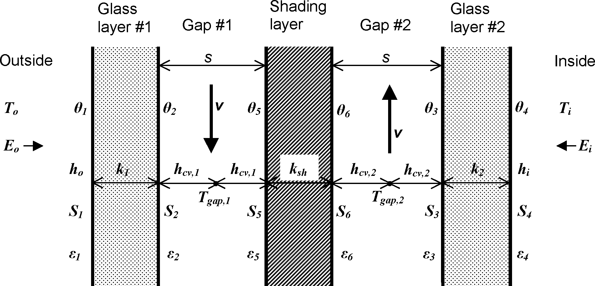

Figure 105. Glazing system with two glass layers and a between-glass shading device showing variables used in the heat balance equations.


The heat balance equations for the two glass surfaces facing the shading device are the following.

For face \#2:

<div>$$
  h_{cv,1} (T_{gap,1}-\theta_2) + k_1 (\theta_1-\theta_2) +
    \frac{\sigma \epsilon_2}{1-\rho_2 R_1} \left[
      \frac{\tau_{sh}}{1-\rho_6\rho_3} (
        \epsilon_3 \theta_3^4 + \epsilon_6\theta_6^4\rho_3
      )
      + \epsilon_5\theta_5^4 + \epsilon_2\theta_2^4R_1
    \right]
$$</div>

where

<div>$${R_1} = {\rho_5} + \frac{{\tau_{sh}^2{\rho_3}}}{{1 - {\rho_6}{\rho_3}}}$$</div>

<span>\({T_{gap,1}} = \)</span> effective mean air temperature in gap 1 (K)

<span>\({h_{cv,1}} = \)</span> convective heat transfer coefficient from glass or shading layer to gas in gap 1 (W/m<sup>2</sup>K)

For face \#3:

<div>$$
  h_{cv,2} (T_{gap,2}-\theta_3) + k_2 (\theta_4-\theta_3) +
    \frac{\sigma \epsilon_3}{1-\rho_3 R_2} \left[
      \frac{\tau_{sh}}{1-\rho_5\rho_2} (
        \epsilon_3 \theta_2^4 + \epsilon_5\theta_5^4\rho_2
      )
      + \epsilon_6\theta_6^4 + \epsilon_7\theta_3^4R_2
    \right]
$$</div>

where

<div>$${R_2} = {\rho_6} + \frac{{\tau_{sh}^2{\rho_2}}}{{1 - {\rho_5}{\rho_2}}}$$</div>

<span>\({T_{gap,2}} = \)</span> effective mean air temperature in gap 2 (K)

<span>\({h_{cv,2}} = \)</span> convective heat transfer coefficient from glass or shading layer to gas in gap 2 (W/m<sup>2</sup>K)

The heat balance equations for the shading layer faces are:

For face \#5:

<div>$$
  h_{cv,1} (T_{gap,1}-\theta_5) + k_sh (\theta_6-\theta_5) +
    \frac{\sigma \epsilon_5}{1-\rho_2 R_1} \left[
      \frac{\tau_{sh}\rho_2}{1-\rho_5\rho_3} (
        \epsilon_3 \theta_3^4 + \epsilon_6\theta_6^4\rho_3
      )
      + \epsilon_2\theta_2^4 + \epsilon_5\theta_5^4\rho_2
    \right]
$$</div>

For face \#6:

<div>$$
  h_{cv,2} (T_{gap,2}-\theta_3) + k_2 (\theta_4-\theta_3) +
    \frac{\sigma \epsilon_3}{1-\rho_3 R_2} \left[
      \frac{\tau_{sh}}{1-\rho_5\rho_2} (
        \epsilon_2 \theta_2^4 + \epsilon_5\theta_5^4\rho_2
      )
      + \epsilon_2\theta_2^4 + \epsilon_7\theta_3^4R_2
    \right]
$$</div>

The convective heat transfer coefficients are given by

<div>$$\begin{array}{l}{h_{cv,1}} = 2{h_{c,1}} + 4v\\\{h_{cv,2}} = 2{h_{c,2}} + 4v\end{array}$$</div>

where

<span>\({h_{c,1}},{h_{c,2}} = \)</span>     surface-to-surface heat transfer coefficients for gap \#1 and \#2,  respectively,  when these gaps are non-vented (closed).

<span>\(v = \)</span>               air velocity in the gaps (m/s). It is assumed that the gap widths are equal, so that the velocity of flow in the gaps is equal and opposite, i.e., when the airflow is upward in gap \#1 it is downward in gap \#2 and vice-versa.

In analogy to the interior or exterior shading device case, the air velocity is determined by solving the following pressure balance equation:


<div>$$\Delta {p_{T,1,2}} = \Delta {p_{B,1}} + \Delta {p_{HP,1}} + \Delta {p_{Z,1}} + \Delta {p_{B,2}} + \Delta {p_{HP,2}} + \Delta {p_{Z,2}}$$</div>

where the driving pressure difference between gap \#1 and \#2 is

<div>$$\Delta {p_{T,1,2}} = {\rho_0}{T_0}gH\sin \phi \frac{{\left| {{T_{gap,1}} - {T_{gap,2}}} \right|}}{{{T_{gap,1}}{T_{gap,2}}}}{\rm{      (Pa)}}$$</div>

The pressure drops on the right-hand side of this equation are:

<div>$$\begin{array}{l}\Delta {p_{B,i}} = \frac{{{\rho_{gap,}}_i}}{2}{v^2}\\\Delta {p_{HP,i}} = 12{\mu_{gap,}}_i\frac{H}{{{s^2}}}\\\Delta {p_{Z,i}} = \frac{{{\rho_{gap,}}_i{v^2}}}{2}({Z_{in,i}} + {Z_{out,i}})\end{array}$$</div>

where *i* = gap number (1 or 2).

It can be shown that <span>\({Z_{in,1}} + {Z_{out,1}} = {Z_{in,2}} + {Z_{out,2}}\)</span>. Then, inserting these pressure drop expressions into , we obtain the following expression for the airflow velocity:

<div>$$v = \frac{{{{\left[ {{{\left( {\frac{{12({\mu_{gap,}}_1 + {\mu_{gap,}}_2)H}}{{{s^2}}}} \right)}^2} + 2\Delta {p_{T,1,2}}({\rho_{gap,1}} + {\rho_{gap,2}})(1 + {Z_{in}} + {Z_{out}})} \right]}^{1/2}} - \frac{{12({\mu_{gap,}}_1 + {\mu_{gap,}}_2)H}}{{{s^2}}}}}{{({\rho_{gap,}}_1 + {\rho_{gap,}}_2)(1 + {Z_{in}} + {Z_{out}})}}$$</div>

The choice of the sign of the square root term is dictated by the requirement that <span>\(v = 0\)</span> if <span>\(\Delta {p_{T,1,2}} = 0\)</span>, i.e., <span>\({T_{gap,1}} = {T_{gap,2}}\)</span>.

Given <span>\(v\)</span> we can now calculate <span>\({T_{gap,1}}\)</span>and <span>\({T_{gap,2}}\)</span>, which gives <span>\(\Delta {p_{T,1,2}}\)</span>. The procedure is as follows. We have

<div>$${T_{gap,1,out}} = {T_{ave,1}} - ({T_{ave,1}} - {T_{gap,1,in}}){\xi_1}$$</div>

where <span>\({T_{ave,1}} = ({\theta_2} + {\theta_5})/2\)</span> and <span>\({\xi_1} = {e^{ - \frac{H}{{{H_{0,1}}}}}}\)</span> with <span>\({H_{0,1}} = {\rho_{gap,1}}{C_p}sv/(2{h_{cv,1}})\)</span>. Since <span>\({T_{gap,1,in}} = {T_{gap,2,out}}\)</span> this gives:

  <span>\({T_{gap,1,out}} = {T_{ave,1}} - ({T_{ave,1}} - {T_{gap,2,out}}){\xi_1}\)</span>

Similarly,

<div>$${T_{gap,2,out}} = {T_{ave,2}} - ({T_{ave,2}} - {T_{gap,1,out}}){\xi_2}$$</div>

Solving these simultaneous equations gives:

 <span>\(\begin{array}{l}{T_{gap,1,out}} = \frac{{{T_{ave,1}}(1 - {\xi_1}) + {\xi_1}{T_{ave,2}}(1 - {\xi_2})}}{{1 - {\xi_1}{\xi_2}}}\\\\\{T_{gap,2,out}} = \frac{{{T_{ave,2}}(1 - {\xi_2}) + {\xi_2}{T_{ave,1}}(1 - {\xi_1})}}{{1 - {\xi_1}{\xi_2}}}\end{array}\)</span>

Using these in

<div>$${T_{gap,1}} = {T_{ave,1}} - \frac{{{H_{0,1}}}}{H}\left( {{T_{gap,1,out}} - {T_{gap,2,out}}} \right)$$</div>

gives

 <span>\({T_{gap,1}} = {T_{ave,1}} - \frac{{{H_{0,1}}}}{H}\xi \left( {{T_{ave,1}} - {T_{ave,2}}} \right)\)</span>

with

<div>$$\xi  = \frac{{(1 - {\xi_1})(1 - {\xi_2})}}{{1 - {\xi_1}{\xi_2}}}$$</div>

Similarly, from

<div>$${T_{gap,2}} = {T_{ave,2}} - \frac{{{H_{0,2}}}}{H}\left( {{T_{gap,2,out}} - {T_{gap,1,out}}} \right)$$</div>

we get

<div>$${T_{gap,2}} = {T_{ave,2}} - \frac{{{H_{0,2}}}}{H}\xi \left( {{T_{ave,2}} - {T_{ave,1}}} \right)$$</div>

The overall solution sequence is as follows.

At start of iteration guess <span>\({T_{gap,1}} = {T_{ave,1}}\)</span> and <span>\({T_{gap,2}} = {T_{ave,2}}\)</span>. Then

1)    Get <span>\({\rho_{gap,1}},{\rho_{gap,2}},{\mu_{gap,1}},{\mu_{gap,2}}\)</span>using <span>\({T_{gap,1}},{T_{gap,2}}\)</span>.

2)    Get still-air conductances <span>\({h_{c,1}},{h_{c,2}}\)</span>by calling WindowGasConductance and NusseltNumber.

3)    Get <span>\(v\)</span> from Equation

4)    Get <span>\({h_{cv,1}},{h_{cv,2}}\)</span>from Equation

5)    Get <span>\({T_{ave,1}},{T_{ave,2}}\)</span>

6)    Get *H<sub>o,1</sub>*, *H<sub>o,2</sub>*, <span>\({\xi_1}\)</span>and <span>\({\xi_2}\)</span>.

7)    Get <span>\({T_{gap,1}}\)</span>,<span>\({T_{gap,2}}\)</span>from Equations and

The values <span>\({h_{cv,1}}{\rm{, }}{h_{cv,2}}{\rm{, }}{T_{gap,1}}\)</span> and <span>\({T_{gap,2}}\)</span>are then used in the face heat balance equations to find new values of the face temperatures <span>\({\theta_2}{\rm{, }}{\theta_3},{\rm{ }}{\theta_5}\)</span>and <span>\({\theta_6}\)</span>. These are used in turn to get new values of <span>\({h_{cv,1}}{\rm{, }}{h_{cv,2}}{\rm{, }}{T_{gap,1}}\)</span> and <span>\({T_{gap,2}}\)</span>until the whole iterative process converges.

### Airflow Windows

In airflow windows forced air flows in the gap between adjacent layers of glass. Such windows are also known as “heat-extract windows” and “climate windows.”

Five configurations of airflow windows are modeled (Figure 106) that depend on the source and destination of forced air. The allowed combinations of Airflow Source and Airflow Destination are:

InsideAir à OutsideAir

InsideAir à InsideAir

InsideAir à ReturnAir

OutsideAir à InsideAir

OutsideAir à OutsideAir


Figure 106. Gap airflow configurations for airflow windows. From “Active facades,” Version no. 1, Belgian Building Research Institute, June 2002.

A common application of airflow windows is to reduce the zone cooling load by exhausting indoor air through the window, thereby picking up and rejecting heat from the glazing (Figure 106).

Figure 107 shows the variables used in the heat balance equations for forced airflow in a double-glazed window.


Figure 107. Glazing system with forced airflow between two glass layers showing variables used in the heat balance equations.

The heat balance equation for the left-hand glass surface facing the gap in Figure 107 is:

<div>$${k_1}({\theta_1} - {\theta_2}) + {h_{cv}}({T_{gap}} - {\theta_2}) + \sigma \frac{{{\varepsilon_2}{\varepsilon_3}}}{{1 - (1 - {\varepsilon_2})(1 - {\varepsilon_3})}}\left( {\theta_3^4 - \theta_2^4} \right) + {S_2} = 0$$</div>

The corresponding equation for the right-hand glass surface facing the gap is:

<div>$${k_2}({\theta_4} - {\theta_3}) + {h_{cv}}({T_{gap}} - {\theta_3}) + \sigma \frac{{{\varepsilon_2}{\varepsilon_3}}}{{1 - (1 - {\varepsilon_2})(1 - {\varepsilon_3})}}\left( {\theta_2^4 - \theta_3^4} \right) + {S_3} = 0$$</div>

Here,

*T<sub>gap</sub>* = effective mean temperature of the gap air (K)

*h<sub>cv</sub>*= convective heat transfer coefficient from glass to gap air (W/m2K).

The convective heat transfer coefficient is given by

<div>$${h_{cv}} = 2{h_c} + 4v$$</div>

where

*h<sub>c</sub>*= glass-to-glass heat transfer coefficient for non-vented (closed) cavity (W/m<sup>2</sup>K)

*v* = mean air velocity in the gap (m/s).

The air velocity is determined by the gap cross-sectional area in the flow direction and the air flow rate, which is an input value that is constant or can vary according to a user-specified schedule:

<div>$$v = \frac{F}{{{A_{gap}}}}{\rm{      (m/s)}}$$</div>

where

*F* = airflow rate (m<sup>3</sup>/s)

*A<sub>gap</sub>* = gap cross-sectional area in direction of flow (m2)

It is assumed that the airflow is uniform across the width of the window.

The mean temperature of the gap air is given by the following expression, whose derivation follows that for for the case of an interior shading device:

<div>$${T_{gap}} = {T_{ave}} - \frac{H}{{{H_0}}}({T_{gap,out}} - {T_{gap,in}})$$</div>

where


<div>$${T_{ave}} = \frac{{{\theta_2} + {\theta_3}}}{2}$$</div>

*H*   = glazing height (m)

<div>$${H_0} = \frac{{\rho {C_p}s}}{{2{h_{cv}}}}v$$</div>

*T<sub>gap,in</sub>*<sub> </sub>=  gap air inlet temperature (*T<sub>i</sub>* if the airflow source is indoor air, *T<sub>o</sub>* if the airflow source is outside air) (K)

The outlet air temperature is given by

<div>$${T_{gap,out}} = {T_{ave}} - ({T_{ave}} - {T_{gap,in}}){e^{ - H/{H_0}}}$$</div>

The equations for glass face \#1 and \#4 are the same as those for no airflow in the gap (Equations and ).

The convective heat gain to the zone air due to the gap airflow when the airflow destination is indoor air is

<div>$${q_v} = \dot m({C_{p,out}}{T_{gap,out}} - {C_{p,i}}{T_i}){\rm{      (W)}}$$</div>

where

*C<sub>p,i</sub>*<sub>   </sub> = heat capacity of the indoor air (J/kg-K)

*C<sub>p,out</sub>*= heat capacity of the gap outlet air (J/kg-K)

and where the air mass flow rate in the gap is

<div>$$\dot m = \rho F{\rm{      (kg/s)}}$$</div>

#### Fan Energy

The fan energy used to move air through the gap is very small and is ignored.

#### Airflow Window with Between-Glass Shading Device

Figure 108 shows the case of a double-glazed airflow window with a between glass shading device. The heat balance equations in this case are the same as those for the between-glass shading device with natural convection (Figure 105 and following equations) except that now

<div>$$v = \frac{{F/2}}{{{A_{gap}}}}{\rm{      (m/s)}}$$</div>

where *A<sub>gap</sub>* = *sW* is the cross-sectional area of the gap on either side of the shading device. It is assumed that the shading device is centered between the two panes of glass so that the airflow, *F*, is divided equally between the two gaps.

The convective heat gain to the zone air due to the airflow through the two gaps when the airflow destination is indoor air is

<div>$${q_v} = \dot m({C_{p,ave,out}}{T_{gap,ave,out}} - {C_{p,i}}{T_i}{\rm{)      (W)}}$$</div>

where the average temperature of the two outlet air streams is

<div>$${T_{gap,ave,out}}{\rm{ =  }}({T_{gap,1,out}} + {T_{gap,2,out}})/2$$</div>

and

*C<sub>p,ave,out</sub>*<sub>  </sub> = heat capacity of the outlet air evaluated at *T<sub>gap,ave,out</sub>* (J/kg-K)


Figure 108. Airflow window with between-glass shading device showing variables used in the heat balance equations.

### Evacuated Glazing Unit (EGU)

Evacuated glazing Units (EGU) are an emerging technology, developed as a concept some 20-30 years ago, but only now approaching wide-spread commercialization and adoption.

#### Evacuated glazing unit (EGU): cavity thermal conductance

Thermal Conductance of the space in an evacuated glazing unit (EGU) is the sum of the conductance of the low pressure gas (air) and radiation conductance.

<div>$${C_{gas}} = {C_{COND}} + {C_{RAD}}$$</div>

**Conductance of the low-pressure gas**

Conductance of low pressure gasses is calculated using formula by Corrucini (Corruccini, R. (1959)).

<div>$${C_{COND}} = \alpha  \cdot \left[ {\frac{{\gamma  + 1}}{{\gamma  - 1}}} \right] \cdot {\left[ {\frac{R}{{8 \cdot \pi  \cdot M \cdot T}}} \right]^{\frac{1}{2}}} \cdot P$$</div>

<div>$$B = \alpha  \cdot \left[ {\frac{{\gamma  + 1}}{{\gamma  - 1}}} \right] \cdot {\left[ {\frac{R}{{8 \cdot \pi  \cdot M \cdot T}}} \right]^{\frac{1}{2}}}$$</div>

<div>$${C_{COND}} = B \cdot P$$</div>

Where:

<div>$$\alpha  = \frac{{{\alpha_1}{\alpha_2}}}{{{\alpha_2} + {\alpha_1}\left( {1 - {\alpha_2}} \right)}}$$</div>

a<sub>1</sub>, a<sub>2</sub> = Accommodation coefficients of the gas molecules with the two surfaces.  These values depend on the temperature, surface conditions, etc.  For the present configuration and conditions, it is expected that *a* is approximately 0.5.  If conservative value is needed than value of 1.0 could be used.  With a<sub>1</sub>, a<sub>2</sub> = 0.5, a = 0.333

g     = Specific heat ratio, g<sub>air</sub> = 1.40.

*R*    = Universal gas constant, *R* = 8,314.462175 J/mol·K

*M*   = Molecular Weight, *M*<sub>air</sub> = 28.97 [mol/g]

*T*    = (*T*<sub>1</sub> + *T*<sub>2</sub>)/2 [K]

*P*    = Pressure of the gas [N/m<sup>2</sup>]

From the paper Collins and Robinson (Collins, R., & Robinson, S. (1991)), B is set at approximately 50 for Air, if pressure is given in torr.  Therefore according to Collins and Robinson, for air and approximate conditions of EGU:

*C*<sub>COND</sub> ≈ 50·P

Where P is in torr (i.e., mm Hg).

*Note: Conversion from Pa to torr is accomplished by multiplying value in torr by 133.28.*

Using formula 2 and assuming *T*<sub>1</sub> to be 20 ºC and *T*<sub>2</sub> to be -18 ºC (expected temperatures of glass surfaces in EGU, if one glass surface is low-e and unit is exposed to NFRC standard environmental conditions), and using SI system of units, the B is calculated as 54.4, which is very close to the value of 50, proposed by Collins and Robinson

*C*<sub>COND</sub> ≈ 54.4·P

We will use exact value, calculated by the formula, so values of will be input into the calculations, which enables more flexible model that can account for special treatment of glass surfaces.

#### Radiation conductance

Radiation conductance for the two parallel plates is given by:

<div>$${C_{RAD}} = \frac{1}{{{\varepsilon_1}^{ - 1} + {\varepsilon_2}^{ - 1} - 1}}\sigma \frac{{\left( {{T_1}^4 - {T_2}^4} \right)}}{{{T_1} - {T_2}}}$$</div>

Where:

e<sub>1</sub>    = emissivity of the first facing glass surface, [ - ]

e<sub>2</sub>    = emissivity of the second facing glass surface, [ - ]

s    = Stefan-Boltzmann Constant, 5.67 x 10<sup>-8</sup>, [W/(m<sup>2</sup>·K<sup>4</sup>)]

T<sub>1</sub>   = Temperature of the first facing glass surface, [K]

T<sub>2</sub>   = Temperature of the second facing glass surface. [K]

Assuming glass surface temperatures of 20 ºC and -18 ºC, respectively, the following radiation conductances are obtained for the three different glass emissivities:

Clear Glass (e<sub>1</sub> = e<sub>2</sub> = 0.84): C<sub>RAD</sub> = 3.4 W/m<sup>2</sup>K

Hard Coat Low-e (e<sub>1</sub> or e<sub>2</sub> = 0.15): C<sub>RAD</sub> = 0.68 W/m<sup>2</sup>K

Soft Coat Low-e (e<sub>1</sub> or e<sub>2</sub> = 0.04): C<sub>RAD</sub> = 0.19 W/m<sup>2</sup>K

***Note:*** *C<sub>RAD</sub> of 0.09 is theoretically possible using best low-e technology today (i.e.,* *e<sub>1</sub> or* *e<sub>2</sub> = 0.02).*

***Note:*** *Low-e values above are typical values, which will vary by manufacturer.  Some more recent hard coat low-e values are at or below 0.1.*

It should also be noted that values above are based on the fix set of temperatures, while in reality temperatures will depend on the environmental conditions and surface emissivities (e.g., it cannot be expected that clear glass will have same *T<sub>1</sub>* and *T<sub>2</sub>* as low-e glass).

Equation is precise formulation for two parallel plates at the constant temperature.  Simplified equation under these conditions is given in the form of:

<div>$${C_{RAD}} = 4\sigma \frac{1}{{{\varepsilon_1}^{ - 1} + {\varepsilon_2}^{ - 1} - 1}}{T_m}^3$$</div>

Where:

*T<sub>m</sub>* =           mean temperature, [K]

<div>$${T_m} = \frac{{\left( {{T_1} + {T_2}} \right)}}{2}$$</div>

Calculation of the U-factor

<div>$$U = \frac{1}{{{R_{tot}}}} = \frac{1}{{{R_o} + 2 \cdot {R_{glass}} + {R_{gap}} + {R_i}}}$$</div>

<div>$${R_{gap}} = \frac{1}{{{C_{gap}}}} = \frac{1}{{{C_{COND}} + {C_{RAD}}}}$$</div>

<div>$${R_{glass}} = \frac{{{t_{glass}}}}{{{k_{glass}}}}$$</div>

Where:

*t*<sub>glass</sub> = glass thickness; [m]

*k*<sub>glass</sub> = glass conductivity; *k*<sub>glass</sub> = 1 W/(m·K)

*R*<sub>glass</sub> = 0.003 m<sup>2</sup>K/W (for 3 mm glass pane)

*R*<sub>o</sub> ≈ 0.033 m<sup>2</sup>K/W

*R*<sub>i</sub> ≈ 0.14 m<sup>2</sup>K/W

U-factor of EGU without any pillars (pretending that this is possible) would be calculated using *C*<sub>RAD</sub> only.  From above radiation conductance calculations:

*Clear Glass:            U = 2.64 W/(m<sup>2</sup>·K) [0.464 Btu/(hr·ft<sup>2</sup>·ºF)]*

*Hard Coat Low-e:     U = 0.62 W/(m<sup>2</sup>·K) [0.109 Btu/(hr·ft<sup>2</sup>·ºF)]*

*Soft Coat Low-e:      U = 0.19 W/(m<sup>2</sup>·K) [0.034 Btu/(hr·ft<sup>2</sup>·ºF)]*

Adding conductance of the air at 0.001 torr (*C*<sub>COND</sub> = 0.08 W/(m<sup>2</sup>·K), these values become:

*Clear Glass:            U = 2.66 W/(m<sup>2</sup>·K) [0.468 Btu/(hr·ft<sup>2</sup>·ºF)]*

*Hard Coat Low-e:     U = 0.68 W/(m<sup>2</sup>·K) [0.120 Btu/(hr·ft<sup>2</sup>·ºF)]*

*Soft Coat Low-e:      U = 0.27 W/(m<sup>2</sup>·K) [0.048 Btu/(hr·ft<sup>2</sup>·ºF)]*

In contrast, the U-factor of the same configuration with the air at atmospheric pressure will be (For the space width of 50 mm, C<sub>COND</sub> ≈ 450 W/m<sup>2</sup>K):

*Clear Glass:            U = 5.52 W/(m<sup>2</sup>·K) [0.468 Btu/(hr·ft<sup>2</sup>·ºF)]*

*Hard Coat Low-e:     U = 5.52 W/(m<sup>2</sup>·K) [0.120 Btu/(hr·ft<sup>2</sup>·ºF)]*

*Soft Coat Low-e:      U = 5.52 W/(m<sup>2</sup>·K) [0.048 Btu/(hr·ft<sup>2</sup>·ºF)]*

It is clear that emissivity of the glass surface makes no difference, because of the dominant conductance of the air space.  Also, it is worth noting that the U-factor of such configuration is very close to the U-factor of single glazing.

#### Evacuated glazing unit (EGU): Glass support element thermal conductance

Glass panes in the EGU are separated by an array of small support elements.  Typically, these support elements have a cylindrical shape and are often referred to as “pillars.”  Typical geometry of the pillar is 0.5-1.0 mm diameter and 0.05 mm (50 mm) height.  They are typically spaced 1-2 in. apart in a form of square or staggered matrix.

#### Calculation of the U-factor

The conductance of these elements can be measured or numerically modeled to determine accurate thermal performance.  Approximate method also exists and is based on the combination of modeling and analytical work for the conduction through small cylinders in contact with infinite parallel plates with thickness much larger than cylinder height.

The following formula can be used to determine conductance of the single pillar, *C*<sub>p</sub> (Collins and Fisher-Cripps 1991):

<div>$${C_p} = \frac{{2ka}}{{1 + \frac{{2h}}{{\pi a}}}}$$</div>

Where:

*k*    = conductivity of glass, W/(m·K)

*a*    = radius of the pillar (m)

*h*    = pillar height, m

For the square array of support pillars (Collins and Fischer-Cripps 1991) proposes the following formula for their conductance, *C*<sub>pa</sub>:

<div>$${C_{pa}} = \frac{{2ka}}{{{\lambda ^2}\left( {1 + \frac{{2h}}{{\pi a}}} \right)}}$$</div>

Where:

l    = pillar spacing, m

This formula is approximate and does not include effect of the conductivity of the pillar, but it gives good approximation for common materials used in this technology, since conductivity of the pillar does not play substantial role for non-insulating pillars (where “non-insulating” would mean that conductivity of the pillar is equal or higher than the conductivity of the glass pane.

The U-factor of the EGU with support pillars is then:

<div>$$U = \frac{1}{{{R_{tot}}}} = \frac{1}{{{R_o} + 2 \cdot {R_{glass}} + {R_{gap}} + {R_i}}}$$</div>

Where:

<div>$${R_{gap}} = \frac{1}{{{C_{gap}}}} = \frac{1}{{{C_{COND}} + {C_{RAD}} + {C_{pa}}}}$$</div>

#### References

Collins, R., & Fischer-Cripps, A. 1991. "Design of Support Pillar Arrays in Flat Evacuated Windows.". Aust. J. Phys.

Collins, R., & Robinson, S. 1991. *"Evacuated Glazing".* Solar Energy. Vol. 47, No. 1, pp. 27-38.

Corruccini, R. 1959. "Gaseous Heat Conduction at Low Pressures and Temperatures". Vacuum. Vol. 7-8, pp.19-29.

### Thermal Performance of Deflected Insulated Glazing Unit (IGU)

#### Introduction

Deflection of insulated glazing unit (IGU) can result in thermal performance degradation or improvement due to the reduction or increase of gap space width. Convection of the gas fill is affected by changed gap space and due to modified convection pattern and shorter or longer thermal path at the center of the glazing unit can result in increased or decreased thermal performance. For the most part, U-factor is mostly affected as a direct result of changed thermal performance; however note that solar heat gain through the window (SHGC) can also be affected because of the effect of inward flowing fraction of absorbed solar radiation, which is affected by thermal performance of the IGU.

Deflection in sealed IGU is caused by the difference in gas pressure in IGU gap vs. outdoor/indoor pressure. Indoor and outdoor pressure can be considered equal, since indoor building environment is in pretty good contact with outdoor environment. We will call this pressure an atmospheric pressure, *P<sub>a</sub>*. The differences in pressure between atmospheric and gap pressure is due to several factors, listed here:

1)   Difference in atmospheric pressure between IGU fabrication location and end use location

2)   Difference in temperature during fabrication and actual operating conditions for the glazing. It should be noted that initial temperature can be higher than ambient temperature during fabrication process, due to elevated sealant temperatures, which can raise local temperatures within the IGU.

3)   Unbalanced gas fill leakage through the sealants, resulting in lower gap pressure and inward deflection.

4)   Wind or static load pressure

Effects 1 and 2 will be modeled using equations presented below, while effect 3 does not have credible mathematical model. However, cumulative deflection, resulting from all three effects can be measured in the field and its effect on thermal performance can be modeled by specifying center glazing deflection.

Wind or static load pressure effects on deflection is not included in this model at this time, but will be considered for future versions.

Recognizing that indoor and outdoor air pressure could be different, such as in hot box test environment, future plans for the extension of the model will include option to specify different values for indoor and outdoor pressure. Another future improvement to the model will also include linking certain air gaps with indoor or outdoor environment, meaning that respective pressures in linked spaces will be set to equal.

#### Mathematical Model

Mathematical model described in detail here is based on the research work by Bernier and Bourret (1997) and Timoshenko and Woinowsky-Krieger (1959). Bernier and Bourret (1997) of the Ecole Polytechnique Montréal adopted Timoshenko and Woinowsky-Krieger (1959) model for calculating flat plate deflection subjected to the differential pressure field (static), while their original contribution was to develop correlations for changes in thermal performance, based on IGU deflection at the center of glazing location. In addition to adopting Bernier and Bourret (1997) model here, we have also developed model for calculating change in thermal performance of deflected units when this deflection is measured in the field. Therefore, the mathematical formulation, presented here is divided into two sections; 1) calculation of the deflection and resulting thermal performance caused by pressure and temperature effects and 2) calculation of the thermal performance of the IGU when the deflection is measured.

#### Calculation of the deflection and thermal performance caused by pressure and temperature effects

If coordinate system is set as shown in Figure 109 and Figure 110, it is possible to calculate deflection distribution at each point of pane by using following equation:


Figure 109. Deflection Coordinate System - 2D

<div>$${L_{D\left( i \right)}}\left( {x,y} \right) = \frac{{16\cdot \Delta {P_{\left( i \right)}}}}{{{\pi ^6}\cdot {D_{\left( i \right)}}}}\mathop \sum \limits_{m = 1,3,5 \ldots }^\infty  \mathop \sum \limits_{n = 1,3,5 \ldots }^\infty  \frac{{\sin \frac{{m\pi x}}{W}\sin \frac{{n\pi y}}{H}}}{{mn{{\left( {{{\left( {\frac{m}{W}} \right)}^2} + {{\left( {\frac{n}{H}} \right)}^2}} \right)}^2}}}$$</div>

Where,

<div>$${D_{\left( i \right)}} = \frac{{E\cdot t_{\left( i \right)}^3}}{{12\cdot \left( {1 - {\nu ^2}} \right)}}$$</div>

Where,

*E* = Young’s modulus (7.2 x 10<sup>10</sup>) [Force per unit Area; SI: Pa, IP: psi]

*t* = thickness of glazing pane [Length; SI: m, IP: in.]

n = poison’s ratio (0.22 for glass) [Non-Dimensional]


Figure 110. Deflection Coordinate System - 3D

Δ*P<sub>i</sub>* = *P<sub>gap(i)</sub>* - *P<sub>gap(i-1)</sub>* (for i-th pane) [Force per unit Area; SI: Pa, IP: psi]

Δ*P<sub>i</sub>* = *P<sub>gap(1)</sub>* - *P<sub>a</sub>* (first pane) [Force per unit Area; SI: Pa, IP: psi]*                  *

Δ*P<sub>i</sub>* = *P<sub>a</sub> - P<sub>gap(n-1)</sub>* (last pane) [Force per unit Area; SI: Pa, IP: psi]

Where,

*P<sub>a</sub> =* atmospheric pressure. [Force per unit Area; SI: Pa, IP: psi]

<div>$${P_{gap\left( i \right)}} = \frac{{{P_{ini}}{V_{ini\left( i \right)}}{T_{gap\left( i \right)}}}}{{{T_{ini}}{V_{gap\left( i \right)}}}}$$</div>

Where,

*P<sub>ini</sub>* = Initial pressure. Applies to all gaps as a single value (input data - measured or otherwise) [Force per unit Area; SI: Pa, IP: psi]

*T<sub>ini</sub>* = Initial temperature. Applies to all gaps as a single value (input data - measured or otherwise) [Degree Temperature; SI: K, IP: R]

*V<sub>ini(i)</sub>* = Initial volume for i-th gap. [Length\*Length\*Length; SI: m<sup>3</sup>, IP: in<sup>3</sup>]

<div>$${V_{ini\left( i \right)}} = {L_i}\cdot W\cdot H$$</div>

Where,

*L<sub>i</sub>* = non-deflected glazing gap width (for i-th gap) [Length; SI: m, IP: in.]

*W* = IGU width [Length; SI: m, IP: in.]

*H* = IGU height [Length; SI: m, IP: in.]

*T<sub>gap(i)</sub>* = temperature of the gap between two glass panes (calculated using center of glazing thermal calculation algorithm, as described in ISO 15099 (ISO 2003). This value is first calculated using non-deflected state and is recalculated after the resulting deflection is calculated. This process is repeated until temperature at next iteration does not differ by more than 0.1 ºC

*V<sub>gap(i)</sub>* = volume of the IGU gap in deflected state [Lentgh\*Length\*Length; SI: m<sup>3</sup>, IP: in<sup>3</sup>]

<div>$${V_{gap\left( i \right)}} = {V_{ini\left( i \right)}} + W\cdot H\cdot \left( {\overline {{L_{D,i}}}  - \overline {{L_{D,i + 1}}} } \right)$$</div>

Where,

<span>\(\overline {{L_{D,i}}} \)</span> is mean deflection value for i-th pane. [Length; SI: m, IP: in.]

Deflection of each pane can be positive or negative and is done solely to establish reference. Current frame of reference is that positive deflection means that pane is deflecting towards left side, while negative deflection means that pane is deflecting towards right side . Whether the deflection is in the direction of reducing the gap width or increasing it, it will be the result of pressure difference, as described in . When pressure in the glazing unit is higher than surrounding environmental pressure, the deflection will be towards increasing gap width (i.e., ballooning), while the opposite situation will result in decreasing gap width (i.e., vacuuming)


Figure 111. Deflection Direction Convention

The important part of calculating deflection of the IGU is to determine mean deflection value for each glazing pane. Mean deflection value is used to calculate gap volume in deflected state . Mean deflection of glazing pane can be calculated by integrating :

<div>$$\overline {{L_{D\left( i \right)}}}  = \mathop \smallint \limits_{x = 0}^W \mathop \smallint \limits_{y = 0}^H \frac{{16\cdot \Delta {P_{\left( i \right)}}}}{{{\pi ^6}\cdot {D_{\left( i \right)}}}}\mathop \sum \limits_{m = 1,3,5 \ldots }^\infty  \mathop \sum \limits_{n = 1,3,5 \ldots }^\infty  \frac{{\sin \frac{{m\pi x}}{W}\sin \frac{{n\pi y}}{H}}}{{mn{{\left( {{{\left( {\frac{m}{W}} \right)}^2} + {{\left( {\frac{n}{H}} \right)}^2}} \right)}^2}}}$$</div>

Which is identical with the following expression:

<div>$$\overline {{L_{D\left( i \right)}}}  = \frac{{16\cdot \Delta {P_{\left( i \right)}}}}{{{\pi ^6}\cdot {D_{\left( i \right)}}}}\mathop \sum \limits_{m = 1,3,5 \ldots }^\infty  \mathop \sum \limits_{n = 1,3,5 \ldots }^\infty  \frac{{\mathop \smallint \nolimits_{x = 0}^W \mathop \smallint \nolimits_{y = 0}^H \sin \frac{{m\pi x}}{W}\sin \frac{{n\pi y}}{H}}}{{mn{{\left( {{{\left( {\frac{m}{W}} \right)}^2} + {{\left( {\frac{n}{H}} \right)}^2}} \right)}^2}}}$$</div>

and because integral of sin(x) is equal with –cos(x), above equation will become:

<div>$$\overline {{L_{D\left( i \right)}}}  = \frac{{16\cdot \Delta {P_{\left( i \right)}}}}{{{\pi ^6}\cdot {D_{\left( i \right)}}}}\mathop \sum \limits_{m = 1,3,5 \ldots }^\infty  \mathop \sum \limits_{n = 1,3,5 \ldots }^\infty  \frac{{\left( {1 - cos\left( {m\pi } \right)} \right)\left( {1 - cos\left( {n\pi } \right)} \right)}}{{mn{{\left( {{{\left( {\frac{m}{W}} \right)}^2} + {{\left( {\frac{n}{H}} \right)}^2}} \right)}^2}}}$$</div>

Finally, because <span>\(cos\left( {m\pi } \right)\)</span> and <span>\(cos\left( {n\pi } \right)\)</span> values are always equal to -1 for the given range of m and n, above equation will became:

<div>$$\overline {{L_{D\left( i \right)}}}  = \frac{{16\cdot \Delta {P_{\left( i \right)}}}}{{{\pi ^6}\cdot {D_{\left( i \right)}}}}\mathop \sum \limits_{m = 1,3,5 \ldots }^\infty  \mathop \sum \limits_{n = 1,3,5 \ldots }^\infty  \frac{4}{{{m^2}{n^2}{\pi ^2}{{\left( {{{\left( {\frac{m}{W}} \right)}^2} + {{\left( {\frac{n}{H}} \right)}^2}} \right)}^2}}}$$</div>

After calculating mean pane deflection the following equation is used to calculate mean gap width:

<div>$${L_{r\left( i \right)}} = L + \left( {\overline {{L_{D,\left( i \right)}}}  - \overline {{L_{D,\left( {i + 1} \right)}}} } \right)$$</div>

*Where,*

*L<sub>r(i)</sub> = Mean gap “i” width after incorporating glazing deflection. This mean gap width is used to recalculate thermal performance of deflected IGU.*

<span>\(\overline {{L_{D,i}}} \)</span>*** ****= mean glazing deflection for each pane “i”.*

Calculation of the deflection at the center of glazing and mean glazing deflection for each pane is an iterative process, where the initial temperature distribution is calculated for non-deflected state, then deflection is calculated based on this temperature distribution, new temperature distribution is calculated for this deflected state, then temperatures from previous iteration are compared to the current iteration and the process is repeated until the difference is no larger than 0.1 ºC.

At the end of calculations, program will calculate and return maximum deflection value for each pane (i.e., center of glazing deflection). If we label maximum deflection of each pane as *L<sub>D(i),max</sub>*, we can calculate this value by substituting *x*=*W*/2 and *y*=*H*/2 in equation to determine deflection at the center point. Therefore,

<div>$${L_{D\left( i \right),max}} = \frac{{16\cdot \Delta {P_{\left( i \right)}}}}{{{\pi ^6}\cdot {D_{\left( i \right)}}}}\mathop \sum \limits_{m = 1,3,5 \ldots }^\infty  \mathop \sum \limits_{n = 1,3,5 \ldots }^\infty  \frac{{\sin \frac{{m\pi }}{2}\sin \frac{{n\pi }}{2}}}{{mn{{\left( {{{\left( {\frac{m}{2}} \right)}^2} + {{\left( {\frac{n}{2}} \right)}^2}} \right)}^2}}}$$</div>

For glazing systems with more than two glazing layers, meaning multiple gas filled gaps, the deflection will be calculated for each glazing pane assuming that the pressure in a gap is independent from each other and calculated separately, unless spaces are “linked” together (e.g., stretched film middle glazing that has hole for equalizing pressure).

#### Non-Linked Gaps in 3 or more glazing layer system:

The procedure shown above generally applies to the 3 or more layer glazing system, with the exception that neighboring pressures are no longer *P<sub>a</sub>*, but rather could be *P<sub>a</sub>* on one side and *P<sub>gap</sub>* on the other, or have *P<sub>gap</sub>* on both sides, as shown in Figure 111 for gap “*i*”. Center of glazing thermal calculation will determine new temperature distribution, after deflection is calculated for each glazing and will be used to determine new *P<sub>gap</sub>*, as per the procedure above.

#### Linked Gaps in 3 or more glazing layer system:

When one or more gaps are linked together, their pressure is assumed to be identical (e.g., in triple glazing IGU *P<sub>gap,1</sub>* = *P<sub>gap,2</sub>*.)  This pressure is calculated from temperatures of bounding glazing for linked gaps (e.g., for triple glazing IGU, glazing 1 and 3) and using neighboring pressures outside of those bounding glazing (e.g., for triple glazed IGU, *P<sub>a</sub>* on both sides).

*Note: This feature is not implemented in WINDOW 7.1. It is considered for future enhancements to the program.*

#### Gap(s) Linked to Indoor or Outdoor Environment:

If one or more glazing gaps are linked to either indoor or outdoor environment its pressure is fixed to *P<sub>a</sub>*. In combination situations, such as two or more gaps linked together with one of them being linked to indoor or outdoor environment, they will all have fixed pressure of *P<sub>a</sub>*.

#### Calculation of the thermal performance caused by measured deflection

When deflection is measured, it is normally measured at the point of maximum deflection. Maximum deflection occurs at center of the IGU (at *W*/2 and *H*/2).

Measured value is typically gap width at the point of maximum deflection, which we can label *L<sub>G(i)</sub>*. For i-th measured gap the width is equal to:

<div>$${L_{G\left( i \right)}} = {L_{\left( i \right)}} + \left( {{L_{D\left( i \right),max}} - {L_{D\left( {i + 1} \right),max}}} \right)$$</div>


Figure 112. Sketch of the non-symetrically Deflected Glazing Panes

If we label ratio of mean deflection and maximum deflection as R<sub>(i)</sub>, then:

<div>$${R_{(i)}} = \frac{{\overline {{L_{D(i)}}} }}{{{L_{D(i)}}_{,\max }}} = \sum\limits_{m = 1,3,5,...}^\infty  {\sum\limits_{n = 1,3,5,...}^\infty  {\frac{4}{{{m^2}{n^2}{\pi ^2}{{\left( {{{(\frac{m}{W})}^2} + {{(\frac{n}{H})}^2}} \right)}^2}}}} } $$</div>

<span>\(\)</span>Important thing to note is that ratios (<span>\({R_{\left( i \right)}}\)</span>) for all gaps in glazing system are equal.

<div>$${R_{\left( 1 \right)}} = {R_{\left( 2 \right)}} =  \ldots  = {R_{\left( i \right)}} =  \ldots  = {R_{\left( {n - 1} \right)}} = R$$</div>

Replacing and into the following equation is obtained:

<div>$${L_{r\left( i \right)}} = {L_{\left( i \right)}} + R\left( {{L_{D\left( i \right),max}} - {L_{D\left( {i + 1} \right),max}}} \right)$$</div>

Combining with we get the following expression for the mean gap width:

<div>$${L_{r\left( i \right)}} = {L_{\left( i \right)}} + R\left( {{L_{G\left( i \right)}} - {L_{\left( i \right)}}} \right)$$</div>

Number of equations given in expression is equal to n-1, where n is number of panes. Therefore, we need one more equation to complete the system of equations that would allow us to solve for all independent variables. To get the last equation we can rewrite in slightly different manner:

<div>$${L_{D\left( i \right),max}} = \frac{{\Delta {P_{\left( i \right)}}}}{{{D_{\left( i \right)}}}}\cdot K$$</div>

Where coefficient K combines all constant terms, while <span>\({D_{\left( i \right)}}\)</span> is given by and <span>\(\Delta {P_{\left( i \right)}}\)</span> is calculated by, and . Summing over all deflections, <span>\({L_{D\left( i \right),max}}\)</span> the following equation is obtained:

<div>$$\mathop \sum \limits_{i = 1}^n \frac{{{D_{\left( i \right)}}}}{K}\cdot {L_{D\left( i \right),max}} = \mathop \sum \limits_{i = 1}^n \Delta {P_{\left( i \right)}} = 0$$</div>

Note that sum of all <span>\(\Delta {P_{\left( i \right)}}\)</span> is equal to zero since outside pressure is equal to inside. Therefore, the remaining equation that completes the set of equations is:

<div>$$\mathop \sum \limits_{i = 1}^n {D_{\left( i \right)}}\cdot {L_{D\left( i \right),max}} = 0$$</div>

#### Solving system of equations

In order to solve system of equations we will present in slightly different manner:

<div>$$0 = {L_{\left( i \right)}} - {L_{G\left( i \right)}} + {L_{D\left( i \right),max}} - {L_{D\left( {i + 1} \right),max}}$$</div>

Which in developed form will look like this:

<div>$$0 = {L_{\left( 1 \right)}} - {L_{G\left( 1 \right)}} + {L_{D\left( 1 \right),max}} - {L_{D\left( 2 \right),max}}$$</div>

<div>$$0 = {L_{\left( 2 \right)}} - {L_{G\left( 2 \right)}} + {L_{D\left( 2 \right),max}} - {L_{D\left( 3 \right),max}}$$</div>

<div>$$0 = {L_{\left( i \right)}} - {L_{G\left( i \right)}} + {L_{D\left( i \right),max}} - {L_{D\left( {i + 1} \right),max}}$$</div>

<div>$$0 = {L_{\left( {n - 1} \right)}} - {L_{G\left( {n - 1} \right)}} + {L_{D\left( {n - 1} \right),max}} - {L_{D\left( n \right),max}}$$</div>

In order to express each <span>\({L_{D\left( i \right),max}}\)</span> as dependence from <span>\({L_{D\left( n \right),max}}\)</span> (deflection of inside/last pane) we will need to make sum from first to last, then from second to last, third to last and so on. This procedure will create following set of equations:

<div>$${L_{D\left( 1 \right),max}} = \mathop \sum \limits_{k = 1}^{k = n - 1} \left( {{L_{G\left( k \right)}} - {L_{\left( k \right)}}} \right) + {L_{D\left( n \right),max}}$$</div>

<div>$${L_{D\left( 2 \right),max}} = \mathop \sum \limits_{k = 2}^{k = n - 1} \left( {{L_{G\left( k \right)}} - {L_{\left( k \right)}}} \right) + {L_{D\left( n \right),max}}$$</div>

<div>$${L_{D\left( i \right),max}} = \mathop \sum \limits_{k = i}^{k = n - 1} \left( {{L_{G\left( k \right)}} - {L_{\left( k \right)}}} \right) + {L_{D\left( n \right),max}}$$</div>

<div>$${L_{D\left( {n - 1} \right),max}} = \mathop \sum \limits_{k = n - 1}^{k = n - 1} \left( {{L_{G\left( k \right)}} - {L_{\left( k \right)}}} \right) + {L_{D\left( n \right),max}}$$</div>

Now replacing this set of equations back to :

<div>$$\mathop \sum \limits_{i = 1}^{n - 1} {D_{\left( i \right)}}\cdot \left( {\mathop \sum \limits_{k = i}^{k = n - 1} \left( {{L_{G\left( k \right)}} - {L_{\left( k \right)}}} \right) + {L_{D\left( n \right),max}}} \right) + {D_{\left( n \right)}}\cdot {L_{D\left( n \right),max}} = 0$$</div>

Which solving by <span>\({L_{D\left( n \right),max}}\)</span> leads to the following equation:

<div>$${L_{D\left( n \right),max}} = \frac{{\mathop \sum \nolimits_{i = 1}^{n - 1} ({D_{\left( i \right)}}\cdot \mathop \sum \nolimits_{k = i}^{k = n - 1} \left( {{L_{\left( k \right)}} - {L_{G\left( k \right)}}} \right))}}{{\mathop \sum \nolimits_{i = 1}^n {D_{\left( i \right)}}}}$$</div>

Calculating <span>\({L_{D\left( n \right),max}}\)</span> value from this equation and substituting it in will enable calculation of the deflection of remaining panes.

#### References

Arasteh, D.K., J.C. Kohler and B.T. Griffith. Draft 2009. Modeling Windows in EnergyPlus with only U, SHGC, and optionally VT. LBNL report.  Full reference to be determined.

Arasteh, D. J. 2009. Modeling Windows in EnergyPlus with only U, SHGC, and optionally VT. Lawrence Berkeley National Laboratory.

Arasteh, D.K., M.S. Reilly and M.D. Rubin. 1989. A versatile procedure for calculating heat transfer through windows. American Society of Heating, Refrigeration and Air-Conditioning Engineers, ASHRAE Transactions, Vol. 95, Pt. 2.

Bernier, M., & Bourret, B. January 1997. "Effects of Glass Plate Curvature on the U-Factor of Sealed Insulated Glazing Units". Atlanta, GA: ASHRAE Transactions. Vol. 103, Pt. 1. American Society for Heating, Refrigerating and Air-Conditioning Engineers.

Collins, R., & Fischer-Cripps, A. 1991. "Design of Support Pillar Arrays in Flat Evacuated Windows.". Aust. J. Phys.

Collins, R., & Robinson, S. 1991. "Evacuated Glazing". Solar Energy. Vol. 47, No. 1, pp. 27-38.

Corruccini, R. (1959). "Gaseous Heat Conduction at Low Pressures and Temperatures". Vacuum. Vol. 7-8, pp.19-29.

Finlayson, E.U., D.K. Arasteh, C. Huizenga, M.D. Rubin and M.S. Reilly. 1993. WINDOW 4.0: documentation of calculation procedures. Lawrence Berkeley National Laboratory report no. LBL-33943.

ISO. 2003. ISO 15099:2003. Thermal performance of windows, doors, and shading devices – Detailed calculations. International Organization for Standardization.

Klems, J. H. 1994A. "A New Method for Predicting the Solar Heat Gain of Complex Fenestration Systems: I. Overview and Derivation of the Matrix Layer Calculation.". ASHRAE Transactions. 100 (pt.1): 1073-1086.

Klems, J. H. 1994B. "A New Method for Predicting the Solar Heat Gain of Complex Fenestration Systems: II. Detailed Description of the Matrix Layer Calculation.". ASHRAE Transactions. 100 (pt.1): 1073-1086.

Klems, J. H. 1995. "Measurements of Bidirectional Optical Properties of Complex Shading Devices.". ASHRAE Transactions. 101 (pt 1; Symposium Paper CH-95-8-1 (RP-548)): 791-801.

Klems, J. H. 1996. "A Comparison between Calculated and Measured SHGC for Complex Glazing Systems.". ASHRAE Transactions. 102 (Pt. 1; Symposium Paper AT-96-16-1): 931-939.

Klems, J. H. 1996. "Calorimetric Measurements of Inward-Flowing Fraction for Complex Glazing and Shading Systems.". ASHRAE Trans. 102(Pt. 1; Symposium Paper AT-96-16-3): 947-954.

Munson, B.R, D.F. Young and T.H. Okiishi. 1998. “Fundamentals of Fluid Mechanics,” Third Edition Update, John Wiley & Sons, Inc.

Papamichael, K. J. 1998. "Determination and Application of Bidirectional Solar-Optical Properties of Fenestration Systems.". Cambridge, MA: 13th National Passive Solar Conference.

Simmler, H., U. Fischer and F. Winkelmann. 1996. Solar-Thermal Window Blind Model for DOE-2. Lawrence Berkeley National Laboratory, Simulation Research Group internal report, (unpublished).

Timoshenko, S., & Kreiger-Woinowsky, S. 1959. "Theory of Plates and Shells" 2nd Edition. McGraw-Hill Company.

### Equivalent Layer Fenestration Model

The section describes the equivalent layer fenestration optical and thermal model. The Equivalent Layer fenestration model can have four types of attachments: drapes, venetian blinds, roller blinds and insect screens. In this model shading layers are assumed to be uniform and can be represented by an equivalent homogenous layer that has spatially-averaged "effective" optical and thermal properties (ASHRAE 1311-RP). Likewise, venetian blinds can be characterized using effective optical and thermal properties. When solar radiation strikes a window surface some fraction of the incident solar radiation passes unobstructed through openings in a shading layer and the remaining fraction is intercepted by the structure of the layer. The intercepted radiation is partly absorbed, partly reflected and partly transmitted. These reflected and transmitted components of the scattered solar radiation are assumed to be uniformly diffuse. Shading layers, because of their openness, generally transmit longwave radiation, and the effective infrared properties of shades account for that. Using effective optical properties and a beam/diffuse split of solar radiation at each layer, the equivalent layer approach can represent multi-layer systems. This representation provides virtually unlimited flexibility to combine different types of shading layers in a fenestration. The equivalent layer window model requires a few set of optical data to characterize a particular layer and this set of data is used to calculate effective layer properties. For instance, the effective solar optical properties of a venetian blind can be calculated as a function of slats optical properties and geometry. Also, it is possible to adjust slat angle at each time step in response to the changing angular position of the sun. Moreover, the model provides control strategies as a function of slat angle that can be changed at each time step as needed. Likewise, effective properties of a pleated drape are calculated as a function of fabric properties and a specified value of fullness. The only input data needed to fully characterize drapery fabrics, roller blinds and insect screens are material openness as area fraction, and the transmittance and reflectance at normal incidence. Shade openness area fraction is the same as the beam-beam transmittance at normal incidence. In multilayer fenestration, each layer is separated by a gap. A gap in equivalent layer model is defined by specifying the fill gas and the gap spacing. Currently five gas types are allowed: Air, Argon, Xenon, Krypton and Custom. The convective heat transfer coefficient in a gap is calculated depending on the spacing, the temperatures of the layers and the fill gas properties. Equivalent-layer concept – offers wide range of multiple glazing and shading layers combination and can simulate multi-layer complex fenestration systems. The effective layer properties of venetian blinds, pleated drapes, roller blinds, and insect screens are calculated from geometric layer models and material properties. A set of empirical correlations for estimating off-normal material properties were developed under ASHRAE research project (ASHRAE 1311-RP).

#### The Equivalent Layer Analysis

The equivalent layer windows system is treated as a series of parallel layers separated by gaps as shown in Figure 113. This multi-layer structure has been used in several computer programs and the underlying theory has been documented (ASHRAE 1311-RP).

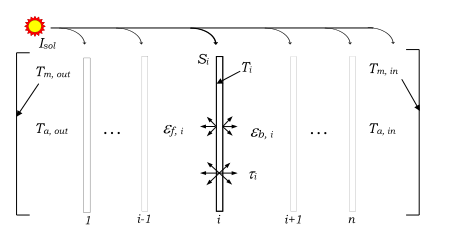

Figure 113. Multi-layer fenestration analysis structure (ASHRAE 1311-RP)

Equivalent layer fenestration model uses two-step analysis. First, the flux of absorbed solar radiation at each layer, S<sub>i</sub>, caused by the incident radiation flux, I<sub>sol</sub>, is determined using net radiation analysis. Second, an energy balance is applied at each layer, accounting for heat transfer and the known set of absorbed solar radiations S<sub>i</sub> values, in order to solve for the set of layer temperatures, T<sub>i</sub>, and the corresponding heat fluxes. The fenestration model also accounts for the diathermanous shade layers in the longwave radiant exchange. The latter can be significant for shading layers. Glass is considered opaque with respect to longwave radiation.

#### Equivalent Layer Optical Model

The multilayer optical model is based on an algorithm originally developed by Edwards (1977) and extended by Wright and Kotey (2006). The algorithm models the interaction of incident solar radiation with a glazing system composed of any number of parallel, planar, specular glazing layers. The shading layers scatter portion of the incident solar radiation diffusely, and the model tracks the beam and diffuse components of solar radiation as they interact with a multi-layer system of glazing and shading layers. The conceptual arrangement for tracking beam and diffuse solar flux components is illustrated in Figure 114.

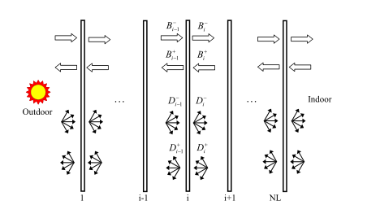

Analysis yields beam-beam, beam-diffuse and diffuse-diffuse fluxes, providing full detail concerning the quantities of reflected, transmitted and absorbed radiation.


Figure 114. Solar analysis of the multi-layer glazing/shading system showing beam and diffuse fluxes (ASHRAE 1311-RP)

The beam and diffuse characterization of solar radiation demands an expanded set of solar optical properties (Wright and Kotey 2006). The quantities of interest for single layer are shown inFigure 115.

Where,

*t*     =          transmittance of a glazing or a shading layer, (-)

*r*    =          reflectance of a glazing or a shading layer, (-)

*e*     =          thermal emissivity of a glazing or a shading layer, (-)

*q*    =          incident angle, (degree)

*f*    =          slat angle, (degree)

*W*    =          profile angle, (degree)

*J*    =          radiosity of a layer surface, (W/m2)

*T*    =          temperature of a layer, (C)

Subscripts

*f*     =          front side of a layer

*b*    =          back side of a layer

*bb*   =          beam-beam optical property. Represents a fraction of the beam radiation incident at a given layer and leaves the layer without being scattered.

*bd*   =          beam-diffuse optical property. Represents a fraction of the beam radiation incident at a given layer and leaves the layer diffusely

*dd*   =          diffuse-diffuse optical property. Represents a diffuse radiation incident at a given layer and leaves the layer as diffuse

*i     =         * layer index, (-)

Superscripts

*m*   =          represents material property (e.g., fabric material)

*str*  =          represents an apparent material structure property of roller blinds

*w*    =          represents an apparent wire property


Figure 115. Twelve solar properties assigned at each layer (ASHRAE 1311-RP)

Each glazing or shading layer, in general, require eleven set of solar properties (Wright and Kotey 2006). Only beam-beam properties are needed for common glazing layers. Each shading layer is represented by a few set of component properties and geometries that are converted to the full set of layer optical and thermal properties by equivalent layer models (ASHRAE 1311-RP). The models also make account for off-normal incidence of solar radiation and can calculate the diffuse component from normal incidence values using numerical integration.

#### Equivalent Layer Thermal Model

A surface energy balance is applied at each layer and the resulting set of equation is solved for layer temperatures and heat transfer fluxes. A schematic drawing of the multi-layer illustration and variables designation is shown in Figure 116. The net radiation formulation based on the radiosities, Jf,i and Jb,i the radiant flux leaving the front and back surfaces of the i<sup>th</sup> layer, respectively, is the used as a solution technique. The net radiant heat flux across a gap can be expressed as the difference between the radiosities of the bounding surfaces. The net radiation model analysis yields the layer temperatures and corresponding heat transfer coefficients that are used to determine U-factor and SHGC. The thermal analysis is done in “ASHWAT\_Thermal” routine.

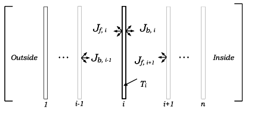

Figure 116. Radiosity model used in thermal analysis of the multi-layer glazing/shading system (ASHRAE 1311-RP)

#### Glazing Layer Analysis

The Equivalent-Layer window model allows a wide range of options regarding the selection of glazing layers and gaps combinations. It also allows mixing glazing and shading layers in any sequence. For instance, it allows placing a venetian blind or a roller blind in between glazing layers. Only beam-beam solar properties at normal incidence, infrared transmittance and infrared emissivity are required for common glazing types. Off-normal solar properties at a given sun position are estimated by adjusting the normal incidence values in “ASHWAT\_OffNormalProperties” routine. The model assumes that the ratio between normal and off-normal transmittance is the same for the glazing layer in question and a reference piece of uncoated 6 mm glass with a moderate tint (ASHRAE 1311-RP). A similar procedure is used to convert solar reflectance from normal to off-normal.

#### Gap Layer Analysis

Gaps can be specified as sealed, vented indoors or vented outdoors. The sealed gap is considered as enclosed cavity. Vented gaps is specified for inner and outer most gaps only and when the gas type is AIR. The vented gap model assumes that air flow at the perimeter of the window is not restricted. Any fill gas can be specified by molecular mass and thermo-physical properties of viscosity, specific heat and thermal conductivity. This is done by providing "a", “b” and "c" coefficients of the quadratic equation of the form, p = a + bT + cT<sup>2</sup>, where the T (K) is temperature and p is the property being evaluated. EnergyPlus has builtin-data available for common fill gas components including Air, Argon, Krypton and Xenon. Users specify CUSTOM gas by defining the coefficients as an input.

#### Shade Layer Analysis

Equivalent layer fenestration model has a complete set of solar and longwave models for the four shading layer types: drapes, venetian blinds, roller blinds and insect screens developed under ASHRAE 1311-RP. And semi-empirical models are used to evaluate the off-normal properties of drape, roller blind and insect screen materials. The effective layer properties of venetian blinds and the effect of pleating in drapes are determined using a more fundamental net radiation scheme. The openness fraction, A<sub>o</sub> and beam-beam solar transmittance at normal incidence, *t*<sub>bb</sub> (q=0) really represent a geometric quantity and it has been confirmed that they can be used interchangeably (ASHRAE 1311-RP). Openness is simply the fraction of a material, by area, that is open. In equivalent layer fenestration model, beam-beam transmittance at normal incidence (i.e., openness fraction), beam-diffuse transmittance and reflectance at normal incidence are required to characterize drapery fabric, roller blind and insect screen material. A conventional venetian blind in equivalent layer model can be characterized by specifying the geometry, solar reflectance and transmittance, and emissivity of the slats. The off-normal solar properties of drape, roller blind and insect screen materials were formulated based on measurements (ASHRAE 1311-RP). The longwave properties of the of the drape fabrics, roller blinds and insect screens can be calculated from the material emissivity and openness of the fabric (ASHRE 1311-RP). The optical model development for venetian blinds is presented by Yahoda and Wright (2004 and 2005), and Kotey et al. (2008).

#### Drapes and Curtains

The off-normal optical properties of drapery fabric is determined from user specified optical properties at normal incidence (q=0) using empirical correlations (Kotey et al., 2009a). The input data required to characterize drapery fabric are the beam-beam transmittance of the material at normal incidence *t*<sub>bb</sub> (q=0) = Ao, the beam-diffuse transmittance of the material at normal incidence*t*<sub>bd</sub> (q=0), and the beam-diffuse (total) reflectance of the materialr<sub>bt</sub> (q=0). The off-normal properties are calculated as follows.

Off-normal Transmittance:

<div>$${\rm{\tau }}_{{\rm{bb}}}^{\rm{m}}\left( {\rm{\theta }} \right) = {\rm{\tau }}_{{\rm{bb}}}^{\rm{m}}{\rm{(\theta }} = {\rm{0)}} \cdot {\rm{co}}{{\rm{s}}^{\rm{b}}}\left( {\rm{\theta }} \right)$$</div>

<div>$${\rm{\tau }}_{{\rm{bt}}}^{\rm{m}}\left( {\rm{\theta }} \right) = {\rm{\tau }}_{{\rm{bt}}}^{\rm{m}}{\rm{(\theta }} = {\rm{0)}} \cdot {\rm{co}}{{\rm{s}}^{\rm{b}}}\left( {\rm{\theta }} \right)$$</div>

<div>$${\rm{b}} = {\left[ {\; - 0.5 \cdot \ln \;\left( {\;{{\left[ {{\rm{\tau }}_{{\rm{bb}}}^{\rm{m}}{\rm{(\theta }} = {\rm{0)}}\;{\rm{,}}\;\;{\rm{0}}{\rm{.01}}} \right]}^{\;\max }}\;} \right)\;\;,\;\;0.35\;} \right]^{\;\max }}$$</div>

<div>$${\rm{b}} = {\left[ {\; - 0.5 \cdot \ln \;\left( {\;{{\left[ {{\rm{\tau }}_{{\rm{bt}}}^{\rm{m}}{\rm{(\theta }} = {\rm{0)}}\;{\rm{,}}\;\;{\rm{0}}{\rm{.01}}} \right]}^{\;\max }}\;} \right)\;\;,\;\;0.35\;} \right]^{\;\max }}$$</div>

<div>$${\rm{\tau }}_{{\rm{bt}}}^{\rm{m}}\left( {\rm{\theta }} \right) = {\rm{\tau }}_{{\rm{bd}}}^{\rm{m}}\left( {\rm{\theta }} \right) + {\rm{\tau }}_{{\rm{bb}}}^{\rm{m}}\left( {\rm{\theta }} \right)$$</div>

The off-normal reflectance:

<div>$${\rm{\rho }}_{{\rm{bt}}}^{\rm{m}}\left( {\rm{\theta }} \right) = {\rm{\rho }}_{{\rm{bd}}}^{\rm{m}}\left( {\rm{\theta }} \right) = {\rm{\rho }}_{{\rm{bt}}}^{\rm{m}}\left( {{\rm{\theta }} = {\rm{0}}} \right) + \left( {{\rm{\rho }}_{{\rm{bt}}}^{\rm{m}}\left( {{\rm{\theta }} = 9{\rm{0}}^\circ } \right) - {\rm{\rho }}_{{\rm{bt}}}^{\rm{m}}\left( {{\rm{\theta }} = {\rm{0}}} \right)} \right) \cdot \left( {1 - {\rm{co}}{{\rm{s}}^{{\rm{0}}{\rm{.6}}}}\left( {\rm{\theta }} \right)} \right)$$</div>

<div>$${\rm{\rho }}_{{\rm{bt}}}^{\rm{m}}\left( {{\rm{\theta }} = {\rm{90}}^\circ } \right) = {\rm{\rho }}_{{\rm{bt}}}^{\rm{m}}\left( {{\rm{\theta }} = {\rm{0}}} \right) + \left( {{\rm{1}} - {\rm{\rho }}_{{\rm{bt}}}^{\rm{m}}\left( {{\rm{\theta }} = {\rm{0}}} \right)} \right)\;\left( {\,0.7{{\left( {\;{\rm{\rho }}_{}^{\rm{y}}} \right)}^{\;0.7}}} \right)$$</div>

The apparent yarn reflectance is given by:

<div>$${\rho ^y} = \frac{{\rho_{{\rm{bt}}}^{\rm{m}}\left( {{\rm{\theta }} = {\rm{0}}} \right)}}{{{\rm{1}} - \tau_{{\rm{bb}}}^{\rm{m}}\left( {{\rm{\theta }} = {\rm{0}}} \right)}} = \frac{{\rho_{{\rm{bt}}}^{\rm{m}}\left( {{\rm{\theta }} = {\rm{0}}} \right)}}{{{\rm{1}} - {{\rm{A}}_{\rm{o}}}}}$$</div>

The above set of equations for drapery fabrics are used subject to the condition that the solar absorptance of the fabric, at normal incidence, is not less than 1% (ASHRE 1311-RP). The diffuse-diffuse material properties, for Equivalent layer window model, are determined using Rhomberg integration with 32 panels covering the range from q=0 to q=90° (ASHRAE 1311-RP). The subscript “X” stands for either front or back side of the layer.

<div>$$\tau_{{\rm{x,dd}}}^{\rm{m}} = \;\;{\rm{2}}\;\int\limits_{{\rm{\theta }} = {\rm{0}}}^{{\raise0.5ex\hbox{$\scriptstyle {\rm{\pi }}$}\kern-0.1em/\kern-0.15em\lower0.25ex\hbox{$\scriptstyle {\rm{2}}$}}} {\tau_{{\rm{x,bt}}}^{\rm{m}}\left( {\rm{\theta }} \right) \cdot {\rm{cos}}\left( {\rm{\theta }} \right) \cdot {\rm{sin}}\left( {\rm{\theta }} \right)} \;{\rm{d\theta }}$$</div>

<div>$$\rho_{{\rm{x,dd}}}^{\rm{m}} = \;\;{\rm{2}}\;\int\limits_{{\rm{\theta }} = {\rm{0}}}^{{\raise0.5ex\hbox{$\scriptstyle {\rm{\pi }}$}\kern-0.1em/\kern-0.15em\lower0.25ex\hbox{$\scriptstyle {\rm{2}}$}}} {\rho_{{\rm{x,bt}}}^{\rm{m}}\left( {\rm{\theta }} \right) \cdot {\rm{cos}}\left( {\rm{\theta }} \right) \cdot {\rm{sin}}\left( {\rm{\theta }} \right)} \;{\rm{d\theta }}$$</div>

The above set of equations for drapery fabrics apply to the full range of A<sub>o</sub>, fabric transmittance and fabric reflectance including that falls within the bounds of Keyes' (1967) fabric chart plus sheer fabrics (ASHRAE 1311-RP). The longwave thermal emissivity and thermal transmittances of drapery fabric are calculated using the following correlations and fabric openness fraction (Kotey et al. 2008).

<div>$${\varepsilon ^{\rm{m}}} = {\rm{0}}{\rm{.87}} \cdot \left( {{\rm{1 - }}{{\rm{A}}_{\rm{o}}}} \right)$$</div>

<div>$${\tau ^{\rm{m}}} = {\rm{1}} - {\rm{0}}{\rm{.95}} \cdot \left( {{\rm{1}} - {{\rm{A}}_{\rm{o}}}} \right)$$</div>

The optical and thermal properties determined using the above same sets of equations are equally valid for pleated drape shades (Kotey, et. al., 2009a). For pleated drape, the effective beam-beam and beam-diffuse solar properties are determined by tracking both radiation components, for a given incident angle, and interaction with a fabric pleated rectangular geometry shown in Figure 117. The solar optical properties of the two different pleat planes are evaluated on the basis of the local solar incidence angle. Therefore, the effective layer properties are influenced not just by horizontal solar profile angle, W<sub>H</sub>, but also by incidence angle (ASHRAE 1311-RP).

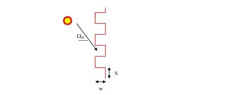

Figure 117. Geometry used for Pleated Drape Analysis

The solar diffuse-diffuse and long-wave effective properties of the pleated drape are evaluated using a much simpler net-radiation analysis using conventional shape factors (Kotey, et. al., 2009a). Users can chose and apply the pleated drape model to any fabric and any degree of fullness (ASHRAE 1311-RP).

#### Venetian Blinds

The effective shortwave optical and longwave optical properties of venetian blind layer is estimated using analytical models (Yahoda and Wright 2004, 2005; Kotey et al. 2008). The model requires properties of venetian blind slats and geometry of the slats shown in Figure 1118.

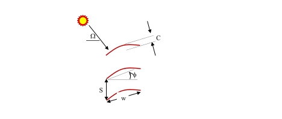

Figure 1118. Likewise, the effective longwave properties are obtained for the layer knowing longwave properties of the slats.


Figure 118. Geometry and properties used for venetian blind analysis

The model assumes that venetian blind slats reflect and transmit solar radiation diffusely (ASHRAE 1311-RP). The same assumption is made regarding thermal radiation. The input data required to characterize a venetian blind are: front and back side reflectance and transmittance of the slat, geometry and infrared emissivity and transmittance of the slate. The effective optical properties of the venetian blind are determined by tracking beam and diffuse solar radiation through various interactions with slats positioned at a given slat angle. The model uses simple four-surface model if the slats are fully sunlit and a six-surface model if the slats are partially sunlit (ASHRAE 1311-RP). Slats are assumed to be thin and flat but a correction is applied to account for slat curvature effect (Kotey et al. 2008).

#### Roller Blinds

The off-normal properties of roller-blind are determined from solar properties of roller blind fabric measured at normal incidence (q=0) using correlations (Kotey, et. al., 2009b). The off-normal properties for roller blind shades are calculated using the set equations given below:

<div>$${{\rm{\tau }}_{bb}}\left( {\rm{\theta }} \right) = \left\{ \begin{array}{l}{{\rm{\tau }}_{bb}}{\rm{(\theta }} = {\rm{0)}} \cdot {\rm{co}}{{\rm{s}}^{\rm{b}}}{\kern 1pt} \left( {\frac{{\rm{\theta }}}{{{{\rm{\theta }}_{{\rm{cutoff}}}}}} \cdot \frac{\pi }{2}} \right)\quad \theta  &lt; {\theta_{CutOff}}\\0\quad \quad \quad \theta  \ge {\theta_{CutOff}}\end{array} \right.$$</div>

<div>$${\rm{b}} = {\rm{0}}{\rm{.6}} \cdot {\rm{co}}{{\rm{s}}^{{\rm{0}}{\rm{.3}}}}\left( {{{\rm{A}}_{\rm{o}}} \cdot \frac{{\rm{\pi }}}{{\rm{2}}}} \right)$$</div>

<div>$${{\rm{\theta }}_{{\rm{cutoff}}}} = {\rm{65}}^\circ  + \;\left( {{\rm{90}}^\circ  - {\rm{65}}^\circ } \right) \cdot \left( {{\rm{1}} - {\rm{cos}}\left( {{{\rm{A}}_{\rm{o}}} \cdot \frac{{\rm{\pi }}}{{\rm{2}}}} \right)} \right)$$</div>

<div>$${\rm{\tau }}_{{\rm{bt}}}^{}\left( {\rm{\theta }} \right) = {\rm{\tau }}_{{\rm{bt}}}^{}{\rm{(\theta }} = {\rm{0)}} \cdot {\rm{co}}{{\rm{s}}^{\rm{b}}}{\kern 1pt} \left( {\rm{\theta }} \right)$$</div>

<div>$$
  b = \left\{ 
    \begin{array}{lc}
      0.133 \cdot \left( \rm{\tau}^{str} + 0.003 \right)^{-0.467} &\text{if} \left( 0 \le \rm{\tau}^{str} \le 0.33 \right) \\
      0.33 \cdot \left( 1 - \rm{\tau}^{str} \right)               &\text{if} \left( 0.33 &lt; \rm{\tau}^{str} \le 1 \right)
    \end{array}
  \right.
$$</div>

<div>$${\rm{\tau }}_{}^{{\rm{str}}} = \frac{{{\rm{\tau }}_{{\rm{bt}}}^{}\left( {{\rm{\theta }} = {\rm{0}}} \right) - {{\rm{\tau }}_{{\rm{bb}}}}\left( {{\rm{\theta }} = {\rm{0}}} \right)}}{{{\rm{1}} - {{\rm{\tau }}_{{\rm{bb}}}}\left( {{\rm{\theta }} = {\rm{0}}} \right)}}$$</div>

<div>$${\rm{\tau bt}}\left( {\rm{\theta }} \right) = {\rm{\tau bd}}\left( {\rm{\theta }} \right) + {\rm{\tau bb}}\left( {\rm{\theta }} \right)$$</div>

The off-normal solar property calculation of roller blind is based on a set of correlations developed from measurement data using samples of commonly used commercially produced roller blind material openness range of 0.0 – 0.14. Thus, these correlations are not applicable for shades with materials openness fraction exceeding 0.20. The mean solar reflectance of a roller blind material was found to be purely diffuse and unaffected by incidence angle and is given by:

<div>$${\rm{\rho }}_{{\rm{bt}}}^{}\left( {{\rm{\theta }} = {\rm{0}}} \right) = {\rm{\rho }}_{{\rm{bd}}}^{}\left( {{\rm{\theta }} = {\rm{0}}} \right) = {\rm{\rho }}_{{\rm{bt}}}^{}\left( {\rm{\theta }} \right) = {\rm{\rho }}_{{\rm{bd}}}^{}\left( {\rm{\theta }} \right)$$</div>

The diffuse-diffuse transmittance and reflectance are obtained by Rhomberg numerical integration. The longwave properties of roller blind material determined using the material property and the openness fraction (Kotey et al. 2008) as shown below:

<div>$${\varepsilon ^{{\rm{rb}}}} = {\rm{0}}{\rm{.91}} \cdot \left( {{\rm{1 - }}{{\rm{A}}_{\rm{o}}}} \right)$$</div>

<div>$${\tau ^{{\rm{rb}}}} = {\rm{1}} - {\rm{0}}{\rm{.95}} \cdot \left( {{\rm{1}} - {{\rm{A}}_{\rm{o}}}} \right)$$</div>

#### Insect Screens

The empirical correlations formulated to obtain the effective off-normal solar and longwave properties of insect screens were based on measurements (Kotey et al. (2009a). Insect screen geometry is shown in Figure 119. The calculation of effective solar properties requires a set of properties measured at normal incidence: *t*<sub>bb</sub> (q=0), *t*<sub>bd</sub> (q=0) and *r*<sub>bt</sub> (q=0).


Figure 119. Geometry used for insect screen analysis

Openness can be determined by optical measurement at normal incidence, A<sub>o</sub>=*t*<sub>bb</sub> (q=0), but in the case of insect screens A<sub>o</sub> can reliably be calculated knowing wire diameter (*d*), and wire spacing (*s*) as follows:

<div>$${A_o} = {\left( {1 - {d \mathord{\left/ {\vphantom {d s}} \right. } s}} \right)^2}$$</div>

The incidence angle beyond which direct beam transmission is cut off, *q*<sub>CutOff</sub>, can also be estimated purely from geometry and is given by:

<div>$${\theta_{CutOff}} = co{s^{ - 1}}\left( {{d \mathord{\left/ {\vphantom {d S}} \right. } S}} \right)$$</div>

The off-normal properties are calculated as follows.

<div>$${\tau_{bb}}\left( {\rm{\theta }} \right) = \left\{ \begin{array}{l}{\tau_{bb}}{\rm{(\theta }} = {\rm{0)}} \cdot {\rm{co}}{{\rm{s}}^{\rm{b}}}\left( {\frac{{\rm{\theta }}}{{{{\rm{\theta }}_{{\rm{cutoff}}}}}} \cdot \frac{\pi }{{\rm{2}}}} \right)\quad {\rm{\theta }} &lt; {{\rm{\theta }}_{{\rm{cutoff}}}}\\0\quad \quad \quad \quad \quad \quad \quad \quad \quad \quad \quad \;\,{\rm{\theta }} \ge {{\rm{\theta }}_{{\rm{cutoff}}}}\end{array} \right.$$</div>

<div>$${\rm{b}} =  - {\rm{0}}{\rm{.45}}\;{\rm{ln}}\;\left( {{\rm{MAX}}\left( {{{\rm{\tau }}_{{\rm{bb}}}}\left( {{\rm{\theta }} = {\rm{0}}} \right){\rm{,}}\;{\rm{0}}{\rm{.01}}} \right)} \right)\; + \;{\rm{0}}{\rm{.1}}$$</div>

<div>$${\rm{\tau }}_{{\rm{bt}}}^{}\left( {\rm{\theta }} \right) = {\rm{\tau }}_{{\rm{bt}}}^{}{\rm{(\theta }} = {\rm{0)}} \cdot {\rm{co}}{{\rm{s}}^{\rm{b}}}\left( {\rm{\theta }} \right)$$</div>

<div>$${\rm{b}} =  - {\rm{0}}{\rm{.65}}\;{\rm{ln}}\;\left( {{\rm{MAX}}\left( {{{\rm{\tau }}_{{\rm{bt}}}}\left( {{\rm{\theta }} = {\rm{0}}} \right){\rm{,}}\;{\rm{0}}{\rm{.01}}} \right)} \right)\; + \;{\rm{0}}{\rm{.1}}$$</div>

<div>$${\rm{\tau }}_{{\rm{bd}}}^{}\left( {\rm{\theta }} \right) = {\rm{\tau }}_{{\rm{bt}}}^{}\left( {\rm{\theta }} \right) - {\rm{\tau }}_{{\rm{bb}}}^{}\left( {\rm{\theta }} \right)$$</div>

<div>$${\rm{\rho }}_{{\rm{bt}}}^{}\left( {\rm{\theta }} \right) = {\rm{\rho }}_{{\rm{bt}}}^{}\left( {{\rm{\theta }} = {\rm{0}}} \right) + \left( {{\rm{\rho }}_{{\rm{bt}}}^{}\left( {{\rm{\theta }} = 9{\rm{0}}^\circ } \right) - {\rm{\rho }}_{{\rm{bt}}}^{}\left( {{\rm{\theta }} = {\rm{0}}} \right)} \right) \cdot \left( {1 - {\rm{co}}{{\rm{s}}^{\rm{b}}}\left( {\rm{\theta }} \right)} \right)$$</div>

<div>$${\rm{b}} =  - {\rm{0}}{\rm{.45}}\;{\rm{ln}}\;{\left( {{{\rm{\rho }}^{\rm{w}}}} \right)^{}}$$</div>

<div>$${\rm{\rho }}_{}^{\rm{w}} = \frac{{{\rm{\rho }}_{{\rm{bt}}}^{}\left( {{\rm{\theta }} = {\rm{0}}} \right)}}{{{\rm{1}} - {\rm{\tau }}_{{\rm{bb}}}^{}\left( {{\rm{\theta }} = {\rm{0}}} \right)}}$$</div>

<div>$${\rho_{{\rm{bt}}}}\left( {{\rm{\theta }} = {\rm{90}}^\circ } \right) = {\rho_{{\rm{bt}}}}\left( {{\rm{\theta }} = {\rm{0}}} \right) + \left( {1 - {\rho_{{\rm{bt}}}}\left( {{\rm{\theta }} = {\rm{0}}} \right)} \right)\;\left( {{\rm{0}}{\rm{.35}}{\rho ^{\rm{w}}}} \right)$$</div>

The diffuse-diffuse material properties are obtained by Rhomberg numerical integration. The longwave properties of insect screen are given by expressions similar those formulated for drapery fabrics, and roller blinds (Kotey et al. 2008) is given by:

<div>$${\varepsilon ^{screen}} = {\varepsilon ^{\rm{w}}} \cdot \left( {{\rm{1  -  }}{{\rm{A}}_{\rm{o}}}} \right)$$</div>

<div>$${\tau ^{{\rm{screen}}}} = {\rm{1 - }}{\tau ^{\rm{w}}} \cdot \left( {{\rm{1  -  }}{{\rm{A}}_{\rm{o}}}} \right)$$</div>

The apparent wire material emissivity can be taken as *e*<sup>w</sup>=0.93 for common insect screens - screens with dark, rough, non-metallic wire surfaces. The corresponding infrared wire material transmittance is *t*<sup>w</sup>=0.98. A lower infrared emissivity can be used for screens constructed with shiny metallic wire. For example, to model stainless-steel wire mesh use *e*<sup>w</sup>=0.32 and *t*<sup>w</sup>=0.81.

#### Integration with Heat Balance Method

The solar model calculations are performed surface by surface following the existing structure of EnergyPlus’s heat balance algorithm. The optical and thermal calculations are performed for each surface at each time step. The thermal model needs to be updated at each time step during the surface heat balance iteration. Thus, window thermal model is invoked during the surface heat balance but only once. This is consistent with the current EnergyPlus’s window model inside surface heat balance iteration scheme. The equivalent layer window thermal model also has internal iteration scheme. The thermal model routine also requires the solar and shortwave radiation flux absorbed by each layer of a fenestration at each time step. The calculation of the absorbed radiation flux is performed using the existing scheme except that the optical properties are calculated by the equivalent layer optical model. The equivalent layer thermal model returns the temperatures and the fluxes at each layer.

#### Equivalent Layer Window Solar Model

The equivalent layer window solar model calculates the transmittance of the window and absorptance of each layer. Separate optical properties calculations are performed for exterior beam and diffuse radiations, and interior diffuse radiation (e.g., lighting and inter-reflected solar gain). The fractions for beam radiations depend on solar incident angle and hence updated for each time step. Diffuse radiation fractions are the same for all time steps unless the shade characteristics are altered; for instance, when the venetian blind slat angle is controlled. Otherwise, the diffuse fractions are constant for a given configuration and time step. The hub of the optical properties calculation routine for Equivalent Layer window model is the routine “ASHWAT\_Solar”. For beam radiation, at each time step, first the normal incidence optical properties are modified for current incident angle. Using the off-normal properties, then the ASHWAT\_Solar routine sets up the coefficient matrix based on the net radiation concept to determine the effective absorptance of each layer and the window transmittance. The total intensity of shortwave radiation absorbed at each layer is determined by multiplying the incident solar radiation, reflected internal solar radiations, and internal shortwave source components by the appropriate absorbed fractions and summing them.

#### Equivalent Layer Window Thermal Model

The equivalent layer thermal model is calculated only once for each time step. But the thermal model has internal iterative solutions scheme. During each time step, the procedure initially assumes that room air and means radiant temperatures are known. The surface heat balance loops through all zone surfaces while invoking the Equivalent Layer thermal model only once for each window surface at the first iteration. The window surfaces temperatures from the first iteration are used to complete the heat balances for the indoor (and implicitly the outdoor) face of each surface iteratively. Once indoor surface temperatures are calculated using the surface heat balance, the zone air temperature can be updated and the loads are predicted. Shaded fenestration in general do not have single inside temperature by virture their long-wave radiation transmittance. The equivalent layer window model accounts for this using effective emissivity of the composite layers derived for each fenestration (ASHRAE 1311-RP) as shown below:

<div>$${\varepsilon ^{eff}} = \sum\limits_{j = 0}^{nl} {\left[ {{\varepsilon_j} \cdot \prod\limits_{k = j{ + 1}}^{nl + {1}} {{\tau_k}} } \right]} $$</div>

where

*e<sup>eff</sup>*   =          composite indoor (room-side) longwave emissivity, (-)

*e<sub>j</sub>    =         * effective emissivity of layer j, (-)

*t<sub>k</sub>    =         * effective infrared transmittance of layer k (*t<sub>nl+1</sub>* = 1)

*nl    =         * number of layers in fenestration system (glazing and shade). Layers are numbered outside to inside (layer 1 is outermost, layer *nl* is innermost).

Each equivalent layer window surafce yields net longwave radiant flux exchanged with the zone surfaces. Net longwave radiation exchange from the window to the zone is recast for a composite surface temperature calculation as follows:

<div>$${T^{eff}} = \sqrt[4]{{\frac{{{Q_{lw}}}}{{\sigma {\varepsilon ^{eff}}}}}} + {T_0}$$</div>

where

*T<sup>eff</sup>*  =          inside surface temperature of the composite layer, °C (°F)

*Q<sub>lw</sub>*  =          infrared radiant gain from zone, W/m2 (Btu/h-ft2)

*s*    =          Stefan-Boltzmann constant, W/m2-K4 (Btu/h-ft2-R4)

*T<sub>0</sub>*   =          Temperature of absolute zero, -273.15 °C (-459.67 °F)

Recalculating effective inside face window temperature may result in extra convection flux. The  “extra” (Other) convective flux is computed; this is the gain in excess of that resulting from the standard surface heat balance model. The net other convection term *QX* calculated below is added to the zone air heat balance (ASHRAE 1311-RP).

<div>$$QX = {Q_{conv}} - hc \cdot ({T^{eff}} - {T_a})$$</div>

Where,

*h<sub>c</sub>   =         * inside convective coefficient of the fenestration, W/m<sup>2</sup>-K (Btu/h-ft<sup>2</sup>-F)

*Q<sub>conv</sub>            =         * total convective heat flux to zone from equivalent layer window thermal model, W/m<sup>2</sup> (Btu/h-ft<sup>2</sup>); includes open-channel gains and impact of inside surface convective coefficient

*T<sub>a</sub>   =         * zone air temperature, °C (°F)

#### References:

Edwards, D.K. 1977. Solar absorption by each element in an absorber-coverglass array, Technical Note, Solar Energy, Vol. 19, pp. 401-402.

Parmelee, G. V., and W. W. Aubele. 1952. The shading of sunlit glass: an analysis of the effect of uniformly spaced flat opaque slats, ASHVE Transactions, Vol. 58, pp. 377-398.

Farber, Erich A.; William A. Smith, C.W. Pennington, John C. Reed. 1963. Theoretical analysis of solar heat gain through insulating glass with inside shading. ASHRAE Transactions, Vol. 69, pp.393-405.

Rheault, S., and E. Bilgen. 1989. Heat transfer analysis in an automated venetian blind system, Journal of Solar Energy, Vol. 111 (Feb.), pp. 89-95.

Pfrommer, P., K. J. Lomas, and C. Kupke. 1996. "Solar Radiation Transport through Slat-Type Blinds: a New Model and its Application for Thermal Simulation of Buildings," Solar Energy, Vol. 57, No. 2, pp. 77-91.

Rosenfeld, J.L.J., W. J. Platzer, H. Van Dijk, and A. Maccari. 2000. "Modelling the Optical and Thermal Properties of Complex Glazing: Overview of Recent Developments", Solar Energy, Vol. 69 Supplement, No. 1-6, pp.1-13.

Yahoda, D. S. and J. L. Wright. 2004. "Methods for Calculating the Effective Longwave Radiative Properties of a Venetian Blind Layer," ASHRAE Transactions, Vol. 110, Pt. 1., pp. 463-473.

Yahoda, D. S. and J. L. Wright. 2005. "Methods for Calculating the Effective Solar-Optical Properties of a Venetian Blind Layer," ASHRAE Transactions, Vol. 111, Pt. 1, pp. 572-586.

Yahoda, D. S. and J. L. Wright. 2004. "Heat Transfer Analysis of a Between-Panes Venetian Blind Using Effective Longwave Radiative Properties," ASHRAE Transactions, Vol. 110, Pt. 1., pp. 455-462.

Huang, N.Y.T., J. L. Wright, M. R. Collins. 2006. "Thermal Resistance of a Window with an Enclosed Venetian Blind: Guarded Heater Plate Measurements," ASHRAE Transactions, Vol. 112, Pt. 2. pp. 13-21.

Wright, J. L. 2008. "Calculating Centre-Glass Performance Indices of Glazing Systems with Shading Devices," ASHRAE Transactions, Vol. 114, Pt. 2.

Wright, J. L., N. Y. T. Huang, and M. R. Collins. 2008. "Thermal Resistance of a Window with an Enclosed Venetian Blind: A Simplified Model," ASHRAE Transactions, Vol. 114, Pt. 1.

Kotey, N. A., J. L. Wright, and M. R. Collins. 2008. “Determining Longwave Radiative Properties of Flat Shading Materials,” 33rd Annual SESCI / 3rd CSBC Conference Proceedings, Fredericton, NB.

Kotey, N.A., Wright, J.L., M. R. Collins. 2009a. "Determination of Angle-Dependent Solar Optical Properties of Roller Blind Materials," drafted for submission to ASHRAE Transactions, Vol. 115, Pt. 1.

Kotey, N.A., Wright, J.L., M. R. Collins. 2009b. "Determination of Angle-Dependent Solar Optical Properties of Drapery Fabrics," in review, ASHRAE Transactions, Vol. 115, Pt. 2.

Wright, John L., Charles S. Barnaby, Michael R. Collins, and Nathan A. Kotey. Improving Cooling Load Calculations for Fenestration with Shading Devices . ASHRAE 1311-RP, Final Report, February 11, 2009.
