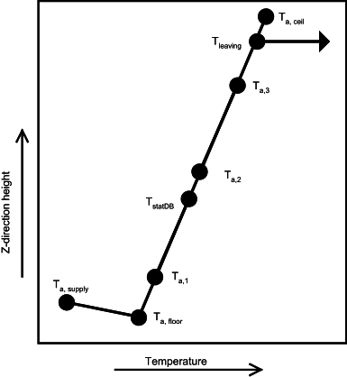
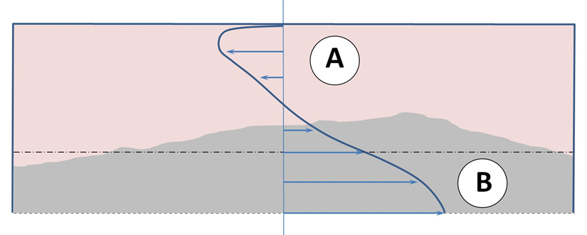
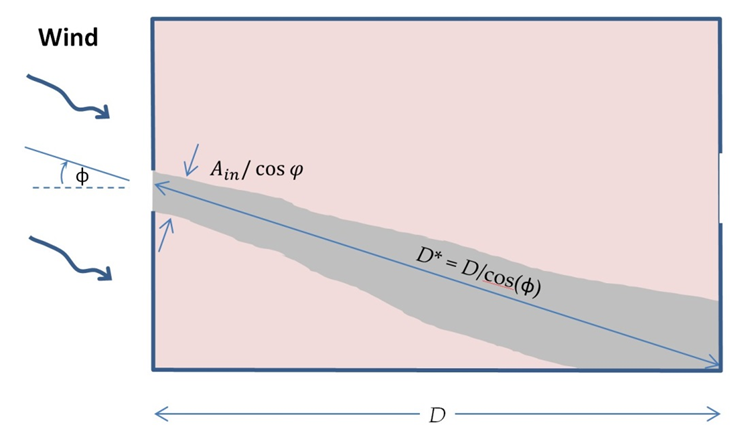
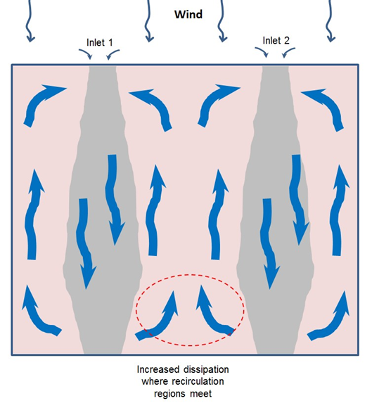
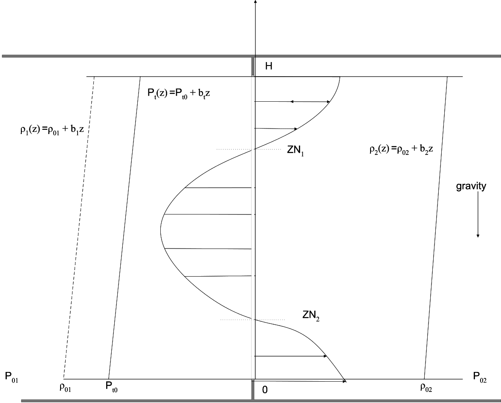

Alternative Modeling Processes
==============================

### RoomAir Models

The group of models described in this section is used to account for non-uniform room air temperatures that may occur within the interior air volume of a zone.  These models are accessed using the RoomAirModelType input object. RoomAir modeling was added to EnergyPlus starting with Version 1.2.  Although there are many types of analyses (comfort, indoor air quality, etc) that might benefit from localized modeling of how room air varies across space, only the *temperature* distribution of room air within the zone is currently addressed in EnergyPlus.  This allows surface heat transfer and air system heat balance calculations to be made taking into account natural thermal stratification of air and different types of intentional air distribution designs such as under-floor and side-wall displacement ventilation that purport to extract room air at higher-than-mean temperatures.  Note that EnergyPlus does **not** have completely general methods of modeling room air that are applicable to every conceivable type of airflow that might occur in a zone.  Such models (e.g. RANS-CFD) are too computationally expensive to use with EnergyPlus for the foreseeable future. The models that are available in EnergyPlus offer only limited modeling capabilities for select room airflow configurations.  Also note that because the complete mixing model for room air has long been the standard in building energy simulation, there is not currently a consensus on how to best model non-uniform air temperatures in buildings.  Therefore, it is up to the user to have a good understanding of when, where, and how to apply the room air models available in EnergyPlus.  The rest of this section provides some guidance in the way of examples and further discussion of the models available in EnergyPlus.

EnergyPlus offers the different types of air models listed in the table below along with the input objects associated with the use of that model.

Table 43.  Summary of room air models available in EnergyPlus

<table class="table table-striped">
<tr>
<th>Air model name</th>
<th>Applicability</th>
<th>Input Objects Required</th>
</tr>
<tr>
<td>Well-Mixed</td>
<td>All zones</td>
<td>None, default</td>
</tr>
<tr>
<td>User Defined</td>
<td>Any zone where the user has prior knowledge of the temperature pattern</td>
<td>‘RoomAirModelType’, ‘RoomAir:TemperaturePattern:UserDefined’, ‘RoomAir:TemperaturePattern: xx’</td>
</tr>
<tr>
<td>One-Node Displacement Ventilation (Mundt)</td>
<td>displacement ventilation in typical office-type zones</td>
<td>‘RoomAirModelType’, ‘RoomAirSettings:OneNodeDisplacementVentilation’, ‘RoomAir:Node’’</td>
</tr>
<tr>
<td>Three-Node Displacement Ventilation (UCSD)</td>
<td>displacement ventilation</td>
<td>‘RoomAirModelType’, ‘RoomAirSettings:ThreeNodeDisplacementVentilation’</td>
</tr>
<tr>
<td>Under-Floor Air Distribution Interior Model (UCSD)</td>
<td>Interior zones served by a UFAD system</td>
<td>‘RoomAirModelType’, ‘RoomAirSettings:UnderFloorAirDistributionInterior’</td>
</tr>
<tr>
<td>Under-Floor Air Distribution Exterior Model (UCSD)</td>
<td>Exterior zones served by a UFAD system</td>
<td>‘RoomAirModelType’, ‘RoomAirSettings:UnderFloorAirDistributionExterior’</td>
</tr>
<tr>
<td>UCSD Cross Ventilation</td>
<td>cross ventilation</td>
<td>‘RoomAirModelType’, ‘RoomAirSettings:CrossVentilation’</td>
</tr>

</table>

The room air models are coupled to the heat balance routines using the framework described by Griffith and Chen (2004).  Their framework was modified to include features needed for a comprehensive program for annual energy modeling rather than one for hourly load calculations.  The formulation is largely shifted from being based on the setpoint temperature to one based on the current mean air temperature.  This is necessary to allow for floating temperatures and dual setpoint control where there may be times that the mean zone temperatures are inside the dead band.  The coupling framework was also extended to allow for exhaust air flows (e.g. bathroom exhaust fans) in addition to air system return flows.

The inside face temperature calculation is modified by rewriting the zone air temperature, *Ta*, with an additional subscript, *i*, for the surface index (\({T_{{a_j}}} \to {T_{{a_{i,j}}}}\)or \({T_{{a_{}}}} \to {T_{{a_i}}}\)).  The inside face heat balance is solved for its surface temperature using,

$${T_{{s_{i,j}}}} = \frac{{{T_{s{o_{i,j}}}}{Y_{i,o}} + \sum\limits_{k = 1}^{nz} {{T_{s{o_{i,j - k}}}}} {Y_{i,k}} - \sum\limits_{k = 1}^{nz} {{T_{{s_{i,j - k}}}}} {Z_{i,k}} + \sum\limits_{k = 1}^{nq} {{\Phi_{i,k}}{{q''}_{k{i_{i,j - k}}}} + {T_{{a_{i,j}}}}{h_{{c_{i,j}}}} + {{q''}_{LWS}} + {{q''}_{LWX}} + {{q''}_{SW}} + {{q''}_{sol}}} }}{{{Z_{i,o}} + {h_{{c_{i,j}}}}}}$$

where,         *Ts*         is the inside face temperature

*i*           subscript indicates individual surfaces

      *j*           subscript indicates current time step

      *k*          subscript indicates time history steps

      *Tso*        is the outside face temperature

      *Yi        * are the cross CTF coefficients

      *Zi                  * are the inside CTF coefficients

      *Φi*         are the flux CTF coefficients

      \({q''_{ki}}\)       is the conduction heat flux through the surface

      \({h_{{c_i}}}\)       is the surface convection heat transfer coefficient

      *Ta*         is the near-surface air temperature

      \({q''_{LWS}}\)    is the longwave radiation heat flux from equipment in zone

      \({q''_{LWX}}\)    is the net long wavelength radiation flux exchange between zone surfaces

      \({q''_{SW}}\)     is the net short wavelength radiation flux to surface from lights

      \({q''_{sol}}\)      is the absorbed direct and diffuse solar (short wavelength) radiation

#### References:

Griffith, B. and Q. Chen. 2004. Framework for coupling room air models to heat balance load and energy calculations (RP-1222). International Journal of Heating, Ventilating, Air-conditioning and Refrigerating Research. ASHRAE, Atlanta GA.  Vol 10. No 2. April 2004.

### User Defined RoomAir Temperatures

The input object RoomAir:TemperaturePattern:UserDefined provides a capabity for users to define the sort of air temperature pattern he or she expects in the zone.  With these models, the pattern is generally set beforehand and does not respond to conditions that evolve during the simulation.  (Exception: the pattern available through the RoomAir:TemperaturePattern:TwoGradient object will switch between two different pre-defined vertical gradients depending on the current value of certain temperatures or thermal loads. )

The user-defined patterns obtain the mean air temperature, \({T_{MAT}}\), from the heat balance domain and then produce modified values for:

      \({T_{ai}}\)       the adjacent air temperature which is then used in the calculation of inside face surface temperature during the heat balance calculations,

      \({T_{leaving}}\)  the temperature of air leaving the zone and entering the air system returns

      \({T_{exhaust}}\)  the temperature of air leaving the zone and entering the exhaust.

      \({T_{stat}}\)     the temperature of air “sensed” at the thermostat (not currently used in air system control because air system flows use load-based control).

The user defined room air models used indirect coupling so that the patterns provide values for, or ways to calculate, how specific temperatures differ from \({T_{MAT}}\).  The various \(\Delta T\) values determined from the model are applied to \({T_{MAT}}\) as follows:

$${T_{ai}} = \Delta {T_{ai}} + {T_{MAT}}$$

(where “*i’s”* represents each surface in the zone that is affected by the model)

$${T_{leaving}} = \Delta {T_{return}} + {T_{MAT}}$$

$${T_{exhaust}} = \Delta {T_{exhaust}} + {T_{MAT}}$$

$${T_{stat}} = \Delta {T_{stat}} + {T_{MAT}}$$

The patterns defined by the object ‘RoomAir:TemperaturePattern:SurfaceMapping’ are fairly straightforward.  The user directly inputs values for \(\Delta {T_{ai}}\) for each surface.  The pattern “maps” specific surfaces, identified by name, to \(\Delta {T_{ai}}\) values.  This provides completely general control (but in practice may be cumbersome to use).  The other patterns focus on temperature changes in the vertical direction.  Surfaces do not need to be identified, but all the surfaces with the same height will be assigned the same \(\Delta {T_{ai}}\) values.

The patterns defined by the object ‘RoomAir:TemperaturePattern:NondimensonalHeight’ apply a temperature profile based on a non-dimensionalized height, \({\rm Z}\).  The height of each surface is defined to be the z-coordinate of the surface’s centroid relative to the average z-coordinate of the floor surfaces.  The zone ceiling height is used as the length scale to non-dimensionalize each surface’s height so that,

$${{\rm Z}_i} = ({z_{i,centroid}} - {z_{floorAvg}})/Ceiling\;Height$$

(where “*i’s”* represents each surface in the zone that is affected by the model)

The values for \({Z_i}\) are constrained to be between 0.01 and 0.99 because the value is meant to describe the air layer near the surface (say approximate 0.1 m from the surface) rather than the surface itself.

The user-defined profile is treated as a look up table or piecewise linear model.  The values for \(\Delta {T_{ai}}\) are determined by searching the \({\rm Z}\) values in the user-defined profile and performing linear interpolation on the associated \(\Delta {T_a}\) values.

The patterns defined by the object ‘RoomAir:TemperaturePattern:ConstantGradient’ apply a constant temperature gradient in the vertical direction.  The model assumes that \({T_{MAT}}\) occurs at the mid-plane so that \({{\rm Z}_{{T_{MAT}}}} = 0.5\) (by definition).  The surface \({Z_i}\) values are compared to \({Z_{{T_{MAT}}}}\)and then scaled with zone ceiling height to obtain values for the change in height (in units of meters), \(\Delta z\).  The user defined gradient, \(grad\), (units of ºC/m) is then used to determine \(\Delta {T_{ai}}\) values using

$$\Delta {T_{ai}} = \Delta z * grad$$

The patterns defined by the object ‘RoomAir:TemperaturePattern:TwoGradient’ are very similar to the constant gradient pattern above but the value of \(grad\) used at any given time is selected by interpolating between two user-defined values for \(grad\).  Five options are available, three based on temperatures and two based on thermal loads – see the Input Output Reference.  The user provides upper and lower bounding values.  If the current value of the “sensing” variable lies between the upper and lower bounds, then \(grad\) is determined using linear interpolation.  If the designated value is above the upper bound then the upper value for \(grad\) is used (no extrapolation).  Similarly, if the designated value is below the lower bound, then the lower value for \(grad\) is used.  Note that “upper” and “lower” indicate the temperature and heat rate bounds and that the values for \(grad\) do not have to follow in the same way; the \(grad\) value for the lower bound could be higher than the \(grad\) value for the upper bound (providing a something of a reverse control scheme).  Rather than directly using \(\Delta T\) values from the user, the temperatures for the return air, exhaust and thermostat are determined based on user-entered heights (in units of meters from the floor) and applying the current value for \(grad\).

### One-Node Displacement Ventilation RoomAir Model

The input object RoomAirSettings:OneNodeDisplacementVentilation provides a simple model for displacement ventilation.  Mundt (1996) points out that a floor air heat balance provides a simple and reasonably accurate method of modeling the temperature near the floor surface. The slope of a linear temperature gradient can then be obtained by adding a second upper air temperature value that comes from the usual overall air system cooling load heat balance.  The figure below diagrams the temperature distribution versus height being calculated by the model.  Mundt’s floor air heat balance is extended to include convection heat gain from equipment and by ventilation or infiltration that may be introduced near the floor in order to maintain all the terms in the air heat balance of the Heat Balance Model.  This yields the following heat balance for a floor air node,

$$\rho \,{c_p}\dot V({T_{AirFloor}} - {T_{Supply}}) = {h_{cFloor}}{A_{Floor}}({T_{Floor}} - {T_{AirFloor}}) + {Q_{ConvSourceFloor}} + {Q_{InfilFloor}}$$

where

*ρ* is the air density

*cp* is the air specific heat at constant pressure

\(\mathop V\limits^\cdot  \)is the air system flow rate

*Tsupply* is the air system’s supply air drybulb temperature

*hcFloor*  is the convection heat transfer coefficient for the floor

*Afloor* is the surface area of the floor

*Tfloor* is the surface temperature of the floor

*QconvSourceFloor * is the convection from internal sources near the floor (&lt; 0.2 m)

*QInfilFloor*  is the heat gain (or loss) from infiltration or ventilation near the floor

“Floor splits” are the fraction of total convective or infiltration loads that are dispersed so as to add heat to the air located near the floor.  The user prescribes values for floor splits as input.  No guidance is known to be available to use in recommending floor splits, but the user could for example account for equipment known to be near the floor, such as tower computer cases, or supplementary ventilation designed to enter along the floor.  The equation above can be solved directly for *TAirFloor* and is used in the form of the equation below,

$${T_{AirFloor}} = \frac{{\rho \,{c_p}\dot V{T_{Supply}} + \sum {{h_{cFloor}}{A_{Floor}}{T_{Floor}}}  + {{\dot Q}_{ConvSourceFloor}} + {{\dot Q}_{InfilFloor}}}}{{\rho \,{c_p}\dot V + \sum {{h_{cFloor}}{A_{Floor}}} }}$$

The upper air node temperature is obtained by solving the overall air heat balance for the entire thermal zone for the temperature of the air leaving the zone and going into the air system return, *Tleaving*.

$${T_{Leaving}} = \frac{{ - {{\dot Q}_{sys}}}}{{p{c_p}\dot V}} + {T_{Supply}}$$

where \({\dot Q_{sys}}\) is the air system heat load with negative values indicating a positive cooling load.  Values for \({\dot Q_{sys}}\) are computed by the load calculation routines and passed to the air model.  The vertical temperature gradient or slope, *dT/dz*, is obtained from,

$$\frac{{dT}}{{dz}} = \frac{{{T_{Leaving}} - {T_{AirFloor}}}}{{{H_{return}}}}$$

where *Hreturn* is the distance between the air system return and the floor air node assumed to be 0.1 m from the floor and *z* is the vertical distance.

Figure 132.  Height versus temperature schematic for Mundt model

The constant slope allows obtaining temperatures at any vertical location using,

$${T_{{a_i}}} = {T_{leaving}} - \frac{{dT}}{{dz}}({z_{leaving}} - {z_i})$$

So for example the temperatures near the ceiling can easily be determined. Accounting for the location of the thermostat inside the zone (e.g. 1.1 m) is accomplished by returning the temperature for the appropriate height to the appropriate air node used for control. If the walls are subdivided in the vertical direction as shown in the figure above, then the air model can provide individual values for each surface based on the height and slope.  However, no additional heat balances are necessarily made (in the air domain) at these points as all the surface convection is passed to the model in the totaled value for \({\dot Q_{sys}}\).

#### References

Mundt, E. 1996. The performance of displacement ventilation systems-experimental and theoretical studies, Ph. D. Thesis, Royal Institute of Technology, Stockholm.

### Three-Node Displacement Ventilation RoomAir Model

#### Overview

The input object RoomAirSettings:ThreeNodeDisplacementVentilation provides a simple model for heat transfer and vertical temperature profile prediction in displacement ventilation. The fully-mixed room air approximation that is currently used in most whole building analysis tools is extended to a three node approach, with the purpose of obtaining a first order precision model for vertical temperature profiles in displacement ventilation systems. The use of three nodes allows for greatly improved prediction of thermal comfort and overall building energy performance in low energy cooling strategies that make use of unmixed stratified ventilation flows.

The UCSD Displacement Ventilation Model is one of the non-uniform zone models provided through the Room Air Manager in EnergyPlus. The intent is to provide a selection of useful non-uniform zone air models to enable the evaluation of air-conditioning techniques that use stratified or partially stratified room air. Such techniques include displacement ventilation (DV) and underfloor air distribution (UFAD) systems. The methodology can also include, in principle, natural displacement ventilation and also wind-driven cross-ventilation (CV).

#### Displacement Ventilation

A DV system is a complete contrast to a conventional forced air system. In a conventional system conditioned air is delivered at ceiling level and the intent is to create a fully mixed space with uniform conditions. In a DV system conditioned air is delivered at floor level and low velocity in order to minimize mixing and to establish a vertical temperature gradient. The incoming air “displaces” the air above it which, in turn,  is exhausted through ceiling level vents. In DV a noticeable interface occurs between the occupied zone of the room and a mixed hot layer near the ceiling of the room(Dominique & Guitton, 1997). Maintaining the lower boundary of this warm layer above the occupied zone is one of the many unique challenges of displacement ventilation design. Often DV systems use 100% outside air. The vertical displacement air movement means that convective heat gains introduced near the ceiling will be removed without affecting the occupied region of the room. Also a fraction of the heat gains that occur in the occupied zones rise as plumes into the upper part of the space, thereby reducing the cooling load. Similarly the fresh air will be used more effectively than with a fully mixed system: the fresh air won’t be “wasted” in the upper, unoccupied region of the room. Finally, the vertical temperature gradient means that the average room temperature can be higher for a DV conditioned room than with a conventionally conditioned room: the occupants feel the lower temperature in the lower region of the room and are unaffected by the higher temperature near the ceiling. However, whenever the outside air temperature is above ≈19°C this advantage is mostly lost: the internal loads must be removed from the space independently of the airflow pattern (during the warmer hours buildings tend to be almost closed to the outside, operating in closed loop). The inflow temperature advantage is then only useful for the minimum outside air that must always be provided (in most cases this remaining advantage is negligible).

DV systems have limitations. In order to avoid chilling the occupants the supply air temperature used for DV is considerably higher than that used in conventional forced-air systems. This can lead to problems in removing both sensible and latent loads. Exterior spaces may have conditions that are not conducive to establishing a vertical temperature gradient. DV systems seem to be best suited to interior spaces with only moderate loads.

#### Non-uniform zone models

Several types of models have been proposed as suitable for inclusion in building energy simulation (BES) programs. These models must be simple enough not to impose an undue computational burden on a BES program, yet provide enough predictive capability to produce useful comparisons between conventional and stratified zone operation strategies. ASHRAE RP-1222 (Chen & Griffith 2002) divides the candidate models into two categories: *nodal* and *zonal*. Nodal models describe the zone air as a network of nodes connected by flow paths; each node couples convectively to one or more surfaces. Zonal models are coarse–grained finite volume models. ASHRAE RP-1222 provides a short history (and examples) of each type of model. In terms of nodal models for displacement ventilation we mention the Mundt model (Mundt 1996), since it is implemented in EnergyPlus, and the Rees-Haves model (Rees & Haves 2001) since it is a well developed nodal-type model and is implemented in the RP-1222 toolkit. The Rees-Haves model, while successful in predicting the flow and temperature field for geometries similar to those used in its development, can suffer from lack of flexibility and clarity in the modeling approximations. When dealing with diverse geometries it is not clear that the flow coefficients used in the model are applicable or why they can be used since plumes, the fundamental driving mechanisms of the displacement flow, are not explicitly modeled. This is the main difference between the DV models implemented in theRP-1222 toolkit and the model that is described here.

The UCSD DV model is closer to a nodal model than to a zonal model. However, it is best to classify it in a separate category: plume equation based multi-layer models (Linden *et al*. 1990, Morton *et al*. 1956). These models assume that the dominant mechanism is plume-driven flow from discrete internal sources and that other effects (such as buoyancy driven flow at walls or windows) may be neglected. Alternatively, these heat sources also produce plumes that can be included in the model. The result is a zone divided vertically into two or more well separated regions – each region characterized by a single temperature or temperature profile. This characterization allows the physics of the heat gains and the ventilation flow to be represented in a realistic manner, without the introduction of *ad hoc* assumptions.

#### Model Description

#### Single Plume Two Layer Model

The simplest form of the plume equation based models is the case of a single plume in an adiabatic box with constant supply air flow. For this configuration two layers form in the room: a lower layer with similar density and temperature as the inflow air and a mixed upper layer with the same density / temperature as the outflow air. The main assumption of this model, successfully validated against scaled model experiments (Linden *et al.* 1990), is that the interface between the two layers occurs at the height (h) where the vertical buoyancy driven plume flow rate is the same as the inflow rate. For a point source of buoyancy in a non-stratified environment (a plume) the airflow rate increases with vertical distance from the source according to:

$$\dot V = C\cdot {B^{1/3}}{z^{5/3}}$$

where

\(\dot V\)= plume volume flux [m3/s]

\(B\)= buoyancy flux  [m4/s3]

\(z\)= vertical distance above source [m]

$$C = \frac{6}{5}\alpha {(\frac{9}{{10}}\alpha )^{1/3}}{\pi ^{2/3}}$$

\(\alpha \)= plume entrainment constant; a value of  0.127 is used, suitable for top-hat profiles for density and velocity across the plumes.

For an ideal gas

$$\Delta \rho /\rho  = \Delta {\rm T}/{\rm T}$$

resulting in the following relation between heat input rate and buoyancy flux:

$$B = \frac{{g\dot Q}}{{\rho {C_p}T}}$$

where

\(\rho \)= density of air [kg/m3]

\(T\)= air temperature [K]

\(g\)= acceleration of gravity [m/s2]

\(\dot Q\)= heat input rate [W]

\({C_p}\)=specific heat capacity of air [J/kgK]

Since the plume volume flow rate increases with height with exponent 5/3, for any room inflow rate (F, (m3/s)) there will always be a height (h,(m)) where the plume driven flow rate matches the inflow rate. This height is obtained by setting (1.1) equal to F and solving for z=h:

$$h = {F^{3/5}}/({C^{3/5}}{B^{1/5}})$$

Substituting in and introducing air properties at 20 C gives:

$$h = 24.55\cdot {F^{3/5}}/{\dot Q^{1/5}}$$

#### Multiple Plumes and Wall Heat Transfer

Of course, it would be rare for a real world case to consist of a single point-source plume originating on the floor, unaffected by heat gains from walls and windows. For multiple plumes of equal strength a straight-forward extension of the single is possible. N plumes of unequal strength result in the formation of n vertical layers. This case is much more complex but if we are satisfied with a first order precision model the equal strength model can be used by averaging the plume strengths (Carrilho da Graça, 2003). Even in a case where all plumes are of equal strength, nearby plumes may coalesce. Plumes that are less than 0.5 meters apart at their source will coalesce within 2 meters (Kaye & Linden,2004).

As the complexity of the physical systems modeled increases some limitations must be imposed. In particular, the biggest challenge remains the interaction between wall driven boundary layers (positively and negatively buoyant) and displacement flows. For this reason, the model that is developed below is not applicable when:

1.    Downward moving buoyancy driven airflow rate is of the same order of magnitude as plume driven flow (these airflow currents are typically generated on lateral surfaces or in the ceiling whenever these surfaces are much cooler than the room air).

2.    Upward moving wall or floor generated buoyancy flux in the lower layer is of the same order of magnitude as plume driven flow.

Although these limitations are significant it is important to note that even in the presence of dominant convection from the floor surface, a buoyancy, two layer flow can be established whenever the plume buoyancy flux is more than 1/7 of the horizontal flux (Hunt *et al.* 2002). A two layer structure can also originate when the only heat source is a heated portion of the room floor, as long as the heated area does not exceed 15% of the room floor (Holford *et al.* 2002).

For the case of multiple non-coalescing plumes (n), with equal strength, the total vertical airflow for a given height is:

$$\mathop V\limits^\cdot   = Cn{B^{{\raise0.5ex\hbox{$\scriptstyle 1$}\kern-0.1em/\kern-0.15em\lower0.25ex\hbox{$\scriptstyle 3$}}}}{z^{{\raise0.5ex\hbox{$\scriptstyle 5$}\kern-0.1em/\kern-0.15em\lower0.25ex\hbox{$\scriptstyle 3$}}}}$$

resulting in a mixed layer height of:

$$h = \frac{{24.55{F^{{\raise0.5ex\hbox{$\scriptstyle 3$}\kern-0.1em/\kern-0.15em\lower0.25ex\hbox{$\scriptstyle 5$}}}}}}{{{{\left( {{n^3}\dot Q} \right)}^{{\raise0.5ex\hbox{$\scriptstyle 1$}\kern-0.1em/\kern-0.15em\lower0.25ex\hbox{$\scriptstyle 5$}}}}}}$$

#### Implementation

The model predicts three temperatures that characterize the three main levels in the stratification of the room:

1.    a floor level temperature Tfloor to account for the heat transfer from the floor into the supply air

2.    an occupied subzone temperature Toc representing the temperature of the occupied region;

3.    an upper level temperature Tmx representing the temperature of the upper, mixed region and the outflow temperature.

We assume that the model for multiple, equal strength plumes (equations and will be adequate for our calculations. The supply air flow rate \(\dot V\) is obtained by summing all the air flows entering the zone: supply air, infiltration, ventilation, and inter-zone flow. The heat gain \(\dot Q\) is estimated by summing all the convective internal gains located in the occupied subzone – task lights, people, equipment – and dividing this power equally among the n plumes. With these assumptions we can describe the implementation.

The UCSD DV model is controlled by the subroutine *ManageUCSDDVModel* which is called from the *RoomAirModelManager*. The *RoomAirModelManager* selects which zone model will be used for each zone.

The calculation is done in subroutine *CalcUCSDDV*. First we calculate the convective heat gain going into the upper and lower regions.

$$
  \dot Q_{ocz} = \dot Q_{oc,conv} + \dot Q_{tl,conv} + \dot Q_{eleq,conv} + \dot Q_{gaseq,conv} + \dot Q_{otheq,conv} + \dot Q_{hw,conv} + \dot Q_{stmeq,conv} + \dot Q_{bb,conv}
$$

$${\dot Q_{mxz}} = {\dot Q_{gl,conv}} + {\dot Q_{ltp}} + {\dot Q_{htrad,conv}}$$

$${\dot Q_{tot,conv}} = {\dot Q_{ocz}} + {\dot Q_{mxz}}$$

Next we sum up the inlet air flows in the form of MCP (mass flow rate times the air specific heat capacity) and MCPT (mass flow rate times Cp times air temperature).

$$MC{P_{zone}} = MC{P_i} + MC{P_{vent}} + MC{P_{mix}}$$

$$MC{P_{sys}} = \sum\limits_{inlets} {{{\dot m}_i}} {C_{p,i}}$$

$$MC{P_{tot}} = MC{P_{zone}} + MC{P_{sys}}$$

$$MCP{T_{zone}} = MCP{T_i} + MCP{T_{vent}} + MCP{T_{mix}}$$

$$MCP{T_{sys}} = \sum\limits_{inlets} {{{\dot m}_i}} {C_{p,i}}{T_i}$$

$$MCP{T_{tot}} = MCP{T_{zone}} + MCP{T_{sys}}$$

The number of plumes per occupant \({N_{plumesperpers}}\) is a user input. The total number of plumes in the zone is:

$${N_{plumes}} = {N_{occ}} \cdot {N_{plumesperperson}}$$

The gains fraction \(F{r_{gains}}\)is a user input via a schedule. It is the fraction of the convective gains in the occupied subzone that remain in that subzone. Using this we calculate the total power in the plumes and the power per plume.

$${\dot Q_{plumes}} = (1 - F{r_{gains}}) \cdot {\dot Q_{tot,conv}}$$

$${\dot Q_{perplume}} = {\dot Q_{plumes}}/{N_{plumes}}$$

We now make an initial estimate of the height fraction *Frhb* (height of the boundary layer divided by the total zone height).

$$F{r_{hb}} = \left( {{{24.55} \mathord{\left/ {\vphantom {{24.55} {{H_{ceil}}}}} \right. } {{H_{ceil}}}}} \right){\left( {\frac{{0.000833 \cdot MC{P_{tot}}}}{{{N_{plumes}} \cdot \dot Q_{perplume}^{1/3}}}} \right)^{3/5}}$$

where 0.000833  = \(1/({\rho_{air}} \cdot {c_{p,air}})\)converts \(MC{P_{tot}}\) to a volumetric flow rate. Next we iterate over the following 3 steps.

#### Iterative procedure

1.    Call subroutine *HcUCSDDV* to calculate a convective heat transfer coefficient for each surface in the zone, an effective air temperature for each surface, and HAmx, HATmx, HAoc, HAToc, HAfl, and HATfl. Here HA is \(\sum\limits_{surfaces} {{h_{c,i}}}  \cdot {A_i}\) for a region and HAT is \(\sum\limits_{surfaces} {{h_{c,i}}}  \cdot {A_i} \cdot {T_i}\) for a region. The sum is over all the surfaces bounding the region; \({h_{c,i}}\) is the convective heat transfer coefficient for surface i, \({A_i}\) is the area of surface i,  and \({T_i}\) is the surface temperature of surface i.

2.    Recalculate \(F{r_{hb}}\) using the equation .

3.    Calculate the three subzone temperatures: *Tfloor, Toc* and *Tmx*.

The hc’s calculated in step 1 depend on the subzone temperatures and the boundary layer height. In turn the subzone temperatures depend on the HA and HAT’s calculated in step 1. Hence the need for iteration

Next we describe each steps 1 and 3 in more detail.

#### Step 1

Subroutine *HcUCSDDV* is quite straightforward. It loops through all the surfaces in each zone and decides whether the surface is located in the upper, mixed subzone or the lower, occupied subzone, or if the surface is in both subzones. If entirely in one subzone the subzone temperature is stored in the surface effective temperature variable *TempEffBulkAir(SurfNum)* and hc for the surface is calculated by a call to subroutine *CalcDetailedHcInForDVModel*. This routine uses the “detailed” natural convection coefficient calculation that depends on surface tilt and \(\Delta {T^{1/3}}\). This calculation is appropriate for situations with low air velocity.

For surfaces that bound 2 subzones, the subroutine calculates hc for each subzone and then averages them, weighting by the amount of surface in each subzone.

During the surface loop, once the hc for a surface is calculated, the appropriate subzone HA and HAT sums are incremented. If a surface is in 2 subzones the HA and HAT for each subzone are incremented based on the area of the surface in each subzone.

#### Step 3

The calculation of  subzone temperatures follows the method used in the ***ZoneTempPredictorCorrector*** module and described in the section **Basis for the System and Zone Integration**. Namely a third order finite difference expansion of the temperature time derivative is used in updating the subzone temperatures. Otherwise the subzone temperatures are obtained straightforwardly by solving an energy balance equation for each subzone.

$$
  T_{fl} = (C_{air,fl} \cdot (3 \cdot T_{ - 1,fl} - (3/2) \cdot T_{ - 2,fl} + (1/3) \cdot T_{ - 3,fl}) + HAT_{fl} + MCPT_{tot})  / ((11/6) \cdot C_{air,fl} + HA_{fl} + MCP_{tot})
$$

$$
  \begin{array}{l}
    T_{oc} = (C_{air,oc} \cdot (3 \cdot T_{ - 1,oc} - (3/2) \cdot T_{ - 2,oc} + (1/3) \cdot T_{ - 3,oc}) + \dot Q_{ocz} \cdot Fr_{gains} + HAT_{oc} + T_{fl} \cdot MCP_{tot}) / (11/6) \cdot C_{air,oc} + HA_{oc} + MCP_{tot})
    T_{mx} = (C_{air,mx} \cdot (3 \cdot T_{ - 1,mx} - (3/2) \cdot T_{ - 2,mx} + (1/3) \cdot T_{ - 3,mx}) + \dot Q_{ocz} \cdot (1 - Fr_{gains}) + \dot Q_{mxz} + HAT_{mx} + T_{oc} \cdot MCP_{tot}) / ((11/6) \cdot C_{air,mx} + HA_{mx} + MCP_{tot})
  \end{array}
$$

Here \({C_{air,fl}}\), \({C_{air,oc}}\), and \({C_{air,mx}}\) are the heat capacities of the air volume in each subzone. \({C_{air,mx}}\) is calculated by

$${R_{air,mx}} = {V_{mx}} \cdot (\Delta {z_{mx}}/{z_{ceil}}) \cdot {\rho_{air,mx}} \cdot {c_{p,air,mx}} \cdot Mu{l_{cap}}/(\Delta {t_z} \cdot 3600)$$

$${C_{air,mx}} = {R_{air,mx}} \cdot \Delta {t_z}/\Delta {t_{sys}}$$

The other subzone air heat capacities are calculated in the same manner.

#### Mixed calculation

The above iterative procedure assumed that displacement ventilation was taking place: i.e., conditions were favorable temperature stratification in the zone. Now that this calculation is complete and the subzone temperatures and depths calculated, we check to see if this assumption was justified. If not, zone conditions must be recalculated assuming a well-mixed zone.

If \({T_{mx}} &lt; {T_{oc}}\) or \(MC{P_{tot}} \le 0\) or \({H_{fr}} \cdot {H_{ceil}} &lt; {H_{fl,top}} + \Delta {z_{occ,\min }}\) then the following mixed calculation will replace the displacement ventilation calculation.

**Note:**  \(\Delta {z_{occ,\min }}\) is the minimum thickness of occupied subzone. It is set to 0.2 meters. \({H_{fl,top}}\)is the height of the top of the floor subzone. It is defined to be 0.2 meters; that is, the floor subzone is always 0.2 meters thick and \({T_{fl}}\) is the temperature at 0.1 meter above the floor surface.

The mixed calculation iteratively calculates surface convection coefficients and room temperature just like the displacement ventilation calculation described above. In the mixed case however, only one zone temperature *Tavg* is calculated. The 3 subzone temperatures are then set equal to *Tavg*.

First, *Frhb*  is set equal to zero.

Then the code iterates over these steps.

1.    Calculate *Tavg* using

$$
  T_{avg} = (C_{air,z} \cdot (3 \cdot T_{ - 1,z} - (3/2) \cdot T_{ - 2,z} + (1/3) \cdot T_{ - 3,z}) + \dot Q_{tot,conv} + HAT_{oc} + HAT_{mx} + HAT_{fl} + MCPT_{tot}) / ((11/6) \cdot C_{air,z} + HA_{oc} + HA_{mx} + HA_{fl} + MCP_{tot})
$$

$${T_{mx}} = {T_{avg}}$$

$${T_{oc}} = {T_{avg}}$$

$${T_{fl}} = {T_{avg}}$$

2.    Call *HcUCSDDV* to calculate the *hc*’s.

3.    Repeat step 1

#### Final calculations

The displacement ventilation calculation finishes by calculating some report variables. Using equation , setting the boundary height to 1.5 meters and solving for the flow, we calculate a minimum flow fraction:

$${\dot V_{\min }} = {(1.5/{\rm{24}}{\rm{.55)}}^{{\rm{5/3}}}} \cdot {N_{plumes}} \cdot \dot Q_{perplume}^{1/3}$$

$$F{r_{\min flow}} = .000833 \cdot MC{P_{tot}}/{\dot V_{\min }}$$

We define heights:

$${H_{trans}} = F{r_{hb}} \cdot {H_{ceil}}$$

$${H_{mxavg}} = ({H_{ceil}} + {H_{trans}})/2$$

$${H_{ocavg}} = ({H_{fltop}} + {H_{trans}})/2$$

$${H_{flavg}} = {H_{fltop}}/2$$

Using the user defined comfort height we calculate the comfort  temperature.

If mixing:

$${T_{comf}} = {T_{avg}}$$

If displacement ventilation:

If *Hcomf* &lt; *Hflavg*

$${T_{comf}} = {T_{fl}}$$

Else if \({H_{comf}} \ge {H_{flavg}}\) and \({H_{comf}} &lt; {H_{ocavg}}\)

$${T_{comf}} = ({T_{fl}}({H_{ocavg}} - {H_{comf}}) + {T_{mx}}({H_{comf}} - {H_{flavg}})/({H_{ocavg}} - {H_{flavg}})$$

Else if \({H_{comf}} \ge {H_{ocavg}}\) and \({H_{comf}} &lt; {H_{mxavg}}\)

$${T_{comf}} = ({T_{oc}}({H_{mxavg}} - {H_{comf}}) + {T_{mx}}({H_{comf}} - {H_{ocavg}})/({H_{mxavg}} - {H_{ocavg}})$$

Else if \({H_{comf}} \ge {H_{mxavg}}\) and \({H_{comf}} &lt; {H_{ceil}}\)

$${T_{comf}} = {T_{mx}}$$

Using the user defined thermostat height we calculate the temperature at the thermostat.

If mixing:

$${T_{stat}} = {T_{avg}}$$

If displacement ventilation:

If *Hstat* &lt; *Hflavg*

$${T_{stat}} = {T_{fl}}$$

Else if \({H_{stat}} \ge {H_{flavg}}\) and \({H_{stat}} &lt; {H_{ocavg}}\)

$${T_{stat}} = ({T_{fl}}({H_{ocavg}} - {H_{stat}}) + {T_{mx}}({H_{stat}} - {H_{flavg}})/({H_{ocavg}} - {H_{flavg}})$$

Else if \({H_{stat}} \ge {H_{ocavg}}\) and \({H_{stat}} &lt; {H_{mxavg}}\)

$${T_{stat}} = ({T_{oc}}({H_{mxavg}} - {H_{stat}}) + {T_{mx}}({H_{stat}} - {H_{ocavg}})/({H_{mxavg}} - {H_{ocavg}})$$

Else if \({H_{stat}} \ge {H_{mxavg}}\) and \({H_{stat}} &lt; {H_{ceil}}\)

$${T_{stat}} = {T_{mx}}$$

The average temperature gradient is:

If \({H_{mxavg}} - {H_{flavg}} > 0.1\)

$$Grad{T_{avg}} = ({T_{mx}} - {T_{fl}})/({H_{mxavg}} - {H_{flavg}})$$

else 
$$Grad{T_{avg}} =  - 9.999$$

The maximum temperature gradient is:

If  \({H_{ocavg}} - {H_{flavg}} > 0.1\)

$$Grad{T_{\max ,1}} = ({T_{oc}} - {T_{fl}})/({H_{ocavg}} - {H_{flavg}})$$

else \(Grad{T_{\max ,1}} =  - 9.999\)

If  \({H_{mxavg}} - {H_{ocavg}} > 0.1\)

$$Grad{T_{\max ,2}} = ({T_{mx}} - {T_{oc}})/({H_{mxavg}} - {H_{ocavg}})$$

else \(Grad{T_{\max ,2}} =  - 9.999\)
 and

$$Grad{T_{\max }} = \max (Grad{T_{\max ,1}},Grad{T_{\max ,2}})$$

For reporting purposes, if the zone is deemed to be mixed, the displacement ventilation report variables are set to flag values.

If \({T_{mx}} &lt; {T_{oc}}\) or \(MC{P_{tot}} \le 0\) or \({H_{fr}} \cdot {H_{ceil}} &lt; {H_{fl,top}} + \Delta {z_{occ,\min }}\) or \({T_{mx}} - {T_{oc}} &lt; \Delta {T_{Crit{\mathop{\rm Re}\nolimits} p}}\)

$$Grad{T_{avg}} =  - 9.999$$

$$Grad{T_{\max }} =  - 9.999$$

$$F{R_{\min ,flow}} =  - 1.0$$

$${H_{trans}} =  - 9.999$$

Finally, the zone node temperature is set to *Tmx*.

#### References

Carrilho da Graca, G. 2003. Simplified models for heat transfer in rooms. Ph. D. Thesis, University of California, San Diego.

Chen, Q., and B. Griffith. 2002. Incorporating Nodal Room Air Models into Building Energy Calculation Procedures. ASHRAE RP-1222 Final Report.

Cooper, P. and P.F. Linden. 1996. Natural ventilation of an enclosure containing two buoyancy sources. Journal of Fluid Mechanics, Vol. 311, pp. 153-176.

Dominique, M. and P. Guitton. 1997.  Validation of displacement ventilation simplified models. Proc. of Building Simulation.

Holford, J.M., G.R. Hunt and P.F. Linden. 2002. Competition between heat sources in a ventilated space. Proceedings of RoomVent 2002, pp. 577-580.

Hunt, G.R., J.M. Holford and P.F. Linden. 2002. Characterization of the flow driven by a finite area heat source in a ventilated enclosure. Proceedings of RoomVent 2002, pp.  581-584.

Hunt, G.R. and P.F. Linden.  2001. Steady-state flows in an enclosure ventilated by buoyancy forces assisted by wind. . Journal of Fluid Mechanics, Vol. 426,  pp. 355-386.

Kaye, K.N. and P.F. Linden.  2004. Coalescing axisymmetric turbulent plumes*.* Journal of Fluid Mechanics,  Vol. 502, pp. 41--63.

Linden, P.F., G.F. Lane-Serff and D.A. Smeed. 1990. Emptying filling boxes: the fluid mechanics of natural ventilation. Journal of Fluid Mechanics, Vol. 212, pp. 309-335.

Linden, P.F. and P. Cooper. 1996. Multiple sources of buoyancy in a naturally ventilated enclosure. Journal of Fluid Mechanics, Vol. 311, pp. 177-192.

Morton, B.R., G.I. Taylor andJ.S. Turner. 1956. Turbulent gravitational convection from maintained and instantaneous sources. Proceedings of the Royal Society of London, Vol A234, pp. 1-23.

Mundt, E. 1996. The Performance of Displacement Ventilation Systems – Experimental and Theoretical Studies, Ph. D. Thesis, Bulletin N38, Building Services Engineering KTH, Stockholm.

Rees, S.J., and P. Haves. 2001. A nodal model for displacement ventilation and chilled ceiling systems in office spaces. Building and Environment, Vol. 26, pp. 753-762.

### Under-Floor Air Distribution Interior Zone Model

#### Overview

The input object RoomAirSettings:UnderFloorAirDistributionInterior provides a simple model for heat transfer and nonuniform vertical temperature profile for interior zones of a UFAD system. These zones are expected to be dominated by internal loads, a portion of which (such as occupants and workstations) will act to generate plumes. The plumes act to potentially create room air stratification, depending on the type & number of diffusers, the amount and type of load, and the system flowrate. In order to better model this situation the fully-mixed room air approximation that is currently used in most whole building analysis tools is extended to a two node approach, with the purpose of obtaining a first order precision model for vertical temperature profiles for the interior zones of UFAD systems. The use of 2 nodes allows for greatly improved prediction of thermal comfort and overall building energy performance for the increasingly popular UFAD systems.

TheUCSD UFAD Interior Zone Model is one of the non-uniform zone models provided through the Room Air Manager in EnergyPlus. The intent is to provide a selection of useful non-uniform zone air models to enable the evaluation of air-conditioning techniques that use stratified or partially stratified room air. Such techniques include displacement ventilation (DV) and underfloor air distribution (UFAD) systems. The methodology can also include natural displacement ventilation and also wind-driven cross-ventilation (CV).

#### Underfloor air distribution systems

UFAD systems represent, in terms of room air stratification, an intermediate condition between a well-mixed zone and displacement ventilation. Air is supplied through an underfloor plenum at low pressure through diffusers in the raised floor. The diffusers can be of various types: e.g., swirl, variable-area, displacement, and produce more or less mixing in the zone. UFAD systems are promoted as saving energy due to: higher supply air temperature; low static pressure; cooler conditions in the occupied subzone than in the upper subzone; and sweeping of some portion of the convective load (from ceiling lights, for instance) into the return air without interaction with the occupied region of the zone.

Modeling a UFAD system is quite complex and involves considerably more than just a non-uniform zone model. The zones’ coupling to the supply and return plenums must be modeled accurately (particularly radiative transfer from a warm ceiling to a cool floor and on into the supply plenum by conduction). The supply plenum must be accurately modeled, giving a good estimate of the supply air temperature and conduction heat transfer between supply & return plenums through the slab. The HVAC system must be modeled including return air bypass and various types of fan powered terminal units.

The UCSD UFAD interior zone model is similar to the UCSD DV model. The most obvious difference is that the UFAD model has no separate near-floor subzone. Like the UCSD DV model it is a plume equation based multi-layer model (2 layers in this case). The zone is modeled as being divided into 2 well separated subzones which we denote as “occupied” and “upper”. Each subzone is treated as having a single temperature. The boundary between the 2 subzones moves up & down each time step as a function of zone loads and supply air flow rate. Thus at each HVAC time step, the height of the boundary above the floor must be calculated, portions of surfaces assigned to each subzone, and a separate convective heat balance performed on each subzone.

#### Model Description

The UFAD interior zone model is based upon non-dimensional analysis of the system and using the non-dimensional description to make a comparison between full-scale UCB test chamber data & small-scale UCSD salt tank measurements.

In order to do the non-dimensional comparisons, we need to define two dimensionless parameters. One is \(\Gamma \), and the other is \(\phi \). Lin & Linden (Lin & Linden, 2005) showed that in a UFAD system, the buoyancy flux of the heat source \((B)\)and the momentum flux of the cooling jets \((M)\)are the controlling parameters on the stratification. Since \([B] = {L^4}{T^{ - 3}}\)and\([M] = {L^4}{T^{ - 2}}\), we can have a length scale as \({M^{3/4}}/{B^{1/2}}\).

*Definition of* *Gfor the single-plume single-diffuser basic model*

We observed, in our small-scale experiments, that the total room height does not affect the interface position, or the height of the occupied zone. In other words, *H* might not be the critical length scale for the stratification. Therefore, we started to use \(\sqrt A \) as the reference length. Then \(\Gamma \)is defined as

$$\Gamma  = \frac{{{M^{3/4}}}}{{{B^{1/2}}{A^{1/2}}}} = \frac{{{{({Q^2}/A)}^{3/4}}}}{{{B^{1/2}}{A^{1/2}}}} = \frac{{{Q^{3/2}}}}{{{A^{5/4}}{B^{1/2}}}}$$

*Definition for multi-diffuser and multi-source cases*

We only considered single-diffuser, single-source cases in above analysis. Suppose there are *n* equal diffusers and *m* equal heat sources in a UFAD room. We shall divide the number of diffusers up into a number of separate heat sources so that each subsection with *n’=n/m* diffusers per heat source will have the same stratification as other subsections. Further, the air flow and the heat load into the subsection *Q’* and *B’* will be\(Q' = Q/m\)\(B' = B/m\)respectively, where *Q’* and *B’* are the total air flow and the total heat load for the entire UFAD space. Then the momentum flux each diffuser per heat source carries is\({M_d} = {(\frac{1}{{n'}}Q')^2}/A\). will be modified as

$$\Gamma  = \frac{{{{(n'{M_d})}^{3/4}}}}{{B{'^{1/2}}\sqrt {n'A} }} = \frac{{Q{'^{3/2}}}}{{{{(n'A)}^{5/4}}B{'^{1/2}}}} = \frac{{{Q^{3/2}}}}{{m{{(n'A)}^{5/4}}{B^{1/2}}}}$$

*Full-scale cases*

Because *B* is the buoyancy flux of the heat sources and *M* is the momentum flux of the cooling jets, in a real full-scale room, we shall consider the total room net heat load (plume heat input, minus the room losses) and the total net flow rate coming from the diffusers (input room air flow, minus the room leakage). Further, if the diffuser is swirl type, the vertical momentum flux should be used.

$$\Gamma  = \frac{{{{(Q\cos \theta )}^{3/2}}}}{{m{{(n'A)}^{5/4}}{{(0.0281W)}^{1/2}}}}$$

where, *Q* is the net flow rate coming out from all diffusers (m3/s); *W* is the total net heat load (kW); *A* is the effective area of each diffuser (m2); *n’* is the number of diffusers per heat source; *q* is the angle between the diffuser slots and the vertical direction and *m* is the number of heat sources

*Definition of* *F*

In our theoretical model, two-layer stratification forms at steady state, provided that each diffuser carries the same momentum flux, and each heat source has the same heat load. We could define a dimensionless parameter *F*, which indicates the strength of stratification.

*Small-scale cases*

In our salt-water tank experiments, fluid density *r* is measured. Define that

$$\phi  = \frac{{{\rho_u} - {\rho_l}}}{{{\rho_u} - {\rho_o}}}$$

where, *ru* and *rl* are the fluid density of the upper layer and lower layer, separately; and *ro* is the source density at the diffusers.

Therefore, *rl* =*ro* gives *f*=*1*, which means the largest stratification (displacement ventilation case); *rl* =*ru* leads to *f*=*0*, in which case there is no stratification (mixed ventilation case).

*Full-scale cases*

Similarly, we can define *f* for full-scale cases by using temperature.

$$\phi  = \frac{{{T_r} - {T_{oz}}}}{{{T_r} - {T_s}}}$$

where *Tr*, *Toz*, and *Ts* are the return air temperature, the occupied zone temperature and the supply temperature, respectively (K). Again *f=1* occurs in displacement ventilation; while *f=0* happens in mixed ventilation.

*Comparisons between full-scale UCB data and small-scale UCSD data*

Figure 133. Data comparisons in the non-dimensional (a) regular G-fplot

Figure 134. (b) log-log G-fplot.}

The figures (Figure 133. Data comparisons in the non-dimensional (a) regular G-fplot and Figure 134. (b) log-log G-fplot.} show the comparisons between UCB's data and the UCSD salt tank data in the *G-f* plot. As seen in the figures, the full-scale and small-scale data are on the same trend curve. This provides the evidence that the salt-tank experiments have included most characteristics of a UFAD system. Note that big *G* (&gt;20) of UCB's experiments all have large DDR (from *1.19* to *2.18*). The largest DDR (*2.18*) even gives a negative\(({T_r} - {T_{oz}})/({T_r} - {T_s})\), which is NOT shown in the figures.)

We could work out the occupied zone temperature by using the least-square fitting line suggested in figure 1(b). Hence the interface height is needed to determine a entire two-layer stratification. Figure 135 shows the dimensionless interface height\((h/\sqrt {n'A} )\)of the UCSD small-scale experiments plotted against *G*. Note that for the experiments with elevated heat source, the interface heights have been modified by\(h' = h - \frac{1}{2}{h_s}\) where *hs* is the vertical position of the elevated heat source. All data then are located along a line in Figure 135. Since the salt-tank experiments are concluded to represent important characteristics of a full-scale UFAD room, this figure provides some guidelines for estimate the interface position in a real UFAD room.

Figure 135. Non-dimensional interface height of small-scale experiments.

*Formulas for EnergyPlus based on the dimensionless parameter* *G*

If we have input including the supply temperature *Ts* (K); the number of diffusers *n*; the number of heat sources *m*; the vertical position of the heat sources *hs* (m); the heat load *W* (kW); the effective area of a diffuser *A* (m2); and the total supply air flow rate *Q* (m3/s) then the output will be

$${T_r} = \frac{{0.0281W}}{{Qg}}{T_s} + {T_s}$$

$${T_{oz}} = {T_r} - 1.6{\Gamma ^{ - 0.76}}({T_r} - {T_s})$$

$$h = \sqrt {\frac{n}{m}A} (7.43ln(\Gamma ) - 1.35) + \frac{1}{2}{h_s}$$

where *Tr* is the return temperature (K); *Toz* is the occupied subzone temperature (K); *h* is the interface height (m); and *G* is defined above.

#### Implementation

The implementation closely follows the procedure described in the displacement ventilation zone model. The model predicts two temperatures that characterize the two main levels in the stratification of the room:

1.    an occupied subzone temperature Toc representing the temperature of the occupied region;

2.    an upper level temperature Tmx representing the temperature of the upper, mixed region and the outflow temperature.

We will use to calculate the interface height and do a heat balance calculation on each subzone. *G* is given by . The supply air flow rate \(\dot V\) is obtained by summing all the air flows entering the zone: supply air, infiltration, ventilation, and inter-zone flow. The heat gain \(\dot Q\) is estimated by summing all the convective internal gains located in the occupied subzone – task lights, people, equipment – and dividing this power equally among the n plumes. With these assumptions we can describe the implementation.

The UCSD UFI model is controlled by the subroutine *ManageUCSDUFModels* which is called from the *RoomAirModelManager*. The *RoomAirModelManager* selects which zone model will be used for each zone.

The calculation is done in subroutine *CalcUCSDUI*. First we calculate the convective heat gain going into the upper and lower regions.

$$
  \dot Q_{ocz} = \dot Q_{oc,conv} + \dot Q_{tl,conv} + \dot Q_{eleq,conv} + \dot Q_{gaseq,conv} + \dot Q_{otheq,conv} + \dot Q_{hw,conv} + \dot Q_{stmeq,conv} + \dot Q_{bb,conv} + \dot Q_{waterheater,conv} + \dot Q_{fuelcell,conv}
$$

$${\dot Q_{mxz}} = {\dot Q_{gl,conv}} + {\dot Q_{ltp}} + {\dot Q_{htrad,conv}}$$

$${\dot Q_{tot,conv}} = {\dot Q_{ocz}} + {\dot Q_{mxz}}$$

Next we sum up the inlet air flows in the form of MCP (mass flow rate times the air specific heat capacity) and MCPT (mass flow rate times Cp times air temperature).

$$MC{P_{zone}} = MC{P_i} + MC{P_{vent}} + MC{P_{mix}}$$

$$MC{P_{sys}} = \sum\limits_{inlets} {{{\dot m}_i}} {C_{p,i}}$$

$${\dot m_{systot}} = \sum\limits_{inlets} {{{\dot m}_i}} $$

$$MC{P_{tot}} = MC{P_{zone}} + MC{P_{sys}}$$

$$MCP{T_{zone}} = MCP{T_i} + MCP{T_{vent}} + MCP{T_{mix}}$$

$$MCP{T_{sys}} = \sum\limits_{inlets} {{{\dot m}_i}} {C_{p,i}}{T_i}$$

$$MCP{T_{tot}} = MCP{T_{zone}} + MCP{T_{sys}}$$

The number of plumes per occupant \({N_{plumesperpers}}\) is a user input. The total number of plumes in the zone is:

$${N_{plumes}} = {N_{occ}} \cdot {N_{plumesperperson}}$$

Using this we calculate the total power in the plumes and the power per plume.

$${\dot Q_{plumes}} = {\dot Q_{ocz}}$$

$${\dot Q_{perplume}} = {\dot Q_{plumes}}/{N_{plumes}}$$

The number of diffusers per plumes is also a user input. To obtain the number of diffusers in the zone:

$${N_{diffusers}} = {N_{plumes}}\cdot {N_{diffusersperplume}}$$

The area *Adiff* is also a user input. For swirl diffusers and for displacement diffusers this area is used as input. For the variable area diffusers, though, we calculate the area. We assume 400 ft/min velocity at the diffuser and a design flow rate per diffuser is 150 cfm (.0708 m3/s). The design area of the diffuser is 150 ft3/min /  400 ft/min = .575 ft2 = .035 m2. Then the variable area each time step is

$${A_{diff}} = {\dot m_{systot}}/(.0708\cdot {N_{diffusers}})$$

We now calculate the height fraction *Frhb* (height of boundary layer divided by the total zone height).

$$\Gamma  = \frac{{{{({{\dot m}_{systot}}\cdot \cos ({\theta_{throw}}))}^{3/2}}}}{{{N_{plumes}}{{({N_{diffusersperplume}}\cdot {A_{diff}})}^{5/4}}{{(0.0281\cdot 0.001\cdot {{\dot Q}_{plumes}})}^{1/2}}}}$$

$$F{r_{hb}} = \frac{{{{({N_{diffusersperplume}}\cdot {A_{diff}})}^{1/2}}(7.43\ln (\Gamma ) - 1.35 + 0.5{H_s})}}{{{H_{ceil}}}}$$

where *qthrow* is a user input: the angle between the diffuser slots and vertical; and *Hs* is the source height above the floor (m).

Next we iterate over the following 2 steps.

#### Iterative procedure

1.    Call subroutine *HcUCSDUF* to calculate a convective heat transfer coefficient for each surface in the zone, an effective air temperature for each surface, and HAmx, HATmx, HAoc, HAToc. Here HA is \(\sum\limits_{surfaces} {{h_{c,i}} \cdot {A_i}} \) for a region and HAT is \(\sum\limits_{surfaces} {{h_{c,i}} \cdot {A_i}}  \cdot {T_i}\) for a region. The sum is over all the surfaces bounding the region; \({{h_{c,i}}}\) is the convective heat transfer coefficient for surface i, \({A_i}\) is the area of surface i,  and \({T_i}\) is the surface temperature of surface i.

2.    Calculate the two subzone temperatures: *Toc* and *Tmx*.

The hc’s calculated in step 1 depend on the subzone temperatures. In turn the subzone temperatures depend on the HA and HAT’s calculated in step 1. Hence the need for iteration

Next we describe each steps 1 and 2 in more detail.

#### Step 1

Subroutine *HcUCSDUF* is quite straightforward. It loops through all the surfaces in each zone and decides whether the surface is located in the upper, mixed subzone or the lower, occupied subzone, or if the surface is in both subzones. If entirely in one subzone the subzone temperature is stored in the surface effective temperature variable *TempEffBulkAir(SurfNum)* and hc for the surface is calculated by a call to subroutine *CalcDetailedHcInForDVModel*. This routine uses the “detailed” natural convection coefficient calculation that depends on surface tilt and \(\Delta {T^{1/3}}\). This calculation is appropriate for situations with low air velocity.

For surfaces that bound 2 subzones, the subroutine calculates hc for each subzone and then averages them, weighting by the amount of surface in each subzone.

During the surface loop, once the hc for a surface is calculated, the appropriate subzone HA and HAT sums are incremented. If a surface is in 2 subzones the HA and HAT for each subzone are incremented based on the area of the surface in each subzone.

#### Step 2

The calculation of  subzone temperatures follows the method used in the ***ZoneTempPredictorCorrector*** module and described in the section **Basis for the System and Zone Integration**. Namely a third order finite difference expansion of the temperature time derivative is used in updating the subzone temperatures. Otherwise the subzone temperatures are obtained straightforwardly by solving an energy balance equation for each subzone.

$$
  \begin{array}{cl}
    T_{oc} &= (C_{air,oc} \cdot (3 \cdot T_{ - 1,oc} - (3/2) \cdot T_{ - 2,oc} + (1/3) \cdot T_{ - 3,oc}) + \dot Q_{ocz} \cdot Fr_{gains} + HAT_{oc} + MCPT_{tot}) / ((11/6) \cdot C_{air,oc} + HA_{oc} + MCP_{tot}) \\
    T_{mx} &= (C_{air,mx} \cdot (3 \cdot T_{ - 1,mx} - (3/2) \cdot T_{ - 2,mx} + (1/3) \cdot T_{ - 3,mx}) + \dot Q_{ocz} \cdot (1 - Fr_{gains}) + \dot Q_{mxz} + HAT_{mx} + T_{oc} \cdot MCP_{tot}) / ((11/6) \cdot C_{air,mx} + HA_{mx} + MCP_{tot})
  \end{array}
$$

Here \({C_{air,oc}}\) and \({C_{air,mx}}\) are the heat capacities of the air volume in each subzone. \({C_{air,mx}}\) is calculated by

$${R_{air,mx}} = {V_{mx}} \cdot \left( {\Delta {z_{mx}}/{z_{ceil}}} \right) \cdot {\rho_{air,mx}} \cdot {c_{p,air,mx}} \cdot Mu{l_{cap}}/\left( {\Delta {t_z} \cdot 3600} \right)$$

$${c_{air,mx}} = {R_{air,mx}} \cdot \Delta {t_z}/\Delta {t_{sys}}$$

The gains fraction \(F{r_{gains}}\)is a user input via a schedule. It is the fraction of the convective gains in the occupied subzone that remain in that subzone.

The other subzone air heat capacities are calculated in the same manner.

#### Mixed calculation

The above iterative procedure assumed that the UFAD nonuniform zone model was appropriate: i.e., conditions were favorable temperature stratification in the zone. Now that this calculation is complete and the subzone temperatures and depths calculated, we check to see if this assumption was justified. If not, zone conditions must be recalculated assuming a well-mixed zone.

If \({T_{mx}} &lt; {T_{oc}}\) or \(MC{P_{tot}} \le 0\) or \({H_{fr}} \cdot {H_{ceil}} &lt; \Delta {z_{occ,\min }}\) then the following mixed calculation will replace the UFAD interior zone calculation.

**Note:**  \(\Delta {z_{occ,min}}\) is the minimum thickness of occupied subzone. It is set to 0.2 meters.

The mixed calculation iteratively calculates surface convection coefficients and room temperature just like the displacement ventilation calculation described above. In the mixed case however, only one zone temperature *Tavg* is calculated. The 3 subzone temperatures are then set equal to *Tavg*.

First, *Frhb*  is set equal to zero.

Then the code iterates over these steps.

Calculate *Tavg* using

$$\begin{array}{l}{T_{avg}} = ({C_{air,z}} \cdot (3 \cdot {T_{ - 1,z}} - (3/2) \cdot {T_{ - 2,z}} + (1/3) \cdot {T_{ - 3,z}}) + \\\quad \quad {{\dot Q}_{tot,conv}} + HA{T_{oc}} + HA{T_{mx}}MCP{T_{tot}})/((11/6) \cdot {C_{air,z}} + H{A_{oc}} + H{A_{mx}} + MC{P_{tot}})\end{array}$$

$${T_{mx}} = {T_{avg}}$$

$${T_{oc}} = {T_{avg}}$$

Call *HcUCSDUF* to calculate the *hc*’s.

Repeat step 1

#### Final calculations

The UFAD interior zone calculation finishes by calculating some report variables.

We define heights:

$${H_{trans}} = F{r_{hb}} \cdot {H_{ceil}}$$

$${H_{mxavg}} = \left( {{H_{ceil}} + {H_{trans}}} \right)/2$$

$${H_{ocavg}} = {H_{trans}}/2$$

Using the user defined comfort height we calculate the comfort  temperature.

If mixing:

$${T_{comf}} = {T_{avg}}$$

If UFAD:

If  \({H_{comf}} &lt; {H_{ocavg}}\)

$${T_{comf}} = {T_{occ}}$$

Else if \({H_{comf}} \ge {H_{ocavg}}\) and \({H_{comf}} &lt; {H_{mxavg}}\)

$${T_{comf}} = \left( {{T_{oc}}\left( {{H_{mxavg}} - {H_{comf}}} \right) + {T_{mx}}\left( {{H_{comf}} - {H_{ocavg}}} \right)} \right)/\left( {{H_{mxavg}} - {H_{ocavg}}} \right)$$

Else if \({H_{comf}} \ge {H_{mxavg}}\) and \({H_{comf}} &lt; {H_{ceil}}\)

$${T_{comf}} &lt; {T_{mx}}$$

Using the user defined thermostat height we calculate the temperature at the thermostat.

If mixing:

$${T_{stat}} &lt; {T_{avg}}$$

If UFAD:

If\({H_{stat}} &lt; {H_{ocavg}}\)

$${T_{stat}} = {T_{occ}}$$

Else if \({H_{stat}} \ge {H_{ocavg}}\) and \({H_{stat}} &lt; {H_{mxavg}}\)

$${T_{stat}} = \left( {{T_{oc}}\left( {{H_{mxavg}} - {H_{stat}}} \right) + {T_{mx}}\left( {{H_{stat}} - {H_{ocavg}}} \right)} \right)/\left( {{H_{mxavg}} - {H_{ocavg}}} \right)$$

Else if \({H_{stat}} \ge {H_{mxavg}}\) and \({H_{stat}} &lt; {H_{ceil}}\)

$${T_{stat}} = {T_{mx}}$$

The average temperature gradient is:

If \({H_{mxavg}} - {H_{occavg}} > 0.1\)

$$Grad{T_{avg}} = ({T_{mx}} - {T_{occ}})/({H_{mxavg}} - {H_{occavg}})$$

else \(Grad{T_{avg}} = 0.0\)

Finally, the zone node temperature is set to *Tmx*.

Other variables that are reported out are \(\Gamma \)and \(\phi \).

$$\phi  = ({T_{mx}} - {T_{occ}})/({T_{mx}} - {T_{sup}})$$

where \({T_{sup}}\)is the zone supply air temperature.

#### References

Lin, Y.J. and P.F. Linden. 2005. A model for an under floor air distribution system. Energy&Building, Vol. 37, pp. 399-409.

### Under-Floor Air Distribution Exterior Zone Model

#### Overview

The input object RoomAirSettings:UnderFloorAirDistributionExterior provides a simple model for heat transfer and a nonuniform vertical temperature profile for exterior zones of a UFAD system. These zones are expected to be dominated by internal loads, a portion of which (such as occupants and workstations) will act to generate plumes, and by window solar and conduction heat gains. The solar radiation penetrating the room is not expected to generate plumes. However, a window plume is likely to be generated in sunny conditions, particularly if an interior blind is deployed. Thus the exterior UFAD zone will have potentially have plumes from people and equipment and plumes arising from the windows. The plumes act to potentially create room air stratification, depending on the type & number of diffusers, the amount and type of load, and the system flowrate. In order to better model this situation the fully-mixed room air approximation that is currently used in most whole building analysis tools is extended to a two node approach, with the purpose of obtaining a first order precision model for vertical temperature profiles for the exterior zones of UFAD systems. The use of 2 nodes allows for greatly improved prediction of thermal comfort and overall building energy performance for the increasingly popular UFAD systems.

TheUCSD UFAD Exterior Zone Model is one of the non-uniform zone models provided through the Room Air Manager in EnergyPlus. The intent is to provide a selection of useful non-uniform zone air models to enable the evaluation of air-conditioning techniques that use stratified or partially stratified room air. Such techniques include displacement ventilation (DV) and underfloor air distribution (UFAD) systems. The methodology can also include natural displacement ventilation and also wind-driven cross-ventilation (CV).

#### Underfloor air distribution systems

UFAD systems represent, in terms of room air stratification, an intermediate condition between a well-mixed zone and displacement ventilation. Air is supplied through an underfloor plenum at low pressure through diffusers in the raised floor. The diffusers can be of various types: e.g., swirl, variable-area, displacement, and produce more or less mixing in the zone. UFAD systems are promoted as saving energy due to: higher supply air temperature; low static pressure; cooler conditions in the occupied subzone than in the upper subzone; and sweeping of some portion of the convective load (from ceiling lights, for instance) into the return air without interaction with the occupied region of the zone.

Modeling a UFAD system is quite complex and involves considerably more than just a non-uniform zone model. The zones’ coupling to the supply and return plenums must be modeled accurately (particularly radiative transfer from a warm ceiling to a cool floor and on into the supply plenum by conduction). The supply plenum must be accurately modeled, giving a good estimate of the supply air temperature and conduction heat transfer between supply & return plenums through the slab. The HVAC system must be modeled including return air bypass and various types of fan powered terminal units.

The UCSD UFAD exterior zone model is similar to the UCSD interior zone model. The most obvious difference is that the exterior UFAD has 2 different types of plume sources: people & equipment and windows. Like the UCSD UFAD interior model it is a plume equation based multi-layer model (2 layers in this case). The zone is modeled as being divided into 2 well separated subzones which we denote as “occupied” and “upper”. Each subzone is treated as having a single temperature. The boundary between the 2 subzones moves up & down each time step as a function of zone loads and supply air flow rate. Thus at each HVAC time step, the height of the boundary above the floor must be calculated, portions of surfaces assigned to each subzone, and a separate convective heat balance performed on each subzone.

#### Model Description

As in the interior zone case, we define 2 dimensionless parameters: \(\Gamma \)and \(\phi \). The definitions of the 2 parameters are the same as in the previous section (equations , , , , and ). As in the previous case, the experimental data can be plotted versus \(\Gamma \)and lines fitted to the data give the following formulas for occupied subzone temperature and interface height.

$${T_{oz}} = {T_r} - 1.4{\Gamma ^{ - 0.6}}({T_r} - {T_s})$$

$$h = \sqrt {\frac{n}{m}A} (11.03ln(\Gamma ) - 10.73) + \frac{1}{2}{h_s}$$

where *Toz* is the occupied subzone temperature (K); *Tr* is the return temperature (K); *G* is the dimensionless height parameter defined above; *Ts* is the supply temperature (K); *h* is the interface height (m); *n* is the number of diffusers; *m* is the number of heat sources; *A* is the effective area of a diffuser (m2); and *hs* is the vertical position of the heat sources (m). The formula for *Tr* is the same as in the previous section.

#### Implementation

The implementation closely follows the procedure described in the UFAD interior zone model. The model predicts two temperatures that characterize the two main levels in the stratification of the room:

1.    an occupied subzone temperature Toc representing the temperature of the occupied region;

2.    an upper level temperature Tmx representing the temperature of the upper, mixed region and the outflow temperature.

We will use to calculate the interface height and do a heat balance calculation on each subzone. *G* is given by . The supply air flow rate \(\dot V\) is obtained by summing all the air flows entering the zone: supply air, infiltration, ventilation, and inter-zone flow. The heat gain \(\dot Q\) is estimated by summing all the convective internal gains located in the occupied subzone – task lights, people, equipment – and adding to this the convective gain coming from the window surface. With these assumptions we can describe the implementation.

The UCSD UFE model is controlled by the subroutine *ManageUCSDUFModels* which is called from the *RoomAirModelManager*. The *RoomAirModelManager* selects which zone model will be used for each zone.

The calculation is done in subroutine *CalcUCSDUEI*. First we calculate the convective heat gain going into the upper and lower regions.

$$
  \dot Q_{ocz} = \dot Q_{oc,conv} + \dot Q_{tl,conv} + \dot Q_{eleq,conv} + \dot Q_{gaseq,conv} + \dot Q_{otheq,conv} + \dot Q_{hw,conv} + \dot Q_{stmeq,conv} + \dot Q_{bb,conv} + \dot Q_{waterheater,conv} + \dot Q_{fuelcell,conv}
$$

$${\dot Q_{mxz}} = {\dot Q_{gl,conv}} + {\dot Q_{ltp}} + {\dot Q_{htrad,conv}}$$

$${\dot Q_{tot,conv}} = {\dot Q_{ocz}} + {\dot Q_{mxz}}$$

Next we sum up the inlet air flows in the form of MCP (mass flow rate times the air specific heat capacity) and MCPT (mass flow rate times Cp times air temperature).

$$MC{P_{zone}} = MC{P_i} + MC{P_{vent}} + MC{P_{mix}}$$

$$MC{P_{sys}} = \sum\limits_{inlets} {{{\dot m}_i}} {C_{p,i}}$$

$${\dot m_{systot}} = \sum\limits_{inlets} {{{\dot m}_i}} $$

$$MC{P_{tot}} = MC{P_{zone}} + MC{P_{sys}}$$

$$MCP{T_{zone}} = MCP{T_i} + MCP{T_{vent}} + MCP{T_{mix}}$$

$$MCP{T_{sys}} = \sum\limits_{inlets} {{{\dot m}_i}} {C_{p,i}}{T_i}$$

$$MCP{T_{tot}} = MCP{T_{zone}} + MCP{T_{sys}}$$

For exterior zone model, we assume one plume: \({N_{plumes}} = 1\). The number of diffusers in the zone \({N_{diffusers}}\)is a user input.

The area *Adiff* is also a user input. For swirl diffusers, linear bar grilles, and displacement diffusers this area is used as input. For the variable area diffusers, though, we calculate the area. We assume 400 ft/min velocity at the diffuser and a design flow rate per diffuser is 150 cfm (.0708 m3/s). The design area of the diffuser is 150 ft3/min /  400 ft/min = .575 ft2 = .035 m2. Then the variable area each time step is

$${A_{diff}} = {\dot m_{systot}}/(.0708\cdot {N_{diffusers}})$$

We now make an initial estimate of the convective gain from the windows.

$${\dot Q_{win,conv}} = \sum\limits_{i = 1,{n_{win}}} {{h_{c,i}}} {A_{win,i}}{T_{winsurf,i}} - {h_{c,i}}{A_{win,i}}{T_{mat}}$$

Then

$${\dot Q_{plumes}} = {\dot Q_{ocz}} + {\dot Q_{win,conv}}$$

We now calculate the height fraction *Frhb* (height of boundary layer divided by the total zone height).

$$\Gamma  = \frac{{{{({{\dot m}_{systot}}\cdot \cos ({\theta_{throw}}))}^{3/2}}}}{{{{({N_{diffusers}}\cdot {A_{diff}})}^{5/4}}{{(0.0281\cdot 0.001\cdot {{\dot Q}_{plumes}})}^{1/2}}}}$$

$$F{r_{hb}} = \frac{{{{({N_{diffusers}}\cdot {A_{diff}})}^{1/2}}(11.03ln(\Gamma ) - 10.73 + 0.5{H_s})}}{{{H_{ceil}}}}$$

where *qthrow* is a user input: the angle between the diffuser slots and vertical; and *Hs* is the source height above the floor (m).

Next we iterate over the following 2 steps.

#### Iterative procedure

1.    Call subroutine *HcUCSDUF* to calculate a convective heat transfer coefficient for each surface in the zone, an effective air temperature for each surface, and HAmx, HATmx, HAoc, HAToc, HAmx,win,HATmx,win,HAoc,win,and HAToc,win. Here HA is \(\sum\limits_{surfaces} {{h_{c,i}} \cdot {A_i}} \) for a region and HAT is \(\sum\limits_{surfaces} {{h_{c,i}} \cdot {A_i}}  \cdot {T_i}\) for a region. The sum is over all the surfaces bounding the region; \({h_{c,i}}\) is the convective heat transfer coefficient for surface i, \({A_i}\) is the area of surface i,  and \({T_i}\) is the surface temperature of surface i. Variables with the *win* subscript are summed over window surfaces only. Then the convective gain from the window is recalculated:

                              \({\dot Q_{win,conv}} = HA{T_{mx,win}} + HA{T_{oc,win}} - H{A_{mx,win}}{T_{mx}} - H{A_{oc,win}}{T_{oc}}\)

and the power in the plume is recalculated: \({\dot Q_{plumes}} = {\dot Q_{ocz}} + {\dot Q_{win,conv}}\).

2.    Calculate the two subzone temperatures: *Toc* and *Tmx*.

The hc’s calculated in step 1 depend on the subzone temperatures. In turn the subzone temperatures depend on the HA and HAT’s calculated in step 1. Hence the need for iteration

Next we describe each steps 1 and 3 in more detail.

#### Step 1

Subroutine *HcUCSDUF* is quite straightforward. It loops through all the surfaces in each zone and decides whether the surface is located in the upper, mixed subzone or the lower, occupied subzone, or if the surface is in both subzones. If entirely in one subzone the subzone temperature is stored in the surface effective temperature variable *TempEffBulkAir(SurfNum)* and hc for the surface is calculated by a call to subroutine *CalcDetailedHcInForDVModel*. This routine uses the “detailed” natural convection coefficient calculation that depends on surface tilt and \(\Delta {T^{1/3}}\). This calculation is appropriate for situations with low air velocity.

For surfaces that bound 2 subzones, the subroutine calculates hc for each subzone and then averages them, weighting by the amount of surface in each subzone.

During the surface loop, once the hc for a surface is calculated, the appropriate subzone HA and HAT sums are incremented. If a surface is in 2 subzones the HA and HAT for each subzone are incremented based on the area of the surface in each subzone. The subroutine calculates a separate HA and HAT for the windows for use in calculating the window convective gain.

#### Step 2

The calculation of 
subzone temperatures follows the method used in the ***ZoneTempPredictorCorrector*** module and described in the section **Basis for the System and Zone Integration**. Namely a third order finite difference expansion of the temperature time derivative is used in updating the subzone temperatures. Otherwise the subzone temperatures are obtained straightforwardly by solving an energy balance equation for each subzone.

$$
 \begin{array}{rl}
  T_{oc} &= (C_{air,oc} \cdot (3 \cdot T_{ - 1,oc} - (3/2) \cdot T_{ - 2,oc} + (1/3) \cdot T_{ - 3,oc}) + \dot Q_{ocz} \cdot Fr_{gains} + HAT_{oc} + MCPT_{tot})/((11/6) \cdot C_{air,oc} + HA_{oc} + MCP_{tot}) \\
  T_{mx} &= (C_{air,mx} \cdot (3 \cdot T_{ - 1,mx} - (3/2) \cdot T_{ - 2,mx} + (1/3) \cdot T_{ - 3,mx}) + \dot Q_{ocz} \cdot (1 - Fr_{gains}) + \dot Q_{mxz} + HAT_{mx} + T_{oc} \cdot MCP_{tot})/((11/6) \cdot C_{air,mx} + HA_{mx} + MCP_{tot})
 \end{array}
$$

Here \({C_{air,oc}}\) and \({C_{air,mx}}\) are the heat capacities of the air volume in each subzone. \({C_{air,mx}}\) is calculated by

$${R_{air,mx}} = {V_{mx}} \cdot \left( {\Delta {z_{mx}}/{z_{ceil}}} \right) \cdot {\rho_{air,mx}} \cdot {c_{p,air,mx}} \cdot Mu{l_{cap}}/\left( {\Delta {t_z} \cdot 3600} \right)$$

$${c_{air,mx}} = {R_{air,mx}} \cdot \Delta {t_z}/\Delta {t_{sys}}$$

The gains fraction \(F{r_{gains}}\) is a user input via a schedule. It is the fraction of the convective gains in the occupied subzone that remain in that subzone.

The other subzone air heat capacities are calculated in the same manner.

#### Mixed calculation

The above iterative procedure assumed that the UFAD zone model was applicable: i.e., conditions were favorable temperature stratification in the zone. Now that this calculation is complete and the subzone temperatures and depths calculated, we check to see if this assumption was justified. If not, zone conditions must be recalculated assuming a well-mixed zone.

If \({T_{mx}} &lt; {T_{oc}}\) or \(MC{P_{tot}} \le 0\) or \({H_{fr}} \cdot {H_{ceil}} &lt; \Delta {z_{occ,\min }}\) then the following mixed calculation will replace the UFAD exterior zone calculation.

**Note:**  \({\Delta_{occ,min}}\) is the minimum thickness of occupied subzone. It is set to 0.2 meters.

The mixed calculation iteratively calculates surface convection coefficients and room temperature just like the displacement ventilation calculation described above. In the mixed case however, only one zone temperature *Tavg* is calculated. The 2 subzone temperatures are then set equal to *Tavg*.

First, *Frhb*  is set equal to zero.

Then the code iterates over these steps.

Calculate *Tavg* using

$$\begin{array}{l}{T_{avg}} = ({C_{air,z}} \cdot (3 \cdot {T_{ - 1,z}} - (3/2) \cdot {T_{ - 2,z}} + (1/3) \cdot {T_{ - 3,z}}) + \\\quad \quad {{\dot Q}_{tot,conv}} + HA{T_{oc}} + HA{T_{mx}}MCP{T_{tot}})/((11/6) \cdot {C_{air,z}} + H{A_{oc}} + H{A_{mx}} + MC{P_{tot}})\end{array}$$

$${T_{mx}} = {T_{avg}}$$

$${T_{oc}} = {T_{avg}}$$

Call *HcUCSDUF* to calculate the *hc*’s.

Repeat step 1

#### Final calculations

The UFAD exterior zone calculation finishes by calculating some report variables.

We define heights:

$${H_{trans}} = F{r_{hb}} \cdot {H_{ceil}}$$

$${H_{mxavg}} = \left( {{H_{ceil}} + {H_{trans}}} \right)/2$$

$${H_{ocavg}} = {H_{trans}}/2$$

Using the user defined comfort height we calculate the comfort  temperature.

If mixing:

$${T_{comf}} = {T_{avg}}$$

If UFAD:

If  \({H_{comf}} &lt; {H_{ocavg}}\)

$${T_{comf}} = {T_{occ}}$$

Else if \({H_{comf}} \ge {H_{ocavg}}\) and \({H_{comf}} &lt; {H_{mxavg}}\)

$${T_{comf}} = \left( {{T_{oc}}\left( {{H_{mxavg}} - {H_{comf}}} \right) + {T_{mx}}\left( {{H_{comf}} - {H_{ocavg}}} \right)} \right)/\left( {{H_{mxavg}} - {H_{ocavg}}} \right)$$

Else if \({H_{comf}} \ge {H_{mxavg}}\) and \({H_{comf}} &lt; {H_{ceil}}\)

$${T_{comf}} &lt; {T_{mx}}$$

Using the user defined thermostat height we calculate the temperature at the thermostat.

If mixing:

$${T_{stat}} = {T_{avg}}$$

If UFAD:

If\({H_{stat}} &lt; {H_{ocavg}}\)

$${T_{stat}} = {T_{occ}}$$

Else if \({H_{stat}} \ge {H_{ocavg}}\) and \({H_{stat}} &lt; {H_{mcavg}}\)

$${T_{stat}} = \left( {{T_{oc}}\left( {{H_{mxavg}} - {H_{stat}}} \right) + {T_{mx}}\left( {{H_{stat}} - {H_{ocavg}}} \right)} \right)/\left( {{H_{mxavg}} - {H_{ocavg}}} \right)$$

Else if \({H_{stat}} \ge {H_{mxavg}}\) and \({H_{stat}} &lt; {H_{ceil}}\)

$${T_{stat}} = {T_{mx}}$$

The average temperature gradient is:

If \({H_{mxavg}} - {H_{occavg}} > 0.1\)

$$Grad{T_{avg}} = ({T_{mx}} - {T_{occ}})/({H_{mxavg}} - {H_{occavg}})$$

else \(Grad{T_{avg}} = 0.0\)

Finally, the zone node temperature is set to *Tmx*.

Other variables that are reported out are \(\Gamma \)and \(\phi \).

$$\phi  = ({T_{mx}} - {T_{occ}})/({T_{mx}} - {T_{sup}})$$

where \({T_{sup}}\)is the zone supply air temperature.

#### References

Qing Liu. 2006. The Fluid Dynamics of an Underfloor Air Distribution System. A PhD dissertation in Engineering Sciences (Systems Science) at UC San Diego.

### Cross Ventilation Room Air Model

#### Overview

The input object RoomAirSettings:CrossVentilation provides a simple model, developed by UCSD, for heat transfer and vertical temperature profile prediction in cross ventilated rooms. This model was developed using scaling analysis, experimental correlations, computational fluid dynamics, and approximate solutions of the Navier-Stokes equations. The model distinguishes two regions in the room, the main jet region and the recirculations, and predicts characteristic airflow velocities and average air temperatures. The model consists of a set of analytical expressions that clearly display the first order effects of room geometry and inflow characteristics on Cross Ventilation airflow and heat transfer.

#### Cross-Ventilation

The CV model is developed from analysis of the flow structure inside a cross-ventilated room, which naturally divides into distinct jet and recirculation flow regions. The flows are calculated for different room and opening geometries using CFD. Correlations with room and aperture parameters are then deduced for a characteristic temperature and velocity in the jet and recirculation regions.

The SS 2-opening model is developed from analysis of wind tunnel data for pressure and ventilation rates, correlating the flow rate with the pressure difference between the two openings, with contributions from both the mean and unsteady components. The local velocity estimate is also based on wind tunnel data, and gives the velocity as a function of wind angle.

#### Approach

With the widespread availability of air conditioning, natural ventilation became a rare feature in commercial buildings in the US. The recent resurgence of the use of natural ventilation relies on systems whose performance can be predicted and controlled, often working in conjunction with mechanical ventilation and cooling systems in hybrid ventilation configurations. In this contemporary approach natural ventilation deals with thermal and air renewal requirements in the cold and mild season and often plays a limited role in the warm season (due to the need to control indoor velocities and noise levels). Whereas traditional natural ventilation systems often use large openings (1-4m2), both recent and expected future examples tend to use smaller openings (0.2-1m2), often in multiple opening configurations that allow for efficient heat removal with controlled indoor velocities.

The modeling approach used is based on simplified solutions of the Navier Stokes equations that are integrated into scaling formulae that predict relevant flow quantities (characteristic velocities and temperatures) in distinct regions of the flow. The scaling expressions that will be developed use the principle of flow similarity: for a given room geometry and flow regime (either laminar or turbulent), the flow pattern is constant. In the present case, where the goal is to predict internal velocities using as input the inflow velocity (that can be estimated by the airflow rate predicted by the AirflowNetwork model), the principle can be stated as:

(Velocity in a given position in the room) = (Inflow velocity) × (Constant)

The constant is non-dimensional and depends on the position or room zone where the prediction is being made. For a given geometry the constant can be measured experimentally or inferred from a detailed CFD simulation. It is expected that the constant may depend on non-dimensional room geometry parameters that can be inferred from a careful analysis of the flow. The proposed CV model uses a set of CFD simulations, in conjunction with simplified solutions of the Navier Stokes equations, to obtain the constants and their dependence on room geometry features.

The updated CV model proposed in this document was developed using inlet areas *A*in and room cross-section areas *A*RM in the following range:

0.5% &lt; *A*in/*A*RM &lt; 5%

whereas the existing model used

3.2% &lt; *A*in/*A*RM &lt; 21%

The room lengths for which these models are expected to be applied range between the smallest room size of 4m and the maximum achievable CV room flushing length of 15-18m.

Figure 136. Development of an axisymmetric jet from airflow through a window.

Air flows into the room through an inflow window in the form of an approximately axisymmetric jet, with characteristic diameter *L*=*A*in1/2, that is confined by the room surfaces (see Figure 137). The initial portion of the jet (up to six diameters) is called the potential core and is characterized by shear layer development along the perimeter of the jet. After this phase the jet transitions into a self similar profile whose centerline velocity decays as 1/*x*', where *x*' = *x*/*D* (Awbi, 2003).

For the relevant room length range the geometries used in the two models result in:

      New model:       6 &lt; x' &lt; 60

      Existing model:             2 &lt; x' &lt; 18

The smaller openings used in the new model result in significantly more space for jet development along the room length. In all but the shortest rooms the jet will enter the fully developed stage characterized by a 1/*x*' centerline velocity decay rate. For this reason, the updated model uses the average jet velocity profile as opposed to shear layer momentum transfer.

#### Components of the flow

Figure 136 shows the schematic development of a free axisymmetric jet in an unconfined environment, and Figure 137 depicts the confinement effects. The air entrained by the jet is detrained at the outlet, creating two recirculation zones that do not exist in a free jet.

The recirculation flow is similar to the flow in a lid driven cavity, where here the driving force is the confined jet flow. Turbulent lid driven cavity flows have been shown to have self-similar velocity profiles, as shown in Figure 138.

The model is based on the hypothesis that the flow is composed of:

      A – Lid driven cavity flows (in the recirculation regions).

      B – A confined axisymmetric jet flow.

Figure 137. Top view of a cross ventilated room. The air entrained by the jet is detrained at the outlet, typically creating two recirculation zones.

Figure 138. Top view of one half of a cross ventilated room. The flow is approximately composed of a confined jet and two lid driven cavity flows (one on each side).

The goal of the model is to obtain the value and functional form of the constant term shown in the scaling laws for the characteristic average velocities in the two flow regions: jet and recirculation regions.

To estimate the average jet velocity we integrate along the depth of the room (including both the core region and the 1/*x*' velocity decay region) to derive an average maximum jet velocity, *V*J,m:∙

$${V_{J,m}} = {U_{in}}\sqrt {{A_{in}}} \left\{ {6 + 6.3\ln \left( {{D^*}/6\sqrt {{A_{in}}} } \right)} \right\}/{D^*}$$

(To allow for wind angle effects the room depth *D* has been replaced by *D*\* - see a later section.) The lid-driven cavity flow profile that characterizes the recirculation region has a maximum velocity that is approximately one half of the driving velocity, which in this case is due to the jet. For this reason we define the separation between the two regions along the virtual surface where the jet reaches 50% of its maximum, centerline, velocity.

The analysis of the flow revealed that the room containment effect leads to higher velocities for cases that combine a large inflow opening with a small room cross-section area. In order to account for this effect we propose to use the following non-dimensional scaling parameter:

$${C_{RM}} = {\left( {{A_{in}}/{A_{RM}}} \right)^{1/2}}$$

The expression used for the scaling of the average jet velocity is then:

$${U_J} = {C_1}{C_{RM}}{V_{J,m}}$$

or

$${U_J} = {C_1}\frac{{{Q_{in}}}}{{\sqrt {{A_{in}}{A_{RM}}} }}\left( {{V_{J,m}}/{U_{in}}} \right)$$

where the constant *C*1 will be obtained from the results of a set of CFD simulations shown in the next section.

In addition to the jet velocity the characteristic recirculation flow velocity \({U_R}\) is also an interesting parameter that, according to the self-similar flow profile hypothesis shown in Figure 138, should scale with a similar expression to the one shown above for the jet (although with a different correlation constant, *C*2). The modeling hypothesis can also be tested by evaluating its capability to predict the maximum recirculation flow rate, which can be predicted by multiplying the average velocity by the room cross-section area:

$${Q_R} = {C_3}\frac{{{Q_{in}}}}{{{C_{RM}}}}\left( {{V_{J,m}}/{U_{in}}} \right)$$

Because of the self-similar velocity profile shape that occurs in the recirculation, the near wall velocity (used to predict forced convection) can be estimated simply by multiplying the characteristic recirculation velocity by two.

The expressions obtained apply in the turbulent regime (because the CFD simulations on which they are based are for that regime). Both velocity correlations presented below have the functional form:

$$V = aX + b$$

where *a* is *C*1, *C*2 or *C*3, X is a velocity scale and *b* is a constant that results from the best fit. The model has a lower limit on the value of *X*: if *X* is too small the flow is no longer turbulent. This limit implies that the point *X* = 0 is never achieved, avoiding the unrealistic prediction of *V*(0)=*b*.

In addition to the velocity and airflow rate predictions described above it is also essential to predict the temperature variations in the two zones of the flow. In most cases these variations will be positive due to the internal sensible heat gains. However\`, as a result of room surface heat transfer, in some cases the variations may be negative. Analysis of the CFD simulations that are presented in the next section revealed that approximately all the exhaust air comes from the jet regions. For this reason, the heat gains affect the two regions differently:

·        Heat gains in the jet region only affect this region (no temperature increase in the recirculation regions)

·        Heat gains in the recirculations affect both jet and recirculation regions (because they must be exhausted by the jets).

In order to predict the temperature increase, heat gains were inserted into the recirculation regions for different room geometries in the set of simulations presented in the next section. The volume containing the heat gains extended over the whole depth of the room, from floor to ceiling, and in the lateral direction from halfway between the window edge and the wall all the way to the wall. Applying energy conservation principles to predict the temperature increase in the jet and recirculation region as a function of the sensible heat gains in each region (the sum of internal gains and internal surface heat transfer) we can obtain the average value of temperature increase in each region:

$$\Delta {T_J} = {C_{T,J}}\frac{{q'{'_{RM}}}}{{\rho {c_p}{Q_{in}}}}$$

$$\Delta {T_R} = {C_{T,R}}\frac{{q'{'_{RM}}}}{{\rho {c_p}{Q_{in}}}}$$

where q’’RM is the total internal heat gain for the room, r and *c*p are the density and specific heat capacity of air, respectively, and *C*T,J, *C*T,R are constants.

#### Results

Table 44 lists the cases used to develop the updated CV model, which predicts the output variables defined in Table 45 (see also Figure 139). Figure 140, Figure 141, and Figure 142 show plots of the data derived from the CFD simulations of these test cases, and the lines giving the best fit to the data. Table 46 summarizes the correlation formulae and constants. Finally, Table 47 provides estimates for the error of the correlation in each test case.

Figure 139. Jet and recirculation regions in typical vertical cross-section through room (y-z plane). Jet boundary occurs where jet velocity has fallen to 50% of centerline maximum. Remainder of cross-section is treated as recirculation. Volumetric heat sources ar

Table 44. Test cases used to develop correlations

<table class="table table-striped">
  <tr>
    <th rowspan="2">Case</th>
    <th>Opening area</th>
    <th>Room width</th>
    <th>Room depth</th>
    <th>Room height</th>
  </tr>
  <tr>
    <td>A in (m 2 )</td>
    <td>W (m)</td>
    <td>D (m)</td>
    <td>H (m)</td>
  </tr>
  <tr>
    <td>1</td>
    <td>0.25</td>
    <td>6</td>
    <td>9</td>
    <td>2.3</td>
  </tr>
  <tr>
    <td>2</td>
    <td>0.25</td>
    <td>11</td>
    <td>9</td>
    <td>2.3</td>
  </tr>
  <tr>
    <td>3</td>
    <td>0.5</td>
    <td>9</td>
    <td>4.5</td>
    <td>2.3</td>
  </tr>
  <tr>
    <td>4</td>
    <td>0.5</td>
    <td>9</td>
    <td>6</td>
    <td>2.3</td>
  </tr>
  <tr>
    <td>5</td>
    <td>0.5</td>
    <td>6</td>
    <td>9</td>
    <td>2.3</td>
  </tr>
  <tr>
    <td>6</td>
    <td>0.5</td>
    <td>9</td>
    <td>9</td>
    <td>2.3</td>
  </tr>
  <tr>
    <td>7</td>
    <td>0.5</td>
    <td>11</td>
    <td>9</td>
    <td>2.3</td>
  </tr>
  <tr>
    <td>8</td>
    <td>0.5</td>
    <td>13.5</td>
    <td>9</td>
    <td>2.3</td>
  </tr>
  <tr>
    <td>9</td>
    <td>0.5</td>
    <td>9</td>
    <td>13.5</td>
    <td>2.3</td>
  </tr>
  <tr>
    <td>10</td>
    <td>0.5</td>
    <td>9</td>
    <td>18</td>
    <td>2.3</td>
  </tr>
  <tr>
    <td>11</td>
    <td>0.5</td>
    <td>13.5</td>
    <td>18</td>
    <td>2.3</td>
  </tr>
  <tr>
    <td>12</td>
    <td>1</td>
    <td>9</td>
    <td>9</td>
    <td>2.3</td>
  </tr>
  <tr>
    <td>13</td>
    <td>1</td>
    <td>9</td>
    <td>13.5</td>
    <td>2.3</td>
  </tr>
  <tr>
    <td>14</td>
    <td>1</td>
    <td>9</td>
    <td>18</td>
    <td>2.3</td>
  </tr>
  <tr>
    <td colspan="5">RANGE (max:min ratio)</td>
  </tr>
  <tr>
    <td></td>
    <td>4</td>
    <td>2.25</td>
    <td>4</td>
    <td>1</td>
  </tr>
</table>

Table 45. Definitions of output variables

<table class="table table-striped">
<tr>
<th>Output variable</th>
<th>Symbol</th>
<th>Units</th>
<th>Definition</th>
</tr>
<tr>
<td>Jet velocity</td>
<td>\({U_J}\)</td>
<td>m/s</td>
<td>Volume-averaged jet region velocity. The averaging volume is bounded at each x along the room depth by the line in the y-z plane where the jet velocity drops to 50% of its maximum centerline value.</td>
</tr>
<tr>
<td>Recirculation zone velocity</td>
<td>\({U_R}\)</td>
<td>m/s</td>
<td>Area-averaged velocity in the y-z plane with maximum flow. The averaging area is the recirculation part of the room cross-section. Typically the plane of maximum flow occurs at x ~ 2D/3 (D/3 before the outlet).</td>
</tr>
<tr>
<td>Recirculation zone flow rate</td>
<td>\({Q_R}\)</td>
<td>m3/s</td>
<td>Total flow rate for the recirculation regions in the plane of maximum flow (see above).</td>
</tr>
<tr>
<td>Jet temperature rise</td>
<td>\(\Delta {T_J}\)</td>
<td>°C</td>
<td>Volume-averaged temperature variations in the jet region, over the same volume used to define the jet velocity average.</td>
</tr>
<tr>
<td>Recirculation zone temperature rise</td>
<td>\(\Delta {T_R}\)</td>
<td>°C</td>
<td>Volume-average temperature variations in the recirculation region. The average is calculated over the cuboidal volume placed in each recirculation containing the volumetric sensible heat gains (see main text).</td>
</tr>
</table>

See also Figure 139. Note the *x*-coordinate is along the room, the *y*-coordinate is across the room and the *z*-coordinate is vertical.

Table 46. Correlation formulae in the form Y = aX + b

<table class="table table-striped">
<tr>
<th> </th>
<th>Y</th>
<th>X</th>
<th>a</th>
<th>b</th>
<th>R2</th>
</tr>
<tr>
<td>Jet velocity</td>
<td>\({U_J}/{U_{in}}\)</td>
<td>\(\sqrt {{A_{in}}/{A_{RM}}} \cdot \left( {{V_{J,m}}/{U_{in}}} \right)\)</td>
<td>1.6173</td>
<td>0.1466</td>
<td>0.8343</td>
</tr>
<tr>
<td>Recirculation zone velocity</td>
<td>\({U_R}/{U_{in}}\)</td>
<td>\(\sqrt {{A_{in}}/{A_{RM}}} \cdot \left( {{V_{J,m}}/{U_{in}}} \right)\)</td>
<td>0.8911</td>
<td>0.0393</td>
<td>0.6464</td>
</tr>
<tr>
<td>Recirculation zone flow rate</td>
<td>\({Q_R}/{U_{in}}\)</td>
<td>\(\sqrt {{A_{in}}{A_{RM}}} \cdot \left( {{V_{J,m}}/{U_{in}}} \right)\)</td>
<td>0.4444</td>
<td>0.1751</td>
<td>0.6761</td>
</tr>
<tr>
<td>Jet temperature rise</td>
<td>\(\Delta {T_J}\)</td>
<td>\(\frac{{q'{'_{RM}}}}{{\rho {c_p}{Q_{in}}}}\)</td>
<td>0.8254</td>
<td>0</td>
<td>n/a</td>
</tr>
<tr>
<td>Recirculation zone temperature rise</td>
<td>\(\Delta {T_R}\)</td>
<td>\(\frac{{q'{'_{RM}}}}{{\rho {c_p}{Q_{in}}}}\)</td>
<td>1.2734</td>
<td>0</td>
<td>n/a</td>
</tr>

</table>

Table 47. Accuracy of correlation formulae in predicting test case results

<table class="table table-striped">
  <tr>
    <th colspan="5">Cases</th>
    <th colspan="5">Errors (%)</th>
  </tr>
  <tr>
    <td>ID</td>
    <td>A (m2)</td>
    <td>W (m)</td>
    <td>D (m)</td>
    <td>H (m)</td>
    <td>Jet Velocity</td>
    <td>Recirculation Velocity</td>
    <td>Recirculation Flow Rate</td>
    <td>Jet Temperature Rise</td>
    <td>Recirculation Temperature Rise</td>
  </tr>
  <tr>
    <td>1</td>
    <td>0.25</td>
    <td>6</td>
    <td>9</td>
    <td>2.3</td>
    <td>16</td>
    <td>45</td>
    <td>60</td>
    <td>1</td>
    <td>10</td>
  </tr>
  <tr>
    <td>2</td>
    <td>0.25</td>
    <td>11</td>
    <td>9</td>
    <td>2.3</td>
    <td>5</td>
    <td>43</td>
    <td>32</td>
    <td>5</td>
    <td>7</td>
  </tr>
  <tr>
    <td>3</td>
    <td>0.5</td>
    <td>9</td>
    <td>4.5</td>
    <td>2.3</td>
    <td>2</td>
    <td>18</td>
    <td>27</td>
    <td>15</td>
    <td>2</td>
  </tr>
  <tr>
    <td>4</td>
    <td>0.5</td>
    <td>9</td>
    <td>6</td>
    <td>2.3</td>
    <td>6</td>
    <td>32</td>
    <td>28</td>
    <td>7</td>
    <td>1</td>
  </tr>
  <tr>
    <td>5</td>
    <td>0.5</td>
    <td>6</td>
    <td>9</td>
    <td>2.3</td>
    <td>7</td>
    <td>6</td>
    <td>21</td>
    <td>7</td>
    <td>0</td>
  </tr>
  <tr>
    <td>6</td>
    <td>0.5</td>
    <td>9</td>
    <td>9</td>
    <td>2.3</td>
    <td>10</td>
    <td>4</td>
    <td>6</td>
    <td>15</td>
    <td>17</td>
  </tr>
  <tr>
    <td>7</td>
    <td>0.5</td>
    <td>11</td>
    <td>9</td>
    <td>2.3</td>
    <td>6</td>
    <td>7</td>
    <td>0</td>
    <td>14</td>
    <td>20</td>
  </tr>
  <tr>
    <td>8</td>
    <td>0.5</td>
    <td>13.5</td>
    <td>9</td>
    <td>2.3</td>
    <td>14</td>
    <td>9</td>
    <td>5</td>
    <td>21</td>
    <td>2</td>
  </tr>
  <tr>
    <td>9</td>
    <td>0.5</td>
    <td>9</td>
    <td>13.5</td>
    <td>2.3</td>
    <td>10</td>
    <td>11</td>
    <td>17</td>
    <td>7</td>
    <td>8</td>
  </tr>
  <tr>
    <td>10</td>
    <td>0.5</td>
    <td>9</td>
    <td>18</td>
    <td>2.3</td>
    <td>10</td>
    <td>25</td>
    <td>29</td>
    <td>8</td>
    <td>3</td>
  </tr>
  <tr>
    <td>11</td>
    <td>0.5</td>
    <td>13.5</td>
    <td>18</td>
    <td>2.3</td>
    <td>8</td>
    <td>2</td>
    <td>23</td>
    <td>9</td>
    <td>6</td>
  </tr>
  <tr>
    <td>12</td>
    <td>1</td>
    <td>9</td>
    <td>9</td>
    <td>2.3</td>
    <td>2</td>
    <td>5</td>
    <td>3</td>
    <td>3</td>
    <td>4</td>
  </tr>
  <tr>
    <td>13</td>
    <td>1</td>
    <td>9</td>
    <td>13.5</td>
    <td>2.3</td>
    <td>8</td>
    <td>10</td>
    <td>10</td>
    <td>3</td>
    <td>6</td>
  </tr>
  <tr>
    <td>14</td>
    <td>1</td>
    <td>9</td>
    <td>18</td>
    <td>2.3</td>
    <td>0</td>
    <td>18</td>
    <td>6</td>
    <td>13</td>
    <td>2</td>
  </tr>
  <tr>
    <td colspan="5">Average</td>
    <td>8</td>
    <td>17</td>
    <td>19</td>
    <td>9</td>
    <td>6</td>
  </tr>
</table>

In each case the error is the percentage difference between the given correlation prediction and the test case result obtained from CFD, i.e. 100\*|(correlation prediction – CFD)/CFD|.

\(\sqrt {{A_{in}}/{A_{RM}}} \left( {{V_{J,m}}/{U_{in}}} \right)\)\({U_J}/{U_{in}}\)

Figure 140. Jet velocity correlation.

\(\sqrt {{A_{in}}/{A_{RM}}} \left( {{V_{J,m}}/{U_{in}}} \right)\)\({U_R}/{U_{in}}\)

Figure 141. Recirculation region velocity correlation.

\(\sqrt {{A_{in}}{A_{RM}}} \left( {{V_{J,m}}/{U_{in}}} \right)\)\({Q_R}/{U_{in}}\)

Figure 142. Recirculation region flow rate.

#### Wind angle effects

When the incoming wind is not normal to the façade the jet enters the room at an angle, as shown in Figure 143.

Figure 143. Schematic of jet resulting from wind at angle φ to façade.

This oblique geometry has two main effects on the flow and consequent correlation predictions:

The inflow area is reduced, creating a larger inflow velocity for the same flow rate.

The room flow path length is increased, from *D* to *D*\*, resulting in a larger apparent depth.

The first effect increases indoor velocities while the second effect decreases the velocities.

#### Multiple apertures

CFD simulations for rooms with more than one inflow aperture show that the model can be applied to these configurations with minimal adjustments. As a result of increased dissipation in the central recirculation region, where two distinct recirculation flows collide (Figure 144), the airflow velocities are reduced by 5-10%, as shown in the charts in Figure 145.

Figure 144. Flow regions for a room with 2 inlets and 2 outlets.

Figure 145. Jet velocity and recirculation velocity for the two halves of 3 different 2-inlet rooms, A-C, compared with the corresponding 1-inlet rooms.

***Heat transfer in recirculating flows***

In most cross ventilation flows with recirculations the mixing between recirculation and inflow jet is only partial. Figure 146 shows a schematic representation of the heat transfer process (showing a top view of one half of a symmetrical room). The flow is divided into three distinct streams with connected temperature variations:

The main jet (labeled J in the figure).

The part of the recirculation flow that exchanges heat with the jet (label R).

The wall boundary layer part of the recirculation flow (label W).

Figure 146. Top view of the flow structure in case R.

The light gray arrows show flow direction. The dark gray arrows show heat transfer in the shear layer. The recirculation region coordinate system is shown in the figure, with coordinate *r* varying between 0 and *L*.

#### Heat transfer in a shear layer

It is possible to use a formulation with a heat transfer area, a convection heat transfer coefficient and an average shear layer temperature difference to model the heat exchange between jet and recirculation flows:

\({Q_{y = 0}} = {A_{SL}}\,{h_{SL}}\,\Delta {T_{SL}}\), \({A_{SL}} = L\,\,P\,,\,\,{h_{SL}} = \frac{{\rho \,{C_P}\,F}}{{{C_D}\,\,{A_{IN}}\,\,4\,\sigma \,\sqrt \pi  }}\)

Locally, the heat transfer process is driven by the variable, local, temperature difference:

$$\rho \,{C_P}\,F\,\frac{{\partial \,{T_J}(x)}}{{\partial \,x}} =  - \,\frac{{{A_{SL}}\,{h_{SL}}}}{L}\,\left( {{T_J}(x) - {T_R}(x)} \right) = \frac{{P\,\,\left( {{T_J}(x) - {T_R}(x)} \right)}}{{{C_D}\,{A_{IN}}\,4\,\sigma \,\sqrt \pi  }}$$

#### Predicting air temperature in the recirculation region of the flow

An accurate representation of system behavior must consider both the local heat transfer in the shear layer (varying along the *x* direction, driven by the temperature profiles *TJ(x)* and *TR(x)*) and the heat transfer in the wall boundary layers (with temperature *TW(r)*). Both transfers can be modeled using differential equations, resulting in the following system of equations:

$$
  \begin{array}{rl}
    \rho C_p F R \frac{\partial T_W \left(r\right)}{\partial r} &= \frac{A_S h_S}{L} \left(T_S - T_W \left(r\right)\right) \\
    \rho C_p F R \frac{\partial T_R \left(x\right)}{\partial x} &= \frac{A_{SL} h_{SL}}{L} \left(T_J\left(x\right) - T_R \left(x\right)\right) \\
    \rho C_p F \frac{\partial T_J \left(x\right)}{\partial x} &= \frac{A_{SL} h_{SL}}{L} \left(T_J\left(x\right) - T_R \left(x\right)\right) 
  \end{array}
$$

The relevant boundary conditions are:

$${T_W}({L_{}}) = {T_R}(0)\,,\,{T_W}(0) = {T_R}(L)\,,\,\,{T_J}(0) = {T_{IN}}$$

The first equation in models heat transfer in the wall layer. The second models the temperature variation of the portion of the recirculation flow that is in contact with the jet, it differs from the third equation only in a sign (the temperature variation in *TR* is symmetric to the variation in *TJ*) and the flow rate (*F.R* for the recirculation and *F* for the main jet). The temperature in the recirculation region is given by:

$${T_W}(r) = {T_S} - ({T_S} - {T_{IN}})\,\frac{{{e^{\frac{{{h_S}\,{A_S}}}{{\rho \,{C_P}\,R\,F}}\frac{r}{{{L_{}}}}}}\,({e^{ - \frac{{{A_{SL}}\,{h_{SL}}\,(1 + R)}}{{\rho \,{C_P}\,R\,F}}}} - 1)}}{{{e^{ - \frac{{{A_{SL}}\,{h_{SL}}\,(1 + R)}}{{\rho \,{C_P}\,R\,F}}}} - {e^{\frac{{{h_S}\,{A_S}}}{{\rho \,{C_P}\,R\,F}}}}\,(1 + R) + R}}$$

#### Heat transfer in recirculating flows with internal gains

Whereas surface heat transfer is an important component of room heat transfer, internal gains often dominate the room temperature field. Referring to the previously used subdivision of the room into jet and recirculation regions we can see that gains can occur exclusively in the jet region, exclusively in the recirculation region or in both regions.

#### Heat gains in the jet region

The effect of gains in the jet region on room air temperature distribution is simple to model and, within the first order accuracy goal, can be characterized as follows:

For gains occurring in the jet region (between the inlet and the room outlet) a change in inflow temperature is an adequate, conservative approximation. From energy conservation we conclude that the altered inflow temperature is given by:

$${T_{ING}} = {T_{IN}} + \frac{{{G_J}}}{{\rho {C_P}F}}$$

Gains occurring in the jet region, close to the outlet can be ignored in a first order accuracy model.

Clearly the two approaches described above are only exact when: the gains occur at the inlet and perfectly mix with the inflow jet (for the first case), or whenever the gains occur very close to the outlet (in the second case). In all other situations, the first approach provides a conservative approximation. In the model implementation in EnergyPlus the user will not define the exact location of the heat gains within each region of the flow therefore, heat gains in the jet region, are inserted in two equal parts in two separate points of the jet flow (in the room entrance and before the exit, see points r=0 and r=LR in Figure 146).

#### Heat gains in the recirculation region

When heat gains occur in the recirculation region significant heat accumulation occurs due to the limited heat transfer ability of the shear layer. Due to this limited ability, the recirculation is partially isolated from the main jet flow and higher temperatures are generated in this region whenever heat gains are present. The concept of a global heat transfer coefficient is not applicable.

In the case of a flow in a room with adiabatic surfaces and heat gains in the recirculation region the indoor air temperatures can be predicted using the solution to the following system of equations:

$$
  \begin{array}{rl}
    \rho C_p F R \left(T_R\left(0\right) - T_R\left(L\right)\right) &= G_R \\
    \rho C_p F R \frac{\partial T_R \left(x\right)}{\partial x} &= \frac{A_{SL} h_{SL}}{L} \left(T_J\left(x\right) - T_R \left(x\right)\right) \\
    \rho C_p F \frac{\partial T_J \left(x\right)}{\partial x} &= \frac{A_{SL} h_{SL}}{L} \left(T_J\left(x\right) - T_R \left(x\right)\right)
  \end{array}
$$

This system of equations differs from system F16 in several ways. Because there is no wall heat transfer there is no need to split the recirculation flow in two parts (*R* and *W*). The temperature increase in the recirculation flow is simply defined by the internal gains (first equation in ). The second and third equations in model shear layer heat transfer are similar in the two cases ( and ).

The recirculation flow temperature at *x*=0 is given by:

$${T_R}(0) = {T_{IN}} + \left( {\frac{1}{{{e^{\frac{{{A_{SL}}{h_{SL}}\,(1 + R)}}{{\rho \,{C_P}F\,R}}}} - 1}} + 1} \right)\frac{{{G_R}(1 + R)}}{{\rho \,{C_P}F\,R}}$$

The temperature in the recirculation is inversely proportional to the recirculation flow ratio (*R*) and the shear layer area (measured by the product: *ASL hSL*). As both of these parameters increase this expression becomes similar to . The recirculation flow temperature at *x=L* is given by:

$${T_R}(L) = {T_R}(0) + \Delta {T_R}$$

The temperature variations in the recirculation flow is given by:

$$\Delta {T_R} = \frac{{{G_R}}}{{\rho \,{C_P}\,F\,R}}$$

#### Combined effects of surface heat transfer and internal gains in the recirculation region

In this case, the following system of equations must be solved:

$$
  \begin{array}{rl}
    \rho C_p F R \frac{\partial T_W \left(r\right)}{\partial r} &= -\frac{A_S h_S}{L} \left(T_S - T_W \left(r\right)\right) - \frac{G_R}{L_R} \\
    \rho C_p F R \frac{\partial T_R \left(x\right)}{\partial x} &= \frac{A_{SL} h_{SL}}{L} \left(T_J\left(x\right) - T_R \left(x\right)\right) \\
    \rho C_p F \frac{\partial T_J \left(x\right)}{\partial x} &= \frac{A_{SL} h_{SL}}{L} \left(T_J\left(x\right) - T_R \left(x\right)\right) 
  \end{array}
$$

With the boundary conditions: \({T_W}(L) = {T_R}(0)\,,\,{T_W}(0) = {T_R}(L)\,,\,\,{T_J}(0) = {T_{IN}}\)

For simplicity the heat gains are considered to be evenly distributed along the recirculation path. The temperature variation in the recirculation region is given by:

$${T_W}(r) = {T_S} + \frac{{{G_R}}}{{{A_S}\,{h_S}}} - \frac{{{e^{\frac{{{h_S}\,{A_S}}}{{\rho \,{C_P}\,R\,F}}\frac{r}{{{L_R}}}}}\,({e^{ - \frac{{{A_{SL}}\,{h_{SL}}\,(1 + R)}}{{\rho \,{C_P}\,R\,F}}}} - 1)\,({G_R} + {A_S}\,{h_S}\,({T_S} + {T_{IN}}))}}{{{e^{ - \frac{{{A_{SL}}\,{h_{SL}}\,(1 + R)}}{{\rho \,{C_P}\,R\,F}}}} + R - {e^{\frac{{{h_S}\,{A_S}}}{{\rho \,{C_P}\,R\,F}}}}\,(1 + R)}}$$

Table 48. List of variables for CV model

<table class="table table-striped">
<tr>
<th>Symbol</th>
<th>Units</th>
<th>Description</th>
</tr>
<tr>
<td>a</td>
<td>-</td>
<td>Slope of correlation line of best fit</td>
</tr>
<tr>
<td>Ain</td>
<td>m2</td>
<td>Inlet area</td>
</tr>
<tr>
<td>ARM</td>
<td>m2</td>
<td>Room cross-sectional area</td>
</tr>
<tr>
<td>b</td>
<td>-</td>
<td>Intercept of correlation line of best fit</td>
</tr>
<tr>
<td>cp</td>
<td>J/kg/K</td>
<td>Specific heat capacity of air</td>
</tr>
<tr>
<td>CRM</td>
<td>-</td>
<td>Confinement scaling factor, (Ain/ARM)1/2</td>
</tr>
<tr>
<td>C1</td>
<td>-</td>
<td>Correlation constant for jet velocity</td>
</tr>
<tr>
<td>C2</td>
<td>-</td>
<td>Correlation constant for recirculation velocity</td>
</tr>
<tr>
<td>C3</td>
<td>-</td>
<td>Correlation constant for recirculation flow rate</td>
</tr>
<tr>
<td>D</td>
<td>m</td>
<td>Room depth, distance between inlet and outlet facades</td>
</tr>
<tr>
<td>D*</td>
<td>m</td>
<td>Effective room depth adjusted for wind angle</td>
</tr>
<tr>
<td>H</td>
<td>m</td>
<td>Room height</td>
</tr>
<tr>
<td>            \(q'{'_{RM}}\)</td>
<td>W</td>
<td>Total heat input from internal heat sources</td>
</tr>
<tr>
<td>Qin</td>
<td>m3/s</td>
<td>Inlet flow rate, Ain Uin</td>
</tr>
<tr>
<td>            \({Q_R}\)</td>
<td>m3/s</td>
<td>Maximum recirculation region flow rate</td>
</tr>
<tr>
<td>Uin</td>
<td>m/s</td>
<td>Inlet velocity, average over inlet area</td>
</tr>
<tr>
<td>Um</td>
<td>m/s</td>
<td>Maximum centerline velocity of jet</td>
</tr>
<tr>
<td>U0</td>
<td>m/s</td>
<td>Uniform inlet velocity of jet</td>
</tr>
<tr>
<td>            \({U_J}\)</td>
<td>m/s</td>
<td>Volume-averaged jet velocity</td>
</tr>
<tr>
<td>            \({U_R}\)</td>
<td>m/s</td>
<td>Average recirculation region velocity over plane of maximum flow</td>
</tr>
<tr>
<td>V</td>
<td>m/s</td>
<td>Velocity scale</td>
</tr>
<tr>
<td>VJ,m</td>
<td>m/s</td>
<td>Average of Um over room depth</td>
</tr>
<tr>
<td>W</td>
<td>m</td>
<td>Room width</td>
</tr>
<tr>
<td>x</td>
<td>m</td>
<td>Coordinate along room depth, 0 ≤ x ≤ D</td>
</tr>
<tr>
<td>x'</td>
<td>-</td>
<td>Non-dimensional x-coordinate, x/D</td>
</tr>
<tr>
<td>X</td>
<td>m/s</td>
<td>Velocity correlation parameter</td>
</tr>
<tr>
<td>Y</td>
<td>m</td>
<td>Lateral coordinate across room width</td>
</tr>
<tr>
<td>Z</td>
<td>m</td>
<td>Vertical coordinate</td>
</tr>
<tr>
<td>            \(\Delta {T_J}\)</td>
<td>°C</td>
<td>Average jet temperature variation</td>
</tr>
<tr>
<td>\(\Delta {T_R}\)</td>
<td>°C</td>
<td>Average recirculation region temperature variation</td>
</tr>
<tr>
<td>r</td>
<td>kg/m3</td>
<td>Density of air</td>
</tr>
<tr>
<td>φ</td>
<td>°</td>
<td>Wind direction relative to façade normal</td>
</tr>

</table>

#### References

Awbi, H.B. (2003) *Ventilation of Buildings* (2nd edition). Routledge, 536pp.

Carrilho da Graca, G. 2003.Simplified models for heat transfer in rooms. Ph. D. Thesis, University of California, San Diego.

Kalema, T., Haapala, T. \`995. Effect of interior heat transfer coefficients on thermal dynamics and energy consumption, Energy and Buildings 22 (2) pp. 101-113.

Aynsley, R.M., Melbourne, W., Vickery, B.J. 1977. Architectural Aerodynamics. Applied Science London.

Baturin, V. V. , Billington, N. S. 1972. Fundamentals of Industrial Ventilation, Franklin Book Company 1972, pp. 174-179.

Neiswanger, L., Johnson, G.A., Carey, V.P. 1987. An experimental study of high Raleigh number mixed convection in a rectangular enclosure with restricted inlet and outlet openings. Transactions of ASME, Vol. 109, 446-453.

Ohba, M., Irie, K., Kurabuchi, T. 2001. Study on airflow characteristics inside and outside a CVmodel, and ventilation flow rate using wind tunnel experiments. Journal of Wind Engineering and Industrial Aerodynamics, in press.

Chandra, S., Kerestecioglu, A.A. 1984. Heat transfer in naturally ventilated rooms data from full-scale measurements, ASHRAE Transactions, Volume 90, part 1b 211-224.

Altmayer, E.F., Gadgil, A.J., Bauman, F.S., Kammerud, R.C. Correlations for convective heat transfer from room surfaces. ASHRAE Transactions, No. 2764.

Spitler, J. D., Pedersen, C.O., Fisher, D.E. 1991. Interior Convective Heat Transfer in Buildings with Large Ventilative Flow Rates. ASHRAE Transactions, Vol. 97, Pt.1, pp. 505-515.

Awbi, H.B. & Hatton, A. 1999. Natural convection from heated room surfaces, Energy and Buildings, 30, 233-244.

Siebers, D. L., Schwind, R. G., Moffat, R. J. 1983. Experimental Mixed Convection Heat Transfer From a Large Vertical Surface in a Horizontal Flow. SAND 83-8225, Sandia National Laboratories, Livermore CA.

Awbi, H.B. & Hatton, A. 2000. Mixed convection from heated room surfaces, Energy and Buildings, 32, 153-166.

Bejan, A. 1994. Convection Heat Transfer 2nd ed, Wiley, USA.

AirflowNetwork Model
--------------------

### Overview

The AirflowNetwork model provides the ability to simulate the performance of an air distribution system, including supply and return leaks, and calculate multizone airflows driven by outdoor wind and forced air during HVAC system operation. The pressure and airflow model described here was developed based on AIRNET (Walton 1989). This detailed model is used to simulate thermal conduction and air leakage losses for constant volume air distribution systems (e.g., in residential or light commercial buildings). The multizone airflow calculations are performed at the HVAC system time step which, among other benefits,.allows for modeling hybrid ventilation systems.

### Model Description

The input object AirflowNetwork:SimulationControl provides access to the airflow network method, which consists of a set of nodes connected by airflow components through linkages. The objects AirflowNetwork:Multizone:Zone,  AirflowNetwork:Multizone:ExternalNode, and AirflowNetwork:Distribution:Node represent airflow nodes. The objects AirflowNetwork:Multizone:Surface and AirflowNetwork:Distribution:Linkage represent airflow linkages. The other objects with a relationship between pressure and airflow represent airflow components.

The AirflowNetwork model consists of three sequential steps:

* Pressure and airflow calculations

* Node temperature and humidity calculations

* Sensible and latent load calculations

The pressure and airflow calculations determine pressure at each node and airflow through each linkage given wind pressures and forced airflows. Based on the airflow calculated for each linkage, the model then calculates node temperatures and humidity ratios given zone air temperatures and zone humidity ratios.  Using these node temperatures and humidity ratios, the sensible and latent loads from duct system conduction and leakage are summed for each zone. The sensible and latent loads obtained in this step are then used in the zone energy balance equations to predict HVAC system loads and to calculate the final zone air temperatures, humidity ratios, and pressures.

The present AirflowNetwork model may only be applied to a single heating and cooling system that uses a single air distribution system (a single AirLoopHVAC object). The model excludes the impact of the air and duct system thermal capacitance. The impact of thermal capacity will be addressed in future upgrades to this model.

### Pressure and Airflow Calculations

The EnergyPlus airflow network consists of a set of nodes linked by airflow components. Therefore, it is a simplified airflow model, compared to detailed models such as those used in computational fluid dynamics (CFD) models. The node variable is pressure and the linkage variable is airflow rate. A brief description is presented below. A detailed description of the airflow network model may be found in the work of Walton (1989), Dols and Walton (2002), and Walton and Dols (2003).

#### Initialization

Newton’s method is used to solve for node air pressures and it requires an initial set of values for the node pressures. There are two initialization methods available. The first is linear initialization and equivalent to Initialization flag = 0. These initial values may be obtained by including in each airflow component a linear approximation relating airflow to pressure drop:

$$\mathop {{m_i}}\limits^ \bullet   = {C_i}\rho \left( {{\raise0.7ex\hbox{${\Delta {P_i}}$} \!\mathord{\left/ {\vphantom {{\Delta {P_i}} \mu }}\right.}\!\lower0.7ex\hbox{$\mu $}}} \right)$$

where

\(\mathop {{m_i}}\limits^ \bullet  \) = Air mass flow rate at i-th linkage [kg/s]

*Ci*  = Air mass flow coefficient [m3]

\(\Delta P\)i                       = Pressure difference across the i-th linkage [Pa]

*µ   *            = Air viscosity [Pa-s]

This initialization handles stack effects very well and tends to establish the proper direction for the airflows. The linear approximation is provided by the laminar regime.

The second initialization method assumes the initial pressures are zero and uses Newton’s method directly.

#### Convergence criteria

Conservation of air mass flow rate at each linkage provides the convergence criterion. When the sum of mass flow rates in all the linkages approaches zero within the convergence tolerance, the solution has converged. The solution is assumed to have converged when the sum is less than the convergence value, in order to reduce the number of iterations and obtain sufficient accuracy. There are two convergence criteria used in the AirflowNetwork model: Relative airflow convergence tolerance and Absolute airflow convergence tolerance.

Relative airflow tolerance = \(\frac{\left| \sum \dot m_i \right|}{\sum \dot m_i}\)

Absolute airflow tolerance = \(\left| \sum \dot m_i \right|\)

The relative airflow tolerance is equivalent to the ratio of the absolute value of the sum of all network airflows to the sum of the network airflow magnitudes.  The absolute airflow tolerance is the summation of the absolute value of all network airflows. The solution has converged when both of these convergence criteria have been met.

#### Linkage models

A linkage used in the AirflowNetwork model has two nodes, inlet and outlet, and is linked by a component which has a relationship between airflow and pressure.  The pressure difference across each component in a linkage is assumed to be governed by Bernoulli’s equation:

$$\Delta P = \left( {Pn + \frac{{\rho V_n^2}}{2}} \right) - \left( {Pm + \frac{{\rho V_m^2}}{2}} \right) + \rho g\left( {zn - zm} \right)$$

 where

*ΔP*            = Total pressure difference between nodes n and m [Pa]

*Pn, Pm*        = Entry and exit static pressures [Pa]

*Vn, Vm*        = Entry and exit airflow velocities [m/s]

*ρ   *         = Air density [kg/m3]

*g*                = Acceleration due to gravity [9.81 m/s2]

*zn, zm*          = Entry and exit elevations [m]

By rearranging terms and adding wind pressure impacts, the above equation may be rewritten in the format used by the airflow network model:

$$\Delta P = {P_n} - {P_m} + {P_S} + {P_W}$$

where

*Pn, Pm*                = Total pressures at nodes n and m [Pa]

*PS*              = Pressure difference due to density and height differences [Pa]

*PW *            = Pressure difference due to wind [Pa]

The Input Output Reference provides the relationship between airflow and pressure for the most of the components (Ref.AirflowNetwork Model). The relationship between airflow and pressure for the AirflowNetwork:Multizone:Component:DetailedOpening, AirflowNetwork:Multizone:Component:SimpleOpening, and AirflowNetwork:Multizone:Component:HorizontalOpening objects are provided in detail in this reference.

Figure 147. The general problem of gravitational flow through a vertical opening

The schematic drawing of a possible air flow pattern through a detailed vertical opening (AirflowNetwork:Multizone:Component:DetailedOpening) is shown in Figure 147. The equations used below are extracted from the COMIS Fundamentals manual (1990).

The air density is assumed to be a linear function of height:

$${\rho_i}(z) = {\rho_{0i}} + {b_i}z$$

The pressure difference is assumed to be linear and simulate the effect of turbulence:

 \(\Delta {P_t} = {P_{t0}} + {b_t}z\)

The reference pressures on each side are given at the bottom of the opening. By assuming the Bernoulli hypothesis on both sides, the pressure difference can be defined at any level of z as:

$${P_1}(z) - {P_2}(z) = ({P_{01}} - {P_{02}}) - g\left[ {({\rho_{01}}z + {b_1}{z^2}/2) - ({\rho_{02}}z + {b_2}{z^2}/2)} \right] + ({P_{t0}} + {b_t}z)$$

The velocity at any level z is given by

$$v(z) = \sqrt {2\frac{{{P_1}(z) - {P_2}(z)}}{\rho }} $$

The locations of the two possible neutral planes are given by an equilibrium in pressure which leads to a zero velocity point. By assuming the left terms in the equation above to be zero, one may have:

$$g({b_1} - {b_2}){z^2}/2 + \left[ {g({\rho_{01}} - {\rho_{02}}) - {b_t}} \right]z + ( - {P_{01}} + {P_{02}} - {P_{t0}}) = 0$$

This equation above can have two, one, or zero real solutions.  The zero solution represents a one-way flow through the opening and may be expressed in the following equation:

$$\dot m = {C_d}\theta \int\limits_{z = 0}^{z = H} {\rho \nu (z)Wdz} $$

The one real solution represents two-way (bi-directional) flow, which may be written in the following equations.

$${\dot m_{0,z1}} = {C_d}\theta \int\limits_{z = 0}^{z = z1} {\rho \nu (z)Wdz} $$

$${\dot m_{z1,H}} = {C_d}\theta \int\limits_{z = z1}^{z = H} {\rho \nu (z)Wdz} $$

The two real solutions represent three-way flow, which may be written in the following equations.

$${\dot m_{z2,H}} = {C_d}\theta \int\limits_{z = z2}^{z = H} {\rho \nu (z)Wdz} $$

$${\dot m_{z1,z2}} = {C_d}\theta \int\limits_{z = z1}^{z = z2} {\rho \nu (z)Wdz} $$

$${\dot m_{z2,H}} = {C_d}\theta \int\limits_{z = z2}^{z = H} {\rho \nu (z)Wdz} $$

where

*Cd*  = discharge coefficient [dimensionless]

*θ*    = Area reduction factor [dimensionless]

*W*   = Opening width [m]

The discharge coefficient, opening width, opening height, and start height factor are modulated based on opening factors. A detailed description of opening factor calculations may be found in the Input Output Reference (Ref. AirflowNetwork:Multizone:Zone, AirflowNetwork:Multizone:Surface, and

AirflowNetwork:Multizone:Component:DetailedOpening).

The above calculation procedure is used for a normal rectangular window. For a horizontally pivoted rectangular window, the calculation procedure is slightly different. A schematic drawing of a horizontally-pivoted window is shown in Figure 148.

Figure 148.  Schematic drawing of a horizontally-pivoted window

The opening angle α (0-90°) is linearly proportional to the window opening factor (0-1.0). An opening factor of 1.0 is equal to an opening angle of 90°. The heights in the pivoted area are expressed as:

$$h2 = AxisHeight(1 - \cos (\alpha ))$$

$$h4 = AxisHeight + (WindowHeight - AxisHeight)\cos (\alpha )$$

When z &lt; h2 or z &gt; h4, where z is the distance from the bottom of the window, the integration procedure is the same as the procedure for a normal rectangular window. When h2&lt;z&lt;h4, the window width W in the above equations is modified as:

 \({W_{pivot}} = \sqrt {\frac{1}{{\frac{1}{{{W^2}}} + \frac{1}{{{{(2(AxisHeight - z)\tan (\alpha ))}^2}}}}}} \)

The mass flow rate in the pivoted area becomes:

$${\dot m_{pivot}} = {C_d}\theta \int\limits_{z = h2}^{z = h4} {\rho \nu (z){W_{pivot}}dz} $$

It should be pointed out that the discharge coefficient is modulated based on opening factors, while opening width, opening height, and start height factor do not apply for a horizontally-pivoted window. The actual window width and height are used to calculate airflows for a horizontally-pivoted window.

The schematic drawing of air flow patterns through a simple vertical opening (AirflowNetwork:Multizone:Component:SimpleOpening) is shown in Figure 149. The equations used below are available from Walton (1989).

Figure 149. Schematic of large opening and associated three flow patterns

The air density for each node is assumed to be constant. The hydrostatic equation is used to relate pressures at various heights for each node:

$$Pn\left( y \right) = {P_{0n}} - {\rho_n}gy$$

$${P_m}(y) = {P_{0m}} - {\rho_m}gy$$

where

*P0n, P0m =  *pressure at nodes (zones) n and m at y = 0, the reference elevation of the opening [Pa]

*ρn, ρm  =*air densities of zones n and m [kg/m3]

*Pn, Pm =*reference pressures of zones n and m [Pa]

It is assumed that the velocity of the airflow as a function of height is given by the orifice equation (Brown and Solvason 1962):

$$v(y) = {C_d}\sqrt {2\frac{{{P_n}(y) - {P_m}(y)}}{\rho }} $$

 where

*Cd*  = discharge coefficient [dimensionless]

*ρ*  = density of the air going through the opening [kg/m3]

The neutral height, Y, where the velocity of the air is zero, may be calculated in the following equation:

$$Y = \frac{{{P_{on}} - {P_{0m}}}}{{g({\rho_n} - {\rho_m})}}\,\,\,\,\,\,\,\,or\,\,\,\,\,\,\,\frac{{{P_{om}} - {P_{0n}}}}{{g({\rho_m} - {\rho_n})}}$$

When the neutral plane is within the opening (first pattern in Figure 149), two-way (bi-directional) flows occur. The total flow through a large opening is the sum of both flows.

$${\dot m_{0,Y}} = {C_d}\theta \int\limits_{y = 0}^{y = Y} {\rho \nu (y)Wdy} $$

$${\dot m_{Y,H}} = {C_d}\theta \int\limits_{y = Y}^{y = H} {\rho \nu (y)Wdy} $$

When the neutral plane is below or above the large opening (second and third pattern in Figure 149), one-way flow occurs.

$${\dot m_{}} = {C_d}\theta \int\limits_{y = 0}^{y = H} {\rho \nu (y)Wdy} $$

The opening width is modulated based on opening factors. A detailed description of opening factor calculations may be found in the Input Output Reference (Ref. AirflowNetwork:Multizone:Zone, AirflowNetwork:Multizone:Surface, and AirflowNetwork:Multizone:Component:DetailedOpening).

The above two objects are used to simulate airflows across large vertical openings. The simple opening component (AirflowNetwork:Multizone:Component:SimpleOpening) assumes the pressure difference across the opening is a function of height varied from opening bottom to top, so that two-way flow may be obtained if appropriate (Walton 1989). The Detailed Opening component (AirflowNetwork:Multizone:Component:DetailedOpening) assumes both the pressure difference across the opening and air density are a function of height, so that three-way flow may be obtained (COMIS 1990). If these opening models would be used for horizontal openings, the pressure difference across the opening and air density remain constant, so that only one-way flow is possible using the detailed and simple opening components which are meant for vertical or near-vertical openings. In reality, there are two-way flows (air recirculation) across a large horizontal opening caused by buoyancy due to temperature and pressure difference and forced flow driven by air pressure difference only. Therefore, a horizontal opening component (AirflowNetwork:Multizone:Component:HorizontalOpening) is available to simulate airflows across large horizontal openings with the possibility of two-way flow by combining forced and buoyancy airflows together.

The model for horizontal openings consists of forced airflow, buoyancy airflow, purge pressure and sloping plane. The model is mainly from a NIST report presented by Cooper (1989). The sloping plane (Bolmqvist and Sandberg 2004) portion of the model was added to allow for staircase simulations.

For simplicity, a two zone building (upper and lower zones) connected by a large horizontal opening is used to describe the model, as shown in Figure 150. Forced and buoyancy airflows are described separately below.

Figure 150. Air movements across a horizontal opening

Forced airflows

The air mass flow rate is determined by the pressure difference across the opening. The relationship between pressure and airflow is the same as AIRNET for a component (see AirflowNetwork:Multizone:Component:SimpleOpening description above). Since the height of the opening is constant, the forced airflow is unidirectional. A positive value for pressure difference indicates flow direction is from the lower zone to the upper zone across the opening, while a negative value represents flow in the opposite direction. The following description addresses forced air mass flow rates and partial derivatives for three possible scenarios of pressure difference:

PL = PU

\({\dot m_U}\)= \({\dot m_L}\)= 0

where:

PL               = Air pressure in the lower zone [Pa]

PU              = Air pressure in the upper zone [Pa]

\({\dot m_U}\)            = Air mass flow rate from the lower zone to the upper zone driven by forced airflow pressure difference [kg/s]

\({\dot m_L}\)            = Air mass flow rate from the upper zone to the lower zone driven by forced airflow pressure difference [kg/s]

1)           PL &gt; PU

\({\dot m_U}\)= 0

$${\mathop m\limits^ \bullet_L} = {\rho_L}A{C_d}{\left( {\frac{{2\Delta P}}{{{\rho_{ave}}}}} \right)^{0.5}}$$

$$\frac{{{{\mathop {\partial m}\limits^ \bullet  }_L}}}{{\partial {P_L}}} = {\rho_L}A{C_d}{\left( {\frac{1}{{2\Delta P{\rho_{ave}}}}} \right)^{0.5}}$$

where:

ρL   = Air density in the lower zone [kg/m3]

A    = Opening area [m2]

Cd      = Discharge coefficient [Dimensionless]

ρave = Average air density between the lower and upper zones [Pa]

ΔP  = Pressure difference PL - PU [Pa]

2)           PL &lt; PU

\({\mathop m\limits^ \bullet_{_L}}\)= 0

$${\mathop m\limits^ \bullet_U} =  - {\rho_U}A{C_d}{\left( {\frac{{2\left| {\Delta P} \right|}}{{{\rho_{ave}}}}} \right)^{0.5}}$$

$$\frac{{\partial \mathop {{m_U}}\limits^ \bullet  }}{{\partial {P_L}}} = {\rho_U}A{C_d}{\left( {\frac{1}{{2\left| {\Delta P} \right|{\rho_{ave}}}}} \right)^{0.5}}$$

where**:**

ρU   = Air density in the upper zone [kg/m3]

A    = Opening area [m2]

Cd      = Discharge coefficient [Dimensionless]

ρave = Average air density between the lower and upper zones [Pa]

ΔP  = Pressure difference PL - PU [Pa]

##### Buoyancy airflows

Buoyancy flow only occurs when the air density in the upper zone is greater than the air density in the lower zone. The flow is bi-directional and the amount of upper flow is equal to the lower flow across the opening. The following discussion assumes the air density in the upper zone is greater than the air density in the lower zone. Otherwise, the buoyancy flow rate is equal to zero. It is also assumed that the maximum buoyancy flow occurs when the pressure difference across the opening due to forced airflows is zero. The maximum buoyancy flow may be expressed as a part of Cooper’s model:

$${\mathop m\limits^ \bullet_{buo,\max }} = {\rho_{ave}}*0.055{\left( {\frac{{g\left| {\Delta \rho } \right|D_{_H}^5}}{{{\rho_{ave}}}}} \right)^{0.5}}$$

where:

\({\mathop m\limits^ \bullet_{_{buo,\max }}}\) = Buoyancy mass flow rate at zero forced airflow pressure difference [kg/s]

g    = Gravity acceleration [m/s2]

DH    = Hydraulic diameter [m]

ρave = Average air density between the lower and upper zones [kg/m3]

Δρ  = Density difference between the lower and upper zones [kg/m3]

##### Combined airflows

When forced and buoyancy flows co-exist, it is possible to have either unidirectional or bi-directional flows. For example, when the upward force due to pressure difference is greater than the buoyancy force (downward), unidirectional flow occurs. Bi-directional flow only occurs when the upward imposed force is less than the buoyancy force. The critical pressure between unidirectional and bi-directional flows is called the purge pressure (Tan and Jaluria 1992). The purge pressure is a function of opening geometry and the buoyancy force (ΔP/(gΔρDH)) and may be expressed as (Cooper 1998):

$$\Delta {P_{Flood}} = \left| {C_{Shape}^2\frac{{g\Delta \rho D_H^5}}{{2{A^2}}}} \right|$$

where:

ΔPFlood = Purging pressure [Pa]

g    = Gravity acceleration [m/s2]

DH    = Hydraulic diameter [m]

A    = Opening area [m2]

Δρ  = Density difference between the lower and upper zones [kg/m3]

CShape = Shape factor [dimensionless]

$$C_{Shape}^{} = \left\{ \begin{array}{l}0.754\;\;\;{\rm{for}}\;{\rm{a}}\;{\rm{circle}}\;{\rm{opening}}\\0.942(w/D)\;{\rm{for}}\;{\rm{a}}\;{\rm{rectangle}}\;{\rm{opening}}\end{array} \right\}$$

where:

w    = Opening width [m]

D    = Opening depth [m]

As mentioned above, when the air pressure difference between two zones is zero there is the maximum bi-directional flow due to the buoyancy force. When the pressure difference increases from 0 and is less than |ΔPFlood|, there is some bi-directional flow across the opening, but less than the maximum flow. If the pressure difference keeps increasing and exceeds |ΔPFlood|, there is no bi-directional flow.  Cooper’s model assumes the buoyancy flow varies linearly with pressure difference.

$${\mathop m\limits^ \bullet_{buo}} = \left\{ \begin{array}{l}{\mathop m\limits^ \bullet_{buo,\max }}*\left( {1 - \frac{{\left| {\Delta P} \right|}}{{\left| {\Delta {P_{Flood}}} \right|}}} \right)\;\,\,If\;\Delta \rho  > 0\;and\;\frac{{\left| {\Delta P} \right|}}{{\left| {\Delta {P_{Flood}}} \right|}} &lt; 1\\0\;\,\,\,Otherwise\end{array} \right\}$$

The total air flow across the opening is based on superposition of the forced and buoyancy flows, and may be expressed for three different pressure difference scenarios as follows:

a.                            PL = PU

$${\mathop m\limits^ \bullet_{_U}} = {\mathop m\limits^ \bullet_{buo}}$$

$${\mathop m\limits^ \bullet_{_L}} = {\mathop m\limits^ \bullet_{buo}}$$

$$\frac{{{{\mathop {\partial m}\limits^ \bullet  }_L}}}{{\partial {P_L}}} = 0$$

b.                           PL &gt; PU

$${\mathop m\limits^ \bullet_{_U}} = {\mathop m\limits^ \bullet_{buo}}$$

$${\mathop m\limits^ \bullet_L} = {\rho_L}A{C_d}{\left( {\frac{{2\Delta P}}{{{\rho_{ave}}}}} \right)^{0.5}} + {\mathop m\limits^ \bullet_{buo}}$$

$$\frac{{{{\mathop {\partial m}\limits^ \bullet  }_L}}}{{\partial {P_L}}} = {\rho_L}A{C_d}{\left( {\frac{1}{{2\Delta P{\rho_{ave}}}}} \right)^{0.5}} - \frac{{{{\mathop m\limits^ \bullet  }_{buo,\max }}}}{{\left| {\Delta {P_{Flood}}} \right|}}$$

where:

ρL   = Air density in the lower zone [kg/m3]

A    = Opening area [m2]

Cd      = Discharge coefficient [dimensionless]

Ρave = Average air density between the lower and upper zones [Pa]

ΔP  = Pressure difference PL - PU [Pa]

c.                            PL &lt; PU

$${\mathop m\limits^ \bullet_{_L}} = {\mathop m\limits^ \bullet_{buo}}$$

$${\mathop m\limits^ \bullet_U} =  - {\rho_U}A{C_d}{\left( {\frac{{2\left| {\Delta P} \right|}}{{{\rho_{ave}}}}} \right)^{0.5}} + {\mathop m\limits^ \bullet_{buo}}$$

$$\frac{{\partial \mathop {{m_U}}\limits^ \bullet  }}{{\partial {P_L}}} = {\rho_U}A{C_d}{\left( {\frac{1}{{2\left| {\Delta P} \right|{\rho_{ave}}}}} \right)^{0.5}} + \frac{{{{\mathop m\limits^ \bullet  }_{buo,\max }}}}{{\left| {\Delta {P_{Flood}}} \right|}}$$

*Sloping plane*

Figure 151. A Staircase is attached to the horizontal opening.

When a staircase is introduced as shown in Figure 151, the effective opening area will be used to replace A (opening area) in the above equations. The effective area may be estimated as (Bolmqvist and Sandberg 2004):

$${A_{eff}} = A\sin \alpha (1 + \cos \alpha )$$

where:

Aeff  = Effective area of horizontal opening [m2]

A    = Area of horizontal opening [m2]

α    = Angle between the stair plane and horizontal opening plane [degrees]

Note: the hydraulic diameter calculation is based on the effective opening area, while the opening depth remains the same.

Figure 152 demonstrates possible forced and buoyancy flow rates at different ratios of pressure difference to purging pressure across a horizontal opening when the upper zone air density is greater than the lower zone air density. The pressure difference is the lower zone pressure minus the upper zone pressure. Otherwise, the buoyancy flow is zero. In addition, when the absolute ratio is above 1, the buoyancy flow is also zero. The following table provides a brief description for the legend listed in Figure 152.

Table 49.  Legend Description

<table class="table table-striped">
<tr>
<th>Legend</th>
<th>Description</th>
* </tr>
<tr>
<td>Forced downward</td>
<td>Forced flow rate from upper to lower at PL-PU &lt; 0</td>
</tr>
<tr>
<td>Forced upward</td>
<td>Forced flow rate from lower to upper at PL-PU &gt; 0</td>
</tr>
<tr>
<td>Buoyancy upward</td>
<td>Total upward flow rate due to buoyancy only at PL-PU &lt; 0</td>
</tr>
<tr>
<td>Buoyancy downward</td>
<td>Total downward flow rate due to buoyancy only at PL-PU &gt; 0</td>
</tr>
<tr>
<td>Combined downward</td>
<td>Total downward flow at PL-PU &lt; 0 (Forced downward + buoyancy upward)</td>
</tr>
<tr>
<td>Combined upward</td>
<td>Total upward flow at PL-PU &gt; 0 (Forced upward + buoyancy downward)</td>
</tr>

</table>

Figure 152. Flow rates at different pressure differences

#### Wind pressure calculations

The wind pressure is determined by Bernoulli’s equation, assuming no height change or pressure losses:

$${p_w} = {C_p}\rho \frac{{{V_{ref}}^2}}{2}$$

where:

*pw  *            = Wind surface pressure relative to static pressure in undisturbed flow [Pa]

*ρ*                = Air density [kg/m3]

*Vref*             = Reference wind speed at local height [m/s]

*Cp*              = Wind surface pressure coefficient [dimensionless]

*Vref* may be expressed as (Ref, Local Wind Speed Calculations):

$${V_{ref}} = {V_{met}}{\left( {\frac{{{\delta_{met}}}}{{{z_{met}}}}} \right)^{{\alpha_{met}}}}{\left( {\frac{z}{\delta }} \right)^\alpha }$$

*Cp* is a function of location on the building envelope and wind direction. When Wind Pressure Coefficient Type = “INPUT”, the*Cp* values are explicitly defined in the input for AirflowNetwork:Multizone:Wind Pressure Coefficient Values. When Wind Pressure Coefficient Type = “AVERAGE-SURFACE CALCULATION” and the building shape is rectangular, the program uses the following equations to calculate wind pressure coefficient (*Cp*) values for different wind directions. For a low rise building, the normalized surface pressure coefficient may be written as (Swami and Chandra 1988):

$${C_{p,n}} = 0.6*\ln \left[ \begin{array}{l}1.248 - 0.703\sin (\alpha /2) - 1.175{\sin ^2}(\alpha ) + 0.131{\sin ^3}(2\alpha G)\\ + \,0.769\cos (\alpha /2) + 0.07{G^2}{\sin ^2}(\alpha /2) + 0.717{\cos ^2}(\alpha /2)\end{array} \right]$$

where

*Cp,n*            = *Cp* value at a given angle between wind direction and the outward normal of the surface under consideration [dimensionless]

α                = Angle between wind direction and outward normal of wall under consideration [deg]

*G*               = Natural log of the ratio of the width of the wall under consideration to the width of the adjacent wall [dimensionless]

*n*                = Index of incident angle at 30-degree increments

For walls of a high rise building, a two-dimensional array of surface-averaged wind pressure coefficients is generated based on wind incident angle and side ratio. The wind pressure coefficients are provided in 2001 ASHRAE Fundamentals Handbook, p. 16.5, Fig. 7, “Surface Averaged Wall Pressure Coefficients for Tall Buildings”. The original work was performed by Atkins et al. (1979). The incident angle has an increment of 30 degrees. The side ratio values are 0.25, 1.0, and 4.0. For a given incident angle and building aspect ratio, the program uses linear interpolation to calculate the corresponding wind pressure coefficient *Cp,n*.

For the roof of a high rise building, a two-dimensional array of surface-averaged wind pressure coefficients is also generated based on wind incident angle and side ratio. The wind pressure coefficients are provided in 2001 ASHRAE Fundamentals Handbook, p. 16.6, Fig. 9, “Surface Averaged Roof Pressure Coefficients for Tall Buildings”. The original work was performed by Holmes (1986). The incident angle has an increment of 30 degrees. The side ratio values are 0.25, 1.0, and 4.0. At a given wind incident angle and building aspect ratio, the program uses linear interpolation to calculate the corresponding wind pressure coefficient *Cp,n*.

The wind surface pressure at the given incident angle can be calculated by combining the above two equations:

$${p_{w,n}} = {C_{p,n}}\rho \frac{{{V_{ref}}^2}}{2}$$

#### Solution method

Based on the relationship between airflow rate and pressure drop for each component, a system of equations for all components can be assembled together in an n x n square matrix, where n is the number of nodes. Newton’s method is used to iteratively solve for the air pressure at each node. A new estimated vector for all node pressures, {P}\*, is computed from the current estimated vector of node pressures, {P}, by:

$${\left\{ P \right\}^*} = \left\{ P \right\} - \left\{ C \right\}$$

where the correction vector, {C}, is computed by the matrix relationship:

$$\left[ J \right]\left\{ C \right\} = \left\{ B \right\}$$

{B} is a column vector with each component given by:

$${B_n} = \sum\limits_i {\mathop {{m_i}}\limits^ \bullet  } $$

where n is the node number and i indicates all flow paths connecting node n to other nodes, and [J] is the square Jacobian matrix whose elements are given by:

$${J_{n,m}} = \sum\limits_i {\frac{{\partial \mathop m\limits^ \bullet  }}{{\partial {P_m}}}} $$

#### Convergence acceleration

The convergence tolerance is used to check the sum of the mass flow rates by applying mass conservation. The convergence acceleration equation shown below is used to correct the node pressures to more rapidly obtain a solution. By assuming a constant ratio of correction values from one iteration to the next, the following method is applied:

$${P_n}^* = {P_n} - {C_n}/(1 - r)$$

where

*r*     = the ratio of Cn for the current iteration to its value for the previous iteration [dimensionless]

*Cn*  = Correction value at the nth node [Pa]

*Pn*     = Estimated pressure at the nth node [Pa]

*Pn\**   = Corrected pressure at the nth node used in the next iteration [Pa]

This method is similar to a Steffensen iteration (Conte and de Boor 1972) which is used as a fixed-point iteration method for individual nonlinear equations.

The iteration correction method presented in the above equation gives a variable factor. When the solution is close to convergence, the solution method converges quadratically. By limiting cases where the value of r is less than some value, such as -0.5, the solution will not interfere with the rapid convergence. It has not been proven that the convergence acceleration equation will always lead to convergence, but it can be shown that it will not prevent convergence. Newton’s method converges when the estimated solution values are within some distance, called the radius of convergence, or the correct solution. Applying the convergence acceleration equation when -1 &lt; r &lt;0, will cause a smaller correction than Newton’s method, which therefore, can not force the iterations outside the radius of convergence. When r&lt;-1, the solution diverges in an oscillatory fashion. When r&gt;1, the solution also diverges, but in a nonoscillatory manner. For 0&lt;r&lt;1, the solution is approached from one direction. In all three cases, the convergence acceleration equation applies as long as r is truly constant over several iterations. However, for the last case, this involves a true extrapolation of correction factor which is very sensitive to the accuracy of r. This is most extreme for the case of r=1, which would cause an infinite correction.

### Node Temperature Calculations

A brief description of the air node temperature calculation is given below. A detailed description can be found in the work of Swami et al. (1992). The following equation is used to calculate temperature distribution across a duct element at the given airflow rate and inlet air temperature:

$$\mathop m\limits^ \bullet  {C_p}\frac{{dT}}{{dx}} = UP(T{}_\infty  - T)$$

where

*Cp*  = Specific heat of airflow [J/kg•K]

\(\mathop m\limits^ \bullet  \)  = Airflow rate [kg/s]

*P*    = Perimeter of a duct element [m]

*T*    = Temperature as a field variable [°C]

\(T{}_\infty \)            = Temperature of air surrounding the duct element [°C]

*U*   = Overall heat transfer coefficient [W/m2•K]

$$U = \frac{1}{{\frac{1}{{{h_i}}} + \frac{1}{{{h_o}}} + \sum {\frac{{{t_j}}}{{{k_j}}}} }}$$

*hi*         = Inside heat transfer coefficient [W/m2•K]

*ho*                  = Outside heat transfer coefficient [W/m2•K]

*tj*          = Thickness at j-th layer [m]

*kj*          = Thermal conductivity at j-th layer [W/m•K]

The outlet air temperature at the end of the duct (x=L) is:

$${T_o} = {T_\infty } + ({T_i} - {T_\infty })*\exp \left( { - \frac{{UA}}{{\mathop {m{C_p}}\limits^ \bullet  }}} \right)$$

where

      *Ti*         = Inlet air temperature [°C]

      *To*         = Outlet air temperature [°C]

      *T∞*        = Temperature of air surrounding the duct element [°C]

      *A*          = Surface area (Perimeter \* Length) [m2]

The heat transfer by convection to ambient, *Q*, is:

$$Q = \mathop m\limits^ \bullet  {C_p}({T_\infty } - {T_i})\left[ {1 - \exp \left( { - \frac{{UA}}{{\mathop {m{C_p}}\limits^ \bullet  }}} \right)} \right]$$

The outlet air temperature can be calculated using the above equation at the given inlet air temperature. Since the inlet temperature at one linkage is the outlet temperature for the connected linkage, the outlet air temperatures at all nodes are solved simultaneously. A square linear system assembled by the AirflowNetwork model is expressed below:

$$\{ M\} [T] = [B]$$

where

      {M}       = Airflow matrix

      [T]        = Temperature vector

      [B]        = Given boundary conditions

The zone air temperatures and primary air loop component (fan and coils) outlet conditions are used as prescribed conditions in the AirflowNetwork model. In addition, the temperature difference across zone loop components (terminal units) is held constant during the calculations. For example, thermal zone temperatures calculated during the previous system time step are used as prescribed temperatures when calculating all other node temperatures. The zone air temperature is assumed constant (prescribed) throughout the AirflowNetwork iterative solution. The fan and coil outlet air temperatures, and terminal unit temperature differences are assumed constant within an AirflowNetwork iteration. The sensible heat gains calculated during the AirflowNetwork solution are then used to predict a new zone air temperature.

### Node Humidity Ratio Calculations

A brief description of the air node humidity ratio calculation is given below. A detailed description can found in the work of Swami et al. (1992). The following equation is used to calculate humidity ratio distribution across a duct element at the given airflow rate and inlet air humidity ratio:

$$\mathop m\limits^ \bullet  \frac{{dW}}{{dx}} = {U_m}P(W{}_\infty  - W)$$

where

\(\mathop m\limits^ \bullet  \)             = Airflow rate [kg/s]

*P   *            = Perimeter of a duct element [m]

*W  *            = Humidity ratio [kg/kg]

\(W{}_\infty \)           = Humidity ratio of air surrounding the duct element [kg/kg]

*Um*             = Overall moisture transfer coefficient [kg/m2•s]

$${U_m} = \frac{1}{{\frac{1}{{{h_{m,i}}}} + \frac{1}{{{h_{m,o}}}} + \sum {\frac{{{t_j}}}{{{D_j}}}} }}$$

*hm,i*                                      = Inside moisture transfer coefficient [kg/m2•s]

*hm,o               *                        = Outside moisture transfer coefficient [kg/m2•s]

*tj*                = Thickness at j-th layer [m]

Dj               = Moisture diffusivity at j-th layer [kg/m•s]

The outlet air humidity ratio at the end of the duct (x=L) is:

$${W_o} = {W_\infty } + ({W_i} - {W_\infty })*\exp \left( { - \frac{{{U_m}A}}{{\mathop m\limits^ \bullet  }}} \right)$$

where

*Wi*              = Inlet air humidity ratio [kg/kg]

*Wo *            = Outlet air humidity ratio [kg/kg]

*A*                = Surface area (Perimeter \* Length) [m2]

The moisture transfer by convection to ambient, *Qm*, is

$${Q_m} = \mathop m\limits^ \bullet  ({W_\infty } - {W_i})\left[ {1 - \exp \left( { - \frac{{{U_m}A}}{{\mathop m\limits^ \bullet  }}} \right)} \right]$$

The outlet air humidity ratio can be calculated using the above equation at the given inlet air humidity ratio. Since the inlet humidity ratio at one linkage is the outlet humidity ratio for the connected linkage, the outlet air humidity ratio at all nodes are solved simultaneously. A square linear system assembled by the AirflowNetwork model is expressed below:

$$\{ {M_m}\} [W] = [{B_m}]$$

where

{Mm}            = Airflow matrix

[W]             = Humidity ratio vector

[Bm]                        = Given boundary conditions

The zone air humidity ratios and primary air loop component (fan and coils) outlet conditions are used as prescribed conditions in the AirflowNetwork model. For example, thermal zone humidity ratios calculated during the previous system time step are used as prescribed humidity ratios when calculating all other node humidity ratios. The zone air humidity ratio is assumed constant (prescribed) throughout the AirflowNetwork iterative solution. The coil outlet air humidity ratio is assumed constant within an AirflowNetwork iteration. The latent heat gains calculated during the AirflowNetwork solution are then used to predict a new zone air humidity ratio.

### Sensible and Latent Load Calculations

The zone sensible and latent loads calculated in the AirflowNetwork model consist of multizone, duct conduction and leakage. In addition, the impact of infiltration and mixing is accounted for in this calculation. The multizone load only includes incoming airflows from outside (infiltration) and other adjacent zones (mixing) with and without forced-air fan operation. It is divided into two terms: variable and constant. The constant term is the sum of the mass flow rate multiplied by the specific heat for both infiltration and mixing. The variable term includes the impact of zone and outdoor air temperature. Each of these terms is used in the zone energy balance equation. The sensible load items from the multizone load calculations may be written as follows:

$$MC{P_{airflow}} = \mathop {{m_{\inf }}}\limits^\cdot  {C_p} + \sum {\left( {\mathop {{m_{mix}}}\limits^\cdot  {C_p}} \right)} $$

$$MCP{T_{airflow}} = \mathop {{m_{\inf }}}\limits^\cdot  {C_p}{T_{amb}} + \sum {\left( {\mathop {{m_{mix}}}\limits^\cdot  {C_p}{T_{zone}}} \right)} $$

where

*MCPairflow* = Sum of air mass flow rate multiplied by specific heat for infiltration and mixing [W/K]

*MCPTairflow* = Sum of air mass flow rate multiplied by specific heat and temperature for infiltration and mixing [W]

\({\mathop m\limits^\cdot_{\inf }}\)           = Incoming air mass flow rate from outdoors [kg/s]

\({\mathop m\limits^\cdot_{mix}}\)          = Incoming air mass flow rate from adjacent zones [kg/s]

*Tamb*            = Outdoor air dry-bulb temperature [°C]

*Tzone*           = Adjacent zone air temperature [°C]

The latent load items from multizone load calculations may be written as follows:

$${M_{airflow}} = \mathop {{m_{\inf }}}\limits^\cdot   + \sum {\mathop {{m_{mix}}}\limits^\cdot  } $$

$$M{W_{airflow}} = \mathop {{m_{\inf }}}\limits^\cdot  {W_{amb}} + \sum {\mathop {{m_{mix}}}\limits^\cdot  } {W_{zone}}$$

where

*Mairflow* = Sum of air mass flow rates for infiltration and mixing [kg/s]

*MWairflow* = Sum of air mass flow rate multiplied by humidity ratio for infiltration and mixing [kg/s]

\({\mathop m\limits^\cdot_{\inf }}\)           = Incoming air mass flow rate from outdoors [kg/s]

\({\mathop m\limits^\cdot_{mix}}\)          = Incoming air mass flow rate from adjacent zones [kg/s]

*Wamb*           = Outdoor air humidity ratio [kg/kg]

*Wzone*          = Adjacent zone air humidity ratio [kg/kg]

The air distribution system (ADS) loads due to duct conduction and leakage depend on the air distribution system component (e.g., duct) location. The air distribution system sensible and latent loads are calculated for each zone as follows:

$${Q_{ADS,i}} = \sum\limits_j {{Q_{cond(i,j)}} + } \sum\limits_j {{Q_{leak(i,j)}}} $$

$${Q_{ADS,m,i}} = \sum\limits_j {{Q_{cond,m(i,j)}} + } \sum\limits_j {{Q_{leak,m(i,j)}}} $$

where

*QADS,i*         = Total sensible load in the i-th zone due to ADS losses [W]

*Qcond(ij)*       = Duct wall conduction loss at the j-th duct located in the i-th zone [W]

*Qleak(ij)*        = Sensible supply leak loss at the j-th linkage located in the i-th zone [W]

*QADS,m,i*       = Total latent load in the i-th zone due to ADS losses [kg/s]

*Qcond,m(ij)*= Duct wall vapor diffusion loss at the j-th duct located in the i-th zone [kg/s]

*Qleak,m(ij)* = Latent supply leak loss at the j-th linkage located in the i-th zone [kg/s]

### Impacts of Supply Air Constant Volume Fan Control on Load: Cycling vs. Continuous

The AirflowNetwork model currently allows two types of constant volume fans: Fan:ConstantVolume and Fan:OnOff. The Fan:ConstantVolume object has only one type of supply air fan operation mode: continuous fan, cycling compressor (ContinuousFanWithCyclingCompressor). However, the Fan:OnOff has two types of supply air fan operation modes: cycling fan, cycling compressor (CyclingFanAndCompressor) or continuous fan, cycling compressor (ContinuousFanWithCyclingCompressor). The CyclingFanAndCompressor operation mode is frequently referred to as “AUTO fan”, where the compressor(s) and supply air fan operate in unison to meet the zone heating or cooling load, and cycle off together when the heating or cooling load has been met. The ContinuousFanWithCyclingCompressor operation mode is often referred to as “fan ON”, where the compressor(s) cycle on and off to meet the zone heating or cooling load but the supply air fan operates continuously regardless of compressor operation. The supply air fan operation mode is specified in an HVAC system object based on a given fan operation mode schedule (e.g., AirLoopHVAC:UnitaryHeatCool object).

The determination of the zone sensible and latent loads caused by multizone airflows and forced air distribution system operation is dependent on the supply air fan operation mode (see Sensible and Latent Load Calculations section above). The zone loads calculated by the AirflowNetwork model are added to zone sensible and latent balances in the ZonePredictorCorrector module to calculate zone air temperatures and humidity ratios (see Integration of the AirflowNetwork Model section below). For the case of continuous fan/cycling compressor, the zone loads during forced air distribution system operation are calculated with the system design air mass flow rate without modification, since the system air node conditions (temperature and humidity) reflect the average values for the time step considering the coil/fan on and off periods during the time step.

For the case of cycling fan/cycling compressor, where the forced air distribution system can operate for a portion of the simulation time step, the airflows are determined based on the air distribution system part-load ratio (ratio of the average air mass flow rate for the time step divided by the design air mass flow rate). The **airflows** for the AirflowNetwork:Distribution:Linkage objects are reported during the air distribution system on cycle, since no airflow is assumed during the system off cycle. The **airflows** for the AirflowNetwork:Multizone:Surface objects are weighted by the air distribution system part-load ratio. The **zone loads** are the sum of energy losses during both the air distribution system on and off cycle at each system time step. The energy losses when the air distribution system is on are calculated using the system “on” air flow rate multiplied by the air distribution system run time fraction. The energy losses when the air distribution system is off are obtained from the multizone airflow calculations (without forced air through the air distribution system) and these losses are multiplied by (1.0 - system run time fraction), assuming no airflows through the air distribution system when the fan is off. The formulas used to calculate airflows and zone loads are given below:

Airflow

Airflow = Airflow during ADS on cycle \* ADS Part-load ratio + Airflow during ADS off cycle \* (1.0 – ADS Part-load ratio)

where ADS = Air Distribution System

Zone load

System run time fraction = Maximum run time fraction of coils and fans in the air distribution system

Zone energy losses = Zone energy loss during ADS on cycle \* System run time fraction + Zone energy loss during ADS off cycle \* (1.0 - System run time fraction)

The calculation of loads due to multizone airflow, without forced air distribution system operation, is performed when the HVAC system is first simulated during a simulation time step (FirstHVACIteration = True). The calculation of loads due to air distribution system operation is performed on subsequent iterations within the same simulation time step when the mass flow rate at the supply air fan inlet is greater than 0.0 (and FirstHVACIteration = False).

### Airflow Calculation Procedure using A Supply Variable Air Volume Fan

The AirflowNetwork model currently also allows a variable air volume fan type as Fan:VariableVolume. The allowed terminal type is AirTerminal:SingleDuct:VAV:Reheat only. Other types of terminals will be added later.

In general, the supply fan air flow rate in a VAV central system is determined by a sum of terminal flow rates when the AirflowNetwork model is not applied. When the AirflowNetwork model is applied and the supply air fan flow rate is given, each terminal flow is determined by pressure resistance of each supply air pathway. It is possible that the delivered air flow rate from the pressure resistance at each terminal may be totally different from the desired flow rate determined by terminal units. Therefore, it is not easy to meet both requirements. The following compromised approach, including possible supply and return leaks in an air distribution system, is implemented.

1. Set up terminal airflows in the AirflowNetwork module based on the SimVAV subroutine in the HVACSingleDuctSystem module.

2.    Require AirflowNetwork:Distribution:Component:LeakageRatio objects to define supply leaks, so that the values of the Effective Leakage Ratio field are used to decide the supply fan flow rates. The base of the ratio will be actual supply fan flow rate, instead of the maximum fan flow rate used in the constant volume fan systems.

3.    Assign the supply fan airflow rate based on the sum of all terminal flow rates and all supply leak ratios until it reaches the maximum fan flow rate

$${\dot m_{fan}} = \frac{{\mathop \sum \nolimits_i^n {{\dot m}_{i,terminal}}}}{{1 - \mathop \sum \nolimits_j^k {F_j}}}$$

where

\({\dot m_{fan}}\)          = The supply fan flow rate

\({\dot m_{i,terminal}}\)    = The flow rate at the ith terminal, which is determined in the subroutine SimVAV in the HVACSingleDuctSystem module

n    = Number of terminals

\({F_j}\) = The fraction of the supply fan flow rate at the jth supply leak, given in the AirflowNetwork:Distribution:Component:LeakageRatio objects.

k    = Number of supply leaks

4.    If the calculated supply fan flow rate is above the maximum limit of the supply fan flow rate, and the supply leak ratios remain the same, the supply fan flow rate is set to the maximum limit, and the terminal flow rates are reduced proportionally weighted by a ratio of the maximum supply fan flow rate by input to the calculated supply fan flow rate. Therefore, a sum of all terminal rates and all supply leak rates is equal to the maximum supply fan rate. *** ***

$$R = \frac{{{{\dot m}_{fan,max}}}}{{{{\dot m}_{fan,cal}}}}$$

$${\dot m_{i,terminal,final}} = {\dot m_{i,terminal}}*R$$

where

R    = The ratio of the maximum fan flow rate given in the inputs to the requested fan flow rate based on the above equation

\({\dot m_{fan,max}}\)      = The maximum supply fan flow rate by input

\({\dot m_{fan,cal}}\)       = The calculated supply fan flow rate

\({\dot m_{i,terminal,final}}\)           = The final flow rate at each terminal adjusted by the ratio

### Integration of the AirflowNetwork Model

The loads calculated by the AirflowNetwork model are integrated into the EnergyPlus heat balance equation in a similar manner as described elsewhere in this document in the section “Basis for the Zone and System Integration”. The mass flow rate summations and sensible and latent loads described in the previous section are included in the calculation of zone temperature and humidity ratio.

The revised zone temperature update equation becomes:

$$T_z^t = \frac{{\sum\limits_{i = 1}^{{N_{sl}}} {\mathop {{Q_i}}\limits^ \bullet  }  + \sum\limits_{i = 1}^{{N_{surfaces}}} {{h_i}} {A_i}{T_{si}} + MCPTairflow + {{\mathop m\limits^ \bullet  }_{sys}}{C_p}{T_{{\rm{supply}}}} + QADS,z - \left( {\frac{{{C_z}}}{{\delta t}}} \right)\left( { - 3T_z^{t - \delta t} + \frac{3}{2}T_z^{t - 2\delta t} - \frac{1}{3}T_z^{t - 3\delta t}} \right)}}{{\left( {\frac{{11}}{6}} \right)\frac{{{C_z}}}{{\delta t}} + \sum\limits_{i = 1}^{{N_{surfaces}}} {{h_i}} A + MCPairflow + {{\mathop m\limits^ \bullet  }_{sys}}C}}$$

Where MCPTairflow is the sum of mass flow rate multiplied by specific heat and temperature for infiltration and mixing, QADS,z is the added total sensible load in the zone due to Air Distribution System losses, and MCPairflow is the sum of mass flow rate multiplied by specific heat for infiltration and mixing as calculated in the AirflowNetwork model described above.

The revised coefficient (B) used in the zone humidity ratio calculation is shown below:

$$B = \sum {k{g_{mas{s_{{\rm{Sched Loads}}}}}}}  + M{W_{airflow}} + {\dot m_{sy{s_{in}}}}{W_{sys}} + \sum\limits_{i = 1}^{surfs} {{A_i}{h_{mi}}{\rho_{ai{r_z}}}{W_{surf{s_i}}}}  + QADS,m,z$$

Where MWairflow is the sum of mass flow rate multiplied by humidity ratio for infiltration and mixing and QADS,m,z\\  is the added total latent (moisture) load in the zone due to Air Distribution System losses from the AirflowNetwork model described above. This coefficient is used in the prediction of moisture as described in the section “Moisture Predictor-Corrector” found elsewhere in this document.

### Model Output

The available outputs from the AirflowNetwork model are described in the EnergyPlus Input Output Reference manual.

### Occupant Ventilation Control

The AirflowNetwork:OccupantVentilationControl object enhances the AirflowNetwork model and provides more practical and advanced controls for window opening and closing operations, based on Marais & Teichmann (2014). This control includes minimum open and closed time control, indoor thermal comfort control, and opening and closing probability controls.

#### Procedures of occupant ventilation control

It should be pointed that the open elapsed time and closed elapsed time are not independent. In other words, when one of the elapsed times value is greater than 0, then other elapsed time value must be equal to 0. The model is either tracking a window as open, in which case the open elapsed time grows, or as closed, in which case the closed elapsed time grows. 

The calculation procedures are presented in the following steps:

Step 1: Open elapsed time check 

The model checks the open elapsed time first. When the open elapsed time is greater than 0 and less than the minimum opening time, a window will remain open. Otherwise, the model goes to Step 2.  

    Open elapsed time > minimum open time

Step 2: Closed elapsed time check 

This step checks the closed elapsed time. When the closed elapsed time is greater than 0 and less than the minimum closed time, a window will remain closed. Otherwise, the model goes to Step 3. 

    Closed elapsed time > minimum closed time

Step 3: Elapsed time only? 

When either the open elapsed time or the closed elapsed time is long enough (greater than the minimum time) and no other checks are needed, the model returns to the other ventilation control defined in the Ventilation Control Mode field in AirflowNetwork:MultiZone:Zone or AirflowNetwork:MultiZone:Surface. If other checks are needed, the following steps will be performed. 

Step 4: Thermal comfort temperature calculation 

The thermal comfort check requires the thermal comfort temperature and the comfort band. The comfort temperature of Tcomf is calculated as a function of the outdoor dry-bulb temperature Tout. The comfort temperature calculation may be based on two curves and a boundary temperature point. 

$$
  T_{comf} = \left\{ \begin{array}{ll} \rm{Low Temp Curve,} & \min T_{out} &lt; x \leq \rm{Boundary Point} \\ \rm{High Temp Curve,} & \rm{Boundary Point} \leq x &lt; \max T_{out}  \end{array}\right.
$$

Step 5: Thermal band calculation 

The comfort band is calculated as a function of the design personal dissatisfaction PPD. 

$$\theta = -0.0028 \left(100-\rm{PPD}\right)^2 + 0.3419 \left(100-\rm{PPD}\right) – 6.6275 $$

This equation is valid for PPD 0% to 35%

Step 6: Upper boundary check of thermal comfort 

After calculation of the comfort temperature and band, the thermal comfort check will be performed using the zone air operative temperature Tg. The check consists of upper and lower boundary checks.

The upper boundary check checks window opening status and uses the following logic:

$$T_g > \left(T_{comf} + \theta\right)$$

If the above logic check is true, the opening probability check will be performed. The detailed description is given in the opening probability section. 

If the above logic check is false, no action is needed.

If the opening probability check is true and upper boundary check is satisfied, a window will be opened, regardless of open/closed status at the previous time step. If the opening probability check is false and upper boundary check is satisfied, a window will remain at the status from the previous time step.

$$T_g > \left(T_{comf} + \theta\right) \&\& \rm{OpeningProbability}$$

Step 7: Lower boundary check of thermal comfort 

The lower boundary check will follow the upper boundary check to check the window closing status, using the following logic.

$$T_g &lt; \left(T_{comf} - \theta\right)$$

If the above logic check is true, the closing probability check will be performed. The detailed description is given in the closing probability section. 

If the above logic check is false, no action is needed.

If the closing probability check is true and lower boundary check is satisfied, a window will be closed, regardless of open/closed status at the previous time step. If the closing probability check is false and lower boundary check is satisfied, a window will remain at the status from the previous time step.

$$T_g &lt; \left(T_{comf} - \theta\right) \&\& \rm{ClosingProbability}$$

The output variables from the model are open status, opening probability status, and closing probability status. The detailed description of opening status is given in the Airflow Network Outputs section in the Input Output Reference.

Note: The upper and lower boundary checks are not independent. In other words, when one of boundary check is satisfied, the other check will be dissatisfied.  
 
#### Procedures of opening probability control

Opening probability control provides an optional random number check. The control logic of opening probability is described in the following steps.

Step 1: Closed elapsed time check 

This check requires that closed elapsed time is longer than the minimum closing time. 

Closed time > minimum closed time

If the time duration is not long enough, the output is false so that a window remains closed. 

If the time duration is long enough, an occupancy check is performed.

Step 2: Occupancy check 

If a zone is not occupied and the occupancy check is requested, the output is false. If the zone is occupied, the next step is to check the setpoints using zone air temperature at the previous time step as a reference. 

Step 3: Setpoint check 

There are 5 temperature control types. The following types are available:

* No control: Bypass

* Single heating setpoint: If Tzon > setpoint, go to next step. Otherwise, return false.

* Single cooling setpoint: If Tzon &lt; setpoint, go to next step. Otherwise, return false.

* Single heating and cooling setpoint: no action by returning false

* Dual heating and setpoints: If heating setpoint &lt; Tzon &lt; Cooling setpoint, go to next step. Otherwise, return false.

Step 4: Select bypass or opening probability check 

A choice is provided at this stage so that the opening probability check may be performed or bypassed. If bypassed, the output will be true to open a window. If performed, probability will be determined from a schedule. 

Step 5: Perform opening probability check 

The opening probability (OP) value is determined from a schedule.

OP = Schedule value or specific function

If the probability value is greater than a random number, the output is true. 

OP > random number (random number is between 0 and 1)

Otherwise, the result will be false.    

#### Procedures of closing probability control

The control logic of closing probability is described as follows. 

Step 1: Open elapsed time check 

This check requires that open elapsed time is longer than the minimum opening time.
 
Open time > minimum open time

If the time duration is not long enough, the output is false and the window remains open. Otherwise, Step 2 will be performed.

Step 2: Select by-pass or closing probability check 

A choice is provided at this step so that the closing probability check may be performed or bypassed. If bypassed, the output will be true to close a window. If performed, the closing probability will be calculated. The closing probability (CP) value is given from a schedule.

CP = Schedule value or specific function

If the closing probability check is performed and the closing probability is greater than a random number, the output is true. 

CP > random number (random number is between 0 and 1)

Otherwise, the result will be false.    

### References

Atkins, R. E., J. A. Peterka, and J. E. Cermak. 1979. “Averaged pressure coefficients for rectangular buildings,” Wind Engineering, Proceedings of the Fifth International Conference 7:369-80, Fort Collins, CO. Pergamon Press, NY.

Bolmqvist, C. and M. Sandberg, 2004, “Air Movements through Horizontal Openings in Buildings – A Model Study,” International Journal of Ventilation, Vol. 3, No. 1, pp. 1-9

COMIS Fundamentals. 1990. Edited by Helmut E. Feustel and Alison Rayner-Hooson, LBL-28560, Lawrence Berkeley Laboratory, Berkeley, CA

Conte, S. D. and C de Boor. 1972.Elementary Numerical Analysis: an Algorithmic Approach, McGraw-Hill.

Cooper, L., 1989, “Calculation of the Flow Through a Horizontal Ceiling/Floor Vent,” NISTIR 89-4052, National Institute of Standards and Technology, Gaithersburg, MD

Dols, W. S. & G. N. Walton. 2002. “CONTAMW 2.0 User Manual,” NISTIR 6921, National Institute of Standards and Technology, Gaithersburg , Maryland

Holmes, J. D. 1986. Wind Loads on low-rise buildings: The structural and environmental effects of wind on buildings and structures, Chapter 12, Faculty of Engineering, Monash University, Melbourne, Australia

Marais, J. M. & C. Teichmann, “Window Simulation Methods Required for Manual Window Ventilated Buildings,” Fifth German-Austrian IBPSA Conference, September 22-24, 2014, RWTH Aachen University, Germany 

Swami, M. V. and S. Chandra. 1988. Correlations for pressure distribution on buildings and calculation of natural-ventilation airflow, ASHRAE Transactions 94(1988) (Pt 1), pp. 243-266.

Swami, M. V., L. Gu, & V. Vasanth. 1992. “Integration of Radon and Energy Models for Building,” FSEC-CR-553-92, Florida Solar Energy Center, Cocoa, Florida

Tan, Q. and Y. Jaluria, 1992, “Flow through Horizontal Vents as Related to Compartment Fire Environments,” NIST-GCR-92-607, National Institute of Standards and Technology, Gaithersburg, Maryland

Walton, G. N. 1989. “AIRNET – A Computer Program for Building Airflow Network Modeling,” NISTIR 89-4072, National Institute of Standards and Technology, Gaithersburg, Maryland

Walton, G. N. & W. S. Dols. 2003. “CONTAM 2.1 Supplemental User Guide and Program Documentation,” NISTIR 7049, National Institute of Standards and Technology, Gaithersburg, Maryland
