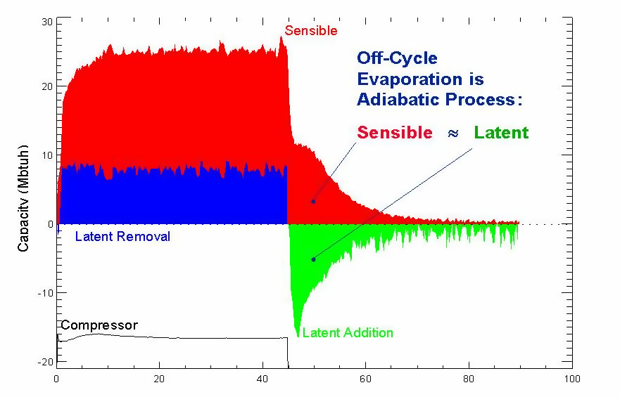
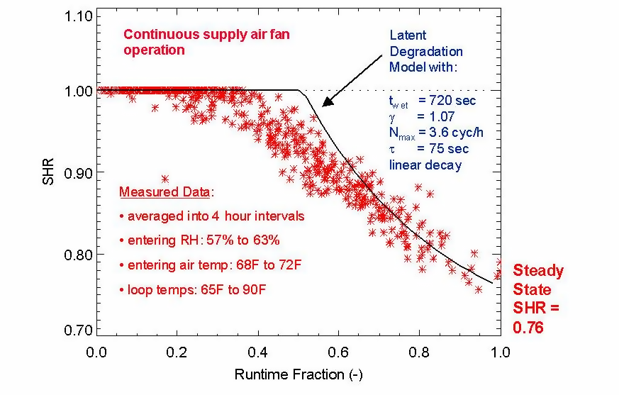
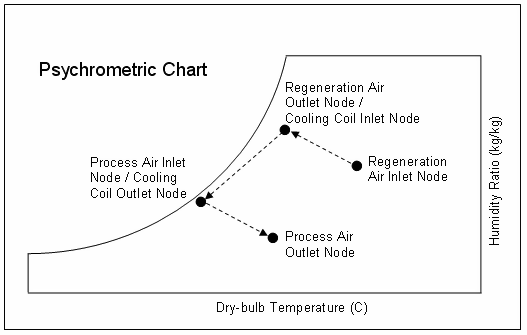
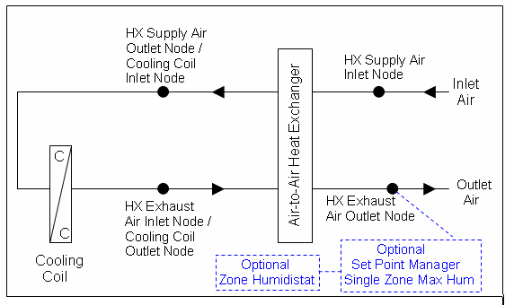
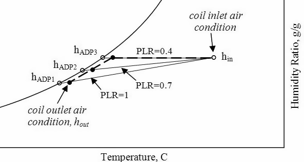
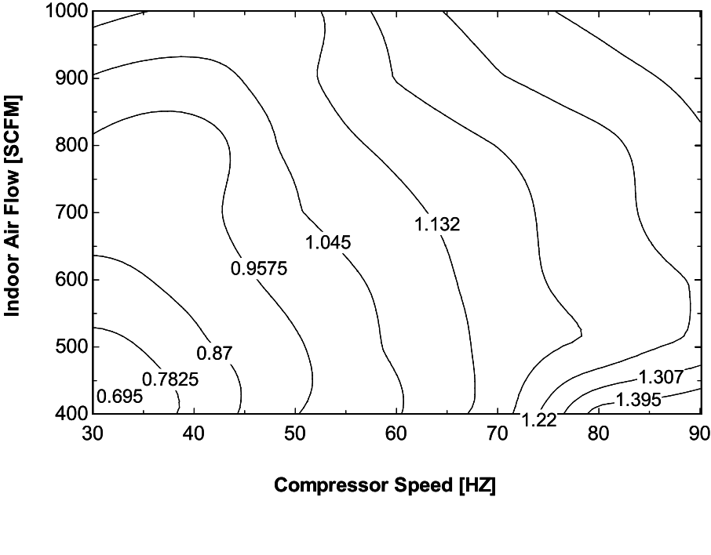
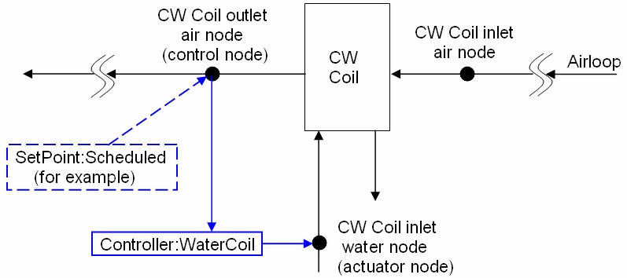
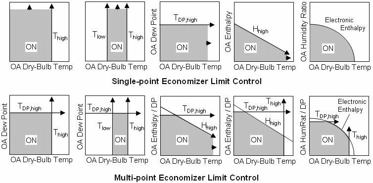
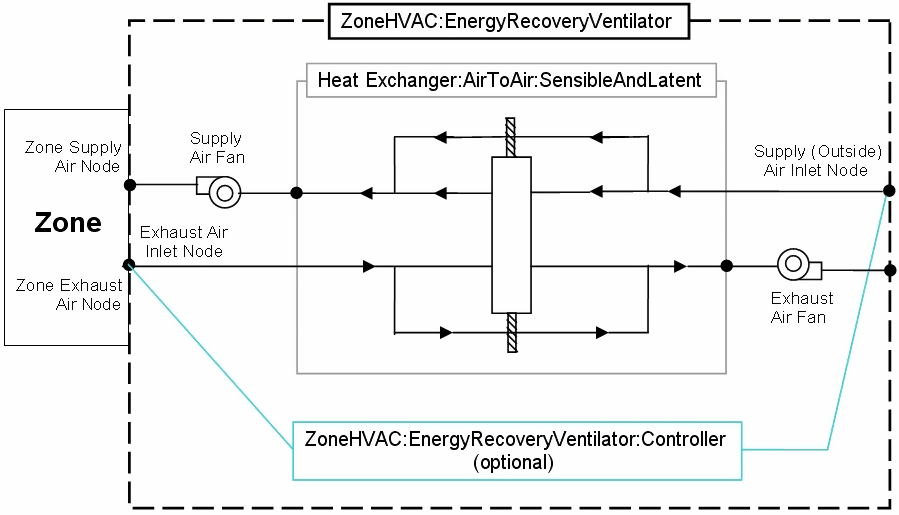

<!--RemoveStart-->
Simulation Models - Encyclopedic Reference
==========================================

The following descriptions are grouped alphabetically (as much as possible) with some also having additional tags of “Heat Balance”, “HVAC”, and “Plant”.  With the integrated solution, these designations signify where the effects of these models have their first impacts.

Main Sections:

* [Ice Thermal Storage](#IceStorage)
* [Coils](#Coils)
* [HVAC Controllers](#Controllers)
* [Baseboard Heaters](#Baseboards)
<!--RemoveEnd-->

Ice Thermal Storage 
-------------------

### Simple Ice Storage Model

#### Overview

This model (object name ThermalStorage:Ice:Simple) simulates the performance of an ice storage tank. The model is based on an integrated chiller and storage tank model developed for a special optimization project (Henze and Krarti 2002). This implementation removed the integrated chiller and allows the tank to be charged by any chiller configuration in an EnergyPlus plant loop..

This thermal storage model is based on a simple simulation of an ice storage tank with a fixed capacity.  The tank is charged, or frozen, in an ice-on-coil configuration where ice builds up on the outside of the tubes carrying the brine or glycol solution from the chiller.  There are two discharge (melt) options, internal or external.  Internal melt uses the same fluid tubes for charging and discharging.  External melt uses a separate fluid path for discharge such that the outer layers of ice melt first.  The ice storage model includes an implied 3-way valve to control the amount if charge/discharge based on the incoming water temperature and the outlet node setpoint temperature.  The tank is controlled using the PlantEquipmentOperation:ComponentSetpoint plant operation scheme, and requires that a setpoint be placed by a setpoint manager on the ice storage Plant Outlet Node.  The model currently does not calculate any tank losses.

#### Model Description

##### Initialization

The storage tank is assumed to be fully charged (full of ice) at the beginning of each environment.  The tank is then allowed to charge and discharge during the warmup days of the environment.

##### Control

The ice storage module is a passive component and will accept any flow rate placed on the inlet node.  The load on the ice storage tank is determined by the inlet node flow rate, the inlet node temperature, and the outlet node setpoint temperature.  A positive load indicates a request for cooling and the tank discharges if possible.  A negative load indicates a request for charging the tank if possible.  A zero load indicates the tank is dormant in which case all flow bypasses the tank and the outlet node temperature is set to the inlet node temperature.  The model includes an implied 3-way valve which controls the leaving water temperature to the outlet node setpoint temperature if possible.

##### Charging

When charging is requested, the following limits are calculated to determine the actual charging rate:

1)    If the entering water temperature is greater than –1C, the charging rate is zero.

2)    If the entering water temperature is greater than or equal to the outlet setpoint temperature, the charging rate is zero.

3)    If the current fraction of ice stored is 1.0, the tank is fully charge, and the charging rate is zero.

4)    If the requested charging rate times the current system timestep is more than the remaining uncharged storage capacity, the charging rate is limited to that required to completely fill the tank.

5)    The maximum charging rate which the chilled water flow can provide is determined by the entering water temperature and flow rate and an outlet temperature which is the minimum of –1C or the outlet setpoint temperature.

6)    The maximum charging rate which the tank can accept is calculated by the following equations developed in the prior work (Henze and Krarti 2002):

*UAIceCh* = ( 1.3879 - 7.6333\**y* + 26.3423\**y*2 - 47.6084\**y*3 + 41.8498\**y*4 - 14.2948\**y*5 ) \* *ITSNomCap* / *TimeInterval* / 10.0

where:

*UAIceCh*   = UA rate for charging

*y*                = Current ice fraction stored

*ITSNomCap*          = Nominal storage capacity [GJ]

TimeInterval = 3600 [s]

The smallest charging rate determined by the above rules is selected and the corresponding leaving water temperature is calculated.

##### Discharging

When discharging is requested, the following limits are calculated to determine the actual charging rate:

1)    If the entering water temperature is less than 1C, the discharge rate is zero.

2)    If the entering water temperature is less than or equal to the outlet setpoint temperature, the discharge rate is zero.

3)    If the current fraction of ice stored is 0.0, the tank is fully discharged, and the discharge rate is zero.

4)    If the requested discharge rate times the current system timestep is more than the remaining charged storage capacity, the discharge rate is limited to that required to completely deplete the ice in the tank.

5)    The maximum discharge rate which the chilled water flow can accept is determined by the entering water temperature and flow rate and an outlet temperature which is the maximum of 1C or the outlet setpoint temperature.

6)    The maximum discharge rate which the tank can deliver is calculated by the following equations developed in the prior work (Henze and Krarti 2002):

For ice-on-coil internal melt:

*UAIceDisCh* = ( 1.3879 - 7.6333\**y* + 26.3423\**y*2 - 47.6084\**y*3 + 41.8498\**y*4 - 14.2948\**y*5 ) \* *ITSNomCap* / *TimeInterval* / 10.0

For ice-on-coil external melt:

*UAIceDisCh* = ( 1.1756 - 5.3689\**y* + 17.3602\**y*2 - 30.1077\**y*3 + 25.6387\**y*4 - 8.5102\**y*5 ) \* *ITSNomCap* / *TimeInterval* / 10.0

where:

UAIceDisCh            = UA rate for discharging

*y*                = 1 - Current ice fraction stored

*ITSNomCap*          = Nominal storage capacity [GJ]

TimeInterval = 3600 [s]

The smallest discharge rate determined by the above rules is selected and the corresponding leaving water temperature is calculated.

#### References

Henze, Gregor P. and Moncef Krarti. 2002. Predictive Optimal Control of Active and Passive Building Thermal Storage Inventory, Final Report for Phase I:  Analysis, Modeling, and Simulation.  U.S. Department of Energy National Energy Technology Laboratory Cooperative Agreement DE-FC-26-01NT41255, December 2002.

### Detailed Ice Storage Model

The following section describes how the detailed ice storage model works in EnergyPlus (object name ThermalStorage:Ice:Detailed).

#### Charging and Discharging Equation

The actual performance of the ice storage unit depends on the physical geometry, materials, and characteristics of the ice storage unit.  In analyzing performance data trends from ice storage manufacturers, it was determined that the following equation would work well for the discharging process:

$${q^*} = \left[ {C1 + C2\left( {1 - {P_c}} \right) + C3{{\left( {1 - {P_c}} \right)}^2}} \right] + \left[ {C4 + C5\left( {1 - {P_c}} \right) + C6{{\left( {1 - {P_c}} \right)}^2}} \right]\Delta T_{lm}^*$$

or

$${q^*} = \left[ {C1 + C2\left( {{P_d}} \right) + C3{{\left( {{P_d}} \right)}^2}} \right] + \left[ {C4 + C5\left( {{P_d}} \right) + C6{{\left( {{P_d}} \right)}^2}} \right]\Delta T_{lm}^*$$

where:

$${q^*} \equiv \frac{{q\Delta t}}{{{Q_{stor}}}}$$

$$\Delta T_{lm}^* \equiv \frac{{\Delta {T_{lm}}}}{{\Delta {T_{no\min al}}}}$$

$$\Delta {T_{lm}} \equiv \frac{{{T_{brine,in}} - {T_{brine,out}}}}{{\ln \left( {\frac{{{T_{brine,in}} - {T_{brine,freeze}}}}{{{T_{brine,out}} - {T_{brine,freeze}}}}} \right)}}$$

q is the instantaneous heat transfer rate,

Qstor is the total latent storage capacity,

Dt is a time step used in the curve fit (usually one hour),

DTnominal is a nominal temperature difference (18°F = 10°C),

Tbrine,in is the tank brine inlet temperature,

Tbrine,out is the tank brine outlet temperature,

Tfreeze is the freezing temperature of water or the latent energy storage material,

Pc is the fraction charged, and

Pd is the fraction discharged.

Likewise, the charging process of the ice storage device can be characterized by the following equation that is similar in form to the discharging equation:

$${q^*} = \left[ {C1 + C2\left( {{P_c}} \right) + C3{{\left( {{P_c}} \right)}^2}} \right] + \left[ {C4 + C5\left( {{P_c}} \right) + C6{{\left( {{P_c}} \right)}^2}} \right]\Delta T_{lm}^*$$

Note that the time step might differ from the time step used within the EnergyPlus simulation.  These are actually two separate time steps and are kept separate.

#### Charging Algorithm

During charging, manufacturers have stated that they attempt to charge the unit at the maximum rate until the unit is completely charged.  This, of course, occurs during off-peak electric hours.  Thus, once the setpoint has been scheduled for charging, the unit will charge at the maximum possible rate.  This means that the flow rate through the ice storage device equals the flow to the component (or no bypass).  The only time flow to the ice storage unit would be reduced is at the end of the charge cycle when more ice making capacity is available in a particular time step than is needed to fully charge the tank.  In this case, the flow to the tank would be reduced appropriately to top off the tank storage capacity.  We also have a setpoint goal for the outlet temperature of the ice storage device as defined by the setpoint schedule.

In solving the performance of the ice storage unit, we have effectively two equations (one of which is non-linear) and two unknowns.  The equations are:

$${q^*} = \left[ {C1 + C2\left( {{P_c}} \right) + C3{{\left( {{P_c}} \right)}^2}} \right] + \left[ {C4 + C5\left( {{P_c}} \right) + C6{{\left( {{P_c}} \right)}^2}} \right]\Delta T_{lm}^*$$

from which we can obtain the component load (q) and

$$q = \dot m{C_p}\left( {{T_i} - {T_o}} \right)$$

Both of these equations have q and To as unknowns.  However, since the setpoint temperature is the goal for To, we can use this as an initial guess for To.  Below is an outline of the algorithm:

n Initialize To= Tset

n Calculate LMTD\*

n Calculate q\* from charging equation for the current percent charged (We will assume that the EnergyPlus time step is sufficiently small so that we do not need to find the average percent charged for the time step.  This was necessary when one hour time steps were used as in BLAST, but EnergyPlus generally uses relatively short time steps.  Since there is already some iteration involved in the solution, we would like to avoid another layer of iteration if at all possible.  One alternative that could be implemented would be to make a second pass with a closer average value based on what happens during the time step.  This would effectively double the execution time for the model and would need to be justified before implementation.)

n Calculate To,new and compare it to To

n Use To,new to calculate a new LMTD\* and iterate until To converges to some acceptable level

Charging would continue in subsequent time steps until the final state of the ice storage unit at the end of a particular time step is fully charged.  If running a chiller would “overcharge” the tank, then the flow to the tank would be reduced (greater than zero bypass flow) while maintaining the same setpoint temperature coming out of the tank (though not necessarily out of the component).

#### Discharging Algorithm

During discharging, we cannot assume that all of the flow is sent through the ice storage unit and thus some of it may be bypassed around it locally.  This ice storage model includes a built-in bypass leg to accommodate this without requiring the user to enter this additional information.  This also allows the bypass leg/valve to be controlled by the ice storage unit.

While we cannot assume that all of the flow is sent through the ice storage unit, we can use that as an initial guess in order to determine the current performance of the ice storage system.  Most of the discharging algorithm then becomes very similar to the charging process.

In solving the performance of the ice storage unit, we have effectively two equations (one of which is non-linear) and two unknowns.  The equations are:

$${q^*} = \left[ {C1 + C2\left( {{P_d}} \right) + C3{{\left( {{P_d}} \right)}^2}} \right] + \left[ {C4 + C5\left( {{P_d}} \right) + C6{{\left( {{P_d}} \right)}^2}} \right]\Delta T_{lm}^*$$

from which we can obtain the component load (q) and

$$q = \dot m{C_p}\left( {{T_i} - {T_o}} \right)$$

Both of these equations have q and To as unknowns.  However, since the setpoint temperature is the goal for To, we can use this as an initial guess for To.  Below is an outline of the algorithm:

n Initialize To= Tset

n Calculate LMTD\*

n Calculate q\* from charging equation for the current percent charged (we will assume that the EnergyPlus time step is sufficiently small so that we do not need to find the average percent charged for the time step; this was necessary when one hour time steps were used as in BLAST, but EnergyPlus generally uses relatively short time steps)

n Calculate To,new and compare it to To

n Use To,new to calculate a new LMTD\* and iterate until To converges to some acceptable level

n Once To has converged, we need to compare this value again to Tset.  If To is greater than or equal to Tset, then we either just met the load (equal) or can’t quite meet it (greater than).  In this case, we simply leave To as is because we cannot meet the setpoint temperature.

n If To is less than Tset, then we have more capacity available than we need.  In this case, we need to bypass some of the flow.  Since the load on the ice storage device and the outlet temperature are not changing (we are just reducing the flow), we only need to split the flow and do not need to recalculate the action of the ice storage device.  Some systems may be slightly dependent on the actual flow through the device itself.  However, in an actual application, this only means that a slightly different amount will bypass the device.  The overall energy impact will be the same and thus it is not necessary to be concerned about flow rate dependence.

Discharging would continue in subsequent time steps until the final state of the ice storage unit at the end of a particular time step is fully discharged.

#### References

Strand, R.K. 1992. "Indirect Ice Storage System Simulation," M.S. Thesis, Department of Mechanical and Industrial Engineering, University of Illinois at Urbana-Champaign.

Coils 
-----

### Chilled-Water-Based Air Cooling Coil

The input object Coil:Cooling:Water is simpler than the detailed geometry model.  The simple model provides a good prediction of the air and water outlet conditions without requiring the detailed geometric input required for the detailed model.  A greatly simplified schematic of enthalpy and temperature conditions in a counter flow cooling/dehumidifying coil is shown in the schematic Figure 162.  The input required to model the coil includes only a set of thermodynamic design inputs, which require no specific manufacturer's data.  The coil simulation model is essentially a modification of one presented by Elmahdy and Mitalas (1977), TRNSYS, 1990 and Threlkeld, J.L. 1970.  The model calculates the UA values required for a Dry, Wet and Part Wet & Part Dry Coil and iterates between the Dry and Wet Coil to output the fraction wet.  There are two modes of flow operation for this model: Cross Flow, which is widely applicable in HVAC systems and the second being Counter flow mode. The default value in program is set up for Counter Flow.  In addition the coil has two modes of analysis: Simple Analysis and Detailed Analysis. The Simple analysis mode operates the coil as either wet or dry while the detailed mode simulates the coil as part wet part-dry. While the detailed mode provides more accurate results, it is significantly slower than the simple model. The simple mode gives good results for an annual simulation but will not be adequate for a time step performance analysis.

Figure 162.  Simplified Schematic of Cooling/Dehumidifying Coil

#### Heat Transfer and Energy Balance

The cooling coil may be completely dry, completely wet with condensation, or it may have wet and dry sections.  The actual condition of the coil surface depends on the humidity and temperature of the air passing over the coil and the coil surface temperature.  The part-dry part-wet case represents the most general scenario for the coil surface conditions.  There are subroutines present in the model for both the dry and wet regions of the coil, and a subroutine that iterates between the dry and wet subroutines to calculate the fraction of the coil surface that is wet.  For each region the heat transfer rate from air to water may be defined by the rate of enthalpy change in the air and in the water.  The rates must balance between each medium for energy to be conserved.

#### Model Description

The Model has two blocks: 1st = Design Block with the Design Inputs. This block calculates the Design U-Factor Times Area Value (UA) values required by the model. Using these UA values the model simulates the operating conditions.  The operating block is the one containing the operating conditions, the conditions at which the coil operates. Following is the list of Design and Operating inputs and subsequently the Design and Operating variables used in the model.

Table 52.  Design Inputs (User Inputs)

<table class="table table-striped">
<tr>
<th>Input Field</th>
<th>Description</th>
</tr>
<tr>
<td>DesWaterVolFlowRate:</td>
<td>Maximum Water Volume Flow Rate</td>
</tr>
<tr>
<td>DesAirVolFlowRate:</td>
<td>Maximum Air Volume Flow Rate</td>
</tr>
<tr>
<td>DesInletWaterTemp:</td>
<td>Inlet Water Temperature at Design Condition</td>
</tr>
<tr>
<td>DesInletAirTemp:</td>
<td>Inlet Air Temperature at Design Condition</td>
</tr>
<tr>
<td>DesOutletAirTemp:</td>
<td>Outlet Air Temperature at Design Condition</td>
</tr>
<tr>
<td>DesInletAirHumRat:</td>
<td>Inlet Air Humidity Ratio at Design Conditions</td>
</tr>
<tr>
<td>DesOutletAirHumRat:</td>
<td>Outlet Air Humidity Ratio at Design Conditions.</td>
</tr>

</table>

Table 53.  Operating Conditions (From Nodes -- not user inputs)

<table class="table table-striped">
<tr>
<th>Condition Variable</th>
<th>Description</th>
</tr>
<tr>
<td>InletWaterMassFlowRate:</td>
<td>Entering Water Mass Flow Rate at operating condition</td>
</tr>
<tr>
<td>InletWaterTemp:</td>
<td>Inlet Water Temperature at operating condition</td>
</tr>
<tr>
<td>InletAirMassFlowRate:</td>
<td>Entering Air Mass Flow Rate at operating condition</td>
</tr>
<tr>
<td>InletAirTemp:</td>
<td>Inlet Air Temperature at operating condition</td>
</tr>
<tr>
<td>InletAirHumRat:</td>
<td>Entering air humidity ratio at operating conditions</td>
</tr>

</table>

#### Intermediate calculated U-Factor Times Area Values: The Crux of the Model

The various U-Factor Times Area values (UA) required by this model are calculated from the above inputs, which are explained later in the document.  The various UA are:

Table 54.  UA Descriptions of Model

<table class="table table-striped">
<tr>
<th>UA Variable Name</th>
<th>Description</th>
</tr>
<tr>
<td>CoilUATotal:</td>
<td>Overall heat transfer coefficient (W/C)</td>
</tr>
<tr>
<td>CoilUAInternal:</td>
<td>Overall internal UA (W/C)</td>
</tr>
<tr>
<td>CoilUAExternal:</td>
<td>Overall external UA (W/C)</td>
</tr>
<tr>
<td>CoilUInternal:</td>
<td>Internal overall heat transfer coefficient (W/m2∙C)</td>
</tr>
<tr>
<td>CoilUWetExternal:</td>
<td>Wet part external overall heat transfer coefficient (W/m2∙C)</td>
</tr>
<tr>
<td>CoilUDryExternal:</td>
<td>Dry part external overall heat transfer coefficient (W/m2∙C)</td>
</tr>

</table>

The UA values are calculated assuming a wet coil at the design conditions. Following are a few important calculations to understand the working of the model.  The model is basically divided into two blocks: the Design Block and the Operating Block.

The Design Block is a one time calculation. The aim of the Design Block is to calculate the Coil UA for use in the operating Block.

#### Design Block Calculations:

The design block has the code for calculating the six Coil UA values required by the operating block. Reasonable assumptions have been made in the calculations to maintain the simplicity of the model.

Heat transfer in a wet coil model is based on enthalpy rather than temperature to take into account latent effects. While heat transfer rates are commonly expressed as the product of an overall heat transfer coefficient, UA, and a temperature difference, the use of enthalpy-based heat transfer calculations requires an enthalpy-based heat transfer coefficient which we denote as DesUACoilTotalEnth and hence the equation.

Q = DesUACoilTotalEnth \* (Hair,mean - Hwater,mean). The value of Q is calculated using product of air mass flow rate and difference in inlet and outlet air enthalpies at design conditions.

The relation between the enthalpy-based UA and the temperature-based UA is DesUACoilTotalEnth = CoilUA / Cp. CoilUA is the conventional heat transfer coefficient and Cp = specific heat of the air.

We need the following quantities for our design calculations. The *Psy* functions are the EnergyPlus built-in psychrometric functions.

$${\dot m_{air}} = {\rho_{air}}{\dot V_{air}}$$

$${h_{air,in}} = {\mathop{\rm PsyHFnTdbW}\nolimits} ({T_{air,in}},{w_{air,in}})$$

$${h_{air,out}} = {\mathop{\rm PsyHFnTdbW}\nolimits} ({T_{air,out}},wout)$$

$${h_{w,sat,in}} = {\rm{PsyHFnTdbW}}({T_{w,in}},{\rm{PsyWFnTdpPb}}({T_{w,in}},{P_{atm}}))$$

$${\dot Q_{coil}} = {\dot m_{air}}({h_{air,in}} - {h_{air,out}})$$

$${T_{w,out}} = {T_{w,in}} + {\dot Q_{coil}}/({\dot m_{w,\max }}{C_{p,w}})$$

$${h_{w,sat,out}} = {\rm{PsyHFnTdbW}}({T_{w,out}},{\rm{PsyWFnTdpPb}}({T_{w,out}},{P_{atm}}))$$

We now calculate the design coil bypass factor. The bypass factor is not used in subsequent calculations. It is calculated solely to use as check on the reasonableness of the user-input design inlet and outlet conditions. First we make an initial estimate of the apparatus dew point temperature:

$${T_{air,dp,app}} = {\rm{PsyTdpFnWPb}}({w_{air,out}},{P_{atm}})$$

we also need the "slope" of temperature versus humidity ratio on the psych chart between the inlet and outlet air conditions:

$${S_{T,w}} = ({T_{air,in}} - {T_{air,out}})/({w_{air,in}} - {w_{air,out}})$$

We now obtain the actual design apparatus dewpoint temperature by iterating over the following two equations:

$${w_{air,dp,app}} = {\rm{PsyWFnTdpPb}}({T_{air,dp,app}},{P_{atm}})$$

$${T_{air,dp,app}} = {T_{air,in}} - {S_{T,w}}({w_{air,in}} - {w_{air,dp,app}})$$

The apparatus dewpoint enthalpy is then:

$${h_{air,dp,app}} = {\rm{PsyHFnTdbW}}({T_{air,dp,app}},{w_{air,dp,app}})$$

and the coil bypass factor is:

$${F_{coilbypass}} = ({h_{air,out}} - {h_{air,dp,app}})/({h_{air,in}} - {h_{air,dp,app}})$$

If the iterative procedure doesn't converge, or the coil bypass factor is too large (greater than 0.5), or the apparatus dewpoint enthalpy is less than the saturated air enthalpy at the water inlet temperature, the design outlet air conditions are reset to 90% relative humidity at the same outlet enthalpy. The above design calculations are then repeated.

We are now ready to calculate the design coil UA. This will be accomplished by inverting the simple coil calculation routine *CoolingCoil* using the Regula Falsi method. First we make an initial estimate of the coil UA.

$$\Delta {h_{lmd}} = (({h_{air,in}} - {h_{w,sat,out}}) - ({h_{air,out}} - {h_{w,sat,in}}))/log(({h_{air,in}} - {h_{w,sat,out}}) - ({h_{air,out}} - {h_{w,sat,in}}))$$

$$U{A_{coil,enthalpy - based}} = {\dot Q_{coil}}/\Delta {h_{lmd}}$$

$$U{A_{coil,ext}} = {C_{p,air}}U{A_{coil,enthalpy - based}}$$

We set the internal UA to 3.3 times the external UA (as a typical value for a coil). Then the total UA is:

$$U{A_{coil,tot}} = \frac{1}{{(1/U{A_{coil,int}} + 1/U{A_{coil,ext}})}}$$

The next step is to estimate the coil external heat transfer surface area. This is done in the function *EstimateHEXSurfaceArea*:

$$Are{a_{coil,ext}} = {\rm{EstimateHEXSurfaceArea}}$$

using the following assumptions:

* Tube inside diameter = 0.0122 (m)

* Tube side water velocity = 2.0 (m/s)

* Inside to outside coil surface area ratio (Ai/Ao) = 0.07 (-)

* Fins overall efficiency = 0.92 (-)

* Aluminum fins, 12 fins per inch with fins to total outside surface area ratio of 90%.

* Airside combined heat and mass transfer coefficient = 140 (W/m2∙°C)

Interior and exterior U values (really UA's per unit exterior surface area) are calculated by dividing the above UA's by the area. The resulting Ucoil,ext is assumed to be Ucoil,ext,wet; Ucoil,ext,dry is set equal to Ucoil,ext,wet. We now have all the starting values needed for inverting the simple coil model using the chosen Regula Falsi iterative method. Once the iteration is completed, we have coil UA's and U's that yield the design outlet air and water enthalpies given the inlet design conditions and flow rates. Note that the simple coil model can not exactly match the specified design outlet air temperature and humidity ratio. It can only match the design air outlet enthalpy. Generally the simple coil model will yield outlet conditions near the saturation curve if any dehumidification is occuring. Typical outlet relative humidities are around 95%.

#### Variable UA

The above calculations yield coil UA's for the design inlet conditions and air and water flow rates. As the flow rates vary during the time step calculations, the UA's need to be adjusted, since coil UA's are a rather strong function of air and water side flow rates. Each time step the coil UA's are modified using the same formulas as are used in the hot water coil model. Refer to that model for the flow dependences.

#### Operating Block Calculations:

There are two modes of coil analysis in the operating block. They are the Simple analysis mode and the detailed analysis mode. The simple analysis mode assumes the coil to be either all wet or either all dry and execute the model , on the other hand the detailed mode checks for part wet part dry mode of operation and reports surface area wet fraction of coil, however the program execution time in detailed mode is noticeably higher.

The operating block for Detailed Mode Analysis of this coil model is divided into three modes of coil performance. The modes being

n Coil is completely dry: There is no moisture condensation on the coil surface and the coil is a dry coil. This is an extreme condition when the entering air has very low humidity ratio or is dry air.

n Coil is completely wet: The entire coil is wet due to complete condensation on the surface of the coil.

n Part Wet Part Dry Mode: This is the usual/frequent mode of operation of coil, as shown in figure 1, where part of the coil at entry of air is dry and as air cools condensation occurs and part of the coil becomes wet.

The Part Wet Part Dry Mode of operation is essentially a function the Coil Completely Dry and Coil Completely Wet mode. This subroutine iterates between the Dry Coil and the Wet Coil to give outputs, a detailed explanation is given later in the document. The operating block requires 5 inputs, which are mentioned earlier in the document. These inputs are automatically generated from the node connections in Energy Plus. The user does not have to input any information to run this coil model.

The option to identify which mode of operation the coil should perform ie, for a given set of inputs would the coil be Dry, Wet or Part Wet Part Dry, is decided by set of conditions described below.

n **IF** (**Temperature Dewpoint Air &lt; Water Inlet Temperature**) **THEN** the coil is Dry and we call the Subroutine Coil Completely Dry.  In this case outlet temperature of air would be higher than the air dewpoint and hence there would be no condensation.

n **IF** (**Temperature Dewpoint Air &gt; Water Inlet Temperature**) **THEN** the coil is completely wet, call subroutine Coil Completely Wet, it is assumed that moisture condensation occurs over completely surface of the coil. However we go ahead and check for the coil being partially wet with the following condition.

n **IF (AirDewPointTemp &lt; AirInletCoilSurfTemp) THEN,** the coil is Partially Wet because there is possibility that air temperature will go below its dewpoint and moisture will condense on latter part of the cooling coil.

The Operating Block for Simple Mode Analysis is divided into two modes of coil performance, the two modes being

n Coil is completely dry: There is no moisture condensation on the coil surface and the coil is a dry coil.

n Coil is completely wet: The entire coil is wet due to complete condensation on the surface of the coil.

The option to identify which mode of operation the Simple mode analysis should perform ie, for a given set of inputs would the coil be Dry or Wet is decided by set of conditions described below.

n **IF** (**Temperature Dewpoint Air &lt; Water Inlet Temperature**) **THEN** the coil is Dry and we call the Subroutine Coil Completely Dry.  In this case outlet temperature of air would be higher than the air dewpoint and hence there would be no condensation.

n **IF** (**Temperature Dewpoint Air &gt; Water Inlet Temperature**) **THEN** the coil is completely wet, call subroutine Coil Completely Wet, it is assumed that moisture condensation occurs over completely surface of the coil. However we go ahead and check for the coil being partially wet with the following condition.

The above is a simple mode of analysis and the results are very slightly different from the detailed mode of analysis. The algorithms used in Simple mode and the Detailed mode are identically similar. The surface area wet fraction in the coil is reported as 1.0 or 0.0 for wet or dry coil respectively. The program defaults to simple mode of analysis for enabling higher execution speed.

#### Effectiveness Equations:

There are two modes of flow for the coil, Counter Flow mode or the Cross Flow mode, default set up is as cross flow since most air condition applications have cross flow heat exchangers. According to the mode of flow the following NTU - Effectiveness relationships are used to calculate coil effectiveness, which is used later by all the three modes (Dry, Wet, Part Wet) for calculating air outlet conditions and heat transfer.

Following are the relations used for calculating effectiveness equation for the Heat exchangers.

Counter Flow Heat Exchanger: Effectiveness Equation:

$${\eta_{CounterFlow}} = \frac{{(1 - Exp( - NTU \times (1 - Rati{o_{StreamCapacity}})))}}{{1 - Rati{o_{StreamCapacity}} \times Exp( - NTU \times (1 - Rati{o_{StreamCapacity}}))}}$$

In Equation   the variable Ratio\_StreamCapacity is defined as below

$$Rati{o_{StreamCapacity}} = \frac{{MinCapacit{y_{Stream}}}}{{MaxCapacit{y_{Stream}}}}$$

In equation capacity of stream is defined as below in equation

$$(Min,Max)\,\,Capacit{y_{Stream}} = {(MassFlowRate \times Cp)_{air,water}}$$

NTU in equation , is defined as the Number of Transfer Units, it is a function of Coil UA and the Minimum Capacity of Stream. The Coil UA is a variable in this equation and depends on which mode of the coil operation (Dry, Wet, Part Wet) is calling upon equation , i.e., if it is Coil Completely Dry calling upon the effectiveness equation with the value of Dry UA total, which in our case is defined as CoilUA\_total. Equation gives definition for NTU.

$$NTU = \frac{{CoilUA}}{{MinStrea{m_{Capacity}}}}$$

Cross Flow Heat Exchanger: Effectiveness Equation:

$${\eta_{CrossFlow}} = 1 - EXP\left\{ {\frac{{Exp( - NTU \times Rati{o_{StreamCapacity}} \times NT{U^{ - 0.22}}) - 1}}{{Rati{o_{StreamCapacity}} \times NT{U^{ - 0.22}}}}} \right\}$$

The variables in the above equation have already been defined earlier. Depending on the mode of operation of the coil model the cross or the counter flow equations are used to calculate the effectiveness.

#### Coil Outlet Conditions:

Calculating the Outlet Stream Conditions using the effectiveness value from equation   or depending on the mode of flow. The energy difference between the outlet and inlet stream conditions gives the amount of heat transfer that has actually take place. Temperature of air and water at outlet to the coil is given as in following equations

$$TempAi{r_{Out}} = TempAi{r_{inlet}} - {\eta_{cross,counter}} \times \frac{{MaxHeatTransfer}}{{StreamCapacit{y_{Air}}}}$$

$$TempWate{r_{Out}} = TempWate{r_{Inlet}} + {\eta_{Cross,counter}} \times \frac{{MaxHeatTransfer}}{{StreamCapacit{y_{Water}}}}$$

In the above equations and the maximum heat transfer is calculated as shown in the following equation

$$MaxHeatTransfer = MinStrea{m_{Capacity}} \times (TempAi{r_{Inlet}} - TempWate{r_{Inlet}})$$

#### Coil Completely Dry Calculations: (operating block)

Since the coil is dry, the sensible load is equal to total load and the same with the humidity ratios at inlet and outlet, as in equations and .

$$QSensibl{e_{DryCoil}} = QTota{l_{DryCoil}}$$

$$HumRati{o_{Inlet}} = HumRati{o_{Outlet}}$$

Total Heat Transfer in dry coil is as follows:

$${Q_{TotalDryCoil}} = CapacityAir \times (AirTem{p_{In}} - AirTem{p_{Outlet}})$$

The variables in the above equation are calculated earlier in equations and to give the total cooling load on the coil.

#### Coil Completely Wet Calculations: (operating block)

In wet coil we need to account for latent heat transfer, hence calculations are done using enthalpy of air and water instead of stream temperatures Hence we need to define coil UA for the wet coil based on enthalpy of the operating streams and not design streams.

Similar to equations and we calculate the air outlet enthalpy and water outlet enthalpy ie by replacing temperature with enthalpy of the respective streams. The input variable for Coil UA in equation for calculating NTU, in this case it would be enthalpy based and is given as shown in equation

$$CoilU{A_{\,Enthalpy\,Based}} = \frac{1}{{\left( {\frac{{CpSa{t_{Intermediate}}}}{{CoilU{A_{\,Internal}}}} + \frac{{C{p_{Air}}}}{{CoilU{A_{\,External}}}}} \right)}}$$

Total Coil Load in case of Wet Coil is the product of mass flow rate of air and enthalpy difference between the inlet and outlet streams as given in the following equation

$${Q_{Total}} = {\mathop M\limits^ *_{air}} \times (EnthAi{r_{Inlet}} - EnthAi{r_{Outlet}})$$

Once the enthalpy is known the outlet temperatures and outlet humidity ratios of the wet coil are calculated as in equations below.

**IF (TempCondensation &lt; PsyTdpFnWPb(InletAirHumRat ,Patm)) THEN**

$$AirTem{p_{Out}} = AirTem{p_{inlet}} - (AirTem{p_{inlet}} - Condensatio{n_{Temp}}) \times \eta $$

and

**OutletAirHumdityRatio = PsyWFnTdbH(OutletAirTemp,EnthAirOutlet)**

**ELSE**

There is no condensation and hence the inlet and outlet Hum Ratios are equal , and outlet temperature is a function of outlet air enthalpy as below

**OutletAirTemp      =  PsyTdbFnHW (EnthalpyAirOutlet, OutletAirHumRat)**

**and**

**OutletAirHumRat  =  InletAirHumRat**

**ENDIF**

Effectiveness η used in equation is defined in equation and Condensation Temperature is calculated using psychrometric function as in equation .

$$\eta  = 1 - Exp\left\{ { - \frac{{CoilU{A_{\,External}}}}{{Capacitanc{e_{Air}}}}} \right\}$$

\(Condensatio{n_{Temp}} = {\rm{PsyTsatFnHPb(Ent}}{{\rm{h}}_{{\rm{AirCondensateTemp}}}}{\rm{,Patm) }}\)                \(Ent{h_{\,AirCondensateTemp}} = Ent{h_{\,AirInlet}} - \frac{{\left( {Ent{h_{\,AirInlet}} - Ent{h_{\,AirOutlet}}} \right)}}{\eta }\)

Once the air outlet temperature are known, then sensible load is calculated as a product of capacitance of air and temperature difference at inlet and outlet, as in equation

$${Q_{Sensible}} = Capacitanc{e_{Air}} \times \left( {AirTem{p_{Inlet}} - AirTem{p_{Outlet}}} \right)$$

#### Coil Part Wet Part Dry Calculations: (operating block)

The Coil would perform under part wet part dry conditions when Air Dewpoint Temperature is less than Coil surface temperature at inlet to air. In this case part of the coil used value of Dry UA for heat transfer and part the coil used Wet UA value for heat transfer.

This problem is solved utilizing the fact that the Exit conditions from the Dry Part of the Coil would become the inlet conditions to the wet part of the coil (see Figure 162) and the coil model determines by iteration what fraction of the coil is wet and based on that it calculates the areas and subsequently the UA values of that dry and wet part, based on the area of the dry and wet part respectively. Explained below are the steps followed to the estimating the wet dry behavior of the coil.

n Iterate between the Dry Coil and the Wet Coil. First calculate Coil Completely Dry performance by estimating the wet dry interface water temperature using equation and inputting this variable as the water inlet temperature to dry Coil.

\(WetDryInterfac{e_{WaterTemp}} = {\rm{WaterTem}}{{\rm{p}}_{{\rm{Inlet}}}}{\rm{ + Are}}{{\rm{a}}_{{\rm{WetFraction}}}}{\rm{*(WaterTem}}{{\rm{p}}_{{\rm{Outlet}}}}{\rm{ - WaterTem}}{{\rm{p}}_{{\rm{Inlet}}}}{\rm{)}}\)    

The value of Surface Area Wet fraction is estimated initially as follows

$$Are{a_{\,WetFractionEstimate}} = \frac{{AirDewP{t_{\,Temp}} - InletWate{r_{\,Temp}}}}{{OutletWate{r_{\,Temp}} - InletWate{r_{\,Temp}}}}$$

For the above mentioned iteration the value of Coil UA for Wet and Dry part need to be varied according to the new respective area of the wet and dry parts. This estimate of Wet and Dry area is a product of the estimated Surface Area Fraction and total coil external area, which keeps varying as will be explained further in the document.

UA value for Dry part of the Coil is estimated as below.

$$CoilU{A_{Dry\,External}} = \frac{{SurfAre{a_{Dry}}}}{{\frac{1}{{Coil{U_{Dry\,External}}}} + \frac{1}{{Coil{U_{Internal}}}}}}$$

Where Surface Area Dry =(Total Coil Area – Wet Part Area), where the Wet part area is the product of Surface fraction Wet and Total Coil Area.

UA value for the Wet part of the Coil requires Wet UA external and Wet UA Internal, which are calculated as below.

$$WetPartUA{\,_{External}} = Coil{U_{Wet\,External}} \times SurfaceAreaWet$$

$$WetPartUA{\,_{Internal}} = Coil{U_{Internal}} \times SurfaceAreaWet$$

It is essential to remember that the mode of calculation for the coils remains the same as in completely wet and completely dry mode, only the UA values and water, air outlet and inlet values change.

Now Iterate between the Dry Coil and wet Coil with the above respective UA, and usual operating inputs except the variable water inlet temperature for dry Coil is replaced with Wet Dry Interface Water temperature, and in the Wet Coil the Outlet Air Temperature from dry Coil is the inlet air temperature to Wet Coil. The iteration proceeds till the Outlet Water Temperature from Wet Coil equals the Wet Dry Interface Water Temp, which is the input to Dry Coil.

Dry Part Inputs: (changed operating inputs) :Iteration Case 1: Explained In Programming Fashion:

**CALL CoilCompletelyDry (WetDryInterfcWaterTemp, InletAirTemp, DryCoilUA,               &**

**                             OutletWaterTemp, WetDryInterfcAirTemp, WetDryInterfcHumRat,        &**

**DryCoilHeatTranfer).**

Input the calculated values calculated by Dry Coil above into Wet Coil below. The variables have been highlighted in color red and blue.

**CALL**CoilCompletelyWet (InletWaterTemp, **WetDryInterfcAirTemp**, **WetDryInterfcHumRat**

WetPartUAInternal,WetPartUAExternal,                                                  &

**EstimateWetDryInterfcWaterTemp**, OutletAirTemp, OutletAirHumRat,    &

WetCoilTotalHeatTransfer, WetCoilSensibleHeatTransfer,                       &

EstimateSurfAreaWetFraction, WetDryInterfcSurfTemp)

Iterate Between the above two Wet and Dry Coil calls until the two variables in blue ie **WetDryInterfcWaterTemp = EstimateWetDryInterfcWaterTemp.**The key is to have the difference between the variables (WetDryInterfcWaterTemp – OutletWaterTemp) in Dry Coil equal to (InletWaterTemp-EstimatedWetDryInterfcWaterTemp) in Wet Coil. This equality quantized the relative part of coil that is dry and part that is wet on the basis of heat transfer that has occurred.

After the above convergence check for the coil being dry otherwise iterate to calculate surface fraction area wet.

**IF**

$$\left\{ {(AreaFractio{n_{Wet}} \le \,0.0)\,\,and(WetDryInterfac{e_{SurfTemp}} > AirDewPt)} \right\}$$

**THEN CoilCompletelyDry**

If equation is satisfied then Coil is Dry and simply output the value for Dry Coil calculated else the coil is partially wet and then iterate to find the surface fraction area wet. Start with the initially guess value of surface area fraction (equation wet and iterate on the entire loop starting from until the Wet Dry Interface Temperature equals the Air Dewpoint Temperature. The value of Surface Area fraction wet at which the interface air temperature equals is dewpoint is the transition point from wet to dry and gives the % of coil that is dry and % that is wet.

Graphs Showing the Performance of the coil model at optimum operating conditions are shown below. All values of variable used have been normalized.

Figure 163.  Air Outlet Temperature Vs Air Mass Flow Rate

Figure 164.  Sensible Load variations Vs Air mass Flow Rate

Figure 165.  Total and Sensible Load variations Vs Air Mass Flow Rate

Figure 166.  Surface Area Fraction Wet Vs Air Mass Flow Rate

#### References

IBPSA BuildSim-2004. 2004. Colarado Boulder: An Improvement of Ashrae Secondary HVAC toolkit Simple Cooling Coil Model for Building Simulation, Rahul J Chillar, Richard J Liesen M&IE ,UIUC.

Stoecker, W.F. &lt;dates unspecified&gt; Design of Thermal Systems,: ME 423 Class Notes , M& IE Dept UIUC.

Brandemeuhl, M. J. 1993. HVAC2 Toolkit: Algorithms and Subroutines for Secondary HVAC Systems Energy Calculations, ASHRAE.

Elmahdy, A.H. and Mitalas, G.P.  1977. "A Simple Model for Cooling and Dehumidifying Coils for Use In Calculating Energy Requirements for Buildings ASHRAE Transactions, Vol.83 Part 2, pp. 103-117.

Threlkeld, J.L.  1970.  Thermal Environmental Engineering, 2nd Edition, Englewood Cliffs: Prentice-Hall,Inc. pp. 254-270.

ASHRAE Secondary HVAC Toolkit TRNSYS.  1990.  A Transient System Simulation Program: Reference Manual. Solar Energy Laboratory, Univ. Wisconsin-Madison, pp. 4.6.8-1 - 4.6.8-12.

Kays, W.M. and A.L. London. 1964. Compact Heat Exchangers, 2nd Edition, New York: McGraw-Hill.

Clark, D.R.. 1985. HVACSIM+ Building Systems and Equipment Simulation Program Reference Manual, Pub. No. NBSIR 84-2996, National Bureau of Standards, U.S. Department of Commerce, January, 1985

Elmahdy, A.H. 1975. Analytical and Experimental Multi-Row Finned-Tube Heat Exchanger Performance During Cooling and Dehumidifying Processes, Ph.D. Thesis, Carleton University, Ottawa, Canada, December, 1975.

Elmahdy, A.H., and Mitalas, G.P. 1977. "A Simple Model for Cooling and Dehumidifying Coils for Use in Calculating Energy Requirements for Buildings," ASHRAE Transactions, Vol.  83, Part 2, pp. 103-117.

### Chilled-Water-Based Detailed Geometry Air Cooling Coil

The input object Coil:Cooling:Water:DetailedGeometry provides a coil model that predicts changes in air and water flow variables across the coil based on the coil geometry. A greatly simplified schematic of enthalpy and temperature conditions in a counterflow cooling/dehumidifying coil is shown in the following schematic figure. In addition, the variables required to model a cooling/dehumidifying coils and their definitions are extensively listed in “Table 55. Coil Geometry and Flow Variables for Coils”. The input required to model the coil includes a complete geometric description that, in most cases, should be derivable from specific manufacturer's data.  The coil simulation model is essentially the one presented by Elmahdy and Mitalas (1977) and implemented in HVACSIM+ (Clark 1985), a modular program also designed for energy analysis of building systems. The model solves the equations for the dry and wet sections of the coil using log mean temperature and log mean enthalpy differences between the liquid and the air streams.  Elmahdy and Mitalas state that crossflow counterflow coils with at four rows or more are approximated well by this model.  This does not constitute a major limitation since cooling and dehumidifying coils typically have more than four rows.

Figure 167.  Simplified Schematic of Cooling/Dehumidifying Coil

#### Heat Transfer and Energy Balance

The cooling coil may be completely dry, completely wet with condensation, or it may have wet and dry sections.  The actual condition of the coil surface depends on the humidity and temperature of the air passing over the coil and the coil surface temperature.  The partly wet-partly dry case represents the most general scenario for the coil surface conditions.  The all dry and all wet cases can be considered as limiting solutions of the wet or dry areas respectively going to zero.  In the general case, equations are written for both the dry and wet regions of the coil.  For each region the heat transfer rate from air to water may be defined by the rate of enthalpy change in the air and in the water.  The rates must balance between each medium for energy to be conserved.  Equations through express the energy balance between the water and the air for the case of dry and wet coils respectively.  Equations and represent the heat transfer rate between water and air based on the actual performance of the coil.  The UA parameter can be calculated from the parameters in the following table.

Table 55. Coil Geometry and Flow Variables for Coils

<table class="table table-striped">
<tr>
<th>A</th>
<th>area</th>
<th>LMHD</th>
<th>log mean enthalpy difference</th>
</tr>
<tr>
<td>A</td>
<td>air, air side</td>
<td>LMTD</td>
<td>log mean temperature difference</td>
</tr>
<tr>
<td>aa, bb</td>
<td>coeff. in enthalpy approximation</td>
<td>\(\dot m\)</td>
<td>mass flow rate</td>
</tr>
<tr>
<td>C1, C2</td>
<td>coeff. in air side film coeff.</td>
<td>mf</td>
<td>metal and fouling</td>
</tr>
<tr>
<td>Cp</td>
<td>specific heat</td>
<td>m</td>
<td>viscosity</td>
</tr>
<tr>
<td>D</td>
<td>diameter, effective diameter</td>
<td>o</td>
<td>outside (air side)</td>
</tr>
<tr>
<td>Dhdr</td>
<td>hydraulic diameter on air side</td>
<td>Pr</td>
<td>Prandtl number</td>
</tr>
<tr>
<td>D</td>
<td>dry region</td>
<td>\(\dot Q\)</td>
<td>heat transfer rate</td>
</tr>
<tr>
<td>d</td>
<td>thickness</td>
<td>R</td>
<td>overall thermal resistance</td>
</tr>
<tr>
<td>D</td>
<td>spacing</td>
<td>Re</td>
<td>Reynolds number</td>
</tr>
<tr>
<td>F</td>
<td>heat transfer film coefficient</td>
<td>r</td>
<td>ratio of diameters</td>
</tr>
<tr>
<td>Fai</td>
<td>variable in fin eff. calculation</td>
<td>s</td>
<td>surface, outside of metal</td>
</tr>
<tr>
<td>fin, fins</td>
<td>air side fin geometry</td>
<td>St</td>
<td>Stanton number</td>
</tr>
<tr>
<td>H</td>
<td>enthalpy</td>
<td>T</td>
<td>temperature</td>
</tr>
<tr>
<td>h</td>
<td>efficiency</td>
<td>tube</td>
<td>water tube</td>
</tr>
<tr>
<td>I0()</td>
<td>mod Bessel fn, 1st kind, ord 0</td>
<td>UAdry</td>
<td>dry heat xfer coeff. * dry area</td>
</tr>
<tr>
<td>I1()</td>
<td>mod Bessel fn, 1st kind, ord 1</td>
<td>UcAw</td>
<td>wet heat xfer coeff. * wet area</td>
</tr>
<tr>
<td>K0()</td>
<td>mod Bessel fn, 2nd kind, ord 0</td>
<td>ub, ue</td>
<td>variables in fin eff. calculation</td>
</tr>
<tr>
<td>K1()</td>
<td>mod Bessel fn, 2nd kind, ord 1</td>
<td>V</td>
<td>average velocity</td>
</tr>
<tr>
<td>I</td>
<td>inside (water side)</td>
<td>w</td>
<td>water, water side, or wet region</td>
</tr>
<tr>
<td>K1</td>
<td>variable in sol'n form of eq.</td>
<td>wa</td>
<td>humidity ratio</td>
</tr>
<tr>
<td>K</td>
<td>thermal conductivity</td>
<td>Z</td>
<td>variables in sol'n form of eq.</td>
</tr>
<tr>
<td>L</td>
<td>length</td>
<td>1, 2, 3</td>
<td>positions (see diagram)</td>
</tr>

</table>

Equations through represent two sets of three equations with 7 unknowns: \({\dot Q_d}\), Ta,1, Ta,2, Tw,2, Tw,3, \({\dot m_a}\), \({\dot m_w}\). However, normally at least four of these variables are specified, for example: inlet water temperature, outlet air temperature, water flow rate, air flow rate, so that the system of equations is effectively closed.

$${\dot Q_d} = {m_a}C{p_a}\left( {{T_{a,1}} - {T_{a,2}}} \right)$$

$${\dot Q_d} = {m_w}C{p_w}\left( {{T_{w,3}} - {T_{w,2}}} \right)$$

$${\dot Q_d} = \left( {U{A_{dry}}} \right)\left( {LMTD} \right)$$

$${\dot Q_w} = {m_a}\left( {{H_{a,2}} - {H_{a,3}}} \right)$$

$${\dot Q_w} = {m_w}C{p_w}\left( {{T_{w,2}} - {T_{w,1}}} \right)$$

$${\dot Q_w} = \left( {{U_c}{A_w}} \right)\left( {LMHD} \right)$$

In order to manipulate these equations, the log mean temperature and enthalpy differences are expanded as shown in Equations and .  Finally, a linear approximation of the enthalpy of saturated air over the range of surface temperature is made using Equation .  Note that in Equation Hw refers to the enthalpy of saturated air at the water temperature.

$$LMTD = \frac{{\left( {{T_{a,1}} - {T_{w,3}}} \right) - \left( {{T_{a,2}} - {T_{w,2}}} \right)}}{{\ln \frac{{{T_{a,1}} - {T_{w,3}}}}{{{T_{a,2}} - {T_{w,2}}}}}}$$

$$LMHD = \frac{{\left( {{H_{a,2}} - {H_{w,2}}} \right) - \left( {{H_{a,3}} - {H_{w,1}}} \right)}}{{\ln \frac{{{H_{a,2}} - {H_{w,2}}}}{{{H_{a,3}} - {H_{w,1}}}}}}$$

$${H_w} = aa + bb {T_w}$$

Equation is derived from the above equations and is used to solve for the coil conditions when all of the inlet conditions are given as input.  Operating in this manner, the coil does not have a controlled outlet air temperature.

$${T_{w,2}} = \frac{{\left( {1 - Z} \right)\left( {{H_{a,1}} - aa - K1 C{p_a} {T_{a,1}}} \right) + Z {T_{w,1}}\left( {bb - \frac{{{m_w}C{p_w}}}{{{m_a}}}} \right)}}{{bb - Z\frac{{{m_w}C{p_w}}}{{{m_a}}} - \left( {1 - Z} \right) K1 C{p_a}}}$$

An alternative solution method is to define the coil leaving air temperature as an input with a variable water flow rate.  In this case Equations and are more convenient.  Equations through define terms that are used to simplify Equations , and .

$${T_{w,2}} = \frac{{\left( {1 - Z} \right)\left( {{H_{a,3}} - aa} \right) + {T_{w,1}}\left( {\frac{{{m_w}C{p_w}}}{{{m_a}}} - bb Z} \right)}}{{\frac{{{m_w}C{p_w}}}{{{m_a}}} - bb}}$$

$${T_{w,2}} = \frac{{\left( {{Z_d} - 1} \right){T_{a1}}C{p_a} + {T_{w,3}}\left( {C{p_a} - {Z_d}\frac{{{m_w}C{p_w}}}{{{m_a}}}} \right)}}{{{Z_d}\left( {C{p_a} - \frac{{{m_w}C{p_w}}}{{{m_a}}}} \right)}}$$

$$Z = exp\left( {{U_c}{A_w}\left( {\frac{1}{{{m_a}}} - \frac{{bb}}{{{m_w}C{p_w}}}} \right)} \right)$$

$$K1 = \frac{{{Z_d} - 1}}{{{Z_d} - \frac{{{m_a}C{p_a}}}{{{m_w}C{p_w}}}}}$$

$${Z_d} = exp\left( {{U_c}{A_{dry}}\left( {\frac{1}{{{m_a}C{p_a}}} - \frac{1}{{{m_w}C{p_w}}}} \right)} \right)$$

#### Underlying Correlations, Properties, and Assumptions

Overall heat transfer coefficients are calculated from the specified coil geometry and by using empirical correlations from fluid mechanics and heat transfer.  For the water side, Equation gives the film heat transfer coefficient in SI units:

$${f_i} = 1.429\left( {1 + 0.0146 {T_w}} \right)V_w^{0.8}D_i^{ - 0.2}$$

This is valid for Reynolds numbers greater than 3100 based on water flow velocity and pipe inside diameter and is given in Elmahdy and Mitalas(1977) as recommended in the standard issued by the Air-Conditioning and Refrigeration Institute (1972) for air-cooling coils.  The definition of overall inside thermal resistance follows directly as shown in Equation.

$${R_i} = \frac{1}{{{f_i}{A_i}}}$$

Equation gives the film coefficient for the air side.  Another form of the same equation is Equation , which is familiar from the data presented in Kays and London (1984).  For coil sections that have a wet surface due to condensation, the air side film coefficient is modified according to Equation .  The correction term, a function of air Reynolds number, is valid for Reynolds numbers between 400 and 1500.  The coefficients in Equation and are calculated by Equations and that are functions of the coil geometry.  Elmahdy (1977)explains the modifier for the wet surface and coefficients for the film coefficient.  Equations through show definitions and values of common parameters and properties.

$${f_o} = {C_1}Re_a^{{C_2}}\frac{{{m_a}}}{{{A_{a\_min\_flow}}}}C{p_a}Pr_a^{{\raise0.5ex\hbox{$\scriptstyle 2$}\kern-0.1em/\kern-0.15em\lower0.25ex\hbox{$\scriptstyle 3$}}}$$

$${C_1}Re_a^{{C_2}} = S{t_a}Pr_a^{{\raise0.5ex\hbox{$\scriptstyle 2$}\kern-0.1em/\kern-0.15em\lower0.25ex\hbox{$\scriptstyle 3$}}}$$

$${f_{o,w}} = {f_o}\left( {1.425 - 5.1 \times {{10}^{ - 4}}R{e_a} + 2.63 \times {{10}^{ - 7}}Re_a^2} \right)$$

$${C_1} = 0.159{\left( {\frac{{{\delta_{fin}}}}{{{D_{hdr}}}}} \right)^{ - 0.065}}{\left( {\frac{{{\delta_{fin}}}}{{{L_{fin}}}}} \right)^{0.141}}$$

$${C_2} =  - 0.323{\left( {\frac{{{\Delta_{fins}}}}{{{L_{fin}}}}} \right)^{0.049}}{\left( {\frac{{{D_{fin}}}}{{{\Delta_{tube\_rows}}}}} \right)^{0.549}}{\left( {\frac{{{\delta_{fin}}}}{{{\Delta_{fins}}}}} \right)^{ - 0.028}}$$

$${D_{hdr}} = \frac{{4{A_{a\_min\_flow}}{\delta_{coil}}}}{{{A_{s\_total}}}}$$

$$R{e_a} = \frac{{4{\delta_{coil}}\left( {1 + {w_a}} \right){m_a}}}{{{A_{s\_total}}{\mu_a}}}$$

$$P{r_a} = 0.733$$

$${\mu_a} = 1.846 \times {10^{ - 5}}$$

The film coefficients above act on the extended surface of the air side, that is the area of the fins and the tubes.  Therefore, the fin efficiency must also be considered in calculating the overall thermal resistance on the outside.  Gardner(1945) gives the derivation of Equation , used as a curve fit to find the fin efficiency as a function of film coefficient.  This equation is based on circular fins of constant thickness.  To model a coil with flat fins, an effective diameter -- that of circular fins with the same fin area -- is used.  Equations through define variables used in Equation .  The overall efficiency of the surface is shown by Equation .  Note that the efficiency is found by the same equations for the wet surface using the wet surface film coefficient.

$${\eta_{fin}} = \frac{{ - 2\rho }}{{fai(1 + \rho )}}\left[ {\frac{{{I_1}({u_b}){K_1}({u_e}) - {K_1}({u_b}){I_1}({u_e})}}{{{I_0}({u_b}){K_1}({u_e}) + {K_0}({u_b}){I_1}({u_e})}}} \right]$$

$$fai = \frac{{({D_{fin}} - {D_{tube}})}}{2}\sqrt {\frac{{2{f_o}}}{{{k_{fin}}{\delta_{fin}}}}} $$

$$\rho  = \frac{{{D_{tube}}}}{{{D_{fin}}}}$$

$${u_e} = \frac{{fai}}{{1 - \rho }}$$

$${u_b} = {u_e}\rho $$

$${\eta_o} = 1 - (1 - {\eta_{fin}})\frac{{{A_{fins}}}}{{{A_{s\_total}}}}$$

The definition of overall outside thermal resistance is given in Equation as a function of fin efficiency and film coefficient.  For a wet coil surface the resistance must be defined differently because the heat transfer equations are based on enthalpy rather than temperature differences, as shown in Equation .

$${R_o} = \frac{1}{{{f_o}{\eta_o}{A_{s,total}}}}$$

$${R_{o,w}} = \frac{{{\raise0.7ex\hbox{${C{p_a}}$} \!\mathord{\left/ {\vphantom {{C{p_a}} {bb}}}\right.}\!\lower0.7ex\hbox{${bb}$}}}}{{{f_{o,w}}{\eta_{o,w}}{A_{s,total}}}}$$

Equation gives the last two overall components of thermal resistance.  They represent the metal tube wall and internal fouling.  The fouling factor, due to deposits of dirt and corrosion of the tube inside surfaces, is assumed to be 5x10-5 m2·K/W.  All components of thermal resistance are added in series to produce the overall heat transfer coefficients shown in Equations and .

$${R_{mf}} = \frac{{{\delta_{tube}}}}{{{k_{tube}}{A_i}}} + \frac{{Fl}}{{{A_i}}}$$

$$U{A_{dry}} = \frac{{{A_{dry}}}}{{{A_{s,total}}}}\left[ {\frac{1}{{{R_i} + {R_{mf}} + {R_o}}}} \right]$$

$${U_c}{A_w} = \frac{{{A_w}}}{{{A_{s,total}}}}\left[ {\frac{{{1 \mathord{\left/ {\vphantom {1 {bb}}} \right. } {bb}}}}{{{R_i} + {R_{mf}} + {R_{o,w}}}}} \right]$$

#### Solution Method of Model

The complicated equations derived above were implemented in a successive substitution solution procedure to calculate the coil performance based on the input parameters.  The MODSIM implementation of a cooling coil, the TYPE12 subroutine, was the motivation for this approach; the method used there has been retained with modifications for the uncontrolled coil model.  Clark (1985) contains notes about the MODSIM routine.

In the general case, the cooling coil is only partially wet.  For an uncontrolled coil, Equation  is used to find the water temperature at the boundary.  Several simple equations in the loop adjust the boundary point until the dry surface temperature at the boundary is equal to the dewpoint of the inlet air.  For the controlled coil, Equations and give two calculations of the boundary temperature, and the water flow rate and boundary position are adjusted until the two equations agree.

Special cases occur when the coil is all wet or all dry.  The coil is solved as if it were all wet before the general case is attempted.  If the wet surface temperatures at the coil inlet and outlet are both below the dewpoint, no further solution is required.  However, to ensure a continuous solution as flow variables are changed, when the surface is all dry or when it is wet with only the dry surface equations yielding a surface temperature below the dewpoint at the water outlet, the general solution is used to calculate the unknowns.  In the solution of the controlled coil the outlet air enthalpy, given some resulting dehumidification, must correspond to the enthalpy at the specified outlet air temperature.

#### Application of Cooling Coil Model to Heating Coils

The implementation of detailed heating coil models in IBLAST was another important aspect of the system/plant integration.  The same kind of loops exist to provide hot water to the heating coils from the boilers as exist to supply the cooling coils with chilled water from the chillers.   Some simplifications can be made, however, since the enthalpy change of the air flowing over a heating coil is entirely sensible.  There is no condensation in a heating coil.  In order to allow heating and cooling coils to be specified using the same geometric parameters, a heating coil simulation was developed from the cooling coil model described above by eliminating the wet surface analysis.

In addition, it was concluded that, since much simpler and less computationally expensive heating coil simulations are possible, an option was provided in IBLAST for a heating coil design using only the UA value of the coil, the product of heat transfer coefficient and coil area.  This model was largely based on the TYPE10 subroutine implemented in MODSIM.  The equations used to model the performance of the TYPE10 heating coil are as follows:

$$
  \begin{array}{rl} 
    T_{a,out} &= T_{a,in} + \left( T_{w,in} - T_{ain} \right) \varepsilon \left( \frac{\min \left( C_{p,a} \dot m_a,C_{p,w}\dot m_w \right)} {C_{p,a}\dot m_a} \right) \\
    T_{w,out} &= T_{w,in} - \left( T_{a,out} - T_{ain} \right) \left( \frac{C_{p,a}\dot m_a}{C_{p,w}\dot m_w} \right)
  \end{array}
$$

where the coil effectiveness is given by:

$$\varepsilon  = 1 - \exp \left( {\frac{{\left\{ {\exp \left[ { - \left( {\frac{{\min \left\{ {{C_{p,a}}{{\dot m}_a},{C_{p,w}}{{\dot m}_w}} \right\}}}{{\max \left\{ {{C_{p,a}}{{\dot m}_a},{C_{p,w}}{{\dot m}_w}} \right\}}}} \right){{\left\{ {NTU} \right\}}^{0.78}}} \right] - 1} \right\}}}{{\left( {\frac{{\min \left\{ {{C_{p,a}}{{\dot m}_a},{C_{p,w}}{{\dot m}_w}} \right\}}}{{\max \left\{ {{C_{p,a}}{{\dot m}_a},{C_{p,w}}{{\dot m}_w}} \right\}}}} \right){{\left\{ {NTU} \right\}}^{ - .22}}}}} \right)$$

The parameter NTU is the number of transfer units and is defined as a function of the UA value of the coil as follows:

$${\rm{NTU}} = \frac{{{\rm{UA}}}}{{{\rm{min}}\left( {{{\rm{C}}_{{\rm{p,a}}}}{{{\rm{\dot m}}}_{\rm{a}}}{\rm{,}}{{\rm{C}}_{{\rm{p,w}}}}{{{\rm{\dot m}}}_{\rm{w}}}} \right)}}$$

### Hot-Water-Based Air Heating Coil

#### Overview

The input object Coil:Heating:Water provides a model that uses an NTU–effectiveness model of a static heat exchanger. The model is an inlet – outlet model: given the inlet conditions and flow rates and the UA, the effectiveness is calculated using the formula for the effectiveness of a cross-flow heat exchanger with both fluid streams unmixed. The effectiveness then allows the calculation of the outlet conditions from the inlet conditions.

The inputs to the model are: (1) the current inlet temperatures and flow rates of the air and water fluid streams and (2) the UA of the coil. Note that the UA is fixed in this model and is not a function of the flow rates.

There are 2 alternative user inputs for the component: the user may input the design water volumetric flow rate and the UA directly; or the user may choose to input the more familiar design heating capacity plus design inlet & outlet temperatures and let the program calculate the design UA. These alternative user inputs are fully described in the EnergyPlus Input Output Reference document.

#### Model Description

The air and water capacitance flows are defined as:

$${\dot C_{air}} = {c_{p,air}}\cdot {\dot m_{air}}$$

$${\dot C_{water}} = {c_{p,water}}\cdot {\dot m_{water}}$$

The minimum and maximum capacity flows are then:

$${\dot C_{\min }} = \min ({\dot C_{air}},{\dot C_{water}})$$

$${\dot C_{\max }} = \max ({\dot C_{air}},{\dot C_{water}})$$

The capacitance flow ratio is defined as:

$$Z = {\dot C_{\min }}/{\dot C_{\max }}$$

The number of transfer units (*NTU*) is:

$$NTU = UA/{\dot C_{\min }}$$

The effectiveness is:

$$\varepsilon  = 1 - \exp (\frac{{{e^{ - NTU \cdot Z \cdot \eta }} - 1}}{{Z \cdot \eta }})$$

Where \(\eta  = NT{U^{ - 0.22}}\).

The outlet conditions are then:

$${T_{air,out}} = {T_{air,in}} + \varepsilon \cdot {\dot C_{\min }}\cdot ({T_{water,in}} - {T_{air,in}})/{\dot C_{air}}$$

$${T_{water,out}} = {T_{water,in}} - {\dot C_{air}}\cdot ({T_{air,out}} - {T_{air,in}})/{\dot C_{water}}$$

The output of the coil in watts is:

$${\dot Q_{coil}} = {\dot C_{water}}\cdot ({T_{water,in}} - {T_{water,out}})$$

The UA value is recalculated for each timestep.  A nominal UA, *UA0*, at the rating point is calculated by the program using the input for rated conditions and a search routine called regula falsi.

User input for the ratio of convective heat transfers at the nominal or rated operating point, “*r*,” is used in the model.  This ratio is defined as

$$r = \frac{{{\eta_f}{{\left( {hA} \right)}_{air}}}}{{{{\left( {hA} \right)}_{water}}}}$$

where,

      \({\eta_f}\) is the fin efficiency, (dimensionless)

      *h* is the surface convection heat transfer coefficient

*      A* is the surface area

The value calculated for *UA0* is used with the input for *r* to characterize the convective heat transfer on the water sides at the nominal rating operation point using

$${\left( {{{\left( {hA} \right)}_w}} \right)_0} = U{A_0}\left( {\frac{{r + 1}}{r}} \right)$$

and on the air side at the nominal rating point using

$${\left( {{\eta_f}{{\left( {hA} \right)}_a}} \right)_0} = r{\left( {hA} \right)_{w,0}}$$

Then the following equations are used to calculate a new UA as a function of the flow rates and inlet temperatures at each timestep.

$${x_a} = 1 + 4.769\cdot {10^{ - 3}}\left( {{T_{air,in}} - {T_{air,in,0}}} \right)$$

$${\eta_f}{\left( {hA} \right)_a} = {x_a}{\left( {\frac{{{{\dot m}_a}}}{{{{\dot m}_{a,0}}}}} \right)^{0.8}}{\left( {{\eta_f}{{\left( {hA} \right)}_a}} \right)_0}$$

$${x_w} = 1 + \left( {\frac{{0.014}}{{1 + 0.014{T_{water,in,0}}}}} \right)\;\left( {{T_{water,in}} - {T_{water,in,0}}} \right)$$

$${\left( {hA} \right)_w} = {x_w}{\left( {\frac{{{{\dot m}_w}}}{{{{\dot m}_{w,0}}}}} \right)^{0.85}}{\left( {hA} \right)_{w,0}}$$

$$UA = {\left( {\frac{1}{{{{\left( {hA} \right)}_w}}} + \frac{1}{{{\eta_f}{{\left( {hA} \right)}_a}}}} \right)^{ - 1}}$$

The above formulas are from the following reference, along with further references. The equation for xw was modified from that published in Wetter (1999) to correct a small error.

#### References

Wetter, M. 1999. Simulation Model: Finned Water-to-Air Coil Without Condensation. LBNL-42355. This document can be downloaded from .

### Single-Speed Electric DX Air Cooling Coil

#### Overview

This model (object names Coil:Cooling:DX:SingleSpeed and Coil:Cooling:DX:TwoStageWithHumidityControlMode, with CoilPerformance:DX:Cooling) simulates the performance of an air-cooled or evaporative-cooled direct expansion (DX) air conditioner. The model uses performance information at rated conditions along with curve fits for variations in total capacity, energy input ratio and part-load fraction to determine the performance of the unit at part-load conditions (Henderson et al. 1992, ASHRAE 1993). Sensible/latent capacity splits are determined by the rated sensible heat ratio (SHR) and the apparatus dewpoint (ADP)/bypass factor (BF) approach. This approach is analogous to the NTU-effectiveness calculations used for sensible-only heat exchanger calculations, extended to a cooling and dehumidifying coil.

This model simulates the thermal performance of the DX cooling coil and the power consumption of the outdoor condensing unit (compressor, fan, crankcase heater and evap condenser water pump). The total amount of heat rejected by the condenser is also calculated and stored for use by other waste heat recovery models (e.g., Coil:Heating:Desuperheater). The performance of the indoor supply air fan varies widely from system to system depending on control strategy (e.g., constant fan vs. AUTO fan, constant air volume vs. variable air volume, etc.), fan type, fan motor efficiency and pressure losses through the air distribution system. Therefore, this DX system model does not account for the thermal effects or electric power consumption of the indoor supply air fan. EnergyPlus contains separate models for simulating the performance of various indoor fan configurations, and these models can be easily linked with the DX system model described here to simulate the entire DX air conditioner being considered (e.g., see AirLoopHVAC:Unitary:Furnace:HeatCool, AirLoopHVAC:UnitaryHeatCool, ZoneHVAC:WindowAirConditioner or AirLoopHVAC:UnitaryHeatPump:AirToAir).

#### Model Description

The user must input the total cooling capacity, sensible heat ratio (SHR), coefficient of performance (COP) and the volumetric air flow rate across the cooling coil at rated conditions. The capacity, SHR and COP inputs should be “gross” values, excluding any thermal or energy impacts due to the indoor supply air fan. The rated conditions are considered to be air entering the cooling coil at 26.7°C drybulb/19.4°C wetbulb and air entering the outdoor condenser coil at 35°C drybulb/23.9°C wetbulb. The rated volumetric air flow should be between 0.00004027 m3/s and 0.00006041 m3/s per watt of rated total cooling capacity (300 – 450 cfm/ton). The rated volumetric air flow to total cooling capacity ratio for 100% dedicated outdoor air (DOAS) application DX cooling coils should be between 0.00001677 (m3/s)/W (125 cfm/ton) and 0.00003355 (m3/s)/W (250 cfm/ton).

The user must also input five performance curves or performance tables that describe the change in total cooling capacity and efficiency at part-load conditions:

1)    Total cooling capacity modifier curve or table (function of temperature)

2)    Total cooling capacity modifier curve or table (function of flow fraction)

3)    Energy input ratio (EIR) modifier curve or table (function of temperature)

4)    Energy input ratio (EIR) modifier curve or table (function of flow fraction)

5)    Part load fraction correlation curve or table (function of part load ratio)

* The total cooling capacity modifier curve (function of temperature) is a curve with two independent variables: wet-bulb temperature of the air entering the cooling coil, and dry-bulb temperature of the air entering the air-cooled condenser coil (wet-bulb temperature if modeling an evaporative-cooled condenser). The output of this curve is multiplied by the rated total cooling capacity to give the total cooling capacity at the specific entering air temperatures at which the DX coil unit is operating (i.e., at temperatures different from the rating point temperatures).  This curve is typically a biquadratic but any curve or table with two independent variables can be used.

Note: The data used to develop the total cooling capacity modifier curve (function of temperature) should represent performance when the cooling coil is ‘wet’ (i.e., coil providing sensible cooling and at least some dehumidification). Performance data when the cooling coil is ‘dry’ (i.e., not providing any dehumidification) should **not** be included when developing this modifier curve. This model automatically detects and adjusts for ‘dry coil’ conditions (see section “Dry Coil Conditions” below).

$$ \text{TotCapTempModFac} = \text{Func}\left(T_{wb,i},T_c,i\right) $$

where

\({T_{wb,i}}\) = x values = wet-bulb temperature of the air entering the cooling coil, °C

\({T_{c,i}}\) = y values = dry-bulb temperature of the air entering an air-cooled condenser or wet-bulb temperature of the air entering an evaporative-cooled condenser, °C

* The total cooling capacity modifier curve (function of flow fraction) is a curve with one independent variable being the ratio of the actual air flow rate across the cooling coil to the rated air flow rate (i.e., fraction of full load flow). The output of this curve is multiplied by the rated total cooling capacity and the total cooling capacity modifier curve (function of temperature) to give the total cooling capacity at the specific temperature and air flow conditions at which the DX unit is operating.  This curve is typically a quadratic but any curve or table with one independent variable can be used.

$$\text{TotCapFlowModFac} = \text{Func}\left(ff\right)$$

where

$$ff = \text{flow fraction} = \left( \frac{\text{Actual air mass flow rate}}{\text{Rated air mass flow rate}} \right) = \text{x value}$$

**Note:**  The actual volumetric air flow rate through the cooling coil for any simulation time step where the DX unit is operating must be between 0.00002684 m3/s and .00006713 m3/s per watt of rated total cooling capacity (200 - 500 cfm/ton). The simulation will issue a warning message if this air flow range is exceeded.

* The energy input ratio (EIR) modifier curve (function of temperature) is a curve with two independent variables: wet-bulb temperature of the air entering the cooling coil, and dry-bulb temperature of the air entering the air-cooled condenser coil (wet-bulb temperature if modeling an evaporative-cooled condenser). The output of this curve is multiplied by the rated EIR (inverse of the rated COP) to give the EIR at the specific entering air temperatures at which the DX coil unit is operating (i.e., at temperatures different from the rating point temperatures).  This curve is typically a biquadratic but any curve or table with two independent variables can be used.

Note: The data used to develop the energy input ratio (EIR) modifier curve (function of temperature) should represent performance when the cooling coil is ‘wet’ (i.e., coil providing sensible cooling and at least some dehumidification). Performance data when the cooling coil is ‘dry’ (i.e., not providing any dehumidification) should **not** be included when developing this modifier curve. This model automatically detects and adjusts for ‘dry coil’ conditions (see section “Dry Coil Conditions” below).

$$\text{EIRTempModFac} = \text{Func}\left(T_{wb,i},T_c,i\right)$$

where

\({T_{wb,i}}\) = x values = wet-bulb temperature of the air entering the cooling coil, °C

\({T_{c,i}}\) = y values = dry-bulb temperature of the air entering an air-cooled condenser or wet-bulb temperature of the air entering an evaporative-cooled condenser, °C

* The energy input ratio (EIR) modifier curve (function of flow fraction) is a curve with one independent variable being the ratio of the actual air flow rate across the cooling coil to the rated air flow rate (i.e., fraction of full load flow). The output of this curve is multiplied by the rated EIR (inverse of the rated COP) and the EIR modifier curve (function of temperature) to give the EIR at the specific temperature and air flow conditions at which the DX unit is operating.  This curve is typically a quadratic but any curve or table with one independent variable can be used.

$$\text{EIRFlowModFrac} = \text{Func}\left(ff\right)$$

where

$$ff = \text{flow fraction} = \left( \frac{\text{Actual air mass flow rate}}{\text{Rated air mass flow rate}} \right) = \text{x value}$$

* The part load fraction correlation (function of part load ratio) is a curve with one independent variable being part load ratio (sensible cooling load / steady-state sensible cooling capacity). The output of this curve is used in combination with the rated EIR and EIR modifier curves to give the “effective” EIR for a given simulation time step. The part load fraction (PLF) correlation accounts for efficiency losses due to compressor cycling.  This curve is typically a linear, quadratic, or cubic but any curve or table with one independent variable can be used.

$$\text{PartLoadFrac} = \text{PLF} = \text{Func}\left(\text{PLR}\right)$$

where

$$\text{PLR} = \text{part load ratio} = \left(\frac{\text{actual sensible cooling load}}{\text{steady-state sensible cooling load}}\right) = \text{x values}$$

The part-load fraction correlation should be normalized to a value of 1.0 when the part load ratio equals 1.0 (i.e., no efficiency losses when the compressor(s) run continuously for the simulation time step). For PLR values between 0 and 1 (0 &lt;= PLR &lt; 1), the following rules apply:

$$ \begin{array}{rl} \text{PLF} &\geq 0.7 \\ \text{PLF} &\geq \text{PLR} \end{array}$$

If PLF &lt; 0.7 a warning message is issued, the program resets the PLF value to 0.7, and the simulation proceeds. The runtime fraction of the coil is defined as PLR/PLF. If PLF &lt; PLR, then a warning message is issued and the runtime fraction of the coil is limited to 1.0.

A typical part load fraction correlation for a conventional, single-speed DX cooling coil (e.g., residential or small commercial unit) would be:

PLF = 0.85 + 0.15(PLR)

All five part-load curves are accessed through EnergyPlus’ built-in performance curve equation manager (curve: quadratic, curve:cubic and curve:biquadratic). It is not imperative that the user utilize all coefficients shown in equations (449) through (453) if their performance equation has fewer terms (e.g., if the user’s PartLoadFrac performance curve is linear instead of quadratic, simply enter the values for a and b, and set coefficient c equal to zero).

For any simulation time step, the total (gross) cooling capacity of the DX unit is calculated as follows:

$${\mathop Q\limits^ \bullet_{total}} = {\mathop Q\limits^ \bullet_{total,rated}}\left( {TotCapTempModFac} \right)\left( {TotCapFlowModFac} \right)$$

In a similar fashion, the electrical power consumed by the DX unit (compressors plus outdoor condenser fans) for any simulation time step is calculated using the following equation:

$$Power = \left( {{{\mathop Q\limits^ \bullet  }_{total}}} \right)\left( {EIR} \right)\left( {RTF} \right)$$

where

\({\mathop Q\limits^ \bullet_{total}}\)= Total cooling capacity, W -- ref. equation (455)

$$EIR = \,Energy\,input\,ratio\, = \,\left( {\frac{1}{{CO{P_{rated}}}}} \right)\left( {EIRTempModFac} \right)\left( {EIRFlowModFac} \right)$$

\(CO{P_{rated}}\) = Coefficient of performance at rated conditions (user input)

$$RTF{\rm{ }} = {\rm{ }}\left( {{\raise0.7ex\hbox{${PLR}$} \!\mathord{\left/ {\vphantom {{PLR} {PartLoadFrac}}}\right.}\!\lower0.7ex\hbox{${PartLoadFrac}$}}} \right)\,\, = \,\,runtime fraction of the cooling coil$$

The total amount of heat rejected by the condenser is then calculated and stored for use by other waste heat recovery models (e.g., Coil:Heating:Desuperheater).

$${\mathop Q\limits^ \bullet_{cond}} = {\mathop Q\limits^ \bullet_{total}}\left( {1 + EIR} \right)$$

where

\({\mathop Q\limits^ \bullet_{cond}}\) = total amount of heat rejected by the condenser (W)

The crankcase heater is assumed to operate when the cooling coil’s compressor is OFF and the outdoor dry-bulb temperature is below the maximum outdoor temperature for crankcase heater operation. The average crankcase heater power for the simulation time step is calculated as follows:

$${P_{crankcase}} = {\mathop Q\limits^ \bullet_{cap,crankcase}}\left( {1 - RTF} \right)$$

where

\({P_{crankcase}}\) = DX cooling coil crankcase heater power, W

\({\mathop Q\limits^ \bullet_{cap,crankcase}}\)= crankcase heater capacity, W

If this cooling coil is used as part of an air-to-air heat pump (Ref. AirLoopHVAC:UnitaryHeatPump:AirToAir), the crankcase heater defined for this DX cooling coil is disregarded and the associated output variable is omitted. Instead, the crankcase heater defined for the DX heating coil (Coil:Heating:DX:SingleSpeed) is enabled during the time that the compressor is not running for either heating or cooling. In this instance, RTF in the above equations would be the runtime fraction of the heat pump’s heating coil or cooling coil, whichever is greater.

In addition to calculating the total cooling capacity provided by the DX air conditioner, it is important to properly determine the break down of total cooling capacity into its sensible (temperature) and latent (dehumidification) components. The model computes the sensible/ latent split using the rated SHR and the ADP/BF approach (Carrier et al. 1959). When the DX coil model is initially called during an EnergyPlus simulation, the rated total capacity and rated SHR are used to calculate the coil bypass factor (BF) at rated conditions. The rated total capacity and rated SHR are first used to determine the ratio of change in air humidity ratio to air dry-bulb temperature:

$$SlopeRated = \,\left( {\frac{{{\omega_{in}} - {\omega_{out}}}}{{{T_{db,in}}\, - {T_{db,out}}}}} \right)\mathop {}\limits_{rated} $$

where

*ωin* = humidity ratio of the air entering the cooling coil at rated conditions, kg/kg

*ωout* = humidity ratio of the air leaving the cooling coil at rated conditions, kg/kg

*Tdb,in* = dry-bulb temperature of the air entering the cooling coil at rated conditions, °C

*Tdb,out* = dry-bulb temperature of the air leaving the cooling coil at rated conditions, °C

Along with the rated entering air conditions, the algorithm then searches along the saturation curve of the psychrometric chart until the slope of the line between the point on the saturation curve and the inlet air conditions matches *SlopeRated*. Once this point, the apparatus dewpoint, is found on the saturation curve the coil bypass factor at rated conditions is calculated as follows:

$$B{F_{rated}} = \,\frac{{{h_{out,rated}}\,\, - \,{h_{ADP}}}}{{{h_{in,rated}}\,\, - \,{h_{ADP}}}}$$

where

*hout,rated*  = enthalpy of the air leaving the cooling coil at rated conditions, J/kg

*hin,rated*  = enthalpy of the air entering the cooling coil at rated conditions, J/kg

*hADP*  = enthalpy of saturated air at the coil apparatus dewpoint, J/kg

The coil bypass factor is analogous to the “ineffectiveness” (1-ε) of a heat exchanger, and can be described in terms of the number of transfer of unit (NTU).

$$BF = \,{e^{ - NTU}}\, = \,\,{e^{ - \,{{\left( {\frac{{UA}}{{cp}}} \right)} \mathord{\left/ {\vphantom {{\left( {\frac{{UA}}{{cp}}} \right)} {\dot m}}} \right. } {\dot m}}}}\, = \,{e^{ - \,\,{{Ao} \mathord{\left/ {\vphantom {{Ao} {\dot m}}} \right. } {\dot m}}}}$$

For a given coil geometry, the bypass factor is only a function of air mass flow rate. The model calculates the parameter Ao in equation (460) based on BFrated and the rated air mass flow rate. With Ao known, the coil BF can be determined for non-rated air flow rates.

For each simulation time step when the DX air conditioner operates to meet a cooling load, the total cooling capacity at the actual operating conditions is calculated using equation (455) and the coil bypass factor is calculated based on equation (460). The coil bypass factor is used to calculate the operating sensible heat ratio (SHR) of the cooling coil using equations (461) and (462).

$${h_{ADP}}\,\, = \,{h_{in}}\, - \,\frac{{({{\mathop Q\limits^ \bullet  }_{total}}\,/\dot m)}}{{1 - BF}}$$

$$SHR\,\, = \,Minimum\,\left( {\left( {\frac{{{h_{Tin,wADP}}\, - \,{h_{ADP}}}}{{{h_{in}} - {h_{ADP}}}}} \right),\,\,1} \right)$$

where

\({h_{in}}\)          = enthalpy of the air entering the cooling coil, J/kg

\({h_{ADP}}\)       = enthalpy of air at the apparatus dewpoint condition, J/kg

\({h_{Tin,wADP}}\) = enthalpy of air at the entering coil dry-bulb temperature and humidity ratio at ADP, J/kg

\(\dot m\)            = air mass flow rate, kg/s

With the SHR for the coil at the current operating conditions, the properties of the air leaving the cooling coil are calculated using the following equations:

$${h_{out}}\, = \,{h_{in}} - \,{\raise0.7ex\hbox{${{{\mathop Q\limits^ \bullet  }_{total}}}$} \!\mathord{\left/ {\vphantom {{{{\mathop Q\limits^ \bullet  }_{total}}} {\dot m}}}\right.}\!\lower0.7ex\hbox{${\dot m}$}}$$

$${h_{Tin,\omega out}}\, = \,{h_{in}} - \,\left( {1 - SHR} \right)\left( {{h_{in}} - {h_{out}}} \right)$$

$${\omega_{out}}\, = \,PsyWFnTdbH({T_{in}},\,\,{h_{Tin,\omega out}})$$

$${T_{db,out}}\, = \,PsyTdbFnHW({h_{out}},\,\,\,{\omega_{out}})$$

where

\({h_{out}}\)         = enthalpy of the air leaving the cooling coil, J/kg

\({h_{Tin,\,\omega out}}\)  = enthalpy of air at the entering coil dry-bulb temperature and leaving air humidity ratio, J/kg

\(\,{\omega_{out}}\)        = leaving air humidity ratio, kg/kg

\(\,{T_{db,out}}\)    = leaving air dry-bulb temperature, °C

*PsyWFnTdbH* = EnergyPlus psychrometric function, returns humidity ratio given dry-bulb temperature and enthalpy

*PsyTdbFnHW* = EnergyPlus psychrometric function, returns dry-bulb temperature given enthalpy and humidity ratio

#### Dry Coil Conditions

If the model determines that the cooling coil is dry (ωin &lt; ωADP), then equations (455) and (456) are invalid since they are functions of entering wet-bulb temperature. Under dry-coil conditions, coil performance is a function of dry-bulb temperature rather than wet-bulb temperature. In this case, the model recalculates the performance of the DX cooling unit using the calculation procedure described above but with ωin\\ = ωdry, where ωdry is the inlet air humidity ratio at the coil dry-out point (SHR = 1.0).

#### SHR Calculation Using User Specified SHR Modifier Curves

This alternative SHR calculation method is based on user specified *SHR* modifying curves for temperature and flow fractions.  The modifying curves correct the rated *SHR* value for a given DX cooling coil entering air temperatures and air mass flow fraction.  These *SHR* modifying curves are optional additional curve inputs to the DX cooling coil objects.  These two curves are a biquadratic *SHR* modifier curve for temperature (*SHRFT*), and a quadratic *SHR* correction curve for flow fraction (*SHRFFF*).

·        Biquadratic *SHR* modifier normalized curve for DX cooling coil entering air (outdoor) wet-bulb and dry-bulb temperatures. The coil entering conditions can be outdoor air or pretreated outdoor air.

·        Quadratic SHR modifier curve for flow fraction.

The SHR is given by:

$$SHR = SH{R_{rated}} \cdot SHRFT\left( {{T_{wb,i}},{T_{db,i}}} \right) \cdot SHRFFF\left( {FF} \right)$$

The cooing coil outlet air enthalpy is given by:

$${h_{out}} = {h_{in}} - \frac{{{{\dot Q}_{total}}}}{{\dot m}}$$

The cooling coil outlet air enthalpy at the coil enlet air temperature and coil outlet humidity ratio is given by:

$${h_{{T_{in}}{\omega_{out}}}} = {h_{in}} - \left( {1.0 - SHR} \right)\frac{{{{\dot Q}_{total}}}}{{\dot m}}$$

The DX cooling coil outlet air humidity ratio is calculated from the psychometric function as follows:

$${\omega_{out}} = PsyWFnTdbH\left( {{T_{db,\,i}},{h_{{T_{in}}{\omega_{out}}}}} \right)$$

The DX cooling coils leaving humidity ratio cannot exceed the DX coil entering air humidity ratio. And for dry air condition entering the cooling coil, the above equation may yield unrealistic (in some cases negative values) coil outlet humidity ratio.  In this case the coil outlet air humidity is set a small value as follows:

$${\omega_{out}} = MIN\left( {0.000010,{\omega_{in}}} \right)$$

The DX cooling coil outlet air dry-bulb temperature is determined as follows:

$${T_{db,out}} = PsyTdbFnHW\left( {{h_{out}},{\omega_{out}}} \right)$$

where

\(SHRFT\)  = sensible heat ratio modifier normalized biquadratic curve as a function of coil entering air wet-bulb and dry-bulb temperatures, (-). The DX cooling coil entering air temperature can be the outdoor air condition or pretreated outdoor air when the DX cooling coil is placed after an exhaust heat recovery heat exchangers.

\(SHRFFF\)= sensible heat ratio modifier normalized quadratic curve as a function of air mass flow fraction.  Flow fraction is the ratio of actual to rated mass flow rate of air through the DX cooling coil, (-).

\(SH{R_{rated}}\)  = sensible heat ratio at rated condition, (-).

#### Condenser Options: AirCooled vs. EvaporativelyCooled

As described previously, this model can simulate the performance of air-cooled or evaporative-cooled DX air conditioners. The following paragraphs describe three modeling options.

If the user wants to model an air-cooled condenser, they should simply specify AirCooled in the field Condenser Type. In this case, the Total Cooling Capacity Modifier Curve (function of temperature) and the Energy Input Ratio Modifier Curve (function of temperature) (equations (449) and (451) above) will utilize the outdoor dry-bulb temperature.

If the user wishes to model an evaporatively-cooled condenser AND they have performance curves that are a function of the wet-bulb temperature of air entering the condenser coil, then the user should specify Condenser Type = EvaporativlyCooled and the evaporative condenser effectiveness value should be entered as 1.0. In this case, the Total Cooling Capacity Modifier Curve (function of temperature) and the Energy Input Ratio Modifier Curve (function of temperature) (equations (449) and (451) above) will utilize the outdoor wet-bulb temperature.

If the user wishes to model an air-cooled condenser that has evaporative media placed in front of it to cool the air entering the condenser coil, then the user should specify Condenser Type = EvaporativelyCooled. The user must also enter the appropriate evaporative effectiveness for the media. In this case, the Total Cooling Capacity Modifier Curve (function of temperature) and the Energy Input Ratio Modifier Curve (function of temperature) will utilize the condenser inlet air temperature as calculated below:

$${T_{c,i}} = \,\left( {{T_{wb,o}}} \right)\,\, + \,\,\left( {1 - EvapCondEffectiveness} \right)\left( {{T_{db,o}}\,\, - {T_{wb,o}}} \right)$$

where

*Tc,i* = the temperature of the air entering the condenser coil, °C

*Twb,o* = the wet-bulb temperature of the outdoor air, °C

*Tdb,o* = the dry-bulb temperature of the outdoor air, °C

In this case, the Total Cooling Capacity Modifier Curve (function of temperature) and the Energy Input Ratio Modifier Curve (function of temperature) input fields for this object should reference performance curves that are a function of outdoor dry-bulb temperature. Be aware that the evaporative media will significantly reduce the dry-bulb temperature of the air entering the condenser coil, so the Total Cooling Capacity and EIR Modifier Curves must be valid for the expected range of dry-bulb temperatures that will be entering the condenser coil.

If an evaporatively-cooled condenser is modeled, the power requirements for the water pump are calculated as follows:

$${P_{evapcondpump}} = {\mathop Q\limits^ \bullet_{cap,evapcondpump}}\left( {RTF} \right)$$

where

\({P_{evapcondpump}}\) = DX cooling coil evap condenser pump electric power, W

\({\mathop Q\limits^ \bullet_{cap,evapcondpump}}\)= evaporative condenser pump rated power consumption, W

Water consumption for the evaporative-cooled condenser is calculated using the difference in air humidity level across the evaporative media and the condenser air mass flow rate:

$${V_{water}} = \frac{{{{\mathop m\limits^ \bullet  }_{_{air}}}\left( {{\omega_{evapcond,out}} - {\omega_{evapcond,in}}} \right)}}{{{\rho_{water}}}}\left( {RTF} \right)\left( {TimeStepSys} \right)\left( {3600.} \right)\,$$

where

\({V_{water}}\)         = DX cooling coil evap condenser water consumption, m3

\({\mathop m\limits^ \bullet_{_{air}}}\)          = evaporative condenser air mass flow rate, kg/s

 \({\omega_{evapcond,in}}\)  = humidity ratio of outdoor air entering the evap condenser, kg/kg

\({\omega_{evapcond,out}}\) = humidity ratio of air leaving the evap condenser, kg/kg

\({\rho_{water}}\)         = density of water at the outdoor dry-bulb temperature, kg/m3

*TimeStepSys* = HVAC system simulation time step, hr

#### Condenser Inlet Air Temperature

The air temperature entering the outdoor condenser is based on the weather data used during a simulation. This temperature is either taken directly from the weather data, or can be adjusted based on the height of the outdoor condenser. The input for Condenser Air Inlet Node Name can be used to control this optional feature. If this input is left blank, the air temperature entering the condenser is based solely on the weather data. If this input is not blank, then the node name specified must also be listed in an OutdoorAir:Node or OutdoorAir:NodeList object. When the node name is listed in an OutdoorAir:NodeList object, the air temperature entering the condenser is based solely on the weather data. When the node name is listed in an OutdoorAir:Node object, the height of the node determines the air temperature entering the outdoor condenser (see description of Local Outdoor Air Temperature Calculation in the Atmospheric Variation section of this document for further details).

#### Supply Air Fan Control: Cycling vs. Continuous

The DX cooling coil model simulates two specific supply air fan operation modes: cycling fan, cycling compressor or continuous fan, cycling compressor. The first operation mode is frequently referred to as “AUTO fan”, where the compressor(s) and supply air fan operate in unison to meet the zone cooling load, and cycle off together when the cooling load has been met. The second operation mode is often referred to as “fan ON”, where the compressor(s) cycle on and off to meet the zone cooling load but the supply air fan operates continuously regardless of compressor operation.

Since this DX heating coil can only be used in conjunction with a DX cooling coil (i.e. heat pumps), and these coils are used in AC equipment that specifies a fan operation mode schedule (e.g AirLoopHVAC:UnitaryHeatPump:AirToAir), the fan operation mode schedule value determines the fan operation mode for each time step throughout the simulation. A fan operation mode schedule value of 0 specifies AUTO fan mode operation while values other than 0 (a 1 is usually used) specify fan ON operation. The use of a schedule allows the fan operation mode to change based on time-of-day or with changes in season.

The EnergyPlus methodology for determining the impact that HVAC equipment has on an air stream is to calculate the mass flow rate and air properties (e.g., enthalpy, dry-bulb temperature, humidity ratio) exiting the equipment. These exiting conditions are passed along as inlet conditions to the next component model in the air stream. Eventually the flow rate and properties of the air being supplied to the conditioned zone are used in the zone energy balance to determine the resulting zone air temperature and humidity ratio. With this methodology, the determination of the air mass flow rate and air properties for the two different supply air fan operation modes is slightly different.

Cycling Fan Mode:

For the case of cycling fan/cycling compressor when humidity control is not specified, the conditions of the air leaving the cooling coil are the steady-state values calculated using equations (463), (465) and (466) above. However the air mass flow rate passed along to the next component (and eventually to the conditioned zone) is the average air mass flow rate for the system simulation time step (determined by the cooling system; see ZoneHVAC:WindowAirConditioner, AirLoopHVAC:Unitary:Furnace:HeatCool, AirLoopHVAC:UnitaryHeatCool, or AirLoopHVAC:UnitaryHeatPump:AirToAir).

For the case of cycling fan/cyling compressor when humidity control is specified, the conditions of the air leaving the cooling coil are calculated as the average conditions during the fan operating period. When the compressor operates in tandem with the fan (i.e., compressor part-load ratio [PLR] is equal to the fan PLR), the outlet conditions are identical to the calculations described above. When the compressor operates for a shorter duration than the fan (i.e., the compressor PLR is less than the heating/fan PLR), the air properties leaving the cooling coil are calculated as the average conditions during the fan operating period. In this case the calculation of exiting air conditions is analogous to the calculations for continuous fan mode described below except that PLR in the equations represents the ratio of the compressor to the fan operating period. For cycling fan systems, the fan will only operate longer than the compressor, and therefore latent degradation may be modeled (user input), when humidity control is specified, a moisture load exists (i.e., the zone air humidistat senses a moisture load), and a heating load exists where the heating PLR is greater than the cooling PLR.

Continuous Fan Mode:

For the case of continuous fan/cycling compressor, the air mass flow rate is constant. However, the air properties leaving the cooling coil are calculated as the average conditions during the system simulation time step. The model assumes that the exiting air conditions are the steady-state values calculated using equations (463), (465) and (466) above when the compressor(s) operate.  For the remainder of the system simulation time step, it is assumed that the air exiting the DX coil has the same properties as the air entering the coil. For this supply air fan operating strategy, the leaving air properties are calculated as follows:

$${h_{out,ContFanCycComp}}\, = \,{h_{out}}\,\left( {PLR} \right) + \,{h_{in}}\,\,\left( {1 - PLR} \right)$$

$${\omega_{out,ContFanCycComp}}\, = \,{\omega_{out}}\,\left( {PLR} \right) + \,{\omega_{in}}\,\,\left( {1 - PLR} \right)$$

$${T_{db,out,ContFanCycComp}} = \,PsyTdbFnHW({h_{out,\,ContFanCycComp}}\,,\,\,\,\,\,{\omega_{out,ContFanCycComp}})$$

#### Latent Capacity Degradation

The latent (dehumidification) capacity of a direct-expansion (DX) cooling coil is strongly affected by part-load, or cyclic, operation. This is especially true in applications where the supply air fan operates continuously while the cooling coil cycles on and off to meet the cooling load. During constant fan operation, moisture condenses on the cooling coil when the compressor operates, but part or all of the moisture that is held by the coil evaporates back into the airstream when the cooling coil is deactivated (Figure 168). The net effect is that the amount of moisture removed from the air is degraded at part-load conditions as compared to steady-state conditions when the compressor operates continuously (Figure 169).

EnergyPlus is able to model latent capacity degradation based on algorithms developed by Henderson and Rengarajan (1996). The model is applicable to single-stage cooling units, like residential and small commercial air conditioners or heat pumps with less than 19 kW of nominal cooling capacity. The model inputs are described in the EnergyPlus Input/Output Reference for the object Coil:Cooling:DX:SingleSpeed. The model is enabled only if the four numerical inputs are defined (values greater than zero, see IO Reference).

The following discussion applies to both cycling fan and continuous fan operation when the fan operates for a longer period of time than the compressor and air continues to flow over the moisture laden cooling coil after compressor operation has terminated.

Figure 168.  Transient Sensible and Latent Capacity of a Cooling Coil Over an Operating Cycle

Figure 169. Field Data Showing the Net Impact of Part-Load Operation on Sensible Heat Ratio

Figure 170.  Concepts of Moisture Buildup and Evaporation

Figure 170 graphically depicts the latent degradation concepts and defines several key model parameters. After the cooling coil starts to operate, the coil temperature is eventually reduced below the dewpoint temperature of the entering air. Moisture from the air then builds on the surface of the coil until time to has elapsed and the total moisture mass on the coil is Mo. After this time (to), moisture begins to fall from the coil and all of the latent capacity provided by the coil is “useful” since this condensate is collected and removed from the unit. When the coil cycles off and the supply air fan continues to operate, the initial moisture mass buildup on the coil (Mo) evaporates back into the supply air stream. If the cooling coil cycles back on before all of the moisture has evaporated, then the time until the first condensate removal (to) is shorter for this cooling cycle since the coil is already partially wetted.

Figure 170 also shows several parameters that are used in the latent degradation model. The ratio of the coil’s moisture holding capacity (Mo) and the steady-state latent capacity (\({\mathop Q\limits^ \bullet_L}\)) is defined as *twet* : the nominal time for moisture to fall from the coil (ignoring transient effects at startup and starting with a dry coil). The ratio of the initial moisture evaporation rate (\({\mathop Q\limits^ \bullet_e}\)) and the steady-state latent capacity (\({\mathop Q\limits^ \bullet_L}\)) is defined as \(\gamma \). Both *twet*and \(\gamma \) at the rated air volume flow rate and temperature conditions are required model inputs. Two other model inputs are the Maximum ON/OFF Cycling Rate (cycles per hour, *Nmax*) and the time constant (\(\tau \), in seconds) for the cooling coil’s latent capacity to reach steady state after startup. The development of the latent degradation model is fully described by Henderson and Rengarajan (1996). The model implemented in EnergyPlus is for their “linear decay” evaporation model.

During the simulation, all of the steady-state calculations described previously in equations (449) through (462) are completed. The latent degradation model then modifies the steady-state sensible heat ratio for the coil as shown below. The value of *twet* at the current air volume flow rate and entering air conditions is first calculated based on the rated value of *twet* entered by the user:

$${t_{wet}} = Minimum\left( {{t_{wet,rated}}\left( {\frac{{{{\mathop Q\limits^ \bullet  }_{latent,rated}}}}{{{{\mathop Q\limits^ \bullet  }_{latent}}}}} \right),\,\,{t_{wet,\max }}} \right)$$

where

*twet*  = nominal time for condensate removal to begin at the current airflow and entering air conditions, starting with a dry coil (sec)

*twet,rated* = nominal time for condensate removal to begin at the coil’s rated airflow and entering air conditions, starting with a dry coil (sec)

\({\mathop Q\limits^ \bullet_{latent,rated}}\)= cooling coil latent capacity at the rated airflow and temperature conditions, W

\({\mathop Q\limits^ \bullet_{latent}}\)= cooling coil latent capacity at the current airflow and temperature conditions, W

*twet,max* = maximum allowed value for *twet* (9999.0 sec)

Likewise, the value of \(\gamma \)at the current air volume flow rate and entering air conditions is calculated based on the rated value of \(\gamma \)entered by the user:

$$\gamma  = {\gamma_{rated}}\left( {\frac{{{{\mathop Q\limits^ \bullet  }_{latent,rated}}}}{{{{\mathop Q\limits^ \bullet  }_{latent}}}}} \right)\left( {\frac{{{T_{db,i}} - {T_{wb,i}}}}{{{T_{db,rated}} - {T_{wb,rated}}}}} \right)$$

where:

\(\gamma \)         = ratio of the initial moisture evaporation rate from the cooling coil (when the compressor first turns off, in Watts) and the coil’s steady-state latent capacity (Watts) at the current air volume flow rate and entering air conditions

\({\gamma_{rated}}\)   = \(\gamma \) at rated air flow and entering air conditions

*Tdb,i*            = dry-bulb temperature of the air entering the cooling coil, °C

*Twb,i*           = wet-bulb temperature of the air entering the cooling coil, °C

*Tdb,rated* = dry-bulb temperature of air entering the cooling coil at rated conditions (26.7°C)

*Twb,rated *= wet-bulb temperature of air entering the cooing coil at rated conditions (19.4°C)

The cooling coil on and off times are then calculated based on the maximum number of cycles per hour and the calculated run-time fraction for the coil.

$${t_{on}} = \frac{{3600}}{{4{N_{\max }}\left( {1 - X} \right)}}$$

$${t_{off}} = \frac{{3600}}{{4{N_{max}}X}}$$

where

*ton*               = duration of cooling coil on-cycle (sec)

*Nmax*            = maximum on/off cycles per hour (cph)

*X*                = cooling coil runtime fraction (-)

*toff*              = duration of cooling coil off-cycle (sec)

For cycling fan systems, the duration of the heating coil on and off cycles are also calculated. When the heating coil operates for a longer duration of time than the cooling coil, latent degradation can also occur. For this case, the off-cycle time (i.e., the amount of time the fan operates longer than the cooling coil) is recalculated and based on the difference between the heating coil on-cycle time and the cooling coil on-cycle time. Ton and Toff for the heating coil are calculated in the same manner as shown above except that the heating run-time fraction is used for the calculations. This model assumes that the cycling rate of the cooling and heating coils are the same. In addition, since the heating coil cycling rate may be different than the cooling coil (based on run-time fractions), the heating coil may also turn on again before the next cooling coil on-cycle. The following equations are used when the heating coil operates for a longer time period than does the cooling coil.

$$ton,heating = \frac{{3600}}{{4Nmax\left( {1 - Xheating} \right)}}$$

$$toff,heating = \frac{{3600}}{{4Nmax\left( {Xheating} \right)}}$$

$$ton,heating = ton,heating + MAX\left( {0,MIN\left( {ton,heating,\left( {\left( {ton + toff} \right) - \left( {ton,heating + toff,heating} \right)} \right)} \right)} \right)$$

$$toff = MIN\left( {toff,ton,heating - ton} \right)$$

where

*ton,heating*      = duration of heating coil on-cycle (sec)

*X,heating*        = heating coil runtime fraction (-)

*toff,heating*      = duration of heating coil off-cycle (sec)

The equation for calculating the time *to* when moisture first begins to fall from the cooling coil is shown below, and is solved iteratively by EnergyPlus:

$$\mathop t\nolimits_o^{j + 1}  = \gamma {t_{off}} - \left( {\frac{{\mathop \gamma \nolimits^2 }}{{4{t_{wet}}}}} \right)\mathop t\nolimits_{off}^2  - \tau \left( {\mathop e\nolimits^{\frac{{\mathop t\nolimits_o^j }}{\tau }} \,\, - \,\,1} \right)\,\,,\,\,\,\mathop t\nolimits_{off}^{}  \le \,\left( {\frac{{2{t_{wet}}}}{\gamma }} \right)$$

where

\({t_o}\)  = time where condensate removal begins (sec)

\(\tau \)   = latent capacity time constant at start-up (sec)

*j*     = iteration number

The part-load latent heat ratio of the cooling coil is then calculated with \(t_o^{}\), *ton* and \(\tau \), which is in turn used to calculate the “effective” sensible heat ratio of the cooling including part-load latent degradation effects.

$$\frac{{LHR}}{{LH{R_{ss}}}} = Maximum\left( {\left( {\frac{{{t_{on}} - {t_o}}}{{{t_{on}} + \tau \left( {{e^{\left( {\frac{{ - {t_{on}}}}{\tau }} \right)}}\,\, - \,\,1} \right)}}} \right),0.0} \right)$$

$$SH{R_{eff}} = 1 - \left( {1 - SH{R_{ss}}} \right)\left( {\frac{{LHR}}{{LH{R_{ss}}}}} \right)$$

where

\(LHR\) = part-load latent heat ratio

\(LH{R_{ss}}\) = latent heat ratio at steady-state conditions (\(1 - SH{R_{ss}}\) with \(SH{R_{ss}}\) from eqn. (462))

\(SH{R_{eff}}\) = part-load sensible heat ratio**(\(SH{R_{ss}}\)* ≤\(SH{R_{eff}}\) ≤* 1.0)

\(SH{R_{ss}}\) = steady-state sensible heat ratio (from eqn. (462))

With the “effective” SHR for the coil at the current operating conditions, including the impacts of latent degradation, equations (463) through (466) are then used to calculate the properties of the air leaving the cooling coil when it operates. Finally, equations (467) through (469) are used to calculate the average leaving air conditions (average when the coil is on and off) for the simulation time step.

#### Basin Heater For Single-Speed DX Coil

Calculations are also made to estimate the electric power input to the DX coil basin heater. A schedule may be used to disable the basin heater during regular maintenance periods or other time periods (e.g., during summer). If a schedule is not provided, the basin heater is assumed to be available the entire simulation time period. The basin heater operates when it is scheduled on, the outdoor air dry-bulb temperature is below the basin heater setpoint temperature, and the DX coil is not active. The user is required to enter a basin heater capacity (watts per degree Kelvin) and a heater setpoint temperature (oC) if they want to model basin heater electric power.

$$
  \mathop P\nolimits_{basinheater}  = MAX(0.0,{\rm{ }}\mathop {CAP}\nolimits_{basinheater} (\mathop T\nolimits_{setpoint,basin}  - \mathop T\nolimits_{db,outdoor} )(1 - RTF)) \\ 
$$

$$
  \mathop E\nolimits_{basinheater}  = \mathop {(P}\nolimits_{basinheater} )(TimeStepSys)3600
$$

where:

\(\mathop P\nolimits_{basinheater} \)             = DX coil basin heater electric power (W)

\(\mathop E\nolimits_{basinheater} \)            = DX coil basin heater electric consumption (J)

\(\mathop T\nolimits_{setpoint,basin} \)           = Basin heater setpoint temperature (oC)

\(\mathop T\nolimits_{db,outdoor} \)              = Outdoor air dry-bulb temperature (oC)

\(\mathop {CAP}\nolimits_{basinheater} \)         = Basin heater capacity (W/K)

\(RTF\)                        = Run time fraction of DX cooling coil

#### Special Calculations for Coil:Cooling:DX:TwoStageWithHumidityControlMode with CoilPerformance:DX:Cooling

The multimode DX coil uses 1 to 4 set of performance specifications which all feed into the main DX coil model as described above. The multimode DX coil may have 1 or 2 capacity stages and may have 1 enhanced dehumidification mode in addition to its "normal" or base mode performance. Any mode may specify that a portion of the total airflow is bypassed.

##### Bypass Operation

When a mode has coil bypass, the non-bypassed air flow fraction is used to model the DX coil performance as described above. Then the bypassed air stream is mixed with the conditioned air stream and these conditions are place on the coil outlet node.

##### Multi-Stage Operation

Multi-stage control is modeled with the DX coil. If 2-stage operation has been specified, stage 1 is assumed to operate first and continue to operate if stage 2 is required. If latent degradation is active, only one of the stages will be degraded. If stage 1 operates for less than the full time step, then latent degradation is applied. If stage 2 operates, then stage 1 is running for the full time step and latent degradation is applied only to the portion of the latent load which is attributed to stage 2 operation.

##### Enhanced Dehumidification Mode

If enhanced dehumidification mode is available, this is controlled by the parent object of the DX coil, such as DXSystem:AirLoop. A dehumidification mode flag is passed to the coil model which is used to select a different set of performance specifications from a CoilPerformance:DX:Cooling input object. Then the simulation of the DX coil proceeds as described above including any bypass or multi-stage operation.

#### Standard Rating of Single-Speed DX Cooling Coils

For small single-speed direct expansion (DX) cooling coils, the industry standard ratings of Standard Rating Cooling Capacity and Seasonal Energy Efficiency Ratio (SEER) are calculated according to ANSI/AHRI Standard 210/240 (AHRI 2008). These ratings apply to unitary air conditioners and air-source unitary heat pumps with air-cooled condensers with standard rating cooling capacities under 19 kW (&lt;65,000 Btu/hr). For larger DX cooling coils, the industry standard ratings of Standard Rating Cooling Capacity, Energy Efficiency Ratio (EER), and Integrated Energy Efficiency Ratio (IEER) are calculated according to ANSI/AHRI Standard 340/360 (AHRI 2007). These ratings apply to unitary air conditioners and air-source unitary heat pumps with standard rating cooling capacities from 19 kW to below 73.2 kW (65,000 Btu/hr to &lt;250,000 Btu/hr).

For the Coil:Cooling:DX:SingleSpeed object in EnergyPlus, these standard ratings are not direct inputs to the model. However, these standard ratings can be calculated using user-entered information for the Coil:Cooling:DX:SingleSpeed object. Since users sometimes lump the performance of several smaller DX cooling units into a single larger cooling coil object for simulation purposes, EnergyPlus outputs the Standard Rating Cooling Capacity, SEER, EER, and IEER regardless of the magnitude of the standard rating cooling capacity of the coil. It is up to the user to determine which standard ratings are applicable to the cooling coil(s) they are modeling. These standard rating values are provided in the eplusout.eio output file (Ref. OutputDetailsAndExamples.pdf) and also in the predefined tabular output reports (Output:Table:SummaryReports object, Equipment Summary). Currently, the standard ratings are only calculated and output for single-speed DX cooling coils with air-cooled condensers. If the single-speed DX coling coil is specified with an evaporatively-cooled condenser, then no standard ratings are output from EnergyPlus at this time.

Note: The standard ratings described in this section require that the DX cooling coil model be evaluated at specific operating conditions (i.e., specific wet-bulb temperatures for air entering the cooling coil and dry-bulb temperatures for air entering the air-cooled [outdoor] condenser). If the cooling coil performance curves can not be evaluated at the required test conditions, then a standard rating value calculated at the curves limit will be output and a warning message will written to eplusout.err. For example, if the curve object (Curve:Biquadratic) for Total Cooling Capacity Function of Temperature Curve has a minimum value of 21C for dry-bulb temperature entering the air-cooled condenser coil, the IEER calculation requires that EERD be calculated at 18.3C – so, this would result in IEER calculatd at user specified curve limit as an output and a warning message in the eplusout.err file.

The standard rating cooling capacity (AHRI 2007, AHRI 2008) is calculated as follows:

$$\begin{array}{l}{{\dot Q}_{StandardRating}} = \,\,{{\dot Q}_{Total,Rated}}\left( {TotCapTempModFa{c_{Rated}}} \right)\left( {TotCapFlowModFa{c_{Rated}}} \right)\,\\\,\,\,\,\,\,\,\,\,\,\,\,\,\,\,\,\,\,\,\,\,\,\,\,\,\,\,\,\, - \,\left( {FanPowerPerVolFlowRate \cdot {{\dot V}_{Rated}}} \right)\end{array}$$

where,

\({\dot Q_{StandardRating}}\) = Standard Rating (Net) Cooling Capacity (W)

\({\dot Q_{Total,Rated}}\) = Rated Total (Gross) Cooling Capacity, user input (W)

\(TotCapTempModFa{c_{Rated}}\)= Total Cooling Capacity Function of Temperature Curve evaluated with 19.44°C wet-bulb temperature air entering the cooling coil and 35.0°C dry-bulb temperature air entering the air-cooled (outdoor) condenser (dimensionless)

\(TotCapFlowModFa{c_{Rated}}\)= Total Cooling Capacity Function of Flow Fraction Curve evaluated at a flow fraction of 1.0 (dimensionless)

\(FanPowerPerVolFlowRate\)= Rated Evaporator Fan Power Per Volume Flow Rate, user input ( W/(m3/s) )

\({\dot V_{Rated}}\)= Rated Air Volume Flow Rate, user input (m3/s)

The Rated Evaporator Fan Power Per Volume Flow rate is a user-entered value, with a default of 773.3 W/(m3/s)) if the user leaves this input field blank. The default value is taken from ANSI/AHRI Standards 210/240 and 340/360 where it is defined for systems which do not have a cooling coil fan furnished as part of the system (e.g., a DX cooling coil mounted in the ductwork downstream of a gas furnace where the furnace contains the fan used for air distribution across the gas heating coil and the downstream DX cooling coil). The test conditions in ANSI/AHRI Standards 210/240 and 340/360 vary the external static pressure (i.e., pressure drop associated with ductwork and other devices external to the indoor fan/coil section) seen by the supply air fan based on the standard rating cooling capacity. Note, however, that external static pressure in actual installations is typically much higher. Further details regarding indoor fan power per volume flow rate can be found in Walker and Lutz (2005) and Walker (2007), including differences between Permanent Split Capacitor (PSC) and Brushless Permanent Magnet (BPM) fan motors. Especially at the low external static pressures defined in the ANSI/AHRI Standards, BPM motors (e.g., Electronically Commutated Motors (ECMs)) can draw significantly less power (e.g., 50-75% less) than PSC motors.

The seasonal energy efficiency ratio (SEER) is calculated as follows:

$$SEER = PL{F_{0.5}} \cdot EE{R_{TestB}}$$

$$EE{R_{TestB}} = \frac{{{{\dot Q}_{Total,Net,TestB}}}}{{Powe{r_{Total,TestB}}}}$$

$$\begin{array}{l}{{\dot Q}_{Total,Net,TestB}} = {{\dot Q}_{Total,Rated}}(TotCapTempModFa{c_{TestB}})(TotCapFlowModFa{c_{Rated}})\\\,\,\,\,\,\,\,\,\,\,\,\,\,\,\,\,\,\,\,\,\,\,\,\,\,\, - \,\,\left( {FanPowerPerVolFlowRate \cdot {{\dot V}_{Rated}}} \right)\end{array}$$

\(\begin{array}{l}Powe{r_{Total,TestB}} = \left( {{{\dot Q}_{Total,Rated}}(TotCapTempModFa{c_{TestB}})(TotCapFlowModFa{c_{Rated}})} \right)\, \cdot EI{R_{TestB}}\\\,\,\,\,\,\,\,\,\,\,\,\,\,\,\,\,\,\,\,\,\,\,\,\,\,\,\,\,\, + \,\,\left( {FanPowerPerVolFlowRate \cdot {{\dot V}_{Rated}}} \right)\end{array}\)\(EI{R_{TestB}} = \left( {\frac{1}{{CO{P_{rated}}}}} \right)(EIRTempModFa{c_{TestB}})(EIRFlowModFa{c_{Rated}})\)

where,

*PLF0.5*  =    Part Load Fraction Correlation Curve evaluated at a part load ratio (PLR) of 0.5 (dimensionless)

*EERTestB* = Energy efficiency ratio with 19.44°C wet-bulb temperature air entering the cooling coil, 27.78°C dry-bulb temperature air entering the air-cooled (outdoor) condenser, and rated air volume flow through the cooling coil (W/W)

\({\dot Q_{Total,Net,TestB}}\)= Net total cooling capacity with 19.44°C wet-bulb temperature air entering the cooling coil, 27.78°C dry-bulb temperature air entering the air-cooled (outdoor) condenser, and rated air volume flow through the cooling coil (W)

\(TotCapTempModFa{c_{TestB}}\) = Total Cooling Capacity Function of Temperature Curve evaluated with 19.44°C wet-bulb temperature air entering the cooling coil and 27.78°C dry-bulb temperature air entering the air-cooled (outdoor) condenser (dimensionless)

\(Powe{r_{Total,TestB}}\) = Total electric power (compressors, condenser fans and evaporator fan) with 19.44°C wet-bulb temperature air entering the cooling coil, 27.78°C dry-bulb temperature air entering the air-cooled (outdoor) condenser, and rated air volume flow through the cooling coil (W)

\(CO{P_{rated}}\) = Coefficient of Performance at Rated Conditions, user input (W/W)

\(EIRTempModFa{c_{TestB}}\) = Energy Input Ratio Function of Temperature Curve evaluated with 19.44°C wet-bulb temperature air entering the cooling coil and 27.78°C dry-bulb temperature air entering the air-cooled (outdoor) condenser (dimensionless)

\(EIRFlowModFa{c_{Rated}}\)= Energy Input Ratio Function of Flow Fraction Curve evaluated at a flow fraction of 1.0 (dimensionless).

Energy Efficiency Ratio (EER) is another standard rating (AHRI 2007), and it is defined as the ratio of the total cooling capacity to the total power input at any given set of rating conditions, expressed in W/W (or Btu/W-h). For this class of air-cooled DX cooling coils, EER is calculated at rated test conditions as follows:

$$EE{R_{}} = \frac{{{{\dot Q}_{Standard\,Rating}}}}{{Powe{r_{Total,Rated}}}}$$

$$\begin{array}{l}Powe{r_{Total,Rated}} = \left( {{{\dot Q}_{Total,Rated}}(TotCapTempModFa{c_{Rated}})(TotCapFlowModFa{c_{Rated}})} \right)\, \cdot EI{R_{Rated}}\\\,\,\,\,\,\,\,\,\,\,\,\,\,\,\,\,\,\,\,\,\,\,\,\,\,\,\,\,\,\,\, + \,\,\left( {FanPowerPerVolFlowRate \cdot {{\dot V}_{Rated}}} \right)\end{array}$$

$$EI{R_{Rated}} = \left( {\frac{1}{{CO{P_{Rated}}}}} \right)(EIRTempModFa{c_{Rated}})(EIRFlowModFa{c_{Rated}})$$

where,

*EER*  = Energy Efficiency Ratio (W/W)

\(Powe{r_{Total,Rated}}\)= Total electric power (compressors, condenser fans and evaporator fan) with 19.44°C wet-bulb temperature air entering the cooling coil, 35.0°C dry-bulb temperature air entering the air-cooled (outdoor) condenser, and air flow rate across the evaporator at the Rated Air Volume Flow Rate (W).

\(TotCapTempModFa{c_{Rated}}\) = Total Cooling Capacity Function of Temperature Curve evaluated with 19.44°C wet-bulb temperature air entering the cooling coil and 35.0°C dry-bulb temperature air entering the air-cooled (outdoor) condenser (dimensionless)

\(EIRTempModFa{c_{Rated}}\) = Energy Input Ratio Function of Temperature Curve evaluated with 19.44°C wet-bulb temperature air entering the cooling coil and 35.0°C dry-bulb temperature air entering the air-cooled (outdoor) condenser (dimensionless)

The Integrated Energy Efficiency Ratio (IEER) is intended to be a measure of merit for the cooling coil’s part-load efficiency. IEER replaced Integrated Part-Load Value (IPLV) as the part-load performance metric in Std. 340/360 as of January 1, 2010. Full details regarding the IEER calculation are available in ANSI/AHRI Std. 340/360 (AHRI 2007). A summary of the IEER calculations made by EnergyPlus for single-speed air-cooled DX cooling coils is provided below:

$$IEER = \,(0.02 \cdot EE{R_A}) + (0.617 \cdot EE{R_B}) + (0.238 \cdot EE{R_C}) + (0.125 \cdot EE{R_D})$$

where,

\(EE{R_A}\) =     *EER* at 100% net capacity at AHRI standard rating conditions (same as EER calculation shown above)

\(EE{R_B}\) =     *EER* at 75% net capacity and reduced outdoor air temperature

\(EE{R_C}\) =     *EER* at 50% net capacity and reduced outdoor air temperature

\(EE{R_D}\)=      *EER* at 25% net capacity and reduced outdoor air temperature

$$EE{R_{B - D}} = \frac{{LF \cdot {{\dot Q}_{Total,Net,PartLoad}}}}{{Powe{r_{Total,{\kern 1pt} PartLoad}}}}$$

$$Powe{r_{Total,{\kern 1pt} PartLoad}} = LF\left( {{C_D} \cdot Powe{r_{CompCondFan,{\kern 1pt} PartLoad}}} \right) + \,\left( {FanPowerPerVolFlowRate \cdot {{\dot V}_{Rated}}} \right)$$

$$\begin{array}{l}Powe{r_{CompCondFan,{\kern 1pt} PartLoad}} = \left( {{{\dot Q}_{Total,Rated}}(TotCapTempModFa{c_{PartLoad}})(TotCapFlowModFa{c_{Rated}})} \right)\\\,\,\,\,\,\,\,\,\,\,\,\,\,\,\,\,\,\,\,\,\,\,\,\,\,\,\,\,\,\,\,\,\,\,\,\,\,\,\,\,\,\,\,\,\,\,\,\, \cdot EI{R_{PartLoad}}\\\,\,\,\,\,\,\,\,\,\,\,\,\,\,\,\,\,\,\,\,\,\,\,\,\,\,\,\end{array}$$

$$EI{R_{PartLoad}} = \left( {\frac{1}{{CO{P_{Rated}}}}} \right)(EIRTempModFa{c_{PartLoad}})(EIRFlowModFa{c_{Rated}})$$

where,

\({\dot Q_{Total,Net,PartLoad}}\) =     Net total cooling capacity with 19.44°C wet-bulb temperature air entering the cooling coil rated air volume flow through the cooling coil (W). The dry-bulb temperature of air entering the air-cooled condenser varies (B = 27.5°C, C = 20.0°C, D = 18.3°C).

\(Powe{r_{Total,PartLoad}}\) = Total electric power (compressors, condenser fans and evaporator fan) with 19.44°C wet-bulb temperature air entering the cooling coil and air flow rate across the evaporator at the Rated Air Volume Flow Rate (W). The dry-bulb temperature of air entering the air-cooled condenser varies (B = 27.5°C, C = 20.0°C, D = 18.3°C).\(Powe{r_{CompCondFan,{\kern 1pt} PartLoad}}\) = Electric power of the compressor and condenser fan at the various part-load ratios, with 19.44°C wet-bulb temperature air entering the cooling coil and rated supply air volume flow rate (W). The dry-bulb temperature of air entering the air-cooled condenser varies per the part-load ratio (B = 27.5°C, C = 20.0°C, D = 18.3°C).

\(EIRTempModFa{c_{PartLoad}}\) = Energy Input Ratio Function of Temperature Curve evaluated with 19.44°C wet-bulb temperature air entering the cooling coil and dry-bulb temperature of air entering the air-cooled condenser corresponding to the reduced part-load ratio (B = 27.5°C, C = 20.0°C, D = 18.3°C) (dimensionless).

\({C_D}\)= degradation coefficient to account for cycling of the compressor = 1.13 – 0.13*LF*.

\(LF\) = fractional “on” time at the desired load point

The load factor (*LF*) is the fractional “on” time for the desired reduced load points (75%, 50%, or 25%) calculated from the following equation:

$$LF = \frac{{\left( {{\raise0.7ex\hbox{${\% Load}$} \!\mathord{\left/ {\vphantom {{\% Load} {100}}}\right.}\!\lower0.7ex\hbox{${100}$}}} \right) \cdot {{\dot Q}_{StandardRating}}}}{{{{\dot Q}_{Total,Net,PartLoad}}}}$$

where,

*\(\% Load\)* = Part-load operating points, i.e., 75% (B), 50% (C), 25% (D)

The calculations for *QTotal,Net,PartLoad* and *PowerTotal,PartLoad* are calculated in nearly the same way as *QTotal,Net,TestB* and *PowerTotal,TestB* are calculated for SEER (defined above). The only difference is that these cooling capacity and power values, used for calculating EERB/EERC/EERD for IEER, are calculated for a series of dry-bulb temperatures of air entering the air-cooled condenser (B = 27.5°C, C = 20.0°C, D = 18.3°C) and part-load performance degradiation correction is also applied to the condensing unit electric power calculation.

#### ANSI/ASHRAE 127 - Standard Ratings of Single-Speed DX Cooling Coils

For computer and data processing room unitary air conditioners single-speed direct expansion (DX) cooling coils, the standard ratings net total cooling capacity and total cooling electric power inputs are calculated according to ANSI/AHRI Standard 127 (ASHRAE 2012). These ratings apply to unitary air conditioners with air-cooled. If the single-speed DX cooling coil is specified with an evaporatively-cooled condenser, then no standard ratings are output from EnergyPlus at this time. These standard ratings are not direct inputs to the model. However, these standard ratings can be calculated using user-entered information for the Coil:Cooling:DX:SingleSpeed object.  These standard rating values are provided in the eplusout.eio output file and also in the predefined tabular output reports (Output:Table:SummaryReports object, Equipment Summary). 

**Note**: The standard ratings described in this section require that the DX cooling coil model be evaluated at sixteen different test conditions (i.e., specific wet-bulb temperatures for air entering the cooling coil and dry-bulb temperatures for air entering the air-cooled [outdoor] condenser) for each of the four standard tests and four application classes (ASHRAE – 2012).  The four test conditions: A, B, C and D are provided in the ANSI/ASHRAE Standard 127. And the test conditions are different for each application classes described in the standard.  In total sixteen performance data of net cooling capacity and total electric power inputs are reported.  The total cooling electric power includes the supply fan power.

<table class="table table-striped">
  <tr>
    <th colspan="6">Rated Cooling Tests</th>
  </tr>
  <tr>
    <th></th>
    <th>Application Class</th>
    <th>A</th>
    <th>B</th>
    <th>C</th>
    <th>D</th>
  </tr>
  <tr>
    <td rowspan="4">Tdb, Indoor</td>
    <td>Class 1</td>
    <td>23.9&deg;C(75.0&deg;F)</td>
    <td>23.9&deg;C(75.0&deg;F)</td>
    <td>23.9&deg;C(75.0&deg;F)</td>
    <td>23.9&deg;C(75.0&deg;F)</td>
  </tr>
  <tr>
    <td>Class 2</td>
    <td>29.4&deg;C(85.0&deg;F)</td>
    <td>29.4&deg;C(85.0&deg;F)</td>
    <td>29.4&deg;C(85.0&deg;F)</td>
    <td>29.4&deg;C(85.0&deg;F)</td>
  </tr>
  <tr>
    <td>Class 3</td>
    <td>35.0&deg;C(95.0&deg;F)</td>
    <td>35.0&deg;C(95.0&deg;F)</td>
    <td>35.0&deg;C(95.0&deg;F)</td>
    <td>35.0&deg;C(95.0&deg;F)</td>
  </tr>
  <tr>
    <td>Class 4</td>
    <td>40.5&deg;C(105&deg;F)</td>
    <td>40.5&deg;C(105&deg;F)</td>
    <td>40.5&deg;C(105&deg;F)</td>
    <td>40.5&deg;C(105&deg;F)</td>
  </tr>
  <tr>
    <td colspan="2">Tdp, Indoor</td>
    <td>35.0&deg;C(95.0&deg;F)</td>
    <td>26.7&deg;C(80.0&deg;F)</td>
    <td>18.3&deg;C(65.0&deg;F)</td>
    <td>4.4&deg;C(40.0&deg;F)</td>
  </tr>
  <tr>
    <td colspan="2">Tdb, Outdoor</td>
    <td>35.0&deg;C(95.0&deg;F)</td>
    <td>26.7&deg;C(80.0&deg;F)</td>
    <td>18.3&deg;C(65.0&deg;F)</td>
    <td>4.4&deg;C(40.0&deg;F)</td>
  </tr>
</table>

The standard rating net total cooling capacity is calculated as follows:

$$ \dot{Q}_{StandardRating} = \dot{Q}_{TotalRated}\left(\text{TotCapTempModFac}_{Rated}\right)\left(\text{TotCapFlowModFac}_{Rated}\right)-\left(\text{FanPowerPerVolFlowRate} \cdot \dot{V}_{Rated}\right) $$

where:

* \(\dot{Q}_{StandardRating} \) = Standard Rating (Net) Cooling Capacity (W)

* \(\dot{Q}_{Total,Rated} \) = Rated Total (Gross) Cooling Capacity, user input (W)

* \(\text{TotCapTempModFac}_{Rated} \) = Total Cooling Capacity Function of Temperature Curve evaluated at wet-bulb temperature of air entering the cooling coil and dry-bulb temperature of air entering the air-cooled (outdoor) condenser (dimensionless)

* \(\text{TotCapFlowModFac}_{Rated} \) = Total Cooling Capacity Function of Flow Fraction Curve evaluated at a flow fraction of 1.0 (dimensionless)

* \(\text{FanPowerPerVolFlowRate} \) = Rated Evaporator Fan Power Per Volume Flow Rate, user input ( W/(m3/s) )

* \(\dot{V}_{Rated} \) = Rated Air Volume Flow Rate, user input (m3/s)

The standard rating net total cooling electric power input is calculated as follows:

$$ \text{Power}_{Total} = \left[\dot{Q}_{Total,Rated}\left(\text{TotCapTempModFac}\right)\left(\text{TotCapFlowModFac}_{Rated}\right)\right]\cdot\text{EIR}+\left(\text{FanPowerPerVolFlowRate}\cdot\dot{V}_{Rated}\right) $$

$$ \frac{\text{EIRTempModFac}\text{EIRFlowModFac_{Rated}}}{COP_{Rated}} $$

where:

* \(EER \) = Energy efficiency ratio at wet-bulb temperature of air entering the cooling coil, dry-bulb temperature of air entering the air-cooled (outdoor) condenser, and rated air volume flow through the cooling coil (W/W)

* \(\text{TotCapTempModFac} \) = Total Cooling Capacity Function of Temperature Curve evaluated at the test condition of wet-bulb temperature of air entering the cooling coil and dry-bulb temperature of air entering the air-cooled (outdoor) condenser (dimensionless)

* \(\text{Power}_{Total} \) = Total electric power (compressors, condenser fans and evaporator fan) at the test conditions of wet-bulb temperature of air entering the cooling coil, and dry-bulb temperature of air entering the air-cooled (outdoor) condenser, and rated air volume flow through the cooling coil (W)

* \(COP_{Rated} \) = Coefficient of Performance at Rated Conditions, user input (W/W)

* \(\text{EIRTempModFac} \) = Energy Input Ratio Function of Temperature Curve evaluated at the test condition of wet-bulb temperature of air entering the cooling coil and dry-bulb temperature of air entering the air-cooled (outdoor) condenser (dimensionless)

* \(\text{EIRFlowModFac}_{Rated} \) = Energy Input Ratio Function of Flow Fraction Curve evaluated at a flow fraction of 1.0 (dimensionless).

Reference:

ASHRAE 2012. ANSI/ASHRAE Standard 127-2012 Method of Testing for Rating Computer and Data Processing Room Unitary Air Conditioners.

#### Basin Heater For Two-Stage DX Coil

Basin heater for the object Coil:Cooling:DX:TwoStageWithHumidityControlMode operates in the same manner as for Coil:Cooling:DX:SingleSpeed. Refer to the “Basin Heater For Single-Speed DX Coil” description above.

If the number of capacity stages is equal to 1 and the CondenserType for that stage is EvapCooled, then the basin heater power is calculated for (1 - RunTimeFractionStage1) of DX coil.

If the number of capacity stages is greater than 1, then

1)   If the CondenserType for stage 1 is EvapCooled, then the basin heater power is calculated for (1 - RunTimeFractionStage1) of DX coil

2)   Elseif the CondenserType for stage 2 is EvapCooled, then the basin heater power is calculated for (1 - RunTimeFractionStage2) of DX coil

#### References

AHRI 2008. ANSI/AHRI Standard 210/240: 2008 Standard for Performance Rating of Unitary Air-Conditioning & Air-Source Heat Pump Equipment.  Arlington, VA:  Air-Conditioning, Heating, and Refrigeration Institute.

AHRI 2007. ANSI/AHRI Standard 340/360: 2007 Standard for Performance Rating of Commercial and Industrial Unitary Air-Conditioning and Heat Pump Equipment.  Arlington, VA:  Air-Conditioning, Heating, and Refrigeration Institute.

ASHRAE. 1993. HVAC2 Toolkit: A Toolkit for Secondary HVAC System Energy Calculation. Atlanta: American Society of Heating, Refrigerating and Air-Conditioning Engineers, Inc.

Carrier, W.H., R.E. Cherne, W.A. Grant, and W.H. Roberts. 1959. *Modern air conditioning, heating and ventilating*, 3d ed. New York: Pitman Publishing Corporation.

Henderson, H.I. Jr., K. Rengarajan, and D.B. Shirey III. 1992. The impact of comfort control on air conditioner energy use in humid climates. *ASHRAE Transactions* 98(2): 104-113.

Henderson, H.I. Jr. and K. Rengarajan. 1996. A Model to Predict the Latent Capacity of Air Conditioners and Heat Pumps at Part-Load Conditions with Constant Fan Operation. *ASHRAE Transactions* 102(2): 266-274.

Henderson, H. 1998. The impact of part load air conditioner operation on dehumidification performance: Validating a latent capacity degradation model. Presented at ASHRAE’s IAQ & Energy ‘98 conference. New Orleans, LA.  October.

Henderson, H. and D. Shirey. 2003. Understanding the Dehumidification Performance of Air-Conditioning Equipment at Part-Load Conditions. Paper presented at Joint CIBSE/ASHRAE Conference, *Building Sustainability, Value and Profit.* September.  Edinburgh, Scotland.

Walker, I.S. and Lutz, J.D. 2005. Laboratory Evaluation of Residential Furnace Blower Performance. Berekely, CA:  Lawrence Berkeley National Laboratory, Report LBNL 58752.

Walker, I.S. 2007. Comparing Residential Furnace Blowers for Rating and Installed Performance. Berkeley, CA:  Lawrence Berkeley National Laboratory, Environmental Energy Technologies Division Report LBNL 62344.

### Multi-Speed Electric DX Air Cooling Coil

#### Overview

This model (object name Coil:Cooling:DX:MultiSpeed) simulates the performance of an air-to-air direct expansion (DX) cooling system. The main difference compared to the other cooling coil models, such as Coil:Cooling:DX:SingleSpeed, is that this cooling coil allows modeling of two to four discrete compressor speeds. Each speed has a set of corresponding performance information at rated conditions along with curve fits for variations in total capacity, SHR, energy input ratio and part-load fraction to determine the performance of the unit at part-load conditions (DOE 1982).  The full load supply airflow rate is dependent on the speed number and provided by its parent object (Ref. AirLoopHVAC:UnitaryHeatPump:AirToAir:MultiSpeed). The part-load impact on coil energy use is automatically applied to the lowest speed. A choice is provided to determine whether part-load impacts on coil energy use are applied when the coil is operating at speeds greater than speed 1.

This model simulates the thermal performance of the indoor DX cooling coil, and the power consumption of the outdoor unit (multispeed compressor, fans, and crankcase heaters). The performance of the indoor supply air fan varies widely from system to system depending on control strategy (e.g., constant fan vs. AUTO fan), fan type, fan motor efficiency and pressure losses through the air distribution system. Therefore, this DX system model does not account for the thermal effects or electric power consumption of the indoor supply air fan. EnergyPlus contains separate models for simulating the performance of various indoor fan configurations, and these models can be easily linked with the DX system model described here to simulate the entire DX system being considered. For the time being, this coil model can only be called by the parent object AirLoopHVAC:UnitaryHeatPump:AirToAir:MultiSpeed.

When the model determines performance at Speed 1 (the lowest speed) or cycling between OFF and Speed 1, its performance is almost the same as the performance for the Coil:Cooling:DX:SingleSpeed model. However, the outlet conditions are calculated slightly differently. Therefore, the Coil:Cooling:DX:SingleSpeed model may be considered as a subset of the model described here. When the multispeed coil model determines performance at higher speeds (above 1), the model linearly interpolates the performance at two consecutive speeds (n-1 and n) as needed to meet the cooling load, with the fraction of time at each speed established by the speed ratio.

When single mode operation is specified at higher speeds (above 1), defined in the UnitarySystemPerformance:Multispeed object, a child object of AirLoopHVAC:UnitarySystem, its performance is almost the same as the performance for the Coil:Cooling:DX:SingleSpeed model at different flow rate and capacity with given speed number. No linear interpolation is performed between two adjacent speeds. The highest speed which does not exceed the sensible load is used for each HVAC timestep. This operation does not apply to speed 1 operation and the case when the sensible load is above the highest sensible capacity.

#### Model Inputs

The model inputs are also very similar to the inputs of the Coil:Cooling:DX:SingleSpeed object. The main difference is that this multispeed model requires a set of fields at each speed, such as rated capacity, rated SHR, rated COP, two capacity modifiers, two energy input ratio modifiers, part-load correction, and latent degradation inputs. The inputs also include waste heat fraction at the rated conditions and modifier as a function of temperature to calculate recoverable waste heat for heat recovery, which are not available in the similar Coil:Cooling:DX:SingleSpeed object

#### Speed 1 Operation

The calculation procedures in this model, including defrost and crankcase heater, are indentical to the Coil:Heating:DX:SingleSpeed object (Ref: Coil:Heating:DX:SingleSpeed) with one exception: outlet node condition calculation when the supply air fan operates continuously (i.e., supply air fan operating mode schedule value is not equal to 0; Ref. AirLoopHVAC:UnitaryHeatPump:AirToAir:MultiSpeed).

The following procedure provides the detailed description of the exception.

n Total delivered cooling capacity

The total delivered cooling capacity for speed 1 operating at the cycling ratio needed to meet the requested cooling load is:

$${Q_{coil,cycling}} = {\mathop m\limits^\cdot_{Speed1}}*CycRatio*({h_{inlet}} - {h_{outlet,full}})$$

where,

*Qcoil,cyclingl*      = delivered total cooling capacity for Speed 1 operating at a specific cycling ratio [W]

\({\mathop m\limits^\cdot_{Speed\,\,1}}\)      = air mass flow rate through cooling coil at Speed 1 as set by the parent object [kg/s]

*houtlet,full*      = specific enthalpy of the coil outlet air during full-load operation at Speed 1 (no cycling) [J/kg]

*hinlet           *            = specific enthalpy of the coil inlet air [J/kg]

*CycRatio*    = cycling ratio at Speed 1, ratio of requested heating load to the full-load capacity of the coil at Speed 1 [dimensionless]

It is assumed that the coil provides no cooling capacity when the coil is OFF, even if the supply air fan continues to operate.

n Outlet air specific enthalpy

The average specific enthalpy of the coil outlet air is then calculated based on the total delivered cooling capacity and the average air mass flow rate entering the coil:

$${h_{outlet,average}} = {h_{inlet}} - {{\raise0.7ex\hbox{${{Q_{coil,cycling}}}$} \!\mathord{\left/ {\vphantom {{{Q_{coil,cycling}}} {\mathop m\limits^\cdot  }}}\right.}\!\lower0.7ex\hbox{${\mathop m\limits^\cdot  }$}}_{inlet}}$$

where

houtlet,average    = averaged specific enthalpy at the coil outlet [J/kg]

hinlet             = specific enthalpy at the coil inlet [J/kg]

Qcoil,cycling      = total capacity at full load [W]

\({\mathop m\limits^\cdot_{inlet}}\)         = mass flow rate at the inlet to the coil as established by the parent object (Ref. AirLoopHVAC:UnitaryHeatPump:AirToAir:MultiSpeed, Mass Flow Rate Calculation). This flow rate is the average value determined by the parent object, accounting for the specified flow rate when the cooling coil is ON and the specified flow rate when the cooling coil is OFF for the time step being simulated.

n Sensible capacity

The minimum humidity ratio (HRmin ) is based on humidity ratios between inlet and full load outlet as:

HRmin = Minimum(HRinlet, HRfull)

where

HRinlet           = Humidity ratio at the inlet [kg/kg]

HRfull            = Full load humidity ratio at the outlet [kg/kg]

The coil sensible capacity may be calculated as:

$${Q_{coil,sens}} = {\mathop m\limits^\cdot_{Speed1}}*CycRatio*[{h_{inlet}}({T_{inlet}},H{R_{\min }}) - {h_{outlet,full}}({T_{outlet,full}},H{R_{\min }})]$$

where

Qcoil,sens        = delivered sensible cooling capacity [W]

houtlet,full         = full load specific enthalpy at the coil outlet as a function of outlet dry-bulb temperature at the full load, and the minimum humidity ratio [J/kg]

hinlet             = specific enthalpy at the coil inlet [J/kg]

n Latent capacity

The latent capacity is the difference between total and sensible capacities

$${Q_{coil,latent}} = {Q_{coil,cycling}} - {Q_{coil,sens}}$$

where

Qcoil,latent        = delivered latent cooling capacity [W]

n Average outlet air humidity ratio

The averaged outlet HR can be calculated as:

$$H{R_{outlet,average}} = H{R_{inlet}} - {{\raise0.7ex\hbox{${{Q_{coil,latent}}}$} \!\mathord{\left/ {\vphantom {{{Q_{coil,latent}}} {\mathop {\lambda m}\limits^\cdot  }}}\right.}\!\lower0.7ex\hbox{${\mathop {\lambda m}\limits^\cdot  }$}}_{inlet}}$$

where

λ     = heat of vaporization as a function of HRmin and CycRatio\*Toutlet,full+(1-CycRatio)\*Tinlet [J/kg]

n Average outlet air temperature

Using the above averaged outlet humidity ratio and specific enthalpy, the averaged outlet temperature can be calculated using the psych function of PsyTdbFnHW.

The main reason using the above approach is that outlet conditions are calculated in the same way in low and high speed operation.

The crankcase heater defined for this DX cooling coil is enabled during the time that the compressor is not running for either heating or cooling. The crankcase heater power use from either heating or cooling is reported in the heating coil (Coil:Heating:DX:MultiSpeed).

#### Higher Speed Operation

This section describes how higher speed operation is simulated. When the required sensible load is less than the full load sensible capacity at Speed n (Speed Number &gt; 1), the following calculations are performed:

n Bypass factor at Speed n-1 and Speed n

$$BypassFacto{r_n} = f(RatedBypassFacto{r_n},RatedFlowRat{e_n},ActualFowRat{e_n})$$

$$BypassFacto{r_{n - 1}} = f(RatedBypassFacto{r_{n - 1}},RatedFlowRat{e_{n - 1}},ActualFowRat{e_{n - 1}})$$

where

BypassFactori         = bypass factor at actual flow rate conditions at Speed i [dimensionless]

RatedBypassFactori            = bypass factor at the rated conditions at Speed i [dimensionless]

RatedFowRatei        = air mass flow rate at the rated conditions at Speed i [kg/s]

ActualFowRatei       = actual air mass flow rate at Speed i [kg/s]

i     = Speed n or Speed n-1

The bypass factor at Speed n is a function of the bypass factor at the rated conditions, rated airflow rate, and actual flow rate at Speed n. The calculation is performed by a function, called AdjustCBF in the DXCoil module.

n Total capacity at Speed n-1 and Speed n

\(TotCa{p_{n - 1}} = f(RatedCa{p_{n - 1}},TotCapTempModFa{c_{n - 1}},TotCapFlowModFa{c_{n - 1}},BypassFacto{r_{n - 1}})\)\(TotCa{p_n} = f(RatedCa{p_n},TotCapTempModFa{c_n},TotCapFlowModFa{c_n},BypassFacto{r_n})\)

where

TotCapi              = total cooling capacity at given temperatures and flow rates at Speed i [w]

RatedCapi      = cooling capacity at the rated conditions at Speed i [W]

TotCapTempModFaci                     = total cooling capacity modifier as a function of indoor web-bulb temperature and outdoor air dry-bulb temperature at Speed i

TotCapFlowModFaci                       = total cooling capacity modifier as a function of the ratio of the actual flow rate across the cooling coil to the rated airflow rate at Speed i

i     = Speed n or Speed n-1

The calculation is performed by a subroutine, called CalcTotCapSHR in the DXCoil module.

n EIR at Speed n-1 and Speed n

$$EI{R_{n - 1}} = RatedEI{R_{n - 1}}*EIRTempModFa{c_{n - 1}}*EIRFlowModFa{c_{n - 1}}$$

$$EI{R_n} = RateEI{R_n}*EIRTempModFa{c_n}*EIRFlowModFa{c_n}$$

where

EIRi                         = Energy input ratio at given temperatures and flow rates at Speed i [w]

RatedEIRi       = Energy input ratio at the rated conditions at Speed i [W]

EIRTempModFaci        = Energy input ratio modifier as a function of indoor and outdoor air dry-bulb temperature at Speed i

EIRFlowModFaci          = Energy input ratio modifier as a function of ratio of the actual flow rate across the heating coil to the rated airflow rate at Speed i

i     = n or n-1

n Full load outlet conditions at Speed n-1 and Speed n

The calculation procedure of full load outlet conditions at Speed n-1 and Speed n is the same as the calculation procedure used in the Coil:Cooling:DX:SingleSpeed model (Ref. Coil:Cooling:DX:SingleSpeed). The difference is that the outlet conditions at Speed n-1 are calculated based on the total cooling capacity and mass flow rate at Speed n-1, while the outlet conditions at Speed n are calculated based on the total cooling capacity and mass flow rate at Speed n.

n Effective total cooling capacity

$$\begin{array}{l}{Q_{coil,SpeedRatio}} = (SpeedRatio){\mathop m\limits^\cdot_{Speed{\kern 1pt} n}}({h_{inlet}} - {h_{outlet,full\_Speed\;n}})\\\;\;\;\;\;\;\;\;\; + (1 - SpeedRatio){\mathop m\limits^\cdot_{Speed\;n - 1}}({h_{inlet}} - {h_{outlet,full\_Speed\;n - 1}})\end{array}$$

where

\({Q_{coil,SpeedRatio}}\)                        = delivered sensible cooling capacity at a given speed ratio between two consecutive speeds [W]

\({\mathop m\limits^\cdot_{Speed\,n}}\)      = air mass flow rate through cooling coil at Speed n as set by the parent object [kg/s]

\({\mathop m\limits^\cdot_{Speed\,\,n - 1}}\)    = air mass flow rate through cooling coil at Speed 1 as set by the parent object [kg/s]

hinlet             = specific enthalpy at the coil inlet [J/kg]

houtlet,full\_Speed\\ n = full load specific enthalpy at the coil outlet at Speed n [J/kg]

houtlet,full\_Speed\\ n-1           = full load specific enthalpy at the coil outlet at Speed n-1 [J/kg]

n Average outlet air specific enthalpy

$${h_{outlet,average}} = {h_{inlet}} - {{\raise0.7ex\hbox{${{Q_{coil,SpeedRatio}}}$} \!\mathord{\left/ {\vphantom {{{Q_{coil,SpeedRatio}}} {\mathop m\limits^\cdot  }}}\right.}\!\lower0.7ex\hbox{${\mathop m\limits^\cdot  }$}}_{inlet}}$$

where

houtlet,average    = averaged specific enthalpy at the coil outlet [J/kg]

hinlet             = specific enthalpy at the coil inlet [J/kg]

\({\mathop m\limits^\cdot_{inlet}}\)         = mass flow rate at the inlet to the coil as established by the parent object (Ref. AirLoopHVAC:UnitaryHeatPump:AirToAir:MultiSpeed, Mass Flow Rate Calculation). This flow rate is the average value determined by the parent object, accounting for the specified flow rate when the heating coil is at Speed n and the specified flow rate when the heating coil is at Speed n-1 for the time step being simulated.

n Effective sensible cooling capacity

The minimum humidity ratio (HRmin ) is calculated as

HRmin = Minimum[HRinlet, (SpeedRatio)HRfull,n+(1.0-SpeedRatio)HRfull,n-1)

The effective sensible cooling capacity is expressed as:

$$\begin{array}{l}{Q_{coil,sens}} = {\mathop m\limits^\cdot_{Speed\;n}}(SpeedRatio)[{h_{inlet}}({T_{inlet}},H{R_{\min }}) - {h_{outlet,full\_Speed\,n}}({T_{outlet,n}},H{R_{\min }})]\\\;\;\;\;\;\;\;\;\;\;\;\;\;\; + {\mathop m\limits^\cdot_{Speed\;n - 1}}(1 - SpeedRatio)[{h_{inlet}}({T_{inlet}},H{R_{\min }}) - {h_{outlet,full\_Speed\;n - 1}}({T_{outlet,n - 1}},H{R_{\min }})]\end{array}$$

where

Qcoil,sens        = effective sensible cooling capacity [W]

houtlet,full\_Speed\\ n = full load specific enthalpy at the coil outlet at Speed n as a function of outlet dry-bulb temperature at the full load, and the minimum humidity ratio [J/kg]

houtlet,full\_Speed\\ n-1 = full load specific enthalpy at the coil outlet at Speed n-1 as a function of outlet dry-bulb temperature at the full load, and the minimum humidity ratio [J/kg]

hinlet             = specific enthalpy at the coil inlet [J/kg]

n Aaverage outlet air humidity ratio and temperature

The effective latent cooling capacity is the difference between the total and sensible capacity:

$${Q_{coil,latent}} = {Q_{coil,SpeedRatio}} - {Q_{coil,sens}}$$

Qcoil,latent        = effective latent cooling capacity [W]

The average outlet air HR can be calculated as:

$$H{R_{outlet,average}} = H{R_{inlet}} - {{\raise0.7ex\hbox{${{Q_{coil,latent}}}$} \!\mathord{\left/ {\vphantom {{{Q_{coil,latent}}} {\mathop {\lambda m}\limits^\cdot  }}}\right.}\!\lower0.7ex\hbox{${\mathop {\lambda m}\limits^\cdot  }$}}_{inlet}}$$

where

λ     = heat of vaporization as a function of HRmin and SpeedRatio\*Toutlet,n+(1-SpeedRatio)\*Toutlet,n-1 [J/kg]

At the given averaged outlet humidity ratio and specific enthalpy, the averaged outlet temperature can be calculated using the psych function of PsyTdbFnHW.

n Calculate combined energy input

When the input for the field ‘Apply Part Load Fraction to Speeds Greater than 1’ is No in the object (equivalent to a single compressor), the combined energy output is calculated as follows:

\(CoolingPower = (TotCa{p_n})(EI{R_n})(SpeedRatio) + (TotCa{p_{n - 1}})(EI{R_{n - 1}})(1.0 - SpeedRatio)\) When the input for the field ’Apply Part Load Fraction to Speeds Greater than 1’ is Yes in the object (equivalent to multiple compressors), the combined energy output is calculated as follows:

$$CoolingPower = (TotCa{p_n})(EI{R_n})(RTF) + (TotCa{p_{n - 1}})(EI{R_{n - 1}})(1.0 - RTF)$$

where

CoolingPower         = Power used in Watt

RTF            = Run time fraction at Speed n

n Latent degradation

When the supply fan operation mode is ContinuousFanWithCyclingCompressorand the input of the Apply Latent Degradation to Speeds Greater than 1 is Yes, the latent degradation is included at Speed n. The calculation procedure is the same as one in the Coil:Cooling:DX:SingleSpeed object. The difference is that the rated values and run time fraction at Speed n are used. The adjusted SHR is used to calculate full load outlet conditions at Speed n.

It is expected to have less latent degradation at Speed n than Speed 1. Therefore, smaller values of the latent degradation inputs at Speed n than those at Speed 1 are recommended.

n Crankcase heater

There is no power need at higher speed operation.

#### Higher Speed Operation with Single Mode Operation

This section describes how higher speed operation is simulated with single mode operation. When the required sensible load is less than the full load sensible capacity at Speed n (Speed Number > 1), its performance is almost the same as the performance for the Coil:Cooling:DX:SingleSpeed model at different flow rate and capacity with given Speed n. No linear interpolation is performed between two adjacent speeds.

#### Waste heat calculation

The waste heat generated by this coil object is calculated as:

$${Q_{WasteHeat}} = (Fraction)(TempModifier)(CoolingPowe)$$

where

Fraction                  = rated waste heat fraction of the energy input

TempModifer                     = waste heat modifier as a function of indoor and outdoor air dry-bulb temperature

#### Basin Heater For Multi-Speed DX Coil

Basin heater for the object Coil:Cooling:DX:MultiSpeed operates in the same manner as for Coil:Cooling:DX:SingleSpeed. Refer to the Basin Heater For Single-Speed DX Coil description above.

#### Standard Rating of Multi-Speed DX Cooling Coils

For multi-speed direct expansion cooling coils, the industry standard ratings of Standard Rating Seasonal Energy Efficiency Ratio (SEER) are calculated according to ANSI/AHRI Standard 210/240 (AHRI 2008). These standard ratings can be calculated using the user-entered information for the Coil:Cooling:DX:MultiSpeed object.  According to Standard 210/240, the Standard Rating SEER applies to air-to-air unitary heat pumps and air conditions with rated cooling capacities under 19,000 Watts (&lt;65,000 Btu/h). The Cooling Mode Test Conditions for Units Having two-capacity Compressor standard tests A2, B2, B1, and F1 are also provided in Table 56. Cooling Mode Test Conditions for Units Having a Two-Capacity Compressor. The equations required to calculate the net cooling capacity and SEER value are described next.

#### Standard Rating Cooling Capacity

The standard net cooling capacity of multi-speed DX cooling coil is reported at the maximum speed and full load A2 test condition only. The Standard Rating (Net) Cooling Capacity calculation is the same as single speed DX cooling coil procedure when calculated at maximum speed.The procedure for calculating the Standard Rating Cooling Capacity is given by:

$${\dot Q_{StandardRating}} = \dot Q_{T,\,CRated}^{k = 2} \cdot CAPFT_{TestA2}^{k = 2} \cdot CAPFFF_{TestA2}^{k = 2}$$

$${\dot Q_{Standard\,Rating\,Net}} = {\dot Q_{StandardRating}} - Fa{n_{Power,\,CRated}}$$

$$Fa{n_{Power,\,CRated}} = FanPowerPerVolFlowRat{e^{k = 2}} \cdot \dot V_{CRated}^{k = 2}$$

where,

\({\dot Q_{StandardRating\,Net}}\) =    total standard **(net)** cooling capacity (W) of the air-conditioning or heat pump equipment in cooling mode determined from ANSI/AHRI Standard 210/240 and A2 test conditions shown in Table 56. The standard cooling test conditions for air-cooled condenser are: indoor coil entering air dry-bulb and wet-bulb temperatures 26.7°C/19.4°C and outdoor coil entering air dry-bulb and wet-bulb temperatures 35.0°C/23.9°C.

\({\dot Q_{StandardRating}}\) =        total standard cooling capacity (W) of the air-conditioning or heat pump equipment determined from ANSI/AHRI Standard 210/240 and A2 test conditions shown in Table 56. The standard cooling test conditions for air-cooled are: indoor coil entering air dry-bulb and wet-bulb temperatures 26.7°C/19.4°C and outdoor coil entering air dry-bulb and wet-bulb temperatures 35.0°C/23.9°C.

\(\dot Q_{T,\,CRated}^{k = 2}\) = Rated total cooling capacity at maximum speed, user input (W)

\(CAPFT_{TestA2}^{k = 2}\)= User-specified bi-quadratic curve evaluated at the indoor coil entering air wet-bulb temperature (19.4°C) and outdoor coil entering air dry-bulb temperature (35.0°C) for air-cooled condenser per A2 test condition as specified in Table 56, (dimensionless).

\(CAPFFF_{TestA2}^{k = 2}\)= User-specified quadratic or cubic curve modifying the total cooling capacity as function of flow fraction, (dimensionless).  This curve is evaluated at a flow fraction of 1.0.

\(Fa{n_{Power,\,Rated}}\)= Supply air fan power at rated conditions at high (maximum) compressor speed, (W).

\(\dot V_{_{CRated}}^{k = 2}\)= Rated Air Volume Flow Rate at high (maximum) compressor speed, user input (m3/s)

\(FanPowerPerVolFlowRat{e^{k = 2}}\)= The Rated Indoor Coil Fan Power Per Volume Flow rate is a user-entered value, with a default of 773.3 W/(m3/s)) if the user leaves this input field blank. The default value is taken from ANSI/ASHRAE Standard 210/240 -2008 where it is defined for systems which do not have an indoor coil fan furnished as part of the system. See the description given below how this value is calculated. User input ( W/(m3/s)).

The Rated Evaporator (Indoor Coil) Fan Power Per Volume Flow rate is a user-entered value, with a default of 773.3 W/(m3/s)) if the user leaves this input field blank. The default value is taken from ANSI/ASHRAE Standard 210/240-2008 where it is defined for systems which do not have an Indoor Coil (Evaporator) fan furnished as part of the system. The test conditions in ANSI/AHRI Standard 210/240 vary the external static pressure (i.e., pressure drop associated with ductwork and other devices external to the indoor fan/coil section) seen by the supply air fan based on the standard rating cooling capacity.

#### Seasonal Energy Efficiency Ratio (SEER) for Multi-Speed DX Coil

The SEER value for multi-speed compressor air conditioner or air-to-air heat pumps per AHRI/ANSI Std. 210/240 – 2008 is calculated as follows:

$$SEER = \frac{{\sum\limits_{j = 1}^8 {\frac{{{q_c}({T_j})}}{N}} }}{{\sum\limits_{j = 1}^8 {\frac{{{e_c}({T_j})}}{N}} }}$$

For multi-speed compressor the SEER value is weighted average performance at different outdoor air temperature bins.  The eight outdoor air temperature bins and the corresponding weight are provided in Table 57. Distribution of Fractional Hours with in Cooling Season Temperature Bins.

Where,

*qc*(Tj)/N =  = the ratio of space cooling capacity provided by the unit during periods of the space cooling season when the outdoor temperature fell within the range represented by bin temperature *Tj* to the total number of hours in the cooling season (N), (W)

*ec*(Tj)/N = the ratio of the electrical energy consumed by the unit during periods of the space cooling season when the outdoor temperature fell within the range represented by bin temperature Tj to the total number of hours in the cooling season (N), W.

*j*      = the bin number, dimensionless. For cooling season j ranges from 1 to 8.

*Tj*    =          outdoor air bin temperature, °C. Outdoor temperatures are “binned” such that calculations are only performed based one temperature within the bin. Bins of 2.8 °C with 8 cooling season bin temperatures being 19.44°C, 22.22°C, 25.0°C, 27.78°C, 30.56°C, 33.33°C, 36.11°C, 38.89°C.

The steady-state cooling capacity delivered and the electric power inputs when the DX coil is operating at minimum compressor speed (*k=1*), and outdoor air temperature *Tj*, are determined by linear interpolation using the values of B1 and F1 tests as follows:

$$\dot Q_c^{k = 1}({T_j}) = \dot Q_c^{k = 1}(19.44) + \frac{{\dot Q_c^{k = 1}(27.78) - \dot Q_c^{k = 1}(19.44)}}{{27.78 - 19.44}}\left( {{T_j} - 19.44} \right)$$

$$\dot E_c^{k = 1}({T_j}) = \dot E_c^{k = 1}(19.44) + \frac{{\dot E_c^{k = 1}(27.78) - \dot E_c^{k = 1}(19.44)}}{{27.78 - 19.44}}\left( {{T_j} - 19.44} \right)$$

The steady-state cooling capacities and electric power inputs at the minimum speed and test condition *B1* and *F1* are calculated from the minimum (low) speed performance curves as follows:

$$\dot Q_c^{k = 1}(27.78) = \dot Q_{T,\,CRated}^{k = 1} \cdot CAPFT_{TestB1}^{k = 1} \cdot CAPFFF_{TestB1}^{k = 1} - FanPower_{CRated}^{k = 1}$$

$$\dot E_c^{k = 1}(27.78) = \left[ {\frac{{\dot Q_c^{k = 1}(27.78)}}{{COP_{CRated}^{k = 1}}}} \right] \cdot EIRFT_{TestB1}^{k = 1} \cdot EIRFFF_{TestB1}^{k = 1} + FanPower_{CRated}^{k = 1}$$

$$\dot Q_c^{k = 1}(19.44) = \dot Q_{T,\,CRated}^{k = 1} \cdot CAPFT_{TestF1}^{k = 1} \cdot CAPFFF_{TestF1}^{k = 1} - FanPower_{CRated}^{k = 1}$$

$$\dot E_c^{k = 1}(19.44) = \left[ {\frac{{\dot Q_c^{k = 1}(19.44)}}{{COP_{CRated}^{k = 1}}}} \right] \cdot EIRFT_{TestF1}^{k = 1} \cdot EIRFFF_{TestF1}^{k = 1} + FanPower_{CRated}^{k = 1}$$

$$FanPower_{CRated}^{k = 1} = FanPowerPerVolFlowRat{e^{k = 1}} \cdot {\rm{\dot V}}_{CRated}^{k = 1}$$

Where,

\(\dot Q_{T,\,CRated}^{k = 1}\)=   rated total cooling capacity at minimum compressor speed specified by users, (W)

\(COP_{CRated}^{k = 1}\)=            rated gross COP at minimum compressor speed specified by users, (-)

\(CAPFT_{TestB1}^{k = 1}\)=cooling capacities modifier curve for temperature at minimum compressor speed and B1 test condition, (-)

\(CAPFFF_{TestB1}^{k = 1}\)=      cooling capacities modifier curve for flow fraction at minimum compressor speed and B1 test condition, (-)

\(EIRFT_{TestB1}^{k = 1}\)=EIR modifier curve for temperature at minimum compressor speed and B1 test condition, (-)

\(EIRFFF_{TestB1}^{k = 1}\)=EIR modifier curve for flow fraction at minimum compressor speed and B1 test condition, (-)

\(CAPFT_{TestF1}^{k = 1}\)=cooling capacities modifier curve for temperature at minimum compressor speed and F1 test condition, (-)

\(CAPFFF_{TestF1}^{k = 1}\)=cooling capacities modifier curve for flow fraction at minimum compressor speed and F1 test condition, (-)

\(EIRFT_{TestF1}^{k = 1}\)=EIR modifier curve for temperature at minimum compressor speed and F1 test condition, (-)

\(EIRFFF_{TestF1}^{k = 1}\)=EIR modifier curve for flow fraction at minimum compressor speed and F1 test condition, (-)

\(FanPower_{CRated}^{k = 1}\)=the rated supply air fan power when the unit is operating at minimum compressor speed, (W)

\(V_{CRated}^{k = 1}\)=rated cooling supply air volume flow rate at minimum compressor speed specified by users, (-)

\(FanPowerPerVolFlowRat{e^{k = 1}}\) =  the rated Indoor Coil fan power per volume flow rate at low (minimum) compressor speed specified value by the user, (W/(m3/s))

The steady-state cooling capacity delivered and the electric power inputs when the DX cooling coil is operating at maximum (high) compressor speed (*k=2*), and outdoor air temperature *Tj*, are determined as follows:

$$\dot Q_c^{k = 2}({T_j}) = \dot Q_c^{k = 2}(27.78) + \frac{{\dot Q_c^{k = 2}(35.0) - \dot Q_c^{k = 2}(27.78)}}{{35.0 - 27.78}}\left( {{T_j} - 27.78} \right)$$

$$\dot E_c^{k = 2}({T_j}) = \dot E_c^{k = 2}(27.78) + \frac{{\dot E_c^{k = 2}(35.0) - \dot E_c^{k = 2}(27.7)}}{{35.0 - 27.78}}\left( {{T_j} - 27.78} \right)$$

The steady-state cooling capacities and electric power input at the maximum speed and test condition *A2* and *B2* are determined from the maximum (high) speed performance curves as follows:

$$\dot Q_c^{k = 2}(35.0) = \dot Q_{T,\,CRated}^{k = 2} \cdot CAPFT_{TestA2}^{k = 2} \cdot CAPFFF_{TestA2}^{k = 2} - FanPower_{CRated}^{k = 2}$$

$$\dot E_c^{k = 2}(35.0) = \left[ {\frac{{\dot Q_c^{k = 2}(35.0)}}{{COP_{CRated}^{k = 2}}}} \right] \cdot EIRFT_{TestA2}^{k = 2} \cdot EIRFFF_{TestA2}^{k = 2} + FanPower_{CRated}^{k = 2}$$

\(\dot Q_c^{k = 2}(27.78) = \dot Q_{T,\,CRated}^{k = 2} \cdot CAPFT_{TestB2}^{k = 2} \cdot CAPFFF_{TestB2}^{k = 2} - FanPower_{CRated}^{k = 2}\) \(\dot E_c^{k = 2}(27.78) = \left[ {\frac{{\dot Q_c^{k = 2}(19.44)}}{{COP_{CRated}^{k = 2}}}} \right] \cdot EIRFT_{TestB2}^{k = 2} \cdot EIRFFF_{TestB2}^{k = 2} + FanPower_{CRated}^{k = 2}\)

$$FanPower_{CRated}^{k = 2} = FanPowerPerVolFlowRat{e^{k = 2}} \cdot {\rm{\dot V}}_{CRated}^{k = 2}$$

Where,

\(\dot Q_{T,\,CRated}^{k = 2}\) = rated total cooling capacity at maximum (high) compressor speed specified by users, (W)

\(COP_{CRated}^{k = 2}\) = rated gross COP at maximum (high) compressor speed specified by users, (-)

\(CAPFT_{TestA2}^{k = 2}\) = cooling capacity modifier curve for temperature at maximum (high) compressor speed and *A*2 test condition, (-)

\(CAPFFF_{TestA2}^{k = 2}\)        =cooling capacity modifier curve for flow fraction at maximum (high) compressor speed and *A*2 test condition, (-)

\(EIRFT_{TestA2}^{k = 2}\) = EIR modifier curve for temperature at maximum (high) compressor speed and *A*2 test condition, (-)

\(EIRFFF_{TestA2}^{k = 2}\) = EIR modifier curve for flow fraction at maximum (high)  compressor speed and *A*2 test condition, (-)

\(CAPFT_{TestB2}^{k = 2}\) = cooling capacity modifier curve for temperature at maximum (high) compressor speed and *B*2 test condition, (-)

\(CAPFFF_{TestB2}^{k = 2}\)        =cooling capacity modifier curve for flow fraction at maximum (high) compressor speed and *B*2 test condition, (-)

\(EIRFT_{TestB2}^{k = 2}\) = EIR modifier curve for temperature at maximum (high) compressor speed and *B*2 test condition, (-)

\(EIRFFF_{TestB2}^{k = 2}\) = EIR modifier curve for flow fraction at maximum (high) compressor speed and *B*2 test condition, (-)

\(FanPower_{CRated}^{k = 2}\) = the rated supply air fan power when the unit is operating at maximum (high) compressor speed, (W)

\(V_{CRated}^{k = 2}\) = rated supply air volume flow rate at maximum (high) compressor speed specified by users, (-)

\(FanPowerPerVolFlowRate{k^{k = 2}}\) =the Rated Evaporator (Indoor Coil) Fan Power Per Volume Flow rate at maximum (high) compressor speed specified value by the user, (W/(m3/s))

The above steps show how the cooling capacity and electric power inputs are determined when the DX cooling coil is operating at minimum (low) and maximum (high) compressor speeds.  But the unit may operate at minimum (low) speed capacity, cycle on–off, cycle between successiave lower and higher compressor speed capacity, or operate at maximum (high) speed capacity depending on the building cooling load. The operating range of the DX cooling coil is determined based on the building cooling load for each binned outside air temperature. The building cooling load at an outdoor air temperature *Tj*, is calculated as follows:

$$BL({T_j}) = \left( {\frac{{{T_j} - 18.3}}{{35.0 - 18.3}}} \right)\left( {\frac{{\dot Q_c^{k = 2}(35.0)}}{{1.1}}} \right)$$

Where,

*BL(Tj)*          =the building space cooling load corresponding to outdoor temperature of *Tj*, (W).

\(\dot Q_c^{k = 2}(35.0)\)=the cooling capacity determined from the standard A2 test, (W)

The temperatures 35.0 °C and 18.3 °C in the building load calculation equation represent the outdoor design air temperature, and zero-load base temperature, respectively (ANSI/ASHRAE, 2008).  1.1 is a sizing factor.

The cooling capacity delivered and the electric power inputs calculations when the DX cooling coil is cycling on-off, operating at minimum (low) compressor speed, cycling between successive minimum (low) and maximum (high) compressor speed, or operating at maximum (high) compressor speed are described next.

*Case 1*:  The steady state cooling capacity when the unit is operating at or below the minimum (low) speed compressor capacity, i.e., when the building cooling load is less or equal to the minimum (low) compressor speed capacity, is calculated as follows:

$$\dot Q_c^{k = 1}({T_j}) \ge BL({T_j})$$

$$\frac{{{q_c}({T_j})}}{N} = \left[ {{X^{k = 1}}({T_j}) \cdot \dot Q_c^{k = 1}({T_j})} \right] \cdot \frac{{{n_j}}}{N}$$

$$\frac{{{e_c}({T_j})}}{N} = \left[ {\frac{{{X^{k = 1}}({T_j})}}{{PL{F_j}}}\dot E_c^{k = 1}({T_j})} \right] \cdot \frac{{{n_j}}}{N}$$

$${X^{k = 1}}({T_j}) = \frac{{BL({T_j})}}{{\dot Q_c^{k = 1}({T_j})}}$$

$$PL{F_j} = 1 - C_D^c\left[ {1 - {X^{k = 1}}({T_j})} \right]$$

Where,

*X(Tj)* = the cooling mode load factor or part-load ratio for temperature bin j, (-)

ni/N = fractional bin hours for the cooling season; the ratio of the number of hours during the cooling season when the outdoor temperature fell within the range represented by bin temperature *Tj* to the total number of hours in the cooling season, (-). (see Table 57)

\(C_D^c\) = cooling coefficient of degradation, default value is 0.25.

*Case 2*:  The unit cycles between successive the minimum (low) and maximum (high) compressor speed capacity to meet the building cooling load at outdoor air temperature *Tj*.  That is, the cooling building load is between the units successive minimum (low) and maximum (high) compressor speed capacities:

$$\dot Q_c^{k = 1}({T_j}) &lt; BL({T_j}) &lt; \dot Q_c^{k = 2}({T_j})$$

\(\frac{{{q_c}({T_j})}}{N} = \left[ {{X^{k = 1}}({T_j}) \cdot \dot Q_c^{k = 1}({T_j}) + \left( {1 - {X^{k = 1}}({T_j})} \right) \cdot \dot Q_c^{k = 2}({T_j})} \right] \cdot \frac{{{n_j}}}{N}\)\(\frac{{{e_c}({T_j})}}{N} = \left[ {{X^{k = 1}}({T_j}) \cdot \dot E_c^{k = 1}({T_j}) + \left( {1 - {X^{k = 1}}({T_j})} \right) \cdot \dot E_c^{k = 2}({T_j})} \right] \cdot \frac{{{n_j}}}{N}\)

$${X^{k = 1}}({T_j}) = \frac{{\dot Q_c^{k = 2}({T_j}) - BL({T_j})}}{{\dot Q_c^{k = 2}({T_j}) - \dot Q_c^{k = 1}({T_j})}}$$

*Case 3*:  The steady-state cooling capacity when the unit is operating continuously at maximum (high) compressor speed capacity at outdoor air temperature *Tj*. That is the building cooling load is greater or equal to the available capacity at maximum (high) compressor speed:

$$BL({T_j}) \ge \dot Q_c^{k = 2}({T_j})$$

For units when operating continuously at maximum (high) compressor speed (k=2) at temperature *Tj*, the delivered cooling capacity and electric power inputs are calculated as follows:

$$\frac{{{q_c}({T_j})}}{N} = \left[ {\dot Q_c^{k = 2}({T_j})} \right] \cdot \frac{{{n_j}}}{N}$$

$$\frac{{{e_c}({T_j})}}{N} = \left[ {\dot E_c^{k = 2}({T_j})} \right] \cdot \frac{{{n_j}}}{N}$$

Table 56. Cooling Mode Test Conditions for Units Having a Two-Capacity Compressor

<table class="table table-striped">
  <tr>
    <th colspan="7">Source: AHRI Standard 210-240, 2008; Table 5, Page 65</th>
  </tr>
  <tr>
    <td>Test Description</td>
    <td>Air Entering Indoor Unit Temperature (F / C)</td>
    <td></td>
    <td>Air Entering Outdoor Unit Temperature (F / C)</td>
    <td></td>
    <td></td>
    <td></td>
  </tr>
  <tr>
    <td></td>
    <td>Dry Bulb</td>
    <td>Wet Bulb</td>
    <td>Dry Bulb</td>
    <td>Wet Bulb</td>
    <td>Compressor Capacity</td>
    <td>Cooling Air Volume Rate</td>
  </tr>
  <tr>
    <td>A2 Test-required (steady, wet coil)</td>
    <td>80.0/26.7</td>
    <td>67.0/19.4</td>
    <td>95.0/35.0</td>
    <td>75.0/23.9</td>
    <td>High</td>
    <td>Cooling Full-load</td>
  </tr>
  <tr>
    <td>B2 Test-required (steady, wet coil)</td>
    <td>80.0/26.7</td>
    <td>67.0/19.4</td>
    <td>82.0/27.8</td>
    <td>65.0/18.3</td>
    <td>High</td>
    <td>Cooling Full-load</td>
  </tr>
  <tr>
    <td>B1 Test-required (steady, wet coil)</td>
    <td>80.0/26.7</td>
    <td>67.0/19.4</td>
    <td>82.0/27.8</td>
    <td>65.0/18.3</td>
    <td>Low</td>
    <td>Cooling Minimum</td>
  </tr>
  <tr>
    <td>C2 Test-optional (steady, dry coil)</td>
    <td>80.0/26.7</td>
    <td></td>
    <td>82.0/27.8</td>
    <td></td>
    <td>High</td>
    <td>Cooling Full-load</td>
  </tr>
  <tr>
    <td>D2 Test-required (cyclic, dry coil)</td>
    <td>80.0/26.7</td>
    <td></td>
    <td>82.0/27.8</td>
    <td></td>
    <td>High</td>
    <td></td>
  </tr>
  <tr>
    <td>C1 Test-optional (steady, dry coil)</td>
    <td>80.0/26.7</td>
    <td></td>
    <td>82.0/27.8</td>
    <td></td>
    <td>Low</td>
    <td>Cooling Minimum</td>
  </tr>
  <tr>
    <td>D1 Test-optional (cyclic, dry coil)</td>
    <td>80.0/26.7</td>
    <td></td>
    <td>82.0/27.8</td>
    <td></td>
    <td>Low</td>
    <td></td>
  </tr>
  <tr>
    <td>F1 Test-optional (steady, dry coil)</td>
    <td>80.0/26.7</td>
    <td>67.0/19.4</td>
    <td>67.0/19.4</td>
    <td>53.5/11.9</td>
    <td>High</td>
    <td>Cooling Minimum</td>
  </tr>
</table>

Table 57. Distribution of Fractional Hours with in Cooling Season Temperature Bins

<table class="table table-striped">
  <tr>
    <th colspan="4">Source: AHRI Standard 210-240, 2008; Table 16, Page 94</th>
  </tr>
  <tr>
    <td>Bin Number j</td>
    <td>Bin Temperature Range (C)</td>
    <td>Representative Temperature for bin (C)</td>
    <td>Fraction of Total Temperature Bin Hours Nj/N</td>
  </tr>
  <tr>
    <td>1</td>
    <td>Dry Bulb</td>
    <td>Wet Bulb</td>
    <td>Dry Bulb</td>
  </tr>
  <tr>
    <td>2</td>
    <td>18.33 - 20.56</td>
    <td>19.44</td>
    <td>0.214</td>
  </tr>
  <tr>
    <td>3</td>
    <td>21.11 - 23.33</td>
    <td>22.22</td>
    <td>0.231</td>
  </tr>
  <tr>
    <td>4</td>
    <td>23.89 - 26.11</td>
    <td>25</td>
    <td>0.216</td>
  </tr>
  <tr>
    <td>5</td>
    <td>26.67 - 28.89</td>
    <td>27.78</td>
    <td>0.161</td>
  </tr>
  <tr>
    <td>6</td>
    <td>29.44 - 31.67</td>
    <td>30.56</td>
    <td>0.104</td>
  </tr>
  <tr>
    <td>7</td>
    <td>32.22 - 34.44</td>
    <td>33.33</td>
    <td>0.052</td>
  </tr>
  <tr>
    <td>8</td>
    <td>35.00 - 37.22</td>
    <td>36.11</td>
    <td>0.018</td>
  </tr>
</table>

#### References

See the references for the single speed DX cooling coil earlier in this document.

### Two-Speed Electric DX Air Cooling Coil

#### Overview

The input object Coil:Cooling:DX:TwoSpeed provides a model that is meant to represent either a 2 speed (fan and compressor) DX cooling unit (compressor, evaporator, condenser) or a variable speed DX cooling unit in which the variation of compressor speed and air flow rate is nearly linear as a function of cooling part load. In EnergyPlus Coil:Cooling:DX:TwoSpeed is used as the cooling coil in packaged variable volume systems (PVAV). The model is based upon the single speed DX unit Coil:Cooling:DX:SingleSpeed. Basically the model for Coil:Cooling:DX:TwoSpeed employs a separate single speed model at high speed (full load) and low speed (minimum load) and interpolates between these 2 states to obtain the needed cooling output. Below minimum load the unit cycles on/off, just like the single speed unit.

#### Inputs and Data

The input is similar to that for Coil:Cooling:DX:SingleSpeed except there needs to be two complete sets of performance data. The user inputs a rated total cooling capacity, rated SHR, rated COP, and rated air volumetric flow rate for the high speed and low speed states. Performance curves – cooling capacity as a function of entering air wet-bulb temperature and outside dry-bulb temperature (wet-bulb if there is an evaporatively cooled condenser), EIR as a function of the same two temperatures – must be defined and referenced for both high and low speed states. The performance characteristics of the evaporative condenser, if present, also need to be given at high and low speed states: effectiveness, air volumetric flow rate, and pump power consumption. The full list of inputs is given in the Input/Output Reference document.

The data for Coil:Cooling:DX:TwoSpeed is stored in the array structure *DXCoil* in the program module *DXCoils*

#### Calculation

Calculation is performed in routine *CalcMultiSpeedDXCoil* in module *DXCoils*. The inputs to the calculation are the coil index (denoting a specific coil with its particular performance parameters), the speed ratio, and the cycling ratio. The speed ratio is an artificial parameter between 0 and 1. If the speed ratio (*SR*) is greater than zero, the performance of the unit will be:

$$SR\cdot HighSpeedPerformance + (1 - SR)\cdot LowSpeedPerformance$$

Here *HighSpeedPerformance* means the electricity consumption, cooling output, and outlet conditions of the unit if the unit were operating at high speed (full load). Similarly *LowSpeed Performance* means the electricity consumption, cooling output, and outlet conditions if the unit were operating at low speed (minimum non-cycling load). The calculations for each state are the same as for the single speed, cycling DX unit Coil:Cooling:DX:SingleSpeed.

If the speed ratio is zero and the cycling ratio is &gt; 0, the unit will be in cycling mode. The unit will be on for *cycling ratio* fraction of the time step, off for the remainder of the time step. While on, the unit will perform according to the low speed performance parameters.

#### Simulation and Control

Coil:Cooling:DX:TwoSpeed is not used by itself; it is used as part of an encompassing component or system that provides control for the unit. In setting up a PVAV system, for instance, Coil:Cooling:DX:TwoSpeed is part of the component CoilSystem:Cooling:DX, which controls Coil:Cooling:DX:TwoSpeed. When used in the CoilSystem:Cooling:DX component, the simulation allows for either temperature *or* temperature and dehumidification control based on a dehumidification control selection in the CoilSystem:Cooling:DX component. If None is selected the simulation runs the DX unit to satisfy a supply air temperature setpoint. It typically varies the speed ratio in an iterative solution process to establish the operating point that will give the desired unit outlet air temperature. If CoolReheat is selected, the simulation first runs the DX unit to satisfy a supply air temperature setpoint. However, in this case if the DX unit outlet air humidity ratio is above the humidity ratio setpoint, the simulation will increase the speed and/or cycling ratio to meet the desired unit outlet air humidity ratio. The humidity ratio setpoint is specified through the use of a humidistat (ref. ZoneControl:Humidistat) and a setpoint manager (ref. SetpointManager:SingleZone:Humidity:Maximum, SetpointManager:MultiZone:MaximumHumidity:Average,  SetpointManager:MultiZone:Humidity:Maximum or SetpointManager:OudoorAirPretreat). When used with the CoilSystem:Cooling:DX component, the dehumidification control type Multimode is not allowed.

#### Basin Heater For Two-Speed DX Coil

Basin heater for the object Coil:Cooling:DX:TwoSpeed operates in the same manner as for Coil:Cooling:DX:SingleSpeed. Refer to the “Basin Heater For Single-Speed DX Coil” description above.

#### Standard Ratings

The Coil:Cooling:DX:TwoSpeed object includes industry standard ratings of Standard Rating Cooling Capacity, Energy Efficiency Ratio (EER), and Integrated Energy Efficiency Ratio (IEER) which are calculated according to ANSI/AHRI Standard 340/360-2007 with Addenda 1 and 2 (AHRI 2007). These ratings apply to unitary air conditioners with air-cooled condensers with standard rated cooling capacities from 19 kW (65,000 Btu/h) to below 220 kW (760,000 Btu/h).

For the Coil:Cooling:DX:TwoSpeed object in EnergyPlus, these standard ratings are not direct inputs to the model. However, these standard ratings can be calculated using user-entered information for the Coil:Cooling:DX:TwoSpeed object. These standard rating values are provided in the eplusout.eio output file (Ref. OutputDetailsAndExamples.pdf) and also in the predefined tabular output reports (Output:Table:SummaryReports object, Equipment Summary report, DX Cooling Coil table and VAV DX Cooling Standard Rating Details table). Currently, the standard ratings are only calculated and output for Packaged VAV cooling coils with air-cooled condensers and variable-air-volume fans. If the two-speed DX coling coil is specified with an evaporatively-cooled condenser or along with a constant volume fan, then no standard ratings are output from EnergyPlus at this time.

The standard rating cooling capacity is calculated as follows:

$$\begin{array}{l}{{\dot Q}_{StandardRating}} = \,\,{{\dot Q}_{Total,Rated}}\left( {TotCapTempModFa{c_{Rated}}} \right)\left( {TotCapFlowModFa{c_{Rated}}} \right)\,\\\,\,\,\,\,\,\,\,\,\,\,\,\,\,\,\,\,\,\,\,\,\,\,\,\,\,\,\,\, - \,\left( {FanHeatCorrection} \right)\end{array}$$

where,

\({\dot Q_{StandardRating}}\) = Standard Rating (Net) Cooling Capacity (W)

\({\dot Q_{Total,Rated}}\) = Rated Total (Gross) Cooling Capacity, user input (W)

\(TotCapTempModFa{c_{Rated}}\)= Total Cooling Capacity Function of Temperature Curve evaluated with 19.4°C wet-bulb temperature air entering the cooling coil and 35.0°C dry-bulb temperature air entering the air-cooled (outdoor) condenser (dimensionless)

\(TotCapFlowModFa{c_{Rated}}\)= Total Cooling Capacity Function of Flow Fraction Curve evaluated at a flow fraction of 1.0 (dimensionless)

\(FanHeatCorrection\)= The rate that air is heated by the supply fan ( W )

\(FanHeatCorrection\) is calculated in one of two ways depending on the user’s input for the field called Unit Internal Static Air Pressure.  If this field was left blank then the fan heat is calculated using

$$FanHeatCorrection = {\dot V_{RatedHighSpeed}}*773.3$$

where

\({\dot V_{RatedHighSpeed}}\)= Rated Air Volume Flow Rate at high speed, user input (m3/s)

The value of 773.3 W/(m3/s) (365 W/1000cfm) is specified by ANSI/AHRI 340/360 for indoor-coil-only units that are not provided with a supply fan.

If an internal static pressure is provided, then the fan heat is modeled by evaluating the full model for Fan:VariableVolume.  This is different that the ratings calculated for single-speed DX equipment which does not use data from an associated fan object.  The program detects the VAV fan associated with the two-speed coil and uses the input data for that fan but with a different total air pressure rise.  The total pressure is the sum of the internal pressure and the external pressure (i.e., pressure drop associated with ductwork and other devices external to the indoor fan/coil section). The test conditions in ANSI/AHRI Standard 340/360 vary the (minimum) external static pressure seen by the supply air fan based on the standard rating cooling capacity (see Table # 5 in ANSI/AHRI Standard 340/360).  For the part load test points the supply air flow is reduced and the external pressure varies with the square of the flow ratio (see Note 1 in Table # 6 in ANSI/AHRI Standard 340/360-2007 with Addenda 1 and 2). The entire VAV fan model in EnergyPlus is evaluated at the specified air flow rate and the total static pressure for rating and the fan heat is calculated using

$$FanHeatCorrection = Enthalp{y_{leavingFan}} - Enthalp{y_{enteringFan}}$$

Energy Efficiency Ratio (EER) is another standard rating (AHRI 2007), and it is defined as the ratio of the total cooling capacity to the total power input at any given set of rating conditions, expressed in W/W (or Btu/W-h). For this class of air-cooled DX cooling coils, EER is calculated at rated test conditions as follows:

$$EE{R_{}} = \frac{{{{\dot Q}_{Standard\,Rating}}}}{{Powe{r_{Total,Rated}}}}$$

$$\begin{array}{l}Powe{r_{Total,Rated}} = \left( {{{\dot Q}_{Total,Rated}}(TotCapTempModFa{c_{Rated}})(TotCapFlowModFa{c_{Rated}})} \right)\, \cdot EI{R_{Rated}}\\\,\,\,\,\,\,\,\,\,\,\,\,\,\,\,\,\,\,\,\,\,\,\,\,\,\,\,\,\,\,\, + \,\,\left( {FanPowerCorrection} \right)\end{array}$$

$$EI{R_{Rated}} = \left( {\frac{1}{{CO{P_{Rated}}}}} \right)(EIRTempModFa{c_{Rated}})(EIRFlowModFa{c_{Rated}})$$

where,

*EER*  = Energy Efficiency Ratio (W/W)

\(Powe{r_{Total,Rated}}\)= Total electric power (compressors, condenser fans and evaporator fan) with 19.4°C wet-bulb temperature air entering the cooling coil, 35.0°C dry-bulb temperature air entering the air-cooled (outdoor) condenser, and air flow rate across the evaporator at the rated high speed air flow rate. Similar to the fan heat correction, the fan power correction is calculated in one of two ways depending on the input for internal static pressure.  If no internal static is provided, fan power is calculated using:

$$FanPowerCorrection = {\dot V_{RatedHighSpeed}}*773.3$$

If the internal static pressure is provided, then the entire VAV fan model in EnergyPlus is evaluated at the rated high speed air flow rate and the total static pressure for rating and the then the fan power calculated by the fan model is used for the fan power correction.

\(TotCapTempModFa{c_{Rated}}\) = Total Cooling Capacity Function of Temperature Curve evaluated with 19.44°C wet-bulb temperature air entering the cooling coil and 35.0°C dry-bulb temperature air entering the air-cooled (outdoor) condenser (dimensionless)

\(EIRTempModFa{c_{Rated}}\) = Energy Input Ratio Function of Temperature Curve evaluated with 19.44°C wet-bulb temperature air entering the cooling coil and 35.0°C dry-bulb temperature air entering the air-cooled (outdoor) condenser (dimensionless)

The Integrated Energy Efficiency Ratio (IEER) is intended to be a measure of merit for the cooling coil’s part-load efficiency. IEER replaced Integrated Part-Load Value (IPLV) as the part-load performance metric in Std. 340/360 as of January 1, 2010. Full details regarding the IEER calculation are available in ANSI/AHRI Std. 340/360 (AHRI 2007). A summary of the IEER calculations made by EnergyPlus for two-speed air-cooled DX cooling coils is provided below:

$$IEER = \,(0.02 \cdot EE{R_A}) + (0.617 \cdot EE{R_B}) + (0.238 \cdot EE{R_C}) + (0.125 \cdot EE{R_D})$$

where,

\(EE{R_A}\) =     *EER* at 100% net capacity at AHRI standard rating conditions (same as EER calculation shown above but in Btu/h)

\(EE{R_B}\) =     *EER* at 75% net capacity and reduced outdoor air temperature Btu/h

\(EE{R_C}\) =     *EER* at 50% net capacity and reduced outdoor air temperature Btu/h

\(EE{R_D}\)=      *EER* at 25% net capacity and reduced outdoor air temperature Btu/h

The following table summarizes the test points.

Table 58.  Test points for Two-Speed DX Coil Ratings

<table class="table table-striped">
  <tr>
    <th>Point</th>
    <th>Net Capacity</th>
    <th>Coil inlet wetbulb</th>
    <th>Coil inlet drybulb</th>
    <th>Condenser inlet drybulb</th>
    <th>Supply air flow rate</th>
  </tr>
  <tr>
    <td>A</td>
    <td>100%</td>
    <td>19.4C</td>
    <td>26.7C</td>
    <td>35.0C</td>
    <td>Rated High speed flow rate</td>
  </tr>
  <tr>
    <td>B</td>
    <td>75%</td>
    <td>19.4C</td>
    <td>26.7C</td>
    <td>27.5C</td>
    <td rowspan="3">Regula falsi result where coil leaving drybulb matches Point A</td>
  </tr>
  <tr>
    <td>C</td>
    <td>50%</td>
    <td>19.4C</td>
    <td>26.7C</td>
    <td>20.0C</td>
  </tr>
  <tr>
    <td>D</td>
    <td>25%</td>
    <td>19.4C</td>
    <td>26.7C</td>
    <td>18.3C</td>
  </tr>
</table>

The units are assumed to be VAV and Standard 340/360 is be applied as for VAV indoor supply fan.  Because the standard stipulates “the airflow rate at part load should be adjusted to maintain the full load measured leaving dry-bulb temperature,” the part load rating test points “B”, “C”, and “D” are evaluated by using the entire DX coil model calculations to obtain the supply air conditions leaving the coil and iterating on supply air flow rate to find the supply air flow rate.  The numerical method called Regula Falsi is used to find the supply flow rate at each of the part load test points.  Once the supply air flow rate is known, the two-speed DX coil model results are used to determine EER at the part load test points.

When evaluating the two-speed DX coil model, the speed ratio and cycling ratio are specified based on the desired or target net capacity.  When the low speed net capacity is lower than the target part load net capacity, the speed ratio is calculated using

$$SpeedRatio = \frac{{DesiredNetCapacity - LowSpeedNetCapacity}}{{HighSpeedNetCapacity - LowSpeedNetCapacity}}$$

When the low speed net capacity is higher than a target part load net capacity then the unit must cycle to meet the lower load.  The speed ratio is then set to 0.0 (minimum unloading) and the cycling ratio is calculated using

$$CyclingRatio = \frac{{DesiredNetCapacity}}{{LowSpeedNetCapacity}}$$

The results for EER, COP, and supply air mass flow rate at the part load test points are reported to the EIO file and a predefined table report called VAV DX Cooling Standard Rating Details.

#### References

See the references for the single speed DX cooling coil earlier in this document.

### Variable Speed DX Cooling Coil

#### Overview

The Coil:Cooling:DX:VariableSpeed object will simulate the performance of a DX cooling coil used in combination with a variable-speed unitary air conditioner and air-to-air heat pump. It fits into the parent objects of AirLoopHVAC:UnitaryHeatCool, ZoneHVAC:PackagedTerminalAirConditioner, AirLoopHVAC:UnitaryHeatPump:AirToAir and ZoneHVAC:PackagedTerminalHeatPump, etc.

The rated conditions for obtaining the capacities, COPs and SHR  are indoor dry-bulb temperature at 26.67 ˚C (80 ˚F), wet bulb temperature at 19.44 ˚C (67 ˚F),  and the source side entering air temperature at 35 ˚C (95 ˚F).

Variable-speed cooling coils lead to varied dehumidification behaviors, that the Bypass Factor (BF) is not only dependent on the indoor air flow rate, but also on the refrigerant mass flow rate, i.e. the compressor speed. The methods of calculating Bypass factor and Sensible Heat Transfer Ratio at each speed are the same as the water source variable-speed cooling coil (object name Coil:Cooling:WaterToAirHeatPump:VariableSpeedEquationFit).

#### Model Description

The Coil:Cooling:DX:VariableSpeed object is modeled in a manner similar to Coil:Cooling:WaterToAirHeatPump:VariableSpeedEquationFit. Of course, rather than referencing a water-cooled condenser, the new coil object references to outdoor air-cooled condenser, and has the air entering temperature in place of the condenser water entering temperature.

It shall be noted for the total cooling capacity and flow rate inputs, two fields are autosizable, which are Rated Total Cooling Capacity at Selected Nominal Speed Level and Rated Volumetric Air Flow Rate at Selected Nominal Speed Level. They are used to scale the performances of an actual unit and correlate with the actual loop flow. Except the two fields, all other total cooling capacity and flow rate inputs at individual speed levels should be directly obtained from Reference Unit catalog.

The Rated Total Cooling Capacity at Selected Nominal Speed Level contains the rated total cooling capacity to match the building sensible or latent cooling load.  The rated cooling capacity is used to determine a capacity scaling factor, as compared to the Reference Unit catalog capacity at the nominal speed level.

$${\rm{CapacityScaleFactor}} = \frac{{{\rm{RatedTotalCoolingCapacity}}}}{{{\rm{ReferenceUnitTotalCoolingCapacity}}@{\rm{NominalSpeedLevel}}}}$$

And then, this scaling factor is used to determine capacities at rated condition for other speed levels, as below,

$${\rm{RatedTotalCoolingCapacity}}@{\rm{SpeedLevel}}\left( {\rm{x}} \right) = {\rm{CapacityScaleFactor}} \times {\rm{ReferenceUnitTotalCoolingCapacity}}@{\rm{SpeedLevel}}({\rm{x}})$$

The Rated Volumetric Air Flow Rate is used to determine an internal scaling factor, and calculate the air flow rates in the parent objects, as follows:

$${\rm{AirFlowScaleFactor}} = \frac{{{\rm{RatedVolumetricAirFlowRate}}}}{{{\rm{ReferenceUnitVolAirFlowRate}}@{\rm{NominalSpeedLevel}} \times {\rm{CapacityScaleFactor}}}}$$

And the loop volumetric air flow rates in the parent objects are calculated as below,

$${\rm{LoopVolumetricAirFlowRate}}@{\rm{SpeedLevel}}\left( {\rm{x}} \right) = {\rm{AirFlowScaleFactor}} \times {\rm{ReferenceUnitVolAirFlowRate}}@{\rm{SpeedLevel}}({\rm{x}}) \times {\rm{CapacityScaleFactor}}$$

If the volumetric air flow rate at one speed level is higher than the flow rate allowed by the fan in the parent object, the flow rate will be set back to the fan flow rate.

If \({\rm{AirFlowScaleFactor}}\) equals to unity, the loop air flow rate become the design flow rates of the original unit (after scaled by the rated total cooling capacity). The Rated Volumetric Air Flow Rate is introduced here to correlate with the actual flow rate in the air loop, in case that these differ from the design specifications. Certainly, it is recommended that the Rated Volumetric Air Flow Rate is selected in the way that \({\rm{AirFlowScaleFactor}}\) is unity, so as to get more accurate results from the performance curves.

If the condenser is evaporatively cooled, it is necessary to know the condenser air flow rate, so as to calculate the water evaporation rate. We will have fields for specifying the Reference Unit condenser volumetric air flow rates at individual speed levels, and these inputs are optional. If the condenser air flow rates are not inputted by the user, default values of condenser volumetric air flow rate as a function of the rated total cooling capacity will be used. Condenser air flow rates of the simulated unit are calculated as below,

$$\begin{array}{l}{\rm{CondenserVolumetricAirFlowRate}}@{\rm{SpeedLevel}}\left( {\rm{x}} \right) = \\\quad \quad {\rm{ReferenceUnitCondenserVolAirFlowRate}}@{\rm{SpeedLevel}}({\rm{x}}) \times \\\quad \quad \quad {\rm{CapacityScaleFactor}}\end{array}$$

#### Performance Curves:

This object includes 4 curve objects at each individual speed level.

1)  Total cooling capacity modifier curve (function of temperature)

2)  Total cooling capacity modifier curve (function of air flow fraction)

3)  Energy input ratio (EIR) modifier curve (function of temperature)

4)  Energy input ratio (EIR) modifier curve (function of air flow fraction)

The flow fraction modifier curves are used as a placeholder, to account for off-design flow rates if needed. If the manufacturer doesn’t provide the off-design performances, we can simply use a default modification multiplier of 1.0.

At the lowest speed, there will be one additional performance curve to correlate the part-load condition, i.e.

5) Part load fraction correlation (function of part load ratio)

1)     Total cooling capacity modifier curve (function of temperature)

The total cooling capacity modifier as a function of temperature curve (CAP-FT) is a biquadratic curve with two independent variables: wet-bulb temperature of the air entering the cooling coil and the condenser entering air temperature. The output of this curve is multiplied by the rated total cooling capacity at the speed, to give the total cooling capacity at the specific entering air WB and condenser inlet air DB at which the DX unit is operating (i.e., at temperatures different from the rating point temperatures).

Note: The data used to develop the total cooling capacity modifier curve (function of temperature) should represent performance when the cooling coil is ‘wet’ (i.e., coil providing sensible cooling and at least some dehumidification). Performance data when the cooling coil is ‘dry’ (i.e., not providing any dehumidification) should not be included when developing this modifier curve. This model automatically detects and adjusts for ‘dry coil’ conditions.

$${\rm{TotCapTempModFac}} = {\rm{a}} + {\rm{b*W}}{{\rm{B}}_{\rm{i}}} + {\rm{c*WB}}_{\rm{i}}^2 + {\rm{d*D}}{{\rm{B}}_{\rm{o}}} + {\rm{e*D}}{{\rm{B}}_{\rm{o}}}^2 + {\rm{f*W}}{{\rm{B}}_{\rm{i}}}{\rm{*D}}{{\rm{B}}_{\rm{o}}}$$

where

WBi = wet-bulb temperature of the air entering the indoor cooling coil, °C

DBo = dry-bulb temperature of the air entering the condenser coil, °C

a-f = regression curve-fit coefficients.

2)     Total cooling capacity modifier curve (function of air flow fraction)

The total cooling capacity modifier curve (function of air flow fraction) is a cubic curve with the independent variable being the ratio of the actual air flow rate across the cooling coil to the design air flow rate (i.e., fraction of design flow at the speed).

$${\rm{TotCapAirFlowModFac}} = {\rm{a}} + {\rm{b*f}}{{\rm{f}}_{\rm{a}}} + {\rm{c*ff}}_{\rm{a}}^2 + {\rm{d*ff}}_{\rm{a}}^3$$

where

ffa = actual air mass flow rate/design air mass flow rate, at one speed level.

          \(\begin{array}{l}{\rm{DesignAirMassFlowRate}}@{\rm{SpeedLevel}}({\rm{x}}) = {\rm{}}\\\quad \quad \quad {\rm{ReferenceUnitAirMassFlowRate}}@{\rm{SpeedLevel}}({\rm{x}}) \times {\rm{CapacityScaleFactor}}\end{array}\)

a-d = regression curve fit coefficients, if no data for correction, the user can simply put a = 1.0, and the other coefficients as 0.0.

3) Energy input ratio (EIR) modifier curve (function of temperature)

The energy input ratio modifier curve as a function of temperature (EIR-FT) is a biquadratic curve with two independent variables: wet-bulb temperature of the air entering the cooling coil and the condenser entering air temperature. The output of this curve is multiplied by the rated EIR (inverse of the rated COP) at the speed level, to give the EIR at the specific entering air temperatures at which the DX unit is operating (i.e., at temperatures different from the rating point temperatures).

$${\rm{EIRTempModFac}} = {\rm{a}} + {\rm{b*W}}{{\rm{B}}_{\rm{i}}} + {\rm{c*WB}}_{\rm{i}}^2 + {\rm{d*D}}{{\rm{B}}_{\rm{o}}} + {\rm{e*D}}{{\rm{B}}_{\rm{o}}}^2 + {\rm{f*W}}{{\rm{B}}_{\rm{i}}}{\rm{*D}}{{\rm{B}}_{\rm{o}}}$$

where

a-f = regression curve fit coefficients

4) Energy input ratio (EIR) modifier curve (function of air flow fraction)

$${\rm{EIRAirFlowModFac}} = {\rm{a}} + {\rm{b*f}}{{\rm{f}}_{\rm{a}}} + {\rm{c*ff}}_{\rm{a}}^2 + {\rm{d*ff}}_{\rm{a}}^3$$

where

a-d = regression curve fit coefficients, if no data available for correction, the user can simply put a = 1.0, and the other coefficients as 0.0.

5) Part load fraction correlation (function of part load ratio)

This field defines the name of a quadratic or cubic performance curve (Ref: Performance Curves) that parameterizes the variation of electrical power input to the unit as a function of the part load ratio (PLR, Sensible or Latent Load/Steady-State Sensible or Latent Capacity  for Speed 1). The description of the part load fraction correlation for the variable-speed DX cooling coil is similar to the variable-speed DX heating coil.

#### Lowest Speed Operation:

The lowest speed operation of the variable-speed DX cooling coil is similar to the single speed DX cooling coil. The total (gross) cooling capacity of the variable-speed DX coil is calculated as follows:

$$\begin{array}{l}{{\rm{Q}}_{{\rm{total}},1}} = {\rm{RatedTotalCoolingCapacity}}@{\rm{SpeedLevel}}\left( 1 \right){\rm{*}}\\\quad \quad {\rm{TotCapTempModFa}}{{\rm{c}}_1}{\rm{*TotCapAirFlowModFa}}{{\rm{c}}_1}\end{array}$$

And the EIR is calculated as:

$${\rm{EI}}{{\rm{R}}_1} = \frac{{1.0}}{{{\rm{ReferenceUnitCOP}}@{\rm{Speed}}(1)}}{\rm{EIRTempModFa}}{{\rm{c}}_1}{\rm{*EIRAirFlowModFa}}{{\rm{c}}_1}$$

And the power consumption excluding the indoor fan is,

$${\rm{Powe}}{{\rm{r}}_1} = {{\rm{Q}}_{{\rm{total}},1}}{\rm{*EI}}{{\rm{R}}_1}{\rm{*RTF}}$$

At the lowest speed, the dehumidification calculation is exactly the same as the single speed DX coil. That is to use the rated SHR and the design air flow rate at the lowest speed to calculate rated bypass factor of BFrated,1, and the corresponding effective surface area of Ao,1. With Ao,1known, the coil BF can be adjusted for non-rated air flow rates.

And the part load ratio for sensible cooling is,

$${\rm{PLR}} = {\rm{SensibleCoolingLoad}}/({{\rm{Q}}_{{\rm{total}},1}}{\rm{*SH}}{{\rm{R}}_1})$$

For latent cooling,

$${\rm{PLR}} = {\rm{LatentCoolingLoad}}/[{{\rm{Q}}_{{\rm{total}},1}}{\rm{*}}(1.0 - {\rm{SH}}{{\rm{R}}_1})]$$

#### Higher Speed Operation:

At the speed level between the lowest and the highest, there is no part-load loss. A parameter of speed ratio (SpeedRatio) is used to define the capacity partition between Speed x-1 and Speed x.

The design air flow rate at the speed ratio are given as following:

$$\begin{array}{l}{\rm{DesignAirFlowRateSpeedRatio}} = {\rm{ReferenceUnitAirMassFlowRate}}@{\rm{SpeedLevel}}\left( {{\rm{x}} - 1} \right){\rm{*}}\\\quad \quad \quad {\rm{CapacityScaleFactor*}}\left( {1{\rm{}}--{\rm{SpeedRatio}}} \right) + \\\quad \quad {\rm{ReferenceUnitAirMassFlowRate}}@{\rm{SpeedLevel}}\left( {\rm{x}} \right){\rm{*}}\\\quad \quad \quad {\rm{CapacityScaleFactor*SpeedRatio}}\end{array}$$

And the fraction of air flow is given:

\({\rm{f}}{{\rm{f}}_{{\rm{a}},{\rm{x}} - 1}}\)=\({\rm{f}}{{\rm{f}}_{{\rm{a}},{\rm{x}}}}\)= actual air mass flow rate/DesignAirFlowRateSpeedRatio

The total cooling capacities and EIRs at Speed x-1 and Speed x are calculated:

$$\begin{array}{l}{{\rm{Q}}_{{\rm{total}},{\rm{x}} - 1}} = {\rm{RatedTotalCoolingCapacity}}@{\rm{SpeedLevel}}\left( {{\rm{x}} - 1} \right){\rm{*}}\\\quad \quad \quad {\rm{TotCapTempModFa}}{{\rm{c}}_{{\rm{x}} - 1}}{\rm{*TotCapAirFlowModFa}}{{\rm{c}}_{{\rm{x}} - 1}}\end{array}$$

$$\begin{array}{l}{{\rm{Q}}_{{\rm{total}},{\rm{x}}}} = {\rm{RatedTotalCoolingCapacity}}@{\rm{SpeedLevel}}\left( {\rm{x}} \right){\rm{*}}\\\quad \quad \quad {\rm{TotCapTempModFa}}{{\rm{c}}_{\rm{x}}}{\rm{*TotCapAirFlowModFa}}{{\rm{c}}_{\rm{x}}}\end{array}$$

$${\rm{EI}}{{\rm{R}}_{{\rm{x}} - 1}} = \frac{{1.0}}{{{\rm{ReferenceUnitCOP}}@{\rm{Speed}}({\rm{x}} - 1)}}{\rm{EIRTempModFa}}{{\rm{c}}_{{\rm{x}} - 1}}{\rm{*EIRAirFlowModFa}}{{\rm{c}}_{{\rm{x}} - 1}}$$

$${\rm{EI}}{{\rm{R}}_{\rm{x}}} = \frac{{1.0}}{{{\rm{ReferenceUnitCOP}}@{\rm{Speed}}\left( {\rm{x}} \right)}}{\rm{EIRTempModFa}}{{\rm{c}}_{\rm{x}}}{\rm{*EIRAirFlowModFa}}{{\rm{c}}_{\rm{x}}}$$

The total cooling capacity at the corresponding speed ratio is:

$${{\rm{Q}}_{{\rm{total}},{\rm{SpeedRatio}}}} = \left( {1.0 - {\rm{SpeedRatio}}} \right){\rm{*}}{{\rm{Q}}_{{\rm{total}},{\rm{x}} - 1}} + {\rm{SpeedRatio*}}{{\rm{Q}}_{{\rm{total}},{\rm{x}}}}$$

And the power consumption, excluding the indoor fan, is

$${\rm{Powe}}{{\rm{r}}_{{\rm{SpeedRatio}}}} = \left( {1.0 - {\rm{SpeedRatio}}} \right){\rm{*}}{{\rm{Q}}_{{\rm{total}},{\rm{x}} - 1}}{\rm{*EI}}{{\rm{R}}_{{\rm{x}} - 1}} + {\rm{SpeedRatio*}}{{\rm{Q}}_{{\rm{total}},{\rm{x}}}}{\rm{*EI}}{{\rm{R}}_{\rm{x}}}$$

And the net heat discharged from the condenser:

$${{\rm{Q}}_{{\rm{cond}},{\rm{SpeedRatio}}}} = {\rm{Powe}}{{\rm{r}}_{{\rm{SpeedRatio}}}} + {{\rm{Q}}_{{\rm{total}},{\rm{SpeedRatio}}}}$$

And the effective surface area in the correlations of BF factor is calculated as below:

$${{\rm{A}}_{{\rm{o}},{\rm{SpeedRatio}}}} = \left( {1 - {\rm{SpeedRatio}}} \right){\rm{*}}{{\rm{A}}_{{\rm{o}},{\rm{x}} - 1}} + {\rm{SpeedRatio*}}{{\rm{A}}_{{\rm{o}},{\rm{x}}}}$$

Using Ao,SpeedRatio in the same BF and SHR calculation procedure as the single speed DX cooling coil, we can get BFSpeedRatio, and SHRSpeedRatio. And the sensible cooling capacity is calculated:

$${{\rm{Q}}_{{\rm{sensible}},{\rm{SpeedRatio}}}} = {{\rm{Q}}_{{\rm{total}},{\rm{SpeedRatio}}}}{\rm{*SH}}{{\rm{R}}_{{\rm{SpeedRatio}}}}$$

If the variable-speed DX cooling coil used to match the sensible cooling load,

$${{\rm{Q}}_{{\rm{sensible}},{\rm{SpeedRatio}}}} = {\rm{SensibleLoad}}$$

If it intends to match the latent cooling load,

$${{\rm{Q}}_{{\rm{total}},{\rm{SpeedRatio}}}}{\rm{*}}\left( {1.0 - {\rm{SH}}{{\rm{R}}_{{\rm{SpeedRatio}}}}} \right) = {\rm{LatentLoad}}$$

If the speed reaches the highest level, the speed ratio becomes 1.0, and Speed n represents the highest speed.

#### Evaporatively Cooled Condenser:

If using evaporative pre-cooling pad upstream of the condenser, the user must also enter the appropriate evaporative effectiveness for the media at each compressor speed, so as to correlate variation of the effectiveness as a function of compressor speed, i.e. the variation of condenser air flow rate. The evaporative effectiveness is interpolated between speed levels, i.e.

$${\rm{Effectivenes}}{{\rm{s}}_{{\rm{SpeedRatio}}}} = \left( {1.0 - {\rm{SpeedRatio}}} \right){\rm{*Effectivenes}}{{\rm{s}}_{{\rm{x}} - 1}} + {\rm{SpeedRatio*Effectivenes}}{{\rm{s}}_{\rm{x}}}$$

The interpolated effectiveness at the speed ratio is used to calculate the air temperature reduction across the evaporative cooling pad, and the decreased air temperature entering the condenser coil is used in place of the ambient temperature, i.e.

$${{\rm{T}}_{{\rm{c}},{\rm{i}}}} = {{\rm{T}}_{{\rm{wb}},{\rm{o}}}} + (1.0 - {\rm{Effectivenes}}{{\rm{s}}_{{\rm{SpeedRatio}}}}){\rm{*}}({{\rm{T}}_{{\rm{db}},{\rm{o}}}} - {{\rm{T}}_{{\rm{wb}},{\rm{o}}}})$$

Where

\({{\rm{T}}_{{\rm{c}},{\rm{i}}}}\) is the condenser entering air temperature, °C.

\({{\rm{T}}_{{\rm{wb}},{\rm{o}}}}\) is the outdoor air wet bulb temperature, °C.

\({{\rm{T}}_{{\rm{db}},{\rm{o}}}}\) is the outdoor air dry bulb temperature, °C.

And the water consumption rate is calculated based on the interpolated condenser air flow rate at the speed ratio, i.e. the condenser flow rate at the speed ratio,

$${\dot m_{condair,{\rm{}}SpeedRatio}} = \left( {1.0 - SpeedRatio} \right){\rm{*}}{\dot m_{condair,{\rm{}}x - 1}} + SpeedRatio{\rm{*}}{\dot m_{condair,{\rm{}}x}}$$

### Electric Air Heating Coil

The electric air heating coil (object name: Coil:Heating:Electric) is a simple capacity model with a user-input efficiency.  In many cases, this efficiency for the electric coil will be 100%.  This coil only has air nodes to connect it in the system.  The coil can be used in the air loop simulation or in the zone equipment as a reheat coil.  Depending on where it is used determines if this coil is temperature or capacity controlled.  If used in the air loop simulation it will be controlled to a specified temperature on the setpoint node by the SetpointManager.  If it is used in zone equipment, it will be controlled from the zone thermostat by meeting the zone demand.  See Input Output Reference for additional information.

For a coil that is controlled to meet the zone demand and will meet the capacity necessary for that zone unless it exceeds the capacity of the coil specified by the user.

  ! Control output to meet load QCoilReq

  IF((AirMassFlow .GT. 0.0 .AND. HeatingCoil(CoilNum)%NominalCapacity &gt; 0.0) .and. &

     (GetCurrentScheduleValue(HeatingCoil(CoilNum)%SchedPtr) .gt. 0.0) .and. &

     (QCoilReq .gt. 0.0) .and. (TempSetPoint == 0.0)) THEN

      !check to see if the Required heating capacity is greater than the user! specified capacity.

      IF(QCoilReq &gt; HeatingCoil(CoilNum)%NominalCapacity) Then

        QCoilCap = HeatingCoil(CoilNum)%NominalCapacity

      Else

        QCoilCap = QCoilReq

      End IF

      TempAirOut=TempAirIn + QCoilCap/CapacitanceAir

      HeatingCoilLoad = QCoilCap

     !The HeatingCoilLoad is the change in the enthalpy of the Heating

      HeatingCoil(CoilNum)%ElecUseLoad = HeatingCoilLoad/Effic

For a temperature setpoint coil the delta temperature from the coil inlet temperature to the setpoint is determined and the capacity of the coil is calculated and is met if less than the user specified capacity.

   ! Control coil output to meet a setpoint temperature.

   Else IF((AirMassFlow .GT. 0.0 .AND. HeatingCoil(CoilNum)%NominalCapacity &gt; 0.0) .and. &

     (GetCurrentScheduleValue(HeatingCoil(CoilNum)%SchedPtr) .gt. 0.0) .and. &

     (QCoilReq == 0.0) .and. &

     (ABS(TempSetPoint-TempAirIn) .gt. TempControlTol) ) THEN

      QCoilCap = CapacitanceAir\*(TempSetPoint - TempAirIn)

      ! check to see if setpoint above enetering temperature. If not, set

      ! output to zero.

      IF(QCoilCap .LE. 0.0) THEN

        QCoilCap = 0.0

        TempAirOut = TempAirIn

      !check to see if the Required heating capacity is greater than the user

      ! specified capacity.

      Else IF(QCoilCap &gt; HeatingCoil(CoilNum)%NominalCapacity) Then

        QCoilCap = HeatingCoil(CoilNum)%NominalCapacity

        TempAirOut=TempAirIn + QCoilCap/CapacitanceAir

      Else

        TempAirOut = TempSetPoint

      End IF

      HeatingCoilLoad = QCoilCap

     !The HeatingCoilLoad is the change in the enthalpy of the Heating

      HeatingCoil(CoilNum)%ElecUseLoad = HeatingCoilLoad/Effic

### Gas Air Heating Coil

The gas-powered heating coil (object name: Coil:Heating:Gas) is a simple capacity model with user inputted gas burner efficiency.  The default for the gas burner efficiency is 80%.  This coil only has air nodes to connect it in the system.  The coil can be used in the air loop simulation or in the zone equipment as a reheat coil.  Depending on where it is used determines if this coil is temperature or capacity controlled.  If used in the air loop simulation it will be controlled to a specified temperature scheduled from the SetpointManager.  If it is used in zone equipment, it will be controlled from the zone thermostat by meeting the zone demand.  The gas coil has additional features that can add a part load correction and a parasitic gas or electric load.

The parasitic electric load associated with the gas coil operation, such as an inducer fan, etc.  This will be modified by the PLR (or coil runtime fraction if a part-load fraction correlation is provided in the next input field) to reflect the time of operation in a simulation time step.

The parasitic gas load associated with the gas coil’s operation (Watts), such as a standing pilot light.  The model assumes that this parasitic load is consumed only for the portion of the simulation time step where the gas heating coil is not operating.

#### Field: Part Load Fraction Correlation (function of part load ratio)

The part load correction defines the name of a quadratic or cubic performance curve (Ref: Performance Curves) that parameterizes the variation of gas consumption rate by the heating coil as a function of the part load ratio (PLR, sensible heating load/nominal capacity of the heating coil).  For any simulation time step, the nominal gas consumption rate (heating load/burner efficiency) is divided by the part-load fraction (PLF) if a part-load curve has been defined.  The part-load curve accounts for efficiency losses due to transient coil operation.

The part-load fraction correlation should be normalized to a value of 1.0 when the part load ratio equals 1.0 (i.e., no efficiency losses when the heating coil runs continuously for the simulation time step).  For PLR values between 0 and 1 ( 0 &lt;= PLR &lt; 1), the following rules apply:

**PLF &gt;= 0.7   and   PLF &gt;= PLR**

If PLF &lt; 0.7 a warning message is issued, the program resets the PLF value to 0.7, and the simulation proceeds.  The runtime fraction of the heating coil is defined a PLR/PLF. If PLF &lt; PLR, then a warning message is issues and the runtime fraction of the coil is limited to 1.0.

A typical part load fraction correlation for a conventional gas heating coil (e.g., residential furnace) would be:

$$PLF = 0.8 + 0.2\cdot PLR$$

For a better understanding of how the coil meets the temperature setpoint in the air loop or the zone demand as zone equipment, see Coil:Electric:Heating for additional information.  Also see Input Output Reference for additional input information.

### Multi-Stage Electric and Gas Air Heating Coil

#### Overview

These models (object names Coil:Heating:Electric:MultiStage and Coil:Heating:Gas:MultiStage) simulate the performance of multi stage electric and gas heating systems with two to four discrete air flow stages. Each stage has a set of user inputted gas burner efficiency, Nominal capacity, and Parasitic electric load (for gas coil only). The full load supply airflow rate is dependent on the stage number and is set by its parent object (Ref: AirLoopHVAC:UnitaryHeatPump:AirToAir:MultiSpeed). The part-load impact on coil energy use is automatically applied to the lowest stage.

When the model determines performance at Stage 1 (the lowest stage) or cycling between OFF and Stage 1, its performance is almost the same as the performance for the Coil:Heating:Electric and  Coil:Heating:Gas models. However, the outlet conditions are calculated slightly differently. Therefore, the Coil:Heating:Electric and  Coil:Heating:Gas model may be considered as subsets of the multistage model described here. When the multistage coil model determines performance at higher stages (above 1), the model linearly interpolates the performance at two consecutive stages (n-1 and n) as needed to meet the heating load, with the fraction of time at each speed established by the speed ratio. For the time being, this coil model can only be called by the parent object AirLoopHVAC:UnitaryHeatPump:AirToAir:MultiSpeed.

#### Model Inputs

The model inputs are also very similar to the inputs of the Coil:Heating:Electric and  Coil:Heating:Gas objects. The main difference is that this multistage model requires a set of fields at each speed, such as nominal capacity, and efficiency.

#### Stage 1 Operation

The following procedure provides the detailed description of the exception.

n Total delivered heating capacity

The total delivered heating capacity for Stage 1 operating at the cycling ratio needed to meet the requested heating load is:

$${Q_{coil,cycling}} = {\mathop m\limits^\cdot_{Speed\,1}}\left( {CycRatio} \right)({h_{inlet}} - {h_{outlet,full}})$$

where,

*Qcoil,cycling*      = delivered sensible heating capacity for Stage 1 operating at a specific cycling ratio [W]

\({\mathop m\limits^\cdot_{Speed\,\,1}}\)      = air mass flow rate through heating coil at Speed 1 as set by the parent object [kg/s]

*houtlet,full*      = specific enthalpy of the coil outlet air during full-load operation at Stage 1 (no cycling) [J/kg]

*hinlet           *            = specific enthalpy of the coil inlet air [J/kg]

*CycRatio*    = cycling ratio at Stage 1, ratio of requested heating load to the full-load capacity of the coil at Stage 1 [dimensionless]

It is assumed that the coil provides no heating capacity when the coil is OFF, even if the supply air fan continues to operate.

n Outlet air specific enthalpy

The average specific enthalpy of the coil outlet air is then calculated based on the delivered sensible heating capacity and the average air mass flow rate entering the coil:

$${h_{outlet,average}} = {h_{inlet}} - {{\raise0.7ex\hbox{${{Q_{coil,cycling}}}$} \!\mathord{\left/ {\vphantom {{{Q_{coil,cycling}}} {\mathop m\limits^\cdot  }}}\right.}\!\lower0.7ex\hbox{${\mathop m\limits^\cdot  }$}}_{inlet}}$$

where,

*houtlet,average*  = average specific enthalpy at the coil outlet [J/kg]

\({\mathop m\limits^\cdot_{inlet}}\)         = mass flow rate at the inlet to the coil as established by the parent object (Ref. AirLoopHVAC:UnitaryHeatPump:AirToAir:MultiStage, Mass Flow Rate Calculation). This flow rate is the average value determined by the parent object, accounting for the specified flow rate when the heating coil is ON and the specified flow rate when the heating coil is OFF for the time step being simulated.

n Outlet air temperature

The heating coil’s outlet air humidity ratio equals the inlet air humidity ratio since the coil does not change the moisture content of the air. So the average outlet air temperature is calculated based on the inlet air humidity ratio and the average outlet air enthalpy using the psychrometric function PsyTdbFnHW.

The main reason for using the above approach is that outlet air conditions are calculated in the same way for all operating Stages.

#### Higher Stage Operation

This section describes how higher Stage operation is simulated. When the required sensible load is less than the full load sensible capacity at Stage n (Stage Number &gt; 1), the following calculations are performed:

n Total delivered heating capacity at Stage n-1 and Stage n

$$TotCa{p_{n - 1}} = MSNominalCa{p_{n - 1}}$$

$$TotCa{p_n} = MSNominalCa{p_n}$$

where,

*TotCapi*            = total delivered heating capacity at given temperatures and flow rates at Stage i [W]

*MSNominalCapi*         = heating capacity at the rated conditions at Stage i [W]

i     = Stage n or Stage n-1

n Full load outlet air specific enthalpy at Stage n-1 and Stage n

$${h_{outlet,full\_Speed\_n}} = {h_{inlet}} - (MSNominalCa{p_n}/{\mathop m\limits^._{inlet}})$$

$${h_{outlet,full\_Speede\_n - 1}} = {h_{inlet}} - (MSNominalCa{p_{n - 1}}/{\mathop m\limits^._{inlet}})$$

where,

*houtlet,full\_Stage\_n*         = specific enthalpy of the coil outlet air during full-load operation at Stage n (no cycling) [J/kg]

*houtlet,full\_Stage\_n-1*       = specific enthalpy of the coil outlet air during full-load operation at Stage n-1 (no cycling) [J/kg]

n Effective total heating capacity

$$\begin{array}{l}{Q_{coil,SpeedRatio}} = \left( {SpeedRatio} \right){\mathop m\limits^\cdot_{Speed\,n}}({h_{inlet}} - {h_{outlet,full\_Speed\,n}})\\\;\;\;\;\;\;\;\;\;\; + (1 - SpeedRatio){\mathop m\limits^\cdot_{Speed\,n - 1}}({h_{inlet}} - {h_{outlet,full\_Speed\,n - 1}})\end{array}$$

where,

\({{Q_{coil,SpeedRatio}}}\)                        = delivered sensible heating capacity at a given Stage ratio between two consecutive Stages [W]

\({\mathop {{\rm{ }}m}\limits_{Speed{\kern 1pt} n}^ \cdot  }\)      = air mass flow rate through heating coil at Stage n as set by the parent object [kg/s]

\({\mathop {{\rm{ }}m}\limits_{Speed{\kern 1pt} n - 1}^ \cdot  }\)    = air mass flow rate through heating coil at Stage 1 as set by the parent object [kg/s]

n Average outlet air enthalpy

$${h_{outlet,average}} = {h_{inlet}} - {{\raise0.7ex\hbox{${{Q_{coil,SpeedRatio}}}$} \!\mathord{\left/ {\vphantom {{{Q_{coil,SpeedRatio}}} {\mathop m\limits^\cdot  }}}\right.}\!\lower0.7ex\hbox{${\mathop m\limits^\cdot  }$}}_{inlet}}$$

where,

*houtlet,average*  = average specific enthalpy at the coil outlet [J/kg]

*hinlet           *            = specific enthalpy of the coil inlet air [J/kg]

\({\dot m_{inlet}}\)         = Mass flow rate at the inlet to the coil as established by the parent object (Ref. AirLoopHVAC:UnitaryHeatPump:AirToAir:MultiStage, Mass Flow Rate Calculation). This flow rate is the average value determined by the parent object, accounting for the specified flow rate when the heating coil is at Stage n and the specified flow rate when the heating coil is at Stage n-1 for the time step being simulated.

n Average outlet air temperature

The heating coil’s outlet air humidity ratio equals the inlet air humidity ratio since the coil does not change the moisture content of the air. So the average outlet air temperature is calculated based on the inlet air humidity ratio and the average outlet air enthalpy using the psychrometric function PsyTdbFnHW.

n Full load energy inputs at Stage n-1 and Stage n

$$HeatingPowe{r_n} = MSNominalCa{p_n}/MSEfficienc{y_n}$$

$$HeatingPowe{r_{n - 1}} = MSNominalCa{p_{n - 1}}/MSEfficienc{y_{n - 1}}$$

where,

*MSEfficiencyn*        = Efficiency at stage n

*MSEfficiencyn-1*      = Efficiency at stage n-1

n Calculate combined energy input

$$HeatingPower = HeatingPowe{r_n}\left( {SpeedRatio} \right) + HeatingPowe{r_{n - 1}}(1.0 - SpeedRatio)$$

where,

HeatingPower          = Power used in Watt

### Single-Speed Electric Heat Pump DX Air Heating Coil

#### Overview

This model (object name Coil:Heating:DX:SingleSpeed) simulates the performance of an air-to-air direct expansion (DX) heating system. The model uses performance information at rated conditions along with curve fits for variations in total capacity, energy input ratio and part-load fraction to determine the performance of the unit at part-load conditions (DOE 1982).  Adjustment factors are applied to total capacity and input power to account for frost formation on the outdoor coil.

This model simulates the thermal performance of the indoor DX heating coil, and the power consumption of the outdoor unit (compressors, fans, crankcase heaters and defrost heaters). The performance of the indoor supply air fan varies widely from system to system depending on control strategy (e.g., constant fan vs. AUTO fan, constant air volume vs. variable air volume, etc.), fan type, fan motor efficiency and pressure losses through the air distribution system. Therefore, this DX system model does not account for the thermal effects or electric power consumption of the indoor supply air fan. EnergyPlus contains separate models for simulating the performance of various indoor fan configurations, and these models can be easily linked with the DX system model described here to simulate the entire DX system being considered (e.g., see AirLoopHVAC:UnitaryHeatPump:AirToAir).

#### Model Inputs

The user must input the total heating capacity, coefficient of performance (COP) and the volumetric airflow rate across the heating coil at rated conditions. The capacity and COP inputs should be “gross” values, excluding any thermal or energy impacts due to the indoor supply air fan. The rating condition is considered to be outdoor air at 8.33C dry-bulb and 6.11C wet-bulb temperatures (i.e., air entering the outdoor coil), with air entering the indoor DX heating coil at 21.11C dry-bulb and 15.55C wet-bulb temperatures. The rated volumetric air flow across the DX heating coil should be between 0.00004027 m3/s and 0.00006041 m3/s per watt of rated total heating capacity (300 – 450 cfm/ton).

Depending on the defrost strategy that is selected, the user must also input up to six performance curves that describe the change in total heating capacity and efficiency at part-load conditions, and efficiency during reverse-cycle defrosting:

n The total heating capacity modifier curve (function of temperature) can be a function of both the outdoor and indoor air dry-bulb temperature or only the outdoor air dry-bulb temperature. User has the choice of a bi-quadratic curve with two independent variables or a quadratic curve as well as a cubic curve with a single independent variable. The bi-quadratic curve is recommended if sufficient manufacturer data is available as it provides sensitivity to the indoor air dry-bulb temperature and a more realistic output. The output of this curve is multiplied by the rated total heating capacity to give the total heating capacity at specific temperature operating conditions (i.e., at an outdoor or indoor air temperature different from the rating point temperature).

$$TotCapTempModFac = \,a + \,b\left( {{T_{db,o}}} \right)\,\, + \,\,c{\left( {{T_{db,o}}} \right)^2}$$

or

$$TotCapTempModFac = \,a + \,b\left( {{T_{db,o}}} \right)\,\, + \,\,c{\left( {{T_{db,o}}} \right)^2}\,\, + \,\,d{\left( {{T_{db,o}}} \right)^3}$$

$$TotCapTempModFac = \,a + \,b\left( {{T_{db,i}}} \right)\,\, + \,\,c{\left( {{T_{db,i}}} \right)^2}\,\, + \,\,d\left( {{T_{db,o}}} \right) + e{\left( {{T_{db,o}}} \right)^2} + f\left( {{T_{db,i}}} \right)\left( {{T_{db,o}}} \right)$$

where

\({T_{db,i}}\)     = dry-bulb temperature of the air entering the indoor coil, °C

\({T_{db,o}}\)     = dry-bulb temperature of the air entering the outdoor coil, °C

n The total heating capacity modifier curve (function of flow fraction) is a quadratic or cubic curve with the independent variable being the ratio of the actual air flow rate across the heating coil to the rated air flow rate (i.e., fraction of full load flow). The output of this curve is multiplied by the rated total heating capacity and the total heating capacity modifier curve (function of temperature) to give the total heating capacity at the specific temperature and air flow conditions at which the coil is operating.

$$TotCapFlowModFac = \,a + \,b\left( {ff} \right)\,\, + \,\,c{\left( {ff} \right)^2}$$

or

$$TotCapFlowModFac = \,a + \,b\left( {ff} \right)\,\, + \,\,c{\left( {ff} \right)^2}\,\, + \,\,d{\left( {ff} \right)^3}$$

where

$$ff = flow{\rm{ }}fraction = \left( {\frac{{Actual{\rm{ }}air{\rm{ }}mass{\rm{ }}flow{\rm{ }}rate}}{{Rated{\rm{ }}air{\rm{ }}mass{\rm{ }}flow{\rm{ }}rate}}} \right)$$

**Note:**  The actual volumetric airflow rate through the heating coil for any simulation time step where the DX unit is operating should be between 0.00002684 m3/s and .00008056 m3/s per watt of rated total heating capacity (200 - 600 cfm/ton). The simulation will issue a warning message if this airflow range is exceeded.

n The energy input ratio (EIR) modifier curve (function of temperature) can be a function of both the outdoor and indoor air dry-bulb temperature or only the outdoor air dry-bulb temperature. User has the choice of a bi-quadratic curve with two independent variables or a quadratic curve as well as a cubic curve with a single independent variable. The bi-quadratic curve is recommended if sufficient manufacturer data is available as it provides sensitivity to the indoor air dry-bulb temperature and a more realistic output. The output of this curve is multiplied by the rated EIR (inverse of the rated COP) to give the EIR at specific temperature operating conditions (i.e., at an outdoor or indoor air temperature different from the rating point temperature).

$$EIRTempModFac = \,a + \,b\left( {{T_{db,o}}} \right)\,\, + \,\,c{\left( {{T_{db,o}}} \right)^2}$$

or

$$EIRTempModFac = \,a + \,b\left( {{T_{db,o}}} \right)\,\, + \,\,c{\left( {{T_{db,o}}} \right)^2}\,\, + \,\,d{\left( {{T_{db,o}}} \right)^3}$$

or

$$EIRTempModFac = \,a + \,b\left( {{T_{db,i}}} \right)\,\, + \,\,c{\left( {{T_{db,i}}} \right)^2}\,\, + \,\,d\left( {{T_{db,o}}} \right) + e{\left( {{T_{db,o}}} \right)^2} + f\left( {{T_{db,i}}} \right)\left( {{T_{db,o}}} \right)$$

n The energy input ratio (EIR) modifier curve (function of flow fraction) is a quadratic or cubic curve with the independent variable being the ratio of the actual air flow rate across the heating coil to the rated air flow rate (i.e., fraction of full load flow). The output of this curve is multiplied by the rated EIR (inverse of the rated COP) and the EIR modifier curve (function of temperature) to give the EIR at the specific temperature and air flow conditions at which the coil is operating.

$$EIRFlowModFac = \,a + \,b\left( {ff} \right)\,\, + \,\,c{\left( {ff} \right)^2}$$

or

$$EIRFlowModFac = \,a + \,b\left( {ff} \right)\,\, + \,\,c{\left( {ff} \right)^2}\, + \,\,d{\left( {ff} \right)^3}$$

n The part-load fraction correlation (function of part-load ratio) is a quadratic or cubic curve with the independent variable being part-load ratio (sensible heating load / steady-state heating capacity). The output of this curve is used in combination with the rated EIR and EIR modifier curves to give the “effective” EIR for a given simulation time step. The part-load fraction (PLF) correlation accounts for efficiency losses due to compressor cycling.

$$PartLoadFrac = \,PLF\, = \,a + \,b\left( {PLR} \right)\,\, + \,\,c{\left( {PLR} \right)^2}$$

or

$$PartLoadFrac = \,a + \,b\left( {PLR} \right)\,\, + \,\,c{\left( {PLR} \right)^2}\,\, + \,\,d{\left( {PLR} \right)^3}$$

where

$$PLR = part - load\,ratio = \left( {\frac{{sensible\,heating\,load}}{{steady - state\,sensible\,heating\,capacity}}} \right)$$

The part-load fraction correlation should be normalized to a value of 1.0 when the part load ratio equals 1.0 (i.e., no efficiency losses when the compressor(s) run continuously for the simulation time step). For PLR values between 0 and 1 ( 0 &lt;= PLR &lt; 1), the following rules apply:

PLF &gt;= 0.7   and   PLF &gt;= PLR

If PLF &lt; 0.7 a warning message is issued, the program resets the PLF value to 0.7, and the simulation proceeds. The runtime fraction of the coil is defined a PLR/PLF. If PLF &lt; PLR, then a warning message is issued and the runtime fraction of the coil is limited to 1.0.

A typical part load fraction correlation for a conventional, single-speed DX heating coil (e.g., residential heat pump) would be:

            PLF = 0.85 + 0.15(PLR)

n The defrost energy input ratio (EIR) modifier curve (function of temperature) is a bi-quadratic curve with two independent variables: outdoor air dry-bulb temperature and the heating coil entering air wet-bulb temperature. The output of this curve is multiplied by the heating coil capacity, the fractional defrost time period and the runtime fraction of the heating coil to give the defrost power at the specific temperatures at which the coil is operating. This curve is only required when a reverse-cycle defrost strategy is specified.

$$DefrostEIRTempModFac = \,a + \,b\left( {{T_{wb,i}}} \right)\,\, + \,\,c{\left( {{T_{wb,i}}} \right)^2} + \,\,d\left( {{T_{db,o}}} \right)\,\, + \,\,e{\left( {{T_{db,o}}} \right)^2} + f\left( {{T_{wb,i}}} \right)\left( {{T_{db,o}}} \right)$$

where

\({T_{wb,i}}\)      = wet-bulb temperature of the air entering the indoor heating coil, °C

\({T_{db,o}}\)     = dry-bulb temperature of the air entering the outdoor coil, °C

All six curves are accessed through EnergyPlus’ built-in performance curve equation manager (curve:quadratic, curve:cubic and curve:biquadratic). It is not imperative that the user utilize all coefficients shown in the preceding equations { through } in items (1) through (6) if their performance equation has fewer terms (e.g., if the user’s PartLoadFrac performance curve is linear instead of quadratic or cubic, simply enter the appropriate values for the coefficients a and b, and set the remaining coefficients to zero).

The next input item for the Heating DX single speed coil is the supply air fan operation mode. Either the supply air fan runs continuously while the DX coil cycles on/off, or the fan and coil cycle on/off together. The next two inputs define the minimum outdoor dry-bulb temperature that the heat pump compressor will operate and the maximum outdoor dry-bulb temperature for defrost operation. Crankcase heater capacity and crankcase heater cutout temperature are entered in the following two inputs. The final four inputs cover the type of defrost strategy (reverse-cycle or resistive), defrost control (timed or on-demand), the fractional defrost time period (timed defrost control only), and the resistive defrost heater capacity if a resistive defrost strategy is selected.

#### Model Description

The general flow of the model is as follows:

1)    If the outdoor air dry-bulb temperature is below the specified minimum temperature for compressor operation or the DX heating coil is not scheduled to operate, simply pass through the heating coil inlet air conditions as the coil outlet conditions, set power and heating rates equal to zero, and set crankcase heater power equal to the crankcase heater capacity value specified by the input file.

2)    If the outdoor air dry-bulb temperature is above the specified minimum temperature for compressor operation and the DX heating coil is scheduled to operate, then:

a.    If the outdoor dry-bulb temperature is below the specified maximum outdoor dry-bulb temperature for defrost operation, calculate a heating capacity multiplier, input power multiplier and fractional defrost time period depending on the defrost strategy and defrost control type specified for the heating coil.

b.   Using the rated heating capacity and COP, the part-load curves specified for the DX heating coil, the defrost multipliers calculated above (if applicable), and the part-load ratio that is being requested of the heating coil, determine the following: heating coil exiting air conditions (dry-bulb temperature, humidity ratio and enthalpy), total DX coil heating rate, electric power during heating (compressors and outdoor fans), electric power during defrost, and crankcase heater power.

The following paragraphs give a detailed description of the model calculations that are performed when the DX heating coil is operating (i.e., scenario \# 2 above).

#### Frost Adjustment Factors

Frost formation on the outdoor coil, and the need to periodically defrost this coil, has a significant impact on heating capacity and energy use by the DX heating system. If the outdoor air dry-bulb temperature is below the specified maximum temperature for defrost operation, then the model calculates adjustment factors for heating capacity and input power due to frost formation, and the fractional defrost time period, depending on the defrost strategy and defrost control type specified for the heating coil. This method of accounting for the impacts of frosting/defrost was taken from the model used in DOE-2.1E (ESTSC 2001, Miller and Jaster 1985).

The model first estimates the outdoor coil temperature according to a linear empirical relationship with outdoor air dry-bulb temperature as the independent variable.

$${T_{coil,out}} = 0.82{T_{db,o}} - 8.589$$

The difference between the outdoor air humidity ratio (from the weather file) and the saturated air humidity ratio at the estimated outdoor coil temperature is then calculated, and this value is used as an indication of frost formation on the outdoor coil.

$$\Delta {\omega_{\,coil,out}}\, = \,MAX\left[ {1.0E - 6,\,\,\,{\omega_{outdoor}}\, - \,\,{\omega_{sat}}\left( {{T_{coil,out}}\,,{\rm{OutBaroPress}}} \right)} \right]$$

Frost formation on the outdoor coil must be periodically removed. The fraction of compressor runtime when the coil is being defrosted is either entered by the user (for timed defrost) or is calculated by the model (for on-demand defrost) using an empirical equation and \(\Delta {\omega_{\,coil,out}}\). Adjustment factors to total heating coil capacity and input power due to frost formation on the outdoor coil are also calculated by empirical models with \(\Delta {\omega_{\,coil,out}}\) or fractional defrost time period as the independent variable. The defrost time period fraction and adjustment factors due to frost formation on the outdoor coil vary depending on the defrost control type as shown below.

*Timed Defrost*:

$$Fractional\,Defrost\,Time\, = \,time\,period\,specified\,by\,user = {t_{frac,defrost}}$$

$$Heating\,Capacity\,Multiplier\, = \,0.909 - \,107.33\left( {\Delta {\omega_{\,coil,out}}} \right)$$

$$Input\,Power\,Multiplier\, = \,0.9 - \,36.45\left( {\Delta {\omega_{\,coil,out}}} \right)$$

*On-Demand Defrost*:

$$Fractional\,Defrost\,Time\, = \,\frac{1}{{1 + \left( {\frac{{0.01446}}{{\Delta {\omega_{\,coil,out}}}}} \right)}} = {t_{frac,defrost}}$$

$$Heating\,Capacity\,Multiplier\, = \,0.875\left( {1 - {t_{frac,defrost}}} \right)$$

$$Input\,Power\,Multiplier\, = \,0.954\left( {1 - {t_{frac,defrost}}} \right)$$

If the outdoor air dry-bulb temperature is above the specified maximum temperature for defrost operation, the fractional defrost time period is set to zero and the heating capacity/input power multipliers are set to unity.

#### Defrost Operation

If the fractional defrost time period is greater than zero for the simulation time step, then the model calculates the electrical power used during defrost. The method for calculating defrost power varies based on the defrost strategy specified (i.e., reverse-cycle or resistive). In the case of reverse-cycle defrost, the additional heating load due to defrost (indoor cooling during defrost) is also calculated so that it may be added to the existing heating load when calculating input power for the compressor(s) and outdoor coil fan(s).

*Reverse-Cycle*:

$${Q_{defrost}}\, = \,0.01\left( {{t_{frac,defrost}}} \right)\left( {7.222 - {T_{db,o}}} \right)\left( {\frac{{{Q_{total,rated}}}}{{1.01667}}} \right)$$

$${P_{defrost}}\, = \,DefrostEIRTempModFac\left( {\frac{{{Q_{total,rated}}}}{{1.01667}}} \right)\left( {{t_{frac,defrost}}} \right)\left( {RTF} \right)$$

*Resistive*:

$${Q_{defrost}}\, = \,0.0$$

$${P_{defrost}}\, = \,\left( {{Q_{cap,defrost}}} \right)\left( {{t_{frac,defrost}}} \right)\left( {RTF} \right)$$

where:

\({Q_{defrost}}\)        = additional indoor heating load due to reverse-cycle defrost (*W*)

\({Q_{total,rated}}\)    = total full-load heating capacity of the coil at rated conditions (W)

\({P_{defrost}}\)        = average defrost power for the simulation time step (W)

\({Q_{cap,defrost}}\)   = capacity of the resistive defrost heating element (W)

*DefrostEIRTempModFac* = energy input ratio modifier curve applicable during defrost

$${\rm{RTF  =  }}\left( {{\raise0.7ex\hbox{${{\rm{PLR}}}$} \!\mathord{\left/ {\vphantom {{{\rm{PLR}}} {{\rm{PartLoadFrac}}}}}\right.}\!\lower0.7ex\hbox{${{\rm{PartLoadFrac}}}$}}} \right)\,\,{\rm{ = }}\,\,runtime fraction of the heating coil$$

#### Heating Operation

For any simulation time step, the total heating capacity of the DX unit is calculated as follows:

$$Qtotal = Qtotal,rated\left( {TotCapTempModFac} \right)\left( {TotCapFlowModFac} \right)$$

If the outdoor air dry-bulb temperature is below the maximum temperature for defrost operation, then the total heating capacity is further adjusted due to outdoor coil frost formation based on the results of Equation and Equation or .

$$Qtotal = Qtotal\left( {HeatingCapacityMultiplier} \right)$$

In a similar fashion, the electrical power draw by the DX unit (compressors plus outdoor coil fans) for any simulation time step is calculated. For a reverse-cycle defrost strategy, the additional heating load (*Qdefrost*) generated during defrost operation is added to the heating load being requested by adjusting the part-load ratio. If a resistive defrost strategy is selected, *Qdefrost* = 0. The part-load fraction correlation for the heating coil (user input, Equation or ) is used in the calculation of electrical power draw to account for efficiency losses due to compressor cycling.

$$PLR = \,MIN\left( {1.0\,,\,PLR + \left( {{\raise0.7ex\hbox{${{Q_{defrost}}}$} \!\mathord{\left/ {\vphantom {{{Q_{defrost}}} {{Q_{total}}}}}\right.}\!\lower0.7ex\hbox{${{Q_{total}}}$}}} \right)} \right)$$

$$PartLoadFrac = \,a + \,b\left( {PLR} \right)\,\, + \,\,c{\left( {PLR} \right)^2}\,\, + \,\,d{\left( {PLR} \right)^3}$$

$${P_{heating}} = \frac{{\left( {{Q_{total}}} \right)\left( {EIR} \right)\left( {PLR} \right)}}{{PartLoadFrac}} \times InputPowerMultiplier$$

where

      \({P_{heating}}\)  = average compressor and outdoor fan power for the simulation time step(W)

\({Q_{total}}\)    = total heating capacity W, Eqn.

$$EIR = \,Energy\,input\,ratio\, = \,\left( {\frac{1}{{CO{P_{rated}}}}} \right)\left( {EIRTempModFac} \right)\left( {EIRFlowModFac} \right)$$

\(CO{P_{rated}}\) = coefficient of performance at rated conditions (user input)

*InputPowerMultiplier* = power adjustment due to frost if applicable -Eqn. or

The crankcase heater is assumed to operate when the heating coil’s compressor is OFF, and the average crankcase heater power for the simulation time step is calculated as follows:

$${P_{crankcase}} = {Q_{cap,crankcase}}\left( {1 - RTF} \right)$$

\({\rm{RTF  =  }}\left( {{\raise0.7ex\hbox{${{\rm{PLR}}}$} \!\mathord{\left/ {\vphantom {{{\rm{PLR}}} {{\rm{PartLoadFrac}}}}}\right.}\!\lower0.7ex\hbox{${{\rm{PartLoadFrac}}}$}}} \right)\,\,{\rm{ = }}\,\,runtime fraction of the heating coil\)   

where

\({P_{crankcase}}\) = average crankcase heater power for the simulation time step (W)

\({Q_{cap,crankcase}}\)= crankcase heater capacity (W)

If this heating coil is used as part of an air-to-air heat pump (Ref. AirLoopHVAC:UnitaryHeatPump:AirToAir), the crankcase heater defined for this DX heating coil is enabled during the time that the compressor is not running for either heating or cooling (and the crankcase heater power defined in the DX cooling coil object is disregarded in this case). In this instance, RTF in the above equations would be the runtime fraction of the heat pump’s heating coil or cooling coil, whichever is greater.

The properties of the air leaving the heating coil at full-load operation are calculated using the following equations:

$${h_{outlet}} = {h_{inlet}} + {\raise0.7ex\hbox{${{Q_{total}}}$} \!\mathord{\left/ {\vphantom {{{Q_{total}}} {\mathop m\limits^ \bullet  }}}\right.}\!\lower0.7ex\hbox{${\mathop m\limits^ \bullet  }$}}$$

$${\omega_{outlet}}\, = \,{\omega_{inlet}}$$

$${T_{db,outlet}}\, = \,PsyTdbFnHW({h_{outlet}},\,\,\,{\omega_{outlet}})$$

where

\({h_{outlet}}\)         = enthalpy of the air leaving the heating coil (J/kg)

\(\,{\omega_{outlet}}\)        = leaving air humidity ratio (kg/kg)

\(\,{T_{db,outlet}}\)    = leaving air dry-bulb temperature (°C)

*PsyTdbFnHW* = EnergyPlus psychrometric function, returns dry-bulb temp given enthalpy and humidity ratio

#### Condenser Inlet Air Temperature

The air temperature entering the outdoor condenser is based on the weather data used during a simulation. This temperature is either taken directly from the weather data, or can be adjusted based on the height of the outdoor condenser. Since this DX heating coil can only be used in conjunction with a DX cooling coil, the input for Condenser Air Inlet Node Name in the DX cooling coil object can be used to control this optional feature. If this input is left blank, the air temperature entering the condenser is based solely on the weather data. If this input is not blank, then the node name specified must also be listed in an OutdoorAir:Node or OutdoorAir:NodeList object. When the node name is listed in an OutdoorAir:NodeList object, the air temperature entering the condenser is based solely on the weather data. When the node name is listed in an OutdoorAir:Node object, the height of the node determines the air temperature entering the outdoor condenser (see description of Local Outdoor Air Temperature Calculation in the Atmospheric Variation section of this document for further details).

#### Supply Air Fan Control: Cycling vs. Continuous

One of the inputs to the DX coil model is the supply air fan operation mode: cycling fan, cycling compressor (CyclingFanAndCompressor) or continuous fan, cycling compressor (ContinuousFanWithCyclingCompressor). The first operation mode is frequently referred to as “AUTO fan”, where the compressor(s) and supply air fan operate in unison to meet the zone heating load, and cycle off together when the heating load has been met. The second operation mode is often referred to as “fan ON”, where the compressor(s) cycle on and off to meet the zone heating load but the supply air fan operates continuously regardless of compressor operation.

Since this DX heating coil can only be used in conjunction with a DX cooling coil (i.e. heat pumps), and these coils are used in AC equipment that specifies a fan operation mode schedule (e.g AirLoopHVAC:UnitaryHeatPump:AirToAir), the selection made in the DX heating coil is currently ignored and the fan operation mode schedule value determines the fan operation mode for each time step throughout the simulation. A fan operation mode schedule value of 0 specifies AUTO fan mode operation while values other than 0 specify fan ON operation. The use of a schedule allows the fan operation mode to change based on time-of-day or with changes in season.

The EnergyPlus methodology for determining the impact that HVAC equipment has on an air stream is to calculate the mass flow rate and air properties (e.g., enthalpy, dry-bulb temperature, humidity ratio) exiting the equipment. These exiting conditions are passed along as inlet conditions to the next component model in the air stream. Eventually the flow rate and properties of the air being supplied to the conditioned zone are used in the zone energy balance to determine the resulting zone air temperature and humidity ratio.

With this methodology, the determination of the air mass flow rate and air properties for the two different supply air fan operation modes is slightly different. For the case of cycling fan/cycling compressor, the conditions of the air leaving the heating coil are the steady-state values calculated using equations , and above. However the air mass flow rate passed along to the next component (and eventually to the conditioned zone) is the average air mass flow rate for the system simulation time step (determined by the heating system; see AirLoopHVAC:UnitaryHeatPump:AirToAir). For this fan control type, the heating coil part-load fraction (Equation or ) is also passed to Fan:OnOff (if used) to properly calculate the supply air fan power and associated fan heat.

For the case of continuous fan/cycling compressor, the air mass flow rate is constant. However, the air properties leaving the heating coil are calculated as the average conditions during the system simulation time step. The model assumes that the exiting air conditions are the steady-state values calculated using equations , and above when the compressor(s) operate. For the remainder of the system simulation time step, it is assumed that the air exiting the DX coil has the same properties as the air entering the coil. For this supply air fan operating strategy, the leaving air properties are calculated as follows:

$${h_{outlet,ContFanCycComp}}\, = \,{h_{outlet}}\,\left( {PLR} \right) + \,{h_{inlet}}\,\,\left( {1 - PLR} \right)$$

$${\omega_{outlet,ContFanCycComp}}\, = \,{\omega_{outlet}}\,\left( {PLR} \right) + \,{\omega_{inlet}}\,\,\left( {1 - PLR} \right)$$

$${T_{db,outlet,ContFanCycComp}} = \,PsyTdbFnHW({h_{outlet,\,ContFanCycComp}}\,,\,\,\,\,\,\,\,{\omega_{outlet,ContFanCycComp}})$$

#### References

DOE. 1982. *DOE-2 engineers manual*, version 2.1A. LBL-11353. Berkeley, CA: Lawrence Berkeley National Laboratory.

ESTSC. 2001. DOE-2.1E Version 110 (source code).Oak Ridge, TN: Energy Science and Technology Software Center.

Miller, R.L. and Jaster, H. 1985. Performance of Air-Source Heat Pumps. EM-4226. Palo Alto, CA: Electric Power Research Institute.

### Single-Speed DX Heating Coil Standard Ratings

For single-speed direct expansion (DX) heating coils, the industry standard ratings of High Temperature Heating Standard (Net) Rating Capacity, Low Temperature Heating Standard (Net) Rating Capacity and Heating Seasonal Performance Factor (HSPF) are calculated according to ANSI/AHRI Standard 210/240 (AHRI 2008). The rated Energy Efficiency Ratio (EER) is not calculated for any DX heatings coils at this time.

For the Coil:Heating:DX:SingleSpeed object in EnergyPlus, these standard ratings are not direct inputs to the model. However, these standard ratings can be calculated using user-entered information for the Coil:Heating:DX:SingleSpeed object. These standard rating values are provided in the eplusout.eio output file (Ref. OutputDetailsAndExamples.pdf) and also in the predefined tabular output reports (Output:Table:SummaryReports object, Equipment Summary). Currently, the standard ratings are only calculated and output for single-speed DX heating coils..

Note: The standard ratings described in this section require that the DX heating coil model be evaluated at specific operating conditions (i.e., specific temperatures for air entering the heating coil and for air entering the air-cooled [outdoor] condenser). If the heating coil performance curves can not be evaluated at the required test conditions, then a standard rating value will be calculated at user specified curve limit as an output and a warning message will written to eplusout.err. For example, if the curve object (Curve:Biquadratic) for Total Heating Capacity Function of Temperature Curve has a minimum value of -5C for dry-bulb temperature entering the condenser coil, the HSPF calculation requires that heating capacity and EIR be calculated at -8.33C, so this would result in HSPF value calculated at -5C as an output and a warning message in the eplusout.err file.

#### High Temperature Heating Standard (Net) Rating Capacity

The procedure for calculating the Standard Rating Heating Capacity is given by:

$${\dot Q_{HighStandardRating}} = {\dot Q_{total,Rated}}\left( {TotCapTempModFa{c_{Rated}}} \right)$$

$${\dot Q_{HighStandard\,Rating\,Net}} = {\dot Q_{HighStandardRating}} + Fa{n_{Power,\,Rated}}$$

where,

\({\dot Q_{HighStandardRating\,Net}}\) = Total standard (net) heating capacity (W) of the air-source heat pump equipment in heating mode determined from ANSI/AHRI Standard 210/240 and test conditions shown in Table 59. The standard heating test conditions for air-cooled condenser are: indoor coil entering air dry-bulb 21.1°C and outdoor coil entering air dry-bulb 8.33°C.

\({\dot Q_{HighStandardRating}}\) = Total standard heating capacity (W) of the air-source heat pump equipment in heating mode determined from ANSI/AHRI Standard 210/240 and test conditions shown in Table 60. The standard heating test conditions for air-cooled condenser are: indoor coil entering air dry-bulb 21.1°C and outdoor coil entering air dry-bulb 8.33°C.

\({\dot Q_{total,Rated}}\) = Rated total heating capacity, user input (W)

\(TotCapTempModFa{c_{Rated}}\)= User-specified bi-quadratic curve evaluated at the indoor coil entering air dry-bulb 21.1°C and outdoor coil entering air dry-bulb 8.33°C for air-cooled condenser as specified in Table 59, (dimensionless).

\(Fa{n_{Power,Rated}}\)= Supply air fan power at rated conditions, (W). The Rated Indoor Coil Fan Power Per Volume Flow rate is a user-entered value, with a default of 773.3 W/(m3/s)) if the user leaves this input field blank. The default value is taken from ANSI/ASHRAE Standard 210/240-2008 where it is defined for systems which do not have an Indoor Coil fan furnished as part of the system. See the description given at the end of this section for how this value is calculated.

#### Low Temperature Heating Standard (Net) Rating Capacity

The procedure for calculating the Low Temperature Standard Rating Heating Capacity is given by:

$${\dot Q_{LowStandardRating}} = {\dot Q_{total,Rated}}\left( {TotCapTempModFa{c_{H3Test}}} \right)$$

$${\dot Q_{LowStandard\,Rating\,Net}} = {\dot Q_{LowStandardRating}} + Fa{n_{Power,\,Rated}}$$

where,

\({\dot Q_{LowStandardRating\,Net}}\) = Total standard (net) heating capacity (W) of the air-source heat pump equipment in heating mode determined from ANSI/AHRI Standard 210/240 and test conditions shown in Table 60. The standard heating test conditions for air-cooled condenser are: indoor coil entering air dry-bulb 21.1°C and outdoor coil entering air dry-bulb (-8.33) °C.

\({\dot Q_{LowStandardRating}}\) =    Total standard heating capacity (W) of the air-source heat pump equipment in heating mode determined from ANSI/AHRI Standard 210/240 and test conditions shown in Table 59. The standard heating test conditions for air-cooled condenser are: indoor coil entering air dry-bulb 21.1°C and outdoor coil entering air dry-bulb (-8.33) °C.

\({\dot Q_{total,Rated}}\) = Rated total heating capacity, user input (W)

\(TotCapTempModFa{c_{H3Test}}\)= User-specified bi-quadratic curve evaluated at the indoor coil entering air dry-bulb 21.1°C and outdoor coil entering air dry-bulb (-8.33) °C for air-cooled condenser as specified in Table 60, (dimensionless).

\(Fa{n_{Power,Rated}}\)= Supply air fan power at rated conditions, (W). The Rated Indoor Coil Fan Power Per Volume Flow rate is a user-entered value, with a default of 773.3 W/(m3/s)) if the user leaves this input field blank. The default value is taken from ANSI/ASHRAE Standard 210/240-2008 where it is defined for systems which do not have an Indoor Coil fan furnished as part of the system. See the description given at the end of this section for how this value is calculated.

#### Heating Seasonal Performance Factor (HSPF)

Heating Seasonal Performance Factor (HSPF) is defined as the total space heating required during the space heating season, divided by the total electrical energy consumed by the heat pump system during the same season.

Calculations of HSPF of a heat pump having a single-speed compressor that was tested with a fixed speed indoor fan installed, a constant-air-volume-rate indoor fan installed, or with no indoor fan installed is given below.

$$HSPF = \frac{{\sum\limits_j^J {\left[ {\frac{{{n_j}}}{N} \cdot BL({T_j})} \right]} }}{{\sum\limits_j^J {\left[ {\frac{{{e_h}({T_j})}}{N}} \right]}  + \sum\limits_j^J {\left[ {\frac{{RH({T_j})}}{N}} \right]} }} \cdot {F_{def}}$$

Where,

\(\frac{{{e_h}({T_j})}}{N}\) = The ratio of the electrical energy consumed by the heat pump during periods of the  space heating season when the outdoor temperature fell within the range represented by bin temperature \({T_j}\) to the total number of hours in the heating season (N), W.

\(\frac{{RH({T_j})}}{N}\)= The ratio of the electrical energy used for resistive space heating during periods when the outdoor temperature fell within the range represented by bin temperature \({T_j}\) to the total number of hours in the heating season (N),W.

\({T_j}\)= The outdoor bin temperature, °C. Outdoor temperatures are “binned” such that calculations are only performed based one temperature within the bin. Bins of 2.78 °C are used.

\(\frac{{{n_j}}}{N}\)= Fractional bin hours for the heating season; the ratio of the number of hours during the heating season when the outdoor temperature fell within the range represented by bin temperature \({T_j}\) to the total number of hours in the heating season, dimensionless. Obtain \(\frac{{{n_j}}}{N}\) values from Table # 17 of AHRI Std. 210/240-2008 (Table 60 below).

$$j$$
= The bin number, dimensionless.

\(J\)= For each generalized climatic region, the total number of temperature bins, dimensionless. Referring to Table # 17, \(J\) is the highest bin number (
$$j$$
) having a nonzero entry for the fractional bin hours for the generalized climatic region of interest.

\({F_{def}}\)= The demand defrost credit described in section 3.9.2 of AHRI Std. 210/240-2008, dimensionless.  For simplification, assigned a value of 1 for timed defrost control and a value of 1.03 for demand defrost control.

\(BL({T_j})\)= The building space conditioning load corresponding to an outdoor temperature of\({T_j}\); the heating season building load also depends on the generalized climatic region's outdoor design temperature and the design heating requirement, W.

Building heating load can be evaluated by using the following equation

$$BL({T_j}) = \frac{{\left( {18.33 - {T_j}} \right)}}{{\left( {18.33 - {T_{OD}}} \right)}} \cdot C \cdot DHR$$

Where,

\({T_{OD}}\)= The outdoor design temperature, °C. An outdoor design temperature is specified for each generalized climatic region in Table # 17 of AHRI Std. 210/240-2008 (Table 60 below).

\(C\)= 0.77, a correction factor which tends to improve the agreement between calculated and measured building loads, dimensionless.

\(DHR\) = Design Heating Requirement, W. This is the amount of heating required to maintain a given indoor temperature at a particular outdoor design temperature.

For a single speed heat pump with a fixed speed indoor fan installed, a constant-air-volume-rate indoor fan installed, or with no indoor fan installed, the minimum and maximum design heating requirements for each generalized climatic region can be calculated as follows:

$$
  DH{R_{\min }} = \left\{ 
    \begin{array}{l}
      {\mathop Q\limits^ \cdot_h}(8.33) \cdot (1.8) \cdot \left[ {\frac{{18.33 - {T_{OD}}}}{{60.0}}} \right] , {\rm{ for regions I,II,III,IV, and VI}} \\
      {\mathop Q\limits^ \cdot_h}(8.33),{\rm{                     for regions V}}
    \end{array}
  right\}
$$

$$DH{R_{\max }} = \left\{ \begin{array}{l}2 \cdot {\mathop Q\limits^ \cdot_h}(8.33) \cdot (1.8) \cdot \left[ {\frac{{18.33 - {T_{OD}}}}{{60}}} \right],{\rm{ for regions I,II,III,IV, and VI}}\\\\2.2 \cdot {\mathop Q\limits^ \cdot_h}(8.33),{\rm{                     for regions V}}\end{array} \right\}$$

Both \(DH{R_{\min }}\)and \(DH{R_{\max }}\)above should be rounded to the nearest standardized DHR given in Table 61.

The intermediate term used in the calculations of HSPF can be calculated using the equations described below.

$$\frac{{{e_h}({T_j})}}{N} = \frac{{X({T_j}) \cdot \mathop {{E_h}}\limits^ \cdot  ({T_j}) \cdot \delta ({T_j})}}{{PL{F_j}}} \cdot \frac{{{n_j}}}{N}$$

$$\frac{{RH({T_j})}}{N} = \left[ {BL({T_j}) - \left( {X({T_j}) \cdot \mathop {{Q_h}}\limits^ \cdot  ({T_j}) \cdot \delta ({T_j})} \right)} \right] \cdot \frac{{{n_j}}}{N}$$

Where,

$$
  X({T_j}) = \left\{ 
    \begin{array}{l}
      BL({T_J})/\mathop {{Q_h}}\limits^ \cdot  ({T_j}) \\
      {\rm{Or}} \\
      1
    \end{array}
  \right\}
$$

whichever is less; the heating mode load factor for temperature bin 
$$j$$
, dimensionless.

\(\mathop {{Q_h}}\limits^ \cdot  ({T_j})\)= the space heating capacity of the heat pump when operating at outdoor temperature \({T_j}\),  W.

\(\mathop {{E_h}}\limits^ \cdot  ({T_j})\)= the electrical power consumption of the heat pump when operating at outdoor temperature \({T_j}\), W.

\(\delta ({T_j})\)= the heat pump low temperature cut-out factor, dimensionless.

\(PL{F_j}\) = the part load factor, dimensionless.

Part load factor is determined as follows:

$$PL{F_j} = 1 - {C_{{D^h}}}[1 - X({T_j})]$$

Where,

\({C_{{D^h}}}\)= Degradation coefficient which is defaulted to the value of 0.25

Low temperature cut-out factor \(\delta ({T_j})\)is determined as follows:

$$
  \delta ({T_j}) = \left\{ 
    \begin{array}{l}
      {\rm{0, if }}{T_j} \le {T_{off}}{\rm{ or }}\frac{{\mathop {{Q_h}}\limits^ \cdot  ({T_j})}}{{\mathop {{E_h}}\limits^ \cdot  ({T_j})}} &lt; 1 \\
      {\rm{1/2, if }}{T_{off}} &lt; {T_j} \le {T_{on}}{\rm{ and }}\frac{{\mathop {{Q_h}}\limits^ \cdot  ({T_j})}}{{\mathop {{E_h}}\limits^ \cdot  ({T_j})}} \ge 1 \\
      {\rm{1, if }}{T_j} > {T_{on}}{\rm{ and }}\frac{{\mathop {{Q_h}}\limits^ \cdot  ({T_j})}}{{\mathop {{E_h}}\limits^ \cdot  ({T_j})}} \ge 1
    \end{array}
  \right.
$$

where,

\({T_{off}}\) = the outdoor temperature when the compressor is automatically shut off, °C. (If no such temperature exists, \({T_j}\)is always greater than \({T_{off}}\)and\({T_{on}}\)).

\({T_{on}}\)= the outdoor temperature when the compressor is automatically turned back on, if applicable, following an automatic shut-off, °C.

Calculate \(\mathop {{Q_h}}\limits^ \cdot  ({T_j})\)and \(\mathop {{E_h}}\limits^ \cdot  ({T_j})\) using,

$$\mathop {{Q_h}}\limits^ \cdot  ({T_j}) = \left\{ \begin{array}{l}\mathop {{Q_h}}\limits^ \cdot  ( - 8.33) + \frac{{\left[ {\mathop {{Q_h}}\limits^ \cdot  (8.33) - \mathop {{Q_h}}\limits^ \cdot  ( - 8.33)} \right] \cdot \left( {{T_j} + 8.33} \right)}}{{16.67}}{\rm{, if }}{T_j} \ge 7.22^\circ {\rm{C or }}{T_j} \le  - 8.33^\circ {\rm{C}}\\\mathop {{Q_h}}\limits^ \cdot  ( - 8.33) + \frac{{\left[ {\mathop {{Q_h}}\limits^ \cdot  (1.67) - \mathop {{Q_h}}\limits^ \cdot  ( - 8.33)} \right] \cdot \left( {{T_j} + 8.33} \right)}}{{10}}{\rm{, if }} - 8.33^\circ {\rm{C}} &lt; {T_j} &lt; 7.22^\circ {\rm{C}}\end{array} \right.$$

$$\mathop {{E_h}}\limits^ \cdot  ({T_j}) = \left\{ \begin{array}{l}\mathop {{E_h}}\limits^ \cdot  ( - 8.33) + \frac{{\left[ {\mathop {{E_h}}\limits^ \cdot  (8.33) - \mathop {{E_h}}\limits^ \cdot  ( - 8.33)} \right] \cdot \left( {{T_j} + 8.33} \right)}}{{16.67}}{\rm{, if }}{T_j} \ge 7.22^\circ {\rm{C or }}{T_j} \le  - 8.33^\circ {\rm{C}}\\\mathop {{E_h}}\limits^ \cdot  ( - 8.33) + \frac{{\left[ {\mathop {{E_h}}\limits^ \cdot  (1.67) - \mathop {{E_h}}\limits^ \cdot  ( - 8.33)} \right] \cdot \left( {{T_j} + 8.33} \right)}}{{10}}{\rm{, if }} - 8.33^\circ {\rm{C}} &lt; {T_j} &lt; 7.22^\circ {\rm{C}}\end{array} \right.$$

\(\mathop {{Q_h}}\limits^ \cdot  ( - 8.33),\mathop {{Q_h}}\limits^ \cdot  (1.67),\mathop {{Q_h}}\limits^ \cdot  (8.33),\mathop {{E_h}}\limits^ \cdot  ( - 8.33),\mathop {{E_h}}\limits^ \cdot  (1.67)\) and \(\mathop {{E_h}}\limits^ \cdot  (8.33)\) are the **(net)** values calculated using performance curves entered by the user and supply fan power per rated air flow rate.

Table 59. Heating Mode Test Conditions for Units Having a Single-Speed Compressor and a Fixed-Speed Indoor Fan, a Constant Air Volume Rate Indoor Fan, or No Indoor Fan

<table class="table table-striped">
  <tr>
    <th colspan="6">Source: Table 9, Page 74, ANSI/AHRI Standard 210/240 -2008</th>
  </tr>
  <tr>
    <td rowspan="2">Test description</td>
    <td colspan="2">Air Entering Indoor UnitTemperature (°C)</td>
    <td colspan="2">Air Entering Outdoor UnitTemperature (°C)</td>
    <td rowspan="2">Heating Air Volume Rate</td>
  </tr>
  <tr>
    <td>Dry Bulb</td>
    <td>Wet Bulb</td>
    <td>Dry Bulb</td>
    <td>Wet Bulb</td>
  </tr>
  <tr>
    <td>H1 Test (Required, Steady)</td>
    <td>21.11</td>
    <td>15.56</td>
    <td>8.33</td>
    <td>6.11</td>
    <td>Heating Full-load</td>
  </tr>
  <tr>
    <td>H1C Test (Required, Steady)</td>
    <td>21.11</td>
    <td>15.56</td>
    <td>8.33</td>
    <td>6.11</td>
    <td>(2)</td>
  </tr>
  <tr>
    <td>H2 Test (Required, Steady)</td>
    <td>21.11</td>
    <td>15.56</td>
    <td>1.67</td>
    <td>0.56</td>
    <td>Heating Full-load</td>
  </tr>
  <tr>
    <td>H3 Test (Required, Steady)</td>
    <td>21.11</td>
    <td>15.56</td>
    <td>-8.33</td>
    <td>-9.44</td>
    <td>Heating Full-load</td>
  </tr>
  <tr>
    <td colspan="6">Notes:  1) Heating air volume arte are defined in section 3.1.4.4 of ANSI/AHRI 210/240-2008 2) Maintain the airflow nozzles static pressure difference ro velocity pressure during the ON periodat the same pressure difference or velocity pressure as measured during the H1 Test</td>
  </tr>
</table>

Table 60. Generalized Climatic Region Information

<table class="table table-striped">
  <tr>
    <th colspan="8">Source: Table 17, Page 99, ANSI/AHRI Standard 210/240 -2008</th>
  </tr>
  <tr>
    <th colspan="2">Region Number</th>
    <th>I</th>
    <th>II</th>
    <th>III</th>
    <th>IV</th>
    <th>V</th>
    <th>VI</th>
  </tr>
  <tr>
    <th colspan="2">Heating Load Hours, HLH</th>
    <td>750</td>
    <td>1250</td>
    <td>1750</td>
    <td>2250</td>
    <td>2750</td>
    <td>*2750</td>
  </tr>
  <tr>
    <th colspan="2">Outdoor Design Temperature, \({T_{OD}}\)(&deg;C)</th>
    <td>2.78</td>
    <td>-2.78</td>
    <td>-8.33</td>
    <td>-15</td>
    <td>-23.33</td>
    <td>-1.11</td>
  </tr>
  <tr>
    <td>
$$j$$
</td>
    <td>\({T_j}\)(&deg;C)</td>
    <td colspan="6">Fractional Bin Hours \(\frac{{{n_j}}}{N}\)</td>
  </tr>
  <tr>
    <td>1</td>
    <td>16.67</td>
    <td>.291</td>
    <td>.215</td>
    <td>.153</td>
    <td>.132</td>
    <td>.106</td>
    <td>.113</td>
  </tr>
  <tr>
    <td>2</td>
    <td>13.89</td>
    <td>0.239</td>
    <td>0.189</td>
    <td>0.142</td>
    <td>0.111</td>
    <td>0.092</td>
    <td>0.206</td>
  </tr>
  <tr>
    <td>3</td>
    <td>11.11</td>
    <td>0.194</td>
    <td>0.163</td>
    <td>0.138</td>
    <td>0.103</td>
    <td>0.086</td>
    <td>0.215</td>
  </tr>
  <tr>
    <td>4</td>
    <td>8.33</td>
    <td>0.129</td>
    <td>0.143</td>
    <td>0.137</td>
    <td>0.093</td>
    <td>0.076</td>
    <td>0.204</td>
  </tr>
  <tr>
    <td>5</td>
    <td>5.56</td>
    <td>0.081</td>
    <td>0.112</td>
    <td>0.135</td>
    <td>0.1</td>
    <td>0.078</td>
    <td>0.141</td>
  </tr>
  <tr>
    <td>6</td>
    <td>2.78</td>
    <td>0.041</td>
    <td>0.088</td>
    <td>0.118</td>
    <td>0.109</td>
    <td>0.087</td>
    <td>0.076</td>
  </tr>
  <tr>
    <td>7</td>
    <td>0</td>
    <td>0.019</td>
    <td>0.056</td>
    <td>0.092</td>
    <td>0.126</td>
    <td>0.102</td>
    <td>0.034</td>
  </tr>
  <tr>
    <td>8</td>
    <td>-2.78</td>
    <td>0.005</td>
    <td>0.024</td>
    <td>0.042</td>
    <td>0.087</td>
    <td>0.094</td>
    <td>0.008</td>
  </tr>
  <tr>
    <td>9</td>
    <td>-5.56</td>
    <td>0.001</td>
    <td>0.008</td>
    <td>0.021</td>
    <td>0.055</td>
    <td>0.074</td>
    <td>0.003</td>
  </tr>
  <tr>
    <td>10</td>
    <td>-8.33</td>
    <td>0</td>
    <td>0.002</td>
    <td>0.009</td>
    <td>0.036</td>
    <td>0.055</td>
    <td>0</td>
  </tr>
  <tr>
    <td>11</td>
    <td>-11.11</td>
    <td>0</td>
    <td>0</td>
    <td>0.005</td>
    <td>0.026</td>
    <td>0.047</td>
    <td>0</td>
  </tr>
  <tr>
    <td>12</td>
    <td>-13.89</td>
    <td>0</td>
    <td>0</td>
    <td>0.002</td>
    <td>0.013</td>
    <td>0.038</td>
    <td>0</td>
  </tr>
  <tr>
    <td>13</td>
    <td>-16.67</td>
    <td>0</td>
    <td>0</td>
    <td>0.001</td>
    <td>0.006</td>
    <td>0.029</td>
    <td>0</td>
  </tr>
  <tr>
    <td>14</td>
    <td>-19.44</td>
    <td>0</td>
    <td>0</td>
    <td>0</td>
    <td>0.002</td>
    <td>0.018</td>
    <td>0</td>
  </tr>
  <tr>
    <td>15</td>
    <td>-22.22</td>
    <td>0</td>
    <td>0</td>
    <td>0</td>
    <td>0.001</td>
    <td>0.01</td>
    <td>0</td>
  </tr>
  <tr>
    <td>16</td>
    <td>-25</td>
    <td>0</td>
    <td>0</td>
    <td>0</td>
    <td>0</td>
    <td>0.005</td>
    <td>0</td>
  </tr>
  <tr>
    <td>17</td>
    <td>-27.78</td>
    <td>0</td>
    <td>0</td>
    <td>0</td>
    <td>0</td>
    <td>0.002</td>
    <td>0</td>
  </tr>
  <tr>
    <td>18</td>
    <td>-30.56</td>
    <td>0</td>
    <td>0</td>
    <td>0</td>
    <td>0</td>
    <td>0.001</td>
    <td>0</td>
  </tr>
  <tr>
    <td colspan="8">* Pacific Coast Region</td>
  </tr>
</table>

Table 61. Standardized Design Heating Requirements (W)

<table class="table table-striped">
  <tr>
    <th colspan="4">Source: Table 18, Page 100, ANSI/AHRI Standard 210/240 -2008</th>
  </tr>
  <tr>
    <td>1465.356</td>
    <td>7326.78</td>
    <td>14653.56</td>
    <td>26376.41</td>
  </tr>
  <tr>
    <td>2930.712</td>
    <td>8792.136</td>
    <td>17584.27</td>
    <td>29307.12</td>
  </tr>
  <tr>
    <td>4396.068</td>
    <td>10257.49</td>
    <td>20514.98</td>
    <td>32237.83</td>
  </tr>
  <tr>
    <td>5861.424</td>
    <td>11722.85</td>
    <td>23445.7</td>
    <td>38099.26</td>
  </tr>
</table>    

### Multi-Speed Electric Heat Pump DX Air Heating Coil

#### Overview

This model (object name Coil:Heating:DX:MultiSpeed:) simulates the performance of an air-to-air direct expansion (DX) heating system. The main difference compared to the other heating coil model (Coil:Heating:DX:SingleSpeed) is that this heating coil allows modeling of two to four discrete compressor speeds. Each speed has a set of corresponding performance information at rated conditions along with curve fits for variations in total capacity, energy input ratio and part-load fraction to determine the performance of the unit at part-load conditions (DOE 1982). The full load supply airflow rate is dependent on the speed number and is set by its parent object (Ref: AirLoopHVAC:UnitaryHeatPump:AirToAir:MultiSpeed). The part-load impact on coil energy use is automatically applied to the lowest speed. A choice is provided to determine whether part-load impacts on coil energy use are applied when the coil is operating at speeds greater than Speed 1. Adjustment factors applied to total capacity and input power to account for frost formation on the outdoor coil are calculated at each speed.

This model simulates the thermal performance of the indoor DX heating coil, and the power consumption of the outdoor unit (multispeed compressor, fans, crankcase heaters and defrost heaters). The performance of the indoor supply air fan varies widely from system to system depending on control strategy (e.g., constant fan vs. AUTO fan), fan type, fan motor efficiency and pressure losses through the air distribution system. Therefore, this DX system model does not account for the thermal effects or electric power consumption of the indoor supply air fan. EnergyPlus contains separate models for simulating the performance of various indoor fan configurations, and these models can be easily linked with the DX system model described here to simulate the entire DX system being considered. For the time being, this coil model can only be called by the parent object AirLoopHVAC:UnitaryHeatPump:AirToAir:MultiSpeed.

When the model determines performance at Speed 1 (the lowest speed) or cycling between OFF and Speed 1, its performance is almost the same as the performance for the Coil:Heating:DX:SingleSpeed model. However, the outlet conditions are calculated slightly differently. Therefore, the Coil:Heating:DX:SingleSpeed model may be considered as a subset of the model described here. When the multispeed coil model determines performance at higher speeds (above 1), the model linearly interpolates the performance at two consecutive speeds (n-1 and n) as needed to meet the heating load, with the fraction of time at each speed established by the speed ratio.

When single mode operation is specified at higher speeds (above 1), defined in the UnitarySystemPerformance:Multispeed object, a child object of AirLoopHVAC:UnitarySystem, its performance is almost the same as the performance for the Coil:Heating:DX:SingleSpeed model at different flow rate and capacity with given speed number. No linear interpolation is performed between two adjacent speeds. The highest speed which does not exceed the sensible load is used for each HVAC timestep. This operation does not apply to speed 1 operation and the case when the sensible load is above the highest sensible capacity.

#### Model Inputs

The model inputs are also very similar to the inputs of the Coil:Heating:DX:SingleSpeed object. The main difference is that this multispeed model requires a set of fields at each speed, such as rated capacity, rated COP, two capacity modifiers, two energy input ratio modifiers, and part-load correction. The inputs also include waste heat fraction and modifier as a function of temperature to calculate recoverable waste heat for heat recovery, which are not available in the similar Coil:Heating:DX:SingleSpeed object.

#### Speed 1 Operation

The calculation procedures in this model, including defrost and crankcase heater, are indentical to the Coil:Heating:DX:SingleSpeed object (Ref: Coil:Heating:DX:SingleSpeed) with one exception: outlet node condition calculation when the supply air fan operation mode is ContinuousFanWithCyclingCompressor. The following procedure provides the detailed description of the exception.

n Total delivered heating capacity

The total delivered heating capacity for speed 1 operating at the cycling ratio needed to meet the requested heating load is:

$${Q_{coil,cycling}} = {\mathop m\limits^\cdot_{Speed\,1}}\left( {CycRatio} \right)({h_{inlet}} - {h_{outlet,full}})$$

where,

*Qcoil,cycling*      = delivered sensible heating capacity for Speed 1 operating at a specific cycling ratio [W]

\(\mathop {{\rm{ }}m}\limits_{Speed{\kern 1pt} 1}^ \cdot  \)      = air mass flow rate through heating coil at Speed 1 as set by the parent object [kg/s]

*houtlet,full*      = specific enthalpy of the coil outlet air during full-load operation at Speed 1 (no cycling) [J/kg]

*hinlet           *            = specific enthalpy of the coil inlet air [J/kg]

*CycRatio*    = cycling ratio at Speed 1, ratio of requested heating load to the full-load capacity of the coil at Speed 1 [dimensionless]

It is assumed that the coil provides no heating capacity when the coil is OFF, even if the supply air fan continues to operate.

n Outlet air specific enthalpy

The average specific enthalpy of the coil outlet air is then calculated based on the delivered sensible heating capacity and the average air mass flow rate entering the coil:

$${h_{outlet,average}} = {h_{inlet}} - {{\raise0.7ex\hbox{${{Q_{coil,cycling}}}$} \!\mathord{\left/ {\vphantom {{{Q_{coil,cycling}}} {\mathop m\limits^\cdot  }}}\right.}\!\lower0.7ex\hbox{${\mathop m\limits^\cdot  }$}}_{inlet}}$$

where,

*houtlet,average*  = average specific enthalpy at the coil outlet [J/kg]

\({\dot m_{inlet}}\)         = mass flow rate at the inlet to the coil as established by the parent object (Ref. AirLoopHVAC:UnitaryHeatPump:AirToAir:MultiSpeed, Mass Flow Rate Calculation). This flow rate is the average value determined by the parent object, accounting for the specified flow rate when the heating coil is ON and the specified flow rate when the heating coil is OFF for the time step being simulated.

n Outlet air temperature

The heating coil’s outlet air humidity ratio equals the inlet air humidity ratio since the coil does not change the moisture content of the air. So the average outlet air temperature is calculated based on the inlet air humidity ratio and the average outlet air enthalpy using the psychrometric function PsyTdbFnHW.

The main reason for using the above approach is that outlet air conditions are calculated in the same way for all operating speeds.

The crankcase heater defined for this DX heating coil is enabled during the time that the compressor is not running for either heating or cooling. The crankcase heater power use from either heating or cooling is reported in the heating coil.

#### Higher Speed Operation

This section describes how higher speed operation is simulated. When the required sensible load is less than the full load sensible capacity at Speed n (Speed Number &gt; 1), the following calculations are performed:

n Total delivered heating capacity at Speed n-1 and Speed n

\(TotCa{p_{n - 1}} = RatedCa{p_{n - 1}}\left( {TotCapTempModFa{c_{n - 1}}} \right)\left( {TotCapFlowModFa{c_{n - 1}}} \right)\)\(TotCa{p_n} = RatedCa{p_n}\left( {TotCapTempModFa{c_n}} \right)\left( {TotCapFlowModFa{c_n}} \right)\)

where,

*TotCapi*            = total delivered heating capacity at given temperatures and flow rates at Speed i [W]

*RatedCapi*    = heating capacity at the rated conditions at Speed i [W]

*TotCapTempModFaci* = total heating capacity modifier as a function of indoor and outdoor air dry-bulb temperature at Speed i

*TotCapFlowModFaci* = total heating capacity modifier as a function of the ratio of the actual flow rate across the heating coil to the rated airflow rate at Speed i

i     = Speed n or Speed n-1

n EIR at Speed n-1 and Speed n

$$EI{R_{n - 1}} = RatedEI{R_{n - 1}}\left( {EIRTempModFa{c_{n - 1}}} \right)\left( {EIRFlowModFa{c_{n - 1}}} \right)$$

$$EI{R_n} = RateEI{R_n}\left( {EIRTempModFa{c_n}} \right)\left( {EIRFlowModFa{c_n}} \right)$$

where,

*EIRi*                       = energy input ratio at given temperatures and flow rates at Speed i [W]

*RatedEIRi*     = energy input ratio at the rated conditions at Speed i [W]

*EIRTempModFaci* = energy input ratio modifier as a function of indoor and outdoor air dry-bulb temperature at Speed i

*EIRFlowModFaci* = energy input ratio modifier as a function of the ratio of the actual flow rate across the heating coil to the rated airflow rate at Speed i

i     = Speed n or Speed n-1

n Full load outlet air specific enthalpy at Speed n-1 and Speed n

$${h_{outlet,full\_Speed\,n}} = {h_{inlet}} - {{\raise0.7ex\hbox{${\left( {TotCa{p_n}*HeatingCapacityMultiplier} \right)}$} \!\mathord{\left/ {\vphantom {{\left( {TotCa{p_n}*HeatingCapacityMultiplier} \right)} {\mathop m\limits^\cdot  }}}\right.}\!\lower0.7ex\hbox{${\mathop m\limits^\cdot  }$}}_{inlet}}$$

$${h_{outlet,full\_Speed\,n - 1}} = {h_{inlet}} - {{\raise0.7ex\hbox{${\left( {TotCa{p_{n - 1}}*HeatingCapacityMultiplier} \right)}$} \!\mathord{\left/ {\vphantom {{\left( {TotCa{p_{n - 1}}*HeatingCapacityMultiplier} \right)} {\mathop m\limits^\cdot  }}}\right.}\!\lower0.7ex\hbox{${\mathop m\limits^\cdot  }$}}_{inlet}}$$

where,

*HeatingCapacityMultiplier*            = frost adjustment factor for heating capacity (See Ref. Coil:Heating:DX:SingleSpeed)

*houtlet,full\_Speed\\ n*         = specific enthalpy of the coil outlet air during full-load operation at Speed n (no cycling) [J/kg]

*houtlet,full\_Speed\\ n-1*       = specific enthalpy of the coil outlet air during full-load operation at Speed n-1 (no cycling) [J/kg]

n Effective total heating capacity

$$\begin{array}{l}{Q_{coil,SpeedRatio}} = \left( {SpeedRatio} \right){\mathop m\limits^\cdot_{Speed\,n}}({h_{inlet}} - {h_{outlet,full\_Speed\,n}})\\\;\;\;\;\;\;\;\;\;\; + (1 - SpeedRatio){\mathop m\limits^\cdot_{Speed\,n - 1}}({h_{inlet}} - {h_{outlet,full\_Speed\,n - 1}})\end{array}$$

where,

\({{Q_{coil,SpeedRatio}}}\)                        = delivered sensible heating capacity at a given speed ratio between two consecutive speeds [W]

\({\mathop {{\rm{ }}m}\limits_{Speed{\kern 1pt} n}^ \cdot  }\)      = air mass flow rate through heating coil at Speed n as set by the parent object [kg/s]

\({\mathop {{\rm{ }}m}\limits_{Speed{\kern 1pt} n - 1}^ \cdot  }\)    = air mass flow rate through heating coil at Speed 1 as set by the parent object [kg/s]

n Average outlet air enthalpy

$${h_{outlet,average}} = {h_{inlet}} - {{\raise0.7ex\hbox{${{Q_{coil,SpeedRatio}}}$} \!\mathord{\left/ {\vphantom {{{Q_{coil,SpeedRatio}}} {\mathop m\limits^\cdot  }}}\right.}\!\lower0.7ex\hbox{${\mathop m\limits^\cdot  }$}}_{inlet}}$$

where,

*houtlet,average*  = average specific enthalpy at the coil outlet [J/kg]

*hinlet           *            = specific enthalpy of the coil inlet air [J/kg]

\({\dot m_{inlet}}\)         = Mass flow rate at the inlet to the coil as established by the parent object (Ref. AirLoopHVAC:UnitaryHeatPump:AirToAir:MultiSpeed, Mass Flow Rate Calculation). This flow rate is the average value determined by the parent object, accounting for the specified flow rate when the heating coil is at Speed n and the specified flow rate when the heating coil is at Speed n-1 for the time step being simulated.

n Average outlet air temperature

The heating coil’s outlet air humidity ratio equals the inlet air humidity ratio since the coil does not change the moisture content of the air. So the average outlet air temperature is calculated based on the inlet air humidity ratio and the average outlet air enthalpy using the psychrometric function PsyTdbFnHW.

n Full load energy inputs at Speed n-1 and Speed n

$$HeatingPowe{r_n} = TotCa{p_n}\left( {EI{R_n}} \right)\left( {HeatingCapacityMultiplier} \right)\left( {InputPowerMultiplier} \right)$$

$$HeatingPowe{r_{n - 1}} = TotCa{p_{n - 1}}\left( {EI{R_{n - 1}}} \right)\left( {HeatingCapacityMultiplier} \right)\left( {InputPowerMultiplier} \right)$$

where,

*InputPowerMultiplier*        = Frost adjustment factor for heating power calculation (Ref. Coil:Heating:DX:SingleSpeed)

n Calculate combined energy input

When the input for the field ‘Apply Part Load Fraction to Speeds Greater than 1’ is No (equivalent to a single compressor), the combined energy output is calculated as follows:

$$HeatingPower = HeatingPowe{r_n}\left( {SpeedRatio} \right) + HeatingPowe{r_{n - 1}}(1.0 - SpeedRatio)$$

When the input for the field ’Apply Part Load Fraction to Speeds Greater than 1’ is Yes (equivalent to multiple compressors), the combined energy output is calculated as follows:

$$HeatingPower = HeatingPowe{r_n}\left( {RTF} \right) + HeatingPowe{r_{n - 1}}(1.0 - RTF)$$

where,

HeatingPower          = Power used in Watt

RTF                        = Run time fraction (SpeedRatio/Part-load Fraction) at Speed n

n Calculate defrost power

When the defrost strategy is resistive, the power calculation is the same as Speed 1 operation (Ref. Coil:Heating:DX:SingleSpeed). When the defrost strategy is reverse-cycle, the following calculations are performed:

$${Q_{defrost,n}} = 0.01({t_{frac,defrost}})(7.222 - {T_{db,o}})\left( {\frac{{{Q_{total,rated,n}}}}{{1.01667}}} \right)$$

$${P_{defrost,n - 1}} = DefrostEIRTempModFac\left( {\frac{{{Q_{total,rated,n - 1}}}}{{1.01667}}} \right)({t_{frac,defrost}})$$

$${P_{defrost,n}} = DefrostEIRTempModFac\left( {\frac{{{Q_{total,rated,n}}}}{{1.01667}}} \right)({t_{frac,defrost}})$$

where:

\({Q_{defrost,n}}\)     = additional indoor heating load due to reverse-cycle defrost at Speed n (*W*)

\({Q_{total,rated,n}}\)  = total full-load heating capacity of the coil at rated conditions at Speed n (W)

\({P_{defrost,n - 1}}\)    = full load defrost power for the simulation time step at Speed n-1 (W)

\({P_{defrost,n}}\)      = full load defrost power for the simulation time step at Speed n (W)

\({Q_{total,rated,n - 1}}\)= capacity of the resistive defrost heating element at Speed n-1 (W)

\({Q_{total,rated,n}}\)= capacity of the resistive defrost heating element at Speed n (W)

DefrostEIRTempModFac     = defrost energy input ratio (EIR) modifier curve (Ref. Coil:Heating:DX:SingleSpeed).

Tfrac,defrost       =  fractional defrost time (Ref. Coil:Heating:DX:SingleSpeed)

When the input for the field ‘Apply Part Load Fraction to Speeds Greater than 1’ is No (equivalent to a single compressor), the average defrost power is calculated as follows:

$${P_{defrost}} = {P_{defrost,n}}(SpeedRatio) + {P_{defrost,n - 1}}(1.0 - SpeedRatio)$$

When the input for the field ’Apply Part Load Fraction to Speeds Greater than 1’ is Yes (equivalent to multiple compressors), the combined defrost energy is calculated as follows:

$${P_{defrost}} = {P_{defrost,n}}(RTF) + {P_{defrost,n - 1}}(1.0 - RTF)$$

where,

\({P_{defrost}}\)        = average defrost power used in Watt

RTF            = Run time fraction (SpeedRatio/Part-load Fraction) at Speed n

n Crankcase heater

There is no power need at higher speed operation.

#### Higher Speed Operation with Single Mode Operation

This section describes how higher speed operation is simulated with single mode operation. When the required sensible load is less than the full load sensible capacity at Speed n (Speed Number > 1), its performance is almost the same as the performance for the Coil:Heating:DX:SingleSpeed model at different flow rate and capacity with given Speed n. No linear interpolation is performed between two adjacent speeds. The highest speed which does not exceed the sensible load is used for each HVAC timestep. This operation does not apply to the case when the sensible load is above the highest sensible capacity.

#### Waste heat calculation

The waste heat generated by this coil object is calculated as:

$${Q_{WasteHeat}} = (Fraction)(TempModifier)(HeatingPowe)$$

where

Fraction                  = rated waste heat fraction of the energy input

TempModifier                   = waste heat modifier as a function of indoor and outdoor air dry-bulb temperature

#### Standard Rating of Multi-Speed DX Heating Coils

For multi-speed direct expansion heating coils, the industry standard ratings of Standard Rating Heating Seasonal Performance Factor (HSPF) are calculated according to NSI/AHRI Standard 210/240 (AHRI 2008). These standard ratings can be calculated using the user-entered information for the Coil:Heating:DX:MultiSpeed object.  According to Standard 210/240, the Standard Rating HSPF applies to air-to-air unitary heat pumps with rated heating capacities under 19,000 watts (65,000 Btu/h). The Heating Mode Test Conditions for Units Having two-capacity Compressor standard tests H01, H11, H21, H31, H12, H22, and H32 are also provided in Table 62. The rated Energy Efficiency Ratio (EER) is not calculated for any DX Heating Coils as this time. The equations required to calculate the net heating capacity and HSPF values are described next.

#### Standard Ratings Heating Capacity

*The Standard Rating (Net) Heating Capacity calculation is calculated using the same procedure as the single speed DX heating coils except the capacities are evaluated at the maximum speed only.  Refer to the standard ratings calculation for Coil:DX:Heating:SingelSpeed for description of the procedure.*

The Rated Supply Fan Power Per Volume Flow Rate is a user-entered value, with a default of 773.3 W/(m3/s)) if the user leaves this input field blank. The default value is taken from ANSI/ASHRAE Standard 210/240-2008 where it is defined for systems which do not have an Indoor Coil (Evaporator) fan furnished as part of the system. The test conditions in ANSI/AHRI Standard 210/240 vary the external static pressure (i.e., pressure drop associated with ductwork and other devices external to the indoor fan/coil section) seen by the supply air fan based on the standard rating cooling capacity. New input field Rated Supply Fan Power Per Volume Flow Rate for each speed will be added to the IDD.

#### Heating seasonal performance factors (HSPF) for Multi-Speed DX Coil

The following section describes the test condition for heating mode tests for Air-Source Heat Pumps, including heating-only heat pumps, and the equations required to calculate the HSPF. The HSPF for multi-speed compressor heat pumps in Btu/W-h is given by:

$$HSPF{\rm{ = }}\frac{{\sum\limits_{\rm{j}}^{\rm{M}} {\frac{{{n_j}}}{N} \cdot BL\left( {{T_j}} \right)} }}{{\sum\limits_{\rm{j}}^{\rm{M}} {\frac{{{e_h}\left( {{T_j}} \right)}}{N}{\rm{ + }}} \sum\limits_{\rm{j}}^{\rm{M}} {\frac{{RH\left( {{T_j}} \right)}}{N}} }} \cdot {F_{def}}$$

Where,

BL(Tj)          =          the building space conditioning load corresponding to an outdoor temperature of Tj; the heating season building load also depends on the generalized climatic region's outdoor design temperature and the design heating requirement, Btu/h.

eh(Tj)/N        =          the ratio of the electrical energy consumed by the heat pump during periods of the space heating season when the outdoor temperature fell within the range represented by bin temperature Tj to the total number of hours in the heating season (N), W. For heat pumps having a heat comfort controller, this ratio may also include electrical energy used by resistive elements to maintain a minimum air delivery temperature.

RH(Tj)/N      =          the ratio of the electrical energy used for resistive space heating during periods when the outdoor temperature fell within the range represented by bin temperature Tj to the total number of hours in the heating season (N),W. Resistive space heating is modeled as being used to meet that portion of the building load that the heat pump does not meet because of insufficient capacity or because the heat pump automatically turns off at the lowest outdoor temperatures.

Tj    =          the outdoor bin temperature, °C. Outdoor temperatures are “binned” such that calculations are only performed based one temperature within the bin. Bins of 2.78°C are used.

nj/N =          Fractional bin hours for the heating season; the ratio of the number of hours during the heating season when the outdoor temperature fell within the range represented by bin temperature Tj to the total number of hours in the heating season, dimensionless, given in Table 60.

j     =          the bin number, dimensionless.

M   =          for each generalized climatic region, the total number of temperature bins, dimensionless. Referring to Table 60, M is the highest bin number (j) having a nonzero entry for the fractional bin hours for the generalized climatic region of interest.

\({F_{def}}\)= The demand defrost credit described in section 3.9.2 of AHRI Std. 210/240-2008, dimensionless.  For simplification, assigned a value of 1 for timed defrost control and a value of 1.03 for demand defrost control.

The building heating load is calculated as follows:

$$BL\left( {{T_j}} \right){\rm{ = }}\frac{{{\rm{18}}{\rm{.33 - }}{T_j}}}{{{\rm{18}}{\rm{.33 - }}{T_{OD}}}} \cdot C \cdot DHR$$

The minimum and maximum design heating requirements for each generalized climate regions are given by:

$$
  {\rm{DH}}{{\rm{R}}_{\min }}{\rm{ = }}\left\{ 
    \begin{array}{l}
      {\rm{\dot Q}}_h^{k = 2}{\rm{(8}}{\rm{.33)}} \cdot \left[ {\frac{{{\rm{18}}{\rm{.33 - }}{{\rm{T}}_{{\rm{OD}}}}}}{{{\rm{33}}{\rm{.33}}}}} \right]{\rm{,}}\quad {\rm{for}}\,{\rm{regions}}\,{\rm{I,}}\,{\rm{II,}}\,{\rm{III,}}\,{\rm{IV,}}\,\,{\rm{VI}} \\
      {\rm{\dot Q}}_h^{k = 2}{\rm{(8}}{\rm{.33),}}\quad {\rm{for}}\,{\rm{region}}\,{\rm{V}}
    \end{array}
  \right\}
$$

and

$$
  \rm{DH}}{{\rm{R}}_{\max }}{\rm{ = }}\left\{
    \begin{array}{l}
      \rm{2} \cdot {\rm{\dot Q}}_h^{k = 2}{\rm{(8}}{\rm{.33)}} \cdot \left[ {\frac{{{\rm{18}}{\rm{.33 - }}{{\rm{T}}_{{\rm{OD}}}}}}{{{\rm{33}}{\rm{.33}}}}} \right]{\rm{,}}\quad {\rm{for}}\,{\rm{regions}}\,{\rm{I,}}\,{\rm{II,}}\,{\rm{III,}}\,{\rm{IV,}}\,\,{\rm{VI}} \\
      \rm{2}{\rm{.2}} \cdot {\rm{\dot Q}}_h^{k = 2}{\rm{(8}}{\rm{.33),}}\quad {\rm{for}}\,{\rm{region}}\,{\rm{V}}
    \end{array}
  \right\}
$$

Where,

C    =          0.77, a correction factor which tends to improve the agreement between calculated and measured building loads dimensionless.

DHR           =          the design heating requirement for each generalized climate region, Btu/h.

\(\dot Q_h^{k = 2}(8.33)\)=          the heating capacity determined from H12 test, (W)

The heating capacity delivered and electric power input of the heat pump when operating at minimum (low) compressor capacity and outdoor air temperature of *Tj* is given by:

$$
  {\rm{\dot Q}}_h^{k = 1}{\rm{(}}{{\rm{T}}_{\rm{j}}}{\rm{) = }}\left\{ 
    \begin{array}{l}
      {\rm{\dot Q}}_h^{k = 1}(8.33) + \;\frac{{\left[ {{\rm{\dot Q}}_h^{k = 1}{\rm{(16}}{\rm{.67) - \dot Q}}_h^{k = 1}{\rm{(8}}{\rm{.33)}}} \right] \cdot \left( {{{\rm{T}}_{\rm{j}}} - 8.33} \right)}}{{\left( {16.67 - 8.33} \right)}}\,{\rm{if}}\,{{\rm{T}}_{\rm{j}}} \ge 4.44{\rm{^\circ C}} \\
      {\rm{\dot Q}}_h^{k = 1}( - 8.33) + \;\frac{{\left[ {{\rm{\dot Q}}_h^{k = 1}{\rm{(1}}{\rm{.67) - \dot Q}}_h^{k = 1}{\rm{( - 8}}{\rm{.33)}}} \right] \cdot \left( {{{\rm{T}}_{\rm{j}}} + 8.33} \right)}}{{\left( {1.67 + 8.33} \right)}}\,{\rm{if}}\, - 8.33{\rm{^\circ C}} \le {{\rm{T}}_{\rm{j}}} &lt; 4.44{\rm{^\circ C}} \\
      {\rm{\dot Q}}_h^{k = 1}( - 8.33) + \;\frac{{\left[ {{\rm{\dot Q}}_h^{k = 1}{\rm{(8}}{\rm{.33) - \dot Q}}_h^{k = 1}{\rm{( - 8}}{\rm{.33)}}} \right] \cdot \left( {{{\rm{T}}_{\rm{j}}} + 8.33} \right)}}{{\left( {8.33 + 8.33} \right)}}\,{\rm{if }}{{\rm{T}}_{\rm{j}}} &lt;  - 8.33{\rm{^\circ C}}\,
    \end{array}
  \right\}
$$

$$
  {\rm{\dot E}}_h^{k = 1}{\rm{(}}{{\rm{T}}_{\rm{j}}}{\rm{) = }}\left\{
    \begin{array}{l}
      {\rm{\dot E}}_h^{k = 1}(8.33) + \;\frac{{\left[ {{\rm{\dot E}}_h^{k = 1}{\rm{(16}}{\rm{.67) - \dot E}}_h^{k = 1}{\rm{(8}}{\rm{.33)}}} \right] \cdot \left( {{{\rm{T}}_{\rm{j}}} - 8.33} \right)}}{{\left( {16.67 - 8.33} \right)}}\,{\rm{if}}\,{{\rm{T}}_{\rm{j}}} \ge 4.44{\rm{^\circ C}} \\
      {\rm{\dot E}}_h^{k = 1}( - 8.33) + \;\frac{{\left[ {{\rm{\dot E}}_h^{k = 1}{\rm{(1}}{\rm{.67) - \dot E}}_h^{k = 1}{\rm{( - 8}}{\rm{.33)}}} \right] \cdot \left( {{{\rm{T}}_{\rm{j}}} + 8.33} \right)}}{{\left( {1.67 + 8.33} \right)}}\,{\rm{if}}\, - 8.33{\rm{^\circ C}} \le {{\rm{T}}_{\rm{j}}} &lt; 4.44{\rm{^\circ C}} \\
      {\rm{\dot E}}_h^{k = 1}( - 8.33) + \;\frac{{\left[ {{\rm{\dot E}}_h^{k = 1}{\rm{(8}}{\rm{.33) - \dot E}}_h^{k = 1}{\rm{( - 8}}{\rm{.33)}}} \right] \cdot \left( {{{\rm{T}}_{\rm{j}}} + 8.33} \right)}}{{\left( {8.33 + 8.33} \right)}}\,{\rm{if }}{{\rm{T}}_{\rm{j}}} &lt;  - 8.33{\rm{^\circ C}}\,
    \end{array}
  \right\}
$$

Where,

\({\rm{\dot Q}}_h^{k = 1}\left( {{\rm{16}}{\rm{.67}}} \right),\,{\rm{and}}\,{\rm{\dot E}}_h^{k = 1}\left( {{\rm{16}}{\rm{.67}}} \right)\) are determined from H01 test and

\({\rm{\dot Q}}_h^{k = 1}\left( {{\rm{8}}{\rm{.33}}} \right),\,{\rm{and}}\,{\rm{\dot E}}_h^{k = 1}\left( {{\rm{8}}{\rm{.33}}} \right)\) are determined from H11 test and

\({\rm{\dot Q}}_h^{k = 1}\left( {{\rm{1}}{\rm{.67}}} \right),\,{\rm{and}}\,{\rm{\dot E}}_h^{k = 1}\left( {{\rm{1}}{\rm{.67}}} \right)\) are determined from H21 test, and

\({\rm{\dot Q}}_h^{k = 1}\left( {{\rm{ - 8}}{\rm{.33}}} \right),\,{\rm{and}}\,{\rm{\dot E}}_h^{k = 1}\left( {{\rm{ - 8}}{\rm{.33}}} \right)\) are determined from H31 test.

An alternative to conducting or evaluating the performance at H21 test is to approximate the capacity and electric power inputs as follows:

$${\rm{\dot Q}}_h^{k = 1}\left( {{\rm{1}}{\rm{.67}}} \right) = 0.9 \cdot \left\{ {{\rm{\dot Q}}_h^{k = 1}\left( {{\rm{ - 8}}{\rm{.33}}} \right) + 0.6\left[ {{\rm{\dot Q}}_h^{k = 1}\left( {{\rm{8}}{\rm{.33}}} \right) - {\rm{\dot Q}}_h^{k = 1}\left( {{\rm{ - 8}}{\rm{.33}}} \right)} \right]} \right\}$$

$${\rm{\dot E}}_h^{k = 1}\left( {{\rm{1}}{\rm{.67}}} \right) = 0.985 \cdot \left\{ {{\rm{\dot E}}_h^{k = 1}\left( {{\rm{ - 8}}{\rm{.33}}} \right) + 0.6\left[ {{\rm{\dot E}}_h^{k = 1}\left( {{\rm{8}}{\rm{.33}}} \right) - {\rm{\dot E}}_h^{k = 1}\left( {{\rm{ - 8}}{\rm{.33}}} \right)} \right]} \right\}$$

The heating capacity delivered and electric power input of the heat pump when operating at maximum (high) compressor speed and outdoor air temperature of *Tj* is given by:

$$\dot Q_h^{k = 2}({T_j}) = \left\{ \begin{array}{l}\dot Q_h^{k = 2}( - 8.33) + \frac{{\left[ {\dot Q_h^{k = 2}(8.33) - \dot Q_h^{k = 2}( - 8.33)} \right] \cdot \left( {{T_j} + 8.33} \right)}}{{8.33 + 8.33}},\quad IF\,{T_j} \ge 7.2^\circ C\,or\,{T_j} \le  - 8.33^\circ C\\\dot Q_h^{k = 2}( - 8.33) + \frac{{\left[ {\dot Q_h^{k = 2}(1.67) - \dot Q_h^{k = 2}( - 8.33)} \right] \cdot \left( {{T_j} + 8.33} \right)}}{{1.67 + 8.33}},\quad IF\, - 8.33^\circ C &lt; {T_j} &lt; 7.2^\circ C\end{array} \right.$$

$$\dot E_h^{k = 2}({T_j}) = \left\{ \begin{array}{l}\dot E_h^{k = 2}( - 8.33) + \frac{{\left[ {\dot E_h^{k = 2}(8.33) - \dot E_h^{k = 2}( - 8.33)} \right] \cdot \left( {{T_j} + 8.33} \right)}}{{8.33 + 8.33}},\quad IF\,{T_j} \ge 7.2^\circ C\,or\,{T_j} \le  - 8.33^\circ C\\\dot E_h^{k = 2}( - 8.33) + \frac{{\left[ {\dot E_h^{k = 2}(1.67) - \dot E_h^{k = 2}( - 8.33)} \right] \cdot \left( {{T_j} + 8.33} \right)}}{{1.67 + 8.33}},\quad IF\, - 8.33^\circ C &lt; {T_j} &lt; 7.2^\circ C\end{array} \right.$$

Where,

\(\dot Q_h^{k = 2}\left( {{\rm{8}}{\rm{.33}}} \right),\,{\rm{and}}\,\dot E_h^{k = 2}\left( {{\rm{8}}{\rm{.33}}} \right)\)are determined from H12 test

\(\dot Q_h^{k = 2}\left( {{\rm{1}}{\rm{.67}}} \right),\,{\rm{and}}\,\dot E_h^{k = 2}\left( {{\rm{1}}{\rm{.67}}} \right)\)are determined from H22 test

\(\dot Q_h^{k = 2}\left( {{\rm{ - 8}}{\rm{.33}}} \right),\,{\rm{and}}\,\dot E_h^{k = 2}\left( {{\rm{ - 8}}{\rm{.33}}} \right)\)are determined from H32 test

The electric energy used by the heat pumps differs depending up on whether the heat pump would operate at low (minimum) capacity, cycle between successive lower and higher speed capacities, or operate at high speed capacity in responding to the building load.  The procedure for each operation cases is described next.

*Case 1*:  The steady state heating capacity when the unit is operating at minimum or low capacity, i.e., when the building heating load is less or equal to the low capacity:

$$\dot Q_c^{k = 1}\left( {{T_j}} \right) \ge BL\left( {{T_j}} \right)$$

$$\frac{{{{\rm{e}}_h}\left( {{{\rm{T}}_{\rm{j}}}} \right)}}{{\rm{N}}}{\rm{ = }}\frac{{{{\rm{X}}^{k = 1}}\left( {{{\rm{T}}_{\rm{j}}}} \right) \cdot {\rm{\dot E}}_h^{k = 1}\left( {{{\rm{T}}_{\rm{j}}}} \right) \cdot {\rm{\delta }}\left( {{{\rm{T}}_{\rm{j}}}} \right)}}{{PL{F_j}}} \cdot \frac{{{{\rm{n}}_{\rm{j}}}}}{{\rm{N}}}$$

$$\frac{{RH\left( {{{\rm{T}}_{\rm{j}}}} \right)}}{{\rm{N}}}{\rm{ = }}BL\left( {{{\rm{T}}_{\rm{j}}}} \right) \cdot \left[ {{\rm{1 - }}{{\rm{\delta }}^\prime}\left( {{{\rm{T}}_{\rm{j}}}} \right)} \right] \cdot \frac{{{{\rm{n}}_{\rm{j}}}}}{{\rm{N}}}$$

$${{\rm{X}}^{k = 1}}\left( {{{\rm{T}}_{\rm{j}}}} \right){\rm{ = MIN}}\left\{ \begin{array}{l}BL\left( {{{\rm{T}}_{\rm{j}}}} \right){\rm{/\dot Q}}_h^{k = 1}\left( {{{\rm{T}}_{\rm{j}}}} \right)\\1.0\end{array} \right\}$$

$${\delta ^\prime}{\rm{(}}{{\rm{T}}_{\rm{j}}}{\rm{) = }}\left\{ \begin{array}{l}0,\quad {\rm{if}}\,{{\rm{T}}_{\rm{j}}}\, \le \,{{\rm{T}}_{{\rm{off}}}}\,\\1/2,\quad {\rm{if}}\,{{\rm{T}}_{{\rm{off}}}} &lt; {{\rm{T}}_{\rm{j}}}\, \le \,{{\rm{T}}_{{\rm{on}}}}\\1,\quad {\rm{if}}\,{{\rm{T}}_{\rm{j}}}\, > \,{{\rm{T}}_{{\rm{on}}}}\end{array} \right\}$$

$$PL{F_{\rm{j}}}{\rm{ = 1 - }}C_D^h \cdot \left[ {{\rm{1 - }}{{\rm{X}}^{k = 1}}{\rm{(}}{T_j}{\rm{)}}} \right]$$

$$C_D^h{\rm{ = MIN}}\left\{ \begin{array}{l}{\rm{C}}_{\rm{D}}^{\rm{h}},\,{\rm{calculated}}\,{\rm{using}}\,{\rm{Equation}}\,{\rm{24}}\\0.25\end{array} \right\}$$

*Case 2*:  The unit cycles between the low (minimum) and high (maximum) compressor capacity to meet the building heating load at outdoor air temperature *Tj*.  That is, the heating building load is between the unit low and high compressor capacities:

$$\dot Q_h^{k = 1}({T_j}) &lt; BL({T_j}) &lt; \dot Q_h^{k = 2}({T_j})$$

$$\frac{{{e_c}({T_j})}}{N} = \left[ {{X^{k = 1}}({T_j}) \cdot \dot E_h^{k = 1}({T_j}) + {X^{k = 2}}({T_j}) \cdot \dot E_h^{k = 2}({T_j})} \right] \cdot {\delta ^\prime}({T_j}) \cdot \frac{{{n_j}}}{N}$$

$$\frac{{RH\left( {{{\rm{T}}_{\rm{j}}}} \right)}}{{\rm{N}}}{\rm{ = BL}}\left( {{{\rm{T}}_{\rm{j}}}} \right) \cdot \left[ {{\rm{1 - }}{{\rm{\delta }}^\prime}\left( {{{\rm{T}}_{\rm{j}}}} \right)} \right] \cdot \frac{{{n_j}}}{N}$$

$${\delta ^\prime}{\rm{(}}{{\rm{T}}_{\rm{j}}}{\rm{) = }}\left\{ \begin{array}{l}0,\quad {\rm{if}}\,{{\rm{T}}_{\rm{j}}}\, \le \,{{\rm{T}}_{{\rm{off}}}}\,\\ {\textstyle{1 \over 2}},\quad {\rm{if}}\,{{\rm{T}}_{{\rm{off}}}} &lt; {{\rm{T}}_{\rm{j}}}\, \le \,{{\rm{T}}_{{\rm{on}}}}\\ 1,\quad {\rm{if}}\,{{\rm{T}}_{\rm{j}}}\, > \,{{\rm{T}}_{{\rm{on}}}}\end{array} \right\}$$

$${X^{k = 1}}({T_j}) = \frac{{\dot Q_h^{k = 2}({T_j}) - BL({T_j})}}{{\dot Q_h^{k = 2}({T_j}) - \dot Q_h^{k = 1}({T_j})}}$$

$${X^{k = 2}}({T_j}) = 1 - {X^{k = 1}}({T_j})$$

*Case 3*:  The steady-state heating capacity when the unit is operating continuously at high or maximum compressor capacity at outdoor air temperature *Tj*. The building heating load is greater than the available capacity at maximum or high compressor capacity:

$$BL\left( {{T_j}} \right) \ge \dot Q_c^{k = 2}\left( {{T_j}} \right)$$

For units when operating continuously at maximum compressor speed (k=2) speed at temperature *Tj*, the delivered heating capacity and electric power inputs are calculated as follows:

$$\frac{{{e_c}({T_j})}}{N} = \left[ {\dot E_h^{k = 2}({T_j}) \cdot {\delta ^``}({T_j})} \right] \cdot \frac{{{n_j}}}{N}$$

$$\frac{{RH\left( {{T_j}} \right)}}{N}{\rm{ = }}\left\{ {BL\left( {{{\rm{T}}_{\rm{j}}}} \right) - \left[ {{\rm{\dot Q}}_h^{k = 2}\left( {{{\rm{T}}_{\rm{j}}}} \right) \cdot {{\rm{\delta }}^``}\left( {{{\rm{T}}_{\rm{j}}}} \right)} \right]} \right\} \cdot \frac{{{n_j}}}{N}$$

$${\delta ^``}{\rm{(}}{{\rm{T}}_{\rm{j}}}{\rm{) = }}\left\{ \begin{array}{l}0,\quad {\rm{if}}\,{{\rm{T}}_{\rm{j}}}\, \le \,{{\rm{T}}_{{\rm{off}}}}\,{\rm{or}}\,\frac{{{\rm{\dot Q}}_h^{k = 2}{\rm{(}}{{\rm{T}}_{\rm{j}}}{\rm{)}}}}{{\dot E_h^{k = 2}{\rm{(}}{{\rm{T}}_{\rm{j}}}{\rm{)}}}}\, &lt; \,1\\ {\textstyle{1 \over 2}},\quad {\rm{if}}\,{{\rm{T}}_{{\rm{off}}}} &lt; {{\rm{T}}_{\rm{j}}}\, \le \,{{\rm{T}}_{{\rm{on}}}}\,{\rm{and}}\,\frac{{{\rm{\dot Q}}_h^{k = 2}{\rm{(}}{{\rm{T}}_{\rm{j}}}{\rm{)}}}}{{\dot E_h^{k = 2}{\rm{(}}{{\rm{T}}_{\rm{j}}}{\rm{)}}}} \ge \,1\;\\1,\quad {\rm{if}}\,{{\rm{T}}_{\rm{j}}}\, > \,{{\rm{T}}_{{\rm{on}}}}\,{\rm{and}}\,\frac{{{\rm{\dot Q}}_h^{k = 2}{\rm{(}}{{\rm{T}}_{\rm{j}}}{\rm{)}}}}{{\dot E_h^{k = 2}{\rm{(}}{{\rm{T}}_{\rm{j}}}{\rm{)}}}} \ge \,1\;\end{array} \right\}$$

X(Tj)            =          the heating mode load factor for temperature bin j, (-)

\({{\rm{\dot Q}}_{\rm{h}}}\left( {{{\rm{T}}_{\rm{j}}}} \right)\)     =          space heating capacity of the heat pump when operating at outdoor temperature Tj, W

\({{\rm{\dot E}}_{\rm{h}}}\left( {{{\rm{T}}_{\rm{j}}}} \right)\)      =          electrical power consumption of the heat pump when operating at outdoor temperature Tj, W

\({\rm{\delta }}\left( {{{\rm{T}}_{\rm{j}}}} \right)\)        =          the heat pump low temperature cut-off factor, (-)

Toff  =          the outdoor temperature when the compressor is automatically shut off, °C. (If no such temperature exists, Tj is always greater than Toff and Ton).

Ton  =          the outdoor temperature when the compressor is automatically turned back on, if applicable, following an automatic shut-off, °C.

Table 62. Heating Mode Test Conditions for Units Having Two-Capacity Compressor

<table class="table table-striped">
  <tr>
    <th rowspan="2">Test Description</th>
    <th colspan="2">Air Entering Indoor Unit Temperature</th>
    <th colspan="2">Air Entering Outdoor Unit Temperature</th>
    <th rowspan="2">Compressor Speed</th>
    <th rowspan="2">Heating Air Volume Flow Rate</th>
  </tr>
  <tr>
    <td>Dry Bulb C (F)</td>
    <td>Wet Bulb C (F)</td>
    <td>Dry Bulb C (F)</td>
    <td>Wet Bulb C (F)</td>
  </tr>
  <tr>
    <td>H01 Test (required,steady)</td>
    <td>21.1 (70)</td>
    <td>15.6 (60) (max)</td>
    <td>16.7 (62)</td>
    <td>18.3 (56.5)</td>
    <td>Low</td>
    <td>Heating Minimum (1)</td>
  </tr>
  <tr>
    <td>H12 Test (required,steady)</td>
    <td>21.1 (70)</td>
    <td>15.6 (60) (max)</td>
    <td>8.33 (47)</td>
    <td>6.11 (43)</td>
    <td>High</td>
    <td>Heating Full-Load (2)</td>
  </tr>
  <tr>
    <td>H1C2 Test (required, cyclic)</td>
    <td>21.1 (70)</td>
    <td>15.6 (60) (max)</td>
    <td>8.33 (47)</td>
    <td>6.11 (43)</td>
    <td>High</td>
    <td></td>
  </tr>
  <tr>
    <td>H11 Test (required,steady)</td>
    <td>21.1 (70)</td>
    <td>15.6 (60) (max)</td>
    <td>8.33 (47)</td>
    <td>6.11 (43)</td>
    <td>Low</td>
    <td>Heating Minimum (1)</td>
  </tr>
  <tr>
    <td>H1C1 Test (required, cyclic)</td>
    <td>21.1 (70)</td>
    <td>15.6 (60) (max)</td>
    <td>8.33 (47)</td>
    <td>6.11 (43)</td>
    <td>Low</td>
    <td></td>
  </tr>
  <tr>
    <td>H22 Test (required)</td>
    <td>21.1 (70)</td>
    <td>15.6 (60) (max)</td>
    <td>1.67 (35)</td>
    <td>0.56 (33)</td>
    <td>High</td>
    <td>Heating Full-Load</td>
  </tr>
  <tr>
    <td>H21 Test (required)</td>
    <td>21.1 (70)</td>
    <td>15.6 (60) (max)</td>
    <td>1.67 (35)</td>
    <td>0.56 (33)</td>
    <td>Low</td>
    <td>Heating Minimum</td>
  </tr>
  <tr>
    <td>H32 Test (required,steady)</td>
    <td>21.1 (70)</td>
    <td>15.6 (60) (max)</td>
    <td>-8.33 (17)</td>
    <td>-9.44 (15)</td>
    <td>High</td>
    <td>Heating Full-Load</td>
  </tr>
  <tr>
    <td>H31 Test (required,steady)</td>
    <td>21.1 (70)</td>
    <td>15.6 (60) (max)</td>
    <td>-8.33 (17)</td>
    <td>-9.44 (15)</td>
    <td>Low</td>
    <td>Heating Minimum</td>
  </tr>
</table>

#### References:

AHRI 2008. ANSI/AHRI Standard 210/240: 2008 Standard for Performance Rating of Unitary Air-Conditioning & Air-Source Heat Pump Equipment.  Arlington, VA:  Air-Conditioning, Heating, and Refrigeration Institute.

See the references for the single speed DX heating coil earlier in this document.

### Variable Speed DX Heating Coil

#### Overview

The latest technology for commercial air conditioners and air-to-air heat pumps can utilize a variable speed compressor with a variable speed indoor blower and outdoor fan. The indoor and outdoor air flow rates are usually a function of the compressor speed. Refrigerant mass flow rate is a function of compressor speed as well as outdoor heat exchanger entering air temperature and indoor dry bulb or wet bulb. The control system adjusts the equipment capacity based on zone temperature measurements relative to the thermostat set point. The control logic determines what compressor speed is required to control to the zone temperature requirement in response to increased or decreased capacity (heating or cooling load). The compressor, fan and blower speeds are not discrete values and can be considered to vary infinitesimally between the minimum and maximum compressor speed. At the minimum compressor speed (which is different for heating and cooling), for a continuous fan, the supply airflow is fixed and the unit will have to cycle for reduced part loads below this point. For a cycling fan, the fan will cycle with the compressor.

Similar to variable-speed water source heat pump, we expand the number of speed levels and the corresponding curve sets up to ten. The number of speed levels is selectable by the user. The user can provide speed levels at any number from 1 to 10. In the case that the given speed levels are above 1, the model would do linear interpolation between neighboring speeds. The more curves, the more accurate. Furthermore, using linear interpolation and inputting air flow rates at individual speed levels facilitates arbitrary relationships of flow rate as a function of the compressor speed level.

The Coil:Heating:DX:VariableSpeed object will simulate the performance of a DX heating coil used in combination with a variable-speed air-to-air heat pump. It will fit into the parent objects of AirLoopHVAC:UnitaryHeatPump:AirToAir and

ZoneHVAC:PackagedTerminalHeatPump, etc.

The rated conditions for obtaining the capacities and COPs  are at indoor dry-bulb temperature of 21.1 ˚C (70 ˚F) and the source side entering air temperature of 8.3 ˚C (47 ˚F). Some equations are provided below to help explain the function of the various performance curves and data fields.

#### Model Description

The Coil:Heating:DX:VariableSpeed object is modeled similar to Coil:Heating:WaterToAirHeatPump:VariableSpeedEquationFit. Of course, rather than referencing a water source evaporator, the new coil object references an air source and has defrosting operation. The evaporator entering air temperature is used in  lieu of the entering  water temperature.

It shall be noted for the capacity and flow rate inputs, two fields are autosizable, which are Rated Heating Capacity at the Selected Nominal Speed Level and the Rated Volumetric Air Flow Rate at the Selected Nominal Speed Level. They are used to scale the performances of a specific unit and correlate with the actual loop flow. Except these two fields, all other capacity and flow rate inputs at individual speed levels should be directly obtained from Reference Unit catalog data, specific to an actual unit.

The Rated Heating Capacity at Selected Nominal Speed Level contains the rated capacity to match the building heating load at the design day.  The rated heating capacity is used to determine a capacity scaling factor, as compared to the Reference Unit capacity at the nominal speed level.

$${\rm{CapacityScaleFactor}} = \frac{{{\rm{RatedTotalHeatingCapacity}}}}{{{\rm{ReferenceUnitTotalHeatingCapacity}}@{\rm{NominalSpeedLevel}}}}$$

And then, this scaling factor is used to determine capacities at rated conditions for other speed levels, as below:

$$\begin{array}{l}{\rm{RatedTotalHeatingCapacity}}@{\rm{SpeedLevel}}\left( {\rm{x}} \right) = {\rm{CapacityScaleFactor}} \times \\ \quad \quad \quad {\rm{ReferenceUnitTotalHeatingCapacity}}@{\rm{SpeedLevel}}({\rm{x}})\end{array}$$

The Rated Volumetric Air Flow Rate is used to determine an internal scaling factor, and calculate the air flow rates in the parent objects, as follows:

$${\rm{AirFlowScaleFactor}} = \frac{{{\rm{RatedVolumetricAirFlowRate}}}}{{{\rm{ReferenceUnitVolAirFlowRate}}@{\rm{NominalSpeedLevel}} \times {\rm{CapacityScaleFactor}}}}$$

And the loop volumetric air flow rates at various speed levels in the parent objects are calculated as below:

$$\begin{array}{l}{\rm{LoopVolumetricAirFlowRate}}@{\rm{SpeedLevel}}\left( {\rm{x}} \right) = {\rm{AirFlowScaleFactor}} \times \\\quad \quad \quad {\rm{ReferenceUnitVolAirFlowRate}}@{\rm{SpeedLevel}}({\rm{x}}) \times {\rm{CapacityScaleFactor}}\end{array}$$

If the volumetric air flow rate at one speed level is higher than the flow rate allowed by the fan in the parent object, the flow rate will be set back to the fan flow rate.

If \({\rm{AirFlowScaleFactor}}\) equals unity, the loop air flow rate becomes the design flow rate of the Reference Unit (after scaled by the rated heating capacity). The Rated Volumetric Air Flow Rate is introduced here to correlate with the actual flow rate in the air loop, in case that it differs from the design specification. Certainly, it is recommended that the Rated Volumetric Air Flow Rate is selected in the way that \({\rm{AirFlowScaleFactor}}\) is unity, so as to get more accurate results from the performance curves.

#### Performance curves:

This object includes 4 curve objects at each individual speed level.

1)  Total heating capacity modifier curve (function of temperature).

2)  Total heating capacity modifier curve (function of air flow fraction).

3)  Energy input ratio (EIR) modifier curve (function of temperature).

4)  Energy input ratio (EIR) modifier curve (function of air flow fraction).

The flow fraction modifier curves are used as a placeholder, to account for off-design flow rates if needed. If the manufacturer doesn’t provide off-design performances, we can simply use a default modification multiplier of 1.0.

At the lowest speed, there will be one additional performance curve to account for the part-load condition, i.e.

5)  Part load fraction correlation (function of part load ratio).

1) Total heating capacity modifier curve (function of temperature)

The total heating capacity modifier as a function of temperature curve (CAP-FT) is a biquadratic curve with two independent variables: dry-bulb temperature of the air entering the heating coil and the air DB temperature entering the evaporator coil. The output of this curve is multiplied by the rated total heating capacity at the speed, to give the total heating capacity at the specific entering air temperatures at which the ASHP unit is operating (i.e., at temperatures different from the rating point temperatures). 

$${\rm{TotCapTempModFac}} = {\rm{a}} + {\rm{b*D}}{{\rm{B}}_{\rm{i}}} + {\rm{c*DB}}_{\rm{i}}^2 + {\rm{d*D}}{{\rm{B}}_{\rm{o}}} + {\rm{e*D}}{{\rm{B}}_{\rm{o}}}^2 + {\rm{f*D}}{{\rm{B}}_{\rm{i}}}{\rm{*D}}{{\rm{B}}_{\rm{o}}}$$

where

DBi = dry-bulb temperature of the air entering the heating coil, °C

DBo = dry-bulb temperature of the air entering the outdoor coil, °C

a-f = regression curve-fit coefficients

2) Total heating capacity modifier curve (function of air flow fraction)

$${\rm{TotCapAirFlowModFac}} = {\rm{a}} + {\rm{b*f}}{{\rm{f}}_{\rm{a}}} + {\rm{c*ff}}_{\rm{a}}^2 + {\rm{d*ff}}_{\rm{a}}^3$$

where

ffa = actual air mass flow rate/design air mass flow rate, at one speed level;

$$\begin{array}{l}{\rm{DesignAirMassFlowRate}}@{\rm{SpeedLevel}}({\rm{x}}) = {\rm{ReferenceUnitAirMassFlowRate}}@{\rm{SpeedLevel}}({\rm{x}}) \times \\\quad \quad \quad {\rm{CapacityScaleFactor}}\end{array}$$

a-d = regression curve-fit coefficients, if no data available for the correction, the user can simply put a = 1.0, and the other coefficients as 0.0.

3) Energy input ratio (EIR) modifier curve (function of temperature)

The energy input ratio modifier curve as a function of temperature (EIR-FT) is a biquadratic curve with two independent variables DBi  and DBo. The output of this curve is multiplied by the rated EIR at the speed (inverse of the rated COP), to give the EIR at the specific entering air temperatures at which the ASHP coil unit is operating (i.e., at temperatures different from the rating point temperatures).

$${\rm{EIRTempModFac}} = {\rm{a}} + {\rm{b*D}}{{\rm{B}}_{\rm{i}}} + {\rm{c*DB}}_{\rm{i}}^2 + {\rm{d*D}}{{\rm{B}}_{\rm{o}}} + {\rm{e*D}}{{\rm{B}}_{\rm{o}}}^2 + {\rm{f*D}}{{\rm{B}}_{\rm{i}}}{\rm{*D}}{{\rm{B}}_{\rm{o}}}$$

where

a-f = regression curve fit coefficients.

4) Energy input ratio (EIR) modifier curve (function of air flow fraction)

$${\rm{EIRAirFlowModFac}} = {\rm{a}} + {\rm{b*f}}{{\rm{f}}_{\rm{a}}} + {\rm{c*ff}}_{\rm{a}}^2 + {\rm{d*ff}}_{\rm{a}}^3$$

where

a-d = regression curve-fit coefficients, if no data available for correction, the user can simply put a = 1.0, and the other coefficients as 0.0.

5) Part load fraction correlation (function of part load ratio)

This field defines the name of a quadratic or cubic performance curve (Ref: Performance Curves) that parameterizes the variation of electrical power input to the unit as a function of the part load ratio (PLR, heating load/steady-state heating capacity for Speed 1),

$${\rm{PartLoadFrac}} = {\rm{a}} + {\rm{b*PLR}} + {\rm{c*PL}}{{\rm{R}}^2} + {\rm{d*PL}}{{\rm{R}}^3}$$

And

RTF = (PLR/PartLoadFrac) = runtime fraction of the heating coil.

The part load fraction (PLF) correlation accounts for efficiency losses due to compressor cycling. The part load fraction correlation should be normalized to a value of 1.0 when the part load ratio equals 1.0 (i.e., no efficiency losses when the compressor runs continuously for the simulation timestep). For PLR values between 0 and 1 (0 &lt;= PLR &lt; 1), the following rules apply:

PLF &gt;= 0.7 and PLF &gt;= PLR

If PLF &lt; 0.7, the program resets the PLF value to 0.7, and the simulation proceeds. The runtime fraction of the coil is defined as PLR/PLF. If PLF &lt; PLR, the runtime fraction of the coil is limited to 1.0. A typical part load fraction correlation would be:

$${\rm{PLF}} = 0.85 + 0.15 \times {\rm{PLR}}$$

If the user wishes to model no efficiency degradation due to compressor cycling, the part load fraction correlation should be defined as follows:

$${\rm{PLF}} = 0.85 + 0.0 \times {\rm{PLR}}$$

#### Lowest Speed Operation:

The lowest speed operation of the variable-speed DX heating coil is similar to the single speed DX heating coil. The total (gross) heating capacity of the variable-speed DX coil is calculated as follows:

$$\begin{array}{l}{{\rm{Q}}_{{\rm{total}},1}} = {\rm{RatedTotalHeatingCapacity}}@{\rm{SpeedLevel}}\left( 1 \right){\rm{*}}\\\quad \quad \quad {\rm{TotCapTemModFa}}{{\rm{c}}_1}{\rm{*TotCapAirFlowModFa}}{{\rm{c}}_1}\end{array}$$

And the EIR is calculated as:

$${\rm{EI}}{{\rm{R}}_1} = \frac{{1.0}}{{{\rm{ReferenceUnitCOP}}@{\rm{Speed}}(1)}}{\rm{*EIRTempModFa}}{{\rm{c}}_1}{\rm{*EIRAirFlowModFa}}{{\rm{c}}_1}$$

And the power consumption including the compressor, outdoor fan and accessories (not including indoor fan power) is,

$${\rm{Powe}}{{\rm{r}}_1} = {{\rm{Q}}_{{\rm{total}},1}}{\rm{*EI}}{{\rm{R}}_1}{\rm{*RTF}}$$

The fraction of the actual air mass flow to the design air mass flow rate is calculated:

$${\rm{f}}{{\rm{f}}_{{\rm{a}},1}} = \frac{{{\rm{actualairmassflowrate}}}}{{({\rm{ReferenceUnitAirMassFlowRate}}@{\rm{SpeedLevel}}(1) \times {\rm{CapacityScaleFactor}})}}{\rm{}}$$

#### Higher Speed Operation:

At the speed level between the lowest and the highest, there is no part-load loss. A parameter of speed ratio (SpeedRatio) is used to define the capacity partition between Speed x-1 and Speed x.

The design air flow rate at the speed ratio are given as following:

$$\begin{array}{l}{\rm{DesignAirFlowRateSpeedRatio}} = {\rm{ReferenceUnitAirMassFlowRate}}@{\rm{SpeedLevel}}\left( {{\rm{x}} - 1} \right){\rm{*}}\\\quad \quad \quad {\rm{CapacityScaleFactor*}}\left( {1{\rm{}}--{\rm{SpeedRatio}}} \right) + \\\quad \quad {\rm{ReferenceUnitAirMassFlowRate}}@{\rm{SpeedLevel}}\left( {\rm{x}} \right){\rm{*}}\\\quad \quad \quad {\rm{CapacityScaleFactor*SpeedRatio}}\end{array}$$

And the fractions of air flow is given:

\({\rm{f}}{{\rm{f}}_{{\rm{a}},{\rm{x}} - 1}}\)=\({\rm{f}}{{\rm{f}}_{{\rm{a}},{\rm{x}}}}\)= actual air mass flow rate/DesignAirFlowRateSpeedRatio

The total heating capacities and EIRs at Speed x-1 and Speed x are given:

$${{\rm{Q}}_{{\rm{total}},{\rm{x}} - 1}} = {\rm{RatedTotalHeatingCapacity}}@{\rm{SpeedLevel}}\left( {{\rm{x}} - 1} \right){\rm{*TotCapTempModFa}}{{\rm{c}}_{{\rm{x}} - 1}}{\rm{*TotCapAirFlowModFa}}{{\rm{c}}_{{\rm{x}} - 1}}$$

$${{\rm{Q}}_{{\rm{total}},{\rm{x}}}} = {\rm{RatedTotalHeatingCapacity}}@{\rm{SpeedLevel}}\left( {\rm{x}} \right){\rm{*TotCapTempModFa}}{{\rm{c}}_{\rm{x}}}{\rm{*TotCapAirFlowModFa}}{{\rm{c}}_{\rm{x}}}$$

$${\rm{EI}}{{\rm{R}}_{{\rm{x}} - 1}} = \frac{{1.0}}{{{\rm{ReferenceUnitCOP}}@{\rm{Speed}}({\rm{x}} - 1)}}{\rm{EIRTempModFa}}{{\rm{c}}_{{\rm{x}} - 1}}{\rm{*EIRAirFlowModFa}}{{\rm{c}}_{{\rm{x}} - 1}}$$

$${\rm{EI}}{{\rm{R}}_{\rm{x}}} = \frac{{1.0}}{{{\rm{ReferenceUnitCOP}}@{\rm{Speed}}({\rm{x}})}}{\rm{EIRTempModFa}}{{\rm{c}}_{\rm{x}}}{\rm{*EIRAirFlowModFa}}{{\rm{c}}_{\rm{x}}}$$

The total heating capacity at the corresponding speed ratio is:

$${{\rm{Q}}_{{\rm{total}},{\rm{SpeedRatio}}}} = \left( {1.0 - {\rm{SpeedRatio}}} \right){\rm{*}}{{\rm{Q}}_{{\rm{total}},{\rm{x}} - 1}} + {\rm{SpeedRatio*}}{{\rm{Q}}_{{\rm{total}},{\rm{x}}}}$$

And the power consumption is

$${\rm{Powe}}{{\rm{r}}_{{\rm{SpeedRatio}}}} = \left( {1.0 - {\rm{SpeedRatio}}} \right){\rm{*}}{{\rm{Q}}_{{\rm{total}},{\rm{x}} - 1}}{\rm{*EI}}{{\rm{R}}_{{\rm{x}} - 1}} + {\rm{SpeedRatio*}}{{\rm{Q}}_{{\rm{total}},{\rm{x}}}}{\rm{*EI}}{{\rm{R}}_{\rm{x}}}$$

The total amount of heat absorbed by the outdoor evaporator is calculated as:

$${{\rm{Q}}_{{\rm{evap}},{\rm{SpeedRatio}}}} = {{\rm{Q}}_{{\rm{total}},{\rm{SpeedRatio}}}} - {\rm{Powe}}{{\rm{r}}_{{\rm{SpeedRatio}}}}$$

At last,

$${{\rm{Q}}_{{\rm{total}},{\rm{SpeedRatio}}}} = {\rm{HeatingLoad}}$$

If the speed reaches the highest level, the speed ratio becomes 1.0, and Speed x represents the highest speed.

#### Defrost Operation:

The defrost operation of a variable-speed DX heating coil is treated the same as the single-speed DX heating coil, except using the total heating capacity at the max speed level to replace the rated heating capacity of the single-speed DX coil, when a reverse-cycle defrost strategy is specified.

We keep the defrost energy input ratio (EIR) modifier curve (function of temperature) as the single speed DX heating coil. It is a biquadratic curve with two independent variables: outdoor air dry-bulb temperature and the heating coil entering air wet-bulb temperature. The output of this curve is multiplied by the heating coil capacity, the fractional defrost time period and the runtime fraction of the heating coil to give the defrost power at the specific temperatures at which the coil is operating. This curve is only required when a reverse-cycle defrost strategy is specified.

$${\rm{DefrostEIRTempModFac}} = {\rm{a}} + {\rm{b*W}}{{\rm{B}}_{\rm{i}}} + {\rm{c*WB}}_{\rm{i}}^2 + {\rm{d*D}}{{\rm{B}}_{\rm{o}}} + {\rm{e*D}}{{\rm{B}}_{\rm{o}}}^2 + {\rm{f*W}}{{\rm{B}}_{\rm{i}}}{\rm{*D}}{{\rm{B}}_{\rm{o}}}$$

where

WBi = wet-bulb temperature of the air entering the indoor coil, °C

DBo = dry-bulb temperature of the air entering the outdoor coil, °C

a-f = regression curve-fit coefficients

#### Crankcase Heater Operation:

It is the same as the single-speed DX heating coil.

### Desuperheater-Recovery-Based Air Heating Coil

#### Overview

The input object Coil:Heating:Desuperheater provides a model that simulates the thermal performance of a refrigerant-to-air heating coil and the parasitic electric consumption of its control valves or other auxiliary devices. The model assumes that the heating energy provided by this coil is reclaimed from the superheated refrigerant gas leaving a compressor and does not impact the performance of the compressor. The objects from which this coil can obtain its heating energy are:

Coil:Cooling:DX:SingleSpeed

Coil:Cooling:DX:TwoSpeed

Coil:Cooling:DX:TwoStageWithHumidityControlMode

Refrigeration:CompressorRack

Refrigeration:Condenser\* (multiple objects)

The heat reclaim recovery efficiency (specified by the user) defines the amount of heat available for use by this coil. Approximately 25-30% of the energy rejected by typical refrigeration system condensers is to reduce the superheated refrigerant vapor temperature to the condensing temperature. Recovery efficiencies higher than 30% may cause the refrigerant gas to condense which in turn impacts the performance of the refrigeration compressor rack. For this reason, the maximum heat reclaim recovery efficiency for this coil for all sources except the Refrigeration:Condenser:(Air, Water, or Evap)Cooled is 30%.For these refrigeration condensers, the amount of waste energy available in the superheat region is explicitly calculated, so for these condensers the maximum heat recovery efficiency is 90% of this superheat energy. Also, for these refrigeration condensers, an estimate of the temperature of the reclaimed heat source is made and compared to the inlet air temperature for the coil. If the reclaimed heat source is too cool, the amount of available reclaim energy is set to zero.

NOTE: When the heating source is a refrigeration compressor rack, the heat rejection location in the Refrigeration:CompressorRack object must be “Outdoors”. If the compressor rack heat rejection location is “Zone”, the total amount of heat rejection available for reclaim (e.g., by this desuperheater heating coil) is set to zero by the compressor rack object and the simulation proceeds.

The sources for the waste heat can also be used to supply other coils.  To avoid double-counting this waste heat, the amount available is corrected to reflect these other uses. For the three DX Cooling Coil sources, this correction is made within the same time step loop.  For the two refrigeration system sources, the correction is made using the value from the previous time step.

The desuperheater heating coil can be used in air loop simulations for various air heating applications. For example, it can be used as an air reheat coil for high humidity control in the compound objects AirLoopHVAC:Unitary:Furnace:HeatCool and AirLoopHVAC:UnitaryHeatCool (see High Humidity Control With HeatCool Configuration). For this application, the desuperheater coil is controlled based on the calculated heating load to maintain the zone temperature and humidity setpoints (load-based control). The source of reclaimed heat could be the direct expansion (DX) cooling coil itself (Coil:Cooling:DX:SingleSpeed) or a refrigerated case compressor rack (Refrigeration:CompressorRack).

The desuperheater heating coil can also be used with cooling/heating systems that maintain specific air loop (deck) temperatures. For example, Figure 171 shows a schematic diagram of the desuperheater heating coil used in conjunction with the CoilSystem:Cooling:DX object. The desuperheater heating coil must be placed downstream of the DX cooling coil when reclaiming heat from that cooling coil’s compressor(s). Desuperheating heating coil placement is unrestricted when reclaiming heat from a refrigeration compressor rack or refrigeration condenser. The configuration in Figure 171 shows the heating coil being controlled via a temperature-based strategy. In this example, the DX cooling coil could be used to the maintain its discharge air temperature at 11°C for zone dehumidification. The desuperheater heating coil could then raise the air dry-bulb temperature to 16°C providing a dry supply air stream at a temperature which does not require much additional heating by terminal units to meet the zone temperature setpoint.

Figure 171. Desuperheater Heating Coil Used as a Reheat Coil with CoilSystem:Cooling:DX

Since the heating provided by the desuperheater coil is based on available waste heat from another system, the selection of fan control for the air loop equipment is essential for proper modeling. When the coil’s heating source is a direct expansion cooling coil (Coil:Cooling:DX:SingleSpeed, Coil:Cooling:DX:TwoSpeed, or Coil:Cooling:DX:TwoStageWithHumidityControlMode), the air loop’s fan control mode may be auto fan (cycling fan cycling coil), constant fan, or variable volume since the desuperheater heating coil cycles on/off with the DX cooling coil. When the heating source is a compressor rack or condenser for refrigerated cases, the supply air fan control should be either variable volume or constant fan since the desuperheater heating coil will typically be available the entire simulation time step.

NOTE: Use of the desuperheater heating coil in variable air volume systems should be done with caution since the model assumption of a fixed heat reclaim recovery efficiency may not be valid if the air flow rate over the coil varies significantly.

The following sections describe the calculations used for both the load-based and temperature-based strategies that can control the desuperheater heating coil.

#### Model Inputs

A minimum of seven inputs must be defined for the desuperheater heating coil. The user must input the coil’s name, an availability schedule name, and the heat reclaim recovery efficiency (default of 25%, with a range of 0% to 30% except for detailed refrigeration condensers which have a default of 80%, with a range of 0% to 90%). The next two inputs are the heating coil’s inlet and outlet air node names. The user must also enter the desuperheater heat source type and name which are validated when the model inputs are read into the program.

The final two fields are optional. The first of these is the coil temperature setpoint node name. This field is used when the desuperheater heating coil is controlled based on an air loop temperature and a setpoint manager (Ref. SetpointManager:\*) is used to place a temperature setpoint on this air node. The latter of these optional fields is the parasitic electric load. This field allows the user to define the electric energy use of parasitic equipment associated with the desuperheater heating coil (e.g. control valves).

#### Model Description

The model calculates the thermal performance of the heating coil based on the control strategy used. When a temperature setpoint node name is not entered, the control type is assumed to be load-based operation. This method should be used when this coil is specified as the air reheat coil for high humidity control with the compound object AirLoopHVAC:Unitary:Furnace:HeatCool or AirLoopHVAC:UnitaryHeatCool. If the temperature setpoint node name is entered, the control type is temperature-based operation. This method is used when the heating coil is controlled to maintain a dry-bulb temperature setpoint in an air loop.

#### Load-Based Operation

When load-based operation is selected, a load to be met by the heating coil is requested by the parent object (e.g., AirLoopHVAC:Unitary:Furnace:HeatCool). The model first calculates the heating coil capacity based on the total condenser waste heat rejected by the heating source.

$${\dot Q_{coil}} = {\dot Q_{cond}} \times {\varepsilon_{reclaim}}$$

where:

\({\dot Q_{coil}}\)          = heating capacity of the desuperheater coil (W)

\({\dot Q_{cond}}\)         = total amount of condenser waste heat rejected by the heating source (W)

\({\varepsilon_{reclaim}}\)       = heat reclaim recovery efficiency

The model then compares the coil’s heating capacity to the heating load being requested. If the heating capacity is greater than the heating load, then the amount of reclaimed heat (average heating rate over the simulation time step) is set equal to the requested load and the desuperheater heating coil will cycle off when the requested load is satisfied.

$${\dot Q_{reclaim}} = {\dot Q_{load}}$$

Otherwise the amount of reclaimed heat is set equal to the coil’s heating capacity and the desuperheater heating coil will operate the entire time that the waste heat source operates.

$${\dot Q_{reclaim}} = {\dot Q_{coil}}$$

In either case, the coil’s leaving air temperature is then calculated based on the amount of heat recovered and the air mass flow rate through the coil.

$${T_{out}} = {T_{in}} + \frac{{{{\dot Q}_{reclaim}}}}{{\dot m{C_p}}}$$

where:

\({T_{out}}\)= coil outlet air temperature (°C)

\({T_{in}}\)= coil inlet air temperature (°C)

                                                     \(\)

\(\dot m\)  = air mass flow rate through the heating coil (kg/s)

\({C_p}\) = specific heat of air entering the heating coil (J/kg-C)

A final calculation is made to determine the runtime fraction of the desuperheater heating coil. Since the maximum amount of reclaim heat available is dependent on the runtime fraction of the waste heat source, the runtime fraction of the desuperheater heating coil is the product of the waste heat source’s runtime fraction and the ratio of the amount of heat reclaimed to the desuperheater coil’s heating capacity.

$$RT{F_{coil}} = RT{F_{source}}\left( {\frac{{{{\dot Q}_{reclaim}}}}{{{{\dot Q}_{coil}}}}} \right)$$

where:

\(RT{F_{coil}}\)      = runtime fraction of the desuperheater heating coil

\(RT{F_{source}}\)    = runtime fraction of the desuperheater heating source

The heating coil’s outlet air humidity ratio and air mass flow rate are simply set equal to the coil inlet air values. The outlet air enthalpy is calculated based on the outlet air dry-bulb temperature and the outlet air humidity ratio.

$${h_{out}}\, = \,PsyHFnTdbW({T_{out}},\,\,{\omega_{out}})$$

where

\({h_{out}}\)         = enthalpy of the air leaving the heating coil, J/kg

\(\,{\omega_{out}}\)        = humidity ratio of the air leaving the heating coil, kg/kg

*PsyHFnTdbW* = EnergyPlus psychrometric function, returns enthalpy given dry-bulb temperature and humidity ratio

#### Temperature-Based Operation

When temperature-based operation is selected, the model first calculates the heating coil capacity based on the total condenser waste heat rejected by the heating source (same as for load-based operation).

$${\dot Q_{coil}} = {\dot Q_{cond}} \times {\varepsilon_{reclaim}}$$

The model then calculates the heating load required to reach the desired setpoint temperature.

$${\dot Q_{load}} = \dot m{C_p}\left( {{T_{setpoint}} - {T_{in}}} \right)$$

where:

\({\dot Q_{load}}\)          = heating load to meet the desired dry-bulb temperature setpoint (W)

\({T_{setpoint}}\)       = desired dry-bulb temperature setpoint (°C)

A comparison is then made to determine if the desuperheater heating coil should be energized. If the calculated load is less than or equal to 0, the coil’s inlet air dry-bulb temperature is at or above the setpoint. In this case the desuperheater heating coil is not active and the outlet air dry-bulb temperature is set equal to the inlet air dry-bulb temperature.

$${\dot Q_{reclaim}} = 0$$

$${T_{out}}{\rm{ }} = {\rm{ }}{T_{in}}$$

If the amount of heat required to meet the setpoint is larger than the desuperheater coil’s heating capacity, then the amount of reclaimed heat is set equal to the coil heating capacity and the outlet air dry-bulb temperature is calculated.

$${\dot Q_{reclaim}} = {\dot Q_{coil}}$$

$${T_{out}} = {T_{in}} + \frac{{{{\dot Q}_{reclaim}}}}{{\dot m{C_p}}}$$

If the amount of heat required to meet the setpoint is less than the desuperheater coil’s heating capacity, the amount of reclaimed heat is set equal to the calculated heating load and the outlet air dry-bulb temperature is set equal to the setpoint temperature. In this case the desuperheater heating coil will cycle off when the requested load is satisfied.

$${\dot Q_{reclaim}} = {\dot Q_{load}}$$

$${T_{out}}\quad  = \;{T_{setpoint}}$$

A final calculation is made to determine the runtime fraction of the desuperheater heating coil. Since the maximum amount of reclaim heat available is dependent on the runtime fraction of the waste heat source, the runtime fraction of the desuperheater heating coil is the product of the waste heat source’s runtime fraction and the ratio of the amount of heat reclaimed to the desuperheater coil’s heating capacity.

$$RT{F_{coil}} = RT{F_{source}}\left( {\frac{{{{\dot Q}_{reclaim}}}}{{{{\dot Q}_{coil}}}}} \right)$$

The heating coil’s outlet air humidity ratio and air mass flow rate are simply set equal to the coil inlet air values. The outlet air enthalpy is calculated based on the outlet air dry-bulb temperature and the outlet air humidity ratio.

$${h_{out}}\, = \,PsyHFnTdbW({T_{out}},\,\,{\omega_{out}})$$

#### Parasitic Electric Load

The parasitic electric load attributed to the desuperheater heating coil is calculated using the user-supplied input value (\({P_{parasitic}}\)) and the desuperheater heating coil runtime fraction calculated above.

$${P_{elec}} = {P_{parasitic}} \times RT{F_{coil}}$$

The model assumes that this electric load is small and does not contribute to heating the air stream.

#### References

Kosar, D. 2006. Dehumidification Enhancements, ASHRAE Journal, Vol. 48, No. 2, February 2006.

Kosar, D. et al. 2006. Dehumidification Enhancement of Direct Expansion Systems Through Component Augmentation of the Cooling Coil. 15th Symposium on Improving Building Systems in Hot and Humid Climates, July 24-26, 2006.

Nimmo, B.G. et al. 1993.DEAC: Desiccant Enhancement of Cooling-Based Dehumidification. ASHRAE Transactions, Vol.99, Part 1, Paper number CH-93-4-4, pp. 842-848.

### Desuperheater-Recovery-Based Water Heating Coil

#### Overview

The input object Coil:WaterHeating:Desuperheater provides a model that simulates the thermal performance of a refrigerant-to-water heating coil and the electric consumption of its water circulation pump, control valves, and other auxiliary devices. The model assumes that the heating energy provided by this coil is reclaimed from the superheated refrigerant gas leaving a compressor and does not impact the performance of the compressor. The objects from which this coil can obtain its heating energy are:

Coil:Cooling:DX:SingleSpeed

Coil:Cooling:DX:TwoSpeed

Coil:Cooling:DX:TwoStageWithHumidityControlMode

Refrigeration:CompressorRack

Refrigeration:Condenser\* (multiple objects)

The heat reclaim recovery efficiency (specified by the user) defines the amount of heat available for use by this coil. Approximately 25-30% of the energy rejected by typical refrigeration system condensers is to reduce the superheated refrigerant vapor temperature to the condensing temperature. Recovery efficiencies higher than 30% may cause the refrigerant gas to condense, which in turn impacts the performance of the refrigeration compressor rack. For this reason, the maximum heat reclaim recovery efficiency for this coil for all sources except the Refrigeration:Condenser:(Air, Water, or Evap)Cooled is 30%.For these refrigeration condensers, the amount of waste energy available in the superheat region is explicitly calculated, so for these condensers the maximum heat recovery efficiency is 90% of this superheat energy. Also, for these refrigeration condensers, an estimate of the temperature of the reclaimed heat source is made and compared to the inlet air temperature for the coil. If the reclaimed heat source is too cool, the amount of available reclaim energy is set to zero. For all heat sources, the model includes the ability to modify the heat reclaim recovery efficiency based on variations in inlet water temperature and outdoor air dry-bulb temperature.

NOTE: When the heating source is a refrigerated case compressor rack, the heat rejection location in the Refrigeration:CompressorRack object must be “Outdoors”. If the compressor rack heat rejection location is “Zone”, the total amount of heat rejection available for reclaim (e.g., by this desuperheater heating coil) is set to zero by the compressor rack object and the simulation proceeds.

To model a desuperheater water heating coil, the input data file must include the following objects:

·        Coil:WaterHeating:Desuperheater

·        WaterHeater:Mixed

·        Coil:Cooling:DX:\* or Refrigeration:CompressorRack, or Refrigeration:Condenser:\*

A schematic diagram showing the desuperheater water heating coil with its water heater and DX system condenser is shown below.

Figure 172.  Schematic of Desuperheater Water Heating Coil

#### Model Description

The desuperheater heating coil input requires a setpoint temperature schedule and dead band temperature difference, which are independent from the setpoint temperature schedule and dead band temperature difference for the heater (element or burner) associated with the water heater tank. The cut-in temperature for the desuperheater coil is defined as the desuperheater coil’s setpoint temperature minus its dead band temperature difference.

$${T_{cut - in}}\,\, = \,\,{T_{set\,point}}\,\, - \,\,{T_{dead\,band}}$$

where:

\({T_{cut - in}}\)         = Cut-in temperature (°C)

\({T_{set\,point}}\)       = Setpoint temperature (°C)

\({T_{dead\,band}}\)     = Dead band temperature difference (°C)

Desuperheater water heating coils are typically used to offset energy consumption by the water tank’s heater (element or burner). Therefore, the cut-in temperature of the desuperheater coil should always be higher than the water heater tank’s setpoint temperature. At times when the water heater tank’s setpoint temperature is greater than or equal to the cut-in temperature of the desuperheater coil, the desuperheater is disabled and the water heater tank heating element is used to heat the water. An additional input parameter sets the maximum inlet water temperature allowed for desuperheater heat reclaim. Any time the inlet water temperature to the desuperheater coil is above this maximum allowed temperature, heat reclaim is restricted so that the tank water does exceed this temperature.

When the desuperheater coil is scheduled off by its availability schedule, the water heater tank’s setpoint temperature is greater than or equal to the desuperheater coil cut-in temperature, or if the DX system’s compressor (source of heat reclaim) is off, the water heating capacity and water mass flow rate for the desuperheater coil are set to zero and the water heater tank is simulated with the desuperheater heating coil disabled. Otherwise, the simulation proceeds by first determining the maximum amount of heat available for heat reclaim. If a heat reclaim efficiency modifier curve object is specified by the user, this bi-quadratic curve is evaluated using the desuperheater coil inlet water temperature and the outdoor air dry-bulb temperature; otherwise, the output is assumed to be equal to 1.

$$\begin{array}{l}IF\left( {HEffFTemp\,\,is\,\,specified} \right)THEN\\\,\,\,\,\,\,HEffFTemp = \,\,MAX\,\left( {0.0,\,\,f\left( {{T_{water,inlet}},{T_{DB,outdoor}}} \right)} \right)\\ELSE\\\,\,\,\,\,\,HEffFTemp = 1.0\\ENDIF\end{array}$$

where:

\(HEffFTemp\)= Heat reclaim efficiency modifier

\({T_{water,inlet}}\)     = Desuperheater coil inlet water temperature (°C)

\({T_{DB,outdoor}}\)    = Outdoor air dry-bulb temperature (°C)

Except for the detailed condenser source, heat reclaim recovery efficiencies higher than 30% may cause the refrigerant gas to condense which in turn impacts the performance of the refrigeration system. The model is unable to account for this refrigeration system impact, so the product of the rated heat reclaim recovery efficiency and heat reclaim efficiency modifier is not allowed to exceed 0.3.  For the detailed refrigeration condenser, the limit for the heat reclaim efficiency has been set at 0.9 as follows:

$${\rm{IF}}\left( {{\varepsilon_{{\rm{reclaim,rated}}}}} \right)\left( {HEfFTemp} \right) > Limit,{\rm{ then }}HeffFTemp = \frac{{Limit}}{{{\varepsilon_{{\rm{reclaim,rated}}}}}}$$

where:

Limit           = 0.3 for most sources, =0.9 for detailed condensers

\({\varepsilon_{reclaim,rated}}\) = rated heat reclaim recovery efficiency

The heating capacity of the desuperheater coil is then calculated based on the product of total amount of condenser waste heat rejected by the heating source, the desuperheater coil’s rated heat reclaim recovery efficiency, and the heat reclaim efficiency modifier.

$${\dot Q_{coil}} = {{\left( {{{\dot Q}_{cond}}} \right)\left( {{\varepsilon_{reclaim,rated}}} \right)HEffFTemp} \mathord{\left/ {\vphantom {{\left( {{{\dot Q}_{cond}}} \right)\left( {{\varepsilon_{reclaim,rated}}} \right)HEffFTemp} {DXSystemPLR}}} \right. } {DXSystemPLR}}$$

where:

\({\dot Q_{coil}}\)          = water heating capacity of the desuperheater coil (W)

\({\dot Q_{cond}}\)         = average rate of condenser waste heat rejected by the heating source (W)

\(DXSystemPLR\) = part load ratio for the desuperheater coil heating source (1.0 for refrigerated case compressor rack and detailed refrigeration condenser)

The desuperheater is assumed to have a water circulation pump located downstream of the refrigerant-to-water coil. Pump heat is added to the desuperheater water heating capacity based on a user-defined fraction as follows:

$${\dot Q_{coil}} = {\dot Q_{coil}} + {P_{pump}}\left( {Fra{c_{pumptowater}}} \right)$$

where:

\({P_{pump}}\)                     = water pump power (W)

\(Fra{c_{pumptowater}}\)        = fraction of pump heat to water

The temperature of the water leaving the desuperheater is then calculated as

\({T_{water,outlet}} = {T_{water,inlet}} + \frac{{{Q_{coil}}}}{{{{\dot m}_{water}}\cdot {C_{p,water}}}}\) for \({\dot m_{water}}\) &gt; 0

\({T_{water,outlet}} = {T_{water,inlet}}\) for \({\dot m_{water}}\) = 0

Simulation of the desuperheater heating coil is based on its current mode of operation. This mode of operation is either floating (heating coil off and tank water temperature has not fallen below the heater cut-in temperature) or heating (tank water temperature dropped below the heater cut-in temperature on a previous time step but was unable to reach the heater setpoint temperature). Each mode is handled differently and they will be discussed separately.

#### Float Mode

When the water heater tank temperature is floating between the desuperheater coil’s cut-in and cut-out temperatures at the end of the previous simulation time step, both the desuperheater coil and the water heater tank’s heating element are disabled and a resulting tank temperature is calculated. If the resulting tank temperature is below the desuperheater coil cut-in temperature the desuperheater coil part-load ratio is estimated using a ratio of temperature differences as shown below. The part-load ratio can not be less than zero or greater than the part-load ratio of the DX system from which the desuperheater coil is reclaiming heat.

$$PLR = \,MIN\left( {DXSystemPLR,MAX\left( {0.0,\,\,\left( {\frac{{{T_{cut - in}} - {T_{tank,float}}}}{{{T_{tank,initial}} - {T_{tank,float}}}}} \right)} \right)} \right)$$

where:

\(PLR\)         = part load ratio of desuperheater heating coil

\({T_{tank,float}}\)     = tank temperature in float mode when heating capacity is set to zero (°C)

\({T_{tank,initial}}\)    = tank water temperature at the beginning of a simulation time step (°C)

Since the water pump is assumed to cycle on and off with the desuperheater coil, the average water mass flow rate through the desuperheater coil is then set proportional to the PLR calculated above:

$$\dot mwater,avg = \dot mwater\left( {PLR} \right)$$

where:

\(\dot mwater,avg\)       = average desuperheater water mass flow rate for the time step (kg/s)

The water tank temperature is then calculated based on desuperheater heating coil operation (outlet water temperature and average water mass flow rate as calculated above) and with the water tank’s heater element enabled. If the resulting water tank temperature is above the desuperheater coil’s setpoint temperature, then the part-load ratio is reduced in the same manner described in the heating mode section below.

#### Heating Mode

When the desuperheater heating coil is in heating mode at the end of the previous simulation time step (i.e., desuperheater coil operated during the previous simulation time step but was unable to achieve the setpoint temperature), both the desuperheater and the water heater tank’s heating element are enabled. The desuperheater coil outlet water temperature is calculated (as described above) and the water mass flow rate through the desuperheater coil is set to the maximum operating flow rate:

**\(\dot mwater,avg = \dot mwater\left( {DXSystemPLR} \right)\)**

If the resulting tank water temperature is above the desuperheater coil’s setpoint (cut-out) temperature, the part load ratio of the desuperheater coil is reduced and the water heater tank is simulated again. The process is performed iteratively until the part load ratio of the desuperheater coil achieves the desired setpoint temperature.

#### Model Outputs

After completing the float mode or heating mode calculations and the final desuperheater part load ratio has been determined, the output (report) variables are calculated as follows:

$$Desuperheater\,Part\,Load\,Ratio = MIN\left( {\frac{{\dot mwater,avg}}{{\dot mwater}},DXSystemPLR} \right)\,\,$$

$$Desuperheater\,\,Water\,Heating\,Rate\,\,(W) = {\dot Q_{coil}}\left( {PLR} \right)$$

$$Desuperheater\,\,Water\,Heating\,Energy\,\,(J) = {\dot Q_{coil}}\left( {PLR} \right)(3600)\left( {{t_{sys}}} \right)$$

$$Desuperheater\,\,Pump\,\,Electric\,\,Power\,\,(W) = {P_{pump}}\left( {PLR} \right)$$

$$Desuperheater\,\,Pump\,\,Electric\,\,Consumption\,\,(J) = {P_{pump}}\left( {PLR} \right)\left( {3600} \right)\left( {{t_{sys}}} \right)$$

$$Desuperheater Heat Reclaim Efficiency Modifier Curve Output\,\, = \,\,HEffFTemp$$

$$Desuperheater\,\,On{\rm{ - }}Cycle\,Parasitic\,Electric\,Power\,(W)\,\, = \,\,{P_{parasiticload,on}}\left( {PLR} \right)$$

$$Desuperheater\,\,On{\rm{ - }}Cycle\,Parasitic\,Electric\,Consumption\,(J)\,\, = \,\,{P_{parasiticload,on}}\left( {PLR} \right)\left( {3600} \right){t_{sys}}$$

$$Desuperheater\,\,Off{\rm{ - }}Cycle\,Parasitic\,Electric\,Power\,(W)\,\, = \,\,{P_{parasiticload,off}}\left( {1 - PLR} \right)$$

$$Desuperheater\,\,Off{\rm{ - }}Cycle\,Parasitic\,Electric\,Consumption\,(J)\,\, = \,\,{P_{parasiticload,off}}\left( {1 - PLR} \right)\left( {3600} \right)\left( {{t_{sys}}} \right)$$

where:

\({P_{parasiticload,on}}\)           = on-cycle parasitic electric load (W)

\({P_{parasiticload,off}}\)          = off-cycle parasitic electric load (W)

\({t_{sys}}\)                         = HVAC system simulation time step (hours)

Note: All output variables, including off cycle parasitic electrical power and energy, equal 0 when the desuperheater heating coil availability schedule equals 0.

### Heat Exchanger Assisted Air Cooling Coil Systems

An air-to-air heat exchanger can be used to enhance the dehumidification performance of a conventional cooling coil. EnergyPlus has two compound objects to model this scenario: CoilSystem:Cooling:DX:HeatExchangerAssisted and CoilSystem:Cooling:Water:HeatExchangerAssisted. The input syntax for these compound objects can be found in the EnergyPlus Input/Output Reference.

As shown in Figure 173, the air-to-air heat exchanger pre-conditions the air entering the cooling coil, and reuses this energy to post-condition the supply air leaving the cooling coil. This heat exchange process improves the latent removal performance of the cooling coil by allowing it to dedicate more of its cooling capacity toward dehumidification (lower sensible heat ratio).

Figure 173. Schematic of a Heat Exchanger Assisted Cooling Coil

NOTE: Node naming shown in Figure 173 is representative for HeatExchanger:AirToAir:SensibleAndLatent. For HeatExchanger:AirToAir:FlatPlate, the exhaust air nodes are referred to as ‘secondary air’ nodes. For HeatExchanger:Desiccant:BalancedFlow (heat exchanger assisted DX coil only), the supply air nodes are referred to as ‘regeneration air’ nodes and the exhaust air nodes as ‘process air’ nodes.

The dehumidification performance of cooling coils can be enhanced using a sensible-only heat exchanger (e.g., heat pipes, runaround coils, cross-flow heat exchangers). For example, a CoilSystem:Cooling:DX:HeatExchangerAssisted object could be used with a HeatExchanger:AirToAir:FlatPlate object or HeatExchanger:AirToAir:SensibleAndLatent object with only sensible effectiveness specified (see resulting psychrometric process in Figure 174). The dehumidification performance of cooling coils can also be enhanced using heat exchangers that transfer both sensible and latent energy (e.g., rotary desiccant heat exchanger). For example, a CoilSystem:Cooling:DX:HeatExchangerAssisted object could be used with a HeatExchanger:Desiccant:BalancedFlow object (see resulting psychrometric process in Figure 175).

Note that while the HeatExchanger:AirToAir:SensibleAndLatent and HeatExchanger:Desiccant:BalancedFlow objects can transfer both sensible and latent heat between two air streams, the HeatExchanger:Desiccant:BalancedFlow object with appropriate Performance Data Type object is the proper heat exchanger model to use for the heat exchanger assisted cooling coil described here. The HeatExchanger:AirToAir:SensibleAndLatent object should only be used to model the sensible-only heat exchange case (Figure 174).

Figure 174. Psychrometric Process for Heat Exchanger Assisted Cooling Coil (Sensible HX Only)

Figure 175. Psychrometric Process for Heat Exchanger Assisted Cooling Coil (Sensible+Latent HX)

Modeling of the heat exchanger assisted cooling coil is performed by consecutively modeling the air-to-air heat exchanger and the cooling coil until convergence on a solution is achieved. The detailed modeling calculations for the individual components (air-to-air heat exchangers and cooling coils) are described elsewhere in this document.

Modeling of the heat exchanger assisted cooling coil begins by initializing the air mass flow rate (based on the air mass flow rate placed on the compound object’s inlet air node) and passing this value to the exhaust air inlet node of the air-to-air heat exchanger. The heat exchanger and cooling coil are then successively modeled using the calculation routines specific to the type of heat exchanger and cooling coil selected. The air temperature exiting the cooling coil is compared with the air temperature exiting the cooling coil on the previous modeling iteration for this simulation time step. Convergence is reached when the change in this air temperature for successive iterations is within a specified tolerance (0.0005°C). Consecutive modeling of the heat exchanger and cooling coil is terminated and a warning message is issued if the number of modeling iterations exceeds 50.

For the CoilSystem:Cooling:DX:HeatExchangerAssisted object, heat exchanger operation can be controlled based on high humidity levels in a zone. By default, the heat exchanger is assumed to always provide its heat transfer when the associated DX cooling coil is operating and no humidity control mechanism is specified. However, the heat exchanger’s energy transfer may be controlled (i.e., turned on and off) based on a zone air humidity level using either a humidistat alone (Figure 176) or a humidistat and a maximum humidity setpoint manager (Figure 177) depending on the HVAC system that is utilizing the heat exchanger assisted cooling coil.

The heat exchanger assisted DX cooling coil may be used with furnaces or unitary systems located in an air loop (ref. AirLoopHVAC:Unitary:Furnace:HeatCool or AirLoopHVAC:UnitaryHeatCool). These system objects have three options for dehumidification control (None, Multimode, and CoolReheat). When no dehumidification control is specified in the furnace or unitary system object (None), the heat exchanger is always active when the cooling coil is operating. When multimode or coolreheat dehumidification control is specified, a humidistat is required as shown in Figure 176. For the case of multimode dehumidification control, the heat exchanger is only active when the zone air humidity level is above the humidistat setpoint (i.e., the system’s cooling coil can’t meet the latent cooling load when operating without heat exchanger energy transfer) while the AC system operates to meet the sensible (dry-bulb cooling thermostat) load. For the case of coolreheat dehumidification control, the heat exchanger is always active when the cooling coil operates and this system tries to meet both the sensible (thermostat) and latent (humidistat) loads.

Figure 176. Schematic of a heat exchanger assisted DX cooling coil with optional humidistat

The heat exchanger assisted DX cooling coil may also be used with a DX system located in an air loop (ref. CoilSystem:Cooling:DX). This system object also has three options for dehumidification control (None, Multimode, and CoolReheat). When no dehumidification control is specified (None), the heat exchanger is always active when the cooling coil is operating. When multimode or coolreheat dehumidification control is specified, a humidistat and a maximum humidity setpoint manager are required as shown in Figure 177 (setpoint needs to be placed on the DX system’s control node). For multimode dehumidification control, the heat exchanger is only active when the zone humidity levels are above the humidistat setpoint (i.e., the system’s cooling coil can’t meet the maximum humidity ratio setpoint when operating without heat exchanger energy transfer) while the AC system operates to meet the sensible (dry-bulb cooling thermostat) load. For coolreheat dehumidification control, the heat exchanger is always active when the cooling coil operates and this system tries to meet both the sensible (thermostat) and latent (humidistat) loads.

When the heat exchanger assisted cooling coil is used with a furnace or unitary system (ref. AirLoopHVAC:Unitary:Furnace:HeatCool or AirLoopHVAC:UnitaryHeatCool) or DX system (ref. CoilSystem:Cooling:DX) located in an air loop (or DX system used in an outside air system), an ecomizier function may be customized as necessary. For economizer control, an outdoor air controller (ref. Controller:OutdoorAir) is used to define the economizer control inputs and determine when economizer mode is active. The heat exchanger (ref. HeatExchanger:\*) object provides an economizer lockout feature which disables heat recovery any time the economizer is active. This feature can be turned on and off using the heat exchanger lockout input. Heat exchanger assisted cooling coils used with the zone equipment described below disregard this economizer control feature.

Figure 177. Schematic of Heat Exchanger Assisted DX Coil with Humidistat and Setpoint Manager

The heat exchanger assisted DX cooling coil may also be used with the unitary changeover bypass system and the unitary air-to-air heat pump system (ref. AirLoopHVAC:UnitaryHeatCool:VAVChangeoverBypass and AirLoopHVAC:UnitaryHeatPump:AirToAir); however, the heat exchanger is assumed to always provide its heat transfer when the cooling coil operates and can not be turned on and off based on a zone air humidity setpoint (ref. Figure 173). Two zone air conditioners may also use this heat exchanger/coil assembly model for improved dehumidification. The first type is the packaged terminal heat pump (ref. ZoneHVAC:PackagedTerminalHeatPump) where the heat exchanger’s heat transfer is always active whenever the cooling coil operates (ref. Figure 173). The second type is the window air conditioner (ref. ZoneHVAC:WindowAirConditioner) where the heat exchanger’s heat transfer is always active when the cooling coil operates and no humidity control mechanism is specified (ref. Figure 173), or the heat exchanger’s heat transfer may be controlled based on zone air humidity level when a humidistat and high humidity setpoint manager are specified (maximum humidity ratio setpoint must be placed on the heat exchanger’s exhaust air outlet node). For this case, the heat exchanger is only active when the zone air humidity level is above the humidistat setpoint (i.e., the system’s cooling coil can’t meet the maximum humidity ratio setpoint when operating without heat exchanger energy transfer) while only the sensible (dry-bulb cooling thermostat) load is met by the AC system (ref. Figure 177).

For the CoilSystem:Cooling:Water:HeatExchangerAssisted object, there is currently no method to enable or disable heat exchange based on zone air humidity level. Heat exchange will occur whenever the heat exchanger is available to operate (via its availability schedule) and a temperature difference exists between the two air streams.

#### References

Kosar, D. 2006. Dehumidification Enhancements, ASHRAE Journal, Vol. 48, No. 2, February 2006.

Kosar, D. et al. 2006. Dehumidification Enhancement of Direct Expansion Systems Through Component Augmentation of the Cooling Coil. 15th Symposium on Improving Building Systems in Hot and Humid Climates, July 24-26, 2006.

Nimmo, B.G. et al. 1993.DEAC: Desiccant Enhancement of Cooling-Based Dehumidification. ASHRAE Transactions, Vol.99, Part 1, Paper number CH-93-4-4, pp. 842-848.

### Single-Speed Electric Heat Pump DX Water Heating Coil

#### Overview

The input object `Coil:WaterHeating:AirToWaterHeatPump:\*` provides a model used in a heat pump water heater (HPWH) consisting of a water heater tank (e.g., `WaterHeater:Mixed` or `WaterHeater:Stratified`), a direct expansion (DX) “coil” (i.e., an air-to-water DX compression system which includes a water heating coil, air coil, compressor, and water pump), and a fan to provide air flow across the air coil associated with the DX compression system. These objects work together to model a system which heats water using zone air, outdoor air, or a combination of zone and outdoor air as the primary heat source. The heat pump water heater (Ref. `WaterHeater:HeatPump:*`), water heater tank (Ref. `WaterHeater:Mixed` and `WaterHeater:Stratified`), and fan (Ref. `Fan:\*`) objects are described elsewhere in this document.

Figure 178. Schematic of a Heat Pump Water Heater using Optional Mixer/Splitter Nodes

The heat pump water heater DX coil model described here determines the thermal performance and energy consumption of the DX compression system, which includes a water heating coil (condenser), a coil used to extract heat from air (evaporator), and the compressor. This model also simulates the performance of a condenser water pump that is assumed to cycle on and off with the compressor.

Figure 179. Schematic of the Heat Pump Water Heater DX Coil

Virtually all of the inputs to this DX coil model relate to its water heating performance and energy consumption. Model inputs differ between the `Coil:WaterHeating:AirToWaterHeatPump:Pumped` and `Coil:WaterHeating:AirToWaterHeatPump:Wrapped` to include only the relevant inputs for `WaterHeater:HeatPump:PumpedCondenser` and `WaterHeater:HeatPump:WrappedCondenser`, respectively. The air-side cooling capacity of this DX system is derived from user inputs and some model assumptions. The sensible/latent cooling capacity split is defined by the user at rated conditions, and the model adjusts this split at off-rated conditions.

#### Model Description

The user must input the heating capacity, coefficient of performance (COP), and the sensible heat ratio (SHR) of the evaporator coil at rated inlet fluid temperatures and flow rates that are also specified by the user. The evaporator SHR should be a “gross” value, excluding any thermal impacts due to the indoor supply air fan. The user may also input up to seven performance curves that describe the change in total water heating capacity and efficiency at off-rated and part-load conditions.

1)    Heating capacity modifier curve (function of temperature)

2)    Heating capacity modifier curve (function of air flow fraction)

3)    Heating capacity modifier curve (function of water flow fraction, pumped condenser only)

4)    Heating COP modifier curve (function of temperature)

5)    Heating COP modifier curve (function of air flow fraction)

6)    Heating COP modifier curve  (function of water flow fraction, pumped condenser only)

7)    Part load fraction correlation (function of part load ratio)

Note: The air dry-bulb or wet-bulb temperature used in the following curve objects is the inlet air temperature to the HPWH evaporator coil/fan assembly. If the fan placement specified in the `WaterHeater:HeatPump:*` compound object is draw-through, then the inlet air temperature represents the temperature of the air entering the evaporator coil itself. If blow-through fan placement is specified, then the inlet air temperature represents air conditions entering the fan located immediately in front (upstream) of the evaporator coil.

The heating capacity as a function of temperature modifier curve defines the variation in DX coil heating capacity as a function of inlet fluid (air and water) temperatures. The curve object may use either a bi-quadratic or cubic form. The bi-quadratic curve uses inlet air temperature (dry-bulb or wet-bulb temperature based on the input field Evaporator Air Temperature Type for Curve Objects) and condenser inlet water temperature as the independent variables. The cubic curve uses inlet air (dry-bulb or wet-bulb) temperature as the independent variable. The curve should be normalized to have the value of 1.0 at the rating point temperatures specified by the user.

$$HCapFTemp = a + b\left( {{T_{evap,in}}} \right) + c{\left( {{T_{evap,in}}} \right)^2} + d\left( {{T_{cond,in}}} \right) + e{\left( {{T_{cond,in}}} \right)^2} + f\left( {{T_{evap,in}}} \right)\left( {{T_{cond,in}}} \right)$$

or

$$HCapFTemp = a + b\left( {{T_{evap,in}}} \right) + c{\left( {{T_{evap,in}}} \right)^2} + d{\left( {{T_{evap,in}}} \right)^3}$$

where:

\({T_{evap,in}}\)  = dry-bulb or wet-bulb temperature of the air entering the evaporator coil/fan assembly based on the Evaporator Air Temperature Type for Curve Objects specified by the user (°C)

\({T_{cond,in}}\)  = temperature of the water entering the DX coil condenser (°C)

The heating capacity as a function of air flow fraction modifier curve is a quadratic or cubic curve that defines the variation in DX coil heating capacity as a function of the ratio of actual air flow rate across the evaporator coil to the rated evaporator air flow rate (i.e., fraction of full load air flow rate). When used, the output of this curve should be normalized to have the value of 1.0  at an air flow fraction of 1.

$$HCapFAirFlow = \,a + \,b\left( {f{f_{air}}} \right)\,\, + \,\,c{\left( {f{f_{air}}} \right)^2}$$

or

$$HCapFAirFlow = \,a + \,b\left( {f{f_{air}}} \right)\,\, + \,\,c{\left( {f{f_{air}}} \right)^2}\,\, + \,\,d{\left( {f{f_{air}}} \right)^3}$$

where:

$$f{f_{air}} = air\,flow\,fraction = \left( {\frac{{Actual\,air\,mass\,flow\,rate}}{{Rated\,air\,mass\,flow\,rate}}} \right)$$

Note: The actual volumetric air flow rate through the evaporator coil/fan assembly for any simulation time step where the compressor is operating must be between 0.00002684 m3/s and .00008056 m3/s per watt of rated total heating capacity. The simulation will issue a warning message if this air flow range is exceeded, but the simulation will continue.

The heating capacity as a function of water flow fraction modifier curve is a quadratic or cubic curve that defines the variation in DX coil heating capacity as a function of the ratio of actual water flow rate through the condenser to the rated condenser water flow rate (i.e., fraction of full load water flow rate). *It is only used for the pumped condenser configuration.* When used, the output of this curve should be normalized to have the value of 1.0 at a water flow fraction of 1.

$$HCapFWaterFlow = \,a + \,b\left( {f{f_{water}}} \right)\,\, + \,\,c{\left( {f{f_{water}}} \right)^2}$$

or

$$HCapFWaterFlow = \,a + \,b\left( {f{f_{water}}} \right)\,\, + \,\,c{\left( {f{f_{water}}} \right)^2}\,\, + \,\,d{\left( {f{f_{water}}} \right)^3}$$

where:

$$f{f_{water}} = water\,flow\,fraction = \left( {\frac{{Actual\,water\,mass\,flow\,rate}}{{Rated\,water\,mass\,flow\,rate}}} \right)$$

The heating COP as a function of temperature modifier curve defines the variation in DX coil heating COP as a function of inlet fluid (air and water) temperatures. The curve object may use either a bi-quadratic or cubic form. The bi-quadratic curve uses inlet air temperature (dry-bulb or wet-bulb temperature based on the input field Evaporator Air Temperature Type for Curve Objects) and condenser inlet water temperature as the independent variables. The cubic curve uses inlet air (dry-bulb or wet-bulb) temperature as the independent variable. The curve should be normalized to have the value of 1.0 at the rating point temperatures specified by the user.

$$HCOPFTemp = a + b\left( {{T_{evap,in}}} \right) + c{\left( {{T_{evap,in}}} \right)^2} + d\left( {{T_{cond,in}}} \right) + e{\left( {{T_{cond,in}}} \right)^2} + f\left( {{T_{evap,in}}} \right)\left( {{T_{cond,in}}} \right)$$

or

$$HCOPFTemp = a + b\left( {{T_{evap,in}}} \right) + c{\left( {{T_{evap,in}}} \right)^2} + d{\left( {{T_{evap,in}}} \right)^3}$$

The heating COP as a function of air flow fraction modifier curve is a quadratic or cubic curve that defines the variation in DX coil heating COP as a function of the ratio of actual air flow rate across the evaporator coil to the rated evaporator air flow rate (i.e., fraction of full load air flow rate). When used, the output of this curve should be normalized to have the value of 1.0 at an air flow fraction of 1.

$$HCOPFAirFlow = \,a + \,b\left( {f{f_{air}}} \right)\,\, + \,\,c{\left( {f{f_{air}}} \right)^2}$$

or

$$HCOPFAirFlow = \,a + \,b\left( {f{f_{air}}} \right)\,\, + \,\,c{\left( {f{f_{air}}} \right)^2}\,\, + \,\,d{\left( {f{f_{air}}} \right)^3}$$

The heating COP as a function of water flow fraction modifier curve is a quadratic or cubic curve that defines the variation in DX coil heating COP as a function of the ratio of actual water flow rate through the condenser to the rated condenser water flow rate (i.e., fraction of full load water flow rate). *It is only used for the pumped condenser configuration.* When used, the output of this curve should be normalized to have the value of 1.0 at a water flow fraction of 1.

$$HCOPFWaterFlow = \,a + \,b\left( {f{f_{water}}} \right)\,\, + \,\,c{\left( {f{f_{water}}} \right)^2}$$

or

$$HCOPFWaterFlow = \,a + \,b\left( {f{f_{water}}} \right)\,\, + \,\,c{\left( {f{f_{water}}} \right)^2}\,\, + \,\,d{\left( {f{f_{water}}} \right)^3}$$

The part load fraction as a function of part load ratio correlation curve parameterizes the variation of electrical power input to the heat pump DX coil as a function of the part load ratio (PLR, heating delivered/steady-state heating capacity). The part load ratio divided by the part load fraction yields the runtime fraction of the DX heating coil for a given simulation time step. The part load fraction correlation accounts for efficiency losses due to compressor cycling.

$$PartLoadFrac = PLF = a + b\left( {PLR} \right) + c{\left( {PLR} \right)^2}$$

or

$$PartLoadFrac = a + b\left( {PLR} \right) + c{\left( {PLR} \right)^2} + d{\left( {PLR} \right)^3}$$

where:

$$PLR = part\,load\,ratio = \left( {\frac{{water\,heating\,delivered}}{{steady{\rm{ - }}state\,water\,heating\,capacity}}} \right)$$

The part load fraction correlation should be normalized to a value of 1.0 when the part load ratio equals 1.0 (i.e., no efficiency losses when the compressor runs continuously for the simulation time step). For PLR values between 0 and 1 (0 &lt;= PLR &lt; 1), the following rules apply:

PLF &gt;= 0.7   and   PLF &gt;= PLR

If PLF &lt; 0.7 a warning message is issued, the program resets the PLF value to 0.7, and the simulation proceeds. The runtime fraction of the coil is defined as PLR/PLF. If PLF &lt; PLR, then a warning message is issued and the runtime fraction of the coil is limited to 1.0.

When the part load fraction correlation for a heat pump water heater DX coil is unknown, the typical part load fraction correlation for a conventional, single-speed DX cooling coil (e.g., residential or small commercial unit) may be used:

            PLF = 0.85 + 0.15(PLR)

All seven curves are accessed through EnergyPlus’ built-in performance curve equation manager (curve:quadratic, curve:cubic and curve:biquadratic). It is not imperative that the user utilize all coefficients shown in the equations above if their performance equation has fewer terms (e.g., if the user’s part load fraction correlation curve is linear instead of quadratic, simply enter the values for a and b, and set coefficient c equal to zero).

Note: If any of the above performance curves are not specified by the user, the output of that curve is assumed to be 1 for the entire simulation.

For any simulation time step, the heating capacity of the heat pump water heater DX coil is calculated as follows:

$${\mathop Q\limits^ \bullet_{heating}} = {\mathop Q\limits^ \bullet_{heating,rated}}\left( {HCapFTemp} \right)\left( {HCapFAirFlow} \right)\left( {HCapFWaterFlow} \right)$$

In a similar fashion, the coefficient of performance for the DX coil for any simulation time step is calculated using the following equation:

$$CO{P_{heating}} = CO{P_{heating,rated}}\left( {HCOPFTemp} \right)\left( {HCOPFAirFlow} \right)\left( {HCOPFWaterFlow} \right)$$

The electric power for the heat pump water heater DX coil is then calculated using the water heating capacity and coefficient of performance calculated above.

$${P_{heating}} = \left( {\frac{{{{\mathop Q\limits^ \bullet  }_{heating}}}}{{CO{P_{heating}}}}} \right)$$

where:

\({\mathop Q\limits^ \bullet_{heating}}\)       = water heating capacity at the current operating conditions (W)

\({\mathop Q\limits^ \bullet_{heating,rated}}\) = water heating capacity at rated conditions, user input (W)

\(CO{P_{heating}}\)  = coefficient of performance at the current operating conditions (W/W)

\(CO{P_{heating,rated}}\)= coefficient of performance at rated conditions, user input (W/W)

\({P_{heating}}\)        = DX heating coil power (electricity consumption rate) at the current                                   operating conditions (W)

The heating capacity calculated above may or may not include the impact of pump heat. For this reason, the user input Condenser Pump Heat Included in Rated Heating Capacity and Rated COP is used to determine the total water heating capacity including pump heat.

$$\begin{array}{l}IF\left( {Condenser\,Pump\,Heat\,Included\,In\,Rated\,Heating\,Capacity\,and\,Rated\,COP} \right)\\\,\,\,{\mathop Q\limits^ \bullet_{heating,total}} = {\mathop Q\limits^ \bullet_{heating}}\\ELSE\\\,\,\,{\mathop Q\limits^ \bullet_{heating,total}} = {\mathop Q\limits^ \bullet_{heating}} + {P_{pump}}\left( {Fra{c_{pumptowater}}} \right)\\END\,IF\end{array}$$

where:

\({\mathop Q\limits^ \bullet_{heating,total}}\)  = total water heating capacity including condenser pump heat (W)

\({P_{pump}}\)         = condenser water pump power, user input (W)

\(Fra{c_{pumptowater}}\)= fraction of condenser pump heat to water, user input

Compressor power (electricity consumption rate) is then calculated based on two additional inputs provided by the user. The first input specifies if the condenser pump heat is included in the rated heating capacity and rated COP. If the condenser pump heat is included in the rated heating capacity and COP, then condenser pump power must be subtracted from the DX heating coil power calculated above to determine the compressor power.

The second of these inputs specifies if the evaporator fan power is included in the rated heating COP. If evaporator fan power is included in the rated COP, then fan power must also be subtracted from the DX heating coil power to determine the compressor power as follows:

$$\begin{array}{l}IF\left( {Evap\,Fan\,Power\,In\,COP} \right)\,\,THEN\\\,\,\,\,IF\left( {Cond\,Pump\,Power\,In\,COP} \right)\,\,THEN\\\,\,\,\,\,\,\,{P_{comp}} = {P_{heating}} - {P_{pump}} - {P_{fan}}\\\,\,\,\,ELSE\\\,\,\,\,\,\,\,{P_{comp}} = {P_{heating}} - {P_{fan}}\\\,\,\,\,END\;IF\end{array}$$

where:

\({P_{comp}}\) = Compressor power (electric consumption rate) at the current operating conditions (W)

\({P_{fan}}\)  = Fan power, specified in Fan:OnOff object (W)

If fan power is not included in the rated heating COP, then the calculation of compressor power only includes condenser pump power and does not involve the fan:

$$\begin{array}{l}IF\left( {.NOT.\,\,\,\,Evap\,Fan\,Power\,In\,COP} \right)\,\,THEN\\\,\,\,\,IF\left( {Cond\,Pump\,Power\,In\,COP} \right)\,\,THEN\\\,\,\,\,\,\,\,\,{P_{comp}} = {P_{heating}} - {P_{pump}}\\\,\,\,\,ELSE\\\,\,\,\,\,\,\,\,{P_{comp}} = {P_{heating}}\\\,\,\,\,END\;IF\end{array}$$

The model assumes that all compressor power is rejected as heat via the DX heating coil. Therefore, the evaporator total cooling capacity at the current operating conditions is determined depending on the user input for pump heat:

$$\begin{array}{l}IF\left( {Condenser\,Pump\,Heat\,Included\,In\,Rated\,Heating\,Capacity\,and\,Rated\,COP} \right)\\\,\,\,\,\,{\mathop Q\limits^ \bullet_{evap}} = {\mathop Q\limits^ \bullet_{heating}} - {P_{comp}} - \left( {{P_{pump}}Fra{c_{pumptowater}}} \right)\\ELSE\\\,\,\,\,\,{\mathop Q\limits^ \bullet_{evap}} = {\mathop Q\limits^ \bullet_{heating}} - {P_{comp}}\\END\;IF\end{array}$$

where:

\({\mathop Q\limits^ \bullet_{evap}}\) = Total evaporator cooling capacity at the current operating conditions (W)

This evaporator cooling capacity is used to calculate the air-side performance of the heat pump water heater DX coil. The sensible heat ratio of the cooling capacity at rated conditions is specified by the user in the input for this DX coil object. The calculation of sensible heat ratio at off-rated conditions uses the ADP/BF approach described for the DX cooling coil model (Ref. Coil Model – DX Cooling Coil Model). The exiting air conditions for the HPWH DX coil are calculated the same way as they are for the DX cooling coil model (cycling fan, cycling coil). The crankcase heater power and consumption are also calculated using the same equations used for the DX cooling coil model.

The runtime fraction of the DX coil compressor is calculated as the ratio of the compressor part load ratio to the part load fraction correlation entered by the user. The part load ratio of the DX coil is determined by the heat pump water heater compound object (Ref. `WaterHeater:HeatPump:*`) and is used by the DX coil to determine the run time fraction of the compressor.

$$RTF = \left( {{\raise0.7ex\hbox{${PLR}$} \!\mathord{\left/ {\vphantom {{PLR} {PartLoadFrac}}}\right.}\!\lower0.7ex\hbox{${PartLoadFrac}$}}} \right) = runtime\,fraction\,of\,the\,compressor$$

Finally, the condenser water outlet temperature is calculated based on the total water heating capacity of the DX coil and the actual condenser water mass flow rate.

$${T_{cond,out}} = {T_{cond,in}} + \left( {\frac{{{{\mathop Q\limits^ \bullet  }_{heating,total}}}}{{\mathop m\limits^ \bullet  cond\,\,\,{C_p}}}} \right)$$

where:

\({T_{cond,out}}\) = condenser outlet water temperature when the DX coil is operating (˚C)

\({T_{cond,in}}\) = condenser inlet water temperature (˚C)

\({C_p}\) = specific heat of water entering the condenser coil (J/kg-C)

\(\mathop m\limits^ \bullet  cond\) = actual condenser water mass flow rate when the coil is operating,                                 defined in the WaterHeater:HeatPump:PumpedCondenser parent object (kg/s)

#### Model Outputs

After completing the calculations for heating capacity and power and the final compressor part load ratio has been determined, the output (report) variables are calculated as follows:

$$DX\,Coil\,Total\,Water\,Heating\,Rate\,(W) = {\mathop Q\limits^ \bullet_{heating,total}}\left( {PLR} \right)$$

$$DX\,Coil\,Total\,Water\,Heating\,Energy\,(J) = {\mathop Q\limits^ \bullet_{heating,total}}\left( {PLR} \right)\left( {3600} \right)\left( {{t_{sys}}} \right)$$

$$DX\,Coil\,Water\,Heating\,Electric\,Power\,(W) = \left( {{P_{comp}} + {P_{pump}}} \right)\left( {RTF} \right)$$

$$DX\,Coil\,Water\,Heating\,Electric\,Consumption\,(J) = \left( {{P_{comp}} + {P_{pump}}} \right)\left( {RTF} \right)\left( {3600} \right)\left( {{t_{sys}}} \right)$$

$$DX\,Coil\,Total\,Cooling\,Rate\,(W) = \,{\mathop Q\limits^ \bullet_{evap}}\left( {PLR} \right)$$

$$DX\,Coil\,Total\,Cooling\,Energy\,\,(J) = \,{\mathop Q\limits^ \bullet_{evap}}\left( {PLR} \right)\left( {3600} \right)\left( {{t_{sys}}} \right)$$

$$DX\,Coil\,Sensible\,Cooling\,Rate\,(W) = \,{\mathop Q\limits^ \bullet_{evap}}\left( {PLR} \right)\left( {SHR} \right)$$

$$DX\,Coil\,Sensible\,Cooling\,Energy\,(J) = \,{\mathop Q\limits^ \bullet_{evap}}\left( {PLR} \right)\left( {SHR} \right)\left( {3600} \right)\left( {{t_{sys}}} \right)$$

$$DX\,Coil\,Latent\,Cooling\,Rate\,(W) = \,{\mathop Q\limits^ \bullet_{evap}}\left( {PLR} \right)\left( {1.0 - SHR} \right)$$

$$DX\,Coil\,Latent\,Cooling\,Energy\,\,(J) = {\mathop Q\limits^ \bullet_{evap}}\left( {PLR} \right)\left( {1.0 - SHR} \right)\left( {3600} \right)\left( {{t_{sys}}} \right)$$

$$DX\,Coil\,Runtime\,Fraction = \left( {{\raise0.7ex\hbox{${PLR}$} \!\mathord{\left/ {\vphantom {{PLR} {PartLoadFrac}}}\right.}\!\lower0.7ex\hbox{${PartLoadFrac}$}}} \right)$$

$$DX\,Coil\,Crankcase\,Heater\,Power\,(W) = \,\left( {{P_{crankcase}}} \right)\left( {1.0 - RTF} \right)$$

$$DX\,Coil\,Crankcase\,Heater\,Consumption\,(J) = \,\left( {{P_{crankcase}}} \right)\left( {1.0 - RTF} \right)\left( {3600} \right)\left( {{t_{sys}}} \right)$$

where:

*tsys             =* HVAC system simulation time step, hr

*SHR*           = sensible heat ratio at the current inlet air conditions and air flow rate                            (Ref. Coil Model – DX Cooling Coil Model, ADP/BF approach)

*Pcrankcase     *= Crankcase heater capacity, user input (W)

### Water Source Electric DX Air Cooling Coil

There are two objects for water-to-air heat pumps in cooling mode: Coil:Cooling:WaterToAirHeatPump:EquationFit and Coil:Cooling:WaterToAirHeatPump:ParameterEstimation.  These are described elsewhere.

### Water Source Electric Heat Pump DX Air Heating Coil

There are two objects for water-to-air heat pumps in heating mode:  Coil:Heating:WaterToAirHeatPump:EquationFit and Coil:Heating:WaterToAirHeatPump:ParameterEstimation.  These are described elsewhere.

### Steam-Based Air Heating Coil

The steam coils are included in the discussion on steam loops, see: Steam To Air Heat Exchanger.

### Variable Refrigerant Flow Cooling Coil

#### Overview

The variable refrigerant flow (VRF) DX cooling coil model is identical to the single-speed DX cooling coil model (Ref. Coil:Cooling:DX:SingleSpeed) when the compressor operates at it’s maximum speed. The calculations used when the VRF heat pump operates at part-load are slightly different than the single-speed DX cooling coil model. For this reason, an adaptation of the single-speed DX cooling coil model is used to model the variable-speed compression system used in the VRF model. The difference in model calculations occur when the VRF DX cooling coil’s electronic expansion device reduces refrigerant flow through the cooling coil. When the refrigerant flow is reduced, the coil’s apparatus dew point (ADP) temperature changes, as well as the coil’s sensible heat ratio (SHR). Since the single-speed DX cooling coil model is able to determine the ADP and SHR of a cooling coil at various operating conditions, this same model concept will be used to determine the ADP and SHR of the variable refrigerant flow DX cooling coil.

#### Model Description

The user must input the total cooling capacity and the volumetric air flow rate across the cooling coil at rated conditions. The capacity input should be “gross” values, excluding any thermal or energy impacts due to the indoor supply air fan. The rated volumetric air flow should be between 0.00004027 m3/s and 0.00006041 m3/s per watt of rated total cooling capacity (300 – 450 cfm/ton).

The user is required to input a performance curve in the heat pump object (ref: AirConditioner: VariableRefrigerantFlow) that describes the change in total cooling capacity at various operating conditions (i.e. at cooling coil inlet air wet-bulb and condenser entering air dry-bulb temperatures different than those used to define total capacity). Each DX cooling coil uses two Cooling Capacity Ratio Modifier curves to define the DX cooling coil performance. The first curve defines the full load performance solely as a function of indoor wet-bulb temperature or uses both indoor wet-bulb temperature and outdoor dry-bulb temperature as the independent variables. The specific performance curves are:

Total cooling capacity modifier curve (function of temperature)

Total cooling capacity modifier curve (function of flow fractionl)

·        The total cooling capacity modifier curve (function of temperature) defines the performance of the DX cooling coil as a function of operating conditions. These operating conditions may be specified as either a linear, quadratic or cubic equation using coil entering air wet-bulb temperature as the independent variable or as a biquadratic equation using both coil entering air wet-bulb temperature and outdoor dry-bulb temperuate as the independent variables. Since the variable refrigerant flow system modulates the compressor speed to serve the individual cooling coils, the single indpendent variable equation is likely to be sufficient to define the DX cooling coil performance. However, if other more accurate information is available, a biquadratic curve using two independent variables may be used. The output of this curve is multiplied by the rated total cooling capacity to give the total cooling capacity at the specific entering air temperatures at which the DX coil unit is operating (i.e., at temperatures different from the rating point temperatures).

$$TotCapTempModFac = a + b\left( {{T_{wb,i}}} \right) + c{\left( {{T_{wb,i}}} \right)^2} + d{\left( {{T_{wb,i}}} \right)^3}$$

- or -

$$TotCapTempModFac = a + b\left( {{T_{wb,i}}} \right) + c{\left( {{T_{wb,i}}} \right)^2} + d\left( {{T_{c,i}}} \right) + e{\left( {{T_{c,i}}} \right)^2} + f\left( {{T_{wb,i}}} \right)\left( {{T_{c,i}}} \right)$$

where

\({{T_{wb,i}}}\) = wet-bulb temperature of the air entering the cooling coil, °C

\({{T_{c,i}}}\) = dry-bulb temperature of the air entering an air-cooled condenser

or wet-bulb temperature of the air entering an evaporative-cooled condenser, °C

The total cooling capacity modifier curve (function of flow fraction) is a linear, quadratic, or cubic curve with the independent variable being the ratio of the actual air flow rate across the cooling coil to the rated air flow rate (i.e., fraction of full load flow). The output of this curve is multiplied by the operating (modulated) total cooling capacity and the total cooling capacity modifier curve (function of temperature) to give the total cooling capacity at the specific temperature and air flow conditions at which the DX unit is operating. The cubic form of the equation is:

$$TotCapFlowModFac = \,a + \,b\left( {ff} \right)\,\, + \,\,c{\left( {ff} \right)^2}\,\, + \,\,d{\left( {ff} \right)^3}$$

where

$$ff = flow{\rm{ }}fraction = \left( {\frac{{Actual{\rm{ }}air{\rm{ }}mass{\rm{ }}flow{\rm{ }}rate}}{{Rated{\rm{ }}air{\rm{ }}mass{\rm{ }}flow{\rm{ }}rate}}} \right)$$

**Note:**  The actual volumetric air flow rate through the cooling coil for any simulation time step where the DX unit is operating must be between 0.00002684 m3/s and .00006713 m3/s per watt of rated total cooling capacity (200 - 500 cfm/ton). The simulation will issue a warning message if this air flow range is exceeded.

For any simulation time step, the total (gross) cooling capacity of the DX unit is calculated as follows:

$${\mathop Q\limits^ \bullet_{total}} = {\mathop Q\limits^ \bullet_{reference}}\left( {TotCapTempModFac} \right)\left( {TotCapFlowModFac} \right)$$

where

\({\mathop Q\limits^ \bullet_{total}}\)= Total available cooling capacity, W

\({\mathop Q\limits^ \bullet_{reference}}\)= Total reference (rated) cooling capacity, W

In addition to calculating the total cooling capacity provided by the DX cooling coil, it is important to properly determine the break down of total cooling capacity into its sensible (temperature) and latent (dehumidification) components. The model computes the sensible/ latent split using the SHR and ADP/BF approach (Carrier et al. 1959). When the DX coil model is initially called during an EnergyPlus simulation, the rated total capacity and rated SHR are used to calculate the coil bypass factor (BF) at rated conditions. The rated total capacity and rated SHR are first used to determine the ratio of change in air humidity ratio to air dry-bulb temperature:

$$SlopeRated = {\left( {\frac{{{\omega_{in}} - {\omega_{out}}}}{{{T_{db,in}} - {T_{db,out}}}}} \right)_{rated}}$$

where

*ωin* = humidity ratio of the air entering the cooling coil at rated conditions, kg/kg

*ωout* = humidity ratio of the air leaving the cooling coil at rated conditions, kg/kg

*Tdb,in* = dry-bulb temperature of the air entering the cooling coil at rated conditions, °C

*Tdb,out* = dry-bulb temperature of the air leaving the cooling coil at rated conditions, °C

Along with the rated entering air conditions, the algorithm then searches along the saturation curve of the psychrometric chart until the slope of the line between the point on the saturation curve and the inlet air conditions matches *SlopeRated*. Once this point, the apparatus dew point, is found on the saturation curve the coil bypass factor at rated conditions is calculated as follows:

$$B{F_{rated}} = \frac{{{h_{out,rated}} - {h_{ADP}}}}{{{h_{in,rated}} - {h_{ADP}}}}$$

where

*hout,rated*  = enthalpy of the air leaving the cooling coil at rated conditions, J/kg

*hin,rated*  = enthalpy of the air entering the cooling coil at rated conditions, J/kg

*hADP*  = enthalpy of saturated air at the coil apparatus dew point, J/kg

The coil bypass factor is analogous to the “ineffectiveness” (1-ε) of a heat exchanger, and can be described in terms of the number of transfer of unit (NTU).

$$BF = {e^{ - NTU}} = {e^{{{ - \left( {\frac{{UA}}{{{c_p}}}} \right)} \mathord{\left/ {\vphantom {{ - \left( {\frac{{UA}}{{{c_p}}}} \right)} {\dot m}}} \right. } {\dot m}}}} = {e^{ - Ao/\dot m}}$$

For a given coil geometry, the bypass factor is only a function of air mass flow rate. The model calculates the parameter Ao in the equation above based on BFrated and the rated air mass flow rate. With Ao known, the coil BF can be determined for non-rated air flow rates.

For each simulation time step when the DX cooling coil operates, the total cooling capacity and coil bypass factor at the actual operating conditions are calculated. The coil bypass factor is used to calculate the operating sensible heat ratio (SHR) of the cooling coil using the following equations. Here is where the differnce in models occur for the VRF DX cooling coil and single-speed DX cooling coil. The original coil model (ref: Coil:Cooling:DX:SingleSpeed) calculates the full load outlet air enthalpy and, considering the bypass factor, finds the coil surface temperture (hADP) at full load (i.e., PLR = 1). Conversely, the VRF coil model modulates refrigerant flow to the VRF DX cooling coil which is why this model uses the full load coil capacity multipled by the part-load ratio (the modulated refrigerant flow). The effectively finds the coil surface temperature for a variable refrigerant flow DX cooling coil and the operating sensible heat ratio (SHR) can be calculated.

\({h_{ADP}} = {h_{in}} - \frac{{\left( {{{\mathop Q\limits^ \bullet  }_{total}}\,\,/\,\mathop m\limits^ \bullet  } \right)}}{{1 - BF}}\)            ;  single-speed DX coil model (hADP1 in figure below),

\({h_{ADP}} = {h_{in}} - \frac{{\left( {{{\mathop Q\limits^ \bullet  }_{total}}\,x\,PLR} \right)\,/\,\mathop m\limits^ \bullet  }}{{1 - BF}}\)  ;  variable refrigerant flow DX coil model

$$SHR = Minimum\left( {\left( {\frac{{{h_{Tin,wADP}} - {h_{ADP}}}}{{{h_{in}} - {h_{ADP}}}}} \right),1} \right)$$

where

\({{h_{in}}}\)          = enthalpy of the air entering the cooling coil, J/kg

\({{h_{ADP}}}\)       = enthalpy of air at the apparatus dew point condition, J/kg

\({{h_{Tin,wADP}}}\) = enthalpy of air at the entering coil dry-bulb temperature and humidity ratio at ADP, J/kg

\(\dot m\)            = air mass flow rate, kg/s

With the SHR for the coil at the current operating conditions, the properties of the air leaving the cooling coil are calculated using the following equations:

$${h_{out}} = {h_{in}} - \left( {\left( {{{\mathop Q\limits^ \bullet  }_{total}}\,xPLR} \right)\,\,/\,\mathop m\limits^ \bullet  } \right)$$

$${h_{Tin,\omega out}} = {h_{in}} - \left( {1 - SHR} \right)\left( {{h_{in}} - {h_{out}}} \right)$$

$${\omega_{out}} = PsyWFnTdbH\left( {{T_{in}},{h_{Tin,\omega out}}} \right)$$

$${T_{db,out}} = PsyTdbFnHW\left( {{h_{out}},{\omega_{out}}} \right)$$

where

\({{h_{out}}}\)         = enthalpy of the air leaving the cooling coil, J/kg

\({{h_{Tin,\omega out}}}\)  = enthalpy of air at the entering coil dry-bulb temperature and leaving air humidity ratio, J/kg

\({{\omega_{out}}}\)        = leaving air humidity ratio, kg/kg

\({T_{db,out}}\)    = leaving air dry-bulb temperature, °C

*PsyWFnTdbH* = EnergyPlus psychrometric function, returns humidity ratio given dry-bulb temperature and enthalpy

*PsyTdbFnHW* = EnergyPlus psychrometric function, returns dry-bulb temperature given enthalpy and humidity ratio

The following figure shows this process on a psychrometric chart. This variable refrigerant flow DX cooling coil model follows the dotted process line from hin towards the outlet air enthalpy (the clear circles, ο) based on the modulated refrigerant flow (PLR). The coil surface temperature (ADP, apparatus dew point) is found by drawing a straight line through these points. The process line from hin to hADP1 represents the full load (PLR=1). This would be what the original DX cooling coil model calculates. At this point the sensible heat ratio is at the design point (assuming hin is the rating point and the coil operates at the rated air mass flow rate). As the coil load is reduced, the refrigerant flow rate is restricted and the outlet air condition rides up the dotted line. The outlet air condition and associated hADP2 is shown for a PLR of 0.7 (for example purposes only). Here the sensible heat ratio is higher than that found at full load operation. As the load continues to reduce, the refrigerant flow rate continues to throttle back and there comes a point where the coil’s ADP is equal to the inlet air dew point temperature (hADP3). At this point, and for all other PLR’s less than this value, the coil surface becomes dry (at PLR=0.4 in this example) and the coil’s sensible heat ratio = 1. Between this PLR and PLR=0, the coil outlet air condition follows the dotted line back towards Hin.

\(\cdot \) 

Figure 180. Process on psychrometric chart

#### Dry Coil Conditions

If the model determines that the cooling coil is dry (ωin &lt; ωADP), then the equation for total cooling capacity is invalid since it is a function of entering wet-bulb temperature. Under dry-coil conditions, coil performance is a function of dry-bulb temperature rather than wet-bulb temperature. In this case, the model recalculates the performance of the DX cooling unit using the calculation procedure described above but with ωin\\ = ωdry, where ωdry is the inlet air humidity ratio at the coil dry-out point (SHR = 1.0).

#### Condenser Options:  Air Cooled vs. Evaporative Cooled

As described previously, this model can simulate the performance of air-cooled or evaporative-cooled DX air conditioners. The choice of condenser type impacts the air dry-bulb temperature entering the heat pump’s condenser. Although the actual input for the selection is contained in the variable refrigerant flow air conditioner object, the calculations are repeated here to aid the user in understanding the condenser option choices. The following paragraphs describe three modeling options.

If the user wants to model an air-cooled condenser, they should simply specify AirCooled in the field Condenser Type. In this case, the Total Cooling Capacity Modifier Curve (function of temperature) and the Energy Input Ratio Modifier Curve (function of temperature) will utilize the outdoor dry-bulb temperature.

If the user wishes to model an evaporative-cooled condenser AND they have performance curves that are a function of the wet-bulb temperature of air entering the condenser coil, then the user should specify Condenser Type = EvapCooled and the evaporative condenser effectiveness value should be entered as 1.0. In this case, the Total Cooling Capacity Modifier Curve (function of temperature) will utilize the outdoor wet-bulb temperature.

If the user wishes to model an air-cooled condenser that has evaporative media placed in front of it to cool the air entering the condenser coil, then the user should specify Condenser Type = EvapCooled. The user must also enter the appropriate evaporative effectiveness for the media. In this case, the Total Cooling Capacity Modifier Curve (function of temperature) and the Energy Input Ratio Modifier Curve (function of temperature) will utilize the condenser inlet air temperature as calculated below:

$${T_{c,i}} = \left( {{T_{wb,o}}} \right) + \left( {1 - EvapCondEffectiveness} \right)\left( {{T_{db,o}} - {T_{wb,o}}} \right)$$

where

*Tc,i* = the temperature of the air entering the condenser coil, °C

*Twb,o* = the wet-bulb temperature of the outdoor air, °C

*Tdb,o* = the dry-bulb temperature of the outdoor air, °C

The Total Cooling Capacity Modifier Curve (function of temperature) and the Energy Input Ratio Modifier Curve (function of temperature) input fields for the variable refrigerant flow air conditioner object should reference performance curves that are a function of outdoor dry-bulb temperature. Be aware that the evaporative media will significantly reduce the dry-bulb temperature of the air entering the condenser coil, so the Total Cooling Capacity and EIR Modifier Curves must be valid for the expected range of dry-bulb temperatures that will be entering the condenser coil.

#### Condenser Inlet Air Temperature

The air temperature entering the outdoor condenser is based on the weather data used during a simulation. This temperature is either taken directly from the weather data, or can be adjusted based on the height of the outdoor condenser. The input for Condenser Air Inlet Node Name can be used to control this optional feature. If this input is left blank, the air temperature entering the condenser is based solely on the weather data. If this input is not blank, then the node name specified must also be listed in an Outside Air Node or Outside Air Inlet Node List object. When the node name is listed in an Outside Air Inlet Node List object, the air temperature entering the condenser is based solely on the weather data. When the node name is listed in an Outside Air Node object, the height of the node determines the air temperature entering the outdoor condenser (see description of Local Outdoor Air Temperature Calculation in the Atmospheric Variation section of this document for further details).

#### Supply Air Fan Control: Cycling vs. Continuous

One of the inputs to the variable refrigerant flow terminal unit model is the supply air fan operation mode: cycling fan, cycling compressor or continuous fan, cycling compressor. The mode specified in the terminal unit object is passed to the DX cooling coil for use in the model calculations. The first operation mode is frequently referred to as “AUTO fan”, where the compressor(s) and supply air fan operate in unison to meet the zone cooling load, and cycle off together when the cooling load has been met. The second operation mode is often referred to as “fan ON”, where the compressor(s) cycle on and off to meet the zone cooling load but the supply air fan operates continuously regardless of compressor operation.

The fan operation mode schedule value determines the fan operation mode for each time step throughout the simulation. A fan operation mode schedule value of 0 specifies AUTO fan mode operation while values other than 0 specify fan ON operation. The use of a schedule allows the fan operation mode to change based on time-of-day or with changes in season.

The EnergyPlus methodology for determining the impact that HVAC equipment has on an air stream is to calculate the mass flow rate and air properties (e.g., enthalpy, dry-bulb temperature, humidity ratio) exiting the equipment. These exiting conditions are passed along as inlet conditions to the next component model in the air stream. Eventually the flow rate and properties of the air being supplied to the conditioned zone are used in the zone energy balance to determine the resulting zone air temperature and humidity ratio.

With this methodology, the determination of the air mass flow rate and air properties for the two different supply air fan operation modes is slightly different. For the case of cycling fan/cycling compressor, the conditions of the air leaving the cooling coil are the steady-state values calculated using the equations described above. However the air mass flow rate passed along to the next component (and eventually to the conditioned zone) is the average air mass flow rate for the system simulation time step.

For the case of continuous fan/cycling compressor, the air mass flow rate is constant. However, the air properties leaving the cooling coil are calculated as the average conditions during the system simulation time step. The model assumes that the exiting air conditions are the steady-state values calculated using the equations described above when the heat pump operates.  For the remainder of the system simulation time step, it is assumed that the air exiting the DX coil has the same properties as the air entering the coil. For this supply air fan operating strategy, the leaving air properties are calculated as follows:

$${h_{out,\,ContFanCycComp}} = {h_{out}}\left( {CyclingRatio} \right) + {h_{in}}\left( {1 - CyclingRatio} \right)$$

$${\omega_{out,\,ContFanCycComp}} = {\omega_{out}}\left( {CyclingRatio} \right) + {\omega_{in}}\left( {1 - CyclingRatio} \right)$$

$${T_{db,out,ContFanCycComp}} = PsyTdbFnHW\left( {{h_{out,ContFanCycComp}},{\omega_{out,ContFanCycComp}}} \right)$$

#### Average Air Flow Calculations

The variable refrigerant flow (VRF) terminal unit operates based on user-specified (or autosized) air flow rates. The VRF terminal unit’s supply air flow rate during cooling operation may be different than the supply air flow rate during heating operation. In addition, the supply air flow rate when no cooling or heating is required but the supply air fan remains ON can be different than the air flow rates when cooling or heating is required. The outside air flow rates can likewise be different for cooling and heating operating modes. The model takes these different flow rates into account when modeling the heat pump, and the average air flow rate for each simulation time step is reported on the inlet/outlet air nodes of the various terminal unit components in proportion to the calculated cycling ratio of the coil.

The average supply air and outdoor air mass flow rates through the heat pump for the HVAC simulation time step are calculated based on the cycling ratio of the DX cooling coil or heating coil (whichever coil is operating) as follows:

$$\mathop m\limits^ \bullet  {\,_{SA,\,\,avg}}\,\, = \,\,\mathop m\limits^ \bullet  {\,_{SA,coil\,\,on}}\left( {CyclingRatio} \right) + \mathop m\limits^ \bullet  {\,_{SA,\,\,coil\,\,off}}\left( {1 - CyclingRatio} \right)$$

$$\mathop m\limits^ \bullet  {\,_{OA,\,\,avg\,\,}} = \,\,\mathop m\limits^ \bullet  {\,_{OA,\,\,coil\,\,on}}\left( {CyclingRatio} \right) + \mathop m\limits^ \bullet  {\,_{OA,\,\,coil\,\,off}}\left( {1 - CyclingRatio} \right)$$

where:

\(\mathop m\limits^ \bullet  {\,_{SA,\,\,avg}}\)      = average supply air mass flow rate during the time step, kg/s

\(\mathop m\limits^ \bullet  {\,_{SA,coil\,\,on}}\)   = supply air mass flow rate when the coil is ON, kg/s

*CyclingRatio*  = cycling ratio of the coil (heating or cooling)

\(\mathop m\limits^ \bullet  {\,_{SA,\,\,coil\,\,off}}\)  = supply air mass flow rate when the coil is OFF, kg/s

\(\mathop m\limits^ \bullet  {\,_{OA,\,\,avg\,\,}}\)     = average outside air mass flow rate during the time step, kg/s

\(\mathop m\limits^ \bullet  {\,_{OA,\,\,coil\,\,on}}\)  = average outside air mass flow rate when the coil is ON, kg/s

\(\mathop m\limits^ \bullet  {\,_{OA,\,\,coil\,\,off}}\) = average outside air mass flow rate when the coil is OFF, kg/s

The supply air and outside air flow rates when the DX cooling or DX heating coil is ON are specified by the user (e.g., supply air volumetric flow rate during cooling operation, supply air volumetric flow rate during heating operation, outside air volumetric air flow rate during cooling operation, and outside air volumetric air flow rate during heating operation) and are converted from volumetric to mass flow rate. If the user has specified cycling fan operation, then the supply air and outside air mass flow rates when the coil is OFF are zero. If the user has specified constant fan operation, then the user-defined air flow rates when no cooling or heating is needed are used when the coil is OFF.

There is one special case. If the user has specified constant fan operation and they specify that the supply air volumetric flow rate when no cooling or heating is needed is zero (or field is left blank), then the model assumes that the supply air and outside air mass flow rates when the coil is OFF are equal to the corresponding air mass flow rates when the coil was last operating (ON).

### Variable Refrigerant Flow Heating Coil

The variable refrigerant flow (VRF) DX heating coil model uses performance information at rated conditions along with performance curves for variations in total capacity, energy input ratio and part load fraction to determine performance at part-load conditions. The impacts of defrost operation is modeled based a combination of user inputs and empirical models taken from the air-to-air heat pump algorithms in DOE-2.1E. The VRF DX heating coil model is very similar to the DX heating coil model used in the single-speed heat pump. The only difference being that the energy performance curves were moved to the parent object (Ref. AirConditioner:VariableRefrigerantFlow). See the DX Heating Coil model description for further details.

### Variable Speed Water to Air Heat Pump (Heating & Cooling)

#### Coil:Heating:WaterToAirHeatPump:VariableSpeedEquationFit

#### Overview

A Variable Speed Water Source Heat Pump (let’s call it VS WSHP) has a system control which dictates the refrigerant flow rate, the design unit supply airflow and the required water flow rate at each compressor speed. The air and water flow rates are usually a function of the compressor speed. Refrigerant mass flow rate is a function of compressor speed as well as entering water temperature and indoor dry bulb or wet bulb. The control system adjusts the equipment capacity based on zone temperature measurements relative to the thermostat set point. The control logic determines what compressor speed is required to control to the zone temperature requirement in response to increased or decreased capacity (heating or cooling load). The compressor, fan and pump speeds are not discrete values and can be considered to vary infinitesimally between the minimum and maximum compressor speed. At the minimum compressor speed (which is different for heating and cooling), for a continuous fan, the supply airflow is fixed and the unit will have to cycle for reduced part loads below this point. For a cycling fan, the fan will cycle with the compressor.

Present EnergyPlus is capable of modeling multiple-speed DX air-to-air coils. The number of speed levels is up to four. In some cases, four sets of performance curves are not sufficient to include all the information for a variable speed equipment. There is a need to expand the space for containing more performance curves. Here, we expand the number of speed levels and the corresponding curve sets up to ten. The number of speed levels is selectable by the user. The user can provide speed levels at any number from 2 to 10. In any case, our model would just do linear interpolation between neighboring speeds. The more curves, the more accurate. Furthermore, using linear interpolation and inputting air and water flow rates at individual speed levels facilitates arbitrary relationships of flow rates as a function of the compressor speed level.

This model (object name Coil:Heating:WaterToAirHeatPump:VariableSpeedEquationFit) simulates the performance of a variable-speed water-to-air heat pump with heating capability. It fits in the parent objects of *AirLoopHVAC:UnitaryHeatPump:WaterToAir* and *ZoneHVAC:WaterToAirHeatPump*. The rated conditions for obtaining the Reference Unit total heating capacities and COPs  are indoor dry-bulb temperature at 21.1 ˚C (70 ˚F) and the source side entering water temperature at 21.1 ˚C (70 ˚F).

#### Model Description

The Coil:Heating:WaterToAirHeatPump:VariableSpeedEquationFit object is modeled in a manner similar to the multi-speed DX heating coil model (Ref. Coil:Heating:DX:MultiSpeed). Of course, rather than referencing an air source evaporator or defrost object, the new coil object references to the water loop, and has the entering water temperature in place of the indoor air entering dry bulb temperature.

It shall be noted for the capacity and flow rate inputs, three fields are autosizable, which are Rated Heating Capacity at the Selected Nominal Speed Level (Numeric Field 3), Rated Volumetric Air Flow Rate (Numeric Field 4) and Rated Volumetric Water Flow Rate (Numeric Field 5). They are used to scale the performances of a specific unit and correlate with the actual loop flows. Except these three fields, all other capacity and flow rate inputs at individual speed levels should be directly obtained from Reference Unit catalog data, specific to an actual unit.

The Rated Heating Capacity at Selected Nominal Speed Level contains the rated capacity to match the building heating load at the design day.  The rated heating capacity is used to determine a capacity scaling factor, as compared to the Reference Unit capacity at the nominal speed level.

$$CapacityScaleFactor = \frac{{RatedTotalHeatingCapacity}}{{ReferenceUnitTotalHeatingCapacity@NominalSpeedLevel}}$$

And then, this scaling factor is used to determine capacities at rated conditions for other speed levels, as below:

$$\begin{array}{l}RatedTotalHeatingCapacity@SpeedLevel\left( x \right) = CapacityScaleFactor\\\quad \quad \quad  \times ReferenceUnitTotalHeatingCapacity@SpeedLevel(x)\end{array}$$

The Rated Volumetric Air Flow Rate is used to determine an internal scaling factor, and calculate the air flow rates in the parent objects, as follows:

$$AirFlowScaleFactor = \frac{{RatedVolumetricAirFlowRate}}{{ReferenceUnitVolAirFlowRate@NominalSpeedLevel \times CapacityScaleFactor}}$$

And the loop volumetric air flow rates at various speed levels in the parent objects are calculated as below:

$$\begin{array}{l}LoopVolumetricAirFlowRate@SpeedLevel\left( x \right) = AirFlowScaleFactor\\\quad \quad \quad \quad  \times ReferenceUnitVolAirFlowRate@SpeedLevel(x)\\\quad \quad \quad \quad  \times CapacityScaleFactor\end{array}$$

If the volumetric air flow rate at one speed level is higher than the flow rate allowed by the fan in the parent object, the flow rate will be set back to the fan flow rate.

This Rated Volumetric Water Flow Rate is used to determine an internal scaling factor, and calculate the loop water flow rates.

$$WaterFlowScaleFactor = \frac{{RatedVolumetricWaterFlowRate}}{{ReferenceUnitVolWaterFlowRate@NominalSpeedLevel \times CapacityScaleFactor}}$$

And the required volumetric water flow rates in the parent objects are calculated as below,

$$\begin{array}{l}LoopVolumetricWaterFlowRate@SpeedLevel\left( x \right) = WaterFlowScaleFactor\\\quad \quad \quad  \times ReferenceUnitWaterVolFlowRate@SpeedLevel(x)\\\quad \quad \quad  \times CapacityScaleFactor\end{array}$$

The required volumetric water flow rate as above should be restricted by the pump in the water loop.

If \(AirFlowScaleFactor\) and \(WaterFlowScaleFactor\) equal unity, the loop flow rates become the design flow rates of the Reference Unit (after scaled by the rated heating capacity). The Rated Volumetric Air Flow Rate and Rated Volumetric Water Flow Rate are introduced here to correlate with the actual flow rates in the air and water loops, in case that these differ from the design specification. Certainly, it is recommended that the Rated Volumetric Air Flow Rate and Rated Volumetric Water Flow Rate are selected in the way that \(AirFlowScaleFactor\) and \(WaterFlowScaleFactor\) are unity, so as to get more accurate results from the performance curves.

Performance curves:

This object includes 7 curve objects at each individual speed level.

1)  Total heating capacity modifier curve (function of temperature).

2)  Total heating capacity modifier curve (function of air flow fraction).

3)  Total heating capacity modifier curve (function of water flow fraction).

4)  Energy input ratio (EIR) modifier curve (function of temperature).

5)  Energy input ratio (EIR) modifier curve (function of air flow fraction).

6)  Energy input ratio (EIR) modifier curve (function of water flow fraction).

7) Recoverable heat modifier as a function of indoor air dry-bulb and water entering temperatures.

Curves 3) and 6) are new curves as compared to those used for Multi-Speed Electric DX Air Heating Coil, as to correlate the change in water flow rate at the speed. The flow fraction modifier curves are used as a placeholder, to account for off-design flow rates if needed. If the manufacturer doesn’t provide off-design performances, we can simply use a default modification multiplier of 1.0.

At the lowest speed, there will be one additional performance curve to account for the part-load condition, i.e.

8)  Part load fraction correlation (function of part load ratio)

1) Total heating capacity modifier curve (function of temperature)

The total heating capacity modifier as a function of temperature curve (CAP-FT) is a biquadratic curve with two independent variables: dry-bulb temperature of the air entering the heating coil and the VS WSHP’s entering water temperature. The output of this curve is multiplied by the rated total heating capacity at the speed, to give the total heating capacity at the specific entering air and water temperatures at which the WSHP unit is operating (i.e., at temperatures different from the rating point temperatures). 

$$TotCapTempModFac = a + b*D{B_i} + c*DB_i^2 + d*EWT + e*EW{T^2} + f*D{B_i}*EWT$$

where

DBi = dry-bulb temperature of the air entering the heating coil, °C

EWT = entering water temperature, °C

a-f = regression curve-fit coefficients

2) Total heating capacity modifier curve (function of air flow fraction)

$$TotCapAirFlowModFac = a + b*f{f_a} + c*ff_a^2 + d*ff_a^3$$

where

ffa = actual air mass flow rate/design air mass flow rate, at one speed level;

$$\begin{array}{l}DesignAirMassFlowRate@SpeedLevel(x) = \\\quad \quad \quad ReferenceUnitAirMassFlowRate@SpeedLevel(x)\\\quad \quad \quad \quad  \times CapacityScaleFactor\end{array}$$

a-d = regression curve-fit coefficients, if no data available for the correction, the user can simply put a = 1.0, and the other coefficients as 0.0.

3) Total heating capacity modifier curve (function of water flow fraction)

$$TotCapWaterFlowModFac = a + b*f{f_w} + c*ff_w^2 + d*ff_w^3$$

where

ffw = actual water mass flow rate/design water mass flow rate, at one speed level;

$$\begin{array}{l}DesignWaterMassFlowRate@SpeedLevel(x) = \\\quad \quad \quad ReferenceUnitWaterMassFlowRate@SpeedLevel(x)\\\quad \quad \quad  \times CapacityScaleFactor\end{array}$$

a-d = regression curve-fit coefficients, if no data available for the correction, the user can simply put a = 1.0, and the other coefficients as 0.0.

4) Energy input ratio (EIR) modifier curve (function of temperature)

The energy input ratio modifier curve as a function of temperature (EIR-FT) is a biquadratic curve with two independent variables: dry-bulb temperature of the air entering the heating coil and the WSHP’s entering water temperature. The output of this curve is multiplied by the rated EIR at the speed (inverse of the rated COP), to give the EIR at the specific entering air and water temperatures at which the WSHP coil unit is operating (i.e., at temperatures different from the rating point temperatures).

$$EIRTempModFac = a + b*D{B_i} + c*DB_i^2 + d*EWT + e*EW{T^2} + f*D{B_i}*EWT$$

where

DBi = dry-bulb temperature of the air entering the heating coil, °C

EWT = entering water temperature, °C

a-f = regression curve fit coefficients.

5) Energy input ratio (EIR) modifier curve (function of air flow fraction)

$$EIRAirFlowModFac = a + b*f{f_a} + c*ff_a^2 + d*ff_a^3$$

where

a-d = regression curve-fit coefficients, if no data available for correction, the user can simply put a = 1.0, and the other coefficients as 0.0.

6) Energy input ratio (EIR) modifier curve (function of water flow fraction)

$$EIRWaterFlowModFac = a + b*f{f_w} + c*ff_w^2 + d*ff_w^3$$

where

a-d = regression curve fit coefficients, if no data available for the correction, the user can simply put a = 1.0, and the other coefficients as 0.0.

7) Recoverable heat modifier as a function of indoor dry-bulb and water entering temperatures.

Recoverable heat modifier function accounts for the recoverable waste heat at the condensing side, as a fraction to the input power. This part of heat doesn’t added to the supply side.

$$WasteHeatTempModFac = a + b*D{B_i} + c*DB_i^2 + d*EWT + e*EW{T^2} + f*D{B_i}*EWT$$

where

a-f = regression curve-fit coefficients.

8) Part load fraction correlation (function of part load ratio)

This field defines the name of a quadratic or cubic performance curve (Ref: Performance Curves) that parameterizes the variation of electrical power input to the unit as a function of the part load ratio (PLR, heating load/steady-state heating capacity for Speed 1),

$$PartLoadFrac = a + b*PLR + c*PL{R^2} + d*PL{R^3}$$

And

RTF = (PLR/PartLoadFrac) = runtime fraction of the heating coil

The part load fraction (PLF) correlation accounts for efficiency losses due to compressor cycling. The part load fraction correlation should be normalized to a value of 1.0 when the part load ratio equals 1.0 (i.e., no efficiency losses when the compressor runs continuously for the simulation timestep). For PLR values between 0 and 1 (0 &lt;= PLR &lt; 1), the following rules apply:

PLF &gt;= 0.7 and PLF &gt;= PLR

If PLF &lt; 0.7, the program resets the PLF value to 0.7, and the simulation proceeds. The runtime fraction of the coil is defined as PLR/PLF. If PLF &lt; PLR, the runtime fraction of the coil is limited to 1.0. A typical part load fraction correlation would be:

$${\rm{PLF}} = 0.85 + 0.15 \times {\rm{PLR}}$$

If the user wishes to model no efficiency degradation due to compressor cycling, the part load fraction correlation should be defined as follows:

$${\rm{PLF}} = 0.85 + 0.0 \times {\rm{PLR}}$$

Lowest Speed Operation:

The lowest speed operation of the VS WSHP is similar to the single speed DX heating coil. The total (gross) heating capacity of the WSHP unit is calculated as follows:

\(\begin{array}{l}{Q_{total,1}} = RatedTotalHeatingCapacity@SpeedLevel\left( 1 \right)\\\quad \quad \quad *TotCapTemModFa{c_1}\\\quad \quad \quad *TotCapAirFlowModFa{c_1}\\\quad \quad \quad *TotCapWaterFlowModFa{c_1}\end{array}\)* *

And the EIR is calculated as:

$$\begin{array}{l}EI{R_1} = \frac{{1.0}}{{ReferenceUnitCOP@Speed(1)}}EIRTempModFa{c_1}\\\quad \quad \quad *EIRAirFlowModFa{c_1}\\\quad \quad \quad *EIRWaterFlowModFa{c_1}\end{array}$$

And the power consumption including the compressor and accessories (not including pump and indoor fan powers) is,

$$Powe{r_1} = {Q_{total,1}}*EI{R_1}*RTF$$

The waste heat generated by this coil object is calculated as:

$$\begin{array}{l}{Q_{RecoverHeat,1}} = ReferenceUnitWasteHeatFractionofEnergyInput@SpeedLevel\left( 1 \right)\\\quad \quad \quad *Powe{r_1}\\\quad \quad \quad *WasteHeatTempModFa{c_1}\end{array}$$

where

\(ReferenceUnitWasteHeatFractionofEnergyInput@SpeedLevel\left( 1 \right)\) = waste heat fraction of the energy input at Speed 1, from the Reference Unit data.

The total amount of heat absorbed by the evaporator is calculated as:

$${\rm{Q}}{{\rm{}}_{evap,1}} = {Q_{total,1}} + {\rm{}}{Q_{RecoverHeat,1}} - Powe{r_1}$$

The fraction of the actual air mass flow to the design air mass flow rate is calculated:

$$\begin{array}{l}f{f_{a,1}} = actualairmassflowrate/\\\quad \quad \quad (ReferenceUnitAirMassFlowRate@SpeedLevel(1)\\\quad \quad \quad  \times CapacityScaleFactor)\end{array}$$

The fraction of the actual water mass flow to the design water mass flow rate is calculated:

\(\begin{array}{l}f{f_{w,1}} = actualwatermassflowrate/\\\quad \quad \quad (ReferenceUnitWaterMassFlowRate@SpeedLevel(1)\\\quad \quad \quad  \times CapacityScaleFactor)\end{array}\)* *

Higher Speed Operation:

At the speed level between the lowest and the highest, there is no part-load loss. A parameter of speed ratio (SpeedRatio) is used to define the capacity partition between Speed x-1 and Speed x.

The design air and water flow rate at the speed ratio are given as following:

 \(\begin{array}{l}{\rm{DesignAirFlowRateSpeedRatio}} = ReferenceUnitAirMassFlowRate@SpeedLevel\left( {x - 1} \right)\\\quad \quad \quad *CapacityScaleFactor\\\quad \quad \quad {\rm{*}}\left( {1{\rm{}}--{\rm{SpeedRatio}}} \right)\\\quad \quad \quad  + ReferenceUnitAirMassFlowRate@SpeedLevel\left( x \right)\\\quad \quad \quad *CapacityScaleFactor\\\quad \quad \quad *SpeedRatio{\rm{}}\end{array}\)

$$\begin{array}{l}{\rm{DesignWaterFlowRateSpeedRatio}} = ReferenceUnitWaterMassFlowRate@SpeedLevel\left( {x - 1} \right)\\\quad \quad \quad *CapacityScaleFactor\\\quad \quad \quad {\rm{*}}\left( {1{\rm{}}--{\rm{SpeedRatio}}} \right)\\\quad \quad \quad  + ReferenceUnitWaterMassFlowRate@SpeedLevel\left( x \right)\\\quad \quad \quad *CapacityScaleFactor\\\quad \quad \quad *SpeedRatio\end{array}$$

And the fractions of air flow and water flow are given:

\(f{f_{a,x - 1}}\)= \(f{f_{a,x}}\)= actual air mass flow rate/DesignAirFlowRateSpeedRatio

\(f{f_{w,x - 1}}\)= \(f{f_{w,x}}\)= actual water mass flow rate/DesignWaterFlowRateSpeedRatio

The total heating capacities and EIRs at Speed x-1 and Speed x are given:

$$\begin{array}{l}{Q_{total,x - 1}} = RatedTotalHeatingCapacity@SpeedLevel\left( {x - 1} \right)\\\quad \quad \quad *TotCapTempModFa{c_{x - 1}}\\\quad \quad \quad *TotCapAirFlowModFa{c_{x - 1}}\\\quad \quad \quad *TotCapWaterFlowModFa{c_{x - 1}}\end{array}$$

$$\begin{array}{l}{Q_{total,x}} = RatedTotalHeatingCapacity@SpeedLevel\left( x \right)\\\quad \quad \quad *TotCapTempModFa{c_x}\\\quad \quad \quad *TotCapAirFlowModFa{c_x}\\\quad \quad \quad *TotCapWaterFlowModFa{c_x}\end{array}$$

\(\begin{array}{l}EI{R_{x - 1}} = \frac{{1.0}}{{ReferenceUnitCOP@Speed(x - 1)}}EIRTempModFa{c_{x - 1}}\\\quad \quad \quad *EIRAirFlowModFa{c_{x - 1}}\\\quad \quad \quad *EIRWaterFlowModFa{c_{x - 1}}\end{array}\)* *

$$\begin{array}{l}EI{R_x} = \frac{{1.0}}{{ReferenceUnitCOP@Speed(x)}}EIRTempModFa{c_x}\\\quad \quad \quad *EIRAirFlowModFa{c_x}\\\quad \quad \quad *EIRWaterFlowModFa{c_x}\end{array}$$

The total heating capacity at the corresponding speed ratio is:

$${Q_{total,SpeedRatio}} = \left( {1.0 - SpeedRatio} \right)*{Q_{total,x - 1}} + SpeedRatio*{Q_{total,x}}$$

And the power consumption is

$$Powe{r_{SpeedRatio}} = \left( {1.0 - SpeedRatio} \right)*{Q_{total,x - 1}}*EI{R_{x - 1}} + SpeedRatio*{Q_{total,x}}*EI{R_x}$$

The waste heat generated by this coil object is calculated as:

\(\begin{array}{l}{Q_{RecoverHeat,SpeedRatio}} = \left( {1.0 - SpeedRatio} \right)\\\quad \quad \quad *ReferenceUnitWasteHeatFractionofEnergyInput@SpeedLevel\left( {x - 1} \right)\\\quad \quad \quad *WasteHeatTempModFa{c_{x - 1}}*{Q_{total,x - 1}}*EI{R_{x - 1}}\\\quad \quad \quad  + SpeedRatio\\\quad \quad \quad *ReferenceUnitWasteHeatFractionofEnergyInput@SpeedLevel\left( x \right)\\\quad \quad \quad *WasteHeatTempModFa{c_x}\\\quad \quad \quad *{Q_{total,x}}*EI{R_x}\end{array}\)* *

The total amount of heat absorbed by the evaporator is calculated as:

$${Q_{evap,SpeedRatio}} = {Q_{total,SpeedRatio}} + {\rm{}}{Q_{RecoverHeat,SpeedRatio}} - Powe{r_{SpeedRatio}}$$

At last,

$${Q_{total,SpeedRatio}} = HeatingLoad$$

If the speed reaches the highest level, the speed ratio becomes 1.0, and Speed x represents the highest speed.

#### Coil:Cooling:WaterToAirHeatPump:VariableSpeedEquationFit

#### Overview

This model (object name Coil:Cooling:WaterToAirHeatPump:VariableSpeedEquationFit) simulates the performance of an variable-speed water-to-air heat pump with cooling capability. It fits in the parent objects of *AirLoopHVAC:UnitaryHeatPump:WaterToAir* and *ZoneHVAC:WaterToAirHeatPump*. It has the same logic for varying the compressor, indoor fan and pump speeds as the *Coil:Heating:WaterToAirHeatPump:VariableSpeedEquationFit* object. The rated conditions for obtaining the capacities, COPs and SHR  are indoor dry-bulb temperature at 26.67 ˚C (80 ˚F), wet bulb temperature at 19.44 ˚C (67 ˚F),  and the source side entering water temperature at 29.4 ˚C (85 ˚F).

Variable-speed cooling coils lead to varied dehumidification behaviors, that the Bypass Factor (BF) is not only dependent on the indoor air flow rate, but also on the refrigerant mass flow rate, i.e. the compressor speed. It is necessary to assess the BF approach for single-speed DX coil, to be used for the variable-speed systems.

TheDOE/ORNL Heat Pump Design Model(HPDM) is a steady-state vapor compression equipment simulation model, which is able to simulate the performance of a VS WSHP system. We rana calibrated HPDM model to produce performance data of a 2.5-ton, VS WSHPunit in space cooling mode. We ran the model to get the total cooling capacities and SHRs, by specifying the EWT at 65˚F, indoor air DB at 80˚F and relative humidity at 0.5, and then varying the indoor air flow rate from 400 scfm to 1000 scfm, the compressor speed from 30 HZ to 90 HZ in a 7×7 matrix. Based on the performance results, we used EES (Engineering Equation Solver) to back-calculate the corresponding BF factors and the Ao (effective coil surface area) parameters,using the BF equations for the single speed DX cooling coil in EnergyPlus Engineering Reference.

And then, we plotted the resultant Ao as a function of indoor air flow rate and compressor speed, as below:

Figure 181. Effective Surface Area (Ao) Changing with Compressor Speed and Indoor SCFM

Figure 182. Bypass Factor (BF) Changing with Compressor Speed and Indoor SCFM

As indicated in the two figures above, the compressor speed is a significant factor impacting the Ao parameter and the BF factor. So, the current BF factor approach should be upgraded to accommodate variable-speed cooling coils.

As shown in the Ao figure, we can almost assume that the Ao parameter mainly depends on the compressor speed. And thus, for enhancing the VS WSHP model, in the IDF file, we need to input SHRs at individual compressor speeds (this is similar to the current multi-speed DX cooling coil). And then, within the VS WSHP module, we calculate the Ao parameter specific to each compressor speed at the design air flow rates, and then do linear interpolation of Ao between neighboring compressor speeds. For calculating SHRs in energy simulations, we first calculate the Ao parameter related to the actual compressor speed, and then use the simulated Ao parameter in the original BF correlation to correlate effect of the varied indoor air flow rate.

#### Model Description

The Coil:Cooling:WaterToAirHeatPump:VariableSpeedEquationFit object is modeled in a manner similar to the multiple-speed DX cooling coil model (Ref. Coil:Cooling:DX:MultiSpeed). Of course, rather than referencing an air-cooled condenser, the new coil object references the water loop, and have the water entering temperature in place of the condenser air entering dry bulb temperature.

It shall be noted for the total cooling capacity and flow rate inputs, three fields are autosizable, which are Rated Total Cooling Capacity (Numeric Field 3) at Selected Nominal Speed Level, Rated Volumetric Air Flow Rate (Numeric Field 4)  and Rated Volumetric Water Flow Rate (Numeric Field 5). They are used to scale the performances of an actual unit and correlate with the actual loop flows. Except the three fields, all other total cooling capacity and flow rate inputs at individual speed levels should be directly obtained from Reference Unit catalog data, specific to an actual unit.

The Rated Total Cooling Capacity at Selected Nominal Speed Level contains the rated total cooling capacity to match the building sensible or latent cooling load.  The rated cooling capacity is used to determine a capacity scaling factor, as compared to the Reference Unit catalog capacity at the nominal speed level. 

$$CapacityScaleFactor = \frac{{RatedTotalCoolingCapacity}}{{ReferenceUnitTotalCoolingCapacity@NominalSpeedLevel}}$$

And then, this scaling factor is used to determine capacities at rated condition for other speed levels, as below,

$$\begin{array}{l}RatedTotalCoolingCapacity@SpeedLevel\left( x \right) = CapacityScaleFactor\\\quad \quad \quad  \times ReferenceUnitTotalCoolingCapacity@SpeedLevel(x)\end{array}$$

The Rated Volumetric Air Flow Rate is used to determine an internal scaling factor, and calculate the air flow rates in the parent objects, as follows:

$$\begin{array}{l}AirFlowScaleFactor = \\\quad \quad \quad \frac{{RatedVolumetricAirFlowRate}}{{ReferenceUnitVolAirFlowRate@NominalSpeedLevel \times CapacityScaleFactor}}\end{array}$$

And the loop volumetric air flow rates in the parent objects are calculated as below,

$$\begin{array}{l}LoopVolumetricAirFlowRate@SpeedLevel\left( x \right) = \\\quad \quad \quad AirFlowScaleFactor \times ReferenceUnitVolAirFlowRate@SpeedLevel(x) \times CapacityScaleFactor\end{array}$$

If the volumetric air flow rate at one speed level is higher than the flow rate allowed by the fan in the parent object, the flow rate will be set back to the fan flow rate.

This Rated Volumetric Water Flow Rate is used to determine an internal scaling factor, and calculate the loop water flow rates.

$$\begin{array}{l}WaterFlowScaleFactor = \\\quad \quad \quad \frac{{RatedVolumetricWaterFlowRate}}{{ReferenceUnitVolWaterFlowRate@NominalSpeedLevel \times CapacityScaleFactor}}\end{array}$$

And the required volumetric water flow rates in the parent objects are calculated as below,

$$\begin{array}{l}LoopVolumetricWaterFlowRate@SpeedLevel\left( x \right) = \\\quad \quad \quad WaterFlowScaleFactor \times ReferenceUnitVolWaterFlowRate@SpeedLevel(x) \times CapacityScaleFactor\end{array}$$

The required volumetric water flow rate as above is restricted by the pump in the parent object.

If \(AirFlowScaleFactor\) and \(WaterFlowScaleFactor\) are equal to unity, the loop flow rates become the design flow rates of the original unit (after scaled by the rated total cooling capacity). The Rated Volumetric Air Flow Rate and Rated Volumetric Water Flow Rate are introduced here to correlate with the actual flow rates in the air and water loops, in case that these differ from the design specifications. Certainly, it is recommended that the Rated Volumetric Air Flow Rate and Rated Volumetric Water Flow Rate are selected in the way that \(AirFlowScaleFactor\) and \(WaterFlowScaleFactor\) are unity, so as to get more accurate results from the performance curves.

Performance Curves:

This object includes 7 curve objects at each individual speed level.

1)  Total cooling capacity modifier curve (function of temperature)

2)  Total cooling capacity modifier curve (function of air flow fraction)

3)  Total cooling capacity modifier curve (function of water flow fraction)

4)  Energy input ratio (EIR) modifier curve (function of temperature)

5)  Energy input ratio (EIR) modifier curve (function of air flow fraction)

6)  Energy input ratio (EIR) modifier curve (function of water flow fraction)

7) Recoverable heat modifier as a function of indoor air wet-bulb and water entering temperatures.

Curves 3) and 6) are new curves as compared to those used for Multi-Speed Electric DX Air Cooling Coil, to correlate the change in water flow rate at the speed. The flow fraction modifier curves are used as a placeholder, to account for off-design flow rates if needed. If the manufacturer doesn’t provide the off-design performances, we can simply use a default modification multiplier of 1.0.

At the lowest speed, there will be one additional performance curve to correlate the part-load condition, i.e.

**8)** Part load fraction correlation (function of part load ratio)

1)     Total cooling capacity modifier curve (function of temperature)

The total cooling capacity modifier as a function of temperature curve (CAP-FT) is a biquadratic curve with two independent variables: wet-bulb temperature of the air entering the cooling coil and the WSHP’s entering water temperature. The output of this curve is multiplied by the rated total cooling capacity at the speed, to give the total cooling capacity at the specific entering air WB and water temperatures at which the WSHP unit is operating (i.e., at temperatures different from the rating point temperatures).

Note: The data used to develop the total cooling capacity modifier curve (function of temperature) should represent performance when the cooling coil is ‘wet’ (i.e., coil providing sensible cooling and at least some dehumidification). Performance data when the cooling coil is ‘dry’ (i.e., not providing any dehumidification) should not be included when developing this modifier curve. This model automatically detects and adjusts for ‘dry coil’ conditions.

$$TotCapTempModFac = a + b*W{B_i} + c*WB_i^2 + d*EWT + e*EW{T^2} + f*W{B_i}*EWT$$

where

WBi = wet-bulb temperature of the air entering the heating coil, °C

EWT = entering water temperature, °C

a-f = regression curve-fit coefficients.

2)     Total cooling capacity modifier curve (function of air flow fraction)

The total cooling capacity modifier curve (function of air flow fraction) is a cubic curve with the independent variable being the ratio of the actual air flow rate across the cooling coil to the design air flow rate (i.e., fraction of design flow at the speed).

$$TotCapAirFlowModFac = a + b*f{f_a} + c*ff_a^2 + d*ff_a^3$$

where

ffa = actual air mass flow rate/design air mass flow rate, at one speed level;

$$\begin{array}{l}DesignAirMassFlowRate@SpeedLevel(x) = \\\quad \quad \quad ReferenceUnitAirMassFlowRate@SpeedLevel(x) \times CapacityScaleFactor\end{array}$$

a-d = regression curve fit coefficients, if no data for correction, the user can simply put a = 1.0, and the other coefficients as 0.0.

3)     Total cooling capacity modifier curve (function of water flow fraction)

The total cooling capacity modifier curve (function of water flow fraction) is a cubic curve with the independent variable being the ratio of the actual water flow rate across the water-to-refrigerant heat exchanger to the design water flow rate (i.e., fraction of design flow at the speed).

$$TotCapWaterFlowModFac = a + b*f{f_w} + c*ff_w^2 + d*ff_w^3$$

where

ffw = actual water mass flow rate/design water mass flow rate, at one speed level;

$$\begin{array}{l}DesignWaterMassFlowRate@SpeedLevel(x) = \\\quad \quad \quad ReferenceUnitWaterMassFlowRate@SpeedLevel(x) \times CapacityScaleFactor\end{array}$$

a-d = regression curve-fit coefficients, if no data available for the correction, the user can simply put a = 1.0, and the other coefficients as 0.0.

4) Energy input ratio (EIR) modifier curve (function of temperature)

The energy input ratio modifier curve as a function of temperature (EIR-FT) is a biquadratic curve with two independent variables: wet-bulb temperature of the air entering the cooling coil and the WSHP’s entering water temperature. The output of this curve is multiplied by the rated EIR (inverse of the rated COP) at the speed level, to give the EIR at the specific entering air and water temperatures at which the WSHP unit is operating (i.e., at temperatures different from the rating point temperatures).

$$EIRTempModFac = a + b*W{B_i} + c*WB_i^2 + d*EWT + e*EW{T^2} + f*W{B_i}*EWT$$

where

WBi = wet-bulb temperature of the air entering the cooling coil, °C

EWT = entering water temperature, °C

a-f = regression curve fit coefficients

5) Energy input ratio (EIR) modifier curve (function of air flow fraction)

$$EIRAirFlowModFac = a + b*f{f_a} + c*ff_a^2 + d*ff_a^3$$

where

a-d = regression curve fit coefficients, if no data available for correction, the user can simply put a = 1.0, and the other coefficients as 0.0.

6) Energy input ratio (EIR) modifier curve (function of water flow fraction)

$$EIRWaterFlowModFac = a + b*f{f_w} + c*ff_w^2 + d*ff_w^3$$

where

a-d = regression curve fit coefficients, if no data available for correction, the user can simply put a = 1.0, and the other coefficients as 0.0.

7) Recoverable heat modifier as a function of indoor wet-bulb and water entering temperatures.

Recoverable heat modifier function is to account for the recoverable heat at the condensing side, as a fraction to the power input, which doesn’t discharged to the water side.

$$WasteHeatTempModFac = a + b*W{B_i} + c*WB_i^2 + d*EWT + e*EW{T^2} + f*W{B_i}*EWT$$

where

a-f = regression curve fit coefficients

8) Part load fraction correlation (function of part load ratio)

This field defines the name of a quadratic or cubic performance curve (Ref: Performance Curves) that parameterizes the variation of electrical power input to the unit as a function of the part load ratio (PLR, Sensible or Latent Load/Steady-State Sensible or Latent Capacity  for Speed 1). The description of the part load fraction correlation for the VS WSHP cooling coil is similar to the VS WSHP heating coil.

Lowest Speed Operation:

The lowest speed operation of the VS WSHP is similar to the single speed DX cooling coil. The total (gross) cooling capacity of the WSHP unit is calculated as follows:

$$\begin{array}{l}{Q_{total,1}} = RatedTotalCoolingCapacity@SpeedLevel\left( 1 \right)\\\quad \quad \quad *TotCapTempModFa{c_1}\\\quad \quad \quad {\rm{*}}TotCapAirFlowModFa{c_1}\\\quad \quad \quad *TotCapWaterFlowModFa{c_1}\end{array}$$

And the EIR is calculated as:

\(\begin{array}{l}EI{R_1} = \frac{{1.0}}{{ReferenceUnitCOP@Speed(1)}}EIRTempModFa{c_1}\\\quad \quad \quad *EIRAirFlowModFa{c_1}\\\quad \quad \quad *EIRWaterFlowModWaterFa{c_1}\end{array}\)* *

And the power consumption excluding the indoor fan and the water pump is,

$$Powe{r_1} = {Q_{total,1}}*EI{R_1}*RTF$$

Where RTF is the run-time fraction.

The recoverable waste heat is:

$$\begin{array}{l}{Q_{RecoverHeat,1}} = ReferenceUnitWasteHeatFractionofEnergyInput@SpeedLevel\left( 1 \right)\\\quad \quad \quad *Powe{r_1}\\\quad \quad \quad *WasteHeatTempModFa{c_1}\end{array}$$

And the net heat discharged to the water loop is calculated as following:

\({Q_{cond,1}} = Powe{r_1} + {Q_{total,1}} - {Q_{RecoverHeat,1}}\).

At the lowest speed, the dehumidification calculation is exactly the same as the single speed DX coil. That is to use the rated SHR and the design air flow rate at the lowest speed to calculate rated bypass factor of BFrated,1, and the corresponding effective surface area of Ao,1. Wh Ao,1 known, the coil BF can be adjusted for non-rated air flow rates. It shall be noted if choosing to add hot gas reheating to the supply side,  \({Q_{RecoverHeat,1}}\) should be subtracted from bh the total cooling capacity and the sensible cooling capacity.

And the part load ratio for sensible cooling is,

$$PLR = SensibleCoolingLoad/({Q_{total,1}}*SH{R_1})$$

For latent cooling,

\(PLR = LatentCoolingLoad/[{Q_{total,1}}*(1.0 - SH{R_1})]\)*.*

Higher Speed Operation:

At the speed level between the lowest and the highest, there is no part-load loss. A parameter of speed ratio (SpeedRatio) is used to define the capacity partition between Speed x-1 and Speed x.

the design air and water flow rate at the speed ratio are given as following:

$$\begin{array}{l}{\rm{DesignAirFlowRateSpeedRatio}} = ReferenceUnitAirMassFlowRate@SpeedLevel\left( {x - 1} \right)\\\quad \quad \quad *CapacityScaleFactor{\rm{*}}\left( {1{\rm{}}--{\rm{SpeedRatio}}} \right)\\\quad \quad \quad  + ReferenceUnitAirMassFlowRate@SpeedLevel\left( x \right)\\\quad \quad \quad *CapacityScaleFactor*SpeedRatio\end{array}$$

\(\begin{array}{l}{\rm{DesignWaterFlowRateSpeedRatio}} = ReferenceUnitWaterMassFlowRate@SpeedLevel\left( {x - 1} \right)\\\quad \quad \quad *CapacityScaleFactor{\rm{*}}\left( {1{\rm{}}--{\rm{SpeedRatio}}} \right)\\\quad \quad \quad  + ReferenceUnitWaterMassFlowRate@SpeedLevel\left( x \right)\\\quad \quad \quad *CapacityScaleFactor*SpeedRatio\end{array}\).

And the fractions of air flow and water flow are given:

\(f{f_{a,x - 1}}\). = \(f{f_{a,x}}\)= actual air mass flow rate/DesignAirFlowRateSpeedRatio

\(f{f_{w,x - 1}}\)\(f{f_{w,x}}\)= actual water mass flow rate/DesignWaterFlowRateSpeedRatio

The total cooling capacities and EIRs at Speed x-1 and Speed x are calculated:

\(\begin{array}{l}{Q_{total,x - 1}} = RatedTotalCoolingCapacity@SpeedLevel\left( {x - 1} \right)\\\quad \quad \quad *TotCapTempModFa{c_{x - 1}}\\\quad \quad \quad *TotCapAirFlowModFa{c_{x - 1}}\\\quad \quad \quad *TotCapWaterFlowModFa{c_{x - 1}}\end{array}\)* *

\(\begin{array}{l}{Q_{total,x}} = RatedTotalCoolingCapacity@SpeedLevel\left( x \right)\\\quad \quad \quad *TotCapTempModFa{c_x}\\\quad \quad \quad *TotCapAirFlowModFa{c_x}\\\quad \quad \quad *TotCapWaterFlowModFa{c_x}\end{array}\)* *

\(\begin{array}{l}EI{R_{x - 1}} = \frac{{1.0}}{{ReferenceUnitCOP@Speed(x - 1)}}EIRTempModFa{c_{x - 1}}\\\quad \quad \quad *EIRAirFlowModFa{c_{x - 1}}\\\quad \quad \quad *EIRWaterFlowModFa{c_{x - 1}}\end{array}\)* *

The total heating capacity at the corresponding speed ratio is:

$${Q_{total,SpeedRatio}} = \left( {1.0 - SpeedRatio} \right)*{Q_{total,x - 1}} + SpeedRatio*{Q_{total,x}}$$

And the power consumption, excluding the fan and pump power consumptions, is

$$Powe{r_{SpeedRatio}} = \left( {1.0 - SpeedRatio} \right)*{Q_{total,x - 1}}*EI{R_{x - 1}} + SpeedRatio*{Q_{total,x}}*EI{R_x}$$

*The recoverable waste heat is:*

$$\begin{array}{l}{Q_{RecoverHeat,SpeedRatio}} = \left( {1.0 - SpeedRatio} \right)\\\quad \quad \quad *ReferenceUnitWasteHeatFractionofEnergyInput@SpeedLevel\left( {x - 1} \right)\\\quad \quad \quad *{\rm{WasteHeatTempModFa}}{{\rm{c}}_{x - 1}}*{Q_{total,x - 1}}*EI{R_{x - 1}}\\\quad \quad \quad  + SpeedRatio\\\quad \quad \quad *ReferenceUnitWasteHeatFractionofEnergyInput@SpeedLevel\left( x \right)\\\quad \quad \quad *{\rm{WasteHeatTempModFa}}{{\rm{c}}_x}\\\quad \quad \quad *{Q_{total,x}}*EI{R_x}\end{array}$$

And the net heat discharged to the water loop is calculated as following:

$${Q_{cond,SpeedRatio}} = Powe{r_{SpeedRatio}} + {Q_{total,SpeedRatio}} - {Q_{RecoverHeat,SpeedRatio}}$$

And the effective surface area in the correlations of BF factor  is calculated as below:

$${A_{o,SpeedRatio}} = \left( {1 - SpeedRatio} \right)*{A_{o,x - 1}} + SpeedRatio*{A_{o,x}}$$

Using Ao,SpeedRatio in the same BF and SHR calculation procedure as the single speed DX cooling coil, we can get BFSpeedRatio, and SHRSpeedRatio. And the sensible cooling capacity is calculated:

$${Q_{sensible,SpeedRatio}} = {Q_{total,SpeedRatio}}*SH{R_{SpeedRatio}}$$

It should be noted if choosing to add hot gas reheating to the supply side, \({Q_{RecoverHeat,SpeedRatio}}\) should be subtracted from both the total cooling capacity and the sensible cooling capacity.

At last, if the VS WSHP is used to match the sensible cooling load,

$${Q_{sensible,SpeedRatio}} = SensibleLoad$$

If it intends to match the latent cooling load,

$${Q_{total,SpeedRatio}}*\left( {1.0 - SH{R_{SpeedRatio}}} \right) = LatentLoad$$

If the speed reaches the highest level, the speed ratio becomes 1.0, and Speed n represents the highest speed.

#### References

Keith C. Rice, 2011, DOE/ORNL Heat Pump Design Model:

S.A. Klein 2011, User Manual of Engineering Equation Solver V8

#### Secondary Coils of DX Systems and Heat Pumps

#### Overview

Secondary coils reject to or remove heat from a secondary zone. Secondary coil refers to a condenser of a DX system or a heat pump in cooling operating mode or an evaporator of a heat pump in heating mode. The secondary coil (e.g. condenser) of DX system or heat pumps is commonly installed outdoor but when installed indoor either heat is dumped to or extracted from the secondary zone. A secondary zone is a conditioned or unconditioned zone where the secondary coil is installed. Secondary coils are not standalone DX coil objects but they are add-on features on existing DX coil objects. A secondary DX coil is modelled by specifying additional inputs in single speed and multi speed DX coil objects: The additional inputs allow us to model the heat rejected or extracted by the secondary coil while the primary coil serves another controlled zone as shown in [Figure](#SchematicDXCoil).  A secondary coil is not controlled directly but responds to the requirements of the primary DX coil. The operating mode of a secondary DX coil is determined by the primary DX coil serving the conditioned zone. If the primary DX coil is in cooling mode, then the secondary coil is rejecting heat (heating mode) to the secondary zone, or else if the  primary DX coil is in heating mode, then the secondary coil is extracting heat (cooling mode) from the secondary zone. Heat rejected to a secondary zone by a condenser of a DX system or a heat pump is considered as sensible only. Whereas energy extracted from a secondary zone may contain sensible and latent components. The condenser type of the primary DX coils should be AirCooled. There is no need to specify the condenser air inlet node. The model uses zone air node as the secondary coil air inlet node. Air drawn by the secondary coil fan passes through the secondary coil and dumped back into the secondary zone. The previous time step zone condition is used as an inlet condition to the current time for the secondary DX coil model.

Figure: Schematic of DX System in cooling operating mode

Applications of this technology include: inter-zone heat pump in NTED (Dixon, 2010), and PTAC or PTHP serving Offices attached to a Warehouse, where the office partially or fully enclosed by the warehouse and the condenser is placed inside the Warehouse. The heat rejected or extracted by the secondary DX coil is estimated from the delivered capacity and electric power input of the primary DX coils. And the rejected or extracted heat is treated as internal gain of the secondary zone. Currently secondary DX coil are allowed in single speed, two speed and multi speed DX coil objects: _Coil:Cooling:DX:SingleSpeed_, _Coil:Heating:DX:SingleSpeed_, _Coil:Cooling:DX:TwoSpeed_, _Coil:Cooling:DX:MultiSpeed_, and _Coil:Heating:DX:MultiSpeed_.

#### Model Description:
The secondary coil performance calculation is invoked using inputs in the DX coil objects.  The input required for cooling and heating operation of the primary DX coils are different. In the DX cooling coils the only required input is the zone name where the secondary coil is installed. In heating DX coils six inputs are required for single speed coils and a minimum of 11 input fields are required for multispeed DX heating coils.  And five more inputs are required for every additional compressor speed. The extensible five input fields are used for splitting the total heat extraction rate into sensible and latent components. These five input fields are: rated sensible heat ratio, secondary air flow rates, scaling factor for auto-sizing secondary air flow rates, sensible heat ratio modifier curves as a function of temperature and sensible heat ratio modifier curves as a function of secondary air flow fraction. The secondary coil model assumes that liquid water from defrosting operation is drained to the outdoor and has no impact on the zone air heat balance. 

**Cooling Operating Mode:** the primary DX cooling coil of a DX system serving a primary zone is on and heat is rejected by the secondary coil (condenser) into a secondary zone. The secondary zone name is specified in DX cooling coil objects.  This operating mode applies to a DX cooling system and cooling operating mode of air-to-air single and multi-speed heat pumps. The heat rejected by the secondary coil (condenser) of a DX system or heat pump operating in cooling mode is given by:

$$Q_\rm{cond}=Q_\rm{Evap}+P_\rm{CompCondFan}$$

where

* \(Q_\rm{Evap}\) is the cooling load delivered by the primary DX cooling coil system, W 
* \(P_\rm{CompCondFan}\) is the compressor and evaporator fan electric power input of a heat pump in heating mode, W
* \(Q_\rm{cond}\) is the heat rejected by the secondary coil (condenser) of a DX system or heat pump, W

Heat rejected by a secondary coil (condenser) calculated at each time step becomes internal gain of the secondary zone as shown in [Figure](#SchematicDXAndSecondary). Whenever a secondary zone name is specified in DX cooling coil objects, the secondary DX coil model calculation is invoked.  New input field required as add-on to the DX cooling coil objects is "_Zone Name for Secondary Coil (condenser) Placement_".

Figure: Schematic of DX system and secondary coil (condenser)

**Heating Operating Mode:** When a heat pump operates in heating mode then energy is extracted from the secondary zone.  The total energy extracted is estimated by rearranging the equation above as follows:

$$Q_\text{Evap} = Q_\text{cond} - P_\text{CompCondFan}$$

where

* \(Q_\text{cond}\) is the heat delivered by the primary heating DX coil to the primary zone, W
* \(P_\text{CompCondFan}\) is the compressor and condenser fan electric power input of a DX system or heat pump in cooling mode, W
* \(Q_\text{Evap}\) is the energy extracted by secondary coil (evaporator) from the secondary zone, W

The total energy extracted from a secondary zone may contain sensible and latent components.  The secondary coil model checks for the coil inlet and full load outlet air condition to determine whether dehumidification will occur. The sensible and latent split of the energy extracted is done using a user specified rated sensible heat ratio (SHR) and SHR modifier curves for temperature and the secondary air flow fraction.  If the secondary coil operation is dry, then the SHR is set to 1.0.  In addition, the model assumes that defrosting operation is on, then the defrosting melts the frost and the liquid water from the collecting pan is drained to outside. Thus defrosting energy is not included in the zone energy balance. The heat extracted from the secondary zone may contain sensible and latent components and the secondary coil model does the sensible/latent heat split calculation.

#### Sensible Heat Ratio Calculation

The SHR calculation method uses user specified SHR modifying curves for temperature and flow fraction.  The modifying curves correct the rated SHR value for a given secondary DX coil (evaporator) entering air temperatures and air mass flow fraction for a given speed. If these SHR modifying curves are not specified a constant SHR will be assumed.  These two curves are a biquadratic SHR modifier curve for temperature (SHRFT), and a quadratic SHR correction curve for flow fraction (SHRFFF). The SHR is given by:

$$SHR = SHR_\text{rated}\cdot SHRFT\left(T_\text{wb,secondaryZone},T_\text{db,primaryCoil}\right)\cdot SHRFFF(FF)$$

 
where

* \(SHRFT\) is the sensible heat ratio modifier normalized biquadratic curve as a function of secondary DX coil entering air wet-bulb and primary DX coil entering air dry-bulb temperatures, (-). The secondary DX coil (evaporator) entering air wet-bulb temperature is the secondary zone air wet-bulb temperature.
* \(SHRFFF\) is the sensible heat ratio modifier normalized quadratic curve as a function of air mass flow fraction.  Flow fraction is the ratio of actual to rated mass flow rate of air through the secondary DX coil, (-).
* \(SHR_\text{rated}\) is the sensible heat ratio at rated condition, (-).

For multispeed secondary DX coils when the system is cycling between two speeds of _n_ and _n_-1 the operating SHR is weighted using _SpeedRatio_ as follows:

$$SHR = SHR_n \cdot SpeedRatio +  SHR_{n-1} (1 - SpeedRatio)$$

 
where

* \(SHR_n\) is the sensible heat ratio at speed n determined from user specified rated SHR, and SHR modifier curves at speed _n_, (-)
* \(SHR_{n-1}\) is the sensible heat ratio at speed _n_-1 determined from user specified rated SHR, and _SHR_ modifier curves at speed _n_-1, (-).
* _SpeedRatio_ is a parameter that relates performance between successive compressor speeds, (-).

#### Sensible and Latent Split
The air enthalpy difference across the secondary DX coil (evaporator) at full load is given by:

$$h_\text{Delta} = \frac{\left(Q_\text{Evap}/PLR\right)}{\dot{m}_\text{cond}}$$

The coil outlet enthalpy is calculated as follows:

$$h_\text{Outlet}=h_\text{Inlet}-h_\text{Delta}$$

Using the SHR calculated above and secondary DX coil outlet temperature is given by:

$$T_\text{OutletNode} = T_\text{ZoneAirNode} -  \frac{\left(Q_\text{Evap}/PLR\right)\cdot SHR}{\dot{m}_\text{cond}c_p}$$

Calculate the saturated outlet temperature at the outlet enthalpy and check the secondary outlet air condition if super-saturation has occurred:

$$T_\text{OutletNode, Sat} = T_\text{SAT}\left(h_\text{Outlet}, P_\text{Tot}\right)$$

    IF(\(T_\text{OutletNode} > T_\text{OutletNode, Sat}\)) Then
        \(\omega_\text{OutletNode} > \omega_\text{InletNode}\)
    ELSE
        (\(T_\text{OutletNode} = T_\text{OutletNode, Sat}\)
        The coil outlet humidity ratio is determined using psychrometric functions as follows.
        \(\omega_\text{OutletNode} = \omega\left(T_\text{OutletNode,Sat},h_\text{Outlet}\right)\)
    ENDIF

where

*\(h_\text{Inlet}\) is the enthalpy of air entering the passive coil, (J/kg)
*\(h_\text{Outlet}\) is the enthalpy of air leaving the passive coil, (J/kg)
*\(\dot{m}_\text{sec}\) is the secondary DX coil mass flow rate, (kg/s)
*\(PLR\) is the primary DX cooling coil compressor part-load ratio, (-)
*\(P_\text{Tot}\) is the total pressure at the inlet of secondary DX coil, (Pa)
*\(T_\text{OutletNode}\) is the secondary coil outlet air temperature, (degC)
*\(T_\text{OutletNode,Sat}\) is the secondary coil saturated air temperature at the outlet enthalpy, (degC)
*\(\omega_\text{InletNode}\) is the secondary coil inlet node air humidity ratio, (kgH2O/kgDryair)
*\(\omega_\text{OutletNode}\) is the secondary coil outlet node air humidity ratio, (kgH2O/kgDryair)

Reference: Dixon, Erin Elizabeth, "Energy Model Development and Heating Energy Investigation of the Nested Thermal Envelope Design (NTED (tm))" (2010). Theses and dissertations. Paper 974.

### Packaged Thermal Storage Cooling Coil

The DX cooling coil model for Coil:Cooling:DX:SingleSpeed:ThermalStorage is described in this section. The following diagram shows the main aspects of the model for packaged thermal energy storage cooling coil.  This model allows charging and discharging to shift cooling energy use. The dashed line shows the boundary of the empirical "black box" model.  The main parts are the Condenser, Evaporator, Compressor, and Thermal Energy Storage (TES) tank.  The model interacts with the surroundings via a condenser inlet and outlet nodes, evaporator inlet and outlet nodes, heat transfer between TES tank and surrounding ambient environment, and optional added plant connection to the TES tank.

Figure 183. Highlights of Packaged Thermal Storage Cooling Coil

Depending on the operating mode, different parts are active.  There are six modes to consider.

**Off Mode** is when the unit is not running but the TES tank still interacts with ambient and the model needs to track the state of charge in the tank.

Figure 184. Thermal Storage Cooling Coil Off Mode

Governing equations for Off Mode include:

\(- M{c_p}\frac{{DT}}{{Dt}} + {\dot Q_{Amb}} + {\dot Q_{Plant}} = 0\)      (water tank)

\(- M{h_{fs}}\frac{{DF}}{{Dt}} + {\dot Q_{Amb}} + {\dot Q_{Plant}} = 0\)     (ice tank)

$${\dot Q_{Amb}} = {\left( {UA} \right)_{Tank}}\left( {{T_{TES}} - {T_{Amb}}} \right)$$

$${\dot Q_{Plant}} = \dot m\varepsilon \left( {{T_{TES}} - {T_{w,in}}} \right)$$

**Cooling Only Mode** is when the unit is running but since it is neither charging nor discharging the TES tank, the model is essentially the same as a normal single speed DX cooling coil.  The latent degradation model is not available.  The model uses SHR curves  from user input.

Figure 185. Thermal Storage Coil Cooling Only Modee

The governing equations for Cooling Only Mode include:

\(- M{c_p}\frac{{DT}}{{Dt}} + {\dot Q_{Amb}} + {\dot Q_{Plant}} = 0\)      (water tank)

\(- M{h_{fs}}\frac{{DF}}{{Dt}} + {\dot Q_{Amb}} + {\dot Q_{Plant}} = 0\)    (ice tank)

$$\dot W + {\dot Q_{Evap}} + {\dot Q_{Cond}} = 0$$

$${\dot Q_{Amb}} = {\left( {UA} \right)_{Tank}}\left( {{T_{TES}} - {T_{Amb}}} \right)$$

$${\dot Q_{Plant}} = \dot m{c_p}\varepsilon \left( {{T_{TES}} - {T_{w,in}}} \right)$$

The input correlations are used in the following manner to determine cooling capacity and energy consumption for a given set of operationg conditions.

One total evaporator cooling capacity modifier curve is a function of evaporator inlet wetbulb temperature and condenser inlet drybulb temperature.

$$EvapCapTempModFac = {f_{}}\left( {{T_{evap,wb}},{\rm{}}{T_{cond,db}}} \right)$$

Another total evaporator cooling capacity modifier curve is a function of air flow fraction through the evaporator section where air flow fraction is the ratio of current air mass flow rate to the rated air mass flow rate.

$$EvapCapFlowModFac = f\left( {{\raise0.7ex\hbox{${{{\dot m}_{evap,{\rm{}}air}}}$} \!\mathord{\left/ {\vphantom {{{{\dot m}_{evap,{\rm{}}air}}} {{{\dot m}_{evap,{\rm{}}airRated}}}}}\right.}\!\lower0.7ex\hbox{${{{\dot m}_{evap,{\rm{}}airRated}}}$}}} \right)$$

One energy input ratio modifier curve is a function of evaporator inlet wetbulb temperature and condenser inlet drybulb temperature.

$$EIRTempModFac = f\left( {{T_{evap,wb}},{\rm{}}{T_{cond,db}}} \right)$$

Another energy input ratio modifier curve is a function of flow fraction.

$$EIRFlowModFac = f\left( {{\raise0.7ex\hbox{${{{\dot m}_{evap,{\rm{}}air}}}$} \!\mathord{\left/ {\vphantom {{{{\dot m}_{evap,{\rm{}}air}}} {{{\dot m}_{evap,{\rm{}}airRated}}}}}\right.}\!\lower0.7ex\hbox{${{{\dot m}_{evap,{\rm{}}airRated}}}$}}} \right)$$

Part load degradation curve is a function of part load ratio.

$$EvapPartLoadFac = f\left( {PLR} \right)$$

The results of the performance curves are applied as follows to determine cooling capacity and energy performance:

$${\dot Q_{Evap}} = {\dot Q_{Evap,RatedCoolOnly}}\left( {EvapCapTempModFac} \right)\left( {EvapCapFlowModFac} \right)$$

$${\dot W_{elec}} = \frac{{{{\dot Q}_{evap}}\left( {EIRTempModFac} \right)\left( {EIRFlowModFac} \right)\left( {PLR} \right)}}{{\left( {CO{P_{Rated,{\rm{}}CoolOnly}}} \right)\left( {EvapPartLoadFac} \right)}}$$

The sensible heat ratio (SHR) is determined by a rated SHR and two performance curves. The SHR temperature modifying factor is a function of evaporator entering wetbulb and evaporator entering drybulb temperature.

$$SHRTempModFac = f\left( {{T_{evap,wb}},{T_{evap,db}}} \right)$$

The SHR flow fraction modifying factor is a function of air flow fraction through the evaporator section where air flow fraction is the ratio of current air mass flow rate to the rated air mass flow rate.

$$SHRFlowModFac = f\left( {{\raise0.7ex\hbox{${{{\dot m}_{evap,{\rm{}}air}}}$} \!\mathord{\left/ {\vphantom {{{{\dot m}_{evap,{\rm{}}air}}} {{{\dot m}_{evap,{\rm{}}airRated}}}}}\right.}\!\lower0.7ex\hbox{${{{\dot m}_{evap,{\rm{}}airRated}}}$}}} \right)$$

The results of the performance curves are applied as follows to determine SHR:

$$SHR = SH{R_{rated}}*SHRTempModFac*SHRFlowModFac$$

Cool and Charge Mode is when the unit is both cooling and charging the TES, then all the parts are active. The electric power into the compressor is split into two terms to accommodate devices that actually have dual compressors.

Figure 186. Thermal Storage Coil Cool and Charge Modes

Governing Equations for “Cool and Charge Mode”

\(- M{c_p}\frac{{DT}}{{Dt}} + {\dot Q_{Amb}} + {\dot Q_{Plant}} + {\dot Q_{TES}} = 0\)      (water tank)

\(- M{h_{fs}}\frac{{DF}}{{Dt}} + {\dot Q_{Amb}} + {\dot Q_{Plant}} + {\dot Q_{TES}} = 0\)    (ice tank)

$${\dot W_{Evap}} + {\dot W_{TES}} + {\dot Q_{Evap}} + {\dot Q_{Cond}} + {\dot Q_{TES}} = 0$$

$${\dot Q_{Amb}} = {\left( {UA} \right)_{Tank}}\left( {{T_{TES}} - {T_{Amb}}} \right)$$

\({\dot Q_{Plant}} = \dot m{c_p}\varepsilon \left( {{T_{TES}} - {T_{w,in}}} \right)\)
$${\dot Q_{Plant}} = \dot m\varepsilon \left( {{T_{TES}} - {T_{w,in}}} \right)$$

The input correlations are used in the following manner to determine cooling capacity, chargine capacity, and energy consumption for a given set of operationg conditions.

One total evaporator cooling capacity modifier curve is a function of evaporator inlet wetbulb and condenser inlet drybulb temperatures and state of TES, \({S_{TES}}\) (temperature of water or fraction of ice).

$$EvapCapTempModFac = f\left( {{T_{evap,wb}},{T_{cond,db}},{S_{TES}}} \right)$$

Another total evaporator cooling capacity modifier curve is a function of flow fraction.

$$EvapCapFlowModFac = f\left( {{\raise0.7ex\hbox{${{{\dot m}_{evap,air}}}$} \!\mathord{\left/ {\vphantom {{{{\dot m}_{evap,air}}} {{{\dot m}_{evap,airRated}}}}}\right.}\!\lower0.7ex\hbox{${{{\dot m}_{evap,airRated}}}$}}} \right)$$

One evaporator energy input ratio modifier curve, function of evaporator inlet wetbulb and condenser inlet drybulb temperatures and state of TES.

$$EIREvapTempModFac = f\left( {{T_{evap,wb}},{T_{cond,db}},{S_{TES}}} \right)$$

Another energy input ratio modifier curve is a function of flow fraction.

$$EIREvapFlowModFac = f\left( {{\raise0.7ex\hbox{${{{\dot m}_{evap,air}}}$} \!\mathord{\left/ {\vphantom {{{{\dot m}_{evap,air}}} {{{\dot m}_{evap,airRated}}}}}\right.}\!\lower0.7ex\hbox{${{{\dot m}_{evap,airRated}}}$}}} \right)$$

Part load degradation curve is a function of evaporator part load ratio.

$$EvapPartLoadFac = f\left( {PLR} \right)$$

One storage charge capacity modifier curve is a function of evaporator inlet wetbulb and condenser inlet drybulb temperatures and state of TES.

$$TESCapTempModFac = f\left( {{T_{evap,wb}},{T_{cond,db}},{S_{TES}}} \right)$$

Another storage charge capacity modifier curve is a function of evaporator part load ratio.

$$TESCapPartLoadFac = f\left( {PLR} \right)$$

The results of the performance curves are applied as follows to determine cooling capacity and energy performance:

$${\dot Q_{Evap}} = {\dot Q_{Evap,RatedCoolAndCharge}}\left( {EvapCapTempModFac} \right)\left( {EvapCapFlowModFac} \right)$$

$${\dot Q_{TES}} = {\dot Q_{Charge,Rated}}\left( {TESCapTempModFac} \right)\left( {TESCapPartLoadFac} \right)$$

$${\dot W_{Evap,elec}} = \frac{{\left( {{{\dot Q}_{Evap}}} \right)\left( {EIRTempModFac} \right)\left( {EIRFlowModFac} \right)\left( {EvapPLR} \right)}}{{\left( {CO{P_{Rated,Cooling}}} \right)\left( {EvapPartLoadFac} \right)}}$$

\({\dot W_{TES,elec}} = \frac{{\left( {{{\dot Q}_{TES}}} \right)\left( {EIRStorTempModFac} \right)\left( {EIRStorFlowModFac} \right)\left( {StorPLR} \right)}}{{\left( {CO{P_{Rated,Charging}}} \right)\left( {StorPartLoadFac} \right)}}\).

The sensible heat ratio (SHR) is determined by a rated SHR and two performance curves. There are two options for the SHR temperature modifying factor, it can either be a function of evaporator entering wetbulb and evaporator entering drybulb temperature or it can add a third independent variable for the state of charge of TES.

$$\begin{array}{l}SHRTempModFac = \left\{ \begin{array}{l}f\left( {{T_{evap,wb}},{T_{evap,db}}} \right)\\f\left( {{T_{evap,wb}},{T_{evap,db}},{S_{TES}}} \right)\end{array} \right.\\\end{array}$$

The SHR flow fraction modifying factor is a function of air flow fraction through the evaporator section where air flow fraction is the ratio of current air mass flow rate to the rated air mass flow rate.

$$SHRFlowModFac = f\left( {{\raise0.7ex\hbox{${{{\dot m}_{evap,{\rm{}}air}}}$} \!\mathord{\left/ {\vphantom {{{{\dot m}_{evap,{\rm{}}air}}} {{{\dot m}_{evap,{\rm{}}airRated}}}}}\right.}\!\lower0.7ex\hbox{${{{\dot m}_{evap,{\rm{}}airRated}}}$}}} \right)$$

The results of the performance curves are applied as follows to determine SHR:

$$SHR = SH{R_{rated}}*SHRTempModFac*SHRFlowModFac$$

**Cool and Discharge Mode** is when the unit is both cooling and discharging the TES, then all the parts are active. The electric power into the compressor is split into two terms to accommodate devices that actually have dual compressors.

Figure 187. Thermal Storage Coil Cool and Discharge Modes

Governing Equations for “Cool and Discharge Mode”

\(- M{c_p}\frac{{DT}}{{Dt}} + {\dot Q_{Amb}} + {\dot Q_{Plant}} + {\dot Q_{TES}} = 0\)      (water tank)

\(- M{h_{fs}}\frac{{DF}}{{Dt}} + {\dot Q_{Amb}} + {\dot Q_{Plant}} + {\dot Q_{TES}} = 0\)    (ice tank)

$${\dot W_{Evap}} + {\dot W_{TES}} + {\dot Q_{Evap}} + {\dot Q_{Cond}} + {\dot Q_{TES}} = 0$$

$${\dot Q_{Amb}} = {\left( {UA} \right)_{Tank}}\left( {{T_{TES}} - {T_{Amb}}} \right)$$

\({\dot Q_{Plant}} = \dot m{c_p}\varepsilon \left( {{T_{TES}} - {T_{w,in}}} \right)\)
$${\dot Q_{Plant}} = \dot m\varepsilon \left( {{T_{TES}} - {T_{w,in}}} \right)$$

The input correlations are used in the following manner.

One total evaporator cooling capacity modifier curve is a function of evaporator inlet wetbulb and condenser inlet drybulb temperatures and state of TES.

$$EvapCapTempModFac = f\left( {{T_{evap,wb}},{T_{cond,db}},{S_{TES}}} \right)$$

Another Total evaporator cooling capacity modifier curve is a function of flow fraction.

$$EvapCapFlowModFac = f\left( {{\raise0.7ex\hbox{${{{\dot m}_{evap,air}}}$} \!\mathord{\left/ {\vphantom {{{{\dot m}_{evap,air}}} {{{\dot m}_{evap,airRated}}}}}\right.}\!\lower0.7ex\hbox{${{{\dot m}_{evap,airRated}}}$}}} \right)$$

One evaporator energy input ratio modifier curve is a function of of evaporator inlet wetbulb and condenser inlet drybulb temperatures and state of TES.

$$EIREvapTempModFac = f\left( {{T_{evap,wb}},{T_{cond,db}},{S_{TES}}} \right)$$

Another evaporator energy input ratio modifier curve is a function of flow fraction.

$$EIREvapFlowModFac = f\left( {{\raise0.7ex\hbox{${{{\dot m}_{evap,air}}}$} \!\mathord{\left/ {\vphantom {{{{\dot m}_{evap,air}}} {{{\dot m}_{evap,airRated}}}}}\right.}\!\lower0.7ex\hbox{${{{\dot m}_{evap,airRated}}}$}}} \right)$$

Evaporator part load degradation curve is a function of evaporator part load ratio.

$$EvapPartLoadFac = f\left( {EvapPLR} \right)$$

One storage discharge capacity modifier curve is a function of evaporator inlet wetbulb and condenser inlet drybulb temperatures and state of TES.

$$TESCapTempModFac = f\left( {{T_{evap,wb}},{T_{cond,db}},{S_{TES}}} \right)$$

Another storage discharge capacity modifier curve is a function of evaporator part load ratio.

$$TESCapPartLoadFac = f\left( {EvapPLR} \right)$$

One storage energy input ratio modifier curve is a function of evaporator inlet wetbulb and condenser inlet drybulb temperatures and state of TES.

$$EIRStorTempModFac = {f_{triquadratic}}\left( {{T_{evap,wb}},{T_{cond,db}},{S_{TES}}} \right)$$

Another storage energy input ratio modifier curve is a function of flow fraction.

$$EIRStorFlowModFac = f\left( {{\raise0.7ex\hbox{${{{\dot m}_{evap,air}}}$} \!\mathord{\left/ {\vphantom {{{{\dot m}_{evap,air}}} {{{\dot m}_{evap,airRated}}}}}\right.}\!\lower0.7ex\hbox{${{{\dot m}_{evap,airRated}}}$}}} \right)$$

Storage part load degradation curve is a function of storage discharge part load ratio.

$$StorPartLoadFac = f\left( {StorPLR} \right)$$

The results of the performance curves are applied as follows to determine cooling capacity and energy performance:

$${\dot Q_{Evap}} = {\dot Q_{Evap,RatedCoolAndDischarge}}\left( {EvapCapTempModFac} \right)\left( {EvapCapFlowModFac} \right)$$

$${\dot Q_{TES}} =  - {\dot Q_{Discharge,Rated}}\left( {TESCapTempModFac} \right)\left( {TESCapPartLoadFac} \right)$$

$${\dot W_{Evap,elec}} = \frac{{\left( {{{\dot Q}_{Evap}}} \right)\left( {EIREvapTempModFac} \right)\left( {EIREvapFlowModFac} \right)\left( {EvapPLR} \right)}}{{\left( {CO{P_{Rated,Cooling}}} \right)\left( {EvapPartLoadFac} \right)}}$$

$${\dot W_{TES,elec}} = \frac{{\left( {{{\dot Q}_{TES}}} \right)\left( {EIRStorTempModFac} \right)\left( {EIRStorFlowModFac} \right)\left( {StorPLR} \right)}}{{\left( {CO{P_{Rated,Discharging}}} \right)\left( {StorPartLoadFac} \right)}}$$

The sensible heat ratio (SHR) is determined by a rated SHR and two performance curves. There are two options for the SHR temperature modifying factor, it can either be a function of evaporator entering wetbulb and evaporator entering drybulb temperature or it can add a third independent variable for the state of charge of TES.

$$\begin{array}{l}SHRTempModFac = \left\{ \begin{array}{l}f\left( {{T_{evap,wb}},{T_{evap,db}}} \right)\\f\left( {{T_{evap,wb}},{T_{evap,db}},{S_{TES}}} \right)\end{array} \right.\\\end{array}$$

The SHR flow fraction modifying factor is a function of air flow fraction through the evaporator section where air flow fraction is the ratio of current air mass flow rate to the rated air mass flow rate.

$$SHRFlowModFac = f\left( {{\raise0.7ex\hbox{${{{\dot m}_{evap,{\rm{}}air}}}$} \!\mathord{\left/ {\vphantom {{{{\dot m}_{evap,{\rm{}}air}}} {{{\dot m}_{evap,{\rm{}}airRated}}}}}\right.}\!\lower0.7ex\hbox{${{{\dot m}_{evap,{\rm{}}airRated}}}$}}} \right)$$

The results of the performance curves are applied as follows to determine SHR:

$$SHR = SH{R_{rated}}*SHRTempModFac*SHRFlowModFac$$

**Charge Only Mode** is when the unit is only charging, there is no heat flow at the evaporator.  There is no modulation or part loading, when charging the unit charges at its nominal design rate (adjusted for conditions).

Figure 188. Thermal Storage Coil Charge Only Mode

The governing equations for “Charge Only Mode”

\(- M{c_p}\frac{{DT}}{{Dt}} + {\dot Q_{Amb}} + {\dot Q_{Plant}} + {\dot Q_{TES}} = 0\)      (water tank)

\(- M{h_{fs}}\frac{{DF}}{{Dt}} + {\dot Q_{Amb}} + {\dot Q_{Plant}} + {\dot Q_{TES}} = 0\)    (ice tank)

$$\dot W + {\dot Q_{Cond}} + {\dot Q_{TES}} = 0$$

$${\dot Q_{Amb}} = {\left( {UA} \right)_{Tank}}\left( {{T_{TES}} - {T_{Amb}}} \right)$$

\({\dot Q_{Plant}} = \dot m{c_p}\varepsilon \left( {{T_{TES}} - {T_{w,in}}} \right)\)
$${\dot Q_{Plant}} = \dot m\varepsilon \left( {{T_{TES}} - {T_{w,in}}} \right)$$

The input correlations are used in the following manner.

Storage charge capacity modifier factor is a function of evaporator inlet wetbulb and condenser inlet drybulb temperatures and state of TES.

$$TESCapTempModFac = f\left( {{T_{evap,wb}},{T_{cond,db}},{S_{TES}}} \right)$$

Energy input ratio modifier factor is a function of evaporator inlet wetbulb and condenser inlet drybulb temperatures and state of TES.

$$EIRTempModFac = f\left( {{T_{evap,wb}},{T_{cond,db}},{S_{TES}}} \right)$$

$${\dot Q_{TES}} = \left( {{{\dot Q}_{Charge,Rated}}} \right)\left( {TESCapTempModFac} \right)$$

$${\dot W_{elec}} = \left( {{{\dot Q}_{TES}}} \right)\left( {\frac{1}{{CO{P_{Rated,ChargeOnly}}}}} \right)\left( {EIRTempModFac} \right)$$

**Discharge Only Mode** is when the unit is only discharging, there is no heat flow at the condenser. The rate of discharge will modulate to meet part loading at the evaporator.

Figure 189. Thermal Storage Coil Discharge Only Mode

The governing equations for “Discharge Only Mode”

\(- M{c_p}\frac{{DT}}{{Dt}} + {\dot Q_{Amb}} + {\dot Q_{Plant}} + {\dot Q_{TES}} = 0\)      (water tank)

\(- M{h_{fs}}\frac{{DF}}{{Dt}} + {\dot Q_{Amb}} + {\dot Q_{Plant}} + {\dot Q_{TES}} = 0\)    (ice tank)

$$\dot W + {\dot Q_{Evap}} + {\dot Q_{TES}} = 0$$

$${\dot Q_{Amb}} = {\left( {UA} \right)_{Tank}}\left( {{T_{TES}} - {T_{Amb}}} \right)$$

\({\dot Q_{Plant}} = \dot m{c_p}\varepsilon \left( {{T_{TES}} - {T_{w,in}}} \right)\)\({\dot Q_{Plant}} = \dot m\varepsilon \left( {{T_{TES}} - {T_{w,in}}} \right)\)

The input correlations are used in the following manner.

One total evaporator cooling capacity modifier factor is a function of evaporator inlet wetbulb temperature and state of TES.

$$EvapCapTempModFac = f\left( {{T_{evap,wb}},{S_{TES}}} \right)$$

Another total evaporator cooling capacity modifier factor is a function of flow fraction.

$$EvapCapFlowModFac = f\left( {{\raise0.7ex\hbox{${{{\dot m}_{evap,air}}}$} \!\mathord{\left/ {\vphantom {{{{\dot m}_{evap,air}}} {{{\dot m}_{evap,airRated}}}}}\right.}\!\lower0.7ex\hbox{${{{\dot m}_{evap,airRated}}}$}}} \right)$$

One energy input ratio modifier factor is a function of evaporator inlet wetbulb temperature and state of TES.

$$EIRTempModFac = f\left( {{T_{evap,wb}},{S_{TES}}} \right)$$

Another energy input ratio modifier factor is a function of flow fraction.

$$EIRFlowModFac = f\left( {{\raise0.7ex\hbox{${{{\dot m}_{evap,air}}}$} \!\mathord{\left/ {\vphantom {{{{\dot m}_{evap,air}}} {{{\dot m}_{evap,airRated}}}}}\right.}\!\lower0.7ex\hbox{${{{\dot m}_{evap,airRated}}}$}}} \right)$$

Part load degradation curve is a function of evaporator part load ratio.

$$EvapPartLoadFac = f\left( {EvapPLR} \right)$$

\({\dot Q_{Evap}} = \left( {{{\dot Q}_{Evap,RatedDischargeOnly}}} \right)\left( {EvapCapTempModFac} \right)\left( {EvapCapFlowModFac} \right)\). \({\dot W_{elec}} = \frac{{\left( {{{\dot Q}_{evap}}} \right)\left( {EIRStorTempModFac} \right)\left( {EIRStorFlowModFac} \right)\left( {EvapPLR} \right)}}{{\left( {CO{P_{Rated,DischargeOnly}}} \right)\left( {EvapPartLoadFac} \right)}}\)

$${\dot Q_{TES}} = {\dot Q_{Evap}} + {\dot W_{elec}}$$

The sensible heat ratio (SHR) is determined by a rated SHR and two performance curves. There are two options for the SHR temperature modifying factor, it can either be a function of evaporator entering wetbulb and evaporator entering drybulb temperature or it can add a third independent variable for the state of charge of TES.

$$\begin{array}{l}SHRTempModFac = \left\{ \begin{array}{l}f\left( {{T_{evap,wb}},{T_{evap,db}}} \right)\\f\left( {{T_{evap,wb}},{T_{evap,db}},{S_{TES}}} \right)\end{array} \right.\\\end{array}$$

The SHR flow fraction modifying factor is a function of air flow fraction through the evaporator section where air flow fraction is the ratio of current air mass flow rate to the rated air mass flow rate.

$$SHRFlowModFac = f\left( {{\raise0.7ex\hbox{${{{\dot m}_{evap,{\rm{}}air}}}$} \!\mathord{\left/ {\vphantom {{{{\dot m}_{evap,{\rm{}}air}}} {{{\dot m}_{evap,{\rm{}}airRated}}}}}\right.}\!\lower0.7ex\hbox{${{{\dot m}_{evap,{\rm{}}airRated}}}$}}} \right)$$

The results of the performance curves are applied as follows to determine SHR:

$$SHR = SH{R_{rated}}*SHRTempModFac*SHRFlowModFac$$

HVAC Controllers 
----------------

### Control Valve for Water-Based Air System Coils

The input object Controller:WaterCoil provides a simple controller model for adjusting water flow rates to meet the desired air side conditions. It is really a solution inverter. For a water coil the simulation cannot be inverted where the mass flow rate of the water through the coil can be solved directly given an air temperature. Thus, this “controller” will numerically step through all of the water flow possibilities by a root finding technique until the mass flow rate is determined to meet the specified outlet air temperature within a specified user tolerance.

#### Model Description

The figure below illustrates the use of a simple controller used with a central chilled water coil (control variable Temperature). The controller reads the desired temperature setpoint from the control node (established by a SetpointManager) and modulates the chilled water flow rate at the actuator node in order to meet the desired supply (coil outlet) air temperature.

Figure 190. Controller:WaterCoil used with Central Chilled Water Coil

In this case, the controller simply senses the temperature at the control node and compares this value with the desired temperature setpoint. If the sensed temperature is above the desired setpoint temperature, the chilled water flow rate is increased. This controller may be used for both chilled water and hot water coils. The action parameter input is set to REVERSE for chilled water cooling coils and NORMAL for hot water heating coils.

The simple controller may also be used to control both high temperature and high humidity levels by controlling the water flow rate through a chilled water coil. Setting the controller’s control variable to TemperatureAndHumidityRatio enables this feature. In this case, the controller monitors two setpoint values, one for temperature control and the other for high humidity control. Note that two setpoint managers must be used to establish these setpoints as shown in the figure below. The limiting case for either temperature or high humidity control (i.e., the minimum supply air temperature required to meet both setpoints) is used for controlling the water flow rate through the chilled water coil. If high humidity control is the limiting case then colder supply air will be delivered by the cooling coil to achieve proper dehumidification and some form of air reheat may be required to avoid overcooling of the zones being served by this air loop.

Figure 191. Two Setpoint managers used in Controller:WaterCoil

When the control variable TemperatureAndHumidityRatio is used, the controller modulates water flow through a chilled water coil to meet both a temperature and a humidity ratio setpoint. These two setpoints are placed on the control node by setpoint managers.

The model first calculates the approach temperature using the dry-bulb temperature and dewpoint temperature of the air leaving the water coil:

$${T_{dp}} = {\rm{PsyTdpFnWPb}}\left( {{\omega_{SA}},P} \right)$$

$${T_{approach}} = {T_{SA}} - {T_{dp}}$$

where:

\({T_{approach}}\)= approach temperature, ˚C

\({\omega_{SA}}\) = supply (outlet) air humidity ratio, kg/kg

\(P\)   = outdoor barometric pressure, Pa

\({T_{dp}}\)  = supply (outlet) air dewpoint temperature, ˚C

\({T_{SA}}\) = supply (outlet) air dry-bulb temperature, ˚C

\({\rm{PsyTdpFnWPb}}\)= EnergyPlus psychrometric function, returns dewpoint temperature given humidity ratio and barometric pressure

The supply air dewpoint temperature required to meet the humidity ratio setpoint (placed on the control node by SetpointManager:SingleZone:Humidity:Maximum, SetpointManager:MultiZone:MaximumHumidity:Average  or SetpointManager:MultiZone:Humidity:Maximum) is then calculated as a function of the humidity ratio setpoint and barometric pressure as follows:

$${T_{dp,SP}} = {\rm{PsyTdpFnWPb}}\left( {{\omega_{SP}},P} \right)$$

where:

\({T_{dp,SP}}\)= dewpoint temperature corresponding to *wSP*, ˚C

\({\omega_{SP}}\)= humidity ratio setpoint, kg/kg

In order for the dewpoint temperature of the coil’s supply (outlet) air to reach \({T_{dp,SP}}\) the dry-bulb temperature of air leaving the cooling coil must be at \({T_{dp,SP}} + {T_{approach}}\):

$${T_{HR,SP}} = {T_{dp,SP}} + {T_{approach}}$$

where:

\({T_{HR,SP}}\)= supply air dry-bulb temperature setpoint required to achieve the specified humidity ratio setpoint, ˚C

The supply air temperature setpoint required to achieve the specified humidity ratio setpoint is then compared to the setpoint temperature required for zone temperature control, and the minimum of these two setpoint values is used as the setpoint temperature for controlling the chilled water coil.

$${T_{SP}} = MIN\left( {{T_{Temp,SP}},{T_{HR,SP}}} \right)$$

where:

\({T_{SP}}\)= chilled water coil supply air temperature setpoint, ˚C

\({T_{Temp,SP}}\)= supply air temperature setpoint required for zone temperature control, ˚C

As described previously, the controller varies the chilled water flow rate through the coil using a root finding technique until the actual supply air temperature reaches *Tsp*within the specified tolerance:

$${T_{Actual}} - {T_{SP}}\,\, \le \,\,\,Controller\,Convergence\,Tolerance$$

where:

\({T_{Actual}}\)= actual air temperature leaving the cooling coil, ˚C

### Outdoor Air Damper Controller for Air Systems

When the heat exchanger assisted cooling coil is used with a furnace or unitary system (ref. AirLoopHVAC:Unitary:Furnace:HeatCool or AirLoopHVAC:UnitaryHeatCool) or DX system (ref. CoilSystem:Cooling:DX) located in an air loop (or DX system used in an outside air system), an ecomizier function may be customized as necessary. For economizer control, an outdoor air controller (ref. Controller:OutdoorAir) is used to define the economizer control inputs and determine when economizer mode is active. The heat exchanger (ref. HeatExchanger:\*) object provides an economizer lockout feature which disables heat recovery any time the economizer is active. This feature can be turned on and off using the heat exchanger lockout input. Heat exchanger assisted cooling coils used with the zone equipment described below disregard this economizer control feature. The heat recovery bypass control input may also be used to selectively control heat recovery.

#### Inputs

§ Controller Name

§ Relief air node

§ Return air node

§ Control node (the mixed air node)

§ Actuated node (the outside air inlet node)

§ Minimum outside air flow rate (at design) [m3/s]

§ Maximum outside air flow rate  (\({\dot V_{oa,\max }}\)) [m3/s]

§ EconomizerChoice: *FixedDryBulbr* | *FixedEnthalpy* | * DifferentialDryBulb * | * DifferentialEnthalpy* | *  ElectronicEnthalpy* | *  FixedDewPointAndDryBulb   * | *DifferentialDryBulbAndEnthalpy * | *NoEconomizer*

§ Bypasschoice: *MinimumFlowWithBypass* | *ModulateFlow*

§ High temperature limit (\({T_{high}}\)) [C]

§ High specific enthalpy limit (\({h_{high}}\) ) [J/kg]

§ High dewpoint temperature limit (\({T_{DP,high}}\)) [C]

§ Electronic Enthalpy limit (quadratic or cubic curve object)

§ Low temperature limit (\({T_{low}}\)) [C]

§ Lockout: *LockoutWithHeating* | *LockoutWithCompressor*

§ MinimumLimit: *FixedMinimum* | *ProportionalMinimum*

§ Minimum outside air schedule (schedule values multiply the minimum outside air flow rate)

§ Minimum Outside air flow Schedule(schedule values sets the limit on minimum outside air)

§ Maximum Outside air flow Schedule(schedule values sets the maximum amount of outside air possible in the system)

§ Name of Controller:MechanicalVentilation object

§ Time-of-day economizer control schedule (economizer active when schedule values are greater than 0)

§ High humidity control flag: *Yes* | *No*

§ Humidstat control zone name (zone name where humidistat is located)

§ Control high indoor humidity based on outdoor humidity ratio: *Yes* | *No*

§ High humidity outside air flow ratio (this flow ratio is multiplied by the maximum outside air flow rate during periods of high indoor relative humidity)

§ Heat Recovery Bypass Control Type: BypassWhenWithinEconomizerLimits | BypassWhenOAFlowGreaterThanMinimum

#### Economizer Limits

Economizer limits may be used to create single-point or multi-point controllers. The figure below shows several examples of each type of controller. Single-point economizer controllers use a single independent variable to specify the operation of the economizer. In all cases, the economizer is disabled (OFF) when the outdoor weather condition exceeds the limit. However, when a low temperature limit is used the economizer is disabled when the outdoor temperature is *below* the low dry-bulb temperature limit.

Economizer limits may also be used to create multi-point controllers where two or more limits specify the economizer operating region. The economizer is disabled (OFF) if any single multi-point economizer limit is exceeded.

Figure 192. Economizer Limit Controls

#### Simulation

The simulation contains 4 steps.

#### Step 1: calculate the minimum outside air flow rate

The user inputs the minimum outside air flow rate (or it is automatically calculated by the program from the user’s design inputs). This is converted to a mass flow rate \({\dot m_{oa,\min ,des}}\)using the density of dry air at 20 degrees C. If the economizer is on an air loop then the minimum outside air flow fraction is initialized to:

$${f_{oa,\min }} = {\dot m_{oa,\min ,des}}/{\dot m_{s,des}}$$

Where \({\dot m_{s,des}}\)is the design supply air mass flow rate. If the economizer is not on an air loop the minimum outside air flow fraction is initialized to:

$${f_{oa,\min }} = {\dot m_{oa,\min ,des}}/{\dot m_{oa,\max ,des}}$$

where \({\dot m_{oa,\max ,des}}\)is the user input maximum outside air volumetric flow rate converted to mass flow rate in the same manner as for the minimum outside air flow rate. If a minimum outside air schedule has been input, \({f_{oa,\min }}\)is multiplied by the current schedule value.

#### Step 2: calculate an initial outside air signal

We now define an initial outside air signal \({S_{oa,init}}\).

If \(\left| {{T_{_r}} - {T_{in}}} \right| > \Delta {T_{small}}\)then:

\({S_{oa,init}} = ({T_r} - {T_{mix,set}})/({T_r} - {T_i})\).

Otherwise:

if \({T_r} &lt; {T_{mix,set}}\)and \({T_r} \ge {T_i}\) , \({S_{oa,init}}\)is set to -1;

if \({T_r} &lt; {T_{mix,set}}\) and \({T_r} &lt; {T_i}\), \({S_{oa,init}}\)  is set to 1;

if \({T_r} \ge {T_{mix,set}}\)and \({T_r} \ge {T_i}\), \({S_{oa,init}}\) is set to 1;

if \({T_r} \ge {T_{mix,set}}\) and \({T_r} &lt; {T_i}\), \({S_{oa,init}}\) is set to -1.

Finally, \({S_{oa,init}}\)is constrained to be: \({f_{oa,\min }} \le {S_{oa,init}} \le 1\). Basically, if the outside air can not accomplish cooling, \({S_{oa,init}}\) is set to \({f_{oa,\min }}\). If it can do cooling, \({S_{oa,init}}\) is greater than the minimum outside air flow fraction but not greater than1. Here

      *Tr*  is the return air temperature [C];

*      Ti* is the outside air inlet temperature [C];

*      Tmix,set* is the mixed air setpoint [C];

*      \(\Delta {T_{small}}\)*is a small temperature difference [delta C], equal to .00001.

#### Step 3: do the on/off and limit checks

·        If *EconomizerChoice* = *No Economizer*, \({S_{oa,init}} = {f_{oa,\min }}\).

·        If \({\dot V_{oa,\max }} &lt; {\dot V_{small}}\), \({S_{oa,init}} = {f_{oa,\min }}\); \({\dot V_{small}}\)is.001 m3/s.

·        If the economizer is locked out, \({S_{oa,init}} = {f_{oa,\min }}\).

Note: the above three checks also set the *EconomizerOperationFlag* and *HighHumidityControlFlag* to *false* (economizer and high humidity control not operating).

·        If \({T_i} > {T_{mix,set}}\) , \({S_{oa,init}} = 1\).

·        If Differential dry-bulb was input as Economizer choiceand \({T_i} > {T_r}\), then \({S_{oa,init}} = {f_{oa,\min }}\).

·        If Differential Enthalpy was input as Economizer choiceand \({h_i} > {h_r}\), then \({S_{oa,init}} = {f_{oa,\min }}\), where *hi* and *hr* are the outside air inlet and return air enthalpies.

Setpoints are checked after this which include check for Fixed dry-bulb temperature  limit, Enthalpy Limit, Dewpoint Limit and Humidity ratio limit if specified.

·        If Differential Enthalpy was input as Economizer choiceand \({h_i} > {h_r}\), then \({S_{oa,init}} = {f_{oa,\min }}\), where *hi* and *hr* are the outside air inlet and return air enthalpies.

Setpoints are checked after this which include check for Fixed dry-bulb temperature limit, Enthalpy Limit, Dewpoint Limit and Humidity ratio limit if specified.

·        If a FixedDryBulb / FixedEnthalpy / FixedDewPointAndDryBulb / ElectronicEnthalpy was input as the economizer choice then the limits are checked as before.

·        Limits are checked as follows

o   If a high temperature limit was input and \({T_{oa}} > {T_{high}}\), \({S_{oa,init}} = {f_{oa,\min }}\); where *Toa* is the outside air temperature.

o   If an enthalpy limit was input and \({h_{oa}} > {h_{high}}\), \({S_{oa,init}} = {f_{oa,\min }}\); where *hoa* is the outside air specific enthalpy.

o   If a dewpoint temperature limit was input and \({T_{DP,OA}} > {T_{DP,high}}\), \({S_{oa,init}} = {f_{oa,\min }}\); where TDP,OA is the outside air dewpoint temperature and TDP,high is dewpoint temperature limit.

o   If an electronic enthalpy curve was input and \({w_{OA}} > {w_{CurveOutput}}\), \({S_{oa,init}} = {f_{oa,\min }}\); where *w*OA is the outside air humidity ratio and *w*CurveOutput is the curve’s humidity ratio output as a function of outdoor air dry-bulb temperature.

·        Another Economizer choice called DifferentialDryBulbAndEnthalpy checks the outside air temperature against return temperature and outside air enthalpy against return air enthalpy and also checks the setpoints.

·        If a low temperature limit was input and \({T_{oa}} &lt; {T_{low}}\), \({S_{oa,init}} = {f_{oa,\min }}\).

Note: the above nine cases set the *EconomizerOperationFlag* to *false*       (economizer not operating), otherwise the economizer is active.

·        If high humidity control is specified and the zone humidistat indicates a moisture load (i.e. zone relative humidity greater than the relative humidity setpoint), the *HighHumidityOperationFlag* is set to *true.* If high humidity control is based on the outdoor humidity ratio then the *HighHumidityOperationFlag* is set to *true* only when the outdoor air humidity ratio is less than the humidstat’s zone humidity ratio. A *true* HIghHumidityOperationFlag also enables economizer operation in the heat exchangers as if the economizer flag used here was also set to *true* (Ref. HeatExchanger:\* - field Economizer Lockout).

The economizer schedule is then checked to determine if a “push-button” type economizer control is used. When schedule values are greater than 0, the economizer is active (*EconomizerOperationFlag* = *true)*. This test overrides the economizer limit checks described above in Step 3.

#### Step 4: calculate the final outside air signal

If *Soa,init* is greater than \({f_{oa,\min }}\)and less than 1 and the mixed air mass flow rate is greater than \({\dot m_{verysmall}}\)(\({10^{ - 30}}\)) and night venting is not occuring and *HighHumidityOperationFlag* is false then

·        we calculate a final outside air signal *Soa* by using the regula falsi method routine *SolveRegulaFalsi* to zero the residual \({T_{mix,set}} - {T_{mix}}\)by varying the outside air mass flow rate \({S_{oa}}\cdot {\dot m_{mix}}\). Mass and energy balance are used to obtain the mixed air humidity ratio and enthalpy from the recirculated air and outside air inlet conditions. The psychrometric function *PsyTdbFnHW* is used to obtain *Tmix* from the mixed air enthalpy and humidity ratio.

Otherwise

·        \({S_{oa}} = {S_{oa,init}}\).

#### Step 5: calculate the outside air flow rate and apply final constraints

·        If *BypassChoice* =*True and HighHumidityOperationFlag = false*, \({S_{oa}} = {f_{oa,\min }}\).

1)   If the *HighHumidityOperationFlag* is *true* then

$${S_{oa}} = MAX\left[ {{f_{oa,\min }},OAFlowRati{o_{HighRH}}\left( {{\raise0.7ex\hbox{${{{\dot m}_{oa,\max ,des}}}$} \!\mathord{\left/ {\vphantom {{{{\dot m}_{oa,\max ,des}}} {{{\dot m}_{mix}}}}}\right.}\!\lower0.7ex\hbox{${{{\dot m}_{mix}}}$}}} \right)} \right]$$

·        If night ventilation is occuring, \({S_{oa}} = 1\).(Night Ventilation has priority over the above constraints)

·        If the Minimum Outside air flow Schedule and the Maximum outside air flow schedule is available , Out Air signal *S oa*,*init*  is checked against those fractions from the schedule.

      Soa  = Maximum( Minimum OA fraction, Soa)

      Soa    = Minimum(Maximum OA fraction, Soa)

Now the outside air flow rate is calculated:

$${m_{oa}} = {S_{oa}}*{m_{mix}}$$

Calculate the outside air mass flow rate:

If EconomizerOperationFlag is true and HighHumidityOperationFlag is false  then

$${\dot m_{oa}} = {S_{oa}}\cdot {\dot m_{oa,\max ,des}}$$

Otherwise

$${\dot m_{oa}} = {S_{oa}}\cdot {\dot m_{mix}}$$

Then the following constraints are applied.

·        \({\dot m_{oa}}\) must be greater than or equal to the air primary loop total exhaust air mass flow rate (\({\dot m_{exhaust}}\)).

·        If *MinimumLimit* = *Fixed Minimum*, \({\dot m_{oa}}\) must be greater than or equal to the minimum outside air mass flow rate.

·        \({\dot m_{oa}}\) must be \(\le {\dot m_{mix}}\).

·        \({\dot m_{oa}}\) must be \(\le \) the maximum outside air mass flow rate.

If heat recovery bypass control is selected, the type of control determines how heat recovery is simulated. If BypassWhenWithinEconomizerLimits is selected, heat recovery is only active when the EconomizerOperationFlag is false. If BypassWhenOAFlowGreaterThanMinimum is selected *and* the EconomizerOperationFlag is true *and* the outside air mass flow rate is greater than the minimum flow rate, heat recovery is disabled, otherwise heat recovery is active. The heat recovery bypass control option is used to optimize heat recovery in heating mode. Heat recovery is commonly used to reduce the cooling load when outdoor conditions are higher than indoor conditions, however, when outdoor conditions are favorable the heat exchanger can be turned off and the economizer may be used to also reduce the cooling load. Economizer mode is typically involves increasing the outdoor air flow rate. At some point the outdoor air flow rate must be reduced and the heat exchanger should be turned back on to reduce or avoid an indoor heating requirement. This option will typically be used with some form of supply air temperature control used with the heat recovery equipment (Ref. HeatExchanger).

#### Step 6: set the relief air mass flow rate

$${\dot m_{relief}} = \max (0,{\dot m_{oa}} - {\dot m_{exhaust}})$$

### Outdoor Air Damper Controller for Zone Energy Recovery Ventilator

The stand alone energy recovery ventilator (ERV) controller is used solely in conjunction with a stand alone energy recovery ventilator (see figure below).

Figure 193. Schematic of the ZoneHVAC:EnergyRecoveryVentilator Compound Object

This controller object mimics virtually all of the control logic available for a conventional air-side economizer as embodied in the object Controller:OutdoorAir. However, this controller is only used with the stand alone energy recovery ventilator object (dedicated to serving a single zone, without a traditional air distribution system) while the Controller:OutdoorAir is used with systems that utilize an air loop to provide conditioned air to one or more zones. The purpose of this controller is to signal the object HeatExchanger:AirToAir:SensibleAndLatent that favorable conditions are available for free cooling and heat exchange should be suspended (i.e., air flow is fully bypassed around a fixed-plate heat exchanger or the rotation of a rotary heat exchanger is stopped). A time-of-day schedule may also be used to simulate a “push-button” type economizer. The air flow rate through the stand alone ERV remains the same regardless of whether the controller is signaling for economizer (free cooling) operation or not. In this way, this controller is very similar to Controller:OutdoorAir with the field Economizer Control Action Type set to “MinimumFlowWithBypass”. However, the supply and exhaust air flow rates may be modified in response to a high indoor humidity condition (i.e., when the zone relative humidity is “predicted” to exceed the setpoint, at times the actual zone relative humidity may be slightly below the setpoint. Ref. Zone/Sys Moisture Load Rate Predicted.) and works in a similar fashion to the outside air controller where the air flow rates are adjusted based on a user specified air flow *ratio*.

#### Controller Logic

In many ways, the logic for this controller follows that established for the object Controller:OutdoorAir. Nearly the same computations (source code) are used for this controller as for Controller:OutdoorAir, except the addition of a few calculations that are unique for this stand alone ERV controller. Refer to the *Simulation* discussion for the outdoor air controller to review the calculation procedure. In some instances local variables used in the Controller:OutdoorAir computations are set to specific values for ZoneHVAC:EnergyRecoveryVentilator:Controller to allow the same computations and logic to be used for both controllers. The logic that is being applied for ZoneHVAC:EnergyRecoveryVentilator:Controller is presented below.

As explained above the controller senses when air conditions are such that heat exchange by the air-to-air heat exchanger should be suspended to provide free cooling to the zone, thereby reducing the amount of mechanical cooling that needs to be provided by other equipment. The inputs for this controller specify temperature and/or enthalpy conditions that are used to trigger economizer operation. An economizer lockout input is provided in the heat exchanger object and is used for customizing heat exchanger performance during economizer operation. Heat exchange is suspended only if the heat exchanger’s economizer lockout input is set to Yes.

The user can enter a high and low temperature limit for economizer operation. When the supply inlet (outdoor) air is between these two values, heat exchange is suspended while air flow rates remain unchanged. This logic represents a conventional single-point temperature economizer control. If the user wishes to model differential temperature control, EXHAUST AIR TEMP LIMIT should be specified in the proper input field. In this case, heat exchange is suspended whenever the temperature of the exhaust air is greater than the temperature of the outdoor air. The user still needs to set the low temperature limit to restart the heat exchange process when the outdoor temperature falls too low.

A high dewpoint temperature limit may also be specified. When the supply inlet (outdoor) air is below this limit, heat exchange is suspended while air flow rates remains unchanged. The user still needs to set the low temperature limit to restart the heat exchange process when the outdoor temperature falls too low.

Similar logic can be used with air enthalpy. The user can enter a high enthalpy limit, and heat exchange between the supply and exhaust air streams will be suspended when the outdoor air enthalpy falls below this value. This logic represents single-point enthalpy economizer control. If the user wishes to model differential enthalpy control, EXHAUST AIR ENTHALPY LIMIT should be specified in the proper input field. Regardless of modeling single-point enthalpy or differential enthalpy control, the user still needs to set the low temperature limit to restart the heat exchange process when the outdoor temperature falls too low.

The user may also specify an electronic enthalpy curve object to represent a variable enthalpy controller. A quadratic or cubic curve is used in this case. The output of this curve would represent the maximum outdoor humidity ratio allowed as a function of outdoor dry-bulb temperature.

The air flow rates through the stand alone ERV may also be modified based on a high indoor relative humidity condition. The change in air flow rates may occur at any time the indoor relative humidity is high or when the indoor relative humidity is high *and* the outdoor humidity ratio is lower than the indoor humidity ratio. This control mode modifies the air flow rates according to the user specified high humidity outside air flow ratio. When high humidity control is active, heat exchange is suspended in the same manner as if an economizer were used and, as with economizer operation, heat exchange is suspended only if the heat exchanger’s economizer lockout input is set to Yes.

The model is flexible, and checks all limits established by the user in the object’s input data. The model initially assumes that heat exchange should be suspended, and then checks each one of the limits that the user has set (single-point temperature, differential temperature, single-point enthalpy and differential point enthalpy, single-point dewpoint or electronic (variable) enthalpy). If any of the limits entered by the user is exceeded, then economizer operation is terminated and heat exchange between the supply and exhaust air streams is modeled.

Baseboard Heaters 
-----------------

### Hot Water Baseboard Heater with Only Convection

#### Overview

The convective water baseboard heater (Ref. ZoneHVAC:Baseboard:Convective:Water) is a simple model for establishing a convective-only heat addition to a space through a baseboard heater.  In most situations, the baseboard heater does give a significant amount of heat off via natural convection, but some heat is given off via radiation.  In this model, the radiant component is ignored and all heat is assumed to be delivered to the space via convection.  The baseboard heater is supplied with hot water from the primary system which is circulated through the inside of a finned tube within the space.  Heat is transferred from the water inside the pipe, through the tube and fins, and eventually convected to the surrounding air within the space.  EnergyPlus then assumes that this heat is evenly spread throughout the space thus having an immediate impact on the zone air heat balance which is used to calculate the mean air temperature (MAT) within the space.

The model requests an effective UA value to handle the heat exchange between the water loop and the zone air.  From there, it employs an effectiveness-NTU heat exchanger model to determine the heat transfer between the water and the zone air.  This is necessary because during the simulation only the inlet water and “inlet air” (assumed to be zone air) is known.  As a result, the effectiveness-NTU heat exchanger methodology is better suited to determine the performance of the system.

#### Model Description

#### Convective Water Baseboard Heater Inputs

Like many other HVAC components, the convective-only water baseboard model requires a unique identifying name, an availability schedule, and water side inlet and outlet nodes.  These define the availability of the unit for providing condition to the space and the node connections that relate to the primary system.  In addition, a convergence tolerance is requested of the user to help define the ability of the local controls to tightly control the system output.  In almost all cases, the user should simply accept the default value for the convergence tolerance unless engaged in an expert study of controls logic in EnergyPlus.

The input also requires a UA value and a maximum design flow rate for the unit.  Both of these parameters can be chosen to be auto-sized by EnergyPlus.  The UA value corresponds to the convective heat transfer from the water to the tube, the conduction through the tube and fin material, and the natural convection from the tube/fins to the zone air.  The maximum flow rate and UA value define the performance and maximum output of the baseboard unit.

#### Simulation and Control

The simulation of the convective water baseboard unit follows standard effectiveness-NTU methodology.  It begins by calculating the product of the specific heat and mass flow rate for both the air and water sides of the unit (heat exchanger).  In the initialization of the model, it is assumed that the air mass flow rate is equal to 2.0 times the water mass flow rate.  The purpose of this calculation is to provide some reasonable estimate of the air mass flow rate so that the model can calculate system performance correctly.  This calculation is kept constant throughout the rest of the simulation.

Each system time step, the baseboard attempts to meet any remaining heating requirement of the zone through the following calculations:

$${C_{water}} = {c_{p,water}}{\dot m_{water}}$$

$${C_{air}} = {c_{p,air}}{\dot m_{air}}$$

$${C_{\max }} = MAX\left( {{C_{air}},{C_{water}}} \right)$$

$${C_{\min }} = MIN\left( {{C_{air}},{C_{water}}} \right)$$

$${C_{ratio}} = {{{C_{\min }}} \mathord{\left/ {\vphantom {{{C_{\min }}} {{C_{\max }}}}} \right. } {{C_{\max }}}}$$

$$\varepsilon  = 1 - {e^{\left( {\frac{{NT{U^{0.22}}}}{{{C_{ratio}}}}{e^{\left( { - {C_{ratio}}NT{U^{0.78}}} \right)}} - 1} \right)}}$$

Once the effectiveness is determined, the outlet conditions for and output from the unit are determined using the following equations:

$${T_{air,outlet}} = {T_{air,inlet}} + \varepsilon {{\left( {{T_{water,inlet}} - {T_{air,inlet}}} \right){C_{\min }}} \mathord{\left/ {\vphantom {{\left( {{T_{water,inlet}} - {T_{air,inlet}}} \right){C_{\min }}} {{C_{air}}}}} \right. } {{C_{air}}}}$$

$${T_{water,outlet}} = {T_{water,inlet}} - \left( {{T_{air,outlet}} - {T_{air,inlet}}} \right){{{C_{air}}} \mathord{\left/ {\vphantom {{{C_{air}}} {{C_{water}}}}} \right. } {{C_{water}}}}$$

$$Output\left( {Convective} \right) = {C_{water}}\left( {{T_{water,inlet}} - {T_{water,outlet}}} \right)$$

If the unit was scheduled off or there is no water flow rate through the baseboard unit, then there will be no convection from the unit.  The model assumes no heat storage in the baseboard unit itself and thus no residual heat transfer in future system time steps due to heat storage in the water or metal of the baseboard unit.

#### References

The effectiveness-NTU method is taken from Incropera and DeWitt, Fundamentals of Heat and Mass Transfer, Chapter 11.4, p. 523, eq. 11.33.  The user can always refer to the ASHRAE Handbook series for general information on different system types as needed.

### Electric Baseboard Heater with Only Convection

#### Overview

The input object ZoneHVAC:Baseboard:Convective:Electric provides a model for electric baseboard heaters that assumes only convective heat addition to a space from a baseboard heater.  In most situations, the baseboard heater does give a significant amount of heat off via natural convection, but some heat is given off via radiation.  In this model, the radiant component is ignored and all heat is assumed to be delivered to the space via convection.  The baseboard heater is transferred to the unit via electric resistance heating.  EnergyPlus then assumes that this heat is evenly spread throughout the space thus having an immediate impact on the zone air heat balance which is used to calculate the mean air temperature (MAT) within the space.

#### Model Description

#### Convective Electric Baseboard Heater Inputs

Like many other HVAC components, the convective-only electric baseboard model requires a unique identifying name and an availability schedule.  The availability schedule defines the availability of the unit for providing condition to the space.

The input also requires a capacity and efficiency for the unit.  While the efficiency is a required input that defaults to unity, the capacity can be chosen to be auto-sized by EnergyPlus.

#### Simulation and Control

When the unit is available and there is a heating load within a space, the electric baseboard unit will meet the entire remaining provided that it has enough capacity to do so.  The energy consumption of the baseboard heat is calculated using the user-supplied efficiency and the current load on the baseboard unit as follows:

$$Energ{y_{electric}} = {{Heatin{g_{baseboard}}} \mathord{\left/ {\vphantom {{Heatin{g_{baseboard}}} {Efficiency}}} \right. } {Efficiency}}$$

If the unit was scheduled off or there is no heating load for the zone, then there will be no convection from the unit.  The model assumes no heat storage in the baseboard unit itself and thus no residual heat transfer in future system time steps due to heat storage in the metal of the baseboard unit.

#### References

No specific reference.  Refer to the ASHRAE Handbook series for general information on different system types as needed.

### Hot Water Baseboard Heater with Radiation and Convection

#### Overview

The water baseboard heater model is intended to calculate the mass flow rate of the water by determining the actual system impact not only to the surrounding air via convection but also to the surfaces and people via radiation. The actual system impact by the heater in the zone is the sum of the additional convective heat transfer from the surfaces to the zone air after they have been heated as well as radiant heat transferred to people and the convective heat transfer to the zone. This actual convective power tries to meet any remaining heating requirement in the zone. The model thus improves the accuracy of thermal comfort predictions and system responses.

The radiant components are calculated to interact with the surfaces in the zone through the radiant distribution fractions. Heat is also delivered to the space via convection. The baseboard heater is supplied with hot water from the primary system which is circulated through the inside of a finned tube within the space. This could also be used to model a hot water radiator (convector in the UK). Heat is transferred from the water inside the pipe, through the tube and fins. It is also not only convected to the surrounding air but also radiated to the surfaces within the space. The user is allowed to specify the percentage of radiant heat from the heater to the surfaces. In addition, the user is allowed the ability to define what fraction of radiation leaving the heater is incident directly on a person within the zone for thermal comfort purposes. This amount of heat is then used in the thermal comfort models as the high temperature radiant heater model.

This model calculates the UA values using the log mean temperature difference (LMTD) method. The calculation is based on standard conditions of both fluids obtained in a rating document or manufacturer’s literature. Overall energy balances to the hot water and air handle the heat exchange between the water loop and the zone air. Once the UA for the baseboard heater has been determined, the model employs an effectiveness-NTU heat exchanger method to determine the heat transfer between the water and zone air. This is necessary because during the simulation only the inlet water and “inlet air” (assumed to be zone air) temperatures are known. As a result, the effectiveness-NTU heat exchanger methodology is suited to determine the performance of the system during the simulation.

#### Model Description

#### Water Baseboard Heater Inputs

Like many other HVAC components, the water baseboard model requires a unique identifying name, an available schedule, and water inlet and outlet nodes. These define the availability of the unit for providing conditions to the space and the node connections that relate to the primary system. For the calculation of the UA value of the unit, standard conditions of both fluids are necessary. The user can specifies such standard conditions from manufacturers’ information such as I=B=R rating document. The user provides the rated capacity, average water temperature, water mass flow rate, and standard inlet air temperature. However, the model also has the ability to autosize the rated capacity, which allows the user simulate and design any baseboard units when manufacturer’s data is unavailable.

The UA value corresponds to the convective heat transfer from the water to the tube, the conduction through the tube and fin material, the natural convection from the tube/fins to the zone air, and radiation to the surfaces. In addition, a convergence tolerance is requested of the user to help define the ability of the local controls to tightly control the system output. In almost all cases, the user should simply accept the default value for the convergence tolerance unless engaged in an expert study of controls logic in EnergyPlus.

Many of the inputs for the radiant heat calculation are the same as the high temperature radiant heater model. User inputs of the fraction radiant and of the fraction of radiant energy incident both on people and on surfaces are required to calculate radiant energy distribution from the heater to the people and surfaces. The sum of radiant energy of these distribution fractions must sum to unity, and each water baseboard heater is allowed to distribute energy to up to 20 surfaces.

#### Simulation and Control

The simulation of the main algorithm of this water baseboard model with radiation and convection is similar to the convection-only baseboard model. However, this model determines the UA value of the unit based on rated heating capacities available in the manufacturer’s literature. Almost all baseboards or radiators are rated under standard conditions such as water flow rate, inlet air temperature and average water temperature. Those standard conditions should thus be obtained from manufacturers’ information. The model then determines the UA value of the unit, employing the log mean temperature difference (LMTD) method so that the heating output from the heater can be determined more correctly than other models.

This model initializes all the conditions at the inlet node such as mass flow rates, temperatures, and specific heat capacities. It calculates the UA value once from standard conditions of the air and water during initialization and it is kept throughout the simulation of the unit.

In case that the user has manufacturer’s information regarding the rated capacity, the rated water flow rate, and the rated average water temperature, standard conditions such as the rated heating capacity, *qstd*, average water temperature, \({T_{w,avg}}\), and water mass flow rate, \(\dot m{}_w\), are known from the user inputs. The standard water inlet temperature, \({T_{w,in}}\), and outlet temperature, \({T_{w,out}}\), are thus obtained from expressions

$${T_{w,in}} = \frac{{{q_{std}}}}{{2\dot m{}_w{c_{p,w}}}} + {T_{w,avg}}$$

$${T_{w,out}} = 2{T_{w,avg}} - {T_{w,in}}$$

where \({c_{p,w}}\) is the specific heat capacity of the water.

The model then assumes the air mass flow rate is given by the following expression: 

$${\dot m_{a,std}} = {0.0062 + .0000275 \dot Q_{design}}$$

Since the inlet air temperature, \({T_{a,in}}\), of 18°C and the heating capacity of the unit, i.e. rated capacity, are known, the outlet air temperature, \({T_{a,out}}\), can be obtained from expression

$${T_{a,out}} = \frac{{{q_{std}}}}{{\dot m_{a,std}{c_{p,a}}}} + {T_{a,in}}$$

where \({c_{p,a}}\) is the specific heat capacity of the air.

All temperatures at each node are now known. The mean temperature difference, \(\Delta {T_{lm}}\), is thus obtained from the following expressions:

$$\Delta {T_1} = {T_{w,in}} - {T_{a,out}}$$

$$\Delta {T_2} = {T_{w,out}} - {T_{a,in}}$$

$$\Delta {T_{lm}} = \frac{{\Delta {T_1} - \Delta {T_2}}}{{\log \left( {\frac{{\Delta {T_1}}}{{\Delta {T_2}}}} \right)}}$$

The UA value of the unit is thus

$$UA = \frac{{{q_{std}}}}{{\Delta {T_{lm}}}}$$

The model allows the user requests to autosize the rated capacity when the user does not know a particular baseboard unit. It also has the ability to perform parametric study to design the unit based on the design heating load in the zone. The user is also able to modify both rated average water temperature and rated water mass flow rate when manufactures’ information is available while the model assumes the default values for both fields if unavailable.

In case that the user requests autosizing the rated capacity, the model employs the design heating load and design water mass flow rate in the zone, so that the standard water inlet and outlet temperatures are estimated as

$${T_{w,in}} = \frac{{{q_{design}}}}{{2\dot m{}_{w,design}{c_{p,w}}}} + {T_{w,avg}}$$

$${T_{w,out}} = 2{T_{w,avg}} - {T_{w,in}}$$

where \({q_{design}}\) is the design heating load estimated by EnergyPlus in the zone.

Similarly, the model estimates the air outlet temperature using the air mass flow rate calculated above:

$${T_{a,out}} = \frac{{{q_{design}}}}{{\dot m_{a,std} {c_{p,a}}}} + {T_{a,in}}$$

Temperatures at the nodes are now known and the UA value is determined in the same fashion as the previous case.

Once the UA value is determined, the model employs an effectiveness-NTU heat exchanger method to determine the heat transfer between the water and the zone air as convection-only model does (see “Hot Water Baseboard Heater with Only Convection” model). During this calculation the air mass flow rate is proportioned to the water mass flow rate:

$${\dot m_a} = {{\dot m_{a,std}} \frac{\dot m_w}{\dot m_{w,max}}}$$

The model then determines the radiant heat addition by

$${q_{rad}} = q \cdot Fra{c_{rad}}$$

where *q* is the total heating capacity of the heater and *Fracrad* is the user-defined fraction.

The model now distributes the radiant heat additions to the appropriate surfaces, people for thermal comfort purpose, and the air in the zone. The surface heat balances are then recalculated to determine all heat sources or sinks for radiant systems in the zone. It is assumed that the radiant heat incident on people in the zone is converted to convection to the zone so that the zone heat balance includes this amount of heat which will be lost (see High Temperature Radiant Heater Model). The load met, the actual convective system impact, for the baseboard heater, *qreq*, is therefore determined as

$${q_{req}} = ({q_{surf,c}} - {q_{surf,z}}) + {q_{conv}} + {q_{people}}$$

where *qsurf,c*  is convection from the surfaces to the air in the zone with radiant systems; *qsurf,z* is zero source convection from the surfaces when radiant systems are unavailable; *qconv* is the convective heat transfer from the heater to the zone air; and *qpeople* is radiant heat to the people.

The radiant heat simulation in the water baseboard heater is very similar to the high temperature radiant system model. The controls are the same as shown in Figure 271.  Variable Flow Low Temperature Radiant System Controls.  After all system time steps have been simulated, an “average” zone heat balance calculation is done (similar to the radiant systems). If the unit was scheduled off or there is no water flow rate through the baseboard unit, then, there will be no heat transfer from the unit. The model assumes no heat storage in the unit itself and thus no residual heat transfer in future system time steps due to heat storage in the water or metal of the unit.

#### References

I=B=R Ratings for Boilers. 2009. Baseboard Radiation, Finned Tube (Commercial) Radiation, and Indirect Fired Water Heaters, January 2009 Edition

Incropera and DeWitt. Fundamentals of Heat and Mass Transfer, Chapter 11.3 and 11.4, eq. 11.15, 11.17, and 11.33.

Li Lianzhong and M. Zaheeruddin. 2006. Dynamic modeling and simulation of a room with hot water baseboard heater, International Journal of Energy Research; 30, pp. 427–445

Electric Baseboard Heater with Radiation and Convection
-------------------------------------------------------

### Overview

The input object ZoneHVAC:Baseboard:RadiantConvective:Electric provides a model for electric baseboard heaters that include both convective and radiant heat addition to a space from a baseboard heater. The radiant heat transfer to people as well as surfaces within a space is determined in the same fashion as both hot water and steam baseboard heater with radiation and convection models. The electric baseboard heater transfers energy via electric resistance heating. Radiant heat calculated by the user-defined fraction from the heating capacity of a baseboard unit impacts the surface heat balances and thermal comfort of occupants in a space. EnergyPlus then assumes that the remaining convective gains from the unit are evenly spread throughout the space thus having an immediate impact on the zone air heat balance which is used to calculate the mean air temperature (MAT) within the space.

### Model Description

#### Convective Electric Baseboard Heater Inputs

Like many other HVAC components, the electric baseboard model requires a unique identifying name and an availability schedule. The availability schedule defines the availability of the unit for providing condition to the space. The input also requires a capacity and efficiency for the unit. While the efficiency is a required input that defaults to unity, the capacity can be chosen to be autosized by EnergyPlus.

All inputs for the radiant heat calculation are the same as the water and steam baseboard heater with radiation and convection models in EnergyPlus. Users are required to input fractions that specify total radiant heat directly delivered to surfaces as well as people in a space. The sum of radiant energy of these distribution fractions must sum to unity, and each baseboard heater is allowed to distribute energy to up to 20 surfaces.

#### Simulation and Control

When the unit is available and there is a heating load within a space, the electric baseboard unit will meet the entire remaining provided that it has enough capacity to do so. The model sets the heating capacity of a baseboard unit to the remaining heating load in the space, which any primary heating system does not meet. Note that it is set to the maximum nominal capacity of the unit, if a heating load in a space is greater than the maximum. The model then determines the radiant heat source through the simulation as

$${q_{rad}} = q \cdot Fra{c_{rad}}$$

where *qrad* is the total radiant heating capacity, *q* is the heating capacity of the unit, and *Fracrad* is the user-defined fraction for the radiation. The radiant heat additions to people and surfaces are thus

$${q_{people}} = {q_{rad}} \cdot Fra{c_{people}}$$

$${q_{surface}} = \sum {{q_{rad}} \cdot Fra{c_{surface,i}}} $$

where *qpeople* is the radiant heat transfer to people, *qsurface* is the heat radiated to surfaces, *Fracpeople* is the fraction of the heat radiated to people, and *Fracsurface,i* is the fraction of the heat radiated to surface i.

Once the radiant heat sources are determined, the model distributes the radiant heat sources to the appropriate surfaces and people for thermal comfort purposes, and EnergyPlus recalculates the surface heat balances. The model then determines differences in convection from the surfaces to the air before and after the surface heat balances are impacted due to radiant heat additions from the unit. Note that the model converts the radiant heat transfer to people to convective energy so that the heat balance includes this amount of energy, which will be lost (see High Temperature Radiant Heater Model). The model calculates the actual convective system impact of an electric baseboard heater unit as

$${q_{req}} = ({q_{surf,c}} - {q_{surf,z}}) + {q_{conv}} + {q_{people}}$$

where *qreq* is the actual heating load that the unit should meet, *qsurf,c* is the convection from the surfaces to the air after the radiant heat distribution, *qsurf,z* is the convection from the surfaces to the air before the radiant heat distribution, and *qconv* is the convective heat transfer to the air.

The energy consumption of the baseboard heater is calculated using the user-supplied efficiency and the actual convective system impact calculated as

$${Q_{elec}} = \frac{q}{\eta }$$

where *Qelec* is the energy consumption and ***η*** is the efficiency of the unit.

If the unit was scheduled off or there is no heating load for the zone, then there will be no heat transfer from the unit. The model assumes no heat storage in the baseboard unit itself and thus no residual heat transfer in future system time steps due to heat storage in the metal of the baseboard unit.

#### References

No specific reference. Refer to the ASHRAE Handbook series for general information on different system types as needed.

### Steam Baseboard Heater with Radiation and Convection

#### Overview

The steam baseboard heater model is intended to calculate the mass flow rate of the steam to meet remaining heating demand by determining the actual system impact not only to the surrounding air via convection but also to the surfaces and people via radiation. The actual system impact by the heater is the sum of the additional convective heat transfer from the surfaces to the zone air after they have been heated as well as radiant heat transferred to people and the convective heat transfer to the zone. This actual convective power tries to meet any remaining heating requirement in the zone. The model thus improves the accuracy of thermal comfort predictions and system responses. The calculation of radiant heat addition is the same as that of water baseboard heater model in EnergyPlus.

This model determines the heating capacity from the sum of the latent heat transfer and sensible cooling of water as current steam coil model in EnergyPlus does. Overall energy balances to the steam and air handle the heat exchange between the steam loop and the zone air. The mass flow rate of steam is determined based on the heating demand in the zone. The model requests the user input the desired degree of subcooling so that it determines the heating rate from the heater due to the cooling of the condensate. The user input is also used to determine the condensate outlet conditions.

#### Model Description

#### Steam Baseboard Heater Inputs

The steam baseboard model requires a unique identifying name, an available schedule, and steam inlet and outlet nodes. These define the availability of the unit for providing conditions to the space and the node connections that relate to the primary system. It also requires the desired degree of subcooling to calculate the heating capacity and temperature of the condensate. A maximum design flow rate is required, and the user can request this parameter to be auto-sized by EnergyPlus. In addition, a convergence tolerance is requested of the user to help define the ability of the local controls to tightly control the system output. In almost all cases, the user should simply accept the default value for the convergence tolerance unless engaged in an expert study of controls logic in EnergyPlus.

All of the inputs for the radiant heat calculation are the same as the water baseboard heater model in EnergyPlus. User inputs of the radiant fraction and of the fraction of radiant energy incident both on people and on surfaces are required to calculate radiant energy distribution from the heater to the people and surfaces. The sum of radiant energy of these distribution fractions must sum to unity, and each steam baseboard heater is allowed to distribute energy to up to 20 surfaces.

#### Simulation and Control

The simulation of the main algorithm of this steam baseboard model with radiation and convection is similar to steam coil model in EnergyPlus while the simulation of radiant component is the same as the water baseboard models. This model initializes all conditions at the inlet node such as mass flow rate, temperature, enthalpy, and humidity ratio. The model then determines the heating capacity of steam baseboard, *q*, as

$$q = {\dot m_5}({h_{fg}} + {c_{pw}}\Delta t)$$

where \({\dot m_s}\)is the mass flow rate of steam in kg/s, \({h_{fg}}\)is the heat of vaporization of steam in J/kg, \({c_{pw}}\)is the specific heat of water in J/kg.K, and \(\Delta t\) is the degree of subcooling in degree C.

The outlet steam temperature is thus

$${T_{s,out}} = {T_{s,in}} - \Delta t$$

Once the heating capacity of the unit is determined, the model determines the radiant heat addition by

$${q_{rad}} = q \cdot Fra{c_{rad}}$$

where *q* is the total heating capacity of the heater and *Fracrad* is the user-defined fraction.

The model now distributes the radiant heat additions to the appropriate surfaces, people for thermal comfort purpose, and the air in the zone. The surface heat balances are then recalculated to determine all heat sources or sinks for radiant systems in the zone. It is assumed that the radiant heat incident on people in the zone is converted to convection to the zone so that the zone heat balance includes this amount of heat which will be lost (see High Temperature Radiant Heater Model). The load met, the actual convective system impact, for the baseboard heater, *qreq*, is therefore determined as

$${q_{req}} = ({q_{surf,c}} - {q_{surf,z}}) + {q_{conv}} + {q_{people}}$$

where *qsurf,c * is convection from the surfaces to the air in the zone with radiant systems; *qsurf,z* is zero source convection from the surfaces when radiant systems are unavailable; *qconv* is the convective heat transfer from the heater to the zone air; and *qpeople* is radiant heat to the people.

The simulation of radiant heat addition is the same as the water baseboard heater model. The controls are the same as shown in Figure 271.  Variable Flow Low Temperature Radiant System Controls. After all system time steps have been simulated, an “average” zone heat balance calculation is done (similar to the high temperature radiant system). If the unit was scheduled off or there is no steam flow rate through the baseboard unit, then, there will be no heat transfer from the unit. The model assumes no heat storage in the unit itself and thus no residual heat transfer in future system time steps due to heat storage in the steam or metal of the unit.

#### References

No specific reference.  Refer to the ASHRAE Handbook series for general information on different system types as needed.

