<!--RemoveStart-->
Simulation Models – Encyclopedic Reference 
==========================================

The following descriptions are grouped alphabetically (as much as possible) with some also having additional tags of “Heat Balance”, “HVAC”, and “Plant”.  With the integrated solution, these designations signify where the effects of these models have their first impacts.

Main Sections:

* [Cooling Towers and Evaporative Fluid Coolers](#TowersAndCoolers)
* [Demand Controlled Ventilation](#DCV)
* [Evap Coolers](#EvapCoolers)
* [Air System Fans](#Fans)
* [Air System Component Groups](#AirComponentGroups)
* [VRF Systems](#VRF)
* [Heat Exchangers](#HX)
* [Humidifiers](#Humidifiers)
<!--RemoveEnd-->

Cooling Towers and Evaporative Fluid Coolers 
--------------------------------------------

### One, Two, and Variable Speed Cooling Towers and Evaporative Fluid Coolers

#### Overview

The input objects CoolingTower:SingleSpeed, CoolingTower:TwoSpeed, and CoolingTower:VariableSpeed:Merkel provide models for single-speed, two-speed, and variable-speed cooling towers that are based on Merkel’s theory (Merkel 1925), which is also the basis for the tower model included in ASHRAE’s HVAC1 Toolkit for primary HVAC system energy calculations (ASHRAE 1999, Bourdouxhe et al. 1994). Cooling tower performance is modeled using effectiveness-NTU relationships for counterflow heat exchangers. The model can be used to simulate the performance of both single speed, two speed, and variable speed mechanical-draft cooling towers. The model will also account for tower performance in the “free convection” regime, when the tower fan is off but the water pump remains on. For part-load operation, the model assumes a simple linear interpolation between two steady-state regimes without accounting for any cycling losses.

For single speed cooling towers, the capacity control can be fan cycling or fluid bypass. In fluid bypass mode, portion of the water goes through the tower media and gets cooled while the remaining water flow gets bypassed, two water flows then mix together trying to meet the tower exiting water setpoint temperature. In both the free convection cooling when fan is off and normal cooling when fan is on for the entire time step, if the tower exiting water temperature is lower than the setpoint, the tower operates in fluid bypass mode. The model determines the fluid bypass fraction by iterations until the mixed water meets the tower exiting water temperature setpoint. In the fluid bypass mode, except the free convection, the tower fan runs at full speed for the entire time step. The maximum amount of tower water that can be bypassed is bounded by the freezing point of the tower water – the tower exiting water temperature cannot be lower than the freezing setpoint.

Evaporative fluid coolers are modeled very similar to cooling towers. The main difference between the two is in the “Performance input method” input field. Cooling tower has two choices for this field namely “UFactorTimesAreaAndDesignWaterFlowRate” and “Nominal capacity”. The nominal capacity is specified for the standard conditions i.e. entering water at 35C (95F), leaving water at 29.44C (85F), entering air at 25.56C (78F) wet-bulb temperature and 35C (95F) dry-bulb temperature. On the other hand evaporative fluid cooler has three choices for “Performance input method” which are “UFactorTimesAreaAndDesignWaterFlowRate”, “StandardDesignCapacity” and “UserSpecifiedDesignCapacity”. First method is same for both tower and fluid cooler. Standard design capacity is specified for the same conditions which are used to specify nominal capacity for tower as described above. If the capacity of fluid cooler for conditions other than the standard ones is known then UserSpecifiedDesignCapacity method should be used. In this case, the conditions for which the fluid cooler capacity is known i.e. entering water temperature, entering air temperature and entering air wet bulb temperature must be specified in the input. To calculate evaporation loss for fluid cooler, spray water flow rate which is different than the process fluid flow rate must be specified for all the performance input methods. This is not required for cooling tower because cooled fluid i.e. water is in direct contact with the air so the water loss is calculated by using cooled fluid flow rate only. Unlike cooling tower, evaporative fluid cooler model does not account for free convection.

Cooling tower model is described below which holds equally good for evaporative fluid cooler. The differences are mentioned whenever required.

#### Model Description

Based on Merkel’s theory, the steady-state total heat transfer between the air and water entering the tower can be defined by the following equation:

$$d{\dot Q_{total}} = \frac{{UdA}}{{cp}}\left( {{h_s} - {h_a}} \right)$$

where

*hs* = enthalpy of saturated air at the wetted-surface temperature, J/kg

*ha* = enthalpy of air in the free stream, J/kg

*cp* = specific heat of moist air, J/kg-oC

*U* = cooling tower overall heat transfer coefficient, W/m2- oC

*A* = heat transfer surface area, m2

Equation is based on several assumptions:

n air and water vapor behave as ideal gases

n the effect of water evaporation is neglected

n fan heat is neglected

n the interfacial air film is assumed to be saturated

n the Lewis number is equal to 1

In this model, it is also assumed that the moist air enthalpy is solely a function of the wet-bulb temperature and that the moist air can be treated as an equivalent ideal gas with its mean specific heat defined by the following equation:

$$\bar cpe = \frac{{\Delta h}}{{\Delta {T_{wb}}}}$$

where

Δ*h* = enthalpy difference between the air entering and leaving the tower, J/kg

Δ*Twb*= wet-bulb temperature difference between the air entering and leaving the tower, oC

Since the liquid side conductance is much greater than the gas side conductance, the wetted-surface temperature is assumed to be equal to the water temperature. Based on this assumption and equations and , the expression for total heat transfer becomes:

$$d{\dot Q_{total}} = UedA\left( {{T_w} - {T_{wb}}} \right)$$

where

$$Ue = \frac{{U\,\bar cpe}}{{cp}}$$

*Twb* = wet-bulb temperature of the air, oC

*Tw* = temperature of the water, oC

An energy balance on the water and air sides of the air/water interface yields the following equations:

$$d{\dot Q_{total}} = {\dot m_w}cpw\,\,\,dTw$$

$$d{\dot Q_{total}} = {\dot m_a}\bar cpe\,\,\,dTwb$$

where

\({\dot m_w}\) = mass flow rate of water, kg/s

\({\dot m_a}\) = mass flow rate of air, kg/s

Assuming that the heat capacity rate (\(\dot mcp\)) for the cooling tower water is less than that for the air,the effectiveness of the cooling tower can be defined by analogy to the effectiveness of a simple heat exchanger:

$$\varepsilon  = \frac{{{T_{win}} - {T_{wout}}}}{{{T_{win}} - {T_{wbin}}}}$$

where

*ε* = heat exchanger effectiveness

*Twin* = inlet water temperature, oC

*Twout* = outlet water temperature, oC

*Twbin* = wet-bulb temperature of the inlet air, oC

Combining equations , , and and integrating over the entire heat transfer surface area, and combining the result with equation provides the following expression for cooling tower effectiveness:

$$\varepsilon \,\, = \,\frac{{1 - \exp \left\{ { - NTU\left[ {1 - \left( {\frac{{{{\dot C}_w}}}{{{{\dot C}_a}}}} \right)} \right]} \right\}}}{{1 - \left( {\frac{{{{\dot C}_w}}}{{{{\dot C}_a}}}} \right)\exp \left\{ { - NTU\left[ {1 - \left( {\frac{{{{\dot C}_w}}}{{{{\dot C}_a}}}} \right)} \right]} \right\}}}$$

where

\({\dot C_w} = {\dot m_w}c{p_w}\) and \({\dot C_a} = {\dot m_a}\bar c{p_e}\)

$$NTU = Number\,of\,Transfer\,Units = \frac{{UAe}}{{{{\dot C}_w}}}$$

This equation is identical to the expression for effectiveness of an indirect contact (i.e., fluids separated by a solid wall) counterflow heat exchanger (Incropera and DeWitt 1981). Therefore, the cooling tower can be modeled, in the steady-state regime, by an equivalent counterflow heat exchanger as shown in the following figure.

Figure 194. Cooling Tower Schematic

The first fluid is water and the second fluid is an equivalent fluid entering the heat exchanger at temperature Twbin and specific heat \(\bar cpe\). The heat exchanger is characterized by a single parameter, its overall heat transfer coefficient-area product UAe. The actual cooling tower heat transfer coefficient-area product is related to UAe by the following expression:

$$UA = UAe\frac{{cp}}{{\bar cpe}}$$

This heat transfer coefficient-area product is assumed to be a function of the air mass flow rate only and can be estimated from laboratory test results or manufacturers’ catalog data.

The model for the variable speed Merkel tower also includes Scheier’s modifications.  Scheier has extended the Merkel model to also include terms that adjust UA with three factors that model how UA values change when the tower is operating away from its rated conditions.  The first factor, \({f_{UA,wetbulb}}\), adjusts UA for the current outdoor wetbulb temperature.  The user enters a performance curve or lookup table that is a function of one independent variable.  The independent variable is the difference between the design wetbulb temperature and the current wetbulb temperature, in degrees Celsius.

$${f_{UA,wetbulb}} = func\left( {\left( {{T_{des,wetbulb}} - {T_{current,wetbulb}}} \right)} \right)$$

The second factor, \({f_{UA,airflow}}\), adjusts UA for the current air flow rate.  The user enters a performance curve or lookup table that is a function of one independent variable.  The independent variable is the ratio of the current air flow rate to the design air flow rate at full speed.

$${f_{UA,airflow}} = func\left( {AirFlowRatio} \right)$$

The third factor, \({f_{UA,waterflow}}\), adjusts UA for the current water flow rate.  The user enters a performance curve or lookup table that is a function of one independent variable.  The independent variable is the ratio of the current water flow rate to the design water flow rate.

$${f_{UA,waterflow}} = func\left( {WaterFlowRatio} \right)$$

Then the UA value at any given time is calculated using

$$U{A_e} = U{A_{design}} \bullet {f_{UA,wetbulb}} \bullet {f_{UA,airflow}} \bullet {f_{UA,waterflow}}$$

#### Method for Calculating Steady-State Exiting Water Temperature

The objective of the cooling tower model is to predict the exiting water temperature and the fan power required to meet the exiting water setpoint temperature. Since only the inlet air and inlet water temperatures are known at any simulation time step, an iterative procedure is required to determine the exiting fluid temperatures using the equations defined in the previous section. In the case of the EnergyPlus model, the iterations are performed to determine the exiting wet-bulb temperature of the air. The exiting water temperature is then calculated based on an energy balance that assumes that the energy absorbed by the air is equivalent to the energy removed from the water. The procedure for calculating the steady-state, exiting air wet-bulb temperature is outlined below.

As explained previously, it is assumed that the moist air enthalpy can be defined by the wet-bulb temperature alone. Therefore, the first step in the procedure is to calculate the enthalpy of moist air entering the cooling tower based on the ambient wet-bulb temperature from the weather file. Since an iterative solution is required, a first guess of the outlet air wet-bulb temperature is then made and the enthalpy of this estimated outlet air wet-bulb temperature is calculated. Based on these inlet and outlet air conditions, the mean specific heat of the air is calculated based on equation , repeated here:

$$\bar cpe = \frac{{\Delta h}}{{\Delta Twb}}$$

With the overall heat transfer coefficient-area product for the cooling tower entered by the user, the effective heat transfer coefficient-area product is calculated by rearranging equation :

$$UAe = UA\frac{{\bar cpe}}{{cp}}$$

With \(\bar cpe\) and \(UAe\) known, the effectiveness of the heat exchanger is then calculated:

$$\varepsilon \,\, = \,\frac{{1 - \exp \left\{ { - NTU\left[ {1 - \left( {\frac{{{{\dot C}_{\min }}}}{{{{\dot C}_{\max }}}}} \right)} \right]} \right\}}}{{1 - \left( {\frac{{{{\dot C}_{\min }}}}{{{{\dot C}_{\max }}}}} \right)\exp \left\{ { - NTU\left[ {1 - \left( {\frac{{{{\dot C}_{\min }}}}{{{{\dot C}_{\max }}}}} \right)} \right]} \right\}}}$$

where

\({\dot C_{\min }} = \,Minimum\,({\dot C_w},\,{\dot C_a})\) and \({\dot C_{\max }} = \,Maximum\,({\dot C_w},\,{\dot C_a})\)

\({\dot C_w} = {\dot m_w}c{p_w}\) and \({\dot C_a} = {\dot m_a}\bar cpe\)

$$NTU = Number\,of\,Transfer\,Units = \frac{{UAe}}{{{{\dot C}_{\min }}}}$$

The heat transfer rate is then calculated as follows:

$$\dot Qtotal = \,\varepsilon \,{\dot C_{\min }}\left( {Twin\, - \,Twbin} \right)$$

The outlet air wet-bulb temperature is then recalculated:

$${T_{wbout}} = {T_{wbin}} + \frac{{{{\dot Q}_{total}}}}{{{{\dot C}_a}}}$$

The iterative process of calculating \({T_{wbout}}\) continues until convergence is reached.

Finally, the outlet water temperature is calculated as follows:

$${T_{wout}} = {T_{win}} + \frac{{{{\dot Q}_{total}}}}{{{{\dot C}_w}}}$$

#### Calculating the Actual Exiting Water Temperature and Fan Power

The previous section describes the methodology used for calculating the steady-state temperature of the water leaving the cooling tower. This methodology is used to calculate the exiting water temperature in the free convection regime (water pump on, tower fan off) and with the tower fan operating (including low and high fan speed for the two-speed tower). The exiting water temperature calculations use the fluid flow rates (water and air) and the UA-values entered by the user for each regime.

The cooling tower model seeks to maintain the temperature of the water exiting the cooling tower at (or below) a setpoint. The model obtains the target temperature setpoint from the setpoints placed on either the tower outlet node or the loop’s overall setpoint node (typically set to the supply side outlet node). The model checks to see if the outlet node has a setpoint placed on it and uses that if it does.  If the outlet node does not have a temperature setpoint then the model uses the loop-level outlet node specified in the input field called Loop Temperature Setpoint Node Name in the PlantLoop or CondenserLoop object. The model first checks to determine the impact of “free convection”, if specified by the user, on the tower exiting water temperature. If free convection is not specified by the user, then the exiting water temperature is initially set equal to the entering tower water temperature. If the user specifies “free convection” and the steady-state exiting water temperature based on “free convection” is at or below the setpoint, then the tower fan is not turned on.

If the exiting water temperature remains above the setpoint after “free convection” is modeled, then the tower fan is turned on to reduce the exiting water temperature to the setpoint. The model assumes that part-load operation is represented by a simple linear interpolation between two steady-state regimes (e.g., tower fan on for the entire simulation time step and tower fan off for the entire simulation time step). Cyclic losses are not taken into account.

The fraction of time that the tower fan must operate is calculated based on the following equation:

$$\omega \,\, = \frac{{{T_{set}} - {T_{wout,off}}}}{{{T_{wout,on}} - {T_{wout,off}}}}$$

where

\({T_{set}}\) = exiting water setpoint temperature, oC

\({T_{wout,off}}\) = exiting water temperature with tower fan off, oC

\({T_{wout,on}}\) = exiting water temperature with tower fan on, oC

The average fan power for the simulation time step is calculated by multiplying \(\omega \,\)by the steady-state fan power specified by the user.

The calculation method for the two-speed tower is similar to that for the single-speed tower example described above. The model first checks to see if “free convection” is specified and if the resulting exiting water temperature is below the setpoint temperature. If not, then the model calculates the steady-state exiting water temperature with the tower fan at low speed. If the exiting water temperature at low fan speed is below the setpoint temperature, then the average fan power is calculated based on the result of equation and the steady-state, low speed fan power specified by the user. If low-speed fan operation is unable to reduce the exiting water temperature below the setpoint, then the tower fan is increased to its high speed and the steady-state exiting water temperature is calculated. If this temperature is below the setpoint, then a modified version of equation is used to calculate runtime at high fan speed:

$$\omega \,\, = \frac{{{T_{set}} - {T_{wout,low}}}}{{{T_{wout,high}} - {T_{wout,low}}}}$$

where

\({T_{set}}\) = exiting water setpoint temperature, oC

\({T_{wout,low}}\) = exiting water temperature with tower fan at low speed, oC

\({T_{wout,high}}\) = exiting water temperature with tower fan at high speed, oC

The average fan power for the simulation time step is calculated for the two-speed cooling tower as follows:

$${P_{fan,avg}}\, = \,\omega \,({P_{fan,high}})\, + \,\left( {1 - \omega } \right)\left( {{P_{fan,low}}} \right)$$

The calculation method for the variable-speed Merkel/Scheier model is different from the one- and two-speed models.  Whereas the other towers are setpoint driven, the variable speed Merkel/Scheier model is driven by the load dispatched from the plant operation scheme, such as PlantEquipmentOperation:CoolingLoad.  The plant operation scheme provides the cooling tower model with a target load to meet and the tower is controlled to meet that load (as opposed to meeting a leaving setpoint).  This allows complex configurations with more than one cooling tower to be properly dispatched using all the features available in the various plant operation schemes.  The model first evaluates the load provided with the fans off using only free convection.  If the free convection mode meets or exceeds the target load then the tower runs in free convection mode.  The model then evaluates the load provided by running the fans at full speed.  If the full fan speed load provided is less than or equal to the target load then the tower runs at full speed.  The model then evaluates the load provided with the variable speed fan running at the minimum air speed ratio, which is a user input (default is 0.2).  If the minimum fan speed load provided meets or exceeds the target load, then tower runs at the minimum fan speed.  If the target load is between the load provided by minimum and maximum fans speeds, then the model solves for an airflow rate ratio that just meets the target load using Regula Falsi numerical method.  The variable speed Merkel/Scheier model does not model bypass and may provided excess cooling at times when running in free convection or at the minimum fan speed.  Fan power for the variable speed Merkel/Scheier model is then calculated from the airflow rate ratio using a design fan power and a performance curve or lookup table with one independent variable for the airflow ratio.

$${P_{fan}} = {P_{fan,des}} \bullet func\left( {AirFlowRatio} \right)$$

#### Tower Basin Heater

The tower basin heater operates in the same manner as the variable speed cooling tower basin heater. Refer to the variable speed cooling tower basin heater description in the following section.

#### Cooling Tower Makeup Water Usage

The cooling tower makeup water usage is the same as the variable speed cooling tower makeup water usage. Refer to the variable speed cooling tower makeup water usage description in the following section.

#### References

Rosaler, Robert C. 1995. Standard Handbook of Plant Engineering, 2nd Ed. New York, NY: McGraw-Hill, pp. 6-36-37.

### Variable Speed Cooling Towers Empirical Models

#### Overview

The input object CoolingTower:VariableSpeed provides models for variable speed towers that are based on empirical curve fits of manufacturer’s performance data or field measurements. The user specifies tower performance at design conditions, and empirical curves are used to determine the approach temperature and fan power at off-design conditions. The user defines tower performance by entering the inlet air wet-bulb temperature, tower range, and tower approach temperature at the design conditions. The corresponding water flow rate, air flow rate, and fan power must also be specified. The model will account for tower performance in the “free convection” regime, when the tower fan is off but the water pump remains on and heat transfer still occurs (albeit at a low level). Basin heater operation and makeup water usage (due to evaporation, drift, and blowdown) are also modeled.

The cooling tower seeks to maintain the temperature of the water exiting the cooling tower at (or below) a setpoint. The setpoint temperature is defined by the setpoints placed on either the tower outlet node or the loop’s overall setpoint node (typically set to the supply side outlet node). The model checks to see if the outlet node has a setpoint placed on it and uses that if it does.  If the outlet node does not have a temperature setpoint then the model uses the loop-level outlet node specified in the input field called Loop Temperature Setpoint Node Name in the PlantLoop or CondenserLoop object. The model simulates the outlet water temperature in four successive steps:

·        The model first determines the tower outlet water temperature with the tower fan operating at maximum speed. If the outlet water temperature is above the setpoint temperature, the fan runs at maximum speed.

·        If the outlet water temperature with maximum fan speed is below the setpoint temperature, then the model next determines the impact of “free convection” (water flowing through tower with fan off). If the exiting water temperature based on “free convection” is at or below the setpoint, then the tower fan is not turned on.

·        If the outlet water temperature remains above the setpoint after “free convection” is modeled, then the tower fan is turned on at the minimum fan speed (minimum air flow rate ratio) to reduce the leaving water temperature. If the outlet water temperature is below the setpoint at minimum fan speed, the tower fan is cycled on and off to maintain the outlet water setpoint temperature.

·        If the outlet water temperature remains above the setpoint after minimum fan speed is modeled, then the tower fan is turned on and the model determines the required air flow rate and corresponding fan speed to meet the desired setpoint temperature.

#### Model Description

The variable speed tower model utilizes user-defined tower performance at design conditions along with empirical curves to determine tower heat rejection and fan power at off-design conditions. Basin heater operation and makeup water usage are also modeled based on user inputs, tower entering air conditions, and tower operation. The following sections describe how each of these tower performance areas is modeled.

#### Tower Heat Rejection

Heat rejection by the variable speed cooling tower is modeled based on the CoolTools correlation, YorkCalc correlation, or user-defined coefficients for either the CoolTools or YorkCalc correlations. These purely-empirical correlations model the tower approach temperature using a polynomial curve fit with a large number of terms and either three or four independent variables.

The CoolTools correlation has 35 terms with four independent variables:

    Approach =   Coeff(1)  +  Coeff(2)•FRair  +  Coeff(3)•(FRair)2  +

Coeff(4)•(FRair)3  +  Coeff(5)•FRwater  +

Coeff(6)•FRair•FRwater  +  Coeff(7)•(FRair)2•FRwater  +

Coeff(8)•(FRwater)2  +  Coeff(9)•FRair•(FRwater)2  +

Coeff(10)•(FRwater)3  +  Coeff(11)•Twb  +  Coeff(12)•FRair•Twb  +

Coeff(13)•(FRair)2•Twb  +  Coeff(14)•FRwater•Twb  +

Coeff(15)•FRair•FRwater•Twb  +  Coeff(16)•(FRwater)2•Twb  +

Coeff(17)•(Twb)2  +  Coeff(18)•FRair•(Twb)2  +

Coeff(19)•FRwater•(Twb)2  +  Coeff(20)•(Twb)3  +  Coeff(21)•Tr  +

Coeff(22)•FRair•Tr  +  Coeff(23)•(FRair)2•Tr  +

Coeff(24)•FRwater•Tr  +  Coeff(25)•FRair•FRwater•Tr  +

Coeff(26)•(FRwater)2•Tr  +  Coeff(27)•Twb•Tr  +

Coeff(28)•FRair•Twb•Tr  +  Coeff(29)•FRwater•Twb•Tr  +

Coeff(30)•(Twb)2•Tr  +  Coeff(31)•(Tr)2 + Coeff(32)•FRair•(Tr)2  +

Coeff(33)•FRwater•(Tr)2  +  Coeff(34)•Twb•(Tr)2  +  Coeff(35)•(Tr)3

where:

Approach = approach temperature (oC) = outlet water temperature minus inlet air wet-bulb temperature

FRair = air flow rate ratio (actual air flow rate divided by design air flow rate)

FRwater = water flow rate ratio (actual water flow rate divided by design water flow rate)

Tr = range temperature (oC) = inlet water temperature minus outlet water temperature

Twb = inlet air wet-bulb temperature (oC)

Coeff(\#) = correlation coefficients

If the user selects Tower Model Type = CoolToolsCrossFlow, then the 35 coefficients derived for the CoolTools simulation model (Benton et al. 2002) are used and these coefficients are already defined within EnergyPlus as shown in Table 63. If the user specifies Tower Model Type = CoolToolsUserDefined, then the user must enter a CoolingTowerPerformance:CoolTools object to define the 35 coefficients that will be used by the CoolTools approach temperature correlation.

Table 63. Approach Temperature Correlation Coefficients

<table class="table table-striped">
  <tr>
    <th rowspan="2">Coefficient Number</th>
    <th colspan="2">Coefficient Value</th>
  </tr>
  <tr>
    <td>CoolTools</td>
    <td>YorkCalc</td>
  </tr>
  <tr>
    <td>Coeff(1)</td>
    <td>0.52049709836241</td>
    <td>-0.359741205</td>
  </tr>
  <tr>
    <td>Coeff(2)</td>
    <td>-10.617046395344</td>
    <td>-0.055053608</td>
  </tr>
  <tr>
    <td>Coeff(3)</td>
    <td>10.7292974722538</td>
    <td>0.0023850432</td>
  </tr>
  <tr>
    <td>Coeff(4)</td>
    <td>-2.74988377158227</td>
    <td>0.173926877</td>
  </tr>
  <tr>
    <td>Coeff(5)</td>
    <td>4.73629943913743</td>
    <td>-0.0248473764</td>
  </tr>
  <tr>
    <td>Coeff(6)</td>
    <td>-8.25759700874711</td>
    <td>0.00048430224</td>
  </tr>
  <tr>
    <td>Coeff(7)</td>
    <td>1.57640938114136</td>
    <td>-0.005589849456</td>
  </tr>
  <tr>
    <td>Coeff(8)</td>
    <td>6.51119643791324</td>
    <td>0.0005770079712</td>
  </tr>
  <tr>
    <td>Coeff(9)</td>
    <td>1.50433525206692</td>
    <td>-1.342427256E-05</td>
  </tr>
  <tr>
    <td>Coeff(10)</td>
    <td>-3.2888529287801</td>
    <td>2.84765801111111</td>
  </tr>
  <tr>
    <td>Coeff(11)</td>
    <td>0.02577861453538</td>
    <td>-0.121765149</td>
  </tr>
  <tr>
    <td>Coeff(12)</td>
    <td>0.18246428931525</td>
    <td>0.0014599242</td>
  </tr>
  <tr>
    <td>Coeff(13)</td>
    <td>-0.08189472914009</td>
    <td>1.680428651</td>
  </tr>
  <tr>
    <td>Coeff(14)</td>
    <td>-0.21501000399629</td>
    <td>-0.0166920786</td>
  </tr>
  <tr>
    <td>Coeff(15)</td>
    <td>0.01867413096353</td>
    <td>-0.0007190532</td>
  </tr>
  <tr>
    <td>Coeff(16)</td>
    <td>0.053682417759</td>
    <td>-0.025485194448</td>
  </tr>
  <tr>
    <td>Coeff(17)</td>
    <td>-0.00270968955115</td>
    <td>4.87491696E-05</td>
  </tr>
  <tr>
    <td>Coeff(18)</td>
    <td>0.00112277498589</td>
    <td>2.719234152E-05</td>
  </tr>
  <tr>
    <td>Coeff(19)</td>
    <td>-0.00127758497498</td>
    <td>-0.06537662555556</td>
  </tr>
  <tr>
    <td>Coeff(20)</td>
    <td>7.60420796601607E-05</td>
    <td>-0.002278167</td>
  </tr>
  <tr>
    <td>Coeff(21)</td>
    <td>1.43600088336017</td>
    <td>0.0002500254</td>
  </tr>
  <tr>
    <td>Coeff(22)</td>
    <td>-0.5198695909109</td>
    <td>-0.0910565458</td>
  </tr>
  <tr>
    <td>Coeff(23)</td>
    <td>0.11733957691051</td>
    <td>0.00318176316</td>
  </tr>
  <tr>
    <td>Coeff(24)</td>
    <td>1.50492810819924</td>
    <td>3.8621772E-05</td>
  </tr>
  <tr>
    <td>Coeff(25)</td>
    <td>-0.13589890592697</td>
    <td>-0.0034285382352</td>
  </tr>
  <tr>
    <td>Coeff(26)</td>
    <td>-0.15257758186651</td>
    <td>8.56589904E-06</td>
  </tr>
  <tr>
    <td>Coeff(27)</td>
    <td>-0.05338438281146</td>
    <td>-1.516821552E-06</td>
  </tr>
  <tr>
    <td>Coeff(28)</td>
    <td>0.00493294869566</td>
    <td>N/A</td>
  </tr>
  <tr>
    <td>Coeff(29)</td>
    <td>-0.00796260394174</td>
    <td>N/A</td>
  </tr>
  <tr>
    <td>Coeff(30)</td>
    <td>0.00022261982862</td>
    <td>N/A</td>
  </tr>
  <tr>
    <td>Coeff(31)</td>
    <td>-0.05439520015681</td>
    <td>N/A</td>
  </tr>
  <tr>
    <td>Coeff(32)</td>
    <td>0.00474266879162</td>
    <td>N/A</td>
  </tr>
  <tr>
    <td>Coeff(33)</td>
    <td>-0.01858546718156</td>
    <td>N/A</td>
  </tr>
  <tr>
    <td>Coeff(34)</td>
    <td>0.00115667701294</td>
    <td>N/A</td>
  </tr>
  <tr>
    <td>Coeff(35)</td>
    <td>0.00080737066446</td>
    <td>N/A</td>
  </tr>
</table>

Similarly, the YorkCalc correlation has 27 terms with three independent variables:

    Approach =   Coeff(1)  +  Coeff(2)•Twb +  Coeff(3)•Twb2  +  Coeff(4)•Tr  +

Coeff(5)•Twb•Tr  +  Coeff(6)•Twb2•Tr  +  Coeff(7)•Tr2  +

Coeff(8)•Twb•Tr2  +  Coeff(9)•Twb2•Tr2  +  Coeff(10)•LGRatio  +

Coeff(11)•Twb•LGRatio  + Coeff(12)•Twb2•LGRatio  +

Coeff(13)•Tr•LGRatio  +  Coeff(14)•Twb•Tr•LGRatio  +

Coeff(15)•Twb2•Tr•LGRatio  +  Coeff(16)•Tr2•LGRatio  +

Coeff(17)•Twb•Tr2•LGRatio  + Coeff(18)•Twb2•Tr2•LGRatio +

Coeff(19)•LGRatio2  +  Coeff(20)•Twb•LGRatio2  +

Coeff(21)• Twb2•LGRatio2  +  Coeff(22)•Tr•LGRatio2  +

Coeff(23)•Twb•Tr•LGRatio2  +  Coeff(24)•Twb2•Tr•LGRatio2  +

Coeff(25)•Tr2•LGRatio2  +  Coeff(26)•Twb•Tr2•LGRatio2  +

Coeff(27)•Twb2•Tr2•LGRatio2

where:

            Approach = approach temperature (oC) = outlet water temperature minus inlet air wet-bulb temperature

            Tr = range temperature (oC) = inlet water temperature minus outlet water temperature

            Twb = inlet air wet-bulb temperature (oC)

            LGratio = liquid-to-gas ratio = ratio of water flow rate ratio (FRwater) to air flow rate ratio (FRair)

      Coeff(\#) = correlation coefficients

If the user selects Tower Model Type = YorkCalc, then the 27 coefficients derived for the YorkCalc simulation model (York International Corp. 2002) are used and these coefficients are already defined within EnergyPlus as shown in Table 63. If the user specifies Tower Model Type = YorkCalcUserDefined, then the user must enter a CoolingTowerPerformance:YorkCalc object to define the 27 coefficients that will be used by the YorkCalc approach temperature correlation.

The approach temperature correlations for the CoolTools and YorkCalc simulation models are valid for a range of conditions defined in Table 64. If the user defines their own model coefficients (CoolingTowerPerformance:CoolTools or CoolingTowerPerformance:YorkCalc), then they must also define in that same object the range of conditions for which the model is valid. For all of these correlation variables, the program issues warnings if the actual values are beyond the minimum/maximum values specified for the correlation being used. For inlet air wet-bulb temperature and water mass flow rate ratio, the values of these variables used in the calculation of approach temperature are limited to be within the valid minimum/maximum range. For approach, range, and liquid-to-gas ratio the warnings are issued if the values are beyond the specified minimum/maximum range but the actual values are still used. The warnings issued do not necessarily indicate a poor estimate of tower performance at the condition(s) which caused the warning, but are provided to identify conditions outside the defined correlation limits. Exceeding the defined limits by a small amount may not introduce significant errors, but large deviations may be problematic. It is for this reason that we recommend using a very broad range of cooling tower performance data (i.e., data covering the entire range expected during the simulation) when generating user-defined coefficients for the variable speed tower model.

Table 64. Minimum and Maximum Limits for Approach Temperature Correlation Variables

<table class="table table-striped">
<tr>
<td>Independent Variable Limit</td>
<td>CoolTools</td>
<td>YorkCalc</td>
</tr>
<tr>
<td>Minimum Inlet Air Wet-Bulb Temperature</td>
<td>-1.0°C</td>
<td>-34.4°C</td>
</tr>
<tr>
<td>Maximum Inlet Air Wet-Bulb Temperature</td>
<td>26.7°C</td>
<td>26.7°C</td>
</tr>
<tr>
<td>Minimum Tower Range Temperature</td>
<td>1.1°C</td>
<td>1.1°C</td>
</tr>
<tr>
<td>Maximum Tower Range Temperature</td>
<td>11.1°C</td>
<td>22.2°C</td>
</tr>
<tr>
<td>Minimum Tower Approach Temperature</td>
<td>1.1°C</td>
<td>1.1°C</td>
</tr>
<tr>
<td>Maximum Tower Approach Temperature</td>
<td>11.1°C</td>
<td>40°C</td>
</tr>
<tr>
<td>Minimum Water Flow Rate Ratio</td>
<td>0.75</td>
<td>0.75</td>
</tr>
<tr>
<td>Maximum Water Flow Rate Ratio</td>
<td>1.25</td>
<td>1.25</td>
</tr>
<tr>
<td>Maximum Liquid-to-Gas Ratio</td>
<td>N/A</td>
<td>8.0</td>
</tr>

</table>

The approach temperature correlation(s) used to simulate cooling tower heat rejection are based on water and air flow rate “ratios” and are not directly dependent on the size of the tower or the actual air and water flow rates through the tower. However, the model correlations are developed based on a reference condition. For Model Types “CoolToolsCrossFlow” and “YorkCalc”, the reference condition is a water flow rate of 0.000043 m3/s per kW of heat rejected (2.4 gal/min per ton of heat rejected) with 25.6oC (78oF) enter air wet-bulb temperature, 35oC (95oF) hot water inlet temperature, and 29.4oC (85oF) cold water outlet temperature. The reference condition may be different if the user defines tower model coefficients using CoolingTowerPerformance:CoolTools or CoolingTowerPerformance:YorkCalc.

Due to the inherent reference condition used to generate the tower performance curves, the water flow rate at the reference condition must be determined using the design performance information specified by the user and the tower model’s approach temperature correlation. This is done by using the model’s approach temperature correlation (described earlier in this section) to calculate the water flow rate ratio which yields the user-defined design approach temperature based on an air flow rate ratio of 1.0 (*FRair* = 1.0), the design inlet air wet-bulb temperature, and the design range temperature. The calculated approach temperature (using the model correlation) must satisfy the following two equations:

\({T_{water,outlet,design}} = {T_{wb,air,design}} + {T_{approach,design}}\quad \{ F{R_{air}} = 1.0\} \)\({T_{water,inlet,design}} = {T_{wb,air,design}} + {T_{approach,design}} + {T_{range,design}}\quad \{ F{R_{air}} = 1.0\} \)

where:

\({T_{water,outlet,design}}\)= design outlet water temperature (oC)

\({T_{water,inlet,design}}\)= design inlet water temperature (oC)

\({T_{wb,air,design}}\)= design inlet air wet-bulb temperature (oC)

\({T_{approach,design}}\)= design approach temperature (oC)

\({T_{range,design}}\)= design range temperature (oC)

\(F{R_{air}}\)= air flow rate ratio (actual air flow rate divided by design air flow rate)

The water flow rate ratio used in the approach temperature correlation which satisfies these two equations is the ratio of the design water flow rate (specified by the user) to the water flow rate at the reference condition. This ratio is used to calculate the reference water volumetric flow rate, which is then used throughout the simulation to determine the actual water flow rate ratio used in the approach temperature correlation for each simulation time step.

$${\dot V_{reference}} = \frac{{{{\dot V}_{design}}}}{{F{R_{water\;reference}}}}$$

where:

\({\dot V_{reference}}\)= water volumetric flow rate at the reference condition (m3/s)

\({\dot V_{design}}\)= design water volumetric flow rate specified by the user (m3/s)

\(F{R_{water,reference}}\)= design water flow rate divided by the reference water flow rate

The cooling tower seeks to maintain the temperature of the water exiting the cooling tower at (or below) a setpoint. The setpoint temperature is defined by the field “Condenser Loop Temperature Setpoint schedule or reference” for the CondenserLoop object. The model simulates the outlet water temperature in four successive steps:

·        The model first determines the tower outlet water temperature with the tower fan operating at maximum speed. If the outlet water temperature is above the setpoint temperature, the fan runs at maximum speed.

·        If the outlet water temperature with maximum fan speed is below the setpoint temperature, then the model next determines the impact of “free convection” (water flowing through tower with fan off). If the exiting water temperature based on “free convection” is at or below the setpoint, then the tower fan is not turned on.

·        If the outlet water temperature remains above the setpoint after “free convection” is modeled, then the tower fan is turned on at the minimum fan speed (minimum air flow rate ratio) to reduce the leaving water temperature. If the outlet water temperature is below the setpoint at minimum fan speed, the tower fan is cycled on and off to maintain the outlet water setpoint temperature.

·        If the outlet water temperature remains above the setpoint after minimum fan speed is modeled, then the tower fan is turned on and the model determines the required air flow rate and corresponding fan speed to meet the desired setpoint temperature.

For each simulation time step, the model first calculates the outlet water temperature with the tower fan operating at maximum speed (FRair = 1.0). The calculated approach temperature (using the correlations described above), inlet air wet-bulb temperature (weather data), and range temperature are used to determine the tower outlet water temperature as follows:

$$\begin{array}{l}{T_{water,outlet,fanMAX}} = {T_{wb,air}} + \,\,{T_{approach}}\,\,\,\,\,\{ F{R_{air}} = 1.0\} \\\,\,\,\,\,\,\,\,\,\,\,\,\,\,\,\,\quad \,\,\,\,\,\,\,\,\,\,\,\,\,\,\,\,\,\,\,\,\,\,\,\,\, = \,{T_{water,inlet}}\, + \,\,{T_{range}}\end{array}$$

where:

\({T_{water,outlet,fanMAX}}\) = tower outlet water temperature at maximum fan speed (oC)

\({T_{wb,air}}\) = tower inlet air wet-bulb temperature (oC)

\({T_{approach}}\)= approach temperature at current operating conditions (oC)

\({T_{range}}\)= range temperature at current operating conditions (oC)

Note that the approach temperature correlation as described previously is a function of range temperature, so the equations above must be solved iteratively to converge on a solution. If the resulting outlet water temperature is above the desired setpoint temperature, then the fan runs at maximum speed and does not cycle on/off (fan part-load ratio = FanPLR = 1.0 and *FRair* = 1.0).

If the outlet water temperature with maximum fan speed is below the setpoint temperature, then the model next determines the impact of “free convection” (water flowing through tower with fan off). In the free convection regime, the outlet water temperature is calculated using a fraction of the water temperature difference through the tower when the fan is at its maximum speed. This fraction is defined by the user (Fraction of Tower Capacity in Free Convection Regime).

$${T_{water,outlet,fanOFF}} = {T_{water,inlet}}\,\,\,\, - \,\,\left[ {Fra{c_{freeconv}}\left( {{T_{water,inlet}}\,{\rm{ - }}\,\,{T_{water,outlet,fanMAX}}} \right)} \right]$$

where:

\({T_{water,outlet,fanOFF}}\) = tower outlet water temperature in free convection regime (oC)

\({T_{water,inlet}}\) = tower inlet water temperature (oC)

\(Fra{c_{freeconv}}\)= fraction of tower capacity in free convection regime (user specified)

If the outlet water temperature in the free convection regime is below the setpoint temperature, the tower fan is not turned on and the fan part-load ratio is set equal to 0. In addition, the air flow rate ratio through the tower is assumed to be equal to the fraction of tower capacity in the free convection regime.

$$FanPLR\,\, = \,\,FanPL{R_{freeconv}} = 0.0$$

$$F{R_{air}}\, = F{R_{air,freeconv}} = Fra{c_{freeconv}}$$

where:

\(FanPLR\)= fan part-load ratio

\(FanPL{R_{freeconv}}\)= fan part-load ratio in free convection regime

\(F{R_{air,freeconv}}\) = air flow rate ratio in free convection regime

If the outlet water temperature in the free convection regime is above the setpoint temperature, then the fan is turned on at the minimum fan speed (minimum air flow rate ratio, FRair,min , entered by the user) and the outlet water temperature is calculated as the inlet air wet-bulb temperature plus the calculated approach temperature:

$$F{R_{air}} = F{R_{air,\min }}$$

$${T_{water,outlet,fanMIN}} = {T_{wb,air}}{\rm{ + }}\,{T_{approach}}\,\,\,\,\{ F{R_{air}}\, = \,F{R_{air,\min }}\} $$

where:

\({T_{water,outlet,FanMIN}}\) = outlet water temperature at minimum fan speed (oC)

\(F{R_{air,\min }}\) = air flow rate ratio at the minimum fan speed

If the outlet water temperature at minimum fan speed is below the setpoint temperature, the cooling tower fan cycles on and off at the minimum air flow rate ratio in order to meet the setpoint temperature.

$$FanPLR = \left( {\frac{{{T_{water,outlet,fanOFF}} - {T_{{\rm{setpoint}}}}}}{{{T_{water,outlet,fanOFF}} - {T_{water,outlet,fanMIN}}}}} \right)$$

where:

\({T_{{\rm{setpoint}}}}\) = outlet water setpoint temperature (oC)

If the outlet water temperature at minimum fan speed is above the outlet water temperature setpoint, then the cooling tower fan speed (*FRair*) is increased until the calculated approach temperature produces the required outlet water temperature to meet the setpoint.

$${T_{approach}} = f\left( {F{R_{air}}} \right)$$

$${T_{water,outlet}} = {T_{{\rm{setpoint}}}}\, = {T_{wb,air}}{\rm{ + }}\,{T_{approach}}$$

\(FanPLR = 1.0\) *(i.e., fan does not cycle on/off)*

#### Fan Power

When the cooling tower fan is operating, fan electric power is calculated based on the air flow rate ratio required to meet the above conditions. If the user has entered a fan power curve object (cubic curve), the output of that curve is multiplied by the design fan power. Otherwise, tower fan power is assumed to be directly proportional to the cube of the air flow rate ratio. In either case, the fan part-load ratio is applied to account for times when the tower fan cycles on/off to meet the setpoint temperature. Fan energy consumption is calculated each simulation time step.

$$\begin{array}{l}IF\left( {FanPowerCurveObject\,\,\,is\,Defined} \right)THEN\\\quad {P_{fan}} = \left( {CurveOutput} \right)\left( {FanPLR} \right){P_{fan,design}}\\ELSE\\\quad {P_{fan}} = \left( {{P_{fan,design}}} \right)\left( {FanPLR} \right){\left( {F{R_{air}}} \right)^{\rm{3}}}\\ENDIF\end{array}$$

$${E_{fan}} = \left( {{P_{fan}}} \right)\left( {TimeStepSys} \right)3600.$$

where:

\(FanPowerCurveObject\) = name of fan power ratio as a function of air flow rate ratio curve

\({P_{fan}}\) = tower fan electric power (W)

\({E_{fan}}\) = tower fan electric consumption (J)

\(CurveOutput\) = output of FanPowerCurveObject evaluated at the operating air flow rate ratio (*FRair*)

\({P_{fan,design}}\) = design fan power at design (maximum) air flow through the tower (W)

*TimeStepSys* = HVAC system simulation time step (hr)

#### Tower Basin Heater

Calculations are also made to estimate the electric power input to the tower basin heater. A schedule may be used to disable the basin heater during regular maintenance periods or other time periods (e.g., during summer). If a schedule is not provided, the basin heater is assumed to be available the entire simulation time period. The basin heater operates when it is scheduled on, the outdoor air dry-bulb temperature is below the basin heater setpoint temperature, and the cooling tower is not active (i.e., water is not flowing through the tower). The user is required to enter a basin heater capacity (watts per degree Kelvin) and a heater setpoint temperature (oC) if they want to model basin heater electric power.

$$\begin{array}{l}{P_{{\rm{heater,basin}}}}{\rm{ = }}0.0\\IF\,(WaterNotFlowingThroughTower)\,THEN\\\,\,\,\,\,\,IF\left( {Schedul{e_{{\rm{heater,basin}}}}\,is\,Defined} \right)THEN\\\quad \,\,\,\,\,\,IF({\rm{CA}}{{\rm{P}}_{{\rm{heater,basin}}}}\,{\rm{ >  }}0\,\,.AND.\,\,\,Schedul{e_{{\rm{heater,basin}}}} = ON)\,\,THEN\\\quad \quad \,\,\,\,\,{P_{{\rm{heater,basin}}}}\,{\rm{ = }}\,\,{\rm{MAX}}\left( {{\rm{0}}{\rm{.0,CA}}{{\rm{P}}_{{\rm{heater,basin}}}}\left( {{{\rm{T}}_{{\rm{setpoint,basin}}}}{\rm{ - }}{{\rm{T}}_{{\rm{db,outdoor}}}}} \right)} \right)\,\,\,\\\,\,\,\quad \,\,ENDIF\\\,\,\,\,\,\,ELSE\\\quad \,\,\,\,\,\,IF(\,{\rm{CA}}{{\rm{P}}_{{\rm{heater,basin}}}}\,{\rm{ >  }}0)\,\,THEN\\\,\,\,\quad \,\,\,\,\,\,\,\,{P_{{\rm{heater,basin}}}}\,{\rm{ = }}\,{\rm{MAX}}\left( {{\rm{0}}{\rm{.0,CA}}{{\rm{P}}_{{\rm{heater,basin}}}}\left( {{{\rm{T}}_{{\rm{setpoint,basin}}}}{\rm{ - }}{{\rm{T}}_{{\rm{db,outdoor}}}}} \right)} \right)\\\,\,\,\,\,\,\,\,\,\,\,ENDIF\\\,\,\,\,\,\,ENDIF\\ENDIF\end{array}$$

$${E_{{\rm{heater,basin}}}} = \left( {{P_{{\rm{heater,basin}}}}} \right)\left( {TimeStepSys} \right){\rm{3600}}{\rm{.}}$$

where:

\({P_{{\rm{heater,basin}}}}\) = tower basin heater electric power (W)

\({E_{{\rm{heater,basin}}}}\) = tower basin heater electric consumption (J)

*Tsetpoint,basin* = basin heater setpoint temperature (oC)

*Tdb,outdoor*    = outdoor air dry-bulb temperature (oC)

CAP*heater,basin* = basin heater capacity (W/K)

*Scheduleheater,basin* = basin heater schedule (schedule value &gt; 0 means ON)

#### References

ASHRAE 1999. HVAC1 Toolkit: A Toolkit for Primary HVAC System Energy Calculations. Atlanta: American Society of Heating, Refrigerating and Air-Conditioning Engineers, Inc.

Benton, D.J., Bowman, C.F., Hydeman, M., Miller, P. 2002. An Improved Cooling Tower Algorithm for the CoolToolsTM Simulation Model. *ASHRAE Transactions,* Vol. 108, Part 1, pp.760-768.

Bourdouxhe, J.P., M. Grodent, J. Lebrun and C. Silva. 1994. Cooling tower model developed in a toolkit for primary HVAC system energy calculation: part 1. Proceedings of the fourth international conference on system simulation in buildings, Liege (Belgium), December 5-7, 1994.

Incropera, F.P. and D.P. DeWitt. 1981. Fundamentals of Heat Transfer. New York: John Wiley & Sons.

Merkel, F.  1925. Verduftungskuhlung. VDI Forschungarbeiten, No 275, Berlin.

Rosaler, Robert C. 1995. Standard Handbook of Plant Engineering, 2nd Ed. New York, NY: McGraw-Hill, pp. 6-36-37.

Scheier, L. 2013. Personal communication.

York International Corporation, 2002. “YORKcalcTM Software, Chiller-Plant Energy-Estimating Program”, Form 160.00-SG2 (0502).

### Cooling Towers with Multiple Cells

Many towers are constructed to be capable of being grouped together to achieve the desired capacity. Thus, many cooling towers are assemblies of two or more individual cooling towers or “cells.” The number of cells they have, e.g., an eight-cell tower, often refers to such towers.

For the operation of multi-cell towers, the first step is to determine the number of cells *n,* which will be operating during the timestep using the calculation logic from DOE-2.1E.

The maximum and minimum flow rates per cell are determined according to the input fractions (*Minimum  Water Flow Rate Fraction:*\({k_{min}}\)* * and *Maximum  Water Flow Rate Fraction:* \({k_{max}}\)) as follows:

$$
  \left\{
    \begin{array}{rl}
      {{\dot m}_{w,min}} =  & \frac{{{{\dot m}_{w,des}}}}{{{n_{tot}}}} \times {k_{min}} \\
      {{\dot m}_{w,max}} =  & \frac{{{{\dot m}_{w,des}}}}{{{n_{tot}}}} \times {k_{max}}
    \end{array}
  \right.
$$

where \({{{\dot m}_{w,des}}}\) is the design water flow rate through the entire cooling tower.

Then, we determine the minimum and maximum number of cells that can operate with this water flow rate:

$$
  \left\{
    {\begin{array}{c}
      {{n_{min}} &= MIN\left( {\frac{{{{\dot m}_{w,tot}}}}{{{{\dot m}_{w,max}}}},{n_{tot}}} \right)} \\
      {{n_{max}} &= MIN\left( {\frac{{{{\dot m}_{w,tot}}}}{{{{\dot m}_{w,min}}}},{n_{tot}}} \right)}
    \end{array}}
  \right.
$$

where *ntot* is the total number of cells of the tower, and\({{{\dot m}_{w,tot}}}\) is the water flow rate to the tower.

The number of cells operating*n* is set accordingly:

If the *Cell Control* method is *MinimalCell,*

*n =* \({{n_{min}}}\)

If the *Cell Control* method is *MaximalCell,*

*n =* \({{n_{max}}}\)

Finally, the water mass flow rate per cell (\({{\dot m}_w})\) will be:

$${{\dot m}_w} = \frac{{{{\dot m}_{w,tot}}}}{n}$$

Then we simulate the performance of one cell with this flow rate per cell (calling the SimSimpleTower subroutine for single and two speed cooling tower objects). As we assume that each cell is identical, the UA of one cell is calculated dividing the UA of the whole tower (obtained from the input or from the auto sizing calculations). The air flow rate per cell is also equal to the one of the whole tower divided by the number of cells operating:

$$U{A_{cell}} = \frac{{U{A_{cell}}}}{{{n_{tot}}}}$$

$${\dot m_{air,cell}} = \frac{{{{\dot m}_{air,tot}}}}{n}$$

At the end, the total fan power of the tower operating with a certain number of cells is given by:

$$FanPower = FanPowe{r_{tot}} \times \frac{n}{{{n_{tot}}}}$$

If the cells operating do not meet the loads, we increase the number of cells if spare cells are available and the water flow through each cell is within the user specified minimum and maximum water flow rate fractions range. This is an iteration process.

### Cooling Tower Makeup Water Usage

Makeup water use for all types of cooling towers is made up of three components: evaporation, drift, and blowdown.  The first is the amount of water evaporated to reduce the water’s temperature as it passes through the cooling tower. There are two methods that evaporation makeup water can be modeled in EnergyPlus.  The first method assumes that the tower outlet air conditions are saturated (which may not always be the case for certain operating conditions).  For this “Saturated Exit” mode, the enthalpy of the tower’s outlet air is calculated as the inlet air enthalpy plus the water side heat transfer divided by the air mass flow rate through the tower.

$${\dot Q_{water}} = {\dot m_{_{water}}}{C_p}\left( {{T_{{\rm{water,inlet}}}} - {T_{{\rm{water,outlet}}}}} \right)$$

$${h_{sat\,air,outlet}} = {h_{air,inlet}} + \left( {\frac{{{{\dot Q}_{water}}}}{{{{\dot m}_{air}}}}} \right)$$

where:

\({\dot Q_{water}}\) = water-side heat transfer (W)

\({\dot m_{_{water}}}\) = mass flow rate of water through the tower (kg/s)

\({C_p}\) = specific heat of water (W/kg-K)

\({h_{sat\,air,outlet}}\) = saturated outlet air enthalpy (J/kg)

\({h_{air,inlet}}\) = inlet air enthalpy (J/kg)

\({\dot m_{air}}\) = mass flow rate of air through the tower (kg/s)

The saturation temperature and humidity ratio are then calculated for the tower’s outlet air.

$${T_{sat\,air,outlet}} = PsyTsatFnHPb\left( {{h_{sat\,air,outlet}},{\rm{OutBaroPress}}} \right)$$

$${\omega_{sat\,air,outlet}} = PsyWFnTdbH\left( {{T_{sat\,air,outlet}},{h_{sat\,air,outlet}}} \right)$$

where:

\({T_{sat\,air,outlet}}\) = saturated outlet air temperature (oC)

\(PsyTsatFnHPb\) = EnergyPlus psychrometric function, returns saturation temperature given enthalpy and barometric pressure

\({\rm{OutBaroPress}}\) = outdoor barometric pressure (Pa)

\({\omega_{sat\,air,outlet}}\) = saturated outlet air humidity ratio (kgwater/kgdry\\ air)

\(PsyWFnTdbH\) = EnergyPlus psychrometric function, returns humidity ratio given dry-bulb temperature and enthalpy

The makeup water quantity required to replenish the water lost due to evaporation is then calculated as the product of the air mass flow rate and the difference between the entering and leaving air humidity ratio divided by the density of water.

$${\dot V_{evaporation,makeup}} = \frac{{{{\dot m}_{air}}\left( {{\omega_{sat\,air,outlet}} - {\omega_{air,inlet}}} \right)}}{{{\rho_{water}}}}$$

where:

\({\dot V_{evaporation,makeup}}\) = makeup water usage due to evaporation (m3/s)

\({\dot m_{air}}\) = mass flow rate of air through tower (kg/s)

\({\omega_{air,inlet}}\) = humidity ratio of tower inlet air (kgwater/kgdry\\ air)

\({\rho_{water}}\) = density of water evaluated at the tower inlet air temperature (kg/m3)

The second method available for calculating water makeup for evaporation is for the user to provide a value for a loss factor.  The evaporation loss is then calculated as a fraction of the circulating condenser water flow and varies with the temperature change in the condenser water.  The value provided by the user is in units of percent-per-degree Kelvin.  The evaporation rate will equal this value times each degree Kelvin of temperature drop in the condenser water.  Typical values are from 0.15 to 0.27 [percent/K]. The default is 0.2.  The rate of water makeup for evaporation is then calculated by multiplying this factor times the condenser water flow rate and the temperature decrease in the condenser water flow rate. For evaporative fluid coolers, a numerical value of loss factor can be entered in the same manner as for cooling towers. If this field is blank, an empirical correlation will be used to calculate the value based on current outdoor dry bulb temperature and relative humidity. The following correlation from Qureshi and Zubair (2007) is used to calculate the loss factor:

$$Loss\;Factor = (113 - 8.417\phi  + 1.6147{t_{db}})*{10^{ - 5}}$$

where:

\(\phi \) = relative humidity of inlet air

\({t_{db}}\) = Dry-bulb temperature of inlet air

Additional makeup water usage is modeled as a percentage of design water flow rate through the tower to account for drift, and as a scheduled flow rate to model blowdown. Drift is water loss due to the entrainment of small water droplets in the air stream passing through the tower. Drift is defined by the model user as a percentage of the tower’s design water flow rate, and is assumed to vary with tower air flow rate ratio as follows:

$${\dot V_{drift,makeup}} = {\dot m_{water,design}}\left( {\frac{{PercentWatertoDrift}}{{100.0}}} \right)F{R_{air}}$$

where:

\({\dot V_{drift,makeup}}\) = makeup water usage due to drift (m3/s)

\({\dot m_{water,design}}\) = design (volumetric) water flow rate (m3/s)

\(PercentWatertoDrift\) = percent of design water flow rate lost to drift at the tower design air flow rate

\(F{R_{air}}\)= ratio of actual air flow rate to tower design air flow rate

Blowdown is water flushed from the basin on a periodic basis to purge the concentration of mineral scale or other contaminants. There are two ways that blowdown is calculated in EnergyPlus.  Blowdown water rates can be scheduled so that we have:.

$$\begin{array}{l}IF\left( {Schedul{e_{blowdown}}\,is\,defined} \right)THEN\\\quad {{\dot V}_{blowdown,makeup}} = ScheduleValu{e_{blowdown}}\\ELSE\\\quad {{\dot V}_{blowdown,makeup}} = 0.0\\ENDIF\end{array}$$

where:

\({\dot V_{blowdown,makeup}}\) = makeup water usage due to blowdown (m3/s)

*ScheduleValueblowdown* = blowdown schedule value for the time step being simulated (m3/s)

The second (and default) way that blowdown can be calculated is to assume that blowdown water is continually introduced at a rate that will provide a constant concentration ratio.  As water evaporates it leaves behind minerals and the like causing the concentration of water impurities to be higher in the tower than in the makeup water.  Acceptable concentration ratios are in the range of 3 to 5 depending on the purity of the make up water.  Water lost as drift does not evaporate and decrease the water needed for blowdown.  Using the “Concentration Ratio” method, the rate of blowdown can be calculated using:

$${\dot V_{blowdown,makeup}} = \frac{{{{\dot V}_{evaporation,makeup}}}}{{{R_{concentration}} - 1}} - {\dot V_{drift,makeup}}$$

where,

\({R_{concentration}}\) is the concentration ratio or the ratio of solids in the blowdown water to solids in the makeup water.

The tower makeup water consumption (m3) for each simulation time step is calculated as the sum of the individual components of makeup water usage multiplied by the simulation time step in hours and the conversion for hours to seconds (3600 sec/hr). Makeup water usage is only calculated when the cooling tower is active and water is flowing through the cooling tower.

$${V_{water,\;makeup}} = \left( {{{\dot V}_{evaporation,makeup}} + {{\dot V}_{drift,makeup}} + {{\dot V}_{blowdown,makeup}}} \right)\cdot TimeStepSys\cdot 3600.$$

where:

\({V_{water,makeup}}\) = tower makeup water consumption (m3)

#### References

Robert C. Rosaler. 1995. Standard Handbook of Plant Engineering, 2nd Ed. McGraw-Hill, New York, NY, pp 6-36-37.

Quereshi, B.A. and S.M.Zubair. 2007. Prediction of evaporation losses in evaporative fluid coolers, Applied Thermal Engineering 27 pp. 520-527

### One and Two Speed Fluid Coolers

#### Overview

The input objects FluidCooler:SingleSpeed and FluidCooler:TwoSpeed provide models for dry fluid coolers. Fluid cooler’s performance is modeled using effectiveness-NTU relationships for cross flow heat exchanger with both streams unmixed. The model can be used to simulate the performance of both single speed and two speed mechanical-draft fluid coolers. For part-load operation, the model assumes a simple linear interpolation between two steady-state regimes without accounting for any cycling losses.

#### Model Description

The expression for fluid cooler effectiveness is as follows:

$$\varepsilon  = 1 - {\mathop{\rm e}\nolimits} \left[ {{\raise0.7ex\hbox{${\{ {{\mathop{\rm e}\nolimits} ^{( - NTU{C_r}\eta )}} - 1\} }$} \!\mathord{\left/ {\vphantom {{\{ {{\mathop{\rm e}\nolimits} ^{( - NTU{C_r}\eta )}} - 1\} } {{C_r}\eta }}}\right.}\!\lower0.7ex\hbox{${{C_r}\eta }$}}} \right]$$

Where

\(\varepsilon \)\(\varepsilon \)* *= heat exchanger effectiveness

$${C_r} = \frac{{{{\dot C}_{\min }}}}{{{{\dot C}_{\max }}}}$$

\({\dot C_a} = {\dot m_a}{c_{pa}}\)\({\dot C_a} = {\dot m_a}{c_{pa}}\) and\({\dot C_w} = {\dot m_w}{c_{pw}}\)

\({\dot C_{\max }} = Max({\dot C_a},{\dot C_w})\)\({\dot C_{\max }} = Max({\dot C_a},{\dot C_w})\);\({\dot C_{\min }} = Min({\dot C_a},{\dot C_w})\)

$$NTU = \frac{{UA}}{{{{\dot C}_{\min }}}}$$

\(\eta  = NT{U^{( - 0.22)}}\)\(\eta  = NT{U^{( - 0.22)}}\)

The first fluid is water and the second fluid is air entering the heat exchanger at temperature \({T_{db,in}}\)\({T_{db,in}}\) and specific heat \({c_{pa}}\)\({c_{pa}}\). The heat exchanger is characterized by a single parameter, its overall heat transfer coefficient-area product UA.

When the user selects the nominal capacity method, the UA is calculated as follows:

The model inputs (other than the UA) and the fluid cooler load that it must meet are specified at design conditions. Then the fluid cooler model converges to a UA value, using the regulafalsi method that will enable it to meet the design fluid cooler load given at the specified inputs.

#### Method for Calculating Steady-State Exiting Water Temperature

The objective of the fluid cooler model is to predict the exiting water temperature and the fan power required to meet the exiting water setpoint temperature. The exiting water temperature is calculated based on an energy balance that assumes that the energy absorbed by the air is equivalent to the energy removed from the water. The procedure for calculating the steady-state, exiting air dry-bulb temperature is outlined below.

With the overall heat transfer coefficient-area product for the fluid cooler calculated by the nominal capacity information entered by the user, the effectiveness of the heat exchanger is then calculated as:

$$\varepsilon  = 1 - {\mathop{\rm e}\nolimits} \left[ {{\raise0.7ex\hbox{${\{ {{\mathop{\rm e}\nolimits} ^{( - NTU{C_r}\eta )}} - 1\} }$} \!\mathord{\left/ {\vphantom {{\{ {{\mathop{\rm e}\nolimits} ^{( - NTU{C_r}\eta )}} - 1\} } {{C_r}\eta }}}\right.}\!\lower0.7ex\hbox{${{C_r}\eta }$}}} \right]$$

The heat transfer rate is then calculated as follows:

\(\dot Q = \varepsilon {\dot C_{\min }}({T_{w,in}} - {T_{db,in}})\)\(\dot Q = \varepsilon {\dot C_{\min }}({T_{w,in}} - {T_{db,in}})\)

Then the outlet air dry-bulb and outlet water temperature are calculated:

$${T_{db,out}} = {T_{db,in}} + \frac{{\mathop Q\limits^. }}{{{{\mathop C\limits^. }_a}}}$$

$${T_{w,out}} = {T_{w,in}} - \frac{{\mathop Q\limits^. }}{{{{\mathop C\limits^. }_w}}}$$

\({T_{w,in}}\)= inlet water temperature, oC

\({T_{w,out}}\)= outlet water temperature, oC

\({T_{db,in}}\) = dry-bulb temperature of the inlet air, oC

\({T_{db,out}}\)= dry-bulb temperature of the outlet air, oC

#### Calculating the Actual Exiting Water Temperature and Fan Power

The previous section describes the methodology used for calculating the steady-state temperature of the water leaving the fluid cooler. This methodology is used to calculate the exiting water temperature with the fluid cooler fans operating (including low and high fan speed for the two-speed fluid cooler). The exiting water temperature calculations use the fluid flow rates (water and air) and the Nominal capacity information entered by the user for each regime.

The fluid cooler model seeks to maintain the temperature of the water exiting the fluid cooler at (or below) a setpoint. The setpoint schedule is defined by the field “Loop Temperature Setpoint  Node or reference” for the CondenserLoop object.

The fluid cooler fans are turned on to reduce the exiting water temperature to the setpoint. The model assumes that part-load operation is represented by a simple linear interpolation between two steady-state regimes (e.g., Fluid cooler fans on for the entire simulation time step and fluid cooler fans off for the entire simulation time step). Cyclic losses are not taken into account. If the outlet water temperature is less than the set-point then the fraction of time for which the fluid cooler must operate to meet the set-point is calculated by using the following equation:

$$\omega \,\, = \frac{{{T_{set}} - {T_{wout,off}}}}{{{T_{wout,on}} - {T_{wout,off}}}}$$

Where

\({T_{set}}\) = exiting water setpoint temperature, oC

\({T_{wout,off}}\) = exiting water temperature with all fluid cooler fans off, oC

\({T_{wout,on}}\) = exiting water temperature with all fluid cooler fans on, oC

The average fan power for the simulation time step is calculated by multiplying \(\omega \,\)by the steady-state fan power specified by the user.

The calculation method for the two-speed fluid cooler is similar to that for the single-speed fluid cooler example described above. The model first calculates the steady-state exiting water temperature with the fluid cooler fans at low speed. If the exiting water temperature at low fan speed is below the setpoint temperature, then the average fan power is calculated based on the result of previous equation and the steady-state, low speed fan power specified by the user.  If low-speed fan operation is unable to reduce the exiting water temperature below the setpoint, then the fluid cooler fans’ speed is increased to high speed and the steady-state exiting water temperature is calculated. If this temperature is below the setpoint, then a modified version of previous equation is used to calculate runtime at high fan speed:

$$\omega \,\, = \frac{{{T_{set}} - {T_{wout,low}}}}{{{T_{wout,high}} - {T_{wout,low}}}}$$

where

\({T_{set}}\) = exiting water setpoint temperature, oC

\({T_{wout,low}}\) = exiting water temperature with fluid cooler fans at low speed, oC

\({T_{wout,high}}\) = exiting water temperature with fluid cooler fans at high speed, oC

The average fan power for the simulation time step is calculated for the two-speed fluid cooler as follows

$${P_{fan,avg}}\, = \,\omega \,({P_{fan,high}})\, + \,\left( {1 - \omega } \right)\left( {{P_{fan,low}}} \right)$$

Demand Controlled Ventilation 
-----------------------------

ASHRAE Standard 62.1, Ventilation for Acceptable Indoor Air Quality, contains provisions that allow building ventilation systems to vary the amount of outdoor ventilation air delivered to occupied zones based on feedback from sensors that monitor various indoor air contaminants (ASHRAE 2007). Although not a contaminant of concern in most buildings, carbon dioxide (CO2) levels can be monitored as an indicator of building occupancy and the associated human bioeffluent concentration. Demand controlled ventilation (DCV) is being increasingly used to modulate outdoor ventilation air based on real-time occupancy (Emmerich and Persily 1997, Schell et al. 1998, Schell and Int-Hout 2001). Modulating the outdoor ventilation air while maintaining proper indoor air quality has the potential for large energy savings compared to constant rate ventilation systems that are typically designed to provide outdoor ventilation air based on maximum anticipated occupancy.

EnergyPlus can model DCV by the ventilation rate procedure (VRP) defined in ASHRAE Standard 62.1-2007/2010 for single and multiple path systems, and the indoor air quality procedure (IAQP) defined in Standard 62. The VRP first calculates the breathing-zone outdoor air flow rate based on two components – the zone occupant component and the zone floor area component, then it calculates the zone supply outdoor air flow rate considering the zone air distribution effectiveness and secondary recirculation (for mult-path systems only), and finally calculates the system outdoor air flow rate considering the zone diversity and system ventilation efficiency. The user must include the following five objects in their input data file in order to model DCV (using VRP or IAQP):

n **AirLoopHVAC:OutdoorAirSystem** to simulate the mixed air box of the air loop

n **Controller:MechanicalVentilation** with the DCV flag set to 'Yes' to determine the minimum outdoor air flow rate to be provided by the mixed air box

n **Controller:OutdoorAir** to control the outside air flow rate introduced via the mixed air box

n **DesignSpecification:OutdoorAir** to describe the outdoor air requirements for each zone

n **DesignSpecification:ZoneAirDistribution** to describe air distribution effectiveness and secondary recirculation (for multi-path ventilation systems) for each zone

The outdoor air system (AirLoopHVAC:OutdoorAirSystem) is a subsystem of an AirLoopHVAC which handles the mixed air portion of the primary air system: the system relief air, the outside air inlet, and any components and controllers associated with the system relief air and outside air streams. The inputs for this object are fully described in the EnergyPlus Input Output Reference. Determining the outdoor air ventilation rate and introducing this ventilation via the mixed air box are accomplished by the mechanical ventilation and outdoor air controller objects.

The VRP currently requires outdoor air ventilation rates to be determined based on the floor area of each occupied zone plus the number of people in each zone. The number of people varies based on the setting of the DCV flag in the Controller:MechanicalVentilation object. For using occupancy at every time step, the DCV flag must be set to 'Yes'. The outdoor air ventilation rate can then be reset dynamically as operating conditions change (e.g., variations in occupancy). The Controller:MechanicalVentilation object simplifies the procedure for calculating these outdoor air ventilation requirements and resetting them based on varying occupancy levels. This is particularly useful for large air distribution systems that serve a number of different zone types with varying occupancy levels.

The IAQP (ASHRAE 2007) is a design procedure in which outdoor air intake and other system design parameters are based on an analysis of contaminant sources, and contaminant concentration targets. Although carbon dioxide is not considered as an indoor contaminant but is considered as an indicator of indoor air quality in buildings, EnergyPlus uses IAQP to control carbon dioxide. In addition, a generic contaminant may be introduced. The current IAQP in EnergyPlus allows credit to be taken for controls that can be reliably demonstrated to result in indoor carbon dioxide and generic contaminant concentrations equal to or lower that those achieved using the VRP. The IAQP may also be used where the design is intended to attain specific target carbon dioxide and generic contaminant levels.

### Ventilation Rate Procedure

#### Calculation of zone minimum outdoor air flow

For the i-th zone, first the breathing-zone outdoor air flow is calculated:

$${V_{bz,i}} = {R_{p,i}} \times {P_i} + {R_{a,i}} \times {A_i}$$

Where:

\({V_{bz,i}}\)= the breathing-zone outdoor air flow, m³/s

\({R_{p,i}}\)= the ventilation rate per person, m³/s-person

\({P_i}\)  = the number of occupants for the zone

\({R_{a,i}}\)= the ventilation rate per floor area, m³/s-m²

\({A_i}\)  = the floor area of the zone, m²

\(i\)    = the index of the zone or zone list

Next, the i-th zone outdoor air flow is calculated:

$${V_{oz,i}} = {V_{bz,i}}/{E_i}$$

Where:

\({V_{oz,i}}\)= the zone outdoor air flow, m³/s

\({E_i}\)= the zone air distribution effectiveness, see following figure for ASHRAE recommended values.

Figure 195. Zone Air Distribution Effectiveness Typical Values (Source: ASHRAE Standard 62.1-2010)

#### Calculation of system minimum outdoor air flow

For single zone systems, the system outdoor air flow,

$${V_{ot}} = {V_{oz}}$$

For 100% outdoor air multi-zone systems, the system outdoor air flow,

$${V_{ot}} = \mathop \sum \limits_{i = 1}^{allzones} {V_{oz,i}}$$

For non 100% outdoor air multi-zone systems, the system outdoor air flow,

$${V_{ot}} = {V_{ou}}/{E_v}$$

Where:

\({V_{ou}}\) the uncorrected system outdoor air flow, m³/s

$${V_{ou}} = \mathop \sum \limits_{i = 1}^{allzones} ({R_{p,i}} \times {P_i}) + \mathop \sum \limits_{i = 1}^{allzones} ({R_{a,i}} \times {A_i})$$

\({X_s}\) = the uncorrected system outdoor air fraction

$${X_s} = {V_{ou}}/{V_{ps}}$$

\({V_{ps}}\)= the system supply air flow, m³/s

\({Z_{d,i}}\) = the zone outdoor air fraction

$${Z_{d,i}} = {V_{oz,i}}/{V_{dz,i}}$$

\({V_{dz,i}}\) = the zone supply air flow, m³/s

\({E_v}\) = the system ventilation efficiency, determined as the minimum of the zone ventilation efficiency among all ventilation zones served by the air handler.

*Ev*= minimum (*Evz*)

*Evz*  = the zone ventilation efficiency, determined differently for single-path and multi-path systems.

***For single-path systems,***

Evz= 1+ Xs– Zd,i

***For multi-path systems,***

*Evz =* *(Fa+ Xs·Fb– Zd,i·Ep·Fc)/Fa*

where system air fractions *Fa*, *Fb*, and *Fc*are determined as follows

*Fa= Ep+* *(1 – Ep) ·Er*

*Fb= Ep*

*Fc= 1 –* *(1 – Ez) · (1 – Er) · (1 – Ep)*

*Ep   =* the zone primary air fraction. For dual-fan dual-duct systems, the zone primary air is the air from the cold duct.

*Ep= Vpz/Vdz,i*

*Er*   = the zone secondary recirculation fraction

Single-path systems are special cases of multi-path systems where *Er* = 0, *Ep* = 1, *Fa* = *Fb =* *Fc* = 1.0

The zone secondary recirculation fraction Er is determined by the designer based on system configuration. For plenum return systems with secondary recirculation (e.g., fan-powered VAV with plenum return) Er is usually less than 1.0, although values may range from 0.1 to 1.2 depending upon the location of the ventilation zone relative to other zones and the air handler. For ducted return systems with secondary recirculation (e.g., fan-powered VAV with ducted return), Er is typically 0.0, while for those with system-level recirculation (e.g, dual-fan dual-duct systems with ducted return) Er is typically 1.0. For other system types, Er is typically 0.75.

The program then calculates the minimum outdoor air flow fraction based on the information provided in the object Controller:MechanicalVentilation and the maximum branch air flow rate as follows:

MechVentOutsideAirMinFrac = \({V_{ot}}\) RhoStd / \(\dot m{_{maxbranch}}\)here:

MechVentOutsideAirMinFrac = outdoor air minimum fraction based on all zones specified in the Controller:MechanicalVentilation object

Controller:OutdoorAir controls the amount of outdoor ventilation air introduced via the mixed air box based on several user inputs. The user can define the minimum outdoor air flow rate as a percentage of the system’s supply air flow rate (e.g., for a variable-air volume system) or a fixed minimum outdoor air flow rate (not as a percentage but a fixed value) (field MinimumLimit). DCV, using the Controller:MechanicalVentilation object in conjunction with the Controller:OutdoorAir object, allows a third option for setting the minimum outdoor air flow. Economizer operation can also be specified to increase the outdoor air flow above the minimum flow rate to provide free cooling when conditions permit (Controller:OutdoorAir, field Economizer Control Type).

EnergyPlus uses the largest outdoor air flow rate calculated by the various methods described above when modeling system performance (as long this rate doesn’t exceed the maximum flow rate specified for the main air loop branch or for the outdoor air controller itself).

The method used to calculate the outdoor ventilation air flow rate for each system simulation time step is described in more detail below. The figure below schematically illustrates air flow paths used in the calculation of outdoor air flow rate.

Figure 196.  Demand Control Ventilation -- Air Flow Paths

The minimum outdoor air flow rate is first calculated based on the minimum outdoor air flow rate and the minimum outdoor air schedule value as defined by the user inputs for the object Controller:OutdoorAir:

$${\mathop m\limits^ \bullet_{\min OA}} = \,{\mathop V\limits^ \bullet_{\min OA}} * \,\,MinOAScheduleValue * \,RhoStd\,$$

where:

\({\mathop m\limits^ \bullet_{_{\min OA}}}\)       = minimum outdoor air flow rate for this time step, kg/s

\({\mathop V\limits^ \bullet_{_{\min OA}}}\)        = minimum outdoor air flow rate defined in Controller:OutdoorAir, m3/s

*MinOAScheduleValue* = minimum outdoor air schedule value defined by the schedule identified in Controller:OutdoorAir

*RhoStd*      = standard air density (1.204 kg/m3) adjusted for the local barometric pressure (standard barometric pressure corrected for altitude, ASHRAE 1997 HOF pg. 6.1).

The outdoor air minimum fraction is then calculated as the ratio of the minimum outdoor air flow rate calculated above to the maximum air flow rate defined in the Branch statement for the main air loop (converted to mass flow rate).

$$OutAirMinFrac = \left( {{\raise0.7ex\hbox{${{{\mathop m\limits^ \bullet  }_{_{\min OA}}}}$} \!\mathord{\left/ {\vphantom {{{{\mathop m\limits^ \bullet  }_{_{\min OA}}}} {{{\mathop m\limits^ \bullet  }_{_{\max branch}}}}}}\right.}\!\lower0.7ex\hbox{${{{\mathop m\limits^ \bullet  }_{_{\max branch}}}}$}}} \right)$$

where:

\({\mathop m\limits^ \bullet_{\max branch}}\)    = Max branch air volume flow rate times *RhoStd,* kg/s

The program then calculates the minimum outdoor air flow fraction (*MechVentOutsideAirMinFrac*) according to the VRP based on the information provided in the object Controller:MechanicalVentilation and the maximum branch air flow rate.

The algorithm then uses the larger of these outdoor air minimum fractions in subsequent calculations, and also makes sure that the resulting fraction is between 0 and 1.

$$OutAirMinFrac = \,\,MAX\left( {OutAirMinFrac,MechVentOutsideAirMinFrac} \right)$$

$$OutAirMinFrac = \,\,MIN\left( {MAX\left( {OutAirMinFrac,0.0} \right),\,1.0} \right)$$

The algorithm goes on to determine if economizer operation is possible based on the user inputs and the current conditions of the outdoor air and return air. If conditions permit economizer operation, the outdoor air flow fraction is increased beyond the minimum fraction to meet the mixed air setpoint temperature (setpoint temperature assigned to the node defined in field “Control\_Node” of Controller:OutdoorAir).

$$OAFrac = \,MAX\,(OutAirMinFrac,\,EconomizerOAFrac)$$

The mass flow rate of outdoor air is then calculated based on the outdoor air fraction determined above and the mixed (supply) air mass flow rate:

$${\dot m_{OA}} = OAFrac * {\dot m_{MixedAir}}$$

where:

\({\dot m_{OA}}\)           = mass flow rate of outdoor air, kg/s

\(OAFrac\)    = fraction of outdoor air in the mixed (supply) air stream

\({\mathop m\limits^ \bullet_{MixedAir}}\)     = mass flow rate of the mixture of return air and outdoor ventilation air, kg/s

The algorithm checks to make sure the calculated outdoor air mass flow rate is greater than or equal to the air flow rate being exhausted.

$${\dot m_{OA}} = MAX\left( {{{\dot m}_{OA}},{{\dot m}_{ExhaustAir}}} \right)$$

If a fixed minimum outdoor air flow rate is specified (field Minimum Limit Type in Controller:OutdoorAir) for a continuous air flow system, the program makes sure that the outdoor air mass flow rate is greater than or equal to the minimum outdoor air flow rate specified by the user.

$${\dot m_{OA}} = MAX\left( {{{\dot m}_{OA}},{{\dot m}_{\min OA}}} \right)$$

The outdoor air mass flow rate should be less than or equal to the mixed (supply) air flow rate, and the outdoor air flow rate is reset if necessary.

$${\dot m_{OA}} = MIN\left( {{{\dot m}_{OA}},{{\dot m}_{MixedAir}}} \right)$$

The outdoor air mass flow rate should also be less than or equal to the maximum outdoor air flow rate specified by the user, and the outdoor air flow rate is reset if necessary.

$${\dot m_{OA}} = MIN\left( {{{\dot m}_{OA}},{{\dot m}_{MaxOA}}} \right)$$

where:

\({\dot m_{MaxOA}}\)= maximum outdoor air mass flow rate, kg/s = maximum outdoor air volume flow rate from Controller:OutdoorAir times *RhoStd*

Finally, the relief air flow rate is calculated as the difference between the outside and exhaust air mass flow rates.

$${\dot m_{ReliefAir}} = MAX\left( {{{\dot m}_{OA}} - \,{{\dot m}_{ExhaustAir}}\,,0.0} \right)$$

### Indoor Air Quality Procedure

Like VRP, the user must include the following three objects in their input data file in order to model CO2-based DCV with IAQP:

n AirLoopHVAC:OutdoorAirSystem to simulate the mixed air box of the air loop

n Controller:MechanicalVentilation to determine the minimum outside air flow rate to be provided by the mixed air box

n Controller:OutdoorAir to control the outside air flow rate introduced via the mixed air box

The outdoor air mass flow rate provided by the air loop is calculated as below:

$${\dot m_{OA}} = \sum\limits_i^N {{{\dot m}_{OA,z,i}}} $$

where:

\({\dot m_{OA,z,i}}\)= outdoor air mass flow rate for the ith zone as calculated according to section Carbon Dioxide Prediction located elsewhere in this document.

N = number of zones served by the air loop, which is provided in the input for a Controller:MechanicalVentilation object

### Proportional Control

The control has two choices: ProportionalControlBasedonOccupancySchedule and ProportionalControlBasedonDesignOccupancy. The difference is occupancy level. The former uses real time occupancy, while the latter uses design occupancy level. Like Ventilation Rate Procedure and the Indoor Air Quality Procedure, the following three objects must be included in the input data file in order to model CO2-based DCV with Proportional Control:

n **AirLoopHVAC:OutdoorAirSystem** to simulate the mixed air box of the air loop

n **Controller:MechanicalVentilation** to determine the minimum outside air flow rate to be provided by the mixed air box

n **Controller:OutdoorAir** to control the outside air flow rate introduced via the mixed air box

For the i-th zone, the outdoor air mass flow rate provided by the air loop is calculated as below:

1)   The required intake flow of outdoor air for the design zone population, *Pz,i*

$${V_{ot - design,i}} = \frac{{\left( {{R_{p,i}}.{P_{z,i}}} \right) + ({R_{a,i}}.{A_{z,i}})}}{{{E_i}}}$$

2)   The required intake flow of outdoor air when the zone is unoccupied i.e.  *Pz,i* = 0

$${V_{ot - min,i}} = \frac{{({R_{a,i}}.{A_{z,i}})}}{{{E_i}}}$$

3)   The target indoor CO2 concentration at \({V_{ot - design,i}}\)

$${C_{s - design,i}} = {C_o} + \frac{N}{{\left( {{V_{ot - design,i}}/{P_{z,i}}} \right)}}$$

4)   The target indoor CO2 concentration at \({V_{ot - min}}\) is either a user input in the object ZoneControl:ContaminantController or equal to the outdoor CO2 concentration. The default is outdoor CO2 concentration.

$${C_{s - min,i}} = {C_o}$$

When the indoor CO2 concentration equals \({C_{s - design,i}}\), \({V_{ot}}\) should equal \({V_{ot - design,i}}\). When the indoor CO2 concentration equals \({C_{s - min,i}}\), \({V_{ot}}\) should equal \({V_{ot - min,i}}\). When the indoor CO2 concentration is between \({C_{s - min,i}}\) and \({C_{s - design,i}}\), a controller should adjust outdoor air intake flow \({V_{ot}}\) proportionally between \({V_{ot - min,i}}\) and \({V_{ot - design,i}}\):

$${V_{ot,i}} = {V_{ot - min,i}} + ({V_{ot - design,i}} - {V_{ot - min,i}})\frac{{({C_{s - actual,i}} - {C_{s - min,i}})}}{{({C_{s - design,i}} - {C_{s - min,i}})}}$$

Where,

\({R_{p,i}}\) = Required outdoor air flow rate per person, (m3/s)/person

\({R_{a,i}}\) = Required outdoor air flow rate per unit area, (m3/s)/m2

\({P_{z,i}}\) = Design zone population, number of people

When ProportionalControlBasedonDesignOccupancy is specified, number of people = design occupancy * current schedule value. When ProportionalControlBasedonDesignOccupancy is specified, number of people = design occupancy.

\({A_{z,i}}\) = Zone floor area, m2

\({E_i}\) = The zone air distribution effectiveness

\(N\) = CO2 generation rate, (m3/s)/person (Specified in the People object)

\({C_o}\) = CO2 concentration in the outdoor air, ppm

\({C_{s - design,i}}\) = CO2 concentration in the space for the design conditions, ppm

\({C_{s - min,i}}\) = Minimum CO2 concentration in the space, ppm

\({C_{s - actual,i}}\) = Actual CO2 concentration in the space, ppm

\({V_{ot - design,i}}\) = Required intake of outdoor air flow rate at \({C_{s - design}}\), (m3/s)

\({V_{ot - min,i}}\) = Required intake of outdoor air flow rate at \({C_{s - min}}\), (m3/s)

\({V_{ot,i}}\) = Required intake of outdoor air flow rate at \({C_{s - actual}}\), (m3/s)

Except \({C_{s - min,i}}\) above, all other variables are already available in EnergyPlus (See Eng. Reference for “Ventilation Rate Procedure” above for further details). \({C_{s - min}}\) can be specified in the ZoneControl:ContaminantController object as a schedule. If  \({C_{s - min}}\) is not specified in the ZoneControl:ContaminantController object, then outdoor air CO2 concentration will be used as the minimum. In order for “ProportionalControl” to be active, the following conditions must be met, otherwise default “VentilationProcedure” will be modeled and a warning will be issued during runtime:

1)   “Carbon Dioxide Control Availability Schedule Name” input field in the ZoneControl:ContaminantController object must be greater than zero.

2)   CO2 gain from people in the zone must be greater than zero.

3)   “Outdoor air flow per person” and “Outdoor air flow per zone floor area” in the corresponding “DesignSpecification:OutdoorAir” object must be greater than zero.

### References

ASHRAE. 2007. *ANSI/ASHRAE Standard 62.1-2007, Ventilation for acceptable indoor air quality*. Atlanta: American Society of Heating, Refrigerating and Air-Conditioning Engineers, Inc.

ASHRAE. 2010. *ANSI/ASHRAE Standard 62.1-2010, Ventilation for acceptable indoor air quality*. Atlanta: American Society of Heating, Refrigerating and Air-Conditioning Engineers, Inc.

Emmerich, S.J. and A.K. Persily. 1997. Literature review on CO2-based demand-controlled ventilation. *ASHRAE Transactions* 103(2):229-243.

Schell, M.B., S.C. Turner, R.O. Shim. 1998. Application of CO2-based demand controlled ventilation using ASHRAE Standard 62-1989. *ASHRAE Transactions* 104(2):1213-1225.

Schell, M. and D. Int-Hout. 2001. Demand control ventilation using CO2. *ASHRAE Journal*, February.

Evaporative Coolers 
-------------------

This section describes the evaporative coolers models for HVAC in EnergyPlus.

### Direct Evaporative Cooler

The input object EvaporativeCooler:Direct:CelDekPad provides a model of a direct stage evaporative cooler, shown in the figure below, that consists of a rigid media evaporative pad, with water recirculated from a reservoir.  The water is pumped from the reservoir to a water distribution header, for water feed by gravity from above the media.  The evaporative pad provides the area for the adiabatic saturation of the air.  While the process provides a lower dry-bulb temperature, the moisture content of the leaving air is higher than the entering condition.  The direct stage is used for comfort cooling in a building where adding humidity to the air can be tolerated.

Figure 197.  Direct Stage Evaporative Cooler

The thermodynamic process is a simultaneous heat and mass transfer, or adiabatic cooling, and follows a constant enthalpy line on the psychrometric chart; it is shown in the figure below as a process from A to B.  Since the deviation of the constant wet-bulb line and the constant enthalpy line is small, it is assumed that the wet-bulb temperature is constant across the direct evaporative stage.

Figure 198.  Psychrometric Chart -- Constant Enthalpy

If the direct evaporative process were 100% efficient, the leaving dry-bulb temperature would equal the entering wet-bulb temperature.  The efficiency of the direct evaporative process is less than 100% and by defining saturation efficiency (ese) for the direct stage or evaporative pad, the leaving dry-bulb temperature can be expressed by the following equation.

$${T_{dbsupout}} - {T_{dbsupin}} = {\varepsilon_{se}} \cdot \left( {{T_{odb}} - {T_{owb}}} \right)$$

#### Saturation Efficiency

Since the evaporative process is not 100% efficient the saturation efficiency is defined by.

$${\varepsilon_{se}} = \frac{{{T_{dbsupin}} - {T_{dbsupout}}}}{{{T_{odb}} - {T_{owb}}}}$$

The saturation efficiency is determined from manufacturer's data, and the least squares curve fit is discussed in Curve Fitting Evaporative Media section.

Using the saturation efficiency (ese) for the direct stage evaporative pad, the leaving dry-bulb temperature can be determined directly.  The evaporative process approximately follows a constant wet-bulb line.  Therefore, with the leaving dry-bulb temperature and assuming adiabatic heat transfer across the direct stage, the outlet conditions for the direct stage are known.

The saturation efficiency of the direct evaporative cooler is a function of the pad geometry and airflow rate.  The pad geometry is constant throughout the simulation, but the airflow rate can change from hour to hour when the evaporative cooler is used with an air economizer.  The saturation efficiency would then be determined from the flow for that hour with the geometry of the direct evaporative cooler.  This gives the dry-bulb temperature leaving the evaporative cooler.  Assuming adiabatic heat transfer across the direct stage, the evaporative process follows the constant wet-bulb line or the constant enthalpy line on the psychrometric chart, therefore the wet-bulb temperature is constant from inlet to outlet.

Some things that can cause departure from the ideal adiabatic saturation process in the direct evaporative cooler are:

·        makeup water entering the sump,

·        friction from water re-circulation,

·        heat transfer from surroundings,

·        solar radiation (sun upon a cooler).

Thus, adiabatic saturation in evaporative cooling is only an approximation, however the adiabatic saturation assumption in the rigid-media cooler is good, since the water recirculates rapidly and approximates the wet-bulb temperature at steady state operation.

#### Curve Fitting Evaporative Media

The saturation efficiency is usually reported as a function of airflow, pad face velocity, and pad thickness.  The Figure below shows a typical graph of manufacturer's data for the saturation efficiency.  A multi-variate least squares curve fit of the data was used to generate saturation efficiency functions for the evaporative models that use the CelDek rigid media pad.

Figure 199.  Graph of Saturation Efficiency

The curve fit for saturation efficiency was obtained using the functions listed below.  The model uses the air velocity (Airvel) through the pad and the depth of the media (Depth).  The least squares routine produced the following model that is used for the evaporative cooling rigid media pad.  The least squares routine produced an eleven-term multi-variate fit using a third order quadratic.

ese = 0.792714 + 0.958569 (Depth) - 0.25193 (Airvel) - 1.03215 (Depth2) + 0.0262659 (Airvel2) + 0.914869 (Depth \* Airvel) - 1.48241 (Airvel \* Depth2) - 0.018992 (Airvel3 \* Depth) + 1.13137 (Depth3 \* Airvel) + 0.0327622 (Airvel3 \* Depth2) - 0.145384 (Depth3 \* Airvel2)

Where Airvel is in meters per second and Depth is in meters.  This curve fit is used for the rigid media in the EvapCooler:Direct:CelDekPad and EvapCooler:InDirect:CelDekPad.

### Dry Coil Indirect Evaporative Cooler

The input object EvaporativeCooler:Indirect:CelDekPad provides a model of a dry coil indirect evaporative cooler, shown in the figure below, that has a rigid media pad, similar to the direct evaporative stage, where the adiabatic cooling takes place.  The secondary air leaves the rigid media pad and enters an air-to-air heat exchanger where it cools the supply air flowing through the heat exchanger tubes.  The moist secondary air is then exhausted to the environment.  The secondary air stream has its own fan and includes consists of a rigid media evaporative pad, with water recirculated from a reservoir.  The water is pumped from the reservoir to a water distribution header, for water feed by gravity from above the media.  The evaporative pad provides the area for the adiabatic saturation of the air.

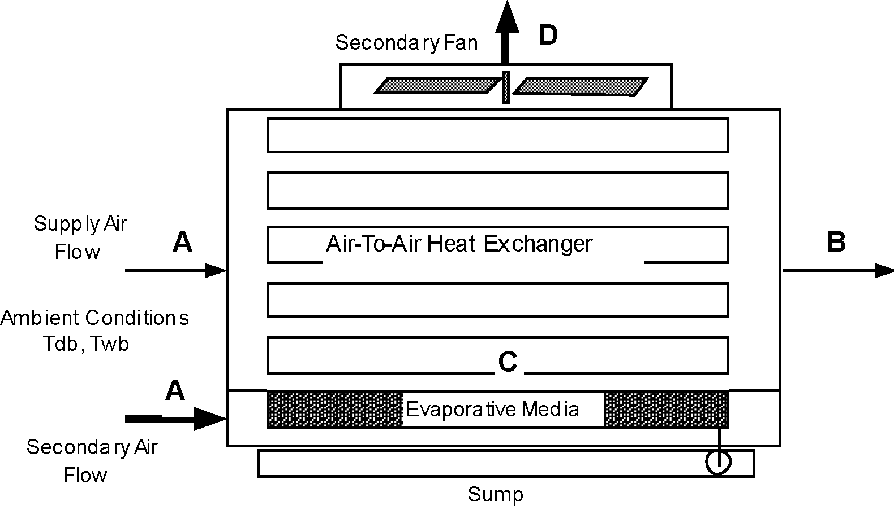

Figure 200.  Evaporative Cooler -- Indirect Dry Coil

The process that the secondary air goes through, A to C to D, is shown by the dashed lines in  the following figure.  Process A to C is adiabatic cooling in the rigid media pad.  Then the air enters the shell side of the heat exchanger and is sensibly heated from C to D by the warm supply air passing through the tube side.

Figure 201.  Secondary Air Process -- Indirect Dry Coil Evap Cooler

The advantage of the dry coil heat exchanger is that the heat exchanger does not have the evaporation taking place on the outside of the tubes, thus no mineral deposits are left on the heat exchange surface to reduce the efficiency of the heat exchanger.  The rigid media pads are designed to flush the mineral deposits to the sump, so the saturation efficiency of the pad stays relatively constant.

The following equations are used to determine the dry-bulb temperature leaving the evaporative media, given pad geometry and secondary airflow information.  The heat transfer in the heat exchanger can be determined with the effectiveness of the heat exchanger according.

Tdb sup out = Tdb sup in - ese\*(Todb - Towb )

QHx = eHx \* Min( CFMsec , CFMsupply) \* rair \* cp air \* ( Todb - Tdb sec out)

After the heat transfer for the heat exchanger has been determined, an energy balance is done on the supply airside to determine the dry-bulb temperature leaving the indirect evaporative cooler.  This assumes all the energy for is provided by the primary air stream so the effectiveness value includes the air-to-air effectiveness of the heat exchanger.

Tdb sup out =  Tdb sup in   -  \(\frac{{{Q_{Hx}}}}{{{r_{air}}*{c_{pair}}*CF{M_{\sup ply}}}}\)

The wet-bulb temperature is determined from psychrometric routines using the leaving dry-bulb temperature, humidity ratio, and barometric pressure, since humidity ratio is constant for the supply air across the indirect stage.  The effectiveness of the heat exchanger is determined from a parameter estimation using manufacturer's performance data.  For the indirect evaporative cooler it was found that a value of 0.67 represented reasonable default effectiveness.

### Wet Coil Indirect Evaporative Cooler

The input object EvaporativeCooler:Indirect:WetCoil provides a model for a wetted coil evaporative cooler, shown in the figure below, that has water sprayed directly on the tubes of the heat exchanger where latent cooling takes place.  The vaporization of the water on the outside of the heat exchanger tubes allows the simultaneous heat and mass transfer which removes heat from the supply air on the tube side.  Then the moist secondary air is exhausted.  The secondary air stream has its own fan.

Figure 202.  Wet Coil Indirect Evaporative Cooler

The process that the secondary air goes through, A to C on the following figure, is a path of simultaneous heat and mass transfer, but it does not follow a line of constant enthalpy as in the direct stage.  The process is not adiabatic due to the heat gain from the supply air flowing through the tubes of the heat exchanger.

Figure 203.  Secondary Air Process – Indirect Wet Coil Evaporative Cooler

The wet coil heat exchanger can have a higher stage efficiency than the dry coil due to a higher heat transfer rate on the outside of the heat exchanger tubes.  Over the operating lifetime of the heat exchanger, the vaporization taking place on the heat exchange surface can leave mineral deposits that will decrease the effectiveness of the heat exchanger.

#### Efficiencies of the Indirect Stage

In an indirect stage of an evaporative cooler, the secondary or wet side air stream acts as a heat sink for the supply air.  The efficiency of the indirect stage is given as the effectiveness of the sensible heat exchange, eHx, and the saturation efficiency on the wet streamside, ese.  These are expressed as:

eHx = \(\frac{q}{{{q_{max}}}}\)=  \(\frac{{{C_{sup}}({T_{supin}} - {T_{supout}})}}{{{C_{min}}({T_{secin}} - {T_{secout}})}}\),

ese =  \(\frac{{{T_{dbsecin}} - {T_{dbsecout}}}}{{{T_{odb}} - {T_{owb}}}}\),

where Tdb sup in = Tdb sec in  for the indirect cooler.  The maximum heat transfer possible would be obtained if the supply stream was cooled all the way to the wet-bulb temperature.  So the efficiency of the indirect evaporative cooler is defined by:

eind =  \(\frac{{({T_{dbsupin}} - {T_{dbsupout}})}}{{({T_{odb}} - {T_{owb}})}}\).

Using the combination of the effectiveness and saturation efficiency, the total efficiency of the indirect stage can be expressed by:

eind = eHx  ese  \(\frac{{{C_{sup}}}}{{{C_{min}}}}\).

In many cases Csup = Cmin and the efficiency of the indirect stage reduces to:

eind = eHx  ese.

An intuitive model determining the performance of the wet coil indirect model was developed.  This model can be used for all indirect models by curve fitting data from the evaporative cooler of interest.  The model development starts with the total efficiency of the indirect evaporative cooler:

eind =  \(\frac{{({T_{dbsupin}} - {T_{dbsupout}})}}{{({T_{odb}} - {T_{owb}})}}\)

Solving for T db sup out gives the leaving conditions of the supply air at a constant humidity ratio:

T db sup out = Tdb sup in - eind \* (Todb - Towb)

A form for the efficiency of the indirect stage was devised using a maximum efficiency with a coefficient to reduce the efficiency depending on the ratio of the airflows.

eind = emax - C1 \* (\(\frac{{CF{M_{sup}}}}{{CF{M_{sec}}}}\))

C1 is the "Flow Efficiency Ratio" and is determined from performance data.

A check of limits will verify that it makes physical sense.  As the magnitude of the secondary flow increases, the second term of equation above becomes smaller.  This would make the efficiency tend to go to the maximum efficiency.  Physically this would be true since the convective terms for heat and mass transfer would increase on the outside of the tube with the additional mass flow rate.  Similarly, if the supply air flow goes to zero with a constant secondary air flow, the second term of the equation above again becomes small, and the overall efficiency of the stage would approach the maximum.  The constant C1 tells how quickly the efficiency of the stage would decrease with a mismatch of the supply and secondary flows.

The maximum efficiency of the stage is a combination of the efficiency due to the simultaneous heat and mass transfer on the outside of the tube and the efficiency of the heat exchanger.  This value can be higher than the dry coil overall efficiency since the convective coefficients on the outside of the tube are larger.  For example, a least squares fit for the maximum efficiency showed this value was approximately 0.8 compared to the dry coil indirect value of approximately 0.65 (0.67 \* 0.97).  (The maximum efficiency for the dry coil indirect was determined at the condition where flow through the evaporative pad in the secondary air stream approached zero, for a 12-inch thick pad.)  It should be noted again that over the operating life of the wet coil heat exchanger, the mineral deposits that are left can decrease the effectiveness of the heat exchanger unless appropriate maintenance has taken place.  Therefore, if modeling an older system, the manufacturer’s data may no longer describe the equipment effectiveness.

### Two Stage Direct/Indirect Evaporative Cooler

A two stage cooler can be modeled by combining either a wet coil or the dry coil indirect evaporative cooler staged with a direct evaporative cooler.  The figure below shows a dry coil indirect evaporative cooler with a direct evaporative cooler.  This configuration is mainly used for total comfort cooling for a building and would not normally be used as a pre-cooler for a refrigeration coil, since the direct stage would increase the latent load on a refrigeration coil.

Figure 204.  Two Stage Evaporative Cooler

The thermodynamic process for the supply air is shown below, going from A to B to C.  The process from A to B is sensible cooling in the indirect stage.  The process from B to C is simultaneous heat and mass transfer following a constant enthalpy line.  The air leaving the final stage has a lower dry-bulb and wet-bulb temperature, and an increase in moisture from the direct stage.

Figure 205.  Thermodynamic Process for Supply Air Through Two Stage Evaporative Cooler

Two stage evaporative coolers can be accomplished by putting the EvaporativeCooler:Direct:CelDekPad, EvaporativeCooler:Indirect:CelDekPad, EvaporativeCooler:Indirect:WetCoil in series in any combination the user desires in the supply air loop.

### Indirect Evaporative Cooler Special Research Model

This section summarizes the model implemented in the component EvaporativeCooler:Indirect:ResearchSpecial.  Examples of this evaporative cooler are shown in the following figures, without and with a relief valve. This model differs from the other indirect evaporative coolers in that, under part load conditions, it can modulate so that the air leaving the cooler just meets a drybulb temperature setpoint.

The indirect research special evaporative cooler (IEC) machine provides improved modeling features needed for data center and other hybrid cooling applications.  The new model includes performance curves for variable effectiveness, fan power, and pump power.  It is intended to be able to model IEC machines that have 1) variable speed secondary fans, 2) variable speed pumps for water recirculation and spraying, and 3) ability to operate in a dry mode.  Such IEC machines can modulate the cooling power during operation by varying either the secondary side fan speed or the intensity of water spray or both.  To simplify the model it is assumed that the device’s internal controls are such that, when it is operating as a “Wet” evaporative cooler, secondary fan and spray pump operation are linked together so that there is a one-to-one mapping between them at any given part load situation.  This allows formulating the fan and pump power performance curves to be based on the same independent variable, secondary air flow fraction.

Figure 206. Research Special Indirect Evaporative Cooler

#### Model Formulation

Each time the model is called it takes the inputs on the left and produces the outputs on the right as shown in [Figure](#IndEvapCoolerFig2). “sys” is primary air stream and typically sits on an AirLoop HVAC branch. “sec” is secondary purge air stream and is typically outdoor air.  The model will set node flow rates and “out_sec” state variables on the secondary outlet. 

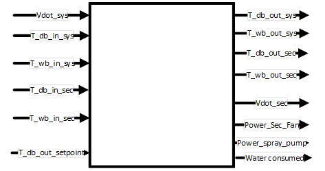

Figure: Illustration of Inputs-Outputs of Indirect Evaporative Cooler Research Special 

The model runs either in dry mode or wet mode depending entering air conditions of the primary and secondary air sides. Different effectiveness values are used depending on the operating modes.

#### Wet Mode Operation

If running “wet,” use wet bulb effectiveness and wet bulb temperature depression for delta T:

$$  \begin{array}{rl}
  \epsilon_{wb,op} &= \epsilon_{wb,design}\cdot f_{wb,mod}\left(\text{flowRatio}\right) \\
  \text{flowRatio} &= \frac{\dot{m}_{sec}}{\dot{m}_{sys}}
\end{array}$$

Where:

* \(\epsilon_{wb,op}\) = current operation effectiveness with respect to wet bulb temperature depression.

* \(\epsilon_{wb,design}\) = user input for effectiveness at design air flow rates and full spray power

* \(f_{wb,mod}\) = normalized wet mode operation effectiveness modifier performance curve as a function of flow fraction. The curve value describes how effectiveness varies at different flow rates.  When conditions are appropriate, this curve is numerically inverted to find a FlowRatio that just meets a setpoint. 

* \(\dot{m}_{sys}\) = primary air current time step mass flow rate in kg/s

* \(\dot{m}_{sec}\) = secondary air current time step mass flow rate in kg/s

The leaving primary air dry bulb temperature in wet operating mode is calculated as follows:

$$ T_{db,out,sys} = T_{db,in,sys} - \epsilon_{wb,op} \left( T_{db,in,sys} - T_{wb,in,sec} \right) $$ 

Then check that there is sufficient heat capacitance flux (mcT) in the secondary air stream to provide the conditioning.  The following steps are for checking and adjusting for non-physical outcomes that could happen with low secondary flow rates.

1. Calculate heat transfer rate

The secondary air entering wet-bulb temperature would be the loswest limit allowed, although this temperature cannot be attained in most practical situations.  This is checked as a limiting case.

$$
  \begin{array}{rl}
    T_{db,out,sys} &= \max\left(T_{db,out,sys},T_{db,out,setpoint}\right) \\
    \dot{Q}_{HX} &= \left(\dot{m}c_p\right)_{sys,in} \cdot \left(T_{db,in,sys}-T_{db,out,sys}\right)
  \end{array}
$$

2. Calculate outlet enthalpy of the secondary air

$$
  \text{enahalpy}_{out,sec} = \text{enthalpy}_{in,sec} + \frac{\dot{Q}_{HX}}{\dot{m}_{sec}}
$$

One approximation that can be made is the outlet condition of the temperature and humidity ratio combination that produces the outlet enthalpy of the secondary air calculated above.  A conservative approach is that the secondary air leaves with water added at such a rate that it results in the secondary air to leave at the same dry bulb temperature and all the total heat transfer results in humidity ratio increases, i.e., latent heat transfer. Following this assumption the secondary air outlet humidity ratio can be calculated in step 3. 

3. Calculate outlet humidity ratio of the secondary air

$$
  \begin{array}{rl}
    T_{db,out,sec} &= T_{db,in,sec} \\
    \text{HumRat}_{out,sec} &= \text{PsyWFnTbH}\left(T_{db,out,sec},\text{enthalpy}_{out,sec}\right) \\
    \dot{V}_{water} &= \frac{QHX / \left[ \left(\text{HumRat}_{out,sec}-\text{HumRat}_{in,sec}\right) \cdot h_{fg,in,sec}\right]}{\rho_{water,Tdb,in,sec}} \\
    or &= \\
    \dot{V}_{water} &= \frac{QHX / \left[ \left(\text{enthalpy}_{out,sec}-\text{enthalpy}_{in,sec}\right) \right]}{\rho_{water,Tdb,in,sec}}
  \end{array}
$$

Dry Operation Mode

Similarly, if running “dry” use dry bulb effectiveness and dry bulb based delta T

$$ \epsilon_{db,op} = \epsilon_{db,design} \cdot f_{db,mod}\left(\text{flowRatio}\right) $$

Where:

* \(\epsilon_{db,op} \) = current operation effectiveness with respect to dry bulb temperature depression.

* \(\epsilon_{db,design} \) = user input for effectiveness at design air flow rates and dry operation mode (no water spray on the secondary air side)

* \(f_{db,mod} \) = normalized dry mode operation effectiveness modifier performance curve as a function of flow fraction.  The curve value describes how the dry mode effectiveness varies with different flow rates.  When conditions are appropriate, this curve is numerically inverted to find a FlowRatio that just meets a setpoint 

The leaving primary air dry bulb temperature in dry operating mode is calculated as follows:

$$T_{db,out,sys} = T_{db,in,sys} - \epsilon{db,op}\left(T_{db,in,sys}-T_{db,in,sec}\right)$$

Then check that there is sufficient heat capacitance flux (mcT) in the secondary air stream to provide the conditioning.  For dry operation, it should be sufficient to simply use inlet moist air properties for density and specific heat.  The following steps are for checking and adjusting for non-physical outcomes that could happen with low secondary flow rates.

1. Calculate heat transfer

$$ \dot{Q}_{HX} = \left(\dot{m}c_{p}\right)_{sys,in} \left(T_{db,in,sys}-T_{db,out,sys}c\right) $$

2. Calculate secondary/scavenger leaving dry-bulb

$$ T_{db,out,sec} = T_{db,in,sec} + \frac{\dot{Q}_{HX}}{ \left(\dot{m}c_{p}\right)_{sys,in}} $$

3. Check for energy imbalance and adjust if need

$$ \text{IF} \left(T_{db,out,sec}>T_{db,in,sys}\right) \text{THEN} T_{db,out,sec} = T_{db,in,sys}-0.2 C $$

4. Recalculate heat transfer limit if imbalance found in step 3 using new secondary outlet drybulb

$$ \dot{Q}_{HX,lim} = \left(\dot{m}c_{p}\right)_{sec,in}\cdot \left( T_{db,out,sec}-T_{db,in,sec} \right) $$

5. Recalculate leaving supply air dryblub using new heat transfer rate from step 4

$$ T_{db,out,sys} = T_{db,in,sec} + \frac{\dot{Q}_{HX}}{ \left(\dot{m}c_{p}\right)_{sys,in}} $$

The IEC in dry and wet operating mode transfers no moisture to the primary system air, so the humidity ratio remains the same:

$$\text{HumRat}_{out,sys} = \text{HumRat}_{in,sys}$$

#### Secondary Air Flow Fraction

The secondary air mass flow rate will either be set to \(\dot{m}_{sec}\) or solved for numerically as described below. The secondary side flow fraction, \(ff_{sec}\), is defined as.  (Note this is another flow ratio that differs from the one used above which combined both streams into one ratio in effectiveness modifier curves.)  

$$ff_{sec} = \frac{\dot{m}_{sec}}{\dot{m}_{sec,design}}$$

The secondary air mass flow rate will either be set to  or solved for numerically as described below. The secondary side flow fraction, , is defined as.  (Note this is another flow ratio that differs from the one used above which combined both streams into one ratio in effectiveness modifier curves.)  

$$P_{sec,fan} = P_{sec,fan,design}\cdot f_{sec,fan,mod}\left(ff_{sec}\right) $$

Where:

\(P_{sec,fan} \) = secondary air fan electric power value at current secondary air flow rate in W.

\(P_{sec,fan,design} \) = secondary air fan electric power value at design air flow rate in W.

\(f_{sec,fan,mod} \) = secondary air fan power modifier normalized performance curve as a function of secondary air flow fraction.

\(\dot{m}_{sec,design} \) = secondary air design mass flow rate in kg/s

Recirculation and spray pump electric power is calculated using design pump electric power and a normalized pump power modifier performance curve that describes how power varies as a function of the secondary air flow fraction is given by:

$$P_{pump} = P_{pump,design}\cdot f_{pump,mod}\left(ff_{sec}\right) $$

Where:

\(P_{pump} \) = recirculation and spray pump power value at current operation in W.

\(P_{pump,design} \) = recirculation and spray pump power value at design air flow rate in W.

\(f_{pump,mod} \) = recirculation and spray pump power modifier normalized performance curve as a function of secondary air flow fraction.

User specified three operating temperature limits are included in the model.  These allow controlling when operation should shift from wet to dry and when the cooler should just be shut down because the outdoor conditions are too warm or too wet to do anything beneficial. 

\(T_{db,evapMinLimit} \) = Evaporative Operation Minimum Limit Outdoor Drybulb Temperature, user input.  Shut down wet mode with outdoor temperature is lower than this limit, typically shifting to dry mode.  

\(T_{wb,evapMaxLimit} \) = Evaporative Operation Maximum Limit Outdoor Wetbulb Temperature, user input.  Shut down fan and pump and don’t operate when outdoor Wetbulb is higher than this limit.  The wet bulb is maybe warmer than the return air and attempting evaporative cooling is wasteful. 

\(T_{db,evapMaxLimit} \) = Dry Operation Maximum Limit Outdoor Drybulb Temperature, user input.  Shut down dry operation attempts and don’t operate secondary fan when outdoor dry bulb is higher than this limit.  The dry bulb is maybe warmer than the return air and attempting to do heat exchange is wasteful. 

Algorithm to determine cooler operation proceeds as follows

1. Retrieve leaving setpoint, \(T_{db,out,setpoint}\)

2. Calculate leaving dry bulb for max cooling power available at full secondary air flow rate for dry operation, \(T_{db,out,sys,dry,min}\)

3. Check if dry operation limit (input field called Evaporative Operation Minimum Limit Outdoor Dry-Bulb Temperature) reached, \(T_{db,in,sec}<T_{db,evapMinLimit}\)

4. If dry limit not exceeded, then leaving dry bulb for max cooling power available at full secondary air flow rate for wet operation, \(T_{db,out,sys,wet,min}\)

5. Compare setpoint temperature needed to temperatures available, evaluate limits and choose which case for operation is called for. The following table outlines the five cases in order of increasing cooling power.

INSERT TABLE

“Modulated” cases solve for a secondary flow rate using numerical method, such as regula falsi.  Residual is formulated by a difference between the dry bulb temperature leaving the cooler and the setpoint.  As the solver progress it varies flow rate on the secondary side until the setpoint is met.  For each iteration, a new effectiveness is calculated as a function of Flow Ratio.  The new flow is used for the \(\left(\dot{m}c_{p}\right)_{min}\) term and the new effectiveness is used to calculate a result for leaving drybulb.  The numerical method is the same for dry and wet operation, only the functions will use different curves and state variables to describe performance. The regula falsi solver can vary secondary flow rate, \(\dot{V}_{sec}\), to drive the following residual to zero:

$$\text{residual} = T_{db,out,sys} - T_{db,out,setpoint}$$
 

“Dry or Wet Op Modulated” is the most complex situation.  There is an overlap and the cooler could deliver the setpoint air using either dry operation or wet operation.  The model proceeds separately to calculate both wet and dry operation, with separate numerical solvers for modulation in each mode.  Then the fan and pump power is calculated for each mode.  Select the lowest power mode as the preferred choice.  (This doesn’t really count the value of water, could bring in a source factor but …). Discard results for the unused mode. 

The purge air, or secondary airside, is the stream that evaporates water and indirectly cools the primary, or system air.  The result from Equation is then compared to a lower bound, \({T_{db,out,bound}}\), determined from the dewpoint of the incoming purge air using Equation .

$${T_{db,out,bound}} = {T_{db,in,sys}} - \beta ({T_{db,in,sys}} - {T_{dew,in,purge}})$$

where,

\({T_{dew,in,purge}}\)  is the dewpoint of purge air entering the wet side of cooler [ºC]

\(\beta \)              is a factor for how close to dewpoint is possible (eg. 0.9)

The final result (for PLF = 1) is the larger of the results from Equations and .

The indirect cooler has the ability to overcool the air and therefore needs some form of modulation.  A Part Load Fraction, PLF, is used to model the implications of controlling the amount of cooling.  It is assumed that through on/off cycling that the cooling power can be varied to exactly meet the desired temperature when PLF is less than unity.

$${\dot Q_{Full}} = \dot m\left( {{h_{out,sys}} - {h_{in,sys}}} \right)$$

$${\dot Q_{{\mathop{\rm Re}\nolimits} quired}} = \dot m\left( {{h_{out,desired}} - {h_{in,sys}}} \right)$$

$$PLF = \frac{{{{\dot Q}_{{\mathop{\rm Re}\nolimits} quired}}}}{{{{\dot Q}_{Full}}}}$$

where,

\(PLF\)                     is the Part Load Fraction

When PLF is less than 1.0 it is assumed that the cooler will deliver the desired temperature air (as long as it is less than the inlet; it doesn’t need heating).  The PLF is used to modify the auxiliary fan power when the fan power modifier curve is not specified and find when the unit will overcool.

$${P_{fan}} = \Delta P\cdot \dot V\cdot e\cdot PLF$$

Water pump power is also derated using the PLF.

A third air stream input to the cooler was implemented in order to allow mixing building exhaust air with outdoor air on the purge/secondary side of the cooler. The assumption when relief/tertiary air is used is that all of the available relief zone air is used and the remainder made up with outdoor air.  Moisture and energy balances are drawn to compute humidity ratio and enthalpy of mixed secondary air.  The volume is determined by the design volume flow rate (from secondary fan size).

#### Water Consumption

Water consumption is an important consideration when evaluating evaporative coolers.  Water consumption of the evaporative cooler is modeled using Equation .

$${\dot V_{water}} = {\dot V_{evap}} + {\dot V_{drift}} + {\dot V_{blowdown}}$$

The three components of water consumption are evaporation, drift, and blowdown.  Evaporation is the water evaporated as the normal part of the evaporative cooler thermodynamic process and is calculated using:

$${\dot V_{evap}} = \frac{{{{\dot Q}_{IEC}}}}{{{\rho_{water}}{h_{fg}}}}$$

where,

\({\dot V_{evap}}\) is the volume flow rate of useful water evaporation [m3/s]

\({h_{fg}}\) is the heat of vaporization of water (taken as 2,500,000 J/kg)

\({\dot Q_{IEC}}\) is the rate of heat transfer calculated as by Equation or Equation [W]

\({\rho_{water}}\) is the density of water [kg/m3]

Drift is water that leaves the secondary side as droplets and does not contribute to the evaporative cooling process in a useful manner.  It is calculated using a user input factor that describes drift as a fraction of \({\dot V_{evap}}\).

$${\dot V_{drift}} = {\dot V_{evap}} * {f_{drift}}$$

Blowdown is water drained from the sump to counter the build up of solids in the water that would otherwise occur because of evaporation.  It is calculated using a user input factor for the blowdown concentration ratio ,\({R_{concentration}}\) , which is the ratio of solids in in the blowdown water compared to the solids in the fresh makeup water and is limited to values of 2 or higher.  The make up water needed for blowdown is calculated using:

$${\dot V_{blowdown}} = \frac{{{{\dot V}_{evap}}}}{{\left( {{R_{concentration}} - 1.0} \right)}} - {\dot V_{drift}}$$

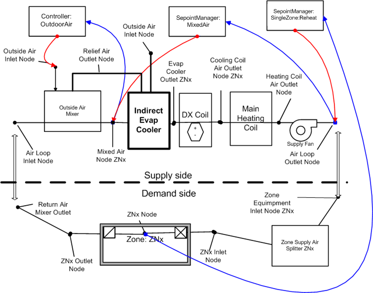

Figure 207. Research Special Indirect Evaporative Cooler Using Relief Air

#### Indirect Evaporative Cooler Sizing

The model for the object called EvaporativeCooler:Indirect:ResearchSpecial has a field for the secondary fan flow rate that can be autosized.  

##### Secondary Air DesignFan Flow Rate

The secondary air design flow rate fan is not part of an airstream that is directly modeled in EnergyPlus.  Because the primary side air flows can be autosized as part of the air system, it is convenentconvenient to also scale the size of the secondary flow.   If the cooler is part of the main loop of a central air system, then the secondary fan flow rate is sized to equal to the main design flow rate. 

User inputs for autosizing scaling factors are included so that when modeling an autosized IEC, all the design values can be scaled off of Primary Design Air Flow Rate.  User input for Secondary Air Flow Sizing Factor is multiplied by DesMainVolFlowsys as follows:

$$ \dot{V}_{sec,design} = \text{DesMainVolFlow}_{sys}\cdot\text{SecAirFlowScalingFactor} $$

If the cooler is part of the outdoor air path of a central air system, then the secondary air design flow rate is sized to be the maximum of either the design minimum outdoor air flow rate or one-half of the main design flow rate. 

$$ \dot{V}_{sec,design} = \max\left(\text{DesOutAirVolFlow},0.5\cdot\text{DesMainVolFlow}_{sys}\right)\cdot\text{SecAirFlowScalingFactor} $$

 
##### Secondary Fan Design Power

The Secondary Fan Design Power is outosized from secondary air design flow rate and user input for Secondary Fan Sizing Specific Power in units of W/(m3/s) as follows:

$$ P_{sec,fan,design} = \dot{V}_{sec,design}\cdot\text{FanPowerScalingFactor} $$

##### Recirculating Water Design Pump Power

The Recirculating Water Design Pump Power is sized from secondary air design flow rate and user input for recirculating and spraying Water Pump Power Sizing Factor in units of W/(m3/s) or W-s/m3 and is given by:

$$P_{pump,design} = \dot{V}_{sec,design}\cdot\text{PumpPowerScalingFactor}$$

Where,

\(\dot{V}_{sys,design} \) = primary air design volume flow rate in m3/s

\(\dot{V}_{sec,design} \) = secondary air design volume flow rate in m3/s

\(\text{SecAirFlowScalingFactor} \) = user specified Secondary air flow sizing factor in units of W/(m3/s) for secondary design air flow rate calculation.

\(\text{FanPowerScalingFactor} \) = user specified secondary air fan sizing specific power in units of W/(m3/s) for design fan power calculation.

\(\text{PumpPowerScalingFactor} \) = user specified recirculating and spraying water pump power sizing factor in units of W/(m3/s) for design pump power calculation.

### Direct Evaporative Cooler Special Research Model

This section summarizes the model implemented in the component EvaporativeCooler:Direct:ResearchSpecial.  This model can use a simple constant effectiveness or a variable effectiveness model that, under part load conditions, can modulate so that the air leaving the cooler just meets a drybulb temperature setpoint.  The algorithm used to determine the changes to the system air proceeds in four steps:

1) Calculate the current operation effectiveness using effectiveness modifying curve

2) Calculate full load performance using a part load fraction (PLF)=1 and Equation .

3) Calculate PLF using Equations , , and .

4) Recalculate cooler performance using the PLF.

$$\begin{array}{rl}
  \epsilon_{op} &= \epsilon_{design}\cdot f_{mod}\left(flowRatio\right) \\
  T_{db,out,sys} &= T_{db,in,sys} - \epsilon_{op}\cdot\left(T_{db,in,sys}-T_{wb,in,sys}\right) \\
  T_{db,out} &= T_{db,in}-\epsilon\left(T_{db,in}-T_{wb,in}\right)
\end{array}$$

where,

* \({T_{db,out,sys}}\) is the drybub temperature of the air leaving the cooler [ºC],

* \({T_{db,in,sys}}\) is the drybulb temperature of the air entering the cooler [ºC],

* \({T_{wb,in,sys}}\) is the wetbulb temperature of the air entering the cooler [ºC], and

* \(\epsilon_{design} \) is the cooler design effectiveness.

* \(\epsilon_{op} \) is the cooler current operation effectiveness.

* \(f_{mod} \) is the effectiveness modifier curve as a function of system air flow fraction

The wetbulb temperature of air leaving a direct cooler is the same as the wetbulb temperature entering the cooler.  The leaving humidity ratio of the air is calculated using psychrometric functions with leaving drybulb and wetbulb temperatures and outdoor air pressure as inputs.  The leaving enthalpy of air is calculated using psychrometric functions with leaving drybulb temperature, leaving humidity ratio, and outdoor air pressure as inputs.

The direct cooler sometimes has the ability to overcool the air and therefore some form of modulation is useful for analysis.  The special research model includes a Part Load Fraction, PLF, used to model the implications of controlling the amount of cooling.  It is assumed that through some sort of on/off cycling or wetness control that the cooling electric power can be varied to exactly meet the desired temperature when PLF is less than unity.  The auxiliary water pump power is then varied using pump power modifier curve or linearly using a Part Load Fraction when the pump power modifier curve is not specified.

$${\rm{FullOutput}} = {T_{db,out}} - {T_{db,in}}$$

$${\rm{RequiredOutput}} = {T_{db,desired}} - {T_{db,in}}$$

$$PLF = \frac{{{\rm{RequiredOutput}}}}{{{\rm{FullOutput}}}}$$

When PLF is less than 1.0 it is assumed that the cooler will deliver the desired temperature air (as long as it is less than the inlet; it doesn’t need heating).  Water pump power is also derated using the user specified pump modifier curve or using PLF when the pump modifier curve is not specified.

#### Water Consumption

Water consumption is an important consideration when evaluating evaporative coolers.  Water consumption of the evaporative cooler is modeled using Equation .

$${\dot V_{water}} = {\dot V_{evap}} + {\dot V_{drift}} + {\dot V_{blowdown}}$$

The three components of water consumption are evaporation, drift, and blowdown.  Evaporation is the water evaporated as the normal part of the evaporative cooler thermodynamic process and is calculated using:

$${\dot V_{evap}} = \frac{{\dot m\left( {{w_{out}} - {w_{in}}} \right)}}{{{\rho_{water}}}}$$

where,

\({\dot V_{evap}}\) is the volume flow rate of useful water evaporation [m3/s]

\({w_{out}}\) is the humidity ratio of the air leaving the cooler [kg/kg]

\({w_{in}}\) is the humidity ratio of air entering the cooler [kg/kg]

\(\dot m\) is the mass flow rate of air moving through the cooler [kg/s]

\({\rho_{water}}\) is the density of water [kg/m3]

Drift is water that leaves the cooler (and supply air duct) as droplets and does not contribute to the evaporative cooling process in a useful manner.  It is calculated using a user input factor that describes drift as a fraction of \({\dot V_{evap}}\).

$${\dot V_{drift}} = {\dot V_{evap}} * {f_{drift}}$$

Blowdown is water drained from the sump to counter the build up of solids in the water that would otherwise occur because of evaporation.  It is calculated using a user input factor for the blowdown concentration ratio ,\({R_{concentration}}\), which is the ratio of solids in the blowdown water compared to the solids in the fresh makeup water and is limited to values of 2 or higher.  The make up water needed for blowdown is calculated using:

$${\dot V_{blowdown}} = \frac{{{{\dot V}_{evap}}}}{{\left( {{R_{concentration}} - 1.0} \right)}} - {\dot V_{drift}}$$

Air System Fans 
---------------

### Overview

Three input objects (Fan:ConstantVolume, Fan:VariableVolume, and Fan:OnOff) provide models for fans -- the prime movers in most of the air loop and zonal air conditioning systems in EnergyPlus. For these input objects, EnergyPlus uses a simple polynomial-based curve-fit model to describe the relation between the volumetric flow rate and the fan electric power, with no explicit modeling of fan pressure rise. Consequently, duct-static-pressure reset strategies cannot be modeled using this approach. For CAV and VAV central air-handling systems, a fourth input object (Fan:ComponentModel) provides a simple physics-based model for flow-dependent fan pressure rise and detailed models for fan, belt, motor, and variable-frequency-drive efficiencies and energy use. This latter input object provides the capability to analyze the effects of duct-static-pressure reset strategies, as well as changes in fan system element performance. All of these fan models calculate the fan energy usage, which is often a large fraction of HVAC energy use and a significant portion of the building energy consumption. They also calculate the temperature rise in the air stream caused by the static pressure increase as the air goes through the fan. If the motor and belt are in the air stream, waste heat from the motor and belt also acts to raise the air stream temperature.

### Model

Each of the four fan models is a forward type: the model inputs describe the fan characteristics and the conditions of the air at the fan inlet; the outputs are the fan electrical power consumption and the conditions of the air at the fan outlet. The model algorithms and data are contained in the *Fans* module in EnergyPlus.

#### Inputs and Data

For the Fan:ConstantVolume, Fan:VariableVolume, and Fan:OnOff models, the user describes the fan by entering values for the design pressure rise across the fan, the design volumetric flow rate, the fan total efficiency, and the fan motor efficiency. The user also needs to specify the fraction of the fan waste heat that will enter the air stream (usually 0 or 1). For the Fan:VariableVolume model, the user must also enter the coefficients of a 4th order polynomial that relates the fan mass flow rate to the fan power consumption.The independent variable is the volumetric flow fraction; the dependent variable is the fan power part load ratio. For multi-speed fans, the user must enter a fan power ratio as a function of speed ratio performance curve name. Multi-speed fans can only be simulated in a parent object which allows multiple fan speeds (e.g., AirLoopHVAC:Unitary:Furnace:HeatCool, ZoneHVAC:PackagedTerminalAirConditioner, etc.). An optional efficiency curve may also be used when simulating multi-speed fans to adjust the fan total efficiency as the fan speed changes.

For the Fan:ComponentModel object, the user describes the fan in more detail, and also describes the duct system characteristics as seen by the fan. In particular, the user specifies a pressure rise curve with four coefficients that relates the fan total pressure rise to the volumetric flow through the fan, the duct-static-pressure set-point, and the static pressure of the spaces surrounding the ducts. If duct-static-pressure reset is used, the user enters a linear curve with two coefficients that relates the pressure set-point to the volumetric flow through the fan. For the fan itself, the user specifies the fan geometry (wheel diameter and outlet area), maximum efficiency, the Euler number corresponding to the maximum efficiency, the maximum dimensionless flow, the names of four curves with several coefficients that describe the variation of fan efficiency and dimensionless flow with the Euler number in the normal and stall operation regions of the fan, and a sizing factor (applied to the maximum flow through the fan). For the belt, the user specifies the maximum efficiency (or a curve with five coefficients that defines the maximum efficiency as a function of maximum fan shaft input power), three curves with three coefficients each that relate the belt part-load efficiency to belt fractional output torque, the motor/fan pulley diameter ratio, the belt output torque capacity, and a sizing factor (applied to the maximum output torque of the belt). For the motor, the user specifies the maximum efficiency (or a curve with three coefficients that define the maximum efficiency as a function of maximum belt input power), a curve with three coefficients that relate the motor part-load efficiency to motor fractional output power, and a sizing factor (applied to the maximum output power of the motor). For the variable-frequency-drive (VFD), the user specifies a curve with three coefficients that relate the VFD part-load efficiency to motor fractional input power or to motor fractional speed, and a sizing factor (applied to the maximum output power of the VFD).

#### Control

The models must decide whether the fan is on or off. The primary on/off trigger is the fan schedule. This is an on/off schedule associated with each fan: a value of 1 indicates the fan is on; a value of 0 indicates the fan is off. The fan schedule can be overruled by flags set by system availability managers. If the flag *TurnFansOn* is true, a zero fan schedule value will be overridden and the fan will be turned on. If the flag *TurnFansOff* is true the fan will be forced off. The inlet air mass flow rate must be greater than zero for the fan to be on.

Generally the fan is a passive component: it accepts the mass flow on its inlet node, uses it in its calculations of energy consumption and temperature rise, and passes it to the outlet node. However the fan maximum and minimum airflow rates act as absolute limits on the airflow rate.

For multi-speed fans, the parent object determines the fan speed ratio (i.e., the selected speed of the fan motor) and uses this value in conjunction with the fan power ratio performance curve to calculate the full load fan power. This full load fan power is then used to determine the part-load performance of the fan and motor assembly.

#### Simulation

Simple (Single Speed) Fan Model

The following equations define the model for this fan:

$${\dot Q_{tot}} = \dot m\cdot \Delta P/({e_{tot}}\cdot {\rho_{air}})$$

$${\dot Q_{shaft}} = {e_{motor}}\cdot {\dot Q_{tot}}$$

$${\dot Q_{toair}} = {\dot Q_{shaft}} + ({\dot Q_{tot}} - {\dot Q_{shaft}})\cdot {f_{motortoair}}$$

$${h_{out}} = {h_{in}} + {\dot Q_{toair}}/\dot m$$

$${w_{out}} = {w_{in}}$$

$${T_{out}} = PsyTdbFnHW({h_{out}},{w_{out}})$$

On/Off Fan Model

The on/off fan model is similar to the simple fan model with the exception that the on/off fan may cycle on and off during a simulation time step. The cycling rate of the fan is known as the run time fraction. The calculation of run time fraction accounts for the part-load losses of other equipment used in the HVAC system. A part-load factor (a.k.a. part-load ratio) is first calculated for the fan as the ratio of the actual operating mass flow rate to the maximum fan mass flow rate. The run time fraction is then calculated as the part-load factor divided by the part-load fraction. The part-load fraction is determined by other HVAC equipment in the simulation (Ref. DX coil) for use by this specific fan model.

$${f_{flow}} = {\raise0.7ex\hbox{${\mathop m\limits^ \bullet  }$} \!\mathord{\left/ {\vphantom {{\mathop m\limits^ \bullet  } {{{\mathop m\limits^ \bullet  }_{\max }}}}}\right.}\!\lower0.7ex\hbox{${{{\mathop m\limits^ \bullet  }_{\max }}}$}}$$

$$RTF = {\raise0.7ex\hbox{${{f_{flow}}}$} \!\mathord{\left/ {\vphantom {{{f_{flow}}} {PLF}}}\right.}\!\lower0.7ex\hbox{${PLF}$}}$$

The total fan power is then calculated as the maximum fan power multipled by the run time fraction.

$${\mathop Q\limits^\cdot_{tot}} = RTF\left[ {\mathop m\limits^\cdot  \cdot \Delta P/\left( {{e_{tot}}\cdot {\rho_{air}}} \right)} \right]$$

The remaining calculations are the same as those described in the simple single-speed fan mode.

Multi-Speed Fan Model

The model used to simulate a multi-speed fan relies on the general fan laws to correct for speed changes in the fan’s motor and the corresponding change in fan power and fan total efficiency. Two performance curves are used to define the change in power and efficiency as shown below. The power ratio curve must be used to simulate a multi-speed fan. The power ratio curve modifies the fan power based on a change in fan speed according to the cubic fan law. Exponents other than 3 are allowed. The efficiency ratio curve is used to correct for changes in nominal efficiency at alternate fan speeds. If either or both of these curves are not provided, the ratio is assumed to be 1.

The power ratio term is evaluated using an exponent performance curve. The form of the exponent curve equation is shown below.

$$ExponentCurveOutput = C1 + C2*{x^{C3}}$$

The exponent performance curve is used to evaluate the power ratio as a function of speed ratio (x in the equation above). For typical fan performance, coefficient C1 = 0 and coefficient C2 = 1. The exponent (C3) is typically equal to 3 (cubed fan law) but other values are allowed.

$$PowerRatio = f{\left( {{N_{ratio}}} \right)^n} = ExponentCurveOutput$$

The efficiency ratio curve is a quadratic or cubic curve used to evaluate the efficiency ratio as a function of speed ratio (x in the following equation). The cubic equation form is shown below.

$$EfficiencyCurveOutput = C1 + C2{\left( x \right)^2} + C3{\left( x \right)^3}$$

The curve coefficients are determine by correlating the normalized fan total efficiency (i.e., the actual fan total efficiency divided by the nominal fan total efficiency at a speed ratio of 1) to the speed ratio (i.e., the ratio of actual air flow rate through the fan to the maximum fan air flow rate).

$$EfficiencyRatio = f\left( {{N_{ratio}}} \right) = EfficiencyCurveOutput$$

To account for the change in fan speed and to ensure that the run time fraction is accurately calculated, an adjustment to the previous calculation for run time fraction is made. This adjusts the calculated run time fraction to account for times when the fan speed has been reduced and the new speed is now considered the fan’s maximum speed. The speed adjusted run time fraction is then used in the fan power calculation.

$$RTF = {\raise0.7ex\hbox{${RTF}$} \!\mathord{\left/ {\vphantom {{RTF} {{N_{ratio}}}}}\right.}\!\lower0.7ex\hbox{${{N_{ratio}}}$}}$$

$${\mathop Q\limits^ \bullet_{tot}} = RTF\left[ {\frac{{\mathop m\limits^ \bullet  \Delta P}}{{{e_{tot}}{\rho_{air}}}}} \right]\left( {\frac{{PowerRatio}}{{EfficiencyRatio}}} \right)$$

Each of the performance curves described above may be used to model the performance of a multi-speed fan motor, however, the power ratio curve must be used to envoke the multi-speed simulation. These curves are used when the fan is used in an HVAC system having multiple flow rates (i.e., different flow rates in cooling and heating mode). If an HVAC system operates at the same speed in either cooling or heating mode, these curves are not required. When these curves are not used, the associated ratio term in the equation above is assumed to be 1. The remaining calculations are identical to the simple single-speed fan model described above.

Variable Speed Fan Model

The model for the variable speed fan is similar to the simple single-speed fan model except for a part load factor that multiplies the fan power consumption.

$${f_{flow}} = \dot m/{\dot m_{design}}$$

$${f_{pl}} = {c_1} + {c_2} \cdot {f_{flow}} + {c_3} \cdot f_{flow}^2 + {c_4} \cdot f_{flow}^3 + {c_5} \cdot f_{flow}^4$$

$${\dot Q_{tot}} = {f_{pl}}\cdot {\dot m_{design}}\cdot \Delta P/\left( {{e_{tot}}\cdot {\rho_{air}}} \right)$$

The rest of the calculation is the same as for the simple fan.

#### Nomenclature for Simple Models

\({\dot Q_{tot}}\) is the fan power in watts;

\(\dot m\)is the air mass flow in kg/s;

\({\dot m_{design}}\)is the design (maximum) air flow in kg/s;

\(\Delta P\)is the fan design pressure increase in Pascals;

\({e_{tot}}\) is the fan total efficiency;

\({\rho_{air}}\)is the air density at standard conditions in kg/m3;

\({e_{motor}}\) is the motor efficiency;

\({\dot Q_{shaft}}\)is the fan shaft power in watts;

\({\dot Q_{toair}}\)is the power entering the air in watts;

\({N_{ratio}}\)is the ratio of actual fan flow rate (or speed) to maximum fan flow rate (or speed)

\({h_{in}},{h_{out}}\) are the inlet and outlet air stream specific enthalpies in J/kg;

\({w_{in}},{w_{out}}\) are the inlet and outlet air stream humidity ratios;

\({T_{out}}\) is the outlet air temperature in degrees C;

\(PsyTdbFnHW\)is the EnergyPlus psychrometric routine relating enthalpy and humidity ratio to temperature;

\({f_{flow}}\)is the flow fraction or part-load ratio;

\({f_{pl}}\) is the part load factor.

Component Fan Model

The Fan:ComponentModel object is based upon combining: modified forms of fan, belt, motor, and variable-frequency-drive (VFD) element models (Stein and Hydeman 2004); a simplified fan pressure rise model with distribution system leakage, duct static pressure, and conditioned space pressure control effects included (Sherman and Wray 2010); and a diagnostic-based simplified duct static-pressure reset (SPR) scheme for air-handling systems (Federspiel 2004, 2005).

Fan *electric* power depends on fan *air* power (product of the airflow through and pressure rise across the fan), mechanical efficiencies (fan and belt), and electrical efficiencies (motor and drive). For systems with variable flows, none of these parameters is constant and all are interrelated. For example, Figure 208 shows that fan efficiency strongly depends on fan flow *as well as* pressure rise, although this is not obvious from the manufacturer’s power and speed performance map (top left). Fan efficiency maps can be derived from the manufacturer’s performance map using a commercially-available software-based data extraction tool such as DigitizeIt and by applying the following equation to the extracted data:

\({\eta_{fan}} = \frac{{\Delta {P_{fan}} \cdot {Q_{fan}}}}{{{H_{fan}}}}\)                                                                                     ()

where **Δ***Pfan*is the fan pressure rise (Pa); *Qfan* is the fan flow at standard conditions (m3/s); and *Hfan* is the fan shaft power (W). Fan speed values also can be derived from the manufacturer’s performance map using a similar software-based data extraction tool.

Fan pressure rise must be sufficient to overcome the air-handling system pressure drop, which depends on duct static pressure, on duct and equipment leakage, and on pressure drops across duct and duct-like elements (e.g., dampers, fittings), coils, and filters that are connected to the fan. Duct and duct-like pressure drops increase approximately as the square of the flow through them. However, pressure drops across coils and filters behave differently: they are proportional to the flow raised to a power n, which can approach one for high-efficiency filters and wet coils (Liu et al. 2003, Trane 1999).

The relation between system pressure drop and flow defines what is commonly called a “system curve”. When system characteristics change, such as when the duct static pressure set point is varied, a family of system curves results. The intersections of these curves with fan curves (e.g., power as a function of pressure rise and flow) on a pressure versus flow plot define one or more loci of unique fan operating points. Each of these points has an associated fan efficiency, power, and speed.

Figure 208. Example Fan Performance Maps - Manufacturer’s Data from Loren Cook Company, plus Derived Static Efficiency (Three-Dimensional and Contours)
 (Dashed Parabolic Curve is “Do Not Select Line”)

*Fan Pressure Rise Model*: To calculate fan pressure rise based on flow through the fan, Sherman and Wray (2010) have developed a simple physics-based data-driven four parameter duct system model for the purpose of simulating its system curve. The embodiment of the model for a fixed outdoor air fraction that can be applied to constant- or variable-volume central air-handling systems is:

\(\Delta {P_{fan,tot}} = {A_{fpr}}Q_{fan}^2 + {B_{fpr}}Q_{fan}^{} + {C_{fpr}}Q_{fan}^{}\sqrt {{P_{sm}} - {P_o}}  + {D_{fpr}}\left( {{P_{sm}} - {P_o}} \right)\)                            ()

where **Δ***Pfan,tot* is the fan total pressure rise (Pa); *Qfan* is the fan flow at standard conditions (m3/s); *Psm* is the duct static pressure set point (Pa); *Po* is the static pressure of the spaces surrounding the ducts (Pa); and *Afpr*, *Bfpr*, *Cfpr*, and *Dfpr* are constant coefficients that represent different aspects of the fan pressure rise model as described below.

Fan static pressure rise is determined from the total pressure rise by subtracting the outlet velocity pressure:

\(\Delta {P_{fan}} = \Delta {P_{fan,tot}} - \frac{\rho }{2}{\left( {\frac{{{Q_{fan}}}}{{{A_{fan,out}}}}} \right)^2}\)                                                                         ()

where *Afan,out* is the fan outlet area (m2) and *ρ* is the air density at the fan inlet (kg/m3).

The first term in Equation looks like the common system curve in which the fan pressure rise is proportional to the square of the fan flow, but here it also depends implicitly on supply and return pressure losses, and in part on the fraction of the fan flow that is outdoor air (essentially “leaks” into and out of the return side of the system). Very often it is the only term considered, but that would only be correct with fixed-position dampers, no distribution system leakage, no linear resistance components, and no duct static pressure control.

The second term accounts for significant flow resistances in the system where the pressure difference is linearly proportional to the flow. Some filters and coils in the return may need this term to be adequately described. This term could be ignored if there are no linear components or if their pressure drops are very small compared to the other terms.

The third term, which depends on the fan flow and square root of the supply duct pressure *Psm*, accounts in part for air leakage from the supply system when damper positions are fixed or are changed independently of static pressure or fan flow. In this case, reducing or eliminating supply leakage results in a different system curve. This, however, might be only a minor “correction” to the simple system curves generally used. The third term is zero when VAV box dampers are modulated to control flow. Consequently, with variable-position supply dampers, reducing or eliminating supply leakage does not change the system curve.

The last term also accounts in part for leakage from the supply system when damper positions are fixed or are changed independently of static pressure or fan flow. This term indicates that the same fan pressure rise can be achieved by raising the duct pressure and closing dampers. The only change in the system in such a case is that the leakage flow may increase. The coefficient for this term is equal to one when the VAV box dampers are modulated to control flow. In both cases, this term may be the most important “correction” to the simple system curves generally used, especially at low flows.

In principle, especially for research applications of Energy Plus, the four individual fan pressure rise coefficients can be determined using duct design calculation tools for the entire system (e.g., Right-CommDuct, UNI-DUCT, Ductsize, Varitrane Duct Designer, T-Duct). In practice, however, especially for existing buildings, the necessary details may not be known sufficiently. In that case, one can make active measurements at different combinations of fan flows, outside air fractions, damper positions (if they are variable), and duct static pressures and then use non-linear system identification techniques to fit the data and determine the coefficients. If passive measurements can be made over a sufficiently long time so that a wide range of outside air settings, damper positions, and fan flows is obtained, one could instead regress the data to find all of the parameters in the equation. Unfortunately, there are no standardized test procedures available to draw upon, even though some standards appear to be related (e.g., ASHRAE 1999, 2008). Consequently, field test protocols need to be developed to determine the parameters for the new duct system model. These protocols then need to be integrated into standardized data collection and analysis tools such as Pacific Gas and Electric’s “Universal Translator” tool. The California Energy Commission is funding such a project; data, procedures, and tools from this project will support the EnergyPlus implementation of the fan and duct system models described here.

*SPR Model*: The model for duct-static-pressure reset (SPR) is based on a simple diagnostic procedure and a linear correlation between duct static pressure and supply fan airflow (Federspiel 2004, 2005). The diagnostic method involves measuring the static pressure at the duct static pressure sensor and the velocity pressure at the fan inlet (represents the fan flow) at multiple points over the fan’s operating range, while the VAV box dampers attempt to control flow in response to a constant thermostat setpoint. The goal of the test is to define the lowest duct static pressure where all VAV boxes are still in control (dampers modulating). In the model, the correlation between *Psm* and *Qfan* is as follows for *Qfan,min* ≤ *Qfan* ≤ *Qfan,max*:

\({P_{sm}} = {P_{sm,\min }} + \left( {{P_{sm,\max }} - {P_{sm,\min }}} \right)*\frac{{\left( {{Q_{fan}} - {Q_{fan,\min }}} \right)}}{{\left( {{Q_{fan,\max }} - {Q_{fan,\min }}} \right)}} = {C_1} + {C_2}*{Q_{fan}}\)                         ()

Where

 \({C_1} = {P_{sm,\min }} - {C_2}*{Q_{fan,\min }}\) and \({C_2} = \frac{{\left( {{P_{sm,\max }} - {P_{sm,\min }}} \right)}}{{\left( {{Q_{fan,\max }} - {Q_{fan,\min }}} \right)}}\)                                ()

For *Qfan* &lt; *Qfan,min*, *Psm* = *Psm,min*;for*Qfan* &gt; *Qfan,max*, *Psm* = *Psm,max*

*Fan Efficiency and Shaft Input Power Model*: A dimensionless parameter in the form of an Euler number can be used to simplify the description of fan static efficiency variations:

\(Eu = \frac{{\left( {\Delta {P_{fan}} * D_{fan}^4} \right)}}{{\left( {\rho  * Q_{fan}^2} \right)}}\)                                                                                      ()

where **Δ***Pfan* is the fan static pressure rise (Pa), *Dfan* is the fan wheel outer diameter (m), *ρ* is the air density at the fan inlet (kg/m3), and *Qfan* is the fan flow at standard conditions (m3/s). *Eu* is nominally the ratio of pressure forces across the fan to inertial forces at the fan wheel exit.

By plotting the normalized fan static efficiency (*static efficiency / maximum static efficiency*) versus the logarithm base 10 of the normalized Euler number (*Eu* */* *Eu* *at maximum static efficiency*), the dimensionless performance of various fan sizes is very similar (as one might expect from the “fan laws”), but so also is the dimensionless performance of different *types* of fans (e.g., single-inlet plenum fans, double-inlet housed centrifugal fans, mixed flow fans, vane axial fans, fans with backward or forward curved blades). An example of this correlation for the “normal operation” (non-stall) and stall regions of eight fans is shown in Figure 209.

Figure 209. Normalized Efficiency Curves for Eight Fans in Dimensionless Space
 *(BC=backward curved, FC=forward curved; SI=single inlet, DI=double inlet)*

This model uses a continuous function to represent the normalized fan efficiency (*ηfan*) variation. The normalized exponential-conditioned skew-normal functional relationship is:

\(\frac{{{\eta_{fan}}({x_{fan}})}}{{{\eta_{fan,\max }}}} = \frac{{{e^{( - 0.5*Z_1^2)}}[1 + \frac{{{Z_2}}}{{\left| {{Z_2}} \right|}} \bullet erf\left( {\frac{{\left| {{Z_2}} \right|}}{{\sqrt 2 }}} \right)}}{{{e^{( - 0.5*Z_3^2)}}[1 + \frac{{{Z_3}}}{{\left| {{Z_3}} \right|}} \bullet erf\left( {\frac{{\left| {{Z_3}} \right|}}{{\sqrt 2 }}} \right)}}\)                                                   ()

where

xfan = log10(Eu / Eumax)

Z1 = (xfan - afan) / bfan;  Z2 = ((e(cfan\*xfan)\*dfan\*xfan) - afan) / bfan;  Z3 = -afan / bfan

For conceptual design when only rough estimates are needed, a generic curve (also shown in Figure 209) can be used and then one only needs to know the maximum efficiency (*ηfan,max*) and *Eu* at that maximum (*Eumax*) to entirely model the fan efficiency and hence fan power. The dimensionless coefficients for the generic normalized fan efficiency curve are as follows:

*afan*= -2.732094, *bfan* = 2.273014,*cfan* = 0.196344, *dfan* = 5.267518

In this case, the coefficient of determination R2 is 0.994. Also, the average and RMS differences between the efficiency values based on extracted data and the fitted generic curve are, respectively, about 0.5% and 1.4%; maximum differences are about ±9%.

If more accuracy is needed for a specific fan, a similarly shaped curve can be developed for that fan (using extracted data, Equation , and least-squares regression techniques), segmented into normal operation and stall regions with specific coefficients fitted for each region. Figure 210 shows an example, using the data from Figure 208.

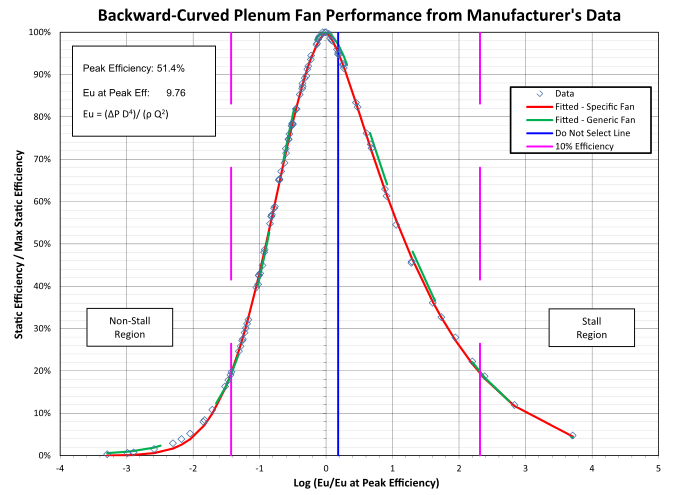

Figure 210. Example Normalized Efficiency Data for One Fan

For this specific fan, the coefficients are:

Table 65. Normalized Fan Efficiency Coefficients for Specific Backward-Curved Plenum Fan

<table class="table table-striped">
<tr>
<td>Operating Region</td>
<td>afan</td>
<td>bfan</td>
<td>cfan</td>
<td>dfan</td>
</tr>
<tr>
<td>Normal (Non-Stall)</td>
<td>0.072613</td>
<td>0.833213</td>
<td>0</td>
<td>0.013911</td>
</tr>
<tr>
<td>Stall</td>
<td>-2.354091</td>
<td>2.117493</td>
<td>0</td>
<td>2.753264</td>
</tr>

</table>

In this case, the average and RMS differences between the efficiency values based on extracted data and fitted specific curve (R2 is 0.999) are, respectively, about -0.1% and 0.3%; maximum differences are about ±0.7%. Field tests are especially needed to determine the coefficients for installed fans because fans are susceptible to “system effects” (e.g., inlet obstructions) that are not included in the manufacturer test data (AMCA 1990a).

To determine fan efficiency and fan shaft power at a particular time step, first calculate the fan pressure rise (**Δ***Pfan*) using the time step fan flow (*Qfan*) and Equation (and also using Equations and if there is SPR). Next, calculate *Eu* using Equation and then *xfan* (log10 normalized *Eu*), which is based on *Eu* and the specified *Eumax* (*Eu* at maximum efficiency) for the fan. The corresponding normalized efficiency (*ηfan*(*xfan*) */ ηfan,max*) is obtained using Equation . The fan efficiency (*ηfan*(*xfan*)) therefore is:

\({\eta_{fan}}\left( {{x_{fan}}} \right) = {\eta_{fan,\max }}\left[ {\frac{{{\eta_{fan}}\left( {{x_{fan}}} \right)}}{{{\eta_{fan,\max }}}}} \right]\)                                                                  ()

The fan shaft input power (mechanical, W) is:

\({H_{fan}} = \frac{{\Delta {P_{fan}} \cdot {Q_{fan}}}}{{{\eta_{fan}}\left( {{x_{fan}}} \right)}}\)                                                                                      ()

*Fan Shaft Speed and Torque Modeling*: For rotating elements, power (*H*) is the product of torque (*τ*) and rotational speed (ω), or conversely, torque is power divided by rotational speed (*τ =H / ω*).

The Stein and Hydeman variable-frequency-drive (VFD) component model correlates VFD efficiency as a linear function of VFD fractional output power (i.e., motor input power). Available data for about 50 drives from Saftronics were apparently used to develop their model, but those data represent VFD efficiency as a function of motor fractional speed
 (*ωmotor / ωmotor,max*, or nominally, drive output frequency divided by maximum output frequency, if motor slip is ignored).

To make use of the available data, the Stein and Hydeman linear correlation must intrinsically make an assumption that motor speed and torque have some fixed relationship. Although not documented, their assumption might be the common belief that fractional torque (τ/ τmax) for a motor is simply the square of its fractional speed. For fans serving duct systems with components such as filters and coils, with relatively low pressure drops elsewhere in the system, and for systems that have a non-zero controlled duct static pressure, this assumption may be inappropriate. Consequently, to make use of the available data and to avoid such assumptions, one needs to know the fraction of full speed at which fan components operate.

For the fan, dimensionless flow (*φ*) can be defined as (ASHRAE 1993):

\(\varphi  = \frac{{{Q_{fan}}}}{{{\omega_{fan}} \cdot D_{fan}^3}}\)                                                                                           ()

where *ωfan* is the fan speed (rad/s). This parameter can be calculated for each operating point on the fan manufacturer’s performance map that represents fan speed as a function of flow and fan pressure rise. To simplify the data representation to a single curve (as we have done for fan efficiency), one can plot normalized dimensionless flow (dimensionless flow divided by maximum dimensionless flow, (*φ*(*xfan*) */* *φmax*) as a function of the log base 10 of the normalized Euler (*Eu*) parameter (*xfan*). Figure 211 shows an example plot derived from the manufacturer’s data in Figure 208.

Figure 211. Example Normalized Dimensionless Flow Data for One Fan

Equation describes the sigmoidal functional form for normalized *φ*:

\(\frac{{\varphi \left( {{x_{fan}}} \right)}}{{{\varphi_{\max }}}} = ({A_{spd}} + {B_{spd}}/({(1 + {e^{\left[ {{{({C_{spd}} - {x_{spd}})} \mathord{\left/ {\vphantom {{({C_{spd}} - {x_{spd}})} {{D_{spd}}}}} \right. } {{D_{spd}}}}} \right]}})^{{E_{spd}}}})\)                                             ()

where *Aspd*, *Bspd*, *Cspd*, *Dspd*, and *Espd* are coefficients for the fan. Separate sets of coefficients for the normal operation and stall regions can be specified. For the curve shown in Figure 211, these coefficients are:

Table 66. Dimensionless Flow Coefficients – Specific Backward-Curved Fan

<table class="table table-striped">
<tr>
<td>Operating Region</td>
<td>Aspd</td>
<td>Bspd</td>
<td>Cspd</td>
<td>Dspd</td>
<td>Espd</td>
</tr>
<tr>
<td>Normal (Non-Stall)</td>
<td>0</td>
<td>1.001423</td>
<td>0.123935</td>
<td>-0.476026</td>
<td>1</td>
</tr>
<tr>
<td>Stall</td>
<td>0</td>
<td>5.924993</td>
<td>-1.916316</td>
<td>-0.851779</td>
<td>1</td>
</tr>

</table>

For a generic centrifugal fan with backward-curved blades, the coefficients are:

Table 67. Dimensionless Flow Coefficients – Generic Backward-Curved Fan

<table class="table table-striped">
<tr>
<td>Operating Region</td>
<td>Aspd</td>
<td>Bspd</td>
<td>Cspd</td>
<td>Dspd</td>
<td>Espd</td>
</tr>
<tr>
<td>Normal (Non-Stall)</td>
<td>-0.551396</td>
<td>1.551467</td>
<td>-0.442200</td>
<td>-0.414006</td>
<td>0.234867</td>
</tr>
<tr>
<td>Stall</td>
<td>0.000608</td>
<td>0.586366</td>
<td>0.021775</td>
<td>-0.063218</td>
<td>0.072827</td>
</tr>

</table>

For any operating point of flow (*Qfan*) and fan pressure rise (**Δ***Pfan*), one can calculate the corresponding Euler number (*Eu*) for the given fan, and then determine the corresponding normalized dimensionless flow (*φ*(*xfan*) */* *φmax*) from the sigmoidal dimensionless flow function (Equation ). With *φ*(*xfan*) */* *φmax* determined and knowing *φmax* for the fan, the dimensionless flow is:

\(\varphi \left( {{x_{fan}}} \right) = {\varphi_{\max }}\left[ {\frac{{\varphi \left( {{x_{fan}}} \right)}}{{{\varphi_{\max }}}}} \right]\)                                                                              ()

With *φ*(*xfan*) determined, the fan rotational speed (rad/s) is:

\({\omega_{fan}} = \frac{{{Q_{fan}}}}{{\left( {\varphi ({x_{fan}}) * D_{fan}^3} \right)}}\)                                                                                ()

Fan shaft torque (N∙m), which the belt drive must supply to the fan shaft, is then:

\({\tau_{fan}} = \frac{{{H_{fan}}}}{{{\omega_{fan}}}}\)                                                                                                ()

The fraction of full-load driven torque for the belt (*τfan / τbelt,max*), which is typically called “belt load”, is thus *τfan* divided by the belt torque capacity (*τbelt,max*). For a particular belt type and cross-section, belt torque capacity can be determined from manufacturer’s information such as a shaft speed versus power chart.

Ignoring belt slip, motor shaft speed (*ωmotor*, rad/s) can then be determined using the fan speed (*ωfan*) and the motor/fan pulley diameter ratio (*Dpulley,motor / Dpulley,fan*), which is typically called the “drive” ratio:

\({\omega_{motor}} = \frac{{{\omega_{fan}}}}{{\left( {\frac{{{D_{pulley,motor}}}}{{{D_{pulley,fan}}}}} \right)}}\)                                                                                 ()

*Belt, Motor, and Variable-Frequency-Drive Efficiency and Input Power Models – Overview*: The models for belt drives, motors, and VFDs that Stein and Hydeman included in their air-handling system model represent maximum efficiency as a function of power input to the adjacent downstream component (e.g., the power input to a fan shaft by a belt drive), but they do not include part-load models. The part-load models are needed, because part-load efficiency for these components can fall off rapidly at low load (e.g., to zero at zero load) and many systems operate occasionally (and some much of the time) at low loads, in part because of current practices that result in substantial oversizing of components.

*Belt Efficiency and Input Power Model:* Figure 212 shows three maximum efficiency (*ηbelt,max*) curves for belts (low, medium, and high) as a function of maximum fan shaft torque. This set of efficiency curves is based on belt drive loss data from AMCA Publication 203 (1990b), which reportedly is an aggregation of data from over 400 tests.

To determine *ηbelt,max* if data for a specific belt are not available, first use the maximum fan shaft input power (*Hfan,max*) for the load spectrum to calculate the natural logarithm of belt power capacity:

*xbelt,max =*ln(*Hfan,max*) with *Hfan,max* expressed in terms of hp                        ()

Then, use Equations and , along with a choice of low, medium, or high efficiency coefficients from Table 68, to calculate *ηbelt,max*.

Figure 212. Belt Maximum Efficiency vs. Fan Shaft Power Input

The quartic polynomial curves in Figure 212 and their coefficients are as follows:

\({\eta_{belt,\max ,\ln }} = {c_1} + {c_2} \cdot {x_{belt,\max }} + {c_3} \cdot x_{_{belt,\max }}^2 + {c_4} \cdot x_{_{belt,\max }}^3 + {c_5} \cdot x_{_{belt,\max }}^4\)                    ()

Table 68. Belt Maximum Efficiency Curve Coefficients

<table class="table table-striped">
<tr>
<td>Efficiency Class (Loss)</td>
<td>c1</td>
<td>c2</td>
<td>c3</td>
<td>c4</td>
<td>c5</td>
</tr>
<tr>
<td>High (Low Loss)</td>
<td>-6.502E-2</td>
<td>2.475E-2</td>
<td>-6.841E-3</td>
<td>9.383E-4</td>
<td>-5.168E-5</td>
</tr>
<tr>
<td>Medium (Medium Loss)</td>
<td>-9.504E-2</td>
<td>3.415E-2</td>
<td>-8.897E-3</td>
<td>1.159E-3</td>
<td>-6.132E-5</td>
</tr>
<tr>
<td>Low (High Loss)</td>
<td>-1.422E-1</td>
<td>5.112E-2</td>
<td>-1.353E-2</td>
<td>1.814E-3</td>
<td>-9.909E-5</td>
</tr>

</table>

The belt maximum efficiency is therefore:

\({\eta_{belt,\max }} = {e^{{\eta_{belt,\max ,\ln }}}}\)                                                                                   ()

The normalized *part-load* belt efficiency model is provided to modify the maximum efficiency of the belt. This model is based on part-load data for belts in ACEEE’s handbook on motor systems (Nadel et al. 2002). To determine the normalized belt efficiency at part-load (*ηbelt*(*xbelt*)/* ηbelt,max*), use the fan shaft (belt output) fractional torque (*xbelt* = *τbelt* / *τbelt,max; τbelt = τfan*) as the belt fractional load in Equation or (select the equation for the region that contains *xbelt*) and use coefficients from Table 69 that correspond to that region and the belt type: V-Belt or synchronous (toothed). Figure 213 shows a graphical representation of the curves defined by these equations and coefficients.

Figure 213. Belt Normalized Efficiency vs. Belt Fractional Load)

The belt normalized (part-load) efficiency curves in Figure 213 for Regions 1 and 3 (single rectangular hyperbola type 2) and Region 2 (exponential decay), respectively, and their coefficients are as follows:

Region 1 (0 &lt;= *xbelt* &lt; *xbelt,trans*) and Region 3 (*xbelt* &gt; 1):

\(\frac{{{\eta_{belt}}({x_{belt}})}}{{{\eta_{belt,\max }}}} = \left[ {\frac{{{a_{belt}} \cdot {x_{belt}}}}{{{b_{belt}} + {x_{belt}}}}} \right] + {c_{belt}} \cdot {x_{belt}}\)                                                             ()

Region 2 (*xbelt,trans* &lt;= *xbelt* &lt;= 1):

\(\frac{{{\eta_{belt}}({x_{belt}})}}{{{\eta_{belt,\max }}}} = {a_{belt}} + {b_{belt}} \cdot {e^{\left( {{c_{belt}} \cdot {x_{belt}}} \right)}}\)                                                               ()

where xbelt = \(\tau \)belt / \(\tau \)belt,max

Belt efficiency therefore is:

\({\eta_{belt}}({x_{belt}}) = {\eta_{belt,\max }}\left[ {\frac{{{\eta_{belt}}({x_{belt}})}}{{{\eta_{belt,\max }}}}} \right]\)                                                                   ()

Belt input power (mechanical, W) at the motor shaft is:

\({H_{belt}} = \frac{{{H_{fan}}}}{{{\eta_{belt}}({x_{belt}})}}\)                                                                                       ()

Table 69. Belt Normalized Efficiency Curve Coefficients

<table class="table table-striped">
  <tr>
    <th>Belt Type</th>
    <th>x belt,trans</th>
    <th>Region</th>
    <th>abelt</th>
    <th>bbelt</th>
    <th>cbelt</th>
  </tr>
  <tr>
    <td rowspan="3">V-Belt</td>
    <td rowspan="3">0.167</td>
    <td>1</td>
    <td>0.920797</td>
    <td>0.026269</td>
    <td>0.151594</td>
  </tr>
  <tr>
    <td>2</td>
    <td>1.011965</td>
    <td>-0.339038</td>
    <td>-3.43626</td>
  </tr>
  <tr>
    <td>3</td>
    <td>1.037778</td>
    <td>0.010307</td>
    <td>-0.026815</td>
  </tr>
  <tr>
    <td rowspan="3">Synchronous</td>
    <td rowspan="3">0.137</td>
    <td>1</td>
    <td>0.982167</td>
    <td>0.049135</td>
    <td>0.158164</td>
  </tr>
  <tr>
    <td>2</td>
    <td>1.002134</td>
    <td>-0.531885</td>
    <td>-5.295707</td>
  </tr>
  <tr>
    <td>3</td>
    <td>1</td>
    <td>0</td>
    <td>0</td>
  </tr>
</table>

*Motor Efficiency and Input Power Model:* Figure 214 shows three maximum efficiency (*ηmotor,max*) curves for motors (low, medium, and high) as a function of rated motor output power (belt input power). This set of efficiency curves is based on maximum efficiency data in DOE’s MotorMaster+ database (2003) from about 800 tests. It is provided for use in the absence of manufacturer’s data.

Figure 214. Maximum Motor Efficiency vs. Belt Power Input (Motor Output)

To determine *ηmotor,max* if data for a specific motor are not available (e.g., as listed in Table 71), first use the maximum belt input power (*Hbelt,max*) for the load spectrum (multiplied by whatever oversizing factor may be desired) to calculate the natural logarithm of belt power capacity:

*xmotor,max =*ln(*Hbelt,max*) with *Hbelt,max* expressed in terms of hp                     ()

Then, use Equation , along with a choice of low, medium, or high efficiency coefficients from Table 70, to calculate *ηmotor,max*.

The maximum motor efficiency curves in Figure 214 (single rectangular hyperbola type 1) and their coefficients are as follows:

\({\eta_{motor,\max }} = \left[ {\frac{{{a_{motor,\max }} \cdot {x_{motor,\max }}}}{{{b_{motor,\max }} + {x_{motor,\max }}}}} \right] + {c_{motor,\max }}\)                                              ()

Table 70. Motor Maximum Efficiency Curve Coefficients

<table class="table table-striped">
<tr>
<td>Case</td>
<td>amotor,max</td>
<td>bmotor,max</td>
<td>cmotor,max</td>
</tr>
<tr>
<td>High-Efficiency</td>
<td>0.196205</td>
<td>3.653654</td>
<td>0.839926</td>
</tr>
<tr>
<td>Mid-Efficiency</td>
<td>0.292280</td>
<td>3.368739</td>
<td>0.762471</td>
</tr>
<tr>
<td>Low-Efficiency</td>
<td>0.395895</td>
<td>3.065240</td>
<td>0.674321</td>
</tr>

</table>

The normalized *part-load* motor efficiency model is provided to modify the maximum efficiency of the motor. This model is based on part-load data for motors from DOE’s MotorMaster+ database (2003). To determine the normalized motor efficiency at part-load (*ηmotor*(*xmotor*)/* ηmotor,max*), use the motor fractional power output (*xmotor =Hbelt* / *Hbelt,max*) as the fraction of motor output power in Equation and use coefficients from Table 71, or for a specific motor, determined from DOE MotorMaster+ data or from manufacturer’s data. Figure 215 shows a graphical representation of eight example curves defined by these equations and coefficients.

Figure 215. Motor Normalized Efficiency vs. Motor Load Fraction

The example motor normalized efficiency curves (single rectangular hyperbola type 2) and their coefficients as a function of motor load fraction in Figure 215 are determined from DOE MotorMaster+ data and are as follows:

\(\frac{{{\eta_{motor}}({x_{motor}})}}{{{\eta_{motor,\max }}}} = \left[ {\frac{{{a_{PLmotor}} \cdot {x_{motor}}}}{{{b_{PLmotor}} + {x_{motor}}}}} \right] + {c_{PLmotor}} \cdot {x_{motor}}\)                                             ()

Table 71. Example Motor Normalized Efficiency Curve Coefficients

<table class="table table-striped">
  <tr>
    <th>Poles</th>
    <th>Motor Rated Output (hp)</th>
    <th>Maximum Efficiency</th>
    <th>a Plmotor</th>
    <th>b Plmotor</th>
    <th>c Plmotor</th>
  </tr>
  <tr>
    <td>8</td>
    <td>1</td>
    <td>0.6675</td>
    <td>1.096694</td>
    <td>0.097126</td>
    <td>0.002011</td>
  </tr>
  <tr>
    <td rowspan="8">4</td>
    <td>1</td>
    <td>0.7787</td>
    <td>1.092165</td>
    <td>0.08206</td>
    <td>-0.0072</td>
  </tr>
  <tr>
    <td>5</td>
    <td>0.84</td>
    <td>1.223684</td>
    <td>0.08467</td>
    <td>-0.135186</td>
  </tr>
  <tr>
    <td>10</td>
    <td>0.8745</td>
    <td>1.146258</td>
    <td>0.045766</td>
    <td>-0.110367</td>
  </tr>
  <tr>
    <td>25</td>
    <td>0.8991</td>
    <td>1.137209</td>
    <td>0.050236</td>
    <td>-0.08915</td>
  </tr>
  <tr>
    <td>50</td>
    <td>0.9129</td>
    <td>1.088803</td>
    <td>0.029753</td>
    <td>-0.064058</td>
  </tr>
  <tr>
    <td>75</td>
    <td>0.9259</td>
    <td>1.07714</td>
    <td>0.029005</td>
    <td>-0.04935</td>
  </tr>
  <tr>
    <td>100</td>
    <td>0.9499</td>
    <td>1.035294</td>
    <td>0.012948</td>
    <td>-0.024708</td>
  </tr>
  <tr>
    <td>125</td>
    <td>0.9527</td>
    <td>1.030968</td>
    <td>0.010696</td>
    <td>-0.023514</td>
  </tr>
</table>

Motor efficiency therefore is:

\({\eta_{motor}}({x_{motor}}) = {\eta_{motor,\max }}\left[ {\frac{{{\eta_{motor}}({x_{motor}})}}{{{\eta_{motor,\max }}}}} \right]\)                                                          ()

Motor input power (electrical, W) is:

\({H_{motor}} = \frac{{{H_{belt}}}}{{{\eta_{motor}}({x_{motor}})}}\)                                                                                  ()

*VFD Efficiency and Input Power Model:* For VFDs, published performance data are limited. Data from DOE (2008) suggest using a functional relation similar to that used for motors to represent VFD efficiency (*ηVFD*) as a function of the fraction of full-load motor input power (*xVFD =Hmotor* / *Hmotor,max*), as shown in Figure 216, or as a function of the fraction of full-load speed (*xVFD =ωmotor / ωmotor,max*), as shown in Figure 217.

Figure 216. VFD Efficiency vs. Fraction of Motor Full-Load Input Power
 (*Source: DOE 2008*)

Figure 217. VFD Efficiency vs. Fraction of Full-Load Motor Speed
 (*Courtesy of Saftronics*)

The performance curve (single rectangular hyperbola type 2) used here for VFD efficiency is:

\({\eta_{VFD}} = \left[ {\frac{{{a_{VFD}} \cdot {x_{VFD}}}}{{{b_{VFD}} + {x_{VFD}}}}} \right] + {c_{VFD}} \cdot {x_{VFD}}\)                                                              ()

Example coefficients derived from the DOE data as a function of the fraction of full-load motor input power are listed in Table 72.

Table 72. Example VFD Efficiency Curve Coefficients

<table class="table table-striped">
<tr>
<td>VFD Rated Output Power (hp)</td>
<td>avfd</td>
<td>bvfd</td>
<td>cvfd</td>
</tr>
<tr>
<td>3</td>
<td>0.978856</td>
<td>0.034247</td>
<td>-0.007862</td>
</tr>
<tr>
<td>5</td>
<td>0.977485</td>
<td>0.028413</td>
<td>-0.002733</td>
</tr>
<tr>
<td>10</td>
<td>0.978715</td>
<td>0.022227</td>
<td>0.001941</td>
</tr>
<tr>
<td>20</td>
<td>0.984973</td>
<td>0.017545</td>
<td>-0.000475</td>
</tr>
<tr>
<td>30</td>
<td>0.987405</td>
<td>0.015536</td>
<td>-0.005937</td>
</tr>
<tr>
<td>50</td>
<td>0.987910</td>
<td>0.018376</td>
<td>-0.001692</td>
</tr>
<tr>
<td>60</td>
<td>0.971904</td>
<td>0.014537</td>
<td>0.011849</td>
</tr>
<tr>
<td>75</td>
<td>0.991874</td>
<td>0.017897</td>
<td>-0.001301</td>
</tr>
<tr>
<td>100</td>
<td>0.982384</td>
<td>0.012598</td>
<td>0.001405</td>
</tr>
<tr>
<td>&gt;= 200</td>
<td>0.984476</td>
<td>0.009828</td>
<td>-0.004560</td>
</tr>

</table>

VFD input power (electrical, W) is:

\({H_{VFD}} = \frac{{{H_{motor}}}}{{{\eta_{VFD}}}}\)                                                                                          ()

*System Total Efficiency: T*he combined efficiency of the fan system components (i.e., fan, belt, motor, and VFD) is:

\({\eta_{TOTAL}} = {\eta_{fan}} \cdot {\eta_{belt}} \cdot {\eta_{motor}} \cdot {\eta_{VFD}}\)    \(\left( { = \frac{{{Q_{fan}} \cdot \Delta {P_{fan}}}}{{{H_{VFD}}}}} \right)\)                                     ()

*Heat Loss to Air*: To calculate the temperature rise from waste heat entering the air stream from the fan, belt, and motor, it is assumed that the user-specified “motor in air fraction” applies to the belt and motor but not to the VFD. The power “lost” to the air (W) is:

\({\dot Q_{toair}} = {H_{fan}} + \left( {{H_{motor}} - {H_{fan}}} \right) \cdot {f_{motortoair}}\)                                                    ()

### References

AMCA. 1990a. “Fans and Systems”. Publication 201-90. Arlington Heights, IL: Air Movement and Control Association International.

AMCA. 1990b. “Field Performance Measurement of Fan Systems”. Publication 203-90. Arlington Heights, IL: Air Movement and Control Association International.

ASHRAE. 1993. HVAC 2 Toolkit: Algorithms and Subroutines for Secondary HVAC System Energy Calculations. Atlanta: American Society of Heating, Refrigerating and Air-Conditioning Engineers, Inc.

ASHRAE. 1999. “ANSI/ASHRAE Standard 120 Method of Testing to Determine Flow Resistance of HVAC Ducts and Fittings”. Atlanta: American Society of Heating, Refrigerating and Air-Conditioning Engineers, Inc.

ASHRAE. 2008. “ANSI/ASHRAE Standard 126 Method of Testing HVAC Air Ducts and Fittings”. Atlanta: American Society of Heating, Refrigerating and Air-Conditioning Engineers, Inc.

DOE. 2003. “MotorMaster 4.0 User Guide”. U.S. Department of Energy, Industrial Technologies Program.

DOE. 2008. “Energy Tips – Motor: Motor Tip Sheet \#11”. U.S. Department of Energy, Industrial Technologies Program. June.

Federspiel, C. 2004. “Detecting Optimal Fan Pressure”. Final Report of Federspiel Controls to the CEC Energy Innovations Small Grant Program. Grant \#: 02-03.

Federspiel, C. 2005. “Detecting Critical Supply Duct Pressure”. ASHRAE Transactions, Vol. 111, Part 1. Atlanta: American Society of Heating, Refrigerating and Air-Conditioning Engineers, Inc.

Heredos, Francis P. 1987. Selection and Application of Multispeed Motors, IEEE Transactions on Industry Applications, Vol. 1A-23, No. 2, March/April.

Liu, M., D.E. Claridge, and S. Deng. 2003. “An Air Filter Pressure Loss Model for Fan Energy Calculation in Air-Handling Units”. International Journal of Energy Research. Vol. 27, pp. 589-600.

Nadel, S., R.N. Elliot, M. Shepard, S. Greenberg, G. Katz, and A.T. de Almeida. 2002. “Energy-Efficient Motor Systems: A Handbook on Technology, Program, and Policy Opportunities” 2nd Edition. Washington, DC: American Council for an Energy Efficient Economy. p.188.

Sherman, M.H. and C.P. Wray. 2010. “Parametric System Curves: Correlations Between Fan Pressure Rise and Flow for Large Commercial Buildings”. Lawrence Berkeley National Laboratory Report, LBNL-3542E.

Stein, J. and M.M. Hydeman. 2004. “Development and Testing of the Characteristic Curve Fan Model”. ASHRAE Transactions, Vol. 110, Part 1. Atlanta: American Society of Heating, Refrigerating and Air-Conditioning Engineers, Inc.

Trane. 1999. “Delta-Flo Coils: Data Catalog PL-AH-COIL-000-D-2-799”. LaCrosse, WI: The Trane Company. July.

Air System Compound Component Groups 
------------------------------------

### Unitary Systems

#### Overview

The input object AirLoopHVAC:UnitarySystem provide a “virtual” component that collect and control a set of components: fan, heating coil, cooling coil, and/or reheat coil. Reheat coil is modeled for controlling high zone humidity levels. The unit may be configured to have either a blow through or draw through fan. In a blow through configuration, fan is generally the fist component upstream of heating ro cooling coil. In a draw through fan configuration, fan is placed directly after the heating coil and before reheat coil.

Figure 218. Schematic of the EnergyPlus Unitary System (Blow Through Configuration)

#### Model Description

As described previously, the unitary system is a “virtual” component consisting of a fan, heating coil, cooling coil and reheat coil. The sole purpose of the unitary system model is to properly coordinate the operation of the various system components. The following sections describe the flow of information within the model, as well as the differences between cycling and continuous supply air fan operation.

#### Controls

There are two types of control types allowed to be specified in the unitary system which are setpoint based and load based. Each control type is described in detail below.

####Setpoint based control:

The unitary system calculates the current sensible load using the temperature of the inlet node and the System Node Setpoint Temp on the control node. If the control node is not the outlet node, the desired outlet node temperature is adjusted for the current temperature difference between the outlet node and the control node. Likewise, the current latent load is calculated using the humidity ratio of the inlet node and the System Node Humidity Ratio Max on the control node. The controls determine the required coil run-time fraction and dehumidification mode (if applicable) using the steps outlined below.

##### Step 1 – Meet Sensible Load Requirement

The controls first attempt to meet the sensible requirement. The specified coil model is called with a part-load ratio (PLR) of 1.0 to determine the full-load output of the coil. This is compared with the desired outlet node temperature and a sensible PLR is calculated. If the PLR is &lt;1.0, a Regula-Falsi iteration routine is called to determine the coil run-time fraction which results in the desired outlet node temperature. For a variable-speed DX cooling coil, if the load is smaller than the sensible capacity at the lowest speed, the coil run-time fraction is determined in the same way as a single-speed DX cooling coil. Otherwise, its speed number and speed ratio between two neighboring speeds are selected to match the load.

##### Step 2 – Meet Latent Load Requirement (if activated)

If dehumidification controls are active, the leaving humidity ratio resulting from operation to meet the sensible load (Step 1 above) is compared with the desired outlet node humidity ratio. If the humidity requirement is already met, then no further control action is taken. If the humidity requirement has not been met, then the coil is re-simulated depending on the type of humidity control.

##### Step 2a – Humidity Control = MultiMode

If the humidity control type is MultiMode, then the coil's enhanced dehumidification mode is activated when the coil type is Coil:Cooling:DX:TwoStageWithHumidityControlMode and Step 1 above is repeated to meet the sensible load using the coil performance resulting from the enhanced dehumidificaiton mode. This is a semi-passive approach to dehumidification which may fall short or may exceed the dehumidification requirement.

##### Step 2b – Humidity Control = CoolReheat

If the humidity control type is CoolReheat, the coil is re-simulated to achieve the desired outlet node humidity ratio. This option is valid for all cooling coil types. When the coil type is Coil:Cooling:DX:TwoStageWithHumidityControlMode, only the cooling performance mode is used for this step and enhanced dehumidification mode is not activated.

####Load based control:

While the unitary system may be configured to serve multiple zones, system operation is controlled by a thermostat located in a single “control” zone. One of the key parameters for the unitary system component is the fraction of the total system air flow that goes through the control zone. This fraction is calculated as the ratio of the maximum air mass flow rate for the air loop’s supply inlet node for the control zone (e.g., AirTerminal:SingleDuct:Uncontrolled, field = Maximum Air Flow Rate, converted to mass flow) to the sum of the maximum air mass flow rates for the air loop’s supply inlet nodes for all zones served by this air loop. The unitary system module scales the calculated load for the control zone upward based on this fraction to determine the total load to be met by the unitary system. The module then proceeds to calculate the required part-load ratio for the system coil and the supply air fan to meet this total load. The heating or cooling capacity delivered by the unitary system is distributed to all of the zones served by this system via the terminal units that supply air to each zone. The supply air fraction that goes though the control zone is calculated as follows:

$$Control Zone Air Flow\,Fraction = \frac{{{{\dot m}_{TUMax\,ControlZone}}}}{{\sum\limits_{j = 1}^{NumOfZones} {{{\dot m}_{TUMax\,Zone\,j}}} }}$$

where:

${\dot m_{TUMax\,ControlledZone}}$    =    maximum air mass flow rate for the air loop’s supply inlet node (terminal unit) for the control zone (kg/s)

${\dot m_{TUMax\,Zone\,j}}$            =    maximum air mass flow rate for the air loop’s supply inlet node for the jth zone (kg/s)

$NumOfZones$                =    number of zones, or number of air loop supply air inlet nodes for all zones served by the air loop (-)

The unitary system component is able to model supply air fan operation in two modes: cycling fan – cycling coil (i.e., AUTO fan) and continuous fan – cycling coil (i.e., fan ON). Fan:OnOff must be used to model AUTO fan, while Fan:OnOff or Fan:ConstantVolume can be used to model fan ON. The fan operation mode is specified using a supply air fan operating mode schedule where schedule values of 0 denote cycling fan operation and schedule values other than 0 (a 1 is usually used) denote continuous fan operation. Using this schedule, the unitary system fan may be cycled with cooling or heating coil operation or operated continuously based on time of day (e.g., cycling fan operation at night and continuous fan operation during the daytime). If the fan operating mode schedule name field is left blank in the unitary system object, the unitary system assumes cycling or AUTO fan mode operation throughout the simulation.

The unitary system operates based on the user-specified (or autosized) design supply air flow rate(s). The ‘design’ supply air mass flow rate may be different for cooling, heating, and when no cooling or heating is required and the fan operates continuously based on user-specified inputs.

**Cooling Operation**

If EnergyPlus determines that the unitary system must supply cooling to the control zone to meet the zone air temperature setpoint, then the model computes the total sensible cooling load to be met by the unitary system based on the control zone sensible cooling load and the fraction of the unitary system air flow that goes through the control zone.

$$UnitarySystemCoolingLoad = \frac{{ControlZoneCoolingLoad}}{{ControlZoneAirFlowFraction}}$$

If the supply air fan operating mode schedule requests cycling fan operation, the model first checks for the presence of an ecomomizer in the outside air system serving the unitary system’s air loop (Ref. AirLoopHVAC:OutdoorAirSystem). If an outside air system is not present or if an air-side economizer is not used, the unitary system’s compressor is used to meet the unitary system cooling load. If an air-side economizer is used and is active (i.e., economizer controls indicate that conditions are favorable to increase the outside air flow rate), the unitary system will try to meet the cooling load by operating only the supply air fan. If the fan is able to satisfy the unitary system cooling load, the compressor remains off for the entire simulation time step. If the operation of the fan alone is unable to meet the entire cooling load, then the compressor is enabled and additional calculations are performed to determine the compressor’s part-load ratio.

The model then calculates the unitary system’s sensible cooling energy rate delivered to the zones being served when the system runs at full-load conditions and when the cooling coil is OFF. If the supply air fan cycles with the compressor, then the sensible cooling energy rate is zero when the cooling coil is OFF. However if the fan is configured to run continuously regardless of coil operation, then the sensible cooling energy rate will probably not be zero when the cooling coil is OFF. Calculating the sensible cooling energy rate involves modeling the supply air fan (and associated fan heat), the cooling coil, and the heating and reheat coil (simply to pass the air properties and mass flow rate from its inlet node to its outlet node). For each of these cases (full load and cooling coil OFF), the sensible cooling energy rate delivered by the unitary system is calculated as follows:

$$Full\;Cool\;Output = (Mass\;Flow\;Rat{e_{full\;load}}){({h_{out,full\;load}} - {h_{control\;zone}})_{HR\min }} - {\Delta_{sen,\;full\;load}}$$

$$No\;Cool\;Output = (Mass\;Flow\;Rat{e_{coil\;off}}){({h_{out,\;coil\;off}} - {h_{control\;zone}})_{HR\min }} - {\Delta_{sen,\;coil\;off}}$$

where:

*Mass Flow Ratefull load* = air mass flow rate through unitary system at full-load conditions, kg/s

*hout, full load* = enthalpy of air exiting the unitary system at full-load conditions, J/kg

*hcontrol zone*  = enthalpy of air in the control zone (where thermostat is located), J/kg

*HRmin      =* enthalpies evaluated at a constant humidity ratio, the minimum humidity ratio of the unitary system exiting air or the air in the control zone

*Mass Flow Ratecoil off* = air mass flow rate through the unitary system with the cooling coil OFF, kg/s

*hout, coil off*  = enthalpy of air exiting the unitary system with the cooling coil OFF, J/kg

Δsen, *full load*=Sensible load difference between the system output node and the zone inlet node at full-load conditions

$$\begin{array}{l}{\Delta_{sen,\;full\;load}} = \frac{{Mass\;Flow\;Rat{e_{_{Zone\;Inlet}}}}}{{Frac}}{\left( {{h_{Out,\;full\;load}} - {h_{Zone\;Inlet}}} \right)_{HR\min }}\\\quad \quad \quad \quad  + \left( {Mass\;Flow\;Rat{e_{_{full\;load}}} - \frac{{Mass\;Flow\;Rat{e_{_{Zone\;Inlet}}}}}{{Frac}}} \right){\left( {{h_{Out,\;full\;load}} - {h_{_{Control\;Zone}}}} \right)_{HR\min }}\end{array}$$

where:

Frac = Control zone air fraction with respect to the system mass flow rate

Δsen,coil off=Sensible load difference between the system output node and the zone inlet node with the heating coil OFF conditions

$$\begin{array}{l}{\Delta_{sen,\;coil\;off}} = \frac{{Mass\;Flow\;Rat{e_{_{Zone\;Inlet}}}}}{{Frac}}{\left( {{h_{Out,\;coil\;off}} - {h_{Zone\;Inlet}}} \right)_{HR\min }}\\\quad \quad \quad \quad  + \left( {Mass\;Flow\;Rat{e_{_{coil\;off}}} - \frac{{Mass\;Flow\;Rat{e_{_{Zone\;Inlet}}}}}{{Frac}}} \right){\left( {{h_{Out,\;coil\;off}} - {h_{_{Control\;Zone}}}} \right)_{HR\min }}\end{array}$$

With the calculated sensible cooling energy rates and the total sensible cooling load to be met by the system, the part-load ratio for the unitary system is estimated.

$$PartLoadRatio = MAX\left( {0.0,\frac{{\left( {UnitarySystemCoolingLoad - NoCoolOutput} \right)}}{{\left( {FullCoolOutput - NoCoolOutput} \right)}}} \right)$$

Since the part-load performance of the cooling coil is frequently non-linear, and the supply air fan heat varies based on cooling coil operation for the case of cycling fan/cycling coil (AUTO fan), the final part-load ratio for the cooling coil compressor and fan are determined through iterative calculations (successive modeling of the cooling coil and fan) until the unitary system’s cooling output matches the cooling load to be met within the convergence tolerance. The convergence tolerance is fixed at 0.001 and is calculated based on the difference between the load to be met and the unitary system’s cooling output divided by the load to be met.

$$Tolerance = 0.001 \ge \frac{{\left( {UnitarySystemCoolingLoad - {Q_{UnitarySystem}}} \right)}}{{UnitarySystemCoolingLoad}}$$

where:

${Q_{UnitarySystem}}$= Unitary system delivered sensible capacity (W)

If the unitary system has been specified with cycling fan/cycling coil (AUTO fan), then the unitary system’s operating supply air mass flow rate is multiplied by PartLoadRatio to determine the average air mass flow rate for the system simulation time step. In this case, the air conditions at nodes downstream of the cooling coil represent the full-load (steady-state) values when the coil is operating.

If the fan operates continuously (i.e., when the supply air fan operating mode schedule values are NOT equal to 0), the operating air mass flow rate through the unitary system is calculated as the average of the user-specified air flow rate when the cooling coil is ON and the user-specified air flow rate when the cooling coil is OFF (user-specified supply air volumetric flow rates converted to dry air mass flow rates).

$${{\mathop m\limits^ \bullet  }_{UnitarySystem}} = PartLoadRatio\left( {{{\mathop m\limits^ \bullet  }_{CoolCoilON}}} \right) + \left( {1 - PartLoadRatio} \right)\left( {{{\mathop m\limits^ \bullet  }_{CoilOFF}}} \right)$$

where:

$\mathop m\limits^ \bullet  CoolCoilON$ = air mass flow rate through unitary system when the cooling coil is ON (kg/s)

$\mathop m\limits^ \bullet  CoilOFF$ = air mass flow rate through unitary system when no cooling or heating is needed (kg/s)

In this case, the air conditions at nodes downstream of the cooling coil are calculated as the average conditions over the simulation time step (i.e., the weighted average of full-load conditions when the coil is operating and inlet air conditions when the coil is OFF).

**Cooling Operation (multi or variable speed coils)**

After the unitary system cooling load is determined as described in Eq. above, the multi or variable speed cooling coil models calculations are described in this section.

The model calculates the unitary system’s sensible cooling energy rate delivered to the zones being served when the system runs at full-load conditions at the highest speed and when the DX cooling coil is OFF. If the supply air fan cycles with the compressor, then the sensible cooling energy rate is zero when the cooling coil is OFF. However if the fan is scheduled to run continuously regardless of coil operation, then the sensible cooling energy rate will not be zero when the cooling coil is OFF. Calculating the sensible cooling energy rate involves modeling the supply air fan (and associated fan heat) and the multi/variable speed DX cooling coil. The multi/variable speed DX heating coil and the supplemental heating coil are also modeled, but only to pass the air properties and mass flow rate from their inlet nodes to their outlet nodes. For each of these cases (full load at highest cooling speed and DX cooling coil OFF), the sensible cooling energy rate delivered by the unitary system is calculated as follows:

$$FullCoolOutpu{t_{Highest\;Speed}} = ({\dot m_{HighestSpeed}}){({h_{out,full\;load}} - {h_{control\;zone}})_{HR\min }} - {\Delta_{sen,\;HighestSpeed}}$$

$$NoCoolOutput = ({\dot m_{CoilOff}}){({h_{out,\;coil\;off}} - {h_{control\;zone}})_{HR\min }} - {\Delta_{sen,\;coil\;off}}$$

where:

*${\dot m_{HighestSpeed}}$* = air mass flow rate through unitary system at the highest cooling speed [kg/s]

*hout, full load*   = enthalpy of air exiting the unitary system at full-load conditions [J/kg]

*hcontrol zone*   = enthalpy of air leaving the control zone (where thermostat is located) [J/kg]

*HRmin=* the minimum humidity ratio of the unitary system exiting air or the air leaving the control zone [kg/kg]

${\dot m_{CoilOff}}$ = air mass flow rate through the unitary system with the cooling coil OFF [kg/s]

*hout,coil off*    = enthalpy of air exiting the unitary system with the cooling coil OFF [J/kg]

Δ*sen,* *HighestSpeed*=Sensible load difference between the system output node and the zone inlet node at full-load conditions

Δ*sen,coil off*=Sensible load difference between the system output node and the zone inlet node with the cooling coil OFF conditions

$$\begin{array}{l}{\Delta_{sen,\;HighestSpeed}} = \frac{{{{\dot m}_{_{Zone\;Inlet}}}}}{{Frac}}{\left( {{h_{Out,\;full\;load}} - {h_{Zone\;Inlet}}} \right)_{HR\min }}\\\quad \quad \quad \quad \quad  + \left( {{{\dot m}_{_{HighestSpeed}}} - \frac{{{{\dot m}_{_{Zone\;Inlet}}}}}{{Frac}}} \right){\left( {{h_{Out,\;full\;load}} - {h_{_{Control\;Zone}}}} \right)_{HR\min }}\end{array}$$

$$\begin{array}{l}{\Delta_{sen,\;coil\;off}} = \frac{{{{\dot m}_{_{Zone\;Inlet}}}}}{{Frac}}{\left( {{h_{Out,\;coil\;off}} - {h_{Zone\;Inlet}}} \right)_{HR\min }}\\\quad \quad \quad \quad  + \left( {{{\dot m}_{_{coil\;off}}} - \frac{{{{\dot m}_{_{Zone\;Inlet}}}}}{{Frac}}} \right){\left( {{h_{Out,\;coil\;off}} - {h_{_{Control\;Zone}}}} \right)_{HR\min }}\end{array}$$

where:

Frac = Control zone air fraction with respect to the system mass flow rate

If the unitary system’s sensible cooling rate at the highest speed (full load, no cycling) is insufficient to meet the entire cooling load, the controlled zone conditions will not be met. The reported cycling rate and speed ratio are 1, and the speed number is set to the highest index number. If the total sensible cooling load to be met by the system is less than the sensible cooling rate at the highest speed, then the following steps are performed.

·        Calculate the sensible cooling energy rate at Speed 1

$$FullCoolOutpu{t_{Speed1}} = ({\dot m_{Speed1}}){({h_{out,fullload}} - {h_{control\;zone}})_{HR\min }} - {\Delta_{sen,\;Speed1}}$$

where

*${\dot m_{Speed1}}$* = air mass flow rate through unitary system at Speed 1 [kg/s]

Δ*sen,* *Speed1*=Sensible load difference between the system output node and the zone inlet node at full-load conditions at Speed 1

$$\begin{array}{l}{\Delta_{sen,\;Speed1}} = \frac{{{{\dot m}_{_{Zone\;Inlet}}}}}{{Frac}}{\left( {{h_{Out,\;full\;load}} - {h_{Zone\;Inlet}}} \right)_{HR\min }}\\\quad \quad \quad \quad  + \left( {{{\dot m}_{_{Speed1}}} - \frac{{{{\dot m}_{_{Zone\;Inlet}}}}}{{Frac}}} \right){\left( {{h_{Out,\;full\;load}} - {h_{_{Control\;Zone}}}} \right)_{HR\min }}\end{array}$$

·        If the sensible cooling energy rate delivered by the unitary system at Speed 1 is greater or equal to the sensible load, the cycling ratio (part-load ratio) for the unitary system is estimated.

$$\begin{array}{l}CyclingRatio = \frac{{\left( {ABS(CoolingCoilSensibleLoad)} \right)}}{{FullCoolingCoilCapacity}}\\ = MAX\left( {0.0,\frac{{\left( {UnitarySystemCoolingLoad - AddedFanHeat} \right)}}{{\left( {FullCoolOutpu{t_{Speed1}} - AddedFanHea{t_{Speed1}}} \right)}}} \right)\end{array}$$

where

*AddedFanHeat*  = generated supply air fan heat, which is a function of part load ratio and as internal component cooling load [W].

*AddedFanHeatSpeed1*        = generated supply air fan heat at Speed 1 (part load ratio=1) [W].

Since the part-load performance of the DX cooling coil is frequently non-linear,and the supply air fan heat varies based on cooling coil operation for the case of cycling fan/cycling coil (AUTO fan), the final part-load ratio for the cooling coil compressor and fan are determined through iterative calculations (successive modeling of the cooling coil and fan) until the unitary system’s cooling output matches the cooling load to be met within the convergence tolerance. The convergence tolerance is fixed at 0.001 and is calculated based on the difference between the load to be met and the unitary system’s cooling output divided by the load to be met.

$$Tolerance = 0.001 \ge \frac{{\left( {UnitarySystemOutpu{t_{cycling}} - {Q_{UnitarySystem}}} \right)}}{{UnitarySystemCoolingLoad}}$$

where:

Unitary systemOutputCycling = unitary system delivered sensible capacity for Speed 1 operating at a specific cycling ratio (W)

$$UnitarySystemOutpu{t_{cycling}} = {\mathop m\limits^ \bullet_{UnitarySystem}}{\left( {{h_{out}} - {h_{ControlZone}}} \right)_{HR\min }} - {\Delta_{cycling}}$$

where

${\dot m{_{UnitarySystem}}}$      = average air mass flow rate defined in the next section [kg/s]

*hout,*        = enthalpy of air exiting the unitary system at part load conditions [J/kg]

Δ*cycling*    =average sensible load difference between the system output node and the zone inlet node

$${\Delta_{cycling}} = \frac{{{{\mathop m\limits^ \bullet  }_{ZoneInlet}}}}{{frac}}\left( {{h_{ZoneInlet}} - {h_{ControlZone}}} \right) + \left( {{{\mathop m\limits^ \bullet  }_{UnitarySystem}} - \frac{{{{\mathop m\limits^ \bullet  }_{ZoneInlet}}}}{{frac}}} \right)\left( {{h_{Out}} - {h_{ControlZone}}} \right)$$

${\dot m{_{ZoneInlet}}}$ = Air mass flow rate in the supply inlet node in the controlled zone [kg/s]

For this case where speed 1 operation was able to meet the required cooling load, the speed ratio is set to zero and speed number is equal to 1.

·        If the unitary system’s cooling output at full load for Speed 1 is insufficient to meet the entire cooling load, the Cycling ratio is set equal to 1.0 (compressor and fan are not cycling). Then the cooling speed is increased and the delivered sensible capacity is calculated. If the full load sensible capacity at Speed n is greater than or equal to the sensible load, the speed ratio for the unitary system is estimated:

$$SpeedRatio = \frac{{ABS\left( {UnitarySystemCoolingLoad - AddedFanHeat - FullCoolOutpu{t_{Speedn - 1}}} \right)}}{{ABS\left( {FullCoolOutpu{t_{Speedn}} - FullCoolOutpu{t_{Speedn - 1}}} \right)}}$$

Although a linear relationship is assumed by applying the speed ratio to obtain the effective capacity and mass flow rate between speed n and n-1, the outlet air node conditions are dependent on the combined outputs and may not be linear. In addition, the supply air fan heat varies with the speed ratio due to different supply mass flow rates between speed n and n-1 . Therefore, the final speed ratio for the cooling coil compressor and fan are determined through iterative calculations (successive modeling of the cooling coil and fan) until the unitary system’s cooling output matches the cooling load to be met within the convergence tolerance. The convergence tolerance is fixed at 0.001 and is calculated based on the difference between the load to be met and the unitary system’s cooling output divided by the load to be met.

$$Tolerance = 0.001 \ge \frac{{\left( {UnitarySystemCoolingLoad - UnitarySystemOutpu{t_{SpeedRatio}}} \right)}}{{UnitarySystemCoolingLoad}}$$

where:

*UnitarySystemOutputSpeedn*= unitary system delivered sensible capacity between two consecutive speeds at a specific speed ratio (W)

$$\begin{array}{l}UnitarySystemOutpu{t_{SpeedRatio}} = (SpeedRatio)FullCoolOutpu{t_{Speedn}} + \\\quad \quad \quad \quad \quad (1 - SpeedRatio)FullCoolOutpu{t_{Speedn - 1}} - AddedFanHea{t_{SpeedRatio}}\end{array}$$

Where

*AddedFanHeatSpeedRatio*          = generated supply air fan heat at a specific speed ratio [W]

In this case, the reported cycling ratio is 1 and speed number is equal to n.

##### Air Mass Flow Rate Calculation

Speed 1 operation

If the unitary system has been specified with cycling fan/cycling coil (AUTO fan), then the unitary system’s operating supply air mass flow rate is determined by the cycling ratio (PartLoadRatio) for Speed 1. The supply air mass flow rate is multiplied by the cycling ratio to determine the average air mass flow rate for the system simulation time step. The air conditions at nodes downstream of the cooling coils represent the full-load (steady-state) values when the coil is operating.

$${{\mathop m\limits^ \bullet  }_{UnitarySystem}} = \left( {CyclingRatio} \right){{\mathop m\limits^ \bullet  }_{Speed1}}$$

If the fan operates continuously (i.e., when the supply air fan operating mode schedule values are NOT equal to 0), the operating air mass flow rate through the unitary system is calculated as the average of the user-specified air flow rate when the unitary system cooling coil is ON at Speed 1 and the user-specified air flow rate when the unitary system cooling coil is OFF (user-specified supply air volumetric flow rates converted to dry air mass flow rates).

$${{\mathop m\limits^ \bullet  }_{UnitarySystem}} = \left( {CyclingRatio} \right){{\mathop m\limits^ \bullet  }_{Speed1}} + \left( {1 - CyclingRatio} \right){{\mathop m\limits^ \bullet  }_{CoilOff}}$$

where:

${\dot m_{UnitarySystem}}$ = average air mass flow rate through unitary system [kg/s]

${\dot m_{Speed1}}$= air mass flow rate through unitary system when cooling coil is ON at Speed 1 [kg/s]

${\dot m_{CoilOff}}$ = air mass flow rate through unitary system when no heating or cooling is needed [kg/s]

In this case, the air conditions at nodes downstream of the cooling coils are calculated as the average conditions over the simulation time step (i.e., the weighted average of full-load conditions when the coil is operating and inlet air conditions when the coil is OFF).

##### Higher Speed Operation

When the unitary system operates at higher speeds to meet the required cooling load, the supply air mass flow rate is linearly interpolated between two consecutive speeds:

$${{\mathop m\limits^ \bullet  }_{UnitarySystem}} = \left( {SpeedRatio} \right){{\mathop m\limits^ \bullet  }_{Speedn}} + \left( {1 - SpeedRatio} \right){{\mathop m\limits^ \bullet  }_{Speedn - 1}}$$

where:

${{\mathop m\limits^ \bullet  }_{UnitarySystem}}$= average air mass flow rate through the unitary system for the time step [kg/s]

${\dot m_{Speedn}}$= air mass flow rate through unitary system when cooling coil is ON at Speed n [kg/s]

${\dot m_{Speedn - 1}}$= air mass flow rate through unitary system when cooling coil is ON at Speed n-1 [kg/s]

For this case of higher speed operation, the air conditions at nodes downstream of the cooling coils are determined by the delivered cooling capacity and supply air mass flow rates between two consecutive speeds.

Although the above sections present the capacity and air mass flow rate calculation separately, they are dependent and change every iteration until convergence is reached for the time step being simulated.

**Heating Operation**

Calculations for heating operation are similar to those for cooling operation in most respects. However, due to the inclusion of a supplemental heating coil, additional calculations are necessary to properly meet the total heating load for the zones being served.

If EnergyPlus determines that the unitary system must supply heating to the control zone to meet the zone air temperature setpoint, then the unitary system model computes the total sensible heating load to be delivered to the zones being served based on the control zone sensible heating load and the control zone airflow fraction.

$$UnitarySystemHeatingLoad = \frac{{ControlZoneHeatingLoad}}{{ControlZoneAirFlowFraction}}$$

The model then calculates the unitary system’s sensible heating energy rate delivered to the zones being served when the system runs at full-load conditions and when the heating coil is OFF (without supplemental heater operation in either case). If the supply air fan cycles with the compressor, then the sensible heating energy rate is zero when the compressor is OFF. However if the fan is scheduled to run continuously regardless of coil operation, then the sensible heating energy rate will not be zero when the compressor is OFF. Calculating the sensible heating energy rate involves modeling the supply air fan (and associated fan heat), the  cooling coil (simply to pass the air properties and mass flow rate from its inlet node to its outlet node), the  heating coil, and the supplemental heating coil (simply to pass the air properties and mass flow rate from its inlet node to its outlet node). For each of these cases (full load and  heating coil OFF, without supplemental heater operation in either case), the sensible heating energy rate delivered by the unitary system is calculated as follows:

$$Full\;Heat\;Output = (Mass\;Flow\;Rat{e_{ful\;load}}){({h_{out,full\;load}} - {h_{control\;zone}})_{HR\min }} - {\Delta_{sen,\;full\;load}}$$

$$No\;Heat\;Output = (Mass\;Flow\;Rat{e_{coil\;off}}){({h_{out,\;coil\;off}} - {h_{control\;zone}})_{HR\min }} - {\Delta_{sen,\;coil\;off}}$$

where:

*Mass Flow Rate full load*  = air mass flow rate through unitary system at full-load conditions, kg/s

*hout, full load*  = enthalpy of air exiting the unitary system at full-load conditions, J/kg

*hcontrol zone*  = enthalpy of air leaving the control zone (where thermostat is located), J/kg

*HRmin=* enthalpies evaluated at a constant humidity ratio, the minimum humidity ratio of the unitary system exiting air or the air leaving the control zone

*Mass Flow Rate coil off*  = air mass flow rate through the unitary system with the heating coil OFF, kg/s

*hout, coil off*  = enthalpy of air exiting the unitary system with the heating coil OFF, J/kg

Δsen, *full load*=Sensible load difference between the system output node and the zone inlet node at full-load conditions

$$\begin{array}{l}{\Delta_{sen,\;full\;load}} = \frac{{Mass\;Flow\;Rat{e_{_{Zone\;Inlet}}}}}{{Frac}}{\left( {{h_{Out,\;full\;load}} - {h_{Zone\;Inlet}}} \right)_{HR\min }}\\\quad \quad \quad \quad  + \left( {Mass\;Flow\;Rat{e_{_{full\;load}}} - \frac{{Mass\;Flow\;Rat{e_{_{Zone\;Inlet}}}}}{{Frac}}} \right){\left( {{h_{Out,\;full\;load}} - {h_{_{Control\;Zone}}}} \right)_{HR\min }}\end{array}$$

where:

Frac = Control zone air fraction with respect to the system mass flow rate

Δsen,coil off=Sensible load difference between the system output node and the zone inlet node with the heating coil OFF conditions

$$\begin{array}{l}{\Delta_{sen,\;coil\;off}} = \frac{{Mass\;Flow\;Rat{e_{_{Zone\;Inlet}}}}}{{Frac}}{\left( {{h_{Out,\;coil\;off}} - {h_{Zone\;Inlet}}} \right)_{HR\min }}\\\quad \quad \quad \quad  + \left( {Mass\;Flow\;Rat{e_{_{coil\;off}}} - \frac{{Mass\;Flow\;Rat{e_{_{Zone\;Inlet}}}}}{{Frac}}} \right){\left( {{h_{Out,\;coil\;off}} - {h_{_{Control\;Zone}}}} \right)_{HR\min }}\end{array}$$

With the calculated sensible heating energy rates and the total sensible heating load to be met by the system, the part-load ratio for the unitary system is estimated.

$$PartLoadRatio = MAX\left( {0.0,\frac{{\left( {UnitarySystemHeatingLoad - NoHeatOutput} \right)}}{{\left( {FullHeatOutput - NoHeatOutput} \right)}}} \right)$$

Since the part-load performance of the  heating coil is frequently non-linear, and the supply air fan heat varies based on heating coil operation for the case of cycling fan/cycling coil (AUTO fan), the final part-load ratio for the heating coil compressor and fan are determined through iterative calculations (successive modeling of the heating coil and fan) until the unitary system’s heating output matches the heating load to be met within the convergence tolerance. The convergence tolerance is fixed at 0.001 and is calculated based on the difference between the load to be met and the unitary system’s heating output divided by the load to be met.

$$Tolerance = 0.001 \ge \frac{{\left( {UnitarySystemHeatingLoad - {Q_{UnitarySystem}}} \right)}}{{UnitarySystemHeatingLoad}}$$

where:

${Q_{UnitarySystem}}$= Unitary system delivered sensible capacity (W)

If the unitary system’s  heating coil output at full load is insufficient to meet the entire heating load, PartLoadRatio is set equal to 1.0 (compressor and fan are not cycling) and the remaining heating load is passed to the supplemental heating coil. If the unitary system model determines that the outdoor air temperature is below the minimum outdoor air temperature for compressor operation, the compressor is turned off and the entire heating load is passed to the supplemental gas or electric heating coil. The unitary system exiting air conditions and energy consumption are calculated and reported by the individual component models (fan,  heating coil, and supplemental gas or electric heating coil).

If the unitary system has been specified with cycling fan/cycling coil (AUTO fan), then the unitary system’s operating supply air mass flow rate is multiplied by PartLoadRatio to determine the average air mass flow rate for the system simulation time step. The air conditions at nodes downstream of the heating coils represent the full-load (steady-state) values when the coils are operating. If the fan operates continuously (i.e., when the supply air fan operating mode schedule values are NOT equal to 0), the operating air mass flow rate through the unitary system is calculated as the average of the user-specified air flow rate when the unitary system heating coil is ON and the user-specified air flow rate when the unitary system heating coil is OFF (user-specified supply air volumetric flow rates converted to dry air mass flow rates).

$${{\mathop m\limits^ \bullet  }_{UnitarySystem}} = PartLoadRatio\left( {{{\mathop m\limits^ \bullet  }_{HeatCoilON}}} \right) + \left( {1 - PartLoadRatio} \right)\left( {{{\mathop m\limits^ \bullet  }_{CoilOFF}}} \right)$$

where:

${\dot m_{HeatCoilON}}$ = air mass flow rate through unitary system when the heating coil is ON (kg/s)

${\dot m_{CoilOFF}}$ = air mass flow rate through unitary system when no heating or cooling is needed (kg/s)

In this case, the air conditions at nodes downstream of the heating coils are calculated as the average conditions over the simulation time step (i.e., the weighted average of full-load conditions when the coils are operating and inlet air conditions when the coils are OFF).

#### Heating Operation (multi or variable speed coils )

After the unitary system heating load is determined as described in Eq. above, the multi or variable speed heating coil models calculation are described in this section.

The model calculates the unitary system’s sensible heating energy rate delivered to the zones being served when the system runs at full-load conditions at the highest speed and when the DX heating coil is OFF (without supplemental heater operation in either case). If the supply air fan cycles with the compressor, then the sensible heating energy rate is zero when the compressor is OFF. However if the fan is scheduled to run continuously regardless of coil operation, then the sensible heating energy rate will not be zero when the compressor is OFF. Calculating the sensible heating energy rate involves modeling the supply air fan (and associated fan heat), the DX cooling coil (simply to pass the air properties and mass flow rate from its inlet node to its outlet node), the DX heating coil, and the supplemental heating coil (simply to pass the air properties and mass flow rate from its inlet node to its outlet node). For each of these cases (full load and DX heating coil OFF, without supplemental heater operation in either case), the sensible heating energy rate delivered by the unitary system is calculated as follows:

$$FullHeatOutpu{t_{Highest\;Speed}} = ({\dot m_{HighestSpeed}}){({h_{out,full\;load}} - {h_{control\;zone}})_{HR\min }} - {\Delta_{sen,\;HighestSpeed}}$$

$$NoHeatOutput = ({\dot m_{CoilOff}}){({h_{out,\;coil\;off}} - {h_{control\;zone}})_{HR\min }} - {\Delta_{sen,\;coil\;off}}$$

where:

*${\dot m_{HighestSpeed}}$* = air mass flow rate through unitary system at the highest heating speed [kg/s]

*hout, full load*   = enthalpy of air exiting the unitary system at full-load conditions [J/kg]

*hcontrol zone*   = enthalpy of air leaving the control zone (where thermostat is located) [J/kg]

*HRmin=* enthalpies evaluated at a constant humidity ratio, the minimum humidity ratio of the unitary system exiting air or the air leaving the control zone

${\dot m_{CoilOff}}$= air mass flow rate through the unitary system with the heating coil OFF [kg/s]

*hout,coil off*    = enthalpy of air exiting the unitary system with the heating coil OFF [J/kg]

Δsen, *full load*=Sensible load difference between the system output node and the zone inlet node at full-load conditions

$$\begin{array}{l}{\Delta_{sen,\;HighestSpeed}} = \frac{{{{\dot m}_{_{Zone\;Inlet}}}}}{{Frac}}{\left( {{h_{Out,\;full\;load}} - {h_{Zone\;Inlet}}} \right)_{HR\min }}\\\quad \quad \quad \quad \quad  + \left( {{{\dot m}_{_{HighestSpeed}}} - \frac{{{{\dot m}_{_{Zone\;Inlet}}}}}{{Frac}}} \right){\left( {{h_{Out,\;full\;load}} - {h_{_{Control\;Zone}}}} \right)_{HR\min }}\end{array}$$

where:

Frac = Control zone air fraction with respect to the system mass flow rate

Δ*sen,coil off*=Sensible load difference between the system output node and the zone inlet node with the heating coil OFF conditions

$$\begin{array}{l}{\Delta_{sen,\;coil\;off}} = \frac{{{{\dot m}_{_{Zone\;Inlet}}}}}{{Frac}}{\left( {{h_{Out,\;coil\;off}} - {h_{Zone\;Inlet}}} \right)_{HR\min }}\\\quad \quad \quad \quad  + \left( {{{\dot m}_{_{coil\;off}}} - \frac{{{{\dot m}_{_{Zone\;Inlet}}}}}{{Frac}}} \right){\left( {{h_{Out,\;coil\;off}} - {h_{_{Control\;Zone}}}} \right)_{HR\min }}\end{array}$$

If the unitary system’s DX heating coil output full load at the highest speed is insufficient to meet the entire heating load, the remaining heating load is passed to the supplemental heating coil. If the unitary system model determines that the outdoor air temperature is below the minimum outdoor air temperature for compressor operation (specified by the user), the compressor is turned off and the entire heating load is passed to the supplemental gas or electric heating coil. The unitary system exiting air conditions and energy consumption are calculated and reported by the individual component models (fan, DX heating coil, and supplemental gas or electric heating coil).

If the total heating load to be met by the system is less than the sensible heating rate at the highest speed, then the following steps are performed.

1.    Calculate the sensible heating energy rate at Speed 1

$$FullHeatOutpu{t_{Speed1}} = ({\dot m_{Speed1}}){({h_{out,fullload}} - {h_{control\;zone}})_{HR\min }} - {\Delta_{sen,\;Speed1}}$$

where:

*${\dot m_{Speed1}}$* = air mass flow rate through unitary system at Speed 1 [kg/s]

Δ*sen, Speed1*=Sensible load difference between the system output node and the zone inlet node at full-load conditions at Speed 1

$$\begin{array}{l}{\Delta_{sen,\;Speed1}} = \frac{{{{\dot m}_{_{Zone\;Inlet}}}}}{{Frac}}{\left( {{h_{Out,\;full\;load}} - {h_{Zone\;Inlet}}} \right)_{HR\min }}\\\quad \quad \quad \quad  + \left( {{{\dot m}_{_{Speed1}}} - \frac{{{{\dot m}_{_{Zone\;Inlet}}}}}{{Frac}}} \right){\left( {{h_{Out,\;full\;load}} - {h_{_{Control\;Zone}}}} \right)_{HR\min }}\end{array}$$

2.    If the sensible heating energy rate delivered by the unitary system at Speed 1 is greater or equal to the sensible load, the cycling ratio (part-load ratio) for the unitary system is estimated.

$$\begin{array}{l}CyclingRatio = \frac{{\left( {ABS(HeatingCoilSensibleLoad)} \right)}}{{FullHeatingCoilCapacity}}\\ = MAX\left( {0.0,\frac{{\left( {UnitarySystemHeatingLoad - AddedFanHeat} \right)}}{{\left( {FullHeatOutpu{t_{speed1}} - AddedFanHea{t_{speed1}}} \right)}}} \right)\end{array}$$

where

*AddedFanHeat*        = generated supply air fan heat, which is a function of part load ratio and as internal component heating load [W].

*AddedFanHeatSpeed1*  = generated supply air fan heat at Speed 1 (part load ratio=1) [W].

Since the part-load performance of the DX heating coil is frequently non-linear, and the supply air fan heat varies based on heating coil operation for the case of cycling fan/cycling coil (AUTO fan), the final part-load ratio for the heating coil compressor and fan are determined through iterative calculations (successive modeling of the heating coil and fan) until the unitary system’s heating output matches the heating load to be met within the convergence tolerance. The convergence tolerance is fixed at 0.001 and is calculated based on the difference between the load to be met and the unitary system’s heating output divided by the load to be met.

$$Tolerance = 0.001 \ge \frac{{\left( {UnitarySystemHeatingLoad - UnitarySystemOutpu{t_{cycling}}} \right)}}{{UnitarySystemHeatingLoad}}$$

where:

*UnitarySystemOutputcycling* = unitary system delivered sensible capacity for Speed 1 operating at a specific cycling ratio (W)

$$UnitarySystemOutpu{t_{cycling}} = {{\mathop m\limits^ \bullet  }_{UnitarySystem}}{\left( {{h_{out}} - {h_{ControlZone}}} \right)_{HR\min }} - {\Delta_{cycling}}$$

where

${{\mathop m\limits^ \bullet  }_{UnitarySystem}}$ = average air mass flow rate defined in the next section [kg/s]

*hout,*              = enthalpy of air exiting the unitary system at part load conditions [J/kg]

Δ*cycling*          =average sensible load difference between the system output node and the zone inlet node

$${\Delta_{cycling}} = \frac{{{{\mathop m\limits^ \bullet  }_{ZoneInlet}}}}{{frac}}\left( {{h_{ZoneInlet}} - {h_{ControlZone}}} \right) + \left( {{{\mathop m\limits^ \bullet  }_{UnitarySystem}} - \frac{{{{\mathop m\limits^ \bullet  }_{ZoneInlet}}}}{{frac}}} \right)\left( {{h_{Out}} - {h_{ControlZone}}} \right)$$

${\dot m_{ZoneInlet}}$       = Air mass flow rate in the supply inlet node in the controlled zone [kg/s]

For this case where Speed 1 operation was able to meet the required heating load, the speed ratio is set to zero and speed number is equal to 1.

3.    If the unitary system’s heating output at full load for Speed 1 is insufficient to meet the entire heating load, the Cycling ratio (PartLoadRatio) is set equal to 1.0 (compressor and fan are not cycling). Then the heating speed is increased and the delivered sensible capacity is calculated. If the full load sensible capacity at Speed n is greater than or equal to the sensible load, the speed ratio for the unitary system is estimated:

$$SpeedRatio = \frac{{ABS\left( {UnitarySystemHeatingLoad - AddedFanHeat - FullHeatOutpu{t_{Speedn - 1}}} \right)}}{{ABS\left( {FullHeatOutpu{t_{Speedn}} - FullHeatOutpu{t_{Speedn - 1}}} \right)}}$$

Although a linear relationship is assumed by applying the speed ratio to obtain the effective capacity and air mass flow rate between speed n and n-1, the outlet node conditions are dependent on the combined outputs and may not be linear. In addition, the supply air fan heat varies based on heating coil operation for the case of cycling fan/cycling coil (AUTO fan). Therefore, the final speed ratio for the heating coil compressor and fan are determined through iterative calculations (successive modeling of the heating coil and fan) until the unitary system’s heating output matches the heating load to be met within the convergence tolerance. The convergence tolerance is fixed at 0.001 and is calculated based on the difference between the load to be met and the unitary system’s heating output divided by the load to be met.

$$Tolerance = 0.001 \ge \frac{{\left( {UnitarySystemHeatingLoad - UnitarySystemOutpu{t_{SpeedRatio}}} \right)}}{{UnitarySystemHeatingLoad}}$$

where:

*UnitarySystemOutputSpeedRatio*= unitary system delivered sensible capacity between two consecutive speeds at a specific ratio [W]

$$\begin{array}{l}UnitarySystemOutpu{t_{SpeedRatio}} = (SpeedRatio)FullHeatOutpu{t_{speedn}} + \\\quad \quad \quad \quad (1 - SpeedRatio)FullHeatOutpu{t_{speedn - 1}} - AddedFanHea{t_{SpeedRatio}}\end{array}$$

Where

*AddedFanHeatSpeedRatio*          = generated supply air fan heat at a specific speed ratio [W]

In this case, the reported cycling ratio is 1 and speed number is equal to n.

##### Air Mass Flow Rate Calculation

The air mass flow rate calculations during heating operation are the same as those described above for cooling operation for multi/variable speed.

#### High Humidity Control

The specific configuration of the unitary system with supplemental heating coil is shown above (see Figure 227). This figure shows the fan placement when a blow through fan is specified. If a draw through fan is specified, the fan is located between the heating coil and the supplemental heating coil. The system is controlled to keep the high relative humidity in the control zone from exceeding the setpoint specified in the object ZoneControl:Humidistat. This option is available when the supply air fan operates continuously (i.e., the supply air fan operating mode schedule values are never equal to 0) or the supply air fan cycles with the compressor. In addition, when high humidity control is specified and the compressor operates, the unitary system operates at the cooling air flow rate when a zone heating load is present as determined by the zone thermostat. High humidity control is specified as either None, MultiMode, or CoolReheat in the Dehumidification Control Type input field. MultiMode is specified when a heat exchanger is used to improve the dehumidification performance of the cooling coil. The heat exchanger will be activated when the sensible part-load ratio is insufficient to meet the zone latent load. CoolReheat is specified when a cooling coil is used to over-cool the supply air stream in order to meet the zone latent load. In this case, a supplemental heating coil will ensure the zone temperature does not fall below the zone heating temperature set point. When a heat exchanger is used in conjunction with a cooling coil and CoolReheat is specified as the Dehumidification Control Type, the heat exchanger is “locked on” to meet either the sensible or latent cooling load. If the dehumidification control type is selected as None and a heat exchanger assisted cooling coil is used, the heat exchanger is “locked on” and the air conditioner runs only to meet the sensible cooling load. A supplemental heating coil is required for all dehumidification control types.

The model first calculates the *PartLoadRatio* required to meet the sensible cooling load.  The unitary system’s sensible cooling load is determined from the control zone sensible cooling load to the cooling setpoint and the control zone air flow fraction to maintain the dry-bulb temperature setpoint in the control zone.:

$$UnitarySystemCoolingLoad = \frac{{ControlZoneCoolingLoad}}{{ControlZoneAirFlowFraction}}$$

The unitary system’s sensible cooling load to be met and the full load cooling output are used to calculate the sensible the part-load ratio iteratively based on user specified convergence criterion.

$$PartLoadRatio = MAX\left( {0.0,\frac{{\left( {UnitarySystemCoolingLoad - NoCoolOutput} \right)}}{{\left( {FullCoolOutput - NoCoolOutput} \right)}}} \right)$$

When the unitary system’s sensible cooling capacity meets the system sensible cooling load at a given sensible part load ratio, then the Unitary system meets the controlled zone cooling setpoint temperature. If a moisture (latent) load exists because the control zone humidity has exceeded the setpoint, the total moisture load to be met by the unitary systems (Unitary systemMoistureLoad) is calculated based on the control zone moisture load and the control zone air flow fraction.

$$UnitarySystemMoistureLoad = \frac{{ControlZoneMoistureLoad}}{{ControlZoneAirFlowFraction}}$$

Then the *LatentPartLoadRatio* required to meet the high humidity setpoint is calculated as follows:

$$LatentPartLoadRatio = MIN\left( {PL{R_{Min}},\frac{{\left( {UnitarySystemMoistureLoad - NoLatentOutput} \right)}}{{\left( {FullLatentOutput - NoLatentOutput} \right)}}} \right)$$

The model uses the greater of the two part-load ratios, *PartLoadRatio* or *LatentPartLoadRatio*, to determine the operating part-load ratio of the Unitary system’s DX cooling coil.

$$LatentPartLoadRatio = MAX\left( {PartLoadRatio,LatentPartLoadRatio} \right)$$

As previously described, iterations are performed to converge on the solution within the convergence tolerance.

Where,

$ControlZoneCoolingLoad$= the control zone sensible cooling load to the cooling setpoint, (W).

$ControlZoneMoistureLoad$          = the control zone moisture load to the dehumidifying relative humidity setpoint, (W).

$ControlZoneAirFlowFraction$     = the supply air fraction that goes though the control zone, (-).

$FullLatentOutput$ =the Unitary system’s latent cooling energy rate at full-load conditions, W

$NoLatentOutput$   = the Unitary system’s latent cooling energy rate with cooling coil OFF, W

$PartLoadRatio$     = the unitary system’s part-load-ratio required to meet system sensible load, (-).

$LatentPartLoadRatio$= the unitary system’s part-load-ratio required to meet system moisture load, (-).

$PL{R_{Min}}$*=*the minimum part-load ratio, which is usually 0.0. For the case when the latent capacity degradation model is used (Ref: DX Cooling Coil Model), this value is the minimum part-load ratio at which the cooling coil will dehumidify the air.

When the predicted zone air temperature is above the heating setpoint and if there is a dehumidification load, the supplemental heating coil load is required to offset the excess cooling as shown in Figure 228. If the model determines that the LatentPartLoadRatio is to be used as the operating part-load ratio of the unitary system’s cooling coil, the supplemental heating coil is used to offset the excess sensible capacity provided by the unitary system cooling coil. The model first checks the sensible load that exists for the current simulation time step (predicted zone temperature with no HVAC operation compared to the thermostat setpoint temperatures). If a sensible cooling load or no sensible cooling or heating load exists, the model calculates the difference between the sensible heating load required to reach or maintain the heating dry-bulb temperature setpoint and the actual sensible cooling energy rate delivered by the unit (with LatentPartLoadRatio). In this case, the supplemental heating coil is used to offset the excess sensible cooling energy provided by the cooling coil (if any) that could have caused an overshoot of the heating dry-bulb temperature setpoint. Note that when a humidistat is used and high humidity control is required, the zone dry-bulb temperature will typically move toward the heating temperature setpoint when a high moisture (latent) load exists.

Figure 219. Supplemental heating coil load when predicted zone air temperature is above the heating Setpoint

If a heating load exists (Figure 229), the supplementalheating coil is used to meet the heating coil load and at the same time offset the entire sensible cooling energy rate of the cooling coil (to meet the humidistat setpoint). Note that when a heating load exists and high humidity control is required, the unitary system operates at the user-specified cooling air flow rate for the entire simulation time step. As with the fan, and cooling coil, report variables associated with supplemental heating coil performance (e.g., heating coil energy, heating coil rate, heating coil gas or electric energy, heating coil runtime fraction, etc.) are managed in the supplemental (heating) coil object.

Figure 220. Supplemental heating coil load when predicted zone air temperature is below the heating setpoint

#### Waste Heat Calculation

Waste heat calculations are done when the multi speed cooling and heating coils are specified in the unitary system and the heat recovery is active (the value of the Design Heat Recovery Water Flow Rate field is greater than 0), the outlet node temperature of heat recovery is calculated based on the recoverable waste heat generated by the child objects Coil:Cooling:DX:MultiSpeed and Coil:Heating:DX:MultiSpeed:

$${T_{outlet}} = {T_{inlet}} + \frac{{{Q_{WasteHeat}}}}{{{C_p}{{\dot m}_{hr}}}}$$

where

*Toutlet*            = outlet node temperature of heat recovery, C

*Tinlet* = inlet node temperature of heat recovery, C

*QWasteHeat*      = recoverable waste heat generated by its child objects, W

*Cp*              = inlet node temperature of heat recovery, C

${\dot m_{hr}}$            = mass flow rate of heat recovery, kg/s

If the outlet node temperature is above the value of the Maximum Temp for Heat Recovery field, the outlet node temperature is reset to the value of Maximum Temp for Heat Recovery.

#### Multi-Speed Fan with Water Coils In Unitary System 

When modeling multi-speed fan and water coils in unitary system object, the coil's capacity is modulated using speed ratio or part-load ratio.  The system load is met by varying the supply air fan speed while operating the coils at maximum water flow. When there is no system load to meet, the water control valve is fully closed.  This method of capacity control is called two-position coil control. When the supply fan is cycling between stages, then the speed ratio is calculated, but when the unit cycles between the minimum fan speed and off-position, part-load ratio is calculated. The fan may be off or run at lowest speed continuously to provide ventilation air depending the fan operating schedule. When the fan is operating at the lowest fan speed (Speed = 1), then the water flow rate is reported as the average for the time step by multiplying the maximum water flow by part load ratio. The speed ratio and part-load ratio are calculated iteratively. The set of equations used for the multi-speed fan capacity control in unitary system for water coil AHU modeling are summarized next

##### Cycling Between Stages:
When the supply fan is cycling between consecutive speeds, then the speed ratio (SR) and the average mass flow rate are calculated as follows:

$${SR_{n}} = Abs({SystemLoad} - {FullLoadOutput_{n-1}}) / Abs({FullLoadOutput_{n}} - {FullLoadOutput_{n-1}})$$

$${\dot m} = {\dot m_{on, n}} {SR_{n}} + {\dot m_{on, n-1}} (1 - {SR_{n}})$$

$${\dot m{w}} = {\dot m_{w, max}}$$

##### Cycling OnOff at Lowest Stage:
The average supply air flow rate calculation when the fan is running at the lowest fan speed level depends on the fan operating schedule and load. The unitary system part load ratio is given by:

$${PLR} = Abs({SystemLoad} - {NoLoadOutput}) / Abs({FullLoadOutput_{1}} - {NoLoadOutput})$$

###### Continuous Fan:

$${\dot m} = {\dot m_{on, 1}} {PLR} + {\dot m_{off}} (1 - {PLR})$$

###### Cycling Fan:

$${\dot m} = {\dot m_{on, 1}} {PLR}$$

$${\dot m{w}} = {\dot m_{w, max}} * {PLR}$$

where:

{SR_{n}}		=	 speed ratio of the water coil unitary system at speed n, (-)

{PLR}			=	 part load ratio of the unitary system at speed 1, (-)

{\dot m}		=	 average mass flow rate of supply air, (kg/s

{\dot m_{on, n-1}}	=	mass flow rate of supply air at fan speed level n-1, (kg/s)

{\dot m_{on, n}}}	=	mass flow rate of supply air at fan speed level n, (kg/s)

{\dot m_{off}}	=	mass flow rate of supply air when the coils are off, (kg/s)

{\dot m_{w}}	=	 average mass flow rate of chilled or hot water, (kg/s)

{\dot m_{w, max}}	=	maximum or full mass flow rate of chilled or hot water, (kg/s)

SystemLoad 	= system load to be met by the unitary system, (W)

{FullLoadOutput_{n-1}} 	= fully load system output at fan speed level n-1, (W)

{FullLoadOutput_{n}} 	= fully load system output at fan speed level n, (W)

### Forced-Air Furnace and Central Air Conditioning

#### Overview

The input objects AirLoopHVAC:Unitary:Furnace:HeatOnly and AirLoopHVAC:Unitary:Furnace:HeatCool provide a “virtual” component that collect and control a set of components:  an on/off or constant volume fan component and a gas or electric heating coil component. If the HeatCool version is selected, then a DX cooling coil is also modeled as part of the system as shown in Figure 221 below. For the HeatCool version, an optional reheat coil may also be modeled for controlling high zone humidity levels and the furnace’s configuration when specifying this option is shown in Figure 222 below. The unit may be configured to have either a blow through or draw through fan. If a blow through fan configuration is specified, the furnace fan is placed before the heating coil for the HeatOnly version, or before the cooling coil for the HeatCool version as shown in the figure below. If a draw through fan configuration is specified, the fan is placed directly after the heating coil.

Note: the coil order shown here has been revised from previous versions of Energyplus to configure the cooling coil upstream of the heating coil. This configuration provides uniformity with all unitary equipment. However, for unitary HeatCool systems that do not use a reheat coil, the heating coil can also be placed upstream of the cooling coil. This optional coil placement is retained to allow compatibility with previous versions of Energyplus. For input files developed using previous versions of Energyplus, it is recommended that the coil order be revised according to the figure below.

Figure 221. Schematic of the EnergyPlus Furnace (Blow Through Configuration)

While the furnace may be configured to serve multiple zones, system operation is controlled by a thermostat located in a single “control” zone. One of the key parameters for the furnace component is the fraction of the total system air flow that goes through the control zone. This fraction is calculated as the ratio of the maximum air mass flow rate for the air loop’s supply inlet node for the control zone (e.g., AirTerminal:SingleDuct:Uncontrolled, field = Maximum Air Flow Rate, converted to mass flow) to the sum of the maximum air mass flow rates for the air loop’s supply inlet nodes for all zones served by this air loop. The furnace module scales the calculated load for the control zone upward based on this fraction to determine the total load to be met by the furnace. The module then proceeds to calculate the required part-load ratio for the system coil and the supply air fan to meet this total load. The heating or cooling capacity delivered by the furnace is distributed to all of the zones served by this system via the terminal units that supply air to each zone. The supply air fraction that goes though the control zone is calculated as follows:

$$Control Zone Air Flow\,Fraction = \frac{{{{\dot m}_{TUMax\,ControlZone}}}}{{\sum\limits_{j = 1}^{NumOfZones} {{{\dot m}_{TUMax\,Zone\,j}}} }}$$

where:

\({\dot m_{TUMax\,ControlledZone}}\)    =    maximum air mass flow rate for the air loop’s supply inlet node (terminal unit) for the control zone (kg/s)

\({\dot m_{TUMax\,Zone\,j}}\)            =    maximum air mass flow rate for the air loop’s supply inlet node for the jth zone (kg/s)

\(NumOfZones\)                =    number of zones, or number of air loop supply air inlet nodes for all zones served by the air loop (-)

The furnace component is able to model supply air fan operation in two modes: cycling fan – cycling coil (i.e., AUTO fan) and continuous fan – cycling coil (i.e., fan ON). Fan:OnOff must be used to model AUTO fan, while Fan:OnOff or Fan:ConstantVolume can be used to model fan ON. The fan operation mode is specified using a supply air fan operating mode schedule where schedule values of 0 denote cycling fan operation and schedule values other than 0 (a 1 is usually used) denote continuous fan operation. Using this schedule, the furnace fan may be cycled with cooling or heating coil operation or operated continuously based on time of day (e.g., cycling fan operation at night and continuous fan operation during the daytime). If the fan operating mode schedule name field is left blank in the furnace object, the furnace assumes cycling or AUTO fan mode operation throughout the simulation.

The only output variables reported by the furnace object are the fan part-load ratio and the compressor part-load ratio (HeatCool only). The fan part-load ratio is defined as the actual air mass flow rate through the system for the time step divided by the design supply air mass flow rate specified for the furnace (\({{{{\dot m}_{actual}}} \mathord{\left/ {\vphantom {{{{\dot m}_{actual}}} {{{\dot m}_{design}}}}} \right. } {{{\dot m}_{design}}}}\))..The furnace operates based on the user-specified (or autosized) design supply air flow rate(s). The ‘design’ supply air mass flow rate may be different for cooling, heating, and when no cooling or heating is required and the fan operates continuously based on user-specified inputs (HeatCool only). For the HeatCool version, If alternate air flow rates are specified for cooling, heating, and when no cooling or heating is required, the design supply air mass flow rate is the maximum of these specified values. Also for the HeatCool version, the compressor part-load ratio is reported as the ratio of the actual cooling load to the full-load sensible capacity (see Eqn. ). Reporting of other variables of interest for the furnace (heating rate, cooling rate, energy consumption, etc.) is done by the individual system components (fan, heating coil and DX cooling coil).

#### Model Description

As described previously, the furnace is a “virtual” component consisting of a fan, heating coil and, for the HeatCool version, a cooling coil with an optional reheat coil. The sole purpose of the furnace model is to properly coordinate the operation of the various system components. The following sections describe the flow of information within the model for both the HeatOnly and HeatCool configurations, as well as the differences between cycling and continuous supply air fan operation. The last section describes the optional control of high zone humidity with a reheat coil for the HeatCool configuration.

#### HeatOnly Configuration

The HeatOnly configuration consists of an on/off or constant volume fan and an electric or gas heating coil. When the model is first called during an EnergyPlus simulation, all of the input data specified for each furnace in the input data file are read into data structures for use throughout the remainder of the simulation.

For each simulation time step when the performance of a heat-only furnace is being modeled, the first step is to retrieve the heating load required to meet the thermostat setpoint for the “control” zone (see Figure 221. Schematic of the EnergyPlus Furnace). See the section “Summary of Predictor-Corrector Procedure” elsewhere in this document for more details regarding load calculations. Since the furnace may be specified to serve several zones but controlled based on the load calculated for the “control” zone, the total heating load to be met by the furnace is determined from the following equation:

$$Furnace\,Heating\,Load\, = \frac{{Control\,Zone\,Heating\,Load}}{{Control\,Zone\,Air\,Flow\,Fraction}}$$

The model then calculates the furnace’s sensible heating energy rate delivered to the zones being served when the system runs at full-load conditions and when the heating coil is OFF. If the supply air fan cycles on and off with the heater, then the sensible heating energy rate is zero when the heating coil is OFF. However if the fan is scheduled to run continuously regardless of coil operation, then the sensible heating energy rate will not be zero when the heating coil is OFF. Calculating the sensible heating energy rate involves modeling the supply air fan (and associated fan heat) and the heating coil. For each of these cases (full load and heating coil OFF), the sensible heating energy rate delivered by the furnace is calculated as follows:

$$Full\;Heat\;Output = (Mass\;Flow\;Rat{e_{ful\;load}}){({h_{out,full\;load}} - {h_{control\;zone}})_{HR\min }} - {\Delta_{sen,\;full\;load}}$$

$$No\;Heat\;Output = (Mass\;Flow\;Rat{e_{coil\;off}}){({h_{out,\;coil\;off}} - {h_{control\;zone}})_{HR\min }} - {\Delta_{sen,\;coil\;off}}$$

where:

*Mass Flow Ratefull\\ load* = air mass flow rate through furnace at full-load conditions, kg/s

*hout,\\ full\\ load* = enthalpy of air exiting the furnace at full-load conditions, J/kg

*hcontrol\\ zone*  = enthalpy of air in the control zone (where thermostat is located), J/kg

*HRmin      =* enthalpies evaluated at a constant humidity ratio, the minimum humidity ratio

of the furnace exiting air or the air in the control zone

*Mass Flow Ratecoil\\ off* = air mass flow rate through the furnace with the heating coil OFF, kg/s

*hout,\\ coil\\ off*  = enthalpy of air exiting the furnace with the heating coil OFF, J/kg

Δsen, *full\\ load*=Sensible load difference between the system output node and the zone inlet node at full-load conditions

$$\begin{array}{l}{\Delta_{sen,\;full\;load}} = \frac{{Mass\;Flow\;Rat{e_{_{Zone\;Inlet}}}}}{{Frac}}{\left( {{h_{Out,\;full\;load}} - {h_{Zone\;Inlet}}} \right)_{HR\min }}\\\quad \quad \quad \quad \quad  + \left( {Mass\;Flow\;Rat{e_{_{full\;load}}} - \frac{{Mass\;Flow\;Rat{e_{_{Zone\;Inlet}}}}}{{Frac}}} \right){\left( {{h_{_{Out,\;full\;load}}} - {h_{_{Control\;Zone}}}} \right)_{HR\min }}\end{array}$$

where:

Frac = Control zone air fraction with respect to the system mass flow rate

Δsen,coil\\ off**=Sensible load difference between the system output node and the zone inlet node with the heating coil OFF conditions

$$\begin{array}{l}{\Delta_{sen,coil\;off}} = \frac{{Mass\;Flow\;Rat{e_{Zone\;Inlet}}}}{{Frac}}{\left( {{h_{Out,coil\;off}} - {h_{Zone\;Inlet}}} \right)_{HR\min }}\\\quad \quad \quad \; + \left( {Mass\;Flow\;Rat{e_{coil\;off}} - \frac{{Mass\;Flow\;Rat{e_{Zone\;Inlet}}}}{{Frac}}} \right){\left( {{h_{Out,coil\;off}} - {h_{Control\;Zone}}} \right)_{HR\min }}\end{array}$$

With the calculated sensible heating energy rates and the total sensible heating load to be met by the system, the part-load ratio for the furnace is estimated.

$$PartLoadRatio\, = \,MAX\left( {0.0,MIN\left( {1.0,\frac{{ABS\left( {FurnaceHeatingLoad - NoHeatOutput} \right)}}{{ABS(FullHeatOutput - NoHeatOutput)}}} \right)} \right)$$

The part-load ratio calculated above is used to determine the required heating coil capacity as \(Qheating\,coil = Qdesign\,*PartLoadRatio\) where *Qdesign* is the nominal heating coil capacity as specified in the heating coil object. If the fan cycles on and off with the heating coil (i.e.,  when the supply air fan operating mode schedule values are equal to 0), then this part-load ratio is also used to determine the operating mass flow rate of the furnace as

$${\dot m_{furnace}} = {\dot m_{design}}*PartLoadRatio$$

 If the fan operates continuously (i.e. fan ON), the operating mass flow rate is specified as \({\dot m_{design}}\). The furnace’s fan and heating coil are then re-simulated to determine the furnace’s delivered sensible heating capacity at the above calculated part-load ratio.

$${Q_{furnace}} = \left( {{{\dot m}_{furnace}}} \right){\left( {{h_{out,actual}} - {h_{control\;zone}}} \right)_{HR\min }} - {\Delta_{sen,\;actual}}$$

where:

\(Qfurnace\)          =sensible heating capacity delivered by the furnace (W)

\({\dot m_{furnace}}\)          = air mass flow rate through the furnace (kg/s)

*hout,\\ actual*          \\       = enthalpy of air exiting the furnace (J/kg)

*hout,\\ control\\ zone*  = enthalpy of air in the control zone (J/kg)

*HRmin      *       = enthalpies evaluated at a constant humidity ratio, the minimum humidity ratio

of the furnace exiting air or the air in the control zone

Δsen,\\ actual =Sensible load difference between the system output node and the zone inlet node at the above calculated part-load ratio.

$$\begin{array}{l}{\Delta_{sen,\;actual}} = \frac{{Mass\;Flow\;Rat{e_{_{Zone\;Inlet}}}}}{{Frac}}{\left( {{h_{Out,\;actual}} - {h_{Zone\;Inlet}}} \right)_{HR\min }}\\\quad \quad \quad \quad  + \left( {{{\dot m}_{furnace}} - \frac{{Mass\;Flow\;Rat{e_{_{Zone\;Inlet}}}}}{{Frac}}} \right){\left( {{h_{Out,\;actual}} - {h_{_{Control\;Zone}}}} \right)_{HR\min }}\end{array}$$

Since the part-load performance of the heating coil can be non-linear, and the supply air fan heat varies based on heating coil operation for the case of cycling fan/cycling coil (AUTO fan), the final part-load ratio for the heating coil and fan are determined through iterative calculations (successive modeling of the heating coil and fan) until the furnace’s heating output matches the heating load to be met within the heating convergence tolerance. The convergence tolerance is fixed at 0.001 and is calculated based on the difference between the load to be met and the furnace’s heating output divided by the load to be met.

$$Tolerance = {\raise0.7ex\hbox{${\left( {FurnaceHeatingLoad - {Q_{furnace}}} \right)}$} \!\mathord{\left/ {\vphantom {{\left( {FurnaceHeatingLoad - {Q_{furnace}}} \right)} {FurnaceHeatingLoad}}}\right.}\!\lower0.7ex\hbox{${FurnaceHeatingLoad}$}} = 0.001$$

If the furnace has been specified with cycling fan/cycling coil (AUTO fan), then the furnace’s design air mass flow rate is multiplied by PartLoadRatio to determine the average air mass flow rate for the system simulation time step. The air conditions at nodes downstream of the heating coil represent the full-load (steady-state) values when the coil is operating. If the supply air fan is specified to run continuously (fan ON), then the air mass flow rate remains at the furnace’s design air mass flow rate. In this case, the air conditions at nodes downstream of the heating coil are calculated as the average conditions over the simulation time step (i.e., the weighted average of full-load conditions when the coil is operating and inlet air conditions when the coil is OFF).

For the case where the furnace is scheduled to operate with continuous supply air fan operation, but no heating load is required to meet the setpoint temperature in the control zone, the supply air fan model is still called to determine the fan exiting air conditions. The heating coil model is also called, but for the case with no heating load the heating coil model simply passes the inlet air conditions and mass flow rate from its inlet node to its outlet node. The air exiting the heating coil is then sent to the direct air units for distribution to each zone served by the furnace, where the zone heat balance is performed to determine the resulting zone air conditions. The furnace exiting air conditions and energy consumption are calculated and reported by the individual component models (fan and heating coil).

#### HeatCool Configuration

The HeatCool configuration consists of an on/off or constant volume fan, a DX cooling coil, and an electric or gas heating coil. For the cases where a heating load is calculated for the control zone or no heating/cooling load is calculated for the control zone, the model follows nearly identical computational steps as described in the HeatOnly Configuration section above. The only difference is the air mass flow rate during no cooling/heating operation with continuous supply air fan operation can be different from the air mass flow rate during heater operation for the HeatCool configuration. If a cooling load is calculated by EnergyPlus for the control zone, the solution methodology is also virtually identical and is described here for completeness.

If EnergyPlus determines that the furnace must supply cooling to the control zone to meet the zone air temperature setpoint, then the model computes the total sensible cooling load to be met by the furnace based on the control zone sensible cooling load and the fraction of the furnace air flow that goes through the control zone.

$$Furnace\,Cooling\,Load\, = \frac{{Control\,Zone\,Cooling\,Load}}{{Control\,Zone\,Air\,Flow\,Fraction}}$$

If the supply air fan operating mode schedule requests cycling fan operation, the model first checks for the presence of an ecomomizer in the outside air system serving the furnace’s air loop (Ref. AirLoopHVAC:OutdoorAirSystem). If an outside air system is not present or if an air-side economizer is not used, the furnace’s compressor is used to meet the furnace cooling load. If an air-side economizer is used and is active (i.e., economizer controls indicate that conditions are favorable to increase the outside air flow rate), the furnace will try to meet the cooling load by operating only the supply air fan. If the fan is able to satisfy the furnace cooling load, the compressor remains off for the entire simulation time step. If the operation of the fan alone is unable to meet the entire cooling load, then the compressor is enabled and additional calculations are performed to determine the compressor’s part-load ratio.

The model then calculates the furnace’s sensible cooling energy rate delivered to the zones being served when the system runs at full-load conditions and when the DX cooling coil is OFF. If the supply air fan cycles with the compressor, then the sensible cooling energy rate is zero when the cooling coil is OFF. However if the fan is configured to run continuously regardless of coil operation, then the sensible cooling energy rate will probably not be zero when the cooling coil is OFF. Calculating the sensible cooling energy rate involves modeling the supply air fan (and associated fan heat), the DX cooling coil, and the heating coil (simply to pass the air properties and mass flow rate from its inlet node to its outlet node). For each of these cases (full load and DX cooling coil OFF), the sensible cooling energy rate delivered by the furnace is calculated as follows:

$$Full\;Cool\;Output = (Mass\;Flow\;Rat{e_{ful\;load}}){({h_{out,full\;load}} - {h_{control\;zone}})_{HR\min }} - {\Delta_{sen,\;full\;load}}$$

$$No\;Cool\;Output = (Mass\;Flow\;Rat{e_{coil\;off}}){({h_{out,\;coil\;off}} - {h_{control\;zone}})_{HR\min }} - {\Delta_{sen,\;coil\;off}}$$

where:

*Mass Flow Ratefull\\ load* = air mass flow rate through furnace at full-load conditions, kg/s

*hout,\\ full\\ load* = enthalpy of air exiting the furnace at full-load conditions, J/kg

*hcontrol\\ zone*  = enthalpy of air in the control zone (where thermostat is located), J/kg

*HRmin      =* enthalpies evaluated at a constant humidity ratio, the minimum humidity ratio

of the furnace exiting air or the air in the control zone

*Mass Flow Ratecoil\\ off* = air mass flow rate through the furnace with the cooling coil OFF, kg/s

*hout,\\ coil\\ off*  = enthalpy of air exiting the furnace with the cooling coil OFF, J/kg

Δsen, *full\\ load*=Sensible load difference between the system output node and the zone inlet node at full-load conditions

$$\begin{array}{l}{\Delta_{sen,\;full\;load}} = \frac{{Mass\;Flow\;Rat{e_{_{Zone\;Inlet}}}}}{{Frac}}{\left( {{h_{Out,\;full\;load}} - {h_{Zone\;Inlet}}} \right)_{HR\min }}\\\quad \quad \quad \quad  + \left( {Mass\;Flow\;Rat{e_{_{full\;load}}} - \frac{{Mass\;Flow\;Rat{e_{_{Zone\;Inlet}}}}}{{Frac}}} \right){\left( {{h_{Out,\;full\;load}} - {h_{_{Control\;Zone}}}} \right)_{HR\min }}\end{array}$$

where:

Frac = Control zone air fraction with respect to the system mass flow rate

Δsen,coil\\ off**=Sensible load difference between the system output node and the zone inlet node with the heating coil OFF conditions

$$\begin{array}{l}{\Delta_{sen,\;coil\;off}} = \frac{{Mass\;Flow\;Rat{e_{_{Zone\;Inlet}}}}}{{Frac}}{\left( {{h_{Out,\;coil\;off}} - {h_{Zone\;Inlet}}} \right)_{HR\min }}\\\quad \quad \quad \quad  + \left( {Mass\;Flow\;Rat{e_{_{coil\;off}}} - \frac{{Mass\;Flow\;Rat{e_{_{Zone\;Inlet}}}}}{{Frac}}} \right){\left( {{h_{Out,\;coil\;off}} - {h_{_{Control\;Zone}}}} \right)_{HR\min }}\end{array}$$

With the calculated sensible cooling energy rates and the total sensible cooling load to be met by the system, the part-load ratio for the furnace is estimated.

$$PartLoadRatio\, = \,MAX\left( {0.0,\frac{{ABS\left( {Furnace\,Cooling\,Load - NoCoolOutput} \right)}}{{ABS\left( {FullCoolOutput - NoCoolOutput} \right)}}} \right)$$

Since the part-load performance of the DX cooling coil is frequently non-linear (Ref: DX Cooling Coil Model), and the supply air fan heat varies based on cooling coil operation for the case of cycling fan/cycling coil (AUTO fan), the final part-load ratio for the cooling coil compressor and fan are determined through iterative calculations (successive modeling of the cooling coil and fan) until the furnace’s cooling output matches the cooling load to be met within the convergence tolerance. The convergence tolerance is fixed at 0.001 and is calculated based on the difference between the load to be met and the furnace’s cooling output divided by the load to be met.

$$Tolerance = 0.001 \ge {\raise0.7ex\hbox{${\left( {FurnaceCoolingLoad - {Q_{furnace}}} \right)}$} \!\mathord{\left/ {\vphantom {{\left( {FurnaceCoolingLoad - {Q_{furnace}}} \right)} {FurnaceCoolingLoad}}}\right.}\!\lower0.7ex\hbox{${FurnaceCoolingLoad}$}}$$

where:

\(Qfurnace\)= Furnace delivered sensible capacity (W)

If the furnace has been specified with cycling fan/cycling coil (AUTO fan) and high humidity control *has not* been specified, then the furnace’s operating supply air mass flow rate is multiplied by PartLoadRatio to determine the average air mass flow rate for the system simulation time step. The air conditions at nodes downstream of the cooling coil represent the full-load (steady-state) values when the coil is operating. If a cycling fan is used and high humidity control *has* been specified, the calculation of average air mass flow rate is based on the greater of the heating or cooling part-load ratio (see following section on high humidity control). When the heating part-load ratio is greater than the cooling part-load ratio, the air conditions at nodes downstream of the cooling coil represent the weighted average of full-load conditions when the cooling coil is operating and inlet air conditions when the cooling coil is off (i.e., the fan continues to operate due to a heating requirement where the heating PLR is greater than the cooling PLR). If the supply air fan is specified to run continuously (fan ON), then the air mass flow rate continues to operate at the user-specified supply air mass flow rate when no cooling or heating is required. In this case, the air conditions at nodes downstream of the cooling coil are calculated as the average conditions over the simulation time step (i.e., the weighted average of full-load conditions when the coil is operating and inlet air conditions when the coil is OFF). The furnace exiting air conditions and energy consumption are calculated and reported by the individual component models (fan and DX cooling coil).

#### High Humidity Control with HeatCool Configuration

An optional reheat coil can be specified with the HeatCool configuration to allow the furnace to control high zone humidity levels. The specific configuration of the HeatCool Furnace with high humidity control option is shown in Figure 222. The figure below shows the fan placement when a blow through fan is specified. If a draw through fan is specified, the fan is located between the heating coil and the reheat coil. The system is controlled to keep the relative humidity in the control zone from exceeding the setpoint specified in the object ZoneControl:Humidistat. This option is available when the supply air fan operates continuously (i.e., the supply air fan operating mode schedule values are never equal to 0) or the supply air fan cycles with the compressor. For the case of cycling fan mode when the high humidity control is specified as CoolReheat *and* the heating part-load ratio is greater than the compressor part-load ratio, the air conditions at nodes downstream of the cooling coil are calculated as the average conditions during the duration of fan operation (i.e., the weighted average of full load conditions when the coil is operating and inlet air conditions when the coil is off and the fan continues to operate to meet the heating load). For the case where cycling fan mode is used *and* the heating part-load ratio is less than the compressor part-load ratio, the air conditions at the nodes downstream of the cooling coil are simply the full load (steady-state) values when the coil is operating. In addition, when high humidity control is specified and the compressor operates, the furnace operates at the cooling air flow rate when a zone heating load is present as determined by the zone thermostat.

High humidity control is specified as either None, MultiMode, or CoolReheat in the Dehumidification Control Type input field. MultiMode is specified when a heat exchanger is used to improve the dehumidification performance of the cooling coil. The heat exchanger will be activated when the sensible part-load ratio is insufficient to meet the zone latent load. CoolReheat is specified when a DX cooling coil is used to over-cool the supply air stream in order to meet the zone latent load. In this case, a reheat coil will ensure the zone temperature does not fall below the zone heating temperature set point. When a heat exchanger is used in conjunction with a DX cooling coil and CoolReheat is specified as the Dehumidification Control Type, the heat exchanger is “locked on” to meet either the sensible or latent cooling load. If the dehumidification control type is selected as None and a heat exchanger assisted cooling coil is used, the heat exchanger is “locked on” and the air conditioner runs only to meet the sensible cooling load. Although a reheat coil is required when CoolReheat is specified in the Dehumidification Control Type input field, this reheat coil may optionally be present for the other Dehumidification Control Types (e.g., None and Multimode). If the reheat coil is present and the dehumidification control type input is not specified as CoolReheat, the reheat coil will not be active. This allows changing the dehumidification control option without requiring a change in the unit’s coil configuration.

The model first calculates the PartLoadRatio required to meet the sensible cooling load as described above (see Eqn. ) to maintain the dry-bulb temperature setpoint in the control zone. If a moisture (latent) load exists because the control zone humidity has exceeded the setpoint, the total moisture load to be met by the HeatCool furnace (SystemMoistureLoad) is calculated based on the control zone moisture load and the control zone air flow fraction. The model then calculates the LatentPartLoadRatio required to meet the humidistat setpoint.

$$SystemMoistureLoad\, = \frac{{Control\,Zone\,Moisture\,Load}}{{Control\,Zone\,Air\,Flow\,Fraction}}$$

$$LatentPartLoadRatio\, = \,MAX\left( {MinPLR,\frac{{ABS\left( {SystemMoistureLoad - NoLatentOutput} \right)}}{{ABS\left( {FullLatentOutput - NoLatentOutput} \right)}}} \right)$$

where:

*FullLatentOutput  *= the furnace’s latent cooling energy rate at full-load conditions, W

*NoLatentOutput*     = the furnace’s latent cooling energy rate with the cooling coil OFF, W

*MinPLR*                = the minimum part-load ratio, which is usually 0.0. For the case when the latent capacity degradation model is used (Ref: DX Cooling Coil Model), this value is the minimum part-load ratio at which the cooling coil will dehumidify the air.

The model uses the greater of the two part-load ratios, PartLoadRatio or LatentPartLoadRatio, to determine the operating part-load ratio of the furnace’s DX cooling coil. As previously described, iterations are performed to converge on the solution within the convergence tolerance.

Figure 222. Schematic for Blow Through Furnace with High Humidity Control

If the model determines that the LatentPartLoadRatio is to be used as the operating part-load ratio of the furnace’s cooling coil, the reheat coil is used to offset the excess sensible capacity provided by the unit. The model first checks the sensible load that exists for the current simulation time step (predicted zone temperature with no HVAC operation compared to the thermostat setpoint temperatures). If a sensible cooling load or no sensible cooling or heating load exists (Figure 223), the model calculates the difference between the sensible heating load required to reach or maintain the heating dry-bulb temperature setpoint and the actual sensible cooling energy rate delivered by the unit (with LatentPartLoadRatio). In this case, the reheat coil is used to offset the excess sensible cooling energy provided by the DX cooling coil (if any) that could have caused an overshoot of the heating dry-bulb temperature setpoint. Note that when a humidistat is used and high humidity control is required, the zone dry-bulb temperature will typically move toward the heating temperature setpoint when a high moisture (latent) load exists. If a heating load exists (Figure 224), the reheat coil is used to offset the entire sensible cooling energy rate of the DX cooling coil (to meet the humidistat setpoint) and the heating coil is used to meet the entire heating load as described in the HeatOnly configuration section above. Note that when a heating load exists and high humidity control is required, the furnace operates at the user-specified cooling air flow rate for the entire simulation time step. As with the fan, DX cooling coil, and heating coil, report variables associated with reheat coil performance (e.g., heating coil energy, heating coil rate, heating coil gas or electric consumption, heating coil runtime fraction, etc.) are managed in the reheat (heating) coil object.

Figure 223. Reheat Coil Load when Predicted Zone Temperature is Above Heating Setpoint

Figure 224. Reheat Coil Load when Predicted Zone Temperature is Below Heating Setpoint

### Unitary Systems

The input objects AirLoopHVAC:UnitaryHeatCool and AirLoopHVAC:UnitaryHeatOnly provides models that are identical to the Furnace and Central Air models described above.  Please reference the previous section for details.

### Unitary System with Changeover-Bypass-Variable Air Volume

#### Overview

The input object AirLoopHVAC:UnitaryHeatCool:VAVChangeoverBypass provides a model for a changeover-bypass variable air volume (CBVAV) unitary system that is a compound object made up of other components. Each CBVAV system consists of an outside air mixer, direct expansion (DX) cooling coil, heating coil, and a supply air fan as shown in the figures below. Zone thermostats and terminal units are required in each zone served by this system. The terminal units are specific to this system type and are either AirTerminal:SingleDuct:VAV:HeatAndCool:Reheat or AirTerminal:SingleDuct:VAV:HeatAndCool:NoReheat. A zone humidistat and single zone max humidity setpoint manager may also be specified to help control high humidity levels. These individual components are described elsewhere in this document. The CBVAV unitary system object coordinates the operation of these components and is modeled as a type of air loop equipment (Ref. AirLoopHVAC).

Figure 225. Schematic of a Changeover Bypass VAV Unitary System with Draw Through Fan

Figure 226. Schematic of Changeover Bypass VAV Unitary System with Blow Through Fan

The CBVAV unitary system conditions one or more zones and is controlled by thermostats located in each zone (the use of a single humidistat is also allowed when using multi-mode DX cooling coils). The CBVAV system operates to meet the zone sensible cooling or sensible heating requirements as dictated by the thermostat schedule(s). The priority control input determines the mode of operation and is specified as Cooling Priority, Heating Priority, or Zone Priority. If Cooling Priority is specified, the system operates to meet the cooling load when any zone served by this system (air loop) requires cooling. If Heating Priority is specified, the system operates to meet the heating load when any zone requires heating. If Zone Priority is specified, the system operates based on the maximum number of zones requiring either heating or cooling.

Once the operating mode is determined, the CBVAV model calculates a target supply air temperature required to operate a single terminal unit at its maximum air flow rate. The remaining terminal units will modulate as required to maintain the dry-bulb temperature in the zone they are serving according to the thermostat schedule for their respective zone. The system air flow rate (through the supply air fan, cooling coil and heat coil) remains constant during cooling operation, heating operation, and no cooling/heating mode as specified by the user. Therefore, as the zone terminal units modulate to reduce zone air flow rates, the excess system air flow is “bypassed” from the bypass duct splitter node back to the bypass duct mixer node of the CBVAV system (see figures above).

The CBVAV system is able to model supply air fan operation in two modes: cycling fan – cycling coil (i.e., AUTO fan) and continuous fan – cycling coil (i.e., fan ON). A Fan:OnOff or Fan:ConstantVolume is used in either case. Since the excess system air flow is bypassed while the zone terminal units modulate, the supply air fan operates the entire simulation time step when heating or cooling is required. For this reason, AUTO fan only allows the supply air fan to turn off when no cooling or heating is required. If fan ON is specified, the supply air fan runs the entire time the system is scheduled to operate (via its availability schedule). The mode of operation for the supply air fan is specified through a fan operating mode schedule where a value of 0 in the schedule indicates cycling fan mode and a value greater than 0 indicates continuous fan mode. If the schedule is not provided, the supply air fan operating mode is considered to be continuous (fan ON).

Output variables reported for the CBVAV system include the supply air fan part-load ratio, the compressor part-load ratio, and the electric consumption of the CBVAV system. Additional output variables report the total heating rate and total cooling rate provided by the CBVAV system. The sensible and latent components for total system cooling and heating are also available as output variables. Reporting of other variables of interest for the CBVAV system (DX coil cooling rate, heating rate, crankcase electric power and energy, supply air fan electric power, etc.) is done by the individual system components (fan, DX cooling coil, and heating coil).

#### Model Description

As described previously, the CBVAV system conditions one or more zones and is controlled by zone thermostats (Ref. ZoneControl:Thermostat). For each simulation time step, EnergyPlus performs a zone air heat balance to determine if cooling or heating is required to meet the zone thermostat setpoints, excluding any impacts from CBVAV system operation. CBVAV system performance is then modeled with all heating/cooling coils off but with the supply air fan operating according to the user specified supply air fan operating mode schedule. If the zone air heat balance plus the impact of CBVAV system operation with coils off results in no requirement for heating or cooling by the CBVAV coils, or if the CBVAV system is scheduled off (via its availability schedule), then the CBVAV coils do not operate and the compressor part-load ratio output variable is set to 0. If the model determines that cooling or heating is required and the CBVAV system is scheduled to operate, the model calculates a target supply air temperature required to maintain a single terminal unit at it’s maximum air flow rate, the amount of bypass air returning to the bypass duct mixer node, and the part-load ratio of the cooling or heating coils in order to meet the target supply air temperature.

When high humidity control is desired, a ZoneControl:Humidistat input object and a SetpointManager:SingleZone:Humidity:Maximum, SetpointManager:MultiZone:MaximumHumidity:Average    or SetpointManager:MultiZone:Humidity:Maximum object are required. The air outlet node of the CBVAV system is used as the control node for the setpoint manager. For this reason, only a single humidistat should be specified for one of the zones being served by this system. If humidistat/setpoint manager objects are specified for more than one zone served by this system, only the last of the SetpointManager:SingleZone:Humidity:Maximum objects is used (the setpoint manager objects are read in order of occurrence in the input file). Since the outlet node of the CBVAV system is always used as the control node, the setpoints calculated by the previous setpoint managers are overwritten by the last setpoint manager in the input. When a heat exchanger is used to improve the dehumidification performance of the cooling coil (i.e. CoilSystem:Cooling:DX:HeatExchangerAssisted), the heat exchanger is always active and can not be turned on and off based on zone humidity levels.

The remainder of this section describes the calculations performed when cooling or heating coil operation is required. For any HVAC simulation time step, the CBVAV system can only cool or heat the air, not both. Because the CBVAV system bypasses system air flow back to the inlet of the CBVAV unit, the system operates for the entire simulation time step. If the user specifies continuous fan operation, then the supply air fan continues to operate at a user-specified flow rate even during periods when the coils cycle off. If the user specifies AUTO fan operation, then the supply air fan cycles off for the entire simulation time step only when no cooling or heating is required.

##### Operating Mode

The first step in modeling a CBVAV system is to obtain the cooling or heating load for each zone as calculated by EnergyPlus based on the zone thermostat setpoint temperature(s). The calculated loads for each zone are used to determine the total cooling and heating requirements for all zones served by this system. In addition to summing the zone cooling and heating loads, the number of zones in cooling and the number of zones in heating are totalized. The priority control mode specified by the user is then used to determine the operating mode for this simulation time step.

If Cooling Priority is specified and the total cooling requirement in all zones is not equal to zero, then cooling is selected as the operating mode. If the total cooling requirement is equal to zero and the total heating requirement is not equal to zero, then heating is selected as the operating mode. If the total cooling requirement and total heating requirement are equal to zero then the zones are allowed to float (no heating or cooling provided).

If Heating Priority is specified and the total heating requirement in all zones is not equal to zero, then heating is selected as the operating mode. If the total heating requirement is equal to zero and the total cooling requirement is not equal to zero, then cooling is selected as the operating mode. If the total cooling requirement and total heating requirement are equal to zero then the zones are allowed to float (no heating or cooling provided).

If Zone Priority is specified and the total number of zones requiring cooling is greater than the total number of zones requiring heating, then cooling is selected as the operating mode. If the total number of zones requiring heating is greater than the total number of zones requiring cooling, then heating is selected as the operating mode. If the total number of zones requiring cooling is equal to the total number of zones requiring heating, then the magnitude of the total cooling and heating requirements for all zones sets the operating mode. In this case, if the magnitudes of the cooling and heating requirements are zero, then the zones are allowed to float (no heating or cooing provided). If the magnitudes of the cooling and heating requirements are non-zero and identical, then cooling is selected as the operating mode.

##### Calculation of Bypass Duct Mixer Node Conditions

The operation of this system is unique in that it uses constant-air-volume equipment to provide variable air volume to the conditioned zones. This is accomplished with the use of a bypass duct (shown in the figures above) which shunts excess system air flow from the bypass duct splitter node at the system’s outlet back to the bypass duct mixer node at the system’s inlet. The air conditions at the bypass duct mixer node are based on the inlet air to the CBVAV system, the system outlet air conditions required to meet the zone loads, and the fraction of bypassed air. The following calculations are performed each simulation time step.

$$BypassFrac = 1.0 - \left( {\frac{{{{\dot m}_{supply}}}}{{{{\dot m}_{system}}}}} \right)$$

$${T_{bypassductmixernode}} = \left( {1 - BypassFrac} \right){T_{inlet}} + \left( {BypassFrac} \right){T_{outlet}}$$

$${\omega_{bypassductmixernode}} = \left( {1 - BypassFrac} \right){\omega_{inlet}} + \left( {BypassFrac} \right){\omega_{outlet}}$$

$${h_{bypassductmixernode}} = PsyHFnTdbW\left( {{T_{mixerinlet}},{\omega_{mixerinlet}}} \right)$$

where:

\(BypassFrac\)      = fraction of system air directed to the bypass duct mixer node

\({\dot m_{supply}}\)                 = Air mass flow rate at the system’s air outlet node, kg/s

\({\dot m_{system}}\)                 = Air mass flow rate through CBVAV system (coils and supply air fan), kg/s

\({T_{bypassductmixernode}}\)    = Air temperature at the bypass duct mixer node, °C

\({T_{inlet}}\)                    = Air inlet node temperature, °C

\({T_{outlet}}\)                   = Air outlet node temperature, °C

\({\omega_{bypassductmixernode}}\)   = Air humidity ratio at the bypass duct mixer node, kg/kg

\({\omega_{inlet}}\)                   = Air inlet node humidity ratio, kg/kg

\({\omega_{outlet}}\)                  = Air outlet node humidity ratio, kg/kg

\({h_{bypassductmixernode}}\)    = Air enthalpy at the bypass duct mixer node, J/kg

\(PsyHFnTdbW\)  = Psychrometric function calculating enthalpy given dry-bulb temperature and humidity ratio

##### Cooling Operation

If the model determines that the CBVAV system must supply cooling to the zones, the model first calculates a target outlet air dry-bulb temperature required to operate a single terminal unit at its maximum air flow rate. The minimum target temperature for all zones is used to control the CBVAV system in cooling mode.

$$T_{target}^i = T_{Zone}^i + \left( {{\raise0.7ex\hbox{${Q_{Zone}^i}$} \!\mathord{\left/ {\vphantom {{Q_{Zone}^i} {\dot m_{zone,max}^i*{C_p}}}}\right.}\!\lower0.7ex\hbox{${\dot m_{zone,max}^i*{C_p}}$}}} \right);i = 1,n$$

$${T_{target}} = MIN\left( {T_{target}^i} \right);\,\,i = 1,n$$

where:

\(T_{target}^i\)      = Target supply air temperature for zone *i*, °C

\(T_{zone}^i\)        = Air temperature in zone *i*, °C

\(Q_{zone}^i\)       = Cooling or heating load for zone *i* (cooling loads are negative values,      heating loads are positive values), W

\(Cp\)          = Specific heat of supply air with coils off, J/kg-K

\(\dot m_{zone,max}^i\)  = Maximum terminal unit mass flow rate in zone *i*, kg/s

\(T_{target}^{}\)      = Target supply (outlet) air temperature for the CBVAV system, °C

The model then calculates the part-load ratio of the DX compressor required to meet the target supply (outlet) air temperature. Since the part-load performance of the DX cooling coil is frequently non-linear (Ref: Coil:Cooling:DX:SingleSpeed model), the actual part-load ratio for the cooling coil compressor is determined through iterative calculations (successive modeling of the DX cooling coil model) until the CBVAV system’s outlet air temperature (including on/off cycling effects of the DX coil) matches the target supply (outlet) air temperature within a small temperature convergence tolerance (1E-5 ˚C).

Since the supply air fan operates continuously for each simulation time step (or is OFF for the entire HVAC system time step), the air conditions at nodes downstream of the cooling coil are calculated as the average conditions over the simulation time step (i.e., the weighted average of coil’s outlet node conditions when the coil is operating and the coil’s inlet node conditions when the coil is OFF).

##### Heating Operation

Modeling the CBVAV system’s DX heating coil is identical to the calculations described above for cooling operation except that the maximum target supply air temperature for all zones is used to control the CBVAV system in heating mode.

$${T_{target}} = MAX\left( {T_{target}^i} \right);\,\,i = 1,n$$

Iterative calculations (successive modeling of the DX heating coil model) are used to determine the final heating coil part-load ratio to account for the non-linear performance of the DX heating coil at part-load conditions.

When a gas or electric heating coil is used instead of a DX heating coil, the amount of heat required by the coil is calculated based on the target supply (outlet) air temperature and the coil inlet air temperature as follows:

$${Q_{heating}} = {\dot m_{system}}{C_p}({T_{target}} - {T_{inlet,heatcoil}})$$

where:

\({Q_{heating}}\)       = Heating coil load, W

\({C_p}\)             = Specific heat of heating coil inlet air, J/kg-K

\({T_{inlet,heatcoil}}\)  = Heating coil inlet air temperature, °C

##### Floating Operation (no cooling or heating)

When the zone thermostats determine that there is no cooling or heating requirement in any zone, the CBVAV coils are OFF and the zone temperatures are allowed to float. However, a special case exists where the user specifies continuous supply air fan operation and no cooling or heating requirements exist in any zone. In this case, the outlet air temperature of the CBVAV system (with fan ON and coils OFF) is compared to the target outlet air temperatures required to maintain the zone’s cooling and heating setpoint temperatures. If the outlet air temperature with the supply fan ON and coils OFF is below the target outlet air temperature required to maintain the heating setpoint, then heating mode is enabled to avoid overshooting the zone heating setpoint temperature. Conversely, if the outlet air temperature with the supply fan ON and coils OFF is above the target outlet air temperature required to maintain the cooling setpoint, then cooling mode is enabled to avoid overshooting the zone cooling setpoint temperature. This special case is handled at any time a no load condition is reported by the thermostats and overshooting the zone air temperature setpoint is possible regardless of the priority control mode selected by the user.

##### Minimum and Maximum Outlet Air Temperature in Cooling/Heating Operation

The user also specifies a minimum outlet air temperature during cooling operation and a maximum outlet air temperature during heating operation. The target outlet air temperature, as calculated above, is compared to each of these limits during each simulation time step. The resulting target outlet air temperature is used to control the heating and cooling coils.

$${T_{target}} = MAX\left( {{T_{target}},\,\,{T_{min,cooling}}} \right)$$

$${T_{target}} = MIN\left( {{T_{target}},\,\,{T_{max,heating}}} \right)$$

where:

\({T_{min,cooling}}\)= Minimum outlet air temperature during cooling operation, °C

\({T_{max,heating}}\)= Maximum outlet air temperature during heating operation, °C

##### Air Flow Calculations

The changeover-bypass VAV system operates based on user-specified (or autosized) air flow rates. The CBVAV system air flow rate (i.e., air flow through the supply air fan and heating/cooling coils) during cooling operation may be different than the system air flow rate during heating operation. In addition, the system air flow rate when no cooling or heating is required but the supply air fan remains ON can be different than the air flow rates when cooling or heating is required. The outside air flow rates can likewise be different in these various operating modes. The model takes these different air flow rates into account when simulating the performance of the CBVAV system. The system air flow rate for each simulation time step is based on the current operating mode (cooling, heating, or no cooling/heating) and is reported on the inlet/outlet air nodes of the various CBVAV components (e.g. fan, cooling coil, and heating coil). The supply air flow rate delivered to the individual zones is calculated based on the sum of the air flow rates through each terminal unit and is reported at the air inlet and outlet nodes of the CBVAV system each simulation time step. The difference between the system air mass flow rate and the supply air mass flow rate delivered to all zones is equal to the bypass air mass flow rate which is also reported each simulation time step.

The system and outside air flow rates when a system coil is ON (e.g., system air volumetric flow rate during cooling operation, system air volumetric flow rate during heating operation, outside air volumetric air flow rate during cooling operation, and outside air volumetric air flow rate during heating operation) or the system coils are OFF and the fan operates continuously (e.g., system air volumetric flow rate when no cooling or heating is needed and outside air volumetric air flow rate when no cooling or heating is needed) are specified by the user, or can be autosized, and are converted from volumetric flow rate to mass flow rate at standard conditions. If the user has specified cycling fan operation, then the system air and outside air mass flow rates when the system coils are OFF the entire time step are zero. If the user has specified constant fan operation, then the air flow rates when no cooling or heating is needed are used when the system coils are OFF the entire time step.

There is one special case. If the user has specified constant fan operation and they specify that the system air volumetric flow rate when no cooling or heating is needed is zero (or if the field is left blank), then the model assumes that the system air mass flow rate when the system coils are OFF the entire time step is equal to the corresponding air mass flow rate when any system coil was last operating (ON). This model handles the zero (or blank) entry for outside air volumetric flow rate when no cooling or heating is needed in an analogous fashion.

$${\dot m_{system}} = {\rho_{air,std}}*{\dot V_{mode}}$$

$${\dot m_{system,OA}} = {\rho_{air,std}}*{\dot V_{mode,OA}}$$

$${\dot m_{supply}} = \sum\limits_{i = 1}^n {{{\dot m}_{zone}}} $$

$${\dot m_{bypass}} = {\dot m_{system}} - {\dot m_{supply}}$$

where:

\(\rho air,std\)             = standard air density (1.204 kg/m3) adjusted for the local barometric pressure (standard barometric pressure corrected for altitude, ASHRAE 1997 HOF pg. 6.1), kg/m3

\({\dot V_{mode}}\)                = User-specified system volumetric flow rate in cooling, heating, or no cooling or heating mode, m3/s

\({\dot m_{system,OA}}\)          = Outdoor air mass flow rate introduced through the CBVAV system, kg/s

\({\dot V_{mode,OA}}\)            = User-specified outdoor air volumetric flow rate in cooling, heating, or no cooling or heating mode, m3/s

##### Calculation of System Heating and Cooling Rates

At the end of each HVAC simulation time step, this object reports the heating or cooling rate and energy delivered by the system, as well as the electric power and consumption by the system. In terms of thermal energy delivered by the system, the sensible, latent and total energy transfer rates for the system are calculated as follows:

$${\dot Q_{total}} = ({\dot m_{supply}})({h_{outlet}} - {h_{inlet}})$$

$${\dot Q_{sensible}} = ({\dot m_{supply}}){({h_{outlet}} - {h_{inlet}})_{HRmin}}$$

$${\dot Q_{latent}} = {\dot Q_{total}} - {\dot Q_{sensible}}$$

where:

\({\dot Q_{total}}\)            = total energy transfer rate by the system, W

\({\dot Q_{sensible}}\)        = sensible energy transfer rate by the system, W

\({\dot Q_{latent}}\)           = latent energy transfer rate by the system, W

*hinlet*                        = enthalpy of the air entering the unit at its inlet node, J/kg

*houtlet*          = enthalpy of the air leaving the unit at its outlet node, J/kg

\(H{R_{min}}\)        = minimum of the inlet air and outlet air humidity ratio, kg/kg

Since each of these energy transfer rates can be calculated as positive or negative values, individual reporting variables are established for cooling and heating and only positive values are reported. The following calculations are representative of what is done for each of the energy transfer rates:

$$\begin{array}{l}If\;({{\dot Q}_{total}} &lt; 0.0)\;Then\\\quad {{\dot Q}_{total,cooling}} = ABS({{\dot Q}_{total}})\\\quad {{\dot Q}_{total,heating}} = 0.0\\Else\\\quad {{\dot Q}_{total,cooling}} = 0.0\\\quad {{\dot Q}_{total,heating}} = {{\dot Q}_{total}}\\Endif\end{array}$$

where:

\({\dot Q_{total,cooling}}\)          = output variable ‘Unitary System Total Cooling Rate, W’

\({\dot Q_{total,heating}}\)          = output variable ‘Unitary System Total Heating Rate, W’

In addition to heating and cooling rates, the heating and cooling energy supplied by the system are also calculated for the time step being reported. The following example for total zone cooling energy is representative of what is done for the sensible and latent energy as well as the heating counterparts.

$${Q_{total,cooling}} = {\dot Q_{total,cooling}}*TimeStepSys*3600$$

where:

\({Q_{total,cooling}}\)      = output variable ‘Unitary System Total Cooling Energy, J’

*TimeStepSys*  = HVAC system simulation time step, hr

3600              = conversion factor, sec/hr

#### Changeover-bypass VAV Unitary System Sizing

The changeover-bypass VAV system is modeled as an air loop component and is sized according to the methodology described elsewhere in this document (Ref. System Design Loads and Air Flow Rates). The following volumetric air flow rates may be autosized:

·        system air volumetric flow rate during cooling operation

·        system air volumetric flow rate during heating operation

·        system air volumetric flow rate when no cooling or heating is needed

·        outside air volumetric air flow rate during cooling operation

·        outside air volumetric air flow rate during heating operation

·        outside air volumetric air flow rate when no cooling or heating is needed

### Unitary Air-To-Air Heat Pump

#### Overview

The input object AirLoopHVAC:UnitaryHeatPump:AirToAir provides a model for an air-to-air heat pump that is a “virtual” component that consists of an on/off or constant volume fan component, a DX cooling coil, a DX heating coil, and a gas or electric supplemental heating coil. The specific configuration of the blow through heat pump is shown in the following figure. For a draw through heat pump, the fan is located between the DX heating coil and the supplemental heating coil.

Figure 227. Schematic of a Blow Through Air-to-Air Heat Pump

While the heat pump may be configured to serve multiple zones, system operation is controlled by a thermostat located in a single “control” zone. One of the key parameters for the heat pump component is the fraction of the total system airflow that goes through the control zone. This fraction is calculated as the ratio of the maximum air mass flow rate for the air loop’s supply inlet node for the control zone (e.g., AirTerminal:SingleDuct:Uncontrolled, field = Maximum Air Flow Rate, converted to mass flow) to the sum of the maximum air mass flow rates for the air loop’s supply inlet nodes for all zones served by this air loop. The heat pump module scales the calculated load for the control zone upward based on this fraction to determine the total load to be met by the heat pump. The module then proceeds to calculate the required part-load ratio for the system coil and the supply air fan to meet this total load. The heating or cooling capacity delivered by the heat pump is distributed to all of the zones served by this system via the direct air units that supply air to each zone. The supply air fraction that goes though the control zone is calculated as follows:

$$Control Zone Air Flow\,Fraction = \frac{{{{\dot m}_{TUMax\,ControlZone}}}}{{\sum\limits_{j = 1}^{NumOfZones} {{{\dot m}_{TUMax\,Zone\,j}}} }}$$

where:

\({\dot m_{TUMax\,ControlledZone}}\)    =    maximum air mass flow rate for the air loop’s supply inlet node (terminal unit) for the control zone (kg/s)

\({\dot m_{TUMax\,Zone\,j}}\)            =    maximum air mass flow rate for the air loop’s supply inlet node for the jth zone (kg/s)

\(NumOfZones\)                =    number of zones, or number of air loop supply air inlet nodes for all zones served by the air loop (-)

The heat pump component is able to model supply air fan operation in two modes: cycling fan – cycling coil (i.e., AUTO fan) and continuous fan – cycling coil (i.e., fan ON). Fan:OnOff must be used to model AUTO fan, while Fan:OnOff or Fan:ConstantVolume can be used to model fan ON. The fan operation mode is specified using a supply air fan operating mode schedule where schedule values of 0 denote cycling fan operation and schedule values other than 0 (a 1 is usually used) denote continuous fan operation. Using this schedule, the furnace fan may be cycled with cooling or heating coil operation or operated continuously based on time of day (e.g. cycling fan operation at night and continuous fan operation during the day). If the fan operating mode schedule name field is left blank in the heat pump object, the heat pump assumes cycling or AUTO fan mode operation throughout the simulation.

The output variables reported by the heat pump object are fan part-load ratio and compressor part-load ratio. Fan part-load ratio is defined as the actual air mass flow rate through the system for the time step divided by the operating supply air mass flow rate specified for the heat pump (\({{\mathop m\limits^\cdot  actual} \mathord{\left/ {\vphantom {{\mathop m\limits^\cdot  actual} {\mathop m\limits^\cdot  }}} \right. } {\mathop m\limits^\cdot  }}ON\)). The operating supply air mass flow rate may be different for cooling, heating, and when no cooling or heating is required and the fan operates continuously. Compressor part-load ratio is the actual load for the time step divided by the full-load sensible capacity (see Eqn. or Eqn.). Reporting of other variables of interest for the heat pump (heating rate, cooling rate, energy consumption, etc.) is done by the individual system components (fan, DX cooling coil, DX heating coil, and supplemental heating coil).

#### Model Description

As described previously, the heat pump is a “virtual” component consisting of a fan, DX cooling coil, DX heating coil and a supplemental heating coil. The sole purpose of the heat pump model is to properly coordinate the operation of the various system components. The following sections describe the flow of information within the model, as well as the differences between cycling and continuous supply air fan operation.

#### Cooling Operation

If EnergyPlus determines that the heat pump must supply cooling to the control zone to meet the zone air temperature setpoint, then the heat pump model computes the total sensible cooling load to be delivered to the zones being served based on the control zone sensible cooling load and the fraction of the heat pump air flow that goes through the control zone.

$$Heat\,Pump\,Cooling\,Load\, = \frac{{Control\,Zone\,Cooling\,Load}}{{Control\,Zone\,Air\,Flow\,Fraction}}$$

If the supply air fan operating mode schedule requests cycling fan operation, the model first checks for the presence of an ecomomizer in the outside air system serving the heat pump’s air loop (Ref. AirLoopHVAC:OutdoorAirSystem). If an outside air system is not present or if an air-side economizer is not used, the heat pump’s compressor is used to meet the heat pump cooling load. If an air-side economizer is used and is active (i.e., economizer controls indicate that conditions are favorable to increase the outside air flow rate), the heat pump will try to meet the cooling load by operating only the supply air fan. If the fan is able to satisfy the heat pump cooling load, the compressor remains off for the entire simulation time step. If the operation of the fan alone is unable to meet the entire cooling load, then the compressor is enabled and additional calculations are performed to determine the compressor’s part-load ratio.

The model then calculates the heat pump’s sensible cooling energy rate delivered to the zones being served when the system runs at full-load conditions and when the DX cooling coil is OFF. If the supply air fan cycles with the compressor, then the sensible cooling energy rate is zero when the cooling coil is OFF. However if the fan is scheduled to run continuously regardless of coil operation, then the sensible cooling energy rate will not be zero when the cooling coil is OFF. Calculating the sensible cooling energy rate involves modeling the supply air fan (and associated fan heat) and the DX cooling coil. The DX heating coil and the supplemental heating coil are also modeled, but only to pass the air properties and mass flow rate from their inlet nodes to their outlet nodes. For each of these cases (full load and DX cooling coil OFF), the sensible cooling energy rate delivered by the heat pump is calculated as follows:

$$Full\;Cool\;Output = (Mass\;Flow\;Rat{e_{ful\;load}}){({h_{out,full\;load}} - {h_{control\;zone}})_{HR\min }} - {\Delta_{sen,\;full\;load}}$$

$$No\;Cool\;Output = (Mass\;Flow\;Rat{e_{coil\;off}}){({h_{out,\;coil\;off}} - {h_{control\;zone}})_{HR\min }} - {\Delta_{sen,\;coil\;off}}$$

where:

*Mass Flow Ratefull \\ load*  = air mass flow rate through heat pump at full-load conditions, kg/s

*hout,\\ full\\ load*   = enthalpy of air exiting the heat pump at full-load conditions, J/kg

*hcontrol \\ zone*   = enthalpy of air leaving the control zone (where thermostat is located), J/kg

*HRmin=* enthalpies evaluated at a constant humidity ratio, the minimum humidity ratio of the heat pump exiting air or the air leaving the control zone

*Mass Flow Ratecoil\\ off*  = air mass flow rate through the heat pump with the cooling coil OFF, kg/s

*hout,coil \\ off*    = enthalpy of air exiting the heat pump with the cooling coil OFF, J/kg

Δsen, *full\\ load*=Sensible load difference between the system output node and the zone inlet node at full-load conditions

$$\begin{array}{l}{\Delta_{sen,\;full\;load}} = \frac{{Mass\;Flow\;Rat{e_{_{Zone\;Inlet}}}}}{{Frac}}{\left( {{h_{Out,\;full\;load}} - {h_{Zone\;Inlet}}} \right)_{HR\min }}\\\quad \quad \quad \quad  + \left( {Mass\;Flow\;Rat{e_{_{full\;load}}} - \frac{{Mass\;Flow\;Rat{e_{_{Zone\;Inlet}}}}}{{Frac}}} \right){\left( {{h_{Out,\;full\;load}} - {h_{_{Control\;Zone}}}} \right)_{HR\min }}\end{array}$$

where:

Frac = Control zone air fraction with respect to the system mass flow rate

Δsen,coil\\ off**=Sensible load difference between the system output node and the zone inlet node with the heating coil OFF conditions

$$\begin{array}{l}{\Delta_{sen,\;coil\;off}} = \frac{{Mass\;Flow\;Rat{e_{_{Zone\;Inlet}}}}}{{Frac}}{\left( {{h_{Out,\;coil\;off}} - {h_{Zone\;Inlet}}} \right)_{HR\min }}\\\quad \quad \quad \quad  + \left( {Mass\;Flow\;Rat{e_{_{coil\;off}}} - \frac{{Mass\;Flow\;Rat{e_{_{Zone\;Inlet}}}}}{{Frac}}} \right){\left( {{h_{Out,\;coil\;off}} - {h_{_{Control\;Zone}}}} \right)_{HR\min }}\end{array}$$

With the calculated sensible cooling energy rates and the total sensible cooling load to be met by the system, the part-load ratio for the heat pump is estimated.

$$PartLoadRatio\, = \,MAX\left( {0.0,\frac{{ABS\left( {Heat\,Pump\,Cooling\,Load - NoCoolOutput} \right)}}{{ABS\left( {FullCoolOutput - NoCoolOutput} \right)}}} \right)$$

Since the part-load performance of the DX cooling coil is frequently non-linear, and the supply air fan heat varies based on cooling coil operation for the case of cycling fan/cycling coil (AUTO fan), the final part-load ratio for the cooling coil compressor and fan are determined through iterative calculations (successive modeling of the cooling coil and fan) until the heat pump’s cooling output matches the cooling load to be met within the convergence tolerance. The convergence tolerance is fixed at 0.001 and is calculated based on the difference between the load to be met and the heat pump’s cooling output divided by the load to be met.

$$Tolerance = 0.001 \ge {\raise0.7ex\hbox{${\left( {HeatPumpCoolingLoad - {Q_{HeatPump}}} \right)}$} \!\mathord{\left/ {\vphantom {{\left( {HeatPumpCoolingLoad - {Q_{HeatPump}}} \right)} {HeatPumpCoolingLoad}}}\right.}\!\lower0.7ex\hbox{${HeatPumpCoolingLoad}$}}$$

where:

\(QHeatPump\)= Heat pump delivered sensible capacity (W)

If the heat pump has been specified with cycling fan/cycling coil (AUTO fan), then the heat pump’s operating supply air mass flow rate is multiplied by PartLoadRatio to determine the average air mass flow rate for the system simulation time step. In this case, the air conditions at nodes downstream of the cooling coil represent the full-load (steady-state) values when the coil is operating.

If the fan operates continuously (i.e., when the supply air fan operating mode schedule values are NOT equal to 0), the operating air mass flow rate through the heat pump is calculated as the average of the user-specified air flow rate when the cooling coil is ON and the user-specified air flow rate when the cooling coil is OFF (user-specified supply air volumetric flow rates converted to dry air mass flow rates).

$$\mathop m\limits^ \bullet  furnace = PartLoadRatio\left( {\mathop m\limits^ \bullet  CoolCoilON} \right) + \left( {1 - PartLoadRatio} \right)\left( {\mathop m\limits^ \bullet  CoilOFF} \right)$$

where:

\(\mathop m\limits^ \bullet  CoolCoilON\) = air mass flow rate through heat pump when the cooling coil is ON (kg/s)

\(\mathop m\limits^ \bullet  CoilOFF\) = air mass flow rate through heat pump when no cooling or heating is needed (kg/s)

In this case, the air conditions at nodes downstream of the cooling coil are calculated as the average conditions over the simulation time step (i.e., the weighted average of full-load conditions when the coil is operating and inlet air conditions when the coil is OFF).

Heating Operation

Calculations for heating operation are similar to those for cooling operation in most respects. However, due to the inclusion of a supplemental heating coil, additional calculations are necessary to properly meet the total heating load for the zones being served.

If EnergyPlus determines that the heat pump must supply heating to the control zone to meet the zone air temperature setpoint, then the heat pump model computes the total sensible heating load to be delivered to the zones being served based on the control zone sensible heating load and the control zone airflow fraction.

$$Heat\,Pump\,Heating\,Load\, = \frac{{Control\,Zone\,Heating\,Load}}{{Control\,Zone\,Air\,Flow\,Fraction}}$$

The model then calculates the heat pump’s sensible heating energy rate delivered to the zones being served when the system runs at full-load conditions and when the DX heating coil is OFF (without supplemental heater operation in either case). If the supply air fan cycles with the compressor, then the sensible heating energy rate is zero when the compressor is OFF. However if the fan is scheduled to run continuously regardless of coil operation, then the sensible heating energy rate will not be zero when the compressor is OFF. Calculating the sensible heating energy rate involves modeling the supply air fan (and associated fan heat), the DX cooling coil (simply to pass the air properties and mass flow rate from its inlet node to its outlet node), the DX heating coil, and the supplemental heating coil (simply to pass the air properties and mass flow rate from its inlet node to its outlet node). For each of these cases (full load and DX heating coil OFF, without supplemental heater operation in either case), the sensible heating energy rate delivered by the heat pump is calculated as follows:

$$Full\;Heat\;Output = (Mass\;Flow\;Rat{e_{ful\;load}}){({h_{out,full\;load}} - {h_{control\;zone}})_{HR\min }} - {\Delta_{sen,\;full\;load}}$$

$$No\;Heat\;Output = (Mass\;Flow\;Rat{e_{coil\;off}}){({h_{out,\;coil\;off}} - {h_{control\;zone}})_{HR\min }} - {\Delta_{sen,\;coil\;off}}$$

where:

*Mass Flow Rate full\\ load*  = air mass flow rate through heat pump at full-load conditions, kg/s

*hout,\\ full\\ load*  = enthalpy of air exiting the heat pump at full-load conditions, J/kg

*hcontrol \\ zone*  = enthalpy of air leaving the control zone (where thermostat is located), J/kg

*HRmin=* enthalpies evaluated at a constant humidity ratio, the minimum humidity ratio of the heat pump exiting air or the air leaving the control zone

*Mass Flow Rate coil \\ off*  = air mass flow rate through the heat pump with the heating coil OFF, kg/s

*hout,\\ coil \\ off*  = enthalpy of air exiting the heat pump with the heating coil OFF, J/kg

Δsen, *full\\ load*=Sensible load difference between the system output node and the zone inlet node at full-load conditions

$$\begin{array}{l}{\Delta_{sen,\;full\;load}} = \frac{{Mass\;Flow\;Rat{e_{_{Zone\;Inlet}}}}}{{Frac}}{\left( {{h_{Out,\;full\;load}} - {h_{Zone\;Inlet}}} \right)_{HR\min }}\\\quad \quad \quad \quad  + \left( {Mass\;Flow\;Rat{e_{_{full\;load}}} - \frac{{Mass\;Flow\;Rat{e_{_{Zone\;Inlet}}}}}{{Frac}}} \right){\left( {{h_{Out,\;full\;load}} - {h_{_{Control\;Zone}}}} \right)_{HR\min }}\end{array}$$

where:

Frac = Control zone air fraction with respect to the system mass flow rate

Δsen,coil\\ off**=Sensible load difference between the system output node and the zone inlet node with the heating coil OFF conditions

$$\begin{array}{l}{\Delta_{sen,\;coil\;off}} = \frac{{Mass\;Flow\;Rat{e_{_{Zone\;Inlet}}}}}{{Frac}}{\left( {{h_{Out,\;coil\;off}} - {h_{Zone\;Inlet}}} \right)_{HR\min }}\\\quad \quad \quad \quad  + \left( {Mass\;Flow\;Rat{e_{_{coil\;off}}} - \frac{{Mass\;Flow\;Rat{e_{_{Zone\;Inlet}}}}}{{Frac}}} \right){\left( {{h_{Out,\;coil\;off}} - {h_{_{Control\;Zone}}}} \right)_{HR\min }}\end{array}$$

With the calculated sensible heating energy rates and the total sensible heating load to be met by the system, the part-load ratio for the heat pump is estimated.

$$PartLoadRatio\, = \,MAX\left( {0.0,\frac{{ABS\left( {Heat\,Pump\,Heating\,Load - NoHeatOutput} \right)}}{{ABS\left( {FullHeatOutput - NoHeatOutput} \right)}}} \right)$$

Since the part-load performance of the DX heating coil is frequently non-linear (Ref: Single-Speed Electric Heat Pump DX Air Heating Coil), and the supply air fan heat varies based on heating coil operation for the case of cycling fan/cycling coil (AUTO fan), the final part-load ratio for the heating coil compressor and fan are determined through iterative calculations (successive modeling of the heating coil and fan) until the heat pump’s heating output matches the heating load to be met within the convergence tolerance. The convergence tolerance is fixed at 0.001 and is calculated based on the difference between the load to be met and the heat pump’s heating output divided by the load to be met.

$$Tolerance = 0.001 \ge {\raise0.7ex\hbox{${\left( {HeatPumpHeatingLoad - {Q_{HeatPump}}} \right)}$} \!\mathord{\left/ {\vphantom {{\left( {HeatPumpHeatingLoad - {Q_{HeatPump}}} \right)} {HeatPumpHeatingLoad}}}\right.}\!\lower0.7ex\hbox{${HeatPumpHeatingLoad}$}}$$

where:

\(QHeatPump\)= Heat pump delivered sensible capacity (W)

If the heat pump’s DX heating coil output at full load is insufficient to meet the entire heating load, PartLoadRatio is set equal to 1.0 (compressor and fan are not cycling) and the remaining heating load is passed to the supplemental heating coil. If the heat pump model determines that the outdoor air temperature is below the minimum outdoor air temperature for compressor operation, the compressor is turned off and the entire heating load is passed to the supplemental gas or electric heating coil. The heat pump exiting air conditions and energy consumption are calculated and reported by the individual component models (fan, DX heating coil, and supplemental gas or electric heating coil).

If the heat pump has been specified with cycling fan/cycling coil (AUTO fan), then the heat pump’s operating supply air mass flow rate is multiplied by PartLoadRatio to determine the average air mass flow rate for the system simulation time step. The air conditions at nodes downstream of the heating coils represent the full-load (steady-state) values when the coils are operating. If the fan operates continuously (i.e., when the supply air fan operating mode schedule values are NOT equal to 0), the operating air mass flow rate through the heat pump is calculated as the average of the user-specified air flow rate when the heat pump heating coil is ON and the user-specified air flow rate when the heat pump heating coil is OFF (user-specified supply air volumetric flow rates converted to dry air mass flow rates).

$$\mathop m\limits^ \bullet  HeatPump = PartLoadRatio\left( {\mathop m\limits^ \bullet  HeatCoilON} \right) + \left( {1 - PartLoadRatio} \right)\left( {\mathop m\limits^ \bullet  CoilOFF} \right)$$

where:

\(\mathop m\limits^ \bullet  HeatCoilON\) = air mass flow rate through heat pump when the heating coil is ON (kg/s)

\(\mathop m\limits^ \bullet  CoilOFF\) = air mass flow rate through heat pump when no heating or cooling is needed (kg/s)

In this case, the air conditions at nodes downstream of the heating coils are calculated as the average conditions over the simulation time step (i.e., the weighted average of full-load conditions when the coils are operating and inlet air conditions when the coils are OFF).

#### High Humidity Control with AirToAir HeatPump Model

The specific configuration of the AirToAir HeatPump with supplemental heating coil is shown above (see Figure 227). This figure shows the fan placement when a blow through fan is specified. If a draw through fan is specified, the fan is located between the heating coil and the supplemental heating coil. The system is controlled to keep the high relative humidity in the control zone from exceeding the setpoint specified in the object ZoneControl:Humidistat. This option is available when the supply air fan operates continuously (i.e., the supply air fan operating mode schedule values are never equal to 0) or the supply air fan cycles with the compressor. In addition, when high humidity control is specified and the compressor operates, the heatpump operates at the cooling air flow rate when a zone heating load is present as determined by the zone thermostat. High humidity control is specified as either None, MultiMode, or CoolReheat in the Dehumidification Control Type input field. MultiMode is specified when a heat exchanger is used to improve the dehumidification performance of the cooling coil. The heat exchanger will be activated when the sensible part-load ratio is insufficient to meet the zone latent load. CoolReheat is specified when a DX cooling coil is used to over-cool the supply air stream in order to meet the zone latent load. In this case, a supplemental heating coil will ensure the zone temperature does not fall below the zone heating temperature set point. When a heat exchanger is used in conjunction with a DX cooling coil and CoolReheat is specified as the Dehumidification Control Type, the heat exchanger is “locked on” to meet either the sensible or latent cooling load. If the dehumidification control type is selected as None and a heat exchanger assisted cooling coil is used, the heat exchanger is “locked on” and the air conditioner runs only to meet the sensible cooling load. A supplemental heating coil is required for all dehumidification control types.

The model first calculates the *PartLoadRatio* required meeting the sensible cooling load.  The heatpump’s sensible cooling load is determined from the control zone sensible cooling load to the cooling setpoint and the control zone air flow fraction to maintain the dry-bulb temperature setpoint in the control zone.:

$$HeatPumpCoolingLoad = \,\frac{{ControlZoneCoolingLoad}}{{ControlZoneAirFlowFraction}}$$

The heatpump’s sensible cooling load to be met and the full load cooling output are used to calculate the sensible the part-load ratio iteratively based on user specified convergence criterion.

$$PartLoadRatio = MAX\left( {0.0,\,\frac{{ABS\left( {HeatPumpCoolingLoad - NoCoolOutput} \right)}}{{ABS\left( {FullCoolOutput - NoCoolOutput} \right)}}} \right)$$

When the heat pump’s sensible cooling capacity meets the system sensible cooling load at a given sensible part load ratio, then the Heat pump meets the controlled zone cooling setpoint temperature. If a moisture (latent) load exists because the control zone humidity has exceeded the setpoint, the total moisture load to be met by the heat pumps (HeatPumpMoistureLoad) is calculated based on the control zone moisture load and the control zone air flow fraction.

$$HeatPumpMoistureLoad = \,\frac{{ControlZoneMoitureLoad}}{{ControlZoneAirFlowFraction}}$$

Then the *LatentPartLoadRatio* required to meet the high humidity setpoint is calculated as follows:

$$LatentPartLoadRatio = MIN\left( {PL{R_{Min}},\,\frac{{ABS\left( {HeatPumpMoistureLoad - NoLatentOutput} \right)}}{{ABS\left( {FullLatentOutput - NoLatentOutput} \right)}}} \right)$$

The model uses the greater of the two part-load ratios, *PartLoadRatio* or *LatentPartLoadRatio*, to determine the operating part-load ratio of the Heat Pump’s DX cooling coil.

$$LatentPartLoadRatio = MAX\left( {PartLoadRatio,\,LatentPartLoadRatio} \right)$$

As previously described, iterations are performed to converge on the solution within the convergence tolerance.

Where,

\(ControlZoneCoolingLoad\)= the control zone sensible cooling load to the cooling setpoint, (W).

\(ControlZoneMoistureLoad\)         = the control zone moisture load to the dehumidifying relative humidity setpoint, (W).

\(ControlZoneAirFlowFraction\)     = the supply air fraction that goes though the control zone, (-).

*FullLatentOutput*      =         the Heat Pump’s latent cooling energy rate at full-load conditions, W

*NoLatentOutput*       =          the Heat Pump’s latent cooling energy rate with cooling coil OFF, W

\(PartLoadRatio\)     =          the heat pump’s part-load-ratio required to meet system sensible load, (-).

\(LatentPartLoadRatio\)      =          the heat pump’s part-load-ratio required to meet system moisture load, (-).

\(PL{R_{MIN}}\)*       =  *the minimum part-load ratio, which is usually 0.0. For the case when the latent capacity degradation model is used (Ref: DX Cooling Coil Model), this value is the minimum part-load ratio at which the cooling coil will dehumidify the air.

When the predicted zone air temperature is above the heating setpoint and if there is a dehumidification load, the supplemental heating coil load is required to offset the excess cooling as shown in Figure 228. If the model determines that the LatentPartLoadRatio is to be used as the operating part-load ratio of the heatpump’s cooling coil, the supplemental heating coil is used to offset the excess sensible capacity provided by the heat pump DX cooling coil. The model first checks the sensible load that exists for the current simulation time step (predicted zone temperature with no HVAC operation compared to the thermostat setpoint temperatures). If a sensible cooling load or no sensible cooling or heating load exists (see Figure 2),  the model calculates the difference between the sensible heating load required to reach or maintain the heating dry-bulb temperature setpoint and the actual sensible cooling energy rate delivered by the unit (with LatentPartLoadRatio). In this case, thesupplemental heating coil is used to offset the excess sensible cooling energy provided by the DX cooling coil (if any) that could have caused an overshoot of the heating dry-bulb temperature setpoint. Note that when a humidistat is used and high humidity control is required, the zone dry-bulb temperature will typically move toward the heating temperature setpoint when a high moisture (latent) load exists.

Figure 228. Supplemental heating coil load when predicted zone air temperature is above the heating Setpoint

If a heating load exists (Figure 229), the supplementalheating coil is used to meet the heating coil load and at the same time offset the entire sensible cooling energy rate of the DX cooling coil (to meet the humidistat setpoint). Note that when a heating load exists and high humidity control is required, the heat pump operates at the user-specified cooling air flow rate for the entire simulation time step. As with the fan, and DX cooling coil, report variables associated with supplemental heating coil performance (e.g., heating coil energy, heating coil rate, heating coil gas or electric energy, heating coil runtime fraction, etc.) are managed in the supplemental (heating) coil object.

Figure 229. Supplemental heating coil load when predicted zone air temperature is below the heating setpoint

### Unitary Multi-Speed Air-To-Air Heat Pump

#### Overview

The input object AirLoopHVAC:UnitaryHeatPump:AirToAir:MultiSpeed provides a model for a multispeed air-to-air heat pump that is a “virtual” component that consists of an on/off or constant volume fan component, a multispeed DX cooling coil, a multispeed DX heating coil, and a gas or electric supplemental heating coil. The main difference between this heat pump object and other EnergyPlus heat pump objects is that this object allows from two to four discrete compressor speeds for heating and cooling operation (instead of a single speed for each mode). The specific configuration of the blow through heat pump is shown in the following figure. For a draw through heat pump, the fan is located between the DX heating coil and the supplemental heating coil.

Figure 230. Schematic of a Multispeed Air-to-Air Heat Pump (Blow-through Configuration)

While the heat pump may be configured to serve multiple zones, system operation is controlled by a thermostat located in a single “control” zone. One of the key parameters for the heat pump component is the fraction of the total system airflow that goes through the control zone. This fraction is calculated as the ratio of the maximum air mass flow rate for the air loop’s supply inlet node for the control zone (e.g., AirTerminal:SingleDuct:Uncontrolled, field = Maximum Air Flow Rate, converted to mass flow) to the sum of the maximum air mass flow rates for the air loop’s supply inlet nodes for all zones served by this air loop. The heat pump module scales the calculated load for the control zone upward based on this fraction to determine the total load to be met by the heat pump. The module then proceeds to calculate the required cycling ratio, speed ratio and speed number for the system coil and determines the supply air mass flow rate to meet this total load based on the speed number. The cycling ratio is the ratio of the sensible load (heating or cooling) to the steady-state capacity of the multispeed heat pump’s DX heating or cooling coil at Speed 1 for the entire system time step. It is equivalent to the part load ratio for a single speed DX coil. The value is between 0.0 and 1.0 when the system operates at its lowest speed (Speed 1) and 1.0 when the multispeed heat pump operates at speeds above 1. The speed ratio is the ratio of time in a system time step that the compressor is at rated speed between two consecutive speed numbers ([Compressor Speed - Compressor speed at Speed i-1] / [Compressor speed at Speed i - Compressor speed at Speed i-1]). The compressor speed ratio is between 0.0 and 1.0 when the speed number is above 1 and is 0.0 during Speed 1 operation. The speed number is the lowest index number whose corresponding full-load sensible capacity at the given air mass flow rate is greater than or equal to the sensible load (heating or cooling) in a system time step. The heating or cooling capacity delivered by the heat pump is distributed to all of the zones served by this system via the direct air units that supply air to each zone.

The heat pump component is able to model supply air fan operation in two modes: cycling fan – cycling coil (i.e., AUTO fan) and continuous fan – cycling coil (i.e., fan ON). Fan:OnOff must be used to model AUTO fan, while Fan:OnOff or Fan:ConstantVolume can be used to model fan ON. The fan operation mode is specified using a supply air fan operating mode schedule where schedule values of 0 denote cycling fan operation and schedule values other than 0 (a 1 is usually used) denote continuous fan operation. Using this schedule, the supply air fan may be cycled with cooling or heating coil operation or operated continuously based on time of day (e.g. cycling fan operation at night and continuous fan operation during the day).

Several output variables are reported by the heat pump object including fan part-load ratio, compressor part-load ratio, cycling ratio, speed ratio and speed number. Fan part-load ratio is defined as the actual air mass flow rate through the system for the time step divided by the operating supply air mass flow rate specified for the heat pump (\({{{{\dot m}_{actual}}} \mathord{\left/ {\vphantom {{{{\dot m}_{actual}}} {{{\dot m}_{design}}}}} \right. } {{{\dot m}_{ON}}}}\)) at speed 1. Fan part-load ratio is set to 1.0 when the heat pump operates at speeds above 1. The operating supply air mass flow rate may be different for cooling, heating, and when no cooling or heating is required. Compressor part-load ratio is the actual load for the time step divided by the full-load sensible capacity (see Eqn. or Eqn.). If the defrost strategy is reverse cycle for a DX heating coil, the compressor part-load ratio is the sum of the actual load and the defrost load divided by the full-load sensible capacity. Therefore, the compressor part load ratio for the DX heating coil may be greater than the cycling ratio. This heat pump object also reports the sensible, latent and total cooling and heating rate, as well as the electricity consumption for the unit with separate accounting of auxiliary electric consumption. Furthermore, five report variables related to waste heat recovery are available if the user chooses to model this option.

#### Model Description

As described previously, the heat pump is a “virtual” component consisting of a fan, multispeed DX cooling coil, multispeed DX heating coil and supplemental heating coil. The sole purpose of the heat pump model is to properly coordinate the operation of the various system components. The following sections describe the flow of information within the model, as well as the differences between cycling and continuous supply air fan operation.

#### Cooling Operation

The description of heat pump cooling operation is divided in two sections: sensible capacity and average supply air flow rate. Actually, the determinations of capacity and supply air flow rate are related, so these calculations are performed in unison.

##### Capacity calculation

If EnergyPlus determines that the heat pump must supply cooling to the control zone to meet the zone air temperature setpoint, then the heat pump model computes the total sensible cooling load (negative) to be delivered to the zones being served based on the control zone sensible cooling load and the fraction of the heat pump air flow that goes through the control zone.

$$Heat\;Pump\;Cooling\;Load = \frac{{Control\;Zone\;Cooling\;Load}}{{Control\;Zone\;Air\;Flow\;Fraction}}$$

The model then calculates the heat pump’s sensible cooling energy rate delivered to the zones being served when the system runs at full-load conditions at the highest speed and when the DX cooling coil is OFF. If the supply air fan cycles with the compressor, then the sensible cooling energy rate is zero when the cooling coil is OFF. However if the fan is scheduled to run continuously regardless of coil operation, then the sensible cooling energy rate will not be zero when the cooling coil is OFF. Calculating the sensible cooling energy rate involves modeling the supply air fan (and associated fan heat) and the multispeed DX cooling coil. The multispeed DX heating coil and the supplemental heating coil are also modeled, but only to pass the air properties and mass flow rate from their inlet nodes to their outlet nodes. For each of these cases (full load at highest cooling speed and DX cooling coil OFF), the sensible cooling energy rate delivered by the heat pump is calculated as follows:

\(FullCoolOutpu{t_{Highest\;Speed}} = \left( {{{\dot m}_{HighestSpeed}}} \right){\left( {{h_{out,full\;load}} - {h_{control\;zone}}} \right)_{HR\min }} - {\Delta_{sen,HighestSpeed}}\)\(NoCoolOutput = \left( {{{\dot m}_{CoilOff}}} \right){\left( {{h_{out,coil\;off}} - {h_{control\;zone}}} \right)_{HR\min }} - {\Delta_{sen,coil\;off}}\)

where:

*\({\dot m}_{HighestSpeed}\)* = air mass flow rate through heat pump at the highest cooling speed [kg/s]

*hout,\\ full\\ load*   = enthalpy of air exiting the heat pump at full-load conditions [J/kg]

*hcontrol \\ zone*   = enthalpy of air leaving the control zone (where thermostat is located) [J/kg]

*HRmin=* the minimum humidity ratio of the heat pump exiting air or the air leaving the control zone [kg/kg]

\({\dot m}_{CoilOff}\) = air mass flow rate through the heat pump with the cooling coil OFF [kg/s]

*hout,coil \\ off*    = enthalpy of air exiting the heat pump with the cooling coil OFF [J/kg]

Δsen, *full\\ load*=Sensible load difference between the system output node and the zone inlet node at full-load conditions

$${\Delta_{sen,HighestSpeed}} = \frac{{{{\dot m}_{Zone\;Inlet}}}}{{Frac}}{\left( {{h_{Out,full\;load}} - {h_{Zone\;Inlet}}} \right)_{HR\min }} + \left( {{{\dot m}_{HighestSpeed}} - \frac{{{{\dot m}_{Zone\;Inlet}}}}{{Frac}}} \right){\left( {h_{Out,full\;load} - {h_{Control\;Zone}}} \right)_{HR\min }}$$

where:

Frac = Control zone air fraction with respect to the system mass flow rate

Δsen,coil\\ off**=Sensible load difference between the system output node and the zone inlet node with the cooling coil OFF conditions

$${\Delta_{sen,coil\;off}} = \frac{{{{\dot m}_{Zone\;Inlet}}}}{{Frac}}{\left( {{h_{Out,coil\;off}} - {h_{Zone\;Inlet}}} \right)_{HR\min }} + \left( {{{\dot m}_{coil\;off}} - \frac{{{{\dot m}_{Zone\;Inlet}}}}{{Frac}}} \right){\left( {{h_{Out,coil\;off}} - {h_{Control\;Zone}}} \right)_{HR\min }}$$

If the heat pump’s sensible cooling rate at the highest speed (full load, no cycling) is insufficient to meet the entire cooling load, the controlled zone conditions will not be met. The reported cycling rate and speed ratio are 1, and the speed number is set to the highest index number. If the total sensible cooling load to be met by the system is less than the sensible cooling rate at the highest speed, then the following steps are performed.

·        Calculate the sensible cooling energy rate at Speed 1

$$FullCoolOutpu{t_{Speed1}} = \left( {{{\dot m}_{Speed1}}} \right){\left( {{h_{out,fullload}} - {h_{control\;zone}}} \right)_{HR\min }} - {\Delta_{sen,Speed1}}$$

where

*\({{{\dot m}_{Speed1}}}\)* = air mass flow rate through heat pump at Speed 1 [kg/s]

Δsen, Speed1**=Sensible load difference between the system output node and the zone inlet node at full-load conditions at Speed 1

$${\Delta_{sen,Speed1}} = \frac{{{{\dot m}_{Zone\;Inlet}}}}{{Frac}}{\left( {{h_{Out,full\;load}} - {h_{Zone\;Inlet}}} \right)_{HR\min }} + \left( {{{\dot m}_{Speed1}} - \frac{{{{\dot m}_{Zone\;Inlet}}}}{{Frac}}} \right){\left( {{h_{Out,full\;load}} - {h_{Control\;Zone}}} \right)_{HR\min }}$$

·        If the sensible cooling energy rate delivered by the heat pump at Speed 1 is greater or equal to the sensible load, the cycling ratio (part-load ratio) for the heat pump is estimated.

$$\begin{array}{l}CyclingRatio = \frac{{ABS(HeatingCoilSensibleLoad)}}{{FullHeatingCoilCapacity}}\\\;\;\;\;\;\;\;\; = MAX\left( {0.0,\frac{{ABS(Heat\;Pump\;Heating\;Load - AddedFanHeat)}}{{ABS(FullHeatOutpu{t_{Speed1}} - AddedFanHea{t_{Speed1}})}}} \right)\end{array}$$

where

AddedFanHeat  = generated supply air fan heat, which is a function of part load ratio and as internal component cooling load [W].

AddedFanHeatSpeed1        = generated supply air fan heat at Speed 1 (part load ratio=1) [W].

Since the part-load performance of the DX cooling coil is frequently non-linear,and the supply air fan heat varies based on cooling coil operation for the case of cycling fan/cycling coil (AUTO fan), the final part-load ratio for the cooling coil compressor and fan are determined through iterative calculations (successive modeling of the cooling coil and fan) until the heat pump’s cooling output matches the cooling load to be met within the convergence tolerance. The convergence tolerance is fixed at 0.001 and is calculated based on the difference between the load to be met and the heat pump’s cooling output divided by the load to be met.

$$Tolerance = 0.001 \ge \frac{{\left( {Heat\,Pump\,Cooling\,Load - HeatPumpOutpu{t_{Cycling}}} \right)}}{{Heat\,Pump\,Cooling\,Load}}$$

where:

HeatPumpOutputCycling = heat pump delivered sensible capacity for Speed 1 operating at a specific cycling ratio (W)

$$HeatPumpOutpu{t_{cycling}} = {\dot m_{_{HeatPump}}}{\left( {{h_{out}} - {h_{Control\;Zone}}} \right)_{HR\min }} - {\Delta_{cycling}}$$

where

\({\dot m_{HeatPump}}\)          = average air mass flow rate defined in the next section [kg/s]

hout,        = enthalpy of air exiting the heat pump at part load conditions [J/kg]

Δcycling    =average sensible load difference between the system output node and the zone inlet node

$$\begin{array}{l}\;{\Delta_{cycling}} = \frac{{{{\dot m}_{_{ZoneInlet}}}}}{{frac}}\left( {{h_{ZoneInlet}} - {h_{Control\;Zone}}} \right) + \left( {{{\dot m}_{_{HeatPump}}} - \frac{{{{\dot m}_{_{ZoneInlet}}}}}{{frac}}} \right)\left( {{h_{Out}} - {h_{Control\;Zone}}} \right)\\\;\end{array}$$

\({{{\dot m}_{ZoneInlet}}}\) = Air mass flow rate in the supply inlet node in the controlled zone [kg/s]

For this case where speed 1 operation was able to meet the required cooling load, the speed ratio is set to zero and speed number is equal to 1.

·        If the heat pump’s cooling output at full load for Speed 1 is insufficient to meet the entire cooling load, the Cycling ratio is set equal to 1.0 (compressor and fan are not cycling). Then the cooling speed is increased and the delivered sensible capacity is calculated. If the full load sensible capacity at Speed n is greater than or equal to the sensible load, the speed ratio for the heat pump is estimated:

\(Speed{\kern 1pt} Ratio = \frac{{ABS(Heat{\kern 1pt} Pump{\kern 1pt} Cooling{\kern 1pt} Load - AddeFanHeat - Full{\kern 1pt} Cool{\kern 1pt} Outpu{t_{Speed{\kern 1pt} n - 1}})}}{{ABS(Full{\kern 1pt} CoolOutpu{t_{Speed{\kern 1pt} n}} - Full{\kern 1pt} CoolOutpu{t_{Speed{\kern 1pt} n - 1}})}}\)Although a linear relationship is assumed by applying the speed ratio to obtain the effective capacity and mass flow rate between speed n and n-1, the outlet air node conditions are dependent on the combined outputs and may not be linear. In addition, the supply air fan heat varies with the speed ratio due to different supply mass flow rates between speed n and n-1 . Therefore, the final speed ratio for the cooling coil compressor and fan are determined through iterative calculations (successive modeling of the cooling coil and fan) until the heat pump’s cooling output matches the cooling load to be met within the convergence tolerance. The convergence tolerance is fixed at 0.001 and is calculated based on the difference between the load to be met and the heat pump’s cooling output divided by the load to be met.

$$Tolerance = 0.001 \ge \frac{{Heat\,Pump\,Cooling\,Load - HeatPumpOutpu{t_{SpeedRatio}}}}{{Heat\,Pump\,Cooling\,Load}}$$

where:

HeatPumpOutputSpeed,n= heat pump delivered sensible capacity between two consecutive speeds at a specific speed ratio (W)

       \(\begin{array}{l}HeatPumpOutpu{t_{SpeedRatio}} = (SpeedRatio)FullCoolOutpu{t_{Speed\;n}}\\\;\;\;\;\;\;\; = (1 - SpeedRatio)FullCoolOutpu{t_{Speed\;n - 1}} - AddedFanHea{t_{SpeedRatio}}\end{array}\)

Where

AddedFanHeatSpeedRatio          = generated supply air fan heat at a specific speed ratio [W]

In this case, the reported cycling ratio is 1 and speed number is equal to n.

##### Air Mass Flow Rate Calculation

Speed 1 operation

If the heat pump has been specified with cycling fan/cycling coil (AUTO fan), then the heat pump’s operating supply air mass flow rate is determined by the cycling ratio (PartLoadRatio) for Speed 1. The supply air mass flow rate is multiplied by the cycling ratio to determine the average air mass flow rate for the system simulation time step. The air conditions at nodes downstream of the cooling coils represent the full-load (steady-state) values when the coil is operating.

$${\dot m_{HeatPump}} = (CyclingRatio){\dot m_{Speed1}}$$

If the fan operates continuously (i.e., when the supply air fan operating mode schedule values are NOT equal to 0), the operating air mass flow rate through the heat pump is calculated as the average of the user-specified air flow rate when the heat pump cooling coil is ON at Speed 1 and the user-specified air flow rate when the heat pump cooling coil is OFF (user-specified supply air volumetric flow rates converted to dry air mass flow rates).

$${\dot m_{HeatPump}} = (CyclingRatio){\dot m_{Speed1}} + (1.0 - CyclingRatio){\dot m_{CoilOff}}$$

where:

\({\dot m_{HeatPump}}\) = average air mass flow rate through heat pump [kg/s]

\({{{\dot m}_{Speed1}}}\)= air mass flow rate through heat pump when cooling coil is ON at Speed 1 [kg/s]

\({{{\dot m}_{CoilOff}}}\) = air mass flow rate through heat pump when no heating or cooling is needed [kg/s]

In this case, the air conditions at nodes downstream of the cooling coils are calculated as the average conditions over the simulation time step (i.e., the weighted average of full-load conditions when the coil is operating and inlet air conditions when the coil is OFF).

##### Higher Speed Operation

When the heat pump operates at higher speeds to meet the required cooling load, the supply air mass flow rate is linearly interpolated between two consecutive speeds:

$${\mathop m\limits^ \bullet_{HeatPump}} = (SpeedRatio)\mathop m\limits^ \bullet  {{\kern 1pt}_{Speed{\kern 1pt} n}} + (1.0 - SpeedRatio)\mathop m\limits^ \bullet  {{\kern 1pt}_{Speed{\kern 1pt} n - 1}}$$

where:

\({\dot m_{HeatPump}}\)= average air mass flow rate through the heat pump for the time step [kg/s]

\({\dot m_{Speed\;n}}\)= air mass flow rate through heat pump when cooling coil is ON at Speed n [kg/s]

\({\dot m_{Speed\;n - 1}}\)= air mass flow rate through heat pump when cooling coil is ON at Speed n-1 [kg/s]

For this case of higher speed operation, the air conditions at nodes downstream of the cooling coils are determined by the delivered cooling capacity and supply air mass flow rates between two consecutive speeds.

Although the above sections present the capacity and air mass flow rate calculation separately, they are dependent and change every iteration until convergence is reached for the time step being simulated.

#### Heating Operation

The description of heat pump heating operation is divided in two sections: total (sensible) capacity and average supply air flow rate. Actually, the determinations of capacity and supply air flow rate are related, so these calculation are performed in unison.

##### Capacity calculation

If EnergyPlus determines that the heat pump must supply heating to the control zone to meet the zone air temperature setpoint, then the heat pump model computes the total sensible heating load (positive) to be delivered to the zones being served based on the control zone sensible heating load and the fraction of the heat pump air flow that goes through the control zone.

$$Heat\;Pump\;Heating\,Load = \frac{{Control\;Zone\;Heating\,Load}}{{Control\;Zone\;Air\;Flow\;Fraction}}$$

The model then calculates the heat pump’s sensible heating energy rate delivered to the zones being served when the system runs at full-load conditions at the highest speed and when the DX heating coil is OFF (without supplemental heater operation in either case). If the supply air fan cycles with the compressor, then the sensible heating energy rate is zero when the compressor is OFF. However if the fan is scheduled to run continuously regardless of coil operation, then the sensible heating energy rate will not be zero when the compressor is OFF. Calculating the sensible heating energy rate involves modeling the supply air fan (and associated fan heat), the DX cooling coil (simply to pass the air properties and mass flow rate from its inlet node to its outlet node), the DX heating coil, and the supplemental heating coil (simply to pass the air properties and mass flow rate from its inlet node to its outlet node). For each of these cases (full load and DX heating coil OFF, without supplemental heater operation in either case), the sensible heating energy rate delivered by the heat pump is calculated as follows:

$$FullHeatOutpu{t_{Highest\;Speed}} = \left( {{{\dot m}_{HighestSpeed}}} \right){\left( {{h_{out,full\;load}} - {h_{control\;zone}}} \right)_{HR\min }} - {\Delta_{sen,HighestSpeed}}$$

$$NoHeatOutput = \left( {{{\dot m}_{CoilOff}}} \right){\left( {{h_{out,coil\;off}} - {h_{control\;zone}}} \right)_{HR\min }} - {\Delta_{sen,coil\;off}}$$

where:

*\({\dot m}_{HighestSpeed}\)* = air mass flow rate through heat pump at the highest heating speed [kg/s]

*hout,\\ full\\ load*   = enthalpy of air exiting the heat pump at full-load conditions [J/kg]

*hcontrol \\ zone*   = enthalpy of air leaving the control zone (where thermostat is located) [J/kg]

*HRmin=* enthalpies evaluated at a constant humidity ratio, the minimum humidity ratio of the heat pump exiting air or the air leaving the control zone

\({\dot m}_{CoilOff}\)= air mass flow rate through the heat pump with the heating coil OFF [kg/s]

*hout,coil \\ off*    = enthalpy of air exiting the heat pump with the heating coil OFF [J/kg]

Δsen, *full\\ load*=Sensible load difference between the system output node and the zone inlet node at full-load conditions

$${\Delta_{sen,HighestSpeed}} = \frac{{{{\dot m}_{Zone\;Inlet}}}}{{Frac}}{\left( {{h_{Out,full\;load}} - {h_{Zone\;Inlet}}} \right)_{HR\min }} + \left( {{{\dot m}_{HighestSpeed}} - \frac{{{{\dot m}_{Zone\;Inlet}}}}{{Frac}}} \right){\left( {h_{Out,full\;load} - {h_{Control\;Zone}}} \right)_{HR\min }}$$

where:

Frac = Control zone air fraction with respect to the system mass flow rate

Δsen,coil\\ off**=Sensible load difference between the system output node and the zone inlet node with the heating coil OFF conditions

$${\Delta_{sen,coil\;off}} = \frac{{{{\dot m}_{Zone\;Inlet}}}}{{Frac}}{\left( {{h_{Out,coil\;off}} - {h_{Zone\;Inlet}}} \right)_{HR\min }} + \left( {{{\dot m}_{coil\;off}} - \frac{{{{\dot m}_{Zone\;Inlet}}}}{{Frac}}} \right){\left( {{h_{Out,coil\;off}} - {h_{Control\;Zone}}} \right)_{HR\min }}$$

If the heat pump’s DX heating coil output full load at the highest speed is insufficient to meet the entire heating load, the remaining heating load is passed to the supplemental heating coil. If the heat pump model determines that the outdoor air temperature is below the minimum outdoor air temperature for compressor operation (specified by the user), the compressor is turned off and the entire heating load is passed to the supplemental gas or electric heating coil. The heat pump exiting air conditions and energy consumption are calculated and reported by the individual component models (fan, DX heating coil, and supplemental gas or electric heating coil).

If the total heating load to be met by the system is less than the sensible heating rate at the highest speed, then the following steps are performed.

1.    Calculate the sensible heating energy rate at Speed 1

$$FullHeatOutpu{t_{Speed1}} = \left( {{{\dot m}_{Speed1}}} \right){\left( {{h_{out,fullload}} - {h_{control\;zone}}} \right)_{HR\min }} - {\Delta_{sen,Speed1}}$$

where:

*\({{{\dot m}_{Speed1}}}\)* = air mass flow rate through heat pump at Speed 1 [kg/s]

Δsen, Speed1**=Sensible load difference between the system output node and the zone inlet node at full-load conditions at Speed 1

$${\Delta_{sen,Speed1}} = \frac{{{{\dot m}_{Zone\;Inlet}}}}{{Frac}}{\left( {{h_{Out,full\;load}} - {h_{Zone\;Inlet}}} \right)_{HR\min }} + \left( {{{\dot m}_{Speed1}} - \frac{{{{\dot m}_{Zone\;Inlet}}}}{{Frac}}} \right){\left( {{h_{Out,full\;load}} - {h_{Control\;Zone}}} \right)_{HR\min }}$$

2.    If the sensible heating energy rate delivered by the heat pump at Speed 1 is greater or equal to the sensible load, the cycling ratio (part-load ratio) for the heat pump is estimated.

$$\begin{array}{l}CyclingRatio = \frac{{ABS(HeatingCoilSensibleLoad)}}{{FullHeatingCoilCapacity}}\\\;\;\;\;\;\;\; = MAX\left( {0.0,\frac{{ABS(Heat\;Pump\;Heating\;Load - AddedFanHeat)}}{{ABS(FullHeatOutpu{t_{Speed1}} - AddedFanHea{t_{Speed1}})}}} \right)\end{array}$$

where

AddedFanHeat        = generated supply air fan heat, which is a function of part load ratio and as internal component heating load [W].

AddedFanHeatSpeed1  = generated supply air fan heat at Speed 1 (part load ratio=1) [W].

Since the part-load performance of the DX heating coil is frequently non-linear (Ref: Single-Speed Electric Heat Pump DX Air Heating Coil), and the supply air fan heat varies based on heating coil operation for the case of cycling fan/cycling coil (AUTO fan), the final part-load ratio for the heating coil compressor and fan are determined through iterative calculations (successive modeling of the heating coil and fan) until the heat pump’s heating output matches the heating load to be met within the convergence tolerance. The convergence tolerance is fixed at 0.001 and is calculated based on the difference between the load to be met and the heat pump’s heating output divided by the load to be met.

$$Tolerance = 0.001 \ge \frac{{Heat\,Pump\,Heating\,Load - HeatPumpOutpu{t_{Cycling}}}}{{Heat\,Pump\,Heating\,Load}}$$

where:

HeatPumpOutputCycling= heat pump delivered sensible capacity for Speed 1 operating at a specific cycling ratio (W)

$$HeatPumpOutpu{t_{cycling}} = {\dot m_{_{HeatPump}}}{\left( {{h_{out}} - {h_{Control\;Zone}}} \right)_{HR\min }} - {\Delta_{cycling}}$$

where

\({\dot m_{HeatPump}}\)    = average air mass flow rate defined in the next section [kg/s]

hout,              = enthalpy of air exiting the heat pump at part load conditions [J/kg]

Δcycling          =average sensible load difference between the system output node and the zone inlet node

$$\begin{array}{l}\;{\Delta_{cycling}} = \frac{{{{\dot m}_{_{ZoneInlet}}}}}{{frac}}\left( {{h_{ZoneInlet}} - {h_{Control\;Zone}}} \right) + \left( {{{\dot m}_{_{HeatPump}}} - \frac{{{{\dot m}_{_{ZoneInlet}}}}}{{frac}}} \right)\left( {{h_{Out}} - {h_{Control\;Zone}}} \right)\\\;\end{array}$$

\({{{\dot m}_{ZoneInlet}}}\)       = Air mass flow rate in the supply inlet node in the controlled zone [kg/s]

For this case where speed 1 operation was able to meet the required heating load, the speed ratio is set to zero and speed number is equal to 1.

3.    If the heat pump’s heating output at full load for Speed 1 is insufficient to meet the entire heatling load, the Cycling ratio (PartLoadRatio) is set equal to 1.0 (compressor and fan are not cycling). Then the heating speed is increased and the delivered sensible capacity is calculated. If the full load sensible capacity at Speed n is greater than or equal to the sensible load, the speed ratio for the heat pump is estimated:

$$Speed{\kern 1pt} Ratio = \frac{{ABS(Heat{\kern 1pt} Pump{\kern 1pt} Heating{\kern 1pt} Load - AddeFanHeat - Full{\kern 1pt} Heat{\kern 1pt} Outpu{t_{Speed{\kern 1pt} \;n - 1}})}}{{ABS(Full{\kern 1pt} HeatOutpu{t_{Speed\;n}} - Full{\kern 1pt} HeatOutpu{t_{Speed\;n - 1}})}}$$

Although a linear relationship is assumed by applying the speed ratio to obtain the effective capacity and air mass flow rate between speed n and n-1, the outlet node conditions are dependent on the combined outputs and may not be linear. In addition, the supply air fan heat varies based on heating coil operation for the case of cycling fan/cycling coil (AUTO fan). Therefore, the final speed ratio for the heating coil compressor and fan are determined through iterative calculations (successive modeling of the heating coil and fan) until the heat pump’s heating output matches the heating load to be met within the convergence tolerance. The convergence tolerance is fixed at 0.001 and is calculated based on the difference between the load to be met and the heat pump’s heating output divided by the load to be met.

$$Tolerance = 0.001 \ge \frac{{Heat\,Pump\,Heating\,Load - HeatPumpOutpu{t_{SpeedRatio}}}}{{Heat\,Pump\,Heating\,Load}}$$

where:

HeatPumpOutputSpeedRatio= heat pump delivered sensible capacity between two consecutive speeds at a specific ratio [W]

       \(\begin{array}{l}HeatPumpOutpu{t_{SpeedRatio}} = (SpeedRatio)FullHeatOutpu{t_{Speed\;n}}\\\;\;\;\;\;\;\; = (1 - SpeedRatio)FullHeatOutpu{t_{Speed\;n - 1}} - AddedFanHea{t_{SpeedRatio}}\end{array}\)

Where

AddedFanHeatSpeedRatio          = generated supply air fan heat at a specific speed ratio [W]

In this case, the reported cycling ratio is 1 and speed number is equal to n.

##### Air Mass Flow Rate Calculation

The air mass flow rate calculations during heating operation are the same as those described above for cooling operation.

#### Fan Placement

Supply air fan placement impacts the iteration strategy. When the fan placement type is blow through, the air mass flow rate and coil part load factor (PLF) affect the fan outlet conditions. Since the fan is upstream of the coil components with this fan placement, the fan outlet conditions are calculated without knowing the next component’s performance at the beginning of each iteration. DX coil performance is strongly dependent on the inlet conditions, so without correct inlet conditions the DX coil components may not be simulated correctly. Therefore, the heat pump components are called twice for each iteration when fan placement is ‘blow through’. The correct part load factor for the fan component is obtained after the first call, so that the more realistic fan outlet conditions are used to simulate the coil performance in the second call. This extra call to the heat pump components is not required for the draw through fan since the supply air fan is located downstream of the DX coils with this fan placement.

#### Waste Heat Calculation

When the heat recovery is active (the value of the Design Heat Recovery Water Flow Rate field is greater than 0), the outlet node temperature of heat recovery is calculated based on the recoverable waste heat generated by its child objects (Coil:Cooling:DX:MultiSpeed and Coil:Heating:DX:MultiSpeed):

$${T_{outlet}} = {T_{inlet}} + \frac{{{Q_{WasteHeat}}}}{{{C_p}{{\dot m}_{hr}}}}$$

where

Toutlet            = outlet node temperature of heat recovery, C

Tinlet = inlet node temperature of heat recovery, C

QWasteHeat      = recoverable waste heat generated by its child objects, W

Cp              = inlet node temperature of heat recovery, C

\({{{\dot m}_{hr}}}\)            = mass flow rate of heat recovery, kg/s

If the outlet node temperature is above the value of the Maximum Temp for Heat Recovery field, the outlet node temperature is reset to the value of Maximum Temp for Heat Recovery.

### DX Cooling Package

#### Overview

The DX cooling package subsystem model provides a “virtual” component that consists of a DX air cooling coil component as shown in the figure below. The CoilSystem:Cooling:DX input object provides a container component that controls the associated DX cooling coil which is specified in a separate object. This coil can be specified anywhere in the air loop simulation and is controlled by the setpoint(s) on the control node. Optional dehumidification controls may also be specified. CoilSystem:Cooling:DX assumes continuous fan operation for any given time step, because it is not able to control cycling fan operation in the way that other AirLoopHVAC:Unitary\* systems can.

This system does not need any plant specification and will provide the electric consumption necessary to operate the compressor and the condenser fan.

Figure 231.  Schematic of Packaged DX Cooling Subsystem in Air Loop for a Blow-Thru Application

#### Controls

The system calculates the current sensible load using the temperature of the inlet node and the System Node Setpoint Temp on the control node. If the control node is not the outlet node, the desired outlet node temperature is adjusted for the current temperature difference between the outlet node and the control node. Likewise, the current latent load is calculated using the humidity ratio of the inlet node and the System Node Humidity Ratio Max on the control node. The controls determine the required coil run-time fraction and dehumidification mode (if applicable) using the steps outlined below.

##### Step 1 – Meet Sensible Load Requirement

The controls first attempt to meet the sensible requirement. The specified DX coil model is called with a part-load ratio (PLR) of 1.0 to determine the full-load output of the coil. This is compared with the desired outlet node temperature and a sensible PLR is calculated. If the PLR is &lt;1.0, a Regula-Falsi iteration routine is called to determine the coil run-time fraction which results in the desired outlet node temperature. For a variable-speed DX cooling coil, if the load is smaller than the sensible capacity at the lowest speed, the coil run-time fraction is determined in the same way as a single-speed DX cooling coil. Otherwise, its speed level and speed ratio between two neighboring speeds are selected to match the load.

If the cooling coil type is specified as CoilSystem:Cooling:DX:CoolingHeatExchanganerAssisted and the dehumidification control type is specified as CoolReheat, the heat exchanger is active during this attempt to meet the sensible requirement.

##### Step 2 – Meet Latent Load Requirement (if activated)

If dehumidification controls are active, the leaving humidity ratio resulting from operation to meet the sensible load (Step 1 above) is compared with the desired outlet node humidity ratio. If the humidity requirement is already met, then no further control action is taken. If the humidity requirement has not been met, then the coil is re-simulated depending on the type of humidity control.

##### Step 2a – Humidity Control = MultiMode

If the humidity control type is MultiMode, then the coil's enhanced dehumidification mode is activated when the coil type is Coil:Cooling:DX:TwoStageWithHumidityControlMode or the heat exchanger is activated when the coil type is CoilSystem:Cooling:DX:CoolingHeatExchangerAssisted and Step 1 above is repeated to meet the sensible load using the coil performance resulting from the enhanced dehumidificaiton mode. This is a semi-passive approach to dehumidification which may fall short or may exceed the dehumidification requirement. If the user has specified Run on Latent Load = Yes in the CoilSystem:Cooling:DX object, and there is no sensible load to be met, then the system will try to meet the entire dehumidification load. If dehumidification mode should not be active when there is no sensible load, then choose Run on Latent Load = No.

##### Step 2b – Humidity Control = CoolReheat

If the humidity control type is CoolReheat, the coil is re-simulated to achieve the desired outlet node humidity ratio. This option is valid for all cooling coil types. When the coil type is Coil:Cooling:DX:TwoStageWithHumidityControlMode, only the cooling performance mode is used for this step and enhanced dehumidification mode is not activated.

### DX Heating Package

#### Overview

The DX heating package subsystem model provides a “virtual” component that consists of a DX air-to-air heating coil component and associated controls. The CoilSystem:Heating:DX input object provides a container component that controls the associated DX heating coil  which is specified in a separate object. See the entry called Single-Speed and Variable-Speed Electric Heat Pump DX Air Heating Coil for details of the coil model itself.  This coil can be specified anywhere in the air loop simulation and is controlled by the setpoint on the heating coil’s outlet node. This model is analogous to the model for CoilSystem:Cooling:DX which is similar but for cooling.  The model assumes continuous fan operation for any given time step, because it is not able to control cycling fan operation in the way that other AirLoopHVAC:Unitary\* systems can.

This system does not need any plant specification and will provide the electric consumption necessary to operate the compressor and the condenser fan.

#### Controls

The DX heating package system calculates how the coil should operate to meet current sensible load using the temperature of the inlet node and the System Node Setpoint Temp on the outlet node. The controls determine the required coil run-time fraction to meet the sensible requirement. The Single-Speed Electric Heat Pump DX Air Heating Coil model is called with a part-load ratio (PLR) of 1.0 to determine the full-load output of the coil. If the PLR is &lt;1.0, a Regula-Falsi iteration routine is called to determine the coil run-time fraction which results in the desired outlet node temperature. For a variable-speed DX heating coil, if the load is smaller than the heating capacity at the lowest speed, the coil run-time fraction is determined in the same way as a single-speed DX heating coil. Otherwise, its speed level and speed ratio between two neighboring speeds are selected to match the load.

### Desiccant Dehumidifier Package

#### Overview

The input object Dehumidifier:Desiccant:System provides a model that packages components for a desiccant-based subsystem that dehumidifies an air stream, normally called the process air stream. A second heated air stream, called the regeneration air stream, is used to remove the collected moisture from the desiccant heat exchanger and this moisture-laden air is then usually exhausted from the building. This Dehumidifier:Desiccant:System object is similar to the Dehumidifier:Desiccant:NoFans object but has some additional modeling capabilities.

The Dehumidifier:Desiccant:System desiccant dehumidifier object in EnergyPlus is a compound object that can be placed anywhere in an air loop. Common locations for this object are in an AirLoopHVAC:OutdoorAirSystem or in the main air loop downstream of a cooling coil (postcooling desiccant dehumidifier). This compound object coordinates the operation of several ‘children’ objects: a desiccant heat exchanger, a regeneration air fan, and an optional regeneration air heater. If this dehumidifier is placed in the main air loop immediately downstream of a direct expansion (DX) cooling coil, then the dehumidifier’s operation can be coordinated with the operation of the companion DX coil and it is also possible to specify that the DX system’s condenser waste heat can be used to help regenerate the desiccant heat exchanger. For the case of condenser waste heat regeneration, an optional exhaust fan can also be modeled by this desiccant dehumidifier compound object to help maintain a setpoint temperature for air entering the regeneration side of the desiccant heat exchanger. Refer to the EnergyPlus Input Output Reference for the specific input syntax for this desiccant dehumidifier object.

Figure 232. Schematic of a Desiccant Dehumidifier with Draw Through Regeneration Fan Placement

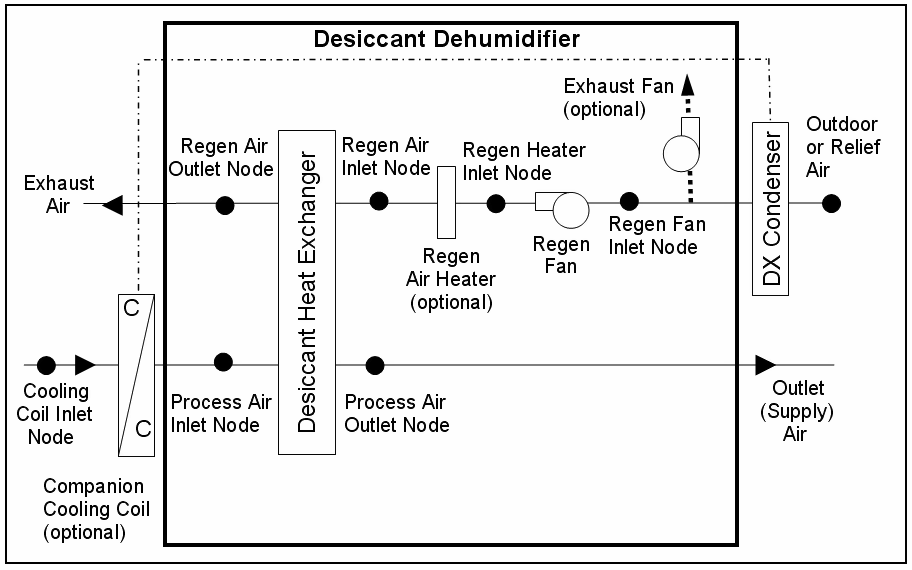

Figure 233. Schematic of a Desiccant Dehumidifier in Blow Through Regeneration Fan Placement

#### Control Logic

The model first decides if the dehumidifier can operate for the simulation time step, based on its availability schedule and if there is air flow detected on the process air inlet node. If available to operate, then the target humidity ratio for the process outlet air is determined based on the maximum humidity ratio setpoint on the control node (System Node Setpoint Humidity Ratio Max). If the control node is not the process air outlet node, the target humidity ratio is adjusted for the current humidity ratio difference between the process air outlet node and the control node. If the humidity ratio of the process inlet air is greater than the target humidity ratio for the process outlet air, then the dehumidifier operates to meet the target to the extent possible.

Once it is determined that the dehumidifier should operate, the components upstream of the desiccant heat exchanger’s regeneration inlet are modeled. The actual components that are modeled depend on the configuration specified by the user.

If the waste heat from the companion cooling coil is being used to heat the regeneration air, then this model determines the temperature of the air leaving the cooling coil condenser. The user may also specify a setpoint temperature for the regeneration air entering the desiccant heat exchanger and an optional exhaust fan, which can impact the condenser leaving air temperature. For this case, the exhaust fan is used to control the condenser leaving air temperature by boosting the air flow rate through the condenser to meet the setpoint temperature (minus regeneration fan heat if blow through fan placement).

Note: If the desiccant dehumidifier is OFF for a simulation time step but its companion cooling coil is operating and is specified to provide regeneration air heating, then the exhaust fan operates at the maximum air flow rate (i.e., this fan serves at the condenser fan for the companion cooling coil system when regeneration air heating is specified, so the inputs for the companion cooling coil object should not include the condenser fan energy since the condenser fan energy is modeled by the Dehumidifier:Desiccant:SystemDesiccant Dehumidifier object).

The exhaust fan power is determined as follows:

$$\begin{array}{l}If\,dehumidifier\,is\,operating:\\\,\,\,PL{R_{exhaust}} = \,\frac{{{{\mathop m\limits^ \bullet  }_{exhaust}}}}{{\left( {{\rho_{Std}} * {{\mathop {\rm{V}}\limits^ \bullet  }_{exhaust,\,max}}} \right)}}\\\,\,\,{P_{exhaust}} = \,{P_{exhaust,\,max}} * \,ExhFanModFac\\\\If\,dehumidifier\,\,is\,\,not\,\,operating\,\,but\,\,companion\,\,coil\,\,is\,\,operating:\\\,\,\,{P_{exhaust}} = \,{P_{exhaust,\,max}} * \,PL{R_{companion\,coil}}\end{array}$$

where:

\(PL{R_{exhaust}}\)  = part load ratio of the exhaust fan

\({\mathop {\rm{V}}\limits^ \bullet_{exhaust,\,max}}\)  = exhaust fan maximum volumetric flow rate, user input (m3/s)

\({\rho_{Std}}\)           = density of air at standard temperature and pressure [dry air at 20°C] (m3/kg)

\({P_{exhaust,\,max}}\)   = exhaust fan maximum power, user input (W)

\(ExhFanModFac\)= exhaust fan power modifier curve evaluated at PLRexhaust. If modifier                                        curve not provided by the user, then this factor is assumed to be 1.0.

\(PL{R_{companion\,coil}}\)     = part load ratio of the companion cooling coil

\({P_{exhaust}}\)        = output variable ‘Dehumidifier Exhaust Fan Electric Power, W’

The exhaust fan electric consumption is then calculated as:

$${E_{exhaust}} = {P_{exhaust}}*\,\,TimeStepSys\,\,*\,\,3600.$$

where:

\({E_{exhaust}}\)          = output variable ‘Dehumidifier Exhaust Fan Electric Energy, J’

\(TimeStepSys\)= HVAC system simulation time step, hr

Once the outlet conditions from the companion coil condenser are determined (if present), then the regeneration air fan (if blow through configuration) and regeneration air heater (if present) are simulated. To the extent possible (e.g., if the heater is available to operate based on its availability schedule and it has sufficient heating capacity), the regeneration air heater operates to raise its outlet air temperature to the specified regeneration inlet air setpoint temperature.

With the inlet air conditions to the regeneration and process sides of the desiccant heat exchanger now known, the performance of the desiccant heat exchanger is modeled. If the desiccant dehumidifier is specified with a companion cooling coil upstream of the heat exchanger’s process inlet, then the model assumes that the dehumidifier operates at the same time as the companion coil (same part-load ratio). If not, then the desiccant dehumidifier model calculates the fraction of time it must operate to meet the process outlet air maximum humidity target (setpoint) using the following equation:

$$\begin{array}{l}\,DDPartLoadRatio = \,\frac{{\left( {{w_{Proc,\,\,in}} - {w_{max, set\,point}}} \right)}}{{\left( {{w_{Proc,\,\,in}} - {w_{Proc,\,\,out,HXon}}} \right)}}\\DDPartLoadRatio = MAX\left( {0.0,DDPartLoadRatio} \right)\\DDPartLoadRatio = MIN\,\left( {1.0,DDPartLoadRatio} \right)\end{array}$$

where:

\(\,DDPartLoadRatio\) = output variable ‘Dehumidifier Part Load Ratio’

\({w_{Proc,\,\,in}}\)      = process inlet air humidity ratio (kg/kg)

\({w_{max, set\,point}}\) = target humidity ratio (setpoint) for the process outlet air (kg/kg)

\({w_{Proc,\,\,out,HXon}}\)= process outlet air humidity ratio when the desiccant heat exchanger operates       (kg/kg)

After all of the desiccant dehumidifier components are modeled at the appropriate part load ratio, the water removal rate and water removed are calculated.

$$
  \begin{array}{rl}
    {\mathop m\limits^ \bullet_{water\_removed,Proc}} &= \,{\mathop m\limits^ \bullet_{Proc,in}}\left( {{w_{Proc,\,\,in}} - {w_{Proc,\,\,out}}} \right) \\
    {m_{water\_removed,Proc}}                         &= {\mathop m\limits^ \bullet_{water\_removed,Proc}}*\,\,TimeStepSys\,\,*\,\,3600.
  \end{array}
$$

where:

\({\mathop m\limits^ \bullet_{water\_removed,Proc}}\) = output variable ‘Dehumidifier Removed Water Mass Flow Rate, kg/s’

\({\mathop m\limits^ \bullet_{Proc,in}}\)       = air mass flow rate at the process air inlet node (kg/s)

\({w_{Proc,\,\,out}}\)     = process outlet air humidity ratio (kg/kg)

\({m_{water\_removed,Proc}}\)= output variable ‘Dehumidifier Removed Water Mass, kg’

#### References

ASHRAE. 2004. Chapter 22: Desiccant Dehumidification and Pressure-Drying Equipment. 2004 ASHRAE HVAC Systems and Equipment Handbook. Atlanta, GA: American Society of Heating, Refrigerating and Air-Conditioning Engineers, Inc.

Kosar, D. 2006. Dehumidification Enhancements, ASHRAE Journal, Vol. 48, No. 2, February 2006.

Kosar, D. et al. 2006. Dehumidification Enhancement of Direct Expansion Systems Through Component Augmentation of the Cooling Coil. 15th Symposium on Improving Building Systems in Hot and Humid Climates, July 24-26, 2006.

### Unitary Water-To-Air Heat Pump

#### Overview

The input object AirLoopHVAC:UnitaryHeatPump:WaterToAir provides a model for a water-to-Air heat pump that is a “virtual” component that consists of an on/off fan component, a water-to-air heat pump cooling coil, a water-to-air heat pump heating coil, and a gas or electric supplemental heating coil. The specific configuration of the blowthru heat pump is shown in the following figure. For a drawthru heat pump, the fan is located between the water-to-air heat pump heating coil and the supplemental heating coil. The configuration of the water-to-air heat pump in the air loop is similar to an air-to-air heat pump. In addition, a water-to-air heat pump has a water loop connection on its source side. The water loop can be served by a condenser loop (like GHE for Ground source systems), or by a cooling tower/ boiler plant loop (for water loop systems).

Figure 234.  Source Side and Load Side Configuration of a BlowThru WateroToAir Heat Pump

There are two different models for water-to-air heat pump cooling and heating coils. Cooling and heating coils are modeled using a Single Speed or Variable Speed Equation Fit model or a Parameter Estimation model. The parameter estimation procedure is quite detailed and the equation fit model is designed to simplify the user inputs. Each model is discussed in short in the following sections. The Variable-Speed Equation Fit model is described in a separate section, as Coil:Cooling:WaterToAirHeatPump:VariableSpeedEquationFit and Coil:Heating:WaterToAirHeatPump:VariableSpeedEquationFit.

#### Single Speed Equation-Fit Model:

This section describes the equation-fit model for Water-to-Air heat pump  (Object names: **Coil:Cooling:WaterToAirHeatPump:EquationFit** and **Coil:Heating:WaterToAirHeatPump:EquationFit**). This documentation is derived from the M.S. dissertation of Tang (2005) which is available on the Oklahoma State University web site . The model uses five non-dimensional equations or curves to predict the heat pump performance in cooling and heating mode. The methodology involved using the generalized least square method to generate a set of performance coefficients from the catalog data at indicated reference conditions. Then the respective coefficients and indicated reference conditions are used in the model to simulate the heat pump performance. The variables or inlet conditions that influenced the water-to-air heat pump performance are load side inlet water temperature, source side inlet temperature, source side water flow rate and load side water flow rate. The governing equations for the cooling and heating mode are as following:

Cooling Mode:

$$\frac{{Q{}_{total}}}{{Q{}_{total,ref}}} = A1 + A2\left[ {\frac{{{T_{wb}}}}{{{T_{ref}}}}} \right] + A3\left[ {\frac{{T{}_{w,in}}}{{T{}_{ref}}}} \right] + A4\left[ {\frac{{{{\dot V}_{air}}}}{{{{\dot V}_{air,ref}}}}} \right] + A5\left[ {\frac{{{{\dot V}_w}}}{{{{\dot V}_{w,ref}}}}} \right]$$

$$\frac{{{Q_{sens}}}}{{{Q_{sens,ref}}}} = B1 + B2\left[ {\frac{{T{}_{db}}}{{T{}_{ref}}}} \right] + B3\left[ {\frac{{T{}_{wb}}}{{T{}_{ref}}}} \right] + B4\left[ {\frac{{T{}_{w,in}}}{{T{}_{ref}}}} \right] + B5\left[ {\frac{{{{\dot V}_{air}}}}{{{{\dot V}_{air,ref}}}}} \right] + B6\left[ {\frac{{\dot V{}_w}}{{\dot V{}_{w,ref}}}} \right]$$

$$\frac{{Power{}_c}}{{Power{}_{c,ref}}} = C1 + C2\left[ {\frac{{{T_{wb}}}}{{{T_{ref}}}}} \right] + C3\left[ {\frac{{T{}_{w,in}}}{{T{}_{ref}}}} \right] + C4\left[ {\frac{{{{\dot V}_{air}}}}{{{{\dot V}_{air,ref}}}}} \right] + C5\left[ {\frac{{{{\dot V}_w}}}{{{{\dot V}_{w,ref}}}}} \right]$$

Heating Mode:

$$\frac{{{Q_h}}}{{Q{}_{h,ref}}} = E1 + E2\left[ {\frac{{{T_{db}}}}{{{T_{ref}}}}} \right] + E3\left[ {\frac{{T{}_{w,in}}}{{T{}_{ref}}}} \right] + E4\left[ {\frac{{{{\dot V}_{air}}}}{{{{\dot V}_{air,ref}}}}} \right] + E5\left[ {\frac{{{{\dot V}_w}}}{{{{\dot V}_{w,ref}}}}} \right]$$

$$\frac{{Powe{r_h}}}{{Power{}_{h,ref}}} = F1 + F2\left[ {\frac{{{T_{db}}}}{{{T_{ref}}}}} \right] + F3\left[ {\frac{{T{}_{w,in}}}{{T{}_{ref}}}} \right] + F4\left[ {\frac{{{{\dot V}_{air}}}}{{{{\dot V}_{air,ref}}}}} \right] + F5\left[ {\frac{{{{\dot V}_w}}}{{{{\dot V}_{w,ref}}}}} \right]$$

Assuming no losses, the source side heat transfer rate for cooling and heating mode is calculated as following;

$${Q_{source,c}} = {Q_{total}} + Powe{r_c}$$

$${Q_{source,h}} = {Q_h} - Powe{r_h}$$

where:

\(A1 - F5\)     = Equation fit coefficients for the cooling and heating mode

\({T_{ref}}\)            = 283K

\({T_{w,in}}\)           = Entering water temperature, K

\({T_{db}}\)             = Entering air dry-bulb temperature, K

\({T_{wb}}\)            = Entering air wet-bulb temperature, K

\({\dot V_{air}}\)            = Load side air volumetric flow rate, m3/s

\({\dot V_w}\)                         = Source side water volumetric flow rate, m3/s

\({Q_{total}}\)          = Total cooling capacity, W

\({Q_{sens}}\)          = Sensible cooling capacity, W

\(Powe{r_c}\)     = Power consumption (cooling mode), W

\({Q_{source,c}}\)      = Source side heat transfer rate (cooling mode), W

\({Q_h}\)                         = Total heating capacity, W

\(Powe{r_h}\)     = Power consumption (heating mode), W

\({Q_{source,h}}\)      = Source side heat transfer rate (heating mode), W

The inlet conditions or variables are divided by the reference conditions. This formulation allows the coefficients to fall into smaller range of values. Moreover, the value of the coefficient indirectly represents the sensitivity of the output to that particular inlet variable. The reference conditions used when generating the performance coefficients must be the same as the reference conditions used later in the model. The reference temperature \({T_{ref}}\)is fixed at 283K. Temperature unit of Kelvin is used instead of Celsius to keep the ratio of the water inlet temperature and reference temperature positive value should the water inlet temperature drop below the freezing point.

For cooling mode, the reference conditions; reference load side air volumetric flow rate \(\left( {{{\dot V}_{air,ref}}} \right)\),reference source side water volumetric flow rate\(\left( {{{\dot V}_{w,ref}}} \right)\),reference sensible capacity \(\left( {{Q_{sens,ref}}} \right)\) and reference power input \(\left( {Powe{r_{c,ref}}} \right)\) are the conditions when the heat pump is operating at the highest cooling capacity or reference cooling capacity\(\left( {{Q_{total,ref}}} \right)\) indicated in the manufacturer’s catalog. Note that the reference conditions for heating mode might differ from the reference conditions specified for the cooling mode.

#### Coefficient estimation procedure:

The generalized least square method is used to generate the coefficients. This method utilizes an optimization method which calculates the coefficients that will give the least amount of differences between the model outputs and the catalog data. A set of coefficients for the cooling mode is generated which includes A1-A5 for total cooling capacity, B1-B6 for sensible cooling capacity, and C1-C5 for power consumption. The same procedure is repeated for the heating mode to generate the coefficients E1-E5 and F1-F5. An information flow chart showing the inputs, reference conditions, performance coefficients and outputs are shown in the figure below:

Figure 235. Information Flow Chart for Water-to-Air Heat Pump Equation Fit Model (Tang 2005)

#### High Humidity Control with WaterToAir HeatPump Equation Fit model

The specific configuration of the WaterToAir HeatPump with supplemental heating coil is shown above (see Figure 234). This figure shows the fan placement when a blow through fan is specified. If a draw through fan is specified, the fan is located between the heating coil and the reheat coil. The system is controlled to keep the high relative humidity in the control zone from exceeding the setpoint specified in the object ZoneControl:Humidistat. When high humidity control is specified and the compressor operates, the heatpump always operates at the cooling air flow rate when a zone heating load is present as determined by the zone thermostat. High humidity control is specified as either None, or CoolReheat in the Dehumidification Control Type input field. CoolReheat is specified when a DX cooling coil is used to over-cool the supply air stream in order to meet the zone latent load. In this case, a supplemental heating coil will ensure the zone temperature does not fall below the zone heating temperature set point. If the dehumidification control type is selected as None, the WaterToAir HeatPump uns only to meet the sensible cooling load. A supplemental heating coil is required for all dehumidification control types.

The model first calculates the *PartLoadRatio* required meeting the sensible cooling load.  The heatpump’s sensible cooling load is determined from the control zone sensible cooling load to the cooling setpoint and the control zone air flow fraction to maintain the dry-bulb temperature setpoint in the control zone:

$$HeatPumpCoolingLoad = \,\frac{{ControlZoneCoolingLoad}}{{ControlZoneAirFlowFraction}}$$

The heatpump’s sensible cooling load to be met and the full load cooling output are used to calculate the sensible the part-load ratio iteratively based on user specified convergence criterion.

$$PartLoadRatio = MAX\left( {0.0,\,\frac{{ABS\left( {HeatPumpCoolingLoad - NoCoolOutput} \right)}}{{ABS\left( {FullCoolOutput - NoCoolOutput} \right)}}} \right)$$

When the heat pumps sensible cooling capacity meets the system sensible cooling load at a given sensible part load ratio, then the Heat pump meets the controlled zone cooling setpoint temperature.  If a moisture (latent) load exists because the control zone humidity has exceeded the setpoint, the total moisture load to be met by the heat pumps (HeatPumpMoistureLoad) is calculated based on the control zone moisture load and the control zone air flow fraction.

$$HeatPumpMoistureLoad = \,\frac{{ControlZoneMoitureLoad}}{{ControlZoneAirFlowFraction}}$$

Then the *LatentPartLoadRatio* required to meet the high humidity setpoint is calculated as follows:

$$LatentPartLoadRatio = MIN\left( {PL{R_{Min}},\,\frac{{ABS\left( {HeatPumpMoistureLoad - NoLatentOutput} \right)}}{{ABS\left( {FullLatentOutput - NoLatentOutput} \right)}}} \right)$$

The model uses the greater of the two part-load ratios, *PartLoadRatio* or *LatentPartLoadRatio*, to determine the operating part-load ratio of the Heat Pump’s DX cooling coil.

$$LatentPartLoadRatio = MAX\left( {PartLoadRatio,\,LatentPartLoadRatio} \right)$$

As previously described, iterations are performed to converge on the solution within the convergence tolerance.

Where,

\(ControlZoneCoolingLoad\)= the control zone sensible cooling load to the cooling setpoint, (W).

\(ControlZoneMoistureLoad\)         = the control zone moisture load to the dehumidifying relative humidity setpoint, (W).

\(ControlZoneAirFlowFraction\)     = the supply air fraction that goes though the control zone, (-).

*FullLatentOutput*      =         the Heat Pump’s latent cooling energy rate at full-load conditions, W

*NoLatentOutput*       =          the Heat Pump’s latent cooling energy rate with cooling coil OFF, W

\(PartLoadRatio\)     =          the heat pump’s part-load-ratio required to meet system sensible load, (-).

\(LatentPartLoadRatio\)      =          the heat pump’s part-load-ratio required to meet system moisture load, (-).

\(PL{R_{MIN}}\)*       =  *the minimum part-load ratio, which is usually 0.0. For the case when the latent capacity degradation model is used (Ref: DX Cooling Coil Model), this value is the minimum part-load ratio at which the cooling coil will dehumidify the air.

When the predicted zone air temperature is above the heating setpoint and if there is a dehumidification load, the supplemental heating coil load is required to offset the excess cooling as shown in Figure 236. If the model determines that the LatentPartLoadRatio is to be used as the operating part-load ratio of the heatpump’s cooling coil, the supplemental coil is used to offset the excess sensible capacity provided by the unit. The model first checks the sensible load that exists for the current simulation time step (predicted zone temperature with no HVAC operation compared to the thermostat setpoint temperatures). If a sensible cooling load or no sensible cooling or heating load exists (see Figure 236),  the model calculates the difference between the sensible heating load required to reach or maintain the heating dry-bulb temperature setpoint and the actual sensible cooling energy rate delivered by the heat pump (with LatentPartLoadRatio). In this case, thesupplemental heating coil is used to offset the excess sensible cooling energy provided by the DX cooling coil (if any) that could have caused an overshoot of the heating dry-bulb temperature setpoint. Note that when a humidistat is used and high humidity control is required, the zone dry-bulb temperature will typically move toward the heating temperature setpoint when a high moisture (latent) load exists.

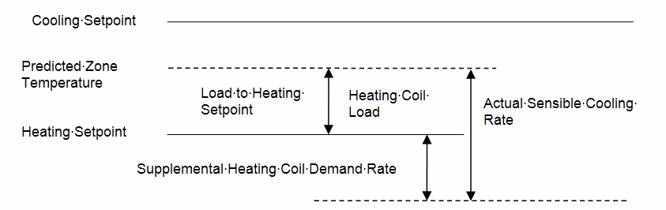

Figure 236. Supplemental heating coil load when predicted zone air temperature is above the heating Setpoint

If a heating load exists (Figure 237), the supplementalheating coil is used to meet the heating coil load and at the same time offset the entire sensible cooling energy rate of the DX cooling coil (to meet the humidistat setpoint). Note that when a heating load exists and high humidity control is required, the heat pump operates at the user-specified cooling air flow rate for the entire simulation time step. As with the fan, and DX cooling coil, report variables associated with supplemental heating coil performance (e.g., heating coil energy, heating coil rate, heating coil gas or electric energy, heating coil runtime fraction, etc.) are managed in the supplemental (heating) coil object.

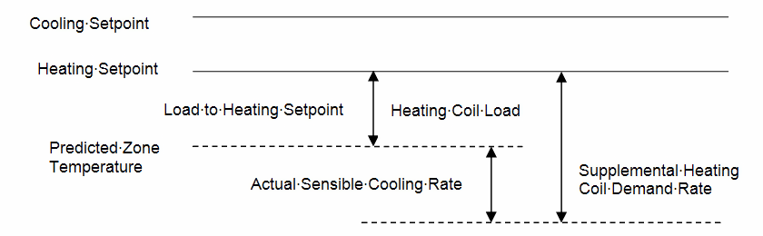

Figure 237. Supplemental heating coil load when predicted zone air temperature is below the heating setpoint

#### Parameter Estimation Model

The steady state simulation model (Object: AirLoopHVAC:UnitaryHeatPump:WaterToAir) for a water-to-air vapor compression heat pump is described in this section. The model is implemented under the air-loop manager similar to the algorithm discussed under AirLoopHVAC:UnitaryHeatPump. The heat pump 'coil' objects (Coil:Cooling:WaterToAirHeatPump:ParameterEstimation and
 Coil:Heating:WaterToAirHeatPump:ParameterEstimation) actually consist of a steady state simulation of the unitary heat pump in cooling or heating mode respectively.  This documentation is derived from the Ph.D. dissertation of Hui Jin which is available on the Oklahoma State University web site .  The model parameters, solution technique and solution algorithm are all identical to that of the water to water heat pump.  The only difference between the two models is in the modeling of the water to air heat exchanger.

The effectiveness of this heat exchanger is given by

$$\varepsilon  = 1 - {e^{ - NTU}}$$

Where NTU is defined by

$$NTU = \frac{{UA}}{{(\dot mC{}_p){}_{water/air}}}$$

UA for the source side and the load side are two of the parameters estimated in the parameter estimation procedure.

Additional model details and a discussion of the parameters and parameter estimation technique are described in the following section on Water to Water Heat Pumps.

### Water To Water Heat Pumps

There are two water-water heat pump models available in EnergyPlus which are **parameter estimation based model** and **equation-fit model**. Detailed descriptions of the model are available in the references Tang and Jin

### Equation Fit Water To Water Heat Pump Model

This section describes the equation-fit model for water-to-water heat pump. (Object names: HeatPump:WaterToWater:EquationFit:Cooling & HeatPump:WaterToWater:EquationFit:Heating). This documentation is derived from the M.S. dissertation of Tang (2005) which is available on the Oklahoma State University web site . The model uses four non-dimensional equations or curves to predict the heat pump performance in cooling and heating mode. The methodology involved using the generalized least square method to generate a set of performance coefficients from the catalog data at indicated reference conditions. Then the respective coefficients and indicated reference conditions are used in the model to simulate the heat pump performance. The variables that influenced the water-to-water heat pump performance are load side inlet water temperature, source side inlet temperature, source side water flow rate and load side water flow rate. The governing equations for the cooling and heating mode are as following:

Cooling Mode:

$$\frac{{Q{}_c}}{{Q{}_{c,ref}}} = A1 + A2\left[ {\frac{{T{}_{L,in}}}{{T{}_{ref}}}} \right] + A3\left[ {\frac{{T{}_{S,in}}}{{T{}_{ref}}}} \right] + A4\left[ {\frac{{{{\dot V}_L}}}{{{{\dot V}_{L,ref}}}}} \right] + A5\left[ {\frac{{{{\dot V}_S}}}{{{{\dot V}_{S,ref}}}}} \right]$$

$$Powe{r_c} = B1 + B2\left[ {\frac{{T{}_{L,in}}}{{T{}_{ref}}}} \right] + B3\left[ {\frac{{T{}_{S,in}}}{{T{}_{ref}}}} \right] + B4\left[ {\frac{{{{\dot V}_L}}}{{{{\dot V}_{L,ref}}}}} \right] + B5\left[ {\frac{{{{\dot V}_S}}}{{{{\dot V}_{S,ref}}}}} \right]$$

Heating Mode:

$$\frac{{{Q_h}}}{{Q{}_{h,ref}}} = C1 + C2\left[ {\frac{{T{}_{L,in}}}{{T{}_{ref}}}} \right] + C3\left[ {\frac{{T{}_{S,in}}}{{T{}_{ref}}}} \right] + C4\left[ {\frac{{{{\dot V}_L}}}{{{{\dot V}_{L,ref}}}}} \right] + C5\left[ {\frac{{{{\dot V}_S}}}{{{{\dot V}_{S,ref}}}}} \right]$$

$$Powe{r_h} = D1 + D2\left[ {\frac{{T{}_{L,in}}}{{T{}_{ref}}}} \right] + D3\left[ {\frac{{T{}_{S,in}}}{{T{}_{ref}}}} \right] + D4\left[ {\frac{{{{\dot V}_L}}}{{{{\dot V}_{L,ref}}}}} \right] + D5\left[ {\frac{{{{\dot V}_S}}}{{{{\dot V}_{S,ref}}}}} \right]$$

Assuming no losses, the source side heat transfer rate for cooling and heating mode is calculated as following;

$${Q_{source,c}} = {Q_c} + Powe{r_c}$$

$${Q_{source,h}} = {Q_h} - Powe{r_h}$$

Where:

\(A1 - D5\)            = Equation fit coefficients for the cooling and heating mode

\({T_{ref}}\)          = 283.15K

\({T_{L,in}}\)         = Entering load side water temperature, K

\({T_{S,in}}\)         = Entering source side water temperature, K

\({\dot V_L}\)         = Load side volumetric flow rate, m3/s

\({\dot V_S}\)         = Source side volumetric flow rate, m3/s

\({Q_c}\)              = Load side heat transfer rate (cooling mode), W

\(Powe{r_c}\)          = Power consumption (cooling mode), W

\({Q_{source,c}}\)      = Source side heat transfer rate (cooling mode), W

\({Q_h}\)              = Load side heat transfer rate (heating mode), W

\(Powe{r_h}\)          = Power consumption (heating mode), W

\({Q_{source,h}}\)     = Source side heat transfer rate (heating mode), W

*COPc*                   = Cooling coefficient of performance, W/W

*COPh*                   = Heating coefficient of performance, W/W

If the load side heat transfer rate (*Qc* or *Qh*) or power consumption (*Powerc* or *Powerh*) are less than or equal to zero, then the heat pump is turned off for that simulation time step, a warning is issued, and the simulation continues.

The inlet conditions or variables are divided by the reference conditions. This formulation allows the coefficients to fall into smaller range of values. Moreover, the value of the coefficient indirectly represents the sensitivity of the output to that particular inlet variable. The reference conditions used when generating the performance coefficients must be the same as the reference conditions used later in the model. The reference temperature \({T_{ref}}\)is fixed at 283K. Temperature unit of Kelvin is used instead of Celsius to keep the ratio of the water inlet temperature and reference temperature positive value should the water inlet temperature drop below the freezing point.

For cooling mode, the reference conditions; reference load side volumetric flow rate, \({\dot V_{L,ref}}\), reference source side volumetric flow rate, \({\dot V_{S,ref}}\), \(Powe{r_{c,ref}}\)  and reference source side heat transfer rate, \({Q_{source,c,ref}}\)  are the conditions when the heat pump is operating at the highest cooling capacity or reference cooling capacity, \({Q_{c,ref}}\) indicated in the manufacturer’s catalog. Note that the reference conditions for heating mode might differ from the reference conditions specified for the cooling mode.

#### Coefficient estimation procedure:

The generalized least square method is used to generate the coefficients. This method utilizes an optimization method which calculates for the coefficients that will give the least amount of differences between the model outputs and the catalog data. A set of coefficients for the cooling mode is generated which includes A1-A5 for load side heat transfer. The same procedure is repeated B, C, and D coefficients. An information flow chart showing the inputs, reference conditions, performance coefficients and outputs are shown in the figure below:

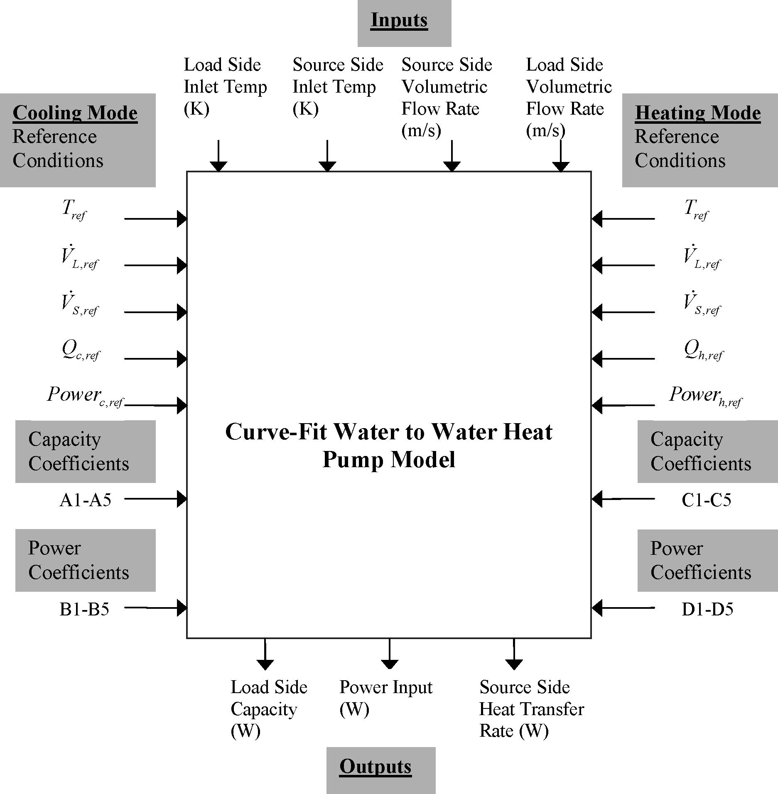

Figure 238.  Information Flow Chart for Water-To-Water Heat Pump Equation Fit (Tang 2005)

### Parameter Estimation Water-To-Water Heat Pump Model

A steady state simulation model for a water-to-water reciprocating vapor compression heat pump (Object names: HeatPump:WaterToWater:ParameterEstimation:Cooling & HeatPump:WaterToWater:ParameterEstimation:Heating) is described in this section. This documentation is derived from the Ph.D. dissertation of Hui Jin which is available on the Oklahoma State University web site . The model incorporates a multivariable unconstrained optimization algorithm to estimate several unspecific parameters. The aim of the model is to describe the detailed physical geometry and operation of each component and replicate the performance of the actual unit in operation. Assuming the thermodynamic process in the expansion device and the pressure drop at the suction and discharge valves to be isenthalpic the heat balance equation is given by

$${\dot Q_s} = \dot W + {\dot Q_{_L}}$$

Where:

\({\dot Q_s}\) = Source side heat transfer rate

\({\dot Q_L}\) = Load side heat transfer rate

\(\dot W\)= Compressor power input

The compressor model is based on an isentropic process shown in Figure 239 governed by

\(P{V^\gamma }\) = Constant

Where:

P = Pressure

v = Specific volume

Figure 239.  Schematic indicator diagram for a reciprocating Compressor(Jin 2002)

Since the refrigerant vapor in the clearance volume as shown in the previous figure goes through a re-expansion procedure, the mass flow rate of the compressor refrigerant is a decreasing function of the pressure ratio.

$$\mathop m\limits^ \bullet   = \frac{{PD}}{{\nu {}_{suc}}}(1 + C - C{(\frac{{P{}_{dis}}}{{P{}_{suc}}})^{\frac{1}{\gamma }}}$$

Where:

\(\mathop m\limits^ \bullet  \)  = refrigerant mass flow rate

PD = Piston displacement

C   = Clearance factor

\(P{}_{dis}\) = discharge pressure

\(P{}_{suc}\) = Suction pressure

\(\gamma \)     = Isentropic exponent

#### Parameter estimation procedure:

A set of parameters for the cooling mode is defined on the basis of the equations used in the model. An information flowchart indicating the parameters, inputs to the model and the resulting outputs acquired are shown in Figure 240. The estimation of parameters is conducted using the catalog data.

The parameter definition include:

n Piston displacement, PD

n Clearance factor, C

n Pressure drop across the suction and discharge valves, \({\rm{\Delta P}}\)

n Loss factor used to define the electromechanical losses supposed to be proportional to the theoretical power, \({\rm{\eta }}\)

n Superheat in οC or F, \({\rm{\Delta T}}{}_{{\rm{sh}}}\)

n Constant part of the electromechanical losses,\({\rm{W}}{}_{{\rm{loss}}}\)

n Source side heat transfer coefficient, (UA)S

n Load side heat transfer coefficient, (UA)L

Figure 240.  Information Flowchart for Water-To-Water Heat Pump Parameter Estimation Mmodel implementation (Jin 2002)

Where:

TWiL   = Entering water Load side temperature

TWiS   = Entering water Source side temperature

\(\mathop {\rm{m}}\limits^ \bullet  {}_{{\rm{WiL}}}\)= Entering water Load side mass flow rate

\(\mathop {\rm{m}}\limits^ \bullet  {}_{{\rm{WiS}}}\)= Entering water Source side mass flow rate

S      =  Thermostatic Signal

The parameter estimation procedure incorporates an objective function that computes the difference between the model outputs and the catalog outputs.  The objective function is then minimized by using a multi variable unconstrained multi modal Nelder Mead optimization algorithm. As the objective function value lowers after each iteration, the model outputs approach the catalog outputs consequently leading to convergence and the correct parameters are estimated for the respective model. The inputs to the model include the entering water temperatures and mass flow rates on the load side and the source side. The calculation of the objective function is shown in the form of a formula flowchart in Figure 241. The square of the sum of the errors (SSQE) for a given set of parameter values that will be minimized is given by

$$SSQE = \sum\limits_{i = 1} {{{\left( {\frac{{\left( {\mathop {W{}_{cat}}\limits^{} } \right) - \left( {\mathop W\limits^{} } \right){}_i}}{{\left( {\mathop {W{}_{cat}}\limits^{} } \right)}}} \right)}^2}}  + \left( {\frac{{\left( {\mathop {QL{}_{cat}}\limits^{} } \right) - \left( {\mathop {QL}\limits^{} } \right){}_i}}{{\left( {\mathop {QL{}_{cat}}\limits^{} } \right)}}} \right)$$

Where

\({\rm{W}}{}_{{\rm{cat}}}\)= Catalog power consumption

\({\rm{W}}{}_{}\) = Model power consumption

\({\rm{QL}}{}_{{\rm{cat}}}\)= Catalog load side heat transfer

\({\rm{QL}}{}_{}\) = Model load side heat transfer

Extrapolation beyond the catalog data grants the parameter estimation model an upper hand in comparison with the equation fit and deterministic models. However, the detailed model is computationally more intensive. Moreover, when the model is implemented within a transient system simulation program, it may come across figures that are random and unplanned by the manufacturer such as low water flow rates or extreme temperatures. This oddity may result in unrealistic set of results.

Figure 241.  Flow diagram of EnergyPlus Water to Water HeatPump implementation

#### Control Strategy:

Both water-to-water heat pump models; parameter estimation based model and curve-fit model use the “cycle time control logic” developed by Murugappan (2002).

This strategy keeps the heat pump from short-cycling whereby the heat pump will stay on or off for the specified cycle time after switching states. The control logic is identical to the operation of a physical heat pump whereby the heat pump does not switch between on and off instantly. Refer to Muraggapan (2002) for the further details on the control strategy.

#### References

Jin, Hui. 2002. Parameter Estimation Based Models of Water Source Heat Pumps. Phd. Thesis, Department of Mechanical and Aerospace Engineering, Oklahoma State University. (downloadable from [http://www.hvac.okstate.edu/](http://www.hvac.okstate.edu))

Tang,C. C. 2005. Modeling Packaged Heat Pumps in Quasi-Steady State Energy Simulation Program. M.S. Thesis. Department of Mechanical and Aerospace Engineering, Oklahoma State University. (downloadable from [http://www.hvac.okstate.edu/](http://www.hvac.okstate.edu))

Murugappan, Arun. 2002.  Implementing Ground Source Heat Pump and Ground Loop Heat Exchanger Models in the EnergyPlus Simulation Environment, M.S. Thesis, Department of Mechanical and Aerospace Engineering, Oklahoma State University (downloadable from [http://www.hvac.okstate.edu/](http://www.hvac.okstate.edu))

Variable Refrigerant Flow Heat Pumps 
------------------------------------

A Variable Refrigerant Flow (VRF, or Variable Refrigerant Volume) system is an air-conditioning system that varies the refrigerant flow rate using variable speed compressor(s) in the outdoor unit, and the electronic expansion valves (EEVs) located in each indoor unit. The system meets the space cooling or heating load requirements by maintaining the zone air temperature at the setpoint. The ability to control the refrigerant mass flow rate according to the cooling and/or heating load enables the use of as many as 60 or more indoor units with differing capacities in conjunction with one single outdoor unit. This unlocks the possibility of having individualized comfort control, simultaneous heating and cooling in different zones, and heat recovery from one zone to another. It may also lead to more efficient operations during part-load conditions.

There are two common types of VRF systems. 

 * Heat Pump (HP) type: the most general type that can be used for either cooling or heating, but not simultaneously. 
 
 * Heat Recovery (HR) type: can deliver simultaneous heating and cooling to different zones by transferring heat between the cooling and heating indoor units. This generally occurs in the winter season in medium-sized to large-sized commercial buildings with a substantial core such as computer rooms.

There are two alternative VRF models availabe in EnergyPlus to simulate the energy performance of Variable Refrigerant Flow (VRF, or Variable Refrigerant Volume) air-conditioning systems: 

 1. **System Curve based Model (VRF-SysCurve)**. In this model, a number of system level curves are used to describe the VRF system performance. It corresponds to the *AirConditioner:VariableRefrigerantFlow* object. 
 
 2. **Physics based Model (VRF-FluidTCtrl)**. This model is able to consider the dynamics of more operational parameters and is applicable for fluid temperature control. This model corresponds to the *AirConditioner:VariableRefrigerantFlow:FluidTemperatureControl* object.
 
 
### Variable Refrigerant Flow Heat Pump Model (System Curve Based Model)

#### Overview

This section describes the System Curve based VRF Model (VRF-SysCurve), which can address both the heat pump and heat recovery operating modes and support air-, evaporatively-, or water-cooled condenser equipment ( throughout this section, the term “condenser” refers to the outdoor unit where the compressor is located. )

The figure below schematically depicts the AirConditioner:VariableRefrigerantFlow (VRF AC) system. The outdoor unit is connected directly to the zone terminal units using a zone terminal unit list (ref: ZoneTerminalUnitList). The VRF AC system conditions multiple zones and is controlled by thermostats located in each zone. Zone terminal units operate to meet the zone sensible cooling or sensible heating requirements as determined by the zone thermostat schedule. 

When the heat pump does not operate to reclaim waste heat, the VRF AC system can only operate in either cooling *or* heating mode. Based on the master thermostat priority control selection, the operating mode is determined by polling the appropriate zone(s) served by the VRF HP system. When the system is operating in cooling mode, the cooling coils will be enabled only in the terminal units where zone cooling is required. When the system is operating in heating mode, the heating coils will be enabled only in the terminal units where zone heating is required. Supply air fans will continue to operate if the zone terminal unit’s fan operating mode is set to continuous fan.

When the heat pump does operate to reclaim waste heat, the VRF AC system can simultaneously cool and heat multiple zones. The heat pump will select an operating mode according to the dominant load as reported by the zone thermostat(s). The calculation of the dominant load is based on the master thermostat priority control selection and may either be based on individual zone loads, the number of zones requiring cooling or heating, the master thermostat zone load, or an operating mode schedule. The heat pump will operate in cooling mode, and provide waste heat to zones with a heating load, when the dominant load among all zone terminal units is cooling. The heat pump will operate in heating mode, and absorb heat from zones with a cooling load, when the dominant load among all zone terminal units is heating.

The figure below shows the VRF AC terminal units with draw through fan placement. Blow through fan placement can also be modeled by connecting the supply air fan inlet node to the outside air mixer’s mixed air node if an outdoor air mixer is used or to the zone terminal unit inlet node if an outdoor air mixer is not used. The variable refrigerant flow heat pump coordinates the operation of these components and is modeled as a type of zone equipment where the *zone terminal units* are specified in a zone equipment list (Ref. ZoneHVAC: EquipmentList and ZoneHVAC:EquipmentConnections). The AirConditioner: VariableRefrigerantFlow object *is not* specified in an air primary loop or a zone equipment list object.

Figure 242. Variable Refrigerant Flow Heat Pump (draw through fan placement)

Figure 243. Energyplus object connections for VRF-SysCurve model 

The terminal unit is able to model supply air fan operation in two modes: cycling fan – cycling coil (i.e., AUTO fan) and continuous fan – cycling coil (i.e., fan ON). Fan:Simple:OnOff must be used to model AUTO fan, while Fan:Simple:OnOff or Fan:Simple:ConstVolume can be used to model fan ON.

Output variables reported by the VRF AC object include the heat pump’s operating capacity (cooling or heating), electric consumption, operating COP, defrost electric consumption, part-load ratio (ratio of actual capacity to available capacity), runtime fraction (when cycling), cycling ratio (actual compressor cycling rate), crankcase heater power, and other report variables associated with an evaporative condenser. Report variables are also available to indicate the maximum available terminal unit cooling or heating capacity (i.e., when the condensers available capacity is insufficient to supply the capacity requested by all terminal units). Reporting of other variables of interest for the VRF AC (fan electric power, DX coil cooling rate, DX coil heating rate, terminal unit total cooling rate, etc.) is done by the individual system components (e.g., fan, DX cooling coil, DX heating coil, and zone terminal unit). For convenience, the total cooling and heating coil capacities (i.e., the coil loads) is also reported.

#### Model Description

As described previously, the VRF AC system conditions multiple zones and is controlled by one or more zone thermostats (ZoneControl:Thermostatic). Each simulation time step, EnergyPlus performs a zone air heat balance to determine if cooling or heating is required to meet each zone’s thermostat set point. When heat pump mode is selected (i.e., heat recovery is not selected), an operating mode is chosen based on the master thermostat priority control and all terminal units are operated in that specific mode. When heat recovery mode is selected, the dominant load is determined based on the master thermostat priority control and the outdoor unit operates in this mode. The indoor terminal units operate in either cooling or heating mode based on the individual coil loads The heat pump condenser is then modeled to determine any impact the condensing unit might have on the zone terminal units (i.e., capacity limitations due to oversized terminal units, operating limitations due to allowable operating temperature range, impacts of defrost operation, changes in performance when heat recovery mode is active, etc.). The following sections describe the performance calculations for cooling and heating.

#### Cooling Operation

The operating capacity of the heat pump is calculated based on the user defined input for the heat pump’s rated cooling capacity, the ratio of indoor terminal unit capacity to outdoor unit capacity (combination ratio), the actual operating conditions, and whether or not the system’s heat recovery mode is active. Performance correction factors are used to correct for off-design performance as follows:

#### Cooling Combination Ratio Correction Factor

The cooling combination ratio correction factor is defined as the total terminal unit rated cooling capacity divided by the heat pump’s rated cooling capacity. The combination ratio is important when multiple terminal units (or DX coils) are attached to a single variable-speed condensing unit. If the combination ratio is less than 1, the condenser’s rated capacity is assumed to be able to meet the indoor terminal unit’s demand request. However, if the combination ratio is determined to be greater than 1, the maximum cooling capacity available from the heat pump’s condenser may be higher than the user specified rated cooling capacity. The combination ratio capacity correction factor is based on a linear, quadratic or cubic curve and provides a multiplier &gt; 1 to correct for combination ratio’s greater than 1. For example, a combination ratio of 1.3 (130%) may result in a combination ratio capacity correction factor of 1.06 (outdoor condenser can actually provide 106% of rated capacity) . The cooling combination ratio correction factor is applied to cooling performance calculations. If the cooling combination ratio correction curve name is not specified by the user, the cooling combination ratio correction factor (CR cooling,\\ correction) in the following equation is assumed to be equal to 1.

$$C{R_{cooling\,,\,rated\,}} = {\raise0.7ex\hbox{${\sum\limits_1^n {{{\mathop Q\limits^ \bullet  }_{coil(i)\,,\,cooling,\,rated}}} }$} \!\mathord{\left/ {\vphantom {{\sum\limits_1^n {{{\mathop Q\limits^ \bullet  }_{coil(i)\,,\,cooling,\,rated}}} } {{{\mathop Q\limits^ \bullet  }_{cooling,\,total,\,\,rated}}}}}\right.}\!\lower0.7ex\hbox{${{{\mathop Q\limits^ \bullet  }_{cooling,\,total,\,\,rated}}}$}}$$

$$C{R_{\,cooling\,,\,correction}} = a + b\left( {C{R_{cooling\,,\,rated}}} \right) + c{\left( {C{R_{cooling\,,\,rated}}} \right)^2} + d{\left( {C{R_{cooling\,,\,rated}}} \right)^3}$$

$$C{R_{\,cooling\,,\,correction}} = MAX\left( {1.0\,\,,\,\,C{R_{\,cooling\,,\,correction}}} \right)$$

where

\({\mathop Q\limits^ \bullet_{coil(i)\,,\,cooling\,,\,rated}}\) = rated total (sensible + latent) cooling capacity in zone *i* (W)

\({\mathop Q\limits^ \bullet_{cooling,\,total\,,\,rated}}\)   = rated total cooling capacity of heat pump (W)

\(C{R_{\,cooling\,,\,correction}}\) = Cooling Combination Ratio capacity correction factor at rated conditions (this value is reported in the eio file)

\(a - d\)                = equation coefficients for cooling combination ratio correction factor

\(C{R_{cooling\,,\,rated}}\)      = the cooling combination ratio defined as the total indoor terminal unit’s rated total cooling capacity divided by the rated total cooling capacity of the heat pump condenser.

The sum of the individual zone total cooling requirements is used to calculate the performance of the outdoor condensing unit. The operating capacities of the indoor cooling coils are calculated based on the indoor cooling coil’s rated cooling capacity and the actual operating conditions. The operating capacity of the heat pump condenser is calculated in a similar fashion using a load-weighted average indoor wet-bulb temperature of all operating cooling coils.

#### Cooling Capacity Ratio Modifier Function of Low Temperature

The heat pump’s cooling capacity correction factor (function of temperature) is determined by averaging the zone cooling coil inlet air wet-bulb temperature for all operating cooling coils. A load-weighted average inlet air wet-bulb temperature is used in the calculations. The weighted average cooling coil inlet air wet-bulb temperature and the outdoor condenser entering air dry-bulb temperature are then used to calculate the temperature correction factor in cooling mode for the heat pump condenser. The actual zone air wet-bulb temperature is used to calculate the operating capacity of the individual zone cooling coils.

$${\mathop Q\limits^ \bullet_{zone,\,total}} = \sum\limits_1^i {{{\mathop Q\limits^ \bullet  }_{zone(i)}}} $$

$${T_{wb,avg}} = \sum\limits_1^i {\left( {{T_{wb,i}}} \right)} \left( {{\raise0.7ex\hbox{${{{\mathop Q\limits^ \bullet  }_{zone(i)}}}$} \!\mathord{\left/ {\vphantom {{{{\mathop Q\limits^ \bullet  }_{zone(i)}}} {{{\mathop Q\limits^ \bullet  }_{zone,\,total}}}}}\right.}\!\lower0.7ex\hbox{${{{\mathop Q\limits^ \bullet  }_{zone,\,total}}}$}}} \right)$$

The operating capacity of the heat pump is calculated using a bi-quadratic equation using a load-weighted average indoor wet-bulb temperature and outdoor dry-bulb temperature as the independent variables.

$$CAPF{T_{HP,cooling}} = a + b\left( {{T_{wb,avg}}} \right) + c{\left( {{T_{wb,avg}}} \right)^2} + d\left( {{T_c}} \right) + e{\left( {{T_c}} \right)^2} + f\left( {{T_{wb,avg}}} \right)\left( {{T_c}} \right)$$

The operating capacity of the terminal unit’s DX cooling coil is calculated using either a linear, quadratic, or cubic curve. If more information is available to more accurately model the DX cooling coil, a bi-quadratic curve may be used (i.e., if the performance of the DX cooling coil is also a function of outdoor dry-bulb temperature).

$$CAPF{T_{coil,\,cooling}} = a + b\left( {{T_{wb,i}}} \right) + c{\left( {{T_{wb,i}}} \right)^2} + d{\left( {{T_{wb,i}}} \right)^3}$$

 - or -

$$CAPF{T_{coil,cooling}} = a + b\left( {{T_{wb,i}}} \right) + c{\left( {{T_{wb,i}}} \right)^2} + d\left( {{T_c}} \right) + e{\left( {{T_c}} \right)^2} + f\left( {{T_{wb,i}}} \right)\left( {{T_c}} \right)$$

where

\({T_{wb,i}}\) = wet-bulb temperature of the air entering the cooling coil in zone *i* (°C)

\({T_{wb,avg}}\)= load-weighted average wet-bulb temperature of the air entering all operating cooling coils (°C)

\({\mathop Q\limits^ \bullet_{zone(i)}}\) = total (sensible + latent) cooling load in zone *i* (W)

\({\mathop Q\limits^ \bullet_{zone,\,total}}\) =total (sensible + latent) cooling load in all zones (W)

\(CAPF{T_{\,HP,cooling}}\) = heat pump Cooling Capacity Ratio Modifier (function of temperature)

\(CAPF{T_{\,coil,cooling}}\) = zone coil Cooling Capacity Ratio Modifier (function of temperature)

\(a - f\)  = equation coefficients for Cooling Capacity Ratio Modifier

\({T_c}\)    = temperature of the air entering an air-cooled or evaporatively-cooled condenser (°C)

#### Using multiple curves to define Cooling Capacity Ratio Modifier

The cooling capacity ratio modifier determines the change in total (sensible + latent) capacity with respect to the heat pump rated cooling capacity. This modifier corrects for off-design performance and provides the operating total (sensible + latent) cooling capacity for the heat pump condenser. The performance data for VRF AC systems may be specified using a single curve object, however, if the performance data does not reflect a smooth change in performance as outdoor conditions vary, the overall performance of the system may be described using two cooling capacity ratio modifier curves (i.e., a separate curve at low and high outdoor temperatures) and a boundary curve (i.e., the curve defining the separation at specific outdoor temperatures).

#### Application of Dual Performance Curves

Two additional inputs are available to more accurately model the cooling performance of a VRF AC system. The first additional input is a boundary curve which is used to distinguish differences in performance at “low” and “high” outdoor temperature regions and the second input is a cooling capacity performance curve for the “high” outdoor temperature region. The boundary curve is a linear, quadratic or cubic curve defining the outdoor temperature as a function of average indoor wet-bulb temperature. The cooling capacity ratio function of high temperature curve is a biquadratic curve using average indoor wet-bulb temperature and outdoor dry-bulb temperature as the two independent variables. These additional curves are used to define the performance over two separate performance regions as shown in Figure 244. The red circles in the figure identify the points at which the performance changes abruptly (i.e., slopes or shapes are significantly different) and are used to create the boundary curve. The performance on either side of the boundary curve can be a smooth curve changing with outdoor condition or a flat plateau where system controls maintain a constant operating condition. This type of performance cannot be accurately simulated using a single performance curve object. For this reason, dual capacity performance curves may be used.

Note: If the cooling performance can be described using a single performance curve object, the boundary and high temperature performance curve objects are not required.

Manufacturers may also provide this information in a tabular format. In this case the data should first be graphically displayed to identify any non-linearities and to also identify where an abrupt change in performance occurs so that a boundary curve can be created.

The cooling capacity ratio boundary curve object is used to differentiate between dual cooling capacity ratio performance curves. This curve defines the outdoor temperature below which the cooling capacity ratio function of low temperature curve object is used, otherwise, the cooling capacity ratio function of high temperature curve object is used.

$${T_{OA,DB}} = a + b\left( {{T_{I,WB}}} \right) + c{\left( {{T_{I,WB}}} \right)^2} + d{\left( {{T_{I,WB}}} \right)^3}$$

where

TOA,DB = Outside air dry-bulb temperature (C)

a-d = coefficients for cooling capacity ratio boundary curve object

TI,WB = Weighted average indoor wet-bulb temperature (C)

For the performance data shown below, the boundary curve would be created by identifying the outdoor dry-bulb temperature at which the performance changed abruptly for each of the indoor wet-bulb temperature curves shown in the figure. The following example shows the data interpreted from the figure used to regress the cooling capacity ratio boundary curve coefficients. For this example, the regression coefficients were found to be: A1 = 29.87396, B1 = -0.6928, C1= 0.01928, D1 = -0.000532

Table 73. Performance Data for Variable Refrigerant Flow Air Conditioner Model

Although the capacity and energy performance curves each have an independent boundary curve input, in this example the same boundary curve may be used for both the capacity and energy input ratio curves. When the “low” and “high” predicted performance data do not line up at the boundary curve points, the boundary curve may have to be modified slightly to allow a smooth transition in performance from the “low” to “high” temperature region. In this case, the boundary curves for capacity and energy may be different.

Figure 244. Non-Linear Performance of VRF Heat Pump in Cooling Mode

A regression is then performed on the data to the left of the boundary curve to calculate the low temperature cooling performance curve coefficients. A regression is also performed on the data to the right of the boundary curve to create the high temperature cooling performance curve coefficients. The model then uses the boundary curve to determine which performance curve (low or high) to use during the simulation. For example, given a particular average indoor wet-bulb temperature, if the boundary curve object calculates an outdoor dry-bulb temperature that is above the actual outdoor dry-bulb temperature then the cooling capacity ratio function of low temperature performance curve is used to determine AC system performance for that specific simulation time step. When creating the boundary curve, be careful to make sure the low and high performance curves meet, as closely as possible, at the boundary curve points (i.e., that discontinuities do not exist or are minimized to the extent possible). Tabular data (ref: Table:TwoIndependentVariables) may also be used to specify performance and will usually eliminate the need for dual performance curves.

#### Determining Cooling Coil Sensible Capacity

The zone terminal unit’s cooling coil is controlled by a zone thermostat and must meet a zone “sensible” load. The cooling coil’s sensible capacity is defined as the cooling coil’s total capacity multiplied by the coil’s sensible heat ratio (SHR) at the current operation conditions. Since the SHR of the variable refrigerant flow cooling coil changes as the inlet air wet-bulb temperature and the operating part-load ratio change, an iterative solution technique must be used to determine the coil’s sensible capacity. The target solution is found when the sensible capacity of the zone cooling coil equals the zone sensible cooling load (if sufficient capacity is available). The iterative solution converges when the difference (error) between the zone sensible cooling load and the terminal unit sensible cooling capacity is within tolerance (0.001) or the terminal unit has insufficient capacity to meet the zone sensible cooling load. Refer to the description of the VRF cooling coil model for further details (ref: Variable Refrigerant Flow Cooling Coil).

$${\mathop Q\limits^ \bullet_{coil(i)\,,\,cooling\,,\,total}} = {\mathop Q\limits^ \bullet_{coil(i)\,,\,cooling\,,\,rated}}\left( {CAPF{T_{coil,cooling}}} \right)$$

$$PL{R_i} = 1$$

$$\begin{array}{l}Iteration\,\,Loop(PL{R_i}) -  -  -  -  -  -  -  -  -  -  -  -  -  - \\\,\,\,\,SH{R_{PLR}} = f\left( {{T_{wb,\,i}},\,PL{R_i},\,{{\mathop m\limits^ \bullet  }_i}} \right)\\\,\,\,\,{\mathop Q\limits^ \bullet_{coil(i),\,cooling,\,sensible}} = {\mathop Q\limits^ \bullet_{coil(i),\,cooling,\,total}}\left( {SH{R_{PLR}}} \right)\left( {PL{R_i}} \right)\\\,\,\,\,Error = \left( {{{\mathop Q\limits^ \bullet  }_{zone(i)}} - {{\mathop Q\limits^ \bullet  }_{coil(i),\,cooling,\,sensible}}} \right)/{\mathop Q\limits^ \bullet_{zone(i)}}\\End\,Iteration\,Loop -  -  -  -  -  -  -  -  -  -  -  -  -  -  -  - \end{array}$$

where

\({\mathop Q\limits^ \bullet_{coil(i)\,,\,cooling\,,\,total}}\)= zone terminal unit total (sensible + latent) cooling capacity, [W], report variable “Zone VRF Air Terminal Total Cooling Rate”

\({\mathop Q\limits^ \bullet_{coil(i),\,cooling,\,sensible}}\)= zone terminal unit sensible cooling capacity [W], report variable “Zone VRF Air Terminal Sensible Cooling Rate”

\(PL{R_i}\)= cooling coil sensible part-load ratio in zone *i*

\(SH{R_{PLR}}\) = cooling coil sensible heat ratio (function of PLR, inlet air wet-bulb temperature, and cooling coil inlet air mass flow rate)

\({\mathop m\limits^ \bullet_{_i}}\) = cooling coil inlet air mass flow rate [m3/s]

The terminal unit total cooling (sensible + latent) capacity is then summed to provide the total terminal unit cooling requirement. The cooling coils capacity includes the impacts of fan heat and any outdoor air provided to the zone.

$${\mathop Q\limits^ \bullet_{cooling,TerminalUnits}} = \sum\limits_1^i {\left( {{{\mathop Q\limits^ \bullet  }_{coil(i),cooling,total}}} \right)\left( {PLR(i)} \right)} $$

where

\({\mathop Q\limits^ \bullet_{cooling,\,TerminalUnits\,}}\)= total terminal unit cooling requirement (sensible + latent) in all zones, [W]

The piping correction factor is then used to adjust the total zone cooling requirement to account for piping losses in the air conditioner’s refrigeration piping system.

#### Cooling Piping Correction Factor in cooling mode

The cooling piping correction factor is calculated using either one or two independent variables. Both the equivalent piping length and the combination ratio are used together to determine piping losses, or the equivalent piping length itself is used. The vertical height specified by the user is also added to the result calculated by either. If a single independent variable is used, a linear, quadratic, or cubic equation is used to determine the equivalent length correction factor. If two independent variables are used, a biquadratic equation is used to determine the equivalent length correction factor. The program will automatically use the correct equation based on the performance curve type. In either case, a single coefficient adjusts the piping correction factor based on the difference in height from the highest to lowest terminal unit. Coefficients a-d (e) in the following equation(s) are inputs in the piping correction factor for length in cooling mode performance curve object. Coefficient f is a direct input to the VRF model as the piping correction factor for height in cooling mode coefficient. The equivalent piping length in cooling mode (PEQ,cooling) is also a direct input in the VRF model. The cooling combination ratio (CRcooling) is automatically calculated by the program. The vertical height, the difference between the highest and lowest terminal unit (e.g., 12 m higher than condenser – 3 m lower than condenser = 9 m height), is a common input for both cooling and heating. When all terminal units are above or below the outdoor unit, an average positive or negative value is used. The limits on the calculated cooling piping correction factor are 0.5 &lt; Pcorrection,cooling &lt; 1.

$$C{R_{cooling}} = {\raise0.7ex\hbox{${\sum\limits_1^n {{{\mathop Q\limits^ \bullet  }_{coil(i),cooling,rated}}} }$} \!\mathord{\left/ {\vphantom {{\sum\limits_1^n {{{\mathop Q\limits^ \bullet  }_{coil(i),cooling,rated}}} } {{{\mathop Q\limits^ \bullet  }_{cooling,total,rated}}}}}\right.}\!\lower0.7ex\hbox{${{{\mathop Q\limits^ \bullet  }_{cooling,total,rated}}}$}}$$

$${P_{correction,\,cooling}} = a + b\left( {{P_{EQ,\,cooling}}} \right) + c{\left( {{P_{EQ,\,cooling}}} \right)^2} + d{\left( {{P_{EQ,\,cooling}}} \right)^3} + f\left( {{P_H}} \right)$$

- or  -

$$\begin{array}{l}{P_{correction,\,cooling}} = a + b\left( {{P_{EQ,\,cooling}}} \right) + c{\left( {{P_{EQ,\,cooling}}} \right)^2} + d\left( {C{R_{cooling}}} \right) + e{\left( {C{R_{cooling}}} \right)^2}\\\,\,\,\,\,\,\,\,\,\,\,\,\,\,\,\,\,\,\,\,\,\,\,\,\,\,\,\,\,\,\,\,\,\, + f\left( {{P_{EQ,\,cooling}}} \right)\left( {C{R_{cooling}}} \right) + g\left( {{P_H}} \right)\end{array}$$

where

\({P_{\,correction,\,cooling}}\) = Piping Correction Factor in Cooling Mode

*a - f*       = equation coefficients for piping correction factor in cooling mode

*g*              = user specified piping correction factor for height in cooling mode coefficient

\({P_{\,EQ,\,cooling}}\) = user specified equivalent piping length in cooling mode [m]

\(C{R_{cooling}}\) = combination ratio in cooling mode (total rated indoor terminal unit capacity divided by the rated condenser cooling capacity) (reported to eio file)

\({P_H}\)           = user specified vertical height used for piping correction factor calculation [m]

An example piping correction factor chart is shown in the following figure. The height selected for use in the equation above is selected to minimize the piping correction factor and serves to identify the worst case piping losses.

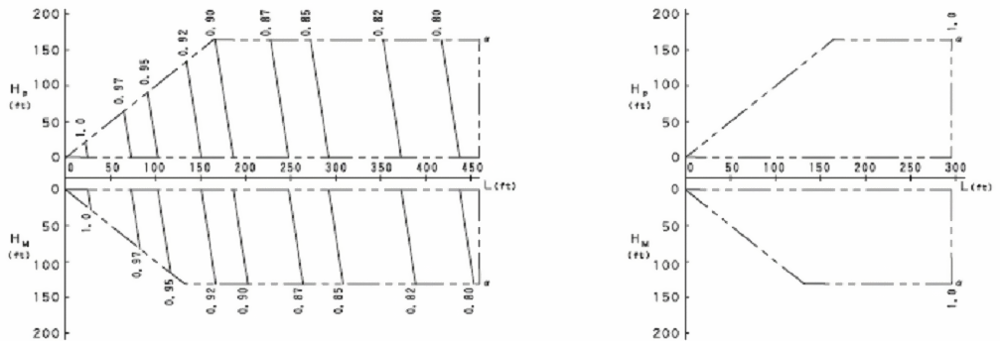

Figure 245. Typical Piping Factor Correction Chart

The total demand on the heat pump condenser is then calculated as the quotient of the total terminal unit cooling capacity and the cooling piping correction factor. The piping losses are fixed throughout the simulation (i.e., these losses are not based on which terminal units are requesting refrigerant).

$${\mathop Q\limits^ \bullet_{cooling,\,total\,}} = {\raise0.7ex\hbox{${{{\mathop Q\limits^ \bullet  }_{cooling,\,TerminalUnits\,}}}$} \!\mathord{\left/ {\vphantom {{{{\mathop Q\limits^ \bullet  }_{cooling,\,TerminalUnits\,}}} {{P_{correction\,,\,cooling}}}}}\right.}\!\lower0.7ex\hbox{${{P_{correction\,,\,cooling}}}$}}$$

The heat pump’s total available cooling capacity is then calculated as:

$${\mathop Q\limits^ \bullet_{HP,\,cooling,\,\,total}} = {\mathop Q\limits^ \bullet_{cooling,\,\,total,\,\,rated}}\left( {CAPF{T_{HP,\,\,cooling}}} \right)\left( {C{R_{cooling,\,\,correction}}} \right)$$

where

\({\mathop Q\limits^ \bullet_{cooling\,,\,total}}\) = total heat pump condenser cooling load (W)

\({\mathop Q\limits^ \bullet_{HP,\,cooling,\,\,total}}\) = heat pump total available cooling capacity (W)

#### Heat Recovery Cooling Capacity Modifier

When operating in heat recovery mode, the heat pump’s available cooling capacity is typically different than the available capacity when operating in cooling only mode. This modifier is used to adjust the available cooling capacity using a fraction when heat recovery is active. This fraction is based on a bi-quadratic equation with indoor and outdoor temperatures used as the independent terms.

*HRCapMod* *HP,cooling* = \(a + b\left( {T{}_{ent}} \right) + c{\left( {T{}_{ent}} \right)^2} + d\left( {{T_{cond}}} \right) + e{\left( {{T_{cond}}} \right)^2} + f\left( {T{}_{ent}} \right)\left( {{T_{cond}}} \right)\)

This equation can be used to provide a constant fractional difference for available cooling capacity in heat recovery mode (i.e., only *a* is non-zero) or a fractional term that varies with indoor and outdoor conditions. With very limited performance data available at this time, it is recommended that only the constant (a) term be used at this time. When the VRF system is not operating in heat recovery mode, this fraction is set to 1.The available cooling capacity in heat recovery mode is then:

$${\mathop Q\limits^ \bullet_{HR,cooling,\,total}} = {\mathop Q\limits^ \bullet_{HP,\,cooling,\,\,total}}\left( {HRCapMo{d_{HP,\,cooling}}} \right)$$

where

\({\mathop Q\limits^ \bullet_{HR,cooling,\,total}}\) = heat recovery total available cooling capacity (W)

The figure below shows VRF system laboratory data for cooling only mode (solid characters) and heat recovery mode (dotted characters). Using the limited laboratory data, the available cooling capacity fraction used to model heat recovery mode is approximately 0.91 and the cooling energy fraction is approximately 1.14. This is the only data available at this time to estimate the impact of heat recovery mode on performance. In the bi-quadratic equation, only coefficient a should be used until more complete data sets exist. Laboratory testing will eventually provide more data and better estimates of performance in heat recovery mode.

Figure 246.  Comparison of cooling only and heat recovery mode operation

#### Transition from Cooling Only mode to Heat Recovery mode

When the VRF system transitions from cooling only operation to heat recovery operation, this transition takes some finite amount of time. During the transition period the available cooling capacity can change significantly, The following figure illustrates the transition between cooling only mode and heat recovery mode. For this test, the VRF system was turned on and allowed to reach steady-state operation. Three of the four indoor terminal units were operating in cooling mode, When the fourth terminal unit was enabled in heating mode, the transition from cooling only mode to heat recovery mode took approximately 45 minutes. During this time, the available cooling is significantly reduced and recovers over time. When the system again reaches steady-state operation, the available cooling capacity and power consumption are markedly different. Although computer models do not typically simulate this type of transitional performance, efforts to model this aspect of performance were included in the VRF AC heat recovery model. The initial heat recovery cooling capacity fraction and heat recovery cooling capacity time constant are used to model this transition period. The initial heat recovery cooling capacity fraction identifies the fraction of available heat recovery mode cooling capacity at the start of the transition period, the heat recovery cooling capacity time constant identifies the time needed to recover to 99% of the steady-state value. This exponential model used for simulating the transition period can be turned off by setting the initial heat recovery cooling capacity fraction to 1.

Figure 247.  Laboratory test identifies performance changes during transition period

#### Heat Recovery Cooling Capacity Fraction and Time Constant

When the heat pump changes operating modes (i.e., from cooling only to heat recovery mode), the transition does not happen immediately. There is a time delay, and a period of time where the available cooling capacity is well below the steady-state capacity available after the system has had time to adjust. When this type of transition is modeled, an exponential decay curve is used. At the start of the transition period, only a fraction (*kcool*) of the steady-state capacity in heat recovery mode is available. The remaining capacity is recovered over a period of 5 time constants (tc) and is modeled with the following equation. This equation was used to replicate both the cooling capacity and condenser power curves in the previous figure.

$${\mathop Q\limits^ \bullet_{HR,avail,\,cooling}} = {k_{cool}}\left( {{{\mathop Q\limits^ \bullet  }_{HR,cooling,\,total}}} \right) + \left( {1 - {k_{cool}}} \right)\left( {{{\mathop Q\limits^ \bullet  }_{HR,cooling,\,total}}} \right)\left( {1 - {e^{\left( {{\raise0.7ex\hbox{${ - t}$} \!\mathord{\left/ {\vphantom {{ - t} {{\tau_c}}}}\right.}\!\lower0.7ex\hbox{${{\tau_c}}$}}} \right)}}} \right)$$

where:

*kcool* = fraction of steady-state capacity at beginning of heat recovery mode

*tc* = time constant to reach steady-state operation, 5 time constants equals 99% of steady-state capacity (hr)

*QHR,avail,cooling* = available cooling capacity in heat recovery mode (W)

*\(\left( {1 - {e^{\left( {{\raise0.7ex\hbox{${ - t}$} \!\mathord{\left/ {\vphantom {{ - t} {{t_{c,cool}}}}}\right.}\!\lower0.7ex\hbox{${{t_{c,cool}}}$}}} \right)}}} \right)\)*= The multiplier used during the transition period from cooling mode to heat recovery mode. This multiplier can be viewed using the report variable “VRF Heat Pump Heat Recovery Status Change Multiplier” (ref: object Output:Variable).

The operating part-load ratio of the VRF system can then be calculated:

$$PLR = {\raise0.7ex\hbox{${{{\mathop Q\limits^ \bullet  }_{cooling,\,total}}}$} \!\mathord{\left/ {\vphantom {{{{\mathop Q\limits^ \bullet  }_{cooling,\,total}}} {{{\mathop Q\limits^ \bullet  }_{HR,\,avail,\,cooling}}}}}\right.}\!\lower0.7ex\hbox{${{{\mathop Q\limits^ \bullet  }_{HR,\,avail,\,cooling}}}$}}$$

\(PLR\)         = heat pump part-load ratio, report variable “VRF Heat Pump Part Load Ratio”

Note: for calculation purposes \({\mathop Q\limits^ \bullet_{HR,\,avail,\,cooling}}\) is equivalent to \({\mathop Q\limits^ \bullet_{HR,\,cooling,\,total}}\) when heat recovery mode is not active.

The heat pump total available cooling capacity must be greater than or equal to the total cooling capacity requested by the zone terminal units. When the total operating capacity of all terminal unit’s will be greater than the available operating capacity of the heat pump condenser, one or more of the terminal unit’s operating capacity must be reduced to the point where the sum of the indoor terminal unit demand request plus piping losses is equal to the total available cooling capacity of the outdoor condenser. At this point, the part-load ratio of the heat pump condenser will be equal to 1.

A maximum terminal unit cooling capacity limit is used to restrict the cooling capacity of each indoor terminal unit. The capacity limit is equivalent to a maximum allowed operating capacity for all zone terminal units. This limit is used to conserve energy between multiple indoor terminal units and a single outdoor condensing unit. Assuming no terminal unit can provide more capacity than can be delivered by the outdoor condenser, the terminal unit total cooling capacity calculation previously discussed is revised as follows:

$${\mathop Q\limits^ \bullet_{coil(i),\,\,cooling}} = \sum\limits_1^i {MIN\left( {\left( {{{\mathop Q\limits^ \bullet  }_{coil(i),cooling,total}}} \right)\left( {PLR(i)} \right),\,\,CoolingCapacityLimit} \right)} $$

where:

\(CoolingCapacityLimit(C{L_{cooling}})\)= Report variable (ref: Output:Variable) describing the “VRF Heat Pump Maximum Capacity Cooling Rate”, W

When multiple terminal units are operating, the terminal units near their maximum capacity are more likely to be capacity limited than those terminal units operating well below their available capacity. The assumption here is that terminal units that are not capacity limited can provide more refrigerant to meet the same load. When the model finds that there is no terminal unit capacity limit, this variable will report 1E+20 indicating that no limit exists.  The figure below demonstrates the application of the capacity limit factor for the case where all indoor terminal units are operating at different capacities. A solution is reached when the sum of the indoor terminal unit’s cooling capacities (accounting for piping losses) is equal to the heat pump condenser’s available cooling capacity.

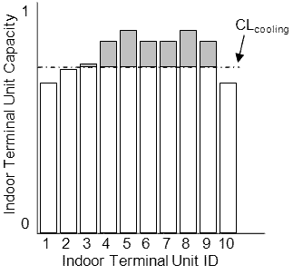

Figure 248. Example of Cooling Capacity Limit

When the heat pump’s part-load ratio is less than 1 (i.e., the total capacity of all terminal unit’s is less than the actual operating capacity of the heat pump condenser), the heat pump’s part-load ratio is compared to the minimum heat pump part-load ratio. If the heat pump’s part-load ratio is less than the minimum heat pump part-load ratio, the heat pump will cycle on and off to meet the cooling load. A correction factor is used to account for startup losses of the compression system.

***Cooling Part-Load Fraction Correlation (function of cycling ratio)***

The cooling part-load fraction correlation (function of heat pump cycling ratio) is a linear, quadratic or cubic curve with the independent variable being cycling ratio (part-load ratio / minimum part-load ratio). The output of this curve is used in combination with the rated EIR and EIR modifier curves to give the “effective” EIR for a given simulation time step.

$$CyclingRatioFrac = a + b\left( {CyclingRatio} \right) + c{\left( {CyclingRatio} \right)^2} + d{\left( {CyclingRatio} \right)^3}$$

where

$$CyclingRatio = {\raise0.7ex\hbox{${PLR}$} \!\mathord{\left/ {\vphantom {{PLR} {PL{R_{min}}}}}\right.}\!\lower0.7ex\hbox{${PL{R_{min}}}$}}$$

a-c (d) = coefficients for the quadratic (cubic) cycling ratio correlation curve equation

The cycling ratio can be viewed using the report variable “VRF Heat Pump Cycling Ratio” (ref: Output:Variable).

The cooling part-load ratio correlation should be normalized to a value of 1.0 when the cycling ratio equals 1.0 (i.e., no efficiency losses when the heat pump runs continuously [PLR ≥ PLRmin] for the simulation time step). For cycling ratio values between 0 and 1 (0 &lt;= CyclingRatio &lt; 1), the following rules apply:

      CyclingRatioFrac &gt;= 0.7   and   CyclingRatioFrac &gt;= CyclingRatio

If CyclingRatioFrac &lt; 0.7 a warning message is issued, the program resets the CyclingRatioFrac value to 0.7, and the simulation proceeds. The runtime fraction of the heat pump is defined as CyclingRatio/CyclingRatioFrac. If CyclingRatioFrac &lt; CyclingRatio, the runtime fraction will exceed 1. In this case a warning message is issued and the runtime fraction of the heat pump is limited to 1.0.

$$Heat\,Pump\,Runtime\,Fraction\,(HPRTF) = {\raise0.7ex\hbox{${CyclingRatio}$} \!\mathord{\left/ {\vphantom {{CyclingRatio} {CyclingRatioFrac}}}\right.}\!\lower0.7ex\hbox{${CyclingRatioFrac}$}}$$

The heat pump runtime fraction can be viewed using the report variable “VRF Heat Pump Runtime Fraction” (ref: Output:Variable).

Since manufacturers data do not typically provide information defining the cycling losses of VRF AC systems, a typical part-load fraction correlation for a conventional DX refrigeration system (e.g., residential or small commercial unit) may be substituted here as:

      CyclingRatioFrac = 0.85 + 0.15(CyclingRatio)

The electrical power consumed by the heat pump condenser is then calculated based on the heat pump’s rated electric power consumption (including condenser fan power), the actual operating conditions, and the cycling ratio of the refrigeration system. Performance correction factors are used here to correct for off-design performance as follows:

#### Cooling Energy Input Ratio Modifier Function of Low Temperature

As described previously (Ref. Application of Dual Performance Curves), the cooling energy input ratio modifier curve can either be applied as a single curve object as shown below, or applied using dual performance curve objects. The equation form used for a single or dual performance curve application is shown here.

$$EIRF{T_{\,cooling}} = a + b\left( {{T_{wb,avg}}} \right) + c{\left( {{T_{wb,avg}}} \right)^2} + d\left( {{T_c}} \right) + e{\left( {{T_c}} \right)^2} + f\left( {{T_{wb,avg}}} \right)\left( {{T_c}} \right)$$

where

\(EIRF{T_{\,cooling}}\) = cooling energy input ratio modifier (function of temperature)

#### Cooling Energy Input Ratio Modifier Function of Part-Load Ratio

The cooling energy input ratio calculation is based on 2 EIR curves. One is used when the heat pump part-load ratio is less than or equal to 1, and a second curve is used to describe the variation of cooling energy input ratio when the part-load ratio is greater than 1. The part-load ratio curve when PLR&gt;1 is not a required input and when not used, the energy use is assumed to be constant when PLR &gt; 1.

$$\begin{array}{l}IF\left( {PLR \le 1} \right)THEN\\\,\,\,\,EIRFPL{R_{cooling}} = a + b\left( {PLR} \right) + c{\left( {PLR} \right)^2} + d{\left( {PLR} \right)^3}\\ELSE\\\,\,\,\,EIRFPL{R_{cooling}} = e + f\left( {PLR} \right) + g{\left( {PLR} \right)^2} + h{\left( {PLR} \right)^3}\end{array}$$

where

\(EIRFPL{R_{cooling}}\) = cooling energy input ratio correction factor (function of part-load ratio)

a-d = coefficient for cooling energy input ratio correlation when part-load ratio ≤ 1

e-h = coefficient for cooling energy input ratio correlation when part-load ratio &gt; 1

The total power consumed by the heat pump condenser in cooling mode is based on the user specified coefficient of performance (COP) and calculated as:

$$CoolingPower = \left( {\frac{{{{\mathop Q\limits^ \bullet  }_{cooling,total,rated}}CAPF{T_{cooling}}}}{{CO{P_{cooling,\,\,reference}}}}} \right)\left( {EIRF{T_{cooling}}} \right)\left( {EIRFPL{R_{cooling}}} \right)\left( {HPRTF} \right)$$

The cooling COP is then calculated as the ratio of the outdoor unit cooling capacity divided by the total electric consumption rate of all components associated with the outdoor unit. Although included in the equiation, defrost power is typically 0 during cooling mode operation.

$$CO{P_{cooling}} = {\raise0.7ex\hbox{${{{\mathop Q\limits^ \bullet  }_{cooling,total}}}$} \!\mathord{\left/ {\vphantom {{{{\mathop Q\limits^ \bullet  }_{cooling,total}}} {\left( {CoolingPower + {P_{CrankaseHeater}} + {P_{EvapCoolerPower}} + {P_{defrost}}} \right)}}}\right.}\!\lower0.7ex\hbox{${\left( {CoolingPower + {P_{CrankaseHeater}} + {P_{EvapCoolerPower}} + {P_{defrost}}} \right)}$}}$$

COPcooling        = operating coefficient of performance, report variable “VRF Heat Pump Cooling COP”

CoolingPower = operating electric consumption rate, [W], report variable “VRF Heat Pump Cooling Electric Power”

PCrankcaseHeater = report variable for electric consumption rate of crankcase heater (W)

PEvapCoolerPump = report variable for electric consumption rate of evaporatively-cooled condenser water pump (W)

\({P_{defrost}}\)         = report variable for average defrost power for the simulation time step (W)

When operating in heat recovery mode, equations similar to those used for available cooling capacity are used to model heating electric consumption rate.

*HREIRMod* *HP,cooling* = \(a + b\left( {{T_{ent}}} \right) + c{\left( {{T_{ent}}} \right)^2} + d\left( {{T_{cond}}} \right) + e{\left( {{T_{cond}}} \right)^2} + f\left( {{T_{ent}}} \right)\left( {{T_{cond}}} \right)\)

This equation can be used to provide a constant fractional difference for cooling electric consumption rate in heat recovery mode (i.e., only *a* is non-zero) or a fractional term that varies with indoor and outdoor conditions. With very limited performance data available at this time, it is recommended that only the constant (a) term be used at this time. When the VRF system is not operating in heat recovery mode, this fraction is set to 1. The cooling electric consumption rate in heat recovery mode is then:

$$CoolingPowe{r_{HR}} = CoolingPower\left( {HREIRMo{d_{HP,\,cooling}}} \right)$$

\(Powe{r_{HR}} = {k_{EIR,\,cool}}\left( {CoolingPowe{r_{HR}}} \right) + \left( {1 - {k_{EIR,\,cool}}} \right)\left( {CoolingPowe{r_{HR}}} \right)\left( {1 - {e^{\left( {{\raise0.7ex\hbox{${ - t}$} \!\mathord{\left/ {\vphantom {{ - t} {{\tau_{c,\,EIR,\,cool}}}}}\right.}\!\lower0.7ex\hbox{${{\tau_{c,\,EIR,\,cool}}}$}}} \right)}}} \right)\)where:

*kEIR,\\ copl* = fraction of steady-state cooling electric consumption rate at beginning of heat recovery mode

*tc,EIR,\\ cool* = time constant to reach steady-state operation, 5 time constants equals 99% of steady-state capacity (hr)

*CoolingPowerHR* = cooling electric consumption rate in heat recovery mode (W)

*\(\left( {1 - {e^{\left( {{\raise0.7ex\hbox{${ - t}$} \!\mathord{\left/ {\vphantom {{ - t} {{\tau_{c,\,EIR,\,cool}}}}}\right.}\!\lower0.7ex\hbox{${{\tau_{c,\,cool}}}$}}} \right)}}} \right)\)*= The multiplier used during the transition period from cooling mode to heat recovery mode. This multiplier can be viewed using the report variable “VRF Heat Pump Heat Recovery Status Change Multiplier” (ref: Output:Variable).

#### Heating Operation

Calculations of the heat pump’s heating performance is nearly identical to the calculations described above for cooling operation.

The sum of the individual zone total heating requirements are used to calculate the performance of the outdoor condensing unit. The operating capacity of the indoor heating coils are calculated based on the indoor heating coil’s nominal heating capacity and the actual operating conditions. A capacity correction factor is used to correct for off-design performance as follows:

***Heating Combination Ratio Correction Factor (function of capacity ratio)***

The heating combination ratio correction factor is defined as the total terminal unit rated heating capacity divided by the heat pump’s rated heating capacity. In some instances, the cooling combination ratio may be used to define the correction factor used to modify the heat pump’s rated heating capacity and is manufacturer specific. The combination ratio is important when multiple terminal units (or DX coils) are attached to a single variable-speed condensing unit. If the combination ratio is less than 1, the condenser has sufficient capacity to meet the indoor terminal unit’s capacity request. However, if the combination ratio is determined to be greater than 1, the maximum heating capacity available from the heat pump’s condenser may be higher than the user specified rated heating capacity. The combination ratio capacity correction factor is based on a linear, quadratic or cubic curve and provides a multiplier &gt; 1 to correct for combination ratio’s greater than 1. For example, a combination ratio of 1.3 (130%) may result in a combination ratio capacity correction factor of 1.06 (outdoor condenser can actually provide 106% of rated capacity) . The heating combination ratio correction factor is applied to heating performance calculations. If the heating combination ratio correction curve name is not specified by the user, the heating combination ratio correction factor (CR heating,\\ correction) in the following equation is assumed to be equal to 1.

$$C{R_{heating}} = {\raise0.7ex\hbox{${\sum\limits_1^n {{{\mathop Q\limits^ \bullet  }_{coil(i),heating,rated}}} }$} \!\mathord{\left/ {\vphantom {{\sum\limits_1^n {{{\mathop Q\limits^ \bullet  }_{coil(i),heating,rated}}} } {{{\mathop Q\limits^ \bullet  }_{heating,total,rated}}}}}\right.}\!\lower0.7ex\hbox{${{{\mathop Q\limits^ \bullet  }_{heating,total,rated}}}$}}$$

$$C{R_{heating,correction}} = a + b\left( {C{R_{heating}}} \right) + c{\left( {C{R_{heating}}} \right)^2} + d{\left( {C{R_{heating}}} \right)^3}$$

$$C{R_{\,heating\,,\,\,correction}} = MAX\left( {1.0\,\,,\,\,C{R_{\,heating\,,\,\,correction}}} \right)$$

where

\({\mathop Q\limits^ \bullet_{coil(i)\,,\,heating\,,\,rated}}\) = rated total heating capacity in zone *i* (W)

\({\mathop Q\limits^ \bullet_{heating,\,total\,,\,rated}}\) = rated total heating capacity of heat pump (W)

\(C{R_{\,heating\,,\,\,correction}}\) = Heating Combination Ratio capacity correction factor at rated conditions

\(a - d\)        = cubic equation coefficients for heating combination ratio correction factor

\(C{R_{heating}}\) = combination ratio in heating mode (total rated indoor terminal unit capacity divided by the rated condenser heating capacity) (reported to eio file)

#### Heating Capacity Ratio Modifier (function of temperature)

As described previously (Ref. Application of Dual Performance Curves), the heating capacity ratio modifier curve can either be applied as a single curve object as shown below, or applied using dual performance curve objects. The single curve object application is described here.

The heat pump’s heating capacity ratio modifier (function of temperature) is determined by averaging the zone heating coil inlet air dry-bulb temperature for all operating heating coils. A zone load-weighted average is used when calculating the performance of the heat pump condenser. This weighted-average heating coil inlet air dry-bulb temperature and the outdoor condenser entering air wet-bulb temperature are then used to calculate the heat pump’s temperature correction factor in heating mode.

Note that some manufacturers do not provide performance data as a function of outdoor wet-bulb temperature. In this case, substituting outdoor dry-bulb temperature is permitted and the Heating Performance Curve Outdoor Temperature Type input should be specified as DryBulbTemperature. This also means that performance curve coefficients for both capacity (CAPFT) and energy (EIRFT) should be calculated using indoor and outdoor dry-bulb temperature.

$${T_{db,avg}} = \sum\limits_1^i {\left( {{T_{db,i}}} \right)} \left( {{\raise0.7ex\hbox{${{{\mathop Q\limits^ \bullet  }_{zone(i)}}}$} \!\mathord{\left/ {\vphantom {{{{\mathop Q\limits^ \bullet  }_{zone(i)}}} {{{\mathop Q\limits^ \bullet  }_{zone,\,total}}}}}\right.}\!\lower0.7ex\hbox{${{{\mathop Q\limits^ \bullet  }_{zone,\,total}}}$}}} \right)$$

$$CAPF{T_{HP,heating}} = a + b\left( {{T_{db,avg}}} \right) + c{\left( {{T_{db,avg}}} \right)^2} + d\left( {{T_c}} \right) + e{\left( {{T_c}} \right)^2} + f\left( {{T_{db,avg}}} \right)\left( {{T_c}} \right)$$

$$CAPF{T_{coil,heating}} = a + b\left( {{T_{db,i}}} \right) + c{\left( {{T_{db,i}}} \right)^2} + d\left( {{T_c}} \right) + e{\left( {{T_c}} \right)^2} + f\left( {{T_{db,i}}} \right)\left( {{T_c}} \right)$$

where

\({T_{db,i}}\)= dry-bulb temperature of the air entering the heating coil in zone *i*, °C

\({T_{db,avg}}\)= weighted-average dry-bulb temperature of the air entering all operating heating coils, °C

\(CAPF{T_{\,heating}}\) = Heating Capacity Correction Factor (function of temperature)

\(a - f\)  = bi-quadratic equation coefficients

\({T_c}\)    = wet-bulb temperature of the air entering an air-cooled condenser, °C

The total terminal unit heating capacity required is the simple sum of the terminal unit capacity. If the heat pump is off or there is no zone heating requirement, the terminal unit total heating requirement will be zero. The heating coils capacity includes the impacts of fan heat and any outdoor air provided to the zone.

$${\mathop Q\limits^ \bullet_{heating,TerminalUnits}} = \sum\limits_1^i {\left( {{{\mathop Q\limits^ \bullet  }_{coil(i),\,heating,total}}} \right)\left( {PLR(i)} \right)} $$

where

\({\mathop Q\limits^ \bullet_{heating\,,\,TerminalUnits\,}}\)= heat pump’s outdoor condenser total zone heating requirement (W)

\({\mathop Q\limits^ \bullet_{coil(i),\,heating,\,total}}\)= zone terminal unit total heating capacity [W], report variable “Zone VRF Air Terminal Total Heating Rate”

The piping correction factor is then used to adjust the zone heating requirement to account for piping losses in the AC refrigeration system.

#### Piping Correction Factor in heating mode

The piping correction factor in heating mode is calculated based on the length of the farthest terminal unit and the difference in height from the highest to lowest terminal unit. The piping losses are fixed throughout the simulation (i.e., these losses are not based on which terminal units are requesting refrigerant). Coefficients a-f in the following equations are inputs in the piping correction factor for length in heating mode curve object. The curve may use either one or two independent variables. Coefficient g is a direct input to the VRF model as piping correction factor for height in heating mode coefficient. The equivalent piping length in heating mode (PEQ,heating) is also a direct input in the VRF model. The vertical height (PH), the difference between the highest and lowest terminal unit (e.g., 12 m higher than condenser – 3 m lower than condenser = 9 m height), is a common input for both cooling and heating.

$${P_{correction,\,heating}} = a + b\left( {{P_{EQ,\,heating}}} \right) + c{\left( {{P_{EQ,\,heating}}} \right)^2} + d{\left( {{P_{EQ,\,heating}}} \right)^3} + g\left( {{P_H}} \right)$$

- or -

$$\begin{array}{l}{P_{correction,\,heating}} = a + b\left( {{P_{EQ,\,heating}}} \right) + c{\left( {{P_{EQ,\,heating}}} \right)^2} + d\left( {C{R_{heating}}} \right) + e{\left( {C{R_{heating}}} \right)^2}\\\,\,\,\,\,\,\,\,\,\,\,\,\,\,\,\,\,\,\,\,\,\,\,\,\,\,\,\,\,\,\,\,\,\, + f\left( {{P_{EQ,\,heating}}} \right)\left( {C{R_{heating}}} \right) + g\left( {{P_H}} \right)\end{array}$$

where

\({P_{correction,\,heating}}\) = Piping Correction Factor in Heating Mode

*a-f* = equation coefficients for piping correction factor in heating mode

*g  * = user specified piping correction factor for height in heating mode coefficient

\({P_{EQ,\,heating}}\)= the equivalent piping length for heating specified by the user [m]

\({P_H}\)          = user specified vertical height used for piping correction factor [m]

The heat pump’s total available heating capacity is then determined using the previously described modifiers.

$${\dot Q_{HP,cooling,total}} = {\dot Q_{cooling,total,rated}}\left( {CAPF{T_{HP,cooling}}} \right)\left( {C{R_{cooling,correction}}} \right)$$

#### Heat Recovery Heating Capacity Modifier

When operating in heat recovery mode, the heat pump’s available heating capacity is typically different than the available capacity when operating in heating only mode. This modifier is used to adjust the available heating capacity using a fraction when heat recovery is active. This fraction is based on a bi-quadratic equation with indoor and outdoor temperatures used as the independent terms.

*HRCapMod* *HP,heating* = \(a + b\left( {{T_{ent}}} \right) + c{\left( {{T_{ent}}} \right)^2} + d\left( {{T_{cond}}} \right) + e{\left( {{T_{cond}}} \right)^2} + f\left( {{T_{ent}}} \right)\left( {{T_{cond}}} \right)\)

This equation can be used to provide a constant fractional difference for available heating capacity in heat recovery mode (i.e., only *a* is non-zero) or a fractional term that varies with indoor and outdoor conditions. With very limited performance data available at this time, it is recommended that only the constant (a) term be used at this time. The available heating capacity in heat recovery mode is then:

$${\mathop Q\limits^ \bullet_{HR,heating,\,total}} = {\mathop Q\limits^ \bullet_{HP,\,heating,\,\,total}}\left( {HRCapMo{d_{HP,\,heating}}} \right)$$

#### Transition from Heating Only mode to Heat Recovery mode

When the VRF system transitions from heating only operation to heat recovery operation, this transition takes some finite amount of time. During the transition period the available heating capacity can change significantly, As described for the transition from cooling only operating to heat recovery mode, the initial heat recovery heating capacity fraction and heat recovery heating capacity time constant are used to model the transition from heating only mode to heat recovery mode. The initial heat recovery heating capacity fraction identifies the fraction of available heat recovery mode heating capacity at the start of the transition period, the heat recovery heating capacity time constant identifies the time needed to recover to 99% of the steady-state value. This exponential model used for modeling the transition period can be turned off by setting the initial heat recovery heating capacity fraction to 1.0.

#### Heat Recovery Heating Capacity Fraction and Time Constant

When the heat pump changes operating modes (i.e., from heating only to heat recovery mode), the transition does not happen immediately. There is a time delay, and a period of time where the available heating capacity is different from the steady-state capacity available after the system has had time to adjust. When this type of transition is modeled, an exponential decay curve is used. At the start of the transition period, only a fraction (*kheat*) of the steady-state capacity in heat recovery mode is available. The remaining capacity is recovered over a period of 5 time constants (tc,\\ heat) and is modeled with the following equation. This equation was used to replicate both the cooling capacity and condenser power curves in the previous figure.

$${\mathop Q\limits^ \bullet_{HR,\,avail,\,heating}} = {k_{heat}}\left( {{{\mathop Q\limits^ \bullet  }_{HR,\,heating,\,\,total}}} \right) + \left( {1 - {k_{heat}}} \right)\left( {{{\mathop Q\limits^ \bullet  }_{HR,\,heating,\,\,total}}} \right)\left( {1 - {e^{\left( {{\raise0.7ex\hbox{${ - t}$} \!\mathord{\left/ {\vphantom {{ - t} {{\tau_{c,\,heat}}}}}\right.}\!\lower0.7ex\hbox{${{\tau_{c,\,heat}}}$}}} \right)}}} \right)$$

where:

*kheat*= fraction of steady-state heating capacity at beginning of heat recovery mode

*tc,\\ heat* = time constant to reach steady-state operation, 5 time constants equals 99% of steady-state capacity (hr)

*QHR,avail,heating* = available heating capacity in heat recovery mode (W)

*\(\left( {1 - {e^{\left( {{\raise0.7ex\hbox{${ - t}$} \!\mathord{\left/ {\vphantom {{ - t} {{t_{c,heat}}}}}\right.}\!\lower0.7ex\hbox{${{t_{c,heat}}}$}}} \right)}}} \right)\)*= The multiplier used during the transition period from heating mode to heat recovery mode. This multiplier can be viewed using the report variable “VRF Heat Pump Heat Recovery Status Change Multiplier” (ref: Output:Variable).

#### Defrost Energy Input Ratio Modifier (function of temperature)

The defrost energy input ratio (EIR) modifier curve (function of temperature) is a bi-quadratic curve with two independent variables: heating coil average entering air wet-bulb temperature and outdoor air dry-bulb temperature. The output of this curve is multiplied by the heating coil capacity, the fractional defrost time period and the runtime fraction of the heating coil to give the defrost power at the specific temperatures at which the coil is operating. The use of outdoor wet-bulb temperature is explicit in this curve object and the defrost equation below and is independent of the selection for Heating Performance Curve Outdoor Temperature Type.

$$DefrostEIRTempModFac = a + b\left( {{T_{wb,avg}}} \right) + c{\left( {{T_{wb,avg}}} \right)^2} + d\left( {{T_c}} \right) + e{\left( {{T_c}} \right)^2} + f\left( {{T_{wb,avg}}} \right)\left( {{T_c}} \right)$$

The heat pump condenser’s total heating load is then calculated as the quotient of the total terminal unit capacity and the piping correction factor. Additional load due to defrost is also included (see following section).

$${\mathop Q\limits^ \bullet_{heating,\,total}} = \left( {{\raise0.7ex\hbox{${{{\mathop Q\limits^ \bullet  }_{heating,\,TerminalUnits}}}$} \!\mathord{\left/ {\vphantom {{{{\mathop Q\limits^ \bullet  }_{heating,\,TerminalUnits}}} {{P_{correction,\,heating}}}}}\right.}\!\lower0.7ex\hbox{${{P_{correction,\,heating}}}$}}} \right) + {\mathop Q\limits^ \bullet_{defrost}}$$

The heat pump’s total (gross) heating capacity is then calculated based on the capacity correction factor as a function of temperatures. The impact of defrost on total heat pump heating capacity is also accounted for (see following section). The part-load ratio of the heat pump condenser can then be calculated.

$${\mathop Q\limits^ \bullet_{HP\,,\,total}} = {\mathop Q\limits^ \bullet_{total,\,\,rated}}\left( {CAPF{T_{\,HP,\,heating}}} \right)\left( {C{R_{heating,\,\,correction}}} \right)\left( {HCA{P_{defrost}}} \right)$$

$$PLR = {\raise0.7ex\hbox{${{{\mathop Q\limits^ \bullet  }_{heating,\,total\,}}}$} \!\mathord{\left/ {\vphantom {{{{\mathop Q\limits^ \bullet  }_{heating,\,total\,}}} {{{\mathop Q\limits^ \bullet  }_{HP\,,\,total}}}}}\right.}\!\lower0.7ex\hbox{${{{\mathop Q\limits^ \bullet  }_{HP\,,\,total}}}$}}$$

where

\({\mathop Q\limits^ \bullet_{HP\,,\,total}}\) = heat pump total available heating capacity (W)

\(PLR\)     = heat pump part-load ratio

\(HCA{P_{defrost}}\)= heating capacity correction factor for defrost mode

As described for cooling operation, the available heating capacity of the heat pump is compared to the requested heating capacity of all indoor terminal units. If the requested heating capacity of all indoor terminal units is greater than the available heating capacity of the heat pump, one or more of the indoor terminal unit’s capacity is limited such that the sum of the zone terminal unit heating demand plus piping losses is equal to the available heat pump heating capacity (including the impact due to defrost).

The electrical power consumed by the heat pump condenser is calculated based on the heat pump’s nominal electric power consumption in heating mode and the actual operating conditions. A performance correction factor is used to correct for off-design performance as follows:

Heating Part-Load Fraction Correlation (function of heat pump cycling ratio)

The part-load fraction correlation (function of heat pump cycling ratio) is a linear, quadratic or a cubic curve with the independent variable being cycling ratio (part-load ratio / minimum part-load ratio). The output of this curve is used in combination with the rated EIR and EIR modifier curves to give the “effective” EIR for a given simulation time step. The cycling ratio correlation accounts for startup losses of the heat pump’s compression system.

$$CyclingRatioFrac = a + b\left( {CyclingRatio} \right) + c{\left( {CyclingRatio} \right)^2}$$

or

$$CyclingRatioFrac = a + b\left( {CyclingRatio} \right) + c{\left( {CyclingRatio} \right)^2} + d{\left( {CyclingRatio} \right)^3}$$

where

$$CyclingRatio = {\raise0.7ex\hbox{${PLR}$} \!\mathord{\left/ {\vphantom {{PLR} {PL{R_{\min }}}}}\right.}\!\lower0.7ex\hbox{${PL{R_{\min }}}$}}$$

The cycling ratio can be viewed using the report variable “VRF Heat Pump Cycling Ratio” (ref: Output:Variable).

The cycling ratio correlation should be normalized to a value of 1.0 when the cycling ratio equals 1.0 (i.e., no efficiency losses when the compressor(s) run continuously for the simulation time step). For cycling ratio values between 0 and 1 (0 &lt;= CyclingRatio &lt; 1), the following rules apply:

      CyclingRatioFrac &gt;= 0.7   and   CyclingRatioFrac &gt;= CyclingRatio

If CyclingRatioFrac &lt; 0.7 a warning message is issued, the program resets the CyclingRatioFrac value to 0.7, and the simulation proceeds. The runtime fraction of the heat pump is defined as CyclingRatio/CyclingRatioFrac. If CyclingRatioFrac &lt; CyclingRatio, then a warning message is issued and the runtime fraction of the heat pump is limited to 1.0.

$$Heat\,Pump\,Runtime\,Fraction\left( {HPRTF} \right) = {\raise0.7ex\hbox{${CyclingRatio}$} \!\mathord{\left/ {\vphantom {{CyclingRatio} {CyclingRatioFrac}}}\right.}\!\lower0.7ex\hbox{${CyclingRatioFrac}$}}$$

The heat pump runtime fraction can be viewed using the report variable “VRF Heat Pump Runtime Fraction” (ref: Output:Variable).

Since manufacturers data do not typically provide information defining the cycling losses of VRF AC systems, a typical part-load fraction correlation for a conventional DX refrigeration system (e.g., residential or small commercial unit) may be substituted here as:

      CyclingRatioFrac = 0.85 + 0.15(CyclingRatio)

Heating Energy Input Ratio Modifier (function of temperature)

As described previously (Ref. Application of Dual Performance Curves), the heating energy input ratio modifier curve can either be applied as a single curve object as shown below, or applied using dual performance curve objects. The single curve object application is discussed here.

$$EIRF{T_{\,heating}} = a + b\left( {{T_{db,avg}}} \right) + c{\left( {{T_{db,avg}}} \right)^2} + d\left( {{T_c}} \right) + e{\left( {{T_c}} \right)^2} + f\left( {{T_{db,avg}}} \right)\left( {{T_c}} \right)$$

where

\(EIRF{T_{\,heating}}\) = heating energy input ratio correction factor (function of temperature) (0-1)

Heating Energy Input Ratio Modifier (function of part-load ratio)

$$\begin{array}{l}IF\left( {PLR \le 1} \right)THEN\\\,\,\,\,EIRFPL{R_{heating}} = a + b\left( {PLR} \right) + c{\left( {PLR} \right)^2} + d{\left( {PLR} \right)^3}\\ELSE\\\,\,\,\,EIRFPL{R_{heating}} = e + f\left( {PLR} \right) + g{\left( {PLR} \right)^2} + h{\left( {PLR} \right)^3}\end{array}$$

where

\(EIRFPL{R_{heating}}\) = heating energy input ratio modifier (function of part-load ratio)

a-d = coefficient for heating energy input ratio modifier when part-load ratio ≤ 1

e-h = coefficient for heating energy input ratio modifier when part-load ratio &gt; 1

The total power consumed by the heat pump condenser in heating mode is then calculated. A correction for power consumed due to defrost is also included (see following section).

The total power consumed by the heat pump condenser in heating mode is based on the user specified coefficient of performance (COP). A correction for power consumed due to defrost is also included (see following section).

$$HeatingPower = \left( {\frac{{{{\mathop Q\limits^ \bullet  }_{heating,\,total,rated}}CAPF{T_{heating}}}}{{CO{P_{heating,reference}}}}} \right)\left( {EIRF{T_{heating}}} \right)\left( {EIRFPL{R_{heating}}} \right)\left( {HPRTF} \right)\left( {EI{R_{defrost}}} \right)$$

The operating COP is then calculated as:

The heating COP is then calculated as the ratio of the outdoor unit heating capacity divided by the total electric consumption rate of all components associated with the outdoor unit. Evaporatively-cooled condenser pump power is typically 0 during heating mode operation.\(CO{P_{heating}} = {\raise0.7ex\hbox{${{{\mathop Q\limits^ \bullet  }_{heating,total}}}$} \!\mathord{\left/ {\vphantom {{{{\mathop Q\limits^ \bullet  }_{heating,total}}} {\left( {HeatingPower + {P_{CrankaseHeater}} + {P_{EvapCoolerPower}} + {P_{defrost}}} \right)}}}\right.}\!\lower0.7ex\hbox{${\left( {HeatingPower + {P_{CrankaseHeater}} + {P_{EvapCoolerPower}} + {P_{defrost}}} \right)}$}}\)

COPheating        = operating coefficient of performance, report variable “VRF Heat Pump Heating COP”

HeatingPower = operating electric consumption rate, [W], report variable “VRF Heat Pump Heating Electric Power”

When operating in heat recovery mode, equations similar to those used for available heating capacity are used to model operating power.

*HREIRMod* *HP,heating* = \(a + b\left( {{T_{ent}}} \right) + c{\left( {{T_{ent}}} \right)^2} + d\left( {{T_{cond}}} \right) + e{\left( {{T_{cond}}} \right)^2} + f\left( {{T_{ent}}} \right)\left( {{T_{cond}}} \right)\)

This equation can be used to provide a constant fractional difference for heating electric consumption rate in heat recovery mode (i.e., only *a* is non-zero) or a fractional term that varies with indoor and outdoor conditions. With very limited performance data available at this time, it is recommended that only the constant (a) term be used at this time. When the VRF system is not operating in heat recovery mode, this fraction is set to 1.The available heating electric consumption rate in heat recovery mode is then calculated as:

$$HeatingPowe{r_{HR}} = HeatingPower\left( {HREIRMo{d_{HP,\,heating}}} \right)$$

$$Powe{r_{HR}} = {k_{EIR,\,heat}}\left( {HeatingPowe{r_{HR}}} \right) + \left( {1 - {k_{EIR,\,heat}}} \right)\left( {HeatingPowe{r_{HR}}} \right)\left( {1 - {e^{\left( {{\raise0.7ex\hbox{${ - t}$} \!\mathord{\left/ {\vphantom {{ - t} {{\tau_{c,\,EIR,\,heat}}}}}\right.}\!\lower0.7ex\hbox{${{\tau_{c,\,EIR,\,heat}}}$}}} \right)}}} \right)$$

where:

*kEIR,\\ heat* = fraction of steady-state heating electric consumption rate at beginning of heat recovery mode

*tc,EIR,\\ heat* = time constant to reach steady-state operation, 5 time constants equals 99% of steady-state capacity (hr)

*HeatingPowerHR* = heating electric consumption rate in heat recovery mode (W)

*\(\left( {1 - {e^{\left( {{\raise0.7ex\hbox{${ - t}$} \!\mathord{\left/ {\vphantom {{ - t} {{\tau_{c,\,EIR,\,heat}}}}}\right.}\!\lower0.7ex\hbox{${{\tau_{c,\,EIR,\,heat}}}$}}} \right)}}} \right)\)*= The multiplier used during the transition period from heating mode to heat recovery mode. This multiplier can be viewed using the report variable “VRF Heat Pump Heat Recovery Status Change Multiplier” (ref: Output:Variable).

#### Operating Coefficient of Performance

Similar to the cooling and heating COP report variables, a report variable is included to identify the overall COP of the system. The numerator represents the total cooling and heating coil capacities (or loads) where piping losses have been accounted for. If heat recovery is not used only one of these terms is non-zero. When heat recovery is used, one or both of these terms can be non-zero, therefore, the operating COP includes recovered energy. The denominator includes the electric consumption rates of all system components. For water-cooled VRF AC systems, the plant pump power is not included.

$$CO{P_{operating}} = \frac{{\left( {{{\mathop Q\limits^ \bullet  }_{cooling,TerminalUnits}} + {{\mathop Q\limits^ \bullet  }_{heating,TerminalUnits}}} \right)}}{{\left( {OutdoorUnitPower + {P_{CrankaseHeater}} + {P_{EvapCoolerPower}} + {P_{defrost}} + {P_{TU,fan}} + {P_{TU,parasitic}}} \right)}}$$

where:

OutdoorUnitPower = Cooling or heating electric consumption rate of outdoor unit (W)

PTU,fan = electric consumption rate of all terminal unit fans (W)

PTU,parasitic = electric consumption rate of all terminal unit parasitic electric (W)

#### Defrost Adjustment Factors

Frost formation on the outdoor coil, and the need to periodically defrost this coil, has a significant impact on heating capacity and energy use by the DX heating system. This model uses a timed reverse-cycle defrost model. If the outdoor air dry-bulb temperature is below the specified maximum temperature for defrost operation, then the model calculates adjustment factors for heating capacity and input power due to frost formation This method of accounting for the impacts of frosting/defrost was taken from the model used in DOE-2.1E (ESTSC 2001, Miller and Jaster 1985).

The model first estimates the outdoor coil temperature according to a linear empirical relationship with outdoor air dry-bulb temperature as the independent variable.

$${T_{coil,out}} = 0.82{T_{db,o}} - 8.589$$

The difference between the outdoor air humidity ratio (from the weather file) and the saturated air humidity ratio at the estimated outdoor coil temperature is then calculated, and this value is used as an indication of frost formation on the outdoor coil.

$$\Delta {\omega_{coil,out}} = MAX\left[ {1.0E - 6,{\omega_{outdoor}} - {\omega_{sat}}\left( {{T_{coil,out}},OutBaroPress} \right)} \right]$$

Frost formation on the outdoor coil must be periodically removed. The fraction of compressor runtime when the coil is being defrosted is entered by the user. Adjustment factors to total heating coil capacity and input power due to frost formation on the outdoor coil are calculated by an empirical model with \(\Delta {\omega_{coil,out}}\) as the independent variable as shown below.

$$HCA{P_{defrost}} = 0.909 - 107.33\left( {\Delta {w_{coil\,,\,out}}} \right)$$

$$EI{R_{defrost}} = 0.9 - 36.45\left( {\Delta {w_{coil\,,\,out}}} \right)$$

If the outdoor air dry-bulb temperature is above the specified maximum temperature for defrost operation, the fractional defrost time period is set to zero and the heating capacity/input power multipliers are set to unity (1).

#### Defrost Operation

If the fractional defrost time period is greater than zero for the simulation time step, then the model calculates the electrical power used during defrost. The additional heating load due to defrost (indoor cooling during defrost) is also calculated so that it may be added to the existing heating load when calculating input power for the compressor(s) and outdoor coil fan(s).

$${Q_{defrost}} = 0.01\left( {{t_{frac,defrost}}} \right)\left( {7.222 - {T_{db,o}}} \right)\left( {\frac{{{Q_{total,rated}}}}{{1.01667}}} \right)$$

$${P_{defrost}} = DefrostEIRTempModFac\left( {\frac{{{Q_{total,rated}}}}{{1.01667}}} \right)\left( {{t_{frac,defrost}}} \right)\left( {RTF} \right)$$

where:

\({Q_{defrost}}\)        = additional indoor heating load due to reverse-cycle defrost (*W*)

\({{Q_{total,rated}}}\)= total full-load heating capacity of the coil at rated conditions (W)

\({P_{defrost}}\)         = report variable for average defrost power for the simulation time step (W)

*DefrostEIRTempModFac* = energy input ratio modifier curve applicable during defrost

\({t_{frac\,,\,defrost}}\)= defrost time period fraction specified by user

$$RTF = \left( {{\raise0.7ex\hbox{${PLR}$} \!\mathord{\left/ {\vphantom {{PLR} {PartLoadFrac}}}\right.}\!\lower0.7ex\hbox{${PartLoadFrac}$}}} \right) = runtime\;fraction\;of\;the\;heating\;coil$$

### Variable Refrigerant Flow Heat Pump Model (Physics Based Model)

#### Overview

This section describes the Physics based VRF Model (VRF-FluidTCtrl) to simulate the energy performance of Variable Refrigerant Flow (VRF) systems in the heat pump (HP) operation mode (either cooling or heating is provided but not simultaneously). 

Compared with the VRF-SysCurve model, VRF-FluidTCtrl model is more physics-based and thus able to consider the dynamics of more operational parameters which is essential for the description of many enhanced control logics (e.g., the adjustment of superheating degrees during small load operations). Furthermore, this model implements component-level curves rather than the system-level curves, and thus requires much fewer curves as model inputs. The definition of VRF performance data for simulation as part of ASHRAE Standard 205 will ensure VRF manufacturers provide adequate data to create the required performance curves.

The main features of the VRF-FluidTCtrl model include:

 * Introduction of separate curves for capacities and power inputs of indoor and outdoor units instead of overall curves for the entire system.

 * Allowing of variable evaporating and condensing temperatures in the indoor and outdoor units under various operational conditions.

 * Allowing of variable fan speed based on the temperature and zone load in the indoor unit.

 * Allowing of further modifications of operational parameters (e.g., evaporating temperature, superheating degrees, and supply air flow rate) during low load conditions.

 * Development of a physics-based model to calculate thermal loss in the refrigerant piping network (varies with refrigerant flow rate, operational conditions, pipe length, and pipe and insulation materials) instead of a constant correction factor.

These features enhance the simulation accuracy of the VRF system performance in both heating and cooling modes, especially during low load operations. In addition, these features enable the modeling of a multi-stage control strategy to adjust the system capacity during low load conditions, as shown in Figure VRF-FluidTCtrl-1. Further more, the VRF-FluidTCtrl model enables the potential simulation of demand response of VRF systems by directly slowing down the speed of compressors in the outdoor units with invertor technology.

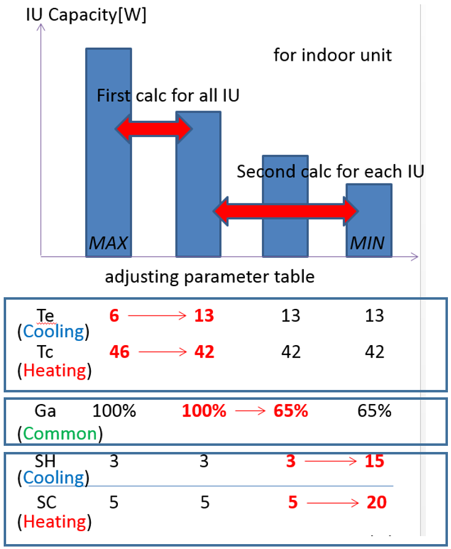

Figure VRF-FluidTCtrl-1a. Multi-stage control strategy to adjust the system capacity during low load conditions

Note that a number of calculation steps are coupled together in the VRF-FluidTCtrl model, for instance, the piping loss calculation and the system performance calculation. More specifically, the piping loss changes the operating conditions of the system, which may lead to a different control strategy and thus in reverse affect the amount of piping loss. This makes it difficult to obtain an analytical solution for a number of operational parameters (e.g., enthalpy of refrigerant entering the indoor unit), and therefore numerical iterations are employed to address this problem (refer to Figure VRF-FluidTCtrl-3 for more details). Therefore, the VRF-FluidTCtrl model can have a longer execution time to perform the simulation than the VRF-SysCurve model. 

The object connections for VRF-FluidTCtrl model is similar to those for VRF-SysCurve model. The difference lies in the object used to describe a specific components. For example, VRF-SysCurve model uses  *AirConditioner:VariableRefrigerantFlow* object to describe the VRF outdoor unit performance, while in VRF-FluidTCtrl model the *AirConditioner:VariableRefrigerantFlow* object is used.

Figure VRF-FluidTCtrl-1b. Energyplus object connections for VRF-FluidTCtrl model 

#### Model Description

Figures VRF-FluidTCtrl-2 and VRF-FluidTCtrl-3 illustrate the overall logic of the VRF-FluidTCtrl algorithms. Detailed calculation procedures and explanations of equations are described in the following sections.

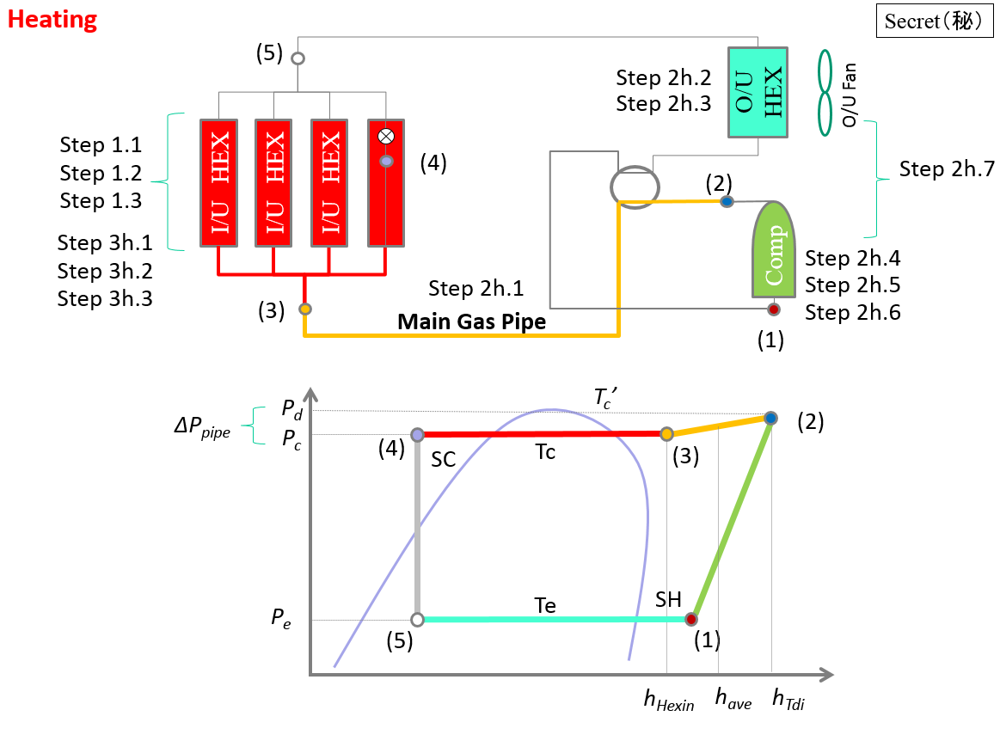

*(a)	Heating Mode*

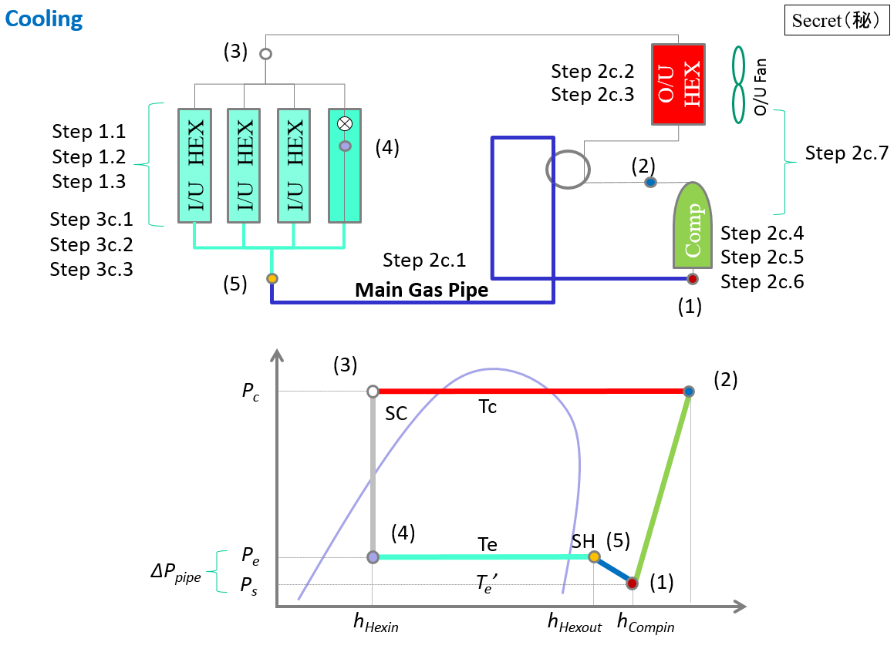

*(b)	Cooling Mode*

Figure VRF-FluidTCtrl-2. Schematic Pressure-Enthalpy Diagram for VRF Operation 

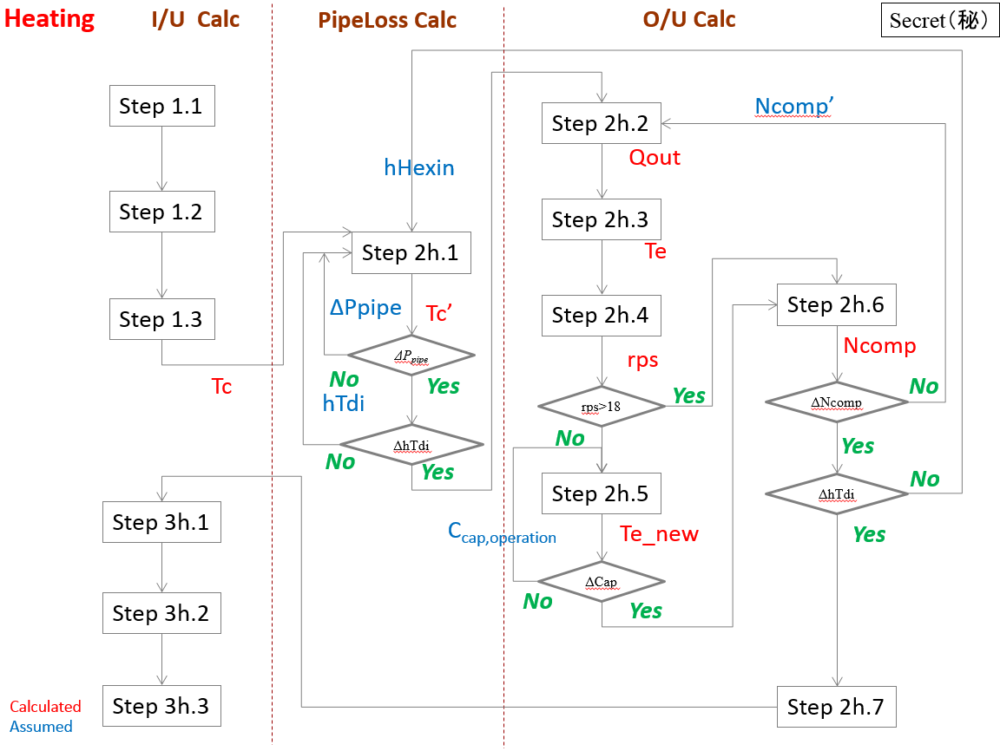

*(a)	Heating Mode*

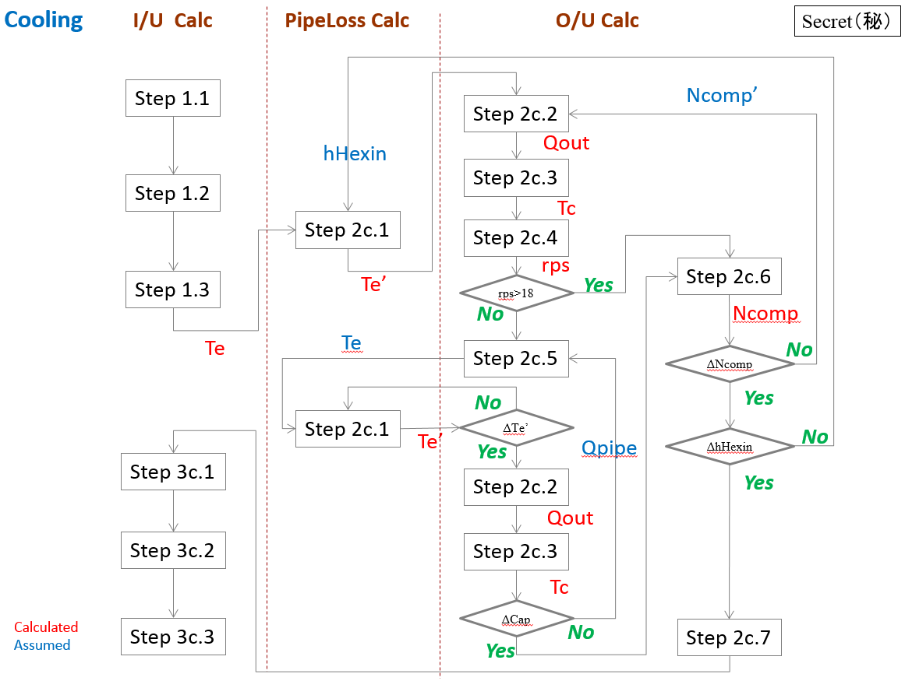

*(b)	Cooling Mode*

Figure VRF-FluidTCtrl-3. Flow Chart of the VRF-FluidTCtrl Model 

The VRF-FluidTCtrl algorithms are described in details below, including the models of both the indoor and outdoor unit(s) of the VRF system. Because of the different control algorithms used in the outdoor unit for cooling and heating modes, the heating and cooling modes are described separately.

#### *Modeling of the indoor unit (I/U) - Part I*

##### Step 1.1: Obtaining zonal load/condition information

Obtain the following information for each zone from the zone modules within EnergyPlus: 

* zone sensible loads $Q_{in, sensible}$

* zone total loads $Q_{in, total}$

* indoor air temperature $T_{in}$

* indoor air humidity ratio $W_{in}$

The operation mode of the VRF system can therefore be determined from $Q_{in, sensible}$.

##### Step 1.2: Calculate I/U required evaporator/condenser temperature

Evaluate the required coil surface air temperature $T_{fs}$ and the required evaporator/condenser refrigerant temperature $T_{e,req}/{T_{c,req}}$ for each indoor unit. 

Assuming the coil air flow rate is at the maximum ($G_{a,rate}$), the entering air temperature after the indoor coil fan can be calculated for each indoor unit:

$$T_{coil,in}=T_{in}+Q_{fan}/(G_{a,rate}\times{c_p}\times\rho_{in})$$

Where

$c_p$	air heat capacity (kJ/(kg$\cdot$K))

$G_{a,rate}$	volumetric flow rate of the air through the indoor unit, at the rated conditions (m3/s)

$Q_{fan}$	sensible heat released by fan (W)

$T_{coil,in}$	temperature of air entering the indoor coil (°C)

$\rho_{in}$  	density of indoor air, $f_{\rho}(T_{in},W_{in})$  (kg/m3)

The supply air temperature $T_{out}$ can be calculated by:

$$T_{out}=T_{coil,in}-Q_{in, sensible}/(G_{a,rate}\times{c_p}\times\rho_{in})$$

Where

$T_{out}$	temperature of the air leaving the indoor unit (supply air) (°C)

The coil surface air temperature $T_{fs}$ can be calculated, given the bypass factor $BF$:

$$T_{fs}= T_{coil,in}-(T_{coil,in}-T_{out})/(1-BF)$$

Where

$BF$	bypass factor (different values for cooling mode and heating mode) 

$T_{fs}$	indoor unit coil surface air temperature (°C)

In the cooling mode, the superheating degree $SH$ is given and thus the required evaporating temperature $Te_{req}$ for the associated indoor unit can be obtained:

$$Te_{req}=T_{fs}-[A_c\cdot SH^2+B_c\cdot SH+C_c]$$

 
Where

$A_c$, $B_c$, $C_c$   	coefficients (°C)

$SH$ 		superheating degrees for the indoor unit (°C) 

$SH_{ref}$ 		reference superheating degrees for the indoor unit (e.g., 3) (°C)

$Te_{req}$		required evaporating temperature for a specific indoor unit (°C)

In the heating mode, the subcooling degree $SC$ is given and thus the required condensing temperature $Tc_{req}$ for the associated indoor unit can be obtained:

$$Tc_{req}=T_{fs}+[A_h\cdot SC^2+B_h\cdot SC+C_h]$$

 
Where

$A_h$, $B_h$, $C_h$  	coefficients (°C)

$SC$ 		subcooling degrees for the indoor unit (°C) 

$SC_{ref}$ 		reference subcooling degrees for the indoor unit (e.g., 5) (°C)

$Tc_{req}$		required condensing temperature for a specific indoor unit (°C)

##### Step 1.3: Calculate effective evaporating /condensing temperature

There are two refrigerant temperature control strategies for the indoor unit: (1) *ConstantTemp*, (2) *VariableTemp*.

 - In the *ConstantTemp* strategy, $T_e$ and $T_c$ are kept at constant values provided by the user.

 - In the *VariableTemp* strategy, $T_e$ and $T_c$ are determined using the equations below:

In the cooling mode:

$$Te=min\{max[min(Te_{req,i}),Te_{min}],Te_{max}\}$$

 
Where

$Te_{req,i}$		required evaporating temperature for the ith indoor unit (°C)

$Te_{min}$		minimum evaporating temperature for the indoor unit (e.g. 3) (°C)

$Te_{max}$		maximum evaporating temperature for the indoor unit (e.g. 13) (°C)

In the heating mode:

$$Tc=min\{max[min(Tc_{req,i}),Tc_{min}],Tc_{max}\}$$

 
Where

$Tc_{req,i}$		required condensing temperature for the ith indoor unit (°C)

$Tc_{min}$		minimum condensing temperature for the indoor unit (e.g. 42) (°C)

$Tc_{max}$		maximum condensing temperature for the indoor unit (e.g. 46) (°C)

#### *Modeling of the outdoor unit (O/U) - Cooling Mode*

##### Step 2c.1: Piping loss calculation in the cooling mode

Piping loss occurs when the refrigerant flows through the main pipe connecting the indoor and outdoor units. It includes both the refrigerant pressure drop and heat loss. It affects the VRF system operation in several ways. First, the heat loss creates an extra load to the system and leads to higher energy consumptions. Second, the pressure drop and heat loss changes the operational conditions of the compressor (i.e., compressor suction pressure and compressor suction temperature) and thus affects its operational performance. Therefore, the piping loss calculation is critical for the analysis of the whole system.

Note that the change of compressor operational conditions may lead to different control strategies of the system, which in reverse affects the amount of piping loss. So the piping loss analysis and system performance analysis are coupled together. Numerical iterations are designed to address the coupling effect, as described below.

Calculate the refrigerant flow rate for each indoor unit using assumed $h_{Hexin}$:

$$G_i=Q_i/(h_{Hexout,i}-h_{Hexin})$$

Where

$G_i$   	refrigerant flow rate for the ith indoor unit (kg/s) 

$Q_i$   	total cooling load of the ith zone (W) 

$h_{Hexin}$	enthalpy of the refrigerant entering the indoor unit (kJ/kg)

$h_{Hexout,i}$	enthalpy of the refrigerant leaving a specific indoor unit (kJ/kg)

$h_{Hexout,i}$ is a function of $P_e$, $T_e$, and $SH_i$. It can be calculated using refrigerant thermodynamic property equations $f_{g\_h}(P_e,T_e+SH_i)$.

The enthalpy of the refrigerant in the main loop $h_{Hexout}$ can be obtained by calculating the weighted average of the enthalpy of the refrigerant in each indoor unit:

$$h_{Hexout}=\sum(h_{Hexout,i}\times{G_i}/{G_{tot}})$$

$$G_{tot}=\sum{G_i}$$

Where

$G_{tot}$   	refrigerant flow rate in the main loop (kg/s) 

$h_{Hexout}$	enthalpy of the main loop refrigerant leaving indoor units (kJ/kg)

The viscosity of the refrigerant within the pipe can be calculated via:

$$k_{v,1}=P_e/4926000$$

$$k_{v,2}=h_{Hexout}/383.55$$

$$k_{v,3}=(T_{Hexout}+273.15)/344.39$$

$$\mu=10^6\times(4.302\times{k_{v,1}}+0.81622\times{k_{v,1}}^2-120.98\times{k_{v,2}}+139.17\times{k_{v,2}}^2+118.76\times{k_{v,3}}+81.04\times{k_{v,3}}^2+5.7858\times{k_{v,1}}\times{k_{v,2}}-8.3817\times{k_{v,1}}\times{k_{v,3}}-218.48\times{k_{v,2}}\times{k_{v,3}}+21.58)$$

Where

$\mu$	viscosity of the refrigerant within the pipe (Pa-s)

$k_{v,i}$	coefficients to calculate the refrigerant viscosity 

$T_{Hexout}$	temperature of main loop refrigerant leaving indoor units, $f_{g\_t}(P_e,h_{Hexout})$ (°C)

$f_{g\_t}$ 	functions calculating the temperature of superheating refrigerant 

Given $h_{Hexout}$ and $P_e=f_{s\_p}(T_e)$, the following dimensionless quantities describing the refrigerant flow state can be obtained:

$$Re=G_{tot}/3600/(0.25\times\pi\times{D^2})\times{D}/\mu$$

$$Pr=\mu\times{f_{g\_Cp}(P_e,h_{Hexout})}\times{0.001}/f_{g\_\lambda}(P_e,h_{Hexout})$$

$$Nu=0.023\times{Re^{0.8}\times{Pr^{0.3}}}$$

$$St=Nu/Re/Pr$$

Where

$P_e$  	evaporating pressure (Pa) 

$Re$ 	Reynolds number 

$Pr$ 	Prandtl number 

$Nu$ 	Nusselt number 

$St$ 	Stanton number 

$\mu$	viscosity of the refrigerant within the pipe (Pa-s)

$f_{s\_p}$ 	functions calculating the pressure of saturated refrigerant 

$f_{g\_Cp}$ 	functions calculating the specific heat of superheating refrigerant 

$f_{g\_\lambda}$	functions calculating the conductivity of superheating refrigerant 

Then the piping pressure loss $\Delta{P_{pipe}}$ can be obtained using the above dimensionless quantities:

$$\Delta{P_{pipe}}=8\times{St}\times{Pr^{2/3}}\times{L/D}\times{f_{g\_\rho}(P_e,h_{Hexout})}\times{V^2}/2+H\times{f_{g\_\rho}(P_e,h_{Hexout})}\times9.80665$$

$$P_s=P_e-\Delta{P_{pipe}}$$

Where

$f_{g\_\rho}$	functions calculating the density of superheating refrigerant 

$D$   	main pipe diameter (m) 

$H$ 	height difference between the outdoor unit node and indoor unit node of the main pipe (m)

$L$   	main pipe length (m) 

$P_s$   	compressor suction pressure (Pa) 

$\Delta{P_{pipe}}$	pressure drop in the pipe (Pa)

$V$	refrigerant flow velocity (m/s)

The suction saturated temperature $T'_e$ (i.e., saturated vapor temperature corresponding to the compressor suction pressure) can be obtained via refrigerant thermodynamic property equations:

$$T'_e=f_{s\_t}(P_e-\Delta{P_{pipe}})$$

Where

$f_{s\_t}$	functions calculating the temperature of saturated refrigerant

$T'_e$   	suction saturated temperature at the compressor inlet (°C)

The heat loss through the pipe can be obtained via:

$$k_1=Nu\times{f_{g\_\lambda}(P_e,h_{Hexout})}$$

$$k_2=2\times{\lambda_i}/Ln(1+2\times{W_i}/D)$$

$$k_3=h\times(D+2\times{W_i})$$

$$Q_{pipe}=(\pi\times{L})\times(T_a-T_{Hexout})/(1/k_1+1/k_2+1/k_3)$$

Where

$f_{g\_\lambda}$	functions calculating the conductivity of superheating refrigerant 

$Q_{pipe}$ 	heat loss through the pipe (W)

$T_a$ 	average of outdoor air temperature and indoor temperature (°C)

$T_{Hexout}$	temperature of main pipe refrigerant leaving indoor units (°C) 

$w_i$	pipe insulation thickness (m) 

$k_i$	coefficients for the piping loss calculation  

Note that $Q_{pipe}$ is calculated using an assumed $h_{Hexin}$. Its value affects the compressor operation calculations as shown in Step 2c.2~2c.6 and may change the value of condensing temperature $T_c$. This leads to an updated $h_{Hexin}=f(P_c,T_c-SC)$. If the difference between the calculated $h_{Hexin}$ and the assumed $h_{Hexin}$ is higher than the assigned tolerance (5%), a new round of iteration is performed using the calculated $h_{Hexin}$.

##### Step 2c.2: Initialize O/U operation conditions

The compressor operation is coupled with a number operational parameters, which makes it difficult to obtain an analytical solution. In the algorithm, an iterative approach is designed to obtain the energy consumption of the compressor (Step 2c.2 – 2c.6).

For the first iteration, 

* Initialize outdoor unit $SC$ with the reference value (from IDF input, e.g., 5°C)

* Initialize the compressor power $N_{comp}$ with the value calculated from the reference $COP$ (e.g., 3.5):

$$N'_{comp}=\frac{\sum_iQ_{in,total,i}}{COP}$$

Where

$N_{comp}$	compressor power (W)

$N'_{comp}$	assumed compressor power for the first iteration (W)

$Q_{in,total,i}$	total cooling load for zone $i$ (W)

For the following iterations,

* Initialize $SC$ with the calculated value in the previous iteration  

* Initialize the compressor power $N_{comp}$ with the calculated value in the previous iteration

The heat rate released from the outdoor unit can be calculated by:

$$Q_{out}=\sum_iQ_{in,total,i}+N_{comp}+Q_{pipe}$$
 

Where

$Q_{out}$	heat rate released from the outdoor unit (W)

$Q_{pipe}$ 	heat loss through the pipe (W)

##### Step 2c.3: Calculate O/U effective condensing temperature

 (1) Calculate the required coil surface air temperature ${T_{fs}}'$ for the outdoor unit.

The temperature of the air leaving the outdoor unit ${T_{out}}'$ can be calculated by:
 

$${T_{out}}'={T_{in}}'+Q_{out}/({G_{a,rate}}'\times{c_p}\times{{\rho_{in}}'})$$

 
Where

${G_{a,rate}}'$	volumetric flow rate of the air through the outdoor unit, at the rating conditions (m3/s)

${T_{out}}'$	temperature of the air leaving the outdoor unit (°C)

${T_{in}}'$	temperature of the air entering the outdoor unit, i.e., outdoor air (°C)

${\rho_{in}}'$  	air density at outdoor conditions,$f_{\rho}({T_{in}}',{W_{in}}')$   (kg/m3)

The condenser surface temperature ${T_{fs}}'$ can be calculated by:
 

$${T_{fs}}'={T_{in}}'+({T_{out}}'-{T_{in}}')/(1-{BF_c}')$$

 
Where

${BF_c}'$ 	bypass factor for the outdoor unit  

(2) Calculate required condensing temperature for the outdoor unit $Tc_{req}$ and then the effective condensing temperature $Tc$ (between 42-46°C)
 

$$Tc_{req}={T_{fs}}'+[A_h\cdot SC^2+B_h\cdot SC+C_h]$$

$$Tc=Tc_{req}$$

Where	

$A_h$,$B_h$,$C_h$   	coefficients (°C)

$SC$ 		subcooling degrees for the outdoor unit (°C)

$SC_{ref}$ 		reference subcooling degrees for the outdoor unit (°C)

$Tc_{req}$		required condensing temperature for the outdoor unit (°C)

$Tc$		effective condensing temperature (°C)

##### Step 2c.4: Calculate required Loading Index 

Loading Index is used to describe the operational mode of the compressor system. The first index represents minimal capacity operation, while the last index represents full capacity operation. 

The required Loading Index can be calculated by the following procedures. 

a. Calculate the evaporative capacity at a variety of Loading Index:

$$M_{cap}=(r_1+r_2T_c+r_3{T_e}'+r_4T_c^2+r_5T_c{T_e}'+r_6{T_e}'^2)$$

$$Q_{rps}=C_{cap,system} \times M_{cap} \times Q_{ref} $$

Where	

$C_{cap,system}$	evaporative capacity correction factor, describing the possible system configuration difference between test bed and real system (a constant value obtained from manufacturer data)  

$r_1$,…,$r_6$  	empirical coefficients corresponding to $rps$  

$rps$	compressor speed (r/s) 

${T_e}'$   	suction saturated temperature at the compressor inlet (°C)

$T_c$	effective condensing temperature (°C)

$M_{cap}$	multiplier for the evaporative capacity calculation (--)

$Q_{rps}$	evaporative capacity corresponding to $rps$ (W) 

$Q_{ref}$	rated evaporative capacity (W) 

An example of resulting capacity for different $rps$ (at $T_c$=36°C and ${T_e}'$=9°C) is presented in Table 1.

Table 1– Evaporative capacity at different Loading Index 

| Loading Index ($rps$) | Evaporative Capacity (kW),$T_c$=36°C,${T_e}'$=9°C| Loading Index ($rps$) | Evaporative Capacity (kW),$T_c$=36°C,${T_e}'$=9°C|
|---------------------|-----------------------------|---------------------|-----------------------------|
|    1 (18)           |    3.951                    |    2 (25)           |    5.400                    |
|    3 (30)           |    6.435                    |    4 (36)           |    8.516                    |
|    5 (45)           |    10.756                   |    6 (60)           |    14.445                   |
|    7 (75)           |    18.412                   |    8 (90)           |    22.045                   |
|    9 (108)          |    26.162                   |                     |                             |

b. Find the $rps$ range that covers the required evaporative capacity $Q_{rps,modify}$.  

$$Q_{rps,modify}=C_{cap,operation}\times(\sum{Q_{in,total}}+Q_{pipe})$$

$$C_{cap,operation}=C_{cap,density}\times{C_{cap,enthalpy}}$$

$$C_{cap,density}=\rho_{test}/\rho_{real}$$

$$C_{cap,enthalpy}=\frac{h_{Evapout,test}-h_{Evapin,test}}{h_{Compin,real}-h_{Evapin,real}}$$

$$h_{Compin,real}=h_{Hexout,real}+Q_{pipe}/G_{tot}$$

Where	

$C_{cap,operation}$ evaporative capacity correction factor, describing the operational difference between test cases and real cases (i.e., $SH$ and $SC$)  

$C_{cap,density}$ evaporative capacity correction factor, describing the variations of refrigerant density at test conditions and real operational conditions  

$C_{cap,enthalpy}$ evaporative capacity correction factor, describing the variations of refrigerant enthalpy at test conditions and real operational conditions  

$G_{tot}$   	refrigerant flow rate in the main loop (kg/s) 

$h_{Evapin,real}$ enthalpy of refrigerant entering the evaporators (IU) at real conditions [kJ/kg]

$h_{Evapout,real}$ average enthalpy of refrigerant leaving the evaporators (IU) at real conditions [kJ/kg] 

$h_{Evapin,test}$ enthalpy of refrigerant entering the evaporator at test conditions (It corresponds to $SC$ at test condition(e.g., 5 °C)  and Tc) (kJ/kg)

$h_{Evapout,test}$ enthalpy of refrigerant leaving the evaporator at test conditions  (It corresponds to $SH$ at test condition(e.g., 8 °C)  and Te) (kJ/kg) 

$h_{Compin}$	enthalpy of refrigerant entering the compressor (kJ/kg)

$Q_{pipe}$ 	heat loss through the pipe (W)

For example, if the required capacity is 8 kW, the $rps$ range is 30 to 36.

c. Calculate the $rps$ that meets the required capacity by interpolation. In the above example, the resulting $rps$ is 34.5 $rps$.

d. If the calculated $rps$ is lower than the minimum $rps$ (e.g. 18$rps$), go to Step 2c.5, otherwise skip Step 2c.5 and directly go to Step 2c. 6.

##### Step 2c.5: Modify evaporating temperature to further reduce outdoor unit capacity

If the calculated $rps$ is lower than the minimum $rps$ (e.g. 18$rps$), it means that the zone cooling load is even lower than the system evaporative capacity corresponding to the minimum compressor speed. In this situation, the evaporating temperature $T_e$ as well as the superheating degree $SH$ is modified to further reduce the outdoor unit capacity. More specifically: 

a. Set $rps$ at its minimum value (e.g., 18 $rps$).

b. Update ${T_e}'$ to meet the required evaporative capacity, using equations described in Step 2c.4a.

c. Update $T_e$ to meet the updated ${T_e}'$. Note that due to the $T_e$ updates, the refrigerant state and flow rate are changed and thus the piping loss analysis should also be repeated (Step 2c.1). So is the calculation of $C_{cap,operation}$ (Step 2c.2-2c.3).

d. $SH$ can be updated based on the updated $T_e$, using the equations shown in Step 1.2. 

##### Step 2c.6: Calculate the compressor power

(1) Calculate the compressor power by the following procedures.

a. Calculate the compressor power at a variety of loading index using the following equation. The resulting table (Table 2) from the same example used above is shown below. 

$$M_{comp}=c_1+c_2T_c+c_3{T_e}'+c_4T_c^2+c_5T_c{T_e}'+c_6{T_e}'^2$$

$$N_{comp,rps}=M_{comp} \times N_{comp,ref}$$

Where	

$c_1$,…,$c_6$   	empirical coefficients corresponding to $rps$  

${T_e}'$ 		suction saturated temperature at the compressor inlet (°C)

$T_c$		effective condensing temperature (°C)

$M_{comp}$		multiplier for the compressor power calculation (--)

$N_{comp,ref}$	rated compressor power  (W)

$N_{comp,rps}$	compressor power corresponding to $rps$ (W)

Table 2 – Outdoor unit compressor power at different Loading Index 

| Loading Index ($rps$) | Elec. Power (kW), $T_c$=36°C, ${T_e}'$=9°C| Loading Index ($rps$) | Elec. Power (kW), $T_c$=36°C, ${T_e}'$=9°C|
|---------------------|----------------------------|---------------------|----------------------------|
|    1 (18)           |    0.527                   |    2 (25)           |    0.766                   |
|    3 (30)           |    0.936                   |    4 (36)           |    1.227                   |
|    5 (45)           |    1.546                   |    6 (60)           |    2.149                   |
|    7 (75)           |    2.760                   |    8 (90)           |    3.357                   |
|    9 (108)          |    4.359                   |                     |                            |

b. According to the $rps$ range determined, calculate the compressor power $N_{comp}$  by interpolation. In the above example, the compressor power is 1.155 kW. 

(2) Compare the calculated $N_{comp}$ above with the initialized ${N_{comp}}'$ in Step 2c.2:

* If  ${N_{comp}}'-N_{comp}>\delta$ then go to Step 2c.2 for a new round of iteration.

* Else, end the iteration and go to Step 2c.7.

##### Step 2c.7: Total power consumption of the outdoor unit

Calculate the total electric power consumption by the outdoor unit:

$$N_{out}=N_{fan}+N_{comp}/e_{inv}$$

Where	

$e_{inv}$	efficiency of the inverter of compressor  

$N_{fan}$	electric power consumption by the outdoor fan (W)

$N_{out}$	total electric power consumption by the outdoor unit (W)

#### *Modeling of the outdoor unit (O/U) - Heating Mode*

##### Step 2h.1: Piping loss calculation in the heating mode

Similarly to that in the cooling mode, the piping loss analysis in the heating mode needs to address the coupling effect between the piping loss and system operations. However, due to the control strategy difference between the two modes, the piping loss algorithm in the heating mode requires different calculation steps and more numerical iterations, as shown below.

Calculate the refrigerant flow rate for each indoor unit using assumed $h_{Hexin}$:

$$G_i=Q_i/(h_{Hexin}-h_{Hexout,i})$$

Where

$G_i$   	refrigerant flow rate for the ith indoor unit (kg/s) 

$Q_i$   	total heating load of the ith zone (W) 

$h_{Hexin}$	enthalpy of the refrigerant entering the indoor unit (kJ/kg)

$h_{Hexout,i}$	enthalpy of the refrigerant leaving a specific indoor unit (kJ/kg)

$h_{Hexout,i}$ is a function of $P_c$, $T_c$, and $SC_i$. It can be calculated using refrigerant thermodynamic property equations $f_{g\_h}(P_c,T_c-SC_i)$.

The refrigerant flow rate in the main loop can be obtained by summing up the flow rate in each indoor unit:

$$G_{tot}=\sum{G_i}$$

Where

$G_{tot}$   	refrigerant flow rate in the main loop (kg/s) 

Calculate the average refrigerant pressure and enthalpy within the pipes, using assumed piping pressure loss $\Delta{P_{pipe}}$ and $h_{Tdi}$: 

$$P_{ave}=P_c+\Delta{P_{pipe}}/2$$

$$h_{ave}=(h_{Hexin}+h_{Tdi})/2$$

Where

$h_{ave}$ 	average refrigerant enthalpy within the main pipe (kJ/kg)

$h_{Hexin}$	enthalpy of the refrigerant entering the indoor unit (kJ/kg)

$h_{Tdi}$ enthalpy of the refrigerant leaving the compressor (kJ/kg)

$P_{ave}$ 	average refrigerant pressure within the main pipe (Pa)

$P_c$   	condensing pressure (Pa) 

$\Delta{P_{pipe}}$	pressure drop in the main pipe (Pa)

The viscosity of the refrigerant within the pipe can be calculated given $P_{ave}$ and $h_{ave}$, using the following equations:

$$k_{v,1}=P_{ave}/4926000$$

$$k_{v,2}=h_{ave}/383.55$$

$$k_{v,3}=(T_{ave}+273.15)/344.39$$

$$\mu=10^6\times(4.302\times{k_{v,1}}+0.81622\times{k_{v,1}}^2-120.98\times{k_{v,2}}+139.17\times{k_{v,2}}^2+118.76\times{k_{v,3}}+81.04\times{k_{v,3}}^2+5.7858\times{k_{v,1}}\times{k_{v,2}}-8.3817\times{k_{v,1}}\times{k_{v,3}}-218.48\times{k_{v,2}}\times{k_{v,3}}+21.58)$$

Where

$\mu$	viscosity of the refrigerant within the pipe (Pa-s)

$k_{v,i}$	coefficients to calculate the refrigerant viscosity 

$h_{ave}$ 	average refrigerant enthalpy within the pipes (kJ/kg)

$P_{ave}$ 	average refrigerant pressure within the pipes (Pa)

$T_{ave}$	average temperature of refrigerant leaving indoor units, which corresponds to $P_{ave}$ and $h_{ave}$ (°C)

Given $P_{ave}$ and $h_{ave}$, the following dimensionless quantities describing the refrigerant flow state can be obtained:

$$Re=G_{tot}/3600/(0.25\times\pi\times{D^2})\times{D}/\mu$$

$$Pr=\mu\times{f_{g\_Cp}(P_{ave},h_{ave})}\times{0.001}/f_{g\_\lambda}(P_{ave},h_{ave})$$

$$Nu=0.023\times{Re^{0.8}\times{Pr^{0.4}}}$$

$$St=Nu/Re/Pr$$

Where

$Re$ 	Reynolds number 

$Pr$ 	Prandtl number 

$Nu$ 	Nusselt number 

$St$ 	Stanton number 

$\mu$	viscosity of the refrigerant within the pipe (Pa-s)

$f_{g\_Cp}$ 	functions calculating the specific heat of superheating refrigerant 

$f_{g\_\lambda}$	functions calculating the conductivity of superheating refrigerant 

Then the piping pressure loss $\Delta{P_{pipe}}$ can be obtained using the above dimensionless quantities:

$$\Delta{P_{pipe}}=8\times{St}\times{Pr^{2/3}}\times{L/D}\times{f_{g\_\rho}(P_{ave},h_{ave})}\times{V^2}/2-H\times{f_{g\_\rho}(P_{ave},h_{ave})}\times9.80665$$

Where

$f_{g\_\rho}$	functions calculating the density of superheating refrigerant 

$D$   	main pipe diameter (m) 

$H$ 	height difference between the outdoor unit node and indoor unit node of the main pipe (m)

$L$   	main pipe length (m) 

$St$ 	Stanton number 

$Re$ 	Reynolds number 

$Pr$ 	Prandtl number 

$\Delta{P_{pipe}}$	pressure drop in the pipe (Pa)

$V$	refrigerant flow velocity (m/s)

Compare the calculated $\Delta{P_{pipe}}$ and the one assumed above. If the difference is higher than the assigned tolerance (5%), a new round of iteration is performed using the calculated $\Delta{P_{pipe}}$.

The compressor discharge saturated temperature $T'_c$ (i.e., saturated vapor temperature corresponding to compressor discharge pressure) can be obtained via:

$$T'_c=f_{s\_t}(P_c+\Delta{P_{pipe}})$$

Where

$f_{s\_t}$	functions calculating the temperature of saturated refrigerant

$T'_c$    	discharge saturated temperature at the compressor outlet (°C)

$P_c$    	condensing pressure (Pa)

$\Delta{P_{pipe}}$	pressure drop in the pipe (Pa)

The heat loss through the pipe can be obtained via:

$$k_1=Nu\times{f_{g\_\lambda}(P_{ave},h_{ave})}$$

$$k_2=2\times{\lambda_i}/Ln(1+2\times{W_i}/D)$$

$$k_3=h\times(D+2\times{W_i})$$

$$Q_{pipe}=(\pi\times{L})\times(T_a-T_{Hexin})/(1/k_1+1/k_2+1/k_3)$$

Where

$f_{g\_\lambda}$	functions calculating the conductivity of superheating refrigerant 

$Q_{pipe}$ 	heat loss through the pipe (W)

$T_a$ 	average of outdoor air temperature and indoor temperature (°C)

$T_{Hexin}$	average of entering indoor units (°C)

$w_i$	pipe insulation thickness (m) 

$k_i$	coefficients for the piping loss calculation  

The enthalpy of the refrigerant entering the indoor unit can be updated using the calculated $Q_{pipe}$:

$$h_{Tdi}=h_{Hexin}+Q_{pipe}/G_{tot}$$

Where

$h_{Hexin}$	enthalpy of the refrigerant entering the indoor unit (kJ/kg)

$h_{Tdi}$ enthalpy of the refrigerant leaving the compressor (kJ/kg)

$G_{tot}$   	refrigerant flow rate in the main loop (kg/s) 

Compare the calculated $h_{Tdi}$ and the one assumed above. If the difference is higher than the assigned tolerance (5%), a new round of iteration is performed using the calculated $h_{Tdi}$.

Note that $Q_{pipe}$ is calculated using an assumed $h_{Hexin}$ at the beginning of the piping loss algorithm. Its value affects the compressor operation calculations as shown in Step 2h.2~2h.6 and may change the value of evaporating temperature $T_e$. This leads to an updated $h_{Hexin}=f(P_e,T_e+SH,N_{comp},G_{tot})$. If the difference between the calculated result and the assumed value is higher than the assigned tolerance (5%), a new round of iteration is performed using the calculated $h_{Hexin}$.

##### Step 2h.2: Initialize O/U operation conditions

Similar to that in cooling mode, an iteration approach is designed to determine the energy consumption of the compressor (Step 2h. 2 to Step 2h. 6).

For the first iteration, 

* Initialize outdoor unit $SH$ with the reference value (from IDF input, e.g., 1.5°C)

* Iinitialize the compressor power $N_{comp}$ with the value calculated from the reference $COP$ (e.g., 3.5):

$$N'_{comp}=\frac{\sum_iQ_{in,total,i}}{COP}$$

Where

$N_{comp}$	compressor power (W)

$N'_{comp}$	assumed compressor power for the first iteration (W)

$Q_{in,total,i}$	total heating load for zone $i$ (W)

For the following iterations,

* Initialize $SH$ with the calculated value in the previous iteration  

* Initialize the compressor power $N_{comp}$ with the calculated value in the previous iteration

Calculate the heat rate extracted by the outdoor unit by:

$$Q_{out}=\sum_iQ_{in,total,i}+Q_{pipe}-N_{comp}$$
 

Where

$Q_{out}$	heat rate extracted by the outdoor unit (W)

$Q_{pipe}$ 	heat loss through the pipe (W)

##### Step 2h.3: Calculate O/U effective evaporating temperature

(1) Calculate the required coil surface air temperature ${T_{fs}}'$ for the outdoor unit.

The enthalpy of the air leaving the outdoor unit can be calculated by:
 

$${H_{fs}}'={H_{in}}'-Q_{out}/({G_{a,rate}}'\times{\rho_o})/(1-BF')$$

The coil surface air temperature ${T_{fs}}'$ can be calculated from the ${H_{fs}}'$:

$$if\quad{H_{fs}}'<H_{98\%,W_o}\quad{then}\quad{T_{fs}}'=f({H_{fs}}',98\%)$$

$$if\quad{H_{fs}}'\ge{H_{98\%,W_o}}\quad{then}\quad{T_{fs}}'=f({H_{fs}}',W_o)$$

 
Where

$BF'$ 	bypass factor for the outdoor unit  

${G_{a,rate}}'$	volumetric flow rate of the air through the outdoor unit, at the rating conditions (m3/s)

${H_{fs}}'$	enthalpy of the air leaving the outdoor unit (kJ/kg)

${H_{in}}'$	enthalpy of the air entering the outdoor unit, i.e., outdoor air (kJ/kg)

$W_o$       humidity ratio of the outdoor air (kg/kg)

$\rho_o$     density of the outdoor air (kg/m3)

(2) Calculate required evaporating temperature for the outdoor unit $Te_{req}$ and then the effective evaporating temperature $Te$.
 

$$Te_{req}={T_{fs}}'-[{A_c}'\cdot SH^2+{B_c}'\cdot SH+{C_c}']$$

$$Te=Te_{req}$$

Where	

${A_c}'$,${B_c}'$,${C_c}'$   	coefficients (°C)

$SH$			superheating degrees for the outdoor unit (°C)

$SH_{ref}$	reference superheating degrees for the outdoor unit (°C)

$Te_{req}$	required evaporating temperature for the outdoor unit (°C)

$Te$		effective evaporating temperature (°C)

##### Step 2h.4: Calculate required compressor Loading Index

Calculate the required compressor Loading Index by the following procedures.

a. Calculate the evaporative capacity at a variety of speeds:

$$M_{cap}=C_{cap,system}\times(r_1+r_2{T_c}'+r_3T_e+r_4{T_c}'^2+r_5{T_c}'T_e+r_6T_e^2)$$

$$Q_{rps}=C_{cap,system} \times M_{cap} \times Q_{ref}$$

Where	

$C_{cap,system}$	evaporative capacity correction factor, describing the possible system configuration difference between test bed and real system (obtained from manufacturer data)  

$r_1$,…,$r_6$  	empirical coefficients corresponding to $rps$  

$rps$	compressor speed (r/s) 

$T_e$   	effective evaporating temperature (°C)

$M_{cap}$	multiplier for the evaporative capacity calculation (--)

${T_c}'$	discharge saturated temperature at the compressor outlet (°C)

$Q_{rps}$	evaporative capacity corresponding to $rps$ (W) 

$Q_{ref}$	rated evaporative capacity (W) 

An example of resulting capacity for different $rps$ (at ${T_c}'$=36°C and $T_e$=9°C) is presented in Table 3.

Table 3– evaporative capacity at different Loading Index 

| Loading Index ($rps$) | Evaporative Capacity (kW),${T_c}'$=36°C,$T_e$=9°C| Loading Index ($rps$) | Evaporative Capacity (kW),${T_c}'$=36°C,$T_e$=9°C|
|---------------------|-----------------------------|---------------------|-----------------------------|
|    1 (18)           |    3.951                    |    2 (25)           |    5.400                    |
|    3 (30)           |    6.435                    |    4 (36)           |    8.516                    |
|    5 (45)           |    10.756                   |    6 (60)           |    14.445                   |
|    7 (75)           |    18.412                   |    8 (90)           |    22.045                   |
|    9 (108)          |    26.162                   |                     |                             |

b. Find the $rps$ range that covers the required evaporative capacity $Q_{rps,modify}$.  

$$Q_{rps,modify}=C_{cap,operation}\times(\sum{Q_{in,total}}+Q_{pipe}-N_{comp})$$

$$C_{cap,operation}=C_{cap,density}\times{C_{cap,enthalpy}}$$

$$C_{cap,density}=\rho_{test}/\rho_{real}$$

$$C_{cap,enthalpy}=\frac{h_{Evapout,test}-h_{Condout,test}}{h_{Compin,real}-h_{Condout,real}}$$

Where	

$C_{cap,operation}$	evaporative capacity correction factor, describing the operational difference between test cases and real cases (i.e., $SH$ and $SC$)  

$C_{cap,density}$	evaporative capacity correction factor, describing the variations of refrigerant density at test conditions and real operational conditions  

$C_{cap,enthalpy}$	evaporative capacity correction factor, describing the variations of refrigerant enthalpy at test conditions and real operational conditions  

$h_{Condout,test}$ 	enthalpy of refrigerant leaving the condensers (IU) at test conditions  (It corresponds to $SH$ at test condition(e.g., 8°C)  and $Te$) (kJ/kg) 

$h_{Condout,real}$ 	average enthalpy of refrigerant leaving the condensers (IU) at real conditions (kJ/kg)

$h_{Compin,real}$	enthalpy of refrigerant entering the compressor at real conditions (It corresponds to $SH$ and $Te$ at real conditions) (kJ/kg)

$Q_{pipe}$ 	heat loss through the pipe (W)

For example, if the required capacity is 8 kW, the $rps$ range is 30 to 36 $rps$ based on Table 3.

c. Calculate the $rps$ that meets the need by interpolation. In the above example, the resulting $rps$ is 34.5 $rps$.

d. If the calculated $rps$ is lower than the minimum $rps$ (e.g. 18$rps$), go to Step 2h. 5; otherwise, skip Step 2h. 5 and go to Step 2h. 6.

##### Step 2h.5: Modify evaporating temperature to further reduce outdoor unit capacity 

If the calculated $rps$ is lower than the minimum $rps$ (e.g. 18 $rps$), it means that the zone heating load (indoor unit side) is so low that it leads to an evaporative capacity (outdoor unit side) which is even lower than the system evaporative capacity corresponding to the minimum compressor speed. In this situation, the evaporating temperature $Te$ as well as the superheating degree $SH$ is modified to further reduce the outdoor unit capacity. More specifically: 

a. Set $rps$ at its minimum value (e.g., 18 $rps$).

b. Update $Te$ to meet the required evaporative capacity, using equations described in Step 2h.4a.

c. $SH$ for each indoor unit can be updated using the equations shown in Step 1.2.

It should be noted that, different from the corresponding step in the cooling mode (Step 2c.5), the $Te$ and $SH$ updates in the heating mode do not affect the refrigerant state and flow rate calculations (as shown in Step 2h.1). Therefore, the piping loss analysis does not need to be repeated here.

##### Step 2h.6: Calculate the compressor power

(1) Calculate the compressor power by the following procedures.

a. Calculate the compressor power at a variety of Loading Index using the following equation. The resulting table (Table 4) from the same example is shown below.

$$M_{comp}=c_1+c_2{T_c}'+c_3T_e+c_4{T_c}'^2+c_5{T_c}'T_e+c_6T_e^2$$

$$N_{comp,rps}=M_{comp} \times N_{comp,ref}$$

Where

$c_1$,…,$c_6$   	empirical coefficients corresponding to $rps$  

$T_e$		effective evaporating temperature (°C)

$T_{e,ref}$		reference evaporating temperature (°C)

${T_c}'$   		discharge saturated temperature at the compressor outlet (°C)

$T_{c,ref}$		reference condensing temperature (°C) 

$M_{comp}$		multiplier for the compressor power calculation (--)

$N_{comp,ref}$	rated compressor power  (W)

$N_{comp,rps}$	compressor power corresponding to $rps$ (W)

Table 4 – Outdoor unit compressor power at different Loading Index 

| Loading Index ($rps$) | Elec. Power (kW), ${T_c}'$=36°C, $T_e$=9°C| Loading Index ($rps$) | Elec. Power (kW), ${T_c}'$=36°C, $T_e$=9°C|
|---------------------|----------------------------|---------------------|----------------------------|
|    1 (18)           |    0.527                   |    2 (25)           |    0.766                   |
|    3 (30)           |    0.936                   |    4 (36)           |    1.227                   |
|    5 (45)           |    1.546                   |    6 (60)           |    2.149                   |
|    7 (75)           |    2.760                   |    8 (90)           |    3.357                   |
|    9 (108)          |    4.359                   |                     |                            |

b. According to the $rps$ range determined, calculate the compressor power $N_{comp}$  by interpolation. In the above example, the compressor power is 1.155 kW. 

(2) Compare the calculated $N_{comp}$ above with the initialized ${N_{comp}}'$ in Step 2h.2:

* If  ${N_{comp}}'-N_{comp}>\delta$ then go to Step 2h.2 for a new round of iteration.

* Else, end the iteration and go to Step 2h.7.

##### Step 2h.7: Total power consumption of the outdoor unit

Same as that in the cooling mode (Step 2c. 7)

#### *Modeling of the indoor unit (I/U) - Part II - Cooling Mode*
##### Step 3c.1: Update air flow rate for each indoor unit
(1) Calculate coil surface temperature for each indoor unit:

$$T_{fs}=T_e+[A_c\cdot SH^2+B_c\cdot SH+C_c]$$

Where	

$T_e$	evaporating temperature decided in the outdoor unit calculations (°C)

$T_{fs}$	coil surface temperature (°C)

$SH$	superheating degrees decided in the outdoor unit calculations (°C)

2)	Calculate the enthalpy of the air at the coil surface, $H_{fs}$:

$$if\quad{T_{fs}}<T_{98\%,W_{in}}\quad{then}\quad{H_{fs}}=f(T_{fs},98\%)$$

$$if\quad{T_{fs}}\ge{T_{98\%,W_{in}}}\quad{then}\quad{H_{fs}}=f(T_{fs},W_{in})$$

Where

$T_{98\%,W_{in}}$	dew point temperature of the indoor air (°C)

$H_{fs}$ 		enthalpy of the air at the coil surface (kJ/kg)

3)	Calculate the required air flow rate $G_a$ for each indoor unit:

$$G_a=Q_{in,total}/[(H_{coil,in}-H_{fs})\times{(1-BF)}\times{\rho_{in}}]$$
 

Where

$Q_{in,total}$	total cooling load for the zone (W)

$H_{coil,in}$	enthalpy of the entering air of the indoor unit (kJ/kg)

$\rho_{in}$ density of indoor air,$f_{\rho}(T_{in},W_{in})$ (kg/m3)

4)	Decide whether to modify $SH$ for further indoor unit capacity reduction.

* If $G_a$ < $G_{a,min}$ (e.g., $0.7\times$$G_{a,rate}$) go to Step 3c. 2

* Else, directly go to Step 3c. 3

##### Step 3c.2: Modify $SH$ to adjust the indoor unit capacity 

Set $G_a$ at its minimum value (e.g., $0.7\times$$G_{a,rate}$).

The required coil surface temperature $T_{fs}$ can be determined as described in Step 1.2.

Given $T_{fs}$ and $T_e$, $SH$ can be determined using the equation shown in Step 1.3.

* If $SH$ > 15°C, Set $SH$ as 15°C. On/Off control strategy may be implemented when needed.

#####Step 3c. 3: Total power consumption of the indoor unit

The power consumption of the indoor unit comes from the fan operations. This can be calculated using the existing VAV fan model in EnergyPlus. Please refer to the current EnergyPlus Engineering Reference for more details.

#### *Modeling of the indoor unit (I/U) - Part II - Heating Mode*

#####Step 3h.1:  Update air flow rate for each indoor unit.

1)	Calculate coil surface temperature for all the indoor units:

$$T_{fs}=T_c-[A_h\cdot SC^2+B_h\cdot SC+C_h]$$

Where

$T_c$	condensing temperature decided in the outdoor unit calculations (°C)

$T_{fs}$	coil surface temperature (°C)

$SC$	subcooling degrees decided in the outdoor unit calculations (°C)

2)	Calculate the required air flow rate $G_a$ for each indoor unit:

$$G_a=Q_{in,total}/[(T_{fs}-T_{coil,in})\times{(1-BF)}\times{\rho_{in}}]$$
 

Where

$Q_{in,total}$	total heating load for the zone (W)

$T_{coil,in}$	temperature of the entering air of the indoor unit (°C)

$\rho_{in}$density of indoor air,$f_{\rho}(T_{in},W_{in})$   (kg/m3)

3)	Decide whether to modify $SH$ for further indoor unit capacity reduction

* If $G_a$ < $G_{a,min}$ (e.g., $0.7\times$$G_{a,rate}$) go to Step 3h. 2

* Else, directly go to Step 3h. 3 

##### Step 3h.2:  Modify $SC$ to modify the indoor unit capacity

Set $G_a$ at its minimum value ($0.7\times$$G_{a,rate}$).

The required coil surface temperature $T_{fs}$ can be determined as described in Step 2.

Given $T_{fs}$ and $T_e$, $SC$ can be determined using the equation shown in Step 1.3.

* If $SC$ > 20°C, Set $SC$ as 20°C. On/Off control strategy may be implemented when needed.

##### Step 3h.3: Total power consumption of the indoor unit

Calculate electric power consumption by the indoor unit using the existing VAV fan model in EnergyPlus. Please refer to the current EnergyPlus Engineering Reference for more details.

#### Additional energy consumption by defrost and crankcase heater 

There may be additional energy consumption due to the defrost operation and crankcase heater operation. These components have no impact on the heat pump operations. The calculation methods in the VRF-FluidTCtrl model are the same as those in VRF-SysCurve model. Please refer to the VRF-SysCurve section for more details.

### Zone Terminal Unit List

The zone terminal unit list identifies the terminal units that are connected to a single variable refrigerant flow heat pump. The zone terminal unit list is used exclusively in the variable refrigerant flow (VRF) heat pump object (ref: AirConditioner:VariableRefrigerantFlow) and VRF zone terminal units (ref: ZoneHVAC: TerminalUnit:VariableRefrigerantFlow). Up to 20 terminal units may be connected to a single VRF outdoor condensing unit. This list is extensible if additional indoor terminal units are required. The following figure shows the connection scheme between the zone terminal units, the zone terminal unit list, and finally the VRF AC system. The zone terminal units are connected to the zone through zone inlet and outlet zone nodes. Each zone terminal unit is entered in a list which represents all terminal units connected to a single VRF AC system. And finally, the zone terminal unit list name is entered in the corresponding VRF AC object.

Figure 249. Zone Terminal List connections in EnergyPlus objects

#### References

Raustad R. A variable refrigerant flow heat pump computer model in EnergyPlus, ASHRAE Transactions (2013), 119 (1):1–9.

Hong T, Sun K, Zhang R, Hinokuma R, Kasahara S, Yura Y. Development and Validation of a New VRF Model in EnergyPlus. ASHRAE Winter Conference.

Heat Exchangers 
---------------

### Air System Air-To-Air Sensible and Latent Effectiveness Heat Exchanger

#### Overview

The input object HeatExchanger:AirToAir:SensibleAndLatent provides a model for a generic, sensible and latent air-to-air heat exchanger that is an HVAC air system component that consists of a heat exchanger and primary/secondary airflow bypass dampers. The specific configuration of the component is shown in the following figure.

Figure 250. Schematic of the Sensible and Latent Air-to-Air Heat Exchanger

The sensible and latent air-to-air heat exchanger is typically used for exhaust or relief air heat recovery. Heat exchanger performance can be specified to transfer sensible energy, latent energy or both between the supply and exhaust air streams. The input requires no geometric data. Performance is defined by specifying sensible and/or latent effectiveness at 75% and 100% of the nominal (rated) supply air flow rate in both heating and cooling conditions (Table 74).

Table 74.  Operating Conditions for Defining Heat Exchanger Performance

<table>
  <tr>
    <th rowspan="2">Parameter</th>
    <th colspan="2">Conditions</th>
  </tr>
  <tr>
    <td>Heating</td>
    <td>Cooling</td>
  </tr>
  <tr>
    <td>Entering supply air temperature: Dry-bulb Wet-bulb</td>
    <td> 1.7°C (35°F) 0.6°C (33°F)</td>
    <td> 35°C (95°F) 26°C (78°F)</td>
  </tr>
  <tr>
    <td>Entering exhaust air temperature: Dry-bulb Wet-bulb</td>
    <td> 21°C (70°F) 14°C (58°F)</td>
    <td> 24°C (75°F) 17°C (63°F)</td>
  </tr>
  <tr>
    <td colspan="3">Note: Conditions consistent with the Air-Conditioning and Refrigeration Institute’s Standard 1060 (ARI 2001).</td>
  </tr>
</table>

Heat exchange between the supply and exhaust air streams occurs whenever the unit is scheduled to be available (availability schedule) and supply/exhaust air flows are present. This heat exchanger object can be used in conjunction with a conventional air-side economizer (i.e., specify an appropriate economizer control type in the Controller:OutdoorAir object), whereby heat exchange is suspended whenever the air-side economizer is active (i.e., air flow is fully bypassed around a fixed-plate heat exchanger or the rotation of a rotary heat exchanger is stopped). This object is also able to suspend heat exchange for the purpose of providing free cooling operation in the absence of a conventional air-side economizer (i.e., specify MinimumFlowWithBypass in the Controller:Outside Air object). Suspension of heat exchange during economizer mode may be customized as necessary using the economizer lockout field. Note that the Economizer Type must be set to something other than NoEconomizer for this control interaction to function.

Several methods of frost control are available to warm the heat exchanger core to prevent frost formation. Available methods are preheat, exhaust only, exhaust air recirculation, and minimum exhaust temperature. Preheat frost control uses a separate heater object placed in the supply inlet air stream to keep the air temperature above the frost threshold temperature. All other frost control methods are modeled within this heat exchanger object.

This heat exchanger object can also control the supply air outlet temperature to a setpoint when a setpoint manager and temperature schedule are used. This temperature control is accomplished through wheel speed modulation or bypassing supply air around the heat exchanger to maintain the desired setpoint and avoid overheating or overcooling the supply air.

#### Model Description

The heat exchanger object models energy transfer between the supply air stream and the exhaust air stream according to the effectiveness values that are specified by the user in the input data file (see IO Reference Document, HeatExchanger:AirToAir:SensibleAndLatent). The operating volumetric air flow rate through the heat exchanger (i.e., the average of the actual supply and exhaust air flow rates for the simulation time step) should be between 50% and 130% of the nominal supply air flow rate specified for the heat exchanger. Operating air flow rates outside this range result in a warning message and a recommendation to adjust air flow rates to within the appropriate range.

The user must enter the sensible and latent effectiveness of the heat exchanger for heating and cooling conditions (Table 74) with balanced air flow (supply flow equal to the exhaust flow) at two flow rates: 75% and 100% of the nominal supply air flow rate. Heat exchanger manufacturers can typically provide this performance information, and it is also available for equipment contained in ARI’s Certified Product Directory for Air-to-Air Energy Recovery Ventilation Equipment (ARI 2003). Values may be entered for sensible effectiveness, latent effectiveness, or both. The model assumes default values of 0.0 for sensible and latent effectiveness, thus requiring the user to input representative values for the heat exchanger being modeled.

To obtain the “operating” effectiveness of the heat exchanger at different air flow rates, the model first calculates the average volumetric air flow rate through the heat exchanger (average of the supply and exhaust air flow rates) for each simulation time step. Air flows through the heat exchanger may be unbalanced (supply greater than exhaust, or vice versa), but an unbalanced air flow ratio greater than 2:1 is not recommended  (beyond this range a warning message is issued). The model determines the operating effectiveness of the heat exchanger by linear interpolation or extrapolation of the 100% flow and 75% flow effectiveness values specified in the input data file, using the average volumetric air flow rate through the heat exchanger. Extrapolation is allowed down to 50% and up to 130% of the nominal supply air flow rate (beyond this range a warning message is issued).

\({\varepsilon_{operating,sensible}} = {\varepsilon_{sensible,75\% \,flow}} + ({\varepsilon_{sensible,100\% \,flow}} - {\varepsilon_{sensible,75\% \,flow}})\left( {\frac{{H{X_{flowratio}} - 0.75}}{{1 - 0.75}}} \right)\)  

$${\varepsilon_{operating,latent}} = {\varepsilon_{latent,75\% \,flow}} + ({\varepsilon_{latent,100\% \,flow}} - {\varepsilon_{latent,75\% \,flow}})\left( {\frac{{H{X_{flowratio}} - 0.75}}{{1 - 0.75}}} \right)$$

*where*:

\({\varepsilon_{operating,sensible}}\) = operating sensible effectiveness of the heat exchanger

\({\varepsilon_{operating,latent}}\)    = operating latent effectiveness of the heat exchanger

\({\varepsilon_{sensible,75\% \,flow}}\)  =  sensible effectiveness at 75% airflow condition

\({\varepsilon_{sensible,100\% \,flow}}\) =  sensible effectiveness at 100% airflow condition

\({\varepsilon_{latent,75\% \,flow}}\)  =  latent effectiveness at 75% airflow condition

\({\varepsilon_{latent,100\% \,flow}}\) =  latent effectiveness at 100% airflow condition

\(H{X_{flowratio}}\) = the ratio of the average operating volumetric air flow rate [(supply flow plus exhaust flow) / 2.0] to the nominal supply air flow rate

If the heat exchanger’s supply air inlet temperature is less than the exhaust air inlet temperature, the operating sensible and latent effectivenesses are calculated using the 75% and 100% heating condition values; otherwise, the 75% and 100% cooling effectiveness values are used in Equations and .

The supply air conditions leaving the heat exchanger are determined using the heat exchanger operating effectiveness calculated above, the ratio of the air stream with the minimum heat capacity rate to the supply air stream heat capacity rate, and the difference in temperature or humidity ratio between the supply and exhaust inlet air:

$$\mathop m\limits^ \bullet  cp,\min \, = MIN(\mathop m\limits^ \bullet  cp,\sup \,,\,\mathop {\,m}\limits^ \bullet  cp,exh)$$

$${T_{SupAirOut}} = {T_{SupAirIn}} + {\varepsilon_{operating,sensible}}\left( {\frac{{\mathop m\limits^ \bullet  cp,\min }}{{\mathop m\limits^ \bullet  cp,\sup }}} \right)({T_{ExhAirIn}} - {T_{SupAirIn}})$$

$${\omega_{SupAirOut}} = {\omega_{SupAirIn}} + {\varepsilon_{operating,latent}}\left( {\frac{{\mathop m\limits^ \bullet  cp,\min }}{{\mathop m\limits^ \bullet  cp,\sup }}} \right)({\omega_{ExhAirIn}} - {\omega_{SupAirIn}})$$

*where*:

\(\mathop m\limits^ \bullet  cp,\min \)           = minimum heat capacity rate (W/K)

\(\mathop m\limits^ \bullet  cp,\sup \)            = heat capacity rate of the supply air stream (W/K)

\(\mathop {\,m}\limits^ \bullet  cp,exh\)           = heat capacity rate of the exhaust air stream (W/K)

*TSupAirOut*                      = supply air temperature leaving the heat exchanger (°C)

*TSupAirIn*                          = supply air inlet temperature (°C)

*TExhAirIn*                          = exhaust air inlet temperature (°C)

\({\omega_{SupAirOut}}\)          = supply air humidity ratio leaving the heat exchanger (kg/kg)

\({\omega_{SupAirIn}}\)           = supply air inlet humidity ratio (kg/kg)

\({\omega_{ExhAirIn}}\)           = exhaust air inlet humidity ratio (kg/kg)

Using the supply air outlet temperature and humidity ratio, the enthalpy of the supply air leaving the heat exchanger is calculated.

$${h_{SupAirOut}} = PsyHFnTdbW({T_{SupAirOut}},{\omega_{SupAirOut}})$$

where:

*hSupAirOut*             = enthalpy of the supply air leaving the heat exchanger (J/kg)

*PsyHFnTdbW* = psychrometric routine calculating air enthalpy as a function of

    temperature and humidity ratio

If the predicted conditions of the supply air leaving the heat exchanger exceed the saturation curve (&gt;100% RH), then the temperature and humidity ratio of the air are reset to saturated conditions (= 100% RH) at the enthalpy condition calculated above (*hSupAirOut).*

Next, the sensible and total heat recovery rates of the heat exchanger are calculated:

$${\mathop Q\limits^ \bullet_{Sensible}} = \left( {\mathop m\limits^ \bullet  cp,\sup } \right)({T_{SupAirIn}} - {T_{SupAirOut}})$$

$${\mathop Q\limits^ \bullet_{Total}} = {\mathop m\limits^ \bullet_{SupAir}}({h_{SupAirIn}} - {h_{SupAirOut}})$$

where:

$${\mathop Q\limits^ \bullet_{Sensible}}$$
            = sensible heat recovery rate (W)

\({\mathop Q\limits^ \bullet_{Total}}\)               = total heat recovery rate (W)

*hSupAirIn*            = supply air inlet enthalpy (J/kg)

\({\mathop m\limits^ \bullet_{SupAir}}\)             = mass flow rate of the supply air stream (kg/s)

The conditions of the exhaust (secondary) air leaving the heat exchanger are then calculated:

$${T_{ExhAirOut}} = {T_{ExhAirIn}}\, + \,\,\frac{{{{\mathop Q\limits^ \bullet  }_{Sensible}}}}{{\mathop m\limits^ \bullet  cp,exh}}$$

$${h_{ExhAirOut}} = {h_{ExhAirIn}}\, + \,\,\frac{{\mathop Q\limits^ \bullet  {\,_{Total}}}}{{{{\mathop m\limits^ \bullet  }_{_{ExhAir}}}}}$$

$${\omega_{ExhAirOut}} = PsyWFnTdbH({T_{ExhAirOut}},{h_{ExhAirOut}})$$

*where*:

*TExhAirOut*                      = exhaust air temperature leaving the heat exchanger (°C)

*hExhAirOut*           = exhaust air enthalpy leaving the heat exchanger (J/kg)

\({\mathop m\limits^ \bullet_{ExhAir}}\)             = mass flow rate of the exhaust air stream (kg/s)

\({\omega_{ExhAirOut}}\)          = exhaust air humidity ratio leaving the heat exchanger (kg/kg)

*PsyWFnTdbH* = psychrometric routine calculating air humidity ratio as a function of temperature and enthalpy

As was done for the supply air, calculated exhaust air conditions beyond the saturation curve are reset to saturation conditions at the calculated air enthalpy value.

Once the air conditions leaving each side of the heat exchanger (supply and exhaust) are calculated, this air is blended with any bypass air that was directed around the heat exchanger core to determine the final air conditions leaving the heat exchanger unit. These outlet air conditions are used in Equations and to determine the sensible and total heat recovery rate for the overall heat exchanger unit. The latent heat recovery rate for the overall unit is then calculated as the difference between the total and sensible heat recovery rates:

$${\mathop Q\limits^ \bullet_{Latent}} = {\mathop Q\limits^ \bullet_{Total}}\,\, - \,{\mathop {\,Q}\limits^ \bullet_{Sensible}}$$

Heat recovery electric power is the electric consumption rate of the unit in watts. The nominal electric power rate for the heat exchanger is specified in the input data file, and can be used to model controls (transformers, relays, etc.) and/or a motor for a rotary heat exchanger. The model assumes that this electric power is consumed whenever the heat exchanger is scheduled to operate and supply/exhaust air flow rates exist. The electric power is assumed to be zero for all other times or if heat exchange is suspended to provide free cooling (economizer operation). None of this electric power is assumed to contribute thermal load to either of the heat exchanger air streams.

At the end of each HVAC simulation time step, this object reports the sensible, latent and total heat recovery rates for the overall unit as calculated above. The heat recovery rates are reported separately for times when the supply air is heated and when it is cooled (Ref: HeatExchanger:AirToAir:SensibleAndLatent in the EnergyPlus Input Output Reference). The heat recovery electric power is also reported for each simulation time step. In addition to the heat recovery rates and electric power, heating/cooling energy transferred to the supply air and the electric energy consumption by the heat exchanger unit are calculated for the time step being reported as follows:

$$\,{Q_{SensibleCooling}} = \,\,{\mathop Q\limits^ \bullet_{SensibleCooling}}\,\, * \,\,TimeStepSys\,\, * \,\,3600.$$

$$\,{Q_{LatentCooling}} = \,\,{\mathop Q\limits^ \bullet_{LatentCooling}}\,\, * \,\,TimeStepSys\,\, * \,\,3600.$$

$$\,{Q_{TotalCooling}} = \,\,{\mathop Q\limits^ \bullet_{TotalCooling}}\,\, * \,\,TimeStepSys\,\, * \,\,3600.$$

$$\,{Q_{SensibleHeating}} = \,\,{\mathop Q\limits^ \bullet_{SensibleHeating}}\,\, * \,\,TimeStepSys\,\, * \,\,3600.$$

$$\,{Q_{LatentHeating}} = \,\,{\mathop Q\limits^ \bullet_{LatentHeating}}\,\, * \,\,TimeStepSys\,\, * \,\,3600.$$

$$\,{Q_{TotalHeating}} = \,\,{\mathop Q\limits^ \bullet_{TotalHeating}}\,\, * \,\,TimeStepSys\,\, * \,\,3600.$$

$$\,{E_{HXUnit}} = \,\,{P_{HXUnit}}\,\, * \,\,TimeStepSys\,\, * \,\,3600.$$

where:

\({Q_{SensibleCooling}}\)             = output variable ‘Heat Exchanger Sensible Cooling Energy, J’

\(\,{\mathop Q\limits^ \bullet_{SensibleCooling}}\)          = output variable ‘Heat Exchanger Sensible Cooling Rate, W’ = 
$${\mathop Q\limits^ \bullet_{Sensible}}$$

                                   during times when the supply air is cooled

*TimeStepSys*           = HVAC system simulation time step, hr

\({Q_{LatentCooling}}\)                               = output variable ‘Heat Exchanger Latent Cooling Energy, J’

\(\,{\mathop Q\limits^ \bullet_{LatentCooling}}\)           = output variable ‘Heat Exchanger Latent Cooling Rate, W’ = 
$${\mathop Q\limits^ \bullet_{Latent}}$$

   during times when the supply air is dehumidified

\({Q_{TotalCooling}}\)                 = output variable ‘Heat Exchanger Total Cooling Energy, J’

\(\,{\mathop Q\limits^ \bullet_{TotalCooling}}\)             = output variable ‘Heat Exchanger Total Cooling Rate, W’ = \({\mathop Q\limits^ \bullet_{Total}}\)during

    times when the supply air enthalpy is reduced

\({Q_{SensibleHeating}}\)             = output variable ‘Heat Exchanger Sensible Heating Energy, J’

\(\,{\mathop Q\limits^ \bullet_{SensibleHeating}}\)          = output variable ‘Heat Exchanger Sensible Heating Rate, W’ = 
$${\mathop Q\limits^ \bullet_{Sensible}}$$

   during times when the supply air is heated

\({Q_{LatentHeating}}\)                               = output variable ‘Heat Exchanger Latent Heating Energy, J’

\({Q_{LatentHeating}}\)                               = output variable ‘Heat Exchanger Latent Gain Energy, J’

\(\,{\mathop Q\limits^ \bullet_{LatentHeating}}\)           = output variable ‘Heat Exchanger Latent Gain Rate, W’ = 
$${\mathop Q\limits^ \bullet_{Latent}}$$
 during times when the supply air is humidified

\({Q_{TotalHeating}}\)                 = output variable ‘Heat Exchanger Total Heating Energy, J’

\(\,{\mathop Q\limits^ \bullet_{TotalHeating}}\)             = output variable ‘Heat Exchanger Total Heating Rate, W’ = \({\mathop Q\limits^ \bullet_{Total}}\)during times when the supply air enthalpy is increased

\(\,{E_{HXUnit}}\)                  = output variable ‘Heat Exchanger Electric Energy, J’

\({P_{HXUnit}}\)                   = output variable ‘Heat Exchanger Electric Power, W’

#### Frost Control Methods

In cold weather, frost can form on the heat exchanger causing a reduction in air flow and heat recovery performance. Various strategies can be employed to limit frost formation. Heat exchangers that transfer total energy (sensible plus latent) usually have a lower frost threshold temperature than sensible-only heat exchangers. Frost threshold temperatures for sensible-only heat exchangers may be -1°C to -12°C for plate and rotary heat exchangers respectively, while those for comparable total (sensible plus latent) heat exchangers may be 10°C lower. The frost threshold temperature for a specific application is dependent on the exhaust air dry-bulb temperature and relative humidity, heat exchanger type (e.g., sensible-only or total heat exchange, flat plate or rotary), and the heat exchanger effectiveness. Consult manufacturer’s literature to obtain specific frost threshold temperatures for the heat exchanger being modeled.

Four frost control strategies can be modeled for this air-to-air heat exchanger unit. Each of these four strategies is discussed in detail below.

#### Preheat

One method to control frost formation is to preheat the cold outdoor (supply) air entering the heat exchanger. When a preheat coil is used for frost control, a separate heating coil object must be placed in the supply air stream at the inlet to the heat exchanger (Coil:Heating:Water, Coil:Heating:Electric or Coil:Heating:Gas). The preheat coil should be controlled to maintain a minimum supply air inlet temperature thereby eliminating frost buildup on the heat exchanger core. When modeling preheat frost control, specify “None” as the frost control method in the heat exchanger object. When modeling this heat exchanger as part of an air loop, refer to the objects AirLoopHVAC:OutdoorAirSystem and SetpointManager:Scheduled the EnergyPlus Input Output Reference for additional information on specifying a preheat coil and controlling its supply air temperature.This frost control method is not currently available when this heat exchanger is being used as part of the compound object ZoneHVAC:EnergyRecoveryVentilator.

#### Exhaust Only

This method of frost control bypasses the incoming supply air around the heat exchanger core thereby warming the core using the exiting exhaust air. This method is similar to ‘supply air off’ frost control where the supply air fan is turned off for a predetermined period of time while the exhaust air fan continues to operate. For the ‘supply air off’ method, the supply air flow is stopped for a period of time thereby reducing the ventilation air supplied to the zone(s). In addition, the building may be negatively pressurized for the period of time that the supply air flow is stopped since the exhaust air fan continues to operate. On the other hand, the ‘exhaust only’ method of frost control modeled by EnergyPlus continues to provide outdoor ventilation air to the zone(s), but this air is simply bypassed around the heat exchanger core for a portion of the time and the potential problem with negatively pressurizing the building is avoided. Since the supply airflow rate through the heat exchanger core is purposely reduced to control frost formation, average volumetric airflow rates below 50% of nominal are allowed when this frost control is active and no warning message is issued.

The user enters a threshold temperature, an initial defrost time fraction, and a rate of defrost time fraction increase. When the temperature of the supply air (e.g., outdoor air) entering the heat exchanger is equal to or below the specified threshold temperature, the fractional amount of time that the supply air is bypassed around the heat exchanger core is determined from the following equation:

$${X_{DefrostTime}} = {X_{Initial}} + {X_{RateofIncrease}}({T_{Threshold}} - {T_{SupAirIn}})$$

where:

\({X_{DefrostTime}}\)  = Fractional time period for frost control \(\left( {0\,\, \le \,\,\,{X_{DefrostTime}}\,\, \le \,\,1} \right)\)

\({X_{Initial}}\)        = Initial defrost time fraction

\({X_{RateofIncrease}}\)= Rate of defrost time fraction increase (K-1)

\({T_{Threshold}}\)     = Threshold temperature (°C)

\({T_{SupAirIn}}\)       = Supply air inlet temperature (°C)

During the defrost time, supply air flow is fully bypassed around the heat exchanger core and no heat transfer takes place. For the remainder of the time period, no air is bypassed and full heat exchange is achieved. The average supply air flow bypassed around the heat exchanger core is calculated as follows:

$${\mathop m\limits^ \bullet_{_{SupAirBypass}}} = ({X_{DefrostTime}}){\mathop m\limits^ \bullet_{_{SupAir}}}$$

To determine the average heat transfer rates for the simulation time step, the supply air outlet conditions are first calculated as if the heat exchanger were not in defrost mode (see previous section, Model Description). The sensible and total heat transfer rates are then calculated and multiplied by the fractional time period that the heat exchanger is not in defrost mode (1-*XDefrostTime*).

$${\mathop Q\limits^ \bullet_{Sensible}} = (1 - {X_{DefrostTime}})\left( {\mathop m\limits^ \bullet  cp,\sup } \right)({T_{SupAirIn}} - {T_{SupAirOut}})$$

$${\mathop Q\limits^ \bullet_{Total}} = (1 - {X_{DefrostTime}}){\mathop m\limits^ \bullet_{_{SupAir}}}({h_{SupAirIn}} - {h_{SupAirOut}})$$

Once the average heat transfer rates are determined, the average conditions of the supply air exiting the overall heat exchanger unit are calculated as follows:

$${T_{SupAirOut}} = {T_{SupAirIn\,}}\,\,\, - \,\,\,\frac{{{{\mathop Q\limits^ \bullet  }_{Sensible}}}}{{\mathop m\limits^ \bullet  cp,\sup }}$$

$${h_{SupAirOut}} = {h_{SupAirIn}}\,\,\, - \,\,\,\frac{{{{\mathop Q\limits^ \bullet  }_{_{Total}}}}}{{{{\mathop m\limits^ \bullet  }_{_{SupAir}}}}}$$

$${\omega_{SupAirOut}} = PsyWFnTdbH({T_{SupAirOut}},{h_{SupAirOut}})$$

As described previously, if the predicted conditions of the exiting supply air exceed the saturation curve (&gt;100% RH), then the temperature and humidity ratio of the air are reset to saturated conditions (= 100% RH) at the enthalpy condition calculated above (*hSupAirOut).*If the supply air temperature is reset, the average sensible heat transfer rate is recalculated before the exhaust air outlet conditions are determined:

$${T_{ExhAirOut}} = {T_{ExhAirIn}}\,\,\, + \,\,\,\frac{{{{\mathop Q\limits^ \bullet  }_{Sensible}}}}{{\mathop m\limits^ \bullet  cp,exh}}$$

$${h_{ExhAirOut}} = {h_{ExhAirIn}}\,\,\,\, + \,\,\,\frac{{{{\mathop Q\limits^ \bullet  }_{_{Total}}}}}{{{{\mathop m\limits^ \bullet  }_{_{ExhAir}}}}}$$

$${\omega_{ExhAirOut}} = PsyWFnTdbH({T_{ExhAirOut}},{h_{ExhAirOut}})$$

#### Exhaust Air Recirculation

This method of frost control routes exhaust (outlet) air back through the supply side of the heat exchanger to warm the core. Since this method routes exhaust air back into the building, the building is typically not depressurized when this frost control is active. However, the incoming supply (outdoor ventilation) air flow is stopped for the fractional period of time that frost control is active. If significant periods of time exist when outdoor temperatures are below the selected threshold temperature and outdoor ventilation air is continuously required, an alternative method of frost control should be considered.

The user enters a threshold temperature, an initial defrost time fraction, and a rate of defrost time fraction increase. When the temperature of the inlet supply air (e.g., outdoor air) is equal to or below the specified threshold temperature, the fractional amount of time that this heat exchanger frost control strategy is active is determined from the following equation:

$${X_{DefrostTime}} = {X_{Initial}} + {X_{RateofIncrease}}({T_{Threshold}} - {T_{SupAirIn}})$$

The air mass flow rate of the supply air leaving the heat exchanger unit is then calculated using the defrost time fraction calculated above the mass flow rates of supply and exhaust air entering the unit.

$${\mathop m\limits^ \bullet_{_{SupAirOut}}} = (1 - {X_{DefrostTime}}){\mathop m\limits^ \bullet_{_{SupAirIn}}}\,\, + \,\,{X_{DefrostTime}}{\mathop m\limits^ \bullet_{_{ExhAirIn}}}$$

The model assumes that no heat exchange occurs during defrost, and the average supply supply air conditions are simply a blend of the conditions when the unit is not in defrost and the exhaust air inlet conditions during defrost operation:

$${T_{SupAirOut}} = \,\,\frac{{(1 - {X_{DefrostTime}}){{\mathop m\limits^ \bullet  }_{_{SupAirIn}}}{T_{SupAirOut,NoDefrost\,}} + \,\,{X_{DefrostTime}}{{\mathop m\limits^ \bullet  }_{_{ExhAirIn}}}{T_{ExhAirIn\,}}}}{{{{\mathop m\limits^ \bullet  }_{_{SupAirOut}}}}}$$

$${\omega_{SupAirOut}} = \,\,\frac{{(1 - {X_{DefrostTime}}){{\mathop m\limits^ \bullet  }_{_{SupAirIn}}}{\omega_{SupAirOut,NoDefrost\,}} + \,\,{X_{DefrostTime}}{{\mathop m\limits^ \bullet  }_{_{ExhAirIn}}}{\omega_{ExhAirIn\,}}}}{{{{\mathop m\limits^ \bullet  }_{_{SupAirOut}}}}}$$

$${h_{SupAirOut}} = PsyHFnTdbW({T_{SupAirOut}},{\omega_{SupAirOut}})$$

The operating effectivenesses of the heat exchanger are initially calculated according to Equations and assuming no defrost operation. Since the supply air flow across the heat exchanger core is not reduced during defrost operation, the sensible and latent effectiveness are therefore derated (for reporting purposes) in direct proportion to the fraction of time that frost control is not active.

$${\varepsilon_{operating,sensible}} = (1 - {X_{DefrostTime}}){\varepsilon_{operating,sensible}}$$

$${\varepsilon_{operating,latent}} = (1 - {X_{DefrostTime}}){\varepsilon_{operating,latent}}$$

Since the exhaust outlet air is recirculated through the supply side of the heat exchanger core, the incoming supply air and exiting exhaust air flows are stopped for the fraction of the time when frost control is active. The average air mass flow rate at the supply air inlet and the exhaust air outlet nodes are therefore reduced accordingly.

$${\mathop m\limits^ \bullet_{_{SupAirIn}}} = (1 - {X_{DefrostTime}}){\mathop m\limits^ \bullet_{_{SupAirIn}}}$$

$${\mathop m\limits^ \bullet_{_{ExhAirOut}}} = (1 - {X_{DefrostTime}}){\mathop m\limits^ \bullet_{_{ExhAirOut}}}$$

The conditions of the exiting (outlet) exhaust air (temperature, humidity ratio and enthalpy) are reported as the values when frost control is not active (i.e., the conditions when exhaust air is actually leaving the unit).

#### Minimum Exhaust Temperature

With this frost control method, frost formation is avoided by continuously maintaining the temperature of the exhaust air leaving the heat exchanger core above a specified setpoint. The minimum exhaust air temperature is maintained by modulating heat exchanger rotational speed or by bypassing supply air around a plate heat exchanger. For this frost control method, the user must only enter the threshold (minimum) temperature.

For the case of modulating heat exchanger rotation, the operating effectivenesses and outlet air conditions are first calculated as if the heat exchanger is not in defrost mode (see Model Description). If the resulting temperature of the exhaust air leaving the heat exchanger core is below the specified threshold temperature, then the operating effectivenesses are reduced as follows:

$${X_{DefrostTime}} = \frac{{({T_{Threshold}} - {T_{ExhAirOut}})}}{{({T_{ExhAirIn}} - {T_{ExhAirOut}})}}$$

$${\varepsilon_{operating,sensible}} = (1 - {X_{DefrostTime}}){\varepsilon_{operating,sensible}}$$

$${\varepsilon_{operating,latent}} = (1 - {X_{DefrostTime}}){\varepsilon_{operating,latent}}$$

The supply air and exhaust air outlet conditions are then recalculated using these reduced effectiveness values. Finally the sensible, latent and total heat recovery rates are calculated along with the unit’s electric power and electric consumption.

The calculation procedure is slightly different for the case of a plate heat exchanger where the supply air is bypassed around the heat exchanger core. Since the volumetric air flow rate through the heat exchanger core is reduced when frost control is active, an iterative process is used to determine the operating effectiveness of the heat exchanger. The operating effectivenesses and outlet air conditions are first calculated as if the heat exchanger is not in defrost mode (see Model Description). If the resulting temperature of the exhaust air leaving the heat exchanger core is below the specified threshold temperature, then the fractional defrost time is calculated as follows:

$${X_{DefrostTime}} = \frac{{({T_{Threshold}} - {T_{ExhAirOut}})}}{{({T_{ExhAirIn}} - {T_{ExhAirOut}})}}$$

The iteration process then begins to determine the heat exchanger effectiveness and the exhaust air outlet temperature as if frost control were active. The operating mass flow rate through the supply side of the heat exchanger core is calculated.

*Beginning of iteration process:*

$${\mathop m\limits^ \bullet_{_{SupAirCore}}} = (1 - {X_{DefrostTime}}){\mathop m\limits^ \bullet_{_{SupAirIn}}}$$

$${\mathop m\limits^ \bullet_{_{SupAirBypass}}} = ({X_{DefrostTime}}){\mathop m\limits^ \bullet_{_{SupAirIn}}}$$

The ratio of average volumetric flow rate through the heat exchanger core to heat exchanger’s nominal volumetric flow rate (*HXflowratio*) is then determined and used to calculate the operating effectiveness of the heat exchanger using Equations and . Since the supply airflow rate through the heat exchanger core is purposely reduced to control frost formation, average volumetric airflow rates below 50% of nominal are allowed and no warning message is issued. Supply air outlet temperature (leaving the heat exchanger core), sensible heat transfer, and exhaust air outlet temperature are then calculated using the revised heat exchanger effectiveness.

$${T_{SupAirOut}} = {T_{SupAirIn}} + {\varepsilon_{operating,sensible}}\left( {\frac{{\mathop m\limits^ \bullet  cp,\min }}{{\mathop m\limits^ \bullet  cp,\sup }}} \right)({T_{ExhAirIn}} - {T_{SupAirIn}})$$

$${\mathop Q\limits^ \bullet_{Sensible}} = (1 - {X_{DefrostTime}})\left( {\mathop m\limits^ \bullet  cp,\sup } \right)({T_{SupAirInlet}} - {T_{SupAirOutlet}})$$

$${T_{ExhAirOut}} = {T_{ExhAirIn}} + \frac{{{{\mathop Q\limits^ \bullet  }_{Sensible}}}}{{\mathop m\limits^ \bullet  cp,exh}}$$

The error between the exhaust outlet temperature and the threshold temperature for frost control and a new defrost time fraction are subsequently calculated.

$$Error = {T_{ExhAirOut}} - {T_{Threshold}}$$

$${X_{DefrostTime}} = \,{X_{DefrostTime}}\,\left( {\frac{{{T_{ExhAirIn}} - {T_{ExhAirOut}}}}{{{T_{ExhAirIn}} - {T_{Threshold}}}}} \right)$$

*End of iteration process:*

The iteration process ends when the calculated error is within an error tolerance of 0.001.  The air streams passing through the heat exchanger core and bypassing the core through the bypass damper are then blended together to provide the air conditions leaving the heat exchanger unit. Finally the sensible, latent and total heat recovery rates are calculated along with the unit’s electric power and electric consumption.

#### Economizer Operation

A conventional air-side economizer may be used in conjunction with this heat exchanger object. The air-side economizer is specified through the use of an outside air controller (see object: Controller:OutdoorAir). Specify the appropriate economizer control type, and provide the required control points and air flow rates as defined in the outside air controller object. Energy transfer provided by the heat exchanger will be suspended whenever free cooling is available (i.e., when the air-side economizer is activated) and *the user specified economizer lockout input is specified as Yes*. For plate heat exchangers, heat transfer is suspended by fully bypassing the supply and exhaust air around the heat exchanger core. For rotary heat exchangers, air flows continue through the core but it is assumed that heat exchanger rotation is stopped.

Heat exchange can also be suspended for the purposes of providing free cooling operation in the absence of a conventional air-side economizer. In this case specify “MinimumFlowWithBypass” as the economizer choice and again provide the required control points as defined in the outside air controller object. Energy transfer provided by the heat exchanger will be suspended whenever free cooling is available and *the user specified economizer lockout input is specified as Yes*, however the supply air flow rate will remain at the minimum value specified in the outside air controller object. Note that the Economizer Type must be set to something other than NoEconomizer for this control interaction to function.

If economizer operation is not required, specify “NoEconomizer” as the economizer control type in the outside air controller object. The heat exchanger will operate according to its availability schedule and free cooling will not be provided. . If economizer operation *is* required and the heat exchanger *should not* provide free cooling, specify the input for the heat exchanger’s economizer lockout as No and heat recovery will remain active during economizer mode.

Heat recovery for this heat exchanger may also be suspended during a high humidity control event (see object Controller:OutdoorAir) in a similar manner. Specifying Yes for economizer lockout will also suspend heat recovery when high humidity control is activated. The default value for economizer lockout is Yes and must be specifically entered as No to disable the economizer or high humidity control lockout feature.

#### Supply Air Outlet Temperature Control

This heat exchanger object can also control the supply air outlet temperature to a setpoint to avoid overheating or overcooling the supply air. This temperature control is accomplished through wheel speed modulation or bypassing supply air around the heat exchanger. To model this temperature control, the user must specify ‘Yes’ for the Supply Air Outlet Temperature Control field in this heat exchanger object, and a separate setpoint manager (see object: SetpointManager:Scheduled) and temperature schedule  must be specified for the heat exchanger unit’s supply air outlet node.

This control strategy is typically used in conjunction with economizer operation (see object Controller:OutdoorAir), and an example control profile is shown in the figure below. When the outdoor air temperature falls to the specified maximum limit for economizer operation, heat exchange is suspended (air is fully bypassed around the heat exchanger core or heat exchanger rotation is stopped). The figure below shows economizer operation being initiated based on outdoor temperature but other triggers can be used (e.g. differential temperature [outdoor temperature with respect to exhaust air temperature], single point enthalpy or differential enthalpy). Heat exchange remains suspended until the outdoor temperature falls to the minimum temperature (temperature lower limit) for economizer control. The setpoint for the supply air outlet temperature control should match the economizer temperature lower limit.

As the outdoor air temperature falls further below the setpoint for the supply air outlet temperature (same as the economizer lower temperature limit), the heat exchanger bypass dampers will modulate closed to maintain the desired supply air temperature for a plate heat exchanger. For a rotary heat exchanger the rotary heat exchanger speed will gradually increase to maintain the desired supply air temperature. Modulation of heat exchanger performance will continue until the supply air temperature setpoint can no longer be maintained. This control will attempt to achieve the desired temperature set point whether the heat exchanger is cooling or heating the supply air stream. Care should be used to set the supply outlet air temperature set point to the desired value for proper control.

Figure 251.  Air to Air Heat Exchanger with Supply Air Temperature Control

Other types of temperature setpoint control may also be used. For example, the operation described here is used to minimize heating energy and proper control of the supply air temperature set point could also be used to minimize cooling energy or minimize both heating and cooling energy.

#### References

ARI. 2001. Rating Air-to-Air Heat Exchangers for Energy Recovery Ventilation Equipment. Arlington, Virginia: Air-Conditioning & Refrigeration Institute.

ARI. 2003. Certified Product Directory for Air-to-Air Energy Recovery Ventilation Equipment. Arlington, Virginia: Air-Conditioning & Refrigeration Institute.

### Air System Air-To-Air Flat Plate Heat Exchanger

#### Overview

The input object HeatExchanger:AirToAir:FlatPlate provides an NTU – effectiveness model of a static flat plate air-to-air heat exchanger. Humidity issues are ignored in this model. A full, detailed description of the model can be found in the reference.

The inputs for the model are the design values for the primary air flow rate, primary air inlet and outlet temperature,  secondary air flow rate, and secondary air inlet temperature. No design UAs are required: instead, the ratio (at design conditions) of the primary *hA* to the secondary *hA* (*rhA*) is input. The flow configuration is also an input (counter, parallel, or crossflow).

n An important feature of this model is that the heat exchanger total *UA* is a time varying function of the primary and secondary mass flow rates and inlet temperatures.

#### Model Description

The design inlet / outlet conditions determine a design effectiveness *eff*des. From the design capacity flow ratio, the flow arrangement, and *eff*des, the NTU – effectiveness formulas give the *NTUdes* and *UAdes*.

The time varying calculations proceed as follows. First the *UA* is determined:

$$UA = U{A_{des}}({r_{hA}} + 1)/({({\dot m_{p,des}}{T_{p,des}}/{\dot m_p}{T_p})^{.78}} + {r_{hA}}{({\dot m_{s,des}}{T_{s,des}}/{\dot m_s}{T_s})^{.78}})$$

where *des* means *design*, *p* means *primary*, *s* means *secondary*, *T* is air stream temperature, and \(\dot m\)is air stream mass flow rate. From the *UA* and the capacity flow ratio the *NTU* is determined: \(NTU = UA/{C_{\min }}\). Then the NTU – effectiveness formulas are used to calculate the effectiveness. From the effectiveness and the inlet conditions, outlet condtions are determined.

#### Economizer Operation

A conventional air-side economizer may be used in conjunction with this heat exchanger object. The air-side economizer is specified through the use of an outside air controller (see object: Controller:OutdoorAir). Specify the appropriate economizer control type, and provide the required control points and air flow rates as defined in the outside air controller object. Energy transfer provided by the heat exchanger will be suspended whenever free cooling is available (i.e., when the air-side economizer is activated) or high humidity control is active and *the user specified economizer lockout input is specified as Yes*. For this flat plate heat exchanger, heat transfer is suspended by fully bypassing the supply and exhaust air around the heat exchanger core. If the economizer lockout is specified as No, the flat plate heat exchanger is operational even when economizer or high humidity mode is active. The default value for economizer lockout is Yes and must be specifically entered as No to disable the economizer or high humidity control lockout feature.

#### References

M. Wetter. 1999. *Simulation Model: Air-To-Air Plate Heat Exchanger*, LBNL-42354. This document can be downloaded from [*http://simulationresearch.lbl.gov*](http://simulationresearch.lbl.gov).

### Air System Air-To-Air Balanced Flow Desiccant Heat Exchanger

#### Overview

The input object HeatExchanger:Desiccant:BalancedFlow provides a model for a desiccant heat exchanger that is an HVAC component used to model both temperature (sensible) and moisture (latent) heat exchange between two air streams (Figure 252). The model assumes balanced air flow through the regeneration and process sides of the heat exchanger (i.e., regeneration and process air volume flow rates and face velocities are the same). Heat exchanger performance is specified through a performance data type object (e.g., Heat Exchanger:Desiccant:BalancedFlow:Performance Data Type 1). Refer to the EnergyPlus Input Output Reference for the specific input syntax for this desiccant heat exchanger object.

Figure 252. Schematic of the Balanced Flow Desiccant Heat Exchanger

EnergyPlus has another air-to-air heat exchanger object for modeling sensible and latent heat transfer between two air streams that uses the input object HeatExchanger:AirToAir:SensibleAndLatent. That heat exchanger model uses effectiveness values specified by the user to determine exiting air conditions from each side of the heat exchanger. In contrast, the balanced flow desiccant heat exchanger references a performance data type object (e.g., HeatExchanger:Desiccant:BalancedFlow:PerformanceDataType1) which defines the model equations, user-specified model coefficients, and min/max limits for the model’s independent and dependent variables.

#### Model Description

This heat exchanger is a simple object that performs three basic functions:

1.    Informs the associated performance data type object (e.g., HeatExchanger:Desiccant:BalancedFlow:PerformanceDataType1) if it should calculate heat exchange for a simulation time step, or if heat exchange is suspended for the time step (i.e., bypass air flow around a fixed-plate heat exchanger or stop the rotation of a rotary heat exchanger),

2.    Passes the process and regeneration air inlet conditions (e.g., dry-bulb temperature, humidity ratio, air mass flow rate) to the associated performance data type object, and

3.    Reports the total, sensible and latent cooling/heating rates and electric power based on the results from the performance data type model that is specified.

While the desiccant heat exchanger object’s availability to provide heat exchange between the two air streams is determined by the user-specified availability schedule, other objects that call this heat exchanger object can also control its heat exchange during a simulation time step. Currently, this desiccant heat exchanger model can be referenced by two compound objects: CoilSystem:Cooling:DX:HeatExchangerAssisted and Dehumidifier:Desiccant:System, both of which are used to provide enhanced dehumidification over conventional systems. If this heat exchanger is referenced by a compound object, the compound object will control heat exchanger operation (i.e., tell the heat exchanger if heat exchange is needed or not for each simulation time step). Details for how the compound objects control exchanger operation are described elsewhere in this document (ref. CoilSystem:Cooling:DX:HeatExchangerAssisted and Dehumidifier:Desiccant:System).

This desiccant heat exchanger object may also be specified directly in a AirLoopVHAC (air loop BranchList) or in an AirLoopHVAC:OutdoorAirSystem:EquipmentList without being referenced by a compound object. If specified directly in a AirLoopHVAC loop or AirLoopHVAC:OutdoorAirSystem:EquipmentList, then the heat exchanger can be controlled to provide heat exchange based on a maximum and/or minimum humidity setpoint placed on the process air outlet node (ref. SetpointManagers). If no humidity setpoints are provided on this node, then heat exchange will be provided whenever the heat exchanger is available to operate (via its availability schedule) and there is a temperature and/or humidity ratio difference between the two air streams. Further details regarding heat exchanger control via humidity setpoints on the process air outlet node are described in the section for the associated data type object (e.g., HeatExchanger:Desiccant:BalancedFlow:PerformanceDataType1).

The balanced flow desiccant heat exchanger model first checks for three conditions to be true before calling the specified performance data type model to calculate heat exchanger performance:

·        Non-zero air mass flow rates on the process and regeneration inlet air nodes,

·        Desiccant heat exchanger is available to operate based on its availability schedule,

·        If a compound object is calling this desiccant heat exchanger, it is requesting that heat exchange be provided.

If any of these conditions is false, then heat exchange is suspended and the model simply passes the air conditions on the process and regeneration air inlet nodes to the respective outlet air nodes. In addition, the heat exchanger electric power is set to zero.

If all of the above conditions are true, then heat exchange is active and the specified performance data type model is called to calculate the process and regeneration outlet air conditions and heat exchanger electric power. Immediately before this call to the performance data type model, a check is made to determine if the operating air flow rates through the heat exchanger (i.e., the actual air flow rates for the simulation time step) are equal (balanced flow). If a difference of more than 2% exists between the process and regeneration air flow rates at any time during the simulation, a warning is issued.

After the specified performance data type model calculates the process/regeneration air outlet conditions and heat exchanger electric power, the balanced flow desiccant heat exchanger model uses that information to report overall performance. Specifically, the heat exchanger’s sensible, latent and total heating and cooling rates are calculated for the process air side of the heat exchanger. Since energy must be conserved, the same heating or cooling rates apply to the regeneration air stream although they are opposite in heat transfer direction (e.g., a sensible cooling rate on the process air side of the heat exchanger would indicate an equivalent sensible heating rate on the regeneration air side).

$${\mathop Q\limits^ \bullet_{Sensible}} = \,{\mathop m\limits^ \bullet_{Proc}}C{p_{Proc,\,\,in}}\left( {{T_{Proc,\,\,out}}\, - \,{T_{Proc,\,\,in}}} \right)$$

$${\mathop Q\limits^ \bullet_{Total}} = \,{\mathop m\limits^ \bullet_{Proc}}\left( {{h_{Proc,\,\,out}}\, - \,{h_{Proc,\,\,in}}} \right)$$

$${\mathop Q\limits^ \bullet_{Latent}} = \,{\mathop Q\limits^ \bullet_{Total}}\, - \,{\mathop Q\limits^ \bullet_{Sensible}}$$

where:

$${\mathop Q\limits^ \bullet_{Sensible}}$$
      = sensible heat transfer rate to the process air stream (W)

\({\mathop Q\limits^ \bullet_{Total}}\)         = total heat transfer rate to the process air stream (W)

$${\mathop Q\limits^ \bullet_{Latent}}$$
        = latent heat transfer rate to the process air stream (W)

\({\mathop m\limits^ \bullet_{Proc}}\)         = process air mass flow rate (kg/s)

\(C{p_{Proc,\,\,in}}\)     = specific heat of inlet process air (J/kg-K)

\({T_{Proc,\,\,out}}\)      = process air outlet temperature (°C)

\({T_{Proc,\,\,in}}\)        = process air inlet temperature (°C)

\({h_{Proc,\,\,out}}\)      = process air outlet enthalpy (J/kg)

\({h_{Proc,\,\,in}}\)        = process air inlet enthalpy (J/kg)

To simplify the accounting of heat exchanger performance, the sensible, latent, and total heat transfer rates for the process side of the heat exchanger are stored in cooling and heating report variables. For example, if the sensible heat transfer rate is negative, the absolute value is stored in a “cooling” rate report variable. Conversely, if the sensible heat transfer rate is positive, the value is stored in a “heating” rate report variable. Similar accounting is performed for the latent and total heat transfer rate variables as follows:

 $$ IF\left( {{{\mathop Q\limits^ \bullet  }_{Sensible}} &lt;  = 0} \right){\mathop Q\limits^ \bullet_{SensibleCooling}} = ABS\left( {{{\mathop Q\limits^ \bullet  }_{Sensible}}} \right) $$ 

$$IF\left( {{{\mathop Q\limits^ \bullet  }_{Sensible}} > 0} \right){\mathop Q\limits^ \bullet_{SensibleHeating}} = {\mathop Q\limits^ \bullet_{Sensible}}$$

$$IF\left( {{{\mathop Q\limits^ \bullet  }_{Latent}} &lt;  = 0} \right){\mathop Q\limits^ \bullet_{LatentCooling}} = ABS\left( {{{\mathop Q\limits^ \bullet  }_{Latent}}} \right)$$

$$IF\left( {{{\mathop Q\limits^ \bullet  }_{Latent}} > 0} \right){\mathop Q\limits^ \bullet_{LatentHeating}} = {\mathop Q\limits^ \bullet_{Latent}}$$

$$IF\left( {{{\mathop Q\limits^ \bullet  }_{Total}} &lt;  = 0} \right){\mathop Q\limits^ \bullet_{TotalCooling}} = ABS\left( {{{\mathop Q\limits^ \bullet  }_{Total}}} \right)$$

$$IF\left( {{{\mathop Q\limits^ \bullet  }_{Total}} > 0} \right){\mathop Q\limits^ \bullet_{TotalHeating}} = {\mathop Q\limits^ \bullet_{Total}}$$

At the end of each HVAC simulation time step, this object reports the sensible, latent and total cooling/heating energy and electric consumption for the heat exchanger as follows:

$${Q_{SensibleCooling}} = {\dot Q_{SensibleCooling}}*TimeStepSys*3600.$$

$${Q_{LatentCooling}} = {\dot Q_{LatentCooling}}*TimeStepSys*3600.$$

$${Q_{TotalCooling}} = {\dot Q_{TotalCooling}}*TimeStepSys*3600.$$

$${Q_{SensibleHeating}} = {\dot Q_{SensibleHeating}}*TimeStepSys*3600.$$

$${Q_{LatentHeating}} = {\dot Q_{LatentHeating}}*TimeStepSys*3600.$$

$${Q_{TotalHeating}} = {\dot Q_{TotalHeating}}*TimeStepSys*3600.$$

$${E_{HXUnit}} = {P_{HXUnit}}*TimeStepSys*3600.$$

where:

\({Q_{SensibleCooling}}\)             = output variable ‘Heat Exchanger Sensible Cooling Energy, J’

\({\dot Q_{SensibleCooling}}\)          = output variable ‘Heat Exchanger Sensible Cooling Rate, W’ = 
$${\dot Q_{Sensible}}$$

                                   during times when the process air is cooled

*TimeStepSys*           = HVAC system simulation time step, hr

\({Q_{LatentCooling}}\)               \\                = output variable ‘Heat Exchanger Latent Cooling Energy, J’

\({\dot Q_{LatentCooling}}\)           = output variable ‘Heat Exchanger Latent Cooling Rate, W’ = \({\dot Q_{Latent}}\)

   during times when the process air is dehumidified

\({Q_{TotalCooling}}\)                 = output variable ‘Heat Exchanger Total Cooling Energy, J’

\({\dot Q_{TotalCooling}}\)             = output variable ‘Heat Exchanger Total Cooling Rate, W’ = \({\dot Q_{Total}}\)during

    times when the process air enthalpy is reduced

\({Q_{SensibleHeating}}\)             = output variable ‘Heat Exchanger Sensible Heating Energy, J’

\({\dot Q_{SensibleHeating}}\)          = output variable ‘Heat Exchanger Sensible Heating Rate, W’ = \({\dot Q_{Sensible}}\)

   during times when the process air is heated

\({Q_{LatentHeating}}\)               = output variable ‘Heat Exchanger Latent Gain Energy, J’

\({\dot Q_{LatentHeating}}\)           = output variable ‘Heat Exchanger Latent Gain Rate, W’ = \({\dot Q_{Latent}}\) during times when the process air is humidified

\({Q_{TotalHeating}}\)                 = output variable ‘Heat Exchanger Total Heating Energy, J’

\({\dot Q_{TotalHeating}}\)             = output variable ‘Heat Exchanger Total Heating Rate, W’ = \({\dot Q_{Total}}\)during times when the process air enthalpy is increased

\({E_{HXUnit}}\)                  = output variable ‘Heat Exchanger Electric Energy, J’

\({P_{HXUnit}}\)                   = output variable ‘Heat Exchanger Electric Power, W’

#### Economizer Operation

A conventional air-side economizer may be used in conjunction with this heat exchanger object. The air-side economizer is specified through the use of an outside air controller (see object: Controller:OutdoorAir). Specify the appropriate economizer control type, and provide the required control points and air flow rates as defined in the outside air controller object. Energy transfer provided by the heat exchanger will be suspended whenever free cooling is available (i.e., when the air-side economizer is activated) or high humidity control is active and *the user specified economizer lockout input is specified as Yes*. For the desiccant heat exchanger, heat transfer is assumed to be provided by a rotating heat exchanger core. For this reason, air continues to flow through the core when the outdoor air economizer is active but it is assumed that the rotation of the heat exchanger core is stopped. If the economizer lockout is specified as No, the desiccant heat exchanger is operational even when economizer or high humidity mode is active. This specific type of heat exchanger is typically *not* controlled by an outdoor air economizer. For this reason, the default value for economizer lockout is No and must be specifically entered as Yes to enable the economizer or high humidity control lockout feature.

#### Desiccant Heat Exchanger Performance Data

##### Overview

The input object HeatExchanger:Desiccant:BalancedFlow:PerformanceDataType1 specifies a performance model and model coefficients for a balanced flow desiccant heat exchanger. The HeatExchanger:Desiccant:BalancedFlow:PerformanceDataType1 object is referenced by a HeatExchanger:Desiccant:BalancedFlow object. This performance data object is used to specify the thermal performance and electric consumption of the heat exchanger. Some representative inputs for this object are provided in the EnergyPlus Reference DataSets (PerfCurves.idf).

This model predicts the regeneration air stream outlet temperature and humidity ratio values based on the entering regeneration and process air stream temperature, humidity ratio and face velocity. The process air stream outlet humidity ratio and temperatures are calculated based on a simple heat and moisture balance. The model requires that the user enter the nominal volumetric flow rate and a nominal face velocity, electric power consumption, empirical model coefficients for the regeneration outlet air temperature and humidity ratio equations, and the applicable minimum and maximum values for both the independent and dependent variables for the empirical model coefficients provided. Refer to the EnergyPlus Input Output Reference for details regarding the input syntax for this object.

##### Heat Exchanger Face Area and Air Velocity

The user is required to enter a nominal volumetric air flow rate and a nominal face velocity. From these inputs, a heat exchanger face area (applicable for both the regeneration and process sides of the heat exchanger) is calculated and used to determine the operating face velocity during the simulation.

$${A_{face}}\, = \,{\raise0.7ex\hbox{${{V_{face,nom}}}$} \!\mathord{\left/ {\vphantom {{{V_{face,nom}}} {{{\mathop v\limits^ \bullet  }_{face,nom}}}}}\right.}\!\lower0.7ex\hbox{${{{\mathop v\limits^ \bullet  }_{face,nom}}}$}}$$

$$RFV\, = \,{\raise0.7ex\hbox{${{{\mathop m\limits^ \bullet  }_{Reg,in}}}$} \!\mathord{\left/ {\vphantom {{{{\mathop m\limits^ \bullet  }_{Reg,in}}} {\left( {{\rho_{Std}}{A_{face}}} \right)}}}\right.}\!\lower0.7ex\hbox{${\left( {{\rho_{Std}}{A_{face}}} \right)}$}}$$

where:

\({A_{face}}\)          = heat exchanger face area (m2)

\({V_{face,nom}}\)      = nominal air volume flow rate specified for the heat exchanger (m3/s)

\({\mathop v\limits^ \bullet_{face,nom}}\)      = nominal air face velocity specified for the heat exchanger (m/s)

\(RFV\)         = face velocity of the regeneration (and process) air stream (m/s)

\({\mathop m\limits^ \bullet_{Reg,in}}\)       = mass flow rate of the regeneration air stream (kg/s)

\({\rho_{Std}}\)           = density of air at standard temperature and pressure [dry air at 20°C] (m3/kg)

The face velocity calculated each simulation time step is used in the empirical equations (see ‘Model Calculations’ below) and should be within the minimum and maximum velocity boundaries specified for the model coefficients (see ‘Empirical Model Boundaries (Minimum and Maximum)‘ below). When the calculated air velocity exceeds one of the boundaries, a warning is issued and the velocity is reset to the appropriate boundary value before being passed to the empirical equations for calculating regeneration air outlet temperature and humidity ratio. If the user is confident in their empirical model coefficients, the minimum and maximum velocity boundaries may be expanded slightly (caution should be used here) to allow extrapolation of the empirical equations during the simulation.

##### Model Calculations

The model coefficients may be obtained by curve fitting field measurements or the results from other computer models that accurately reflect the performance of a balanced flow desiccant heat exchanger. A wide range of data is necessary to properly define the performance of the desiccant heat exchanger such that all operating conditions expected during a simulation are included in the range of data used to obtain the model coefficients. The minimum and maximum boundaries for the independent variables used to generate the empirical model coefficients are used by this model to ensure that model extrapolation does not occur at any point during the simulation. For this reason, it is recommended that the widest possible range of data be used to determine the model coefficients.

The dry-bulb temperature of the regeneration outlet air is determined using the equation shown below.

$$RTO = B1 + B2*RWI + B3*RTI + B4*\left( {\frac{{RWI}}{{RTI}}} \right) + B5*PWI + B6*PTI + B7*\left( {\frac{{PWI}}{{PTI}}} \right) + B8*RFV$$

where:

\(RTO\) = regeneration outlet air dry-bulb temperature (°C)

\(RWI\) = regeneration inlet air humidity ratio (kg/kg)

\(RTI\)  = regeneration inlet air dry-bulb temperature (°C)

\(PWI\) = process inlet air humidity ratio (kg/kg)

\(PTI\)  = process inlet air dry-bulb temperature (°C)

\(RFV\) = regeneration (and process) face velocity (m/s)

Similarly, the humidity ratio of the regeneration outlet air is defined using the same empirical equation form; however, different coefficients are used as follows:

$$RWO = C1 + C2*RWI + C3*RTI + C4*\left( {\frac{{RWI}}{{RTI}}} \right) + C5*PWI + C6*PTI + C7*\left( {\frac{{PWI}}{{PTI}}} \right) + C8*RFV$$

where:

\(RWO\) = regeneration outlet air humidity ratio (kg/kg)

If the regeneration outlet air conditions exceed the saturation curve, RTO and RWO are reset to saturated conditions (100% RH) at the enthalpy calculated based on the original RTO and RWO values.

Once the regeneration outlet air conditions are determined as described above, the dry-bulb temperature and humidity ratio differences across the regeneration side of the heat exchanger are calculated.

$${T_{diff}} = \,RTO - {T_{Reg,\,\,in}}$$

$${w_{diff}} = \,RWO - {w_{Reg,\,\,in}}$$

where:

\({T_{Reg,\,\,in}}\)         = actual regeneration inlet air dry-bulb temperature (°C)

\({w_{Reg,\,\,in}}\)        = actual regeneration inlet air humidity ratio (kg/kg)

\({T_{diff}}\)           = regeneration air temperature difference based on empirical model (°C)

\(wdiff\)          = regeneration air humidity ratio difference based on empirical model (kg/kg)

The regeneration outlet air conditions described above represent the full load outlet conditions under steady-state operation. However, there are times when the heat exchanger may not operate for the entire simulation time step (i.e., bypass air flow around a fixed-plate heat exchanger or stop the rotation of a rotary heat exchanger for a portion of the time step). For example, the parent object calling this heat exchanger model may request that it only provide heat exchange for a portion of the time step (*HXPartLoadRatio*). Another example would be if this heat exchanger is not called by a parent object but is instead placed directly in a AirLoopHVAC or AirLoopHVAC:OutdoorAirSystem and a setpoint manager is used to place a minimum and/or maximum humidity ratio setpoint on the process air outlet node. For this case the humidity setpoints, if present, are used to calculate a part-load ratio for the heat exchanger assuming the full-load process air humidity ratio difference is equivalent (but opposite in sign) to the regeneration air humidity ratio difference (*wdiff*):

\(\begin{array}{l}IF\,\,\left( {{w_{diff}} > 0.0} \right)\,\,THEN\,\,!\,\,Regen\,\,air\,humidified,\,process\,air\,dehumidified\\\,\,\,\,\,\,\,\,HXPartLoadRatio = \,\frac{{\left( {{w_{Proc,\,\,in}} - {w_{max, set\,point}}} \right)}}{{{w_{diff}}}}\\ELSE\,IF\,\left( {{w_{diff}} &lt; 0.0} \right)\,\,THEN\,\,!\,\,Regen\,\,air\,dehumidified,\,process\,air\,humidified\\\,\,\,\,\,\,\,\,HXPartLoadRatio = \,\frac{{\left( {{w_{Proc,\,\,in}} - {w_{min, set\,point}}} \right)}}{{{w_{diff}}}}\\END\,IF\\HXPartLoadRatio = MAX\left( {0.0,HXPartLoadRatio} \right)\\HXPartLoadRatio = MIN\,\left( {1.0,HXPartLoadRatio} \right)\end{array}\)

If this heat exchanger is not being called by a parent object and no humidity setpoints are placed on the process air outlet node, then the model assumes that the heat exchanger operates for the entire simulation time step when it is available to operate (based on its availability schedule) and there is a temperature and/or humidity ratio difference between the two air streams.

EnergyPlus has an established convention for placing information on outlet air nodes. If the air flow rate is continuous but the device only operates for a portion of the simulation time step, then the average outlet conditions (temperature, humidity and enthalpy) are placed on the outlet air node. If the air flow rate cycles on and off during the simulation time step, then the full load outlet conditions are placed on the outlet air node along with the average air mass flow rate for the simulation time step. To account for these cases, this model uses the following logic:

$$\begin{array}{l}IF(FanOpMode\,\,.EQ.\,\,CycFanCycComp\,\,.OR.\,\,RegAirInletIsOANode)\,THEN\\\,\,\,\,\,\,\,\,{T_{Reg,\,\,out}}\, = \,{T_{Reg,\,\,in}} + {T_{diff}}\\\,\,\,\,\,\,\,\,{w_{Reg,\,\,out}}\, = \,{w_{Reg,\,\,in}} + {w_{diff}}\\ELSE\\\,\,\,\,\,\,\,\,{T_{Reg,\,\,out}}\, = \,{T_{Reg,\,\,in}} + \left( {{T_{diff}}*HXPartLoadRatio} \right)\\\,\,\,\,\,\,\,\,{w_{Reg,\,\,out}}\, = \,{w_{Reg,\,\,in}} + \left( {{w_{diff}}*HXPartLoadRatio} \right)\\ENDIF\end{array}$$

where:

\({T_{Reg,\,\,out}}\)       = regeneration outlet air dry-bulb temperature (°C)

\({w_{Reg,\,\,out}}\)      = regeneration outlet air humidity ratio (kg/kg)

\(HXPartLoadRatio\) = heat exchanger part-load ratio (determined by parent object calling this model, or calculated based on a minimum/maximum humidity ratio setpoints as shown above).

In the logic shown above, *RegAirInletIsOANode* is true if the regeneration air inlet node is an outside air node. If so, the model assumes that the air flow through the regeneration side of the heat exchanger cycles on and off as required during the simulation time step. Also, the regeneration outlet air humidity ratio is limited to be between 1E-5 and 1.0.

The regeneration outlet air enthalpy is then calculated using the regeneration outlet air temperature and humidity ratio.

$${h_{Reg,\,\,out}} = \,PsyHFnTdbW\left( {{T_{Reg,\,\,out}}\,,\,\,{w_{Reg,\,\,out}}} \right)$$

Using the regeneration outlet air conditions, the heat transfer on the regeneration side of the heat exchanger is then calculated:

$${\mathop Q\limits^ \bullet_{Sensible,Reg}} = \,{\mathop m\limits^ \bullet_{Reg}}C{p_{Reg,\,\,in}}\left( {{T_{Reg,\,\,out}}\, - \,{T_{Reg,\,\,in}}} \right)$$

$${\mathop Q\limits^ \bullet_{Total,Reg}} = \,{\mathop m\limits^ \bullet_{Reg}}\left( {{h_{Reg,\,\,out}}\, - \,{h_{Reg,\,\,in}}} \right)$$

where:

\({\mathop Q\limits^ \bullet_{Sensible,Reg}}\)  = sensible heat transfer rate to the regeneration air stream (W)

\({\mathop Q\limits^ \bullet_{Total,Reg}}\)     = total heat transfer rate to the regeneration air stream (W)

\({\mathop m\limits^ \bullet_{Reg}}\)          = regeneration air mass flow rate (kg/s)

\(C{p_{Reg,\,\,in}}\)      = specific heat of inlet regeneration air (J/kg-K)

Since the model assumes that total and sensible heat transfer is conserved, these heat transfer rates are then used to calculate the process air outlet conditions:

$${h_{Proc, out}} = \,{h_{Proc,in}} - \left( {\frac{{{{\mathop Q\limits^ \bullet  }_{Total,Reg}}}}{{{{\mathop m\limits^ \bullet  }_{Proc}}}}} \right)$$

$${T_{Proc, out}} = \,{T_{Proc,in}} - \left( {\frac{{{{\mathop Q\limits^ \bullet  }_{Sensible,Reg}}}}{{{{\mathop m\limits^ \bullet  }_{Proc}}C{p_{Proc,in}}}}} \right)$$

$${w_{Proc,\,\,out}} = \,PsyWFnTdbH\left( {{T_{Proc,\,\,out}}\,,\,\,{h_{Proc,\,\,out}}} \right)$$

where:

\({h_{Proc,\,\,out}}\)      = process outlet air enthalpy (J/kg)

\({T_{Proc,\,\,out}}\)      = process outlet air dry-bulb temperature (°C)

\({w_{Proc,\,\,out}}\)      = process outlet air humidity ratio (kg/kg)

\({\dot m_{Proc}}\)         = process air mass flow rate (kg/s)

\(C{p_{Proc,in}}\)     = specific heat of inlet process air (J/kg-K)

Like the regeneration outlet air conditions, the process outlet air conditions are also checked for exceeding saturated conditions and, if detected, the temperature and humidity ratio are reset assuming constant enthalpy.

$$\begin{array}{l}{T_{sat}} = \,PsyTsatFnHPb\left( {{h_{Proc,\,\,out}}\,,\,\,PB} \right)\\IF({T_{sat}} > \,{T_{Proc,out}})\,THEN\\\,\,\,\,\,\,\,\,\,\,{T_{Proc,out}} = {T_{sat}}\\\,\,\,\,\,\,\,\,\,\,{w_{Proc,out}} = PsyWFnTdbH\left( {{T_{Proc,out}}\,,\,\,{h_{Proc,out}}} \right)\\END\,IF\end{array}$$

Heat recovery electric power is the electric consumption rate of the unit in watts. The nominal electric power for the heat exchanger is specified in the input data file, and can be used to model controls (transformers, relays, etc.) and/or a motor for a rotary heat exchanger. The model assumes that this electric power is consumed whenever the heat exchanger operates. The electric power is assumed to be zero for all other times. None of this electric power is assumed to contribute thermal load to either of the heat exchanger air streams. As with the thermal performance of the heat exchanger, the power used by the heat exchanger is also proportional to the heat exchanger part load ratio.

$${P_{HXUnit}}\, = \,{P_{HX,\,nom}}\left( {HXPartLoadRatio} \right)$$

where:

\({P_{HXUnit}}\)       = output variable ‘Heat Exchanger Electric Power, W’ reported by the HeatExchanger:Desiccant:BalancedFlow object.

\({P_{HX,\,nom}}\)       = user specified ‘Nominal Electric Power, W’

##### Empirical Model Boundaries (Minimum and Maximum)

Since this model uses empirical equations and extrapolation can cause unexpected results, the entering air conditions to both the regeneration and process sides of the heat exchanger are checked during each simulation time step to make sure they are within the valid range defined by the user. If any of the independent variables used in the equations for RTO and RWO above are outside the minimum and maximum limits specified for each independent variable, the values for these specific independent variables are limited to the appropriate boundary (min/max) value for use by the empirical equations and a warning is issued.

Additional model checks occur by testing the regeneration and process inlet air relative humidities. In this case, the process and regeneration inlet air relative humidities are calculated and compared to the minimum/maximum values specified by the user. If the calculated relative humidity exceeds the specified range at any point during the simulation when the heat exchanger is operating, a warning message is issued but the simulation proceeds.

If the user is confident in their empirical model coefficients, the minimum and maximum independent variable boundaries may be expanded (caution should be used here) to allow extrapolation of the empirical equations during the simulation.

In addition to checking the inlet air conditions, the model allows the user to specify limits for the regeneration air outlet conditions (RTO and RWO). If the calculated value for RTO or RWO exceeds the minimum/maximum limits specified by the user, then the calculated value is reset to the appropriate boundary (min/max) value and a warning message is issued.

This model also assumes that the performance of the desiccant heat exchanger (i.e., the output of the empirical equations) conforms to the following two guidelines.

1.    The regeneration outlet air temperature (RTO) is always less than or equal to the regeneration inlet air temperature (*TRegIn*)

2.    The regeneration outlet air humidity ratio (RWO) is always greater than or equal to the regeneration inlet air humidity ratio (*wRegIn*)

When the calculated regeneration outlet air conditions do not follow these guidelines, a warning is issued and the simulation proceeds.

### Plant Loop Deep-Ground-To-Water Vertical U-Tube Field Heat Exchanger

This model (Object: GroundHeatExchanger:Vertical) documentation is derived from the M.S. thesis of Arunachalam Murugappan, which is available on the Oklahoma State University web site [http://www.hvac.okstate.edu/](http://www.hvac.okstate.edu/).  Eskilson (1987) Yavuzturk and Spitler (1999) developed the long and short time response factors respectively, which are used in determining the borehole temperature responses. Response factors are infinite series of numbers, which relate the current value of a variable to past values of other variables at discrete time intervals.  These response factors are referred as *g*-functions. The variable time-step model presented here uses both long time-step *g*-functions and short time-step *g*-functions to predict the boreholes response to short term fluctuations in the load.

#### Long Time-Step Response Factors

Eskilson developed *g*-functions for various borehole configurations. He plotted the g function curves for different sets of borehole spacing to borehole length ratio \(B/H\) typically for .05, 0.1, 0.15, 0.2, 0.3 and ∞ (∞ represents the single borehole configuration. All the plots were for the ratio of 0.0005 between the borehole radius and the borehole length \({r_b}/H\). For any other radius a simple relation between the two radii as given by Eskilson (1987) can be used. Eskilson gives the *g*-function curves for 38 different configurations.

Figure 253 shows the *g*-function plotted against the non-dimensional time defined as \(\ln (t/{t_s})\), \({t_s} = {H^2}/9\alpha \) for various configurations of vertical boreholes with *B/H* ratio of .1 along with single borehole. It is seen from this figure that the thermal interaction between boreholes increases with time and with the number of boreholes in field.

Figure 253.  Short Time Step g Function Curve as an Extension of Long Time Step g Function Curves for Different Configuration of Boreholes (Eskilson 1987, Yavuzturk 1999).

The *g*-functions developed by Eskilson are valid only after time estimated by Eskilson as \(5r_b^2/\alpha \). This time varies from 3-6 hours for a typical borehole field. This is because the analytical line source model, based on which the Eskilson’s model was developed, does not give a prompt increase in borehole wall temperature at \(r = {r_b}\). It gives acceptable results only after the non-dimensional times of \(\alpha t/r_b^2 > 5\). But to model short time responses of a borehole we need response factors, which can give accurate results down to minutes.

#### Short Time-Step Response Factors

Yavuzturk and Spitler (1999) developed short time step response factors using a transient, two-dimensional, implicit finite volume model on a polar grid.

The circular u-tube pipe in the ground loop heat exchanger was approximated as a pie sector of equivalent perimeter.  A constant heat flux for the heat transfer form/to U-tube, a zero heat flux in the angular direction and a constant far field temperature in the radial axis makes up the three boundary condition and undisturbed far field temperature as the initial condition. The numerical model accounts for the thermal resistance due to individual borehole elements; such as resistance of the pipe and grout material and the convection resistance due to the heat transfer fluid in the pipes. The long time step *g*-functions discussed in the previous section do not account for such effects.

The short time-step *g*-functions are the same for different borehole configurations. This is because there is no thermal interaction between the boreholes for times less than 200 hrs during which the short time-step *g*-functions apply. So it is suggested to use the short time-step *g* function for time steps in the range of 2.5 min and 200 hours and the long time-step *g*-functions for time steps longer than 200 hours. The *g* function for any time can be found by linear interpolation between the bounding known values.

#### Development of the Variable Short Time Step Model

The variable time step model was developed as an extension of the model presented by Yavuzturk and Spitler (1999). The variable, short time step model uses a similar algorithm and extends it to accommodate sub-hourly responses, variable time steps and explicit equations to calculate the outlet fluid temperature of the ground loop heat exchanger.

The uniform time-steps model developed by Yavuzturk and Spitler (1999) is able to pre-calculate all the g-functions at the beginning of the simulation. The variable time-step model on the other hand must calculate the *g*-functions when the borehole response calculation for each time step is carried out. For every time step a different set of *g*-functions is needed in the variable time step model as the time at which the *g*-function is to be applied for the past loads changes for each time-steps.

This is made clear from the illustration in Figure 254, which shows a simulation in progress. The boxes with numbers represent the sub-hourly loads. The time (in hrs) at which these loads occurred are shown by solid arrows above the respective load boxes. The right-most solid arrow gives the current simulation time, which is 3.31 hrs. The times given below the boxes, pointed by dashed arrows, are the time at which the *g*-functions are to be estimated and applied to the respective sub hourly loads (boxes) for the current time.

For example, let us take the sub hourly loads 1,2 & 3. These loads occurred at 0 hrs, 0.16 hrs & 0.28 hrs. The response of the borehole temperature for the current time step is calculated by applying the *g­-*functions at 3.15 hrs, 3.03 hrs & 2.5 hrs respectively. Thus to calculate the present borehole temperature, the sub hourly loads 1-12 are superposed using the corresponding *g* functions at times given by the dashed lines.  This gives the borehole temperature at hr 3.31. However, for the previous time step, which occurred at 3.15 hrs, the g-functions for the loads 1, 2 & 3 are at 2.99 hrs 2.87 hrs and 2.42 hrs, and the over all response is obtained by superposing the loads 1-11.

Thus for each time step since the time step increments are not uniform we need to store the simulation times at which these time-steps occurred, and calculate corresponding *g*-functions at each time-step.

Figure 254.  Variable Timestep Ground Loop Heat Exchanger Model Schematic Explaining the *g* Function Estimation.

Yavuzturk model calculates the outlet fluid temperature by iteration beginning with the undisturbed mean temperature of the surrounding ground as an initial guess. This aggravates the time taken by an already computationally intensive algorithm. To circumvent this a set of explicit equations were formulated to estimate the outlet fluid temperature.

#### Description of the Load Aggregation Scheme

A load aggregation scheme was developed for energy simulation software with variable short time steps down to one minute. A major issue in the development was the calculation of the *g*-functions.  As discussed previously in the variable time step environments, the time step increments are not uniform. As a result, g-functions cannot e pre-calculated. Figure 255 shows a schematic of the variable time step ground loop heat exchanger model. The figure shows the larger monthly block loads, hourly loads and sub hourly loads and along with the time of occurrence of those loads. The figure also shows the time at which the *g*-functions are applied to different load blocks.

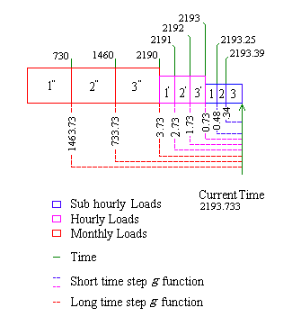

Figure 255.  Schematic of Variable Time Step Model *g* Function Calculation.

To calculate the response of a past load on the borehole temperature we apply the *g*-function corresponding to the time elapsed since the load was applied. This is easily understood form the schematic. For example, to calculate the response of the aggregated load 1” (at the end of 730hrs.) for the current time step (2193.733hrs) we apply a *g*-function at 1463.73hrs. The *g*-function for the same block 1” at the previous time step, which occurred at 2193.25 hrs, would be at 1463.25hrs. From the schematic it is also seen that for the other two aggregated monthly loads 2”, 3” the *g*-function are applied at 733.73 hrs and 3.73 hrs for the current time-step and at 733.25 hrs and 3.25 hrs respectively for the previous time-step. The same scheme applies to hourly and sub-hourly. Thus to estimate the time at which the past monthly, hourly or sub-hourly loads occur, we might be tempted to store the simulation times at each time step for the entire simulation, storing load times for the whole length of simulation for a multi year simulation with a variable short time step would require a large amount of memory. But little consideration shows that it is not necessary.  Since the monthly and hourly loads occur at equal intervals of time 730hrs and 1hr respectively, the *g*-functions can be estimated with the current simulation time and the time at which the load block ends, which is a multiple of the monthly duration of the block size. Only the sub-hourly loads require storage of simulation times.

For example from the schematic (Figure 256), for the sub hourly load 1, which occurred at the end of 2193.25 a *g*-function at .48 hrs has to be applied and for the next load 2 a *g*-function at 0.34 hrs has to be applied. Since the time intervals are not even for the sub hourly loads, we need to store the time steps at which those loads occurred. These times are required to estimate the time elapsed between the current simulation time and the time at which the sub hourly loads occurred.

Thus, the algorithm keeps track of the sub hourly loads along with their time of occurrence for a user-defined length of time during which the sub hourly calculations are made. The algorithm also estimates the time weighted hourly load from their corresponding sub hourly loads as each hour passes. The sub-hourly loads are time weighted because of the irregular intervals at which the time-step occurs. This is also illustrated in Figure 256. The sub hourly loads 1,2 &3 occur for varying length of time. The load 3 occurs for a longer duration than 1 and 2 in that order. This implies that the load 3 has to be given more weight than 1 and 2. So the sub hourly loads for a particular hour are multiplied by the length of their respective period of occurrence and averaged over the hour. This is further explained by the schematic in Figure 5.

Figure 256.  Schematic Showing the Calculation of Hourly Load from the Sub Houly Loads.

The bottom text in the boxes represents the magnitude of the sub hourly loads in W/m for each time step. The duration of the occurrence of each time-step for the each block is shown below the respective block. The first hourly load is given by the expression

$${\overline q_1} = \left[ \begin{array}{l}\left( {8.36 \times .159} \right) + \left( {6.51 \times .339} \right) + \left( {10.3 \times .107} \right)\\ + \left( {6.92 \times .162} \right) + \left( {9.03 \times .181} \right) + \left( {12 \times .05} \right)\end{array} \right] = 7.993W/m$$

Where \({\overline q_1}\) = the first hourly load in W/m

The algorithm keeps track of enough of these past hourly loads to calculate the monthly load. As each month or user defined time passes, hourly loads over the entire month or user defined time “blocks” are averaged and stored in arrays for the respective monthly user defined block of time.

The borehole temperature for any time step is computed by superposing the monthly (larger time block loads) hourly and sub-hourly loads for each time step. To understand more clearly consider the schematic in Figure 256 where the borehole temperature at 2193.733 hour is to be estimated. Here the monthly block time is 730 hrs. We have three monthly aggregated load blocks for 730 hrs, 1460 hrs and 2190 hrs and hourly loads from 2191st hr to 2193rd hour. For the remaining 0.733 hours a sub hourly calculation is done. The three monthly aggregated load blocks when superposed using long time *g-*functions, yields the borehole temperature at the end of 2190th hour. Then the hourly loads from 2191st to 2193rd hrs are superposed using the corresponding short time step *g* functions values yielding the borehole temperature at the end of 2193rd hour. The sub-hourly variations for the current hour are obtained, by superposing the sub-hourly loads. From the schematic, we see there are two sub-hourly loads, 1 and 2. Thus the borehole temperature at the end of 2193.733 is expressed as:

$${T_{2193.733}} = {T_{ground}} + \sum\limits_{m = 1}^3 {\left[ {\frac{{{{\overline{\overline q} }_m} - {{\overline{\overline q} }_{m - 1}}}}{{2\pi {k_{ground}}}}g\left( {\frac{{{t_{2193.733}} - {t_{730(m - 1)}}}}{{{t_s}}},\frac{{{r_b}}}{H}} \right)} \right]} $$

$$ + \sum\limits_{n = 2190}^{2193} {\left[ {\frac{{{{\overline q }_n} - {{\overline q }_{n - 1}}}}{{2\pi {\kappa_{ground}}}}g\left( {\frac{{{t_{2193.733}} - {t_{n - 1}}}}{{{t_s}}},\frac{{{r_b}}}{H}} \right)} \right]} $$

$$ + \sum\limits_{p = 2193}^{2193.733} {\left[ {\frac{{{q_p} - {q_{p - 1}}}}{{2\pi {\kappa_{ground}}}}g\left( {\frac{{{t_{2193.733}} - {t_p}}}{{{t_s}}},\frac{{{r_b}}}{H}} \right)} \right]} $$

Where

\(\overline{\overline q} \) = The average monthly loads

\(\overline q \)  = The average hourly loads

*Q* = the sub-hourly loads

*m* = index for monthly aggregated blocks

*p* = array index for sub hourly loads

*t* = time

tp  =  the sub hourly time steps over the history period. (here increment is not always unity)

Superposing the temperature responses of monthly (larger) blocks over the shorter, namely the hourly and sub hourly, introduces some error in the borehole temperature calculation at the beginning of every month. Yavuzturk and Spitler suggest a method to reduce the error in borehole temperature prediction by using a minimum hourly history period during which only the short time step superposition is carried out. In our model this idea is extended to sub hourly loads as well. Thus a user specified minimum sub-hourly history period is included along with the minimum hourly history period to model the sub-hourly variations. During this period only sub-hourly and hourly superpositions are made. This guarantees that at any given time step the superposition of temperature responses involves a minimum period of short time responses, which ensures a better estimation of borehole temperature. For example, a minimum hourly history period of 96 hrs and a minimum sub hourly history period of 5 hours would result in only 2 monthly aggregation blocks (1” and 2”). The last monthly aggregation does not occur because neither of the minimum hourly history period of 96 hours or sub-hourly history period of five hrs is met. So an hourly superposition of the load is carried out for the third month until the minimum sub-hourly history period after which sub hourly superposition is carried out. The equation becomes

$${T_{2193.733}} = {T_{ground}} + \sum\limits_{m = 1}^2 {\left[ {\frac{{{{\overline{\overline q} }_m} - {{\overline{\overline q} }_{m - 1}}}}{{2\pi {k_{ground}}}}g\left( {\frac{{{t_{2193.733}} - {t_{730(m - 1)}}}}{{{t_s}}},\frac{{{r_b}}}{H}} \right)} \right]} $$

$$ + \sum\limits_{n = 1460}^{2188} {\left[ {\frac{{{{\overline q }_n} - {{\overline q }_{n - 1}}}}{{2\pi {\kappa_{ground}}}}g\left( {\frac{{{t_{2193.733}} - {t_{n - 1}}}}{{{t_s}}},\frac{{{r_b}}}{H}} \right)} \right]} $$

$$ + \sum\limits_{p = 2188}^{2193.733} {\left[ {\frac{{{q_p} - {q_{p - 1}}}}{{2\pi {\kappa_{ground}}}}g\left( {\frac{{{t_{2193.733}} - {t_p}}}{{{t_s}}},\frac{{{r_b}}}{H}} \right)} \right]} $$

Yavuzturk and Spitler have done a detailed analysis on the effect of minimum hourly history period. They found that a minimum hourly history period of 192 hrs for an annual simulation would reduce the running time by 90%.  They also found that for a 20year simulation, the computation time of the aggregated load scheme is just 1% of the non-aggregated load scheme.

#### Summary of Variable Short Time Step Response Factor Model

The load aggregation scheme developed in line with the above example is summarized eight steps as follows:

1.    Define monthly load blocks duration (mb) in hrs (generally 730 hrs) and the minimum hourly history period and minimum sub hourly history period.

2.    Read Borehole Geometry Parameters: number of boreholes, borehole length radius thickness of the pipe etc. Read Ground and Fluid thermal properties: Ground conductivity, volumetric specific heat capacity of the ground and heat carrier fluid. Read the short and long time-step *g-*functions into arrays with their respective non-dimensionalized times.

3.    Start Simulation from p=1 to nts. Here “nts” is the number of time steps that have occurred since the start of simulation. (Note that P in not a count of number of hour elapsed in the simulation)

4.    Compute the hourly loads as each hour passes. This is done by averaging the sub hourly loads during the past hour. The monthly loads are calculated by averaging the hourly loads during that month. This is done by summing the hourly loads during that monthly period and dividing the sum by 730 hours NumMonths(the number of months used in aggregation calculations) is set to the number of months of simulation (current number of aggregated load blocks)

5.    If the simulation time is less than the minimum sub hourly history period the borehole temperature is estimated with no aggregation. Only sub hourly loads are superposed as given by the following equation.

$${T_{nts}} = {T_{ground}} + \sum\limits_{p = 1}^{nts} {\left[ {\frac{{{q_p} - {q_{p - 1}}}}{{2\pi {\kappa_{ground}}}}g\left( {\frac{{{t_{nts}} - {t_p}}}{{{t_s}}},\frac{{{r_b}}}{H}} \right)} \right]} $$

6.    . If the simulation time is less than sum of minimum hourly history and sub hourly history periods, then decomposed hourly aggregated loads are superposed using their corresponding g function until the sub hourly history required. Then the sub hourly temperature differences are found by superposing the decomposed sub hourly loads with their short time step *g* functions. Average borehole temperature is found by superposing the hourly and sub hourly temperature differences with the following equation

$${T_{nts}} = \sum\limits_{n = 1}^{nh - sh} {\left[ {\frac{{{{\overline q }_n} - {{\overline q }_{n - 1}}}}{{2\pi {\kappa_{ground}}}}g\left( {\frac{{{t_{nts}} - {t_{n - 1}}}}{{{t_s}}},\frac{{{r_b}}}{H}} \right)} \right]}  + \sum\limits_{p = nts - sh}^{nts} {\left[ {\frac{{{q_p} - {q_{p - 1}}}}{{2\pi {\kappa_{ground}}}}g\left( {\frac{{{t_{nts}} - {t_p}}}{{{t_s}}},\frac{{{r_b}}}{H}} \right)} \right]} $$

7.    If the simulation time is greater then the sum of a monthly period, sub hourly history and the hourly history period. Then monthly load aggregation is performed. Here if the difference between the simulation time and product of a monthly block period and the current number of monthly blocks is greater than the sum of the minimum hourly history and sub hourly history periods then the average borehole temperature is found by the following equation.

$${T_{nts}} = {T_{ground}} + \sum\limits_{m = 1}^{calb} {\left[ {\frac{{{{\overline{\overline q} }_m} - {{\overline{\overline q} }_{m - 1}}}}{{2\pi {\kappa_{ground}}}}g\left( {\frac{{{t_{nts}} - {t_{mb[m - 1]}}}}{{{t_s}}},\frac{{{r_b}}}{H}} \right)} \right]} $$

$$ + \sum\limits_{n = nh - [calb(mb) + sh]}^{nh - sh} {\left[ {\frac{{{{\overline q }_n} - {{\overline q }_{n - 1}}}}{{2\pi {\kappa_{ground}}}}g\left( {\frac{{{t_{nts}} - {t_{n - 1}}}}{{{t_s}}},\frac{{{r_b}}}{H}} \right)} \right]} $$

**\(+ \sum\limits_{p = nts - sh}^{nts} {\left[ {\frac{{{q_p} - {q_{p - 1}}}}{{2\pi {\kappa_{ground}}}}g\left( {\frac{{{t_{nts}} - {t_p}}}{{{t_s}}},\frac{{{r_b}}}{H}} \right)} \right]} \)                                                       **

8.    If the difference between the simulation time and product of a monthly block period and the current number of monthly blocks is less than the sum of the minimum hourly history and sub hourly history periods, then NumMonths is set to one month less than the actual number of months of simulation completed. The average borehole temperature is calculated by superposing the long and time step temperature differences using the following equation.

$${T_{nts}} = {T_{ground}} + \sum\limits_{m = 1}^{calb - 1} {\left[ {\frac{{{{\overline{\overline q} }_m} - {{\overline{\overline q} }_{m - 1}}}}{{2\pi {\kappa_{ground}}}}g\left( {\frac{{{t_{nts}} - {t_{mb[m - 1]}}}}{{{t_s}}},\frac{{{r_b}}}{H}} \right)} \right]} $$

$$ + \sum\limits_{n = nh - [(calb - 1)(mb) + sh]}^{nh - sh} {\left[ {\frac{{{{\overline q }_n} - {{\overline q }_{n - 1}}}}{{2\pi {\kappa_{ground}}}}g\left( {\frac{{{t_{nts}} - {t_{n - 1}}}}{{{t_s}}},\frac{{{r_b}}}{H}} \right)} \right]} $$

**\(+ \sum\limits_{p = nts - sh}^{nts} {\left[ {\frac{{{q_p} - {q_{p - 1}}}}{{2\pi {\kappa_{ground}}}}g\left( {\frac{{{t_{nts}} - {t_p}}}{{{t_s}}},\frac{{{r_b}}}{H}} \right)} \right]} \)                          **

Define Monthly block duration, minimum hourly history period and minimum sub hourly history period (step 1)

Read Borehole Geometry parameters, Ground and carrier fluid properties and read short and long time-step *g* functions. (Step 2)

** **

**Do until** p = 1 to number of time-steps (nts) (Step 3)

Compute the Ground Load for the current time step using Entering Fluid temperature (For the first time-step *T*FarField may be used)

Compute the hourly loads as each hour and monthly loads as each month passes. Calculate the number of monthly blocks (NumMonths)(**Step 4**)

**If** (Current time less than minimum sub hourly history) (**Step 5**)

**   ** use Equation

**Else If** (Current Simulation Time less than sum of minimum hourly history and minimum sub hourly history) (**step 6**)

    use Equation

    **Else**

**If** (Difference between current simulation    time and duration of the total number months is Greater than sum of minimum hourly and sub hourly histories) (**step 7**)

    use Equation

           **Else** (**step 8**)

                  use Equation

           **End if**

    **End if**

**End do**

#### References

Eskilson, P. 1987. Thermal Analysis of Heat Extraction Boreholes. Ph.D. Thesis, Department of Mathematical Physics, University of Lund, Lund, Sweden.

Yavuzturk, C. 1999. Modeling of Vertical Ground Loop Heat Exchangers for Ground Source Heat Pump Systems. Ph.D. Thesis, Department of Mechanical and Aerospace Engineering, Oklahoma State University, Stillwater, Oklahoma.

Yavuzturk, C., J.D. Spitler. 1999.[ A Short Time Step Response Factor Model for Vertical Ground Loop Heat Exchangers.](http://www.hvac.okstate.edu/research/Documents/ASHRAE/Yavuzturk_Spitler_99.pdf) *ASHRAE Transactions*. 105(2):475-485.

### GroundHeatExchanger:Slinky

This model reuses much of the same code including the load aggregation and temperature response caluclations which are described above in the GroundHeatExchanger:Vertical model. As a result, that section can also be used as reference material. This model is unique in that it generates it’s own temperature response factor g-functions, rather than relying on the other software or data to generate the g-functions. These are generated based on the work by Xiong et al. 2015.

#### Horizontal Slinky Temperature Response Functions

Equation used for calculating the g-function temperature response factors for the horizontal Slinky HX are seen below.

$$   
 g_s\left(t\right) = \sum_{i=1}^{N_{ring}} \sum_{j=1}^{N_{ring}} \frac{R}{4\pi N_{ring}} \int_0^{2\pi} \int_0^{2\pi} 
            \left[ 
                \frac{erfc\left(d\left(P_j,P_i\right)/2\sqrt{\alpha t}\right)}{d\left(P_j,P_i\right)} - 
                \frac{erfc\left(\sqrt{d\left(P_j,P_i\right)^2+4h^2/\left(2\sqrt{\alpha t}\right)}\right)}{\sqrt{d\left(P_j,P_i\right)^2+4h^2} }
            \right]d\omega d\varphi
$$

Where:

$$
  d\left(P_j,P_i\right) = \frac{d\left(P_{ii},P_j\right) + d\left(P_{io},P_j\right)}{2}
$$

$$
  d\left(P_{ii},P_j\right) = \sqrt{\left[x_{0i} + \left(R-r\right)\cos \varphi - x_{0j}-R\cos \omega\right]^2 + \left[y_{0i} + \left(R-r\right)\sin \varphi - y_{0j}-R\sin \omega\right]^2}
$$

$$
  d\left(P_{io},P_j\right) = \sqrt{\left[x_{0i} + \left(R-r\right)\cos \varphi - x_{0j}-R\cos \omega\right]^2 + \left[y_{0i} + \left(R+r\right)\sin \varphi - y_{0j}-R\sin \omega\right]^2}
$$

#### Vertical Slinky Temperature Response Functions

Equations used for calculating the g-function temperature response factors for the vertical Slinky HX are seen below.

$$   
 g_s\left(t\right) = \sum_{i=1}^{N_{ring}} \sum_{j=1}^{N_{ring}} \frac{R}{4\pi N_{ring}} \int_0^{2\pi} \int_0^{2\pi} 
            \left[ 
                \frac{erfc\left(d\left(P_j,P_i\right)/2\sqrt{\alpha t}\right)}{d\left(P_j,P_i\right)} - 
                \frac{erfc\left(d\left(P_{j'},P_i\right)/2\sqrt{\alpha t}\right)}{d\left(P_{j'},P_i\right)}
            \right]d\omega d\varphi
$$

Where: 

$$
  d\left(P_j,P_i\right) = \frac{d\left(P_{ii},P_j\right) + d\left(P_{io},P_j\right)}{2}
$$

$$
  d\left(P_{j'},P_i\right) = \frac{d\left(P_{ii},P_{j'}\right) + d\left(P_{io},P_{j'}\right)}{2}
$$

$$
  d\left(P_{ii},P_j\right) = \sqrt{\left[x_{0i} + \left(R-r\right)\cos \varphi - x_{0j}-R\cos \omega\right]^2 + \left[y_{0i}-y_{0j}\right]^2 + \left[z_{0i} + \left(R-r\right)\sin \varphi - z_{0j}-R\sin \omega\right]^2}
$$

$$
  d\left(P_{io},P_j\right) = \sqrt{\left[x_{0i} + \left(R+r\right)\cos \varphi - x_{0j}-R\cos \omega\right]^2 + \left[y_{0i}-y_{0j}\right]^2 + \left[z_{0i} + \left(R+r\right)\sin \varphi - z_{0j}-R\sin \omega\right]^2}
$$

$$
  d\left(P_{ii},P_{j'}\right) = \sqrt{\left[x_{0i} + \left(R-r\right)\cos \varphi - x_{0j}-R\cos \omega\right]^2 + \left[y_{0i}-y_{0j}\right]^2 + \left[z_{0i} + \left(R-r\right)\sin \varphi - z_{0j} - 2h - R\sin \omega\right]^2}
$$

$$
  d\left(P_{io},P_{j'}\right) = \sqrt{\left[x_{0i} + \left(R+r\right)\cos \varphi - x_{0j}-R\cos \omega\right]^2 + \left[y_{0i}-y_{0j}\right]^2 + \left[z_{0i} + \left(R+r\right)\sin \varphi - z_{0j} - 2h - R\sin \omega\right]^2}
$$

#### Model Simplifications for Computational Efficiency

Several simplifications were used to ensure the g-function temperature response factors are computationally efficient. The first simplification is achieved by taking advantage of symmetry. In the [Figure](#SlinkyGHX1) below we can see that by taking advantage of symmettry the temperature response for only one quarter of the rings needs be calculated.

The second simplification occurs by realizing that the effect between two rings decreases exponentially as the distance between the rings increases. Near-field rings are defined as rings whose centers are within 2.5m + D distance from the center of ring i as is seen in [Figure](#SlinkyGHX1). Far-field rings are defined as rings whose centers are beyond 10m + D, with middle-field rings occupying the space in between the near-field and far-field rings. Near-field ring temperature response factors are determined as indicated above for horzontal or vertical slinkys. Middle-field rings are considerably simplified – the interaction between ring is approximated as that of two point sources at their centers. Thermal effect of far-field rings are ignored.

The third and final simplification takes advantatge of geometric similarity that ring share. Ring pairs that are geometrically similar do not require recalculation of distances or reponse factors. Thus the calculations for geometrically similar ring pairs can be reused.

For more information, see [Xiong et al. 2015](#SlinkyReferenceXiong).

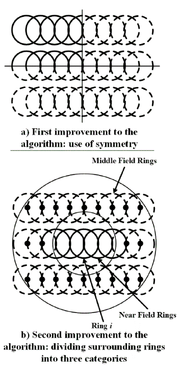

Figure: Schematic of first and second improvements to the algorithm for computational efficiency. 

#### References

Xiong, Z., D.E. Fisher, and J.D. Spitler. 2015. Development and Validation of a Slinky(TM) Ground Heat Exchanger Model. Applied Energy 141: 57-69. 

### Plant Loop Pond-To-Water Heat Exchanger

The pond model (Object: GroundHeatExchanger:Pond) is a ‘lumped parameter’ model where the pond is represented by a single node with thermal mass. The pond surface temperature is the same as the temperature at this node, i.e. the surface temperature is the same as the bulk temperature. A first order differential equation is solved in the model to calculate the pond temperature at each time step. This type of heat rejecter is modeled as several circuits connected in parallel.

Figure 257.  Heat Transfer Mechanisms in a Pond (Chiasson 1999)

Rees(2002) implemented the model developed by Chiasson(1999) for the shallow ponds. The model is based on the assumption that thermal gradients in shallow ponds are negligible, especially during times of heat rejection. Using the lumped parameter approach, an overall energy balance for the pond may be devised as

$$q{}_{in} - q{}_{out} = V\rho C{}_p\frac{{dT}}{{dt}}$$

Where

\(q{}_{in}\)   =   Heat transfer to the pond

\(q{}_{out}\)  =   Heat transfer from the pond

\(V\)     =   Pond Volume

\(\rho \)     =   Density of pond water

\({q_{in}}\) = Heat transfer to the pond

\(C{}_p\) = Specific heat capacity of pond water

\(\frac{{dT}}{{dt}}\) = rate of change of temperature of the pond water

Rate of change in average pond temperature is given as

$$\frac{{dT}}{{dt}} = \frac{{q{}_{solar} + q{}_{thermal} + q{}_{convection} + q{}_{groundwater} + q{}_{evaporation} + q{}_{fluid}}}{{V\rho C{}_p}}$$

Where

qsolar   \\                    \\     = Solar radiation heat gain to the pond

qthermal       \\          = Thermal radiation heat transfer at the pond surface.

qconvection            = Convection heat transfer at the pond surface

qground\\                   \\    = Heat transfer to/from ground to the pond

qgroundwater\\          \\    = Heat transfer due to ground water inflow/outflow

qevaporation         = Heat transfer due to evaporation at the pond surface

qfluid                     = Total heat transfer to/from the heat exchanging fluid flowing in all spools or  coils in the pond

A heat balance is calculated at a single node that represents the pond. Heat transfer takes place by surface convection, long-wave radiation to the sky, absorption of solar energy, ground heat transfer and heat exchange with the fluid. A heat exchanger analogy is used to calculate the heat transfer between the heat transfer fluid and the pond. The differential equation defined by the heat balance is solved using a fourth order Runge-Kutta numerical integration method. The implementation along with the model equations are summarized in the figure below.

Figure 258.  Pond Model Component Configuration (Chiasson 1999)

The model overall pond model consists in a number of sub-models which are enumerated below.

#### Solar radiation heat gain to the pond

$$\rho ' = {\tau_a} - \tau $$

where

\(\rho '\)is the reflectance

\(\tau \) is the transmittance of solar radiation by the pond surface and the subscript ‘a’ refers to the absorbed component.

$${\tau_a} = {e^{\frac{{ - \mu 'd}}{{\cos {\theta_r}}}}}$$

and

$$\tau  = \frac{1}{2}\left( {\frac{{1 - {r_{par}}}}{{1 + {r_{par}}}} + \frac{{1 - {r_ \bot }}}{{1 + {r_ \bot }}}} \right){e^{\frac{{ - \mu 'd}}{{\cos {\theta_r}}}}}$$

where

\(\mu '\)is the extinction coefficient for water

\(d\) is the pond depth

\({r_{par}}\)represents the parallel component of unpolarized radiation and

\({r_ \bot }\)represents the perpendicular component of unpolarized radiation which are computed by Duffie and Beckman (1991) as:

\({r_{par}} = \frac{{{{\tan }^2}\left( {{\theta_r} - \theta } \right)}}{{{{\tan }^2}\left( {{\theta_r} + \theta } \right)}}\)

\({r_ \bot } = \frac{{{{\sin }^2}\left( {{\theta_r} - \theta } \right)}}{{{{\sin }^2}\left( {{\theta_r} - \theta } \right)}}\)

Finally, the amount of solar radiation absorbed by the pond (\({q_{solar}}\)) is expressed as:

$${q_{solar}} = I\left( {1 - \rho '} \right){A_{pond}}$$

where

\(I\)is the solar radiation flux incident on the pond surface (here, the total reflectance is approximated by the beam reflectance)

\({A_{pond}}\)is the area of the pond surface.

The model also accepts solar radiation in the form of beam \(\left( {{I_b}} \right)\)and diffuse \(\left( {{I_d}} \right)\) components, in which case \(I\)is computed from:

$$I = {I_b}\cos \theta  + {I_d}$$

#### Thermal radiation heat transfer at the pond surface

$$q{}_{thermal} = \sigma \alpha (T{{}_{surface}^4} - T{{}_{sky}^4})$$

Where

\(\alpha \)= Thermal absorptivity

\(\sigma \)= Stefan Boltzman constant

#### Convection heat transfer at the pond surface

$$q{}_{convection} = h{}_c(T{}_{pond} - T{}_{db})$$

ASHRAE simple convection coefficient model is used to obtain the convection coefficient for external surfaces. Initializing of pond temps to mean of dry-bulb temperature Tdb and ground temperatures is useful because repeated warm up days tend to drive the initial pond temperature toward the dry-bulb temperature Hence, for each environment the simulation starts the pond temperature Tpond midway between the dry-bulb and ground temperature.

#### Heat transfer to/from ground to the pond

Hull et al (1984) expressed the following equation for ground heat losses from any pond. The equations are also based on the assumption that, for all practical purposes, the constant temperature sink is the ground water table (Kishore and Joshi 1984)

$$q{}_{ground} = U{}_{ground}A{}_{ground}(T{}_{groundwater} - T{}_{pond})$$

$$U{}_{ground} = 0.999\left( {\frac{{k{}_{ground}}}{{d{}_{groundwater} - d{}_{pond}}}} \right) + 1.37\left( {\frac{{k{}_{ground}P{}_{pond}}}{{A{}_{pond}}}} \right)$$

Where

\(k{}_{ground}\)        = Thermal conductivity of the ground

 \(d{}_{groundwater}\) = depth of water table

\(d{}_{pond}\)          = Pond depth

\(P{}_{pond}\)         = Pond perimeter

#### Heat transfer due to evaporation at the pond surface

Evaporation is calculated assuming a fixed Lewis number unlike the Chaisson model.

$$q{}_{evaporation} = {\left( {\frac{{\Pr }}{{Sc}}} \right)^{2/3}}\left( {\frac{{h{}_c}}{{Cp{}_{air}}}} \right)\left( {HR{}_f - HR{}_a} \right)\left( {q{}_l} \right)$$

Where

Pr =Prandtl number for air

Sc = Schmidt number for air

Hc = convection coefficient

HRf= humidity ratio at pond surface/film temperature

HRa= humidity ratio of air

ql  = Latent heat of air

Air properties are obtained by applying the existing the psychometric functions of EnergyPlus.

#### Total heat transfer to/from the heat exchanging fluid flowing in all spools or coils in the pond

$$q{}_{fluid} = UA{}_{pipe}(T{}_{fluid} - T{}_{pond})N{}_{circuit}$$

Where

\(UA{}_{pipe}\) = overall heat transfer coefficient expressed in terms of inside pipe area

\(N{}_{circuit}\)= number of spools installed in the pond

The fluid temperature Tfluid is computed as the average fluid temperatures of the inlet and the outlet node at a given temperature.

$$U{A_{pipe}} = \frac{{2\pi {r_i}\cdot {L_{spool}}}}{{\sum {{r_t}} }}$$

where

\({r_i}\)= inner pipe radius

\({L_{spool}}\)l= length of one spool

\(\sum {{r_t}} \)= composite thermal resistance defined as

\(\sum {{r_t}} \)=Resistance due to fluid flow in the pipe +external pipe thermal resistance +fouling factor

#### References

Chiasson, A.D. 1999. *Advances in modeling of groundsourceheat pump systems*. Master’s thesis,Oklahoma State University, Stillwater, OK

Duffie, J.A., and W.A. Beckman. 1991. *Solar engineering of thermal processes,* 2d ed. New York: John Wiley & Sons.

Hull, J.R., K.V. Liu, W.T. Sha, J. Kamal, and C.E. Nielsen. 1984. Dependence of ground heat losses upon solar pond size and perimeter insulation—Calculated and experimental results. *Solar Energy* 33(1): 25-33

Kishore, V.V.N., and V. Joshi. 1984. A practical collector efficiency equation for nonconvecting solar ponds. *Solar Energy* 33(5): 391-395.

Rees, S.J., J.D. Spitler and X. Xiao, X 2002.[Transient Analysis of Snow-melting System Performance](http://www.hvac.okstate.edu/pdfs/Rees_Spitler_Xiao_02.pdf).*ASHRAE Transactions.*108(2):406-423.

### Plant Loop Surface-Ground-To-Water Heat Exchanger

This model (Object: GroundHeatExchanger:Surface) is based on the QTF formulation of heat transfer through building elements with embedded heat sources/sinks. The model uses a heat exchanger analogy to relate the inlet fluid temperature to the net heat transfer rate and consequently outlet temperature. The model is entirely passive, i.e. it does not set any flow rates or incorporate any controls. In order to deal with the non-linear boundary conditions at the top surface due to the presence of ice/snow fluxes have to be calculated by the QTF model and temperature calculated from the surface heat balance. This requires some iteration. Note, top surface variables correspond to ‘outside’ variables in standard CTF/QTF definition. Bottom surface variables correspond to ‘inside’ variables.

For given current surface temperatures the terms of the QTF equations can be grouped into constant terms, and those depending on the current source flux. The surface heat balance may be given by the following equation (Strand,1997)

$$QS{}_{} = \sum\limits_{m = 1}^M {X{}_{k,m}} T{}_{i,t - m + 1} - \sum\limits_{m = 1}^M {Y{}_{k,m}} T{}_{o,t - m + 1} + \sum\limits_{m = 1}^k {F{}_m} q{}_{i,t - m} + \sum\limits_{m = 1}^M {W{}_m} {q''}{}_{source,t - m + 1}$$

$$T{}_S{}_{} = \sum\limits_{m = 1}^M {X{}_{k,m}} T{}_{i,t - m + 1} - \sum\limits_{m = 1}^M {Y{}_{k,m}} T{}_{o,t - m + 1} + \sum\limits_{m = 1}^k {F{}_m} q{}_{i,t - m} + \sum\limits_{m = 1}^M {W{}_m} q''{}_{source,t - m + 1}$$

Where

Ts    = temperature of the node where the heat source or sink is present

\(QS\)= Surface heat balance

\({q''}\)= Heat flux

T   = Temperature

i    =  inside of the building element

o   = outside of the building element

t    = current time step

X Y F = Conduction transfer functions

The surface balance equation includes terms for incident solar energy, radiation heat transfer from internal sources, linearized radiation between surfaces using the mean radiation temperature concept and convection to the surrounding air.

The heat balance on the water loop is given by

$$q = \dot mc{}_p(T{}_{wi} - T{}_{wo})$$

Where

q = heat transferred between the water loop and the building elements.

\(\dot m\)= mass flow rate of water

\(T{}_{wi}\)= Inlet water temperature

\(T{}_{wo}\)= Outlet water temperature

From the second law of thermodynamics the maximum amount of heat transfer is

$$q{}_{\max } = (\dot mc{}_p){}_{water}(T{}_{wi} - T{}_s)$$

Where

Ts = temperature at the source location

The effectiveness of the heat exchanger is given by

$$\varepsilon  = 1 - {e^{ - NTU}}$$

Where NTU is defined by

$$NTU = \frac{{UA}}{{(\dot mC{}_p){}_{water}}}$$

$$UA = h\pi DL$$

h is the convection coefficient, D is the interior tube diameter and L is the total length of the tube.

The Colburn equation is used to define the Nusselt number Nu

$$Nu = \frac{{hD}}{k} = 0.023{\mathop{\rm Re}\nolimits} {{}_D^{4/5}}{\Pr ^{1/3}}$$

Pr is the Prandtl number, Re is the Reynolds number and k is the thermal conductivity of the fluid

$${\mathop{\rm Re}\nolimits} {}_D = \frac{{4\dot m}}{{\pi \mu D}}$$

with \(\mu \) being the absolute viscosity of water

### Plant Loop Fluid-to-Fluid Heat Exchanger

This component (Object: HeatExchanger:FluidToFluid) is a simple hydronic heat exchanger that can be used to couple two (hydronic) plant or condenser loops.  Sizing and nominal capacity calculations are discussed elsewhere in this document, see the section called Plant Heat Exchanger Sizing. This section first discusses the heat transfer modeling and the control issues.

Heat exchanger performance modeling uses classic effectiveness-NTU correlations. The heat exchanger model can be specified as one of seven types:  cross flow both fluid streams unmixed, cross flow both fluid streams mixed, cross flow maximum capacity flow mixed min), counter flow, parallel flow, or ideal. The model correlations determine a heat transfer effectiveness value, \(\varepsilon \), which is a function of heat exchanger UA, the mass flow rates through boths sides, and the specific heat of the fluids in the streams.  The effectiveness of an ideal heat exchanger is set to 1.0 and no correlation is needed.

Because the heat exchanger is intended to be generic, its two sides are distinguished by the nature of loop side being connected.  One side is called “Loop Supply Side” to indicate the heat exchanger is situated on the supply side of a loop. The other side is called “Loop Demand Side” to indicate it is on the demand side of a loop.  The heat exchanger is intended to act as a supply component for the loop connected to it as the “Loop Supply Side” and as a demand component for the loop connected to it as the “Loop Demand Side.”  From the point of view of the heat exchanger component itself, the Loop Demand Side acts like a supply source/sink for the Loop Supply Side which acts like a demand to the component.

The mass flow rates and specific heat capacity are multiplied together to evaluate flow thermal capacity for each side and the minimum, maximum, and capacity ratio, \({R_C}\), are determined.

$${\left( {\dot m{c_p}} \right)_{SupLoop}} = {\dot m_{SupLoop}}*{c_p}_{SupLoop}$$

$${\left( {\dot m{c_p}} \right)_{DmdLoop}} = {\dot m_{DmdLoop}}*{c_p}_{DmdLoop}$$

$${\left( {\dot m{c_p}} \right)_{Min}} = MIN\left( {{{\left( {\dot m{c_p}} \right)}_{SupLoop}},{{\left( {\dot m{c_p}} \right)}_{DmdLoop}}} \right)$$

$${\left( {\dot m{c_p}} \right)_{Max}} = MAX\left( {{{\left( {\dot m{c_p}} \right)}_{SupLoop}},{{\left( {\dot m{c_p}} \right)}_{DmdLoop}}} \right)$$

$${R_C} = \frac{{{{\left( {\dot m{c_p}} \right)}_{Min}}}}{{{{\left( {\dot m{c_p}} \right)}_{Max}}}}$$

NTU, or Number of Transfer Units, is calculated using:

$$NTU = \frac{{UA}}{{{{\left( {\dot m{c_p}} \right)}_{Min}}}}$$

For a counter flow heat exchanger, effectiveness is calculated using:

$$\varepsilon  = \frac{{1 - exp\left[ { - NTU\left( {1 - {R_C}} \right)} \right]}}{{1 - {R_C}exp\left[ { - NTU\left( {1 - Rc} \right)} \right]}}$$

For a parallel flow heat exchanger, effectiveness is calculated using:

$$\varepsilon  = \frac{{1 - exp\left[ { - NTU\left( {1 + {R_C}} \right)} \right]}}{{\left( {1 + {R_C}} \right)}}$$

For a cross flow heat exchanger with both streams unmixed, effectiveness is calculated using:

$$\varepsilon  = 1 - exp\left\{ {\frac{{NT{U^{0.22}}}}{{{R_C}}}\left[ {exp\left( { - {R_C}NT{U^{0.78}}} \right) - 1} \right]} \right\}$$

For a cross flow heat exchanger with both streams mixed, the effectiveness is calculated using:

$$\varepsilon  = {\left[ {\frac{1}{{1 - exp\left( { - NTU} \right)}} + \frac{{{R_C}}}{{1 - exp\left( { - {R_C}NTU} \right)}} - \frac{1}{{NTU}}} \right]^{ - 1}}$$

For a cross flow heat exchanger with the stream with the higher capacity mixed and the stream with the lower capacity unmixed, the effectiveness is calculated using:

$$\varepsilon  = \frac{1}{{{R_C}}}\left\{ {1 - exp\left[ {{R_C}\left( {exp\left( { - NTU} \right) - 1} \right)} \right]} \right\}$$

For a cross flow heat exchanger with the stream with higher capacity unmixed and the stream with lower capacity mixed, the effectiveness is calculated using:

$$\varepsilon  = 1 - exp\left\{ { - \frac{1}{{{R_C}}}\left[ {1 - exp\left( { - {R_C}NTU} \right)} \right]} \right\}$$

Effectiveness values are always limited to be no higher than 1.0.  The program code protects from evaluating the exponential with operands that are too large or too small. Once the effectiveness value is determined, the heat transfer rate is calculated using:

$$\dot Q = \varepsilon {\left( {\dot m{c_p}} \right)_{Min}}\left( {{T_{SupLoop,In}} - {T_{DmdLoop,In}}} \right)$$

Lastly, the fluid temperatures leaving the heat exchanger are calculated using:

$${T_{SupLoop,Out}} = {T_{SupLoop,In}} - \frac{{\dot Q}}{{{{\left( {\dot m{c_p}} \right)}_{SupLoop}}}}$$

$${T_{DmdLoop,Out}} = {T_{DmdLoop,In}} + \frac{{\dot Q}}{{{{\left( {\dot m{c_p}} \right)}_{DmdLoop}}}}$$

The plant heat exchanger offers a number of control options for a wide variety of applications.  This section documents the control decision logic. The general goal of the control is to provide appropriate conditioning of the fluid at the Loop Supply Side connection.  The basic control action is to request the appropriate flow rates for each side of the heat exchanger.  For all of the control modes, there is also an availability schedule that provides a level of supervisory control to determine if the heat exchange is available to run at all.  If the device is scheduled off, then zero flow is requested for both connections. All the control modes can also use minimum and maximum temperature limits.  If the limits are used and either of the two inlet temperatures exceeds the limit, the zero flow is requested for both connections.

**UncontrolledOn. ** This control type is very simple.  If scheduled on it requests the full design flow rate on the Loop Supply Side connection.  If the Loop Supply Side flow rate exceeds a small tolerance, then the full design flow rate is requested for the Loop Demand Side connection.

**OperationSchemeModulated. ** This control type uses the plant operation schemes. Any of the various plant (or condenser) operation schemes (e.g. PlantEquipmentOperation:CoolingLoad or PlantEquipmentOperation:HeatingLoad ). When the heat exchanger is called, the operation scheme will pass a value for the load to be met.  If the absolute value of the load is less than a small tolerance (1 W), then zero flow is requested for both connections.  If load is significant and negative, then the heat exchanger will attempt to provide cooling.  If the load is significant and positive, then it will attempt to provide heating.  The two inlet fluid temperatures are compared and if their difference exceeds the minimum temperature difference and has the correct sign for heating or cooling as needed, then the heat exchanger is turned “on.”  The model requests the full design flow rate on the Loop Supply Side connection.  If the Loop Supply Side flow rate exceeds a small tolerance, then a flow rate for the Loop Demand Side is found to attempt to meet the load.  The load value is converted to a target temperature for the fluid leaving the Loop Supply Side connection.  The target temperature is then used with the numerical method Regula Falsi to solve for the flow rate.

**OperationSchemeOnOff**.  This control type uses the plant operation schemes. Any of the various plant (or condenser) operation schemes (e.g. PlantEquipmentOperation:CoolingLoad or PlantEquipmentOperation:HeatingLoad). When the heat exchanger is called, the operation scheme will pass a value for the load to be met.  If the absolute value of the load is less than a small tolerance (1 W), then zero flow is requested for both connections.  If load is significant and negative, then the heat exchanger will attempt to provide cooling.  If the load is significant and positive, then it will attempt to provide heating.  The two inlet fluid temperatures are compared and if their difference exceeds the minimum temperature difference and has the correct sign for heating or cooling as is needed, then the heat exchanger is turned “on.”  The model requests the full design flow rate on the Loop Supply Side connection.  If the Loop Supply Side flow rate exceeds a small tolerance, then the full design flow rate is requested for the Loop Demand Side connection.

**HeatingSetpointModulated**.  This control scheme uses a node setpoint. The two inlet fluid temperatures are compared to see if their difference exceeds the minimum temperature difference and has the correct sign for heating to be possible.  The temperature setpoint on the reference node is compared to the inlet temperature for the Loop Supply Side to see if heating is desired.  If heating is both desired and possible, then the heat exchanger is turned “on.”  The model requests the full design flow rate on the Loop Supply Side connection.  If the Loop Supply Side flow rate exceeds a small tolerance, then a flow rate for the Loop Demand Side is found to attempt to meet the setpoint.  The setpoint temperature is then used with the numerical method Regula Falsi to solve for the flow rate.

**HeatingSetpointOnOff**.  This control scheme uses a node setpoint. The two inlet fluid temperatures are compared to see if their difference exceeds the minimum temperature difference and has the correct sign for heating to be possible.  The temperature setpoint on the reference node is compared to the inlet temperature for the Loop Supply Side to see if heating is desired.  If heating is both desired and possible, then the heat exchanger is turned “on.”  The model requests the full design flow rate on the Loop Supply Side connection.  If the Loop Supply Side flow rate exceeds a small tolerance, then the full design flow rate is requested for the Loop Demand Side connection.

**CoolingSetpointModulated**.  This control scheme uses a node setpoint. The two inlet fluid temperatures are compared to see if their difference exceeds the minimum temperature difference and has the correct sign for cooling to be possible.  The temperature setpoint on the reference node is compared to the inlet temperature for the Loop Supply Side to see if cooling is desired.  If cooling is both desired and possible, then the heat exchanger is turned “on.”  The model requests the full design flow rate on the Loop Supply Side connection.  If the Loop Supply Side flow rate exceeds a small tolerance, then a flow rate for the Loop Demand Side is found to attempt to meet the setpoint.  The setpoint temperature is then used with the numerical method Regula Falsi to solve for the flow rate.

**CoolingSetpointOnOff**.  This control scheme uses a node setpoint. The two inlet fluid temperatures are compared to see if their difference exceeds the minimum temperature difference and has the correct sign for cooling to be possible.  The temperature setpoint on the reference node is compared to the inlet temperature for the Loop Supply Side to see if cooling is desired.  If cooling is both desired and possible, then the heat exchanger is turned “on.”  The model requests the full design flow rate on the Loop Supply Side connection.  If the Loop Supply Side flow rate exceeds a small tolerance, then the full design flow rate is requested for the Loop Demand Side connection.

**CoolingSetpointOnOffWithComponentOverride**.  This control scheme uses one of three different control signals, a node setpoint, outdoor air drybulb temperature, or outdoor air wetbulb temperature. The two inlet fluid temperatures are compared to see if their difference exceeds the minimum temperature difference and has the correct sign for cooling to be possible.  The control signal is compared to the inlet temperature for the Loop Supply Side to see if cooling is desired.  If cooling is both desired and possible, then the heat exchanger is turned “on.”  When the heat exchanger is on, the remote chiller component is turned off.  The model requests the full design flow rate on the Loop Supply Side connection.  If the Loop Supply Side flow rate exceeds a small tolerance, then the full design flow rate is requested for the Loop Demand Side connection.

**CoolingDifferentialOnOff**.  This control scheme is based on a simple temperature difference. The two inlet fluid temperatures are compared to see if their difference exceeds the minimum temperature difference and has the correct sign for cooling to be possible.  If cooling is possible then it is assumed to be desired and the heat exchanger is turned “on.”  The model requests the full design flow rate on the Loop Supply Side connection.  If the Loop Supply Side flow rate exceeds a small tolerance, then the full design flow rate is requested for the Loop Demand Side connection.

**DualDeadbandSetpointModulated**.  This control scheme uses dual setpoints on a node. The basic idea is that the heat exchanger will condition the Loop Supply Side connection to drive its temperature into the deadband whenever its inlet temperature is outside the deadband.  The model expects dual temperature setpoints to be placed on the setpoint, for example using the object SetpointManager:Scheduled:DualSetpoint.

The heat exchanger will operate to cool the Loop Supply Side fluid when the following three conditions are all met:

1)  the two inlet fluid temperatures are compared to see if their difference exceeds the minimum temperature difference and has the correct sign for cooling to be possible,

2) the higher temperature setpoint on the reference node is compared to the inlet temperature for the Loop Supply Side to see if their difference exceeds the minimum temperature difference and has the correct sign for cooling to be possible, and

3)  the higher temperature setpoint on the reference node is compared to the inlet temperature for the Loop Demand Side to see if their difference exceeds the minimum temperature difference and has the correct sign for cooling to be possible.

The heat exchanger will operate to heat the Loop Supply Side fluid when the following three conditions are all met:

1)  the two inlet fluid temperatures are compared to see if their difference exceeds the minimum temperature difference and has the correct sign for heating to be possible,

2)  the lower temperature setpoint on the reference node is compared to the inlet temperature for the Loop Supply Side to see if their difference exceeds the minimum temperature difference and has the correct sign for heating to be possible, and

3) the lower temperature setpoint on the reference node is compared to the inlet temperature for the Loop Demand Side to see if their difference exceeds the minimum temperature difference and has the correct sign for heating to be possible.

When the heat exchanger is turned “on.”  The model requests the full design flow rate on the Loop Supply Side connection.  If the Loop Supply Side flow rate exceeds a small tolerance, then a flow rate for the Loop Demand Side is found to attempt to meet the setpoint.  The setpoint temperature is then used with the numerical method Regula Falsi to solve for the flow rate.

**DualDeadbandSetpointOnOff**. This control scheme uses dual setpoints on a node. The basic idea is that the heat exchanger will condition the Loop Supply Side connection to drive its temperature into the deadband whenever its inlet temperature is outside the deadband.  The model expects dual temperature setpoints to be placed on the setpoint, for example using the object SetpointManager:Scheduled:DualSetpoint.

The heat exchanger will operate to cool the Loop Supply Side fluid when the following three conditions are all met:

1)  the two inlet fluid temperatures are compared to see if their difference exceeds the minimum temperature difference and has the correct sign for cooling to be possible,

2) the higher temperature setpoint on the reference node is compared to the inlet temperature for the Loop Supply Side to see if their difference exceeds the minimum temperature difference and has the correct sign for cooling to be possible, and

3)  the higher temperature setpoint on the reference node is compared to the inlet temperature for the Loop Demand Side to see if their difference exceeds the minimum temperature difference and has the correct sign for cooling to be possible.

The heat exchanger will operate to heat the Loop Supply Side fluid when the following three conditions are all met:

1)  the two inlet fluid temperatures are compared to see if their difference exceeds the minimum temperature difference and has the correct sign for heating to be possible,

2)  the lower temperature setpoint on the reference node is compared to the inlet temperature for the Loop Supply Side to see if their difference exceeds the minimum temperature difference and has the correct sign for heating to be possible, and

3) the lower temperature setpoint on the reference node is compared to the inlet temperature for the Loop Demand Side to see if their difference exceeds the minimum temperature difference and has the correct sign for heating to be possible.

When the heat exchanger is turned “on,” the model requests the full design flow rate on the Loop Supply Side connection.  If the Loop Supply Side flow rate exceeds a small tolerance, then the full design flow rate is requested for the Loop Demand Side connection.

### References

Strand, R.K. and C.O. Pedersen, 1997.  Implementation of a Radiant Heating and Cooling Model Into an Integrated Building Energy Analysis Program, ASHRAE Transactions v. 103, n. 1, pp 949-958, 1997.

Incropera, F.P. and D.P. DeWitt. 1981. Fundamentals of Heat Transfer. New York: John Wiley & Sons.

Mills, A.F.1999. Heat Transfer, Second Edition. Prentice Hall. New Jersey.

Presentation by Taylor Engineering.

Air System Humidifiers 
----------------------

### Overview

Air system humidifiers are components that add moisture to the supply air stream. They fall into 2 broad categories: spray type humidifiers which act like direct evaporative coolers, cooling the supply air as well as humidifying it; and dry steam humidifiers, which humidify the supply air stream while causing almost no change to the supply air stream temperature. The EnergyPlus electric and gas fired steam humidifier uses electrical energy and thermal energy, respectively, to convert ordinary tap water to steam which it then injects into the supply air stream by means of a blower fan. The actual electric dry steam unit might be an electrode-type humidifier or a resistance-type humidifier.

### Electric and Gas Steam Humidifier

The electric and gas steam humidifier models (object names: Humidifier:Steam:Electric and Humidifier:Steam:Gas) are based on moisture and enthalpy balance equations plus standard psychrometric relationships. The approach is similar to that taken in the ASHRAE HVAC 2 Toolkit, page 4-112 (ASHRAE 1993). EnergyPlus contains its own module of psychrometric routines; the psychrometric theory and relations are given in the 2001 edition of ASHRAE Fundamentals, Chapter 6 (ASHRAE 2001). The model contains both an ideal controller and the component. The control model assumes that there is a minimum humidity setpoint on the component air outlet node. This setpoint is established by a setpoint manager described elsewhere.

#### Model

The component model is a forward model: its inputs are its inlet conditions; its outputs are its outlet conditions and its energy consumption. The inputs are the temperature, humidity ratio, and mass flow rate of the inlet air stream, which are known; and the water addition rate (kg/s) which is determined by the controller.  The moisture mass balance and psychometric calculations are identical for both gas and electric dry steam humidifiers.  The only difference is how a heat source (electric or gas) is used to generate the steam.

#### Controller

The controller first decides whether the humidifier is on or off. For the humidifier to be on:

* the humidifier schedule value must be nonzero;

* the inlet air mass flow must be greater than zero;

* the inlet air humidity ratio must be less than the minimum humidity ratio setpoint.

If the humidifier is off, the water addition rate is set to zero. If the humidifier is on, the water addition rate needed to meet the humidity setpoint is calculated.

$${\dot m_a} \cdot {w_{in}} + {\dot m_{w,add,needed}} = {\dot m_a} \cdot {w_{set}}$$

where

\({\dot m_a}\) = the air mass flow rate [kg/s]

\({w_{in}}\)= the inlet air humidity ratio [kg/kg]

\({\dot m_{w,add,needed}}\) = water addition rate needed to meet the setpoint [kg/s]

\({w_{set}}\)= the humidity ratio setpoint [kg/kg]

Equation is the moisture balance equation for the component. It is solved for \({\dot m_{w,add,needed}}\) (the other variables are known) which is passed to the humidifier component model as its desired inlet water addition rate.

#### Component

The inputs to the component model are the air inlet conditions and mass flow rate and the water addition rate set by the controller. The outputs are the air outlet conditions. First the desired water addition rate is checked against component capacity.

$${\dot m_{w,add,needed,{\rm{max}}}} = Min({\dot m_{w,add}},Ca{p_{nom}})$$

where

\(Ca{p_{nom}}\) = the humidifier nominal capacity [kg/s], a user input.

If \({\dot m_{w,add,needed,{\rm{max}}}}\) is zero, the outlet conditions are set to the inlet conditions and the water addition rate is set to zero. If the humidifier is scheduled on the component power consumption is set to the standby power consumption: \({W_{hum}} = {W_{stby}}\). Otherwise \({W_{hum}}\) = 0.

If \({\dot m_{w,add,needed,{\rm{max}}}}\) &gt; 0, then the moisture and enthalpy balance equations

$${\dot m_a} \cdot {w_{in}} + {\dot m_w} = {\dot m_a} \cdot {w_{out}}$$

$${\dot m_a} \cdot {h_{in}} + {\dot m_w} \cdot {h_w} = {\dot m_a} \cdot {h_{out}}$$

with \({\dot m_w}\) set equal to \({\dot m_{w,add,needed,{\rm{max}}}}\) are solved for \({w_{out}}\) and \({h_{out}}\). Here

\({\dot m_a}\) = the air mass flow rate [kg/s]

\({w_{in}}\)= the inlet air humidity ratio [kg/kg]

\({\dot m_w}\) = the inlet water addition rate [kg/s]

\({w_{out}}\) = the outlet air humidity ratio [kg/kg]

\({h_{in}}\) = the inlet air specific enthalpy [J/kg]

\({h_w}\) = the steam specific enthalpy = 2676125.  [J/kg] at 100 oC

\({h_{out}}\) = the outlet air specific enthalpy [J/kg]

The outlet temperature is obtained from

$${T_{out}} = PsyHFnTdbW({h_{out}},{w_{out}})$$

where

\({T_{out}}\) = outlet air temperature [oC],

\(PsyHFnTdbW({h_{out}},{w_{out}})\) is an EnergyPlus psychrometric function.

The humidity ratio at saturation at the outlet temperature is

$${w_{out,sat}} = PsyWFnTdbRhPb({T_{out}},1.0,{P_{atmo}})$$

where

\({P_{atmo}}\) = the barometric pressure [Pa],

1.0 is the relative humidity at saturation,

\(PsyWFnTdbRhPb\) is an EnergyPlus psychrometric function.

IF \({w_{out}} \le {w_{out,sat}}\) then the outlet condition is below the saturation curve and the desired moisture addition rate can be met. \({\dot m_{w,add}}\) is set to \({\dot m_{w,add,needed,{\rm{max}}}}\) and the calculation of outlet conditions is done. But if \({w_{out}} > {w_{out,sat}}\) then it is assumed that this condition will be detected and the steam addition rate throttled back to bring the outlet conditions back to the saturation condition. We need to find the point where the line drawn between state 1 (inlet) and state 2 (our desired outlet) crosses the saturation curve. This will be the new outlet condition. Rather than iterate to obtain this point, we find it approximately by solving for the point where 2 lines cross: the first drawn from state 1 to state 2, the second from \({T_1}\), \({w_{1,sat}}\) to \({T_2}\), \({w_{2,sat}}\); where

\({w_{1,sat}}\) is the inlet temperature [oC],

\({w_{2,sat}}\) is the humidity ratio at saturation at temperature \({w_{1,sat}}\) [kg/kg],

\({T_2}\) is the desired outlet temperature [oC],

\({w_{2,sat}}\) is the humidity ratio at saturation at temperature \({T_2}\) [kg/kg].

The 2 lines are given by the equations:

$$w = {w_1} + (({w_2} - {w_1})/({T_2} - {T_1})) \cdot (T - {T_1})$$

$$w = {w_{1,sat}} + (({w_{2,sat}} - {w_{1,sat}})/({T_2} - {T_1})) \cdot (T - {T_1})$$

Solving for the point (state 3) where the lines cross:

$${w_3} = {w_1} + (({w_2} - {w_1}) \cdot ({w_{1,sat}} - {w_1}))/({w_2} - {w_{2,sat}} + {w_{1,sat}} - {w_1})$$

$${T_3} = {T_1} + ({w_3} - {w_1}) \cdot (({T_2} - {T_1})/({w_2} - {w_1}))$$

This point isn't quite on the saturation curve since we made a linear approximation of the curve, but the temperature should be very close to the correct outlet temperature. We will use this temperature as the outlet temperature and move to the saturation curve for the outlet humidity and enthalpy. Thus we set \({T_{out}}\) = \({T_3}\) and

$${w_{out}} = PsyWFnTdbRhPb({T_{out}},1.0,{P_{atmo}})$$

$${h_{out}} = PsyHFnTdbW({T_{out}},{w_{out}})$$

where \(PsyHFnTdbW\) is an EnergyPlus psychrometric function. The water addition rate is set to

$${\dot m_{w,add}} = {\dot m_a} \cdot ({w_{out}} - {w_{in}})$$

We now have the outlet conditions and the adjusted steam addition rate for the case where the desired outlet humidity results in an outlet state above the saturation curve.  The energy consumption of the electric and gas steam humidifiers is calculated separately.

The electric steam humidifier electric consumption is given by

$${W_{hum}} = ({\dot m_{w,add}}/Ca{p_{nom}}) \cdot {W_{nom}} + {W_{fan}} + {W_{stby}}$$

where

\({W_{fan}}\) = nominal fan power [W], a user input,

\({W_{stby}}\) = standby power [W], a user input.

The gas steam humidifier performance calculation is done for fixed and variable entering water temperature. The calculation procedure for fixed and variable entering water temperature are as follows.

#### Fixed Inlet WaterTemperature:

The gas steam humidifier gas consumption rate for fixed entering water temperature is given by:

$$\dot{Q}_{NG} = \frac{\dot{m}_{w,add}}{\dot{m}_{cap,nom}}Q_{NG,nom}$$

The actual gas use rate accounting for gas fired humidifier thermal efficiency variation with part load ratio is given by: 

$$ Q_{NG}=\dot{Q}_{NG}\frac{\eta_{rated}}{\eta_{actual}} $$

$$ \eta_{actual} = \eta_{rated} \times \rm{EffModCurveValue}\left(PLR\right) $$

$$ \rm{PLR} = \frac{\dot{Q}_{NG}}{Q_{NG,nom}} $$

where,
EffModCurveValue = thermal efficiency modifier curve value as function of part load ratio. This curve is generated from manufacturer’s part load performance data. 
PLR = part load ratio, (-).
Q_NG_nom = nominal or rated gas use rate, (Watts).
Q_NG = actual gas use rate, (Watts).
eta_rated = nominal or rated thermal efficiency of gas fired steam humidifier, (-)
eta_actual = actual thermal efficiency of gas fired steam humidifier accounting for part load performance, (-). 

#### Variable Inlet WaterTemperature: 

The gas use rate is determined from the theoretical gas input rate and actual thermal efficiency. The actual thermal efficiency is the rated thermal efficiency corrected for part load ratio operation. At steady state the gas use rate is given by:

$$ Q_{NG}=\frac{\dot{m}_w \left(h_{fg}+c_{p,w}\left(100-T_{w,inlet}\right)\right)}{\eta_{rated}} $$

$$ \rm{PLR} = \frac{\dot{Q}_{NG}}{Q_{NG,nom}} $$

 

$$ \eta_{actual} = \eta_{rated} \times \rm{EffModCurveValue}\left(PLR\right) $$

 

$$ Q_{NG}=\dot{Q}_{NG}\frac{\eta_{rated}}{\eta_{actual}} $$
 

where,
T_w_inlet = temperature of water entering the gas steam humidifier, °C. This value depends on the water source.  

If the rated gas use rated input field is not autosized, then user specified thermal efficiency will be overriden with a value calculated from user specified rated gas use rate, nominal  capacity (m3/s) and design conditions as follows:

$$ \eta_{rated}=\frac{\dot{V}_{cap,nom} \rho_w \left(h_{fg}+c_{p,w}\Delta T_w}{Q_{NG,nom}} $$

The gas steam humidifier requires electric power input to the blower fan and associated control units.  The auxiliary electric power input rate of the gas steam humidifier is given by:

$$W_{aux} = W_{fan} + W_{controls}$$

 
where
W_fan = nominal fan power [W], a user input,
W_controls = control electric power [W], a user input.

The water consumption rate is, in m3/s, for electric and steam humidifier at a reference temperature of 5.05 C is given by.

$${\dot V_{cons}} = {\dot m_{w,add}}/{\rho_w}$$

where

\({\dot V_{cons}}\) = the water consumption rate [m3],

\({\rho_w}\) = water density (998.2 kg/m3).

#### References

ASHRAE. 1993. HVAC 2 Toolkit: A Toolkit for Secondary HVAC System Energy Calculations. Atlanta: American Society of Heating, Refrigerating and Air-Conditioning Engineers, Inc.

ASHRAE. 2001. 2001 ASHRAE Handbook Fundamentals. Atlanta: American Society of Heating, Refrigerating and Air-Conditioning Engineers, Inc.
