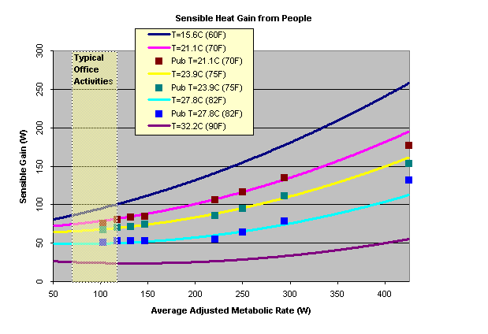
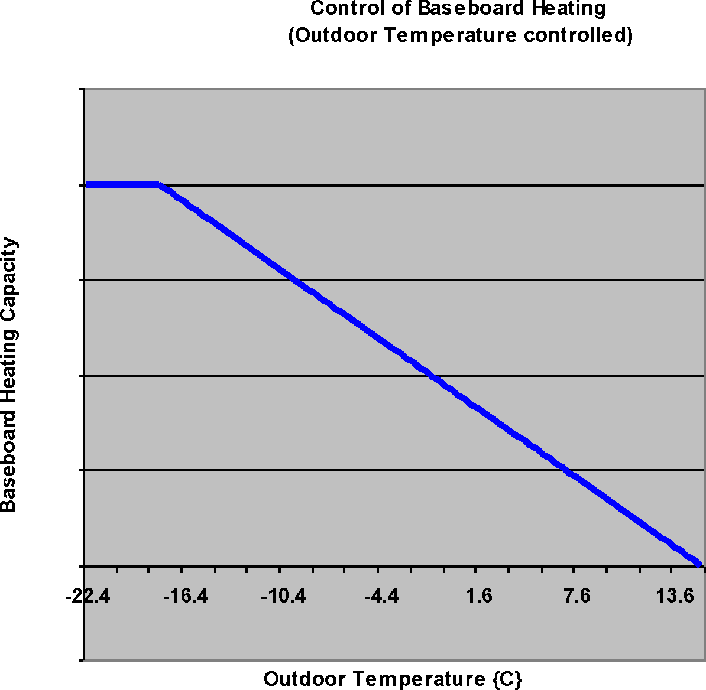


<!--RemoveStart-->
Simulation Models – Encyclopedic Reference
==========================================

The following descriptions are grouped alphabetically (as much as possible) with some also having additional tags of “Heat Balance”, “HVAC”, and “Plant”.  With the integrated solution, these designations signify where the effects of these models have their first impacts.

Main Sections:

* [Zone Internal Gains](#ZoneGains)
* [Indoor Swimming Pool ](#IndoorSwimmingPool)
* [Pipes](#Pipes)
* [Pumps](#Pumps)
* [Ideal Loads Air System](#IdealLoads)
* [District Cooling](#DistrictCooling)
* [District Heating](#DistrictHeating)
* [CentralHeatPumpSystem](#CentralHeatPumpSystem)
* [ChillerHeater](#ChillerHeater)
* [Plant Temperature Source Component](#PlantComponents)
<!--RemoveEnd-->

Zone Internal Gains 
-------------------

### Sources and Types of Gains

Internal heat gains from lights, people, and equipment of various types are often significant elements in the zone thermal balance.  EnergyPlus allows the user to specify heat gains for several equipment types including people, lights, gas/electric equipment, and several other types.  The total heat gain is comprised of convective, radiant and latent gains in various proportions from these sources.  Convective gains are instantaneous additions of heat to the zone air.  Radiant gains are distributed on the surfaces of the zone, where they are first absorbed and then released back into the room (with some fraction conducted through the surface) according to the surface heat balances. {See Surface Heat Balance Manager / Processes in this document}.  Latent gains must be handled by ventilation or air conditioning equipment.  Recommended heat gains are given by ASHRAE [1].  These recommendations include the sensible (convective plus radiative) and latent proportions.  Sensible gains from equipment are primarily radiant.  The user can specify the heat gains and proportions for any type of equipment.  Determining the gains from lights, people and baseboard heat are slightly more complicated.

### Heat Gain from Lights

The input object Lights provides a model for internal gains from lights.  Radiant gains from lights must be handled differently from other radiant gains for reasons described here (long wavelength description).  The total radiant gains from lights must be divided into visible and thermal portions.  For example, the total electric input to typical incandescent lights is converted to 10% visible radiation, 80% thermal radiation, and 10% convective gain.  In contrast, the electric input to typical fluorescent lights is converted to 20% visible radiation, 20% thermal radiation, and 60% convective gain [2].  These percentage splits are under user control with the Lights input object.

### Heat Gain from People

The input object People provides a model for internal gains from occupants.  Heat is generated in the human body by oxidation at a rate called the metabolic rate (see Thermal Comfort discussion for more details).  This heat is dissipated from the body surface and respiratory tract by a combination of radiation, convection, and evaporation.  The relative proportions of sensible (radiation plus convection) and latent (evaporation) heat from people is a complex function of the metabolic rate and the environmental conditions.  EnergyPlus uses a polynomial function to divide the total metabolic heat gain into sensible and latent portions.  That function is based on a fit to data [3] at average adjusted metabolic rates of 350, 400, 450, 500, 750, 850, 1000 and 1450 Btu/h each at temperatures of 70, 75, 78, 80, 82 degrees Fahrenheit.  Sensible gains of 0 at 96 F and sensible gains equal to the metabolic rate at 30 F were assumed in order to give reasonable values beyond the reported temperature range.

Average adjusted metabolic rate [3] is the metabolic rate to be applied to a mixed group of people with a typical percent composition based on the following factors:

Metabolic rate, adult female=Metabolic rate, adult male X 0.85

Metabolic rate, children = Metabolic rate, adult male X 0.75

The original data was in I-P (Inch-Pound) units, but the following correlation is in SI (Systems-International) units.

$$\begin{array}{c}S = 6.461927 + .946892\cdot M + .0000255737\cdot {M^2}\\ + 7.139322\cdot T - .0627909\cdot T\cdot M + .0000589172\cdot T\cdot {M^2}\\ - .198550\cdot {T^2} + .000940018\cdot {T^2}\cdot M - .00000149532\cdot {T^2}\cdot {M^2}\end{array}$$

where

M=Metabolic Rate (W)

T=Air Temperature (C)

S=Sensible Gain (W)

Latent Gain is simply the total gain (metabolic rate) – sensible gain:

$$LatentGain = MetabolicRate - SensibleGain$$

Figure 259.  Sensible Heat Gain from People Correlation

The function for sensible gain calculation is compared to the original data points in the following figure.  The radiant fraction of the sensible gain is a user input on the People object.

### Heat Gain from IT Equipment

The input object ElectricEquipment:ITE:AirCooled describes air-cooled electric information technology equipment (ITE) which has variable power consumption as a function of loading and temperature. The calculations are described below.

#### Variable Definitions – User Inputs:

* PDesign = Design power input when fully loaded and entering air temperature is at the user-specified design inlet temperature [W]
* PFanFracDesign = Design fan power input fraction of total power input when fully loaded and entering air temperature is at the user-specified design inlet temperature
* SchDesignLevel = Scheduled fraction of this equipment which is powered up
* SchCPULoading = Scheduled fraction of CPU loading
* TAirInDesign = Air inlet temperature at design condition [C]
* VAirDesign = Air volume flow rate at design condition [m3/s]
* VAirfLoadTAir = Air volume flow rate modifier function of TAirIn and SchCPULoading
* PCPUfLoadTAir = CPU power input modifier function of TAirIn and SchCPULoading
* PFanfFlowFrac = Fan power input modifier function of air flow fraction
* RecircFracDesign = Recirculation Fraction at design condition [C]
* RecircfLoadTAir = Recirculation Fraction modifier function of TAirSupply and SchCPULoading
* UPSEfficDesign = Design electric power supply efficiency
* UPSEfficfPLR = Electric power supply efficiency function of part load ratio
* UPSLossFracToZone = Fraction of electric power supply losses to zone
 
#### Variable Definitions – Simulation Inputs:

* TAirIn = Air inlet temperature at current conditions [C]
* TAirSupply = Supply air node temperature at current conditions [C]
* TZone = Zone air temperature at current conditions [C]
* TRoomAirNodeIn = Room air model inlet node air temperature at current conditions [C]
* RhoAir = Air density [kg/m3]
* CpAir = Air specific heat [J/kg-K]
 
#### Variable Definitions – Intermediate Calculations:

* PCPUDesign = Design CPU power input when fully loaded and entering air temperature is at the user-specified design inlet temperature [W]
* PFanDesign = Design fan power input when fully loaded and entering air temperature is at the user-specified design inlet temperature [W]
* UPSPLR = Electric power supply part load ratio (can be greater than 1.0)
 
#### Variable Definitions – Outputs:

* PCPU = CPU power input [W]
* PFan = Fan power input [W]
* PUPS = Electric power supply net power input [W]
* TAirOut = Air outlet temperature [C]
* VAir = Air volume flow rate [m3/s]
* FlowFrac = Air volume flow rate fraction of design flow rate
* RecircFrac = Recirculation fraction
* QAir = Air cooling rate [W]
* QUPS = Electric power supply heat loss rate to zone [W]
* QConv = Convective heat gain rate to zone heat balance [W]
* SHI = Supply heat index
* SHIZone = Zone average supply heat index
 
#### Calculations

The design power input is first split into portions for the CPU (everything in the equipment except the cooling fans) and the fan(s).

PCPUDesign = PDesign * (1 - PFanFracDesign)
 
PFanDesign = PDesign * PFanFracDesign
 
For each time step, the air inlet temperature is calculated depending on the type of air node connection.
 
TAirIn:

* If Air Node Connection Type = AdjustedSupply
    * RecircFrac = RecircFracDesign * RecircfLoadTAir(SchCPULoading TAirSupply)
    * TAirIn = TAirSupply * (1 – RecircFrac) +TAirZone * RecircFrac
 
* If Air Node Connection Type = ZoneAirNode
    * TAirIn = TAirZone
 
* If Air Node Connection Type = RoomAirModel
    * TAirIn = TRoomAirNodeIn
 
Using the air inlet temperature, the CPU power consumption, air flow rate, fan power consumption, and power supply power consumption are calculated.
 
PCPU = PCPUDesign * SchDesignLevel * PfLoadTAir(SchCPULoading, TAirIn)
 
FlowFrac = VAirfLoadTAir(SchCPULoading, TAirIn)
 
VAir = VAirDesign * FlowFrac
 
PFan = PFanDesign * SchDesignLevel * PFanfFlowFrac(FlowFrac)
 
UPSPLR = (PCPU + PFan) / (PCPUDesign + PFanDesign)
 
PUPS = (PCPU + PFan) * (1 - UPSEfficDesign * UPSEfficfPLR (UPSPLR))
 
The convective heat gain to the zone and the air outlet temperature are then calculated. The user specified fration of power supply losses are always added to the general zone heat balace convective heat gain. For air node connection types AdjustedSupply and ZoneAirNode, the CPU and fan power consumption are also added to the zone convective heat gain. For air connection type RoomAirModel, the gains from the CPU and fan power consumption are added to the outlet room air model node.
 
QAir = PCPU + PFan
 
QUPS = PUPS * UPSLossFracToZone
 
QConv:

* If Air Node Connection Type = AdjustedSupply OR ZoneAirNode
    * QConv = QAir + QUPS
 
* If Air Node Connection Type = RoomAirModel
    * QConv = QUPS
 
TAirOut = TAirIn + QAir / (VAir * RhoAir * CpAir)
 
The individual ITE supply heat index is calculated as shown below.
 
SHI = (TAirIn – TAirSupply) / (TAirOut - TAirSupply)
 
The zone average ITE supply heat index is weighted by the air flow rate of each ITE object.
 
SHIZone = ∑ [VAir * (TAirIn – TAirSupply)] / ∑ [VAir * (TAirOut - TAirSupply)]

### Heat Gain from Baseboard Heat

The input object ZoneBaseboard:OutdoorTemperatureControlled provides a model for an outdoor temperature controlled baseboard heater that adds energy to the zone according a control profile as shown in the following figure.  At TA = T2, the baseboard heat gain is Q2.  For TA &gt; T2, there is no heat gain.  For TA &lt; T1, a maximum amount of energy, Q1, is added to the zone.  There is proportional control between those two temperatures:

Figure 260.  Control of Outdoor Temperature Controlled Baseboard Heat

$$Q = Q2 - \frac{{(Q2 - Q1)\cdot (T2 - TA)}}{{(T2 - T1)}}$$

These temperature and capacity fields can be autosized based upon envelope, infiltration, and ventilation loads. To autosize these fields, users may set a design zone heating temperature that is assumed to be 20°C if blank.

The capacity at low temperature is the maximum capacity of the unit. It includes external envelope conduction load, infiltration load, and ventilation load in a space where the unit serves. The model first finds the lowest outdoor air temperature throughout design days included in the simulation, and determines the conduction load through external envelop as:

$${q_{Cond}} = UA\left( {{T_{Htg}} - {T_L}} \right)$$

where

*qCond* is conduction load through external envelope, W

*U* is heat transfer coefficient of external wall, W/m2K

*A* is area of external wall, m2

*THtg* is baseboard zone heating setpoint temperature, °C

*TL* is low temperature, °C

The capacity at low temperature that is the maximum capacity of the unit is thus expressed as:

$$Ca{p_{{T_L}}} = {q_{Cond}} + {q_I} + {q_V}$$

where

\(Ca{p_{{T_L}}}\)is capacity at low temperature, W

*qI* is design infiltration sensible load, W

*qV* = design ventilation sensible load, W

The capacity at high temperature is then prorated against the reference low and high temperatures as:

$$Ca{p_{{T_H}}} = Ca{p_{{T_L}}}\frac{{\left( {{T_{Htg}} - {T_H}} \right)}}{{\left( {{T_{Htg}} - {T_L}} \right)}}$$

where

\(Ca{p_{{T_H}}}\) is capacity at high temperature, W

*TH* is high temperature, °C

### Distribution of Radiant Gains

It is useful to consider the distribution of short wavelength (including visible) radiant energy separate from long wavelength (thermal) radiant energy because many materials have different optical properties at different wavelengths.  An extreme example is glass that is opaque to the long wavelengths and transparent to the short.  Properties of materials vary across the entire spectrum of wavelengths.  In EnergyPlus, all radiant interactions are represented in terms of only two wavelengths: “short” and “long”.  Short wavelength refers to the distribution given by a ~6000K black body source such as the sun.  Long wavelengths refer to radiation from ~300K sources such as walls or people.  There is negligible overlap between these two distributions.  Some sources, such as lights, must be considered as emitting both long and short wavelength radiation in proportions that approximate their actual effects on room surfaces.

Long wavelength radiation from all internal sources, such as people, lights and equipment, is combined and then distributed over surfaces. (see Internal Long-Wave Radiation Exchange).

Some fraction of the beam solar radiation transmitted into the zone is directly absorbed by the interior surfaces according to the solar distribution algorithm (see Solar Distribution) selected by the user.  The beam radiation not directly absorbed, plus the diffuse sky and ground-reflected radiation, plus the short wavelength radiation from lights are combined and distributed over the surfaces of the zone according to:

$$QS{I_i} = Q{S_n}\cdot {\alpha_i}/\sum\limits_{i = 1}^{NS} {{S_i}\cdot (1 - {\rho_i})} $$

If all surfaces in the room are opaque, the radiation is distributed in proportion to the area\*absorptance product of each surface.  For surfaces which are transparent,

$${\rho_i} = 1 - {\alpha_i} - {\tau_i}$$

That fraction of radiation represented by \({\tau_i}\) is lost from the zone.

The transmittance and absorptance of transparent surfaces (windows or glass doors) are calculated as in section Window Calculation Module based on the optical properties of the window material layers.  The total absorptance of the window is computed for the interior shading device, the inside surface, and the outside surface for diffuse solar radiation incident from outside the zone.  Those absorptances are used for short wavelength radiation incident from inside the zone.  In most cases, this should not cause significant error.  When movable insulation covers the window, the radiation that would have been transmitted is absorbed at the outer surface of the window (thermally equal to the inside surface of the insulation).

### References

ASHRAE. 2001. Handbook of Fundamentals, pp 29.8-29.13, Atlanta: ASHRAE.

Carrier Air Conditioning Company. 1965a. Handbook of Air Conditioning System Design, pp 1-99 to 1-100. New York: McGraw Hill.

Carrier Air Conditioning Company. 1965b. Handbook of Air Conditioning System Design, pp 1-100, Table # 48. New York: McGraw Hill.

Indoor Swimming Pool 
-----

The modeling of the indoor swimming pool is integrated into the surface heat balance procedures already in EnergyPlus with special modifications for radiation between the pool water surface and the surrounding of the space, convection to the surrounding air, evaporation of water, conduction to the pool bottom, and solar radiation absorbed in the pool water, the pool heating system, the presence of a cover, etc.  Effectively, the pool water mass is “added” to or lumped into the inside face of the surface to which the pool is “linked”.  Conduction through the floor uses the standard CTF formulation, however the heat balance is modified to include other terms specific to the pool water.

Some assumptions of the model are given below, followed by more details of individual components of the model.

* The pool water is lumped together at the inside face of a surface and follows the standard EnergyPlus heat balance methodology with some modifications based on the pool model details described in this section.
* The pool itself must reference a surface that is specifically defined as a floor and it covers the entire floor to which it is linked.
* The pool cannot by part of a low temperature radiant system (meaning that the construction of the floor cannot have any embedded pipes for heating or cooling).  In addition, the floor/pool cannot be defined with any movable insulation or be defined as a ventilated slab.
* The pool/floor surface must use the standard CTF solution algorithm.
* The pool may be covered and the fraction covered is defined by user input.  This value may vary from 0.0 to 1.0.
* The pool cover has an impact on evaporation, convection, short-wavelength radiation, and long-wavelength radiation.  Each of these has a separate user input that reduces the heat transfer parameter from the maximum achieved with a cover.  While the cover percentage is allowed to vary via a user schedule input, each individual parameter for these four heat transfer modes is a fixed constant.  For evaporation and convection, the factors simply reduce the amount of heat transfer proportionally.  For the radiation terms, the factors reduce the amount of radiation that impacts the surface (pool) directly.  The remaining radiation is assumed to be convected off of the pool cover to the zone air.
* Pool water heating is achieved by defining the pool as a component on the demand side of a plant loop.
* Makeup water replaces any evaporation of water from the pool surface and the user has control over the temperature of the makeup water.
* The pool is controlled to a particular temperature defined by user input.
* Evaporation of water from the pool is added to the zone moisture balance and affects the zone humidity ratio.
* The pool depth is small in comparison to its surface area.  Thus, heat transfer through the pool walls is neglected.  This is in keeping with the standard assumption of one-dimensional heat transfer through surfaces in EnergyPlus.

### Energy Balance of Indoor Swimming Pool

Heat losses from indoor swimming pools occur by a variety of mechanisms. Sensible heat transfer by convection, latent heat loss associated with evaporation, and net radiative heat exchange with the surrounding occur at the pool surface. Conductive heat losses take place through the bottom of the pool.  Other heat gains/losses are associated with the pool water heating system, the replacement of evaporated water with makeup water The energy balance of the indoor swimming pool estimates the heat gains/losses occurring due to:

* convection from the pool water surface
* evaporation from the pool water surface
* radiation from the pool water surface
* conduction to bottom of pool
* fresh pool water supply
* pool water heating by the plant
* changes in the pool water temperature

Detailed methods for estimating these heat losses and gains of the indoor swimming pools are described in the subsections below.

### Convection from the pool water surface

The convection between the pool water and the zone are defined using:

$$Q_{conv} = h \cdot A \cdot (T_p – T_a)$$

$$h = 0.22 \cdot (T_p – T_a)1/3$$

where

$Q_{conv}$ = Convective heat transfer rate (Btu/h·ft2)

$h$ = Convection heat transfer coefficient (Btu/h· ft2·⁰F)

$T_p$ = Pool water temperature (⁰F)

$T_a$ = Air temperature over pool (⁰F)

When a cover is present, the cover and the cover convection factor reduce the heat transfer coefficient proportionally.  For example, if the pool is half covered and the pool cover reduces convection by 50%, the convective heat transfer coefficient is reduced by 25% from the value calculated using the above equation.

### Evaporation from the pool water surface 

There are 5 main variables used to calculate the evaporation rate ($Q_{evap}$):

* Pool water surface area 
* Pool water temperature
* Room air temperature
* Room air relative humidity
* Pool water agitation and Activity Factor

$$\dot{m}_{evap} = 0.1 \cdot A \cdot AF \cdot (P_w – P_{dp})$$

where

$\dot{m}_{evap}$ = Evaporation Rate of pool water (lb/h)

$A$ = Surface area of pool water (ft²)

$AF$ = Activity factor

$P_w$ = Saturation vapor pressure at surface of pool water (in. Hg)

$P_{dp}$ = Partial vapor pressure at room air dew point (in. Hg)

Typical Activity Factor (AF)

<table class="table table-striped">

<tr>
<th>Type of Pool</th><th>Activity Factor (AF)</th>
</tr>
<tr>
<td>Recreational</td><td>0.5</td>
</tr>
<tr>
<td>Physical Therapy</td><td>0.65</td>
</tr>
<tr>
<td>Competition</td><td>0.65</td>
</tr>
<tr>
<td>Diving</td><td>0.65</td>
</tr>
<tr>
<td>Elderly Swimmers</td><td>0.5</td>
</tr>
<tr>
<td>Hotel</td><td>0.8</td>
</tr>
<tr>
<td>Whirlpool, Spa</td><td>1.0</td>
</tr>
<tr>
<td>Condominium</td><td>0.65</td>
</tr>
<tr>
<td>Fitness Club</td><td>0.65</td>
</tr>
<tr>
<td>Public, Schools</td><td>1.0</td>
</tr>
<tr>
<td>Wave Pool, Water Slides</td><td>1.5 – 2.0</td>
</tr>

</table>

When a cover is present, the cover and the cover evaporation factor reduce the amount of evaporation proportionally.  For example, if the pool is half covered and the pool cover reduces convection by 50%, the convective heat transfer coefficient is reduced by 25% from the value calculated using the above equation.
The value is converted to a latent gain (loss) through multiplication of the evaporation rate by the heat of vaporization of water.

### Radiation exchange with the pool water surface 

This uses the EnergyPlus internal short- and long-wavelength radiation balances already in place.  When a cover is present, it acts to reduce the amount of radiation that arrives at the pool water surface in comparison to the no cover case.  Any reduction in either type of radiation is accounted for by adding a convective gain/loss to the zone air.  So, in effect, the cover absorbs some radiation and then convects it to the zone air.

### Conduction through the bottom of the pool

The model ignores 2-d effects of pool walls and assume that pool depth is much less than the pool area. Conduction is calculated using the Conduction Transfer Function (CTF) equation with the outside temperature determined by the outside heat balance and the inside surface temperature calculated using the pool water heat balance that is lumped together with the inside surface heat balance.

### Makeup pool water supply

$$Q_{fw} = m_{fw} \cdot cw \cdot (T_p – T_{fw})$$

where

$m_{fw}$ = Mass flow rate

$c_w$ = Specific heat of water 

$T_p$ = Pool water temperature

$T_{fw}$ = Fresh water supply temperature

### Heat Gain from People

The input for the swimming pool requires that the user enter the maximum number of people in the pool, a schedule modifying the maximum number of people for different pool occupancies, and a heat gain per person schedule for differing activities.  These three parameters allow for the calculation of a total heat gain from () ̇during a given time.  It is assumed that all of the heat gain from people is via convection to the pool water.

### Heat from auxiliary pool heater

$$Q_{fw} = m_{hw} \cdot c_w \cdot (T_p – T_{hw})$$

where

$m_{hw}$ = Mass flow rate (lb·s)

$c_w$ = Specific heat of water (Btu/lb·⁰F)

$T_p$ = Pool water temperature (⁰F)

$T_{hw}$ = Heated water supply temperature (⁰F)

### Pool Heating to Control the Pool Water Temperature

The equation used to determine the flow rate request of hot water from the plant is an extremely simplified version of the pool heat balance.  This is because the mass of the pool is so much larger than any of the other heat flows.  As a result, for the sake of establishing a heated water flow rate, the following equation is used:

$$\frac{m_w c_p}{\Delta t} (T_{set}-T_{old}) = \dot{m}_p \cdot c_p \cdot (T_{in} - T_{set} )$$

where

$m_w$ = mass of pool water

$cp$ = specific heat of water

$\Delta t$ = time step length

$T_{set}$ = desired pool water temperature

$T_{old}$ = temperature of water at the last time step

$m_p$ = needed mass flow rate of water from the plant

$T_{in}$ = inlet water temperature from the plant

This equation is rearranged to solve for the needed mass flow rate of water from the plant since all of the other terms are known or given based on user input.  This establishes a flow request to the plant and is capped at the maximum value defined in input by the user.

### Pool/Surface Heat Balance Equation Summary

The following equation is the basis for the pool/surface heat balance.  As has been mentioned previously, the pool water is “merged” with the inside surface heat balance which is essentially the same thing as lumping the entire water of the pool in the inside surface heat balance.

$$\frac{m_w \cdot c_p}{\Delta t} (T_{set} - T_{old}) = Q_{cond} + Q_{conv} + Q_{lwrad} + Q_{swrad} + Q_{damp} + Q_{muw} + Q_{heater} + Q_{evap}$$

where

$\frac{m_w \cdot c_p}{\Delta t} (T_{set} - T_{old} )$ = the change in energy stored in the pool water

$Q_{cond}$ = net conduction to/from the pool water to the floor

$Q_{conv}$ = net convection between the pool water and the zone air

$Q_{lwrad}$ = net long-wavelength radiation between the pool water/floor and the surrounding surfaces as well as from internal heat gains

$Q_{swrad}$ = net short-wavelength radiation to the pool water/floor from solar and internal heat gains

$Q_{damp}$ = standard damping term used in the inside heat balance to avoid large swings in the radiation balance that sometimes cause instability in the solution (see the standard heat balance information for more details)

$Q_{muw}$ = net gain/loss from replacing water evaporated from the pool with makeup water

$Q_{heater}$ = net heat added to the pool via the plant loop (controlled to maintain a setpoint temperature as described above)

$Q_{evap}$ = net heat loss due to evaporation of pool water to the zone air

Details on each of these terms was either provided in previous parts of this section or in the standard EnergyPlus heat balance discussion elsewhere in the Engineering Reference.

### Other additional information

The following subsections are some useful information that those wishing to model a swimming pool in EnergyPlus might find helpful.  Further information can be found on-line or in reputable sources such as the ASHRAE Handbooks.

### Swimming Pool Flow Rate

The flow rate of the circulating pump is designed to turn over (circulate) the entire volume of water in the pool in 6 to 8 hours, or 3 or 4 times in 24 hours. About 1 or 2 percent of the pumped circulation rate should be provided as continuous makeup water demand to overcome losses from evaporation, bleed-off, and spillage. To fill the pool initially, a separate quick-fill line should be provided to do the job in 8 to 16 hours; however, filling is usually done at off-peak hours. Thus, the demand flow rate need not be considered in the system demand calculations, unless it out-weighs the demand of all other demands even during the off-peak hours.

### Comfort and Health

Indoor pools are normally maintained between 50 and 60% RH for two reasons:

* Swimmers leaving the water feel chilly at lower relative humidity due to evaporation off the body
* It is considerably more expensive (and unnecessary) to maintain 40% RH instead of 50% RH

### Air Delivery Rates (Indoor Pool)

Most codes require a minimum of 6 ACH, except where mechanical cooling is used. This rate may prove inadequate for some occupancy and use. Where mechanical dehumidification is provided, air delivery rates should be established to maintain appropriate conditions of temperature and humidity. The following rates are typically desired:

* Pools with no spectator areas, 4 ~ 6 ACH
* Spectator areas, 6 ~ 8 ACH
* Therapeutic pools, 4 ~ 6 ACH

Typical Swimming Pool Design Conditions

<table class="table table-striped">
<tr>
<th>Type of Pool</th><th>Air Temperature, ⁰C</th><th>Water Temperature, ⁰C</th>
</tr>
<tr>
<td>Recreational</td><td>24-30</td><td>24-30</td>
</tr>
<tr>
<td>Physical Therapy</td><td>26-30</td><td>30-32</td>
</tr>
<tr>
<td>Competition</td><td>26-29</td><td>24-28</td>
</tr>
<tr>
<td>Diving</td><td>27-29</td><td>27-32</td>
</tr>
<tr>
<td>Elderly Swimmers</td><td>29-32</td><td>29-32</td>
</tr>
<tr>
<td>Hotel</td><td>28-29</td><td>28-30</td>
</tr>
<tr>
<td>Whirlpool / Spa</td><td>27-29</td><td>36-40</td>
</tr>
</table>

### References

ASHRAE (2011). 2011 ASHRAE Handbook – HVAC Applications. Atlanta: American Society of Heating, Refrigerating and Air-Conditioning Engineers, Inc., p.5.6-5.9.

Janis, R. and W. Tao (2005). Mechanical and Electrical Systems in Buildings. 3rd ed. Upper Saddle River, NJ: Pearson Education, Inc., p.246.

Kittler, R. (1989). Indoor Natatorium Design and Energy Recycling. ASHRAE Transactions 95(1), p.521-526.

Smith, C., R. Jones, and G. Löf (1993). Energy Requirements and Potential Savings for Heated Indoor Swimming Pools. ASHRAE Transactions 99(2), p.864-874.

Pipes 
-----

### Heat Transfer Pipes (Objects: Pipe:Indoor & Pipe:Outdoor)

#### Heat Loss and Time Delay in Pipes

The effects of heat loss and time delay in plant loop pipes exposed to air (Pipe:Indoor and Pipe:Outdoor) can be modeled explicitly in EnergyPlus. Users can select the environment with which the pipe transfers heat. Currently users have three options: ‘OutdoorAir’, ‘Zone’ and ‘Schedule’. Simulation for each of the environments is similar except the way in which the heat transfer between the pipe outer wall and the surrounding environment is calculated. When using the ‘OutdoorAir’ option, the current outdoor dry-bulb temperature and wind velocity from the weather file (or design day input) are used. When the environment is specified as ‘Zone’, the mean air temperature and room air velocity of the corresponding zone are used.

In the case of a pipe in a zone, the heat loss or gain is accounted for in the pipe heat transfer calculation and is also included in the zone air heat balance calculations. When the environment is specified as ‘Schedule’, the user specifies a temperature and velocity schedule which will be used to calculate the heat transfer.

Pipe heat transfer in EnergyPlus is simulated by discretizing the pipe length into a number of nodes (20) and is an implementation of the model by Hanby et al. (2002). A control volume drawn around a node in the pipe is shown in Figure 261. Three nodes are defined at each discrete section of the pipe and represent the fluid, pipe wall and external environment. The fluid and pipe have defined thermal capacitance (mass). The insulation around the pipe is currently modeled as steady-state (no thermal mass), and so the effect of this resistance is accounted for within the hf term in the following description.  For the fluid, there is one-dimensional flow from each upstream node.

Figure 261. Control Volume drawn around node *i*

The model is formulated from the heat balances on the fluid and wall nodes.

$${M_{f,i}}{C_{P,f}}\frac{{d{T_{f,i}}}}{{dt}} = \dot m{C_{P,f}}\left( {{T_{f,i - 1}} - {T_{f,i}}} \right) - {h_f}{A_i}\left( {{T_{f,i}} - {T_{w,i}}} \right)$$

$${M_{w,i}}{C_{P,w}}\frac{{d{T_{w,i}}}}{{dt}} = {h_f}{A_i}\left( {{T_{f,i}} - {T_{w,i}}} \right) - {h_e}{A_i}\left( {{T_{w,i}} - {T_e}} \right)$$

Where, subscript *w*, *f* and *e* denote the values for pipe wall, fluid and environment respectively. The current node is represented by a subscript of *i*, while the previous node is represented by *i-1*.

\(M\) = Mass

\({C_p}\) = Specific Heat

\(\dot m\) = Mass flow rate of fluid in pipe

\(T\)  = Temperature

\(A\)  =  Heat Transfer Area

\(h\)  = Film convective resistance

\(t\)   = time

The exterior film convective resistance is calculated based on either wind speed, room air velocity, or a scheduled value based on the type of pipe heat transfer object. However, when the velocity gets too low, natural convection must be modeled. This is handled within the program by having a lower limit on the Nusselt number. For natural convection from a horizontal cylinder, a constant Nusselt number is assumed based on information from Spang (referenced below). This Nusselt number is 0.36. The Nusselt number used in calculating the exterior convection coefficient (Incropera and Dewitt 1996) is the maximum of the Nusselt number from the forced convection coefficient correlation and this natural convection Nusselt number (0.36).

In addition, the exterior resistance from the pipe wall inner surface to the environment will include resistance values for the pipe wall itself and any insulation specified around the pipe. This is treated as steady state value, so the simulation results are not affected by a change in insulation specific heat. However, the resistance is calculated based on thermal conductivity and thickness (using radial coordinate system), so the simulation results will vary with material conductivity changes. Again, this resistance is added in series with the exterior surface film convective resistance such that hf contains film and insulation resistance.

Approximating the derivatives using backward differencing enables these equations to be represented as simultaneous algebraic equations. For the fluid, at time step n, the heat balance is:

$$\frac{{{M_{f,i}}{C_{P,f}}}}{{\Delta t}}\left( {T_{f,i}^n - T_{f,i}^{n - 1}} \right) = \dot m{C_{P,f}}\left( {T_{f,i - 1}^n - T_{f,i}^n} \right) - {h_f}{A_i}\left( {T_{f,i}^n - T_{w,i}^n} \right)$$

Rearranging gives,

$$T_{f,i}^n\left[ {{M_{f,i}}{C_{P,f}} + \dot m{C_{P,f}}\Delta t + {h_f}{A_i}\Delta t} \right] = \dot m{C_{P,f}}\Delta tT_{f,i - 1}^n + {h_f}{A_i}\Delta tT_{w,i}^n + {M_{f,i}}{C_{P,f}}T_{f,i}^{n - 1}$$

or,

$${a_1}T_{f,i}^n = {a_2}T_{f,i - 1}^n + {a_3}T_{w,i}^n + {a_4}T_{f,i}^{n - 1}$$

where,

$$\begin{array}{l}{a_1} = {M_{f,i}}{C_{P,f}} + \dot m{C_{P,f}}\Delta t + {h_f}{A_i}\Delta t\\ {a_2} = \dot m{C_{P,f}}\Delta t\\ {a_3} = {h_f}{A_i}\Delta t\\ {a_4} = {M_{f,i}}{C_{P,f}}\end{array}$$

Similarly, taking backwards differences for the conduit wall at time step n, the heat balance becomes,

$$\frac{{{M_{w,i}}{C_{P,w}}}}{{\Delta t}}\left( {T_{w,i}^n - T_{w,i}^{n - 1}} \right) = {h_f}{A_i}\left( {T_{f,i}^n - T_{w,i}^n} \right) - {h_e}{A_i}\left( {T_{w,i}^n - T_e^n} \right)$$

Rearranging gives,

$$T_{w,i}^n\left[ {{M_{w,i}}{C_{P,w}} + {h_f}{A_i}\Delta t + {h_e}{A_i}\Delta t} \right] = {h_f}{A_i}\Delta tT_{f,i}^n + {h_e}{A_i}\Delta tT_e^n + {M_{w,i}}{C_{P,w}}T_{w,i}^{n - 1}$$

or,

$${b_1}T_{w,i}^n = {b_2}T_{f,i}^n + {b_3}T_{e,i}^n + {b_4}T_{w,i}^{n - 1}$$

where,

$$\begin{array}{l}{b_1} = {M_{w,i}}{C_{P,w}} + {h_f}{A_i}\Delta t + {h_e}{A_i}\Delta t\\ {b_2} = {h_f}{A_i}\Delta t\\ {b_3} = {h_e}{A_o}\Delta t\\ {b_4} = {M_{w,i}}{C_{P,w}}\end{array}$$

Substituting into gives an equation for the current fluid temperature:

$${a_1}T_{f,i}^n = {a_2}T_{f,i - 1}^n + {a_3}\left( {{b_2}T_{f,i}^n + {b_3}T_{e,i}^n + {b_4}T_{w,i}^{n - 1}} \right)/{b_1} + {a_4}T_{f,i}^{n - 1}$$

$$T_{f,i}^n = \frac{1}{{\left( {{a_1} - {a_3}{b_2}/{b_1}} \right)}}\left[ {{a_2}T_{f,i - 1}^n + {a_3}\left( {{b_3}T_{e,i}^n + {b_4}T_{w,i}^{n - 1}} \right)/{b_1} + {a_4}T_{f,i}^{n - 1}} \right]$$

The conduit is simulated by solving Eq. followed by Eq. for each of the twenty cells in the model and incrementing the time step. The fluid temperature of the last node is taken to be the pipe outlet temperature.

#### References

Hanby, V.I., Wright, J.A., Fletcher, D.W and Jones, D.N.T. 2002. Modeling the Dynamic Response of Conduits. International Journal of HVACR&R, Vol.8, No.1. pp. 1-12.

Incropera, F.P. and Dewitt, D.P. 1996. Fundamentals of Heat Transfer, 4th Edition, pp. 369-370.

Spang, Bernhard. Correlations for Convective Heat Transfer. Chemical Engineers’ Resource Page:

### Underground Pipe (Object: Pipe:Underground)

#### Description of Model

The buried pipe model in EnergyPlus is similar to the other pipe heat transfer objects (i.e., Pipe:Indoor and Pipe:Outdoor) except for the way in which the pipe boundary condition is developed. For a buried pipe the ground between the pipe and the surface must be modeled. For a shallow buried pipe, the GroundHeatExchanger:Surface object may be used, which uses modified conduction transfer functions to model the ground. However, beyond a certain thickness, the transfer function method fails, and EnergyPlus will respond with a fatal error due to convergence problems. Therefore, when a pipe is buried deeper than about one meter, this new buried pipe model should be used. When the pipe is buried shallower than one meter, either model may be used. Due to the finite difference nature of the Pipe:Underground model, the GroundHeatExchanger:Surface may be slightly faster and therefore more desirable.

The buried model develops a grid around the pipe. The grid was based originally on a model by Piechowski (1999), and still carries the model nomenclature. The grid extends from the ground surface down to a calculated distance below the pipe. The domain extends sideways from the symmetric center of the pipe to a calculated distance from the pipe. The grid stretches along the full length of the pipe. At each cross section, transient 2D Cartesian finite difference equations are used, updating each node except the node centered on the pipe. Axial heat transfer is not modeled in the soil. The large view of the outer Cartesian grid system is shown in Figure 262.

Figure 262. Pipe:Underground Outer Finite Difference Grid

When the model encounters the pipe node, the existing model for Pipe:Interior and Pipe:Exterior pipes is used. The finite difference temperatures neighboring the pipe, grid spacing and soil properties are used to create an average boundary temperature for the pipe along with a conductance value. With a boundary temperature available and a conductance value mimicking the convection coefficient, the simulation continues exactly as with the other pipe heat transfer objects. To avoid redundancy, see the Pipe:Indoor or Pipe:Outdoor objects for a detailed description of the pipe model.

#### Boundary Conditions

The boundary conditions for this model include a symmetric vertical boundary centered on the pipe, the ground surface, a ‘far-field’, and a ‘deep ground’. The ground surface boundary uses current simulation outdoor dry-bulb temperature, and the user-entered convection coefficient. The ‘far-field’ and ‘deep ground’ temperatures come from the "undisturbed" ground temperature object specified in the input. 

Currently, the model is set up to be exposed to open soil above the pipe. If the user intends on simulating this buried pipe under a foundation slab, the effects can be approximating by use of the basement/slab heat transfer preprocessor program. This program takes in general building information, and performs a simulation which generates ground temperatures. Typically these effects are used to generate boundary conditions for the floor zone, but they may also be used in generating the ground surface temperatures for this pipe model. The data from the slab program will be monthly temperatures, so the user can use these as a surface ground temperature object which provides boundary data to the Pipe:Underground model.

#### Geometry

The model develops the pipe depth and ground thickness from the user-entered construction information. The soil, pipe wall, and optional pipe insulation are entered as materials (with inherent thicknesses). The soil is entered as a standalone material, while the pipe insulation (if applicable) and the pipe wall should be given as a construction containing one or two materials. With knowledge of each individual thickness, the pipe geometry is obtained. The pipe length and inside diameter are the only additional geometry inputs.

#### Model Assumptions

* Constant properties throughout domain

* Moisture is not directly involved with the model operation, so careful selection of soil thermal conductivity is a priority

* Negligible axial heat transfer compared to radial heat transfer

* Axisymmetric heat transfer in near pipe region

* Surface convection coefficient is constant throughout simulation (does not vary with wind speed)

#### References

Kusuda, T. & Achenbach, P. 1965. ‘Earth Temperature and Thermal Diffusivity at Selected Stations in the United States’, ASHRAE Transactions Vol. 71, Part 1, pp. 61–75.

Piechowski, M. 1999. ‘Heat and Mass Transfer Model of a Ground Heat Exchanger: Theoretical Development’, Energy Research 23 (7), pp. 571–588.

### PipingSystem:Underground Simulation

In order to simulate diverse underground piping systems, a generalized model has been implemented which allows placement of pipes in a solid medium (soil).  The model simulates circuiting effects of multiple pipes by allowing fluid to flow in the pipes in different directions.  The model also has the capability of simulating interaction with zone surfaces to account for things such as basement heat transfer in a foundation heat exchanger.  Different aspects of the modelling approach are described in this section which can assist the user in determining if this model is appropriate for a particular application, and determining input parameter values.

An alternative interface is implemented which provides a simpler set of inputs for simulating horizontal trench heat exchangers.  The key limitations of the simpler inputs include all piping in the domain being on a single circuit, all trenches equidistance apart, and each trench with the same burial depth.  If this is satisfactory for an application, the GroundHeatExchanger:HorizontalTrench object is a suitable object.  The object uses the same underlying simulation algorithms and data structures as the detailed piping system model, but with a simpler set of input parameters.  For other cases and more detailed studies, the PipingSystem:Underground:\* objects provide full flexibility.

A dual-coordinate system finite volume heat transfer model of pipes buried in a conducting medium is employed.  The dual-coordinate system consists of a coarse Cartesian system in the conducting region (the soil, for example) with a refined radial system in the near-pipe region.  The pipes are connected as objects on the plant loop and are simulated as needed during loop convergence, while the ground itself is only simulated once per system time step.

#### Approach:

#### General Development and Solution Scheme

A new heat transfer model is implemented to handle a diverse set of buried pipe conditions.  The model uses a dual-coordinate system approach to solve a finite volume domain in a computationally efficient manner.  The main idea behind the dual coordinate system technique is to focus the computational effort to the region where it is most needed: near the pipe(s).  To this end, a coarse grid Cartesian coordinate system is used to solve the slow-moving ground heat transfer.  Then, within one of these cells, a radial coordinate system is configured around the pipe/insulation with a specialized interface cell between the systems.  Figure 263 shows an example of cells surrounding a pipe, including the radial region in the near-pipe cell, while Figure 264 shows a zoomed-in view of the near-pipe cell itself.

Figure 263. Radial "near-pipe" cell within a Cartesian cell

Figure 264. Close-up view of example radial cell

The ground heat transfer model can be set up in a fully-3D or quasi-3D manner.  In either case, there is a three-dimensional grid of Cartesian cells placed in the domain.  In fully-3D mode, the axial heat transfer is accounted for; in quasi-3D mode, the axial effects are ignored and the result is essentially a set of 2D slices along the length of the domain.  The determination of which method will be utilized in the final model shall be based upon final testing and on a balance between accuracy vs. computation time.  This option could be left to the end-user, but this will likely be unnecessary input overhead.

A fully implicit (and thus numerically stable) formulation is used to describe all cells, which means an iteration loop must be implemented.  In this solver, an outer iteration loop is used to bring the entire domain to convergence, while an inner iteration loop is used over all the radial cells.  This is intended to focus the computational effort even further.  The outer region may converge within one or two iterations, while the “near-pipe” cells may take much more iteration.  For this reason, it does not make sense to iterate over the entire domain a large number of times.

#### Boundary Conditions

The farfield boundary condition is defined by a Kusuda and Achenbach (1965) correlation, which requires annual ground surface temperature data.  As with the current Pipe:Underground model, the user will be able to enter the correlation parameters directly, or information from the monthly ground temperature input object will be used to infer the parameters.

The ground surface boundary condition is defined by an energy balance between the surrounding interior cells and the ground surface, including convection and radiation.  As with the Pipe:Underground object, the ground surface sun exposure may be an optional input to allow for a shaded ground surface.  In addition to the standard conduction, convection, and both short- and long-wave solar radiation at the surface, the ground surface boundary condition also includes the effects of evapotranspiration in the surface vegetation—the heat loss due to evaporation from soil to plant surface, and transpiration internal to the plant itself.  The evapotranspiration rate is calculated as a moisture loss by using the Walter et al. (2005) model, and translated into a heat loss by multiplication with the density and latent heat of evaporation of water.  The evapotranspiration rate is dependent on the type of vegetation at the surface; the user can vary the surface vegetation from anywhere between a concrete surface and a fairly tall grass (about 7”).

Based on the application, an adiabatic boundary condition will also be implemented and employed on particular surfaces of the domain.  For the case where a basement or under-slab region is present, for example, an adiabatic boundary will represent the vertical line of symmetry.

#### “Pipe Cell” Simulation

The ground is discretized into coarse Cartesian cells, some of which will contain a pipe.  These “pipe-cells” are further discretized into a radial system with a specialized interface cell to couple these systems.  The radial cells consist of a number of ground cells, with an optional insulation cell, then the pipe cell, followed by the fluid itself.

The fluid is modeled as a cylindrical cell interacting with incoming fluid and heat transfer to the pipe.  When there is no flow in the system, the cell essentially becomes radially adiabatic so that the fluid temperature will float during off periods.  It will not be equal to ground temperatures, unless it is off for a long time and the transient heat is allowed to dissipate.  When there is flow in the system, the incoming fluid and heat transfer from the pipe wall balance with the mass of the cell to come up with a new fluid temperature for that cell, to be passed downstream to the next cell.

The fluid within the cells is modeled directionally, so that the flow can be circuited through multiple pipe segments in different directions.  The flow direction in each pipe is specified by a choice field input.

#### Basement Interaction

The model can also interact with basement surfaces.  The interaction is split into two sections: floor surfaces and wall surfaces.  For each of these, the analysis is lumped, i.e., all walls are treated as one average wall surface and all floors are treated as one average floor surface.  The distance that the basement impinges within the domain is defined by a simple width and height specification.  The domain is then *cutaway* for that region.  Note that these distances then refer to the exterior surface of the wall or floor.

The ground heat transfer model does not perform any transient simulation of the basement surfaces.  The transient condition through these surfaces are left to the appropriate surface heat balance algorithms.  Instead, this model interacts directly at the outer boundary through the use of an *OtherSideConditions* model.  The ground heat transfer model will take the current exterior surface heat flux and use that as the boundary for neighboring cells.  Once convergence is achieved, the ground model will then effectively apply a constant surface temperature boundary condition by using a very high value of convection coefficient.  The surface heat balance algorithms will then pick this up during the next zone time step.

#### Mesh Development

The mesh is developed by using a few simple parameters.  There are two distinct categories, the large-scale Cartesian mesh and the near-pipe refined radial mesh.

* X, Y, Z mesh

* Mesh Layout

* Cell density

* Radial mesh

* Radial mesh thickness

* Cell count

The Cartesian mesh uses a cell density parameter to define the number of cells to use in the simulation.  Instead of requiring a detailed specification of all cell regions in the domain, this one parameter is used to specify a mesh density and is applied to all domain regions.  The cell density parameter represents the number of cells within any two domain partitions.  A domain partition is a basement wall or a pipe placed in the domain.  Once these partitions are all laid out and validated, the regions between them are populated with the number of cells specified in the cell density parameter.  Although this may lead to a variation of cell size within the domain, it is assumed that this will help focus computational intensity in the domain.  Of course, the number of cells (cell density parameter) can be different for each of the X, Y, and Z directions to allow for further fine tuning of the domain.

The Cartesian mesh is laid out in either a uniform or symmetric-geometric fashion.  In the former, the cells between any two domain partitions are equally sized.  In the latter, the cells are smaller near the partitions to again help fine-tuning computational intensity.  If the latter is selected, the amount of non-uniformity is specified by an additional parameter.

The radial coordinate system is always uniform for the soil cells, The two parameters to be specified for this region are the cell count (the number of soil cells to be generated outside of the pipe cell), and the radial mesh thickness (the radial distance from pipe outer wall to the cell boundary).  Each soil cell will then have a radial thickness equal to the radial mesh thickness divided by the cell count.

#### Simulation Methodology

The actual simulation of this model is performed in two parts: the ground simulation and the pipe cell simulation.

Since the ground is likely to be slow-moving and easily converging, it is simulated once per system time step.  This will simulate all the cells in the domain which do not contain a pipe segment.  The boundary conditions for this step are then the current surface conditions and farfield model along with the previous values for pipe cell temperature.  This small lag should provide suitable accuracy as the system time step will usually be smaller than the time constant of the pipe cell.  This decoupling leverages the core of the model development by again placing computational effort where it is needed most, near the pipes.

The ground simulation is performed once per time step, but the pipe cell simulation is performed at each call to the component.  Each pipe will be placed on a plant loop, but not necessarily on the same plant loop or loop side.  Thus, at each call to the object, that pipe will use the temperatures of the ground cells near the pipe as boundary conditions to simulate the “near-pipe” radial cells and fluid cell.  In this manner, the pipes will simulate numerous times following the convergence flow of the plant loop system.

#### References

Kusuda, T. & Achenbach, P. 1965. ‘Earth Temperature and Thermal Diffusivity at Selected Stations in the United States’, ASHRAE Transactions Vol. 71, Part 1, pp. 61–75.

Allen, R.G., Walter, I.A., Elliott, R.L., Howell, T.A., Itenfisu, D., Jensen, M.E., Snyder, R.L. 2005. The ASCE standardized reference evapotranspiration equation. Reston, VA:American Society of Civil Engineers. 59 p.

Pumps 
-----

The water pump is quite simply the component that drives the flow in plant and condenser loops. How it reacts depends on several different conditions. In total, there are three different decision variables, two of which are defined by user input. These three deciding factors are whether the pump is constant or variable speed, whether the pump operation is continuous or intermittent, and whether or not there is a load on the loop. The pump is simulated first on the supply side loop after the demand side loop has determined what the demand on the loop will be. For further reference look at sections Pump Control for Plant and Condenser Loops, Plant/Condenser Supply Side, and Plant/Condenser Demand Side in the Plant Flow Resolver of this document.

### Summary of Pump Rules

* Pumps in Plant Loop can be on the supply side or demand side

* A Pump, if present, in the demand side of plant loop must be the first component of the inlet branch.

* Pumps in Condenser loop must be on supply side

* Pumps can operate as constant or variable flow.

* Pumps can run continuously or intermittently.

* Single boiler/chiller with NO bypass, use Pump:ConstantSpeed

* Boiler/chiller should be constant flow

* Pump should be intermittent

* Single boiler/chiller with NO bypass, Pump:VariableSpeed

* Boiler/chiller should be variable flow, regardless of whether pump is intermittent or continuous (runs at the minimum if demand is less than minimum, this includes zero.)

* Single boiler/chiller with bypass, Pump:ConstantSpeed

* Boiler/chiller can be constant or variable flow

* Pump may be intermittent or continuous as long as the bypass can handle the entire pump volume when the boiler is not operating

Multiple branches add more complexity, but it is nothing more than continuity. If the pump is putting out flow then it has to have a branch to flow down whether it is a chiller or a bypass. It can be safer to add the bypass for a simulation. If the active machines require the flow the bypass will be dry. If performing a pressure simulation, and the flow goes through a machine which is off, the pressure drop will be accounted for, but no heat transfer through the machine will be calculated.

If the user designates a pump that is operating continuously, the pump will run regardless of whether or not there is a load. This may have the net effect of adding heat to the loop if no equipment is turned on. If the pump operates intermittently, the pump will run at its capacity if a load is sensed and will shut off if there is no load on the loop. If the pump is scheduled, the schedule modifies the Rated Volumetric Flow Rate of the pump on a time basis. The default is that the pump is ON and runs according to its other operational requirements.

Shown below is the calculation of the total efficiency of the pump and the actual pumping efficiency when the motor efficiency is accounted for either the variable or constant volume pumps.

!  Total\_Efficiency % = Rated\_Volume\_Flow\_Rate \* Rated\_Pump\_Head / Rated\_Power\_Use

 TotalEffic =   PumpEquip(PumpNum)%NomVolFlowRate \*

                   PumpEquip(PumpNum)%NomPumpHead /

                     PumpEquip(PumpNum)%NomPowerUse

!     Calculated Pump\_Efficiency % =Total\_Efficiency % / Motor\_Efficiency %

      PumpEquip(PumpNum)%PumpEffic =  TotalEffic /

                   PumpEquip(PumpNum)%MotorEffic

### Dynamic Pump Pressure Head

There is an option when performing plant/condenser loop simulations to account for dynamically changing loop pressure drop. For the current implementation, the loop pressure drop is calculated based on pressure drop data on each branch of the loop, then this total pressure drop is set as the pump pressure head. There is no pump curve implemented yet, so it is assumed that the pump can always handle this pressure value. This is a first approximation to actually having the pump ride a curve, and this initial implementation allows the user to enter minimal data, and yet get a more dynamic output for pump power, which is calculated based on current pressure drop and flow rate. The equation for pump power is now:

$$Pump\;Electric\;Power = Pump\;Volume\;Flow\;Rate*\frac{{Pump\;Head}}{{Total\;Efficiency}}$$

Without the pressure simulation, the pump power is based on the rated value entered with the pump object. For further information, see the input-output reference for Branch objects, and PlantLoop/CondenserLoop objects; as well as the Plant/Condenser loop section of this engineering reference.

### Variable Speed Pump

A variable speed pump (object name: Pump:VariableSpeed) is defined with maximum and minimum flow rates that are the physical limits of the device. The pump will operate and select a flow somewhere between the minimum and maximum limits. In the case where the pump is running, the pump will try to meet the flow request made by demand side components.

All of the pump rules and efficiency and power calculations are applicable from the introduction in the pump group section. The main difference between the the variable volume pump and the constant volume pump is the Part Load Performance Curve.The fraction of full load power is determined by the cubic equation:

$$FractionFullLoadPower = {C_1} + {C_2}PLR + {C_3}PL{R^2} + {C_4}PL{R^3}$$

where C1,C2,C3,and C4 are Coefficients 1 – 4 and PLR is the Part Load Ratio. In the pseudo code below the FracFullLoadPower modifies the NomPowerUse for the total pump “Power” and shows the “ShaftPower” and the “PumpHeattoFluid”.

VolFlowRate = PumpMassFlowRate / LoopDensity

  PartLoadRatio = VolFlowRate / PumpEquip(PumpNum)%NomVolFlowRate

  FracFullLoadPower =   PumpEquip(PumpNum)%PartLoadCoef(1)                     &

                      + PumpEquip(PumpNum)%PartLoadCoef(2) \* PartLoadRatio     &

                      + PumpEquip(PumpNum)%PartLoadCoef(3) \* PartLoadRatio\*\*2  &

                      + PumpEquip(PumpNum)%PartLoadCoef(4) \* PartLoadRatio\*\*3

  Power = FracFullLoadPower \* PumpEquip(PumpNum)%NomPowerUse

  ShaftPower = Power \* PumpEquip(PumpNum)%MotorEffic

! This adds the pump heat based on User input for the pump

! We assume that all of the heat ends up in the fluid eventually since this is a closed loop

!  PumpHeattoFluid = ShaftPower\*(1-PumpEquip(PumpNum)%PumpEffic)  &

  PumpHeattoFluid = ShaftPower + (Power - ShaftPower)\*PumpEquip(PumpNum)%FracMotorLossToFluid

  Node(OutletNode)%Temp = Node(InletNode)%Temp+PumpHeattoFluid/(PumpMassFlowRate \* LoopCp)

  PumpEquip(PumpNum)%Power = Power

### Pressure-based Flow for Variable Speed Pumps

With the introduction of pressure simulations in plant loops, the variable speed pump object now has the capability to model a more realistic variable speed operation. There are two operation modes which are introduced: differential pressure control is a widely used VFD control method while most VFDs also have a manual control mode in which the user determines the input frequency of the electric motor. The mode can be selected as ‘ManualControl’ or ‘PressureSetpointControl’ in the VFD Control Type input in Pump:VariableSpeed objects.

In manual VFD control mode the specified schedule will determine the current pump rotational speed throughout the simulation. This RPM value will be used to scale the pump curve which is entered by the user in non-dimensional form. Once the pump curve has been fixed then the successive substitution method will use this curve with the system curve to resolve the operating point. VFD manual control mode is implemented in EnergyPlus with the use of the RPM schedule input.

Differential pressure based control will maintain the differential pressure within the specified range. The pressure drop corresponding to the mass flow request will be calculated using the effective pressure constant of the system. This pressure drop will be checked against the pressure set point range. If the pressure drop is within the user specified range, then the mass flow rate will be checked against mass flow rates of operating points corresponding to maximum and minimum rotational speeds. Maximum and minimum differential pressure and rotational speeds are schedule inputs and can be entered as constant schedule.

The allowable mass flow rate range for the Differential pressure control is explained in the figure below:

Figure 265. Allowable mass flow rate range for the Differential pressure control

### Constant Speed Pump

The operation of a constant speed pump (object name: Pump:ConstantSpeed) is fairly straightforward. The user designates a maximum flow rate and when this pumpo operates it will run at that capacity. The main difference between the constant speed pump and the variable speed pump is that the fraction of full load power is always = 1. In the pseudo code below the FracFullLoadPower is = 1.0, therefore the Power is always the full power.

VolFlowRate = PumpMassFlowRate / LoopDensity

  PartLoadRatio = VolFlowRate / PumpEquip(PumpNum)%NomVolFlowRate

  FracFullLoadPower = 1.0

  Power = FracFullLoadPower \* PumpEquip(PumpNum)%NomPowerUse

  ShaftPower = Power \* PumpEquip(PumpNum)%MotorEffic

! This adds the pump heat based on User input for the pump

! We assume that all of the heat ends up in the fluid eventually since this is a closed loop

!  PumpHeattoFluid = ShaftPower\*(1-PumpEquip(PumpNum)%PumpEffic)  &

  PumpHeattoFluid = ShaftPower + (Power - ShaftPower)\*PumpEquip(PumpNum)%FracMotorLossToFluid

  Node(OutletNode)%Temp = Node(InletNode)%Temp+PumpHeattoFluid/(PumpMassFlowRate \* LoopCp)

  PumpEquip(PumpNum)%Power = Power

### Pressure-based Flow for Constant Speed Pumps

The constant speed pump can flow can also be overridden dynamically based on a response to the plant loop pressure drop. In “single-loop-pump” simulations (no branch pumps, no common pipe), the user can enter a dimensionless pump curve on the Pump:ConstantSpeed (see I/O ref) object which represents the single speed pressure-flow relationship of the pump. In the process of determining the operating flow rate for the pump, the pump will check to see if a valid pressure simulation is being performed. If it is, a flow will be prescribed based on a resolution between system pressure characteristics and the pump pressure curve. This will cause the pump flow to be “unpredictable,” meaning that it will not always be a constant, expected value, which is basically what the constant speed pump gives you without the pressure simulation. There is more detail on the pressure based simulation in the Plant/Condenser loop sections of this documentation.

### Pump Heat Addition to the Loop

Due to the fact that a pump is a mechanical device that acts on the fluid it is circulating, it causes the fluid to increase in temperature. The EnergyPlus model assumes that all pressure increase caused by the pump will eventually be lost due to friction, and that friction will be added as heat to the fluid. Since the plant and condenser loops are not yet true pressure-based models, EnergyPlus assumes that all of the heat resulting from the pump itself and from friction throughout the loop. Therefore, as of version 7, the pump heat is added to the plant loop interface by injecting the heat into the mixed tanks used to model loop thermal capacitance(previously it was added at the outlet node of the pump). The amount of heat added to the fluid is calculated using the following two equations:

$$ShaftPower = PumpPower * PumpMotorEfficiency$$

$$PumpHeatToFluid = ShaftPower + \left( {PumpPower - ShaftPower} \right) * FracMotorLossToFluid$$

where the pump motor efficiency is defined by the user input and the FracMotorLossToFluid is the amount of heat generated by the pump motor that is added to the fluid loop (as opposed to being lost to the environment where the pump is located). FracMotorLossToFluid is also a user input.

Note that the shaft power relates to the increase in head through the pump. Since all of this head is lost through the piping network due to frictional heat, this represents a heat gain by the fluid throughout the network. For simplicity, this heat is added along with the heat resulting from the pump motor. The difference between the pump power and the shaft power is the inefficiency of the pump—or the amount of energy input into the pump that the motor converts to heat rather than mechanical energy. Some of this heat is added to the fluid being pumped. These two terms are shown in the PumpHeatToFluid equation shown above. As of version 7, this heat is added to the loop capacitance tank(s) rather than at the pump’s outlet and so the outlet temperatue is equal to the inlet temperaure.

### Pump Heat Addition to Surrounding Zone

If the user input includes naming a Zone that surrounds the pump, then the pump becomes a source of internal heat gain to that zone.  The amount of heat transmitted to the surrounding zone is simply the difference between power input and the rate of heat transferred to the fluid. The user can also input a fraction,\({f_{rad}}\) , that controls the overall split between thermal radiation and sensible convection.  The pump’s sensible zone gains are determined using the following equations:

$$TotalZoneGain = PumpPower - PumpHeatToFluid$$

$$ConvectiveZoneGain = \left( {1 - {f_{rad}}} \right)*TotalZoneGain$$

$$RadiativeZoneGain = {f_{rad}}*TotalZoneGain$$

### Headered Pumps

The input objects HeaderedPumps:ConstantSpeed and HeaderedPumps:VariableSpeed  provide models for headered pumps that consist of two or more pumps connected in parallel. The headered pump is simulated as a single component, and it is specified as an integer number of a specific pump. The flow rate provided by the headered pump is determined by the number of pumps in operation and the flow rate of the individual pump. The total flow rate is calculated as

$$FlowProvided = NumPumpsON*IndividualPumpFlowRate$$

The simulation starts by turning ON all pumps in the group. The pumps are then turned OFF one at a time until the flow provided is less than the flow requested. Finally the last pump is turned back ON to meet the remaining flow (FlowDifference) requested. The flow rate of the last pump depends on the pump bank type. For constant speed headered pumps, the last pump runs at the nominal flow rate, thereby giving a final headered pump flow which is equal to or greater than the flow requested. In a variable speed headered pump the last pump runs at part load so that the flow provided matches the flow requested. The power of the headered pump is then calculated as

$$Power = (P{R_{FL}}{\rm{*N}}{}_{{\rm{FL}}} + {\rm{P}}{{\rm{R}}_{{\rm{PL}}}}{\rm{*}}{{\rm{N}}_{{\rm{PL}}}}{\rm{)*}}{{\rm{P}}_{{\rm{Nom}}}}{\rm{  }}$$

Where;

*Power* = Power consumed by the pump bank

*PRFL* = Power ratio at full load (Generally equal to 1)

*NFL* = Number of pumps running at full load

*PRPL* = Power ratio at part load

*NPL* = Number of pumps running at part load

*PNom* = Nominal power consumption of individual pumps

For a constant speed headered pump *NPL* is zero. For a variable speed headered pump *NPL* is equal to one.

### Condensate Pumps

The input object Pump:VariableSpeed:Condensate provides a model for steam condensate pumps, see the discussion for steam loops, reference: Condensate Pump.

Ideal Loads Air System 
----------------------

### Overview

The input object ZoneHVAC:IdealLoadsAirSystem provides a model for an ideal HVAC system. It occupies a place in the program hierarchy corresponding to a zone HVAC unit. It is not connected to a central air system – instead each ZoneHVAC:IdealLoadsAirSystem object supplies cooling or heating air to a zone in sufficient quantity to meet the zone load or up to its limits, if specified. The supply air conditions are controlled based on specifications in the ZoneHVAC:IdealLoadsAirSystem input. The system has options for humidity control, outdoor air, economizer, demand controlled ventilation, and heat recovery.

### Model

The ZoneHVAC:IdealLoadsAirSystem object is modeled as an ideal VAV terminal unit with variable supply temperature and humidity. The supply air flow rate is varied between zero and the maximum in order to satisfy the zone heating or cooling load, zone humidity controls, outdoor air requirements, and other constraints, if specified.

#### Inputs and Data

The user specifies some or all of the following data for each ZoneHVAC:IdealLoadsAirSystem object:

·        name of unit availability schedule

·        name of the zone inlet node;

·        name of the zone exhaust node;

·        maximum supply air temperature when in heating mode *Tmax,heating* [C];

·        minimum supply air temperature when in cooling mode *Tmin,cooling* [C];

·        maximum supply air humidity ratio when in heating mode *Wmax,humid* [kg water/kg dry air];

·        minimum supply air humidity ratio when in cooling mode *Wmin,dehum* [kg water/kg dry air];

·        heating limit type flag (*LimitFlowRate, LimitCapacity, LimitFlowRateAndCapacity* or *NoLimit*) *HeatingLimit*;

·        maximum heating air flow rate  [m3/s]

·        maximum sensible heating capacity  [W]

·        cooling limit type flag (*LimitFlowRate, LimitCapacity, LimitFlowRateAndCapacity* or *NoLimit*) *CoolingLimit*

·        maximum cooling air flow rate  [m3/s]

·        maximum total cooling capacity  [W]

·        name of heating availability schedule

·        name of cooling availability schedule

·        dehumidification control type flag (*ConstantSensibleHeatRatio, Humidistat, None,* or *ConstantSupplyHumidityRatio*) *DehumidCtrlType*

·        cooling sensible heat ratio

·        humidification control type flag (*Humidistat, None,* or *ConstantSupplyHumidityRatio*) *HumidCtrlType*

·        name of a DesignSpecification:OutdoorAir object

·        outdoor air inlet node name

·        demand controlled ventilation control type flag (*None, OccupancySchedule or CO2Setpoint*)

·        outdoor air economizer type flag (*NoEconomizer, DifferentialDryBulb, or DifferentialEnthalpy*)

·        heat recovery type flag (*None, Sensible, or Enthalpy*)

·        sensible heat recovery effectiveness

·        latent heat recovery effectiveness

#### All input data for the ZoneHVAC:IdealLoadsAirSystem is stored in the array PurchAir. The model and data are encapsulated in the module PurchasedAirManager.Calculation

·        Set the unit on/off flag *UnitOn*.

The unit is off (*UnitOn* = *False*) if the unit availability schedule value is &lt;=0; otherwise the unit is on (*UnitOn* = *True*). If the unit is on, the calculation proceeds through the remaining steps. If the unit is off, the zone inlet node conditions are set to the zone node condition, the inlet node mass flow rate is set to zero, and the unit outputs are set to zero.

·        Calculate the minimum outdoor air mass flow rate based on the specifications in the DesignSpecification:OutdoorAir object, if specified.

·        Calculate the sensible and latent impact of the outdoor air flow relative to the zone conditions

·        Determine if the unit needs to heat or cool

o   If outdoor air sensible impact is &gt;= load to zone cooling setpoint and the current thermostat type is not SingleHeatingSetPoint, then unit is in cooling mode

o   If outdoor air sensible impact is &lt; load to zone heating setpoint then unit is in heating mode

o   Else if neither condition is true, then unit is in deadband mode (provides outdoor air but shuts off economizer and heat recovery and all humidity control options except *Humidistat* option)

·        If in cooling mode, simulate outdoor air economizer and adjust outdoor air mass flow rate

·        Calculate supply air mass flow rate

o   If outdoor air flow rate exceeds applicable maximum flow rate (heating or cooling) then reduce outdoor air mass flow rate, issue warning, and set supply air mass flow rate equal to outdoor air mass flow rate

Else

o   Calculate supply air mass flow rate required to meet zone sensible load at the applicable (heating or cooling) supply temperature limit (*Tmax,heating* or *Tmin,cooling*)

$${\dot m_s} = {\dot Q_z}/({c_{p,air}}\cdot ({T_s} - {T_z}))$$

o   If *DehumidCtrlType*= Humidistat (and other conditions are met, see below), then calculate the supply air mass flow rate required to meet the humidistat dehumidification setpoint at *Wmin,dehum*

o   If *HumidCtrlType*= Humidistat (and other conditions are met, see below), then calculate the supply air mass flow rate required to meet the humidistat humidification setpoint at *Wmax,humid*

o   Set the supply air mass flow rate to the greatest of these, but limit to the applicable (heating or cooling) maximum flow rate

·        Calculate the mixed air conditions, modeling heat recovery, if applicable

o   The recirculation air conditions are set equal to the zone return air node conditions; if there is no return air node the recirculation air conditions are set equal to the conditions at the zone node.

o   The unit entering conditions are then:

If \({\dot m_s}\)&gt; \({\dot m_{oa}}\) then

$${h_{ma}} = ({\dot m_{oa}} \cdot {h_{oa}} + ({\dot m_s} - {\dot m_{oa}}) \cdot {h_{recirc}})/{\dot m_s}$$

$${W_{ma}} = ({\dot m_{oa}} \cdot {W_{oa}} + ({\dot m_s} - {\dot m_{oa}}) \cdot {W_{recirc}})/{\dot m_s}$$

$${T_{ma}} = {\mathop{\rm PsyHFnTdbW}\nolimits} ({h_{ma}},{W_{ma}})$$

Otherwise the entering air conditions are set equal to the outside air conditions.

·        Calculate the supply air temperature required to meet the zone sensible load at the supply air mass flow rate, but limit to the applicable (heating or cooling) supply temperature limit (*Tmax,heating* or *Tmin,cooling*)

$${T_s} = {T_z} + {\dot Q_z}/({c_{p,air}}\cdot {\dot m_s})$$

·        Calculate the supply humidity ratio based on the specified humidity control types, but limit to the applicable (heating or cooling) supply humidity ratio limit

o   *DehumidCtrlType = None* sets the supply air humidity ratio equal to the mixed air humidity ratio.

o   *DehumidCtrlType = Humidistat,* this will actively dehumidify to the humidistat dehumidification setpoint during cooling and deadband operation, and during heating operation if *HumidCtrlType = Humidistat*

o   *DehumidCtrlType = ConstantSensibleHeatRatio* sets the supply air humidity ratio using the cooling sensible heat ratio.

o   *DehumidCtrlType = ConstantSupplyHumidityRatio* sets the supply air humidity ratio = *Wmin,dehum*.

o   *HumidCtrlType = None* sets the supply air humidity ratio equal to the mixed air humidity ratio.

o   *HumidCtrlType = Humidistat,* this will actively humidify to the humidistat humidifying setpoint during heating and deadband operation, and during cooling operation if *DehumidCtrlType = Humidistat*

o   *HumidCtrlType = ConstantSupplyHumidityRatio* sets the supply air humidity ratio = *Wmax,humid*.

·        Limit supply humidity ratio to saturation at the supply temperature

·        Check the applicable capacity limits (sensible heating and total cooling) and adjust supply air temperature and humidity if needed.

·        Set the zone inlet node conditions to the supply air mass flow rate, temperature, and humidity ratio.

·        Calculate the unit output and load components.

### References

No specific references.

District Cooling 
----------------

When the user is not interested in a plant simulation or there is some centralized source of chilled water, the following model can be used in the input.  This allows the user to achieve a simulation without specifying operating parameters or curve fits for chiller models.  This model only needs the connections to the loop and the nominal capacity to simulate.  See the InputOutput Reference for additional information (Object: DistrictCooling).  This model calculates the output capacity necessary from the inlet temperature to the setpoint temperature for that loop with the given mass flow rate in Watts.

District Heating 
----------------

When the user is not interested in a plant simulation or there is some centralized source of hot water, the following model can be used in the input.  This allows the user to achieve a simulation without specifying operating parameters or curve fits for boiler models.  This model only needs the connections to the loop and the nominal capacity to simulate.  See the InputOutput Reference for additional information (Object: DistrictHeating).  This model calculates the output capacity necessary from the inlet temperature to the setpoint temperature for that loop with the given mass flow rate in Watts.

CentralHeatPumpSystem 
---------------------

### Overview

The CentralHeatPumpSystem object simulates the performance of a central heat pump system containing one or more chiller-heater objects. The main function of the object is to call relevant calculation methods for the chiller-heater objects depending on their operating modes, and to calculate temperatures at the outlet nodes and the total energy transfer. The object can be connected to plant loops and a source loop (see Input-Output Reference document), and the node connections are solely dependent on individual chiller-heaters’ operating modes. The central system receives water flows from each plant and source loop and then distributes them to individual chiller-heaters as requested. The conditioned water flows leaving the chiller-heaters are then returned to the system, and in turn flow back to the plant loops and source loop to produce heating and cooling, or exchange heat with the source loop.

### Model Description

The model first determines operating modes based on the cooling and heating loads on the system, and then decides which calculation algorithm is called. It calls the cooling calculation subroutine when cooling load is demanded, the heating calculation subroutine when heating load is demanded, and both cooling and heating calculation subroutines when both cooling and heating loads are demanded, i.e., simultaneous cooing-heating mode. It then calculates mass-weighed temperatures and heat transfer energy. Six different operating modes (0 through 5) are possible:

0: off

1: cooling-only mode

2: heating-only mode

3: heat recovery mode

4: cooling dominant simultaneous cooling-heating mode

5: heating dominant simultaneous cooling-heating mode.

The model reads different node information over the operating mode so that outlet water conditions at each node of the system can be appropriately determined.

In cooling-only mode (mode 1), the system is connected to the chilled water loop and source loop. It thus reads the evaporator outlet temperatures and mass flow rates of the chiller-heaters to calculate a mass-weighed chilled water temperature at the system outlet node, and the condenser outlet temperatures and mass flow rates of the chiller-heaters to calculate a mass-weighed source water temperature at the system outlet node. In heating-only mode (mode 2), the system is connected to the hot water loop and source loop. It thus reads the condenser temperatures and mass flow rates of the chiller-heaters to calculate a mass-weighed hot water temperature at the system outlet node, and the evaporator temperatures and mass flow rates of the chiller-heaters to calculate a mass-weighed source temperature at the system outlet node.

In simultaneous cooling-heating mode, three different operating modes (mode 3 through 5) are possible. The model checks which simultaneous cooling-heating mode (3, 4, or 5) each chiller-heater is in, and calculates relevant mass-weighed temperatures. The system may be connected to three loops such as chilled water loop, hot water loop, and source water loop in mode 4 or mode 5.

In heat recovery mode, both evaporator temperatures and condenser temperatures are read and a mass-weighed temperature for both chilled water and hot water is calculated. The chiller-heaters in mode 3 do not exchange heat with source water. At least one of the chiller-heaters within the system is in heat recovery mode during simultaneous cooling-heating mode. The system may be only connected to both chilled water loop and hot water loop if all operating chiller-heaters are in heat recovery mode.

The following nomenclature is used in the following equations:

\({\dot m_{cw,bypass}}\) = chilled water bypass mass flow rate in the system [kg/s]

\({\dot m_{hw,bypass}}\)= hot water bypass mass flow rate in the system [kg/s]

\({\dot m_{src,bypass}}\) =source water bypass mass flow rate in the system [kg/s]

\({\dot m_{cw,CH}}\) =chilled water mass flow rate of ith chiller-heater’s evaporator [kg/s]

\({\dot m_{hw,CH}}\) =hot water mass flow rate of ith chiller-heater’s condenser [kg/s]

\({\dot m_{src,CH}}\) =source water mass flow rate of ith chiller-heater, which varies with operating modes [kg/s]

\({\dot m_{cw,sys}}\) =chilled water mass flow rate of the system [kg/s]

\({\dot m_{hw,sys}}\) =hot water mass flow rate of the system [kg/s]

\({\dot m_{src,sys}}\) =source water mass flow rate of the system [kg/s]

\({T_{cw,sys}}\) =chilled water outlet temperature of the system [C]

\({T_{hw,sys}}\) =hot water outlet temperature of the system [C]

\({T_{src,sys}}\) =source water outlet temperature of the system [C]

\({T_{cw,bypass}}\) =mass-weighed bypass chilled water temperature in the system [C]

\({T_{hw,bypass}}\) =mass-weighed bypass hot water temperature in the system [C]

\({T_{src,bypass}}\) =mass-weighed bypass source water temperature in the system [C]

\({T_{cw,CH}}\) =mass-weighed chilled water outlet temperature from chiller-heaters [C]

\({T_{hw,CH}}\) =mass-weighed hot water outlet temperature from chiller-heaters [C]

\({T_{src,CH}}\) =mass-weighed source water outlet temperature from chiller-heaters [C]

\({T_{cw,i}}\) =chilled water inlet temperature of the system [C]

\({T_{hw,i}}\) =hot water inlet temperature of the system [C]

\({T_{src,i}}\) =source water inlet temperature of the system [C]

\({T_{cw,out}}\) =chilled water outlet temperature of ith chiller-heater [C]

\({T_{hw,out}}\) =hot water outlet temperature of ith chiller-heater [C]

\({T_{src,out}}\) =source water outlet temperature of ith chiller-heater [C]

The model reads node information and local variables of individual chiller-heaters. The nodes and local variables vary with the operating modes as described above in order to calculate mass-weighed temperatures. In the cooling-only mode, it calculates a mass-weighed chilled water temperature (*Tcw,CH*) and a source water temperature (*Tsrc,CH*) as follows:

$${T_{cw,CH}} = \sum\limits_{CH = 1}^n {{T_{cw,out}}} \frac{{{{\dot m}_{cw,CH}}}}{{{m_{cw,sys}}}}$$

***\({T_{src,CH}} = \sum\limits_{CH = 1}^n {{T_{src,out}}} \frac{{{{\dot m}_{src,CH}}}}{{{m_{src,sys}}}}\) ***.

In heating-only mode, it calculates a mass-weighed hot water temperature (*Thw,CH*) and a source water temperature (*Tsrc,CH*) as follows:

***\({T_{hw,CH}} = \sum\limits_{CH = 1}^n {{T_{hw,out}}} \frac{{{{\dot m}_{hw,CH}}}}{{{m_{hw,sys}}}}\) ***

***\({T_{src,CH}} = \sum\limits_{CH = 1}^n {{T_{src,out}}} \frac{{{{\dot m}_{src,CH}}}}{{{m_{src,sys}}}}\) ***.

When all chiller-heaters are in heat recovery mode, it calculates a mass-weighed chilled water temperature (*Tcw,CH*) and hot water temperature (*Thw,CH*) as follows:

***\({T_{cw,CH}} = \sum\limits_{CH = 1}^n {{T_{cw,out}}} \frac{{{{\dot m}_{cw,CH}}}}{{{m_{cw,sys}}}}\)***

***\({T_{hw,CH}} = \sum\limits_{CH = 1}^n {{T_{hw,out}}} \frac{{{{\dot m}_{hw,CH}}}}{{{m_{hw,sys}}}}\) ***.

In cooling or heating dominant simultaneous cooling-heating mode (mode 4 and 5), at least one chiller-heater should be in heat recovery mode, and the other(s) are in either mode 4 or mode 5. The system is connected to three loops such as chilled water loop, hot water loop, and source water loop. The model thus calculates a mass-weighed chilled water temperature (*Tcw,CH*), hot water temperature (*Thw,CH*), and source water temperature (*Tsrc,CH*) as follows:

***\({T_{cw,CH}} = \sum\limits_{CH = 1}^n {{T_{cw,out}}} \frac{{{{\dot m}_{cw,CH}}}}{{{m_{cw,sys}}}}\)***

***\({T_{hw,CH}} = \sum\limits_{CH = 1}^n {{T_{hw,out}}} \frac{{{{\dot m}_{hw,CH}}}}{{{m_{hw,sys}}}}\)***

***\({T_{src,CH}} = \sum\limits_{CH = 1}^n {{T_{src,out}}} \frac{{{{\dot m}_{src,CH}}}}{{{m_{src,sys}}}}\)*** .

The model then calculates a mass-weighed temperature for the by-pass flows remained in the system as follows:

$${T_{cw,bypass}} = {T_{cw,i}}\frac{{{{\dot m}_{cw,bypass}}}}{{{m_{cw,sys}}}}$$

$${T_{hw,bypass}} = {T_{hw,i}}\frac{{{{\dot m}_{hw,bypass}}}}{{{m_{hw,sys}}}}$$

$${T_{src,bypass}} = {T_{src,i}}\frac{{{{\dot m}_{src,bypass}}}}{{{m_{src,sys}}}}$$

The outlet temperatures at each outlet node of the system are then determined as it sums both mass-weighed temperatures up as follows:

$${T_{cw,sys}} = {T_{cw,CH}} + {T_{cw,bypass}}$$

$${T_{hw,sys}} = {T_{hw,CH}} + {T_{hw,bypass}}$$

\({T_{src,sys}} = {T_{src,CH}} + {T_{src,bypass}}\).

The total heat transfer energy of the system is also calculated in the same manner as the temperature calculations. The model simply sums all heat transfer energy of the chiller-heaters depending on their operating modes.

ChillerHeaterPerformance:Electric:EIR 
-------------------------------------

### Overview

The object simulates the performance of a chiller-heater which can receive pre-cooled or pre-heated water from the source loop, and provide cooling, heating, or simultaneous cooling-heating. The object needs to work with the Central Heat Pump System object to be controlled properly. This model does not simulate the thermal performance or the power consumption of associated pumps or cooling towers. The Central Heat Pump System object holds the input/output nodes connection of the chiller-heater and its control scheme, once the chiller-heater is properly referred.

### Model Description

The model uses user-input performance information at design conditions along with three performance curves (curve objects) for cooling capacity and efficiency to determine chiller operation at off-design conditions. Three additional performance curves for heating capacity and efficiency are used when the chiller is operating in a heating-only mode or simultaneous cooling-heating mode.

#### Cooling-only mode

The following nomenclature is used in the cooling equations:

*CompMotorEffic* =compressor motor efficiency

*CompPowerclg* =compressor power [W]

*CompPower@PLRmin*  =compressor power at the minimum part-load ratio [W]

\({C_{p,cw}}\) =chilled water specific heat  [J/kgK]

*CyclingRatio* =compressor cycling ratio =*PLRactual* / *PLRmin*

*EvapCapAvailclg* =available full-load cooling capacity at current conditions [W]

*EvapCapFTclg* =cooling capacity function of temperature curve

*EIRFTclg* =electric input to cooling output factor for temperature function curve

*EIRFPLRclg* =electric input to cooling output factor for part-load function curve

\({\dot m_{cw}}\) =chilled water mass flow rate [kg/s]

\({\dot m_{avail,cw}}\) =chilled water maximum available mass flow rate [kg/s]

*PLRclg* =cooling part-load ratio = *CoolingLoad* / *EvapCapAvailclg*

*PLRactual* =actual part-load ratio at current conditions

*PLRmin* =minimum part-load ratio

\(QCon{d_{c\lg }}\) =total condenser heat transfer energy [J]

\(\dot QCon{d_{c\lg }}\) =condenser heat transfer rate [W]

\(QEva{p_{c\lg }}\) =total evaporator heat transfer energy [J]

\(\dot QEva{p_{c\lg }}\) =evaporator heat transfer rate [W]

\({\dot Q_{falseloading,c\lg }}\) =false loading rate [W]

*RefCOPclg* =reference coefficient of performance [W/W]

*RefEvapCapclg* =reference evaporator capacity [W]

*FullLoadPwrclg* =reference full load power = *EvapCapAvailclg* / *RefCOPclg* [W]

*Tcond* =either entering or leaving condenser water temperature depending on user input for condenser water independent variable. *Tcond,l*, if “LeavingCondenser” is chosen, or *Tcond,e*, if “EnteringCondenser” is chosen.

*Tcond,e* =entering condenser water temperature [C]

*Tcond,l* =leaving condenser water temperature [C]

*Tcw,e* =entering chilled water  temperature [W]

*Tcw,l* =leaving chilled water  temperature [W]

\(\Delta {T_{cw}}\) =chilled water inlet and outlet temperature difference [C]

\(\Delta {T_{cw}}_{,\max }\) =maximum chilled water inlet and outlet temperature difference [C]

The model sequentially calls each chiller-heater module in the order defined in the Central Heat Pump System object. It then determines cooling load that each chiller-heater needs to meet and water flow rates delivered to each chiller-heater. Once each chiller-heater is assumed to operate, it determines cooling capacity and efficiency using user-supplied performance information.

Three performance curves are used in the calculation of cooling capacity and efficiency as follows:

1)   Cooling mode cooling capacity function of temperature curve (*EvapCapFTclg*)

2)   Cooling mode electric input to cooling output ratio function of temperature curve (*EIRFTclg*)

3)   Cooling mode electric input to cooling output ratio function of part load ratio curve (*EIRFPLRclg*)

The Cooling Capacity Function of Temperature Curve (*EvapCapFTclg*) represents the fraction of the cooling capacity of the chiller-heater as it varies by temperature. The curve should have a value of 1.0 at the reference conditions. The output of a bi-quadratic curve with the input variables being the leaving chilled water temperature and either the entering or leaving condenser water temperature is given by:

***\(EvapCapF{T_{c\lg }} = a + b{T_{cw,l}} + c{T_{cw,l}}^2 + d{T_{Cond}} + e{T_{Cond}}^2 + f{T_{cw,l}}{T_{Cond}}\)***.

The Cooling Mode Electric Input to Cooling Output Ratio Function of Temperature (EIRFTclg) curve represents the fraction of electricity to the chiller-heater at full load as it varies by temperature. The output of a bi-quadratic curve with the input variables being the leaving chilled water temperature and either the entering or leaving condenser water temperature is given by:

***\(EIRF{T_{c\lg }} = a + b{T_{cw,l}} + c{T_{cw,l}}^2 + d{T_{Cond}} + e{T_{Cond}}^2 + f{T_{cw,l}}{T_{Cond}}\)***.

The Cooling Mode Electric Input to Cooling Output Ratio Function of Part Load Ratio (EIRFPLRclg) curve represents the fraction of electricity to the chiller-heater as the load on the chiller varies at a given set of operating temperatures. The curve is normalized so that at full load the value of the curve should be 1.0. Note that the bi-cubic formulation below is generally only valid when LeavingCondenser variable is chosen for the field of Cooling Mode Condenser Water Temperature Curve Input Variable whereas the quadratic curve can be used for both choices, i.e., LeavingCondenser and EnteringCondenser. Bi-cubic may also be used when the chiller-heater uses a variable-speed compressor motor drive. The output of this curve can be determined by one of the following three performance curves:

$$EIRFPL{R_{c\lg }} = a + b{T_{Cond,l}} + c{T_{Cond,l}}^2 + dPLR + ePL{R^2} + f{T_{Cond,l}}PLR + g \cdot 0 + hPL{R^3} + i \cdot 0 + j \cdot 0$$

$$EIRFPL{R_{c\lg }} = a + bPLR + cPL{R^2}$$

$$EIRFPL{R_{c\lg }} = a + bPLR + cPL{R^2} + dPL{R^3}$$

The full-load cooling capacity at specific temperature operating conditions (i.e., at temperatures different from the design temperatures) is then computed as follows:

***\(EvapCapAvai{l_{c\lg }} = RefEvapCa{p_{c\lg }} \cdot EvapCapF{T_{c\lg }}\)***.

The model then determines current chiller-heater’s evaporator heat transfer rate based on the total cooling load required a central heat pump system to meet and the maximum available chiller-heater cooling capacity. The maximum evaporator temperature difference between the entering chilled water temperature (*Tcw,e*) and the leaving chilled water temperature (*Tcw,l*) obtained from the plant loop setpoint temperature can also be determined. It then calculates mass flow rate for variable flow control chiller-heaters and the temperature difference for constant flow control chiller-heaters, setting the cooling load each chiller-heater needs to meet equal to the evaporator heat transfer rate.

As for variable flow control chiller-heaters, the chilled water mass flow rate is computed as follows:

***\({\dot m_{cw}} = \frac{{\dot QEva{p_{c\lg }}}}{{{C_{p,cw}}\Delta {T_{cw,\max }}}}\)***.

The chilled water mass flow rate calculated is then compared to the maximum available mass flow rate for individual chiller-heaters. If the calculated one is bigger than the maximum, the model sets the chilled water mass flow rate equal to the maximum. It then adjusts the temperature difference based on the evaporator heat transfer rate and the maximum mass flow rate. If the adjusted temperature difference also exceeds the maximum, the model finally adjusts the evaporator heat transfer rate at the maximum temperature difference and mass flow rate as follows:

***\(\dot QEva{p_{c\lg }} = {\dot m_{avail,cw}}{C_{p,cw}}\Delta {T_{cw,\max }}\)***.

As for constant flow control chiller-heaters, the model calculates chilled water temperature difference as follows:

***\(\Delta {T_{cw}} = \frac{{\dot QEva{p_{c\lg }}}}{{{{\dot m}_{avail,cw}}{C_{p,cw}}}}\)***.

The temperature difference calculated is then compared to the maximum temperature difference allowed. If the calculated one is bigger than the maximum, the model sets the chilled water temperature difference equal the maximum, and then adjusts the evaporator heat transfer rate at the given conditions as follows:

***\(\dot QEva{p_{c\lg }} = {\dot m_{avail,cw}}{C_{p,cw}}\Delta {T_{cw,\max }}\)***.

The model then calculates the part-load ratio as the ratio of the evaporator heat transfer rate to the available chiller-heater capacity as follows:

***\(PL{R_{c\lg }} = \frac{{\dot QEva{p_{c\lg }}}}{{\dot QEvapAvai{l_{c\lg }}}}\)***.

The part-load ratio calculated is set to be between the maximum of 1.0 and the minimum of 0.0 when it is out of the range. Once the part-load ratio is calculated the cycling ratio and false loading rate can be obtained as follows:

$$CyclingRatio = \frac{{PL{R_{{\rm{actual}}}}}}{{PL{R_{{\rm{min}}}}}}$$

\({\dot Q_{falseloading,c\lg }} = EvapCapAvai{l_{{\rm{clg}}}} \cdot PL{R_{c\lg }} \cdot CyclingRatio - \dot QEva{p_{{\rm{clg}}}}\).

The compressor power demand is then computed by:

\(CompPowe{r_{c\lg }} = RefFullLoadPowe{r_{{\rm{clg}}}} \cdot {\rm{ }}EIRF{T_{c\lg }}{\rm{ }} \cdot EIRFPL{R_{c\lg }} \cdot CyclingRatio\).

The heat transfer rate for the chiller-heater condenser can then be computed as follows:

\(\dot QCon{d_{c\lg }} = ComPowe{r_{c\lg }} \cdot CompMotorEffic + \dot QEva{p_{c\lg }} + {\dot Q_{falseloading,c\lg }}\) .

The total heat transfer energy by the evaporator and condenser can be calculated as follows:

$$QEva{p_{c\lg }} = \dot QEva{p_{c\lg }} \cdot TimeStepSys \cdot 3600$$

\(QCon{d_{c\lg }} = \dot QCon{d_{c\lg }} \cdot TimeStepSys \cdot 3600\) .

#### Heating-only mode and Simultaneous cooling-heating mode

The following nomenclature is used in the heating equations:

*CompMotorEffic* =compressor motor efficiency

*CompPowerhtg* =compressor power demand [W]

*CompPower@PLRmin*  =compressor power at the minimum part-load ratio [W]

\({C_{p,evap}}\) =evaporator water specific heat  [J/kgK]

\({C_{p,hw}}\) =hot water specific heat  [J/kgK]

*CyclingRatio* =compressor cycling ratio =*PLRactual* / *PLRmin*

*EvapCapAvailhtg* =available full-load cooling capacity at current conditions [W]

*EvapCapFThtg* =heating mode cooling capacity function of temperature curve

*EIRFThtg* =electric input to cooling output factor for temperature function curve

*EIRFPLRhtg* =electric input to cooling output factor for part-load function curve

\({\dot m_{avail,evap}}\) =evaporator water maximum available mass flow rate [kg/s]

\({\dot m_{avail,hw}}\) =condenser water maximum available mass flow rate [kg/s]

\({\dot m_{hw}}\) =hot water mass flow rate [kg/s]

*PLRhtg* =cooling part-load ratio = *RefCap* / *EvapCapAvailhtg*

*PLRmax* =maximum part-load ratio at current conditions

*PLRmin* =minimum part-load ratio

\(QCon{d_{htg}}\) =total condenser heat transfer energy [J]

\(\dot QCondAvai{l_{htg}}\) =available full-load heating capacity at current conditions [W]

\(\dot QCon{d_{htg}}\) =condenser heat transfer rate [W]

\(QEva{p_{htg}}\) =total evaporator heat transfer energy [J]

\(\dot QEva{p_{htg}}\) =evaporator heat transfer rate [W]

\({\dot Q_{falseloading,htg}}\) =false loading rate [W]

*RefCOPhtg* =reference coefficient of performance [W/W]

*RefEvapCaphtg* =reference evaporator capacity [W]

*FullLoadPwrhtg* =reference full load power = *EvapCapAvailhtg*/ *RefCOPhtg* [W]

*Tcond* =either entering or leaving condenser water temperature depending on user input for condenser water independent variable. *Tcond,l*, if “LeavingCondenser” is chosen, or *Tcond,e*, if “EnteringCondenser” is chosen.

*Tcond,e* =entering condenser water temperature [C]

*Tcond,l* =leaving condenser water temperature [C]

*Tcw,l* =leaving chilled water  temperature [C]

*Thw,e* =entering hot water temperature [C]

*Thw,l* =leaving hot water temperature [C]

\(\Delta {T_{evap}}\) =evaporator inlet and outlet water temperature difference [C]

\(\Delta {T_{hw}}\) =hot water inlet and outlet temperature difference [C]

\(\Delta {T_{hw}}_{,\max }\) =maximum hot water inlet and outlet temperature difference [C]

The calculations for the evaporator side are similar to the cooling-only mode calculations. The evaporator capacity and efficiency is determined by a different set of three performance curves read in the cooling-only mode, and the performance curve set is used for both heating-only mode and simultaneous cooling-heating mode. During these modes, the evaporator side is not connected to the chilled water loop, but source water loop. The model thus assumes that each chiller-heater does not meet the plant loop chilled water setpoint temperature while the evaporator operates at the full load capacity to produce heating at a constant water flow rate.

The model sequentially calls each chiller-heater module in the order of the definition in the central heat pump system. It then determines heating load that each chiller-heater needs to meet and water flow rates delivered to each chiller-heater. Once each chiller-heater is assumed to operate, it determines heating capacity and efficiency using the following performance curves:

1)   Heating mode cooling capacity function of temperature curve (*EvapCapFThtg*)

2)   Heating mode electric input to cooling output ratio function of temperature curve (*EIRFThtg*)

3)   Heating mode electric input to cooling output ratio function of part load ratio curve (*EIRFPLRhtg*)

The output of a Heating Mode Cooling Capacity Function of Temperature curve with the input variables being the leaving chilled water temperature and either the entering or leaving condenser water temperature is given by:

***\(EvapCapF{T_{htg}} = a + b{T_{cw,l}} + c{T_{cw,l}}^2 + d{T_{Cond}} + e{T_{Cond}}^2 + f{T_{cw,l}}{T_{Cond}}\)***

The output of a Heating Mode Cooling Output Ratio Function of Temperature curve with the input variables being the leaving chilled water temperature and either the entering or leaving condenser water temperature is given by:

***\(EIRF{T_{htg}} = a + b{T_{cw,l}} + c{T_{cw,l}}^2 + d{T_{Cond}} + e{T_{Cond}}^2 + f{T_{cw,l}}{T_{Cond}}\)***.

The output of Heating Mode Cooling Output Ratio Function of Part Load Ratio curve can be determined by one of the following three performance curves as follows:

$$EIRFPL{R_{htg}} = a + b{T_{Cond,l}} + c{T_{Cond,l}}^2 + dPLR + ePL{R^2} + f{T_{Cond,l}}PLR + g \cdot 0 + hPL{R^3} + i \cdot 0 + j \cdot 0$$

$$EIRFPL{R_{htg}} = a + bPLR + cPL{R^2}$$

$$EIRFPL{R_{htg}} = a + bPLR + cPL{R^2} + dPL{R^3}$$

The full-load evaporator capacity at specific temperature operating conditions is then given by:

***\(EvapCapAvai{l_{htg}} = RefEvapCa{p_{htg}} \cdot EvapCapF{T_{htg}}\)***.

The part-load ratio is set to be between zero and the maximum, and the evaporator heat transfer rate is computed by:

***\(\dot QEva{p_{htg}} = EvapCapAvai{l_{htg}}PL{R_{htg}}\)***The evaporator inlet and outlet temperature difference is then given by:

***\(\Delta {T_{evap}} = \frac{{\dot QEva{p_{htg}}}}{{{{\dot m}_{avail,evap}}{C_{p,evap}}}}\)***

Once the part-load ratio is calculated the cycling ratio and false loading rate are computed by:

$$CyclingRatio = \frac{{PL{R_{{\rm{actual}}}}}}{{PL{R_{{\rm{min}}}}}}$$

\({\dot Q_{falseloading,htg}} = EvapCapAvai{l_{{\rm{htg}}}} \cdot PL{R_{htg}} \cdot CyclingRatio - \dot QEva{p_{{\rm{htg}}}}\).

The compressor power demand is then computed by:

***\(CompPowe{r_{htg}} = FullLoadPowe{r_{{\rm{htg}}}} \cdot {\rm{ }}EIRF{T_{htg}}{\rm{ }} \cdot EIRFPL{R_{htg}} \cdot CyclingRatio\)***

The heat transfer rate of the chiller-heater condenser is then computed as follows:

$$\dot QCondAvai{l_{htg}} = ComPowe{r_{htg}} \cdot CompMotorEffic + \dot QEva{p_{htg}} + {\dot Q_{falseloading,htg}}$$

Once condenser available heating capacity is determined, the model calculates current chiller-heater’s condenser heat transfer rate based on the total heating load required a central heat pump system to meet as well as available heating capacity of the chiller-heater. The maximum condenser temperature difference between the entering hot water temperature (*Thw,e*) and the leaving hot water temperature (*Thw,l*) obtained from the plant loop setpoint temperature can also be obtained. It then calculates condenser water mass flow rate for variable flow control chiller-heaters and the hot water temperature difference for constant flow control chiller-heaters, setting the cooling load that each chiller-heater needs to meet equal the evaporator heat transfer rate.

As for variable flow control chiller-heaters, the condenser water mass flow rate is computed as follows:

***\({\dot m_{hw}} = \frac{{\dot QCon{d_{htg}}}}{{{C_{p,hw}}\Delta {T_{hw,\max }}}}\)***.

The condenser water mass flow rate calculated is then compared to the maximum available mass flow rate for individual chiller-heaters. If the calculated one is bigger than the maximum, the model sets the condenser water mass flow rate equal the maximum. It then adjusts the hot water temperature difference at the maximum mass flow rate. If the adjusted temperature difference also exceeds the maximum, the model finally adjusts the condenser heat transfer rate at the maximum allowable conditions as follows:

***\(\dot QCon{d_{htg}} = {\dot m_{avail,hw}}{C_{p,hw}}\Delta {T_{hw,\max }}\)***.

As for constant flow control chiller-heaters, the model calculates condenser temperature difference as follows:

***\(\Delta {T_{hw}} = \frac{{\dot QCon{d_{htg}}}}{{{{\dot m}_{avail,hw}}{C_{p,hw}}}}\)***.

The temperature difference calculated is then compared to maximum hot water temperature difference. If the calculated one is bigger than the maximum, the model sets the hot water temperature difference equal the maximum, and then adjusts the condenser heat transfer rate at the given conditions as follows:

***\(\dot QCon{d_{htg}} = {\dot m_{avail,hw}}{C_{p,hw}}\Delta {T_{hw,\max }}\)***.

Finally, the total heat transfer energy by the evaporator and condenser can then be calculated as follows:

***\(QEva{p_{htg}} = \dot QEva{p_{htg}} \cdot TimeStepSys \cdot 3600\)***

***\(QCon{d_{htg}} = \dot QCon{d_{htg}} \cdot TimeStepSys \cdot 3600\)***.

### References

Central Geothermal Systems, Applications Engineering Manual, Trane Company, April 2010, SYS-APM009-EN.

Plant Temperature Source Component 
----------------------------------

This component (Object: PlantComponent:TemperatureSource) is a simple object used to simulate systems with a known supply temperature.  This could include a river, well, or other configuration where a known temperature is pumped back into the plant system.  This fluid could be isolated from chilled water and other loops by using a heat exchanger connection between the loops.

The temperature of the source of this object can be either constant or scheduled.  If scheduled, it could also be actuated by EMS to allow a calculated temperature at run-time.

The logic of this component is quite simple: if there is flow through the component, the outlet temperature is always the source temperature.  The component requests flow from the design flow rate, which can be autosized.

#### References

No specific references.
