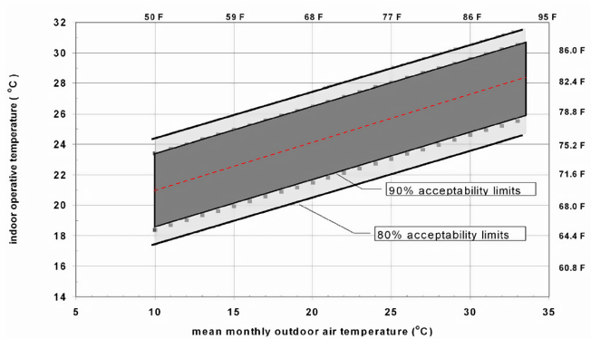
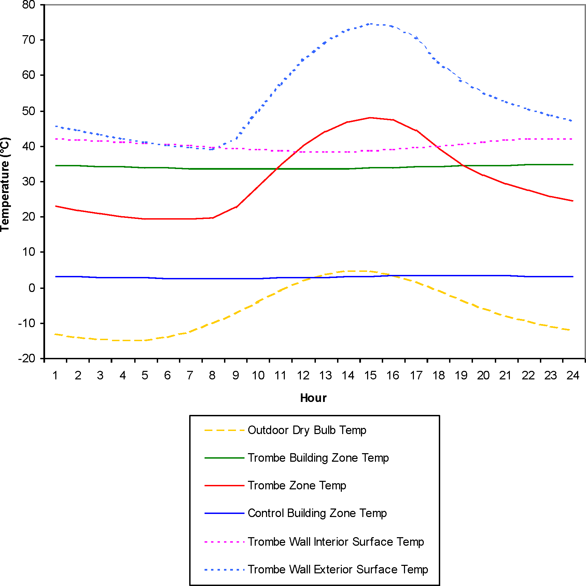
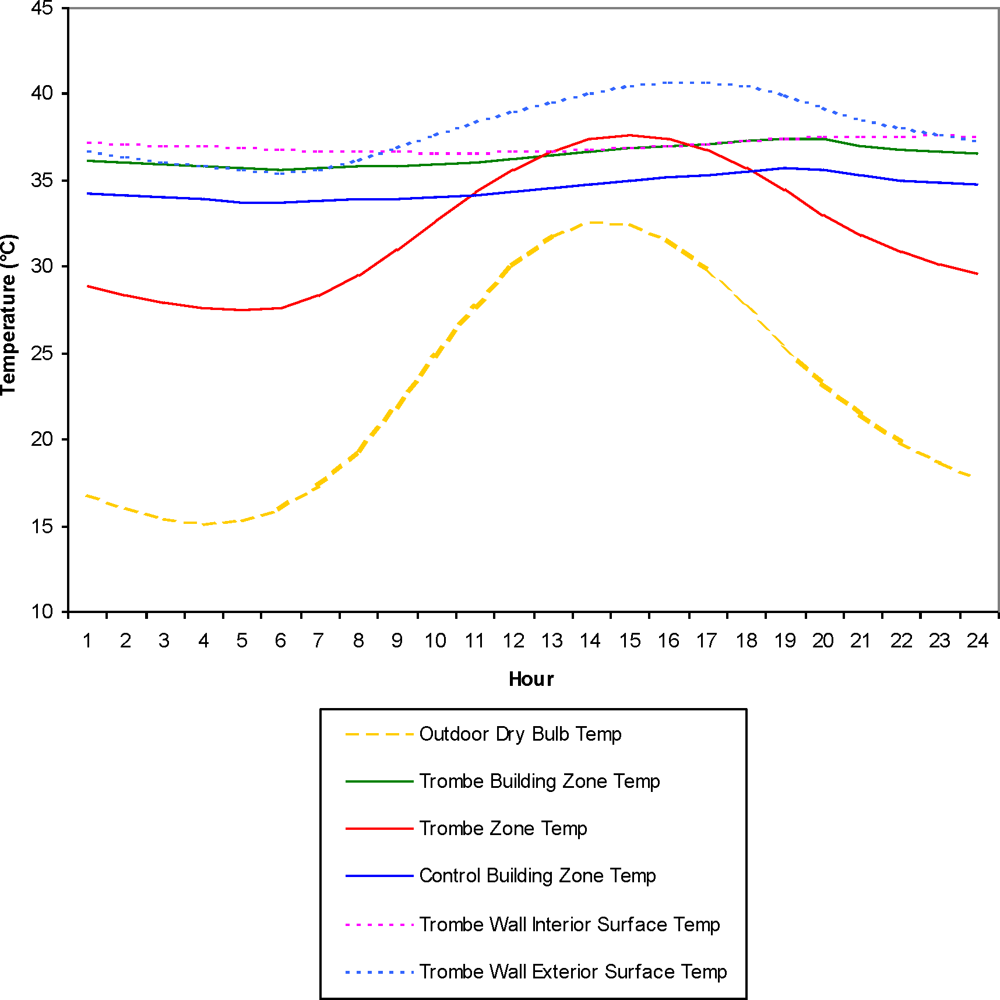
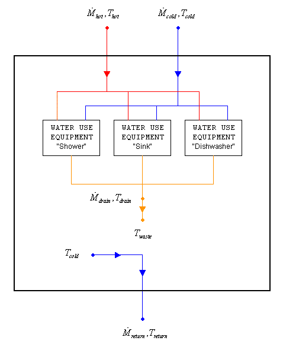
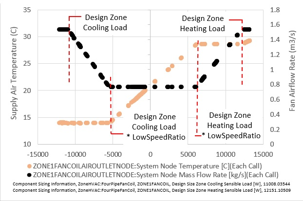
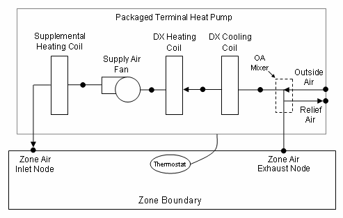
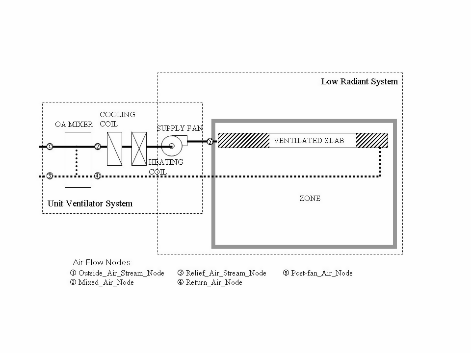
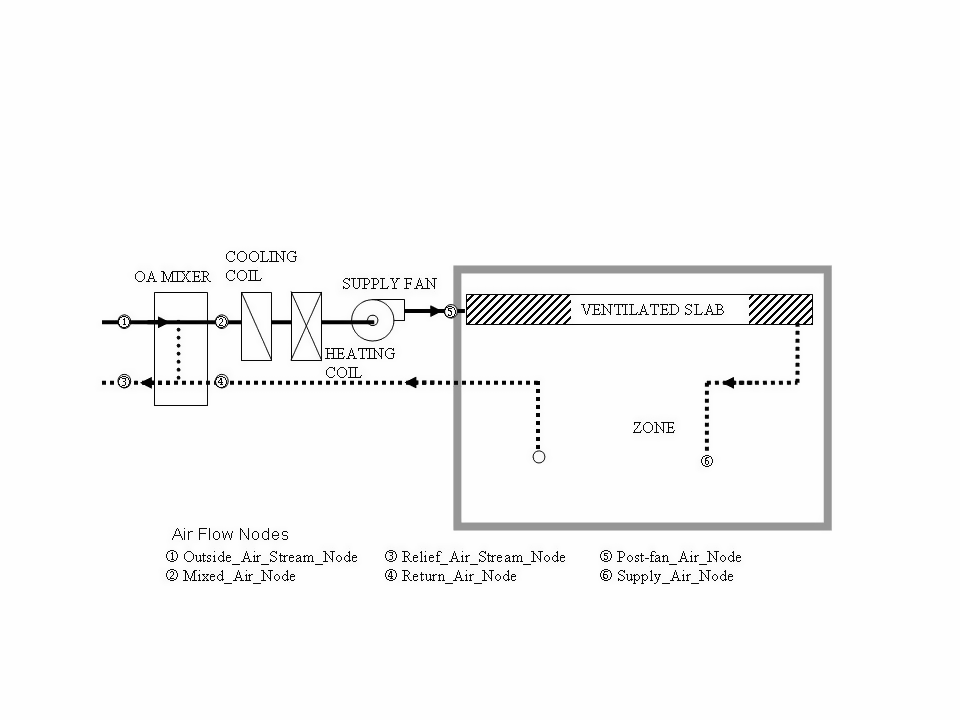

<!--RemoveStart-->
Simulation Models – Encyclopedic Reference
==========================================

The following descriptions are grouped alphabetically (as much as possible) with some also having additional tags of “Heat Balance”, “HVAC”, and “Plant”.  With the integrated solution, these designations signify where the effects of these models have their first impacts.

Main Sections:

* [Thermal Comfort](#ThermalComfort)
* [Trombe Walls](#TrombeWalls)
* [Water Thermal Tanks](#WaterTanks)
* [Water Systems](#WaterSystems)
* [Zone Controls](#ZoneControls)
* [Zone Equipment and Zone Forced Air Units](#ZoneEquip)
<!--RemoveEnd-->

Occupant Thermal Comfort 
------------------------

The integration of a sophisticated building thermal analysis tool with thermal comfort models allows one to perform an energy analysis on a zone and simultaneously determine if the environmental control strategy will be sufficient for the occupants to be thermally comfortable. This chapter is intended to provide background on thermal comfort, present an overview of state of the art thermal comfort models and present the mathematical models that have been incorporated into Energy Plus.

Thermal comfort modeling is controlled primarily by the People input object. This includes input for selecting the type of thermal comfort model that is desired by the user as well as parameters that serve as inputs to all of the thermal comfort models. This includes the activity level, the work efficiency, the air velocity, and the clothing insulation level for people within the space.  All four of these parameters can be scheduled. More information on the People input object can be found in the EnergyPlus Input/Output Reference. More information on how each of these parameters is used and the specific modeling equations for the thermal comfort models can be found below.

### Background on Thermal Comfort Models

Throughout the last few decades, researchers have been exploring the thermal, physiological and psychological response of people in their environment in order to develop mathematical models to predict these responses. Researchers have empirically debated building occupants' thermal responses to the combined thermal effect of the personal, environmental and physiological variables that influence the condition of thermal comfort.

There are two personal variables that influence the condition of thermal comfort: the thermal resistance of the clothing (Icl), and the metabolic rate (H/ADu). The thermal resistance of the clothing (Icl) is measured in units of "clo." The 1985 ASHRAE Handbook of Fundamentals (ASHRAE 1985) suggests multiplying the summation of the individual clothing items clo value by a factor of 0.82 for clothing ensembles.

The metabolic rate (H/ADu), is a measure of the internal heat production rate of an occupant (H) w/hr. in per unit of "Dubois" body surface area (ADu) in units of m2. The DuBois body surface area is given by :

$${A_{Du}} = 0.202{(weight)^{0.425}}{(height)^{0.725}}$$

Using this equation, an area of 1.8 m2 represents the surface area of an average person of weight 70 kg. and height 1.73 m (Fanger 1967). The metabolic rate is measured in mets, where 1 met = 58.2 W/m2.

The environmental variables that influence the conditions of thermal comfort include:

(1) Air Temperature (Ta),

(2) Mean Radiant Temperature (Tr),

(3) Relative air velocity (v),

(4) Water vapor pressure in ambient air (Pa)

The Air Temperature (Ta), a direct environmental index, is the dry-bulb temperature of the environment. The Mean Radiant Temperature (Tr) is a rationally derived environmental index defined as the uniform black-body temperature that would result in the same radiant energy exchange as in the actual environment. The Relative air velocity (v) a direct environmental index is a measure of the air motion obtainable via a hot wire or vane anemometers. The Water vapor pressure in ambient air (Pa) is a direct environmental index.

The physiological variables that influence the conditions of thermal comfort include:

(1) Skin Temperature (Tsk),

(2) Core or Internal Temperature (Tcr),

(3) Sweat Rate,

(4) Skin Wettedness (w),

(5) Thermal Conductance (K) between the core and skin.

Where the Skin Temperature (Tsk), the Core Temperature (Tcr) and the Sweat Rate are physiological indices. The Skin Wettedness (w) is a rationally derived physiological index defined as the ratio of the actual sweating rate to the maximum rate of sweating that would occur if the skin were completely wet.

One more consideration is important in dealing with thermal comfort - the effect of asymmetrical heating or cooling. This could occur when there is a draft or when there is a radiant flux incident on a person (which is what is of primary interest to us here). Fanger (1967) noted that the human regulatory system is quite tolerant of asymmetrical radiant flux. A reasonable upper limit on the difference in mean radiant temperature (Tr) from one direction to the opposing direction is 15°C. (ASHRAE 1984). This limit is lower if there is a high air velocity in the zone.

Table 78.  General Nomenclature list for Thermal Comfort Models

<table class="table table-striped">

<tr>
<td>Mathematical variable</td>
<td>Description</td>
<td>Units
 </td>
<td>Range</td>
<td>FORTRAN variable</td>
</tr>
<tr>
<td>ADu</td>
<td>Dubois body surface area</td>
<td>m2</td>
<td>-</td>
<td>-</td>
</tr>
<tr>
<td>H</td>
<td>Internal heat production rate of an occupant per unit area
= M – W</td>
<td>W/m2</td>
<td>-</td>
<td>IntHeatProd</td>
</tr>
<tr>
<td>Icl</td>
<td>Thermal resistance of the clothing</td>
<td>clo</td>
<td>-</td>
<td>CloUnit</td>
</tr>
<tr>
<td>M</td>
<td>Metabolic rate per unit area</td>
<td>W/m2</td>
<td>-</td>
<td>ActLevel</td>
</tr>
<tr>
<td>Pa</td>
<td>Water vapor pressure in ambient air</td>
<td>Torr</td>
<td>-</td>
<td>VapPress</td>
</tr>
<tr>
<td>Ta</td>
<td>Air temperature</td>
<td>°C</td>
<td>-</td>
<td>AirTemp</td>
</tr>
<tr>
<td>Tcr</td>
<td>Core or internal temperature</td>
<td>°C</td>
<td>-</td>
<td>CoreTemp</td>
</tr>
<tr>
<td>Tr</td>
<td>Mean radiant temperature</td>
<td>°C</td>
<td>-</td>
<td>RadTemp</td>
</tr>
<tr>
<td>Tsk</td>
<td>Skin temperature</td>
<td>°C</td>
<td>-</td>
<td>-</td>
</tr>
<tr>
<td>v</td>
<td>Relative air velocity</td>
<td>m/s</td>
<td>-</td>
<td>AirVel</td>
</tr>
<tr>
<td>W</td>
<td>The rate of heat loss due to the performance of work</td>
<td>W/m2</td>
<td>-</td>
<td>WorkEff</td>
</tr>
<tr>
<td>w</td>
<td>Skin wettedness</td>
<td>-</td>
<td>-</td>
<td>-</td>
</tr>

</table>

### Mathematical Models for Predicting Thermal Comfort

Many researchers have been exploring ways to predict the thermal sensation of people in their environment based on the personal, environmental and physiological variables that influence thermal comfort. From the research done, some mathematical models that simulate occupants' thermal response to their environment have been developed. Most thermal comfort prediction models use a seven or nine point thermal sensation scale, as in the following tables.

Table 79.  Seven point Thermal Sensation Scale

<table class="table table-striped">

<tr>
<td>Sensation</td>
<td>Description</td>
</tr>
<tr>
<td>3</td>
<td>Hot</td>
</tr>
<tr>
<td>2</td>
<td>Warm</td>
</tr>
<tr>
<td>1</td>
<td>slightly warm</td>
</tr>
<tr>
<td>0</td>
<td>neutral</td>
</tr>
<tr>
<td>-1</td>
<td>slightly cool</td>
</tr>
<tr>
<td>-2</td>
<td>cool</td>
</tr>
<tr>
<td>-3</td>
<td>cold</td>
</tr>

</table>

Table 80.  Nine point Thermal Sensation Scale

<table class="table table-striped">

<tr>
<td>Sensation Value</td>
<td>Description</td>
</tr>
<tr>
<td>4</td>
<td>very hot</td>
</tr>
<tr>
<td>3</td>
<td>hot</td>
</tr>
<tr>
<td>2</td>
<td>warm</td>
</tr>
<tr>
<td>1</td>
<td>slightly warm</td>
</tr>
<tr>
<td>0</td>
<td>neutral</td>
</tr>
<tr>
<td>-1</td>
<td>slightly cool</td>
</tr>
<tr>
<td>-2</td>
<td>cool</td>
</tr>
<tr>
<td>-3</td>
<td>cold</td>
</tr>
<tr>
<td>-4</td>
<td>very cold</td>
</tr>

</table>

The most notable models have been developed by P.O. Fanger (the Fanger Comfort Model), the J. B. Pierce Foundation (the Pierce Two-Node Model), and researchers at Kansas State University (the KSU Two-Node Model). Berglund (1978) presents a detailed description of the theory behind these three models.

Note for all Thermal Comfort reporting:  Though the published values for thermal comfort “vote” have a discrete scale (e.g. –3 to +3 or –4 to +4), the calculations in EnergyPlus are carried out on a continuous scale and, thus, reporting may be “off the scale” with specific conditions encountered in the space.  This is not necessarily an error in EnergyPlus – rather a different approach that does not take the “limits” of the discrete scale values into account.

The main similarity of the three models is that all three apply an energy balance to a person and use the energy exchange mechanisms along with experimentally derived physiological parameters to predict the thermal sensation and the physiological response of a person due to their environment. The models differ somewhat in the physiological models that represent the human passive system (heat transfer through and from the body) and the human control system (the neural control of shivering, sweating and skin blood flow). The models also differ in the criteria used to predict thermal sensation. However, all three models use information from the People statement and the thermal comfort model is selected via the People statement in a user’s input file. Scheduled parameters such as the activity level, work efficiency, air velocity, and clothing insulation level all have a direct bearing on the thermal comfort models. For more information on the input of these parameters, see the People statement in the EnergyPlus Input/Output Reference. For more information on how each individual thermal comfort model uses these parameters, please consult the next several sections.

The main similarity of the three models is that all three apply an energy balance to a person and use the energy exchange mechanisms along with experimentally derived physiological parameters to predict the thermal sensation and the physiological response of a person due to their environment. The models differ somewhat in the physiological models that represent the human passive system (heat transfer through and from the body) and the human control system (the neural control of shivering, sweating and skin blood flow). The models also differ in the criteria used to predict thermal sensation.

### Fanger Comfort Model

Fanger's Comfort model was the first one developed. It was published first in 1967 (Fanger 1967) and then in 1970 (Fanger 1970), and helped set the stage for the other two models. The mathematical model developed by P.O. Fanger is probably the most well known of the three models and is the easiest to use because it has been put in both chart and graph form.

#### Fanger Model Nomenclature List

Table 81.  Nomenclature list for Fanger model

<table class="table table-striped">

<tr>
<td>Mathematical variable</td>
<td>Description</td>
<td>Units</td>
<td>Range</td>
<td>FORTRAN variable</td>
</tr>
<tr>
<td>ADu</td>
<td>Dubois body surface area</td>
<td>m2</td>
<td>-</td>
<td>BodySurfaceArea</td>
</tr>
<tr>
<td>Cres</td>
<td>The rate of dry respiratory heat loss</td>
<td>W/m2</td>
<td>-</td>
<td>DryRespHeatLoss</td>
</tr>
<tr>
<td>Edif</td>
<td>The rate of heat loss from the diffusion of water vapor through the skin</td>
<td>W/m2</td>
<td>-</td>
<td>EvapHeatLossDiff</td>
</tr>
<tr>
<td>Eres</td>
<td>The rate of latent respiratory heat loss</td>
<td>W/m2</td>
<td>-</td>
<td>LatRespHeatLoss</td>
</tr>
<tr>
<td>Ersw,req</td>
<td>The rate of heat loss from the evaporation of regulatory sweating at the state of comfort</td>
<td>W/m2</td>
<td>-</td>
<td>EvapHeatLossRegComf</td>
</tr>
<tr>
<td>Esk</td>
<td>Total evaporative heat loss from skin</td>
<td>W/m2</td>
<td> </td>
<td>EvapHeatLoss</td>
</tr>
<tr>
<td>fcl</td>
<td>The ratio of clothed body</td>
<td>-</td>
<td> </td>
<td>CloBodyRat</td>
</tr>
<tr>
<td>feff</td>
<td>The fraction of surface effective for radiation
(= 0.72)</td>
<td>-</td>
<td>-</td>
<td>RadSurfEff</td>
</tr>
<tr>
<td>H</td>
<td>Internal heat production rate of an occupant per unit area (= M – W)</td>
<td>W/m2</td>
<td>-</td>
<td>IntHeatProd</td>
</tr>
<tr>
<td>hc</td>
<td>Convective heat transfer coefficient</td>
<td>W/m2°C</td>
<td>-</td>
<td>Hc</td>
</tr>
<tr>
<td>L</td>
<td>All the modes of energy loss from body</td>
<td>W/m2</td>
<td>-</td>
<td>-</td>
</tr>
<tr>
<td>M</td>
<td>Metabolic rate per unit area</td>
<td>W/m2</td>
<td>-</td>
<td>ActLevel</td>
</tr>
<tr>
<td>Pa</td>
<td>Water vapor pressure in ambient air</td>
<td>Torr</td>
<td>-</td>
<td>VapPress</td>
</tr>
<tr>
<td>PMV</td>
<td>Predicted Mean Vote</td>
<td>-</td>
<td>-4~4</td>
<td>PMV</td>
</tr>
<tr>
<td>PPD</td>
<td>Predicted Percentage of Dissatisfied</td>
<td>-</td>
<td>0~100%</td>
<td>PPD</td>
</tr>
<tr>
<td>Qc</td>
<td>The rate of convective heat loss</td>
<td>W/m2</td>
<td>-</td>
<td>ConvHeatLoss</td>
</tr>
<tr>
<td>Qdry</td>
<td>Sensible heat flow from skin</td>
<td>W/m2</td>
<td> </td>
<td>DryHeatLoss</td>
</tr>
<tr>
<td>Qr</td>
<td>The rate of radiative heat loss</td>
<td>W/m2</td>
<td>-</td>
<td>RadHeatLoss</td>
</tr>
<tr>
<td>Qres</td>
<td>The rate of respiratory heat loss</td>
<td>W/m2</td>
<td>-</td>
<td>RespHeatLoss</td>
</tr>
<tr>
<td>Ta</td>
<td>Air temperature</td>
<td>°C</td>
<td>-</td>
<td>AirTemp</td>
</tr>
<tr>
<td>Tcl</td>
<td>Clothing surface temperature</td>
<td>°C</td>
<td>-</td>
<td>CloSurfTemp</td>
</tr>
<tr>
<td>Tcla</td>
<td>Clothing surface temperature (Absolute)</td>
<td>°K</td>
<td>-</td>
<td>AbsCloSurfTemp</td>
</tr>
<tr>
<td>Tra</td>
<td>Mean radiant temperature</td>
<td>°K</td>
<td>-</td>
<td>AbsRadTemp</td>
</tr>
<tr>
<td>W</td>
<td>The rate of heat loss due to the performance of work</td>
<td>W/m2</td>
<td>-</td>
<td>WorkEff</td>
</tr>
<tr>
<td>e</td>
<td>The emissivity of clothing-skin surface</td>
<td>-</td>
<td>-</td>
<td>SkinEmiss</td>
</tr>
<tr>
<td>s</td>
<td>The Stefan-Boltzman constant (= 5.67×10-8)</td>
<td>W/m2K4</td>
<td>-</td>
<td>StefanBoltz</td>
</tr>

</table>

#### Description of the model and algorithm

Fanger developed the model based on the research he performed at Kansas State University and the Technical University of Denmark. Fanger used the seven-point form of a thermal sensation scale along with numerous experiments involving human subjects in various environments. He related the subjects in response to the variables, which influence the condition of thermal comfort. Fanger's model is based upon an energy analysis that takes into account all the modes of energy loss (L) from the body, including: the convection and radiant heat loss from the outer surface of the clothing, the heat loss by water vapor diffusion through the skin, the heat loss by evaporation of sweat from the skin surface, the latent and dry respiration heat loss and the heat transfer from the skin to the outer surface of the clothing. The model assumes that the person is thermally at steady state with his environment.

\(M = L\)                                                                                     W/m2

\(L = {Q_{res}} + {Q_{dry}} + {E_{sk}} + W\)                                                         W/m2

\({Q_{res}} = {E_{res}} + {C_{res}} = 0.000017M(5867 - {P_a}) + 0.0014M(34 - {T_a})\)     W/m2

LatRespHeatLoss = 0.000017\*ActLevel\*(5867. - VapPress)

DryRespHeatLoss = 0.0014\*ActLevel\*(34.- AirTemp)

RespHeatLoss = LatRespHeatLoss + DryRespHeatLoss

\({Q_c} = {h_c} \times {f_{cl}}({T_{cl}} - {T_a})\)                                                               W/m2

Qr = 3.96\*fcl\*[(0.01\*Tcla)^4 - (0.01\*Tra)^4]                                                       W/m2

\({Q_{dry}} = {Q_c} + {Q_r}\)                                                                         W/m2

ConvHeatLos = CloBodyRat\*Hc\*(CloSurfTemp - AirTemp)

RadHeatLoss = 3.96\*CloBodyRat &

\*[(0.01\*AbsCloSurfTemp)\*\*4 - (0.01\*AbsRadTemp)\*\*4]

DryHeatLoss = ConvHeatLoss + RadHeatLoss

For\(H > 58.2\), \({E_{rsw}} = 0.42(H - 58.2)\)                                      W/m2

For \(H \le 58.2\), \({E_{rsw}} = 0\)                                                           W/m2

Ediff = 0.00305\*(5733.0 - 6.99H - Pa)                        W/m2

\({E_{sk}} = {E_{rsw}} + {E_{diff}}\)                                                                      W/m2

EvapHeatLossRegComf = 0.42\*(IntHeatProd - ActLevelConv)

EvapHeatLossRegComf = 0.0

EvapHeatLossDiff = 0.00305\*(5733.0 - 6.99\*IntHeatProd - VapPress)

EvapHeatLoss = EvapHeatLossRegComf + EvapHeatLossDiff

The Fanger model was developed using the thermal sensation votes from subjects at KSU and Denmark, and the Predicted Mean Vote (PMV) thermal sensation scale is based on how the energy loss (L) deviates from the metabolic rate (M) in the following form:

$$PMV = (0.303{e^{ - 0.036M}} + 0.028)(H - L)$$

ThermSensTransCoef = 0.303\*EXP(-0.036\*ActLevel) + 0.028

PMV = ThermSensTransCoef\*(IntHeatProd - EvapHeatLoss - RespHeatLoss - DryHeatLoss)

Predicted Percent of Dissatisfied (PPD) people at each PMV is calculated as follows:

PPD = 100.0 - 95.0\*EXP(-0.03353\*PMV\*\*4 - 0.2179\*PMV\*\*2)

### Pierce Two-Node Model

The Pierce Two-Node model was developed at the John B. Pierce Foundation at Yale University. The model has been continually expanding since its first publication in 1970 (Gagge et.al. 1970). The most recent version on the model appears in the 1986 ASHRAE Transactions (Gagge et.al. 1986).

#### Pierce Two-Node Model Nomenclature List

Table 82.  Nomenclature list for Pierce Two-Node model

<table class="table table-striped">

<tr>
<td>Mathematical variable</td>
<td>Description</td>
<td>Units
 </td>
<td>Range</td>
<td>FORTRAN variable</td>
</tr>
<tr>
<td>Cdil</td>
<td>Constant for skin blood flow</td>
<td> </td>
<td> </td>
<td>SkinBloodFlowConst</td>
</tr>
<tr>
<td>Cres</td>
<td>The rate of dry respiratory heat loss</td>
<td>W/m2</td>
<td>-</td>
<td>DryRespHeatLoss</td>
</tr>
<tr>
<td>Csw</td>
<td>Proportionality constant for sweat control</td>
<td>g/m2hr</td>
<td> </td>
<td>SweatContConst</td>
</tr>
<tr>
<td>DISC</td>
<td>Predicted discomfort vote</td>
<td>-</td>
<td>-5~5</td>
<td>DISC</td>
</tr>
<tr>
<td>Edif</td>
<td>The rate of heat loss from the diffusion of water vapor through the skin</td>
<td>W/m2</td>
<td>-</td>
<td>EvapHeatLossDiff</td>
</tr>
<tr>
<td>Emax</td>
<td>Maximum evaporative heat loss</td>
<td>W/m2</td>
<td> </td>
<td>EvapHeatLossMax</td>
</tr>
<tr>
<td>Esk</td>
<td>Total evaporative heat loss from skin</td>
<td>W/m2</td>
<td> </td>
<td>EvapHeatLoss</td>
</tr>
<tr>
<td>Eres</td>
<td>The rate of latent respiratory heat loss</td>
<td>W/m2</td>
<td>-</td>
<td>LatRespHeatLoss</td>
</tr>
<tr>
<td>Ersw</td>
<td>The rate of heat loss from the evaporation of regulatory sweating</td>
<td>W/m2</td>
<td>-</td>
<td>EvapHeatLossRegSweat</td>
</tr>
<tr>
<td>Ersw,req</td>
<td>The rate of heat loss from the evaporation of regulatory sweating at the state of comfort</td>
<td>W/m2</td>
<td> </td>
<td>EvapHeatLossRegComf</td>
</tr>
<tr>
<td>ET*</td>
<td>Effective Temperature</td>
<td>°C</td>
<td>-</td>
<td>ET</td>
</tr>
<tr>
<td>fcl</td>
<td>The ratio of clothed body</td>
<td>-</td>
<td> </td>
<td>CloBodyRat</td>
</tr>
<tr>
<td>feff</td>
<td>The fraction of surface effective for radiation
(= 0.72)</td>
<td>-</td>
<td>-</td>
<td>RadSurfEff</td>
</tr>
<tr>
<td>H</td>
<td>Internal heat production rate of an occupant per unit area (= M – W)</td>
<td>W/m2</td>
<td>-</td>
<td>IntHeatProd</td>
</tr>
<tr>
<td>h</td>
<td>Combined heat transfer coefficient</td>
<td>W/m2°C</td>
<td> </td>
<td>H</td>
</tr>
<tr>
<td>hc</td>
<td>Convective heat transfer coefficient</td>
<td>W/m2°C</td>
<td>-</td>
<td>Hc</td>
</tr>
<tr>
<td>he’</td>
<td>Combined evaporative heat transfer coefficient</td>
<td>W/(m2kPa)</td>
<td> </td>
<td>-</td>
</tr>
<tr>
<td>hr</td>
<td>Radiant heat transfer coefficient</td>
<td>W/m2°C</td>
<td>-</td>
<td>Hr</td>
</tr>
<tr>
<td>Icl</td>
<td>Clothing insulation</td>
<td>m2°C/W</td>
<td> </td>
<td>-</td>
</tr>
<tr>
<td>L</td>
<td>All the modes of energy loss from body</td>
<td>W/m2</td>
<td>-</td>
<td>-</td>
</tr>
<tr>
<td>LET*</td>
<td>All the modes of energy loss from body at ET*</td>
<td>W/m2</td>
<td> </td>
<td>-</td>
</tr>
<tr>
<td>LSET*</td>
<td>All the modes of energy loss from body at SET*</td>
<td>W/m2</td>
<td> </td>
<td>-</td>
</tr>
<tr>
<td>M</td>
<td>Metabolic rate per unit area</td>
<td>W/m2</td>
<td>-</td>
<td>ActLevel</td>
</tr>
<tr>
<td>Mact</td>
<td>Metabolic heat production due to activity</td>
<td>W/m2</td>
<td> </td>
<td>-</td>
</tr>
<tr>
<td>Mshiv</td>
<td>Metabolic heat production due to shivering</td>
<td>W/m2</td>
<td> </td>
<td>ShivResponse</td>
</tr>
<tr>
<td>Pa</td>
<td>Water vapor pressure in ambient air</td>
<td>Torr</td>
<td>-</td>
<td>VapPress</td>
</tr>
<tr>
<td>PMV*</td>
<td>Predicted Mean Vote modified by ET* or SET*</td>
<td>-</td>
<td>-4~4</td>
<td>PMVET
PMVSET</td>
</tr>
<tr>
<td>PSET*</td>
<td>Water vapor pressure at SET*</td>
<td>°C</td>
<td> </td>
<td>StdVapPressSET</td>
</tr>
<tr>
<td>Psk</td>
<td>Saturated water vapor pressure at required skin temperature</td>
<td>Torr</td>
<td>-</td>
<td>SatSkinVapPress</td>
</tr>
<tr>
<td>Qc</td>
<td>The rate of convective heat loss</td>
<td>W/m2</td>
<td>-</td>
<td>ConvHeatLoss</td>
</tr>
<tr>
<td>Qcrsk</td>
<td>Heat flow from core to skin</td>
<td>W/m2</td>
<td> </td>
<td>HeatFlow</td>
</tr>
<tr>
<td>Qdry</td>
<td>Sensible heat flow from skin</td>
<td>W/m2</td>
<td> </td>
<td>DryHeatLoss</td>
</tr>
<tr>
<td>Qr</td>
<td>The rate of radiative heat loss</td>
<td>W/m2</td>
<td>-</td>
<td>RadHeatLoss</td>
</tr>
<tr>
<td>Qres</td>
<td>The rate of respiratory heat loss</td>
<td>W/m2</td>
<td>-</td>
<td>RespHeatLoss</td>
</tr>
<tr>
<td>Scr</td>
<td>Heat storage in core compartment</td>
<td>W/m2</td>
<td> </td>
<td>CoreheatStorage</td>
</tr>
<tr>
<td>SET*</td>
<td>Standard Effective Temperature</td>
<td>°C</td>
<td>-</td>
<td>SET</td>
</tr>
<tr>
<td>SIGb</td>
<td>Thermal signal of body</td>
<td>°C</td>
<td> </td>
<td>BodyThermSigCold
BodyThermSigWarm</td>
</tr>
<tr>
<td>SIGcr</td>
<td>Thermal signal of core</td>
<td>°C</td>
<td> </td>
<td>CoreThermSigCold
CoreThermSigWarm</td>
</tr>
<tr>
<td>SIGsk</td>
<td>Thermal signal of skin</td>
<td>°C</td>
<td> </td>
<td>SkinThermSigCold
SkinThermSigWarm</td>
</tr>
<tr>
<td>SKBF</td>
<td>Skin blood flow</td>
<td>L/m2hr</td>
<td> </td>
<td>SkinBloodFlow</td>
</tr>
<tr>
<td>Ssk</td>
<td>Heat storage in skin compartment</td>
<td>W/m2</td>
<td> </td>
<td>SkinHeatStorage</td>
</tr>
<tr>
<td>Str</td>
<td>Constriction constant of skin blood flow for average person</td>
<td> </td>
<td> </td>
<td>Str</td>
</tr>
<tr>
<td>SWreg</td>
<td>The rate of regulatory sweating</td>
<td>g/m2hr</td>
<td> </td>
<td>RegSweat</td>
</tr>
<tr>
<td>Ta</td>
<td>Air temperature</td>
<td>°C</td>
<td>-</td>
<td>AirTemp</td>
</tr>
<tr>
<td>Tb</td>
<td>Mean body temperature</td>
<td> </td>
<td> </td>
<td>AvgBodyTemp</td>
</tr>
<tr>
<td>Tb-c</td>
<td>Mean body temperature when DISC is zero (lower limit)</td>
<td>°C</td>
<td> </td>
<td>AvgBodyTempLow</td>
</tr>
<tr>
<td>Tb-h</td>
<td>Mean body temperature when HSI is 100 (upper limit)</td>
<td>°C</td>
<td> </td>
<td>AvgBodyTempHigh</td>
</tr>
<tr>
<td>Tcl</td>
<td>Clothing surface temperature</td>
<td>°C</td>
<td>-</td>
<td>CloSurfTemp</td>
</tr>
<tr>
<td>Tcr</td>
<td>Core or internal temperature</td>
<td>°C</td>
<td>-</td>
<td>CoreTemp</td>
</tr>
<tr>
<td>Tr</td>
<td>Mean radiant temperature</td>
<td>°C</td>
<td>-</td>
<td>RadTemp</td>
</tr>
<tr>
<td>TSENS</td>
<td>Thermal sensation vote</td>
<td>-</td>
<td>-5~5</td>
<td>TSENS</td>
</tr>
<tr>
<td>Tsk</td>
<td>Skin temperature</td>
<td>°C</td>
<td> </td>
<td>SkinTemp</td>
</tr>
<tr>
<td>W</td>
<td>The rate of heat loss due to the performance of work</td>
<td>W/m2</td>
<td>-</td>
<td>WorkEff</td>
</tr>
<tr>
<td>wdif</td>
<td>Skin wettedness due to diffusion trough the skin</td>
<td> </td>
<td> </td>
<td>SkinWetDiff</td>
</tr>
<tr>
<td>wrsw</td>
<td>Skin wettedness due to regulatory sweating</td>
<td> </td>
<td> </td>
<td>SkinWetSweat</td>
</tr>
<tr>
<td>e</td>
<td>The emissivity of clothing-skin surface</td>
<td>-</td>
<td>-</td>
<td>SkinEmiss</td>
</tr>
<tr>
<td>s</td>
<td>The Stefan-Boltzman constant (= 5.67×10-8)</td>
<td>W/m2K4</td>
<td>-</td>
<td>StefanBoltz</td>
</tr>

</table>

#### Description of the model and algorithm

The Pierce model thermally lumps the human body as two isothermal, concentric compartments, one representing the internal section or core (where all the metabolic heat is assumed to be generated and the skin comprising the other compartment). This allows the passive heat conduction from the core compartment to the skin to be accounted for. The boundary line between two compartments changes with respect to skin blood flow rate per unit skin surface area (SKBF in L/h•m2) and is described by alpha – the fraction of total body mass attributed to the skin compartment (Doherty and Arens 1988).

$$\alpha  = 0.0417737 + 0.7451832/(SKBF + 0.585417)$$

SkinMassRat = 0.0417737 + 0.7451832/(SkinBloodFlow + 0.585417)

Furthermore, the model takes into account the deviations of the core, skin, and mean body temperature weighted by alpha from their respective setpoints. Thermoregulatory effector mechanisms (Regulatory sweating, skin blood flow, and shivering) are defined in terms of thermal signals from the core, skin and body (Doherty and Arens 1988).

\(SI{G_{cr}} = {T_{cr}} - 36.8\)                                                                    °C

\(SI{G_{sk}} = {T_{sk}} - 33.7\)                                                                    °C

\(SI{G_b} = {T_b} - 36.49\)                                                                    °C

SkinThermSigWarm = SkinTemp - SkinTempSet

SkinThermSigCold = SkinTempSet - SkinTemp

CoreThermSigWarm = CoreTemp - CoreTempSet

CoreThermSigCold = CoreTempSet - CoreTemp

BodyThermSigWarm = AvgBodyTemp - AvgBodyTempSet

BodyThermSigCold = AvgBodyTempSet-AvgBodyTemp

\(SKBF = (6.3 + C{}_{dil} \times SI{G_{cr}})/(1 + {S_{tr}} \times ( - SI{G_{sk}}))\)                      L/hr•m2

VasodilationFac = SkinBloodFlowConst\*CoreWarmDelTemp

VasoconstrictFac = Str\*SkinColdDelTemp

SkinBloodFlow = (6.3 + VasodilationFac)/(1. + VasoconstrictFac)

\(S{W_{reg}} = {C_{sw}}SI{G_b}{e^{(SI{G_{sk}}/10.7)}}\)                                                       g/hr•m2

RegSweat = SweatContConst\*BodyWarmDelTemp\*EXP(SkinWarmDelTemp/10.7)

\({M_{shiv}} = 19.4( - SI{G_{cr}})( - SI{G_{sk}})\)                                                 W/m2

ShivResponse = 19.4\*SkinThermSigCold\*CoreThermSigCold

The latest version of the Pierce model (Fountain and Huizenga 1997) discusses the concepts of SET\* and ET\*. The Pierce model converts the actual environment into a "standard environment" at a Standard Effective Temperature, SET\*. SET\* is the dry-bulb temperature of a hypothetical environment at 50% relative humidity for subjects wearing clothing that would be standard for the given activity in the real environment. Furthermore, in this standard environment, the same physiological strain, i.e. the same skin temperature and skin wettedness and heat loss to the environment, would exist as in the real environment. The Pierce model also converts the actual environment into a environment at an Effective Temperature, ET\*, that is the dry-bulb temperature of a hypothetical environment at 50% relative humidity and uniform temperature (Ta = MRT) where the subjects would experience the same physiological strain as in the real environment.

In the latest version of the model it is suggested that the classical Fanged PMV be modified by using ET\* or SET\* instead of the operative temperature. This gives a new index PMV\* which is proposed for dry or humid environments. It is also suggested that PMV\* is very responsive to the changes in vapor permeation efficiency of the occupants clothing.

\(M = {M_{act}} + {M_{shiv}}\)                                                                     W/m2

ActLevel = ActLevel + ActShiv

\(L = {Q_{res}} + {Q_{dry}} + {E_{sk}} + W\)                                                         W/m2

\(\begin{array}{l}{Q_{res}} = {E_{res}} + {C_{res}} = 0.0023M(44 - {P_{a(torr)}}) + 0.0014M(34 - {T_a})\\ = 0.017251M(5.8662 - {P_{a(kPa)}}) + 0.0014M(34 - {T_a})\end{array}\)W/m2

LatRespHeatLoss = 0.017251\*ActLevel\*(5.8662 - VapPress)

DryRespHeatLoss = 0.0014\*ActLevel\*(34.- AirTemp)

RespHeatLoss = LatRespHeatLoss + DryRespHeatLoss

\({Q_c} = {h_c} \times {f_{cl}}({T_{cl}} - {T_a})\)                                                               W/m2

\({Q_r} = {h_r} \times {f_{cl}}({T_{cl}} - {T_r})\)                                                               W/m2

\({Q_{dry}} = {Q_c} + {Q_r}\)                                                                         W/m2

DryHeatLoss = CloBodyRat\*(Hc\*(CloSurfTemp - AirTemp) + Hr\*(CloSurfTemp - RadTemp))

In Pierce model, the convective heat transfer coefficient, hc, varies with the air velocity around body and metabolic rate. The model uses the maximum value of following equations.

\({h_c} = 8.6 \times {v^{_{0.53}}}\)                                                                           W/m2°C

\({h_c} = 5.66{(M/58.2 - 0.85)^{0.39}}\)                                                  W/m2°C

Hc = 8.6\*AirVel\*\*0.53

HcAct = 5.66\*(ActMet - 0.85)\*\*0.39

Also, in the model, the radiant heat transfer coefficient, hr, is defined by following equation (Doherty and Arens 1988):

\({h_r} = 4. \times {f_{eff}}\varepsilon \sigma {(({T_{cl}} + {T_r})/2 + 273.15)^3}\)                                    W/m2°C

Hr = 4.\*RadSurfEff\*StefanBoltz\*((CloSurfTemp + RadTemp)/2. + TAbsConv)\*\*3

In the Pierce model, Tcl is estimated by each iteration using following equation:

\({T_{cl}} = ({T_{sk}}/{I_{cl}} + {f_{cl}}({h_c}{T_a} - {h_r}{T_r}))/(1/{I_{cl}} + {f_{cl}}({h_c} + {h_r}))\)              °C

CloSurfTemp = (CloCond\*SkinTemp + CloBodyRat\*(Hc\*AirTemp &

+ Hr\*RadTemp))/(CloCond + CloBodyRat\*(Hc + Hr))

Total evaporative heat loss from the skin, Esk, includes evaporation of water produced by regulatory sweating, Ersw, and evaporation of water vapor that diffuses through the skin surface, Ediff.

\({E_{sk}} = {E_{rsw}} + {E_{diff}}\)                                                                      W/m2

EvapHeatLoss = EvapHeatLossRegSweat + EvapHeatLossRegDiff

\({E_{rsw}} = 0.68 \times S{W_{reg}}\)                                                                  W/m2

\({E_{diff}} = {w_{diff}} \times {E_{\max }}\)                                                                    W/m2

RegHeatLoss = 0.68\*RegSweat

DiffHeatLoss = SkinWetDiff\*MaxEvapHeatLoss

Where,

0.68 is the passive water vapor diffusion rate in g/h·m2·Torr

and,

$${w_{diff}} = 0.06(1 - {w_{rsw}})$$

\({E_{\max }} = {h_e}'({P_{sk}} - {P_a})\)                                                                 W/m2

$${w_{rsw}} = {E_{rsw}}/{E_{\max }}$$

SkinWetDiff = (1.-SkinWetSweat)\*.06

MaxEvapHeatLoss = (1./TotEvapHeatResist)\*(SatSkinVapPress - VapPress)

SkinWetSweat = EvapHeatLossRegSweat/MaxEvapHeatLoss

The Pierce model has one additional heat flow term describing the heat transfer between the internal core compartment and the outer skin shell (Doherty and Arens 1988).

\({Q_{crsk}} = (5.28 + 1.163SKBF)({T_{cr}} - {T_{sk}})\)                                     W/m2

HeatFlow = (CoreTemp-SkinTemp)\*(5.28 + 1.163\*SkinBloodFlow)

Where

5.28 is the average body tissue conductance in W/m2•°C

1.163 is the thermal capacity of blood in W•h/L•°C

Thus, individual heat balance equations for core and skin compartments are expressed using this term, Qc-s. New temperatures of core, skin and body are calculated by each iteration from rates of heat storage in the core and skin.

\({S_{sk}} = {Q_{c - s}} - {Q_c} - {Q_r} - {E_{sk}}\)                                                        W/m2°C

SkinHeatStorage = HeatFlow - DryHeatLoss - EvapHeatLoss

\({S_{cr}} = M - W - {Q_{res}} - {Q_{c - s}}\)                                                        W/m2°C

CoreHeatStorage = IntHeatProd - RespHeatLoss  - HeatFlow

Thus,

$$PMVET = (0.303{e^{ - 0.036M}} + 0.028)(H - {L_{ET*}})$$

$$PMVSET = (0.303{e^{ - 0.036M}} + 0.028)(H - {L_{SET*}})$$

ThermSensTransCoef = 0.303\*EXP(-0.036\*ActLevel) + 0.028

PMVET = ThermSensTransCoef\*(IntHeatProd - EvapHeatLossDiff  &

- EvapHeatLossRegComf - RespHeatLoss - DryHeatLossET)

PMVSET = ThermSensTransCoef\*(IntHeatProd - EvapHeatLossDiff  &

- EvapRegHeatLossReg Comf - RespHeatLoss - DryHeatLossSET)

Besides PMV\*, the Pierce Two Node Model uses the indices TSENS and DISC as predictors of thermal comfort. Where TSENS is the classical index used by the Pierce foundation, and is a function of the mean body temperature. DISC is defined as the relative thermoregulatory strain that is needed to bring about a state of comfort and thermal equilibrium. DISC is a function of the heat stress and heat strain in hot environments and equal to TSENS in cold environments. In summary, the Pierce Model, for our purposes, uses four thermal comfort indices; PMVET-a function of ET\*, PMVSET- a function of SET\*, TSENS and DISC.

\({T_{b - c}} = (0.185/58.2)(M - W) + 36.313\)                                    °C

\({T_{b - h}} = (0.359/58.2)(M - W) + 36.664\)                                    °C

\(TSEN{S_c} = 0.68175({T_b} - {T_{b - c}})\)                                                  \({T_b} \le {T_{b - c}}\)

\(TSEN{S_h} = 4.7({T_b} - {T_{b - c}})/({T_{b - h}} - {T_{b - c}})\)                                      \({T_b} > {T_{b - c}}\)

$$DISC = 5.({E_{rsw}} - {E_{rsw - comf}})/({E_{\max }} - {E_{rsw - comf}} - {E_{diff}})$$

AvgBodyTempLow = (0.185/ActLevelConv)\*IntHeatProd + 36.313

AvgBodyTempHigh = (0.359/ActLevelConv)\*IntHeatProd + 36.664

TSENS = .68175\*(AvgBodyTemp-AvgBodyTempLow)

TSENS = 4.7\*(AvgBodyTemp - AvgBodyTempLow)/ &

(AvgBodyTempHigh - AvgBodyTempLow)

DISC = 5.\*(EvapHeatLossRegSweat - EvapHeatLossRegComf)/ &

(MaxEvapHeatLoss - EvapHeatLossRegComf - DiffHeatLoss)

### KSU Two-Node Model

The KSU two-node model, developed at Kansas State University, was published in 1977 (Azer and Hsu 1977). The KSU model is quite similar to that of the Pierce Foundation. The main difference between the two models is that the KSU model predicts thermal sensation (TSV) differently for warm and cold environment.

#### KSU Two Node Model Nomenclature List

Table 83.  Nomenclature list for KSU Two-Node model

<table class="table table-striped">

<tr>
<td>Mathematical variable</td>
<td>Description</td>
<td>Units
 </td>
<td>Range</td>
<td>FORTRAN variable</td>
</tr>
<tr>
<td>Ccr</td>
<td>Specific heat of body core</td>
<td>Whr/kg°C</td>
<td> </td>
<td> </td>
</tr>
<tr>
<td>Csk</td>
<td>Specific heat of skin</td>
<td>Whr/kg°C</td>
<td> </td>
<td> </td>
</tr>
<tr>
<td>Cres</td>
<td>The rate of dry respiratory heat loss</td>
<td>W/m2</td>
<td>-</td>
<td>DryRespHeatLoss</td>
</tr>
<tr>
<td>Edif</td>
<td>The rate of heat loss from the diffusion of water vapor through the skin</td>
<td>W/m2</td>
<td>-</td>
<td>EvapHeatLossDiff</td>
</tr>
<tr>
<td>Emax</td>
<td>Maximum evaporative heat loss</td>
<td>W/m2</td>
<td> </td>
<td>EvapHeatLossMax</td>
</tr>
<tr>
<td>Esk</td>
<td>Total evaporative heat loss from skin</td>
<td>W/m2</td>
<td> </td>
<td>EvapHeatLoss</td>
</tr>
<tr>
<td>Esw</td>
<td>Equivalent evaporation heat loss from the sweat secreted</td>
<td>W/m2</td>
<td> </td>
<td>EvapHeatLossSweat</td>
</tr>
<tr>
<td>Esw.d</td>
<td>Sweat function for warm and dry skin</td>
<td>W/m2</td>
<td> </td>
<td>DrySweatRate</td>
</tr>
<tr>
<td>Eres</td>
<td>The rate of latent respiratory heat loss</td>
<td>W/m2</td>
<td>-</td>
<td>LatRespHeatLoss</td>
</tr>
<tr>
<td>Fcl</td>
<td>The Burton thermal efficiency factor for clothing</td>
<td> </td>
<td>-</td>
<td>CloThermEff</td>
</tr>
<tr>
<td>Fpcl</td>
<td>Permeation efficiency factor for clothing</td>
<td> </td>
<td>-</td>
<td>CloPermeatEff</td>
</tr>
<tr>
<td>H</td>
<td>Internal heat production rate of an occupant per unit area
= M - W</td>
<td>W/m2</td>
<td>-</td>
<td>IntHeatProd</td>
</tr>
<tr>
<td>H</td>
<td>Combined heat transfer coefficient</td>
<td>W/m2°C</td>
<td> </td>
<td>H</td>
</tr>
<tr>
<td>hc</td>
<td>Convective heat transfer coefficient</td>
<td>W/m2°C</td>
<td>-</td>
<td>Hc</td>
</tr>
<tr>
<td>hr</td>
<td>Radiant heat transfer coefficient</td>
<td>W/m2°C</td>
<td>-</td>
<td>Hr</td>
</tr>
<tr>
<td>KS</td>
<td>Overall skin thermal conductance</td>
<td>W/m2°C</td>
<td> </td>
<td>ThermCndct</td>
</tr>
<tr>
<td>KSo</td>
<td>Skin conductance at thermal neutrality</td>
<td>W/m2°C</td>
<td> </td>
<td>ThermCndctNeut</td>
</tr>
<tr>
<td>KS(-4)</td>
<td>Skin conductance at thermal sensation very cold</td>
<td>W/m2°C</td>
<td> </td>
<td>ThermCndctMin</td>
</tr>
<tr>
<td>M</td>
<td>Metabolic rate per unit area</td>
<td>W/m2</td>
<td>-</td>
<td>ActLevel</td>
</tr>
<tr>
<td>Mshiv</td>
<td>Metabolic heat production due to shivering</td>
<td>W/m2</td>
<td> </td>
<td>ShivResponse</td>
</tr>
<tr>
<td>Pa</td>
<td>Water vapor pressure in ambient air</td>
<td>Torr</td>
<td>-</td>
<td>VapPress</td>
</tr>
<tr>
<td>Psk</td>
<td>Saturated water vapor pressure at required skin temperature</td>
<td>Torr</td>
<td>-</td>
<td>SatSkinVapPress</td>
</tr>
<tr>
<td>PTaccl</td>
<td>The pattern of acclimation</td>
<td> </td>
<td> </td>
<td>AcclPattern</td>
</tr>
<tr>
<td>Qc</td>
<td>The rate of convective heat loss</td>
<td>W/m2</td>
<td>-</td>
<td>ConvHeatLoss</td>
</tr>
<tr>
<td>Qdry</td>
<td>Sensible heat flow from skin</td>
<td>W/m2</td>
<td> </td>
<td>DryHeatLoss</td>
</tr>
<tr>
<td>Qr</td>
<td>The rate of radiative heat loss</td>
<td>W/m2</td>
<td>-</td>
<td>RadHeatLoss</td>
</tr>
<tr>
<td>Qres</td>
<td>The rate of respiratory heat loss</td>
<td>W/m2</td>
<td>-</td>
<td>RespHeatLoss</td>
</tr>
<tr>
<td>RH</td>
<td>Relative humidity</td>
<td> </td>
<td> </td>
<td>RelHum</td>
</tr>
<tr>
<td>Ta</td>
<td>Air temperature</td>
<td>°C</td>
<td>-</td>
<td>AirTemp</td>
</tr>
<tr>
<td>Tcr</td>
<td>Core or internal temperature</td>
<td>°C</td>
<td>-</td>
<td>CoreTemp</td>
</tr>
<tr>
<td>To</td>
<td>Operative temperature</td>
<td>°C</td>
<td>-</td>
<td>OpTemp</td>
</tr>
<tr>
<td>Tr</td>
<td>Mean radiant temperature</td>
<td>°C</td>
<td>-</td>
<td>RadTemp</td>
</tr>
<tr>
<td>Tsk</td>
<td>Skin temperature</td>
<td>°C</td>
<td> </td>
<td>SkinTemp</td>
</tr>
<tr>
<td>TSV</td>
<td>Thermal sensation vote</td>
<td> </td>
<td>-4~4</td>
<td>TSV</td>
</tr>
<tr>
<td>V</td>
<td>Relative air velocity</td>
<td>m/s</td>
<td>-</td>
<td>AirVel</td>
</tr>
<tr>
<td>W</td>
<td>The rate of heat loss due to the performance of work</td>
<td>W/m2</td>
<td>-</td>
<td>WorkEff</td>
</tr>
<tr>
<td>W</td>
<td>Skin wettedness</td>
<td>-</td>
<td>-</td>
<td>SkinWet</td>
</tr>
<tr>
<td>Wcr</td>
<td>Mass of body core per unit body surface</td>
<td>kg/m2</td>
<td> </td>
<td>-</td>
</tr>
<tr>
<td>wrsw</td>
<td>Skin wettedness due to regulatory sweating</td>
<td> </td>
<td> </td>
<td>SkinWetSweat</td>
</tr>
<tr>
<td>wrsw-o</td>
<td>Skin wettedness at thermal neutrality</td>
<td> </td>
<td> </td>
<td>SkinWetSweatNeut</td>
</tr>
<tr>
<td>Wsk</td>
<td>Mass of skin per unit body surface</td>
<td>kg/m2</td>
<td> </td>
<td>-</td>
</tr>

</table>

#### Description of the model and algorithm

The KSU two-node model is based on the changes that occur in the thermal conductance between the core and the skin temperature in cold environments, and in warm environments it is based on changes in the skin wettedness.

In this model metabolic heat production is generated in the core which exchanges energy with the environment by respiration and the skin exchanges energy by convection and radiation. In addition, body heat is dissipated through evaporation of sweat and/or water vapor diffusion through the skin. These principles are used in following passive system equations.

\({W_{cr}}{C_{cr}}d{T_{cr}}/dt = M - W - {Q_{res}} - KS({T_{cr}} - {T_{sk}})\)                         W/m2

\({W_{sk}}{C_{sk}}d{T_{sk}}/dt = KS({T_{cr}} - {T_{sk}}) - {Q_{dry}} - {E_{sk}}\)                               W/m2

Where

\({Q_{res}} = {E_{res}} + {C_{res}} = 0.0023M(44 - {P_{a(torr)}}) + 0.0014M(34 - {T_a})\)               W/m2

LatRespHeatLoss = 0.0023\*ActLevelTot\*(44. - VapPress)

DryRespHeatLoss = 0.0014\*ActLevelTot\*(34. - AirTemp)

RespHeatLoss = LatRespHeatLoss + DryRespHeatLoss

\({Q_{dry}} = {Q_c} + {Q_r} = {h_{}}{f_{cl}}{F_{cl}}({T_{sk}} - {T_o})\)                                           W/m2

DryHeatLoss = H\*CloBodyRat\*CloThermEff\*(SkinTemp - OpTemp)

\(h = {h_c} + {h_r}\)                                                                               W/m2°C

\({h_c} = 8.3\sqrt v \)                                                                              W/m2°C

\({h_r} = 3.87 + 0.031{T_r}\)                                                                  W/m2°C

H = Hc + Hr

Hc = 8.3\*SQRT(AirVel)

Hr = 3.87 + 0.031\*RadTemp

\({T_o} = ({h_c}{T_a} + {h_r}{T_r})/({h_c} + {h_r})\)                                                      °C

OpTemp = (Hc\*AirTemp + Hr\*RadTemp)/H

and

For \({E_{sw}} \le {E_{\max }}\), \({E_{sk}} = {E_{sw}} + (1 - {w_{rsw}}){E_{diff}}\)                               W/m2

For \({E_{sw}} > {E_{\max }}\), \({E_{sk}} = {E_{\max }}\)                                                      W/m2

\({E_{diff}} = 0.408({P_{sk}} - {P_a})\)                                                             W/m2

\({E_{\max }} = 2.2{h_c}{F_{pcl}}({P_{sk}} - {P_a})\)                                                        W/m2

EvapHeatLoss = SkinWetSweat\*EvapHeatLossMax+(1. - SkinWetSweat)\*EvapHeatLossDiff

SkinWetSweat = EvapHeatLossDrySweat/EvapHeatLossMax

EvapHeatLossDiff = 0.408\*(SkinVapPress - VapPress)

EvapHeatLossMax = 2.2\*Hc\*(SkinVapPress - VapPress)\*CloPermeatEff

Here, control signals, based on setpoint temperatures in the skin and core, are introduced into passive system equations and these equations are integrated numerically for small time increments or small increments in core and skin temperature. The control signals modulate the thermoregulatory mechanism and regulate the peripheral blood flow, the sweat rate, and the increase of metabolic heat by active muscle shivering. The development of the controlling functions of skin conductance (KS), sweat rate (Esw), and shivering (Mshiv) is based on their correlation with the deviations in skin and core temperatures from their setpoints.

$$\begin{array}{l}KS = 5.3 + [6.75 + 42.45({T_{cr}} - 36.98) + 8.15{({T_{cr}} - 35.15)^{0.8}}({T_{sk}} - 33.8)]\\/[1.0 + 0.4(32.1 - {T_{sk}})]\end{array}$$

SkinCndctDilation = 42.45\*CoreSignalWarmMax &

+ 8.15\*CoreSignalSkinSens\*\*0.8\*SkinSignalWarmMax

SkinCndctConstriction = 1.0 + 0.4\*SkinSignalColdMax

ThermCndct = 5.3+(6.75+SkinCndctDilation)/SkinCndctConstriction

$$\begin{array}{l}{E_{sw}} = \phi  \times [260({T_{cr}} - 36.9) + 26({T_{sk}} - 33.8)]\exp [({T_{sk}} - 33.8)/8.5]\\/[1.0 + 0.05{(33.37 - {T_{sk}})^{2.4}}]\end{array}$$

WeighFac = 260.+70.\*AcclPattern

SweatCtrlFac = 1. + 0.05\*SkinSignalSweatColdMax\*\*2.4

DrySweatRate = ((WeighFac\*CoreSignalSweatMax &

+ 0.1\*WeighFac\*SkinSignalSweatMax) &

\*EXP(SkinSignalSweatMax/8.5))/SweatCtrlFac

Where

\(\phi  = 1.0\)                                                                                    \(w \le 0.4\)

\(\phi  = 0.5 + 0.5\exp [ - 5.6(w - 0.4)]\)                                              \(w > 0.4\)

SweatSuppFac = 1.

SweatSuppFac = 0.5 + 0.5\*EXP(-5.6\*SkinWetSignal)

\({M_{shiv}} = 20(36.9 - {T_{cr}})(32.5 - {T_{sk}}) + 5(32.5 - {T_{sk}})\)                     W/m2

ShivResponse = 20.\*CoreSignalShivMax\*SkinSignalShivMax + 5.\*SkinSignalShivMax

In KSU model, two new parameters are introduced and used in correlating thermal sensations with their associated physiological responses. In stead of correlating warm thermal sensations with skin wettedness, it is here correlated with a wettedness factor defined by

$${\varepsilon_{wsw}} = ({w_{rsw}} - {w_{rsw - o}})/(1.0 - {w_{rsw - o}})$$

SkinWetFac = (SkinWetSweat - SkinWetNeut)/(1. - SkinWetNeut)

Where

$${w_{wsw}} = {E_{sw}}/{E_{\max }}$$

$${w_{wsw - o}} = 0.2 + 0.4\{ 1.0 - \exp [ - 0.6(H/58.2 - 1.0)]\} $$

SkinWetSweat = DrySweatRate/EvapHeatLossMax

SkinWetNeut = 0.02 + 0.4\*(1.-EXP(-0.6\*(IntHeatProdMetMax - 1.)))

and instead of correlating cold thermal sensation with the skin temperature, it is here correlated with a factor identified as vasoconstriction factor defined by

$${\varepsilon_{vc}} = (K{S_o} - KS)/(K{S_o} - K{S_{( - 4)}})$$

VasoconstrictFac = (ThermCndctNeut - ThermCndct) &

/(ThermCndctNeut - ThermCndctMin)

Thus, TSV in the cold is a function of a vasoconstriction factor (εvc) as:

$$TSV =  - 1.46 \times {\varepsilon_{vc}} + 3.75 \times {\varepsilon_{vc}}^2 - 6.17 \times {\varepsilon_{vc}}^3$$

TSV = -1.46153\*VasoconstrictFac + 3.74721\*VasoconstrictFac\*\*2 &

                 - 6.168856\*VasoconstrictFac\*\*3

and for the warm environments, TSV is defined as:

$$TSV = [5.0 - 6.56(RH - 0.5)] \times {\varepsilon_{wsw}}$$

TSV = (5. - 6.56\*(RelHum - 0.50))\*SkinWetFac

The KSU model's TSV was developed from experimental conditions in all temperature ranges and from clo levels between .05 clo to 0.7 clo and from activities levels of 1 to 6 mets (Berglund 1978).

**Adaptive Comfort Model**

Adaptive comfort model, intended for use in naturally ventilated buildings, determines the acceptability of indoor conditions given the monthly mean outdoor air temperature and the indoor operative temperature. This is used as an index for occupant adaptation to outdoor conditions, and determines the acceptability of indoor conditions. The model also accounts for people’s clothing adaptation in naturally conditioned spaces by relating the acceptable range of indoor temperatures to the outdoor climate, so it is not necessary to estimate the clothing values for the space. No humidity or air-speed limits are required when this option is used. This section summarizes the adaptive comfort models based on the ASHRAE Standard 55-2010 and CEN 15251. Details are available in the two standards.

**Adaptive Comfort Model Based on ASHRAE Standard 55-2010**

In ASHRAE Standard 55, the monthly mean outdoor air temperature, used in the adaptive comfort model, is defined as the simple running average of the previous thirty daily average outdoor air temperatures.

The model defines two comfort regions: 80% Acceptability, and 90% Acceptability. If the monthly mean outdoor air temperature is not within the specified domain of 10.0 to 33.5C, the model is not applicable.

Figure 302. Acceptable operative temperature ranges for naturally conditioned spaces (ASHRAE Standard 55-2010)

The central line of the model (shown in red), or comfort temperature, is defined as

$${T_{ot}} = 0.31\cdot {T_o} + 17.8$$

Where

Tot – operative temperature (°C), calculated as the average of the indoor air dry-bulb temperature and the mean radiant temperature of zone inside surfaces

To – monthly mean outdoor air dry-bulb temperature (°C).

If the .stat file is provided for the simulation, To is drawn directly from the daily average temperatures in the .stat file, which provides a value for each month.  If no .stat file is provided, the monthly mean outdoor temperature is a simple running average of the previous thirty daily average temperatures, calculated directly from the weather file (.epw):

$${T_o} = \frac{{\left( {{T_{od - 1}} + {T_{od - 2}} + ... + {T_{od - 30}}} \right)}}{{30}}$$

$${T_o} = (1 - \alpha )\cdot {T_{od - 1}} + \alpha \cdot {T_{od - 1}}$$

$$\alpha  = \frac{{29}}{{30}}$$

Tod-i is defined as the daily average temperature of the ith previous day.

Note that the weather file must be a standard .epw containing a full year of data.

The comfort regions for 80% and 90% acceptability are symmetric about the central line.

90% Acceptability Limits: Tot = 0.31\* To + 17.8± 2.5

80% Acceptability Limits: Tot = 0.31\* To + 17.8± 3.5

If, using either method, To is less than 10°(C) or greater than 33.5°(C), the model is not applicable.

For a detailed description of this model, please see *ASHRAE Standard 55-2010, Thermal Environmental Conditions for Human Occupancy*.

### Adaptive Comfort Model Based on European Standard EN15251-2007

The EN15251-2007 is similar to ASHRAE 55-2010, but with slightly different curves of the indoor operative temperature and acceptability limits (Fig. 2). The model, intended for use in naturally ventilated buildings, determines the acceptability of indoor conditions given the 7-day weighted mean outdoor air temperature and the indoor operative temperature. The 7-day weighted mean outdoor air temperature (Trm) is defined as the weighted running average of the previous 7 daily average outdoor air temperatures.

This weighted running average is calculated from a full annual weather file that must be specified for the simulation. This is used as an index for occupant adaptation to outdoor conditions, and determines the acceptability of indoor conditions. The model also accounts for people’s clothing adaptation in naturally conditioned spaces by relating the acceptable range of indoor temperatures to the outdoor climate, so it is not necessary to estimate the clothing values for the space. No humidity or air-speed limits are required when this option is used. The model defines three comfort regions: Category I (90%) Acceptability, Category II (80%) Acceptability, and Category III (65%) Acceptability. If Trm is not within the specified domain of 10.0 to 30.0C, the model is not applicable.

Figure 303. Categories for European Standard EN15251-2007

Figure 304. Acceptable operative temperature ranges for naturally conditioned spaces (CEN EN15251-2007)

Central line (shown as redFigure 304): Tot = 0.33\*To + 18.8

Category I, 90% Acceptability Limits: Tot = 0.33\*To + 18.8± 2.0

Category II, 80% Acceptability Limits: Tot = 0.33\*To + 18.8± 3.0

Category III, 65% Acceptability Limits: Tot = 0.33\*To + 18.8± 4.0

For 10°(C) &lt; Trm &lt; 15°(C), the comfort temperature of the lower boundaries of the comfort regions is Tcomf = 23.75°(C). That is, the lower boundaries are constant according to the same ranges above:

Category I, 90% Acceptability Limits: Tot = 23.75- 2.0

Category II, 80% Acceptability Limits: Tot = 23.75 - 3.0

Category III, 65% Acceptability Limits: Tot = 23.75 -4.0

Where

Tot – operative temperature (°C) , calculated as the average of the indoor air dry-bulb temperature and the mean radiant temperature of zone inside surfaces

To – mean outdoor air dry-bulb temperature (°C), calculated as the weighted mean of the previous 7-day daily mean outdoor air dry-bulb temperature (Tod):

To = (1 - α)\*{Tod-1 + α \*Tod-2 + α2 \*Tod-3 + α3 \*Tod-4 + α4 \*Tod-5 + α5 \*Tod-6 + α6 \*Tod-7}

To = (1 - α)\*Tod-1 + α \*To-1

α  = 0.8

### Dynamic Clothing Model

In most building energy simulations, thermal comfort condition is calculated based on the assumption that the clothing insulation is equal to a constant value of 0.5 clo during the cooling season and 1.0 clo during heating season. Usually those two values are used and the change from 0.5 to 1 or vice-versa is made suddenly from one day to another. In addition, there is no standardized guideline on how to set clothing insulation schedules in the international standards. This simplified assumption may lead to systems that are incorrectly sized and operated and to the incorrect assessment of comfort conditions. In reality, occupants frequently adjust their clothing depending on the thermal conditions around them, as opposed to the assumption of constant clothing values. Therefore, the clothing insulation variation should be captured during the building simulation to realistically model HVAC systems. In order to overcome the limitations of the constant clothing insulation assumption, three new predictive clothing insulation models were developed by Schiavon and Lee (2012) based on 6,333 selected observations taken from ASHRAE RP-884 and RP-921 databases. The first and third models vary the clothing insulation as a function of outdoor air temperature measured at 6 o’clock and the second model takes into account both 6 o’clock outdoor air temperature and indoor operative temperature when adjusting the clothing insulation. The dynamic clothing models should be implemented in dynamic building energy simulation.

The model proposed to ASHRAE 55 is described below.

For ta(out,6)  &lt; -5°C, \({I_{cl}} = 1\).00

For -5°C ≤ ta(out,6) &lt; 5°C, \({I_{cl}} = 0.818 - 0.0364{\rm{*}}{t_{a\left( {out,6} \right)}}\)

For 5°C ≤ ta(out,6) &lt; 26°C \({I_{cl}} = {10^{\left( { - 0.1635 - 0.0066{\rm{*}}{t_{a\left( {out,6} \right)}}} \right)}}\)

or ta(out,6) ≥ 26°C \({I_{cl}} = 0.46\)

Where, *Icl* is the clothing insulation value, *ta(out,\\ 6)* is the outdoor air temperature measured at 6 o’clock in the morning. The following figure illustrates the proposed clothing insulation model.

Figure 305. Clothing Schedule Illustration

In the figure above, clothing insulation schedule for a fixed model (blue) typically used in energy simulation software and for the clothing model based on outdoor air temperature measured at 6 o’clock. Climate data for Chicago O’hare International Airport has been used.

The following figure illustrates the new clothing insulation model.

Figure 306. Graphical representation of the proposed clothing insulation model

The dynamic predictive clothing insulation model is implemented into EnergyPlus for realistic energy simulation. Addenda A to ASHRAE 55 with the clothing model has been approved by the ASHRAE committee and the chance to be included in ASHRAE 55-2013 is high.

#### References

Schiavon S, Lee KH. 2013. Dynamic predictive clothing insulation models based on outdoor air and indoor operative temperatures. Building and Environment. Volume 59, 250-260. [http://dx.doi.org/10.1016/j.buildenv.2012.08.024](http://dx.doi.org/10.1016/j.buildenv.2012.08.024)  (link to the journal) [http://escholarship.org/uc/item/3338m9qf](http://escholarship.org/uc/item/3338m9qf)  (link to the freely available pre-print version)

Lee KH, Schiavon S. 2013. Influence of three dynamic predictive clothing insulation models on building energy use, HVAC sizing and thermal comfort. Submitted to Journal. [http://escholarship.org/uc/item/3sx6n876](http://escholarship.org/uc/item/3sx6n876)  (link to the freely available pre-print version)

### Mean Radiant Temperature Calculation

There are three options to calculate mean radiant temperature in the thermal comfort models. One is the zone averaged MRT, another is the surface weighted MRT, and the other is angle factor MRT. The zone averaged MRT is calculated on the assumption that a person is in the center of a space, whereas the surface weighted MRT is calculated in consideration of the surface that a person is closest to, and the angle factor MRT is calculated based on angle factors between a person and the different surfaces in a space. Here, the surface weighted MRT is the average temperature of the selected surface and zone averaged MRT and is intended to represent conditions in the limit as a person gets closer and closer to a particular surface.  In that limit, half of the person’s radiant field will be dominated by that surface and the other half will be exposed to the rest of the zone.  Note that the surface weighted MRT is only an approximation. The angle factor MRT is the mean temperature of the surrounding surface temperatures weighted according to the magnitude of the respective angle factors and allows the user to more accurately predict thermal comfort at a particular location within a space.

Table 84.  Nomenclature and variable list for MRT calculation

<table class="table table-striped">

<tr>
<td>Mathematical variable</td>
<td>Description</td>
<td>Units
 </td>
<td>Range</td>
<td>FORTRAN variable</td>
</tr>
<tr>
<td>Tr</td>
<td>Mean radiant temperature</td>
<td>°C</td>
<td>-</td>
<td>RadTemp</td>
</tr>
<tr>
<td>Tr-avg</td>
<td>Zone averaged radiant temperature</td>
<td>°C</td>
<td>-</td>
<td>ZoneRadTemp</td>
</tr>
<tr>
<td>Tsurf</td>
<td>Surface temperature</td>
<td>°C</td>
<td>-</td>
<td>SurfaceTemp</td>
</tr>
<tr>
<td>Fsurf</td>
<td>Angle factor between person and surface</td>
<td>-</td>
<td>0~1</td>
<td>AngleFactor</td>
</tr>

</table>

#### Description of the model and algorithm

The zone averaged MRT is calculated without weighting any surface temperature of the space.

$${T_r} = {T_{r - avg}}$$

RadTemp = MRT(ZoneNum)

The surface weighted MRT is the average temperature of the zone averaged MRT and the temperature of the surface that a person is closest to.

$${T_r} = ({T_{r - avg}} + {T_{surf}})/2$$

ZoneRadTemp = MRT(ZoneNum)

SurfaceTemp = GetSurfaceTemp(People(PeopleNum)%SurfacePtr)

RadTemp = (ZoneRadTemp + SurfaceTemp)/2.0

The angle factor MRT is the mean value of surrounding surface temperatures weighted by the size of the respective angle factors between a person and each surface.

$${T_r} = {T_{surf - 1}}{F_{surf - 1}} + {T_{surf - 2}}{F_{surf - 2}} + ......... + {T_{surf - n}}{F_{surf - n}}$$

SurfTempAngleFacSummed = SurfTempAngleFacSummed &

+ SurfaceTemp \* AngleFactorList(AngleFacNum)%AngleFactor(SurfNum)

RadTemp = SurfTempAngleFacSummed

### References

ASHRAE. 1984. “High Intensity Infrared Radiant Heating”, 1984 Handbook of Systems and Equipment, American Society of Heating, Refrigerating and Air Conditioning Engineers, Atlanta, GA, Chapter 18.

ASHRAE. 1985. “Physiological Principles for Comfort and Health,” 1985 Handbook of Fundamentals, American Society of Heating, Refrigerating and Air Conditioning Engineers, Atlanta, GA, Chapter 8.

ASHRAE. 1993. “Physiological Principles and Thermal Comfort”, 1993 ASHRAE Handbook of Fundamentals, American Society of Heating, Refrigerating and Air Conditioning Engineers, Atlanta, GA, Chapter 8.

ASHRAE. 2010. “Standard 55-2010 -- Thermal Environmental Conditions for Human Occupancy (ANSI approved)”, American Society of Heating, Refrigerating and Air Conditioning Engineers, Atlanta, GA.

Azer, N.Z., Hsu, S. 1977. “The prediction of Thermal Sensation from Simple model of Human Physiological Regulatory Response”, ASHRAE Trans., Vol.83, Pt 1.

Berglund, Larry. 1978. “Mathematical Models for Predicting the Thermal Comfort Response of Building Occupants”, ASHRAE Trans., Vol.84.

Doherty, T.J., Arens, E. 1988. “Evaluation of the Physiological Bases of Thermal Comfort Models”, ASHRAE Trans., Vol.94, Pt 1.

Du Bois, D. and E.F. 1916. “A Formula to Estimate Approximate Surface Area, if Height and Weight are Known”, Archives of internal Medicine, Vol.17.

CEN. 2007. “Standard EN15251 Indoor environmental input parameters for design and assessment of energy performance of buildings addressing indoor air quality, thermal environment, lighting and acoustics”. Bruxelles: European committee for Standardisation.

Fanger, P.O. 1970. Thermal Comfort-Analysis and Applications in Environmental Engineering, Danish Technical Press, Copenhagen.

Fanger, P.O. 1986. “Radiation and Discomfort”, ASHRAE Journal. February 1986.

Fanger P.O. 1967. “Calculation of Thermal Comfort: Introduction of a Basic Comfort Equation”, ASHRE Trans., Vol.73, Pt 2.

Fountain, Marc.E., Huizenga, Charlie. 1997 “A Thermal Sensation Prediction Tool for Use by the Profession”, ASHRAE Trans., Vol.103, Pt 2.

Gagge, A.P., Stolwijk, J. A. J., Nishi, Y. 1970. “An Effective Temperature Scale Based on a Simple Model of Human Physiological Regulatory Response”, ASHRAE Trans., Vol.70, Pt 1.

Gagge, A.P., Fobelets, A.P., Berglund, L. G. 1986. “A Standard Predictive Index of Human Response to the Thermal Environment”,  ASHRAE Trans., Vol.92, Pt 2.

Hsu, S. 1977. “A Thermoregulatory Model for Heat Acclimation and Some of its Application”, Ph. D. Dissertation, Kansas State University.

Int-Hout, D. 1990. “Thermal Comfort Calculation / A Computer Model”, ASHRAE Trans., Vol.96, Pt 1.

ISO. 1983. “Determination of the PMV and PPD Indices and Specification of the Conditions for Thermal Comfort”, DIS 7730, Moderate Thermal Environment, 1983.

Trombe Walls 
------------

Trombe walls are passive solar devices designed for thermal storage and delivery.  It consists of a thick wall (150mm to 300mm) [8" to 16"] faced with a selective surface solar absorber, air gap, and high transmissivity glass pane.  Trombe walls are usually South facing (in the Northern Hemisphere) for maximum sun exposure.  An overhang above the wall is used to decrease exposure in the summer when the sun is high in the sky and heating is not required, yet still allows for full exposure in the winter when the sun is low in the sky and heating is desirable.

In EnergyPlus, there is no Trombe wall object per se; rather, it is composed of other existing EnergyPlus objects in the input file (except for a special key choice for Zone Inside Convection Algorithm in the Zone input object).  This approach provides flexibility in specifying the various wall parameters and allows the freedom to explore unusual configurations.  On the other hand, this approach puts more of a burden on the user to be sure that all parts of the Trombe wall are correctly specified; otherwise unexpected results may be obtained.

To simulate the Trombe wall, a very narrow zone is coupled to the desired surface via an interzone partition.  The depth of the zone corresponds to the size of the air space usually 18mm to 150mm (¾" to 6").  In most cases the Trombe zone will be a sealed zone with no ventilation.  The exterior wall of the Trombe zone contains a single or double-pane window.  Optimally, the window covers nearly all of the wall area and has a very high transmissivity to allow the maximum amount of solar flux into the Trombe zone.  Frames and dividers can be defined as usual for the window.  The interior wall is usually constructed of very thick masonry materials with a solar absorber surface as the innermost layer of the wall.  The absorber is a selective surface material with very high absorptivity and very low emissivity, e.g. copper with a special black surface treatment.  It is important to make sure the Solar Distribution field in the **Building** object is set to FullInteriorAndExterior so that the majority of the solar flux is directed on the absorber surface and not just on the very small area of the Trombe zone floor.  The Zone Inside Convection Algorithm for the Trombe’s Zone object should also be set to TrombeWall to correctly model the air space.  As is the case for all interzone partitions, the wall construction of the adjoining zone must be the mirror image of the wall construction in the Trombe zone.  Finally, an overhang is optionally attached to the Trombe zone to control the amount of seasonal sun exposure.  Since the user selects all of the Trombe wall parameters in the input file, there is considerable freedom to experiment with different materials, sizes, and configurations.

Figure 307. Building with Trombe Wall

### Passive Trombe Wall

Passive Trombe walls perform without the assistance of any additional mechanical equipment.  Most Trombe walls are passive Trombe walls.  They can be either sealed or naturally ventilated.

For a sealed or unvented Trombe wall, the *Zone Inside Convection Algorithm* field in the Zone object should be set to "TrombeWall".  This algorithm correctly calculates the convection coefficients for a narrow sealed vertical cavity based on the ISO 15099 standard.  Refer to the "Trombe Wall Algorithm" subsection (under Interior Convection, above) for a complete description of the algorithm.  The EnergyPlus modeling approach for the sealed passive Trombe wall has been validated with experimental data (Ellis 2003).

For a naturally ventilated Trombe wall, there is no built-in algorithm for calculating the correct convection coefficients on the inside of the cavity walls.  One option is to use the "Detailed" convection algorithm.  This algorithm takes into account some natural convection effects but is intended for a normal sized room.  Therefore, some error may be incurred when used with a narrow cavity.  Another option is to use the SurfaceProperty:ConvectionCoefficients object to schedule coefficients that have been determined beforehand by the user.

#### Input File

An input file (PassiveTrombeWall.idf) is provided to demonstrate a sample sealed Trombe wall implementation.  In this file two separated fictional buildings are simulated for summer and winter design days in Zion, Utah.  The buildings are identical in size and construction except that one has a Trombe wall and the other does not.  The buildings have uncontrolled zones with no internal loads and heavy insulation.  All floors use interzone partitions to disconnect them from the ground.  The window on the Trombe zone is a 3 mm, low iron, single pane glazing with very high transmissivity (0.913 visible, 0.899 solar).  The absorber surface is a Tabor solar absorber with an emittance of 0.05 and absorptance of 0.85.

#### Results

The resulting temperature profiles for winter and summer design days are plotted below.

Figure 308. Passive Trombe Wall Winter

Figure 309. Passive Trombe Wall Summer

#### References

Ellis, Peter G.  2003.  *Development and Validation of the Unvented Trombe Wall Model in EnergyPlus*, Master's Thesis, University of Illinois at Urbana-Champaign.

ISO 15099.  2000.  "Thermal Performance of Windows, Doors, and Shading Devices-Detailed Calculations".  International Standards Organization, Draft, July 18, 2000.

### Active Trombe Wall

The active Trombe wall is the same as the passive Trombe wall with the addition of a simple fan system to circulate air between the Trombe zone and the main zone.  The fan is scheduled to operate only during winter daylight hours to improve the heat transfer from the Trombe zone.

As with the passive Trombe wall, there is no EnergyPlus object for the active Trombe wall; it is simulated using a collection of other EnergyPlus objects.  Like the passive Trombe wall, the active Trombe wall uses a narrow zone coupled to the main zone with interzone partitions.  However, the unique part of the active Trombe wall is that the Trombe zone is used to define a zone supply plenum object which allows the Trombe zone to be integrated into the air system.  A constant volume fan is the main component of the air system.  To make the zone connections, the Direct Air component is used.

For the active Trombe wall, there is no built-in algorithm for calculating the correct convection coefficients due to forced convection on the inside of the cavity walls.  One approach is to use the SurfaceProperty:ConvectionCoefficients object to schedule coefficients that have been determined beforehand by the user.

#### Input File

An input file (ActiveTrombeWall.idf) is provided to demonstrate a sample active Trombe wall implementation.  The building and Trombe wall in this file are identical to the ones described above for PassiveTrombeWall.idf.  However, this input file adds a system in the form of a low flow rate (0.1 m3/s) constant volume fan and the necessary duct connections.  The fan is scheduled to operate October through March from 10 AM to 8 PM.

#### Results

The resulting temperature profile for the winter design day is plotted below.  The plot for the summer design day is not shown because it is identical to Figure 309 above since the fan is not scheduled to operate in the summer.

Figure 310. Active Trombe Wall Winter

Water Thermal Tanks (includes Water Heaters) 
--------------------------------------------

Water thermal tanks are devices for storing thermal energy in water.  The most common types are water heaters. devices for storing and heating water.  Typical water heater applications are for domestic hot water heating, low-temperature radiant space heating, and energy storage for solar hot water systems or waste heat recovery.  In EnergyPlus, water heater objects can be coupled to a plant loop simulation or used stand-alone.  There are also chilled water storage tanks that can be used to hold cold water

### Mixed Water Thermal Tank

The input object WaterHeater:Mixed provides a model that simulates a well-mixed water tank, i.e. non-stratified, and is appropriate for simulating many types of water heaters and storage tanks, including gas and electric residential water heaters, a variety of large commercial water heaters, and also instantaneous, tankless water heaters.  This model is used for both the mixed water heater and the mixed chilled water storage tanks.

#### Energy Balance

The well-mixed assumption implies that all water in the tank is at the same temperature.  To calculate the water temperature, the model analytically solves the differential equation governing the energy balance of the water tank:

$$\rho V{c_p}\frac{{dT}}{{dt}} = {q_{net}}$$

where

*r* = density of water

*V* = volume of the tank

*cp* = specific heat of water

*T* = temperature of the tank water

*t* = time

*qnet* = net heat transfer rate to the tank water

The density and volume can be replaced with the total mass *m* of water in the tank to get:

$$m{c_p}\frac{{dT}}{{dt}} = {q_{net}}$$

The net heat transfer rate *qnet* is the sum of gains and losses due to multiple heat transfer pathways.

$${q_{net}} = {q_{heater}} + {q_{oncycpara}} + {q_{offcycpara}} + {q_{oncycloss}} + {q_{offcycloss}} + {q_{use}} + {q_{source}}$$

where

*qheater* = heat added by the heating element or burner

*qoncycpara* = heat added due to on-cycle parasitic loads (zero when off)

*qoffcycpara* = heat added due to off-cycle parasitic loads (zero when on)

*qoncycloss* = heat transfer to/from the ambient environment (zero when off)

*qoffcycloss* = heat transfer to/from the ambient environment (zero when on)

*quse* = heat transfer to/from the use side plant connections

*qsource* = heat transfer to/from the source side plant connections

*qoncycloss* and *qoffcycloss* are defined as:

$${q_{oncycloss}} = U{A_{oncyc}}\left( {{T_{amb}} - T} \right)$$

$${q_{offcycloss}} = U{A_{offcyc}}\left( {{T_{amb}} - T} \right)$$

where

*UAoncyc* = on-cycle loss coefficient to ambient environment (zero when off)

*UAoffcyc* = off-cycle loss coefficient to ambient environment (zero when on)

*Tamb* = temperature of ambient environment

*quse*, and *qsource* are defined as:

$${q_{use}} = {\varepsilon_{use}}{\dot m_{use}}{c_p}\left( {{T_{use}} - T} \right)$$

$${q_{source}} = {\varepsilon_{source}}{\dot m_{source}}{c_p}\left( {{T_{source}} - T} \right)$$

where

*euse* = heat exchanger effectiveness for the use side plant connections

\({\dot m_{use}}\)= mass flow rate for the use side plant connections

*Tuse* = inlet fluid temperature of the use side plant connections

*esource* = heat exchanger effectiveness for the source side plant connections

\({\dot m_{source}}\)= mass flow rate for the source side plant connections

*Tsource* = inlet fluid temperature of the use side plant connections

Incorporating all of these equations into the original differential equation,

$$\begin{array}{c}m{c_p}\frac{{dT}}{{dt}} = {q_{heater}} + {q_{oncyc}} + {q_{offcyc}} + U{A_{oncyc}}\left( {{T_{amb}} - T} \right) + U{A_{offcyc}}\left( {{T_{amb}} - T} \right)\\ + {\varepsilon_{use}}{{\dot m}_{use}}{c_p}\left( {{T_{use}} - T} \right) + {\varepsilon_{source}}{{\dot m}_{source}}{c_p}\left( {{T_{source}} - T} \right)\end{array}$$

Associating terms not dependent on temperature *T* and terms dependent on temperature *T* yields:

$$\begin{array}{c}\frac{{dT}}{{dt}} = \left[ {\frac{1}{{m{c_p}}}\left( \begin{array}{l}{q_{heater}} + {q_{oncyc}} + {q_{offcyc}} + U{A_{oncyc}}{T_{amb}} + U{A_{offcyc}}{T_{amb}}\\ + {\varepsilon_{use}}{{\dot m}_{use}}{c_p}{T_{use}} + {\varepsilon_{source}}{{\dot m}_{source}}{c_p}{T_{source}}\end{array} \right)} \right]\\ + \left[ {\frac{{ - 1}}{{m{c_p}}}\left( {U{A_{oncyc}} + U{A_{offcyc}} + {\varepsilon_{use}}{{\dot m}_{use}}{c_p} + {\varepsilon_{source}}{{\dot m}_{source}}{c_p}} \right)} \right]T\end{array}$$

The differential equation now has the form

$$\frac{{dT}}{{dt}} = a + bT$$

where

$$a = \frac{1}{{m{c_p}}}\left( \begin{array}{l}{q_{heater}} + {q_{oncyc}} + {q_{offcyc}} + U{A_{oncyc}}{T_{amb}} + U{A_{offcyc}}{T_{amb}}\\ + {\varepsilon_{use}}{{\dot m}_{use}}{c_p}{T_{use}} + {\varepsilon_{source}}{{\dot m}_{source}}{c_p}{T_{source}}\end{array} \right)$$

$$b = \frac{{ - 1}}{{m{c_p}}}\left( {U{A_{oncyc}} + U{A_{offcyc}} + {\varepsilon_{use}}{{\dot m}_{use}}{c_p} + {\varepsilon_{source}}{{\dot m}_{source}}{c_p}} \right)$$

The solution to the differential equation can be written in terms of *a* and *b* as:

$$T\left( t \right) = \left( {\frac{a}{b} + {T_i}} \right){e^{bt}} - \frac{a}{b}$$

where

*T(t)* = temperature of the tank water at time *t*

*Ti* = initial temperature of the tank water at time *t* = 0

However, if *b* = 0, the solution instead is:

$$T\left( t \right) = at + {T_i}$$

Since the control algorithm must sometimes calculate the time needed to reach a specified temperature, the equations above can also be rearranged to solve for *t*.

$$t = \frac{1}{b}\ln \left( {\frac{{{\raise0.7ex\hbox{$a$} \!\mathord{\left/ {\vphantom {a b}}\right.}\!\lower0.7ex\hbox{$b$}} + {T_f}}}{{{\raise0.7ex\hbox{$a$} \!\mathord{\left/ {\vphantom {a b}}\right.}\!\lower0.7ex\hbox{$b$}} + {T_i}}}} \right)$$

or, if *b* = 0,

$$t = \frac{{{T_f} - {T_i}}}{a}$$

where

*Tf* = final temperature of the tank water at time t.

In the special case where *b* = 0 and *a* = 0, and *Tf* &lt;&gt; *Ti*, the time *t* is infinity.

#### Water Heater Control Algorithm

For water heaters, control options allow the heater to cycle or modulate to meet the load.  When cycling, the heater element or burner is either on or off.  The heater remains fully on while heating the tank up to the setpoint temperature.  When the setpoint is reached, the heater turns off.  The heater remains off until the tank temperature falls below the "cut-in" temperature, i.e., the setpoint temperature minus the deadband temperature difference.  The heater continuously cycles on and off to maintain the tank temperature within the deadband.  Most storage-tank water heaters cycle.

When modulating, the heater power varies between the maximum and minimum heater capacities.  The heater stays on as long as the required total demand is above the minimum capacity.  Below the minimum capacity, the heater will begin to cycle on and off based on the deadband temperature difference.  Most tankless/instantaneous water heaters modulate.

Within a time step, the differential equation is solved separately for when the heater element or burner is "on" (on-cycle) and when it is "off" (off-cycle).  This approach allows ambient losses and parasitic loads to be divided into on-cycle and off-cycle effects and accounted for in detail.

An illustration of how the control algorithm cycles on and off is shown below.  Ambient losses cool the tank temperature until the bottom of the deadband is reached (50 C) at which point the heater cycles on and reheats the tank back to the setpoint (60 C).  A water draw causes hot water to be replaced with cold water from the water mains.  The incoming cold water rapidly cools the tank.  In this example the heater cannot keep up with the water draw and the tank temperature continues to drop until the water draw ends.

Although the instantaneous tank water temperature may vary considerably within a timestep (due to cycling, etc.), only the average temperature over the timestep is reported.  The model calculates the average by piece-wise integration of the area under the instantaneous temperature curve for each unique set of conditions.  The instantaneous temperature is preserved internally by the program and is propogated from the end of one timestep to the beginning of the next.

Figure 311. Water Heater Cycle Control Algorithm

#### Chilled Water Tank Control Algorithm

The input objects ThermalStorage:ChilledWater:Mixed and ThermalStorage:ChilledWater:Stratified provide chilled water tank models that do not include active cooling elements, there is only indirect cooling by remote devices such as a chiller.  The tank’s setpoint controls are used to determine if flow is to be requested through the source side of the tank.  The setpont and deadband control scheme is similar to the water heater but the logic is flipped around for cooling instead of heating.  The setpoint temperatue is the “cut-out” temperature and the setpoint plus deadband is the “cut-in” temperature.  If the tank temperature ( or tank sensing node for stratified tanks) is above the “cut-in” temperature, then flow is requested.  If temperatures are below the “cut-out” temperature, then flow is not requested.  The chilled water tanks also have separate availability schedules for the use side and source side for additional control options.

#### Standard Ratings

For water heaters, the industry standard ratings of Recovery Efficiency and Energy Factor are calculated according to the 10CFR430 test procedure.  To emulate the test procedure, a 24-hour simulation of the water heater is performed internally using the specified test conditions:

n Setpoint Temperature = 57.2 C (135 F)

n Ambient Temperature = 19.7 C (67.5 F)

n Ambient Relative Humidity = 50% (used for heat pump water heaters)

n Inlet Temperature (Water Mains) = 14.4 C (58 F)

For heat pump water heaters, the water heater tank’s heating element and water heater tank parasitic loads are disabled and the user-defined water heating capacity, energy use, and parasitic loads for the heat pump are used to calculate Recovery Efficiency and Energy Factor.

The simulated test procedure performs six equal draws of approximately 0.041 m3 (10.7 gal) in each of the first six hours of the simulation.  Each draw occurs over the first timestep of the hour.

The Recovery Efficiency is calculated when the water heater recovers to the setpoint after the first draw.

$$RE = \frac{{{m_1}{c_p}\left( {57.2 - 14.4} \right)}}{{{E_1}}}$$

where

*m1* = water mass of the first draw

*cp* = specific heat of water

*E1* = fuel energy consumed until the setpoint is recovered (including parasitics)

Note: When the standards rating for a heat pump water heater is calculated, the fuel energy consumed refers to the total energy consumed by the heat pump compressor, evaporator fan, condenser pump, and parasitic loads. It is assumed that the parasitic loads for a heat pump water heater do not contribute to heating the water (ref. Heat Pump Water Heater).

The Energy Factor is calculated at the end of the 24-hour simulation period.

$$EF = \frac{{{m_{total}}{c_p}\left( {57.2 - 14.4} \right)}}{{{E_{total}}}}$$

where

*mtotal* = total water mass of all six draws

*cp* = specific heat of water

*Etotal* = total fuel energy consumed over 24 hours (including parasitics)

Under certain input parameters, the rating method will not succeed and a warning message will be generated.  Problems occur when inputs do not allow the tank to recover to the setpoint temperature within the test period.  This can occur if the maximum heater capacity is undersized, or if the deadband temperature difference is large enough that the first draw of the test does not trigger the heater to come on.  In either case, the Recovery Efficiency test will not compute properly because recovery to the setpoint was not achieved.

#### References

10CFR430.  *Title 10, Code of Federal Regulations, Part 430 - Energy Conservation Program for Consumer Products, Appendix E to Subpart B - Uniform Test Procedure for Measuring the Energy Consumption of Water Heaters*.

### Heat Pump Water Heater

#### Overview

The input objects `WaterHeater:HeatPump:*` provide models for a heat pump water heater (HPWH) that is a compound object consisting of a water heater tank (e.g., `WaterHeater:Mixed` or `WaterHeater:Stratified`), a direct expansion (DX) “coil” (i.e., an air-to-water DX compression system which includes a water heating coil, air coil, compressor, and water pump), and a fan to provide air flow across the air coil associated with the DX compression system. These objects work together to model a system which heats water using zone air, outdoor air, or a combination of zone and outdoor air as the primary heat source.

There are two types of heat pump water heater models available:

1. `WaterHeater:HeatPump:PumpedCondenser`: This model is used to represent a heat pump water heater where water is removed from the tank, pumped through a condenser, and returned to the tank at a higher temperature. 
2. `WaterHeater:HeatPump:WrappedCondenser`: This model is used for heat pump water heaters that are more typical in the residential building context where the heating coil is wrapped around or submerged in the tank.

Each type of `WaterHeater:HeatPump:*` object is compatible with certain `Coil:WaterHeating:AirToWaterHeatPump:*` objects as shown in the following table:

<table class="table table-striped">
  <tr>
    <th>WaterHeater:HeatPump:*</th>
    <th>Coil:WaterHeating:AirToWaterHeatPump:*</th>
  </tr>
  <tr>
    <td rowspan="2">PumpedCondenser</td>
    <td>Pumped</td>
  </tr>
  <tr>
    <td>VariableSpeed</td>
  </tr>
  <tr>
    <td>WrappedCondenser</td>
    <td>Wrapped</td>
  </tr>
</table>

Additionally the `WaterHeater:HeatPump:WrappedCondenser` object is only compatible with stratified tanks. Therefore `WaterHeater:HeatPump:*` has the following tank compatibility matrix:

<table class="table table-striped">
  <tr>
    <th rowspan="2">WaterHeater:HeatPump:*</th>
    <th colspan="2">WaterHeater:* </th>
  </tr>
  <tr>
    <th>Mixed</th>
    <th>Stratified</th>
  </tr>
  <tr>
    <td>Pumped</td>
    <td>X</td>
    <td>X</td>
  </tr>
  <tr>
    <td>Wrapped</td>
    <td></td>
    <td>X</td>
  </tr>
</table>

Numerous configurations of tank location, inlet air source, and DX coil compressor location can be modeled. The DX coil compressor may be located in a zone, outdoors, or the ambient temperature surrounding the compressor may be scheduled. The location of the compressor controls the operation of its crankcase heater. The water heater tank location is specified in the water heater tank object and is independent of the compressor location. In addition, the inlet air configuration may be specified in one of several ways. The heat pump water heater air coil and fan assembly may draw its inlet air from the zone and outdoor air using an optional mixer and splitter assembly as shown in the first figure below. When used, the mixer and splitter air streams are controlled by a single inlet air mixer schedule. When the HPWH draws its inlet air solely from a zone, the mixer/splitter assembly is not required as shown in the second figure below. In this case, the inlet air to the evaporator and fan assembly is made up entirely of zone air and the heat pump outlet air is directed back to the zone. The final figure illustrates a HPWH that draws its inlet air solely from outdoors and exhausts its outlet air outdoors as well. Each of these configurations may also be connected to a plant hot water loop (via the water heater tank use nodes).

Figure 312. Schematic of a heat pump water heater using optional mixer/splitter nodes

Figure 313. Schematic of a Heat Pump Water Heater with Inlet Air from a Zone

Figure 314. Schematic of a Heat Pump Water Heater with Inlet Air from Outdoors

Note: The water heater tank location shown in the figures above is completely independent of the heat pump water heater’s inlet air configuration and its compressor location. The water heater tank may be located outdoors, in a zone, or the ambient temperature surrounding the tank can be scheduled as described in the mixed water heater section below.

#### Model Description

The heat pump water heater input requires a compressor setpoint temperature schedule and dead band temperature difference, which are independent from the setpoint temperature schedule and dead band temperature difference for the heater (element or burner) associated with the water heater tank. The cut-in temperature for the heat pump compressor is defined as the heat pump compressor’s setpoint temperature minus its dead band temperature difference.

$${T_{HP,\,cut - in}}\,\, = \,\,{T_{HP,set\,point}}\,\, - \,\,{T_{HP,dead\,band}}$$

where:

\({T_{HP,\,cut - in}}\)     = Cut-in temperature for the heat pump compressor (°C)

\({T_{HP,set\,point}}\)   = Heat pump compressor setpoint temperature (°C)

\({T_{HP,dead\,band}}\) = Heat pump compressor dead band temperature difference (°C)

In this model, the heat pump water heater’s DX compression system is considered the primary heat source and the water tank’s heater (element or burner) provides supplemental heat as necessary. Therefore, the cut-in temperature for the heat pump compressor (setpoint minus dead band temperature difference) is usually higher than the setpoint temperature for the heater (element or burner) in the associated water heater tank object. At times when the water heater tank setpoint temperature is greater than the cut-in temperature of the heat pump compressor, the heat pump compressor is disabled and the tank’s heater is used to heat the water.

The simulation starts by first calculating the air conditions entering the air coil (evaporator)/fan assembly based on the inlet air configuration of the heat pump water heater and the presence of the optional mixer/splitter nodes. When the HPWH draws its inlet air from the zone and outdoors using the optional mixer/splitter nodes (i.e., Inlet Air Configuration = Zone and Outdoor Air), the inlet air conditions are calculated as follows:

$$Frac = GetScheduleValue(MixerInletAirSchedule)$$

$${T_{inlet}} = {T_{outdoor}}\left( {Frac} \right) + {T_{zone}}\left( {1 - Frac} \right)$$

$${\omega_{inlet}} = {\omega_{outdoor}}\left( {Frac} \right) + {\omega_{zone}}\left( {1 - Frac} \right)$$

where:

\(Frac\) = current value of the inlet air mixer schedule (fraction of outdoor air, 0-1)

\({T_{inlet}}\) = inlet air dry-bulb temperature to the HPWH evaporator/fan assembly (°C)

\({T_{outdoor}}\) = outdoor air dry-bulb temperature (°C)

\({T_{zone}}\)  = zone (exhaust) air dry-bulb temperature (°C)

\({\omega_{inlet}}\) = inlet air humidity ratio to the HPWH evaporator/fan assembly (kg/kg)

\({\omega_{outdoor}}\)= outdoor air humidity ratio (kg/kg)

\({\omega_{zone}}\)  = zone (exhaust) air humidity ratio (kg/kg)

When the heat pump water heater draws its inlet air solely from the zone (i.e., Inlet Air Configuration = Zone Air Only), the inlet air conditions to the evaporator/fan assembly are simply set equal to the zone (exhaust) air conditions. If the heat pump water heater draws its inlet air solely from outdoors (i.e., Inlet Air Configuration = Outdoor Air Only), the inlet air conditions to the evaporator/fan assembly are simply set equal to the outdoor air conditions. When the inlet air to the heat pump water heater evaporator and fan assembly is scheduled (i.e., Inlet Air Configuration = Schedule), the inlet air conditions are determined directly from the user-supplied schedules as follows.

$${T_{inlet}} = GetScheduleValue(InletAirTemperatureSchedule)$$

$$RHinlet = GetScheduleValue(InletAirHumiditySchedule)$$

$${\omega_{inlet}} = PsyWFnTdbRhPb({T_{inlet}},R{H_{inlet}},OutBaroPress)$$

where:

\(R{H_{inlet}}\)= inlet air relative humidity to heat pump water heater evaporator/fan assembly (0-1)

\(PsyWFnTdbRhPb\)= psychrometric function returning air humidity ratio given dry-bulb temperature, relative humidity, and barometric pressure

\(OutBaroPress\)= outdoor barometric pressure (Pa)

For each simulation time step, the heat pump water heating capacity, energy use, and air-side/water-side mass flow rates are set to zero and the water heater tank is simulated with the heat pump compressor disabled when any of the following conditions apply:

·        the HPWH is scheduled off by its availability schedule,

·        the water heater tank setpoint temperature is greater than or equal to the heat pump compressor cut-in temperature,

·        the inlet air dry-bulb temperature to the evaporator/fan assembly is less than the Minimum Inlet Air Temperature for Heat Pump Compressor Operation (as specified by the user in the HPWH input object), or

·        the HPWH setpoint temperature is greater than or equal to the Maximum Temperature Limit (specified in the Water Heater:Mixed object).

Otherwise, simulation of the heat pump water heater is based on its current mode of operation. This mode of operation is either floating (heat pump compressor is off and tank water temperature has not fallen below the heat pump compressor cut-in temperature) or heating (tank water temperature dropped below the compressor cut-in temperature on a previous time step but was unable to reach the compressor setpoint temperature). Each mode is handled differently and they will be discussed separately.

If the heat pump water heater is using the stratified tank model, then there is more than one value for the tank temperature.  The model includes input for where the heat pump controls detect the temperature. The input data in the associated WaterHeater:Stratified includes up to two heights in the tank where the temperature is measured and a weight associated with each. The associated stratified tank nodes are selected based on these heights. When the heat pump model needs to evaluate the tank temperature of a stratified tank, it evaluates the temperature at the tank nodes associated with these locations.

#### Float Mode

When the heat pump water heater tank temperature is floating between the heat pump compressor’s cut-in and cut-out temperatures at the end of the previous simulation time step, both the heat pump compressor and the water heater tank’s heating element are disabled and a resulting tank temperature is calculated. If the resulting tank temperature is below the heat pump compressor’s cut-in temperature, the heat pump compressor part-load ratio is estimated using the ratio of the temperature differences shown below. The part-load ratio can not be less than zero or greater than one.

$$PLR = MIN\left( {1.0,\,\,MAX\left( {0.0,\,\,\left( {\frac{{{T_{HP,\,cut - in}} - {T_{tank,float}}}}{{{T_{tank,initial}} - {T_{tank,float}}}}} \right)} \right)} \right)$$

where:

\(PLR\)         = part-load ratio of the heat pump water heater compressor

\(Ttank,float\)    = tank temperature in float mode when heating capacity is set to zero(°C)

\({T_{tank,initial}}\)    = tank temperature at the beginning of the simulation time step (°C)

Since the pump and fan are assumed to cycle on and off with the heat pump compressor, the average condenser water (for pumped condensers only) and evaporator air mass flow rates for the simulation time step are calculated based on the PLR calculated above:

$${\dot m_{water,avg}} = \dot Vwater\left( {{\rho_{water}}} \right)\left( {PLR} \right)$$

$$\dot mair,avg = \dot Vair\left( {{\rho_{air}}} \right)\left( {PLR} \right)$$

where:

\(\dot mwater,avg\)       = average condenser water mass flow rate for the time step (kg/s)

\(\dot Vwater\)            = condenser water volumetric flow rate, user input (m3/s)

\({\rho_{water}}\)            = density of condenser inlet water (kg/m3)

\(\dot mair,avg\)         = average evaporator/fan air mass flow rate for the time step (kg/s)

\(\dot Vair\)               = evaporator/fan air volumetric flow rate, user input (m3/s)

\({\rho_{air}}\)              = density of evaporator/fan inlet air (kg/m3)

The water tank temperature is then calculated based on heat pump operation at the part-load ratio estimated above and with the water tank’s heating element enabled. If the resulting water tank temperature is above the heat pump compressor’s setpoint (cut-out) temperature, then the part-load ratio is reduced and the water heater tank is simulated again. The process is performed iteratively until the part-load ratio of the heat pump compressor achieves the desired setpoint temperature (to the extent possible).

#### Heating Mode

When the HPWH is in heating mode at the end of the previous simulation time step (i.e., the heat pump compressor operated during the previous simulation time step but was unable to achieve the setpoint temperature), both the heat pump compressor and the water heater tank’s heating element are enabled. The part-load ratio of the heat pump compressor is set to 1, and the condenser water (for pumped condensers) and evaporator air mass flow rates are set to their maximum flow rates.

$${\dot m_{water,avg}} = {\dot V_{water}}\left( {{\rho_{water}}} \right)$$

$$\dot mair,avg = \dot Vair\left( {\rho air} \right)$$

If the resulting tank temperature is above the heat pump compressor’s setpoint (cut-out) temperature, the part-load ratio of the heat pump compressor is reduced and the water heater tank is simulated again. The process is performed iteratively until the part-load ratio of the heat pump compressor achieves the desired setpoint temperature (to the extent possible).

The air-side outlet conditions of the HPWH are calculated through simulation of the fan and DX coil with either a blow through or draw through fan placement (user selectable). If mixer/splitter nodes are used, the HPWH model splits the heat pump outlet air mass flow rate with exhaust air flow equaling the outdoor air flow, and the balance of the outlet air being sent to the zone supply air node (i.e., ensures that the heat pump water heater does not contribute to zone pressurization or depressurization). Calculations of heat pump water heating capacity, energy use, air-side performance, and water-side temperature difference are performed in the associated DX Coil object. See the engineering reference section for the Coil:WaterHeating:AirToWaterHeatPump object for details.

#### Model Outputs

After completing the float mode or heating mode calculations and the final part-load ratio has been determined, the output (report) variables are calculated as follows:

$$Heat\,Pump\,Water\,Heater\,Compressor\,Part{\rm{ - }}Load\,Ratio = PLR\,\,$$

$$Heat\,Pump\,Water\,Heater\,\,On{\rm{ - }}Cycle\,Parasitic\,Electric\,Power\,(W)\,\, = \,\,{P_{parasitic,on}}\left( {PLR} \right)$$

\(Heat\,Pump\,Water\,Heater\,\,On{\rm{ - }}Cycle\,Parasitic\,Electric\,Consumption\,(J)\,\, = \,\,{P_{parasitic,on}}\left( {PLR} \right)\left( {3600} \right){t_{sys}}\)\(Heat\,Pump\,Water\,Heater\,\,Off{\rm{ - }}Cycle\,Parasitic\,Electric\,Power\,(W)\,\, = \,\,{P_{parasitic,off}}\left( {1 - PLR} \right)\)\(Heat\,Pump\,Water\,Heater\,\,Off{\rm{ - }}Cycle\,Parasitic\,Electric\,Consumption\,(J)\,\, = \,\,{P_{parasitic,off}}\left( {1 - PLR} \right)\left( {3600} \right)\left( {{t_{sys}}} \right)\)

where:

\({P_{parasitic,on}}\)   = on-cycle parasitic electric load, user input (W)

\({P_{parasitic,off}}\)  = off-cycle parasitic electric load, user input (W)

\({t_{sys}}\)             = HVAC system simulation time step (hours)

Note: All heat pump water heater output variables, including off-cycle ancillary electric power and consumption, equal 0 when the heat pump water heater availability schedule equals 0 (i.e., the heat pump water heater is scheduled OFF).

### Stratified Water Thermal Tank

The input objects WaterHeater:Stratified and ThermalStorage:ChilledWater:Stratified provide models for a stratified water thermal tank that divides the water tank into multiple nodes of equal volume.  This model is used for both the stratified water heater and the stratified chilled water storage tank. The nodes are coupled by vertical conduction effects, internode fluid flow, and temperature inversion mixing.  The object simultaneously solves the differential equations governing the energy balances on the nodes using the Forward-Euler numerical method.  The system time step is divided into one second substeps that allow the simulation to capture events that occur on a very short time scale.

#### Energy Balance

Similar to the well-mixed model, the stratified model solves the same fundamental differential equation governing the energy balance on a mass of water:

$$m{c_p}\frac{{dT}}{{dt}} = {q_{net}}$$

where

*m* = mass of water

*cp* = specific heat of water

*T* = temperature of water

*t* = time

*qnet* = net heat transfer rate

The difference for the stratified model is that it must solve the energy balance on *n* number of nodes simultaneously.  Node 1 is at the top of the water tank and node *n* is at the bottom of the water tank.

$${m_n}{c_p}\frac{{d{T_n}}}{{dt}} = {q_{net,n}}$$

where

*mn* = mass of water for node *n*

*cp* = specific heat of water

*Tn* = temperature of water for node *n*

*t* = time

*qnet,n* = net heat transfer rate for node *n*

The net heat transfer rate *qnet* is the sum of gains and losses due to multiple heat transfer pathways.

$$\begin{array}{l}{q_{net,n}} = {q_{heater,n}} + {q_{oncycpara,n}} + {q_{offcycpara,n}} + {q_{oncycloss,n}} + {q_{offcycloss,n}}\\ + {q_{cond,n}} + {q_{use,n}} + {q_{source,n}} + {q_{flow,n}} + {q_{invmix,n}}\end{array}$$

where

*qheater,n* = heat added by Heater 1 or Heater 2

*qoncycpara,n* = heat added due to on-cycle parasitic loads (zero when off)

*qoffcycpara,n* = heat added due to off-cycle parasitic loads (zero when on)

*qoncycloss,n* = heat transfer to/from the ambient environment (zero when off)

*qoffcycloss,n* = heat transfer to/from the ambient environment (zero when on)

*qcond,n* = heat transfer due to conduction between the node above and below

*quse,n* = heat transfer to/from the use side plant connections

*qsource,n* = heat transfer to/from the source side plant connections

*qflow,n* = heat transfer due to fluid flow from the node above and below

*qinvmix,n* = heat transfer due to inversion mixing from the node above and below

*qoncycloss,n* and *qoffcycloss,n* are defined as:

$${q_{oncycloss,n}} = ({UA_{tank}} + UA_add,n)({T_{amb}} - {T_n})$$

$${q_{offcycloss,n}} = ({UA_{tank} + UA_{flue}})({T_{amb}} - {T_n})$$

where

*UAtank* = loss coefficient to ambient environment for the tank

*UAadd,n* = additional node loss coefficient

*UAflue* = additional off-cycle flue loss coefficient to ambient environment  (zero when on)

*Tamb* = temperature of ambient environment

*qcond,n* is defined as:

$${q_{cond,n}} = \frac{{k{A_{n + 1}}}}{{{L_{n + 1}}}}({T_{n + 1}} - {T_n}) + \frac{{k{A_{n - 1}}}}{{{L_{n - 1}}}}({T_{n - 1}} - {T_n})$$

where

*k* = fluid thermal conductivity of water, 0.6 W/m-K

*An+1* = shared surface area between node *n* and node *n+1*

*Ln+1* = distance between the center of mass of node *n* and n*+1*

*Tn+1* = temperature of node *n+1*

*An-1* = shared surface area between node *n* and node *n-1*

*Ln-1* = distance between the center of mass of node *n* and n*-1*

*Tn-1* = temperature of node *n-1*

*quse,n*, and *qsource,n* are defined as:

$${q_{use}} = {\varepsilon_{use}}{\dot m_{use}}{c_p}\left( {{T_{use}} - T} \right)$$

$${q_{source}} = {\varepsilon_{source}}{\dot m_{source}}{c_p}\left( {{T_{source}} - T} \right)$$

where

*euse* = heat exchanger effectiveness for the use side plant connections

\({\dot m_{use}}\)= mass flow rate for the use side plant connections

*Tuse* = inlet fluid temperature of the use side plant connections

*esource* = heat exchanger effectiveness for the source side plant connections

\({\dot m_{source}}\)= mass flow rate for the source side plant connections

*Tsource* = inlet fluid temperature of the source side plant connections

*qflow,n* is defined as:

$${q_{flow,n}} = {\dot m_{n + 1}}{c_p}({T_{n + 1}} - {T_n}) + {\dot m_{n - 1}}{c_p}({T_{n - 1}} - {T_n})$$

where

\({\dot m_{n + 1}}\)= mass flow rate from node *n+1*

\({\dot m_{n - 1}}\)= mass flow rate from node *n-1*

*qinvmix,n* is defined as:

$${q_{invmix,n}} = {\dot m_{invmix,n + 1}}{c_p}({T_{n + 1}} - {T_n}) + {\dot m_{invmix,n - 1}}{c_p}({T_{n - 1}} - {T_n})$$

where

\({\dot m_{invmix,n + 1}}\)= mass flow rate from node *n+1* due to temperature inversion mixing

\({\dot m_{invmix,n - 1}}\)= mass flow rate from node *n-1* due to temperature inversion mixing

Inversion mixing occurs when the node below is warmer than the node above.  The difference in temperatures drives a difference in density that causes the nodes to mix.  Usually inversion mixing occurs very rapidly.  In this algorithm, the inversion mixing rate is selected to be the maximum value that will provide a stable solution given the node mass and the substep interval:

$${\dot m_{invmix}} = 0.5*{m_n}/\Delta t$$

where

*Dt* = the substep time interval.

The use and source fluid steam outlet temperatures calculation procedure depends on the values of the effectiveness.  If the effectiveness is 1.0, then complete mixing of these fluid steam and the tank water is assumed.  In this case the outlet temperatures for the use and source streams will be simply the tank water temperatures at point of the outlet nodes. When the effectiveness is less than 1.0, an indirect heat exchange is assumed between the use or source stream and the water in the stratified thermal storage tank.  When the effectiveness is less than 1.0, the use and source outlet temperatures are calculated using *Quse* and *Qsource*, and energy balance equations as follows:

$${T_{use\;out,\,n}} = {T_{use,\,n}} + \frac{{{q_{use,n}}}}{{{{\dot m}_{use}}{c_p}}}$$

$${T_{source\;out,\,n}} = {T_{source,\,n}} - \frac{{{q_{source,n}}}}{{{{\dot m}_{source}}{c_p}}}$$

 where,

*Tuse\\ out* = outlet fluid temperature of the use side plant connections

*Tsource\\ out* = outlet fluid temperature of the source side plant connections

#### Numerical Solution

The system of simultaneous differential equations is solved using the Forward-Euler numerical method.  The system time step is divided into one-second substeps.  The new temperature for a given node is calculated using the following equation:

$${T_n} = {T_{n,old}} + \frac{{{q_{net,n}}\Delta t}}{{{m_n}{c_p}}}$$

All node temperatures for *qnet,n* are the old temperatures from the previous substep.

Before each system time step is calculated the following evaluations are made:

§ Use and source inlet flow rates are applied to the inlet nodes

§ Internode flow is determined and net flow rates are determined

Before each substep is calculated, the following evaluations are made:

1)   Thermostatic controls for heater 1 and heater 2 are evaluated to determine if the heater elements should turn on or off

2)   Node 1 temperature is compared against the maximum limit to determine if venting is necessary

3)   Adjoining node temperatures are compared to determine if there are any temperature inversions for which the inversion mixing rate should be used.

The solution continues looping through all substeps until the system time step is completed.

#### References

Duffie, J., and W. Beckman. 1980. *Solar Engineering of Thermal Processes*.  John Wiley & Sons.

Newton, B. 1995. *Modeling of Solar Storage Tanks*.  Master's Dissertation, University of Wisconsin-Madison.

### Water Heating Sizing

Some inputs for water heaters can be autosized using the input object WaterHeater:Sizing.  This section describes the sizing calculations for water heaters.  There are six general methods for sizing tank volume and heating capacity.

#### Autosizing Tank Volume

The volume a water heater can be sized in the following ways depending on the design method chosen by the user.

·        Peak Draw.  The volume is determined from the loop design flow rate.  The water heater is positioned on the supply side of a plant loop.  After the plant sizing routines have run, the model  obtains the design flow rate for all components on the demand side.  The tank volume is then: \(V = {\dot V_{loop.des}}*{t_{draw}}\),

·        Residential HUD-FHA Minimum.  The volume is determined from a set of rules defined by the table below.  This is from Chapter 48 of 1999 ASHRAE Handbook HVAC Applications, Americal Society of Heating Refrigeration and Air-conditioning Engineeers, Atlanta GA.  (also used in the Building America Benchmark).

Table 85. Residential HUD-FHA Minimum

<table class="table table-striped">
  <tr>
    <th colspan="13">Residential HUD-FHA Minimum DHW Storage and Burner Capacity (ASHRAE 1999)</th>
  </tr>
  <tr>
    <td># Bedrooms</td>
    <td>1</td>
    <td colspan="3">2</td>
    <td colspan="3">3</td>
    <td colspan="3">4</td>
    <td>5</td>
    <td>6</td>
  </tr>
  <tr>
    <td># Bathrooms</td>
    <td>All</td>
    <td>&lt;= 1.5</td>
    <td>2 - 2.5</td>
    <td>&gt;= 3</td>
    <td>&lt;= 1.5</td>
    <td>2 - 2.5</td>
    <td>&gt;= 3</td>
    <td>&lt;= 1.5</td>
    <td>2 - 2.5</td>
    <td>&gt;= 3</td>
    <td>All</td>
    <td>All</td>
  </tr>
  <tr>
    <th>Gas</th>
    <td></td>
    <td></td>
    <td></td>
    <td></td>
    <td></td>
    <td></td>
    <td></td>
    <td></td>
    <td></td>
    <td></td>
    <td></td>
    <td></td>
  </tr>
  <tr>
    <td>Storage (gal)</td>
    <td>20</td>
    <td>30</td>
    <td>30</td>
    <td>40</td>
    <td>30</td>
    <td>40</td>
    <td>40</td>
    <td>40</td>
    <td>40</td>
    <td>50</td>
    <td>50</td>
    <td>50</td>
  </tr>
  <tr>
    <td>Burner (kBtu/hr)</td>
    <td>27</td>
    <td>36</td>
    <td>36</td>
    <td>36</td>
    <td>36</td>
    <td>36</td>
    <td>38</td>
    <td>36</td>
    <td>38</td>
    <td>38</td>
    <td>47</td>
    <td>50</td>
  </tr>
  <tr>
    <th>Electric</th>
    <td></td>
    <td></td>
    <td></td>
    <td></td>
    <td></td>
    <td></td>
    <td></td>
    <td></td>
    <td></td>
    <td></td>
    <td></td>
    <td></td>
  </tr>
  <tr>
    <td>Storage (gal)</td>
    <td>20</td>
    <td>30</td>
    <td>40</td>
    <td>50</td>
    <td>40</td>
    <td>50</td>
    <td>50</td>
    <td>50</td>
    <td>50</td>
    <td>66</td>
    <td>66</td>
    <td>80</td>
  </tr>
  <tr>
    <td>Burner (kW)</td>
    <td>2.5</td>
    <td>3.5</td>
    <td>4.5</td>
    <td>5.5</td>
    <td>4.5</td>
    <td>5.5</td>
    <td>5.5</td>
    <td>5.5</td>
    <td>5.5</td>
    <td>5.5</td>
    <td>5.5</td>
    <td>5.5</td>
  </tr>
</table>

·        Per Person.  The tank volume is determined by summing the design level of people in the model and multiplying by a user-entered volume per person factor.

·        Per Floor Area.  The tank volume is determined by summing the floor area in all the zones in the model and multiplying by a user-entered volume per floor area factor.

·        Per Unit.  The tank volume is determined by multiplying a user-entered volume per unit and a user-entered number of units.

·        Per Solar Collector Area.  The tank volume is determined by summing the collector area in all the hot water solar collectors in the model and multiplying by a user-entered volume per collector area factor.

#### Autosizing Heater Capacity

The heater capacity can be sized in the following ways depending on the design method chosen by the user.

·        Peak Draw.  The heater capacity is determined from the tank volume, assumed start and finish temperatures and a user defined time for recovery.  The heater capacity is then

$$$$
\({q_{heat}} = V\rho \,{c_p}({T_{finish}} - {T_{start}})\)

where,

$${T_{finish}} = 57.2C$$

$${T_{start}} = 14.4C$$

·        Residential HUD-FHA Minimum.  The heater capacity is determined from a set of rules defined by the table above.  This is from 1999 ASHRAE Handbook HVAC Applications, Americal Society of Heating Refrigeration and Air-conditioning Engineeers, Atlanta GA.  (also used the Building America Benchmark).

·        Per Person.  The heater capacity is determined by summing the design level of people in the model and using a user-entered factor for recovery capacity per person.  The heater capacity is then:

$${q_{heat}} = \frac{{{N_{people}}{f_{{\mathop{\rm Re}\nolimits} {\mathop{\rm cov}} eryPerPerson}}({T_{finish}} - {T_{start}})\rho \,{c_p}}}{{3600}}$$

·        Per Floor Area.  The heater capacity is determined by summing the floor area in all the zones in the model and using a user-entered factor for recovery capacity per floor area.  The heater capacity is then:

$$$$
\({q_{heat}} = \frac{{{A_{floors}}{f_{{\mathop{\rm Re}\nolimits} {\mathop{\rm cov}} eryPerFloorArea}}({T_{finish}} - {T_{start}})\rho \,{c_p}}}{{3600}}\)

·        Per Unit.  The heater capacity is determined from a user-entered Recovery Capacity per unit and a user-entered number of units.  The heater capacity is then:

$${q_{heat}} = \frac{{{N_{units}}{f_{{\mathop{\rm Re}\nolimits} {\mathop{\rm cov}} eryPerUnit}}({T_{finish}} - {T_{start}})\rho \,{c_p}}}{{3600}}$$

·        Per Solar Collector Area. The water heater is assumed to be used for solar hot water storage and the heater capacity is set to zero.

#### Autosizing Tank Height

If the water heater is Stratified, then the geometry is important and the height of the tank can be scaled with changes in volume.  For tank shapes of Vertical Cylinder, the user defined height aspect ratio, *AR*,  is used to calculate a tank height, *H*, using

$$H = {\left( {\frac{{4\,V\;A{R^2}}}{\pi }} \right)^{1/3}}$$

#### Autosizing Plant Connection Flow Rates

When the water thermal tank is connected to a plant loop, it is convient to autosize the design volume flow rates through the plant connections.  When the water thermal tank is connected to the supply side of plant loop and flow rates are autosized, the flow rate is the sum of the flow requests of all the various components on the demand side of that plant loop.  When the water thermal tank is connected on the demand side of a plant loop (e.g. as for indirect water heating with a boiler) and flow rates are autosized, the design flow rates are calculated with the following equation,

$$\dot V =  - \left( {\frac{V}{{{t_{{\mathop{\rm Re}\nolimits} {\mathop{\rm cov}} er}} * 3600 * \varepsilon }}} \right) * Ln\left[ {\frac{{\left( {{T_{PlantDesign}} - {T_{Setpo{\mathop{\rm int}} }}} \right)}}{{\left( {{T_{PlantDesign}} - {T_{start}}} \right)}}} \right]$$

where

*V* = volume of the tank

\({t_{{\mathop{\rm Re}\nolimits} {\mathop{\rm cov}} er}}\) = User parameter for the time it takes for the tank to recover from assumed starting temperature to an assumed setpoint temperature.  For water heaters, the starting temperature is 14.4ºC and the final assumed setpoint temperature is 57.2ºC.  For chilled water tanks, the starting temperature is 14.4 ºC and the final temperature is 9.0ºC.

\(\varepsilon \) = *euse*   or *esource*

\({T_{PlantDesign}}\)= the exit temperature specified in the Plant Sizing object

\({T_{setpo{\mathop{\rm int}} }}\) =  the final tank temperature of 57.2ºC for heaters and 9.0ºC for chilled water tanks.

\({T_{start}}\) = the initial tank temperature of 14.4ºC

If the demand side connections are autosized and a water heater’s tank volume is autosized, then the problem cannot be readily solved in EnergyPlus because the demand side connection flows need to be reported earlier in the simulation and the tank volume is not yet available.  This situation is resolved by using an interim, nominal tank volume for sizing the connections and the actual volume is calculated later in the simulation.

Water Systems  
-------------

Water systems include a variety of components that simulate water consumption, production, and storage, including:

1.    Water Use Equipment and Connections

2.    Rainwater Collection

3.    Groundwater Well

4.    Water Storage Tanks

### Water Mains Temperatures

The input object Site:WaterMainsTemperature provides a model for the temperature of water mains that deliver water to a building via underground pipes.  The water mains temperatures are an important input for plant equipment that require make-up water from the water mains, such as for domestic hot water systems.

Water mains temperatures are a function of outdoor climate conditions and vary with time of year.  A correlation has been formulated to predict water mains temperatures based on two weather inputs:

average annual outdoor air temperature (dry-bulb)

maximum difference in monthly average outdoor air temperatures

These values can be easily calculated from annual weather data using a spreadsheet.

The correlation was developed by Craig Christensen and Jay Burch and is described in Hendron et al. (2004).  The correlation is:

Tmains = (Tout,avg + 6) + ratio \* (ΔTout,maxdiff / 2) \* SIN(0.986 \* (day - 15 - lag) - 90)

where

Tmains = water mains temperature (°F)

Tout,avg = average annual outdoor air temperature (°F)

ΔTout,maxdiff = maximum difference in monthly average outdoor air temperatures (°F)

day = Julian day of the year (1-365)

ratio = 0.4 + 0.01 \* (Tamb,avg - 44)

lag = 35 - 1.0 \* (Tamb,avg - 44) (°F)

For the Chicago-O'Hare TMY2 weather file, Tout,avg = 9.69 C and ΔTout,maxdiff = 28.1 C.  The resulting water mains temperature profile is graphed below.

#### References

Hendron, R., Anderson, R., Christensen, C., Eastment, M., and Reeves, P.  2004.  "Development of an Energy Savings Benchmark for All Residential End-Uses", Proceedings of SimBuild 2004, IBPSA-USA National Conference, Boulder, CO, August 4 - 6, 2004.

### Water Use Equipment and Connections

Essential parts of most water systems are the end uses where the water is utilized for a purpose.  These end uses are characterized by familiar pieces of equipment such as sinks, showers, dishwashers, clothes washers, and toilets.  End uses can also include outdoor uses such as landscape irrigation and agricultural irrigation.

Water end-use modeling in EnergyPlus is accomplished via two input objects:

§ WaterUse:Equipment

§ WaterUse:Connections

The WaterUse:Equipment object simulates all different types of water end uses.  The WaterUse:Connections object manages multiple pieces of water equipment with a common supply and return, internally providing the services of a splitter and a mixer.  The WaterUse:Connections object also allows water consuming equipment to be simulated in a closed plant loop by supplying makeup water from the water mains.

### Unconnected Water Use Equipment

Common water equipment, such as sinks and showers, requires mixing of hot and cold water to provide a desired temperature at the tap.  Water use equipment that is simulated in "unconnected" mode, i.e., without being referenced by a WaterUse:Connections object, presents a relatively simple modeling problem illustrated by the diagram below:

Figure 315. Hot and Cold Water Mixing

The variables are defined as:

\({\dot m_{hot}}\)= hot water supply mass flow rate

\({T_{hot}}\)= hot water supply temperature

\({\dot m_{cold}}\)= cold water supply mass flow rate

\({T_{cold}}\)= cold water supply temperature

\({\dot m_{target}}\)= target mass flow rate at the tap

\({T_{target}}\)= target temperature at the tap

The basic physics of the problem are described by two equations representing conservation of mass and conservation of energy respectively:

$${\dot m_{target}} = {\dot m_{hot}} + {\dot m_{cold}}$$

$${\dot m_{target}}{T_{target}} = {\dot m_{hot}}{T_{hot}} + {\dot m_{cold}}{T_{cold}}$$

The hot and cold water supply temperatures, \({T_{hot}}\) and \({T_{cold}}\), are specified by the user with schedules (or indirectly from the water mains temperatures).  The target flow rate and target temperature, \({\dot m_{target}}\) and \({T_{target}}\), at the tap are also specified with schedules.  The target conditions can be thought of as a way to simulate occupant behavior; a person at a sink will adjust the hot and cold flow rates to get the overall water flow and temperature that is desired.

The two equations above are easily solved to calculate the necessary hot and cold flow rates needed to attain the target conditions.

$${\dot m_{hot}} = {\dot m_{target}}\left( {\frac{{{T_{target}} - {T_{cold}}}}{{{T_{hot}} - {T_{cold}}}}} \right)$$

$${\dot m_{cold}} = {\dot m_{target}} - {\dot m_{hot}}$$

Even though hot and cold flow rates are unlimited in "unconnected" mode, it is still possible to fail to meet the target conditions if \({T_{target}}\) &gt; \({T_{hot}}\).  In this case, the actual mixed water temperature at the tap, \({T_{mixed}}\), is set equal to \({T_{hot}}\).  The target flow rate is always met.

Water equipment that omits schedules for the target temperature and/or hot water suppy temperature implies that no hot water is needed.  The result is all cold water at the target flow rate.

For "unconnected" water equipment, the heating rate and energy that is required to supply the hot water is calculated by the following equations.

$$Q = {\dot m_{hot}}{c_p}\left( {{T_{hot}} - {T_{cold}}} \right)$$

$$\Delta E = Q\Delta t$$

where

\(Q\)= heating rate

\({c_p}\)= specific heat of water

\(\Delta E\)= heating energy

\(\Delta t\)= time step interval

All heating is assigned to "Purchased Heating".

### Zone Heat Gain from Water Use Equipment

Some water use equipment can be a significant source of sensible and latent heat gain when located in a zone.  Showers, for example, add a noticeable latent gain as some of the hot water evaporates into the zone air (and at the same time adding some sensible gain).  Other types of equipment may contribute greater sensible gain but less latent gain.

Calculating the amount of sensible and latent heat gain can be extremely complicated and depends on many variables.  One set of variables is related to the initial conditions of the entering water and the undisturbed zone air, namely:

* Entering water temperature

* Entering water flow rate

* Ambient zone air temperature

* Ambient zone humidity

* Ambient zone barometric pressure

A second set of variables is tied to the specifics of the water equipment which describe the heat and mass transfer processes that occur as the water passes through the zone.  These variables might include the velocity of the water in the zone air, the surface area of water exposed to the zone air, the dwell time of water in the zone, and possibly others.  The complexity of these variables cannot be easily cast into a generalized EnergyPlus input object.  Consider that in a shower, the velocity of water droplets is increasing as they fall, and the surface area of the spray is increasing.  How to even determine the surface area of the spray at any point?

The approach taken here is to utilize the first set of initial condition variables and forego the overly-complex second set.  The initial conditions can be used to calculate a maximum possible change in sensible and latent energy between the entering water conditions and the leaving water conditions at an infinite time later.  Sensible and latent energy are calculated separately and represent the maximum heat gain, respectively, that could be added to the zone air.  The user simply specifies a fraction of the maximum heat gain for sensible and latent that is actually added to the zone air.  The fraction is specified with a schedule to account for different modes of operation.  The split between sensible and latent will vary depending on the type of equipment that is to be modeled.  Typically, both fractions should be small numbers.

Figure 316.  Zone Heat Gain from Water Use Equipment

The maximum sensible heat gain rate is calculated by assuming that all of the water flow is allowed to cool to the zone dry-bulb temperature.  The actual sensible zone heat gain rate is found by multiplying the maximum by the user fraction.

$${Q_{sens}} = {f_{sens}}{\dot m_{target}}{c_p}\left( {{T_{target}} - {T_{zone}}} \right)$$

$$\Delta {E_{sens}} = {Q_{sens}}\Delta t$$

where

\({Q_{sens}}\) = sensible heat gain rate

\({f_{sens}}\) = user fraction of maximum sensible heat

\({\dot m_{target}}\)= target mass flow rate at the tap

\({c_p}\)= specific heat of water

\({T_{target}}\)= target temperature at the tap

\({T_{zone}}\) = zone dry-bulb air temperature

\(\Delta {E_{sens}}\)= sensible heat gain

\(\Delta t\)= time step interval

The maximum latent heat gain rate is calculated by assuming that the maximum amount of water is evaporated into the zone air during the time step.  The actual latent zone heat gain rate is found by multiplying the maximum by the user fraction.

$${m_{evap,zonemax}} = \left( {{W_{sat}} - {W_{zone}}} \right){\rho_{zone}}{V_{zone}}$$

$${m_{evap,flowmax}} = {\dot m_{target}}\Delta t$$

$${m_{evap,max}} = MIN({m_{evap,zonemax}},{m_{evap,flowmax}})$$

$${m_{evap}} = {f_{lat}}{m_{evap,max}}$$

$${\dot m_{evap}} = {m_{evap}}/\Delta t$$

$${Q_{lat}} = {h_{fg}}{\dot m_{evap}}$$

$$\Delta {E_{lat}} = {Q_{lat}}\Delta t$$

where

\({m_{evap,zonemax}}\)= mass of water that can be absorbed by the zone air in one timestep

\({W_{sat}}\)= fully-saturated zone humidity ratio (function of air temperature and pressure)

\({W_{zone}}\) = zone humidity ratio

\({\rho_{zone}}\) = zone dry-air density (function of air temperature and pressure)

\({V_{zone}}\) = zone air volume

\({m_{evap,flowmax}}\)= mass of water available in the flow in one timestep

\({\dot m_{target}}\)= target mass flow rate at the tap

\(\Delta t\)= time step interval

\({m_{evap,max}}\)= maximum mass of water that can be evaporated

\({m_{evap}}\)= actual mass of water evaporated into the zone air

\({f_{lat}}\) = user fraction of maximum latent heat

\({\dot m_{evap}}\)= mass rate of water evaporation into the zone air

\({Q_{lat}}\) = latent heat gain rate

\({h_{fg}}\)= heat of vaporization for water

\(\Delta {E_{lat}}\)= latent heat gain

Sensible and latent heat gains to the zone are lagged by one zone time step.

Note that this method allows the heat gain to vary dynamically according to changing water and zone conditions instead of the fixed or scheduled value that is traditionally used.  However, sensible and latent fractions may be difficult to estimate.  Experimental measurement is probably the best way to determine the fractions.

A related result of any zone heat and moisture gain is that the water undergoes an equal heat and moisture loss.  For a shower the water will generally leave the zone at a cooler temperature and slightly reduced flow rate when compared to the entering water conditions.

$${\dot m_{drain}} = {\dot m_{target}} - {\dot m_{evap}}$$

$${T_{drain}} = \frac{{{{\dot m}_{target}}{c_p}{T_{target}} - {Q_{sens}} - {Q_{lat}}}}{{{{\dot m}_{drain}}{c_p}}}$$

where

\({\dot m_{drain}}\)= drainwater mass flow rate at the drain

\({\dot m_{target}}\)= target mass flow rate at the tap

\({\dot m_{evap}}\)= mass rate of water evaporation into the zone air

\({T_{drain}}\)= water temperature at the drain

\({c_p}\)= specific heat of water

\({T_{target}}\)= target temperature at the tap

\({Q_{sens}}\) = sensible heat gain rate

\({Q_{lat}}\) = latent heat gain rate

The change in leaving water conditions has implications for drainwater heat recovery and storage tank conditions.

### Connected Water Use Equipment

Water use equipment referenced by a WaterUse:Connections object is considered to be in "connected" mode.  The WaterUse:Connections object manages multiple pieces of water equipment with a common supply and return, internally providing the services of a splitter and a mixer.  The connections object also offers three internal configurations for drainwater heat recovery.  External connections are available for coupling to plant loop nodes or water storage tanks for graywater reuse or reclamation.

Keep in mind that water use equipment in "connected" mode does not imply that it is connected to a plant loop.  WaterUse:Equipment objects are never directly connected to a plant loop; they are connected indirectly through the WaterUse:Connections object.  WaterUse:Connections can operate either within a plant loop or in stand-alone mode, i.e., without plant loop connections.

The WaterUse:Connections object overrides the hot and cold water supply temperatures of its subordinate WaterUse:Equipment objects based on the specified schedules, plant loop conditions, or water storage tank conditions.  But the WaterUse:Equipment objects still maintain their individual target flow rates and target temperatures.

Solving the water subsystem described by the WaterUse:Connections object is appreciably more difficult than solving a single, unconnected piece of water use equipment.  The subsystem is illustrated below.

Figure 317. Water Use Connections Subsystem

The nomenclature here uses uppercase letters to indicate variables related to the connections object and lowercase letters to indicate variables related to the equipment objects.  The variables are defined as:

\({\dot M_{hot}}\)= hot water supply mass flow rate

\({T_{hot}}\)= hot water supply temperature

\({\dot M_{cold}}\)= cold water supply mass flow rate

\({T_{cold}}\)= cold water supply temperature

\({\dot M_{drain}}\)= drainwater mass flow rate at the drain

\({T_{drain}}\)= water temperature at the drain

\({T_{waste}}\)= wastewater temperature after the drain

\({\dot M_{return}}\)= return water mass flow rate back to the plant loop

\({T_{return}}\)= return temperature of makeup water back to the plant loop

### Water Use Equipment Calculations

The solution method proceeds in steps:

* *InitConnectionsTemps*

* *CalcConnectionsFlowRates*

* *CalcConnectionsDrainTemp*

* *UpdateConnectionsNodes*

#### Initialize Connections Temperatures

Initializes the hot and cold supply water temperatures, \({T_{hot}}\) and \({T_{cold}}\), for the common supply to all the equipment.  If plant-coupled, \({T_{hot}}\) is taken from the plant loop inlet node.  If stand-alone, \({T_{hot}}\) is taken from the schedule.

\({T_{cold}}\) is taken from the supply water storage tank, if specified.  Otherwise \({T_{cold}}\) is taken from the schedule.  If a schedule is not specified, \({T_{cold}}\) is taken from the water mains.

#### Calculate Connections Flow Rates

First calls on each piece of equipment to simulate itself with the given supply water temperatures \({T_{hot}}\) and \({T_{cold}}\).  The desired hot and cold flow rates for \({\dot m_{hot,i}}\) and \({\dot m_{cold,i}}\) are calculated (as described earlier) and passed back to the connections object.  The total flow rates for \({\dot M_{hot}}\) and \({\dot M_{cold}}\) are then calculated:

\({\dot M_{hot}} = \mathop \sum \limits_i {\dot m_{hot,i}}\)           \({\dot M_{cold}} = \mathop \sum \limits_i {\dot m_{cold,i}}\)

If plant-coupled, \({\dot M_{hot}}\) is compared to the maximum flow rate available in the plant loop (after the first HVAC iteration).  If \({\dot M_{hot}}\) &gt; \({\dot M_{hot,max}}\), the actual flow rate is reset to equal the maximum:  \({\dot M_{hot}}\) = \({\dot M_{hot,max}}\).  New hot and cold flow rates, \({\dot m'_{hot,i}}\) and \({\dot m'_{cold,i}}\), at the equipment level are then recalculated, decreasing the hot flow rate and increasing the cold flow rate in order to still meet the target flow rate.

$$\alpha  = \frac{{{{\dot M}_{hot,max}}}}{{{{\dot M}_{hot}}}}$$

$${\dot m'_{hot,i}} = \alpha {\dot m_{hot,i}}$$

$${\dot m'_{cold,i}} = {\dot m_{target,i}} - {\dot m'_{hot,i}}$$

A new mixed water temperature is also recalculated at the equipment level.

Although water storage tanks can also have a maximum flow rate on the cold side, the cold flow rate is not limited in this implementation.

#### Calculate Connections Drain Temperature

At this point zone heat gains are calculated for all equipment in zones.  The final drainwater temperatures and flow rates are determined for each piece of equipment by subtracting the lost heat and moisture (see above).  The total drainwater temperature and flow rate for the subsystem are calculated:

\({\dot M_{drain}} = \mathop \sum \limits_i {\dot m_{drain,i}}\)           \({T_{drain}} = \frac{{\mathop \sum \limits_i {{\dot m}_{drain,i}}{t_{drain,i}}}}{{{{\dot M}_{drain}}}}\)

In the case of no drainwater heat recovery, the subsystem wastewater temperature, \({T_{waste}}\), is equal to the drainwater temperature, \({T_{drain}}\).  (For drainwater heat recovery, see below.)  The wastewater temperature and flow rate are propogated to the reclamation water storage tank, if specified.

#### Update Connections Nodes

Finally, if plant-coupled, the return water temperature, \({T_{return}}\), is passed on to the plant outlet node.  \({T_{return}}\) is taken from the cold water supply schedule or the water mains.  The return flow rate is equal to the hot water supply flow rate in order to preserve a closed plant loop:  \({\dot M_{return}}\) = \({\dot M_{hot}}\).

For "connected" water equipment, the heating rate and energy that is required to supply the hot water for individual water equipment is calculated by the following equations. 

$$Q = {\dot m_{hot}}{c_p}\left( {{T_{hot}} - {T_{return}}} \right)$$

$$\Delta E = Q\Delta t$$

where

\(Q\)= heating rate

\({c_p}\)= specific heat of water

\(\Delta E\)= heating energy

\(\Delta t\)= time interval

The heating rate and energy for the WaterUse:Connections is the sum of the values for its constituent water equipment objects.  If the WaterUse:Connections object is stand-alone, all heating is assigned to "Purchased Heating" by the individual water equipment objects.  If the WaterUse:Connections object is coupled to a plant loop, all heating is supplied by the plant loop equipment.

### Drainwater Heat Recovery

Drainwater heat recovery adds one more complication to the water connections subsystem.  A heat exchanger is added between the drain and the waste outlet to recover some heat from the water before it leaves the system.  The heat is usually recovered by preheating the incoming makeup water from the mains.

The heat exchanger can be modeled as "ideal", "counterflow", or "crossflow".  One common type of drainwater heat exchanger is the gravity-film exchanger (GFX).  The GFX can be approximated with a counterflow heat exchanger.

The destination of the preheated makeup water can be plumbed in three possible configurations:  "plant", "equipment", "plant and equipment".  In the "plant" configuration, all preheated water flow is returned to the plant loop to match the makeup water for the hot water supply flow.  In the "equipment" configuration, all preheated water flow is directed internally within the WaterUse:Connections object to provide the makeup water for the cold water supply flow for the local water use equipment.  In the "plant and equipment" configuration, the preheated water is split between both of the previous configurations.  This is the only configuration where the flow rate is equal on both sides of the heat exchanger.

Figure 318. Water Use Connections Subsystem with Drainwater Heat Recovery

The new variables added here are defined as:

\({\dot M_{recovery}}\)= makeup water mass flow rate in the heat exchanger

\({T_{recovery}}\)= water temperature leaving the heat exchanger

\({T_{makeup}}\)= cold makeup water temperature supplied to various flows

Another subroutine is inserted into the solution method:

* *InitConnectionsTemps*

* *CalcConnectionsFlowRates*

* *CalcConnectionsDrainTemp*

* ***CalcConnectionsHeatRecovery***

* *UpdateConnectionsNodes*

For the "equipment" and "plant and equipment" configurations, the solution requires iteration to solve because the preheated water leaving the heat exchanger is connected to the cold water supply water, creating a feedback loop.

#### Calculate Connections Heat Recovery

Based on the selected configuration, the flow rate through the heat exchanger is first determined.  For the "plant" configuration, \({\dot M_{recovery}} = {\dot M_{hot}}\).  For the "equipment" configuration, \({\dot M_{recovery}} = {\dot M_{cold}}\).  For the "plant and equipment" configuration, \({\dot M_{recovery}} = {\dot M_{hot}} + {\dot M_{cold}}\).

The heat capacity rates on both sides of the heat exchanger are calculated and the minimum and maximum heat capacity rates, \({C_{min}}\) and \({C_{max}}\), are determined.

$${C_{drain}} = {\dot M_{drain}}{c_p}$$

$${C_{recovery}} = {\dot M_{recovery}}{c_p}$$

$${C_{min}} = MIN({C_{drain}},{C_{recovery}})$$

$${C_{max}} = MAX({C_{drain}},{C_{recovery}})$$

$${R_c} = \frac{{{C_{min}}}}{{{C_{max}}}}$$

where \({R_c}\) = the heat capacity ratio.

The effectiveness \(\varepsilon \) is then calculated for the given type of heat exchanger.  For the "ideal" heat exchanger, \(\varepsilon  = 1\).

For the "counterflow" and "crossflow" heat exchangers, the effectiveness is calculated using the effectiveness-NTU method, where:

$$NTU = \frac{{UA}}{{{C_{min}}}}$$

For the "counterflow" heat exchanger:

\(\varepsilon  = \frac{{NTU}}{{1 + NTU}}\), if \({R_c}\) = 1

\(\varepsilon  = \frac{{1 - EXP\left( { - NTU\left( {1 - {R_c}} \right)} \right)}}{{1 - {R_c}EXP\left( { - NTU\left( {1 - {R_c}} \right)} \right)}}\), if \({R_c}\) &lt; 1

For the "crossflow" heat exchanger:

$$\varepsilon  = 1 - EXP\left( {\frac{{NT{U^{0.22}}}}{{{R_c}}}\left( {EXP\left( { - {R_c}NT{U^{0.78}}} \right) - 1} \right)} \right)$$

The heat recovery rate is then calculated.

$${Q_{recovery}} = \varepsilon {C_{min}}\left( {{T_{drain}} - {T_{makeup}}} \right)$$

The outlet water temperatures can then be calculated for both sides of the heat exchanger.

$${T_{recovery}} = {T_{makeup}} + \frac{{{Q_{recovery}}}}{{{{\dot M}_{recovery}}{c_p}}}$$

$${T_{waste}} = {T_{drain}} - \frac{{{Q_{recovery}}}}{{{{\dot M}_{drain}}{c_p}}}$$

At each iteration the difference between \({T_{recovery}}\) and \({T_{cold}}\)is compared and checked for convergence.

$$\Delta {T_{error}} = \left| {{T_{recovery}} - {T_{cold}}} \right|$$

Once the temperatures have converged, the solution is complete.  \({T_{waste}}\) is then passed on to a storage tank, if specified.

Zone Controls 
-------------

### Thermostatic Zone Control

The input object ZoneControl:Thermostat provides a way for the zone to be controlled to a specified temperature.  ZoneControl:Thermostat references a control type schedule and one or more control type objects which in turn reference one or more setpoint schedules.

The control type schedule and the list of control type/name pairs are directly related.  The schedule defines the type of control that is to be used during for each hour.  Valid control types are

0 - Uncontrolled (No specification or default)

1 - Single Heating Setpoint

2 - Single Cooling SetPoint

3 - Single Heating/Cooling Setpoint

4 - Dual Setpoint (Heating and Cooling) with deadband

If the schedule referenced in the ZoneControl statement has a value of 4 for a particular hour, this indicates that during that hour "dual setpoint with deadband control" is to be used.  The specific "dual setpoint with deadband" control object to be used is specified in the list of control type/name pairs.  Then the specific control type objects reference the thermostat setpoint temperature schedule to be used.  Because only one control can be specified for each control type in a ZoneControl statement, there are only four pairs possible in a particular ZoneControl type/name list.  This is because individual controls can be defined hourly, thus giving the user a full range of flexibility.  Since putting in the name of the control type directly in the schedule would be very cumbersome, the control types are assigned a number which is used in the hourly schedule profile.

For more information see ZoneControl:Thermostat in the Input Output Reference and succeeding sections in this document.

### Zone Thermostats

The schema for the current set of four zone thermostats is given below.  In each case, the keyword is accompanied by an identifying name and either one or two schedule names (depending on whether the control is a single or dual setpoint control).  The schedule defines a temperature setpoint for the control type.  The schedule would be defined through the standard schedule syntax described earlier in this document.  For an uncontrolled zone no thermostat is specified or necessary.  See the Input Output Reference for more details.

The control type schedule and the list of control type/name pairs are directly related.  The schedule defines the type of control that is to be used during for each hour.  Valid Control Types are

<table class="table table-striped">
<tr>
<td>Control Type Value</td>
<td>Control Type Name</td>
</tr>
<tr>
<td>0</td>
<td>Uncontrolled (No specification or default)</td>
</tr>
<tr>
<td>1</td>
<td>Single Heating Setpoint (input object ThermostatSetpoint:SingleHeating)</td>
</tr>
<tr>
<td>2</td>
<td>Single Cooling SetPoint (input object ThermostatSetpoint:SingleCooling)</td>
</tr>
<tr>
<td>3</td>
<td>Single Heating/Cooling Setpoint (input object ThermostatSetpoint:SingleHeatingOrCooling)</td>
</tr>
<tr>
<td>4</td>
<td>Dual Setpoint (Heating and Cooling) with deadband (input object ThermostatSetpoint:DualSetpoint)</td>
</tr>

</table>

For the Uncontrolled case no heating or cooling requirement is calculated for the system to meet.

CASE (0)

  ! Uncontrolled Zone

  LoadToHeatingSetPoint = 0.0

  LoadToCoolingSetPoint = 0.0

  ZoneSysEnergyDemand(ZoneNum)%TotalOutputRequired = 0.0

For the Single Heating Setpoint there would be a heating only thermostat.  The setpoint can be scheduled and varied throughout the simulation but only heating is allowed with this control type.

CASE (SingleHeatingSetPoint)

  ! Determine zone load based on

  ! Qload + Qsys = 0 and Qsys = mCp(Tsys-Tzone)

  ! System Load Sign Convention:

  !     - -&gt; Cooling required to reach setpoint

  !     + -&gt; Heating required to reach setpoint

  LoadToHeatingSetPoint = (TempDepZnLd(ZoneNum) \*

                           TempZoneThermostatSetPoint(ZoneNum) –

                           TempIndZnLd(ZoneNum))

  IF ((ZoneSysEnergyDemand(ZoneNum)%TotalOutputRequired - 1.0) &lt; 0.0) THEN

    DeadBandOrSetback(ZoneNum) = .TRUE.

  ENDIF

For the Single Cooling Setpoint there would be a cooling only thermostat.  The setpoint can be scheduled and varied throughout the simulation but only cooling is allowed with this control type.

CASE (SingleCoolingSetPoint)

  LoadToCoolingSetPoint = (TempDepZnLd(ZoneNum) \*

                           TempZoneThermostatSetPoint(ZoneNum) –

                           TempIndZnLd(ZoneNum))

  ZoneSysEnergyDemand(ZoneNum)%TotalOutputRequired = LoadToCoolingSetPoint

  IF ((ZoneSysEnergyDemand(ZoneNum)%TotalOutputRequired + 1.0) &gt; 0.0) THEN

    DeadBandOrSetback(ZoneNum) = .TRUE.

  ENDIF

For the Single Heat Cool Setpoint there would be a cooling only thermostat there would be a heating and cooling thermostat.  The setpoint can be scheduled and varied throughout the simulation for both heating and cooling. With this control type only 1 setpoint profile is needed or used.

CASE (SingleHeatCoolSetPoint)

  LoadToHeatingSetPoint = (TempDepZnLd(ZoneNum) \*

                           TempZoneThermostatSetPoint(ZoneNum) –

                           TempIndZnLd(ZoneNum))

  LoadToCoolingSetPoint = (TempDepZnLd(ZoneNum) \*

                           TempZoneThermostatSetPoint(ZoneNum) –

                           TempIndZnLd(ZoneNum))

! Possible combinations:

! 1/  LoadToHeatingSetPoint &gt; 0 & LoadToCoolingSetPoint &gt; 0 --&gt;  Heating required

! 2/  LoadToHeatingSetPoint &gt; 0 & LoadToCoolingSetPoint &lt; 0 --&gt;  Not Feasible

! 3/  LoadToHeatingSetPoint &lt; 0 & LoadToCoolingSetPoint &lt; 0 --&gt;  Cooling Required

! 4/  LoadToHeatingSetPoint &lt; 0 & LoadToCoolingSetPoint &gt; 0 --&gt;  Dead Band Operation

  IF (LoadToHeatingSetPoint &gt; 0.0 .AND. LoadToCoolingSetPoint &gt; 0.0) THEN

    ZoneSysEnergyDemand(ZoneNum)%TotalOutputRequired = LoadToHeatingSetPoint

    ZoneSetPoint = ZoneThermostatSetPointLo(ZoneNum)

  ELSEIF (LoadToHeatingSetPoint &lt; 0.0 .AND. LoadToCoolingSetPoint &lt; 0.0) THEN

    ZoneSysEnergyDemand(ZoneNum)%TotalOutputRequired = LoadToCoolingSetPoint

    ZoneSetPoint = ZoneThermostatSetPointHi(ZoneNum)

  ELSEIF (LoadToHeatingSetPoint &lt; 0.0 .AND. LoadToCoolingSetPoint &gt; 0.0) THEN

    ZoneSysEnergyDemand(ZoneNum)%TotalOutputRequired = 0.0

    IF(Zone(ZoneNum)%SystemZoneNodeNumber &gt; 0) THEN

      ZoneSetPoint = Node(Zone(ZoneNum)%SystemZoneNodeNumber)%Temp

    ENDIF

    DeadBandOrSetback(ZoneNum) = .TRUE.

  ENDIF

For Dual Setpoint with DeadBand there would be a heating and cooling thermostat.  For this case both a heating and cooling setpoint can be scheduled for any given time period.  The setpoint can be scheduled and varied throughout the simulation for both heating and cooling.

CASE (DualSetPointWithDeadBand)

  LoadToHeatingSetPoint = (TempDepZnLd(ZoneNum) \*

                           ZoneThermostatSetPointLo(ZoneNum) –

                           TempIndZnLd(ZoneNum))

  LoadToCoolingSetPoint = (TempDepZnLd(ZoneNum) \*

                           ZoneThermostatSetPointHi(ZoneNum) –

                           TempIndZnLd(ZoneNum))

! Possible combinations:

! 1/  LoadToHeatingSetPoint &gt; 0 & LoadToCoolingSetPoint &gt; 0 --&gt;  Heating required

! 2/  LoadToHeatingSetPoint &gt; 0 & LoadToCoolingSetPoint &lt; 0 --&gt;  Not Feasible

! 3/  LoadToHeatingSetPoint &lt; 0 & LoadToCoolingSetPoint &lt; 0 --&gt;  Cooling Required

! 4/  LoadToHeatingSetPoint &lt; 0 & LoadToCoolingSetPoint &gt; 0 --&gt;  Dead Band Operation

  IF (LoadToHeatingSetPoint &gt; 0.0 .AND. LoadToCoolingSetPoint &gt; 0.0) THEN

    ZoneSysEnergyDemand(ZoneNum)%TotalOutputRequired = LoadToHeatingSetPoint

    ZoneSetPoint = ZoneThermostatSetPointLo(ZoneNum)

  ELSEIF (LoadToHeatingSetPoint &lt; 0.0 .AND. LoadToCoolingSetPoint &lt; 0.0) THEN

    ZoneSysEnergyDemand(ZoneNum)%TotalOutputRequired = LoadToCoolingSetPoint

    ZoneSetPoint = ZoneThermostatSetPointHi(ZoneNum)

  ELSEIF (LoadToHeatingSetPoint &lt; 0.0 .AND. LoadToCoolingSetPoint &gt; 0.0) THEN

    ZoneSysEnergyDemand(ZoneNum)%TotalOutputRequired = 0.0

    IF(Zone(ZoneNum)%SystemZoneNodeNumber &gt; 0) THEN

      ZoneSetPoint = Node(Zone(ZoneNum)%SystemZoneNodeNumber)%Temp

    ENDIF

    DeadBandOrSetback(ZoneNum) = .TRUE.

  ENDIF

### Operative Temperature Control

The input object ZoneControl:Thermostat:OperativeTemperature provides a model where the behavior of the zone thermostats described above can be modified to accommodate operative temperature control. The ZoneControl:Thermostat:OperativeTemperature input object is used to modify the behavior of any of the thermostatic control types described above.  When this object is used, the zone can be controlled by a weighted mixture of radiant and air temperatures (rather than just zone air temperatures).

In EnergyPlus, operative temperature, \({T_{OP}}\), is defined as ,

$${T_{OP}} = \gamma {T_{MRT}} + (1 - \gamma ){T_{drybulb}}$$

where,

\(\gamma \)  is the radiative fraction,

\({T_{MRT}}\) is the mean radiant temperature for the thermal zone, and

\({T_{drybulb}}\)is the mean zone air temperature.

The radiative fraction \(\gamma \) is selected by the user and can be scheduled to vary during the simulation.  A typical value is 0.5.  The maximum value needs to be less than 0.9 and the minimum is 0.0.  A value of 0.0 is the same as controlling on only zone air temperature.  If air velocities are higher than 0.2 m/s, then lower values for radiative fraction might apply.  Niu and Burnett (1998) cite International Standard ISO 77300 in recommending the values for this fraction listed in the following table.

Table 86.  Operative Temperature - Radiative Fraction vs Air Velocity

<table class="table table-striped">
<tr>
<td>Air Velocity (m/s)</td>
<td>&lt; 0.2</td>
<td>0.2 to 0.6</td>
<td>0.6 to 1.0</td>
</tr>
<tr>
<td>\(\gamma \)</td>
<td>0.5</td>
<td>0.4</td>
<td>0.3</td>
</tr>

</table>

The control is accomplished using the load to setpoint formulation that is fundamental to HVAC system control in EnergyPlus. Although real systems will not know the loads and operate on temperature-based control, EnergyPlus needs to be able to function at zone timesteps up to one hour and this is too long of a timeframe for true temperature-based zone control.  Load-based control is an important method of determining the average HVAC system response to zone conditions over the time step.  For operative temperature control, the same methods and routines are used for calculating loads to setpoints but the setpoints are shifted to emulate operative temperature control rather than air temperature control.

The user-defined setpoint for \({T_{OP}}\) is an input in degrees Celsius. \({T_{MRT}}\) is continually modeled by the full zone heat balance method and includes all the interactions between thermal loads and HVAC systems.  A new setpoint for the zone’s \({T_{drybulb}}\) is obtained for each zone timestep by rearranging the definition of \({T_{OP}}\) to put \({T_{drybulb}}\) on the left hand side.

$${T_{drybulb,setpo{\mathop{\rm int}} }} = \frac{{{T_{OP,setpo{\mathop{\rm int}} }} - \gamma {T_{MRT}}}}{{(1 - \gamma )}}$$

This adjustment to the target zone air drybulb temperature is made every timestep for every zone immediately after the setpoints are obtained from the schedule.

Reference: J. Niu and J. Burnett. 1998. Integrating Radiant/Operative Temperature Controls into Building Energy Simulations. ASHRAE Transactions Vol. 104. Part 2. page 210.  ASHRAE.  Atlanta, GA.

### Temperature And Humidity Control

##### The input object ZoneControl:Thermostat:TemperatureAndHumidity is used to modify the behavior of ZoneControl:Thermostat objects (control types ThermostatSetpoint:SingleCooling and ThermostatSetpoint:DualSetpoint only) based on zone air humidity conditions. Specifically, this TemperatureAndHumidity zone control resets the ZoneControl:Thermostat’s cooling setpoint temperature downward when the zone air relative humidity exceeds the Dehumidifying Relative Humidity Setpoint defined in this object. The reduced cooling setpoint temperature typically results in longer cooling coil runtimes and additional dehumidification. While additional dehumidification (lower absolute humidity level in the zone air) may be achieved, the resulting dry-bulb temperature and absolute humidity of the zone air will determine if the zone air **relative humidity** is reduced.

##### The rate at which the cooling setpoint temperature is reduced is dictated by the user-specified Overcool Control Ratio. The maximum reduction in cooling setpoint temperature is defined by the user-entered Overcool Range, although the Overcool Range may be reduced from the user-defined value when this TemperatureAndHumidity control is used in tandem with a dual setpoint thermostat (see discussion below). Note that occupants are sensitive to overcooling and can experience discomfort if the overcool range is too large.

This control is accomplished using the load to setpoint formulation that is fundamental to HVAC system control in EnergyPlus. Although real systems will not know the loads and operate on temperature-based control, EnergyPlus needs to be able to function at zone timesteps up to one hour and this is too long of a timeframe for true temperature-based zone control. Load-based control is an important method of determining the average HVAC system response to zone conditions over the time step. For TemperatureAndHumidity control, the same methods and routines are used for calculating loads to setpoints but the cooling setpoint is shifted to emulate TemperatureAndHumidity control, as described above.

The overcool range limits the extent of the zone air temperature reduction below the cooling setpoint. When a dual setpoint thermostat is being modified by this TemperatureAndHumidity control, the maximum overcool range must be less than or equal to the temperature difference between the dual setpoint thermostat’s cooling and heating setpoints:

$$\Delta {T_{OvercoolRange,MAX}} = MIN\left( {\Delta {T_{OvercoolRange}},\,\Delta {T_{Setpoints}}} \right)$$

where,

\(\Delta {T_{OvercoolRange,MAX}}\)= maximum overcool range for the zone air (°C)

\(\Delta {T_{OvercoolRange}}\)= overcool range for the zone air (°C).  User input.

\(\Delta {T_{Setpoints}}\)= temperature difference between the cooling and heating setpoints (°C)

If a single cooling setpoint thermostat is being modified by this control, the maximum overcool range is equal to the user-defined overcool range.

The extent that the zone air relative humidity exceeds the user-entered dehumidifying relative humidity setpoint is given by:

$$\Delta \phi  = MAX\left( {0.0,{\phi_{ZoneLagged}} - {\phi_{CSP}}} \right)$$

The actual cooling setpoint reduction (overcooling) is calculated for the condition when the zone air relative humidity exceeds the dehumidifying setpoint (i.e., \(\Delta \phi \)&gt;0), as described below:

$$\begin{array}{l}IF\,\,(\Delta \phi \, > \,0)\,\,THEN\\ ,\,\,\,\,\Delta {T_{Overcool,Actual}} = MIN\left( {\Delta {T_{OvercoolRange,MAX}},\,{{\Delta \phi } \mathord{\left/ {\vphantom {{\Delta \phi } {\Delta {\phi_{adjust}}}}} \right. } {\Delta {\phi_{adjust}}}}} \right)\\ELSE\\ ,\,\,\,\,\Delta {T_{Overcool,Actual}} = 0\\ENDIF\end{array}$$

The cooling setpoint temperature is then adjustedas follows:

\({T_{CSP,adj}} = \left( {{T_{CSP}} - \Delta {T_{Overcool,Actual}}} \right)\)where,

\({T_{CSP,adj}}\)= adjusted cooling setpoint temperature (°C)

\({T_{CSP}}\)= zone air cooling setpoint temperature for the current time step (°C).  User input.

\(\Delta {\phi_{adjust}}\)= user-defined overcool control ratio (%/K)

\(\Delta \phi \)= difference between the zone air relative humidity and the user-defined dehumidifying setpoint (%)

\({\phi_{ZoneLagged}}\) = zone air relative humidity calculated at the last system time step (%)

\({\varphi_{CSP}}\)= dehumidifying relative humidity setpoint at the current time step (%).  User input.

This adjusted cooling setpoint temperature is made every timestep for every zone immediately after the original thermostat setpoint is obtained from the user-defined setpoint schedule.

### Humidistat

The input object ZoneControl:Humidistat provides a way for the zone to be controlled to a single relative humidity setpoint schedule, or dual humidity schedules (humidifying and dehumidifying with deadband). The schedules consist of relative humidities, expressed as a percentage (0-100), to be used for the zone moisture prediction calculation. Only one control statement can be specified for each zone.  Individual relative humidity values can be defined for every time step, thus giving the user a full range of flexibility. For a single setpoint humidistat, if the control relative humidity is below the calculated load and the equipment specified can humidify then that equipment will try and meet the requirement.  The opposite is true if the calculated value is above the setpoint and the equipment can dehumidify. For a dual setpoint humidistat, if the zone relative humidity is below the **humidifying** relative humidity setpoint and the equipment specified can humidify then that equipment will try and meet the zone’s humidification load. The opposite is true if the zone relative humidity is above the **dehumidifying** relative humidity setpoint and the equipment can dehumidify.

If the ZoneControl:Humidistat is used by a furnace or unitary system then no other objects are required. The signal from the humidistat is used directly by that component. If the Zone Control:Humidistat is used to control a Humidifier or used in conjunction with the Controller:Simple object with control variable "TemperatureAndHumidityRatio", then either the “SetpointManager:SingleZone:Humidity:Minimum”, “SetpointManager:MultiZone:Humidity:Minimum”,   “SetpointManager:SingleZone:Humidity:Maximum” or “SetpointManager:MultiZone:Humidity:Maximum” objects are required to determine a setpoint for those components to meet for the single setpoint humidistat. For a dual setpoint humidistat, a minimum humidity setpoint manager object  (“SetpointManager:SingleZone:Humidity:Minimum” or “SetpointManager:MultiZone:Humidity:Minimum”) and a maximum humidity setpoint manager object (“SetpointManager:SingleZone:Humidity:Maximum” or “SetpointManager:MultiZone:Humidity:Maximum”) are required to determine the setpoints for the corresponding humidification and dehumidification components. Note that the “SetpointManager:Scheduled” object can also be used to directly set humidity ratio setpoints on the exit node of the humidifier component.

For the single setpoint humidistat case, the model takes into account all of the moisture gains and/or losses from sources except the HVAC system contribution, and then calculates a moisture removal or addition rate based on the provided setpoint value, like the temperature predictor. The algorithm uses a 3rd Order derivative to predict zone moisture addition or removal to smooth the changes using the zone air capacitance. Positive values of moisture load mean that this amount of moisture must be added to the zone to reach the setpoint. Negative values represent the amount of moisture that must be removed by the system.

$${\rm{MoistLoadHumidSetPoint = massflow}}\cdot {\rm{HumidityRatio = kg air/sec}}\cdot {\rm{kg }}{{\rm{H}}_{\rm{2}}}{\rm{O/kg air = kg }}{{\rm{H}}_{\rm{2}}}{\rm{O/sec}}$$

This routine also calculates the zone required humidity ratio, Wsetpoint, which is required and takes into account the zone multiplier. At this time the Wsp is not stored in a derived type to make it available for SetpointManagers. It was setup to be analogous to the temperature thermostat.

For the dual setpoint humidistat case, the model takes into account all of the moisture gains and/or losses from sources except the HVAC system contribution, and then calculates moisture addition and removal rates based on the provided humidifying and dehumidifying setpoint values, like the temperature predictor. The algorithm uses a Third Order Backward Difference , Analytical Solution, or Euler Method in subroutine CalcPredictedHumidityRatio to predict zone moisture addition and removal to smooth the changes using the zone air capacitance. The program calculates the humidifying (addition) and dehumidifying (removal) moisture loads based on the specified humidifying and dehumidifying setpoints, respectively. The calculated humidifying moisture load is passed to subroutine CalcSingZoneMinHumSetPoint and CalcMultiZoneMinHumSetPoint in the SetpointManager module to calculate the requested supply air humidity ratio at the setpoint node (Ref. SetpointManager:SingleZone:Humidity:Minimum and SetpointManager:MultiZone:Humidity:Minimum objects). The calculated dehumidifying moisture load is passed to subroutine CalcSingZoneMaxHumSetPoint and CalcMultiZoneMaxHumSetPoint in the SetpointManager module to calculate the requested supply air humidity ratio at the setpoint node (Ref. SetpointManager:SingleZone:Humidity:Maximum and SetpointManager:MultiZone:Humidity:Maximum objects). At the same time, the dehumidifying load is also passed directly to a furnace or unitary system if it is defined for the simulation, and that system will operate to meet this load based on its configuration and control settings.

### Thermal Comfort Zone Control

The input object ZoneControl:Thermostat:ThermalComfort provides a way for the zone to be controlled to a specified temperature based on a selected thermal comfort model.  ZoneControl:Thermostat:ThermalComfort references a thermal comfort control type schedule and one or more thermal comfort control type objects which in turn reference one or more setpoint schedules.

The thermal comfort control type schedule and the list of thermal comfort control type/name pairs are directly related.  The schedule defines the type of thermal comfort control that is to be used during for each simulation time step.  Valid Control Types are

<table class="table table-striped">
<tr>
<td>Control Type</td>
<td>Control Type Name/Object</td>
</tr>
<tr>
<td>0</td>
<td>No thermal comfort control</td>
</tr>
<tr>
<td>1</td>
<td>ThermostatSetpoint:ThermalComfort:Fanger:SingleHeating</td>
</tr>
<tr>
<td>2</td>
<td>ThermostatSetpoint:ThermalComfort:Fanger:SingleCooling</td>
</tr>
<tr>
<td>3</td>
<td>ThermostatSetpoint:ThermalComfort:Fanger:SingleHeatingOrCooling</td>
</tr>
<tr>
<td>4</td>
<td>ThermostatSetpoint:ThermalComfort:Fanger:DualSetpoint</td>
</tr>

</table>

If the schedule referenced in the ZoneControl statement has a value of 4 for a particular time step, this indicates that during that time step "ThermostatSetpoint:ThermalComfort:Fanger:DualSetpoint” control is to be used.  The specific "ThermostatSetpoint:ThermalComfort:Fanger:DualSetpoint" control object to be used is specified in the list of thermal comfort control type/name pairs.  Then the specific thermal comfort control type objects reference the thermal comfort PMV setpoint schedule to be used.  Because only one thermal comfort control can be specified for each thermal comfort control type in a ZoneControl statement, there are only four pairs possible in a particular ZoneControl type/name list.  This is because individual thermal comfort controls can be defined for specific times, thus giving the user a full range of flexibility.  Since putting in the name of the thermal comfort control type directly in the schedule would be very cumbersome, the thermal comfort control types are assigned a number which is used in the schedule profile.

For more information see ZoneControl:Thermostat:ThermalComfort in the InputOutput Reference and Zone Fanger Thermal Comfort in the Engineering Documentation.

#### Zone Control Based on Fanger Thermal Comfort

The syntax for the current set (4) of zone thermal comfort control types is given below. In each case, the keyword is accompanied by an identifying name and either one or two schedule names (depending on whether the control type is a single or dual setpoint control). The schedule defines a PMV setpoint for the control type. The schedule would be defined through the standard schedule syntax described earlier in this document. For an uncontrolled thermal comfort zone, no Fanger thermal comfort object is specified or necessary. See the Input Output Reference for more details.

The control type schedule and the list of control type/name pairs are directly related.  The schedule defines the type of control that is to be used during for each hour.  Valid Control Types are

<table class="table table-striped">
<tr>
<td>Control Type</td>
<td>Control Type Name/Object</td>
</tr>
<tr>
<td>0</td>
<td>No thermal comfort control</td>
</tr>
<tr>
<td>1</td>
<td>ThermostatSetpoint:ThermalComfort:Fanger:SingleHeating</td>
</tr>
<tr>
<td>2</td>
<td>ThermostatSetpoint:ThermalComfort:Fanger:SingleCooling</td>
</tr>
<tr>
<td>3</td>
<td>ThermostatSetpoint:ThermalComfort:Fanger:SingleHeatingOrCooling</td>
</tr>
<tr>
<td>4</td>
<td>ThermostatSetpoint:ThermalComfort:Fanger:DualSetpoint</td>
</tr>

</table>

For the no thermal comfort control (uncontrolled) case, the control will revert to thermostat control if specified. If the thermal comfort control is specified as “uncontrolled” for a particular period and thermostat control is not specified in the input, then conditions will float.

For the ThermostatSetpoint:ThermalComfort:Fanger:SingleHeating case there would be a heating only thermal comfort setpoint temperature.  The setpoint is calculated based on the selected thermal comfort model and varied throughout the simulation but only heating is allowed with this thermal comfort control type.

      CASE (Single Thermal Comfort Heating Setpoint:Fanger)

      TempControlType(ZoneNum)= SingleHeatingSetpoint

      TempZoneThermostatSetPoint(ZoneNum) = Calculated Zone Setpoint from Fanger heating setpoint PMV

For the ThermostatSetpoint:ThermalComfort:Fanger:SingleCooling case there would be a cooling only thermal comfort setpoint temperature.  The setpoint is calculated based on the selected thermal comfort model and varied throughout the simulation but only cooling is allowed with this thermal comfort control type.

      CASE (Single Thermal Comfort Cooling Setpoint:Fanger)

      TempControlType(ZoneNum)= SingleCoolingSetPoint

      TempZoneThermostatSetPoint(ZoneNum) = Calculated Zone Setpoint from Fanger cooling setpoint PMV

For the ThermostatSetpoint:ThermalComfort:Fanger:SingleHeatingOrCooling there would be heating and cooling thermal comfort zone control objects.  The setpoint is calculated based on the selected thermal comfort model and varied throughout the simulation for both heating and cooling. With this thermal comfort control type only 1 setpoint profile is needed or used.

      CASE (Single Thermal Comfort Heating Cooling Setpoint:Fanger)

      TempControlType(ZoneNum)= SingleHeatCoolSetPoint

      TempZoneThermostatSetPoint(ZoneNum) = Calculated Zone Setpoint from Fanger heating and cooling

                                            setpoint PMV

For ThermostatSetpoint:ThermalComfort:Fanger:DualSetpoint there would be heating and cooling thermal comfort control objects.  For this case both a heating and cooling setpoint can be calculated based on the selected thermal comfort model for any given time period.  The thermal comfort setpoint temperature can be varied throughout the simulation for both heating and cooling.

      CASE (Dual Thermal Comfort Setpoint with Deadband:Fanger)

      TempControlType(ZoneNum)= DualSetPointWithDeadBand

      ZoneThermostatSetPointLo(ZoneNum) = Calculated Zone Setpoint from Fanger heating setpoint PMV

      ZoneThermostatSetPointHi(ZoneNum) = Calculated Zone Setpoint from Fanger cooling setpoint PMV

Zone Equipment and Zone Forced Air Units 
----------------------------------------

### Air Distribution Terminal Unit

#### Overview

The ZoneHVAC:AirDistributionUnit is a special piece of zone equipment – it connects centrally conditioned air with a zone. It encompasses the various types of air terminal units in EnergyPlus: *AirTerminal:DualDuct:ConstantVolume*, *AirTerminal:SingleDuct:VAV:Reheat*, etc. It is a generalized component that accesses the calculations for the different types of air terminal unit.

#### Model

The air distribution function is encapsulated in the module *ZoneAirEquipmentManager*. The object and module function only to invoke the individual air terminal unit simulations.

#### Inputs and Data

The data for this unit consists of the unit name, the air outlet node name (which should be the same as one of the zone inlet nodes), the type of air terminal unit (air distribution equipment), and the name of the air terminal unit.

All input data for air distribution units is stored in the array *AirDistUnit* in data module *DataDefineEquip*.

#### Calculation

There is no calculation associated with ZoneHVAC:AirDistributionUnit.

#### Simulation and Control

*SimZoneAirLoopEquipment* in module *ZoneAirEquipmentManager* calls the individual air terminal unit simulations.

#### References

No specific references.

### Inlet Side Mixer Air Terminal Unit

#### Overview

The input object AirTerminal:SingleDuct:InletSideSideMixer provides a means for using a zonal air conditioning unit as a terminal unit by mixing central system conditioned air with the inlet air stream of the zonal unit. Usually the central system would be a Direct Outside Air System (DOAS) providing centrally conditioned ventilation air to the zones.

#### Model

The inlet side mixer uses the equations for adiabatic mixing of two moist air streams. Namely, dry air mass balance, water mass balance, and enthalpy balance.

#### Inputs and Data

The only input data are the name and type of the zonal air conditioning unit plus the node names of the 2 input air nodes and the outlet air node. No flow rate data is needed.

All input data for the inlet side mixer air terminal unit is stored in the data structure *SysATMixer*.

#### Calculation

The following equations for the mixing of two moist air streams are used:

$${\dot m_{da1}}{h_1} + {\dot m_{da2}}{h_2} = {\dot m_{da3}}{h_3}$$

$${\dot m_{da1}} + {\dot m_{da2}} = {\dot m_{da3}}$$

$${\dot m_{da1}}{W_1} + {\dot m_{da2}}{W_2} = {\dot m_{da3}}{W_3}$$

where \({\dot m_{da}}\)is dry air mass flow rate in kg/s, *h* is specific enthalpy in J/kg, and W is humidity ratio in (kg of water)/(kg of dry air).

In this case, the outlet air mass flow rate has been set by the zonal unit. The air mass flow rate of one of the inlets - the primary air from the central system - is also known. So the air mass balance equation is used to obtain the secondary air mass flow rate.

The inlet conditions - specific enthalpy and humidity ratio - for both inlet air streams are known. Now that both inlet air streams' mass flow rate is known, the enthalpy and water mass balance equations are used to get the outlet conditions.

#### Simulation and Control

The inlet side mixer model is invoked from within the zonal AC model. Basically the inlet side mixer becomes a subcomponent of the zonal unit model. This allows the zonal unit to allow for the mixing of central supply air with its inlet stream in calculating how much cooling or heating it needs to do in order to meet the zone load.

#### References

See Chapter 1, page 1.17 of the 2013 ASHRAE Handbook of Fundamentals

### Supply Side Mixer Air Terminal Unit

#### Overview

The input object AirTerminal:SingleDuct:SupplySideSideMixer provides a means for using a zonal air conditioning unit as a terminal unit by mixing central system conditioned air with the outlet air stream of the zonal unit. Usually the central system would be a Direct Outside Air System (DOAS) providing centrally conditioned ventilation air to the zones.

#### Model

The supply side mixer uses the equations for adiabatic mixing of two moist air streams. Namely, dry air mass balance, water mass balance, and enthalpy balance. In this case the inlet conditions and flow rates are known so the outlet condition and flow rate is calculated.

#### Inputs and Data

The only input data are the name and type of the zonal air conditioning unit plus the node names of the 2 input air nodes and the outlet air node. No flow rate data is needed.

All input data for the supply side mixer air terminal unit is stored in the data structure *SysATMixer*.

#### Calculation

Given the needed inputs, the output is calculated in subroutine *CalcATMixer*. The input flow rates, humidity ratios, and enthalpies are taken from the inlet nodes' data. The balance equations are then used to calculate the outlet flow rate and conditions:

$${\dot m_{da1}}{h_1} + {\dot m_{da2}}{h_2} = {\dot m_{da3}}{h_3}$$

$${\dot m_{da1}} + {\dot m_{da2}} = {\dot m_{da3}}$$

$${\dot m_{da1}}{W_1} + {\dot m_{da2}}{W_2} = {\dot m_{da3}}{W_3}$$

where \({\dot m_{da}}\)is dry air mass flow rate in kg/s, *h* is specific enthalpy in J/kg, and W is humidity ratio in (kg of water)/(kg of dry air).

#### Simulation and Control

The supply side mixer model is invoked from within the zonal AC model. Basically the supply side mixer becomes a subcomponent of the zonal unit model. This allows the zonal unit to allow for the mixing of central supply air with its outlet stream in calculating how much cooling or heating it needs to do in order to meet the zone load.

#### References

See Chapter 1, page 1.17 of the 2013 ASHRAE Handbook of Fundamentals

### Simple Duct Leakage Model

#### Overview

The input object ZoneHVAC:AirDistributionUnit also provides access to a model for duct leakage that can be a significant source of energy inefficiency in forced-air HVAC systems. Evaluating duct leakage energy losses can involve considerable user effort and computer resources if an airflow network is defined through a detailed description of the system components and airflow paths (including leakage paths). A nonlinear pressure-based solver is used to solve for pressures and flow rates in the network. By making certain assumptions and approximations for certain well defined configurations, however, it is possible to obtain accurate results with a simple mass and energy balance calculation and thus avoid the input and calculation costs of doing a full pressure-based airflow network simulation.

The Simple Duct Leakage Model (SDLM) assumes a central VAV air conditioning system with a constant static pressure setpoint. The model assumes that the leaks are in the supply ducts and that the system returns air through a ceiling plenum that contains the ducts. Thus, the ducts leak into the return plenum, and this part of the supply does not reach the conditioned zones. With the additional assumptions described below, it is possible to model this configuration with heat and mass balance equations and avoid the use of a nonlinear pressure-based solver. In the EnergyPlus context, this means that use of AirflowNetwork is avoided and the leakage calculations are obtained in the course of the normal thermal simulation.

#### Principles and Description

Constant Flow Rate

The airflow rate through a duct leak is a function of the pressure difference between the duct and the surrounding space:

$${\dot V_{leak}} = {C_1} \cdot \Delta p_{duct - space}^n$$

The exponent *n* is 0.5 for leaks that look like orifices (holes that are large relative to the thickness of the duct wall); for leaks that resemble cracks (e.g., lap joints), *n* is approximately 0.6 to 0.65.

For a duct with constant flow rate and a linear pressure drop through the duct, the average static pressure in the duct will equal half of the duct static pressure drop. Assuming turbulent flow in the duct, the duct pressure drop is proportional to the square of the airflow through the duct. This can be expressed as:

$$\Delta {p_{duct - space}} = \frac{{\Delta {p_{duct}}}}{2} = {C_2}\left( {\frac{{\dot V_{duct}^2}}{2}} \right)$$

Combining equations and and assuming the leaks are large holes (*n* equals 0.5). gives:

$${\dot V_{leak}} = {C_1} \cdot \Delta p_{duct - space}^{0.5} = {C_3} \cdot {\dot V_{duct}}$$

where

$${C_3} = {C_1} \cdot {({C_2}/2)^{0.5}}$$

Thus the leakage fraction *C*3 remains constant regardless of the duct flow rate or static pressure. This result depends on the following assumptions:

·        the duct airflow is turbulent;

·        the duct pressure varies linearly along the duct;

·        the average duct pressure approximates the pressure drop across the duct;

·        the leaks are large and have pressure exponent 0.5.

Effects of Constant Pressure Upstream and Variable Flow and Pressure Downstrean

Commonly VAV systems maintain a constant static pressure at some point in the duct system upstream of the VAV terminal units. That is, airflow rate will vary depending on the cooling requirement, but a constant pressure will be maintained at the static pressure sensor. Consequently, the leakage flow for a leak upstream of the VAV boxes will be approximately constant. Or to put it another way, the leakage fraction will vary in proportion to the flow rate.

For leaks downstream of the VAV terminal units, the airflow through the duct and the pressure in the downstream duct will vary as the box damper modulates in response to the differential between the room temperature and the thermostat setpoint. In this case, the situation is similar to the constant flow case: for an orifice-like leak, the pressure difference across the leak will vary linearly with the air speed (or flow rate); i.e., the leakage fraction will be approximately constant.

SDLM

For SDLM, our leakage model is then:

·        for leaks upstream of the terminal units, the leakage flow rate will be constant;

·        for leaks downstream of the terminal units, the leakage fraction will be constant.

This model assumes, in addition to the assumptions given above, that the VAV system is controlled to a constant static pressure setpoint. In EnergyPlus SDLM is not currently applicable to systems using static pressure reset. Using SDLM would require knowledge of static pressure as a function of system air flow rate.

#### Inputs and Data

User data for the SDLM is entered through The ZoneHVAC:AirDistributionUnit (ADU) object. There are 2 data items per ADU:

1.    the upstream nominal leakage fraction;

2.    the downstream fixed leakage fraction.

Both inputs are leakage fractions. Input (1) is the leakage fraction at design flow rate, which together can be used to determine the constant leakage flow rate upstream of the VAV boxes; this leakage fraction varies with the flow rate. Input (2) is a fixed leakage fraction and is constant as the flow rate varies.

#### Implementation

The various zone mass flow rates are related in the following manner.

$${\dot m_{s,us}} = {\dot m_{tu}} + {\dot m_{lk,us}}$$

$${\dot m_{tu}} = {\dot m_{lk,ds}} + {\dot m_{s,z}}$$

$${\dot m_{lk,us}} = Fra{c_{us}} \cdot {\dot m_{s,us,max}}$$

\({\dot m_{lk,ds}} = Fra{c_{ds}} \cdot {\dot m_{tu}}\)                                                                                \(\)

Here

\({\dot m_{s,us}}\)is the constant zone supply air mass flow rate upstream of the leaks [kg/s];

\({\dot m_{tu}}\)is the air mass flow rate through the terminal unit [kg/s];

\({\dot m_{lk,us}}\)is the upstream leakage air mass flow rate [kg/s];

\({\dot m_{lk,ds}}\)is the downstream leakage air mass flow rate [kg/s];

\({\dot m_{s,us,max}}\)is the maximum upstream supply air mass flow rate (program input) [kg/s];

\({\dot m_{s,z}}\)is the supply air mass flow rate delivered to the zone [kg/s];

\(Fra{c_{us}}\)is the design upstream leakage fraction (program input);

\(Fra{c_{ds}}\)is the constant downstream leakage fraction (program input);

\({\dot m_{tu}}\)is calculated in the VAV terminal unit model in the usual manner: the mass flow rate is varied to meet the zone load. The limits on the mass flow rate variation are set by the \({\dot m_{MaxAvail}}\) and \({\dot m_{MinAvail}}\)values stored at the terminal unit’s air inlet node. To account for upstream leakage the maximum air mass flow rate available is reset to:

$${\dot m'_{MaxAvail}} = {\dot m_{MaxAvail}} - {\dot m_{lk,us}}$$

Downstream leakage must also be accounted for because not all of \({\dot m_{tu}}\)will reach the zone. This is done by having \({\dot m_{tu}}\)meet an adjusted zone load:

$${\dot Q_{z,adjusted}} = \frac{1}{{1 - Fra{c_{ds}}}}{\dot Q_z}$$

Here \({\dot Q_z}\)[watts] is the actual zone load (met by \({\dot m_{s,z}}\)) and \({\dot Q_{z,adjusted}}\)is the load used in the VAV terminal unit model to obtain \({\dot m_{tu}}\).

Once \({\dot m_{tu}}\) is known, all the other flow rates can be calculated. \({\dot m_{s,us}}\)is assigned to the air distribution unit’s air inlet node and \({\dot m_{s,z}}\)is assigned to the unit’s air outlet node. Thus, air mass flow is not conserved through the unit: the two air leakage flow rates disappear. These two vanished flow rates are stored in the air distribution unit data structure. When the downstream return air plenum mass and energy balances are calculated, the leakage flow rate data is accessed and added back in as inlets to the return air plenum. Thus, the overall air system preserves a mass balance.

#### References

Wray, C.P. 2003. “Duct Thermal Performance Models for Large Commercial Buildings”, Lawrence Berkeley National Laboratory Report to the California Energy Commission. LBNL-53410.

Wray, C.P. and N.E. Matson. 2003. “Duct Leakage Impacts on VAV System Performance in California Large Commercial Buildings”, Lawrence Berkeley National Laboratory Report to the California Energy Commission. LBNL-53605.

Wray, C.P., R.C. Diamond, and M.H. Sherman. 2005. “Rationale for Measuring Duct Leakage Flows in Large Commercial Buildings”. Proceedings – 26th AIVC Conference, Brussels, Belgium, September. LBNL-58252.

### Fan Coil Unit

#### Overview

The input object ZoneHVAC:FourPipeFanCoil provides a model for a 4 pipe fan coil zonal hydronic unit that can supply heating and cooling to a zone. It contains a hot water or electric heating coil, a chilled water coil, and a fan. It can supply a fixed amount of outdoor air, but cannot operate in an economizer mode. The fan runs at constant speed – control is achieved by throttling the hot or cold water flow. The fan coil configuration and control is rather limited. The fan position is always *blow-through*, control is always by varying the water flow, never by holding the water flow constant and cycling the fan.

#### Model

The 4 pipe fan coil unit is modeled as a compound component consisting of 4 sub-components: an outdoor air mixer, a fan, a cooling coil, and a heating coil. In terms of EnergyPlus objects these are:

1.    *OutdoorAir:Mixer*

2.    *Fan:ConstantVolume*

3.    *Coil:Cooling:Water, Coil:Cooling:Water:DetailedGeometry,* or *CoilSystem:Cooling:Water:HeatExchangerAssisted*

4.    *Coil:Heating:Water or Coil:Heating:Electric*

The unit is a forward model: its inputs are defined by the state of its inlets: namely its 2 air streams – recirculated and outdoor air. The outputs of the model are the conditions of the outlet air stream: flow rate, temperature and humidity ratio. The unit data and simulation are encapsulated in the module *FanCoilUnits.*

#### Inputs and Data

The user describes the 4 pipe fan coil unit by inputting the names of the outdoor air mixer, the fan, the heating coil, and the cooling coil. The heating and cooling coil types must also be specified.

The unit is connected to the overall HVAC system by specifying node names for the unit air inlet (for recirculated air) node, air outlet node, outdoor air node, relief node, inlet hot water node, and inlet chilled water node. The individual components comprising the fan coil must also be input and connected together properly. Specifically the outdoor air mixer mixed air node must be the same as the fan inlet node; the fan outlet node must be the same as the cooling coil air inlet node; the cooling coil air outlet node must be the same as the heating coil air inlet node; and the heating coil air outlet node must be the same as the unit air outlet node; the outdoor air mixer inlet nodes must match the unit inlet nodes; and the outdoor air mixer relief node must match the unit relief node.

The user needs to also specify (unless the unit is autosized) various maximum flow rates: the supply air flow rate, the outdoor air inlet flow rate, the maximum (and minimum) chilled water flow rate, and the maximum (and minimum) hot water flow rate. Heating and cooling convergence tolerances need to be specified or defaulted. And there is an on/off availability schedule for the unit.

All the input data for the fan coil unit is stored in the array *FanCoil*.

#### Calculation

Given the needed inputs, the output is calculated in subroutine *Calc4PipeFanCoil*. The temperature, humidity ratio and flow rate of the recirculated and outdoor air streams are taken from the inlet air nodes The inlet hot and chilled water flow rates have been set by local controllers – temperatures are taken from the inlet water nodes. Then

1.    The outdoor air mixer is simulated (Call *SimOAMixer*);

2.    the fan is simulated (Call *SimulateFanComponents*);

3.    the cooling coil is simulated (Call *SimulateWaterCoilComponents* or *SimHXAssistedCoolingCoil*);

4.    the heating coil is simulated (Call *SimulateWaterCoilComponents or SimulateHeatingCoilComponents*).

The load met (sensible cooling or heating) is calculated and passed back to the calling routine:

   \({\dot Q_{sens,out}} = {\dot m_{tot}}\cdot ({\mathop{\rm PsyHFnTdbW}\nolimits} ({T_{out}}{\rm{,}}{{\rm{W}}_{{\rm{in}}}}{\rm{) - }}{\mathop{\rm PsyHFnTdbW}\nolimits} ({T_{in}},{W_{in}}))\)

where *PsyHFnTdbW* is the EnergyPlus function for calculating the specific enthalpy of air given the drybulb temperature and the humidity ratio. The subscript *in* indicates the conditions at the inlet recirculated air node.

#### Simulation and Control

From the result of the zone simulation we have the current heating/cooling demand on the unit \({\dot Q_{z,req}}\). The first step is to decide whether the unit is on for the current time step. If the load is less than 1 watt or the flow rate is less than .001 kg/s, the unit is off. If the availability schedule is off, the mass flow rate is set to zero, so the second condition holds. When the unit is off there will be no air flow through the unit and outlet conditions will be equal to inlet conditions.

\({\dot Q_{z,req}}\) is not the demand on the heating or cooling coil. To obtain the actual coil load, we need to calculate the unit output with no heating or cooling by the coils (\({\dot Q_{unit,no{\rm{ }}hc}}\)). We obtain this by calling *Calc4PipeFanCoil* with the water flow rates set to zero. Then the coil loads are calculated:

$${\dot Q_{hc}} = {\dot Q_{z,hsp}} - {\dot Q_{unit,no{\rm{ }}hc}}$$

$${\dot Q_{cc}} = {\dot Q_{z,csp}} - {\dot Q_{unit,no{\rm{ }}hc}}$$

where \({\dot Q_{hc}}\)is the heating coil load, \({\dot Q_{z,hsp}}\)is the current zone load to the heating setpoint, \({\dot Q_{cc}}\)is the cooling coil load, and \({\dot Q_{z,csp}}\)is the current zone load to the cooling setpoint.

If the unit is on and \({\dot Q_{cc}}\)&lt; 0 and the thermostat type is not “single heating setpoint”, *ControlCompOutput* is called with the control node set to the cold water inlet node. *ControlCompOutput* is a general component control routine. In this case calls *Calc4PipeFanCoil* repeatedly while varying the cold water flow rate and minimizing \(({\dot Q_{sens,out}} - {\dot Q_{z,csp}})/{\dot Q_{z,csp}}\)to within the cooling convergence tolerance. Similarly if the unit is on and \({\dot Q_{hc}}\)&gt;0 and the thermostat type is not “single cooling setpoint”, *ControlCompOutput* is called with the control node set to the hot water inlet node (for hydronic heating coil only). *ControlCompOutput* varies the hot water flow rate or the electric heating coil part-load ratio is varied to minimize \(({\dot Q_{sens,out}} - {\dot Q_{z,hsp}})/{\dot Q_{z,hsp}}\) to within the heating tolerance. *ControlCompOutput* executes a slow but safe interval halving algorithm to do its minimization. Once control is achieved, the total cooling/heating output is calculated:

     \({\dot Q_{tot,out}} = \dot m\cdot ({\mathop{\rm PsyHFnTdbW}\nolimits} ({T_{out}},{W_{out}}) - {\mathop{\rm PsyHFnTdbW}\nolimits} ({T_{in,}}{W_{in}})\)

##### Multi-Speed Fan In FanCoil

When modeling multi-speed fan in FanCoil unit, capacity is modulated using speed ratio or part load ratio.  The supply air fan speed is varied while operating the coils at maximum water flow. When there is no system load to meet, the water control valve is fully closed. When the FanCoil fan is cycling between two consecutive fan speed levels a speed ratio is calculated, but when the FanCoil unit cycles between the minimum fan speed and off-position, then part load ratio is calculated. The fan may be off or run continuously at lowest speed to provide ventilation air depending the fan operating schedule specified. When the FanCoil is operating at the lowest fan speed (Speed = 1), the water flow rate is reported as the average for the time step by multiplying the maximum water flow by part load ratio. The speed ratio and part-load ratio are calculated such that the FanCoil unit satisfies the required system zone cooling or heating load.The set of equations used for the multi-speed fan capacity control methods in FanCoil unit are summarized next.

###### Cycling Between Speeds

When the supply fan is cycling between consecutive speeds, then the speed ratio (SR) and the average mass flow rate are calculated as follows:

$${SR_{n}} = Abs({SystemLoad} - {FullLoadOutput_{n-1}}) / Abs({FullLoadOutput_{n}} - {FullLoadOutput_{n-1}})$$

$${\dot m} = {\dot m_{on, n}} {SR_{n}} + {\dot m_{on, n-1}} (1 - {SR_{n}})$$

$${\dot m{w}} = {\dot m_{w, max}}$$

###### Cycling OnOff at Lowest Speed

The average supply air flow rate calculation when the fan is running at the lowest fan speed level depends on the fan operating schedule and load. The fan coil unit part load ratio is given by:

$${PLR} = Abs({SystemLoad} - {NoLoadOutput}) / Abs({FullLoadOutput_{1}} - {NoLoadOutput})$$

####### Continuous Fan

$${\dot m} = {\dot m_{on, 1}} {PLR} + {\dot m_{off}} (1 - {PLR})$$
$$

####### Cycling Fan:

$${\dot m} = {\dot m_{on, 1}} {PLR}$$
$$

$${\dot m{w}} = {\dot m_{w, max}} * {PLR}$$
$$

where:

{SR_{n}}		=	 speed ratio of the fan coil unit at speed n, (-)

{PLR}			=	 part load ratio of the fan coil uni at speed 1, (-)

{\dot m}		=	 average mass flow rate of supply air, (kg/s

{\dot m_{on, n-1}}	=	mass flow rate of supply air at fan speed level n-1, (kg/s)

{\dot m_{on, n}}}	=	mass flow rate of supply air at fan speed level n, (kg/s)

{\dot m_{off}}	=	mass flow rate of supply air when the coils are off, (kg/s)

{\dot m_{w}}	=	 average mass flow rate of chilled or hot water, (kg/s)

{\dot m_{w, max}}	=	maximum or full mass flow rate of chilled or hot water, (kg/s)

SystemLoad 	= system load to be met by the fan coil unit, (W)

{FullLoadOutput_{n-1}} 	= fully load fan coil unit output at fan speed level n-1, (W)

{FullLoadOutput_{n}} 	= fully load fan coil unit output at fan speed level n, (W)

##### ASHRAE 90.1

The ASHRAE90.1 control method uses a simple technique to adjust fan speed based on zone design sensible load. The specific section of the Standard is described as:

    Section 6.4.3.10 (“Single Zone Variable-Air-Volume Controls”) of ASHRAE Standard 90.1-2010.
    HVAC systems shall have variable airflow controls as follows:
    (a) Air-handling and fan-coil units with chilled-water cooling coils and supply fans with motors 
        greater than or equal to 5 hp shall have their supply fans controlled by two-speed motors or
        variable-speed drives. At cooling demands less than or equal to 50%, the supply fan controls
        shall be able to reduce the airflow to no greater than the larger of the following:
        • One-half of the full fan speed, or
        • The volume of outdoor air required to meet the ventilation requirements of Standard 62.1.
    (b) Effective January 1, 2012, all air-conditioning equipment and air-handling units with direct
        expansion cooling and a cooling capacity at AHRI conditions greater than or equal to 110,000
        Btu/h that serve single zones shall have their supply fans controlled by two-speed motors or
        variable-speed drives. At cooling demands less than or equal to 50%, the supply fan controls
        shall be able to reduce the airflow to no greater than the larger of the following:
        • Two-thirds of the full fan speed, or
        • The volume of outdoor air required to meet the ventilation requirements of Standard 62.1.

This control method assumes that a simulation sizing run is performed to determine the zone design sensible cooling and heating load \({\dot Q_{z,design}}\).

For fan coil units, the limit used to determine if reduced zone loads are met with reduced fan speed is the fan coil's Low Speed Supply Air Flow Ratio input.

$${\dot Q_{reduced}} = {\dot Q_{z,design}} * {Ratio_{fan,low{\rm{ }}speed}}$$

If the zone load, \({\dot Q_{z,req}}\), is less than \({Q_{reduced}}\) then the fan is maintained at the reduced speed while the water coils (or electric heating coil) are modulated to meet the zone load.

If the zone load is greater than the design zone sensible load, \({\dot Q_{z,design}}\), the fan will operate at the maximum supply air flow rate and the water or electric heating coils will modulate to meet the zone load.

If the zone load is between these two extremes, the fan and coil will modulate to meet the zone load.

An example of the ASHRAE 90.1 control method is provided in the following figure. In this figure, the X-axis represents the zone cooling (-) or heating (+) load.

 
Single-Zone VAV Fan Control for Fan Coil Units

#### References

No specific references.

### Window Air Conditioner

#### Overview

The input object ZoneHVAC:WindowAirConditioner provides a model for a window air conditioner unit that is a packaged unit that supplies cooling to a zone (it is part of zone equipment, not part of the air loop equipment). It contains a fan, a DX cooling coil, and an outdoor air inlet. The coil meets the cooling load by cycling on/off. The fan can operate continuously or cycle on/off in conjunction with the coil.

#### Model

The window air conditioner is modeled as a compound component consisting of 3 sub-components: an outdoor air mixer, a fan, and a DX coil. In terms of EnergyPlus objects these are OutdoorAir:Mixer, Fan:ConstantVolume or Fan:OnOff, and Coil:Coolilng:DX:SingleSpeed or CoilSystem:Cooling:DX:HeatExchangerAssisted. The unit is a forward model: its inputs are defined by the state of its inlets: namely its 2 air streams – recirculated and outdoor air. The outputs of the model are the conditions of the outlet air stream: flow rate, temperature and humidity ratio. The model is also an averaged model: the performance of the unit is averaged over the time step. That is, the unit is assumed to cycle on/off during the time step and this on/off cycling is averaged over the simulation time step. The unit data and simulation are encapsulated in the module WindowAC.

#### Inputs and Data

The user describes the window air conditioner by inputting the names of the outdoor air mixer, the fan, and the cooling coil. The user can also choose fan placement – blow through or draw through; fan operation – cycling or continuous; and cooling coil type – normal DX or DX with heat exchanger assistance.

The connectivity of the unit needs to be specified: a recirculated (inlet) air node (same as a zone exhaust node); an air outlet node (same as a zone inlet node); an outdoor air inlet node; and a relief air node. The individual components comprising the window air conditioner must of course also be input and connected together properly. For instance, for a blow through fan configuration the outdoor air mixer mixed air node must be the same as the fan inlet node; the fan outlet node must be the same as the coil inlet node; the coil outlet node must be the same as the unit outlet node; the outdoor air mixer inlet nodes must match the unit inlet nodes; and the outdoor air mixer relief node must match the unit relief node.

The user also specifies the air conditioner flow rate delivered to the zone (when cycled on) and the outdoor air flow rate. The user also needs to specify an availability schedule for the unit (this is an on/off schedule).

Note that there is no input specifying the unit’s design cooling capacity. This is an input in the DX coil object and is not repeated here.

All the input data for the window air conditioner is stored in the array *WindAC*.

#### Calculation

Given the needed inputs, the output is calculated in subroutine CalcCyclingWindowAC. The temperature, humidity ratio and flow rate of the recirculated and outdoor air streams are taken from the inlet air nodes. The part load ratio is specified by the calling routine. Then

·        The outdoor air mixer is simulated (Call SimOAMixer);

·        For blow-through fan position:

·        the fan is simulated (Call SimulateFanComponents);

·        the coil is simulated (Call SimDXCoil or SimHXAssistedCoolingCoil).

For draw-through fan position, the simulation order of the fan and coil is reversed. Note that data is never explicitly passed between the sub-components. This is all handled automatically by the node connections and the data stored on the nodes.

#### Simulation and Control

From the result of the zone simulation we have the heating/cooling demand on the unit \({\dot Q_{z,req}}\). The first step is to decide whether the unit is on for the current time step. For a unit with a cycling fan, the entire unit is assumed to be off if there is no cooling load, the cooling load is very small (less than 1 watt), the unit is scheduled off, or the zone temperature is in the deadband. For a unit with a continuous flow the fan operates if the unit is scheduled on, whether or not there is a cooling demand. The coil however only operates if there is a cooling demand and the zone temperature is not in the deadband.

If the unit is determined to be on, the next step is to find the unit part load fraction that will satisfy the cooling load. This is done in *ControlCycWindACOutput*. In this routine *CalcCyclingWindowAC*  is first called with part load fraction equal to 0, then with part load fraction equal to 1. These calls establish the minimum and maximum cooling output possible by the unit given the current conditions. An initial estimate of the part load fraction is then made:

$$PLF = ({\dot Q_{z,req}} - {\dot Q_{out,min}})/|{\dot Q_{out,max}} - {\dot Q_{out,min}}|$$

Since the unit’s cooling output is a nonlinear function of the part load fraction, this *PLF* will not give exactly the desired \({\dot Q_{z,req}}\). To obtain the exact *PLF* that will give \({\dot Q_{z,req}}\), it is necessary to iteratively call *CalcCyclingWindowAC*, varying *PLF* until the desired cooling output is obtained, within the error tolerance specified by the user in the input.

Once *PLF* is determined, *ControlCycWindACOutput* is exited. One last call to *CalcCyclingWindowAC* is made to establish the final outlet conditions at the unit’s air outlet node. Finally, the inlet and outlet node conditions are used to calculate the reporting variables: sensible and total cooling output.

$${\dot Q_{sens,out}} = \dot m\cdot ({\mathop{\rm PsyHFnTdbW}\nolimits} ({T_{out}},{W_{in}}) - {\mathop{\rm PsyHFnTdbW}\nolimits} ({T_{in,}}{W_{in}}))$$

$${\dot Q_{sens,out}} = \dot m\cdot ({\mathop{\rm PsyHFnTdbW}\nolimits} ({T_{out}},{W_{out}}) - {\mathop{\rm PsyHFnTdbW}\nolimits} ({T_{in,}}{W_{in}})$$

where *PsyHFnTdb* is the EnergyPlus function giving enthalpy as a function of temperature and humidity ratio.

#### References

No specific references.

### Packaged Terminal Air Conditioner

#### Overview

The input object ZoneHVAC:PackagedTerminalAirConditioner provides a model for a packaged terminal air conditioner (PTAC) that is a compound object made up of other components. Each PTAC consists of an outdoor air mixer, direct expansion (DX) cooling coil, heating coil (gas, electric, hot water, or steam) and a supply air fan. While the figure below shows the PTAC with draw through fan placement, blow through fan placement can also be modeled by positioning the supply air fan between the outdoor air mixer and DX cooling coil. The packaged terminal air conditioner coordinates the operation of these components and is modeled as a type of zone equipment (Ref. ZoneHVAC:EquipmentList and ZoneHVAC:EquipmentConnections).

Figure 319. Schematic of a Packaged Terminal Air Conditioner with Draw Through Fan Placement

The PTAC conditions a single zone and is controlled by a thermostat located in that zone. The PTAC operates to meet the zone sensible cooling or sensible heating requirements as dictated by the thermostat schedule. The model calculates the required part-load ratio for the air conditioner’s coils and the supply air fan to meet the cooling/heating requirements. The heating or cooling energy provided by the PTAC is delivered to the zone via the zone air inlet node.

The PTAC is able to model supply air fan operation in two modes: cycling fan – cycling coil (i.e., AUTO fan) and continuous fan – cycling coil (i.e., fan ON). Supply air fan operation is coordinated with the use of a supply air fan operating mode schedule. Schedule values of 0 denote cycling fan operation (AUTO fan). Schedule values other than 0 denote continuous fan operation (fan ON). Fan:OnOff must be used to model AUTO fan (i.e. if schedule values of 0 occur in the supply air fan operating mode schedule), while Fan:OnOff or Fan:ConstantVolume can be used to model fan ON (i.e. if schedule values of 0 do not occur in the supply air fan operating mode schedule). The supply air fan operating mode schedule specified for the PTAC overrides the operating mode specified in the DX cooling coil object.

Output variables reported by the PTAC object include the supply air fan part-load ratio, the air conditioner’s part-load ratio (cooling or heating), and the electric consumption of the PTAC. Additional output variables report the total zone heating rate and the total zone cooling rate provided by the air conditioner. The sensible and latent components of zone cooling are also available as output variables. Reporting of other variables of interest for the PTAC (DX coil cooling rate, coil heating rate, crankcase heater power, fan power, etc.) is done by the individual system components (fan, DX cooling coil and heating coil).

#### Model Description

As described previously, the PTAC conditions a single zone and is controlled by a zone thermostat (ZoneControl:Thermostatic). Each simulation time step, EnergyPlus performs a zone air heat balance to determine if cooling or heating is required to meet the thermostat setpoints, excluding any impacts from PTAC operation. PTAC performance is then modeled with all heating/cooling coils off but the supply air fan operates as specified by the user. If the zone air heat balance plus the impact of PTAC operation with coils off results in no requirement for heating or cooling by the PTAC coils, or if the PTAC is scheduled off (via its availability schedule), then the PTAC coils do not operate and the air conditioner’s part-load ratio output variable is set to 0. If the model determines that cooling or heating is required and the PTAC is scheduled to operate, the model calculates the average air flow rate through the unit and the part-load ratio of the cooling and heating coils in order to meet the thermostat setpoint temperature.

The remainder of this section describes the calculations performed during the latter situation, when cooling or heating coil operation is required. For any HVAC simulation time step, the PTAC can only be cooling or heating, not both. Because the PTAC cycles its coil(s) on and off to meet the required load, the coil(s) operate for a portion of the time step and are off for the rest of the time step. If the user specifies continuous fan operation (i.e. supply air fan operating mode schedule value is greater than 0), then the supply air fan continues to operate at a user-specified flow rate even during periods when the coils cycle off. If the user specifies AUTO fan operation (i.e. supply air fan operating mode schedule value is equal to 0), then the supply air fan cycles on and off with the coils. The model accounts for these variations in air flow through the PTAC within a simulation time step when it determines the total cooling or heating energy delivered to the zone, the average supply air conditions and air flow rate, and the energy consumed by the air conditioner.

#### Cooling Operation

If EnergyPlus determines that the air conditioner must supply cooling to the zone in order to meet the zone air temperature setpoint, then the model first calculates the PTAC’s sensible cooling rate to the zone under two conditions: when the unit runs at full-load (steady-state) conditions and when the DX cooling coil is OFF. If the supply air fan cycles on/off with the compressor, then the sensible cooling rate is zero when the cooling coil is OFF. However if the fan is configured to run continuously regardless of coil operation, then the sensible cooling rate will not be zero when the cooling coil is OFF. Calculating the sensible cooling rate involves modeling the supply air fan (and associated fan heat), the outdoor air mixer, and the DX cooling coil. The heating coil is also modeled, but only to pass the air properties and mass flow rate from it’s inlet node to it’s outlet node. For each of these cases (full load and DX cooling coil OFF), the sensible cooling rate delivered to the zone by the PTAC is calculated as follows:

$${\mathop Q\limits^ \bullet_{cooling,\,max\,}} = \left( {{{\mathop m\limits^ \bullet  }_{\,SA,full\,\,load}}} \right){\left( {{h_{out,\,full\,\,load}} - {h_{zone\,\,air}}} \right)_{HRmin}}$$

$${\mathop Q\limits^ \bullet_{cooling,\,min\,}} = \left( {{{\mathop m\limits^ \bullet  }_{\,SA,coil\,\,off}}} \right){\left( {{h_{out,\,coil\,\,off}} - {h_{zone\,\,air}}} \right)_{HRmin}}$$

where:

\({\mathop Q\limits^ \bullet_{cooling,\,max\,}}\) = maximum PTAC sensible cooling rate with cooling coil ON, W

\({\mathop m\limits^ \bullet_{\,SA,full\,\,load}}\) = supply air mass flow rate at full-load (steady-state) conditions, kg/s

*hout,\\ full\\ load* = enthalpy of air exiting the PTAC at full-load conditions, J/kg

*hzone\\ air*             = enthalpy of zone (exhaust) air, J/kg

*HRmin        =* enthalpies evaluated at a constant humidity ratio, the minimum humidity ratio of the PTAC exiting air or the zone (exhaust) air

\({\mathop Q\limits^ \bullet_{cooling,\,min\,}}\)  = minimum PTAC sensible cooling rate with cooling coil OFF, W

\({\mathop m\limits^ \bullet_{\,SA,coil\,\,off}}\)   = supply air mass flow rate with the cooling coil OFF, kg/s

*hout,\\ coil\\ off*  = enthalpy of air exiting the PTAC with the cooling coil OFF, J/kg

With the calculated PTAC sensible cooling rates and the zone sensible cooling load to be met, the compressor part-load ratio for the PTAC is approximately equal to:

$$PartLoadRatio = MAX\left( {0.0,\frac{{ABS\left( {{{\mathop Q\limits^ \bullet  }_{zone,cooling}} - {{\mathop Q\limits^ \bullet  }_{cooling,\,min\,}}} \right)}}{{ABS\left( {{{\mathop Q\limits^ \bullet  }_{cooling,\,max\,}} - {{\mathop Q\limits^ \bullet  }_{cooling,\,min\,}}} \right)}}} \right)$$

where:

\(PartLoadRatio\)= compressor part-load ratio required to meet the zone load

\({\mathop Q\limits^ \bullet_{zone,cooling}}\) = required zone sensible cooling rate to meet setpoint, W

Since the part-load performance of the DX cooling coil is frequently non-linear (Ref: DX Cooling Coil Model), and the supply air fan heat varies based on cooling coil operation for the case of cycling fan/cycling coil (AUTO fan), the actual part-load ratio for the cooling coil compressor and fan are determined through iterative calculations (successive modeling of the individual PTAC component models) until the PTAC’s cooling output (including on/off cycling effects) matches the zone cooling load requirement.

If the PTAC has been specified with cycling fan/cycling coil (AUTO fan), then the user-defined supply air flow rate during cooling operation (volumetric flow rate converted to mass flow rate) is multiplied by the final PartLoadRatio value to determine the average supply air mass flow rate for the HVAC system simulation time step. For this case, the air conditions (temperature, humidity ratio and enthalpy) at nodes downstream of the cooling coil represent the full-load (steady-state) values when the coil is operating. If the supply air fan is specified to run continuously (fan ON), then the supply air mass flow rate is calculated as the average of the air mass flow rate when the compressor is on and the air mass flow rate when the compressor is off. In this case, the air conditions at nodes downstream of the cooling coil are calculated as the average conditions over the simulation time step (i.e., the weighted average of full-load conditions when the coil is operating and mixed inlet air conditions when the coil is OFF). Additional discussion regarding the calculation of the average supply air flow and supply air conditions is provided later in this section.

#### Heating Operation

Calculations of the PTAC’s sensible heating rate delivered to the zone at full load and with the heating coil OFF are identical to the calculations described above for cooling operation.

$${\mathop Q\limits^ \bullet_{heating,\,max\,}} = \left( {{{\mathop m\limits^ \bullet  }_{\,SA,full\,\,load}}} \right){\left( {{h_{out,\,full\,\,load}} - {h_{zone\,\,air}}} \right)_{HRmin}}$$

$${\mathop Q\limits^ \bullet_{heating,\,min\,}} = \left( {{{\mathop m\limits^ \bullet  }_{\,SA,coil\,\,off}}} \right){\left( {{h_{out,\,coil\,\,off}} - {h_{zone\,\,air}}} \right)_{HRmin}}$$

where:

\({\mathop Q\limits^ \bullet_{heating,\,max\,}}\) = maximum PTAC sensible heating rate with heating coil ON, W

\({\mathop Q\limits^ \bullet_{heating,\,min\,}}\)  = minimum PTAC sensible heating rate with heating coil OFF, W

With the calculated PTAC sensible heating rates and the zone sensible heating load to be met, the heating coil part-load ratio for the PTAC is approximately equal to:

$$PartLoadRatio = MAX\left( {0.0,\frac{{ABS\left( {{{\mathop Q\limits^ \bullet  }_{zone,heating}} - {{\mathop Q\limits^ \bullet  }_{heating,\,min\,}}} \right)}}{{ABS\left( {{{\mathop Q\limits^ \bullet  }_{heating,\,max\,}} - {{\mathop Q\limits^ \bullet  }_{heating,\,min\,}}} \right)}}} \right)$$

where:

\(PartLoadRatio\)= heating coil part-load ratio required to meet the zone load

\({\mathop Q\limits^ \bullet_{zone,heating}}\)             = required zone sensible heating rate to meet setpoint, W

Iterative calculations (successive modeling of the individual PTAC component models) are used to determine the final heating part-load ratio to account for the non-linear performance of the heating coil at part-load conditions and the variation in supply air fan heat for the case of cycling fan/cycling coil (AUTO fan). If heating coil operation at full load is unable to meet the entire zone heating load (e.g., the heating coil capacity is insufficient or the coil is scheduled OFF), the air conditioner’s part-load ratio is set to 1 to meet the zone heating load to the extent possible.

#### Average Air Flow Calculations

The packaged terminal air conditioner operates based on user-specified (or autosized) air flow rates. The PTAC’s supply air flow rate during cooling operation may be different than the supply air flow rate during heating operation. In addition, the supply air flow rate when no cooling or heating is required but the supply air fan remains ON can be different than the air flow rates when cooling or heating is required. The outdoor air flow rates can likewise be different in these various operating modes. The model takes these different flow rates into account when modeling the air conditioner, and the average air flow rate for each simulation time step is reported on the inlet/outlet air nodes of the various PTAC components in proportion to the calculated part-load ratio of the coil.

The average supply air and outdoor air mass flow rates through the air conditioner for the HVAC simulation time step are calculated based on the part-load ratio of the DX cooling coil or heating coil (whichever coil is operating) as follows:

$$\mathop m\limits^ \bullet  {\,_{SA,\,\,avg}}\,\, = \,\,\mathop m\limits^ \bullet  {\,_{SA,coil\,\,on}}\left( {PartLoadRatio} \right) + \mathop m\limits^ \bullet  {\,_{SA,\,\,coil\,\,off}}\left( {1 - PartLoadRatio} \right)$$

$$\mathop m\limits^ \bullet  {\,_{OA,\,\,avg\,\,}} = \,\,\mathop m\limits^ \bullet  {\,_{OA,\,\,coil\,\,on}}\left( {PartLoadRatio} \right) + \mathop m\limits^ \bullet  {\,_{OA,\,\,coil\,\,off}}\left( {1 - PartLoadRatio} \right)$$

where:

\(\mathop m\limits^ \bullet  {\,_{SA,\,\,avg}}\)      = average supply air mass flow rate during the time step, kg/s

\(\mathop m\limits^ \bullet  {\,_{SA,coil\,\,on}}\)   = supply air mass flow rate when the coil is ON, kg/s

*PartLoadRatio* = part-load ratio of the coil (heating or cooling)

\(\mathop m\limits^ \bullet  {\,_{SA,\,\,coil\,\,off}}\)  = supply air mass flow rate when the coil is OFF, kg/s

\(\mathop m\limits^ \bullet  {\,_{OA,\,\,avg\,\,}}\)    = average outdoor air mass flow rate during the time step, kg/s

\(\mathop m\limits^ \bullet  {\,_{OA,\,\,coil\,\,on}}\)  = average outdoor air mass flow rate when the coil is ON, kg/s

\(\mathop m\limits^ \bullet  {\,_{OA,\,\,coil\,\,off}}\)  = average outdoor air mass flow rate when the coil is OFF, kg/s

The supply air and outdoor air flow rates when the DX cooling coil or the heating coil is ON are specified by the user (i.e., supply air volumetric flow rate during cooling operation, supply air volumetric flow rate during heating operation, outdoor air volumetric air flow rate during cooling operation, and outdoor air volumetric air flow rate during heating operation) and are converted from volumetric to mass flow rate. If the user has specified cycling fan operation (i.e. supply air fan operating mode schedule value is equal to 0), then the supply air and outdoor air mass flow rates when the coil is OFF are zero. If the user has specified constant fan operation (i.e. supply air fan operating mode schedule value is greater than 0), then the user-defined air flow rates when no cooling or heating is needed are used when the coil is OFF.

There is one special case. If the supply air fan operating mode schedule value specifies constant fan operation and the user also specifies that the supply air volumetric flow rate when no cooling or heating is needed is zero (or field is left blank), then the model assumes that the supply air and outdoor air mass flow rates when the coil is OFF are equal to the corresponding air mass flow rates when the cooling or heating coil was last operating (ON).

#### Calculation of Outlet Air Conditions

When the supply air fan cycles on and off with the PTAC coils (AUTO fan), the calculated outlet air conditions (temperature, humidity ratio, and enthalpy) from the heating coil or the DX cooling coil at full-load (steady-state) operation are reported on the appropriate coil outlet air node. The air mass flow rate reported on the air nodes is the average air mass flow rate proportional to the part-load ratio of the coil (see Average Air Flow Calculations above).

When the supply air fan operates continuously while the PTAC coils cycle on and off (fan ON), the air mass flow rate reported on the air nodes is the average air mass flow rate proportional to the part-load ratio of the coil (see Average Air Flow Calculations above). Since the air flow rate can be different when the coil is ON compared to when the coil is OFF, then the average outlet air conditions from the heating coil or the DX cooling coil are reported on the appropriate coil outlet air node.

For hot water or steam coils, the water or steam mass flow rate is also proportional to the part-load ratio of the coil regardless of the supply air fan operating mode. Refer to the sections in the document that describe the heating and DX cooling coils for further explanation on how they report their outlet air (and water or steam) conditions.

#### Calculation of Zone Heating and Cooling Rates

At the end of each HVAC simulation time step, this compound object reports the heating or cooling rate and energy delivered to the zone, as well as the electric power and consumption by the air conditioner. In terms of thermal energy delivered to the zone, the sensible, latent and total energy transfer rate to the zone is calculated as follows:

$${\mathop Q\limits^ \bullet_{Total}} = \left( {\mathop m\limits^ \bullet  {\,_{SA,\,\,avg}}\,\,} \right)\left( {{h_{out,\,avg}} - {h_{zone\,\,air}}} \right)$$

$${\mathop Q\limits^ \bullet_{Sensible}} = \left( {\mathop m\limits^ \bullet  {\,_{SA,\,\,avg}}\,\,} \right){\left( {{h_{out,\,avg}} - {h_{zone\,\,air}}} \right)_{HRmin}}$$

$${\mathop Q\limits^ \bullet_{Latent}} = {\mathop Q\limits^ \bullet_{Total}} - {\mathop Q\limits^ \bullet_{Sensible}}$$

where:

\({\mathop Q\limits^ \bullet_{Total}}\)           = total energy transfer rate to the zone, W

\({\mathop Q\limits^ \bullet_{Sensible}}\)        = sensible energy transfer rate to the zone, W

\({\mathop Q\limits^ \bullet_{Latent}}\)        = latent energy transfer rate to the zone, W

\(\mathop m\limits^ \bullet  {\,_{SA,\,\,avg}}\)      = average mass flow rate of the supply air stream, kg/s

*hout,avg*       = enthalpy of the air being supplied to the zone, J/kg

Since each of these energy transfer rates can be calculated as positive or negative values, individual reporting variables are established for cooling and heating and only positive values are reported. The following calculations are representative of what is done for each of the energy transfer rates:

IF (\({\mathop Q\limits^ \bullet_{Total}}\)* &lt; 0.0 )*THEN

                  \({\mathop Q\limits^ \bullet_{TotalCooling}}\) =  ABS (\({\mathop Q\limits^ \bullet_{Total}}\))

                  \({\mathop Q\limits^ \bullet_{TotalHeating}}\)  =  *0.0*

ELSE

                  \({\mathop Q\limits^ \bullet_{TotalCooling}}\)  =  *0.0*

                  \({\mathop Q\limits^ \bullet_{TotalHeating}}\)  =  \({\mathop Q\limits^ \bullet_{Total}}\)

where:

\({\mathop Q\limits^ \bullet_{TotalCooling}}\)   = output variable ‘Packaged Terminal Air Conditioner Total Zone Cooling Rate, W’

\({\mathop Q\limits^ \bullet_{TotalHeating}}\)   = output variable ‘Packaged Terminal Air Conditioner Total Zone Heating Rate, W’

In addition to heating and cooling rates, the heating and cooling energy supplied to the zone is also calculated for the time step being reported. The following example for total zone cooling energy is representative of what is done for the sensible and latent energy as well as the heating counterparts.

$$\,{Q_{TotalCooling}} = \,\,{\mathop Q\limits^ \bullet_{TotalCooling}}\,\, * \,\,TimeStepSys\,\, * \,\,3600.$$

where:

\({Q_{TotalCooling}}\)   = output variable ‘Packaged Terminal Air Conditioner Total Zone Cooling Energy, J’

*TimeStepSys* = HVAC system simulation time step, hr

### Packaged Terminal Heat Pump

#### Overview

The input object ZoneHVAC:PackagedTerminalHeatPump provides a model for a packaged terminal heat pump (PTHP) that is a compound object made up of other components. Each PTHP consists of an outdoor air mixer, direct expansion (DX) cooling coil, DX heating coil, supply air fan, and a supplemental heating coil. While the figure below shows the PTHP with draw through fan placement, blow through fan placement can also be modeled by moving the supply air fan before the DX cooling coil. The packaged terminal heat pump coordinates the operation of these components and is modeled as a type of zone equipment (Ref. ZoneHVAC:EquipmentList and ZoneHVAC:EquipmentConnections).

Figure 320.  Schematic of a Packaged Terminal Heat Pump (Draw Through Fan Placement)

The PTHP conditions a single zone and is controlled by a thermostat located in that zone. The PTHP operates to meet the zone sensible cooling or sensible heating requirements as dictated by the thermostat schedule. The model calculates the required part-load ratio for the heat pump’s coils and the supply air fan to meet the cooling/heating requirements. The heating or cooling energy provided by the PTHP is delivered to the zone via the zone air inlet node.

The PTHP is able to model supply air fan operation in two modes: cycling fan – cycling coil (i.e., AUTO fan) and continuous fan – cycling coil (i.e., fan ON). Fan:OnOff must be used to model AUTO fan, while Fan:OnOff or Fan:ConstantVolume can be used to model fan ON.

Output variables reported by the PTHP object include the supply air fan part-load ratio, the compressor part-load ratio, and the electric consumption of the PTHP. Additional output variables report the total zone heating rate and the total zone cooling rate provided by the heat pump. The sensible and latent components of zone cooling are also available as output variables. Reporting of other variables of interest for the PTHP (DX coil cooling rate, DX coil heating rate, crankcase heater power, fan power, etc.) is done by the individual system components (fan, DX cooling coil, DX heating coil, and supplemental heating coil).

#### Model Description

As described previously, the PTHP conditions a single zone and is controlled by a zone thermostat (ZoneControl:Thermostat). Each simulation time step, EnergyPlus performs a zone air heat balance to determine if cooling or heating is required to meet the thermostat setpoints, excluding any impacts from PTHP operation. PTHP performance is then modeled with all heating/cooling coils off but the supply air fan operates as specified by the user. If the zone air heat balance plus the impact of PTHP operation with coils off results in no requirement for heating or cooling by the PTHP coils, or if the PTHP is scheduled off (via its availability schedule), then the PTHP coils do not operate and the compressor part-load ratio output variable is set to 0. If the model determines that cooling or heating is required and the PTHP is scheduled to operate, the model calculates the average air flow rate through the unit and the part-load ratio of the cooling and heating coils in order to meet the thermostat setpoint temperature.

The remainder of this section describes the calculations performed during the latter situation, when cooling or heating coil operation is required. For any HVAC simulation time step, the PTHP can only be cooling or heating, not both. Because the PTHP cycles its coil(s) on and off to meet the required load, the coil(s) operate for a portion of the time step and are off for the rest of the time step. If the user specifies continuous fan operation (supply air fan operating mode schedule value &gt; 0), then the supply air fan continues to operate at a user-specified flow rate even during periods when the coils cycle off. If the user specifies AUTO fan operation (supply air fan operating mode schedule value = 0), then the supply air fan cycles on and off with the coils. The model accounts for these variations in air flow through the PTHP within a simulation time step when it determines the total cooling or heating energy delivered to the zone, the average supply air conditions and air flow rate, and the energy consumed by the heat pump.

#### Cooling Operation

If EnergyPlus determines that the heat pump must supply cooling to the zone in order to meet the zone air temperature setpoint, then the model first calculates the PTHP’s sensible cooling rate to the zone under two conditions: when the unit runs at full-load (steady-state) conditions and when the DX cooling coil is OFF. If the supply air fan cycles on/off with the compressor, then the sensible cooling rate is zero when the cooling coil is OFF. However if the fan is configured to run continuously regardless of coil operation, then the sensible cooling rate will not be zero when the cooling coil is OFF. Calculating the sensible cooling rate involves modeling the supply air fan (and associated fan heat), the outdoor air mixer, and the DX cooling coil. The DX heating coil and the gas or electric supplemental heating coil are also modeled, but only to pass the air properties and mass flow rate from their inlet nodes to their outlet nodes. For each of these cases (full load and DX cooling coil OFF), the sensible cooling rate delivered to the zone by the PTHP is calculated as follows:

$${\mathop Q\limits^ \bullet_{cooling,\,max\,}} = \left( {{{\mathop m\limits^ \bullet  }_{\,SA,full\,\,load}}} \right){\left( {{h_{out,\,full\,\,load}} - {h_{zone\,\,air}}} \right)_{HRmin}}$$

$${\mathop Q\limits^ \bullet_{cooling,\,min\,}} = \left( {{{\mathop m\limits^ \bullet  }_{\,SA,coil\,\,off}}} \right){\left( {{h_{out,\,coil\,\,off}} - {h_{zone\,\,air}}} \right)_{HRmin}}$$

where:

\({\mathop Q\limits^ \bullet_{cooling,\,max\,}}\) = maximum PTHP sensible cooling rate with cooling coil ON, W

\({\mathop m\limits^ \bullet_{\,SA,full\,\,load}}\) = supply air mass flow rate at full-load (steady-state) conditions, kg/s

*hout,\\ full\\ load*   = enthalpy of air exiting the PTHP at full-load conditions, J/kg

*hzone\\ air* \\               = enthalpy of zone (exhaust) air, J/kg

*HRmin        =* enthalpies evaluated at a constant humidity ratio, the minimum humidity ratio of the PTHP exiting air or the zone (exhaust) air

\({\mathop Q\limits^ \bullet_{cooling,\,min\,}}\)  = minimum PTHP sensible cooling rate with cooling coil OFF, W

\({\mathop m\limits^ \bullet_{\,SA,coil\,\,off}}\)   = supply air mass flow rate with the cooling coil OFF, kg/s

*hout,\\ coil\\ off*    = enthalpy of air exiting the PTHP with the cooling coil OFF, J/kg

With the calculated PTHP sensible cooling rates and the zone sensible cooling load to be met, the compressor part-load ratio for the PTHP is approximately equal to:

$$PartLoadRatio = MAX\left( {0.0,\frac{{ABS\left( {{{\mathop Q\limits^ \bullet  }_{zone,cooling}} - {{\mathop Q\limits^ \bullet  }_{cooling,\,min\,}}} \right)}}{{ABS\left( {{{\mathop Q\limits^ \bullet  }_{cooling,\,max\,}} - {{\mathop Q\limits^ \bullet  }_{cooling,\,min\,}}} \right)}}} \right)$$

where:

\(PartLoadRatio\)= compressor part-load ratio required to meet the zone load

\({\mathop Q\limits^ \bullet_{zone,cooling}}\) = required zone sensible cooling rate to meet setpoint, W

Since the part-load performance of the DX cooling coil is frequently non-linear (Ref: DX Cooling Coil Model), and the supply air fan heat varies based on cooling coil operation for the case of cycling fan/cycling coil (AUTO fan), the actual part-load ratio for the cooling coil compressor and fan are determined through iterative calculations (successive modeling of the individual PTHP component models) until the PTHP’s cooling output (including on/off cycling effects) matches the zone cooling load requirement within the cooling convergence tolerance that is specified.

If the PTHP is specified to operate with cycling fan/cycling coil (AUTO fan), then the user-defined supply air flow rate during cooling operation (volumetric flow rate converted to mass flow rate) is multiplied by the final PartLoadRatio value to determine the average supply air mass flow rate for the HVAC system simulation time step. For this case, the air conditions (temperature, humidity ratio and enthalpy) at nodes downstream of the cooling coil represent the full-load (steady-state) values when the coil is operating. If the supply air fan is specified to operate continuously (fan ON), then the supply air mass flow rate is calculated as the average of the air mass flow rate when the compressor is on and the air mass flow rate when the compressor is off. In this case, the air conditions at nodes downstream of the cooling coil are calculated as the average conditions over the simulation time step (i.e., the weighted average of full-load conditions when the coil is operating and mixed inlet air conditions when the coil is OFF). Additional discussion regarding the calculation of the average supply air flow and supply air conditions is provided later in this section.

#### Heating Operation

Calculations of the PTHP’s sensible heating rate delivered to the zone at full load and with the DX heating coil OFF are identical to the calculations described above for cooling operation.

$${\mathop Q\limits^ \bullet_{heating,\,max\,}} = \left( {{{\mathop m\limits^ \bullet  }_{\,SA,full\,\,load}}} \right){\left( {{h_{out,\,full\,\,load}} - {h_{zone\,\,air}}} \right)_{HRmin}}$$

$${\mathop Q\limits^ \bullet_{heating,\,min\,}} = \left( {{{\mathop m\limits^ \bullet  }_{\,SA,coil\,\,off}}} \right){\left( {{h_{out,\,coil\,\,off}} - {h_{zone\,\,air}}} \right)_{HRmin}}$$

where:

\({\mathop Q\limits^ \bullet_{heating,\,max\,}}\) = maximum PTHP sensible heating rate with DX heating coil ON, W

\({\mathop Q\limits^ \bullet_{heating,\,min\,}}\)  = minimum PTHP sensible heating rate with DX heating coil OFF, W

With the calculated PTHP sensible heating rates and the zone sensible heating load to be met, the compressor part-load ratio for the PTHP is approximately equal to:

$$PartLoadRatio = MAX\left( {0.0,\frac{{ABS\left( {{{\mathop Q\limits^ \bullet  }_{zone,heating}} - {{\mathop Q\limits^ \bullet  }_{heating,\,min\,}}} \right)}}{{ABS\left( {{{\mathop Q\limits^ \bullet  }_{heating,\,max\,}} - {{\mathop Q\limits^ \bullet  }_{heating,\,min\,}}} \right)}}} \right)$$

where:

\(PartLoadRatio\)= compressor part-load ratio required to meet the zone load

\({\mathop Q\limits^ \bullet_{zone,heating}}\)             = required zone sensible heating rate to meet setpoint, W

Iterative calculations (successive modeling of the individual PTHP component models) are used to determine the final heating part-load ratio to account for the non-linear performance of the DX heating coil at part-load conditions and the variation in supply air fan heat for the case of cycling fan/cycling coil (AUTO fan). If DX heating coil operating at full load is unable to meet the entire zone heating load (e.g., the DX heating coil capacity is insufficient or the coil is scheduled OFF, or the outdoor temperature is below the PTHP’s minimum outdoor dry-bulb temperature for compressor operation), the supplemental heating coil is activated to meet the remaining zone heating load to the extent possible.

#### Average Air Flow Calculations

The packaged terminal heat pump operates based on user-specified (or autosized) air flow rates. The PTHP’s supply air flow rate during cooling operation may be different than the supply air flow rate during heating operation. In addition, the supply air flow rate when no cooling or heating is required but the supply air fan remains ON can be different than the air flow rates when cooling or heating is required. The outdoor air flow rates can likewise be different in these various operating modes. The model takes these different flow rates into account when modeling the heat pump, and the average air flow rate for each simulation time step is reported on the inlet/outlet air nodes of the various PTHP components in proportion to the calculated part-load ratio of the DX coil compressor.

The average supply air and outdoor air mass flow rates through the heat pump for the HVAC simulation time step are calculated based on the part-load ratio of the DX cooling coil or DX heating coil (whichever coil is operating) as follows:

$$\dot m{\,_{SA,\,\,avg}}\,\, = \,\,\dot m{\,_{SA,comp\,\,on}}\left( {PartLoadRatio} \right) + \dot m{\,_{SA,\,\,comp\,\,off}}\left( {1 - PartLoadRatio} \right)$$

$$\dot m{\,_{OA,\,\,avg\,\,}} = \,\,\dot m{\,_{OA,\,\,comp\,\,on}}\left( {PartLoadRatio} \right) + \dot m{\,_{OA,\,\,comp\,\,off}}\left( {1 - PartLoadRatio} \right)$$

where:

\(\dot m{\,_{SA,\,\,avg}}\)      = average supply air mass flow rate during the time step, kg/s

\(\dot m{\,_{SA,comp\,\,on}}\)  = supply air mass flow rate when the DX coil compressor is ON, kg/s

*PartLoadRatio* = part-load ratio of the DX coil compressor (heating or cooling)

\(\dot m{\,_{SA,\,\,comp\,\,off}}\)            = supply air mass flow rate when the DX coil compressor is OFF, kg/s

\(\dot m{\,_{OA,\,\,avg\,\,}}\)    = average outdoor air mass flow rate during the time step, kg/s

\(\dot m{\,_{OA,\,\,comp\,\,on}}\) = average outdoor air mass flow rate when the DX coil compressor is ON, kg/s

\(\dot m{\,_{OA,\,\,comp\,\,off}}\)= average outdoor air mass flow rate when the DX coil compressor is OFF, kg/s

The supply air and outdoor air flow rates when the DX cooling or DX heating coil compressor is ON are specified by the user (e.g., supply air volumetric flow rate during cooling operation, supply air volumetric flow rate during heating operation, outdoor air volumetric air flow rate during cooling operation, and outdoor air volumetric air flow rate during heating operation) and are converted from volumetric to mass flow rate. If the user has specified cycling fan operation (supply air fan operating mode schedule value = 0), then the supply air and outdoor air mass flow rates when the DX compressor is OFF are zero. If the user has specified constant fan operation (supply air fan operating mode schedule value &gt; 0), then the user-defined air flow rates when no cooling or heating is needed are used when the DX compressor is OFF.

There is one special case. If the user has specified constant fan operation (supply air fan operating mode schedule value &gt; 0) and they specify that the supply air volumetric flow rate when no cooling or heating is needed is zero (or field is left blank), then the model assumes that the supply air and outdoor air mass flow rates when the DX coil compressor is OFF are equal to the corresponding air mass flow rates when the compressor was last operating (ON).

#### Calculation of Outlet Air Conditions

When the supply air fan cycles on and off with the PTHP coils (AUTO fan), the calculated outlet air conditions (temperature, humidity ratio, and enthalpy) from the DX heating or DX cooling coil at full-load (steady-state) operation are reported on the appropriate coil outlet air node. The air mass flow rate reported on the air nodes is the average air mass flow rate proportional to the part-load ratio of the DX coil compressor (see Average Air Flow Calculations above).

When the supply air fan operates continuously while the PTHP coils cycle on and off (fan ON), the air mass flow rate reported on the air nodes is the average air mass flow rate proportional to the part-load ratio of the DX coil compressor (see Average Air Flow Calculations above). Since the air flow rate can be different when the coil is ON compared to when the coil is OFF, then the average outlet air conditions from the DX heating or DX cooling coil are reported on the appropriate coil outlet air node.

Refer to the sections in the document that describe the DX heating and DX cooling coils for further explanation on how they report their outlet air conditions.

#### Calculation of Zone Heating and Cooling Rates

At the end of each HVAC simulation time step, this compound object reports the heating or cooling rate and energy delivered to the zone, as well as the electric power and consumption by the heat pump. In terms of thermal energy delivered to the zone, the sensible, latent and total energy transfer rate to the zone is calculated as follows:

$${\dot Q_{Total}} = \left( {\dot m{\,_{SA,\,\,avg}}\,\,} \right)\left( {{h_{out,\,avg}} - {h_{zone\,\,air}}} \right)$$

$${\dot Q_{Sensible}} = \left( {\dot m{\,_{SA,\,\,avg}}\,\,} \right){\left( {{h_{out,\,avg}} - {h_{zone\,\,air}}} \right)_{HRmin}}$$

$${\dot Q_{Latent}} = {\dot Q_{Total}} - {\dot Q_{Sensible}}$$

where:

\({\dot Q_{Total}}\)           = total energy transfer rate to the zone, W

\({\dot Q_{Sensible}}\)       = sensible energy transfer rate to the zone, W

\({\dot Q_{Latent}}\)          = latent energy transfer rate to the zone, W

\(\dot m{\,_{SA,\,\,avg}}\)      = average mass flow rate of the supply air stream, kg/s

*hout,avg*         = enthalpy of the air being supplied to the zone, J/kg

Since each of these energy transfer rates can be calculated as positive or negative values, individual reporting variables are established for cooling and heating and only positive values are reported. The following calculations are representative of what is done for each of the energy transfer rates:

IF (\({\dot Q_{Total}}\)*&lt; 0.0 )*THEN

                  \({\dot Q_{TotalCooling}}\) =  ABS (\({\dot Q_{Total}}\))

                  \({\dot Q_{TotalHeating}}\)  =  *0.0*

ELSE

                  \({\dot Q_{TotalCooling}}\)  =  *0.0*

                  \({\dot Q_{TotalHeating}}\)  =  \({\dot Q_{Total}}\)

where:

\({\dot Q_{TotalCooling}}\)         = output variable ‘Packaged Terminal Heat Pump Total Zone Cooling Rate, W’

\({\dot Q_{TotalHeating}}\)         = output variable ‘Packaged Terminal Heat Pump Total Zone Heating Rate, W’

In addition to heating and cooling rates, the heating and cooling energy supplied to the zone is also calculated for the time step being reported. The following example for total zone cooling energy is representative of what is done for the sensible and latent energy as well as the heating counterparts.

$${Q_{TotalCooling}} = {\dot Q_{TotalCooling}}*TimeStepSys*3600.$$

where:

\({Q_{TotalCooling}}\)   = output variable ‘Packaged Terminal Heat Pump Total Zone Cooling Energy, J’

*TimeStepSys* = HVAC system simulation time step, hr

### Zone Single Speed Water-To-Air Heat Pump

#### Overview

The input object ZoneHVAC:WaterToAirHeatPump provides a zone equipment model for a water-to-air heat pump that is a “virtual” component consisting of an on/off fan component, a water-to-air heat pump cooling coil, a water-to-air heat pump heating coil, and a gas or electric supplemental heating coil. The specific configuration of the blowthru heat pump is shown in the following figure. For a drawthru heat pump, the fan is located between the water-to-air heat pump heating coil and the supplemental heating coil. In addition, a water-to-air heat pump has a water loop connection on its source side. The water loop can be served by a condenser loop (like GHE for Ground source systems), or by a cooling tower/ boiler plant loop (for water loop systems).

Figure 321.  Source Side and Load Side Configuration of a Zone WaterToAir Heat Pump

There are two models for zone water-to-air heat pump cooling and heating coils, i.e. Single-Speed and Variable-Speed Equation Fit models. Cooling and heating coils are modeled using the Equation Fit model described here.

#### Single Speed Equation-Fit Model:

This section describes the equation-fit model for Water-to-Air heat pump
  (Object names: Coil:Cooling:WaterToAirHeatPump:EquationFit and
 Coil:Heating:WaterToAirHeatPump:EquationFit). This documentation is derived from the M.S. dissertation of Tang (2005) which is available on the Oklahoma State University web site . The model uses five non-dimensional equations or curves to predict the heat pump performance in cooling and heating mode. The methodology involves using the generalized least square method to generate a set of performance coefficients from the catalog data at indicated reference conditions. Then the respective coefficients and indicated reference conditions are used in the model to simulate the heat pump performance. The variables or inlet conditions that influenced the water-to-air heat pump performance are load side inlet water temperature, source side inlet temperature, source side water flow rate and load side water flow rate. The governing equations for the cooling and heating mode are as following:

Cooling Mode:

$$\frac{{{Q_{total}}}}{{{Q_{total,ref}}}} = A1 + A2\left[ {\frac{{{T_{wb}}}}{{{T_{ref}}}}} \right] + A3\left[ {\frac{{{T_{w,in}}}}{{{T_{ref}}}}} \right] + A4\left[ {\frac{{{{\dot V}_{air}}}}{{{{\dot V}_{air,ref}}}}} \right] + A5\left[ {\frac{{{{\dot V}_w}}}{{{{\dot V}_{w,ref}}}}} \right]$$

$$\frac{{{Q_{sens}}}}{{{Q_{sens,ref}}}} = B1 + B2\left[ {\frac{{{T_{db}}}}{{{T_{ref}}}}} \right] + B3\left[ {\frac{{{T_{wb}}}}{{{T_{ref}}}}} \right] + B4\left[ {\frac{{{T_{w,in}}}}{{{T_{ref}}}}} \right] + B5\left[ {\frac{{{{\dot V}_{air}}}}{{{{\dot V}_{air,ref}}}}} \right] + B6\left[ {\frac{{{{\dot V}_w}}}{{{{\dot V}_{w,ref}}}}} \right]$$

$$\frac{{Powe{r_c}}}{{Powe{r_{c,ref}}}} = C1 + C2\left[ {\frac{{{T_{wb}}}}{{{T_{ref}}}}} \right] + C3\left[ {\frac{{{T_{w,in}}}}{{{T_{ref}}}}} \right] + C4\left[ {\frac{{{{\dot V}_{air}}}}{{{{\dot V}_{air,ref}}}}} \right] + C5\left[ {\frac{{{{\dot V}_w}}}{{{{\dot V}_{w,ref}}}}} \right]$$

Heating Mode:

$$\frac{{{Q_h}}}{{{Q_{h,ref}}}} = E1 + E2\left[ {\frac{{{T_{db}}}}{{{T_{ref}}}}} \right] + E3\left[ {\frac{{{T_{w,in}}}}{{{T_{ref}}}}} \right] + E4\left[ {\frac{{{{\dot V}_{air}}}}{{{{\dot V}_{air,ref}}}}} \right] + E5\left[ {\frac{{{{\dot V}_w}}}{{{{\dot V}_{w,ref}}}}} \right]$$

$$\frac{{Powe{r_h}}}{{Powe{r_{h,ref}}}} = F1 + F2\left[ {\frac{{{T_{db}}}}{{{T_{ref}}}}} \right] + F3\left[ {\frac{{{T_{w,in}}}}{{{T_{ref}}}}} \right] + F4\left[ {\frac{{{{\dot V}_{air}}}}{{{{\dot V}_{air,ref}}}}} \right] + F5\left[ {\frac{{{{\dot V}_w}}}{{{{\dot V}_{w,ref}}}}} \right]$$

Assuming no losses, the source side heat transfer rate for cooling and heating mode is calculated as following;

$${Q_{source,c}} = {Q_{total}} + Powe{r_c}$$

$${Q_{source,h}} = {Q_h} - Powe{r_h}$$

where:

\(A1 - F5\)     = Equation fit coefficients for the cooling and heating mode

\({{T_{ref}}}\)            = 283K

\({{T_{w,in}}}\)           = Entering water temperature, K

\({{T_{db}}}\)             = Entering air dry-bulb temperature, K

\({{T_{wb}}}\)            = Entering air wet-bulb temperature, K

\({{{\dot V}_{air}}}\)            = Load side air volumetric flow rate, m3/s

\({{{\dot V}_{w}}}\)                         = Source side water volumetric flow rate, m3/s

\({{Q_{total}}}\)          = Total cooling capacity, W

\({{Q_{sens}}}\)          = Sensible cooling capacity, W

\({Powe{r_c}}\)     = Power consumption (cooling mode), W

\({{Q_{source,c}}}\)      = Source side heat transfer rate (cooling mode), W

\({{Q_{h}}}\)                         = Total heating capacity, W

\({Powe{r_h}}\)     = Power consumption (heating mode), W

\({{Q_{source,h}}}\)      = Source side heat transfer rate (heating mode), W

The inlet conditions or variables are divided by the reference conditions. This formulation allows the coefficients to fall into smaller range of values. Moreover, the value of the coefficient indirectly represents the sensitivity of the output to that particular inlet variable. The reference conditions used when generating the performance coefficients must be the same as the reference conditions used later in the model. The reference temperature \({{T_{ref}}}\)is fixed at 283K. Temperature unit of Kelvin is used instead of Celsius to keep the ratio of the water inlet temperature and reference temperature positive should the water inlet temperature drop below the freezing point.

For cooling mode, the reference conditions; reference load side air volumetric flow rate \(\left( {{{\dot V}_{air,ref}}} \right)\),reference source side water volumetric flow rate\(\left( {{{\dot V}_{w,ref}}} \right)\),reference sensible capacity \(\left( {{Q_{sens,ref}}} \right)\) and reference power input \(\left( {Powe{r_{c,ref}}} \right)\) are the conditions when the heat pump is operating at the highest cooling capacity or reference cooling capacity\(\left( {{Q_{total,ref}}} \right)\) indicated in the manufacturer’s catalog. Note that the reference conditions for heating mode might differ from the reference conditions specified for the cooling mode.

#### Coefficient estimation procedure:

The generalized least square method is used to generate the coefficients. This method utilizes an optimization method which calculates the coefficients that will give the least amount of differences between the model outputs and the catalog data. A set of coefficients for the cooling mode is generated which includes A1-A5 for total cooling capacity, B1-B6 for sensible cooling capacity, and C1-C5 for power consumption. The same procedure is repeated for the heating mode to generate the coefficients E1-E5 (total heating capacity) and F1-F5 (power consumption). An information flow chart showing the inputs, reference conditions, performance coefficients and outputs are shown in the figure below:

Figure 322. Information Flow Chart for Water-to-Air Heat Pump Equation Fit Model (Tang 2005)

### Zone Air DX Dehumidifier

#### Overview

This model, object name ZoneHVAC:Dehumidifier:DX, simulates the thermal performance and electric power consumption of conventional mechanical dehumidifiers. These systems use a direct expansion (DX) cooling coil to cool and dehumidify an airstream. Heat from the DX system’s condenser section is rejected into the cooled/dehumidified airstream, resulting in warm dry air being supplied from the unit. In EnergyPlus, this object is modeled as a type of zone equipment (ref. ZoneHVAC:EquipmentList and ZoneHVAC:EquipmentConnections).

Figure 323. Mechanical Dehumidifier Schematic

The model assumes that this equipment dehumidifies and heats the air. If used in tandem with another system that cools and dehumidifies the zone air, then the zone dehumidifier should be specified as the lowest cooling priority in the ZoneHVAC:EquipmentList object for best control of zone temperature and humidity levels. With this zone equipment prioritization, the other cooling and dehumidification system would operate first to meet the temperature setpoint (and possibly meet the high humidity setpoint as well). If additional dehumidification is needed, then the zone dehumidifier would operate. The sensible heat generated by the dehumidifier is carried over to the zone air heat balance for the next HVAC time step.

#### Model Description

The user must input water removal, energy factor and air flow rate at rated conditions (26.7°C, 60% RH).  Three performance curves must also be specified to characterize the change in water removal and energy consumption at part-load conditions:

1)    Water removal curve (function of inlet air temperature and relative humidity)

2)    Energy factor curve (function of inlet air temperature and relative humidity)

3)    Part load fraction correlation (function of part load ratio)

·        The water removal modifier curve is a biquadratic curve with two independent variables: dry-bulb temperature and relative humidity of the air entering the dehumidifier. The output of this curve is multiplied by the Rated Water Removal to give the water removal rate at the specific entering air conditions at which the dehumidifier is operating (i.e., at temperature/relative humidity different from the rating point conditions). If the output of this curve is negative, then a warning message is issued and it is reset to 0.0.

$$WaterRemovalModFac = \,a + \,b\left( {{T_{in}}} \right)\,\, + \,\,c{\left( {{T_{in}}} \right)^2}\,\, + \,\,d\left( {R{H_{in}}} \right) + e{(R{H_{in}})^2} + f({T_{in}})(R{H_{in}})$$

where

*Tin*  = dry-bulb temperature of the air entering the dehumidifier, °C

*RHin* = relative of the air entering the dehumidifier, % (0-100)

·        The energy factor modifier curve is a biquadratic curve with two independent variables: dry-bulb temperature and relative humidity of the air entering the dehumidifier. The output of this curve is multiplied by the Rated Energy Factor to give the energy factor at the specific entering air conditions at which the dehumidifier is operating (i.e., at temperature/relative humidity different from the rating point conditions). If the output of this curve is negative, then a warning message is issued and it is reset to 0.0.

$$EFModFac = \,a + \,b\left( {{T_{in}}} \right)\,\, + \,\,c{\left( {{T_{in}}} \right)^2}\,\, + \,\,d\left( {R{H_{in}}} \right) + e{(R{H_{in}})^2} + f({T_{in}})(R{H_{in}})$$

·        The part load fraction (PLF) correlation curve is a quadratic or a cubic curve with the independent variable being part load ratio (PLR = water removal load to be met / dehumidifier steady-state water removal rate). The part load ratio is divided by the output of this curve to determine the dehumidifier runtime fraction. The part load fraction correlation accounts for efficiency losses due to compressor cycling.

$$PartLoadFrac = PLF = a + b\left( {PLR} \right) + c{\left( {PLR} \right)^2}$$

or

$$PartLoadFrac = a + b\left( {PLR} \right) + c{\left( {PLR} \right)^2} + d{\left( {PLR} \right)^3}$$

where

$$PLR = \,part - load\,ratio\,\, = \left( {\frac{{water\,removal\,load\,to\,be\,met}}{{dehumidifier\,steady - state\,water\,removal\,rate}}} \right)$$

The part load fraction correlation should be normalized to a value of 1.0 when the part load ratio equals 1.0 (i.e., no efficiency losses when the dehumidifier runs continuously for the simulation timestep). For PLR values between 0 and 1 (0 &lt;= PLR &lt; 1), the following rules apply:

0.7 &lt;= PLF &lt;= 1.0   and   PLF &gt;= PLR

If PLF &lt; 0.7 a warning message is issued, the program resets the PLF value to 0.7, and the simulation proceeds. The runtime fraction of the dehumidifier is defined as PLR/PLF. If PLF &lt; PLR, then a warning message is issued and the runtime fraction of the dehumidifier is set to 1.0.

Mechanical dehumidifier typically have long runtimes with minimal compressor cycling. So, a typical part load fraction correlation might be:

      PLF = 0.95 + 0.05(PLR)

If the user wishes to model no efficiency degradation due to compressor cycling, the part load fraction correlation should be defined as follows:

      PLF = 1.0 + 0.0(PLR)

All three part-load curves are accessed through EnergyPlus’ built-in performance curve equation manager (Curve:Quadratic, Curve:Cubic and Curve:Biquadratic). It is not imperative that the user utilize all coefficients shown in curve equations above if their performance equation has fewer terms (e.g., if the user’s PartLoadFrac performance curve is linear instead of quadratic, simply enter the values for a and b, and set coefficient c equal to zero).

For any simulation time step when there is a water removal load to be met, the dehumidifier is available to operate (via availability schedule), and the inlet air dry-bulb temperature is within the minimum and maximum dry-bulb temperature limits specified in the input file for this object, the water removal rate for the dehumidifier is calculated as follows:

$${\dot m_{_{water,ss}}} = \frac{{{\rho_{water}}\left( {{{\dot V}_{_{water,rated}}}} \right)\left( {WaterRemovalModFac} \right)}}{{\left( {24\,hr/dy} \right)\left( {3600sec/hr} \right)\left( {1000L/{m^3}} \right)}}$$

where

\({\dot m_{_{water,ss}}}\)  =  dehumidifier steady-state water removal rate, kg/s

\({\rho_{water}}\) = density of water, kg/m3

\({\dot V_{_{water,rated}}}\)  = rated water removal rate (user input), L/day

The Zone Dehumidifier Part-Load Ratio (output variable) is then calculated, with the result constrained to be from 0.0 to 1.0:

$$PLR = \,\frac{{water\,removal\,load\,to\,be\,met}}{{{{\dot m}_{_{water,ss}}}}},\,\,\,0.0 \le PLR \le 1.0$$

The steady-state and average electrical power consumed by the dehumidifier are calculated next using the following equations:

$$\begin{array}{l}{P_{dehumid,ss}} = \frac{{{{\dot V}_{_{water,rated}}}\left( {WaterRemovalModFac} \right)\left( {1000\,\,W/kW} \right)}}{{E{F_{rated}}\left( {EFModFac} \right)\left( {24\,hr/day} \right)}}\\ {P_{dehumid,avg}} = {P_{dehumid,ss}}\left( {RTF} \right) + \left( {{P_{off - cycle}}*\left( {1 - RTF} \right)} \right)\end{array}$$

where

\({P_{dehumid,ss}}\)= dehumidifier steady-state electric power, W

\({P_{dehumid,avg}}\)= Zone Dehumidifier Electric Power, W (output variable)

$$RTF = \frac{{PLR}}{{PLF}}\, = \,Zone Dehumidifier\,\,Runtime\,\,Fraction (output variable)$$

\(E{F_{rated}}\)  = rated energy factor (user input), L/kWh

\({P_{off - cycle}}\)  = off-cycle parasitic electric load (user input), W

If the dehumidifier is unavailable to operate for the time period (via the specified availability schedule) then Zone Dehumidifier Electric Power is set equal to zero.

The average water removal rate (kg/s) for the simulation time step is then calculated:

$${\dot m_{water,\,avg}} = {\dot m_{water,\,ss}}\left( {PLR} \right) = {\rm{Zone Dehumidifier Removed Water Mass Flow Rate}},\;{\rm{kg/s}}\,\left( {{\rm{output}}\,{\rm{variable}}} \right)$$

The Zone Dehumidifier Sensible Heating Rate (output variable) is calculated as follows:

$${\dot Q_{_{sensible,avg}}} = {\dot m_{_{water,avg}}}\left( {{h_{fg}}} \right) + \,{P_{dehumid,avg}}$$

where

*hfg* = enthalpy of vaporization of air, J/kg

The Zone Dehumidifier Sensible Heating Rate (W) is calculated during each HVAC simulation time step, and the results are averaged for the timestep being reported. However, this sensible heating is carried over to the zone air heat balance for the next HVAC time step (i.e., it is reported as an output variable for the current simulation time step but actually impacts the zone air heat balance on the following HVAC time step).

The air mass flow rate through the dehumidifier is determined using the Rated Air Flow Rate (m3/s) entered in the input, PLR, and converting to mass using the density of air at rated conditions (26.7C, 60% RH) and local barometric pressure accounting for altitude

p=101325\*(1-2.25577E-05\*Z)\*\*5.2559  where p=pressure in Pa and Z=altitude in m:

$${\dot m_{_{air,avg}}} = {\rho_{air}}\left( {{{\dot V}_{_{air,rated}}}} \right)\left( {PLR} \right)$$

where

\({\dot m_{_{air,avg}}}\)= average air mass flow rate through dehumidifier, kg/s

\({\dot V_{_{air,rated}}}\)= rated air flow rate (user input), m3/s

\({\rho_{air}}\) = density of air at 26.7°C , 60% RH and local barometric pressure, kg/m3

The dry-bulb temperature and humidity ratio of the air leaving the dehumidifier are calculated as follows:

$$\begin{array}{l}{T_{out}} = {T_{in}} + \left( {\frac{{{P_{dehumid,ss}} + \left( {{{\dot m}_{_{water,ss}}}} \right)\left( {{h_{fg}}} \right)}}{{{\rho_{air}}\left( {{{\dot V}_{_{air,rated}}}} \right)\left( {{C_p}} \right)}}} \right)\,\\ {w_{out}} = {w_{in}} - \left( {\frac{{{{\dot m}_{_{water,avg}}}}}{{{{\dot m}_{air,avg}}}}} \right)\end{array}$$

where

*Tout* =    Zone Dehumidifier Outlet Air Temperature, C (output variable). Represents the

outlet air temperature when the dehumidifier is operating.

*Tin* = inlet air dry-bulb temperature, C

\({C_p}\)= heat capacity of air, J/kg

*win* = inlet air humidity ratio, kg/kg

*wout* = outlet air humidity ratio, kg/kg

If the dehumidifier does not operate for a given HVAC simulation time step, then the outlet air dry-bulb temperature and humidity ratio are set equal to the corresponding inlet air values.

Since the sensible heating rate impacts the zone air heat balance on the following HVAC time step and is passed to the heat balance via an internal variable, the dry-bulb temperature of the dehumidifier’s HVAC outlet air node (System Node Temperature) will always be set equal to the dehumidifier’s HVAC inlet air node temperature. Therefore, when the dehumidifier operates the Zone Dehumidifier Outlet Air Temperature (output variable) will not be equal to the System Node Temperature for the dehumidifier’s HVAC outlet node.

Finally, the following additional output variables are calculated:

$${Q_{_{sensible}}} = {\dot Q_{_{sensible,avg}}}*TimeStepSys*3600.$$

$${E_{Dehumid}} = {P_{Dehumid,avg}}*TimeStepSys*3600.$$

$${P_{off - cycle,avg}} = {P_{off - cycle}}\left( {1 - RTF} \right)$$

$${E_{off - cycle}} = {P_{off - cycle,avg}}*TimeStepSys*3600.$$

$${m_{_{water}}} = {\dot m_{_{water,avg}}}*TimeStepSys*3600.$$

$${\dot V_{_{water,avg}}} = {\raise0.7ex\hbox{${{{\dot m}_{_{water,avg}}}}$} \!\mathord{\left/ {\vphantom {{{{\dot m}_{_{water,avg}}}} {{\rho_{water}}}}}\right.}\!\lower0.7ex\hbox{${{\rho_{water}}}$}}$$

$${V_{_{water}}} = {\dot V_{_{water,avg}}}*TimeStepSys*3600.$$

where

*Qsensible  *= output variable ‘Zone Dehumidifier Sensible Heating Energy [J]’

*Edehumid*   = output variable ‘Zone Dehumidifier Electric Energy [J]’

*Poff-cycle,avg* = output variable ‘Zone Dehumidifier Off Cycle Parasitic Electric Power [W]’

*Eoff-cycle* = output variable ‘Zone Dehumidifier Off Cycle Parasitic Electric Energy [J]’

*mwater*= output variable ‘Zone Dehumidifier Removed Water Mass [kg]’

\({\dot V_{_{water,avg}}}\)* *= output variable ‘Zone Dehumidifier Condensate Volume Flow Rate [m3/s]’

\({V_{_{water}}}\)  = output variable ‘Zone Dehumidifier Condensate Volume [m3]’

### Energy Recovery Ventilator

The input object ZoneHVAC:EnergyRecoveryVentilator provides a model for a stand alone energy recovery ventilator (ERV) that is a single-zone HVAC component used for exhaust air heat recovery (see figure below). This compound object consists of three required components: a generic air-to-air heat exchanger (see object HeatExchanger:AirToAir:SensibleAndLatent), a supply air fan, and an exhaust air fan (see object Fan:OnOff). An optional controller (see object  ZoneHVAC:EnergyRecoveryVentilator:Controller) may be used to simulate economizer (free cooling) operation.

Figure 324. Schematic of the Energy Recovery Ventilator:Stand Alone compound object

This compound object models the basic operation of supply and exhaust air fans and an air-to-air heat exchanger. The stand alone ERV operates whenever the unit is scheduled to be available (Availability schedule). The stand alone ERV object can be used in conjunction with an economizer feature whereby heat exchange is suspended whenever free cooling is available (i.e., air flow is fully bypassed around a fixed-plate heat exchanger or the rotation of a rotary heat exchanger is stopped).

To model a stand alone ERV connected to a single zone, the input data file should include the following objects:

* ZoneHVAC:EnergyRecoveryVentilator

* HeatExchanger:AirToAir:SensibleAndLatent

* Fan:OnOff (supply air)

* Fan:OnOff (exhaust air)

* ZoneHVAC:EnergyRecoveryVentilator:Controller (if economizer [free cooling] operation is desired)

* SetpointManager:Scheduled (if supply air outlet temperature control is used, Ref. HeatExchanger:AirToAir:SensibleAndLatent)

* ZoneHVAC:EquipmentConnections

* ZoneHVAC:EquipmentList

* OutdoorAir:NodeList

#### Model Description

The purpose of this compound component is to simply call the individual component models and optional controller for each energy recovery ventilator. Since this equipment is not associated with an air loop, the compound object sets the supply and exhaust air mass flow rates through the ventilator. This compound object is also used to report the total, sensible and latent energy supplied to the zone, as well as the total electrical energy consumed by all of the individual components (supply air fan, exhaust air fan and heat exchanger parasitics).

During each simulation time step, the air mass flow rate at the supply air and exhaust air inlets is set based on the stand alone ERV’s availability schedule and the specified volumetric air flow rates as follows:

IF (availability schedule value &gt; 0) THEN

 \({\mathop m\limits^ \bullet_{Supply}} = \rho {\mathop V\limits^ \bullet_{Supply}}\)

$${\mathop m\limits^ \bullet_{Exhaust}} = \rho {\mathop V\limits^ \bullet_{Exhaust}}$$

ELSE

$${\mathop m\limits^ \bullet_{Supply}} = {\mathop m\limits^ \bullet_{Exhaust}} = 0.0$$

*where*:

\({\mathop m\limits^ \bullet_{Supply}}\)             = mass flow rate of the supply air stream, kg/s

\({\mathop m\limits^ \bullet_{Exhaust}}\)            = mass flow rate of the exhaust air stream, kg/s

\(\rho \)                    = density of dry air at local barometric pressure (adjusted for altitude)        and 20 ºC, kg/m3

\({\mathop V\limits^ \bullet_{Supply}}\)             = volumetric flow rate of the supply air stream, m3/s

\({\mathop V\limits^ \bullet_{Exhaust}}\)            = volumetric flow rate of the exhaust air stream, m3/s

With the supply and exhaust inlet air mass flow rates set, the compound object then calls the generic air-to-air heat exchanger model to determine its supply air and exhaust air exiting conditions based on the inputs specified in the heat exchanger object. The supply air and exhaust air fans are then modeled to determine the final conditions of the air streams exiting the stand alone energy recovery ventilator. The heat exchanger and fan models are described in detail elsewhere in this document (reference: HeatExchanger:AirToAir:SensibleAndLatent and Fan:OnOff).

The sensible heat transfer rate to the zone by the stand alone ventilator is then calculated as follows:

$${\mathop Q\limits^ \bullet_{Sensible}}\, = \,{\mathop {\,m}\limits^ \bullet_{Supply}}{\left( {{h_{SupplyOutlet}}\, - \,{h_{ExhaustInlet}}} \right)_{HR\min }}$$

 where:

\({\mathop Q\limits^ \bullet_{Sensible}}\)        = sensible energy transfer rate to the zone, W

\({\mathop m\limits^ \bullet_{Supply}}\)       = mass flow rate of the supply air stream, kg/s

*hSupplyOutlet*   = enthalpy of the air being supplied to the zone, J/kg

*hExhaustInlet* \\      = enthalpy of the air being exhausted from the zone through the ventilator, J/kg

*HRmin        =* enthalpies evaluated at a constant humidity ratio, the minimum humidity ratio

   of the supply air outlet or the exhaust air inlet

The resulting sensible energy transfer rate is passed to the zone equipment manager and added to the zone load to be met by other heating or cooling equipment. Since the stand alone ERV is intended to reduce the outdoor air load through heat exchange and not meet that load completely, the stand alone heat exchanger must be modeled first in the list of zone equipment. This is accomplished by setting the stand alone ERV priority for cooling and heating higher than that of other zone cooling or heating equipment (reference: ZoneHVAC:EquipmentList).

When economizer (free cooling) operation is desired, a controller is coupled to the stand alone ERV by providing the name of the controller object in the ERV controller input field. This controller determines when the air-side economizer is active (i.e., air flow is fully bypassed around a fixed-plate heat exchanger or the rotation of a rotary heat exchanger is stopped) based on the controller inputs (Ref. ZoneHVAC:EnergyRecoveryVentilator:Controller).

At the end of each HVAC simulation time step, this compound object reports the heating or cooling rate and energy delivered to the zone, as well as the electric power and consumption by the ventilator. In terms of thermal energy delivered to the zone, the sensible, latent and total energy transfer rate to the zone is calculated as follows:

$${\mathop Q\limits^ \bullet_{Total}}\, = \,\,{\mathop m\limits^ \bullet_{Supply}}{\left( {{h_{SupplyOutlet}}\, - \,{h_{ExhaustInlet}}} \right)_{}}$$

$${\mathop Q\limits^ \bullet_{Sensible}}\, = \,\,{\mathop m\limits^ \bullet_{Supply}}{\left( {{h_{SupplyOutlet}}\, - \,{h_{ExhaustInlet}}} \right)_{HR\min }}$$

$${\mathop Q\limits^ \bullet_{Latent}}\, = \,\,{\mathop Q\limits^ \bullet_{Total}}\, - \,{\mathop Q\limits^ \bullet_{Sensible}}$$

 where:

\({\dot Q_{Total}}\)           = total energy transfer rate to the zone, W

\({\dot Q_{Sensible}}\)        = sensible energy transfer rate to the zone, W

\({\dot Q_{Latent}}\)        = latent energy transfer rate to the zone, W

\({\mathop m\limits^ \bullet_{Supply}}\)       = mass flow rate of the supply air stream, kg/s

*hSupplyOutlet*   = enthalpy of the air being supplied to the zone, J/kg

*hExhaustInlet* \\      = enthalpy of the air being exhausted from the zone through the ventilator, J/kg

*HRmin        =* enthalpies evaluated at a constant humidity ratio, the minimum humidity ratio

   of the supply air outlet or the exhaust air inlet

Since each of these energy transfer rates can be calculated as positive or negative values, individual reporting variables are established for cooling and heating and only positive values are reported. The following calculations are representative of what is done for each of the energy transfer rates:

IF (\({\dot Q_{Total}}\)* &lt; 0.0 )*THEN

                  \({\dot Q_{TotalCooling}}\) =  ABS (\({\dot Q_{Total}}\))

                  \({\dot Q_{TotalHeating}}\)  =  *0.0*

ELSE

                  \({\dot Q_{TotalCooling}}\)  =  *0.0*

                  \({\dot Q_{TotalHeating}}\)  =  \({\dot Q_{Total}}\)

where:

\({\dot Q_{TotalCooling}}\)   = output variable ‘Zone Ventilator Total Cooling Rate, W’

\({\dot Q_{TotalHeating}}\)   = output variable ‘Zone Ventilator Total Heating Rate, W’

In addition to heating and cooling rates, the heating and cooling energy supplied to the zone is also calculated for the time step being reported. The following example for total cooling energy is representative of what is done for the sensible and latent energy as well as the heating counterparts.

$${Q_{TotalCooling}} = {\dot Q_{TotalCooling}}*TimeStepSys*3600.$$

where:

\({\dot Q_{TotalCooling}}\)   = output variable ‘Zone Ventilator Total Cooling Energy, J’

*TimeStepSys* = HVAC system simulation time step, hr

### Zone Evaporative Cooler Unit

The input object ZoneHVAC:EvaporativeCoolerUnit provides a zone equipment model for evaporative cooling.  This is a compound object that combines a fan and one or two evaporative coolers in a zone unit.  The fan and evaporative cooler component models are described elsewhere. In this section we describe how the zone unit is controlled.

#### Controls

There are three choices for control methods.

**ZoneTemperatureDeadbandOnOffCycling**. This control method operates the cooler unit in a manner similar to how a normal, real-world themostat operates.  The control uses input for throttling temperature range, \(\Delta {T_{throttle}}\), the most recent result for zone air node temperature, \({T_{zone}}\), and the current cooling setpoint temperature, \({T_{set}}\).  The controller also stores the history of whether or not the unit was operating during the previous timestep to model hysteresis control where the unit retains its mode when it passes through the throttling range (to avoid short cycling).

The following algorithm is used to determine if the unit will operate.

If \(\left[ {{T_{zone}} &lt; \left( {{T_{set}} - 0.5*\Delta {T_{throttle}}} \right)} \right]\) is true, then do not operate cooler unit.

If \(\left[ {{T_{zone}} > \left( {{T_{set}} + 0.5*\Delta {T_{throttle}}} \right)} \right]\) is true, then operate the cooler unit (at full speed).

If zone air temperature is within the throttling range, \(\left[ {\left( {{T_{set}} - 0.5*\Delta {T_{throttle}}} \right) &lt; {T_{zone}} &lt; \left( {{T_{set}} + 0.5*\Delta {T_{throttle}}} \right)} \right]\), then continue to operate the cooler if it was running during the previous timestep and do not operate the cooler if it was not running during the previous timestep.

Whenever the unit is operating, it runs at the full design air mass flow rate regardless if the fan is constant or variable speed.

**ZoneCoolingLoadOnOffCycling.** This control method operates the cooler similar to how a thermostat would behave, but instead of using temperatures it uses the predicted zone load to cooling setpoint.  The control uses input for the threshold value for a load that is considered a significant, \({\dot Q_{thresh}}\), and the result from the Predictor for the zone’s load to cooling setpoint, \({\dot Q_{CoolLoad}}\). The following algorithm is used to determine if the unit will operate.

If \(\left[ {{{\dot Q}_{CoolLoad}} \le {{\dot Q}_{thresh}}} \right]\) is true, then do not operate cooler unit.

If \(\left[ {{{\dot Q}_{CoolLoad}} > {{\dot Q}_{thresh}}} \right]\) is true, then operate the cooler unit (at full speed).

Whenever the unit is operating, it runs at the full design air mass flow rate regardless if the fan is constant or variable speed.

**ZoneCoolingLoadVariableSpeedFan.** This control method also operates the cooler using the predicted zone load to cooling setpoint but instead of on/off cycling, it modulates the fan speed to meet the cooling load.  This control method is only applicable to cooler units with variable speed supply fans. The control uses input for the threshold value for a load that is considered a significant, \({\dot Q_{thresh}}\), and the result from the Predictor for the zone’s cooling load to setpoint, \({\dot Q_{CoolLoad}}\). The following algorithm is used to determine if the unit will operate.

If \(\left[ {{{\dot Q}_{CoolLoad}} \le {{\dot Q}_{thresh}}} \right]\) is true, then do not operate cooler unit.

If \(\left[ {{{\dot Q}_{CoolLoad}} > {{\dot Q}_{thresh}}} \right]\) is true, then operate the cooler unit.

When the unit operates, the model first operates the unit at the highest fan speed, a fan speed ratio of 1.0, and determines the sensible cooling provided by the unit to the zone, \({\dot Q_{FullOutput}}\).  If \({\dot Q_{FullOutput}} \le {\dot Q_{CoolLoad}}\)then the unit operates at full fan speed because the cooler cannot meet the entire zone cooling load.  If \({\dot Q_{FullOutput}} > {\dot Q_{CoolLoad}}\) then the model solves for a fan speed ratio between 0.0 and 1.0 that satisifies \(ABS\left( {\dot Q{}_{Output} - {{\dot Q}_{CoolLoad}}} \right) &lt; 0.01\) using the non-linear numerical method called regula falsi.

### Unit Heater

(Note: Some of this information also appears in the Input Output Reference for EnergyPlus.  It is repeated here for clarity.)

The input object ZoneHVAC:UnitHeater provides a model for unit heaters that are zone equipment units which are assembled from other components and are a simplification of unit ventilators.  They contain only a fan and a heating coil. These components are described elsewhere in this document. The unit heater input simply requires the names of these components, which have to be described elsewhere in the input. The input also requires the name of an availability schedule, maximum airflow rate, and maximum and minimum hot water volumetric flow rates. The unit is connected to the zone inlet and exhaust nodes by specifying unit inlet and outlet node names. Note that the unit air inlet node should be the same as a zone exhaust node and the unit outlet node should be the same as a zone inlet node.

#### Controls

While the control of the heating coil is similar to the fan coil units and the unit ventilator, the overall control of the unit heater is much different.  There are four different modes in which a unit heat can operate based on the user input:

**OFF:** In this mode, the unit has been scheduled off.  All flow rates are set to zero, and the temperatures are set to zone conditions.

**NO LOAD OR COOLING/”NO”** for “Supply Air Fan Operation During No Heating” input field **:** In this mode, the unit is available, but there is no heating load.  With “No” specified for “Supply Air Fan Operation During No Heating” and the supply fan operating mode schedule value of 0, the fan will only run when there is a heating load.  Since there is no heating load in this mode and the fan is in cycling operating mode, all flow rates are set to zero, and the temperatures are set to zone conditions.  Since the unit heater is designed only to provide heating, the presence of a cooling load signifies that the unit should not be running.

**NO LOAD OR COOLING/”YES”** for “Supply Air Fan Operation During No Heating” input field**:** In this mode, the unit is available and the fan is controlled to be running continuously. For OnOff fan type the supply fan operating mode schedule value should be greater than 0.  If it is scheduled to be available and the supply fan operating mode schedule value is greater than 0, then the fan runs and circulates air to the space.  While no direct heating is provided, any heat added by the fan is introduced into the space with the circulation of the air.  If the fan is scheduled off, the fan will not run (this is identical to “NO” control with no load).

With “Yes” specified for “Supply Air Fan Operation During No Heating”, and the supply fan operating mode schedule value is 0  (for onOff fan type), then supply fan will not run.  Since there is no heating load in this mode and the fan is in cycling mode, all flow rates are set to zero. This control mode allows to schedule the supply fan operation by specifying different operating modes during the day regardless of the heating load.

**HEATING:** In this mode, the unit and fan are on/available, and there is a heating load.  The heating coil is modulated (constant fan speed) to meet the heating load.  When the fan is not cycling then the control of the heating coil and its flow rate is identical to the fan coil unit.  The flow rate of air through the unit is controlled by the user input and schedules. In the case of OnOff fan the fan cycles with heating coil if the current timestep supply fan operating mode schedule value is 0, or the supply fan runs continuously for the entire timestep if the current timestep fan operating mode schedule value is greater than 0.  When the fan is cycling the average supply air flow rate is proportional to the heating load at current time step, or else when the fan is scheduled to run continuously the fan supplies the maximum flow rate specified.

### Unit Ventilator

(Note: Some of this information also appears in the Input Output Reference for EnergyPlus.  It is repeated here for clarity.)

The input object ZoneHVAC:UnitVentilator provides a model for unit ventilators that are zone equipment units which are assembled from other components. They contain a built-in outdoor air mixer, a fan, a heating coil, and a cooling coil. These components are described elsewhere in this document, except the built-in outdoor air mixer which is contained within the unit ventilator statement. The unit ventilator input simply requires the names of these other three components, which have to be described elsewhere in the input. The input also requires the name of an availability schedule, maximum airflow rate, outdoor air control information (control type and schedules), an outdoor airflow rate, and maximum and minimum hot and cold water mass flow rates. The unit is connected to the zone inlet and exhaust nodes and the outdoor air by specifying unit inlet, outlet, outdoor air and exhaust (relief) air node names. Note that the unit air inlet node should be the same as a zone exhaust node and the unit outlet node should be the same as a zone inlet node. In general, the unit ventilator input is very similar to the fan coil unit input, and the unit is connected to a hot water loop (demand side) through its hot water coil and to a chilled water loop (demand side) through its cooling coil.

#### Controls and Outdoor Air

The main difference between the fan coil and unit ventilator input is that the unit ventilator has a built-in outdoor air mixer with its own specialized controls. The outdoor air control type can be selected from one of the following options: “variable percent”, “fixed temperature” or “fixed amount”. In fixed temperature control, the amount of outdoor air is varied between the minimum outdoor air fraction (specified by a schedule) and 100% outdoor air to obtain a mixed air temperature as close as possible to the temperature schedule defined in the input. Variable percent control will also vary the amount of outdoor air between the minimum and maximum fractions (both specified in input by the user) to meet the load without the use of a coil if possible. In fixed amount control, the outdoor air flow rate is fixed to the specified value by the user. In this control strategy, the maximum outdoor air flow rate and schedule are automatically set to be equal to the minimum outdoor air flow rate and schedule. These control types are based on the 2004 ASHRAE Systems and Equipment Handbook (pp. 31.1-31.3) description of unit ventilator systems.

The unit is controlled to meet the zone (remaining) heating or cooling demand. If there is a heating demand, the cooling coil is off and the hot water flow through the heating coil is throttled to meet the demand. The hot water control node must be specified (same as the hot water coil inlet node) as well as maximum and minimum possible hot water volumetric flow rates. If there is a cooling demand from the zone, the hot water coil is off and the chilled water flow through the cooling coil is throttled to meet the load. The cooling coil control node must be specified (same as the cooling coil inlet node) and the maximum and minimum chilled water volumetric flow rates must be given. Finally both heating and cooling require a convergence tolerance, which is the tolerance denoting how closely the fan coil unit will meet the heating or cooling load. The tolerance is always relative to the zone load.

Overall, control of the unit must consider the outdoor air for continuously running and cycling fans. For cycling fan operating mode, the outdoor air mass rate is capped by the actual supply air flow rate if the former is greater than the latter; otherwise, uses the amount calculated by the outdoor air control. Here is a more detailed description of the overall unit control:

**OFF:** Unit is schedule off or there is no load on it. All flow rates are set to zero and the temperatures are set to zone conditions (except for the outdoor air inlet). Outdoor air requirements will not override this condition.

**HEATING/NO COIL/VARIABLE PERCENT:** The unit is on, there is a heating load, no heating coil is present or it has been scheduled off, and variable percent outdoor air control type has been specified. In this case, the variable percent outdoor air controls what happens with the outdoor air. If the outside temperature is greater than the return temperature, then the outdoor air is set to the maximum as defined by the user input. If the outdoor air temperature is less than the return temperature from the zone, then the outdoor air is set to the minimum outdoor air flow rate as defined by the user. Since a coil is not present to further condition the supply air, the zone simply receives whatever temperature air results from the outdoor air controls.

**HEATING/NO COIL/FIXED TEMPERATURE:** The unit is on, there is a heating load, no heating coil is present or it has been scheduled off, and fixed temperature has been specified. The unit ventilator tries to use outdoor air as best as possible to meet the temperature goal. If it cannot meet this goal because the temperature goal is not between the zone return temperature and the outdoor air temperature, then the unit ventilator will either use the maximum or minimum outdoor air flow rate.

**HEATING/NO COIL/FIXED AMOUNT:** The unit is on, there is a heating load, no heating coil is present or it has been scheduled off, and fixed amount control has been specified. The unit ventilator fixes the outdoor air flow rate as defined by the user and sets the maximum and minimum outdoor air flow rate to be equal in order to avoid the variation of outdoor air flow rate between the maximum and minimum values. Since a coil is not present to further condition the supply air, the zone simply receives whatever temperature air results from the outdoor air controls.

**HEATING/WITH COIL/VARIABLE PERCENT:** The unit is on, there is a heating load, and variable percent control is specified. The outdoor air fraction is set to the minimum outdoor air fraction (schedule based), and the heating coil is activated. The heating coil attempts to meet the remaining load on the zone being served by the unit ventilator.

**HEATING/WITH COIL/FIXED AMOUNT:** The unit is on, there is a heating load, a heating coil is present and is scheduled on, and fixed amount control has been specified. The unit ventilator fixes the outdoor air flow rate as defined by the user and sets the maximum and minimum outdoor air flow rate to be equal in order to avoid the variation of outdoor air flow rate between the maximum and minimum values. The heating coil then attempts to meet any remaining zone heating load.

**COOLING/NO COIL/VARIABLE PERCENT:** The unit is on, there is a cooling load, no coil is present or it has been scheduled off, and variable percent outdoor air control type has been specified. In this case, the variable percent outdoor air controls what happens with the outdoor air. If the outside temperature is greater than the return temperature, then the outdoor air is set to the minimum as defined by the user input. If the outdoor air temperature is less than the return temperature from the zone, then the outdoor air is set to the maximum outdoor air flow rate as defined by the user. This may be somewhat simplistic in that it could result in overcooling of the space. However, since a temperature goal was not established, this is the best that can be done by the simulation. Since a coil is not present to further condition the supply air, the zone simply receives whatever temperature air results from the outdoor air controls.

**COOLING/NO COIL/FIXED TEMPERATURE:** The unit is on, there is a cooling load, no cooling coil is present or it has been scheduled off, and fixed temperature has been specified. The unit ventilator tries to use outdoor air as best as possible to meet the temperature goal. If it cannot meet this goal because the temperature goal is not between the zone return temperature and the outdoor air temperature, then the unit ventilator will either use the maximum or minimum outdoor air flow rate in the same fashion as the variable percent outdoor air control.

**COOLING/NO COIL/FIXED AMOUNT:** The unit is on, there is a cooling load, no cooling coil is present or it has been scheduled off, and fixed amount control has been specified. The unit ventilator fixes the outdoor air flow rate as defined by the user and sets the maximum and minimum outdoor air flow rate to be equal in order to avoid the variation of outdoor air flow rate between the maximum and minimum values. Since a coil is not present to further condition the supply air, the zone simply receives whatever temperature air results from the outdoor air controls.

**COOLING/WITH COIL/VARIABLE PERCENT:** The unit is on, there is a cooling load, a coil is present and is scheduled on, and variable percent outdoor air control type has been specified. In this case, the percentage of outdoor air is set to the minimum flow outdoor air flow rate. The coil then attempts to meet any remaining zone load.

**COOLING/WITH COIL/FIXED TEMPERATURE:** The unit is on, there is a cooling load, a cooling coil is present and is scheduled on, and fixed temperature has been specified. The unit ventilator tries to use outdoor air as best as possible to meet the temperature goal. If it cannot meet this goal because the temperature goal is not between the zone return temperature and the outdoor air temperature, then the unit ventilator will either use the maximum or minimum outdoor air flow rate in the same fashion as the fixed temperature outdoor air control for the “no coil” conditions. The cooling coil then attempts to meet any remaining zone load.

**COOLING/WITH COIL/FIXED AMOUNT:** The unit is on, there is a cooling load, a cooling coil is present and is scheduled on, and fixed amount control has been specified. The unit ventilator fixes the outdoor air flow rate as defined by the user and sets the maximum and minimum outdoor air flow rate to be equal in order to avoid the variation of outdoor air flow rate between the maximum and minimum values. The cooling coil then attempts to meet any remaining zone cooling load.

Note: the unit ventilator controls are strictly temperature based and do not factor humidity into the equation (not an enthalpy economy cycle but rather a simple return air economy cycle). In addition, temperature predictions are not strict energy balances here in the control routine though in the mixing routine an energy balance is preserved.

### Variable Refrigerant Flow Terminal Unit

Variable refrigerant flow zone terminal units are used exclusively with variable refrigerant flow (VRF) air conditioning systems (ref: AirConditioner:VariableRefrigerantFlow and ZoneTerminalUnitList). The terminal units operate to satisfy a heating or cooling load in a zone based on a zone thermostat temperature set point. A direct-expansion (DX) cooling and/or DX heating coil is specified depending on the operating mode required. Outdoor ventilation air is modeled with the use of an outside air mixer object. Outside air may be provided to the zone only when the coil is operating or can be supplied continuously even when the coil is not operating. A supply air fan is also required and can be modeled as either draw through as shown in the figure below or as blow through where the fan inlet node would be connected to the outside air mixer mixed air node. If an outside air mixer is not used, the fan inlet node would be connected to the zone exhaust node.

Figure 325. Zone Terminal Unit Schematic

#### Overview

As described previously, the terminal units operate to satisfy a heating or cooling load in a zone based on a zone thermostat temperature set point (Zone Control:Thermostatic). Each simulation time step, EnergyPlus performs a zone air heat balance to determine if cooling or heating is required to meet the zone thermostat set points, excluding any impacts from zone terminal unit operation.

Terminal unit performance is then modeled with all heating/cooling coils off but the supply air fan operates as specified by the user. If the zone air heat balance plus the impact of terminal unit operation with coils off results in no requirement for heating or cooling by the terminal unit coils, or if the terminal unit is scheduled off (via its availability schedule), then the terminal unit coils do not operate and the terminal unit’s part-load ratio output variable is set to 0. If the model determines that cooling or heating is required and the terminal unit is scheduled to operate, the model calculates the part-load ratio of the cooling and heating coils in order to meet the thermostat set point temperature.

The following sections describe the performance calculations for cooling-mode and heating-mode.

#### Model Description

Zone terminal units meet a zone load as determined by a zone thermostat. The DX coils within a zone terminal unit will operate to meet a sensible zone load and all terminal units are controlled to either meet a zone sensible cooling load or a zone sensible heating load. This model does not provide for simultaneous cooling and heating.

Given a zone load, the model calculates the part-load ratio of the terminal unit such that the terminal unit’s “net” sensible capacity is equal to the zone load (if sufficient capacity is available). If it is determined that the part-load ratio of the zone terminal unit will be equal to 1, the DX cooling coil’s capacity is calculated in the same manner as described for single-speed DX cooling coils (ref: Coil:Cooling:DX:SingleSpeed). When it is determined that the part-load ratio of the zone terminal unit will be less than 1, the DX cooling coil’s capacity will be modulated through a reduction in refrigerant flow rate and an iterative solution technique will be used to calculate the performance of the DX cooling coil. For DX heating coils, capacity is calculated in the same manner as described for single-speed DX heating coils (ref: Coil:Heating:DX:SingleSpeed).

The “net” sensible full load cooling capacity is then compared to the zone sensible load. If the “net” sensible full load capacity is less than or equal to the absolute value of the zone sensible load, the DX coil operates at the *maximum* available capacity and, as a result, the zone air heat balance adjusts the zone air temperature. If the “net” sensible full load capacity is greater than the absolute value of the zone sensible load, an iterative solution technique is used to determine the total capacity required to meet the zone sensible load. This iteration loop entails successive modeling of DX coil performance and the loop iterates on the required total capacity until the operating “net” sensible capacity is equal to the zone sensible load.

#### Average Air Flow Calculations

The variable refrigerant flow (VRF) terminal unit operates based on user-specified (or autosized) air flow rates. The VRF terminal unit’s supply air flow rate during cooling operation may be different than the supply air flow rate during heating operation. In addition, the supply air flow rate when no cooling or heating is required but the supply air fan remains ON can be different than the air flow rates when cooling or heating is required. The outside air flow rates can likewise be different in these various operating modes. The model takes these different flow rates into account when modeling the terminal unit, and the average air flow rate for each simulation time step is reported on the inlet/outlet air nodes of the various VRF terminal unit components in proportion to the calculated cycling ratio of the heat pump condenser. If the compressor does not cycle for a specific simulation time step then the heating or cooling air flow rate as specified by the user is assumed for the entire time step.

The average supply air and outdoor air mass flow rates through the terminal unit for the HVAC simulation time step are calculated based on the cycling ratio of the heat pump condenser as follows:

$$\mathop m\limits^ \bullet  {\,_{SA,\,\,avg}}\,\, = \,\,\mathop m\limits^ \bullet  {\,_{SA,coil\,\,on}}\left( {CyclingRatio} \right) + \mathop m\limits^ \bullet  {\,_{SA,\,\,coil\,\,off}}\left( {1 - CyclingRatio} \right)$$

$$\mathop m\limits^ \bullet  {\,_{OA,\,\,avg\,\,}} = \,\,\mathop m\limits^ \bullet  {\,_{OA,\,\,coil\,\,on}}\left( {CyclingRatio} \right) + \mathop m\limits^ \bullet  {\,_{OA,\,\,coil\,\,off}}\left( {1 - CyclingRatio} \right)$$

where:

\(\mathop m\limits^ \bullet  {\,_{SA,\,\,avg}}\)      = average supply air mass flow rate during the time step, kg/s

\(\mathop m\limits^ \bullet  {\,_{SA,coil\,\,on}}\)   = supply air mass flow rate when the coil is ON, kg/s

*CyclingRatio* = cycling ratio of the heat pump condenser (heating or cooling)

\(\mathop m\limits^ \bullet  {\,_{SA,\,\,coil\,\,off}}\)  = supply air mass flow rate when the coil is OFF, kg/s

\(\mathop m\limits^ \bullet  {\,_{OA,\,\,avg\,\,}}\)    = average outside air mass flow rate during the time step, kg/s

\(\mathop m\limits^ \bullet  {\,_{OA,\,\,coil\,\,on}}\)  = average outside air mass flow rate when the coil is ON, kg/s

\(\mathop m\limits^ \bullet  {\,_{OA,\,\,coil\,\,off}}\)  = average outside air mass flow rate when the coil is OFF, kg/s

The supply air and outside air flow rates when the DX cooling coil or the DX heating coil is ON are specified by the user (i.e., supply air volumetric flow rate during cooling operation, supply air volumetric flow rate during heating operation, outside air volumetric air flow rate during cooling operation, and outside air volumetric air flow rate during heating operation) and are converted from volumetric to mass flow rate. If the user has specified cycling fan/cycling coil operation (i.e. supply air fan operating mode schedule value is equal to 0), then the supply air and outside air mass flow rates when the coil is OFF are zero. If the user has specified constant fan/cycling coil operation (i.e. supply air fan operating mode schedule value is greater than 0), then the user-defined air flow rates when no cooling or heating is needed are used when the coil is OFF.

There is one special case. If the supply air fan operating mode schedule value specifies constant fan operation and the user also specifies that the supply air volumetric flow rate when no cooling or heating is needed is zero (or field is left blank), then the model assumes that the supply air and outside air mass flow rates when the coil is OFF are equal to the corresponding air mass flow rates when the cooling or heating coil was last operating (ON).

#### Calculation of Outlet Air Conditions

When the supply air fan cycles on and off with the terminal unit coils (AUTO fan), the calculated outlet air conditions (temperature, humidity ratio, and enthalpy) from the DX heating coil or the DX cooling coil at full-load (steady-state) operation are reported on the appropriate coil outlet air node. The air mass flow rate reported on the air nodes is the average air mass flow rate proportional to the cycling ratio of the coil (see Average Air Flow Calculations above).

When the supply air fan operates continuously while the terminal unit coils cycle on and off (fan ON), the air mass flow rate reported on the air nodes is the average air mass flow rate proportional to the cycling ratio of the coil (see Average Air Flow Calculations above). Since the air flow rate can be different when the coil is ON compared to when the coil is OFF, then the average outlet air conditions from the DX heating coil or the DX cooling coil are reported on the appropriate coil outlet air node.

#### Calculation of Zone Heating and Cooling Rates

At the end of each HVAC simulation time step, this compound object reports the heating or cooling rate and energy delivered to the zone. In terms of thermal energy delivered to the zone, the sensible, latent and total energy transfer rate to the zone is calculated as follows:

$${\mathop Q\limits^ \bullet_{Total}} = \left( {\mathop m\limits^ \bullet  {\,_{SA,\,\,avg}}\,\,} \right)\left( {{h_{out,\,avg}} - {h_{zone\,\,air}}} \right)$$

$${\mathop Q\limits^ \bullet_{Sensible}} = \left( {\mathop m\limits^ \bullet  {\,_{SA,\,\,avg}}\,\,} \right){\left( {{h_{out,\,avg}} - {h_{zone\,\,air}}} \right)_{HRmin}}$$

$${\mathop Q\limits^ \bullet_{Latent}} = {\mathop Q\limits^ \bullet_{Total}} - {\mathop Q\limits^ \bullet_{Sensible}}$$

where:

\({\dot Q_{Total}}\)                  = total energy transfer rate to the zone, W

\({\dot Q_{Sensible}}\)             = sensible energy transfer rate to the zone, W

\({\dot Q_{Latent}}\)              = latent energy transfer rate to the zone, W

\(\mathop m\limits^ \bullet  {\,_{SA,\,\,avg}}\)= average mass flow rate of the supply air stream, kg/s

*hout,avg*          = enthalpy of the air being supplied to the zone, J/kg

The terminal unit’s energy transfer rate is used by the program in the zone air heat balance to determine the final zone air conditions. If the terminal unit is capable of meeting the zone thermostat set point temperature, then these report variables are indicative of the zone loads and may be compared directly to the report variables for predicted zone loads (ref: Output:Variable, e.g., Zone Predicted Sensible Load to Setpoint Heat Transfer Rate).

Since each of these energy transfer rates can be calculated as positive or negative values, individual reporting variables are established for cooling and heating and only positive values are reported. The following calculations are representative of what is done for each of the energy transfer rates:

IF (\({\dot Q_{Total}}\)* &lt; 0.0 )* THEN

      \({\dot Q_{TotalCooling}}\) =  ABS (\({\dot Q_{Total}}\))

      \({\dot Q_{TotalHeating}}\)  =  *0.0*

ELSE

      \({\dot Q_{TotalCooling}}\)  =  *0.0*

      \({\dot Q_{TotalHeating}}\)  =  \({\dot Q_{Total}}\)

ENDIF

where:

\({\dot Q_{TotalCooling}}\)     = output variable ‘Zone VRF Air Terminal Total Cooling Rate, W’

\({\dot Q_{TotalHeating}}\)     = output variable ‘Zone VRF Air Terminal Total Heating Rate, W’

In addition to heating and cooling rates, the heating and cooling energy supplied to the zone is also calculated for the time step being reported. The following example for total zone cooling energy is representative of what is done for the sensible and latent energy as well as the heating counterparts.

$${Q_{TotalCooling}} = {\dot Q_{TotalCooling}}*TimeStepSys*3600.$$

where:

\({\dot Q_{TotalCooling}}\)       = output variable ‘Zone VRF Air Terminal Total Cooling Energy, J’

*TimeStepSys* = HVAC system simulation time step, hr

### Ventilated Slab

#### Model Overview

The input object ZoneHVAC:VentilatedSlab provides a model for ventilated slab systems that in general use outdoor air to “precool” slabs with colder nighttime air. This method of precooling the thermal mass of a space can be very effective when nighttime temperatures are low and the mass of the system is high enough to provide a significant amount of cooling potential during the day to counteract internal heat gains within a zone. Nearly all ventilated slabs are simple systems such as that shown in the right side of Figure 326. The fan is shown in a blow through position, but the model will allow either a blow or draw through configuration.

Figure 326. Basic System for the Ventilated Slab Module

It should be noted that in Figure 326 the use of “unit ventilator” and “low temperature radiant system” do not imply that the user must also specify these elements in the input file. The ventilated slab model combines aspects of these two existing EnergyPlus features into a single model that the user specifies through the input shown in the Input/Output Reference.

The ventilated slab system has been implemented in a fashion that is similar to the “unit ventilator” system in EnergyPlus. The unit ventilator is a system that allows the user to bring in outdoor air (ventilation) that may or may not be tempered with a heating or cooling coil as shown the left side of Figure 326. The air can be delivered to the slab only (Figure 327), to the slab then to the space(Figure 328), and to several slabs in different areas in series (Figure 329). The model essentially combines the functionality of the low temperature radiant system (using air as a transport medium rather than water) and the unit ventilator. In some cases, the system may not meet all the zone heating and cooling load because it is operated not by setpoint of the zone but control temperature range and coil outlet air temperature set by user input.**Note that no coils are shown in Figure 329 for diagram simplicity but the implementation of the system shown in Figure 329 includes coils as in Figure 327 and Figure 328.

Figure 327. Model with Air Delivered to Slab. (Slab Only Mode)

Figure 328. Zone Supply Model using Ventilated Slab (Slab and Zone mode)

Figure 329. Multiple Slabs model with Several Zones (Series Slabs Mode)

#### Connections to the Heat Balances

The ventilated slab systems shown in the above diagrams connect or will connect to the various EnergyPlus heat balance equations in a variety of ways. All of the systems send outside or conditioned air through a slab or building element. This portion of the system acts in a fashion that is identical to the low temperature radiant systems. These surfaces that have the air being blown through them will impact the zone and air heat balances through the normal surface heat balances that interact with this surface. The ventilated slab will participate in the surface heat balances by exchanging radiation with other surfaces in the zone and in the air heat balances via convection to the zone air. So, the ventilated slab is handled identically to the low temperature radiant systems with respect to the zone and air heat balances. This information is valid for all three of the systems shown in the figures above.

Figure 328 shows that the air, instead of being circulated through the slab and then sent back to the ventilation portion of the system, gets circulated through the space after it gets sent through the slab. When this system is selected in EnergyPlus, it will have an additional impact on the zone air heat balance because air will be introduced into the space at conditions different than the zone air. Thus, it will have an energy impact on the air directly through the circulation of air from the slab to the zone and then back to the ventilated slab system. It will still have an impact on the slab surface convection and radiation as with the other systems.

For more information on the impact on the zone and air heat balances by the ventilated slab system, please consult the low temperature radiant system documentation and the EnergyPlus code.

### CoolTower

#### Overview

The Cool Tower (object ZoneCoolTower:Shower) is available for modeling a cooltower (which is sometimes referred to as s wind tower or a shower cooling tower) which is a component that is intended to model a passive downdraught evaporative cooling (PDEC) that is designed to capture the wind at the top of a tower and cool the outdoor air using water evaporation before delivering it to a space. The air flow in these systems is natural as the evaporation process increases the density of the air causing it to fall through the tower and into the space without the aid of a fan. A cooltower typically consists of a water spray or an evaporative pad, a shaft, and a water tank or reservoir. Wind catchers to improve the wind-driven performance at the top of the tower are optional. Water is pumped over an evaporative device by water pump which is the only component consumed power for this system. This water cools and humidifies incoming air and then the cool, dense air naturally falls down through shaft and leaves through large openings at the bottom of cooltowers.

The shower cooling tower shown in figure below is controlled by a schedule and the specification of maximum water flow rate and volume flow rate as well as minimum indoor temperature. The actual flow rate of water and air can be controlled as users specify the fractions of water loss and flow schedule. The required input fields include effective tower height and exit area to obtain the temperature and flow rate of the air exiting the tower. A schedule and rated power for the water pump are also required to determine the power consumed. The component typically has a stand-alone water system that is not added to the water consumption from mains. However, users are required to specify the water source through an optional field, the name of water supply storage tank, in case any water comes from a water main.

Figure 330. Typical Cooltower Configuration

The cooltower model employing a model of the inertial shower cooling tower is intended to establish the actual mass flow rate of the air that leaves the cooltower and the evaporation rate consumed during the processes within the cooltower. Like infiltration, ventilation, and earth tubes, the air is assumed to be immediately mixed with the zone air. The determination of simultaneous heat and mass transfer that occurs during natural evaporative cooling in cooltower is complicated. Therefore, some assumptions have been made to obtain the conditions of the air and water. All cooltowers are executed at the start of each time step called by HVAC manager, and the conditions of air temperature and humidity ratio in the zone will be corrected with any other air that enters the zone.

All temperatures in the following descriptions are in degrees C, mass flow rates are in kg/s, and volume flow rates are in m3/s.

#### Model Description

The user must input the required information according to the Input Output Reference Manual (ref: ZoneCoolTower:Shower). The cooltower model requires a unique identifying name, an availability schedule, and the name of the zone being served. The schedule name must refer to a valid schedule type (range 0-1) and contain values of fractional cooltower operation as well as water pump operation. For the determination of the exit temperature and actual air volume flow rate, four additional inputs are required: effective tower height, exit area, fraction of flow schedule, and fraction of water loss. These define the conditions of the exit air, obtaining the conditions of outdoor air from the weather data and thus allow EnergyPlus to correct both the temperature and humidity level in the zone. The power consumed by the water pump can be directly determined by the schedule and rated power that the user inputs. The component is also controlled by the specification of minimum indoor temperature, maximum volume flow rate, and maximum water flow rate. These allow the model to prevent overcooling the zone or overestimation of the air volume flow rate. In addition, the user must input a flow control type according to the information that the user is able to obtain.

#### Simulation and Control

The cooltower model first determines the temperature and volume flow rate of the exit air.  Both parameters can be directly determined in case of water flow schedule control when the water flow rate is known. With the outdoor temperatures obtained from weather data, the exit air temperature (*Tout)* can be directly determined as functions of outdoor dry bulb temperature (DB), outdoor wet bulb temperature (WB), effective tower height (*H*) and water flow rate (WF) in l/min by using following equation.

$${T_{out}} = DB - (DB - WB)(1 - \exp ( - 0.8H))(1 - \exp ( - 0.15WF)$$

The volume flow rate of the exit air (Q) can also be directly obtained as functions of water flow rate and effective tower height from the following equation.

$$Q = 0.0125WF \cdot {H^{0.5}}$$

In case of that the calculated air volume flow rate is greater than maximum air volume flow rate in this control, which leads to overestimation of actual volume flow rate of the exit air, the calculated air volume flow rate is replaced with the maximum.

For the simulation of wind-driven flow control where the water flow rate is unknown, the model determines velocity of the outlet air (*Vout*) as functions of effective tower height and wind speed of outdoor air (WS) as

$${V_{out}} = 0.7{H^{0.5}} + 0.47(WS - 1)$$

The air volume flow rate (*Q*) is then calculated by

$${Q_{estimate}} = A \cdot {V_{out}}$$

where *A* is opening area at the bottom of cooltower.

Substituting the air flow rate to the previous equation for *Q,* water flow rate is obtained as

$$WF = \frac{Q}{{0.0125 \cdot {H^{0.5}}}}$$

Once water flow rate is determined, the model checks the limit of water flow rate that the user inputs, so that the model prevents overestimation of actual volume flow rate of the exit air. If the calculated water flow rate is greater than the maximum water flow rate, the maximum will be chosen. The model also replaces the calculated air volume flow rate with the maximum volume flow rate from the user input when the calculated is greater than the maximum. Then, the model calculates the air volume flow rate and exit temperature using the previous equation for *Q* and *Tout*.

This cooltower model allows the user to specify water loss due to drift or blow down and the loss of air flow (example: a cooltower which delivers air to both the interior and exterior of the building). If the user inputs the fraction of water loss or flow schedule that means some amount of the air actually goes to outside, the fractional values will be applied to previously calculated ones so that the model calculates both actual water flow rate (*WFactual*) and air volume flow rate (*Qactual*) as follows:

$$W{F_{actual}} = WF(1.0 + Fraction)$$

$${Q_{actual}} = Q(1.0 - Fraction)$$

The model then determines the exit humidity ratio (\({\omega_{out}}\)) from the relation of mass balances below.

$${\omega_{in}}({\dot m_{air}} + {\dot m_{water}}) = {\omega_{out}} \cdot {\dot m_{air}}$$

In this case, actual mass flow rate at the inlet and outlet of cooltower cannot be correctly calculated with limited information. Thus, the model estimates initial conditions of the air based on the outdoor temperatures, the calculated exit air temperature, enthalpy of outdoor air (*Hin*) and outdoor barometric pressure (P). Assuming no enthalpy changes and pressure drops between inlet air and the initialized air, the humidity ratio and mass flow of the initialized air can be obtained by using EnergyPlus psychrometric functions and the following equation.

$${\omega_{in}} = PsyWRnTdbTwbPb({T_{d{b_{in}}}},{T_{w{b_{in}}}},P)$$

$${\omega_{initial}} = PsyWRnTdbH({T_{out}},{H_{in}},P)$$

$${\rho_{initial}}_{_{air}} = PsyRhoAirFnPbTdbW({T_{out}},{\omega_{initial}},P)$$

$${\dot m_{air}} = {\rho_{initia{l_{air}}}} \cdot {Q_{actual}}$$

where \({\omega_{initial}}\)and \({\rho_{initial}}\) are the humidity ratio and air density of the initialized air and \({\omega_{in}}\)is the humidity ratio of outdoor air.

Therefore, the humidity ratio of exit air, \({\omega_{out}}\), is

$${\omega_{out}} = \frac{{{\omega_{in}}({{\dot m}_{air}} + {{\dot m}_{water}})}}{{{{\dot m}_{air}}}}$$

Once the humidity ratio at the exit is determined, the model can obtain the actual density (\({\rho_{air}}\)), specific heat (\({c_p}_{,air}\)), and mass flow rate (\({\dot m_{cooltower}}\)) of the air leaving cooltower by using EnergyPlus psychrometric function and following equation.

$${c_p}_{,air} = PsyCpAirFnWtdb({\omega_{out}},{T_{out}})$$

$${\rho_{air}} = PsyRhoAirFnPbTdbW({T_{out}},{\omega_{out}},P)$$

$${\dot m_{cooltower}} = {\rho_{air}} \cdot {Q_{actual}}$$

Assuming that the water temperature equals to outdoor wet bulb temperature, the model eventually determines density of the water and evaporation rate as bellows.

$${\rho_{water}} = RhoH2O({T_{w{b_{in}}}})$$

$${Q_{water}} = \frac{{{{\dot m}_a}({\omega_{out}} - {\omega_{in}})}}{{{\rho_{water}}}}$$

### Earthtube

The earth tube model (input object ZoneEarthtube) provides a simple earth tube model that uses a complex ground heat transfer model to establish the temperature of the soil at the depth of the earth tube.  The following information defines the basis for the model including the assumptions and mathematical equations.  It supplements the information for the ZoneEarthtube input object given in the Input/Output Reference for EnergyPlus.

* Input Requirement

Pipe : Pipe radius(m), Pipe thickness(m), Pipe length(m)

Distance between the pipe outer surface and undisturbed soil (m),

Pipe thermal conductivity (W/m-C),

Air velocity inside pipe(m/s), Depth of the radial center of pipe below ground (m)

Soil : Soil density(kg/m3), Soil specific heat(J/kg°C),

Soil thermal Conductivity(W/m°C), Absorption coefficient,

Fraction of evaporation rate

* Assumption(s)

* Convection flow inside the pipe is hydrodynamically and thermally developed.

* Soil temperature in the pipe vicinity is uniform after the particular distance from the center of the pipe(thickness of the annulus), so that pipe surface temperature is uniform after the distance ‘r’ from the center of the pipe, where ‘r’is the pipe radius.

* The temperature profile in the pipe vicinity is not affected by the presence of the pipe, so that pipe surface temperature is uniform at axial direction.

* The soil surrounding the pipe has homogeneous thermal conductivity.

* Pipe has uniform cross section area at axial direction.

Wind velocity (m/s), u, is the annual average value. This is calculated from EnergyPlus weather data by averaging individual wind velocity values of the whole year. The convective heat transfer coefficient at the soil surface (W/m2°C), *hs*, is function of wind speed u. According to McAdams(1954) *hs* can be approximated by the following correlation (Krarti, 1995).

$${h_s} = 5.7 + 3.8u$$

In case of *he* and *hr*, they can be determined by the following equations.

$${h_e} = {h_s}\left( {1 + 0.0168af} \right)$$

$${h_r} = {h_s}\left( {1 + 0.0168a{r_a}f} \right)$$

with a = 103 Pa/°C.

Average air temperature (°C), *Tma*, is also calculated from EnergyPlus weather data by averaging individual air temperature values of the whole year.

The appropriate value of hemispherical emittance of the ground surface, *ε,* is 0.93~0.96. Radiation constant (W/m2), *ΔR,* depends on soil radiative properties, air relative humidity, and effective sky temperature. An appropriate value of *ΔR* according to Krarti (1995) is 63 W/m2.

The absorption coefficient, *β*, depends on the soil absorptance and shading condition. The coefficient *β* is approximately equal to one minus the soil surface albedo. Albedo depends on soil cover and moisture content. Albedo=0.1 corresponds to wet soils, albedo=0.2 to moderate soils, and albedo=0.3 to dry soils.

Average solar radiation (W/m2), *Sm*, is determined from EnergyPlus weather data by averaging individual global horizontal solar radiation values of the whole year.

The fraction of evaporation rate, *f*, also depends mainly on the soil cover and the soil moisture level. Based on the results reported by Penman, it is recommended to estimate the fraction f as follows. For bare soil, *f* is directly proportional to soil moisture content. For instance, f=1 corresponds to saturated soils, f=0.6~0.8 to wet soils, f=0.4~0.5 to moist soils, f=0.1~0.2 to arid soils. For dry soils, f = 0, since no evaporation occurs. For covered soils, the fraction f is obtained by multiplying 0.7 by the value of f for bare soil depending on the soil moisture content (Krarti, 1995).

Relative humidity, *ra*, is also calculated from EnergyPlus weather data by averaging individual relative humidity values of the whole year.

The soil thermal diffusivity (m2/s), *αs*, and conductivity (W/m°C), *ks*, varies with the density and moisture content. From Table 3.3, pg. 26 of ASHRAE's Ground Source Heat Pumpss--Design of Geothermal Systems for Commercial and Institutional Buildings, 1997, the following values are recommended under different conditions.

<table>
  <tr>
    <th></th>
    <th>Moisture Content</th>
    <th>5%</th>
    <th>5%</th>
    <th>10%</th>
    <th>10%</th>
    <th>15%</th>
    <th>15%</th>
    <th>20%</th>
    <th>20%</th>
  </tr>
  <tr>
    <td>Soil  Type</td>
    <td>Dry Density [kg/m3]</td>
    <td>k [W/m-K]</td>
    <td>αs [m2/s]</td>
    <td>k [W/m-K]</td>
    <td>αs [m2/s]</td>
    <td>k [W/m-K]</td>
    <td>αs [m2/s]</td>
    <td>k [W/m-K]</td>
    <td>αs [m2/s]</td>
  </tr>
  <tr>
    <td>Coarse 100% Sand</td>
    <td>1922</td>
    <td>2.77</td>
    <td>1.34E-06</td>
    <td>2.94</td>
    <td>1.24E-06</td>
    <td>3.29</td>
    <td>1.18E-06</td>
    <td></td>
    <td></td>
  </tr>
  <tr>
    <td></td>
    <td>1602</td>
    <td>1.90</td>
    <td>1.18E-06</td>
    <td>2.34</td>
    <td>1.18E-06</td>
    <td>2.51</td>
    <td>1.08E-06</td>
    <td>2.68</td>
    <td>8.82E-07</td>
  </tr>
  <tr>
    <td></td>
    <td>1281</td>
    <td>1.38</td>
    <td>1.18E-06</td>
    <td>1.56</td>
    <td>9.14E-07</td>
    <td>1.56</td>
    <td>8.06E-07</td>
    <td>1.47</td>
    <td>6.99E-07</td>
  </tr>
  <tr>
    <td>Fine Grain 100% Clay</td>
    <td>1922</td>
    <td>1.21</td>
    <td>5.91E-07</td>
    <td>1.21</td>
    <td>4.84E-07</td>
    <td>1.64</td>
    <td>5.70E-07</td>
    <td></td>
    <td></td>
  </tr>
  <tr>
    <td></td>
    <td>1602</td>
    <td>0.95</td>
    <td>5.70E-07</td>
    <td>0.95</td>
    <td>4.73E-07</td>
    <td>1.12</td>
    <td>4.73E-07</td>
    <td>1.21</td>
    <td>5.16E-07</td>
  </tr>
  <tr>
    <td></td>
    <td>1281</td>
    <td>0.69</td>
    <td>4.84E-07</td>
    <td>0.74</td>
    <td>4.62E-07</td>
    <td>0.81</td>
    <td>4.73E-07</td>
    <td>0.87</td>
    <td>4.09E-07</td>
  </tr>
</table>

The following information is also available for reference from Table 4, pg. 34.6 of the ASHRAE Applications Handbook, 2015.

<table>
  <tr>
    <th>Soils</th>
    <th>Moisture Content</th>
    <th>Density [kg/m3]</th>
    <th>k [W/m-K]</th>
    <th>αs [m^2/s]</th>
  </tr>
  <tr>
    <td>Heavy clay</td>
    <td>15% water</td>
    <td>1922</td>
    <td>1.558</td>
    <td>5.914E-07</td>
  </tr>
  <tr>
    <td></td>
    <td>5% water</td>
    <td>1922</td>
    <td>1.212</td>
    <td>6.452E-07</td>
  </tr>
  <tr>
    <td>Light clay</td>
    <td>15% water</td>
    <td>1281</td>
    <td>0.865</td>
    <td>4.624E-07</td>
  </tr>
  <tr>
    <td></td>
    <td>5% water</td>
    <td>1281</td>
    <td>0.692</td>
    <td>4.839E-07</td>
  </tr>
  <tr>
    <td>Heavy sand</td>
    <td>15% water</td>
    <td>1922</td>
    <td>3.115</td>
    <td>1.129E-07</td>
  </tr>
  <tr>
    <td></td>
    <td>5% water</td>
    <td>1922</td>
    <td>2.596</td>
    <td>1.344E-06</td>
  </tr>
  <tr>
    <td>Light sand</td>
    <td>15% water</td>
    <td>1281</td>
    <td>1.558</td>
    <td>8.065E-07</td>
  </tr>
  <tr>
    <td></td>
    <td>5% water</td>
    <td>1281</td>
    <td>1.385</td>
    <td>9.677E-07</td>
  </tr>
</table>

Annual angular frequency, *w*, is equal to 1.992 x 10-7rad/s, and dampening depth (m), D, is calculated from the following equation:

$$D = \sqrt {\frac{{2{\alpha_s}}}{w}} $$

The value of δ is evaluated as follows.

$$\delta  = \frac{{1 + i}}{D}$$

Amplitude of the air temperature (°C), *Tva*, can be evaluated from EnergyPlus weather data by dividing the difference between the maximum and minimum air temperature value of the whole year by two. Similarly, amplitude of the solar radiation (W/m2), *Sv*, can also be determined from weather data by dividing the difference between the maximum and minimum solar radiation value of the whole year by two.

Phase angle between the insolation and the air temperature (rad), *φI* , is calculated by subtracting insolation phase angle from air temperature phase angle. Phase angle of insolation and air temperature is the point from the beginning of the year at which the insolation and air temperature respectively reaches the minimum value among the whole year.

Phase constant of the air (sec), *t0a*, is the time elapsed from the beginning of the year at which the air temperature reaches the minimum value in the year.

By using all the input parameters and variables described above, average soil surface temperature (°C), *Tm*, amplitude of the soil surface temperature variation (°C), *As*, phase constant of the soil surface (sec), *t0*, and phase angle difference between the air and soil surface temperature (rad), *Φs*, can be evaluated as follows 1):

$${T_m} = \frac{1}{{{h_e}}}\left[ {{h_r}{T_{ma}} - \varepsilon \Delta R + \beta {S_m} - 0.0168{h_s}fb\left( {1 - {r_a}} \right)} \right]$$

$${A_s} = \left\| {\frac{{{h_r}{T_{va}} - \beta {S_v}{e^{i{\phi_I}}}}}{{\left( {{h_e} + \delta {k_s}} \right)}}} \right\|$$

$${t_0} = {t_{0a}} + \frac{{{\phi_s}}}{w}$$

$${\phi_s} =  - Arg\left[ {\frac{{{h_r}{T_{va}} - \beta {S_v}{e^{i{\phi_I}}}}}{{\left( {{h_e} + \delta {k_s}} \right)}}} \right]$$

(Note: Tm, As, and t0 are calculated by the CalcSoilSurfTemp program and are inputs to EnergyPlus.  The remainder of this section describes what has been implemented in EnergyPlus.)

The symbols ||  || and Arg denote the modulus and the argument of a complex number respectively. In order to calculate *As* and *Φs*, the complex number under consideration can be rearranged as the following form:

$$\begin{array}{l}\frac{{{h_r}{T_{va}} - \beta {S_v}{e^{i{\phi_I}}}}}{{\left( {{h_e} + \delta {k_s}} \right)}} = \\ frac{{\left( {{h_e} + \frac{{{k_s}}}{D}} \right)\left( {{h_r}{T_{va}} - \beta {S_v}\cos {\phi_I}} \right) + \frac{{{k_s}}}{D}\left( { - \beta {S_v}\sin {\phi_I}} \right)}}{{{{\left( {{h_e} + \frac{{{k_s}}}{D}} \right)}^2} + {{\left( {\frac{{{k_s}}}{D}} \right)}^2}}} + \\i\frac{{\left( {{h_e} + \frac{{{k_s}}}{D}} \right)\left( { - \beta {S_v}\sin {\phi_I}} \right) - \frac{{{k_s}}}{D}\left( {{h_r}{T_{va}} - \beta {S_v}\cos {\phi_I}} \right)}}{{{{\left( {{h_e} + \frac{{{k_s}}}{D}} \right)}^2} + {{\left( {\frac{{{k_s}}}{D}} \right)}^2}}}\end{array}$$

Assuming a homogeneous soil of constant thermal diffusivity, the temperature at any depth z and time t can be estimated by the following expression 2).

$${T_{z,t}} = {T_m} - {A_s}\exp \left[ { - z{{\left( {\frac{\pi }{{{\rm{365}}{\alpha_s}}}} \right)}^{1/2}}} \right]\cos \left\{ {\frac{{2\pi }}{{{\rm{365}}}}\left[ {t - {t_0} - \frac{z}{2}{{\left( {\frac{{{\rm{365}}}}{{\pi {\alpha_s}}}} \right)}^{1/2}}} \right]} \right\}$$

In this expression, the unit of time, *t*, and phase constant of the soil surface, *t0*, should be converted into days. Similarly, the unit of soil thermal diffusivity, *αs*, should also be converted into m2/days.

By integrating the expression with respect to depth, the average temperature of a vertical soil profile ranging between depth z1 and z2 (°C ) can be determined as follows 2).

$${T_{{z_1},{z_2},t}} = {T_m} + \frac{{{A_s}}}{{\left( {{z_2} - {z_1}} \right)\gamma \sqrt 2 }}\left\{ {{e^{ - \gamma {z_1}}}\cos \left[ {\frac{{2\pi }}{{{\rm{365}}}}\left( {t - {t_0} - {z_1}L - 45.6} \right)} \right] - {e^{ - \gamma {z_2}}}\cos \left[ {\frac{{2\pi }}{{{\rm{365}}}}\left( {t - {t_0} - {z_2}L - 45.6} \right)} \right]} \right\}$$

where,

$$\gamma  = {\left( {\pi /{\rm{365}}{\alpha_s}} \right)^{1/2}}$$

$$L = \frac{1}{2}{\left( {{\rm{365}}/\pi {\alpha_s}} \right)^{1/2}}$$

As the final step with regard to the heat transfer between soil and earth tube system, thermal conductivity of air (W/m°C), *kair*, and kinetic viscosity of air (m2/s), υ, should calculated first 3).

$${k_{air}} = 0.02442 + ({10^{ - 4}}(0.6992{T_a}))$$

$$\upsilon  = {10^{ - 4}}(0.1335 + 0.000925{T_a})$$

By using the values of thermal conductivity of air, *kair*, and kinetic viscosity of air, υ, the convective heat transfer coefficient at the inner pipe surface (W/m2°C), *hc,* can be evaluated. It is a function of Reynolds number, Re, and Nusselt number, Nu 4), where

$${h_c} = \frac{{Nu{k_{air}}}}{{2{r_1}}}$$

$$Nu = \frac{{({f_a}/2)({\mathop{\rm Re}\nolimits}  - 1000)\Pr }}{{1 + 12.7{{({f_a}/2)}^{1/2}}({{\Pr }^{2/3}} - 1)}}$$

$${f_a} = {(1.58\ln {\mathop{\rm Re}\nolimits}  - 3.28)^{ - 2}}$$

$${\mathop{\rm Re}\nolimits}  = \frac{{2{r_1}{V_a}}}{\nu }$$

$$\Pr  = \frac{\nu }{{{\alpha_{air}}}}$$

where *r1* is inner pipe radius (m), and *Va* is average pipe air velocity (m/s).

After determining the convective heat transfer coefficient, *Rc*, *Rp* and *Rs* are respectively calculated as follows.

$${R_c} = \frac{1}{{2\pi {r_1}{h_c}}}$$

$${R_p} = \frac{1}{{2\pi {k_p}}}\ln \frac{{{r_1} + {r_2}}}{{{r_1}}}$$

$${R_s} = \frac{1}{{2\pi {k_s}}}\ln \frac{{{r_1} + {r_2} + {r_3}}}{{{r_1} + {r_2}}}$$

where *Rc* is thermal resistance due to convection heat transfer between the air in the pipe and the pipe inner surface (m-C/W), *Rp* is thermal resistance due to conduction heat transfer between the pipe inner and outer surface (m-C/W), and *Rs* is thermal resistance due to conduction heat transfer between the pipe outer surface and undisturbed soil (m-C/W). In addition *r2* is pipe thickness (m), *r3* is distance between the pipe outer surface and undisturbed soil (m), and *L* is pipe length (m).

Finally, the heat transfer between the soil and the air inside the pipe is equal to the amount of heat losses as air flows along the pipe (Jacovides and Mihalakakou, 1995).

$${U_t}\,\,\left[ {{T_a}(y) - {T_{z,t}}} \right]dy =  - {\dot m_a}{C_a}\left[ {d{T_a}(y)} \right]$$

with

$${U_t} = \frac{1}{{{R_t}}}$$

$${R_t} = {R_c} + {R_p} + {R_s}$$

where *Ut* is overall heat transfer coefficient of the whole earth tube system (W/C-m), *Ta(y)* is air temperature of the pipe at the distance y from the pipe inlet (°C), and *ma* is mass flow rate of ambient air through pipe (kg/s). *Ca* is specific heat of air (J/kg°C) and *Rt* is total thermal resistance between pipe air and soil (m-C/W).

Initial condition of inlet air temperature is equal to the ambient air temperature. Outlet air temperature is finally evaluated by solving the heat transfer equation above.

Table 87.  Nomenclature for Earthtube Model

<table class="table table-striped">
<tr>
<td>Variable</td>
<td>Description</td>
<td>Units</td>
</tr>
<tr>
<td>As</td>
<td>amplitude of the soil surface temperature variation</td>
<td>(°C)</td>
</tr>
<tr>
<td>Ca</td>
<td>specific heat of air</td>
<td>(J/kg°C)</td>
</tr>
<tr>
<td>hc</td>
<td>convective heat transfer coefficient at the inner pipe surface</td>
<td>(W/m2°C)</td>
</tr>
<tr>
<td>hs</td>
<td>convective heat transfer coefficient at the soil surface</td>
<td>(W/m2°C)</td>
</tr>
<tr>
<td>kair</td>
<td>thermal conductivity of the air</td>
<td>(W/m°C)</td>
</tr>
<tr>
<td>kp</td>
<td>pipe thermal conductivity</td>
<td>(W/m°C)</td>
</tr>
<tr>
<td>ks</td>
<td>soil thermal conductivity</td>
<td>(W/m°C)</td>
</tr>
<tr>
<td>L</td>
<td>pipe length</td>
<td>(m)</td>
</tr>
<tr>
<td>ma</td>
<td>mass flow rate of ambient air through pipe</td>
<td>(kg/s)</td>
</tr>
<tr>
<td>ra</td>
<td>relative humidity</td>
<td> </td>
</tr>
<tr>
<td>Rc</td>
<td>thermal resistance due to convection heat transfer between the air in the pipe and the pipe inner surface</td>
<td>(m-C/W)</td>
</tr>
<tr>
<td>Rp</td>
<td>thermal resistance due to conduction heat transfer between the pipe inner and outer surface</td>
<td>(m-C/W)</td>
</tr>
<tr>
<td>Rs</td>
<td>thermal resistance due to conduction heat transfer between the pipe outer surface and undisturbed soil</td>
<td>(m-C/W)</td>
</tr>
<tr>
<td>Rt</td>
<td>total thermal resistance between pipe air and soil</td>
<td>(m-C/W)</td>
</tr>
<tr>
<td>ΔR</td>
<td>radiation constant</td>
<td>(63W/m2)</td>
</tr>
<tr>
<td>r1</td>
<td>inner pipe radius</td>
<td>(m)</td>
</tr>
<tr>
<td>r2</td>
<td>pipe thickness</td>
<td>(m)</td>
</tr>
<tr>
<td>r3</td>
<td>distance between the pipe outer surface and undisturbed soil</td>
<td>(m)</td>
</tr>
<tr>
<td>Sm</td>
<td>average solar radiation</td>
<td>(W/m2)</td>
</tr>
<tr>
<td>Sv</td>
<td>amplitude of the solar radiation</td>
<td>(W/m2)</td>
</tr>
<tr>
<td>t</td>
<td>time elapsed from beginning of calendar year</td>
<td>(days)</td>
</tr>
<tr>
<td>Ta(y)</td>
<td>air temperature of the pipe at the distance y from the pipe inlet</td>
<td>(°C)</td>
</tr>
<tr>
<td>Tm</td>
<td>average soil surface temperature</td>
<td>(°C)</td>
</tr>
<tr>
<td>Tma</td>
<td>average air temperature</td>
<td>(°C)</td>
</tr>
<tr>
<td>t0</td>
<td>phase constant of the soil surface</td>
<td>(sec; days)</td>
</tr>
<tr>
<td>t0a</td>
<td>phase constant of the air</td>
<td>(sec; days)</td>
</tr>
<tr>
<td>Tva</td>
<td>amplitude of the air temperature</td>
<td>(°C)</td>
</tr>
<tr>
<td>Tz,t</td>
<td>ground temperature at time t and depth z</td>
<td>(°C)</td>
</tr>
<tr>
<td>Tz1,z2,t</td>
<td>soil profile temperature at time t, averaged over depths between z1 and z2</td>
<td>(°C)</td>
</tr>
<tr>
<td>u</td>
<td> wind velocity above the ground surface</td>
<td>(m/s)</td>
</tr>
<tr>
<td>Ut</td>
<td>overall heat transfer coefficient of the whole earth tube system</td>
<td>(W/m-C)</td>
</tr>
<tr>
<td>Va</td>
<td>average pipe air velocity</td>
<td>(m/s)</td>
</tr>
<tr>
<td>z</td>
<td>depth of the radial center of pipe below soil surface</td>
<td>(m)</td>
</tr>
<tr>
<td>z1</td>
<td>upper bounds of some vertical profile in soil</td>
<td>(m)</td>
</tr>
<tr>
<td>z2</td>
<td>lower bounds of some vertical profile in soil</td>
<td>(m)</td>
</tr>
<tr>
<td>αs</td>
<td>soil thermal diffusivity</td>
<td>(m2/s; m2/days)</td>
</tr>
<tr>
<td>β</td>
<td>soil absorption coefficient (= 1 – soil albedo)</td>
<td> </td>
</tr>
<tr>
<td>ε</td>
<td>hemispherical emittance of the ground surface</td>
<td> </td>
</tr>
<tr>
<td>φI</td>
<td>phase angle between the insolation and the air temperature</td>
<td>(rad)</td>
</tr>
<tr>
<td>Φs</td>
<td>phase angle difference between the air and soil surface temperature</td>
<td>(rad)</td>
</tr>
<tr>
<td>υ</td>
<td>kinetic viscosity of air</td>
<td>(m2/s)</td>
</tr>
<tr>
<td>w</td>
<td>annual angular frequency (=1.992 x 10-7rad/s)</td>
<td> </td>
</tr>

</table>

#### References

Krarti M., Lopez-Alonzo C., Claridge D. E. and Kreider J. F. 1995. Analytical model to predict annual soil surface temperature variation. Journal of Solar Energy Engineering 117, 91~99

Labs K. In: Cook J., editor. 1989. Passive cooling. Cambridge Massachusetts, London, England: MIT Press

Al-Ajmi F., Loveday D. L. and Hanby V. I. 2005. The Cooling Potential of Earth-air Heat Exchangers for Domestic Buildings in a Desert Climate, Building and Environment

Necati Ozisik M. 1885. Heat transfer: A basic approach, McGraw-Hill Book Company

Jacovides C. P. and Mihalakakou G. 1995. An Underground Pipe Systems as an Energy Source for Cooling/Heating Purposes. Renewable Energy 6, pp.893~900

### Thermal Chimney Model

The ZoneThermalChimney input object is available for modeling a thermal chimney which is a device that uses stack driven air movement to ventilate spaces within a building. These systems have been used successfully in buildings as small as the size of an outhouse up to large commercial buildings. The air within a thermal chimney is heated naturally using solar energy. The air increases in temperature which causes its density to drop. This drop in density results in a natural vertical movement of air and a local drop in pressure. The drop in pressure is relieved by drawing air from the building interior, and the heat gained within the thermal chimney does not enter the occupied portion of the building. These systems are often used in support of natural ventilation systems. The EnergyPlus model will seek to model the air heat balance effects of the thermal chimney, balance air movements caused by the thermal chimney, and report other appropriate system variables. The new model will be linked into the air heat balance in a fashion similar to the current infiltration and simple ventilation models but will not be linked to an HVAC air loop.  Any flow through the thermal chimney will be accounted for in the air mass balance in the HVAC calculations. However, other sophisticated ventilation strategies can be handled by other existing EnergyPlus components.

* Thermal Chimney Input Requirements

* Distance from the top of thermal chimney to each inlet (m),

* Relative ratio of air flow rates passing through each inlet,

* Width of the absorber wall (m),

* Discharge coefficient,

* Cross sectional area of air channel outlet (m2),

* Cross sectional areas of each air channel inlet (m2)

*  Assumptions

* Surface temperature of the glass cover is uniformly distributed.

* Surface temperature of the absorber wall is uniformly distributed.

* The inlet temperature of the air channel in the thermal chimney is equal to the room air temperature.

* Resistance to the air flow due to the surface friction is negligible.

* The discharged amount of interior air induced by the thermal chimney is replaced by the outdoor air infiltration.

Figure 331. Basic Composition of Thermal Chimney

Mathematical model currently available for thermal chimneys has the capability to handle the thermal chimney having only one inlet. In other words, it is unlikely that thermal chimneys with multiple inlets due to multiple stories utilizing the common thermal chimney can be mathematically modeled without computational fluid dynamics. Therefore, if the thermal chimney to be modeled has multiple inlets, it will be assumed that it will have only one inlet. For this assumption, the user will be required to specify the relative ratio of air flow rates passing through each inlet to compute the overall length of the thermal chimney (m), *L*, overall room air temperature (K), *Tr*, and overall cross sectional area of air channel inlet (m2), *Ai*, as follows:

$$L = \frac{{{L_1}{r_1}{E_1} + {L_2}{r_2}{E_2} + {L_3}{r_3}{E_3} +  \cdot  \cdot  \cdot  + {L_n}{r_n}{E_n}}}{{{r_1}{E_1} + {r_2}{E_2} + {r_3}{E_3} +  \cdot  \cdot  \cdot  + {r_n}{E_n}}}$$

$${T_r} = {T_{r1}}{r_1} + {T_{r2}}{r_2} + {T_{r3}}{r_3} +  \cdot  \cdot  \cdot  + {T_{rn}}{r_n}$$

$${A_i} = {A_{i1}} + {A_{i2}} + {A_{i3}} +  \cdot  \cdot  \cdot  + {A_{in}}$$

Where, *Ain* is the cross sectional area of nth air channel inlet (m2), *Ln* is the distance from the top of thermal chimney to nth inlet (m), *En* is the room air specific enthalpy corresponding to nth inlet (J/kg), *rn* is the relative ratio of air flow rate passing through nth inlet and *Trn* is the room air temperature corresponding to nth inlet (K). Among them, room air specific enthalpy, *En*, and room air temperature corresponding to each inlet, *Trn*, are directly calculated inside EnergyPlus. In addition, the relative ratios should meet the following expression:

$${r_1} + {r_2} + {r_3} +  \cdot  \cdot  \cdot  + {r_n} = 1$$

After merging the multiple inlets into a single inlet condition based on the description above, the following algorithm which is widely used is employed for the modeling of the thermal chimney.

The key output parameter in the thermal chimney model is the enhanced amount of natural ventilation rate caused by the presence of a thermal chimney. In order to determine the enhanced ventilation, the discharge air temperature from a thermal chimney should be calculated, which, in turn, should be computed based on the information on the absorber wall temperature, glass cover temperature and the vertical air temperature distribution within the thermal chimney. Among them, energy balances for the absorber wall and the glass cover are carried out using the existing algorithm currently available in EnergyPlus, which has the similar approach to the Trombe wall. On the other hand, the vertical air temperature distribution and the resultant discharge air temperature of the thermal chimney are computed using the separate thermal chimney algorithm described in the following paragraphs.

Once the glass cover temperature and the absorber wall temperature are computed using the existing modeling algorithm in EnergyPlus, the energy balance for the fluid (air inside the thermal chimney) can be expressed as:

$${h_{wf}}({T_w} - \overline {{T_f}} ) = {h_{gf}}(\overline {{T_f}}  - {T_g}) + \frac{{\dot m{C_p}}}{w}\frac{{d{T_f}}}{{dx}}$$

Where, *m* is the total mass flow rate of the air (kg/s), *Cp* is the specific heat of air (J/kg°C), *w* is the width of the absorber wall (m) and *x* is the elemental length of the absorber wall (m).

Since the initial condition of inlet air temperature in this differential equation is equal to the room air temperature (i.e. *x = 0, Tf,i = Tr*), the outlet air temperature, *Tfo*, can be finally evaluated.

Finally, the total air flow rate caused by the thermal chimney (m3/s), *Q*, can be evaluated from the following expression [1]:

$$Q = {C_d}{A_o}\sqrt {\frac{{2(\frac{{{T_{fo}} - {T_r}}}{{{T_r}}})gL}}{{{{(1 + {A_r})}^2}}}} $$

$${A_r} = {A_o}/{A_i}$$

Where, *Cd* is the discharge coefficient, *Ao* and *Ai* is the cross sectional areas of air channel outlet and inlet (m2), respectively, *Tfo* is the outlet air temperature (K), *Tr* is the room air temperature (K) and *L* is the total length of the thermal chimney (m).

Since multiple inlets are merged into a single inlet in the beginning, the air flow rate passing through each inlet due to the existence of the thermal chimney can be finally determined as follows:

\({Q_1} = Q{r_1}\),    \({Q_2} = Q{r_2}\),    \({Q_3} = Q{r_3}\),    ∙∙∙,    \({Q_n} = Q{r_n}\)

Where, *Qn* is the air flow rate passing through nth inlet (m3/s) and *rn* is the relative ratio of air flow rate passing through nth inlet.

The discharged amount of interior air from each zone caused by the presence of the thermal chimney is assumed to be replaced by the outdoor air infiltration.

Table 88. Nomenclature of Thermal Chimney Model

<table class="table table-striped">
  <tr>
    <th colspan="2">Model Nomenclature</th>
  </tr>
  <tr>
    <th>Variable</th>
    <th>Description</th>
  </tr>
  <tr>
    <td>Ai</td>
    <td>cross sectional area of air channel inlet (m 2 )</td>
  </tr>
  <tr>
    <td>Ao</td>
    <td>cross sectional area of air channel outlet (m 2 )</td>
  </tr>
  <tr>
    <td>Cd</td>
    <td>discharge coefficient</td>
  </tr>
  <tr>
    <td>Cp</td>
    <td>specific heat of air (J/kg°C)</td>
  </tr>
  <tr>
    <td>En</td>
    <td>room air specific enthalpy corresponding to nth inlet (J/kg)</td>
  </tr>
  <tr>
    <td>g</td>
    <td>acceleration due to gravity (9.8 m/s 2 )</td>
  </tr>
  <tr>
    <td>hgam</td>
    <td>convective heat transfer coefficients between the glass and ambient air (W/m 2 °C )</td>
  </tr>
  <tr>
    <td>hgf</td>
    <td>convective heat transfer coefficients between the glass and the fluid (W/m 2 °C )</td>
  </tr>
  <tr>
    <td>hiw</td>
    <td>convective heat transfer coefficients between absorber wall inner surface and the room air (W/m 2 °C )</td>
  </tr>
  <tr>
    <td>hwf</td>
    <td>convective heat transfer coefficients between the absorber wall and the fluid (W/m 2 °C )</td>
  </tr>
  <tr>
    <td>hwind</td>
    <td>The convective heat transfer coefficient due to the wind (W/m 2 °C )</td>
  </tr>
  <tr>
    <td>Hsr</td>
    <td>incident solar radiation on vertical surface (W/m 2 )</td>
  </tr>
  <tr>
    <td>kair</td>
    <td>thermal conductivity of air (W/m°C)</td>
  </tr>
  <tr>
    <td>L</td>
    <td>total length of the thermal chimney (m)</td>
  </tr>
  <tr>
    <td>M</td>
    <td>mass flow rate of the air (kg/s)</td>
  </tr>
  <tr>
    <td>rn</td>
    <td>relative ratio of air flow rate passing through nth inlet</td>
  </tr>
  <tr>
    <td>Sg</td>
    <td>solar radiation absorbed by the glass cover (W/m 2 )</td>
  </tr>
  <tr>
    <td>Sw</td>
    <td>solar radiation absorbed by the absorber wall (W/m 2 )</td>
  </tr>
  <tr>
    <td>Tam</td>
    <td>ambient air temperature (K)</td>
  </tr>
  <tr>
    <td>Tf</td>
    <td>fluid temperature averaged over the entire length of the thermal chimney (K)</td>
  </tr>
  <tr>
    <td>Tfi</td>
    <td>inlet air temperature of the thermal chimney (K)</td>
  </tr>
  <tr>
    <td>Tfo</td>
    <td>outlet air temperature of the thermal chimney (K)</td>
  </tr>
  <tr>
    <td>Tg</td>
    <td>glass cover temperature (K)</td>
  </tr>
  <tr>
    <td>Tr</td>
    <td>room air temperature (K)</td>
  </tr>
  <tr>
    <td>Ts</td>
    <td>surface temperature (K)</td>
  </tr>
  <tr>
    <td>Tw</td>
    <td>absorber wall temperature (K)</td>
  </tr>
  <tr>
    <td>Tinf</td>
    <td>fluid temperature (K)</td>
  </tr>
  <tr>
    <td>u</td>
    <td>wind speed (m/s)</td>
  </tr>
  <tr>
    <td>Uw</td>
    <td>Overall heat transfer coefficient from the room air and the absorber wall (W/m 2 °C )</td>
  </tr>
  <tr>
    <td>w</td>
    <td>width of the absorber wall (m)</td>
  </tr>
  <tr>
    <td>x</td>
    <td>elemental length of the absorber wall (m)</td>
  </tr>
  <tr>
    <td>alphag</td>
    <td>absorptance of glass cover</td>
  </tr>
  <tr>
    <td>alphaw</td>
    <td>absorptance of absorber wall</td>
  </tr>
  <tr>
    <td>beta</td>
    <td>air volumetric coefficient of expansion (K -1 )</td>
  </tr>
  <tr>
    <td>epsilong</td>
    <td>emissivity of the glass cover</td>
  </tr>
  <tr>
    <td>sigma</td>
    <td>Stefan-Boltzmann constant (5.67x10 -8 W/m 2 K 4 )</td>
  </tr>
  <tr>
    <td>T</td>
    <td>transmittance of the glass cover</td>
  </tr>
  <tr>
    <td>nu</td>
    <td>kinematic viscosity of air (m 2 /s)</td>
  </tr>
</table>

#### References

N. K. Bansal, R. Mathur and M. S. Bhandari, Solar Chimney for enhanced Stack Ventilation, Building and Environment, 28, pp.373-377, 1993

K. S. Ong, A Mathematical Model of a Solar Chimney, Renewable Energy, 28, pp.1047-1060, 2003

N. K. Bansal, R. Mathur and M. S. Bhandari, A Study of Solar Chimney Assisted Wind Tower System for Natural Ventilation in Buildings, Building and Environment, 29, pp.495-500, 1994

J. Marti-Herrero and M. R. Heras-Celemin, Dynamic Physical Model for a Solar Chimney, Solar Energy, 81, pp. 614-622, 2007

M. M. Aboulnaga and S. N. Abdrabboh, Improving Night Ventilation into Low-rise Buildings in Hot-arid Climates Exploring a Combined Wall-roof Solar Chimney, Renewable Energy, 19, pp. 47-54, 2000

### Zone Outdoor Air Unit

The zone outdoor air unit (object ZoneHVAC:OutdoorAirUnit) is intended to model systems such as zone make-up air units and dedicated outside air systems.  These components are “zone equipment” meaning that they do not require an air loop but serve a zone directly.  The system is comprised of a supply fan (in either draw through or blow through configuration), an optional exhaust fan, and a variety of components such as heating coils, cooling coils, heat recovery, etc.  The object of the zone outdoor air unit is to bring in additional ventilation air into a zone.  These might be used for high ventilation spaces such as kitchens or laboratories where another system is primarily responsible for space conditioning while the zone outside air unit is primarily responsible for fresh air delivery to the zone.  Most of the information necessary to configure a zone outdoor air unit is contained in the EnergyPlus Input/Output Reference.  A diagram of the zone outdoor air unit is shown below.  As this system is relatively simple and does not contain any unique operating algorithm or equations, the discussion here is limited to the application of the user defined controls and how it relates to the operation of the device.

Figure 332. Zone Outdoor Air Unit Schematic

### Controls

Three input parameters control the operation of the zone outdoor air unit.  The unit control type has two options: neutral or temperature.  If the temperature control type is selected, the user must also provide a high and low air temperature control schedule.  The algorithm for controlling the zone outdoor air unit is dependent on these parameters which are used as described below.

***Neutral Control.***  If the user selects neutral control, the intent is to provide additional outside air to the zone without imposing any additional thermal load on the zone or any other systems serving the zone.  In other words, the unit will attempt to provide air to the zone at the zone mean air temperature.  Mathematically, this means:

$${T_{out}} = {T_{MAT}}$$

where:

      Tout = the outlet temperature of the zone outdoor air unit

      TMAT = the mean air temperature of the zone being served by the unit

It should be noted that to avoid excessive iteration that the zone mean air temperature that is used is the mean air temperature from the previous time step.  This will result in a slight lagging that may introduce a slight thermal load, but this should be minimal.

***Temperature Control***.  If the user selects temperature control, the intent is to limit the outlet temperature of the unit for either heating or cooling or both or perhaps to provide unconditioned air to the space.  The algorithm used to determine the outlet temperature of the unit is as follows.  When the outdoor air temperature is at or below the low air temperature control schedule value, the outlet temperature is set to the low air temperature control schedule value and any heating equipment included in the unit description and available will attempt to provide enough heating to produce an outlet temperature equal to the low temperature schedule value.  When the outdoor air temperature is at or above the high air temperature control schedule value, the outlet temperature of the unit is set to the high air temperature control schedule value and any cooling equipment included in the unit description and available will attempt to provide enough cooling to produce an outlet air temperature equal to the high temperature schedule value.  When the outdoor air temperature is between the high and low temperature values, the unit will not provide any conditioning of outdoor air and will simply deliver it to the zone.  Mathematically, this can be summarized as:

$${T_{out}} = \left\{ {\begin{array}{*{20}{c}}{{T_{high}}\;if\;{T_{oa}} \ge {T_{high}}}\\ {{T_{oa}}\;if\;{T_{low}} &lt; {T_{oa}} &lt; {T_{high}}}\\ {{T_{low}}\;if\;{T_{oa}} \le {T_{low}}}\end{array}} \right.$$

where:

      Tout = the outlet temperature of the zone outdoor air unit

      Toa = the outside air temperature

      Thigh = the high control air temperature schedule value

      Tlow = the low control air temperature schedule value

If the user wishes to provide “unconditioned” air all of the time, the high and low control temperature values can be set very high and very low, respectively, to always force the unit to provide unconditioned air.  The same effect can also be realized by not specifying any conditioning components (such as coils) in the unit.  The user can also limit the device to cooling only by specifying a low control temperature schedule with extremely low values.  Conversely, the user can limit the device to heating only by specifying a high control temperature schedule with extremely high values.  The user can also limit the equipment specified as part of the device to either cooling or heating components to get similar effects.  In essence, the temperature control provides a variety of options in a single control type through the use of the high and low control temperature schedules.

### Zone Exhaust Fan

The zone exhaust fan (Fan:ZoneExhaust) is a simple model to account for the fan electric energy use and impact on central air handlers from bathroom and hood exhaust.  Because the fan only extracts air from the zone, it doesn’t directly impact the zone itself.

The fan flow rate is either constant or variable depending on if the user input a flow fraction modifier schedule.   The value entered for maximum volume flow rate is converted to a design mass flow rate using standard (altitude-adjusted) density and used as the design flow rate.  If a flow fraction schedule is used, then its values, \({f_{Fract}}\), are multiplied by the design flow rate to obtain the current mass flow.

$${\dot m_{Des}} = {\dot V_{Max}}{\rho_{air,std}}$$

$$\dot m = {f_{Fract}}{\dot m_{Des}}$$

The exhaust fan model is similar to, but simpler than, the models used for air system fans.  The electric power calculation is simplified and uses a constant overall efficiency.  All of the fan power is added to the air stream.

$${\dot Q_{fan}} = \frac{{\dot m{\rm{}}\Delta P}}{{{e_{tot}}{\rho_{air}}}}$$

$${h_{out}} = {h_{in}} + \frac{{{{\dot Q}_{fan}}}}{{\dot m}}$$

$${w_{out}} = {w_{in}}$$

$${T_{out}} = PsyTdbFnHW\left( {{h_{out}},{w_{out}}} \right)$$

The controls for determining if the the exhaust fan will operate can be based on a number of factors including: an on/off availability schedule, interaction with system availability managers, minimum zone air temperature control limits and a variable flow fraction schedule.  When the fan is coupled to the system availability managers then it will operate if either the local availability schedule or the system availability manager’s indicate that the fan should run.  When the fan is not coupled to the system availability manager, then it only uses the local availability schedule and ignores availability managers.  If using the flow fraction schedule and the resulting flow is zero, then fan will not run.  If using the minimum zone temperature limit schedule then the fan will only run if the fan inlet temperature is warmer than the limit.

The exhaust fan’s interaction with the air system depends on the value, \({f_{Bal}}\), of the schedule for the fraction of the exhaust that is balanced.  The model tracks the exhaust flows in two ways, balanced and unbalanced. Balanced exhaust air flow is considered to have been made up from simple airflow from infiltration, ventilation or zone mixing.  Unbalanced exhaust air flow is considered to not be balanced by simple air flows and needs to be balanced by the air system operation.  Both of these types of flow are summed at the zone and whole air system level.   In a zone, the return air node flow rate is reduced from what it would be with no exhaust by the portion of the zone’s exhaust flow that is unbalanced.  In an air handler with an outdoor air system, the outdoor air flow rate may be increased so as to be sufficient to provide all the unbalanced exhaust air for all the zones on the air handler (when possible).

