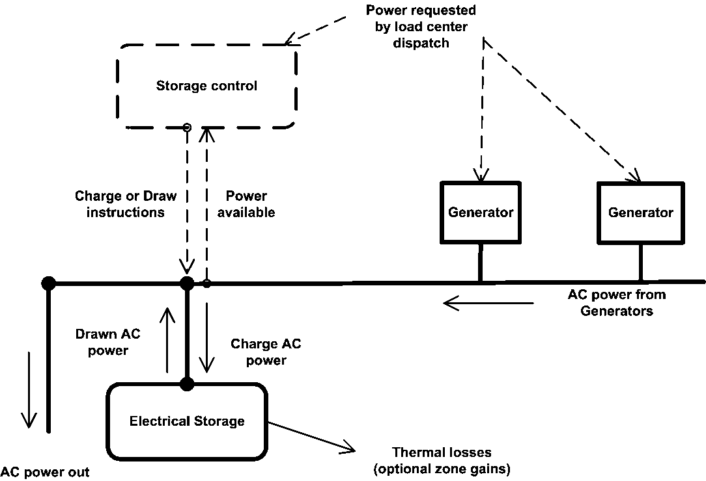
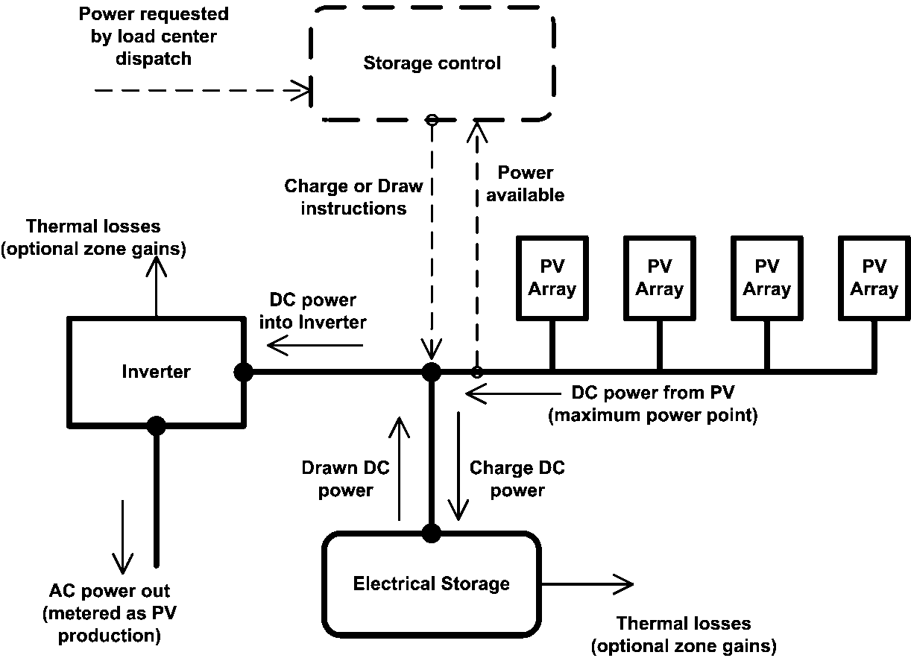
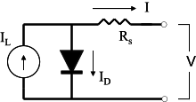

On-Site Generation
==================

This section discusses on-site generation, electric storage, and power conversion models related to serving the facility with electric power.  


Electric Load Center Distribution Manager
-----------------------------------------

### Overview


The electric load center distribution manager (object name: ElectricLoadCenter:Distribution) operates on-site generators specified in the simulation and reports the amount of generated and purchased electricity. Electric load centers really serve as a “load” to the generators and “supply” power to the rest of the building. The internal meters used by EnergyPlus for reporting do all of the demand tracking. For more details on the individual inputs required see the Input Output Reference document.

The electric load center manager sums all of the building and system electric loads and provides operating schemes for the generators. The electric load center objects are operated in the order they are defined in the input data file (IDF), and generators are dispatched sequentially in the order they are specified within each load center object. The electricity produced from photovoltaic arrays is handled somewhat separately and is always “used” to reduced the demand that the generators will try to meet for that time step. What is not provided by the on-site generation equipment, and electric storage units if specified, is met by (purchasing) off-site electricity.

The available operating schemes are “Baseload”, “DemandLimit”, “TrackElectrical,” “TrackSchedule,” “TrackMeter,” “FollowThermal” and “FollowThermalLimitElectrical.”  These operating schemes affect how loads are dispatched to the generators, in effect telling the generators whether or not to run and requesting power levels.

The BASELOAD scheme operates the generators at their rated (requested) electric power output when the generator is scheduled ON (ref. ElectricLoadCenter:Generators in the Input Output Reference). The Baseload scheme requests all generators scheduled ON (available) to operate, even if the amount of electric power generated exceeds the total facility electric power demand.

The DEMAND LIMIT scheme limits the amount of purchased electricity from the utility to the amount specified in the input. The Demand Limit scheme tries to have the generators meet all of the demand above the purchased electric limit defined by the user.

The TRACK ELECTRICAL scheme tries to have the generators meet all of the electrical demand for the building.

The TRACK METER scheme tries to have the generators meet all the electrical demand from a meter chosen by the user rather than the usual meter for the entire facility. The meter can be a custom meter so that generators are tied to only certain loads in the building.

The TRACK SCHEDULE scheme tries to have the generators meet all of the electrical demand determined by a user-defined schedule.

The FOLLOW THERMAL and FOLLOW THERMAL LIMIT ELECTRICAL schemes run the generators to meet thermal demand. The thermal demand is determined from the plant modeling and depends on the flow requested by other components on the demand side of the plant loop, the loop temperatures, and the loop temperature setpoint. The electric load center distribution manager converts the thermal load to an electrical load using a nominal ratio of the thermal to electrical power production for each generator. For these schemes, the generator needs to be connected to the supply side of a plant loop and serve components that use hot water on the demand side of the plant loop. The thermal load request is obtained from the plant data structure (structure location in code is PlantLoop%LoopSide%Branch%Comp%MyLoad).The distribution manager converts the thermal load, <span>\({q_{thermal}}\)</span>, to an electrical load using:

<div>$${q_{Elect}} = \frac{{{q_{thermal}}}}{{ThermElectRatio}}$$</div>

where,

<span>\(ThermElectRatio\)</span> is a nominal, constant, user-defined value for the ratio of thermal production to electrical production for a cogenerator. This ratio is used for supervisory control and dispatch of the electric power request to the generator; however, the cogenerator model may determine that actual performance varies from this nominal value at different times in the simulation when operating conditions differ from those used for the nominal ratio.

For all operating schemes except BASELOAD, a total electric load reduction target (or thermal load converted to electrical equivalent) is established for the load center based on the specific operating scheme. The load center then requests that its generators operate, one-by-one in the order specified, until the target is met or exceeded. Generators that are not scheduled as ‘available’ for the simulation time step are not called to operate. The requested power demand to be met by each generator is the **smaller of** the nominal ‘rated’ electric power output (as specified in the ElectricLoadCenter:Generators object) or the remaining total electric load reduction target for the load center. After each electric generator is requested to operate, the actual electric power delivered by the generator, which may be greater than or less than the requested amount due to inputs specified in the generator performance model (e.g., Generator:CombustionTurbine, Generator:MicroTurbine, etc.), is used to update the remaining total electric power target for the other generators associated with this load center.

Most of the operating schemes will sequentially load the available electric load centers and generators. EnergyPlus can accept multiple “ElectricLoadCenter:Distribution” objects with different operating schemes. Because of this, there are two levels of reporting, one for the whole building and a second for each load center. The whole-building results are managed with the internal meters for the entire model. The individual load-center results are summed for those generators connected to a particular load center. The total electricity purchased is reported both in power and energy units. This value is positive when the amount of energy is purchased from the utility. This value can be negative when the total electricity produced is greater than the facility electrical needs. The excess will either be available for storage or to sell back to the electric utility company.

The order of input objects (ElectricLoadCenter:Distribution) in the input file is significant and used to structure how generators are dispatched with the first load centers and generators managed before the later ones. Therefore, load centers listed earlier in the file effectively have a higher priority.

Electric load centers can have one of five different configurations. Load centers can get fairly complicated and include power conditioning and storage. Separate inverter models are used to condition DC power from photovoltaics into AC power for the building and utility. Load centers serving PV need to be specified with a direct current buss. The other generators may have inverters inside the devices but these are already embedded in the generator models. The load center can also manage electrical storage (ref. Electrical Storage below).

The most basic configuration is selected with the keyword “Alternating Current” for the Electrical Buss Type, shown in the following diagram.


Figure 333. Basic Alternating Current Schematic

The *AlternatingCurrent* load centers have AC generators with no storage and behave in the following way. All electric demand not met by the sum of the electrical power produced by the available generators will be met by purchased electricity. If a generator is needed in the simulation for a small load and the load is less than the generator’s minimum part load ratio, the generator will operate at the minimum part load ratio and the excess will either reduce demand or the excess energy will be exported back to the electric utility company. The purchased electrical demand limit is the user input for the demand limit above which the generators will try and meet the entire electrical load on the building. It is possible to prescribe a set of ElectricLoadCenter:Distribution objects with inconsistent or conflicting operating schemes, so users need to be careful.

A configuration with AC generators with on-site electrical storage is selected with the keyword “AlternatingCurrentWithStorage” and is shown in the following diagram.




Figure 334. AC Generators with On-site Electrical Storage Schematic

The *AlternatingCurrentWithStorage* load centers attempt to augment the generator electricity production so that the power requests are met. Storage control logic is discussed below under Electrical Storage.

The basic configuration for photovoltaic generators is selected using the “DirectCurrentWithInverter” keyword and is shown in the following diagram.


Figure 335. Direct Current With Inverter Photovoltaic Generators Schematic

The *DirectCurrentWithInverter* load centers collect DC power from various PV arrays, run the DC power through an inverter and produce AC power. The PV arrays produce DC power based on the availability of sunshine and do not respond to load requests made by the electric load center. The AC output from the inverter is what is recorded as electricity production.

If the PV-based load center is equipped with DC electrical storage that is connected before the inverter, then the buss type should be “DirectCurrentWithInverterDCStorage” and is shown in the following diagram.




Figure 336. PV based Load Center with DC Electrical Storage Schematic

The *DirectCurrentWithInverterDCStorage* load centers charge or draw DC power to meet the requested electrical load.

If the PV-based load center is equipped with AC electrical storage that is connected after the inverter, then the buss type should be “DirectCurrentWithInverterACStorage” and is shown in the following diagram.


Figure 337. PV Based Load Center with AC Electrical Storage Schematic

The *DirectCurrentWithInverterACStorage* load centers charge or draw AC power to meet the requested electrical load.

### Electric Load Center Generators

The electric load center generators (object name: ElectricLoadCenter:Generators) provide a set of scheduled electric generators for electric power generation. Here is where the user lists what generators and PVs are available at any given time. For more details on the individual inputs required see the EnergyPlus Input Output Reference.

### Inverters

EnergyPlus includes three models for converting Direct Current (DC) electrical power into Alternating Current (AC) electrical power. The DC power into the inverter, <span>\({P_{DC - in}}\)</span>, is converted to AC power out, <span>\({P_{AC - out}}\)</span>, of the inverter using:

<div>$${P_{AC - out}} = {P_{DC - in}} \cdot {\varepsilon_{inverter}}$$</div>

The inverter efficiency is determined using one of the three models. For the“Simple” inveter model, efficiency is constant and input by the user. For the “Look Up Table” model, the efficiency is calculated using linear interpolation. For the “Function of Power” model, the efficiency is calculating using a single-variable curve object. For both the Look Up Table and Function of Power models, the power production is normalized by <span>\({P_{DC - in}}\)</span>.

The thermal losses are calculated from the difference between <span>\({P_{DC - in}}\)</span> and <span>\({P_{AC - out}}\)</span>.

### Electrical Storage

EnergyPlus includes two models for storing electrical energy: a simple model that is not intended to represent any specific type of storage technology and a battery model that represents the kinetic battery model originally developed by Manwell and McGowan.

The simple model might be called “constrained bucket with energy losses.”  The “bucket” holds a quantity of Joules of electrical energy, refered to as the state of charge. There are losses and limits to storing and drawing power but otherwise the bucket just holds electricity. The user sets constraints on the rates of charging,<span>\({P_{stor - {\rm{charge - max}}}}\)</span>, and drawing, <span>\({P_{stor - {\rm{d}}raw{\rm{ - max}}}}\)</span>. The user defines efficiencies for charging,<span>\({\varepsilon_{{\rm{charge}}}}\)</span>, and drawing, <span>\({\varepsilon_{draw}}\)</span>. The user defines an initial state of charge and a maximum state of charge.

The storage control algorithms determine a value for the charging power, <span>\({P_{stor - ch\arg e}}\)</span>, or the drawing power, <span>\({P_{stor - draw}}\)</span>. The basic storage control algorithm is to compare the requested generator electricity loads to the current available supply and make up the difference with storage. If extra power is generated, then store it. If there is a shortage, then attempt to draw from storage to meet the remaining electricity request. The load center dispatchs a requested electric load for each generator, runs each generator, and then stores the actual power. This power dispatch can be a function of many different things depending on the operating scheme. The sum of the generator load requests,<span>\({P_{load - request}}\)</span>, is then compared to the sum of the generator production, <span>\({P_{{\rm{gen}} - {\rm{supply}}}}\)</span>

<div>$$IF\quad ({P_{load - request}} &lt; {P_{gen - \sup ply}})\quad {P_{stor - ch\arg e}} = {P_{gen - \sup ply}} - {P_{load - request}}$$</div>

<div>$$IF\quad ({P_{load - request}} > {P_{gen - \sup ply}})\quad {P_{stor - draw}} = {P_{load - request}} - {P_{gen - \sup ply}}$$</div>

The limits <span>\({P_{stor - {\rm{charge - max}}}}\)</span> and <span>\({P_{stor - {\rm{d}}raw{\rm{ - max}}}}\)</span> are applied.

If charging, the new state of charge, <span>\(Q_{stor}^{t + \Delta t}\)</span>, is determined using:

<div>$$Q_{stor}^{t + \Delta t} = Q_{stor}^t + {P_{stor - ch\arg e}} \cdot {\varepsilon_{{\rm{charge}}}} \cdot \Delta t$$</div>

If drawing, the new state of charge is:

<div>$$Q_{stor}^{t + \Delta t} = Q_{stor}^t - \frac{{{P_{stor - draw}} \cdot \Delta t}}{{{\varepsilon_{draw}}}}$$</div>

Where <span>\(\Delta t\)</span> is the length of the system time step in seconds.

The storage device has an availability schedule. If it is not available then no power can be drawn or stored.

The gross electric power drawn and stored includes losses in the form of heat. These thermal losses are calculated from the user-specified efficiencies for charging and drawing and gross electric power stored and drawn. The thermal (heat) losses are included in a zone heat balance if the user specifies a thermal zone. A user-defined radiative split is used to divide thermal losses into radiation and convection portions. If no zone is specified, then the thermal losses are simply disregarded (e.g., rejected to outdoors and do not impact the zone air heat balance).

### Electrical Storage – Kinetic Battery Model

The Kinetic Battery Model (KiBaM) (object: ElectricLoadCenter:Storage:Battery) was originally developed by Manwell and McGowan (1993) for use in time series performance models of hybrid energy systems. The model is called kinetic because it is based on a chemical kinetics process to simulate the battery charging and discharging behavior. The model, with different improvements and modifications, has been incorporated into the software Hybrid2 and HOMER as the electrical storage module of hybrid and distributed power systems. In 2005, KiBaM was implemented as a stand-alone application in support of the European Union Benchmarking research project (Bindner et al. 2005).

The Kinetic Battery Model assumes that the battery charge is distributed over two tanks: an available-charge tank and a bound-charge tank. The tank for available charges can supply electrons directly to the load, whereas the tank for chemically bound charges can only supply electrons to the available-charge tank. At any time, the total charge <span>\(q\)</span> in the battery is the sum of the available charge (<span>\({q_1}\)</span>) and bound charge (<span>\({q_2}\)</span>). That is:

<div>$$q = {q_1} + {q_2}$$</div>

Based on the governing equations on the change of charge in both tanks (Manwell and McGowan 1993), the battery capacity can be related to a constant charge/discharge current (<span>\(I\)</span>) as the following equation:

<div>$${q_{\max }}(I) = \frac{{{q_{\max }}k \cdot c \cdot t}}{{1 - {e^{ - kt}} + c(kt - 1 + {e^{ - kt}})}}$$</div>

where,

<span>\({q_{\max }}(I)\)</span>  : Maximum capacity (Ah) at charge or discharge current I

<span>\({q_{\max }}\)</span>       : Maximum capacity (Ah) at infinitesimal current

<span>\(t\)</span>            : Charge or discharge time (hr), defined by <span>\(t = \frac{{{q_{\max }}(I)}}{I}\)</span>

<span>\(k\)</span>           : Constant coefficient (hr<sup>-1</sup>)

<span>\(c\)</span>           : Parameter indicating the ratio of available charge capacity to total capacity

Assuming that a constant current is used in any time step for charging and discharging, the available charge (<span>\({q_1}\)</span>) and bound charge (<span>\({q_2}\)</span>) at any time step are given by:

<div>$${q_1} = {q_{1,0}}{e^{ - k\Delta t}} + \frac{{({q_0}kc - I)(1 - {e^{ - k\Delta t}})}}{k} - \frac{{Ic(k\Delta t - 1 + {e^{ - k\Delta t}})}}{k}$$</div>

<div>$${q_2} = {q_{2,0}}{e^{ - k\Delta t}} + {q_0}(1 - c)(1 - {e^{ - k\Delta t}}) - \frac{{I(1 - c)(k\Delta t - 1 + {e^{ - k\Delta t}})}}{k}$$</div>

where,

<span>\({q_{1,0}}\)</span>  :  Available charge at the beginning of time step (Ah)

<span>\({q_{2,0}}\)</span> :  Bound charge at the beginning of time step (Ah)

<span>\({q_0}\)</span>   :  Total charge at the beginning of time step (Ah), <span>\({q_0} = {q_{1,0}} + {q_{2,0}}\)</span>

<span>\(\Delta t\)</span>   :  Length of time step (hr)

KiBaM views the battery as a voltage source in series with an electric resistance (Figure 338). The internal resistance is assumed to be constant and the open circuit voltage varies with current and state of charge.


Figure 338. Electrical equivalent model for KiBaM

The battery’s open circuit voltage is modeled in the same form for charging and discharging, but with different coefficients. The open circuit voltage in charging (<span>\({E_c}\)</span>) and in discharging (<span>\({E_d}\)</span>) can be respectively expressed as:

<div>$${E_c} = {E_{0,d}} + {A_c}{X_c} + \frac{{{C_c}{X_c}}}{{{D_c} - {X_c}}}$$</div>

<div>$${E_d} = {E_{0,c}} + {A_d}{X_d} + \frac{{{C_d}{X_d}}}{{{D_d} - {X_d}}}$$</div>

where,

<span>\({E_{0,c}}\)</span>               : Open circuit voltage for a fully charged battery

<span>\({E_{0,d}}\)</span>               : Open circuit voltage for a fully discharged battery

<span>\({A_c}\)</span>, <span>\({C_c}\)</span>, <span>\({D_c}\)</span>   : Constant parameters for charging

<span>\({A_d}\)</span>, <span>\({C_d}\)</span>, <span>\({D_d}\)</span>  : Constant parameters for discharging

<span>\({X_c}\)</span>, <span>\({X_d}\)</span>        : Normalized maximum capacity at a given charging or discharging current, calculated as:

<div>$$
  X = \left\{
    \begin{array}{cl}
      q_0 / q_{max}(I) & \; (charging) \\
      (q_{max}-q_0)/q_{max}(I) & \; (discharging)
    \end{array}
  \right.
$$</div>

It needs to be noted that the performance curve (Curve:RectangularHyperbola2) used in the model input covers the 2<sup>nd</sup> and the 3<sup>rd</sup> item of the open circuit voltage equation. Due to the reformatting of performance curve, the voltage function regression coefficients can map to the curve coefficients as follows:

<span>\({C_1} =  - C\)</span> ;<span>\({C_2} =  - D\)</span>;<span>\({C_3} = A\)</span>

With open circuit voltage, the battery terminal voltage (V) can be calculated as:

<div>$$V = E - IR$$</div>

where, R is the battery internal resistance in Ohms; the current is positive for discharging and negative for charging.

Given desired power in/out of the battery, the desired charge or discharge current can be calculated from the basic power equation: <span>\(P = VI\)</span>. In this calculation, iteration is needed to ensure the electric current has converged and the battery operation satisfies all specified technical constraints such as maximum discharge current and charge rate limit.

KiBaM assumes that battery life is a primary function of charge/discharge cycles. One cycle is defined as the process of starting from a certain state of charge (SOC), the battery is discharged to a lower SOC and then recharged back to the starting SOC. It is regarded that the magnitude of cycle plays more important than the average of SOC during the cycle. This means that in terms of the impact on battery life, the cycle from 90% to 70% and then recharge back to 90% of SOC is equivalent to another cycle from 50% to 30% and then recharge back to 50% of SOC.  Battery life in terms of the number of cycles is predicted as a function of the cycle range measured by the fractional depth of discharge. A double exponential equation is used to capture the damage to batteries due to cycling. The equation takes the following form where the coefficients need to be derived from battery test data via curve fitting.

<div>$${C_F} = {C_1} + {C_2}{e^{{C_3}R}} + {C_4}{e^{{C_5}R}}$$</div>

where,

<span>\({C_F}\)</span>    :    Cycles to failure

<span>\({C_1}\)</span>-<span>\({C_5}\)</span>:    Regression coefficients

R       :    Cycle range in terms of fractional SOC

Following Hybrid2, the rainflow counting method (Downing and Socie 1982) is used to count battery cycles within a state of charge time series. Based on the number of cycles for each fractional SOC range, the battery damage is estimated as:

<div>$$D = \sum\limits_{i = 1}^{} {\left( {{N_i}\frac{1}{{{C_{F,i}}}}} \right)} $$</div>

where,

D    : Fractional battery damage. For example, a value of 0.5 at the end of simulation means that half of the battery life is used up after the length of the simulation period.

<span>\({C_{F,i}}\)</span>: Number of cycles to failure for the i-th cycle range

<span>\({N_i}\)</span>  : Total number of cycles over the simulation with the i-th cycle range

It needs to be noted that the temperature effects on battery performance and battery self-discharge are not supported in the current model.

#### References

Bindner H., Cronin T., Lundsager P., Manwell J.F., Abdulwahid U., and Baring-Gould I. 2005. Lifetime Modeling of Lead Acid Batteries. Riso National Laboratory, Roskilde, Denmark.

Downing S. D. and Socie D. F. 1982.  Simple rainflow counting algorithms, International Journal of Fatigue, 1982.

Manwell J. F. and McGowan J. G. 1993. A lead acid battery storage model for hybrid energy systems, Solar Energy 50(5): 399- 405.

### Electric Load Center Transformers

Transformers (object name: ElectricLoadCenter:Transformer) are an integral part of the electric distribution system. They have two broad applications closely related to building energy simulation. First, transformers are used to lower the voltage of electricity from utility primary circuits to customer secondary circuits, and in this case they are called distribution transformers. Second, transformers are used to output the surplus power from onsite generators to the electricity grid.

Distribution transformers reduce the voltage on utility distribution lines (34.5 kV or less) to a lower secondary voltage (600 V or less) suitable for customer equipment. Distribution transformers are usually categorized according to the medium used for cooling and insulation (liquid or air), the voltage class that they serve (low or medium), and the number of phases (single phase or three phase).

Liquid-immersed transformers rely on oil or other fire resistant liquid around the coils for cooling. In contrast, dry type transformers rely only on the natural convection of air for insulation and cooling. Medium-voltage transformers step from utility line voltage down to a lower secondary voltage, depending on the application. The secondary voltage from a medium-voltage transformer is usually at 277 V for single phase and 480 V for three phase. This secondary voltage can be directly used as 480 V three-phase power for large motors or as 277 V single-phase power for some fluorescent lighting. However, for most industrial and commercial facilities, low-voltage transformers are needed to reduce the above voltages further to 208/120 V. Common 120 V loads are wall plugs and incandescent lighting.

Most liquid-immersed transformers are owned by utilities and they are of the medium-voltage type. Virtually all dry type transformers are owned by commercial and industrial customers (Barnes et al. 1996). Of the dry type transformers, those of the medium-voltage type are generally special-order items while those of the low-voltage type are commodity items. The efficiency requirement of distribution transformers is covered by the NEMA (National Electrical Manufactures Association) Standard TP 1. ASHRAE 90.1-2010 will cite the NEMA Standard TP 1 to stipulate the efficiency requirement for the low-voltage dry type distribution transformers.

There are two main types of energy losses in transformers: no load loss and load loss. The no load loss comes primarily from the switching of the magnetic fields in the core material. Hence, it is also called the core loss. The no load (core) loss is roughly constant and exists continuously in the core material as long as the transformer is energized. The load loss comes from the electrical resistance in the windings when there is a load on the transformer. Hence, the load loss is also called the winding loss. The load (winding) loss is proportional to the load squared with a small temperature correction.

Given the no load loss (NL) and the load loss (LL) at rated load and conditions, the total energy losses in a transformer at time t is calculated as:

<div>$$TL(t) = NL + LL(t) = NL + LL*P{(t)^2}*{f_T}(t)$$</div>

where,

<span>\(TL(t)\)</span>        Total energy loss at time t (W)

<span>\(LL(t)\)</span>        Load loss at time t (W)

<span>\(P(t)\)</span>          Per unit load at time t

<span>\({f_T}(t)\)</span>         Temperature correction factor for the load loss at time t


The per unit load at time t is calculated as:

<div>$$P(t) = \frac{{Load(t)}}{{{S_B}}}$$</div>

where,

<span>\(Load(t)\)</span>Transformer load at time t (W)

<span>\({S_B}\)</span> Transformer nameplate rating (VA)

The temperature correction factor at time t is calculated as (NEMA 2002):

<div>$${f_T}(t) = {L_{dc}}*\frac{{R(t)}}{{{R_{ref}}}} + {L_{eddy}}*\frac{{{R_{ref}}}}{{R(t)}}$$</div>

where,

<span>\({L_{dc}}\)</span>            Per unit load loss due to electrical resistance

<span>\({L_{eddy}}\)</span>          Per unit load loss due to eddy currents

<span>\(R(t)\)</span>          Winding electrical resistance at time t

<span>\({R_{ref}}\)</span>           Winding electrical resistance at the full load reference conditions

The ratio of winding electrical resistance is calculated as:

<div>$$\frac{{R(t)}}{{{R_{ref}}}} = \frac{{F + {T_{winding}}(t) + {T_{amb}}(t)}}{{F + {T_{winding,ref}} + {T_{amb,ref}}}}$$</div>

where,

<span>\(F\)</span>  Thermal coefficient of resistance for the winding material (=225 for aluminum and 234.5 for copper)

<span>\({T_{winding,ref}}\)</span>Winding temperature rise at the full load reference conditions (°C)

<span>\({T_{winding}}(t)\)</span>Winding temperature rise at time t (°C)

<span>\({T_{amb,ref}}\)</span>       Ambient temperature at the reference condition (=20 °C)

<span>\({T_{amb}}(t)\)</span>      Ambient temperature at time t (°C)

The Ambient temperature <span>\({T_{amb}}(t)\)</span>is equal to the zone temperature if a thermal zone is specified in the input; otherwise, it is assumed equal to 20 °C. The winding temperature rise at time t is calculated as (Barnes et al. 1997):

<div>$${T_{winding}}(t) = P{(t)^{1.6}}*{T_{winding.ref}}$$</div>

Based on the derived total energy losses in a transformer, the transformer efficiency at time t can be calculated according to the following equation:

<div>$$\eta (t) = \frac{{Load(t)}}{{Load(t) + NL + LL(t)}}$$</div>

The above procedure describes how to calculate the total transformer energy losses based on the no load loss and load loss at rated conditions. The transformer model also supports the case when the nominal transformer efficiency is given. In this case, the user needs to provide the nameplate efficiency and the corresponding per unit load, the maximum efficiency and the corresponding per unit load, and the reference conductor temperature at which the nameplate efficiency is measured. Given these information, both no load loss and load loss at rated conditions can be derived as below.

The nameplate efficiency can be expressed as:

<div>$${\eta_{np}} = \frac{{{S_B}*{P_{np}}}}{{{S_B}*{P_{np}} + NL + LL*P_{np}^2*{f_{T,np}}}}$$</div>

where,

<span>\({\eta_{np}}\)</span>            Nameplate efficiency

<span>\({S_B}\)</span> Nameplate rating (VA)

<span>\({P_{np}}\)</span>            Per unit load at which the nameplate efficiency is measured

<span>\({f_{T,np}}\)</span>          Applied temperature correction factor for the nameplate efficiency

Maximum efficiency generally occurs when the load loss is equal to the no-load loss. Because the no-load loss does not vary with the load on the transformer, the following relationship can be established:

<div>$$NL = L{L_{\max ,\eta }} = LL*P_{\max ,\eta }^2*{f_{T,\max  - \eta }}$$</div>

where,

<span>\({P_{\max ,\eta }}\)</span>         Per unit load at which the maximum efficiency is obtained

<span>\({f_{T,\max  - \eta }}\)</span>     Applied temperature correction factor for the maximum efficiency

Transformers typically have close per unit loads for the nameplate efficiency and the maximum efficiency. Therefore, it is reasonable to assume that the applied temperature correction factors are equal at those two efficiencies. This implies that:

<div>$$\frac{{L{L_{np}}}}{{L{L_{\max ,\eta }}}} = \frac{{LL*{P_{np}}^2*{f_{T,np}}}}{{LL*{P_{\max ,\eta }}^2*{f_{T,\max  - \eta }}}} = {\left( {\frac{{{P_{np}}}}{{{P_{\max ,\eta }}}}} \right)^2}$$</div>

Rearranging Equation and combining it with Equation leads to:

<div>$$L{L_{np}} = L{L_{\max ,\eta }}*{\left( {\frac{{{P_{np}}}}{{{P_{\max ,\eta }}}}} \right)^2} = NL*{\left( {\frac{{{P_{np}}}}{{{P_{\max ,\eta }}}}} \right)^2}$$</div>

Combining Equations and , we can obtain the no load loss as:

<div>$$NL = \frac{{{S_B}*{P_{np}}*(1 - {\eta_{np}})}}{{{\eta_{np}}*\left[ {1 + {{\left( {\frac{{{P_{ref}}}}{{P{}_{\max ,\eta }}}} \right)}^2}} \right]}}$$</div>

Substitute NL into Equation , we can calculate the load loss at rated conditions as:

<div>$$LL = \frac{{NL}}{{{f_{T,\max  - \eta }}*P_{\max ,\eta }^2}} = \frac{{NL}}{{{f_{T,np}}*P_{\max ,\eta }^2}}$$</div>

Since both no load and load losses at rated conditions are known, the total energy losses in a transformer at time t can then be calculated according to Equation

#### References:

Barnes, PR., JW. Van Dyke, BW. McConnell, and S. Das. 1996. Determination Analysis of Energy Conservation Standards for Distribution Transformer, ORNL-6847. Oak Ridge National Laboratory, Oak Ridge, TN.

Barnes, PR., S. Das, BW. McConnell, and JW. Van Dyke. 1997. Supplement to the “Determination Analysis” (ORNL-6847) and Analysis of the NEMA Efficiency Standard for Distribution Transformer, ORNL-6925. Oak Ridge National Laboratory, Oak Ridge, TN.

NEMA. 2002. NEMA Standards Publication TP 1-2002: Guide for Determining Energy Efficiency for Distribution Transformers. National Electrical Manufactures Association, Rosslyn, VA.

Photovoltaic Arrays
-------------------

The Photovoltaics.f90 module includes three different models referred to as “Simple”, “Equivalent One-Diode” and “Sandia” and the choice will determine the mathematical models (and input data) used to determine the energy produced by solar/electric conversion panels. The EnergyPlus photovoltaic array models are called one at a time at the HVAC system timestep along with other electrical generation components such as gas turbines and diesel engines.

All of the photovoltaic models share the same models for predicting incident solar radiation that are also used for the solar thermal calculations and are described in the section Climate, Sky and Solar/Shading Calculations.

Note that some of the terminology used to discussed photovoltaics overlaps with terminology used to discuss Fortran programs. The word *module* may refer to a PV panel or to a fortran90 programming entity. *Model* may refer to a manufacturers production model for a specific type of PV module or to a mathematical model used for engineering analysis. *Array* may refer to a collection of PV modules wired together or to a mathematical variable with multiple elements.

The PV modules are assumed to always run when the total incident solar is greater than 0.3 Watts. If the incident solar is less than 0.3, then the modules produce no power.

PV arrays are managed by an electric load center. The load center is a “load” with respect to generating equipment but is a “supply center” for the rest of the building. PV arrays need to be connected to ElectricLoadCenter:Distribution objects that have a DC buss type.

### Simple Model

The Generator:PV:Simple object describes about the simplest model for predicting photovoltaic energy production. In this model the user specifies the efficiency with which surfaces convert incident solar radiation to electricity. (In the other models this efficiency is determined as part of the model.)  The full geometric model for solar radiation is used, including sky models, shading, and reflections, to determine the incident solar resource. The model accepts arbitrary conversion efficiencies and does not require actual production units be tested to obtain empirical performance coefficients. (The Energy+.idd sets the range of conversion efficiencies to be on [0..1], but the user could alter the Energy+.idd to extend this range if desired.)

#### Mathematical Description

Table 89. Nomenclature for Simple Photovoltaic model

<table class="table table-striped">
<tr>
<th>Mathematical variable</th>
<th>Description</th>
</tr>
<tr>
<td>P</td>
<td>Electrical power produced by photovoltaics [W]</td>
</tr>
<tr>
<td>A<sub>surf</sub></td>
<td>Net area of surface  [m<sup>2</sup>]</td>
</tr>
<tr>
<td>f<sub>activ</sub></td>
<td>Fraction of surface area with active solar cells [ ]</td>
</tr>
<tr>
<td>G<sub>T</sub></td>
<td>Total solar radiation incident on PV array [W/m<sup>2</sup>]</td>
</tr>
<tr>
<td>h<sub>cell</sub></td>
<td>Module conversion efficiency [ ]</td>
</tr>
<tr>
<td>h<sub>invert</sub></td>
<td>DC to AC conversion efficiency  [ ]</td>
</tr>

</table>


The usable electrical power produced by a PV surface are calculated using:

<div>$$P = {A_{surf}} \cdot {f_{activ}} \cdot {G_T} \cdot {\eta_{cell}} \cdot {\eta_{invert}}$$</div>

On the right hand side of this equation, only G<sub>T</sub> is calculated by EnergyPlus and the rest are user inputs. Power levels are assumed constant over the timestep to arrive at energy production.

There are two modes that can be selected by the user that govern how the PV system is coupled to the building surfaces. If the integration mode is selected as ‘DECOUPLED’ then no adjustments are made to account for energy extracted in the form of electricity. If the integration mode is selected as ‘INTEGRATED’ then the energy extracted in the form of electricity is removed from surface heat transfer calculations using a sink term. This sink term is lagged from the previous timestep.

### Equivalent One-Diode Model

This model predicts the electrical performance of a photovoltaic (PV) array. This model is also known as the “TRNSYS PV” model.

Mathematically speaking, the EnergyPlus PV module employs equations for an empirical equivalent circuit model to predict the current-voltage characteristics of a single module. This circuit consists of a DC current source, diode, and either one or two resistors. The strength of the current source is dependent on solar radiation and the IV characteristics of the diode are temperature-dependent. The results for a single module equivalent circuit are extrapolated to predict the performance of a multi-module array.

The module employs a “four-parameter” equivalent circuit to model crystalline (both mono and poly) PV modules developed at the University of Wisconsin – Madison [2]. The values of these parameters cannot normally be obtained directly from manufacturers’ catalogs. However, the PV module will automatically calculate them from commonly available data. The PV module also includes an optional incidence angle modifier correlation to calculate how the reflectance of the PV module surface varies with the angle of incidence of solar radiation.

The module determines PV current as a function of load voltage. Other OUTPUTS include current and voltage at the maximum power point along the IV curve, open-circuit voltage, short circuit current as well as electrical load met and unmet.

Table 90. General Nomenclature for the PV model

<table class="table table-striped">
<tr>
<th>Mathematical variable</th>
<th>Description</th>
</tr>
<tr>
<td>b</td>
<td>Slope of PV array [degrees]</td>
</tr>
<tr>
<td>g</td>
<td>Empirical PV curve-fitting parameter</td>
</tr>
<tr>
<td>e<sub>g</sub></td>
<td>Semiconductor bandgap [eV]</td>
</tr>
<tr>
<td>h<sub>c</sub></td>
<td>Module conversion efficiency</td>
</tr>
<tr>
<td>m<sub>Isc</sub></td>
<td>Temperature coefficient of short-circuit current [A/K]</td>
</tr>
<tr>
<td>m<sub>Voc</sub></td>
<td>Temperature coefficient of open-circuit voltage [V/K]</td>
</tr>
<tr>
<td>q</td>
<td>Angle of incidence for solar radiation [degrees]</td>
</tr>
<tr>
<td>ta</td>
<td>Module transmittance-absorptance product</td>
</tr>
<tr>
<td>ta<sub>normal</sub></td>
<td>Module transmittance-absorptance product at normal incidence</td>
</tr>
<tr>
<td>G<sub>T</sub></td>
<td>Total radiation incident on PV array</td>
</tr>
<tr>
<td>G<sub>T,beam</sub></td>
<td>Beam component of incident radiation</td>
</tr>
<tr>
<td>G<sub>T,diff</sub></td>
<td>Diffuse component of incident radiation</td>
</tr>
<tr>
<td>G<sub>T,gnd</sub></td>
<td>Ground-reflected component of incident radiation</td>
</tr>
<tr>
<td>G<sub>T,NOCT</sub></td>
<td>Incident radiation at NOCT conditions</td>
</tr>
<tr>
<td>G<sub>T,ref</sub></td>
<td>Incident radiation at reference conditions</td>
</tr>
<tr>
<td>I</td>
<td>Current</td>
</tr>
<tr>
<td>I<sub>L</sub></td>
<td>Module photocurrent</td>
</tr>
<tr>
<td>I<sub>L,ref</sub></td>
<td>Module photocurrent at reference conditions</td>
</tr>
<tr>
<td>I<sub>o</sub></td>
<td>Diode reverse saturation current</td>
</tr>
<tr>
<td>I<sub>o,ref</sub></td>
<td>Diode reverse saturation current at reference conditions</td>
</tr>
<tr>
<td>I<sub>sc</sub></td>
<td>Short-circuit current</td>
</tr>
<tr>
<td>I<sub>sc,ref</sub></td>
<td>Short-circuit current at reference conditions</td>
</tr>
<tr>
<td>I<sub>mp</sub></td>
<td>Current at maximum power point along IV curve</td>
</tr>
<tr>
<td>I<sub>mp,ref</sub></td>
<td>Current at maximum power point along IV curve, reference conditions</td>
</tr>
<tr>
<td>IAM</td>
<td>Dimensionless incidence angle modifier</td>
</tr>
<tr>
<td>K</td>
<td>Boltzmann constant [J/K]</td>
</tr>
<tr>
<td>NP</td>
<td>Number of modules in parallel in array</td>
</tr>
<tr>
<td>NS</td>
<td>Number of modules in series in array</td>
</tr>
<tr>
<td>N<sub>s</sub></td>
<td>Number of individual cells in module</td>
</tr>
<tr>
<td>P</td>
<td>PV output power</td>
</tr>
<tr>
<td>P<sub>max</sub></td>
<td>PV output power at maximum power point along IV curve</td>
</tr>
<tr>
<td>Q</td>
<td>Electron charge constant</td>
</tr>
<tr>
<td>R<sub>s</sub></td>
<td>Module series resistance [W]</td>
</tr>
<tr>
<td>R<sub>sh</sub></td>
<td>Module shunt resistance [W]</td>
</tr>
<tr>
<td>T­<sub>c</sub></td>
<td>Module temperature [K]</td>
</tr>
<tr>
<td>T<sub>c,NOCT</sub></td>
<td>Module temperature at NOCT conditions [K]</td>
</tr>
<tr>
<td>T<sub>c,ref</sub></td>
<td>Module temperature at reference conditions [K]</td>
</tr>
<tr>
<td>U<sub>L</sub></td>
<td>Array thermal loss coefficient</td>
</tr>
<tr>
<td>V</td>
<td>Voltage</td>
</tr>
<tr>
<td>V<sub>mp</sub></td>
<td>Voltage at maximum power point along IV curve</td>
</tr>
<tr>
<td>V<sub>mp,ref</sub></td>
<td>Voltage at maximum power point along IV curve, reference conditions</td>
</tr>
<tr>
<td>V­<sub>oc</sub></td>
<td>Open-circuit voltage</td>
</tr>
<tr>
<td>V<sub>oc,ref</sub></td>
<td>Open-circuit voltage at reference conditions [V]</td>
</tr>

</table>

#### Mathematical Description

##### PV Section 1: Four-Parameter Model

The four-parameter equivalent circuit model was developed largely by Townsend [1989] and is detailed by Duffie and Beckman [1991]. The model was first incorporated into a component for the TRNSYS simulation package by Eckstein [1990]. The EnergyPlus module employs the Eckstein model for crystalline PV modules, using it whenever the short-circuit IV slope is set to zero or a positive value as modified by Ulleberg [2000]. The four parameter model assumes that the slope of the IV curve is zero at the short-circuit condition:

<div>$${\left( {\frac{{dI}}{{dV}}} \right)_{v = 0}} = 0$$</div>

This is a reasonable approximation for crystalline modules. The “four parameters” in the model are *I<sub>L,ref</sub>*, *I<sub>o,ref,</sub>* g, and *R<sub>s</sub>.* These are empirical values that cannot be determined directly through physical measurement. The EnergyPlus model calculates these values from manufactures’ catalog data as discussed in the following section on calculating these parameters

The four-parameter equivalent circuit is shown in the following figure:



Figure 339. Equivalent circuit in the four parameter model

*V* is the load voltage and *I* is the current flowing through the load and PV.

**Determining Performance under Operating Conditions**

The IV characteristics of a PV change with both insolation and temperature. The PV model employs these environmental conditions along with the four module constants *I<sub>L,ref</sub>*, *I<sub>o,ref,</sub>* g, and *R<sub>s</sub>* to generate an IV curve at each timestep.

The current-voltage equation of circuit shown in the previous figure is as follows:

<div>$$I = {I_L} - {I_o}\left[ {\exp \left( {\frac{q}{{\gamma k{T_c}}}\left( {V + I{R_s}} \right)} \right) - 1} \right]$$</div>

*R<sub>s</sub>* and g are constants. The photocurrent *I<sub>L</sub>* depends linearly on incident radiation:

<div>$${I_L} = {I_{L,ref}}\frac{{{G_T}}}{{{G_{T,ref}}}}$$</div>

The reference insolation *G<sub>ref</sub>*  is nearly always defined as 1000 W/m<sup>2</sup>. The diode reverse saturation current *I<sub>o</sub>* is a temperature dependent quantity:

<div>$$\frac{{{I_o}}}{{{I_{o,ref}}}} = {\left( {\frac{{{T_c}}}{{{T_{c,ref}}}}} \right)^3}$$</div>

Equation gives the current implicitly as a function of voltage. Once *I<sub>o</sub>* and *I<sub>L</sub>* are found from Eqs. 3 and 4, Newton’s method is employed to calculate the PV current. In addition, an iterative search routine finds the current (*I<sub>mp</sub>*)  and voltage (*V<sub>mp</sub>*)  at the point of maximum power along the IV curve.

**Calculating *I<sub>L,ref</sub>*, *I<sub>o,ref,</sub>*** **g, and *R<sub>s</sub>***

The Idf specification for the PV model include several values which must be read from manufacturers’ PV module catalogs. The manufactures’ values are used to determine the equivalent circuit characteristics *I<sub>L,ref</sub>*, *I<sub>o,ref,</sub>* g, and *R<sub>s</sub>*. These characteristics define an equivalent circuit that is employed to find the PV performance at each timestep, as described previously. This section describes the algebra and calculation algorithms used to solve for the four equivalent circuit characteristics.

Three of these values, *I<sub>L,ref</sub>*, *I<sub>o,ref,</sub>* g, may be isolated algebraically. The first step is to substitute the current and voltage into Eq. at the open-circuit, short circuit, and maximum power conditions:

<div>$$0 = {I_{L,ref}} - {I_{o,ref}}\left[ {\exp \left( {\frac{q}{{\gamma k{T_{c,ref}}}}{V_{oc,ref}}} \right) - 1} \right] - \frac{{{V_{oc,ref}}}}{{{R_{sh}}}}$$</div>

<div>$${I_{sc,ref}} = {I_{L,ref}} - {I_{o,ref}}\left[ {\exp \left( {\frac{{q{I_{sc,ref}}{R_s}}}{{\gamma k{T_{c,ref}}}}} \right) - 1} \right] - \frac{{{I_{sc,ref}}{R_s}}}{{{R_{sh}}}}$$</div>

<div>$${I_{mp,ref}} = {I_{L,ref}} - {I_{o,ref}}\left[ {\exp \left( {\frac{q}{{\gamma k{T_{c,ref}}}}\left( {{V_{mp,ref}} + {I_{mp,ref}}{R_s}} \right)} \right) - 1} \right] - \frac{{{V_{mp,ref}} + {I_{mp,ref}}{R_s}}}{{{R_{sh}}}}$$</div>

In each case the “-1” term is may be dropped to simplify the algebra. This approximation has little influence on the right side of the equations since because the magnitude of *I<sub>o</sub>* is very small, generally on the order of 10<sup>-6</sup> A. Some rearrangement then yields the following three expressions which isolate *I<sub>L,ref</sub>*, *I<sub>o,ref,</sub>* g:

<div>$${I_{L,ref}} \approx {I_{sc,ref}}$$</div>

<div>$$\gamma  = \frac{{q\left( {{V_{mp,ref}} - {V_{oc,ref}} + I_{mp,ref}^{}{R_s}} \right)}}{{k{T_{c,ref}}\ln \left( {1 - \frac{{{I_{mp,ref}}}}{{{I_{sc,ref}}}}} \right)}}$$</div>

<div>$${I_{o,ref}} = \frac{{{I_{sc,ref}}}}{{\exp \left( {\frac{{q{V_{oc,ref}}}}{{\gamma k{T_{c,ref}}}}} \right)}}$$</div>

At this point an additional equation is needed in order to determine the last unknown parameter. Taking the analytical derivative of voltage with respect to temperature at the reference open-circuit condition derives the fourth equation. This analytical value is matched to the open-circuit temperature coefficient, a catalog specification:

<div>$$\frac{{\partial {V_{oc}}}}{{\partial {T_c}}} = {\mu_{voc}} = \frac{{\gamma k}}{q}\left[ {\ln \left( {\frac{{{I_{sc,ref}}}}{{{I_{o,ref}}}}} \right) + \frac{{{T_c}\mu_{isc}^{}}}{{{I_{sc,ref}}}} - \left( {3 + \frac{{q\varepsilon }}{{Ak{T_{c,ref}}}}} \right)} \right]$$</div>

where

<div>$$A = \frac{\gamma }{{{N_s}}}$$</div>

The “TRNSYS PV model” uses an iterative search routine in these four equations to calculate the equivalent circuit characteristics. The first step is to set upper and lower bounds for the series resistance parameter *R<sub>s</sub>*:  physical constraints require the *R<sub>s</sub>* value to lie between 0 and the value such that g = *N<sub>s</sub>*. The initial guess for *R<sub>s</sub>* is midway between these bounds. g and *I<sub>o,ref</sub>*  are found from Eq. and Eq. , while Eq. gives a trivial solution for *I<sub>L,ref</sub>*.  The model then employs Eq. to compare the analytical and catalog values for m<sub>voc</sub>. When all other variables are held constant, the analytical value for m<sub>voc</sub> increases monotonically with series resistance (Townsend 1989). If the analytical voltage coefficient is less than the catalog value, the lower bound for *R<sub>s</sub>* is reset to the present guess value. Likewise, the upper bound is set to the current value if the calculated m<sub>voc</sub> is too large. After resetting the upper or lower bound for *R<sub>s</sub>*, a new guess value is found by averaging the bounds. This procedure repeats until *R<sub>s</sub>* and g converge. Note that for *I<sub>L,ref</sub>*, *I<sub>o,ref,</sub>* g, and *R<sub>s</sub>* are assumed to be constant and are calculated only on the first call in the simulation. Alternatively, the user may enter a known series resistance by entering a **positive** value in the IDF. In this case the iterative routine described above is skipped and Eqs. , , and find *I<sub>L,ref</sub>*, *I<sub>o,ref,</sub>* and g directly from the given value of *R<sub>s</sub>*.

##### PV Section 2 : Module Operating Temperature

The PV model uses one of five methods for determining cell temperature data. The cell temperature of a PV module is important because the hotter the temperature of the panel, the lower its electrical output. The cell temperature calculation method is chosen by the user in the EnergyPlus IDF file through a parameter choice in the IDD entry called Integration and Cell Temperature Mode.

If the value of this parameter is “**Decoupled NOCT Conditions**” then the cell temperature of the PV is modeled using the method from the Duffie and Beckman (1991) for estimating cell temperature. This is based upon the standard NOCT (Nominal Operating Cell Temperature) measurements to compute the module temperature Tc at each timestep. The NOCT temperature (Tc,NOCT) is the operating temperature of the module with a wind speed of 1 m/s, no electrical load, and a certain specified insolation and ambient temperature [Beckman and Duffie, 1991]. The values for insolation GT,NOCT  and ambient temperature *T<sub>a,NOCT</sub>* are usually 800 W/m<sup>2</sup> and 20º C. *h<sub>c</sub>* is the convesion efficiency of the module, which varies with ambient conditions. ta is a user-defined constant.

The equation is:

<div>$${T_c} = {T_a} + \frac{{\left( {1 - {\raise0.7ex\hbox{${{\eta_c}}$} \!\mathord{\left/ {\vphantom {{{\eta_c}} {\tau \alpha }}}\right.}\!\lower0.7ex\hbox{${\tau \alpha }$}}} \right)}}{{\left( {{\raise0.7ex\hbox{${{G_T}\tau \alpha }$} \!\mathord{\left/ {\vphantom {{{G_T}\tau \alpha } {{U_L}}}}\right.}\!\lower0.7ex\hbox{${{U_L}}$}}} \right)}}$$</div>

If the user specifies the “**Decoupled Ulleberg Dynamic”** mode for calculating cell temperature, then a method developed by Ulleberg is used:

<div>$${\left. {{T_{cell}}} \right|_t} = {T_{ambient}} + \left( {{{\left. {{T_{cell}}} \right|}_{t - 1}} - {T_{ambient}}} \right)*{e^{\frac{{ - UL}}{{Cap}}\Delta t}}$$</div>

In other words, the cell temperature is a function of the privious cell temperature and the thermal capacity of the PV module material.

If the user specifies “**Integrated Surface Outside Face”** for this parameter, then the temperature result from EnergyPlus’s modeling of surfaces is used for the cell temperature. Also the energy exported from the surface as electricity becomes a sink in the internal source modeling for the heat transfer surface.

If the user specifies “**Integrated Transpired Collector”** for this parameter, then the temperature result for the unglazed transpired collector surfaces is used for the cell temperature. Also the energy exported from the collector surface as electricity is deprecated using a source term in the collector’s temperature modeling.

If the user specifies “**Integrated Exterior Vented Cavity”** for this parameter, then the temperature result for the exterior cavity is used for the cell temperature. Also the energy exported from the baffle surface as electricity is deprecated using a source term in the baffle’s temperature modeling.

##### PV Section 3 : Multi-Array Modules

The electrical calculations discussed in the sections above deal only with a single module. The EnergyPlus PV component may be used to simulate arrays with any number of modules. The IDF defines the number of modules in series (NS) and modules in parallel (NP) for the entire array. The total number of modules in the array is the product of NS and NP. When simulating a single module only, both NS and NP are set to 1. The single-module values for all currents and voltages discussed in PV Section 1 are multiplied by NP or NS to find values for the entire array. This approach neglects module mismatch losses.

With the above equations, and the assumption that the panels operate at the maximum power point, it is a direct calculation to determine DC power production. The performance of an array of identical modules is assumed to be linear with the number of modules in series and parallel. The inverter efficiency is applied linearly to derate the energy production. The inverter capacity forms a limit for power production from a PV generator. A ‘load’ is passed the PV array acting as a generator and various trivial calculations compare PV production to this load. If the PV array is associated with a surface that is associated with a zone, then if the zone has any multipliers associated with it, electricity production will be multiplied accordingly.

#### References

Duffie, John A. and William A. Beckman. 1991. *Solar Engineering of Thermal Processes*. New York: John Wiley & Sons, Inc..

Eckstein, Jürgen Helmut. 1990. *Detailed Modeling of Photovoltaic Components*. M. S. Thesis – Solar Energy Laboratory, University of Wisconsin, Madison: 1990.

Ulleberg, Øystein. *HYDROGEMS Component Library for TRNSYS 15 User Manual*, Institute for Energy Technology, Kjeller, Norway * *

### Sandia Photovoltaic Performance Model

The third model available in EnergyPlus for predicting the electricity generated by photovoltaics is referred to as the Sandia model. This model is based on work done at Sandia National Lab, Albuquerque, NM by David King -- with the help of many others. The model consists of a series of empirical relationships with coefficients that are derived from actual testing. Once the coefficients for a particular module are available, it is straightforward matter to use the model equations to calculate five select points on the current-voltage curve.

The implementation in EnergyPlus is also based on work done by Greg Barker (2003) for the National Renewable Energy Lab who implemented the Sandia model in FORTRAN77 as a custom type (Type101) for the TRNSYS computer program.

There are several climate and solar orientation inputs to the model that are managed elsewhere in EnergyPlus including: incident beam solar, incident diffuse solar, incidence angle of beam solar, solar zenith Angle, outdoor drybulb, wind speed, and elevation.

#### Mathematical Description

This section presents the mathematical description of the Sandia model from a draft report by King et, al. (2003). The core of the model predicts the performance of a single PV module. The following nomenclature and equations summarize the Sandia model.

Table 91. Nomenclature for Sandia PV model

<table class="table table-striped">
<tr>
<th>Mathematical variable</th>
<th>Description</th>
</tr>
<tr>
<td>I<sub>sc</sub></td>
<td>Short-circuit current (A)</td>
</tr>
<tr>
<td>I<sub>mp</sub></td>
<td>Current at the maximum-power point (A)</td>
</tr>
<tr>
<td>I<sub>x</sub></td>
<td>Current at module V = 0.5 V<sub>oc</sub>, defines 4th point on I-V curve</td>
</tr>
<tr>
<td>I<sub>xx</sub></td>
<td>Current at module V = 0.5 (V<sub>oc</sub> + V<sub>mp</sub>), defines a 5th point on the I-V curve</td>
</tr>
<tr>
<td>V<sub>oc</sub></td>
<td>Open-circuit voltage (V)</td>
</tr>
<tr>
<td>V<sub>mp</sub></td>
<td>Voltage at maximum-power point (V)</td>
</tr>
<tr>
<td>P<sub>mp</sub></td>
<td>Power at maximum-power point (W)</td>
</tr>
<tr>
<td>fd</td>
<td>Fraction of diffuse irradiance used by module</td>
</tr>
<tr>
<td>N<sub>s</sub></td>
<td>Number of cells in series in a module’s cell-string</td>
</tr>
<tr>
<td>N<sub>p</sub></td>
<td>Number of cell-strings in parallel in module</td>
</tr>
<tr>
<td>k</td>
<td>Boltzmann’s constant, 1.38066E-23 (J/k)</td>
</tr>
<tr>
<td>q</td>
<td>Elementary charge, 1.60218E-19 (coulomb)</td>
</tr>
<tr>
<td>T<sub>c</sub></td>
<td>Cell temperature inside module (°C)</td>
</tr>
<tr>
<td>&sigma;(T<sub>c</sub>)</td>
<td>‘Thermal voltage’ per cell at temperature T<sub>c</sub>, approximately 1 volt for a typical 26-cell crystalline silicon module</td>
</tr>
<tr>
<td>E<sub>e</sub></td>
<td>‘Effective’ solar irradiance</td>
</tr>
<tr>
<td>E<sub>b</sub></td>
<td>Beam solar irradiance</td>
</tr>
<tr>
<td>E<sub>diff</sub></td>
<td>Diffuse solar irradiance</td>
</tr>
<tr>
<td>C<sub>0</sub> , C<sub>1</sub></td>
<td>Empirical coefficients relating I<sub>mp</sub> to E<sub>e</sub> , C<sub>0</sub> + C<sub>1</sub>= 1 (both dimensionless)</td>
</tr>
<tr>
<td>C<sub>2</sub> , C<sub>3</sub></td>
<td>Empirical coefficients relating V<sub>mp</sub> to E<sub>e</sub>(C<sub>2</sub> dimensionless, C<sub>3</sub> is 1/V)</td>
</tr>
<tr>
<td>C<sub>4</sub> , C<sub>5</sub></td>
<td>Empirical coefficients relating I<sub>x</sub> to E<sub>e</sub>, C<sub>4</sub> + C<sub>5</sub> = 1 (both dimensionless)</td>
</tr>
<tr>
<td>C<sub>6</sub> , C<sub>7</sub></td>
<td>Empirical coefficients relating I<sub>xx</sub> to E<sub>e,</sub> C<sub>6</sub> + C<sub>7</sub> = 1 (both dimensionless)</td>
</tr>
<tr>
<td>n</td>
<td>Empirically determined ‘diode factor’ for individual cells</td>
</tr>
<tr>
<td>AMa</td>
<td>Absolute Air Mas</td>
</tr>
<tr>
<td>AOI</td>
<td>Solar angle-of-incidence (degrees) from normal</td>
</tr>
<tr>
<td>f<sub>1</sub>(AM<sub>a</sub>)</td>
<td>Empirical polynomial function used to relate short-circuit current to the solar spectrum via air mass</td>
</tr>
<tr>
<td>f<sub>2</sub>(AOI)</td>
<td>Empirical polynomial function used to relate short-circuit current to the solar angle-of-incidence</td>
</tr>
<tr>
<td>a<sub>0</sub>, a<sub>1</sub>, a<sub>2</sub>, a<sub>3</sub>, a<sub>4</sub></td>
<td>Empirical coefficients for f<sub>1</sub>(AM<sub>a</sub>) polynomial</td>
</tr>
<tr>
<td>b<sub>0</sub>, b<sub>1</sub>, b<sub>2</sub>, b<sub>3</sub>, b<sub>4</sub>,b<sub>5</sub>,b<sub>6</sub></td>
<td>Empirical coefficients for f<sub>1</sub>(AOI) polynomial</td>
</tr>
<tr>
<td>T<sub>o</sub></td>
<td>Reference cell temperature for rating, typically fixed at 25°C</td>
</tr>
<tr>
<td>I<sub>sco</sub></td>
<td>Short circuit current at reference conditions</td>
</tr>
<tr>
<td>I<sub>mpo</sub></td>
<td>Max power point current at reference conditions</td>
</tr>
<tr>
<td>V<sub>mpo</sub></td>
<td>Voltage at max power at reference conditions</td>
</tr>
<tr>
<td>V<sub>oco</sub></td>
<td>Open circuit voltage at reference conditions</td>
</tr>
<tr>
<td>I<sub>xo</sub></td>
<td>Current at V = 0.5 Voc and at reference conditions</td>
</tr>
<tr>
<td>I<sub>xxo</sub></td>
<td>Current at V = 0.5 (Vmp + Voc) and at reference conditions</td>
</tr>
<tr>
<td>&alpha;<sub>Isc</sub></td>
<td>Normalized temperature coefficient for I<sub>sc</sub> (1/°C)</td>
</tr>
<tr>
<td>&alpha;<sub>Imp</sub></td>
<td>Normalized temperature coefficient for I<sub>mp</sub> (1/°C)</td>
</tr>
<tr>
<td>&beta;<sub>Voc</sub>(E<sub>e</sub>)</td>
<td>Temperature coefficient for module open-circuit-voltage as function of E<sub>e</sub></td>
</tr>
<tr>
<td>&beta;<sub>Voco</sub></td>
<td>Temperature coefficient for module open-circuit-voltage at reference conditions</td>
</tr>
<tr>
<td>m<sub>&beta;Voco</sub></td>
<td>Coefficient for irradiance dependence of open-circuit-voltage-temperature coefficient, often zero (V/°C)</td>
</tr>
<tr>
<td>&beta;<sub>Vmp</sub>(E<sub>e</sub>)</td>
<td>Temperature coefficient for module maximum-power-voltage as a function of E<sub>e</sub></td>
</tr>
<tr>
<td>&beta;<sub>Vmpo</sub></td>
<td>Temperature coefficient for module maximum-power-voltage at reference conditions</td>
</tr>
<tr>
<td>m<sub>&beta;Vmpo</sub></td>
<td>Cofficient for irradiance dependence of maximum-power-voltage-temperature coefficient, often zero (V/°C)</td>
</tr>
<tr>
<td>T<sub>m</sub></td>
<td>PV module temperature at back suface (°C)</td>
</tr>
<tr>
<td>T<sub>a</sub></td>
<td>Ambient outdoor drybulb temperature (°C)</td>
</tr>
<tr>
<td>E</td>
<td>Solar irradiance incident on module surface (W/m<sup>2</sup>)</td>
</tr>
<tr>
<td>WS</td>
<td>Wind speed at standard 10-m height (m/s)</td>
</tr>
<tr>
<td>a</td>
<td>Empirical coefficient relating module temperature at low wind and high solar irradiance</td>
</tr>
<tr>
<td>b</td>
<td>Empirical coefficient relating module temperature decrease with increasing wind speed</td>
</tr>
<tr>
<td>T<sub>c</sub></td>
<td>Temperature of solar cell inside module (°C)</td>
</tr>
<tr>
<td>E<sub>o</sub></td>
<td>Reference solar irradiance (1000 W/m<sup>2</sup>)</td>
</tr>
<tr>
<td>&delta;T</td>
<td>Temperature difference between T<sub>c</sub> and T<sub>m</sub>at E<sub>o</sub>(°C),
(This is d(Tc) in Sandia database)</td>
</tr>

</table>

The current implementation in EnergyPlus focuses on determining performance at the maximum power-point but also calculates, and reports, four other points on the I-V curve so that the data are available for analyses outside of EnergyPlus. The equations below use the module performance parameters that are available in a database provided by Sandia National Laboratory (see www.sandia.gov/pv). The following equations form the basis of the Sandia model implemented in EnergyPlus:

<div>$${I_{sc}} = {I_{sco}} \cdot {f_1}\left( {A{M_a}} \right) \cdot \left\{ {\left( {{E_b} \cdot {f_2}\left( {AOI} \right) + {f_d} \cdot {E_{diff}}} \right)/{E_o}} \right\} \cdot \left\{ {1 + {\alpha_{Isc}} \cdot \left( {{T_c} - {T_o}} \right)} \right\}$$</div>

<div>$${I_{mp}} = {I_{mpo}} \cdot \left\{ {{C_o} \cdot {E_e} + {C_1} \cdot E_e^2} \right\} \cdot \left\{ {1 + {\alpha_{{\mathop{\rm Im}\nolimits} p}} \cdot ({T_c} - {T_o}} \right\}$$</div>

<div>$${V_{oc}} = {V_{oco}} + {N_s} \cdot \delta ({T_c}) \cdot \ln ({E_e}) + {\beta_{Voc}}({E_e}) \cdot \left( {{T_c} - {T_o}} \right)$$</div>

<div>$${V_{mp}} = {V_{mpo}} + {C_2} \cdot {N_s} \cdot \delta \left( {T_c^{}} \right) \cdot \ln \left( {{E_e}} \right) + {C_3} \cdot {N_3} \cdot {\left\{ {\delta \left( {T_c^{}} \right) \cdot \ln \left( {{E_e}} \right)} \right\}^2} + {\beta_{Vmp}}({E_e}) \cdot ({T_c} - {T_o})$$</div>

<div>$${P_{mp}} = {I_{mp}} \cdot {V_{mp}}$$</div>

<div>$${I_x} = {I_{xo}} \cdot \left\{ {{C_4} \cdot {E_e} + {C_5} \cdot E_e^2} \right\} \cdot \left\{ {1 + ({\alpha_{Isc}}) \cdot ({T_c} - {T_o})} \right\}$$</div>

<div>$${I_{xx}} = {I_{xxo}} \cdot \left\{ {{C_6} \cdot {E_e} + {C_7} \cdot E_e^2} \right\} \cdot \left\{ {1 + ({\alpha_{{\mathop{\rm Im}\nolimits} p}}) \cdot ({T_c} - {T_{o)}}} \right\}$$</div>

where,

<div>$${E_e} = {I_{sc}}/\left[ {{I_{sco}} \cdot \left\{ {1 + {\alpha_{Isc}} \cdot ({T_c} - {T_o})} \right\}} \right]$$</div>

<div>$$\delta ({T_c}) = n \cdot k \cdot ({T_c} + 273.15)/q$$</div>

<div>$${f_1}\left( {A{M_a}} \right) = {a_0} + {a_1}A{M_a} + {a_2}{\left( {A{M_a}} \right)^2} + {a_3}{\left( {A{M_a}} \right)^3} + {a_4}{\left( {A{M_a}} \right)^4}$$</div>

<div>$${f_2}\left( {AOI} \right) = {b_0} + {b_1} \cdot AOI + {b_2}{\left( {AOI} \right)^2} + {b_3}{\left( {AOI} \right)^3} + {b_4}{\left( {AOI} \right)^4} + {b_5}{\left( {AOI} \right)^5}$$</div>

<div>$${\beta_{Voc}}({E_e}) = {\beta_{Voco}} + {m_{\beta Voc}} \cdot (1 - {E_e})$$</div>

<div>$${\beta_{Vmp}}({E_e}) = {\beta_{Vmpo}} + {m_{\beta Vmp}} \cdot (1 - {E_e})$$</div>

<div>$${T_m} = E \cdot \left\{ {{e^{a + b \cdot WS}}} \right\} + {T_a}$$</div>

<div>$${T_c} = {T_m} + \frac{E}{{{E_o}}} \cdot \Delta T$$</div>

With the above equations, and the assumption that the panels operate at the maximum power point, it is a direct calculation to determine DC power production. The performance of an array of identical modules is assumed to be linear with the number of modules in series and parallel. The inverter efficiency is applied linearly to derate the energy production. The inverter capacity forms a limit for power production from a PV generator. A ‘load’ is passed the PV array acting as a generator and various trivial calculations compare PV production to this load. If the PV array is associated with a surface that is associated with a zone, then if the zone has any multipliers associated with it, electricity production will be multiplied accordingly.

The equation above for T<sub>m</sub> is used to predict back-of-module temperature when the mode ‘SANDIA RACK’ is selected. This would be appropriate for most rack mounted PV installations. If the user selects ‘EPLUS INTEGRATED’ then the back-of-module temperature is obtained from the outside face surface temperature calculated by the full complement of Heat Balance models using Conduction Transfer Functions that is native to EnergyPlus. And energy exported from the surface is accounted for using a source/sink term that is lagged from the previous timestep (pingpong).

#### References

King, D.L., Boyson, W.E., Kratochvil J.A. 2003. Photovoltaic Array Performance Model. Sandia National Laboratories, Albuquerque, NM 87185, November 2003  currently in DRAFT

Barker, G. 2003 (unknown). Predicting Long-Term Performance of Photovoltaic Arrays. Submitted as deliverable for NREL subcontract LAX-1-30480-02. Currently in DRAFT

Davis, M.W., Fanney, A.H., and Dougherty B.P. 2002. Measured Versus Predicted Performance of Building Integrated Photovoltaics. from the conference Solar 2002, Sunrise on the Reliable Energy Economy, June 15-19, 2002, Reno, NV. Available from NIST website.

King, D.L. 1996. Photovoltaic Module and Array Performance Characterization Methods for All System Operating Conditions. Sandia National Laboratory. Albuquerque, NM 87185

Generators
----------

### Internal Cumbustion Engine

The engine-driven generator model was originally developed for the BLAST program and was subsequently adapted for use in EnergyPlus. The model uses the following set of equations all of which are quadratic fits to the PLR (Part Load Ratio) of the generator.  The coefficients must be derived from manufacturers data.

<div>$$\frac{{electric\,\,energy\,\,output}}{{fuel\,\,energy\,\,input}} = \frac{{electric\,\,energy\,\,output}}{{\left( {{{\dot m}_{fuel}}\left\{ {kg/s} \right\} \cdot LHV\left\{ {J/kg} \right\}} \right)}} = {a_1} + {a_2}PLR + {a_3}PL{R^2}$$</div>

The electrical load and engine generator nominal load capacity are used to compute the part load ratio.

<div>$$PLR = \frac{{Electric energy output}}{{nominal generating capacity}}$$</div>

The exhaust gas temp and flow rate are used if a stack heat exchanger is used to recover waste heat from the exhaust.  This temperature is the inlet temperature to the heat exchanger which is modeled in a UA-effectiveness form:

<div>$$\frac{{Total\,Exhaust\,heat}}{{fuel\,energy\,input}} = \frac{{Total\,\,Exhaust\,\,heat}}{{\left( {{{\dot m}_{fuel}}\left\{ {kg/s} \right\} \cdot LHV\left\{ {J/kg} \right\}} \right)}} = {d_1} + {d_2}PLR + {d_3}PL{R^2}$$</div>

<div>$$\frac{{Exhaust\,\,Gas\,\,Temp\,\,\left\{ K \right\}}}{{fuel\,\,energy\,\,input}} = \frac{{Exhaust\,\,Gas\,\,Temp\,\,\left\{ K \right\}}}{{\left( {{{\dot m}_{fuel}}\left\{ {kg/s} \right\} \cdot LHV\left\{ {J/kg} \right\}} \right)}} = {e_1} + {e_2}PLR + {e_3}PL{R^2}$$</div>

The exhaust flow rate is then calculated as:

<div>$${\dot m_{exhaust}} = \frac{{Total\,\,Exhaust\,\,heat}}{{C{p_{exhaust}} \cdot \left( {{T_{exhaust}} - {T_{reference}}} \right)}}$$</div>

where T<sub>reference</sub> is the reference temperature for the fuel lower heating value, and is given as 25°C in manufacturer’s data, and

<div>$${T_{stack}} = {T_{DesignMinExhaust}} + {\frac{{\left( {{T_{exhaust}} - {T_{DesignMinExhaust}}} \right)}}{{{\rm{exp}}\left( {\frac{{{\rm{UA}}}}{{{{{\rm{\dot m}}}_{{\rm{exhaust}}}}C{p_{exhaust}}}}} \right)}}^2}$$</div>

Finally heat recovered from the lube oil and the water jacket are accounted for as follows:

<div>$$\frac{{Recoverable\,\,jacket\,\,heat}}{{fuel\,\,energy\,\,input}} = \frac{{Recoverable\,\,jacket\,\,heat}}{{\left( {{{\dot m}_{fuel}}\left\{ {kg/s} \right\} \cdot LHV\left\{ {J/kg} \right\}} \right)}} = {b_1} + {b_2}PLR + {b_3}PL{R^2}$$</div>

<div>$$\frac{{Recoverable\,\,lube\,\,oil\,\,heat}}{{fuel\,\,energy\,\,input}} = \frac{{Recoverable\,\,lube\,\,oil\,\,heat}}{{\left( {{{\dot m}_{fuel}}\left\{ {kg/s} \right\} \cdot LHV\left\{ {J/kg} \right\}} \right)}} = {c_1} + {c_2}PLR + {c_3}PL{R^2}$$</div>

The manufacturer must supply the recoverable water jacket heat, lube oil heat and exhaust heat and associated fuel consumption for a range of load conditions.  This data is then fit to the PLR to obtain the fifteen a,b,c,d, and e coefficients.

### Turbine Generator

The combustion turbine generator model was originally developed for the BLAST program and was subsequently adapted for use in EnergyPlus. The model uses the following set of equations all of which are equation fits to the PLR (Part Load Ratio) of the generator and the entering air temperature. The coefficients must be derived from manufacturers data. For electric power generated in Watts, the fuel input rate is calculated in J/s.

<div>$$\frac{{{\rm{fuel energy input rate}}}}{{{\rm{electric power output}}}} = \left[ {{a_1} + {a_2}PLR + {a_3}PL{R^2}} \right] * \left[ {{b_1} + {b_2}\Delta T + {b_3}\Delta {T^2}} \right]$$</div>

The electrical load and engine generator nominal load capacity are used to compute the part load ratio.

<div>$$PLR = \frac{{{\rm{Electric energy output}}}}{{{\rm{nominal generating capacity}}}}$$</div>

The temperature difference shows the deviation of ambient air temperature from the manufacturers design air temperature.

<div>$$\Delta T = {T_{air}} - {T_{design}}$$</div>

A second curve fit calculates the exhaust temperature (C) by multiplying the exhaust temperature (C) for a particular part load by a correction factor based on the deviation from design temperature.

<div>$${{\rm{T}}_{exhaust}} = \left[ {{c_1} + {c_2}PLR + {c_3}PL{R^2}} \right] * \left[ {{d_1} + {d_2}\Delta T + {d_3}\Delta {T^2}} \right]$$</div>

The exhaust gas temp is used if a stack heat exchanger is used to recover waste heat from the exhaust.  This temperature is the inlet temperature to the heat exchanger which is modeled in a UA-effectiveness form:

<div>$${T_{stack}} = {T_{DesignMinExhaust}} + {\frac{{\left( {{T_{exhaust}} - {T_{DesignMinExhaust}}} \right)}}{{{\rm{exp}}\left( {\frac{{{\rm{UA}}}}{{{{{\rm{\dot m}}}_{{\rm{exhaust}}}}C{p_{exhaust}}}}} \right)}}^2}$$</div>

Where the design minimum exhaust temperature is a user input to the model and the exhaust mass flow rate and the UA are fit from manufacturers data as follows:

<div>$$UA = {e_3}{{\rm{(Nominal Generating Capacity)}}^{e4}}$$</div>

<div>$$\frac{{{\rm{exhaust gas flow rate}}}}{{{\rm{Nominal Generating Capacity}}}} = \left[ {{f_1} + {f_2}\Delta T + {f_3}\Delta {T^2}} \right]$$</div>

Finally, heat recovered from the lube oil is accounted for as follows:

<div>$$\frac{{{\rm{Recoverable lube oil heat}}}}{{{\rm{electric power generated}}}} = {g_1} + {g_2}PLR + {g_3}PL{R^2}$$</div>

### Microturbine Generator

Microturbine generators are small combustion turbines that produce electricity on a relatively small scale (e.g., 25kW to 500kW). This model uses nominal performance at reference conditions along with several modifier curves to determine electrical power output and fuel use at non-reference conditions. The modifier curve coefficients must be derived from manufacturers data. Standby and ancillary power can also be taken into account.

Exhaust air energy recovery for heating water can be also be modeled. Similar to electrical power output, thermal power (heat recovery to water) output is calculated using nominal performance at reference conditions with modifier curves to account for variations at non-reference conditions. The ElectricLoadCenter:Generators and ElectricLoadCenter:Distribution objects are used to define the availability and control of the electric generators included in the simulation (ref. ElectricLoadCenter:Generators and ElectricLoadCenter:Distribution).

For each simulation time step that the generator is being asked to operate (i.e., produce electrical power as determined by the ElectricLoadCenter), the full load electrical output of the generator is determined using the user-defined reference electrical power output along with a bi-quadratic modifier curve to account for differences in the combustion air inlet temperature and elevation for the current simulation time step compared to the reference temperature and elevation (i.e., the modifier curve should evaluate to 1.0 at the reference combustion air inlet temperature and reference elevation).

<div>$${P_{Elec,Full\,Load\,}} = {P_{Elec,Ref}}\left( {PowerFTempElev} \right)$$</div>

<div>$$PowerFTempElev = {a_1} + {a_2}\left( {{T_{a,i}}} \right) + {a_3}{\left( {{T_{a,i}}} \right)^2} + {a_4}\left( {Elev} \right) + {a_5}{\left( {Elev} \right)^2} + {a_6}\left( {{T_{a,i}}} \right)\left( {Elev} \right)$$</div>

where:

<span>\({P_{Elec,Full\,Load}}\)</span>= Full load electrical power output (W)

<span>\({P_{Elec,Ref}}\)</span>= Reference Electrical Power Output, user input (W)

<span>\(PowerFTempElev\)</span>= User-defined Electric Power Modifier Curve (function of temperature and elevation) evaluated at the current combustion air inlet temperature and elevation

<span>\({T_{a,i}}\)</span>= Combustion air inlet temperature (°C)

<span>\(Elev\)</span>= Elevation (m). This value obtained from the Location object or the weather file.

The full load electrical power output of the generator is then checked against the minimum and maximum full load electrical power outputs specified by the user:

<div>$${P_{Elec,Full\,Load}} = MIN\left( {{P_{Elec,Full\,Load}},{P_{FL\_Max}}} \right)$$</div>

<div>$${P_{Elec,Full\,Load}} = MAX\left( {{P_{Elec,Full\,Load}},{P_{FL\_Min}}} \right)$$</div>

<span>\({P_{FL\_Max}}\)</span> = Maximum Full Load Electrical Power Output, user input (W)

<span>\({P_{FL\_Min}}\)</span> = Minimum Full Load Electrical Power Output, user input (W)

The actual (operating) electrical power output from the generator is determined next based on the load requested by the Electric Load Center, the generator’s minimum and maximum part-load ratios, and the ancillary power.

<div>$${P_{Elec,Operating}} = MAX\left( {0.0,\left( {Load + {P_{Ancillary}}} \right)} \right)$$</div>

<div>$${P_{Elec,Operating}} = MIN\left( {{P_{Elec,Operating}},{P_{Elec,Full\,Load}}} \right)$$</div>

```
 IF (P_elec_fullload > 0) THEN
   PLR = P_elec_operating / P_elec_fullload
   PLR = MIN( PLR, PLR_max )
   PLR = MAX( PLR, PLR_min )
 ELSE
   PLR = 0
 END IF
 P_elec_operating = P_elec_fullload * PLR
```

where:

<span>\({P_{Elec,Operating}}\)</span>= Actual (operating) electrical power output (W)

<span>\(Load\)</span>  = Electrical power output being requested by the Electric Load Center (W)

<span>\({P_{Ancillary}}\)</span> = Ancillary Power, user input (W)

<span>\(PLR\)</span>= Part-load ratio of the electric generator

<span>\(PL{R_{\max }}\)</span>= Maximum part-load ratio of the electric generator (i.e., the maximum value for the independent variable [PLR] defined in the Curve:Quadratic or Curve:Cubic object for the Electrical Efficiency Modifier Curve [function of part-load ratio])

<span>\(PL{R_{\min }}\)</span>= Minimum part-load ratio of the electric generator (i.e., the minimum value for the independent variable [PLR] defined in the Curve:Quadratic or Curve:Cubic object for the Electrical Efficiency Modifier Curve [function of part-load ratio])

The generator’s electrical efficiency is then calculated based on the user-specified reference electrical efficiency (lower heating value [LHV] basis) and two electrical efficiency modifier curves.

<div>$$ElecEfficiencyFTemp = {b_1} + {b_2}\left( {{T_{a,i}}} \right) + {b_3}{\left( {{T_{a,i}}} \right)^2}\,\,\,\,or\,\,\,\,\,{b_1} + {b_2}\left( {{T_{a,i}}} \right) + {b_3}{\left( {{T_{a,i}}} \right)^2} + {b_4}{\left( {{T_{a,i}}} \right)^3}$$</div>

<div>$$ElecEfficiencyFPLR = {c_1} + {c_2}\left( {PLR} \right) + {c_3}{\left( {PLR} \right)^2}\,\,\,\,or\,\,\,\,\,{c_1} + {c_2}\left( {PLR} \right) + {c_3}{\left( {PLR} \right)^2} + {c_4}{\left( {PLR} \right)^3}$$</div>

<div>$$ElecEf{f_{Operating}} = ElecEf{f_{Ref,LHV}}\left( {ElecEfficiencyFTemp} \right)\left( {ElecEfficiencyFPLR} \right)$$</div>

where:

<span>\(ElecEfficiencyFTemp\)</span> = User-defined Electrical Efficiency Modifier Curve (function of temperature) evaluated at the current combustion air inlet temperature

<span>\(ElecEfficiencyFPLR\)</span> = User-defined Electrical Efficiency Modifier Curve (function of part-load ratio) evaluated at the current operating part-load ratio

<span>\(ElecEf{f_{Operating}}\)</span> = Electrical efficiency at the current operating conditions

<span>\(ElecEf{f_{Ref,LHV}}\)</span> = Reference Electrical Efficiency (LHV [lower heating value] Basis),     user input

The fuel energy consumption rate (LHV Basis) is then calculated as follows:

<div>$${\dot Q_{Fuel,LHV}} = {\raise0.7ex\hbox{${{P_{Elec,Operating}}}$} \!\mathord{\left/ {\vphantom {{{P_{Elec,Operating}}} {ElecEf{f_{Operating}}}}}\right.}\!\lower0.7ex\hbox{${ElecEf{f_{Operating}}}$}}$$</div>

where:

<span>\({\dot Q_{Fuel,LHV}}\)</span> = Fuel energy consumption rate, LHV basis (W)

If *ElecEff<sub>Operating</sub>* is equal to zero, then *P<sub>Operating</sub>* and <span>\({\dot Q_{Fuel,LHV}}\)</span><sub> </sub>are set to zero. The fuel mass flow rate is then calculated.

<div>$${\dot m_{fuel}} = {\raise0.7ex\hbox{${{{\dot Q}_{Fuel,LHV}}}$} \!\mathord{\left/ {\vphantom {{{{\dot Q}_{Fuel,LHV}}} {\left( {LHV*1000} \right)}}}\right.}\!\lower0.7ex\hbox{${\left( {LHV*1000} \right)}$}}$$</div>

where:

<span>\({\dot m_{fuel}}\)</span> = Mass flow rate of fuel being consumed by the generator (kg/s), report variable “Generator &lt;FuelType&gt; Mass Flow Rate [kg/s]”

*LHV* = Fuel Lower Heating Value, user input (kJ/kg)

The ancillary power is calculated next using the user-specified ancillary power and ancillary power modifier curve. The ancillary power modifier curve is a quadratic function with the generator’s fuel mass flow rate as the independent variable. If an ancillary power modifier curve is not specified in the input file, the modifier is assumed to be 1.0 and the ancillary power will be constant throughout the simulation.

<div>$$AnciPowFMdotFuel = {d_1} + {d_2}\left( {{{\dot m}_{fuel}}} \right) + {d_3}{\left( {{{\dot m}_{fuel}}} \right)^2}$$</div>

<div>$${P_{Ancillary,Operating}} = {P_{Ancillary}}\left( {AnciPowFMdotFuel} \right)$$</div>

where:

<span>\(AnciPowFMdotFuel\)</span> = User-defined Ancillary Power Modifier Curve (function of fuel input) evaluated at the actual fuel mass flow rate. This multiplier is assumed to be 1.0 if an ancillary power modifier curve name is not specified in the input.

<span>\({P_{Ancillary}}\)</span> = Ancillary power, user input (W)

<span>\({P_{Ancillary,Operating}}\)</span> = Ancillary electric power at the current fuel mass flow rate (W), report variable “Generator Ancillary Electric Power [W]”.

If ancillary power is constant for the simulation (e.g., no modifier curve defined), then the calculations continue as described below. However, if an ancillary power modifier curve has been defined, then the calculations described above for *P<sub>ElecOperating</sub>*, *ElecEff<sub>Operating</sub>*, <span>\({\dot Q_{Fuel,LHV}}\)</span><sub> </sub>and *P<sub>Ancillary,Operating</sub>* are recalculated in sequence until the solution converges.

The generator’s “net” electrical power output is calculated as the difference between the generator’s actual power output and the ancillary electric power as follows.

<div>$${P_{Elec,Produced}} = {P_{Elec,Operating}} - {P_{Ancillary,Operating}}$$</div>

where:

<span>\({P_{Elec,Produced}}\)</span> = Generator net electric power output, report variable “Generator Produced Electric Power [W]”

The fuel energy consumption rate (higher heating value basis) for the generator is then calculated as follows:

<div>$${\dot Q_{Fuel,HHV}} = {\dot m_{fuel}}\left( {HHV} \right)\left( {1000} \right)$$</div>

where:

<span>\({\dot Q_{Fuel,HHV}}\)</span> = fuel energy consumption rate (W), report variables “Generator &lt;FuelType&gt; HHV Basis Rate [W]” and “Generator Fuel HHV Basis Rate [W]”

<span>\(HHV\)</span>= Fuel Higher Heating Value, user input (kJ/kg)

Standby electrical power may also be modeled to simulate controls or other parasitics used by the generator. The standby power is calculated only when the generator is not operating (i.e., *Load* from the Electric Load Center is zero). If the generator operates for a given timestep (i.e., *Load* &gt; 0.0), the standby power is set equal to 0.

<div>$$\begin{array}{l}IF\,\,\left( {Load\, &lt;  = 0.0} \right)\,\,THEN\\\,\,\,\,\,{P_{Standby}} = {P_{Standby,user\,input}}\\ELSE\\\,\,\,\,\,{P_{Standby}} = 0.0\\END\,IF\end{array}$$</div>

where:

<span>\({P_{Standby,user\,input}}\)</span> = Standby power, user input (W)

<span>\({P_{Standby}}\)</span> = Report variable “Generator Standby Electric Power” (W)

Report variables for electric energy produced, electric efficiency (LHV basis), fuel consumption (HHV basis), standby electric consumption and ancillary electric consumption are calculated as follows:

<div>$${E_{Elec,Produced}} = {P_{Elec,Produced}}\left( {TimeStepSys} \right)\left( {3600} \right)$$</div>

<div>$$ElecEf{f_{Operating,LHV}} = {\raise0.7ex\hbox{${{P_{Elec,Produced}}}$} \!\mathord{\left/ {\vphantom {{{P_{Elec,Produced}}} {{{\dot Q}_{Fuel,LHV}}}}}\right.}\!\lower0.7ex\hbox{${{{\dot Q}_{Fuel,LHV}}}$}}$$</div>

<div>$${Q_{Fuel,HHV}} = {\dot Q_{Fuel,HHV}}\left( {TimeStepSys} \right)\left( {3600} \right)$$</div>

<div>$${E_{Standby}} = {P_{Standby}}\left( {TimeStepSys} \right)\left( {3600} \right)$$</div>

<div>$${E_{Ancillary}} = {P_{Ancillary,Operating}}\left( {TimeStepSys} \right)\left( {3600} \right)$$</div>

where:

<span>\({E_{Elec,Produced}}\)</span> = Report variable “Generator Produced Electric Energy [J]”

<span>\(ElecEf{f_{Operating,LHV}}\)</span>= Report variable “Generator LHV Basis Electric Efficiency [-]”

<span>\({Q_{Fuel,HHV}}\)</span> = Report variables “Generator &lt;FuelType&gt; HHV Basis Energy [J]” and “Generator Fuel HHV Basis Energy [J]”

<span>\({E_{Standby}}\)</span> = Report variable “Generator Standby Electric Energy [J]”

<span>\({E_{Ancillary}}\)</span> =  Report variable “Generator Ancillary Electric Energy [J]”

*TimeStepSys*= HVAC system simulation time step (hr)

In addition to calculating electric power production and fuel usage, the model is able to determine thermal power (heat recovery) output for heating water.  For this case, the water flow rate through the heat recovery heat exchanger is established first. If the Heat Recovery Water Flow Operating Mode (user input) is set to Plant Control, then the Reference Heat Recovery Water Flow Rate (user input) is requested whenever the generator operates (constant value), but the actual flow rate may be restricted by other plant components (e.g., pump). If the Heat Recovery Water Flow Operating Mode is set to Internal Control, then the requested water flow when the generator operates is determined by the Reference Heat Recovery Water Flow Rate and a flow rate modifier curve.

<div>$$\begin{array}{l}IF\,\,\left( {Plant\,Control} \right)\,\,THEN\\\,\,\,\,\,{{\dot m}_w} = {{\dot V}_{w,Ref}}\left( {{\rho_w}} \right)\\ELSEIF\,\left( {Internal\,Control} \right)\,THEN\\\,\,\,\,\,\,HeatRecFlowFTempPow = {e_1} + {e_2}\left( {{T_{w,i}}} \right) + {e_3}{\left( {{T_{w,i}}} \right)^2} + {e_4}\left( {{P_{net}}} \right) + {e_5}{\left( {{P_{net}}} \right)^2} + {e_6}\left( {{T_{w,i}}} \right)\left( {{P_{net}}} \right)\\\,\,\,\,\,\,{{\dot m}_w} = {{\dot V}_{w,Ref}}\left( {{\rho_w}} \right)\left( {HeatRecFlowFTempPow} \right)\\END\,IF\end{array}$$</div>

 where:

<span>\({\dot m_w}\)</span>= Report variable “Generator Heat Recovery Water Mass Flow Rate [kg/s]”

<span>\({\dot V_{w,Ref}}\)</span>= Reference Heat Recovery Water Flow Rate (m<sup>3</sup>/s), user input

<span>\({\rho_w}\)</span>= Density of water (kg/m<sup>3</sup>) at 5.05°C

<span>\(HeatRecFlowFTempPow\)</span>= User-defined Heat Recovery Water Flow Rate Modifier Curve (function of temperature and power) evaluated at the current inlet water temperature and net electrical power output. This multiplier is assumed to be 1.0 if a water flow rate modifier curve name is not specified in the input.

<span>\({T_{w,i}}\)</span>= Heat recovery inlet water temperature (°C), report variable “Generator Heat Recovery Inlet Temperature [C]”

<span>\({P_{net}}\)</span>= Net electrical power output from the generator (W)

The methodology for determining thermal power (heat recovery to water) is similar to that used for calculating electric power production. The generator’s steady-state thermal efficiency is calculated based on the user-specified reference thermal efficiency (LHV basis) and a thermal efficiency modifier curve.

<div>$$ThermalEf{f_{SS\,}} = ThermalEf{f_{Ref,LHV}}\left( {ThermalEffFTempElev} \right)$$</div>

<div>$$ThermalEffFTempElev = {f_1} + {f_2}\left( {{T_{a,i}}} \right) + {f_3}{\left( {{T_{a,i}}} \right)^2} + {f_4}\left( {Elev} \right) + {f_5}{\left( {Elev} \right)^2} + {f_6}\left( {{T_{a,i}}} \right)\left( {Elev} \right)$$</div>

where:

<span>\(ThermalEf{f_{SS}}\)</span>= Steady-state thermal efficiency at current conditions

<span>\(ThermalEf{f_{Ref,LHV}}\)</span>= Reference Thermal Efficiency (LHV Basis), user input

<span>\(ThermalEffFTempElev\)</span>= User-defined Thermal Efficiency Modifier Curve (function of temperature and elevation) evaluated at the current combustion air inlet temperature and elevation. This multiplier is assumed to be 1.0 if a thermal efficiency modifier curve name is not specified in the input.

The steady-state thermal power produced (heat recovery rate) is then calculated:

<div>$${P_{Thermal,SS}} = ThermalEf{f_{SS}}\left( {{{\dot Q}_{Fuel,LHV}}} \right)$$</div>

The actual (operating) thermal power is then calculated using the steady-state thermal power and three modifier curves:

<span>\({P_{Thermal,Operating}} = {P_{Thermal,SS}}\left( {HeatRecRateFPLR} \right)\left( {HeatRecRateFTemp} \right)\left( {HeatRecRateFFlow} \right)\)</span><span>\(\begin{array}{l}HeatRecRateFPLR = {g_1} + {g_2}\left( {PLR} \right) + {g_3}{\left( {PLR} \right)^2}\,\,\,\,\, - \,or\, - \\\,\,\,\,\,\,\,\,\,\,\,\,\,\,\,\,\,\,\,\,\,\,\,\,\,\,\,\,\,\,\,\,\,\,\,\,\,\,\,\,\,\,\,\,\,\,{g_1} + {g_2}\left( {PLR} \right) + {g_3}{\left( {PLR} \right)^2} + {g_4}{\left( {PLR} \right)^3}\end{array}\)</span>

<div>$$HeatRecRateFTemp = {h_1} + {h_2}\left( {{T_{w,i}}} \right) + {h_3}{\left( {{T_{w,i}}} \right)^2}$$</div>

<div>$$HeatRecRateFFlow = {i_1} + {i_2}\left( {{{\dot m}_w}} \right) + {i_3}{\left( {{{\dot m}_w}} \right)^2}$$</div>

where:

<span>\({P_{Thermal,Operating}}\)</span>= Report variable “Generator Produced Thermal Rate [W]”

<span>\(HeatRecRateFPLR\)</span>= User-defined Heat Recovery Rate Modifier Curve (function of part-load ratio) evaluated at the current operating part-load ratio. This multiplier is assumed to be 1.0 if a modifier curve name is not specified in the input.

<span>\(HeatRecRateFTemp\)</span>= User-defined Heat Recovery Rate Modifier Curve (function of inlet water temperature) evaluated at the current inlet water temperature. This multiplier is assumed to be 1.0 if a modifier curve name is not specified in the input.

<span>\(HeatRecRateFFlow\)</span>= User-defined Heat Recovery Rate Modifier Curve (function of water flow rate) evaluated at the current heat recovery water flow rate. This multiplier is assumed to be 1.0 if a modifier curve name is not specified in the input.

The heat recovery output water temperature is then calculated.

<div>$${T_{w,o}} = {\rm{ }}{T_{w,i}}{\rm{ }} + {\rm{ }}{\raise0.7ex\hbox{${{P_{Thermal,Operating}}}$} \!\mathord{\left/ {\vphantom {{{P_{Thermal,Operating}}} {\left( {{{\dot m}_w}{\rm{ }}*{\rm{ }}C{p_w}} \right)}}}\right.}\!\lower0.7ex\hbox{${\left( {{{\dot m}_w}{\rm{ }}*{\rm{ }}C{p_w}} \right)}$}}$$</div>

where:

<span>\({T_{w,o}}\)</span>= Heat recovery outlet water temperature (°C), report variable “Generator Heat Recovery Outlet Temperature [C]”

<span>\(C{p_w}\)</span>= Heat capacity of water (J/kg-K)

If the calculated heat recovery outlet water temperature exceeds to Maximum Heat Recovery Water Temperature (user input), then the outlet water temperature is reset to the maximum temperature (user input) and the thermal power is recalculated.

If combustion air inlet and outlet node names are specified in the input, along with exhaust air flow rate and exhaust air temperature information, then the model calculates the exhaust air conditions for each simulation time step. The exhaust air mass flow rate is first calculated based on the Reference Exhaust Air Mass Flow Rate, two modifier curves and an air density adjustment. Since fans are volumetric flow devices, the ratio of the air density at actual inlet air conditions to air density at reference inlet air conditions is used as an adjustment factor.

<span>\({\dot m_{ExhAir}} = {\dot m_{ExhAir,Ref}}\left( {ExhFlowFTemp} \right)\left( {ExhFlowFPLR} \right)\left( {{\raise0.7ex\hbox{${{\rho_{a,i}}}$} \!\mathord{\left/ {\vphantom {{{\rho_{a,i}}} {{\rho_{a,Ref}}}}}\right.}\!\lower0.7ex\hbox{${{\rho_{a,Ref}}}$}}} \right)\)</span><span>\(\begin{array}{l}ExhFlowFTemp = {j_1} + {j_2}\left( {{T_{a,i}}} \right) + {j_3}{\left( {{T_{a,i}}} \right)^2}\,\,\,\,\, - \,or\, - \\\,\,\,\,\,\,\,\,\,\,\,\,\,\,\,\,\,\,\,\,\,\,\,\,\,\,\,\,\,\,\,\,\,\,\,\,\,\,\,{j_1} + {j_2}\left( {{T_{a,i}}} \right) + {j_3}{\left( {{T_{a,i}}} \right)^2} + {j_4}{\left( {{T_{a,i}}} \right)^3}\end{array}\)</span>

<div>$$\begin{array}{l}ExhFlowFPLR = {k_1} + {k_2}\left( {PLR} \right) + {k_3}{\left( {PLR} \right)^2}\,\,\,\,\, - \,or\, - \\\,\,\,\,\,\,\,\,\,\,\,\,\,\,\,\,\,\,\,\,\,\,\,\,\,\,\,\,\,\,\,\,\,\,\,\,\,\,{k_1} + {k_2}\left( {PLR} \right) + {k_3}{\left( {PLR} \right)^2} + {k_4}{\left( {PLR} \right)^3}\end{array}$$</div>

where:

<span>\({\dot m_{ExhAir}}\)</span>= Exhaust air mass flow rate (kg/s)

<span>\({\dot m_{ExhAir,Ref}}\)</span>= Reference Exhaust Air Mass Flow Rate (kg/s), user input

<span>\(ExhFlowFTemp\)</span>= User-defined Exhaust Air Flow Rate Modifier Curve (function of temperature) evaluated at the current combustion air inlet temperature. This multiplier is assumed to be 1.0 if a modifier curve name is not specified in the input.

<span>\(ExhFlowFPLR\)</span> = User-defined Exhaust Air Flow Rate Rate Modifier Curve (function of part-load ratio) evaluated at the current operating part-load ratio. This multiplier is assumed to be 1.0 if a modifier curve name is not specified in the input.

<span>\({\rho_{a,i}}\)</span>= Density of the combustion inlet air (kg/m<sup>3</sup>)

<span>\({\rho_{a,Ref}}\)</span>= Density of combustion inlet air at reference conditions (kg/m<sup>3</sup>)

In an analogous fashion, the exhaust air temperature is calculated using the Nominal (reference) Exhaust Air Outlet Temperature and two modifier curves.

<span>\({T_{a,o}} = {T_{a,o,Nom}}\left( {ExhAirTempFTemp} \right)\left( {ExhAirTempFPLR} \right)\)</span><span>\(\begin{array}{l}ExhAirTempFTemp = {l_1} + {l_2}\left( {{T_{a,i}}} \right) + {l_3}{\left( {{T_{a,i}}} \right)^2}\,\,\,\,\, - \,or\, - \\\,\,\,\,\,\,\,\,\,\,\,\,\,\,\,\,\,\,\,\,\,\,\,\,\,\,\,\,\,\,\,\,\,\,\,\,\,\,\,\,\,\,\,\,\,\,\,{l_1} + {l_2}\left( {{T_{a,i}}} \right) + {l_3}{\left( {{T_{a,i}}} \right)^2} + {l_4}{\left( {{T_{a,i}}} \right)^3}\end{array}\)</span>

<div>$$\begin{array}{l}ExhAirTempFPLR = {m_1} + {m_2}\left( {PLR} \right) + {m_3}{\left( {PLR} \right)^2}\,\,\,\,\, - \,or\, - \\\,\,\,\,\,\,\,\,\,\,\,\,\,\,\,\,\,\,\,\,\,\,\,\,\,\,\,\,\,\,\,\,\,\,\,\,\,\,\,\,\,\,\,\,\,{m_1} + {m_2}\left( {PLR} \right) + {m_3}{\left( {PLR} \right)^2} + {m_4}{\left( {PLR} \right)^3}\end{array}$$</div>

where:

<span>\({T_{a,o}}\)</span>= Exhaust air outlet temperature (°C)

<span>\({T_{a,o,Nom}}\)</span>= Nominal Exhaust Air Outlet Temperature (°C), user input

<span>\(ExhAirTempFTemp\)</span>= User-defined Exhaust Air Temperature Modifier Curve (function of temperature) evaluated at the current combustion air inlet temperature. This multiplier is assumed to be 1.0 if a modifier curve name is not specified in the input.

<span>\(ExhAirTempFPLR\)</span> = User-defined Exhaust Air Flow Rate Rate Modifier Curve (function of part-load ratio) evaluated at the current operating part-load ratio. This multiplier is assumed to be 1.0 if a modifier curve name is not specified in the input.

The above calculations for exhaust air outlet temperature assume no heat recovery to water is being done.  If thermal power (water heating) is being produced, then the exhaust air outlet temperature is recalculated as follows:

<div>$${T_{a,o}} = {T_{a,o}} - {\raise0.7ex\hbox{${{P_{Thermal,Operating}}}$} \!\mathord{\left/ {\vphantom {{{P_{Thermal,Operating}}} {\left( {{{\dot m}_{ExhAir}}*C{p_{air}}} \right)}}}\right.}\!\lower0.7ex\hbox{${\left( {{{\dot m}_{ExhAir}}*C{p_{air}}} \right)}$}}$$</div>

where:

<span>\(C{p_{air}}\)</span>= Heat capacity of air at the actual combustion air inlet conditions (J/kg-K)

The exhaust air outlet humidity ratio is also calculated.

<div>$${w_{a,o}} = {w_{a,i}} + {\raise0.7ex\hbox{${\left[ {{{{{\dot m}_{fuel}}\left( {HHV - LHV} \right)\left( {1000} \right)} \mathord{\left/ {\vphantom {{{{\dot m}_{fuel}}\left( {HHV - LHV} \right)\left( {1000} \right)} {\left( {{h_{fg,16}}} \right)}}} \right. } {\left( {{h_{fg,16}}} \right)}}} \right]}$} \!\mathord{\left/ {\vphantom {{\left[ {{{{{\dot m}_{fuel}}\left( {HHV - LHV} \right)\left( {1000} \right)} \mathord{\left/ {\vphantom {{{{\dot m}_{fuel}}\left( {HHV - LHV} \right)\left( {1000} \right)} {\left( {{h_{fg,16}}} \right)}}} \right. } {\left( {{h_{fg,16}}} \right)}}} \right]} {\left( {{{\dot m}_{ExhAir}}} \right)}}}\right.}\!\lower0.7ex\hbox{${\left( {{{\dot m}_{ExhAir}}} \right)}$}}$$</div>

where:

<span>\({w_{a,o}}\)</span>= Exhaust air outlet humidity ratio (kg/kg)

<span>\({w_{a,i}}\)</span>= Exhaust air inlet humidity ratio (kg/kg)

<span>\({h_{fg,16}}\)</span>= Enthalpy of vaporization of moisture at 16°C (J/kg)

The remaining report variables are calculated as follows.

<div>$${E_{Thermal,Produced}} = {P_{Thermal,Operating}}\left( {TimeStepSys} \right)\left( {3600} \right)$$</div>

<div>$$ThermalEf{f_{Operating,LHV}} = {\raise0.7ex\hbox{${{P_{Thermal,Operating}}}$} \!\mathord{\left/ {\vphantom {{{P_{Thermal,Operating}}} {{{\dot Q}_{Fuel,LHV}}}}}\right.}\!\lower0.7ex\hbox{${{{\dot Q}_{Fuel,LHV}}}$}}$$</div>

where:

<span>\({E_{Thermal,Produced}}\)</span>= Report variable “Generator Produced Thermal Energy [J]”

<span>\(ThermalEf{f_{Operating,LHV}}\)</span>= Report variable “Generator Thermal Efficiency LHV Basis [-]”

### Micro-Cogenerator

The input object Generator:MicroCHP provides a model that is a direct implementation of a model developed by IEA Annex 42 – The Simulation of Building-Integrated Fuel Cell and Other Cogeneration Systems (FC+COGEN-SIM).  Annex 42 was formed as a working group within the International Energy Agency (IEA) program on Energy Conservation in Buildings and Community Systems (ECBCS). A full description of the model specification can be found in the report by Subtask B of FC+COGEN-SIM with the title “Specifications for Modelling Fuel Cell and Combustion-Based Residential Cogeneration Device within Whole-Building Simulation Programs.”  The “Micro CHP” model in EnergyPlus is the one referred to as “A Generic Model for Combustion-based Residential Cogeneration Devices.”

The Micro CHP model is a straightforward empirical model with the exception that it is dynamic with respect to thermal heat recovery where performance is cast as a function of engine temperature.  It is also dynamic with respect to possible warm up and cool down periods that may affect the ability of the generator to deliver the requested power.  The relevant model equations are:

<div>$${\eta_e} = f({\dot m_{cw}},{T_{cw,i}},{P_{net,ss}})$$</div>

<div>$${\eta_q} = f({\dot m_{cw}},{T_{cw,i}},{P_{net,ss}})$$</div>

<div>$${q_{gross}} = {P_{net,ss}}/{\eta_e}$$</div>

<div>$${q_{gen,ss}} = {\eta_q}{q_{gross}}$$</div>

<div>$${\dot N_{fuel}} = {q_{gross}}/LH{V_{fuel}}$$</div>

<div>$$
  \dot m_{fuel}^{t+\Delta t} = \left\{
    \begin{array}{cl}
      \dot m_{fuel,demand}^{t+\Delta t}       &\; if d\dot m_{fuel} / dt \le (d\dot m_{fuel}/dt)_{max} \\
      \dot m_{fuel,demand}^t \pm (d\dot m_{fuel}/dt)_{max}      &\; if d\dot m_{fuel} / dt \gt (d\dot m_{fuel}/dt)_{max} 
    \end{array}
  \right.
$$</div>

<div>$${\dot m_{air}} = f({P_{net,ss}})$$</div>

<div>$$
  P_{net}^{t+\Delta t} = \left\{
    \begin{array}{cl}
      P_{net,ss}^{t+\Delta t}       &\; if dP_{net} / dt \le (dP_{net}/dt)_{max} \\
      P_{net,ss}^t \pm (dP_{net}/dt)_{max}      &\; if dP_{net} / dt \gt (dP_{net}/dt)_{max} 
    \end{array}
  \right.
$$</div>

<div>$${[MC]_{eng}}\frac{{d{T_{eng}}}}{{dt}} = U{A_{HX}}\left( {{T_{cw,p}} - {T_{eng}}} \right) + U{A_{loss}}\left( {{T_{room}} - {T_{eng}}} \right) + {q_{gen,ss}}$$</div>

<div>$${[MC]_{cw}}\frac{{d{T_{cw,o}}}}{{dt}} = {[\dot m{c_p}]_{cw}}\left( {{T_{cw,i}} - {T_{cw,o}}} \right) + U{A_{HX}}\left( {{T_{eng}} - {T_{cw,o}}} \right)$$</div>

where,

<span>\({\eta_e}\)</span> is the steady-state, part load, electrical conversion efficiency of the engine (-)

<span>\({\eta_q}\)</span> is the steady-state part load, thermal conversion efficiency of the engine (-)

<span>\({\dot m_{cw}}\)</span> is the mass flow rate of plant fluid through the heat recovery section [kg/s]

<span>\({T_{cw,i}}\)</span> is the bulk temperature of the plant fluid entering the heat recovery section (<sup>o</sup>C)

<span>\({T_{cw,o}}\)</span> is the bulk temperature of the plant fluid leaving the heat recovery section (<sup>o</sup>C)

<span>\({P_{net,ss}}\)</span>is the steady-state electrical output of the system (W),

<span>\({q_{gross}}\)</span> is the gross heat input into the engine (W),

<span>\({q_{gen,ss}}\)</span> is the steady-state rate of heat generation within the engine (W)

<span>\(LH{V_{fuel}}\)</span> is the lower heating value of the fuel used by the system (J/kg or J/kmol),

<span>\({\dot N_{fuel}}\)</span> is the molar fuel flow rate (kmol/s)

<span>\({\dot m_{fuel}}\)</span> is the mass fuel flow rate (kg/s)

<span>\({\dot m_{air}}\)</span> is the mass flow rate of air thru the engine (kg/s)

<span>\({[MC]_{eng}}\)</span> is the thermal capacitance of the engine control volume (W/K)

<span>\({T_{eng}}\)</span> is the temperature of the engine control volume (C)

<span>\(U{A_{HX}}\)</span>is the effective thermal conductance between the engine control volume and the cooling water control volume (W/K).

<span>\(U{A_{loss}}\)</span> is the effective thermal conductance between the engine control volume and the surrounding environment (W/K)

<span>\({T_{room}}\)</span> is the air temperature of the surrounding environment (C)

<span>\({[MC]_{cw}}\)</span> is the thermal capacitance of the encapsulated cooling water and heat exchanger shell in immediate thermal contact (J/K)

<span>\({[\dot m{c_p}]_{cw}}\)</span> is the thermal capacity flow rate associated with the cooling water (W/K)

The functional forms for <span>\({\eta_e}\)</span> and <span>\({\eta_q}\)</span> are 2<sup>nd</sup> order trivariate polynomials with all of the cross terms.

EnergyPlus solves these for state values for the engine mass temperature, <span>\({T_{eng}}\)</span>, and the outlet plant node, <span>\({T_{cw,o}}\)</span>, in the following manner. The last two equations are interrelated but otherwise ordinary differential equations with the general form

<div>$$\frac{{dT}}{{dt}} = a + bT$$</div>

and have analytical solution

<div>$$T = \left( {{T_o} + {\raise0.7ex\hbox{$a$} \!\mathord{\left/ {\vphantom {a b}}\right.}\!\lower0.7ex\hbox{$b$}}} \right){e^{bt}} - {\raise0.7ex\hbox{$a$} \!\mathord{\left/ {\vphantom {a b}}\right.}\!\lower0.7ex\hbox{$b$}}$$</div>

The engine temperature at the current timestep is calculated using

<div>$$a = \frac{{U{A_{HX}}}}{{{{[MC]}_{eng}}}}*{T_{cw,o}} + \frac{{U{A_{loss}}}}{{{{[MC]}_{eng}}}}*{T_{room}} + \frac{{{q_{gen,ss}}}}{{{{[MC]}_{eng}}}}$$</div>

<div>$$b =  - \left( {\frac{{U{A_{HX}}}}{{{{[MC]}_{eng}}}} + \frac{{U{A_{loss}}}}{{{{[MC]}_{eng}}}}} \right)$$</div>

The plant node outlet fluid temperature (heat recovered) is solved using

<div>$$a = \frac{{{{[\dot m{c_p}]}_{cw}}}}{{{{[MC]}_{cw}}}}*{T_{cw,i}} + \frac{{U{A_{HX}}}}{{{{[MC]}_{cw}}}}*{T_{eng}}$$</div>

<div>$$b =  - \left( {\frac{{{{[\dot m{c_p}]}_{cw}}}}{{{{[MC]}_{cw}}}} + \frac{{U{A_{HX}}}}{{{{[MC]}_{cw}}}}} \right)$$</div>

The interrelation of these two is handled by sequential substitution using an iteration scheme that alternates between calculations of <span>\({T_{eng}}\)</span> and <span>\({T_{cw,o}}\)</span>.  The iteration loop exits once the energy is determined to be balanced using the following criteria:

Number of iterations &gt; 3\\

<div>$$\frac{{{{\left( {{q_{gen,ss}}} \right)}_{\max }}}}{{10000000}} > U{A_{HX}}\left( {{T_{cw,o}} - {T_{eng}}} \right) + U{A_{loss}}\left( {{T_{room}} - {T_{eng}}} \right) + {q_{gen,ss}} - {[MC]_{eng}}\frac{{d{T_{eng}}}}{{dt}}$$</div>

<div>$$\frac{{{{\left( {{q_{gen,ss}}} \right)}_{\max }}}}{{10000000}} > {[\dot m{c_p}]_{cw}}\left( {{T_{cw,i}} - {T_{cw,o}}} \right) + U{A_{HX}}\left( {{T_{eng}} - {T_{cw,o}}} \right) - {[MC]_{cw}}\frac{{d{T_{cw,o}}}}{{dt}}$$</div>

The Micro CHP model has a number of different operating modes.  The operating mode for a given system timestep is determined from the mode during the previous timestep, user inputs, and high-level controls from elsewhere in EnergyPlus.  The operating mode is reported for the state at the end of each timestep.  The following table summarizes the various operating modes and the criteria for switching to a new mode for any given timestep.  The EnergyPlus implementation adds the “Off” mode to the modes specified by Annex 42 which corresponds to the unit being scheduled to be unavailable.  The difference between OFF and Standby modes determines whether or not standby power is consumed.

<table class="table table-striped">
<tr>
<th>Operating mode</th>
<th>Main Criteria</th>
<th>Notes</th>
</tr>
<tr>
<td>Off</td>
<td>Availability schedule value = 0</td>
<td>No consumption of power or fuel.</td>
</tr>
<tr>
<td>Stand By</td>
<td>Availability schedule value &neq; 0</td>
<td>Consumes stand by power but no fuel</td>
</tr>
<tr>
<td>Warm Up</td>
<td>Load (thermal or electric) &gt; 0.0
Availability schedule value &neq; 0
Time Delay &lt; elapsed time since entering warm up mode
Engine temp &lt; nominal engine temp</td>
<td>Two alternate sub-modes:  Stirling Engines use warm up by “nominal engine temperature” while Internal Combustion Engines use “time delay”
Fuel is consumed but no power is produced</td>
</tr>
<tr>
<td>Normal Operation</td>
<td>Load (thermal or electric) &gt; 0.0 Availability schedule value &neq; 0 Time Delay &gt; elapsed time since entering warm up mode
Engine temp &gt;= nominal temp</td>
<td>Fuel is consumed and power is produced</td>
</tr>
<tr>
<td>Cool Down</td>
<td>Load (thermal or electric) = 0.0
Availability schedule value &neq; 0</td>
<td>Two alternate sub-modes where engine can be forced to go thru a complete cool down cycle before allowed to go back into warm up or normal mode.
No fuel is consumed and no power is produced.</td>
</tr>

</table>

For timesteps where the generator switches from warm up mode to normal mode in the middle of the timestep, part load ration values are calculated for the portion of the time step that the generator is in normal operation.

The engine and heat recovery thermal conditions are modeled for all modes so, for example, an engine that is off but still warm could provide some hot water recovery.

The engine model can use an arbitray fuel mixture that is defined by the user – see the entry for Generator:FuelSupply.

#### References

Kelly, N. and A. Ferguson. 2007. A Generic Model Specification for Combustion-based Residential Cogeneration Devices. In *Specifications for Modelling Fuel Cell and Combustion-Based Residential Cogeneration Device within Whole-Building Simulation Programs*. I. Beausoleil-Morrison and N. Kelly editors.  Draft report of Annex 42 of the International Energy Agency ECBCS.

### Fuel Cell Cogenerator

The Generator:FuelCell input objects provides a model which is a direct implementation of a model developed by IEA Annex 42 – The Simulation of Building-Integrated Fuel Cell and Other Cogeneration Systems (FC+COGEN-SIM).  Annex 42 was formed as a working group within the International Energy Agency (IEA) program on Energy Conservation in Buildings and Community Systems (ECBCS).  A full description of the model specification can be found in the report by Subtask B of FC+COGEN-SIM with the title “Specifications for Modelling Fuel Cell and Combustion-Based Residential Cogeneration Device within Whole-Building Simulation Programs.”  The “Specifications for Modelling Fuel Cell Cogeneration Devices within Whole-Building Simulation Programs.”

The Annex 42 Fuel Cell model is characterized as a “grey box” empirical model where a mixture of thermodynamic principles and empirical performance maps are used to model the cogeneration performance of a fairly complex device with many individual subsystems.  In EnergyPlus, the individual subsystems are separate into individual input objects such as Generator:FuelCell:PowerModule or Generator:FuelCell:ExhaustGasToWaterHeatExchanger. The resulting model is relatively complex requiring on the order of one hundred inputs.  The model is not for the faint of heart; this model is far more involved than most component models in building simulation.  This stems from the fact that fuel cell cogenerators are complicated devices that interact with the built environment in a number of ways.  Fuel cells could drawn in gas/fuel, air, and water with as many as six separate streams.  In addition to electricity and heated water, they also give off heat in the form of convection and radiation and exhaust air out of the zone.  The devices may take a long time to start up and include storage to follow loads rather than attempt to vary the power the fuel cell.  The fuel cell model allows examining system level interactions over annual timeframes that include all the important interactions with a building’s energy and comfort systems.

The Annex 42 fuel cell model is described more thoroughly in the references (see below).  Here we provide a summary of the relevant model equations which are taken from the Annex 42 model specification.  The first equation is the main energy balance for the fuel cell power module (includes the fuel reformation and fuel cell stacks).  This energy balance is used to model the enthalpy of the product gases that leave the fuel cell power module.

<div>$$\begin{array}{l}{\sum\limits_i {\left( {{{\dot N}_i} \cdot \left[ {{{\hat h}_i} - {\Delta_f}\hat h_i^o} \right]} \right)}_{fuel}} + {\sum\limits_i {\left( {{{\dot N}_i} \cdot \left[ {{{\hat h}_i} - {\Delta_f}\hat h_i^o} \right]} \right)}_{air}} + {{\dot N}_{liq - water}} \cdot \left( {{{\left[ {\hat h - {\Delta_f}{{\hat h}^o}} \right]}_{{H_2}O,liq}} - {\Delta_f}\hat h_{{H_2}O,fg}^o} \right)\\\quad \quad  + {{\dot H}_{dilution - air - in}} + {{\dot N}_{fuel}} \cdot LH{V_{fuel}} + {P_{el,ancillaries - AC}}\\ = {P_{el}} + {\sum\limits_i {\left( {{{\dot N}_i} \cdot \left[ {{{\ddot h}_i} - {\Delta_f}\hat h_i^o} \right]} \right)}_{FCPM - cg}} + {q_{s - cool}} + {q_{skin - loss}} + {{\dot H}_{dilution - air - out}}\end{array}$$</div>

The remaining equations describe various terms and the balance of systems.  The electrical efficiency is modeled using:

<div>$${\varepsilon_{el}} = \left[ {{\varepsilon_0} + {\varepsilon_1} \cdot {P_{el}} + {\varepsilon_2} \cdot P_{el}^2} \right] \cdot \left[ {1 - {N_{stops}} \cdot D} \right] \cdot \left[ {1 - (MAX(\int\limits_{} {dt - {t_{threshold}},0.0))}  \cdot L} \right]$$</div>

<div>$${P_{blower - el}} = {b_0} + {b_1} \cdot {\dot N_{air}} + {b_2} \cdot \dot N_{air}^2 + {b_3} \cdot \dot N_{air}^3$$</div>

In several places the model is formulated to offer different options.  For example, the flow rate of process air can be described either as a function of electrical power produced or the fuel flow rate.

<div>$${\dot N_{air}} = \left[ {{a_0} + {a_1} \cdot {P_{el}} + {a_2} \cdot P_{el}^2} \right].\left[ {1 + {a_3} \cdot {T_{air}}} \right]$$</div>

or

<div>$${\dot N_{air}} = \left[ {{a_0} + {a_1} \cdot {{\dot N}_{fuel}} + {a_2} \cdot \dot N_{fuel}^2} \right].\left[ {1 + {a_3} \cdot {T_{air}}} \right]$$</div>

<div>$${\dot N_{liq - water}} = {w_0} + {w_1} \cdot {\dot N_{fuel}} + {w_2} \cdot \dot N_{fuel}^2$$</div>

<div>$${P_{pump - el}} = {p_0} + {p_1} \cdot {\dot N_{water}} + {p_2} \cdot \dot N_{water}^2 + {p_3} \cdot \dot N_{water}^3$$</div>

<div>$${P_{comp - el}} = {c_0} + {c_1} \cdot {\dot N_{fuel}} + {c_2} \cdot \dot N_{fuel}^2 + {c_3} \cdot \dot N_{fuel}^3$$</div>

<div>$${P_{el,ancillaries - AC}} = an{c_0} + an{c_1} \cdot {\dot N_{fuel}}$$</div>

<div>$${P_{el,aux - ancillaries}} = {x_0} + {x_1} \cdot {\dot N_{aux - fuel}}$$</div>

<div>$${q_{HX}} = {\varepsilon_{HX}} \cdot {\left( {\dot N{{\hat c}_p}} \right)_{\min }} \cdot \left( {{T_{aux - mix}} - {T_{water,in}}} \right)$$</div>

<div>$${q_{HX}} = {\left( {UA} \right)_{eff}} \cdot \frac{{\left( {{T_{aux - mix}} - {T_{water,out}}} \right) - \left( {{T_{HX - exh}} - {T_{water,in}}} \right)}}{{\ln \left( {\frac{{{T_{aux - mix}} - {T_{water,out}}}}{{{T_{HX - exh}} - {T_{water,in}}}}} \right)}}$$</div>

<div>$${\left( {UA} \right)_{eff}} = h{x_{s,0}} + h{x_{s,1}} \cdot {\dot N_{water}} + h{x_{s,2}} \cdot \dot N_{water}^2 + h{x_{s,3}} \cdot {\dot N_{aux - mix}} + h{x_{s,4}} \cdot \dot N_{aux - mix}^2$$</div>

or

<div>$${\left( {UA} \right)_{eff}} = {\left[ {\frac{1}{{{{\left( {hA} \right)}_{gas}}}} + \frac{1}{{{{(hA)}_{water}}}} + {F_{HX}}} \right]^{ - 1}}$$</div>

where,

<span>\({F_{HX}}\)</span> is an adjustment factor,

<div>$$h_{gas} = h_{gas}^0 \left( \frac{\dot N_{gas}}{\dot N_{gas}^0} \right)^n}$$</div>

<div>$${h_{water}} = h_{water}^0 \cdot {\left( {\frac{{{{\dot N}_{water}}}}{{\dot N_{water}^0}}} \right)^m}$$</div>

<div>$${q_{HX}} = {\left( {UA} \right)_{eff}} \cdot \frac{{\left( {{T_{aux - mix}} - {T_{water,out}}} \right) - \left( {{T_{HX - exh}} - {T_{water,in}}} \right)}}{{\ln \left( {\frac{{{T_{aux - mix}} - {T_{water,out}}}}{{{T_{HX - exh}} - {T_{water,in}}}}} \right)}} + {\dot N_{{H_2}O - cond}} \cdot {\hat h_{fg}}$$</div>

<div>$${\dot N_{{H_2}O - cond}} = \left( {{T_{cond - threshold}} - {T_{water,in}}} \right) \cdot \left[ {h{x_{l,1}} \cdot \left( {\frac{{{{\dot N}_{{H_2}O}}}}{{{{\dot N}_{aux - mix}}}}} \right) + h{x_{l,2}} \cdot {{\left( {\frac{{{{\dot N}_{{H_2}O}}}}{{{{\dot N}_{aux - mix}}}}} \right)}^2}} \right]$$</div>

<div>$${q_{aux - skin - losses}} = {(UA)_{aux}} \cdot ({T_{aux - mix}} - {T_{room}})$$</div>

<div>$${q_{skin - loss}} = {s_0} + {s_1} \cdot {\dot N_{fuel}} + {s_2} \cdot \dot N_{fuel}^2$$</div>

<div>$$Q_{battery}^{t + \Delta t} = Q_{battery}^t + {P_{battery - charge}} \cdot {\varepsilon_{charge}} \cdot \Delta t$$</div>

<div>$${\eta_{PCU}} = {u_0} + {u_1} \cdot {P_{PCU - in}} + {u_2} \cdot P_{PCU - in}^2$$</div>

<div>$${q_{s - cool}} = \left[ {{r_0} + {r_1}\left( {{T_{stack}} - T_{stack}^o} \right)} \right] \cdot \left[ {1 + {r_2}{P_{el}} + {r_3}P_{el}^2} \right]$$</div>

<div>$${\left( {UA} \right)_{s - cogen}} = {\left[ {\frac{1}{{{{\left( {hA} \right)}_{s - cogen}}}} + {F_{s - cogen}}} \right]^{ - 1}}$$</div>

<div>$${h_{s - cogen}} = h_{s - cogen}^0 \cdot {\left( {\frac{{{{\dot N}_{s - cogen}}}}{{\dot N_{s - cogen}^0}}} \right)^{{n_s}}}$$</div>

<div>$${P_{s - air - el}} = {f_0} + {f_1} \cdot {q_{s - air}} + {f_2} \cdot q_{s - air}^2$$</div>

The Annex 42 fuel cell was implemented directly in EnergyPlus.  A sequential substitution method is used to handle all the interactions between the different subsystems.  The main energy balance drawn for the fuel cell power module is rearranged to put all the terms on the right hand side.  The enthalpy of the product gas stream is determined from this energy balance.  The Shomate equation is used to evaluate the enthalpy and specific heat of the various streams.  The EnergyPlus implementation evaluates fluid properties using the average temperature of inlet and outlet streams whereas the Annex 42 specification often uses just the inlet temperature.  The Shomate equation is inverted using the regula falsi numerical method available within EnergyPlus to calculate the temperature of the product gases from their enthalpy.

#### References

Beausoleil-Morrison, I., A. Schatz, and F. Marechal. 2006. A model for simulating the thermal and electrical production of small-scale solid-oxide fuel cell cogeneration systems within building simulation programs.  *HVAC & R Research*. Amer. Soc. Heating, Ref. Air-Conditioning Eng. Inc. Atlanta, GA.

Beausoleil-Morrison, I., A. Weber, F. Marechal, and B. Griffith. 2007. Specifications for Modelling Fuel Cell Cogeneration Devices within Whole-Building Simulation Programs. In *Specifications for Modelling Fuel Cell and Combustion-Based Residential Cogeneration Device within Whole-Building Simulation Programs*. I. Beausoleil-Morrison and N. Kelly editors.  **Draft** report of Annex 42 of the International Energy Agency ECBCS.

### Custom Fuel Supply for Generators

The Generator:FuelSupply input object in EnergyPlus implements a fairly comprehensive capability to calculate properties of fuel mixtures from a description of the molar composition of all the constituents.  The fuel supply modeling is based on the specifications prepared by IEA Annex 42 for their generator models.  This modeling capability allows taking into consideration the exact gas composition of local natural gas service.  Or the user can explore the implications of an various alternative fuels such as alcohols or biogas.  An unlimited number of possible mixtures can be analyzed.

Gas phase thermochemistry calculations and data are programmed into EnergyPlus to handle the set of constituents listed in the table below.  The relevant properties of each fuel constituent, *i*, are calculated as a function of temperature using the Shomate equation:

<div>$${\hat h_i} - {\Delta_f}\hat h_i^o = A \cdot \left( {\frac{T}{{1000}}} \right) + \frac{B}{2} \cdot {\left( {\frac{T}{{1000}}} \right)^2} + \frac{C}{3} \cdot {\left( {\frac{T}{{1000}}} \right)^3} + \frac{D}{4} \cdot {\left( {\frac{T}{{1000}}} \right)^4} - \frac{E}{{\left( {\frac{T}{{1000}}} \right)}} + F - H$$</div>

where,

<span>\({\hat h_i}\)</span> is the enthalpy (J/kmol)

<span>\({\Delta_f}\hat h_i^o\)</span> is the molar enthalpy at the standard state (J/kmol)

<span>\(T\)</span> is the temperature of the gas (K)

A, B, C, D, E, F, H are the coefficients for the Shomate equation.

The lower heating value (LHV) of a fuel mixture is calculated from the molar fractions using:

<div>$$LH{V_{fuel}} = \sum\limits_i {\left( {{\chi_i} \cdot LH{V_i}} \right)} $$</div>

Where,

<div>$$LH{V_i} = \left[ {{\Delta_f}\hat h_{{C_x}{H_y}}^o - x \cdot {\Delta_f}\hat h_{C{O_2}}^o - \frac{y}{2} \cdot {\Delta_f}\hat h_{{H_2}O}^o} \right]$$</div>

*x* is the number of carbon atoms

*y* is the number of hydrogen atoms

Similarly, the higher heating value (HHV) of the fuel mixture is calculated using:

<div>$$HH{V_{fuel}} = \sum\limits_i {\left( {{\chi_i} \cdot HH{V_i}} \right)} $$</div>

Where,

<div>$$HH{V_i} = \left[ {{\Delta_f}\hat h_{{C_x}{H_y}}^o - x \cdot {\Delta_f}\hat h_{C{O_2}}^o - \frac{y}{2} \cdot {\Delta_f}\hat h_{{H_2}O}^o + \frac{y}{2} \cdot \left( {{\Delta_f}\hat h_{{H_2}O}^o - {H_{liq}}} \right)} \right]$$</div>

The Shomate coefficients used in EnergyPlus are listed in the table below.  Data source “NIST” indicates the data were directly from Chemistry WebBook.  Data source “CHEMKIN” indicates the data were developed by curve fitting library data for the CHEMKIN commercial program (which uses the Gorden-McBride polynomial rather than the Shomate formulation).

<table class="table table-striped">
<tr>
<th>Constituent</th>
<th>A</th>
<th>B</th>
<th>C</th>
<th>D</th>
<th>E</th>
<th>F</th>
<th>H</th>
<th>Source</th>
</tr>
<tr>
<td>N<sub>2</sub></td>
<td>26.092</td>
<td>8.218801</td>
<td>-1.976141</td>
<td>0.159274</td>
<td>0.044434</td>
<td>-7.98923</td>
<td>0.0</td>
<td>NIST</td>
</tr>
<tr>
<td>O<sub>2</sub></td>
<td>29.659</td>
<td>6.137261</td>
<td>-1.186521</td>
<td>0.09578</td>
<td>-0.219663</td>
<td>-9.861391</td>
<td>0.0</td>
<td>NIST</td>
</tr>
<tr>
<td>Ar</td>
<td>20.786</td>
<td>2.8259E-7</td>
<td>-1.4642E-7</td>
<td>1.0921E-8</td>
<td>-3.6614E-8</td>
<td>-6.19735</td>
<td>0.0</td>
<td>NIST</td>
</tr>
<tr>
<td>CO<sub>2</sub></td>
<td>24.99735</td>
<td>55.18696</td>
<td>-33.69137</td>
<td>7.948387</td>
<td>-0.136638</td>
<td>-403.6075</td>
<td>-393.5224</td>
<td>NIST</td>
</tr>
<tr>
<td>H<sub>2</sub>O(gas)</td>
<td>29.0373</td>
<td>10.2573</td>
<td>2.81048</td>
<td>-0.95914</td>
<td>0.11725</td>
<td>-250.569</td>
<td>-241.8264</td>
<td>CHEMKIN</td>
</tr>
<tr>
<td>H<sub>2</sub>O(liq)</td>
<td>-203.606</td>
<td>1523.29</td>
<td>-3196.413</td>
<td>2474.455</td>
<td>3.85533</td>
<td>-256.5478</td>
<td>-285.8304</td>
<td>NIST</td>
</tr>
<tr>
<td>H<sub>2</sub></td>
<td>33.066178</td>
<td>-11.363417</td>
<td>11.432816</td>
<td>-2.772874</td>
<td>-0.158558</td>
<td>-9.9808</td>
<td>0.0</td>
<td>NIST</td>
</tr>
<tr>
<td>CH<sub>4</sub></td>
<td>-0.703029</td>
<td>108.4773</td>
<td>-42.52157</td>
<td>5.862788</td>
<td>0.678565</td>
<td>-76.84376</td>
<td>-74.8731</td>
<td>NIST</td>
</tr>
<tr>
<td>C<sub>2</sub>H<sub>6</sub></td>
<td>-3.03849</td>
<td>199.202</td>
<td>-84.9812</td>
<td>11.0348</td>
<td>0.30348</td>
<td>-90.0633</td>
<td>-83.8605</td>
<td>CHEMKIN</td>
</tr>
<tr>
<td>C<sub>3</sub>H<sub>8</sub></td>
<td>-23.1747</td>
<td>363.742</td>
<td>-222.981</td>
<td>56.253</td>
<td>0.61164</td>
<td>-109.206</td>
<td>-103.855</td>
<td>CHEMKIN</td>
</tr>
<tr>
<td>C<sub>4</sub>H<sub>10</sub></td>
<td>-5.24343</td>
<td>426.442</td>
<td>-257.955</td>
<td>66.535</td>
<td>-0.26994</td>
<td>-149.365</td>
<td>-133.218</td>
<td>CHEMKIN</td>
</tr>
<tr>
<td>C<sub>5</sub>H<sub>12</sub></td>
<td>-34.9431</td>
<td>576.777</td>
<td>-338.353</td>
<td>76.8232</td>
<td>1.00948</td>
<td>-155.348</td>
<td>-146.348</td>
<td>CHEMKIN</td>
</tr>
<tr>
<td>C<sub>6</sub>H<sub>14</sub></td>
<td>-46.7786</td>
<td>711.187</td>
<td>-438.39</td>
<td>103.784</td>
<td>1.23887</td>
<td>-176.813</td>
<td>-166.966</td>
<td>CHEMKIN</td>
</tr>
<tr>
<td>CH<sub>3</sub>OH</td>
<td>14.1952</td>
<td>97.7218</td>
<td>-9.73279</td>
<td>-12.8461</td>
<td>0.15819</td>
<td>-209.037</td>
<td>-201.102</td>
<td>CHEMKIN</td>
</tr>
<tr>
<td>C<sub>2</sub>H<sub>5</sub>OH</td>
<td>-8.87256</td>
<td>282.389</td>
<td>-178.85</td>
<td>46.3528</td>
<td>0.48364</td>
<td>-241.239</td>
<td>-234.441</td>
<td>CHEMKIN</td>
</tr>

</table>

#### References

Beausoleil-Morrison, I., A. Weber, F. Marechal, and B. Griffith. 2007. Specifications for Modelling Fuel Cell Cogeneration Devices within Whole-Building Simulation Programs. In *Specifications for Modelling Fuel Cell and Combustion-Based Residential Cogeneration Device within Whole-Building Simulation Programs*. I. Beausoleil-Morrison and N. Kelly editors.  Report of Annex 42 of the International Energy Agency ECBCS.

NIST. 2003. Chemistry WebBook, National Institute of Standards and Technology Standard Reference Database Number 69, March 2003 Release, .

Gordon S. and B.J. McBride. 1971. Computer program for calculation of complex chemical equilibrium composition, rocket performance, incident and reflected shocks and Chapman-Jouguet detonations.  NASA SP-273.

### Wind Turbine

#### Overview

The wind turbine (object Generator:WindTurbine) model is intended to estimate the production of electric power of both horizontal and vertical axis wind turbine systems. Due to the cubic relationship between the wind speed and the power produced by a wind turbine, the performance of these systems is highly dependent on local wind conditions. However, differences between typical meteorological year (TMY) wind data attached to the simulation and local wind data at the site where wind turbine system is installed typically appear. The model thus estimates the air density and wind speed at the particular height of the system and factors differences between the wind speed from the TMY weather data and the local wind speed. The weather data file should thus be included in the simulation. The model also requires inputs of both an annual average wind speed that represents accurate wind profile at the location and the height where this annual average wind speed was determined.

The model calculates the power production by both horizontal axis wind turbines (HAWT) and vertical axis wind turbines (VAWT) from generic mathematical equations. Currently, a variable speed control scheme is available in EnergyPlus. The model assumes constant power generation at the rated power and the rated wind speed when the ambient wind speed is between the rated wind speed and cut out wind speed. The model does not attempt to model various types of subsystems of the entire wind turbine system such as shafts, generators and inverters due to computational convergence, time, and usability. Instead, the total system efficiency includes both conversion losses occurring during the DC-AC-DC conversion processes and delivery losses.

#### Model Description

The wind turbine is modeled as a generation component that produces electricity and delivers it directly to buildings. Wind turbine components are executed at the beginning of each time step called by the HVAC manager, and the electric load will be corrected with electricity from the wind turbine. The model calculates electricity production that both HAWTs and VAWTs produce from general mathematical equations. The model then passes the electricity to the electric load center in EnergyPlus at each HVAC system time step. The electric load center then determines the whole building electrical demand, deducting the power output by wind turbine along with any power production by photovoltaic components from the total electrical demand requested in the building. Excessive production of electricity greater than needed from wind turbine along with photovoltaic components is either sold or stored as the user specifies.

#### Input and Data

The user must input the required information according to the IO Reference Manual (ref: Generator:WindTurbine). The wind turbine model in EnergyPlus requires a unique identifying name and an availability schedule. The schedule name must refer to a valid schedule type (range 0-1) and contain values of fractional operation. Various inputs describes wind turbine configuration such as rotor type, control type, rotor diameter, overall height, and number of blades. Rated data provided in the manufacturer’s literature determines overall electricity production by using generic equations. These inputs include rated power, rated wind speed, cut in wind speed, cut out wind speed, fraction system efficiency, and maximum tip speed ratio. Two inputs such as annual local average wind speed and height for local average wind speed define local wind conditions at a specific location so that the model predicts wind speed and air density at the height of the wind turbine at the location.

HAWT systems need a maximum power coefficient and empirical power coefficient parameters *C<sub>1</sub>* through *C<sub>6</sub>*. The maximum power coefficient controls overall performance of the rotor which defines the power extraction efficiency from the ambient air stream. The model predicts power generation more accurately when the user inputs the empirical power coefficients *C<sub>1</sub>* through *C<sub>6</sub>* for a specific wind turbine. Three additional inputs for VAWT system are required. The model requests blade lift and drag coefficients corresponding to the maximum tip speed ratio so that tangential and normal force coefficients are obtained. Blade chord area is also requested for calculating forces on a single blade.

#### Simulation and Control

Given the inputs needed, the wind turbine model analyzes local wind speed since wind speed is critical to determine the production of electricity of wind turbine systems. To minimize uncertainty involved with wind data, it factors differences between annual average wind speed from weather data and local annual average wind speed at the particular height of the local meteorological station. It reads annual average wind speed from statistical weather file that is automatically copied during the simulation. Note that the user should attach a weather data to the simulation (for a design day simulation, the wind speed data from the design day description is used). This annual average wind speed is converted into a wind speed at the height at which local annual average wind speed that the user inputs is measured and then factored as:

<div>$${V_{LocalTMY}} = {V_{AnnualAvg}}{\left( {\frac{{{\delta_{met}}}}{{{H_{met}}}}} \right)^{{a_{met}}}}{\left( {\frac{H}{\delta }} \right)^a}$$</div>

<div>$${F_V} = \frac{{{V_{LocalTMY}}}}{{{V_{Local}}}}$$</div>

Note that the wind speed factor *F<sub>v</sub>* of 1.0 is assigned, if the user does not input the local wind conditions or the weather data file is not attached to the simulation.

The local air density can be obtained by using EnergyPlus psychrometric functions as follows:

<div>$${T_{Local}} = OutDryBulbTempAt(Z)$$</div>

<div>$${P_{Local}} = OutBaro\Pr essAt(Z)$$</div>

<div>$${\omega_{Local}} = PsyWFnTdbTwbPb({T_{Local}},{T_{wb}},{P_{Local}})$$</div>

<div>$${\rho_{Local}} = PsyRhoAirFnPbTdbW({P_{Local}},{T_{Local}},{\omega_{initial}})$$</div>

The model converts TMY wind speed into a wind speed at the specific height of the wind turbine rotor (*V<sub>z</sub>*) at the location by using EnergyPlus function as:

<div>$${V_Z} = WindSpeedAt(Z)$$</div>

The local wind speed at the rotor height (*V<sub>Local</sub>*) at the location is thus:

<div>$${V_{Local}} = \frac{{{V_Z}}}{{{F_v}}}$$</div>

The tip speed ratio (TSR) can be obtained as:

<div>$$\lambda  = \frac{{\omega R}}{{{V_{Local}}}}$$</div>

#### Horizontal Axis Wind Turbine

Once the local wind speed and air density are determined, the model calculates electrical power produced by a wind turbine system according to the rotor type. For HAWT systems, two different approximations are available. The model uses an analytical approximation when the user inputs all six empirical coefficient parameters *C<sub>1</sub>* through *C<sub>6</sub>*. The equations that define the analytical approximation are:

<div>$${C_p} = {C_1}(\frac{{{C_2}}}{{{\lambda_i}}} - {C_3}\theta  - {C_4}{\theta ^x} - {C_5}){e^{ - \frac{{{C_6}(\lambda ,\theta )}}{{{\lambda_i}}}}}$$</div>

<div>$$\frac{1}{{{\lambda_i}}} = \frac{1}{{\lambda  + 0.08\theta }} - \frac{{0.035}}{{{\theta ^3} + 1}}$$</div>

Note that the model allows changing the rotor speed to meet the maximum tip speed ratio at each time step. That is, the tip speed ratio calculated is limited by the maximum tip speed ratio. Similarly, the power coefficient calculated is also set to the maximum if the calculated is greater than the maximum.

Assuming maximum of rotor angle, i.e. zero, the power production of the wind turbine is thus obtained by:

<div>$${P_W} = \frac{1}{2}{\rho_{Local}}{A_R}V_{_{Local}}^3{C_p}(\lambda ,\theta )$$</div>

The model assumes the simple approximation, if any of empirical power coefficient parameters is not input. The power production of wind turbine is directly obtained from the kinetic energy equation:

<div>$${P_W} = \frac{1}{2}{\rho_{Local}}{A_R}V_{_{Local}}^3{C_{p,\max }}(\lambda ,\theta )$$</div>

Here, the model defines *P<sub>W</sub>* as rated power output at the rated wind speed, if either the power production of wind turbine or local wind speed is greater than the rated power or rated wind speed, respectively. The power coefficient in this particular case is thus recalculated as:

<div>$${C_p} = \frac{{{P_W}}}{{0.5{\rho_{Local}}AV_{_{Local}}^3}}$$</div>

The overall power production that includes conversion loss and delivery loss is thus:

<div>$$P = \eta {P_W}$$</div>

#### Vertical Axis Wind Turbine


Figure 340. Flow velocities and force diagram of a single blade airfoil
 (Adapted from Mazharul Islam et al., 2008)

If tip speed ratio at the time step is greater than the maximum tip speed ratio, the model estimates actual rotor speed at the time step as:

<div>$$\omega R = \lambda {V_{Local}}$$</div>

The model then employs general mathematical expressions for the aerodynamic analysis of straight-bladed Darrieus-type VAWTs to predict the power production by VAWTs. Assuming quasi-steady state, the induced wind speed (*V<sub>a</sub>*) on the rotor is defined as:

<div>$${V_a} = \frac{2}{3}{V_{Local}}$$</div>

The chordal velocity (*V<sub>c</sub>*), normal velocity (*V<sub>n</sub>*), and relative flow velocity (*W*) as shown in figure above can be expressed as:

<div>$${V_c} = \omega R + {V_a}\cos \theta $$</div>

<div>$${V_n} = {V_a}\sin \theta $$</div>

<div>$$W = \sqrt {V_c^2 + V_n^2} $$</div>

The expression for the non-dimensional angle of attack (*&alpha;*) with no consideration of blade pitch is:

<div>$$\alpha  = {\tan ^{ - 1}}\left[ {\frac{{\sin \theta }}{{{{(\omega R} \mathord{\left/ {\vphantom {{(\omega R} {{V_{Local}})/({{{V_a}} \mathord{\left/ {\vphantom {{{V_a}} {{V_{Local}}}}} \right. } {{V_{Local}}}}}}} \right. } {{V_{Local}})/({{{V_a}} \mathord{\left/ {\vphantom {{{V_a}} {{V_{Local}}}}} \right. } {{V_{Local}}}}}}) + \cos \theta }}} \right]$$</div>

The tangential and normal force coefficients, respectively, are expressed as:

<div>$${C_t} = {C_l}\sin \alpha  + {C_d}\cos \alpha $$</div>

<div>$${C_n} = {C_l}\cos \alpha  + {C_d}\sin \alpha $$</div>

The net tangential and normal forces are obtained from the following expressions:

<div>$${F_t} = {C_t}\frac{1}{2}{\rho_{Local}}{A_c}{W^2}$$</div>

<div>$${F_n} = {C_n}\frac{1}{2}{\rho_{Local}}{A_c}{W^2}$$</div>

Average tangential force on a single blade can be defined as:

<div>$${F_{ta}} = \frac{1}{{2\pi }}\int_0^{2\pi } {{F_t}(\theta )d\theta } $$</div>

Substituting the values of *F<sub>t</sub>* and arranging tangential force on azimuth angle, <span>\(\theta \)</span>, equation above can be written as:

<div>$${F_{ta}} = \frac{1}{{4\pi }}{C_t}{\rho_{Local}}{A_c}(\int_0^{2\pi } {{{(\omega R)}^2}}  + \int_0^{2\pi } {V_a^2} )$$</div>

The expression of the total torque for the number of blades is defined as:

<div>$$Q = N{F_{ta}}$$</div>

The power production of wind turbine is thus:

<div>$${P_W} = Q\omega $$</div>

The model also defines *P<sub>W</sub>* as the rated power output at the rated wind speed, if either the power production of wind turbine or local wind speed is greater than the rated power.

The overall power production delivered from a wind turbine system is thus:

<div>$$P = \eta {P_W}$$</div>

Table 92. Nomenclature for Wind Turbine model

<table class="table table-striped">
<tr>
<th>Variable</th>
<th>Description</th>
<th>Units</th>
</tr>
<tr>
<td>A<sub>R</sub></td>
<td>swept area of rotor</td>
<td>m2</td>
</tr>
<tr>
<td>A<sub>C</sub></td>
<td>blade chord area</td>
<td>m2</td>
</tr>
<tr>
<td>a</td>
<td>site wind exponent, 0.22</td>
<td> </td>
</tr>
<tr>
<td>a<sub>met</sub></td>
<td>wind exponent, 0.14</td>
<td> </td>
</tr>
<tr>
<td>C<sub>d</sub></td>
<td>blade drag coefficient, 0.9</td>
<td> </td>
</tr>
<tr>
<td>C<sub>l</sub></td>
<td>blade lift coefficients, 0.05</td>
<td> </td>
</tr>
<tr>
<td>C<sub>n</sub></td>
<td>normal force coefficient</td>
<td> </td>
</tr>
<tr>
<td>C<sub>p</sub></td>
<td>power coefficient (performance coefficient)</td>
<td> </td>
</tr>
<tr>
<td>C<sub>t</sub></td>
<td>tangential force coefficient</td>
<td> </td>
</tr>
<tr>
<td>C<sub>1-6</sub></td>
<td>empirical power coefficient parameters</td>
<td> </td>
</tr>
<tr>
<td>g<sub>o</sub></td>
<td>standard gravity</td>
<td>m/s2</td>
</tr>
<tr>
<td>F<sub>n</sub></td>
<td>normal force in radial direction</td>
<td>N.m (J)</td>
</tr>
<tr>
<td>F<sub>t</sub></td>
<td>tangential force</td>
<td>N.m (J)</td>
</tr>
<tr>
<td>F<sub>ta</sub></td>
<td>average tangential force</td>
<td>N.m (J)</td>
</tr>
<tr>
<td>F<sub>v</sub></td>
<td>wind speed factor</td>
<td> </td>
</tr>
<tr>
<td>H</td>
<td>height of local wind speed measurement</td>
<td>m</td>
</tr>
<tr>
<td>H<sub>met</sub></td>
<td>height of turbine, 10</td>
<td>m</td>
</tr>
<tr>
<td>N</td>
<td>number of blade</td>
<td> </td>
</tr>
<tr>
<td>P</td>
<td>overall power production delivered to building </td>
<td>W</td>
</tr>
<tr>
<td>P<sub>Local</sub></td>
<td>outdoor static air pressure at rotor height</td>
<td>Pa</td>
</tr>
<tr>
<td>P<sub>W</sub></td>
<td>wind turbine power produced</td>
<td>W</td>
</tr>
<tr>
<td>Q</td>
<td>overall torque</td>
<td>N.m</td>
</tr>
<tr>
<td>R</td>
<td>turbine radius</td>
<td>m</td>
</tr>
<tr>
<td>T<sub>Local</sub></td>
<td>local air temperature at rotor height</td>
<td>&deg;C</td>
</tr>
<tr>
<td>v</td>
<td>ambient wind speed</td>
<td>m/s</td>
</tr>
<tr>
<td>v<sub>1</sub></td>
<td>upstream wind speed</td>
<td>m/s</td>
</tr>
<tr>
<td>v<sub>2</sub></td>
<td>wind speed on the turbine</td>
<td>m/s</td>
</tr>
<tr>
<td>v<sub>3</sub></td>
<td>downstream wake velocity</td>
<td>m/s</td>
</tr>
<tr>
<td>V<sub>a</sub></td>
<td>induced velocity</td>
<td>m/s</td>
</tr>
<tr>
<td>V<sub>AnnualAvg</sub></td>
<td>annual average wind speed from TMY weather data</td>
<td>m/s</td>
</tr>
<tr>
<td>V<sub>Local</sub></td>
<td>local wind speed at the location of the system</td>
<td>m/s</td>
</tr>
<tr>
<td>V<sub>LocalTMY</sub></td>
<td>annual average wind speed converted at the local station height</td>
<td>m/s</td>
</tr>
<tr>
<td>V<sub>c</sub></td>
<td>chordal velocity component</td>
<td>m/s</td>
</tr>
<tr>
<td>V<sub>n</sub></td>
<td>normal velocity component</td>
<td>m/s</td>
</tr>
<tr>
<td>V<sub>Z</sub></td>
<td>wind speed adjusted at rotor height</td>
<td>m/s</td>
</tr>
<tr>
<td>W</td>
<td>relative flow velocity</td>
<td>m/s</td>
</tr>
<tr>
<td>Z</td>
<td>height of wind turbine rotor</td>
<td>m</td>
</tr>
<tr>
<td>&alpha;</td>
<td>blade angle of attack</td>
<td>deg</td>
</tr>
<tr>
<td>&theta;</td>
<td>azimuth angle in VAWT and pitch angle in HAWT</td>
<td>deg</td>
</tr>
<tr>
<td>&rho;<sub>Local</sub></td>
<td>local density of air at rotor height</td>
<td>kg/m3</td>
</tr>
<tr>
<td>&omega;</td>
<td>angular velocity of turbine</td>
<td>rad/s</td>
</tr>
<tr>
<td>&omega;<sub>Local</sub></td>
<td>local humidity ratio at rotor height</td>
<td>kg-H2O/kg-air</td>
</tr>
<tr>
<td>x</td>
<td>exponent, 1.5</td>
<td> </td>
</tr>
<tr>
<td>&lambda;</td>
<td>tip speed ratio</td>
<td> </td>
</tr>
<tr>
<td>&lambda;<sub>i</sub></td>
<td>tip speed ratio at the i<sup>th</sup> pitch</td>
<td> </td>
</tr>
<tr>
<td>&sigma;<sub>met</sub></td>
<td>wind boundary layer thickness of meteorological station, 270</td>
<td>m</td>
</tr>
<tr>
<td>&sigma;</td>
<td>site boundary layer thickness, 370</td>
<td>m</td>
</tr>
<tr>
<td>&eta;</td>
<td>wind turbine system efficiency</td>
<td> </td>
</tr>

</table>

#### References

Siegfried Heier. 2006. Grid Integration of Wind Energy Conversion Systems, Second Edition. Wiley, Chap. 2, pp.31-44.

Mazharul Islam, David S.K. Ting and Amir Fartaj. 2008. Aerodynamic Models for Darrieus-type Sraight-bladed Vertical Axis Wind Turbines. Renewable & Sustainable Energy Reviews, Volume 12, pp.1087-1109.

ASHRAE. 2005. Handbook of Fundamentals, pp 16.3-16.4, Atlanta: ASHRAE.
