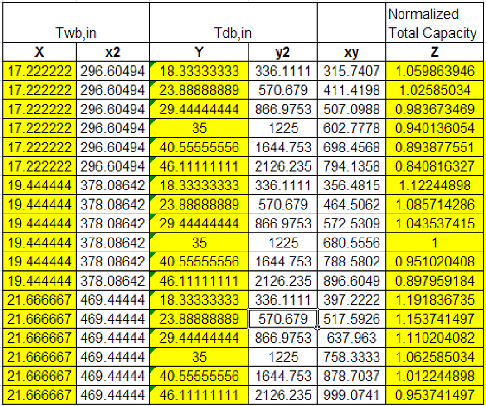

Performance Curves and Lookup Tables
====================================

The following section describes the use of performance curves and lookup tables. Each of these objects may be used in any valid input field where a performance curve name is required.

Performance curves are used directly to simulate the performance of HVAC equipment. The curves are typically created by performing a regression analysis on tabular data for a particular equipment performance metric. The regression analysis determines the equation coefficients which are the primary input to all performance curve objects. Performance tables are similar to performance curves in that they are meant to replicate a particular performance curve. Input to performance tables are made up of data pairs, the same data pairs that would be used to create performance curve coefficients. Performance tables can be interpolated using up to a 4<sup>th</sup> order polynomial equation for one independent variable tables or using a 2<sup>nd</sup> order polynomial for two independent variable tables. A regression analysis can be performed on performance tables when the simulation is instructed to use the regression analysis during the simulation (i.e., ride the curve). In addition, a performance curve object is created that can be used in future simulations and can be written to the eio file. The performance curve is written to the eio file only when the diagnostics flag is set to DisplayAdvancedReportVariables (ref. Output:Diagnostics, DisplayAdvancedReportVariables;). Lookup tables are similar to performance tables in that tabular data is used for input, however, the input 1) is more compact, 2) a regression analysis may only be performed for one and two independent variable cases, and 3) the tabular data can be read from an external file.

Performance curves and data tables are created using empirical data that are derived from information gathered through observation, experience, or experimental means. Once a curve or table object is defined, these objects can be used to generically describe HVAC equipment performance. Performance curves and performance tables may be used interchangeably in Energyplus objects as required.

Performance Curves
------------------

Performance curves define a polynomial equation which represents a conditional response to a model input. A polynomial is a mathematical expression which uses a sum of powers in one or more variables. The equation below represents an n<sup>th</sup> order univariate polynomial. The highest power in the equation represents its order or degree (n).

<div>$$y = {a_0} + {a_1}x + {a_2}{x^2} + {a_3}{x^3} + ... + {a_n}{x^n}$$</div>

A polynomial in two independent variables (multi-variate) is given by:

<div>$$z = {a_{00}} + {a_{10}}x + {a_{01}}y + {a_{11}}xy + {a_{21}}{x^2}y + {a_{12}}x{y^2} + {a_{22}}{x^2}{y^2}... + {a_{nm}}{x^n}{y^m}$$</div>

In Energyplus, the result of an equation, the dependent variable, represents the response a system or component has given an input (the independent variable) to the system or component model. This response represents the equipment performance related to the mechanism that causes this change (e.g., the change in capacity or power based on a conditional change in temperature, part-load ratio, or other phenomenon). A variety of performance curves are available to describe the most common forms of engineering equations. The coefficients (a-z) in the following equations are entered in the associated curve object to define a specific phenomenon. Minimum and maximum limits may be applied to both the independent and the dependent variables as necessary.

### Curves based on a single independent variable

A polynomial having only a single independent variable represents a one-dimensional relationship between a condition (the model input) and response (the model output). The previously described n<sup>th</sup> order univariate polynomial is representative of the following performance curves.

#### Linear Curves

A performance curve having an order or degree of 1.

<div>$$y = a + bx$$</div>

#### Quadratic Curves

A performance curve having an order or degree of 2.

<div>$$y = a + bx + c{x^2}$$</div>

#### Cubic Curves

A performance curve having an order or degree of 3.

<div>$$y = a + bx + c{x^2} + d{x^3}$$</div>

#### Quartic Curves

A performance curve having an order or degree of 4.

<div>$$y = a + bx + c{x^2} + d{x^3} + e{x^4}$$</div>

#### Exponent Curves

A performance curve having an order or degree of c.

<div>$$y = a + b{x^c}$$</div>

### Curves based on two independent variables

A polynomial having two independent variables represents a two-dimensional relationship between a condition (the model inputs) and response (the model output). The previously described n<sup>th</sup> order multi-variate polynomial is representative of the following performance curves.

#### QuadraticLinear Curves

A performance curve having an order or degree of 2 in two independent variables.

<div>$$z = a + bx + c{x^2} + dy + exy + f{x^2}y$$</div>

#### CubicLinear Curves

A performance curve having an order or degree of 3 in two independent variables.

<div>$$z = a + bx + c{x^2} + d{x^3} + ey + fxy$$</div>

#### BiQuadratic Curves

A performance curve having an order or degree of 2 in two independent variables.

<div>$$z = a + bx + c{x^2} + dy + e{y^2} + fxy$$</div>

#### BiCubic Curves

A performance curve having an order or degree of 3 in two independent variables.

<div>$$z = a + bx + c{x^2} + dy + e{y^2} + fxy + g{x^3} + h{y^3} + i{x^2}y$$</div>

Calulating performance curve coefficients in a spreadsheet is a simple matter of finding the data required to perform the regression analysis. For example, the biquadratic equation shown above is representative of the cooling capacity as a function of temperature performance curve for DX cooling coils. The fundamental equation for DX cooling coil capacity is:

<div>$$TotCapTempModFac = a + b\left( {{T_{wb,i}}} \right) + c{\left( {{T_{wb,i}}} \right)^2} + d\left( {{T_{c,i}}} \right) + e{\left( {{T_{c,i}}} \right)^2} + f\left( {{T_{wb,i}}} \right)\left( {{T_{c,i}}} \right)$$</div>

where

Twb,i = wet-bulb temperature of the air entering the cooling coil, °C

Tc,i (or Tdb,i)= dry-bulb temperature of the air entering an air-cooled condenser, °C

Given the data set shown in the table below, each of the independent variables would be calculated according to the fundamental equation above (i.e., the T, T<sup>2</sup>, and cross-product terms would be multiplied out). The data would be converted to degrees celcius and the cooling capacity would be converted to Watts. The data would also be normalized using the ARI rating point shown as highlighted in the table.


The fundamental equation would be used to determine the number of independent variables and also the form of the equation. Given the example described here, the spreadsheet would be set up to look like the equation as shown in the following table. A regression analysis could then be performed on the data set. The first five columns are the independent variables and the last column is the dependent variable. A spreadsheet tool is selected to perform the regression analysis, and the coefficients are calculated and displayed in the spreadsheet.




The regression analysis and summary statistical output is shown below. The equation coefficients are shown highlighted. In this example, the equation coefficents are: a = 0.757382, b = 0.014666, c= 0.000459, d = -0.00095, e = -6.7E-05, and f = -0.00015. These coefficients would be entered in a Curve:BiQuadratic object and used to describe the cooling capacity as a function of temperature for the DX cooling coil model. Minimum and Maximum values from the tabular data are entered as Min/Max values for the curve object. The values may be relaxed slightly with care to allow extrapolation as needed. A performance table may be used to automatically perform the regression analysis as described in the following section.


```idf
  Curve:Biquadratic,
    CoolCapFTExample,        !- Name
    0.757382,                !- Coefficient1 Constant
    0.014666,                !- Coefficient2 x
    0.000459,                !- Coefficient3 x**2
    -0.00095,                !- Coefficient4 y
    -0.000067,               !- Coefficient5 y**2
    -0.00015,                !- Coefficient6 x*y
    17.22222,                !- Minimum Value of x
    21.66667,                !- Maximum Value of x
    18.33333,                !- Minimum Value of y
    46.11111,                !- Maximum Value of y
    ,                        !- Minimum Curve Output
    ,                        !- Maximum Curve Output
    Temperature,             !- Input Unit Type for X
    Temperature,             !- Input Unit Type for Y
    Dimensionless;           !- Output Unit Type
```


### Curves based on three independent variables

A polynomial having three independent variables represents a three-dimensional relationship between a condition (the model inputs) and response (the model output).

#### TriQuadratic Curves

A performance curve having an order or degree of 2 in three independent variables.

<div>$$\begin{array}{l}Output = a + b{x^2} + cx + d{y^2} + ey + f{z^2} + gz + h{x^2}{y^2} + ixy + jx{y^2} + k{x^2}y\\\,\,\,\, + l{x^2}{z^2} + mxz + nx{z^2} + o{x^2}z + p{y^2}{z^2} + qyz + ry{z^2} + s{y^2}z + t{x^2}{y^2}{z^2}\\\,\,\,\, + u{x^2}{y^2}z + u{x^2}y{z^2} + vx{y^2}{z^2} + w{x^2}yz + x\left( {x{y^2}x} \right) + y\left( {xy{z^2}} \right) + z\left( {xyz} \right)\end{array}$$</div>

### Pressure drop curve

#### Functional Pressure Drop Curve

A performance curve representing the minor loss and/or friction calculations in plant pressure simulations.

<div>$$\Delta P = \left[ {K + f\left( {L/D} \right)} \right]\left( {\rho {V^2}} \right)/2$$</div>

Performance Tables
------------------

Performance tables provide a method to enter specific performance data in tabular form. Tabular data represent equipment performance in a manner similar to performance curves, however, the necessity to formulate the equation coefficient is not required. Tabular data may be used to directly interpolate the actual data within the tables independent variable limits or a regression analysis may be performed to calculate the equation coefficients and use these coefficients for the associated engineering calculations. When direct interpolation is selected, the tabular data is interpolated linearly between the first independent variable and then, if used, the second independent variable. The name of a table object may be used interchangeably in any valid field where a performance curve name is required.

### Tables based on a single independent variable

The tabular data entered for polynomials with a single independent variable represent x and outupt data pairs as described in the previous section for performance curves.  The x in each of the previous equations represent the independent variable (model input) and the output represents the dependent variable. The data pairs are organized as the data point for the independent variable followed by the data point for the dependent variable. The data pairs form a one-dimensional array that may either be linearly interpolated, interpolated based on a polynomial equation, or this data may be used to calculate the equation coefficients (a-e) as described in the previous section.

The equation form is user selected as either linear, quadratic, cubic, quartic, or exponent. This choice determines: 1) where this table object may be used (i.e., certain objects may required a specific form of the equation), and 2) the degree or order used to calculate the regression coefficients. The following example describes the methodology used when tabular input data is used in place of common performance curve objects. Although Energyplus does not use a performance curve in the manner described in this example, this example is ideally suited for teaching the basics of tabular data entry.

Given a generic manufacturers fan data for a fan having a maximum flow rate of 5 m3/s and power of 125 W, the power is shown in the table below to be proportional to the cube of flow rate. Since, in this example, the flow rate is not a valid input for calculating fan power, the flow rate will be converted to flow fraction (or PLR). The power data is entered as the actual fan power and will be normalized by the program according to the maximum power of 125W. Also shown here are the performance curve outputs using the regression coefficients calculated by the program. The performance curve outputs represent the fan power ratio as a function of flow fraction. Additional significant digits are included to show the impact a given data set may have on the resulting coefficients (i.e., not quite 0 at the zero crossing, rounding causes slight errors in the actual coefficient values, etc).


<table class="table table-striped">
<tr>
<th>Air Flow (m3/s)</th>
<th>Flow Fraction  or Fan PLR</th>
<th>Power (W)</th>
<th>Power Ratio Curve Output</th>
</tr>
<tr>
<td>0</td>
<td>0</td>
<td>0</td>
<td>-1.1102230246E-16</td>
</tr>
<tr>
<td>0.5</td>
<td>0.1</td>
<td>0.125</td>
<td>0.00100000000000018</td>
</tr>
<tr>
<td>1</td>
<td>0.2</td>
<td>1</td>
<td>0.00800000000000004</td>
</tr>
<tr>
<td>3</td>
<td>0.6</td>
<td>27</td>
<td>0.215999999999995</td>
</tr>
<tr>
<td>4</td>
<td>0.8</td>
<td>64</td>
<td>0.51199999999999</td>
</tr>
</table>


The tabular data can be entered directly into a table object. The data for flow fraction (or fan part-load ratio) and power are entered as data pairs. As this example describes how the fan power changes with changes in air flow, the curve type selected is Cubic and, therefore, the minimum number of data pairs equals 4 (i.e., number of coefficients in a cubic equation) although 5 are used in this example. In addition, since calculating regression coefficients for this data set would yield more accurate results than linearly interpolating this data set, the selection is made to evaluate the curve to the limits specified. In this example, the fan in question is capable of operating up to 5 m3/s at 125 Watts (which is purposely not provided in this set of tabular data). We need this information because we want to create a fan power ratio equation with an input of 0-1 for fan part-load ratio and a table output of 0-1 for fan power ratio. Therefore, the tabular data need to be normalized at a part-load ratio of 1 (i.e., normalized to the power at full flow). The following table object describes the input necessary for this particular data set.


```idf
Table:OneIndependentVariable,
MyFanPower,   !- Name  [Fit from catalog performance data]
Cubic,     !- Curve Type
EvaluateCurveToLimits,  !- Interpolation Type
0,         !- Minimum Value of X1,
1,         !- Maximum Value of X1,
0,         !- Minimum Table Output
64,        !- Maximum Table Output
Dimensionless,  !- Input Unit Type for X1
Dimensionless,  !- Output Unit Type
125,       !- Normalization Point
0.8,64,    !- X Value #1, Output Value #1
0,0.0,     !- X Value #2, Output Value #2
0.2,1,     !- X Value #3, Output Value #3
0.1,0.125, !- X Value #4, Output Value #4
0.6,27;    !- X Value #5, Output Value #5
```


Notice in this example that:

1)    The data pairs do not need to be entered in ascending order, this data set will automatically be re-ordered in ascending order by the program.

2)    The minimum and maximum table output entered by the user uses the same units as the output values and are subsequently normalized in the same manner as the dependent variable in the data pairs.

3)    For the resulting curve object (see below), the minimum (maximum) limits are based on the lesser (greater) of the user entered value and the lower (upper) limit of the tabular data. When linearly interpolating tabular data, the limits of the data set are used unless the user entered maximum is more restrictive (e.g., 64 W in this example is not more restrictive than the data set).

4)    For the resulting curve object, the calculated coefficients may not perfectly represent the data set (i.e., in this example coefficient 1, 2, and 3 should have been 0). Duplicating the 0,0 data pair four additional times (to weight the 0 crossing) yields constant coefficients of 0. This could also be changed manually in the curve object created by the program.

5)    Referring to the figure below, a selection of LinearInterpolationOfTable would interpolate the tabular data within the limits of the data set (blue circles) resulting in a maximum X and Curve value of 0.8 and 0.512 (i.e., 64/125), respectively. Selecting EvaluateCurveToLimits allows extrapolation of the data set up to a power ratio of 1 had 125 W been entered as the maximum table output in this example.

6)    In the graph below, the linearly interpolated tabular data (blue line) represent a less accurate fan power ratio curve than the performance curve itself (red line). In this specific example, it is more accurate to rely on the performance curve results (i.e., Interpolation Type = EvaluateCurveToLimits in table object). In addition, the performance curve is able to extrapolate outside the limits of the data set since the regression analysis provides a smooth continuous curve through 1. Selecting the LagrangeInterpolationLinearExtrapolation interpolation method with a cubic curve type is similar to the performance curve results.

7)    Including additional data in the table object (e.g., data points for flow fractions = 0.4 and 1) would allow direct linear interpolation of the tabular data without significant loss of accuracy compared to the performance curve or lagrange methods.


Curve output in eio file (when using Output:Diagnostics, DisplayAdvancedReportVariables):

```
!...GENERATING NEW CURVE OBJECT
! Input as Table:OneIndependentVariable "MYFANPOWER"
! RSquared = 1.0000000000
! Standard Error = 7.3549798168E-016
! Degrees of Freedom = 5
Curve:Cubic,
 MYFANPOWER,         !- Name
 -1.1102230246E-016, !- Coefficient1 Constant
 5.0571599639E-015,  !- Coefficient2 x
 -2.1582431250E-014, !- Coefficient3 x**2
 1.0000000000,       !- Coefficient3 x**3
 0.0000000000,       !- Minimum Value of x
 1.0000000000,       !- Maximum Value of x
 0.0000000000,       !- Minimum Curve Output
 1.0000000000;       !- Maximum Curve Output
!...END GENERATING NEW CURVE OBJECT
```


### Tables based on two independent variables

The tabular data entered for polynomials with two independent variables represent x, y and output data pairs as described in the previous section for performance curves.  The x and y in each of the previous equations represent the independent variables (model inputs) and the output represents the dependent variable. The data pairs are organized as the data points for the independent variables followed by the data point for the dependent variable. The order of the data is significant in that the x and y data are entered in the same order as shown in the model’s fundamental equation. The data pairs form a two-dimensional array that may either be linearly interpolated, interpolated using a second order polynomial, or this data may be used to calculate the equation coefficients (a-f) as described in the previous section.

The equation order or degree is user selected as biquadratic or quadraticlinear. This choice determines: 1) where this table object may be used (i.e., certain objects may required a specific form of the equation), and 2) the fundamental equation used to calculate the regression coefficients. The following example describes the methodology used when tabular input data is used in place of common performance curve objects.

Given a generic manufacturers air conditioner data for an AC system having a rated total cooling capacity of 7735.1 W, the change in capacity is shown in the table to be a function of both cooling coil entering air wet-bulb temperature and condenser entering air dry-bulb temperature. The tabular data is entered as the actual cooling capacity and will be normalized by the program according to the rated capacity of 7735.1 W. The cooling coil EIR curve could be developed in a similar fashion, except that EIR (Power / TotCap) must first be calculated from the tabular data below BEFORE entering this data into a table object. In this example, only data highlighted in yellow will be used.


The tabular data can be entered directly into a table object. As an example, for an air-cooled DX cooling coil object in Energyplus, the capacity as a function of temperature has the following fundamental equation (Ref. Single-Speed Electric DX Air Cooling Coil):

<div>$$TotCapTempModFac = a + b\left( {{T_{wb,i}}} \right) + c{\left( {{T_{wb,i}}} \right)^2} + d\left( {{T_{c,i}}} \right) + e{\left( {{T_{c,i}}} \right)^2} + f\left( {{T_{wb,i}}} \right)\left( {{T_{c,i}}} \right)$$</div>

where

Twb,i = wet-bulb temperature of the air entering the cooling coil, °C

Tc,i = dry-bulb temperature of the air entering an air-cooled condenser, °C

Given this form of the fundamental equation, the data pairs for the cooling coil are entered as entering air wet-bulb temperature, condenser entering dry-bulb temperature, and total cooling capacity. These 3 values, in this precise order, make up each data pair. As this example describes how the DX coil cooling capacity changes with changes in indoor and outdoor temperature, the curve type selected is BiQuadratic and, therefore, the minimum number of data pairs equals 6 (i.e., number of coefficients in the equation above). Evaluating this tabular data based on regression coefficients may be less desirable to the user since the data in the lower right corner of the table is somewhat flat due to controls or other hardware constraints. For the sake of this example, the regression analysis is chosen. In this example, the DX cooling coil total cooling capacity at the ARI rating point is used to normalize the capacity data (e.g., 7735.1 W at 19.4 °C EWB and 35 °C outdoor dry-bulb temperature). In addition, the minimum and maximum limits are chosen such that extrapolation of the performance curve is allowed. Notice in the example below that:

1)    The data pairs do not need to be entered in ascending order, this data set will automatically be re-ordered in ascending order by the program.

2)    As shown in the table object below, only three of the five entries for entering air wet-bulb temperature were entered in the table object and therefore used for the regression analysis. This data entry technique may save time when entering a large data set, however, it may have unforeseen consequences on the resulting regression coefficients (i.e., the coefficients may provide less accuracy than desired). Note in the figure below the difference between the manufacturers data at 19.4 °C entering air wet-bulb temperature vs the prediction made by the regression coefficients. Since this data set (i.e., the 4 data points at 19.4°C entering air wet-bulb temperature from the table above) was left out of the regression analysis, the predicted capacity at this condition is slightly under-estimated.

3)    The minimum and maximum table output entered by the user uses the same units as the output values and are subsequently normalized in the same manner as the dependent variable in the data pairs.

4)    For the resulting curve object, the minimum (maximum) limits are based on the lesser (greater) of the user entered value and the lower (upper) limit of the tabular data. When linearly interpolating tabular data, only the limits of the data set are used.

5)    For the resulting curve object, the calculated coefficients may not perfectly represent the entire data set since all data was not used (i.e., in this example the regressed data do not line up exactly with all the manufacturers data, however, do line up well with the data included in the table object).

6)    Selecting LinearInterpolationOfTable would interpolate the tabular data within the limits of the data set (characters) resulting in a maximum X1, X2 and Curve value of 22.2, 40.8 and 1.25 (i.e., 9206.0/7375.1), respectively. Note how these maximum values compare to the maximum values in the generated curve object below which chose the EvaluateCurveToLimits option instead (i.e., the user min/max inputs were used to generate these fields when creating the curve object). The minimum values would be affected in a similar manner. Selecting Lagrange or EvaluateCurveToLimits allows extrapolation of the data set to values specified by the user.

7)    In the graph below, the linearly interpolated tabular data (character data set representing manufacturers data) may better represent the capacity ratio than the performance curve (lines representing the regressed data) given the non-linear relationship between capacity and temperature shown in the table and/or graph. However, extrapolation of the data set is performed linearly and the second order affects of temperature would be lost when extrapolating. Either the data set would be expanded to include other relevant data (e.g., data at colder outdoor temperatures where cooling may be required) which could then be interpolated or additional existing data could be added to the table object to allow more accurate regression coefficients to be used to predict data outside the table data limits.


```idf
Table:TwoIndependentVariables,
CCoolCapFT,       !- Name  [Fit from catalog performance data]
BiQuadratic,      !- Curve Type
EvaluateCurveToLimits,  !- Interpolation Type
1,                !- Minimum Value of x,
30,               !- Maximum Value of x,
5,                !- Minimum Value of y,
50,               !- Maximum Value of y,
4500,             !- Minimum Table Output
15000,            !- Maximum Table Output
Temperature,      !- Input Unit Type for x
Temperature,      !- Input Unit Type for y
Dimensionless,    !- Output Unit Type
7735.1,           !- Normalization Point
17.2,29.4,7462.6, !- X, Y, and Output data pair #1
17.2,23.9,7735.1, !- X, Y, and Output data pair #2
13.9,29.4,7283.9, !- X, Y, and Output data pair #3
13.9,23.9,7474.4, !- X, Y, and Output data pair #4
13.9,35,7067.1,   !- X, Y, and Output data pair #5
13.9,40.8,6818.0, !- X, Y, and Output data pair #6
17.2,35,7157.9,   !- X, Y, and Output data pair #7
17.2,40.8,6818.0, !- X, Y, and Output data pair #8
22.2,35,8552.6,   !- X, Y, and Output data pair #9
22.2,29.4,8898.3, !- X, Y, and Output data pair #10
22.2,23.9,9206.0, !- X, Y, and Output data pair #11
22.2,40.8,8165.8; !- X, Y, and Output data pair #12
```

Curve output in eio file (when using Output:Diagnostics, DisplayAdvancedReportVariables):

```
CREATING NEW CURVE OBJECT
! Input as Table:TwoIndependentVariables "CCOOLCAPFT"
! RSquared       = 0.9993993101
! Standard Error = 3.4649248573E-003
! Sample Size    = 12
Curve:BiQuadratic,
FromTable_CCOOLCAPFT,  !- Name
  1.7214120578,  !- Coefficient1 Constant
  -0.1011737262,  !- Coefficient2 x
  3.7738833967E-003,  !- Coefficient3 x**2
  2.8686934910E-003,  !- Coefficient4 y
  -5.3785351258E-005,  !- Coefficient5 y**2
  -3.4086036156E-004,  !- Coefficient6 x*y
  1.0000000000,  !- Minimum Value of x
  30.0000000000,  !- Maximum Value of x
   5.0000000000,  !- Minimum Value of y
  50.0000000000,  !- Maximum Value of y
  0.5817636488,  !- Minimum Curve Output
  1.9392121627;  !- Maximum Curve Output
END CREATING NEW CURVE OBJECT
```


### Lookup Tables

Lookup tables provide a method to evaluate a group of data that may or may not conform to a fundamental equation. Only tabular data which conform to existing performance curve equations are currently allowed (i.e., that lookup table name is entered where any valid performance curve is allowed therefore the table data must conform to the models fundamental equation for that specific curve). Efforts to include this lookup table in the energy management system would allow custom use of lookup tables, however, calling lookup tables from the EMS system is not currenly possible. Lookup tables can interpolate the actual data using a non-linear polynomial equation (order higher than 1). As with other table or curve objects, the lookup table can be used anywhere a valid curve object name is allowed. Care must be taken to ensure the table data format is consistent with the associate model that is using the performance curve (e.g., DX cooling coil capacity as a function of temperature where independent variable X1 = indoor wet-bulb temperature and independent variable X2 = outdoor dry-bulb temperature).

The lookup tables are evaluated using the Lagrange form of the interpolation polynomial or the previously described interpolation methods of LinearInterpolationOfTable and EvaluateCurveToLimits. When using the Lagrange method, the number of points used in the interpolation is equal to 1 plus the polynomial order (e.g., a second order interpolation would use 3 points).

<div>$${p_n}\left( x \right) = \sum\limits_{i = 0}^n {{y_i}{l_i}\left( x \right)} $$</div>

<div>$${l_i}\left( x \right) = \mathop \Pi \limits_{j \ne i} \left( {\frac{{x - {x_j}}}{{{x_i} - {x_j}}}} \right)\,\,\,\,\,\,i = 0,1,...,n$$</div>

First-order Lagrange interpolation polynomial:

<div>$${p_1}\left( x \right) = \frac{{\left( {x - {x_1}} \right)}}{{\left( {{x_0} - {x_1}} \right)}}{y_0} + \frac{{\left( {x - {x_0}} \right)}}{{\left( {{x_1} - {x_0}} \right)}}{y_1}$$</div>

Second-order Lagrange interpolation polynomial:

<div>$${p_2}\left( x \right) = \frac{{\left( {x - {x_1}} \right)\left( {x - {x_2}} \right)}}{{\left( {{x_0} - {x_1}} \right)\left( {{x_0} - {x_2}} \right)}}{y_0} + \frac{{\left( {x - {x_0}} \right)\left( {x - {x_2}} \right)}}{{\left( {{x_1} - {x_0}} \right)\left( {{x_1} - {x_2}} \right)}}{y_1} + \frac{{\left( {x - {x_0}} \right)\left( {x - {x_1}} \right)}}{{\left( {{x_2} - {x_0}} \right)\left( {{x_2} - {x_1}} \right)}}{y_2}$$</div>

Third-order Lagrange interpolation polynomial:

<div>$$\begin{array}{l}{p_3}\left( x \right) = \frac{{\left( {x - {x_1}} \right)\left( {x - {x_2}} \right)\left( {x - {x_3}} \right)}}{{\left( {{x_0} - {x_1}} \right)\left( {{x_0} - {x_2}} \right)\left( {{x_0} - {x_3}} \right)}}{y_0} + \frac{{\left( {x - {x_0}} \right)\left( {x - {x_2}} \right)\left( {x - {x_3}} \right)}}{{\left( {{x_1} - {x_0}} \right)\left( {{x_1} - {x_2}} \right)\left( {{x_1} - {x_3}} \right)}}{y_1} + \\\,\,\,\,\,\,\,\,\,\,\,\,\,\,\,\,\,\,\frac{{\left( {x - {x_0}} \right)\left( {x - {x_1}} \right)\left( {x - {x_3}} \right)}}{{\left( {{x_2} - {x_0}} \right)\left( {{x_2} - {x_1}} \right)\left( {{x_2} - {x_3}} \right)}}{y_2} + \frac{{\left( {x - {x_0}} \right)\left( {x - {x_1}} \right)\left( {x - {x_2}} \right)}}{{\left( {{x_2} - {x_0}} \right)\left( {{x_2} - {x_1}} \right)\left( {{x_2} - {x_2}} \right)}}{y_3}\end{array}$$</div>

where:

x = interpolation point

x<sub>n</sub> = x value of tabular data

y<sub>n</sub> = y value of tabular data

p<sub>i</sub>(n) = polynomial (table) output

The lookup table is interpolated using the interpolation polynomial shown above. If the table input value (interpolation point) is near the bottom edge or exceeds the table boundaries, a linear extrapolation is used (2-point extrapolation). The interpolation order is determined by the user entered number of interpolation points.

A regression analysis may be performed on any lookup table having one or two indpenedent variables. As with performance tables, the resulting performance curve coefficients are calculated and used in the simulation only when the interpolation method is selected as EvaluateCurveToLimits. In addition, the performance curve is only written to the eio file when the output diagnostics flag is set to DisplayAdvancedReportVariables (ref. Output:Diagnostics, DisplayAdvancedReportVariables;)..

Using the example provided in the section above for Tables based on two indpendent variables, the lookup table object would be defined as follows:

```idf
Table:MultiVariableLookup,
CCoolCapFT,
EvaluateCurveToLimits,
3,
BiQuadratic,
SingleLineIndependentVariableWithMatrix,
,
ASCENDING,
ASCENDING,
7735.1,  !- Normalization reference
1,       !- Minimum Value of X1
30,      !- Maximum Value of X1
5,       !- Minimum Value of X2
50,      !- Maximum Value of X2
,        !- Minimum Value of X3
,        !- Maximum Value of X3
,        !- Minimum Value of X4
,        !- Maximum Value of X4
,        !- Minimum Value of X5
,        !- Maximum Value of X5
4500,    !- Minimum Table Output
15000,   !- Maximum Table Output
Temperature,  !- Input Unit Type for X1
Temperature,  !- Input Unit Type for X2
,        !- Input Unit Type for X3
,        !- Input Unit Type for X4
,        !- Input Unit Type for X5
Dimensionless,    !- Output Unit Type
   2, 3, 4,
  13.9, 17.2, 22.2,
  23.9, 29.4, 35.0, 40.8,
  7474.4,  7735.1,  9206.0,
  7283.9,  7462.6,  8898.3,
  7067.1,  7157.9,  8552.6,
  6818.0,  6818.0,  8165.8;
```


