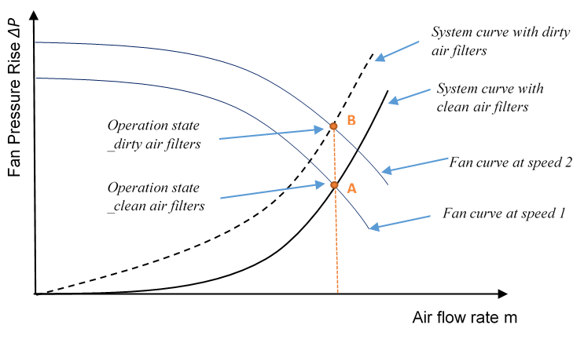
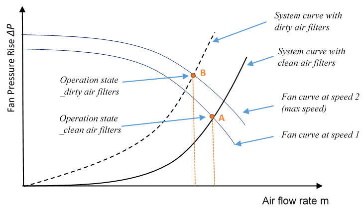
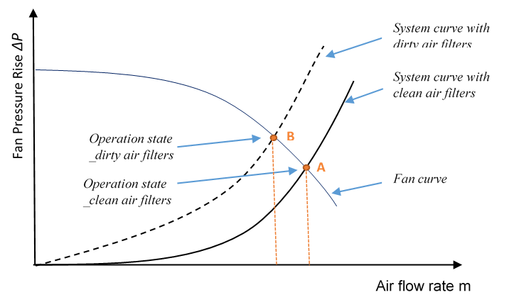

Operational Faults
===============

### Introduction to Operational Faults Modeling

Most of the buildings, either new or old, have operational faults in the sensors, controllers, meters, equipment and systems. Being able to model and simulate these faults and their impact on energy performance of buildings is crucial to improve accuracy of building simulations and to support the retrofit of buildings. 
To date, the main practitioner use of EnergyPlus has been for new construction design. With the new high priority attached by USDOE to retrofit and improved operation of existing buildings, there is a need to extend the capabilities of EnergyPlus to model existing buildings, including faulty operation:

* Retrofit analysis: starts with calibrated simulation; the ability to estimate the severity of common faults is expected to improve the accuracy and transparency of the calibrated model and hence the increase accuracy of the analysis of different retrofit measures.  
* Commissioning providers can use the fault models to demonstrate the saving to be expected from fixing faults found in retro-commissioning
* Support for building operation by using the calibrated model, including unfixed faults, as a real-time reference model to detect, and verify the diagnosis of, newly occurring faults.

The users in these cases are practitioners, not power users, so it is needed to implement the fault models using conventional EnergyPlus objects rather than the EMS, which, in any case, could only be used to model limited types of faults.   

EnergyPlus contains a number of objects to model operational faults of sensors, meters, equipment and systems. The current implementation allows the modeling of the following fault types: (1) sensor faults with air economizers, (2) thermostat/humidistat offset faults, and (3) heating and cooling coil fouling faults. 

### Sensor Faults with Air Economizers

#### Symptom

The sensor readings deviate from the actual air conditions due to sensor offset, which leads to inappropriate operations of the air economizer and thus undesired resulting indoor conditions.

#### Modeling Approach

There are a number of sensors installed to support the air economizer operations. The sensors may be of different types. The objects used by EnergyPlus to model the sensor faults are as follows:

* FaultModel:TemperatureSensorOffset:OutdoorAir
* FaultModel:HumiditySensorOffset:OutdoorAir
* FaultModel:EnthalpySensorOffset:OutdoorAir
* FaultModel:TemperatureSensorOffset:ReturnAir
* FaultModel:EnthalpySensorOffset:ReturnAir

### Thermostat/Humidistat Offset 

#### Symptom

The zone air temperature/relative humidity readings deviate from the actual zone air conditions due to thermostat/humidistat offset, and thus leads to inappropriate operations of the HVAC system and undesired resulting indoor conditions.

#### Modeling Approach

The thermostat offset fault is described in the object FaultModel:ThermostatOffset, which refers to the object ZoneControl:Thermostat. The humidistat offset fault is described in the object FaultModel:HumidistatOffset, which refers to the object ZoneControl:Humidistat.
The effect of an offset in a thermostat/humidistat whose sole use is for the calculation of difference between the set-points and the design values can be modeled as an equal and opposite offset in the thermostat/humidistat: 

$$T_{s,f} = T_{s,ff}  - \Delta T$$

$$RH_{s,f} = RH_{s,ff}  - \Delta RH$$

Where, 

$T_{s,f}$ thermostat value in the faulty case, C

$T_{s,ff}$ thermostat value in the fault-free case (design value), C

$RH_{s,f}$ humidistat value in the faulty case,

$RH_{s,ff}$ humidistat value in the fault-free case (design value),

$\Delta T / \Delta RH$ difference between the thermostat/humidistat readings and the actual zone air conditions. Positive values mean that the readings is higher than the actual air conditions.

For the humidistat that is independent of the thermostat, $\Delta RH$ can be described by a pre-defined schedule. For the humidistat offset that is caused by the thermostat offset, $\Delta RH$ is related with both the thermostat offset level as well as the indoor air conditions which are dynamic, and therefore cannot be described with a pre-defined schedule. In this case, the humidistat offset level is calculated each time step. 

$$\Delta RH = RH_{s,ff} - f(T_{real}, W_{s,f})$$

Where,

$T_{real}$ real-time temperature of the indoor air (real value), C

$W_{s,f}$ humidistat ratio corresponding to $T_{real} - \Delta T and RH_{s,ff, kgWater/kgDryAir}$

Note that the thermostat/humidistat settings are related with two major processes within EnergyPlus: one is the design load calculations and HVAC system sizing, and the other is the HVAC system operations. Only the latter is affected by the thermostat/humidistat offset fault, while the former is not. Therefore, the size of the corresponding HVAC equipment in the faulty cases is the same as that in the fault-free cases.

When EMS is used to overwrite the ZoneControl:Thermostat/ZoneControl:Humidistat values, the offsets are applied to the EMS values rather than the original Thermostat/Humidistat values.

### Heating and Cooling Coil Fouling 

#### Symptom

Reduced overall heat transfer coefficient (UA) causes reduced coil capacity, resulting in unmet loads and/or increased water flow rate and decreased water side temperature difference (“low ΔT” syndrome). 

#### Modeling Approach

The coil fouling fault is described in the object FaultModel:Fouling:Coil. The fault model currently applies only to the ‘simple’ water coils: Coil:Heating:Water and Coil:Cooling:Water.
The FaultModel:Fouling:Coil object allows the user to describe the fouling information in either of the two methods: FouledUARated or FoulingFactor. Using FouledUARated method, user specifies the value of UAfouled directly. Using FoulingFactor method user specifies air/water side fouling factor, and the UAfouled value is further calculated via the equations shown below.

$$UA_{fouled} = [UA_{air} - 1  +  R_{foul}  + UA_{water} - 1]-1$$

Where, 

$U_{Aair}$ heat transfer coefficient of the coil on the air side, W/K

$UA_{fouled}$ overall heat transfer coefficient of the fouled coil, W/K

$UA_{water}$ heat transfer coefficient of the coil on the water side, W/K

$R_{foul}$ fouling factor, K/W

$R_{foul}$ is determined by:

$$R_{foul} = r_{air}/A_{air} + r_{water} / A_{water}$$

Where, 

$r_{air}$ Air side fouling factor, m2-K/W

$r_{water}$ Water side fouling factor, m2-K/W 

$A_{air}$ Air side coil surface area, m2

$A_{water}$  Water side coil surface area, m2

The pressure drop associated with the fouling is ignored in the current implementation.

### Air Filter Fouling 

#### Symptom

Increased air loop system resistance, resulting in a different system curve. This directly affects the operation of corresponding fans. More specifically, it may lead to variations of the fan pressure rise, fan energy consumption, as well as the enthalpy of the fan outlet air. It may also lead to a reduction in the airflow rate and thus affects the performance of other system components (e.g., heat transfer performance of heating/cooling coils).

#### Modeling Approach

The fouling air filter fault is described in the object FaultModel:Fouling:AirFilter, which refers to the fan objects that describe the associated fan. The fan object can be Fan:ConstantVolume, Fan:OnOff, or Fan:VariableVolume. The design pressure rise variations of the associated fan in the faulty cases are described by the Pressure Fraction Schedule specified in FaultModel:Fouling:AirFilter object, which is used as a multiplier to the fault-free fan design pressure rise specified in the fan object. The variations of the design air flow rate of the fan can then be calculated with the Pressure Fraction Schedule and Fan Curve. When EMS is used to overwrite the the pressure/MassFlow, the EMS values are used.

The effect of the fouling air filter on the fan performance is related with a number of factors, including the fan types, fan curves, and system design and operating conditions. In general, there are three possible situations to be addressed in modeling dirty air filters:

**(a) The required airflow rate can be maintained by the variable speed fan running at higher speed.**

In this case, the fan operation state changes from point A (intersection of the fan curve corresponding to a lower speed and the system curve with clean filters) to point B (intersection of the fan curve corresponding to a higher speed and the system curve with dirty filters), as shown in Figure 345. Point B corresponds to a higher fan pressure rise than Point A, and the same air flow rate.

Figure 345. Effect of dirty air filter on variable speed fan operation – flow rate maintained 

The required airflow rate m can be maintained while the fan pressure rise $\Delta P$  is increased to $\Delta P_{df}$. This leads to higher fan power $\dot Q_{tot,df}$ and higher power entering the air $\dot Q_{toair,df}$, and thus changes the specific enthalpies of the fan outlet air stream ($h_{out,df}$).

$$ f_{flow,df} = m / m_{design,df} $$

$$ f_{pl,df} = c_{1} + c_{2}*f_{flow,df} + c_{3}*f_{flow,df}^2 + c_{4}*f_{flow,df}^3 + c_{5}*f_{flow,df}^4 $$

$$ \dot{Q}_{tot,df} = f_{pl,df} \times m_{design,df} \times \Delta P_{df} / (e_{tot} \times \rho_{air} ) $$

$$ \dot{Q}_{shaft,df} = e_{motor} \times \dot{Q}_{tot, df} $$

$$ \dot{Q}_{toair,df} = \dot{Q}_{shaft,df} +( \dot{Q}_{tot,df} - \dot{Q}_{shaft,df}) \times f_{motortoair} $$

$$ h_{out,df} = h_{in} + \dot{Q}_{toair,df} / m $$

Where,

$e_{tot}$ is the motor efficiency;

$f_{flow}$ is the flow fraction or part-load ratio;

$f_{pl}$ is the part load factor;

$m$ is the air mass flow in kg/s;

$h_{in}$ is the inlet air stream specific enthalpies in J/kg;

$h_{out}$ is the outlet air stream specific enthalpies in J/kg;

$\dot{Q}_{tot}$ is the fan power in watts;

$\dot{Q}_{toair}$ is the power entering the air in watts;

$\dot{Q}_{shaft}$ is the fan shaft power in watts;

$\Delta P$ is the fan pressure increase in Pascal;

$_{design}$ is for the parameters in the design condition;

$_{df}$ is for the parameters in the dirty filter case.

**(b) The variable speed fan cannot increase in speed sufficiently to maintain the required airflow rate.**

In this case, the fan operation state changes from point A (intersection of the fan curve corresponding to a lower speed and the system curve with clean filters) to point B (intersection of the fan curve corresponding to a higher speed and the system curve with dirty filters), as shown in Figure 346. Point B corresponds to a higher fan pressure rise and a lower air flow rate than Point A.

Figure 346. Effect of dirty air filter on variable speed fan operation – flow rate reduced 

The airflow rate m is reduced to $m_{df}$ while the fan design pressure rise $\Delta P$ is increased to $\Delta P_{df}$. Similarly to case (a), the fan power ($\dot Q_{tot}$), the power entering the air ($\dot Q_{toair}$), and the specific enthalpies of the fan outlet air stream ($h_{out}$) are all affected. Different from case (a), however, the fan power ($\dot Q_{tot}$) may either increase or decrease, depending on the degree of the airflow rate decrease and pressure rise increase. Also note that $f\_{flow,df}$ is always 1 in this case, since the fan runs at its maximum speed.

$$ f_{flow,df} = 1 $$

$$ f_{pl,df} = c_{1} + c_{2}*f_{flow,df} + c_{3}*f_{flow,df}^2 + c_{4}*f_{flow,df}^3 + c_{5}*f_{flow,df}^4 $$

$$ \dot{Q}_{tot,df} = f_{pl,df} \times m_{design,df} \times \Delta P_{df} / (e_{tot} \times \rho_{air} ) $$

$$ \dot{Q}_{shaft,df} = e_{motor} \times \dot{Q}_{tot, df} $$

$$ \dot{Q}_{toair,df} = \dot{Q}_{shaft,df} +( \dot{Q}_{tot,df} - \dot{Q}_{shaft,df}) \times f_{motortoair} $$

$$ h_{out,df} = h_{in} + \dot{Q}_{toair,df} / m_{design,df} $$

Where,

$e_{tot}$ is the motor efficiency;

$f_{flow}$ is the flow fraction or part-load ratio;

$f_{pl}$ is the part load factor;

$m$ is the air mass flow in kg/s;

$h_{in}$ is the inlet air stream specific enthalpies in J/kg;

$h_{out}$ is the outlet air stream specific enthalpies in J/kg;

$\dot{Q}_{tot}$ is the fan power in watts;

$\dot{Q}_{toair}$ is the power entering the air in watts;

$\dot{Q}_{shaft}$ is the fan shaft power in watts;

$\Delta P$ is the fan pressure increase in Pascal;

$_{design}$ is for the parameters in the design condition;

$_{df}$ is for the parameters in the dirty filter case.

**(c) The constant speed fan cannot maintain the design airflow rate.**

In this case, the fan operation state changes from point A (intersection of the fan curve and the system curve with clean filters) to point B (intersection of the fan curve and the system curve with dirty filters), as shown in Figure 347. Point B corresponds to a higher fan pressure rise and a lower air flow rate than Point A.

Figure 347. Effect of dirty air filter on constant speed fan operation

Similarly to case (b), the airflow rate m is reduced to $m_{df}$ while the fan pressure rise $\Delta P$ is increased to $\Delta P_{df}$. This results in the variations of the fan power ($\dot Q_{tot}$), the power entering the air ($\dot Q_{toair}$), and the specific enthalpies of the fan outlet air stream ($h_{out}$).

$$ \dot{Q}_{tot,df} = m_{design,df} \times \Delta P_{df} / (e_{tot} \times \rho_{air} ) $$

$$ \dot{Q}_{shaft,df} = e_{motor} \times \dot{Q}_{tot, df} $$

$$ \dot{Q}_{toair,df} = \dot{Q}_{shaft,df} +( \dot{Q}_{tot,df} - \dot{Q}_{shaft,df}) \times f_{motortoair} $$

$$ h_{out,df} = h_{in} + \dot{Q}_{toair,df} / m_{design,df} $$

Where,

$e_{tot}$ is the motor efficiency;

$m$ is the air mass flow in kg/s;

$h_{in}$ is the inlet air stream specific enthalpies in J/kg;

$h_{out}$ is the outlet air stream specific enthalpies in J/kg;

$\dot{Q}_{tot}$ is the fan power in watts;

$\dot{Q}_{toair}$ is the power entering the air in watts;

$\dot{Q}_{shaft}$ is the fan shaft power in watts;

$\Delta P$ is the fan pressure increase in Pascal;

$_{design}$ is for the parameters in the design condition;

$_{df}$ is for the parameters in the dirty filter case.
