<br/>
<p><h1>EnergyPlus<sup>TM</sup> Documentation</h1></p>
<hr>
<h1>External Interface(s) Application Guide</h1>
<h2>Guide for using EnergyPlus with External Interface(s)</h2>
<br/>
<p><i>(internalize these external details...)</i></p>
<br/>
<br/>
<br/>
<br/>
<br/>
<br/>
<br/>
<br/>
<br/>
<br/>
<br/>
<br/>
<br/>
<br/>
<p><small>COPYRIGHT (c) 1996-2015 THE BOARD OF TRUSTEES OF THE UNIVERSITY OF ILLINOIS AND THE REGENTS OF THE UNIVERSITY OF CALIFORNIA THROUGH THE ERNEST ORLANDO LAWRENCE BERKELEY NATIONAL LABORATORY. ALL RIGHTS RESERVED. NO PART OF THIS MATERIAL MAY BE REPRODUCED OR TRANSMITTED IN ANY FORM OR BY ANY MEANS WITHOUT THE PRIOR WRITTEN PERMISSION OF THE UNIVERSITY OF ILLINOIS OR THE ERNEST ORLANDO LAWRENCE BERKELEY NATIONAL LABORATORY. ENERGYPLUS IS A TRADEMARK OF THE US DEPARTMENT OF ENERGY.</small></p>
<p style="page-break-after:always;"></p>
<div id="generated-toc"></div>
<p style="page-break-after:always;"></p>

External Interface(s)
=====================

Introduction
------------

The ExternalInterface allows coupling EnergyPlus to the Building Controls Virtual Test Bed (BCVTB). It supports the import of Functional Mock-up Units (FMUs) for co-simulation as well as the export of EnergyPlus as a FMU for co-simulation. BCVTB is a software environment that allows expert users to couple different simulation programs for distributed simulation or for a real-time simulation that is connected to a building control system. For example, the BCVTB allows simulation of the building envelope and HVAC system in EnergyPlus and the control logic in MATLAB/Simulink, while exchanging data between the two programs as they simulate. The BCVTB can be downloaded from http://simulationresearch.lbl.gov/bcvtb. A FMU is a component which implements the Functional Mock-up Interface (FMI) standard (http://www.modelisar.com).

Coupling EnergyPlus with the Building Controls Virtual Test Bed
---------------------------------------------------------------

### Algorithm for data exchange

The process in which at least two simulators solve initial-value differential equations that are coupled to each other is called co-simulation. Various algorithms are possible for the data exchange. In the BCVTB, data are exchanged between its client programs, including EnergyPlus, using a fixed synchronization time step. There is no iteration between the clients. In the co-simulation literature, this coupling scheme is referred to as *quasi-dynamic coupling*, *loose coupling* or *ping-pong coupling* (Hensen 1999, Zhai and Chen 2005).

The algorithm for exchanging data is as follows: Suppose we have a system with two clients, with client 1 being EnergyPlus and client 2 being, for example, the Simulink program from Mathworks. Suppose each client solves an initial-value ordinary differential equation that is coupled to the differential equation of the other client. Let <span>\(N\in\mathbf{N}\)</span> denote the number of time steps and let <span>\(k\in\left\\{1,...,N\right\\}\)</span> denote the time steps. We will use the subscripts *1* and *2* to denote the state variable and the function that computes the next state variable of the simulator *1* and *2*, respectively.

The simulator *1* computes, for <span>\(k\in\left\\{1,...,N-1\right\\}\)</span> the sequence

*x<sub>1</sub>(k+1) = f<sub>1</sub>(x<sub>1</sub>(k), x<sub>2</sub>(k))*

and, similarly, the simulator *2* computes the sequence

*x<sub>2</sub>(k+1) = f<sub>2</sub>(x<sub>2</sub>(k), x<sub>1</sub>(k))*

with initial conditions *x<sub>1</sub>(0) = x<sub>1,0</sub>* and *x<sub>2</sub>(0) = x<sub>2,0</sub>*.

To advance from time *k* to *k+1*, each simulator uses its own time integration algorithm. At the end of the time step, the simulator *1* sends the new state *x<sub>1</sub>(k+1)* to the BCVTB and it receives the state *x<sub>2</sub>(k+1)* from the BCVTB. The same procedure is done with the simulator *2*. The BCVTB synchronizes the data in such a way that it does not matter which of the two simulators is called first.

In comparison to numerical methods of differential equations, this scheme is identical to an explicit Euler integration, which is an integration algorithm that computes for an ordinary differential equation with specified initial values,

*dx/dt = h(x),*

*x(0)  = x<sub>0</sub>,*

on the time interval *t* *∈ [0, 1]*, the following sequence:

<table class="table table-striped">
<tr>
<td>Step 0:</td>
<td>Initialize counter k=0 and number of steps <span>\(N\in\mathbf{N}\)</span>.</td>
</tr>
<tr>
<td> </td>
<td>Set initial state x(k) = x<sub>0</sub> and set time step Dt = 1/N.</td>
</tr>
<tr>
<td>Step 1:</td>
<td>Compute new state x(k+1) = x(k) + h(x(k)) Dt.</td>
</tr>
<tr>
<td> </td>
<td>Replace k by k+1.</td>
</tr>
<tr>
<td>Step 2:</td>
<td>If k=N stop, else go to Step 1.</td>
</tr>
</table>

In the situation where the differential equation is solved using co-simulation, the above algorithm becomes

<table class="table table-striped">
<tr>
<td>Step 0:</td>
<td>Initialize counter k=0 and number of steps <span>\(N\in\mathbf{N}\)</span>.</td>
</tr>
<tr>
<td> </td>
<td>Set initial state x<sub>1</sub>(k) = x<sub>1,0</sub> and x<sub>2</sub>(k) = x<sub>2,0</sub>. Set the time step Dt = 1/N.</td>
</tr>
<tr>
<td>Step 1:</td>
<td>Compute new states
  x<sub>1</sub>(k+1) = x<sub>1</sub>(k) + f<sub>1</sub>(x<sub>1</sub>(k), x<sub>2</sub>(k)) Dt, and
  x<sub>2</sub>(k+1) = x<sub>2</sub>(k) + f<sub>2</sub>(x<sub>2</sub>(k), x<sub>1</sub>(k)) Dt.</td>
</tr>
<tr>
<td> </td>
<td>Replace k by k+1.</td>
</tr>
<tr>
<td>Step 2:</td>
<td>If k=N stop, else go to Step 1.</td>
</tr>
</table>

This algorithm is implemented in the BCVTB. Note that there is no iteration between the two simulators.

BCVTB Examples
--------------

### Architecture of System

The figure below shows the architecture of the connection between EnergyPlus and the BCVTB. The black objects are explained in this application guide, whereas the grey items are not specific to EnergyPlus and are explained in the BCVTB documentation. The BCVTB connects to the external interface in EnergyPlus. In the external interface, the input/output signals that are exchanged between the BCVTB and EnergyPlus are mapped to EnergyPlus objects. The subject of this External Interface Application Guide is how to configure this mapping and how to use these objects. For a detailed explanation of the grey items, we refer to the BCVTB documentation.

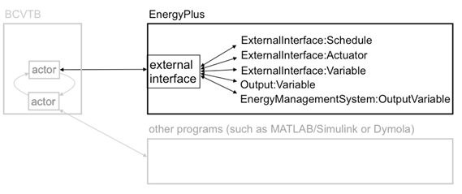

Figure 1: Architecture of the BCVTB with the EnergyPlus client (black) and other clients (grey).

The external interface can map to three EnergyPlus input objects called ExternalInterface:Schedule, ExternalInterface:Actuator and ExternalInterface:Variable. The ExternalInterface:Schedule can be used to overwrite schedules, and the other two objects can be used in place of Energy Management System (EMS) actuators and EMS variables. The objects have similar functionality as the objects Schedule:Compact, EnergyManagementSystem:Actuator and EnergyManagementSystem:GlobalVariable, except that their numerical value is obtained from the external interface at the beginning of each zone time step, and will remain constant during this zone time step.

Compared to EnergyManagementSystem:Actuator, the object ExternalInterface:Actuator has an optional field called “initial value.” If a value is specified for this field, then this value will be used during the warm-up period and the system sizing. If unspecified, then the numerical value for this object will only be used during the time stepping. Since actuators always overwrite other objects (such as a schedule), all these objects have values that are defined during the warm-up and the system sizing even if no initial value is specified. For the objects  ExternalInterface:Schedule and ExternalInterface:Variable, the field “initial value” is required, and its value will be used during the warm-up period and the system-sizing.

ExternalInterface:Variable is a global variable from the point of view of the EMS language. Thus, it can be used within any EnergyManagementSystem:Program in the same way as an EnergyManagementSystem:GlobalVariable or an EnergyManagementSystem:Sensor can be used.

Although variables of type ExternalInterface:Variable can be assigned to EnergyManagmentSystem:Actuator objects, for convenience, there is also an object called ExternalInterface:Actuator. This object behaves identically to EnergyManagmentSystem:Actuator, with the following exceptions:

- Its value is assigned by the external interface.

- Its value is fixed during the zone time step because this is the synchronization time step for the external interface.

The external interface can also map to the EnergyPlus objects Output:Variable and EnergyManagementSystem:OutputVariable. These objects can be used to send data from EnergyPlus to the BCVTB at each zone time step.

We will now present examples that use all of these objects. The following table shows which EnergyPlus features are used in the examples, which are all distributed with the BCVTB installation that can be obtained from the LBNL web site. Note – these examples are NOT distributed with EnergyPlus installation because you need the special software to make them work.

Table 1. Overview of the EnergyPlus objects used in Examples

<table class="table table-striped">
<tr>
<th> </th>
<th>Example 1</th>
<th>Example 2</th>
<th>Example 3</th>
</tr>
<tr>
<td>ExternalInterface:Schedule</td>
<td>x</td>
<td> </td>
<td> </td>
</tr>
<tr>
<td>ExternalInterface:Actuator</td>
<td> </td>
<td>X</td>
<td> </td>
</tr>
<tr>
<td>ExternalInterface:Variable</td>
<td> </td>
<td> </td>
<td>x</td>
</tr>
<tr>
<td>Output:Variable</td>
<td>x</td>
<td>X</td>
<td>x</td>
</tr>
<tr>
<td>EnergyManagementSystem:OutputVariable</td>
<td> </td>
<td> </td>
<td>x</td>
</tr>
</table>

To configure the data exchange, the following three steps are required from the user:

1)   Create an EnergyPlus idf file.

2)   Create an xml file that defines the mapping between EnergyPlus and BCVTB variables.

3)   Create a Ptolemy model.

These steps are described in the examples below. Prior to discussing the examples, we will explain the syntax of the xml configuration file that defines how data are mapped between the external interface and EnergyPlus.

### XML Syntax

This section describes the syntax of the xml file that configures the data mapping between EnergyPlus and the external interface.

The data mapping between EnergyPlus and the external interface is defined in an xml file called variables.cfg. This file needs to be in the same directory as the EnergyPlus idf file.

The file has the following header:

&lt;?xml version="1.0" encoding="ISO-8859-1"?&gt;

&lt;!DOCTYPE BCVTB-variables SYSTEM "variables.dtd"&gt;

Following the header is an element of the form

&lt;BCVTB-variables&gt;


&lt;/BCVTB-variables&gt;

This element will contain child elements that define the variable mapping. In between the element tags, a user needs to specify how the exchanged data is mapped to EnergyPlus objects. Hence, the order of these elements matter, and it need to be the same as the order of the elements in the input and output signal vector of the BCVTB actor that calls EnergyPlus. The exchanged variables are declared in elements that are called “variable” and have an attribute “source.” As described above, the external interface can send data to ExternalInterface:Schedule, ExternalInterface:Actuator, ExternalInterface:Variable. For these objects, the “source” attribute needs to be set to “Ptolemy,” because they are computed in Ptolemy. The xml elements for these objects look as follows:

For ExternalInterface:Schedule, use

&lt;variable source="Ptolemy"&gt;

    &lt;EnergyPlus schedule="NAME"/&gt;

  &lt;/variable&gt;

where NAME needs to be the EnergyPlus schedule name. For ExternalInterface:Actuator, use

&lt;variable source="Ptolemy"&gt;

    &lt;EnergyPlus actuator="NAME" /&gt;

  &lt;/variable&gt;

where NAME needs to be the EnergyPlus actuator name. For ExternalInterface:Variable, use

  &lt;variable source="Ptolemy"&gt;

    &lt;EnergyPlus variable="NAME"/&gt;

  &lt;/variable&gt;

where NAME needs to be the EnergyPlus Energy Runtime Language (Erl) variable name.

The external interface can also read data from any Output:Variable and EnergyManagementSystem:OutputVariable. For these objects, set the “source” attribute to “EnergyPlus,” because they are computed by EnergyPlus. The read an Output:Variable, use

  &lt;variable source="EnergyPlus"&gt;

    &lt;EnergyPlus name="NAME" type="TYPE"/&gt; 

  &lt;/variable&gt;

where NAME needs to be the EnergyPlus “Variable Name” (such as ZONE/SYS AIR TEMP) and TYPE needs to be the EnergyPlus “Key Value” (such as ZONE ONE). To read an EnergyManagementSystem:OutputVariable, use

&lt;variable source="EnergyPlus"&gt;

    &lt;EnergyPlus name="EMS" type="TYPE"/&gt;

&lt;/variable&gt;

i.e., the attribute “name” must be EMS, and the attribute “type” must be set to the EMS variable name.

Complete examples of these xml files are presented below.

### Example 1: Interface using ExternalInterface:Schedule

In this example, a controller that is implemented in the BCVTB computes the room temperature set points for cooling and heating. The example can be found in the BCVTB distribution in the folder examples/ePlusX-schedule, where X stands for the EnergyPlus version number.

Suppose we need to send from the BCVTB to EnergyPlus a schedule value, and from EnergyPlus to the BCVTB an output variable at each zone time step. This can be accomplished by using an object of type ExternalInterface:Schedule and an object of type Output:Variable.

To interface EnergyPlus using the EMS feature, the following three items are needed:

- An object that instructs EnergyPlus to activate the external interface.

- EnergyPlus objects that write data from the external interface to the EMS.

- A configuration file to configure the data exchange.

#### Creating the EnergyPlus idf file

The EnergyPlus idf file contains the following objects to activate and use the external interface:

- An object that instructs EnergyPlus to activate the external interface.

- An object of type ExternalInterface:Schedule. The external interface will write its values to these objects at each zone time-step.

- Objects of type Output:Variable. Any EnergyPlus output variable can be read by the external interface.

The code below shows how to declare these objects.

To activate the external interface, we use:

```idf
ExternalInterface,           !- Object to activate the external interface
 PtolemyServer;              !- Name of external interface
```

To enter schedules to which the external interface writes, we use:

```idf
! Cooling schedule. This schedule is set directly by the external interface.
! During warm-up and system-sizing, it is fixed at 24 degC.
  ExternalInterface:Schedule,
    TSetCoo,                 !- Name
    Temperature,             !- ScheduleType
    24;                      !- Initial value, used during warm-up


! Heating schedule. This schedule is set directly by the external interface.
! During warm-up and system-sizing, it is fixed at 20 degC.
  ExternalInterface:Schedule,
    TSetHea,                 !- Name
    Temperature,             !- ScheduleType
    20;                      !- Initial value, used during warm-up
```


These schedules can be used as other EnergyPlus schedules. In this example, they are used to change a thermostat setpoint:

```idf
ThermostatSetpoint:DualSetpoint,
    DualSetPoint,            !- Name
    BCVTB-SP-TH,             !- Heating Setpoint Temperature Schedule Name
    BCVTB-SP-TC;             !- Cooling Setpoint Temperature Schedule Name
```


We also want to read from EnergyPlus output variables, which we declare as

```idf
Output:Variable,
    TSetHea,        !- Key Value
    Schedule Value, !- Variable Name
    TimeStep;       !- Reporting Frequency


Output:Variable,
    TSetCoo,        !- Key Value
    Schedule Value, !- Variable Name
    TimeStep;       !- Reporting Frequency
```


To specify that data should be exchanged every 15 minutes of simulation time, enter in the idf file the section

```idf
  Timestep,
    4;          !- Number of Timesteps per Hour
```


#### Creating the configuration file

Note that we have not yet specified the order of the elements in the signal vector that is exchanged between EnergyPlus and the BCVTB. This information is specified in the file variables.cfg. The file variables.cfg needs to be in the same directory as the EnergyPlus idf file. For the objects used in the section above, the file looks like
```idf
<?xml version="1.0" encoding="ISO-8859-1"?>
<!DOCTYPE BCVTB-variables SYSTEM "variables.dtd">
<BCVTB-variables>
  <!-- The next two elements send the set points to E+ -->
  <variable source="Ptolemy">
    <EnergyPlus schedule="TSetHea"/>
  </variable>
  <variable source="Ptolemy">
    <EnergyPlus schedule="TSetCoo"/>
  </variable>
  <!-- The next two elements receive the outdoor and zone air temperature from E+ -->
  <variable source="EnergyPlus">
   <EnergyPlus name="ENVIRONMENT" type="SITE OUTDOOR AIR DRYBULB TEMPERATURE"/>
  </variable>
  <variable source="EnergyPlus">
    <EnergyPlus name="ZSF1" type="ZONE AIR TEMPERATURE"/>
  </variable>
  <!-- The next two elements receive the schedule value as an output from E+ -->
  <variable source="EnergyPlus">
    <EnergyPlus name="TSetHea" type="Schedule Value"/>
  </variable>
  <variable source="EnergyPlus">
    <EnergyPlus name="TSetCoo" type="Schedule Value"/>
  </variable>
</BCVTB-variables>
```


This file specifies that the actor in the BCVTB that calls EnergyPlus has an input vector with two elements that are computed by Ptolemy (Ptolemy is the name of the software on which the BCVTB is based) and sent to EnergyPlus, and that it has an output vector with four elements that are computed by EnergyPlus and sent to Ptolemy. The order of the elements in each vector is determined by the order in the above XML file. Hence, the input vector that contains the signals sent to EnergyPlus has elements

TSetHea

  TSetCoo

and the output vector that contains values computed by EnergyPlus has elements

Environment (Site Outdoor Air Drybulb Temperature)

  ZSF1 (ZONE AIR TEMPERATURE)

  TSetHea (Schedule Value)

  TSetCoo (Schedule Value)

##### **Creating the Ptolemy model**

To start EnergyPlus from the BCVTB, you will need to create a Ptolemy model.

The model bcvtb/example/ePlus40-schedule/system-windows.xml that is part of the BCVTB installation and that is shown below may be used as a starting point. (For Mac and Linux, use the file system.xml.) In this example, the time step is 15 minutes and the simulation period is four days.

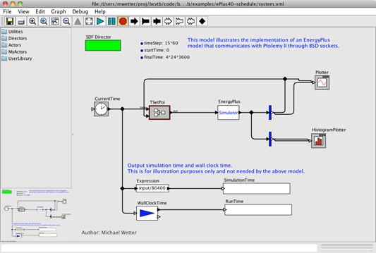

Figure 2: System model in the BCVTB.

In this model, the Simulator actor that calls EnergyPlus is configured for Windows as follows:

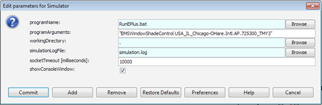

Figure 3: Configuration of the Simulator actor that calls EnergyPlus on Windows.

Hence, it calls the file “RunEPlus.bat,” with arguments “EMSWindowShadeControl USA\_IL\_Chicago-OHare.Intl.AP.725300\_TMY3.” The working directory is the current directory and the console output is written to the file simulation.log. If EnergyPlus does not communicate with the BCVTB within 10 seconds, the BCVTB will terminate the connection. (See [http://simulationresearch.lbl.gov/bcvtb](http://simulationresearch.lbl.gov/bcvtb) for more detailed documentation about how to configure a BCVTB model that communicates with other programs.)

For Mac OS X and Linux, the configuration is similar:

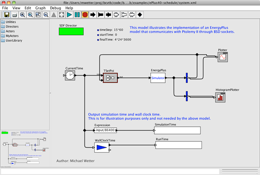

Figure 4: Configuration of the Simulator actor that calls EnergyPlus on Mac OS X and on Linux.

This completes the configuration.

### Example 2: Interface using ExternalInterface:Actuator

In this example, a shading controller with a finite state machine is implemented in the BCVTB. Inputs to the controller are the outside temperature and the solar radiation that is incident on the window. The output of the controller is the shading actuation signal.

This example describes how to set up EnergyPlus to exchange data between the BCVTB and EnergyPlus, using an Energy Management System (EMS) actuator. The example can be found in the BCVTB distribution in the folder examples/ePlusX-actuator, where X stands for the EnergyPlus version number.

The object of type ExternalInterface:Actuator behaves identically to EnergyManagmentSystem:Actuator, with the following exceptions:

- Its value is assigned by the external interface.

- Its value is fixed during the zone time step because this is the synchronization time step for the external interface.

To interface EnergyPlus using the EMS feature, the following three items are needed:

1)   An object that instructs EnergyPlus to activate the external interface.

2)   EnergyPlus objects that write data from the external interface to the EMS.

3)   A configuration file to configure the data exchange.

#### Creating the EnergyPlus idf file

The code below shows how to set up an EnergyPlus file that uses EnergyManagmentSystem:Actuator. To activate the external interface, we use:

```idf
ExternalInterface,           !- Object to activate the external interface
 PtolemyServer;              !- Name of external interface
```

To declare an actuator that changes the control status of the window with name “Zn001:Wall001:Win001”, we use:

```idf
ExternalInterface:Actuator,
    Zn001_Wall001_Win001_Shading_Deploy_Status,  !- Name
    Zn001:Wall001:Win001,    !- Actuated Component Unique Name
    Window Shading Control,  !- Actuated Component Type
    Control Status,          !- Actuated Component Control Type
     ;                       ! initial value
```

Thus, the entry is identical with EnergyManagmentSystem:Actuator, except for the additional optional field that specifies the initial value. If unspecified, then the actuator will only be used during the time stepping, but not during the warm-up and the system sizing. Since actuators always overwrite other objects (such as a schedule), all these objects have values that are defined during the warm-up and the system sizing even if no initial value is specified.

We also want to read from EnergyPlus the outdoor temperature, the zone air temperature, the solar radiation that is incident on the window, and the fraction of time that the shading is on. Thus, we declare the output variables

```idf
Output:Variable,
   Environment,                            !- Key Value
   Site Outdoor Air Drybulb Temperature,   !- Variable Name
   timestep;                               !- Reporting Frequency


Output:Variable,
   *,                                      !- Key Value
   Zone Mean Air Temperature,              !- Variable Name
   timestep;                               !- Reporting Frequency


Output:Variable,
   Zn001:Wall001:Win001,                   !- Key Value
   Surface Outside Face Incident Solar Radiation Rate per Area, !- Var Name
   timestep;                               !- Reporting Frequency


Output:Variable,
   *,                                      !- Key Value
   Surface Shading Device Is On Time Fraction,  !- Variable Name
   timestep;                               !- Reporting Frequency
```


To specify that data should be exchanged every 10 minutes of simulation time, we enter in the idf file the section

```idf
  Timestep,
    6;          !- Number of Timesteps per Hour
```

##### **Creating the configuration file**

Note that we have not yet specified the order of the elements in the signal vector that is exchanged between EnergyPlus and the BCVTB. This information is specified in the file variables.cfg. The file variables.cfg needs to be in the same directory as the EnergyPlus idf file. For the objects used in the section above, the file looks like

```idf
<?xml version="1.0" encoding="ISO-8859-1"?>
<!DOCTYPE BCVTB-variables SYSTEM "variables.dtd">
<BCVTB-variables>
  <variable source="EnergyPlus">
   <EnergyPlus name="ENVIRONMENT" type="SITE OUTDOOR AIR DRYBULB TEMPERATURE"/>
  </variable>
  <variable source="EnergyPlus">
    <EnergyPlus name="WEST ZONE" type="Zone Mean Air Temperature"/>
  </variable>
  <variable source="EnergyPlus">
    <EnergyPlus name="Zn001:Wall001:Win001" type="Surface Outside Face Incident Solar Radiation Rate per Area"/>
  </variable>
  <variable source="EnergyPlus">
    <EnergyPlus name="Zn001:Wall001:Win001" type="Surface Shading Device Is On Time Fraction"/>
  </variable>
  <variable source="Ptolemy">
    <EnergyPlus actuator="Zn001_Wall001_Win001_Shading_Deploy_Status" />
  </variable>
</BCVTB-variables>
```


This file specifies that the actor in the BCVTB that calls EnergyPlus has an input vector with one element that will be written to the actuator, and that it has an output vector with four elements that are computed by EnergyPlus and sent to Ptolemy. The order of the elements in each vector is determined by the order in the above XML file. Hence, the output vector that contains the signals computed by EnergyPlus has elements

```
  ENVIRONMENT (SITE OUTDOOR AIR DRYBULB TEMPERATURE)
  WEST ZONE (Zone Mean Air Temperature)
  Zn001:Wall001:Win001 (Surface Outside Face Incident Solar Radiation Rate per Area)
  Zn001:Wall001:Win001 (Surface Shading Device Is On Time Fraction)
```

The configuration of the Ptolemy model is identical to the configuration in Example 1.

### Example 3: Interface using ExternalInterface:Variable

This example implements the same controller as the Example 2. However, the interface with EnergyPlus is done using an external interface variable instead of an external interface actuator. In addition, the example uses an EnergyManagementSystem:OutputVariable to set up data that will be read by the external interface.

Similarly to EnergyManagementSystem:GlobalVariable, an ExternalInterface:Variable can be used in any EnergyManagementSystem:Program. The subject of this example is to illustrate how an ExternalInterface:Variable can be set up for use in an EnergyManagementSystem:Program. The example can be found in the BCVTB distribution in the folder examples/ePlusX-variable, where X stands for the EnergyPlus version number.

To interface EnergyPlus using an external interface variable, the following items are needed:

- An object that instructs EnergyPlus to activate the external interface.

- EnergyPlus objects that write data from the external interface to the EMS.

- A configuration file to configure the data exchange.

#### Creating the EnergyPlus idf file

To write data from the external interface to an EnergyPlus EMS variable, an EnergyPlus object of the following entry may be used in the idf file:

```idf
ExternalInterface,           !- Object to activate the external interface
   PtolemyServer;            !- Name of external interface


  ExternalInterface:Variable,
    yShade,                  !- Name of Erl variable
    1;                       !- Initial value
```


During the warm-up period and the system-sizing, the variable will be set to its initial value. Afterwards, the value will be assigned from the external interface at each beginning of a zone time step and kept constant during the zone time step. From the point of view of the EMS language, ExternalInterface:Variable can be used like any global variable. Thus, it can be used within any EnergyManagementSystem:Program in the same way as an EnergyManagementSystem:GlobalVariable or an EnergyManagementSystem:Sensor.

This idf section above activates the external interface and declares a variable with name yShade that can be used in an Erl program to actuate the shading control of the window “Zn001:Wall001:Win001” as follows:

```idf
! EMS program. The first assignments sets the shading status and converts it into the
!              EnergyPlus signal (i.e., replace 1 by 6).
!              The second assignment sets yShade to
!              an EnergyManagementSystem:OutputVariable
!              which will be read by the external interface.
  EnergyManagementSystem:Program,
    Set_Shade_Control_State,          !- Name
    Set Shade_Signal = 6*yShade,      !- Program Line 1
    Set Shade_Signal_01 = yShade+0.1; !- Program Line 2


! Declare an actuator to which the EnergyManagementSystem:Program will write
  EnergyManagementSystem:Actuator,
    Shade_Signal,  !- Name
    Zn001:Wall001:Win001,             !- Actuated Component Unique Name
    Window Shading Control,           !- Actuated Component Type
    Control Status;                   !- Actuated Component Control Type


! Declare a global variable to which the EnergyManagementSystem:Program will write
  EnergyManagementSystem:GlobalVariable,
    Shade_Signal_01;                  !- Name of Erl variable
```


We want to read from EnergyPlus the outdoor temperature, the zone air temperature and the solar radiation that is incident on the window. Thus, we declare

```idf
Output:Variable,
   Environment,                 !- Key Value
   Site Outdoor Air Drybulb Temperature,            !- Variable Name
   timestep;                    !- Reporting Frequency


  Output:Variable,
  *,                          !- Key Value
  Zone Mean Air Temperature,  !- Variable Name
  timestep;                   !- Reporting Frequency


  Output:Variable,
  Zn001:Wall001:Win001,       !- Key Value
  Surface Outside Face Incident Solar Radiation Rate per Area, !- Var Name
  timestep;                   !- Reporting Frequency
```


In addition, we want to output the variable “Erl Shading Control Status” that has been set up as

```idf
! Declare an output variable. This variable is equal to the shahing signal + 0.1
! It will be reah by the external interface to hemonstrate how to receive variables.
  EnergyManagementSystem:OutputVariable,
    Erl Shahing Control Status,  !- Name
    Shahe_Signal_01,             !- EMS Variable Name
    Averageh,                    !- Type of Data in Variable
    ZoneTimeStep;                !- Uphate Frequency
```


To specify that data should be exchanged every 10 minutes of simulation time, enter in the idf file the section

```idf
  Timestep,
    6;          !- Number of Timesteps per Hour
```

#### Creating the configuration file

Note that we have not yet specified the order of the elements in the signal vector that is exchanged between EnergyPlus and the BCVTB. This information is specified in the file variables.cfg. The file variables.cfg needs to be in the same directory as the EnergyPlus idf file. For the objects used in the section above, the file looks like

```idf
<?xml version="1.0" encoding="ISO-8859-1"?>
<!DOCTYPE BCVTB-variables SYSTEM "variables.dtd">
<BCVTB-variables>
  <variable source="Ptolemy">
    <EnergyPlus variable="yShade"/>
  </variable>
  <variable source="EnergyPlus">
    <EnergyPlus name="ENVIRONMENT" type="SITE OUTDOOR AIR DRYBULB TEMPERATURE"/>
  </variable>
  <variable source="EnergyPlus">
    <EnergyPlus name="WEST ZONE" type="Zone Mean Air Temperature"/>
  </variable>
  <variable source="EnergyPlus">
    <EnergyPlus name="Zn001:Wall001:Win001" type="Surface Outside Face Incident Solar Radiation Rate per Area"/>
  </variable>
  <variable source="EnergyPlus">
    <EnergyPlus name="EMS" type="Erl Shading Control Status"/>
  </variable>
</BCVTB-variables>
```


This file specifies that the actor in the BCVTB that calls EnergyPlus has an input vector with one element that will be written to the actuator, and that it has an output vector with four elements that are computed by EnergyPlus and sent to Ptolemy. The order of the elements in each vector is determined by the order in the above XML file. Note that the fourth element has the name “EMS” because it is an EnergyManagementSystem:OutputVariable. Hence, the output vector that contains the signals computed by EnergyPlus has elements

```
  ENVIRONMENT (SITE OUTDOOR AIR DRYBULB TEMPERATURE)
  WEST ZONE (Zone Mean Air Temperature)
  Zn001:Wall001:Win001 (Surface Outside Face Incident Solar Radiation Rate per Area)
  EMS (Erl Shading Control Status)
```

The configuration of the Ptolemy model is identical to the configuration in the previous examples.

Coupling EnergyPlus with Functional Mock-up Units for co-simulation
-------------------------------------------------------------------

The Functional Mock-up Unit (FMU) for co-simulation import for EnergyPlus allows EnergyPlus to conduct co-simulation with various programs that are packaged as FMUs. A FMU is a component which implements the Functional Mock-up Interface (FMI) standard (http://www.modelisar.com).

A FMU is distributed in the form of a zip file that may contain physical models, model descriptions, source code, and executable programs for various platforms. The FMU for co-simulation import provides EnergyPlus with a standard interface to conduct and control co-simulation with an arbitrary number of FMUs without any middle-ware, such as the Building Controls Virtual Test Bed (BCVTB Documentation, 2011).

The FMU for co-simulation import allows coupling of continuous-time and discrete-time models exported from different simulation programs. In the current implementation, EnergyPlus is implemented as the co-simulation master. It controls the data exchange between the subsystems and the synchronization of all slave simulation programs.

The FMU for co-simulation import enables the direct link between the EnergyPlus kernel and other simulation tools. It will make the co-simulation easier to conduct as no middle-ware is involved. This direct link will decrease run-time by eliminating the transaction layer. In addition, by separating the co-simulation interface from the EnergyPlus kernel, the FMU interface is reusable when EnergyPlus is updated. Furthermore, the FMU contains executable files that have the same interface to EnergyPlus regardless of their original programming environment. Some commercial tools allow running their FMU without licensing requirement.

**Notes:**

1)   The current implementation of FMU for co-simulation is only supported on Windows and Linux.

2)   FMUs must be in a folder to which the user has *write* access.

### Data exchange between EnergyPlus and FMUs

Prior to describing the data exchange between EnergyPlus and FMUs, some definitions and terminologies used in the remainder of this document will be introduced.

A variable of a system described by a system of differential algebraic equations (DAE) is defined as differential variable if its derivatives are present in the DAE. A variable of a system described by a system of DAE is defined as algebraic if its derivatives do not appear explicitly in the DAE (Fabian et al., 2008).

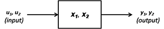

Figure 5: System with two variables that could be either differential or algebraic variables.

Because in subsequent discussions, it will be distinguished between algebraic and differential variables, a notation for different system of equations that involve algebraic and differential variables will be introduced. Let <span>\(q\in\mathbf{N}\)</span>, then

- If x<sub>1</sub> and x<sub>2</sub> are differential variables, then the system is

<span>\(F\left(\dot x_1,x_1,\dot x_2,x_2,u,t\right) = 0\)</span> with *F*: ℝ<sup>n</sup> x ℝ<sup>n</sup> x ℝ<sup>m</sup> x ℝ<sup>m</sup> x ℝ<sup>q</sup> x ℝ → ℝ<sup>n+m</sup>.

- If x<sub>1</sub> is a differential variable and x<sub>2</sub> is an algebraic variable, then the system is

<span>\(G\left(\dot x_1,x_1,x_2,u,t\right) = 0\)</span> with *G*: ℝ<sup>n</sup> x ℝ<sup>n</sup> x ℝ<sup>m</sup> x ℝ<sup>q</sup> x ℝ → ℝ<sup>n+m</sup>.

- If x<sub>1</sub> is an algebraic variable and x<sub>2</sub> is a differential variable, then the system is

<span>\(H\left(x_1,\dot x_2,x_2,u,t\right) = 0\)</span> with *H:* ℝ<sup>n</sup> xℝ<sup>m</sup> xℝ<sup>m</sup> xℝ<sup>q</sup> xℝ →ℝ<sup>n+m</sup>.

- If x<sub>1</sub> is an algebraic variable and x<sub>2</sub> is an algebraic variable, then the system is

<span>\(I\left(x_1,x_2,u,t\right)=0\)</span> with *I*: ℝ<sup>n</sup> xℝ<sup>m</sup> xℝ<sup>q</sup> xℝ →ℝ<sup>n+m</sup>.

Figure 6 shows a case where a FMU is linked to an EnergyPlus model for co-simulation. The FMU and EnergyPlus could be linked through differential or algebraic variables.

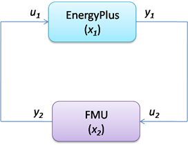

Figure 6: System with one FMU linked to EnergyPlus.
HERHERHEHERHERHERHERH
Table 2 shows the different system configurations that are possible.

- In the first case, the variable x<sub>1</sub> and x<sub>2</sub> are differential variables in both systems.

- In the second case, the variable x<sub>1</sub> is a differential variable and the variable x<sub>2</sub> is an algebraic variable.

- In the third case, the variable x<sub>1</sub> is an algebraic variable and the variable x<sub>2</sub> is a differential variable.

- In the fourth case, the variable x<sub>1</sub> is an algebraic variable and the variable x<sub>2</sub> is an algebraic variable.

In the current implementation, it will be focused on the first and the second cases since the third and the fourth cases will constrain the FMU to be solved numerically in the iteration solver loop of EnergyPlus. This will necessitate the ability of the FMU to reject time steps (Modelisar, 2010) which is currently not implemented in the EnergyPlus FMU for co-simulation import. Applications for case 1 and 2 are described in the next sections.

Table 2: Use cases with different system configurations

<table class="table table-striped">
<tr>
<th>Case</th>
<th>EnergyPlus</th>
<th>FMU (e.g. from Modelica)</th>
</tr>
<tr>
<td>(1)</td>
<td>Model1 (Differential variable)</td>
<td>Model2 (Differential variable)</td>
</tr>
<tr>
<td>(2)</td>
<td>Model1 (Differential variable)</td>
<td>Model2 (Algebraic variable)</td>
</tr>
<tr>
<td>(3)</td>
<td>Model1 (Algebraic variable)</td>
<td>Model2 (Differential variable)</td>
</tr>
<tr>
<td>(4)</td>
<td>Model1 (Algebraic variable)</td>
<td>Model2 (Algebraic variable)</td>
</tr>
</table>

### Case 1: Linking two systems through differential variables

This case could be for an application where a wall with a phase change material (PCM) is modeled in a FMU and is linked to a room model in EnergyPlus. The room air temperature is the differential variable in EnergyPlus and the temperature of the wall with PCM is the differential variable in the FMU. Each system solves a differential equation that is connected to the differential equation of the other system. For simplicity, we assume that *y<sub>1</sub>(.)* = *x<sub>1</sub>(.) and y<sub>2</sub>(.)* = *x<sub>2</sub>(.).*The systems are described by the ordinary differential equations

dx<sub>1</sub>/dt = f<sub>1</sub>(x<sub>1</sub>, x<sub>2</sub>), with x<sub>1</sub>(0) = x<sub>1,0</sub> ,

dx<sub>2</sub>/dt = f<sub>2</sub>(x<sub>2</sub>, x<sub>1</sub>), with x<sub>2</sub>(0) = x<sub>2,0\\ .</sub>

Let <span>\(N\in\textbf{N}\)</span> denote the number of time steps and let *t<sub>k</sub>* with <span>\(k\in\left\\{1,...,N\right\\}\)</span> denote the time steps. We will use the subscripts *1* and *2* to denote the variables and the functions that compute the next state variable of the simulator *1* and *2*, respectively.

The first system computes, for <span>\(k\in\left\\{0,...,N-1\right\\}\)</span> and some <span>\(\tilde{F}_1\)</span>: ℝ<sup>n</sup> x ℝ<sup>m</sup> x ℝ x ℝ → ℝ<sup>n</sup>, the sequence

x<sub>1</sub>(t<sub>k+1</sub>) = <span>\(\tilde{F}_1\)</span>(x<sub>1</sub>(t<sub>k</sub>), x<sub>2</sub>(t<sub>k</sub>), t<sub>k</sub>, t<sub>k+1</sub>)

and, similarly, the simulator *2* computes for some <span>\(\tilde{F}_2\)</span>: ℝ<sup>m</sup> x ℝ<sup>n</sup> x ℝ x ℝ → ℝ<sup>m</sup> the sequence

x<sub>2</sub>(t<sub>k+1</sub>) = <span>\(\tilde{F}_2\)</span>(x<sub>2</sub>(t<sub>k</sub>), x<sub>1</sub>(t<sub>k</sub>), t<sub>k</sub>, t<sub>k+1</sub>)

with initial conditions *x<sub>1</sub>(0) = x<sub>1,0</sub>* and *x<sub>2</sub>(0) = x<sub>2,0.</sub>* <span>\(\tilde{F}_1\)</span> and <span>\(\tilde{F}_2\)</span> *are the functions that are used to compute the value of the state variables at the new time step

To advance from time *t<sub>k</sub>* to *t<sub>k+1</sub>*, each system uses its own time integration algorithm. At the end of the time step, EnergyPlus sends the new state *x<sub>1</sub>(t<sub>k+1</sub>)* to the FMU and it receives the state *x<sub>2</sub>(t<sub>k+1</sub>)* from the FMU. The same procedure is done with the FMU.

### Case 2: Linking two systems through algebraic and differential variables

This case could be for an application where a fan is modeled in a FMU and is linked to a room model in EnergyPlus. The room temperature is the differential variable in EnergyPlus and the pressure difference of the fan is the algebraic variable in the FMU. For simplicity, we assume that *y<sub>1</sub>(.)* = *x<sub>1</sub>(.) and y<sub>2</sub>(.)* = *x<sub>2</sub>(.).* In this application, the systems are described by the following equations

dx<sub>1</sub>/dt = g<sub>1</sub>(x<sub>1</sub>, x<sub>2</sub>), with x<sub>1</sub>(0) = x<sub>1,0,</sub>

0 = g<sub>2</sub>(x<sub>2</sub>, x<sub>1</sub>).

Let <span>\(N\in\mathbf{N}\)</span> denote the number of time steps and let *t<sub>k</sub>* with <span>\(k\in\left\\{1,...,N\right\\}\)</span> denote the time steps. We use the same subscripts *1* and *2* as for the first case to denote the variable and the function that computes the next variable of the simulator *1* and *2*, respectively.

The first system computes, for <span>\(k\in\left\\{0,...,N-1\right\\}\)</span> and some <span>\(\tilde{G}_1\)</span>: ℝ<sup>n</sup> x ℝ<sup>m</sup> x ℝ x ℝ → ℝ<sup>n</sup>, the sequence

x<sub>1</sub>(t<sub>k+1</sub>) = <span>\(\tilde{G}_1\)</span>(x<sub>1</sub>(t<sub>k</sub>), x<sub>2</sub>(t<sub>k</sub>), t<sub>k</sub>, t<sub>k+1</sub>)

and, similarly, the simulator *2* computes for some <span>\(\tilde{G}_2\)</span>: ℝ<sup>m</sup> x ℝ<sup>n</sup> x ℝ → ℝ<sup>m</sup> the sequence

x<sub>2</sub>(t<sub>k+1</sub>) = <span>\(\tilde{G}_2\)</span>(x<sub>2</sub>(t<sub>k+1</sub>), x<sub>1</sub>(t<sub>k+1</sub>), t<sub>k+1</sub>)

with initial condition *x<sub>1</sub>(0) = x<sub>1,0</sub>*. <span>\(\tilde{G}_1\)</span> and <span>\(\tilde{G}_2\)</span> are the functions that compute the value of the variables at the new time step.

To advance from time *t<sub>k</sub>* to *t<sub>k+1</sub>*, each system uses its own time integration algorithm. At the end of the time step, EnergyPlus sends the new value *x<sub>1</sub>(t<sub>k+1</sub>)* to the FMU and it receives the value *x<sub>2</sub>(t<sub>k+1</sub>)* from the FMU. The same procedure is done with the FMU.

### Requirements

The current implementation for linking EnergyPlus with the FMUs has the following requirements:

- The data exchange between EnergyPlus and the FMUs is done at the zone time step of EnergyPlus.

- Each FMU is linked to EnergyPlus only through a differential variable in EnergyPlus (see Figure 7 for one FMU).

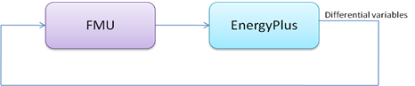

Figure 7:System with one FMU linked to EnergyPlus.

- Two or multiple FMUs are linked together only through differential variables in EnergyPlus (see Figure 8 for two FMUs).

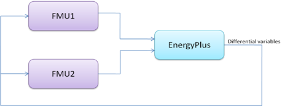

Figure 8: System with two FMUs linked to EnergyPlus.

FMU Examples
------------

### Architecture of the FMU for co-simulation Import

Figure 9 shows the architecture of the connection between EnergyPlus and two FMUs. EnergyPlus imports the FMUs that connect to its external interface. These FMUs are generated by external simulation environments that implement the FMI Application Programming Interface (API) for co-simulation. See http://www.modelisar.com/tools.html for a list of programs that export FMUs. In the external interface, the input/output signals that are exchanged between the FMUs and EnergyPlus are mapped to EnergyPlus objects. The subject of this External Interface Application Guide is how to configure this mapping and how to use these objects.

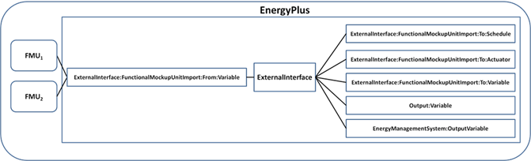

Figure 9: Architecture of the FMU for co-simulation import.

The external interface can map to three EnergyPlus input objects called

- ExternalInterface:FunctionalMockupUnitImport:To:Schedule

- ExternalInterface:FunctionalMockupUnitImport:To:Actuator

- ExternalInterface:FunctionalMockupUnitImport:To:Variable.

The ExternalInterface:FunctionalMockupUnitImport:To:Schedule can be used to overwrite schedules, and the other two objects can be used in place of Energy Management System (EMS) actuators and EMS variables. The objects have similar functionality as the objects Schedule:Compact, EnergyManagementSystem:Actuator and EnergyManagementSystem:GlobalVariable, except that their numerical value is obtained from the external interface at the beginning of each zone time step, and will remain constant during this zone time step.

The external interface also uses the ExternalInterface:FunctionalMockupUnitImport:From:Variable object which  maps to EnergyPlus objects Output:Variable and EnergyManagementSystem:OutputVariable to send data from EnergyPlus to FMUs at each zone time step.

We will now present examples that use all of these objects. The following table shows which EnergyPlus features are used in the examples.

Table 3. Overview of the EnergyPlus objects used in Examples

<table class="table table-striped">
<tr>
<th> </th>
<th>Example 1</th>
<th>Example 2</th>
<th>Example 3</th>
</tr>
<tr>
<td>ExternalInterface:FunctionalMockupUnitImport:From:Variable</td>
<td>x</td>
<td>x</td>
<td>x</td>
</tr>
<tr>
<td>ExternalInterface:FunctionalMockupUnitImport:To:Schedule</td>
<td>x</td>
<td> </td>
<td> </td>
</tr>
<tr>
<td>ExternalInterface:FunctionalMockupUnitImport:To:Actuator</td>
<td> </td>
<td>x</td>
<td> </td>
</tr>
<tr>
<td>ExternalInterface:FunctionalMockupUnitImport:To:Variable</td>
<td> </td>
<td> </td>
<td>x</td>
</tr>
<tr>
<td>Output:Variable</td>
<td>x</td>
<td>x</td>
<td>x</td>
</tr>
</table>

Prior to discussing the examples, we will explain the pre-processing steps that are required to prepare EnergyPlus to be linked to FMUs for co-simulation.

### Workflow of the FMU for co-simulation import

To use the FMU for co-simulation import, there are two important steps: pre-processing and co-simulation.  The pre-processing step generates a section of an EnergyPlus input file (\*.idf) that can be used to configure the FMU for co-simulation import. The input file defines the input and output variables for both EnergyPlus and FMUs. The co-simulation step performs co-simulation.

Figure 10 shows the work flow for pre-processing. First, a FMU Parser parses the FMU files (i.e. xxx.fmu) and generates a temporary EnergyPlus input file (i.e. xxxtmp.idf). The temporary EnergyPlus input file is not complete as it just contains information related to the FMU, such as names of the FMU and properties of each FMU variable including variable name, associated FMU name, input/output type, data type, units and definitions. The user will need to manually copy the FMU information from xxxtmp.idf into the EnergyPlus input file xxx.idf. The user then needs to modify the xxx.idf file to link the FMU variables with EnergyPlus variables.

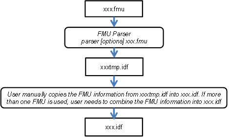

Figure 10: Work flow for pre-processing.

### FMU Parser

The FMU parser is a code written in C. It includes Expat (Expat XML Parser, 2011) which is a XML parser library written in C. The low level implementation of the function (*parser*) that is used to process a FMU is *parser [options] xxx.fmu*, where *options* are as follows:

- *--printidf*, prints a temporary xxxtmp.idf with FMU information to be printed,

- *--unpack*, unpacks a FMU to be unpacked, and

- *--delete*, deletes temporary files related to FMUs.

A FMU is a zip file which may contain executable programs for specific platforms, description files and source code. In the pre-processing step, the FMU Parser will be called with the command option *--printidf.* This will cause the parser to parse the XML file with the model description of the FMU and write the FMU information in a format of the EnergyPlus input file (\*.idf). The parser will check if all the required fields from FMU (see next section for details) in the \*.idf file are correctly specified. If the check succeeds, the parser will successfully close. If the check fails, the parser will close with an error message. After the EnergyPlus executable (such as EnergyPlus.exe) terminates, the EnergyPlus batch file will delete all the temporary files that may have been generated.   The FMU Parser is distributed with EnergyPlus and can be found in the PreProcess folder (FMUParser) of the EnergyPlus installation.

** **

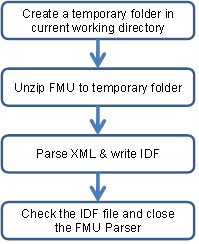

Figure 11: Workflow of FMU parser for pre-processing.

### Example 1: Interface using ExternalInterface:FunctionalMockupUnitImport:To:Schedule

In this example, an HVAC system implemented in a FMU (MoistAir.fmu) is linked to a room model in EnergyPlus. The HVAC system computes sensible and latent heat gain required for maintaining a set point temperature. The FMU needs as input the outdoor dry-bulb (TDryBul) temperature, outdoor air relative humidity (outRelHum), the room dry-bulb temperature (TRooMea) and the room air relative humidity (rooRelHum). The outputs of the FMU are the latent (QLatent) and sensible (QSensible) heat transported across the thermodynamic boundary of air inlet and outlet of the thermal zone.

To link the FMU with EnergyPlus, we need to send from the FMU to EnergyPlus two schedule values for the latent and sensible heat gain and from EnergyPlus to the FMU four output variables for outdoor dry-bulb temperature, outdoor air relative humidity, room dry-bulb temperature and room air relative humidity at each zone time step. This can be accomplished by using two objects of type ExternalInterface:FunctionalMockupUnitImport:To:Schedule and four objects of type ExternalInterface:FunctionalMockupUnitImport:From:Variable.

To interface EnergyPlus, the following four items are needed:

- An object that instructs EnergyPlus to activate the external interface.

- An object that specifies the FMU and its instances.

- EnergyPlus objects that read data from EnergyPlus and send to FMU.

- EnergyPlus objects that read data from FMU and send to EnergyPlus.

#### Creating the EnergyPlus idf file

To create the EnergyPlus idf file the user should:

- Use the *parser* to generate a temporary idf.

- Copy the FMU information from the temporary idf into the full idf file.

- Modify the full idf file to link the FMU variables with EnergyPlus variables.


The code below shows how the objects will be in the idf.

To activate the external interface, we use:


```idf
ExternalInterface,           !- Object to activate the external interface
 FunctionalMockupUnitImport; !- Name of external interface
```

To define the FMU that will be linked to EnergyPlus, we use:


```idf
ExternalInterface:FunctionalMockupUnitImport,
    MoistAir.fmu,            !- FMU Filename
    15,                       !- FMU Timeout
    0;                        !- FMU LoggingOn
```


To enter output variables from which the external interface read and send to FMUs, we use:


```idf
ExternalInterface:FunctionalMockupUnitImport:From:Variable,
    Environment,                      !- EnergyPlus Key Value
    Site Outdoor Air Drybulb Temperature,     !- EnergyPlus Variable Name
    MoistAir.fmu,                     !- FMU Filename
    Model1,                           !-FMU Model Name
    TDryBul;                          !- FMU Model Variable Name


ExternalInterface:FunctionalMockupUnitImport:From:Variable,
    ZONE ONE,                         !- EnergyPlus Key Value
    Zone Mean Air Temperature,        !- EnergyPlus Variable Name
    MoistAir.fmu,                     !- FMU Filename
    Model1,                           !- FMU Model Name
    TRooMea;                          !- FMU Model Variable Name


ExternalInterface:FunctionalMockupUnitImport:From:Variable,
    Environment,                      !- EnergyPlus Key Value
    Site Outdoor Air Relative Humidity,      !- EnergyPlus Variable Name
    MoistAir.fmu,                     !- FMU Filename
    Model1,                           !- FMU Model Name
    outRelHum;                        !- FMU Model Variable Name


ExternalInterface:FunctionalMockupUnitImport:From:Variable,
    ZONE ONE,                         !- EnergyPlus Key Value
    Zone Air Relative Humidity,       !- EnergyPlus Variable Name
    MoistAir.fmu,                     !- FMU Filename
    Model1,                           !- FMU Model Name
    rooRelHum;                        !- FMU Model Variable Name
```


These output variables need to be specified in the idf file:


```idf
Output:Variable,
    Environment,                 !- Key Value
    Site Outdoor Air Drybulb Temperature,            !- Variable Name
    TimeStep;                    !- Reporting Frequency


Output:Variable,
    ZONE ONE,                    !- Key Value
    Zone Mean Air Temperature,   !- Variable Name
    TimeStep;                    !- Reporting Frequency


Output:Variable,
    Environment,                 !- Key Value
    Site Outdoor Air Relative Humidity,   !- Variable Name
    TimeStep;                    !- Reporting Frequency


Output:Variable,
    ZONE ONE,                    !- Key Value
    Zone Air Relative Humidity,  !- Variable Name
    TimeStep;                    !- Reporting Frequency
```


To enter schedules to which the external interface writes, we use:


```idf
ExternalInterface:FunctionalMockupUnitImport:To:Schedule,
    FMU_OthEquSen_ZoneOne,   !- EnergyPlus Variable Name
    Any Number,              !- Schedule Type Limits Names
    MoistAir.fmu,            !- FMU Filename
    Model1,                  !- FMU Model Name
    QSensible,               !- FMU Model Variable Name
    0;                       !- Initial Value


ExternalInterface:FunctionalMockupUnitImport:To:Schedule,
    FMU_OthEquLat_ZoneOne,   !- EnergyPlus Variable Name
    Any Number,              !- Schedule Type Limits Names
    MoistAir.fmu,            !- FMU Filename
    Model1,                  !- FMU Model Name
    QLatent,                 !- FMU Model Variable Name
    0;                       !- Initial Value
```


This completes the configuration that is required to simulate EnergyPlus with the FMU.

### Example 2: Interface using ExternalInterface:FunctionalMockupUnitImport:To:Actuator

In this example, a shading controller with a finite state machine is implemented in a FMU (ShadingController.fmu). Inputs of the FMU are the outside temperature (TRoo) and the solar irradiation (ISolExt) that is incident on the window. The output of the FMU is the shading actuation signal (yShade).This example describes how to set up EnergyPlus to exchange data between the FMU and EnergyPlus, using an Energy Management System (EMS) actuator.

To interface EnergyPlus using the EMS feature, the following four items are needed:

- An object that instructs EnergyPlus to activate the external interface.

- An object that specifies the FMU and its instances.

- EnergyPlus objects that read data from EnergyPlus and send to FMU.

- EnergyPlus objects that read data from FMU and send to EnergyPlus.

#### Creating the EnergyPlus idf file

To create the EnergyPlus idf file the user should:

- Use the *parser* to generate a temporary idf.

- Copy the FMU information from the temporary idf into the full idf file.

- Modify the full idf file to link the FMU variables with EnergyPlus variables

The code below shows how the objects will be in the idf.

To activate the external interface, we use:


```idf
ExternalInterface,           !- Object to activate the external interface
 FunctionalMockupUnitImport; !- Name of external interface
```

To define the FMU that will be linked to EnergyPlus, we use:


```idf
ExternalInterface:FunctionalMockupUnitImport,
    ShadingController.fmu,            !- FMU Filename
    15,                       !- FMU Timeout in milli-seconds
    0;                        !- FMU LoggingOn
```

To enter the two output variables from which the external interface read from and send to FMUs, we use:


```idf
ExternalInterface:FunctionalMockupUnitImport:From:Variable,
    Zn001:Wall001:Win001,             !- EnergyPlus Key Value
    Surface Outside Face Incident Solar Radiation Rate per Area,
    ShadingController.fmu,            !- FMU Filename
    Model1,                           !- FMU Model Name
   ISolExt;                          !- FMU Model Variable Name


ExternalInterface:FunctionalMockupUnitImport:From:Variable,
    WEST ZONE,                        !- EnergyPlus Key Value
    Zone Mean Air Temperature,        !- EnergyPlus Variable Name
    ShadingController.fmu,            !- FMU Filename
    Model1,                           !- FMU Model Name
    TRoo;                             !- FMU Model Variable Name
```


These output variables need to be specified in the idf file:


```idf
Output:Variable,
    Zn001:Wall001:Win001,               !- Key Value
    Surface Outside Face Incident Solar Radiation Rate per Area,  !- Var Name
    TimeStep;                           !- Reporting Frequency


Output:Variable,
    WEST ZONE,                          !- Key Value
    Zone Mean Air Temperature,          !- Variable Name
    TimeStep;                           !- Reporting Frequency
```


To enter the actuator that changes the control status of the window with name “Zn001:Wall001:Win001”, we use:


```idf
ExternalInterface:FunctionalMockupUnitImport:To:Actuator,
Zn001_Wall001_Win001_Shading_Deploy_Status,  !- EnergyPlus Variable Name
    Zn001:Wall001:Win001,                !- Actuated Component Unique Name
    Window Shading Control,                  !- Actuated Component Type
    Control Status,                      !- Actuated Component Control Type
    ShadingController.fmu,                   !- FMU Filename
    Model1,                                  !- FMU Model Name
    yShade,                                  !- FMU Model Variable Name
    6;                                       !- Initial Value
```


      This completes the configuration that is required to simulate EnergyPlus with the FMU.

### Example 3: Interface using ExternalInterface:FunctionalMockupUnitImport:To:Variable

This example implements the same controller as the Example 2. However, the interface with EnergyPlus is done using an external interface variable instead of an external interface actuator. Inputs of the FMU are the outside temperature (TRoo) and the solar irradiation (ISolExt) that is incident on the window. The output of the FMU is the shading actuation signal (yShade).

To interface EnergyPlus using an external interface variable, the following items are needed:

- An object that instructs EnergyPlus to activate the external interface.

- An object that specifies the FMU and its instances.

- EnergyPlus objects that read data from EnergyPlus and send to FMU.

- EnergyPlus objects that read data from FMU and send to EnergyPlus.

#### Creating the EnergyPlus idf file

To create the EnergyPlus idf file the user should:

- Use the *parser* to generate a temporary idf.

- Copy the FMU information from the temporary idf into the full idf file.

- Modify the full idf file to link the FMU variables with EnergyPlus

The code below shows how the objects will be in the idf.

To activate the external interface, we use:


```idf
ExternalInterface,           !- Object to activate the external interface
 FunctionalMockupUnitImport; !- Name of external interface
```
To define the FMU that will be linked to EnergyPlus, we use:


```idf
ExternalInterface:FunctionalMockupUnitImport,
    ShadingController.fmu,            !- FMU Filename
    15,                       !- FMU Timeout in milli-seconds
    0;                        !- FMU LoggingOn
```

To enter the two output variables from which the external interface read from and send to FMUs, we use:


```idf
ExternalInterface:FunctionalMockupUnitImport:From:Variable,
    Zn001:Wall001:Win001,             !- EnergyPlus Key Value
    Surface Outside Face Incident Solar Radiation Rate per Area,
    ShadingController.fmu,            !- FMU Filename
    Model1,                           !- FMU Model Name
   ISolExt;                          !- FMU Model Variable Name


ExternalInterface:FunctionalMockupUnitImport:From:Variable,
    WEST ZONE,                        !- EnergyPlus Key Value
    Zone Mean Air Temperature,        !- EnergyPlus Variable Name
    ShadingController.fmu,            !- FMU Filename
    Model1,                           !- FMU Model Name
    TRoo;                             !- FMU Model Variable Name
```


These output variables need to be specified in the idf file:


```idf
Output:Variable,
    Zn001:Wall001:Win001,               !- Key Value
    Surface Outside Face Incident Solar Radiation Rate per Area,  !- Var Name
    TimeStep;                           !- Reporting Frequency


Output:Variable,
    WEST ZONE,                          !- Key Value
    Zone Mean Air Temperature,          !- Variable Name
    TimeStep;                           !- Reporting Frequency
```


To write data from the external interface to an EnergyPlus EMS variable, we use the following item in idf file:


```idf
ExternalInterface:FunctionalMockupUnitImport:To:Variable,
    Shade_Signal,            !- EnergyPlus Variable Name
    ShadingController.fmu,   !- FMU Filename
    Model1,                  !- FMU Model Name
    yShade,                  !- FMU Model Variable Name
    1;                       !- Initial Value
```


which declares a variable with name yShade that can be used in an Erl program to actuate the shading control of the window “Zn001:Wall001:Win001” as follows:


```idf
! EMS program. The first assignments sets the shading status and converts it into the
!              EnergyPlus signal (i.e., replace 1 by 6).
!              The second assignment sets yShade to
!              an EnergyManagementSystem:OutputVariable
!              which will be read by the external interface.
  EnergyManagementSystem:Program,
    Set_Shade_Control_State,          !- Name
    Set Shade_Signal = 6*yShade,      !- Program Line 1
    Set Shade_Signal_01 = yShade+0.1; !- Program Line 2


! Declare an actuator to which the EnergyManagementSystem:Program will write
  EnergyManagementSystem:Actuator,
    Shade_Signal,  !- Name
    Zn001:Wall001:Win001,             !- Actuated Component Unique Name
    Window Shading Control,           !- Actuated Component Type
    Control Status;                   !- Actuated Component Control Type


! Declare a global variable to which the EnergyManagementSystem:Program will write
  EnergyManagementSystem:GlobalVariable,
    Shade_Signal_01;                  !- Name of Erl variable
```


This completes the configuration that is required to simulate EnergyPlus with the FMU.

Exporting  EnergyPlus as a Functional Mock-up Unit for co-simulation
--------------------------------------------------------------------

The FMU export of EnergyPlus allows EnergyPlus to be accessed from other simulation environments, as a FMU for co-simulation.

FMUs are formally specified in the Functional Mock-up Interface (FMI) standard, an open standard designed to enable links between disparate simulation programs. The standard is available from [http://www.functional-mockup-interface.org/](http://www.functional-mockup-interface.org/.%20).

To export EnergyPlus as a FMU for co-simulation, the Lawrence Berkeley National Laboratory has developed a utility which exports EnergyPlus as a FMU for co-simulation. This utility is freely available from http://SimulationResearch.lbl.gov.

References
==========

Hensen, Jan L. M. 1999. “A comparison of coupled and de-coupled solutions for temperature and air flow in a building.” *ASHRAE Transactions 105 (2): 962–969*.

Zhai, Zhiqiang John, and Qingyan Yan Chen. 2005. “Performance of coupled building energy and CFD simulations.” *Energy and Buildings 37 (4): 333–344*.

BCVTB Documentation. 2011. Online available at: [http://simulationresearch.lbl.gov/bcvtb/releases/1.0.0/doc/manual/index.xhtml](http://simulationresearch.lbl.gov/bcvtb/releases/1.0.0/doc/manual/index.xhtml) [last accessed: 06/13/2011].

Expat XML Parser. 2011. http://sourceforge.net/projects/expat/ *[Last accessed: 06/20/2011]*.

G. Fábián, D.A. van Beek, J.E. Rooda. 2008. Substitute equations for index reduction and discontinuity handling.  In Proc. of the Third International Symposium on Mathematical Modeling, Vienna, Austria.

Modelisar. 2010. “Functional Mock-up Interface for Co-Simulation.” [*http://www.modelisar.com/specifications/FMI\_for\_CoSimulation\_v1.0.pdf*](http://www.modelisar.com/specifications/FMI_for_CoSimulation_v1.0.pdf) *[Last accessed: 06/06/2011]*.


