<br/>
<p><h1>EnergyPlus<sup>TM</sup> Documentation, v8.4.0</h1></p>
<hr>
<h1>Input Output Reference</h1>
<h2>The Encyclopedic Reference to EnergyPlus Input and Output</h2>
<br/>
<p><i>(the ins and outs of EnergyPlus)</i></p>
<br/>
<p><small>COPYRIGHT (c) 1996-2015 THE BOARD OF TRUSTEES OF THE UNIVERSITY OF ILLINOIS AND THE REGENTS OF THE UNIVERSITY OF CALIFORNIA THROUGH THE ERNEST ORLANDO LAWRENCE BERKELEY NATIONAL LABORATORY. ALL RIGHTS RESERVED. NO PART OF THIS MATERIAL MAY BE REPRODUCED OR TRANSMITTED IN ANY FORM OR BY ANY MEANS WITHOUT THE PRIOR WRITTEN PERMISSION OF THE UNIVERSITY OF ILLINOIS OR THE ERNEST ORLANDO LAWRENCE BERKELEY NATIONAL LABORATORY. ENERGYPLUS IS A TRADEMARK OF THE US DEPARTMENT OF ENERGY.</small></p>
<p style="page-break-after:always;"></p>
<div id="generated-toc"></div>
<p style="page-break-after:always;"></p>


Input-Output Reference
======================

This document is intended to be an encyclopedic reference for the EnergyPlus Input Data Dictionary (IDD), Input Data File (IDF) and potential resultant outputs (various output files).

The following descriptions are “grouped” by the elements in the IDD (ref: Getting Started Document and the IDD Conventions). In some cases, the descriptions of reporting will be done for an object (e.g. Lighting electrical consumption or thermal comfort value for a group of people) and in some cases for the entire group (e.g., ambient condition reports).

What’s different about EnergyPlus Input and Output?
---------------------------------------------------

The usual procedure for non-interactive programs is to process all the input necessary to “do the job”, perform the actions required by the input, and somewhere along the way produce reports on the actions. Usually, there will be error messages on incorrect input statements and/or incorrect conditions detected during processing. Usually, the input is echoed in its entirety so that the context of errors is shown clearly.

Results are typically output into reports as well as a compilation of various inputs reformatted into different groupings than were originally entered (defaults filled in, etc.)

EnergyPlus does all the above. However, some nuances are different from the usual actions.

### EnergyPlus Input Processing

1)    EnergyPlus reads the data dictionary (Energy+.idd) and the input data file (in.idf) prior to doing anything else. Only after this is done does processing start. HOWEVER, the input processor only knows as much as the data dictionary has told it. It knows which fields should be alpha and which should be numeric. All of this information (including the IDD) is echoed to the audit file (audit.out) in case errors occur. Most of the errors show up (out of context) in the standard error file (eplusout.err) – there might be enough information to decipher where the error is or you may have to look at the more inclusive audit file. Invalid numeric fields are detected during this processing and default numeric fields are filled. For more information on the IDD, its structure and implications, please see the IDD Conventions discussion below.

2)    The biggest difference between EnergyPlus and more traditional input processing is that EnergyPlus is modular in its actual filling in the details for the simulation. Because of the modular structure of EnergyPlus, each module is responsible for “getting” its own input. It receives this input from the input processor in the form of alpha and numeric fields. Each module typically gets all its input the first time it is called. The implication for the user is that error messages may show up in somewhat peculiar places. A further implication is that no order is needed in the input data file!  Data that is not needed by a particular simulation is not processed.

3)    The data dictionary has the capability to do “automatic” range checking on numeric fields as well as fill in numeric defaults. Both filling in defaults and “automatic” range checking are done when the data is read. Other checks may need a combination of fields and won’t be done until the data is “processed” (after the simulation starts).

4)    A couple of other differences that might not be true in other programs:  Blanks are significant in alpha fields **SO** DesignDay is not the same as Design Day (1 space between Design and Day) nor Design  Day (2 spaces between Design and Day). Alpha objects, however, *are* case insensitive SO DesignDay is the same as ‘designday’ or ‘SizingPeriod:DesignDay’.

### General Input Rules

Rules shown here are for the input data files. Rules about the Input Data Dictionary are shown in the Interface Developer’s Guide (there is much similarity and overlap) but most users don’t need to touch the IDD (Input Data Dictionary).

The input data file is the primary file that EnergyPlus uses to create the building simulation. The only additional files are referenced by certain objects (such as the Schedule:File object). The input is order-independent; data can appear in any order and will be retrieved and sorted as necessary by the EnergyPlus simulation modules.  In addition, EnergyPlus allocates everything dynamically, so there are no limitations as to number of zones, surfaces, etc.

- The initial line of an input object MUST have a comma or semicolon.

- Fields do not extend over line boundaries.  Usually, if a comma or (as appropriate) semi-colon is not the last field value on a line, one will be inserted.  Of course, several fields may appear on a single line as long as they are comma separated. (And the last could be followed by a semi-colon).

- Commas delimit fields – therefore, no fields can have embedded commas.  No error will occur but you won't get what you want. You cannot surround a field with “ to accommodate commas in the fields.

- Blank lines are allowed.

- The comment character is a exclamation “!”.  Anything on a line after the exclamation is ignored.

- Input records (aka input line length) can be up to 500 characters in length.  If you go over that, no error will occur but you won't get what you want.

- Each Alpha string in the input data file (aka alpha field length) can be up to 100 characters in length. Anything beyond that is truncated. This would apply to all names (such as zone name, node name, schedule name) in fields.

- Each Alpha string (including Section and Class/Object keywords) is mapped to UPPER case during processing, unless the “*retaincase*” flag marks the field in the IDD.  Get routines from the EnergyPlus code that use the Section and Object keywords automatically map to UPPER case for finding the item.  The primary drawback with this is that error messages coming out of the input processor will be in UPPER case and may not appear exactly as input.

- Special characters, such as tabs, should NOT be included in the file.  However, tabs can be accommodated and are turned into spaces.

- All numbers can be flexibly input and are processed into single precision variables (i.e. 1.0, 1.000, 1, .1E+1 are all processed equally).

### EnergyPlus Output Processing

1)    Unlike the usual formatted output text formatted reports, EnergyPlus usual output is either at the summary or at the detailed (variable) level. Summary reports exist for many inputs as well as sizing results. The more detailed variable level reporting is produced as “stream of consciousness” (as the simulation happens) and must be post-processed for more sensible viewing. Note that the terms “output variable” and “output variable” (accessed by the Output:Variable and/or Output:Meter objects) are used interchangably in this document.

2)    Most EnergyPlus reporting can be readily viewed in current spreadsheet programs – or other software that can process “delimited variable” reports. In these kind of reports, each “column” is separated from the next by a “delimiter”. Typical delimiters are “comma” and “tab”. Gradually, EnergyPlus reporting is moving from all comma separated reports to allow the user to select the delimiter via “style” objects.

3)    Styled reports allow for more selectable output reporting but also increase the number of output files as we have chosen to create the report names with extensions that typify the actual reporting. Depending on the reporting, these can be:

✓ Tab – reports with a .tab extension have tabs as the delimiter. These report files (directly from EnergyPlus) will be named something like “eplus&lt;xxx&gt;.tab” where the &lt;xxx&gt; is a short name of the kind of report (e.g. Zsz for Zone Sizing, Map for Daylighting Map)

✓ Csv – reports with a .csv extension have commas as the delimiter. These are also specially formatted for use in spreadsheets (such as the compilation of results from the eplusout.eso file into the eplusout.csv file using the default post-processor program).

✓ Txt – reports with a .txt extension have spaces as the “delimiter” but only certain of these are really formatted the way you might expect: where multiple spaces make printing with a non-proportional font would produce readable output.

✓ Html – reports with a .html extension are “web-browser” ready.

IDD Conventions
---------------

The following is a basic description of the structure of the IDD (it’s actually taken directly from the IDD file). As noted within, **!** signifies a comment character as does the **\\**. **\\** has also been adopted as a convention for including more specific comments about each field in an object. These have been used with success in the IDFEditor and it is hoped the flexibility will provide other interface developers with useful information.

```idd
!IDD_Version **VERSION NUMBER**
! **************************************************************************
! This file is the Input Data Dictionary (IDD) for EnergyPlus.
! The IDD defines the syntax and data model for each type of input "Object."
! Lines in EnergyPlus input files (and IDD) are limited to 500 characters.
!
! Object Description
! ------------------
! To define an object (a record with data), develop a key word that is unique
! Each data item to the object can be A (Alphanumeric string) or N (numeric)
! Number each A and N.  This will show how the data items will be put into the
! arrays that are passed to the Input Processor "Get" (GetObjectItem) routines.
! All alpha fields are limited to 100 characters.  Numeric fields should be
! valid numerics (can include such as 1.0E+05) and are placed into double
! precision variables.
!
! NOTE: Even though a field may be optional, a comma representing that field
!   must be included (unless it is the last field in the object).  Since the
!   entire input is "field-oriented" and not "keyword-oriented", the EnergyPlus
!   Input Processor must have some representation (even if blank) for each
!   field.
!
! Object Documentation
! --------------------
! In addition, the following special comments appear one per line and
! most are followed by a value.  Comments may apply to a field or the object
! or a group of objects.
!
! Field-level comments:
!
!  \field           Name of field
!                     (should be succinct and readable, blanks are encouraged)
!
!  \note            Note describing the field and its valid values. If multiple lines,
!                   start each line with \note. Limit line length to 100 characters.
!
!  \required-field  To flag fields which may not be left blank
!                     (this comment has no "value")
!
!  \begin-extensible  Marks the first field at which the object accepts an extensible
!                   field set.  A fixed number of fields from this marker define the
!                   extensible field set, see the object code \extensible for
!                   more information.
!
!  \units           Units (must be from EnergyPlus standard units list)
!                   EnergyPlus units are standard SI units
!
!  \ip-units        IP-Units (for use by input processors with IP units)
!                   This is only used if the default conversion is not
!                   appropriate.
!
!  \unitsBasedOnField  For fields that may have multiple possible units, indicates
!                   the field in the object that can be used to determine
!                   the units. The field reference is in the A2 form.
!
!  \minimum         Minimum that includes the following value
!
!  \minimum&gt;        Minimum that must be &gt; than the following value
!
!  \maximum         Maximum that includes the following value
!
!  \maximum<        Maximum that must be < than the following value
!
!  \default         Default for the field (if N/A then omit entire line)
!
!  \deprecated      This field is not really used and will be deleted from the object.
!                   The required information is gotten internally or
!                   not needed by the program.
!
!  \autosizable     Flag to indicate that this field can be used with the Auto
!                   Sizing routines to produce calculated results for the
!                   field.  If a value follows this, then that will be used
!                   when the "Autosize" feature is flagged.  To trigger
!                   autosizing for a field, enter Autosize as the field's
!                   value.  Only applicable to numeric fields.
!
! \autocalculatable Flag to indicate that this field can be automatically
!                   calculated. To trigger auto calculation for a field, enter
!                   Autocalculate as the field's value.  Only applicable to
!                   numeric fields.
!
!  \type            Type of data for the field -
!                     integer
!                     real
!                     alpha       (arbitrary string),
!                     choice      (alpha with specific list of choices, see
!                                 \key)
!                     object-list (link to a list of objects defined elsewhere,
!                                  see \object-list and \reference)
!                     external-list (uses a special list from an external source,
!                                    see \external-list)
!                     node        (name used in connecting HVAC components)
!
!  \retaincase      Retains the alphabetic case for alpha type fields
!
!  \key             Possible value for "\type choice" (blanks are significant)
!                     use multiple \key lines to indicate all valid choices
!
!  \object-list     Name of a list of user-provided object names that are valid
!                     entries for this field (used with "\reference")
!                     see Zone and BuildingSurface:Detailed objects below for
!                     examples.
!                  ** Note that a field may have multiple \object-list commands.
!
!  \external-list   The values for this field should be selected from a special
!                   list generated outside of the IDD file. The choices for the
!                   special lists are:
!                        autoRDDvariable
!                        autoRDDmeter
!                        autoRDDvariableMeter
!                   When one of these are selected the options for the field
!                   are taken from the RDD or MDD file or both.
!
!  \reference       Name of a list of names to which this object belongs
!                     used with "\type object-list" and with "\object-list"
!                     see Zone and BuildingSurface:Detailed objects below for
!                     examples:
!
!                        Zone,
!                          A1 , \field Name
!                               \type alpha
!                               \reference ZoneNames
!
!                        BuildingSurface:Detailed,
!                          A4 , \field Zone Name
!                               \note Zone the surface is a part of
!                               \type object-list
!                               \object-list ZoneNames
!
!             For each zone, the field "Name" may be referenced
!             by other objects, such as BuildingSurface:Detailed, so it is
!             commented with "\reference ZoneNames"
!             Fields that reference a zone name, such as BuildingSurface:Detailed's
!             "Zone Name", are commented as
!             "\type object-list" and "\object-list ZoneNames"
!             ** Note that a field may have multiple \reference commands.
!             ** This is useful if the object belongs to a small specific
!             object-list as well as a larger more general object-list.
!
! Object-level comments:
!
!  \memo            Memo describing the object. If multiple lines, start each line
!                   with \memo.
!                   Limit line length to 100 characters.
!
!  \unique-object   To flag objects which should appear only once in an idf
!                     (this comment has no "value")
!
!  \required-object To flag objects which are required in every idf
!                     (this comment has no "value")
!
!  \min-fields      Minimum number of fields that should be included in the
!                   object.  If appropriate, the Input Processor will fill
!                   any missing fields with defaults (for numeric fields).
!                   It will also supply that number of fields to the "get"
!                   routines using blanks for alpha fields (note -- blanks
!                   may not be allowable for some alpha fields).
!
!  \obsolete        This object has been replaced though is kept (and is read)
!                   in the current version.  Please refer to documentation as
!                   to the dispersal of the object.  If this object is
!                   encountered in an IDF, the InputProcessor will post an
!                   appropriate message to the error file.
!                   usage:  \obsolete New=&gt;[New object name]
!
!  \extensible:<\#&gt;  This object is dynamically extensible -- meaning, if you
!           change the IDD appropriately (if the object has a simple list
!           structure -- just add items to the list arguments (i.e. BRANCH
!           LIST). These will be automatically redimensioned and used during
!           the simulation. <\#&gt; should be entered by the developer to signify
!           how many of the last fields are needed to be extended (and EnergyPlus
!           will attempt to auto-extend the object).  The first field of the first
!           instance of the extensible field set is marked with \begin-extensible.
!
!  \begin-extensible See previous item, marks beginning of extensible fields in
!                   an object.
!
!  \format          The object should have a special format when saved in
!                   the IDF Editor with the special format option enabled.
!                   The options include SingleLine, Vertices, CompactSchedule,
!                   FluidProperties, ViewFactors, and Spectral.
!                   The SingleLine option puts all the fields for the object
!                   on a single line. The Vertices option is used in objects
!                   that use X, Y and Z fields to format those three fields
!                   on a single line.
!                   The CompactSchedule formats that specific object.
!                   The FluidProperty option formats long lists of fluid
!                   properties to ten values per line.
!                   The ViewFactor option formats three fields related to
!                   view factors per line.
!                   The Spectral option formats the four fields related to
!                   window glass spectral data per line.
!
!   \reference-class-name Adds the name of the class to the reference list
!                   similar to \reference.
!
! Group-level comments:
!
!  \group          Name for a group of related objects
!
!
! Notes on comments
! -----------------
!
! 1.  If a particular comment is not applicable (such as units, or default)
! then simply omit the comment rather than indicating N/A.
!
! 2.  Memos and notes should be brief (recommend 5 lines or less per block).
! More extensive explanations are expected to be in the user documentation
```

### IDD – IP Units

In addition, the IDD contains indications of IP (inch-pound) units for the EnergyPlus standard SI (Systems International) units. These may be used by input and output interfaces to display values in the IP system. As noted, if the IP units are “standard” (first block below), then no \\ip-units is expected in the field. Note that for some fields – due to their multiple use (for example, schedule values) – there cannot be a ip-unit designation.

```idd
! Default IP conversions (no \ip-units necessary)
!      $/(m3/s)               =>   $/(ft3/min)         0.000472000059660808
!      $/(W/K)                =>   $/(Btu/h-F)         0.52667614683731
!      $/kW                   =>   $/(kBtuh/h)         0.293083235638921
!      $/m2                   =>   $/ft2               0.0928939733269818
!      $/m3                   =>   $/ft3               0.0283127014102352
!      (kg/s)/W               =>   (lbm/sec)/(Btu/hr)  0.646078115385742
!      1/K                    =>   1/F                 0.555555555555556
!      1/m                    =>   1/ft                0.3048
!      A/K                    =>   A/F                 0.555555555555556
!      C                      =>   F                   1.8 (plus 32)
!      cm                     =>   in                  0.3937
!      cm2                    =>   inch2               0.15500031000062
!      deltaC                 =>   deltaF              1.8
!      deltaJ/kg              =>   deltaBtu/lb         0.0004299
!      g/GJ                   =>   lb/MWh              0.00793664091373665
!      g/kg                   =>   grains/lb           7
!      g/MJ                   =>   lb/MWh              7.93664091373665
!      g/mol                  =>   lb/mol              0.0022046
!      g/m-s                  =>   lb/ft-s             0.000671968949659
!      g/m-s-K                =>   lb/ft-s-F           0.000373574867724868
!      GJ                     =>   ton-hrs             78.9889415481832
!      J                      =>   Wh                  0.000277777777777778
!      J/K                    =>   Btu/F               526.565
!      J/kg                   =>   Btu/lb              0.00042986
!      J/kg-K                 =>   Btu/lb-F            0.000239005736137667
!      J/kg-K2                =>   Btu/lb-F2           0.000132889924714692
!      J/kg-K3                =>   Btu/lb-F3           7.38277359526066E-05
!      J/m2-K                 =>   Btu/ft2-F           4.89224766847393E-05
!      J/m3                   =>   Btu/ft3             2.68096514745308E-05
!      J/m3-K                 =>   Btu/ft3-F           1.49237004739337E-05
!      K                      =>   R                   1.8
!      K/m                    =>   F/ft                0.54861322767449
!      kg                     =>   lb                  2.2046
!      kg/J                   =>   lb/Btu              2325.83774250441
!      kg/kg-K                =>   lb/lb-F             0.555555555555556
!      kg/m                   =>   lb/ft               0.67196893069637
!      kg/m2                  =>   lb/ft2              0.204794053596664
!      kg/m3                  =>   lb/ft3              0.062428
!      kg/m-s                 =>   lb/ft-s             0.67196893069637
!      kg/m-s-K               =>   lb/ft-s-F           0.373316072609094
!      kg/m-s-K2              =>   lb/ft-s-F2          0.207397818116164
!      kg/Pa-s-m2             =>   lb/psi-s-ft2        1412.00523459398
!      kg/s                   =>   lb/s                2.20462247603796
!      kg/s2                  =>   lb/s2               2.2046
!      kg/s-m                 =>   lb/s-ft             0.67196893069637
!      kJ/kg                  =>   Btu/lb              0.429925
!      kPa                    =>   psi                 0.145038
!      L/day                  =>   pint/day            2.11337629827348
!      L/GJ                   =>   gal/kWh             0.000951022349025202
!      L/kWh                  =>   pint/kWh            2.11337629827348
!      L/MJ                   =>   gal/kWh             0.951022349025202
!      lux                    =>   foot-candles        0.092902267
!      m                      =>   ft                  3.28083989501312
!      m/hr                   =>   ft/hr               3.28083989501312
!      m/s                    =>   ft/min              196.850393700787
!      m/s                    =>   miles/hr            2.2369362920544
!      m/yr                   =>   inch/yr             39.3700787401575
!      m2                     =>   ft2                 10.7639104167097
!      m2/m                   =>   ft2/ft              3.28083989501312
!      m2/person              =>   ft2/person          10.764961
!      m2/s                   =>   ft2/s               10.7639104167097
!      m2-K/W                 =>   ft2-F-hr/Btu        5.678263
!      m3                     =>   ft3                 35.3146667214886
!      m3                     =>   gal                 264.172037284185
!      m3/GJ                  =>   ft3/MWh             127.13292
!      m3/hr                  =>   ft3/hr              35.3146667214886
!      m3/hr-m2               =>   ft3/hr-ft2          3.28083989501312
!      m3/hr-person           =>   ft3/hr-person       35.3146667214886
!      m3/kg                  =>   ft3/lb              16.018
!      m3/m2                  =>   ft3/ft2             3.28083989501312
!      m3/MJ                  =>   ft3/kWh             127.13292
!      m3/person              =>   ft3/person          35.3146667214886
!      m3/s                   =>   ft3/min             2118.88000328931
!      m3/s-m                 =>   ft3/min-ft          645.89
!      m3/s-m2                =>   ft3/min-ft2         196.85
!      m3/s-person            =>   ft3/min-person      2118.6438
!      m3/s-W                 =>   (ft3/min)/(Btu/h)   621.099127332943
!      N-m                    =>   lbf-in              8.85074900525547
!      N-s/m2                 =>   lbf-s/ft2           0.0208857913669065
!      Pa                     =>   psi                 0.000145037743897283
!      percent/K              =>   percent/F           0.555555555555556
!      person/m2              =>   person/ft2          0.0928939733269818
!      s/m                    =>   s/ft                0.3048
!      V/K                    =>   V/F                 0.555555555555556
!      W                      =>   Btu/h               3.4121412858518
!      W/(m3/s)               =>   W/(ft3/min)         0.0004719475
!      W/K                    =>   Btu/h-F             1.89563404769544
!      W/m                    =>   Btu/h-ft            1.04072
!      W/m2                   =>   Btu/h-ft2           0.316957210776545
!      W/m2                   =>   W/ft2               0.09290304
!      W/m2-K                 =>   Btu/h-ft2-F         0.176110194261872
!      W/m2-K2                =>   Btu/h-ft2-F2        0.097826
!      W/m-K                  =>   Btu-in/h-ft2-F      6.93481276005548
!      W/m-K2                 =>   Btu/h-F2-ft         0.321418310071648
!      W/m-K3                 =>   Btu/h-F3-ft         0.178565727817582
!      W/person               =>   Btu/h-person        3.4121412858518
!
! Other conversions supported (needs the \ip-units code)
!
!      kPa                    =>   inHg                0.29523
!      m                      =>   in                  39.3700787401575
!      m3/s                   =>   gal/min             15850.3222370511
!      Pa                     =>   ftH2O               0.00033455
!      Pa                     =>   inH2O               0.00401463
!      Pa                     =>   inHg                0.00029613
!      Pa                     =>   Pa                  1
!      W                      =>   W                   1
!      W/m2                   =>   W/m2                1
!      W/m-K                  =>   Btu/h-ft-F          0.577796066000163
!      W/person               =>   W/person            1
!
! Units fields that are not translated
!      $
!      1/hr
!      A
!      Ah
!      A/V
!      Availability
!      Control
!      cycles/hr
!      days
!      deg
!      dimensionless
!      eV
!      hr
!      J/J
!      kg/kg
!      kg-H2O/kg-air
!      kmol
!      kmol/s
!      m3/m3
!      minutes
!      Mode
!      ms
!      ohms
!      percent
!      ppm
!      rev/min
!      s
!      V
!      VA
!      W/m2 or deg C
!      W/m2, W or deg C
!      W/s
!      W/W
!      years
! **************************************************************************
```

Input – Output Descriptions (Document)
--------------------------------------

### Input Descriptions

In the descriptions below, the fields for each input object will be described but the Energy+.idd descriptions will not be shown. Refer to the actual Energy+.idd file for complete specifications. Energy+.idd is a text file that can be viewed with many text editors or word processors. The Site:Location object will serve as an example.

```idd
Site:Location,
       \unique-object
       \min-fields 5
  A1 , \field Name
       \required-field
       \type  alpha
  N1 , \field Latitude
       \units deg
       \minimum -90.0
       \maximum +90.0
       \default 0.0
       \note + is North, - is South, degree minutes represented in decimal (i.e. 30 minutes is .5)
       \type real
  N2 , \field Longitude
       \units deg
       \minimum -180.0
       \maximum +180.0
       \default 0.0
       \note - is West, + is East, degree minutes represented in decimal (i.e. 30 minutes is .5)
       \type real
  N3 , \field Time Zone
       \note basic these limits on the WorldTimeZone Map (2003)
       \units hr
       \minimum -12.0
       \maximum +14.0
       \default 0.0
       \note  Time relative to GMT. Decimal hours.
       \type real
  N4 ; \field Elevation
       \units m
       \minimum -300.0
       \maximum< 8900.0
       \default 0.0
       \type real
```

The IDD excerpt above is the complete definition as seen in the IDD file.

First, the object name is given. (Site:Location)  This is followed by a comma in both the definition (IDD) and in an input file (IDF). In fact, all fields except the terminating field of an IDD class object and IDF object are followed by commas. The final field in an IDD class object or in an IDF object is terminated by a semi-colon.

Next is an alpha field, the location name. As noted above, for input, spaces are significant in this field. The main inputs for Site:Location are numeric fields. These are numbered (as is the alpha field) for convenience. The \\ designations will show various information about the objects as described above in the IDD conventions discussion. Of importance for reading this document are the units and possible minimum and maximum values for a  field.

There is automatic processing of the \\minimum, \\maximum and \\default data for numeric fields. Any infractions of the \\minimum, \\maximum fields are automatically detected and messages will appear in the standard error file. After all the input is checked, infractions will cause program termination (before the bulk of the simulation is completed). Defaults are also enforced if you leave the numeric field blank.

Some objects need all the parameters listed by the definition; some do not. In the descriptions that follow, we will try to indicate which parts are optional. Usually, these will be the last fields in the object input or definition. Even if items are not used for a particular object (e.g. Multiplier in the FenestrationSurface:Detailed and type=Door), the field must be included unless it is the *last field in the object*. So, for this instance, one must include a multiplier field (must be numeric and would need to obey any \\minimum, \\maximum rules) for doors.

Two spreadsheet files are included with the installation:

- ExampleFiles.xls – shows many details about the included example files including highlights of features.

- ExampleFiles-ObjectsLink.xls – shows, for each object, the first three occurrences of that object in an example file.

### Output Descriptions

In the descriptions below, we will endeavor to have each object’s output displayed as well as each of the outputs described. The output variables for a run are selected by choosing the Output:VariableDictionary object. This object displays the available output variables for a run on the **eplusout.rdd** (regular variables) and **eplusout.mdd** (meter variables) files. Two significant styles are available for these displays and the descriptions below may have one for some objects and another for other objects. The variables are the same but will look a bit different.  For clarity, the two displays are shown below:

Note that the IDF-Editor can interpret both sets of files and assist you in getting output variables into your input files. But you will have to successfully run your input file first.

The Simple (or regular) display looks like the following figure and is interpreted:

**Zone/HVAC** – when the output is produced at the “Zone” timestep (ref: number of timesteps in each hour) or at the “HVAC” aka System timestep (which can vary for each hour).

**Average/Sum** – whether this is a averaged value over the reporting period (such as a temperature or rate) or whether this is a summed value over the reporting period. Reporting periods are specified in the Output:Variable or Output:Meter objects.

**&lt;Variable Name&gt;** -- The variable name one uses for reporting is displayed (e.g., Site Outdoor Drybulb Temperature) along with the units (e.g., [C]).

Example from the **eplusout.rdd** file:

* Zone,Average,Site Outdoor Air Drybulb Temperature [C]

* Zone,Average,Site Outdoor Air Dewpoint Temperature [C]

* Zone,Average,Site Outdoor Air Wetbulb Temperature [C]

* Zone,Average,Site Outdoor Air Humidity Ratio [kgWater/kgAir]

* Zone,Average,Site Outdoor Air Relative Humidity [%]

* Zone,Average,Site Outdoor Air Barometric Pressure [Pa]

* Zone,Average,Wind Speed [m/s]

* Zone,Average,Site Wind Direction [deg]

* Zone,Average,Site Sky Temperature [C]

* HVAC,Sum,Zone Air System Sensible Heating Energy [J]

* HVAC,Sum,Zone Air System Sensible Cooling Energy [J]

* HVAC,Average,Zone Air System Sensible Heating Rate [W]

* HVAC,Average,Zone Air System Sensible Cooling Rate [W]

* HVAC,Average,Zone Air Temperature [C]

* HVAC,Average,Zone Thermostat Air Temperature [C]

Note that the **eplusout.mdd** file is similar, but meters are only available at the Zone timestep.

* Zone,Meter,Electricity:Facility [J]

* Zone,Meter,ExteriorLights:Electricity [J]

* Zone,Meter,Grounds Lights:ExteriorLights:Electricity [J]

* Zone,Meter,EnergyTransfer:Facility [J]

* Zone,Meter,EnergyTransfer:Building [J]

* Zone,Meter,EnergyTransfer:Zone:R13WALL WALLS [J]

The IDF display has all the same information in an IDF-ready form (i.e., you could copy and paste it into your input file using a text editor).

Example from the **eplusout.rdd** file:

* Output:Variable,\*,Site Outdoor Air Drybulb Temperature,hourly; !- Zone Average [C]

* Output:Variable,\*,Site Outdoor Air Dewpoint Temperature,hourly; !- Zone Average [C]

* Output:Variable,\*,Site Outdoor Air Wetbulb Temperature,hourly; !- Zone Average [C]

* Output:Variable,\*,Site Outdoor Air Humidity Ratio,hourly; !- Zone Average [kgWater/kgAir]

* Output:Variable,\*,Site Outdoor Air Relative Humidity,hourly; !- Zone Average [%]

* Output:Variable,\*,Site Outdoor Air Barometric Pressure,hourly; !- Zone Average [Pa]

* Output:Variable,\*,Zone Air System Sensible Heating Energy,hourly; !- HVAC Sum [J]

* Output:Variable,\*,Zone Air System Sensible Cooling Energy,hourly; !- HVAC Sum [J]

* Output:Variable,\*,Zone Air System Sensible Heating Rate,hourly; !- HVAC Average [W]

* Output:Variable,\*,Zone Air System Sensible Cooling Rate,hourly; !- HVAC Average [W]

* Output:Variable,\*,Zone Air Temperature,hourly; !- HVAC Average [C]

* Output:Variable,\*,Zone Thermostat Air Temperature,hourly; !- HVAC Average [C]

All of the same information appears in a slightly different form and defaults to “hourly” reporting frequency (which, of course, can be changed when you put it into your input file). The “\*” is preselected so that you would be reporting for all those items.

Group -- Simulation Parameters
------------------------------

This group of objects influences the simulation in various ways.

### Version

#### Field: Version Identifier

The Version object allows you to enter the proper version that your IDF was created for. This is checked against the current version of EnergyPlus and a Severe error issued (non-terminating) if it does not match the current version string. Note that versions are often significant and there is no guarantee that the older file will run in the newer versions of the program. See IDF Version Updater (Auxiliary Programs Document) for methods of changing the older files to newer versions.

### Timestep

#### Field: Number of Timesteps per Hour

The Timestep object specifies the "basic" timestep for the simulation. The value entered here is usually known as the Zone Timestep.  This is used in the Zone Heat Balance Model calculation as the driving timestep for heat transfer and load calculations.  The value entered here is the number of timesteps to use within an hour.  Longer length timesteps have lower values for Number of Timesteps per Hour.  For example a value of 6 entered here directs the program to use a zone timestep of 10 minutes and a value of 60 means a 1 minute timestep.  The user’s choice for Number of Timesteps per Hour must be evenly divisible into 60; the allowable choices are 1, 2, 3, 4, 5, 6, 10, 12, 15, 20, 30, and 60.

The choice made for this field has important implications for modeling accuracy and the overall time it takes to run a simulation.  Here are some considerations when choosing a value:

- The solution technique used in EnergyPlus has been designed to be stable with zone timesteps of up to sixty minutes (Number Timesteps in Hour = 1).  However, 60 minutes is considered a “long” timestep and it should only be used in rare occasions where there is no HVAC system, accuracy is not a concern, and short run times are critical.  Such long timesteps are not recommended to use because simulation results are more accurate for shorter timesteps, of say 10 minutes or less (Number of Timesteps per Hour of 6 or more).  Shorter zone timesteps improve the numerical solution of the Zone Heat Balance Model because they improve how models for surface temperature and zone air temperature are coupled together.  Longer timesteps introduce more lag and lead to more a dampened dynamic response.

- Simulation run time increases with shorter timesteps or larger values for Number of Timesteps per Hour.  The effect varies with the nature of the model.  The user can test out different values on their particular model to understand the implications for his or her particular case.  Sometimes large models with multizone HVAC and Plant systems execute nearly as fast with 15 minute timesteps as with 60 minute timesteps because fewer iterations are required in the system modeling since the prior timestep’s results are close to the final outcome of next timestep.

- The weather data files usually have 60-minute (or hourly) data.  However, it does not follow that this should be used as the basis for choosing the zone timestep because:

  - EnergyPlus carefully interpolates the weather data between data points for use at shorter timesteps.  This is discussed in a later section: Weather Data Hourly Interpolation

  - Many aspects of a model have time scales that differ from the that of the weather data.  A goal of the modeling is to predict how the building will respond to the weather.  However, the building’s response is not *governed* by the time scale that the weather data are available at, but rather the time scales of the dynamic performance of the thermal envelope as well as things like schedules for internal gains, thermostats, and equipment availability.

- If the model will include calculating the cost of electricity, then the user should be aware that many electric utility tariffs base charges on demand windows of a specified length of time.  If the choice of Number of Timesteps per Hour is not consistent with the demand window, then unexpected results may be obtained.  For reasonable prediction of the maximum rates for electricity use for in calculating demand charges, the length of the zone timestep needs to be consistent with the tariff’s demand window.  The following table lists what values are consistent with various demand windows.

<table class="table table-striped">
<tr>
<th>Demand Window</th>
<th>Applicable Number of Timesteps per Hour</th>
</tr>
<tr>
<td>QuarterHour</td>
<td>4, 12, 20, or 60</td>
</tr>
<tr>
<td>HalfHour</td>
<td>2, 4, 6, 10, 12, 20, 30, or 60</td>
</tr>
<tr>
<td>FullHour, Day, Week</td>
<td>Any</td>
</tr>
</table>

There is also second type of timestep inside EnergyPlus that is known as the System Timestep. This is a variable-length timestep that governs the driving timestep for HVAC and Plant system modeling.  The user cannot directly control the system timestep (except by use of the ConvergenceLimits object). When the HVAC portion of the simulation begins its solution for the current zone timestep, it uses the zone timestep as its maximum length but then can reduce the timestep, as necessary, to improve the solution.  The technical details of the approach are explained in the Engineering Documentation under "Integrated Solution Manager".

Users can see the system timestep used if they select the "detailed" frequency option on an HVAC output variable (e.g. Zone Air Temperature). To contrast, the "Zone" variables will only be reported on the zone timestep (e.g. Zone Mean Air Temperature).

And, the IDF example:

```idf
Timestep, 6;  !Suggested default for most system simulations
```

Suggested defaults are 4 for non-HVAC simulations, 6 for simulations with HVAC, 20 is the minimum for ConductionFiniteDifference and HeatAndMoistureFiniteElement simulations. Green roof (ref: Material:RoofVegetation) also may require more timesteps.

Note that hourly data (such as outdoor conditions expressed by Design Days or Weather data) are interpolated to the Zone Timestep. This is discussed in a later section: Weather Data Hourly Interpolation

### ConvergenceLimits

This item is an “advanced” feature that should be used only with caution. It is specifically included to assist some users “speed up” calculations while not overly compromising accuracy. The user must judge for him/herself whether the reduced run time is useful.

#### Field: Minimum System Timestep

Usually the minimum system timestep is allowed to vary from the zone timestep (as maximum) to a minimum timestep of 1 minute during certain system calculations. This might be when the system turns on or off, for example. Entering 0 in this field sets the minimum system timestep to be the same as the zone timestep. Otherwise the units of the field are minutes. It’s probably a good idea to have any minimum entered be a divisor of the zone timestep.

#### Field: Maximum HVAC Iterations

The HVAC Manager will iterate to a solution or up to a set number of iterations. If not “converged”, then a warning error appears:

SimHVAC: Maximum iterations (20) exceeded for all HVAC loops, at CHICAGO IL USA TMY2-94846 WMO\#=725300, 10/07 14:06 - 14:08

In order to reduce time used in simulating your building, you may choose to enter a lesser number than the default of 20 for the maximum number of iterations to be used. Or, you may wish to enter a bigger number for certain buildings. To get more information printed with a “max iteration” message, you need to enter a “Output:Diagnostics, DisplayExtraWarnings;” command (which may also generate other warnings than just this one).

#### Field: Minimum Plant Iterations

The plant system modeling includes a solver that iterates within a single HVAC manager iteration.  This input field and the next one provide some control over how the plant solver iterates.  This field sets a minimum threshold for plant interations. The default for this field is the value “2” which indicates that a minimum of two full plant model interations will be performed every time plant is called by the HVAC manager.  For faster performance with simple plant systems, this input field could be set to the value “1”.  For complicated plant systems that present difficulties to solve, this value may need to be set higher to ensure accuracy but at the expense of speed.  Complicated plant systems include those with several interconnected loops, sizing miss-matches such that plant components are starved of flow compared to their desired flow, heat recovery systems, and thermal load following onsite generators.

#### Field: Maximum Plant Iterations

The plant system solver iterates within a single HVAC manager iteration.  This input field and the previous one provide some control over how the plant model iterates.  This field sets a maximum limit for plant interations.  The default for this field is the value “8” which indicates that the plant solver will exit after having completed eight full iterations.  This value can be raised for better accuracy with complex plants or lowered for faster speed with simple plants. The output variable called “Plant Solver Sub Iteration Count” (typically reported at the “detailed” frequency) is useful for understanding how many plant solver iterations are actually being used during a particular simulation.  The lower limit of the value for this field is “2.”

Use in an IDF:

```idf
ConvergenceLimits,
  0,        !- Minimum System Timestep (0=same as zone timestep)
  25,       !- Maximum HVAC Iterations
  3,        !- Minimum Plant Iterations
  9;        !- Maximum Plant Iterations
```

### Building

The Building object describes parameters that are used during the simulation of the building. There are necessary correlations between the entries for this object and some entries in the Site:WeatherStation and Site:HeightVariation objects, specifically the Terrain field.

#### Field: Building Name

Building name is specified for output convenience.

#### Field: North Axis

The Building North Axis is specified **relative to true North**. Buildings frequently do not line up with true north. For convenience, one may enter surfaces in a “regular” coordinate system and then shift them via the use of the North Axis. The value is specified in degrees from “true north” (clockwise is positive).

The figure below shows how the building north axis can be rotated to correspond with one of the major axes of an actual building. The relevance of this field is described more completely under “GlobalGeometryRules”; in particular, the value of “North Axis” is *ignored* if a coordinate system other than “relative” is used.


Figure 1. Illustration of Building North Axis

#### Field: Terrain

The site’s terrain affects how the wind hits the building – as does the building height. In addition, the external conduction method usually has its own parameters for the calculation. Please see the Engineering Documentation, External Conduction section for particulars. The legal values for this field are shown in the following table.

Table 1. Values for "Terrain"

<table class="table table-striped">
  <tr>
    <th>Terrain Type Value</th>
    <th>Terrain Description</th>
  </tr>
  <tr>
    <td>Country</td>
    <td>Flat, Open Country</td>
  </tr>
  <tr>
    <td>Suburbs</td>
    <td>Rough, Wooded Country, Suburbs</td>
  </tr>
  <tr>
    <td>City</td>
    <td>Towns, city outskirts, center of large cities</td>
  </tr>
  <tr>
    <td>Ocean</td>
    <td>Ocean, Bayou flat country</td>
  </tr>
  <tr>
    <td>Urban</td>
    <td>Urban, Industrial, Forest</td>
  </tr>
</table>

#### Warmup Convergence

The following two fields along with the minimum and maximum number of warmup days (also in this object) define the user specified criteria for when EnergyPlus will “converge” at each environment (each sizing period or run period set as Yes in the SimulationControl object). EnergyPlus “runs” the first day of the environment (starting with a set of hard-coded initial conditions: temperatures are initialized to 23C and zone humidity ratios are initialized to the outdoor humidity ratio) until the loads/temperature convergence tolerance values are satisfied (next two fields) or until it reaches “maximum number of warmup days”. Note that setting the convergence tolerance values too loose will cause the program to be satisifed too early and you may not get the results you expect from the actual simulation.

#### Field: Loads Convergence Tolerance Value

This value represents the number at which the loads values must agree before “convergence” is reached. Loads tolerance value is a fraction of the load.

#### Field: Temperature Convergence Tolerance Value

This value represents the number at which the zone temperatures must agree (from previous iteration) before “convergence” is reached. (Units for this field is delta C).

Convergence of the simultaneous heat balance/HVAC solution is reached when either the loads or temperature criterion is satisfied.

All tolerances have units so the temperature tolerance is in degrees C (or degrees K) and the loads tolerance is in Watts. Both tolerances work the same way, just one looks at temperatures and one looks at heating and cooling loads. After the second warm-up day, the program compares the maximum temperature experienced in a space with the maximum temperature from the previous day. If those two temperatures are within the tolerance, then it has passed the first warm-up check.

It does a similar comparison with lowest temperatures experience within all the zones. If the current simulation day and the previous day values are within the tolerance, then it has passed the second warm-up check. Similar things are done with the loads tolerance and the maximum heating and cooling loads that are experienced within the spaces. Those are compared individually to the values for the previous day. If they are both in tolerance, then the simulation has passed the third and fourth warm-up check. The simulation stays in the warm-up period until ALL FOUR checks have been passed. See Engineering Reference and Output Details document for further explanation and outputs.

Please note--other "convergence tolerance" inputs are required for certain HVAC equipment (unit ventilator, unit heater, window AC, etc.). The purpose and units of these parameters are different from "load convergence tolerance" and "temperature convergence tolerance" in the BUILDING object.

#### Field: Solar Distribution

Setting this value determines how EnergyPlus treats beam solar radiation and reflectances from exterior surfaces that strike the building and, ultimately, enter the zone. There are five choices: **MinimalShadowing**, **FullExterior** and **FullInteriorAndExterior, FullExteriorWithReflections, FullInteriorAndExteriorWithReflections**.

**MinimalShadowing**

In this case, there is no exterior shadowing except from window and door reveals. All beam solar radiation entering the zone is assumed to fall on the floor, where it is absorbed according to the floor's solar absorptance. Any reflected by the floor is added to the transmitted diffuse radiation, which is assumed to be uniformly distributed on all interior surfaces. If no floor is present in the zone, the incident beam solar radiation is absorbed on all interior surfaces according to their absorptances. The zone heat balance is then applied at each surface and on the zone's air with the absorbed radiation being treated as a flux on the surface.

**FullExterior, FullExteriorWithReflections**

In this case, shadow patterns on exterior surfaces caused by detached shading, wings, overhangs, and exterior surfaces of all zones are computed. As for MinimalShadowing, shadowing by window and door reveals is also calculated. Beam solar radiation entering the zone is treated as for MinimalShadowing -- All beam solar radiation entering the zone is assumed to fall on the floor, where it is absorbed according to the floor's solar absorptance. Any reflected by the floor is added to the transmitted diffuse radiation, which is assumed to be uniformly distributed on all interior surfaces. If no floor is present in the zone, the incident beam solar radiation is absorbed on all interior surfaces according to their absorptances. The zone heat balance is then applied at each surface and on the zone's air with the absorbed radiation being treated as a flux on the surface.

**FullInteriorAndExterior, FullInteriorAndExteriorWithReflections**

This is the same as FullExterior except that instead of assuming all transmitted beam solar falls on the floor the program calculates the amount of beam radiation falling on each surface in the zone, including floor, walls and windows, by projecting the sun's rays through the exterior windows, taking into account the effect of exterior shadowing surfaces and window shading devices.

If this option is used, you should be sure that the surfaces of the zone totally enclose a space. This can be determined by viewing the **eplusout.dxf** file with a program like AutoDesk’s Volo View Express. You should also be sure that the zone is **convex**. Examples of convex and non-convex zones are shown in Figure 2. The most common non-convex zone is an L-shaped zone. (A formal definition of convex is that any straight line passing through the zone intercepts at most two surfaces.)  If the zone’s surfaces do not enclose a space or if the zone is not convex you should use Solar Distribution = **FullExterior** instead of **FullInteriorAndExterior**.

If you use **FullInteriorAndExterior** the program will also calculate how much beam radiation falling on the inside of an exterior window (from other windows in the zone) is absorbed by the window, how much is reflected back into the zone, and how much is transmitted to the outside. In this calculation the effect of a shading device, if present, is accounted for.


Figure 2. Illustration of Convex and Non-convex Zones


**Reflection calculations**

Note: Using the reflection calculations can be very time-consuming. Even error-prone. As a possible alleviation, you can use the Output:Diagnostics,DoNotMirrorDetachedShading; in many cases to get past a fatal error.

If using reflections, the program calculates beam and sky solar radiation that is reflected from exterior surfaces and then strikes the building. These reflecting surfaces fall into three categories:

1)   **Shadowing surfaces**. These are surfaces like overhangs or neighboring buildings entered with Shading:Site, Shading:Building, Shading:Site:Detailed, Shading:Building:Detailed, Shading:Overhang, Shading:Overhang:Projection, Shading:Fin, Shading:Fin:Projection or Shading:Zone:Detailed objects. See Figure 3.

These surfaces can have diffuse and/or specular (beam-to-beam)  reflectance values that are specified with the ShadingProperty:Reflectance object which specifies those parameters. They have a default value of .2 for both visible and diffuse reflection.

2)   **Exterior building surfaces**. In this case one section of the building reflects solar radiation onto another section (and vice-versa). See Figure 4.

The building surfaces are assumed to be diffusely reflecting if they are opaque (walls, for example) and specularly reflecting if they are windows or glass doors. The reflectance values for opaque surfaces are calculated by the program from the Solar Absorptance and Visible Absorptance values of the outer material layer of the surface’s construction (ref: Material object properties). The reflectance values for windows and glass doors are calculated by the program from the reflectance properties of the individual glass layers that make up surface’s construction assuming no shading device is present and taking into account inter-reflections among the layers (ref: Window Properties).

3)   **The ground surface**. Reflection from the ground is calculated even if reflections option is not used;l but then the ground plane is considered unobstructed, i.e., the shadowing of the ground by the building itself or by obstructions such as neighboring buildings is ignored. Shadowing by the building itself or neighboring buildings is taken into account  when the “with reflections” option is used but then the “view factor to ground” is NOT used. This is shown in Figure 5.


Figure 3.  Solar reflection from shadowing surfaces. Solid arrows are beam solar radiation; dashed arrows are diffuse solar radiation. (a) Diffuse reflection of beam solar radiation from the top of an overhang. (b) Diffuse reflection of sky solar radiation from the top of an overhang. (c) Beam-to-beam (specular) reflection from the façade of an adjacent highly-glazed building represented by a vertical shadowing surface.


Figure 4.  Solar reflection from building surfaces onto other building surfaces. In this example beam solar reflects from a vertical section of the building onto a roof section. The reflection from the window is specular. The reflection from the wall is diffuse.


Figure 5. Shadowing from building affects beam solar reflection from the ground. Beam-to-diffuse reflection from the ground onto the building occurs only for sunlit areas, A and C, not from shaded area, B.

#### Field: Maximum Number of Warmup Days

This field specifies the number of “warmup” days that might be used in the simulation before “convergence” is achieved. The default number, 25, is usually more than sufficient for this task; however, some complex buildings (with complex constructions) may require more days. If you enter less than 25 as a maximum, that is the number of maximum warmup days that will be used. An error message will occur when the simulation “runs” out of days and has not converged:

```
CheckWarmupConvergence: Loads Initialization, Zone="MAIN ZONE" did not converge after 30 warmup days.
See Warmup Convergence Information in .eio file for details
..Environment(SizingPeriod)="DENVER CENTENNIAL  GOLDEN   N ANN CLG 1% CONDNS DB=&gt;MWB"
..Max Temp Comparison = 2.06E-002 vs Temperature Convergence Tolerance=0.50 – Pass Convergence
..Min Temp Comparison = 5.95E-003 vs Temperature Convergence Tolerance=0.50 – Pass Convergence
..Max Cool Load Comparison = 9.5082E-002 vs Loads Convergence Tolerance=5.00E-002 – Fail Convergence
```

As noted in the message, there will be more information in the .eio file. (Refer to Output Details document as well for examples.)

You may be able to increase the Maximum Number of Warmup Days and get convergence, but some anomalous buildings may still not converge. Simulation proceeds for x warmup days until “convergence” is reached (see the discussion under the Temperature Convergence Tolerance Value field in this object, just above).

#### Field: Minimum Number of Warmup Days

This field specifies the minimum number of “warmup” days before EnergyPlus will check if it has achieved convergence and can thus start simulating the particular environment (design day, annual run) in question. Research into the minimum number of warmup days indicates that 6 warmup days is generally enough on the minimum end of the spectrum to avoid false predictions of convergence and thus to produce enough temperature and flux history to start EnergyPlus simulation. This was based on a study that used the benchmark reference buildings. It also was observed that convergence performance improved when the number of warmup days increased. As a result, the default value for the minimum warmup days has been set to 6. Users should decrease this number only if they have knowledge that a specific file converges more quickly than 6 days. Users may wish to increase the value in certain situations when, based on the output variables described in the Output Details document, it is determined that EnergyPlus has not converged. While this parameter should be less than the previous parameter, a value greater than the value entered in the field “Maximum Number of Warmup Days” above may be used when users wish to increase warmup days more than the previous field. In this particular case, the previous field will be automatically reset to the value entered in this field and EnergyPlus will run exactly the number of warmup days specified in this field.

An example from an IDF:

```idf
Building,
  PSI HOUSE DORM AND OFFICES,  !- Name
  36.87000,               !- North Axis {deg}
  Suburbs,                !- Terrain
  0.04,                   !- Loads Convergence Tolerance Value
  0.4000000,              !- Temperature Convergence Tolerance Value {deltaC}
  FullInteriorAndExterior, !- Solar Distribution
  40,                     !- Maximum Number of Warmup Days
  6;                      !- Minimum Number of Warmup Days
```


### SurfaceConvectionAlgorithm:Inside

This input object is used control the choice of models used for surface convection at the inside face of all the heat transfer surfaces in the model.  This object sets the selection for convection correlations in a global way. The Zone Inside Convection Algorithm input field in the Zone object may be used to selectively override this value on a zone-by-zone basis. Further, individual surfaces can refine the choice by each surface or surface lists – see  object SurfaceProperty:ConvectionCoefficients and object SurfaceProperty:ConvectionCoefficients:MultipleSurface.

#### Field: Algorithm

The model specified in this field is the default algorithm for the inside face all the surfaces.. The key choices are **Simple**, **TARP**, **CeilingDiffuser**, and **AdaptiveConvectionAlgorithm**.

The **Simple** model applies constant heat transfer coefficients depending on the surface orientation.

The **TARP** model correlates the heat transfer coefficient to the temperature difference for various orientations. This model is based on flat plate experiments.

The **CeilingDiffuser** model is a mixed and forced convection model for ceiling diffuser configurations. The model correlates the heat transfer coefficient to the air change rate for ceilings, walls and floors. These correlations are based on experiments performed in an isothermal room with a cold ceiling jet. To avoid discontinuities in surface heat transfer rate calculations, all of correlations have been extrapolated beyond the lower limit of the data set (3 ACH) to a natural convection limit that is applied during the hours when the system is off.

The **AdaptiveConvectionAlgorithm** model is an dynamic algorithm that organizes a large number of different convection models and automatically selects the one that best applies.  The adaptive convection algorithm can also be customized using the SurfaceConvectionAlgorithm:Inside:AdaptiveModelSelections input object.  These models are explained in detail in the EnergyPlus Engineering Reference Document.

The default is **TARP**.

IDF Example:


```idf
SurfaceConvectionAlgorithm:Inside,TARP;
```


### SurfaceConvectionAlgorithm:Outside

Various exterior convection models may be selected for global use.  The optional Zone Outside Convection Algorithm input field in the Zone object may be used to selectively override this value on a zone-by-zone basis. Further, individual surfaces can refine the choice by each surface or surface lists – see  object SurfaceProperty:ConvectionCoefficients and object SurfaceProperty:ConvectionCoefficients:MultipleSurface.

#### Field: Algorithm

The available key choices are **SimpleCombined**, **TARP**, **MoWiTT**, **DOE-2**, and **AdaptiveConvectionAlgorithm**.

The **Simple** convection model applies heat transfer coefficients depending on the roughness and windspeed. This is a combined heat transfer coefficient that includes radiation to sky, ground, and air. The correlation is based on Figure 1, Page 25.1 (Thermal and Water Vapor Transmission Data), 2001 ASHRAE Handbook of Fundamentals. Note that if **Simple** is chosen here or in the Zone field and a SurfaceProperty:ConvectionCoefficients object attempts to override the caulcation with a different choice, the action will still be one of combined calculation. To change this, you must select one of the other methods for the global default.

All other convection models apply heat transfer coefficients depending on the roughness, windspeed, and terrain of the building’s location. These are *convection only* heat transfer coefficients; radiation heat transfer coefficients are calculated automatically by the program.

The **TARP** algorithm was developed for the TARP software and combines natural and wind-driven convection correlations from laboratory measurements on flat plates.

The **DOE-2** and **MoWiTT** were derived from field measurements. DOE-2 uses a correlation from measurements by Klems and Yazdanian for rough surfaces. MoWitt uses a correlation from measurements by Klems and Yazdanian for smooth surfaces and, therefore, is most appropriate for windows (see SurfaceProperty:ConvectionCoefficients:MultipleSurface for how to apply to only windows).

The **AdaptiveConvectionAlgorithm** model is an dynamic algorithm that organizes a large number of different convection models and automatically selects the one that best applies.  The adaptive convection algorithm can also be customized using the SurfaceConvectionAlgorithm:Outside:AdaptiveModelSelections input object.  All algorithms are described more fully in the Engineering Reference.

The default is **DOE-2**.

Note that when the surface is wet (i.e. it is raining and the surface is exposed to wind) then the convection coefficient appears as a very large number (1000) and the surface is exposed to the Outdoor Wet-bulb Temperature rather than the Outdoor Dry-bulb Temperature.

IDF Example:


```idf
SurfaceConvectionAlgorithm:Outside, AdaptiveConvectionAlgorithm;
```


### HeatBalanceAlgorithm

The HeatBalanceAlgorithm object provides a way to select what type of heat and moisture transfer algorithm will be used for calculating the performance of the building’s surface assemblies.  This input controls the overall algorithm used for all the surfaces unless one or more of the SurfaceProperty:HeatTransferAlgorithm:\* objects are used to alter the selection for particular surfaces.

#### Field: Algorithm

Four values are allowed to select which solution will be used.

- The **ConductionTransferFunction** selection is a sensible heat only solution and does not take into account moisture storage or diffusion in the construction elements.

- The **MoisturePenetrationDepthConductionTransferFunction** selection is a sensible heat diffusion and an inside surface moisture storage algorithm that also needs additional moisture material property information. Sometimes, this is referred to as the Effective Moisture Penetration Depth or EMPD. See the moisture material property object for additional information and description of outputs:

- MaterialProperty:MoisturePenetrationDepth:Settings

- **Advanced/Research usage:**The **ConductionFiniteDifference** selection is a sensible heat only solution and does not take into account moisture storage or diffusion in the construction elements. This solution technique uses a 1-D finite difference solution in the construction elements. Outputs for the surfaces are described with the material property objects. The Conduction Finite Difference (aka CondFD) property objects are:

- MaterialProperty:PhaseChange

- MaterialProperty:VariableThermalConductivity

- **Advanced/Research usage:** The **CombinedHeatAndMoistureFiniteElement** is a coupled heat and moisture transfer and storage solution. The solution technique uses a one dimensional finite difference solution in the construction elements and requires further materialproperties described in the Heat and Moisture Transfer material properties objects. Outputs from the algorithm are described with these objects. The Heat and Moisture Transfer property objects are:

- MaterialProperty:HeatAndMoistureTransfer:Settings

- MaterialProperty:HeatAndMoistureTransfer:SorptionIsotherm

- MaterialProperty:HeatAndMoistureTransfer:Suction

- MaterialProperty:HeatAndMoistureTransfer:Redistribution

- MaterialProperty:HeatAndMoistureTransfer:Diffusion

- MaterialProperty:HeatAndMoistureTransfer:ThermalConductivity

#### Field: Surface Temperature Upper Limit

This field is a bit “advanced”.  It should only be used when the simulation fails AND you cannot determine a cause for the failure.  That is, you receive an error similar to:

```
   ** Severe  ** Temperature out of bounds (202.91) for surface=Wall1
   **   ~~~   ** in Zone=Zone01
   **   ~~~   **  Occurrence info=NEW YORK CITY NY SUMMER, 07/21 16:00 - 16:01
   **   ~~~   ** A temperature out of bounds problem can be caused by several things.  The user
   **   ~~~   ** should check the weather environment, the level of internal gains with respect
   **   ~~~   ** to the zone, and the thermal properties of their materials among other things.
   **   ~~~   ** A common cause is a building with no thermal mass -- all materials with
   **   ~~~   ** Regular-R definitions.
```

And, after careful perusal, you cannot find a solution as suggested in the error description. You may then want to enter a higher number than the default for this field.

#### Field: Minimum Surface Convection Heat Transfer Coefficient Value

This optional field is used to set an overall minimum for the value of the coefficient for surface convection heat transfer (Hc) in W/m2-K.  A minimum is necessary for numerical robustness because some correlations for Hc can result in zero values and create numerical problems.   This field can be used to support specialized validation testing to suppress convection heat transfer and to investigate the implications of different minimum Hc values. The default is 0.1.

#### Field: Maximum Surface Convection Heat Transfer Coefficient Value

This optional field is used to set an overall maximum for the value of the coefficient for surface convection heat transfer (Hc) in W/m2-K.   High Hc values are used in EnergyPlus to approximate fixed surface temperature boundary conditions. This field can be used to alter the accepted range of user-defined Hc values.

And, a default IDF example

HeatBalanceAlgorithm,ConductionTransferFunction;   ! Solution Algorithm

### HeatBalanceSettings:ConductionFiniteDifference

This object is used to control the behavior of the Conduction Finite Difference algorithm for surface heat transfer.  The settings are global and affect how the model behaves for all the surfaces.

#### Field: Difference Scheme

This field determines the solution scheme used by the Conduction Finite Difference model.  There are two options CrankNicholsonSecondOrder and FullyImplicitFirstOrder.  The CrankNicholsonSecondOrder scheme is second order in time and may be faster.  But it can be unstable over time when boundary conditions change abruptly and severely.  The FullyImplicitFirstOrder scheme is first order in time and is more stable over time. But it may be slower. The default is FullyImplicitFirstOrder when ConductionFiniteDifference is selected as the Heat Balance Algorithm.

#### Field: Space Discretization Constant

This field controls the how the model determines spatial discretization, or the count of nodes across each material layer in the construction.  The model calculates the nominal distance associated with a node, <span>\(\Delta x\)</span>, using

<div>\[\Delta x = \sqrt {C\alpha \Delta t} \]</div>

Where

<span>\(\alpha \)</span>is the thermal diffusivity of the material layer, in m<sup>2</sup>/s

<span>\(\Delta t\)</span>is the length of the timestep in seconds.

*C* is a constant set by this field.

The default is 3.  Typical values are from 1 to 3.  Lower values for this constant lead to more nodes and finer-grained space discretization.

#### Field: Relaxation Factor

The finite difference solver includes under-relaxation for improved stability for interactions with the other surfaces. This input field can optionally be used to modify the starting value for the relaxation factor.  Larger numbers may solve faster, while smaller numbers may be more stable.  The default is 1.0.  If the program detects numerical instability, it may reduce the value entered here to something lower and more stable.

#### Field: Inside Face Surface Temperature Convergence Criteria

The surface heat balance model at the inside face has a numerical solver that uses a convergence parameter for a maximum allowable differences in surface temperature.  This field can optionally be used to modify this convergence criteria.  The default value is 0.002 and was selected for stability.  Lower values may further increase stability at the expense of longer runtimes, while higher values may decrease runtimes but lead to possible instabilities.  The units are in degrees Celsius.

An example IDF object follows.


```idf
  HeatBalanceSettings:ConductionFiniteDifference,
    FullyImplicitFirstOrder , !- Difference Scheme
    3.0 ,  !- Space Discretization Constant
    1.0,   !- Relaxation Factor
    0.002 ;!- Inside Face Surface Temperature Convergence Criteria
```


### ZoneAirHeatBalanceAlgorithm

The ZoneAirHeatBalanceAlgorithm object provides a way to select what type of solution algorithm will be used to calculate zone air temperatures and humidity ratios. This object is an optional object. If the default algorithm is used, this object is not required in an input file.

#### Field: Algorithm

Three choices are allowed to select which solution algorithm will be used. The **ThirdOrderBackwardDifference** selection is the default selection and uses the third order finite difference approximation to solve the zone air energy and moisture balance equations. The **AnalyticalSolution** selection uses the integration approach to solve the zone air energy and moisture balance equations. The **EulerMethod** selection uses the first order finite backward difference approximation to solve the zone air energy and moisture balance equations.

And, a default IDF example is shown below:

ZoneAirHeatBalanceAlgorithm, ThirdOrderBackwardDifference;   !- Algorithm

### ZoneAirContaminantBalance

The ZoneAirContaminantBalance object provides a way to select which contaminant type will be simulated. `Although carbon dioxide is not considered as an indoor contaminant but it is used as an indicator of indoor air quality in buildings. From modeling point of view EnergyPlus treats carbon dioxide as a type of contaminant. In addition to carbon dioxide, a generic contaminant type model was also added. `This object is optional, only required in the input data file if the user wishes to model contaminant concentration levels as part of their simulation.

#### Field: Carbon Dioxide Concentration

Input is Yes or No. The default is No. If Yes, simulation of carbon dioxide concentration levels will be performed. If No, simulation of carbon dioxide concentration levels will not be performed.

#### Field: Outdoor Carbon Dioxide Schedule Name

This field specifies the name of a schedule that contains outdoor air carbon dioxide level values in units of ppm. One source of monthly average CO<sub>2</sub> levels in the atmosphere is available at a NOAA ftpsite as .

#### Field: Generic Contaminant Concentration

Input is Yes or No. The default is No. If Yes, simulation of generic contaminant concentration levels will be performed. If No, simulation of generic contaminant concentration levels will not be performed.

#### Field: Outdoor Generic Contaminant Schedule Name

This field specifies the name of a schedule that contains outdoor air generic contaminant level values in units of ppm.


An IDF example:

```idf
ZoneAirContaminantBalance,
  Yes,                       !- Carbon Dioxide Concentration
  Outdoor CO2 Schedule,      !- Outdoor Carbon Dioxide Schedule Name
  Yes,                       !- Generic Contaminant Concentration
  Generic Contaminant Schedule; !- Outdoor Generic Contaminant Schedule Name
```


### Carbon Dioxide Outputs

The following output variables are available when Carbon Dioxide Concentration = Yes.

HVAC,Average,Zone Air CO2 Internal Gain Volume Flow Rate

HVAC,Average,Zone Air CO2 Concentration [ppm]

#### Zone Air CO2 Concentration [ppm]

This output variable represents the carbon dioxide concentration level in parts per million (ppm) for each zone. This is calculated and reported from the Correct step in the Zone Air Contaminant Predictor-Corrector module.

#### Zone Air CO2 Internal Gain Volume Flow Rate [m3/s]

This is the rate of carbon dioxide added to a zone from all types of sources or sinks, in m<sup>3</sup>/s.

### Generic Contaminant Outputs

The following output variable is available when Generic Contaminant Concentration = Yes.

HVAC,Average,Zone Generic Air Contaminant Generation Volume Flow Rate [m3/s]

HVAC,Average,Zone Air Generic Air Contaminant Concentration [ppm]

#### Zone Air Generic Air Contaminant Concentration [ppm]

This output variable represents the generic contaminant concentration level in parts per million (ppm) for each zone. This is calculated and reported from the Correct step in the Zone Air Contaminant Predictor-Corrector module.

#### Zone Generic Air Contaminant Generation Volume Flow Rate [m3/s]

This is the rate of generic air contaminant added (or subtracted) to a zone from all types of sources or sinks.

### ShadowCalculation

This object is used to control some details of EnergyPlus’s solar, shadowing and daylighting models. There are two basic methods available for the calculations. In order to speed up the calculations, shadowing calculations (sun position, etc.) for the default method are performed over a period of days. Note that this value may be very important for determining the amount of sun entering your building and by inference the amount of cooling or heating load needed for maintaining the building. Though termed “shadowing” calculations, it in affect determines the sun position for a particular day in a weather file period simulation. (Each design day will use the date of the design day object). Even though weather file data contains the amount of solar radiation, the internal calculation of sun position will govern how that affects various parts of the building. By default, the calculations are done for every 20 days throughout a weather run period; an average solar position is chosen and the solar factors (such as sunlit areas of surfaces) remain the same for that number of days. When more integrated calculations are needed for controlling dynamic windows or shades, a secod method is available where solar calculations are performed at each zone timestep.

#### Field: Calculation Method

This field is used to control how the solar, shading, and daylighting models are calculated with respect to the time of calculations during the simulation.  The default and fastest method is selected using the keyword AverageOverDaysInFrequency.  A more detailed and slower method can be selected using the keyword DetailedTimestepIntegration.  The later method is useful modeling dynamic fenestration and shading surfaces.

#### Field: Calculation Frequency

This numeric field will cause the shadowing calculations to be done periodically using the number in the field as the number of days in each period. This field is only used if the default method AverageOverDaysInFrequency is used in the previous field. Using this field will allow you to synchronize the shadowing calculations with changes in shading devices. Using the default of 20 days in each period is the average number of days between significant changes in solar position angles. For these shadowing calculations, an “average” (over the time period) of solar angles, position, equation of time are also used.

#### Field: Maximum Figures in Shadow Overlap Calculations

This numeric field will allow you to increase the number of figures in shadow overlaps. Due to the shadowing algorithm, the number of shadows in a figure may grow quite large even with fairly reasonable looking structures. Of course, the inclusion of more allowed figures will increase calculation time.  Likewise, too few figures may not result in as accurate calculations as you desire.

#### Field: Polygon Clipping Algorithm

This is an advanced feature. Prior to V7, the internal polygon clipping method was a special case of the Weiler-Atherton method. Now, two options are available: **SutherlandHodgman** (default) and **ConvexWeilerAtherton**. Theoretically, Sutherland-Hodgman is a simpler algorithm but it works well in cases where receiving surfaces (of shadows) are non-convex. The Weiler-Atherton implementation is only accurate where both casting and receiving surfaces are convex. Warnings/severe errors are displayed when necessary. More details on polygon clipping are contained in the Engineering Reference.

#### Field: Sky Diffuse Modeling Algorithm

Two choices are available here: SimpleSkyDiffuseModeling and DetailedSkyDiffuseModeling. **SimpleSkyDiffuseModeling** (default) performs a one-time calculation for sky diffuse properties. This has implications if you have shadowing surfaces with changing transmittance (i.e. not all opaque or not all transparent) during the year. The program checks to see if this might be the case and automatically selects **DetailedSkyDiffuseModeling** if the shading transmittance varies. Even if the transmittance doesn’t vary and the option for detailed modeling is used, that option is retained (though it will increase execution time) because you may be using EMS to vary the transmittance. When the detailed modeling is done, there will be a warning posted if the Calculation Frequency (above) is &gt; 1.

In general (and you should also read the previous field description), if shadowing surfaces are used with the transmittance property, the user should be careful to synchronize this calculation with the scheduled occurrence of the transmittance (if any) (or use 1, which will be the most accurate but will cause more time in the calculations).

This field applies to the method called “AverageOverDaysInFrequency.”  When the method called “DetailedTimestepIntegration” is used the diffuse sky modeling always uses DetailedSkyDiffuseModeling.

Examples of this object in IDF: (note this object must be unique in an IDF)

```idf
ShadowCalculation,AverageOverDaysInFrequency,1;


ShadowCalculation, AverageOverDaysInFrequency, 1, , SutherlandHodgman, DetailedSkyDiffuseModeling;
```

Note that the use of “1” in the examples is NOT the same as using DetailedTimestepIntegration – “1” causes daily calculation of the sun position variables but does not change the shadowing calculations more frequently than daily.

### Output:Diagnostics

Sometimes, messages only confuse users – especially new users. Likewise, sometimes certain output variables exist for only a certain condition but some take them at face value/name. Some features may be very important but under certain instances cause problems. Thus, we have added the **diagnostic output** object to be able to turn on or off certain messages, variables, and features depending on conditions.

Both fields of the Output:Diagnostics command can accept all the applicable keys. More than one object may be entered.

#### Field: key1, key2

Allowable choices are:

**DisplayAllWarnings** – use this to get all warnings (except the developer warnings “DisplayZoneAirHeatBalanceOffBalance”).  This key sets all other display warning values to on.

**DisplayExtraWarnings** – use this to get all extra warnings. An example of an extra warning is when a user enters a ceiling height or volume with the Zone object and EnergyPlus calculates something significantly different based on the entered zone geometry.

**DisplayUnusedSchedules** – use this to have the unused schedules (by name) listed at the end of the simulation.

**DisplayUnusedObjects** – use this to have unused (orphan) objects (by name) listed at the end of the simulation.

**DisplayAdvancedReportVariables** – use this to be able to use certain advanced output variables where the name may be misleading and you need to understand the concepts or reasons for use. If you put in this field, then you will be able to report on these features. They are noted in the descriptions of objects or output variables.

**DisplayZoneAirHeatBalanceOffBalance** – this is a developer diagnostic which you can turn on, if you desire.

**DoNotMirrorDetachedShading** – use this to turn off the automatic mirroring of detached shading surfaces. These surfaces are automatically mirrored so that the user does not need to worry about facing direction of the surface and the shading surface will shade the building as appropriate. Note that Shading:Zone:Detailed surfaces are also mirrored and there is no way to turn that “off”.

**DisplayWeatherMissingDataWarnings** – use this to turn on the missing data warnings from the read of the weather file.

**ReportDuringWarmup** – use this to allow reporting during warmup days. This can show you exactly how your facility is converging (or not) during the initial “warmup” days of the simulation.  Generally, only developers or expert simulation users would need this kind of detail.

**ReportDetailedWarmupConvergence** – use this to produce detailed reporting (essentially each warmup day for each zone) for warmup convergence.

**ReportDuringHVACSizingSimulation** – use this to allow controlling reporting to SQLite database during sizing period simulations done for HVAC Sizing Simulation.  The regular reporting is done in the usual way. This can show details of how advanced sizing adjustments were determined by documenting how the systems operated when doing the intermediate sizing periods.  Depending on the number of iterations performed for HVAC Sizing Simulation, there will be a number of sets of results with each set containing all the Sizing Periods.

In IDF use:

```idf
Output:Diagnostics,
  DisplayExtraWarnings;
```


### Output:DebuggingData

There may be times when a particular input file requires additional debugging. The Output:DebuggingData object may be used to report all available node data (e.g., temperature, mass flow rate, set point, pressure, etc.). The debug data is reported to the DBG text file. The debug file first reports the node number and name, and then all available node information for each zone time step (Ref. Timestep).

The 2 fields of the Output:DebuggingData object can accept either a 1 (turn on) or any other value (turn off). Only one object may be entered.

#### Field: Report Debugging Data

This field turns on debug reporting when a value of 1 is entered. Any other value (usually 0) disables debug reporting.

#### Field: Report During Warmup

This field allows the debug data to be reported during the warmup period. When a value of 1 is entered the data is reported at all times, even during warmup. Any other value (usually 0) disables “reporting at all time” and debug data is only reported for each environment (RunPeriod or SizingPeriod:DesignDay).

In IDF use:

```idf
Output:DebuggingData,
1,1;
```


### Output:PreprocessorMessage

The Output:PreprocessorMessage object can be used by preprocessor programs to EnergyPlus for passing certain conditions/errors that might not be detected by scripts executing the EnergyPlus system of programs. This allows EnergyPlus to intercept problems and terminate gracefully rather than the user having to track down the exact conditions.

There is no reason for a user to enter an Output:PreprocessorMessage object but you should encourage interface developers to use this feature. More than one Output:PreprocessorMessage objects may be entered. Of course, no preprocessor message objects are necessary if there is no error information to be passed.

#### Field: Preprocessor Name

The preprocessor name (e.g. EPMacro, ExpandObjects) is entered here.  Case is retained so that messages from EnergyPlus look very similar to what a preprocessor would produce.

#### Field: Error Severity

This is the error severity. If Fatal, EnergyPlus will terminate after showing all preprocessor messages.

#### Fields: Message Line 1 through Message Line 10

Each line is limited to 100 characters and an appropriate message can be composed.

An IDF Example:

```idf
Output:PreprocessorMessage,
   No Preprocessor Used,     !- preprocessor name
   Information,              !- error severity
   Illustrative Message,     !- message line 1
   No problems for processing;  !- message line 2
```


And would appear in output:

```
Preprocessor="No Preprocessor Used" has the following Information messages:
Illustrative Message
No problems for processing
```

### ZoneCapacitanceMultiplier:ResearchSpecial

This object is an advanced feature that can be used to control the effective storage capacity of the zone.  Capacitance multipliers of 1.0 indicate the capacitance is that of the (moist) air in the volume of the specified zone. This multiplier can be increased if the zone air capacitance needs to be increased for stability of the simulation or to allow modeling higher or lower levels of damping of behavior over time. The multipliers are applied to the base value corresponding to the total capacitance for the zone’s volume of air at current zone (moist) conditions.

#### Field: Temperature Capacity Multiplier

This field is used to alter the effective heat capacitance of the zone air volume. This affects the transient calculations of zone air temperature. Values greater than 1.0 have the effect of smoothing or damping the rate of change in the temperature of zone air from timestep to timestep.  Note that sensible heat capacity can also be modeled using internal mass surfaces.

#### Field: Humidity Capacity Multiplier

This field is used to alter the effective moisture capacitance of the zone air volume.  This affects the transient calculations of zone air humidity ratio.  Values greater than 1.0 have the effect of smoothing, or damping, the rate of change in the water content of zone air from timestep to timestep.

#### Field: Carbon Dioxide Capacity Multiplier

This field is used to alter the effective carbon dioxide capacitance of the zone air volume. This affects the transient calculations of zone air carbon dioxide concentration.  Values greater than 1.0 have the effect of smoothing or damping the rate of change in the carbon dioxide level of zone air from timestep to timestep.

#### Field: Generic Contaminant Capacity Multiplier

This field is used to alter the effective generic contaminantcapacitance of the zone air volume. This affects the transient calculations of zone air generic contaminantconcentration.  Values greater than 1.0 have the effect of smoothing or damping the rate of change in the generic contaminantlevel of zone air from timestep to timestep.

### SimulationControl

The input for SimulationControl allows the user to specify what kind of calculations a given EnergyPlus simulation will perform. For instance the user may want to perform one or more of the sizing calculations but not proceed to an annual weather file simulation. Or the user might have all flow rates and equipment sizes already specified and  desire an annual weather without any preceding sizing calculations. Sizing runs, even for large projects, are quickly run – they do not add much to the overall simulation time. The SimulationControl input allows all permutations of run selection by means of 5 yes/no inputs.

Only one SimulationControl object is permitted for each EnergyPlus input file. While a SimulationControl is needed to trigger sizing calculations, it is optional for other runs (design days, run periods). The actions will still be shown in the eplusout.eio file (see Output Details and Examples Document).

#### Field: Do Zone Sizing Calculation

Input is Yes or No. The default is No. Zone Sizing (see Sizing:Zone object) performs a special calculation, using a theoretical ideal zonal system, and determines the zone design heating and cooling flow rates and loads, saving the results in the zone sizing arrays.

#### Field: Do System Sizing Calculation

Input is Yes or No. The default is No. System Sizing (see Sizing:System object) also performs a special calculation that, to oversimplify, sums up the results of the zone sizing calculation and saves the results in the system sizing arrays for reporting on component size requirements. Thus, in order to perform the system sizing calculations, the zone sizing arrays need to be filled and hence the zone sizing calculations must be performed in the same run. (This requirement is enforced by the program).

#### Field: Do Plant Sizing Calculation

Input is Yes or No. The default is No. Unlike Zone and System Sizing, Plant Sizing does not use the Zone or System sizing arrays. Plant Sizing uses the Sizing:Plant object fields and data on the maximum component flow rates. The data on component (such as coil) flow rates is saved and made available to the Plant code whether or not component autosizing is performed and whether or not zone sizing and/or system sizing is performed. Therefore, you can specify Plant Sizing without also specifying to do Zone Sizing or System Sizing calculations.

#### Field: Run Simulation for Sizing Periods

Input is Yes or No. The default is Yes. Yes implies that the simulation will be run on all the included SizingPeriod objects (i.e., SizingPeriod:DesignDay, SizingPeriod:WeatherFileDays, and SizingPeriod:WeatherFileConditionType). Note that each SizingPeriod object constitutes an “environment” and warmup convergence (see earlier topic under the Building object) will occur for each.

#### Field: Run Simulation for Weather File Run Periods

Input is Yes or No. The default is Yes. Yes implies the simulation will be run on all the included RunPeriod objects. Note that each RunPeriod object constitutes an “environment” and warmup convergence (see earlier topic under the Building object) will occur for each.

#### Field: Do HVAC Sizing Simulation for Sizing Periods

This field is optional.  It can be used to enable certain advanced sizing calculations that rely on simulating the sizing periods to collect information.  This is currently only applicable when sizing plant loops using the sizing option called Coincident.

#### Field: Maximum Number of HVAC Sizing Simulation Passes

This field is optional and is only used if the previous field is set to Yes.  The HVAC Sizing Simulation approach can use iteration to improve sizing calculations.  Each iteration is a Sizing Pass.  This field is used to manually place an upper limit the number of passes that the sizing algorithms can use.  

An IDF example:

```idf
  SimulationControl,
    No,                      !- Do Zone Sizing Calculation
    No,                      !- Do System Sizing Calculation
    No,                      !- Do Plant Sizing Calculation
    Yes,                     !- Run Simulation for Sizing Periods
    Yes;                     !- Run Simulation for Weather File Run Periods
    No,                      !- Do HVAC Sizing Simulation for Sizing Periods
    2;                       !- Maximum Number of HVAC Sizing Simulation Passes
```

### ProgramControl

This object is currently disabled. The ProgramControl object can be used to control how the EnergyPlus program executes on the computer.  Portions of EnergyPlus have been programmed to use more than one processor, or CPU core, at the same time during a single simulation.  This multithreading may not be desireable when running more than one simulation at a time on the same computer (because it can actually run more slowly).  This input object is optional and allows controlling the number of threads (or cores, or processors) that EnergyPlus will use so that conflicts can be managed.  When this object is used, its input for the number of threads will take precedent over the value of the environment variable **“EP\_OMP\_NUM\_THREADS”** which is an alternate method of controlling the program’s threading. Since the primary method for OpenMP simulations currently (V7.1 and V7.2) is the interior radiant exchange to solve for inside surface temperatures, EnergyPlus sets the threads to 1 if the nominal number of surfaces is &lt;= 30.

#### Field: Number of Threads Allowed

This field is used to specify a limit on the number of threads EnergyPlus will use.  If a zero is entered then the program will set the number of threads to the maximum available on the computer.  If the number entered is larger than the number of processors or cores, then the hardware limits will take precedent over this limit.

An example IDF object that sets the program to use only one thread follows.

```idf
  ProgramControl,
    1 ; !- Number of Threads Allowed
```


### Meter:Custom

A custom meter allows the user to group variables or meters onto a virtual meter that can be used just like a normal meter created by EnergyPlus. For consistency, the items being grouped must all be similar.

#### Field: Name

This is a user defined name for the custom meter. Names for custom meters cannot duplicate internal meter names.

#### Field: Fuel Type

A fuel type should be specified for the meter. All assignments to this meter will be checked to assure that the same fuel type is used. Additionally, this may be used in other objects (such as the Demand Limiting). Valid choices for this field are:

- Electricity

- NaturalGas

- PropaneGas

- FuelOil\#1

- FuelOil\#2

- Coal

- Diesel

- Gasoline

- Water

- Generic

- OtherFuel1

- OtherFuel2

Fuel types are generally self-explanatory. Generic is included for convenience when a custom meter is defined that doesn’t quite fit the “fuel” categories.  See the examples below.

#### Field: group(s) Key Name-Output Variable/Meter Name

The rest of the object is filled with parameters of the key name/output variable or meter names. When a meter name is used, the key name field is left blank.

#### Field: Key Name \#

A key name field is used when the following field specifies an output variable. If the field is left blank, then all the output variables in the following field are assigned to the meter.

#### Field: Output Variable or Meter Name \#

This field must be a valid output variable name or a valid meter name.

### Meter:CustomDecrement

The decrement custom meter is very similar to the custom meter specification but additionally allows a predefined meter to be used as the “source” meter and the remaining items subtract from that predefined meter.

#### Field: Name

This is a user defined name for the custom meter. Names for custom meters cannot duplicate internal meter names.

#### Field: Fuel Type

A fuel type should be specified for the meter. All assignments to this meter will be checked to assure that the same fuel type is used. Additionally, this may be used in other objects (such as the Demand Limiting). Valid choices for this field are:

- Electricity

- NaturalGas

- PropaneGas

- FuelOil\#1

- FuelOil\#2

- Coal

- Diesel

- Gasoline

- Water

- Generic

- OtherFuel1

- OtherFuel2

#### Field: Source Meter Name

This name specifies the meter that will be used as the main source for the decrement custom meter. The remainder of the fields are subtracted from the value of this meter to create the meter value named above. The Source Meter is not changed in any way by including this custom meter.

#### Field: group(s) Key Name-Output Variable/Meter Name

The rest of the object is filled with parameters of the key name/output variable or meter names. When a meter name is used, the key name field is left blank.

#### Field: Key Name \#

A key name field is used when the following field specifies an output variable. If the field is left blank, then all the output variables in the following field are assigned to the meter.

#### Field: Output Variable or Meter Name \#

This field must be a valid output variable name or a valid meter name. Additionally, it must be contained on the Source Meter. Note that, if an error occurs, only the Variable in error will show – confusing things if what was entered was a meter name.

### Custom Meter Examples

Details of the Meter:Custom/Meter:CustomDecrement are shown on the Meter Details file.

In the following examples, the custom meters are set up to illustrate the capabilities of custom meters. Custom meter “**MyGeneralLights**” duplicates the InteriorLights:Electricity meter. Custom meter “**MyBuildingElectric**” duplicates the Electricity:Building meter (by specifying that meter). Custom Meter (Decrement) “**MyBuildingOther**” uses the Electricity:Building meter as the source meter and subtracts out the values for MyGeneralLights (aka InteriorLights:Electricity). The resultant value for the MyBuildingOther meter should be equal to the value for the meters Electricity:Building – InteriorLights:Electricity.


```idf
Meter:Custom,
    MyGeneralLights,         !- Name
    Electricity,             !- Fuel Type
    SPACE1-1,                !- Key Name 1
    Lights Electric Energy,  !- Output Variable or Meter Name 1
    SPACE2-1,                !- Key Name 2
    Lights Electric Energy,  !- Output Variable or Meter Name 2
    SPACE3-1,                !- Key Name 3
    Lights Electric Energy,  !- Output Variable or Meter Name 3
    SPACE4-1,                !- Key Name 4
    Lights Electric Energy,  !- Output Variable or Meter Name 4
    SPACE5-1,                !- Key Name 5
    Lights Electric Energy;  !- Output Variable or Meter Name 5


Meter:Custom,
    MyBuildingElectric,      !- Name
    Electricity,             !- Fuel Type
    ,                        !- Key Name \#1
    Electricity:Building;    !- Output Variable or Meter Name \#1


Meter:CustomDecrement,
    MyBuildingOther,         !- Name
    Electricity,             !- Fuel Type
    Electricity:Building,    !- Source Meter Name
    ,                        !- Key Name \#1
    MyGeneralLights;         !- Output Variable or Meter Name \#1
```


For an example of “generic” fuel type, one might put the Building Infiltration Heat Loss & Heat Gain on a set of custom meters:

```idf
  Meter:Custom,
    Building Infiltration Heat Loss,  !- Name
    Generic,             !- Fuel Type
    *,                       !- Key Name 1
    Zone Infiltration Total Heat Loss Energy;  !- Output Variable Name 1


  Meter:Custom,
    Building Infiltration Heat Gain,  !- Name
    Generic,             !- Fuel Type
    *,                       !- Key Name 1
    Zone Infiltration Total Heat Gain Energy;  !- Output Variable Name 1
```


One can then report these values the same way one reports other standard meters.

### Simulation Parameter Outputs

These appear in the **eplusout.eio** file. For details of the reporting, please see the Output Details and Examples document.

Group – Compliance Objects
--------------------------

Not necessarily related directly to simulation, the Compliance Object group provides a repository for a group of objects that can be used directly or indirectly in reporting compliance (such as ASHRAE 90.1) to building standards.

### Compliance:Building

The Compliance:Building object describes parameters related to compliance to building standards, building codes, and beyond energy code programs.

#### Field: Building Rotation for Appendix G

Building Rotation for Appendix G allows for the building model to be rotated for use with compliance such as ASHRAE 90.1 Appendix G. Appendix G requires the building to be rotated 0, 90, 180 and 270 degrees and the values averaged to establish baseline energy use. This input works with relative or world coordinate systems.

An example from an IDF:

```idf
Compliance:Building,
    90;                 Building Rotation for Appendix G
```


Group -- Location – Climate – Weather File Access
-------------------------------------------------

This group of objects describes the ambient conditions for the simulation.

### Site:Location

The location class describes the parameters for the building’s location. Only one location is allowed. Weather data file location, if it exists, will override any location data in the IDF. Thus, for an annual simulation, a Location does not need to be entered.

#### Field: Name

This alpha field is used as an identifying field in output reports.

#### Field: Latitude

This field represents the latitude (in degrees) of the facility. By convention, North Latitude is represented as positive; South Latitude as negative. Minutes should be represented in decimal fractions of 60. (15’ is 15/60 or .25)

#### Field: Longitude

This field represents the longitude (in degrees) of the facility. By convention, East Longitude is represented as positive; West Longitude as negative. Minutes should be represented in decimal fractions of 60. (15’ is 15/60 or .25)

#### Field: Time Zone

This field represents the time zone of the facility (relative to Greenwich Mean Time or the 0<sup>th</sup> meridian). Time zones west of GMT (e.g. North America) are represented as negative; east of GMT as positive. Non-whole hours can be represented in decimal (e.g. 6:30 is 6.5).

#### Field: Elevation

This field represents the elevation of the facility in meters (relative to sea level).

Units with their abbreviations are shown in Appendix A.  And, as shown in an IDF:

```idf
Site:Location, DENVER COLORADO,     ! Name
   39.75000    ,     ! Latitude {N+ S-}
  -104.8700    ,     ! Longitude {W- E+}
  -7.000000    ,     ! TimeZoneNumber {GMT+/-}
  1610.26;           ! Elevation {m}
```


Most examples in this document include the comment lines that illustrate each data field’s value. However, this is not necessary (though it makes the IDF more readable). The previous example could also be:

```idf
Site:Location, DENVER COLORADO,39.75,-104.87,-7,1610.26;
```


### SizingPeriod:DesignDay

The design day input describes the parameters to effect a “design day” simulation, often used for load calculations or sizing equipment. Using the values in these fields, EnergyPlus “creates” a complete days’ worth of weather data (air temperatures, solar radiation, etc.)  Normal operation uses the default range multipliers as shown in Figure 6 though users may choose to input their own multiplier schedule. Likewise, normal operation specifies one “humidity indicating condition” which is used to calculate the humidity ratio at maximum temperature – this is used as the constant humidity ratio for the entire day. Again, this can be overridden by specifying a relative humidity schedule or requesting generation of an hourly wet-bulb temperature profile.  Multiple design days may be specified.

We refer you to the ASHRAE Handbook of Fundamentals for philosophy of what parameters are important for use as “design conditions” in sizing equipment.

In the install, the “design day files” are included for the weather file locations that are included (weatherdata folder). All the design day definitions from the ASHRAE design conditions (latest publication date) are included, grouped by WMO region, on the main web site with the weather data. http://www.energyplus.gov/cfm/weather_data.cfm  These files are in “macro” form but it is easy to cut and paste the appropriate definition segments. These files include the location information as well as some locations have **RunPeriodControl:DaylightSavingTime** objects.

#### Field: Name

This field, like the location name, is used simply for reporting and identification. This name must be unique among the SizingPeriod names entered.

#### Field: Month

This numeric field specifies the month. That, in conjunction with the day of the month and location information, determines the current solar position and solar radiation values for each hour of the day.

#### Field: Day of Month

This numeric field specifies the day of the month. That, in conjunction with the month and location information, determines the current solar position and solar radiation values for each hour of the day.

#### Field: Day Type

This alpha field specifies the day type for the design day. This value indicates which day profile to use in schedules. For further information, see the Schedule discussion later in this document. (ref: Schedule)  Note that two of the possible day types are SummerDesignDay (for cooling) and WinterDesignDay (for heating) – allowing the user to customize schedules for the design conditions. That is, for design days tagged with a SummerDesignDay type, you can set schedules to be worst or typical schedules for a cooling season.

#### Field: Maximum Dry-Bulb Temperature

This numeric field should contain the day’s maximum dry-bulb temperature in degrees Celsius. (Reference Appendix A of this document for EnergyPlus standard units and abbreviations). The MacroDataSets design day files show extreme temperature for locations as indicated in the ASHRAE HOF design condition tables.

#### Field: Daily Dry-bulb Temperature Range

A design day can have a “high” temperature and a “low” temperature (or can be a constant temperature for each hour of the day). If there is a difference between high and low temperatures, this field should contain the difference from the high to the low. EnergyPlus, by default, distributes this range over the 24 hours in the day as shown in the figure below:

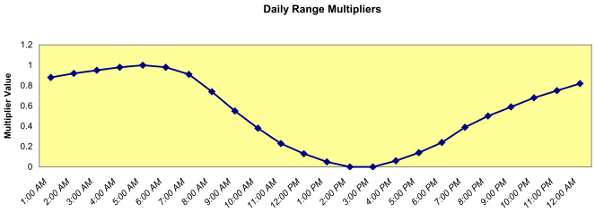

Figure 6. Default Daily range Multiplier for Design Days

The multipliers are taken from the ASHRAE 2009 HOF. More explicitly, EnergyPlus creates an air temperature for each timestep by using the entered maximum dry-bulb temperature in conjunction with the entered daily range and the above multiplier values. The actual equation used is shown below:

<div>\[{T_{current}} = {T_{Max}} - {T_{range}}\cdot {T_{Multiplier}}\]</div>

where

T<sub>current</sub>= Air temperature of current Hour of Day

T<sub>Max</sub>= User supplied Max Dry-bulb Temperature

T<sub>range</sub>= User supplied Daily Temperature Range

T<sub>Multiplier</sub>= Range multiplier as shown on the above graph

The range multiplier values represent typical conditions of diurnal temperatures (i.e. the low temperature for the day occurring about 5:00 AM and the maximum temperature for the day occurring about 3:00 PM.  Note that EnergyPlus does not shift the profile based on the time of solar noon as is optionally allowed in ASHRAE procedures.

ASHRAE research indicates that dry-bulb and wet-bulb temperatures typically follow the same profile, so EnergyPlus can use the default profile to generate humidity conditions (see Humidity Indicating Type = WetBulbProfileDefaultMultipliers below).

#### Field: Dry-Bulb Temperature Range Modifier Type

If you are happy with lows at 5am and highs at 3pm, you can ignore this field. If you want to specify your own temperature range multipliers (see earlier discussion at the Temperature Range field description), you can specify a type here and create a day schedule which you reference in the next field.

If you specify **MultiplierSchedule** in this field, then you need to create a day schedule that specifies a multiplier applied to the temperature range field (above) to create the proper dry-bulb temperature range profile for your design day.

If you specify **DifferenceSchedule** in this field, then you need to create a day schedule that specifies a number to be **subtracted** from dry-bulb maximum temperature for each timestep in the day. Note that numbers in the delta schedules cannot be negative as that would result in a higher maximum than the maximum previously specified.

If you specify **TemperatureProfileSchedule** in this field, then you need to create a day schedule that specifies the actual dry-bulb temperatures throughout the day. You will not need to include a Maximum Dry-Bulb Temperature in that field.

If you leave this field blank or enter **DefaultMultipliers**, then the default multipliers will be used as shown in the “temperature range” field above.

#### Field: Dry-Bulb Temperature Range Modifier Day Schedule Name

This field is the name of a **day schedule** (ref. Schedule:Day:Hourly, Schedule:Day:Interval, Schedule:Day:List objects) with the values as specified in the Dry-Bulb Temperature Range Modifier Type field above.

#### Field: Humidity Condition Type

The values/schedules indicated here and in subsequent fields create the humidity values in the 24 hour design day conditions profile. Valid choices here are: **WetBulb**, **Dewpoint**, **WetBulbProfileDefaultMultipliers, WetBulbProfileDifferenceSchedule,** **WetBulbProfileMultiplierSchedule**, **HumidityRatio**, **Enthalpy**, and **Schedule.**

The Humidity Condition Type fields have interacting uses and units, summarized as follows:

Table 2. Humidity Indicating Field Interactions - Design Day

<table class="table table-striped">
<tr>
<th>Humidity Condition Type</th>
<th>Primary Humidity Indicating Field</th>
<th>Humidity Indicating Day Schedule</th>
</tr>
<tr>
<td>WetBulb</td>
<td>Wetbulb or DewPoint at Maximum Dry-Bulb</td>
<td>N/A (unused)</td>
</tr>
<tr>
<td>DewPoint</td>
<td>Wetbulb or DewPoint at Maximum Dry-Bulb</td>
<td>N/A (unused)</td>
</tr>
<tr>
<td>HumidityRatio</td>
<td>Humidity Ratio at Maximum Dry-Bulb</td>
<td>N/A (unused)</td>
</tr>
<tr>
<td>Enthalpy</td>
<td>Enthalpy at Maximum Dry-Bulb</td>
<td>N/A (unused)</td>
</tr>
<tr>
<td>WetBulbProfileDefaultMultipliers</td>
<td>Wetbulb or DewPoint at Maximum Dry-Bulb</td>
<td>N/A (unused)</td>
</tr>
<tr>
<td>WetBulbProfileMultiplierSchedule</td>
<td>Wetbulb or DewPoint at Maximum Dry-Bulb</td>
<td>Fractions of wet-bulb daily range (0 – 1)</td>
</tr>
<tr>
<td>WetBulbProfileDifferenceSchedule</td>
<td>Wetbulb or DewPoint at Maximum Dry-Bulb</td>
<td>Difference between maximum and hour/timestep wet-bulb temperature, C</td>
</tr>
<tr>
<td>RelativeHumiditySchedule</td>
<td>N/A</td>
<td>Relative humidity (%, 0 – 100)</td>
</tr>
</table>

Humidity conditions over the day are derived as follows:

**WetBulb, DewPoint, HumidityRatio, or Enthalpy**:

These four methods assume constant absolute humidity over the day.  Calculate W = humidity ratio at Maximum Dry-Bulb Temperature and Humidity Indicating Conditions.  Derive hourly/timestep humidity conditions from W and hour/timestep dry-bulb temperature.

**WetBulbProfileDefaultMultipliers**

Generate the wet-bulb temperature profile using Default Daily Range Multiplier for Design Days (shown in Figure 6 above) and Daily Wet-Bulb Temperature Range (below).  This method is analogous to DefaultMultiplier generation of the dry-bulb temperature profile and is the procedure recommended in Chapter 14 of ASHRAE 2009 HOF.

**WetBulbProfileMultiplierSchedule**

Generate the wet-bulb profile using multipliers from the Humidity Indicating Day Schedule and Daily Wet-Bulb Temperature Range (below).  Analogous to dry-bulb MultiplierSchedule.

**WetBulbProfileDifferenceSchedule**

Generate the wet-bulb profile by subtracting Humidity Indicating Day Schedule values from the daily maximum wet-bulb temperature (specified in Humidity Indicating Conditions at Maximum Dry-Bulb).  Analogous to dry-bulb DifferenceSchedule.

**RelativeHumiditySchedule**

Hourly relative humidity is specified in Humidity Indicating Day Schedule.

In all cases, the humidity ratio is limited to saturation at the hour/timestep dry-bulb (that is, the dry-bulb temperature is used as specified, but the humidity ratio is modified as needed to be physically possible).  Once a valid air state is determined, a complete set of consistent hour/timestep psychrometric values (dewpoint, wet-bulb, and enthalpy) is derived.

#### Field: Wetbulb or DewPoint at Maximum Dry-Bulb

If you choose **Wetbulb** or **Dewpoint** in the Humidity Condition Type field, then this numeric field should contain that value. Note that this field is unnecessary when you put in a humidity indicating day schedule (described later in this section).

#### Field: Humidity Condition Day Schedule Name

Allows specification a day schedule (ref. Schedule:Day:Hourly, Schedule:Day:Interval, Schedule:Day:List objects) of values for relative humidity or wet-bulb profile per Humidity Indicating Type field.

#### Field: Humidity Ratio at Maximum Dry-Bulb

If **HumidityRatio** is chosen for the Humidity Condition Type field, then this numeric field should contain the desired humidity ratio at maximum dry-bulb temperature (units kg Water / kg Dry Air).

#### Field: Enthalpy at Maximum Dry-Bulb

If **Enthalpy** is chosen for the Humidity Condition Type field, then this numeric field should contain the desired enthalpy at maximum dry-bulb temperature (units Joules /kg).

#### Field: Daily Wet-Bulb Temperature Range

The difference between the maximum and minimum wet-bulb temperatures on the design day (Celsius).  Used for generating daily profiles of humidity conditions when Humidity Condition Type field (above) is **WetBulbProfileDefaultMultipliers** or **WetBulbProfileMultiplierSchedule**.  Values for wet-bulb temperature range are tabulated by month for 5564 locations worldwide on the CD that accompanies the ASHRAE 2009 HOF.

#### Field: Barometric Pressure

This numeric field is the constant barometric pressure (Pascals) for the entire day.

#### Field: Wind Speed

This numeric field is the wind speed in meters/second (constant throughout the day) for the day. The MacroDataSets design day files includes wind speed values (99.6% - heating, 1% cooling) as indicated in ASHRAE HOF design condition tables. But, you should be aware that traditional values for these are 6.7056 m/s (15 mph) for heating and 3.3528 m/s (7 mph) for cooling. A reminder is shown in the comments for the wind speed values. The comments also note the extreme wind speeds from the ASHRAE tables.

#### Field: Wind Direction

This numeric field is the source wind direction in degrees. By convention, winds from the North would have a value of 0., from the East a value of 90.

#### Field: Rain Indicator

This field indicates whether or not the building surfaces are wet. If the value is Yes, then it is assumed that the building surfaces are wet. Wet surfaces may change the conduction of heat through the surface.

#### Field: Snow Indicator

This field indicates whether or not there is snow on the ground. If the value is Yes, then it is assumed there is snow on the ground. Snow on the ground changes the ground reflectance properties.

#### Field: Daylight Saving Time Indicator

This field specifies whether to consider this day to be a Daylight Saving Day. Yes in the field indicates that daylight saving time is operational for this day. Yes essentially adds 1 hour to the scheduling times used in items with schedules.

#### Field: Solar Model Indicator

This field allows the user to select **ASHRAEClearSky, ASHRAETau, ZhangHuang, or Schedule** for solar modeling in the calculation of the solar radiation in the design day.  ASHRAEClearSky and ZhangHuang use the Clearness value as part of their calculations.  ASHRAETau invokes the revised model specified in Chapter 14 of the ASHRAE 2009 HOF and uses Taub and Taud values (below).  Technical details of the models are described in the Engineering Reference.  The **Schedule** choice allows you to enter schedule values for the day’s profile (use the next two fields for the names).

#### Field: Beam Solar Day Schedule Name

This field allows the option for you to put in your own day profile of beam solar values (wh/m2). These values will replace the calculated values during design day processing. Only day schedules (ref. Schedule:Day:Hourly, Schedule:Day:Interval, Schedule:Day:List objects) are used here.

#### Field: Diffuse Solar Day Schedule Name

This field allows the option for you to put in your own day profile of diffuse solar values (wh/m2).  These values will replace the calculated values during design day processing. Only day schedules (ref. Schedule:Day:Hourly, Schedule:Day:Interval, Schedule:Day:List objects) are used here.

#### Field: ASHRAE Clear Sky Optical Depth for Beam Irradiance (taub)

Optical depth for beam radiation, used only when Solar Model Indicator is ASHRAETau.  See next field.

#### Field: ASHRAE Clear Sky Optical Depth for Diffuse Irradiance (taud)

Optical depth for diffuse radiation, used only when Solar Model Indicator is ASHRAETau.  Taub and Taud values are tabulated by month for 5564 locations worldwide on the CD that accompanies the ASHRAE 2009 HOF.

#### Field: Sky Clearness

If the choice in the Solar Model Indicator field is ASHRAEClearSky or ZhangHuang, then this numeric field should be entered. This value represents the “clearness” value for the day. This value, along with the solar position as defined by the Location information and the date entered for the design day, help define the solar radiation values for each hour of the day. Clearness may range from 0.0 to 1.2, where 1.0 represents a clear sky at sea level.  Values greated than 1.0 may be used for high altitude locations. Traditionally, one uses 0.0 clearness for Winter Design Days. Note that this “sky clearness” does not have the same meaning as output variable “Site Daylighting Model Sky Clearness”.

IDF Examples:

```idf
! Phoenix Sky Harbor Intl Ap_AZ_USA Annual Cooling (WB=&gt;MDB)
!   .4%, MDB=35.8°C WB=24.5°C
 SizingPeriod:DesignDay,
  Phoenix Sky Harbor Intl Ap Ann Clg .4% Condns WB=&gt;MDB,     !- Name
          7,      !- Month
         21,      !- Day of Month
  SummerDesignDay,!- Day Type
       35.8,      !- Maximum Dry-Bulb Temperature {C}
         12,      !- Daily Dry-Bulb Temperature Range {C}
 DefaultMultipliers, !- Dry-Bulb Temperature Range Modifier Type
           ,      !- Dry-Bulb Temperature Range Modifier Schedule Name
    Wetbulb,      !- Humidity Condition Type
       24.5,      !- Wetbulb at Maximum Dry-Bulb {C}
           ,      !- Humidity Indicating Day Schedule Name
           ,      !- Humidity Ratio at Maximum Dry-Bulb {kgWater/kgDryAir}
           ,      !- Enthalpy at Maximum Dry-Bulb {J/kg}
           ,      !- Daily Wet-Bulb Temperature Range {deltaC}
     97342.,      !- Barometric Pressure {Pa}
        4.1,      ! Wind Speed {m/s}
        260,      !- Wind Direction {Degrees; N=0, S=180}
         No,      !- Rain {Yes/No}
         No,      !- Snow on ground {Yes/No}
         No,      !- Daylight Savings Time Indicator
       ASHRAETau, !- Solar Model Indicator
           ,      !- Beam Solar Day Schedule Name
           ,      !- Diffuse Solar Day Schedule Name
      0.588,     !- ASHRAE Clear Sky Optical Depth for Beam Irradiance (taub)
      1.653;  !- ASHRAE Clear Sky Optical Depth for Diffuse Irradiance (taud)


  SizingPeriod:DesignDay,
    Denver Centennial Golden Ann Htg 99% Condns DB - sched solar,  !- Name
    1,                       !- Month
    13,                      !- Day of Month
    WinterDesignDay,         !- Day Type
    -16,                     !- Maximum Dry-Bulb Temperature {C}
    0.0,                     !- Daily Dry-Bulb Temperature Range {deltaC}
    ,                        !- Dry-Bulb Temperature Range Modifier Type
    ,                    !- Dry-Bulb Temperature Range Modifier Schedule Name
    Wetbulb,                 !- Humidity Condition Type
    -16,                     !- Wetbulb or DewPoint at Maximum Dry-Bulb {C}
    ,                        !- Humidity Indicating Day Schedule Name
    ,               !- Humidity Ratio at Maximum Dry-Bulb {kgWater/kgDryAir}
    ,                        !- Enthalpy at Maximum Dry-Bulb {J/kg}
    ,                        !- Daily Wet-Bulb Temperature Range {deltaC}
    83411.,                  !- Barometric Pressure {Pa}
    2.3,                     !- Wind Speed {m/s}
    180,                     !- Wind Direction {deg}
    No,                      !- Rain Indicator
    No,                      !- Snow Indicator
    No,                      !- Daylight Saving Time Indicator
    Schedule,                !- Solar Model Indicator
    Winter (1/13) Beam Solar,!- Beam Solar Day Schedule Name
    Winter (1/13) Diffuse Solar;  !- Diffuse Solar Day Schedule Name


  Schedule:Day:Hourly,
    Winter (1/13) Beam Solar,
    Any Number,
    0,0,0,0,0,0,0,190,698,852,892,919,957,953,856,700,213,0,0,0,0,0,0,0;


  Schedule:Day:Hourly,
    Winter (1/13) Diffuse Solar,
    Any Number,
    0,0,0,0,0,0,0,35,118,116,92,65,40,14,0,0,5,0,0,0,0,0,0,0;
```


Look at the example files 1ZoneUncontrolled\_DDChanges.idf and 1ZoneUncontrolled\_DD2009 for several examples of specifying Design Day inputs.

### Sizing Period Design Day Outputs

For the schedule fields in the object, several output variables can be used:

* Zone,Average,Sizing Period Site Beam Solar Schedule Value [W/m2]

* Zone,Average,Sizing Period Site Diffuse Solar Schedule Value [W/m2]

* Zone,Average,Sizing Period Site Humidity Condition Schedule Value [%]

* Zone,Average,Sizing Period Site Humidity Condition Schedule Value []

* Zone,Average,Sizing Period Site Drybulb Temperature Range Modifier Schedule Value []

* Zone,Average,Sizing Period Site Drybulb Temperature Range Modifier Schedule Value [deltaC]

* Zone,Average,Sizing Period Site Drybulb Temperature Range Modifier Schedule Value [C]

* Zone,Average,Sizing Period Site Sky Temperature Schedule Value [deltaC]

* Zone,Average,Sizing Period Site Sky Temperature Schedule Value [C]


#### Sizing Period Site Beam Solar Schedule Value [W/m2]

#### Sizing Period Site Diffuse Solar Schedule Value [W/m2]

This schedule value is active when any Design Day objects have / use the solar schedule option. For those objects that don’t have this option, the value will be displayed as -999.

#### Sizing Period Site Humidity Condition Schedule Value [%]

#### Sizing Period Site Humidity Condition Schedule Value []

This schedule value is active when any Design Day objects have / use the humidity schedule option. For those objects that don’t have this option, the value will be displayed as -999.

#### Sizing Period Site Drybulb Temperature Range Modifier Schedule Value []

#### Sizing Period Site Drybulb Temperature Range Modifier Schedule Value [deltaC]

#### Sizing Period Site Drybulb Temperature Range Modifier Schedule Value [C]

This schedule value is active when any Design Day objects have / use the drybulb temperature range modifier chedule option. For those objects that don’t have this option, the value will be displayed as -999.

#### Sizing Period Site Sky Temperature Schedule Value [deltaC]

#### Sizing Period Site Sky Temperature Schedule Value [C]

This schedule value is active when any Design Day objects have / use the WeatherProperties:SkyTemperature schedule option. For those objects that don’t have this option, the value will be displayed as -999.

### Longer Design Periods

Some features may benefit by using a longer design weather period for sizing or loads calculations.  Longer design periods may be created by using the **SizingPeriod:WeatherFileDays** or **SizingPeriod:WeatherFileConditionType** objects.  These two objects allow for selections from an attached weather file to be used in the sizing calculations.

### SizingPeriod:WeatherFileDays

The SizingPeriod:WeatherFileDays object describes using a selected period from the “attached” weather file to be used in load calculations or sizing equipment.  The period selected can be as small as a single day or larger.  Multiple periods may be input. While this object may be used for sizing calculations, you should also consider using design days that represent more long term extremes or conditions.

#### Field: Name

This field allows for an assigned name for this run period so it can be tracked easily in sizing and other outputs.

#### Field: Begin Month

This numeric field should contain the starting month number (1=January, 2=February, etc.) for the annual run period desired.

#### Field: Begin Day of Month

This numeric field should contain the starting day of the starting month (must be valid for month) for the annual run period desired.

#### Field: End Month

This numeric field should contain the ending month number (1=January, 2=February, etc.) for the annual run period desired.

#### Field: End Day of Month

This numeric field should contain the ending day of the ending month (must be valid for month) for the annual run period desired.

#### Field: Day of Week for Start Day

For flexibility, the day of week indicated on the weather file can be overridden by this field’s value. Valid days of the week (Sunday, Monday, Tuesday, Wednesday, Thursday, Friday, Saturday) or special days (SummerDesignDay, WinterDesignDay, CustomDay1, CustomDay2) must be entered in this field. To clarify, this value will be used as the Start Day (type) for this sizing period. When weekdays are used, each subsequent day in the period will be incremented.  When SummerDesignDay, WinterDesignDay, CustomDay1, CustomDay2 – are used, the day type will be applied for the entire period.

#### Field: Use Weather File Daylight Saving Period

Weather files can contain indicators of Daylight Saving Period days. For flexibility, you may want to ignore these designations on the weather file. This field should contain the word **Yes** if you will accept daylight saving period days as contained on the weather file (note: not all weather files may actually have this period) or **No** if you wish to ignore Daylight Saving Period days that may be on the weather file.

Note that a blank or null field in this field will indicate **Yes**.

#### Field: Use Weather File Rain and Snow Indicators

Weather files can contain “rain” and “snow” indicators. (EPW field “Present Weather Codes” – described in the AuxiliaryPrograms document). In turn, rain indicates wet surfaces which changes the film convection coefficient for the surface. Other models may use rain as well (Ground Heat Exchangers). Snow indicators can change the ground reflectance if there is snow on the ground. Entering “**Yes**” in this field allows the weather file conditions to represent “Rain” and “Snow”;  entering “**No**” in the field “turns off” the rain/snow indicators for this period. You might use this to be able to compare two “same location” weather files of different years, origins, etc.

IDF Example:

```idf
SizingPeriod:WeatherFileDays,
    Summer including Extreme Summer days,  !- Name
    7,18,7,25,                             !- Begin/end Day/Month
    SummerDesignDay,                       !- Day type
    No,                          !- Use Weather File Daylight Saving Period
    No;                          !- Use Weather File Rain and Snow Indicators


  SizingPeriod:WeatherFileDays,
    Winter including Extreme Winter days,  !- Name
    1,25,2,1,                              !- Begin/end Day/Month
    WinterDesignDay,                       !- Day type
    No,                          !- Use Weather File Daylight Saving Period
    No;                          !- Use Weather File Rain and Snow Indicators
```


### SizingPeriod:WeatherFileConditionType

When the EPW files are created, a heuristic procedure identifies extreme and typical periods in the actual weather file.  This object will allow one of those periods to be selected for sizing or load calculations (typically). Multiple objects may be input. While this object may be used for sizing calculations, you should also consider using design days that represent more long term extremes or conditions.

#### Field: Name

This field allows for an assigned name for this run period so it can be tracked easily in sizing and other outputs.

#### Field: Period Selection

This field allows the generic period calculated from the weather file to be selected for this run period.  It is not completely generic as there may be extreme cold periods in some weather files but extreme wet periods (tropical) in others. Not all weather files have all of the valid choices. The choices for this field are:

- SummerExtreme

- SummerTypical

- WinterExtreme

- WinterTypical

- AutumnTypical

- SpringTypical

- WetSeason

- DrySeason

- NoDrySeason

- NoWetSeason

- TropicalHot

- TropicalCold

#### Field: Day of Week for Start Day

For flexibility, the day of week indicated on the weather file can be overridden by this field’s value. Valid days of the week (Sunday, Monday, Tuesday, Wednesday, Thursday, Friday, Saturday) or special days (SummerDesignDay, WinterDesignDay, CustomDay1, CustomDay2) must be entered in this field. To clarify, this value will be used as the Start Day (type) for this sizing period. When weekdays are used, each subsequent day in the period will be incremented.  When SummerDesignDay, WinterDesignDay, CustomDay1, CustomDay2 – are used, the day type will be applied for the entire period.

#### Field: Use Weather File Daylight Saving Period

Weather files can contain indicators of Daylight Saving Period days. For flexibility, you may want to ignore these designations on the weather file. This field should contain the word **Yes** if you will accept daylight saving period days as contained on the weather file (note: not all weather files may actually have this period) or **No** if you wish to ignore Daylight Saving Period days that may be on the weather file.

Note that a blank or null field in this field will indicate **Yes**.

#### Field: Use Weather File Rain and Snow Indicators

Weather files can contain “rain” and “snow” indicators. (EPW field “Present Weather Codes” – described in the AuxiliaryPrograms document). In turn, rain indicates wet surfaces which changes the film convection coefficient for the surface. Other models may use rain as well (Ground Heat Exchangers). Snow indicators can change the ground reflectance if there is snow on the ground. Entering “**Yes**” in this field allows the weather file conditions to represent “Rain” and “Snow”;  entering “**No**” in the field “turns off” the rain/snow indicators for this period. You might use this to be able to compare two “same location” weather files of different years, origins, etc.

IDF Example:

```idf
  SizingPeriod:WeatherFileConditionType,
    Extreme Summer Weather Period for Design,  !- Name
    SummerExtreme,                             !- Period Selection
    SummerDesignDay,                           !- Day Type
    No,                          !- Use Weather File Daylight Saving Period
    No;                          !- Use Weather File Rain and Snow Indicators


  SizingPeriod:WeatherFileConditionType,
    Extreme Winter Weather Period for Design,  !- Name
    WinterExtreme,                             !- Period Selection
    WinterDesignDay,                           !- Day Type
    No,                          !- Use Weather File Daylight Saving Period
    No;                          !- Use Weather File Rain and Snow Indicators
```


### RunPeriod

The RunPeriod object describes the elements necessary to create a weather file simulation. Multiple run periods may be input. EnergyPlus accepts weather files in the special EnergyPlus weather format (described briefly below this document and in more detail in the Auxiliary Programs document). These files can describe Daylight Saving Time periods as well as holidays within their definitions. The RunPeriod object allows the user to override the use of both the Daylight Saving Period (i.e. use or ignore) and holidays that are embedded within the weather file. Note that the weather file also may contain design condition information, typical and extreme period information, ground temperatures based on air temperature calculations.

#### Field: Name

This optional field allows the RunPeriod to be named for output reporting. When left blank, the weather file location name is used. Note that the weather file location name will be appened to this name in tabular/summary reports.

#### Field: Begin Month

This numeric field should contain the starting month number (1=January, 2=February, etc.) for the annual run period desired.

#### Field: Begin Day of Month

This numeric field should contain the starting day of the starting month (must be valid for month) for the annual run period desired.

#### Field: End Month

This numeric field should contain the ending month number (1=January, 2=February, etc.) for the annual run period desired.

#### Field: End Day of Month

This numeric field should contain the ending day of the ending month (must be valid for month) for the annual run period desired.

#### Field: Day of Week for Start Day

For flexibility, the day of week indicated on the weather file can be overridden by this field’s value. Valid days of the week (Sunday, Monday, Tuesday, Wednesday, Thursday, Friday, Saturday) must be entered in this field. To clarify, this value will be used as the Start Day (type) for this run period and subsequent days will be implemented. If a blank or UseWeatherFile is entered here, then the starting day type will be calculated from the weather file (ref: Auxiliary Programs document about Data Periods).

#### Field: Use Weather File Holidays and Special Days

Weather files can contain holiday designations or other kinds of special days. These day types cause a corresponding day’s schedule (see SCHEDULE definitions below) to be used during that day. This field should contain the word **Yes** if holidays or other special days indicated directly on the weather file should retain their “day type” or **No** if holidays or other special days on the weather file should be ignored. Reference the RunPeriodControl:SpecialDays object below to enter your own special days and holidays.

Note that a blank or null field in this field will indicate **Yes**.

#### Field: Use Weather File Daylight Saving Period

Weather files can contain indicators of Daylight Saving period days. For flexibility, you may want to ignore these designations on the weather file. This field should contain the word **Yes** if you will accept daylight saving period days as contained on the weather file (note: not all weather files may actually have this period) or **No** if you wish to ignore Daylight Saving period days that may be on the weather file.

Note that a blank or null field in this field will indicate **Yes**.

#### Field: Apply Weekend Holiday Rule

In some countries (notably the US), when holidays fall on weekends, they are often observed on a weekday close to the holiday day. (Usually if the specific day falls on a Saturday, the observed day is Friday; if on a Sunday, the observed day is Monday). EnergyPlus will represent this custom using the value in this field. If the field is **Yes**, then specific date holidays that have a duration of one day, will be “observed” on the Monday after the day. (Specific day holidays are such as January 1 – a day-month combination).  If the field is blank or **No**, then the holiday will be shown on the day-month as entered. As this option is listed at the RunPeriod, all applicable special days for the run will use the rule – there is no override for individual special days.

Note that a blank or null field in this field will indicate **No**.

Note: EnergyPlus processed weather files available on the EnergyPlus web site: http://www.energyplus.gov/cfm/weather_data.cfm have neither special days specified nor daylight saving period. However, DDY (Design Day) files produced from the ASHRAE Design Conditions that accompany the EPW files may include a DaylightSavingPeriod object for certain locations.

#### Field: Use Weather File Rain Indicators

Weather files can contain “rain” indicators. (EPW field “Present Weather Codes” – described in the AuxiliaryPrograms document). In turn, rain indicates wet surfaces which changes the film convection coefficient for the surface. Other models may use rain as well (Ground Heat Exchangers). Entering “**Yes**” in this field allows the weather file conditions to represent “Rain”;  entering “**No**” in the field “turns off” the rain indicator for this period. You might use this to be able to compare two “same location” weather files of different years, origins, etc.

#### Field: Use Weather File Snow Indicators

Weather files can contain “snow” indicators. (EPW field “Snow Depth” &gt; 0 indicates “Snow on the ground”). In turn, snow changes the reflectivity of the ground and cascades changes of this reflectivity. Entering “**Yes**” in this field allows the weather file conditions to represent “Snow”;  entering “**No**” in the field “turns off” the snow indicator for this period. You might use this to be able to compare two “same location” weather files of different years, origins, etc.

#### Field: Number of Times Runperiod to be Repeated

This numeric field represents the number of times (usually years) the simulation has to be carried out in a multi runperiod simulation. The default value is set to 1. The number of years of simulation, in case of a Ground Loop Heat Exchanger (GLHE) simulation, should be equal to the length of simulation field in GLHE object. Note that you can specify a number of simulation years with a shorter run period (e.g. 1 week) and EnergyPlus will repeat the simulation of the shorter run period for that many times. Note that repeating will work with any weather file that contains the start date and end date in a “Data Period” (refer to Auxiliary Programs document for more documentation on weather file contents).

#### Field: Increment Day of Week on Repeat

When repeating RunPeriods (see previous field), you can choose to increment the day of week at the end of the period to have a more continuous day type. Enter **Yes** to increment the day of the week (default). An entry of **No** will keep the same day of week values as in the first time through.

#### Field: Start Year

When repeating a period, you might (for whatever reason), choose to have a specific year as a starting year. Enter an appropriate 4 digit year in this field. Refer to Auxiliary Programs document for more documentation on weather file contents, particularly in using leap year data (or not) within weather files.

And, as shown in an IDF:

```idf
 RunPeriod,  ! Winter Simulation
    Winter Simulation,  !- Name
    12,  !- Begin Month
    1,  !- Begin Day of Month
    3,  !- End Month
    31,  !- End Day of Month
    UseWeatherFile,  !- Day of Week for Start Day
    Yes,  !- Use Weather File Holidays and Special Days
    Yes,  !- Use Weather File Daylight Saving Period
    No,  !- Apply Weekend Holiday Rule
    Yes,  !- Use Weather File Rain Indicators
    Yes;  !- Use Weather File Snow Indicators


 ! Multiple year simulation example
 RunPeriod,
    Multiple Years,  !- Name
    1,    !- Begin Month
    1,    !- Begin Day of Month
    12,   !- End Month
    31,   !- End Day of Month
    UseWeatherFile,  !- Day of Week for Start Day
    Yes,  !- Use Weather File Holidays and Special Days
    Yes,  !- Use Weather File Daylight Saving Period
    No,   !- Apply Weekend Holiday Rule
    Yes,  !- Use Weather File Rain Indicators
    Yes,  !- Use Weather File Snow Indicators
     3;   !- Number of Times Runperiod to be Repeated
```

### RunPeriod:CustomRange

The RunPeriod:CustomRange object describes the elements necessary to use a specially crafted (likely multiple year) weather file in a simulation. These kinds of weather files and simulations might be useful for matching utility periods or simulating several years of differing weather data. Multiple run periods may be input. EnergyPlus accepts weather files in the special EnergyPlus weather format (described briefly below this document and in more detail in the Auxiliary Programs document). In order to effectively use this object, however, you will need to use a text editor (EnergyPlus weather files area simple text files) or possibly a spreadsheet program and then save to a csv (comma separated variable) file. Weather files can describe Daylight Saving Time periods as well as holidays within their definitions. The RunPeriod:CustomRange object allows the user to override the use of both the Daylight Saving Period (i.e. use or ignore) and holidays that are embedded within the weather file. Note that the weather file also may contain design condition information, typical and extreme period information, ground temperatures based on air temperature calculations.

#### Field: Name

This optional field allows the RunPeriod to be named for output reporting. When left blank, the weather file location name is used. Note that the weather file location name will be appened to this name in tabular/summary reports.

#### Field: Begin Month

This numeric field should contain the starting month number (1=January, 2=February, etc.) for the annual run period desired.

#### Field: Begin Day of Month

This numeric field should contain the starting day of the starting month (must be valid for month) for the annual run period desired.

#### Field: Begin Year

This numeric field should contain the beginning year for the custom range. Though all EnergyPlus (EPW) weather files contain a year/year field, the RunPeriod object does not use this field (previous object). The **RunPeriod:CustomRange** object causes the program to look specifically for the begin date specified by these three fields (i.e. Begin Month, Begin Day of Month, Begin Year).

#### Field: End Month

This numeric field should contain the ending month number (1=January, 2=February, etc.) for the annual run period desired.

#### Field: End Day of Month

This numeric field should contain the ending day of the ending month (must be valid for month) for the annual run period desired.

#### Field: End Year

This numeric field should contain the end year for the custom range. Though all EnergyPlus (EPW) weather files contain a year/year field, the RunPeriod object does not use this field (previous object). The **RunPeriod:CustomRange** object causes the program to look specifically for the end date specified by these three fields (i.e. End Month, End Day of Month, End Year).

#### Field: Day of Week for Start Day

For flexibility, the day of week indicated on the weather file can be overridden by this field’s value. Valid days of the week (Sunday, Monday, Tuesday, Wednesday, Thursday, Friday, Saturday) must be entered in this field. To clarify, this value will be used as the Start Day (type) for this run period and subsequent days will be implemented. If a blank or UseWeatherFile is entered here, then the starting day type will be calculated from the weather file (ref: Auxiliary Programs document about Data Periods).

#### Field: Use Weather File Holidays and Special Days

Weather files can contain holiday designations or other kinds of special days. These day types cause a corresponding day’s schedule (see SCHEDULE definitions below) to be used during that day. This field should contain the word **Yes** if holidays or other special days indicated directly on the weather file should retain their “day type” or **No** if holidays or other special days on the weather file should be ignored. Reference the RunPeriodControl:SpecialDays object below to enter your own special days and holidays.

Note that a blank or null field in this field will indicate **Yes**.

#### Field: Use Weather File Daylight Saving Period

Weather files can contain indicators of Daylight Saving period days. For flexibility, you may want to ignore these designations on the weather file. This field should contain the word **Yes** if you will accept daylight saving period days as contained on the weather file (note: not all weather files may actually have this period) or **No** if you wish to ignore Daylight Saving period days that may be on the weather file.

Note that a blank or null field in this field will indicate **Yes**.

#### Field: Apply Weekend Holiday Rule

In some countries (notably the US), when holidays fall on weekends, they are often observed on a weekday close to the holiday day. (Usually if the specific day falls on a Saturday, the observed day is Friday; if on a Sunday, the observed day is Monday). EnergyPlus will represent this custom using the value in this field. If the field is **Yes**, then specific date holidays that have a duration of one day, will be “observed” on the Monday after the day. (Specific day holidays are such as January 1 – a day-month combination).  If the field is blank or **No**, then the holiday will be shown on the day-month as entered. As this option is listed at the RunPeriod, all applicable special days for the run will use the rule – there is no override for individual special days.

Note that a blank or null field in this field will indicate **No**.

Note: EnergyPlus processed weather files available on the EnergyPlus web site: http://www.energyplus.gov/cfm/weather_data.cfm have neither special days specified nor daylight saving period. However, DDY (Design Day) files produced from the ASHRAE Design Conditions that accompany the EPW files may include a DaylightSavingPeriod object for certain locations.

#### Field: Use Weather File Rain Indicators

Weather files can contain “rain” indicators. (EPW field “Present Weather Codes” – described in the AuxiliaryPrograms document). In turn, rain indicates wet surfaces which changes the film convection coefficient for the surface. Other models may use rain as well (Ground Heat Exchangers). Entering “**Yes**” in this field allows the weather file conditions to represent “Rain”;  entering “**No**” in the field “turns off” the rain indicator for this period. You might use this to be able to compare two “same location” weather files of different years, origins, etc.

#### Field: Use Weather File Snow Indicators

Weather files can contain “snow” indicators. (EPW field “Snow Depth” &gt; 0 indicates “Snow on the ground”). In turn, snow changes the reflectivity of the ground and cascades changes of this reflectivity. Entering “**Yes**” in this field allows the weather file conditions to represent “Snow”;  entering “**No**” in the field “turns off” the snow indicator for this period. You might use this to be able to compare two “same location” weather files of different years, origins, etc.

### RunPeriodControl:SpecialDays

For weather file run periods, special day run periods can be described. These will always be in effect for the selected days in the run period. Depending on the Use Special Days value in the RunPeriod:\* object(s), these can augment any special days included on the weather file.

Note: EnergyPlus processed weather files available on the EnergyPlus web site: http://www.energyplus.gov/cfm/weather_data.cfm have neither special days specified nor daylight saving period. However, DDY (Design Day) files produced from the ASHRAE Design Conditions that accompany the EPW files may include a DaylightSavingPeriod object for certain locations.

#### Field: Name

This alpha field is the title for the special day period. It must be unique among all the special day period objects entered.

#### Field: Start Date

This field is the starting date for the special day period. Dates in this field can be entered in several ways as shown in the accompanying table:

Table 3. Date Field Interpretation

<table class="table table-striped">
<tr>
<th>Field Contents</th>
<th>Interpretation</th>
</tr>
<tr>
<td>&lt;number&gt; / &lt;number&gt;</td>
<td>Month / Day</td>
</tr>
<tr>
<td>&lt;number&gt; Month</td>
<td>Day and Month</td>
</tr>
<tr>
<td>Month &lt;number&gt;</td>
<td>Day and Month</td>
</tr>
<tr>
<td>&lt;number&gt; Weekday in Month</td>
<td>Numbered weekday of month</td>
</tr>
<tr>
<td>Last Weekday In Month</td>
<td>Last weekday of month</td>
</tr>
</table>

In the table, Month can be one of (January, February, March, April, May, June, July, August, September, October, November, December). Abbreviations of the first three characters are also valid.

In the table, Weekday can be one of (Sunday, Monday, Tuesday, Wednesday, Thursday, Friday, Saturday). Abbreviations of the first three characters are also valid.

#### Field: Duration

This numeric field specifies how long (number of days) the special day period lasts.

#### Field: Special Day Type

This alpha field designates the “day type” for schedule use during the special period. It must be one of (Holiday, SummerDesignDay, WinterDesignDay, CustomDay1, CustomDay2).

An example in the IDF would be:

```idf
RunPeriodControl:SpecialDays, President’s Day, 3rd Monday in February,1,Holiday;
RunPeriodControl:SpecialDays, Thanksgiving, 4th Thursday in November, 1,Holiday;
RunPeriodControl:SpecialDays, Halloween, 10/31, 1, Holiday;
RunPeriodControl:SpecialDays, Vacation, 5/1, 14, CustomDay1;
```

### RunPeriodControl:DaylightSavingTime

Similar to a special day period, a daylight saving period may be entered to be applied to weather file run periods. These will always be in effect, regardless of the value entered on the RunPeriod object. Note that this period will always override any daylight saving period specified in a weather file.

Note: EnergyPlus processed weather files available on the EnergyPlus web site: http://www.energyplus.gov/cfm/weather_data.cfm have neither special days specified nor daylight saving period.

**Note:  For EnergyPlus Output:Variable and Output:Meter reporting, the time stamps are always in standard time. When daylight saving time is active, scheduled loads and controls will shift one hour relative to standard time.**

#### Field: Start Date

This is the starting date of the daylight saving period. Note that it can be entered in several formats as shown in Table 3. Date Field Interpretation.

#### Field: End Date

This is the ending date of the daylight saving period. Note that it can be entered in several formats as shown in Table 3. Date Field Interpretation.


And in the IDF:

```idf
! U.S. Standard for Daylight Saving
RunPeriodControl:DaylightSavingTime,2nd Sunday in March, 1st Sunday in November; !2007
! Brazil standard
RunPeriodControl:DaylightSavingTime,1st Sunday in October, Last Sunday in February;
! European Standard
RunPeriodControl:DaylightSavingTime, Last Sunday in March, Last Sunday in October;
! Syria Standard
RunPeriodControl:DaylightSavingTime, 4/1, 10/1;
```


Of course, these could not all appear in the same IDF as only one DaylightSavingPeriod object per input file is allowed. More information on Daylight Saving Periods can be seen on the web at: http://www.webexhibits.org/daylightsaving/  The ASHRAE Handbook of Fundamentals [ASHRAE 2005] also contains information about daylight saving periods and their climatic information now includes start and end dates for many locations.

### WeatherProperty:SkyTemperature

Sky Temperature, or radiative sky temperature, is internally calculated by EnergyPlus using an algorithm using horizontal infrared radiation from sky, cloudiness factors and current temperaure. The algorithm is fully described in the Engineering Reference document. For flexibility, the following object can be entered to override the internal calculations. Much of the literature describes the sky temperature as relative to either drybulb or dewpoint temperature.

#### Field: Name

This name references an existing design period (i.e., SizingPeriod:DesignDay, SizingPeriod:WeatherFileDays, or SizingPeriod:WeatherFileConditionType) or run period (by name or blank for all run periods).

#### Field: Calculation Type

Allowable entries here are: **ScheduleValue**, **DifferenceScheduleDryBulbValue**, or **DifferenceScheduleDewPointValue**. In each case the following field must specify a valid schedule name. **ScheduleValue** – the values in the schedule are used as the sky temperature. **DifferenceScheduleDryBulbValue** – the values in the schedule are used as a difference to the drybulb temperature value (+values would then be greater than the drybulb temperature, -values would then be less than the drybulb temperature) for the resulting sky temperature value. **DifferenceScheduleDewPointValue** – the values in the schedule are used as a difference to the dewpoint temperature value (+values would then be greater than the dewpoint temperature, -values would then be less than the dewpoint temperature) for the resulting sky temperature value.

#### Field: ScheduleName

This field specifies a schedule name to accomplish the sky temperature calculation from the previous field. A Schedule:Day:\* (i.e., Schedule:Day:Hourly, Schedule:Day:Interval, Schedule:Day:List) should be specified if the name in the name field matches a SizingPeriod:DesignDay object. If the name is one of the weather file period specifications (i.e. matches a SizingPeriod:WeatherFileDays, SizingPeriod:WeatherFileConditionType or RunPeriod), then the schedule name must match a full year schedule (i.e. Schedule:Year, Schedule:Compact, Schedule:File, or Schedule:Constant).

An example of IDF usage (with DesignDay):

```idf
  SizingPeriod:DesignDay,
    DENVER_STAPLETON Ann Clg 1% Sky Temperature modfier,  !- Name
    32.6,               !- Maximum Dry-Bulb Temperature {C}
    15.2,               !- Daily Temperature Range {deltaC}
    15.5,               !- Humidity Indicating Conditions at Maximum Dry-Bulb
    83411.,                  !- Barometric Pressure {Pa}
    4,                       !- Wind Speed {m/s}
    120,                     !- Wind Direction {deg}
    1.00,                    !- Sky Clearness
    0,                       !- Rain Indicator
    0,                       !- Snow Indicator
    25,                      !- Day of Month
    7,                       !- Month
    SummerDesignDay,         !- Day Type
    0,                       !- Daylight Saving Time Indicator
    WetBulb,                 !- Humidity Indicating Type
    ,                        !- Relative Humidity Day Schedule Name
    deltaschedule,           !- Dry-Bulb Temperature Range Modifier Type
    temp range deltas; !-   Dry-Bulb Temperature Range Modifier Schedule Name


  WeatherProperty:SkyTemperature,
    DENVER_STAPLETON Ann Clg 1% Sky Temperature modfier,  !- Name
    ScheduleValue,           !- Calculation Type
    DaySchedule5;            !- Schedule Name


  Schedule:Day:Interval,
    DaySchedule5,            !- Name
    Temperature,             !- Schedule Type Limits Name
    Yes,                     !- Interpolate to Timestep
    until: 24:00,            !- Time 1
    5;                       !- Value Until Time 1
```


### Site:WeatherStation

The Site:WeatherStation object is used to specify the measurement conditions for the climatic data listed in the weather file. These conditions indicate the height above ground of the air temperature sensor, the height above ground of the wind speed sensor, as well as coefficients that describe the wind speed profile due to the terrain surrounding the weather station. There are necessary correlations between the entries for this object and some entries in the Building object, specifically the **Terrain** field.

Weather stations throughout the world (ref: WMO – World Meteorological Organization) take their measurements at standard conditions:

- Air temperature is measured at approximately 1.5 m above ground

- Wind speed is measured at 10 m above ground

- Weather station is in a flat, open field with little protection from the wind.

When using weather data from standard sources (e.g., TMY2, IWEC, TMY, or ASHRAE design day data), it is not necessary to use the **Site:WeatherStation** object. However, if you are using custom weather data or real-time weather data, you may need to read and understand the concepts in the **Site:WeatherStation** object.

The measurement conditions at the weather station (i.e., the weather file) are used by EnergyPlus in conjunction with the *Terrain* field of the **Building** object, or optionally with the **Site:HeightVariation** object (see below), to calculate the local variation in atmospheric properties as a function of height above ground. Outdoor air temperature decreases with height, while wind speed increases with height. The algorithms for this calculation are in the Engineering Reference.

The **Site:WeatherStation** object is useful when working with a custom weather file that includes data that were not measured at the WMO standard conditions. For example, the weather data could be measured on site, or on the roof top of a nearby building. The wind speed profile coefficients can be estimated from the table below or calculated beforehand using more sophisticated techniques such as CFD modeling of the weather station terrain.

Table 4. Wind Speed Profile Coefficients (ASHRAE Fundamentals 2005).

<table class="table table-striped">
<tr>
<th>Terrain Description</th>
<th>Exponent</th>
<th>Bounhary Layer Thickness (m)</th>
</tr>
<tr>
<td>Flat, open country</td>
<td>0.14</td>
<td>270</td>
</tr>
<tr>
<td>Rough, wooded country</td>
<td>0.22</td>
<td>370</td>
</tr>
<tr>
<td>Towns and cities</td>
<td>0.33</td>
<td>460</td>
</tr>
<tr>
<td>Ocean</td>
<td>0.10</td>
<td>210</td>
</tr>
<tr>
<td>Urban, industrial, forest</td>
<td>0.22</td>
<td>370</td>
</tr>
</table>

If the **Site:WeatherStation** object is omitted from the input file, the WMO standard measurement conditions are assumed.

#### Field: Wind Sensor Height Above Ground

The height [m] above ground for the wind speed sensor.

#### Field: Wind Speed Profile Exponent

The wind speed profile exponent for the terrain surrounding the weather station. The exponent can be estimated from the table above or calculated beforehand using more sophisticated techniques, such as CFD modeling of the weather station terrain.

#### Field: Wind Speed Profile Boundary Layer Thickness

The wind speed profile boundary layer thickness [m] for the terrain surrounding the weather station. The boundary layer can be estimated from the table above or calculated beforehand using more sophisticated techniques, such as CFD modeling of the weather station terrain.

#### Field: Air Temperature Sensor Height Above Ground

The height [m] above ground for the air temperature sensor.

For example, if you are using weather data measured on the top of your building, you should set the *Wind Sensor Height Above Ground* and the *Air Temperature Sensor Height Above Ground* to equal the height of your building (say 30 m). The *Wind Speed Profile Exponent* and *Wind Speed Profile Boundary Layer Thickness* should be set to match the values associated with the *Terrain* field of the **Building** object, or the equivalent fields of the **Site:HeightVariation** object.

Or, in IDF terms, with a building in a town or city:

```idf
Site:WeatherStation,
    30,  !- Wind Sensor Height Above Ground {m}
    0.33,  !- Wind Speed Profile Exponent {}
    460,  !- Wind Speed Profile Boundary Layer Thickness {m}
    30;  !- Air Temperature Sensor Height Above Ground {m}
```


This would change if you had a different wind speed profile exponent or wind speed profile boundary layer thickness at your site.

### Site:HeightVariation

The Site:HeightVariation object is used to specify the local variation in atmospheric properties at the site and should be used only if you require advanced control over the height-dependent variations for wind speed and temperature. The coefficients set by this object are used by EnergyPlus, in conjunction with the Site:WeatherStation object (see above), to calculate the local variation in atmospheric properties as a function of height above ground. Outdoor air temperature decreases with height, while wind speed increases with height. The local outdoor air temperature and wind speed are calculated separately for all zones and surfaces, and optionally for outdoor air nodes for which a height has been specified (see OutdoorAir:Node object). With the default inputs, wind speed falls significantly at heights lower than the weather station measurement height, and temperature increases slightly. The algorithms for this calculation are in the Engineering Reference. There are necessary correlations between the entries for this object and some entries in the Building object, specifically the **Terrain** field.

Table 5. Atmospheric Variables at Two Different Heights Above Ground Level.

<table class="table table-striped">
<tr>
<th>Variable</th>
<th>1.5 m</th>
<th>284 m</th>
<th>Absolute Diff</th>
<th>Percent Diff</th>
</tr>
<tr>
<td>Air Temperature</td>
<td>15°C</td>
<td>13.15°C</td>
<td>1.85°C</td>
<td>12.3%</td>
</tr>
<tr>
<td>Barometric Pressure</td>
<td>101,325 Pa</td>
<td>97,960 Pa</td>
<td>3,365 Pa</td>
<td>3.3%</td>
</tr>
<tr>
<td>Wind Speed</td>
<td>2.46 m/s</td>
<td>7.75 m/s</td>
<td>5.29 m/s</td>
<td>215%</td>
</tr>
</table>


Note that using this object overrides the wind speed profile coefficients implied by the *Terrain* field of the **Building** object even if the wind speed profile fields are left blank. The wind speed profile coefficients can be estimated from the table above (see **Site:WeatherStation**) or calculated beforehand using more sophisticated techniques such as CFD modeling of the site terrain.

#### Field: Wind Speed Profile Exponent

The wind speed profile exponent for the terrain surrounding the site. The exponent can be estimated from the table above (see **Site:WeatherStation**) or calculated beforehand using more sophisticated techniques, such as CFD modeling of the site terrain. Note that using this object overrides the wind speed profile coefficients implied by the *Terrain* field of the **Building** object even if this field is left blank. This field can be set to zero to turn off all wind dependence on height.

#### Field: Wind Speed Profile Boundary Layer Thickness

The wind speed profile boundary layer thickness [m] for the terrain surrounding the site. The boundary layer can be estimated from the table above (see **Site:WeatherStation**) or calculated beforehand using more sophisticated techniques, such as CFD modeling of the site terrain. Note that using this object overrides the wind speed profile coefficients implied by the *Terrain* field of the **Building** object even if this field is left blank.

#### Field: Air Temperature Gradient Coefficient

The air temperature gradient coefficient [K/m] is a research option that allows the user to control the variation in outdoor air temperature as a function of height above ground. The real physical value is 0.0065 K/m. This field can be set to zero to turn off all temperature dependence on height. Note that the *Air Temperature Sensor Height* in the **Site:WeatherStation** object should also be set to zero in order to force the local outdoor air temperatures to match the weather file outdoor air temperature. This change is required because the **Site:WeatherStation** object assumes an air temperature gradient of 0.0065 K/m. This field can be set to zero to turn off all temperature dependence on height.

```idf
  Site:HeightVariation,
    0.22,  !- Wind Speed Profile Exponent
    370,  !- Wind Speed Profile Boundary Layer Thickness {m}
    0.0065;  !- Air Temperature Gradient Coefficient {deltaC/m}
```


### Site:GroundTemperature:BuildingSurface

Ground temperatures are used for the ground heat transfer model. There can be only one ground temperature object included, and it is used as the outside surface temperature for all surfaces with Outside Boundary Condition=Ground. The object is options if you have no surfaces with ground contact. The outside surface temperature for individual surfaces can be specified using the OtherSideCoefficients (ref: SurfaceProperty:OtherSideCoefficients) object that allows Toutside to be set with a schedule. This permits using any number of different outside face temperatures in addition to the ground temperature.

Caution: The “undisturbed” ground temperatures calculated by the weather converter should not be used in building losses but are appropriate to be used in the Site:GroundTemperature:Shallow and Site:GroundTemperature:Deep objects. The reasoning (for building losses) is that these values are too extreme for the soil under a conditioned building. For best results, use the Slab or Basement program described in this document to calculate custom monthly average ground temperatures (see the Ground Heat Transfer section). This is especially important for residential applications and very small buildings. If one of these ground temperature preprocessors is not used, for typical commercial buildings in the USA, a reasonable default value is 2C less than the average indoor space temperature.

More information about determining appropriate ground temperatures is given in the Auxiliary Programs document.

#### Field: Month Temperature(s) – 12 fields in all

Each numeric field is the monthly ground temperature (degrees Celsius) used for the indicated month (January=1<sup>st</sup> field, February=2<sup>nd</sup> field, etc.)

An IDF example:

```idf
Site:GroundTemperature:BuildingSurface,19,20,20,20,20,20,20,20,20,20,20,20;
```

### Site:GroundTemperature:Shallow

Site:GroundTemperature:Shallow are used by the Surface Ground Heat Exchanger (i.e. object: GroundHeatExchanger:Surface). Only one shallow ground temperature object can be included.

Note that the ground temperatures included in full year weather files may be suitable of being used for the values in these fields – namely, the .5 m depth temperatures that are calculated for “undisturbed” soil of “typical” conditions. However, you may wish to use some other change effect – based on the weather conditions of the building location.

This object may be used for objects requiring "undisturbed" ground temperatures. In these instances, the "name" input field is not required. 

#### Field: Month Temperature(s) – 12 fields in all

Each numeric field is the monthly surface ground temperature (degrees Celsius) used for the indicated month (January=1<sup>st</sup> field, February=2<sup>nd</sup> field, etc.)

An IDF example:

```idf
Site:GroundTemperature:Shallow,  4,4,6,6,10,10,15,15,14,14,8,8;
```


### Site:GroundTemperature:Deep

Site:GroundTemperature:Deep are used by the Pond Ground Heat Exchanger object (i.e. object: GroundHeatExchanger:Pond). Only one deep ground temperature object can be included.

Note that the ground temperatures included in full year weather files may be suitable of being used for the values in these fields – namely, the 4 m depth temperatures that are calculated for “undisturbed” soil of “typical” conditions. However, you may wish to use some other change effect – based on the weather conditions or special knowledge of the building location.

This object may be used for objects requiring "undisturbed" ground temperatures. In these instances, the "name" input field is not required. 

#### Field: Month Temperature(s) – 12 fields in all

Each numeric field is the monthly deep ground temperature (degrees Celsius) used for the indicated month (January=1<sup>st</sup> field, February=2<sup>nd</sup> field, etc.)

An IDF example:

```idf
Site:GroundTemperature:Deep,  16,16,16,16,16,16,16,16,16,16,16,16;
```


###Site:GroundTemperature:Undisturbed:FiniteDifference

Site:GroundTemperature:Undisturbed:FiniteDifference may be used by all objects requiring "undisturbed" ground temperatures. The object uses a 1D finite difference heat transfer model which uses the weather file to obtain surface boundary conditions. An annual simulation is run on the model during it's initialization until the annual ground temperature profile has reached steady periodic behavior. Once steady periodic behavior is reached, the ground tempeatures are cached for retrieval during the rest of the simulation.

#### Field: Soil Thermal Conductivity

The thermal conductivity of the soil, in W/m-K.

#### Field: Soil Density

The bulk density of the soil, in kg/m3.

#### Field: Soil Specific Heat

The specific heat of dry soil, in J/kg-K.

#### Field: Soil Moisture Content Volume Fraction

A nominal value of soil moisture content to be used when evaluating soil thermal properties.

#### Field: Soil Moisture Content Volume Fraction at Saturation

A nominal value of soil moisture content when the soil is saturated, this is used in evaluating thermal properties of freezing soil.

#### Field: Evapotranspiration Ground Cover Parameter

Numeric field specifies the ground cover effects used in the evapotranspiration model at the ground surface heat balance. The values range from 0 (solid, non-permeable ground surface) to 1.5 (wild growth).

An IDF example:

```
  Site:GroundTemperature:Undisturbed:FiniteDifference,
    FDTemps,     !- Name of object
    1.08,        !- Soil Thermal Conductivity {W/m-K}
    962,         !- Soil Density {kg/m3}
    2576,        !- Soil Specific Heat {J/kg-K}
    30,          !- Soil Moisture Content Volume Fraction {percent}
    50,          !- Soil Moisture Content Volume Fraction at Saturation {percent} 
    0.408;       !- Evapotranspiration Ground Cover Parameter
```


###Site:GroundTemperature:Undisturbed:KusduaAchenbach

Site:GroundTemperature:Undisturbed:KusudaAchenbach may be used by all objects requiring "undisturbed" ground temperatures. It provides an undisturbed ground temperature based on the correlation developed by Kusuda T. and P. Achenbach. 1965. The correlation uses three parameters for ground temperature at the surface to define a correlation for undisturbed ground temperatures as a function of depth and time. If one thinks of the ground temperature for a given depth as a sinusoid, the average ground temperature, amplitude (average difference between maximum ground temperature and minimum ground temperature), and the phase shift (day of minimum surface temperature) are all required to define the correlation.

If the parameters are left blank they can be autocalculated by including soil surface temperatures in the input using the Site:GroundTemperature:Shallow object. They can also be calculated by using the CalcSoilSurfTemp preprocessor. 

Kusuda, T. and P.R. Achenbach. 1965. 'Earth Temperatures and Thermal Diffusivity at Selected Stations in the United States.' *ASHRAE Transactions*. 71(1): 61-74.

#### Field: Soil Thermal Conductivity

The thermal conductivity of the soil, in W/m-K.

#### Field: Soil Density

The bulk density of the soil, in kg/m3.

#### Field: Soil Specific Heat

The specific heat of dry soil, in J/kg-K.

#### Field: Average Annual Ground Surface Temperature

This is the average ground surface temperature throughout the entire year, in °C.

#### Field: Average Amplitude of Annual Ground Surface Temperature

This is the average amplitude of the ground surface temperature, in °C.

#### Field: Phase Shift of Minimum Surface Temperature

This is day of the year which has the lowest ground surface temperature.

An IDF example:

```idf
  Site:GroundTemperature:Undisturbed:KusudaAchenbach,
    KATemps,    !- Name of object
    1.08,       !- Soil Thermal Conductivity {W/m-K}
    962,        !- Soil Density {kg/m3}
    2576,       !- Soil Specific Heat {J/kg-K}
    15.5,       !- Average Soil Surface Temperature {C}
    12.0,       !- Average Amplitude of Surface Temperature {deltaC}
    21;         !- Phase Shift of Minimum Surface Temperature {days}
```


###Site:GroundTemperature:Undisturbed:Xing

Site:GroundTemperature:Undisturbed:Xing may be used by all objects requiring "undisturbed" ground temperatures. It provides an undisturbed ground temperature based on the correlation developed by Xing, 2014. The correlation is a 5 parameter, 2 harmonic model based on the work of Lord Kelvin (Thomson, 1862). The average soil surface temperature and two sets of surface temperature amplitude and phase shift must be provided. Parameters for 4000+ international locations can be found in Xing, 2014.

Thomson, W. 1862. 'On the Reduction of Observations of Underground Temperature, with applications to Professor Forbes’ Edinburgh Observations and the continued Calton Hill Series.' Proceedings of the Royal Society of Edinburgh. IV: 342-346.

Xing, L. 2014. Estimations of Undisturbed Ground Temperatures using Numerical and Analytical Modeling. Ph.D. Diss. Oklahoma State University, Stillwater, OK.

#### Field: Soil Thermal Conductivity

The thermal conductivity of the soil, in W/m-K.

#### Field: Soil Density

The bulk density of the soil, in kg/m3.

#### Field: Soil Specific Heat

The specific heat of dry soil, in J/kg-K.

#### Field: Average Soil Surface Temperature

The average annual surface temperature of the soil, in deg C.

#### Field: Soil Surface Temperature Amplitude 1

First soil surface temperature amplitude parameter, in deg C.

#### Field: Soil Surface Temperature Amplitude 2

Second soil surface temperature amplitude parameter, in deg C.

#### Field: Phase Shift of Surface Temperature Amplitude 1

Phase shift of surface temperature amplitude 1, in days.

#### Field: Phase Shift of Surface Temperature Amplitude 2

Phase shift of surface temperature amplitude 2, in days.

An IDF example:

```
  Site:GroundTemperature:Undisturbed:Xing,
    Chicago-Ohare,    !- Name of object
    1.08,         !- Soil Thermal Conductivity {W/m-K}
    962,          !- Soil Density {kg/m3}
    2576,         !- Soil Specific Heat {J/kg-K}
    11.1,         !- Average Soil Surface Tempeature {C}
    13.4,         !- Soil Surface Temperature Amplitude 1 {deltaC}
    0.7,          !- Soil Surface Temperature Amplitude 2 {deltaC}
    25,           !- Phase Shift of Temperature Amplitude 1 {days}
    30;           !- Phase Shift of Temperature Amplitude 2 {days}
```


### Site:GroundDomain:Slab

This section documents the input object used to simulate ground coupled heat transfer with horizontal building surfaces within EnergyPlus. Horizontal ground surfaces within EnergyPlus interact with the Site:GroundDomain object by utilizing the SurfaceProperty:OtherSideConditionsModel object. By utilizing this object, multiple horizontal surfaces can be coupled to the same Site:GroundDomain object. Each horizontal surface may also have its unique ground domain, however, runtime will be adversely affected.

Generally, there are two scenarios which Site:GroundDomain is equipped to model: in-grade slabs, and on-grade slabs.

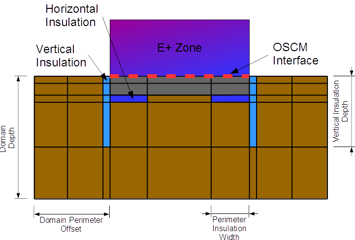

Figure 7In-grade configuration.

The in-grade slab option can be used to simulate situations when the upper slab surface is near the ground surface level. For this situation, slab’s upper surface must interact with the zone via an OSCM boundary. Due to this, the FloorConstruction object for the zone floor must include a thin layer of the upper floor material. Horizontal and vertical insulation are modeled by the GroundDomain in this scenario. Horizontal insulation can be modeled as covering the full horizontal surface, or it can be limited to the perimeter regions only. In the latter case, the perimeter insulation width must be specified.


Figure 8 On-grade configuration

The on-grade slab option can be used to simulate situations when the lower slab surface is near the ground surface level. In this situation, the entire floor must be included within the floor construction object. Vertical insulation is modeled by the GroundDomain in this scenario.  Horizontal insulation can only be modeled as covering the full horizontal surface.

#### Field: Name

Alpha field used as a unique identifier for each ground domain.

#### Field: Ground Domain Depth

Numeric field used to determine the depth of the simulation domain, in meters.

#### Field: Aspect Ratio

Numeric field used to define the height to width ratio of the slab.

#### Field: Perimeter Offset

Numeric field used to determine the distance from the slab perimeter to the domain perimeter, in meters.

#### Field: Soil Thermal Conductivity

The thermal conductivity of the soil, in W/m-K.

#### Field: Soil Density

The bulk density of the soil, in kg/m3.

#### Field: Soil Specific Heat

The specific heat of dry soil, in J/kg-K. If moisture is defined in this object, moisture and freezing effects are accounted for by varying the specific heat value.

#### Field: Soil Moisture Content Volume Fraction

A nominal value of soil moisture content to be used when evaluating soil thermal properties.

#### Field: Soil Moisture Content Volume Fraction at Saturation

A nominal value of soil moisture content when the soil is saturated, this is used in evaluating thermal properties of freezing soil.

#### Field: Type of Undisturbed Ground Temperature Object

This is the type of undisturbed ground temperature object that is used to determine the ground temperature.

#### Field: Name of Undisturbed Ground Temperature Object

This is the name of the undisturbed ground temperature object that is used to determine the ground temperature.

#### Field: Evapotranspiration Ground Cover Parameter

Numeric field specifies the ground cover effects used in the evapotranspiration model at the ground surface heat balance. The values range from 0 (solid, non-permeable ground surface) to 1.5 (wild growth).

#### Field: Slab Boundary Condition Model Name

This is the name of the other side boundary condition model used.

#### Field: Slab Location

Alpha field indicates whether the slab is in-grade (top surface level with ground surface) or on-grade (bottoms surface level with ground surface). Options include “ONGRADE” and “INGRADE”.

#### Field: Slab Material Name

Name of the material object representing the slab material. Only applicable to in-grade situations.

#### Field: Horizontal Insulation

Alpha field indicates whether horizontal insulation is present. Options include “YES” and “NO”. Only applicable to in-grade situations.

#### Field: Horizontal Insulation Material Name

Name of material object representing the horizontal slab insulation. Optional argument only required if horizontal insulation is present.

#### Field: Horizontal Insulation Extents

Alpha field indicates whether the horizontal slab insulation extends to cover the full horizontal area of the slab, or only covers the slab perimeter. Optional argument only required if horizontal insulation is present. Options include “FULL” and “PERIMETER”.

#### Field: Perimeter Insulation Width

Numeric field indicating the width of the perimeter insulation measured from the slab edge. Valid range from &gt; 0 to &lt; half of smallest slab width.

#### Field: Vertical Insulation

Alpha field indicates whether vertical insulation is present. Options include “YES” and “NO”.

#### Field: Vertical Insulation Name

Name of material object representing the vertical slab insulation. Optional argument only required if vertical insulation is present.

#### Field: Vertical Insulation Depth

Numeric field indicates the depth measured in meters from the ground surface to which the vertical perimeter insulation extends. Valid range from &gt; Slab Thickness to &lt; Domain Depth.

#### Field: Simulation Timestep

Alpha field indicating whether the domain will update temperatures at each zone timestep, or at hourly intervals. Options include “timestep” and “hourly”.

An IDF example of an in-grade slab.

```idf
Site:GroundDomain:Slab,
    IngradeCoupledSlab, !- Name
    5,                  !- Ground Domain Depth
    1,                  !- Aspect Ratio
    5,                  !- Domain Perimeter Offset
    1.8,                !- Soil Thermal Conductivity
    3200,               !- Soil Density
    836,                !- Soil Specific Heat
    30,                 !- Soil Moisture Content Volume Fraction
    50,                 !- Soil Moisture Content Volume Fraction at Saturation
    Site:GroundTemperature:Undisturbed:KusudaAchenbach, !- Type of Undisturbed Ground Temperature Object
    KATemps;                            !- Name of Undisturbed Ground Temperature Object
    1,    !- Evapotranspiration Ground Cover Parameter
    GroundCoupledOSCM,      !- Name of Floor Boundary Condition Model
    InGrade,                !- Slab Location (InGrade/OnGrade)
    Slab Material-In-grade, !- Slab Material Name
    Yes,                    !- Horizontal Insulation
    Slab Insulation,    !- Horizontal Insulation Material Name
    Perimeter,          !- Full Horizontal or Perimeter Only
    1,                  !- Perimeter insulation width
    Yes,                !- Vertical Insulation
    Slab Insulation,    !- Vertical Insulation Name
    2,                  !- Vertical perimeter insulation depth from surface
    Hourly;             !- Simulation timestep</td>
```

And IDF example of an on-grade slab

```idf
Site:GroundDomain:Slab,
    OngradeCoupledSlab, !- Name
    5,                  !- Ground Domain Depth {m}
    1,                  !- Aspect Ratio
    5,                  !- Domain Perimeter Offset {m}
    1.8,                !- Soil Thermal Conductivity {W/m-K}
    3200,               !- Soil Density {kg/m3}
    836,                !- Soil Specific Heat {J/kg-K}
    30,                 !- Soil Moisture Content Volume Fraction
    50,                 !- Soil Moisture Content Volume Fraction at Saturation
    Site:GroundTemperature:Undisturbed:KusudaAchenbach, !- Type of Undisturbed Ground Temperature Object
    KATemps;            !- Name of Undisturbed Ground Temperature Object
    1,                  !- Evapotranspiration Ground Cover Parameter
    GroundCoupledOSCM,  !- Name of Floor Boundary Condition Model
    OnGrade,            !- Slab Location (InGrade/OnGrade)
    ,                   !- Slab Material Name
    ,                   !- Horizontal Insulation (Yes/No)
    ,                   !- Horizontal Insulation Material Name
    ,                   !- Full Horizontal or Perimeter Only
    ,                   !- Perimeter insulation width (m)
    Yes,                !- Vertical Insulation (Yes/No)
    Slab Insulation,    !- Vertical Insulation Name
    2,                  !- Vertical perimeter insulation depth from surface
    Hourly;             !- Simulation timestep. (Timestep/Hourly)</td>
```

### Site:GroundDomain:Slab Outputs

The following output variables are available.

* Zone, Average, Zone Coupled Surface Heat Flux [W/m2]
* Zone, Average, Zone Coupled Surface Temperature [C]</td>

#### Zone Coupled Surface Heat Flux [W/m2]

This is the value of the heat flux provided to the GroundDomain as a boundary condition. This is calculated by taking the average heat flux of all surfaces coupled to the domain's SurfaceProperty:OtherSideConditionsModel model.

#### Zone Coupled Surface Temperature [C]

This is the value of the SurfaceProperty:OtherSideConditionsModel surface temperature. This is the temperature provided to the ground coupled surfaces as an outside boundary condition.

### Site:GroundDomain:Basement

This section documents the input object used to simulate ground coupled heat transfer with underground zones within EnergyPlus. Zone surfaces within EnergyPlus interact with the Site:GroundDomain:Basement object by utilizing the SurfaceProperty:OtherSideConditionsModel object. Two separate OSCM are required for the basement vertical and horizontal surfaces. Vertical wall surfaces will interact with the first OSCM while the horizontal floor surface will interact with the second OSCM. Basement floor and wall surfaces are constructed normally by using the BuildingSurface:Detailed object, with the outside boundary condition being the OtherSideConditionsModel for the basement floor or wall. The outside surface of the wall being the interface between the ground domain and the EnergyPlus zone. Horizontal and vertical ground insulation are simulated by the ground domain, and therefore should not be included in the wall and floor construction objects.


Figure: Basement Configuration

```idf
Site:GroundDomain:Basement,
    CoupledBasement,         !- Name
    10,                      !- Ground Domain Depth {m}
    1,                       !- Aspect ratio
    5,                       !- Perimeter offset {m}
    1.8,                     !- Soil Thermal Conductivity {W/m-K}
    3200,                    !- Soil Density {kg/m3}
    836,                     !- Soil Specific Heat {J/kg-K}
    30,                      !- Soil Moisture Content Volume Fraction {percent}
    50,                      !- Soil Moisture Content Volume Fraction at Saturation {percent}
    Site:GroundTemperature:Undisturbed:KusudaAchenbach, !- Type of Undisturbed Ground Temperature Object
    KATemps;                 !- Name of Undisturbed Ground Temperature Object
    1,                       !- Evapotranspiration Ground Cover Parameter
    BasementFloorOSCM,       !- Name of Basement Floor Boundary Condition Model
    Yes,                     !- Basement Horizontal Underfloor Insulation Present (Yes/No)
    Basement Insulation,     !- Basement Horizontal Insulation Underfloor Material Name
    Full,                    !- Full Horizontal or Perimeter Only (Full/Perimeter)
    ,                        !- Perimeter width (m)
    2.5,                     !- Depth of Basement Wall In Ground Domain {m}
    BasementWallOSCM,        !- Name of Basement Wall Boundary Condition Model
    Yes,                     !- Basement Wall Vertical Insulation Present(Yes/No)
    Basement Insulation,     !- Basement Wall Vertical Insulation Material Name
    2.5,                     !- Vertical insulation depth from surface (m)
    Hourly;                  !- Domain Update interval. (Timestep, Hourly)
    4;                       ! Mesh Density Parameter
```

#### Field: Name

Alpha field used as a unique identifier for each basement domain. Multiple basements domains can be simulated simultaneously, however, each domain must have a unique name. Additionally, despite the ability to simulate multiple domains simultaneously, these domains do not interact with each other and are treated as independent domains with boundary conditions given by the model parameters below.

#### Field: Ground Domain Depth

Numeric field used to determine the depth of the simulation domain, in meters. A value of 10 meters is the default.

#### Field: Aspect Ratio

Numeric field, which is the ratio of basement length to width, used to determine the aspect ratio of the basement. This field along with the total basement floor area, which is taken as the combination of all surfaces connected to the floor OtherSideConditionsModel, are used to determine the size and shape of the basement domain. Aspect ratios and the inverse of aspect ratios should produce identical results. i.e. AR = 2 equals AR = 0.5. This field has units of meters/meters.

#### Field: Domain Perimeter Offset

Numeric field used to determine the distance from the basement perimeter to the domain perimeter, in meters. A value of 5 is default.

#### Field: Soil Thermal Conductivity

The thermal conductivity of the soil, in W/m-K.

#### Field: Soil Density

The bulk density of the soil, in kg/m3.

#### Field: Soil Specific Heat

The specific heat of dry soil, in J/kg-K. If moisture is defined in this object, moisture and freezing effects are accounted for by varying the specific heat value.

#### Field: Soil Moisture Content Volume Fraction

A nominal value of soil moisture content to be used when evaluating soil thermal properties. 

#### Field: Soil Moisture Content Volume Fraction at Saturation

A nominal value of soil moisture content when the soil is saturated, this is used in evaluating thermal properties of freezing soil.

#### Field: Type of Undisturbed Ground Temperature Object

This is the type of undisturbed ground temperature object that is used to determine the ground temperature.

#### Field: Name of Undisturbed Ground Temperature Object

This is the name of the undisturbed ground temperature object that is used to determine the ground temperature.

#### Field: Evapotranspiration Ground Cover Parameter

Numeric field specifies the ground cover effects used in the evapotranspiration model at the ground surface heat balance. The values range from 0 (solid, non-permeable ground surface) to 1.5 (wild growth). Model can be sensitive to variations in this parameter, especially in dry climates.

#### Field: Basement Floor Boundary Condition Model Name

This is the name of the other side boundary condition model used for the basement floor surface. 

#### Field: Horizontal Insulation 

Alpha field indicates whether horizontal insulation is present. Options include “YES” and “NO”. 

#### Field: Horizontal Insulation Name

Name of material object representing the horizontal underfloor basement insulation. Optional argument only required if horizontal insulation is present.

#### Field: Horizontal Insulation Extents

Alpha field indicates whether the horizontal underfloor insulation extends to cover the full horizontal area of the basement floor, or only covers the basement floor perimeter. Optional argument only required if horizontal insulation is present. Options include “FULL” and “PERIMETER”.

#### Field: Perimeter Insulation Width

Numeric field indicating the width of the perimeter insulation measured from the basement floor edge. Valid range from > 0 to &lt; half of smallest basement floor width.

#### Field: Basement Depth

Depth of basement floor surface referenced from the ground surface, in meters. This domain should be the distance from the ground surface down to the basement floor surface. In cases where the ground surface is below the main above-ground building level, a separate wall surface should be employed between the basement walls and the main level walls.

#### Field: Basement Wall Boundary Condition Model Name

Name of the other side condition boundary model used for the basement walls.

#### Field: Vertical Insulation 

Alpha field indicates whether vertical insulation is present. Options include “YES” and “NO”.

#### Field: Vertical Insulation Name

Name of material object representing the vertical slab insulation. Optional argument only required if vertical insulation is present.

#### Field: Vertical Insulation Depth

Numeric field indicates the depth measured in meters from the ground surface to which the vertical perimeter insulation extends. Valid range from > 0 to &lt; Basement Depth.

#### Field: Simulation Timestep

Alpha field indicating whether the domain will update temperatures at each zone timestep, or at hourly intervals. Options include “timestep” and “hourly”.

#### Mesh Density Parameter

Integer field indicating the density of the finite difference ground domain cells between the basement and the far field boundaries. Default value is 4. Total number of ground domain cells, insulation cells, and ground surface cells are indicated as outputs to the eio file.

### Site:GroundDomain:Basement Outputs

The following output variables are available.

* Wall Interface Heat Flux

* Wall Interface Temperature

* Floor Interface Heat Flux

* Floor Interface Temperature

#### Wall Interface Heat Flux [W/m2]

This is the value of the heat flux provided to ground domain as a boundary condition for the basement walls. Should be equal to the basement wall outside heat flux.

#### Wall Interface Temperature [C]

This is the value of the SurfaceProperty:OtherSideConditionsModel surface temperature. This is the temperature provided to the basement wall surfaces as an outside boundary condition.

#### Floor Interface Heat Flux [W/m2]

This is the value of the heat flux provided to ground domain as a boundary condition for the basement floor. Should be equal to the basement floor outside heat flux.

#### Floor Interface Temperature [C]

This is the value of the SurfaceProperty:OtherSideConditionsModel surface temperature. This is the temperature provided to the ground coupled floor surfaces as an outside boundary condition.


### Site:GroundTemperature:FCfactorMethod

Site:GroundTemperature:FCfactorMethod is used only by the underground walls or slabs-on-grade or underground floors defined with C-factor (Construction:CfactorUndergroundWall) and F-factor (Construction:FfactorGroundFloor) method for code compliance calculations where detailed construction layers are unknown. Only one such ground temperature object can be included. The monthly ground temperatures for this object are close to the monthly outside air temperatures delayed by three months. If user does not input this object in the IDF file, it will be defaulted to the 0.5m set of monthly ground temperatures from the weather file if they are available. Entering these will also overwrite any ground temperatures from the weather file in the F and C factor usage. If neither is available, an error will result.

#### Field: Month Temperature(s) – 12 fields in all

Each numeric field is the monthly ground temperature (degrees Celsius) used for the indicated month (January=1<sup>st</sup> field, February=2<sup>nd</sup> field, etc.)

And, the IDF example:

```idf
Site:GroundTemperature:FCfactorMethod,  9.5, 3.5, -0.7, -1.7, -0.6, 3.6, 9.3, 14, 18.2, 22.7, 21.2, 16.8;
```


### Site:GroundReflectance

Ground reflectance values are used to calculate the ground reflected solar amount. This fractional amount (entered monthly) is used in this equation:

<div>\[{\rm{GroundReflectedSolar = (BeamSolar}} \bullet {\rm{COS(SunZenithAngle) + DiffuseSolar)}} \bullet {\rm{GroundReflectance}}\]</div>

Of course, the Ground Reflected Solar is never allowed to be negative. The ground reflectance can be further modified when snow is on the ground by the Snow Ground Reflectance Modifier. To use no ground reflected solar in your simulation, enter 0.0 for each month.

#### Field: Month Average Ground Reflectance(s) – 12 fields in all

Each numeric field is the monthly average reflectivity of the ground used for the indicated month (January=1<sup>st</sup> field, February=2<sup>nd</sup> field, etc.)

And use in an IDF:

```idf
  Site:GroundReflectance,
     0.600,     !January Ground Reflectance
     0.600,     !February Ground Reflectance
     0.400,     !March Ground Reflectance
     0.300,     !April Ground Reflectance
     0.200,     !May Ground Reflectance
     0.200,     !June Ground Reflectance
     0.200,     !July Ground Reflectance
     0.200,     !August Ground Reflectance
     0.200,     !September Ground Reflectance
     0.200,     !October Ground Reflectance
     0.300,     !November Ground Reflectance
     0.400;     !December Ground Reflectance
```

### Site:GroundReflectance:SnowModifier

It is generally accepted that snow resident on the ground increases the basic ground reflectance. EnergyPlus allows the user control over the snow ground reflectance for both “normal ground reflected solar” calculations (see above) and snow ground reflected solar modified for daylighting. These are entered under this object and both default to 1 (same as normal ground reflectance – no special case for snow which is a conservative approach).

#### Field: Ground Reflected Solar Modifier

This field is a decimal number which is used to modified the basic monthly ground reflectance when snow is on the ground (from design day input or weather data values).

<div>\[{\rm{GroundReflectanc}}{{\rm{e}}_{{\rm{used}}}} = {\rm{GroundReflectance}} \bullet Modifie{r_{Snow}}\]</div>

The actual Ground Reflectance is limited to [0.0,1.0].

#### Field: Daylighting Ground Reflected Solar Modifier

This field is a decimal number which is used to modified the basic monthly ground reflectance when snow is on the ground (from design day input or weather data values).

<div>\[{\rm{DaylightingGroundReflectanc}}{{\rm{e}}_{{\rm{used}}}} = {\rm{GroundReflectance}} \bullet Modifie{r_{Snow}}\]</div>

The actual Ground Reflectance is limited to [0.0,1.0].

An IDF example:

```idf
  Site:GroundReflectance:SnowModifier,
    1.0;                     !- Ground Reflected Solar Modifier
```

Outputs will show both the inputs from the above object as well as monthly values for both Snow Ground Reflectance and Snow Ground Reflectance for Daylighting.

### Site:WaterMainsTemperature

The Site:WaterMainsTemperature object is used to calculate water temperatures delivered  by underground water main pipes. The mains temperatures are used as default, make-up water temperature inputs for several plant objects, including:  **WaterUse:Equipment, WaterUse:Connections, WaterHeater:Mixed** and **WaterHeater:Stratified**. The mains temperatures are also used in the water systems objects to model the temperature of cold water supplies.

Water mains temperatures are a function of outdoor climate conditions and vary with time of year. A correlation has been formulated to predict water mains temperatures based on two weather inputs:

- average annual outdoor air temperature (dry-bulb)

- maximum difference in monthly average outdoor air temperatures

These values can be easily calculated from annual weather data using a spreadsheet or from the ".stat" file available with the EnergyPlus weather files at [www.energyplus.gov](http://www.energyplus.gov). Monthly statistics for dry-bulb temperatures are shown with daily averages. The daily averages are averaged to obtain the annual average. The maximum and minimum daily average are subtracted to obtain the maximum difference. For more information on the water mains temperatures correlation, see the *EnergyPlus Engineering Document*.

Alternatively, the Site:WaterMainsTemperature object can read values from a schedule. This is useful for measured data or when water comes from a source other than buried pipes, e.g., a river or lake.

If there is no Site:WaterMainsTemperature object in the input file, a default constant value of 10 C is assumed.

#### Field: Calculation Method

This field selects the calculation method and must have the keyword Schedule or Correlation.

#### Field: Schedule Name

If the calculation method is Schedule, the water mains temperatures are read from the schedule referenced by this field. If the calculation method is Correlation, this field is ignored.

#### Field: Annual Average Outdoor Air Temperature

If the calculation method is Correlation, this field is used in the calculation as the annual average outdoor air temperature (dry-bulb) [C]. If the calculation method is Schedule, this field is ignored.

#### Field: Maximum Difference In Monthly Average Outdoor Air Temperatures

If the calculation method is Correlation, this field is used in the calculation as the maximum difference in monthly average outdoor air temperatures [∆C]. If the calculation method is Schedule, this field is ignored.

```idf
  Site:WaterMainsTemperature,
    Correlation,  !- Calculation Method {SCHEDULE | CORRELATION}
    ,  !- Schedule Name
    9.69,  !- Annual Average Outdoor Air Temperature {C}
    28.1;  !- Maximum Difference In Monthly Average Outdoor Air Temperatures
           !- {deltaC}
```

### Site:Precipitation

The Site:Precipitation object is used to describe the amount of water precipitation at the building site over the course of the simulation run period. Precipitation includes both rain and the equivalent water content of snow. Precipitation is not yet described well enough in the many building weather data files. So this object can be used to provide the data using Schedule objects that define rates of precipitation in meters per hour.

A set of schedules for site precipitation have been developed for USA weather locations and are provided with EnergyPlus in the data set called PrecipitationSchedulesUSA.idf.  The user can develop schedules however they want. The schedules in the data set were developed using EnergyPlus’ weather file (EPW) observations and the average monthly precipitation for the closest weather site provided by NOAA. EPW files for the USA that were based on TMY or TMY2 include weather observations for Light/Moderate/Heavy rainfall, however most international locations do not include these observations. The values were modeled by taking the middle of the ranges quoted in the EPW data dictionary. The assumed piecewise function is shown below.

<div>\[Amount\,(m/hour) = \,\left\{ {\begin{array}{*{20}{c}}{Light = 0.0125}\\\{Moderate = 0.052}\\\{Heavy = 0.1}\end{array}} \right.\]</div>

The values were inserted on hour by hour basis for the month based on the observations. Then each month was rescaled to meet the average precipitation for the month based on the 30-year average (1971-2000) provided by the NOAA/NCDC. Therefore, the flags in the EPW file match the precipitation schedules for the USA. Note that summing the average monthly precipitation values will not give you the average yearly precipitiation. The resulting value may be lower or higher than the average yearly value.

Once the typical rainfall pattern and rates are scheduled, the Site:Precipitation object provides a method of shifting the total rainfall up or down for design purposes. Wetter or drier conditions can be modeled by changing the Design Annual Precipitation although the timing of precipitation throughout the year will not be changed.

#### Field: Precipitation Model Type

Choose rainfall modeling options. Only available option is ScheduleAndDesignLevel.

#### Field: Design Level for Total Annual Precipitation

Magnitude of total precipitation for an annual period to be used in the model. Value selected by the user to correspond with the amount of precipitation expected or being assumed for design purposes. The units are in meters. This field works with the following two fields to allow easily shifting the amounts without having to generate new schedules.

#### Field: Precipitation Rate Schedule Name

Name of a schedule defined elsewhere that describes the rate of precipitation. The precipitation rate schedule is analogous to weather file data. However, weather files for building simulation do not currently contain adequate data for such calculations. Therefore, EnergyPlus schedules are used to enter the pattern of precipitation events. The values in this schedule are the average rate of precipitation in meters per hour. The integration of these values over an annual schedule should equal the nominal annual precipitation.

#### Field: Average Total Annual Precipitation

Magnitude of annual precipitation associated with the rate schedule. This value is used to normalize the precipitation.

IDF example:

```idf
Site:Precipitation,
  ScheduledAndDesignLevel, !- Precipitation Model Type
  0.75,                    !- Design Level Total Annual Precipitation {m/yr}
  PrecipitationSchd,       !- Schedule Name for Precipitation Rates
  0.80771;                 !- Average Total Annual Precipitation {m/yr}
```


### RoofIrrigation

The RoofIrrigation object is used to describe the amount of irrigation on the ecoroof surface over the course of the simulation runperiod. This object is used to provide irrigation data using Schedule objects that define rates of irrigation in meters per hour. These schedules can be one of two types: Schedule, or SmartSchedule.

#### Field: Irrigation Model Type

Choose irrigation modeling options. Available options are **Schedule** and **SmartSchedule**. The **Schedule** type is used to force an irrigation schedule regardless of the current moisture state of the soil. The **SmartSchedule** type allows the precipitation schedule to be overridden if the current moisture state of the soil is greater than 40% saturated.

#### Field: Irrigation Rate Schedule Name

Name of a schedule defined elsewhere that describes the rate of irrigation. The values in this schedule are the average rate of irrigation in meters per hour.

#### Field: Irrigation Maximum Saturation Threshold

Used with the SmartSchedule option in the Irrigation Model Type field to override the default 40% saturation limit for turning off the irrigation: values of 0 to 100 (percent) can be entered with 40% being the default.

IDF example:

```idf
RoofIrrigation,
  Schedule, !- Irrigation Model Type
  IrrigationSchd; !- Schedule Name for Irrigation Rates
```


### Solar and Visible Spectrum Objects

The next two objects enable users to enter solar and visible spectrum which is used to calculate the thermal and visual performance of windows if their glazings are defined with full spectral data. EnergyPlus versions 8.0 and older hard-wired the solar and visible spectrum. The solar spectrum assumes air mass 1.5 terrestrial solar global spectral irradiance values (W/m2-micron) on a 37o tilted surface, based on ISO 9845-1 and ASTM E 892; derived from Optics5 data file ISO-9845GlobalNorm.std, 10-14-99. The visible/photopic spectrum is based on CIE 1931 observer; ISO/CIE 10527, CIE Standard Calorimetric Observers; derived from Optics5 data file "CIE 1931 Color Match from E308.txt", which is the same as WINDOW4 file Cie31t.dat.

### Site:SolarAndVisibleSpectrum

The SolarAndVisibleSpectrum object is used to specify the solar and visible spectrum data which is used as spectral weighting function to calculate the window performance (transmittance and absorptance) in EnergyPlus. This is a unique object, if it is missing from an IDF file, the default (same as EnergyPlus version 8.0) solar and visible spectrum data will be used.

#### Field: Name

This field specifies the name of the SolarAndVisibleSpectrum object.

#### Field: Spectrum Data Method

This field specifies the method used to enter the spectrum data. Two choices are available: Default and UserDefined. The choice Default will continue to use the hard-wired spectrum data in EnergyPlus (for backward compatibility). The choice UserDefined allows users to specify custom solar and visible spectrum data. The default choice is Default.

#### Field: Solar Spectrum Data Name

This field is required if the Spectrum Data Method is set to UserDefined. This field references a spectrum dataset for solar.

#### Field: Visible Spectrum Data Name

This field is required if the Spectrum Data Method is set to UserDefined. This field references a spectrum dataset for visible.

IDF example:

```idf
Site:SolarAndVisibleSpectrum,
  LocalSpectrum,             !- Name
  UserDefined,               !- Spectrum Data Method: Default, UserDefined
  SolarSpectrum,             !- Solar Spectrum Data Object Name
  VisibleSpectrum;           !- Visible Spectrum Data Object
```


### Site:SpectrumData

The Site:SpectrumData object holds the user defined solar or visible spectrum data. For solar spectrum, up to 107 pairs of (wavelength, spectrum) can be entered. For visible spectrum, up to 81 pairs can be entered.

#### Field: Name

This field specifies the name of the SpectrumData object. The name must be unique across all SpectrumData objects.

#### Field: Spectrum Data Type

This field specifies the type of spectrum data. Choices are Solar and Visible.

#### Field: Wavelength &lt;n&gt;

This field specifies the nth wavelength in micron.

#### Field: Spectrum &lt;n&gt;

This field specifies the nth spectrum corresponding to the nth wavelength.

IDF example:

```idf
Site:SpectrumData,
  SolarSpectrum,             !- Name
  Solar,                     !- Spectrum Data Type
  0.3,0,                     !- up to 107 pair of (wavelength, spectrum)
  0.305,3.4,
  0.31,15.6,
  0.315,41.1,
  0.32,71.2,
  0.325,100.2,
  0.33,152.4,
  0.335,155.6,
  0.34,179.4,
  0.345,186.7,
  0.35,212,
  0.36,240.5,
  0.37,324,
  0.38,362.4,
  ...;
```


### Climate Group Outputs

Climate related variables appear in two places for EnergyPlus outputs. Certain objects that are invariant throughout a simulation period have lines appear in the eplusout.eio file. For descriptions of this reporting, please see the Output Details and Examples document.

### Weather Data Related Outputs

Variables related to ambient environment data are available at timestep and higher resolutions. Below is a variable dictionary of these variables and subsequent definitions:

* Zone,Average,Site Outdoor Air Drybulb Temperature [C]

* Zone,Average,Site Outdoor Air Dewpoint Temperature [C]

* Zone,Average,Site Outdoor Air Wetbulb Temperature [C]

* Zone,Average,Site Outdoor Air Humidity Ratio [kgWater/kgAir]

* Zone,Average,Site Outdoor Air Relative Humidity [%]

* Zone,Average,Site Outdoor Air Barometric Pressure [Pa]

* Zone,Average,Site Wind Speed [m/s]

* Zone,Average,Site Wind Direction [deg]

* Zone,Average,Site Sky Temperature [C]

* Zone,Average,Site Horizontal Infrared Radiation Rate per Area [W/m2]

* Zone,Average,Site Diffuse Solar Radiation Rate per Area [W/m2]

* Zone,Average,Site Direct Solar Radiation Rate per Area [W/m2]

* Zone,Sum,Site Precipitation Depth [m]

* Zone,Average,Site Ground Reflected Solar Radiation Rate per Area [W/m2]

* Zone,Average,Site Ground Temperature [C]

* Zone,Average,Site Surface Ground Temperature [C]

* Zone,Average,Site Deep Ground Temperature [C]

* Zone,Average,Site Simple Factor Model Ground Temperature [C]

* Zone,Average,Site Outdoor Air Enthalpy [J/kg]

* Zone,Average,Site Outdoor Air Density [kg/m3]

* Zone,Average,Site Solar Azimuth Angle [deg]

* Zone,Average,Site Solar Altitude Angle [deg]

* Zone,Average,Site Solar Hour Angle [deg]

* Zone,Average,Site Rain Status []

* Zone,Average,Site Snow on Ground Status []

* Zone,Average,Site Exterior Horizontal Sky Illuminance [lux]

* Zone,Average,Site Exterior Horizontal Beam Illuminance [lux]

* Zone,Average,Site Exterior Beam Normal Illuminance [lux]

* Zone,Average,Site Sky Diffuse Solar Radiation Luminous Efficacy [lum/W]

* Zone,Average,Site Beam Solar Radiation Luminous Efficacy [lum/W]

* Zone,Average,Site Daylighting Model Sky Clearness []

* Zone,Average,Sky Brightness for Daylighting Calculation []

* Zone,Average,Site Daylight Saving Time Status []

* Zone,Average,Site Day Type Index []

* Zone,Average,Site Mains Water Temperature [C]

* HVAC,Average,Site Precipitation Rate [m/s]

* HVAC,Sum,Site Precipitation Depth [m]

* HVAC,Sum,Water System Roof Irrigation Scheduled Depth[m]

* HVAC,Sum,Water System Roof Irrigation Actual Depth[m]

Note that these data values may be interpolated from “hour” points (ref: Weather Data Hourly Interpolation). Most of the data values represent the “average” over the reporting resolution period.

#### Site Outdoor Air Drybulb Temperature [C]

This is the outdoor dry-bulb temperature in degrees C.

#### Site Outdoor Air Dewpoint Temperature [C]

This is the outdoor dewpoint temperature in degrees C.

#### Site Outdoor Air Wetbulb Temperature [C]

The outdoor wet-bulb temperature is derived (at the timestep) from the values for dry-bulb temperature, humidity ratio and barometric pressure.

#### Site Outdoor Air Humidity Ratio [kgWater/kgAir]

The outdoor humidity ratio is derived (at the timestep) from the dry-bulb temperature, relative humidity and barometric pressure.

#### Site Outdoor Air Relative Humidity [%]

This is the outdoor relative humidity expressed in percent.

#### Site Outdoor Air Barometric Pressure [Pa]

This is the atmospheric/barometric pressure in Pa.

#### Site Wind Speed [m/s]

This is the outdoor wind speed in m/s.

#### Site Wind Direction [deg]

This is the wind direction (N=0, E=90, S=180, W=270).

#### Site Sky Temperature [C]

The sky temperature is derived from horizontal infrared radiation intensity. It is expressed in degrees C. The default calculation is shown below but this value may be modified by the WeatherProperty:SkyTemperature object. Note that Sigma is the Stefan-Boltzmann constant in the following equation:

<div>\[Sky\;Temperature = {\left( {\frac{{Horizontal\;IR}}{{Sigma}}} \right)^{\frac{1}{4}}} - {273.15_{Conversion\;from\;Kelvin\;to\;Centigrade}}\]</div>

#### Site Horizontal Infrared Radiation Rate per Area [W/m2]

The horizontal infrared radiation intensity is expressed in W/m<sup>2</sup> based, if missing from the weather file, on opaque sky cover, sky emissivity, temperature and other factors. The general calculation of Site Horizontal Infrared Radiation Rate per Area is discussed in both the Engineering Reference and the Auxiliary Programs document.

#### Site Diffuse Solar Radiation Rate per Area [W/m2]

Diffuse solar is the amount of solar radiation in W/m<sup>2</sup> received from the sky (excluding the

solar disk) on a horizontal surface.

#### Site Direct Solar Radiation Rate per Area [W/m2]

Site Direct Solar Radiation Rate per Area is amount of solar radiation in W/m<sup>2</sup> received within a 5.7° field of view centered on the sun. This is also known as Beam Solar.

#### Site Precipitation Depth [m]

This is the amount of liquid precipitation (m). The source of this field may be the weather file or the Site:Precipitation object. The weather file values are in millimeters, but the report here is in meters. Two separate entities are displayed – from the weather file the key value is “Environment”; from the Site:Precipitation object the key value is Site:Precipitation.

If the weather file does not have a liquid precipitation field but does have the present weather fields, then a heuristic calculation is attempted for both flagging when it is raining and the amount of precipitation. If the weather file does have liquid precipitation fields, then the output (e.g. monthly) can be compared with the weather file stat file.

#### Site Ground Reflected Solar Radiation Rate per Area [W/m2]

The ground reflected solar amount (W/m<sup>2</sup>) is derived from the Beam Solar, Diffuse Solar, User specified Ground Reflectance (for month) and Solar Altitude Angle:

<div>\[Groundreflectedsolar = \left( {Beamsolar\cdot COS(SolarAltitudeAngle) + Diffusesolar} \right)\cdot {\rm{Groundreflectanc}}{{\rm{e}}_{{\rm{month}}}}\]</div>

where if the calculation returns a value &lt; 0.0, then 0.0 will be reported.

#### Site Ground Temperature [C]

The ground temperature is reported in degrees C – this is a user-specified input by month.

#### Site Surface Ground Temperature [C]

The ground temperature is reported in degrees C – this is a user-specified input (object: Site:GroundTemperature:Shallow) by month.

#### Site Deep Ground Temperature [C]

The ground temperature is reported in degrees C – this is a user-specified input (object: Site:GroundTemperature:Deep) by month.

#### Site Simple Factor Model Ground Temperature [C]

The Site Simple Factor Model Ground Temperature is reported in degrees C – this is a user-specified input (object: Site:GroundTemperature:FCfactorMethod) by month or gleaned from the weather file as noted in the description of the object.

#### Site Outdoor Air Enthalpy [J/kg]

Outdoor enthalpy is derived at each timestep from the Site Outdoor Air Drybulb Temperatureand the Site Outdoor Air Humidity Ratio. It is reported in J/kg.

#### Site Outdoor Air Density [kg/m3]

Outdoor air density is derived at each timestep from the Site Outdoor Air Barometric Pressure, the Outdoor Dry-bulb temperature and the Outdoor Humidity Ratio. It is reported in units kg/m<sup>3</sup>.

#### Site Solar Azimuth Angle [deg]

The Solar Azimuth Angle (f) is measured from the North (clockwise) and is expressed in degrees. This is shown more clearly in the following figure.


Figure 9. Solar Position Illustration

#### Site Solar Altitude Angle [deg]

The Solar Altitude Angle (b) is the angle of the sun above the horizontal (degrees).

#### Site Solar Hour Angle [deg]

The Solar Hour Angle (*H*) gives the apparent solar time for the current time period (degrees). It is common astronomical practice to express the hour angle in hours, minutes and seconds of time rather than in degrees. You can convert the hour angle displayed from EnergyPlus to time by dividing by 15. (Note that 1 hour is equivalent to 15 degrees;  360° of the Earth’s rotation takes place every 24 hours.)  The relationship of angles in degrees to time is shown in the following table:

Table 6. Relationship of Angles (degrees) to Time

<table class="table table-striped">
<tr>
<th>Unit of Angle</th>
<th>Equivalent time</th>
</tr>
<tr>
<td>1 radian</td>
<td>3.819719 hours</td>
</tr>
<tr>
<td>1 degree</td>
<td>4 minutes</td>
</tr>
<tr>
<td>1 arcmin</td>
<td>4 seconds</td>
</tr>
<tr>
<td>1 arcsec</td>
<td>0.066667 seconds</td>
</tr>
</table>

#### Site Rain Status []

This field shows whether or not (1=yes, 0=no) the weather shows “raining”. For a Design Day, one can denote rain for the entire day but not timestep by timestep. Weather files may indicate rain for a single time interval. This is an “averaged” field – thus a 1 shown for a time period (e.g. daily reporting) means that it was raining during each timestep of that period.

#### Site Snow on Ground Status []

This field shows whether or not (1=yes, 0=no) the weather shows “snow on the ground”. For a Design Day, one can denote snow for the entire day but not timestep by timestep. Weather files may indicate snow (snow depth) for a single time interval. This is an “averaged” field – thus a 1 shown for a time period (e.g. daily reporting) means that there was snow on the ground during each timestep of that period.

#### Site Daylight Saving Time Status []

This field shows when daylight saving time (1=yes, 0=no) is in effect. Though shown as an average variable, this value is only set on a daily basis.

#### Site Day Type Index []

This field shows what “day type” the current day is. Daytypes are (1=Sunday, 2=Monday, etc.) with Holiday=8, SummerDesignDay=9, WinterDesignDay=10, CustomDay1=11, CustomDay2=12. Though shown as an average variable, this value is only set on a daily basis.

#### Site Mains Water Temperature [C]

The value of the Water Mains Temperature is reported in C following the calculation shown in the Water Mains Temperature object.

#### Site Precipitation Rate [m/s]

#### Site Precipitation Depth [m]

The rate and quantity of precipitation at the site. These outputs are only available if a Site Precipication object is used. Precipitation is measured in meters.

#### Water System Roof Irrigation Scheduled Depth[m]

This is the scheduled amount of irrigation for the green roof (ecoroof) based on the user input. Amount is measured in meters.

#### Water System Roof Irrigation Actual Depth[m]

This is the actual amount of irrigation for the green roof (ecoroof) based on the scheduled user input and moisture state/saturation of the soil. Amount is measured in meters.

### Outputs for local temperature/wind speed calculations

Local atmospheric properties for outdoor air temperature and wind speed are separately calculated and reported for all zones, surfaces, and outdoor air nodes. The output variables are associated with their respective objects:

* Zone,Average,Zone Outdoor Air Drybulb Temperature [C]

* Zone,Average,Zone Outdoor Air Wetbulb Temperature [C]

* Zone,Average,Zone Outdoor Air Wind Speed [m/s]

* Zone,Average,Surface Ext Outdoor Dry Bulb [C]

* Zone,Average,Surface Ext Outdoor Wet Bulb [C]

* Zone,Average,Surface Ext Wind Speed [m/s]

* HVAC,Average,System Node Temperature [C]        (for OUTDOOR AIR NODE object)


#### Zone Outdoor Air Drybulb Temperature [C]

The outdoor air dry-bulb temperature calculated at the height above ground of the zone centroid.

#### Zone Outdoor Air Wetbulb Temperature [C]

The outdoor air wet-bulb temperature calculated at the height above ground of the zone centroid.

#### Zone Outdoor Air Wind Speed [m/s]

The outdoor wind speed calculated at the height above ground of the zone centroid.

#### Surface Ext Outdoor Dry Bulb [C]

The outdoor air dry-bulb temperature calculated at the height above ground of the surface centroid.

#### Surface Ext Outdoor Wet Bulb [C]

The outdoor air wet-bulb temperature calculated at the height above ground of the surface centroid.

#### Surface Ext Wind Speed [m/s]

The outdoor wind speed calculated at the height above ground of the surface centroid.

#### System Node Temperature [C]

When reporting for the **OutdoorAir:Node** object, this is the outdoor air dry-bulb temperature calculated at the height above ground of the node, if height is specified in the input.

Group -- Schedules
------------------

This group of objects allows the user to influence scheduling of many items (such as occupancy density, lighting, thermostatic controls, occupancy activity). In addition, schedules are used to control shading element density on the building.

EnergyPlus schedules consist of three pieces:  a day description, a week description, and an annual description. An optional element is the schedule type. Each description level builds off the previous sub-level. The day description is simply a name and the values that span the 24 hours in a day to be associated with that name. The week description also has an identifier (name) and twelve additional names corresponding to previously defined day descriptions. There are names for each individual day of the week plus holiday, summer design day, winter design day and two more custom day designations. Finally, the annual schedule contains an identifier and the names and FROM-THROUGH dates of the week schedules associate with this annual schedule. The annual schedule can have several FROM-THROUGH date pairs.  One type of schedule reads the values from an external file to facilitate the incorporation of monitored data or factors that change throughout the year.

Schedules are processed by the EnergyPlus Schedule Manager, stored within the Schedule Manager and are accessed through module routines to get the basic values (timestep, hourly, etc). Values are resolved at the Zone Timestep frequency and carry through any HVAC timesteps.

### Day Type

A brief description of “Day Type” which is used in the SizingPeriod objects, RunPeriodControl:SpecialDays object, the Sizing objects and also used by reference in the Schedule:Week:Daily object (discussed later in this section).

Schedules work on days of the week as well as certain specially designated days. Days of the week are the normal – Sunday, Monday, Tuesday, Wednesday, Thursday, Friday and Saturday. Special day types that can be designated are: Holiday, SummerDesignDay, WinterDesignDay, CustomDay1, CustomDay2. These day types can be used at the user’s convenience to designate special scheduling (e.g. lights, electric equipment, set point temperatures) using these days as reference.

For example, a normal office building may have normal “occupancy” rules during the weekdays but significantly different use on weekend. For this, you would set up rules/schedules based on the weekdays (Monday through Friday, in the US) and different rules/schedules for the weekend (Saturday and Sunday, in the US). However, you could also specially designate SummerDesignDay and WinterDesignDay schedules for sizing calculations. These schedules can be activated by setting the Day Type field in the Design Day object to the appropriate season (**SummerDesignDay** for cooling design calculations; **WinterDesignDay** for heating design calculations).

In a different building, such as a theater/playhouse, the building may only have occupancy during certain weeks of the year and/or certain hours of certain days. If it was every week, you could designate the appropriate values during the “regular” days (Sunday through Saturday). But this would also be an ideal application for the “CustomDay1” and/or “CustomDay2”. Here you would set the significant occupancy, lighting, and other schedules for the custom days and use unoccupied values for the normal weekdays. Then, using a weather file and setting special day periods as appropriate, you will get the “picture” of the building usage during the appropriate periods.

### ScheduleTypeLimits

Schedule types can be used to validate portions of the other schedules. Hourly day schedules, for example, are validated by range -- minimum/maximum (if entered) -- as well as numeric type (continuous or discrete). Annual schedules, on the other hand, are only validated for range – as the numeric type validation has already been done.

#### Field: Name

This alpha field should contain a unique (within the schedule types) designator. It is referenced wherever Schedule Type Limits Names can be referenced.

#### Field: Lower Limit Value

In this field, the lower (minimum) limit value for the schedule type should be entered. If this field is left blank, then the schedule type is not limited to a minimum/maximum value range.

#### Field: Upper Limit Value

In this field, the upper (maximum) limit value for the schedule type should be entered. If this field is left blank, then the schedule type is not limited to a minimum/maximum value range.

#### Field: Numeric Type

This field designates how the range values are validated. Using **Continuous** in this field allows for all numbers, including fractional amounts, within the range to be valid. Using **Discrete** in this field allows only integer values between the minimum and maximum range values to be valid.

#### Field: Unit Type

This field is used to indicate the kind of units that may be associated with the schedule that references the ScheduleTypeLimits object. It is used by IDF Editor to display the appropriate SI and IP units. This field is not used by EnergyPlus. The available options are shown below. If none of these options are appropriate, select **Dimensionless.**

- Dimensionless

- Temperature

- DeltaTemperature

- PrecipitationRate

- Angle

- Convection Coefficient

- Activity Level

- Velocity

- Capacity

- Power

- Availability

- Percent

- Control

- Mode

Several IDF Examples will illustrate the use:

```idf
ScheduleTypeLimits,Any Number;  ! Not limited
ScheduleTypeLimits,Fraction, 0.0 , 1.0 ,CONTINUOUS;
ScheduleTypeLimits,Temperature,-60,200,CONTINUOUS;
ScheduleTypeLimits,Control Type,0,4,DISCRETE;
ScheduleTypeLimits,On/Off,0,1,DISCRETE;
```


### Day Schedules

The day schedules perform the assignment of pieces of information across a 24 hour day. This can occur in various fashions including a 1-per hour assignment, a user specified interval scheme or a list of values that represent an hour or portion of an hour.

### Schedule:Day:Hourly

The Schedule:Day:Hourly contains an hour-by-hour profile for a single simulation day.

#### Field: Name

This field should contain a unique (within all DaySchedules) designation for this schedule. It is referenced by WeekSchedules to define the appropriate schedule values.

#### Field: Schedule Type Limits Name

This field contains a reference to the Schedule Type Limits object. If found in a list of Schedule Type Limits (see ScheduleTypeLimits object above), then the restrictions from the referenced object will be used to validate the hourly field values (below).

#### Field: Hour Values (1-24)

These fields contain the hourly values for each of the 24 hours in a day. (Hour field 1 represents clock time 00:00:01 AM to 1:00:00 AM, hour field 2 is 1:00:01 AM to 2:00:00 AM, etc.)  The values in these fields will be passed to the simulation as indicated for “scheduled” items.

An IDF example:

```idf
Schedule:Day:Hourly, Day On Peak, Fraction,
  0.,0.,0.,0.,0.,0.,0.,0.,0.,1.,1.,1.,1.,1.,1.,1.,1.,1.,0.,0.,0.,0.,0.,0.;
```


### Schedule:Day:Interval

The Schedule:Day:Interval introduces a slightly different way of entering the schedule values for a day. Using the intervals, you can shorten the “hourly” input of the “Schedule:Day:Hourly” object to 2 fields. And, more importantly, you can enter an interval that represents only a portion of an hour. Schedule values are “given” to the simulation at the zone timestep, so there is also a possibility of “interpolation” from the entries used in this object to the value used in the simulation.

#### Field: Name

This field should contain a unique (within all DaySchedules) designation for this schedule. It is referenced by WeekSchedules to define the appropriate schedule values.

#### Field: Schedule Type Limits Name

This field contains a reference to the Schedule Type Limits object. If found in a list of Schedule Type Limits (see ScheduleTypeLimits object above), then the restrictions from the referenced object will be used to validate the hourly field values (below).

#### Field: Interpolate to Timestep

The value contained in this field directs how to apply values that aren’t coincident with the given timestep (ref: Timestep) intervals. If “Yes” is entered, then any intervals entered here will be interpolated/averaged and that value will be used at the appropriate minute in the hour. If “No” is entered, then the value that occurs on the appropriate minute in the hour will be used as the schedule value.

For example, if “yes” is entered and the interval is every 15 minutes (say a value of 0 for the first 15 minutes, then .5 for the second 15 minutes) AND there is a 10 minute timestep for the simulation: the value at 10 minutes will be 0 and the value at 20 minutes will be .25. For the same input entries but “no” for this field, the value at 10 minutes will be 0 and the value at 20 minutes will be .5.

#### Field-Set: Time and Value (extensible object)

To specify each interval, both an “until” time (which includes the designated time) and the value must be given.

#### Field: Time

The value of each field should represent clock time (standard) in the format “Until: HH:MM”. 24 hour clock format (i.e. 1PM is 13:00) is used. Note that Until: 7:00 includes all times up through 07:00 or 7am.

#### Field: Value

This represents the actual value to be passed to the simulation at the appropriate timestep. (Using interpolation value as shown above). Limits on the values are indicated by the Schedule Type Limits Name field of this object.

And an example of use:

```idf
Schedule:Day:Interval,
    dd winter rel humidity,  !- Name
    Percent,                 !- Schedule Type Limits Name
    No,                      !- Interpolate to Timestep
    until: 24:00,             !- Time 1
    74;                      !- Value Until Time 1
```


### Schedule:Day:List

To facilitate possible matches to externally generated data intervals, this object has been included. In similar fashion to the Schedule:Day:Interval object, this object can also include “sub-hourly” values but must represent a complete day in its list of values.

#### Field: Name

This field should contain a unique (within all day schedules) designation for this schedule. It is referenced by week schedules to define the appropriate schedule values.

#### Field: Schedule Type Limits Name

This field contains a reference to the Schedule Type Limits object. If found in a list of Schedule Type Limits (see ScheduleTypeLimits object above), then the restrictions from the referenced object will be used to validate the hourly field values (below).

#### Field: Interpolate to Timestep

The value contained in this field directs how to apply values that aren’t coincident with the given timestep (ref: Timestep) intervals. If “Yes” is entered, then any intervals entered here will be interpolated/averaged and that value will be used at the appropriate minute in the hour. If “No” is entered, then the value that occurs on the appropriate minute in the hour will be used as the schedule value.

For example, if “yes” is entered and the minutes per item is 15 minutes (say a value of 0 for the first 15 minutes, then .5 for the second 15 minutes) AND there is a 10 minute timestep for the simulation: the value at 10 minutes will be 0 and the value at 20 minutes will be .25. For the same input entries but “no” for this field, the value at 10 minutes will be 0 and the value at 20 minutes will be .5.

#### Field: Minutes Per Item

This field allows the “list” interval to be specified in the number of minutes for each item. The value here must be &lt;= 60 and evenly divisible into 60 (same as the timestep limits).

#### Field Value 1 (same definition for each value – up to 1440 (24\*60) allowed)

This is the value to be used for the specified number of minutes.

For example:

```idf
Schedule:Day:List,
  Myschedule,  ! name
  Fraction,   ! Schedule type
  No,   ! Interpolate value
  30,   ! Minutes per item
  0.0,  ! from 00:01 to 00:30
  0.5,  ! from 00:31 to 01:00
  <snipped>
```


### Week Schedule(s)

The week schedule object(s) perform the task of assigning the day schedule to day types in the simulation. The basic week schedule is shown next.

### Schedule:Week:Daily

#### Field: Name

This field should contain a unique (within all WeekSchedules) designation for this schedule. It is referenced by Schedules to define the appropriate schedule values.

#### Field: Schedule Day Name Fields (12 day types – Sunday, Monday, … )

These fields contain day schedule names for the appropriate day types. Days of the week (or special days as described earlier) will then use the indicated hourly profile as the actual schedule value.

An IDF example:

```idf
Schedule:Week:Daily, Week on Peak,
        Day On Peak,Day On Peak,Day On Peak,
        Day On Peak,Day On Peak,Day On Peak,
        Day On Peak,Day On Peak,Day On Peak,
        Day On Peak,Day On Peak,Day On Peak;
```


### Schedule:Week:Compact

Further flexibility can be realized by using the Schedule:Week:Compact object. In this the fields, after the name is given, a “for” field is given for the days to be assigned and then a dayschedule name is used.

#### Field:Name

This field should contain a unique (within all WeekSchedules) designation for this schedule. It is referenced by Schedules to define the appropriate schedule values.

#### Field-Set – DayType List\#, Schedule:Day Name \#

Each assignment is made in a pair-wise fashion. First the “days” assignment and then the dayschedule name to be assigned. The entire set of day types must be assigned or an error will result.

#### Field: DayType List \#

This field can optionally contain the prefix “For” for clarity. Multiple choices may then be combined on the line. Choices are: Weekdays, Weekends, Holidays, Alldays, SummerDesignDay, WinterDesignDay, Sunday, Monday, Tuesday, Wednesday, Thursday, Friday, Saturday, CustomDay1, CustomDay2. In fields after the first “for”, AllOtherDays may also be used. Note that the colon (:) after the For is optional but is suggested for readability.

#### Field: Schedule:Day Name \#

This field contains the name of the day schedule (any of the Schedule:Day object names) that is to be applied for the days referenced in the prior field.

Some IDF examples:

```idf
Schedule:Week:Compact, Week on Peak,
        For: AllDays,
        Day On Peak;
Schedule:Week:Compact, WeekDays on Peak,
        WeekDays,
        Day On Peak,
        AllOtherDays
        Day Off Peak;
```


### Schedule:Year

The yearly schedule is used to cover the entire year using references to week schedules (which in turn reference day schedules). If the entered schedule does not cover the entire year, a fatal error will result.

#### Field: Name

This field should contain a unique (between Schedule:Year, Schedule:Compact, and Schedule:File) designation for the schedule. It is referenced by various “scheduled” items (e.g. Lights, People, Infiltration) to define the appropriate schedule values.

#### Field: Schedule Type Limits Name

This field contains a reference to the Schedule Type Limits object. If found in a list of Schedule Type Limits (see ScheduleTypeLimits object above), then the restrictions from the referenced object will be used to validate the hourly field values (below).

#### Field Set (WeekSchedule, Start Month and Day, End Month and Day)

Each of the designated fields is used to fully define the schedule values for the indicated time period). Up to 53 sets can be used. An error will be noted and EnergyPlus will be terminated if an incomplete set is entered. Missing time periods will also be noted as warning errors; for these time periods a zero (0.0) value will be returned when a schedule value is requested. Each of the sets has the following 5 fields:

#### Field: Schedule Week Name \#

This field contains the appropriate WeekSchedule name for the designated time period.

#### Field: Start Month \#

This numeric field is the starting month for the schedule time period.

#### Field: Start Day \#

This numeric field is the starting day for the schedule time period.

#### Field: End Month \#

This numeric field is the ending month for the schedule time period.

#### Field: End Day \#

This numeric field is the ending day for the schedule time period.


Note that there are many possible periods to be described. An IDF example with a single period:

```idf
Schedule:Year, On Peak, Fraction,
        Week On Peak, 1,1, 12,31;
```


And a multiple period illustration:

```idf
Schedule:Year,CoolingCoilAvailSched,Fraction,
        FanAndCoilAllOffWeekSched, 1,1, 3,31,
        FanAndCoilSummerWeekSched, 4,1, 9,30,
        FanAndCoilAllOffWeekSched, 10,1, 12,31;
```


The following definition will generate an error (if any scheduled items are used in the simulation):

Schedule:Year,MySchedule,Fraction,4,1,9,30;

### Schedule:Compact

For flexibility, a schedule can be entered in “one fell swoop”. Using the Schedule:Compact object, all the features of the schedule components are accessed in a single command. Like the “regular” schedule object, each schedule:compact entry must cover all the days for a year. Additionally, the validations for DaySchedule (i.e. must have values for all 24 hours) and WeekSchedule (i.e. must have values for all day types) will apply. Schedule values are “given” to the simulation at the zone timestep, so there is also a possibility of “interpolation” from the entries used in this object to the value used in the simulation.

This object is an unusual object for description. For the data the number of fields and position are not set, they cannot really be described in the usual Field \# manner. Thus, the following description will list the fields and order in which they must be used in the object. The name and schedule type are the exceptions:

#### Field: Name

This field should contain a unique (between Schedule:Year, Schedule:Compact, and Schedule:File) designation for the schedule. It is referenced by various “scheduled” items (e.g. Lights, People, Infiltration) to define the appropriate schedule values.

#### Field: Schedule Type Limits Name

This field contains a reference to the Schedule Type Limits object. If found in a list of Schedule Type Limits (see ScheduleTypeLimits object above), then the restrictions from the referenced object will be used to validate the hourly field values (below).

#### Field-Set (Through, For, Interpolate, Until, Value)

Each compact schedule must contain the elements Through (date), For (days), Interpolate (optional), Until (time of day) and Value. In general, each of the “titled” fields must include the “title”. Note that the colon (:) after these elements (Through, For, Until) is optional but is suggested for readability.

#### Field: Through

This field starts with “Through:” and contains the ending date for the schedule period (may be more than one). Refer to Table 3. Date Field Interpretation for information on date entry – note that only Month-Day combinations are allowed for this field. Each “through” field generates a new WeekSchedule named “Schedule Name”\_wk\_\# where \# is the sequential number for this compact schedule.

#### Field: For

This field starts with “For:” and contains the applicable days (reference the compact week schedule object above for complete description) for the 24 hour period that must be described. Each “for” field generates a new DaySchedule named “Schedule Name”\_dy\_\# where \# is the sequential number for this compact schedule.

#### Field: Interpolate (optional)

This field, if used, starts with “Interpolate:” and contains the word “Yes” or “No”. If this field is not used, it should not be blank – rather just have the following field appear in this slot. The definition of “Interpolate” in this context is shown in the interval day schedule above.

#### Field: Until

This field contains the ending time (again, reference the interval day schedule discussion above) for the current days and day schedule being defined.

#### Field: Value

Finally, the value field is the schedule value for the specified time interval.


And, some IDF examples:

```idf
Schedule:Compact,
  POFF,    !- Name
  Fraction,  !- Schedule Type Limits Name
  Through: 4/30,
  For: AllDays,
  Until: 24:00, 1.0,
  Through: 12/31,
  For: Weekdays,
   Until: 7:00,   .1,
   Until: 17:00, 1.0,
   Until: 24:00,  .1,
  For: Weekends Holidays,
   Until: 24:00,  .1,
  For: AllOtherDays,
   Until: 24:00,  .1;


! Schedule Continuous
Schedule:Compact,
  Continuous,
  on/off,
  Through: 12/31,
  For: AllDays,
  Until: 24:00, 1.0;


! Schedule Daytime Ventilation
Schedule:Compact,
  Daytime Ventilation,
  Fraction,
  Through: 12/31,
  For: Weekdays SummerDesignDay,
  Until: 08:00, 0.0,
  Until: 18:00, 1.0,
  Until: 24:00, 0.0,
  For: Weekends WinterDesignDay,
  Until: 10:00, 0.0,
  Until: 16:00, 1.0,
  Until: 24:00, 0.0,
  For: Holidays AllOtherDays,
  Until: 24:00, 0.0;
```


### Schedule:Constant

The constant schedule is used to assign a constant hourly value. This schedule is created when a fixed hourly value is desired to represent a period of interest (e.g., always on operation mode for supply air fan).

#### Field: Name

This field should contain a unique name designation for this schedule. It is referenced by Schedules to define the appropriate schedule value.

#### Field: Schedule Type Limits Name

This field contains a reference to the Schedule Type Limits object. If found in a list of Schedule Type Limits (see ScheduleTypeLimits object above), then the restrictions from the referenced object will be used to validate the hourly field values (below).

#### Field: Hourly Value

This field contains a constant real value. A fixed value is assigned as an hourly value.

An IDF example:

```idf
Schedule:Constant,
  AlwaysOn,                  !- Name
  On/Off,                    !- Schedule Type Limits Name
  1.0;                       !- Hourly Value


ScheduleTypeLimits,
    On/Off,                  !- Name
    0,                       !- Lower Limit Value
    1,                       !- Upper Limit Value
    DISCRETE,                !- Numeric Type
    Availability;            !- Unit Type
```


### Schedule:File

At times, data is available from a building being monitored or for factors that change throughout the year. The Schedule:File object allows this type of data to be used in EnergyPlus as a schedule. Schedule:File can also be used to read in hourly or sub-hourly schedules computed by other software or developed in a spreadsheet or other utility.

The format for the data file referenced is a text file with values separated by commas (or other optional delimiters) with one line per hour. The file may contain header lines that are skipped. The file should contain values for an entire year (8760 or 8784 hours of data) or a warning message will be issued. Multiple schedules may be created using a single external data file or multiple external data files may be used.  The first row of data must be for January 1, hour 1 (or timestep 1 for subhourly files).

Schedule:File may be used along with the FuelFactors object and TDV files in the DataSets directory to compute Time Dependent Valuation based source energy as used by the California Energy Commission’s Title 24 Energy Code. See Fuel Factor for more discussion on Time Dependent Valuation.

Two optional fields: **Interpolate to Timestep** and **Minutes per Item** allow for the input of sub-hourly schedules (similar to the Schedule:Day:List object).

#### Field: Name

This field should contain a unique (between Schedule:Year, Schedule:Compact, and Schedule:File) designation for the schedule. It is referenced by various “scheduled” items (e.g. Lights, People, Infiltration, FuelFactors) to define the appropriate schedule values.

#### Field: Schedule Type Limits Name

This field contains a reference to the Schedule Type Limits object. If found in a list of Schedule Type Limits (see ScheduleTypeLimits object above), then the restrictions from the referenced object will be used to validate the hourly field values (below).

#### Field: File Name

This field contains the name of the file that contains the data for the schedule. The field should include a full path with file name, for best results. The field must be &lt;= 100 characters. The file name must not include commas or an exclamation point. A relative path or a simple file name should work with version 7.0 or later when using EP-Launch even though EP-Launch uses temporary directories as part of the execution of EnergyPlus. If using RunEPlus.bat to run EnergyPlus from the command line, a relative path or a simple file name may work if RunEPlus.bat is run from the folder that contains EnergyPlus.exe.

#### Field: Column Number

The column that contains the value to be used in the schedule. The first column is column one. If no data for a row appears for a referenced column the value of zero is used for the schedule value for that hour.

#### Field: Rows to Skip at Top

Many times the data in a file contains rows (lines) that are describing the files or contain the names of each column. These rows need to be skipped and the number of skipped rows should be entered for this field. The next row after the skipped rows must contain data for January 1, hour 1.

#### Field: Number of Hours of Data

The value entered in this field should be either 8760 or 8784 as the number of hours of data. 8760 does not include the extra 24 hours for a leap year (if needed).  8784 will include the possibility of leap year data which can be processed according to leap year indicators in the weather file or specified elsewhere. Note if the simulation does not have a leap year specified but the schedule file contains 8784 hours of data, the first 8760 hours of data will be used. The schedule manager will not know to skip the 24 hours representing Feburary 29.

#### Field: Column Separator

This field specifies the character used to separate columns of data if the file has more than one column. The choices are: Comma, Tab, Fixed (spaces fill each column to a fixed width), or Semicolon. The default is Comma.

#### Field: Interpolate to Timestep

The value contained in this field directs how to apply values that aren’t coincident with the given timestep (ref: TimeStep object) intervals. If “Yes” is entered, then any intervals entered here will be interpolated/averaged and that value will be used at the appropriate minute in the hour. If “No” is entered, then the value that occurs on the appropriate minute in the hour will be used as the schedule value.

For example, if “yes” is entered and the minutes per item is 15 minutes (say a value of 0 for the first 15 minutes, then .5 for the second 15 minutes) AND there is a 10 minute timestep for the simulation: the value at 10 minutes will be 0 and the value at 20 minutes will be .25. For the same input entries but “no” for this field, the value at 10 minutes will be 0 and the value at 20 minutes will be .5.

#### Field: Minutes Per Item

This field represents the number of minutes for each item – in this case each line of the file. The value here must be &lt;= 60 and evenly divisible into 60 (same as the timestep limits).

Here is an IDF example:

```idf
Schedule:File,
   elecTDVfromCZ01res,   !- Name
   Any Number,           !- ScheduleType
   TDV_kBtu_CTZ01.csv,   !- Name of File
   2,                    !- Column Number
   4,                    !- Rows to Skip at Top
   8760,                 !- Number of Hours of Data
   Comma;                !- Column Separator
```


or with a relational path:

```idf
Schedule:File,
   elecTDVfromCZ01res,   !- Name
   Any Number,           !- ScheduleType
   DataSets\TDV\TDV_kBtu_CTZ01.csv,   !- Name of File
   2,                    !- Column Number
   4;                    !- Rows to Skip at Top
```


A sub-hourly indication. Note that this is identical to an hourly file because there are 60 minutes per item – the number of hours defaults to 8760 and the column separator defaults to a comma. If the number of minutes per item had been, say, 15, then the file would need to contain 8760\*4 or 35,040 rows for this item.

```idf
  Schedule:File,
    elecTDVfromCZ06com,      !- Name
    Any Number,              !- Schedule Type Limits Name
    DataSets\TDV\TDV_2008_kBtu_CTZ06.csv,  !- File Name
    1,                       !- Column Number
    4,                       !- Rows to Skip at Top
    ,                        !- Number of Hours of Data
    ,                        !- Column Separator
    ,                        !- Interpolate to Timestep
    60;                      !- Minutes per Item
```


### Schedule Outputs

An optional report can be used to gain the values described in the previous Schedule objects. This is a condensed reporting that illustrates the full range of schedule values – in the style of input: DaySchedule, WeekSchedule, Annual Schedule.

! will give them on hourly increments (day schedule resolution)

```idf
Output:Reports, Schedules, Hourly;
```


! will give them at the timestep of the simulation

```idf
Output:Reports, Schedules, Timestep;
```


This report is placed on the eplusout.eio file. Details of this reporting are shown in the Output Details and Examples document.

#### Schedule Value Output

Zone,Average,Schedule Value []

#### Schedule Value

This is the schedule value (as given to whatever entity that uses it). It has no units in this context because values may be many different units (i.e. temperatures, fractions, watts). For best results, you may want to apply the schedule name when you use this output variable to avoid output proliferation. For example, the following reporting should yield the values shown above, depending on day of week and day type:

```idf
Output:Variable,People_Shopping_Sch,Schedule Value,hourly;
Output:Variable,Activity_Shopping_Sch,Schedule Value,hourly;
```


Group – Surface Construction Elements
-------------------------------------

This group of objects describes the physical properties and configuration for the building envelope and interior elements. That is, the walls, roofs, floors, windows, doors for the building.

### Specifying the Building Envelope

Building element constructions in EnergyPlus are built from the basic thermal and other material property parameters in physical constructions. Materials are specified by types  and named. Constructions are defined by the composition of materials. Finally, surfaces are specified for the building with geometric coordinates as well as referenced constructions.

### Material and Material Properties

There are several material “types” which may be used to describe layers within opaque construction elements. The choice of which of these types to use is left up to the user. However, some guidance as to which material type to use is appropriate before describing each in detail. The opaque types are:

- Material

- Material:NoMass

- Material:AirGap

- Material:RoofVegetation

- Material:InfraredTransparent

Material is the “preferred” type of material. This requires knowledge of many of the thermal properties of the material, but it allows EnergyPlus to take into account the thermal mass of the material and thus allows the evaluation of transient conduction effects. Material:NoMass is similar in nature but only requires the thermal resistance (R-value) rather than the thickness, thermal conductivity, density, and specific heat. Note that using a simple R-value only material forces EnergyPlus to assume steady state heat conduction through this material layer. Finally, Material:AirGap should only be used for an air gap between other layers in a construction. This type assumes that air is sufficiently lightweight to require only an R-value. In addition, since it is not exposed to any external environment, surface properties such as absorptance are not necessary. Material:RoofVegetation is used to help model “green roofs”. Material:InfraredTransparent is used similarly to the NoMass materials. Each of these materials is described in more detail below.

There are several material additions that can be made to the basic material properties. These additional material types are:

- MaterialProperty:MoisturePenetrationDepth:Settings

- MaterialProperty:HeatAndMoistureTransfer:SorptionIsotherm

- MaterialProperty:HeatAndMoistureTransfer:Diffusion

- MaterialProperty:HeatAndMoistureTransfer:Settings

- MaterialProperty:HeatAndMoistureTransfer:Redistribution

- MaterialProperty:HeatAndMoistureTransfer:Suction

- MaterialProperty:HeatAndMoistureTransfer:ThermalConductivity

- MaterialProperty:PhaseChange

These material property objects are used in conjunction with the basic material specification and reference back to the name of the basic material type. Without the basic material type specified the program, will give a severe error and terminate. For example, specifying the moisture materials and changing the HeatBalanceAlgorithm to a moisture simulation will allow the moisture simulation to take place.

### Material

This definition should be used when the four main thermal properties (thickness, conductivity, density, and specific heat) of the material are known. This syntax is used to describe opaque construction elements only.

When a Material is used for the Construction of a building surface, care should be taken to not attempt to model assemblies that were not included in the intended scope of applicability for the underlying heat transfer models.  The building surface models are for normal applications to building energy efficiency where the main focus is on assemblies with some thermal resistance. Extremely thin and/or highly conductive material layers should be neglected from the Construction rather than included because they will not contribute to the assembly’s overall thermal resistance or heat capacity. For some cases, thin and/or highly conductive materials are a serious problem for the heat transfer modeling and the values for thickness, conductivity, density and specific heat are checked for appropriateness. This check calculates the Material’s thermal diffusivity from the inputs for conductivity, density, and specific heat and compares it to a maximum threshold of 1.E-5 (m<sup>2</sup>/s). If the diffusivity is above this threshold, then the program checks if the layer is sufficiently thick and may issue a warning if it is too thin and highly conductive.

The absorptance values in this object impart surface properties to the construction and should be applied to the thermally significant inner and outer layers in the overall assembly.  Attempting to trick the program by modeling thin “paint” layers to apply surface properties is not a good idea; the models were not intended to support such strategies.

#### Field: Name

This field is a unique reference name that the user assigns to a particular material. This name can then be referred to by other input data (ref: Construction object).

#### Field: Roughness

This alpha field defines the relative roughness of a particular material layer. This parameter only influences the convection coefficients, more specifically the exterior convection coefficient. A special keyword is expected in this field with the options being “VeryRough”, “Rough”, “MediumRough”, “MediumSmooth”, “Smooth”, and “VerySmooth” in order of roughest to smoothest options.

#### Field: Thickness

This field characterizes the thickness of the material layer in meters. This should be the dimension of the layer in the direction perpendicular to the main path of heat conduction. This value must be a positive. **Modeling layers thinner (less) than 0.003 m is not recommended; rather, add those properties to one of the adjacent layers.**

#### Field: Conductivity

This field is used to enter the thermal conductivity of the material layer. Units for this parameter are W/(m-K). Thermal conductivity must be greater than zero. **Modeling layers with conductivity higher than 5.0 W/(m-K) is not recommended; however, this may be appropriate for non-surfaces such as pipes and TDDs (ref. DaylightingDevice:Tubular object).**

#### Field: Density

This field is used to enter the density of the material layer in units of kg/m<sup>3</sup>. Density must be a positive quantity. **In some cases textbooks and references may use g/m<sup>3</sup>: be careful to not confuse units.**

#### Field: Specific Heat

This field represents the specific heat of the material layer in units of J/(kg-K). Note that these units are most likely different than those reported in textbooks and references which tend to use kJ/(kg-K) or J/(g-K). They were chosen for internal consistency within EnergyPlus. **Only values of specific heat of 100 or larger are allowed. Typical ranges are from 800 to 2000 J/(kg-K).**

#### Field: Thermal Absorptance

The thermal absorptance field in the Material input syntax represents the fraction of incident long wavelength radiation that is absorbed by the material. This parameter is used when calculating the long wavelength radiant exchange between various surfaces and affects the surface heat balances (both inside and outside as appropriate). For long wavelength radiant exchange, thermal emissivity and thermal emittance are equal to thermal absorptance. Values for this field must be between 0.0 and 1.0 (with 1.0 representing “black body” conditions). The default value for this field is 0.9.

#### Field: Solar Absorptance

The solar absorptance field in the Material input syntax represents the fraction of incident  solar radiation that is absorbed by the material. Solar radiation includes the visible spectrum as well as infrared and ultraviolet wavelengths. This parameter is used when calculating the amount of incident solar radiation absorbed by various surfaces and affects the surface heat balances (both inside and outside as appropriate). If solar reflectance (or reflectivity) data is available, then absorptance is equal to 1.0 minus reflectance (for opaque materials). Values for this field must be between 0.0 and 1.0. The default value for this field is 0.7.

#### Field: Visible Absorptance

The visible absorptance field in the Material input syntax represents the fraction of incident visible wavelength radiation that is absorbed by the material. Visible wavelength radiation is slightly different than solar radiation in that the visible band of wavelengths is much more narrow while solar radiation includes the visible spectrum as well as infrared and ultraviolet wavelengths. This parameter is used when calculating the amount of incident visible radiation absorbed by various surfaces and affects the surface heat balances (both inside and outside as appropriate) as well as the daylighting calculations. If visible reflectance (or reflectivity) data is available, then absorptance is equal to 1.0 minus reflectance (for opaque materials). Values for this field must be between 0.0 and 1.0. The default value for this field is 0.7.

An IDF example:

```idf
Material,A2 - 4 IN DENSE FACE BRICK,  ! Material Name
 Rough,  ! Roughness
  0.1014984    ,  ! Thickness {m}
   1.245296    ,   ! Conductivity {W/M*K}
   2082.400    ,   ! Density {Kg/M**3}
  920.4800    ,   ! Specific Heat {J/Kg*K}
  0.9000000    ,   ! Thermal Absorptance
  0.9300000    ,   ! Solar Absorptance
  0.9300000    ;   ! Visible Absorptance
```


### Material:NoMass

Use this definition when only the thermal resistance (R value) of the material is known. This object is used to describe opaque construction elements.

#### Field: Name

This field is a unique reference name that the user assigns to a particular material. This name can then be referred to by other input data (ref: Construction object).

#### Field: Roughness

This alpha field defines the relative roughness of a particular material layer. This parameter only influences the convection coefficients, more specifically the exterior convection coefficient. A  keyword is expected in this field with the options being “**VeryRough**”, “**Rough**”, “**MediumRough**”, “**MediumSmooth**”, “**Smooth**”, and “**VerySmooth**” in order of roughest to smoothest options.

#### Field: Thermal Resistance

This field is used to enter the thermal resistance (R-value) of the material layer. Units for this parameter are (m<sup>2</sup>-K)/W. Thermal resistance must be greater than zero. Note that most R-values in the USA are calculated in Inch-Pound units and must be converted to the SI equivalent.

#### Field: Thermal Absorptance

The thermal absorptance field in the Material input syntax represents the fraction of incident long wavelength radiation that is absorbed by the material. This parameter is used when calculating the long wavelength radiant exchange between various surfaces and affects the surface heat balances (both inside and outside as appropriate). For long wavelength radiant exchange, thermal emissivity and thermal emittance are equal to thermal absorptance. Values for this field must be between 0.0 and 1.0 (with 1.0 representing “black body” conditions). The default value for this field is 0.9.

#### Field: Solar Absorptance

The solar absorptance field in the Material input syntax represents the fraction of incident  solar radiation that is absorbed by the material. Solar radiation includes the visible spectrum as well as infrared and ultraviolet wavelengths. This parameter is used when calculating the amount of incident solar radiation absorbed by various surfaces and affects the surface heat balances (both inside and outside as appropriate). If solar reflectance (or reflectivity) data is available, then absorptance is equal to 1.0 minus reflectance (for opaque materials). Values for this field must be between 0.0 and 1.0. The default value for this field is 0.7.

#### Field: Visible Absorptance

The visible absorptance field in the Material input syntax represents the fraction of incident visible wavelength radiation that is absorbed by the material. Visible wavelength radiation is slightly different than solar radiation in that the visible band of wavelengths is much more narrow while solar radiation includes the visible spectrum as well as infrared and ultraviolet wavelengths. This parameter is used when calculating the amount of incident visible radiation absorbed by various surfaces and affects the surface heat balances (both inside and outside as appropriate) as well as the daylighting calculations. If visible reflectance (or reflectivity) data is available, then absorptance is equal to 1.0 minus reflectance (for opaque materials). Values for this field must be between 0.0 and 1.0. The default value for this field is 0.7.

An IDF example:

```idf
Material:NoMass,R13LAYER,  ! Material Name
 Rough,  ! Roughness
   2.290965    ,  ! Resistance {M**2K/W}
  0.9000000    ,   ! Thermal Absorptance
  0.7500000    ,   ! Solar Absorptance
  0.7500000    ;   ! Visible Absorptance
```


### Material:InfraredTransparent

A Infrared Transparent surface is similar to a resistance-only surface.  The idd object for this type of surface is shown below.  The surface will actually participate in the transfer of visible and solar radiation by doing a wavelength transformation and making all short wave length radiation that is incident on the surface into long wave length radiation and having it participate in the long wavelength radiant exchange.  **Note the ConvectionCoefficient instructions that follow the Infrared Transparent construction object below**.

#### Field: Name

This field contains the unique name (across all Material objects) for the Infrared Transparent material.

A Infrared Transparent surface should not participate in a convective/conductive exchange between the zones it separates.  In order to minimize this effect, the ConvectionCoefficients object must be used for the surfaces referencing the Infrared Transparent (IRT) construction.

An example idf object specification for use with the IRT surface is shown below. Note that surfaces are not described in this example

```idf
Material:InfraredTransparent,
    IRTMaterial1;            !- Name


Construction,
    IRTSurface,              !- Name
    IRTMaterial1;            !- Outside Layer


SurfaceProperty:ConvectionCoefficients,
    Bottom:Top,              !- SurfaceName
    Outside,                 !- Convection Type 1
    value,                   !- Convection Value Type 1
    0.1,                     !- Convection value 1 {W/m2-K}
    ,                        !- Convection Schedule 1
    Inside,                  !- Convection Type 2
    value,                   !- Convection Value Type 2
    0.1;                     !- Convection value 2 {W/m2-K}


SurfaceProperty:ConvectionCoefficients,
    SecondLevel:Bottom,      !- SurfaceName
    Outside,                 !- Convection Type 1
    value,                   !- Convection Value Type 1
    0.1,                     !- Convection value 1 {W/m2-K}
    ,                        !- Convection Schedule 1
    Inside,                  !- Convection Type 2
    value,                   !- Convection Value Type 2
    0.1;                     !- Convection value 2 {W/m2-K}


SurfaceProperty:ConvectionCoefficients,
    SecondLevel:Top,         !- SurfaceName
    Outside,                 !- Convection Type 1
    value,                   !- Convection Value Type 1
    0.1,                     !- Convection value 1 {W/m2-K}
    ,                        !- Convection Schedule 1
    Inside,                  !- Convection Type 2
    value,                   !- Convection Value Type 2
    0.1;                     !- Convection value 2 {W/m2-K}


SurfaceProperty:ConvectionCoefficients,
    ThirdLevel:Bottom,       !- SurfaceName
    Outside,                 !- Convection Type 1
    value,                   !- Convection Value Type 1
    0.1,                     !- Convection value 1 {W/m2-K}
    ,                        !- Convection Schedule 1
    Inside,                  !- Convection Type 2
    value,                   !- Convection Value Type 2
    0.1;                     !- Convection value 2 {W/m2-K}
```


### Material:AirGap

This material is used to describe the air gap in an opaque construction element. Glass elements use a different property (WindowGas) to describe the air between two glass layers.

#### Field: Name

This field is a unique reference name that the user assigns to a particular material. This name can then be referred to by other input data (ref: Construction object).

#### Field: Thermal Resistance

This field is used to enter the thermal resistance (R-value) of the material layer. Units for this parameter are (m<sup>2</sup>-K)/W. Thermal resistance must be greater than zero. Note that most R-values in the USA are calculated in Inch-Pound units and must be converted to the SI equivalent.

An IDF example:

```idf
Material:AirGap,B1 - AIRSPACE RESISTANCE,  ! Material Name
  0.1603675    ;  ! Resistance {M**2K/W}
```


### MaterialProperty:MoisturePenetrationDepth:Settings

This material is used to describe the five moisture material properties that are used in the EMPD (Effective Moisture Penetration Depth) heat balance solution algorithm (known there as MoisturePenetrationDepthConductionTransferFunction). The EMPD algorithm is a simplified, lumped moisture model that simulates moisture storage and release from interior surfaces. The model uses "actual" convective mass transfer coefficients that are determined by existing heat and mass transfer relationships, e.g. the Lewis relation. An effective moisture penetration depth may be determined from either experimental or detailed simulation data by using actual surface areas and moisture sorption isotherms.

This moisture model will be used when the appropriate EMPD moisture materials are specified and the Solution Algorithm parameter is set to EMPD.

#### Field: Name

This field is a unique reference name that the user assigns to a particular material. This name can then be referred to by other input data (ref: Construction object).

#### Field: Moisture Penetration Depth

This field is used to enter the effective moisture penetration depth of the material layer. Units for this parameter are (m).

#### Field: Constants to Define Moisture Equilibrium Equation

The next four fields, coefficients “a”, “b”, “c”, and “d”, help define the sorption isotherm curve used for building materials under equilibrium conditions. They are used to define the relationship between the material’s moisture content and the surface air relative humidity (ref: Effective Moisture Penetration Depth (EMPD) Model in the Engineering Reference):

<div>\[U = a{\varphi ^b} + c{\varphi ^d}\]</div>

where

a,b,c,d               = Coefficients to define the relationship between the material’s moisture content and the surface air relative humidity

U                      = Moisture content defined as the mass fraction of water contained in a material [kg/kg]

<span>\(\varphi \)</span>                    = Surface air relative humidity [0 to 1]

#### The next four fields are dimensionless coefficients:

#### Field: Moisture Equation Coefficient a

#### Field: Moisture Equation Coefficient b

#### Field: Moisture Equation Coefficient c

#### Field: Moisture Equation Coefficient d

Ann IDF example showing how it is used in conjunction with Material in synchronous pairs:


```idf
  Material,
    E1 - 3 / 4 IN PLASTER OR GYP BOARD,  !- Name
    Smooth,                  !- Roughness
    1.9050000E-02,           !- Thickness {m}
    0.7264224,               !- Conductivity {W/m-K}
    1601.846,                !- Density {kg/m3}
    836.8000,                !- Specific Heat {J/kg-K}
    0.9000000,               !- Thermal Absorptance
    0.9200000,               !- Solar Absorptance
    0.9200000;               !- Visible Absorptance


 MaterialProperty:MoisturePenetrationDepth:Settings,
    E1 - 3 / 4 IN PLASTER OR GYP BOARD,  !- Name
    0.004,                   !- Effective Moisture Penetration Depth {m}
    0.072549,           !- Moisture Equation Coefficient a {dimensionless}
    0.397173,           !- Moisture Equation Coefficient b {dimensionless}
    0.007774,           !- Moisture Equation Coefficient c {dimensionless}
    11.7057;            !- Moisture Equation Coefficient d {dimensionless}


  Material,
    C10 - 8 IN HW CONCRETE,  !- Name
    MediumRough,             !- Roughness
    0.2033016,               !- Thickness {m}
    1.729577,                !- Conductivity {W/m-K}
    2242.585,                !- Density {kg/m3}
    836.8000,                !- Specific Heat {J/kg-K}
    0.9000000,               !- Thermal Absorptance
    0.6500000,               !- Solar Absorptance
    0.6500000;               !- Visible Absorptance


 MaterialProperty:MoisturePenetrationDepth:Settings,
    C10 - 8 IN HW CONCRETE,  !- Name
    0.004,                   !- Effective Moisture Penetration Depth {m}
    0.018062,             !- Moisture Equation Coefficient a {dimensionless}
    0.451879,             !- Moisture Equation Coefficient b {dimensionless}
    0.026178,             !- Moisture Equation Coefficient c {dimensionless}
    10.8356;              !- Moisture Equation Coefficient d {dimensionless}
```


### Moisture Penetration Depth (EMPD) Outputs

Output variables applicable to heat transfer surfaces using EMPD model:

* Zone,Average,EMPD Surface Inside Face Water Vapor Density [kg/m3]

* Zone,Average,EMPD Surface Inside Face Humidity Ratio [kgWater/kgDryAir]

* Zone,Average,EMPD Surface Inside Face Relative Humidity [%]

The following variables apply only to surfaces, where the material assigned to the inside layers is MaterialProperty:MoisturePenetrationDepth:Settings. The EMPD (Effective Moisture Penetration Depth) moisture balance solution algorithm is used to calculate the inside surface moisture levels.

#### EMPD Surface Inside Face Water Vapor Density [kg/m3]

The vapor density at the inside surface, where the EMPD moisture balance solution algorithm is applied.

#### EMPD Surface Inside Face Humidity Ratio [kgWater/kgDryAir]

The humidity ratio at the inside surface, where the EMPD moisture balance solution algorithm is applied.

#### EMPD Surface Inside Face Relative Humidity [%]

The relative humidity at the inside surface, where the EMPD moisture balance solution algorithm is applied.

### MaterialProperty:PhaseChange

**Advanced/Research Usage:** This material is used to describe the temperature dependent material properties that are used in the Conduction Finite Difference solution algorithm. This conduction model is done when the appropriate materials are specified and the Solution Algorithm parameter is set toConductionFiniteDifference. This permits simulating temperature dependent thermal conductivity and phase change materials (PCM) in EnergyPlus.

#### Field: Name

This field is a regular material name specifying the material with which this additional temperature dependent property information will be associated.

#### Field: Temperature Coefficient for Thermal Conductivity

This field is used to enter the temperature dependent coefficient for thermal conductivity of the material.  Units for this parameter are (W/(m-K<sup>2</sup>). This is the thermal conductivity change per unit temperature excursion from 20 C. The conductivity value at 20 C is the one specified with the basic material properties of the regular material specified in the name field. The thermal conductivity is obtained from:

<div>\[k = {k_o} + {k_1}({T_i} - 20)\]</div>

where:

k<sub>o</sub> is the 20C value of thermal conductivity(normal idf  input)

k<sub>1</sub> is the change in conductivity per degree temperature difference from 20C

(this field).

#### Field Set: Temperature-Enthalpy

The temperature – enthalpy set of inputs specify a two column tabular temperature-enthalpy function for the basic material. Sixteen pairs can be specified. Specify only the number of pairs necessary. The tabular function must cover the entire temperature range that will be seen by the material in the simulation. It is suggested that the function start at a low temperature, and extend to 100C. Note that the function has no negative slopes and the lowest slope that will occur is the base material specific heat. Temperature values should be strictly increasing. Enthalpy contributions of the phase change are always added to the enthalpy that would result from a constant specific heat base material.  An example of a simple enthalpy temperature function is shown below.


#### Field: Temperature x

This field is used to specify the temperature of the temperature-enthalpy function for the basic material. Units are C.

#### Field: Enthalpy x

This field specifies the enthalpy that corresponds to the previous temperature of the temperature-enthalpy function. Units are J/kg.

And, an IDF example showing how it is used in conjunction with the Material:

Note, the following Heat Balance Algorithm is necessary (only specified once). Also, when using ConductionFiniteDifference, it is more efficient to set the zone timestep shorter than those used for the ConductionTransferFunction solution algorithm. It should be set to 12 timesteps per hour or greater, and can range up to 60.

```idf
HeatBalanceAlgorithm,
ConductionFiniteDifference;


Timestep,
12;


Material,
    E1 - 3 / 4 IN PLASTER OR GYP BOARD,  !- Name
    Smooth,                  !- Roughness
    1.9050000E-02,           !- Thickness {m}
    0.7264224,               !- Conductivity {W/m-K}
    1601.846,                !- Density {kg/m3}
    836.8000,                !- Specific Heat {J/kg-K}
    0.9000000,               !- Thermal Absorptance
    0.9200000,               !- Solar Absorptance
    0.9200000;               !- Visible Absorptance


MaterialProperty:PhaseChange,
    E1 - 3 / 4 IN PLASTER OR GYP BOARD,  !- Name
    0.0,             !- Temperature coefficient,thermal conductivity(W/m K2)
    -20.,            !- Temperature 1, C
    0.01,            !- Enthalpy 1 at –20C, (J/kg)
    20.,             !- Temperature 2, C
    33400,           !- Enthalpy 2, (J/kg)
    20.5,            !- temperature 3, C
    70000,           !- Ethalpy 3, (J/kg)
    100.,            !- Temperature 4, C
    137000;          !- Enthalpy 4, (J/kg)
```


### MaterialProperty:VariableThermalConductivity

This object is used to describe the temperature dependent material properties that are used in the CondFD (Conduction Finite Difference) solution algorithm. This conduction model is used when the appropriate CondFD materials are specified and the Solution Algorithm parameter is set to condFD.

#### Field: Name

This field is a regular material name specifying the material with which this additional temperature dependent property information will be associated.

#### Field Set: Temperature-Thermal Conductivity

The temperature – conductivity set of inputs specify a two column tabular temperature-thermal conductivity function for the basic material. Ten pairs can be specified. Specify only the number of pairs necessary. Temperature values should be strictly increasing.

#### Field: Temperature x

This field is used to specify the temperature of the temperature-conductivity function for the basic material. Units are C.

#### Field: Thermal Conductivity x

This field specifies the conductivity that corresponds to the temperature (previous field) of the temperature-conductivity function. Units are W/m-K.

And, an IDF example showing how it is used in conjunction with the Materials:

Note, the following Heat Balance Algorithm is necessary (only specified once). Also, when using Conduction Finite Difference, it is more efficient to set the zone time step shorter than those used for the Conduction Transfer Function solution algorithm. It should be set to 12 time steps per hour or greater, and can range up to 60.

```idf
HeatBalanceAlgorithm,
ConductionFiniteDifference;


Timestep,
12;


Material,
    PCMPlasterBoard ,      !- Name
    Smooth,                  !- Roughness
    1.9050000E-02,           !- Thickness {m}
    4.2,                     !- Conductivity {W/m-K}
    1601.846,                !- Density {kg/m3}
    836.8000,                !- Specific Heat {J/kg-K}
    0.9000000,               !- Thermal Absorptance
    0.9200000,               !- Solar Absorptance
    0.9200000;               !- Visible Absorptance


MaterialProperty:VariableThermalConductivity,
    PCMPlasterBoard,         !- Name
    0,                       !- Temperature 1 {C}
    4.2,                     !- Thermal Conductivity 1 {W/m-K}
    22,                      !- Temperature 2 {C}
    4.2,                     !- Thermal Conductivity 2 {W/m-K}
    22.1,                    !- Temperature 3 {C}
    2.5,                     !- Thermal Conductivity 3 {W/m-K}
    100,                     !- Temperature 4 {C}
    2.5;                     !- Thermal Conductivity 4 {W/m-K}
```


### Conduction Finite Difference (CondFD) Outputs

The Conduction Finite Difference solution algorithm uses a finite difference solution technique, the surfaces are divided into a nodal arrangement. The only output specific to Conduction Finite Difference solution (that is not include in other surface outputs) is node temperatures.

The following output variables are applicable to all opaque heat transfer surfaces when using Solution Algorithms ConductionFiniteDifference:

* Zone,Sum,CondFD Inner Solver Loop Iteration Count []

* Zone,Average,CondFD Surface Temperature Node <1> [C]


#### CondFD Inner Solver Loop Iteration Count []

This outputs the count of iterations on the inner solver loop of CondFD for each surface.

#### CondFD Surface Temperature Node &lt;X&gt; [C]

This will output temperatures for a node in the surfaces being simulated with ConductionFiniteDifference. The key values for this output variable are the surface name. The nodes are numbered from outside to inside of the surface. The full listing will appear in the RDD file

#### CondFD Surface Heat Flux Node &lt;X&gt; [W/m2]

This will output heat flux at each node in surfaces being simulated with ConductionFiniteDifference. The key values for this output variable are the surface name. The nodes are numbered from outside to inside of the surface. The full listing will appear in the RDD file. A positive value indicates heat flowing towards the inside face of the surface. Note that this matches the sign convention for Surface Inside Face Conduction Heat Transfer Rate per Area and is opposite the sign of Surface OUtside Face Conduction Heat Transfer Rate per Area.

#### CondFD Surface Heat Capacitance Outer Half Node &lt;X&gt; [W/m2-K]
#### CondFD Surface Heat Capacitance Inner Half Node &lt;X&gt; [W/m2-K]

These will output the half-node heat capacitance in surfaces being simulated with ConductionFiniteDifference. The key values for this output variable are the surface name. The nodes are numbered from outside to inside of the surface. The full listing will appear in the RDD file. For this output, the heat capacitance is defined as the product of specific heat, density, and node thickness. Zero is reported for R-layer half-nodes and for undefined half-nodes.  There is no outer half-node for Node 1 which is the outside face of the surface, and there is no inner half-node for Node N which is the inside face of the surface. CondFD Surface Heat Capacitance is only available with Output:Diagnostics,DisplayAdvancedReportVariables.

### MaterialProperty:HeatAndMoistureTransfer:Settings

**Advanced/Research Usage:** This object is used to describe two of the seven additional material properties needed for the CombinedHeatAndMoistureFiniteElement heat balance solution algorithm. The settings object is used when the solutions algorithm is set to CombinedHeatAndMoistureFiniteElement and the appropriate material properties are assigned to each material. This permits the simulation of the moisture dependant thermal properties of the material as well as the transfer of moisture through, into and out of the material into the zone or exterior.

In addition to the Porosity and Initial Water content properties described here, five additional properties, described by tabulated relationships between variables, are required. These properties are;

- MaterialProperty:HeatAndMoistureTransfer:SorptionIsotherm

- MaterialProperty:HeatAndMoistureTransfer:Suction

- MaterialProperty:HeatAndMoistureTransfer:Redistribution

- MaterialProperty:HeatAndMoistureTransfer:Diffusion

- MaterialProperty:HeatAndMoistureTransfer:ThermalConductivity

All materials in a construction are required to have all material properties defined for HAMT to work.

Within the MaterialProperty:HeatAndMoistureTransfer:Settings object the following fields are defined.

#### Field: Material Name

This field is a unique reference name that the user assigns to a particular material. This name can then be referred to by other input data.

#### Field: Porosity

The porosity of a material is the maximum fraction, by volume, of a material that can be taken up with water. The units are [m3/m3].

#### Field: Initial Water Content Ratio

For this solution algorithm, the initial water content is assumed to be distributed evenly through the depth of the material. The units are [kg/kg].

Below is an example input for the porosity and initial water content of a material.

```idf
MaterialProperty:HeatAndMoistureTransfer:Settings,
      Concrete,     !- Name
      0.76,     !- Porosity
      0.2;     !- Initial (or typical) Water content
```


### MaterialProperty:HeatAndMoistureTransfer:SorptionIsotherm

**Advanced/Research Usage:** This material property is used in conjunction with the CombinedHeatAndMoistureFiniteElement heat balance solution algorithm.

The Isotherm data relates the moisture, or water content [kg/m3] of a material with the relative humidity (RH). The water content is expected to increase as relative humidity increases, starting at zero content at 0.0relative humidity fraction and reaching a maximum, defined by the porosity, at 1.0 relative humidity fraction, which corresponds to 100% relatve humidity. Relative humidities are entered as fraction for this object ranging from 0.0 to 1.0. These two extremes (0.0 and 1.0) are automatically set by the HAMT solution. However, if they are entered they will be used as extra data points. Data should be provided with increasing RH and moisture content up to as high an RH as possible to provide a stable solution. One possible reason for the following error message may be that a material has a very rapid increase in water content for a small change in RH, which can happen if the last entered water content point is at a low RH and the material has a very high porosity.

```
  ** Warning ** HeatAndMoistureTransfer: Large Latent Heat for Surface ROOF
```

Another potential reason for this error being generated is the use of inappropriate values for Vapor Transfer Coefficients. See the SurfaceProperties:VaporCoefficients object in the Advanced Surface Concepts group.

#### Field: Material Name

This field is a unique reference name that the user assigns to a particular material. This name can then be referred to by other input data.

#### Field: Number of data  Coordinates

A maximum of 25 coordinates can be specified.

#### Field Set: Relative Humidity-Moisture Content

#### Field: Relative Humidity Fraction x

The relative humidity of the x<sup>th</sup> coordinate. The relative humidity is entered as fraction, not in percent.

#### Field: Moisture Content x

The Moisture Content of the x<sup>th</sup> coordinate. The units are [kg/m3]

Below is an example input for a material isotherm

```idf
MaterialProperty:HeatAndMoistureTransfer:SorptionIsotherm,
      Concrete,     !- Name
      10,     !- Number of data Coordinates
      0.2205,    !- Relative Humidity fraction #1
      22.31,     !- Moisture content #1
      0.202,     !- Relative Humidity fraction #2
      19.665,    !- Moisture content #2
      0.449,     !- Relative Humidity fraction #3
      40.02,     !- Moisture content #3
      0.454,     !- Relative Humidity fraction #4
      36.915,    !- Moisture content #4
      0.6506,    !- Relative Humidity fraction #5
      56.005,    !- Moisture content #5
      0.655,     !- Relative Humidity fraction #6
      52.325,    !- Moisture content #6
      0.824,     !- Relative Humidity fraction #7
      72.565,    !- Moisture content #7
      0.8725,    !- Relative Humidity fraction #8
      85.1,      !- Moisture content #8
      0.924,     !- Relative Humidity fraction #9
      91.08,     !- Moisture content #9
      0.964,     !- Relative Humidity fraction #10
      100.28;    !- Moisture content #10
```


### MaterialProperty:HeatAndMoistureTransfer:Suction

**Advanced/Research Usage:**This material property is used in conjunction with the CombinedHeatAndMoistureFiniteElement heat balance solution algorithm.

The suction data relates the liquid transport coefficient, under suction, to the water content of a material. A data point at zero water content is required. The liquid transport coefficient at the highest entered water content value is used for all liquid transport coefficient values above this water content. These coefficients are used by HAMT when the rain flag is set in the weather file.

#### Field: Material Name

This field is a unique reference name that the user assigns to a particular material. This name can then be referred to by other input data.

#### Field: Number of Suction points

A maximum of 25 points can be specified.

#### Field Set: Moisture Content-Liquid Transport Coefficient

#### Field: Moisture Content x

The moisture content of the x<sup>th</sup> point. The units are [kg/m3].

#### Field: Liquid Transport Coefficient x

The Liquid Transport Coefficient of the x<sup>th</sup> point. The units are [m2/s].

Below is an example input for a material liquid transport coefficient under suction.

```idf
MaterialProperty:HeatAndMoistureTransfer:Suction,
      Concrete,     !- Name
      5,     !- Number of Suction points
      0,     !- Moisture content 1
      0,     !- Liquid Transport Coefficient 1
      72,     !- Moisture content 2
      0.0000000000741,     !- Liquid Transport Coefficient 2
      85,     !- Moisture content 3
      0.000000000253,     !- Liquid Transport Coefficient 3
      100,     !- Moisture content 4
      0.00000000101,     !- Liquid Transport Coefficient 4
      118,     !- Moisture content 5
      0.00000000128;     !- Liquid Transport Coefficient 5
```


### MaterialProperty:HeatAndMoistureTransfer:Redistribution

**Advanced/Research Usage:**This material property is used in conjunction with the CombinedHeatAndMoistureFiniteElement heat balance solution algorithm.

The redistribution data relates the liquid transport coefficient to the water content of a material under normal conditions. A data point at zero water content is required. The liquid transport coefficient at the highest entered water content value is used for all liquid transport coefficient values above this water content. These coefficients are used by the Heat and Moisture Transfer algorithm when the rain flag is NOT set in the weather file.

#### Field: Material Name

This field is a unique reference name that the user assigns to a particular material. This name can then be referred to by other input data.

#### Field: Number of Redistribution points

A maximum of 25 points can be specified.

#### Field Set: Moisture Content-- Liquid Transport Coefficient

#### Field: Moisture Content x

The moisture content of the x<sup>th</sup> point. The units are [kg/m3].

#### Field: Liquid Transport Coefficient x

The Liquid Transport Coefficient of the x<sup>th</sup> point. The units are [m2/s].

Below is an example input for the object.

```idf
MaterialProperty:HeatAndMoistureTransfer:Redistribution,
      Concrete,     !- Name
      5,     !- Number of Redistribution points
      0,     !- Moisture content 1
      0,     !- Liquid Transport Coefficient 1
      72,     !- Moisture content 2
      0.00000000000741,     !- Liquid Transport Coefficient 2
      85,     !- Moisture content 3
      0.0000000000253,     !- Liquid Transport Coefficient 3
      100,     !- Moisture content 4
      0.000000000101,     !- Liquid Transport Coefficient 4
      118,     !- Moisture content 5
      0.000000000128;     !- Liquid Transport Coefficient 5
```


### MaterialProperty:HeatAndMoistureTransfer:Diffusion

**Advanced/Research Usage:**This material property is used in conjunction with the CombinedHeatAndMoistureFiniteElement heat balance solution algorithm.

The MU data relates the vapor diffusion resistance factor (dimensionless) to the relative humidity as fraction(RH). A data point at zero RH is required. The vapor diffusion resistance factor at the highest entered relative humidity (RH) value is used for all vapor diffusion resistance factor values above this RH.  The relative humidity maximum value in fraction is 1.0.

#### Field: Material Name

This field is a unique reference name that the user assigns to a particular material. This name can then be referred to by other input data.

#### Field: Number of Data Pairs

A maximum of 25 pairs can be specified.

#### Field Set: Relative Humidity-Vapor Diffusion Resistance Factor

#### Field: Relative Humidity Fraction \#x

The moisture content of the x<sup>th</sup> pair. The relative humidity is entered as fraction, not in percent.

#### Field: Vapor Diffusion Resistance Factor \#x

The Liquid Transport Coefficient of the x<sup>th</sup> pair.

Below are some examples of the values for materials.

```idf
MaterialProperty:HeatAndMoistureTransfer:Diffusion,
      Plywood,     !- Name
      3,     !- Number of data Points
      0,     !- Relative Humidity Fraction 1
      700,     !- Water Vapor Diffusion Resistance Factor 1
      0.5,     !- Relative Humidity Fraction 2
      200,     !- Water Vapor Diffusion Resistance Factor 2
      1,     !- Relative Humidity Fraction 3
      20;     !- Water Vapor Diffusion Resistance Factor 3

MaterialProperty:HeatAndMoistureTransfer:Diffusion,
      Concrete,     !- Name
      1,     !- Number of Mu Points
      0,     !- Relative Humidity Fraction 1
      180;     !- Water Vapor Diffusion Resistance Factor 1
```


### MaterialProperty:HeatAndMoistureTransfer:ThermalConductivity

**Advanced/Research Usage:**This material property is used in conjunction with the CombinedHeatAndMoistureFiniteElement heat balance solution algorithm.

The thermal data relates the thermal conductivity [W/m-K] of a material to the moisture or water content [kg/m3]. A data point at zero water content is required. The thermal conductivity at the highest entered water content value is used for all thermal conductivity values above this water content. If this object is not defined for a material then the algorithm will use a constant value entered in the Material object for all water contents.

#### Field: Material Name

This field is a unique reference name that the user assigns to a particular material. This name can then be referred to by other input data.

#### Field: Number of Thermal Coordinates

A maximum of 25 coordinates can be specified.

#### Field Set: Moisture Content- Thermal Conductivity

#### Field: Moisture Content x

The moisture content of the x<sup>th</sup> coordinate. The units are [kg/m3]

#### Field: Thermal Conductivity x

The Thermal Conductivity of the x<sup>th</sup> coordinate. The units are [W/m-K]

Below is an example of values for a material.

```idf
MaterialProperty:HeatAndMoistureTransfer:ThermalConductivity
      Concrete,     !- Name
      2,     !- Number of Thermal Coordinates
      0,     !- Moisture content \#1
      1.6,     !- Thermal Conductivity \#1
      180,     !- Moisture content \#2
      2.602;     !- Thermal Conductivity \#2
```


### Heat and Moisture (HAMT) Outputs

* Zone,Average,HAMT Surface Average Water Content Ratio [kg/kg]

* Zone,Average,HAMT Surface Inside Face Temperature [C]

* Zone,Average,HAMT Surface Inside Face Relative Humidity [%]

* Zone,Average,HAMT Surface Inside Face Vapor Pressure [Pa]

* Zone,Average,HAMT Surface Outside Face Temperature [C]

* Zone,Average,HAMT Surface Outside Face Relative Humidity [%]

* Zone,Average,HAMT Surface Inside Face Relative Humidity [%]


#### HAMT Surface Average Water Content Ratio [kg/kg]

This output is the summed water content [kg/kg] of all cells in a surface expressed as a fraction of the mass of the water to the material mass.

#### HAMT Surface Inside Face Temperature [C]

This output is the temperature [C] on the internal “surface” of the surface.

#### HAMT Surface Inside Face Relative Humidity [%]

#### HAMT Surface Inside Face Relative Humidity [%]

This output is the relative humidity on the internal “surface” of the surface expressed as a percentage.

#### HAMT Surface Inside Face Vapor Pressure [Pa]

This output is the vapor pressure [Pa] on the internal “surface” of the surface.

#### HAMT Surface Outside Face Temperature [C]

This output is the temperature on the external “surface” of the surface.

#### HAMT Surface Outside Face Relative Humidity [%]

This output is the relative humidity on the external “surface” of the surface.

Zone,Average,HAMT Surface Temperature Cell N [C]

Zone,Average,HAMT Surface Water Content Cell N [kg/kg]

Zone,Average,HAMT Surface Relative Humidity Cell N [%]

Detailed profile data for the variables Temperature [C], Relative Humidity [%] and Water Content [kg/kg] within each surface can also be reported. To calculate the heat and moisture transfer through surfaces HAMT splits up surfaces into discrete cells. Each cell is composed of a single material and has a position within the surface. HAMT automatically assigns cells to construction objects so that there are more cells closer to boundaries between materials and also at the “surfaces” of the surface. It is not possible for users to define their own cells.

#### HAMT Surface Relative Humidity Cell &lt;N&gt; [%]

This is the relative humidity of the cell in the surface.

#### HAMT Surface Temperature Cell &lt;N&gt; [C]

This is the temperature of the cell in the surface.

#### HAMT Surface Water Content Cell &lt;N&gt; [kg/kg]

This is the relative water content of the cell in the surface.

Each surface is made from a particular construction. The construction-surface relationship is output by HAMT to the eplusout.eio file with the following format.

```
! <HAMT cells>, Surface Name, Construction Name, Cell Numbers
! <HAMT origins>, Surface Name, Construction Name, Cell origins (m)
```

The output also contains the HAMT cell origins and cell number for each construction – surface combination. The coordinate system origin is defined as the exterior surface of the construction. Users can select any one of the Temperature, Relative Humidity or Water Content variables for any cell to be reported, using the following naming scheme for the output variable.

HAMT Profile Construction &lt;Variable&gt; Cell &lt;Cell\#&gt;

It is better to specify the “key” or Surface Name in this output.

So for example to output the temperature of the 10<sup>th</sup> cell in a surface, eg “East Wall” would require the following output variable.

```idf
Output:Variable,
    East Wall,               !- Key Value
    HAMT Profile Construction Temperature Cell 10,  !- Variable Name
    Hourly;                  !- Reporting Frequency
```


By selecting a whole range of these reports and using the information in the eplusout.eio file it is possible to build up a temperature profile of the surface.

### Materials for Glass Windows and Doors

All the materials for glass windows and doors have the prefix “WindowMaterial”. The following  WindowMaterial descriptions (Glazing, Glazing:RefractionExtinctionMethod, Gas, GasMixture, Shade, Screen and Blind) apply to glass windows and doors. The property definitions described herein for Glazing, Gas and GasMixture are supported by the National Fenestration Rating Council as standard.

“Front side” is the side of the layer opposite the zone in which the window is defined. “Back side” is the side closest to the zone in which the window is defined. Therefore, for exterior windows, “front side” is the side closest to the outdoors. For interior windows, “front side” is the side closest to the zone adjacent to the zone in which the window is defined.

The solar radiation transmitted by the window layers enters the zone and is a component of the zone load. The solar radiation absorbed in each solid layer (glass, shade, screen or blind) participates in the window layer heat balance calculation. The visible transmittance and reflectance properties of the window are used in the daylighting calculation.

### WindowMaterial:Glazing

In the following, for exterior windows, “front side” is the side of the glass closest to the outside air and “back side” is the side closest to the zone the window is defined in. For interzone windows, “front side” is the side closest to the zone adjacent to the zone the window is defined in and “back side” is the side closest to the zone the window is defined in.

#### Field: Name

The name of the glass layer. It corresponds to a layer in a window construction.

#### Field: Optical Data Type

Valid values for this field are SpectralAverage, Spectral, BSDF.

If Optical Data Type = SpectralAverage, the values you enter for solar transmittance and reflectance are assumed to be averaged over the solar spectrum, and the values you enter for visible transmittance and reflectance are assumed to be averaged over the solar spectrum and weighted by the response of  the human eye. There is an EnergyPlus Reference Data Set for WindowMaterial:Glazing that contains spectral average properties for many different types of glass.

If Optical Data Type = Spectral, then, in the following field, you must enter the name of a spectral data set defined with the WindowGlassSpectralData object. In this case, the values of  solar and visible transmittance and reflectance in the fields below should be blank.

If Optical Data Type = BSDF, the Construction:ComplexFenestrationState object must be used to define the window construction layers. The Construction:ComplexFenestrationState object contains references to the BSDF files which contain the optical properties of the Complex Fenestration layers. In this case,

#### Field: Window Glass Spectral Data Set Name

If Optical Data Type = Spectral, this is the name of a spectral data set defined with a WindowGlassSpectralData object.

#### Field: Thickness

The surface-to-surface thickness of the glass (m).

#### Field: Solar Transmittance at Normal Incidence

Transmittance at normal incidence averaged over the solar spectrum. Used only when Optical Data Type = SpectralAverage.

For uncoated glass, when alternative optical properties are available—such as thickness, solar index of refraction, and solar extinction coefficient—they can be converted to equivalent solar transmittance and reflectance values using the equations given in “Conversion from Alternative Specification of Glass Optical Properties.”)

#### Field: Front Side Solar Reflectance at Normal Incidence

Front-side reflectance at normal incidence averaged over the solar spectrum. Used only when Optical Data Type = SpectralAverage.

#### Field: Back Side Solar Reflectance at Normal Incidence

Back-side reflectance at normal incidence averaged over the solar spectrum. Used only when Optical Data Type = SpectralAverage.

#### Field: Visible Transmittance at Normal Incidence

Transmittance at normal incidence averaged over the solar spectrum and weighted by the response of the human eye. Used only when Optical Data Type = SpectralAverage.

For uncoated glass, when alternative optical properties are available—such as thickness, visible index of refraction, and visible extinction coefficient—they can be converted to equivalent visible transmittance and reflectance values using the equations given in “Conversion from Alternative Specification of Glass Optical Properties.”)

#### Field: Front Side Visible Reflectance at Normal Incidence

Front-side reflectance at normal incidence averaged over the solar spectrum and weighted by the response of the human eye. Used only when Optical Data Type = SpectralAverage.

#### Field: Back Side Visible Reflectance at Normal Incidence

Back-side reflectance at normal incidence averaged over the solar spectrum and weighted by the response of the human eye. Used only when Optical Data Type = SpectralAverage.

#### Field: Infrared Transmittance at Normal Incidence

Long-wave transmittance at normal incidence.

#### Field: Front Side Infrared Hemispherical Emissivity

Front-side long-wave emissivity.

#### Field: Back Side Infrared Hemispherical Emissivity

Back-side long-wave emissivity.

#### Field: Conductivity

Thermal conductivity (W/m-K).

#### Field: Dirt Correction Factor for Solar and Visible Transmittance

This is a factor that corrects for the presence of dirt on the glass. The program multiplies the fields “Solar Transmittance at Normal Incidence” and “Visible Transmittance at Normal Incidence” by this factor if the material is used as the outer glass layer of an exterior window or glass door.[[1]](#_ftn1) If the material is used as an inner glass layer (in double glazing, for example), the dirt correction factor is not applied because inner glass layers are assumed to be clean. Using a material with dirt correction factor &lt; 1.0 in the construction for an interior window will result in an error message.

Representative values of the dirt correction factor are shown in Table 7.

     Table 7. Dirt Correction Factors

<table class="table table-striped">
  <tr>
    <th rowspan="2">Type of Location</th>
    <th colspan="3">Angle of Glazing</th>
  </tr>
  <tr>
    <td>Vertical</td>
    <td>45</td>
    <td>Horizontal</td>
  </tr>
  <tr>
    <td>Non-industrial</td>
    <td>0.9</td>
    <td>0.8</td>
    <td>0.7</td>
  </tr>
  <tr>
    <td>Industrial</td>
    <td>0.7</td>
    <td>0.6</td>
    <td>0.5</td>
  </tr>
  <tr>
    <td>Very Dirty</td>
    <td>0.6</td>
    <td>0.5</td>
    <td>0.4</td>
  </tr>
</table>

From Appendix A, “Daylighting in Sports Halls, Report 2,” SportScotland, Nov. 2002
 (www.sportscotland.org.uk)

The default value of the dirt correction factor is 1.0, which means the glass is clean.

It is assumed that dirt, if present, has no effect on the IR properties of the glass.

#### Field: Solar Diffusing

Takes values No (the default) and Yes. If No, the glass is transparent and beam solar radiation incident on the glass is transmitted as beam radiation with no diffuse component. If Yes, the glass is translucent and beam solar radiation incident on the glass is transmitted as hemispherically diffuse radiation with no beam component.[[2]](#_ftn2) See Figure 10. Solar Diffusing = Yes should only be used on the *innermost* pane of glass in an exterior window; it does not apply to interior windows.

For both Solar Diffusing = No and Yes, beam is reflected as beam with no diffuse component (see Figure 10). Solar Diffusing cannot be used with Window Shading Control devices (except Switchable Glazing). When attempted, the window property will be set to No for Solar Diffusing. The Surface Details report will reflect the override.

If, in the Building object, Solar Distribution = FullInteriorAndExterior, use of Solar Diffusing = Yes for glass in an exterior window will change the distribution of interior solar radiation from the window. The result is that beam solar radiation that would be transmitted by a transparent window and get absorbed by particular interior surfaces will be diffused by a translucent window and be spread over more interior surfaces. This can change the time dependence of heating and cooling loads in the zone.

In a zone with Daylighting:Detailed, translucent glazing---which is often used in skylights---will provide a more uniform daylight illuminance over the zone and will avoid patches of sunlight on the floor.


Figure 10. Comparison between transmittance properties of transparent glass (Solar Diffusing = No) and translucent glass (Solar Diffusing = Yes).

#### Field: Young’s modulus

A measure of the stiffness of an elastic material.  It is defined as the ratio of the unaxial stress over the uniaxial strain in the range of stress in which Hooke’s Law holds. It is used only with complex fenestration systems defined through the Construction:ComplexFenestrationState object. The default value for glass is 7.2e10 Pa.

#### Field: Poisson’s ratio

The ratio, when a sample object is stretched, of the contraction or transverse strain (perpendicular to the applied load), to the extension or axial strain (in the direction of the applied load). This value is used only with complex fenestration systems defined through the Construction:ComplexFenestrationState object. The default value for glass is 0.22.


IDF examples of Spectral average and using a Spectral data set:

```idf
MATERIAL:WINDOWGLASS, GLASS - CLEAR SHEET 1 / 8 IN,
  SpectralAverage, ! Optical data type
  0.003, ! Thickness {m} 1/8"
  0.850, ! Solar transmittance at normal incidence
  0.075, ! Solar reflectance at normal incidence: front side
  0.075, ! Solar reflectance at normal incidence: back side
  0.901, ! Visible transmittance at normal incidence
  0.081, ! Visible reflectance at normal incidence: front side
  0.081, ! Visible reflectance at normal incidence: back side
  0.0,   ! IR transmittance at normal incidence
  0.84,  ! IR hemispherical emissivity: front side
  0.84,  ! IR hemispherical emissivity: back side
  0.9;   ! Conductivity {W/m-K}


WindowMaterial:Glazing ,SPECTRAL GLASS INNER PANE, ! Material name
    Spectral, ! Optical data type {SpectralAverage or Spectral}
    TestSpectralDataSet, ! Name of spectral data set
    0.0099, ! Thickness {m}
    ,  ! Solar transmittance at normal incidence
    ,  ! Solar reflectance at normal incidence: front side
    ,  ! Solar reflectance at normal incidence: back side
    ,  ! Visible transmittance at normal incidence
    ,  ! Visible reflectance at normal incidence: front side
    ,  ! Visible reflectance at normal incidence: back side
    0.0,   ! IR transmittance at normal incidence
    0.84,  ! IR emissivity: front side
    0.84,  ! IR emissivity: back side
    0.798; ! Conductivity {W/m-K}
```


IDF example of Spectral Data Type = BSDF

```idf
WindowMaterial:Glazing,
  Glass_5012_Layer,        !- Layer name : CLEAR_6.PPG
  BSDF,                    !- Optical Data Type
  ,                        !- Spectral Data name
  0.005664,                !- Thickness
  ,                        !- Solar Transmittance
  ,                        !- Solar Front Reflectance
  ,                        !- Solar Back Reflectance
  ,                        !- Visible Transmittance
  ,                        !- Visible Front Reflectance
  ,                        !- Visible Back reflectance
  0.000000,                !- IR Transmittance
  0.840000,                !-Front Emissivity
  0.840000,                !-Back Emissivity
  1.000000,                !-Conductivity
  ,                        !-Dirt Correction Factor for Sol/Vis Transmittance
  ,                        !-Solar Diffusing
  7.2e10,                  !-Young’s modulus
  0.22;                    !-Poisson’s ratio
```


### WindowMaterial:Glazing:RefractionExtinctionMethod

This is an alternative way of specifying glass properties. Index of refraction and extinction coefficient are given instead of the transmittance and reflectance values used in WindowMaterial:Glazing. However, unlike WindowMaterial:Glazing, WindowMaterial:Glazing:RefractionExtinctionMethod is restricted to cases where the front and back optical properties of the glass are the same. This means it cannot be used for glass with a coating on one side. In that case WindowMaterial:Glazing should be used. Also, unlike WindowMaterial:Glazing, WindowMaterial:Glazing:RefractionExtinctionMethod does not allow input of glass wavelength-by-wavelength (spectral) properties.

#### Field: Name

The name of the glass layer. It corresponds to a layer in a window construction.

#### Field: Thickness

The surface-to-surface thickness of the glass (m).

#### Field: Solar Index of Refraction

Index of refraction averaged over the solar spectrum.

#### Field: Solar Extinction Coefficient

Extinction coefficient averaged over the solar spectrum (m<sup>-1</sup>).

#### Field: Visible Index of Refraction

Index of refraction averaged over the solar spectrum and weighted by the response of the human eye.

#### Field: Visible Extinction Coefficient

Extinction coefficient averaged over the solar spectrum and weighted by the response of the human eye (m<sup>-1</sup>).

#### Field: Infrared Transmittance at Normal Incidence

Long-wave transmittance at normal incidence.

#### Field: Infrared Hemispherical Emissivity

Long-wave hemispherical emissivity, assumed the same on both sides of the glass.

#### Field: Conductivity

Thermal conductivity (W/m-K).

#### Field: Dirt Correction Factor for Solar and Visible Transmittance

This is a factor that corrects for the presence of dirt on the glass. It multiplies the solar and visible transmittance at normal Incidence (which the program calculates from the input values of thickness, solar index of refraction, solar extinction coefficient, etc.) if the material is used as the outer glass layer of an exterior window or glass door. If the material is used as an inner glass layer (in double glazing, for example), the dirt correction factor is not applied because inner glass layers are assumed to be clean. Using a material with dirt correction factor &lt; 1.0 in the construction for an interior window will result in an error message.

Representative values of the direct correction factor are shown in Table 7.

The default value of the dirt correction factor is 1.0, which means the glass is clean. It is assumed that dirt, if present, has no effect on the IR properties of the glass.

#### Field: Solar Diffusing

Takes values No (the default) and Yes. If No, the glass is transparent. If Yes, the glass is translucent and beam solar radiation incident on the glass is transmitted as hemispherically diffuse radiation with no beam component. (EnergyPlus does not model the “partially translucent” case in which beam solar radiation incident on the glass is transmitted as a combination of beam and diffuse.) Solar Diffusing = Yes should only be used on the innermost pane of glass in an exterior window; it does not apply to interior windows.

If, in the Building object, Solar Distribution = FullInteriorAndExterior, use of Solar Diffusing = Yes for glass in an exterior window will change the distribution of interior solar radiation from the window. The result is that beam solar radiation that would be transmitted by a transparent window and get absorbed by particular interior surfaces will be diffused by a translucent window and be spread over more interior surfaces. This can change the time dependence of heating and cooling loads in the zone.

In a zone with Daylighting:Detailed, translucent glazing, which is often used in skylights, will provide a more uniform daylight illuminance over the zone and will avoid patches of sunlight on the floor.

An IDF example:

```idf
WindowMaterial:Glazing:RefractionExtinctionMethod,
4MM CLEAR GLASS, !- Material name
    0.004, !- Thickness {m}
    1.526, !- Solar index of refraction
    30.0 , !- Solar extinction coefficient (1/m)
    1.526, !- Visible index of refraction
    30.0 , !- Visible extinction coefficient (1/m)
    0.0,   !- IR transmittance at normal incidence
    0.84,  !- IR emissivity
    0.9;   !- Conductivity {W/m-K}
```


### Glass Optical Properties Conversion

#### Conversion from Glass Optical Properties Specified as Index of Refraction and Transmittance at Normal Incidence

The optical properties of uncoated glass are sometimes specified by index of refraction, n, and transmittance at normal incidence, T.

The following equations show how to convert from this set of values to the transmittance and reflectance values required by WindowMaterial:Glazing. These equations apply only to uncoated glass, and can be used to convert either spectral-average solar properties or spectral-average visible properties (in general, *n* and *T* are different for the solar and visible). Note that since the glass is uncoated, the front and back reflectances are the same and equal to the *R* that is solved for in the following equations.

Given *n* and *T*, find *R*:

<div>\[\begin{array}{l}r = {\left( {\frac{{n - 1}}{{n + 1}}} \right)^2}\\\tau  = \frac{{{{\left[ {{{(1 - r)}^4} + 4{r^2}{T^2}} \right]}^{1/2}} - {{(1 - r)}^2}}}{{2{r^2}T}}\\R = r + \frac{{{{(1 - r)}^2}r{\tau ^2}}}{{1 - {r^2}{\tau ^2}}}\end{array}\]</div>

**Example:**

*T* = 0.86156

*n* = 1.526

<div>\[\begin{array}{l}r = {\left( {\frac{{1.526 - 1}}{{1.526 + 1}}} \right)^2}\\\tau  = 0.93974\\R = 0.07846\end{array}\]</div>

### WindowMaterial:GlazingGroup:Thermochromic

Thermochromic (TC) materials have active, reversible optical properties that vary with temperature. Thermochromic windows are adaptive window systems for incorporation into building envelopes. Thermochromic windows respond by absorbing sunlight and turning the sunlight energy into heat. As the thermochromic film warms it changes its light transmission level from less absorbing to more absorbing. The more sunlight it absorbs the lower the light level going through it. By using the suns own energy the window adapts based solely on the directness and amount of sunlight. Thermochromic materials will normally reduce optical transparency by absorption and/or reflection, and are specular (maintaining vision).

A thermochromic window is defined with a Construction object which references a special layer defined with a WindowMaterial:GlazingGroup:Thermochromic object. The WindowMaterial:GlazingGroup:Thermochromic object further references a series of WindowMaterial:Glazing objects corresponding to each specification temperature of the TC layer.

This object specifies a layer of thermochromic glass, part of a thermochromic window. An example file ThermochromicWindow.idf is included in the EnergyPlus installation.

#### Field: Name

A unique user assigned name for a particular thermochromic glass material.

#### Field Set (Optical Data Temperature, Window Material Glazing Name) is extensible.

#### Field:Optical Data Temperature &lt;N&gt;

The temperature of the TC glass layer corresponding to the optical data of the TC layer. Unit is °C.

#### Field: Window Material Glazing Name &lt;N&gt;

The window glazing (defined with WindowMaterial:Glazing) name that provides the TC glass layer performance at the above specified temperature.

IDF Examples

```idf
  Construction,
    window_const,             !- Name
    Usual Glass,              !- Layer 1
    AIR 6MM,                  !- Layer 2
    TCGlazings,               !- Layer 3
    AIR 6MM,                  !- Layer 4
    Usual Glass;              !- Layer 5

  WindowMaterial:Gas,
    AIR 6MM,                 !- Name
    Air,                     !- Gas Type
    0.0063;                  !- Thickness {m}

! Added for thermochromic glazings
  WindowMaterial:GlazingGroup:Thermochromic,
    TCGlazings,
    0 ,  TCGlazing0,
    20,  TCGlazing20,
    25,  TCGlazing25,
    30,  TCGlazing30,
    35,  TCGlazing35,
    40,  TCGlazing40,
    45,  TCGlazing45,
    50,  TCGlazing50,
    55,  TCGlazing55,
    60,  TCGlazing60,
    65,  TCGlazing65,
    75,  TCGlazing75,
    85,  TCGlazing85;

WindowMaterial:Glazing,
  TCGlazing0,  !- Name
  SpectralAverage,  !- Optical Data Type
  ,        !- Window Glass Spectral Data Set Name
  0.0030,  !- Thickness
  0.2442,  !- Solar Transmittance at Normal Incidence
  0.7058,  !- Front Side Solar Reflectance at Normal Incidence
  0.7058,  !- Back Side Solar Reflectance at Normal Incidence
  0.3192,  !- Visible Transmittance at Normal Incidence
  0.6308,  !- Front Side Visible Reflectance at Normal Incidence
  0.6308,  !- Back Side Visible Reflectance at Normal Incidence
  0.0000,  !- Infrared Transmittance at Normal Incidence
  0.9000,  !- Front Side Infrared Hemispherical Emissivity
  0.9000,  !- Back Side Infrared Hemispherical Emissivity
  0.0199,  !- Conductivity
  1.0000,  !- Dirt Correction Factor for Solar and Visible Transmittance
  No;      !- Solar Diffusing

WindowMaterial:Glazing,
  TCGlazing20,  !- Name
  SpectralAverage,  !- Optical Data Type
  ,        !- Window Glass Spectral Data Set Name
  0.0030,  !- Thickness
  0.2442,  !- Solar Transmittance at Normal Incidence
  0.7058,  !- Front Side Solar Reflectance at Normal Incidence
  0.7058,  !- Back Side Solar Reflectance at Normal Incidence
  0.3192,  !- Visible Transmittance at Normal Incidence
  0.6308,  !- Front Side Visible Reflectance at Normal Incidence
  0.6308,  !- Back Side Visible Reflectance at Normal Incidence
  0.0000,  !- Infrared Transmittance at Normal Incidence
  0.9000,  !- Front Side Infrared Hemispherical Emissivity
  0.9000,  !- Back Side Infrared Hemispherical Emissivity
  0.0199,  !- Conductivity
  1.0000,  !- Dirt Correction Factor for Solar and Visible Transmittance
  No;      !- Solar Diffusing

WindowMaterial:Glazing,
  TCGlazing25,  !- Name
  SpectralAverage,  !- Optical Data Type
  ,        !- Window Glass Spectral Data Set Name
  0.0030,  !- Thickness
  0.2442,  !- Solar Transmittance at Normal Incidence
  0.7058,  !- Front Side Solar Reflectance at Normal Incidence
  0.7058,  !- Back Side Solar Reflectance at Normal Incidence
  0.3192,  !- Visible Transmittance at Normal Incidence
  0.6308,  !- Front Side Visible Reflectance at Normal Incidence
  0.6308,  !- Back Side Visible Reflectance at Normal Incidence
  0.0000,  !- Infrared Transmittance at Normal Incidence
  0.9000,  !- Front Side Infrared Hemispherical Emissivity
  0.9000,  !- Back Side Infrared Hemispherical Emissivity
  0.0199,  !- Conductivity
  1.0000,  !- Dirt Correction Factor for Solar and Visible Transmittance
  No;      !- Solar Diffusing

WindowMaterial:Glazing,
  TCGlazing30,  !- Name
  SpectralAverage,  !- Optical Data Type
  ,        !- Window Glass Spectral Data Set Name
  0.0030,  !- Thickness
  0.2442,  !- Solar Transmittance at Normal Incidence
  0.7058,  !- Front Side Solar Reflectance at Normal Incidence
  0.7058,  !- Back Side Solar Reflectance at Normal Incidence
  0.3192,  !- Visible Transmittance at Normal Incidence
  0.6308,  !- Front Side Visible Reflectance at Normal Incidence
  0.6308,  !- Back Side Visible Reflectance at Normal Incidence
  0.0000,  !- Infrared Transmittance at Normal Incidence
  0.9000,  !- Front Side Infrared Hemispherical Emissivity
  0.9000,  !- Back Side Infrared Hemispherical Emissivity
  0.0199,  !- Conductivity
  1.0000,  !- Dirt Correction Factor for Solar and Visible Transmittance
  No;      !- Solar Diffusing

WindowMaterial:Glazing,
  TCGlazing35,  !- Name
  SpectralAverage,  !- Optical Data Type
  ,        !- Window Glass Spectral Data Set Name
  0.0030,  !- Thickness
  0.2442,  !- Solar Transmittance at Normal Incidence
  0.7058,  !- Front Side Solar Reflectance at Normal Incidence
  0.7058,  !- Back Side Solar Reflectance at Normal Incidence
  0.3192,  !- Visible Transmittance at Normal Incidence
  0.6308,  !- Front Side Visible Reflectance at Normal Incidence
  0.6308,  !- Back Side Visible Reflectance at Normal Incidence
  0.0000,  !- Infrared Transmittance at Normal Incidence
  0.9000,  !- Front Side Infrared Hemispherical Emissivity
  0.9000,  !- Back Side Infrared Hemispherical Emissivity
  0.0199,  !- Conductivity
  1.0000,  !- Dirt Correction Factor for Solar and Visible Transmittance
  No;      !- Solar Diffusing

WindowMaterial:Glazing,
  TCGlazing40,  !- Name
  SpectralAverage,  !- Optical Data Type
  ,        !- Window Glass Spectral Data Set Name
  0.0030,  !- Thickness
  0.2442,  !- Solar Transmittance at Normal Incidence
  0.7058,  !- Front Side Solar Reflectance at Normal Incidence
  0.7058,  !- Back Side Solar Reflectance at Normal Incidence
  0.3192,  !- Visible Transmittance at Normal Incidence
  0.6308,  !- Front Side Visible Reflectance at Normal Incidence
  0.6308,  !- Back Side Visible Reflectance at Normal Incidence
  0.0000,  !- Infrared Transmittance at Normal Incidence
  0.9000,  !- Front Side Infrared Hemispherical Emissivity
  0.9000,  !- Back Side Infrared Hemispherical Emissivity
  0.0199,  !- Conductivity
  1.0000,  !- Dirt Correction Factor for Solar and Visible Transmittance
  No;      !- Solar Diffusing

WindowMaterial:Glazing,
  TCGlazing45,  !- Name
  SpectralAverage,  !- Optical Data Type
  ,        !- Window Glass Spectral Data Set Name
  0.0030,  !- Thickness
  0.2442,  !- Solar Transmittance at Normal Incidence
  0.7058,  !- Front Side Solar Reflectance at Normal Incidence
  0.7058,  !- Back Side Solar Reflectance at Normal Incidence
  0.3192,  !- Visible Transmittance at Normal Incidence
  0.6308,  !- Front Side Visible Reflectance at Normal Incidence
  0.6308,  !- Back Side Visible Reflectance at Normal Incidence
  0.0000,  !- Infrared Transmittance at Normal Incidence
  0.9000,  !- Front Side Infrared Hemispherical Emissivity
  0.9000,  !- Back Side Infrared Hemispherical Emissivity
  0.0199,  !- Conductivity
  1.0000,  !- Dirt Correction Factor for Solar and Visible Transmittance
  No;      !- Solar Diffusing

WindowMaterial:Glazing,
  TCGlazing50,  !- Name
  SpectralAverage,  !- Optical Data Type
  ,        !- Window Glass Spectral Data Set Name
  0.0030,  !- Thickness
  0.2442,  !- Solar Transmittance at Normal Incidence
  0.7058,  !- Front Side Solar Reflectance at Normal Incidence
  0.7058,  !- Back Side Solar Reflectance at Normal Incidence
  0.3192,  !- Visible Transmittance at Normal Incidence
  0.6308,  !- Front Side Visible Reflectance at Normal Incidence
  0.6308,  !- Back Side Visible Reflectance at Normal Incidence
  0.0000,  !- Infrared Transmittance at Normal Incidence
  0.9000,  !- Front Side Infrared Hemispherical Emissivity
  0.9000,  !- Back Side Infrared Hemispherical Emissivity
  0.0199,  !- Conductivity
  1.0000,  !- Dirt Correction Factor for Solar and Visible Transmittance
  No;      !- Solar Diffusing

WindowMaterial:Glazing,
  TCGlazing55,  !- Name
  SpectralAverage,  !- Optical Data Type
  ,        !- Window Glass Spectral Data Set Name
  0.0030,  !- Thickness
  0.2442,  !- Solar Transmittance at Normal Incidence
  0.7058,  !- Front Side Solar Reflectance at Normal Incidence
  0.7058,  !- Back Side Solar Reflectance at Normal Incidence
  0.3192,  !- Visible Transmittance at Normal Incidence
  0.6308,  !- Front Side Visible Reflectance at Normal Incidence
  0.6308,  !- Back Side Visible Reflectance at Normal Incidence
  0.0000,  !- Infrared Transmittance at Normal Incidence
  0.9000,  !- Front Side Infrared Hemispherical Emissivity
  0.9000,  !- Back Side Infrared Hemispherical Emissivity
  0.0199,  !- Conductivity
  1.0000,  !- Dirt Correction Factor for Solar and Visible Transmittance
  No;      !- Solar Diffusing

WindowMaterial:Glazing,
  TCGlazing60,  !- Name
  SpectralAverage,  !- Optical Data Type
  ,        !- Window Glass Spectral Data Set Name
  0.0030,  !- Thickness
  0.2442,  !- Solar Transmittance at Normal Incidence
  0.7058,  !- Front Side Solar Reflectance at Normal Incidence
  0.7058,  !- Back Side Solar Reflectance at Normal Incidence
  0.3192,  !- Visible Transmittance at Normal Incidence
  0.6308,  !- Front Side Visible Reflectance at Normal Incidence
  0.6308,  !- Back Side Visible Reflectance at Normal Incidence
  0.0000,  !- Infrared Transmittance at Normal Incidence
  0.9000,  !- Front Side Infrared Hemispherical Emissivity
  0.9000,  !- Back Side Infrared Hemispherical Emissivity
  0.0199,  !- Conductivity
  1.0000,  !- Dirt Correction Factor for Solar and Visible Transmittance
  No;      !- Solar Diffusing

WindowMaterial:Glazing,
  TCGlazing65,  !- Name
  SpectralAverage,  !- Optical Data Type
  ,        !- Window Glass Spectral Data Set Name
  0.0030,  !- Thickness
  0.2442,  !- Solar Transmittance at Normal Incidence
  0.7058,  !- Front Side Solar Reflectance at Normal Incidence
  0.7058,  !- Back Side Solar Reflectance at Normal Incidence
  0.3192,  !- Visible Transmittance at Normal Incidence
  0.6308,  !- Front Side Visible Reflectance at Normal Incidence
  0.6308,  !- Back Side Visible Reflectance at Normal Incidence
  0.0000,  !- Infrared Transmittance at Normal Incidence
  0.9000,  !- Front Side Infrared Hemispherical Emissivity
  0.9000,  !- Back Side Infrared Hemispherical Emissivity
  0.0199,  !- Conductivity
  1.0000,  !- Dirt Correction Factor for Solar and Visible Transmittance
  No;      !- Solar Diffusing

WindowMaterial:Glazing,
  TCGlazing75,  !- Name
  SpectralAverage,  !- Optical Data Type
  ,        !- Window Glass Spectral Data Set Name
  0.0030,  !- Thickness
  0.2442,  !- Solar Transmittance at Normal Incidence
  0.7058,  !- Front Side Solar Reflectance at Normal Incidence
  0.7058,  !- Back Side Solar Reflectance at Normal Incidence
  0.3192,  !- Visible Transmittance at Normal Incidence
  0.6308,  !- Front Side Visible Reflectance at Normal Incidence
  0.6308,  !- Back Side Visible Reflectance at Normal Incidence
  0.0000,  !- Infrared Transmittance at Normal Incidence
  0.9000,  !- Front Side Infrared Hemispherical Emissivity
  0.9000,  !- Back Side Infrared Hemispherical Emissivity
  0.0199,  !- Conductivity
  1.0000,  !- Dirt Correction Factor for Solar and Visible Transmittance
  No;      !- Solar Diffusing

WindowMaterial:Glazing,
  TCGlazing85,  !- Name
  SpectralAverage,  !- Optical Data Type
  ,        !- Window Glass Spectral Data Set Name
  0.0030,  !- Thickness
  0.2442,  !- Solar Transmittance at Normal Incidence
  0.7058,  !- Front Side Solar Reflectance at Normal Incidence
  0.7058,  !- Back Side Solar Reflectance at Normal Incidence
  0.3192,  !- Visible Transmittance at Normal Incidence
  0.6308,  !- Front Side Visible Reflectance at Normal Incidence
  0.6308,  !- Back Side Visible Reflectance at Normal Incidence
  0.0000,  !- Infrared Transmittance at Normal Incidence
  0.9000,  !- Front Side Infrared Hemispherical Emissivity
  0.9000,  !- Back Side Infrared Hemispherical Emissivity
  0.0199,  !- Conductivity
  1.0000,  !- Dirt Correction Factor for Solar and Visible Transmittance
  No;      !- Solar Diffusing
```


### WindowMaterial:GlazingGroup:Thermochromic Outputs

#### Surface Window Thermochromic Layer Temperature [C]

The temperature of the TC glass layer of a TC window at each time step.

#### Surface Window Thermochromic Layer Property Specification Temperature [C]

The temperature under which the optical data of the TC glass layer are specified.

The overall properties (U-factor/SHGC/VT) of the thermochromic windows at different specification temperatures are reported in the EIO file. These window constructions are created by EnergyPlus during run time. They have similar names with suffix “\_TC\_XX” where XX represents a specification temperature.

### WindowMaterial:Gas

This object specifies the properties of the gas between the panes of a multi-pane window. Gas Type = Custom allows you to specify the properties of gases other than air, Argon, Krypton or Xenon. There is an EnergyPlus Reference Data Set for Material:WindowGas that contains several types of gas of different thicknesses. See Material:WindowGasMixture for the case that the gas fill is a mixture of different gases.

#### Field: Name

The name of the gas fill. It refers to a layer in a window construction.

#### Field: Gas Type

The type of gas. The choices are Air, Argon, Krypton, or Xenon. If Gas Type = Custom you can use Conductivity Coefficient A, etc. to specify the properties of a different type of gas.

#### Field: Thickness

The thickness (m) of the gas layer.

#### Properties for Custom Gas Types

The following entries are used only if Gas Type = Custom. The A and B coefficients are those in the following expression that gives a property value as a function of temperature in degrees K:

<div>\[Property = Coefficien{t_A} + Coefficien{t_B}*Temperatur{e_K}\]</div>

#### Field: Conductivity Coefficient A

The A coefficient for gas conductivity (W/m-K). Used only if Gas Type = Custom.

#### Field: Conductivity Coefficient B

The B coefficient for gas conductivity (W/m-K<sup>2</sup>). Used only if Gas Type = Custom.

#### Field: Conductivity Coefficient C

The C coefficient for gas conductivity (W/m-K<sup>3</sup>).  Used only if Gas Type = Custom.

#### Field: Viscosity Coefficient A

The A coefficient for gas viscosity (kg/m-s). Used only if Gas Type = Custom.

#### Field: Viscosity Coefficient B

The B coefficient for gas viscosity (kg/m-s-K). Used only if Gas Type = Custom.

#### Field: Viscosity Coefficient C

The C coefficient for gas viscosity (kg/m-s-K<sup>2</sup>).  Used only if Gas Type = Custom.

#### Field: Specific Heat Coefficient A

The A coefficient for gas specific heat (J/kg-K). Used only if Gas Type = Custom.

#### Field: Specific Heat Coefficient B

The B coefficient for gas specific heat (J/kg-K<sup>2</sup>). Used only if Gas Type = Custom.

#### Field: Specific Heat Coefficient C

The C coefficient for gas specific heat (J/kg-K<sup>3</sup>).  Used only if Gas Type = Custom.

#### Field: Specific Heat Ratio

The specific heat ratio for gas.  Used only if Gas Type = Custom.

#### Field: Molecular Weight

The molecular weight for gas.  The molecular weight is the mass of 1 mol of the substance.  This has a numerical value which is the average molecular mass of the molecules in the substance multiplied by Avogadro’s constant. (kg/kmol) (Shown in the IDD as g/mol for consistency)

#### Field: Specific Heat Ratio

The specific heat ratio for gas.  The specific heat ratio of a gas is the ratio of the specific heat at contant pressure, to the specific heat at constant volume.  Used only if Gas Type = Custom.

An IDF example:

```idf
WindowMaterial:Gas,AIRGAP,
  AIR,      ! Gas type (Air - Argon - Krypton - Xenon - Custom)]
  0.0125;   ! Thickness {m} 1/2 inch
```


An IDF example to be used with a WindowMaterial:Gap definition (see below)

```idf
WindowMaterial:Gas,
Gas_1_W_0_0100,                                     !- gap name - Air
Air,                                                !- type
0.0100;                                             !- thickness
```


An IDF example for a Custom Gas

```idf
WindowMaterial:Gas,
Gas_16_W_0_0003,                   !- gap name
Custom,                            !- type
0.0003,                            !- thickness
2.873000e-003,                     !- Conductivity Coefficient A
7.760000e-005,                     !- Conductivity Coefficient B
0.000000e+000,                     !- Conductivity Coefficient C
3.723000e-006,                     !- Conductivity Viscosity A
4.940000e-008,                     !- Conductivity Viscosity B
0.000000e+000,                     !- Conductivity Viscosity C
1002.737000,                       !- Specific Heat Coefficient A
0.012324,                          !- Specific Heat Coefficient B
0.000000,                          !- Specific Heat Coefficient C
28.969999,                         !- Molecular Weight
1.400000;                          !- Specific Heat Ratio
```


### WindowMaterial:GasMixture

This object allows you to specify the fill between the panes of a multi-pane window to be a mixture of two, three or four different gases chosen from air, argon, krypton and xenon. It can also be used if only one type of gas in the fill. In this case you can also use WindowMaterial:Gas. Note that the fractions of gas types in the mixture should add up to 1.0.

#### Field: Name

The name of the gas mixture. It refers to a layer in a window construction.

#### Field: Thickness

The thickness (m) of the gas mixture layer.

#### Field: Number of Gases in Mixture

The number of different types of gas in the mixture ( a value from 1 to 4)

#### Set: Gas Type-Fraction (up to 4)

#### Field: Gas 1 Type

The type of  the first gas in the mixture. Choices are Air, Argon, Krypton and Xenon.

#### Field: Gas 1 Fraction

The fraction of the first gas in the mixture.

An IDF example:

```idf
WindowMaterial:GasMixture,ArgonKryptonMix,
0.0125,   ! Thickness {m} 1/2 inch
2,        ! Number of Gases in Mixture
Argon,    ! Gas 1 Type
0.6,      ! Gas 1 Fraction
Krypton,  ! Gas 2 Type
0.4;      ! Gas 2 Fraction
```

### WindowMaterial:Gap

This input object is used to define the gap between two layers in a complex fenestration system, where the Construction:ComplexFenestrationState object is used. It references the gas or gas mixtures defined in the WindowMaterial:Gas and WindowMaterial:GasMixture objects. It is referenced as a layer in the Construction:ComplexFenestrationState object ;it cannot be referenced as a layer from the Construction object.

#### Field: Name

Unique name of the gap.

#### Field: Thickness

The thickness (m) of the gap layer.

#### Field: Pressure

The pressure (Pa) of the gas in the gap layer, used to calculate the gas properties of the glazing system gap. Default is atmospheric pressure, 101325 Pa.When modeling vacuum glazing, this value should represent the pressure in the evacuated glazing system. If this pressure is less that the ThermalModelParams:PressureLimit value, the the glazing system will be modeled as a vacuum glazing.

#### Field: Deflection State

This field is used when modeling the deflection of the glass layers in a window if the WinodowThermalModel:Params value for “deflection model” is “MeasuredDeflection”.

#### Field: Support Pillar

References the support pillar of the gap layer if vacuum glazing is being modeled.  If left empty, then it is considered that gap layer does not have support pillars.

#### Field: Gas (or GasMixture)

References gas (WindowMaterial:Gas) or gas mixture (WindowMaterial:GasMixture) of the gap layer.


An IDF example for simple glazing:

```idf
WindowMaterial:Gas,
Gas_1_W_0_0120,                                !- gap name - Air
Air,                                           !- type
0.0120;                                        !- thickness


WindowMaterial:Gap,
Gap_1_Layer,                                   !- gap name: Air
0.0120,                                        !- thickness
Gas_1_W_0_0120,                                !- Gas (or Gas Mixture) name
101325.0000;                                   !- pressure
```


An IDF example for vacuum glazing:

```idf
WindowMaterial:Gap,
Gap_16_Layer,                     !- gap name: Vacuum_0.001_pr-0.5_ps-50.8
0.0003,                                             !- thicknessGas_16_W_0_0003,                                    !- Gas (or Gas Mixture) name
0.1333,                                             !- pressure
,                                                   !- deflection state
SupportPillar_16_Gap_1;                             !- SupportPillar


WindowGap:SupportPillar,
SupportPillar_16_Gap_1,                             !- Name
0.0508,                                             !- spacing
0.0005;                                             !- radius
```


### WindowGap:DeflectionState

This input object is used to enter data describing deflection state of the gap.  It is referenced from WindowMaterial:Gap object only and it is used only when deflection model is set to MeasuredDeflection (see WindowThermalModel:Params), otherwise it is ignored.

#### Field: Name

Unique name of the deflection state.

#### Field: Deflected Thickness

The thickness (m) of the gap in deflected state.  It represents value of deflection at point of maximum which is usualy at the center poing of glazing system.  It is used only with tarcog algorithm set to Measured Deflection (WindowThermalModel:Params), otherwise this field will be ignored.


An IDF example where WindowThermalModel:Params Deflection Model = MeasuredDeflection:

```idf
WindowMaterial:Gap,
Gap_1_Layer,                                  !- gap name: Air
0.0120,                                       !- thickness
Gas_1_W_0_0120,                               !- Gas (or Gas Mixture) name
101325.0000,                                  !- pressure
Gap_1_Deflection;                              !- deflection state


WindowGap:DeflectionState,       !- deflection state of gap
  Gap_1_Deflection,              !- name
  0.011;                         !- gap thickness in deflected state
```


### WindowGap:SupportPillar

This input object is used to enter data describing support pillar of the gap.  Support pillars are used in vacuum glazing in order to prevent deflection of glass layers.


Figure 11. Support Pillar

#### Field: Name

Unique name of the support pillar.

#### Field: Spacing

Distance (m) between support pillar centers (see the Engineering reference document for more information).

#### Field: Radius

The radius (m) of the support pillar (see Engineering reference document for more information).


An IDF example for vacuum glazing (see Vacuum Glazing example in WindowMaterial:Gap above)

```idf
WindowGap:SupportPillar,       !- gap support pillar
  SupportPillar_16_Gap_1,      !- basis matrix name
  0.05,                        !- pillar spacing
  0.005;                       !- pillar radius
```


### WindowMaterial:SimpleGlazingSystem

This model should be used with caution. There may be significant differences in performance between the simple window system and the usual more detailed model.

This input object differs from the other WindowMaterial objects in that it describes an entire glazing system rather than individual layers. This object is used when only very limited information is available on the glazing layers or when specific performance levels are being targeted. The layer by layer description offers superior method of modeling windows that should be used instead of this object when sufficient data are available. This object accesses a model that turns simple performance indices into a fuller model of the glazing system.

The performance indices are U-factor and Solar Heat Gain Coefficient, and optionally Visible Transmittance. The values for these performance indices can be selected by the user to represent either glazing-only windows (with no frame) or an average window performance that includes the frame. Inside the program the model produces an equivalent window glazing layer with no frame. The properties of the modeled glazing layer are reported to the EIO file using the IDF input object syntax for the WindowMaterial:Glazing input object. This equivalent layer could be reused in subsequent models if desired, however there will be important differences in the modeled window performance because the simple glazing system model includes its own special model for angular dependence when incident beam solar is not normal to the plane of the window.

When this object is referenced in a Construction object, it cannot be used with other glazing or gas material layers. Shades or blinds cannot be located between the glass, but these can be used on the inside or the outside of the glazing system.   If the glazing system does have between-the-glass shades or blinds, then the U and SHGC values entered in this object should include the impacts of those layers. Adding window treatment layers such as shades or screens will alter the overall performance to be different than the performance levels prescribed in this object.

#### Field: Name

The name of the glazing system.  This value is unique across all constructions.

#### Field: U-Factor

This field describes the value for window system U-Factor, or overall heat transfer coefficient. Units are in W/m<sup>2</sup>·K. This is the rated (NFRC) value for U-factor under winter heating conditions. The U-factor is assumed to be for vertically mounted products. Although the maximum allowable input is U-7.0 W/m<sup>2</sup>·K, the effective upper limit of the glazings generated by the underlying model is around U-5.8 W/m<sup>2</sup>·K.

#### Field: Solar Heat Gain Coefficient

This field describes the value for SHGC, or solar heat gain coefficient. There are no units. This is the rated (NFRC) value for SHGC under summer cooling conditions and represents SHGC for normal incidence and vertical orientation.

#### Field: Visible Transmittance

This field is optional. If it is omitted, then the visible transmittance properties are taken from the solar properties. If it is included then the model includes it when developing properties for the glazing system. This is the rated (NFRC) value for visible transmittance at normal incidence.

An example of this object.

```idf
WindowMaterial:SimpleGlazingSystem,
    SimpleWindow:DOUBLE PANE WINDOW , !- Name
    2.716 , !-  U-Factor
    0.763 , !-  Solar Heat Gain Coefficient
    0.812 ; !-  Visible Transmittance
```


### WindowMaterial:Shade

This object specifies the properties of window shade materials. Reflectance and emissivity properties are assumed to be the same on both sides of the shade. Shades are considered to be perfect diffusers (all transmitted and reflected radiation is hemispherically-diffuse) with transmittance and reflectance independent of angle of incidence. There is an EnergyPlus Reference Data Set for WindowMaterial:Shade that contains properties of generic window shades.

Window shades can be on the inside of the window (“interior shades”), on the outside of the window (“exterior shades”), or between glass layers (“between-glass shades”). When in place, the shade is assumed to cover all of the glazed part of the window, including dividers; it does not cover any of the window frame, if present. The plane of the shade is assumed to be parallel to the glazing.

WindowMaterial:Shade can be used for diffusing materials such as drapery and translucent roller shades. For slat-type shading devices, like Venetian blinds, that have a strong angular dependence of transmission, absorption and reflection, it is better to use WindowMaterial:Blind. WindowMaterial:Screen should be used to model wire mesh insect screens where the solar and visible transmission and reflection properties vary with the angle of incidence of solar radiation.

Transmittance and reflectance values for drapery material with different color and openness of weave can be obtained from manufacturers or determined from 2001 ASHRAE Fundamentals, Chapter 30, Fig. 31.

There are two methods of assigning a shade to a window:

#### Method 1:

1)   Define the construction of the window without the shade, the so-called “bare” construction.

2)   Reference the bare construction in the FenestrationSurface:Detailed for the window.

3)   Define the WindowMaterial:Shade.

4)   Define a WindowProperty:ShadingControl for the window in which you (a) specify that this WindowMaterial:Shade is the window’s shading device and (b) specify how the shade is controlled.

#### Method 2:

1)   Define the Construction of the window without the shade, the so-called “bare” construction.

2)   Reference the bare construction in the FenestrationSurface:Detailed for the window.

3)   Define the WindowMaterial:Shade.

4)   Define another Construction, called the “shaded construction,” that includes the WindowMaterial:Shade.

5)   Define a WindowProperty:ShadingControl for the window in which you (a) reference the shaded construction and (b) specify how the shade is controlled.

Note that WindowProperty:ShadingControl has to be used with either method, even if the shade is in place at all times. You will get an error message if you try to reference a shaded construction directly from FenestrationSurface:Detailed.

#### Field: Name

Name of the shade. It is referenced as an inside or outside layer in a window construction.

#### Field: Solar Transmittance

Transmittance averaged over the solar spectrum. Assumed independent of incidence angle.

#### Field: Solar Reflectance

Reflectance averaged over the solar spectrum. Assumed same on both sides of shade and independent of incidence angle.

#### Field: Visible Transmittance

Transmittance averaged over the solar spectrum and weighted by the response of the human eye. Assumed independent of incidence angle.

#### Field: Visible Reflectance

Reflectance averaged over the solar spectrum and weighted by the response of the human eye. Assumed same on both side of shade and independent of incidence angle.

#### Field: Thermal Hemispherical Emissivity

Effective long-wave emissivity. Assumed same on both sides of shade. We can approximate this  effective emissivity, *ε<sub>eff</sub>,*  as follows. Let *η* be the “openness” the shade, i.e.,  the ratio of the area of openings in the shade to the overall shade area (see Field: Air-Flow Permeability, below). Let the emissivity of  the shade material be ε. Then

<div>\[{\varepsilon_{{\rm{eff}}}} \approx \varepsilon \left( {1 - \eta } \right)\]</div>

For most non-metallic materials *ε*is about 0.9.

#### Field: Thermal Transmittance

Effective long-wave transmittance. Assumed independent of incidence angle. We can approximate this  effective long-wave transmittance, *τ<sub>eff</sub>,*  as follows. Let *η* be the “openness” the shade, i.e.,  the ratio of the area of openings in the shade to the overall shade area. Let the long-wave transmittance of the shade material be *τ*. Then

<div>\[{T_{{\rm{eff}}}} \approx \eta  + T\left( {1 - \eta } \right)\]</div>

For most materials* τ* is very close to zero, which gives

<div>\[{T_{{\rm{eff}}}} \approx \eta \]</div>

#### Field: Thickness

Thickness of the shade material (m). If the shade is not flat, such as for pleated pull-down shades or folded drapery, the average thickness normal to the plane of the shade should be used.

#### Field: Conductivity

Shade material conductivity (W/m-K).

#### Field: Shade to Glass Distance

Distance from shade to adjacent glass (m). This is denoted by *s* in Figure 12 and Figure 13, below. If the shade is not flat, such as for pleated pull-down shades or folded drapery, the average shade-to-glass distance should be used. (The shade-to-glass distance is used in calculating the natural convective air flow between glass and shade produced by buoyancy effects.). Note used for between-glass shades.

In the following, *H* is the glazing height and *W* is the glazing width.

#### Field: Top Opening Multiplier

Effective area for air flow at the top of the shade divided by *sW*, the horizontal area between glass and shade (see Figures below).

#### Field: Bottom Opening Multiplier

Effective area for air flow at the bottom of the shade divided by *sW*, the horizontal area between glass and shade (see Figures below).

#### Field: Left-Side Opening Multiplier

Effective area for air flow at the left side of the shade divided by *sH*, the vertical area between glass and shade (see Figures below).

#### Field: Right-Side Opening Multiplier

Effective area for air flow at the right side of the shade divided by *sH*, the vertical area between glass and shade (see Figures below).

#### Field: Field: Air-Flow Permeability

The fraction of the shade surface that is open to air flow, i.e., the total area of openings (“holes”) in the shade surface divided by the shade area, *HW*. If air cannot pass through the shade material, Air-Flow Permeability = 0. For drapery fabric and screens the Air-Flow Permeability can be taken as the “openness” of the fabric (see 2001 ASHRAE Fundamentals, Chapter 30, Fig. 31), which is 0.0 to 0.07 for closed weave, 0.07 to 0.25 for semi-open weave, and 0.25 and higher for open weave.

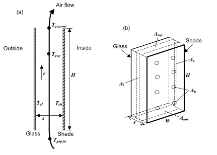

Figure 12. Vertical section (a) and perspective view (b) of glass  and interior shade layers  showing variables used in the gap air flow analysis. In (b), the air-flow opening areas *A<sub>bot</sub>*, *A<sub>top</sub>*, *A<sub>l</sub>*, *A<sub>r</sub>* and *A<sub>h</sub>* are shown schematically. See *Engineering Manual* for definition of thermal variables.


Figure 13. Examples of air-flow openings for an interior shade covering glass of height *H* and width *W*. Not to scale. (a) Horizontal section through shade with openings on the left and right sides (top view). (b) Vertical section through shade with openings at the top and bottom (side view). In (a) Left-Side Opening Multiplier = *A<sub>l</sub> /sH* = min(*l/s*,1) and Right-Side Opening Multiplier = *A<sub>r</sub> /sH* = min(*r/s*,1). In (b) Top Opening Multiplier = *A<sub>top</sub> /sW* = *t/s* and Bottom Opening Multiplier = *A<sub>bot</sub> /sW = b/s.*

An IDF example:

```idf
WindowMaterial:Shade,
    DRAPES - CLOSE WEAVE MEDIUM,  !- Name
    0.05,                    !- Solar transmittance
    0.3000000,               !- Solar Reflectance
    .05,                     !- Visible transmittance
    0.3000000,               !- Visible reflectance
    0.9000000,               !- Thermal Hemispherical Emissivity
    0.0,                     !- Thermal Transmittance
    0.003,                   !- Thickness {m}
    0.1,                     !- Conductivity {W/m-K}
    0.050,                   !- Shade to glass distance {m}
    1.0,                     !- Top opening multiplier
    1.0,                     !- Bottom opening multiplier
    0.0,                     !- Left-side opening multiplier
    0.0,                     !- Right-side opening multiplier
    0.0;                     !- Air flow permeability
```


### WindowMaterial:Blind

This object specifies the properties of a window blind consisting of flat, equally-spaced slats. Unlike window shades, which are modeled as perfect diffusers, window blinds have solar and visible transmission and reflection properties that strongly depend on slat angle and angle of incidence of solar radiation. There is an EnergyPlus Reference Data Set for WindowMaterial:Blind that contains properties of generic window blinds.

Blinds can be located on the inside of the window (“interior blinds”), on the outside of the window (“exterior blinds”), or between two layers of glass (“between-glass blinds”). When in place, the blind is assumed to cover all of the glazed part of the window, including dividers; it does not cover any of the window frame, if present. The plane of the blind is assumed to be parallel to the glazing. When the blind is retracted it is assumed to cover none of the window. The solar and thermal effects of the blind’s support strings, tapes or rods are ignored. Slat curvature, if present, is ignored.

There are two methods of assigning a blind to a window:

#### Method 1:

1)   Define the construction of the window without the blind, the so-called “bare” construction.

2)   Reference the bare construction in the FenestrationSurface:Detailed for the window.

3)   Define the WindowMaterial:Blind.

4)   Define a WindowProperty:ShadingControl for the window in which you (a) specify that this WindowMaterial:Blind is the window’s shading device and (b) specify how the blind is controlled.

#### Method 2:

1)   Define the Construction of the window without the blind, the so-called “bare” construction.

2)   Reference the bare construction in the FenestrationSurface:Detailed for the window.

3)   Define the WindowMaterial:Blind.

4)   Define another Construction, called the “shaded construction,” that includes the WindowMaterial:Blind.

5)   Define a WindowProperty:ShadingControl for the window in which you (a) reference the shaded construction and (b) specify how the blind is controlled.

Note that WindowProperty:ShadingControl has to be used with either method, even if the blind is in place at all times. You will get an error message if you try to reference a construction with a blind directly from Window objects (FenestrationSurface:Detailed or Window).

Note also that WindowProperty:ShadingControl is used to determine not only when the blind is in place, but how its slat angle is controlled.

#### Field: Name

Name of the blind. It is referenced as a layer in a window construction (ref: Construction object) or as a “Material Name of Shading Device” in a WindowProperty:ShadingControl object.

#### Field: Slat Orientation

The choices are Horizontal and Vertical. “Horizontal” means the slats are parallel to the bottom of the window; this is the same as saying that the slats are parallel to the X-axis of the window. “Vertical” means the slats are parallel to Y-axis of the window.

#### Field: Slat Width

The width of the slat measured from edge to edge (m). See Figure 14.

#### Field: Slat Separation

The distance between the front of a slat and the back of the adjacent slat (m). See Figure 14.

#### Field: Slat Thickness

The distance between the faces of a slat (m). See Figure 14.

#### Field: Slat Angle

The angle (degrees) between the glazing outward normal and the slat outward normal, where the outward normal points away from the front face of the slat (degrees). See Figure 14.

If the WindowProperty:ShadingControl for the blind has Type of Slat Angle Control for Blinds = FixedSlatAngle, the slat angle is fixed at “Slat Angle.”

If Type of Slat Angle Control for Blinds = BlockBeamSolar, the program automatically adjusts the slat angle so as just block beam solar radiation. In this case the value of “Slat Angle” is used only when the blind is in place and there is no beam solar radiation incident on the blind.

If Type of Slat Angle Control for Blinds = ScheduledSlatAngle, the slat angle is variable. In this case “Slat Angle” is not applicable and the field should be blank.

If Type of Slat Angle Control for Blinds = FixedSlatAngle and “Slat Angle” is less than the minimum or greater than the maximum allowed by Slat Width, Slat Separation and Slat Thickness, the slat angle will be reset to the corresponding minimum or maximum and a warning will be issued.

#### Field: Slat Conductivity

The thermal conductivity of the slat (W/m-K).

#### Field: Slat Beam Solar Transmittance

The beam solar transmittance of the slat, assumed to be independent of angle of incidence on the slat. Any transmitted beam radiation is assumed to be 100% diffuse (i.e., slats are translucent).

#### Field: Front Side Slat Beam Solar Reflectance

The beam solar reflectance of the front side of the slat, assumed to be independent of angle of incidence (matte finish). This means that slats with a large specularly-reflective component (shiny slats) are not well modeled.

#### Field: Back Side Slat Beam Solar Reflectance

The beam solar reflectance of the back side of the slat, assumed to be independent of angle of incidence (matte finish). This means that slats with a large specularly-reflective component (shiny slats) are not well modeled.

#### Field: Slat Diffuse Solar Transmittance

The slat transmittance for hemispherically diffuse solar radiation. This value should equal “Slat Beam Solar Transmittance.”

#### Field: Front Side Slat Diffuse Solar Reflectance

The front-side slat reflectance for hemispherically diffuse solar radiation. This value should equal “Front Side Slat Beam Solar Reflectance.”

#### Field: Back Side Slat Diffuse Solar Reflectance

The back-side slat reflectance for hemispherically diffuse solar radiation. This value should equal “Back Side Slat Beam Solar Reflectance.”

#### Field: Slat Beam Visible Transmittance

The beam visible transmittance of the slat, assumed to be independent of angle of incidence on the slat. Any transmitted visible radiation is assumed to be 100% diffuse (i.e., slats are translucent).

#### Field: Front Side Slat Beam Visible Reflectance

The beam visible reflectance on the front side of the slat, assumed to be independent of angle of incidence (matte finish). This means that slats with a large specularly-reflective component (shiny slats) are not well modeled.

#### Field: Back Side Slat Beam Visible Reflectance

The beam visible reflectance on the front side of the slat, assumed to be independent of angle of incidence (matte finish). This means that slats with a large specularly-reflective component (shiny slats) are not well modeled.

#### Field: Slat Diffuse Visible Transmittance

The slat transmittance for hemispherically diffuse visible radiation. This value should equal “Slat Beam Visible Transmittance.”

#### Field: Front Side Slat Diffuse Visible Reflectance

The front-side slat reflectance for hemispherically diffuse visible radiation. This value should equal “Front Side Slat Beam Visible Reflectance.”

#### Field: Back Side Slat Diffuse Visible Reflectance

The back-side slat reflectance for hemispherically diffuse visible radiation. This value should equal “Back Side Slat Beam Visible Reflectance..”

#### Field: Slat Infrared Hemispherical Transmittance

The slat Infrared transmittance. It is zero for solid metallic, wooden or glass slats, but may be non-zero in some cases (e.g., thin plastic slats).

#### Field: Front Side Slat Infrared  Hemispherical Emissivity

Front-side hemispherical emissivity of the slat. Approximately 0.9 for most materials. The most common exception is bare (unpainted) metal slats or slats finished with a metallic paint.

#### Field: Back Side Slat Infrared  Hemispherical Emissivity

Back-side hemispherical emissivity of the slat. Approximately 0.9 for most materials. The most common exception is bare (unpainted) metal slats or slats finished with a metallic paint.

#### Field: Blind to Glass Distance

For interior and exterior blinds, the distance from the mid-plane of the blind to the adjacent glass (m). See Figure 14. Not used for between-glass blinds. As for window shades (ref: WindowMaterial:Shade) this distance is used in calculating the natural convective air flow between glass and blind that is produced by buoyancy effects.

#### Opening Multipliers

The following opening multipliers are defined in the same way as for window shades (see WindowMaterial:Shade, Figure 12 and Figure 13). Note that, unlike window shades, there is no input for Air-Flow Permeability; this is automatically calculated by the program from slat angle, width and separation.

#### Field: Blind Top Opening Multiplier

Defined as for Material:WindowShade.

#### Field: Blind Bottom Opening Multiplier

Defined as for Material:WindowShade.

#### Field: Blind Left-Side Opening Multiplier

Defined as for Material:WindowShade.

#### Field: Blind Right-Side Opening Multiplier

Defined as for Material:WindowShade.

#### Field: Minimum Slat Angle

The minimum allowed slat angle (degrees). Used only if WindowProperty:ShadingControl (for the window that incorporates this blind) varies the slat angle (i.e., the WindowProperty:ShadingControl has Type of Slat Angle Control for Blinds = ScheduledSlatAngle or BlockBeamSolar). In this case, if the program tries to select a slat angle less than Minimum Slat Angle it will be reset to Minimum Slat Angle. (Note that if the Minimum Slat Angle itself is less than the minimum allowed by Slat Width, Slat Separation and Slat Thickness, it will be reset to that minimum.)

#### Field: Maximum Slat Angle

The maximum allowed slat angle (degrees). Used only if WindowProperty:ShadingControl (for the window that incorporates this blind) varies the slat angle (i.e., the WindowProperty:ShadingControl has Type of Slat Angle Control for Blinds = ScheduledSlatAngle or BlockBeamSolar). In this case, if the program tries to select a slat angle greater than Maximum Slat Angle the slat angle will be reset to Maximum Slat Angle. (Note that if the Maximum Slat Angle itself is greater than the maximum allowed by Slat Width, Slat Separation and Slat Thickness, it will be reset to that maximum.)

An IDF example:

```idf
WindowMaterial:Blind,
 White Painted Metal Blind,   !- Name
 HORIZONTAL, !- Slat orientation
 0.025   , !- Slat width (m)
 0.01875 , !- Slat separation (m)
 0.001   , !- Slat thickness (m)
 45.0    , !- Slat angle (deg)
 44.9    , !- Slat conductivity (W/m-K)
 0.0     , !- Slat beam solar transmittance
 0.8     , !- Front Side Slat beam solar reflectance
 0.8     , !- Back Side Slat beam solar reflectance
 0.0     , !- Slat diffuse solar transmittance
 0.8     , !- Front Side Slat diffuse solar reflectance
 0.8     , !- Back Side Slat diffuse solar reflectance
 0.0     , !- Slat beam visible transmittance
 0.7     , !- Front Side Slat beam visible reflectance
 0.7     , !- Back Side Slat beam visible reflectance
 0.0     , !- Slat diffuse visible transmittance
 0.7     , !- Front Side Slat diffuse visible reflectance
 0.7     , !- Back Side Slat diffuse visible reflectance
 0.0     , !- Slat Infrared hemispherical transmittance
 0.9     , !- Front Side Slat Infrared hemispherical emissivity
 0.9     , !- Back Side Slat Infrared hemispherical emissivity
 0.050   , !- Blind-to-glass distance
 0.0     , !- Blind top opening multiplier
 0.0     , !- Blind bottom opening multiplier
 0.5     , !- Blind left-side opening multiplier
 0.5     , !- Blind right-side opening multiplier
 ,         !- Minimum slat angle (deg)
 ;         !- Maximum slat angle (deg)
```


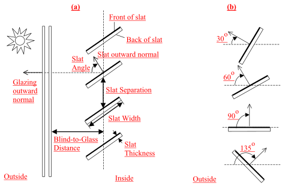

Figure 14. (a) Side view of a window blind with horizontal slats  (or top view of blind with vertical slats) showing slat geometry. The front face of a slat is shown by a heavy line. The slat angle is defined as the angle between the glazing outward normal and the slat outward normal, where the outward normal points away from the front face of the slat. (b) Slat orientations for representative slat angles. The slat angle varies from 0<sup>O</sup>, when the front of the slat is parallel to the glazing and faces toward the outdoors,  to 90<sup>O</sup>, when the slat is perpendicular to the glazing, to 180<sup>O</sup>, when the front of the slat is parallel to the glazing and faces toward the indoors. The minimum and maximum slat angles are determined by the slat thickness, width and separation.

### WindowMaterial:ComplexShade

This input object is used to define shade layers used in the Construction:ComplexFenestrationState object.

#### Field: Name

Unique name of the shading layer.

#### Field: Shading Layer Type

The type of shading layer.  The options are:

- Venetian – for modeling venetian blinds

- Woven – for modeling shading systems with a regular weave

- Perforated – for modeling perforated screens

- BSDF – for modeling shades whose properties are represented by a BSDF file

- OtherShadingType – for modeling shading systems which do not belong to the any of the previous group

#### Field: Thickness

The thickness (m) of the shading layer. This value is ignored for ShadingLayerType = Venetian, because the program will calculate the thickness based on the slat angle. This value is needed for ShadingLayerType = Woven and Perforated

#### Field: Conductivity

The conductivity (W/mK) of the shading layer material. Default: 1.0

- Venetian – the conductivity of the venetian blind slat material

- Woven – the conductivity of the woven shade material (such as the thread for a fabric shade)

- Perforated – for modeling perforated screens

- BSDF – for modeling shades whose properties are represented by a BSDF file

- OtherShadingType – for modeling shading systems which do not belong to the any of the previous group

#### Field: IR Transmittance

The IR transmittance of the shading layer. Minimum value: 0. Maximum value: 1. Default: 0.

#### Field: Front Emissivity

The front emissivity of the shading layer. Minimum value: 0. Maximum value: 1. Default: 0.90.

#### Field: Back Emissivity

The back emissivity of the shading layer. Minimum value: 0. Maximum value: 1. Default: 0.90.

#### Field: Top Opening Multiplier

The top opening multiplier value will depend on the location of the shading device within the glazing system. There are several possible scenarios which can occur and they can be divided into two groups:

**Shading device on the indoor/outdoor side of the window**

In this case the opening multiplier is calculated as the smallest distance between the shading device and the frame (d<sub>top</sub>), divided by the gap width (S).  There are three possible cases for the position of a shading device the on indoor/outdoor side (see Figure 15).

     

Figure 15. Three cases for the D<sub>top</sub> calculation for an indoor/outdoor shade: Case a) A shading device between the frame; Case b) A shading device outside the frame, covering the frame; Case c) a shading device outside the frame, not covering the frame.

In the case where the distance between the frame and the shading device is bigger than the gap width, the d<sub>top</sub> multiplier is equal to one. Therefore, the calculation of the D<sub>top</sub> opening multiplier is:

A<sub>top</sub> = min(d<sub>top</sub>/S, 1)

**Shading device between glass layers**

In this case the opening multiplier is calculated as the smallest distance between the shading device and the frame or spacer (d<sub>top</sub>), divided by the smaller gap width (the minimum of (S<sub>1</sub> andS<sub>2</sub>)).

          

Figure 16. Calculation of Dtop for a shading device between glass layers

The D<sub>top</sub> opening multiplier for a between glass shade is calculated as:

A<sub>top</sub> = min(d<sub>top</sub>/S<sub>min</sub>, 1)

Where

S<sub>min</sub> = min(S<sub>1</sub>, S<sub>2</sub>)

#### Field: Bottom Opening Multiplier

The bottom opening multiplier (d<sub>bot</sub>) is calculated in the same way as the top opening multiplier, with the rules applied to the bottom of the shading device.

#### Field: Left Side Opening Multiplier

The left side opening multiplier (d<sub>left</sub>) is calcuated in the same way as the top opening multiplier, with the rules applied to the left side of the shading device.

#### Field: Right Side Opening Multiplier

The right side opening multiplier (d<sub>right</sub>)  is calcuated in the same way as the top opening multiplier, with the rules applied to the right side of the shading device.

#### Field: Front Opening Multiplier

The fraction of glazing system area that is open on the front of the shading layer (see Figure 17). This fraction is calculated as follows: Afront / (W \* H), where Afront = Area of the front of the glazing system that is not covered by the shading system, W = the width of the glazing system (IGU) and H is height of the glazing system (IGU).


Figure 17. Front view of shading layer openings.

#### Field: Slat Width

The width (m) of the venetian slats.  Used only for ShadingLayerType = Venetian.

#### Field: Slat Spacing

The distance (m) between front sides of the venetian slats.  Used only for ShadingLayerType = Venetian.

#### Field: Slat Thickness

The thickness (m) of the venetian slats.  Used only for ShadingLayerType = Venetian.

#### Field: Slat Angle

The slat tilt angle (degrees) of the venetian slats.  Used only for ShadingLayerType = Venetian.  Range of slat angle is from -90 to 90 degrees.

#### Field: Slat Conductivity

The conductivity (W/mK) of the venetian slats.  Used only for ShadingLayerType = Venetian.

#### Field: Slat Curve

The curvature radius (m) of the venetian slats.  Setting this value to zero means there is no curvature in the slat (it is flat), while a non-zero value is the radius of the slat curve.  This value cannot be smaller than Slat Width / 2.  Used only for ShadingLayerType = Venetian.


Figure 18. Side view of horizontal venetian blind slats or top view of blinds with vertical slats.  Front face of slats is marked with red line.

An IDF example for ShadingLayerType = Venetian

```idf
WindowMaterial:ComplexShade,       !- venetian blind layer
  Shade_30001_Layer,               !- name
  Venetian,                        !- shading layer type
  0.005,                           !- thickness
  160,                             !- layer conductivity
  0.0,                             !- IR transmittance
  0.9,                             !- front emissivity
  0.9,                             !- back emissivity
  0.0,                             !- top opening multiplier
  0.0,                             !- bottom opening multiplier
  0.0,                             !- left side opening multiplier
  0.0,                             !- right side opening multiplier
  0.05,                            !- front opening multiplier
  0.016,                           !- venetian slat width
  0.012,                           !- venetian slat spacing
  0.0006,                          !- venetian slat thickness
  -45.00,                          !- venetian slat angle
  160.00,                          !- venetian slat conductivity
  0.0000;                          !- venetian slat curve
```


An IDF example for ShadingLayerType = Woven

(Note that it is not necessary to include “blank” lines for the venetian blind input for a Woven shade definition).

```idf
WindowMaterial:ComplexShade,       !- woven shade layer
  Shade_30002_Layer,               !- name
  Woven,                           !- shading layer type
  0.011,                           !- thickness
  1,                               !- layer conductivity
  0.0,                             !- IR transmittance
  0.9,                             !- front emissivity
  0.9,                             !- back emissivity
  0.0,                             !- top opening multiplier
  0.0,                             !- bottom opening multiplier
  0.0,                             !- left side opening multiplier
  0.0,                             !- right side opening multiplier
  0.17;                            !- front opening multiplier
```


### WindowMaterial:Screen

This object specifies the properties of exterior window screen materials. The window screen model assumes the screen is made up of intersecting orthogonally-crossed cylinders. The surface of the cylinders is assumed to be diffusely reflecting, having the optical properties of a Lambertian surface.

The beam solar radiation transmitted through a window screen varies with sun angle and is made up of two distinct elements: a direct beam component and a reflected beam component. The direct beam transmittance component is modeled using the geometry of the screen material and the incident angle of the sun to account for shadowing of the window by the screen material. The reflected beam component is an empirical model that accounts for the inward reflection of solar beam off the screen material surface. This component is both highly directional and small in magnitude compared to the direct beam transmittance component (except at higher incident angles, for which case the magnitude of the direct beam component is small or zero and the reflected beam component, though small in absolute terms can be many times larger than the direct beam component). For this reason, the reflected beam transmittance component calculated by the model can be a. disregarded, b. treated as an additive component to direct beam transmittance (and in the same direction), or c. treated as hemispherically-diffuse transmittance based on a user input to the model.


Figure 19. Direct beam and reflected beam transmittance components

The window screen “assembly” properties of overall beam solar reflectance and absorptance (including the screen material ‘cylinders’ and open area) also change with sun angle and are calculated based on the values of the beam solar transmittance components (direct and reflected components described above) and the physical properties of the screen material (i.e., screen material diameter, spacing, and reflectance).

Transmittance, reflectance, and absorptance of diffuse solar radiation are considered constant values and apply to both the front and back surfaces of the screen. These properties are calculated by the model as an average value by integrating the screen’s beam solar properties over a quarter hemisphere of incident radiation. Long-wave emissivity is also assumed to be the same for both sides of the screen.

There is an EnergyPlus Reference Data Set for WindowMaterial:Screen that contains properties for generic window screens. Window screens of this type can only be used on the outside surface of the window (“exterior screens”). When in place, the screen is assumed to cover all of the glazed part of the window, including dividers; it does not cover any of the window frame, if present. The plane of the screen is assumed to be parallel to the glazing.

WindowMaterial:Screen can be used to model wire mesh insect screens where the solar and visible transmission and reflection properties vary with the angle of incidence of solar radiation. For diffusing materials such as drapery and translucent roller shades it is better to use the WindowMaterial:Shade object. For slat-type shading devices like Venetian blinds, which have solar and visible transmission and reflection properties that strongly depend on slat angle and angle of incidence of solar radiation, it is better to use WindowMaterial:Blind.

There are two methods of assigning a screen to a window:

#### Method 1:

1)   Define the construction of the window without the screen, the so-called “bare” construction.

2)   Reference the bare construction in the FenestrationSurface:Detailed for the window.

3)   Define the WindowMaterial:Screen object.

4)   Define a WindowProperty:ShadingControl for the window in which you (a) specify that this Material:WindowScreen is the window’s shading device, and (b) specify how the screen is controlled.

#### Method 2:

1)   Define the Construction of the window without the screen, the so-called “bare” construction.

2)   Reference the bare construction in the FenestrationSurface:Detailed for the window.

3)   Define the WindowMaterial:Screen object.

4)   Define another Construction, called the “shaded construction,” that includes the WindowMaterial:Screen.

5)   Define a WindowProperty:ShadingControl for the window in which you (a) reference the shaded construction, and (b) specify how the screen is controlled.

Note that WindowProperty:ShadingControl has to be used with either method, even if the screen is in place at all times. You will get an error message if you try to reference a shaded construction directly from a FenestrationSurface:Detailed object.

#### Field: Name

Enter a unique name for the screen. This name is referenced as an outside layer in a window construction.

#### Field: Reflected Beam Transmittance Accounting Method

This input specifies the method used to account for screen-reflected beam solar radiation that is transmitted through the window screen (as opposed to being reflected back outside the building). Since this inward reflecting beam solar is highly directional and is not modeled in the direction of the actual reflection, the user is given the option of how to account for the directionality of this component of beam solar transmittance. Valid choices are DoNotModel, ModelAsDirectBeam (i.e., model as an additive component to direct solar beam and in the same direction), or ModelAsDiffuse (i.e., model as hemispherically-diffuse radiation). The default value is ModelAsDiffuse.

#### Field: Diffuse Solar Reflectance

This input specifies the solar reflectance (beam-to-diffuse) of the screen material itself (not the effective value for the overall screen “assembly” including open spaces between the screen material). The outgoing diffuse radiation is assumed to be Lambertian (distributed angularly according to Lambert’s cosine law). The solar reflectance is assumed to be the same for both sides of the screen. This value must be from 0 to less than 1.0. In the absence of better information, the input value for diffuse solar reflectance should match the input value for diffuse visible reflectance.

#### Field: Diffuse Visible Reflectance

This input specifies the visible reflectance (beam-to-diffuse) of the screen material itself (not the effective value for the overall screen “assembly” including open spaces between the screen material) averaged over the solar spectrum and weighted by the response of the human eye. The outgoing diffuse radiation is assumed to be Lambertian (distributed angularly according to Lambert’s cosine law). The visible reflectance is assumed to be the same for both sides of the screen. This value must be from 0 to less than 1.0.

If diffuse visible reflectance for the screen material is not available, then the following guidelines can be used to estimate this value:

* Dark-colored screen (e.g., charcoal):                  0.08 – 0.10

* Medium-colored screen (e.g., gray):                   0.20 – 0.25

* Light-colored screen (e.g., bright aluminum):       0.60 – 0.65

Commercially-available gray scale or grayscale reflecting chart references can be purchased for improved accuracy in estimating visible reflectance (by visual comparison of screen reflected brightness with that of various known-reflectance portions of the grayscale).

#### Field: Thermal Hemispherical Emissivity

Long-wave emissivity *ε* of the screen material itself (not the effective value for the overall screen “assembly” including open spaces between the screen material). The emissivity is assumed to be the same for both sides of the screen.

For most non-metallic materials, *ε*is about 0.9. For metallic materials, *ε*is dependent on material, its surface condition, and temperature. Typical values for metallic materials range from 0.05 – 0.1 with lower values representing a more finished surface (e.g. low oxidation, polished surface). Material emissivities may be found in Table 5 from the 2005 ASHRAE Handbook of Fundamentals, page 3.9. The value for this input field must be between 0 and 1, with a default value of 0.9 if this field is left blank.

#### Field: Conductivity

Screen material conductivity (W/m-K). This input value must be greater than 0. The default value is 221 W/m-K (aluminum).

#### Field: Screen Material Spacing

The spacing, S, of the screen material (m) is the distance from the center of one strand of screen to the center of the adjacent one. The spacing of the screen material is assumed to be the same in both directions (e.g., vertical and horizontal). This input value must be greater than the non-zero screen material diameter. If the spacing is different in the two directions, use the average of the two values.


Figure 20. Screen Material Spacing and Diameter

#### Field: Screen Material Diameter

The diameter, D, of individual strands or wires of the screen material (m). The screen material diameter is assumed to be the same in both directions (e.g., vertical and horizontal). This input value must be greater than 0 and less than the screen material spacing. If the diameter is different in the two directions, use the average of the two values.

#### Field: Screen to Glass Distance

Distance from the window screen to the adjacent glass surface (m). If the screen is not flat, the average screen to glass distance should be used. The screen-to-glass distance is used in calculating the natural convective air flow between the glass and the screen produced by buoyancy effects. This input value must be from 0.001 m to 1 m, with a default value of 0.025 m if this field is left blank.

#### Field: Top Opening Multiplier

Effective area for air flow at the top of the screen divided by the horizontal area between the glass and screen (see the same field for the Material:WindowShade object for additional description). The opening multiplier fields can be used to simulate a shading material that is offset from the window frame. Since window screens are typically installed against the window frame, the default value is equal to 0.This input value can range from 0 to 1.

#### Field: Bottom Opening Multiplier

Effective area for air flow at the bottom of the screen divided the horizontal area between the glass and screen (see the same field for the Material:WindowShade object for additional description). The opening multiplier fields can be used to simulate a shading material that is offset from the window frame. Since window screens are typically installed against the window frame, the default value is equal to 0. This input value can range from 0 to 1.

#### Field: Left-Side Opening Multiplier

Effective area for air flow at the left side of the screen divided the vertical area between the glass and screen (see the same field for the Material:WindowShade object for additional description). The opening multiplier fields can be used to simulate a shading material that is offset from the window frame. Since window screens are typically installed against the window frame, the default value is equal to 0. This input value can range from 0 to 1.

#### Field: Right-Side Opening Multiplier

Effective area for air flow at the right side of the screen divided the vertical area between the glass and screen (see the same field for the Material:WindowShade object for additional description). The opening multiplier fields can be used to simulate a shading material that is offset from the window frame. Since window screens are typically installed against the window frame, the default value is equal to 0. This input value can range from 0 to 1.

#### Field: Angle of Resolution for Screen Transmittance Output Map

Angle of resolution, in degrees, for the overall screen beam transmittance (direct and reflected) output map. The comma-separated variable file eplusscreen.csv (Ref. OutputDetailsandExamples.pdf) will contain the direct beam and reflected beam solar radiation that is transmitted through the window screen as a function of incident sun angle (0 to 90 degrees relative solar azimuth and 0 to 90 degrees relative solar altitude) in sun angle increments specified by this input field. The default value is 0, which means no transmittance map is generated. Other valid choice inputs are 1, 2, 3 and 5 degrees.

An IDF example for this object, along with Construction and WindowProperty:ShadingControl objects, is shown below:

```idf
WindowMaterial:Screen,
    EXTERIOR SCREEN,         !- Name
    ModelAsDiffuse,        !- Reflected Beam Transmittance Accounting Method
    0.6,                     !- Diffuse Solar Reflectance
    0.6,                     !- Diffuse Visible Reflectance
    0.9,                     !- Thermal Hemispherical Emissivity
    221.0,                   !- Conductivity {W/m-K}
    0.00154,                 !- Screen Material Spacing (m)
    0.000254,                !- Screen Material Diameter (m)
    0.025,                   !- Screen-to-Glass Distance {m}
    0.0,                     !- Top Opening Multiplier
    0.0,                     !- Bottom Opening Multiplier
    0.0,                     !- Left-Side Opening Multiplier
    0.0,                     !- Right-Side Opening Multiplier
    0;                   !- Angle of Resolution for Output Map {deg}

Construction,
    DOUBLE PANE WITHOUT SCREEN,     !- Name
    GLASS - CLEAR SHEET 1 / 8 IN,   !- Outside Layer
    WinAirB1 - AIRSPACE RESISTANCE, !- Layer \#2
    GLASS - CLEAR SHEET 1 / 8 IN;   !- Layer \#3

WindowProperty:ShadingControl,
    DOUBLE PANE WITH SCREEN, !- User Supplied Shading Control Name
    ExteriorScreen,          !- Shading Type
    ,                        !- Name of construction with shading
    AlwaysOn,                !- Shading Control Type
    ScreenSchedule,          !- Schedule Name
    20.0,                    !- SetPoint {W/m2, W or deg C}
    YES,                     !- Shading Control Is Scheduled
    NO,                      !- Glare Control Is Active
    EXTERIOR SCREEN,         !- Material Name of Shading Device
    ,                        !- Type of Slat Angle Control for Blinds
    ;                        !- Slat Angle Schedule Name
```


### WindowMaterial:Shade:EquivalentLayer

This object specifies the properties of Equivalent Layer window shade (roller blind) materials. Shades are considered to be thin, flat and perfect diffusers (all transmitted and reflected radiation is hemispherically-diffuse). However, shades can have beam-beam transmittance by virtue of their material openness.  The beam-beam transmittnec is assumed to be the same for both sides of the shade and is the same as the openness area fraction. Beam-dffuse transmittance and reflectance, and emissivity properties can be different for front and back side of the shade.Window shades can be placed on the inside of the window, on the outside of the window, or between glass layers. WindowMaterial:Shade:EquivalentLayer is used for roller blinds. The off-normal solar property calculation of shades (roller blind) is based on a set of correlations developed from measurement of samples of commercially produced roller blind material with openness fraction less than 0.14. The model is not intended for materials with unusually high values of openness and should be limited to a mximum openness fraction of 0.20. The visible spectrum solar properties input fields are not used currently hence can be left blank.

#### Field: Name

Name of the shade. It is referenced as an inside, inbetween or outside layer in an equivalent layer  window construction.

#### Field: Shade Beam-Beam Solar Transmittance

This value is the beam-beam transmittance of the shade at normal incidence and it is the same as the openness area fraction of the shade material. Assumed to be the same for front and back sides of the roller blinds.  The minimum value is 0.0 and maximum value is less than 1.0.  The default value is 0.0. For most common shade materials (e.g. Roller Blinds) the material oppeness fraction doesn’t exceed 0.20.

#### Field: Front Side Shade Beam-Diffuse Solar Transmittance

This value is the front side beam-diffuse transmittance of the shade material at normal incidence averaged over the entire spectrum of solar radiation. The minimum value is 0.0 and maximum value is less than 1.0.  The default value is 0.0.

#### Field: Back Side Shade Beam-Diffuse Solar Transmittance

This value is the back side beam-diffuse transmittance of the shade material at normal incidence averaged over the entire spectrum of solar radiation. The minimum value is 0.0 and maximum value is less than 1.0.  The default value is 0.0.

#### Field: Front Side Shade Beam-Diffuse Solar Reflectance

This value is the front side beam-diffuse reflectance of the shade material at normal incidence averaged over the entire spectrum of solar radiation. The minimum value is 0.0 and maximum value is less than 1.0.

#### Field: Back Side Shade Beam-Diffuse Solar Reflectance

This value is the back side beam-diffuse reflectance of the shade material at normal incidence averaged over the entire spectrum of solar radiation. The minimum value is 0.0 and maximum value is less than 1.0.

#### Field: Shade Beam-Beam Visible Transmittance

This value is the beam-beam transmittance at normal incidence averaged over the visible spectrum of solar radiation. Assumed to be the same for front and back sides. The minimum value is 0.0 and maximum value is less than 1.0.  Currently this input field is not used.

#### Field: Shade Beam-Diffuse Visible Transmittance

This value is the beam-diffuse transmittance at normal incidence averaged over the visible spectrum of solar radiation. Assumed to be the same for front and back sides. The minimum value is 0.0 and maximum value is less than 1.0.  Currently this input field is not used.

#### Field: Shade Beam-Diffuse Visible Reflectance

This value is the beam-diffuse reflectance at normal incidence averaged over the visible spectrum of solar radiation. Assumed to be the same for front and back sides. The minimum value is 0.0 and maximum value is less than 1.0.  Currently this input field is not used.

#### Field: Shade Material Infrared Transmittance

This value is the long-wave transmittance of the shade material and assumed to be the same for front and back sides of the shade. The minimum value is 0.0 and maximum value is less than 1.0. Default value is 0.05.

#### Field: Front Side Shade Material Infrared Emissivity

This value is the front side long-wave hemispherical emissivity of shade material. The minimum value is 0.0 and maximum value is less than 1.0. Default value is 0.91. The front side effective emissivity of the shade layer is calculated using this value and the material openness specified above.

#### Field: Back Side Shade Material Infrared Emissivity

This value is the back side long-wave hemispherical emissivity of shade material. The minimum value is 0.0 and maximum value is less than 1.0. Default value is 0.91. The back side effective emissivity of the shade is calculated using this value and the material openness specified above.

An IDF example for this object is shown below:

```idf
WindowMaterial:Shade:EquivalentLayer,
  Shade1,        !- Name
  0.190,         !- Shade Beam-Beam Solar Transmittance
  0.206,         !- Front Side Shade Beam-Diffuse Solar Transmittance
  0.206,         !- Back Side Shade Beam-Diffuse Solar Transmittance
  0.499,         !- Front Side Shade Beam-Diffuse Solar Reflectance
  0.499,         !- Back Side Shade Beam-Diffuse Solar Reflectance
  0.0,           !- Shade Beam-Beam Visible Transmittance
  0.0,           !- Shade Beam-Diffuse Vissible Transmittance
  0.0,           !- Shade Vissible Reflectance
  0.0,           !- Shade Material Infrared Transmittance
  0.84,          !- Front Side Shade Material Infrared Emissivity
  0.84;          !- Back Side Shade Material Infrared Emissivity
```


### WindowMaterial:Drape:EquivalentLayer

Specifies the optical and thermal properties of equivalent layer window drape fabric materials.

Drapery fabric shades are commonly placed on the the inside of the window. The long-wave (infrared) properties for commonly used drapery fabrics are assumed to be the same on both sides but different values can be specified when required. Drape fabric shade layers are considered to be perfect diffusers (reflected radiation is hemispherically-diffuse independent of angle of incidence). Unpleated drape fabric is treated as thin and flat layer.The off-normal optical properties of drapery fabric is determined from user specified optical properties at normal incidence using empirical correlations. Pleated drape fabric requires entering the pleated section average width and length as showsn in Figure 21.For pleated drapes the effective beam-beam and beam-diffuse solar properties are determined by tracking both radiation components, for a given incident angle solar radiation, through various interactions with a fabric pleated in a rectangular geometry shown in Figure 21.  The solar properties of the two different pleat facets are evaluated on the basis of the local solar incidence angle.  Therefore, the effective layer properties are influenced not just by horizontal solar profile angle, but also by incidence angle. The correlations used for drape fabrics optical property calculations reqiure that the solar absorptance of the fabric, at normal incidence, is not less than 1%.

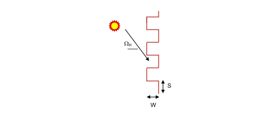

Figure 21. Geometry used for Pleated Drape Analysis

#### Field: Name

Name of the drape fabric shade layer. It is referenced as an inside, in between or outside layer in an equivalent layer window construction.

#### Field: Drape Beam-Beam Solar Transmittance

This value is the drape fabric beam-beam transmittance at normal incidence, and it is the same as the drape fabric openness area fraction.  Assumed to be the same for front and back sides of the drape fabric layer.  The minimum value is 0.0 and maximum value is less than 1.0. For most drape fabric materials the maximum frabric openness fraction do not exceed 0.2.  The default value is 0.0.

#### Field: Front Side Drape Beam-Diffuse Solar Transmittance

This value is the front side beam-diffuse solar transmittance of the drape fabric material at normal incidence averaged over the entire spectrum of solar radiation. The minimum value is 0.0 and maximum value is less than 1.0.

#### Field: Back Side Drape Beam-Diffuse Solar Transmittance

This value is the back side beam-diffuse solar transmittance of the drape fabric material at normal incidence averaged over the entire spectrum of solar radiation. The minimum value is 0.0 and maximum value is less than 1.0.

#### Field: Front Side Drape Beam-Diffuse Solar Reflectance

This value is the front side beam-diffuse solar reflectance of the drape fabric material at normal incidence averaged over the entire spectrum of solar radiation. The minimum value is 0.0 and maximum value is less than 1.0.

#### Field: Back Side Drape Beam-Diffuse Solar Reflectance

This value is the back side beam-diffuse solar reflectance of the drape fabric material at normal incidence averaged over the entire spectrum of solar radiation. The minimum value is 0.0 and maximum value is less than 1.0.

#### Field: Drape Beam-Beam Visible Transmittance

This value is the drape fabric beam-beam visible transmittance at normal incidence averaged over the visible spectrum range of solar radiation.  Assumed to be the same for front and back sides of the drape fabric layer.  The minimum value is 0.0 and maximum value is less than 1.0.  The default value is 0.0.  This input field is not used currently.

#### Field: Front Side Drape Beam-Diffuse Visible Reflectance

This value is the front side drape fabric beam-diffuse visible reflectance at normal incidence averaged over the visible spectrum range of solar radiation.  Assumed to be the same for front and back sides of the drape.  The minimum value is 0.0 and maximum value is less than 1.0.  The default value is 0.0.  This input field is not used currently.

#### Field: Back Side Drape Diffuse-Diffuse Visible Reflectance

This value is the back side drape fabric diffuse-diffuse visible reflectance at normal incidence averaged over the visible spectrum range of solar radiation.  Assumed to be the same for front and back sides of the drape.  The minimum value is 0.0 and maximum value is less than 1.0.  The default value is 0.0.  This input field is not used currently.

#### Field: Drape Material Infrared Transmittance

This value is the long-wave hemispherical transmittance of the fabric material at zero fabric openness fraction.  Assumed to be the same for front and back sides of the drape fabric material layer. The minimum value is 0.0 and maximum value is less than 1.0.  The default value is 0.05.

#### Field: Front Side Drape Material Infrared Emissivity

This value is the front side long-wave hemispherical emissivity of fabric material at zero shade opennes. The minimum value is 0.0 and maximum value is less than 1.0. the default value is 0.87. The front side effective emissivity of the drape fabric layer is calculated using this value and the fabric openness area fraction specified above.

#### Field: Back Side Drape Material Infrared Emissivity

This value is the back side long-wave hemispherical emissivity of fabric material at zero fabric openness fraction. The minimum value is 0.0 and maximum value is less than 1.0. The default value is 0.87. The back side effective emissivity of the drape fabric layer is calculated using this value and the fabric openness area fraction specified above.

#### Field: Width of Pleated Fabric

This value is the width of the pleated section of the draped fabric, w(m). If the drape fabric is flat (unpleated), then the pleated section width is set to zero. The default value is 0.0, i.e., assumes flat drape fabric.

#### Field: Length of Pleated Fabric

This value is the length of the pleated section of the draped fabric, s(m). If the drape fabric is flat (unpleated), then the pleated section length is set to zero.  The default value is 0.0, i.e., assumes flat drape fabric.

An IDF example for this object is shown below:

```idf
WindowMaterial:Drape:EquivalentLayer,
  Drape02,            !- Name
  0.14,               !- Shade Beam-Beam Solar Transmittance
  0.10,               !- Front Side Shade Beam-Diffuse Solar Transmittance
  0.10,               !- Back Side Shade Beam-Diffuse Solar Transmittance
  0.40,               !- Front Side Shade Beam-Diffuse Solar Reflectance
  0.50,               !- Back Side Shade Beam-Diffuse Solar Reflectance
  0.0,                !- Shade Beam-Beam Visible Transmittance
  0.0,                !- Shade Beam-Diffuse Visible Transmittance
  0.0,                !- Shade Beam-Diffuse Visible Reflectance
  0.10,               !- Shade Material Infrared Transmittance
  0.90,               !- Front Side Shade Material Infrared Emissivity
  0.80,               !- Back Side Shade Material Infrared Emissivity
  0.01,               !- Width of Pleated Fabric
  0.025;              !- Length of Pleated Fabric
```


### WindowMaterial:Blind:EquivalentLayer

This object specifies the properties of an Equivalent Layer window blind consisting of thin and equally-spaced slats. The the model assumes that slats are flat and thin, and applies correction for the slat curvature effect based on the user specified slat crwon.  Slats are assumed to transmit and reflect diffusely.The effective shortwave optical and longwave optical properties of venetian blind layer is estimated analytically. The Equivalent Layer blind model requires optical properties and geometry of the slats shown 

Figure 22. Geometry and Properties used for venetian blind analysis

.  Likewise, effective longwave properties are obtained for the layer knowing longwave properties of the slats.


Figure 22. Geometry and Properties used for venetian blind analysis

The input data required to characterize a venetian blind are: front and back side reflectance and transmittance of the slat, geometry (Slat width, w, slat spacing, s, slat crown, c, and slat angle, f, and long wave emittance and transmittance of the slat. Blinds can be located on the inside of the window, on the outside of the window, or between two layers of glass. The blind is assumed to cover all of the glazed part of the window.

#### Field: Name

Name of the venetian blind. It is referenced as an inside, outside or in between layers in an equivalent layer window construction.

#### Field: Slat Orientation

The choices are Horizontal and Vertical. “Horizontal” means the slats are parallel to the bottom of the window; this is the same as saying that the slats are parallel to the X-axis of the window. “Vertical” means the slats are parallel to Y-axis of the window.  The default is “Horizontal”.

#### Field: Slat Width

This value is the width of the slat measured from edge to edge (m). The default value is 0.0254.

#### Field: Slat Separation

The distance between the front of a slat and the back of the adjacent slat (m). The default value is 0.025. The slat separation should not be greater than the slat width.

#### Field: Slat Crown

The perpendicular length between the slat cord  and the curve (m). Crown=0.0625x“Slat width”. Slat is assumed to be rectangular in cross section and flat. The crown accounts for curvature of the slat.  The minimum value is 0.0, and the default value is 0.0015m.

#### Field: Slat Angle

The angle (degrees) between the glazing outward normal and the slat outward normal, where the outward normal points away from the front face of the slat (degrees). If the “Slat Angle Control” input field below specified is “FixedSlatAngle”, then the slat angle is fixed at “Slat Angle” value entered.  Minimum value is zero, and the maximum value allowed is 180.0 degrees.  The default value is 45 degrees.

#### Field: Front Side Slat Beam-Diffuse Solar Transmittance

This value is the slat front side beam-diffuse solar transmittance at normal incidence averaged over the entire spectrum of solar radiation. Any transmitted beam radiation is assumed to be 100% diffuse (i.e., slats are translucent). Minimum value is 0.0, and the maximum value is less than 1.0. The default value is 0.0.

#### Field: Back Side Slat Beam-Diffuse Solar Transmittance

This value is the slat back side beam-diffuse solar transmittance at normal incidence averaged over the entire spectrum of solar radiation. Any transmitted beam radiation is assumed to be 100% diffuse (i.e., slats are translucent). Minimum value is 0.0,  and the maximum value is less than 1.0. The default value is 0.0.

#### Field: Front Side Slat Beam-Diffuse Solar Reflectance

This value is slat front side beam-diffuse solar reflectance at normal incidence averaged over the entire spectrum of solar radiation. All the reflected component is assumed to be diffuse. Minimum value is 0.0, and the maximum value is less than 1.0.

#### Field: Back Side Slat Beam-Diffuse Solar Reflectance

This value is the slat back side beam-diffuse solar reflectance at normal incidence averaged over the entire spectrum of solar radiation. All the reflected component is assumed to be diffuse. Minimum value is 0.0, and the maximum value is less than 1.0.

#### Field: Front Side Slat Beam-Diffuse Visible Solar Transmittance

This value is the slat front side beam-diffuse visible transmittance at normal incidence averaged over the visible spectrum range of solar radiation. Any transmitted beam radiation is assumed to be 100% diffuse (i.e., slats are translucent). Minimum value is 0.0, and the maximum value is less than 1.0. The default value is 0.0.

#### Field: Back Side Slat Beam-Diffuse Visible Solar Transmittance

This value is the slat back side beam-diffuse visible transmittance at normal incidence averaged the visible spectrum range of solar radiation. Any transmitted beam radiation is assumed to be 100% diffuse (i.e., slats are translucent). Minimum value is 0.0, and the maximum value is less than 1.0. The default value is 0.0.

#### Field: Front Side Slat Beam-Diffuse Visible Solar Reflectance

This value is the slat front side beam-diffuse visible reflectance at normal incidence averaged over the visible spectrum range of solar radiation. All the reflected component is assumed to be diffuse. Minimum value is 0.0, and the maximum value is less than 1.0

#### Field: Back Side Slat Beam-Diffuse Visible Solar Reflectance

This value is the slat back side beam-diffuse visible reflectance at normal incidence averaged over the visible spectrum range of solar radiation. All the reflected component is assumed to be diffuse. Minimum value is 0.0,  and the maximum value is less than 1.0

#### Field: Slat Diffuse-Diffuse Solar Transmittance

This value is the slat diffuse-diffuse solar transmittance for hemispherically diffuse solar radiation. This value is the same for front and back side of the slat.  Minimum value is 0.0,  and the maximum value is less than 1.0.

#### Field: Front Side Slat Diffuse-Diffuse Solar Reflectance

This value is the slat front side diffuse-diffuse solar reflectance for hemispherically diffuse solar radiation. Minimum value is 0.0,  and the maximum value is less than 1.0.

#### Field: Back Side Slat Diffuse-Diffuse Solar Reflectance

This value is the slat back side diffuse-diffuse solar reflectance for hemispherically diffuse solar radiation. Minimum value is 0.0,  and the maximum value is less than 1.0.

#### Field: Slat Diffuse-Diffuse Visible Transmittance

This value is the slat diffuse-diffuse visible transmittance for hemispherically diffuse visible spectrum range of solar radiation. This value is the same for front and back side of the slat.  Minimum value is 0.0,  and the maximumvalue is less than 1.0. This input field is not used currently.

#### Field: Front Side Slat Diffuse-Diffuse Visible Reflectance

This value is the slat front side diffuse-diffuse visible reflectance for hemispherically diffuse visible spectrum range of solar radiation. Minimum value is 0.0, and the maximum value is less than 1.0.  This input field is not used currently.

#### Field: Back Side Slat Diffuse-Diffuse Visible Reflectance

This value is the slat back side diffuse-diffuse visible reflectance for hemispherically diffuse visible spectrum range of solar radiation. Minimum value is 0.0, and the maximum value is less than 1.0.  This input field is not used currently.

#### Field: Slat Infrared Transmittance

This value is the long-wave hemispherical transmittance of the slat material. Assumed to be the same for both sides of the slat. The minimum value is 0.0, the maximum value is less than 1.0.  The default value is 0.0.

#### Field: Front Side Slat Infrared Emissivity

This value is the front side long-wave hemispherical emissivity of the slat material. The minimum value is 0.0, the maximum value is less than 1.0. The default value is 0.9.

#### Field: Back Side Slat Infrared Emissivity

This value is the back side long-wave hemispherical emissivity of the slat material. The minimum value is 0.0, the maximum value is less than 1.0.  The default value is 0.9.

#### Field: Slat Angle Control

This input field is used only if slat angle control is desired.  The three key choice inputsallowed are “FixedSlatAngle”, “MaximizeSolar”, and “BlockBeamSolar”.  The default value is “FixedSlatAngle”.If Type of Slat Angle Control for Blinds = MaximizeSolar the slat angle is adjusted to maximize solar gain. If Type of Slat Angle Control for Blinds = BlockBeamSolar, the slat angle is adjusted to maximize visibiity while eliminating beam solar radiation. If Type of Slat Angle Control for Blinds = FixedSlatAngle, then the model uses a fixed slat angle specified above.

An IDF example for this object, is shown below:

```idf
WindowMaterial:Blind:EquivalentLayer,
  VBU8D6+45SW1,      ! - Name
  Horizontal,        ! - Slat Orientation
  0.025,             ! - Slat Width
  0.025,             ! - Slat Separation
  0.0,               ! - Slat Crown
  45.0,              ! - Slat Angle
  0.0,               ! - Front Side Slat Beam-Diffuse Solar Transmittance
  0.0,               ! - Back Side Slat Beam-Diffuse Solar Transmittance
  0.0,               ! - Front Side Slat Beam-Diffuse Solar Reflectance
  0.0,               ! - Back Side Slat Beam-Diffuse Solar Reflectance
  0.0,               ! - Front Side Slat Beam-Diffuse Visible Transmittance
  0.0,               ! - Back Side Slat Beam-Diffuse Visible Transmittance
  0.0,               ! - Front Side Slat Beam-Diffuse Visible Reflectance
  0.0,               ! - Back Side Slat Beam-Diffuse Visible  Reflectance
  0.0,               ! - Slat Diffuse-Diffuse Solar Transmittance
  0.80,              ! - Front Side Slat Diffuse-Diffuse Solar Reflectance
  0.60,              ! - Back Side Slat Diffuse-Diffuse Solar Reflectance
  0.0,               ! - Slat Diffuse-Diffuse Visible Transmittance
  0.0,               ! - Front Side Slat Diffuse-Diffuse Visible Reflectance
  0.0,               ! - Back Side Slat Diffuse-Diffuse Visible Reflectance
  0.0,               ! - Slat Infrared Transmittance
  0.90,              ! - Front Side Slat Infrared Emissivity
  0.90,              ! - Back Side Slat Infrared Emissivity
  FixedSlatAngle;    ! - Slat Angle Control
```


### WindowMaterial:Screen:EquivalentLayer

This object specifies the optical and thermal properties of exterior screen materials for Equivalent Layer Window. Can only be placed on the exterior side of window construction. The window screen model assumes the screen is made up of intersecting orthogonally-crossed cylinders. The surface of the cylinders is assumed to be diffusely reflecting. The beam solar radiation transmitted through an equivalent Layer window screen varies with sun angle and is made up of two distinct elements: a beam-beam component and a beam-difuse component. The beam-beam transmittance component is calculated using screen openness area fraction determined from the geometry of the screen and the incident angle of the sun. Empirical correlations are used to obtain the effective off-normal solar and longwave properties of insect screens.  Insect screen geometry is shown in Figure 23.  The calculation of effective solar properties requires a set of properties measured at normal incidence.


Figure 23. Geometry used for insect screen analysis

The formulation of the model, assumption and correlations used to calculate effective solar and longwave properties of insect screens are described in the Engineering Reference.

#### Field: Name

Name of the insect screen. It is referenced as an outside layer in an equivalent layer window construction.

#### Field: Screen Beam-Beam Solar Transmittance

This value is the beam-beam transmittance of the screen material at normal incidence. This value is the same as the screen oppenness area fraction.  This value can be autocalculated from the wire spacing and wire diameter. It is the same for both sides of the screen. The minimum value is 0.0, and maximum value is less than 1.0.

#### Field: Screen Beam-Diffuse Solar Transmittance

This value is the beam-diffuse solar transmittance of the screen material at normal incidence averaged over the entire spectrum of solar radiation. Assumed to be the same for both sides of the screen. The minimum value is 0.0, and the maximum value is less than 1.0.

#### Field: Screen Beam-Diffuse Solar Reflectance

This value is the beam-diffuse solar reflectance of the screen material at normal incidence averaged over the entire spectrum of solar radiation. Assumed to be the same for both sides of the screen. The minimum value is 0.0, and the maximum value is less than 1.0.

#### Field: Screen Beam-Beam Visible Transmittance

This value is the beam-beam visible transmittance of the screen material at normal incidence averaged over the visible spectrum range of solar radiation.  Assumed to be the same for both sides of the screen. The minimum value is 0.0, and maximum value is less than 1.0. This input input field is not used currently.

#### Field: Screen Beam-Diffuse Visible Transmittance

This value is the beam-diffuse visible reflectance of the screen material at normal incidence averaged over the visible spectrum range of solar radiation. Assumed to be the same for both sides of the screen. The minimum value is 0.0, and the maximum value is less than 1.0. This input input field is not used currently.

#### Field: Screen Beam-Diffuse Visible Reflectance

This value is the beam-diffuse visible reflectance of the screen material at normal incidence averaged over the visible spectrum range of solar radiation. Assumed to be the same for both sides of the screen. The minimum value is 0.0, and the maximum value is less than 1.0. This input input field is not used currently.

#### Field: Screen Infrared Transmittance

This value is the long-wave hemispherical transmittance of the the screen material. Assumed to be the same for both sides of the screen material. The minimum value is 0.0, the maximum value is less than 1.0.  The default value is 0.02

#### Field: Screen Infrared Emissivity

This value is the long-wave hemispherical emissivity of the screen material. Assumed to be the same for both sides of the screen material. The minimum value is 0.0, the maximum value is less than 1.0. The default value is 0.93.

#### Field: Screen Wire Spacing

The spacing, S (m), of the screen material is the distance from the center of one strand of screen to the center of the adjacent one. The spacing of the screen material is assumed to be the same in both directions (e.g., vertical and horizontal). This input value must be greater than the non-zero screen material diameter. If the spacing is different in the two directions, use the average of the two values. Default value is 0.0025m.

#### Field: Screen Wire Diameter

The diameter, D (m), of individual strands or wires of the screen material. The screen material diameter is assumed to be the same in both directions (e.g., vertical and horizontal). This input value must be greater than 0 and less than the screen wire spacing. If the diameter is different in the two directions, use the average of the two values. Default value is 0.005m.

An IDF example for this object, is shown below:

```idf
WindowMaterial:Screen:EquivalentLayer,
  INSCRN,                !- Name
  0.763,                 !- Screen Beam-Beam Solar Transmittance
  0.052,                 !- Screen Beam-Diffuse Solar Transmittance
  0.076,                 !- Screen Beam-Diffuse Solar Reflectance
  0.0,                   !- Screen Beam-Beam Visible Transmittance
  0.0,                   !- Screen Beam-Diffuse Visible Transmittance
  0.0,                   !- Screen Beam-Diffuse Visible Reflectance
  0.0,                   !- Screen Infrared Transmittance
  0.84,                  !- Screen Infrared Emissivity
  0.025,                 !- Screen Wire Spacing
  0.005;                 !- Screen Wire Diameter
```


### WindowMaterial:Glazing:EquivalentLayer

Glass material properties for equivalent layer window model.  Uses transmittance/reflectance input method.  For exterior windows, “front side” is the side of the glass closest to the outside air and “back side” is the side closest to the zone the window is defined in. For interzone windows, “front side” is the side closest to the zone adjacent to the zone the window is defined in and “back side” is the side closest to the zone the window is defined in.

#### Field: Name

The name of the glass layer. It corresponds to a layer in an equivalent layer window construction.

#### Field: Optical Data Type

Valid values for this field are SpectralAverage, or Spectral. If Optical Data Type = SpectralAverage, the values you enter for solar transmittance and reflectance are assumed to be averaged over the solar spectrum, and the values you enter for visible transmittance and reflectance are assumed to be averaged over the solar spectrum and weighted by the response of  the human eye. The spectral data input is not supported now.

***Field: Window Glass Spectral Data Set Name***

This input field is not used currently.

#### Field: Front Side Beam-Beam Solar Transmittance

This value is the front side beam-beam solar transmittance of the glazing at normal incidence averaged over the entire spectrum of solar radiation.  Used only when Optical Data Type = SpectralAverage.  The minimum value is 0.0, and the maximum value is less than 1.0.

#### Field: Back Side Beam-Beam Solar Transmittance

This value is the back side beam-beam solar transmittance of the glazing at normal incidence averaged over the entire spectrum of solar radiation.  Used only when Optical Data Type = SpectralAverage.  The minimum value is 0.0, and the maximum value is less than 1.0.

#### Field: Front Side Beam-Beam Solar Reflectance

This value is the front side beam-beam solar reflectance of the glazing at normal incidence averaged over the entire spectrum of solar radiation.  Used only when Optical Data Type = SpectralAverage.  The minimum value is 0.0, and the maximum value is less than 1.0.

#### Field: Back Side Beam-Beam Solar Reflectance

This value is the back side beam-beam solar reflectance of the glazing at normal incidence averaged over the entire spectrum of solar radiation.  Used only when Optical Data Type = SpectralAverage.  The minimum value is 0.0, and the maximum value is less than 1.0.

#### Field: Front Side Beam-Beam Visible Transmittance

This value is the front side beam-beam visible transmittance of the glazing at normal incidence averaged over the visible spectrum range of solar radiation.  Used only when Optical Data Type = SpectralAverage.  The minimum value is 0.0, and the maximum value is less than 1.0.

#### Field: Back Side Beam-Beam Visible Transmittance

This value is the back side beam-beam visible transmittance of the glazing at normal incidence averaged over the visible spectrum range of solar radiation.  Used only when Optical Data Type = SpectralAverage.  The minimum value is 0.0, and the maximum value is less than 1.0.

#### Field: Front Side Beam-Beam Visible Reflectance

This value is the front side beam-beam visible reflectance of the glazing at normal incidence averaged over the visible spectrum range of solar radiation.  Used only when Optical Data Type = SpectralAverage.  The minimum value is 0.0, and the maximum value is less than 1.0.

#### Field: Back Side Beam-Beam Visible Reflectance

This value is the back side beam-beam visible reflectance of the glazing at normal incidence averaged over the visible spectrum range of solar radiation.  Used only when Optical Data Type = SpectralAverage.  The minimum value is 0.0, and the maximum value is less than 1.0.

#### Field: Front Side Beam-Diffuse Solar Transmittance

This value is the front side beam-diffuse solar transmittance of the glazing at normal incidence averaged over the entire spectrum of solar radiation.  Used only when Optical Data Type = SpectralAverage.  For clear glazing the beam-diffuse transmittance is zero. The minimum value is 0.0, and the maximum value is less than 1.0. Default value is 0.0.

#### Field: Back Side Beam-Diffuse Solar Transmittance

This value is the back side beam-diffuse solar transmittance of the glazing at normal incidence averaged over the entire spectrum of solar radiation.  Used only when Optical Data Type = SpectralAverage.  For clear glazing the beam-diffuse solar transmittance is zero. The minimum value is 0.0, and the maximum value is less than 1.0. Default value is 0.0.

#### Field: Front Side Beam-Diffuse Solar Reflectance

This value is the front side beam-diffuse solar reflectance of the glazing at normal incidence averaged over the entire spectrum of solar radiation.  Used only when Optical Data Type = SpectralAverage.  The minimum value is 0.0, and the maximum value is less than 1.0. Default value is 0.0.

#### Field: Back Side Beam-Diffuse Solar Reflectance

This value is the back side beam-diffuse solar reflectance of the glazing at normal incidence averaged over the entire spectrum of solar radiation.  Used only when Optical Data Type = SpectralAverage.  The minimum value is 0.0, and the maximum value is less than 1.0. Default value is 0.0.

#### Field: Front Side Beam-Diffuse Visible Transmittance

This value is the front side beam-diffuse visible transmittance of the glazing at normal incidence averaged over the visible spectrum range of solar radiation.  Used only when Optical Data Type = SpectralAverage.  For clear glazing the beam-diffuse visible transmittance is zero. The minimum value is 0.0, and the maximum value is less than 1.0. Default value is 0.0.  This input field is not used currently.

#### Field: Back Side Beam-Diffuse Visible Transmittance

This value is the back side beam-diffuse visible transmittance of the glazing at normal incidence averaged over the visible spectrum range of solar radiation.  Used only when Optical Data Type = SpectralAverage.  For clear glazing the beam-diffuse visible transmittance is zero. The minimum value is 0.0, and the maximum value is less than 1.0. Default value is 0.0.  This input field is not used currently.

#### Field: Front Side Beam-Diffuse Visible Reflectance

This value is the front side beam-diffuse visible reflectance of the glazing at normal incidence averaged over the visible spectrum range of solar radiation.  Used only when Optical Data Type = SpectralAverage.  The minimum value is 0.0, and the maximum value is less than 1.0. Default value is 0.0. This input field is not used currently.

#### Field: Back Side Beam-Diffuse Visible Reflectance

This value is the back side beam-diffuse visible reflectance of the glazing at normal incidence averaged over the visible spectrum range of solar radiation.  Used only when Optical Data Type = SpectralAverage.  The minimum value is 0.0, and the maximum value is less than 1.0. Default value is 0.0. This input field is not used currently.

#### Field: Diffuse-Diffuse Solar Transmittance

This value is the diffuse-diffuse solar transmittance of the glazing averaged over the entire spectrum of solar radiation.  Used only when Optical Data Type = SpectralAverage. The diffuse-diffuse transmittance is assumed to be the same for both sides of the glazing.  EnergyPlus automatically estimates the diffuse-diffuse solar transmittance from other inputs. If this input field is specified as “Autocalculate”, then the calculated transmittance will be used. The minimum value is 0.0, and the maximum value is less than 1.0.

#### Field: Front Side Diffuse-Diffuse Solar Reflectance

This value is the front side diffuse-diffuse solar reflectance of the glazing averaged over the entire spectrum of solar radiation.  Used only when Optical Data Type = SpectralAverage. EnergyPlus automatically estimates the diffuse-diffuse reflectance from other inputs. If this input field is specified as “Autocalculate”, then the calculated reflectance will be used. The minimum value is 0.0, and the maximum value is less than 1.0.

#### Field: Back Side Diffuse-Diffuse Solar Reflectance

This value is the back side diffuse-diffuse solar reflectance of the glazing averaged over the entire spectrum of solar radiation.  Used only when Optical Data Type = SpectralAverage. EnergyPlus automatically estimates the diffuse-diffuse reflectance from other inputs. If this input field is specified as “Autocalculate”, then the calculated reflectance will be used. The minimum value is 0.0, and the maximum value is less than 1.0.

#### Field: Diffuse-Diffuse Visible Solar Transmittance

This value is the diffuse-diffuse visible transmittance of the glazing averaged over the visible spectrum range of solar radiation.  Used only when Optical Data Type = SpectralAverage. The diffuse-diffuse visible transmittance is assumed to be the same for both sides of the glazing.  If this input field is specified as “Autocalculate”, then the calculated transmittance will be used. The minimum value is 0.0, and the maximum value is less than 1.0. This input field is not used currently.

#### Field: Front Side Diffuse-Diffuse Visible Reflectance

This value is the front side diffuse-diffuse visible reflectance of the glazing averaged over the visible spectrum range of solar radiation.  Used only when Optical Data Type = SpectralAverage. EnergyPlus automatically estimates the front side diffuse-diffuse visible reflectance from front side beam-beam visible reflectance at normal incidence specified above. If this input field is specified as “Autocalculate”, then the calculated reflectance will be used. The minimum value is 0.0, and the maximum value is less than 1.0. This input field is not used currently.

#### Field: Back Side Diffuse-Diffuse Visible Reflectance

This value is the back side diffuse-diffuse visible reflectance of the glazing averaged over the visible spectrum range of solar radiation.  Used only when Optical Data Type = SpectralAverage. EnergyPlus automatically estimates the back side diffuse-diffuse visible reflectance from back side beam-beam visible reflectance at normal incidence specified above. If this input field is specified as “Autocalculate”, then the calculated reflectance will be used. The minimum value is 0.0, and the maximum value is less than 1.0. This input field is not used currently.

#### Field: Infrared Transmittance (applies to front and back)

This value is the long-wave hemispherical transmittance of the glazing. Assumed to be the same for both sides of the glazing. The minimum value is 0.0, the maximum value is less than 1.0.  The default value is 0.0.

#### Field: Front Side Infrared Emissivity

This value is the front side long-wave hemispherical emissivity of the glazing. The minimum value is 0.0, the maximum value is less than 1.0.  The default value is 0.84.

#### Field: Back Side Infrared Emissivity

This value is the back side long-wave hemispherical emissivity of the glazing. The minimum value is 0.0, the maximum value is less than 1.0.  The default value is 0.84.

An IDF example for this object, is shown below:

```idf
WindowMaterial:Glazing:EquivalentLayer,
  GLZCLR,                  !- Name
  SpectralAverage,         !- Optical Data Type
  ,                        !- Window Glass Spectral Data Set Name
  0.83,                    !- Front Side Beam-Beam Solar Transmittance
  0.83,                    !- Back Side Beam-Beam Solar Transmittance
  0.08,                    !- Front Side Beam-Beam Solar Reflectance
  0.08,                    !- Back Side Beam-Beam Solar Reflectance
  0.0,                     !- Front Side Beam-Beam Visible Transmittance
  0.0,                     !- Back Side Beam-Beam Visible Transmittance
  0.0,                     !- Front Side Beam-Beam Visible Reflectance
  0.0,                     !- Back Side Beam-Beam Visible Reflectance
  0.0,                     !- Front Side Beam-Diffuse Solar Transmittance
  0.0,                     !- Back Side Beam-Diffuse Solar Transmittance
  0.0,                     !- Front Side Beam-Diffuse Solar Reflectance
  0.0,                     !- Back Side Beam-Diffuse Solar Reflectance
  0.0,                     !- Front Side Beam-Diffuse Visible Transmittance
  0.0,                     !- Back Side Beam-Diffuse Visible Transmittance
  0.0,                     !- Front Side Beam-Diffuse Visible Reflectance
  0.0,                     !- Back Side Beam-Diffuse Visible Reflectance
  0.76,                    !- Diffuse-Diffuse Solar Transmittance
  0.14,                    !- Front Side Diffuse-Diffuse Solar Reflectance
  0.14,                    !- Back Side Diffuse-Diffuse Solar Reflectance
  0.0,                     !- Diffuse-Diffuse Visible Transmittance
  0.0,                     !- Front Side Diffuse-Diffuse Visible Reflectance
  0.0,                     !- Back Side Diffuse-Diffuse Visible Reflectance
  0.0,                     !- Infrared Transmittance
  0.84,                    !- Front Side Infrared Emissivity
  0.84;                    !- Back Side Infrared Emissivity
```


### WindowMaterial:Gap:EquivalentLayer

This object is used in windows equivalent layer construction object andspecifies the properties of the gap between the layers in multi-layer equivalent layer window object. There is an EnergyPlus Reference Data Set for Material:WindowGas that contains several types of gas. This object uses the gas types: Air, Argon, Xenon, Crypton, and Custom.  For Custom gas type users are required to entering the thermophicial properties.

#### Field: Name

The name of the gap. It refers to a layer in a window construction equivalent layer.

#### Field: Gas Type

The type of gas. The choices allowed are AIR, ARGON, XENON, KRYPTON, or CUSTOM.

#### Field: Thickness

The thickness (m) of the gap layer.

#### Field: Gap Vent Type

This inputfiled contains the valid key choice for gap vent type.  The valid vent types are: Sealed, VentedIndoor, and VentedOutdoor.  Sealed means the gap is enclosed and gas tight, i.e., no venting to indoor or outdoor environment. The gap types “VentedIndoor” and “VentedOutdoor” are used with gas type “Air” only. VentedIndoor means the air in the gap is naturally vented to indoor environment, and  VentedOutdoor means the air in the gap is naturally vented to the outdoor environment.

#### Properties for Custom Gas Types

The following entries are used only if Gas Type = Custom. The A, B and C coefficients are those in the following expression that gives a property value as a function of temperature in degrees K:

<div>\[Property = Coef{f_A} + Coef{f_B} \times Temperatur{e_K} + Coef{f_C} \times Temperature_K^2\]</div>

#### Field: Conductivity Coefficient A

The A coefficient for gas conductivity (W/m-K). Used only if Gas Type = Custom.

#### Field: Conductivity Coefficient B

The B coefficient for gas conductivity (W/m-K<sup>2</sup>). Used only if Gas Type = Custom.

#### Field: Conductivity Coefficient C

The C coefficient for gas conductivity (W/m-K<sup>3</sup>).  Used only if Gas Type = Custom.

#### Field: Viscosity Coefficient A

The A coefficient for gas viscosity (kg/m-s). Used only if Gas Type = Custom.

#### Field: Viscosity Coefficient B

The B coefficient for gas viscosity (kg/m-s-K). Used only if Gas Type = Custom.

#### Field: Viscosity Coefficient C

The C coefficient for gas viscosity (kg/m-s-K<sup>2</sup>).  Used only if Gas Type = Custom.

#### Field: Specific Heat Coefficient A

The A coefficient for gas specific heat (J/kg-K). Used only if Gas Type = Custom.

#### Field: Specific Heat Coefficient B

The B coefficient for gas specific heat (J/kg-K<sup>2</sup>). Used only if Gas Type = Custom.

#### Field: Specific Heat Coefficient C

The C coefficient for gas specific heat (J/kg-K<sup>2</sup>).  Used only if Gas Type = Custom.

#### Field: Specific Heat Ratio

The specific heat ratio for gas.  Used only if Gas Type = Custom.

#### Field: Molecular Weight

The molecular weight for gas.  The molecular weight is the mass of 1 mol of the substance.  This has a numerical value which is the average molecular mass of the molecules in the substance multiplied by Avogadro’s constant. (kg/kmol) (Shown in the IDD as g/mol for consistency)

#### Field: Specific Heat Ratio

The specific heat ratio for gas.  The specific heat ratio of a gas is the ratio of the specific heat at contant pressure, to the specific heat at constant volume.  Used only if Gas Type = Custom.

An IDF example for this object, is shown below:

```idf
WindowMaterial:Gap:EquivalentLayer,
  Custom CO2 Sealed 12mm,    !- Name
  CUSTOM,                    !- Gas Type
  0.0120,                    !- Thickness {m}
  Sealed,                    !- Gap Vent Type
 -5.8181E-3,                 !- Conductivity Coefficient A {W/m-K}
  7.4714E-5,                 !- Conductivity Coefficient B {W/m-K2}
  0.0,                       !- Conductivity Coefficient C {W/m-K3}
  8.5571E-7,                 !- Viscosity Coefficient A {kg/m-s}
  4.7143E-8,                 !- Viscosity Coefficient B {kg/m-s-K}
  0.0,                       !- Viscosity Coefficient C {kg/m-s-K2}
  5.76903E2,                 !- Specific Heat Coefficient A {J/kg-K}
  9.18088E-2,                !- Specific Heat Coefficient B {J/kg-K2}
  0.0,                       !- Specific Heat Coefficient C {J/kg-K3}
  44.01;                     !- Molecular Weight {g/mol}
```


### Material:RoofVegetation

This definition must be used in order to simulate the green roof (ecoroof) model. The material becomes the outside layer in a green roof construction (see example below). In the initial release of the green roof model, only one material may be used as a green roof layer though, of course, several constructions using that material may be used. In addition, the model has only been tested with the ConductionTransferFunction solution algorithm – a warning will be issued for other solution algorithm choices. This model was developed for low-sloped exterior surfaces (roofs). It is not recommended for high-sloped exterior surfaces (e.g., walls).

#### Field: Name

This field is a unique reference name that the user assigns to a particular ecoroof material. This name can then be referred to by other input data.

#### Field: Height of Plants

This field defines the height of plants in units of meters. This field is limited to values in the range 0.005 &lt; Height &lt; 1.00 m. Default is .2 m.

#### Field: Leaf Area Index

This is the projected leaf area per unit area of soil surface. This field is dimensionless and is limited to values in the range of 0.001 &lt; LAI &lt; 5.0. Default is 1.0. At the present time the fraction vegetation cover is calculated directly from LAI (Leaf Area Index) using an empirical relation. The user may find it necessary to increase the specified value of LAI in order to represent high fractional coverage of the surface by vegetation.

#### Field: Leaf Reflectivity

This field represents the fraction of incident solar radiation that is reflected by the individual leaf surfaces (albedo). Solar radiation includes the visible spectrum as well as infrared and ultraviolet wavelengths. Values for this field must be between 0.05 and 0.5. Default is .22. Typical values are .18 to .25.

#### Field: Leaf Emissivity

This field is the ratio of thermal radiation emitted from leaf surfaces to that emitted by an ideal black body at the same temperature. This parameter is used when calculating the long wavelength radiant exchange at the leaf surfaces. Values for this field must be between 0.8 and 1.0 (with 1.0 representing “black body” conditions). Default is .95.

#### Field: Minimum Stomatal Resistance

This field represents the resistance of the plants to moisture transport. It has units of s/m. Plants with low values of stomatal resistance will result in higher evapotranspiration rates than plants with high resistance. Values for this field must be in the range of 50.0 to 300.0. Default is 180.

#### Field: Soil Layer Name

This field is a unique reference name that the user assigns to the soil layer for a particular ecoroof. This name can then be referred to by other input data. Default is **Green Roof Soil**.

#### Field: Roughness

This alpha field defines the relative roughness of a particular material layer. This parameter only influences the convection coefficients, more specifically the exterior convection coefficient. A keyword is expected in this field with the options being “VeryRough”, “Rough”, “MediumRough”, “MediumSmooth”, “Smooth”, and “VerySmooth” in order of roughest to smoothest options. Default is MediumRough.

#### Field: Thickness

This field characterizes the thickness of the material layer in meters. This should be the dimension of the layer in the direction perpendicular to the main path of heat conduction. This value must be a positive number. Depths of .10m (4 inches) and .15m (6 inches) are common. Default if this field is left blank is .1. Maximum is .7m. Must be greater than .05 m.

#### Field: Conductivity of Dry Soil

This field is used to enter the thermal conductivity of the material layer. Units for this parameter are W/(m-K). Thermal conductivity must be greater than zero. Typical soils have values from .3 to .5. Minimum is .2 (specified in IDD). Default is .35 and maximum (in IDD) is 1.5.

#### Field: Density of Dry Soil

This field is used to enter the density of the material layer in units of kg/m<sup>3</sup>. Density must be a positive quantity. Typical soils range from 400 to 1000 (dry to wet). Minimum is 300, maximum is 2000 and default if field is left blank is 1100.

#### Field: Specific Heat of Dry Soil

This field represents the specific heat of the material layer in units of J/(kg-K). Note that these units are most likely different than those reported in textbooks and references which tend to use kJ/(kg-K) or J/(g-K). They were chosen for internal consistency within EnergyPlus. Only positive values of specific heat are allowed.

#### Field: Thermal Absorptance

The thermal absorptance field in the Material input syntax represents the fraction of incident long wavelength radiation that is absorbed by the material. This parameter is used when calculating the long wavelength radiant exchange between various surfaces and affects the surface heat balances (both inside and outside as appropriate). For long wavelength radiant exchange, thermal emissivity and thermal emittance are equal to thermal absorptance. Values for this field must be between 0.0 and 1.0 (with 1.0 representing “black body” conditions). Typical values are from .9 to .98. The default value for this field is 0.9.

#### Field: Solar Absorptance

The solar absorptance field in the Material input syntax represents the fraction of incident  solar radiation that is absorbed by the material. Solar radiation includes the visible spectrum as well as infrared and ultraviolet wavelengths. This parameter is used when calculating the amount of incident solar radiation absorbed by various surfaces and affects the surface heat balances (both inside and outside as appropriate). If solar reflectance (or reflectivity) data is available, then absorptance is equal to 1.0 minus reflectance (for opaque materials). Values for this field must be between 0.0 and 1.0. Typical values are from .6 to .85. The default value for this field is 0.7.

#### Field: Visible Absorptance

The visible absorptance field in the Material input syntax represents the fraction of incident visible wavelength radiation that is absorbed by the material. Visible wavelength radiation is slightly different than solar radiation in that the visible band of wavelengths is much more narrow while solar radiation includes the visible spectrum as well as infrared and ultraviolet wavelengths. This parameter is used when calculating the amount of incident visible radiation absorbed by various surfaces and affects the surface heat balances (both inside and outside as appropriate) as well as the daylighting calculations. If visible reflectance (or reflectivity) data is available, then absorptance is equal to 1.0 minus reflectance (for opaque materials). Values for this field must be between 0.5 and 1.0. The default value for this field is 0.75.

#### Field: Saturation Volumetric Moisture Content of the Soil Layer

The field allows for user input of the saturation moisture content of the soil layer. Maximum moisture content is typically less than .5. Range is [.1,.5] with the default being .3.

#### Field: Residual Volumetric Moisture Content of the Soil Layer

The field allows for user input of the residual moisture content of the soil layer. Default is .01, range is [.01,.1].

#### Field: Initial Volumetric Moisture Content of the Soil Layer

The field allows for user input of the initial moisture content of the soil layer. Range is (.05, .5] with the defaulte being .1.

#### Field: Moisture Diffusion Calculation Method

The field allows for two models to be selected: **Simple** or **Advanced**.

**Simple** is the original Ecoroof model - based on a constant diffusion of moisture through the soil.  This model starts with the soil in two layers.  Every time the soil properties update is called, it will look at the two soils moisture layers and asses which layer has more moisture in it. It then takes moisture from the higher moisture layer and redistributes it to the lower moisture layer at a constant rate.

**Advanced** is the later Ecoroof model. If you use it, you will need to increase your number of timesteps in hour for the simulation with a recommended value of 20. This moisture transport model is based on a project which looked at the way moisture transports through soil.  It uses a finite difference method to divide the soil into layers (nodes). It redistributes the soil moisture according the model described in:

Marcel G Schaap and Martinus Th. van Genuchten, 2006, 'A modified Maulem-van Genuchten Formulation for Improved Description of the Hydraulic Conductivity Near Saturation’, Vadose Zone Journal 5 (1), p 27-34.

An IDF example:

```idf
Material:RoofVegetation,
    BaseEco,                 !- Name
    0.5,                     !- Height of Plants {m}
    5,                       !- Leaf Area Index {dimensionless}
    0.2,                     !- Leaf Reflectivity {dimensionless}
    0.95,                    !- Leaf Emissivity
    180,                     !- Minimum Stomatal Resistance {s/m}
    EcoRoofSoil,             !- Soil Layer Name
    MediumSmooth,            !- Roughness
    0.18,                    !- Thickness {m}
    0.4,                     !- Conductivity of Dry Soil {W/m-K}
    641,                     !- Density of Dry Soil {kg/m3}
    1100,                    !- Specific Heat of Dry Soil {J/kg-K}
    0.95,                    !- Thermal Absorptance
    0.8,                     !- Solar Absorptance
    0.7,                     !- Visible Absorptance
   0.4,                     !- Saturation Volumetric Moisture Content of the Soil Layer
    0.01,                    !- Residual Volumetric Moisture Content of the Soil Layer
    0.2,                     !- Initial Volumetric Moisture Content of the Soil Layer
    Advanced;                !- Moisture Diffusion Calculation Method


  Material:RoofVegetation,
    LowLAI,                  !- Name
    0.5,                     !- Height of Plants {m}
    0.5,                     !- Leaf Area Index {dimensionless}
    0.2,                     !- Leaf Reflectivity {dimensionless}
    0.95,                    !- Leaf Emissivity
    180,                     !- Minimum Stomatal Resistance {s/m}
    EcoRoofSoil,             !- Soil Layer Name
    MediumSmooth,            !- Roughness
    0.18,                    !- Thickness {m}
    0.4,                     !- Conductivity of Dry Soil {W/m-K}
    641,                     !- Density of Dry Soil {kg/m3}
    1100,                    !- Specific Heat of Dry Soil {J/kg-K}
    0.95,                    !- Thermal Absorptance
    0.8,                     !- Solar Absorptance
    0.7,                     !- Visible Absorptance
   0.4,          !- Saturation Volumetric Moisture Content of the Soil Layer
    0.01,         !- Residual Volumetric Moisture Content of the Soil Layer
    0.2,          !- Initial Volumetric Moisture Content of the Soil Layer
    Advanced;                !- Moisture Diffusion Calculation Method
```


And construction using the ecoroof material:

```idf
Construction,
    ASHRAE 90.1-2004_Sec 5.5-2_Roof,  !- Name
    BaseEco,                 !- Outside Layer
    ASHRAE 90.1-2004_Sec 5.5-2_Roof Insulation_1,  !- Layer \#2
    ASHRAE 90.1-2004_Sec 5.5-2_MAT-METAL;  !- Layer \#3
```


### Ecoroof / RoofVegetation outputs

The following outputs are available for the Roof Vegetation surface.

* Zone,Average,Green Roof Soil Temperature [C]

* Zone,Average,Green Roof Vegetation Temperature [C]

* Zone,Average,Green Roof Soil Root Moisture Ratio []

* Zone,Average,Green Roof Soil Near Surface Moisture Ratio []

* Zone,Average,Green Roof Soil Sensible Heat Transfer Rate per Area [W/m2]

* Zone,Average,Green Roof Vegetation Sensible Heat Transfer Rate per Area [W/m2]

* Zone,Average,Green Roof Vegetation Moisture Transfer Rate [m/s]

* Zone,Average,Green Roof Soil Moisture Transfer Rate [m/s]

* Zone,Average,Green Roof Vegetation Latent Heat Transfer Rate per Area [W/m2]

* Zone,Average,Green Roof Soil Latent Heat Transfer Rate per Area [W/m2]

* Zone,Sum,Green Roof Cumulative Precipitation Depth [m]

* Zone,Sum,Green Roof Cumulative Irrigation Depth [m]

* Zone,Sum,Green Roof Cumulative Runoff Depth [m]

* Zone,Sum,Green Roof Cumulative Evapotranspiration Depth [m]

* Zone,Sum,Green Roof Current Precipitation Depth [m]

* Zone,Sum,Green Roof Current Irrigation Depth [m]

* Zone,Sum,Green Roof Current Runoff Depth [m]

* Zone,Sum,Green Roof Current Evapotranspiration Depth [m]


#### Green Roof Soil Temperature [C]

Temperature of the Soil layer temperature in C.

#### Green Roof Vegetation Temperature [C]

Temperature of the Vegetation layer temperature in C.

#### Green Roof Soil Root Moisture Ratio []

Mean value of root moisture (m<sup>3</sup>/m<sup>3</sup>)

#### Green Roof Soil Near Surface Moisture Ratio []

The moisture content in the soil near the surface (m<sup>3</sup>/m<sup>3</sup>)

#### Green Roof Soil Sensible Heat Transfer Rate per Area [W/m2]

Sensible heat flux to ground (W/m<sup>2</sup>)

#### Green Roof Vegetation Sensible Heat Transfer Rate per Area [W/m2]

Sensible heat transfer to foliage (W/m<sup>2</sup>)

#### Green Roof Vegetation Moisture Transfer Rate [m/s]

Water evapotranspiration rate associated with latent heat from vegetation (m/s)

#### Green Roof Soil Moisture Transfer Rate [m/s]

Water evapotranspiration rate associated with latent heat from ground surface (m/s)

#### Green Roof Vegetation Latent Heat Transfer Rate per Area [W/m2]

Latent heat flux from vegetation (W/m<sup>2</sup>)

#### Green Roof Soil Latent Heat Transfer Rate per Area [W/m2]

Latent heat flux from ground surface (W/m<sup>2</sup>)

#### Green Roof Cumulative Precipitation Depth [m]

#### Green Roof Current Precipitation Depth [m]

Cumulative or current precipitation (m)

#### Green Roof Cumulative Irrigation Depth [m]

#### Green Roof Current Irrigation Depth [m]

Cumulative or current irrigation (m)

#### Green Roof Cumulative Runoff Depth [m]

#### Green Roof Current Runoff Depth [m]

Cumulative or current runoff (m). Multiply by roof area to get volume.

#### Green Roof Cumulative Evapotranspiration Depth [m]

#### Green Roof Current Evapotranspiration Depth [m]

Cumulative or current evapotranspiration from soil and plants (m).

### MaterialProperty:GlazingSpectralData

With the MaterialProperty:GlazingSpectralData object, you can specify the wavelength-by-wavelength transmittance and reflectance properties of a glass material. To determine the  overall optical properties of a glazing system (solar and visible transmittance and solar absorptance vs. angle of incidence) EnergyPlus first calculates transmittance and absorptance vs. angle of incidence for each wavelength. This is then weighted by a standard solar spectrum to get the solar transmittance and absorptance vs. angle of incidence (for use in the solar heat gain calculations), and further weighted by the response of the human eye to get the visible transmittance vs. angle of incidence (for use in the daylighting calculation).

MaterialProperty:GlazingSpectralData should be used for multi-pane windows when one or more of the glass layers is *spectrally selective*, i.e., the transmittance depends strongly on wavelength. An example is glass with a coating that gives high transmittance in the daylight part of the solar spectrum (roughly 0.4 to 0.7 microns) and low transmittance at longer wavelengths, thus providing better solar heat gain control than uncoated glass. If spectral data is not used in case, the overall optical properties of the glazing system that EnergyPlus calculates will not be correct.

You can input up to 450 sets of values for wavelengths covering the solar spectrum. Each set consists of  {wavelength (microns), transmittance, front reflectance, back reflectance}

Spectral data of this kind are routinely measured by glass manufacturers. Data sets for over 800 commercially available products are contained in an Optical Data Library maintained by the Windows Group at Lawrence Berkeley National Laboratory. This library can be downloaded from http://windows.lbl.gov/. You will have to edit entries from this library to put them in the format required by the EnergyPlus WindowGlassSpectralData object.

An alternative to using the MaterialProperty:GlazingSpectralData object is to run the WINDOW window analysis program. This program has built-in access to the Optical Data Library and let’s you easily create customized, multi-layer glazing systems that can be exported for use in EnergyPlus. For more details, see “StormWindow”.

#### Field: Name

The name of the spectral data set. It is referenced by WindowMaterial:Glazing when Optical Data Type = Spectral.

#### Fields 1-4 (repeated up to 450 times)

Sets of values for wavelengths covering the solar spectrum (from about 0.25 to 2.5 microns [10<sup>-6</sup> m]). Each set consists of

**{wavelength (microns), transmittance, front reflectance, back reflectance}**

The wavelength values must be in ascending order. The transmittance and reflectance values are at normal incidence. “Front reflectance” is the reflectance for radiation striking the glass from the outside, i.e., from the side opposite the zone in which the window is defined. “Back reflectance” is the reflectance for radiation striking the glass from the inside, i.e., from the zone in which the window is defined. Therefore, for exterior windows, “front” is the side closest to the outdoors and “back” is the side closest to the zone in which the window is defined. For interior windows, “front” is the side closest to the adjacent zone and “back” is the side closest to the zone in which the window is defined.

An IDF example:

```idf
MaterialProperty:GlazingSpectralData,
      TestSpectralDataSet,
       ! { from WINDOW 4 library }
       ! { actual 9.91mm clear laminate: 15_mil PVB, ID:37966/50032-39-9 } 10.38
       ! { conductivity PVB adjusted, W/M/K  } 0.798
       ! { thermal IR transmittance, assumed } tir=0.00
       ! { thermal IR hemispherical emittance, assumed } emis= 0.84 0.84


       ! WL   T     Rfront Rback
       .300, 0.000, 0.045, 0.045,
       .310, 0.000, 0.044, 0.044,
       .320, 0.000, 0.044, 0.044,
       .330, 0.000, 0.042, 0.042,
       .340, 0.000, 0.041, 0.041,
       .350, 0.000, 0.040, 0.040,
      <snip>
      2.450, 0.200, 0.040, 0.040,
      2.500, 0.214, 0.039, 0.039;
```

### Construction

For walls, roofs, floors, windows, and doors, constructions are “built” from the included materials. Each layer of the construction is a material name listed in order from “outside” to “inside”. Up to ten layers (eight for windows) may be specified (one of the few limitations in EnergyPlus!). “Outside” is the layer furthest away from the Zone air (not necessarily the outside environment). “Inside” is the layer next to the Zone air. In the example floor below, for example, the outside layer is the acoustic tile below the floor, the next layer is the air space above the tile, and the inside layer is the concrete floor deck.


Figure 24. Example Floor Construction illustration.

Window constructions are similarly built up from items in the Window Materials set using similar layers.. See Figure 25. Illustration for material ordering in windows, which shows the case where an interior shading layer such as a blind is present. The gap between the inside glass layer (layer \#3) and the interior shading layer is not entered. Similarly, for an exterior shading layer, the gap between the outside glass layer and the shading layer is not entered.


Figure 25. Illustration for material ordering in windows.

However, for a between-glass shading device the gaps on either side of the shading layer must be entered and they must have the same gas type. In addition, the gap widths with and without the between-glass shading layer must be consistent (see Figure 26).

A maximum of four glass layers and one shading layer is allowed. A gas layer must always separate adjacent glass layers in a multi-pane glazing without a between-glass shading layer.


Figure 26. Window construction with and without a between-glass shading layer. Shown are gap widths *g*, *g<sub>1</sub>* and *g<sub>2</sub>*, and shading layer width, *w*. An error will result if *g<sub>1</sub>+g<sub>2</sub>+w* is not equal to *g*, where *w* is zero for a blind and greater than zero for a shade.

Outside and inside air film resistances are never given as part of a construction definitions since they are calculated during the EnergyPlus simulation. Note also that constructions are assumed to be one-dimensional in a direction perpendicular to the surface.

#### Field: Name

This field is a user specified name that will be used as a reference by other input syntax. For example, a heat transfer surface (ref: Building Surfaces) requires a construction name to define what the make-up of the wall is. This name must be identical to one of the Construction definitions in the input data file.

#### Field: Outside Layer

Each construction must have at least one layer. This field defines the material name associated with the layer on the outside of the construction—outside referring to the side that is not exposed to the zone but rather the opposite side environment, whether this is the outdoor environment or another zone. Material layers are defined based on their thermal properties elsewhere in the input file (ref: Material and Material Properties and Zone,Average,HAMT Surface Average Water Content Ratio [kg/kg]

Zone,Average,HAMT Surface Inside Face Temperature [C]

Zone,Average,HAMT Surface Inside Face Relative Humidity [%]

Zone,Average,HAMT Surface Inside Face Vapor Pressure [Pa]

Zone,Average,HAMT Surface Outside Face Temperature [C]

Zone,Average,HAMT Surface Outside Face Relative Humidity [%]

Zone,Average,HAMT Surface Inside Face Relative Humidity [%]

#### HAMT Surface Average Water Content Ratio [kg/kg]

This output is the summed water content [kg/kg] of all cells in a surface expressed as a fraction of the mass of the water to the material mass.

#### HAMT Surface Inside Face Temperature [C]

This output is the temperature [C] on the internal “surface” of the surface.

#### HAMT Surface Inside Face Relative Humidity [%]

#### HAMT Surface Inside Face Relative Humidity [%]

This output is the relative humidity on the internal “surface” of the surface expressed as a percentage.

#### HAMT Surface Inside Face Vapor Pressure [Pa]

This output is the vapor pressure [Pa] on the internal “surface” of the surface.

#### HAMT Surface Outside Face Temperature [C]

This output is the temperature on the external “surface” of the surface.

#### HAMT Surface Outside Face Relative Humidity [%]

This output is the relative humidity on the external “surface” of the surface.

Zone,Average,HAMT Surface Temperature Cell N [C]

Zone,Average,HAMT Surface Water Content Cell N [kg/kg]

Zone,Average,HAMT Surface Relative Humidity Cell N [%]

Detailed profile data for the variables Temperature [C], Relative Humidity [%] and Water Content [kg/kg] within each surface can also be reported. To calculate the heat and moisture transfer through surfaces HAMT splits up surfaces into discrete cells. Each cell is composed of a single material and has a position within the surface. HAMT automatically assigns cells to construction objects so that there are more cells closer to boundaries between materials and also at the “surfaces” of the surface. It is not possible for users to define their own cells.

#### HAMT Surface Relative Humidity Cell &lt;N&gt; [%]

This is the relative humidity of the cell in the surface.

#### HAMT Surface Temperature Cell &lt;N&gt; [C]

This is the temperature of the cell in the surface.

#### HAMT Surface Water Content Cell &lt;N&gt; [kg/kg]

This is the relative water content of the cell in the surface.

Each surface is made from a particular construction. The construction-surface relationship is output by HAMT to the eplusout.eio file with the following format.

! &lt;HAMT cells&gt;, Surface Name, Construction Name, Cell Numbers

! &lt;HAMT origins&gt;, Surface Name, Construction Name, Cell origins (m)

The output also contains the HAMT cell origins and cell number for each construction – surface combination. The coordinate system origin is defined as the exterior surface of the construction. Users can select any one of the Temperature, Relative Humidity or Water Content variables for any cell to be reported, using the following naming scheme for the output variable.

HAMT Profile Construction &lt;Variable&gt; Cell &lt;Cell\#&gt;

It is better to specify the “key” or Surface Name in this output.

So for example to output the temperature of the 10<sup>th</sup> cell in a surface, eg “East Wall” would require the following output variable.

```idf
Output:Variable,
    East Wall,               !- Key Value
    HAMT Profile Construction Temperature Cell 10,  !- Variable Name
    Hourly;                  !- Reporting Frequency
```

By selecting a whole range of these reports and using the information in the eplusout.eio file it is possible to build up a temperature profile of the surface.

Materials for Glass Windows and Doors). As noted above, the outside layer should NOT be a film coefficient since EnergyPlus will calculate outside convection and radiation heat transfer more precisely.

#### Field(s) 2-10: Layers

The next fields are optional and the number of them showing up in a particular Construction definition depends solely on the number of material layers present in that construction. The data expected is identical to the outside layer field (see previous field description). The order of the remaining layers is important and should be listed in order of occurrence from the one just inside the outside layer until the inside layer is reached. As noted above, the inside layer should NOT be a film coefficient since EnergyPlus will calculate inside convection and radiation heat transfer more precisely.

IDF Example (floor construction):

```idf
Construction, FLOOR38,  ! Material layer names follow:
      E5 - ACOUSTIC TILE,
      E4 - CEILING AIRSPACE,
      C12 - 2 IN HW CONCRETE;
```

IDF Example (window construction, no shade):

```idf
Construction, DOUBLE PANE WINDOW,  !- Material layer names follow:
      GLASS - CLEAR SHEET 1 / 8 IN,
      WinAirB1 - AIRSPACE RESISTANCE,
      GLASS - CLEAR SHEET 1 / 8 IN;
```


IDF Example (window construction, with interior shade):

```idf
Construction, DOUBLE PANE WITH ROLL SHADE,  !- Material layer names follow:
      GLASS - CLEAR SHEET 1 / 8 IN,
      WinAirB1 - AIRSPACE RESISTANCE,
      GLASS - CLEAR SHEET 1 / 8 IN,
      ROLL SHADE - LIGHT
```


### Site:GroundTemperature:FCfactorMethod

Site:GroundTemperature:FCfactorMethod is used only by the underground walls or slabs-on-grade or underground floors defined with C-factor (Construction:CfactorUndergroundWall) and F-factor (Construction:FfactorGroundFloor) method for code compliance calculations where detailed construction layers are unknown. Only one such ground temperature object can be included. The monthly ground temperatures for this object are close to the monthly outside air temperatures delayed by three months. If user does not input this object in the IDF file, it will be defaulted to the 0.5m set of monthly ground temperatures from the weather file if they are available.

#### Field: Month Temperature(s) – 12 fields in all

Each numeric field is the monthly ground temperature (degrees Celsius) used for the indicated month (January=1<sup>st</sup> field, February=2<sup>nd</sup> field, etc.)

And, the IDF example:

```idf
Site:GroundTemperature:FCfactorMethod,  9.5,3.5,-0.7,-1.7,-0.6,3.6,9.3,14,18.2,22.7,21.2,16.8;
```

### Constructions - Modeling Underground Walls and Ground Floors Defined with C and F Factors for Building Energy Code Compliance

Building energy code and standards like ASHRAE 90.1, 90.2 and California Title 24 require the underground wall constructions and slabs-on-grade or underground floors not to exceed certain maximum values of C-factor and F-factor, which do not specify detailed layer-by-layer materials for the constructions.

A simplified approach is introduced to create equivalent constructions and model the ground heat transfer through underground walls and ground floors for the building energy code compliance calculations. The approach is to create constructions based on the user defined C or F factor with two layers: one concrete layer (0.15 m thick) with thermal mass, and one fictitious insulation layer with no thermal mass. Three new objects were created for such purpose: **Construction:CfactorUndergroundWall**, **Construction:FfactorGroundFloor**, and **Site:GroundTemperature:FCfactorMethod**. Details of the approach are described in the Engineering Reference document. The wall and floor construction objects are described in this section; the ground temperature object is described with the other ground temperature objects.

When a underground wall or ground floor surface (BuildingSurface:Detailed, Floor:Detailed, and Wall:Detailed) references one of the two construction objects, its field ‘Outside Boundary Condition’ needs to be set to GroundFCfactorMethod. For simple (rectangular) wall and floor objects, the outside boundary condition is inferred from the construction type.

The Site:GroundTemperature:FCfactorMethod is described in the section for ground temperatures, the following section describes the two new construction objects.

### Construction:CfactorUndergroundWall

This input object differs from the usual wall construction object in that it describes an entire construction rather than individual layers. This object is used when only the wall height (depth to the ground) and the C-factor are available.  This object accesses a model that creates an equivalent layer-by-layer construction for the underground wall to approximate the heat transfer through the wall considering the thermal mass of the earth soil.

This object is referenced by underground wall surfaces with their fields ‘Outside Boundary Condition’ set to GroundFCfactorMethod.

#### Field: Name

The name of the underground wall construction.

#### Field: C-Factor

C-Factor is the time rate of steady-state heat flow through unit area of the construction, induced by a unit temperature difference between the body surfaces. The C-Factor unit is W/m<sup>2</sup>·K. The C-factor does not include soil or air films. ASHRAE Standard 90.1 and California Title 24 specify maximum C-factors for underground walls depending on space types and climate zones.

#### Field: Height

This field describes the height of the underground wall, i.e. the depth to the ground surface. The unit is meters.

IDF Example:

```idf
Construction:CfactorUndergroundWall,
    CfactorUGWall,
    0.436,           ! C-factor (W/m2K), does not include soil or air films
    4.57;            ! Height (m)


  BuildingSurface:Detailed,
    Zn001:Wall001,           !- Name
    Wall,                    !- Surface Type
    CfactorUGWall,           !- Construction Name
    ZONE ONE,                !- Zone Name
    GroundFCfactorMethod,    !- Outside Boundary Condition
    ,                        !- Outside Boundary Condition Object
    NoSun,                   !- Sun Exposure
    NoWind,                  !- Wind Exposure
    0.0,                     !- View Factor to Ground
    4,                       !- Number of Vertices
    0.0,0.0,4.572,           !- X,Y,Z ==&gt; Vertex 1
    0.0,0.0,0.0,             !- X,Y,Z ==&gt; Vertex 2
    15.24,0.0,0.0,           !- X,Y,Z ==&gt; Vertex 3
    15.24,0.0,4.572;         !- X,Y,Z ==&gt; Vertex 4
```


### Construction:FfactorGroundFloor

This input object differs from the usual ground floor construction object in that it describes an entire construction rather than individual layers. This object is used when only the floor area, exposed perimeter, and the F-factor are available.  This object accesses a model that creates an equivalent layer-by-layer construction for the slab-on-grade or underground floor to approximate the heat transfer through the floor considering the thermal mass of the earth soil.

This object is referenced by slab-on-grade or underground floor surfaces with their fields ‘Outside Boundary Condition’ set to GroundFCfactorMethod.

#### Field: Name

The name of the ground floor construction.

#### Field: F-Factor

F-Factor represents the heat transfer through the floor, induced by a unit temperature difference between the outside and inside air temperature, on the per linear length of the exposed perimeter of the floor. The unit for this input is W/m·K. ASHRAE Standard 90.1 and California Title 24 specify maximum F-factors for slab-on-grade or underground floors depending on space types and climate zones.

#### Field: Area

This field describes the area (in square meters) of the slab-on-grade or underground floor.

#### Field: PerimeterExposed

This field describes the exposed (direct contact with ambient air) perimeter (in meters) of the slab-on-grade or underground floor.

IDF Example:

```idf
Construction:FfactorGroundFloor,
    slabconst,
    0.12,     !F-factor in W/m-K
    232.26,   !Area in m2
    61.0;     !Exposed perimeter in m


  BuildingSurface:Detailed,
    Zn001:Flr001,            !- Name
    Floor,                   !- Surface Type
    slabconst,               !- Construction Name, FLOOR
    ZONE ONE,                !- Zone Name
    GroundFCfactorMethod,    !- Outside Boundary Condition, Surface
    ,                        !- Outside Boundary Condition Object, Zn001:Flr001
    NoSun,                   !- Sun Exposure
    NoWind,                  !- Wind Exposure
    0,                       !- View Factor to Ground
    4,                       !- Number of Vertices
    15.24,0.0,0.0,           !- X,Y,Z ==&gt; Vertex 1
    0.0,0.0,0.0,             !- X,Y,Z ==&gt; Vertex 2
    0.0,15.240,0.0,          !- X,Y,Z ==&gt; Vertex 3
    15.24,15.24,0.0;         !- X,Y,Z ==&gt; Vertex 4
```


### Construction:InternalSource

In some cases such as radiant systems, a construction will actually have resistance wires or hydronic tubing embedded within the construction. Heat is then either added or removed from this building element to provide heating or cooling to the zone in question. In the case of building-integrated photovoltaics, the energy removed in the form of electricity will form a sink. It is possible to enter such constructions into EnergyPlus with the syntax described below. The definition is similar to the Construction definition with a few additions related to radiant or other systems that will lead to source/sink terms. The internal source capability is available with both the **ConductionTransferFunction** and **ConductionFiniteDifference** solution algorithms.  The only difference is that the two dimensional pipe arrangements are not available to ConductionFiniteDifference. Those fields are ignored in that implementation.

#### Field: Name

This field is a user specified name that will be used as a reference by other input syntax. For example, a heat transfer surface (ref: Building Surfaces) requires a construction name to define what the make-up of the wall is.

#### Field: Source Present After Layer Number

This field is an integer that relates the location of the heat source or sink. The integer refers to the list of material layers that follow later in the syntax and determines the layer after which the source is present. If a source is embedded within a single homogenous layer (such as concrete), that layer should be split into two layers and the source added between them. For example, a value of “2” in this field tells EnergyPlus that the source is located between the second and third material layers listed later in the construction description (see layer fields below).

#### Field: Temperature Calculation Requested After Layer Number

The nature of this field is similar to the source interface parameter (see previous field) in that it is an integer, refers to the list of material layers that follow, and defines a location after the layer number identified by the user-defined number. In this case, the user is specifying the location for a separate temperature calculation rather than the location of the heat source/sink. This feature is intended to allow users to calculate a temperature within the construction. This might be important in a radiant cooling system where condensation could be a problem. This temperature calculation can assist users in making that determination in absence of a full heat and mass balance calculation.

#### Field: Dimensions for the CTF Calculation

This field is also an integer and refers to the detail level of the calculation. A value of “1” states that the user is only interested in a one-dimensional calculation. This is appropriate for electric resistance heating and for hydronic heating (when boiler/hot water heater performance is not affected by return and supply water temperatures). A value of “2” will trigger a two-dimensional solution for this surface only. This may be necessary for hydronic radiant cooling situations since chiller performance is affected by the water temperatures provided.

A few things should be noted about requesting two-dimensional solutions. First, the calculation of the conduction transfer functions (CTF) is fairly intensive and will require a significant amount of computing time. Second, the solution regime is two-dimensional internally but it has a one-dimensional boundary condition imposed at the inside and outside surface (i.e., surface temperatures are still isothermal is if the surface was one-dimensional).

#### Field: Tube Spacing

This field defines how far apart in meters the hydronic tubing or electrical resistance wires are spaced in the direction perpendicular to the main direction of heat transfer. Note that this parameter is only used for two-dimensional solutions (see previous field).

#### Field: Outside Layer

Each construction must have at least one layer. This field defines the material name associated with the layer on the outside of this construction—outside referring to the side that is not exposed to the zone but rather the opposite side environment, whether this is the outdoor environment or another zone. Material layers are defined based on their thermal properties elsewhere in the input file (ref: Material and Material Properties and Zone,Average,HAMT Surface Average Water Content Ratio [kg/kg]

Zone,Average,HAMT Surface Inside Face Temperature [C]

Zone,Average,HAMT Surface Inside Face Relative Humidity [%]

Zone,Average,HAMT Surface Inside Face Vapor Pressure [Pa]

Zone,Average,HAMT Surface Outside Face Temperature [C]

Zone,Average,HAMT Surface Outside Face Relative Humidity [%]

Zone,Average,HAMT Surface Inside Face Relative Humidity [%]

#### HAMT Surface Average Water Content Ratio [kg/kg]

This output is the summed water content [kg/kg] of all cells in a surface expressed as a fraction of the mass of the water to the material mass.

#### HAMT Surface Inside Face Temperature [C]

This output is the temperature [C] on the internal “surface” of the surface.

#### HAMT Surface Inside Face Relative Humidity [%]

#### HAMT Surface Inside Face Relative Humidity [%]

This output is the relative humidity on the internal “surface” of the surface expressed as a percentage.

#### HAMT Surface Inside Face Vapor Pressure [Pa]

This output is the vapor pressure [Pa] on the internal “surface” of the surface.

#### HAMT Surface Outside Face Temperature [C]

This output is the temperature on the external “surface” of the surface.

#### HAMT Surface Outside Face Relative Humidity [%]

This output is the relative humidity on the external “surface” of the surface.

Zone,Average,HAMT Surface Temperature Cell N [C]

Zone,Average,HAMT Surface Water Content Cell N [kg/kg]

Zone,Average,HAMT Surface Relative Humidity Cell N [%]

Detailed profile data for the variables Temperature [C], Relative Humidity [%] and Water Content [kg/kg] within each surface can also be reported. To calculate the heat and moisture transfer through surfaces HAMT splits up surfaces into discrete cells. Each cell is composed of a single material and has a position within the surface. HAMT automatically assigns cells to construction objects so that there are more cells closer to boundaries between materials and also at the “surfaces” of the surface. It is not possible for users to define their own cells.

#### HAMT Surface Relative Humidity Cell &lt;N&gt; [%]

This is the relative humidity of the cell in the surface.

#### HAMT Surface Temperature Cell &lt;N&gt; [C]

This is the temperature of the cell in the surface.

#### HAMT Surface Water Content Cell &lt;N&gt; [kg/kg]

This is the relative water content of the cell in the surface.

Each surface is made from a particular construction. The construction-surface relationship is output by HAMT to the eplusout.eio file with the following format.

! &lt;HAMT cells&gt;, Surface Name, Construction Name, Cell Numbers

! &lt;HAMT origins&gt;, Surface Name, Construction Name, Cell origins (m)

The output also contains the HAMT cell origins and cell number for each construction – surface combination. The coordinate system origin is defined as the exterior surface of the construction. Users can select any one of the Temperature, Relative Humidity or Water Content variables for any cell to be reported, using the following naming scheme for the output variable.

HAMT Profile Construction &lt;Variable&gt; Cell &lt;Cell\#&gt;

It is better to specify the “key” or Surface Name in this output.

So for example to output the temperature of the 10<sup>th</sup> cell in a surface, eg “East Wall” would require the following output variable.

```idf
Output:Variable,
    East Wall,               !- Key Value
    HAMT Profile Construction Temperature Cell 10,  !- Variable Name
    Hourly;                  !- Reporting Frequency
```


By selecting a whole range of these reports and using the information in the eplusout.eio file it is possible to build up a temperature profile of the surface.

Materials for Glass Windows and Doors). As noted above, the outside layer should NOT be a film coefficient since EnergyPlus will calculate convection and radiation heat transfer more precisely.

#### Field(s) 2-10: Layers

The next fields are optional and the number of them showing up in a particular Construction definition depends solely on the number of material layers present in that particular construction. The data expected is identical to the outside layer field (see previous field description). The order of the remaining layers is important and should be listed in order of occurrence from the one just inside the outside layer until the inside layer is reached. As noted above, the inside layer should NOT be a film coefficient since EnergyPlus will calculate convection and radiation heat transfer more precisely.

### Composite Wall Constructions

Standard constructions in EnergyPlus are built with the materials and layers described earlier. However, some configurations will not be adequately represented by using this approach. The Reference Data Set CompositeWallConstructions.idf contains constructions and associated materials for a set of **composite** walls. These are walls—such as stud walls—that have complicated heat-flow paths so that the conduction is two- or three-dimensional. Thermal bridges are one of the common terms for these complicated heat-flow paths; this dataset will help you represent these in EnergyPlus.

The materials here are **not** real materials but are “equivalent” materials obtained from finite-difference modeling. (The thickness, conductivity, density and specific heat values of the material layers for the different constructions have been taken from the ASHRAE report “Modeling Two- and Three-Dimensional Heat Transfer through Composite Wall and Roof Assemblies in Hourly Energy Simulation Programs (1145-TRP),” by Enermodal Engineering Limited, Oak Ridge National Laboratory, and the Polish Academy of Sciences, January 2001.). EnergyPlus will calculate conduction transfer functions using these materials. The heat transfer based on these conduction transfer functions will then be very close to what would be calculated with a two- or three-dimensional heat transfer calculation.

For stud walls, using these composite constructions will give more accurate heat flow than you would get by manually dividing the wall into a stud section and a non-stud section.

If your wall’s exterior or interior roughness or thermal, solar or visible absorptances are different from those in the data set, you can make the appropriate changes to the first material (the outside layer) or the third material (the inside layer). **None of the other values should be changed.**

Complete description of the CompositeWallConstructions data set are found in the OutputDetailsAndExamples document.

### Construction:ComplexFenestrationState

This input object is used to describe the properties of a single state for complex fenestration.  There are two parts to the input, 1) layer-by-layer physical description of fenestration system and 2) a set of matrices that describe overall system optical performance.  Each layer also has associated with it two matrices that give the layer absorptance (for front and back incidence on the system.

The optical properties are given as a two-dimensional matrix describing the basis and four two-dimensional matrices of system bidirectional optical properties.

These input objects will generally be exported directly from the WINDOW program and it is expected that users usually will not develop the input themselves. However, this is an option for users who prefer to use a different method (e.g., Monte-Carlo ray-trace or measurement) of determining optical properties.

Multiple instances of this object are used to define the separate operating states of complex fenestration.  For example, blinds could be deployed or redirected to create a new state, or electrochromic glazings could change transmittance.  Each separate state defines the materials present and the overall optical performance.  If the glazing system has only one state, then only one of these objects is needed.

If there is more than one complex fenestration state, it will be controlled using the EMS actuator called “Surface” with the control type “Construction State” and the EMS input object called EnergyManagementSystem:ConstructionIndexVariable.

#### Field: Name

Unique name of this construction.  Used to identify type of window in surface objects.

#### Field: Basis Type keyword

Only value currently implemented is “LBNLWINDOW”. More options may be added in the future.

#### Field: Basis Symmetry, keyword

Only value currently implemented is “None”. More options will be added in the future.

#### Field: Thermal Parameters

This field gives the name of WindowThermalModel:Params object used to keep common data necessary for thermal simulation.

#### Field: Basis Matrix Name

This field gives the name of an 2 x N matrix object that defines the basis  For a fenestration basis, N would be the number of theta (polar angle) values, the first of the two elements for each of the i=1,..,N would be the theta value, and the second would be the number of phi (azimuthal angle) values that 360º is divided into for that theta.

#### Field: Solar Optical Complex Front Transmittance Matrix Name

This field contains the name of matrix object that describes the solar transmittance at different incident angles.  This is from the outside toward the inside.

#### Field: Solar Optical Complex Back Reflectance Matrix Name

This field contains the name of matrix object that describes the solar back reflectance at different incident angles.  This is from the inside toward the outside.

#### Field: Visible Optical Complex Front Transmittance Matrix Name

This field contains the name of matrix object that describes the visible transmittance at different incident angles.  This is from the outside toward the inside.

#### Field: Visible Optical Complex Back Reflectance Matrix Name

This field contains the name of vector object that describes the visible back reflectance at different incident angles.  This is from the inside toward the outside.

#### Field: Outside Layer &lt;x=1&gt;

Each construction must have at least one layer. The layer order is from outside to inside, with the first layer being either WindowMaterial:Glazing or WindowMaterial:ComplexShade. The next layer is a WindowMaterial:Gap layer, and the following layers then alternate between WindowMaterial:Glazing or WindowMaterial:ComplexShade and WindowMaterial:Gap. The last layer cannot be WindowMaterial:Gap.

#### Field: Outside Layer Directional Front Absorptance Matrix Name

Points to an Nbasis x 1 matrix object.

#### Field: Outside Layer Directional Back Absorptance Matrix Name

Points to an Nbasis x 1 matrix object.

#### Above 3 fields are optionally repeated for layers 2-10

These layers include gaps, which do not need to have matrix data specified.


An IDF example of complex fenestration with single layer:

```idf
Construction:ComplexFenestrationState,       !- single layer example
  CFS_Glz_1,                 !- name
  LBNLWindow,                !- basis type
  None,                      !- basis symmetry type
  ThermParam_1,              !- window thermal model
  CFS_Glz_1_Basis,           !- basis matrix name
  CFS_Glz_1_TfSol,           !- Tfsol
  CFS_Glz_1_RbSol,           !- Rbsol
  CFS_Glz_1_Tfvis,           !- Tfvis
  CFS_Glz_1_Tbvis,           !- Tbvis
  Glass_102_Layer,           !- layer 1 name
  CFS_Glz_1_Layer_1_fAbs,    !- fAbs
  CFS_Glz_1_Layer_1_bAbs;    !- bAbs
```


An complex fenestration IDF example with double layer (first layer is shading device):

```idf
Construction:ComplexFenestrationState,       !- double layer example
  CFS_Glz_59,                    !- name
  LBNLWindow,                    !- basis type
  None,                          !- basis symmetry type
  ThermParam_59,                 !- window thermal model
  CFS_Glz_59_Basis,              !- basis matrix name
  CFS_Glz_59_TfSol,              !- Tfsol
  CFS_Glz_59_RbSol,              !- Rbsol
  CFS_Glz_59_Tfvis,              !- Tfvis
  CFS_Glz_59_Tbvis,              !- Tbvis
  Shade_30001_Layer,             !- layer 1 name (shading device)
  CFS_Glz_59_Layer_1_fAbs,       !- fAbs
  CFS_Glz_59_Layer_1_bAbs,       !- bAbs
  Gap_1_Layer,                   !- layer 1 name
  ,                 !- absorptance matrices for gaps should be empty for now
  ,                              !- it is for future use
  Glass_3110_Layer,              !- layer 2 name
  CFS_Glz_59_Layer_3110_fAbs,    !- fAbs
  CFS_Glz_59_Layer_3110_bAbs;    !- bAbs
```


### WindowThermalModel:Params

This input object is used with the Construction:ComplexFenestrationState

#### Field: Name

Unique name of the window thermal model parameters.

#### Field: Calculation Standard

The type of the calculation standard.  The choices are:

- ISO15099

- EN673Declared

- EN673Design

The default is ISO15099.

#### Field: Thermal Model

The type of thermal model.  The choices are:

- ISO15099

- ScaledCavityWidth

- ConvectiveScalarModel\_NoSDThickness

- ConvectiveScalarModel\_withSDThickness

The default is ISO15099.

#### Field: SD Scalar

Shading Device Scalar Factor. Only used for  Thermal Model = Convective Scalar Model.  Factor of venetian shading device layer contribution to convection. Real value between 0 (where the shading device contribution to convection is neglected) and 1 (where the shading device treated as “closed” – as if it is a glass layer with thermal properties of SD slat material). Default: 1.0

#### Field: Deflection Model

The type of deflection model used to model deflection in windows and glass.  The choices are:

- NoDeflection

- TemperatureAndPressureInput

- MeasuredDeflection

The default is NoDeflection.

#### Field: Vacuum Pressure Limit

The pressure (Pa) which will be considered to be the limit for vacuum glazing pressure.  All pressures less than or equal to this pressure will be considered to be vacuum. Default: 13.238 Pa.

#### Field: Initial Temperature

The temperature (<sup>o</sup>C) of the gap in the time of fabrication.  It is used only when WindowThermalModel:Params DeflectionModel =TemperatureAndPressureInput

#### Field: Initial Pressure

The pressure (Pa) of the gap at the time of fabrication of the sealed glazing system unitIt is used only when WindowThermalModel:Params DeflectionModel =TemperatureAndPressureInput.


An IDF example for WindowThermalModel:Params (without deflection):

```idf
WindowThermalModel:Params,
  ThermParam_59,                   !- name
  ISO15099,                        !- standard
  ISO15099,                        !- thermal model standard
  1.00,                            !- SD scalar
  NoDeflection;                    !- deflection model
```


An IDF example for thermal paramters (with deflection):

```idf
WindowThermalModel:Params,
  ThermParam_59,                   !- name
  ISO15099,                        !- standard
  ISO15099,                        !- thermal model standard
  1.00,                            !- SD scalar
  TemperatureAndPressureInput,     !- deflection model
  ,                                !- vacuum pressure limit
  21.00,                           !- temperature at time of fabrication
  10000.00;                        !- pressure at time of fabrication
```


An IDF example for WindowThermalModel:Params for modeling vacuum glazing

```idf
WindowThermalModel:Params,
ThermParam_1006,                                    !- name
ISO15099,                                           !- standard
ISO15099,                                           !- thermal model
1.0000,                                             !- SDScalar
NoDeflection,                                       !- deflection model
13.238;                                             !- vacuum pressure limit
```


### Matix:TwoDimension

This is input object is only used with Construction:ComplexFenestrationState object to enter a two-dimensional matrix of values.

It is used to define the Basis Matrix for BSDF input data, and is also used to define the actual BSDF matrices data for the complete fenestration definition as well as the individual layers of the system.

The data are entered in row-major order: all the elements of row 1, followed by all the elements of row 2, etc.  The number of values to be entered depends on the number of rows and the number of columns.  Blank fields are treated as having been set to zero.

See example IDF file “SmOff\_ CmplxGlz\_IntExtShading.idf” for the definition of two complex shading layers with matrix data defined.

#### Field: Name

Unique name of matrix input object.

#### Field: Number of Rows

This field is the number of rows in the matrix.

#### Field: Number of Columns

This field is the number of columns in the matrix

#### &lt; Field Set: Value \# N &gt;

Repeat entering value exactly the same number of times as the number of rows times the number of columns.

#### Field: Value \# 1

This is the value of the matrix at the first row and first column.

#### Field: Value \#2

This is the value of the matrix at the first row and the second column.

An IDF example of matrix for defining BSDF basis:

```idf
Matrix:TwoDimension,       !- matrix for basis definition
  CFS_Glz_1_Basis,         !- basis matrix name
  9,                       !- number of rows
  2,                       !- number of colums
  0.00000, 1.00000,
  10.00000, 8.00000,
  20.00000, 16.00000,
  30.00000, 20.00000,
  40.00000, 24.00000,
  50.00000, 24.00000,
  60.00000, 24.00000,
  70.00000, 16.00000,
  82.50000, 12.00000;
```


### Construction:WindowEquivalentLayer

This object defines the construction for equivalent layer window (ASHWAT) model. This window can model various mix of glazing and shading layers combination. Shadings are defined as an integral part of the construction. The construction is defined by listing the layers name starting with outside layer and work your way to the inside Layer. Up to six solid layers (glazing and shade) and up to five gaps, i.e., a total of up to 11 layers maximum are allowed in equivalent layer window object. The solid layer types allowed are: Glazing, Insect Screen, Roller Blinds, Venetian Blind, and Drape Fabrics. This window model requires optical data of the individual glazing and shading layers to calculate the effective optical properties of the composite fenestration construction. Venetian blinds in equivalent layer window model can be in a fixed slat angle or has the option to control the slat angle in order to maximize visibility, or maximize solar gains. An equivalent-layer concept can simulate wide range of multiple glazing and shading layers combination and provides unlimited flexibility to combine different types of shading layers in a fenestration. For the gap layer object any one of the five different Gas types can be specified: AIR, ARGON, XENON, KRYPTON, or CUSTOM.This window object is referenced by fenestration surfaces. For details of the model description refer to Equivalent Layer Fenestration Model section in Engineering Reference. The various layer objects that can be referenced in Equivalent Layer window model are:

WindowMaterial:Glass:EquivalentLayer

WindowMaterial:Shade:EquivalentLayer

WindowMaterial:Drape:EquivalentLayer

WindowMaterial:Blind:EquivalentLayer

WindowMaterial:Screen:EquivalentLayer

WindowMaterial:Gap:EquivalentLayer

#### Field: Name

This field is a user specified name that will be used as a reference by other input syntax. For example, a heat transfer surface (ref: Fenestration) requires a construction name to define what the make-up of the fenestration is. This name must be identical to one of the Window Construction Equivalent Layer definitions in the input data file.

#### Field: Outside Layer

Each equivalent layer window construction must have at least one layer. This field defines the material name associated with the layer on the outside of the construction—outside referring to the side that is exposed to the outdoor environment or another zone. Material layers for equivalent layer window model are defined based on their thermal properties elsewhere in the input file (ref: WindowEquivalentLayerMaterialNames)

#### Field: Layer 2 - Layer11

The next fields are optional and the number of them showing up in a particular equivalent layer window construction definition depends solely on the number of material layers present in that construction. The data expected is identical to the outside layer field (see previous field description). The order of the remaining layers is important and should be listed in order of occurrence from the one just inside the outside layer until the inside layer is reached. As noted above, the inside layer should NOT be a film coefficient since EnergyPlus will calculate inside convection and radiation heat transfer more precisely.

An IDF example for this object, is shown below:

```idf
Construction:WindowEquivalentLayer,
  Six Solid Layers Window,   !- Name
  INSCRN,                    !- Outside Layer
  Air GAP Outdoor 12.7mm,    !- Layer 2
  GLZGRY,                    !- Layer 3
  Argon GAP Sealed 12.7mm,   !- Layer 4
  FEP,                       !- Layer 5
  Xenon GAP Sealed 12.7mm,   !- Layer 6
  LOF1436,                   !- Layer 7
  Krypton GAP Sealed 12.7mm, !- Layer 8
  GLZCLR,                    !- Layer 9
  Air GAP Indoor 12.7mm,     !- Layer 10
  ShadeTrns;                 !- Layer 11
```


### Construction:WindowDataFile

The WINDOW program, which does a thermal and optical analysis of a window under different design conditions, writes a data file (“Window data file”) containing a description of the window that was analyzed. The Construction:WindowDataFile object allows a window to be read in from the WINDOW data file—see “Importing Windows from WINDOW.” For information on adding a shading device to the window see “WindowProperty:ShadingControl.”

#### Field: Name

This is the name of a window on the Window data file. An error will result if EnergyPlus cannot find a window of this name on the file, or if the file, shown in the next field, is not present. The location of the data file should be specified in the File Name field. For details on what is done with the data if a matching window is found on the file see “Importing Windows from WINDOW.”

#### Field: File Name

This is the file name of the Window data file that contains the Window referenced in the previous field. The field may include a full path with file name, for precise results. The field must be &lt;= 100 characters. The file name must not include commas or an exclamation point. A relative path or a simple file name should work with version 7.0 or later when using EP-Launch even though EP-Launch uses temporary directories as part of the execution of EnergyPlus. If using RunEPlus.bat to run EnergyPlus from the command line, a relative path or a simple file name may work if RunEPlus.bat is run from the folder that contains EnergyPlus.exe.

If this field is left blank, the file name is defaulted to Window5DataFile.dat.

Input Example

```idf
Construction:WindowDataFile,
  DoubleClear;          !- Name of a Window on the Window Data File
```

**  ! Note – Window5DataFile.dat is presumed to be in the “run” folder where EnergyPlus.exe is**

```idf
FenestrationSurface:Detailed,
  Zn001:Wall001:Win001, !- Name
  Window,               !- Class
  DoubleClear,          !- Construction Name
  Zn001:Wall001,,       !- Base Surface Name, and Target (if applicable)
  0.5,                  !- View Factor to Ground
  ,                     !- Window Shading Control name
  ,                     !- Frame/Divider name
  1.0,                  !- Multiplier
  4,                    !- Number of vertices
  0.548, 0.0, 2.5000,   !- X,Y,Z of Vertices
  0.548, 0.0, 0.5000,
  5.548, 0.0, 0.5000,
  5.548, 0.0, 2.5000;
```


An example showing use of specific data file name and complete path location follows:

```idf
Construction:WindowDataFile,
  DoubleClear,            !- Name of a Window on the Window Data File
```
**  C:\\EnergyPlusData\\DataSets\\MyWindow.dat;**

### Construction Element Outputs

An optional report (contained in **eplusout.eio**) gives calculational elements for the materials and constructions used in the input. These reports are explained fully in the Output Details and Examples document.

Group – Thermal Zone Description/Geometry
-----------------------------------------

Without thermal zones and surfaces, the building can’t be simulated. This group of objects (Zone, BuildingSurface) describes the thermal zone characteristics as well as the details of each surface to be modeled. Included here are shading surfaces.

### Zone

This element sets up the parameters to simulate each thermal zone of the building.

#### Field: Direction of Relative North

The Zone North Axis is specified **relative to the Building North Axis**. This value is specified in degrees (clockwise is positive). For more information, see the figure below as well as the description under “GlobalGeometryRules”.

#### Field(s): (X,Y,Z) Origin

The X,Y,Z coordinates of a zone origin can be specified, for convenience in vertice entry. Depending on the values in “GlobalGeometryRules” (see description later in this section), these will be used to completely specify the building coordinates in “world coordinate” or not. Zone Origin coordinates are specified **relative to the Building Origin (which always 0,0,0)**. The following figure illustrates the use of Zone North Axis as well as Zone Origin values.


Figure 27. Illustration of Zone North Axis and Origins

#### Field: Type

Zone type is currently unused.

#### Field: Multiplier

Zone Multiplier is designed as a “multiplier” for floor area, zone loads, and energy consumed by internal gains. It takes the calculated load for the zone and multiplies it, sending the multiplied load to the attached HVAC system. The HVAC system size is specified to meet the entire multiplied zone load and will report the amount of the load met in the Zone Air System Sensible Heating or Cooling Energy/Rate output variable. Autosizing automatically accounts for multipliers. Metered energy consumption by internal gains objects such as Lights or Electric Equipment will be mutliplied.  The default is 1.

#### Field: Ceiling Height

Zone ceiling height is used in several areas within EnergyPlus (such as various room models, some convection coefficient calculations and, primarily, in calculating zone volume in the absence of other parameters). Energyplus automatically calculates the zone ceiling height (m) from the average height of the zone. If this field is 0.0, negative or **autocalculate**, then the calculated zone ceiling height will be used in subsequent calculations. If this field is positive, then the calculated zone ceiling height will not be used -- the number entered here will be used as the zone ceiling height. If this number differs significantly from the calculated ceiling height, then a warning message will be issued. If a zone ceiling height is entered, but no Volume is entered, then the floor area (if there is one) times the zone ceiling height will be used as the volume.

Note that the Zone Ceiling Height is the distance from the Floor to the Ceiling in the Zone, not an absolute height from the ground.

#### Field: Volume

Zone volume is used in several areas within EnergyPlus (such as calculating air change rates for reporting or flow when air change rates are chosen as input, daylighting calculations, some convection coefficient calculations). EnergyPlus automatically calculates the zone volume (m<sup>3</sup>) from the zone geometry given by the surfaces that belong to the zone. If this field is 0.0, negative or **autocalculate**, then the calculated zone volume will be used in subsequent calculations. If this field is positive, then it will be used as the zone volume. If this number differs significantly from the calculated zone volume a warning message will be issued. For autocalculate to work properly, the zone must be enclosed by the entered walls. Note that indicating the volume to be calculated but entering a positive ceiling height in the previous field will cause the volume to be calculated as the floor area (if &gt; 0) times the entered ceiling height; else the volume will be calculated from the described surfaces. If this field is positive, any ceiling height positive value will not be used in volume calculations.

#### Field: Floor Area

Zone floor area is used in many places within EnergyPlus. EnergyPlus automatically calculates the zone floor area (m<sup>2</sup>) from the zone geometry given by the surfaces that belong to the zone. If this field is 0.0, negative or **autocalculate**, then the calculated zone floor area will be used in subsequent calculations. If this field is positive, then it will be used as the zone floor area. If this number differs significantly from the calculated zone floor area a warning message will be issued.

#### Field: Zone Inside Convection Algorithm

The Zone Inside Convection Algorithm field is optional. This field specifies the convection model to be used for the inside face of heat transfer surfaes associated with this zone. The choices are: **Simple** (constant natural convection - ASHRAE), **Detailed** (variable natural convection based on temperature difference - ASHRAE), **CeilingDiffuser** (ACH based forced and mixed convection correlations for ceiling diffuser configuration with simple natural convection limit), **AdaptiveConvectionAlgorithm** (complex arrangement of various models that adapt to various zone conditions and can be customized) and **TrombeWall** (variable natural convection in an enclosed rectangular cavity). See the Inside Convection Algorithm object for further descriptions of the available models.

If omitted or blank, the algorithm specified in the SurfaceConvectionAlgorithm:Inside object is the default.

#### Field: Zone Outside Convection Algorithm

The Zone Outside Convection Algorithm field is optional. This field specifies the convection model to be used for the outside face of heat transfer surfaces associated with this zone. The choices are: **SimpleCombined**, **TARP**, **DOE-2**, **MoWiTT, and AdaptiveConvectionAlgorithm**. The simple convection model applies heat transfer coefficients depending on the roughness and windspeed. This is a combined heat transfer coefficient that includes radiation to sky, ground, and air. The correlation is based on Figure 1, Page 25.1 (Thermal and Water Vapor Transmission Data), 2001 ASHRAE Handbook of Fundamentals.

The other convection models apply heat transfer coefficients depending on the roughness, windspeed, and terrain of the building’s location. These are *convection only* heat transfer coefficients; radiation heat transfer coefficients are calculated automatically by the program. The TARP algorithm was developed for the TARP software and combines natural and wind-driven convection correlations from laboratory measurements on flat plates.  The DOE-2 and MoWiTT were derived from field measurements.  The AdaptiveConvectionAlgorithm model is an dynamic algorithm that organizes a large number of different convection models and automatically selects the one that best applies.  The adaptive convection algorithm can also be customized using the SurfaceConvectionAlgorithm:Outside:AdaptiveModelSelections input object. All algorithms are described more fully in the Engineering Reference.

If omitted or blank, the algorithm specified in the SurfaceConvectionAlgorithm:Outside object is the default.

#### Field: Part of Total Floor Area

This optional field defaults to Yes if not specified. The field is used to show when a zone is not part of the Total Floor Area as shown in the Annual Building Utility Performance Summary tables. Specifically, when No is specified, the area is excluded from both the conditioned floor area and the total floor area in the Building Area sub table and the Normalized Metrics sub tables.


And, an IDF example:

```idf
  Zone,
    DORM ROOMS AND COMMON AREAS,  !- Name
    0.0000000E+00,           !- Direction of Relative North {deg}
    0.0000000E+00,           !- X Origin {m}
    6.096000,                !- Y Origin {m}
    0.0000000E+00,           !- Z Origin {m}
    1,                       !- Type
    1,                       !- Multiplier
    autocalculate,           !-Ceiling Height {m}
    autocalculate;           !- Volume {m3}
```


### Zone Outputs

* Zone,Average,Zone Outdoor Air Drybulb Temperature [C]

* Zone,Average,Zone Outdoor Air Wetbulb Temperature [C]

* Zone,Average,Zone Outdoor Air Wind Speed [m/s]


#### Zone Outdoor Air Drybulb Temperature [C]

The outdoor air dry-bulb temperature calculated at the height above ground of the zone centroid.

#### Zone Outdoor Air Wetbulb Temperature [C]

The outdoor air wet-bulb temperature calculated at the height above ground of the zone centroid.

#### Zone Outdoor Air Wind Speed [m/s]

The outdoor wind speed calculated at the height above ground of the zone centroid.

### Zone Thermal Output(s)

In addition to the canned Surface reports (view the Reports section later in this document) and surface variables (above), the following variables are available for all zones:

* Zone,Sum,Zone Total Internal Radiant Heating Energy [J]

* Zone,Average,Zone Total Internal Radiant Heating Rate [W]

* Zone,Sum,Zone Total Internal Visible Radiation Heating Energy [J]

* Zone,Average,Zone Total Internal Visible Radiation Heating Rate [W]

* Zone,Sum,Zone Total Internal Convective Heating Energy [J]

* Zone,Average,Zone Total Internal Convective Heating Rate [W]

* Zone,Sum,Zone Total Internal Latent Gain Energy [J]

* Zone,Average,Zone Total Internal Latent Gain Rate [W]

* Zone,Sum,Zone Total Internal Total Heating Energy [J]

* Zone,Average,Zone Total Internal Total Heating Rate [W]

* Zone,Average,Zone Mean Air Temperature [C]

* HVAC,Average,Zone Air Temperature [C]

* Zone,Average,Zone Mean Air Dewpoint Temperature [C]

* Zone,Average,Zone Mean Radiant Temperature [C]

* Zone,Average,Zone Operative Temperature [C]

* HVAC,Average,Zone Air Heat Balance Internal Convective Heat Gain Rate [W]

* HVAC,Average,Zone Air Heat Balance Surface Convection Rate [W]

* HVAC,Average,Zone Air Heat Balance Interzone Air Transfer Rate [W]

* HVAC,Average,Zone Air Heat Balance Outdoor Air Transfer Rate [W]

* HVAC,Average,Zone Air Heat Balance System Air Transfer Rate [W]

* HVAC,Average,Zone Air Heat Balance System Convective Heat Gain Rate [W]

* HVAC,Average,Zone Air Heat Balance Air Energy Storage Rate [W]

* HVAC,Average,Zone Air Heat Balance Deviation Rate [W]

* HVAC,Sum,Zone Air System Sensible Heating Energy [J]

* HVAC,Sum,Zone Air System Sensible Cooling Energy [J]

* HVAC,Average,Zone Air System Sensible Heating Rate [W]

* HVAC,Average,Zone Air System Sensible Cooling Rate [W]

* HVAC,Average,Zone Air Humidity Ratio[kgWater/kgDryAir]

* HVAC,Average,Zone Air Relative Humidity[%]


Two of these are of particular interest:

Zone,Average,Zone Mean Air Temperature [C]

HVAC,Average,Zone Air Temperature [C]

These two variable outputs are/should be identical. However, note that they can be reported at different time intervals. “Zone Mean Air Temperature” is only available on the Zone/HB timestep (Number of Timesteps per Hour) whereas “Zone Air Temperature” can be reported at the HVAC timestep (which can vary).

#### Zone Mean Air Temperature [C]

From the code definition, the zone mean air temperature is the average temperature of the air temperatures at the system timestep. Remember that the zone heat balance represents a “well stirred” model for a zone, therefore there is only one mean air temperature to represent the air temperature for the zone.

#### Zone Air Temperature [C]

This is very similar to the mean air temperature in the last field. The “well stirred” model for the zone is the basis, but this temperature is also available at the “detailed” system timestep.

#### Zone Mean Air Dewpoint Temperature [C]

This is the dewpoint temperature of the zone calculated from the Zone Mean Air Temperature (above), the Zone Air Humidity Ratio (below) and the outdoor barometric pressure.

#### Zone Thermostat Air Temperature [C]

This is the zone air node temperature for the well-mixed room air model, which is the default room air model type (RoomAirModelType=Mixing).  But for other types of Room Air Model (the RoomAir:TemperaturePattern:\* and RoomAirSettings:\* objects) the zone thermostat air temperature may depend on the Thermostat Height and Thermostat Offset.

#### Zone Mean Radiant Temperature [C]

The Mean Radiant Temperature (MRT) in degrees Celsius of a space is a measure of the combined effects of temperatures of surfaces within that space. Specifically it is the surface area × emissivity weighted average of the zone inside surface temperatures (ref. Surface Inside Temperature), where emissivity is the Thermal Absorptance of the inside material layer of each surface.

#### Zone Operative Temperature [C]

Zone Operative Temperature (OT) is the average of the Zone Mean Air Temperature (MAT) and Zone Mean Radiant Temperature (MRT),  OT = 0.5\*MAT + 0.5\*MRT.  This output variable is not affected by the type of thermostat controls in the zone, and does not include the direct effect of high temperature radiant systems.  See also Zone Thermostat Operative Temperature.

#### Zone Air Heat Balance Internal Convective Heat Gain Rate [W]

The Zone Air Heat Balance Internal Convective Heat Gain Rate is the sum, in watts, of heat transferred to the zone air from all types of internal gains, including people, lights, equipment etc.  This and the following provide results on the load components of the zone air heat balance.  This field is not multiplied by zone or group multipliers.

#### Zone Air Heat Balance Surface Convection Rate [W]

The Zone Air Heat Balance Surface Convection Rate is the sum, in watts, of heat transferred to the zone air from all the surfaces.  This field is not multiplied by zone or group multipliers.

#### Zone Air Heat Balance Interzone Air Transfer Rate [W]

The Zone Air Heat Balance Interzone Air Transfer Rate is the sum, in watts, of heat transferred to the zone air from all the transfers of air from other thermal zones. This field is not multiplied by zone or group multipliers.

#### Zone Air Heat Balance Outdoor Air Transfer Rate [W]

The Zone Air Heat Balance Outdoor Air Transfer Rate is the sum, in watts, of heat transferred to the zone air from all the transfers of air from the out side, such as infiltration.  This field is not multiplied by zone or group multipliers.

#### Zone Air Heat Balance System Air Transfer Rate [W]

The Zone Air Heat Balance System Air Transfer Rate is the sum, in watts, of heat transferred to the zone air by HVAC forced-air systems and air terminal units.  Such HVAC systems are connected to the zone by an inlet node (see ZoneHVac:EquipmentConnections input field called Zone Air Inlet Node or Node List Name) This field is not multiplied by zone or group multipliers.

#### Zone Air Heat Balance System Convective Heat Gain Rate [W]

The Zone Air Heat Balance System Convective Heat Gain Rate is the sum, in watts, of heat transferred directly to the zone air by “non-air” HVAC systems.  Such HVAC systems are not connected to the zone by an inlet node but rather add or subtract heat directly to the zone air in a manner similar to internal gains.  These include the convective fraction of zone HVAC baseboards and high temperature radiant systems, zone HVAC refrigeration chiller set, and the extra convective cooling provided by the cooled beam air terminal unit.  This field is not multiplied by zone or group multipliers.

#### Zone Air Heat Balance Air Energy Storage Rate [W]

The Zone Air Heat Balance Air Energy Storage Rate is the heat stored, in watts, in the zone air as result of zone air temperature changing from one timestep to the next.  This field is not multiplied by zone or group multipliers.

#### Zone Air Heat Balance Deviation Rate [W]

The Zone Air Heat Balance Deviation Rate is the imbalance, in watts, in the energy balance for zone air.  The value should be near zero but will become non-zero if zone conditions are changing rapidly or erratically.  This field is not multiplied by zone or group multipliers.  (This output variable is only generated if the user has set a computer system environment variable DisplayAdvancedReportVariables equal to “yes”.)

#### Zone Air System Sensible Heating Energy [J]

This output variable represents the sensible heating energy in Joules that is actually supplied by the system to that zone for the timestep reported. This is the sensible heating rate multiplied by the simulation timestep. This is calculated and reported from the Correct step in the Zone Predictor-Corrector module. . This field is not multiplied by zone or group multipliers.

Zone Air System Sensible Heating (and Cooling) Energy (and Rate) all report the heating or cooling delivered by the HVAC system to a zone. These values are calculated by multiplying the supply air mass flow rate by the difference between the supply air temperature and the zone air temperature. This does not always indicate the operation of heating or cooling coils. For example, cooling will be reported if the supply air is cooled due to the introduction of outside air, even if all coils are off.

Note that these variables are calculated at the system timestep. When reported at the "detailed" reporting frequency, these variable will never show heating and cooling both in the same system timestep. If reported at a frequency less than "Detailed" (for example, Hourly) values may appear in both the heating and cooling variable for the same hour if the system cooled the zone for part of the reporting period and heated the zone for another part of the reporting period.

#### Zone Air System Sensible Cooling Energy [J]

This output variable represents the sensible cooling energy in Joules that is actually supplied by the system to that zone for the timestep reported. This is the sensible cooling rate multiplied by the simulation timestep. This is calculated and reported from the Correct step in the Zone Predictor-Corrector module.   This field is not multiplied by zone or group multipliers.

#### Zone Air System Sensible Heating Rate [W]

This output variable represents the sensible heating rate in Watts that is actually supplied by the system to that zone for the timestep reported. This is calculated and reported from the Correct step in the Zone Predictor-Corrector module.   This field is not multiplied by zone or group multipliers.

#### Zone Air System Sensible Cooling Rate [W]

This output variable represents the sensible cooling rate in Watts that is actually supplied by the system to that zone for the timestep reported. This is calculated and reported from the Correct step in the Zone Predictor-Corrector module.   This field is not multiplied by zone or group multipliers.

#### Zone Air Humidity Ratio [kgWater/kgDryAir]

This output variable represents the air humidity ratio after the correct step for each zone. The humidity ratio is the mass of water vapor to the mass of dry air contained in the zone in (kg water/kg air) and is unitless.

#### Zone Air Relative Humidity [%]

This output variable represents the air relative humidity after the correct step for each zone. The relative humidity is in percent and uses the Zone Air Temperature, the Zone Air Humidity Ratio and the Outside Barometric Pressure for calculation.

#### Zone Total Internal Radiant Heating Rate [W]

#### Zone Total Internal Radiant Heating Energy [J]

These output variables represent the sum of radiant gains from specific internal sources  (e.g. equipment) throughout the zone in Watts (for rate) or joules. This includes radiant gain from People, Lights, Electric Equipment, Gas Equipment, Other Equipment, Hot Water Equipment, and Steam Equipment.

#### Zone Total Internal Visible Radiation Heating Rate [W]

#### Zone Total Internal Visible Radiation Heating Energy [J]

These output variables expresse the sum of heat gain in Watts (for rate) or joules that is the calculated short wavelength radiation gain from lights in the zones. This calculation uses the total energy from lights and the fraction visible to realize this value, summed over the zones in the simulation.

#### Zone Total Internal Convective Heating Rate [W]

#### Zone Total Internal Convective Heating Energy [J]

These output variables represent the sum of convective gains from specific sources (e.g. equipment) throughout the zone in Watts (for rate) or joules. This includes convective gain from People, Lights, Electric Equipment, Gas Equipment, Other Equipment, Hot Water Equipment, and Steam Equipment.

#### Zone Total Internal Latent Gain Rate [W]

#### Zone Total Internal Latent Gain Energy [J]

These output variables represent the sum of latent gains from specific internal sources (e.g. equipment) throughout the zone in Watts (for rate) or joules. This includes latent gain from People, Electric Equipment, Gas Equipment, Other Equipment, Hot Water Equipment, and Steam Equipment.

#### Zone Total Internal Total Heating Rate [W]

#### Zone Total Internal Total Heating Energy [J]

These output variables represent the sum of all heat gains throughout the zone in Watts (for rate) or joules. This includes all heat gains from People, Lights, Electric Equipment, Gas Equipment, Other Equipment, Hot Water Equipment, and Steam Equipment.

### ZoneList

The ZoneList object defines a list of Zone objects. It is primarily used with the ZoneGroup object to provide a generalized way for doing "Floor Multipliers". (See the ZoneGroup description below.) The associated ZoneList output variables also provide a way to aggregate and organize zone loads.

Zone lists are not exclusive. A zone can be referenced be more than one ZoneList object.

#### Field: Zone List Name

The name of the ZoneList object. Must be unique across ZoneLists.

#### Field: Zone 1 - Zone 20 Name

Reference to a Zone object. This field is extensible; for greater than 20 zones, edit the IDD to add more *Zone Name* fields.

```idf
ZoneList,
  Mid Floor List,  !- Name
  Mid West Zone,   !- Zone 1 Name
  Mid Center Zone, !- Zone 2 Name
  Mid East Zone;   !- Zone 3 Name
```


### ZoneList Outputs

The following output variables are reported by the ZoneList object:

* HVAC,Average,Zone List Sensible Heating Rate [W]

* HVAC,Average,Zone List Sensible Cooling Rate [W]

* HVAC,Sum,Zone List Sensible Heating Energy [J]

* HVAC,Sum,Zone List Sensible Cooling Energy [J]


All ZoneList variables are the sum of the corresponding Zone variables. *Zone Multiplier* fields in the Zone objects are also taken into account.

### ZoneGroup

The ZoneGroup object adds a multiplier to a ZoneList. This can be used to reduce the amount of input necessary for simulating repetitive structures, such as the identical floors of a multi-story building. To create a "Floor Multiplier", use the ZoneList object to organize several zones into a typical floor. Then use the *Zone List Multiplier* field in the ZoneGroup object to multiply the system load for the zones in the list will also be multiplied. Zones with a *Multiplier* field greater than one in the Zone object are effectively double-multiplied.

NOTE:  Although ZoneLists are not exclusive by themselves, ZoneLists used to form a ZoneGroup are exclusive; the ZoneLists used with a ZoneGroup must not have any zones in common.

#### Tips for Multi-Story Simulations:

- For floors that are multiplied, connect exterior boundary conditions of the floor to the ceiling and vice versa.

- Since exterior convection coefficients vary with elevation, locate the typical middle floor zones midheight between the lowest and highest middle floors to be modeled.

- Shading must be identical for all multiplied floors or less accurate results may be obtained by using the zone list multiplier.

ZoneGroup and ZoneList can also be used to simulate other repetitive cases, such as clusters of zones on the ground.

#### Field: Zone Group Name

The name of the ZoneGroup object. This must be unique across ZoneGroups.

#### Field: Zone List Name

Reference to a ZoneList object. The zones in the list constitute the zones in the group.

#### Field: Zone List Multiplier

An integer multiplier. Zone List Multiplier is designed as a “multiplier” for floor area, zone loads, and energy consumed by internal gains. It takes the calculated load for the zone and multiplies it, sending the multiplied load to the attached HVAC system. The HVAC system size is specified to meet the entire multiplied zone load and will report the amount of the load met in the Zone Air System Sensible Heating or Cooling Energy/Rate output variable. Autosizing automatically accounts for multipliers. Metered energy consumption by internal gains objects such as Lights or Electric Equipment will be mutliplied. The default is 1.

```idf
ZONE GROUP,
  Mid Floor,  !- Zone Group Name
  Mid Floor List,  !- Zone List Name
  8;  !- Zone List Multiplier
```


### ZoneGroup Outputs

The following output variables are reported by the ZoneGroup object:

* HVAC,Average,Zone Group Sensible Heating Rate [W]

* HVAC,Average,Zone Group Sensible Cooling Rate [W]

* HVAC,Sum,Zone Group Sensible Heating Energy [J]

* HVAC,Sum,Zone Group Sensible Cooling Energy [J]


All ZoneGroup variables report the associated ZoneList value multiplied by the *Zone List Multiplier*.

### Surface(s)

What’s a building without surfaces?

EnergyPlus allows for several surface types:

- **BuildingSurface:Detailed**

- **FenestrationSurface:Detailed**

- **Shading:Site:Detailed**

- **Shading:Building:Detailed**

- **Shading:Zone:Detailed**

Each of the preceding surfaces has “correct” geometry specifications. BuildingSurface and Fenestration surfaces (heat transfer surfaces) are used to describe the important elements of the building (walls, roofs, floors, windows, doors) that will determine the interactions of the building surfaces with the outside environment parameters and the internal space requirements. These surfaces are also used to represent “interzone” heat transfer. All surfaces are modeled as a thin plane (with no thickness) except that material thicknesses are taken into account for heat transfer calculations. 

During specification of surfaces, several “outside” environments may be chosen:

- **Ground** – when the surface is in touch with the ground (e.g. slab floors)

- **Outdoors** – when the surface is an external surface (e.g. walls, roofs, windows directly exposed to the outdoor conditions)

- **Surface** – when the surface is

- An adiabatic internal zone surface

- A interzone surface

- **Zone –** when the surface is

- A interzone surface in which the other surface is not put in the input file.

- **OtherSideCoefficients** – when using a custom profile to describe the external conditions of the surface (advanced concept – covered in subject: SurfaceProperty:OtherSideCoefficients)

- **OtherSideConditionsModel** – when using specially modeled components, such as active solar systems, that cover the outside surface and modify the conditions it experiences.

**Surface** items must also specify an “outside face object”. This is

- Current surface name – for adiabatic internal surfaces.

- A surface name in another zone – for interzone heat transfer.

- An “opposing” surface name (in the current zone) – for representing “middle” zones.

**Zone** items must also specify an “outside face object”. This is

- The zone that contains the other surface that is adjactent to this surface but is not entered in input.

Note that heat transfer surfaces are fully represented with each description. As stated earlier in the Construction description, materials in the construction (outside to inside) are included but film coeffients neither inside nor outside are used in the description – these are automatically calculated during the EnergyPlus run. Interzone surfaces which do not have a symmetrical construction (such as a ceiling/floor) require two Construction objects with the layers in reverse order. For example, CEILING with carpet, concrete, ceiling tile and FLOOR with ceiling tile, concrete, carpet. If interzone surfaces have a symmetrical construction, the specification for the two surfaces can reference the same Construction. When a surface is connected as the outside boundary condition for another surface, the two surfaces may be in the same plane, or they may be separated to imply thickness.

**Shading** surfaces are used to describe aspects of the site which do not directly impact the physical interactions of the environmental parameters but may significantly shade the building during specific hours of the day or time so the year (e.g. trees, bushes, mountains, nearby buildings which aren’t being simulated as part of this facility, etc.)

Note that surfaces which are part of the simulated building automatically shade other parts of the building as geometry and time of day dictate – there is no need on the user’s part to include surfaces that might be in other zones for shading.

Another surface type:

- **InternalMass**

is used to specify the construction/material parameters and area of items within the space that are important to heat transfer calculations but not necessarily important geometrically. (For example, furniture within the space – particularly for large spaces). Internal mass can also be used for internal walls that are not needed (when FullInteriorAndExterior Solar Distribution is in effect) for solar distribution or to represent many, if not all, interior walls when solar is distributed to the floors only.

### Interzone Surfaces

EnergyPlus can quite accurately simulate the surface heat exchange between two zones. However, this accuracy is not always required and using interzonal heat transfer does add to the complexity of the calculations – thus requiring more CPU time to simulate. More information about interzonal heat transfer calculations is contained in the Engineering Reference. Some simple guidelines are presented here – for three cases: adiabatic surfaces, surfaces in “middle” zones, and surfaces where heat transfer is “expected” (e.g. between a residence and an unheated, attached garage).

- Adiabatic Surfaces – These surfaces would be represented as common surfaces (between two zones) where both zones are typically the same temperature. Thus, no transfer is expected in the surface from one zone to the next. These surfaces should be described as simply internal surfaces for the zone referencing as their Outside Boundary Condition Object (see later description in individual surface objects) their own surface names.

- Surfaces in Middle Zones – Middle zones in a building can be simulated using a judicious use of surfaces and zone multipliers to effect the correct “loads” for the building. Thus, middle zone behavior can be simulated without modeling the adjacent zones. This is done by specifying a surface within the zone. For example, a middle floor zone can be modeled by making the floor the Outside Boundary Condition Object for the ceiling, and the ceiling the Outside Boundary Condition Object for the floor.

- Surfaces between Zones with differing temperatures – These zones represent the true use of interzone surfaces. In a residence that has an attached garage, the garage may be unheated/uncooled or at least not conditioned to the same degree as the residence interior. In this case, EnergyPlus can be used to accurately calculate the effects of the differently conditioned space to the other spaces.

### Surface View Factors

EnergyPlus uses an area weighted approximation to calculate "view factors" between surfaces within a thermal zone. Each surface uses the total area that it can “see” among the other surfaces. The approximate view factor from this surface to each other surface is then the area of the receiving surface over the sum of areas that is visible to the sending surface.

In order to account in some limited way for the fact that certain surfaces will not see each other, several assumptions have been built into this simple view factor approximation. First, a surface cannot see itself. Second, surfaces with approximately the same azimuth (facing direction) and tilt ("same" being within a built in limit) will not see each other. This means that a window will not see the wall that it is placed on, for example. Third, floors cannot see each other. Fourth, if the surface is a floor, ceiling, roof, or internal mass, the rule for the same azimuth and tilt eliminating radiant exchange between surface is waived when the receiving surface is floor, roof, ceiling, or internal mass as long as both surfaces are not floors.

Note that this does not take into account that surfaces may be "around the corner" from each other and in reality not see each other at all. Rooms are assumed to be convex rather than concave in this method.

To summarize, using the Surface “Class”, the approximate view factors have:

1.     No surface sees itself.

2.    No Floor sees another floor.

3.    All other surface types see Internal Mass.

4.    All other surface types see floors.

5.    Floors always see ceilings.

6.    Floors always see roofs.

7.    All other surfaces whose tilt or facing angle differences are greater than 10 degrees see each other.

If geometry is correct, conditions 1,3, and 7 should take care of all surfaces, but the other conditions supply common sense when the geometry is incorrect. More information about the EnergyPlus view factor calculation is contained in the Engineering Reference document.

### GlobalGeometryRules

Before the surface objects are explained in detail, a description of geometric parameters used in EnergyPlus will be given. Since the input of surface vertices is common to most of the surface types, it will also be given a separate discussion.

Some flexibility is allowed in specifying surface vertices. This flexibility is embodied in the GlobalGeometryRules class/object in the input file. Note that the parameters specified in this statement are used for all surface vertice inputs – there is no further “flexibility” allowed.

In order to perform shadowing calculations, the building surfaces must be specified. EnergyPlus uses a three dimensional (3D) Cartesian coordinate system for surface vertex specification. This Right Hand coordinate system has the X-axis pointing east, the Y-axis pointing north, and the Z-axis pointing up. See figure below.

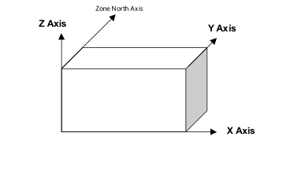

Figure 28. EnergyPlus Coordinate System

#### Field: Starting Vertex Position

The shadowing algorithms in EnergyPlus rely on surfaces having vertices in a certain order and positional structure. Thus, the surface translator needs to know the starting point for each surface entry. The choices are:  UpperLeftCorner, LowerLeftCorner , UpperRightCorner, or LowerRightCorner. Since most surfaces will be 4 sided, the convention will specify this position as though each surface were 4 sided. Extrapolate 3 sided figures to this convention. For 5 and more sided figures, again, try to extrapolate the best “corner” starting position.

#### Field: Vertex Entry Direction

Surfaces are always specified as being viewed from the outside of the zone to which they belong. (Shading surfaces are specified slightly differently and are discussed under the particular types). EnergyPlus needs to know whether the surfaces are being specified in counterclockwise or clockwise order (from the Starting Vertex Position). EnergyPlus uses this to determine the outward facing normal for the surface (which is the *facing angle* of the surface – very important in shading and shadowing calculations.

#### Field: Coordinate System

Vertices can be specified in two ways: using “Absolute”/“World” coordinates, or a **relative** coordinate specification. Relative coordinates allow flexibility of rapid change to observe changes in building results due to orientation and position. “World” coordinates will facilitate use within a CADD system structure.

**Relative** coordinates make use of both Building and Zone North Axis values as well as Zone Origin values to locate the surface in 3D coordinate space. **World** coordinates do not use these values.

Typically, all zone origin values for “World” coordinates will be (0,0,0) but Building and Zone North Axis values may be used in certain instances (namely the Daylighting Coordinate Location entries).

#### Field: Daylighting Reference Point Coordinate System

Daylighting reference points need to be specified as well.  Again, there can be two flavors; **relative** and **world**. Daylighting reference points must fit within the zone boundaries.

**Relative** coordinates make use of both Building and Zone North Axis values as well as Zone Origin values to locate the reference point in 3D coordinate space. **World** coordinates do not use these values.

#### Field: Rectangular Surface Coordinate System

Simple, rectangular surfaces (Wall:Exterior, Wall:Adiabatic, Wall:Underground, Wall:Interzone, Roof, Ceiling:Adiabatic, Ceiling:Interzone, Floor:GroundContact, Floor:Adiabatic, Floor:Interzone) can be specified with their Lower Left Corner as **relative** or **world**.

**Relative** (default) corners are specified relative to the Zone Origin for each surface. **World** corners would specify the absolute/world coordinate for this corner.

### Surfaces

Surfaces make up the buildings and the elements that shade buildings. There are several methods to inputting surfaces, ranging from simple rectangular surfaces to detailed descriptions that describe each vertex in the order specified in the GlobalGeometryRules object. The simple, rectangular surface objects are described first with the more detailed descriptions following.

### Walls

Walls are usually vertical (tilt = 90 degrees). These objects are used to describe exterior walls, interior walls (adiabatic), underground walls, and walls adjacent to other zones.

### Wall:Exterior

The Wall:Exterior object is used to describe walls that are exposed to the external environment. They receive sun, wind – all the characteristics of the external world.

#### Field: Name

This is a unique name associated with the exterior wall. It is used in several other places as a reference (e.g. as the base surface name for a Window or Door).

#### Field: Construction Name

This is the name of the construction (ref: Construction object) used in the surface. Regardless of location in the building, the “full” construction (all layers) is used. For example, for an interior wall separating two zones, zone x would have the outside layer (e.g. drywall) as the material that shows in zone y and then the layers to the inside layer – the material that shows in zone x. For symmetric constructions, the same construction can be used in the surfaces described in both zones.

#### Field: Zone Name

This is the zone name to which the surface belongs.

#### Field: Azimuth Angle

The Azimuth Angle indicates the direction that the wall faces (outward normal).  The angle is specified in degrees where East=90, South=180, West=270, North=0.

#### Field: Tilt Angle

The tilt angle is the angle (in degrees) that the wall is tilted from horizontal (or the ground).  Normally, walls are tilted 90 degrees and that is the default for this field.

#### Starting Corner for the surface

The rectangular surfaces specify the lower left corner of the surface for their starting coordinate.  This is specified with (x,y,z) and can be relative to the zone origin or in world coordinates, depending on the value for rectangular surfaces specified in the GlobalGeometryRules object.

#### Field: Starting X Coordinate

This field is the X coordinate (in meters).

#### Field: Starting Y Coordinate

This field is the Y coordinate (in meters).

#### Field: Starting Z Coordinate

This field is the Z coordinate (in meters).

#### Field: Length

This field is the length of the wall in meters.

#### Field: Height

This field is the height of the wall in meters.

### Wall:Adiabatic

The Wall:Adiabatic object is used to describe interior walls and partitions. Adiabatic walls are used to describe walls next to zones that have the same thermal conditions (thus, no heat transfer).

#### Field: Name

This is a unique name associated with the interior wall. It is used in several other places as a reference (e.g. as the base surface name for a Window or Door).

#### Field: Construction Name

This is the name of the construction (ref: Construction object) used in the surface. Regardless of location in the building, the “full” construction (all layers) is used. For example, for an interior wall separating two zones, zone x would have the outside layer (e.g. drywall) as the material that shows in zone y and then the layers to the inside layer – the material that shows in zone x. For symmetric constructions, the same construction can be used in the surfaces described in both zones.

#### Field: Zone Name

This is the zone name to which the surface belongs.

#### Field: Azimuth Angle

The Azimuth Angle indicates the direction that the wall faces (outward normal).  The angle is specified in degrees where East=90, South=180, West=270, North=0.

#### Field: Tilt Angle

The tilt angle is the angle (in degrees) that the wall is tilted from horizontal (or the ground).  Normally, walls are tilted 90 degrees and that is the default for this field.

#### Starting Corner for the surface

The rectangular surfaces specify the lower left corner of the surface for their starting coordinate.  This is specified with (x,y,z) and can be relative to the zone origin or in world coordinates, depending on the value for rectangular surfaces specified in the GlobalGeometryRules object.

#### Field: Starting X Coordinate

This field is the X coordinate (in meters).

#### Field: Starting Y Coordinate

This field is the Y coordinate (in meters).

#### Field: Starting Z Coordinate

This field is the Z coordinate (in meters).

#### Field: Length

This field is the length of the wall in meters.

#### Field: Height

This field is the height of the wall in meters.

### Wall:Underground

The Wall:Underground object is used to describe walls with ground contact. The temperature at the outside of the wall is the temperature in the GroundTemperature:BuildingSurface object.

#### Field: Name

This is a unique name associated with the underground wall. It is used in several other places as a reference (e.g. as the base surface name for a Window or Door).

#### Field: Construction Name

This is the name of the construction (ref: Construction object) used in the surface. Regardless of location in the building, the “full” construction (all layers) is used. For example, for an interior wall separating two zones, zone x would have the outside layer (e.g. drywall) as the material that shows in zone y and then the layers to the inside layer – the material that shows in zone x. For symmetric constructions, the same construction can be used in the surfaces described in both zones. Note that if the construction is **Construction:CfactorUndergroundWall** then the GroundFCfactoreMethod will be used for this wall.

#### Field: Zone Name

This is the zone name to which the surface belongs.

#### Field: Azimuth Angle

The Azimuth Angle indicates the direction that the wall faces (outward normal).  The angle is specified in degrees where East=90, South=180, West=270, North=0.

#### Field: Tilt Angle

The tilt angle is the angle (in degrees) that the wall is tilted from horizontal (or the ground).  Normally, walls are tilted 90 degrees and that is the default for this field.

#### Starting Corner for the surface

The rectangular surfaces specify the lower left corner of the surface for their starting coordinate.  This is specified with (x,y,z) and can be relative to the zone origin or in world coordinates, depending on the value for rectangular surfaces specified in the GlobalGeometryRules object.

#### Field: Starting X Coordinate

This field is the X coordinate (in meters).

#### Field: Starting Y Coordinate

This field is the Y coordinate (in meters).

#### Field: Starting Z Coordinate

This field is the Z coordinate (in meters).

#### Field: Length

This field is the length of the wall in meters.

#### Field: Height

This field is the height of the wall in meters.

### Wall:Interzone

The Wall:Interzone object is used to describe walls adjacent to zones that are significantly different conditions than the zone with this wall.

#### Field: Name

This is a unique name associated with the interzone wall. It is used in several other places as a reference (e.g. as the base surface name for a Window or Door).

#### Field: Construction Name

This is the name of the construction (ref: Construction object) used in the surface. Regardless of location in the building, the “full” construction (all layers) is used. For example, for an interior wall separating two zones, zone x would have the outside layer (e.g. drywall) as the material that shows in zone y and then the layers to the inside layer – the material that shows in zone x. For symmetric constructions, the same construction can be used in the surfaces described in both zones.

#### Field: Zone Name

This is the zone name to which the surface belongs.

#### Field: Outside Boundary Condition Object

The Outside Boundary Condition Object field is the name of a wall in an adjacent zone or the name of the adjacent zone.  If the adjacent zone option is used, the adjacent wall is automatically generated in the adjacent zone.  If the surface name is used, it must be in the adjacent zone.

#### Field: Azimuth Angle

The Azimuth Angle indicates the direction that the wall faces (outward normal).  The angle is specified in degrees where East=90, South=180, West=270, North=0.

#### Field: Tilt Angle

The tilt angle is the angle (in degrees) that the wall is tilted from horizontal (or the ground).  Normally, walls are tilted 90 degrees and that is the default for this field.

#### Starting Corner for the surface

The rectangular surfaces specify the lower left corner of the surface for their starting coordinate.  This is specified with (x,y,z) and can be relative to the zone origin or in world coordinates, depending on the value for rectangular surfaces specified in the GlobalGeometryRules object.

#### Field: Starting X Coordinate

This field is the X coordinate (in meters).

#### Field: Starting Y Coordinate

This field is the Y coordinate (in meters).

#### Field: Starting Z Coordinate

This field is the Z coordinate (in meters).

#### Field: Length

This field is the length of the wall in meters.

#### Field: Height

This field is the height of the wall in meters.

### Roofs/Ceilings

Roofs and ceilings are, by default, flat (tilt = 0 degrees). These objects are used to describe roofs, interior ceilings (adiabatic) and ceilings adjacent to other zones.

### Roof

The Roof object is used to describe roofs that are exposed to the external environment.

#### Field: Name

This is a unique name associated with the roof. It is used in several other places as a reference (e.g. as the base surface name for a Window or Door).

#### Field: Construction Name

This is the name of the construction (ref: Construction object) used in the surface. Regardless of location in the building, the “full” construction (all layers) is used. For example, for an interior wall separating two zones, zone x would have the outside layer (e.g. drywall) as the material that shows in zone y and then the layers to the inside layer – the material that shows in zone x. For symmetric constructions, the same construction can be used in the surfaces described in both zones.

#### Field: Zone Name

This is the zone name to which the surface belongs.

#### Field: Azimuth Angle

The Azimuth Angle indicates the direction of the outward normal for the roof.  The angle is specified in degrees where East=90, South=180, West=270, North=0.

#### Field: Tilt Angle

The tilt angle is the angle (in degrees) that the wall is tilted from horizontal (or the ground).  Flat roofs are tilted 0 degrees and that is the default for this field.

#### Starting Corner for the surface

The rectangular surfaces specify the lower left corner of the surface for their starting coordinate.  This is specified with (x,y,z) and can be relative to the zone origin or in world coordinates, depending on the value for rectangular surfaces specified in the GlobalGeometryRules object.

#### Field: Starting X Coordinate

This field is the X coordinate (in meters).

#### Field: Starting Y Coordinate

This field is the Y coordinate (in meters).

#### Field: Starting Z Coordinate

This field is the Z coordinate (in meters).

#### Field: Length

This field is the length of the roof in meters.

#### Field: Width

This field is the width of the roof in meters.

### Ceiling:Adiabatic

The Ceiling:Adiabatic object is used to describe interior ceilings that separate zones of like conditions.

#### Field: Name

This is a unique name associated with the ceiling. It is used in several other places as a reference (e.g. as the base surface name for a Window or Door).

#### Field: Construction Name

This is the name of the construction (ref: Construction object) used in the surface. Regardless of location in the building, the “full” construction (all layers) is used. For example, for an interior wall separating two zones, zone x would have the outside layer (e.g. drywall) as the material that shows in zone y and then the layers to the inside layer – the material that shows in zone x. For symmetric constructions, the same construction can be used in the surfaces described in both zones.

#### Field: Zone Name

This is the zone name to which the surface belongs.

#### Field: Azimuth Angle

The Azimuth Angle indicates the direction of the outward normal for the roof.  The angle is specified in degrees where East=90, South=180, West=270, North=0.

#### Field: Tilt Angle

The tilt angle is the angle (in degrees) that the wall is tilted from horizontal (or the ground).  Flat ceilings are tilted 0 degrees and that is the default for this field.

#### Starting Corner for the surface

The rectangular surfaces specify the lower left corner of the surface for their starting coordinate.  This is specified with (x,y,z) and can be relative to the zone origin or in world coordinates, depending on the value for rectangular surfaces specified in the GlobalGeometryRules object.

#### Field: Starting X Coordinate

This field is the X coordinate (in meters).

#### Field: Starting Y Coordinate

This field is the Y coordinate (in meters).

#### Field: Starting Z Coordinate

This field is the Z coordinate (in meters).

#### Field: Length

This field is the length of the ceiling in meters.

#### Field: Width

This field is the width of the ceiling in meters.

### Ceiling:Interzone

The Ceiling:Interzone object is used to describe interior ceilings that separate zones of differing conditions (and expect heat transfer through the ceiling from the adjacent zone).

#### Field: Name

This is a unique name associated with the interzone ceiling. It is used in several other places as a reference (e.g. as the base surface name for a Window or Door).

#### Field: Construction Name

This is the name of the construction (ref: Construction object) used in the surface. Regardless of location in the building, the “full” construction (all layers) is used. For example, for an interior wall separating two zones, zone x would have the outside layer (e.g. drywall) as the material that shows in zone y and then the layers to the inside layer – the material that shows in zone x. For symmetric constructions, the same construction can be used in the surfaces described in both zones.

#### Field: Zone Name

This is the zone name to which the surface belongs.

#### Field: Outside Boundary Condition Object

The Outside Boundary Condition Object field is the name of a floor in an adjacent zone or the name of the adjacent zone.  If the adjacent zone option is used, the adjacent floor is automatically generated in the adjacent zone.  If the surface name is used, it must be in the adjacent zone.

#### Field: Azimuth Angle

The Azimuth Angle indicates the direction of the outward normal for the roof.  The angle is specified in degrees where East=90, South=180, West=270, North=0.

#### Field: Tilt Angle

The tilt angle is the angle (in degrees) that the wall is tilted from horizontal (or the ground).  Flat ceilings are tilted 0 degrees and that is the default for this field.

#### Starting Corner for the surface

The rectangular surfaces specify the lower left corner of the surface for their starting coordinate.  This is specified with (x,y,z) and can be relative to the zone origin or in world coordinates, depending on the value for rectangular surfaces specified in the GlobalGeometryRules object.

#### Field: Starting X Coordinate

This field is the X coordinate (in meters).

#### Field: Starting Y Coordinate

This field is the Y coordinate (in meters).

#### Field: Starting Z Coordinate

This field is the Z coordinate (in meters).

#### Field: Length

This field is the length of the ceiling in meters.

#### Field: Width

This field is the width of the ceiling in meters.

### Floors

Floors are, by default, flat (tilt = 180 degrees). These objects are used to describe floors on the ground, interior floors (adiabatic) and floors adjacent to other zones.

### Floor:GroundContact

The Floor:GroundContact object is used to describe floors that have ground contact (usually called slabs). The temperature at the outside of the floor is the temperature in the GroundTemperature:BuildingSurface object.

#### Field: Name

This is a unique name associated with the floor.

#### Field: Construction Name

This is the name of the construction (ref: Construction object) used in the surface. Regardless of location in the building, the “full” construction (all layers) is used. For example, for an interior wall separating two zones, zone x would have the outside layer (e.g. drywall) as the material that shows in zone y and then the layers to the inside layer – the material that shows in zone x. For symmetric constructions, the same construction can be used in the surfaces described in both zones. Note that if the construction is **Construction:FfactorGroundFloor,** then the GroundFCfactorMethod will be used with this floor.

#### Field: Zone Name

This is the zone name to which the surface belongs.

#### Field: Azimuth Angle

The Azimuth Angle indicates the direction of the outward normal for the roof.  The angle is specified in degrees where East=90, South=180, West=270, North=0.

#### Field: Tilt Angle

The tilt angle is the angle (in degrees) that the wall is tilted from horizontal (or the ground).  Flat floors are tilted 180 degrees and that is the default for this field.

#### Starting Corner for the surface

The rectangular surfaces specify the lower left corner of the surface for their starting coordinate.  This is specified with (x,y,z) and can be relative to the zone origin or in world coordinates, depending on the value for rectangular surfaces specified in the GlobalGeometryRules object.

#### Field: Starting X Coordinate

This field is the X coordinate (in meters).

#### Field: Starting Y Coordinate

This field is the Y coordinate (in meters).

#### Field: Starting Z Coordinate

This field is the Z coordinate (in meters).

#### Field: Length

This field is the length of the floor in meters.

#### Field: Width

This field is the width of the floor in meters.

### Floor:Adiabatic

The Floor:Adiabatict object is used to describe interior floors or floors that you wish to model with no heat transfer from the exterior to the floor.

#### Field: Name

This is a unique name associated with the floor.

#### Field: Construction Name

This is the name of the construction (ref: Construction object) used in the surface. Regardless of location in the building, the “full” construction (all layers) is used. For example, for an interior wall separating two zones, zone x would have the outside layer (e.g. drywall) as the material that shows in zone y and then the layers to the inside layer – the material that shows in zone x. For symmetric constructions, the same construction can be used in the surfaces described in both zones.

#### Field: Zone Name

This is the zone name to which the surface belongs.

#### Field: Azimuth Angle

The Azimuth Angle indicates the direction of the outward normal for the roof.  The angle is specified in degrees where East=90, South=180, West=270, North=0.

#### Field: Tilt Angle

The tilt angle is the angle (in degrees) that the wall is tilted from horizontal (or the ground).  Flat floors are tilted 180 degrees and that is the default for this field.

#### Starting Corner for the surface

The rectangular surfaces specify the lower left corner of the surface for their starting coordinate.  This is specified with (x,y,z) and can be relative to the zone origin or in world coordinates, depending on the value for rectangular surfaces specified in the GlobalGeometryRules object.

#### Field: Starting X Coordinate

This field is the X coordinate (in meters).

#### Field: Starting Y Coordinate

This field is the Y coordinate (in meters).

#### Field: Starting Z Coordinate

This field is the Z coordinate (in meters).

#### Field: Length

This field is the length of the floor in meters.

#### Field: Width

This field is the width of the floor in meters.

### Floor:Interzone

The Floor:Interzone object is used to describe floors that are adjacent to other zones that have differing conditions and you wish to model the heat transfer through the floor.

#### Field: Name

This is a unique name associated with the floor.

#### Field: Construction Name

This is the name of the construction (ref: Construction object) used in the surface. Regardless of location in the building, the “full” construction (all layers) is used. For example, for an interior wall separating two zones, zone x would have the outside layer (e.g. drywall) as the material that shows in zone y and then the layers to the inside layer – the material that shows in zone x. For symmetric constructions, the same construction can be used in the surfaces described in both zones.

#### Field: Zone Name

This is the zone name to which the surface belongs.

#### Field: Outside Boundary Condition Object

The Outside Boundary Condition Object field is the name of a ceiling in an adjacent zone or the name of the adjacent zone.  If the adjacent zone option is used, the adjacent ceiling is automatically generated in the adjacent zone.  If the surface name is used, it must be in the adjacent zone.

#### Field: Azimuth Angle

The Azimuth Angle indicates the direction of the outward normal for the roof.  The angle is specified in degrees where East=90, South=180, West=270, North=0.

#### Field: Tilt Angle

The tilt angle is the angle (in degrees) that the wall is tilted from horizontal (or the ground).  Flat floors are tilted 180 degrees and that is the default for this field.

#### Starting Corner for the surface

The rectangular surfaces specify the lower left corner of the surface for their starting coordinate.  This is specified with (x,y,z) and can be relative to the zone origin or in world coordinates, depending on the value for rectangular surfaces specified in the GlobalGeometryRules object.

#### Field: Starting X Coordinate

This field is the X coordinate (in meters).

#### Field: Starting Y Coordinate

This field is the Y coordinate (in meters).

#### Field: Starting Z Coordinate

This field is the Z coordinate (in meters).

#### Field: Length

This field is the length of the floor in meters.

#### Field: Width

This field is the width of the floor in meters.

### Windows/Doors

The following window and door objects can be used to specify simple, rectangular doors and windows. In each case, the lower left corner (locator coordinate) of the window or door is specified **relative** to the surface it is on.  Viewing the base surface as a planar surface, base the relative location from the lower left corner of the base surface. Vertex entry description as well as provisions for a few other surface types can be entered with the FenestrationSurface:Detailed object.

### Window

The Window object is used to place windows on surfaces that can have windows, including exterior walls, interior walls, interzone walls, roofs, floors that are exposed to outdoor conditions, interzone ceiling/floors. These, of course, can be entered using the simple rectangular objects or the more detailed vertex entry objects.

#### Field: Name

This is a unique name associated with the window.

#### Field: Construction Name

This is the name of the subsurface’s construction (ref: objects: Construction, Construction:WindowDataFile, Construction:CompexFenestrationState).

For windows, if Construction Name is not found among the constructions on the input (.idf) file, the Window Data File (ref. Construction:WindowDataFile object) will be searched for that Construction Name (see “Importing Windows from WINDOW”). If that file is not present or if the Construction Name does not match the name of an entry on the file, an error will result. If there is a match, a window construction and its corresponding glass and gas materials will be created from the information read from the file.

#### Field: Building Surface Name

This is the name of a surface that contains this subsurface. Certain kinds of surfaces may not be allowed to have subsurfaces. For example, a surface in contact with the ground (e.g., Outside Boundary Condition = Ground) cannot contain a window. The window assumes the outward facing angle as well as the tilt angle of the base surface.

#### Field: Shading Control Name

This field, if not blank, is the name of the window shading control (ref: WindowProperty:ShadingControl object) for this subsurface. It is used for Surface Type = Window and GlassDoor. To assign a shade to a window or glass door, see WindowMaterial: Shade. To assign a screen, see WindowMaterial:Screen. To assign a blind, see WindowMaterial:Blind. To assign switchable glazing, such as electrochromic glazing, see WindowProperty:ShadingControl.

#### Field: Frame and Divider Name

This field, if not blank, can be used to specify window frame, divider and reveal-surface data (ref: WindowProperty:FrameAndDivider object). It is used only for exterior GlassDoors and rectangular exterior Windows, i.e., those with OutsideFaceEnvironment = Outdoors.

This field should be blank for triangular windows.

#### Field: Multiplier

This field is the number of identical items on the base surface. Using Multiplier can save input effort and calculation time. In the calculation the area (and area of frame and divider, if present and surface type is a window) is multiplied by Multiplier. The calculation of shadowing on the subsurfaces (and the calculation of the interior distribution of beam solar radiation transmitted by windows and glass doors) are done for the specified subsurface position and dimensions.

Multiplier should be used with caution. Multiplier &gt; 1 can give inaccurate or nonsensical results in situations where the results are sensitive to window or glass door position. This includes shadowing on the window/glass door, daylighting from the window/glass door, and interior distribution of solar radiation from the window/glass door. In these cases, the results for the single input window/glass door, after multiplication, may not be representative of the results you would get if you entered each of the multiple subsurfaces separately.

If Multiplier &gt; 1, you will get

--a *warning* if Solar Distribution = FullExterior or FullInteriorAndExterior (ref: Building - Field: Solar Distribution), indicating that the shadowing on the input window or the interior solar radiation distribution from the input window may not be representative of the actual group of windows. No warning is issued if Solar Distribution = MinimalShadowing.

--an *error* if the window is an exterior window/glass door in a zone that has a detailed daylighting calculation (Daylighting:Detailed specified for the zone). Since a single window with a multiplier can never give the same daylight illuminance as the actual set of windows, you are not allowed to use Multiplier in this situation.

#### Starting Corner for the surface

The rectangular subsurfaces specify the lower left corner of the surface for their starting coordinate.  This corner is specifed relative to the lower left corner of the base surface by specifying the X and Z values from that corner.

#### Field: Starting X Coordinate

This field is the X coordinate (in meters).

#### Field: Starting Z Coordinate

This field is the Z coordinate (in meters).

#### Field: Length

This field is the length of the window in meters.

#### Field: Height

This field is the height of the window in meters.

### Door

The Door object is used to place opaque doors on surfaces that can have doors, including exterior walls, interior walls, interzone walls, roofs, floors that are exposed to outdoor conditions, interzone ceiling/floors. These, of course, can be entered using the simple rectangular objects or the more detailed vertex entry objects.

#### Field: Name

This is a unique name associated with the door.

#### Field: Construction Name

This is the name of the subsurface’s construction (ref: Construction object)

#### Field: Building Surface Name

This is the name of a surface that contains this subsurface. Certain kinds of surfaces may not be allowed to have subsurfaces. The door assumes the outward facing angle as well as the tilt angle of the base surface.

#### Field: Multiplier

This field is the number of identical items on the base surface. Using Multiplier can save input effort and calculation time. In the calculation the area (and area of frame and divider, if present and surface type is a window) is multiplied by Multiplier. The calculation of shadowing on the subsurfaces (and the calculation of the interior distribution of beam solar radiation transmitted by windows and glass doors) are done for the specified subsurface position and dimensions.

Multiplier should be used with caution. Multiplier &gt; 1 can give inaccurate or nonsensical results in situations where the results are sensitive to window or glass door position. This includes shadowing on the window/glass door, daylighting from the window/glass door, and interior distribution of solar radiation from the window/glass door. In these cases, the results for the single input window/glass door, after multiplication, may not be representative of the results you would get if you entered each of the multiple subsurfaces separately.

If Multiplier &gt; 1, you will get

--a *warning* if Solar Distribution = FullExterior or FullInteriorAndExterior (ref: Building - Field: Solar Distribution), indicating that the shadowing on the input window or the interior solar radiation distribution from the input window may not be representative of the actual group of windows. No warning is issued if Solar Distribution = MinimalShadowing.

--an *error* if the window is an exterior window/glass door in a zone that has a detailed daylighting calculation (Daylighting:Detailed specified for the zone). Since a single window with a multiplier can never give the same daylight illuminance as the actual set of windows, you are not allowed to use Multiplier in this situation.

#### Starting Corner for the surface

The rectangular subsurfaces specify the lower left corner of the surface for their starting coordinate.  This corner is specifed relative to the lower left corner of the base surface by specifying the X and Z values from that corner.

#### Field: Starting X Coordinate

This field is the X coordinate (in meters).

#### Field: Starting Z Coordinate

This field is the Z coordinate (in meters).

#### Field: Length

This field is the length of the door in meters.

#### Field: Height

This field is the height of the door in meters.

### GlazedDoor

The GlazedDoor object is used to place doors on surfaces that can have doors, including exterior walls, interior walls, interzone walls, roofs, floors that are exposed to outdoor conditions, interzone ceiling/floors. These, of course, can be entered using the simple rectangular objects or the more detailed vertex entry objects.

#### Field: Name

This is a unique name associated with the glass door.

#### Field: Construction Name

This is the name of the subsurface’s construction (ref: objects: Construction, Construction:WindowDataFile, Construction:CompexFenestrationState).

For windows, if Construction Name is not found among the constructions on the input (.idf) file, the Window Data File (ref. Construction:WindowDataFile object) will be searched for that Construction Name (see “Importing Windows from WINDOW”). If that file is not present or if the Construction Name does not match the name of an entry on the file, an error will result. If there is a match, a window construction and its corresponding glass and gas materials will be created from the information read from the file.

#### Field: Building Surface Name

This is the name of a surface that contains this subsurface. Certain kinds of surfaces may not be allowed to have subsurfaces. For example, a surface in contact with the ground (Outside Boundary Condition = Ground) cannot contain a window. The door assumes the outward facing angle as well as the tilt angle of the base surface.

#### Field: Shading Control Name

This field, if not blank, is the name of the window shading control (ref: WindowProperty:ShadingControl object) for this subsurface. It is used for Surface Type = Window and GlassDoor. To assign a shade to a window or glass door, see WindowMaterial: Shade. To assign a screen, see WindowMaterial:Screen. To assign a blind, see WindowMaterial:Blind. To assign switchable glazing, such as electrochromic glazing, see WindowProperty:ShadingControl.

#### Field: Frame and Divider Name

This field, if not blank, can be used to specify window frame, divider and reveal-surface data (ref: WindowProperty:FrameAndDivider object). It is used only for exterior GlassDoors and rectangular exterior Windows, i.e., those with OutsideFaceEnvironment = Outdoors.

This field should be blank for triangular windows.

#### Field: Multiplier

This field is the number of identical items on the base surface. Using Multiplier can save input effort and calculation time. In the calculation the area (and area of frame and divider, if present and surface type is a window) is multiplied by Multiplier. The calculation of shadowing on the subsurfaces (and the calculation of the interior distribution of beam solar radiation transmitted by windows and glass doors) are done for the specified subsurface position and dimensions.

Multiplier should be used with caution. Multiplier &gt; 1 can give inaccurate or nonsensical results in situations where the results are sensitive to window or glass door position. This includes shadowing on the window/glass door, daylighting from the window/glass door, and interior distribution of solar radiation from the window/glass door. In these cases, the results for the single input window/glass door, after multiplication, may not be representative of the results you would get if you entered each of the multiple subsurfaces separately.

If Multiplier &gt; 1, you will get

--a *warning* if Solar Distribution = FullExterior or FullInteriorAndExterior (ref: Building - Field: Solar Distribution), indicating that the shadowing on the input window or the interior solar radiation distribution from the input window may not be representative of the actual group of windows. No warning is issued if Solar Distribution = MinimalShadowing.

--an *error* if the window is an exterior window/glass door in a zone that has a detailed daylighting calculation (Daylighting:Detailed specified for the zone). Since a single window with a multiplier can never give the same daylight illuminance as the actual set of windows, you are not allowed to use Multiplier in this situation.

#### Starting Corner for the surface

The rectangular subsurfaces specify the lower left corner of the surface for their starting coordinate.  This corner is specifed relative to the lower left corner of the base surface by specifying the X and Z values from that corner.

#### Field: Starting X Coordinate

This field is the X coordinate (in meters).

#### Field: Starting Z Coordinate

This field is the Z coordinate (in meters).

#### Field: Length

This field is the length of the door in meters.

#### Field: Height

This field is the height of the door in meters.

### Window:Interzone

The Window:Interzone object is used to place windows on surfaces that can have windows, including interzone walls, interzone ceiling/floors. These, of course, can be entered using the simple rectangular objects or the more detailed vertex entry objects.

#### Field: Name

This is a unique name associated with the window.

#### Field: Construction Name

This is the name of the subsurface’s construction (ref: objects: Construction, Construction:WindowDataFile, Construction:CompexFenestrationState).

For windows, if Construction Name is not found among the constructions on the input (.idf) file, the Window Data File (ref. Construction:WindowDataFile object) will be searched for that Construction Name (see “Importing Windows from WINDOW”). If that file is not present or if the Construction Name does not match the name of an entry on the file, an error will result. If there is a match, a window construction and its corresponding glass and gas materials will be created from the information read from the file.

#### Field: Building Surface Name

This is the name of a surface that contains this subsurface. Certain kinds of surfaces may not be allowed to have subsurfaces. For example, a surface in contact with the ground (Outside Boundary Condition = Ground) cannot contain a window. The window assumes the outward facing angle as well as the tilt angle of the base surface.

#### Field: Outside Boundary Condition Object

The Outside Boundary Condition Object field is the name of a window in an adjacent zone or the name of the adjacent zone.  If the adjacent zone option is used, the adjacent ceiling is automatically generated in the adjacent zone.  If the surface name is used, it must be in the adjacent zone.

#### Field: Multiplier

This field is the number of identical items on the base surface. Using Multiplier can save input effort and calculation time. In the calculation the area (and area of frame and divider, if present and surface type is a window) is multiplied by Multiplier. The calculation of shadowing on the subsurfaces (and the calculation of the interior distribution of beam solar radiation transmitted by windows and glass doors) are done for the specified subsurface position and dimensions.

Multiplier should be used with caution. Multiplier &gt; 1 can give inaccurate or nonsensical results in situations where the results are sensitive to window or glass door position. This includes shadowing on the window/glass door, daylighting from the window/glass door, and interior distribution of solar radiation from the window/glass door. In these cases, the results for the single input window/glass door, after multiplication, may not be representative of the results you would get if you entered each of the multiple subsurfaces separately.

If Multiplier &gt; 1, you will get

--a *warning* if Solar Distribution = FullExterior or FullInteriorAndExterior (ref: Building - Field: Solar Distribution), indicating that the shadowing on the input window or the interior solar radiation distribution from the input window may not be representative of the actual group of windows. No warning is issued if Solar Distribution = MinimalShadowing.

--an *error* if the window is an exterior window/glass door in a zone that has a detailed daylighting calculation (Daylighting:Detailed specified for the zone). Since a single window with a multiplier can never give the same daylight illuminance as the actual set of windows, you are not allowed to use Multiplier in this situation.

#### Starting Corner for the surface

The rectangular subsurfaces specify the lower left corner of the surface for their starting coordinate.  This corner is specifed relative to the lower left corner of the base surface by specifying the X and Z values from that corner.

#### Field: Starting X Coordinate

This field is the X coordinate (in meters).

#### Field: Starting Z Coordinate

This field is the Z coordinate (in meters).

#### Field: Length

This field is the length of the window in meters.

#### Field: Height

This field is the height of the window in meters.

### Door:Interzone

The Door:Interzone object is used to place opaque doors on surfaces that can have doors, including interzone walls, interzone ceiling/floors. These, of course, can be entered using the simple rectangular objects or the more detailed vertex entry objects.

#### Field: Name

This is a unique name associated with the door.

#### Field: Construction Name

This is the name of the subsurface’s construction (ref: Construction object).

#### Field: Building Surface Name

This is the name of a surface that contains this subsurface. Certain kinds of surfaces may not be allowed to have subsurfaces. The door assumes the outward facing angle as well as the tilt angle of the base surface.

#### Field: Outside Boundary Condition Object

The Outside Boundary Condition Object field is the name of a door in an adjacent zone or the name of the adjacent zone.  If the adjacent zone option is used, the adjacent ceiling is automatically generated in the adjacent zone.  If the surface name is used, it must be in the adjacent zone.

#### Field: Multiplier

This field is the number of identical items on the base surface. Using Multiplier can save input effort and calculation time. In the calculation the area (and area of frame and divider, if present and surface type is a window) is multiplied by Multiplier. The calculation of shadowing on the subsurfaces (and the calculation of the interior distribution of beam solar radiation transmitted by windows and glass doors) are done for the specified subsurface position and dimensions.

Multiplier should be used with caution. Multiplier &gt; 1 can give inaccurate or nonsensical results in situations where the results are sensitive to window or glass door position. This includes shadowing on the window/glass door, daylighting from the window/glass door, and interior distribution of solar radiation from the window/glass door. In these cases, the results for the single input window/glass door, after multiplication, may not be representative of the results you would get if you entered each of the multiple subsurfaces separately.

If Multiplier &gt; 1, you will get

--a *warning* if Solar Distribution = FullExterior or FullInteriorAndExterior (ref: Building - Field: Solar Distribution), indicating that the shadowing on the input window or the interior solar radiation distribution from the input window may not be representative of the actual group of windows. No warning is issued if Solar Distribution = MinimalShadowing.

--an *error* if the window is an exterior window/glass door in a zone that has a detailed daylighting calculation (Daylighting:Detailed specified for the zone). Since a single window with a multiplier can never give the same daylight illuminance as the actual set of windows, you are not allowed to use Multiplier in this situation.

#### Starting Corner for the surface

The rectangular subsurfaces specify the lower left corner of the surface for their starting coordinate.  This corner is specifed relative to the lower left corner of the base surface by specifying the X and Z values from that corner.

#### Field: Starting X Coordinate

This field is the X coordinate (in meters).

#### Field: Starting Z Coordinate

This field is the Z coordinate (in meters).

#### Field: Length

This field is the length of the door in meters.

#### Field: Height

This field is the height of the door in meters.

### GlazedDoor:Interzone

The GlazedDoor:Interzone object is used to place doors on surfaces that can have doors, including interzone walls, interzone ceiling/floors. These, of course, can be entered using the simple rectangular objects or the more detailed vertex entry objects.

#### Field: Name

This is a unique name associated with the glass door.

#### Field: Construction Name

This is the name of the subsurface’s construction (ref: objects: Construction, Construction:WindowDataFile, Construction:ComplexFenestrationState).

For windows, if Construction Name is not found among the constructions on the input (.idf) file, the Window Data File (ref. Construction:WindowDataFile object) will be searched for that Construction Name (see “Importing Windows from WINDOW”). If that file is not present or if the Construction Name does not match the name of an entry on the file, an error will result. If there is a match, a window construction and its corresponding glass and gas materials will be created from the information read from the file.

#### Field: Building Surface Name

This is the name of a surface that contains this subsurface. Certain kinds of surfaces may not be allowed to have subsurfaces. For example, a surface in contact with the ground (Outside Boundary Condition = Ground) cannot contain a window. The door assumes the outward facing angle as well as the tilt angle of the base surface.

#### Field: Outside Boundary Condition Object

The Outside Boundary Condition Object field is the name of a glazed (glass) door in an adjacent zone or the name of the adjacent zone.  If the adjacent zone option is used, the adjacent ceiling is automatically generated in the adjacent zone.  If the surface name is used, it must be in the adjacent zone.

#### Field: Multiplier

This field is the number of identical items on the base surface. Using Multiplier can save input effort and calculation time. In the calculation the area (and area of frame and divider, if present and surface type is a window) is multiplied by Multiplier. The calculation of shadowing on the subsurfaces (and the calculation of the interior distribution of beam solar radiation transmitted by windows and glass doors) are done for the specified subsurface position and dimensions.

Multiplier should be used with caution. Multiplier &gt; 1 can give inaccurate or nonsensical results in situations where the results are sensitive to window or glass door position. This includes shadowing on the window/glass door, daylighting from the window/glass door, and interior distribution of solar radiation from the window/glass door. In these cases, the results for the single input window/glass door, after multiplication, may not be representative of the results you would get if you entered each of the multiple subsurfaces separately.

If Multiplier &gt; 1, you will get

--a *warning* if Solar Distribution = FullExterior or FullInteriorAndExterior (ref: Building - Field: Solar Distribution), indicating that the shadowing on the input window or the interior solar radiation distribution from the input window may not be representative of the actual group of windows. No warning is issued if Solar Distribution = MinimalShadowing.

--an *error* if the window is an exterior window/glass door in a zone that has a detailed daylighting calculation (Daylighting:Detailed specified for the zone). Since a single window with a multiplier can never give the same daylight illuminance as the actual set of windows, you are not allowed to use Multiplier in this situation.

#### Starting Corner for the surface

The rectangular subsurfaces specify the lower left corner of the surface for their starting coordinate.  This corner is specifed relative to the lower left corner of the base surface by specifying the X and Z values from that corner.

#### Field: Starting X Coordinate

This field is the X coordinate (in meters).

#### Field: Starting Z Coordinate

This field is the Z coordinate (in meters).

#### Field: Length

This field is the length of the door in meters.

#### Field: Height

This field is the height of the door in meters.

Examples of the rectangular surfaces are found in the example files 4ZoneWithShading\_Simple\_1.idf and 4ZoneWithShading\_Simple\_2. Some examples:

```idf
  Wall:Exterior,
    Zn001:Wall001,           !- Name
    EXTERIOR,                !- Construction Name
    ZONE 1,                  !- Zone Name
    180,                     !- Azimuth Angle {deg}
    90,                      !- Tilt Angle {deg}
    0,                       !- Starting X Coordinate {m}
    0,                       !- Starting Y Coordinate {m}
    0,                       !- Starting Z Coordinate {m}
    20,                      !- Length {m}
    10;                      !- Height {m}

  Window,
    Zn001:Wall001:Win001,    !- Name
    SINGLE PANE HW WINDOW,   !- Construction Name
    Zn001:Wall001,           !- Building Surface Name
    ,                        !- Shading Control Name
    ,                        !- Frame and Divider Name
    1,                       !- Multiplier
    4,                       !- Starting X Coordinate {m}
    3,                       !- Starting Z Coordinate {m}
    3,                       !- Length {m}
    5;                       !- Height {m}

  Door,
    Zn001:Wall001:Door001,   !- Name
    HOLLOW WOOD DOOR,        !- Construction Name
    Zn001:Wall001,           !- Building Surface Name
    1,                       !- Multiplier
    14,                      !- Starting X Coordinate {m}
    0,                       !- Starting Z Coordinate {m}
    3,                       !- Length {m}
    5;                       !- Height {m}

  Wall:Adiabatic,
    Zn001:Wall004,           !- Name
    INTERIOR,                !- Construction Name
    ZONE 1,                  !- Zone Name
    90,                      !- Azimuth Angle {deg}
    90,                      !- Tilt Angle {deg}
    20,                      !- Starting X Coordinate {m}
    0,                       !- Starting Y Coordinate {m}
    0,                       !- Starting Z Coordinate {m}
    20,                      !- Length {m}
    10;                      !- Height {m}

  Floor:Adiabatic,
    Zn001:Flr001,            !- Name
    FLOOR,                   !- Construction Name
    ZONE 1,                  !- Zone Name
    90,                      !- Azimuth Angle {deg}
    180,                     !- Tilt Angle {deg}
    0,                       !- Starting X Coordinate {m}
    0,                       !- Starting Y Coordinate {m}
    0,                       !- Starting Z Coordinate {m}
    20,                      !- Length {m}
    20;                      !- Width {m}

  Ceiling:Interzone,
    Zn001:Roof001,           !- Name
    CEILING34,               !- Construction Name
    ZONE 1,                  !- Zone Name
    Zn003:Flr001,            !- Outside Boundary Condition Object
    180,                     !- Azimuth Angle {deg}
    0,                       !- Tilt Angle {deg}
    0,                       !- Starting X Coordinate {m}
    0,                       !- Starting Y Coordinate {m}
    10,                      !- Starting Z Coordinate {m}
    20,                      !- Length {m}
    20;                      !- Width {m}

  Window,
    Zn002:Wall001:Win001,    !- Name
    SINGLE PANE HW WINDOW,   !- Construction Name
    Zn002:Wall001,           !- Building Surface Name
    ,                        !- Shading Control Name
    ,                        !- Frame and Divider Name
    1,                       !- Multiplier
    4,                       !- Starting X Coordinate {m}
    3,                       !- Starting Z Coordinate {m}
    3,                       !- Length {m}
    5;                       !- Height {m}
```

### Surface Vertices

Each of the following surfaces:

* BuildingSurface:Detailed

* Wall:Detailed

* RoofCeiling:Detailed

* Floor:Detailed

* FenstrationSurface:Detailed

* Shading:Site:Detailed

* Shading:Building:Detailed

* Shading:Zone:Detailed

use the same vertex input. The numeric parameters indicated below are taken from the BuildingSurface:Detailed definition;  the others may not be exactly the same but are identical in configuration. They are also “extensible” – so, if you want more vertices for these surfaces, you may add to the IDD definition as indicated in the “extensible” comment or, as EnergyPlus is “auto-extensible” just add the number of vertices into your input file.. Note that FenestrationSurface:Detailed is not extensible and is limited to 4 (max) vertices. If you leave the Number of Surface Vertex groups blank or enter **autocalculate**, EnergyPlus looks at the number of groups entered and figures out how many coordinate groups are entered.

**Note that the resolution on the surface vertex input is 1 millimeter (.001 meter). Therefore, using vertices that are very close together (&lt;1 mm) may result in invalid dot product and fatal errors during shading calculations.**

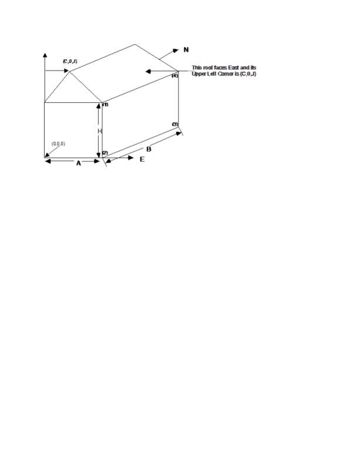

Figure 29. Illustration for Surface Vertices

The figure above will help illustrate Surface Vertex entry. The convention used in “GlobalGeometryRules” dictates the order of the vertices (ref: GlobalGeometryRules). In this example, the conventions used are Starting Vertex Position = UpperLeftCorner and Vertex Entry Direction= CounterClockwise. The surfaces for this single zone are:

4,0,0,H, 0,0,0, A,0,0, A,0,H; ! **(4 vertices, South Wall)**

4,A,0,H,A,0,0,A,B,0,A,B,H;  ! **(4 vertices, East Wall)**

     **ignore other walls that are not shown in this figure**

4,C,0,J,A,0,H,A,B,H,C,B,J; ! **(4 vertices, roof)**

3,C,0,J,0,0,H,A,0,H; ! **(3 vertices, gable end)**

4,0,0,H, 0,0,0, A,0,0, A,0,H; ! **(4 vertices, South Wall)**

Note that in this example, point 1 of the entry is the Upper Left Corner of the rectangular surfaces and the point of the triangle for the 3 sided surface. The east wall shows the order of vertex entry. For horizontal surfaces, any vertex may be chosen as the starting position, but the Vertex Entry Direction convention must be followed. The surface details report (Output: Surfaces:List, Details;) is very useful for reviewing the accuracy of surface geometry inputs (ref: Surface Output Variables/Reports and Variable Dictionary Reports).

From the detailed vertices, EnergyPlus tries to determine the “height” and “width” of the surface. Obviously, this doesn’t work well for &gt;4 sided surfaces; for these, if the calculated height and width are not close to the gross area for the surface, the height and width shown will be the square root of the area (and thus a square).

### Building Surfaces - Detailed

A building surface is necessary for all calculations. There must be at least one building surface per zone. You can use the detailed descriptions as shown below or the simpler, rectangular surface descriptions shown earlier.

### Wall:Detailed

The Wall:Detailed object is used to describe walls.

#### Field: Name

This is a unique name associated with each building surface. It is used in several other places as a reference (e.g. as the base surface name for a Window or Door).

#### Field: Construction Name

This is the name of the construction (ref: Construction object) used in the surface. Regardless of location in the building, the “full” construction (all layers) is used. For example, for an interior wall separating two zones, zone x would have the outside layer (e.g. drywall) as the material that shows in zone y and then the layers to the inside layer – the material that shows in zone x. For symmetric constructions, the same construction can be used in the surfaces described in both zones.

#### Field: Zone Name

This is the zone name to which the surface belongs.

#### Field: Outside Boundary Condition

This value can be one of several things depending on the actual kind of surface.

1)    **Surface** – if this surface is an internal surface, then this is the choice. The value will either be a surface in the base zone or a surface in another zone. The heat balance between two zones can be accurately simulated by specifying a surface in an adjacent zone. EnergyPlus will simulate a group of zones simultaneously and will include the heat transfer between zones. However, as this increases the complexity of the calculations, it is not necessary to specify the other zone unless the two zones will have a significant temperature difference. If the two zones will not be very different (temperature wise), then the surface should use itself as the outside environment or specify this field as **Adiabatic**. The surface name on the “outside” of this surface (adjacent to) is placed in the next field.

2)    **Adiabatic** – an internal surface in the same Zone. This surface will not transfer heat out of the zone, but will still store heat in thermal mass. Only the inside face of the surface will exchange heat with the zone (i.e. two adiabatic surfaces are required to model internal partitions where both sides of the surface are exchanging heat with the zone). The Outside Boundary Condition Object can be left blank.

3)    **Zone** – this is similar to Surface but EnergyPlus will automatically create the required surface in the adjacent zone when this is entered for the surface. If there are windows or doors on the surface, EnergyPlus automatically creates appropriate sub-surfaces as well.

4)    **Outdoors** – if this surface is exposed to outside temperature conditions, then this is the choice. See Sun Exposure and Wind Exposure below for further specifications on this kind of surface.

5)    **Ground** – if this surface is exposed to the ground, then this is the usual choice. The temperature on the outside of this surface will be the Site:GroundTemperature:Surface value for the month. For more information on ground contact surfaces, reference the Auxiliary Programs document section on “Ground Heat Transfer in EnergyPlus”.

6)    **GroundFCfactorMethod** – if this surface is exposed to the ground and using the **Construction:CfactorUndergroundWall**, then this is the choice. The temperature on the outside of this surface will be the Site:GroundTemperature:FcfactorMethod value for the month.

7)    **OtherSideCoefficients** – if this surface has a custom, user specified temperature or other parameters (See SurfaceProperty:OtherSideCoefficients specification), then this is the choice. The outside boundary condition will be the name of the SurfaceProperty:OtherSideCoefficients specification.

8)    **OtherSideConditionsModel** – if this surface has a specially-modeled multi-skin component, such as a transpired collector or vented photovoltaic panel, attached to the outside (See SurfaceProperty:OtherSideConditionsModel specification), then this the choice. The outside face environment will be the name of the SurfaceProperty:OtherSideConditionsModelspecification.

9)    **GroundSlabPreprocessorAverage** – uses the average results from the Slab preprocessor calculations.

10) **GroundSlabPreprocessorCore** – uses the core results from the Slab preprocessor calculations.

11) **GroundSlabPreprocessorPerimeter** – uses the perimeter results from the Slab preprocessor calculations.

12) **GroundBasementPreprocessorAverageWall** – uses the average wall results from the Basement preprocessor calculations.

13) **GroundBasementPreprocessorAverageFloor** – uses the average floor results from the Basement preprocessor calculations.

14) **GroundBasementPreprocessorUpperWall** – uses the upper wall results from the Basement preprocessor calculations.

15) **GroundBasementPreprocessorLowerWall** – uses the lower wall results from the Basement preprocessor calculations.

#### Field: Outside Boundary Condition Object

If neither Surface, OtherSideCoefficients, or OtherSideConditionsModel are specified for the Outside Boundary Condition (previous field), then this field should be left blank.

As stated above, if the Outside Boundary Condition is “Surface”, then this field’s value must be the surface name whose inside face temperature will be forced on the outside face of the base surface. This permits heat exchange between adjacent zones (interzone heat transfer) when multiple zones are simulated, but can also be used to simulate middle zone behavior without modeling the adjacent zones. This is done by specifying a surface within the zone. For example, a middle floor zone can be modeled by making the floor the Outside Boundary Condition Object for the ceiling, and the ceiling the Outside Boundary Condition Object for the floor.

If the Outside Boundary Condition is Zone, then this field should contain the zone name of the adjacent zone for the surface.

Note: Zones with interzone heat transfer are not adiabatic and the internal surfaces contribute to gains or losses. Adiabatic surfaces are modeled by specifying the base surface itself in this field.  Also, for interzone heat transfer, both surfaces must be represented – for example, if you want interzone heat transfer to an attic space, the ceiling in the lower zone must have a surface object with the outside face environment as the floor in the attic and, likewise, there must be a floor surface object in the attic that references the ceiling surface name in the lower zone.

Equally, if the Outside Boundary Condition is “OtherSideCoefficients”, then this field’s value must be the SurfaceProperty:OtherSideCoefficients name. Or if the Outside Boundary Condition is “OtherSideConditionsModel” then this field’s value must be the SurfaceProperty:OtherSideConditionsModel name.

#### Field: Sun Exposure

If the surface is exposed to the sun, then “SunExposed” should be entered in this field. Otherwise, “NoSun” should be entered.

Note, a cantilevered floor could have “Outdoors” but “NoSun” exposure.

#### Field: Wind Exposure

If the surface is exposed to the Wind, then “WindExposed” should be entered in this field. Otherwise, “NoWind” should be entered.

Note: When a surface is specified with “NoWind”, this has several implications. Within the heat balance code, this surface will default to using the simple ASHRAE exterior convection coefficient correlation with a zero wind speed. In addition, since the ASHRAE simple method does not have a separate value for equivalent long wavelength radiation to the sky and ground, using “NoWind” also eliminates long wavelength radiant exchange from the exterior of the surface to both the sky and the ground. Thus, only simple convection takes place at the exterior face of a surface specified with “NoWind”.

#### Field: View Factor to Ground

The fraction of the ground plane (assumed horizontal) that is visible from a heat-transfer surface. It is used to calculate the diffuse solar radiation from the ground that is incident on the surface.

For example, if there are no obstructions, a vertical surface sees half of the ground plane and so View Factor to Ground = 0.5. A horizontal downward-facing surface sees the entire ground plane, so  View Factor to Ground = 1.0. A horizontal upward-facing surface (horizontal roof) does not see the ground at all, so View Factor to Ground = 0.0.

Unused if reflections option in Solar Distribution field in Building object input unless a DaylightingDevice:Shelf or DaylightingDevice:Tubular has been specified.

If you do not use the reflections option in the Solar Distribution field in your Building object input, you are responsible for entering the View Factor to Ground for each heat-transfer surface. Typical values for a surface that is not shadowed are obtained by the simple equation:

View Factor to Ground = (1-cos(SurfTilt))/2

For example, this gives 0.5 for a wall of tilt 90°. If the tilt of the wall changes, then the View Factor to Ground must also change.

If you enter **autocalculate** in this field, EnergyPlus will automatically calculate the view factor to ground based on the tilt of the surface.

If **you do use the reflections option in the Solar Distribution field** in your Building object input, you do **not** have to enter View Factor to Ground values. In this case the program will automatically calculate the value to use for each exterior surface taking into account solar shadowing (including shadowing of the ground by the building) and reflections from obstructions (ref: Building, Field: Solar Distribution).

However, if you do use the reflections option AND you are modeling a DaylightingDevice:Shelf or DaylightingDevice:Tubular, then you still need to enter some values of View Factor to Ground. For DaylightingDevice:Shelf you need to enter View Factor to Ground for the window associated with the shelf. And for DaylightingDevice:Tubular you need to enter the View Factor to Ground for the FenestrationSurface:Detailed corresponding to the dome of the tubular device.

Note 1: The corresponding view factor to the sky for diffuse solar radiation is not a user input; it is calculated within EnergyPlus based on surface orientation, sky solar radiance distribution, and shadowing surfaces.

Note 2:  The view factors to the sky and ground for thermal infrared (long-wave) radiation are not user inputs; they are calculated within EnergyPlus based on surface tilt and shadowing surfaces. Shadowing surfaces are considered to have the same emissivity and temperature as the ground, so they are lumped together with the ground in calculating the ground IR view factor.

#### Field: Number of Vertices

This field specifies the number of sides in the surface (number of X,Y,Z vertex groups). For further information, see the discussion on “Surface Vertices” above.

### RoofCeiling:Detailed

The RoofCeiling:Detailed object is used to describe walls.

#### Field: Name

This is a unique name associated with each building surface. It is used in several other places as a reference (e.g. as the base surface name for a Window or Door).

#### Field: Construction Name

This is the name of the construction (ref: Construction object) used in the surface. Regardless of location in the building, the “full” construction (all layers) is used. For example, for an interior wall separating two zones, zone x would have the outside layer (e.g. drywall) as the material that shows in zone y and then the layers to the inside layer – the material that shows in zone x. For symmetric constructions, the same construction can be used in the surfaces described in both zones.

#### Field: Zone Name

This is the zone name to which the surface belongs.

#### Field: Outside Boundary Condition

This value can be one of several things depending on the actual kind of surface.

1)   **Surface** – if this surface is an internal surface, then this is the choice. The value will either be a surface in the base zone or a surface in another zone. The heat balance between two zones can be accurately simulated by specifying a surface in an adjacent zone. EnergyPlus will simulate a group of zones simultaneously and will include the heat transfer between zones. However, as this increases the complexity of the calculations, it is not necessary to specify the other zone unless the two zones will have a significant temperature difference. If the two zones will not be very different (temperature wise), then the surface should use itself as the outside environment or specify this field as **Adiabatic**. The surface name on the “outside” of this surface (adjacent to) is placed in the next field.

2)   **Adiabatic** – an internal surface in the same Zone. This surface will not transfer heat out of the zone, but will still store heat in thermal mass. Only the inside face of the surface will exchange heat with the zone (i.e. two adiabatic surfaces are required to model internal partitions where both sides of the surface are exchanging heat with the zone). The Outside Boundary Condition Object can be left blank.

3)   **Zone** – this is similar to Surface but EnergyPlus will automatically create the required surface in the adjacent zone when this is entered for the surface. If there are windows or doors on the surface, EnergyPlus automatically creates appropriate sub-surfaces as well.

4)   **Outdoors** – if this surface is exposed to outside temperature conditions, then this is the choice. See Sun Exposure and Wind Exposure below for further specifications on this kind of surface.

5)   **Ground** – if this surface is exposed to the ground, then this is the choice. The temperature on the outside of this surface will be the Ground Temperature.

6)   **OtherSideCoefficients** – if this surface has a custom, user specified temperature or other parameters (See SurfaceProperty:OtherSideCoefficients specification), then this is the choice. The outside boundary condition will be the name of the SurfaceProperty:OtherSideCoefficients specification.

7)   **OtherSideConditionsModel** – if this surface has a specially-modeled multi-skin component, such as a transpired collector or vented photovoltaic panel, attached to the outside (See SurfaceProperty:OtherSideConditionsModel specification), then this the choice. The outside face environment will be the name of the SurfaceProperty:OtherSideConditionsModelspecification.

8)   **GroundSlabPreprocessorAverage** – uses the average results from the Slab preprocessor calculations.

9)   **GroundSlabPreprocessorCore** – uses the core results from the Slab preprocessor calculations.

10)**GroundSlabPreprocessorPerimeter** – uses the perimeter results from the Slab preprocessor calculations.

11)**GroundBasementPreprocessorAverageWall** – uses the average wall results from the Basement preprocessor calculations.

12)**GroundBasementPreprocessorAverageFloor** – uses the average floor results from the Basement preprocessor calculations.

13)**GroundBasementPreprocessorUpperWall** – uses the upper wall results from the Basement preprocessor calculations.

14)**GroundBasementPreprocessorLowerWall** – uses the lower wall results from the Basement preprocessor calculations.

#### Field: Outside Boundary Condition Object

If neither Surface, OtherSideCoefficients, or OtherSideConditionsModel are specified for the Outside Boundary Condition (previous field), then this field should be left blank.

As stated above, if the Outside Boundary Condition is “Surface”, then this field’s value must be the surface name whose inside face temperature will be forced on the outside face of the base surface. This permits heat exchange between adjacent zones (interzone heat transfer) when multiple zones are simulated, but can also be used to simulate middle zone behavior without modeling the adjacent zones. This is done by specifying a surface within the zone. For example, a middle floor zone can be modeled by making the floor the Outside Boundary Condition Object for the ceiling, and the ceiling the Outside Boundary Condition Object for the floor.

If the Outside Boundary Condition is Zone, then this field should contain the zone name of the adjacent zone for the surface.

Note: Zones with interzone heat transfer are not adiabatic and the internal surfaces contribute to gains or losses. Adiabatic surfaces are modeled by specifying the base surface itself in this field.  Also, for interzone heat transfer, both surfaces must be represented – for example, if you want interzone heat transfer to an attic space, the ceiling in the lower zone must have a surface object with the outside face environment as the floor in the attic and, likewise, there must be a floor surface object in the attic that references the ceiling surface name in the lower zone.

Equally, if the Outside Boundary Condition is “OtherSideCoefficients”, then this field’s value must be the SurfaceProperty:OtherSideCoefficients name. Or if the Outside Boundary Condition is “OtherSideConditionsModel” then this field’s value must be the SurfaceProperty:OtherSideConditionsModel name.

#### Field: Sun Exposure

If the surface is exposed to the sun, then “SunExposed” should be entered in this field. Otherwise, “NoSun” should be entered.

Note, a cantilevered floor could have “Outdoors” but “NoSun” exposure.

#### Field: Wind Exposure

If the surface is exposed to the Wind, then “WindExposed” should be entered in this field. Otherwise, “NoWind” should be entered.

Note: When a surface is specified with “NoWind”, this has several implications. Within the heat balance code, this surface will default to using the simple ASHRAE exterior convection coefficient correlation with a zero wind speed. In addition, since the ASHRAE simple method does not have a separate value for equivalent long wavelength radiation to the sky and ground, using “NoWind” also eliminates long wavelength radiant exchange from the exterior of the surface to both the sky and the ground. Thus, only simple convection takes place at the exterior face of a surface specified with “NoWind”.

#### Field: View Factor to Ground

The fraction of the ground plane (assumed horizontal) that is visible from a heat-transfer surface. It is used to calculate the diffuse solar radiation from the ground that is incident on the surface.

For example, if there are no obstructions, a vertical surface sees half of the ground plane and so View Factor to Ground = 0.5. A horizontal downward-facing surface sees the entire ground plane, so  View Factor to Ground = 1.0. A horizontal upward-facing surface (horizontal roof) does not see the ground at all, so View Factor to Ground = 0.0.

Unused if reflections option in Solar Distribution field in Building object input unless a DaylightingDevice:Shelf or DaylightingDevice:Tubular has been specified.

If you do not use the reflections option in the Solar Distribution field in your Building object input, you are responsible for entering the View Factor to Ground for each heat-transfer surface. Typical values for a surface that is not shadowed are obtained by the simple equation:

View Factor to Ground = (1-cos(SurfTilt))/2

For example, this gives 0.5 for a wall of tilt 90°. If the tilt of the wall changes, then the View Factor to Ground must also change.

If you enter **autocalculate** in this field, EnergyPlus will automatically calculate the view factor to ground based on the tilt of the surface.

If **you do use the reflections option in the Solar Distribution field** in your Building object input, you do **not** have to enter View Factor to Ground values. In this case the program will automatically calculate the value to use for each exterior surface taking into account solar shadowing (including shadowing of the ground by the building) and reflections from obstructions (ref: Building, Field: Solar Distribution).

However, if you do use the reflections option AND you are modeling a DaylightingDevice:Shelf or DaylightingDevice:Tubular, then you still need to enter some values of View Factor to Ground. For DaylightingDevice:Shelf you need to enter View Factor to Ground for the window associated with the shelf. And for DaylightingDevice:Tubular you need to enter the View Factor to Ground for the FenestrationSurface:Detailed corresponding to the dome of the tubular device.

Note 1: The corresponding view factor to the sky for diffuse solar radiation is not a user input; it is calculated within EnergyPlus based on surface orientation, sky solar radiance distribution, and shadowing surfaces.

Note 2:  The view factors to the sky and ground for thermal infrared (long-wave) radiation are not user inputs; they are calculated within EnergyPlus based on surface tilt and shadowing surfaces. Shadowing surfaces are considered to have the same emissivity and temperature as the ground, so they are lumped together with the ground in calculating the ground IR view factor.

#### Field: Number of Vertices

This field specifies the number of sides in the surface (number of X,Y,Z vertex groups). For further information, see the discussion on “Surface Vertices” above.

### Floor:Detailed

The Floor:Detailed object is used to describe walls.

#### Field: Name

This is a unique name associated with each building surface. It is used in several other places as a reference (e.g. as the base surface name for a Window or Door).

#### Field: Construction Name

This is the name of the construction (ref: Construction object) used in the surface. Regardless of location in the building, the “full” construction (all layers) is used. For example, for an interior wall separating two zones, zone x would have the outside layer (e.g. drywall) as the material that shows in zone y and then the layers to the inside layer – the material that shows in zone x. For symmetric constructions, the same construction can be used in the surfaces described in both zones.

#### Field: Zone Name

This is the zone name to which the surface belongs.

#### Field: Outside Boundary Condition

This value can be one of several things depending on the actual kind of surface.

1)   **Surface** – if this surface is an internal surface, then this is the choice. The value will either be a surface in the base zone or a surface in another zone. The heat balance between two zones can be accurately simulated by specifying a surface in an adjacent zone. EnergyPlus will simulate a group of zones simultaneously and will include the heat transfer between zones. However, as this increases the complexity of the calculations, it is not necessary to specify the other zone unless the two zones will have a significant temperature difference. If the two zones will not be very different (temperature wise), then the surface should use itself as the outside environment or specify this field as **Adiabatic**. The surface name on the “outside” of this surface (adjacent to) is placed in the next field.

2)   **Adiabatic** – an internal surface in the same Zone. This surface will not transfer heat out of the zone, but will still store heat in thermal mass. Only the inside face of the surface will exchange heat with the zone (i.e. two adiabatic surfaces are required to model internal partitions where both sides of the surface are exchanging heat with the zone). The Outside Boundary Condition Object can be left blank.

3)   **Zone** – this is similar to Surface but EnergyPlus will automatically create the required surface in the adjacent zone when this is entered for the surface. If there are windows or doors on the surface, EnergyPlus automatically creates appropriate sub-surfaces as well.

4)   **Outdoors** – if this surface is exposed to outside temperature conditions, then this is the choice. See Sun Exposure and Wind Exposure below for further specifications on this kind of surface.

5)   **Ground** – if this surface is exposed to the ground, then this is the usual choice. The temperature on the outside of this surface will be the Site:GroundTemperature:Surface value for the month. For more information on ground contact surfaces, reference the Auxiliary Programs document section on “Ground Heat Transfer in EnergyPlus”.

6)   **GroundFCfactorMethod** – if this surface is exposed to the ground and using the **Construction:FfactorGroundFloor**, then this is the choice. The temperature on the outside of this surface will be the Site:GroundTemperature:FcfactorMethod value for the month.

7)   **OtherSideCoefficients** – if this surface has a custom, user specified temperature or other parameters (See SurfaceProperty:OtherSideCoefficients specification), then this is the choice. The outside boundary condition will be the name of the SurfaceProperty:OtherSideCoefficients specification.

8)   **OtherSideConditionsModel** – if this surface has a specially-modeled multi-skin component, such as a transpired collector or vented photovoltaic panel, attached to the outside (See SurfaceProperty:OtherSideConditionsModel specification), then this the choice. The outside face environment will be the name of the SurfaceProperty:OtherSideConditionsModelspecification.

9)   **GroundSlabPreprocessorAverage** – uses the average results from the Slab preprocessor calculations.

10)**GroundSlabPreprocessorCore** – uses the core results from the Slab preprocessor calculations.

11)**GroundSlabPreprocessorPerimeter** – uses the perimeter results from the Slab preprocessor calculations.

12)**GroundBasementPreprocessorAverageWall** – uses the average wall results from the Basement preprocessor calculations.

13)**GroundBasementPreprocessorAverageFloor** – uses the average floor results from the Basement preprocessor calculations.

14)**GroundBasementPreprocessorUpperWall** – uses the upper wall results from the Basement preprocessor calculations.

15)**GroundBasementPreprocessorLowerWall** – uses the lower wall results from the Basement preprocessor calculations.

#### Field: Outside Boundary Condition Object

If neither Surface, OtherSideCoefficients, or OtherSideConditionsModel are specified for the Outside Boundary Condition (previous field), then this field should be left blank.

As stated above, if the Outside Boundary Condition is “Surface”, then this field’s value must be the surface name whose inside face temperature will be forced on the outside face of the base surface. This permits heat exchange between adjacent zones (interzone heat transfer) when multiple zones are simulated, but can also be used to simulate middle zone behavior without modeling the adjacent zones. This is done by specifying a surface within the zone. For example, a middle floor zone can be modeled by making the floor the Outside Boundary Condition Object for the ceiling, and the ceiling the Outside Boundary Condition Object for the floor.

If the Outside Boundary Condition is Zone, then this field should contain the zone name of the adjacent zone for the surface.

Note: Zones with interzone heat transfer are not adiabatic and the internal surfaces contribute to gains or losses. Adiabatic surfaces are modeled by specifying the base surface itself in this field.  Also, for interzone heat transfer, both surfaces must be represented – for example, if you want interzone heat transfer to an attic space, the ceiling in the lower zone must have a surface object with the outside face environment as the floor in the attic and, likewise, there must be a floor surface object in the attic that references the ceiling surface name in the lower zone.

Equally, if the Outside Boundary Condition is “OtherSideCoefficients”, then this field’s value must be the SurfaceProperty:OtherSideCoefficients name. Or if the Outside Boundary Condition is “OtherSideConditionsModel” then this field’s value must be the SurfaceProperty:OtherSideConditionsModel name.

#### Field: Sun Exposure

If the surface is exposed to the sun, then “SunExposed” should be entered in this field. Otherwise, “NoSun” should be entered.

Note, a cantilevered floor could have “Outdoors” but “NoSun” exposure.

#### Field: Wind Exposure

If the surface is exposed to the Wind, then “WindExposed” should be entered in this field. Otherwise, “NoWind” should be entered.

Note: When a surface is specified with “NoWind”, this has several implications. Within the heat balance code, this surface will default to using the simple ASHRAE exterior convection coefficient correlation with a zero wind speed. In addition, since the ASHRAE simple method does not have a separate value for equivalent long wavelength radiation to the sky and ground, using “NoWind” also eliminates long wavelength radiant exchange from the exterior of the surface to both the sky and the ground. Thus, only simple convection takes place at the exterior face of a surface specified with “NoWind”.

#### Field: View Factor to Ground

The fraction of the ground plane (assumed horizontal) that is visible from a heat-transfer surface. It is used to calculate the diffuse solar radiation from the ground that is incident on the surface.

For example, if there are no obstructions, a vertical surface sees half of the ground plane and so View Factor to Ground = 0.5. A horizontal downward-facing surface sees the entire ground plane, so  View Factor to Ground = 1.0. A horizontal upward-facing surface (horizontal roof) does not see the ground at all, so View Factor to Ground = 0.0.

Unused if reflections option in Solar Distribution field in Building object input unless a DaylightingDevice:Shelf or DaylightingDevice:Tubular has been specified.

If you do not use the reflections option in the Solar Distribution field in your Building object input, you are responsible for entering the View Factor to Ground for each heat-transfer surface. Typical values for a surface that is not shadowed are obtained by the simple equation:

View Factor to Ground = (1-cos(SurfTilt))/2

For example, this gives 0.5 for a wall of tilt 90°. If the tilt of the wall changes, then the View Factor to Ground must also change.

If you enter **autocalculate** in this field, EnergyPlus will automatically calculate the view factor to ground based on the tilt of the surface.

If **you do use the reflections option in the Solar Distribution field** in your Building object input, you do **not** have to enter View Factor to Ground values. In this case the program will automatically calculate the value to use for each exterior surface taking into account solar shadowing (including shadowing of the ground by the building) and reflections from obstructions (ref: Building, Field: Solar Distribution).

However, if you do use the reflections option AND you are modeling a DaylightingDevice:Shelf or DaylightingDevice:Tubular, then you still need to enter some values of View Factor to Ground. For DaylightingDevice:Shelf you need to enter View Factor to Ground for the window associated with the shelf. And for DaylightingDevice:Tubular you need to enter the View Factor to Ground for the FenestrationSurface:Detailed corresponding to the dome of the tubular device.

Note 1: The corresponding view factor to the sky for diffuse solar radiation is not a user input; it is calculated within EnergyPlus based on surface orientation, sky solar radiance distribution, and shadowing surfaces.

Note 2:  The view factors to the sky and ground for thermal infrared (long-wave) radiation are not user inputs; they are calculated within EnergyPlus based on surface tilt and shadowing surfaces. Shadowing surfaces are considered to have the same emissivity and temperature as the ground, so they are lumped together with the ground in calculating the ground IR view factor.

#### Field: Number of Vertices

This field specifies the number of sides in the surface (number of X,Y,Z vertex groups). For further information, see the discussion on “Surface Vertices” above.

Some examples of using these objects:

```idf
Floor:Detailed,
    Floor_NorthZone_1stFloor,!- Name
    FLOOR-SLAB-ASSEMBLY,     !- Construction Name
    NorthZone_1stFloor,      !- Zone Name
    Ground,                  !- Outside Boundary Condition
    ,                        !- Outside Boundary Condition Object
    NoSun,                   !- Sun Exposure
    NoWind,                  !- Wind Exposure
    0.0,                     !- View Factor to Ground
    4,                       !- Number of Vertices
    0, 11, 0,                           !- X,Y,Z  1 {m}
    25, 11, 0,                          !- X,Y,Z  2 {m}
    25, 5.5, 0,                         !- X,Y,Z  3 {m}
   0, 5.5, 0;                          !- X,Y,Z  4 {m}

RoofCeiling:Detailed,
    Ceiling_SouthZone_1stFloor,  !- Name
    CEILING-FLOOR-ASSEMBLY,  !- Construction Name
    SouthZone_1stFloor,      !- Zone Name
    Surface,                 !- Outside Boundary Condition
    Floor_SouthZone_2ndFloor,!- Outside Boundary Condition Object
    NoSun,                   !- Sun Exposure
    NoWind,                  !- Wind Exposure
    0.0,                     !- View Factor to Ground
    4,                       !- Number of Vertices
    0, 0, 3.4,                          !- X,Y,Z  1 {m}
    25, 0, 3.4,                         !- X,Y,Z  2 {m}
    25, 5.5, 3.4,                       !- X,Y,Z  3 {m}
   0, 5.5, 3.4;                        !- X,Y,Z  4 {m}

Wall:Detailed,
    InteriorWall_SouthZone_1stFloor,  !- Name
    INTERIOR-WALL-ASSEMBLY,  !- Construction Name
    SouthZone_1stFloor,      !- Zone Name
    Surface,                 !- Outside Boundary Condition
    InteriorWall_NorthZone_1stFloor,  !- Outside Boundary Condition Object
    NoSun,                   !- Sun Exposure
    NoWind,                  !- Wind Exposure
    0,                       !- View Factor to Ground
    4,                       !- Number of Vertices
    25, 5.5, 3.7,                       !- X,Y,Z  1 {m}
    25, 5.5, 0,                         !- X,Y,Z  2 {m}
    0, 5.5, 0,                          !- X,Y,Z  3 {m}
   0, 5.5, 3.7;                        !- X,Y,Z  4 {m}
```

### BuildingSurface:Detailed

The BuildingSurface:Detailed object can more generally describe each of the surfaces.

#### Field: Name

This is a unique name associated with each building surface. It is used in several other places as a reference (e.g. as the base surface name for a Window or Door).

#### Field: Surface Type

Used primarily for convenience, the surface type can be one of the choices illustrated above – Wall, Floor, Ceiling, Roof. Azimuth (facing) and Tilt are determined from the vertex coordinates. Note that “normal” floors will be tilted 180° whereas flat roofs/ceilings will be tilted 0°. EnergyPlus uses this field’s designation, along with the calculated tilt of the surface, to issue warning messages when tilts are “out of range”. Calculations in EnergyPlus use the actual calculated tilt values for the actual heat balance calculations. Note, however, that a floor tilted 0° is really facing “into” the zone and is not what you will desire for the calculations even though the coordinate may appear correct in the viewed DXF display.

“Normal” tilt for walls is 90° -- here you may use the calculated Azimuth to make sure your walls are facing away from the zone’s interior.

#### Field: Construction Name

This is the name of the construction (ref: Construction object) used in the surface. Regardless of location in the building, the “full” construction (all layers) is used. For example, for an interior wall separating two zones, zone x would have the outside layer (e.g. drywall) as the material that shows in zone y and then the layers to the inside layer – the material that shows in zone x. For symmetric constructions, the same construction can be used in the surfaces described in both zones.

#### Field: Zone Name

This is the zone name to which the surface belongs.

#### Field: Outside Boundary Condition

This value can be one of several things depending on the actual kind of surface.

1)   **Surface** – if this surface is an internal surface, then this is the choice. The value will either be a surface in the base zone or a surface in another zone. The heat balance between two zones can be accurately simulated by specifying a surface in an adjacent zone. EnergyPlus will simulate a group of zones simultaneously and will include the heat transfer between zones. However, as this increases the complexity of the calculations, it is not necessary to specify the other zone unless the two zones will have a significant temperature difference. If the two zones will not be very different (temperature wise), then the surface should use itself as the outside environment or specify this field as **Adiabatic**. In either case, the surface name on the “outside” of this surface (adjacent to) is placed in the next field.

2)   **Adiabatic** – an internal surface in the same Zone. This surface will not transfer heat out of the zone, but will still store heat in thermal mass. Only the inside face of the surface will exchange heat with the zone (i.e. two adiabatic surfaces are required to model internal partitions where both sides of the surface are exchanging heat with the zone). The Outside Boundary Condition Object can be left blank.

3)   **Zone** – this is similar to Surface but EnergyPlus will automatically create the required surface in the adjacent zone when this is entered for the surface. If there are windows or doors on the surface, EnergyPlus automatically creates appropriate sub-surfaces as well.

4)   **Outdoors** – if this surface is exposed to outside temperature conditions, then this is the choice. See Sun Exposure and Wind Exposure below for further specifications on this kind of surface.

5)   **Ground** – if this surface is exposed to the ground, then this is the usual choice. The temperature on the outside of this surface will be the Site:GroundTemperature:Surface value for the month. For more information on ground contact surfaces, reference the Auxiliary Programs document section on “Ground Heat Transfer in EnergyPlus”.

6)   **GroundFCfactorMethod** – if this surface is exposed to the ground and using the **Construction:CfactorUndergroundWall** or **Construction:FfactorGroundFloor** (depending on surface type), then this is the choice. The temperature on the outside of this surface will be the Site:GroundTemperature:FcfactorMethod value for the month.

7)   **OtherSideCoefficients** – if this surface has a custom, user specified temperature or other parameters (See SurfaceProperty:OtherSideCoefficients specification), then this is the choice. The outside boundary condition will be the name of the SurfaceProperty:OtherSideCoefficients specification.

8)   **OtherSideConditionsModel** – if this surface has a specially-modeled multi-skin component, such as a transpired collector or vented photovoltaic panel, attached to the outside (See SurfaceProperty:OtherSideConditionsModel specification), then this the choice. The outside face environment will be the name of the SurfaceProperty:OtherSideConditionsModelspecification.

9)   **GroundSlabPreprocessorAverage** – uses the average results from the Slab preprocessor calculations.

10)**GroundSlabPreprocessorCore** – uses the core results from the Slab preprocessor calculations.

11)**GroundSlabPreprocessorPerimeter** – uses the perimeter results from the Slab preprocessor calculations.

12)**GroundBasementPreprocessorAverageWall** – uses the average wall results from the Basement preprocessor calculations.

13)**GroundBasementPreprocessorAverageFloor** – uses the average floor results from the Basement preprocessor calculations.

14)**GroundBasementPreprocessorUpperWall** – uses the upper wall results from the Basement preprocessor calculations.

15)**GroundBasementPreprocessorLowerWall** – uses the lower wall results from the Basement preprocessor calculations.

#### Field: Outside Boundary Condition Object

If neither Surface, OtherSideCoefficients, or OtherSideConditionsModel are specified for the Outside Boundary Condition (previous field), then this field should be left blank.

As stated above, if the Outside Boundary Condition is “Surface”, then this field’s value must be the surface name whose inside face temperature will be forced on the outside face of the base surface. This permits heat exchange between adjacent zones (interzone heat transfer) when multiple zones are simulated, but can also be used to simulate middle zone behavior without modeling the adjacent zones. This is done by specifying a surface within the zone. For example, a middle floor zone can be modeled by making the floor the Outside Boundary Condition Object for the ceiling, and the ceiling the Outside Boundary Condition Object for the floor.

If the Outside Boundary Condition is Zone, then this field should contain the zone name of the adjacent zone for the surface.

Note: Zones with interzone heat transfer are not adiabatic and the internal surfaces contribute to gains or losses. Adiabatic surfaces are modeled by specifying the base surface itself in this field.  Also, for interzone heat transfer, both surfaces must be represented – for example, if you want interzone heat transfer to an attic space, the ceiling in the lower zone must have a surface object with the outside face environment as the floor in the attic and, likewise, there must be a floor surface object in the attic that references the ceiling surface name in the lower zone.

Equally, if the Outside Boundary Condition is “OtherSideCoefficients”, then this field’s value must be the SurfaceProperty:OtherSideCoefficients name. Or if the Outside Boundary Condition is “OtherSideConditionsModel” then this field’s value must be the SurfaceProperty:OtherSideConditionsModel name.

#### Field: Sun Exposure

If the surface is exposed to the sun, then “SunExposed” should be entered in this field. Otherwise, “NoSun” should be entered.

Note, a cantilevered floor could have “Outdoors” but “NoSun” exposure.

#### Field: Wind Exposure

If the surface is exposed to the Wind, then “WindExposed” should be entered in this field. Otherwise, “NoWind” should be entered.

Note: When a surface is specified with “NoWind”, this has several implications. Within the heat balance code, this surface will default to using the simple ASHRAE exterior convection coefficient correlation with a zero wind speed. In addition, since the ASHRAE simple method does not have a separate value for equivalent long wavelength radiation to the sky and ground, using “NoWind” also eliminates long wavelength radiant exchange from the exterior of the surface to both the sky and the ground. Thus, only simple convection takes place at the exterior face of a surface specified with “NoWind”.

#### Field: View Factor to Ground

The fraction of the ground plane (assumed horizontal) that is visible from a heat-transfer surface. It is used to calculate the diffuse solar radiation from the ground that is incident on the surface.

For example, if there are no obstructions, a vertical surface sees half of the ground plane and so View Factor to Ground = 0.5. A horizontal downward-facing surface sees the entire ground plane, so  View Factor to Ground = 1.0. A horizontal upward-facing surface (horizontal roof) does not see the ground at all, so View Factor to Ground = 0.0.

Unused if reflections option in Solar Distribution field in Building object input unless a DaylightingDevice:Shelf or DaylightingDevice:Tubular has been specified.

If you do not use the reflections option in the Solar Distribution field in your Building object input, you are responsible for entering the View Factor to Ground for each heat-transfer surface. Typical values for a surface that is not shadowed are obtained by the simple equation:

View Factor to Ground = (1-cos(SurfTilt))/2

For example, this gives 0.5 for a wall of tilt 90°. If the tilt of the wall changes, then the View Factor to Ground must also change.

If you enter **autocalculate** in this field, EnergyPlus will automatically calculate the view factor to ground based on the tilt of the surface.

If **you do use the reflections option in the Solar Distribution field** in your Building object input, you do **not** have to enter View Factor to Ground values. In this case the program will automatically calculate the value to use for each exterior surface taking into account solar shadowing (including shadowing of the ground by the building) and reflections from obstructions (ref: Building, Field: Solar Distribution).

However, if you do use the reflections option AND you are modeling a DaylightingDevice:Shelf or DaylightingDevice:Tubular, then you still need to enter some values of View Factor to Ground. For DaylightingDevice:Shelf you need to enter View Factor to Ground for the window associated with the shelf. And for DaylightingDevice:Tubular you need to enter the View Factor to Ground for the FenestrationSurface:Detailed corresponding to the dome of the tubular device.

Note 1: The corresponding view factor to the sky for diffuse solar radiation is not a user input; it is calculated within EnergyPlus based on surface orientation, sky solar radiance distribution, and shadowing surfaces.

Note 2:  The view factors to the sky and ground for thermal infrared (long-wave) radiation are not user inputs; they are calculated within EnergyPlus based on surface tilt and shadowing surfaces. Shadowing surfaces are considered to have the same emissivity and temperature as the ground, so they are lumped together with the ground in calculating the ground IR view factor.

#### Field: Number of Vertices

This field specifies the number of sides in the surface (number of X,Y,Z vertex groups). For further information, see the discussion on “Surface Vertices” above.

IDF example of three walls (first is an exterior wall, second and third are interzone partitions):

```idf
BuildingSurface:Detailed,Zn001:Wall001,  !- Base Surface Name
  Wall,EXTERIOR,  !- Class and Construction Name
  ZONE 1 @ 200 601 0 T,  !- Zone
  Outdoors,,  !- Outside Boundary Condition  and Target (if applicable)
   SunExposed,  !- Solar Exposure
   WindExposed,  !- Wind Exposure
  0.5000000    ,  !- VF to Ground
           4, !-Rectangle
  0.0000000E+00,  0.0000000E+00,   3.048000    ,
  0.0000000E+00,  0.0000000E+00,  0.0000000E+00,
   6.096000    ,  0.0000000E+00,  0.0000000E+00,
   6.096000    ,  0.0000000E+00,   3.048000    ;

BuildingSurface:Detailed,Zn001:Wall006,  !-Base Surface Name
  Wall,INTERIOR,  !- Class and Construction Name
  HEARTLAND AREA,  !- Zone
  Surface,Zn004:Wall005,  !- Outside Boundary Conditions and Target (if applicable)
   NoSun,  !- Solar Exposure
   NoWind,  !- Wind Exposure
  0.5000000    ,  !- VF to Ground
           4, !-Rectangle
   38.01000    ,   28.25000    ,   10.00000    ,
   38.01000    ,   28.25000    ,  0.0000000E+00,
   38.01000    ,   18.25000    ,  0.0000000E+00,
   38.01000    ,   18.25000    ,   10.00000    ;

BuildingSurface:Detailed,Zn001:Wall007,  !- Base Surface Name
  Wall,INTERIOR,  !- Class and Construction Name
  HEARTLAND AREA,  !- Zone
  Surface,Zn003:Wall006,  !- Outside Boundary Conditions and Target (if applicable)
   NoSun,  !- Solar Exposure
   NoWind,  !- Wind Exposure
  0.5000000    ,  !- VF to Ground
           4, !-Rectangle
   58.01000    ,   18.25000    ,   10.00000    ,
   58.01000    ,   18.25000    ,  0.0000000E+00,
   58.01000    ,   28.25000    ,  0.0000000E+00,
   58.01000    ,   28.25000    ,   10.00000    ;
```

### FenestrationSurface:Detailed

This surface class is used for subsurfaces, which can be of five different types: Windows, Doors, GlassDoors, TubularDaylightDomes, and TubularDaylightDiffusers. A subsurface (such as a window) of a base surface (such as a wall) inherits several of the properties (such as Outside Boundary Condition, Sun Exposure, etc.) of the base surface. Windows, GlassDoors, TubularDaylightDomes, and TubularDaylightDiffusers are considered to have one or more glass layers and so transmit solar radiation. Doors are considered to be opaque.

#### Field: Name

This is a unique name associated with the heat transfer subsurface. It may be used in other places as a reference (e.g. as the opposing subsurface of an interzone window or door).

#### Field: Surface Type

The choices for Surface Type are Window, Door, GlassDoor, TubularDaylightDome, and TubularDaylightDiffuser. Doors are assumed to be opaque (do not transmit solar radiation) whereas the other surface types do transmit solar radiation. Windows and Glass Doors are treated identically in the calculation of conduction heat transfer, solar gain, daylighting, etc. A Window or GlassDoor, but not a Door, can have a movable interior, exterior or between-glass shading device, such as blinds (ref: WindowMaterial:Blind object), and can have a frame and/or a divider (ref: WindowProperty:FrameAndDivider object). TubularDaylightDomes and TubularDaylightDomes are specialized subsurfaces for use with the DaylightingDevice:Tubular object to simulate Tubular Daylighting Devices (TDDs). TubularDaylightDomes and TubularDaylightDomes cannot have shades, screens or blinds. In the following, the term “window” applies to Window, GlassDoor, TubularDaylightDome, and TubularDaylightDome, if not otherwise explicitly mentioned.

As noted in the description of the BuildingSurface:Detailed, Azimuth (facing angle) and Tilt are calculated from the entered vertices. Tilts of subsurfaces will normally be the same as their base surface. If these are significantly beyond the “normals” for the base surface, warning messages may be issued. If the facing angles are not correct, you may have a window pointing “into” the zone rather than out of it – this would cause problems in the calculations.  Note, too, that a “reveal” (inset or outset) may occur if the plane of the subsurface is not coincident with the base surface; the reveal has an effect on shading of the subsurface.

#### Field: Construction Name

This is the name of the subsurface’s construction (ref: Construction object [for Door] and Construction, Construction:ComplexFenestrationState, Construction:WindowDataFile objects [for Window and GlassDoor]).

For windows, if Construction Name is not found among the constructions on the input (.idf) file, the Window Data File (ref. Construction:WindowDataFile object) will be searched for that Construction Name (see “Importing Windows from WINDOW”). If that file is not present or if the Construction Name does not match the name of an entry on the file, an error will result. If there is a match, a window construction and its corresponding glass and gas materials will be created from the information read from the file.

#### Field: Building Surface Name

This is the name of a surface that contains this subsurface. Certain kinds of surfaces may not be allowed to have subsurfaces. For example, a surface in contact with the ground (Outside Boundary Condition = Ground) cannot contain a window.

#### Field: Outside Boundary Condition Object

If the base surface has Outside Boundary Condition = Surface or OtherSideCoefficients, then this field must also be specified for the subsurface. Otherwise, it can be left blank.

If the base surface has Outside Boundary Condition = Zone, then this surface retains that characteristic and uses the same zone of the base surface. It can be entered here for clarity or it can be left blank.

If Outside Boundary Condition for the base surface is Surface, this field should specify the subsurface in the opposing zone that is the counterpart to this subsurface. The constructions of the subsurface and opposing subsurface must match, except that, for multi-layer constructions, the layer order of the opposing subsurface’s construction must be the reverse of that of the subsurface.

If Outside Boundary Condition for the base surface is OtherSideCoefficients, this field could specify the set of SurfaceProperty:OtherSideCoefficients for this subsurface. If this is left blank, then the Other Side Coefficients of the base surface will be used for this subsurface. *Windows and GlassDoors are not allowed to have Other Side Coefficients.*

#### Field: View Factor to Ground

The fraction of the ground plane (assumed horizontal) that is visible from a heat-transfer surface. It is used to calculate the diffuse solar radiation from the ground that is incident on the surface.

For example, if there are no obstructions, a vertical surface sees half of the ground plane and so View Factor to Ground = 0.5. A horizontal downward-facing surface sees the entire ground plane, so  View Factor to Ground = 1.0. A horizontal upward-facing surface (horizontal roof) does not see the ground at all, so View Factor to Ground = 0.0.

Unused if reflections option in Solar Distribution field in Building object input unless a Daylighting Device:Shelf or Daylighting Device:Tubular has been specified.

If you do not use the reflections option in the Solar Distribution field in your Building object input, you are responsible for entering the View Factor to Ground for each heat-transfer surface. Typical values for a surface that is not shadowed are obtained by the simple equation:

View Factor to Ground = (1-cos(SurfTilt))/2

For example, this gives 0.5 for a wall of tilt 90°. If the tilt of the wall changes, then the View Factor to Ground must also change.

If you enter **autocalculate** in this field, EnergyPlus will automatically calculate the view factor to ground based on the tilt of the surface.

If **you do use the reflections option in the Solar Distribution field** in your BUILDING object input, you do **not** have to enter View Factor to Ground values. In this case the program will automatically calculate the value to use for each exterior surface taking into account solar shadowing (including shadowing of the ground by the building) and reflections from obstructions (ref: Building, Field: Solar Distribution).

However, if you do use the reflections option AND you are modeling a DaylightingDevice:Shelf or DaylightingDevice:Tubular, then you still need to enter some values of View Factor to Ground. For DaylightingDevice:Shelf you need to enter View Factor to Ground for the window associated with the shelf. And for DaylightingDevice:Tubular you need to enter the View Factor to Ground for the FenestrationSurface:Detailed corresponding to the dome of the tubular device (ref: DaylightingDevice:Tubular).

Note 1: The corresponding view factor to the sky for diffuse solar radiation is not a user input; it is calculated within EnergyPlus based on surface orientation, sky solar radiance distribution, and shadowing surfaces.

Note 2:  The view factors to the sky and ground for thermal infrared (long-wave) radiation are not user inputs; they are calculated within EnergyPlus based on surface tilt and shadowing surfaces. Shadowing surfaces are considered to have the same emissivity and temperature as the ground, so they are lumped together with the ground in calculating the ground infrared view factor.

#### Field: Shading Control Name

This field, if not blank, is the name of the window shading control (ref: WindowProperty:ShadingControl object) for this subsurface. It is used for Surface Type = Window and GlassDoor. To assign a shade to a window or glass door, see WindowMaterial: Shade. To assign a screen, see WindowMaterial:Screen. To assign a blind, see WindowMaterial:Blind. To assign switchable glazing, such as electrochromic glazing, see WindowProperty:ShadingControl.

#### Field: Frame and Divider Name

This field, if not blank, can be used to specify window frame, divider and reveal-surface data (ref: WindowProperty:FrameAndDivider object). It is used only for exterior GlassDoors and rectangular exterior Windows, i.e., those with OutsideFaceEnvironment = Outdoors.

This field should be blank for triangular windows.

#### Field: Multiplier

Used only for Surface Type = Window, Door or Glass Door. It is the number of identical items on the base surface. Using Multiplier can save input effort and calculation time. In the calculation the area (and area of frame and divider, if present and surface type is a window) is multiplied by Multiplier. The calculation of shadowing on the subsurfaces (and the calculation of the interior distribution of beam solar radiation transmitted by windows and glass doors) are done for the specified subsurface position and dimensions.

Multiplier should be used with caution. Multiplier &gt; 1 can give inaccurate or nonsensical results in situations where the results are sensitive to window or glass door position. This includes shadowing on the window/glass door, daylighting from the window/glass door, and interior distribution of solar radiation from the window/glass door. In these cases, the results for the single input window/glass door, after multiplication, may not be representative of the results you would get if you entered each of the multiple subsurfaces separately.

If Multiplier &gt; 1, you will get

--a *warning* if Solar Distribution = FullExterior or FullInteriorAndExterior (ref: Building - Field: Solar Distribution), indicating that the shadowing on the input window or the interior solar radiation distribution from the input window may not be representative of the actual group of windows. No warning is issued if Solar Distribution = MinimalShadowing.

--an *error* if the window is an exterior window/glass door in a zone that has a detailed daylighting calculation (Daylighting:Detailed specified for the zone). Since a single window with a multiplier can never give the same daylight illuminance as the actual set of windows, you are not allowed to use Multiplier in this situation.

#### Field: Number of Vertices

The number of sides the surface has (number of X,Y,Z vertex groups). For further information, see the discussion on “Surface Vertices” above. Door and GlassDoor subsurfaces are rectangular and therefore have four vertices. Window subsurfaces can be rectangular or triangular and therefore have four or three vertices, respectively.

#### Fields: Vertex Coordinates

This is a total of twelve fields giving the x,y,z coordinate values of the four vertices  of   rectangular subsurfaces [m], or a total of nine fields giving the x,y,z coordinate values of the three vertices of triangular windows.

For triangular windows the first vertex listed can be any of the three vertices, but the order of the vertices should be counter-clockwise if VertexEntry is CounterClockWise and clockwise if VertexEntry is ClockWise (ref: GlobalGeometryRules).

An IDF example of a rectangular subsurface (Window):

```idf
FenestrationSurface:Detailed,
 Zn001:Wall001:Win001,  !- SubSurface Name
  Window,SINGLE PANE HW WINDOW,  !- Class and Construction Name
  Zn001:Wall001,,         !- Base Surface Name and Target (if applicable)
  0.5000000    ,          !- VF to Ground
  WINDOW-CONTROL-DRAPES,  !- Window Shading Control
  TestFrameAndDivider,    !- Frame/Divider name
  5,                      !- Multiplier
  4,                      !- Rectangle (number of sides)
   1.524000    ,  0.1520000    ,   2.743000    ,
   1.524000    ,  0.1520000    ,  0.3050000    ,
   4.572000    ,  0.1520000    ,  0.3050000    ,
   4.572000    ,  0.1520000    ,   2.743000    ;
```


### Window Modeling Options

The following table shows what input objects/fields to use to model different window options. It also gives the name of an example input, if available, that demonstrates the option.


Table 8. Window Modeling Options

<table class="table table-striped">
<tr>
<th>Option</th>
<th>Object/Field or Output Variable</th>
<th>Input File (histributeh with install)</th>
</tr>
<tr>
<td>Build up a window from layers</td>
<td>WindowMaterial:Glazing, WindowMaterial:Gas, WindowMaterial:Shade, WindowMaterial:Screen, WindowMaterial:Blind, Construction</td>
<td>WindowTests.idf</td>
</tr>
<tr>
<td>Add an overhang</td>
<td>Shading:Zone:Detailed</td>
<td>5ZoneAirCooled.idf</td>
</tr>
<tr>
<td>Add a shading device</td>
<td>WindowMaterial:Shade, WindowMaterial:Screen or WindowMaterial:Blind; WindowProperty:ShadingControl</td>
<td>WindowTests.idf, PurchAirWindowBlind.idf</td>
</tr>
<tr>
<td>Control a shading device</td>
<td>WindowProperty:ShadingControl</td>
<td>PurchAirWindowBlind.idf</td>
</tr>
<tr>
<td>Determine when a shading device is on in a particular timestep</td>
<td>Print the variable  “Surface Shading Device Is On Time Fraction”</td>
<td>PurchAirWindowBlind.idf</td>
</tr>
<tr>
<td>Control the slat angle of a blind</td>
<td>WindowProperty:ShadingControl</td>
<td>PurchAirWindowBlind.idf</td>
</tr>
<tr>
<td>Add a frame</td>
<td>WindowProperty:FrameAndDivider</td>
<td>PurchAirWithDaylighting.idf</td>
</tr>
<tr>
<td>Add a divider</td>
<td>WindowProperty:FrameAndDivider</td>
<td>PurchAirWithDaylighting.idf</td>
</tr>
<tr>
<td>Allow window to daylight a zone</td>
<td>Daylighting:Controls, Daylighting:DELight:Controls</td>
<td>PurchAirWithDaylighting.idf, DElight-Detailed-Comparison.idf</td>
</tr>
<tr>
<td>Find solar reflected onto window from neighboring buildings</td>
<td>Building/SolarDistribution field – uses “WithReflections”</td>
<td>ReflectiveAdjacentBuilding.idf</td>
</tr>
<tr>
<td>Model switchable glazing (e.g., electrochromic glass)</td>
<td>WindowProperty:ShadingControl</td>
<td>PurchAirWithDaylighting.idf</td>
</tr>
<tr>
<td>Add an interior window</td>
<td>Define two FenestrationSurface:Detailed’s, one for each associated interior wall</td>
<td>PurchAirWithDoubleFacadeDaylighting.idf</td>
</tr>
<tr>
<td>Track how beam solar falls on interior surfaces</td>
<td>Building/Solar Distribution = FullInteriorAndExterior</td>
<td>PurchAirWithDoubleFacadeDaylighting.idf</td>
</tr>
<tr>
<td>Track beam solar transmitted through interior windows</td>
<td>Building/Solar Distribution = FullInteriorAndExterior</td>
<td>PurchAirWithDoubleFacadeDaylighting.idf</td>
</tr>
<tr>
<td>Add a shading device on an interior window</td>
<td>Not allowed</td>
<td> </td>
</tr>
<tr>
<td>Model an airflow window (aka, heat extract window)</td>
<td>WindowProperty:AirflowControl</td>
<td>AirflowWindowsAndBetweenGlassBlinds.idf</td>
</tr>
<tr>
<td>Add a storm window glass layer</td>
<td>WindowProperty:StormWindow</td>
<td>StormWindow.idf</td>
</tr>
<tr>
<td>Add natural ventilation through an open window</td>
<td>Ventilation or AirflowNetwork objects (AirflowNetwork:Multizone:Surface, AirflowNetwork:MultiZone:Component:DetailedOpening, etc.)</td>
<td>AirflowNetwork3zvent.idf</td>
</tr>
<tr>
<td>Add diffusing glass</td>
<td>WindowMaterial:Glazing/Solar Diffusing = Yes</td>
<td> </td>
</tr>
<tr>
<td>Add dirt on window</td>
<td>WindowMaterial:Glazing/Dirt Correction Factor for Solar and Visible Transmittance</td>
<td> </td>
</tr>
<tr>
<td>Import window (and frame/divider if present) from WINDOW program</td>
<td>See “Importing Windows from WINDOW program”</td>
<td> </td>
</tr>
<tr>
<td>Find daylighting through interior windows</td>
<td>See “Double Facades: Daylighting through Interior Windows”</td>
<td>PurchAirWithDoubleFacadeDaylighting.idf</td>
</tr>
<tr>
<td>Determine when condensation occurs</td>
<td>Print the variables “Surface Window Inside Face Glazing Condensation Status,” “Surface Window Inside Face Frame Condensation Status,” “Surface Window Inside Face Divider Condensation Status”</td>
<td> </td>
</tr>
</table>


### InternalMass

Any surface that would logically be described as an interior wall, floor or ceiling can just as easily be described as Internal Mass. Internal Mass surface types only exchange energy with the zone in which they are described; they do not see any other zones. There are two approaches to using internal mass. The first approach is to have several pieces of internal mass with each piece having a different construction type. The other approach is to choose an average construction type and combine all of the interior surfaces into a single internal mass. Similar to internal surfaces with an adiabatic boundary condtion, the zone will only exchange energy with the inside of the Internal Mass construction. If both sides of the surface exchange energy with the zone then the user should input twice the area when defining the Internal Mass object. Note that furniture and other large objects within a zone can be described using internal mass. However, simplifying calculations using internal mass must be used with caution when the “FullInteriorAndExterior” or “FullInteriorAndExteriorWithReflections” Solar Distribution model (see Building parameters) is chosen.

#### Example

When zoning an office building, five west-facing offices have been combined into one zone. All of the offices have interior walls made of the same materials. As shown in the figure below, this zone may be described with 5 exterior walls and 11 internal walls or 1 exterior wall and 1 internal mass. Note that fewer surfaces will speed up the EnergyPlus calculations.

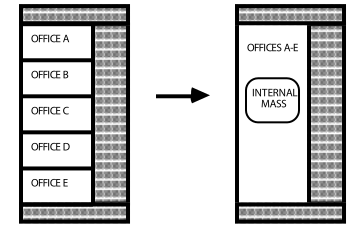

Figure 30. Representing 11 internal walls as internal mass

#### Example

A five-story building has the same ceiling/floor construction separating each of the levels. Zones that are on floors 2 through 4 may be described using a single piece of internal mass to represent both the floor and ceiling. The construction for this internal mass would be identical to the ceiling/floor construction that would be used to describe separate surfaces and the area of the internal mass surface would be the total surface area of the combined ceilings/floors (i.e. twice the total floor area).

#### Field: Name

This is a unique character string associated with the internal mass surface. Though it must be unique from other surface names, it is used primarily for convenience with internal mass surfaces.

#### Field: Construction Name

This is the name of the construction (ref: Construction object) used in the surface.

#### Field: Zone Name

This is the name of the zone in which the internal mass is represented.

#### Field: Surface Area

This field is the surface area of the internal mass. The area that is specified must be the entire surface area that is exposed to the zone. If both sides of a wall are completely within the same zone, then the area of both sides must be included when describing that internal wall.

IDF examples of Internal Mass surfaces:

```idf
InternalMass,Zn002:IntM001,  !- Surface Name
  INTERIOR,  !- Construction Name
  DORM ROOMS AND COMMON AREAS,  !- Zone
   408.7734    ;  !- Total area exposed to Zone {m2}

InternalMass,Zn002:IntM002,  !- Surface Name
  PARTITION02,  !- Construction Name
  DORM ROOMS AND COMMON AREAS,  !- Zone
   371.6122    ;  !- Total area exposed to Zone {m2}
```


### Surface Output Variables/Reports

Note that Surface Outputs from specialized algorithms (such as Effective Moisture Penetration Depth (EMPD), Combined Heat and Moisture Transport (HAMT) and Conduction Finite Difference (CondFD) are discussed under the objects that describe the specialized inputs for these algorithms). You can access them via these links:

- Moisture Penetration Depth (EMPD) Outputs

- Conduction Finite Difference (CondFD) Outputs

- Heat and Moisture (HAMT) Outputs

Additionally, the output variables applicable to all heat transfer surfaces:

* Zone,Sum,Surface Inside Face Heat Balance Calculation Iteration Count []

* Zone,Average,Surface Inside Face Temperature [C]

* Zone,Average,Surface Outside Face Temperature [C]

* Zone,Average,Surface Inside Face Adjacent Air Temperature [C]

* Zone,Average,Surface Inside Face Convection Heat Transfer Coefficient [W/m2-K]

* Zone,Average,Surface Inside Face Convection Heat Gain Rate [W]

* Zone,Average,Surface Inside Face Convection Heat Gain Rate per Area [W/m2]

* Zone,Sum,Surface Inside Face Convection Heat Gain Energy [J]

* Zone,Average,Surface Inside Face Net Surface Thermal Radiation Heat Gain Rate [W]

* Zone,Average,Surface Inside Face Net Surface Thermal Radiation Heat Gain Rate per Area [W/m2]

* Zone,Sum,Surface Inside Face Net Surface Thermal Radiation Heat Gain Energy [J]

* Zone,Average,Surface Inside Face Solar Radiation Heat Gain Rate [W]

* Zone,Average,Surface Inside Face Solar Radiation Heat Gain Rate per Area [W/m2]

* Zone,Sum,Surface Inside Face Solar Radiation Heat Gain Energy [J]

* Zone,Average,Surface Inside Face Lights Radiation Heat Gain Rate [W]

* Zone,Average,Surface Inside Face Lights Radiation Heat Gain Rate per Area [W/m2]

* Zone,Sum,Surface Inside Face Lights Radiation Heat Gain Energy [J]

* Zone,Average,Surface Inside Face Internal Gains Radiation Heat Gain Rate [W]

* Zone,Average,Surface Inside Face Internal Gains Radiation Heat Gain Rate per Area [W/m2]

* Zone,Sum,Surface Inside Face Internal Gains Radiation Heat Gain Energy [J]

* Zone,Average,Surface Inside Face System Radiation Heat Gain Rate [W]

* Zone,Average,Surface Inside Face System Radiation Heat Gain Rate per Area [W/m2]

* Zone,Sum,Surface Inside Face System Radiation Heat Gain Energy [J]

* Zone,Average,Surface Outside Face Convection Heat Transfer Coefficient [W/m2-K]

* Zone,Average,Surface Outside Face Convection Heat Gain Rate [W]

* Zone,Average,Surface Outside Face Convection Heat Gain Rate per Area [W/m2]

* Zone,Sum,Surface Outside Face Convection Heat Gain Energy [J]

* Zone,Average,Surface Outside Face Net Thermal Radiation Heat Gain Rate [W]

* Zone,Average,Surface Outside Face Net Thermal Radiation Heat Gain Rate per Area [W/m2]

* Zone,Sum,Surface Outside Face Net Thermal Radiation Heat Gain Energy [J]

* Zone,Average,Surface Outside Face Thermal Radiation to Air Heat Transfer Coefficient [W/m2-K]

* Zone,Average,Surface Outside Face Thermal Radiation to Sky Heat Transfer Coefficient [W/m2-K]

* Zone,Average,Surface Outside Face Thermal Radiation to Ground Heat Transfer Coefficient [W/m2-K]

* Zone,Average,Surface Inside Face Exterior Windows Incident Beam Solar Radiation Rate [W]

* Zone,Sum,Surface Inside Face Exterior Windows Incident Beam Solar Radiation Energy [J]

* Zone,Average,Surface Inside Face Exterior Windows Incident Beam Solar Radiation Rate per Area[W/m2]

* Zone,Average,Surface Inside Face Interior Windows Incident Beam Solar Radiation Rate [W]

* Zone,Average,Surface Inside Face Interior Windows Incident Beam Solar Radiation Rate per Area[W/m2]

* Zone, Sum,Surface Inside Face Interior Windows Incident Beam Solar Radiation Energy [J]

* Zone,Average,Surface Inside Face Initial Transmitted Diffuse Absorbed Solar Radiation Rate [W]

* Zone,Average,Surface Inside Face Initial Transmitted Diffuse Transmitted Out Window Solar Radiation Rate [W]

* Zone,Average,Surface Inside Face Absorbed Shortwave Radiation Rate [W]

Output variables applicable to all exterior heat transfer surfaces:

* Zone,Average,Surface Outside Face Outdoor Air Drybulb Temperature [C]

* Zone,Average,Surface Outside Face Outdoor Air Wetbulb Temperature [C]

* Zone,Average,Surface Outside Face Outdoor Air Wind Speed [m/s]

* Zone,Average,Surface Outside Face Sunlit Area [m2]

* Zone,Average,Surface Outside Face Sunlit Fraction []

* Zone,Average,Surface Outside Face Incident Solar Radiation Rate per Area[W/m2]

* Zone,Average,Surface Outside Face Solar Radiation Heat Gain Rate [W]

* Zone,Average,Surface Outside Face Solar Radiation Heat Gain Rate per Area [W/m2]

* Zone,Sum,Surface Outside Face Solar Radiation Heat Gain Energy [J]

* Zone,Average,Surface Outside Face Incident Beam Solar Radiation Rate per Area[W/m2]

* Zone,Average,Surface Outside Face Incident Sky Diffuse Solar Radiation Rate per Area[W/m2]

* Zone,Average,Surface Outside Face Incident Ground Diffuse Solar Radiation Rate per Area[W/m2]

* Zone,Average,Surface Ext Diff Sol From Bm-To-Diff Refl From Ground[W/m2]

* Zone,Average,Surface Outside Face Incident Sky Diffuse Ground Reflected Solar Radiation Rate per Area[W/m2]

* Zone,Average,Surface Outside Face Incident Sky Diffuse Surface Reflected Solar Radiation Rate per Area[W/m2]

* Zone,Average,Surface Outside Face Incident Beam To Beam Surface Reflected Solar Radiation Rate per Area[W/m2]

* Zone,Average,Surface Outside Face Incident Beam To Diffuse Surface Reflected Solar Radiation Rate per Area[W/m2]

* Zone,Average,Surface Outside Face Beam Solar Incident Angle Cosine Value[]

* Zone,Average,Surface Anisotropic Sky Multiplier []

* Zone,Average,Surface Window BSDF Beam Direction Number []

* Zone,Average,Surface Window BSDF Beam Theta Angle [rad]

* Zone,Average,Surface Window BSDF Beam Phi Angle [rad]

Output variables applicable to opaque heat transfer surfaces (FLOOR, WALL, ROOF, DOOR). **Note – these are advanced variables – you must read the descriptions and understand before use – then you must use the Diagnostics object to allow reporting.**

* Zone,Average,Surface Inside Face Solar Radiation Heat Gain Rate [W]

* Zone,Average,Surface Inside Face Solar Radiation Heat Gain Rate per Area [W/m2]

* Zone,Sum,Surface Inside Face Solar Radiation Heat Gain Energy [J]

* Zone,Average,Surface Inside Face Lights Radiation Heat Gain Rate [W]

* Zone,Average,Surface Inside Face Lights Radiation Heat Gain Rate per Area [W/m2]

* Zone,Sum,Surface Inside Face Lights Radiation Heat Gain Energy [J]

* Zone,Average,Surface Inside Face Conduction Heat Transfer Rate [W]

* Zone,Average,Surface Inside Face Conduction Heat Gain Rate [W]

* Zone,Average,Surface Inside Face Conduction Heat Loss Rate [W]

* Zone,Average,Surface Inside Face Conduction Heat Transfer Rate per Area [W/m2]

* Zone,Sum,Surface Inside Face Conduction Heat Transfer Energy [J]

* Zone,Average,Surface Outside Face Conduction Heat Transfer Rate [W]

* Zone,Average,Surface Outside Face Conduction Heat Gain Rate [W]

* Zone,Average,Surface Outside Face Conduction Heat Loss Rate [W]

* Zone,Average,Surface Outside Face Conduction Heat Transfer Rate per Area [W/m2]

* Zone,Sum,Surface Outside Face Conduction Heat Transfer Energy [J]

* Zone,Average,Surface Average Face Conduction Heat Transfer Rate [W]

* Zone,Average,Surface Average Face Conduction Heat Gain Rate [W]

* Zone,Average,Surface Average Face Conduction Heat Loss Rate [W]

* Zone,Average,Surface Average Face Conduction Heat Transfer Rate per Area [W/m2]

* Zone,Sum,Surface Average Face Conduction Heat Transfer Energy [J]

* Zone,Average,Surface Heat Storage Rate [W]

* Zone,Average,Surface Heat Storage Gain Rate [W]

* Zone,Average,Surface Heat Storage Loss Rate [W]

* Zone,Average,Surface Heat Storage Rate per Area [W/m2]

* Zone,Sum,Surface Heat Storage Energy [J]

* Zone,Average,Surface Internal Source Location Temperature [C]

* Zone,Average,Zone Opaque Surface Inside Face Conduction [W]

* Zone,Average,Zone Opaque Surface Inside Faces Total Conduction Heat Gain Rate [W]

* Zone,Average,Zone Opaque Surface Inside Faces Total Conduction Heat Loss Rate [W]

* Zone,Sum,Zone Opaque Surface Inside Faces Total Conduction Heat Gain Energy [J]

* Zone,Sum,Zone Opaque Surface Inside Faces Total Conduction Heat Loss Energy [J]

* Zone,Average,Zone Opaque Surface Outside Face Conduction [W]

* Zone,Average,Zone Opaque Surface Outside Face Conduction Gain[W]

* Zone,Average,Zone Opaque Surface Outside Face Conduction Loss[W]

* Zone,Average, Surface Inside Face Beam Solar Radiation Heat Gain Rate [W]

### Window Output Variables

Output variables applicable only to exterior windows and glass doors:

* Zone,Average,Zone Windows Total Transmitted Solar Radiation Rate [W]

* Zone,Sum,Zone Transmitted Solar Energy [J]

* Zone,Average,Zone Windows Total Heat Gain Rate [W]

* Zone,Sum,Zone Windows Total Heat Gain Energy [J]

* Zone,Average,Zone Windows Total Heat Loss Rate [W]

* Zone,Sum,Zone Windows Total Heat Loss Energy [J]

* Zone,Average,Zone Exterior Windows Total Transmitted Beam Solar Radiation Rate [W]

* Zone,Sum,Zone Exterior Windows Total Transmitted Beam Solar Radiation Energy [J]

* Zone,Average,Zone Interior Windows Total Transmitted Beam Solar Radiation Rate [W]

* Zone,Sum,Zone Interior Windows Total Transmitted Beam Solar Radiation Energy [J]

* Zone,Average,Zone Exterior Windows Total Transmitted Diffuse Solar Radiation Rate [W]

* Zone,Sum,Zone Exterior Windows Total Transmitted Diffuse Solar Radiation Energy [J]

* Zone,Average,Zone Interior Windows Total Transmitted Diffuse Solar Radiation Rate [W]

* Zone,Average,Surface Window Total Glazing Layers Absorbed Solar Radiation Rate [W]

* Zone,Average,Surface Window Total Glazing Layers Absorbed Shortwave Radiation Rate [W]

* Zone,Sum,Surface Window Total Glazing Layers Absorbed Solar Radiation Energy [J]

* Zone,Average,Surface Window Shading Device Absorbed Solar Radiation Rate [W]

* Zone,Sum,Surface Window Shading Device Absorbed Solar Radiation Energy [J]

* Zone,Average, Surface Window Transmitted Solar Radiation Rate [W]

* Zone,Sum,Surface Window Transmitted Solar Radiation Energy [J]

* Zone,Average,Surface Window Transmitted Beam Solar Radiation Rate [W]

* Zone,Average,Surface Window Transmitted Beam To Beam Solar Radiation Rate [W]

* Zone,Average,Surface Window Transmitted Beam To Diffuse Solar Radiation Rate [W]

* Zone,Sum,Surface Window Transmitted Beam Solar Radiation Energy [J]

* Zone,Sum,Surface Window Transmitted Beam To Beam Solar Radiation Energy [J]

* Zone,Sum,Surface Window Transmitted Beam To Diffuse Solar Radiation Energy [J]

* Zone,Average,Surface Window Transmitted Diffuse Solar Radiation Rate [W]

* Zone,Sum,Surface Window Transmitted Diffuse Solar Radiation Energy [J]

* Zone,Average,Surface Window System Solar Transmittance []

* Zone,Average,Surface Window System Solar Absorptance []

* Zone,Average,Surface Window System Solar Reflectance []

* Zone,Average,Surface Window Gap Convective Heat Transfer Rate [W]

* Zone,Sum,Surface Window Gap Convective Heat Transfer Energy [J]

* Zone,Average,Surface Window Heat Gain Rate [W]

* Zone,Sum,Surface Window Heat Gain Energy [J]

* Zone,Average,Surface Window Heat Loss Rate [W]

* Zone,Sum,Surface Window Heat Loss Energy [J]

* Zone,Average,Surface Window Glazing Beam to Beam Solar Transmittance[]

* Zone,Average,Surface Window Glazing Beam to Diffuse Solar Transmittance []

* Zone,Average,Surface Window Glazing Diffuse to Diffuse Solar Transmittance[]

* Zone,Average,Surface Window Model Solver Iteration Count []

* Zone,Average,Surface Window Solar Horizontal Profile Angle[deg]

* Zone,Average,Surface Window Solar Vertical Profile Angle[deg]

* Zone,Average,Surface Window Outside Reveal Reflected Beam Solar Radiation Rate [W]

* Zone,Sum,Surface Window Outside Reveal Reflected Beam Solar Radiation Energy

* Zone,Average,Surface Window Inside Reveal Reflected Beam Solar Radiation Rate [W]

* Zone,Sum,Surface Window Inside Reveal Reflected Beam Solar Radiation Energy [J]

* Zone,Average,Surface Window Inside Reveal Absorbed Beam Solar Radiation Rate [W]

* Zone,Average,Surface Window Inside Face Glazing Condensation Status []

* Zone,Average,Surface Window Inside Face Frame Condensation Status []

* Zone,Average,Surface Window Inside Face Divider Condensation Status []

* Zone,Average,Surface Shading Device Is On Time Fraction[]

* Zone,Average,Surface Window Blind Slat Angle [deg]

* Zone,Average,Surface Window Blind Beam to Beam Solar Transmittance[]

* Zone,Average,Surface Window Blind Beam to Diffuse Solar Transmittance[]

* Zone,Average,Surface Window Blind Diffuse to Diffuse Solar Transmittance[]

* Zone,Average,Surface Window Blind and Glazing System Beam Solar Transmittance[]

* Zone,Average,Surface Window Blind and Glazing System Diffuse Solar Transmittance[]

* Zone,Average,Surface Window Screen Beam to Beam Solar Transmittance []

* Zone,Average,Surface Window Screen Beam to Diffuse Solar Transmittance []

* Zone,Average,Surface Window Screen Diffuse to Diffuse Solar Transmittance []

* Zone,Average,Surface Window Screen and Glazing System Beam Solar Transmittance []

* Zone,Average,Surface Window Screen and Glazing System Diffuse Solar Transmittance []

* Zone,State,Surface Storm Window On Off Status []

* Zone,Average,Surface Window Inside Face Frame and Divider Zone Heat Gain Rate [W]

* Zone,Average,Surface Window Frame Heat Gain Rate [W]

* Zone,Average,Surface Window Frame Heat Loss Rate [W]

* Zone,Average,Surface Window Divider Heat Gain Rate [W]

* Zone,Average,Surface Window Divider Heat Loss Rate [W]

* Zone,Average,Surface Window Frame Inside Temperature [C]

* Zone,Average,Surface Window Frame Outside Temperature [C]

* Zone,Average,Surface Window Divider Inside Temperature [C]

* Zone,Average,Surface Window Divider Outside Temperature [C]

If the user requests to display advanced report/output variables (e.g. see Output:Diagnostics keyword DisplayAdvancedReportVariables) the the following additional output variables are available for exterior windows and glass doors

* Zone,Average,Surface Window Inside Face Glazing Zone Convection Heat Gain Rate [W]

* Zone,Average,Surface Window Inside Face Glazing Net Infrared Heat Transfer Rate [W]

* Zone,Average,Surface Window Shortwave from Zone Back Out Window Heat Transfer Rate [W]

* Zone,Average,Surface Window Inside Face Frame and Divider Zone Heat Gain Rate [W]

* Zone,Average,Surface Window Inside Face Gap between Shade and Glazing Zone Convection Heat Gain Rate [W]

* Zone,Average,Surface Window Inside Face Shade Zone Convection Heat Gain Rate [W]

* Zone,Average,Surface Window Inside Face Shade Net Infrared Heat Transfer Rate [W]

Output variables applicable only to interior windows and glass doors:

* Zone,Average, Surface Window Transmitted Beam Solar Radiation Rate [W]

* Zone,Sum,Surface Window Transmitted Beam Solar Radiation Energy [J]

If the user requests to display advanced report/output variables (e.g. see Output:Diagnostics keyword DisplayAdvancedReportVariables) the the following additional output variable is available for Equivalent Layer Window;

* Zone,Average, Surface Window Inside Face Other Convection Heat Gain Rate [W]

* Output variables applicable to interior and exterior windows and doors are:

* Zone,Average,Surface Window Total Absorbed Shortwave Radiation Rate Layer &lt;x&gt; [W]

* Zone,Average,Surface Window Front Face Temperature Layer &lt;x&gt; [C]

* Zone,Average,Surface Window Back Face Temperature Layer &lt;x&gt; [C]

#### Surface Window Total Absorbed Shortwave Radiation Rate Layer &lt;x&gt; [W]

This will output shortwave radiation absorbed in a window layer. The key values for this output variable are the surface name. Layers are numbered from the outside to the inside of the surface. The full listing will appear in the RDD file.

#### Surface Window Front Face Temperature Layer &lt;x&gt; [C]

This will output a temperature for the front face of the layer. The layer front face is considered to be the face closest to the outside environment. The full listing will appear in the RDD file.

#### Surface Window Back Face Temperature Layer &lt;x&gt; [C]

This will output a temperature for the back face of the layer. The layer back face is considered to be the face closest to the inside environment. The full listing will appear in the RDD file.

### Surface Output Variables (all heat transfer surfaces)

The various output variables related to surface heat transfer are organized around the inside and outside face of each surface.  The zone heat balance model draws energy balances at each side, or face, of a surface and so each surface essentially has two sets of results. The inside face is the side of a heat transfer surface that faces toward the thermal zone. The outside face is the side of a heat transfer surface that faces away from the thermal zone, typically facing outdoors.  The Key Value for these is generally the user-defined name of the surface.

#### Surface Inside Face Heat Balance Calculation Iteration Count []

This output is the number of iterations used in a part of the solution for surface heat transfer that accounts for thermal radiation heat transfer between zone surfaces.  This is simply a counter on the iteration loop for inside face surface modeling.  There is only one instance of this output in a given run and the Key Value is “Simulation.”

#### Surface Inside Face Temperature [C]

This is the temperature of the surface’s inside face, in degrees Celsius.  Former Name: Prior to version 7.1 this output was called Surface Inside Temperature.

#### Surface Outside Face Temperature [C]

This is the temperature of the surface’s outside face, in degrees Celsius.  Former Name: Prior to version 7.1, this output was called Surface Outside Temperature.

#### Surface Inside Face Adjacent Air Temperature [C]

This is the effective bulk air temperature used for modeling the inside surface convection heat transfer. This is the same as the zone mean air temperature when using the mixing model for roomair. However, if more advanced roomair models are used, this variable will report the air temperature predicted by the roomair model as it was used in the surface heat balance model calculations. Former Name: Prior to version 7.1, this output was called Surface Int Adjacent Air Temperature.

#### Surface Inside Face Convection Heat Gain Rate [W]

#### Surface Inside Face Convection Heat Gain Rate per Area [W/m2]

#### Surface Inside Face Convection Heat Gain Energy [J]

These “inside face convection heat gain” output variables describe the heat transferred by convection between the inside face and the zone air.  The values can be positive or negative with positive indicating heat is being added to the surface’s face by convection.  Different versions of the report are available including the basic heat gain rate (W), and a per unit area flux (W/m2), and an energy version (J).

Former Name: Prior to version 7.1, these outputs were called “Surface Int Convection Heat \* ” and had used the opposite sign convention.

#### Surface Inside Face Convection Heat Transfer Coefficient [W/m2-K]

This is the coefficient that describes the convection heat transfer. It is the value of “Hc” in the classic convection model Q = Hc\* A\* (T – T).  This is the result of the surface convection algorithm used for the inside face. Former Name: Prior to version 7.1, this output was called “Surface Int Convection Coeff.”

#### Surface Inside Face Net Surface Thermal Radiation Heat Gain Rate [W]

#### Surface Inside Face Net Surface Thermal Radiation Heat Gain Rate per Area [W/m2]

#### Surface Inside Face Net Surface Thermal Radiation Heat Gain Energy [J]

These “inside face net surface thermal radiation heat gain” output variables describe the heat transferred by longwave infrared thermal radiation exchanges between the inside faces of other surfaces in the zone. The values can be positive or negative with positive indicating heat is being added to the surface’s face by thermal radiation.  Different versions of the report are available including the basic heat gain rate (W), and a per unit area flux (W/m2), and an energy version (J).

#### Surface Inside Face Solar Radiation Heat Gain Rate [W]

#### Surface Inside Face Solar Radiation Heat Gain Rate per Area [W/m2]

#### Surface Inside Face Solar Radiation Heat Gain Energy [J]

These “inside face solar radiation heat gain” output variables describe the heat transferred by solar radiation onto the inside face. The values are always positive and indicate heat is being added to the surface’s face by solar radiation.  This is sunlight that has entered the zone through a window and been absorbed on the inside face of the surface.  Different versions of the report are available including the basic heat gain rate (W), and a per unit area flux (W/m2), and an energy version (J).

#### Surface Inside Face Lights Radiation Heat Gain Rate [W]

#### Surface Inside Face Lights Radiation Heat Gain Rate per Area [W/m2]

#### Surface Inside Face Lights Radiation Heat Gain Energy [J]

These “inside face lights radiation heat gain” output variables describe the heat transferred by shortwave radiation onto the inside face. The values are always positive and indicate heat is being added to the surface’s face by shortwave radiation that emanated from electric lighting equipment and was absorbed by the surface.  Different versions of the report are available including the basic heat gain rate (W), and a per unit area flux (W/m2), and an energy version (J).

#### Surface Inside Face Internal Gains Radiation Heat Gain Rate [W]

#### Surface Inside Face Internal Gains Radiation Heat Gain Rate per Area [W/m2]

#### Surface Inside Face Internal Gains Radiation Heat Gain Energy [J]

These “inside face internal gains radiation heat gain” output variables describe the heat transferred by longwave infrared thermal radiation onto the inside face that emanated from internal gains such as lights, electric equipment, and people.  The values are always positive and indicate heat is being added to the surface’s face by the absorption of longwave thermal radiation.  Different versions of the report are available including the basic heat gain rate (W), and a per unit area flux (W/m2), and an energy version (J).

#### Surface Inside Face System Radiation Heat Gain Rate [W]

#### Surface Inside Face System Radiation Heat Gain Rate per Area [W/m2]

#### Surface Inside Face System Radiation Heat Gain Energy [J]

These “inside face system radiation heat gain” output variables describe the heat transferred by infrared thermal radiation onto the inside face that emanated from HVAC equipment such as baseboard heaters or high-temperature radiant heating panels.  The values are always positive and indicate heat is being added to the surface’s face by the absorption of thermal radiation.  Different versions of the report are available including the basic heat gain rate (W), and a per unit area flux (W/m2), and an energy version (J).

#### Surface Outside Face Convection Heat Gain Rate [W]

#### Surface Outside Face Convection Heat Gain Rate per Area [W/m2]

#### Surface Outside Face Convection Heat Gain Energy [J]

These “outside face convection” output variables describe heat transferred by convection between the outside face and the surrounding air.  The values can be positive or negative with positive values indicating heat is added to the surface face by convection heat transfer. Different versions of the report are available including the basic heat gain rate (W), and a per unit area flux (W/m<sup>2</sup>), and an energy version (J).

Former Name: Prior to version 7.1, these outputs were called “Surface Ext Convection Heat \*” and used the opposite sign convention.

#### Surface Outside Face Convection Heat Transfer Coefficient [W/m2-K]

This is the coefficient that describes the convection heat transfer. It is the value of “Hc” in the classic convection model Q = Hc\* A\* (T – T).  This is the result of the surface convection algorithm used for the outside face. Former Name: Prior to Version 7.1, this output was called “Surface Ext Convection Coeff.”

#### Surface Outside Face Net Thermal Radiation Heat Gain Rate [W]

#### Surface Outside Face Net Thermal Radiation Heat Gain Rate per Area [W/m2]

#### Surface Outside Face Net Thermal Radiation Heat Gain Energy [J]

These “outside face net thermal radiation” output variables describe the heat transferred by longwave infrared thermal radiation exchanges between the surface and the surroundings of the outside face.  This is the net of all forms of longwave thermal infrared radiation heat transfer. The values can be positive or negative with positive indicating the net addition of heat to the outside face. Different versions of the report are available including the basic heat gain rate (W), and a per unit area flux (W/m2), and an energy version (J).

Former Name: Prior to version 7.1, these outputs were called “Surface Ext Thermal Radiation Heat \*” and used the opposite sign convention.

#### Surface Inside Face Exterior Windows Incident Beam Solar Radiation Rate [W]

#### Surface Inside Face Exterior Windows Incident Beam Solar Radiation Rate per Area [W/m2]

#### Surface Inside Face Exterior Windows Incident Beam Solar Radiation Energy [J]

Beam solar radiation from the exterior windows in a zone incident on the inside face of a surface in the zone. If Solar Distribution in the BUILDING object is equal to MinimalShadowing or FullExterior, it is assumed that all beam solar from exterior windows falls on the floor. In this case the value of this output variable can be greater than zero only for floor surfaces. If Solar Distribution equals FullInteriorExterior the program tracks where beam solar from exterior windows falls inside the zone, in which case the value of this variable can be greater than zero for floor as well as wall surfaces. Different versions of the report are available including the basic incident rate (W), a per unit area flux (W/m2), and an energy version (J).

#### 

#### Surface Inside Face Interior Windows Incident Beam Solar Radiation Rate [W]

#### Surface Inside Face Interior Windows Incident Beam Solar Radiation Rate per Area [W/m2]

#### Surface Inside Face Interior Windows Incident Beam Solar Radiation Energy [J]

Beam solar radiation from the interior (i.e., interzone) windows in a zone incident on the inside face of a surface in the zone. This value is calculated only if Solar Distribution in the BUILDING object is equal to FullInteriorExterior. However, the program does not track where this radiation falls. Instead, it is treated by the program as though it were diffuse radiation uniformly distributed over all of the zone surfaces. See **Figure 31**. Different versions of the report are available including the basic incident rate (W), a per unit area flux (W/m2), and an energy version (J).


Figure 31. Beam solar radiation entering a zone through an interior window is distributed inside the zone as though it were diffuse radiation.

#### Surface Inside Face Initial Transmitted Diffuse Absorbed Solar Radiation Rate [W]

As of Version 2.1, diffuse solar transmitted through exterior and interior windows is no longer uniformly distributed.  Instead, it is distributed according to the approximate view factors between the transmitting window and all other heat transfer surfaces in the zone.  This variable is the amount of transmitted diffuse solar that is initially absorbed on the inside of each heat transfer surface.  The portion of this diffuse solar that is reflected by all surfaces in the zone is subsequently redistributed uniformly to all heat transfer surfaces in the zone, along with interior reflected beam solar and shortwave radiation from lights.  The total absorbed shortwave radiation is given by the next variable.

#### Surface Inside Face Absorbed Shortwave Radiation Rate [W]

As of Version 2.1, the previous variable plus absorbed shortwave radiation from uniformly distributed initially-reflected diffuse solar, reflected beam solar, and shortwave radiation from lights. This sum is the power of all sources of solar and visible radiation absorbed by the surface at the inside face.

### Surface Output Variables (exterior heat transfer surfaces)

#### Surface Outside Face Outdoor Air Drybulb Temperature [C]

The outdoor air dry-bulb temperature calculated at the height above ground of the surface centroid. Former Name: Prior to version 7.1, this output was called “Surface Ext Outdoor Dry Bulb.”

#### Surface Outside Face Outdoor Air Wetbulb Temperature [C]

The outdoor air wet-bulb temperature calculated at the height above ground of the surface centroid. Former Name: Prior to version 7.1, this output was called “Surface Ext Outdoor Wet Bulb.”

#### Surface Outside Face Outdoor Air Wind Speed [m/s]

The outdoor wind speed calculated at the height above ground of the surface centroid. Former Name: Prior to version 7.1, this output was called “Surface Ext Wind Speed.”

#### Surface Outside Face Sunlit Area [m2]

The outside area of an exterior surface that is illuminated by (unreflected) beam solar radiation.

#### Surface Outside Face Sunlit Fraction []

The fraction of the outside area of an exterior surface that is illuminated by (unreflected) beam solar radiation. Equals Surface Outside Face Sunlit Area divided by total surface area.

#### Surface Outside Face Thermal Radiation to Air Heat Transfer Coefficient [W/m2-K]

This is the coefficient that describes thermal radiation heat transfer between the outside face and the air mass surrounding the surface.  It is the value of “Hr” in the classic linearized model for thermal radiation Q = Hr \* A \* (T_surf – T_surfodb) when applied to the ambient air. Where T_surf = Surface Outside Face Temperature, and T_surfodb = Surface Outside Face Outdoor Air Drybulb Temperature. Former Name: Prior to version 7.1, this output was called “Surface Ext Rad to Air Coeff.”

#### Surface Outside Face Thermal Radiation to Sky Heat Transfer Coefficient [W/m2-K]

This is the coefficient that describes thermal radiation heat transfer between the outside face and the sky surrounding the surface.  It is the value of “Hr” in the classic linearized model for thermal radiation Q = Hr \* A \* (T_surf – T_sky) when applied to the sky. Where T_surf = Surface Outside Face Temperature, and T_sky = Site Sky Temperature. Former Name: Prior to version 7.1, this output was called “Surface Ext Rad to Sky Coeff.”

#### Surface Outside Face Thermal Radiation to Ground Heat Transfer Coefficient [W/m2-K]

This is the coefficient that describes thermal radiation heat transfer between the outside face and the ground surrounding the surface.  It is the value of “Hr” in the classic linearized model for thermal radiation Q = Hr \* A \* (T_surf – T_odb) when applied to the ground. Where T_surf = Surface Outside Face Temperature, and T_odb = Site Outdoor Air Drybulb Temperature (used as an approximation for the ground surface temperature). Former Name: Prior to version 7.1, this output was called “Surface Ext Rad to Ground Coeff.”

#### Surface Outside Face Solar Radiation Heat Gain Rate [W]

#### Surface Outside Face Solar Radiation Heat Gain Rate per Area [W/m2]

#### Surface Outside Face Solar Radiation Heat Gain Energy [J]

These “outside face solar radiation” output variables describe the heat transferred by the absorption of solar radiation at the outside face.  This is the result of incident solar radiation being absorbed at the surface face.  The values are always positive.

#### Surface Outside Face Incident Solar Radiation Rate per Area [W/m2]

The total solar radiation incident on the outside of an exterior surface. It is the sum of:

* Surface Outside Face Incident Beam Solar Radiation Rate per Area

* Surface Outside Face Incident Sky Diffuse Solar Radiation Rate per Area

* Surface Outside Face Incident Ground Diffuse Solar Radiation Rate per Area

* Surface Outside Face Incident Sky Diffuse Surface Reflected Solar Radiation Rate per Area

* Surface Outside Face Incident Beam To Beam Surface Reflected Solar Radiation Rate per Area

* Surface Outside Face Incident Sky Diffuse Surface Reflected Solar Radiation Rate per Area

#### Surface Outside Face Incident Beam Solar Radiation Rate per Area [W/m2]

The solar beam radiation incident on the outside of an exterior surface, including the effects of shadowing, if present. The beam here is that directly from the sun; it excludes beam specularly reflected from obstructions.

#### Surface Outside Face Incident Sky Diffuse Solar Radiation Rate per Area [W/m2]

The solar diffuse radiation from the sky incident on the outside of an exterior surface, including the effects of shadowing, if present.

#### Surface Outside Face Incident Ground Diffuse Solar Radiation Rate per Area  [W/m2]

The solar diffuse radiation incident on the outside of an exterior surface that arises from reflection of beam solar and sky diffuse solar from the ground. This is the sum of the next two output variables, “Surface Outside Face Incident Beam To Diffuse Ground Reflected Solar Radiation Rate per Area” and “Surface Outside Face Incident Sky Diffuse Ground Reflected Solar Radiation Rate per Area.” The reflected solar radiation from the ground is assumed to be diffuse and isotropic (there is no specular component).

If “Reflections” option is not chosen in the Solar Distribution Field in the BUILDING object, the effects of shadowing are accounted for by the user-specified value of View Factor to Ground for the surface. If “Reflections” option is chosen, the program determines the effects of shadowing, including time-varying shadowing of the ground plane by the building itself.

#### Surface Outside Face Incident Beam To Diffuse Ground Reflected Solar Radiation Rate per Area [W/m2]

The solar diffuse radiation incident on the outside of an exterior surface that arises from beam-to-diffuse reflection from the ground. It is assumed that there is no beam-to-beam (specular) component. The beam here is that directly from the sun; it excludes beam specularly reflected from obstructions.

#### Surface Outside Face Incident Sky Diffuse Ground Reflected Solar Radiation Rate per Area [W/m2]

The solar diffuse radiation incident on the outside of an exterior surface that arises from sky diffuse solar reflection from the ground. The sky diffuse here is that directly from the sky; it excludes reflection of sky diffuse from obstructions.

#### Surface Outside Face Incident Sky Diffuse Surface Reflected Solar Radiation Rate per Area [W/m2]

The solar diffuse radiation incident on the outside of an exterior surface that arises from sky diffuse reflection from one or more obstructions. This value will be non-zero only if “Reflections” option is chosen in the BUILDING object.

#### Surface Outside Face Incident Beam To Beam Surface Reflected Solar Radiation Rate per Area [W/m2]

The solar beam radiation incident on the outside of an exterior surface that arises from beam-to-beam (specular) reflection from one or more obstructions. This value will be non-zero only if “Reflections” option is chosen in the BUILDING object. For windows, the program treats this beam radiation as diffuse radiation in calculating its transmission and absorption.

#### Surface Outside Face Incident Beam To Diffuse Surface Reflected Solar Radiation Rate per Area [W/m2]

The solar diffuse radiation incident on the outside of an exterior surface that arises from beam-to-diffuse reflection from building shades or building surfaces. This value will be non-zero only if  “Reflections” option is chosen in the BUILDING object.

#### Surface Outside Face Beam Solar Incident Angle Cosine Value []

The cosine of the angle of incidence of (unreflected) beam solar radiation on the outside of an exterior surface. The value varies from 0.0 for beam parallel to the surface (incidence angle = 90<sup>O</sup>) to 1.0 for beam perpendicular to the surface (incidence angle = 0<sup>O</sup>). Negative values indicate the sun is behind the surface, i.e the surface does not see the sun.

#### Surface Anisotropic Sky Multiplier []

This is the view factor multiplier for diffuse sky irradiance on exterior surfaces taking into account the anisotropic radiance of the sky. The diffuse sky irradiance on a surface is given by Anisotropic Sky Multiplier \* Diffuse Solar Irradiance.

#### Surface Window BSDF Beam Direction Number []

#### Surface Window BSDF Beam Phi Angle [rad]

#### Surface Window BSDF Beam Theta Angle [rad]

### Opaque Surface Output Variables

The following variables apply only to opaque surfaces, where an opaque surface is considered here to be an exterior or interzone heat transfer surface of class FLOOR, WALL, ROOF or DOOR. **Note – these are advanced variables – you must read the descriptions and understand before use – then you must use the** **Output:Diagnostics** **object to allow reporting.**

#### Surface Inside Face Conduction Heat Transfer Rate [W]

#### Surface Inside Face Conduction Heat Transfer Rate per Area [W/m2]

#### Surface Inside Face Conduction Heat Gain Rate [W]

#### Surface Inside Face Conduction Heat Loss Rate [W]

These “inside face conduction” output variables describe heat flow by conduction right at the inside face of an opaque heat transfer surface. A positive value means that the conduction is from just inside the inside face toward the inside face. A negative value means that the conduction is from the inside face into the core of the heat transfer surface.

Note that Inside Face Conduction, when positive, does **not** indicate the heat flow from the surface to the zone air, which is governed by the inside face convection coefficient and the difference in temperature between the inside face and the zone air.

Different versions of the reports are available.  The basic heat gain rate (W) and a per unit area flux (W/m<sup>2</sup>) can have positive or negative values with the sign convention that positive indicates heat flowing toward the face itself.  There are also directed “gain” and “loss” versions that have only positive values or zero when the heat flow direction opposes.

Former Name: Prior to version 7.1, these outputs were called “Opaque Surface Inside Face Conduction \*.”

Former Name: For Conduction Finite Difference simulations (CondFD), CondFD Inside Surface Heat Flux is replaced with Surface Inside Face Conduction Heat Transfer Rate Per Area. Likewise for CondFD Inside Heat Flux to Surface.

#### Surface Outside Face Conduction Heat Transfer Rate [W]

#### Surface Outside Face Conduction Heat Transfer Rate per Area [W/m2]

#### Surface Outside Face Conduction Heat Gain Rate [W]

#### Surface Outside Face Conduction Heat Loss Rate [W]

These “outside face conduction” output variables describe heat flow by conduction right at the outside face of an opaque heat transfer surface. A positive value means that the conduction is from just inside the outside face toward the outside face. A negative value means that the conduction is from the outside face into the core of the heat transfer surface.

Note that outside face conduction, when positive, does **not** indicate the heat flow from the surface to the surrounding air, which is governed by the outside face convection coefficient and the difference in temperature between the inside face and the surrounding air.

Different versions of the reports are available.  The basic heat transfer rate (W) and a per unit area flux (W/m<sup>2</sup>) can have positive or negative values with the sign convention that positive indicates heat flowing toward the face itself.  There are also directed “gain” and “loss” versions that have only positive values or zero when the heat flow direction opposes.

Former Name: For Conduction Finite Difference simulations (CondFD), CondFD Outside Surface Heat Flux is replaced with Surface Outside Face Conduction Heat Transfer Rate Per Area. Likewise for CondFD Outside Heat Flux to Surface.

#### Surface Average Face Conduction Heat Transfer Rate [W]

#### Surface Average Face Conduction Heat Transfer Rate per Area [W/m2]

#### Surface Average Face Conduction Heat Gain Rate [W]

#### Surface Average Face Conduction Heat Loss Rate [W]

#### Surface Average Face Conduction Heat Transfer Energy [J]

These “average face conduction” output variables combine the inside face conduction and outside face conduction reports together to describe the conduction situation in a heat transfer surface in a nominal way.  This is simply the average of the inside and outside face conduction rates, but with the sign convention for the outside face switched to match the inside face so that positive values here indicate heat flowing into the thermal zone.

Different versions of the reports are available.  The basic heat conduction rate (W) and a per unit area flux (W/m<sup>2</sup>) can have positive or negative values with the sign convention that positive indicates heat flowing toward the thermal zone.  There are also directed “gain” and “loss” versions that have only positive values or zero when the heat flow direction opposes (W). Finally there is a version for total energy transfer (J).

#### Surface Heat Storage Rate [W]

#### Surface Heat Storage Rate per Area [W/m2]

#### Surface Heat Storage Gain Rate [W]

#### Surface Heat Storage Loss Rate [W]

#### Surface Heat Storage Energy [J]

These “heat storage” output variables combine the inside face conduction and outside face conduction reports together to describe the thermal storage situation in a heat transfer surface in a nominal way.  This is simply the difference between the inside and outside face conduction, but with the sign convention arranged so that positive values indicate heat being added to the core of the surface.

Different versions of the reports are available.  The basic heat storage rate (W) and a per unit area flux (W/m<sup>2</sup>) can have positive or negative values with the sign convention that positive indicates heat being added to the surface’s mass.  There are also directed “gain” and “loss” versions that have only positive values or zero when the heat storage direction opposes (W). Finally there is a version for total energy stored (J).

#### Surface Internal Source Location Temperature [C]

When a surface has an internal source or sink (defined using Construction:InternalSource) then this output is available for the temperature within the surface at the location of the source/sink.

#### Zone Opaque Surface Inside Face Conduction [W]

The sum of the Opaque Surface Inside Face Conduction values for all opaque surfaces in a zone for both positive and negative sums. For example, assume a zone has six opaque surfaces with Opaque Surface Inside Face Conduction values of 100, -200, 400, 50, 150 and –300 W. Then Zone Opaque Surface Inside Face Conduction = 700 - 500 = 200 W.  Or if a zone has six opaque surfaces with Opaque Surface Inside Face Conduction values of -100, -200, 400, -50, 150 and –300W. Then Zone Opaque Surface Inside Face Conduction = 550 – 650 = -100 W.

#### Zone Opaque Surface Inside Faces Total Conduction Heat Gain Rate [W]

#### Zone Opaque Surface Inside Faces Total Conduction Heat Gain Energy [J]

These are the power and energy sums for the Opaque Surface Inside Face Conduction values for all opaque surfaces in a zone when that sum is positive. For example, assume a zone has six opaque surfaces with Opaque Surface Inside Face Conduction values of 100, -200, 400, 50, 150 and –300 W. Then Zone Opaque Surface Inside Faces Total Conduction Heat Gain Rate = 700 - 500 = 200 W.

#### Zone Opaque Surface Inside Faces Total Conduction Heat Loss Rate [W]

#### Zone Opaque Surface Inside Faces Total Conduction Heat Loss Energy [J]

These are the power and energy absolute value for the sums of the Opaque Surface Inside Face Conduction values for all opaque surfaces in a zone when that sum is negative. For example, assume a zone has six opaque surfaces with Opaque Surface Inside Face Conduction values of -100, -200, 400,
  -50, 150 and –300W. Then Zone Opaque Surface Inside Faces Total Conduction Heat Loss Rate = |550 – 650| = |-100| = 100 W.

#### Zone Opaque Surface Outside Face Conduction [W]

The sum of the Opaque Surface Outside Face Conduction values for all opaque surfaces in a zone for both positive and negative sums. For example, assume a zone has six opaque surfaces with Opaque Surface Outside Face Conduction values of 100, -200, 400, 50, 150 and –300 W. Then Zone Opaque Surface Outside Face Conduction = 700 - 500 = 200 W.  Or if a zone has six opaque surfaces with Opaque Surface Outside Face Conduction values of -100, -200, 400, -50, 150 and –300W. Then Zone Opaque Surface Outside Face Conduction = 550 – 650 = -100 W.

#### Zone Opaque Surface Outside Face Conduction Gain [W]

#### Zone Opaque Surface Outside Face Conduction Gain Energy [J]

These are the power and energy sums for the Opaque Surface Outside Face Conduction values for all opaque surfaces in a zone when that sum is positive. For example, assume a zone has six opaque surfaces with Opaque Surface Outside Face Conduction values of 100, -200, 400, 50, 150 and –300 W. Then Zone Opaque Surface Outside Face Conduction Gain = 700 - 500 = 200 W.

#### Zone Opaque Surface Outside Face Conduction Loss [W]

#### Zone Opaque Surface Outside Face Conduction Loss Energy [J]

These are the power and energy absolute value for the sums of the Opaque Surface Outside Face Conduction values for all opaque surfaces in a zone when that sum is negative. For example, assume a zone has six opaque surfaces with Opaque Surface Outside Face Conduction values of -100, -200, 400,
  -50, 150 and –300W. Then Zone Opaque Surface Outside Face Conduction Loss = |550 – 650| = |-100| = 100 W.

#### Surface Inside Face Beam Solar Radiation Heat Gain Rate [W]

Beam solar radiation from exterior windows absorbed on the inside face of an opaque heat transfer surface. For Solar Distribution = FullInteriorAndExterior, this quantity can be non-zero for both floor and wall surfaces. Otherwise, for Solar Distribution = FullExterior or MinimalShadowing, it can be non-zero only for floor surfaces since in this case all entering beam solar is assumed to fall on the floor. Note that this variable will not be operational (have a real value) unless there are exterior windows in the zone.

### Window Output Variables

The following output variables apply to subsurfaces that are windows or glass doors. These two subsurface types are called “window” here. “Exterior window” means that the base surface of the window is an exterior wall, floor, roof or ceiling (i.e., the base surface is a BuildingSurface:Detailed with OutsideFaceEnvironment = ExteriorEnvironment). “Interior window” means that the base surface of the window is an inter-zone wall, floor or ceiling. “Glass” means a transparent solid layer, usually glass, but possibly plastic or other transparent material. “Shading device” means an interior, exterior or between-glass shade or blind, or an exterior screen (only exterior windows can have a shading device).

#### Zone Windows Total Transmitted Solar Radiation Rate [W]

#### Zone Windows Total Transmitted Solar Radiation Energy [J]

The total Surface Window Transmitted Solar Radiation Rate of all the exterior windows in a zone.

#### Zone Windows Total Heat Gain Rate [W]

#### Zone Windows Total Heat Gain Energy [J]

The sum of the heat flow from all of the exterior windows in a zone when that sum is positive. (See definition of “heat flow” under “Window Heat Gain,” below.)

#### Zone Windows Total Heat Loss Rate [W]

#### Zone Windows Total Heat Loss Energy [J]

The absolute value of the sum of the heat flow from all of the exterior windows in a zone when that sum is negative.

#### Surface Window Total Glazing Layers Absorbed Shortwave Radiation Rate [W]

#### Surface Window Total Glazing Layers Absorbed Solar Radiation Rate [W]

#### Surface Window Total Glazing Layers Absorbed Solar Radiation Energy  [J]

The total exterior beam and diffuse solar radiation absorbed in all of the glass layers of an exterior window.

#### Surface Window Shading Device Absorbed Solar Radiation Rate [W]

Surface Window Shading Device Absorbed Solar Radiation Energy [J]

The exterior beam and diffuse solar radiation absorbed in the shading device, if present, of an exterior window.

#### Surface Window Transmitted Solar Radiation Rate [W]

#### Surface Window Transmitted Solar Radiation Energy [J]

The amount of beam and diffuse solar radiation entering a zone through an exterior window. It is the sum of the following two variables, “Surface Window Transmitted Beam Solar Radiation Rate” and “Surface Window Transmitted Diffuse Solar Radiation Rate.”

#### Surface Window Transmitted Beam Solar Radiation Rate [W]

#### Surface Window Transmitted Beam Solar Radiation Energy [J]

The solar radiation transmitted by an exterior window whose source is beam solar incident on the outside of the window. For a bare window, this transmitted radiation consists of beam radiation passing through the glass (assumed transparent) and diffuse radiation from beam reflected from the outside window reveal, if present. For a window with a shade, this transmitted radiation is totally diffuse (shades are assumed to be perfect diffusers). For a window with a blind, this transmitted radiation consists of beam radiation that passes between the slats and diffuse radiation from beam-to-diffuse reflection from the slats. For a window with a screen, this value consists of direct beam radiation that is transmitted through the screen (gaps between the screen material) and diffuse radiation from beam-to-diffuse reflection from the screen material.

For each zone time step,

Surface Window Transmitted Beam Solar Radiation Rate = Surface Window Transmitted Beam To Beam Solar Radiation Rate  + Surface Window Transmitted Beam To Diffuse Solar Radiation Rate

Surface Window Transmitted Beam Solar Radiation Energy = Surface Window Transmitted Beam To Beam Solar Radiation Energy + Surface Window Transmitted Beam To Diffuse Solar Radiation Energy

#### Surface Window Transmitted Beam To Beam Solar Radiation Rate [W]

#### Surface Window Transmitted Beam To Beam Solar Radiation Energy [J]

#### For a window with a blind, this transmitted radiation consists of beam radiation that passes between the slats. For a window with a screen, this value consists of direct beam radiation that is transmitted through the screen (gaps between the screen material).

#### Surface Window Transmitted Beam To Diffuse Solar Radiation Rate [W]

#### Surface Window Transmitted Beam To Diffuse Solar Radiation Energy [J]

#### For a window with a blind, this transmitted radiation consists of diffuse radiation reflected from beam by the slats. For a window with a screen, this value consists of diffuse radiation reflected by the screen material.

#### Zone Exterior Windows Total Transmitted Beam Solar Radiation Rate [W]

#### Zone Exterior Windows Total Transmitted Beam Solar Radiation Energy [J]

The sum of the Surface Window Transmitted Beam Solar Radiation Rate (see definition above) from all exterior windows in a zone.

#### Zone Interior Windows Total Transmitted Beam Solar Radiation Rate [W]

#### Zone Interior Windows Total Transmitted Beam Solar Radiation Energy [J]

The sum of the Surface Window Transmitted Beam Solar Radiation Rate (see definition above) from all interior windows in a zone.

#### Surface Window Transmitted Diffuse Solar Radiation Rate [W]

#### Surface Window Transmitted Diffuse Solar Radiation Energy [J]

The solar radiation transmitted by an exterior window whose source is diffuse solar incident on the outside of the window. For a bare window, this transmitted radiation consists of diffuse radiation passing through the glass. For a window with a shade, this transmitted radiation is totally diffuse (shades are assumed to be perfect diffusers). For a window with a blind, this transmitted radiation consists of diffuse radiation that passes between the slats and diffuse radiation from diffuse-to-diffuse reflection from the slats. For a window with a screen, this value consists of diffuse radiation transmitted through the screen (gaps between the screen material) and diffuse radiation from diffuse-to-diffuse reflection from the screen material.

#### Zone Exterior Windows Total Transmitted Diffuse Solar Radiation Rate [W]

#### Zone Exterior Windows Total Transmitted Diffuse Solar Radiation Energy [J]

The combined beam and diffuse solar that first entered adjacent zones through exterior windows in the adjacent zones, was subsequently reflected from interior surfaces in those zones (becoming diffuse through that reflection), and was then transmitted through interior windows into the current zone.

#### Zone Interior Windows Total Transmitted Diffuse Solar Radiation Rate [W]

#### Zone Interior Windows Total Transmitted Diffuse Solar Radiation Energy [J]

The sum of the Surface Window Transmitted Diffuse Solar Radiation Rate (see definition above) from all interior windows in a zone.

#### Surface Window System Solar Transmittance []

Effective solar transmittance of an exterior window, including effect of shading device, if present. Equal to “Surface Window Transmitted Solar Radiation Rate” divided by total exterior beam plus diffuse solar radiation incident on the window (excluding frame, if present).

#### Surface Window System Solar Absorptance []

Effective solar absorptance of an exterior window, including effect of shading device, if present. Equal to “Window Solar Absorbed: All Glass Layers” plus “Window Solar Absorbed: Shading Device” divided by total exterior beam plus diffuse solar radiation incident on window (excluding frame, if present)

#### Surface Window System Solar Reflectance []

Effective solar reflectance of an exterior window, including effect of shading device, if present. Equal to: [1.0 – “Surface Window System Solar Transmittance” – “Surface Window System Solar Absorptance”].

#### Surface Window Gap Convective Heat Transfer Rate [W]

#### Surface Window Gap Convective Heat Transfer Energy [J]

For an airflow window, the forced convective heat flow from the gap through which airflow occurs. This is the heat gained (or lost) by the air from the glass surfaces (and between-glass shading device surfaces, if present) that the air comes in contact with as it flows through the gap. If the gap airflow goes to the zone indoor air, the gap convective heat flow is added to the zone load. Applicable to exterior windows only.

#### Surface Window Heat Gain Rate [W]

#### Surface Window Heat Gain Energy [J]

The total heat flow to the zone from the glazing, frame and divider of an exterior window when the total heat flow is positive.

For a window *without an interior shading device*, this heat flow is equal to:

[Surface Window Transmitted Solar Radiation Rate (see definition, above)]

+ [Convective heat flow to the zone from the zone side of the glazing]

+ [Net IR heat flow to the zone from zone side of the glazing]

– [Short-wave radiation from zone transmitted back out the window]

+ [Conduction to zone from window frame and divider, if present]

Here, short-wave radiation is that from lights and diffuse interior solar radiation.

For a window *with an interior shading device*, this heat flow is equal to:

[Surface Window Transmitted Solar Radiation Rate]

+ [Convective heat flow to the zone from the air flowing through the gap between glazing and shading device]

+ [Convective heat flow to the zone from the zone side of the shading device]

+ [Net IR heat flow to the zone from the zone side of the glazing]

+ [Net IR heat flow to the zone from the zone side of the shading device]

– [Short-wave radiation from zone transmitted back out the window]

+ [Conduction to zone from window frame and divider, if present]

The total window heat flow can also be thought of as the sum of the solar and conductive gain from the window glazing.

#### Surface Window Heat Loss Rate [W]

#### Surface Window Heat Loss Energy [J]

The absolute value of the total heat flow through an exterior window when the total heat flow is negative. (See definition of “total heat flow” under “Surface Window Heat Gain Rate,” above.)

#### Surface Window Glazing Beam to Beam Solar Transmittance []

The fraction of exterior beam solar radiation incident on the glass of an exterior window that is transmitted through the glazing as beam radiation.  This is for the base  window without shading. Takes into account the angle of incidence of beam solar radiation on the glass.

#### Surface Window Glazing Beam to Diffuse Solar Transmittance []

The fraction of exterior beam solar radiation incident on the glazing of an exterior window that is transmitted through the glazing as diffuse radiation.

#### Surface Window Glazing Diffuse to Diffuse Solar Transmittance []

The fraction of exterior diffuse solar radiation incident on the glass of an exterior window that is transmitted through the glass assuming that the window has no shading device. It is assumed that incident diffuse solar is transmitted only as diffuse with no beam component.

#### Surface Window Model Solver Iteration Count []

The number of iterations needed by the window-layer heat balance solution to converge.

#### Surface Window Solar Horizontal Profile Angle [deg]

For a vertical exterior window, this is an angle appropriate for calculating beam solar quantities appropriate to horizontal window elements such as horizontal reveal surfaces, horizontal frame and divider elements and horizontal slats of window blinds. It is defined as the angle between the window outward normal and the projection of the sun’s ray on the vertical plane containing the outward normal. See Figure 32.

For an exterior window of arbitrary tilt, it is defined as the angle between the window outward normal the projection of the sun’s ray on the plane that contains the outward normal and is perpendicular to the ground.

If the sun is behind the window, the horizontal profile angle is not defined and is reported as 0.0.

Note that in most texts what we call “horizontal profile angle” is called “vertical profile angle.”

#### Surface Window Solar Vertical Profile Angle [deg]

For a vertical exterior window, this is an angle appropriate for calculating beam solar quantities appropriate to vertical window elements such as vertical reveal surfaces, vertical frame and divider elements and vertical slats of window blinds. It is defined as the angle between the window outward normal and the projection of the sun’s ray on the horizontal plane containing the outward normal. See **Figure 32.**

For an exterior window of arbitrary tilt, it is defined as the angle between the window outward normal the projection of the sun’s ray on the plane that contains the outward normal and is perpendicular to the plane defined above for Surface Window Solar Horizontal Profile Angle for a window of arbitrary tilt.

If the sun is behind the window, the vertical profile angle is not defined and is reported as 0.0.

Note that in most texts what we call “vertical profile angle” is called “horizontal profile angle.”


Figure 32. Vertical exterior window showing solar horizontal profile angle, solar vertical profile angle and solar incidence angle.

#### Surface Window Outside Reveal Reflected Beam Solar Radiation Rate [W]

#### Surface Window Outside Reveal Reflected Beam Solar Radiation Energy [J]

Beam solar radiation reflected from the outside reveal surfaces of a window (ref: Reveal Surfaces under WindowProperty:FrameAndDivider object). There are both rate and energy versions.

#### Surface Window Inside Reveal Reflected Beam Solar Radiation Rate [W]

#### Surface Window Inside Reveal Reflected Beam Solar Radiation Energy [J]

Beam solar radiation reflected from the inside reveal surfaces of a  window (ref: Reveal Surfaces under WindowProperty:FrameAndDivider object). There are both rate and energy versions.

#### Surface Window Inside Reveal Absorbed Beam Solar Radiation Rate [W]

Beam solar radiation absorbed at the inside reveal surfaces of a window, in Watts.

#### Surface Window Inside Reveal Reflected Diffuse Zone Solar Radiation Rate [W]

Diffuse solar radiation reflected from inside reveal surfaces of a window into the zone, in Watts.

#### Surface Window Inside Reveal Reflected Diffuse Frame Solar Radiation Rate [W]

Diffuse solar radiation reflected from inside reveal surfaces onto the frame surfaces of a window, in Watts.

#### Surface Window Inside Reveal Reflected Diffuse Glazing Solar Radiation Rate [W]

Diffuse solar radiation reflected from inside reveal surfaces onto the glazing surfaces of a window, in Watts.

#### Surface Window Inside Face Glazing Condensation Status []

A value of 1 means that moisture condensation will occur on the innermost glass face of an exterior window (i.e., on the glass face in contact with the zone air). Otherwise the value is 0. The condition for condensation is glass inside face temperature &lt; zone air dewpoint temperature.

For airflow exterior windows, in which forced air passes between adjacent glass faces in double- and triple-pane windows, a value of 1 means that condensation will occur on one or both of the glass faces in contact with the airflow. In this case the condition for condensation is:

- *For airflow source = indoorair*, temperature of either face in contact with airflow &lt; zone air dewpoint temperature.

- *For airflow source = outdoorair*, temperature of either face in contact with airflow &lt; outside air dewpoint temperature.

As for regular windows, the value will also be 1 if condensation occurs on the innermost glass face.

#### Surface Window Inside Face Frame Condensation Status []

If an exterior window has a frame and the value of this flag is 1, condensation will occur on the inside surface of the frame. The condition for condensation is frame inside surface temperature &lt; zone air dewpoint temperature.

#### Surface Window Inside Face Divider Condensation Status []

If an exterior window has a divider and the value of this flag is 1, condensation will occur on the inside surface of the divider. The condition for condensation is divider inside surface temperature &lt; zone air dewpoint temperature.

#### Surface Shading Device Is On Time Fraction []

The fraction of time that a shading device is on an exterior window. For a particular simulation timestep, the value is 0.0 if the shading device is off (or there is no shading device) and the value is 1.0 if the shading device is on. (It is assumed that the shading device, if  present, is either on or off for the entire timestep.) If the shading device is switchable glazing, a value of 0.0 means that the glazing is in the unswitched (light colored) state, and a value of 1.0 means that the glazing is in the switched (dark colored) state.

For a time interval longer a timestep, this is the fraction of the time interval that the shading device is on. For example, take the case where the time interval is one hour and the timestep is 10 minutes. Then if the shading device is on for two timesteps in the hour and off for the other four timesteps, then the fraction of time that the shading device is on = 2/6 = 0.3333.

#### Surface Window Blind Slat Angle [deg]

For an exterior window with a blind, this is the angle in degrees between the glazing outward normal and the blind slat angle outward normal, where the outward normal points away from the front face of the slat. The slat angle varies from 0 to 180 deg. If the slat angle is 0 deg or 180 deg, the slats are parallel to the glazing and the slats are said to be “closed”. If the slat angle is 90 deg, the slats are perpendicular to the glazing and the slats are said to be “fully open”. See illustrations under WindowMaterial:Blind. For blinds with a fixed slat angle, the value reported here will be constant.

#### Surface Window Blind Beam to Beam Solar Transmittance []

For an exterior window with a blind, this is the fraction of exterior beam solar radiation incident on the blind that is transmitted through the blind as beam solar radiation when the blind is isolated (i.e., as though the window glass were not present). Depends on various factors, including slat angle, width, separation, and thickness, and horizontal solar profile angle (for blinds with horizontal slats) or vertical solar profile angle (for blinds with vertical slats). The transmittance value reported here will be non-zero only when some beam solar can pass through the blind without hitting the slats.

#### Surface Window Blind Beam to Diffuse Solar Transmittance []

For an exterior window with a blind, the fraction of exterior beam solar radiation incident on the blind that is transmitted through the blind as diffuse solar radiation when the blind is isolated (i.e., as though the window glass were not present). Depends on various factors, including slat angle, width, separation, thickness and reflectance, and horizontal solar profile angle (for blinds with horizontal slats) or vertical solar profile angle (for blinds with vertical slats).

#### Surface Window Blind Diffuse to Diffuse Solar Transmittance []

For an exterior window with a blind, the fraction of exterior diffuse solar radiation incident on the blind that is transmitted through the blind as diffuse solar radiation when the blind is isolated (i.e., as though the window glass were not present). Depends on various factors, including slat angle, width, separation, thickness and reflectance. For blinds with a fixed slat angle the transmittance value reported here will be constant.

#### Surface Window Blind and Glazing System Beam Solar Transmittance []

The fraction of exterior beam solar radiation incident on an exterior window with a blind (excluding window frame, if present) that is transmitted through the blind/glass system as beam solar radiation. Depends on various factors, including type of glass; solar incidence angle; slat angle, width, separation, and thickness; and horizontal solar profile angle (for blinds with horizontal slats) or vertical solar profile angle (for blinds with vertical slats).

#### Surface Window Blind and Glazing System Diffuse Solar Transmittance []

The fraction of exterior diffuse solar radiation incident on an exterior window with a blind (excluding window frame, if present) that is transmitted through the blind/glass system as diffuse solar radiation. Depends on various factors, including type of glass and slat angle, width, separation, thickness and reflectance. For blinds with a fixed slat angle the transmittance value reported here will be constant.

#### Surface Window Screen Beam to Beam Solar Transmittance []

For an exterior window with a screen, this is the fraction of exterior beam solar radiation incident on the screen that is transmitted through the screen as beam solar radiation when the screen is isolated (i.e., as though the window glass were not present). Depends on various factors, including the screen reflectance and the relative angle of the incident beam with respect to the screen. This value will include the amount of inward reflection of solar beam off the screen material surface if the user specifies this modeling option (i.e., Material: WindowScreen, field Reflected Beam Transmittance Accounting Method = Model as Direct Beam).

#### Surface Window Screen Beam to Diffuse Solar Transmittance[]

For an exterior window with a screen, the fraction of exterior beam solar radiation incident on the screen that is transmitted through the screen as diffuse solar radiation when the screen is isolated (i.e., as though the window glass were not present). Depends on various factors, including the screen reflectance and the relative angle of the incident beam with respect to the screen. This value is the amount of inward reflection of solar beam off the screen material surface if the user specifies this modeling option (i.e., Material: WindowScreen, field Reflected Beam Transmittance Accounting Method = Model as Diffuse); otherwise, this value will be zero.

#### Surface Window Screen Diffuse to Diffuse Solar Transmittance[]

For an exterior window with a screen, the fraction of exterior diffuse solar radiation incident on the screen that is transmitted through the screen as diffuse solar radiation when the screen is isolated (i.e., as though the window glass were not present). Depends on various factors including screen material geometry and reflectance. This value is calculated as an average, constant For a window with a screen, this value consists of diffuse radiation transmitted through the screen (gaps between the screen material) and diffuse radiation from diffuse-to-diffuse reflection from the screen material. For a window with a screen, this value consists of diffuse radiation transmitted through the screen (gaps between the screen material) and diffuse radiation from diffuse-to-diffuse reflection from the screen material.

#### Surface Window Screen and Glazing System Beam Solar Transmittance[]

The fraction of exterior beam solar radiation incident on an exterior window with a screen (excluding window frame, if present) that is transmitted through the screen/glass system as beam solar radiation. Depends on various factors, including the screen reflectance and the relative angle of the incident beam with respect to the screen. This value will include the amount of inward reflection of solar beam off the screen material surface if the user specifies this modeling option (i.e., Material: WindowScreen, field Reflected Beam Transmittance Accounting Method = Model as Direct Beam).

#### Surface Window Screen and Glazing System Diffuse Solar Transmittance []

The fraction of exterior diffuse solar radiation incident on an exterior window with a screen (excluding window frame, if present) that is transmitted through the screen/glass system as diffuse solar radiation. Depends on various factors including screen material geometry and reflectance.

#### Surface Window Transmitted Beam Solar Radiation Rate [W]

#### Surface Window Transmitted Beam Solar Radiation Energy [J]

The beam solar radiation transmitted through an interior window. Calculated only if Solar Distribution = FullInteriorAndExterior in your Building input. The origin of this radiation is beam solar that enters through an exterior window in a zone and then passes through an interior window into the adjacent zone. The amount of this radiation depends on several factors, including sun position, intensity of beam solar incident on the exterior window (including effects of shadowing, if present),  relative position of the exterior and interior window, and the size and transmittance of the windows. Note that if there are two or more exterior windows in a zone, then beam solar from one or more of them may pass through the same interior window. Likewise, if there are more than two or more interior windows in a zone then beam solar from a single exterior window may pass through one or more of the interior windows. There are both rate and energy versions of the output.

#### Surface Storm Window On Off Status [ ]

Indicates whether a storm window glass layer is present (ref: StormWindow object). The value is **0** if the storm window glass layer is off, **1** if it is on, and **–1** if the window does not have an associated storm window. Applicable only to exterior windows and glass doors.

#### Surface Inside Face Initial Transmitted Diffuse Transmitted Out Window Solar Radiation Rate [W]

As of Version 2.1, the diffuse solar transmitted through exterior windows that is initially distributed to another window in the zone and transmitted out of the zone through that window. For exterior windows, this transmitted diffuse solar is “lost” to the exterior environment  For interior windows, this transmitted diffuse solar is distributed to heat transfer surfaces in the adjacent zone, and is part of the Surface Inside Face Initial Transmitted Diffuse Absorbed Solar Radiation Rate for these adjacent zone surfaces.

#### Additional Window Outputs (Advanced)

The following output variables for windows or glass doors are available when the user requests to display advanced output variables. These seven reports show the individual components that are combined to determine overall Surface Window Heat Gain Rate and/or Surface Window Heat Loss Rate (described above).

#### Surface Window Inside Face Glazing Zone Convection Heat Gain Rate [W]

The surface convection heat transfer from the glazing to the zone in watts. This output variable is the term called “[Convective heat flow to the zone from the zone side of the glazing]” under the description above for Surface Window Heat Gain Rate output variable. If the window has an interior shade or blind, then this is zero and the glazing’s convection is included in the report called “Surface Window Inside Face Gap between Shade and Glazing Zone Convection Heat Gain Rate”.

#### Surface Window Inside Face Glazing Net Infrared Heat Transfer Rate [W]

The net exchange of infrared radiation heat transfer from the glazing to the zone in watts.  This output variable is the term called “[Net IR heat flow to the zone from zone side of the glazing]” under the description above for Surface Window Heat Gain Rate output variable.

#### Surface Window Shortwave from Zone Back Out Window Heat Transfer Rate [W]

This is the short-wave radiation heat transfer from the zone back out the window in watts.  This is a measure of the diffuse short-wave light (from reflected solar and electric lighting) that leave the zone through the window.  This output variable is the term called “[Short-wave radiation from zone transmitted back out the window]” under the description above for Surface Window Heat Gain Rate output variable.

#### Surface Window Inside Face Frame and Divider Zone Heat Gain Rate [W]

This is the heat transfer from any frames and/or dividers to the zone in watts.  This output variable is the term called “[Conduction to zone from window frame and divider, if present]” under the description above for Surface Window Heat Gain Rate output variable.  (The word “conduction” here is used because the models is simplified compared to the complexities of surface convection and radiation.)

#### Surface Window Frame Heat Gain Rate [W]

This is the positive heat flow from window frames to the zone in watts. This is part of the Surface Window Inside Face Frame and Divider Zone Heat Gain Rate.

#### Surface Window Frame Heat Loss Rate [W]

This is the negative heat flow from window frames to the zone in watts. This is part of the Surface Window Inside Face Frame and Divider Zone Heat Gain Rate.

#### Surface Window Frame Inside Temperature [C]

This is the temperature of the inside surface of the window frames.

#### Surface Window Frame Outside Temperature [C]

This is the temperature of the outside surface of the window frames.

#### Surface Window Divider Heat Gain Rate [W]

This is the positive heat flow from window dividers to the zone in watts. This is part of the Surface Window Inside Face Frame and Divider Zone Heat Gain Rate.

#### Surface Window Divider Heat Loss Rate [W]

This is the negative heat flow from window dividers to the zone in watts. This is part of the Surface Window Inside Face Frame and Divider Zone Heat Gain Rate.

#### Surface Window Divider Inside Temperature [C]

This is the temperature of the inside surface of the window dividers.

#### Surface Window Divider Outside Temperature [C]

This is the temperature of the outside surface of the window dividers.

#### Surface Window Inside Face Gap between Shade and Glazing Zone Convection Heat Gain Rate [W]

This is the convection surface heat transfer from the both the glazing and the shade’s back face to the zone in Watts.  This output variable is the term called “[Convective heat flow to the zone from the air flowing through the gap between glazing and shading device]” under the description above for Surface Window Heat Gain Rate output variable. For Equivalent Layer window this output variable is the convection heat gain from vented interior air gap to the zone in Watts.

#### Surface Window Inside Face Shade Zone Convection Heat Gain Rate [W]

This is the convection surface heat transfer from the front side of any interior shade or blind to the zone in Watts.  This output variable is the term called “[Convective heat flow to the zone from the zone side of the shading device]” under the description above for Surface Window Heat Gain Rate output variable. For equivalent Layer window this output variable is the convection heat gain rate from the inside face of a glazing or a shade to the zone in Watts.

#### Surface Window Inside Face Shade Net Infrared Heat Transfer Rate [W]

The net exchange of infrared radiation heat transfer from the shade or blind to the zone in watts.  This output variable is the term called “[Net IR heat flow to the zone from the zone side of the shading device]” under the description above for Surface Window Heat Gain Rate output variable.

***Surface Window Inside Face Other Convection Heat Gain Rate [W]***

The other (extra) convection heat transfer rate from the inside face of a an equivalent layer window. This output is computed from the difference in convection flux when using equivalent inside surface temperature of a window instead of the inside surface temperature from the standard surface heat balance calculation.

### Thermochomic Window Outputs

#### Window Thermochromic Layer Temperature [C]

The temperature of the TC glass layer of a TC window at each time step.

#### Surface Window Thermochromic Layer Property Specification Temperature [C]

The temperature under which the optical data of the TC glass layer are specified.

The overall properties (U-factor/SHGC/VT) of the thermochromic windows at different specification temperatures are reported in the **.eio** file. These window constructions are created by EnergyPlus during run time. They have similar names with suffix “\_TC\_XX” where XX represents a specification temperature.

#### Switchable Window Outputs

#### Surface Window Switchable Glazing Switching Factor[]

The switching factor (tint level) of the switchable window: 0 means no switching – clear state; 1 means fully switched – dark state.

#### Surface Window Switchable Glazing Visible Transmittance[]

The visible transmittance of the switchable window.

### Other Surface Outputs/Reports

Several reports can be selected for Surfaces. (See Group – Report for details on how to specify). Examples are:

#### DXF

This report produces a special file (**eplusout.dxf**) in the industry standard DXF (Drawing Interchange Format) for drawings. It is produced and accepted by many popular, commercial CAD programs. Detailed reference can be found on the AutoCAD™ website at: http://www.autodesk.com/techpubs/autocad/acadr14/dxf/index.htm

EnergyPlus produces this file from the Report command:

```idf
Output:Reports, Surfaces, DXF;
```

#### Details, Vertices, DetailsWithVertices

This version of the report creates lines in the eplusout.eio file for each surface (except internal mass surfaces). Details of this reporting is shown in the Output Details and Examples document.

### Shading Surfaces

Shading surfaces are entities outside of the building that may cast shadows on the building’s heat transfer surfaces. These entities do not typically have enough thermal mass to be described as part of the building’s thermal makeup.

The most important effect of shading surfaces is to reduce solar gain in windows that are shadowed. (However, in some cases, shading surfaces can reflect solar onto a wall or window and increase solar gain.)

There are two kinds of shading surfaces in EnergyPlus: **detached** and **attached**. A **detached** shading surface, such as a tree or neighboring building, is not connected to the building. An **attached** shading surface is typically an overhang or fin that is attached to a particular base surface of the building, usually a wall; attached shading surfaces are usually designed to shade specific windows.

Objects for detached shading surfaces:

* Shading:Site

* Shading:Building

* Shading:Site:Detailed

* Shading:Building:Detailed

Similarly to the surfaces, the detailed objects use vertex entry whereas the other objects are limited to rectangular representation.

Objects for attached shading surfaces:

* Shading:Overhang

* Shading:Overhang:Projection

* Shading:Fin

* Shading:Fin:Projection

* Shading:Zone:Detailed

EnergyPlus creates “bi-directional” shades from each shading surface entered. This means that the shade you input will cast a shadow no matter which side of the shade the sun is on. For example, a vertical fin will cast a shadow whether the sun is on the left side or right side of the fin.  Prior to V1.0.2, a shading surface cast a shadow only in the hemisphere toward which the surface faced. This hemisphere is the one pointed to by the shading surface’s outward normal vector, which is the cross product V23 x V21, where V23 is the vector from vertex 2 to vertex 3 of the shading surface and V21 is the vector from vertex 2 to vertex 1. Beginning with V1.0.2, the shades in EnergyPlus are “bi-directional” so that they can cast shadows in both hemispheres depending on the time-varying position of the sun relative to the shading surface.

It is important to note that EnergyPlus will automatically account for “self-shading” effects—such as in L-shaped buildings—in which some of the building’s wall and roof surfaces shade other parts of the building, especially windows. This means that you only need to describe shading elements that aren’t building heat-transfer surfaces.

Shading surfaces can also **reflect** solar radiation onto the building. This feature is simulated if you choose FullExteriorWithReflections or FullInteriorAndExteriorWithReflections in the Building object (ref: Building - Field: Solar Distribution). In this case, you may specify the reflectance properties of a shading surface with the ShadingProperty:Reflectance object. Note: If no ShadingProperty:Reflectance object is defined, then the shading surface reflectance values are assumed to be 0.2 and the fraction of shading surface that is glazed is assumed to be 0.0.

Shading surfaces also automatically shade diffuse solar radiation (and long-wave radiation) from the sky. And they will automically shade diffuse solar radiation from the ground if Solar Distribution Field = FullExteriorWithReflections or FullInteriorAndExteriorWithReflections in the Building  object. (If the reflections option for Solar Distribution is used, the program also takes into account the reduction of solar radiation reflected from the ground due to shading of the ground by shading surfaces and by the building itself.)  Otherwise, shading surfaces will not shade diffuse radiation from the ground unless you enter a reduced value for View Factor to Ground for those building surfaces that are shaded (ref: BuildingSurface:Detailed - Field: View Factor to Ground and FenestrationSurface:Detailed - Field: View Factor to Ground).

### Detached Shading Surfaces

### Shading:Site, Shading:Building

These objects are used to describe rectangular shading elements that are external to the building. Examples are trees, high fences, near-by hills, and neighboring buildings.

If relative coordinates are used (ref: Field: Coordinate System in GlobalGeometryRules), shading surfaces entered with Shading:Site remain stationary if the building is rotated, whereas those entered with Shading:Building rotate with the building. If world coordinates are used Shading:Site and Shading:Building are equivalent.

These shading elements are always opaque.

#### Field: Name

This is a unique character string associated with the detached shading surface. Though it must be unique from other surface names, it is used primarily for convenience with detached shading surfaces.

#### Field: Azimuth Angle

Theoretically, this should face to the surface it is shading (i.e. if a south wall, this should be a north facing shade) but since EnergyPlus automatically generates the mirror image, the facing angle per se’ is not so important.

#### Field: Tilt Angle

The tilt angle is the angle (in degrees) that the shade is tilted from horizontal (or the ground).  Default for this field is 90 degrees.

#### Starting Corner for the surface

The rectangular surfaces specify the lower left corner of the surface for their starting coordinate. See the introductory paragraph for rules on this entry.

#### Field: Starting X Coordinate

This field is the X coordinate (in meters).

#### Field: Starting Y Coordinate

This field is the Y coordinate (in meters).

#### Field: Starting Z Coordinate

This field is the Z coordinate (in meters).

#### Field: Length

This field is the length of the shade in meters.

#### Field: Height

This field is the width of the shade in meters.

Examples of these (can be found in example files 4ZoneWithShading\_Simple\_1.idf and 4ZoneWithShading\_Simple\_2.idf)

```idf
  Shading:Building,
    Bushes-East,             !- Name
    90,                      !- Azimuth Angle {deg}
    90,                      !- Tilt Angle {deg}
    45,                      !- Starting X Coordinate {m}
    0,                       !- Starting Y Coordinate {m}
    0,                       !- Starting Z Coordinate {m}
    50,                      !- Length {m}
    1;                       !- Height {m}

  Shading:Site,
    Bushes-North,            !- Name
    0,                       !- Azimuth Angle {deg}
    90,                      !- Tilt Angle {deg}
    45,                      !- Starting X Coordinate {m}
    50,                      !- Starting Y Coordinate {m}
    0,                       !- Starting Z Coordinate {m}
    50,                      !- Length {m}
    1;                       !- Height {m}
```

### Shading:Site:Detailed, Shading:Building:Detailed

These objects are used to describe shading elements that are external to the building. Examples are trees, high fences, near-by hills, and neighboring buildings.

If relative coordinates are used (ref: Field: Coordinate System in GlobalGeometryRules), shading surfaces entered with Shading:Site:Detailed remain stationary if the building is rotated, whereas those entered with Shading:Building:Detailed rotate with the building. If world coordinates are used Shading:Site:Detailed and Shading:Building:Detailed are equivalent.

While "detached" implies that shading surfaces are not part of the building, the detached shading sequence can be used to describe attached shading surfaces that may shade heat transfer surfaces in more than one zone. For example, wing A of a building might shade several zones of wing B but wing A (for whatever reason) is not described in the geometry for the simulation so it is represented by a detached shade to get its shadowing effect.

#### Field: Name

This is a unique character string associated with the detached shading surface. Though it must be unique from other surface names, it is used primarily for convenience with detached shading surfaces.

#### Field: Transmittance Schedule Name

The name of a schedule of solar transmittance values from 0.0 to 1.0 for the shading surface. If a blank is entered in this field, the transmittance value defaults to 0.0, i.e., the shading surface is opaque at all times. This scheduling can be used to allow for seasonal transmittance change, such as for deciduous trees that have a higher transmittance in winter than in summer. Transmittance based on time of day can also be used—a movable awning, for example, where the transmittance is some value less than 1.0 when the awning is in place and is 1.0 when the awning is retracted.

The following assumptions are made in the shading surface transmittance calculation:

- Both sides of the shading surface have the same transmittance properties.

- The transmittance is the same for both beam and diffuse solar radiation.

- Beam solar transmittance is independent of angle of incidence on the shading surface.

- Beam radiation incident on a shading surface is transmitted as beam radiation with no change in direction, i.e., there is no beam-to-diffuse component.

- If two shading surfaces with non-zero transmittance overlap, the net transmittance is the product of the individual transmittances. Inter-reflection between the shading surfaces (and between the shading surfaces and the building) is ignored.

- For the daylighting calculation (ref: Group – Daylighting) the shading surface’s visible transmittance is assumed to be the same as its solar transmittance.

- Shading devices are assumed to be opaque to long-wave radiation no matter what the solar transmittance value is.

Note that shading devices only shade solar radiation when the sun is up, which is automatically determined by EnergyPlus from latitude, time of year, etc. The user need only account for the time-varying transmittance of the shading device in the transmittance schedule, not whether the sun is up or not.

#### Field: Number Vertices

The number of sides in the surface (number of X,Y,Z vertex groups). For further information, see the discussion on “Surface Vertices” above.

IDF example of Detached Shading Surfaces:

```idf
Shading:Building:Detailed,
   EAST SIDE TREE,  !- Detached Shading
   ShadingTransmittance:0002,  !- Shadowing Transmittance & Schedule
   3, !-Triangle
   33.52800    ,   10.66800    ,   10.05800    ,
   33.52800    ,   13.71600    ,  0.9140000    ,
   33.52800    ,   4.572000    ,  0.9140000    ;

Shading:Building:Detailed,
   WEST SIDE TREE,  !- Detached Shading
   ShadingTransmittance:0002,  !- Shadowing Transmittance & Schedule
   3, !-Triangle
  -3.048000    ,   7.620000    ,   10.05800    ,
  -3.048000    ,   4.572000    ,  0.9140000    ,
  -3.048000    ,   13.71600    ,  0.9140000    ;
```


### Attached Shading Surfaces

Overhangs are usually horizontal devices that are used to shade windows. Fins are usually vertical devices that similarly shade windows.

### Shading:Overhang

An overhang typically is used to shade a window in a building.

#### Field: Name

This is the name of the overhang. It must be different from other surface names.

#### Field: Window or Door Name

The name of a window or door that this overhang shades.

#### Field: Height above Window or Door

This field is the height (meters) above the top of the door for the overhang.

#### Field Tilt Angle from Window/Door

This field is the tilt angle from the Window/Door.  For a flat overhang, this would be 90 (degrees).

#### Field: Left Extension from Window/Door Width

This field is the width from the left edge of the window/door to the start of the overhang (meters).

#### Field: Right Extension from Window/Door Width

This field is the width from the right edge of the window/door to the start of the overhang (meters).

#### Field: Depth

This field is the depth of the overhang (meters) projecting out from the wall.

### Shading:Overhang:Projection

An overhang typically is used to shade a window in a building. This object allows for specifying the depth of the overhang as a fraction of the window or door’s height.

#### Field: Name

This is the name of the overhang. It must be different from other surface names.

#### Field: Window or Door Name

The name of a window or door that this overhang shades.

#### Field: Height above Window or Door

This field is the height (meters) above the top of the door for the overhang.

#### Field Tilt Angle from Window/Door

This field is the tilt angle from the Window/Door.  For a flat overhang, this would be 90 (degrees).

#### Field: Left Extension from Window/Door Width

This field is the width from the left edge of the window/door to the start of the overhang (meters).

#### Field: Right Extension from Window/Door Width

This field is the width from the right edge of the window/door to the start of the overhang (meters).

#### Field: Depth as Fraction of Window/Door Height

This field is the fraction of the window/door height to specify as the depth of the overhang (meters) projecting out from the wall.

### Shading:Fin

Fins shade either side of windows/doors in a building. This object allows for specification of both fins for the window. Fin placement is relative to the edge of the glass and user must include the frame width when a frame is present.

#### Field: Name

This is the name of the overhang. It must be different from other surface names.

#### Field: Window or Door Name

The name of a window or door that this overhang shades.

#### Field: Left Fin Extension from Window/Door

This field is the width from the left edge of the window/door to the plane of the left fin (meters). The extension width is relative to the edge of the glass and includes the frame width when a frame is present.

#### Field: Left Fin  Distance Above Top of Window

This field is the distance from the top of the window to the top of the left fin (meters) and is relative to the edge of the glass and includes the frame width when a frame is present.

#### Field: Left Fin Distance Below Bottom of Window

This field is the distance from the bottom of the window to the bottom of the left fin (meters) and is relative to the edge of the glass and includes the frame width when a frame is present.

#### Field: Left Fin Tilt Angle from Window/Door

This field is the tilt angle from the window / door for the left fin.  Typically, a fin is 90 degrees (default) from its associated window/door.

#### Field: Left Fin Depth

This field is the depth (meters) of the left fin (projecting out from the wall).

#### Field: Right Fin Extension from Window/Door

This field is the width from the right edge of the window/door to the plane of the right fin (meters). The extension width is relative to the edge of the glass and includes the frame width when a frame is present.

#### Field: Right Fin Distance Above Top of Window

This field is the distance from the top of the window to the top of the right fin (meters) and is relative to the edge of the glass and includes the frame width when a frame is present.

#### Field: Right Fin Distance Below Bottom of Window

This field is the distance from the bottom of the window to the bottom of the right fin (meters) and is relative to the edge of the glass and includes the frame width.

#### Field: Right Fin Tilt Angle from Window/Door

This field is the tilt angle from the window / door for the right fin..  Typically, a fin is 90 degrees (default) from its associated window/door.

#### Field: Right Fin Depth

This field is the depth (meters) of the right fin (projecting out from the wall).

### Shading:Fin:Projection

Fins shade either side of windows/doors in a building. This object allows for specification of both fins for the window. This object allows for specifying the depth of the overhang as a fraction of the window or door’s width. Fin placement is relative to the edge of the glass and user must include the frame width when a frame is present.

#### Field: Name

This is the name of the overhang. It must be different from other surface names.

#### Field: Window or Door Name

The name of a window or door that this overhang shades.

#### Field: Left Fin Extension from Window/Door

This field is the width from the left edge of the window/door to the plane of the left fin (meters). The extension width is relative to the edge of the glass and includes the frame width when a frame is present.

#### Field: Left Fin Distance Above Top of Window

This field is the distance from the top of the window to the top of the left fin (meters) and is relative to the edge of the glass and includes the frame width when a frame is present.

#### Field: Left Fin Distance Below Bottom of Window

This field is the distance from the bottom of the window to the bottom of the left fin (meters) and is relative to the edge of the glass and includes the frame width when a frame is present.

#### Field: Left Fin Tilt Angle from Window/Door

This field is the tilt angle from the window / door for the left fin.  Typically, a fin is 90 degrees (default) from its associated window/door.

#### Field: Left Fin Depth as Fraction of Window/Door Width

This field is the fraction of the window/door width to specify as the depth of the left fin (meters) projecting out from the wall.

#### Field: Right Fin Extension from Window/Door

This field is the width from the right edge of the window/door to the plane of the right fin (meters).. The extension width is relative to the edge of the glass and includes the frame width when a frame is present.

#### Field: Right Fin Distance Above Top of Window

This field is the distance from the top of the window to the top of the right fin (meters) and is relative to the edge of the glass and includes the frame width when a frame is present.

#### Field: Right Fin Distance Below Bottom of Window

This field is the distance from the bottom of the window to the bottom of the right fin (meters) and is relative to the edge of the glass and includes the frame width when a frame is present.

#### Field: Right Fin Tilt Angle from Window/Door

This field is the tilt angle from the window / door for the right fin..  Typically, a fin is 90 degrees (default) from its associated window/door.

#### Field: Right Fin Depth as Fraction of Window/Door Width

This field is the fraction of the window/door width to specify as the depth of the right fin (meters) projecting out from the wall.

zone.

Examples of these (can be found in example files 4ZoneWithShading\_Simple\_1.idf and 4ZoneWithShading\_Simple\_2.idf)

```idf
  Shading:Overhang:Projection,
    Zn001:Wall001:Win001:Shade001,  !- Name
    Zn001:Wall001:Win001,    !- Window or Door Name
    .7,                      !- Height above Window or Door {m}
    90,                      !- Tilt Angle from Window/Door {deg}
    .2,                      !- Left extension from Window/Door Width {m}
    .2,                      !- Right extension from Window/Door Width {m}
    .6;                      !- Depth as Fraction of Window/Door Height {m}

  Shading:Overhang,
    Zn001:Wall001:Door001:Shade001,  !- Name
    Zn001:Wall001:Door001,   !- Window or Door Name
    .6,                      !- Height above Window or Door {m}
    90,                      !- Tilt Angle from Window/Door {deg}
    0,                       !- Left extension from Window/Door Width {m}
    0,                       !- Right extension from Window/Door Width {m}
    3;                       !- Depth {m}

  Shading:Fin:Projection,
    Zn001:Wall001:Shade003,  !- Name
    Zn001:Wall001:Win001,    !- Window or Door Name
    .1,                      !- Left Extension from Window/Door {m}
    .1,                   !- Left Distance Above Top of Window {m}
    .1,                   !- Left Distance Below Bottom of Window {m}
    90,                   !- Left Tilt Angle from Window/Door {deg}
    .6,                   !- Left Depth as Fraction of Window/Door Width {m}
    .1,                   !- Right Extension from Window/Door {m}
    .1,                   !- Right Distance Above Top of Window {m}
    .1,                   !- Right Distance Below Bottom of Window {m}
    90,                   !- Right Tilt Angle from Window/Door {deg}
    .6;                   !- Right Depth as Fraction of Window/Door Width {m}
```

### Shading:Zone:Detailed

This object is used to describe attached “subsurfaces” such as overhangs, wings or fins that project outward from a base surface. This classification is used for convenience; actually, a device of this type can cast shadows on the surface to which it is attached as well as on adjacent surfaces. For example, a fin may shade its parent wall as well as adjacent walls.

Note that a zone surface can cast shadows on other zone surfaces. However, you don’t have to worry about such effects—for example, one wall of an L-shaped building shading another wall--because EnergyPlus will automatically check for this kind of “self shadowing” and do the proper calculations.

Unlike attached (or detached) shading surfaces, building surfaces can only cast shadows in the hemisphere towards which they face. This means, for example, that a roof that faces *upward* will not cast a shadow *downward*. (Thus, specifying an oversized roof in an attempt to account for the shading effects of overhangs will *not* work). Interior surfaces do not cast shadows of any kind.

#### Field: Name

This is the name of the attached shading surface. It must be different from other surface names.

#### Field: Base Surface Name

This is the name of the surface to which this shading device is attached. This surface can be a wall (or roof) but not a window or door.

#### Field: Transmittance Schedule Name

The name of a schedule of solar transmittance values from 0.0 to 1.0 for the shading surface. If a blank is entered in this field, the transmittance value defaults to 0.0, i.e., the shading surface is opaque at all times. This scheduling can be used to allow for seasonal transmittance change, such as for deciduous trees that have a higher transmittance in winter than in summer. Transmittance based on time of day can also be used—a movable awning, for example, where the transmittance is some value less than 1.0 when the awning is in place and is 1.0 when the awning is retracted.

The following assumptions are made in the shading surface transmittance calculation:

- Both sides of the shading surface have the same transmittance properties.

- The transmittance is the same for both beam and diffuse solar radiation.

- Beam solar transmittance is independent of angle of incidence on the shading surface.

- Beam radiation incident on a shading surface is transmitted as beam radiation with no change in direction, i.e., there is no beam-to-diffuse component.

- If two shading surfaces with non-zero transmittance overlap, the net transmittance is the product of the individual transmittances. Inter-reflection between the shading surfaces (and between the shading surfaces and the building) is ignored.

- For the daylighting calculation (ref: Group – Daylighting) the shading surface’s visible transmittance is assumed to be the same as its solar transmittance.

- Shading devices are assumed to be opaque to long-wave radiation no matter what the solar transmittance value is.

Note that shading devices only shade solar radiation when the sun is up, which is automatically determined by EnergyPlus from latitude, time of year, etc. The user need only account for the time-varying transmittance of the shading device in the transmittance schedule, not whether the sun is up or not.

#### Field: Number Vertices

The number of sides in the surface (number of X,Y,Z vertex groups). For further information, see the discussion on “Surface Vertices” above. The example below shows the correct input for an overhang (to shade the appropriate portion of the base wall and window).

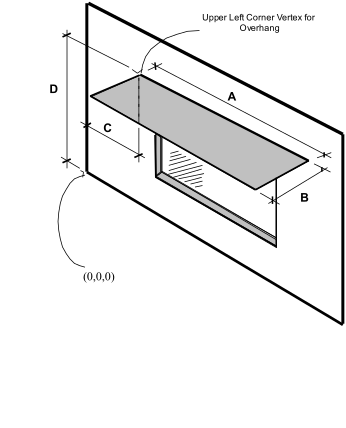

Figure 33. Illustration for Attached Shading Surface

Proper specification for this overhang (facing up) is:

4,(C,0,D),(C,-B,D),(C+A,-B,D),(C+A,0,D); () used to illustrate each vertex.

Note that for horizontal surfaces, any corner may be chosen as the starting corner. The order of vertices determines whether the surface is facing up or down. Shading surfaces are mirrored automatically unless the user specifies "DoNotMirrorDetachedShading", so each shading surface need only be described once.

Thus, another shading surface will be created (facing down):

4,(C+A,-B,D),(C+A,0,D),(C,0,D),(C,-B,D);

IDF example of attached shading surfaces (overhang, fin):

```idf
Shading:Zone:Detailed,
  Zn001:Wall001:Shade001,  !- Surface Name
  Zn001:Wall001,  !- Base Surface Name
  ShadingTransmittance:0001,  !- Shadowing Transmittance Schedule
   4, !-RectangularOverhang
   1.524000    , -0.3050000    ,   2.865000    ,
   1.524000    ,  0.0000000E+00,   2.865000    ,
   4.572000    ,  0.0000000E+00,   2.865000    ,
   4.572000    , -0.3050000    ,   2.865000    ;
Shading:Zone:Detailed,
  Zn003:Wall001:Shade001,  !- Surface Name
  Zn003:Wall001,  !- Base Surface Name
  ShadingTransmittance:0001,  !- Shadowing Transmittance Schedule
   4, !-RectangularLeftFin
   57.97000    ,   8.450000    ,   10.00000    ,
   57.97000    ,   8.450000    ,  0.0000000E+00,
   57.97000    ,   6.450000    ,  0.0000000E+00,
   57.97000    ,   6.450000    ,   10.00000    ;
 Shading:Zone:Detailed,Zn003:Wall001:Shade002,  !- Surface Name
  Zn003:Wall001,  !- Base Surface Name
  ShadingTransmittance:0003,  !- Shadowing Transmittance Schedule
   4, !-RectangularRightFin
   77.97000    ,   6.450000    ,   10.00000    ,
   77.97000    ,   6.450000    ,  0.0000000E+00,
   77.97000    ,   8.450000    ,  0.0000000E+00,
   77.97000    ,   8.450000    ,   10.00000    ;
```

### ShadingProperty:Reflectance

Specifies the reflectance properties of a shading surface when the solar reflection calculation has requested, i.e., when if “WithReflections” option is chosen in the Building object (ref: Building - Field: Solar Distribution). It is assumed that shading surfaces are divided into an unglazed, diffusely reflecting portion and a glazed, specularly-reflecting portion, either of which may be zero. The reflectance properties are assumed to be the same on both sides of the shading surface.

Note that a shadowing transmittance schedule (ref: Shading Surfaces, Field: Transmittance Schedule Name) can be used with a reflective shading surface. However, EnergyPlus assumes that the reflectance properties of the shading surface are constant even if the transmittance varies.

If no ShadingProperty:Reflectance objects are entered, the default values shown here will be used for shading surfaces. Other surfaces have their reflectance properties defined by the materials in the outer layers of the constructions.

#### Field: Shading Surface Name

The name of the Shading:Site, Shading:Building, Shading:Site:Detailed, Shading:Building:Detailed, Shading:Overhang, Shading:Overhang:Projection, Shading:Fin, Shading:Fin:Projection or Shading:Zone:Detailed object to which the following fields apply.

If this ShadingProperty:Reflectance object is not defined for a shading surface the default values listed in each of the following fields will be used in the solar reflection calculation.

#### Field: Diffuse Solar Reflectance of Unglazed Part of Shading Surface

The diffuse solar reflectance of the unglazed part of the shading surface (default = 0.2). This reflectance is assumed to be the same for beam-to-diffuse and diffuse-to-diffuse reflection. Beam-to-diffuse reflection is assumed to be independent of angle of incidence of beam radiation. Diffuse-to-diffuse reflection is assumed to be independent of angular distribution of the incident of diffuse radiation. The outgoing diffuse radiation is assumed to be isotropic (hemispherically uniform).

The sum of this reflectance and the shading surface transmittance should be less than or equal to 1.0.

#### Field: Diffuse Visible Reflectance of Unglazed Part of Shading Surface

The diffuse visible reflectance of the unglazed part of the shading surface (default = 0.2). This reflectance is assumed to be the same for beam-to-diffuse and diffuse-to-diffuse reflection. Beam-to-diffuse reflection is assumed to be independent of angle of incidence of beam radiation. Diffuse-to-diffuse reflection is assumed to be independent of angular distribution of the incident of diffuse radiation. The outgoing diffuse radiation is assumed to be isotropic (hemispherically uniform).

This value if used only for the daylighting calculation (ref: Daylighting:Controls). The sum of this reflectance and the shading surface transmittance should be less than or equal to 1.0.

#### Field: Fraction of Shading Surface That Is Glazed

The fraction of the area of the shading surface that consists of windows (default = 0.0). It is assumed that the windows are evenly distributed over the surface and have the same glazing construction (see following “Name of Glazing Construction”). This might be the case, for example, for reflection from the façade of a neighboring, highly-glazed building. For the reflection calculation the possible presence of shades, screens or blinds on the windows of the shading surface is ignored. Beam-to-beam (specular) reflection is assumed to occur only from the glazed portion of the shading surface. This reflection depends on angle of incidence as determined by the program from the glazing construction. Beam-to-diffuse reflection from the glazed portion is assumed to be zero. The diffuse-to-diffuse reflectance of the glazed portion is determined by the program from the glazing construction.

#### Field: Glazing Construction Name

The name of the construction of the windows on the shading surface. Required if Fraction of Shading Surface That Is Glazed is greater than 0.0.

IDF example of Shading Surface Reflectance for shading surface with specular reflection

```idf
Shading:Site:Detailed,
Adjacent Glazed Facade,  !- User Supplied Surface Name
,   !- Shadowing Transmittance Schedule
4,  !- Number of Surface Vertex Groups -- Number of (X,Y,Z) groups
0,-24,30, !- Vertex 1 X,Y,Z coordinates
0,-24,0,  !- Vertex 2 X,Y,Z coordinates
0,0,0,    !- Vertex 3 X,Y,Z coordinates
0,0,30;   !-Vertex 3 X,Y,Z coordinates


ShadingProperty:Reflectance,
Adjacent Glazed Facade, !- Name of Surface:Shading Object
0.3,  !- Diffuse Solar Reflectance of Unglazed Part of Shading Surface
0.3,  !- Diffuse Visible Reflectance of Unglazed Part of Shading Surface
0.7,  !- Fraction of Shading Surface That Is Glazed
GlassCon-1; !- Name of Glazing Construction
```


IDF example of Shading Surface Reflectance for shading surface without specular reflection

```idf
Shading:Site:Detailed,
Adjacent Blank Facade,  !- User Supplied Surface Name
,   !- Shadowing Transmittance Schedule
4,  !- Number of Surface Vertex Groups -- Number of (X,Y,Z) groups
0,-24,30,
0,-24,0,
0,0,0,
0,0,30;


ShadingProperty:Reflectance,
Adjacent Blank Facade, !- Name of Surface:Shading Object
0.4,  !- Diffuse Solar Reflectance of Unglazed Part of Shading Surface
0.4,  !- Diffuse Visible Reflectance of Unglazed Part of Shading Surface
0.0,  !- Fraction of Shading Surface That Is Glazed
;     !- Name of glazing construction
```

### WindowProperty:ShadingControl

Window shading with coverings like drapes, blinds, screens or pull-down shades can be used to reduce the amount of solar radiation entering the window or reduce daylighting glare. It can also be used to reduce heat loss through the window (movable insulation). Leaving the window covering open in the winter can maximize solar heat gain and thereby reduce heating loads.

With WindowProperty:ShadingControl—which is referenced by windows and glass doors (ref: FenestrationSurface:Detailed with Type = Window or GlassDoor)--you specify the type and location of the shading device, what variable or combination of variables controls deployment of the shading device, and what the control setpoint is. If the shading device is a blind, you also specify how the slat angle is controlled.

NOTE: WindowProperty:ShadingControl does not work with complex fenestration systems. Controlled complex fenestration systems can be made only with Energy Management Systems objects. Inserting WindowProperty:ShadingControl in FenestrationSurface:Detailed while using complex fenestration systems will be ignored by program.

As shown in Figure 34, a shading device can be inside the window (Shading Type = InteriorShade or InteriorBlind), outside the window (Shading Type = ExteriorShade or ExteriorBlind), or between panes of glass (Shading Type = BetweenGlassShade or BetweenGlassBlind). The exception is window screens which can only be outside the window (Shading Type = ExteriorScreen).

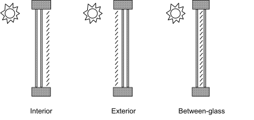

Figure 34. Allowed locations of a window shading device.

When a shading device is present it is either retracted or activated. When it is retracted it covers none of the window. When it is activated it covers the entire glazed part of the window (but not the frame). Whether the shading device is retracted or activated in a particular timestep depends on the control mechanism: see “Shading Control Type,” below. To model a case in which the shading device, when activated, covers only **part** of the window you will have to divide the window into two separate windows, one with the shading device and one without the shading device.

A shading device can also be of a kind in which the optical properties of the glazing switch from one set of values to another in order to increase or decrease solar or visible transmittance (Shading Type = SwitchableGlazing).

There are two ways of specifying the actual shading device:

#### Specify “Name of Construction with Shading”

This is the name of a window Construction that has the shading device as one of its layers. The thermal and solar-optical properties of the shading device are given by the shading material referenced in that Construction (ref: Construction, WindowMaterial:Shade, WindowMaterial:Screen and WindowMaterial:Blind). To use this method you have to define two Constructions for the window, one without the shading device and one with it. See Example 1, below.

The Construction without the shading device is referenced in the FenestrationSurface:Detailed input for the window (see IDF example, below). The Construction with the shading device is referenced by the window’s WindowProperty:ShadingControl.

For Shading Type = InteriorShade, InteriorBlind, ExteriorShade, ExteriorScreen and ExteriorBlind these two Constructions must be identical expect for the presence of the shading layer in the shaded Construction, otherwise you will get an error message. You will also get an error message if the Construction referenced by the window has a shading layer.

#### Specify the “Material Name of the Shading Device”

This is the name of a WindowMaterial:Shade, WindowMaterial:Screen or WindowMaterial:Blind. This method can be used with Shading Type = InteriorShade, InteriorBlind, ExteriorShade and ExteriorBlind. It cannot be used with Shading Type = BetweenGlassShade, BetweenGlassBlind, or SwitchableGlazing. If Shading Type = InteriorShade or ExteriorShade, then you specify the name of a WindowMaterial:Shade. If Shading Type = InteriorBlind or ExteriorBlind, then you specify the name of a WindowMaterial:Blind. If Shading Type = ExteriorScreen, then you specify the name of a WindowMaterial:Screen. See Example 2, below. This method is simpler to use since you don’t have to specify two Constructions that differ only by the shading layer.

When this method is used, the program will automatically create a shaded window construction by adding a shading layer to the outside or inside of the construction corresponding to the window referencing the WindowProperty:ShadingControl. The name, created by the program, of this shaded construction is composed as follows: if the name of the window construction is CCC and the material name of the shading device is DDD, then the shaded construction name is CCC:DDD:INT for an interior shading device and CCC:DDD:EXT for an exterior shading device.

This method is the required if you want to add a shading device to a construction brought in from a WINDOW Data File (ref:Construction:WindowDataFile).

Note that if both “Name of Construction with Shading” and “Material Name of Shading Device” are specified, the former takes precedence.

Most Shading Control Types allow you to specify a schedule that determines when the control is active. One example is a control that is active seasonally. For example, to deploy shading only in the summer when the incident solar is high enough, use Shading Control Type = OnIfHighSolarOnWindow with a schedule that is 1 during the summer months and 0 otherwise and specify Shading Control Is Scheduled = YES.

In addition, most Shading Control Types also allow you to specify that glare control is active in addition to the specified Control Type. For example, you might want to deploy shading when the solar incident on a window is too high OR the glare from the window is too high. This type of joint control requires that the window be in a daylit zone, that the maximum allowed glare be specified in the Daylighting object for the zone, and that Glare Control Is Active = YES in WindowProperty:ShadingControl.

If Shading Type = InteriorBlind, ExteriorBlind or BetweenGlassBlind you can use WindowProperty:ShadingControl to specify how the slat angle of the blind is controlled when the blind is in place.

A special type of WindowProperty:ShadingControl is SwitchableGlazing. An example is electrochromic glazing in which the transmittance and reflectance of the glass is controlled electronically. For example, you could have electrochromic glazing switch from clear (high transmittance) to dark (low transmittance) to control solar gain. If you choose the Shading Type = SwitchableGlazing option for WindowProperty:ShadingControl, the unswitched (clear) state is specified by the Construction referenced by the window and the switched (dark) state is specified by the Construction referenced by WindowProperty:ShadingControl for that window. For example, if you specify Shading Type = SwitchableGlazing and Shading Control Type = OnIfHighSolarOnWindow, then the glazing will switch to the dark state whenever the solar radiation striking the window exceeds the Setpoint value.

For Shading Type = SwitchableGlazing the state of the window is either clear (unswitched) or dark (fully switched) for all Shading Control Types except MeetDaylightIlluminanceSetpoint. In this case, the transmittance of the glazing is adjusted to just meet the daylight illuminance set point at the first daylighting reference point (see Daylighting). This type of control assures that there is just enough solar gain to meet the daylighting requirements in a zone, and no more, thus reducing the cooling load.

#### Field: Name

Name of the window shading control. It is referenced by a window (ref: Field: Shading Control Name).

#### Field: Shading Type

The type of shading device. The choices are:

*InteriorShade*: A diffusing shade is on the inside of the window. (In the shaded Construction the shading layer must be a WindowMaterial:Shade.)

*ExteriorShade*: A diffusing shade is on the outside of the window. (In the shaded Construction the shading layer must be a WindowMaterial:Shade.)

*BetweenGlassShade*: A diffusing shade is between two glass layers. (In the shaded Construction the shading layer must be a WindowMaterial:Shade.) This shading type is allowed only for double- and triple-glazing. For triple-glazing the shade must be between the two inner glass layers.

*ExteriorScreen*: An insect screen is on the outside of the window. (In the shaded Construction the shadling layer must be a WindowMaterial:Screen.)

*InteriorBlind*: A slat-type shading device, such as a Venetian blind, is on the inside of the window. (In the shaded Construction the shading layer must be a WindowMaterial:Blind.)

*ExteriorBlind*: A slat-type shading device is on the outside of the window. (In the shaded Construction the shading layer must be a WindowMaterial:Blind.)

*BetweenGlassBlind*: A slat-type shading device is between two glass layers. (In the shaded Construction the shading layer must be a WindowMaterial:Blind.) This shading type is allowed only for double- and triple-glazing. For triple-glazing the blind must be between the two inner glass layers.

*SwitchableGlazing*: Shading is achieved by changing the characteristics of the window glass, such as by darkening it.

#### Field: Construction with Shading Name

Name of the window Construction that has the shading in place. The properties of the shading device are given by the shading material referenced in that Construction (ref: Construction, WindowMaterial:Shade, WindowMaterial:Screen and WindowMaterial:Blind). For Shading Type = SwitchableGlazing, this is the name of the Construction that corresponds to the window in its fully-switched (darkest) state.

Specifying “Name of Construction with Shading” is required if Shading Type = BetweenGlassShade, BetweenGlassBlind, or SwitchableGlazing. For other Shading Types, you may alternatively specify “Material Name of Shading Device” (see below).

#### Field: Shading Control Type

Specifies how the shading device is controlled, i.e., it determines whether the shading device is “on” or “off.” For blinds, screens and shades, when the device is “on” it is assumed to cover all of the window except its frame; when the device is “off” it is assumed to cover none of the window (whether “on” or “off” the shading device is assumed to cover none of the wall that the window is on).

For switchable glazing, “on” means that the glazing is in the fully-switched state and “off” means that it is in the unswitched state; for example, for electrochromic glazing, “on” means the glazing is in its darkest state and “off” means it is in its lightest state.

The choices for Shading Control Type are the following. If SetPoint is applicable its units are shown in parentheses.

*AlwaysOn*: Shading is always on.

*AlwaysOff*: Shading is always off.

The following six control types are used primarily to reduce zone cooling load due to window solar gain.

*OnIfScheduleAllows*: Shading is on if schedule value is non-zero. Requires that Schedule Name be specified and Shading Control Is Scheduled = Yes.

Note: For exterior window screens *AlwaysOn, AlwaysOff, and OnIfScheduleAllows* are the only valid shading control types.

*OnIfHighSolarOnWindow*: Shading is on if beam plus diffuse solar radiation incident on the window exceeds SetPoint (W/m<sup>2</sup>) and schedule, if specified, allows shading.

*OnIfHighHorizontalSolar*: Shading is on if total (beam plus diffuse) horizontal solar irradiance exceeds SetPoint (W/m<sup>2</sup>) and schedule, if specified, allows shading.

*OnIfHighOutdoorAirTemperature*: Shading is on if outside air temperature exceeds SetPoint (C) and schedule, if specified, allows shading.

*OnIfHighZoneAirTemperature*: Shading is on if zone air temperature in the previous timestep exceeds SetPoint (C) and schedule, if specified, allows shading.

*OnIfHighZoneCooling*: Shading is on if zone cooling rate in the previous timestep exceeds SetPoint (W) and schedule, if specified, allows shading.

*OnIfHighGlare*: Shading is on if the total daylight glare index at the zone’s first daylighting reference point from all of the exterior windows in the zone exceeds the maximum glare index specified in the daylighting input for zone (ref: Group – Daylighting). Applicable only to windows in zones with daylighting.

Note: Unlike other Shading Control Types, glare control is active whether or not a schedule is specified.

*MeetDaylightIlluminanceSetpoint*: Used only with ShadingType = SwitchableGlazing in zones with daylighting controls. In this case the transmittance of the glazing is adjusted to just meet the daylight illuminance set point at the first daylighting reference point. Note that the daylight illuminance set point is specified in the Daylighting:Controls object for the Zone; it is not specified as a WindowProperty:ShadingControl SetPoint. When the glare control is active, if meeting the daylight illuminance set point at the first daylighting reference point results in higher discomfort glare index (DGI) than the specified zone’s maximum allowable DGI for either of the daylight reference points, the glazing will be further dimmed until the DGI equals the specified maximum allowable value.

The following three control types can be used to reduce zone heating load during the winter by reducing window conductive heat loss at night and leaving the window unshaded during the day to maximize solar gain. They are applicable to any Shading Type except ExteriorScreen but are most appropriate for interior or exterior shades with high insulating value ("movable insulation"). “Night” means the sun is down and “day” means the sun is up.

*OnNightIfLowOutdoorTempAndOffDay*: Shading is on at night if the outside air temperature is less than SetPoint (C) and schedule, if specified, allows shading. Shading is off during the day.

*OnNightIfLowInsideTempAndOffDay*: Shading is on at night if the zone air temperature in the previous timestep is less than SetPoint (C) and schedule, if specified, allows shading. Shading is off during the day.

*OnNightIfHeatingAndOffDay*: Shading is on at night if the zone heating rate in the previous timestep exceeds SetPoint (W) and schedule, if specified, allows shading. Shading is off during the day.

The following two control types can be used to reduce zone heating and cooling load. They are applicable to any Shading Type except ExteriorScreen but are most appropriate for translucent interior or exterior shades with high insulating value ("translucent movable insulation").

*OnNightIfLowOutdoorTempAndOnDayIfCooling*: Shading is on at night if the outside air temperature is less than SetPoint (C). Shading is on during the day if the zone cooling rate in the previous timestep is non-zero. Night and day shading is subject to schedule, if specified.

*OnNightIfHeatingAndOnDayIfCooling*: Shading is on at night if the zone heating rate in the previous timestep exceeds SetPoint (W). Shading is on during the day if the zone cooling rate in the previous timestep is non-zero. Night and day shading is subject to schedule, if specified.

The following control types can be used to reduce zone cooling load. They are applicable to any Shading Type except ExteriorScreen but are most appropriate for interior or exterior blinds, interior or exterior shades with low insulating value, or switchable glazing.

*OffNightAndOnDayIfCoolingAndHighSolarOnWindow*: Shading is off at night. Shading is on during the day if the solar radiation incident on the window exceeds SetPoint (W/m<sup>2</sup>) and if the zone cooling rate in the previous timestep is non-zero. Daytime shading is subject to schedule, if specified.

*OnNightAndOnDayIfCoolingAndHighSolarOnWindow*: Shading is on at night. Shading is on during the day if the solar radiation incident on the window exceeds SetPoint (W/m<sup>2</sup>) and if the zone cooling rate in the previous timestep is non-zero. Day and night shading is subject to schedule, if specified. (This Shading Control Type is the same as the previous one, except the shading is on at night rather than off.)

*OnIfHighOutdoorAirTempAndHighSolarOnWindow:* Shading is on if the outside air temperature exceeds the Setpoint (C) and if if the solar radiation incident on the window exceeds SetPoint 2 (W/m<sup>2</sup>).

*OnIfHighOutdoorAirTempAndHighHorizontalSolar:* Shading is on if the outside air temperature exceeds the Setpoint (C) and if if the horizontal solar radiation exceeds SetPoint 2 (W/m<sup>2</sup>).

#### Field: Schedule Name

Required if Shading Control Is Scheduled = Yes. If schedule value &gt; 0 , shading control is active, i.e., shading can be on only if the shading control test passes. If schedule value = 0, shading is off whether or not the control test passes. If Schedule Name is not specified, shading control is assumed to be active at all times.

#### Field: Setpoint

The setpoint for activating window shading. The units depend on the type of trigger:

- W/m<sup>2</sup> for solar-based controls

- W for cooling- or heating-based controls

- Degrees C for temperature-based controls

SetPoint is unused for Shading Control Type = OnIfScheduleAllows, OnIfHighGlare and DaylightIlluminance.

#### Field: Shading Control Is Scheduled

Accepts values YES and NO. The default is NO. Not applicable for Shading Control Type = OnIfHighGlare and should be blank in that case.

If YES, Schedule Name is required and that schedule determines whether the shading control specified by Shading Control Type is active or inactive (see Schedule Name, above).

If NO, Schedule Name is not applicable (should be blank) and the shading control is unscheduled.

Shading Control Is Scheduled = YES is required if Shading Control Type = OnIfScheduleAllows.

#### Field: Glare Control Is Active

Accepts values YES and NO. The default is NO.

If YES and the window is in a daylit zone, shading is on if the zone's discomfort glare index exceeds the maximum discomfort glare index specified in the Daylighting object referenced by the zone. For switchable windows with *MeetDaylightIlluminanceSetpoint* shading control, if Glare Control is active, the windows are always continuously dimmed as necessary to meet the zone’s maximum allowable DGI while providing appropriate amount of daylight for the zone.

The glare test is OR'ed with the test specified by Shading Control Type. For example, if Glare Control Is Active = YES and Shading Control Type = OnIfHighZoneAirTemp, then shading is on if glare is too high OR if the zone air temperature is too high.

Glare Control Is Active = YES is required if Shading Control Type = OnIfHighGlare.

#### Field: Shading Device Material Name

The name of a WindowMaterial:Shade, WindowMaterial:Screen or WindowMaterial:Blind. Required if "Name of Construction with Shading" is not specified. Not applicable if Shading Type = BetweenGlassShade, BetweenGlassBlind or SwitchableGlazing and should be blank in this case. If both "Name of Construction with Shading" and "Material Name of Shading Device" are entered the former takes precedence.

#### Field: Type of Slat Angle Control for Blinds

Applies only to Shading Type = InteriorBlind, ExteriorBlind or BetweenGlassBlind. Specifies how the slat angle is controlled. The choices are FixedSlatAngle, ScheduledSlatAngle and BlockBeamSolar.

 If FixedSlatAngle (the default), the angle of the slat is fixed at the value input for the WindowMaterial:Blind that is contained in the construction specified by Name of Construction with Shading or is specified by Material Name of Shading Device.

If ScheduledSlatAngle, the slat angle varies according to the schedule specified by Slat Angle Schedule Name, below.

If BlockBeamSolar, the slat angle is set each timestep to just block beam solar radiation. If there is no beam solar on the window the slat angle is set to the value input for the WindowMaterial:Blind that is contained in the construction specified by Name of Construction with Shading or is specified by Material Name of Shading Device. The BlockBeamSolar option prevents beam solar from entering the window and causing possible unwanted glare if the beam falls on work surfaces while at the same time allowing near-optimal indirect radiation for daylighting.

#### Field: Slat Angle Schedule Name

This is the name of a schedule of slat angles that is used when Type of Slat Angle Control for Blinds = ScheduledSlatAngle. You should be sure that the schedule values fall within the range given by the Minimum Slat Angle and Maximum Slat Angle values entered in the corresponding WindowMaterial:Blind. If not, the program will force them into this range.

#### Field: Setpoint 2

Used only as the second setpoint for the following two-setpoint control types: OnIfHighOutdoorAirTempAndHighSolarOnWindow,  OnIfHighOutdoorAirTempAndHighHorizontalSolar, OnIfHighZoneAirTempAndHighSolarOnWindow,

and OnIfHighZoneAirTempAndHighHorizontalSolar

An IDF example: window with interior roll shade that is deployed when solar incident on the window exceeds 50 W/m<sup>2</sup>.

 ! Example 1: Interior movable shade specified by giving name of shaded construction

 ! in WindowProperty:ShadingControl

```idf
 WindowMaterial:Glazing, GLASS - CLEAR SHEET 1 / 8 IN,  !- Material Name
     SpectralAverage,! Optical data type {SpectralAverage or Spectral}
     ,               ! Name of spectral data set when Optical Data Type = Spectral
     0.003        ,  !- Thickness {m}
     0.837        ,  !- Solar Transmittance at Normal Incidence
     0.075        ,  !- Solar Reflectance at Normal Incidence: Front Side
     0.075        ,  !- Solar Reflectance at Normal Incidence: Back Side
     0.898        ,  !- Visible Transmittance at Normal Incidence
     0.081        ,  !- Visible Reflectance at Normal Incidence: Front Side
     0.081        ,  !- Visible Reflectance at Normal Incidence: Back Side
     0.0          ,  !- IR Transmittance
     0.8400000    ,  !- IR Emissivity: Front Side
     0.8400000    ,  !- IR Emissivity: Back Side
     0.9000000    ;  !- Conductivity {W/m-K}

 WindowMaterial:Shade, ROLL SHADE,  !- Material Name
     0.3          ,   !- Solar Transmittance at normal incidence
     0.5000000    ,   !- Solar Reflectance (same for front and back side)
     0.3          ,   !- Visible Transmittance at normal incidence
     0.5000000    ,   !- Visible reflectance (same for front and back side)
     0.9000000    ,   !- IR Emissivity (same for front and back side)
     0.05         ,   !- IR Transmittance
     0.003        ,   !- Thickness
     0.1          ,   !- Conductivity {W/m-K}
     0.0          ,   !- Top Opening Multiplier
     0.0          ,   !- Bottom Opening Multiplier
     0.5          ,   !- Left-Side Opening Multiplier
     0.5          ,   !- Right-Side Opening Multiplier
     0.0          ;   !- Air-Flow Permeability

 Construction, SINGLE PANE WITH NO SHADE,  ! Name of construction without shade
     GLASS - CLEAR SHEET 1 / 8 IN;  !- First material layer

 Construction, SINGLE PANE WITH INT SHADE, ! Name of construction with shade
     GLASS - CLEAR SHEET 1 / 8 IN,  !- First material layer
     ROLL SHADE                  ;  !- Second material layer

 WindowProperty:ShadingControl, CONTROL ON INCIDENT SOLAR,  !- Name of Shading Control
     InteriorShade,                !- Shading Type
     SINGLE PANE WITH INT SHADE,   !- Name of construction with shading device
     OnIfHighSolarOnWindow,        !- Shading Control Type
     ,                             !- Schedule name
     50.0,                         !- Setpoint {W/m2}
     NO,                           !- Shading Control Is Scheduled
     NO,                           !- Glare Control Is Active
     ,                             !- Material Name of Shading Device
     ,                             !- Type of Slat Angle Control for Blinds
     ;                             !- Slat Angle Schedule Name

 FenestrationSurface:Detailed, Zn001:Wall001:Win001,  !- SubSurface Name
     Window                   ,    !- Class
     SINGLE PANE WITH NO SHADE,    !- Name of construction without shading device
     Zn001:Wall001            ,    !- Base Surface Name
     ,                             !- Target
     0.5000000                ,    !- VF to Ground
     CONTROL ON INCIDENT SOLAR,    !- Window Shading Control name
     ,                             !- Frame/Divider name
     1.0                      ,    !- Multiplier
     4                        ,    !- Number of vertices (assumed rectangular)
     0.548 ,  0.0 ,   2.5     ,    !- x,y,z of vertices {m}
     0.548 ,  0.0 ,   0.5     ,
     5.548 ,  0.0 ,   0.5     ,
     5.548 ,  0.0 ,   2.5     ;

 ! Example 2: Interior movable shade specified by giving name of shading device in WindowProperty:ShadingControl

 WindowMaterial:Glazing, GLASS - CLEAR SHEET 1 / 8 IN,  !- Material Name
     SpectralAverage,! Optical data type {SpectralAverage or Spectral}
     ,               ! Name of spectral data set when Optical Data Type = Spectral
     0.003        ,  !- Thickness {m}
     0.837        ,  !- Solar Transmittance at Normal Incidence
     0.075        ,  !- Solar Reflectance at Normal Incidence: Front Side
     0.075        ,  !- Solar Reflectance at Normal Incidence: Back Side
     0.898        ,  !- Visible Transmittance at Normal Incidence
     0.081        ,  !- Visible Reflectance at Normal Incidence: Front Side
     0.081        ,  !- Visible Reflectance at Normal Incidence: Back Side
     0.0          ,  !- IR Transmittance
     0.8400000    ,  !- IR Emissivity: Front Side
     0.8400000    ,  !- IR Emissivity: Back Side
     0.9000000    ;  !- Conductivity {W/m-K}

 WindowMaterial:Shade, ROLL SHADE,  !- Material Name
     0.3          ,   !- Solar Transmittance at normal incidence
     0.5000000    ,   !- Solar Reflectance (same for front and back side)
     0.3          ,   !- Visible Transmittance at normal incidence
     0.5000000    ,   !- Visible reflectance (same for front and back side)
     0.9000000    ,   !- IR Emissivity (same for front and back side)
     0.05         ,   !- IR Transmittance
     0.003        ,   !- Thickness
     0.1          ,   !- Conductivity {W/m-K}
     0.0          ,   !- Top Opening Multiplier
     0.0          ,   !- Bottom Opening Multiplier
     0.5          ,   !- Left-Side Opening Multiplier
     0.5          ,   !- Right-Side Opening Multiplier
     0.0          ;   !- Air-Flow Permeability

 Construction, SINGLE PANE WITH NO SHADE,  ! Name of construction without shade
     GLASS - CLEAR SHEET 1 / 8 IN;  !- First material layer

 WINDOWPROPERTY:SHADINGCONTROL, CONTROL ON INCIDENT SOLAR,  !- Name of Shading Control
     InteriorShade,                !- Shading Type
     ,                             !- Name of shaded construction
     OnIfHighSolarOnWindow,        !- Shading Control Type
     ,                             !- Schedule name
     50.0,                         !- Setpoint {W/m2}
     NO,                           !- Shading Control Is Scheduled
     NO,                           !- Glare Control Is Active
     ROLL SHADE,                   !- Material Name of Shading Device
     ,                             !- Type of Slat Angle Control for Blinds
     ;                             !- Slat Angle Schedule Name

 FenestrationSurface:Detailed, Zn001:Wall001:Win001,  !- SubSurface Name
     Window                   ,    !- Class
     SINGLE PANE WITH NO SHADE,    !- Name of construction without shade
     Zn001:Wall001            ,    !- Base Surface Name
     ,                             !- Target
     0.5000000                ,    !- VF to Ground
     CONTROL ON INCIDENT SOLAR,    !- Window Shading Control name
     ,                             !- Frame/Divider name
     1.0                      ,    !- Multiplier
     4                        ,    !- Number of vertices (assumed rectangular)
     0.548 ,  0.0 ,   2.5     ,    !- x,y,z of vertices {m}
     0.548 ,  0.0 ,   0.5     ,
     5.548 ,  0.0 ,   0.5     ,
     5.548 ,  0.0 ,   2.5     ;
```


### WindowProperty:FrameAndDivider

The WindowProperty:FrameAndDivider object is referenced by exterior windows that have

- a frame, and/or

- a divider, and/or

- reveal surfaces that reflect beam solar radiation.

A ***frame*** surrounds the glazing in a window (see Figure 35 and Figure 36). It is assumed that all frame characteristics—such as width, conductance and solar absorptance—are the same for the top, bottom and side elements of the frame. If the frame elements are not the same then you should enter area-weighted average values for the frame characteristics.

The window vertices that you specify in the FenestrationSurface:Detailed object are those of the glazed part of the window, not the frame. EnergyPlus automatically subtracts the area of the frame—determined from the glazing dimensions and the frame width—from the area of the wall containing the window.

A ***divider***, as shown in Figure 35, Figure 36 and Figure 37, divides the glazing up into separate lites. It is assumed that all divider elements have the same characteristics. If not, area-weighted average values should be used. EnergyPlus automatically subtracts the divider area from the glazed area of the window.

***Reveal surfaces***, as shown in Figure 38, are associated with the setback of the glazing from the outside and/or inside surface of the parent wall. If the depth and solar absorptance of these surfaces are specified, the program will calculate the reflection of beam solar radiation from these surfaces. The program also calculates the shadowing (onto the window) of beam and diffuse solar radiation by outside reveal surfaces.

In EnergyPlus, a window can have any combination of frame, divider and reveal surfaces, or none of these.

The best source of frame and divider characteristics is the WINDOW program, which will calculate the values required by EnergyPlus for different frame and divider types. In particular, the THERM program within the WINDOW program will calculate the effective conductance of frames and dividers; this is the conductance taking 2-D heat transfer effects into account.

Note that a window’s frame and divider characteristics, along with other window information, can be read in from the Window Data File (see “Importing Windows from the WINDOW program” and “Construction:WindowDataFile object”). In this case the WindowProperty:FrameAndDivider referenced by the window is not applicable and should be blank unless you want to specify reveal surfaces for beam solar reflection.

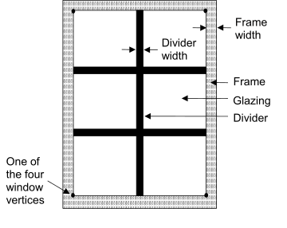

Figure 35. A window with a frame and divider.

In the illustration above, the divider has two horizontal elements and one vertical element.

#### Field: Name

The name of the frame/divider object. It is referenced by WindowProperty:FrameAndDivider Name in FenestrationSurface:Detailed.

***Frame Fields***

#### Field: Frame Width

The width of the frame elements when projected onto the plane of the window. It is assumed that the top, bottom and side elements of the frame have the same width. If not, an average frame width should be entered such that the projected frame area calculated using the average value equals the sum of the areas of the frame elements.

#### Field: Frame Outside Projection

The amount by which the frame projects outward from the outside surface of the window glazing. If the outer surface of the frame is flush with the glazing, Frame Outside Projection = 0.0. Used to calculate shadowing of frame onto glass, solar absorbed by frame, IR emitted and absorbed by frame, and convection from frame.

#### Field: Frame Inside Projection

The amount by which the frame projects inward from the inside surface of the window glazing. If the inner surface of the frame is flush with the glazing, Frame Inside Projection = 0.0. Used to calculate solar absorbed by frame, IR emitted and absorbed by frame, and convection from frame.

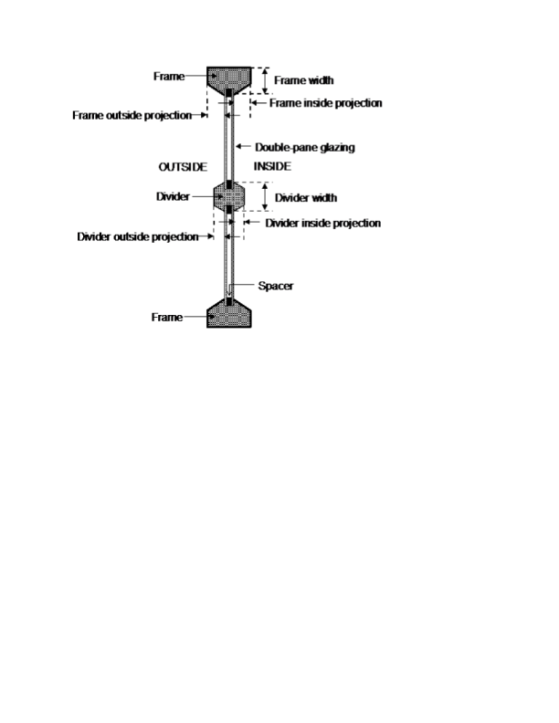

Figure 36. Illustration showing frame and divider dimensioning.

#### Field: Frame Conductance

The effective thermal conductance of the frame measured from inside to outside frame surface (no air films) and taking 2-D conduction effects into account. Obtained from the WINDOW program or other 2-D calculation.

#### Field: Ratio of Frame-Edge Glass Conductance to Center-Of-Glass Conductance

The glass conductance near the frame (excluding air films) divided by the glass conductance at the center of the glazing (excluding air films). Used only for multi-pane glazing constructions. This ratio is greater than 1.0 because of thermal bridging from the glazing across the frame and across the spacer that separates the glass panes. Values can be obtained from the WINDOW program the user-selected glazing construction and frame characteristics.

#### Field: Frame Solar Absorptance

The solar absorptance of the frame. The value is assumed to be the same on the inside and outside of the frame and to be independent of angle of incidence of solar radiation. If solar reflectance (or reflectivity) data is available, then absorptance is equal to 1.0 minus reflectance (for opaque materials).

#### Field: Frame Visible Absorptance

The visible absorptance of the frame. The value is assumed to be the same on the inside and outside of the frame and to be independent of angle of incidence of solar radiation. If visible reflectance (or reflectivity) data is available, then absorptance is equal to 1.0 minus reflectance (for opaque materials).

#### Field: Frame Thermal Hemispherical Emissivity

The thermal emissivity of the frame, assumed the same on the inside and outside.

***Divider Fields***

#### Field: Divider Type

The type of divider (see figure below). Divider Type = Suspended is applicable only to multi-pane glazing. It means that the divider is suspended between the panes. (If there are more than two glass layers, the divider is assumed to be placed between the two outermost layers.)

Divider Type = DividedLite means that the divider elements project out from the outside and inside surfaces of the glazing and divide the glazing into individual lites. For multi-pane glazing, this type of divider also has between-glass elements that separate the panes.


Figure 37. Illustration showing divider types.

#### Field: Divider Width

The width of the divider elements when projected onto the plane of the window. It is assumed that the horizontal and vertical divider elements have the same width. If not, an average divider width should be entered such that the projected divider area calculated using the average value equals the sum of the areas of the divider elements.

#### Field: Number of Horizontal Dividers

The number of divider elements parallel to the top and bottom of the window.

#### Field: Number of Vertical Dividers

The number of divider elements parallel to the sides of the window.

#### Field: Divider Outside Projection

The amount by which the divider projects out from the outside surface of the window glazing. For Divider Type = Suspended, Divider Projection = 0.0. Used to calculate shadowing of divider onto glass, solar absorbed by divider, IR emitted and absorbed by divider, and convection from divider.

#### Field: Divider Inside Projection

The amount by which the divider projects inward from the inside surface of the window glazing. If the inner surface of the divider is flush with the glazing, Divider Inside Projection = 0.0. Used to calculate solar absorbed by divider, IR emitted and absorbed by divider, and convection from divider.

#### Field: Divider Conductance

The effective thermal conductance of the divider measured from inside to outside divider surface (no air films) and taking 2-D conduction effects into account. Obtained from the WINDOW program or other 2-D calculation.

#### Field: Ratio of Divider-Edge Glass Conductance to Center-Of-Glass Conductance

The glass conductance near the divider (excluding air films) divided by the glass conductance at the center of the glazing (excluding air films). Used only for multi-pane glazing constructions. This ratio is greater than 1.0 because of thermal bridging from the glazing across the divider and across the spacer that separates the glass panes. Values can be obtained from the WINDOW program for the user-selected glazing construction and divider characteristics.

#### Field: Divider Solar Absorptance

The solar absorptance of the divider. The value is assumed to be the same on the inside and outside of the divider and to be independent of angle of incidence of solar radiation. If solar reflectance (or reflectivity) data is available, then absorptance is equal to 1.0 minus reflectance (for opaque materials).

#### Field: Divider Visible Absorptance

The visible absorptance of the divider. The value is assumed to be the same on the inside and outside of the divider and to be independent of angle of incidence of solar radiation. If visible reflectance (or reflectivity) data is available, then absorptance is equal to 1.0 minus reflectance (for opaque materials).

#### Field: Divider Thermal Hemispherical Emissivity

The thermal emissivity of the divider, assumed the same on the inside and outside.

***Reveal Surface Fields***

The following fields specify the properties of the window reveal surfaces (reveals occur when the window is not in the same plane as the base surface). From this information and from the geometry of the window and the sun position, the program calculates beam solar radiation absorbed and reflected by the top, bottom, right and left sides of outside and inside window reveal surfaces. In doing this calculation, the shadowing on a reveal surface by other reveal surfaces is determined using the orientation of the reveal surfaces and the sun position.

It is assumed that:

- The window is an exterior window.

- The reveal surfaces are perpendicular to the window plane.

- If an exterior shade, screen or blind is in place it shades exterior and interior reveal surfaces so that in this case there is no beam solar on these surfaces.

- If an interior shade or blind is in place it shades the interior reveal surfaces so that in this case there is no beam solar on these surfaces.

- The possible shadowing on inside reveal surfaces by a window divider is ignored.

- The outside reveal surfaces (top, bottom, left, right) have the same solar absorptance and depth. This depth is not input here but is automatically determined by the program—from window and wall vertices--as the distance between the plane of the outside face of the glazing and plane of the outside face of the parent wall.

- The inside reveal surfaces are divided into two categories: (1) the bottom reveal surface, called here the "inside sill;" and (2) the other reveal surfaces (left, right and top).

- The left, right and top inside reveal surfaces have the same depth and solar absorptance. The inside sill is allowed to have depth and solar absorptance values that are different from the corresponding values for the other inside reveal surfaces.

- The inside sill depth is required to be greater than or equal to the depth of the other inside reveal surfaces. If the inside sill depth is greater than zero the depth of the other inside reveal surfaces is required to be greater than zero.

- The reflection of beam solar radiation from all reveal surfaces is assumed to be isotropic diffuse; there is no specular component.

- Half of the beam solar reflected from outside reveal surfaces is goes towards the window; the other half goes back to the exterior environment (i.e., reflection of this outward-going component from other outside reveal surfaces is not considered).

- The half that goes towards the window is added to the other solar radiation incident on the window. Correspondingly, half of the beam solar reflected from inside reveal surfaces goes towards the window, with the other half going into the zone. The portion going towards the window that is not reflected is absorbed in the glazing or is transmitted back out into the exterior environment.

- The beam solar that is absorbed by outside reveal surfaces is added to the solar absorbed by the outside surface of the window's parent wall; similarly, the beam solar absorbed by the inside reveal surfaces is added to the solar absorbed by the inside surface of the parent wall.

The net effect of beam solar reflected from outside reveal surfaces is to increase the heat gain to the zone, whereas the effect of beam solar reflected from inside reveal surfaces is to decrease the heat gain to the zone since part of this reflected solar is transmitted back out the window.

 If the window has a frame, the absorption of reflected beam solar by the inside and outside surfaces of the frame is considered. The shadowing of the frame onto interior reveal surfaces is also considered.

#### Field: Outside Reveal Solar Absorptance

The solar absorptance of outside reveal surfaces.

#### Field: Inside Sill Depth

The depth of the inside sill, measured from the inside surface of the glazing to the edge of the sill (see Figure 38).

#### Field: Inside Sill Solar Absorptance

The solar absorptance of the inside sill.

***Field: Inside Reveal Depth***

The depth of the inside reveal surfaces other than the sill, measured from the inside surface of the glazing to the edge of the reveal surface (see Figure 38).

#### Field: Inside Reveal Solar Absorptance

The solar absorptance of the inside reveal surfaces other than the sill.

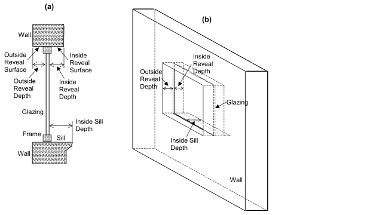

Figure 38. (a) Vertical section through a window (with frame) showing outside and inside reveal surfaces and inside sill. (b) Perspective view looking from the outside of a window (without frame) showing reveal surfaces. Note that “Outside Reveal Depth” is not a user input; it is calculated by the program from the window and wall vertices.

An IDF example:

```idf
  WindowProperty:FrameAndDivider,
      TestFrameAndDivider, ! Frame/Divider Name
      0.05, ! Frame Width
      0.04, ! Frame Outside Projection
      0.03, ! Frame Inside Projection
      5.0,  ! Frame Conductance
      1.3,  ! Ratio of Frame-Edge Glass Conductance to Center-Of-Glass Conductance
      0.8,  ! Frame Solar Absorptance
      0.8,  ! Frame Visible Absorptance
      0.9,  ! Frame Thermal Emissivity
      DividedLite, ! Divider Type
      0.03, ! Divider Width
      2,    ! Number of Horizontal Dividers
      2,    ! Number of Vertical Dividers
      0.03, ! Divider Outside Projection
      0.03, ! Divider Inside Projection
      5.0,  ! Divider Conductance
      1.3,  ! Ratio of Divider-Edge Glass Conductance to Center-Of-Glass Conductance
      0.8,  ! Divider Solar Absorptance
      0.8,  ! Divider Visible Absorptance
      0.9,  ! Divider Thermal Emissivity
      0.7,  ! Outside Reveal Solar Absorptance
      0.25, ! Inside Sill Depth (m)
      0.6,  ! Inside Sill Solar Absorptance
      0.2,  ! Inside Reveal Depth (m)
      0.5;  ! Inside Reveal Solar Absorptance
```


### WindowProperty:AirflowControl

This object is used to specify the control mechanism for windows in which forced air flows in the gap between adjacent layers of glass. Such windows are called “airflow windows.” They are also known as “heat-extract windows” or “climate windows.”

A common application is to reduce the zone load by exhausting indoor air through the window. In the cooling season this picks up and expels some of the solar heat absorbed by the window glass (and by the between-glass shade or blind, if present). In the heating season this warms the window, reducing the heat loss from the window. A side benefit is increased thermal comfort. This is because the inside surface of the window will generally be cooler in summer and warmer in winter.

The surface output variable “Surface Window Gap Convective Heat Transfer Rate” gives the heat picked up (or lost) by the gap airflow.

#### Field: Name

Name of the window that this WindowProperty:AirflowControl refers to. It must be a window with two or three glass layers, i.e., double- or triple-glazing. For triple-glazing the airflow is assumed to be between the two inner glass layers.

An error will result if the gas in the airflow gap is other than air. If an airflow window has a between-glass shade or blind, the gas in the gap on either side of the shade or blind must be air.

#### Field: Airflow Source

The source of the gap airflow. The choices are:

*IndoorAir*: Indoor air from the window’s zone is passed through the window.

*OutdoorAir*: Outdoor air is passed through the window.

#### Field: Airflow Destination

This is where the gap air goes after passing through the window. The choices are:

*IndoorAir*: The gap air goes to the indoor air of the window’s zone.

*OutdoorAir*: The gap air goes to the outside air.

*ReturnAir*. The gap air goes to the return air for the window’s zone. This choice is allowed only if Airflow Source = InsideAir. If the return air flow is zero, the gap air goes to the indoor air of the window’s zone. If the sum of the gap airflow for all of the windows in a zone with Airflow Destination = ReturnAir exceeds the return airflow, then the difference between this sum and the return airflow goes to the indoor air.

Figure 39 shows the allowed combinations of Airflow Source and Airflow Destination. The allowed combinations of Airflow Source and Airflow Destination are:

IndoorAir -&gt; OutdoorAir

IndoorAir -&gt; IndoorAir

IndoorAir -&gt; ReturnAir

OutdoorAir -&gt; IndoorAir

OutdoorAir -&gt; OutdoorAir

#### Field: Maximum Flow Rate

The maximum value of the airflow, in m<sup>3</sup>/s per m of glazing width. The value is typically 0.006 to 0.009 m<sup>3</sup>/s-m (4 to 6 cfm/ft).

The airflow can be modulated by specifying Airflow Has Multiplier Schedule = Yes and giving the name of the Airflow Multiplier Schedule (see below).

The fan energy used to move the air through the gap is generally very small and so is ignored.

#### Field: Airflow Control Type

Specifies how the airflow is controlled. The choices are:

*AlwaysOnAtMaximumFlow*. The airflow is always equal to Maximum Airflow.

*AlwaysOff*. The airflow is always zero.

*ScheduledOnly*. The airflow in a particular timestep equals Maximum Airflow times the value of the Airflow Multiplier Schedule for that timestep.

#### Field: Airflow Is Scheduled

Specifies if the airflow is scheduled. The choices are:

*Yes*. The airflow is scheduled.

*No*. The airflow is not scheduled.

If Yes, Airflow Multiplier Schedule Name is required.

#### Field: Airflow Multiplier Schedule Name

The name of a schedule with values between 0.0 and 1.0. The timestep value of the airflow is Maximum Airflow times the schedule value. Required if Airflow Is Scheduled = Yes. Unused if Airflow Is Scheduled = No. This schedule should have a ScheduleType with Numeric Type = Continuous and Range = 0.0 : 1.0.


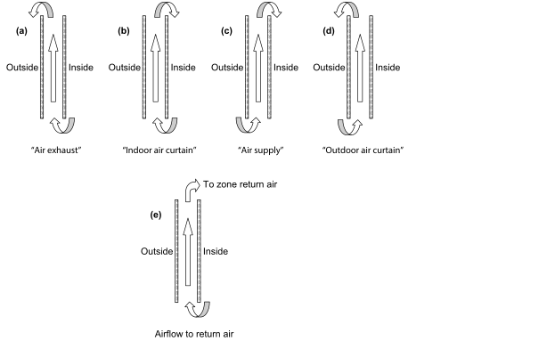

Figure 39. Gap airflow configurations for airflow windows. (a) **Air exhaust window**: Airflow Source = InsideAir, Airflow Destination = OutsideAir; (b) **Indoor air curtain window**: Airflow Source = InsideAir, Airflow Destination = InsideAir; (c) **Air supply window**: Airflow Source = OutsideAir, Airflow Destination = InsideAir; (d) **Outdoor air curtain window**: Airflow Source = OutsideAir, Airflow Destination = OutsideAir; (e) **Airflow to Return Air**: Airflow Source = InsideAir, Airflow Destination = ReturnAir. Based on “Active facades,” Version no. 1, Belgian Building Research Institute, June 2002.


An IDF example: window with a constant airflow from inside to outside at 0.008 m<sup>3</sup>/s-m.

```idf
 WindowProperty:AirflowControl,   !- Used to control forced airflow through a gap between glass layers
    Zn001:Wall001:Win002,   !- Name of Associated Window
    InsideAir,              !- Airflow Source
    OutsideAir,             !- Airflow Destination
    0.008,                  !- Maximum Airflow (m3/s per m of glazing width)
    AlwaysOnAtMaxFlow,      !- Airflow Control Type
    No,                     !- Airflow Has Multiplier Schedule?
    ;                       !- Name of Airflow Multiplier Schedule
```


### WindowProperty:StormWindow

This object allows you to assign a movable exterior glass layer (“storm window” or “storm glass”) that is usually applied to a window in the winter to reduce heat loss and removed in the summer. A WindowProperty:StormWindow object is required for each window that has an associated storm window. It is assumed that:

- When the storm glass is in place it is the outermost layer of the window, it covers only the glazed part of the window and not the frame, and it forms a tight seal. See Figure 40.

- When the storm glass is not in place it is completely removed and has no effect on window heat transfer.

- The gap between the storm glass and rest of the glazing is filled with air.


Figure 40. Section through a single-glazed window without (left) and with (right) a storm glass layer. Not to scale.

With the addition of a storm window, single glazing effectively becomes double glazing, double glazing becomes triple glazing, etc.

The presence of a storm window is indicated by the output variable “Surface Storm Window On Off Status” (see “Window Output Variables”). This flag is **0** if the storm window is off, **1** if it is on, and **–1** if the window does not have an associated storm window.

The program automatically creates a window construction (ref: Construction) that consists of the storm window glass layer and its adjacent air layer added to the original (unshaded, or “bare”) window construction. In the eplusout.eio file this construction is called BARECONSTRUCTIONWITHSTORMWIN:*n*, where *n* is the number of the associated StormWin object. If the window has a shaded construction, the program creates a construction called SHADEDCONSTRUCTIONWITHSTORMWIN:*n* that consists of the storm window glass layer and its adjacent air layer added to the original shaded window construction.

The program also creates a WindowMaterial:Gas layer corresponding to the air layer adjacent to the storm glass. In the eplusout.eio file this layer is called AIR:STORMWIN:*k*MM, where *k* is the thickness of the air layer expressed as an integer number of millimeters.

#### Field: Window Name

This is the name of a window (or glass door) to which the storm glass is applied. Not all windows can accept WindowProperty:StormWindow. The rules are:

- The window must be an exterior window. WindowProperty:StormWindow is not applicable to interior (interzone) windows.

- The window construction (without the storm glass layer) can have up to three glass layers.

- If the window has an associated shaded construction (ref: WindowProperty:ShadingControl), that construction can have an interior shade or blind and up to three glass layers, or a between-glass shade or blind and two glass layers. The shaded construction cannot have an exterior shade or blind, cannot have a between-glass shade or blind and three glass layers, and cannot be switchable glazing.

- The window cannot be an airflow window, i.e., a window that has an associated WindowProperty:AirflowControl.

#### Field: Storm Glass Layer Name

This is the name of a window glass material. Storm windows are assumed to consist of a single layer of glass. A storm window frame, if present, is ignored.

#### Field: Distance Between Storm Glass Layer and Adjacent Glass

The separation between the storm glass and the rest of the window (Figure 40). It is measured from the inside of the storm glass layer to the outside of the adjacent glass layer.

#### Field: Month that Storm Glass Layer Is Put On

The number of the month (January = 1, February = 2, etc.) during which the storm window is put in place.

#### Field: Day of Month that Storm Glass Layer Is Put On

The day of the month that the storm window is put in place. It is assumed that the storm window is put in place at the beginning of this day, i.e., during the first simulation timestep of the day, and remains in place until that month and day given by the following two fields.

#### Field: Month that Storm Glass Layer Is Taken Off

The number of the month (January = 1, February = 2, etc.) during which the storm window is removed.

#### Field: Day of Month that Storm Glass Layer Is Taken Off

The day of the month that the storm window is removed. It is assumed that the storm window is removed at the beginning of this day, i.e., during the first simulation timestep of the day, and stays off until the month and day given by Month that Storm Glass Layer Is Put On, Day of Month that Storm Glass Layer Is Put On.

In the northern hemisphere, the month the storm window is put on is generally greater than the month it is taken off (for example put on in month 10, when it starts to get cold, and taken off in month 5, when it starts to warm up). In the southern hemisphere this is reversed: month on is less than month off.

An IDF example of WindowProperty:StormWindow. The storm window is put in place on October 15 and removed on May 1.

```idf
WindowProperty:StormWindow,
 Window1, !- Name of Window to Which Storm Window Glass Layer is Applied
 GlassA,  !- Name of Material:WindowGlass or MATERIAL:WindowGlass:AltInput that is the storm window layer
 0.060,   !- Distance from storm window to adjacent glass (m)
 10,      !- Month that Storm Window Is Put On
 15,      !- Day of Month that Storm Window Is Put On
 5,       !- Month that Storm Window Is Taken Off
 1;       !- Day of Month that Storm Window Is Taken Off
```


### Importing Windows from WINDOW program

WINDOW v6.3 and later is capable of writing IDF excerpts for Window data. This is the preferred method as no external file is necessary. See the Tips document for details on obtaining the IDF excerpt.

The WINDOW program calculates the U-value, Solar Heat Gain Coefficient, solar transmission/absorption characteristics, visible transmission characteristics and other properties of a window under standard indoor and outdoor conditions. WINDOW treats the whole window system—glazing, frame and divider. A sub-program of WINDOW called THERM uses a 2-D finite element calculation to determine the effective conductance of frame, divider and edge-of-glass elements. Another sub-program, OPTICS, determines the solar-optical properties of glazing, including laminates and coated glass.

WINDOW can write a data file containing a description of the window that was analyzed. An example of this file (which is no longer the preferred method) is shown in the Tips document under WINDOW generated files. is shown below. This file, which can be named by the user, can be read by EnergyPlus. For more complete description and examples, see the object description -- Construction:WindowDataFile.

In this way, the same window that was created in WINDOW can be imported into EnergyPlus for annual energy analysis without having to re-input the window data. To obtain WINDOW, THERM, or OPTICS go to http://windows.lbl.gov and choose the software link. A major advantage of using WINDOW to create window input for EnergyPlus is that you will have direct access to WINDOW’s expanding database of over 1000 different glass types; and you will be able to browse through this database according to different criteria (color, transmittance, solar heat gain coefficient, etc.) to help you select the best glass type for your application.

Although WINDOW writes only one window entry on the WINDOW data file, EnergyPlus users can combine two or more of these files to end up with a single data file with multiple window entries of different types. In this way a library of windows from WINDOW can be built up if so desired. If you combine files like this you should be sure not to leave out or change any of lines from the original files.

- There are four methods for inputting window constructions in EnergyPlus:

1)   input full spectral data for each layer in the IDF,

2)   input spectral average data for each layer in the IDF,

3)   items 1 and 2 can be accomplished by reporting the IDF excerpt method from WINDOW

4)   import WINDOW report containing layer-by-layer calculated values and overall glazing system angular values.

**Note: When using method 4, the overall glazing system angular dependent properties, including Tsol, Abs, Rfsol, Rbsol, Tvis, Rfvis, and Rbvis, are not used by EnergyPlus. Therefore, methods 1 and 2 and preferably 3 are recommended.**

- The SHGC calculations in EnergyPlus for window layers input using full spectral data use a spectral weighting data set (derived from Optics5 data file ISO-9845GlobalNorm.std) that is different from the WINDOW default spectral weighting data set (W5\_NFRC\_2003.std).  This difference accounts for most of the variation in SHGC values reported by EnergyPlus and WINDOW for full spectral data window layer input.  This variation is more pronounced for window constructions of three glass layers or more.

- Users intending to select a window construction based on SHGC value for energy code compliance should base their selection on the value reported by WINDOW since this is the officially recognized value.

In EnergyPlus, the Window data file is searched for each “Construction:WindowDataFile” object in the EnergyPlus input. This object has a very simple form:

```idf
Construction:WindowDataFile,
ConstructionName,
FileName; ! Default is Window5DataFile.dat in the “run” folder.
```


If there is a window called ConstructionName on the Window data file, the data for that window is read from the file and the following EnergyPlus objects and their names are created. The “W5” prefixed to these names indicates that the object originated in the Window data file.


### Zone Thermal Output(s)

In addition to the canned Surface reports (view the Reports section later in this document) and surface variables (above), the following variables are available for all zones:

* Zone,Sum,Zone Total Internal Radiant Heating Energy [J]

* Zone,Sum,Zone Total Internal Visible Radiation Heating Energy [J]

* Zone,Sum,Zone Total Internal Convective Heating Energy [J]

* Zone,Sum,Zone Total Internal Latent Gain Energy [J]

* Zone,Sum,Zone Total Internal Total Heating Energy [J]

* Zone,Average,Zone Mean Air Temperature [C]

* HVAC,Average,Zone Air Temperature [C]

* Zone,Average,Zone Mean Radiant Temperature [C]

* Zone,Average,Zone Operative Temperature [C]

* HVAC,Sum,Zone Air System Sensible Heating Energy [J]

* HVAC,Sum,Zone Air System Sensible Cooling Energy [J]

* HVAC,Average,Zone Air System Sensible Heating Rate [W]

* HVAC,Average,Zone Air System Sensible Cooling Rate [W]

* HVAC,Average,Zone Air Humidity Ratio[kgWater/kgDryAir]

* HVAC,Average,Zone Air Relative Humidity[%]

* Two of these are of particular interest:

* Zone,Average,Zone Mean Air Temperature [C]

* HVAC,Average,Zone Air Temperature [C]


These two variable outputs are/should be identical. However, note that they can be reported at different time intervals. “Zone Mean Air Temperature” is only available on the Zone/HB timestep (Number of Timesteps per Hour) whereas “Zone Air Temperature” can be reported at the HVAC timestep (which can vary).

#### Zone Mean Air Temperature [C]

From the code definition, the zone mean air temperature is the average temperature of the air temperatures at the system timestep. Remember that the zone heat balance represents a “well stirred” model for a zone, therefore there is only one mean air temperature to represent the air temperature for the zone.

#### Zone Air Temperature [C]

This is very similar to the mean air temperature in the last field. The “well stirred” model for the zone is the basis, but this temperature is also available at the “detailed” system timestep.

#### Zone  Mean Radiant Temperature [C]

The Mean Radiant Temperature (MRT) in degrees Celsius of a space is really the measure of the combined effects of temperatures of surfaces within that space. The larger the surface area and the closer one is to it, the more effect the surface temperature of that surface has on each other. The MRT is the measure of all these surface areas and temperatures.

#### Zone Operative Temperature [C]

Zone Operative Temperature (OT) is the average of the Zone Mean Air Temperature (MAT) and Zone Mean Radiant Temperature (MRT),  OT = 0.5\*MAT + 0.5\*MRT.  This output variable is not affected by the type of thermostat controls in the zone, and does not include the direct effect of high temperature radiant systems.  See also Zone Thermostat Operative Temperature.

#### Zone Air System Sensible Heating Energy [J]

This field represents the sensible heating energy in Joules that is actually supplied by the system to that zone for the timestep reported. This is the sensible heating rate multiplied by the simulation timestep. This is calculated and reported from the Correct step in the Zone Predictor-Corrector module. . This field is not multiplied by zone or group multipliers.

Zone Air System Sensible Heating (and Cooling) Energy (and Rate) all report the heating or cooling delivered by the HVAC system to a zone. These values are calculated by multiplying the supply air mass flow rate by the difference between the supply air temperature and the zone air temperature. This does not always indicate the operation of heating or cooling coils. For example, cooling will be reported if the supply air is cooled due to the introduction of outside air, even if all coils are off.

Note that these variables are calculated at the system timestep. When reported at the "detailed" reporting frequency, these variable will never show heating and cooling both in the same system timestep. If reported at a frequency less than "Detailed" (for example, Hourly) values may appear in both the heating and cooling variable for the same hour if the system cooled the zone for part of the reporting period and heated the zone for another part of the reporting period.

#### Zone Air System Sensible Cooling Energy [J]

This field represents the sensible cooling energy in Joules that is actually supplied by the system to that zone for the timestep reported. This is the sensible cooling rate multiplied by the simulation timestep. This is calculated and reported from the Correct step in the Zone Predictor-Corrector module.   This field is not multiplied by zone or group multipliers.

#### Zone Air System Sensible Heating Rate [W]

This field represents the sensible heating rate in Watts that is actually supplied by the system to that zone for the timestep reported. This is calculated and reported from the Correct step in the Zone Predictor-Corrector module.   This field is not multiplied by zone or group multipliers.

#### Zone Air System Sensible Cooling Rate [W]

This field represents the sensible cooling rate in Watts that is actually supplied by the system to that zone for the timestep reported. This is calculated and reported from the Correct step in the Zone Predictor-Corrector module.   This field is not multiplied by zone or group multipliers.

#### Zone Air Humidity Ratio[kgWater/kgDryAir]

This field represents the air humidity ratio after the correct step for each zone. The humidity ratio is the mass of water vapor to the mass of dry air contained in the zone in (kg water/kg air) and is unitless.

#### Zone Air Relative Humidity[%]

This field represents the air relative humidity ratio after the correct step for each zone. The relative humidity is in percent and uses the Zone Air Temperature, the Zone Air Humidity Ratio and the Outside Barometric Pressure for calculation.

#### Zone Total Internal Radiant Heating Energy [J]

This field represents the sum of radiant gains from specific internal sources  (e.g. equipment) throughout the zone in joules. This includes radiant gain from People, Lights, Electric Equipment, Gas Equipment, Other Equipment, Hot Water Equipment, and Steam Equipment.

#### Zone-Total Internal Visible Heat Gain [J]

This field expresses the sum of heat gain in joules that is the calculated short wavelength radiation gain from lights in the zones. This calculation uses the total energy from lights and the fraction visible to realize this value, summed over the zones in the simulation.

#### Zone Total Internal Convective Heating Energy [J]

This field represents the sum of convective gains from specific sources (e.g. equipment) throughout the zone in joules. This includes convective gain from People, Lights, Electric Equipment, Gas Equipment, Other Equipment, Hot Water Equipment, and Steam Equipment.

#### Zone Total Internal Latent Gain Energy [J]

This field represents the sum of latent gains from specific internal sources (e.g. equipment) throughout the zone in joules. This includes latent gain from People, Electric Equipment, Gas Equipment, Other Equipment, Hot Water Equipment, and Steam Equipment.

#### Zone Total Internal Total Heating Energy [J]

This field represents the sum of all heat gains throughout the zone in joules. This includes all heat gains from People, Lights, Electric Equipment, Gas Equipment, Other Equipment, Hot Water Equipment, and Steam Equipment.

Group – Advanced Surface Concepts
---------------------------------

This group of objects describe concepts applied to heat transfer surfaces that are of an advanced nature. Careful consideration must be given before using these.

### SurfaceProperty:HeatTransferAlgorithm

This object, and three other related objects, can be used to control which surface heat transfer model is used on specific surfaces.  The separate object called HeatBalanceAlgorithm is used to control the heat transfer model in an overall way while this object can be used to revise the algorithm selections for specific surfaces.  This object allows selectively overriding the global setting in HeatBalanceAlgorithm to choose one of the following models for a particular surface:

- CTF (Conduction Transfer Functions),

- EMPD (Effective Moisture Penetration Depth with Conduction Transfer Functions).

- CondFD (Conduction Finite Difference)

- HAMT (Combined Heat And Moisture Finite Element)

#### Field: Surface Name

This is the name of the surface that will be assigned to use the heat transfer algorithm selected in the next field.  This should be a name of a surface defined elsewhere.

#### Field: Algorithm

This field is used to determine the heat transfer algorithm that is to be applied to the surface named in the previous field.  The allowable choices are:

- ConductionTransferFunction

- MoisturePenetrationDepthConductionTransferFunction

- ConductionFiniteDifference

- CombinedHeatAndMoistureFiniteElement

### SurfaceProperty:HeatTransferAlgorithm:MultipleSurface

This object can be used to control the surface heat transfer model used for specific types of surfaces.  The separate object called HeatBalanceAlgorithm is used to control the heat transfer model in an overall way while this object can be used to revise the algorithm selections for specific types of surfaces.  This object allows selectively overriding the global setting in HeatBalanceAlgorithm to choose one of the following models for all surfaces of a particular type:

- CTF (Conduction Transfer Functions),

- EMPD (Effective Moisture Penetration Depth with Conduction Transfer Functions).

- CondFD (Conduction Finite Difference)

- HAMT (Combined Heat And Moisture Finite Element)

#### Field: Name

This is a unique, user-defined name for the object.

#### Field: Surface Type

This field is selects the type of surfaces that are all assigned to use the heat transfer algorithm selected in the next field.  This field is used with one of the following allowable keywords:

- AllExteriorSurfaces—all surfaces that have “Outdoors” outside boundary condition

- AllExteriorWalls—all walls that have “Outdoors” outside boundary condition

- AllExteriorRoofs—all roofs that have “Outdoors” outside boundary condition

- AllExteriorFloors—all floors that have “Outdoors” outside boundary condition

- AllGroundContactSurfaces—all surfaces that have “Ground” outside boundary condition

- AllInteriorSurfaces—all surfaces that are internal partition-type surfaces

- AllInteriorWalls—all walls that are internal surfaces

- AllInteriorCeilings—all ceilings that are internal surfaces

- AllInteriorFloors—all floors that are are internal surfaces

#### Field: Algorithm

This field is used to determine the heat transfer algorithm that is to be applied to the surface types in the previous field.  The allowable choices are:

- ConductionTransferFunction

- MoisturePenetrationDepthConductionTransferFunction

- ConductionFiniteDifference

- CombinedHeatAndMoistureFiniteElement

```idf
SurfaceProperty:HeatTransferAlgorithm:MultipleSurface,
    my exterior wall override,
    AllExteriorWalls,
    ConductionFiniteDifference;
```


### SurfaceProperty:HeatTransferAlgorithm:SurfaceList

This object can be used to control the surface heat transfer model used for a list of surfaces.  The separate object called HeatBalanceAlgorithm is used to control the heat transfer model in an overall way while this object can be used to revise the algorithm selections for a list of specific surfaces.  This object allows selectively overriding the global setting in HeatBalanceAlgorithm to choose one of the following models for listed:

- CTF (Conduction Transfer Functions),

- EMPD (Effective Moisture Penetration Depth with Conduction Transfer Functions).

- CondFD (Conduction Finite Difference)

- HAMT (Combined Heat And Moisture Finite Element)

#### Field: Name

This is a unique, user-defined name for the object.

#### Field: Algorithm

This field is used to determine the heat transfer algorithm that is to be applied to the surface listed in the remaining fields.  The allowable choices are:

- ConductionTransferFunction

- MoisturePenetrationDepthConductionTransferFunction

- ConductionFiniteDifference

- CombinedHeatAndMoistureFiniteElement

#### Field: Surface Name N

This is the name of the “Nth” surface that will be assigned to use the heat transfer algorithm selected in this object.  These should be the names of surfaces defined elsewhere. This object is extensible.  Additional surfaces can be added to extend the object.

An example IDF object follows.

```idf
SurfaceProperty:HeatTransferAlgorithm:SurfaceList,
    my wall construct override,   !- Name
    ConductionFiniteDifference,   !- Algorithm
    Zn001:Wall001,                !- Surface Name 1
    Zn001:Wall002,                !- Surface Name 2
    Zn001:Wall003,                !- Surface Name 3
    Zn001:Wall004;                !- Surface Name 4
```

### SurfaceProperty:HeatTransferAlgorithm:Construction

This object can be used to control the surface heat transfer model used for surfaces that have a specific type of construction.  The separate object called HeatBalanceAlgorithm is used to control the heat transfer model in an overall way while this object can be used to revise the algorithm selections for specific constructions.  This object allows selectively overriding the global setting in HeatBalanceAlgorithm to choose one of the following models for all surfaces with particular type of construction:

- CTF (Conduction Transfer Functions),

- EMPD (Effective Moisture Penetration Depth with Conduction Transfer Functions).

- CondFD (Conduction Finite Difference)

- HAMT (Combined Heat And Moisture Finite Element)

#### Field: Name

This is a unique, user-defined name for the object.

#### Field: Algorithm

This field is used to determine the heat transfer algorithm that is to be applied to the surfaces with the type of of construction listed in the next field.  The allowable choices are:

- ConductionTransferFunction

- MoisturePenetrationDepthConductionTransferFunction

- ConductionFiniteDifference

- CombinedHeatAndMoistureFiniteElement

#### Field: Construction Name

This field is the name of a Construction object defined elsewhere.  All the surfaces in the model that are assigned this type of construction will be assigned to use the heat transfer algorithm slected in the previous field.

An example IDF object follows.

```idf
SurfaceProperty:HeatTransferAlgorithm:Construction,
    my wall construct override,  !- Name
    ConductionFiniteDifference,  !- Algorithm
    R13WALL;                     !- Construction Name
```


### SurfaceControl:MoveableInsulation

Movable insulation can be used/scheduled on any surface regular surface (such as a wall, floor, roof, etc.) but not on a subsurface (such as a window, use WindowProperty:ShadingControl instead). With movable insulation, no reference is made in the surface that is using the insulation – rather the movable insulation statement references the surface to which it is applied.

Exterior and interior movable insulation have undergone some testing and appears to producing expected results. The underlying principle has been implemented in EnergyPlus for both interior and exterior movable insulation with the possibility for exterior movable insulation to be transparent (transparent insulation material or TIM).

TIM exterior layers can be used with the ConductionFiniteDifference (CondFD) solution algorithm. With this addition, TIM layers can be used in conjunction with wall layers that have phase change materials (PCM) included, or any other advanced capability of the CondFD algorithm such as variable conductivity. The input requirements are exactly the same as when used with the CTF algorithm. The Solution Algorithm needs to be changed to CondFD, and as with CTF, the “SurfaceControl:MovableInsulation” object must be completed to specify the insulated surface and the “WindowMaterial:Glazing” object is needed to provide the TIM layer properties.

Basically, the addition of movable insulation allows the user to schedule an extra amount of insulation on either the inside or outside surface of a wall (or both). The insulation must be a simple, homogenous material layer (linked to a material definition within the input data file). Note that EnergyPlus allows the exterior movable insulation layer to be transparent to short wavelength radiation (solar). In this case, incident solar is split between the plane between the movable insulation and the surface and the plane between the movable insulation and the surrounding air. This calculation is fairly basic and based on the solar transmittance of the insulation layer (material properties). Using transparent layers for exterior movable insulation allows solar energy to penetrate deeper into a construction where it can be stored for later use in the building (similar in concept to a Trombe Wall).

#### Field: Insulation Type

This field determines whether the movable insulation is applied to the inside or the outside of the surface by entering either “Inside” or “Outside”, respectively.

#### Field: Surface Name

This field refers the movable insulation back to a particular surface (ref: Building Surfaces) via its user assigned name so that EnergyPlus knows where to apply this extra layer of insulation. This will affect either the inside or outside surface heat balance of this surface depending on the value in the insulation type field (see previous field).

#### Field: Material Name

This field refers to a material layer (e.g., Material, Material:NoMass, or WindowMaterial:Glazing; transparent layers are only valid for outside movable insulation) via its user assigned name. This provides the program with a full complement of material properties so that the effect of the insulation (R-value and solar transmittance) can be correctly taken into account by EnergyPlus.

#### Field: Schedule Name

This field is a schedule that theoretically can be any positive real number but was originally intended to be a parameter between 0.0 and 1.0. Its purpose is to act as a fractional modifier on the resistance of the material layer. The actual thermal resistance of the movable insulation is equal to the resistance of the material layer times the current value in the movable insulation schedule. A value of 0.0 simply means that the movable insulation is not present.

An example of this syntax implemented in an input file is:

```idf
SurfaceControl:MoveableInsulation,
  Exterior,                      ! Insulation Type
  Zone001:Wall001,               ! Surface Name
  TransparentInsulationMaterial, ! Material Name
  PresentInWinterSchedule;       ! Schedule Name
```


### SurfaceProperty:OtherSideCoefficients

By referencing the Other Side Coefficients statement in the surface statements (i.e. Outside Boundary Condition), the temperature of the outer plane of a surface (see Figure 41) can be directly controlled. Other side coefficients can also be used to control the exterior convective heat transfer coefficient of a surface and the corresponding exterior air temperature. It should be noted that solar effects are not accounted for when other side coefficients are used. In addition, if other side coefficients are specified for a surface, they also hold for subsurfaces of that surface (though subsurfaces can have their own coefficient set).

other side coefficients have the same effect on all types of heat transfer surfaces. In other words, an interior surface with other side coefficients specified and an exterior wall with identical other side coefficients specified are simulated exactly the same. A surface that uses other side coefficients should be thought of as a new or separate type of surface. All heat transfer surfaces are simulated in the same manner through conduction transfer functions. The only difference between the various types of heat transfer surfaces is the environment on the other side of the surface. For example, the other side environment of an exterior surface is the outdoor environment. For an interior surface, the temperature of the outer plane of the surface is set equal to the temperature of the inner plane of the surface. Similarly, a surface with other side coefficients specified will allow the user to control the other side environment.

Heat transfer through a surface is an extremely important component in the calculation of zone loads. The information to calculate this heat transfer is readily available if the surface is exposed to the outdoor environment or to another zone that is being simulated. Occasionally, a user will want to model the heat transfer through a surface that is adjacent to an area that is not included in the EnergyPlus model.  For example, an office area is attached to a warehouse and the user is only interested in simulating the office area. An interior surface with other side coefficients specified could be used to control the environment on the other side of the surface, thereby accounting for the heat transfer through the adjoining surface.

Other Side Coefficients affects the "other side" of a surface as described below. Each coefficient has a special meaning. You may enter a 0 or blank if you are not using a particular coefficient. Note that there are two potential ways to use other side coefficients. Either they are used to set the temperature of the exterior side surface directly (if the combined convective/radiative coefficient below is less than or equal to zero) or to set both the film coefficient (positive value for the combined convective/radiative coefficient below) and the outside air temperature.

#### Field: Name

This, of course, is the string referenced in the Surface statement that is using OtherSideCoefficients as the Outside Boundary Condition.

#### Field: Combined Convective/Radiative Film Coefficient

This is a trigger value. If the value is greater than zero, then it is taken to be the combined convective/radiative film coefficient. In this case (value &gt; 0), the remaining fields are used first to calculate the outside air temperature for the surface and then to calculate the outside surface temperature based on the outside air temperature and the film coefficient. If this field is less than or equal to zero, then the remaining fields are used to calculate the surface temperature (not the outside air temperature). The units for this field are the same as for a convective heat transfer coefficient: W/(m<sup>2</sup>\*K). This is referred to as “C1” in the reference below.

#### Field: Constant Temperature

This field defines a temperature term that is a constant part of the calculation either of the surface or outside air temperature. This parameter is shown as “C2” in the equation below. The units for this parameter are degrees C. If a schedule name is included as the second parameter, the value of this parameter will be overridden by the value from the schedule. The default for this field is 0.0.

#### Field: Constant Temperature Coefficient

This field defines a constant coefficient that is applied to the constant temperature (see previous field). This parameter is shown as “C3” in the equation below. This parameter is dimensionless. The value of this parameter is usually 1.0 if a schedule is used to set C2. This field is ignored if *Sinusoidal Variation of Constant Temperature Coefficient* = Yes. The default for this field is 1.0.

#### Field: External Dry-Bulb Temperature Coefficient

This field defines a constant coefficient that is applied to the outside air dry-bulb temperature. This parameter is shown as “C4” in the equation below. This parameter is dimensionless. The default for this field is 0.0.

#### Field: Ground Temperature Coefficient

This field defines a constant coefficient that is applied to the ground temperature (ref. Site:GroundTemperature:BuildingSurface). This parameter is shown as “C5” in the equation below. This parameter is dimensionless.

#### Field: Wind Speed Coefficient

This field defines a constant coefficient that is applied to the product of the outside air dry-bulb temperature and the wind speed. This parameter is shown as “C6” in the equation below. This parameter has dimensions of inverse velocity or s/m. The default for this field is 0.0.

#### Field: Zone Air Temperature Coefficient

This field defines a constant coefficient that is applied to the temperature of the zone to which this surface belongs. This parameter is shown as “C7” in the equation below. This parameter is dimensionless. The default for this field is 0.0.

#### Field: Constant Temperature Schedule Name

This field is used to supply a schedule name. That schedule will supply the “constant” temperature value C2. Note that the value of the C3 field should normally be 1.0 if a schedule is used for C2. If not blank, this field must be a valid schedule name.

#### Field: Sinusoidal Variation of Constant Temperature Coefficient

This field is optional and can be used to define an alternate method of prescribing the coefficient that is applied to the constant temperature (see the fields Constant Temperature and Constant Temperature Coefficient).  This parameter is shown as “C2” in the equation below.  If this field is omitted, left blank, or set to “No,” then C2 is a constant (defined in the field Constant Temperature Coefficient).  However if this is set to “Yes,” then the value of C2 varies with a unitary sine wave in the following way:

<div>\[C2 = Sin\left( {2\pi \frac{{\left( {time\,of\,day} \right)}}{{\left( {period} \right)}}} \right)\]</div>

The value for “period” is controlled in the following field.  The value for “time of day” is based on the zone timestep and is in units of hours.  The sine function here uses input as radians.  When using this option, the value for C2 will vary between -1.0 and 1.0 and the value put in the field Constant Temperature Coefficient is not used.  This option cannot be used at the same time as scheduling a constant temperature with the previous field.

#### Field: Period of Sinusoidal Variation

This field is used to define the period of the sine wave when using the Sinusodial Variation of Constant Temperature Coefficient capability selected in the previous field.  This field is the time period of the sine wave in units of hours.  The default is 24 hours and provides a diurnal sine wave.  The value entered here is “period” in the equation in the previous field.

#### Field: Previous Other Side Temperature Coefficient

This field defines a constant coefficient that is applied to the other side temperature computed by this object from the previous zone time step. This parameter is shown as “C8” in the equation below. This parameter is dimensionless. The default for this field is 0.0.

#### Field: Minimum Other Side Temperature Limit

This field specifies a lower limit for the other side temperature result in degrees C. If blank, there is no lower limit.

#### Field: Maximum Other Side Temperature Limit

This field specifies an upper limit for the other side temperature result in degrees C. If blank, there is no upper limit.

The coefficients listed above are used in the following equation:

<div>\[T = C2*C3 + C4*Toadb + C5*Tgrnd + C6*Wspd*Toadb + C7*Tzone + C8*Tpast\]</div>

where:

T = Outside Air Temperature when C1 (Combined convective/radiative film Coeff) &gt; 0

T = Exterior Surface Temperature when C1 (Combined convective/radiative film Coeff) &lt;= 0

Tzone  = Temperature of the zone being simulated (°C)

Toadb  = Dry-bulb temperature of the outdoor air (°C)

Tgrnd  = Temperature of the ground (°C) from Site:GroundTemperature:BuildingSurface

Wspd  = Outdoor wind speed (m/sec)

Tpast  = Other side temperature from previous zone timestep (°C)

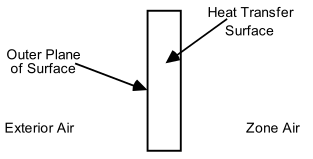

Figure 41. Illustration for Other Side Coefficients

```idf
!  Example input using temperature schedule
SurfaceProperty:OtherSideCoefficients,
    OSCCoef:Zn005:Wall003,   !- Name
    0,                       !- Combined Convective/Radiative Film Coefficient {W/m2-K}
    0.000000,                !- Constant Temperature {C}
    1.000000,                !- Constant Temperature Coefficient
    0.000000,                !- External Dry-Bulb Temperature Coefficient
    0.000000,                !- Ground Temperature Coefficient
    0.000000,                !- Wind Speed Coefficient
    0.000000,                !- Zone Air Temperature Coefficient
    Zn005Wall003OtherSideTempSched;  !- Constant Temperature Schedule Name


!  Example input for outside heat transfer coefficient of 1.23, using Tosdb
SurfaceProperty:OtherSideCoefficients,
    OSCCoef:Zn005:Wall004,   !- Name
    1.230000,                !- Combined Convective/Radiative Film Coefficient {W/m2-K}
    0.000000,                !- Constant Temperature {C}
    0.000000,                !- Constant Temperature Coefficient
    1.000000,                !- External Dry-Bulb Temperature Coefficient
    0.000000,                !- Ground Temperature Coefficient
    0.000000,                !- Wind Speed Coefficient
    0.000000,                !- Zone Air Temperature Coefficient
    ,                        !- Constant Temperature Schedule Name
    No,                      !- Sinusoidal Variation of Constant Temperature Coefficient
    24,                      !- Period of Sinusoidal Variation {hr}
    0.,                      !- Previous Other Side Temperature Coefficient
    ,                        !- Minimum Other Side Temperature Limit {C}
    ;                        !- Maximum Other Side Temperature Limit {C}
```


### SurfaceProperty:OtherSideCoefficients Outputs

Zone,Average,Surface Other Side Coefficients Exterior Air Drybulb Temperature

#### Surface Other Side Coefficients Exterior Air Drybulb Temperature [C]

This is the air temperature applied to the other side of the surface.

### SurfaceProperty:OtherSideConditionsModel

By referencing the Other Side Conditions Model statement in the surface statements (i.e. Outside Boundary Condition), the boundary conditions for the outer plane of the mass wall can be connected to the appropriate model for various multi-skin components. The types of multi-skin components that use this object include systems that are mounted to the outside surface using standoffs that create a small air gap – see Figure 42. This type of modeling allows using the usual heat transfer calculations for the underlying surface with other types of multi-skin  component models that are available including: unglazed transpired solar collectors, ventilated photovoltaic panels, and naturally ventilated facades.

The boundary condition values are determined dynamically by the program using internal component models. If you want to define other side surface temperatures or convection conditions, then use SurfaceProperty:OtherSideCoefficients instead of this object.

It should be noted that when other side conditions models are used, solar effects are removed from the surface’s outside face heat balance, but are used in modeling the component adjacent to that surface.

In addition, the other side conditions model has been modified to include underground piping system interaction.  The PipingSystem:Underground:Domain object represents a mass of ground which may include interaction with, for example, basement surfaces.  In this case, the ground model will internally use the other side condition model hook to update boundary conditions for those surfaces which use that other side condition model name reference.

#### Field: Name

This is the string referenced in the Surface statement that is using OtherSideModel as the Exterior Environment.

#### Field: Type of Modeling

This is a string key selection used to identify the type of model that will be used to determine boundary conditions. The only available choices are ”GapConvectionRadiation,” “UndergroundPipingSystemSurface,” and "GroundCoupledSurface."

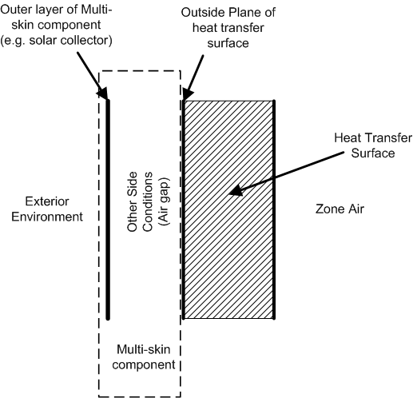

Figure 42. Illustration for Other Side Conditions Model

An example specification is:

```idf
SurfaceProperty:OtherSideConditionsModel,
    UTSC OSCM ZN11,          ! OtherSideConditionsModel Name
    GapConvectionRadiation; ! Type of Modeling used to determine Boundary Conditions
```

### SurfaceProperty:OtherSideConditionsModel Outputs

* Zone,Average,Surface Other Side Conditions Modeled Convection Air Temperature [C]

* Zone,Average,Surface Other Side Conditions Modeled Convection Heat Transfer Coefficient [W/m2-K]

* Zone,Average,Surface Other Side Conditions Modeled Radiation Temperature [C]

* Zone,Average,Surface Other Side Conditions Modeled Radiation Heat Transfer Coefficient [W/m2-K]

#### Surface Other Side Conditions Modeled Convection Air Temperature [C]

This is the air temperature exposed to the other side of the surface by the model and used in convection heat transfer calculations.

#### Surface Other Side Conditions Modeled Convection Heat Transfer Coefficient [W/m2-K]

This is the surface convection heat transfer coefficient applied to the other side of the surface by the model.

#### Surface Other Side Conditions Modeled Radiation Temperature [C]

This is the effective temperature exposed to the other side of the surface for thermal radiation heat transfer calculations.

#### Surface Other Side Conditions Modeled Radiation Heat Transfer Coefficient [W/m2-K]

This is the effective (Iinearized) radiation heat transfer coefficient applied to the other side of the surface by the model.

### SurfaceConvectionAlgorithm:Inside:AdaptiveModelSelections

This object provides options to change the individual convection model equations for dynamic selection when using AdaptiveConvectionAlgorithm. This object is only needed to make changes to the default model selections for any or all of the surface categories. This object is for the inside face, the side of the surface facing a thermal zone.

#### Field: Name

A unique name for the object.

#### Field: Simple Buoyancy Vertical Wall Equation Source

Applies to zone with no HVAC or when HVAC is off.  This is for vertical walls.  The key choice options include:  FohannoPolidoriVerticalWall, ASHRAEVerticalWall, AlamdariHammondVerticalWall, KhalifaEq3WallAwayFromHeat, KhalifaEq6NonHeatedWalls FohannoPolidoriVerticalWall, ISO15099Windows, or UserCurve

#### Field: Simple Buoyancy Vertical Wall User Curve Name

The SurfaceConvectionAlgorithm:UserCurve named in this field is used when the previous field is set to UserCurve

#### Field: Simple Buoyancy Stable Horizontal Equation Source

Applies to zone with no HVAC or when HVAC is off.  This is for horizontal surfaces with heat flow directed for stable thermal stratification.  The key choice options include: WaltonStableHorizontalOrTilt, AlamdariHammondStableHorizontal, or UserCurve

#### Field: Simple Buoyancy Stable Horizontal Equation User Curve Name

The SurfaceConvectionAlgorithm:UserCurve named in this field is used when the previous field is set to UserCurve

#### Field: Simple Buoyancy Unstable Horizontal Equation Source

Applies to zone with no HVAC or when HVAC is off. This is for passive horizontal surfaces with heat flow for unstable thermal stratification.  The key choice options include:  WaltonUnstableHorizontalOrTilt, AlamdariHammondUnstableHorizontal, or UserCurve.

#### Field: Simple Buoyancy Unstable Horizontal Equation User Curve Name

The SurfaceConvectionAlgorithm:UserCurve named in this field is used when the previous field is set to UserCurve.

#### Field: Simple Buoyancy Stable Tilted Equation Source

Applies to zone with no HVAC or when HVAC is off.  This is for tilted surfaces with heat flow for stable thermal stratification.  The key choice options include:  WaltonStableHorizontalOrTilt, AlamdariHammondStableHorizontal, or UserCurve

#### Field: Simple Buoyancy Stable Tilted Equation User Curve Name

The SurfaceConvectionAlgorithm:UserCurve named in this field is used when the previous field is set to UserCurve.

#### Field: Simple Buoyancy Unstable Tilted Equation Source

Applies to zone with no HVAC or when HVAC is off.  This is for tilted surfaces with heat flow for unstable thermal stratification.  The key choices include:  WaltonUnstableHorizontalOrTilt, AlamdariHammondUnstableHorizontal, or UserCurve.

#### Field: Simple Buoyancy Unstable Tilted Equation User Curve Name

The SurfaceConvectionAlgorithm:UserCurve named in this field is used when the previous field is set to UserCurve.

#### Field: Simple Buoyancy Windows Equation Source

Applies to zone with no HVAC or when HVAC is off.  This is for all window surfaces. The key choice options include: ASHRAEVerticalWall, AlamdariHammondVerticalWall, FohannoPolidoriVerticalWall, KaradagChilledCeiling, ISO15099Windows, or UserCurve.

#### Field: Simple Buoyancy Windows Equation User Curve Name

The SurfaceConvectionAlgorithm:UserCurve named in this field is used when the previous field is set to UserCurve.

#### Field: Floor Heat Ceiling Cool Vertical Wall Equation Source

Applies to zone with in-floor heating and/or in-ceiling cooling.  This is for vertical walls.  The key choice options include:  ASHRAEVerticalWall, AlamdariHammondVerticalWall, KhalifaEq3WallAwayFromHeat, FohannoPolidoriVerticalWall, ISO15099Windows, or UserCurve.

#### Field: Floor Heat Ceiling Cool Vertical Wall Equation User Curve Name

The SurfaceConvectionAlgorithm:UserCurve named in this field is used when the previous field is set to UserCurve.

#### Field: Floor Heat Ceiling Cool Stable Horizontal Equation Source

Applies to zone with in-floor heating and/or in-ceiling cooling. This is for passive horizontal surfaces with heat flow for stable thermal stratification.  The key choice options include:  WaltonStableHorizontalOrTilt, AlamdariHammondStableHorizontal, or UserCurve.

#### Field: Floor Heat Ceiling Cool Stable Horizontal Equation User Curve Name

The SurfaceConvectionAlgorithm:UserCurve named in this field is used when the previous field is set to UserCurve.

#### Field: Floor Heat Ceiling Cool Unstable Horizontal Equation Source

Applies to zone with in-floor heating and/or in-ceiling cooling. This is for passive horizontal surfaces with heat flow for unstable thermal stratification.  The key choice options include:  WaltonUnstableHorizontalOrTilt, AlamdariHammondUnstableHorizontal, KhalifaEq4CeilingAwayFromHeat, or UserCurve.

#### Field: Floor Heat Ceiling Cool Unstable Horizontal Equation User Curve Name

The SurfaceConvectionAlgorithm:UserCurve named in this field is used when the previous field is set to UserCurve.

#### Field: Floor Heat Ceiling Cool Heated Floor Equation Source

Applies to zone with in-floor heating and/or in-ceiling cooling.  This is for a floor with active heating elements.  The key choice options include:  WaltonUnstableHorizontalOrTilt, AlamdariHammondUnstableHorizontal, AwbiHattonHeatedFloor, or UserCurve

#### Field: Floor Heat Ceiling Cool Heated Floor Equation User Curve Name

The SurfaceConvectionAlgorithm:UserCurve named in this field is used when the previous field is set to UserCurve.

#### Field: Floor Heat Ceiling Cool Chilled Ceiling Equation Source

Applies to zone with in-floor heating and/or in-ceiling cooling. This is for a ceiling with active cooling elements. The key choice options include:  WaltonUnstableHorizontalOrTilt, AlamdariHammondUnstableHorizontal, KaradagChilledCeiling, or UserCurve.

#### Field: Floor Heat Ceiling Cool Chilled Ceiling Equation User Curve Name

The SurfaceConvectionAlgorithm:UserCurve named in this field is used when the previous field is set to UserCurve

#### Field: Floor Heat Ceiling Cool Stable Tilted Equation Source

Applies to zone with in-floor heating and/or in-ceiling cooling. This is for tilted surfaces with heat flow for stable thermal stratification.  The key choice options include:  WaltonStableHorizontalOrTilt, AlamdariHammondStableHorizontal, ISO15099Windows, or UserCurve.

#### Field: Floor Heat Ceiling Cool Stable Tilted Equation User Curve Name

The SurfaceConvectionAlgorithm:UserCurve named in this field is used when the previous field is set to UserCurve.

#### Field: Floor Heat Ceiling Cool Unstable Tilted Equation Source

Applies to zone with in-floor heating and/or in-ceiling cooling.  This is for tilted surfaces with heat flow for unstable thermal stratification.  The key choice options include:  WaltonUnstableHorizontalOrTilt, AlamdariHammondUnstableHorizontal, ISO15099Windows, or UserCurve.

#### Field: Floor Heat Ceiling Cool Unstable Tilted Equation User Curve Name

The SurfaceConvectionAlgorithm:UserCurve named in this field is used when the previous field is set to UserCurve.

#### Field: Floor Heat Ceiling Cool Window Equation Source

Applies to zone with in-floor heating and/or in-ceiling cooling. This is for all window surfaces.  The key choice options include:  ASHRAEVerticalWall, AlamdariHammondVerticalWall, ISO15099Windows, or UserCurve.

#### Field: Floor Heat Ceiling Cool Window Equation User Curve Name

The SurfaceConvectionAlgorithm:UserCurve named in this field is used when the previous field is set to UserCurve.

#### Field: Wall Panel Heating Vertical Wall Equation Source

Applies to zone with in-wall panel heating. This is for vertical walls that are not actively heated.  The key choice options include:  ASHRAEVerticalWall, AlamdariHammondVerticalWall, KhalifaEq6NonHeatedWalls, FohannoPolidoriVerticalWall, AlamdariHammondVerticalWall, ISO15099Windows, or UserCurve.

#### Field: Wall Panel Heating Vertical Wall Equation User Curve Name

The SurfaceConvectionAlgorithm:UserCurve named in this field is used when the previous field is set to UserCurve.

#### Field: Wall Panel Heating Heated Wall Equation Source

Applies to zone with in-wall panel heating. This is for vertical walls that are being actively heated.  The key choice options include:  ASHRAEVerticalWall, AlamdariHammondVerticalWall, KhalifaEq5WallNearHeat, AwbiHattonHeatedWall, FohannoPolidoriVerticalWall, AlamdariHammondVerticalWall, or UserCurve.

#### Field: Wall Panel Heating Heated Wall Equation User Curve Name

The SurfaceConvectionAlgorithm:UserCurve named in this field is used when the previous field is set to UserCurve.

#### Field: Wall Panel Heating Stable Horizontal Equation Source

Applies to zone with in-wall panel heating. This is for horizontal surfaces with heat flow directed for stable thermal stratification. The key choice options include: WaltonStableHorizontalOrTilt, AlamdariHammondStableHorizontal, or UserCurve.

#### Field: Wall Panel Heating Stable Horizontal Equation User Curve Name

The SurfaceConvectionAlgorithm:UserCurve named in this field is used when the previous field is set to UserCurve.

#### Field: Wall Panel Heating Unstable Horizontal Equation Source

Applies to zone with in-wall panel heating. This is for horizontal surfaces with heat flow directed for unstable thermal stratification. The key choice options include: ASHRAEVerticalWall, WaltonUnstableHorizontalOrTilt, AlamdariHammondUnstableHorizontal, KhalifaEq7Ceiling, or UserCurve

#### Field: Wall Panel Heating Unstable Horizontal Equation User Curve Name

The SurfaceConvectionAlgorithm:UserCurve named in this field is used when the previous field is set to UserCurve.

#### Field: Wall Panel Heating Stable Tilted Equation Source

Applies to zone with in-wall panel heating. This is for tilted surfaces with heat flow for stable thermal stratification.  The key choice options include:  WaltonStableHorizontalOrTilt, AlamdariHammondStableHorizontal, ISO15099Windows, or UserCurve.

#### Field: Wall Panel Heating Stable Tilted Equation User Curve Name

The SurfaceConvectionAlgorithm:UserCurve named in this field is used when the previous field is set to UserCurve

#### Field: Wall Panel Heating Unstable Tilted Equation Source

Applies to zone with in-wall panel heating. This is for tilted surfaces with heat flow for unstable thermal stratification. The key choice options include:  WaltonUnstableHorizontalOrTilt, AlamdariHammondUnstableHorizontal, ISO15099Windows, or UserCurve.

#### Field: Wall Panel Heating Unstable Tilted Equation User Curve Name

The SurfaceConvectionAlgorithm:UserCurve named in this field is used when the previous field is set to UserCurve.

#### Field: Wall Panel Heating Window Equation Source

Applies to zone with in-wall panel heating. This is for all window surfaces.  The key choice options include: ASHRAEVerticalWall, AlamdariHammondVerticalWall, FohannoPolidoriVerticalWall, ISO15099Windows, or UserCurve.

#### Field: Wall Panel Heating Window Equation User Curve Name

The SurfaceConvectionAlgorithm:UserCurve named in this field is used when the previous field is set to UserCurve.

#### Field: Convective Zone Heater Vertical Wall Equation Source

Applies to zone with convective heater.  This is for vertical walls not directly affected by heater.  The key choice options include: ASHRAEVerticalWall, AlamdariHammondVerticalWall, KhalifaEq3WallAwayFromHeat, KhalifaEq6NonHeatedWalls, FohannoPolidoriVerticalWall, ISO15099Windows, or UserCurve

#### Field: Convective Zone Heater Vertical Wall Equation User Curve Name

The SurfaceConvectionAlgorithm:UserCurve named in this field is used when the previous field is set to UserCurve.

#### Field: Convective Zone Heater Vertical Walls Near Heater Equation Source

Applies to zone with convective heater. This is for vertical walls that are directly affected by heater. Walls are considered "near" when listed in field set for Fraction of Radiant Energy to Surface.  The key choice options include:  ASHRAEVerticalWall, AlamdariHammondVerticalWall, KhalifaEq5WallNearHeat, AwbiHattonHeatedWall, FohannoPolidoriVerticalWall, ISO15099Windows, or UserCurve.

#### Field: Convective Zone Heater Vertical Walls Near Heater Equation User Curve Name

The SurfaceConvectionAlgorithm:UserCurve named in this field is used when the previous field is set to UserCurve.

#### Field: Convective Zone Heater Stable Horizontal Equation Source

Applies to zone with convective heater.  This is for horizontal surfaces with heat flow directed for stable thermal stratification. The key choice options include:  WaltonStableHorizontalOrTilt, AlamdariHammondStableHorizontal, or UserCurve.

#### Field: Convective Zone Heater Stable Horizontal Equation User Curve Name

The SurfaceConvectionAlgorithm:UserCurve named in this field is used when the previous field is set to UserCurve

#### Field: Convective Zone Heater Unstable Horizontal Equation Source

Applies to zone with convective heater.  This is for horizontal surfaces with heat flow directed for unstable thermal stratification.  The key choice options include:  WaltonUnstableHorizontalOrTilt, AlamdariHammondUnstableHorizontal, KhalifaEq4CeilingAwayFromHeat, KhalifaEq7Ceiling, or UserCurve.

#### Field: Convective Zone Heater Unstable Horizontal Equation User Curve Name

The SurfaceConvectionAlgorithm:UserCurve named in this field is used when the previous field is set to UserCurve.

#### Field: Convective Zone Heater Stable Tilted Equation Source

Applies to zone with convective heater.  This is for tilted surfaces with heat flow for stable thermal stratification. The key choice options include:  WaltonStableHorizontalOrTilt, AlamdariHammondStableHorizontal, or UserCurve.

#### Field: Convective Zone Heater Stable Tilted Equation User Curve Name

The SurfaceConvectionAlgorithm:UserCurve named in this field is used when the previous field is set to UserCurve.

#### Field: Convective Zone Heater Unstable Tilted Equation Source

Applies to zone with convective heater.  This is for tilted surfaces with heat flow for unstable thermal stratification.  The key choice options include:  WaltonUnstableHorizontalOrTilt, AlamdariHammondUnstableHorizontal, or UserCurve.

#### Field: Convective Zone Heater Unstable Tilted Equation User Curve Name

The SurfaceConvectionAlgorithm:UserCurve named in this field is used when the previous field is set to UserCurve.

#### Field: Convective Zone Heater Windows Equation Source

Applies to zone with convective heater.  This is for all window surfaces. The key choice options include:  ASHRAEVerticalWall, AlamdariHammondVerticalWall, KhalifaEq3WallAwayFromHeat, FohannoPolidoriVerticalWall, ISO15099Windows, or UserCurve.

#### Field: Convective Zone Heater Windows Equation User Curve Name

The SurfaceConvectionAlgorithm:UserCurve named in this field is used when the previous field is set to UserCurve.

#### Field: Central Air Diffuser Wall Equation Source

Applies to zone with mechanical forced central air with diffusers. This is for all wall surfaces.  The key choice options include:  ASHRAEVerticalWall, FisherPedersenCeilingDiffuserWalls, AlamdariHammondVerticalWall, BeausoleilMorrisonMixedAssistedWall, BeausoleilMorrisonMixedOpposingWall, FohannoPolidoriVerticalWall, ISO15099Windows, GoldsteinNovoselacCeilingDiffuserWalls, or UserCurve

#### Field: Central Air Diffuser Wall Equation User Curve Name

The SurfaceConvectionAlgorithm:UserCurve named in this field is used when the previous field is set to UserCurve.

#### Field: Central Air Diffuser Ceiling Equation Source

Applies to zone with mechanical forced central air with diffusers.  This is for all ceiling surfaces.  The key choice options include:  FisherPedersenCeilingDiffuserCeiling, BeausoleilMorrisonMixedStableCeiling, BeausoleilMorrisonMixedUnstableCeiling, or UserCurve.

#### Field: Central Air Diffuser Ceiling Equation User Curve Name

The SurfaceConvectionAlgorithm:UserCurve named in this field is used when the previous field is set to UserCurve.

#### Field: Central Air Diffuser Floor Equation Source

Applies to zone with mechanical forced central air with diffusers.  This is for all floor surfaces. The key choice options include:  FisherPedersenCeilingDiffuserFloor, BeausoleilMorrisonMixedStableFloor, BeausoleilMorrisonMixedUnstableFloor, GoldsteinNovoselacCeilingDiffuserFloor, or UserCurve.

#### Field: Central Air Diffuser Floor Equation User Curve Name

The SurfaceConvectionAlgorithm:UserCurve named in this field is used when the previous field is set to UserCurve.

#### Field: Central Air Diffuser Window Equation Source

Applies to zone with mechanical forced central air with diffusers.  This is for all window surfaces.  The key choice options include:  ASHRAEVerticalWall, FisherPedersenCeilingDiffuserWalls, BeausoleilMorrisonMixedAssistedWall, BeausoleilMorrisonMixedOpposingWall, FohannoPolidoriVerticalWall, AlamdariHammondVerticalWall, ISO15099Windows, GoldsteinNovoselacCeilingDiffuserWindow, or UserCurve.

#### Field: Central Air Diffuser Window Equation User Curve Name

The SurfaceConvectionAlgorithm:UserCurve named in this field is used when the previous field is set to UserCurve

#### Field: Mechanical Zone Fan Circulation Vertical Wall Equation Source

The key choice options include: KhalifaEq3WallAwayFromHeat, ASHRAEVerticalWall, FisherPedersenCeilingDiffuserWalls, AlamdariHammondVerticalWall, BeausoleilMorrisonMixedAssistedWall, BeausoleilMorrisonMixedOpposingWall, FohannoPolidoriVerticalWall, ISO15099Windows, GoldsteinNovoselacCeilingDiffuserWalls, or UserCurve.

#### Field: Mechanical Zone Fan Circulation Vertical Wall Equation User Curve Name

The SurfaceConvectionAlgorithm:UserCurve named in this field is used when the previous field is set to UserCurve

#### Field: Mechanical Zone Fan Circulation Stable Horizontal Equation Source

The key choice options include: WaltonStableHorizontalOrTilt, AlamdariHammondStableHorizontal, or UserCurve.

#### Field: Mechanical Zone Fan Circulation Stable Horizontal Equation User Curve Name

The SurfaceConvectionAlgorithm:UserCurve named in this field is used when the previous field is set to UserCurve.

#### Field: Mechanical Zone Fan Circulation Unstable Horizontal Equation Source

The key choice options include:  KhalifaEq4CeilingAwayFromHeat, WaltonUnstableHorizontalOrTilt, AlamdariHammondUnstableHorizontal, or UserCurve.

#### Field: Mechanical Zone Fan Circulation Unstable Horizontal Equation User Curve Name

The SurfaceConvectionAlgorithm:UserCurve named in this field is used when the previous field is set to UserCurve.

#### Field: Mechanical Zone Fan Circulation Stable Tilted Equation Source

The key choice options include:  WaltonStableHorizontalOrTilt or UserCurve

#### Field Mechanical Zone Fan Circulation Stable Tilted Equation User Curve Name

The SurfaceConvectionAlgorithm:UserCurve named in this field is used when the previous field is set to UserCurve.

#### Field: Mechanical Zone Fan Circulation Unstable Tilted Equation Source

The key choice options include:  WaltonUnstableHorizontalOrTilt, AlamdariHammondUnstableHorizontal, or UserCurve.

#### Field: Mechanical Zone Fan Circulation Unstable Tilted Equation User Curve Name

The SurfaceConvectionAlgorithm:UserCurve named in this field is used when the previous field is set to UserCurve.

#### Field: Mechanical Zone Fan Circulation Window Equation Source

The key choice options include:  ASHRAEVerticalWall, AlamdariHammondVerticalWall, FohannoPolidoriVerticalWall, ISO15099Windows, GoldsteinNovoselacCeilingDiffuserWindow, or UserCurve.

#### Field: Mechanical Zone Fan Circulation Unstable Tilted Equation User Curve Name

The SurfaceConvectionAlgorithm:UserCurve named in this field is used when the previous field is set to UserCurve

#### Field: Mixed Regime Buoyancy Assisting Flow on Walls Equation Source

The key choice options include:  BeausoleilMorrisonMixedAssistedWall, AlamdariHammondVerticalWall, FohannoPolidoriVerticalWall, ASHRAEVerticalWall, FisherPedersenCeilingDiffuserWalls, GoldsteinNovoselacCeilingDiffuserWalls, or UserCurve.

#### Field: Mixed Regime Buoyancy Assisting Flow on Walls Equation User Curve Name

The SurfaceConvectionAlgorithm:UserCurve named in this field is used when the previous field is set to UserCurve.

#### Field: Mixed Regime Buoyancy Oppossing Flow on Walls Equation Source

The key choice options include:  BeausoleilMorrisonMixedOpposingWall, AlamdariHammondVerticalWall, FohannoPolidoriVerticalWall, ASHRAEVerticalWall, FisherPedersenCeilingDiffuserWalls, GoldsteinNovoselacCeilingDiffuserWalls, or UserCurve

#### Field: Mixed Regime Buoyancy Oppossing Flow on Walls Equation User Curve Name

The SurfaceConvectionAlgorithm:UserCurve named in this field is used when the previous field is set to UserCurve

#### Field: Mixed Regime Stable Floor Equation Source

The key choice options include:  BeausoleilMorrisonMixedStableFloor, WaltonStableHorizontalOrTilt, AlamdariHammondStableHorizontal, or UserCurve

#### Field: Mixed Regime Stable Floor Equation User Curve Name

The SurfaceConvectionAlgorithm:UserCurve named in this field is used when the previous field is set to UserCurve.

#### Field: Mixed Regime Unstable Floor Equation Source

The key choice options include:  BeausoleilMorrisonMixedUnstableFloor, WaltonUnstableHorizontalOrTilt, AlamdariHammondUnstableHorizontal, or UserCurve.

#### Field: Mixed Regime Unstable Floor Equation User Curve Name

The SurfaceConvectionAlgorithm:UserCurve named in this field is used when the previous field is set to UserCurve.

#### Field: Mixed Regime Stable Ceiling Equation Source

The key choice options include:  BeausoleilMorrisonMixedStableCeiling, WaltonStableHorizontalOrTilt, AlamdariHammondStableHorizontal, or UserCurve.

#### Field: Mixed Regime Stable Ceiling Equation User Curve Name

The SurfaceConvectionAlgorithm:UserCurve named in this field is used when the previous field is set to UserCurve.

#### Field: Mixed Regime Unstable Ceiling Equation Source

The key choice options include:  BeausoleilMorrisonMixedUnstableCeiling, WaltonUnstableHorizontalOrTilt, AlamdariHammondUnstableHorizontal, or UserCurve.

#### Field: Mixed Regime Unstable Ceiling Equation User Curve Name

The SurfaceConvectionAlgorithm:UserCurve named in this field is used when the previous field is set to UserCurve.

#### Field: Mixed Regime Window Equation Source

The key choice options include:  GoldsteinNovoselacCeilingDiffuserWindow, ISO15099Windows, or UserCurve.

#### Field: Mixed Regime Window Equation User Curve Name

The SurfaceConvectionAlgorithm:UserCurve named in this field is used when the previous field is set to UserCurve.

### SurfaceConvectionAlgorithm:Outside:AdaptiveModelSelections

Options to change the individual convection model equations for dynamic selection when using AdaptiveConvectionAlgorithm. This object is only needed to make changes to the default model selections for any or all of the surface categories. This object is for the outside face, the side of the surface facing away from the thermal zone.

#### Field: Name

A unique name for the object

#### Field: Wind Convection Windward Vertical Wall Equation Source

This is for just the wind-driven component of the total convection coefficient. The key choice options include: SimpleCombined, TARPWindward, MoWiTTWindward, DOE2Windward, NusseltJurges, McAdams, Mitchell, Blocken, Emmel, or UserCurve.

#### Field: Wind Convection Windward Equation Vertical Wall User Curve Name

The SurfaceConvectionAlgorithm:UserCurve named in this field is used when the previous field is set to UserCurve.

#### Field: Wind Convection Leeward Vertical Wall Equation Source

This is for just the wind-driven component of the total convection coefficient. The key choice options include:  SimpleCombined, TARPLeeward, MoWiTTLeeward, DOE2Leeward, Emmel, NusseltJurges, McAdams, Mitchell, or UserCurve.

#### Field: Wind Convection Leeward Vertical Wall Equation User Curve Name

The SurfaceConvectionAlgorithm:UserCurve named in this field is used when the previous field is set to UserCurve.

#### Field: Wind Convection Horizontal Roof Equation Source

This is for just the wind-driven component of the total convection coefficient. The key choice options include:  SimpleCombined, TARPWindward, MoWiTTWindward, DOE2Windward, NusseltJurges, McAdams, Mitchell, Blocken, Emmel, ClearRoof, or UserCurve.

#### Field: Wind Convection Horizontal Roof User Curve Name

The SurfaceConvectionAlgorithm:UserCurve named in this field is used when the previous field is set to UserCurve.

#### Field: Natural Convection Vertical Wall Equation Source

This is for just the natural convection portion of the total film coefficient. This is for vertical walls. The key choice options include:  ASHRAEVerticalWall, AlamdariHammondVerticalWall, FohannoPolidoriVerticalWall, ISO15099Windows, UserCurve, or None.

#### Field: Natural Convection Vertical Wall Equation User Curve Name

The SurfaceConvectionAlgorithm:UserCurve named in this field is used when the previous field is set to UserCurve.

#### Field: Natural Convection Stable Horizontal Equation Source

This is for just the natural convection portion of the total film coefficient.  This is for horizontal surfaces with heat flow directed for stable thermal stratification.  The key choice options include:  WaltonStableHorizontalOrTilt, AlamdariHammondStableHorizontal, UserCurve, or None.

#### Field: Natural Convection Stable Horizontal Equation User Curve Name

The SurfaceConvectionAlgorithm:UserCurve named in this field is used when the previous field is set to UserCurve.

#### Field: Natural Convection Unstable Horizontal Equation Source

This is for just the natural convection portion of the total film coefficient.  This is for horizontal surfaces with heat flow directed for unstable thermal stratification. The key choice optios include:  WaltonUnstableHorizontalOrTilt, AlamdariHammondUnstableHorizontal, UserCurve, or None

#### Field: Natural Convection Unstable Horizontal Equation User Curve Name

The SurfaceConvectionAlgorithm:UserCurve named in this field is used when the previous field is set to UserCurve.

### SurfaceConvectionAlgorithm:Inside:UserCurve

This object is used to describe a custom model equation for surface convection heat transfer coefficients. If more than one curve is referenced, or non-blank, then they are all used and the result is the simple addition of all the curve results.

#### Field: Name

Unique name of input object.

#### Field: Reference Temperature for Convection Heat Transfer

This field controls the nature of the reference temperature used with convection coefficient when calculating the heat flow at the surface. Select one of the three choices:  MeanAirTemperature, AdjacentAirTemperature,  SupplyAirTemperature.  MeanAirTemperature is the typical application for the classic convection model used with the complete mixing of room air.  AdjacentAirTemperature applies when used with Roomair models that account for temperature variations within the zone air and directs the model to use the temperature near the surface rather than the average for the entire zone.  SupplyAirTemperature directs the model to use the supply air conditions for the heat transfer conditions.

#### Field: Hc Function of Temperature Difference Curve Name

This field contains the name of separate performance curve or table object that describes *h<sub>c</sub>*, the convection coefficient, as a function of temperature difference. The curve's "x" is absolute value of delta-T (Surface temperature minus air temperature, (C))

#### Field: Hc Function of Temperature Difference Divided by Height Curve Name

This field contains the name of separate performance curve or table object that describes *h<sub>c</sub>*, the convection coefficient, as a function of temperature difference divided by height. The curve's "x" is absolute value of delta-T/Height (Surface temp minus Air temp)/(vertical length scale), (C/m).  For an inside face, the vertical length scale is the zone's interior height.

#### Field: Hc Function of Air Change Rate Curve Name

This field contains the name of separate performance curve or table object that describes *h<sub>c</sub>*, the convection coefficient, as a function of air change rate. The curve's "x" is mechanical ACH (Air Changes per hour from mechanical air system), (1/hr)

#### Field: Hc Function of Air System Volume Flow Rate Divided by Zone Perimeter Length Curve Name

This field contains the name of separate performance curve or table object that describes *h<sub>c</sub>*, the convection coefficient, as a function of air change rate divided perimeter scale. Curve's "x" is mechanical system air flow rate (m<sup>3</sup>/s) divided by zone's length along exterior walls (m).

### SurfaceConvectionAlgorithm:Outside:UserCurve

This object is used to describe a custom model equation for surface convection heat transfer coefficients. If more than one curve is referenced, or non-blank, then they are all used and the result is the simple addition of all the curve results.

#### Field: Name

Unique name of input object.

#### Field: Wind Speed Type for Curve

This field specifies what sort of wind velocity data should be used in when evaluating the curve in the following field.  There are for key choice options. “WeatherFile” directs  using the unmodified value from the epw file or design weather data.  “HeightAdjust” uses the value from the epw file modified for height above ground, as determined by the z cooridinate, using the site terrain and weather station information.  “ParallelComponent” uses the value from the epw file modified to take just the velocity component that is parallel to the surface.  “ParallelComponentHeightAdjust” uses the height adjusted wind velocity and then computes the parallel component.

#### Field: Hf Function of Wind Speed Curve Name

This field contains the name of separate performance curve or table object that describes *h<sub>f</sub>*, the forced convection coefficient, as a function of wind speed. The curve's "x" is wind speed as defined by the method chosen in the previous field.

#### Field: Hn Function of Temperature Difference Curve Name

This field contains the name of separate performance curve or table object that describes *h<sub>n</sub>*, the natural convection coefficient, as a function of temperature difference. Curve's "x" is absolute value of delta-T (Surface temperature minus air temperature, (C))

#### Field: Hc Function of Temperature Difference Divided by Height Curve Name

This field contains the name of separate performance curve or table object that describes *h<sub>n</sub>*, the natural convection coefficient, as a function of temperature difference divided by height. Curve's "x" is absolute value of delta-T/Height (Surface temp minus Air temp)/(vertical length scale), (C/m).  For an outside face the vertical length scale is the exterior facade's overall height.

### SurfaceProperty:ConvectionCoefficients

The convection coefficients of each surface, both exterior and interior, are automatically calculated during EnergyPlus execution. These calculations are “governed” by other objects such as the SurfaceConvectionAlgorithm:Inside (overall default), the Zone object’s field called Zone Inside Convection Algorithm (Zone Default), the  and the SurfaceConvectionAlgorithm:Outside (overall default), and/or the Zone object’s field called Zone Outside Convection Algorithm (Zone Default). Usually, that will be enough flexibility for most users. However, if you need to match pre-existing convection coefficients (from another program) or are trying to match a test suite of results, you may wish to use the “override” convection coefficients in the following object. This object allows for a single surface to be given specific convection coefficients.

Note that using these in conjunction, in particular, the “Simple” option on either the Outside Convection Algorithm or the Zone Outside Convection Algorithm field will result in a combined coefficient regardless of choice chosen here.

Note that surfaces with “SurfaceProperty:OtherSideCoefficients” cannot use this object with the “outside” coefficient – attempting to do so will cause a severe error; SurfaceProperty:OtherSideCoefficients surfaces can apply an “inside” coefficient. And, surfaces with “Ground” exposure do not use the “outside” coefficient that might be supplied here. Note, too, that some lower boundaries are used regardless by certain surface types (i.e. Window) or certain algorithm types.

#### Field: Surface Name

This field is the applicable surface name for the user supplied convection coefficient.

#### Fields (Convection Location, Type, Coefficient & Schedule Name)

For simplicity, the descriptions of these field occur together – however, the fields are used sequentially when put into the IDF file (reference the IDF examples following the descriptions).

#### Field: Convection Coefficient 1 Location

#### Field: Convection Coefficient 2 Location

This field contains the word “Outside” or “Inside” depending on which location is being described.

#### Field: Convection Coefficient 1 Type

#### Field: Convection Coefficient 2 Type

The entries can be of several types: Value (simple numeric value), Schedule (name of schedule with the values), the usual key choices for overall models for Outside or Inside (Simple, SimpleCombined, TARP, AdaptiveConvectionAlgorithm etc.), the key choices for individual convection equations used for customizing the adaptive algorithm, or a custom user defined correlation. The field should contain one of the keys listed in the table below along with face they can be applied.  The definitions of the models and key choices are discussed under SurfaceConvectionAlgorithm:Inside , SurfaceConvectionAlgorithm:Outside, SurfaceConvectionAlgorithm:Inside:AdaptiveModelSelections, and SurfaceConvectionAlgorithm:Outside:AdaptiveModelSelections.

<table class="table table-striped">
<tr>
<th>Key choice</th>
<th>Applies to Insihe or Outsihe</th>
</tr>
<tr>
<td>Value</td>
<td>Both</td>
</tr>
<tr>
<td>Schedule</td>
<td>Both</td>
</tr>
<tr>
<td>Simple</td>
<td>Inside</td>
</tr>
<tr>
<td>SimpleCombined</td>
<td>Outside</td>
</tr>
<tr>
<td>TARP</td>
<td>Both</td>
</tr>
<tr>
<td>DOE-2</td>
<td>Outside</td>
</tr>
<tr>
<td>MoWitt</td>
<td>Outside</td>
</tr>
<tr>
<td>AdaptiveConvectionAlgorithm</td>
<td>Both</td>
</tr>
<tr>
<td>ASHRAEVerticalWall   </td>
<td>Both</td>
</tr>
<tr>
<td>WaltonUnstableHorizontalOrTilt</td>
<td>Both</td>
</tr>
<tr>
<td>WaltonStableHorizontalOrTilt</td>
<td>Both</td>
</tr>
<tr>
<td>FisherPedersenCeilingDiffuserWalls</td>
<td>Inside</td>
</tr>
<tr>
<td>FisherPedersenCeilingDiffuserCeiling</td>
<td>Inside</td>
</tr>
<tr>
<td>FisherPedersenCeilingDiffuserFloor</td>
<td>Inside</td>
</tr>
<tr>
<td>AlamdariHammondStableHorizontal</td>
<td>Both</td>
</tr>
<tr>
<td>AlamdariHammondUnstableHorizontal</td>
<td>Both</td>
</tr>
<tr>
<td>AlamdariHammondVerticalWall</td>
<td>Both</td>
</tr>
<tr>
<td>KhalifaEq3WallAwayFromHeat</td>
<td>Inside</td>
</tr>
<tr>
<td>KhalifaEq4CeilingAwayFromHeat</td>
<td>Inside</td>
</tr>
<tr>
<td>KhalifaEq5WallNearHeat</td>
<td>Inside</td>
</tr>
<tr>
<td>KhalifaEq6NonHeatedWalls</td>
<td>Inside</td>
</tr>
<tr>
<td>KhalifaEq7Ceiling</td>
<td>Inside</td>
</tr>
<tr>
<td>AwbiHattonHeatedFloor</td>
<td>Inside</td>
</tr>
<tr>
<td>AwbiHattonHeatedWall</td>
<td>Inside</td>
</tr>
<tr>
<td>BeausoleilMorrisonMixedAssistedWall</td>
<td>Inside</td>
</tr>
<tr>
<td>BeausoleilMorrisonMixedOpposingWall</td>
<td>Inside</td>
</tr>
<tr>
<td>BeausoleilMorrisonMixedStableFloor</td>
<td>Inside</td>
</tr>
<tr>
<td>BeausoleilMorrisonMixedUnstableFloor</td>
<td>Inside</td>
</tr>
<tr>
<td>BeausoleilMorrisonMixedStableCeiling</td>
<td>Inside</td>
</tr>
<tr>
<td>BeausoleilMorrisonMixedUnstableCeiling</td>
<td>Inside</td>
</tr>
<tr>
<td>FohannoPolidoriVerticalWall      </td>
<td>Both</td>
</tr>
<tr>
<td>KaradagChilledCeiling</td>
<td>Inside</td>
</tr>
<tr>
<td>ISO15099Windows</td>
<td>Inside</td>
</tr>
<tr>
<td>GoldsteinNovoselacCeilingDiffuserWindow</td>
<td>Inside</td>
</tr>
<tr>
<td>GoldsteinNovoselacCeilingDiffuserWalls</td>
<td>Inside</td>
</tr>
<tr>
<td>GoldsteinNovoselacCeilingDiffuserFloor</td>
<td>Inside</td>
</tr>
<tr>
<td>SimpleCombined     </td>
<td>Outside</td>
</tr>
<tr>
<td>NusseltJurges</td>
<td>Outside</td>
</tr>
<tr>
<td>McAdams</td>
<td>Outside</td>
</tr>
<tr>
<td>Mitchell</td>
<td>Outside</td>
</tr>
<tr>
<td>BlockenWindard</td>
<td>Outside</td>
</tr>
<tr>
<td>Emmel</td>
<td>Outside</td>
</tr>
<tr>
<td>ClearRoof</td>
<td>Outside</td>
</tr>
<tr>
<td>UserCurve</td>
<td>Both</td>
</tr>
</table>


#### Field: Convection Coefficient 1

#### Field: Convection Coefficient 2

If the Convection type was “Value”, then this field is filled and contains the simple value to be used. Otherwise, this can be blank.

#### Field: Convection Coefficient 1 Schedule Name

#### Field: Convection Coefficient 2 Schedule Name

If the Convection type was “Schedule”, then this field contains the name of a schedule describing the value to be used during the time intervals for the schedule.

The complete IDD definition for the ConvectionCoefficients object follows:

#### Field: Convection Coefficient 1 User Curve Name

#### Field: Convection Coefficient 2 User Curve Name

If the Convection type was “UserCurve”, then this field contains the name of a SurfaceConvectionAlgorithm:UserCurve input objct describing the model equations to be used during the time intervals for the schedule.

In IDF usage:

```idf
SurfaceProperty:ConvectionCoefficients,
Zn001:Wall001,  ! Surface Name
Outside,        ! Convection Coefficient 1 Location
Value,          ! Convection Coefficient 1 Type
9.8,            ! Convection Coefficient 1
,               ! Convection Coefficient 1 Schedule Name
,               ! Convection Coefficient 1 User Curve Name
Inside,         ! Convection Coefficient 2 Location
Schedule,       ! Convection Coefficient 2 Type
,               ! Convection Coefficient 2 {blank because using schedule}
MyInteriorCC,   ! Convection Coefficient 2 Schedule Name
;               ! Convection Coefficient 2 User Curve Name

SurfaceProperty:ConvectionCoefficients,
Zn001:Wall002,  ! Surface Name
Inside,         ! Convection Coefficient 1 Location
Value,          ! Convection Coefficient 1 Type
.8,             ! Convection Coefficient 1
,               ! Convection Coefficient 1 Schedule Name
,               ! Convection Coefficient 1 User Curve Name
Outside,        ! Convection Coefficient 2 Location
Value,          ! Convection Coefficient 2 Type
5.5,            ! Convection Coefficient 2
;               ! Convection Coefficient 2 User Curve Name

SurfaceProperty:ConvectionCoefficients,
Zn001:Wall003,  ! Surface Name
Outside,        ! Convection Coefficient 1 Location
Value,          ! Convection Coefficient 1 Type
9.8;            ! Convection Coefficient 1
```


### SurfaceProperty:ConvectionCoefficients:MultipleSurface

The convection coefficients of each surface, both outside and inside, are automatically calculated during EnergyPlus execution. These calculations are “governed” by other objects such as the Inside Convection Algorithm (overall default) and the Zone Inside Convection Algorithm (Zone Default) and the Outside Convection Algorithm (overall default) and/or the Zone Outside Convection Algorithm (Zone Default). Usually, that will be enough flexibility for most users. However, if you need to match pre-existing convection coefficients (from another program) or are trying to match a test suite of results, you may wish to use the “override” convection coefficients in the following object. This object is similar to the preceding “ConvectionCoefficients” object but allows multiple surfaces to be assigned a type with one object entry.

Note that using these in conjunction, in particular, the “Simple” option on either the Outside Convection Algorithm or the Zone Outside Convection Algorithm field will result in a combined coefficient regardless of choice chosen here.

Note that surfaces with “SurfaceProperty:OtherSideCoefficients” cannot use this object with the “outside” coefficient – attempting to do so will ignore OSC surfaces during a multiple surface “apply”; SurfaceProperty:OtherSideCoefficients surfaces can apply an “inside” coefficient. And, surfaces with “Ground” exposure do not use the “outside” coefficient that might be supplied here. Note, too, that some lower boundaries are used regardless by certain surface types (i.e. Window) or certain algorithm types.

#### Field: Surface Type

This field is the applicable surface name for the user supplied convection coefficient. The allowable surface types are:

- AllExteriorSurfaces  (all surfaces that are “external environment” surfaces)

- AllExteriorWindows (all windows that are “external environment” surfaces)

- AllExteriorWalls

- AllExteriorRoofs

- AllExteriorFloors

- AllInteriorSurface (all surfaces that are “internal” surfaces)

- AllInteriorWindows

- AllInteriorCeilings

- AllInteriorFloors

#### Fields (Convection Location, Type, Coefficient & Schedule Name)

For simplicity, the descriptions of these field occur together – however, the fields are used sequentially when put into the IDF file (reference the IDF examples following the descriptions).

#### Field: Convection Coefficient 1 Location

#### Field: Convection Coefficient 2 Location

This field contains the word “Outside” or “Inside” depending on which location is being described.

#### Field: Convection Coefficient 1 Type

#### Field: Convection Coefficient 2 Type

The entries can be of several types: Value (simple numeric value), Schedule (name of schedule with the values), the usual key choices for overall models for Outside or Inside (Simple, SimpleCombined, TARP, AdaptiveConvectionAlgorithm etc.), the key choices for individual convection equations used for customizing the adaptive algorithm, or a custom user defined correlation. The field should contain one of the keys listed in the table below along with face they can be applied.  The definitions of the models and key choices are discussed under SurfaceConvectionAlgorithm:Inside , SurfaceConvectionAlgorithm:Outside, SurfaceConvectionAlgorithm:Inside:AdaptiveModelSelections, and SurfaceConvectionAlgorithm:Outside:AdaptiveModelSelections.

<table class="table table-striped">
<tr>
<th>Key choice</th>
<th>Applies to Insihe or Outsihe</th>
</tr>
<tr>
<td>Value</td>
<td>Both</td>
</tr>
<tr>
<td>Schedule</td>
<td>Both</td>
</tr>
<tr>
<td>Simple</td>
<td>Inside</td>
</tr>
<tr>
<td>SimpleCombined</td>
<td>Outside</td>
</tr>
<tr>
<td>TARP</td>
<td>Both</td>
</tr>
<tr>
<td>DOE-2</td>
<td>Outside</td>
</tr>
<tr>
<td>MoWitt</td>
<td>Outside</td>
</tr>
<tr>
<td>AdaptiveConvectionAlgorithm</td>
<td>Both</td>
</tr>
<tr>
<td>ASHRAEVerticalWall   </td>
<td>Both</td>
</tr>
<tr>
<td>WaltonUnstableHorizontalOrTilt</td>
<td>Both</td>
</tr>
<tr>
<td>WaltonStableHorizontalOrTilt</td>
<td>Both</td>
</tr>
<tr>
<td>FisherPedersenCeilingDiffuserWalls</td>
<td>Inside</td>
</tr>
<tr>
<td>FisherPedersenCeilingDiffuserCeiling</td>
<td>Inside</td>
</tr>
<tr>
<td>FisherPedersenCeilingDiffuserFloor</td>
<td>Inside</td>
</tr>
<tr>
<td>AlamdariHammondStableHorizontal</td>
<td>Both</td>
</tr>
<tr>
<td>AlamdariHammondUnstableHorizontal</td>
<td>Both</td>
</tr>
<tr>
<td>AlamdariHammondVerticalWall</td>
<td>Both</td>
</tr>
<tr>
<td>KhalifaEq3WallAwayFromHeat</td>
<td>Inside</td>
</tr>
<tr>
<td>KhalifaEq4CeilingAwayFromHeat</td>
<td>Inside</td>
</tr>
<tr>
<td>KhalifaEq5WallNearHeat</td>
<td>Inside</td>
</tr>
<tr>
<td>KhalifaEq6NonHeatedWalls</td>
<td>Inside</td>
</tr>
<tr>
<td>KhalifaEq7Ceiling</td>
<td>Inside</td>
</tr>
<tr>
<td>AwbiHattonHeatedFloor</td>
<td>Inside</td>
</tr>
<tr>
<td>AwbiHattonHeatedWall</td>
<td>Inside</td>
</tr>
<tr>
<td>BeausoleilMorrisonMixedAssistedWall</td>
<td>Inside</td>
</tr>
<tr>
<td>BeausoleilMorrisonMixedOpposingWall</td>
<td>Inside</td>
</tr>
<tr>
<td>BeausoleilMorrisonMixedStableFloor</td>
<td>Inside</td>
</tr>
<tr>
<td>BeausoleilMorrisonMixedUnstableFloor</td>
<td>Inside</td>
</tr>
<tr>
<td>BeausoleilMorrisonMixedStableCeiling</td>
<td>Inside</td>
</tr>
<tr>
<td>BeausoleilMorrisonMixedUnstableCeiling</td>
<td>Inside</td>
</tr>
<tr>
<td>FohannoPolidoriVerticalWall      </td>
<td>Both</td>
</tr>
<tr>
<td>KaradagChilledCeiling</td>
<td>Inside</td>
</tr>
<tr>
<td>ISO15099Windows</td>
<td>Inside</td>
</tr>
<tr>
<td>GoldsteinNovoselacCeilingDiffuserWindow</td>
<td>Inside</td>
</tr>
<tr>
<td>GoldsteinNovoselacCeilingDiffuserWalls</td>
<td>Inside</td>
</tr>
<tr>
<td>GoldsteinNovoselacCeilingDiffuserFloor</td>
<td>Inside</td>
</tr>
<tr>
<td>SimpleCombined     </td>
<td>Outside</td>
</tr>
<tr>
<td>NusseltJurges</td>
<td>Outside</td>
</tr>
<tr>
<td>McAdams</td>
<td>Outside</td>
</tr>
<tr>
<td>Mitchell</td>
<td>Outside</td>
</tr>
<tr>
<td>BlockenWindard</td>
<td>Outside</td>
</tr>
<tr>
<td>Emmel</td>
<td>Outside</td>
</tr>
<tr>
<td>ClearRoof</td>
<td>Outside</td>
</tr>
<tr>
<td>UserCurve</td>
<td>Both</td>
</tr>
</table>

#### Field: Convection Coefficient 1

#### Field: Convection Coefficient 2

If the Convection type was “Value”, then this field is filled and contains the simple value to be used. Otherwise, this can be blank.

#### Field: Convection Coefficient 1 Schedule Name

#### Field: Convection Coefficient 2 Schedule Name

If the Convection type was “Schedule”, then this field contains the name of a schedule describing the value to be used during the time intervals for the schedule.

#### Field: Convection Coefficient 1 User Curve Name

#### Field: Convection Coefficient 2 User Curve Name

If the Convection type was “UserCurve”, then this field contains the name of a SurfaceConvectionAlgorithm:UserCurve input objct describing the model equations to be used during the time intervals for the schedule.

In IDF usage:

```idf
SurfaceProperty:ConvectionCoefficients:MultipleSurface,
AllExteriorWindows,  ! Surface Types
Outside,             ! Convection Coefficient 1 Location
MoWitt;              ! Convection Coefficient 1 Type
```


### Convection Coefficient Application Hierarchy

Ultimate flexibility and possibly ultimate user confusion can result from the convection coefficient possibilties in EnergyPlus. The objects that control how convection models are assigned to individual surfaces  are:

- SurfaceConvectionAlgorithm:Inside

- SurfaceConvectionAlgorithm:Outside

- Zone, Field: Zone Inside Convection Algorithm

- Zone, Field: Zone Outside Convection Algorithm

- SurfaceProperty:ConvectionCoefficients

- SurfaceProperty:ConvectionCoefficients:MultipleSurface

General to Specific, they are assigned in this order:

Table 9. Convection Coefficient Assignment Hierarchy

<table class="table table-striped">
<tr>
<th>Objects/Description</th>
<th>Action</th>
</tr>
<tr>
<td>SurfaceConvectionAlgorithm:*</td>
<td>Assigns for all surfaces in the run.</td>
</tr>
<tr>
<td>Zone, Fields: Zone * Convection Algorithm</td>
<td>Trumps global assignment and assigns for all surfaces in Zone.</td>
</tr>
<tr>
<td>SurfaceProperty:...:MultipleSurfaces</td>
<td>Trumps above and assigns for specific types of surfaces.</td>
</tr>
<tr>
<td>Two Multiple Surface Assignments overlapping (such as AllExteriorSurfaces vs AllExteriorWalls)</td>
<td>Order in IDF is now important. Whichever is first gets the cookie and the second gets a warning.</td>
</tr>
<tr>
<td>Specific Surface Assignment</td>
<td>Trumps all Above.</td>
</tr>
</table>

There are additional objects that provide fine control over the models that get assigned.

- SurfaceConvectionAlgorithm:Inside:AdaptiveModelSelections

- SurfaceConvectionAlgorithm:Outside:AdaptiveModelSelections

- SurfaceConvectionAlgorithm:Inside:UserCurve

- SurfaceConvectionAlgorithm:Outside:UserCurve

### Convection Coefficients Outputs

Outputs for the User Supplied Convection Coefficients appear as values in the Surface Output Variables (*Surface Inside Face Convection Heat Transfer Coefficient* and *Surface Outside Face Convection Heat Transfer Coefficient*). What the program expects to use is shown in the Surface Details report (*Output:Surfaces:List, Details;*)

When EnergyPlus is set to Display Advanced Variables (Output:Diagnostics, DisplayAdvancedVariables;), then additional output variables are available that indicate the status of convection modeling by identifying which models are in effect at a given time.  The adaptive convection algorithms may switch between models over time and the following output variables provide a way to monitor this behavior.  These outputs are integer codes and the integer values are explained in tables.

#### Surface Inside Face Convection Classification Index

This variable reports how the surface was classified as part of the adaptive convection algorithm for the inside face.  The algorithm examines probable flow regimes, heat flow directions, orientations, HVAC equipment connections, and current operating status to assign each surface a category.  The numbers in this report are integer codes that correspond to surface categories as described in the following table.

<table class="table table-striped">
<tr>
<th>Cohe</th>
<th>Zone Airflow Regime</th>
<th>Type of surface</th>
<th>Heat Flow</th>
</tr>
<tr>
<td>1</td>
<td>A1 Radiant Heated Floor or Chilled Ceiling</td>
<td>Vertical Wall</td>
<td>Any</td>
</tr>
<tr>
<td>2</td>
<td>A1 Radiant Heated Floor or Chilled Ceiling</td>
<td>Horizontal</td>
<td>Stable</td>
</tr>
<tr>
<td>3</td>
<td>A1 Radiant Heated Floor or Chilled Ceiling</td>
<td>Horizontal</td>
<td>Unstable</td>
</tr>
<tr>
<td>4</td>
<td>A1 Radiant Heated Floor or Chilled Ceiling</td>
<td>Heated Floor</td>
<td>Unstable</td>
</tr>
<tr>
<td>5</td>
<td>A1 Radiant Heated Floor or Chilled Ceiling</td>
<td>Chilled Ceiling</td>
<td>Unstable</td>
</tr>
<tr>
<td>6</td>
<td>A1 Radiant Heated Floor or Chilled Ceiling</td>
<td>Tilted</td>
<td>Stable</td>
</tr>
<tr>
<td>7</td>
<td>A1 Radiant Heated Floor or Chilled Ceiling</td>
<td>Tilted</td>
<td>Unstable</td>
</tr>
<tr>
<td>8</td>
<td>A1 Radiant Heated Floor or Chilled Ceiling</td>
<td>Window</td>
<td>Any</td>
</tr>
<tr>
<td>9</td>
<td>A2 Radiant Wall Heat</td>
<td>Non-heated Vertical Wall</td>
<td>Any</td>
</tr>
<tr>
<td>10</td>
<td>A2 Radiant Wall Heat</td>
<td>Heated wall</td>
<td>Any</td>
</tr>
<tr>
<td>11</td>
<td>A2 Radiant Wall Heat</td>
<td>Horizontal</td>
<td>Stable</td>
</tr>
<tr>
<td>12</td>
<td>A2 Radiant Wall Heat</td>
<td>Horizontal</td>
<td>Unstable</td>
</tr>
<tr>
<td>13</td>
<td>A2 Radiant Wall Heat</td>
<td>Tilted</td>
<td>Stable</td>
</tr>
<tr>
<td>14</td>
<td>A2 Radiant Wall Heat</td>
<td>Tilted</td>
<td>Unstable</td>
</tr>
<tr>
<td>15</td>
<td>A2 Radiant Wall Heat</td>
<td>Windows</td>
<td>Any</td>
</tr>
<tr>
<td>16</td>
<td>A3 Simple Buoyancy</td>
<td>Vertical Walls</td>
<td>Any</td>
</tr>
<tr>
<td>17</td>
<td>A3 Simple Buoyancy</td>
<td>Horizontal</td>
<td>Stable</td>
</tr>
<tr>
<td>18</td>
<td>A3 Simple Buoyancy</td>
<td>Horizontal</td>
<td>Unstable</td>
</tr>
<tr>
<td>19</td>
<td>A3 Simple Buoyancy</td>
<td>Tilted</td>
<td>Stable</td>
</tr>
<tr>
<td>20</td>
<td>A3 Simple Buoyancy</td>
<td>Tilted</td>
<td>Unstable</td>
</tr>
<tr>
<td>21</td>
<td>A3 Simple Buoyancy</td>
<td>Windows</td>
<td>Any</td>
</tr>
<tr>
<td>22</td>
<td>B Convective Zone Heat</td>
<td>Vertical Walls</td>
<td>Any</td>
</tr>
<tr>
<td>23</td>
<td>B Convective Zone Heat</td>
<td>Vertical Walls near heater</td>
<td>Any</td>
</tr>
<tr>
<td>24</td>
<td>B Convective Zone Heat</td>
<td>Horizontal</td>
<td>Stable</td>
</tr>
<tr>
<td>25</td>
<td>B Convective Zone Heat</td>
<td>Horizontal</td>
<td>Unstable</td>
</tr>
<tr>
<td>26</td>
<td>B Convective Zone Heat</td>
<td>Tilted</td>
<td>Stable</td>
</tr>
<tr>
<td>27</td>
<td>B Convective Zone Heat</td>
<td>Tilted</td>
<td>Unstable</td>
</tr>
<tr>
<td>28</td>
<td>B Convective Zone Heat</td>
<td>Windows</td>
<td>Any</td>
</tr>
<tr>
<td>29</td>
<td>C Central Air Diffuser</td>
<td>Walls</td>
<td>Any</td>
</tr>
<tr>
<td>30</td>
<td>C Central Air Diffuser</td>
<td>Ceiling</td>
<td>Any</td>
</tr>
<tr>
<td>31</td>
<td>C Central Air Diffuser</td>
<td>Floor</td>
<td>Any</td>
</tr>
<tr>
<td>32</td>
<td>C Central Air Diffuser</td>
<td>Windows</td>
<td>Any</td>
</tr>
<tr>
<td>33</td>
<td>D Zone Fan Unit</td>
<td>Walls</td>
<td>Any</td>
</tr>
<tr>
<td>34</td>
<td>D Zone Fan Unit</td>
<td>Horizontal</td>
<td>Stable</td>
</tr>
<tr>
<td>35</td>
<td>D Zone Fan Unit</td>
<td>Horizontal</td>
<td>Unstable</td>
</tr>
<tr>
<td>36</td>
<td>D Zone Fan Unit</td>
<td>Tilted</td>
<td>Stable</td>
</tr>
<tr>
<td>37</td>
<td>D Zone Fan Unit</td>
<td>Tilted</td>
<td>Unstable</td>
</tr>
<tr>
<td>38</td>
<td>D Zone Fan Unit</td>
<td>Windows</td>
<td>Any</td>
</tr>
<tr>
<td>39</td>
<td>E Mixed Forced and Buoyancy</td>
<td>Walls</td>
<td>Assisting</td>
</tr>
<tr>
<td>40</td>
<td>E Mixed Forced and Buoyancy</td>
<td>Walls</td>
<td>Opposing</td>
</tr>
<tr>
<td>41</td>
<td>E Mixed Forced and Buoyancy</td>
<td>Floor</td>
<td>Stable</td>
</tr>
<tr>
<td>42</td>
<td>E Mixed Forced and Buoyancy</td>
<td>Floor</td>
<td>Unstable</td>
</tr>
<tr>
<td>43</td>
<td>E Mixed Forced and Buoyancy</td>
<td>Ceiling</td>
<td>Stable</td>
</tr>
<tr>
<td>44</td>
<td>E Mixed Forced and Buoyancy</td>
<td>Ceiling</td>
<td>Unstable</td>
</tr>
<tr>
<td>45</td>
<td>E Mixed Forced and Buoyancy</td>
<td>Windows</td>
<td>Any</td>
</tr>
</table>

#### Surface Inside Face Convection Model Equation Index

This variable reports the specific model equation used to calculate the inside face convection coefficient.  This can vary when using the adaptive convection algorithm and so the result of that selection algorithm is reported here.  The following table lists the models associated with specific interger codes reported here.  The models correspond to key words used in input objects.

<table class="table table-striped">
<tr>
<th>Report Cohe</th>
<th>Relateh key anh mohel</th>
</tr>
<tr>
<td>200</td>
<td>UserValue    </td>
</tr>
<tr>
<td>201</td>
<td>UserSchedule</td>
</tr>
<tr>
<td>202</td>
<td>UserCurve </td>
</tr>
<tr>
<td>203</td>
<td>ASHRAEVerticalWall </td>
</tr>
<tr>
<td>204</td>
<td>WaltonUnstableHorizontalOrTilt</td>
</tr>
<tr>
<td>205</td>
<td>WaltonStableHorizontalOrTilt  </td>
</tr>
<tr>
<td>206</td>
<td>FisherPedersenCeilDiffuserFloor</td>
</tr>
<tr>
<td>207</td>
<td>FisherPedersenCeilDiffuserCeiling</td>
</tr>
<tr>
<td>208</td>
<td>FisherPedersenCeilDiffuserWalls        </td>
</tr>
<tr>
<td>209</td>
<td>AlamdariHammondStableHorizontal        </td>
</tr>
<tr>
<td>210</td>
<td>AlamdariHammondVerticalWall            </td>
</tr>
<tr>
<td>211</td>
<td>AlamdariHammondUnstableHorizontal      </td>
</tr>
<tr>
<td>212</td>
<td>KhalifaEq3WallAwayFromHeat             </td>
</tr>
<tr>
<td>213</td>
<td>KhalifaEq4CeilingAwayFromHeat          </td>
</tr>
<tr>
<td>214</td>
<td>KhalifaEq5WallNearHeat                 </td>
</tr>
<tr>
<td>215</td>
<td>KhalifaEq6NonHeatedWalls </td>
</tr>
<tr>
<td>216</td>
<td>KhalifaEq7Ceiling </td>
</tr>
<tr>
<td>217</td>
<td>AwbiHattonHeatedFloor                  </td>
</tr>
<tr>
<td>218</td>
<td>AwbiHattonHeatedWall                   </td>
</tr>
<tr>
<td>219</td>
<td>BeausoleilMorrisonMixedAssistingWall   </td>
</tr>
<tr>
<td>220</td>
<td>BeausoleilMorrisonMixedOppossingWall   </td>
</tr>
<tr>
<td>221</td>
<td>BeausoleilMorrisonMixedStableCeiling   </td>
</tr>
<tr>
<td>222</td>
<td>BeausoleilMorrisonMixedUnstableCeiling </td>
</tr>
<tr>
<td>223</td>
<td>BeausoleilMorrisonMixedStableFloor     </td>
</tr>
<tr>
<td>224</td>
<td>BeausoleilMorrisonMixedUnstableFloor   </td>
</tr>
<tr>
<td>225</td>
<td>FohannoPolidoriVerticalWall            </td>
</tr>
<tr>
<td>226</td>
<td>KaradagChilledCeiling                  </td>
</tr>
<tr>
<td>227</td>
<td>ISO15099Windows                        </td>
</tr>
<tr>
<td>228</td>
<td>GoldsteinNovoselacCeilingDiffuserWindow</td>
</tr>
<tr>
<td>229</td>
<td>GoldsteinNovoselacCeilingDiffuserWalls </td>
</tr>
<tr>
<td>230</td>
<td>GoldsteinNovoselacCeilingDiffuserFloor</td>
</tr>
</table>

#### Surface Inside Face Convection Reference Air Index

The inside face convection heat transfer calculations can be based on different reference air temperatures.  This reference air temperature can vary during the simulation when the adaptive algorithm selects models that use different references.  The following table lists the meaning of the integer codes.

<table class="table table-striped">
<tr>
<th>Report Cohe</th>
<th>Reference Air Temperature Methoh</th>
</tr>
<tr>
<td>1</td>
<td>Zone mean air temperature</td>
</tr>
<tr>
<td>2</td>
<td>Surface adjacent air temperature</td>
</tr>
<tr>
<td>3</td>
<td>Supply air temperature</td>
</tr>
</table>

#### Surface Outside Face Convection Classification Index

This variable reports how the surface was classified as part of the adaptive convection algorithm for the outside face.  The algorithm examines the wind direction, heat flow directions and orientations to assign each surface a category.  The numbers in this report are integer codes that correspond to surface categories as described in the following table.

<table class="table table-striped">
<tr>
<th>Report Cohe</th>
<th>Surface Classification</th>
</tr>
<tr>
<td>101</td>
<td>Vertical Wall, Windward</td>
</tr>
<tr>
<td>102</td>
<td>Vertical Wall, Leeward</td>
</tr>
<tr>
<td>103</td>
<td>Roof, stable heat flow direction</td>
</tr>
<tr>
<td>104</td>
<td>Roof, unstable heat flow direction</td>
</tr>
</table>

#### Surface Outside Face Forced Convection Model Equation Index

#### Surface Outside Face Natural Convection Model Equation Index

These variables report the specific model equation used to calculate the outside face’s convection coefficient.  They can vary when using the adaptive convection algorithm and so the results of that selection algorithm are reported in these variables.  The following table lists the models associated with specific integer codes that might be reported here.  The models correspond to key words used in input objects.

<table class="table table-striped">
<tr>
<th>Report Cohe</th>
<th>Relateh key anh mohel</th>
</tr>
<tr>
<td>300</td>
<td>None </td>
</tr>
<tr>
<td>301</td>
<td>UserValue</td>
</tr>
<tr>
<td>302</td>
<td>UserSchedule</td>
</tr>
<tr>
<td>303</td>
<td>UserCurve                              </td>
</tr>
<tr>
<td>304</td>
<td>ASHRAESimpleCombined                   </td>
</tr>
<tr>
<td>305</td>
<td>NaturalASHRAEVerticalWall              </td>
</tr>
<tr>
<td>306</td>
<td>NaturalWaltonUnstableHorizontalOrTilt  </td>
</tr>
<tr>
<td>307</td>
<td>NaturalWaltonStableHorizontalOrTilt    </td>
</tr>
<tr>
<td>308</td>
<td>SparrowWindward                        </td>
</tr>
<tr>
<td>309</td>
<td>SparrowLeeward                         </td>
</tr>
<tr>
<td>310</td>
<td>MoWiTTWindward                         </td>
</tr>
<tr>
<td>311</td>
<td>MoWiTTLeeward                          </td>
</tr>
<tr>
<td>312</td>
<td>DOE2Windward                           </td>
</tr>
<tr>
<td>313</td>
<td>DOE2Leeward                            </td>
</tr>
<tr>
<td>314</td>
<td>NusseltJurges                          </td>
</tr>
<tr>
<td>315</td>
<td>McAdams                                </td>
</tr>
<tr>
<td>316</td>
<td>Mitchell                               </td>
</tr>
<tr>
<td>317</td>
<td>ClearRoof                              </td>
</tr>
<tr>
<td>318</td>
<td>BlockenWindward                        </td>
</tr>
<tr>
<td>319</td>
<td>EmmelVertical                           </td>
</tr>
<tr>
<td>320</td>
<td>EmmelRoof                              </td>
</tr>
<tr>
<td>321</td>
<td>AlamdariHammondVerticalWall            </td>
</tr>
<tr>
<td>322</td>
<td>FohannoPolidoriVerticalWall            </td>
</tr>
<tr>
<td>323</td>
<td>ISO15099Windows                        </td>
</tr>
<tr>
<td>324</td>
<td>AlamdariHammondStableHorizontal        </td>
</tr>
<tr>
<td>325</td>
<td>AlamdariHammondUnstableHorizontal      </td>
</tr>
</table>

### SurfaceProperties:VaporCoefficients

Advanced/Research Usage:.The internal and external vapor transfer coefficients that are used by the CombinedHeatAndMoistureFiniteElement model are automatically calculated during EnergyPlus execution using information on the convection coefficients. However it is sometimes useful to be able to “override” the calculation and set fixed values of vapor transfer coefficient for a single surface. These coefficients are only used by the CombinedHeatAndMoistureFiniteElement model and will be ignored by other solution algorithms.

#### Field: Surface Name

This field is the applicable surface name for the user supplied vapor transfer coefficient.

#### Field: Constant External Vapor Transfer Coefficient

Select ‘yes’ to use the value supplied as the external vapor transfer coefficient

#### Field: External Vapor Coefficient Value

HAMT will use this value to calculate the vapour transfer into and out off the external surface of this surface. Units are kg/Pa.s.m2.

#### Field: Constant Internal vapor Transfer Coefficient

Select ‘yes’ to use the value supplied as the internal vapor transfer coefficient

#### Field: Internal Vapor Coefficient Value

The CombinedHeatAndMoistureFiniteElement algorithm will use this value to calculate the vapor transfer into and out of the internal surface of this surface. Units are kg/Pa.s.m2.

Below is an example input of vapor transfer coefficients for a surface.

```idf
SurfaceProperties:VaporCoefficients,
      South wall,     !- Surface Name
      Yes,     !- Constant External Vapor Transfer Coefficient
      0.0000000625,     !- External Vapor Coefficient Value
      Yes,     !- Constant Internal vapor Transfer Coefficient
      0.00000002;     !- Internal Vapor Coefficient Value
```


### SurfaceProperty:ExteriorNaturalVentedCavity

This object is used to model a multi-skin exterior heat transfer surface. This is a special case where the outside face is a slightly detached layer forming a naturally ventilated cavity. The actual outer surface is referred to as the baffle. The modeling here assumes that the heat capacity in the outer baffle can be neglected since it is much lower than the underlying mass surface. This object is used with the BuildingSurface:Detailed object where the Heat Transfer surfaces are referred to as the underlying surfaces. The constructions and materials for the BuildingSurface:Detailed object should reflect the construction of just the underlying surface. The SurfaceProperty:ExteriorNaturalVentedCavity object is used to describe the decoupled layer, or baffle, and the characteristics of the cavity and openings for natural ventilation. This object is also used in conjunction with the OtherSideConditionsModel.

The area and orientation are obtained from **BuildingSurface:Detailed** objects, which are referenced by name. This object can be used to model certain types of photovoltaic mounting configurations such as interlocking roof pavers. If the baffle covers only part of a surface, then that surface should be split into separate **BuildingSurface:Detailed** objects where one matches the size of the baffle. A single baffle can be associated with as many **BuildingSurface:Detailed** objects as desired (although if you need to use more than 10 surfaces, then the IDD will need to be extended). The base heat transfer surfaces need not be contiguous nor have the same orientation, but the program will issue warnings if surfaces have widely ranging tilts and azimuths.

Note that the model involves predicting the rates that ambient air moves in and out of the cavity. Accurate modeling of these air flows would be extremely challenging and so the models provided through this object are simplistic engineering models based on discharge coefficients that are sensitive to wind and bouancy effects. The accuracy depends on the values for, and applicability of, the discharge coefficients and unfortunately little research is available to help characterize these. The models should be considered rudimentary and the user is encouraged to explore different values for the coefficients in attempts to bound the importance of natural ventilation for the cavities. See the Engineering Reference for more details.

#### Field: Name

This field contains a unique name for the ventilated cavity.

#### Field: Boundary Conditions Model Name

This field contains the name of an SurfaceProperty:OtherSideConditionsModel object declared elsewhere in the input file. This will connect the baffle and ventilated cavity to the exterior boundary conditions for the underlying heat transfer surface.

#### Field: Area Fraction of Openings

This field is used to enter an area fraction for what part of the baffle consists of openings. The area of the openings will set to the product of this field and the sum of the area of the underlying surfaces.

#### Field: Thermal Emissivity of Exterior Baffle Material

This field is used to enter the thermal emissivity of the baffler. This surface property is for longwave infrared radiation. The property is used for both sides of collector. Most painted materials have an emissivity of 0.9.

#### Field: Solar Absorptivity of Exterior Baffle

This field is used to enter the solar absorbtivity of the baffle. This surface property is for shortwave, solar radiation. The property is used for the front side of the baffle that faces the environment. Darker colors have a higher absorptivity. While black is the highest performance, other colors might be used to match the color scheme of the rest of the façade.

#### Field: Height Scale for Buoyancy-Driven Ventilation

This field is used to enter a nominal height scale (m) for prediction of ventilation induced by bouancy. This value (<span>\(\Delta {H_{NPL}}\)</span>) is defined as the height from the midpoint of the lower opening to the neutral pressure level. Increasing the value will increase the ventilation rate due to buoyancy.

#### Field: Effective Thickness of Cavity Behind Exterior Baffle

This field is used to enter a nominal gap thickness (m) for the collector. If the baffle is corrugated, use the average depth. This distance value is only used when the collector is near horizontal to determine a length scale in the vertical direction for buoyancy calculations. For example, if the collector is mounted on a flat roof, its tilt-adjusted height is zero and the program will use this gap thickness as a length scale rather than the height from the previous field.

#### Field: Ratio of Actual Surface Area to Projected Surface Area

This field is used to enter a factor that accounts for the extra surface area resulting from and uneven baffle surface. Corrugations may be present to help stiffen the baffle or ventilated roofing tiles may have more surface are for convection heat transfer than the underlying surface. The projected surface area is obtained by the program from the (flat) underlying surfaces. If the baffle is flat then this ratio is 1.0. If the baffle is corrugated, then this ratio will be greater than one with a typical value might be 1.165.

#### Field: Roughness of Exterior Surface

This field is used to describe the relative roughness of the baffle material. This field is similar to one in the **Material** object. This parameter only influences the convection coefficients, more specifically the exterior convection coefficient. A special keyword is expected in this field with the options being “VeryRough”, “Rough”, “MediumRough”, “MediumSmooth”, “Smooth”, and “VerySmooth” in order of roughest to smoothest options.

#### Field: Effectiveness for Perforations with Respect to Wind

This field is used to enter a value for the coefficient used to determine natural air exchanges from wind. Wind will cause exterior air to move in and out of the cavity. Cv is an arbitrary coefficient used to model the effectiveness of openings and depends on opening geometry and the orientation with respect to the wind. Cv should probably be in the range 0.05 to 0.65. Increasing Cv will increase the amount of natural ventilation. The following equation shows how Cv is used in the program to predict the volumetric flow rate due to wind:

<div>\[{{\rm{\dot \rlap{--} V}}_{{\rm{wind}}}} = {C_v}{A_{in}}{U_\infty }\]</div>

#### Field: Discharge Coefficient for Openings with Respect to Buoyancy Driven Flow

This field is used to enter a value for the coefficient used to determine natural air exchanges from buoyancy. Stack or buoyancy effects will cause exterior air to move in and out of the cavity. Cd is an arbitrary discharge coefficient that depends on the geometry of the opening. Cd should probably be in the range 0.1 to 1.0. Increasing Cd will increase the amount of natural ventilation. The following equations show how Cd is used in the program to predict the volume flow rate due to buoyancy:

<span>\({{\rm{\dot \rlap{--} V}}_{{\rm{thermal}}}} = {C_D}{A_{in}}\sqrt {2g\Delta {H_{NPL}}\left( {{T_{a,cav}} - {T_{amb}}} \right)/{T_{a,cav}}} \)</span>  (if <span>\({T_{a,cav}} > {T_{amb}}\)</span>)

<span>\({{\rm{\dot \rlap{--} V}}_{{\rm{thermal}}}} = {C_D}{A_{in}}\sqrt {2g\Delta {H_{NPL}}\left( {{T_{amb}} - {T_{a,cav}}} \right)/{T_{amb}}} \)</span>  (if <span>\({T_{amb}} > {T_{a,cav}}\)</span> and baffle is vertical)

where <span>\(\Delta {H_{NPL}}\)</span> is the value input into the field above for the height scale for buoyancy-driven ventilation.

#### Field(s): Surface &lt;1 thru x&gt; Name

The remaining fields are used to name the **BuildingSurface:Detailed** objects that are associated with the exterior naturally vented cavity. These are the underlying heat transfer surfaces and are defined elsewhere in the input file. These surfaces should all specify OtherSideConditionsModel as their exterior environment. The input object can currently accommodate up to ten surfaces, but it is extensible by modifying the Energy+.idd entry.

An example IDF entry is

```idf
SurfaceProperty:ExteriorNaturalVentedCavity,
PVRoofPaverExtVentCav1 ,   ! Name
    PVRoofPaverSystem1,        ! OtherSideConditionsModel Object Name
    0.02,    ! Area Fraction of Openings
    0.9,     ! Thermal Emissivity of Exterior Baffle Material
    0.92,    ! Solar Absorbtivity of Exterior Baffle
    0.05,    ! Height scale for buoyancy-driven ventilation
    0.05,    ! Effective Thickness of Cavity Behind Exterior Baffle
    0.97,    ! Ratio of Actual surface area to projected surface area
    Smooth , ! Roughness of collector
    0.1 ,    ! Cv, Effectiveness for perforations with respect to Wind
    0.5 ,    ! Cd, Discharge Coefficient for Openings with respect to buoyancy-driven flow
    Zn001:Roof001 ;    ! Surface Name
```

### SurfaceProperty:ExteriorNaturalVentedCavity Outputs

In addition to related output that can be obtained for all surfaces, these outputs are available for exterior naturally vented cavity configurations:

* HVAC,Average, Surface Exterior Cavity Air Drybulb Temperature [C]

* HVAC,Average, Surface Exterior Cavity Baffle Surface Temperature [C]

* HVAC,Average, Surface Exterior Cavity Total Natural Ventilation Air Change Rate [ACH]

* HVAC,Average, Surface Exterior Cavity Total Natural Ventilation Mass Flow Rate [kg/s]

* HVAC,Average, Surface Exterior Cavity Natural Ventilation from Wind Mass Flow Rate [kg/s]

* HVAC,Average, Surface Exterior Cavity Natural Ventilation from Buoyancy Mass Flow Rate [kg/s]

#### Surface Exterior Cavity Air Drybulb Temperature [C]

The temperature of air inside the cavity behind the baffle.

#### Surface Exterior Cavity Baffle Surface Temperature [C]

The surface temperature of the exterior baffle material itself.

#### Surface Exterior Cavity Total Natural Ventilation Air Change Rate [ACH]

The rate of natural ventilation air exchange between the plenum and ambient when the collector is inactive in Air Changes per Hour.

#### Surface Exterior Cavity Total Natural Ventilation Mass Flow Rate [kg/s]

The mass flow rate of natural ventilation air exchange between the plenum and ambient when the collector is inactive.

#### Surface Exterior Cavity Natural Ventilation from Wind Mass Flow Rate [kg/s]

The part of mass flow rate of natural ventilation air exchange between the plenum and ambient when the collector is inactive due to wind-driven forces.

#### Surface Exterior Cavity Natural Ventilation from Buoyancy Mass Flow Rate [kg/s]

The part of mass flow rate of natural ventilation air exchange between the plenum and ambient when the collector is inactive due to buoyancy-driven forces.

### SurfaceProperty:SolarIncidentInside

This object can be used as an alternative to the standard (automatic) EnergyPlus calculation of the solar radiation incident on interior surfaces of the building. Using this method, the normal EnergyPlus calculation is replaced with a schedule of solar incidence values that are calculated outside the program.

#### Field: Name

The name of the SurfaceProperty:SolarIncidentInside object  Must be unique between all SurfaceProperty:SolarIncidentInside objects.

#### Field: Surface Name

The building surface associated with this object (ref BuildingSurface:Detailed). Solar absorptance values in the schedule file will be applied to the inside of this surface.

#### Field: Construction Name

The building construction associated with this object (ref Construction).  It is possible that the Energy Management System will change the construction associated with the surface; if the construction is changed, a new set of data may need to be applied to the current surface.

#### Field: Inside Surface Incident Sun Solar Radiation Schedule Name

This field specifies the name of a schedule that contains the values for incident solar radiation.  Values from the schedule data will be used to replace the absorbed solar radiation that would normally be calculated by EnergyPlus.  Units in the external schedule file must be W/m<sup>2</sup>.

Example for SurfaceProperty:SolarIncidentInside using a compact schedule:

```idf
  Schedule:Compact,
    North Wall SSG,          !- Name
    Positive Number,         !- Schedule Type Limits Name
    Through: 12/31,          !- Field 1
    For: AllDays,            !- Field 2
    Until: 07:00,10,         !- Field 3
    Until: 17:00,20,         !- Field 5
    Until: 24:00,15;         !- Field 7


  SurfaceProperty:SolarIncidentInside,
    North Wall Solar Incident,  !- Name
    Room102 North Wall,         !- Surface Name
    Room Wall - North,          !- Construction Name
    North Wall SSG;             !- Schedule Name
```

### ComplexFenestrationProperty:SolarAbsorbedLayers

This object can be used as an alternative to the standard (automatic) EnergyPlus calculation of the solar radiation absorbed by fenestration systems in the building.  Using this method, the normal EnergyPlus calculation is replaced with a schedule of solar absorptance values that are calculated outside the program.

#### Field: Name

The name of the ComplexFenestrationProperty:SolarAbsorbedLayers object  Must be unique between all ComplexFenestrationProperty:SolarAbsorbedLayers objects.

#### Field: Fenestration Surface

The fenestration surface associated with this object (ref FenestrationSurface:Detailed).  Values from the schedule data will be used to replace the absorbed solar radiation in the fenestration layers that would normally be calculated by EnergyPlus.  Value units in the schedule must be W/m<sup>2</sup>.

#### Field: Construction Name

The building construction associated with this object (ref Construction).  It is possible that the Energy Management System will change the construction associated with the surface; if the construction is changed, a new set of data may need to be applied to the current surface.

#### Field: Layer 1 Solar Radiation Absorbed Schedule Name

Specifies the name of a schedule that contains the absorbed solar radiation values in units of W/m<sup>2</sup>.  Values from the schedule are used for the absorbed solar radiation of the first (outside) layer .

#### Field: Layer 2 Solar Radiation Absorbed Schedule Name

Specifies the name of a schedule that contains absorbed solar radiation values in units of W/m<sup>2</sup>.  Values from the schedule are used for the absorbed solar radiation of the second layer .

#### Field: Layer 3 Solar Radiation Absorbed Schedule Name

Specifies the name of a schedule that contains absorbed solar radiation values in units of W/m<sup>2</sup>.  Values from the schedule are used for the absorbed solar radiation for the third layer .

#### Field: Layer 4 Solar Radiation Absorbed Schedule Name

Specifies the name of a schedule that contains absorbed solar radiation values in units of W/m<sup>2</sup>.  Values from the schedule are used for the absorbed solar radiation of the fourth layer.

#### Field: Layer 5 Solar Radiation Absorbed Schedule Name

Specifies the name of a schedule that contains absorbed solar radiation values in units of W/m<sup>2</sup>.  Values from the schedule are used for the absorbed solar radiation of the fifth layer .

Example for ComplexFenestrationProperty:SolarAbsorbedLayers with compact schedules:

```idf
  Schedule:Compact,
    Layer 1,                 !- Name
    Positive Number,         !- Schedule Type Limits Name
    Through: 12/31,          !- Field 1
    For: AllDays,            !- Field 2
    Until: 07:00,1,         !- Field 3
    Until: 17:00,2,         !- Field 5
    Until: 24:00,1.5;         !- Field 7


  Schedule:Compact,
    Layer 2,                 !- Name
    Positive Number,         !- Schedule Type Limits Name
    Through: 12/31,          !- Field 1
    For: AllDays,            !- Field 2
    Until: 07:00,0.8,        !- Field 3
    Until: 17:00,1.2,        !- Field 5
    Until: 24:00,1.0;        !- Field 7


  Schedule:Compact,
    Layer 3,                 !- Name
    Positive Number,         !- Schedule Type Limits Name
    Through: 12/31,          !- Field 1
    For: AllDays,            !- Field 2
    Until: 07:00,1,          !- Field 3
    Until: 17:00,2.1,        !- Field 5
    Until: 24:00,1.7;        !- Field 7


  ComplexFenestrationProperty:SolarAbsorbedLayers,
    South Window Solar Absorbed Layers, !- Name
    Room 102 South Window,              !- Fenestration surface name
    CFS_Glz_2,                          !- Construction Surface name
    Layer 1,                            !- Absorbed solar energy in layer 1
    Layer 2,                            !- Absorbed solar energy in layer 2
    Layer 3;                            !- Absorbed solar energy in layer 3
```

### GeometryTransform

This object provides a simple method of altering the footprint geometry of a model. The intent is to provide a single parameter that can be used to reshape the building description contained in the rest of the input file. This object was implemented for use in parametric massing studies and with the optimization program GenOpt. Although building footprint is often constrained in practice, analysts may find this object useful for investigating how building form impacts daylighting and solar gains on the east and west facades with out having to change all of the surface geometry input.

Aspect Ratio is defined as the overall length in the East-West direction divided by the overall length in the North-South direction.

This object should be used with considerable care since it will completely alter the geometry modeled by EnergyPlus and may have unintended side effects. The surface areas of all horizontal surfaces may change radically with corresponding changes in Zone floor areas. The total floor area will not change but individual horizontal surfaces will gain and loose area. Vertical surfaces will have the same height but will gain and lose length. Lighting and electrical equipment design levels for individual zones will likely have a different energy per unit area in the transformed geometry.

The surface geometry must be set to **Relative**, see **GlobalGeometryRules**. Of course, the coordinates must be entered in relative coordinates as well.

Since windows in EnergyPlus need to be rectangular, it is possible to define a horizontal window (skylight) that once transformed is no longer rectangular and will cause EnergyPlus to halt. To avoid this problem, horizontal windows should be defined orthogonal to the Cardinal directions and building rotation (see **Building**) used to orient the final form with respect to North.

The object doesn’t create any specific output, but the results of using it can be understood by viewing DXF output files. Figure 43 shows an example of a building that has been morphed using the Aspect Ratio Transform object. Using this object allowed the same geometry input to generate both of the models represented in by their DXF output files.


Figure 43. Example of Geometry Transform -- Aspect Ratio

#### Field: Plane of Transform

This field specifies the plane that the geometry transform should act on. It is currently restricted to altering the horizontal footprint of a building and must be set to “XY.”

#### Field: Current  Aspect Ratio

This field specifies the aspect ratio of the building geometry described in the rest of the input file. It is used to scale the new aspect ratio. If this field is set to 1.0, then the altered building will not necessarily have the new aspect ratio defined in the next field.

#### Field: New Aspect Ratio

This field specifies the aspect ratio that the building described in the rest of the input file will be changed to.

### Zone Property View Factors

EnergyPlus has two options for specifying the thermal radiation exchange view factors between surfaces in a zone: the approximate option and the user input option.  Because the actual geometric arrangement within a zone is very complex, the approximate method of including thermal mass and other forced exchanges is more realistic than trying to come up with “exact” view factors. However, in some research situations it might be desirable to have control of the view factors used. For this reason, a user input mode has been included in EnergyPlus. The two modes are described in the next sections.

#### Approximate Option

The first option produces approximate results and uses an area weighted scheme to calculate "view factors" between surfaces within a thermal zone. Each surface uses the total area that it can “see” among the other surfaces. The approximate view factor from this surface to each other surface is then the area of the receiving surface over the sum of areas that are visible to the sending surface.

In order to account in some limited way for the fact that certain surfaces will not see each other, several assumptions have been built into this view factor approximation. First, a surface cannot see itself. Second, surfaces with approximately the same azimuth (facing direction) and tilt ("same" being within a built in limit) will not see each other. This means that a window will not see the wall that it is placed on, for example. Third, floors cannot see each other. Fourth, if the surface is a floor, ceiling, roof, or internal mass, the rule for the same azimuth and tilt eliminating radiant exchange between surfaces is waived when the receiving surface is floor, roof, ceiling, or internal mass as long as both surfaces are not floors.

Note that this does not take into account that surfaces may be "around the corner" from each other and in reality not see each other at all. Rooms are assumed to be convex rather than concave in this method.

To summarize, using the Surface “Class”, the approximate view factors have:

1.     No surface sees itself.

2.    No Floor sees another floor.

3.    All other surface types see Internal Mass.

4.    All other surface types see floors.

5.    Floors always see ceilings.

6.    Floors always see roofs.

7.    All other surfaces whose tilt or facing angle differences are greater than 10 degrees see each other.

If geometry is correct, conditions 1,3, and 7 should take care of all surfaces, but the other conditions supply common sense when the geometry is incorrect. More information about the EnergyPlus view factor calculation is contained in the Engineering Reference document.

#### User Input View Factors

The second option for specifying view factors requires user input values. These should be used with care in research or special situations. The object available for this is ZoneProperty:UserViewFactors:bySurfaceName.

### ZoneProperty:UserViewFactors:bySurfaceName

The method of entering user view factors is to entere each surface name and its view factor value to other surfaces in the zone

#### Field: Zone Name

This field is the zone name for the view factors.

#### Field: From Surface 1

This field specifies the name of the “from surface”.

#### Field: To Surface 1

This field specifies the name of the “to surface”.

#### Field: Factor 1

This value is the view factor for “from Surface” to “to Surface”.

An IDF Example:

```idf
ZoneProperty:UserViewFactors:bySurfaceName,Lshaped Zone,
  Lshaped Zone:South Wall,Lshaped Zone:South Wall,0.000000,
  Lshaped Zone:South Wall,Lshaped Zone:East Wall,0.101310,
  <snip>
```

Group – Detailed Ground Heat Transfer
-------------------------------------

### Detailed Ground Heat Transfer

The following objects may be included in an EnergyPlus input IDF file but are handled by the Slab preprocessor:

- GroundHeatTransfer:Slab:Materials

- GroundHeatTransfer:Slab:MatlProps

- GroundHeatTransfer:Slab:BoundConds

- GroundHeatTransfer:Slab:BldgProps

- GroundHeatTransfer:Slab:Insulation

- GroundHeatTransfer:Slab:EquivalentSlab

- GroundHeatTransfer:Slab:AutoGrid

- GroundHeatTransfer:Slab:ManualGrid

- GroundHeatTransfer:Slab:XFACE

- GroundHeatTransfer:Slab:YFACE

- GroundHeatTransfer:Slab:ZFACE

The following objects may be included in an EnergyPlus input IDF file but are handled by the Basement preprocessor:

- GroundHeatTransfer:Basement:SimParameters

- GroundHeatTransfer:Basement:MatlProps

- GroundHeatTransfer:Basement:Insulation

- GroundHeatTransfer:Basement:SurfaceProps

- GroundHeatTransfer:Basement:BldgData

- GroundHeatTransfer:Basement:Interior

- GroundHeatTransfer:Basement:ComBldg

- GroundHeatTransfer:Basement:EquivSlab

- GroundHeatTransfer:Basement:EquivAutoGrid

- GroundHeatTransfer:Basement:AutoGrid

- GroundHeatTransfer:Basement:ManualGrid

- GroundHeatTransfer:Basement:XFACE

- GroundHeatTransfer:Basement:YFACE

- GroundHeatTransfer:Basement:ZFACE

The documentation both the Slab and Basement objects appear in the AuxiliaryPrograms document under the “Ground Heat Transfer in EnergyPlus” heading.

The only object described in this section is the control object which activates the use of the preprocessor.

### GroundHeatTransfer:Control

The GroundHeatTransfer:Control object determines if the Slab and Basement preprocessors are going to be executed. When a Slab or Basement run is performed the results are saved in files with extensions .SLAB or .BSMT so that they do not need to be rerun if no input changes are made to the GroundHeatTransfer:Slab or GroundHeatTransfer:Basement objects.

#### Field: Name

This alpha field is the name of the GroundHeatTransfer:Control object. It is used as an identifier.

#### Field: Run Basement Preprocessor

The field can either be Yes or No and defaults to No. It is used to control whether the Basement preprocessor program is executed. If it has been previously executed the results are stored in the .BSMT file and do not necessary need to be run again unless the GroundHeatTransfer:Basement objects have changed.

#### Field: Run Slab Preprocessor

The field can either be Yes or No and defaults to No. It is used to control whether the Slab preprocessor program is executed. If it has been previously executed the results are stored in the .SLAB file and do not necessary need to be run again unless the GroundHeatTransfer:Slab objects have changed.

Group – Room Air Models
-----------------------

### Room Air Models

The group of input objects described in this section is used to account for non-uniform room air temperatures that may occur within the interior air volume of a zone. Room air modeling was added to EnergyPlus starting with Version 1.2. Although there are many types of analyses (comfort, indoor air quality, etc) that might benefit from localized modeling of how room air varies across space, only the *temperature* distribution of room air within the zone is currently addressed in EnergyPlus. This allows surface heat transfer and air system heat balance calculations to be made taking into account natural thermal stratification of air and different types of intentional air distribution designs such as under-floor and side-wall displacement ventilation that purport to extract room air at higher-than-mean temperatures. Note that EnergyPlus does **not** have completely general methods of modeling room air that are applicable to every conceivable type of airflow that might occur in a zone. Such models (e.g. RANS-CFD) are too computationally expensive to use with EnergyPlus for the foreseeable future. The models that are available in EnergyPlus offer only limited modeling capabilities for select room airflow configurations. Also note that because the complete mixing model for room air has long been the standard in building energy simulation, there is not currently a consensus on how to best model non-uniform air temperatures in buildings. Therefore, it is up to the user to have a good understanding of when, where, and how to apply the room air models available in EnergyPlus. The rest of this section provides some guidance in the way of examples and further discussion of the models available in EnergyPlus.

EnergyPlus offers the different types of air models listed in the table below along with the input objects associated with the use of that model.

Table 10. Summary of Room Air Models

<table class="table table-striped">
<tr>
<th>Air Mohel Key</th>
<th>Air mohel Algorithm</th>
<th>Applicability</th>
<th>Input Objects Requireh</th>
</tr>
<tr>
<td>Mixing</td>
<td>Well-Mixed</td>
<td>All zones</td>
<td>None, default</td>
</tr>
<tr>
<td>UserDefined</td>
<td>User Defined</td>
<td>All zones</td>
<td>‘RoomAirModelType’, ‘RoomAir:TemperaturePattern:UserDefined’,’ RoomAir:TemperaturePattern:***’</td>
</tr>
<tr>
<td>OneNodeDisplacementVentilation</td>
<td>Mundt</td>
<td>displacement ventilation</td>
<td>‘RoomAirModelType’, ‘RoomAirSettings:OneNodeDisplacementVentilation’, ‘RoomAir:Node’’</td>
</tr>
<tr>
<td>ThreeNodeDisplacementVentilation</td>
<td>UCSD Displacement Ventilation</td>
<td>displacement ventilation</td>
<td>‘RoomAirModelType’ , ‘RoomAirSettings:ThreeNodeDisplacementVentilation’</td>
</tr>
<tr>
<td>UnderFloorAirDistributionInterior</td>
<td>UCSD UFAD Interior Model</td>
<td>Interior zones served by a UFAD system</td>
<td>‘RoomAirModelType’, ‘RoomAirSettings:UnderFloorAirDistributionInterior’</td>
</tr>
<tr>
<td>UnderFloorAirDistributionExterior</td>
<td>UCSD UFAD Exterior Model</td>
<td>Exterior zones served by a UFAD system</td>
<td>‘RoomAirModelType’,,’ RoomAirSettings:UnderFloorAirDistributionExterior’</td>
</tr>
<tr>
<td>CrossVentilation</td>
<td>UCSD Cross Ventilation</td>
<td>cross ventilation</td>
<td>‘RoomAirModelType’ , ‘RoomAirSettings:CrossVentilation’</td>
</tr>
</table>


### RoomAirModelType

EnergyPlus uses the RoomAirModelType  object to determine which air model is available for use in a given zone during the simulation. If no RoomAirModelType  object is specified (for each zone or the whole building), then EnergyPlus will run with the conventional, completely mixing air model (for each zone or the whole building). Include a RoomAirModelType  for each zone that the user wants modeled using a more detailed method. Currently only a single RoomAirModelType object can be specified for each zone; you cannot switch between models during a simulation. However, the UCSD Displacement, Cross Ventilation and UFAD models switch from displacement to mixing ventilation when the operating conditions do not give rise to unmixed flow. The following parameters are fields required by the RoomAirModelType  object.

#### Field: Name

This alpha field is the air model name selected by user. It is used as an identifier

#### Field: Zone Name

This alpha field indicates the unique name of a Zone object defined elsewhere in the input file. The type of room air model selected will be applied to this zone.

#### Field: Room-Air Modeling Type

This alpha field indicates the room-air model used for the specified zone. Currently, there are three options for different air models. Entering the keyword ‘Mixing’  specifies the  conventional complete-mixing air model. Note that Mixing is the default and no RoomAirModelType  object would be needed to use the complete-mixing model. Entering the keyword ‘UserDefined ‘specifies the User Defined Room Air Temperature Patterns. Entering the keyword ‘OneNodeDisplacementVentilation ‘specifies the Mundt one node displacement ventilation air model for displacement ventilation. Entering the keyword ‘ThreeNodeDisplacementVentilation‘ specifies the three-node displacement ventilation model developed by the University of California, San Diego (UCSD DV). Entering the keyword ‘CrossVentilation’ specifies the two-zone cross ventilation model developed by the University of California, San Diego (UCSD CV). Entering the keyword ‘UnderFloorAirDistributionInterior‘ specifies the two-node interior zone under floor air distribution model developed by the University of California, San Diego (UCSD UFI). Entering the keyword ‘UnderFloorAirDistributionExterior‘ specifies the two-node exterior zone under floor air distribution model developed by the University of California, San Diego (UCSD UFE).

#### Field: Air Temperature Coupling Strategy

This alpha field indicates how air temperatures predicted by the air models are used by the surface heat balance calculation. Two different coupling schemes are available: Direct (also known as *T-couple*) or Indirect (*DT-couple*). In general, indirect coupling is more suited to situations where room air is well controlled and/or the room air model is less robust. Direct coupling is more suited for floating zone air temperatures and/or accurate room air models.

The Mundt model can use either coupling scheme; the UCSD DV, UCSD CV, UCSD UFI, and UCSD UFE models ignore this field and use direct coupling.

Input either *Direct* or *Indirect*

An example idf entry follows

```idf
RoomAirModelType,
    MOD1,      !- Room-Air Model Name
    ZONE ONE,  !- Zone Name
    ThreeNodeDisplacementVentilation,  !- Room-Air Modeling Type
    Direct;    !- Air Temperature Coupling Strategy
```


### RoomAir:TemperaturePattern:UserDefined

This object is used to explicitly define temperature patterns that are to be applied to the mean air temperature within a thermal zone. This Room Air modeling option is made available for a number of reasons. It allows modeling the consequences of air temperature variations during the design phase when little information is available about the specifics of the air distribution system or positioning of various loads. This option can be used to evaluate the energy implications of different design targets for the temperature patterns. It also provides a method of modeling the annual energy use implications for air temperature distributions determined using separate analyses or measurements. For example, this option could be used to understand the annual energy implications of an air distribution system that has been previously analyzed using Computational Fluid Dynamics.

This approach differs from the other Room Air modeling in that the static temperature pattern is not really *modeled* so that it will respond to conditions that develop during the simulation. More sophisticated dynamic Room Air models will adjust the temperature pattern based on various factors, such as air system flow rate, floor temperature, or rates of internal heat gains. The user-defined temperature distribution patterns are fixed at the beginning and EnergyPlus simply provides results that include the implications of those patterns. This user-defined distribution option may also be useful for checking dynamic Room Air models by using “bounding” analysis.

Note that using this object carries a certain degree of responsibility. It would be very easy to define a pattern that is non-physical and will lead to erroneous results. The user-defined temperature distributions should (probably) be balanced about the mean so that basic conservation of energy laws are not violated.

#### Field: Name

This field provides a unique name for this object.

#### Field: Zone Name

This field provides the unique name of a zone described elsewhere in the file.

#### Field: Availability Schedule Name

This field provides the name of a schedule that will determine if this model is available. When not available the room air is modeled as completely mixed. When it is available, then a user-defined temperature distribution will be applied. This schedule should be set to “1.0” when model is available and “0.0” when the model is not to be used. If this field is blank, the schedule has values of 1 for all time periods.

#### Field: Pattern Control Schedule Name

This field provides the name of schedule that will be used to control which user-defined RoomAir temperature pattern will be applied at any given time. This schedule needs to have integer values that are closely coordinated with those defined as the second field in one of the RoomAir:TemperaturePattern:\* objects described below. These schedule values provide the link to the actual patterns to be used throughout the day. This allows controlling which user-defined pattern is used at different times during the simulation. For example, one could use one pattern when the air system is scheduled to be on, and a different pattern when the air system is schedule to be off. Or if the user has knowledge of how the air temperature pattern changes over the course of day in response to changing thermal loads, then this schedule can be used to control when individual patterns are used. For example, a control schedule could use a pattern designated as number 100 from 18:00 to 6:00, pattern number 200 from 6:00 to 12:00, and pattern number 300 from 12:00 to 18:00.

An example of this object is

```idf
RoomAir:TemperaturePattern:UserDefined,
  Ground Floor South Air Temp Contrls , ! Name
  ZN2_S_1 ,          ! Zone Name
  Always_on ,        ! Availability Schedule Name
  Roomair Pattern 1; ! Pattern Control Schedule Name
```


### RoomAir:TemperaturePattern:ConstantGradient

This object is used to model room air with a fixed temperature gradient in the vertical direction. This fixed-slope method is about the simplest distribution pattern.

In addition to the vertical temperature gradient, there are three other parameters included in the pattern that are important. The first two might affect how the air system conditioning the room is operated. The first describes the temperature difference between the mean air temperature and the point where the sensor of a drybulb thermostat is situated. The second describes the temperature difference between the mean and the point where system air is being extracted from the zone. This is considered important because the changes in temperature difference between supply and return can affect how an air system is controlled to meet the loads. The third parameter can affect the zone air heat balance by altering the temperature of the air leaving the zone through exhaust fans.

One example of a source of input data for the vertical temperature gradient is ANSI/ASHRAE Standard 55-2004 Thermal Environmental Conditions for Human Occupancy. Table 5.2.4.3 in this Standard specifies an allowable vertical temperature difference between head level and ankle level of 3ºC (5ºF). If we assume a head to ankle length scale of 1.5 m (5 ft), this leads to a temperature gradient of 3ºC/1.5m, or 2.0 ºC/m.

#### Field: Name

This field provides a unique name for this object.

#### Field: Control Integer for Pattern Control Schedule Name

This field should contain an integer value that is unique among all other RoomAir:TemperaturePattern:\* objects. The value used here needs to be in the Pattern Control Schedule for those times when this pattern is to be used for the Room Air Temperature Distribution.

#### Field: Thermostat Offset

This field specifies the temperature difference between where the thermostat is situated and the mean air temperature.

#### Field: Return Air Offset

This field specifies the temperature difference between the air leaving the zone and returning to the air system and the mean air temperature.

#### Field: Exhaust Air Offset

This field specifies the temperature difference between the air leaving the zone and being exhausted out of the building and the mean air temperature.

#### Field: Temperature Gradient

This field specifies the gradient, or slope, of temperature changes in the vertical direction in ºK/m.

An example of this object is:

```idf
RoomAir:TemperaturePattern:ConstantGradient,
  half C per Meter,       ! Name
  10005,   ! Control Integer for Pattern Control Schedule Name
  0.0,     ! Thermostat Offset (Temp at thermostat- Mean Air Temp) [C]
  1.0,     ! Return Air Offset (Tleaving - Mean Air Temp )  [C]
  1.0,     ! Exhaust Air Offset (Texhaust - Mean Air Temp)  [C]
  0.5;     ! Temperature Gradient [K/m]
```

### RoomAir:TemperaturePattern:TwoGradient

This object provides various controls over the value of the gradient used for determining the pattern of room air temperatures. It is similar to previous object RoomAir:TemperaturePattern:ConstantGradient object but simplifies the potentially arduous task of preparing and scheduling a large number of those objects. With this object, two different gradients are entered and user is given several options for controlling how the program will interpolate between the two bounds. The user inputs the height of the location of thermostat, return air, and exhaust air in meters rather than the temperature offset.

#### Field: Name

This field provides a unique name for this object.

#### Field: Control Integer for Pattern Control Schedule Name

This field should contain an integer value that is unique among all other RoomAir:TemperaturePattern:\* objects. The value used here needs to be in the Pattern Control Schedule for those times when this pattern is to be used for the Room Air Temperature Distribution.

#### Field: Thermostat Height

This field specifies the distance above the floor where the thermostat is situated. This height is used by the model to determine the thermostat temperature relative to the mean air temperature by applying the gradient.

#### Field: Return Air Height

This field specifies the distance above the floor where the air leaves the zone and returns to the air system. and the mean air temperature. This height is used by the model to determine the return air temperature relative to the mean air temperature by applying the gradient.

#### Field: Exhaust Air Height

This field specifies the distance above the floor where the air leaves the zone and enters and exhaust device such as an exhaust fan. This height is used by the model to determine the exhaust air temperature relative to the mean air temperature by applying the gradient.

#### Field: Temperature Gradient Lower Bound

This field specifies the gradient, or slope, of temperature changes in the vertical direction in ºC/m.

#### Field: Temperature Gradient Upper  Bound

This field specifies the gradient, or slope, of temperature changes in the vertical direction in ºC/m.

#### Field: Gradient Interpolation Mode

This field specifics how the program will vary between the two gradients. Select one of the following keywords to choose the simulation data used to scale:  ‘Outdoor Environment Drybulb Temperature’, ‘Zone Drybulb Temperature’, ‘Delta Outdoor and Zone Temperature’, ‘Sensible Cooling Load’, and ‘Sensible Heating Load’. These are explained in detail below. All of these options have several things in common. They are essentially hard-coded. There is no support for a general method. The interpolation scheme is based on some variable that might reasonably be expected to correlate with gradient changes. This variable’s current value is used to continually adjust the value of the vertical gradient for room air temperature.

**OutdoorDryBulbTemperature:** This key directs the program to interpolate between upper and lower values of the vertical gradient based on the outdoor air temperature. If the outdoor temperature exceeds the upper limit set in the next field, then the gradient entered in the ‘Temperature Gradient Upper Bound’ field is used. Similarly if the outdoor air temperature is below the value set in the ‘Lower Temperature’ field, then the gradient entered in the ‘Temperature Gradient Lower Bound’ is used. For outdoor temperatures that lie between the upper and lower bounds, the gradient is determined by linear interpolation between the two.

**ZoneDryBulbTemperature**: This key directs the program to interpolate between upper and lower values of the vertical gradient based on the mean zone air temperature. If the mean zone air temperature exceeds the upper limit set in the next field, then the gradient entered in the ‘Temperature Gradient Upper Bound’ field is used. Similarly if the mean zone air temperature is below the value set in the ‘Lower Temperature’ field, then the gradient entered in the ‘Temperature Gradient Lower Bound’ is used. For mean zone air temperatures that lie between the upper and lower bounds, the gradient is determined by linear interpolation between the two.

**ZoneAndOutdoorTemperatureDifference**:  This key directs the program to interpolate between upper and lower values of the vertical gradient based on the difference between the outdoor environment and the mean zone air temperature. If the temperature difference exceeds the upper limit set in the next field, then the gradient entered in the ‘Temperature Gradient Upper Bound’ field is used. Similarly if the temperature difference is below the value set in the ‘Lower Temperature’ field, then the gradient entered in the ‘Temperature Gradient Lower Bound’ is used. For temperature differences that lie between the upper and lower bounds, the gradient is determined by linear interpolation between the two.

**SensibleCoolingLoad**:  This key directs the program to interpolate between upper and lower values of the vertical gradient based on the sensible cooling load. If the cooling load exceeds the upper limit set in the next field, then the gradient entered in the ‘Temperature Gradient Upper Bound’ field is used. Similarly if the cooling load is below the value set in the ‘Lower Temperature’ field, then the gradient entered in the ‘Temperature Gradient Lower Bound’ is used. For cooling loads that lie between the upper and lower bounds, the gradient is determined by linear interpolation between the two.

**SensibleHeatingLoad**:  This key directs the program to interpolate between upper and lower values of the vertical gradient based on the sensible heating load. If the heating load exceeds the upper limit set in the next field, then the gradient entered in the ‘Temperature Gradient Upper Bound’ field is used. Similarly if the heating load is below the value set in the ‘Lower Temperature’ field, then the gradient entered in the ‘Temperature Gradient Lower Bound’ is used. For heating loads that lie between the upper and lower bounds, the gradient is determined by linear interpolation between the two.

#### Field: Upper Temperature Bound

This field is used to enter the upper bound on temperature values in Celsius. It is required for the interpolation modes based on temperature.

#### Field: Lower Temperature Bound

This field is used to enter the lower bound on temperature values in Celsius. It is required for the interpolation modes based on temperature.

#### Field: Upper Heat Rate Bound

This field is used to enter the upper bound on heat rate values. It is required for the interpolation modes based on load. Both heating and cooling loads are entered as positive numbers (in watts).

#### Field: Lower Heat Rate Bound

This field is used to enter the lower bound on heat rate values. It is required for the interpolation modes based on load. Both heating and cooling loads are entered as positive numbers (in watts).

An example of this object follows. This pattern will apply no gradient (effectively the mixing model) if zone air temperatures are 22.5 C or lower. It will apply a gradient of 1 K/m if zone temperatures are 26.0 C or higher. For zone air temperatures between 22.5 and 26.0 it will determine the gradient by linear interpolation and use a gradient between 0.0 and 1.0 K/m depending on where the zone air temperature is in the range.

```idf
RoomAir:TemperaturePattern:TwoGradient,
  Mixed to one C per M by Zone DB, ! Name
  2002,                 ! Control Integer for Pattern Control Schedule
  1.1,                  ! Thermostat Height meters
  4.5,                  ! Return Air Height
  3.5,                  ! Exhaust Air Height
  0.0, ! Temperature Gradient Lower Bound K/m
  1.0, ! Temperature Gradient Upper  Bound K/m
  ZoneDrybulbTemperature, ! Gradient Interpolation Mode
  26.0,               ! Upper Temperature [C]
  22.5,               ! Lower Temperature [C]
  , ! Upper Heat Rate [W]
  ; ! Lower Heat Rate [W]
```

### RoomAir:TemperaturePattern:NondimensionalHeight

This object defines a distribution pattern for air temperatures relative to the current mean air temperature as a function of height. The height, referred to as Zeta, is non-dimensional by normalizing with the zone ceiling height. (The actual zone ceiling height can be explicitly entered in the ‘Zone’ object but if not it is calculated by EnergyPlus from the surfaces attached to the zone.)  The temperature differences are not non-dimensional and remain in units of degrees Celsius.

An example of a vertical temperature pattern is shown in the figure below. The pattern itself is treated as a piecewise, linear model of air temperature as a function of height. This Zeta-DeltaTai curve, or lookup table, is then mapped to surfaces defined elsewhere in the file. The centroid of each surface and zone ceiling height are used to automatically assign Zeta values within the program. The zone named in the referencing RoomAir:TemperaturePattern:UserDefined object is used to determine which surfaces will be associated with the pattern when it is applied. A single pattern object can be reused for multiple zones and times.

In addition to the vertical temperature pattern there are three other parameters included in the pattern that are important. The first two might affect how the air system conditioning the room is operated. The first describes the temperature difference between the mean air temperature and the point where the sensor of a drybulb thermostat is situated. The second describes the temperature difference between the mean and the point where system air is being extracted from the zone. This is considered important because the changes in temperature difference between supply and return can affect how an air system is controlled to meet the loads. The third parameter can affect the zone air heat balance by altering the temperature of the air leaving the zone through exhaust fans.

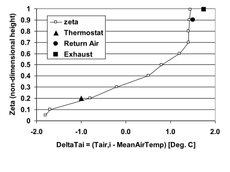

Figure 44. Example of a Vertical Air Temperature Pattern

#### Field: Name

This field provides a unique name for this object.

#### Field: Control Integer for Pattern Control Schedule Name

This field should contain an integer value that is unique among all other RoomAir Temperature Pattern objects. The value used here needs to be in the Pattern Control Schedule for those times when this pattern is to be used for the Room Air Temperature Distribution.

#### Field: Thermostat Offset

This field specifies the temperature difference between where the thermostat is situated and the mean air temperature.

#### Field: Return Air Offset

This field specifies the temperature difference between the air leaving the zone and returning to the air system and the mean air temperature.

#### Field: Exhaust Air Offset

This field specifies the temperature difference between the air leaving the zone and being exhausted out of the building and the mean air temperature.

#### Field Set Zeta and Temperature Difference

The remaining fields contain pairs of values that define a lookup table for the temperature pattern in the vertical direction. The first value is Zeta and the second value is DeltaTai.   This object is extensible, by duplicating the last two fields and revising the IDD – note that you will have to replace “inner” semi-colons with commas.

#### Field: Pair &lt;\#&gt; Zeta non-dimensional Height

Zeta is the normalized height and should be a fractional value from 0.0 to 1.0. A value of 0.0 corresponds to the floor and a value of 1.0 corresponds to the ceiling. The Zeta values need to be in increasing value.

#### Field: Pair &lt;\#&gt; Delta Adjacent Air Temperature

DeltaT<sub>ai</sub> is the temperature difference between the air temperature at the associated Zeta (T<sub>ai</sub>) and the mean air temperature and is given in degrees Celsius.

An example of this object corresponding to the figure above is:


```idf
RoomAir:TemperaturePattern:NondimensionalHeight,
  Rough UFAD Approx  , ! Name
  3001 , ! Control Integer for Pattern Control Schedule
        ! note reference this entry in Schedule
  -1.0 ,   ! Thermostat Offset
  1.5 , ! Return Air Offset (Tleaving - Mean Air Temp ) deg C
  1.75,   ! Exhaust Air Offset (Texhaust - Mean Air Temp) deg C
  0.05,  -1.8,   ! pair 1 (Zeta , DeltaTai)
  0.1,   -1.7 ,  ! pair 2 (Zeta , DeltaTai)
  0.2,   -0.8 ,  ! pair 3 (Zeta , DeltaTai)
  0.3,   -0.2,   ! pair 4 (Zeta , DeltaTai)
  0.4,    0.5,   ! pair 5 (Zeta , DeltaTai)
  0.5,    0.8,   ! pair 6 (Zeta , DeltaTai)
  0.6,    1.2,   ! pair 7 (Zeta , DeltaTai)
  0.7,    1.4,   ! pair 8 (Zeta , DeltaTai)
  0.8,    1.4,   ! pair 9 (Zeta , DeltaTai)
  0.9,   1.42,   ! pair 10 (Zeta , DeltaTai)
 0.95,  1.44;   ! pair 11 (Zeta , DeltaTai)
```


### RoomAir:TemperaturePattern:SurfaceMapping

This object defines a distribution pattern for the air temperatures adjacent to individual surfaces. This object uses the specific names of individual surfaces defined elsewhere in the model. This pattern allows controlling the adjacent air temperature on a surface-by-surface basis rather than by height. This allows modeling different adjacent air temperatures on the opposite sides of the zone.

In addition to the surface mappings there are three other parameters included in the pattern that are important. The first two might affect how the air system conditioning the room is operated. The first describes the temperature difference between the mean air temperature and the point where the sensor of a drybulb thermostat is situated. The second describes the temperature difference between the mean and the point where system air is being extracted from the zone. This is considered important because the changes in temperature difference between supply and return can affect how an air system is controlled to meet the loads. The third parameter can affect the zone air heat balance by altering the temperature of the air leaving the zone through exhaust fans.

#### Field: Name

This field provides a unique name for this object.

#### Field: Control Integer for Pattern Control Schedule Name

This field should contain an integer value that is unique among all other RoomAir Temperature Pattern objects. The value used here needs to be in the Pattern Control Schedule for those times when this pattern is to be used for the RoomAir Temperature Distribution.

#### Field: Thermostat Offset

This field specifies the temperature difference between where the thermostat is situated and the mean air temperature.

#### Field: Return Air Offset

This field specifies the temperature difference between the air leaving the zone and returning to the air system and the mean air temperature.

#### Field: Exhaust Air Offset

This field specifies the temperature difference between the air leaving the zone and being exhausted out of the building and the mean air temperature.

#### Field Set: Surface Name, Temperature Difference

#### Fields (6 and on): Pairs of Surface Names and Temperature Differences

The remaining fields contain pairs that define a lookup table for the temperature pattern on a surface-by-surface basis. This object is extensible, by duplicating the last two fields and revising the IDD – note that you will have to replace “inner” semi-colons with commas.

#### Field: Surface Name Pair &lt;\#&gt;

The name of a surface defined elsewhere in the input file.

#### Field: Delta Adjacent Air Temperature Pair &lt;\#&gt;

DeltaT<sub>ai</sub> is the temperature difference between the air temperature adjacent to the associated surface (T<sub>ai</sub>) and the mean air temperature and is given in degrees Celsius.

An example of this object, which might be used to elevate temperatures near west windows in the afternoon, is:

```idf
RoomAir:TemperaturePattern:SurfaceMapping,
  GroundFloor SW Corner Hot Near West Wall, ! Name
  4001, ! Control Integer for Pattern Control Schedule Name
  0.0, ! Thermostat Offset(Temp at thermostat- Mean Air Temp)
  0.0, ! Return Air Offset  deg C
  0.0, ! Exhaust Air Offset
  ZN1_SW_1:W_ExtWall:1 ,  0.8,  ! pair 1 (Surface Name , DeltaTai)
  ZN1_SW_1:W_ExtWall:2 ,  0.9,  ! pair 2 (Surface Name , DeltaTai)
  ZN1_SW_1:W_ExtWall:3 ,  1.0,  ! pair 3 (Surface Name , DeltaTai)
  ZN1_SW_1:W_ExtWall:4,   1.1,  ! pair 4 (Surface Name , DeltaTai)
  ZN1_SW_1:W_ExtWall:5,   1.3,  ! pair 5 (Surface Name , DeltaTai)
  ZN1_SW_1:W_ExtWall:6,   1.5,  ! pair 6 (Surface Name , DeltaTai)
  ZN1_SW_1:W_ExtWall:7,   1.7,  ! pair 7 (Surface Name , DeltaTai)
  ZN1_SW_1:W_ExtWall:8,   2.1,  ! pair 8 (Surface Name , DeltaTai)
  ZN1_SW_1:W_ExtWall:9,   2.4 ; ! pair 8 (Surface Name , DeltaTai)
```


### RoomAir:Node

The RoomAir:Node object is used to define air nodes for a nodal air model. The number of air node objects that need to be specified depends on the nodal air model selected. (However, currently only the Mundt model uses this object). In order to use the Mundt model, the user must specify six or more RoomAir:Node objects of different types for each zone. The exact number of RoomAir:Node in the model will vary based on the resolution of walls. If walls (heat transfer surfaces) are split into separate segments in the vertical direction, then more air nodes of type ‘MundtRoom’ will be useful. At a minimum, for the Mundt model RoomAir Nodes of the following type are required: ‘Inlet, ‘Floor, ‘Control, ‘Ceiling, ‘MundtRoom, and ‘Return.’

#### Field: Name

This alpha field is a name for the air node. It should be unique and is used as an identifier

#### Field: Node Type

This alpha field indicates the type of this air node. The following explains options available for use with the Mundt nodal air model.

**Inlet** is specified for the air node located where the system air enters the zone.

**Floor** is specified for the air node located near the floor.

**Control** is specified for the air node located near the thermostat.

**Ceiling** is specified for the air node located near the ceiling.

**MundtRoom** is specified for the air node located adjacent to the wall(s).

**Return** is specified for the air node located where the system air leaves the zone.

#### Field: Zone Name

This field indicates the name of the zone (Ref: Zone) that this air node belongs to. This should be the unique name of a zone object defined elsewhere in the input file.

#### Field: Height of Nodal Control Volume Center

This numeric field indicates the height of the air node center. Air models such as the Mundt model compute the air temperature as a function of height and the value entered here will be used to determine a result for this node. The value should be specified in meters and relative to the floor of the zone.

#### Field: Surface &lt;\#&gt; Name

These remaining alpha fields indicate the names of the surfaces (Ref: Surface) that are interacting convectively with this air node. This field is optional and related to the previous field. Currently, at most 20 surfaces are allowed to interact with a single air node. Only those nodes that interact with the inside faces of surfaces need to specify surface names. Each surface should couple to no more than 1 node.

An IDF example:

```idf
RoomAir:Node,
    WESTZN:FLOORAIR,    !- Node Name
    Floor,      !- Node Type
    WEST ZONE,  !- Name of Zone to Which the Air Node Belongs
    0.1,        !- Height of Nodal Control Volume Center {m}
    WESTZN:FLOOR:LEFF,  !- surface name
    WESTZN:FLOOR:RIGHT; !- surface name
```


### RoomAirSettings:OneNodeDisplacementVentilation

The RoomAirSettings:OneNodeDisplacementVentilation object is used to specify additional input parameters required by the Mundt model that are not available in other input objects in EnergyPlus. A single object will be used for the zone.

#### Field: Zone Name

This alpha field indicates the name of the zone (Ref: Zone) for the required input parameters as specified in the following fields.

#### Field: Fraction of Convective Internal Loads Added to Floor Air

This numeric field indicates what fraction of the convective part of the internal gains is added to the air near the floor in the zone specified.

#### Field: Fraction of Infiltration Internal Loads Added to Floor Air

This numeric field indicates what fraction of the infiltration air enters near the floor in the zone specified.

An IDF example:

```idf
RoomAirSettings:OneNodeDisplacementVentilation,
    WEST ZONE,  !- Zone Name
    0.1,  !- Fraction of internal loads from the convective Floor Air
    0.1;  !- Fraction of internal loads from the Infiltration Air
```

### RoomAirSettings:ThreeNodeDisplacementVentilation

This model is applicable to spaces that are served by a low velocity floor-level displacement ventilation air distribution system. Furthermore, the dominant sources of heat gain should be from people and other localized sources located in the occupied part of the room. The model should be used with caution in zones which have large heat gains or losses through exterior walls or windows or which have considerable direct solar gain. The model predicts three temperatures in the room:

- A foot level temperature (T<sub>FLOOR</sub>). The floor region is 0.2 meters deep and T<sub>FLOOR</sub> represents the temperature at the mid-point of the region.

- An occupied subzone temperature (T<sub>OC</sub>), representing the temperature in the region between the floor layer and the upper, mixed layer.

- An upper node representing the mixed-layer/outflow temperature (T<sub>MX</sub>) essential for overall energy budget calculations and for modeling comfort effects of the upper layer temperature.

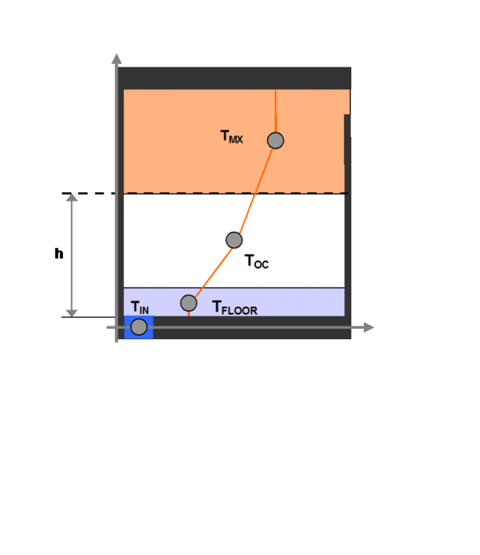

Figure 45. Schematic representation of the three temperature points and temperature gradients


The following fields are used to define an instance of the ‘UCSD Displacement Ventilation Model Controls’ object.

#### Field: Zone Name

This field provides the unique name of a zone described elsewhere in the file. A single instance of the ‘UCSD Displacement Ventilation Model Controls’ object is needed for each zone that is to be modeled using this method.

####  Field: Gain Distribution Schedule Name

This field specifies the unique name of schedule defined elsewhere in the input file. The schedule values are the fractions of the convective portion of the internal gains in the occupied subzone that remain in the occupied subzone. The remainder of the convective portion of the internal gains in the occupied subzone enters the plumes and is carried to the upper subzone. The types of internal gains that are assumed to be located in the occupied subzone are:

- people

- task lights

- electric equipment

- gas equipment

- hot water equipment

- steam equipment

- other equipment

- baseboard heat

Types of internal gains that are assumed to be in the upper subzone are:

- general lights

- tubular daylighting devices

- high temperature radiant heaters

The schedule values should be between 0 and 1. A value of 1 means that all the convection gains from equipment, task lights and people are dispersed in the lower occupied subzone. Conversely a value of 0 puts all the lower subzone convective gains into the plumes rising into the upper well-mixed subzone.

#### Field: Number of Plumes per Occupant

This field specifies number of plumes per occupant. Plumes are associated with localized sources of convective heat gain from people and equipment. For example, a value of 2.0 would be used if each occupant has a computer that generates a separate plume that does not merge with the plume from the occupant in the lower, occupied, subzone.

#### Field: Thermostat Height

This field is the height in meters of the thermostat/temperature control sensor above the floor.

#### Field: Comfort Height

The height in meters above the floor at which air temperature is calculated for comfort purposes. The air temperature at this height is used in calculating the available measures of comfort: Fanger, Pierce or KSU. The default is 1.1 meters.

#### Field: Temperature Difference Threshold for Reporting

This field specifies a minimum temperature difference between the upper mixed subzone and the occupied subzone that will be used to trigger whether or not the displacement ventilation auxiliary outputs will be calculated. These outputs are *Room Air Zone Transition Height*, *Room Air Zone Recommended Minimum Flow Fraction*, *Room Air Zone Average Temperature Gradient* and *Room Air Zone Maximum Temperature Gradient*. They are set to negative values when the temperature difference is less than the threshold and the output *Room Air Zone Is Mixed Status* is set to 1.

The value should be greater than or equal to zero and is in units of degrees Centigrade. The default value is 0.4 degrees C.

An example input:

```idf
RoomAirSettings:ThreeNodeDisplacementVentilation,
    ZONE ONE,  !- Zone Name
    Constant - .2,  !- Gain Distribution Schedule Name
     1,  !- Number of Plumes per Occupant
      ,  !- Thermostat Height
      ,  !- Comfort Height
    .3;  !- Temp. Difference Threshold for Displacement Ventilation
```


### RoomAirSettings:CrossVentilation

The UCSD Cross Ventilation Room Air Model provides a simple model for heat transfer and temperature prediction in cross ventilated rooms. Cross Ventilation (CV) is common in many naturally ventilated buildings, with air flowing through windows, open doorways and large internal apertures across rooms and corridors in the building.

The CV model is used in EnergyPlus in the context of natural ventilation simulations using the AirflowNetwork airflow prediction model. Typical CV room flows are characterized by two clearly distinguishable flow regions that have different airflow velocities and temperature:

- Jet regions in front of the inflow windows

- Recirculation regions in the portions of the room that are not directly in front of the windows.

Each inflow aperture has one jet region while the recirculation regions are treated as a whole, with a single temperature and characteristic velocity. The default EnergyPlus perfectly mixed single temperature node room air approach is not suitable for these partially mixed flows. The proposed CV model uses multiple nodes with distinct air temperature and airflow velocity (one node for the recirculations plus one additional node for each inflow aperture).


Figure 46. Schematic representation of room air geometry a) schematic representation of a room geometry that generates cross ventilation airflow. b) the proposed model distinguishes two regions in the flow: jet and recirculation (shown here in a CFD simulation of one half of a symmetrical room).


Figure 47. Schematic top view –possible  airflow patterns in cross-ventilation.

The following fields are used to define an instance of the ‘UCSD Cross Ventilation Model Controls’ object.

#### Field: Zone Name

This field provides the name of the zone to which this object applies. A single instance of the ‘UCSD Cross Ventilation Model Controls’ object is needed for each zone modeled using this method.

#### Field: Gain Distribution Schedule Name

This field specifies the unique name of schedule defined elsewhere in the input file. The schedule values define the fractions of the convective portion of the internal gains in the jet and recirculation regions.

The schedule values should be between 0 and 1. A value of 1 means that all the convective gains are dispersed in the jet region. Conversely a value of 0 puts all the convective gains into the recirculation region.

#### Field: Airflow Region Used for Thermal Comfort Evaluation

Required field whenever thermal comfort is predicted. Defines air temperature and mean airflow velocity that will be used in the Fanger model. Conditions must refer to one of the two regions defined in the model: jet or recirculation.

Possible choices: Jet or Recirculation.


### CrossVentilation Model Outputs

* Zone,Average,Room Air Zone Jet Region Temperature [C]

* Zone,Average,Room Air Zone Recirculation Region Temperature [C]

* Zone,Average,Room Air Zone Jet Region Average Air Velocity [m/s]

* Zone,Average,Room Air Zone Recirculation Region Average Air Velocity [m/s]

* Zone,Average,Room Air Window Jet Region Average Air Velocity [m/s] Zone,Average,Room Air Zone Recirculation and Inflow Rate Ratio []

* Zone,Average,Room Air Zone Inflow Opening Area [m2]

* Zone,Average,Room Air Zone Room Length [m]

* Zone,Average,Room Air Zone Is Mixing Status []

* Zone,Average,Room Air Zone Is Recirculating Status []


#### Room Air Zone Jet Region Temperature [C]

Average air temperature in the jet region of the flow in degrees C. If there is more than one inflow window this output will be the inflow-area-weighted average of the jet region temperature.

#### Room Air Zone Recirculation Region Temperature [C]

Average air temperature in the recirculation region of the flow in degrees C.

#### Room Air Zone Jet Region Average Air Velocity [m/s]

Average airflow velocity in the jet region of the flow in meters per second. If there is more than one inflow window this output will be the inflow area weighted area of the jet inflow velocities.

#### Room Air Window Jet Region Average Air Velocity [m/s]

Average airflow velocity in the jet region in front of the window, in meters per second.

#### Room Air Zone Recirculation Region Average Air Velocity [m/s]

Average airflow velocity in the recirculation region of the flow in meters per second.

#### Room Air Zone Recirculation and Inflow Rate Ratio []

Ratio between airflow rate in the recirculation regions and the total inflow rate, non-dimensional.

#### Room Air Zone Inflow Opening Area [m2]

Area of the inflow aperture in square meters. This area can change due to variation in wind direction (as inflow aperture changes) or variations in the opening schedule.

#### Room Air Zone Room Length [m]

Length of the room along the cross ventilation direction, in meters.

#### Room Air Zone Is Mixing Status []

An integer flag that indicates whether the zone is mixed (single node well-mixed zone model used) or significant momentum conservation is occurring (UCSD CV model used). The value 1 means well-mixed; 0 means cross ventilation is present. Transition to mixed flow can occur due to three mechanism: reduction in inflow velocity, reduction in inflow aperture area and dominance of buoyancy effects. A value of 1 is yes, a value of 0 is no.

#### Room Air Zone Is Recirculating Status []

An integer flag that indicates whether recirculations are present in the flow. A cross ventilation flow does not have recirculations whenever the inflow area is similar to the room cross section area (such as airflow in a typical corridor). A value of 1 is yes, a value of 0 is no.

### RoomAirSettings:UnderFloorAirDistributionInterior

This model is applicable to interior spaces that are served by an underfloor air distribution system. The dominant sources of heat gain should be from people, equipment, and other localized sources located in the occupied part of the room. The model should be used with caution in zones which have large heat gains or losses through exterior walls or windows or which have considerable direct solar gain. The model predicts two temperatures in the room:

- An occupied subzone temperature (T<sub>OC</sub>), representing the temperature in the region between the floor and the boundary of the upper subzone..

- An upper subzone temperature (T<sub>MX</sub>) essential for overall energy budget calculations and for modeling comfort effects of the upper layer temperature.

The following fields are used to define an instance of the ‘UCSD UFAD Interior Model Controls’ object.

#### Field: Zone Name

This field provides the unique name of a zone described elsewhere in the file. A single instance of the ‘RoomAirSettings:UnderFloorAirDistributionInterior’ object is needed for each zone that is to be modeled using this method.

#### Field: Number of Diffusers

The total number of diffusers in this zone. This field can allowed to Autocalculate (in which case it is set to the design occupancy level; i.e., number of people). If the design occupancy is low or zero but there are still heat sources that could generate buoyancy driven plumes, the user should input a value based on the design supply air flow rate of the zone and the design flow rate of an individual diffuser. In the absence of any other information, divide the zone area by 100 ft<sup>2</sup>. The default for this field is Autocalculate.

#### Field: Power per Plume

The power in watts incorporated in a buoyancy driven thermal plume. Normally we assume all the loads of a workstation create a single plume so that this represents the convective heat gain from a workstation – 1 person, 1 computer terminal, plus any task lighting. A typical value would be 220 watts. However, the model assumes an “equivalent” plume derived from the zone extraction rate normalized to the number of workstations/occupants. This field should be allowed to default – the program will calculate a value based upon the occupancy and the extraction rate.  The default is Autocalculate.

#### Field: Design Effective Area of Diffuser

This is the design air flow opening area in square meters of a single diffuser. The default value depends on the diffuser type. For swirl diffusers it is 0075 m<sup>2</sup>, for variable area diffusers 0.035 m<sup>2</sup>, for horizontal swirl diffusers 0.006 m<sup>2</sup>, and for linear bar grilles 0.03 m<sup>2</sup>. The default is *Autocalculate*..

#### Field: Diffuser Slot Angle from Vertical

This input describes the angle at which air emerges from the diffusers. It should be the angle  in degrees between the vertical and the diffuser slots. The defaults depend on the diffuser type: for swirl diffusers it is 28 degrees, for variable area diffusers 45 degrees, for DV diffusers 73 degrees, and for linear bar grilles 15 degrees.

#### Field: Thermostat Height

This field is the height in meters of the thermostat/temperature control sensor above the floor. The default is 1.2 meters.

#### Field: Comfort Height

The height in meters above the floor at which air temperature is calculated for comfort purposes. The air temperature at this height is used in calculating the available measures of comfort: Fanger, Pierce or KSU. The default is 1.1 meters.

#### Field: Temperature Difference Threshold for Reporting

This field specifies a minimum temperature difference between the upper subzone and the occupied subzone that will be used to trigger whether or not the UFAD auxiliary outputs will be calculated. These outputs are *Room Air Zone Transition Height* and *Room Air Zone Average Temperature Gradient*. They are set to zero when the temperature difference is less than the threshold and the output *Room Air Zone Is Mixed Status* is set to 1.

The value should be greater than or equal to zero and is in units of degrees Centigrade. The default value is 0.4 degrees C.

#### Field: Diffuser Type

The choices for this alpha field are **Swirl** | **VariableArea** | **HorizontalSwirl | LinearBarGrille | Custom.** The swirl and displacement diffusers are fixed area diffusers. The variable area diffusers maintain an approximately constant exit velocity. Linear bar grilles are normally used in exterior zonesand are fixed area diffusers. Custom is used to signify that the user intends to input the coefficients A – E (see below) rather than let the program set the coefficients based on diffuser type. The default is *Swirl*.

#### Field: Transition Height

An optional field to allow the user to specify the transition height (meters above floor) rather than have the program calculate it. The default is 1.7 meters.

#### Field: Coefficient A

The coefficient A in the formula: Kc = A\*Gamma\*\*B + C + D\*Gamma + E\*Gamma\*\*2. Gamma is a variable that characterizes the amount of stratification in a UFAD zone. Kc is the fraction of the total internal convective heat gain that is assigned to the lower (occupied) subzone. The coefficients in the formula are defaulted based upon diffuser type. A user would normally allow this field to default. The default is *autocalculate*.

#### Field: Coefficient B

The coefficient B in the formula: Kc = A\*Gamma\*\*B + C + D\*Gamma + E\*Gamma\*\*2. Gamma is a variable that characterizes the amount of stratification in a UFAD zone. Kc is the fraction of the total internal convective heat gain that is assigned to the lower (occupied) subzone. The coefficients in the formula are defaulted based upon diffuser type. A user would normally allow this field to default. The default is *autocalculate*.

#### Field: Coefficient C

The coefficient C in the formula: Kc = A\*Gamma\*\*B + C + D\*Gamma + E\*Gamma\*\*2. Gamma is a variable that characterizes the amount of stratification in a UFAD zone. Kc is the fraction of the total internal convective heat gain that is assigned to the lower (occupied) subzone. The coefficients in the formula are defaulted based upon diffuser type. A user would normally allow this field to default. The default is *autocalculate*.

#### Field: Coefficient D

The coefficient D in the formula: Kc = A\*Gamma\*\*B + C + D\*Gamma + E\*Gamma\*\*2. Gamma is a variable that characterizes the amount of stratification in a UFAD zone. Kc is the fraction of the total internal convective heat gain that is assigned to the lower (occupied) subzone. The coefficients in the formula are defaulted based upon diffuser type. A user would normally allow this field to default. The default is *autocalculate*.

#### Field: Coefficient E

The coefficient E in the formula: Kc = A\*Gamma\*\*B + C + D\*Gamma + E\*Gamma\*\*2. Gamma is a variable that characterizes the amount of stratification in a UFAD zone. Kc is the fraction of the total internal convective heat gain that is assigned to the lower (occupied) subzone. The coefficients in the formula are defaulted based upon diffuser type. A user would normally allow this field to default. The default is *autocalculate*.

An example input is:


```idf
  RoomAirModelType,
    SPACE5-1 RoomAir Model,  !- Name
    SPACE5-1,                !- Zone Name
    UnderFloorAirDistributionInterior,  !- Room-Air Modeling Type
    DIRECT;                  !- Air Temperature Coupling Strategy

RoomAirSettings:UnderFloorAirDistributionInterior,
    SPACE5-1,                !- Zone Name
    Autocalculate,           !- Number of Diffusers
    Autocalculate,           !- Power per Plume
    Autocalculate,           !- Design Effective Area of Diffuser {m2}
    Autocalculate,           !- Diffuser Slot Angle from Vertical {deg}
    ,                        !- Thermostat Height {m}
    ,                        !- Comfort Height {m}
    0.001,         !- Temperature Difference Threshold for Reporting {deltaC}
    Swirl,                   !- Diffuser Type
    1.7,                     !- Transition Height {m}
    Autocalculate,           !- Coefficient A
    Autocalculate,           !- Coefficient B
    Autocalculate,           !- Coefficient C
    Autocalculate,           !- Coefficient D
   Autocalculate;           !- Coefficient E
```


### RoomAirSettings:UnderFloorAirDistributionExterior

This model is applicable to exterior spaces that are served by an underfloor air distribution system. The dominant sources of heat gain should be from people, equipment, and other localized sources located in the occupied part of the room, as well as convective gain coming from a warm window. The model predicts two temperatures in the room:

- An occupied subzone temperature (T<sub>OC</sub>), representing the temperature in the region between the floor and the boundary of the upper subzone..

- An upper subzone temperature (T<sub>MX</sub>) essential for overall energy budget calculations and for modeling comfort effects of the upper layer temperature.

The following fields are used to define an instance of the ‘UCSD UFAD Exterior Model Controls’ object.

#### Field: Zone Name

This field provides the unique name of a zone described elsewhere in the file. A single instance of the ‘RoomAirSettings:UnderFloorAirDistributionExterior’ object is needed for each zone that is to be modeled using this method.

#### Field: Number of Diffusers

#### The total number of diffusers in this zone. This field can allowed to Autocalculate (in which case it is set to the design occupancy level; i.e., number of people). If the design occupancy is low or zero but there are still heat sources that could generate buoyancy driven plumes, the user should input a value based on the design supply air flow rate of the zone and the design flow rate of an individual diffuser. In the absence of any other information, divide the zone area by 100 ft<sup>2</sup>. The default for this field is Autocalculate.

#### Field: Power per Plume

#### The power in watts incorporated in a buoyancy driven thermal plume. Normally we assume all the loads of a workstation create a single plume so that this represents the convective heat gain from a workstation – 1 person, 1 computer terminal, plus any task lighting. A typical value would be 220 watts. However, the model assumes an “equivalent” plume derived from the zone extraction rate normalized to the number of workstations/occupants. This field should be allowed to default – the program will calculate a value based upon the occupancy and the extraction rate.  The default is Autocalculate.

#### Field: Design Effective Area of Diffuser

This is the design air flow opening area in square meters of a single diffuser. The default value depends on the diffuser type. For swirl diffusers it is 0075 m<sup>2</sup>, for variable area diffusers 0.035 m<sup>2</sup>, for horizontal swirl diffusers 0.006 m<sup>2</sup>, and for linear bar grilles 0.03 m<sup>2</sup>. The default is *Autocalculate*..

#### Field: Diffuser Slot Angle from Vertical

This input describes the angle at which air emerges from the diffusers. It should be the angle  in degrees between the vertical and the diffuser slots. The defaults depend on the diffuser type: for swirl diffusers it is 28 degrees, for variable area diffusers 45 degrees, for DV diffusers 73 degrees, and for linear bar grilles 15 degrees.

#### Field: Thermostat Height

This field is the height in meters of the thermostat/temperature control sensor above the floor. The default is 1.2 meters.

#### Field: Comfort Height

The height in meters above the floor at which air temperature is calculated for comfort purposes. The air temperature at this height is used in calculating the available measures of comfort: Fanger, Pierce or KSU. The default is 1.1 meters.

#### Field: Temperature Difference Threshold for Reporting

This field specifies a minimum temperature difference between the upper subzone and the occupied subzone that will be used to trigger whether or not the UFAD auxiliary outputs will be calculated. These outputs are *Room Air Zone Transition Height* and *Room Air Zone Average Temperature Gradient*. They are set to zero when the temperature difference is less than the threshold and the output *Room Air Zone Is Mixed Status* is set to 1.

The value should be greater than or equal to zero and is in units of degrees Centigrade. The default value is 0.4 degrees C.

The value should be greater than or equal to zero and is in units of degrees Centigrade. The default value is 0.4 degrees C.

#### Field: Diffuser Type

The choices for this alpha field are **Swirl** | **VariableArea** | **HorizontalSwirl | LinearBarGrille | Custom.** The swirl and displacement diffusers are fixed area diffusers. The variable area diffusers maintain an approximately constant exit velocity. Linear bar grilles are normally used in exterior zonesand are fixed area diffusers. Custom is used to signify that the user intends to input the coefficients A – E (see below) rather than let the program set the coefficients based on diffuser type. The default is *Swirl*.

#### Field: Transition Height

An optional field to allow the user to specify the transition height (meters above floor) rather than have the program calculate it. The default is 1.7 meters.

#### Field: Coefficient A

The coefficient A in the formula: Kc = A\*Gamma\*\*B + C + D\*Gamma + E\*Gamma\*\*2. Gamma is a variable that characterizes the amount of stratification in a UFAD zone. Kc is the fraction of the total internal convective heat gain that is assigned to the lower (occupied) subzone. The coefficients in the formula are defaulted based upon diffuser type. A user would normally allow this field to default. The default is *autocalculate*.

#### Field: Coefficient B

The coefficient B in the formula: Kc = A\*Gamma\*\*B + C + D\*Gamma + E\*Gamma\*\*2. Gamma is a variable that characterizes the amount of stratification in a UFAD zone. Kc is the fraction of the total internal convective heat gain that is assigned to the lower (occupied) subzone. The coefficients in the formula are defaulted based upon diffuser type. A user would normally allow this field to default. The default is *autocalculate*.

#### Field: Coefficient C

The coefficient C in the formula: Kc = A\*Gamma\*\*B + C + D\*Gamma + E\*Gamma\*\*2. Gamma is a variable that characterizes the amount of stratification in a UFAD zone. Kc is the fraction of the total internal convective heat gain that is assigned to the lower (occupied) subzone. The coefficients in the formula are defaulted based upon diffuser type. A user would normally allow this field to default. The default is *autocalculate*.

#### Field: Coefficient D

The coefficient D in the formula: Kc = A\*Gamma\*\*B + C + D\*Gamma + E\*Gamma\*\*2. Gamma is a variable that characterizes the amount of stratification in a UFAD zone. Kc is the fraction of the total internal convective heat gain that is assigned to the lower (occupied) subzone. The coefficients in the formula are defaulted based upon diffuser type. A user would normally allow this field to default. The default is *autocalculate*.

#### Field: Coefficient E

The coefficient E in the formula: Kc = A\*Gamma\*\*B + C + D\*Gamma + E\*Gamma\*\*2. Gamma is a variable that characterizes the amount of stratification in a UFAD zone. Kc is the fraction of the total internal convective heat gain that is assigned to the lower (occupied) subzone. The coefficients in the formula are defaulted based upon diffuser type. A user would normally allow this field to default. The default is *autocalculate*.

An example input is:

```idf
  RoomAirSettings:UnderFloorAirDistributionExterior,
    SPACE1-1,                !- Zone Name
    Autocalculate,           !- Number of Diffusers per Zone
    Autocalculate,           !- Power per Plume
    Autocalculate,           !- Design Effective Area of Diffuser {m2}
    Autocalculate,           !- Diffuser Slot Angle from Vertical {deg}
    ,                        !- Thermostat Height {m}
    ,                        !- Comfort Height {m}
    0.001,                   !- Temperature Difference Threshold for Reporting {deltaC}
    LinearBarGrille,         !- Diffuser Type
    1.7,                     !- Transition Height {m}
    Autocalculate,           !- Coefficient A
    Autocalculate,           !- Coefficient B
    Autocalculate,           !- Coefficient C
    Autocalculate,           !- Coefficient D
    Autocalculate;           !- Coefficient E
```

### RoomAirflowNetwork Model

This model simulates a thermal zone using a network approach by assuming intra-zone nodes connected by user-defined patterns of airflows. The new model also allows users to specify a node to be connected to surfaces to have convective heat transfer between surfaces and the node, portion of internal gains and supply air and return air fractions from zone equipment. The model requires following objects to work together:

    RoomAirSettings:AirflowNetwork
    RoomAir:Node:AirflowNetwork
    RoomAir:Node:AirflowNetwork:AdjacentSurfaceList
    RoomAir:Node:AirflowNetwork:InternalGains
    RoomAir:Node:AirflowNetwork:HVACEquipment
    AirflowNetwork:Intrazone:Node
    AirflowNetwork:Intrazone:Linkage

The first *five* **objects** are described below. The last two objects are described in the Airflow Network Model section. 

### RoomAirSettings:AirflowNetwork

This object provides inputs in a thermal zone needed for the RoomAirflowNetwork model.  The inputs specify a thermal zone and a list of RoomAir nodes. The object gives a summary of the model configuration in a zone.

#### Field: Name

This is a unique character string associated with this instance of the RoomAirSettings:AirflowNetwork object.
 
#### Field: Zone Name

The name of the EnergyPlus thermal zone corresponding to the RoomAir model zone.

#### Field: Control Point RoomAir:Node Name

This is the name of a RoomAir:Node:AirflowNetwork object that contains the sensor for zone HVAC controls.  The conditions at this node will be used for thermostatic, humidistatic, or comfort based control decisions. The zone node defined in a Zone object is required.  

#### Field: RoomAir:Node:AirflowNetwork x Name

The name of a RoomAir:Node:AirflowNetwork object defined elsewhere.  This node will receive the fraction of internal gains, and HVAC equipment, and a list of surface names exposed to this node with convective heat transfer. 

An IDF example input is:

```idf
  RoomAirSettings:AirflowNetwork,
    NORTH_ZONE,     !- Name 
    NORTH_ZONE,              !- Zone Name
    RoomAir Schedule,        !- Availability Schedule Name
    NORTH_ZONE,              !- Control Point RoomAir:Node Name
    LeftUpper,               !- RoomAir:Node:AirflowNetwork 1 Name
    CentralUpper,            !- RoomAir:Node:AirflowNetwork 2 Name
    NORTH_ZONE,              !- RoomAir:Node:AirflowNetwork 3 Name
    LeftMiddle,              !- RoomAir:Node:AirflowNetwork 4 Name
    LeftLower,               !- RoomAir:Node:AirflowNetwork 5 Name
    CentralLower;            !- RoomAir:Node:AirflowNetwork 6 Name
```

### RoomAir:Node:AirflowNetwork

This object is used to define a node in a thermal zone. The input specifies the fraction of zone volume and provides a list of names to define fraction of internal gains, surface connection and HVAC equipment.

#### Field: Name

This is a unique character string associated with this instance of the RoomAirSettings:AirflowNetwork object. 

#### Field: Zone Name

The name of the EnergyPlus thermal zone and is defined in an RoomAirSettings:AirflowNetwork object.

#### Field: Fraction of Zone Air Volume

The field specifies a fraction of the overall zone air volume that is assigned to this RoomAir:Node:AirflowNetwork object. The fraction will be used to calculate zone air storage term. See corresponding sections in Engineering Reference for its use in the node energy and moisture balance equations.

#### Field: RoomAir:Node:AirflowNetwork:AdjacentSurfaceList Name

The field specifies a name to provide a list of connected adjacent surfaces with convective heat transfer between surfaces and this particular node.  When a moisture mode is assigned to surfaces, convective moisture transfer will be calculated. See corresponding sections in Engineering Reference for its use in the node energy and moisture balance equations.

#### Field: RoomAir:Node:AirflowNetwork:InternalGains Name

The field specifies a name to provide a list of internal gain objects and associated fractions assigned to this particular node. See corresponding sections in Engineering Reference for its use in the node energy and moisture balance equations.

#### Field: RoomAir:Node:AirflowNetwork:HVACEquipment Name

The field specifies a name to provide a list of HVAC equipment, including AirLoop terminals and zone equipment. See corresponding sections in Engineering Reference for its use in the node energy and moisture balance equations.

```idf
  RoomAir:Node:AirflowNetwork,
    LeftUpper,         !- Name
    NORTH_ZONE,        !- Zone Name
    0.15,              !- Fraction of Zone Air Volume
    Surface_18_T_List, !- RoomAir:Node:AirflowNetwork:AdjacentSurfaceList Name
    LeftUpper_Gain,    !- RoomAir:Node:AirflowNetwork:InternalGains Name
    LeftUpper_HVAC;    !- RoomAir:Node:AirflowNetwork:HVACEquipment Name
```

### RoomAir:Node:AirflowNetwork:AdjacentSurfaceList

This object is used to provide a list of connected adjacent surfaces with convective heat transfer between surfaces and this particular node. When a moisture mode is assigned to surfaces, convective moisture transfer will be calculated. It should be pointed out that a fraction of a surface exposed to this particular node is not allowed.

#### Field: Name

This is a unique character string associated with this instance of the RoomAir:Node:AirflowNetwork:AdjacentSurfaceList object. 

#### Field: Surface x Name

The field specifies a surface name based on the order from 1 to 21. The maximum number of surfaces can be extensible.

```idf
  RoomAir:Node:AirflowNetwork:AdjacentSurfaceList,
    Surface_18_T_List, !- Name
    Surface_18_T;      !- Surface 1 Name
```
### RoomAir:Node:AirflowNetwork:InternalGains

This object is used to define a list of internal gains in the same zone and associated fraction assigned to this particular node. 

#### Field: Name

This is a unique character string associated with this instance of the RoomAir:Node:AirflowNetwork:InternalGains object. 

#### Field: Internal Gain Object x Type

The field specifies an internal gain object type based on the list in the Energy+. 

#### Field: Internal Gain Object x Name

The field specifies an internal gain object name based on the list in the Energy+.
 
#### Field: Fraction of Gains to Node x

The field specifies a fraction of the particular internal gain object assigned to this node. 

```idf
  RoomAir:Node:AirflowNetwork:InternalGains,
    CentralUpper_Gain,        !- Name
    People,                !- Internal Gain Object 1 Type
    NORTH_ZONE People,     !- Internal Gain Object 1 Name
    0.15,                  !- Fraction of Gains to Node 1
    Lights,                !- Internal Gain Object 2 Type
    NORTH_ZONE Lights,     !- Internal Gain Object 2 Name
    0.15,                  !- Fraction of Gains to Node 2
    ElectricEquipment,     !- Internal Gain Object 3 Type
    NORTH_ZONE Equip,     !- Internal Gain Object 3 Name
    0.15;                  !- Fraction of Gains to Node 3
```

{Field set: 3 fields (Internal Gain Object x Type, Internal Gain Object x Name, and Fraction of Gains to Node x). are extensible.}

### RoomAir:Node:AirflowNetwork:HVACEquipment

This object is used to define a list of HVAC equipment objects in the same zone and associated fractions assigned to this particular node. 

#### Field: Name

This is a unique character string associated with this instance of the RoomAir:Node:AirflowNetwork:HVACEquipment object. 

#### Field: ZoneHVAC or Air Terminal Equipment Object Type x

The field specifies an object type of ZoneHVAC equipment or terminal type based on the list in the Energy+.idd.

#### Field: ZoneHVAC or Air Terminal Equipment Object Name x

The field specifies the object name based on the object type defined in the previous field.  

#### Field: Fraction of Output or Supply Air from HVAC Equipment x 

The field specifies a fraction of supply air from the particular equipment to this node. 

#### Field: Fraction of Input or Return Air from HVAC Equipment x 

The field specifies a fraction of return air from the particular equipment to this node. 

```idf
  RoomAir:Node:AirflowNetwork:HVACEquipment,
    CentralUpper_HVAC,        !- Name
    ZoneHVAC:PackagedTerminalAirConditioner, !- ZoneHVAC or Air Terminal Equipment Object Type 1
    NORTH_ZONE PTAC,       !- ZoneHVAC or Air Terminal Equipment Object Name 1
    0.14,                   !- Fraction of Output or Supply Air from HVAC Equipment 1 
    0.14;                   !- Fraction of Input or Return Air to HVAC Equipment 1
```

{Field set: 4 fields (ZoneHVAC or Air Terminal Equipment Object Type x, ZoneHVAC or Air Terminal Equipment Object Name x, Fraction of Output or Supply Air from HVAC Equipment x, and Fraction of Input or Return Air from HVAC Equipment x) are extensible.}

### Room Air Model Outputs

Each room air model sets up outputs specific to that model. The effect of room air modeling is usually to adjust the adjacent air temperature along the inside surface of heat transfer surfaces. The output report “Surface Int Adjacent Air Temperature [C]” is provided for this and described under Surface Outputs.

#### Zone Predicted Sensible Load Room Air Correction Factor

This output variable provides the value of the correction factor applied to the predicted zone loads.  Predicted zone load to setpoint is (usually) used to control HVAC air systems and the presence of a room air model has an impact on the loads.  The predicited loads are multiplied by the factor in this output variable.  The value is always 1.0 when there is no Room Air model.  When there is a Room Air model, this output shows how that model is increasing or decreasing overall zone loads experienced by the air system.

### RoomAir:TemperaturePattern:TwoGradient Outputs

The user-defined air temperature pattern that interpolates between two gradients produces the following output variable.

HVAC,Average,Room Air Zone Vertical Temperature Gradient [K/m]

#### Room Air Zone Vertical Temperature Gradient [K/m]

This output variable is the result of the interpolation performed by the user-defined roomair model using RoomAir:TemperaturePattern:TwoGradient.  This is the temperature gradient in the vertical direction.  The units are degrees Kelvin per meter.

### Mundt Model / OneNodeDisplacementVentilation Outputs

The following output is available for the Mundt model.

Room Air Node Air Temperature [C]

#### Room Air Node Air Temperature [C]

This output variable provides the drybulb air temperature used in, or calculated by, the Mundt model. The selection key is the name of an air node defined in a ROOMAIR Node object.

### ThreeNodeDisplacementVentilation Outputs

* HVAC,Average,Room Air Zone Mixed Subzone Temperature [C]

* HVAC,Average,Room Air Zone Occupied Subzone Temperature [C]

* HVAC,Average,Room Air Zone Floor Subzone Temperature [C]

* HVAC,Average,Room Air Zone Transition Height [m]

* HVAC,Average,Room Air Zone Recommended Minimum Flow Fraction

* HVAC,Average,Room Air Zone Is Mixed Status []

* HVAC,Average,Room Air Zone Average Temperature Gradient [K/m]

* HVAC,Average,Room Air Zone Maximum Temperature Gradient [K/m]

* HVAC,Average,Room Air Zone Thermal Comfort Effective Air Temperature [C]

* HVAC,Average,Room Air Zone Thermostat Temperature [C]


#### Room Air Zone Mixed Subzone Temperature [C]

The temperature of the upper well-mixed subzone in degrees C.

#### Room Air Zone Occupied Subzone Temperature [C]

The average temperature of the lower, stratified, occupied subzone in degrees C.

#### Room Air Zone Floor Subzone Temperature [C]

The temperature of the region near the floor in degrees C.

#### Room Air Zone Transition Height  [m]

The height above the floor, in meters, of the boundary between the lower occupied subzone and the upper well-mixed subzone.

#### Room Air Zone Recommended Minimum Flow Fraction []

The ratio of the minimum recommended flow rate to the actual flow rate. Here flow rate means the sum of infiltration, ventilation, mixing and system air flow rates. The minimum flow is the flow needed to establish the boundary between the occupied and mixed subzones at 1.5 meters.

#### Room Air Zone Is Mixed Status []

An integer flag that indicates whether the zone is mixed (single node well-mixed zone model used) or stratified (UCSD DV model used). The value 1 means well-mixed; 0 means stratified.

#### Room Air Zone Average Temperature Gradient  [K/m]

The temperature gradient between the middle of the floor region and the middle of the well-mixed upper subzone in degrees Kelvin per meter.

#### Room Air Zone Maximum Temperature Gradient [K/m]

The maximum of the temperature gradient between the middle of the floor region and the middle of the occupied subzone and the temperature gradient between the middle of the occupied subzone and the middle of the well-mixed subzone. The gradient is in degrees Kelvin per meter.

#### Room Air Zone Thermal Comfort Effective Air Temperature [C]

The temperature at the user specified comfort height in degrees C.

#### Room Air Zone Thermostat Temperature [C]

The temperature at the height of the thermostat (specified by user input) in degrees C.

### CrossVentilation Model Outputs

* Zone,Average,Room Air Zone Jet Region Temperature [C]

* Zone,Average,Room Air Zone Recirculation Region Temperature [C]

* Zone,Average,Room Air Zone Jet Region Average Air Velocity [m/s]

* Zone,Average,Room Air Zone Recirculation Region Average Air Velocity [m/s]

* Zone,Average,Room Air Zone Inflow Opening Area[m2]

* Zone,Average,Room Air Zone Room Length [m]

* Zone,Average,Room Air Zone Recirculation and Inflow Rate Ratio []

* Zone,Average,Room Air Zone Is Mixing Status []

* Zone,Average,Room Air Zone Is Recirculating Status []


#### Room Air Zone Jet Region Temperature [C]

Average air temperature in the jet region of the flow in degrees C.

#### Room Air Zone Recirculation Region Temperature [C]

Average air temperature in the recirculation region of the flow in degrees C.

#### Room Air Zone Jet Region Average Air Velocity [m/s]

Average airflow velocity in the jet region of the flow in meters per second.

#### Room Air Zone Recirculation Region Average Air Velocity [m/s]

Average airflow velocity in the recirculation region of the flow in meters per second.

#### Room Air Zone Inflow Opening Area [m2]

Area of the inflow aperture in square meters. This area can change due to variation in wind direction (as inflow aperture changes) or variations in the opening schedule.

#### Room Air Zone Room Length [m]

Length of the room along the cross ventilation direction, in meters.

#### Room Air Zone Recirculation and Inflow Rate Ratio []

Ratio between airflow rate in the recirculation region and inflow rate, non-dimensional.

#### Room Air Zone Is Mixing Status []

An integer flag that indicates whether the zone is mixed (single node well-mixed zone model used) or significant momentum conservation is occurring (UCSD CV model used). The value 1 means well-mixed; 0 means cross ventilation is present. Transition to mixed flow can occur due to three mechanism: reduction in inflow velocity, reduction in inflow aperture area and dominance of buoyancy effects. A value of 1 is yes, a value of 0 is no.


#### Room Air Zone Is Recirculating Status []

An integer flag that indicates whether recirculations are present in the flow. A cross ventilation flow does not have recirculations whenever the inflow area is similar to the room cross section area (such as airflow in a typical corridor). A value of 1 is yes, a value of 0 is no.

### UnderFloorAirDistributionInterior/Exterior Model Outputs

* HVAC,Average,Room Air Zone Mixed Subzone Temperature [C]

* HVAC,Average,Room Air Zone Occupied Subzone Temperature [C]

* HVAC,Average,Room Air Zone Transition Height [m]

* HVAC,Average,Room Air Zone Is Mixed Status []

* HVAC,Average,Room Air Zone Average Temperature Gradient [K/m]

* HVAC,Average,Room Air Zone Effective Comfort Air Temperature [C]

* HVAC,Average,Room Air Zone Thermostat Temperature [C]

* HVAC,Average,Room Air Zone Transition Height Gamma Value [ ]

* HVAC,Average,Room Air Zone Plume Heat Transfer Rate [W]

* HVAC,Average,Room Air Zone Temperature Stratification Fraction []

* HVAC,Average,Room Air Zone Window Plume Heat Transfer Rate [W]


#### Room Air Zone Mixed Subzone Temperature [C]

The temperature of the upper subzone in degrees C.

#### Room Air Zone Occupied Subzone Temperature [C]

The temperature of the lower, occupied subzone in degrees C.

#### Room Air Zone Transition Height [m]

The height above the floor, in meters, of the boundary between the lower occupied subzone and the upper subzone..

#### Room Air Zone Is Mixed Status []

An integer flag that indicates whether the zone is mixed (single node well-mixed zone model used) or stratified (UCSD UFI model used). The value 1 means well-mixed; 0 means stratified.

#### Room Air Zone Average Temperature Gradient [K/m]

The temperature gradient between the middle of the occupied subzone and the middle of the upper subzone in degrees Kelvin per meter.

#### Room Air Zone Effective Comfort Air Temperature [C]

The temperature at the user specified comfort height in degrees C.

#### Room Air Zone Thermostat Temperature [C]

The temperature at the height of the thermostat (specified by user input) in degrees C.

#### Room Air Zone Transition Height Gamma Value []

Value of gamma – a dimensionless “height” used in calculating the transition height. Lower values of gamma indicate increased stratification, higher values less. Generally the values should be between 2 and 30.

#### Room Air Zone Plume Heat Transfer Rate [W]

The heat in watts driving the plumes in the occupied subzone.

#### Room Air Zone Window Plume Heat Transfer Rate [W]

The convective heat gain from windows in an UnderFloorAirDistributionExterior zone.

#### Room Air Zone Temperature Stratification Fraction []

This output, (Phi) is a measure of temperature stratification in the space. It is the difference between the occupied subzone temperature and the supply temperature divided by difference between the return temperature and the supply temperature. Technically it is equal to Kc. As phi approaches 1, the space is fully mixed. As phi approaches 0, the space becomes fully stratified. Expressed as an equation:

*(T<sub>occ</sub>* – *T<sub>sup</sub>) / (T<sub>ret</sub>* *- T<sub>sup</sub>)*

### RoomAirflowNetwork Model Outputs

* HVAC,Average,RoomAirflowNetwork Node Temperature [C]

* HVAC,Average,RoomAirflowNetwork Node Humidity Ratio [kgWater/kgDryAir]

* HVAC,Average,RoomAirflowNetwork Node Relative Humidity [%]

* HVAC,Average,RoomAirflowNetwork Node SumIntSensibleGain [W]

* HVAC,Average,RoomAirflowNetwork Node SumIntLatentGain [W]

* HVAC,Average,RoomAirflowNetwork Node NonAirSystemResponse [W]

* HVAC,Average,RoomAirflowNetwork Node SysDepZoneLoadsLagged [W]

* HVAC,Average,RoomAirflowNetwork Node HVAC Supply Fraction []

* HVAC,Average,RoomAirflowNetwork Node HVAC Return Fraction []

#### RoomAirflowNetwork Node Temperature [C]

The temperature at a Room Air Node in a zone in degrees C.

#### HVAC,Average,RoomAirflowNetwork Node Humidity Ratio [kgWater/kgDryAir]

The humidity ratio at a Room Air Node in a zone in kgWater/kgDryAir.

#### RoomAirflowNetwork Node Relative Humidity [%]

The relative humidity ratio at a Room Air Node in a zone in percent.

#### HVAC,Average,RoomAirflowNetwork Node SumIntSensibleGain [W]

A sum of internal sensible gains assigned to a Room Air node in a zone.

#### HVAC,Average,RoomAirflowNetwork Node SumIntLatentGain [W]

A sum of internal latent gains assigned to a Room Air node in a zone.

#### HVAC,Average,RoomAirflowNetwork Node NonAirSystemResponse [W]

A sum of system convective gains, collected via NonAirSystemResponse, and assigned to a Room Air node in a zone. 

#### HVAC,Average,RoomAirflowNetwork Node SysDepZoneLoadsLagged [W]

A sum of SysDepZoneLoads saved to be added to zone heat balance at the next HVAC time step. A typical system is a zone dehumidifier.

Group – Internal Gains (People, Lights, Other internal zone equipment)
----------------------------------------------------------------------

Not all the influence for energy consumption in the building is due to envelope and ambient conditions. This group of objects describes other internal gains that may come into play (People, Lights, Various Equipment Types).

### People

The people statement is used to model the occupant’s effect on the space conditions. The following definition addresses the basic affects as well as providing information that can be used to report the thermal comfort of a group of occupants. The Fanger, Pierce Two-Node, and Kansas State University Two-Node thermal comfort models are available in EnergyPlus. A user may select any of these models for each People statement by simply adding the appropriate choice keyword after the air velocity schedule name. Thermal comfort calculations will only be made for people statements that include specific requests for these thermal comfort models. . This object also requires input of carbon dioxide generation rate based on people activity level for zone carbon dioxide simulations.

#### Field: Name

The name of the People object. Must be unique across all People objects.

#### Field: Zone or ZoneList Name

This field is the name of the zone (ref: Zone) or ZoneList (ref: ZoneList) and links a particular people statement to a thermal zone or set of thermal zones in the building. When the ZoneList option is used then this people definition is applied to each of the zones in the zone list effecting a global definition for the number of people in the zone. The Zonelist option can be used effectively with the people/area and area/person options of the Number of People Calculation Method.

The name of the actual people object becomes &lt;Zone Name&gt; &lt;People Object Name&gt; and should be less than the standard length (100 characters) for a name field. If it is greater than this standard length, it may be difficult to specify in output reporting as it will be truncated. A warning will be shown if the generated name is greater than 100 characters. If it duplicates another such concatenated name, there will be a severe error and terminate the run.

#### Field: Number of People Schedule Name

This field is the name of the schedule (ref: Schedules) that modifies the number of people parameter (see Number of People Calculation Method and related fields). The schedule values can be any positive number. The actual number of people in a zone as defined by this statement is the product of the number of people field and the value of the schedule specified by name in this field.

#### Field: Number of People Calculation Method

This field is a key/choice field that tells which of the next three fields are filled and is descriptive of the method for calculating the nominal number of occupants (people) in the Zone. The key/choices are:

- People

With this choice, the method used will be a straight insertion of the number of occupants (people).  (The Number of People field should be filled.)

- People/Area

With this choice, the method used will be a factor per floor area of the zone. (The People per Zone Floor Area field should be filled).

- Area/Person

With this choice, the method used will be a factor of floor area per person. (The Zone Floor Area per Person field should be filled).

#### Field: Number of People

This field is used to represent the maximum number of people in a zone that is then multiplied by a schedule fraction (see schedule field). In EnergyPlus, this is slightly more flexible in that the number of people could be a “diversity factor” applied to a schedule of real numbers. Note that while the schedule value can vary from hour to hour, the number of people field is constant for all simulation environments.

#### Field: People per Zone Floor Area

This factor (person/m<sup>2</sup>) is used, along with the Zone Floor Area to determine the maximum number of people as described in the Number of People field. The choice from the method field should be “people/area”.

#### Field: Zone Floor Area per Person

This factor (m<sup>2</sup>/person) is used, along with the Zone Floor Area to determine the maximum number of people as described in the Number of People field. The choice from the method field should be “area/person”.

#### Field: Fraction Radiant

This field is a decimal number between 0.0 and 1.0 and is used to characterize the type of heat being given off by people in a zone. The number specified in this field will be multiplied by the total sensible energy emitted by people to give the amount of long wavelength radiation gain from human beings in a zone. The remainder of the sensible load is assumed to be convective heat gain. Note that latent gains from people are not included in either the radiant or convective heat gains. See the Engineering Reference document for more details.

#### Field: Sensible Heat Fraction

The user can use this field to specify a fixed sensible fraction for the heat gain due to this PEOPLE object. Normally the program calculates the sensible/latent split; this field gives the user control over this split. This field is autocalculated: if the field is blank or **autocalculate**, the program will calculate the sensible/latent split; if a value is entered, it will be used as the sensible fraction of the current total heat gain.

#### Field: Activity Level Schedule Name

This field is the name of the schedule that determines the amount of heat gain per person in the zone under design conditions. This value is modified somewhat based on a correlation to account for variations in space temperature. The schedule values may be any positive number and the units for this parameter is Watts per person. This schedule represents the total heat gain per person including convective, radiant, and latent. An internal algorithm is used to determine what fraction of the total is sensible and what fraction is latent. Then, the sensible portion is divided into radiant and convective portions using the value specified for Fraction Radiant (above). See the Engineering Reference document for more details.

Values for activity level can range anywhere from approximately 100-150 Watts per person for most office activities up to over 900 Watts per person for strenuous physical activities such as competitive wrestling. The following table (Table 11) is based on Table 4 from the 2005 ASHRAE Handbook of Fundamentals, page 8.6. In addition to the information from the ASHRAE HOF, there is an added column of values in W/Person such as necessary for the activity level schedule values. This column uses the standard adult body surface area of 1.8 m<sup>2</sup> to multiply the activity levels in W/m<sup>2</sup> that are used in the table. Warnings are produced when the activity level schedule values fall outside normal ranges. Having too low or too high values can also skew thermal comfort reporting values.

#### Field: Carbon Dioxide Generation Rate

This numeric input field specifies carbon dioxide generation rate per person with units of m3/s-W. The total carbon dioxide generation rate from this object is:

Number of People \* People Schedule \* People Activity \* Carbon Dioxide Generation Rate. The default value is 3.82E-8 m3/s-W (obtained from ASHRAE Standard 62.1-2007 value at 0.0084 cfm/met/person over the general adult population). The maximum value can be 10 times the default value.

#### Field: Enable ASHRAE 55 comfort warnings

This field accepts either “Yes” or “No” as values. When “Yes” is specified, warnings are generated when the space conditions are outside of the ASHRAE 55 comfort range as discussed in the sections that follow titled “Simplified ASHRAE 55-2004 Graph Related Outputs” and “Simplified ASHRAE 55 Warnings.” The default is not to provide these warnings so if you want to know if your space is outside this comfort range you must set this field to Yes.

Table 11. Metabolic Rates for Various Activities

<table class="table table-striped">
  <tr>
    <th>Activity</th>
    <th>Activity Level w/Person EnergyPlus Schedule Value</th>
    <th>Activity Level W/m2</th>
    <th>met*</th>
  </tr>
  <tr>
    <td colspan="4">Resting</td>
  </tr>
  <tr>
    <td>Sleeping</td>
    <td>72</td>
    <td>40</td>
    <td>0.7</td>
  </tr>
  <tr>
    <td>Reclining</td>
    <td>81</td>
    <td>45</td>
    <td>0.8</td>
  </tr>
  <tr>
    <td>Seated, quiet</td>
    <td>108</td>
    <td>60</td>
    <td>1</td>
  </tr>
  <tr>
    <td>Standing, relaxed</td>
    <td>126</td>
    <td>70</td>
    <td>1.2</td>
  </tr>
  <tr>
    <td colspan="4">Walking (on level surface)</td>
  </tr>
  <tr>
    <td>3.2 km/h (0.9 m/s)</td>
    <td>207</td>
    <td>115</td>
    <td>2</td>
  </tr>
  <tr>
    <td>4.3 km/h (1.2 m/s)</td>
    <td>270</td>
    <td>150</td>
    <td>2.6</td>
  </tr>
  <tr>
    <td>6.4 km/h (1.8 m/s)</td>
    <td>396</td>
    <td>220</td>
    <td>3.8</td>
  </tr>
  <tr>
    <td colspan="4">Office Activities</td>
  </tr>
  <tr>
    <td>Reading, seated</td>
    <td>99</td>
    <td>55</td>
    <td>1</td>
  </tr>
  <tr>
    <td>Writing</td>
    <td>108</td>
    <td>60</td>
    <td>1</td>
  </tr>
  <tr>
    <td>Typing</td>
    <td>117</td>
    <td>65</td>
    <td>1.1</td>
  </tr>
  <tr>
    <td>Filing, seated</td>
    <td>126</td>
    <td>70</td>
    <td>1.2</td>
  </tr>
  <tr>
    <td>Filing, standing</td>
    <td>144</td>
    <td>80</td>
    <td>1.4</td>
  </tr>
  <tr>
    <td>Walking about</td>
    <td>180</td>
    <td>100</td>
    <td>1.7</td>
  </tr>
  <tr>
    <td>Lifting/packing</td>
    <td>216</td>
    <td>120</td>
    <td>2.1</td>
  </tr>
  <tr>
    <td colspan="4">Miscellaneous Occupational Activities</td>
  </tr>
  <tr>
    <td>Cooking</td>
    <td>171 to 207</td>
    <td>95 to 115</td>
    <td>1.6 to 2.0</td>
  </tr>
  <tr>
    <td>Housecleaning</td>
    <td>207 to 360</td>
    <td>115 to 200</td>
    <td>2.0 to 3.4</td>
  </tr>
  <tr>
    <td>Seated, heavy limb movement</td>
    <td>234</td>
    <td>130</td>
    <td>2.2</td>
  </tr>
  <tr>
    <td>Machine work</td>
    <td>189</td>
    <td>105</td>
    <td>1.8</td>
  </tr>
  <tr>
    <td>sawing (table saw)</td>
    <td>207 to 252</td>
    <td>115 to 140</td>
    <td>2.0 to 2.4</td>
  </tr>
  <tr>
    <td>light (electrical industry)</td>
    <td>423</td>
    <td>235</td>
    <td>4</td>
  </tr>
  <tr>
    <td>Handling 50 kg bags</td>
    <td>423</td>
    <td>235</td>
    <td>4</td>
  </tr>
  <tr>
    <td>Pick and shovel work</td>
    <td>423 to 504</td>
    <td>235 to 280</td>
    <td>4.0 to 4.8</td>
  </tr>
  <tr>
    <td colspan="4">Miscellaneous Leisure Activities</td>
  </tr>
  <tr>
    <td>Dancing, social</td>
    <td>252 to 459</td>
    <td>140 to 255</td>
    <td>2.4 to 4.4</td>
  </tr>
  <tr>
    <td>Calisthenics/exercise</td>
    <td>315 to 423</td>
    <td>175 to 235</td>
    <td>3.0 to 4.0</td>
  </tr>
  <tr>
    <td>Tennis, singles</td>
    <td>378 to 486</td>
    <td>210 to 270</td>
    <td>3.6 to 4.0</td>
  </tr>
  <tr>
    <td>Basketball, competitive</td>
    <td>522 to 792</td>
    <td>290 to 440</td>
    <td>5.0 to 7.6</td>
  </tr>
  <tr>
    <td>Wrestling, competitive</td>
    <td>738 to 909</td>
    <td>410 to 505</td>
    <td>7.0 to 8.7</td>
  </tr>
</table>

**\*Note that one met = 58.1 W/m<sup>2</sup>**

#### Field: Mean Radiant Temperature Calculation Type

This field specifies the type of Mean Radiant Temperature (MRT) calculation the user wishes to use for the thermal comfort model. At the present time, there are two options for MRT calculation type: zone averaged and surface weighted. The default calculation is “ZoneAveraged”. In the zone averaged MRT calculation, the MRT used for the thermal comfort calculations is for an “average” point in the zone. MRT is calculated based on an area-emissivity weighted average of all of the surfaces in the zone. In cases where the emissivity of all of the surfaces are sufficiently small (near zero), the mean radiant temperature will be set to the mean air temperature of the space to avoid divide by zero errors. The other MRT calculation type is “SurfaceWeighted”. The goal of this calculation type is to estimate a person in the space close to a particular surface without having to define exact view factors for all of the surfaces and the location of the person in the space. The MRT used in the thermal comfort calculations when the “surface weighted” calculation type is selected is actually the average of the temperature of the surface to which the person is closest (defined by the next field “Surface Name”) and the zone averaged MRT (defined above). The surface temperature alone is not used because in theory the maximum view factor from a person to any flat surface is roughly 0.5. In the “surfaceweighted” calculation, the surface in question actually gets slightly more weighting than 50% since the surface selected is still a part of the zone average MRT calculation. Again, this simplification was made to avoid the specification of view factors and the exact location of the person.

A third option is to use “anglefactor”. This option allows for more explicit positioning of the person within the space by defining the angle factors from the person to the various surfaces in the zone. This option requires the user to list the surfaces that the person can see from a radiation standpoint and also define the angle (or view) factor for each surface. The AngleFactorList object (see next object description) is intended to give the user this opportunity.

#### Field: Surface Name/Angle Factor List Name

This field is only valid when the user selects “surfaceweighted” for the MRT calculation type (see the previous input field description). In this case, the field is the name of a surface within the zone the people are residing. This surface will be used in the MRT calculation as defined above to come up with a more representative MRT for a person near a particular surface. The MRT used for thermal comfort calculations using the “surface weighted” MRT calculation method is the average of the temperature of the surface specified in this field and the “zone averaged” MRT (see the Mean Radiant Temperature calculation type field above).

#### Field: Work Efficiency Schedule Name

This field is the name of the schedule that determines the efficiency of energy usage within the human body that will be used for thermal comfort calculations. Note that all energy produced by the body is assumed to be converted to heat for the zone heat balance calculation. A value of zero correspondsto all of the energy produced in the body being converted to heat. A value of unity corresponds to all of the energy produced in the body being converted to mechanical energy. The values for this parameter defined in the schedule must be between 0.0 and 1.0. Any value greater than zero will result in a reduction of heat that impacts thethermal comfort energy balance of a person within the space, resulting in PMV results appearing lower than expected.  Ensure that if this value is non-zero, the base activity level is chosen to ensure that the net activity converted to heat and zone conditions are sufficient to maintain thermal comfort..

#### Field: Clothing Insulation Calculation Method

This field is a key/choice field that tells which of the next two fields are filled and is descriptive of the method for calculating the clothing insulation value of occupants (people) in the Zone. The key/choices are:

- ClothingInsulationSchedule

With this choice, the method used will be a straight insertion of the scheduled clothing insulation values of occupants (people).  (The Clothing Insulation Schedule Name field should be filled.)

- DynamicClothingModelASHRAE55

With this choice, the method used will be the dynamic predictive clothing insulation model developed by Schiavon and Lee (2013) based on 6,333 selected observations taken from ASHRAE RP-884 and RP-921 databases. It varies the clothing insulation as a function of outdoor air temperature measured at 6am as illustrated below.

- CalculationMethodSchedule

With this choice, the method used can be either the ClothingInsulationSchedule or the DynamicClothingModelASHRAE55, depending on a schedule (to be entered as the next field) that determines which method to use in different time of a day. When this option is chosen, the next field “Clothing Insulation Calculation Method Schedule Name” is a required input.


Figure 48. Graphical representation fo the dynamic predictive clothing insulation model

#### Field: Clothing Insulation Calculation Method Schedule Name

This field specifies which clothing insulation method (ClothingInsulationSchedule or DynamicClothingModelASHRAE55) to use at a particular time of the day. A schedule value of 1 means the ClothingInsulationSchedule method, and 2 means the DynamicClothingModelASHRAE55 method. This field is only required when the “Clothing Insulation Calculation Method” field is set to **CalculationMethodSchedule**. If this field is left blank, the specified clothing insulation calculation method will be used and not changed during the simulation.

#### Field: Clothing Insulation Schedule Name

This field is the name of the schedule that defines the amount of clothing being worn by a typical zone occupant during various times in the simulation period. The choice from the Clothing Insulation Calculation Method field should be “**ClothingInsulationSchedule**”. This parameter must be a positive real number and has units of Clo. Typical values for Clo can be seen in the ASHRAE 2009 HOF Table 7, page 9.8 (for clothing ensembles) and Table 8, page 9.9 (for garment values) ) or www.cbe.berkeley.edu/comforttool/.

#### Field: Air Velocity Schedule Name

This field is the name of the schedule that approximates the amount of air movement in the space as a function of time throughout the simulation period. The user has control over this parameter through the schedule that requires the individual numbers in the schedule to be positive real numbers having units of meters per second.

#### Field: Thermal Comfort Model Type (up to 5 allowed)

The final one to five fields are optional and are intended to trigger various thermal comfort models within EnergyPlus. By entering the keywords Fanger, Pierce, KSU, AdaptiveASH55,, and AdaptiveCEN15251, the user can request the Fanger, Pierce Two-Node, Kansas State UniversityTwo-Node, and the adaptive comfort models of the ASHRAE Standard 55 and CEN Standard 15251 results for this particular people statement. AdaptiveASH55 is only applicable when the running average outdoor air temperature for the past 7 days is between 10.0 and 33.5C.  AdaptiveCEN15251 is only applicable when the running average outdoor air temperature for the past 30 days is between 10.0 and 30.0C. Note that since up to five models may be specified, the user may opt to have EnergyPlus calculate the thermal comfort for people identified with this people statement using all five models if desired. Note that the KSU model is computationally intensive and may noticeably increase the execution time of the simulation. For descriptions of the thermal comfort calculations, see the Engineering Reference document.

The following IDF example allows for a maximum of 31 people with scheduled occupancy of “Office Occupancy”, 60% radiant using an Activity Schedule of “Activity Sch”. The example allows for thermal comfort reporting.

```idf
People,
  Kitchen_ZN_1_FLR_1,  !- Name
  Kitchen_ZN_1_FLR_1,  !- Zone or ZoneList Name
  BLDG_OCC_SCH,  !- Number of People Schedule Name
  People,  !- Number of People Calculation Method
  25.2000,,,  !- Number of People, People per Zone Floor Area, Zone Floor Area per Person
  0.3000,  !- Fraction Radiant
  AUTOCALCULATE,  !- Sensible Heat Fraction
  ACTIVITY_SCH,  !- Activity Level Schedule Name
  3.82E-8        !- Carbon Dioxide Generation Rate {m3/s-W}
  No,  !- Enable ASHRAE 55 Comfort Warnings
  ZoneAveraged,  !- Mean Radiant Temperature Calculation Type
  ,  !- Surface Name/Angle Factor List Name
  WORK_EFF_SCH,  !- Work Efficiency Schedule Name
  CLOTHING_SCH,  !- Clothing Insulation Schedule Name
  AIR_VELO_SCH,  !- Air Velocity Schedule Name
  Fanger;  !- Thermal Comfort Model 1 Type
```


A simpler example, without using the thermal comfort reporting option:

```idf
People,
    RIGHT FORK,              !- Name
    RIGHT FORK,              !- Zone or ZoneListName
    Dorm Occupancy,          !- Number of People Schedule Name
    people,                  !- Number of People Calculation Method
    8.00000,                 !- Number of People,
   ,                         !- People per Zone Floor Area
   ,                         !- Zone Floor Area per Person
    0.6000000,               !- Fraction Radiant
    Autocalculate,           !- Sensible Heat Fraction
    Activity Sch,            !- Activity level Schedule Name
```


And with the sensible fraction specified:

```idf
People,
    SPACE1-1 People 1,       !- Name
    SPACE1-1,                !- Zone or ZoneListName
    OCCUPY-1,                !- Number of People Schedule Name
    people,                  !- Number of People Calculation Method
    11,                      !- Number of People
    ,                        !- People per Zone Floor Area
    ,                        !- Zone Floor Area per Person
    0.3,                     !- Fraction Radiant
    0.55,                    !- Sensible Heat Fraction
    ActSchd;                 !- Activity level Schedule Name
```


Global People Object:

```idf
  ZoneList,AllOccupiedZones,SPACE1-1,SPACE2-1,SPACE3-1,SPACE4-1,SPACE5-1;


  People,
    AllZones with People,       !- Name
    AllOccupiedZones,        !- Zone or ZoneList Name
    OCCUPY-1,                !- Number of People Schedule Name
    People/Area,             !- Number of People Calculation Method
    ,                        !- Number of People
    .11,                     !- People per Zone Floor Area {person/m2}
    ,                        !- Zone Floor Area per Person {m2/person}
    0.3,                     !- Fraction Radiant
    ,                        !- Sensible Heat Fraction
    ActSchd;                 !- Activity Level Schedule Name
```


### People Outputs

People objects have output variables for individual objects and for zone totals.

People specific outputs include:

* Zone,Average,People Occupant Count []

* Zone,Sum,People Radiant Heating Energy [J]

* Zone,Average,People Radiant Heating Rate [W]

* Zone,Sum,People Convective Heating Energy [J]

* Zone,Average,People Convective Heating Rate [W]

* Zone,Sum,People Sensible Heating Energy [J]

* Zone,Average,People Sensible Heating Rate [W]

* Zone,Sum,People Latent Gain Energy [J]

* Zone,Average,People Latent Gain Rate [W]

* Zone,Sum,People Total Heating Energy [J]

* Zone,Average,People Total Heating Rate [W]

* Zone,Average,Zone People Occupant Count []

* Zone,Sum,Zone People Radiant Heating Energy [J]

* Zone,Average,Zone People Radiant Heating Rate [W]

* Zone,Sum,Zone People Convective Heating Energy [J]

* Zone,Average,Zone People Convective Heating Rate [W]

* Zone,Sum,Zone People Sensible Heating Energy [J]

* Zone,Average,Zone People Sensible Heating Rate [W]

* Zone,Sum,Zone People Latent Gain Energy [J]

* Zone,Average,Zone People Latent Gain Rate [W]

* Zone,Sum,Zone People Total Heating Energy [J]

* Zone,Average,People Air Temperature [C]

* Zone,Average,People Air Relative Humidity [%]

* Zone,Average,Zone People Total Heating Rate [W]

* Zone,Average,Zone Thermal Comfort Mean Radiant Temperature [C]

* Zone,Average,Zone Thermal Comfort Operative Temperature [C]

* Zone,Average,Zone Thermal Comfort Fanger Model PMV []

* Zone,Average,Zone Thermal Comfort Fanger Model PPD [%]

* Zone,Average,Zone Thermal Comfort Clothing Surface Temperature [C]

* Zone,Average,Zone Thermal Comfort Pierce Model Effective Temperature PMV []

* Zone,Average,Zone Thermal Comfort Pierce Model Standard Effective Temperature PMV []

* Zone,Average,Zone Thermal Comfort Pierce Model Discomfort Index []

* Zone,Average,Zone Thermal Comfort Pierce Model Thermal Sensation Index []

* Zone,Average,Zone Thermal Comfort KSU Model Thermal Sensation Index []

* Zone,Average,Zone Thermal Comfort ASHRAE 55 Adaptive Model 80% Acceptability Status []

* Zone,Average,Zone Thermal Comfort ASHRAE 55 Adaptive Model 90% Acceptability Status []

* Zone,Average,Zone Thermal Comfort ASHRAE 55 Adaptive Model Running Average Outdoor Air Temperature [C]

* Zone,Average,Zone Thermal Comfort ASHRAE 55 Adaptive Model Temperature [C]

* Zone,Average,Zone Thermal Comfort CEN 15251 Adaptive Model Category I Status []

* Zone,Average,Zone Thermal Comfort CEN 15251 Adaptive Model Category II Status []

* Zone,Average,Zone Thermal Comfort CEN 15251 Adaptive Model Category III Status

* Zone,Average,Zone Thermal Comfort CEN 15251 Adaptive Model Running Average Outdoor Air Temperature [C]

* Zone,Average,Zone Thermal Comfort CEN 15251 Adaptive Model Temperature [C]


#### People Occupant Count []

This field is the number of people for this PEOPLE object during the timestep in question.

#### People Radiant Heating Rate [W]

#### People Radiant Heating Energy [J]

These output variables are the amount of radiant heat gain for this People object in Watts (for rate) or Joules. This is determined by the current sensible heat gain from people to the zone and the “Fraction Radiant” specified in the input. The radiant gains from people are distributed to the surfaces using an area weighting scheme.

#### People Convective Heating Rate [W]

#### People Convective Heating Energy [J]

These output variables are the amount of convective heat gain for this People object in Watts (for rate) or Joules. This is determined by the current sensible heat gain from people to the zone and the “Fraction Radiant” specified in input. Note that the radiant and convective gains should add up to the sensible heat gain from people. The convective heat gain from people is added to the zone air heat balance directly.

#### People Latent Gain Rate [W]

#### People Latent Gain Energy [J]

These output variables are the amount of latent heat gain for this People object in Watts (for rate) or Joules. This amount is based on the number of people in the space as well as the total amount of energy produced by a typical person defined by the activity schedule in the input. An internal algorithm is used to determine what fraction of the total is sensible and what fraction is latent. Details about this split are included in the Engineering Reference document.

#### People Sensible Heating Rate [W]

#### People Sensible Heating Energy [J]

These output variables are the amount of sensible heat gain for this People object in Watts (for rate) or Joules. This amount is based on the number of people in the space as well as the total amount of energy produced by a typical person defined by the activity schedule in the input. An internal algorithm (described in the Engineering Reference document) is used to determine what fraction of the total is sensible and what fraction is latent. The sensible plus the latent heat gain from people equals the total gain specified in the input.

#### People Total Heating Rate [W]

#### People Total Heating Energy [J]

These output variables are the total amount of heat gain for this People object in Watts (for rate) or Joules. This is derived from the activity level times the number of occupants.

#### People Air Temperature [C]

This output variable represents the zone air temperature based on the Fanger thermal comfort model.  If there is a ZoneControl:Thermostat:ThermalComfort object specified and the thermal zone is occupied, then the value of “People Air Temperature” is determined based on the thermal comfort hat satisfies the thermal comfort setpoint PMV value specified; othwesie, it is set to average zone air temperature.

#### People Air Relative Humidity [%]

This output variable represents the zone air relative humidity based on the Fanger thermal comfort model.  If there is a ZoneControl:Thermostat:ThermalComfort object specified and the thermal zone is occupied, then the value of “People Air Relative Humidity” is determined from the mean zone air temperature and zone air humidity ratio that satisfies the thermal comfort setpoint PMV value specified; othwesie, it is calculated from the zone air temperature and humidity ratio averaged over the time step.

#### Zone People Occupant Count []

This field is the total number of people within the zone during the timestep in question.

#### Zone People Radiant Heating Rate [W]

#### Zone People Radiant Heating Energy [J]

These output variables are the amount of radiant heat gain from people within the zone in Watts (for rate) or Joules. This is determined by the current sensible heat gain from people to the zone and the “Fraction Radiant” specified in the input. The radiant gains from people are distributed to the surfaces using an area weighting scheme.

#### Zone People Convective Heating Rate [W]

#### Zone People Convective Heating Energy [J]

These output variables are the amount of convective heat gain from people within the zone in Watts (for rate) or Joules. This is determined by the current sensible heat gain from people to the zone and the “Fraction Radiant” specified in input. Note that the radiant and convective gains should add up to the sensible heat gain from people. The convective heat gain from people is added to the zone air heat balance directly.

#### Zone People Latent Gain Rate [W]

#### Zone People Latent Gain Energy [J]

These output variables are the amount of latent heat gain from people within the zone in Watts (for rate) or Joules. This amount is based on the number of people in the space as well as the total amount of energy produced by a typical person defined by the activity schedule in the input. An internal algorithm is used to determine what fraction of the total is sensible and what fraction is latent. Details about this split are included in the Engineering Reference document.

#### Zone People Sensible Heating Rate [W]

#### Zone People Sensible Heating Energy [J]

These output variables are the amount of sensible heat gain from people within the zone in Watts (for rate) or Joules. This amount is based on the number of people in the space as well as the total amount of energy produced by a typical person defined by the activity schedule in the input. An internal algorithm (described in the Engineering Reference document) is used to determine what fraction of the total is sensible and what fraction is latent. The sensible plus the latent heat gain from people equals the total gain specified in the input.

#### Zone People Total Heating Rate [W]

#### Zone People Total Heating Energy [J]

These output variables are the total amount of heat gain from people within the zone in Watts (for rate) or Joules. Derived from the activity level times the number of occupants, this is summed for each people object within a zone.

#### Zone Thermal Comfort Mean Radiant Temperature [C]

This output variable is the mean radiant temperature used in the thermal comfort calculations.  This value is computed according to the "MRT Calculation Type" specified in the PEOPLE object.  If a high temperature radiant system is present in the zone, this value will be adjusted according to the current heater operation and the "Fraction of radiant energy incident on people" specified in the HIGH TEMP RADIANT SYSTEM object.

#### Zone Thermal Comfort Operative Temperature [C]

This output variable is the operative temperature as defined by the thermal comfort operations. Specifically, it is the average of the thermal comfort mean radiant temperature and the zone air temperature.

Note for all Thermal Comfort reporting:  Though the published values for thermal comfort “vote” have a discrete scale (e.g. –3 to +3 or –4 to +4), the calculations in EnergyPlus are carried out on a continuous scale and, thus, reporting may be “off the scale” with specific conditions encountered in the space. This is not necessarily an error in EnergyPlus – rather a different approach that does not take the “limits” of the discrete scale values into account.

#### Zone Thermal Comfort Fanger Model PMV []

This field is the “predicted mean vote” (PMV) calculated using the Fanger thermal comfort model.

#### Zone Thermal Comfort Fanger Model PPD [%]

This field is the “predicted percentage of dissatisfied” (PPD) calculated using the Fanger thermal comfort model.

#### Zone Thermal Comfort Clothing Surface Temperature [C]

This output variable is the calculation of the clothing surface temperature using the Fanger thermal comfort model.

#### Zone Thermal Comfort Pierce Model Effective Temperature PMV []

This field is the “predicted mean vote” (PMV) calculated using the effective temperature and the Pierce two-node thermal comfort model.

#### Zone Thermal Comfort Pierce Model Standard Effective Temperature PMV []

This field is the “predicted mean vote” (PMV) calculated using the “standard” effective temperature and the Pierce two-node thermal comfort model.

#### Zone Thermal Comfort Pierce Model Discomfort Index []

This field is the “discomfort index” calculated using the the Pierce two-node thermal comfort model.

#### Zone Thermal Comfort Pierce Model Thermal Sensation Index []

This field is the “thermal sensation index” (PMV) calculated using the Pierce two-node thermal comfort model.

#### Zone Thermal Comfort KSU Model Thermal Sensation Vote []

This field is the “thermal sensation vote” (TSV) calculated using the KSU two-node thermal comfort model.

#### Zone Thermal Comfort ASHRAE 55 Adaptive Model 90% Acceptability Status []

This field is to report whether the operative temperature falls into the 90% acceptability limits of the adaptive comfort in ASHRAE 55-2010. A value of 1 means within (inclusive) the limits, a value of 0 means outside the limits, and a value of -1 means not applicable (when unoccupied or running average outdoor temp is outside the range of 10.0 to 33.5C).

#### Zone Thermal Comfort ASHRAE 55 Adaptive Model 80% Acceptability Status [ ]

This field is to report whether the operative temperature falls into the 80% acceptability limits of the adaptive comfort in ASHRAE 55-2010. A value of 1 means within (inclusive) the limits, a value of 0 means outside the limits, and a value of -1 means not applicable (when unoccupied or running average outdoor temp is outside the range of 10.0 to 33.5C).

#### Zone Thermal Comfort ASHRAE 55 Adaptive Model Running Average Outdoor Air Temperature [C]

This field reports the mean monthly outdoor air temperature, an input parameter for the ASHRAE-55 adaptive comfort model. This can be computed in two ways. If the .stat file is provided for the simulation, this field will reflect the monthly daily average temperature.

If the .epw file is used, the field reports the simple running average of the daily average outdoor dry-bulb temperatures of the previous 30 days.

#### Zone Thermal Comfort ASHRAE 55 Adaptive Model Temperature [C]

This field reports the ideal indoor operative temperature, or comfort temperature, as determined by the ASHRAE-55 adaptive comfort model. The 80% acceptability limits for indoor operative temperature are defined as no greater than 3.5 degrees C from the adaptive comfort temperature. The 90% acceptability limits are defined as no greater than 2.5 degrees C from the adaptive comfort temperature. A value of -1 means not applicable (when running average outdoor temp is outside the range of 10.0 to 33.5C).

#### Zone Thermal Comfort CEN 15251 Adaptive Model Category I Status

This field is to report whether the operative temperature falls into the Category I (90% acceptability) limits of the adaptive comfort in the European Standard EN15251-2007. A value of 1 means within (inclusive) the limits, a value of 0 means outside the limits, and a value of -1 means not applicable (when unoccupied or running average outdoor temp is outside the range of 10.0 to 30.0C).

#### Zone Thermal Comfort CEN 15251 Adaptive Model Category II Status

This field is to report whether the operative temperature falls into the Category II (80% acceptability) limits of the adaptive comfort in the European Standard EN15251-2007. A value of 1 means within (inclusive) the limits, a value of 0 means outside the limits, and a value of -1 means not applicable (when unoccupied or running average outdoor temp is outside the range of 10.0 to 30.0C).

#### Zone Thermal Comfort CEN 15251 Adaptive Model Category III Status

This field is to report whether the operative temperature falls into the Category III (65% acceptability) limits of the adaptive comfort in the European Standard EN15251-2007. A value of 1 means within (inclusive) the limits, a value of 0 means outside the limits, and a value of -1 means not applicable (when unoccupied or running average outdoor temp is outside the range of 10.0 to 30.0C).

#### Zone Thermal Comfort CEN 15251 Adaptive Model Running Average Outdoor Air Temperature

This field reports the weighted average of the outdoor air temperature of the previous seven days, an input parameter for the CEN-15251 adaptive comfort model.

#### Zone Thermal Comfort CEN 15251 Adaptive Model Temperature

This field reports the ideal indoor operative temperature, or comfort temperature, as determined by the CEN-15251 adaptive comfort model. Category I, II, and II limits for indoor operative temperature are defined as no greater than 2, 3, and 4 degrees C from this value respectively. A value of -1 means not applicable (when running average outdoor temp is outside the range of 10.0 to 30.0C).

### Simplified ASHRAE 55-2004 Graph Related Outputs

The following output variables are all based on whether the humidity ratio and the operative temperature is within the region shown in ASHRAE Standard 55-2004 in Figure 5.2.1.1. For these outputs the operative temperature is simplified to be the average of the air temperature and the mean radiant temperature. For summer, the 0.5 Clo level is used and, for winter, the 1.0 Clo level is used. The graphs below are based on the following tables which extend the ASHRAE values to zero humidity ratio.

Table 12. Winter Clothes (1.0 Clo)

<table class="table table-striped">
<tr>
<th>Operative Temperature (C)</th>
<th>Humidity Ratio (kgWater/kgDryAir)</th>
</tr>
<tr>
<td>19.6</td>
<td>0.012</td>
</tr>
<tr>
<td>23.9</td>
<td>0.012</td>
</tr>
<tr>
<td>26.3</td>
<td>0.000</td>
</tr>
<tr>
<td>21.7</td>
<td>0.000</td>
</tr>
</table>


Figure 49. Winter Comfort Range


Table 13. Summer Clothes (0.5 Clo)

<table class="table table-striped">
<tr>
<th>Operative Temperature (C)</th>
<th>Humidity Ratio (kgWater/kgDryAir)</th>
</tr>
<tr>
<td>23.6</td>
<td>0.012</td>
</tr>
<tr>
<td>26.8</td>
<td>0.012</td>
</tr>
<tr>
<td>28.3</td>
<td>0.000</td>
</tr>
<tr>
<td>25.1</td>
<td>0.000</td>
</tr>
</table>


Figure 50. Summer Comfort Range

#### Zone Thermal Comfort ASHRAE 55 Simple Model Summer Clothes Not Comfortable Time[hr]

The time when the zone is occupied that the combination of humidity ratio and operative temperature is not in the ASHRAE 55-2004 summer clothes region (see above)

#### Zone Thermal Comfort ASHRAE 55 Simple Model Winter Clothes Not Comfortable Time[hr]

The time when the zone is occupied that the combination of humidity ratio and operative temperature is not in the ASHRAE 55-2004 winter clothes region (see above)

#### Zone Thermal Comfort ASHRAE 55 Simple Model Summer or Winter Clothes Not Comfortable Time[hr]

The time when the zone is occupied that the combination of humidity ratio and operative temperature is not in the ASHRAE 55-2004 summer or winter clothes region (see above)

#### Facility Thermal Comfort ASHRAE 55 Simple Model Summer Clothes Not Comfortable Time[hr]

The time when any zone is occupied that the combination of humidity ratio and operative temperature is not in the ASHRAE 55-2004 summer clothes region (see above)

#### Facility Thermal Comfort ASHRAE 55 Simple Model Winter Clothes Not Comfortable Time [hr]

The time when any zone is occupied that the combination of humidity ratio and operative temperature is not in the ASHRAE 55-2004 winter clothes region (see above)

#### Facility Thermal Comfort ASHRAE 55 Simple Model Summer or Winter Clothes Not Comfortable Time [hr]

The time when any zone is occupied that the combination of humidity ratio and operative temperature is not in the ASHRAE 55-2004 summer or winter clothes region (see above)

### Simplified ASHRAE 55 Warnings

The simplified ASHRAE 55 calculations may be computed for occupied zones and, possibly, warnings are shown on the .err file at the end of each simulated environment. To enable this option set the “Enable ASHRAE 55 comfort warnings” field of the People object to Yes. These warnings will not be generated by default.

If you enable the warnings, the simplified ASHRAE 55 calculations are done for occupied zones and, possibly, warnings are shown on the .err file at the end of each simulated environment.

```
   ** Warning ** More than 4% of time (350.4 hours) uncomfortable in zone ZSF1
   **   ~~~   ** 553.0 hours were uncomfortable based on ASHRAE 55-2004 graph (Section 5.2.1.1)
   **   ~~~   ** During Environment [10/01 - 09/30]: CHICAGO IL USA TMY2-94846 WMO\#=725300
   ** Warning ** More than 4% of time (350.4 hours) uncomfortable in zone ZNF1
   **   ~~~   ** 827.8 hours were uncomfortable based on ASHRAE 55-2004 graph (Section 5.2.1.1)
   **   ~~~   ** During Environment [10/01 - 09/30]: CHICAGO IL USA TMY2-94846 WMO\#=725300
   ** Warning ** More than 4% of time (350.4 hours) uncomfortable in zone ZSF2
   **   ~~~   ** 593.5 hours were uncomfortable based on ASHRAE 55-2004 graph (Section 5.2.1.1)
   **   ~~~   ** During Environment [10/01 - 09/30]: CHICAGO IL USA TMY2-94846 WMO\#=725300
   ** Warning ** More than 4% of time (350.4 hours) uncomfortable in zone ZNF2
   **   ~~~   ** 875.8 hours were uncomfortable based on ASHRAE 55-2004 graph (Section 5.2.1.1)
   **   ~~~   ** During Environment [10/01 - 09/30]: CHICAGO IL USA TMY2-94846 WMO\#=725300
```

You may decide if you need to change parameters to reduce these “uncomfortable” hours. The individual output variables shown previously may help you get more details on when these are occurring.

Following are some suggestions that might be applicable:

- Eliminate occupancy when conditioning equipment is off.

- Note that the ASHRAE graph lower limit is (19.6C to 21.7C) – heating setpoints may need to be nearer 22.2C (72F) than 21.1C (70F).

- Unoccupied heating setpoint should be nearer 16.7C (62F) rather than 12.8C (55F) to reduce the start up recovery.

- Start the occupied setpoint schedule, fan availability schedule, cooling pump availability schedule, reheat coil availability, one hour before occupancy. Seasonal turn on and off of equipment may cause more warnings (but potentially more energy consumption).

- Unoccupied cooling setpoint should be nearer 29.4C (85F) rather than 40.0 (104F) to reduce the start up recovery.

### ComfortViewFactorAngles

When requesting EnergyPlus to do a thermal comfort calculation, the program user has three options for defining how the mean radiant temperature will be calculated. The user may select “zoneaveraged” which results in a mean radiant temperature that is characteristic of an “average” location near the center of the zone. The user may also elect to place the person near a particular surface by selecting “surfaceweighted” in the People statement. This takes the average of the zone mean radiant temperature and the temperature of the surface that the person is near and uses this value as the mean radiant temperature when calculating thermal comfort.

The third option is for the user to more explicitly position the person within the space by defining the angle factors from the person to the various surfaces in the zone. This option requires the user to list the surfaces that the person can see from a radiation standpoint and also define the angle (or view) factor for each surface. The AngleFactorList input line is intended to give the user this opportunity.

#### Field: Name

This field is an unique user assigned name for the list of surfaces that can be seen radiantly by the person for whom thermal comfort is to be evaluated. Any reference to this list by a People statement will use this name.

#### Field: Zone Name

Zone Name for this surface list. Each of the surfaces listed must be in this zone.

#### Field: Surface &lt;\#&gt; Name

This field is the name of a surface in the zone seen by the person.

#### Field: Angle Factor &lt;\#&gt;

This field is the fraction that this surface contributes to the total mean radiant temperature. This can be thought of as a weighting factor for this surface and the actual mean radiant temperature used in the thermal comfort model is simply the sum of all angle factors multiplied by the corresponding inside surface temperature. Note that the Surface Name/Angle Factor pair can be repeated up to 20 times. The sum of all angle factors within any angle factor list must equal unity, otherwise the program will not accept the input as valid.

An example IDF with an electric low temperature radiant system is shown below.

```idf
ComfortViewFactorAngles,
    South Zone Angle Factors, !- name of angle factor list
    Sourth Zone,              !- Zone Name
    Zn001:Flr001,             !- Surface name 1
    0.75,                     !- Angle factor for surface 1
    Zn001:Wall001,            !- Surface name 2
    0.15,                     !- Angle factor for surface 2
    Zn001:Roof001,            !- Surface name 3
    0.10;                     !- Angle factor for surface 3
```


### Lights

The Lights statement allows you to specify information about a zone’s electric lighting system, including design power level and operation schedule, and how the heat from lights is distributed thermally.

A zone may have multiple Lights statements. For example, one statement may describe the general lighting in the zone and another the task lighting. Or you can use multiple Lights statements for a zone that has two or more general lighting systems that differ in design level, schedule, etc.

#### Field: Name

The name of the Lights object.

#### Field: Zone or ZoneList Name

The field is the name of the thermal zone (ref: Zone) or ZoneList (ref: ZoneLIst) and links this Lights statement to a thermal zone or set of thermal zones in the buidling. When the ZoneList option is used then this lights definition is applied to each of the zones in the zone list effecting a global definition for the amount of light wattage in the zone. The Zonelist option can be used effectively with the watts/area and watts/person options of the Design Level Calculation Method.

The name of the actual lights object becomes &lt;Zone Name&gt; &lt;Lights Object Name&gt; and should be less than the standard length (100 characters) for a name field. If it is greater than this standard length, it may be difficult to specify in output reporting as it will be truncated. A warning will be shown if the generated name is greater than 100 characters. If it duplicates another such concatenated name, there will be a severe error and terminate the run.

#### Field: Schedule Name

The name of the schedule that modifies the lighting power design level (see Design Level Calculation Method field and related subsequent fields). The schedule values can be any positive number. The electrical input for lighting in a particular timestep is the product of the design level and the value of this schedule in that timestep. If the design level is the maximum lighting power input the schedule should contain values between 0.0 and 1.0.

#### Field: Design Level Calculation Method

This field is a key/choice field that tells which of the next three fields are filled and is descriptive of the method for calculating the nominal lighting level in the Zone. The key/choices are:

- LightingLevel

With this choice, the method used will be a straight insertion of the lighting level (Watts) for the Zone.  (The Lighting Level field should be filled.)

- Watts/Area

With this choice, the method used will be a factor per floor area of the zone. (The Watts per Zone Floor Area field should be filled).

- Watts/Person

With this choice, the method used will be a factor of lighting level (watts) per person. (The Watts per person field should be filled).

#### Field: Lighting Level

This is typically the maximum electrical power input (in Watts) to lighting in a zone, including ballasts, if present. This value is multiplied by a schedule fraction (see previous field) to get the lighting power in a particular timestep. In EnergyPlus, this is slightly more flexible in that the lighting design level could be a “diversity factor” applied to a schedule of real numbers.

#### Field: Watts per Zone Floor Area

This factor (watts/m<sup>2</sup>) is used, along with the Zone Floor Area to determine the maximum lighting level as described in the Lighting Level field. The choice from the method field should be “watts/area”.

#### Field: Watts per Person

This factor (watts/person) is used, along with the number of occupants (people) to determine the maximum lighting level as described in the Lighting Level field. The choice from the method field should be “watts/person”.

#### Heat Gains from Lights:

The electrical input to lighting ultimately appears as heat that contributes to zone loads or to return air heat gains. In EnergyPlus this heat is divided into four different fractions. Three of these are given by the input fields Return Air Fraction, Fraction Radiant and Fraction Visible. A fourth, defined as the fraction of the heat from lights convected to the zone air, is calculated by the program as:

f<sub>convected</sub> = 1.0 – (Return Air Fraction + Fraction Radiant + Fraction Visible)

You will get an error message if Return Air Fraction + Fraction Radiant + Fraction Visible exceeds 1.0.

These fractions depend on the type of lamp and luminaire, whether the luminaire is vented to the return air, etc.

#### Field: Return Air Fraction

The fraction of the heat from lights that goes into the zone return air (i.e., into the zone outlet node). If the return air flow is zero or the zone has no return air system, the program will put this fraction into the zone air. Return Air Fraction should be non-zero only for luminaires that are return-air ducted  (see Table 14 and Figure 51). (However, see the field “Return Air Fraction Is Calculated from Plenum Temperature,” below, for an approach to modeling the case where Return Air Fraction is caused by *conduction* between a luminaire that is in contact with a return-air plenum.)

#### Field: Fraction Radiant

The fraction of heat from lights that goes into the zone as long-wave (thermal) radiation. The program calculates how much of this radiation is absorbed by the inside surfaces of the zone according the area times thermal absorptance product of these surfaces.

#### Field: Fraction Visible

The fraction of heat from lights that goes into the zone as visible (short-wave) radiation. The program calculates how much of this radiation is absorbed by the inside surfaces of the zone according the area times solar absorptance product of these surfaces.

Approximate values of Return Air Fraction, Fraction Radiant and Fraction Visible are given in Table 14 for overhead fluorescent lighting for a variety of luminaire configurations. The data is based on ASHRAE 1282-RP "Lighting Heat Gain Distribution in Buildings" by Daniel E. Fisher and Chanvit Chantrasrisalai.

Table 14. Approximate values of Return Air Fraction, Fraction Radiant and Fraction Visible for overhead fluorescent lighting for different luminaire configurations. 

<table class="table table-striped">
  <tr>
    <th>Fixture No.</th>
    <th>Luminaire Feature</th>
    <th>Return Air Fraction</th>
    <th>Fraction Radiant</th>
    <th>Fraction Visible</th>
    <th>fconvected</th>
  </tr>
  <tr>
    <td>1</td>
    <td>Recessed, Parabolic Louver, Non-Vented, T8</td>
    <td>0.31</td>
    <td>0.22</td>
    <td>0.20</td>
    <td>0.27</td>
  </tr>
  <tr>
    <td>2</td>
    <td>Recessed, Acrylic Lens, Non-Vented, T8</td>
    <td>0.56</td>
    <td>0.12</td>
    <td>0.20</td>
    <td>0.12</td>
  </tr>
  <tr>
    <td>3</td>
    <td>Recessed, Parabolic Louver, Vented, T8</td>
    <td>0.28</td>
    <td>0.19</td>
    <td>0.20</td>
    <td>0.33</td>
  </tr>
  <tr>
    <td>4</td>
    <td>Recessed, Acrylic Lens, Vented, T8</td>
    <td>0.54</td>
    <td>0.10</td>
    <td>0.18</td>
    <td>0.18</td>
  </tr>
  <tr>
    <td>5</td>
    <td>Recessed, Direct/Indirect, T8</td>
    <td>0.34</td>
    <td>0.17</td>
    <td>0.16</td>
    <td>0.33</td>
  </tr>
  <tr>
    <td>6</td>
    <td>Recessed, Volumetric, T5</td>
    <td>0.54</td>
    <td>0.13</td>
    <td>0.20</td>
    <td>0.13</td>
  </tr>
  <tr>
    <td>7</td>
    <td>Downlights, Compact Fluorescent, DTT</td>
    <td>0.86</td>
    <td>0.04</td>
    <td>0.10</td>
    <td>0.00</td>
  </tr>
  <tr>
    <td>8</td>
    <td>Downlights, Compact Fluorescent, TRT</td>
    <td>0.78</td>
    <td>0.09</td>
    <td>0.13</td>
    <td>0.00</td>
  </tr>
  <tr>
    <td>9a</td>
    <td>Downlights, Incandescent, A21</td>
    <td>0.29</td>
    <td>0.10</td>
    <td>0.6</td>
    <td>0.01</td>
  </tr>
  <tr>
    <td>9b</td>
    <td>Downlights, Incandescent, BR40</td>
    <td>0.21</td>
    <td>0.08</td>
    <td>0.71</td>
    <td>0.00</td>
  </tr>
  <tr>
    <td>10</td>
    <td>Surface Mounted, T5HO</td>
    <td>0.00</td>
    <td>0.27</td>
    <td>0.23</td>
    <td>0.50</td>
  </tr>
  <tr>
    <td>11</td>
    <td>Pendant, Direct/Indirect, T8</td>
    <td>0.00</td>
    <td>0.32</td>
    <td>0.23</td>
    <td>0.45</td>
  </tr>
  <tr>
    <td>12</td>
    <td>Pendant, Indirect, T5HO</td>
    <td>0.00</td>
    <td>0.32</td>
    <td>0.25</td>
    <td>0.43</td>
  </tr>
  <tr>
    <td></td>
    <td></td>
    <td></td>
    <td></td>
    <td></td>
    <td></td>
  </tr>
  <tr>
    <td>1</td>
    <td>Recessed, Parabolic Louver, Non-Vented, T8 - Ducted</td>
    <td>0.27</td>
    <td>0.27</td>
    <td>0.21</td>
    <td>0.25</td>
  </tr>
  <tr>
    <td>5</td>
    <td>Recessed, Direct/Indirect, T8 - Ducted</td>
    <td>0.27</td>
    <td>0.22</td>
    <td>0.17</td>
    <td>0.34</td>
  </tr>
  <tr>
    <td></td>
    <td></td>
    <td></td>
    <td></td>
    <td></td>
    <td></td>
  </tr>
  <tr>
    <td>1</td>
    <td>Recessed, Parabolic Louver, Non-Vented, T8 - Half Typical Supply Airflow Rate</td>
    <td>0.45</td>
    <td>0.30</td>
    <td>0.22</td>
    <td>0.03</td>
  </tr>
  <tr>
    <td>3</td>
    <td>Recessed, Parabolic Louver, Vented, T8 - Half Typical Supply Airflow Rate</td>
    <td>0.43</td>
    <td>0.25</td>
    <td>0.21</td>
    <td>0.11</td>
  </tr>
  <tr>
    <td>5</td>
    <td>Recessed, Direct/Indirect, T8 - Half Typical Supply Airflow Rate</td>
    <td>0.43</td>
    <td>0.27</td>
    <td>0.18</td>
    <td>0.12</td>
  </tr>
  <tr>
    <td></td>
    <td></td>
    <td></td>
    <td></td>
    <td></td>
    <td></td>
  </tr>
  <tr>
    <td>1</td>
    <td>Recessed, Parabolic Louver, Non-Vented, T8 - Half Typical Supply Airflow Rate</td>
    <td>0.10</td>
    <td>0.16</td>
    <td>0.20</td>
    <td>0.54</td>
  </tr>
  <tr>
    <td>3</td>
    <td>Recessed, Parabolic Louver, Vented, T8 - Half Typical Supply Airflow Rate</td>
    <td>0.11</td>
    <td>0.15</td>
    <td>0.19</td>
    <td>0.55</td>
  </tr>
  <tr>
    <td>5</td>
    <td>Recessed, Direct/Indirect, T8 - Half Typical Supply Airflow Rate</td>
    <td>0.04</td>
    <td>0.13</td>
    <td>0.16</td>
    <td>0.67</td>
  </tr>
</table>

#### Field: Fraction Replaceable

This field defines the daylighting control for the LIGHTS object.

If **Daylighting:Controls** or **Daylighting:DELight:Controls** is specified for the zone, this field is used as an on/off flag for dimming controls. If set to 0.0, the lights are not dimmed by the daylighting controls. If set to 1.0, the lights are allowed to be dimmed by the daylighting controls.

#### Field: End-Use Subcategory

Allows you to specify a user-defined end-use subcategory, e.g., "Task Lights", "Hall Lights", etc. A new meter for reporting is created for each unique subcategory  (ref: Output:Meter objects). Subcategories are also reported in the ABUPS table. If this field is omitted or blank, the lights will be assigned to the "General" end-use subcategory.

#### Field: Return Air Fraction Calculated from Plenum Temperature

Accepts values Yes or No (the default). Yes is for advanced used only. In this case the program will calculate the return air fraction by assuming that it is due to conduction of some of the light heat into the zone’s return air plenum and that the amount of the conduction depends on the plenum air temperature. A Yes value should only be used for luminaires that are recessed and non-vented, as shown in Figure 52.

The value you enter for the Return Air Fraction field will be ignored and you can enter, for fluorescent lighting, Fraction Radiant = 0.37 and Fraction Visible = 0.18, as indicated in Table 14.

This feature requires that the coefficients described below be determined from measurements or detailed calculations since they are very sensitive to the luminaire type, lamp type, thermal resistance between fixture and plenum, etc.

If “Return Air Fraction Is Calculated from Plenum Temperature” = Yes, the return air fraction is calculated *each timestep* from the following empirical correlation:

(Return Air Fraction)<sub>calculated</sub> = C<sub>1</sub> – C<sub>2</sub> x T<sub>plenum</sub>

where T<sub>plenum</sub> is the previous-time-step value of the return plenum air temperature (C),

and C<sub>1</sub> and C<sub>2</sub>  are the values of the coefficients entered in the next two fields.

To compensate for the change in the return air fraction relative to its input value, the program modifies Fraction Radiant and f<sub>convected</sub> by a scale factor such that

(Return Air Fraction)<sub>calculated</sub> + (Fraction Radiant)<sub>modified</sub>+ (f<sub>convected</sub>)<sub>modified</sub> + (Fraction Visible)<sub>input</sub> = 1.0

It is assumed that Fraction Visible is a constant equal to its input value.

#### Field: Return Air Fraction Function of Plenum Temperature Coefficient 1

The coefficient C<sub>1</sub> in the equation for (Return Air Fraction)<sub>calculated</sub>.

#### Field: Return Air Fraction Function of Plenum Temperature Coefficient 2

The coefficient C<sub>2</sub>  in the equation for (Return Air Fraction)<sub>calculated</sub>. Its units are 1/<sup>O</sup>C.


Figure 52. Vertical section through a zone and its return air plenum showing recessed lighting (not to scale). The heat from lights is divided into four fractions, three of which—ReturnAirFraction, FractionRadiant and FractionConvected—depend on plenum air temperature.

An IDF example:

```idf
Lights,
    RIGHT FORK Lights 1,     !- Name
    RIGHT FORK,              !- Zone Name
    Office Lighting,         !- SCHEDULE Name
    LightingLevel,          !- Design Level calculation method
    1039.706,,,                !- Lighting Level {W}
    0.0000000E+00,           !- Return Air Fraction
    0.4000000,               !- Fraction Radiant
    0.2000000,               !- Fraction Visible
    1.0,                     !- Fraction Replaceable
    GeneralLights;           !- End-Use Subcategory
```

Global Lights Object:

```idf
  ZoneList,AllOccupiedZones,SPACE1-1,SPACE2-1,SPACE3-1,SPACE4-1,SPACE5-1;

  Lights,
    AllZones with Lights,       !- Name
    AllOccupiedZones,        !- Zone or ZoneList Name
    LIGHTS-1,                !- Schedule Name
    Watts/Area,              !- Design Level Calculation Method
    ,                        !- Lighting Level {W}
    16,                      !- Watts per Zone Floor Area {W/m2}
    ,                        !- Watts per Person {W/person}
    0.2,                     !- Return Air Fraction
    0.59,                    !- Fraction Radiant
    0.2,                     !- Fraction Visible
    0,                       !- Fraction Replaceable
    GeneralLights;           !- End-Use Subcategory
```

### Lights Report Outputs

If daylighting controls are operating in the zone, all of the Lights objects with a Fraction Replaceble  greater than zero will be reduced by a multiplicative factor that accounts for how much the electric lighting is lowered due to daylighting.

Lights objects have output variables for individual objects and for zone totals.

* Zone,Average,Lights Electric Power [W]

* Zone,Sum,Lights Radiant Heat Gain [J]

* Zone,Average,Lights Radiant Heating Rate [W]

* Zone,Sum,Lights Visible Radiation Heating Energy [J]

* Zone,Average,Lights Visible Radiation Heating Rate [W]

* Zone,Sum,Lights Convective Heating Energy [J]

* Zone,Average,Lights Convective Heating Rate [W]

* Zone,Sum,Lights Return Air Heating Energy [J]

* Zone,Average,Lights Return Air Heating Rate [W]

* Zone,Sum,Lights Total Heating Energy [J]

* Zone,Average,Lights Total Heating Rate [W]

* Zone,Sum,Lights Electric Energy [J]

* Zone,Average,Zone Lights Electric Power [W]

* Zone,Sum,Zone Lights Radiant Heating Energy [J]

* Zone,Average,Zone Lights Radiant Heating Rate [W]

* Zone,Sum,Zone Lights Visible Radiation Heating Energy [J]

* Zone,Average,Zone Lights Visible Radiation Heating Rate [W]

* Zone,Sum,Zone Lights Convective Heating Energy [J]

* Zone,Average,Zone Lights Convective Heating Rate [W]

* Zone,Sum,Zone Lights Return Air Heating Energy [J]

* Zone,Average,Zone Lights Return Air Heating Rate [W]

* Zone,Sum,Zone Lights Total Heating Energy [J]

* Zone,Average,Zone Lights Total Heating Rate [W]

* Zone,Sum,Zone Lights Electric Energy [J]

#### Lights Electric Power [W]

The electric power input for the lights.

#### Lights Radiant Heating Rate [W]

#### Lights Radiant Heating Energy [J]

The amount of heat gain from lights that is in the form of long-wave (thermal) radiation entering the zone. This heat is absorbed by the inside surfaces of the zone according to an area times long-wave absorptance weighting scheme.

#### Lights Visible Radiation Heating Rate [W]

#### Lights Visible Radiation Heating Energy [J]

The amount of heat gain from lights that is in the form of visible (short-wave) radiation entering the zone. This heat is absorbed by the inside surfaces of the zone according  to an area times short-wave absorptance weighting scheme.

#### Lights Convective Heating Rate [W]

#### Lights Convective Heating Energy [J]

The amount of heat gain from lights that is convected to the zone air.

#### Lights Return Air Heating Rate [W]

#### Lights Return Air Heating Energy [J]

The amount of heat gain from lights that goes into the zone’s return air (and, therefore, does not directly contribute to the zone load). If the zone has no return air system or the zone’s air system is off, this heat will be added to the zone air.

#### Lights Total Heating Rate [W]

#### Lights Total Heating Energy [J]

The total heat gain from lights. It is the sum of the following four outputs, i.e., Total Heat Gain = Return Air Heat Gain + Radiant Heat Gain + Visible Heat Gain + Convective Heat Gain. It is also equal to the electrical input to the lights.

#### Lights Electric Energy [J]

The lighting electrical consumption including ballasts, if present. These will have the same value as Lights Total Heating Energy (above).

#### Zone Lights Electric Power [W]

The electric power input for all lights in the zone.

#### Zone Lights Radiant Heating Rate [W]

#### Zone Lights Radiant Heating Energy [J]

The amount of heat gain from all lights in the zone that is in the form of long-wave (thermal) radiation entering the zone. This heat is absorbed by the inside surfaces of the zone according to an area times long-wave absorptance weighting scheme.

#### Zone Lights Visible Radiation Heating Rate [W]

#### Zone Lights Visible Radiation Heating Energy [J]

The amount of heat gain from all lights in the zone that is in the form of visible (short-wave) radiation entering the zone. This heat is absorbed by the inside surfaces of the zone according  to an area times short-wave absorptance weighting scheme.

#### Zone Lights Convective Heating Rate [W]

#### Zone Lights Convective Heating Energy [J]

The amount of heat gain from all lights in the zone that is convected to the zone air.

#### Zone Lights Return Air Heating Rate [W]

#### Zone Lights Return Air Heating Energy [J]

The amount of heat gain from all lights in the zone that goes into the zone’s return air (and, therefore, does not directly contribute to the zone load). If the zone has no return air system or the zone’s air system is off, this heat will be added to the zone air.

#### Zone Lights Total Heating Rate [W]

#### Zone Lights Total Heating Energy [J]

The total heat gain from all lights in the zone. It is the sum of the following four outputs, i.e., Total Heat Gain = Return Air Heat Gain + Radiant Heat Gain + Visible Heat Gain + Convective Heat Gain. It is also equal to the electrical input to the lights.

#### Zone Lights Electric Energy [J]

The lighting electrical consumption for all lights in the zone including ballasts, if present. This will have the same value as Zone Lights Total Heating Energy (above). However, this amount is also shown in the Electricity meters that are associated with the zone:

Electricity:Facility,

Electricity:Building,

Electricity:Zone:&lt;Zone Name&gt;.

In addition, depending on use, it will be shown in:

InteriorLights: Electricity and

InteriorLights:Electricity:Zone :&lt;Zone Name&gt;.

### Meters for Lights Outputs

As described in the Lights Outputs, values for lights will show up on the following meters:

Table 15. Distribution of Lights to Meters

<table class="table table-striped">
<tr>
<th>Meter Name</th>
<th>Scope</th>
<th>Lights Specfics</th>
</tr>
<tr>
<td>Electricity:Facility</td>
<td>Entire Facility</td>
<td>All</td>
</tr>
<tr>
<td>Electricity:Building</td>
<td>All Zones</td>
<td>All</td>
</tr>
<tr>
<td>Electricity:Zone:&lt;Zone Name&gt;</td>
<td>Specific Zone</td>
<td>All</td>
</tr>
<tr>
<td>InteriorLights:Electricity</td>
<td>All Zones</td>
<td>Lights Use</td>
</tr>
<tr>
<td>InteriorLights:Electricity:Zone:&lt;Zone Name&gt;</td>
<td>Specific Zone</td>
<td>Lights Use</td>
</tr>
<tr>
<td>&lt;End-Use Subcategory&gt;:InteriorLights:Electricity</td>
<td>Specific Subcategory</td>
<td>Lights Use</td>
</tr>
</table>

### ElectricEquipment

The object models equipment in the zone which consumes electricity, such as computers, televisions, and cooking equipment, also known as “plug loads.” All of the energy consumed by the equipment becomes a heat gain in the zone or is lost (exhausted) as specified below.

#### Field: Name

The name of the ElectricEquipment object.

#### Field: Zone or ZoneList Name

This field is the name of the zone (ref: Zone) or ZoneList (ref: ZoneList) and attaches a particular electric equipment statement to a thermal zone or set of thermal zones in the building. When the ZoneList option is used then this electric equipment definition is applied to each of the zones in the zone list effecting a global definition for the amount of electric wattage in the zone. The Zonelist option can be used effectively with the watts/area and watts/person options of the Design Level Calculation Method.

The name of the actual electric equipment object becomes &lt;Zone Name&gt; &lt;ElectricEquipment Object Name&gt; and should be less than the standard length (100 characters) for a name field. If it is greater than this standard length, it may be difficult to specify in output reporting as it will be truncated. A warning will be shown if the generated name is greater than 100 characters. If it duplicates another such concatenated name, there will be a severe error and terminate the run.

#### Field: Schedule Name

This field is the name of the schedule that modifies the design level parameter for electric equipment (see Design Level Calculation Method field and related subsequent fields). The schedule values can be any positive number. The actual electrical input for equipment in a zone as defined by this statement is the product of the design level field and the value of the schedule specified by name in this field.

#### Field: Design Level Calculation Method

This field is a key/choice field that tells which of the next three fields are filled and is descriptive of the method for calculating the nominal electric equipment level in the Zone. The key/choices are:

- EquipmentLevel

With this choice, the method used will be a straight insertion of the electric equipment level (Watts) for the Zone.  (The Design Level field should be filled.)

- Watts/Area

With this choice, the method used will be a factor per floor area of the zone. (The Watts per Zone Floor Area field should be filled).

- Watts/Person

With this choice, the method used will be a factor of equipment level (watts) per person. (The Watts per Person field should be filled).

#### Field: Design Level

This field (in Watts) is typically used to represent the maximum electrical input to equipment in a zone that is then multiplied by a schedule fraction (see previous field). In EnergyPlus, this is slightly more flexible in that the electric equipment design level could be a “diversity factor” applied to a schedule of real numbers. Note that while the schedule value can vary from hour to hour, the design level field is constant for all simulation environments.

#### Field: Watts per Zone Floor Area

This factor (watts/m<sup>2</sup>) is used, along with the Zone Area to determine the maximum equipment level as described in the Design Level field. The choice from the method field should be “Watts/Area”.

#### Field: Watts per Person

This factor (watts/person) is used, along with the number of occupants (people) to determine the maximum equipment level as described in the Design Level field. The choice from the method field should be “Watts/Person”.

#### Heat Gains from Electric Equipment:

The electrical input to the equipment ultimately appears as heat that contributes to zone loads. In EnergyPlus this heat is divided into four different fractions. Three of these are given by the input fields Fraction Latent, Fraction Radiant and Fraction Lost. A fourth, defined as the fraction of the heat from electric equipment convected to the zone air, is calculated by the program as:

f<sub>convected</sub> = 1.0 – (Fraction Latent + Fraction Radiant + Fraction Lost)

You will get an error message if Fraction Latent + Fraction Radiant + Fraction Lost exceeds 1.0.

#### Field: Fraction Latent

This field is a decimal number between 0.0 and 1.0 and is used to characterize the amount of latent heat given off by electric equipment in a zone. The number specified in this field will be multiplied by the total energy consumed by electric equipment to give the amount of latent energy produced by the electric equipment. This energy affects the moisture balance within the zone.

#### Field: Fraction Radiant

This field is a decimal number between 0.0 and 1.0 and is used to characterize the amount of long-wave radiant heat being given off by electric equipment in a zone. The number specified in this field will be multiplied by the total energy consumed by electric equipment to give the amount of long wavelength radiation gain from electric equipment in a zone.

#### Field: Fraction Lost

This field is a decimal number between 0.0 and 1.0 and is used to characterize the amount of “lost” heat being given off by electric equipment in a zone. The number specified in this field will be multiplied by the total energy consumed by electric equipment to give the amount of heat which is “lost” and does not impact the zone energy balances. This might correspond to electrical energy converted to mechanical work or heat that is vented to the atmosphere.

#### Field: End-Use Subcategory

Allows you to specify a user-defined end-use subcategory, e.g., "Computers", "Copy Machines", etc. A new meter for reporting is created for each unique subcategory  (ref: Output:Meter objects). Subcategories are also reported in the ABUPS table. If this field is omitted or blank, the equipment will be assigned to the "General" end-use subcategory.

An IDF example:

```idf
ElectricEquipment,
    DORM ROOMS AND COMMON AREAS ElecEq 1,  !- Name
    DORM ROOMS AND COMMON AREAS,  !- Zone Name
    Residence Equipment,     !- SCHEDULE Name
    EquipmentLevel,         !- Design Level calculation method
    9210.921,                !- Design Level {W}
    ,                        !- Watts per Zone Floor Area {watts/m2}
    ,                        !- Watts per Person {watts/person}
    0.0000000E+00,           !- Fraction Latent
    0.3000000,               !- Fraction Radiant
    0.0000000E+00,           !- Fraction Lost
    Computers;               !- End-use Subcategory
```

Global ElectricEquipment example:

```idf
  ZoneList,AllOccupiedZones,SPACE1-1,SPACE2-1,SPACE3-1,SPACE4-1,SPACE5-1;

  ElectricEquipment,
    AllZones with Electric Equipment,       !- Name
    AllOccupiedZones,        !- Zone or ZoneList Name
    EQUIP-1,                 !- Schedule Name
    Watts/Person,            !- Design Level Calculation Method
    ,                        !- Design Level {W}
    ,                        !- Watts per Zone Floor Area {W/m2}
    96,                      !- Watts per Person {W/person}
    0,                       !- Fraction Latent
    0.3,                     !- Fraction Radiant
    0;                       !- Fraction Lost
```

### GasEquipment

The object models equipment in the zone which consumes natural gas, such as cooking equipment or a gas fireplace. All of the energy consumed by the equipment becomes a heat gain in the zone or is lost (exhausted) as specified below.

#### Field: Name

The name of the GasEquipment object.

#### Field: Zone or ZoneList Name

This field is the name of the thermal zone (ref: Zone) or ZoneList (ref: ZoneList) and attaches a particular gas equipment statement to a thermal zone or set of thermal zones in the building. When the ZoneList option is used then this gas equipment definition is applied to each of the zones in the zone list effecting a global definition for the amount of gas in the zone. The Zonelist option can be used effectively with the watts/area and watts/person options of the Design Level Calculation Method.

The name of the actual gas equipment object becomes &lt;Zone Name&gt; &lt;GasEquipment Object Name&gt; and should be less than the standard length (100 characters) for a name field. If it is greater than this standard length, it may be difficult to specify in output reporting as it will be truncated. A warning will be shown if the generated name is greater than 100 characters. If it duplicates another such concatenated name, there will be a severe error and terminate the run.

#### Field: Schedule Name

This field is the name of the schedule that modifies the design level parameter for gas equipment (see Design Level Calculation Method field and related subsequent fields). The schedule values can be any positive number. The actual energy input for gas equipment in a zone as defined by this statement is the product of the design level field and the value of the schedule specified by name in this field.

#### Field: Design Level Calculation Method

This field is a key/choice field that tells which of the next three fields are filled and is descriptive of the method for calculating the nominal gas equipment level in the Zone. The key/choices are:

- EquipmentLevel

With this choice, the method used will be a straight insertion of the gas equipment level (Watts) for the Zone.  (The Design Level field should be filled.)

- Watts/Area or Power/Area

With this choice, the method used will be a factor per floor area of the zone. (The Power per Zone Floor Area field should be filled).

- Watts/Person or Power/Person

With this choice, the method used will be a factor of equipment level (watts) per person. (The Power per Person field should be filled).

#### Field: Design Level

This field (in Watts) is typically used to represent the maximum energy input to gas equipment in a zone that is then multiplied by a schedule fraction (see previous field). In EnergyPlus, this is slightly more flexible in that the gas equipment design level could be a “diversity factor” applied to a schedule of real numbers. Note that while the schedule value can vary from hour to hour, the design level field is constant for all simulation environments.

#### Field: Power per Zone Floor Area

This factor (watts/m<sup>2</sup>) is used, along with the Zone Area to determine the maximum equipment level as described in the Design Level field. The choice from the method field should be “**Watts/Area**” or “**Power/Area**”.

#### Field: Power per Person

This factor (watts/person) is used, along with the number of occupants (people) to determine the maximum equipment level as described in the Design Level field. The choice from the method field should be “**Watts/Person**” or “**Power/Person**”.

#### Heat Gains from Gas Equipment:

The fuel input to the equipment ultimately appears as heat that contributes to zone loads. In EnergyPlus this heat is divided into four different fractions. Three of these are given by the input fields Fraction Latent, Fraction Radiant and Fraction Lost. A fourth, defined as the fraction of the heat from gas equipment convected to the zone air, is calculated by the program as:

f<sub>convected</sub> = 1.0 – (Fraction Latent + Fraction Radiant + Fraction Lost)

You will get an error message if Fraction Latent + Fraction Radiant + Fraction Lost exceeds 1.0.

#### Field: Fraction Latent

This field is a decimal number between 0.0 and 1.0 and is used to characterize the amount of latent heat given off by gas equipment in a zone. The number specified in this field will be multiplied by the total energy consumed by gas equipment to give the amount of latent energy produced by the gas equipment. This energy affects the moisture balance within the zone.

#### Field: Fraction Radiant

This field is a decimal number between 0.0 and 1.0 and is used to characterize the amount of long-wave radiant heat being given off by gas equipment in a zone. The number specified in this field will be multiplied by the total energy consumed by gas equipment to give the amount of long wavelength radiation gain from gas equipment in a zone.

#### Field: Fraction Lost

This field is a decimal number between 0.0 and 1.0 and is used to characterize the amount of “lost” heat being given off by gas equipment in a zone. The number specified in this field will be multiplied by the total energy consumed by gas equipment to give the amount of heat which is “lost” and does not impact the zone energy balances. This might correspond to input energy converted to mechanical work or heat that is vented to the atmosphere.

#### Field: Carbon Dioxide Generation Rate

This numeric input field specifies carbon dioxide generation rate with units of m3/s-W. The default value of 0.0 assumes the equipment is fully vented to outdoors. In the absence of better information, the user might consider using a value of 3.45E-8 m3/s-W which assumes the equipment is not vented to outdoors. This value is converted from natural gas CO<sub>2</sub> emission rate at 11.7 lbs CO<sub>2</sub> per therm. The CO<sub>2</sub> emission rate is provided by U.S. Energy Information Administration, "Frequently Asked Questions - Environment, Questions About Environmental Emissions",  http://tonto.eia.doe.gov/ask/environment_faqs.asp#CO2_quantity, January 2010. The maximum value for this input field is 3.45E-7 m3/s-W.

#### Field: End-Use Subcategory

Allows you to specify a user-defined end-use subcategory, e.g., "Cooking", "Clothes Drying", etc. A new meter for reporting is created for each unique subcategory  (ref: Output:Meter objects). Subcategories are also reported in the ABUPS table. If this field is omitted or blank, the equipment will be assigned to the "General" end-use subcategory.

An IDF example:

```idf
GasEquipment,
    DORM ROOMS AND COMMON AREAS GasEq 1,  !- Name
    DORM ROOMS AND COMMON AREAS,  !- Zone Name
    Gas Eq Sch,              !-Schedule Name
    EquipmentLevel,          !- Design Level Calculation Method
    29287.51,                !- Design Level {W}
    ,                        !- Power per Zone Floor Area {W/m2}
    ,                        !- Power per Person {W/Person}
    0,                       !- Fraction Latent
    0.3,                     !- Fraction Radiant
    0,                       !- Fraction Lost
    0,                       !- Carbon Dioxide Generation Rate {m3/s-W}
    Cooking;                 !- End-Use Subcategory
```

Global Gas Equipment example:

```idf
  ZoneList,OfficeZones,Left Fork, Middle Fork, Right Fork;

  GasEquipment,
    Office Zones with Gas Equipment,       !- Name
    OfficeZones,               !- Zone Name
    Gas Eq Sch,              !- Schedule Name
    Watts/Area,              !- Design Level Calculation Method
    ,                        !- Design Level {W}
    197,                     !- Power per Zone Floor Area {W/m2}
    ,                        !- Power per Person {W/Person}
    0.0000000E+00,           !- Fraction Latent
    0.3000000,               !- Fraction Radiant
    0.0000000E+00;           !- Fraction Lost
```

### HotWaterEquipment

The object models hot water equipment in the zone which consumes district heating, such as cooking equipment or process loads. All of the energy consumed by the equipment becomes a heat gain in the zone or is lost (exhausted) as specified below. This object consumes district heating energy directly and does not cause a load on a hot water plant loop or water heater. For domestic hot water uses, such as sinks and showers, see WaterUse:Equipment.

#### Field: Name

The name of the HotWaterEquipment object.

#### Field: Zone or ZoneList Name

This field is the name of the thermal zone (ref: Zone) or ZoneList (ref: ZoneList) and attaches a particular hot water equipment statement to a thermal zone or set of thermal zones in the building. When the ZoneList option is used then this hot water equipment definition is applied to each of the zones in the zone list effecting a global definition for the amount of hot water in the zone. The Zonelist option can be used effectively with the watts/area and watts/person options of the Design Level Calculation Method.

The name of the actual hot water equipment object becomes &lt;Zone Name&gt; &lt;HotWaterEquipment Object Name&gt; and should be less than the standard length (100 characters) for a name field. If it is greater than this standard length, it may be difficult to specify in output reporting as it will be truncated. A warning will be shown if the generated name is greater than 100 characters. If it duplicates another such concatenated name, there will be a severe error and terminate the run.

#### Field: Schedule Name

This field is the name of the schedule that modifies the design level parameter for hot water equipment (see Design Level Calculation Method field and related subsequent fields). The schedule values can be any positive number. The actual energy input for hot water equipment in a zone as defined by this statement is the product of the design level field and the value of the schedule specified by name in this field.

#### Field: Design Level Calculation Method

This field is a key/choice field that tells which of the next three fields are filled and is descriptive of the method for calculating the nominal hot water equipment level in the Zone. The key/choices are:

- EquipmentLevel

With this choice, the method used will be a straight insertion of the hot water equipment level (Watts) for the Zone.  (The Design Level field should be filled.)

- Watts/Area or Power/Area

With this choice, the method used will be a factor per floor area of the zone. (The Power per Zone Floor Area field should be filled).

- Watts/Person or Power/Person

With this choice, the method used will be a factor of equipment level (watts) per person. (The Power per Person field should be filled).

#### Field: Design Level

This field (in Watts) is typically used to represent the maximum energy input to hot water equipment in a zone that is then multiplied by a schedule fraction (see previous field). In EnergyPlus, this is slightly more flexible in that the hot water equipment design level could be a “diversity factor” applied to a schedule of real numbers. Note that while the schedule value can vary from hour to hour, the design level field is constant for all simulation environments.

#### Field: Power per Zone Floor Area

This factor (watts/m<sup>2</sup>) is used, along with the Zone Area to determine the maximum equipment level as described in the Design Level field. The choice from the method field should be “**Watts/Area**” or “**Power/Area**”.

#### Field: Power per Person

This factor (watts/person) is used, along with the number of occupants (people) to determine the maximum equipment level as described in the Design Level field. The choice from the method field should be “**Watts/Person**” or “**Power/Person**”.

#### Heat Gains from Hot Water Equipment:

The fuel input to the equipment ultimately appears as heat that contributes to zone loads. In EnergyPlus this heat is divided into four different fractions. Three of these are given by the input fields Fraction Latent, Fraction Radiant and Fraction Lost. A fourth, defined as the fraction of the heat from hot water equipment convected to the zone air, is calculated by the program as:

f<sub>convected</sub> = 1.0 – (Fraction Latent + Fraction Radiant + Fraction Lost)

You will get an error message if Fraction Latent + Fraction Radiant + Fraction Lost exceeds 1.0.

#### Field: Fraction Latent

This field is a decimal number between 0.0 and 1.0 and is used to characterize the amount of latent heat given off by hot water equipment in a zone. The number specified in this field will be multiplied by the total energy consumed by hot water equipment to give the amount of latent energy produced by the hot water equipment. This energy affects the moisture balance within the zone.

#### Field: Fraction Radiant

This field is a decimal number between 0.0 and 1.0 and is used to characterize the amount of long-wave radiant heat being given off by hot water equipment in a zone. The number specified in this field will be multiplied by the total energy consumed by hot water equipment to give the amount of long wavelength radiation gain from hot water equipment in a zone.

#### Field: Fraction Lost

This field is a decimal number between 0.0 and 1.0 and is used to characterize the amount of “lost” heat being given off by hot water equipment in a zone. The number specified in this field will be multiplied by the total energy consumed by hot water equipment to give the amount of heat which is “lost” and does not impact the zone energy balances. This might correspond to input energy converted to mechanical work or heat that is vented to the atmosphere.

#### Field: End-Use Subcategory

Allows you to specify a user-defined end-use subcategory, e.g., "Cooking", "Clothes Drying", etc. A new meter for reporting is created for each unique subcategory  (ref: Output:Meter obejct). Subcategories are also reported in the ABUPS table. If this field is omitted or blank, the equipment will be assigned to the "General" end-use subcategory.

IDF Examples:

```idf
HotWaterEquipment,
    SPACE2-1 HWEq 1,         !- Name
    SPACE2-1,                !- Zone Name
    EQUIP-1,                 !- SCHEDULE Name
    EquipmentLevel,         !- Design Level calculation method
    300,                     !- Design Level {W}
    ,                        !- Power per Zone Floor Area {watts/m2}
    ,                        !- Power per Person {watts/person}
    0.2,                     !- Fraction Latent
    0.1,                     !- Fraction Radiant
    0.5,                     !- Fraction Lost
    Dishwashing;             !- End-Use Subcategory
```

Global Hot Water Equipment example:

```idf
  ZoneList,OfficeZones,Left Fork, Middle Fork, Right Fork;

  HotWaterEquipment,
    Office Zones with Hot Water Equipment,       !- Name
    OfficeZones,             !- Zone Name
    HotWater Eq Sch,         !- Schedule Name
    Watts/Area,              !- Design Level Calculation Method
    ,                        !- Design Level {W}
    50,                      !- Power per Zone Floor Area {W/m2}
    ,                        !- Power per Person {W/Person}
    0.0000000E+00,           !- Fraction Latent
    0.3000000,               !- Fraction Radiant
    0.0000000E+00;           !- Fraction Lost
```

### SteamEquipment

The object models steam equipment in the zone which consumes district heating, such as cooking equipment or process loads. All of the energy consumed by the equipment becomes a heat gain in the zone or is lost (exhausted) as specified below. This object consumes district heating energy directly and does not cause a load on a steam plant loop.

#### Field: Name

The name of the SteamEquipment object.

#### Field: Zone or ZoneList Name

This field is the name of the thermal zone (ref: Zone) and attaches a particular steam equipment statement to a thermal zone or set of thermal zones in the building. When the ZoneList option is used then this steam equipment definition is applied to each of the zones in the zone list effecting a global definition for the amount of steam in the zone. This option can be used effectively with the watts/area and watts/person options of the Design Level Calculation Method.

#### Field: Schedule Name

This field is the name of the schedule that modifies the design level parameter for steam equipment (see Design Level Calculation Method field and related subsequent fields). The schedule values can be any positive number. The actual energy input for steam equipment in a zone as defined by this statement is the product of the design level field and the value of the schedule specified by name in this field.

#### Field: Design Level Calculation Method

This field is a key/choice field that tells which of the next three fields are filled and is descriptive of the method for calculating the nominal steam equipment level in the Zone. The key/choices are:

- EquipmentLevel

With this choice, the method used will be a straight insertion of the steam equipment level (Watts) for the Zone.  (The Design Level field should be filled.)

- Watts/Area or Power/Area

With this choice, the method used will be a factor per floor area of the zone. (The Power per Zone Floor Area field should be filled).

- Watts/Person or Power/Person

With this choice, the method used will be a factor of equipment level (watts) per person. (The Power per Person field should be filled).

#### Field: Design Level

This field (in Watts) is typically used to represent the maximum energy input to steam equipment in a zone that is then multiplied by a schedule fraction (see previous field). In EnergyPlus, this is slightly more flexible in that the steam equipment design level could be a “diversity factor” applied to a schedule of real numbers. Note that while the schedule value can vary from hour to hour, the design level field is constant for all simulation environments.

#### Field: Power per Zone Floor Area

This factor (watts/m<sup>2</sup>) is used, along with the Zone Area to determine the maximum equipment level as described in the Design Level field. The choice from the method field should be “**Watts/Area**” or “**Power/Area**”.

#### Field: Power per Person

This factor (watts/person) is used, along with the number of occupants (people) to determine the maximum equipment level as described in the Design Level field. The choice from the method field should be “**Watts/Person**” or “**Power/Person**”.

#### Heat Gains from Steam Equipment:

The fuel input to the equipment ultimately appears as heat that contributes to zone loads. In EnergyPlus this heat is divided into four different fractions. Three of these are given by the input fields Fraction Latent, Fraction Radiant and Fraction Lost. A fourth, defined as the fraction of the heat from steam equipment convected to the zone air, is calculated by the program as:

f<sub>convected</sub> = 1.0 – (Fraction Latent + Fraction Radiant + Fraction Lost)

You will get an error message if Fraction Latent + Fraction Radiant + Fraction Lost exceeds 1.0.

#### Field: Fraction Latent

This field is a decimal number between 0.0 and 1.0 and is used to characterize the amount of latent heat given off by steam equipment in a zone. The number specified in this field will be multiplied by the total energy consumed by steam equipment to give the amount of latent energy produced by the steam equipment. This energy affects the moisture balance within the zone.

#### Field: Fraction Radiant

This field is a decimal number between 0.0 and 1.0 and is used to characterize the amount of long-wave radiant heat being given off by steam equipment in a zone. The number specified in this field will be multiplied by the total energy consumed by steam equipment to give the amount of long wavelength radiation gain from steam equipment in a zone.

#### Field: Fraction Lost

This field is a decimal number between 0.0 and 1.0 and is used to characterize the amount of “lost” heat being given off by steam equipment in a zone. The number specified in this field will be multiplied by the total energy consumed by steam equipment to give the amount of heat which is “lost” and does not impact the zone energy balances. This might correspond to input energy converted to mechanical work or heat that is vented to the atmosphere.

#### Field: End-Use Subcategory

Allows you to specify a user-defined end-use subcategory, e.g., "Cooking", "Clothes Drying", etc. A new meter for reporting is created for each unique subcategory  (ref: Output:Meter objects). Subcategories are also reported in the ABUPS table. If this field is omitted or blank, the equipment will be assigned to the "General" end-use subcategory.

IDF Examples:

```idf
SteamEquipment,
    SPACE4-1 ElecEq 1,       !- Name
    SPACE4-1,                !- Zone Name
    EQUIP-1,                 !- SCHEDULE Name
    EquipmentLevel,          !- Design Level calculation method
    1050,                    !- Design Level {W}
    ,                        !- Power per Zone Floor Area {watts/m2}
    ,                        !- Power per Person {watts/person}
    0.5,                     !- Fraction Latent
    0.3,                     !- Fraction Radiant
    0,                       !- Fraction Lost
    Laundry;                 !- End-Use Subcategory
```

### SwimmingPool:Indoor

The Indoor Swimming Pool object is used to describe the indoor swimming pools that are exposed to the internal environment.  There are several rules that should be noted regarding the specification of an indoor pool in EnergyPlus.  First, the pool is linked to a surface that must be a floor.  The pool is assumed to cover the entire floor to which it is linked.  If the pool only covers part of the floor in the actual building, then the user must break the floor up into multiple sections.

As pools attempt to achieve a particular water temperature and have a variety of heat losses, heating equipment is necessary to maintain the proper setpoint temperature.  In EnergyPlus, the pool itself becomes part of the demand side of a plant loop with heating equipment on the supply side providing whatever heating is needed to maintain the desired temperature.  This heating equipment as well as the loop connections must be entered separately and the input shown in this section only details what is needed to specify the pool itself.

The following information is useful for defining and modeling an indoor pool in EnergyPlus.  For more information on the algorithm used for this model or details on some of the input parameters, please reference the indoor pool section of the EnergyPlus Engineering Reference document.

#### Field: Name

This is a unique name associated with the indoor swimming pool.

#### Field: Surface Name

This is the name of the surface (floor) where the pool is located. Pools are not allowed on any surfaces other than a floor.

#### Field: Average Depth

This field is the average depth of the pool in meters.  If the pool has variable depth, the average depth should be specified to achieve the proper volume of water in the pool.

#### Field: Activity Factor Schedule Name

This field references a schedule that contains values for pool activity.  This parameter can be varied using the schedule named here, and it has an impact on the amount of evaporation that will take place from the pool to the surrounding zone air.  For example values of the activity factor and what impact it will have on the evaporation of water from the pool, please refer to indoor swimming pool section of the EnergyPlus Engineering Reference document.  If left blank, the activity factor will be assumed to be unity.

#### Field: Make-up Water Supply Schedule Name

The scheduled named by this field establishes a cold water temperature [C] for the water that replaces the water which is lost from the pool due to evaporation.  If blank, water temperatures are calculated by the Site:WaterMainsTemperature object.  This field (even if blank) overrides the Cold Water Supply Temperature Schedule in all of the listed WaterUse:Equipment objects.

#### Field: Cover Schedule Name

This schedule defines when the pool water cover is available and affects the evaporation, convection, and radiation rate calculations. A schedule value of 0.0 means that the pool is not covered.  A schedule value of 1.0 means the pool is 100% covered.  The pool may be fully covered, fully open (uncovered), or partially covered (a value between 0.0 and 1.0).  The user also has the option to control the evaporation, convection, short-wavelength radiation, and long-wavelength radiation factors when the pool is covered.  These terms are discussed in the next four fields.

#### Field: Cover Evaporation Factor

This input field can optionally be used to modify the pool evaporation rate and is used in conjunction with the pool cover factor defined by the Pool Cover Schedule field (see above).  The value for this parameter can normally range from 0.0 to 1.0, where 1 means that the pool cover completely eliminates evaporation from the pool surface, 0 means the pool cover has no effect on evaporation, and fractions in between 0 and 1 result in a fractional reduction in evaporation by the pool cover.  So, if this parameter is 0.5 and the pool is 50% covered, the overall reduction in evaporation from a fully uncovered pool is 25% or 0.25.

#### Field: Cover Convection Factor

This input field can optionally be used to modify the pool convection rate and is used in conjunction with the pool cover factor defined by the Pool Cover Schedule field (see above).  The value for this parameter can normally range from 0.0 to 1.0, where 1 means that the pool cover completely eliminates convection from the pool surface, 0 means the pool cover has no effect on convection, and fractions in between 0 and 1 result in a fractional reduction in convection by the pool cover.  So, if this parameter is 0.5 and the pool is 50% covered, the overall reduction in convection from a fully uncovered pool is 25% or 0.25.

#### Field: Cover Short-Wavelength Radiation Factor

This input field can optionally be used to modify the pool short-wavelength radiation rate and is used in conjunction with the pool cover factor defined by the Pool Cover Schedule field (see above).  The value for this parameter can normally range from 0.0 to 1.0, where 1 means that the pool cover completely eliminates short-wavelength radiation from the pool surface, 0 means the pool cover has no effect on short-wavelength radiation, and fractions in between 0 and 1 result in a fractional reduction in short-wavelength radiation by the pool cover.  So, if this parameter is 0.5 and the pool is 50% covered, the overall reduction in short-wavelength radiation from a fully uncovered pool is 25% or 0.25.  Note that with radiation terms that whatever portion of the short-wavelength radiation is blocked by the cover is transferred via convection to the surrounding zone air.

#### Field: Cover Long-Wavelength Radiation Factor

This input field can optionally be used to modify the pool long-wavelength radiation rate and is used in conjunction with the pool cover factor defined by the Pool Cover Schedule field (see above).  The value for this parameter can normally range from 0.0 to 1.0, where 1 means that the pool cover completely eliminates long-wavelength radiation from the pool surface, 0 means the pool cover has no effect on long-wavelength radiation, and fractions in between 0 and 1 result in a fractional reduction in long-wavelength radiation by the pool cover.  So, if this parameter is 0.5 and the pool is 50% covered, the overall reduction in long-wavelength radiation from a fully uncovered pool is 25% or 0.25.  Note that with radiation terms that whatever portion of the long-wavelength radiation is blocked by the cover is transferred via convection to the surrounding zone air.

#### Field: Pool Water Inlet Node

This input is the name of the node on the demand side of a plant loop that leads into the pool.  From the standpoint of an EnergyPlus input file, the pool sits on a plant demand loop, and the pump and heater reside on the plant supply loop.  The pool heater and pump must be defined by other existing EnergyPlus input.

#### Field: Pool Water Outlet Node

This input is the name of the node on the demand side of a plant loop that leads out of the pool.  From the standpoint of an EnergyPlus input file, the pool sits on a plant demand loop, and the pump and heater reside on the plant supply loop.  The pool heater and pump must be defined by other existing EnergyPlus input.

#### Field: Pool Water Maximum Flow Rate

This input is the maximum water volumetric flow rate in m3/s going between the pool and the water heating equipment.  This along with the pool setpoint temperature and the heating plant equipment outlet temperature will establish the maximum heat addition to the pool.  This flow rate to the pool will be varied in an attempt to reach the desired pool water setpoint temperature (see Setpoint Temperature Schedule below).

#### Field: Pool Miscellaneous Equipment Power

This input defines the power consumption rate of miscellaneous equipment such as the filtering and chlorination technology associated with the pool.  The units for this input are in power consumption per flow rate of water through the pool from the heater or W/(kg/s). This field will be multiplied by the flow rate of water through the pool to determine the power consumption of this equipment. Any heat generated by this equipment is assumed to have no effect on the pool water itself.

#### Field: Setpoint Temperature Schedule

Pools attempt to maintain a particular water temperature.  In EnergyPlus, this field defines the setpoint temperature for the desired pool water temperature.  It is input as a schedule to allow the user to vary the pool setpoint temperature as desired.  The equipment defined to provide heating for the pool will deliver the necessary hot water to the pool, up to the capacity of that equipment defined by other input by the user.

#### Field: Maximum Number of People

This field defines the maximum occupancy of people actually in the pool and thus will be used with the next two inputs to determine how much heat people contribute to the pool heat balance.  People who are not in the pool should be modeled separately using the standard People description for zones.

#### Field: People Schedule

This field defines a schedule that establishes how many people are in the pool at any given time.  The current value of this schedule is multiplied by the maximum number of people in the previous field determines how many people are currently in the pool.

#### Field: People Heat Gain Schedule

This field defines the amount of heat given off by an average person in the pool in Watts.  This field is a schedule so that this heat gain can be allowed to vary as the type of activity in a pool can vary greatly and thus the amount of heat gain per person also varies.  This parameter times the number of people in the pool determines how much heat is added to the pool.  All heat given off by people is added to the heat balance of the pool water.

An example of an indoor swimming pool definition is:

```idf
  SwimmingPool:Indoor,
    Test Pool,             !- Name
    F1-1,                  !- Surface Name
    1.5,                   !- Average Depth {m}
    PoolActivitySched,     !- Pool Activity Schedule
    MakeUpWaterSched,      !- MakeUp Water Temperature Schedule
    PoolCoverSched,        !- Pool Cover Schedule
    0.0,                   !- Cover Evaporation Factor
    0.2,                   !- Cover Convection Factor
    0.9,                   !- Cover Short-Wavelength Radiation Factor
    0.5,                   !- Cover Long-Wavelength Radiation Factor
    Pool Water Inlet Node,    !- Water Inlet Node (Plant/Heater)
    Pool Water Outlet Node,   !- Water Outlet Node (Plant/Heater)
    0.1,                   !- Maximum flow rate from water heating system {m3/s}
    0.6,                   !- Miscellaneous Equipment Power Factor
    PoolSetpointTempSched, !- Pool Water Setpoint Temperature Schedule
    15,                    !- Maximum Number of People in Pool
    PoolOccupancySched,    !- Pool People Schedule
    PoolOccHeatGainSched;  !- Pool People Heat Gain Schedule
```

### SwimmingPool:Indoor Outputs

* HVAC, Average, Indoor Pool Makeup Water Rate [m3/s]
* HVAC, Sum, Indoor Pool Makeup Water Volume [m3]
* HVAC, Average, Indoor Pool Makeup Water Temperature [C]
* HVAC, Average, Indoor Pool Water Temperature [C]
* HVAC, Average, Indoor Pool Inlet Water Temperature [C]
* HVAC, Average, Indoor Pool Inlet Water Mass Flow Rate [kg/s]
* HVAC, Average, Indoor Pool Miscellaneous Equipment Power [W]
* HVAC, Sum, Indoor Pool Miscellaneous Equipment Energy [J]
* HVAC, Average, Indoor Pool Heating Rate [W]
* HVAC, Sum, Indoor Pool Heating Energy [J]
* HVAC, Average, Indoor Pool Radiant to Convection by Cover [W]
* HVAC, Average, Indoor Pool People Heat Gain [W]
* HVAC, Average, Indoor Pool Current Activity Factor []
* HVAC, Average, Indoor Pool Current Cover Factor []
* HVAC, Average, Indoor Pool Evaporative Heat Loss Rate [W]
* HVAC, Sum, Indoor Pool Evaporative Heat Loss Energy [J]

#### Indoor Pool Makeup Water Rate [m3/s]

The water consumption rate for the makeup water of indoor swimming pool.

#### Indoor Pool Makeup Water Volume [m3]

The water consumption for the makeup water of indoor swimming pool.

#### Indoor Pool Makeup Water Temperature [C]

The temperature of the makeup water of indoor swimming pool.

#### Indoor Pool Water Temperature [C]

The average calculated pool water temperature during the simulation at the time frequency requested.

#### Indoor Pool Inlet Water Temperature [C]

The temperature of the water being sent to the pool from the plant heating equipment.

#### Indoor Pool Inlet Water Mass Flow Rate [kg/s]

The mass flow rate of water being sent to the pool from the plant heating equipment.  Typically this water is being passed through a heater and miscellaneous equipment.

#### Indoor Pool Miscellaneous Equipment Power [W]

The miscellaneous equipment power includes the power consumption of pool filter and chlorinator in Watts.

#### Indoor Pool Miscellaneous Equipment Energy [J]

The miscellaneous equipment power consumption includes the energy consumption of pool filter and chlorinator in Joules.

#### Indoor Pool Heating Rate [W]

This is the rate of heating provided by the plant loop to the pool in Watts.

#### Indoor Pool Heating Energy [J]

This is the amount of heating provided by the plant loop to the pool in Joules over the time step requested.

#### Indoor Pool Radiant to Convection by Cover [W]

The pool cover may block some or all of short- and long-wavelength radiation incident on the pool.  To account for this and to not have the cover result in energy that is not accounted for by the model, the radiation that is blocked by the cover is converted to a convective gain (or loss) to/from the zone air.  This output field reports this value.

#### Indoor Pool Current Activity Factor []

This is the current activity factor as defined by the user input schedule.

#### Indoor Pool Current Cover Factor []

This is the current cover factor as defined by the user input schedule.

#### Indoor Pool Evaporative Heat Loss Rate [W]

This is the rate of evaporative heat loss (latent) to the zone from the pool in Watts.

#### Indoor Pool Evaporative Heat Loss Energy [J]

This is the amount of evaporative heat loss (latent) to the zone from the pool in in Joules over the time step requested.

### OtherEquipment

Other Equipment object is provided as an additional source for heat gains or losses directly to the zone.  That is to say, a loss can be entered by putting a negative value into the Design Level field(s). Note, too, that this object does not have an end-use component – gains or losses do not show up in the bottom energy lines (except as influencing overall zone gains or losses).

#### Field: Name

The name of the OtherEquipment object.

#### Field: Zone or ZoneList Name

This field is the name of the thermal zone (ref: Zone) and attaches a particular other equipment statement to a thermal zone or set of thermal zones in the building. When the ZoneList option is used then this other equipment definition is applied to each of the zones in the zone list effecting a global definition for the amount of other in the zone. This option can be used effectively with the watts/area and watts/person options of the Design Level Calculation Method.

#### Field: Schedule Name

This field is the name of the schedule that modifies the design level parameter for other equipment (see Design Level Calculation Method field and related subsequent fields). The schedule values can be any positive number. The actual energy input for other equipment in a zone as defined by this statement is the product of the design level field and the value of the schedule specified by name in this field.

#### Field: Design Level Calculation Method

This field is a key/choice field that tells which of the next three fields are filled and is descriptive of the method for calculating the nominal other equipment level in the Zone. The key/choices are:

- EquipmentLevel

With this choice, the method used will be a straight insertion of the other equipment level (Watts) for the Zone.  (The Design Level field should be filled.)

- Watts/Area or Power/Area

With this choice, the method used will be a factor per floor area of the zone. (The Power per Zone Floor Area field should be filled).

- Watts/Person or Power/Person

With this choice, the method used will be a factor of equipment level (watts) per person. (The Power per Person field should be filled).

#### Field: Design Level

This field (in Watts) is typically used to represent the maximum energy input to other equipment in a zone that is then multiplied by a schedule fraction (see previous field). In EnergyPlus, this is slightly more flexible in that the other equipment design level could be a “diversity factor” applied to a schedule of real numbers. This value can be negative to denote a loss. Note that while the schedule value can vary from hour to hour, the design level field is constant for all simulation environments.

#### Field: Power per Zone Floor Area

This factor (watts/m<sup>2</sup>) is used, along with the Zone Area to determine the maximum equipment level as described in the Design Level field. This value can be negative to denote a loss. The choice from the method field should be “**Watts/Area**” or “**Power/Area**”.

#### Field: Power per Person

This factor (watts/person) is used, along with the number of occupants (people) to determine the maximum equipment level as described in the Design Level field. This value can be negative to denote a loss. The choice from the method field should be “**Watts/Person**” or “**Power/Person**”.

#### Heat Gains/Losses from Other Equipment:

The fuel input to the equipment ultimately appears as heat that contributes to zone loads. In EnergyPlus this heat is divided into four different fractions. Three of these are given by the input fields Fraction Latent, Fraction Radiant and Fraction Lost. A fourth, defined as the fraction of the heat from other equipment convected to the zone air, is calculated by the program as:

f<sub>convected</sub> = 1.0 – (Fraction Latent + Fraction Radiant + Fraction Lost)

You will get an error message if Fraction Latent + Fraction Radiant + Fraction Lost exceeds 1.0.

#### Field: Fraction Latent

This field is a decimal number between 0.0 and 1.0 and is used to characterize the amount of latent heat given off by other equipment in a zone. The number specified in this field will be multiplied by the total energy consumed by other equipment to give the amount of latent energy produced by the other equipment. This energy affects the moisture balance within the zone.

#### Field: Fraction Radiant

This field is a decimal number between 0.0 and 1.0 and is used to characterize the amount of long-wave radiant heat being given off by other equipment in a zone. The number specified in this field will be multiplied by the total energy consumed by other equipment to give the amount of long wavelength radiation gain from other equipment in a zone.

#### Field: Fraction Lost

This field is a decimal number between 0.0 and 1.0 and is used to characterize the amount of “lost” heat being given off by other equipment in a zone. The number specified in this field will be multiplied by the total energy consumed by other equipment to give the amount of heat which is “lost” and does not impact the zone energy balances. This might correspond to input energy converted to mechanical work or heat that is vented to the atmosphere.

IDF Examples

```idf
OtherEquipment,
    BASE-1 OthEq 1,          !- Name
    BASE-1,                  !- Zone Name
    ALWAYSON,                !- SCHEDULE Name
    EquipmentLevel,          !- Design Level calculation method
    6766.,                   !- Design Level {W}
    ,                        !- Power per Zone Floor Area {watts/m2}
    ,                        !- Power per Person {watts/person}
    0,                       !- Fraction Latent
    0.3,                     !- Fraction Radiant
    0;                       !- Fraction Lost
```

### Electric, Gas, Other, HotWater, Steam Equipment Outputs

Each type of equipment object has output variables for individual objects and for zone totals.

Electric Equipment

* Zone,Average,Electric Equipment Electric Power [W]

* Zone,Sum,Electric Equipment Electric Energy [J]

* Zone,Sum,Electric Equipment Radiant Heating Energy [J]

* Zone,Average,Electric Equipment Radiant Heating Rate [W]

* Zone,Sum,Electric Equipment Convective Heating Energy [J]

* Zone,Average,Electric Equipment Convective Heating Rate [W]

* Zone,Sum,Electric Equipment Latent Gain Energy [J]

* Zone,Average,Electric Equipment Latent Gain Rate [W]

* Zone,Sum,Electric Equipment Lost Heat Energy [J]

* Zone,Average,Electric Equipment Lost Heat Rate [W]

* Zone,Sum,Electric Equipment Total Heating Energy [J]

* Zone,Average,Electric Equipment Total Heating Rate [W]

* Zone,Average,Zone Electric Equipment Electric Power [W]

* Zone,Sum,Zone Electric Equipment Electric Energy [J]

* Zone,Sum,Zone Electric Equipment Radiant Heating Energy [J]

* Zone,Average,Zone Electric Equipment Radiant Heating Rate [W]

* Zone,Sum,Zone Electric Equipment Convective Heating Energy [J]

* Zone,Average,Zone Electric Equipment Convective Heating Rate [W]

* Zone,Sum,Zone Electric Equipment Latent Gain Energy [J]

* Zone,Average,Zone Electric Equipment Latent Gain Rate [W]

* Zone,Sum,Zone Electric Equipment Lost Heat Energy [J]

* Zone,Average,Zone Electric Equipment Lost Heat Rate [W]

* Zone,Sum,Zone Electric Equipment Total Heating Energy [J]

* Zone,Average,Zone Electric Equipment Total Heating Rate [W]


**Gas Equipment**

* Zone,Average,Gas Equipment Gas Rate [W]

* Zone,Sum,Gas Equipment Gas Energy [J]

* Zone,Sum,Gas Equipment Radiant Heating Energy [J]

* Zone,Sum,Gas Equipment Convective Heating Energy [J]

* Zone,Sum,Gas Equipment Latent Gain Energy [J]

* Zone,Sum,Gas Equipment Lost Heat Energy [J]

* Zone,Sum,Gas Equipment Total Heating Energy [J]

* Zone,Average,Gas Equipment Radiant Heating Rate [W]

* Zone,Average,Gas Equipment Convective Heating Rate [W]

* Zone,Average,Gas Equipment Latent Gain Rate [W]

* Zone,Average,Gas Equipment Lost Heat Rate [W]

* Zone,Average,Gas Equipment Total Heating Rate [W]

* Zone,Average,Zone Gas Equipment Gas Rate [W]

* Zone,Sum,Zone Gas Equipment Gas Energy [J]

* Zone,Sum,Zone Gas Equipment Radiant Heating Energy [J]

* Zone,Average,Zone Gas Equipment Radiant Heating Rate [W]

* Zone,Sum,Zone Gas Equipment Convective Heating Energy [J]

* Zone,Average,Zone Gas Equipment Convective Heating Rate [W]

* Zone,Sum,Zone Gas Equipment Latent Gain Energy [J]

* Zone,Average,Zone Gas Equipment Latent Gain Rate [W]

* Zone,Sum,Zone Gas Equipment Lost Heat Energy [J]

* Zone,Average,Zone Gas Equipment Lost Heat Rate [W]

* Zone,Sum,Zone Gas Equipment Total Heating Energy [J]

* Zone,Average,Zone Gas Equipment Total Heating Rate [W]


**HotWater Equipment**

* Zone,Average,Hot Water Equipment District Heating Rate [W]

* Zone,Sum,Hot Water Equipment District Heating Energy [J]

* Zone,Sum,Hot Water Equipment Radiant Heating Energy [J]

* Zone,Average,Hot Water Equipment Radiant Heating Rate [W]

* Zone,Sum,Hot Water Equipment Convective Heating Energy [J]

* Zone,Average,Hot Water Equipment Convective Heating Rate [W]

* Zone,Sum,Hot Water Equipment Latent Gain Energy [J]

* Zone,Average,Hot Water Equipment Latent Gain Rate [W]

* Zone,Sum,Hot Water Equipment Lost Heat Energy [J]

* Zone,Average,Hot Water Equipment Lost Heat Rate [W]

* Zone,Sum,Hot Water Equipment Total Heating Energy [J]

* Zone,Average,Hot Water Equipment Total Heating Rate [W]

* Zone,Average,Zone Hot Water Equipment District Heating Rate [W]

* Zone,Sum,Zone Hot Water Equipment District Heating Energy [J]

* Zone,Sum,Zone Hot Water Equipment Radiant Heating Energy [J]

* Zone,Average,Zone Hot Water Equipment Radiant Heating Rate [W]

* Zone,Sum,Zone Hot Water Equipment Convective Heating Energy [J]

* Zone,Average,Zone Hot Water Equipment Convective Heating Rate [W]

* Zone,Sum,Zone Hot Water Equipment Latent Gain Energy [J]

* Zone,Average,Zone Hot Water Equipment Latent Gain Rate [W]

* Zone,Sum,Zone Hot Water Equipment Lost Heat Energy [J]

* Zone,Average,Zone Hot Water Equipment Lost Heat Rate [W]

* Zone,Sum,Zone Hot Water Equipment Total Heating Energy [J]

* Zone,Average,Zone Hot Water Equipment Total Heating Rate [W]


**Steam Equipment**

* Zone,Average,Steam Equipment District Heating Rate [W]

* Zone,Sum,Steam Equipment District Heating Energy [J]

* Zone,Sum,Steam Equipment Radiant Heating Energy [J]

* Zone,Average,Steam Equipment Radiant Heating Rate [W]

* Zone,Sum,Steam Equipment Convective Heating Energy [J]

* Zone,Average,Steam Equipment Convective Heating Rate [W]

* Zone,Sum,Steam Equipment Latent Gain Energy [J]

* Zone,Average,Steam Equipment Latent Gain Rate [W]

* Zone,Sum,Steam Equipment Lost Heat Energy [J]

* Zone,Average,Steam Equipment Lost Heat Rate [W]

* Zone,Sum,Steam Equipment Total Heating Energy [J]

* Zone,Average,Steam Equipment Total Heating Rate [W]

* Zone,Average,Zone Steam Equipment District Heating Rate [W]

* Zone,Sum,Zone Steam Equipment District Heating Energy [J]

* Zone,Sum,Zone Steam Equipment Radiant Heating Energy [J]

* Zone,Average,Zone Steam Equipment Radiant Heating Rate [W]

* Zone,Sum,Zone Steam Equipment Convective Heating Energy [J]

* Zone,Average,Zone Steam Equipment Convective Heating Rate [W]

* Zone,Sum,Zone Steam Equipment Latent Gain Energy [J]

* Zone,Average,Zone Steam Equipment Latent Gain Rate [W]

* Zone,Sum,Zone Steam Equipment Lost Heat Energy [J]

* Zone,Average,Zone Steam Equipment Lost Heat Rate [W]

* Zone,Sum,Zone Steam Equipment Total Heating Energy [J]

* Zone,Average,Zone Steam Equipment Total Heating Rate [W]


**Other Equipment**

* Zone,Sum,Other Equipment Radiant Heating Energy [J]

* Zone,Average,Other Equipment Radiant Heating Rate [W]

* Zone,Sum,Other Equipment Convective Heating Energy [J]

* Zone,Average,Other Equipment Convective Heating Rate [W]

* Zone,Sum,Other Equipment Latent Gain Energy [J]

* Zone,Average,Other Equipment Latent Gain Rate [W]

* Zone,Sum,Other Equipment Lost Heat Energy [J]

* Zone,Average,Other Equipment Lost Heat Rate [W]

* Zone,Sum,Other Equipment Total Heating Energy [J]

* Zone,Average,Other Equipment Total Heating Rate [W]

* Zone,Sum,Zone Other Equipment Radiant Heating Energy [J]

* Zone,Average,Zone Other Equipment Radiant Heating Rate [W]

* Zone,Sum,Zone Other Equipment Convective Heating Energy [J]

* Zone,Average,Zone Other Equipment Convective Heating Rate [W]

* Zone,Sum,Zone Other Equipment Latent Gain Energy [J]

* Zone,Average,Zone Other Equipment Latent Gain Rate [W]

* Zone,Sum,Zone Other Equipment Lost Heat Energy [J]

* Zone,Average,Zone Other Equipment Lost Heat Rate [W]

* Zone,Sum,Zone Other Equipment Total Heating Energy [J]

* Zone,Average,Zone Other Equipment Total Heating Rate [W]


#### Electric Equipment Electric Power [W]

#### Electric Equipment Electric Energy [J]

The electric equipment electric power consumption in Watts (for power) or Joules (for energy). It is the sum of the radiant, convective, latent and lost components. This energy use is added to the electricity meters that are associated with the zone – Electricity:Facility, Electricity:Buidling, Electricity:Zone:&lt;Zone Name&gt;, InteriorEquipment:Electricity: :Zone:&lt;Zone Name&gt;, and &lt;End-Use Subcategory&gt;:InteriorEquipment:Electricity.

#### Gas Equipment Gas Rate [W]

#### Gas Equipment Gas Energy [J]

The gas equipment natural gas consumption in Watts (for power) or Joules (for energy). It is the sum of the radiant, convective, latent and lost components. This energy use is added to the electricity meters that are associated with the zone – Gas:Facility, Gas:Buidling, Gas:Zone:&lt;Zone Name&gt;, InteriorEquipment:Gas: :Zone:&lt;Zone Name&gt;, and &lt;End-Use Subcategory&gt;:InteriorEquipment:Gas.

#### Hot Water Equipment District Heating Rate [W]

#### Hot Water Equipment District Heating Energy [J]

The hot water equipment district heating consumption in Watts (for power) or Joules (for energy). It is the sum of the radiant, convective, latent and lost components. This energy use is added to the district heating meters that are associated with the zone – DistrictHeating:Facility, DistrictHeating:Buidling, DistrictHeating:Zone:&lt;Zone Name&gt;, InteriorEquipment: DistrictHeating: :Zone:&lt;Zone Name&gt;, and &lt;End-Use Subcategory&gt;:InteriorEquipment: DistrictHeating.

#### Steam Equipment District Heating Rate [W]

#### Steam Equipment District Heating Energy [J]

The steam equipment district heating consumption in Watts (for power) or Joules (for energy). It is the sum of the radiant, convective, latent and lost components. This energy use is added to the district heating meters that are associated with the zone – DistrictHeating:Facility, DistrictHeating:Buidling, DistrictHeating:Zone:&lt;Zone Name&gt;, InteriorEquipment: DistrictHeating: :Zone:&lt;Zone Name&gt;, and &lt;End-Use Subcategory&gt;:InteriorEquipment: DistrictHeating.

Note that zone energy consumption is not reported for OTHER EQUIPMENT and does not go on any meter.

### ElectricEquipment:ITE:AirCooled

This object describes air-cooled electric information technology equipment (ITE) which has variable power consumption as a function of loading and temperature.

#### Field: Name

The name of this object.

#### Field: Zone Name

This field is the name of the thermal zone (ref: Zone) which contains this ElectricEquipment:ITE:AirCooled object.

#### Field: Design Power Input Calculation Method

This field is a key/choice field that tells which of the next two fields are filled and is descriptive of the method for calculating the nominal electric power input to the ITE. The key/choices are:

Watts/Unit

With this choice, the design power input will be the product of Design Level per Unit and Number of Units. (Both of these fields should be filled.) This is the default.

Watts/Area

With this choice, the design power input will be a factor per floor area of the zone. (The Watts per Zone Floor Area field should be filled).

#### Field: Watts per Unit

This field (in Watts) is typically used to represent the design electrical power input to the ITE when fully loaded and the entering air temperatures is at the specified design value. This field is used if the choice from the method field is “EquipmentLevel”.

#### Field: Number of Units

This field is multiplied times the Design Level per Unit to determine the design electrical power input to this ITE object when fully loaded and the entering air temperature is at the specified design value. This field is used if the choice from the method field is “EquipmentLevel”. The default is 1.

#### Field: Watts per Zone Floor Area

This factor (Watts/m2) is used, along with the Zone Area to determine the design electrical power input as described in the Design Level field above. This field is used if the choice from the method field is “Watts/Area”.

#### Field: Design Power Input Schedule Name

This field is the name of the operating schedule that modifies the design level power input for this equipment This schedule specifies the fraction (typically 0.0 to 1.0) of this equipment which is available (powered up), regardless of CPU utilization. If this field is blank, the schedule is assumed to always be 1.0.

#### Field: CPU Loading Schedule Name

This field is the name of the schedule that specifies the CPU loading for this equipment as a fraction from 0.0 (idle) to 1.0 (full load). If this field is blank, the schedule is assumed to always be 1.0.

#### Field: CPU Power Input Function of Loading and Air Temperature Curve Name

The name of a two-variable curve or table lookup object which modifies the CPU power input as a function of CPU loading (x) and air inlet node temperature (y). This curve (table) should equal 1.0 at design conditions (CPU loading = 1.0 and Design Entering Air Temperature).

#### Field: Design Fan Power Input Fraction

This field is a decimal number between 0.0 and 1.0 and is used to specify the fraction of the total power input at design conditions which is for the cooling fan(s). If fan power data is not available, set this fraction to 0.0. The default is 0.0.

#### Field: Design Fan Air Flow Rate per Power Input

Specifies the cooling fan air flow rate in m3/s per Watt of total electric power input at design conditions (CPU loading = 1.0 and Design Entering Air Temperature).

This is normalized by power input to allow the design power input to be changed without needing to change this value.  

#### Field: Air Flow Function of Loading and Air Temperature Curve Name

The name of a two-variable curve or table lookup object which modifies the cooling air flow rate as a function of CPU loading (x) and air inlet node temperature (y). This curve (table) should equal 1.0 at design conditions (CPU loading = 1.0 and Design Entering Air Temperature).

#### Field: Fan Power Input Function of Flow Curve Name

The name of a single-variable curve or table lookup object which modifies the fan power input as a function of airflow fraction (x). This curve (table) should equal 1.0 at the design air flow rate (flow fraction = 1.0).

#### Field: Design Entering Air Temperature

Specifies the entering air temperature in deg. C at design conditions. The default is 15C.

#### Field: Environmental Class

Specifies the allowable operating conditions for the air inlet conditions. The available inputs are A1, A2, A3, A4, B, C, or None. This is used to report the “ITE Air Inlet Operating Range Exceeded Time” If None is specified (the default), then no reporting of time outside allowable conditions will be done.

#### Field: Air Inlet Connection Type

Specifies the type of connection between the zone and the ITE air inlet node. The choices are:

AdjustedSupply = This option is used to apply a recirculation adjustment to the ITE inlet conditions. If this option is specified, then the Supply Air Node Name is required and the air inlet temperature to the ITE will be the current supply air node temperature adjusted by the current recirculation fraction. All heat output is added to the zone air heat balance as a convective gain. AdjustedSupply is the default.

ZoneAirNode = This option is used if there is no containment and the ITE air inlet node is at the average zone condition. All heat output is added to the zone air heat balance as a convective gain. 

RoomAirModel = This option connects the ITE air inlet and outlet nodes to a room air model (Ref. RoomAirModelType and RoomAir:Node). 

#### Field: Air Inlet Room Air Model Node Name

Specifies the name of a room air model node (ref. RoomAir:Node) which is the air inlet to this equipment.  This field is required if the Air Node Connection Type = RoomAirModel.

#### Field: Air Outlet Room Air Model Node Name

Specifies the node name of a room air model node (ref. RoomAir:Node) which is the air outlet from this equipment. This field is required if the Air Node Connection Type = RoomAirModel.

#### Field: Supply Air Node Name

Specifies the node name of the supply air inlet node service this ITE. If the Air Node Connection Type = AdjustedSupply ,then this field is required, and the conditions at this node will be used to determine the ITE air inlet conditions. This field is also required if reporting of the Supply Heat Index is desired.

#### Field: Design Recirculation Fraction

Specifies the recirculation fraction for this equipment at design conditions. This field is used only if the Air Node Connection Type = AdjustedSupply. The recirculation fraction is defined as the ratio of recirculated air flow to total air flow entering the ITE. Recirculation is dependent upon many factors including rack and containment configuration. The default is 0.0 (no recirculation).

#### Field: Recirculation Function of Loading and Supply Temperature Curve Name

The name of a two-variable curve or table lookup object which modifies the Design Recirculation Fraction as a function of CPU loading (x) and supply air node temperature (y). This curve (table) should equal 1.0 at design conditions (CPU loading = 1.0 and Design Entering Air Temperature). This field is used only if the Air Node Connection Type = AdjustedSupply. If this curve is left blank, then the curve is assumed to always equal 1.0.

#### Field: Design Electric Power Supply Efficiency

This field is a decimal number used to specify the efficiency of the power supply system serving this ITE. The default is 1.0.

#### Field: Electric Power Supply Efficiency Function of Part Load Ratio Curve Name

The name of a single-variable curve or table lookup object which modifies the electric power supply efficiency as a function of part load ratio (x). This curve (table) should equal 1.0 at the design power consumption (part load ratio = 1.0). If this curve is left blank, then the curve is assumed to always equal 1.0.

#### Field: Fraction of Electric Power Supply Losses to Zone

This field is a decimal number between 0.0 and 1.0 and is used to specify the fraction of the electric power supply losses which are a heat gain to the zone containing the ITE. If this value is less than 1.0, the remainder of the losses are assumed to be lost to the outdoors. The default is 1.0.

#### Field: CPU End-Use Subcategory

This equipment is metered on the Interior Equipment end-use category for Electricity.  This field allows you to specify a user-defined end-use subcategory for the CPU power consumption. A new meter for reporting is created for each unique subcategory (ref: Output:Meter object). Subcategories are also reported in the ABUPS table. The default is ITE-CPU.

#### Field: Fan End-Use Subcategory

This equipment is metered on the Interior Equipment end-use category for Electricity.  This field allows you to specify a user-defined end-use subcategory for the fan power consumption. A new meter for reporting is created for each unique subcategory (ref: Output:Meter object). Subcategories are also reported in the ABUPS table.  The default is ITE-Fans

#### Field: Electric Power Supply End-Use Subcategory

This equipment is metered on the Interior Equipment end-use category for Electricity.  This field allows you to specify a user-defined end-use subcategory for the electric power supply power consumption. A new meter for reporting is created for each unique subcategory (ref: Output:Meter object). Subcategories are also reported in the ABUPS table. The default is ITE-UPS

An IDF example:

```idf
ElectricEquipment:ITE:AirCooled,
    Data Center Servers,     !- Name
    Main Zone,               !- Zone Name
    Watts/Unit,              !- Design Power Input Calculation Method
    500,                     !- Watts per Unit {W}
    200,                     !- Number of Units
    ,                        !- Watts per Zone Floor Area {W/m2}
    Data Center Operation Schedule,  !- Design Power Input Schedule Name
    Data Center CPU Loading Schedule,  !- CPU Loading  Schedule Name
    Model 5250 Power fLoadTemp,  !- CPU Power Input Function of Loading and Air Temperature Curve Name
    0.4,                     !- Design Fan Power Input Fraction
    0.0001,                  !- Design Fan Air Flow Rate per Power Input {m3/s-W}
    Model 5250 AifFlow fLoadTemp,  !- Air Flow Function of Loading and Air Temperature Curve Name
    ECM FanPower fFlow,      !- Fan Power Input Function of Flow Curve Name
    15,                      !- Design Entering Air Temperature {C}
    A3,                      !- Environmental Class
    AdjustedSupply,          !- Air Inlet Connection Type
    ,                        !- Air Inlet Room Air Model Node Name
    ,                        !- Air Outlet Room Air Model Node Name
    Main Zone Inlet Node,    !- Supply Air Node Name
    0.1,                     !- Design Recirculation Fraction
    Data Center Recirculation fLoadTemp,  !- Recirculation Function of Loading and Supply Temperature Curve Name
    0.9,                     !- Design Electric Power Supply Efficiency
    UPS Efficiency fPLR,     !- Electric Power Supply Efficiency Function of Part Load Ratio Curve Name
    1,                       !- Fraction of Electric Power Supply Losses to Zone
    ITE-CPU,                 !- CPU End-Use Subcategory
    ITE-Fans,                !- Fan End-Use Subcategory
    ITE-UPS;                 !- Electric Power Supply End-Use Subcategory
```

ElectricEquipment:ITE:AirCooled Outputs

* Zone,Average,ITE CPU Electric Power [W]
* Zone,Average,ITE Fan Electric Power [W]
* Zone,Average,ITE UPS Electric Power [W]
* Zone,Average,ITE CPU Electric Power at Design Inlet Conditions [W]
* Zone,Average,ITE Fan Electric Power at Design Inlet Conditions [W]
* Zone,Average,ITE UPS Heat Gain to Zone Rate [W]
* Zone,Average,ITE Total Heat Gain to Zone Rate [W]
* Zone,Sum,ITE CPU Electric Energy [J]
* Zone,Sum,ITE Fan Electric Energy [J]
* Zone,Sum,ITE UPS Electric Energy [J]
* Zone,Sum,ITE CPU Electric Energy at Design Inlet Conditions [J]
* Zone,Sum,ITE Fan Electric Energy at Design Inlet Conditions [J]
* Zone,Sum,ITE UPS Heat Gain to Zone Energy [J]
* Zone,Sum,ITE Total Heat Gain to Zone Energy [J]
* Zone,Average,ITE Standard Density Air Volume Flow Rate [m3/s]
* Zone,Average,ITE Current Density Air Volume Flow Rate [m3/s]
* Zone,Average,ITE Air Mass Flow Rate [kg/s]
* Zone,Average,ITE Air Inlet Dry-Bulb Temperature [C]
* Zone,Average,ITE Air Inlet Dewpoint Temperature [C]
* Zone,Average,ITE Air Inlet Relative Humidity [%]
* Zone,Average,ITE Air Outlet Dry-Bulb Temperature [C]
* Zone,Average,ITE Supply Heat Index []
* Zone,Sum,ITE Air Inlet Operating Range Exceeded Time [hr]
* Zone,Sum,ITE Air Inlet Dry-Bulb Temperature Above Operating Range Time [hr]
* Zone,Sum,ITE Air Inlet Dry-Bulb Temperature Below Operating Range Time [hr]
* Zone,Sum,ITE Air Inlet Dewpoint Temperature Above Operating Range Time [hr]
* Zone,Sum,ITE Air Inlet Dewpoint Temperature Below Operating Range Time [hr]
* Zone,Sum,ITE Air Inlet Relative Humidity Above Operating Range Time [hr]
* Zone,Sum,ITE Air Inlet Relative Humidity Below Operating Range Time [hr]
* Zone,Average,ITE Air Inlet Dry-Bulb Temperature Difference Above Operating Range [deltaC]
* Zone,Average,ITE Air Inlet Dry-Bulb Temperature Difference Below Operating Range [deltaC]
* Zone,Average,ITE Air Inlet Dewpoint Temperature Difference Above Operating Range [deltaC]
* Zone,Average,ITE Air Inlet Dewpoint Temperature Difference Below Operating Range [deltaC]
* Zone,Average,ITE Air Inlet Relative Humidity Difference Above Operating Range [%]
* Zone,Average,ITE Air Inlet Relative Humidity Difference Below Operating Range [%]
* Zone,Average,Zone ITE CPU Electric Power [W]
* Zone,Average,Zone ITE Fan Electric Power [W]
* Zone,Average,Zone ITE UPS Electric Power [W]
* Zone,Average,Zone ITE CPU Electric Power at Design Inlet Conditions [W]
* Zone,Average,Zone ITE Fan Electric Power at Design Inlet Conditions [W]
* Zone,Average,Zone ITE UPS Heat Gain to Zone Rate [W]
* Zone,Average,Zone ITE Total Heat Gain to Zone Rate [W]
* Zone,Sum,Zone ITE CPU Electric Energy [J]
* Zone,Sum,Zone ITE Fan Electric Energy [J]
* Zone,Sum,Zone ITE UPS Electric Energy [J]
* Zone,Sum,Zone ITE CPU Electric Energy at Design Inlet Conditions [J]
* Zone,Sum,Zone ITE Fan Electric Energy at Design Inlet Conditions [J]
* Zone,Sum,Zone ITE UPS Heat Gain to Zone Energy [J]
* Zone,Sum,Zone ITE Total Heat Gain to Zone Energy [J]
* Zone,Average,Zone ITE Standard Density Air Volume Flow Rate [m3/s]
* Zone,Average,Zone ITE Air Mass Flow Rate [kg/s]
* Zone,Average,Zone ITE Average Supply Heat Index []
* Zone,Sum,Zone ITE Any Air Inlet Operating Range Exceeded Time [hr]
* Zone,Sum,Zone ITE Any Air Inlet Dry-Bulb Temperature Above Operating Range Time [hr]
* Zone,Sum,Zone ITE Any Air Inlet Dry-Bulb Temperature Below Operating Range Time [hr]
* Zone,Sum,Zone ITE Any Air Inlet Dewpoint Temperature Above Operating Range Time [hr]
* Zone,Sum,Zone ITE Any Air Inlet Dewpoint Temperature Below Operating Range Time [hr]
* Zone,Sum,Zone ITE Any Air Inlet Relative Humidity Above Operating Range Time [hr]
* Zone,Sum,Zone ITE Any Air Inlet Relative Humidity Below Operating Range Time [hr]

#### Zone ITE CPU Electric Power [W]

ITE CPU Electric Power [W]

#### Zone ITE CPU Electric Energy [J]

#### ITE CPU Electric Energy [J]

The electric power (or energy) input to the ITE equipment CPU (total power input less cooling fan power). The ITE CPU Electric Energy output is also added to a meter object with Resource Type = Electricity, End Use Key = InteriorEquipment, Group Key = Building (Ref. Output:Meter object).

#### Zone ITE CPU Electric Power at Design Inlet Conditions [W]

#### ITE CPU Electric Power at Design Inlet Conditions [W]

#### Zone ITE CPU Electric Energy at Design Inlet Conditions [J]

#### ITE CPU Electric Energy at Design Inlet Conditions [J]

The electric power (or energy) input to the ITE equipment CPU (total power input less cooling fan power) if the air inlet temperature were held at the design condition. May be used to calculate “IT efficiency”, the ratio of (IT energy consumed in the facility) / (IT energy that would have been consumed in the facility if the ITE were held at the reference temperature).

#### Zone ITE Fan Electric Power [W]

#### ITE Fan Electric Power [W]

#### Zone ITE Fan Electric Energy [J]

#### ITE Fan Electric Energy [J]

The electric power (or energy) input to the ITE cooling fan. The ITE Fan Electric Energy output is also added to a meter object with Resource Type = Electricity, End Use Key = InteriorEquipment, Group Key = Building (Ref. Output:Meter object).

#### Zone ITE Fan Electric Power at Design Inlet Conditions [W]

#### ITE Fan Electric Power at Design Inlet Conditions [W]

#### Zone ITE Fan Electric Energy at Design Inlet Conditions [J]

#### ITE Fan Electric Energy at Design Inlet Conditions [J]

The electric power (or energy) input to the ITE cooling fan if the air inlet temperature were held at the design condition. May be used to calculate “IT efficiency”, the ratio of (IT energy consumed in the facility) / (IT energy that would have been consumed in the facility if the ITE were held at the reference temperature).

#### Zone ITE UPS Electric Power [W]

#### ITE UPS Electric Power [W]

#### Zone ITE UPS Electric Energy [J]

#### ITE UPS Electric Energy [J]

The net electric power (or energy) input to the ITE equipment UPS (total power input less power delivered to ITE). The ITE UPS Electric Energy output is also added to a meter object with Resource Type = Electricity, End Use Key = InteriorEquipment, Group Key = Building (Ref. Output:Meter object).

#### Zone ITE UPS Heat Gain to Zone Rate [W]

#### ITE UPS Heat Gain to Zone Rate [W]

#### Zone ITE UPS Heat Gain to Zone Energy [J]

#### ITE UPS Heat Gain to Zone Energy [J]

The heat gain rate (or energy) to the zone from the UPS.

#### Zone ITE Total Heat Gain to Zone Rate [W]

#### ITE Total Heat Gain to Zone Rate [W]

#### Zone ITE Total Heat Gain to Zone Energy [J]

#### ITE Total Heat Gain to Zone Energy [J]

The heat gain rate (or energy) to the zone from the UPS and from the CPU and fans if the ITE. Air Inlet Connection Type is AdjustedSupply or ZoneAirNode.  If RoomAirModel is selected, then only the heat gain from the UPS is added directly to the zone air heat balance, the heat gain from the CPU and fans will be added to the ITE air Outlet Room Air Model Node

#### Zone ITE Standard Density Air Volume Flow Rate [m3/s]

#### ITE Standard Density Air Volume Flow Rate [m3/s]

Reports the average air volume flow rate through the ITE over the reporting interval.  Standard density in EnergyPlus corresponds to 20ºC dry bulb, dry air, and nominally adjusted for elevation.  

#### Zone ITE Current Density Air Volume Flow Rate [m3/s]

#### ITE Current Density Air Volume Flow Rate [m3/s]

Reports the average air volume flow rate through the ITE over the reporting interval, calculated using the current density at the air inlet node.  

#### Zone ITE Air Mass Flow Rate [kg/s]

#### ITE Air Mass Flow Rate [kg/s]

Reports the average air mass flow rate through the ITE over the reporting interval, calculated using the current density at the air inlet node.  

#### ITE Air Inlet Dry-Bulb Temperature [C]

The dry-bulb temperature of the air entering the ITE.

#### ITE Air Inlet Dewpoint Temperature [C]

The dewpoint temperature of the air entering the ITE.

#### ITE Air Inlet Relative Humidity [%]

The dewpoint temperature of the air entering the ITE.

#### ITE Air Outlet Dry-Bulb Temperature [C]

The dry-bulb temperature of the air leaving the ITE.

#### Zone ITE Average Supply Heat Index []

#### ITE Supply Heat Index []

The supply heat index (SHI) for this equipment. SHI is a dimensionless measure of recirculation of hot air into the cold air intake of the ITE. SHI = (Tin – Tsupply)/(Tout-Tsupply) where Tin is the dry-bulb temperature of the air entering the ITE, Tout is the dry-bulb temperature of the air leaving the ITE, and Tsupply is the dry-bulb temperature at the Supply Air Node. If a Supply Air Node Name is not specified for this object, then this output will not be reported.

#### Zone ITE Any Air Inlet Operating Range Exceeded Time [hr]

#### ITE Air Inlet Operating Range Exceeded Time [hr]

Hours when the dry-bulb and/or dewpoint temperature of the air entering the ITE is outside the range specified by the ITE Environmental Class.

#### Zone ITE Any Air Inlet Dry-Bulb Temperature Above Operating Range Time [hr]

#### ITE Air Inlet Dry-Bulb Temperature Above Operating Range Time [hr]

Hours when the dry-bulb temperature of the air entering the ITE is above the range specified by the ITE Environmental Class.

#### ITE Air Inlet Dry-Bulb Temperature Difference Above Operating Range [deltaC]

The temperature difference (in degrees DeltaC) between the air inlet dry-bulb temperature and the maximum allowable dry-bulb temperature specified by the ITE Environmental Class. Only positive values are reported. When the dry-bulb temperature of the air entering the ITE is below the maximum specified by the ITE Environmental Class, this output will be zero.

#### Zone ITE Any Air Inlet Dry-Bulb Temperature Below Operating Range Time [hr]

#### ITE Air Inlet Dry-Bulb Temperature Below Operating Range Time [hr]

Hours when the dry-bulb temperature of the air entering the ITE is above the range specified by the ITE Environmental Class.

#### ITE Air Inlet Dry-Bulb Temperature Difference Below Operating Range [deltaC]

The temperature difference (in degrees DeltaC) between the air inlet dry-bulb temperature and the minimum allowable dry-bulb temperature specified by the ITE Environmental Class. Only negative values are reported. When the dry-bulb temperature of the air entering the ITE is above the minimum specified by the ITE Environmental Class, this output will be zero.

#### Zone ITE Any Air Inlet Dewpoint Temperature Above Operating Range Time [hr]

#### ITE Air Inlet Dewpoint Temperature Above Operating Range Time [hr]

Hours when the dewpoint temperature of the air entering the ITE is above the range specified by the ITE Environmental Class.

#### ITE Air Inlet Dewpoint Temperature Difference Above Operating Range [deltaC]

The temperature difference (in degrees DeltaC) between the air inlet dewpoint temperature and the maximum allowable dewpoint temperature specified by the ITE Envionmental Class. Only positive values are reported. When the dewpoint temperature of the air entering the ITE is below the maximum specified by the ITE Environmental Class, this output will be zero.

#### Zone ITE Any Air Inlet Dewpoint Temperature Below Operating Range Time [hr]

#### ITE Air Inlet Dewpoint Temperature Below Operating Range Time [hr]

Hours when the dewpoint temperature of the air entering the ITE is above the range specified by the ITE Environmental Class.

#### ITE Air Inlet Dewpoint Temperature Difference Below Operating Range [deltaC]

The temperature difference (in degrees DeltaC) between the air inlet dewpoint temperature and the minimum allowable dewpoint temperature specified by the ITE Envionmental Class. Only negative values are reported. When the dewpoint temperature of the air entering the ITE is above the minimum specified by the ITE Environmental Class, this output will be zero.

#### Zone ITE Any Air Inlet Relative Humidity Above Operating Range Time [hr]

#### ITE Air Inlet Relative Humidity Above Operating Range Time [hr]

Hours when the relative humidity of the air entering the ITE is above the range specified by the ITE Environmental Class.

#### ITE Air Inlet Relative Humidity Difference Above Operating Range [%]

The temperature difference (in degrees DeltaC) between the air inlet relative humidity and the maximum allowable relative humidity specified by the ITE Envionmental Class. Only positive values are reported. When the relative humidity of the air entering the ITE is below the maximum specified by the ITE Environmental Class, this output will be zero.

#### Zone ITE Any Air Inlet Relative Humidity Below Operating Range Time [hr]

#### ITE Air Inlet Relative Humidity Below Operating Range Time [hr]

Hours when the relative humidity of the air entering the ITE is above the range specified by the ITE Environmental Class.

#### ITE Air Inlet Relative Humidity Difference Below Operating Range [%]

The temperature difference (in degrees DeltaC) between the air inlet relative humidity and the minimum allowable relative humidity specified by the ITE Envionmental Class. Only negative values are reported. When the relative humidity of the air entering the ITE is above the minimum specified by the ITE Environmental Class, this output will be zero.

### ZoneContaminantSourceAndSink:CarbonDioxide

The ZoneContaminantSourceAndSink:CarbonDioxide object allows users to input carbon dioxide sources or sinks in a zone. Note that carbon dioxide generation within a zone can also be specified using People and GasEquipment objects. Multiple ZoneContaminantSourceAndSink:CarbonDioxide  objects can be specified for the same zone.

#### Field: Name

The name of the ZoneContaminantSourceAndSink:CarbonDioxide object. The name for each ZoneContaminantSourceAndSink:CarbonDioxide object must be unique.

#### Field: Zone Name

This field is the name of the zone (ref: **Zone**) and links a particular ZoneContaminantSourceAndSink:CarbonDioxide object to a thermal zone in the building.

#### Field: Design Generation Rate

This field denotes the design carbon dioxide generation rate (m<sup>3</sup>/s). The design value is modified by the schedule fraction (see Field: Schedule Name). The resulting volumetric generation rate is converted to mass generation rate using the current zone indoor air density at each time step. The rate can be either positive or negative. A positive value represents a source rate (CO<sub>2</sub> addition to the zone air) and a negative value represents a sink rate (CO<sub>2</sub> removal from the zone air).

When the mass design generation rate is available, a conversion is required to meet input requirement with volumetric flow rate. This can be accomplished by the mass flow rate divided by the density of carbon dioxide.  

#### Field: Schedule Name

This field is the name of the schedule (ref: Schedules) that modifies the design carbon dioxide generation rate (see previous field). The schedule values can be any positive number between 0.0 and 1.0. For each simulation time step, the actual CO<sub>2</sub> generation rate in a zone is the product of the Design Generation Rate field (above) and the value specified by this schedule.

An IDF example is provided below:

```idf
ZoneContaminantSourceAndSink:CarbonDioxide,
    NORTH_ZONE CO2,        !- Name
    NORTH_ZONE,            !- Zone Name
    1.e-6,                 !- Design Generation Rate {m3/s}
    CO2 Source Schedule;   !- Schedule Name
```


### ZoneContaminantSourceAndSink:CarbonDioxide Outputs

HVAC,Average, Contaminant Source or Sink CO2 Gain Volume Flow Rate [m3/s]

HVAC,Average, Zone Contaminant Source or Sink CO2 Gain Volume Flow Rate [m3/s]

#### Contaminant Source or Sink CO2 Gain Volume Flow Rate [m3/s]

This output is the net carbond dioxide internal gain/loss in m3/s for an individual ZoneContaminantSourceAndSink:CarbonDioxide object.

#### Zone Contaminant Source or Sink CO2 Gain Volume Flow Rate [m3/s]

This output variable reports the total (net) carbon dioxide internal gains/losses in cubic meters per second for a zone, including impacts from three objects: ZoneContaminantSourceAndSink:CarbonDioxide, People, and GasEquipment. Positive values denote carbon dioxide generation (gain or source), while negative values denote carbon dioxide removal (loss or sink).

### ZoneContaminantSourceAndSink:Generic:Constant

The ZoneContaminantSourceAndSink:Generic:Constant object specifies the generic contaminant generation rate and removal rate coefficient in a zone. The associated fraction schedules are required for allowing users to change the magnitude of sources and sinks. The object is equivalent to the combination of the constant coefficient model and the burst source model defined in the sources and sinks element types of CONTAM 3.0. The basic equation used to calculate generic contaminant source and sink for the constant model is given below:

<div>\[{S_f}(t) = {G_f}(t)*{F_G} - {R_f}(t){C_f}(t)*1.0E - 6*{F_R}\]</div>

where

*S<sub>f</sub>* <sub>     </sub> = Contaminant generic contaminant source strength [m<sup>3</sup>/s]

*G<sub>f</sub>* <sub>    </sub> = Generic contaminant generation rate [m<sup>3</sup>/s]

*F<sub>G</sub>* <sub>   </sub> = Fraction value from the source fraction schedule at a given time [dimensionless]

*R<sub>f</sub>* <sub>     </sub> = Generic contaminant effective removal rate [m<sup>3</sup>/s]

*F<sub>R</sub>* <sub>   </sub> = Fraction value from the sink fraction schedule at a given time [dimensionless]

*C<sub>f</sub>* <sub>     </sub> = Generic contaminant concentration value at a given previous time step [ppm]

#### Field: Name

This field represents a unique identifying name.

#### Field: Zone Name

This field signifies the Name of the zone with constant generic contaminant source and sink.

#### Field: Design Generation Rate

This field denotes the full generic contaminant design generation rate (m<sup>3</sup>/s). The design generation rate is the maximum amount of generic contaminant expected at design conditions. The design value is modified by the schedule fraction (see Field:Generation Schedule Name).

When the mass generation rate is available, the rate must be converted to a volume flow rate. Use the mass flow rate divided by the vapor density of the generic contaminant.  

#### Field: Generation Schedule Name

This field is the name of the schedule (ref: Schedule) that modifies the maximum design generation rate (G<sub>f</sub>). This fraction between 0.0 and 1.0 is noted as F<sub>G</sub> in the above equation.

#### Field: Design Removal Coefficient

This field denotes the full generic contaminant design removal coefficient (m<sup>3</sup>/s). The design removal rate is the maximum amount of generic contaminant expected at design conditions times the generic contaminant concentration in the same zone. The design value is modified by the schedule fraction (see Field:Removal Schedule Name).

#### Field: Removal Schedule Name

This field is the name of the schedule (ref: Schedule) that modifies the maximum design generation rate (R<sub>f</sub>). This fraction between 0.0 and 1.0 is noted as F<sub>R</sub> in the above equation.

An IDF example is provided below:

```idf
  ZoneContaminantSourceAndSink:Generic:Constant,
    NORTH ZONE GC,          !- Name
    NORTH ZONE,             !- Zone Name
    1.0E-6,                 !- Design Generation Rate {m3/s}
    GC Source Schedule,     !- Generation Schedule Name
    1.0E-7,                 !- Design Removal Coefficient {m3/s}
    GC Removal Schedule;    !- Removal Schedule Name
```

### ZoneContaminantSourceAndSink:Generic:Constant Outputs

When a ZoneContaminantSourceAndSink:Generic:Constant object is specified, the following output variables are available:

ZONE,Average, Generic Air Contaminant Constant Source Generation Volume Flow Rate [m3/s]

#### Generic Air Contaminant Constant Source Generation Volume Flow Rate [m3/s]

This output is the average generic contaminant generation rate from each ZoneContaminantSourceAndSink:Generic:Constant object. The generation rate is a sum of generation and removal rates. The zone air generic contaminant level at the previous zone time step is used in the removal rate calculation.

### SurfaceContaminantSourceAndSink:Generic:PressureDriven

The SurfaceContaminantSourceAndSink:Generic:PressureDriven object specifies the generic contaminant generation rate coefficient, which is used to calculate the generation rate due to the pressure difference across the surface. The object is equivalent to the pressure driven model defined in the sources and sinks element types of CONTAM 3.0. This object assumes to work with the AirflowNetwork model. The surface has to be defined in the AirflowNetwork:Multizone:Surface. Although the model is designed to be applied to radon and soil gas entry, it is expanded to be applied to all contaminant transport, including generic contaminant. However, it should be used in caution. The basic equation used to calculate generic contaminant source for the pressure driven constant model is provided below:

<div>\[{S_f}(t) = {H_f}(t)*{F_G}*{\left( {{P_j} - {P_i}} \right)^n}\]</div>

where

*S<sub>f</sub>* <sub>     </sub> = Generic contaminant source strength [m<sup>3</sup>/s]

*H<sub>f</sub>* <sub>     </sub> = Generic contaminant generation rate coefficient [m<sup>3</sup>/s]

*F<sub>G</sub>* <sub>   </sub> = Fraction value from the source fraction schedule at a given time [dimensionless]

*n   * = Flow power exponent

P*<sub>i</sub>* <sub>     </sub> = Zone pressure [Pa]

P*<sub>j</sub>* <sub>     </sub> = Pressure in an adjacent zone for a interior surface or outdoor for an exterior surface [Pa]

#### Field: Name

The field signifies the unique identifying name.

#### Field: Surface Name

This field represents the name of the surface as a generic contaminant source using the pressure driven model.

#### Field: Design Generation Rate Coefficient

This field denotes the generic contaminant design generation coefficient (m<sup>3</sup>/s). The design generation rate is the maximum amount of generic contaminant expected at design conditions times the pressure difference with a power exponent across a surface. The design value is modified by the schedule fraction (see Field:Generation Schedule Name).

#### Field: Generation Exponent

This field denotes the flow power exponent,* n*, in the contaminant source equation. The valid range is 0.0 to 1.0, 

An IDF example is provided below:

```idf
  SurfaceContaminantSourceAndSink:Generic:PressureDriven,
    WEST ZONE GC BLD,       !- Name
    Zn001:Wall001,          !- Surface Name
    1.0E-6,                 !- Design Generation Rate Coefficient {m3/s}
    GC Source Schedule,     !- Generation Schedule Name
    0.5;                    !- Generation Exponent
```


### SurfaceContaminantSourceAndSink:Generic:PressureDriven Outputs

When a SurfaceContaminantSourceAndSink:Generic:PressureDriven object is specified, the following output variables are available:

ZONE,Average,Generic Air Contaminant Pressure Driven Generation Volume Flow Rate [m3/s]

#### Generic Air Contaminant Pressure Driven Generation Volume Flow Rate [m3/s]

This output is the average generic contaminant generation rate from each SurfaceContaminantSourceAndSink:Generic:PressureDriven object.

### ZoneContaminantSourceAndSink:Generic:CutoffModel

The ZoneContaminantSourceAndSink:Generic contaminant:CutoffModel object specifies the generic contaminant generation rate based on the cutoff concentration model. The basic equation used to calculate generic contaminant source for the pressure driven constant model is given below:

<div>\[{S_f}(t) = \left\{ \begin{array}{l}{G_f}(t)*{F_G}*\left( {1 - \frac{{{C_f}(t)}}{{{C_{cutoff}}}}} \right)\;\;\;\;\;{C_f} &lt; {C_{cutoff}}\\0\;\;\;\;\;\;\;\;\;\;\;\;\;\;\;\;\;\;\;\;\;\;\;\;\;\;\;\;\;\;\;\;\;\;\;\;\;{C_f} \ge {C_{cutoff}}\end{array} \right\}\]</div>

where

*S<sub>f</sub>* <sub>     </sub> = Generic contaminant source strength [m<sup>3</sup>/s]

*G<sub>f</sub>* <sub>    </sub> = Generic contaminant generation rate [m<sup>3</sup>/s]

*F<sub>G</sub>* <sub>   </sub> = Fraction value from the source fraction schedule at a given time [dimensionless]

*C<sub>cutoff</sub>*           = Cutoff concentration at which emission ceases [ppm]

*C<sub>f</sub>* <sub>     </sub> = Generic contaminant concentration value at a given previous time step [ppm]

#### Field: Name

The field signifies the unique identifying name.

#### Field: Zone Name

This field represents the name of the zone with generic contaminant source and sink using the cutoff model.

#### Field: Design Generation Rate Coefficient

This field denotes the full generic contaminant design generation rate (m<sup>3</sup>/s). The design generation rate is the maximum amount of generic contaminant expected at design conditions. The design value is modified by the schedule fraction (see Field:Generation Schedule Name).

When the mass generation rate is available, the rate must be converted to a volume flow rate. Use the mass flow rate divided by the vapor density of the generic contaminant.  

#### Field: Generation Schedule Name

This field is the name of the schedule (ref: Schedule) that modifies the maximum design generation rate (G<sub>f</sub>). This fraction between 0.0 and 1.0 is noted as F<sub>G</sub> in the above equation.

#### Field: Cutoff Generic Contaminant at which Emission Ceases

This field is the generic contaminant cutoff concentration level where the source ceases its emission. 

** **

An IDF example is provided below:

```idf
ZoneContaminantSourceAndSink:Generic:CutoffModel,
    NORTH ZONE GC CutoffModel,          !- Name
    NORTH ZONE,             !- Zone Name
    1.0E-5,                 !- Design Generation Rate Coefficient {m3/s}
    GC Source Schedule,     !- Schedule Name
    100000;                 !- Cutoff Generic Contaminant at which Emission Ceases {ppm}
```


### ZoneContaminantSourceAndSink:Generic:CutoffModel Outputs

When a ZoneContaminantSourceAndSink:Generic:CutoffModel object is specified, the following output variables are available:

ZONE,Average, Generic Air Contaminant Cutoff Model Generation Volume Flow Rate [m3/s]

#### Generic Air Contaminant Cutoff Model Generation Volume Flow Rate [m3/s]

This output is the average generic contaminant generation rate from each SurfaceContaminantSourceAndSink:Generic:CutoffModel object.

### ZoneContaminantSourceAndSink:Generic:DecaySource

The ZoneContaminantSourceAndSink:Generic:DecaySource object specifies the generic contaminant generation rate based on the decay source model. The basic equation used to calculate generic contaminant source for the decay source model is given below:

<div>\[{S_f}(t) = {G_f}(t){F_G}\exp ( - t/{t_c})\]</div>

where

*S<sub>f</sub>* <sub>     </sub> = Generic contaminant source strength [m<sup>3</sup>/s]

*G<sub>f</sub>* <sub>    </sub> = Initial generic contaminant generation rate [m<sup>3</sup>/s]

*F<sub>G</sub>* <sub>   </sub> = Fraction value from the source fraction schedule at a given time [dimensionless]

t     = Time since the start of emission [second]

*t<sub>c</sub>*    = Decay time constant [second]

#### Field: Name

This field is the unique identifying name.

#### Field: Zone Name

This field represents the name of the zone with a generic contaminant decaying source.

#### Field: Initial Emission Rate

This field denotes the initial generic contaminant design emission rate (m<sup>3</sup>/s). The generation is controlled by a schedule, as defined in the next field. Generic contaminant emission begins when the schedule changes from a zero to a non-zero value (between zero and one). The initial emission rate is equal to the schedule value times the initial generation rate. A single schedule may be used to initiate several emissions at different times.(see Field:Generation Schedule Name).

#### Field: Schedule Name

This field is the name of the schedule (ref: Schedule) that modifies the maximum design emission rate (G<sub>f</sub>). This fraction between 0.0 and 1.0 is noted as F<sub>G</sub> in the above equation. When the value is equal to 1, the generation rate is used and time is reset to zero. When the value is equal to zero, the schedule value is ignored in the equation.

#### Field: Decay Time Constant

This field is the time at which the generation rate reaches 0.37 of the original rate.

Note: The variable t, time since the start of emission, will be reset to zero, when a new run period starts, or the generation schedule value is equal to zero.

An IDF example is provided below:

```idf
ZoneContaminantSourceAndSink:Generic:DecaySource,
    WEST ZONE GC DecaySource,           !- Name
    WEST ZONE,              !- Zone Name
    1.0E-5,                 !- Initial Emission Rate {m3/s}
    GC Source Schedule,     !- Schedule Name
    100000;                 !- Delay Time Constant {s}
```


### ZoneContaminantSourceAndSink:Generic:DecaySource Outputs

When a ZoneContaminantSourceAndSink:Generic:DecaySource object is specified, the following output variables are available:

Zone,Average,Generic Air Contaminant Decay Model Generation Volume Flow Rate [m3/s]

Zone,Average,Generic Air Contaminant Decay Model Generation Emission Start Elapsed Time [s]

#### Generic Air Contaminant Decay Model Generation Volume Flow Rate [m3/s]

This output is the average generic contaminant decay rate from each SurfaceContaminantSourceAndSink:Generic:DecaySource object.

#### Generic Air Contaminant Decay Model Generation Emission Start Elapsed Time [s]

This output is the decay time since the start of emission. The start time is either at the beginning of each run period, including design day simulations, or the time when the egenration schedule value is zero.

### SurfaceContaminantSourceAndSink:Generic:BoundaryLayerDiffusion

The SurfaceContaminantSourceAndSink:Generic:BoundaryLayerDiffusion object specifies the generic contaminant generation rate from surface diffusion. The object is equivalent to the boundary layer diffusion model driven model defined in the sources and sinks element types of CONTAM 3.0.

The boundary layer diffusion controlled reversible sink/source model with a linear sorption isotherm follows the descriptions presented in [Axley 1991]. The boundary layer refers to the region above the surface of a material through which a concentration gradient exists between the near-surface concentration and the air-phase concentration. The rate at which a contaminant is transferred onto a surface (sink) is defined as:

<div>\[{S_f} = h*\rho *A\left( {{C_f} - \frac{{{C_s}}}{k}} \right)*1.0E - 6\]</div>

where

*h*    = Average film mass transfer coefficient over the sink [m/s]

*r*    = Film density of air [kg/m<sup>3</sup>]

*A*    = Surface area of the adsorbent [m<sup>2</sup>]

*C<sub>f</sub>*   = Concentration in the air at the previous time step [ppm]

*C<sub>s</sub>*   = Concentration in the adsorbent [ppm]

*k*    = Henry adsorption constant or partition coefficient [dimensionless]

#### Field: Name

This field signifies a unique identifying name.

#### Field: Surface Name

This field denotes the name of the surface as a generic contaminant reversible source or sink using the boundary layer diffusion model.

#### Field: Mass Transfer Coefficient

This field specifies the average mass transfer coefficient of the contaminant generic contaminant within the boundary layer (or film) above the surface of the adsorbent.

#### Field: Schedule Name

This field is the name of the schedule (ref: Schedule) that modifies the mass transfer coefficient with the value between 0.0 and 1.0. 

#### Field: Henry Adsorption Constant or Partition Coefficient

This field denotes the generic contaminant Henry partition coefficient in the units of dimensionless. The coefficient relates the concentration of the contaminant generic contaminant in the bulk-air to that at the surface of the adsorption material.

An IDF example is provided below:

```idf
SurfaceContaminantSourceAndSink:Generic:BoundaryLayerDiffusion,
    WEST ZONE GC BLD,       !- Name
    Zn001:Wall001,          !- Surface Name
    1.0E-2,                 !- Mass Transfer Coefficient {m/s}
    GC Source Schedule,     !- Schedule Name
    2.0;                    !- Henry adsorption constant or partition coefficient
```

### SurfaceContaminantSourceAndSink:Generic:BoundaryLayerDiffusion Outputs

When a SurfaceContaminantSourceAndSink:Generic:BoundaryLayerDiffusion object is specified, the following output variables are available:

ZONE,Average, Generic Air Contaminant Boundary Layer Diffusion Generation Volume Flow Rate [m3/s]

ZONE,Average, Generic Air Contaminant Boundary Layer Diffusion Inside Face Concentration [ppm]

#### Generic Air Contaminant Boundary Layer Diffusion Generation Volume Flow Rate [m3/s]

This output is the average generic contaminant generation rate from each SurfaceContaminantSourceAndSink:Generic:BoundaryLayerDiffusion object.

#### Generic Air Contaminant Boundary Layer Diffusion Inside Face Concentration [ppm]

This output is the average generic contaminant level at the interior surface.

### SurfaceContaminantSourceAndSink:Generic:DepositionVelocitySink

The SurfaceContaminantSourceAndSink:Generic:DepositionVelocitySink object specifies the generic contaminant removal rate from a surface. The object is equivalent to the deposition velocity sink model defined in CONTAM 3.0 sources and sinks element types.

The deposition velocity model provides for the input of a sink’s characteristic in the familiar term of deposition velocity. The removal stops when the sink concentration level is higher than the zone air concentration level. The deposition velocity model equation is:

<div>\[{S_f}(t) = {\nu_d}{A_s}m*{C_f}(t)*1.0E - 6*F{}_R\]</div>

where

S<sub>f</sub>(*t*)            = Removal rate at time t [m<sup>3</sup>/s]

*n<sub>d</sub>*    = Deposition velocity [m/s]

*A<sub>s</sub>*   = Deposition surface area [m<sup>2</sup>]

*m*   = Element multiplier [dimensionless]

*C*<sub>f</sub>(*t*)            = Concentration of contaminant generic contaminant at the previous time step [ppm]

F<sub>R</sub>   = Schedule or control signal value at time *t* [-]

#### Field: Name

This field denotes a unique identifying name.

#### Field: Surface Name

This field represents the name of the surface as a generic contaminant sink using the deposition velocity sink model.

#### Field: Deposition Velocity

This field specifies the deposition velocity to the surface of the adsorbent in the units of m/s.

#### Field: Schedule Name

This field is the name of the schedule (ref: Schedule) that modifies the maximum design removal rate (S<sub>f</sub>). This fraction between 0.0 and 1.0 is noted as F<sub>R</sub> in the above equation.

An IDF example is provided below:

```idf
SurfaceContaminantSourceAndSink:Generic:DepositionVelocitySink,
    EAST ZONE GC DVS,       !- Name
    Zn002:Wall001,          !- Surface Name
    1.0E-3,                 !- Deposition Velocity {m/s}
    GC Source Schedule;     !- Schedule Name
```


### SurfaceContaminantSourceAndSink:Generic:DepositionVelocitySink Outputs

The following output variables are available when the SurfaceContaminantSourceAndSink:Generic:DepositionVelocitySink

object is specified.

ZONE,Average, Generic Air Contaminant Deposition Velocity Removal Volume Flow Rate [m3/s]

#### Generic Air Contaminant Deposition Velocity Removal Volume Flow Rate [m3/s]

This output is the average generic contaminant generation rate from each SurfaceContaminantSourceAndSink:Generic:DepositionVelocitySink object.

### ZoneContaminantSourceAndSink:Generic:DepositionRateSink

The ZoneContaminantSourceAndSink:Generic:DepositionRateSink object specifies the generic contaminant removal rate from a zone. The object is equivalent to the deposition rate sink model defined in CONTAM 3.0 sources and sinks element types.

The deposition rate model provides for the input of a sink’s characteristic in the familiar term of deposition rate in a zone. The removal stops when the sink concentration level is higher than the zone air concentration level. The deposition rate model equation is:

<div>\[{S_f}(t) = {k_d}{V_z}*{C_f}(t)*1.0E - 6*{F_R}m\]</div>

Where

S<sub>f</sub>(*t*)            = Removal rate at time t [m<sup>3</sup>/s]

*k<sub>d</sub>*   = Deposition rate [1/T]

*V<sub>z</sub>*   = Zone volume [m<sup>3</sup>]

*m*   = Element multiplier [dimensionless]

*C*<sub>f</sub>(*t*)            = Concentration of generic contaminant at the previous time *step* [ppm]

F<sub>R</sub>   = Schedule or control signal value at time *t* [dimensionless]

#### Field: Name

This field denotes a unique identifying name.

#### Field: Zone Name

This field represents the name of the zone as a generic contaminant sink using the deposition rate sink model.

#### Field: Deposition Rate

This field specifies the deposition rate to the zone in the units of 1/s.

#### Field: Schedule Name

This field is the name of the schedule (ref: Schedule) that modifies the maximum design removal rate (S<sub>f</sub>). This fraction between 0.0 and 1.0 is noted as F<sub>R</sub> in the above equation.

An IDF example is provided below:

```idf
ZoneContaminantSourceAndSink:Generic:DepositionRateSink,
    NORTH ZONE GC DRS,      !- Name
    NORTH ZONE,             !- Zone Name
    1.0E-5,                 !- Deposition Rate {m3/s}
    GC Source Schedule;     !- Schedule Name
```


### ZoneContaminantSourceAndSink:Generic:DepositionRateSink Outputs

When the ZoneContaminantSourceAndSink:Generic:DepositionRateSink object is specified, the following output variables are available:

ZONE,Average, Generic Air Contaminant Deposition Rate Removal Volume Flow Rate [m3/s]

#### Generic Air Contaminant Deposition Rate Removal Volume Flow Rate [m3/s]

This output is the average generic contaminant generation rate from each ZoneContaminantSourceAndSink:Generic:DepositionRateSink object.

