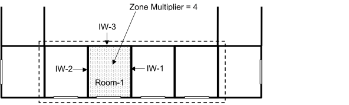
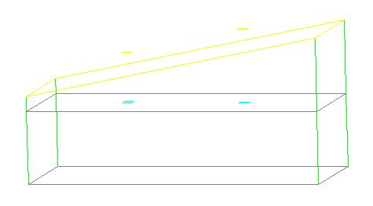
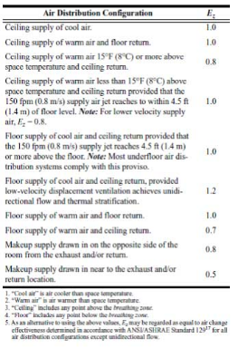
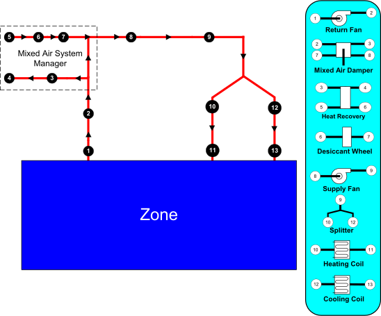
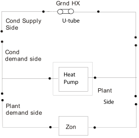
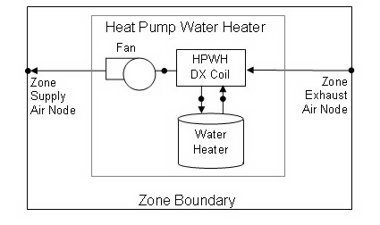
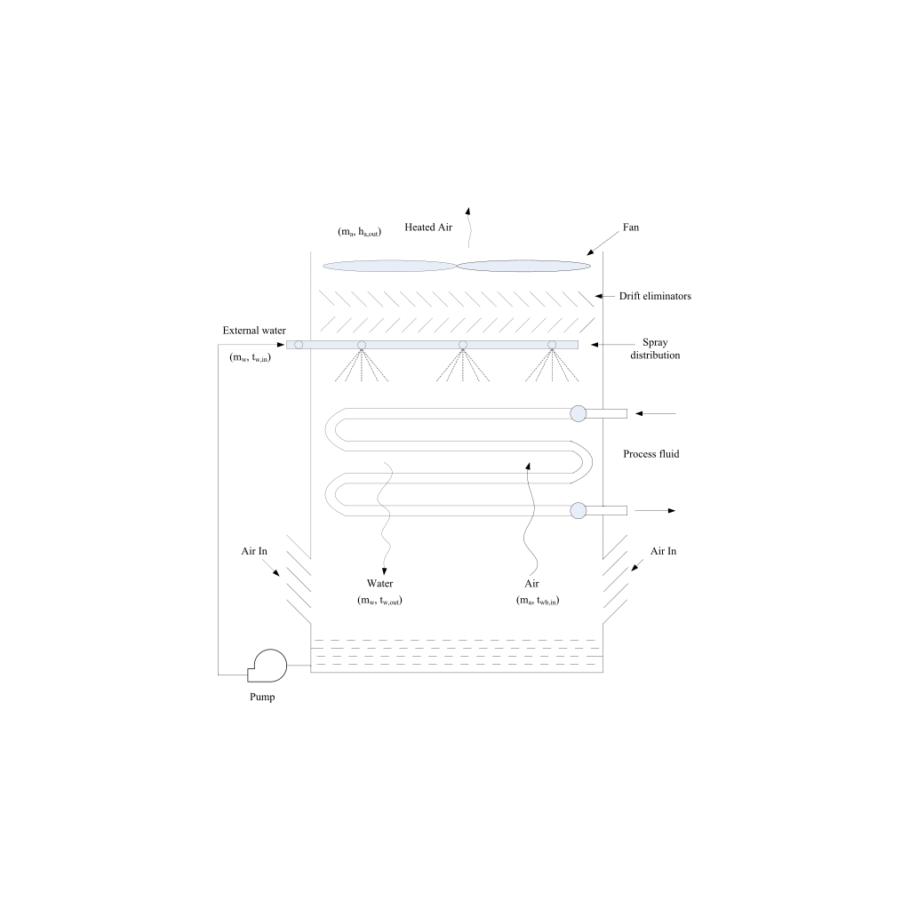

### ZoneBaseboard:OutdoorTemperatureControlled

This object specifies outside temperature-controlled (OTC) baseboard heating. The capacities (high and low) are specified in W at the temperatures specified. The schedule allows both capacities to change hourly on a proportional basis. This baseboard heater does not operate if the outdoor dry-bulb is above the high temperature limit. Between the high temperature and the low temperature, the capacity is interpolated (linear) between the high and the low capacity values. Below the low temperature, the capacity is set at the low capacity value. This allows the user to add baseboard heat to a perimeter zone starting at a prescribed temperature and then slowly increases this capacity to a max value.

**Example:**

Temperature High = 10 C     Capacity High = 100,000 W

Temperature Low = 0 C        Capacity Low  = 500,000 W

Table 16. Outdoor Temperature Controlled Baseboard Heat Temperature vs. Capacity

<table class="table table-striped">
<tr>
<th>Outdoor Dry-bulb(C)</th>
<th>Baseboard Output</th>
</tr>
<tr>
<td>&gt;10</td>
<td>0</td>
</tr>
<tr>
<td>10</td>
<td>100,000</td>
</tr>
<tr>
<td>8</td>
<td>180,000</td>
</tr>
<tr>
<td>6</td>
<td>260,000</td>
</tr>
<tr>
<td>4</td>
<td>340,000</td>
</tr>
<tr>
<td>2</td>
<td>420,000</td>
</tr>
<tr>
<td>0</td>
<td>500,000</td>
</tr>
<tr>
<td>&lt; 0</td>
<td>500,000</td>
</tr>
<tr>
<td> </td>
<td> </td>
</tr>
</table>

#### Field: Name

The name of the ZoneBaseboard:OutdoorTemperatureControlled object.

#### Field: Zone Name

This field is the name of the zone and attaches the baseboard heat equipment statement to a thermal zone in the building.

#### Field: Schedule Name

This field is the name of the schedule that modifies the capacities (high and low) for baseboard heat equipment (see next four fields). The schedule values can be any positive number. The actual energy input for the baseboard equipment in a zone as defined by this statement depends on the actual outdoor temperature and where that temperature is in the range of Low Temperature to High Temperature..

#### Field: Capacity at Low Temperature

This is the baseboard equipment capacity (Watts) at the low temperature limit. This is the maximum capacity of the baseboard equipment in full load operation. This field is autosizable.

#### Field: Low Temperature

If the outdoor dry-bulb temperature (degrees Celsius) is at or below the low temperature the baseboard heater operates at the low temperature capacity. This field is autosizable. The lowest design outdoor dry bulb temperature is chosen, if autosized.

#### Field: Capacity at High Temperature

This is the baseboard equipment capacity (Watts) at the high temperature limit. This field is autosizable. The capacity at low temperature is prorated against the reference low and high temperature fields, if autosized.

#### Field: High Temperature

If the outdoor dry-bulb temperature (degrees Celsius) is greater than the high temperature the baseboard heater will not operate. This field is autosizable. If autosized, this is equal to the design zone heating setpoint temperature described below, so that the capacity at high temperature is zero.

#### Field: Fraction Radiant

This field is a decimal number between 0.0 and 1.0 and is used to characterize the type of heat being given off by baseboard heat equipment in a zone.  The number specified in this field will be multiplied by the total energy consumed by the baseboard heat equipment to give the amount of long wavelength radiation gain to the zone.

#### Field: End-Use Subcategory

Allows you to specify a user-defined end-use subcategory, e.g., "Perimeter Baseboards", etc. A new meter for reporting is created for each unique subcategory  (ref: Output:Meter objects). Subcategories are also reported in the ABUPS table. If this field is omitted or blank, the baseboard equipment will be assigned to the "General" end-use subcategory.

#### Field: Design Zone Heating Setpoint

This is heating setpoint temperature in the zone where the unit serves. This is used to autosize high temperature and capacity at high temperature fields. The default value is 20°C.

An IDF example:

```idf
ZoneBaseboard:OutdoorTemperatureControlled,
    SPACE4-1 BBHeat 1,       !- Name
    SPACE4-1,                !- Zone Name
    EQUIP-1,                 !- SCHEDULE Name
    1500,                    !- Capacity at low temperature {W}
    0,                       !- Low Temperature {C}
    500,                     !- Capacity at high temperature {W}
    10,                      !- High Temperature {C}
    0.5,                     !- Fraction Radiant
    Baseboard Heat,          !- End-Use Subcategory
    20;                      !- Design Zone Heating Setpoint
```
{C}


### ZoneBaseboard:OutdoorTemperatureControlled Output

ZoneBaseboard:OutdoorTemperatureControlled objects have output variables for individual objects and for zone totals. The following outputs are available:

* Zone,Average,Baseboard Electric Power [W]

* Zone,Sum,Baseboard Electric Energy [J]

* Zone,Sum,Baseboard Radiant Heating Energy [J]

* Zone,Average,Baseboard Radiant Heating Rate [W]

* Zone,Sum,Baseboard Convective Heating Energy [J]

* Zone,Average,Baseboard Convective Heating Rate [W]

* Zone,Sum,Baseboard Total Heating Energy [J]

* Zone,Average,Baseboard Total Heating Rate [W]

* Zone,Average,Zone Baseboard Electric Power [W]

* Zone,Sum,Zone Baseboard Electric Energy [J]

* Zone,Sum,Zone Baseboard Radiant Heating Energy [J]

* Zone,Average,Zone Baseboard Radiant Heating Rate [W]

* Zone,Sum,Zone Baseboard Convective Heating Energy [J]

* Zone,Average,Zone Baseboard Convective Heating Rate [W]

* Zone,Sum,Zone Baseboard Total Heating Energy [J]

* Zone,Average,Zone Baseboard Total Heating Rate [W]


#### Baseboard Electric Power [W]

This field is the electric power for the ZoneBaseboard:OutdoorTemperatureControlled object in Watts.

#### Baseboard Electric Energy [J]

The outdoor temperature controlled baseboard heat option is assumed to be fueled by electricity. This field is the same as the Baseboard Total Heating Energy (above) in joules.

#### Baseboard Radiant Heating Rate [W]

#### Baseboard Radiant Heating Energy [J]

These output variables are the amount of radiant heat gain for the ZoneBaseboard:OutdoorTemperatureControlled object in Watts (for rate) or Joules. This is determined by the current heat gain from the heater to the zone and the “Fraction Radiant” specified in the input. The radiant gains (long wavelength) are distributed to the surfaces using an area weighting scheme.

#### Baseboard Convective Heating Rate [W]

#### Baseboard Convective Heating Energy [J]

These output variables are the amount of convective heat gain for the ZoneBaseboard:OutdoorTemperatureControlled object in Watts (for rate) or Joules. This is determined by the current heat gain from the heater to the zone and the “Fraction Radiant” specified in input (1-FractionRadiant = FractionConvected). The convective heat gain is added to the zone air heat balance directly.

#### Baseboard Total Heating Rate [W]

#### Baseboard Total Heating Energy [J]

These output variables are the amount of heat gain for the ZoneBaseboard:OutdoorTemperatureControlled object in Watts (for rate) or Joules. This is determined by the sum of the radiant and convective heat gains from the baseboard heat.

#### Zone Baseboard Electric Power [W]

This field is the electric power for all ZoneBaseboard:OutdoorTemperatureControlled objects within the zone in Watts.

#### Zone Baseboard Electric Energy [J]

The outdoor temperature controlled baseboard heat option is assumed to be fueled by electricity. This field is the same as the Baseboard Total Heating Energy (above) in joules. However, this amount is also shown in the Electricity meters that are associated with the zone – Electricity:Facility, Electricity:Buidling, Electricity:Zone:&lt;Zone Name&gt;, and InteriorEquipment:Electricity.

#### Zone Baseboard Radiant Heating Rate [W]

#### Zone Baseboard Radiant Heating Energy [J]

These output variables are the amount of radiant heat gain for all ZoneBaseboard:OutdoorTemperatureControlled objects within the zone in Watts (for rate) or Joules. This is determined by the current heat gain from the heater to the zone and the “Fraction Radiant” specified in the input. The radiant gains (long wavelength) are distributed to the surfaces using an area weighting scheme.

#### Zone Baseboard Convective Heating Rate [W]

#### Zone Baseboard Convective Heating Energy [J]

These output variables are the amount of convective heat gain for all ZoneBaseboard:OutdoorTemperatureControlled objects within the zone in Watts (for rate) or Joules. This is determined by the current heat gain from the heater to the zone and the “Fraction Radiant” specified in input (1-FractionRadiant = FractionConvected). The convective heat gain is added to the zone air heat balance directly.

#### Zone Baseboard Total Heating Rate [W]

#### Zone Baseboard Total Heating Energy [J]

These output variables are the amount of heat gain for all ZoneBaseboard:OutdoorTemperatureControlled objects within the zone in Watts (for rate) or Joules. This is determined by the sum of the radiant and convective heat gains from the baseboard heat.

### Meters for Equipment Outputs

As described in each of the equipment sections, values for specific equipments will show up on the following meters:

Table 17. Distribution of Equipment to Meters

<table class="table table-striped">
<tr>
<th>Meter Name</th>
<th>Scope</th>
<th>Equipment Specfics</th>
</tr>
<tr>
<td>Electricity:Facility</td>
<td>Entire Facility</td>
<td>Electric Equipment, OTC Baseboard Heat</td>
</tr>
<tr>
<td>Electricity:Building</td>
<td>All Zones</td>
<td>Electric Equipment, OTC Baseboard Heat</td>
</tr>
<tr>
<td>Electricity:Zone:&lt;Zone Name&gt;</td>
<td>Specific Zone</td>
<td>Electric Equipment, OTC Baseboard Heat</td>
</tr>
<tr>
<td>InteriorEquipment:Electricity</td>
<td>AllZones</td>
<td>Electric Equipment, OTC Baseboard Heat</td>
</tr>
<tr>
<td>&lt;End-Use Subcategory&gt;:InteriorEquipment:Electricity</td>
<td>Specific Subcategory</td>
<td>Electric Equipment, OTC Baseboard Heat</td>
</tr>
<tr>
<td>Gas:Facility</td>
<td>Entire Facility</td>
<td>Gas Equipment</td>
</tr>
<tr>
<td>Gas:Building</td>
<td>All Zones</td>
<td>Gas Equipment</td>
</tr>
<tr>
<td>Gas:Zone:&lt;Zone Name&gt;</td>
<td>Specific Zone</td>
<td>Gas Equipment</td>
</tr>
<tr>
<td>InteriorEquipment:Gas</td>
<td>AllZones</td>
<td>Gas Equipment</td>
</tr>
<tr>
<td>&lt;End-Use Subcategory&gt;:InteriorEquipment:Gas</td>
<td>Specific Subcategory</td>
<td>Gas Equipment</td>
</tr>
</table>


Group – Daylighting
-------------------

Daylighting can be invoked in EnergyPlus by the use of two objects: **Daylighting:Controls** and **Daylighting:DELight:Controls**. These are described in the following object descriptions.

Note that Daylighting:Controls and Daylighting:DELight:Controls objects may be intermixed in a single IDF but may not be used in the same zone.

### Daylighting:Controls

In this method daylighting illuminance levels are calculated and then used to determine how much the electric lighting can be reduced. The daylight illuminance level in a zone depends on many factors, including sky condition; sun position; calculation point; location, size, and glass transmittance of windows; window shading devices; and reflectance of interior surfaces. Reduction of electric lighting depends on daylight illuminance level, illuminance set point, fraction of zone controlled and type of lighting control.

#### Field: Zone name

The name of the zone to which the following daylighting-related input applies.

#### Field: Total Daylighting Reference Points

Allowed values are 1 or 2. This the number of reference points in the zone at which horizontal daylighting illuminance will be calculated based on input for the following fields. It is assumed that the photocells that control the overhead electric lighting respond to the light levels at the specified reference points.

#### Fields: (X,Y,Z) of First Reference Point

Required if Total Daylighting Reference Points = 1 or 2. These three fields are the X, Y and Z values of the First Reference point in the coordinate system you specified for daylighting reference points in the GlobalGeometryRules object. Figure 53 shows an example using the relative coordinate (to zone) system. Z is typically at desk height (0.8 m).

If you want to divide a thermal zone into two independently-controlled lighting zones, then Total Daylighting Reference Points should be set to 2 and (X,Y,Z) of the Second Reference Point (see following input fields) should also be specified.

#### Fields: (X,Y,Z) of Second Reference Point

The X, Y, and Z coordinates, in the same coordinate system, of the second daylighting reference point. Required if Total Daylighting Reference Points = 2. See Figure 53 for an example.


Figure 53. Example showing location of daylighting reference points in the zone coordinate system (relative) of a rectangular zone with three windows. (a) Perspective view, (b) plan view, (c) elevation view. All dimensions are in meters.

#### Field: Fraction of Zone Controlled by First Reference Point

The fraction of the zone’s floor-area whose electric lighting is controlled by the daylight illuminance at the First Reference Point. If there is only one reference point then a fraction equal to

1.0 - (Fraction of Zone Controlled by First Reference Point)

 is assumed to have no lighting control.

#### Field: Fraction of Zone Controlled by Second Reference Point

The fraction of the zone’s floor-area whose electric lighting is controlled by the daylight illuminance at the Second Reference Point. Required if Total Daylighting Reference Points = 2. A fraction equal to

1.0 – ([Fraction of Zone Controlled by First Reference Point] + [Fraction of Zone Controlled by Second Reference Point])

is assumed to have no lighting control.

#### Field: Illuminance SetPoint at First Reference Point

The desired lighting level (in lux) at the First Reference Point. This is the lighting level that would be produced at this reference point at night if the overhead electric lighting were operating at full input power. Recommended values depend on type of activity; they may be found, for example, in the Lighting Handbook of the Illuminating Engineering Society of North America. A typical value for general office work (excluding computer terminals) is 500 lux.

#### Field: Illuminance SetPoint at Second Reference Point

The desired lighting level (in lux) at the Second Reference Point. Required if Total Daylighting Reference Points = 2. This is the lighting level that would be produced at this reference point at night if the overhead electric lighting were operating at full input power.

#### Field: Lighting Control Type

The type of overhead electric lighting control. All reference points specified are assumed to have this type of control.

For Lighting Control Type = 1 (continuous), the overhead lights dim continuously and linearly from (maximum electric power, maximum light output) to (minimum electric power, minimum light output) as the daylight illuminance increases. The lights stay on at the minimum point with further increase in the daylight illuminance.

For Lighting Control Type = 2 (stepped), the electric power input and light output vary in discrete, equally spaced steps. The number of steps is given by Number of Steps (Excluding Off) of Stepped Control. For example, if Number of Steps = 3 and Illuminance Setpoint = 600, then the following table shows the fraction of the lights that are on vs. daylight illuminance.

Table 18. Stepped Lighting Control Example

<table class="table table-striped">
 <tr>
  <th colspan="2">Example of a Stepped Lighting Control System with Three Steps</th>
 </tr>
 <tr>
  <th>Daylight illuminance</th>
  <th>Fraction of lights that are on</th>
 </tr>
 <tr>
  <td>0-200</td>
  <td>1.0</td>
 </tr>
 <tr>
  <td>200-400</td>
  <td>2/3</td>
 </tr>
 <tr>
  <td>400-600</td>
  <td>1/3</td>
 </tr>
 <tr>
  <td>600 and above</td>
  <td>0.0</td>
 </tr>
</table>

Lighting Control Type = 3 (continuous/off) is the same as Lighting Control Type = 1 except that the lights switch off completely when the minimum dimming point is reached.

#### Field: Glare Calculation Azimuth Angle of View Direction Clockwise from Zone y-Axis

Daylight glare from a window depends on occupant view direction. It is highest when you look directly at a window and decreases as you look away from a window. This field specifies the view direction for calculating glare. It is the angle, measured clockwise in the horizontal plane, between the zone y-axis and the occupant view direction.

#### Field: Maximum Allowable Discomfort Glare Index

If a daylit zone has windows with shading devices (except exterior screens), the shades will be deployed if the daylight glare at the First Reference Point exceeds the value of this field. To get this type of glare control you have to specify Trigger = Glare, GlareOrSolarOnWindow, GlareOrHorizontalSolar, GlareOrOutsideAirTemp, GlareOrZoneAirTemp or GlareOrZoneLoad in WindowProperty:ShadingControl for one or more windows in the zone (see WindowProperty:ShadingControl).

If a zone has two or more windows with glare control, the shading devices will be deployed one by one in the order in which the windows are input until the glare level at each reference point falls below Maximum Allowable Discomfort Glare Index or is as close as possible to it.

The following table gives recommended values of Maximum Allowable Discomfort Glare Index.

Table 19. Recommended Values -- Discomfort Glare Index

<table class="table table-striped">
  <tr>
    <th colspan="2">Recommended Values of Maximum Allowable Discomfort Glare Index</th>
  </tr>
  <tr>
    <th>Activity or zone type</th>
    <th>Maximum Allowable Discomfort Glare Index</th>
  </tr>
  <tr>
    <td>Art Galleries</td>
    <td>16</td>
  </tr>
  <tr>
    <td>Factories</td>
    <td></td>
  </tr>
  <tr>
    <td>Rough work</td>
    <td>28</td>
  </tr>
  <tr>
    <td>Engine assembly</td>
    <td>26</td>
  </tr>
  <tr>
    <td>Fine assembly</td>
    <td>24</td>
  </tr>
  <tr>
    <td>Instrument assembly</td>
    <td>22</td>
  </tr>
  <tr>
    <td>Hospital wards</td>
    <td>18</td>
  </tr>
  <tr>
    <td>Laboratories</td>
    <td>22</td>
  </tr>
  <tr>
    <td>Museums</td>
    <td>20</td>
  </tr>
  <tr>
    <td>Offices</td>
    <td>22</td>
  </tr>
  <tr>
    <td>School classrooms</td>
    <td>20</td>
  </tr>
</table>

#### Field: Minimum Input Power Fraction for Continuous Dimming Control

For Lighting Control Type = 1 (continuous), the lowest power the lighting system can dim down to, expressed as a fraction of maximum input power (see figure, below). For Lighting Control Type = 3 (continuous/off) this is the power fraction reached just before the lights switch off completely.


Figure 54. Illustration of continuous dimming relationship

The figure above shows the relationship between electric light output and electrical input.

#### Field: Minimum Light Output Fraction for Continuous Dimming Control

For Lighting Control Type = 1 (continuous), the lowest lighting output the lighting system can dim down to, expressed as a fraction of maximum light output (see figure, above). This is the fractional light output that the system produces at minimum input power. For Lighting Control Type = 3 (continuous/off) this is the light output fraction reached just before the lights switch off completely.

#### Field: Number of Stepped Control Steps

The number of steps, excluding off, in a stepped lighting control system (see figure, below). Required and must be &gt;0 if Lighting Control Type = 2. The steps are assumed to be equally spaced.


Figure 55. Stepped lighting control with Number of Steps = 3.

#### Field: Probability Lighting will be Reset When Needed in Manual Stepped Control

May be specified if a stepped lighting control system (Lighting Control Type = 2) is manually operated, such as in a simple, one-step (on-off) system. Gives the probability the occupants of a daylit zone will set the electric lights to the correct level to obtain the required illuminance. The rest of the time the lights are assumed to be set one step too high. For example, consider an on-off lighting system (Number of Steps = 1) with a set point of 600 lux and 0.7 reset probability. Then, when daylighting exceeds 600 lux, the electric lights will be off 70% of the time and on 30% of the time.

#### Field: Availability Schedule Name

This alpha field is optional and may be used to define the name of a schedule that denotes whether or not the control is available to operate during a given time period. If the schedule value is greater than zero, then the controls will be available to operate for that time period.  If the schedule value is zero or less, then the controls will not be available. If this field is left blank, the controls will be always available. For example, this can be useful for scheduling the daylighting controls off during design days so that the daylighting controls do not affect lighting power during sizing.

An IDF example:


```idf
Daylighting:Controls, ! Zone Name
    1,                ! Total Daylighting Reference Points
    3.048,3.048,0.9,  ! X,Y,Z coordinates of first reference point {m}
    0.0,0.0,0.0,      ! X,Y,Z coordinates of second reference point, if present {m}
    0.99,             ! Fraction of zone controlled by first reference point
    0.0,              ! Fraction of zone controlled by second reference point, if present
    500.,             ! Illuminance setpoint at first reference point {lux}
    500.,             ! Illuminance setpoint at second reference point, if present {lux}
    1,                ! Lighting control type {1=continuous,2=stepped,3=continuous/off}
    180.0,            ! Azimuth angle of view direction for glare calculation {deg},
                      !   measured clockwise from zone y-axis. Value of 180 gives view
                      !   (from reference point) that is directly at window, maximizing glare.
    20.0,             ! Maximum discomfort glare index for window shade control
    0.3,              ! Minimum input power fraction for continuous dimming control
    0.2,              ! Minimum light output fraction for continuous dimming control
    0,                ! Number of steps, excluding off, for stepped control
    1.0;              ! Probability electric lighting will be reset when needed (used only
                      !   for stepped control, to simulate manual on/off control)
```


### Guidelines for Daylighting Modeling (Detailed Method)

Following are some guidelines for preparing EnergyPlus input to model the effects of daylighting. Before studying these guidelines, however, you should read the description of each input field under Daylighting:Controls, and review the IDF example, above, and the sample daylighting input, PurchAirWithDaylighting.idf.

#### Use of Window Multipliers

If an exterior wall in a daylit zone has a number of identical windows, the windows should be entered separately rather than using a window multiplier (ref: FenestrationSurface:Detailed). Using a multiplier would give an incorrect illuminance calculation since individual windows would not be positioned correctly on the wall.

#### Use of Zone Multipliers

A zone multiplier should not be used on a daylit zone if the windows in the zone are shadowed by exterior obstructions like trees or neighboring buildings, or by obstructions caused by other parts of building. The reason for this is that the shadowing on the windows of the multiplied zone may be different from zone to zone depending on exactly how the shadows fall on the zones. However, a zone multiplier may be used on a daylit zone if the shadowing is by overhangs, fins and/or window setback.

#### Thermal Zoning for Daylighting

To correctly calculate both direct and inter-reflected daylight illuminance you should try to model a thermal zone consisting of several similar rooms separated by interior walls as a representative room with a zone multiplier (ref: Zone). An example of this is shown in Figure 56. Room-1 is the representative room, with a zone multiplier = 4.

Interior walls IW-1, IW-2 and IW-3 should be treated as adiabatic, i.e., they should have Outside Boundary Condition = Surface and Outside Boundary Condition Object = IW-1, IW-2, or IW-3, respectively (ref: BuildingSurface:Detailed). Similarly, if the ceiling and floor of Room-1 are interior surfaces, they should be treated as adiabatic.



Figure 56. For daylighting purposes the thermal zone enclosed by the dashed boundary line should be modeled as a typical zone (Room-1) with a zone multiplier of 4.

Sometimes a representative room cannot be found. Figure 57 shows a section of a building with four rooms having different daylighting characteristics because of different floor area, orientation and/or window size. In this case lumping the rooms into a single thermal zone would give nonsensical daylighting illuminance values because of the presence of the interior walls, which EnergyPlus ignores when calculating illuminance reaching a reference point directly from a window (i.e., without reflection). The solution in this case is to describe each room as a separate thermal zone with its own daylighting reference points, and input the interior walls because these will participate in the calculation of inter-reflected illuminance.


Figure 57. Rooms A, B, C and D have different daylighting characteristics. If lumped into a single thermal zone the daylighting calculation will be less accurate because the blockage of direct light by the interior walls between these rooms is modeled with some simplifications (see Interior Obstructions below). To get a good daylighting calculation each room should be input as a separate thermal zone.

#### Multiple Lighting Zones

The detailed daylighting calculation allows a thermal zone to be divided into two independently-controlled lighting zones. (See the fields: Fraction of Zone Controlled by First Reference Point, Fraction of Zone Controlled by Second Reference Point, Illuminance SetPoint at First Reference Point, and Illuminance SetPoint at Second Reference Point.) An example is shown in Figure 58, where a relatively deep thermal zone has two lighting zones of equal area.


Figure 58. Two independently-controlled lighting zones, each with 50% of the area of the thermal zone.

#### Fins, Overhangs and Other Exterior Obstructions

The daylighting calculation accounts for the presence of exterior obstructions in determining the amount of light that strikes the windows. For daylighting purposes exterior obstructions fall into three categories:

(1)  Fins, overhangs, trees, neighboring buildings, etc., entered with the objects Shading:Zone:Detailed,
 Shading:Site:Detailed, or
 Shading:Building:Detailed.

(2)  Building surfaces like walls and roofs (in an L-shaped building, for example).

(3)  Surfaces associated with window setback.

Category (1) obstructions can have an associated solar transmittance schedule (see description of the field Transmittance Schedule Name for these shading surfaces). If this schedule is not specified, the surface is opaque (has zero transmittance).

The daylighting calculation takes the transmittance into account in determining, for example, how much light enters a window through a translucent awning. It is assumed that the solar and visible transmittance is the same and that the surfaces are non-diffusing, i.e., they do not change the direction of transmitted light. Ref:Daylighting:Controls.

Category (2) and (3) surfaces are assumed to be opaque.

Surfaces in all three categories are assumed to be black, i.e., they do not reflect light, unless you set if “Reflections” option is chosen  in the Building object. Then obstructions can reflect light, such as the top of an overhang reflecting light onto the window above. Ref: Building, Field: Solar Distribution (with reflections options).

#### Interior Obstructions

The daylighting calculation accounts for the presence of interior obstructions that lie between a window and a reference point. Unlike exterior obstructions, which can be light transmitting, interior obstructions are assumed to be opaque. Interior obstructions can reduce or eliminate the light directly reaching the reference point through a window.

However, interior obstructions that are walls, ceilings or floors are reflecting so they  contribute to the inter-reflected component of daylight illuminance as do the non-obstructing zone surfaces.

Interior obstructions can belong to the Shading object series. This type of obstruction is assumed to be non-reflecting so does not contribute to the inter-reflected component of daylight illuminance.

An example of an interior obstruction that is a wall in an L-shaped room is shown in Figure 59. Here, wall A (or, equivalently, Wall B) prevents light from directly getting to the Reference Point from the window.


Figure 59. Wall A (or Wall B) is an interior obstruction that prevents light from directly reaching the daylighting reference point from the window.

#### Double Façades: Daylighting through Interior Windows

The Daylighting:Controls method, with no additional user input,  calculates the contribution of daylight that passes into a target zone through interior windows.[[1]](#_ftn1) The origin of this daylight is exterior windows in adjacent zones that share interior windows with the target zone. This capability is aimed at daylighting through a **double façade** (also called “double envelope” or “double skin.”)

This is illustrated in Figure 60, which shows a double-façade buffer zone, Z0, with exterior windows EW1 and EW2. Z0 shares interior windows IW1, IW2 and IW3 with daylit occupied zones ZD1, ZD2 and ZD3, respectively (“daylit” here means the zone has an associated Daylighting:Controls object). The daylight illuminance at reference points RP1, RP2 and RP3 comes from the interior windows and has two main sources:

1.    Daylight that passes through both an exterior window and an interior window in Z0 and reaches a reference point without reflection. This is called “direct illuminance.”

2.    Daylight from Z0  that passes through an interior window and reaches a reference point by inter-reflection in the daylit zone. Because the program calculates this source from the interior solar distribution in Z0 it is recommended that the most accurate calculation of this distribution be made, which occurs if Solar Distribution = FullInteriorAndExterior in the Building object.

A third possible source is neglected because it is generally small in double-façade cases. This is daylight that is reflected from the surfaces of Z0, passes through an interior window and then reaches a reference point without inter-reflection in the daylit zone.

PurchAirWithDoubleFacadeDaylighting.idf is an input example of daylighting through an interior window.


Figure 60. Vertical section through a double-façade building showing daylighting through interior windows. The dashed lines show that (1) reference point RP1 receives direct light from exterior window EW1 via interior window IW1; (2) RP2 receives direct light from EW1 and EW2 via IW2; and (3) RP3 receives direct light from EW2 via IW3.

#### Interior Window Daylighting Configurations that EnergyPlus Can Calculate

Figure 61 shows schematically the general configuration of daylighting through interior windows that can be calculated with EnergyPlus. Here, daylit zone ZD has one or more interior windows that are adjacent to other zones, each of which has one or more exterior windows. ZD itself may or may not have exterior windows. If it does, than the daylight illuminance from its exterior and interior windows will be additive. The zones adjacent to ZD may or may not be daylit and may or may not have other interior windows that are not adjacent to ZD. (The program does not consider the illuminance in ZD from electric lighting in adjacent zones.)


Figure 61. General configuration of daylighting through interior windows that can be calculated with EnergyPlus. IW = interior window, EW = exterior window.

#### Interior Window Daylighting Configurations that EnergyPlus Cannot Calculate

Figure 62 shows schematically a configuration of daylighting through interior windows that cannot be calculated with EnergyPlus. Here, zone Z has an interior window that is adjacent to zone Z1 which in turn has an interior window adjacent to zone Z2. However, the daylight from the exterior window in Z2 that enters Z after passing through Z1 is not calculated because Z2 is not adjacent to Z.


Figure 62. Configuration in which daylighting of zone Z through its interior window  cannot be calculated with EnergyPlus. IW = interior window, EW = exterior window.

#### Restrictions on Shading Devices

There are two restrictions on the use of exterior-window shading devices when a daylit zone has interior windows:

1)   If two daylit zones share an interior window, neither zone can have an exterior window whose shading device does glare control (i.e., the WindowProperty:ShadingControl for the exterior window has Glare Control Is Active = Yes).

2)   If two daylit zones share an interior window, neither zone can have an exterior window with a WindowProperty:ShadingControl that has Shading Control Type = MeetDaylightIlluminanceSetpoint.

### DElight Daylighting Method

The DElight method of analyzing daylighting in buildings is very similar to that used in the Detailed method. For each point in time, DElight calculates the interior daylighting illuminance at specified reference points and then determines how much the electric lighting can be reduced while still achieving a combined daylighting and electric lighting illuminance target. The daylight illuminance level in a zone depends on many factors, including exterior light sources; location, size, and visible light transmittance of simple and complex fenestration systems; reflectance of interior surfaces; and location of calculation reference points. The subsequent reduction of electric lighting depends on daylight illuminance level, illuminance set point, fraction of zone controlled, and type of lighting control.

There are two primary differences between the Detailed and DElight methods of calculating interior illuminance levels. The first is that DElight includes the capability of analyzing complex fenestration systems that include geometrically complicated shading systems (e.g., roof monitors) and/or optically complicated glazings (e.g., prismatic or holographic glass). The second key difference is that DElight uses a radiosity method to calculate the effects of light reflection inside a zone. These methods are discussed in more detail in the engineering documentation.

There are other important differences between the two methods. One is the inability of DElight to perform the type of dynamic shading controls possible using the Detailed method at each point in time during the thermal simulation (e.g., changes in electrochromic glazing transmittances and blind slat angles). Another is the DElight ability to include more than two reference points in its interior illuminance and electric lighting reduction calculations. A third is the current lack of visual quality (e.g., glare) calculations performed by DElight. Fourth, the modeling of interior obstructions is different in the two methods. In the DElight method interior obstructions block interreflections but do not block the intial direct illuminance. In the Detailed method, interior obstructions block the initial direct illuminance but do not block interreflections. See the engineering documentation for more details. Fifth, when using DElight daylighting the presence of exterior shading surfaces such as overhangs is ignored.

Input for invoking the DElight method involves three object types: **Daylighting:DELight:Controls**, **Daylighting:DELight:ReferencePoint**, and **Daylighting:DELight:ComplexFenestration**. Each of these objects is described below.

### Daylighting:DELight:Controls

The first input object required for invoking the DElight method is the Daylighting:DELight:Controls object, which defines the parameters of each daylighting zone within a building. This object must be associated with a specific thermal zone within the building for which the reduction in electric lighting due to daylight illuminance will be accounted.

#### Field: Name

User name of the DElight daylighting zone to which the following input applies.

#### Field: Zone Name

The name of the thermal Zone hosting this DElight daylighting zone. This must be a valid name that has been associated with a thermal Zone contained in the same EnergyPlus input data file.

#### Field: Lighting Control Type

The type of overhead electric lighting control. All reference points specified are assumed to have this type of control.

For Lighting Control Type = 1 (continuous), the overhead lights dim continuously and linearly from (maximum electric power, maximum light output) to (minimum electric power, minimum light output) as the daylight illuminance increases. The lights stay on at the minimum point with further increase in the daylight illuminance.

For Lighting Control Type = 2 (stepped), the electric power input and light output vary in discrete, equally spaced steps. The number of steps is given by Number of Steps (Excluding Off) of Stepped Control. For example, if Number of Steps = 3 and Illuminance Setpoint = 600, then the following table shows the fraction of the lights that are on vs. daylight illuminance.

Table 20. Stepped Lighting Control Example

<table class="table table-striped">
 <tr>
  <th colspan="2">Example of a Stepped Lighting Control System with Three Steps</th>
 </tr>
 <tr>
  <th>Daylight illuminance</th>
  <th>Fraction of lights that are on</th>
 </tr>
 <tr>
  <td>0-200</td>
  <td>1.0</td>
 </tr>
 <tr>
  <td>200-400</td>
  <td>2/3</td>
 </tr>
 <tr>
  <td>400-600</td>
  <td>1/3</td>
 </tr>
 <tr>
  <td>600 and above</td>
  <td>0.0</td>
 </tr>
</table>

Lighting Control Type = 3 (continuous/off) is the same as Lighting Control Type = 1 except that the lights switch off completely when the minimum dimming point is reached.

#### Field: Minimum Input Power Fraction for Continuous Dimming Control

For Lighting Control Type = 1 (continuous), the lowest power the lighting system can dim down to, expressed as a fraction of maximum input power (see figure, below). For Lighting Control Type = 3 (continuous/off) this is the power fraction reached just before the lights switch off completely.


Figure 63. Illustration of continuous dimming relationship

The figure above shows the relationship between electric light output and electrical input.

#### Field: Minimum Light Output Fraction for Continuous Dimming Control

For Lighting Control Type = 1 (continuous), the lowest lighting output the lighting system can dim down to, expressed as a fraction of maximum light output (see figure, above). This is the fractional light output that the system produces at minimum input power. For Lighting Control Type = 3 (continuous/off) this is the power fraction reached just before the lights switch off completely.

#### Field: Number of Steps (Excluding Off) for Stepped Control

The number of steps, excluding off, in a stepped lighting control system (see figure, below). Required and must be &gt;0 if Lighting Control Type = 2. The steps are assumed to be equally spaced.


Figure 64. Stepped lighting control with Number of Steps = 3.

#### Field: Probability Lighting Will Be Reset When Needed in Manual Stepped Control

May be specified if a stepped lighting control system (Lighting Control Type = 2) is manually operated, such as in a simple, one-step (on-off) system. Gives the probability the occupants of a daylit zone will set the electric lights to the correct level to obtain the required illuminance. The rest of the time the lights are assumed to be set one step too high. For example, consider an on-off lighting system (Number of Steps = 1) with a set point of 600 lux and 0.7 reset probability. Then, when daylighting exceeds 600 lux, the electric lights will be off 70% of the time and on 30% of the time.

#### Field: Gridding Resolution

The maximum surface area for nodes in gridding (subdividing) all surfaces in the DElight zone. All reflective and transmitting surfaces will be subdivided into approximately square nodes that do not exceed this maximum. Higher resolution subdivisions require greater calculation times, but generally produce more accurate results. This same gridding resolution is also used to subdivide any Complex Fenestration System surfaces. It is advisable to perform at least one simulation of new input using a small gridding resolution such as 0.1m2 to compare these results against simulation runs at lower resolution (i.e., higher maximum area nodal grids) to get a sense of possible levels of error.

An IDF example:


```idf
Daylighting:DELight:Controls,
    DElight NORTH ZONE, !- DElight Zone Name
    NORTH ZONE,         !- Zone Name
    1,     !- Lighting control type
    0.3,   !- Minimum input power fraction for continuous dimming control
    0.2,   !- Minimum light output fraction for continuous dimming control
    0,     !- Number of steps (excluding off) for stepped control
    1.0,   !- Probability lighting will be reset when needed in manual stepped control
    1.0;   !- Gridding Resolution {m2}
```


### Daylighting:DELight:ReferencePoint

The second input object required for invoking the DElight method is the Daylighting:DELight:ReferencePoint object, which defines the parameters of each Reference Point within the associated DElight daylighting zone. This object must be associated with a specific Daylighting:DELight:Controls object instance. There may be up to a maximum of 100 Reference Points for each DElight daylighting zone. Each Reference Point that is input does NOT need to be included in the control of the electric lighting system within the zone. This is determined by the fraction of the zone controlled by each Reference Point, which can be input as 0. Note that the sum of all Reference Point control fractions must equal 1 to obtain correct overall results.

#### Field: Name

User name of the DElight daylighting Reference Point to which the following input applies.

#### Field: DElight Name

The name of the Daylighting:DELight:Controls object instance hosting this Reference Point. This must be a valid name that has been associated with a DElight daylighting Zone contained in the same EnergyPlus input data file.

#### Fields: (X,Y,Z) of Reference Point

These three fields are the X, Y and Z values of the Reference point in the coordinate system you specified for daylighting reference points in the GlobalGeometryRules object. Figure 65 shows an example using the relative coordinate (to zone) system. Z is typically at work surface height (e.g., 0.8m for a desk).


Figure 65. Example showing location of two daylighting reference points in the zone coordinate system (relative) of a rectangular zone with three windows. (a) Perspective view, (b) plan view, (c) elevation view. All dimensions are in meters.

#### Field: Fraction of Zone Controlled by Reference Point

The zone floor-area fraction of the electric lighting that is controlled by the daylight illuminance at this Reference Point. If the sum of the values for this field for all Reference Points input for a given daylighting zone is less than 1.0, then the remaining fraction (i.e., 1.0 – Sum) is assumed to not have lighting control.

Note that Reference Points may be input with a 0.0 value for this fraction. In this case, daylight factors and interior illuminance values will be calculated for the Reference Point, but it will play no role in controlling the electric lighting within the daylighting zone to which it belongs.

#### Field: Illuminance Setpoint at Reference Point

The desired lighting level (in lux) at this Reference Point. This is assumed to be the lighting level that would be produced at this reference point at night if the overhead electric lighting were operating at full input power. Recommended values depend on the type of activity and may be found, for example, in the Lighting Handbook of the Illuminating Engineering Society of North America. A typical value for general office work (excluding computer terminals) is 500 lux.

An IDF example:

```idf
Daylighting:DELight:ReferencePoint,
    RefPt 2,            !- Reference Point Name
    DElight NORTH ZONE, !- DElight Zone Name
    5.0,  !- X-coordinate of reference point {m}
    3.0,  !- Y-coordinate of reference point {m}
    0.9,  !- Z-coordinate of reference point {m}
    0.5,  !- Fraction of zone controlled by reference point
    500.; !- Illuminance setpoint at reference point {lux}
```


### Daylighting:DELight:ComplexFenestration

The third input object related to the DElight method is the Daylighting:DElight: Complex Fenestration object. The DElight daylighting analysis method can be applied to daylighting zones that contain only simple fenestration systems such as windows and skylights that are standard EnergyPlus sub-surfaces. In this situation, no Daylighting:DElight: Complex Fenestration object would be input.

In addition to analyzing simple fenestration systems, DElight includes the capability of analyzing complex fenestration systems such as geometrically complicated static shading systems (e.g., roof monitors) and/or optically complicated glazings (e.g., prismatic or holographic glass). This capability is based on characterizing these complex fenestration systems (CFS) using bi-directional transmittance distribution functions (BTDF). In general, BTDF data for a specific CFS must be either measured or simulated (e.g., using ray-tracing techniques) prior to employing DElight to analyze it within EnergyPlus. The current implementation of DElight CFS calculations within EnergyPlus supports two approaches to the input of BTDF, an analytical approach and a file-based approach. The details of inputting these two approaches are described below under the User Complex Fenestration Type field.

Two analytical CFS BTDF types are currently supported, window and light shelf. The file-based approach requires that a user has access to a data file containing raw BTDF data that DElight reads as additional input during its analysis calculations. BTDF data files are described separately since it is anticipated that individual EnergyPlus users will not create these data files themselves.

The methods related to characterizing and analyzing CFS using BTDF are still evolving. DElight is an early implementation of CFS analysis methods. These methods, and the input associated with them here, will likely change in the future.

#### Field: User Name

User name of the DElight daylighting Complex Fenestration to which the following input applies.

#### Field: Complex Fenestration Type

Type name of the DElight daylighting Complex Fenestration system to be analyzed. This type name must take one of the following two forms.

BTDF^GEN^Analytical Type^Normal Visible Transmittance^Dispersion Angle

BTDF^FILE^Filename

The first form above is for supported analytical CFS types which currently include WINDOW and LIGHTSHELF. While these analytical types are relatively simple, they represent flexible ways to explore diffusing CFS systems and the impact of light shelves in redirecting light through an aperture. Each of these types also requires the visible transmittance of the CFS at normal incidence angle, and a dispersion angle (in degrees) that represents the “spread” of transmitted light. A small dispersion angle of 10 corresponds to clear glazing while a large angle of 90 corresponds to perfectly diffusing glazing. The “^” symbol must be used as a delimiter between sub-fields within this Complex Fenestration type name string as shown in the IDF example for WINDOW below, and in the DElight sample input data files.

The second form above is for CFS types for which there is pre-measured or pre-simulated BTDF data. In this case the Filename sub-field must be a valid data file name that is associated with an existing BTDF dataset that DElight can use in its calculations.

#### Field: Building Surface Name

The name of the heat transfer surface object instance hosting this Complex Fenestration, analogous to the Building Surface Name field for subsurfaces such as Windows. This must be a valid name that has been associated with a heat transfer surface contained in the same EnergyPlus input data file.

#### Field: Window Name

The name of the Window (ref: FenestrationSurface:Detailed object) instance that will be used to account for the geometry, and the solar/thermal gains/losses, of the Complex Fenestration system surface. This must be a valid name that has been associated with a Window contained in the same EnergyPlus input data file. The geometry for the Complex Fenestration is taken from the geometry input for this standard EnergyPlus subsurface, hence the term “Doppelganger.”

Note that DElight only deals with the visible spectrum of light transmitted through a Complex Fenestration. To account for the solar/thermal influences of a Complex Fenestration, a geometrically coincident subsurface that will be accounted for by methods already within EnergyPlus must be defined in the input data file. This is an interim solution to the issue of accounting for solar/thermal influences that will likely change as techniques analogous to the daylighting analysis of BTDF are developed.

#### Field: Fenestration Rotation

The in-plane counter-clockwise rotation angle between the Complex Fenestration optical reference direction and the base edge of the Doppelganger Surface geometry. The Complex Fenestration optical reference direction is the direction of the zero azimuth angle for the BDTF dataset. This Rotation angle will typically be zero when the Doppelganger surface is rectangular and its width edge is aligned with the Complex Fenestration optical reference direction.

An IDF example for an analytical WINDOW type CFS:

```idf
Daylighting:DELight:ComplexFenestration,
    Window CFS,       !- DElight Complex Fenestration User Name
    BTDF^GEN^WINDOW^1.0^20.0,     !- Complex Fenestration Type
    ZN003:WALL001,  !- Complex Fenestration Host Surface
    Zn003:Wall001:Doppel001, !- Doppelganger Surface Name
    0.0;            !- Fenestration Rotation {deg}
```

### DElight Output

In addition to the daylighting-specific outputs for DElight listed below, two ASCII text files are created during an EnergyPlus run that includes DElight analysis.  Following completion of an EnergyPlus run, these files are given names that consist of the project name appended with DElight.in and DElight.out.  The format of these files is described in the Output Details and Examples document.

Zone,Average,Daylighting Reference Point Illuminance [lux]

Zone,Average,Daylighting Lighting Power Multiplier []

#### Daylighting Reference Point Illuminance [lux]

The total daylight illuminance at a DElight reference point from all of the exterior windows in a daylit zone.

#### Daylighting Lighting Power Multiplier []

The amount by which the overhead electric lighting power in a zone is multiplied due to usage of DElight calculated daylighting to dim or switch electric lights. For example, if the multiplier is M and the electric power without dimming is P, then the electric power with dimming is M\*P. The multiplier varies from 0.0, which corresponds to maximum dimming (zero electric lighting), to 1.0, which corresponds to no dimming.

### Daylighting Output

The following daylighting-specific outputs are available for Daylighting:Controls:

* Zone,Average,Site Exterior Beam Normal Illuminance [lux]

* Zone,Average,Site Exterior Horizontal Beam Illuminance [lux]

* Zone,Average,Site Exterior Horizontal Sky Illuminance [lux]

* Zone,Average,Site Beam Solar Radiation Luminous Efficacy [lum/W]

* Zone,Average,Site Sky Diffuse Solar Radiation Luminous Efficacy [lum/W]

* Zone,Average,Site Daylighting Model Sky Clearness []

* Zone,Average,Site Daylighting Model Sky Brightness []

* Surface,Average,Daylighting Window Reference Point 1 View Luminance [cd/m2]

* Surface,Average,Daylighting Window Reference Point 1 Illuminance [lux]

* Zone,Average,Daylighting Reference Point 1 Illuminance [lux]

* Zone,Average,Daylighting Reference Point 1 Glare Index []

* Zone,Sum,Daylighting Reference Point 1 Glare Index Setpoint Exceeded Time [hr]

* Zone,Sum,Daylighting Reference Point 1 Daylight Illuminance Setpoint Exceeded Time [hr]

* Surface,Average,Daylighting Window Reference Point 2 View Luminance [cd/m2]

* Surface,Average,Daylighting Window Reference Point 2 Illuminance [lux]

* Zone,Average,Daylighting Reference Point 2 Illuminance [lux], if applicable

* Zone,Average,Daylighting Reference Point 2 Glare Index [], if applicable

* Zone,Sum,Daylighting Reference Point 2 Glare Index Setpoint Exceeded Time [hr]

* Zone,Sum,Daylighting Reference Point 2 Daylight Illuminance Setpoint Exceeded Time [hr]

* Zone,Average,Daylighting Lighting Power Multiplier []


#### Site Exterior Beam Normal Illuminance [lux]

Beam normal illuminance of the sun at the earth’s surface, measured in lux (lumens/m<sup>2</sup>)

#### Site Exterior Horizontal Beam Illuminance [lux]

Beam illuminance on an unobstructed horizontal plane at the earth’s surface. Equals “Site Exterior Beam Normal Illuminance” times sine of solar altitude.

#### Site Exterior Horizontal Sky Illuminance [lux]

Illuminance from sky solar radiation on an unobstructed horizontal plane at the earth’s surface. The total exterior horizontal illuminance is the sum of “Site Exterior Horizontal Beam Illuminance” and “Site Exterior Horizontal Sky Illuminance.”

#### Site Beam Solar Radiation Luminous Efficacy [lum/W]

A measure of the visible light content of beam solar radiation; equal to the number of lumens per watt of beam solar radiation. Depends on atmospheric conditions (moisture, turbidity, cloudiness) and solar altitude.

#### Site Sky Diffuse Solar Radiation Luminous Efficacy [lum/W]

A measure of the visible light content of sky diffuse solar radiation; equal to the number of lumens per watt of sky diffuse solar radiation. Depends on atmospheric conditions (moisture, turbidity, cloudiness) and solar altitude.

#### Site Daylighting Model Sky Clearness [ ]

Clearness of sky. One of the factors used to determine sky type and luminous efficacy of solar radiation (see *EnergyPlus Engineering Document*). Sky Clearness close to 1.0 corresponds to an overcast sky. Sky Clearness &gt; 6 is a clear sky.

#### Site Daylighting Model Sky Brightness [ ]

Brightness of sky. One of the factors used to determine sky type and luminous efficacy of solar radiation (see *EnergyPlus Engineering Document*).

#### Daylighting Window Reference Point 1 View Luminance [cd/m2]

The area-averaged luminance of an exterior window as viewed from the first reference point in the daylit zone containing the window. In general, higher window luminance values are associated with higher daylight glare values. (Printed only for exterior windows in daylit zones without interior windows.)

#### Daylighting Window Reference Point 1 Illuminance [lux]

The contribution from a particular exterior window to the daylight illuminance at the first reference point in the daylit zone containing the window. (Not printed for exterior windows in daylit zones with interior windows.)

#### Daylighting Reference Point 1 Illuminance [lux]

The total daylight illuminance at the first reference point from all of the windows in a daylit zone.

#### Daylighting Reference Point 1 Glare Index []

The daylight glare index at the first reference point in a daylit zone.

#### Daylighting Reference Point 1 Glare Index Setpoint Exceeded Time [hr]

The number of hours when the calculated daylight glare index at the first reference point exceeds the glare index setpoint.

#### Daylighting Reference Point 1 Daylight Illuminance Setpoint Exceeded Time [hr]

The number of hours when the calculated daylight illuminance at the first reference point exceeds the daylight illuminance setpoint.

#### Daylighting Reference Point 2 Illuminance [lux]

The total daylight illuminance at the second reference point from all of the windows in a daylit zone.

#### Daylighting Window Reference Point 2 View Luminance [cd/m2]

The area-averaged luminance of an exterior window as viewed from the second reference point, if present, in the daylit zone containing the window. Note that, for a bare window, this value can be different from the corresponding value at the first reference point since different regions of the sky and ground will be visible from the two reference points, and different ranges of angles of incidence and associated glass transmittance values will be involved. (Not printed for exterior windows in daylit zones with interior windows.)

#### Daylighting Window Reference Point 2 Illuminance [lux]

The contribution from a particular exterior window to the daylight illuminance at the second reference point, if present, in the daylit zone containing the window. (Not printed for exterior windows in daylit zones with interior windows.)

#### Daylighting Reference Point 2 Glare Index []

The daylight glare index at the second reference point, if present, in a daylit zone.

#### Daylighting Reference Point 2 Glare Index Setpoint Exceeded Time [hr]

The number of hours when the calculated daylight glare index at the second reference point exceeds the glare index setpoint.

#### Daylighting Reference Point 2 Daylight Illuminance Setpoint Exceeded Time [hr]

The number of hours when the calculated daylight illuminance at the second reference point exceeds the daylight illuminance setpoint.

#### Daylighting Lighting Power Multiplier []

The amount by which the overhead electric lighting power in a zone is multiplied due to usage of daylighting to dim or switch electric lights. For example, if the multiplier is M and the electric power without dimming is P, then the electric power with dimming is M\*P. The multiplier varies from 0.0, which corresponds to maximum dimming (zero electric lighting), to 1.0, which corresponds to no dimming.

### Output:IlluminanceMap

The Output:IlluminanceMap object expands on the reporting capabilities of the daylighting simulation. For any zone simulated with Daylighting:Controls, the illuminance map can generate up to 2,500 points of additional daylighting illuminance values. The resulting map is output as a comma delimited text file that can be imported into a spreadsheet program for rapid visualization of the daylighting illuminance patterns in a zone. The values are produced on an hourly basis. The Z height of the map is constant (parallel to a flat floor). More than one illuminance map can be created for a zone.

#### Field: Name

The name of the map object.

#### Field: Zone Name

Reference to a zone with Daylighting:Controls.

#### Field: Z Height

The height or elevation of the grid of daylighting points.

#### Field: X Minimum Coordinate

The minimum X coordinate boundary for the map.

#### Field: X Maximum Coordinate

The maximum X coordinate boundary for the map.

#### Field: Number of X Grid Points

The number of daylighting reference points in the X direction from the minimum to the maximum boundaries. The maximum number of points that can be generated is 2500 (Number of X Grid Points X Number of Y Grid Points).

#### Field: Y Minimum Coordinate

The minimum Y coordinate boundary for the map.

#### Field: Y Maximum Coordinate

The maximum Y coordinate boundary for the map.

#### Field: Number of Y Grid Points

The number of daylighting reference points in the Y direction from the minimum to the maximum boundaries. The maximum number of points that can be generated is 2500 (Number of X Grid Points X Number of Y Grid Points).

Note:  Daylighting factors cannot be accurately calculated for reference points that are very close to a wall or window (less than 0.15 m or 6 inches). An error is reported for a reference point that is too close to a window, but no error is reported for a point that is too close to a wall.

```idf
Output:IlluminanceMap,
  Daylit Map,      ! Map Name
  Daylit Zone,     ! Zone Name
  0,               ! Z Height [m]
  0.1,             ! X Minimum Coordinate [m]
  4.9,             ! X Maximum Coordinate [m]
  10,              ! Number of X Grid Points
  0.1,             ! Y Minimum Coordinate [m]
  9.9,             ! Y Maximum Coordinate [m]
  10;              ! Number of Y grid Points
```


Since not all zones are rectangular, it is possible to have map points that are outside the zone. Any illuminance registered at these points is inaccurate and, additionally, a “\*” marks these values for easy observance.

### OutputControl:IlluminanceMap:Style

This object specifies the “style” for the illuminance map output (described in the Output Details and Examples document). As described early in the document (see: EnergyPlus Output Processing), the user may select the “style” for the daylighting illuminance map output file (eplusmap.&lt;ext&gt;).

#### Field: Column Separator

For this field, the desired separator for columns is entered. “Comma” creates comma separated fields/columns in the outputs (eplusmap.csv file is created). “Tab” creates tab separated fields/columns in the outputs (eplusmap.tab file is created). “Fixed” creates space separated fields/columns in the outputs (eplusmap.txt file is created) but these are not necessarily lined up for easy printing.

Note that both tab and comma separated files easily import into Excel™ or other spreadsheet programs. The tab delimited files can also be viewed by text editors, word processing programs and easily converted to “tables” within those programs.

### Daylighting Devices

Daylighting devices work in conjunction with the Daylighting:Controls object to simulate components that can improve daylighting in a zone.

Daylighting devices are also tightly integrated into the zone heat balance. The thermal effects of these devices are simulated with or without the use of a Daylighting:Controls object.

There are two types of daylighting device in EnergyPlus:  tubular daylighting devices and daylighting shelves.

### DaylightingDevice:Tubular

Tubular daylighting devices (TDDs), also known as tubular skylights or light pipes, are used to bring natural exterior daylight into the hard-to-reach, interior spaces of a building.

TDDs consist of three components: a dome, a pipe, and a diffuser.


Figure 66. Tubular daylighting device diagram.

In EnergyPlus each of these components corresponds to an object in the input file.

The dome and diffuser are defined in the same way as windows using the FenestrationSurface:Detailed object. The *Surface Type* field must be specified as TubularDaylightDome or TubularDaylightDiffuser accordingly.

The location and orientation of the dome surface affect the total amount of daylight collected.

The *Base Surface* of the diffuser object determines to which zone the daylighting is delivered. The location and orientation of the diffuser surface affect the amount of daylight received at the Daylighting:Controls reference points.

Although the object definition is the same as for a window, there are several restrictions on TubularDaylightDome and TubularDaylightDiffuser objects:

- Shading control devices are not allowed.

- Frames and dividers are not allowed.

- Multipliers must be 1.0.

- Dome, diffuser, and pipe areas (as given by diameter) must be approximately equal.

- Outside face environment objects are not allowed.

- Dome and diffuser constructions cannot be more than one layer.

Since commercial TDDs are assumed to be cylindrical in shape, it is recommended that the circular areas of the actual dome and diffuser be approximated with a square of equivalent area for the TubularDaylightDome and TubularDaylightDiffuser objects. Although it is possible to use a triangular surface instead, a square is a much better geometric approximation of a circle.

Note that the TubularDaylightDome surface is allowed to have a different position and tilt from the roof base surface. If the actual TDD projects some height above the roof surface, the TubularDaylightDome coordinates should be located accordingly.



Figure 67. Tubular daylighting device DXF output.

The TubularDaylightDome surface automatically casts a shadow on the roof base surface. However, since the pipe is not represented by a surface, it will not cast a shadow. If this effect must be simulated, one or more SURFACE:SHADING objects can be used.

The dome and diffuser objects are connected by the DAYLIGHTING DEVICE:TUBULAR object:

#### Field: Name

The name of the TDD object.

#### Field: Dome Name

Reference to a FenestrationSurface:Detailed object with *Surface Type* TubularDaylightDome.

#### Field: Diffuser Name

Reference to a FenestrationSurface:Detailed object with *Surface Type* TubularDaylightDiffuser.

#### Field: Construction Name

The construction of the TDD pipe. The visible and solar absorptance of the inside material layer determines the reflectivity of the inner mirrored surface of the TDD. This is very important for the overall transmittance of the TDD.

#### Field: Diameter

The diameter [m] of the TDD pipe. The area of the pipe must match the areas of the dome and diffuser.

#### Field: Total Length

The total length [m] of the TDD pipe between the dome and the diffuser, including the exterior part above the roof. The exterior length is determined internally by subtracting the transition zone lengths from the total length.

#### Field: Effective Thermal Resistance

The effective thermal resistance [m<sup>2</sup>-K/W], i.e. R-value, of the TDD between the exterior dome surface and the interior diffuser surface.

#### Field: Transition Zone&lt;\#&gt;  Name

Name of zone that the TDD pipe passes through before reaching the delivery zone.

#### Field: Transition Zone &lt;\#&gt; Length

Length of pipe [m] in the transition zone. This is used for determining heat gains due to solar absorbed by the pipe in each transition zone. The distribution of absorbed solar gains can be customized by adjusting the length of pipe in each transition zone.   The transition zone gain is proportional to the length of pipe in the zone. If no transition zones are specified, all solar absorbed by the pipe is lost to the exterior environment.

The *Transition Zone Name* and *Transition Zone Length* fields can be repeated for additional transition zones.

```idf
DaylightingDevice:Tubular,
  Pipe1,                    !- Object Name
  Dome1,                    !- Dome Name
  Diffuser1,                !- Diffuser Name
  Reflective Aluminum,      !- Construction Name
  0.3556,                   !- Diameter [m] (approximately 14", a standard size)
  1.4,                      !- Total Length [m] (subtract zone lengths to get outdoor exposed length)
  0.28,                     !- Effective Thermal Resistance [m2-K/W] between TubularDaylightDome and
 !                                TubularDaylightDiffuser
  Attic Zone,               !- Transition Zone 1 Name
  1.1;                      !- Transition Zone 1 Length [m]


 FenestrationSurface:Detailed,
  Dome1,  !- Subsurface Name
  TubularDaylightDome,  !- Surface Type
  Clear Acrylic Dome,  !- Construction Name (only 1 layer allowed in construction)
  Attic Roof,  !- Base Surface Name
  ,  !- Outside Face Environment (not allowed for TubularDaylightDome)
  0.0,  !- VF to Ground
  ,  !- Window Shading Control (not allowed for TubularDaylightDome)
  ,  !- Frame/Divider Name (not allowed for TubularDaylightDome)
  1.0,  !- Multiplier (must be 1.0 for TubularDaylightDome)
  4,  !- Number of Vertices
  2.3425,  3.1575,  3.9,
  2.3425,  2.8425,  3.9,
  2.6575,  2.8425,  3.9,
  2.6575,  3.1575,  3.9;


 FenestrationSurface:Detailed,
  Diffuser1,  !- Subsurface Name
  TubularDaylightDiffuser,  !- Surface Type
  Frosted Acrylic Diffuser,  !- Construction Name (only 1 layer allowed in construction)
  Daylit Zone Ceiling,  !- Base Surface Name
  ,  !- Outside Face Environment (not allowed for TubularDaylightDiffuser)
  0.0,  !- VF to Ground
  ,  !- Window Shading Control (not allowed for TubularDaylightDiffuser)
  ,  !- Frame/Divider Name (not allowed for TubularDaylightDiffuser)
  1.0,  !- Multiplier (must be 1.0 for TubularDaylightDiffuser)
  4,  !- Number of Vertices
  2.3425,  3.1575,  2.5,
  2.3425,  2.8425,  2.5,
  2.6575,  2.8425,  2.5,
  2.6575,  3.1575,  2.5;
```


### Tubular Daylighting Device Output

* Zone,Average,Tubular Daylighting Device Transmitted Solar Radiation Rate [W]

* Zone,Average,Tubular Daylighting Device Pipe Absorbed Solar Radiation Rate [W]

* Zone,Average,Tubular Daylighting Device Heat Gain Rate [W]

* Zone,Average,Tubular Daylighting Device Heat Loss Rate [W]

* Zone,Average,Tubular Daylighting Device Beam Solar Transmittance []

* Zone,Average,Tubular Daylighting Device Beam Visible Transmittance []

* Zone,Average,Tubular Daylighting Device Diffuse Solar Transmittance []

* Zone,Average,Tubular Daylighting Device Diffuse Visible Transmittance []


#### Tubular Daylighting Device Beam Solar Transmittance []

This is the transmittance of beam solar radiation through the TDD.

#### Tubular Daylighting Device Beam Visible Transmittance []

This is the transmittance of beam visible radiation, or daylight, through the TDD.

#### Tubular Daylighting Device Diffuse Solar Transmittance []

This is the transmittance of diffuse solar radiation through the TDD.

#### Tubular Daylighting Device Diffuse Visible Transmittance []

This is the transmittance of diffuse visible radiation, or daylight, through the TDD.

#### Tubular Daylighting Device Heat Gain Rate [W]

This is the rate of heat gain to the zone by the TDD, in Watts.

#### Tubular Daylighting Device Heat Loss Rate [W]

This is the rate of heat loss from the zone by the TDD, in Watts.

#### Tubular Daylighting Device Pipe Absorbed Solar Radiation Rate [W]

This is the rate at which solar radiation is absorbed by the pipe in the TDD, in Watts.

#### Tubular Daylighting Device Transmitted Solar Radiation Rate [W]

This is the rate at which solar radiation is transmitted by the TDD, in Watts.


In addition, several surface and window variables are also reported for the TubularDaylightDome and TubularDaylightDiffuser objects. For the TubularDaylightDome:

* Zone,Average,Surface Outside Face Sunlit Area [m2]

* Zone,Average,Surface Outside Face Sunlit Fraction []

* Zone,Average,Surface Outside Face Incident Solar Radiation Rate per Area[W/m2]

* Zone,Average,Surface Outside Face Incident Beam Solar Radiation Rate per Area[W/m2]

* Zone,Average,Surface Outside Face Incident Sky Diffuse Solar Radiation Rate per Area[W/m2]

* Zone,Average,Surface Outside Face Incident Ground Diffuse Solar Radiation Rate per Area[W/m2]

* Zone,Average,Surface Outside Face Beam Solar Incident Angle Cosine Value[]

* Zone,Average,Surface Window Transmitted Solar Radiation Rate [W]

* Zone,Average,Surface Window Total Glazing Layers Absorbed Solar Radiation Rate [W]


For the TubularDaylightDiffuser:

* Zone,Average,Surface Outside Face Incident Solar Radiation Rate per Area[W/m2] *(incident inside of pipe)*

* Zone,Average,Surface Window Transmitted Solar Radiation Rate [W] *(same as Tubular Daylighting Device Transmitted Solar Radiation Rate)*

* Zone,Average,Surface Window Total Glazing Layers Absorbed Solar Radiation Rate [W]


### DaylightingDevice:Shelf

Daylighting shelves, or simply light shelves, are another device for bringing more daylight into a building. Installed as an accessory to a window, daylighting shelves work by reflecting exterior light onto the ceiling of a room. Daylighting shelves can have an inside shelf, an outside shelf, or both.


Figure 68. Daylighting shelf diagram.


The inside shelf redistributes light that would have entered the zone anyway. Instead of entering as a beam, all light is reflected onto the zone ceiling and is converted to diffuse shortwave radiation.

The outside shelf changes the amount of light entering the zone. If the shelf surface is more reflective than the ground, it can increase the amount of light incident on the upper part of the window. However, the shading effect of the outside shelf on the lower part of the window must also be considered as it can easily negate any gain achieved in the upper part of the window. All light reflected from the outside shelf that enters the upper window is assumed to strike the ceiling.


Figure 69. Daylighting shelf DXF output.

In EnergyPlus a daylighting shelf is simulated using a DaylightingDevice:Shelf object in combination with up to three other objects: a window, a heat transfer surface, and an attached shading surface.

The window must be divided into two window surfaces: an upper window and a lower window. The upper window interacts directly with the daylighting shelf object and is not allowed to have any shading control devices or frames or dividers. The lower window does not interact with the daylighting shelf object, but does receive shading from the outside shelf. There are no restrictions on the lower window.

The inside shelf is defined as a regular heat transfer surface in the zone. However, the surface must have the *Outside Boundary Condition* field set to Surface with itself as the other zone surface. Shading and thermal mass effects are taken into account.

The outside shelf is defined as a Shading:Zone:Detailed object. The visible and solar absorptance of the outside material layer determines the reflectivity of the shelf.

NOTE:  Unlike a regular Shading:Zone:Detailed object, the vertices of the outside shelf surface must be ordered so that the outward normal vector points *upward*, i.e. toward the upper window. This is necessary in order for the outside shelf to properly receive sunlight and shading from other surfaces. A mirror shading surface with the outward normal vector pointing in the opposite direction is automatically created by the program to shade the lower window.

The inside shelf and outside shelf are both optional. However, if neither shelf is specified, the daylighting shelf object has no effect on the simulation.

#### Field: Name

The name of the daylighting shelf object.

#### Field: Window Name

Reference to a FenestrationSurface:Detailed object with *Surface Type* WINDOW.

#### Field: Inside Shelf Name

Reference to a BuildingSurface:Detailed object. This field is optional. If used, this surface must have OTHERZONESURFACE specified for the *Outside Face Environment* field and the referenced other zone surface must be itself. The number of vertices of this surface object must be 4.

#### Field: Outside Shelf Name

Reference to a Shading:Zone:Detailed object. This field is optional. If used, the number of vertices of this surface object must be 4.

#### Field: Outside Shelf Construction Name

Reference to a CONSTRUCTION object. This field is required if an outside shelf is specified. The visible and solar absorptance of the outside material layer determines the shelf reflectivity.

#### Field: View Factor To Outside Shelf

User defined value for the view factor from the window to the outside shelf. This field is optional. If not specified, an exact view factor is calculated for two perpendicular rectangles of the same width having a shared edge. If the given surfaces do not meet these geometric requirements, it is necessary to specify a value here.

NOTE:  It is up to the user to adjust the view factor to ground of the upper window to account for the part of the view blocked by the outside shelf. The calculated *View Factor To Outside Shelf* is reported in the eio file for this purpose. For the typical case where the shelf is parallel to the ground and the upper window is perpendicular to the ground, the view factor to ground is simply:  0.5 – *View Factor To Outside Shelf*.

```idf
DaylightingDevice:Shelf,
  Shelf,  !- Name
  Daylit Upper Window,  !- Window Name
  Inside Shelf,  !- Inside Shelf Name
  Outside Shelf,  !- Outside Shelf Name
  Shelf Construction;  !- Outside Shelf Construction Name (required if outside shelf specified)
  ! 0.29;  !- View Factor To Outside Shelf (optional)


FenestrationSurface:Detailed,
  Daylit Upper Window,  !- Subsurface Name
  Window,  !- Surface Type
  Standard Window,  !- Construction Name
  Daylit South Wall,  !- Base Surface Name
  ,  !- Outside Face Environment
  0.211,  !- VF to Ground (user must adjust to account for view factor to outside shelf)
  ,  !- Window Shading Control (not allowed)
  ,  !- Frame/Divider Name (not allowed)
  1.0,  !- Multiplier (must be 1.0)
  4,  !- Number of Vertices
  1.0,  0.0,  2.8,
  1.0,  0.0,  2.0,
  4.0,  0.0,  2.0,
  4.0,  0.0,  2.8;


 BuildingSurface:Detailed,
  Inside Shelf,  !- Surface Name
  Wall,  !- Surface Type
  Shelf Construction,  !- Construction Name
  Daylit Zone,  !- Zone Name
  OtherZoneSurface,  !- Exterior Conditions (must be OtherZoneSurface)
  Inside Shelf,  !- Target (must be itself)
  NoSun,  !- Solar Exposure
  NoWind,  !- Wind Exposure
  0.0,  !- VF to Ground
  4,  !- Number of Vertices
  1.0,  0.0,  2.0,
  4.0,  0.0,  2.0,
  4.0,  1.0,  2.0,
  1.0,  1.0,  2.0;


 Shading:Zone:Detailed,
  Outside Shelf,  !- Surface Name
  Daylit South Wall,  !- Base Surface Name
  ,  !- Shading Transmittance Schedule (default is always opaque)
  4,  !- Number of Vertices
  1.0,  0.0,  2.0,  !- Outward normal vector must point up toward the upper window
  1.0, -1.0,  2.0,
  4.0, -1.0,  2.0,
  4.0,  0.0,  2.0;
```


### Shelf Daylighting Device Output

The view factor to outside shelf calculation shows up in the .eio file along with the associated window and window view factors to sky and ground:

! &lt;Shelf Details&gt;,Name,View Factor to Outside Shelf,Window Name,Window View Factor to Sky,Window View Factor to Ground

SHELF,0.29,DAYLIT UPPER WINDOW,0.50,0.21

This variable reports the calculated *View Factor To Outside Shelf* so that the user can correctly adjust the view factor to ground of the upper window.

The usual window and surface variables are relevant for the upper window:

* Zone,Average,Surface Outside Face Sunlit Area [m2]

* Zone,Average,Surface Outside Face Sunlit Fraction []

* Zone,Average,Surface Outside Face Incident Solar Radiation Rate per Area[W/m2]

* Zone,Average,Surface Outside Face Incident Beam Solar Radiation Rate per Area[W/m2]

* Zone,Average,Surface Outside Face Incident Sky Diffuse Solar Radiation Rate per Area[W/m2]

* Zone,Average,Surface Outside Face Incident Ground Diffuse Solar Radiation Rate per Area[W/m2]

* Zone,Average,Surface Outside Face Beam Solar Incident Angle Cosine Value[]

* Zone,Average,Surface Window Transmitted Solar Radiation Rate [W]

* Zone,Average,Surface Window Total Glazing Layers Absorbed Solar Radiation Rate [W]

* Zone,Average,Surface Window Heat Gain Rate [W]

* Zone,Average,Surface Window Heat Loss Rate [W]


The following surface variables are reported for the outside shelf surface, if specified:

* Zone,Average,Surface Outside Face Sunlit Area [m2]

* Zone,Average,Surface Outside Face Sunlit Fraction []

* Zone,Average,Surface Outside Face Incident Solar Radiation Rate per Area[W/m2]

* Zone,Average,Surface Outside Face Incident Beam Solar Radiation Rate per Area[W/m2]

* Zone,Average,Surface Outside Face Incident Sky Diffuse Solar Radiation Rate per Area[W/m2]

* Zone,Average,Surface Outside Face Incident Ground Diffuse Solar Radiation Rate per Area[W/m2]

* Zone,Average,Surface Outside Face Beam Solar Incident Angle Cosine Value[]


### DaylightingDevice:LightWell

This object is used to model the impacts on daylighting of a “light well” that might be associated with exterior windows such as skylights.  The light well model attenuates the light transmitted by the skylight. The attenuation is characterized by the **well efficiency**, which is the ratio of the amount of light leaving the well to the amount of light entering the well. The well efficiency varies from close to 1.0  to close to zero if there is high attenuation. The well efficiency is used only in the EnergyPlus detailed daylighting calculation, where it multiplies the beam and diffuse light transmitted by the skylight. (The well efficiency is not used in calculating the solar gain through the skylight.)

The input object describes the light well using basic characteristics of the geometry along with the visible reflectance of the well’s side walls.  The following figure diagrams how the geometry is characterized.


Figure 70. Skylight with light well: (a) perspective view, (b) vertical section.
 If the bottom of the light well is a rectangle of side lengths c and d, as shown in (a), then the perimeter of the bottom of the well = 2(c+d) and the area = cd (see description of field names for the Light Well object).

#### Field: Exterior Window Name

The name of the exterior window that this Light Well is associated with. Generally this is a skylight in a roof. However, light wells can be applied to an exterior window of any slope. Light wells can be assigned to both rectangular and triangular exterior windows, but they should not be assigned to interior windows. Note that the sides of the light well can be sloped and the bottom of the light well can be any shape, not  just rectangular.

#### Field: Height of Well

The distance from the bottom of the skylight to the bottom of the well. If the skylight and well bottom are not coplanar, this is the distance from the center of the bottom of the skylight to center of the bottom of the well. See Figure 70.

#### Field: Perimeter of Bottom of Well

The perimeter of the bottom opening of the well. See Figure 70.

#### Field: Area of Bottom of Well

The area of the bottom opening of the well. A warning will be issued if this area is less that the area of the skylight, including frame if present. See Figure 70.

#### Field: Visible Reflectance of Well Walls

The visible reflectance of the side walls of the well. If the walls do not all have the same reflectance, an area-weighted average value can be used.  This is the well-wall reflectance expressed as a fraction.


An IDF example:

```idf
DaylightingDevice:LightWell,  ! The well is 60% reflecting, is 1.2m high and has a 2.5m x 5.5m bottom opening.
 Skylight-1, !- Name of Exterior Window that this Light Well Applies To
 1.2,        !- Height of Well(m)
 16.0,       !- Perimeter of Bottom of Well (m)
 13.75,      !- Area of Bottom of Well (m2)
 0.60;       !- Visible Reflectance of Well Walls
```


### Daylighting Modeling Options

The following table shows what input objects/fields to use to model different daylighting options. It also gives the name of an example input, if available, that demonstrates the option.


Table 21. Daylighting Modeling Options

<table class="table table-striped">
<tr>
<th>Option</th>
<th>Object/Field or Output Variable</th>
<th>Input File</th>
</tr>
<tr>
<td>Allow a thermal zone to be daylit</td>
<td>Daylighting:Controls, Daylighting:DELight:Controls</td>
<td>PurchAirWithDaylighting.idf, DElight-Detailed-Comparison.idf</td>
</tr>
<tr>
<td>Specify visible transmittance of the glazing</td>
<td>WindowMaterial:Glazing</td>
<td>PurchAirWithDaylighting.idf</td>
</tr>
<tr>
<td>Specify the visible transmittance of a shading device</td>
<td>WindowMaterial:Shade, WindowMaterial:Screen or WindowMaterial:Blind</td>
<td>PurchAirWindowBlind.idf</td>
</tr>
<tr>
<td>Use a shading device to control glare</td>
<td>WindowMaterial:Shade or WindowMaterial:Blind; WindowProperty:ShadingControl*</td>
<td>PurchAirWindowBlind.idf</td>
</tr>
<tr>
<td>Use electrochromic glazing to control glare</td>
<td>WindowProperty:ShadingControl/Shading Type = SwitchableGlazing, Shading Control Type = On If High Glare, Glare Control Is Active = Yes*</td>
<td>PurchAirWithDaylighting.idf</td>
</tr>
<tr>
<td>Adjust electrochromic glazing to just meet daylighting illuminance setpoint</td>
<td>WindowProperty:ShadingControl/Shading Type = SwitchableGlazing, Shading Control Type = MeetDaylightIlluminanceSetpoint*</td>
<td> </td>
</tr>
<tr>
<td>Print an illuminance map</td>
<td>Daylighting:Illuminance Map*</td>
<td> </td>
</tr>
<tr>
<td>Control electric lighting response to daylight illuminance level</td>
<td>Daylighting:Controls/Lighting Control Type = Continuous, Stepped or Continuous/Off, plus other fields; or ….
Daylighting:DELight:Controls/Lighting Control Type = Continuous, Stepped or Continuous/Off, plus other fields</td>
<td>PurchAirWithDaylighting.idf; DElight-Detailed-Comparison.idf</td>
</tr>
<tr>
<td>Add a light shelf (with Daylighting:Controls)</td>
<td>DaylightingDevice:Shelf *</td>
<td>DaylightingDeviceShelf.idf</td>
</tr>
<tr>
<td>Add a light shelf (with Daylighting:DELight:Controls)</td>
<td>Daylighting:DELight:Controls</td>
<td>DElightCFSLightShelf.idf</td>
</tr>
<tr>
<td>Add a light pipe</td>
<td>DaylightingDevice:Tubular *</td>
<td>DaylightingDeviceTubular.idf</td>
</tr>
<tr>
<td>Model a skylight having a light well</td>
<td>DaylightingDevice:LightWell *</td>
<td> </td>
</tr>
<tr>
<td>Model daylighting through double facade</td>
<td>See “Double Facades: Daylighting through Interior Windows”*</td>
<td>PurchAirWithDoubleFacadeDaylighting.idf</td>
</tr>
<tr>
<td>Add diffusing (translucent) glass</td>
<td>WindowMaterial:Glazing/Solar Diffusing = Yes*</td>
<td> </td>
</tr>
<tr>
<td>Model complex fenestration</td>
<td>Daylighting:DELight:Controls</td>
<td>DElightCFSWindow.idf</td>
</tr>
<tr>
<td>Get a radiosity-based interior light inter-reflection calculation</td>
<td>Daylighting:DELight:Controls</td>
<td>DElight-Detailed-Comparison.idf</td>
</tr>
<tr>
<td>Find effect on daylighting of solar reflected from overhangs, neighboring buildings, etc.</td>
<td>Building/SolarDistribution uses “withReflections” option</td>
<td> </td>
</tr>
<tr>
<td>Find visible transmittance effect of dirt on window</td>
<td>WindowMaterial:Glazing/Dirt Correction Factor for Solar and Visible Transmittance*</td>
<td> </td>
</tr>
</table>

\*Used only with Daylighting:Controls


------------------------------------------------------------------------

[[1]](#_ftnref1) Formerly, only the exterior windows in a zone could provide daylight to that zone.


Group – Exterior Energy Use Equipment
-------------------------------------

To facilitate the reporting of exterior consumption (to the building’s heat balance/loads considerations), several objects have been included. The consumption related to these items will appear on meters specific to the items.

### Exterior:Lights

#### Field: Name

This descriptive name allows the values of exterior lights consumption to appear in the “normal” output variable list as well as the meters. It cannot be blank nor can it be duplicated by other Exterior:Lights statements.

#### Field: Schedule Name

A schedule will allow the exterior lights consumption to be operationally different, hour to hour as well as seasonally. Fractional values in the basic schedule will be applied to the design level field below.

#### Field: Design Level

This field (in Watts) is typically used to represent the maximum electrical input to exterior lighting fixtures that is then multiplied by a schedule fraction (see previous field). In EnergyPlus, this is slightly more flexible in that the lighting design level could be a “diversity factor” applied to a schedule of real numbers. Note that while the schedule value can vary from hour to hour and seasonally, the design level field is constant for all simulation environments.

#### Field: Control Option

This field is used to determine how the exterior lights are controlled. There are currently two options, ‘ScheduleNameOnly’ and ‘AstronomicalClock.’  If this field is omitted or left blank then the program will default to Schedule Name Only mode. The ‘ScheduleNameOnly’ mode dictates that the exterior lights always follow the schedule named in the field above. The ‘AstronomicalClock’ mode dictates that despite what the schedule indicates, the exterior lights will not run when the sun is up. Using the Astronomical Clock mode makes it simple to model exterior lights that are controlled by a photocell or other controller that ensures that outdoor lights will not run during the daytime. However, the Astronomical Clock control works off of the position of the sun and therefore does not operate exactly like a photocell. During the night, the schedule values are still applied in the usual way.

#### Field: End-Use Subcategory

Allows you to specify a user-defined end-use subcategory, e.g., "Grounds Lights", "Facade Lights", etc. A new meter for reporting is created for each unique subcategory  (ref: Output:Meter objects). Subcategories are also reported in the ABUPS table. If this field is omitted or blank, the lights will be assigned to the "General" end-use subcategory.

An IDF Example:

```idf
Exterior:Lights,
  OutsideLights,       !- Name
  ON,                  !- SCHEDULE Name
  1000,                !- Design Level
  AstronomicalClock,  !- Control Option
  Grounds Lights;      !- End-Use Subcategory
```


### Exterior Lights Outputs

Output for exterior lights appears in three possible places. It will appear on two meters (Electricity:Facility and ExteriorLights:Electricity) as well as in its own designated value in the standard output file.

Output for exterior lights appears in three possible places. It will appear on two meters (Electricity:Facility and ExteriorLights:Electricity) as well as in its own designated value in the standard output file.

* Zone,Average,Exterior Lights Electric Power [W]

* Zone,Sum,Exterior Lights Electric Energy [J]

#### Exterior Lights Electric Power [W]

#### Exterior Lights Electric Energy [J]

These are the electric power and energy consumed by the exterior lights.

### Exterior:FuelEquipment

#### Field: Name

This descriptive name allows the values of exterior equipment consumption to appear in the “normal” output variable list as well as the meters. It cannot be blank nor can it be duplicated by other Exterior:FuelEquipment or Exterior:WaterEquipment statements.

#### Field: Fuel Use Type

This field designates the appropriate meter for the exterior fuel equipment. Valid fuel types are: Electricity, NaturalGas, PropaneGas, FuelOil\#1, FuelOil\#2, Diesel, Gasoline, Coal, Steam, DistrictHeating, DistrictCooling, OtherFuel1 and OtherFuel2. The fuel type triggers the application of consumption amounts to the appropriate energy meters.

#### Field: Schedule Name

A schedule will allow the exterior lights consumption to be operationally different, hour to hour as well as seasonally. Fractional values in the basic schedule will be applied to the design level field below.

#### Field: Design Level

This field (Watts) is typically used to represent the maximum input to exterior fixtures that is then multiplied by a schedule fraction (see previous field). In EnergyPlus, this is slightly more flexible in that the design level could be a “diversity factor” applied to a schedule of real numbers. Note that while the schedule value can vary from hour to hour and seasonally, the design level field is constant for all simulation environments.

#### Field: End-Use Subcategory

Allows you to specify a user-defined end-use subcategory, e.g., "Fountains", etc. A new meter for reporting is created for each unique subcategory  (ref: Output:Meter objects). Subcategories are also reported in the ABUPS table. If this field is omitted or blank, the equipment will be assigned to the "General" end-use subcategory.


IDF Examples:

```idf
Exterior:FuelEquipment,OutsideGasEq,Gas,ON,1000;
Exterior:FuelEquipment,OutsideCoalEq,Coal,ON,1000;
Exterior:FuelEquipment,OutsideFuelOil1Eq,FuelOil#1,ON,1000;
Exterior:FuelEquipment,OutsideFuelOil2Eq,FuelOil#2,ON,1000;
Exterior:FuelEquipment,OutsideLPGEq,PropaneGas,ON,1000;
```


### Exterior:WaterEquipment

#### Field: Name

This descriptive name allows the values of exterior equipment consumption to appear in the “normal” output variable list as well as the meters. It cannot be blank nor can it be duplicated by other Exterior:FuelEquipment or Exterior:WaterEquipment statements.

#### Field: FuelUseType

For Exterior:WaterEquipment, only “Water” is current allowed for this field.

#### Field: Schedule Name

A schedule will allow the exterior water consumption to be operationally different, hour to hour as well as seasonally. Fractional values in the basic schedule will be applied to the design level field below.

#### Field: Design Level

This field (in m3/s) is typically used to represent the maximum volumetric flow for water fixtures that is then multiplied by a schedule fraction (see previous field). In EnergyPlus, this is slightly more flexible in that the exterior water equipment design level could be a “diversity factor” applied to a schedule of real numbers. Note that while the schedule value can vary from hour to hour and seasonally, the design level field is constant for all simulation environments.

#### Field: End-Use Subcategory

Allows you to specify a user-defined end-use subcategory, e.g., "Landscaping", etc. A new meter for reporting is created for each unique subcategory  (ref: Output:Meter objects). Subcategories are also reported in the ABUPS table. If this field is omitted or blank, the equipment will be assigned to the "General" end-use subcategory.

IDF Example:

Exterior:WaterEquipment,OutsideWaterEq,Water,ON,10000;

### Exterior Fuel Equipment, Exterior Water Equipment Outputs

Output for exterior equipment consumption appears in three possible places. It will appear on two meters (&lt;Fuel Type&gt;:Facility and ExteriorEquipment:&lt;Fuel Type&gt;) as well as in its own designated value in the standard output file, Exterior Equipment &lt;Fuel Type&gt; Energy. Consumption also appears on any user-defined end-use subcategory meters, i.e., &lt;End-Use Subcategory&gt;:ExteriorEquipment:&lt;Fuel Type&gt;. All outputs are in [J] except water consumption which is in [m3]. There are also rate versions

* Zone, Average, Exterior Equipment Fuel Rate [W]

* Zone,Sum, Exterior Equipment Electric Energy [J]

* Zone,Sum, Exterior Equipment Gas Energy [J]


* Zone,Average, Exterior Equipment Water Volume Flow Rate [m3/s]

* Zone,Sum, Exterior Equipment Water Volume [m3]

* Zone,Sum, Exterior Equipment Mains Water Volume [m3]


* Zone,Sum, Exterior Equipment Coal Energy [J]

* Zone,Sum, Exterior Equipment FuelOil\#1 Energy [J]

* Zone,Sum, Exterior Equipment FuelOil\#2 Energy [J]


* Zone,Sum, Exterior Equipment Propane Energy [J]


* Zone,Sum, Exterior Equipment Gasoline Energy [J]


* Zone,Sum, Exterior Equipment Diesel Energy [J]

* Zone,Sum, Exterior Equipment Steam Energy [J]

* Zone,Sum, Exterior Equipment OtherFuel1 Energy [J]

* Zone,Sum, Exterior Equipment OtherFuel2 Energy [J]

* Zone,Sum, Exterior Equipment District Heating Energy [J]

* Zone,Sum, Exterior Equipment District Cooling Energy [J]


#### Exterior Equipment Fuel Rate [W]

#### Exterior Equipment &lt;Fuel Type&gt; Energy [J]

These are the fuel consumption rate and energy for the exterior equipment.

#### Exterior Equipment Water Volume Flow Rate [m3/s]

#### Exterior Equipment Water Volume [m3]

These are the water consumption rate and volume for the exterior equipment.

Exterior Equipment Mains Water Volume [m3]This is the water volume drawn for the mains water service to serve the exterior equipment.

Group – Airflow
---------------

An important characteristic of energy consumption in buildings is the airflow between zones and airflow due to natural ventilation (e.g., open windows) or mechanically-induced ventilation (e.g., exhaust air fans). This group of objects describes those elements.

The AirflowNetwork model can also be used to model infiltration and mixing (zone-to-zone air flow) with or without the HVAC air distribution system operating (see Group – Airflow Network).

### ZoneInfiltration:DesignFlowRate

Infiltration is the unintended flow of air from the outdoor environment directly into a thermal zone. Infiltration is generally caused by the opening and closing of exterior doors, cracks around windows, and even in very small amounts through building elements. The basic equation used to calculate infiltration with this object is:

<div>\[Infiltration = \left( {{I_{design}}} \right)\left( {{F_{schedule}}} \right)\left[ {A + B\left| {\left( {{T_{zone}} - {T_{odb}}} \right)} \right| + C\left( {WindSpeed} \right) + D\left( {Windspee{d^2}} \right)} \right]\]</div>

More advanced infiltration calculations are possible using the EnergyPlus AirflowNetwork model for natural infiltration driven by wind and/or by forced air. Infiltration described by the equation shown above is entered into EnergyPlus using the following syntax. Exfiltration (the leakage of zone air to the outside) is generally handled better as zone exhaust air in the zone equipment description. The equation must always yield a non-negative results; negative values are set to 0.0.

The question of typical values for these coefficients is subject to debate. Ideally, one should do a detailed analysis of the infiltration situation and then determine a custom set of coefficients using methods such as those laid out in Chapter 26 of the ASHRAE Handbook of Fundamentals. The EnergyPlus defaults are 1,0,0,0 which give a constant volume flow of infiltration under all conditions.

BLAST (one of the EnergyPlus predecessors) used the following values as defaults:  0.606, 0.03636, 0.1177, 0. These coefficients produce a value of 1.0 at 0C deltaT and 3.35 m/s (7.5 mph) windspeed, which corresponds to a typical summer condition. At a winter condition of 40C deltaT and 6 m/s (13.4 mph) windspeed, these coefficients would increase the infiltration rate by a factor of 2.75.

In DOE-2 (the other EnergyPlus predecessor), the air change method defaults are (adjusted to SI units) 0, 0, 0.224 (windspeed), 0. With these coefficients, the summer conditions above would give a factor of 0.75, and the winter conditions would give 1.34. A windspeed of 4.47 m/s (10 mph) gives a factor of 1.0.

The source of the BLAST defaults is noted in the BLAST documentation as:

"Empirical equation and the coefficient default were determined from ASHRAE journal articles and other data on the effects of outdoor weather conditions."

The source of the DOE-2 defaults is based on examining the infiltration relationships described in the ASHRAE Handbook of Fundamentals.

The EnergyPlus example files use all of the above, the BLAST defaults in some (e.g., GeometryTest), the DOE-2 defaults in some (e.g., 5ZoneAirCooled), and the EnergyPlus defaults in some (e.g., LgOffVAVDetCoil).

The local outdoor dry-bulb temperature used in the above basic equation (T<sub>odb</sub>) is typically a function of the height of the zone centroid above ground. The corresponding zone name is given in the second field. The local outdoor dry-bulb temperature calculation procedure is given in the section of “Local Outdoor Air Temperature Calculation” in the Engineering Reference.

The local outdoor wind speed used in the above basic equation (WindSpeed) is also a function of the height of the zone centroid above ground. The corresponding zone name is given in the second filed. The local outdoor wind speed calculation procedure is given in the section of “Local Wind Speed Calculation” in the Engineering Reference.

Note: When the value of the Wind Speed Profile Exponent field in the Site:HeightVariation is equal to 0.0. The local wind speed is always equal to the wind speed given in the weather data and will not be dependent on zone centroid height.  Similarly, if the value of the Air Temperature Gradient Coefficient is set equal to 0 the local air dry-bulb temperature is also always equal to the air dry-bulb temperature given in the weather data and will not be dependent on zone centroid height.

One or more infiltration objects can be defined for each zone, and the resulting infiltration rate for the zone will simply be the summation of the flow rates specified by the infiltration objects.

#### Field: Name

The name of the ZoneInfiltration:DesignFlowRate object. This needs to be unique across all different ZoneInfiltration objects.

#### Field: Zone or ZoneList Name

This field is the name of the zone (ref: Zone) or ZoneList (ref: ZoneLIst) and attaches a particular infiltration statement to a thermal zone or set of thermal zones in the building. When the ZoneList option is used then this infiltration definition is applied to each of the zones in the zone list effecting a global definition for the amount of infiltration flow rate in the zone. The Zonelist option can be used effectively with the flow/area, flow/exteriorarea, flow/exteriorwallarea, or airchanges/hour of the Design Flow Rate Calculation Method.

The name of the actual infiltration object becomes &lt;Zone Name&gt; &lt;ZoneInfiltration:DesignFlowRate Object Name&gt; and should be less than the standard length (100 characters) for a name field. If it is greater than this standard length, it may be difficult to specify in output reporting as it will be truncated. A warning will be shown if the generated name is greater than 100 characters. If it duplicates another such concatenated name, there will be a severe error and terminate the run.

#### Field: Schedule Name

This field is the name of the schedule (ref: Schedule) that modifies the maximum design volume flow rate (I<sub>design</sub>) (see Design Flow Rate Calculation Method field and related subsequent fields). This fraction between 0.0 and 1.0 is noted as F<sub>schedule</sub> in the above equation.

#### Field: Design Flow Rate Calculation Method

This field is a key/choice field that tells which of the next four fields are filled and is descriptive of the method for calculating the design volume flow rate. The key/choices are:

- Flow/Zone

With this choice, the method used will be a straight insertion of the design volume flow rate.  (The Design Flow Rate field should be filled.)

- Flow/Area

With this choice, the method used will be a factor per floor area of the zone. (The flow per Zone Area field should be filled).

- Flow/ExteriorArea

With this choice, the method used will be a factor per exterior surface area of the zone. (The flow per Exterior Surface Area field should be filled).

- Flow/ExteriorWallArea

With this choice, the method used will be a factor per exterior wall surface area of the zone. (The flow per Exterior Surface Area field should be filled).

- AirChanges/Hour

With this choice, the method used will be the number of air changes per hour for the infiltration amount. This factor, along with the Zone Volume, will be used to determine the Design Flow Rate. (The Air Changes per Hour field should be filled).

#### Field: Design Flow Rate

This field denotes the full design volume flow rate (m<sup>3</sup>/s). The previous field should choose “flow/zone” as the choice. The design volume flow rate (noted as I<sub>design</sub> in the above equation) is the maximum amount of infiltration expected at design conditions. The design value is modified by the schedule fraction (see Field:Schedule Name) and user specified coefficients (see ”coefficient” fields below). The resulting volume flow rate is converted to mass flow using the current outdoor air density at each time step.

#### Field: Flow per Zone Floor Area

This factor (m<sup>3</sup>/s-m<sup>2</sup>) is used, along with the Zone Area to determine the maximum Design Flow Rate as described in the Design Flow Rate field. The choice from the method field should be “Flow/Area”.

#### Field: Flow per Exterior Surface Area

This factor (m<sup>3</sup>/s-m<sup>2</sup>) is used, along with the Exterior Surface Area in the Zone to determine the maximum Design Flow Rate as described in the Design Flow Rate field. The choice from the method field should be “Flow/Exteriorarea” or “Flow/ExteriorWallArea”.

#### Field: Air Changes per Hour

This factor is used, along with the Zone Volume to determine the maximum Design Flow Rate as described in the Design Flow Rate field. The choice from the method field should be “AirChanges/Hour”.

#### Field: Constant Term Coefficient

This number is the “A” parameter in the above infiltration equation. It is part of the user specified modifying parameters that are a function of environmental factors. This parameter, however, is a constant under all conditions and is not modified by any environmental effect. As a result, it is dimensionless.

#### Field: Temperature Term Coefficient

This number is the “B” parameter in the above infiltration equation. It is part of the user specified modifying parameters that are a function of environmental factors. This parameter is modified by the temperature difference between the outdoor and indoor air dry-bulb temperatures. The units for this parameter are inverse Celsius.

#### Field: Velocity Term Coefficient

This number is the “C” parameter in the above infiltration equation. It is part of the user specified modifying parameters that are a function of environmental factors. This parameter is modified by the speed of wind being experienced outside the building. The units for this parameter are s/m.

#### Field: Velocity Squared Term Coefficient

This number is the “D” parameter in the above infiltration equation. It is part of the user specified modifying parameters that are a function of environmental factors. This parameter is modified by square of the speed of wind being experienced outside the building. The units for this parameter are s<sup>2</sup>/m<sup>2</sup>.

An IDF example:

```idf
ZoneInfiltration:DesignFlowRate,
  Infiltration 1,   !- Name
  DORM ROOMS AND COMMON AREAS, !- Zone Name
  Infiltration Sch, !- Schedule Name
  Flow/Zone,      !- Design Flow Rate Calculation Method
  2.831685,       !- Design Flow Rate {m3/s}
  ,               !- Flow per Zone Floor Area {m3/s/m2}
  ,               !- Flow per Exterior Surface Area {m3/s/m2}
  ,               !- Air Changes per Hour
  0.6060000    ,  !- Constant Term Coefficient
  3.6359996E-02,  !- Temperature Term Coefficient
  0.1177165    ,  !- Velocity Term Coefficient
  0.0000000E+00;  !- Velocity Squared Term Coefficient
```


Global Infiltration example:

```idf
  ZoneList,OfficeZones,Left Fork, Middle Fork, Right Fork;


  ZoneInfiltration:DesignFlowRate,
    OfficeZones Infiltration,       !- Name
    OfficeZones,             !- Zone or ZoneList Name
    Infiltration Sch,        !- Schedule Name
    AirChanges/Hour,         !- Design Flow Rate Calculation Method
    ,                        !- Design Flow Rate {m3/s}
    ,                        !- Flow per Zone Floor Area {m3/s-m2}
    ,                        !- Flow per Exterior Surface Area {m3/s-m2}
    4.7,                     !- Air Changes per Hour
    0.6060000,               !- Constant Term Coefficient
    3.6359996E-02,           !- Temperature Term Coefficient
    0.1177165,               !- Velocity Term Coefficient
    0.0000000E+00;           !- Velocity Squared Term Coefficient
```


### ZoneInfiltration:EffectiveLeakageArea

ZoneInfiltration:EffectiveLeakageArea model is similar to the other infiltration objects but uses a different equation to model the unintended flow of air from the outdoor environment directly into a thermal zone.  Infiltration is generally caused by the opening and closing of exterior doors, cracks around windows, and even in very small amounts through building elements.  This model is based on work by Sherman and Grimsrud (1980) and is appropriate for smaller, residential-type buildings.  The equation used to calculate infiltration in the effective leakage area model is:

<div>\[Infiltration = \left( {{F_{Schedule}}} \right)\frac{{{A_L}}}{{1000}}\sqrt {{C_s}\Delta T + {C_w}{{\left( {WindSpeed} \right)}^2}} \]</div>

where <span>\(\Delta T\)</span> is the average difference between zone air temperature and the outdoor air temperature and the other coefficients are described below.

Note that the coefficients for the “EffectiveLeakageArea” model are not interchangeable with the similarly named coefficients in the “FlowCoefficient” model (see ZoneInfiltration:FlowCoefficient object).

One or more infiltration objects of different types can be defined for each zone, and the resulting infiltration rate for the zone will simply be the summation of the flow rates specified by the infiltration objects.

#### Field: Name

The name of the ZoneInfiltration:EffectiveLeakageArea object.  This needs to be unique across all different ZoneInfiltration objects.

#### Field: Zone Name

This field is the name of the zone (ref: Zone) and attaches a particular infiltration statement to a thermal zone in the building.

#### Field: Schedule Name

This field is the name of a schedule (ref: Schedule) that modifies the volume flow rate calculated by the model. This fraction between 0.0 and 1.0 is noted as F<sub>schedule</sub> in the above equation.

#### Field: Effective Air Leakage Area

This field is the effective air leakage area, in cm<sup>2</sup>, at 4 Pa.  This is the value <span>\({A_L}\)</span>in the equation above.  Effective leakage area data can be obtained from a whole-building pressure test (eg. blower door test).  ASHRAE Handbook of Fundamentals also lists typical values component leakage areas for low-rise residential (e.g. Table 1 in Chapter 26 of HoF 2001).  The value should correspond to a pressure difference of 4 Pa.

#### Field: Stack Coefficient

This field is the value of the stack coefficient, <span>\({C_s}\)</span> in the equation above.  The coefficient has units of (L/s)<sup>2</sup>/(cm<sup>4</sup>·K).  Values for the “Basic Model Stack Coefficient” listed in the ASHRAE Handbook of Fundamentals (2005 and 2001) are:


<table class="table table-striped">
<tr>
<th>One story house</th>
<th>Two story house</th>
<th>Three story house</th>
</tr>
<tr>
<td>0.000145</td>
<td>0.000290</td>
<td>0.000435</td>
</tr>
</table>


#### Field: Wind Coefficient

This field is the value of the wind coefficient, <span>\({C_w}\)</span> in the equation above.  The coefficient has units of (L/s)<sup>2</sup>/(cm<sup>4</sup>·(m/s)<sup>2</sup>).  Values for the “Basic Model Wind Coefficient” listed in the ASHRAE Handbook of Fundamentals (2005 chapter 27; 2001, Chapter 26) depend on the type of shelter and are listed in the following tables.


<table class="table table-striped">
<tr>
<th>Shelter class</th>
<th>One story house</th>
<th>Two story house</th>
<th>Three story house</th>
</tr>
<tr>
<td>1</td>
<td>0.000319</td>
<td>0.000420</td>
<td>0.000494</td>
</tr>
<tr>
<td>2</td>
<td>0.000246</td>
<td>0.000325</td>
<td>0.000382</td>
</tr>
<tr>
<td>3</td>
<td>0.000174</td>
<td>0.000231</td>
<td>0.000271</td>
</tr>
<tr>
<td>4</td>
<td>0.000104</td>
<td>0.000137</td>
<td>0.000161</td>
</tr>
<tr>
<td>5</td>
<td>0.000032</td>
<td>0.000042</td>
<td>0.000049</td>
</tr>
</table>


<table class="table table-striped">
<tr>
<th>Shelter class</th>
<th>Description</th>
</tr>
<tr>
<td>1</td>
<td>No obstructions or local shielding</td>
</tr>
<tr>
<td>2</td>
<td>Typical shelter for an isolated rural house</td>
</tr>
<tr>
<td>3</td>
<td>Typical shelter caused by other buildings across the street</td>
</tr>
<tr>
<td>4</td>
<td>Typical shelter for urban buildings on larger lots</td>
</tr>
<tr>
<td>5</td>
<td>Typical shelter produced by buildings that are immediately adjacent.</td>
</tr>
</table>


An example IDF object is

```idf
ZoneInfiltration:EffectiveLeakageArea,
    LIVING ZONE Infil 1,     !- Name
    LIVING ZONE,             !- Zone Name
    INF-SCHED,               !- Schedule Name
    500.0,                   !- Effective Air Leakage Area
    0.000145,                !- Stack Coefficient
    0.000174 ;               !- Wind Coefficient
```


### ZoneInfiltration:FlowCoefficient

ZoneInfiltration:FlowCoefficient model is similar to the other infiltration objects but uses a different equation to model the unintended flow of air from the outdoor environment directly into a thermal zone.  Infiltration is generally caused by the opening and closing of exterior doors, cracks around windows, and even in very small amounts through building elements.  This reformulated model is based on the AIM-2 model by Walker and Wilson (1998) and is appropriate for smaller, residential-type buildings.  The equation used to calculate infiltration in the flow coefficient model is:

<div>\[Infiltration = \left( {{F_{Schedule}}} \right)\sqrt {{{\left( {c\,{C_s}\Delta {T^n}} \right)}^2} + {{\left( {c\,{C_w}{{\left( {s * WindSpeed} \right)}^{2n}}} \right)}^2}} \]</div>

Where <span>\(\Delta T\)</span> is the average difference between zone air temperature and the outdoor air temperature and the other coefficients are described below.

Note that the coefficients for the “Flow Coefficient” model are not interchangeable with the similarly named coefficients in the “Effective Leakage Area” model (see ZoneInfiltration:EffectiveLeakageArea object).

One or more infiltration objects of different types can be defined for each zone, and the resulting infiltration rate for the zone will simply be the summation of the flow rates specified by the infiltration objects.

#### Field: Name

The name of the ZoneInfiltration:FlowCoefficient object. This needs to be unique across all different ZoneInfiltration objects.

#### Field: Zone Name

This field is the name of the zone (ref: Zone) and attaches a particular infiltration statement to a thermal zone in the building.

#### Field: Schedule Name

This field is the name of a schedule (ref: Schedule) that modifies the volume flow rate calculated by the model. This fraction between 0.0 and 1.0 is noted as F<sub>schedule</sub> in the above equation.

#### Field: Flow Coefficient

This field is the flow coefficient in m<sup>3</sup>/(s·Pa<sup>n</sup>).  This is the value <span>\(c\)</span> in the equation above.  The flow coefficient can be determined from the effective leakage area and whole-building pressure tests (eg. blower door test).

#### Field: Stack Coefficient

This field is the value of the stack coefficient, <span>\({C_s}\)</span> in the equation above.  The coefficient has units of (Pa/K)<sup>n</sup>. Values for the “Enhanced Model Stack Coefficient” listed in the ASHRAE Handbook of Fundamentals (2005 and 2001) are:


<table class="table table-striped">
<tr>
<th> </th>
<th>One story house</th>
<th>Two story house</th>
<th>Three story house</th>
</tr>
<tr>
<td>With Flue</td>
<td>0.069</td>
<td>0.089</td>
<td>0.107</td>
</tr>
<tr>
<td>No Flue</td>
<td>0.054</td>
<td>0.078</td>
<td>0.098</td>
</tr>
</table>


#### Field: Pressure Exponent

This field is the value of the pressure exponent, *n* in the equation above.  The pressure exponent generally lies between 0.6 and 0.7 with a typical value of *n* = 0.67 for the enhanced model.

#### Field: Wind Coefficient

This field is the value of the wind coefficient, <span>\({C_w}\)</span> in the equation above.  The coefficient has units of (Pa·s<sup>2</sup>/m<sup>2</sup>)<sup>n</sup> .  Values for the “Enhanced Model Wind Coefficient” listed in the ASHRAE Handbook of Fundamentals (2005 and 2001) are:


<table class="table table-striped">
<tr>
<th> </th>
<th>One story house</th>
<th>Two story house</th>
<th>Three story house</th>
</tr>
<tr>
<td>Basement/slab; With Flue</td>
<td>0.142</td>
<td>0.156</td>
<td>0.167</td>
</tr>
<tr>
<td>Basement/slab; No Flue</td>
<td>0.156</td>
<td>0.170</td>
<td>0.170</td>
</tr>
<tr>
<td>Crawlspace; With Flue</td>
<td>0.128</td>
<td>0.142</td>
<td>0.154</td>
</tr>
<tr>
<td>Crawlspace;
No Flue</td>
<td>0.128</td>
<td>0.142</td>
<td>0.151</td>
</tr>
</table>


#### Field: Shelter Factor

This field is the value of the wind coefficient, <span>\(s\)</span> in the equation above.  The coefficient is dimensionless.  Values for the “Enhanced Model Shelter Factor” listed in the ASHRAE Handbook of Fundamentals (2005 and 2001) are:

<table class="table table-striped">
<tr>
<th>Shelter class</th>
<th>No Flue</th>
<th>One story house with flue</th>
<th>Two story house with flue</th>
<th>Three story house with flue</th>
</tr>
<tr>
<td>1</td>
<td>1.00</td>
<td>1.10</td>
<td>1.07</td>
<td>1.06</td>
</tr>
<tr>
<td>2</td>
<td>0.90</td>
<td>1.02</td>
<td>0.98</td>
<td>0.97</td>
</tr>
<tr>
<td>3</td>
<td>0.70</td>
<td>0.86</td>
<td>0.81</td>
<td>0.79</td>
</tr>
<tr>
<td>4</td>
<td>0.50</td>
<td>0.70</td>
<td>0.64</td>
<td>0.61</td>
</tr>
<tr>
<td>5</td>
<td>0.30</td>
<td>0.54</td>
<td>0.47</td>
<td>0.43</td>
</tr>
</table>


<table class="table table-striped">
<tr>
<th>Shelter class</th>
<th>Description</th>
</tr>
<tr>
<td>1</td>
<td>No obstructions or local shielding</td>
</tr>
<tr>
<td>2</td>
<td>Typical shelter for an isolated rural house</td>
</tr>
<tr>
<td>3</td>
<td>Typical shelter caused by other buildings across the street</td>
</tr>
<tr>
<td>4</td>
<td>Typical shelter for urban buildings on larger lots</td>
</tr>
<tr>
<td>5</td>
<td>Typical shelter produced by buildings that are immediately adjacent.</td>
</tr>
</table>

An Example IDF object is:

```idf
ZoneInfiltration:FlowCoefficient,
    LIVING ZONE Infil 1,     !- Name
    LIVING ZONE,             !- Zone Name
    INF-SCHED,               !- Schedule Name
    0.05,                    !- Flow Coefficient
    0.089,                   !- Stack Coefficient
     0.67  ,                 !- Pressure Exponent
    0.156 ,                  !- Wind Coefficient
    0.64;                    !- Shelter Factor
```


### ZoneInfiltration Outputs

* HVAC,Sum,Zone Infiltration Sensible Heat Loss Energy [J]

* HVAC,Sum,Zone Infiltration Sensible Heat Gain Energy [J]

* HVAC,Sum,Zone Infiltration Latent Heat Loss Energy [J]

* HVAC,Sum,Zone Infiltration Latent Heat Gain Energy [J]

* HVAC,Sum,Zone Infiltration Total Heat Loss Energy [J]

* HVAC,Sum,Zone Infiltration Total Heat Gain Energy [J]

* HVAC,Average,Zone Infiltration Current Density Volume Flow Rate [m3/s]

* HVAC,Average,Zone Infiltration Standard Density Volume Flow Rate [m3/s]

* HVAC,Sum,Zone Infiltration Current Density Volume [m3]

* HVAC,Sum,Zone Infiltration Standard Density Volume [m3]

* HVAC,Sum,Zone Infiltration Mass [kg]

* HVAC,Sum,Zone Infiltration Mass Flow Rate [kg/s]

* HVAC,Average,Zone Infiltration Air Change Rate [ach]


Note: If ZoneInfiltration:\* objects and ZoneAirBalance:OutdoorAir (with Air Balance Method = Quadrature) objects reference the same Zone Name, the above infiltration output variables will not be reported for that zone. Instead, output variables for zone outdoor air flow will be reported by the corresponding ZoneAirBalance:OutdoorAir object.

#### Zone Infiltration Sensible Heat Loss Energy [J]

The sensible (temperature) heat loss that occurs when the infiltration air temperature (outdoor) &lt; zone air temperature.

#### Zone Infiltration Sensible Heat Gain Energy [J]

The sensible (temperature) heat gain that occurs when the infiltration air temperature (outdoor) &gt;= zone air temperature.

#### Zone Infiltration Latent Heat Loss Energy [J]

The latent heat loss that occurs when the infiltration air humidity ratio (outdoor) &lt; zone air humidity ratio.

#### Zone Infiltration Latent Heat Gain Energy [J]

The latent heat gain that occurs when the infiltration air humidity ratio (outdoor) &gt;= zone air humidity ratio.

#### Zone Infiltration Total Heat Loss Energy [J]

The total heat loss that occurs when the sum of Zone Infiltration Sensible Heat Gain Energy and Zone Infiltration Latent Heat Gain Energy &lt; the sum of Zone Infiltration Sensible Heat Loss Energy and Zone Infiltration Latent Heat Loss Energy.

#### Zone Infiltration Total Heat Gain Energy [J]

The total heat gain that occurs when the sum of Zone Infiltration Sensible Heat Gain Energy and Zone Infiltration Latent Heat Gain Energy &gt;= the sum of Zone Infiltration Sensible Heat Loss Energy and Zone Infiltration Latent Heat Loss Energy.

#### Zone Infiltration Current Density Volume  [m3]

#### Zone Infiltration Current Density Volume Flow Rate [m3/s]

These outputs are the total volume and volume flow rate of infiltration air based on the current density of zone air.

#### Zone Infiltration Standard Density Volume [m3]

#### Zone Infiltration Standard Density Volume Flow Rate [m3/s]

These outputs are the total volume and volume flow rate of infiltration air based on the standard density of air.  Standard density in EnergyPlus corresponds to 20ºC drybulb, dry air, and nominally adjusted for elevation.

#### Zone Infiltration Mass [kg]

The mass flow of the Infiltration air.

#### Zone Infiltration Mass Flow Rate [kg/s]

The mass flow rate of the Infiltration air.

#### Zone Infiltration Air Change Rate [ach]

The rate of infiltration in air changes per hour.

### ZoneVentilation:DesignFlowRate

Ventilation is the purposeful flow of air from the outdoor environment directly into a thermal zone in order to provide some amount of non-mechanical cooling. Ventilation, as specified by the input syntax for the ZoneVentilation:DesignFlowRate object, is intended to model “simple” ventilation as opposed to the more detailed ventilation investigations that can be performed with the AirflowNetwork model or with air systems that have outdoor air mixers. Zone ventilation, as specified via this input object, can be controlled by a schedule and through the specification of minimum, maximum and delta temperatures as described below. The temperatures can be either single constant values for the entire simulation or schedules which can vary over time. As with infiltration, the actual flow rate of ventilation air can be modified by the temperature difference between the inside and outside environment and the wind speed. The basic equation used to calculate ventilation with this model is:

<div>\[Ventilation = \left( {{V_{design}}} \right)\left( {{F_{schedule}}} \right)\left[ {A + B\left| {{T_{zone}} - {T_{odb}}} \right| + C\left( {WindSpeed} \right) + D\left( {WindSpee{d^2}} \right)} \right]\]</div>

Similar to infiltration, the question of typical values for these coefficients is subject to debate. Ideally, one should do a detailed analysis of the ventilation situation and then determine a custom set of coefficients using methods such as those laid out in Chapter 26 of the ASHRAE Handbook of Fundamentals. The EnergyPlus defaults are 1,0,0,0 which give a constant volume flow of ventilation under all conditions. The following discussion is duplicated from the infiltration design flow rate object. The equation must always yield a non-negative results; negative values are set to 0.0.

BLAST (one of the EnergyPlus predecessors) used the following values as defaults:  0.606, 0.03636, 0.1177, 0. These coefficients produce a value of 1.0 at 0C deltaT and 3.35 m/s (7.5 mph) windspeed, which corresponds to a typical summer condition. At a winter condition of 40C deltaT and 6 m/s (13.4 mph) windspeed, these coefficients would increase the infiltration rate by a factor of 2.75.

In DOE-2 (the other EnergyPlus predecessor), the air change method defaults are (adjusted to SI units) 0, 0, 0.224 (windspeed), 0. With these coefficients, the summer conditions above would give a factor of 0.75, and the winter conditions would give 1.34. A windspeed of 4.47 m/s (10 mph) gives a factor of 1.0.

The source of the BLAST defaults is noted in the BLAST documentation as:

"Empirical equation and the coefficient default were determined from ASHRAE journal articles and other data on the effects of outdoor weather conditions."

The source of the DOE-2 defaults is based on examining the *infiltration* relationships described in the ASHRAE Handbook of Fundamentals.

The local outdoor dry-bulb temperature used in the above basic equation (T<sub>odb</sub>) is typically a function of the height of the zone centroid above ground. The corresponding zone name is given in the second field. The local outdoor dry-bulb temperature calculation procedure is described in the “Local Outdoor Air Temperature Calculation” section of the Engineering Reference.

The local outdoor wind speed used in the above basic equation (WindSpeed) is also a function of the height of the zone centroid above ground. The corresponding zone name is given in the second field. The local outdoor wind speed calculation procedure is described in the “Local Wind Speed Calculation” section of the Engineering Reference.

Note: When the value of the Wind Speed Profile Exponent field in the Site:HeightVariation object is equal to 0.0, the local wind speed is always equal to the wind speed given in the weather data and will not be dependent on zone centroid height.  Similarly, if the value of the Air Temperature Gradient Coefficient is set equal to 0, the local air dry-bulb temperature is also always equal to the air dry-bulb temperature given in the weather data and will not be dependent on zone centroid height.

One or more ventilation objects (i.e., ZoneVentilation:DesignFlowRate and/or ZoneVentilation:WindandStackOpenArea) can be defined for each zone, and the resulting ventilation rate for the zone will simply be the summation of the flow rates specified by the ventilation objects.

More advanced ventilation calculations are possible using the EnergyPlus AirflowNetwork model.

#### Field: Name

The name of the ZoneVentilation:DesignFlowRate object.

#### Field: Zone or ZoneList Name

This field is the name of the zone (ref: Zone) or ZoneList (ref: ZoneList) and attaches a particular ventilation statement to a thermal zone or set of thermal zones in the building. When the ZoneList option is used then this ventilation definition is applied to each of the zones in the zone list effecting a global definition for the amount of infiltration flow rate in the zone. The Zonelist option can be used effectively with the flow/area, flow/person, or airchanges/hour of the Design Flow Rate Calculation Method.

The name of the actual ventilation object becomes &lt;Zone Name&gt; &lt;ZoneVentilation:DesignFlowRate Object Name&gt; and should be less than the standard length (100 characters) for a name field. If it is greater than this standard length, it may be difficult to specify in output reporting as it will be truncated. A warning will be shown if the generated name is greater than 100 characters. If it duplicates another such concatenated name, there will be a severe error and terminate the run.

#### Field: Schedule Name

This field is the name of the schedule (ref: Schedule) that modifies the maximum design volume flow rate (V<sub>design</sub>) (see Design Flow Rate Calculation Method field and related subsequent fields). This fraction between 0.0 and 1.0 is noted as F<sub>schedule</sub> in the above equation.

#### Field: Design Flow Rate Calculation Method

This field is a key/choice field that tells which of the next four fields are filled and is descriptive of the method for calculating the design volume flow rate. The key/choices are:

- Flow/Zone

With this choice, the method used will be a straight insertion of the design volume flow rate.  (The Design Flow Rate field should be filled.)

- Flow/Area

With this choice, the method used will be a factor per floor area of the zone. (The Flow per Zone Floor Area field should be filled).

- Flow/Person

With this choice, the method used will be a factor per nominal number of people in the zone. (The Flow per Person field should be filled).

- AirChanges/Hour

With this choice, the method used will be the number of air changes per hour for the infiltration amount. This factor, along with the Zone Volume, will be used to determine the Design Flow Rate. (The Air Changes per Hour field should be filled).

#### Field: Design Flow Rate

This field denotes the full design volume flow rate (m<sup>3</sup>/s). The previous field should choose “flow/zone” as the choice. The design volume flow rate (noted as V<sub>design</sub> in the above equation) is the maximum amount of ventilation expected at design conditions. The design value is modified by the schedule fraction (see Field: Schedule Name) and user specified coefficients (see four “coefficient” fields below).

#### Field: Flow Rate per Zone Floor Area

This factor (m<sup>3</sup>/s-m<sup>2</sup>) is used, along with the Zone Area to determine the maximum Design Volume Flow Rate as described in the Design Volume Flow Rate field. The choice from the method field should be “flow/area”.

#### Field: Flow Rate per Person

This factor (m<sup>3</sup>/s-person) is used, along with the nominal (maximum) number of occupants (people) in the Zone to determine the maximum Design Volume Flow Rate as described in the Design Volume Flow Rate field. The choice from the method field should be “flow/person”.

#### Field: Air Changes per Hour

With this choice, the method used will be the number of air changes per hour for the ventilation amount. This factor, along with the Zone Volume, will be used to determine the Design Flow Rate. The choice from the method field should be “AirChanges/Hour”.

#### Field: Ventilation Type

This alpha character string defines the type of ventilation as one of the following options: Natural, Exhaust, Intake, or Balanced. Natural ventilation is assumed to be air movement/exchange as a result of openings in the building façade and will not consume any fan energy. Values for fan pressure and efficiency for natural ventilation are ignored. For either Exhaust or Intake, values for fan pressure and efficiency define the fan electric consumption. For Natural and Exhaust ventilation, the conditions of the air entering the space are assumed to be equivalent to outside air conditions. For Intake and Balanced ventilation, an appropriate amount of fan heat is added to the entering air stream. For Balanced ventilation, both an intake fan and an exhaust fan are assumed to co-exist, both having the same flow rate and power consumption (using the entered values for fan pressure rise and fan total efficiency). Thus, the fan electric consumption for Balanced ventilation is twice that for the Exhaust or Intake ventilation types which employ only a single fan.

#### Field: Fan Pressure Rise

This is the pressure rise experienced across the fan in Pascals (N/m<sup>2</sup>). This is a function of the fan and plays a role in determining the amount of energy consumed by the fan.

#### Field: Fan Total Efficiency

This value is the overall efficiency of the fan, i.e., the ratio of the power delivered to the fluid to the electrical input power. It is the product of the motor efficiency and the impeller efficiency. The motor efficiency is the power delivered to the shaft divided by the electrical power input to the motor. The impeller efficiency is power delivered to the fluid (air) divided by the shaft power. The power delivered to the fluid is the mass flow rate of the air multiplied by the pressure rise divided by the air density. This input value must be between 0 and 1."

#### Field: Constant Term Coefficient

This number is the “A” parameter in the above ventilation equation. It is part of the user specified modifying parameters that are a function of environmental factors. This parameter, however, is a constant under all conditions and is not modified by any environmental effect. As a result, it is dimensionless.

#### Field: Temperature Term Coefficient

This number is the “B” parameter in the above ventilation equation. It is part of the user specified modifying parameters that are a function of environmental factors. This parameter is modified by the temperature difference between the outdoor and indoor air dry-bulb temperatures. The units for this parameter are inverse Celsius.

#### Field: Velocity Term Coefficient

This number is the “C” parameter in the above ventilation equation. It is part of the user specified modifying parameters that are a function of environmental factors. This parameter is modified by the speed of wind being experienced outside the building. The units for this parameter are s/m.

#### Field: Velocity Squared Term Coefficient

This number is the “D” parameter in the above ventilation equation. It is part of the user specified modifying parameters that are a function of environmental factors. This parameter is modified by square of the speed of wind being experienced outside the building. The units for this parameter are s<sup>2</sup>/m<sup>2</sup>.

#### Field: Minimum Indoor Temperature

This is the indoor temperature (in Celsius) below which ventilation is shutoff. The minimum value for this field is -100.0°C and the maximum value is 100.0°C. The default value is -100.0°C if the field is left blank. This lower temperature limit is intended to avoid overcooling a space and thus result in a heating load. For example, if the user specifies a minimum temperature of 20°C, ventilation is assumed to be available if the zone air temperature is above 20°C. If the zone air temperature drops below 20°C, then ventilation is automatically turned off.

#### Field: Minimum Indoor Temperature Schedule Name

This alpha field defines the name of a schedule (ref. Schedule objects) which contains the minimum indoor temperature (in Celsius) below which ventilation is shutoff as a function of time. The minimum temperature value in the schedule can be -100°C and the maximum value can be 100°C. This field is an optional field and has the same functionality as the Minimum Indoor Temperature field. If the user enters a valid schedule name, the minimum temperature values specified in this schedule will override the constant value specified in the Minimum Indoor Temperature field.

#### Field: Maximum Indoor Temperature

This is the indoor temperature (in Celsius) above which ventilation is shutoff. The minimum value for this field is -100.0°C and the maximum value is 100.0°C. The default value is 100.0°C if the field is left blank. This upper temperature limit is intended to avoid overheating a space and thus result in a cooling load. For example, if the user specifies a maximum temperature of 28°C, ventilation is assumed to be available if the zone air temperature is below 28°C. If the zone air temperature increases to 28°C, then ventilation is automatically turned off.

#### Field: Maximum Indoor Temperature Schedule Name

This alpha field defines the name of a schedule (ref. Schedule objects) which contains the maximum indoor temperature (in Celsius) above which ventilation is shutoff as a function of time. The minimum temperature value in the schedule can be -100°C and the maximum value can be 100°C. This field is an optional field and has the same functionality as the Maximum Indoor Temperature field. If the user enters a valid schedule name, the maximum temperature values specified in this schedule will override the constant value specified in the Maximum Indoor Temperature field.

#### Field: Delta Temperature

This is the temperature difference (in Celsius) between the indoor and outdoor air dry-bulb temperatures below which ventilation is shutoff. The minimum value for this field is -100.0°C and thedefault value is also -100.0°C if the field is left blank. This field allows ventilation to be stopped if the temperature outside is too warm and could potentially heat the space. For example, if the user specifies a delta temperature of 2°C, ventilation is assumed to be available if the outside air temperature is at least 2°C cooler than the zone air temperature. If the outside air dry-bulb temperature is less than 2°C cooler than the indoor dry-bulb temperature, then ventilation is automatically turned off.

The values for this field can include negative numbers. This allows ventilation to occur even if the outdoor temperature is above the indoor temperature. The Delta Temperature is used in the code in the following way:

IF ((IndoorTemp - OutdoorTemp) &lt; DeltaTemperature) Then ventilation is not allowed.

Thus, if a large negative number is input for DeltaTemperature, the ventilation can be kept on even if the outdoor temperature is greater than the indoor temperature. This is useful for uncontrolled natural ventilation (open windows) or as a way to estimate the effect of required ventilation air for load calculations.

#### Field: Delta Temperature Schedule Name

This alpha field contains the name of a schedule (ref. Schedule objects) which contains the temperature difference (in Celsius) between the indoor and outdoor air dry-bulb temperatures below which ventilation is shutoff as a function of time. The minimum temperature difference value in the schedule can be -100°C. This field is an optional field and has the same functionality as the Delta Temperature field. If the user enters a valid schedule name, the delta temperature values specified in this schedule will override the constant value specified in the Delta Temperature field.

#### Field: Minimum Outdoor Temperature

This is the outdoor temperature (in Celsius) below which ventilation is shut off. The minimum value for this field is -100.0°C and the maximum value is 100.0°C. The default value is           -100.0°C if the field is left blank. This lower temperature limit is intended to avoid overcooling a space, which could result in a heating load.

#### Field: Minimum Outdoor Temperature Schedule Name

This alpha field contains the name of a schedule (ref. Schedule objects) which contains the minimum outdoor temperature (in Celsius) below which ventilation is shutoff as a function of time. The minimum temperature value in the schedule can be -100°C and the maximum value can be 100°C. This field is an optional field and has the same functionality as the Minimum Outdoor Temperature field. If the user enters a valid schedule name, the temperature values in this schedule will override the constant value specified in the Minimum Outdoor Temperature field.

#### Field: Maximum Outdoor Temperature

This is the outdoor temperature (in Celsius) above which ventilation is shut off. The minimum value for this field is -100.0°C and the maximum value is 100.0°C. The default value is 100.0°C if the field is left blank. This upper temperature limit is intended to avoid overheating a space, which could result in a cooling load.

#### Field: Maximum Outdoor Temperature Schedule Name

This alpha field contains the name of a schedule (ref. Schedule objects) which contains the minimum outdoor temperature (in Celsius) above which ventilation is shutoff as a function of time. The minimum temperature value in the schedule can be -100°C and the maximum value can be 100°C. This field is an optional field and has the same functionality as the Maximum Outdoor Temperature field. If the user enters a valid schedule name, the temperature values in this schedule will override the constant value specified in the Maximum Outdoor Temperature field.

#### Field: Maximum Wind Speed

This is the wind speed (m/s) above which ventilation is shut off. This can help simulate conditions where one would normally close windows to avoid chaos in a space (papers blowing around, etc.).

Two IDF examples are provided below:

```idf
ZoneVentilation:DesignFlowRate,
  Ventilation 1,  !- Name
  ZONE 2,         !- Zone Name
  Simple Vent,    !- Schedule Name
  Flow/Zone,      !- Design Volume Flow Rate calculation method
  6.131944,       !- Design Volume Flow Rate {m3/s}
  ,               !- Volume Flow Rate per area {m3/s/m2}
  ,               !- Volume Flow Rate per person {m3/s/person}
  ,               !- Air Changes Per Hour
  INTAKE,         !- Ventilation Type
  400.0,          !- Fan Pressure Rise{Pa}
  0.9,            !- Fan Total Efficiency
  0.6060000    ,  !- Constant Term Coefficient
  2.0199999E-02,  !- Temperature Term Coefficient
  5.9800001E-04,  !- Velocity Term Coefficient
  0.0000000E+00!- Velocity Squared Term Coefficient
  18.0,           !- Minimum Indoor Temperature {C}
  ,               !- Minimum Indoor Temperature Schedule Name
  ,               !- Maximum Indoor Temperature {C}
  ,               !- Maximum Indoor Temperature Schedule Name
  1.0;            !- Delta temperature {C}

ZoneVentilation:DesignFlowRate,
    SPACE1-1 Ventl 1,        !-Name
    SPACE1-1,                !- Zone Name
    NightVentSched,          !- SCHEDULE Name
    Flow/Zone,               !- Design Volume Flow Rate calculation method
    .05295,                  !- Design Volume Flow Rate {m3/s}
    ,                        !- Volume Flow Rate per area {m3/s/m2}
    ,                        !- Volume Flow Rate per person {m3/s/person}
    ,                        !- Air Changes Per Hour
    Intake,                  !- Ventilation Type
    67.,                     !- Fan Pressure Rise
    .7,                      !- Fan Total Efficiency
    1,                       !- Constant Term Coefficient
    0,                       !- Temperature Term Coefficient
    0,                       !- Velocity Term Coefficient
    0,                       !- Velocity Squared Term Coefficient
    ,                        !- Minimum Indoor Temperature {C}
    MinIndoorTemp,           !- Minimum Indoor Temperature Schedule Name
    ,                        !- Maximum Indoor Temperature {C}
    MaxIndoorTemp,           !- Maximum Indoor Temperature Schedule Name
    ,                        !- Delta Temperature {deltaC}
    DeltaTemp,               !- Delta Temperature Schedule Name
   ,                        !- Minimum Outdoor Temperature {C}
    MinOutdoorTemp,          !- Minimum Outdoor Temperature Schedule Name
    ,                        !- Maximum Outdoor Temperature {C}
    MaxOutdoorTemp,          !- Maximum Outdoor Temperature Schedule Name
    40;                      !- Maximum WindSpeed {m/s}
```


Global Ventilation example:

```idf
  Zonelist, West-East Zones, West Zone, East Zone;


  ZoneVentilation:DesignFlowRate,
    West-East Zones Ventilation,         !- Name
    West-East Zones,         !- Zone or ZoneList Name
    VentSched,               !- Schedule Name
    AirChanges/Hour,         !- Design Flow Rate Calculation Method
    ,                        !- Design Flow Rate {m3/s}
    ,                        !- Flow Rate per Zone Floor Area {m3/s-m2}
    ,                        !- Flow Rate per Person {m3/s-person}
    1.7,                        !- Air Changes per Hour
    Intake,                  !- Ventilation Type
    67.,                     !- Fan Pressure Rise {Pa}
    0.7,                     !- Fan Total Efficiency
    1,                       !- Constant Term Coefficient
    0,                       !- Temperature Term Coefficient
    0,                       !- Velocity Term Coefficient
    0,                       !- Velocity Squared Term Coefficient
    ,                        !- Minimum Indoor Temperature {C}
    MinIndoorTemp,           !- Minimum Indoor Temperature Schedule Name
    ,                        !- Maximum Indoor Temperature {C}
    MaxIndoorTemp,           !- Maximum Indoor Temperature Schedule Name
    ,                        !- Delta Temperature {deltaC}
    DeltaTemp,               !- Delta Temperature Schedule Name
    ,                        !- Minimum Outdoor Temperature {C}
    MinOutdoorTemp,          !- Minimum Outdoor Temperature Schedule Name
    ,                        !- Maximum Outdoor Temperature {C}
    MaxOutdoorTemp,          !- Maximum Outdoor Temperature Schedule Name
    40;                      !- Maximum Wind Speed {m/s}
```


### ZoneVentilation:WindandStackOpenArea

For this model, the ventilation air flow rate is a function of wind speed and thermal stack effect, along with the area of the opening being modeled. This object can be used alone or in combination with ZoneVentilation:DesignFlowRate objects. This model is intended for simplified ventilation calculations as opposed to the more detailed ventilation investigations that can be performed with the AirflowNetwork model. Using the “Wind and Stack with Open Area” model, the natural ventilation flow rate can be controlled by a multiplier fraction schedule applied to the user-defined opening area and through the specification of minimum, maximum and delta temperatures. The temperatures can be either single constant values for the entire simulation or schedules which can vary over time. The equation used to calculate the ventilation rate driven by wind is:

<div>\[{Q_w} = {C_w}{A_{opening}}{F_{schedule}}V\]</div>

where,

      *Q<sub>w</sub>*        = Volumetric air flow rate driven by wind [m<sup>3</sup>/s]

      *C<sub>w</sub>*        = Opening effectiveness [dimensionless]

      *A<sub>opening</sub>*  = Opening area [m<sup>2</sup>]

      *F<sub>schedule</sub>* = Open area fraction [user-defined schedule value, dimensionless]

      *V*          = Local wind speed [m/s]

The equation used to calculate the ventilation rate due to stack effect is:

<div>\[{Q_s} = {C_D}{A_{opening}}{F_{schedule}}\sqrt {2g\Delta {H_{NPL}}(|{T_{zone}} - {T_{odb}}|/{T_{zone}})} \]</div>

where,

      *Q<sub>s</sub>*        = Volumetric air flow rate due to stack effect [m<sup>3</sup>/s]

      *C<sub>D</sub>*        = Discharge coefficient for opening [dimensionless]

      *A<sub>opening</sub>*  = Opening area [m<sup>2</sup>]

      *F<sub>schedule</sub>* = Open area fraction [user-defined schedule value, dimensionless]

      *ΔH<sub>NPL</sub>*  = Height from midpoint of lower opening to the neutral pressure level [m].

Estimation of this value is difficult; refer to Chapter 16 of the 2009 ASHRAE Handbook of Fundamentals for guidance.

      *T<sub>zone</sub>*      = Zone air dry-bulb temperature [K]

*T<sub>odb</sub>*<sub>            </sub> = Local outdoor air dry-bulb temperature [K]

The total ventilation rate calculated by this model is the quadrature sum of the wind and stack air flow components:

<div>\[Ventilatio{n_{WindAndStack}} = \sqrt {{Q_s}^2 + {Q_w}^2} \]</div>

The local outdoor air dry-bulb temperature used in the stack effect equation (T<sub>odb</sub>) is typically a function of the height of the zone centroid above ground. The corresponding zone name is given in the second field. The local outdoor air dry-bulb temperature calculation procedure is described in the “Local Outdoor Air Temperature Calculation” section of the Engineering Reference.

The local outdoor wind speed used in the above wind-driven equation (V) is also a function of the height of the zone centroid above ground. The corresponding zone name is given in the second field. The local outdoor wind speed calculation procedure is described in the “Local Wind Speed Calculation” section of the Engineering Reference.

Note: When the value of the Wind Speed Profile Exponent field in the Site:HeightVariation object is equal to 0.0, the local wind speed is always equal to the wind speed given in the weather data and will not be dependent on zone centroid height.  Similarly, if the value of the Air Temperature Gradient Coefficient is set equal to 0, the local air dry-bulb temperature is also always equal to the air dry-bulb temperature given in the weather data and will not be dependent on zone centroid height.

One or more ventilation objects (i.e., ZoneVentilation:DesignFlowRate and/or ZoneVentilation:WindandStackOpenArea) can be defined for each zone, and the resulting ventilation rate for the zone will simply be the summation of the flow rates specified by the ventilation objects.

More advanced ventilation calculations are possible using the EnergyPlus AirflowNetwork model.

#### Field: Name

The name of the ZoneVentilation:WindandStackOpenArea object.

#### Field: Zone Name

This field is the name of the zone (ref: Zone) and attaches a particular ventilation statement to a thermal zone in the building.

#### Field: Opening Area

This is the opening area exposed to outdoors (m<sup>2</sup>) in a zone.

#### Field: Opening Area Fraction Schedule Name

This field is the name of the schedule (ref: Schedule) which modifies the Opening Area value (see previous field). The schedule values must be any positive number between 0 and 1 as a fraction. The actual opening area in a zone for a particular simulation time step is defined as the product of the Opening Area input field and the value specified by the schedule named in this input field.

#### Field: Opening Effectiveness

This field is the opening effectiveness (C<sub>w</sub>). The value must be between 0.0 and 1.0 or the value can be autocalculated. If a real value is input, that constant value will be used in the calculations. Otherwise, this field can be left blank (default = Autocalculate) or the user can input **Autocalculate.** Based on recommended values provided in Chapter 16 of the 2009 ASHRAE Handbook of Fundamentals, C<sub>w</sub> = 0.55 for perpendicular winds and C<sub>w</sub> = 0.3 for diagonal winds. For Autocalculate, any angles between perpendicular and diagonal are linearly interpolated between 0.3 and 0.55 by the model.

#### Field: Effective Angle

This is the angle in degrees counting from the North clockwise to the opening outward normal. The value must be between 0 and 360, with the default being 0 if this input field is left blank. The Effective Angle is 0 if the opening outward normal faces North, 90 if faces East, 180 if faces South, and 270 if faces West. The value is fixed and independent of coordinate system defined in the GlobalGeometryRules object. This input field value is used to calculate the angle between the wind direction and the opening outward normal to determine the opening effectiveness values when the input field Opening Effectiveness = Autocalculate.

#### Field: Height Difference

This is the height difference between the midpoint of the lower opening and the neutral pressure level in meters. This value is a required user input.

Note: Estimation of the height difference is difficult for natural ventilated buildings. Chapter 16 of the 2009 ASHRAE Handbook of Fundamentals may provide guidance for estimating the height difference.

#### Field: Discharge Coefficient for Opening

This is the discharge coefficient for the opening (C<sub>D</sub>). The value must be between 0.0 and 1.0, or the value can be autocalculated. If a real value is input, that constant value will be used in the calculations. Otherwise, this field can be left blank (default = Autocalculate) or the user can input **Autocalculate.** For Autocalculate, the program will determine the discharge coefficient based on the following equation:

<div>\[{C_D} = 0.40 + 0.0045\left| {{T_{zone}} - {T_{odb}}} \right|\]</div>

#### Field: Minimum Indoor Temperature

This is the indoor temperature (in Celsius) below which ventilation is shutoff. The minimum value for this field is -100.0°C and the maximum value is 100.0°C. The default value is           -100.0°C if the field is left blank. This lower temperature limit is intended to avoid overcooling a space and thus result in a heating load. For example, if the user specifies a minimum temperature of 20°C, ventilation is assumed to be available if the zone air temperature is above 20°C. If the zone air temperature drops below 20°C, then ventilation is automatically turned off.

#### Field: Minimum Indoor Temperature Schedule Name

This alpha field defines the name of a schedule (ref. Schedule objects) which contains the minimum indoor temperature (in Celsius) below which ventilation is shutoff as a function of time. The minimum temperature value in the schedule can be -100°C and the maximum value can be 100°C. This field is an optional field and has the same functionality as the Minimum Indoor Temperature field. If the user enters a valid schedule name, the minimum temperature values specified in this schedule will override the constant value specified in the Minimum Indoor Temperature field.

#### Field: Maximum Indoor Temperature

This is the indoor temperature (in Celsius) above which ventilation is shutoff. The minimum value for this field is -100.0°C and the maximum value is 100.0°C. The default value is 100.0°C if the field is left blank. This upper temperature limit is intended to avoid overheating a space and thus result in a cooling load. For example, if the user specifies a maximum temperature of 28°C, ventilation is assumed to be available if the zone air temperature is below 28°C. If the zone air temperature increases to 28°C, then ventilation is automatically turned off.

#### Field: Maximum Indoor Temperature Schedule Name

This alpha field defines the name of a schedule (ref. Schedule objects) which contains the maximum indoor temperature (in Celsius) above which ventilation is shutoff as a function of time. The minimum temperature value in the schedule can be -100°C and the maximum value can be 100°C. This field is an optional field and has the same functionality as the Maximum Indoor Temperature field. If the user enters a valid schedule name, the maximum temperature values specified in this schedule will override the constant value specified in the Maximum Indoor Temperature field.

#### Field: Delta Temperature

This is the temperature difference (in Celsius) between the indoor and outdoor air dry-bulb temperatures below which ventilation is shutoff. The minimum value for this field is -100.0°C and the default value is also -100.0°C if the field is left blank. This field allows ventilation to be stopped if the temperature outside is too warm and could potentially heat the space. For example, if the user specifies a delta temperature of 2°C, ventilation is assumed to be available if the outside air temperature is at least 2°C cooler than the zone air temperature. If the outside air dry-bulb temperature is less than 2°C cooler than the indoor dry-bulb temperature, then ventilation is automatically turned off.

The values for this field can include negative numbers. This allows ventilation to occur even if the outdoor temperature is above the indoor temperature. The Delta Temperature is used in the code in the following way:

IF ((IndoorTemp - OutdoorTemp) &lt; DeltaTemperature) Then ventilation is not allowed.

Thus, if a large negative number is input for DeltaTemperature, the ventilation can be kept on even if the outdoor temperature is greater than the indoor temperature. This is useful for uncontrolled natural ventilation (open windows) or as a way to estimate the effect of required ventilation air for load calculations.

#### Field: Delta Temperature Schedule Name

This alpha field contains the name of a schedule (ref. Schedule objects) which contains the temperature difference (in Celsius) between the indoor and outdoor air dry-bulb temperatures below which ventilation is shutoff as a function of time. The minimum temperature difference value in the schedule can be -100°C. This field is an optional field and has the same functionality as the Delta Temperature field. If the user enters a valid schedule name, the delta temperature values specified in this schedule will override the constant value specified in the Delta Temperature field.

#### Field: Minimum Outdoor Temperature

This is the outdoor temperature (in Celsius) below which ventilation is shut off. The minimum value for this field is -100.0°C and the maximum value is 100.0°C. The default value is           -100.0°C if the field is left blank. This lower temperature limit is intended to avoid overcooling a space, which could result in a heating load.

#### Field: Minimum Outdoor Temperature Schedule Name

This alpha field contains the name of a schedule (ref. Schedule objects) which contains the minimum outdoor temperature (in Celsius) below which ventilation is shutoff as a function of time. The minimum temperature value in the schedule can be -100°C and the maximum value can be 100°C. This field is an optional field and has the same functionality as the Minimum Outdoor Temperature field. If the user enters a valid schedule name, the temperature values in this schedule will override the constant value specified in the Minimum Outdoor Temperature field.

#### Field: Maximum Outdoor Temperature

This is the outdoor temperature (in Celsius) above which ventilation is shut off. The minimum value for this field is -100.0°C and the maximum value is 100.0°C. The default value is 100.0°C if the field is left blank. This upper temperature limit is intended to avoid overheating a space, which could result in a cooling load.

#### Field: Maximum Outdoor Temperature Schedule Name

This alpha field contains the name of a schedule (ref. Schedule objects) which contains the minimum outdoor temperature (in Celsius) above which ventilation is shutoff as a function of time. The minimum temperature value in the schedule can be -100°C and the maximum value can be 100°C. This field is an optional field and has the same functionality as the Maximum Outdoor Temperature field. If the user enters a valid schedule name, the temperature values in this schedule will override the constant value specified in the Maximum Outdoor Temperature field.

#### Field: Maximum Wind Speed

This is the wind speed (m/s) above which ventilation is shut off. This can help simulate conditions where one would normally close windows to avoid chaos in a space (papers blowing around, etc.).

An IDF example is provided below:


```idf
  ZoneVentilation:WindandStackOpenArea,
    ZONE 3 Ventl 1,          !- Name
    ZONE 3,                  !- Zone Name
    0.5,                     !- Opening Area {m2}
    Constant,                !- Opening Area Fraction Schedule Name
    AutoCalculate,           !- Opening Effectiveness
    0.0,                     !- Effective Angle {deg}
    1.0,                     !- Height Difference {m}
    AutoCalculate,           !- Discharge Coefficient for Opening
    18.0,                    !- Minimum Indoor Temperature {C}
    ,                        !- Minimum Indoor Temperature Schedule Name
    ,                        !- Maximum Indoor Temperature {C}
    ,                        !- Maximum Indoor Temperature Schedule Name
    1.0;                     !- Delta Temperature {deltaC}
```

### ZoneVentilation Outputs

Current ventilation output variables:

* HVAC,Sum,Zone Ventilation Sensible Heat Loss Energy [J]

* HVAC,Sum,Zone Ventilation Sensible Heat Gain Energy [J]

* HVAC,Sum,Zone Ventilation Latent Heat Loss Energy [J]

* HVAC,Sum,Zone Ventilation Latent Heat Gain Energy [J]

* HVAC,Sum,Zone Ventilation Total Heat Loss Energy [J]

* HVAC,Sum,Zone Ventilation Total Heat Gain Energy [J]

* HVAC,Average,Zone Ventilation Current Density Volume Flow Rate [m3/s]

* HVAC,Average,Zone Ventilation Standard Density Volume Flow Rate [m3/s]

* HVAC,Sum,Zone Ventilation Current Density Volume [m3]

* HVAC,Sum,Zone Ventilation Standard Density Volume [m3]

* HVAC,Sum,Zone Ventilation Mass [kg]

* HVAC,Sum,Zone Ventilation Mass Flow Rate [kg/s]

* HVAC,Average,Zone Ventilation Air Change Rate [ach]

* HVAC,Sum,Zone Ventilation Fan Electric Energy [J]

* HVAC,Average,Zone Ventilation Air Inlet Temperature [C]

Note: If ZoneVentilation:\* objects and ZoneAirBalance:OutdoorAir (with Air Balance Method = Quadrature) objects reference the same Zone Name, the above ventilation output variables will not be reported for that zone. Instead, output variables for zone outdoor air flow will be reported by the corresponding ZoneAirBalance:OutdoorAir object.

#### Zone Ventilation Sensible Heat Loss Energy [J]

The sensible (temperature) heat loss that occurs when the ventilation inlet air temperature &lt; zone air temperature. If multiple ventilation objects are specified for a particular zone, the ventilation inlet air temperature is from all ZoneVentilation:DesignFlowRate and ZoneVentilation:WindandStackOpenArea objects specified for the zone.

#### Zone Ventilation Sensible Heat Gain Energy [J]

The sensible (temperature) heat gain that occurs when the ventilation inlet air temperature &gt;= zone air temperature. If multiple ventilation objects are specified for a particular zone, the ventilation inlet air temperature is from all ZoneVentilation:DesignFlowRate and ZoneVentilation:WindandStackOpenArea objects specified for the zone.

#### Zone Ventilation Latent Heat Loss Energy [J]

The latent heat loss that occurs when the Ventilation air humidity ratio (outdoor) &lt; zone air humidity ratio from all ZoneVentilation:DesignFlowRate and ZoneVentilation:WindandStackOpenArea objects specified for the zone.

#### Zone Ventilation Latent Heat Gain Energy [J]

The latent heat gain that occurs when the Ventilation air humidity ratio (outdoor) &gt;= zone air humidity ratio from all ZoneVentilation:DesignFlowRate and ZoneVentilation:WindandStackOpenArea objects specified for the zone.

#### Zone Ventilation Total Heat Loss Energy [J]

The total heat loss that occurs when the sum of Zone Ventilation Sensible Heat Gain Energy and Zone Ventilation Latent Heat Gain Energy &lt; the sum of Zone Ventilation Sensible Heat Loss Energy and Zone Ventilation Latent Heat Loss Energy.

#### Zone Ventilation Total Heat Gain Energy [J]

The total heat gain that occurs when the sum of Zone Ventilation Sensible Heat Gain Energy and Zone Ventilation Latent Heat Gain Energy &gt;= the sum of Zone Ventilation Sensible Heat Loss Energy and Zone Ventilation Latent Heat Loss Energy.

#### Zone Ventilation Current Density Volume [m3]

#### Zone Ventilation Current Density Volume Flow Rate [m3/s]

These outputs are the total volume and volume flow rate of ventilation air based on the current density of zone air.

#### Zone Ventilation Standard Density Volume [m3]

#### Zone Ventilation Standard Density Volume Flow Rate [m3/s]

These outputs are the total volume and volume flow rate of ventilation air based on the standard density of air.  Standard density in EnergyPlus corresponds to 20ºC drybulb, dry air, and nominally adjusted for elevation.

#### Zone Ventilation Mass [kg]

This output is the total mass flow into a particular zone from outdoors.

#### Zone Ventilation Mass Flow Rate [kg/s]

This output is the total mass flow rate into a particular zone from outdoors.

#### Zone Ventilation Air Change Rate [ach]

The volume flow rate of the ventilation air in air changes per hour.

#### Zone Ventilation Fan Electric Energy [J]

The fan electrical consumption for Intake or Exhaust ventilation types (for ZoneVentilation:DesignFlowRate objects only).

#### Zone Ventilation Air Inlet Temperature [C]

This is equal to the outdoor air temperature except when INTAKE fan power is included (for ZoneVentilation:DesignFlowRate objects only). When intake fan power is used, then the additional heat due to the fan is added to the outdoor temperature and this will be reported as the inlet air temperature. If multiple ventilation objects are specified for a particular zone, the reported value is the mass flow weighted temperature for the multiple ventilation objects specified for this zone.

### ZoneAirBalance:OutdoorAir

This model calculates a combined zone outdoor airflow by including interactions between mechanical ventilation, infiltration and duct leakage. It is mainly applied to a single zone (e.g., residential) building. The model combines all outdoor airflows from ZoneInfiltration and ZoneVentilation objects in the same zone. This object also includes the induced outdoor airflows due to unbalanced duct leakage, and unbalanced outdoor airflows introduced by unbalanced airflows from ZoneHVAC:EnergyRecoveryVentilator objects when the exhaust airflow is greater than the supply outdoor airflow. This model is intended for simplified outdoor airflow calculations as opposed to the more detailed outdoor airflow investigations that can be performed with the AirflowNetwork model. The equation used to calculate the combined zone outdoor airflow is:

<div>\[Q = \sqrt {{Q_n}^2 + {Q_{u,v}}^2 + {Q_{u,l}}^2}  + {Q_{b,v}}\]</div>

where,

*Q*    = Combined outdoor airflow with infiltration, balanced and unbalanced outdoor air flows, and unbalanced duct leakage [m<sup>3</sup>/s]

*Q<sub>n</sub>*   = Natural infiltration airflow from ZoneInfiltration:\* objects [m<sup>3</sup>/s]

*Q<sub>b,v</sub>* = Balanced ventilation airflow, excluding infiltration [m<sup>3</sup>/s]

*Q<sub>u,v</sub>* = Unbalanced ventilation airflow, excluding infiltration [m<sup>3</sup>/s]

*Q<sub>u,l</sub>*  = Unbalanced duct leakage: the difference between supply and return leaks [m<sup>3</sup>/s]

This object cannot be used simultaneously with the EnergyPlus AirflowNetwork model.  If the AirflowNetwork model is active for a simulation time step, the Air Balance Method is reset to “None” for that time step. More advanced outdoor airflow calculations are possible using the EnergyPlus AirflowNetwork model.

This object does not combine any airflows from Fan:ZoneExhaust objects and is independent of HVAC equipment operation.

This object will not work with the AvailabilityManager:HybridVentilation object in the same zone, when the Simple Airflow Control Type Schedule Name is provided in the HybridVentilation object. For this case, the Air Balance Method is reset to “None”.

#### Field: Name

The name of the ZoneOutdoorAir:Combined object.

#### Field: Zone Name

This field is the name of the zone (ref: Zone) and attaches a combined outdoor airflow statement to a thermal zone in the building.

#### Field: Air Balance Method

This choice field determines the air balance method. Two choices are Quadrature and None. If Quadrature, the combined zone outdoor air flow is calculated based on the above equation. If None, no combining of outdoor air will be performed (i.e., any ZoneInfiltration:\* and ZoneVentilation:\* objects specified for this zone are simulated individually).

#### Field: Induced Outdoor Air Due to Unbalanced Duct Leakage

This is the induced outdoor airflow rate, in m<sup>3</sup>/s, due to unbalanced duct leakage. If left blank, the default value is 0.

#### Field: Induced Outdoor Air Schedule Name

This field is the name of the schedule (ref: Schedule) which modifies the induced outdoor airflow rate value (see previous field). The schedule values must be any positive number between 0 and 1 as a fraction. The actual induced outdoor airflow rate in a zone for a particular simulation time step is defined as the product of the Induced Outdoor Air Due to Unbalanced Duct Leakage input field and the value specified by the schedule named in this input field.

Note: Since this object is independent of HVAC operation, the inputs for the last two fields should be carefully selected to match HVAC system operation schedules.

An IDF example is provided below:

```idf
ZoneAirBalance:OutdoorAir,
    ZONE 2 Balance 1,        !- Name
    ZONE 2,                  !- Zone Name
    Quadrature,              !- Air Balance Method
    0.00,                    !- Induced Outdoor Air Due to Unbalanced Duct Leakage {m3/s}
    Constant;                !- Induced Outdoor Air Schedule Name
```

### ZoneAirBalance:OutdoorAir Outputs

ZoneAirBalance:OutdoorAir output variables will be provided when the Air Balance Method is Quadrature. Output variables from the associated ZoneVentilation:\* and ZoneInfiltration:\* objects for the same zone will not be produced when ZoneAirBalance:OutdoorAir output variables are available. If the Air Balance Method = None, then no ZoneAirBalance:OutputAir outputs will be produced and the associated ZoneVentilation:\* and ZoneInfiltration:\* objects will specify their output variables for the zone.

* HVAC,Sum,Zone Combined Outdoor Air Sensible Heat Loss Energy [J]

* HVAC,Sum,Zone Combined Outdoor Air Sensible Heat Gain Energy [J]

* HVAC,Sum,Zone Combined Outdoor Air Latent Heat Loss Energy [J]

* HVAC,Sum,Zone Combined Outdoor Air Latent Heat Gain Energy [J]

* HVAC,Sum,Zone Combined Outdoor Air Total Heat Loss Energy [J]

* HVAC,Sum,Zone Combined Outdoor Air Total Heat Gain Energy [J]

* HVAC,Average,Zone Combined Outdoor Air Current Density Volume Flow Rate [m3/s]

* HVAC,Average,Zone Combined Outdoor Air Standard Density Volume Flow Rate [m3/s]

* HVAC,Sum,Zone Combined Outdoor Air Current Density Volume [m3]

* HVAC,Sum,Zone Combined Outdoor Air Standard Density Volume [m3]

* HVAC,Sum,Zone Combined Outdoor Air Mass [kg]

* HVAC,Sum,Zone Combined Outdoor Air Mass Flow Rate [kg/s]

* HVAC,Average, Zone Combined Outdoor Air Changes per Hour [ach]

* HVAC,Sum, Zone Combined Outdoor Air Fan Electric Energy [J]


#### Zone Combined Outdoor Air Sensible Heat Loss Energy [J]

The sensible (temperature) heat loss that occurs when the outdoor air temperature &lt; zone air temperature.

#### Zone Combined Outdoor Air Sensible Heat Gain Energy [J]

The sensible (temperature) heat gain that occurs when the outdoor air temperature &gt;= zone air temperature.

#### Zone Combined Outdoor Air Latent Heat Loss Energy [J]

The latent heat loss that occurs when the outdoor air humidity ratio &lt; zone air humidity ratio.

#### Zone Combined Outdoor Air Latent Heat Gain Energy [J]

The latent heat gain that occurs when the outdoor air humidity ratio &gt;= zone air humidity ratio.

#### Zone Combined Outdoor Air Total Heat Loss Energy [J]

The total heat loss that occurs when the sum of Zone Combined Outdoor Air Sensible Heat Gain Energy and Zone Combined Outdoor Air Latent Heat Gain Energy &lt; the sum of Zone Combined Outdoor Air Sensible Heat Loss Energy and Zone Combined Outdoor Air Latent Heat Loss Energy.

#### Zone Combined Outdoor Air Total Heat Gain Energy [J]

The total heat gain that occurs when the sum of Zone Combined Outdoor Air Sensible Heat Gain Energy and Zone Combined Outdoor Air Latent Heat Gain Energy &gt;= the sum of Zone Combined Outdoor Air Sensible Heat Loss Energy and Zone Combined Outdoor Air Latent Heat Loss Energy.

#### Zone Combined Outdoor Air Current Density Volume [m3]

#### Zone Combined Outdoor Air Current Density Volume Flow Rate [m3/s]

These outputs are the total volume and volume flow rate of outdoor air based on the current density of zone air.

#### Zone Combined Outdoor Air Standard Density Volume [m3]

#### Zone Combined Outdoor Air Standard Density Volume Flow Rate [m3/s]

These outputs are the total volume and volume flow rate of outdoor air based on the standard density of air.  Standard density in EnergyPlus corresponds to 20ºC drybulb, dry air, and nominally adjusted for elevation.

#### Zone Combined Outdoor Air Mass [kg]

This output is the total mass flow into a particular zone from outdoors.

#### Zone Combined Outdoor Air Mass Flow Rate [kg/s]

This output is the total mass flow rate into a particular zone from outdoors.

#### Zone Combined Outdoor Air Changes per Hour [ach]

The volume flow rate of the ventilation air in air changes per hour.

#### Zone Combined Outdoor Air Fan Electric Energy [J]

The fan electrical consumption for Intake, Exhaust, or Balanced ventilation types (for

ZoneVentilation:DesignFlowRate objects used to calculate a combined zone outdoor airflow).

### ZoneMixing

In EnergyPlus, the ZoneMixing syntax is intended to allow simplified treatment of air exchange between zones. Note that this statement only affects the energy balance of the “receiving” zone and that this statement will not produce any effect on the “source” zone. Mixing statements can be complementary and include multiple zones, but the balancing of flows between zones is left to the user’s discretion. The use of the Cross Mixing syntax (ref: Cross Mixing) can allow for automatic balancing of flows and energy flow rates between zones but is hindered by the limitation of only a single cross mixing statement per zone. The use of Refrigeration Door Mixing syntax (ref: Refrigeration Door Mixing) automatically balances the flow and energy between two zones and allows multiple mixing statements per zone. More advanced mixing calculations are possible using the EnergyPlus AirflowNetwork model for multi-zone airflow with or without HVAC system operation. Mixing is entered using the following syntax.

#### Field: Name

The name of the ZoneMixing object.

#### Field: Zone Name

This field is the name of the zone (ref: Zone) receiving the amount of air being exchanged and attaches a particular mixing statement to a thermal zone in the building.

#### Field: Schedule Name

This field is the name of the schedule (ref: Schedule) that modifies the maximum design volume flow rate parameter (see next field). This fraction between 0.0 and 1.0 modifies the design level parameter.

#### Field: Design Flow Rate Calculation Method

This field is a key/choice field that tells which of the next four fields are filled and is descriptive of the method for calculating the design volume flow rate. The key/choices are:

- Flow/Zone

With this choice, the method used will be a straight insertion of the design volume flow rate.  (The Design Flow Rate field should be filled.)

- Flow/Area

With this choice, the method used will be a factor per floor area of the zone. (The Flow per Zone Floor Area field should be filled).

- Flow/Person

With this choice, the method used will be a factor per nominal number of people in the zone. (The Flow per Person field should be filled).

- AirChanges/Hour

With this choice, the method used will be the number of air changes per hour for the infiltration amount. This factor, along with the Zone Volume, will be used to determine the Design Flow Rate. (The Air Changes per Hour field should be filled).

#### Field: Design Flow Rate

This field denotes the full design volume flow rate (m<sup>3</sup>/s). The previous field should choose “flow/zone” as the choice. The design volume flow rate is the maximum amount of mixing air expected. The design value is modified by the schedule fraction (see Field: Schedule Name) and user specified coefficients (see four “coefficient” fields below).

#### Field: Flow Rate per Zone Floor Area

This factor (m<sup>3</sup>/s-m<sup>2</sup>) is used, along with the Zone Area to determine the maximum Design Volume Flow Rate as described in the Design Volume Flow Rate field. The choice from the method field should be “Flow/Area”.

#### Field: Flow Rate per Person

This factor (m<sup>3</sup>/s-person) is used, along with the nominal (maximum) number of occupants (people) in the Zone to determine the maximum Design Volume Flow Rate as described in the Design Volume Flow Rate field. The choice from the method field should be “Flow/Person”.

#### Field: Air Changes per Hour

With this choice, the method used will be the number of air changes per hour for the mixing amount. This factor, along with the Zone Volume, will be used to determine the Design Flow Rate. The choice from the method field should be “AirChanges/Hour”.

#### Field: Source Zone Name

This field is the name of the “source” zone (ref: Zone) that exhausts the amount of air specified by the design level and schedule fields to the zone named in the zone name field.

#### Field: Delta Temperature

This number controls when mixing air from the source zone is sent to the receiving zone. This parameter is a temperature and is expressed in units of Celsius. If this field is positive, the temperature of the zone from which the air is being drawn (source zone) must be “Delta Temperature” warmer than the receiving zone air or else no mixing occurs. If this field is negative, the temperature of the source zone must be “Delta Temperature” cooler than the receiving zone air or else no mixing occurs. If this parameter is zero, mixing occurs regardless of the relative zone temperatures.

#### Field: Delta Temperature Schedule Name

This alpha field contains the name of a schedule (ref. Schedule objects) which contains the temperature difference (in Celsius) between the source zone and receiving zone air dry-bulb temperatures as a function of time. This field is an optional field and has the same functionality as the Delta Temperature field. If the user enters a valid schedule name, the delta temperature values specified in this schedule will supersede the constant value specified in the Delta Temperature field.

#### Field: Minimum Zone Temperature Schedule Name

This alpha field contains the name of a schedule (ref. Schedule objects) which contains the minimum receiving zone temperature (in Celsius) below which mixing is shutoff as a function of time. The minimum temperature value in the schedule can be -100°C and the maximum value can be 100°C. This field is an optional field. If this field is not entered, the minimum zone temperature control is not applied.

#### Field: Maximum Zone Temperature Schedule Name

This alpha field contains the name of a schedule (ref. Schedule objects) which contains the maximum receiving zone temperature (in Celsius) above which mixing is shutoff as a function of time. The maximum temperature value in the schedule can be -100°C and the maximum value can be 100°C. This field is an optional field. If this field is not entered, the maximum zone temperature control is not applied.

**Note:** The maximum zone temperature when mixing is shutoff must be greater than or equal to the minimum zone temperature when mixing is shutoff at any given time. Otherwise, warnings will be issued and the maximum zone shutoff temperature will be set to the minimum zone shutoff temperature.

#### Field: Minimum Source Zone Temperature Schedule Name

This alpha field contains the name of a schedule (ref. Schedule objects) which contains the minimum source zone temperature (in Celsius) below which mixing is shutoff as a function of time. The minimum temperature value in the schedule can be -100°C and the maximum value can be 100°C. This field is an optional field. If this field is not entered, the minimum source zone temperature control is not applied.

#### Field: Maximum Source Zone Temperature Schedule Name

This alpha field contains the name of a schedule (ref. Schedule objects) which contains the maximum source zone temperature (in Celsius) above which mixing is shutoff as a function of time. The maximum temperature value in the schedule can be -100°C and the maximum value can be 100°C. This field is an optional field. If this field is not entered, the maximum source zone temperature control is not applied.

**Note:** The maximum source zone temperature when mixing is shutoff must be greater than or equal to the minimum source zone temperature when mixing is shutoff at any given time. Otherwise, warnings will be issued and the maximum source zone shutoff temperature will be set to the minimum source zone shutoff temperature.

#### Field: Minimum Outdoor Temperature Schedule Name

This alpha field contains the name of a schedule (ref. Schedule objects) which contains the minimum outdoor temperature (in Celsius) below which mixing is shutoff as a function of time. The minimum temperature value in the schedule can be -100°C and the maximum value can be 100°C. This field is an optional field. If this field is not entered, the minimum outdoor temperature control is not applied.

#### Field: Maximum Outdoor Temperature Schedule Name

This alpha field contains the name of a schedule (ref. Schedule objects) which contains the maximum outdoor temperature (in Celsius) above which mixing is shutoff as a function of time. The maximum temperature value in the schedule can be -100°C and the maximum value can be 100°C. This field is an optional field. If this field is not entered, the maximum outdoor temperature control is not applied.

**Note:** The maximum outdoor temperature when mixing is shutoff must be greater than or equal to the minimum outdoor temperature which mixing is shutoff at any given time. Otherwise, a warning will be issued and the maximum outdoor shutoff temperature will be set to the minimum outdoor shutoff temperature.

An IDF Example:

```idf
ZoneMixing,
  Kitchen_ZN_1_FLR_1 Exhaust Fanmixing_0,  !- Name
  Kitchen_ZN_1_FLR_1,  !- Zone Name
  Hours_of_operation,  !- Schedule Name
  Flow/Zone,  !- Design Flow Rate Calculation Method
  1.4540,  !- Design Level
   ,  !- Volume Flow Rate per Area {m3/s/m2}
   ,  !- Volume Flow Rate Per Person {m3/s/person}
   ,  !- Air Changes per Hour {ACH}
  CAFETERIA_ZN_1_FLR_1,  !- Source Zone Name
  0.0;  !- Delta Temperature
```

### Zone Mixing Outputs

* HVAC,Sum,Zone Mixing Volume [m3]

* HVAC,Sum,Zone Mixing Current Density Volumetric Flow Rate [m3/s]

* HVAC,Sum,Zone Mixing Standard Density Volumetric Flow Rate [m3/s]

* HVAC,Sum,Zone Mixing Mass [kg]

* HVAC,Sum,Zone Mixing Mass Flow Rate [kg/s]

* HVAC,Sum,Zone Mixing Sensible Heat Loss Energy [J]

* HVAC,Sum,Zone Mixing Sensible Heat Gain Energy [J]

* HVAC,Sum,Zone Mixing Latent Heat Loss Energy [J]

* HVAC,Sum,Zone Mixing Latent Heat Gain Energy [J]

* HVAC,Sum,Zone Mixing Total Heat Loss [J]

* HVAC,Sum,Zone Mixing Total Heat Gain Energy [J]


#### Zone Mixing Volume [m3]

The air volume in m<sup>3</sup> entering the zone due to the sum of mixing, cross-mixing, and refrigeration-door mixing during the hour or timestep.

#### Zone Mixing Current Density Volumetric Flow Rate [m3/s]

The air volumetric flow rate in m<sup>3</sup>/s entering the zone due to the sum of mixing, cross-mixing, and refrigeration-door mixing during the hour or timestep using the density of air evaluated at current zone air conditions.

#### Zone Mixing Standard Density Volumetric Flow Rate [m3/s]

The air volumetric flow rate in m<sup>3</sup>/s entering the zone due to the sum of mixing, cross-mixing, and refrigeration-door mixing during the hour or timestep using the density of air evaluated at standard conditions.

#### Zone Mixing Mass [kg]

The air mass in kg entering the zone due to the sum of mixing, cross-mixing, and refrigeration-door mixing during the hour or timestep. The air mass is calculated using the air volume flow from each “source” zone and the density of air calculated for the average conditions (temperature and humidity) between the “source” and “receiving” zones.

#### Zone Mixing Mass Flow Rate [kg/s]

The air mass flow rate in kg/s entering the zone due to the sum of mixing, cross-mixing, and refrigeration-door mixing during the hour or timestep.

#### Zone Mixing Sensible Heat Loss Energy [J]

#### Zone Mixing Sensible Heat Gain Energy [J]

The sensible (temperature) heat transfer due to the sum of mixing, cross-mixing, and refrigeration-door mixing in the host (receiving) zone is the sum of all the incoming air mass flow rates multiplied by the elapsed time, the specific heat (calculated for the average conditions (temperature and humidity) between the “source” and “receiving” zones) and the temperature differences between the host zone and corresponding source zones. If the heat transfer is negative, the heat transfer is considered to be a zone mixing sensible heat loss. If the heat transfer is positive, the heat transfer is considered to be a zone mixing sensible heat gain.

#### Zone Mixing Latent Heat Loss Energy [J]

#### Zone Mixing Latent Heat Gain Energy [J]

The latent heat transfer due to the sum of mixing, cross-mixing, and refrigeration-door mixing in the host (receiving) zone is the sum of all the incoming air mass flow rates multiplied by the elapsed time, the heat of vaporization (calculated for the average conditions (temperature and humidity) between the “source” and “receiving” zones) and the humidity ratio differences between the host zone and corresponding source zones. If the heat transfer is negative, the heat transfer is considered to be a zone mixing latent heat loss. If the heat transfer is positive, the heat transfer is considered to be a zone mixing latent heat gain.

#### Zone Mixing Total Heat Loss Energy [J]

The total heat loss due to the sum of mixing, cross-mixing, and refrigeration-door mixing that occurs when the sum of Zone Mixing Sensible Heat Gain Energy and Zone Mixing Latent Heat Gain Energy &lt; the sum of Zone Mixing Sensible Heat Loss Energy and Zone Mixing Latent Heat Loss Energy.

#### Zone Mixing Total Heat Gain Energy [J]

The total heat gain due to the sum of mixing, cross-mixing, and refrigeration-door mixing that occurs when the sum of Zone Mixing Sensible Heat Gain Energy and Zone Mixing Latent Heat Gain Energy &gt;= the sum of Zone Mixing Sensible Heat Loss Energy and Zone Mixing Latent Heat Loss Energy.

### ZoneCrossMixing

The ZoneCrossMixing syntax is ideally suited for two zones that exchange an equal amount of air between each other and do not have any air exchange with other zones. As with Mixing (ref: Mixing), this is a simplified view of interzone airflow in EnergyPlus. The main difference between Mixing and Cross Mixing is that Cross Mixing has an energy effect on both the source and the receiving zone, thus maintaining both the air mass and energy balances in the two zones.

Cross Mixing can be entered once, in one of the mixing zones; or twice, once for each zone. The object should be entered once if Delta Temperature &gt; 0.0 and it is desirable to have mixing only when the source zone  is warmer than the receiving zone. This might be the case when the warmer zone is below the colder zone and the mixing is buoyancy driven. If the zones are next to each other, separated by an open doorway, it would be more suitable to input a cross mixing object for each zone. Then mixing would occur if the zone temperatures differed by Delta Temperature or greater regardless of which is the warmer zone.

If Delta Temperature = 0.0, Cross Mixing can be entered either once or twice: the effect is exactly the same.

Cross Mixing is entered using the following syntax.

#### Field: Name

The name of the ZoneCrossMixing object.

#### Field: Zone Name

This field is the name of the zone (ref: Zone) receiving the amount of air being exchanged and attaches a particular cross mixing statement to a thermal zone in the building.

#### Field: Schedule Name

This field is the name of the schedule (ref: Schedule) that modifies the maximum design volume flow rate parameter (see next field). This fraction between 0.0 and 1.0 modifies the design level parameter.

#### Field: Design Flow Rate Calculation Method

This field is a key/choice field that tells which of the next four fields are filled and is descriptive of the method for calculating the design volume flow rate. The key/choices are:

- Flow/Zone

With this choice, the method used will be a straight insertion of the design volume flow rate.  (The Design Flow Rate field should be filled.)

- Flow/Area

With this choice, the method used will be a factor per floor area of the zone. (The Flow per Zone Floor Area field should be filled).

- Flow/Person

With this choice, the method used will be a factor per nominal number of people in the zone. (The flow per person field should be filled).

- AirChanges/Hour

With this choice, the method used will be the number of air changes per hour for the infiltration amount. This factor, along with the Zone Volume, will be used to determine the Design Flow Rate. (The Air Changes per Hour field should be filled).

#### Field: Design Flow Rate

This field denotes the full design volume flow rate (m<sup>3</sup>/s). The previous field should choose “flow/zone” as the choice. The design volume flow rate is the maximum amount of mixing air expected. The design value is modified by the schedule fraction (see Field: Schedule Name) and user specified coefficients (see four “coefficient” fields below).

#### Field: Flow Rate per Zone Floor Area

This factor (m<sup>3</sup>/s-m<sup>2</sup>) is used, along with the Zone Area to determine the maximum Design Volume Flow Rate as described in the Design Volume Flow Rate field. The choice from the method field should be “Flow/Area”.

#### Field: Flow Rate per Person

This factor (m<sup>3</sup>/s-person) is used, along with the nominal (maximum) number of occupants (people) in the Zone to determine the maximum Design Volume Flow Rate as described in the Design Volume Flow Rate field. The choice from the method field should be “Flow/Person”.

#### Field: Air Changes per Hour

With this choice, the method used will be the number of air changes per hour for the mixing amount. This factor, along with the Zone Volume, will be used to determine the Design Flow Rate. The choice from the method field should be “AirChanges/Hour”.

#### Field: Source Zone Name

This field is the name of the “source” zone (ref: Zone) that exhausts the amount of air specified by the design level and schedule fields to the zone named in the zone name field. In reality, the “source” and “receiving” zones are interchangeable since the cross-mixed air affects both zones.

#### Field: Delta Temperature

This number controls when mixing air from the source zone is sent to the receiving zone. This parameter is a temperature and is expressed in units of Celsius. If this field is positive, the temperature of the zone from which air is being drawn (“source zone”) must be “Delta Temperature” warmer than the zone air or no mixing occurs. If this field is zero, mixing occurs regardless of the relative air temperatures. Negative values for “Delta Temperature” are not permitted.

#### Field: Delta Temperature Schedule Name

This alpha field contains the name of a schedule (ref. Schedule objects) which contains the temperature difference (in Celsius) between the source zone and receiving zone air dry-bulb temperatures as a function of time. This field is an optional field and has the same functionality as the Delta Temperature field. If the user enters a valid schedule name, the delta temperature values specified in this schedule will supersede the constant value specified in the Delta Temperature field.

#### Field: Minimum Zone Temperature Schedule Name

This alpha field contains the name of a schedule (ref. Schedule objects) which contains the minimum receiving zone temperature (in Celsius) below which cross mixing is shutoff as a function of time. The minimum temperature value in the schedule can be -100°C and the maximum value can be 100°C. This field is an optional field. If this field is not entered, the minimum zone temperature control is not applied.

#### Field: Maximum Zone Temperature Schedule Name

This alpha field contains the name of a schedule (ref. Schedule objects) which contains the maximum receiving zone temperature (in Celsius) above which cross mixing is shutoff as a function of time. The maximum temperature value in the schedule can be -100°C and the maximum value can be 100°C. This field is an optional field. If this field is not entered, the maximum zone temperature control is not applied.

**Note:** The maximum zone temperature when cross mixing is shutoff must be greater than or equal to the minimum zone temperature when cross mixing is shutoff at any given time. Otherwise, warnings will be issued and the maximum zone shutoff temperature will be set to the minimum zone shutoff temperature.

#### Field: Minimum Source Zone Temperature Schedule Name

This alpha field contains the name of a schedule (ref. Schedule objects) which contains the minimum source zone temperature (in Celsius) below which cross mixing is shutoff as a function of time. The minimum temperature value in the schedule can be -100°C and the maximum value can be 100°C. This field is an optional field. If this field is not entered, the minimum source zone temperature control is not applied.

#### Field: Maximum Source Zone Temperature Schedule Name

This alpha field contains the name of a schedule (ref. Schedule objects) which contains the maximum source zone temperature (in Celsius) above which cross mixing is shutoff as a function of time. The maximum temperature value in the schedule can be -100°C and the maximum value can be 100°C. This field is an optional field. If this field is not entered, the maximum source zone temperature control is not applied.

**Note:** The maximum source zone temperature when cross mixing is shutoff must be greater than or equal to the minimum source zone temperature when cross mixing is shutoff at any given time. Otherwise, warnings will be issued and the maximum source zone shutoff temperature will be set to the minimum source zone shutoff temperature.

#### Field: Minimum Outdoor Temperature Schedule Name

This alpha field contains the name of a schedule (ref. Schedule objects) which contains the minimum outdoor temperature (in Celsius) below which cross mixing is shutoff as a function of time. The minimum temperature value in the schedule can be -100°C and the maximum value can be 100°C. This field is an optional field. If this field is not entered, the minimum outdoor temperature control is not applied.

#### Field: Maximum Outdoor Temperature Schedule Name

This alpha field contains the name of a schedule (ref. Schedule objects) which contains the maximum outdoor temperature (in Celsius) above which cross mixing is shutoff as a function of time. The maximum temperature value in the schedule can be -100°C and the maximum value can be 100°C. This field is an optional field. If this field is not entered, the maximum outdoor temperature control is not applied.

**Note:** The maximum outdoor temperature when cross mixing is shutoff must be greater than or equal to the minimum outdoor temperature which cross mixing is shutoff at any given time. Otherwise, a warning will be issued and the maximum outdoor shutoff temperature will be set to the minimum outdoor shutoff temperature.

An IDF Example:

```idf
ZoneCrossMixing,
    1stFloor-Garage,  !- Name
    GARAGE,      !- Zone Name
    Always On,   !- SCHEDULE Name
    Flow/Zone,               !- Design Flow Rate calculation method
    0.1,                     !- Design Flow Rate {m3/s}
    ,                        !- Flow Rate per Area {m3/s/m2}
    ,                        !- Flow Rate per Person {m3/s/person}
    ,                        !- Air Changes Per Hour
    1ST-FLOOR,   !- Source Zone Name
    1.0;         !- Delta temp

ZoneCrossMixing,
    Garage-1stFloor,  !- Name
    1ST-FLOOR,   ! Zone Name
    Always On,   !- SCHEDULE Name
    flow/zone,               !- Design Flow Rate calculation method
    0.1,                     !- Design Flow Rate {m3/s}
    ,                        !- Flow Rate per area {m3/s/m2}
    ,                        !- Flow Rate per person {m3/s/person}
    ,                        !- Air Changes Per Hour
    GARAGE,      ! Source Zone Name
    1.0;         ! Delta temp
```


### Zone Cross Mixing Outputs

* HVAC,Sum,Zone Mixing Volume [m3]

* HVAC,Sum,Zone Mixing Current Density Volumetric Flow Rate [m3/s]

* HVAC,Sum,Zone Mixing Standard Density Volumetric Flow Rate [m3/s]

* HVAC,Sum,Zone Mixing Mass [kg]

* HVAC,Sum,Zone Mixing Mass Flow Rate [kg/s]

* HVAC,Sum,Zone Mixing Sensible Heat Loss Energy [J]

* HVAC,Sum,Zone Mixing Sensible Heat Gain Energy [J]

* HVAC,Sum,Zone Mixing Latent Heat Loss Energy [J]

* HVAC,Sum,Zone Mixing Latent Heat Gain Energy [J]

* HVAC,Sum,Zone Mixing Total Heat Loss Energy [J]

* HVAC,Sum,Zone Mixing Total Heat Gain Energy [J]

#### Zone Mixing Volume [m3]

The air volume in m<sup>3</sup> entering the zone due to the sum of mixing, cross-mixing, and refrigeration-door mixing during the hour or timestep.

#### Zone Mixing Current Density Volumetric Flow Rate [m3/s]

The air volumetric flow rate in m<sup>3</sup>/s entering the zone due to the sum of mixing, cross-mixing, and refrigeration-door mixing during the hour or timestep using the density of air evaluated at current zone air conditions.

#### Zone Mixing Standard Density Volumetric Flow Rate [m3/s]

The air volumetric flow rate in m<sup>3</sup>/s entering the zone due to the sum of mixing, cross-mixing, and refrigeration-door mixing during the hour or timestep using the density of air evaluated at standard conditions.

#### Zone Mixing Mass [kg]

The air mass in kg entering the zone due to the sum of mixing, cross-mixing, and refrigeration-door mixing during the hour or timestep. The air mass is calculated using the air volume flow from each “source” zone and the density of air calculated for the average conditions (temperature and humidity) between the “source” and “receiving” zones.

#### Zone Mixing Mass Flow Rate [kg/s]

The air mass flow rate in kg/s entering the zone due to the sum of mixing, cross-mixing, and refrigeration-door mixing during the hour or timestep.

#### Zone Mixing Sensible Heat Loss Energy [J]

#### Zone Mixing Sensible Heat Gain Energy [J]

The sensible (temperature) heat transfer due to the sum of mixing, cross-mixing, and refrigeration-door mixing in the host (receiving) zone is the sum of all the incoming air mass flow rates multiplied by the elapsed time, the specific heat (calculated for the average conditions (temperature and humidity) between the “source” and “receiving” zones) and the temperature differences between the host zone and corresponding source zones. If the heat transfer is negative, the heat transfer is considered to be a zone mixing sensible heat loss. If the heat transfer is positive, the heat transfer is considered to be a zone mixing sensible heat gain.

#### Zone Mixing Latent Heat Loss Energy [J]

#### Zone Mixing Latent Heat Gain Energy [J]

The latent heat transfer due tothe sum of mixing, cross-mixing, and refrigeration-door mixing in the host (receiving) zone is the sum of all the incoming air mass flow rates multiplied by the elapsed time, the heat of vaporization (calculated for the average conditions (temperature and humidity) between the “source” and “receiving” zones)and the humidity ratio differences between the host zone and corresponding source zones. If the heat transfer is negative, the heat transfer is considered to be a zone mixing latent heat loss. If the heat transfer is positive, the heat transfer is considered to be a zone mixing latent heat gain.

#### Zone Mixing Total Heat Loss Energy [J]

The total heat loss due to the sum of mixing, cross-mixing, and refrigeration-door mixing that occurs when the sum of Zone Mixing Sensible Heat Gain Energy and Zone Mixing Latent Heat Gain Energy &lt; the sum of Zone Mixing Sensible Heat Loss Energy and Zone Mixing Latent Heat Loss Energy.

#### Zone Mixing Total Heat Gain Energy [J]

The total heat gain due to the sum of mixing, cross-mixing, and refrigeration-door mixing that occurs when the sum of Zone Mixing Sensible Heat Gain Energy and Zone Mixing Latent Heat Gain Energy &gt;= the sum of Zone Mixing Sensible Heat Loss Energy and Zone Mixing Latent Heat Loss Energy.

### ZoneRefrigerationDoorMixing

The ZoneRefrigerationDoorMixing syntax is ideally suited for two zones, at least one of which is refrigerated, that exchange an equal amount of dry air. They may also have mixed air from other zones, but only one object should be entered for any one pair of zones. As with Mixing (ref: Mixing), this is a simplified view of interzone airflow in EnergyPlus. The ZoneRefrigerationDoorMixing approach shares some features of both Mixing and Cross Mixing. Like Cross Mixing, RefrigerationDoorMixing has an energy effect on both the source and the receiving zone, thus maintaining both the air mass and energy balances in the two zones. Like Mixing, the refrigerated zone can exchange air with multiple zones.  Unlike either of the other two mixing objects, the RefrigeratedDoorMixing always calculates the air exchange based on the zone temperature and relative humidity. That is, the user does not specify the air flow rate. The user can moderate the flow through a door-opening schedule.

Unlike, Cross Mixing, Refrigeration Door Mixing can only be entered once for any unique pair of zones. It doesn’t matter which zone is listed first and the zones will automatically switch back and forth between source and receiving zones depending upon which zone is colder.

Refrigeration Door Mixing is entered using the following syntax.

#### Field: Name

The name of the ZoneRefrigerationDoorMixing object.

#### Field: Zone 1  Name

This field is the name of one of the two zones (ref: Zone) exchanging air and attaches a particular refrigeration door  mixing statement to both thermal zones in the building.

#### Field: Zone 2  Name

This field is the name of the other zone (ref: Zone) exchanging air and attaches a particular refrigeration door  mixing statement to both thermal zones in the building.

#### Field: Schedule Name

This field is the name of the schedule (ref: Schedule) that modifies the door opening between the two zones and should contain values between  0.0 and 1.0.

#### Field: Door Height

This field denotes the door opening height (m). The default value is 3 m.

#### Field: Door  Area

This field denotes the door opening area (m<sup>2</sup>). The default value is 9 m<sup>2</sup>.

#### Field: Door Protection Type

This field is a key/choice field that tells how the door is protected. The impact of this choice is decribed in the Engineering Reference. The key/choices are:

- None

None, or no door protection is the default choice

- AirCurtain

- StripCurtain

An IDF Example:

```idf
ZoneRefrigerationDoorMixing,
    Freezer1_Cooler1,  !- Name
    Freezer1,          !- Zone 1 Name
    Cooler1,           !- Zone 2 Name
    Freezer1DoorSched, !- Schedule Name
    1.8,               !- Door height {m}
    2.3,               !- Door area {m2}
    StripCurtain;      !- Door protection type
```


### Refrigeration Door Mixing Outputs

* HVAC,Sum,Zone Mixing Volume [m3]

* HVAC,Sum,Zone Mixing Current Density Volumetric Flow Rate [m3/s]

* HVAC,Sum,Zone Mixing Standard Density Volumetric Flow Rate [m3/s]

* HVAC,Sum,Zone Mixing Mass [kg]

* HVAC,Sum,Zone Mixing Mass Flow Rate [kg/s]

* HVAC,Sum,Zone Mixing Sensible Heat Loss Energy [J]

* HVAC,Sum,Zone Mixing Sensible Heat Gain Energy [J]

* HVAC,Sum,Zone Mixing Latent Heat Loss Energy [J]

* HVAC,Sum,Zone Mixing Latent Heat Gain Energy [J]

* HVAC,Sum,Zone Mixing Total Heat Loss Energy [J]

* HVAC,Sum,Zone Mixing Total Heat Gain Energy [J]


#### Zone Mixing Volume [m3]

The air volume in m<sup>3</sup> entering the zone due to the sum of mixing, cross-mixing, and refrigeration-door mixing during the hour or timestep.

#### Zone Mixing Current Density Volumetric Flow Rate [m3/s]

The air volumetric flow rate in m<sup>3</sup>/s entering the zone due to the sum of mixing, cross-mixing, and refrigeration-door mixing during the hour or timestep using the density of air evaluated at current zone air conditions.

#### Zone Mixing Standard Density Volumetric Flow Rate [m3/s]

The air volumetric flow rate in m<sup>3</sup>/s entering the zone due to the sum of mixing, cross-mixing, and refrigeration-door mixing during the hour or timestep using the density of air evaluated at standard conditions.

#### Zone Mixing Mass [kg]

The air mass in kg entering the zone due to the sum of mixing, cross-mixing, and refrigeration-door mixing during the hour or timestep. The air mass is calculated using the air volume flow from each “source” zone and the density of air calculated for the average conditions (temperature and humidity) between the “source” and “receiving” zones.

#### Zone Mixing Mass Flow Rate [kg/s]

The air mass flow rate in kg/s entering the zone due to the sum of mixing, cross-mixing, and refrigeration-door mixing during the hour or timestep.

#### Zone Mixing Sensible Heat Loss Energy [J]

#### Zone Mixing Sensible Heat Gain Energy [J]

The sensible (temperature) heat transfer due to the sum of mixing, cross-mixing, and refrigeration-door mixing in the host (receiving) zone is the sum of all the incoming air mass flow rates multiplied by the elapsed time, the specific heat (calculated for the average conditions (temperature and humidity) between the “source” and “receiving” zones) and the temperature differences between the host zone and corresponding source zones. If the heat transfer is negative, the heat transfer is considered to be a zone mixing sensible heat loss. If the heat transfer is positive, the heat transfer is considered to be a zone mixing sensible heat gain.

#### Zone Mixing Latent Heat Loss Energy [J]

#### Zone Mixing Latent Heat Gain Energy [J]

The latent heat transfer due tothe sum of mixing, cross-mixing, and refrigeration-door mixing in the host (receiving) zone is the sum of all the incoming air mass flow rates multiplied by the elapsed time, the heat of vaporization (calculated for the average conditions (temperature and humidity) between the “source” and “receiving” zones)and the humidity ratio differences between the host zone and corresponding source zones. If the heat transfer is negative, the heat transfer is considered to be a zone mixing latent heat loss. If the heat transfer is positive, the heat transfer is considered to be a zone mixing latent heat gain.

#### Zone Mixing Total Heat Loss Energy [J]

The total heat loss due to the sum of mixing, cross-mixing, and refrigeration-door mixing that occurs when the sum of Zone Mixing Sensible Heat Gain Energy and Zone Mixing Latent Heat Gain Energy &lt; the sum of Zone Mixing Sensible Heat Loss Energy and Zone Mixing Latent Heat Loss Energy.

#### Zone Mixing Total Heat Gain Energy [J]

The total heat gain due to the sum of mixing, cross-mixing, and refrigeration-door mixing that occurs when the sum of Zone Mixing Sensible Heat Gain Energy and Zone Mixing Latent Heat Gain Energy &gt;= the sum of Zone Mixing Sensible Heat Loss Energy and Zone Mixing Latent Heat Loss Energy.

### ZoneEarthtube (Earth Tube)

An earth tube is a long, underground metal or plastic pipe through which air is drawn. During cooling season, as air travels through the pipe, it gives up some of its heat to the surrounding soil and enters the room as cooler air. Similarly, during heating season, as air travels through the pipe, it receives some of its heat from the soil and enters the room as warmer air. Simple earth tubes in EnergyPlus can be controlled by a schedule and through the specification of minimum, maximum, and delta temperatures as described below. As with infiltration and ventilation, the actual flow rate of air through the earth tube can be modified by the temperature difference between the inside and outside environment and the wind speed. The basic equation used to calculate air flow rate of earth tube in EnergyPlus is:

<div>\[EarthTubeFlowRate = \left( {{E_{design}}} \right)\left( {{F_{schedule}}} \right)\left[ {A + B\left| {{T_{zone}} - {T_{odb}}} \right| + C\left( {WindSpeed} \right) + D\left( {WindSpee{d^2}} \right)} \right]\]</div>

For the simulation of the earth tube, a weather data file is required and, therefore, the earth tube cannot run without weather data file. The required input fields to simulate the earth tube include the average soil surface temperature, the amplitude of soil surface temperature, and the phase constant of soil surface temperature. These fields should be calculated in advance by using a separate stand-alone program (CalcSoilSurfTemp) and should be input into earth tube.

#### CalcSoilSurfTemp – Auxiliary Programs Document

The CalcSoilSurfTemp program is simple and requires only two input fields : soil condition and soil surface condition in addition to a valid weather file. For soil condition, the user should select the number corresponding to the actual condition of the soil surrounding the earth tube from the four following options: 1. HEAVY AND SATURATED, 2. HEAVY AND DAMP, 3. HEAVY AND DRY and 4. LIGHT AND DRY. This determines the thermal diffusivity and thermal conductivity of the surrounding soil. For soil surface conditions, the user should select the number corresponding to the actual condition of the ground surface above the earth tube from the eight following options: 1. BARE AND WET, 2. BARE AND MOIST, 3. BARE AND ARID, 4. BARE AND DRY, 5. COVERED AND WET, 6. COVERED AND MOIST, 7. COVERED AND ARID and 8. COVERED AND DRY. This determines the absorption coefficient and the fraction of evaporation rate of the ground surface.

From this information and an analysis of the weather for the location selected, the CalcSoilSurfTemp program (ref. Auxiliary Programs document) calculates the three parameters listed above. The user must then add these parameters as input into EnergyPlus. The full input description of an earth tube in EnergyPlus is given below.

#### Field: Zone Name

This field is the name of the zone (ref: Zone) and attaches a particular earth tube statement to a thermal zone in the building.

#### Field: Schedule Name

This field is the name of the schedule (ref: Schedule) that modifies the maximum design volume flow rate parameter (see next field). This fraction between 0.0 and 1.0 is noted as F<sub>schedule</sub> in the above equation.

#### Field: Design Flow Rate

This number (noted as E<sub>design</sub> in the above equation) is the maximum amount of air mass flow rate of the earth tube expected at design conditions. The flow rate is expressed in units of m<sup>3</sup>/s. The design value is modified by the schedule fraction (see previous field) and user specified coefficients (see last four fields).

#### Field: Minimum Zone Temperature when Cooling

This is the indoor temperature (in Celsius) below which the earth tube is shut off. This lower temperature limit is intended to avoid overcooling a space and thus result in a heating load. For example, if the user specifies a minimum temperature of 20°C, earth tube is assumed to be available if the zone air temperature is above 20°C. If the zone air temperature drops below 20°C, then earth tube is automatically turned off.

#### Field: Maximum Zone Temperature when Heating

This is the indoor temperature (in Celsius) above which the earth tube is shut off. This higher temperature limit is intended to avoid overheating a space and thus result in a cooling load. For example, if the user specifies a maximum temperature of 20°C, earth tube is assumed to be available if the zone air temperature is below 20°C. If the zone air temperature rises above 20°C, then earth tube is automatically turned off.

#### Field: Delta Temperature

This is the temperature difference (in Celsius) between the indoor and outdoor air dry-bulb temperatures below which the earth tube is shut off. This is to allow the earth tube to be stopped either if the temperature outside is too warm and could potentially heat the space or if the temperature outside is too cold and could potentially cool the space. For example, if the user specifies a delta temperature of 2°C, earth tube is assumed to be available if the temperature difference between indoor and outdoor temperature is at least 2°C. If the outside air dry-bulb temperature is less than 2°C cooler or warmer than the indoor dry-bulb temperature, then the earth tube is automatically turned off.

#### Field: Earthtube Type

This alpha character string defines the type of earth tube as one of the following options: Natural, Exhaust, or Intake. A natural earth tube is assumed to be air movement/exchange that will not consume any fan energy or is the result of natural air flow through the tube and into the building. Values for fan pressure and efficiency for a natural flow earth tube are ignored. For either EXHAUST or Intake, values for fan pressure and efficiency define the fan electric consumption. For Natural and Exhaustearth tubes, the conditions of the air entering the space are assumed to be equivalent to the air which is cooled or heated by passing along the pipe. For Intake earth tubes, an appropriate amount of fan heat is added to the air stream.

#### Field: Fan Pressure Rise

This is the pressure rise experienced across the fan in Pascals (N/m<sup>2</sup>). This is a function of the fan and plays a role in determining the amount of energy consumed by the fan.

#### Field: Fan Total Efficiency

This is the total fan efficiency (a decimal number between 0.0 and 1.0). This is a function of the fan and plays a role in determining the amount of energy consumed by the fan.

#### Field: Pipe Radius

This is the radius of the earth tube/pipe (in meters). This plays a role in determining the amount of heat transferred from the surrounding soil to the air passing along the pipe. If the pipe has non-circular cross section, user can use the concept of hydraulic diameter as follows.

<div>\[D = 4 \times Area/Perimeter\]</div>

However, since this field requires the pipe radius, hydraulic diameter should be divided by two.

#### Field: Pipe Thickness

This is the thickness of the pipe wall (in meters). This plays a role in determining the amount of heat transferred from the surrounding soil to the air passing along the pipe.

#### Field: Pipe Length

This is the total length of the pipe (in meters). This plays a role in determining the amount of heat transferred from the surrounding soil to the air passing along the pipe. As the length of the pipe becomes longer, the amount of the heat transfer becomes larger.

#### Field: Pipe Thermal Conductivity

This is the thermal conductivity of the pipe (in W/m°C). This plays a role in determining the amount of heat transferred from the surrounding soil to the air passing along the pipe.

#### Field: Pipe Depth Under Ground Surface

This is the depth of the pipe under the ground surface (in meters). This plays a role in determining the temperature of the soil surrounding the pipe.

#### Field: Soil Condition

This alpha character string defines the actual condition of the soil surrounding the earth tube and can be one of any of the following options: HeavyAndSaturated, HeavyAndDamp, HeavyAndDry or LightAndDry. This determines the thermal diffusivity and thermal conductivity of the surrounding soil, which play a role in determining the amount of heat transferred from the surrounding soil to the air passing along the pipe.

#### Field: Average Soil Surface Temperature

This is the annual average soil surface temperature straight above the earth tube, which plays a role in determining the temperature of the soil surrounding the pipe. This field should be calculated in advance using the separate CalcSoilSurfTemp program.

#### Field: Amplitude of Soil Surface Temperature

This is the amplitude of soil surface temperature above the earth tube, which plays a role in determining the temperature of the soil surrounding the pipe. This is the difference between the maximum and minimum soil surface temperature for the whole year divided by two. This field should be calculated in advance using the separate CalcSoilSurfTemp program.

#### Field: Phase Constant of Soil Surface Temperature

This is the phase constant of the soil surface temperature straight above the earth tube, which play a role in determining the temperature of the soil surrounding the pipe at particular time. This is the time elapsed from the beginning of the year until the soil surface temperature reaches the minimum value of the year. This field should be calculated in advance using the separate CalcSoilSurfTemp program.

#### Field: Constant Term Flow Coefficient

This number is the “A” parameter in the above earth tube equation. It is part of the user specified modifying parameters that are a function of environmental factors. This parameter, however, is a constant under all conditions and is not modified by any environmental effect. As a result, it is dimensionless.

#### Field: Temperature Term Flow Coefficient

This number is the “B” parameter in the above earth tube equation. It is part of the user specified modifying parameters that are a function of environmental factors. This parameter is modified by the temperature difference between the outdoor and indoor air dry-bulb temperatures. The units for this parameter are inverse Celsius.

#### Field: Velocity Term Flow Coefficient

This number is the “C” parameter in the above earth tube equation. It is part of the user specified modifying parameters that are a function of environmental factors. This parameter is modified by the speed of wind being experienced outside the building. The units for this parameter are s/m.

#### Field: Velocity Squared Term Flow Coefficient

This number is the “D” parameter in the above earth tube equation. It is part of the user specified modifying parameters that are a function of environmental factors. This parameter is modified by square of the speed of wind being experienced outside the building. The units for this parameter are s<sup>2</sup>/m<sup>2</sup>.

An IDF example:

```idf
EARTHTUBE,
  Zone 2,           !- Zone Name
  Simple EarthTube, !- Schedule Name
  3.425198,         !- Design Volume Flow Rate
  10.0,             !- Minimum Zone Temperature when Cooling
  30.0,             !- Maximum Zone Temperature when Heating
  1.0,              !- Delta Temperature
  NATURAL,          !- EarthTube Type
  350.0,            !- Fan Pressure Rise
  0.9,              !- Fan Total Efficiency
  0.25,             !- Pipe Radius
  0.2,              !- Pipe Thickness
  15.0,             !- Pipe Length
  200.0,            !- Pipe Thermal Conductivity
  3.5,              !- Pipe Depth Under Ground Surface
  HeavyAndDamp,     !- Soil Condition
  15.0,             !- Average Soil Surface Temperature
  5.6,              !- Amplitude of Soil Surface Temperature
  0.0,              !- Phase Constant of Soil Surface Temperature
  0.6060000    ,    !- Constant Term Flow Coef
  2.0199999E-02,    !- Temp Term Flow Coef
  5.9800001E-04,    !- Velocity Term Flow Coef
  0.0000000E+00;    !- Velocity**2 Term Flow Coef
```


### ZoneEarthTube Outputs

Current Earth Tube output variables:

* HVAC,Sum,Earth Tube Zone Sensible Cooling Energy [J]

* HVAC,Average,Earth Tube Zone Sensible Cooling Rate [W]

* HVAC,Sum,Earth Tube Zone Sensible Heating Energy [J]

* HVAC,Average,Earth Tube Zone Sensible Heating Rate [W]

* HVAC,Sum,Earth Tube Air Flow Volume [m3]

* HVAC,Average,Earth Tube Air Current Density Volumetric Flow Rate [m3/s]

* HVAC,Average,Earth Tube Air Standard Density Volumetric Flow Rate [m3/s]

* HVAC,Sum,Earth Tube Air Flow Mass [kg]

* HVAC,Average,Earth Tube Air Mass Flow Rate [kg/s]

* HVAC,Sum,Earth Tube Fan Electric Energy [J]

* HVAC,Average,Earth Tube Fan Electric Power [W]

* HVAC,Average,Earth Tube Zone Inlet Air Temperature [C]

* HVAC,Average,Earth Tube Ground Interface Temperature [C]

* HVAC,Average,Earth Tube Outdoor Air Heat Transfer Rate [W]

#### Earth Tube Zone Sensible Cooling Energy [J]

#### Earth Tube Zone Sensible Cooling Rate [W]

These are the energy and rate associated with the zone cooling provided by the air from the earth tube.  This occurs when the earth tube outlet air temperature is less than zone air temperature.

#### Earth Tube Zone Sensible Heating Energy [J]

#### Earth Tube Zone Sensible Heating Rate [W]

These are the energy and rate associated with the zone heating provided by the air from the earth tube.  This occurs when the earth tube outlet air temperature is greater than the zone air temperature.

#### Earth Tube Air Flow Volume [m3]

The volume flow of air through the earth tube.

#### Earth Tube Air Current Density Volumetric Flow Rate [m3/s]

The volume flow rate of air through the earth tube evaluating density at current zone conditions.

#### Earth Tube Air Standard Density Volumetric Flow Rate [m3/s]

The volume flow rate of air through the earth tube evaluating density at standard conditions.

#### Earth Tube Air Flow Mass [kg]

The mass flow of air through the earth tube.

#### Earth Tube Air Mass Flow Rate [kg/s]

The mass flow rate of air through the earth tube.

#### Earth Tube Fan Electric Energy [J]

#### Earth Tube Fan Electric Power [W]

These are the fan electricity consumption and power for intake or exhaust earth tube types.

#### Earth Tube Zone Inlet Air Temperature [C]

This is the temperature of the air entering the zone after passing through the earth tube [C].  This temperature includes the cooling or heating of outdoor air as it passes along the pipe.  When intake fan assist is used, then the additional heat due to the fan is included in the inlet air temperature.

#### Earth Tube Ground Interface Temperature [C]

This is the average temperature of the ground along the outer surface of the earth tube [C].

#### Earth Tube Outdoor Air Heat Transfer Rate [W]

This is the rate of heat transfer from the earth tube to the outdoor air [W].  Positive values indicate the rate at which outdoor air is preheated; negative values indicate the rate of precooling.

### ZoneCoolTower:Shower

A cooltower (which is sometimes referred to as a wind tower or a shower cooling tower) is a component that is intended to model a passive downdraught evaporative cooling (PDEC) that is designed to capture the wind at the top of a tower and cool the outside air using water evaporation before delivering it to a space.  The air flow in these systems is natural as the evaporation process increases the density of the air causing it to fall through the tower and into the space without the aid of a fan.  A cooltower typically consists of a water spray or an evaporative pad, a shaft, and a water tank or reservoir.  Wind catchers to improve the wind-driven performance at the top of the tower are optional.  Water is pumped over an evaporative device by water pump which is the only component consumed power for this system.  This water cools and humidifies incoming air and then the cool, dense air naturally falls down through shaft and leaves through large openings at the bottom of cooltowers.

The shower cooling tower can be controlled by a schedule and the specification of maximum water flow rate and volume flow rate as well as minimum indoor temperature.  The actual flow rate of water and air can be controlled as users specify the fractions of water loss and flow schedule.  The required input fields include effective tower height and exit area to obtain the temperature and flow rate of the air exiting the tower.  A schedule and rated power for the water pump are also required to determine the power consumed. The component typically has a stand alone water system that is not added to the water consumption from mains. However, users are required to specify the water source through an optional field, the name of water supply storage tank, in case any water comes from a water main. The model is described more fully in the Engineering Reference document.

This model requires weather information obtained from either design day or weather file specifications.  The control is accomplished by either specifying the water flow rate or obtaining the velocity at the outlet with inputs and weather conditions when the water flow rate is unknown.  As with infiltration, ventilation, and earth tubes, the component is treated in a similar fashion to “natural ventilation” in EnergyPlus.

#### Field: Name

This field is a unique user assigned name for each cooltower.  Any reference to this unit by another object will use this name.

#### Field: Availability Schedule Name

This field is the name of the schedule that denotes whether the cooltower can run during a given time period. A schedule value greater than 0 (usually 1 is used) indicates that the cooltower is available and can be on during the time period. A value less than or equal to 0 (usually 0 is used) denotes that the cooltower is not available and must be off for the time period. If this field is blank, the schedule has values of 1 for all time periods.

#### Field: Zone Name

This field is the name of the zone (ref: Zone) and attaches a particular cooltower statement to a thermal zone in the building.

#### Field: Water Supply Storage Tank Name

This field is optional.  It is used to describe where the cooltower obtains water used for evaporative cooling.  If blank or omitted, then the cooltower will obtain water directly from local water main.  If the name of a Water Storage Tank object is used here, then the cooltower will obtain its water from that tank.  If a tank is specified, the cooltower will attempt to obtain all the water it uses from the tank.  However, if the tank cannot provide all the water the cooltower needs, then the cooltower will still operate and obtain the rest of the water it needs from the mains (referred to as ‘Starved’ water).

#### Field: Flow Control Type

This field specifies how the user wishes to control the cooltower.  The air flow from the cooltower may be controlled by either the water flow rate along with the water pump schedule or naturally driven by wind flow.  The user must select from the following options: **WaterFlowSchedule** and **WindDrivenFlow**.  If the user either wishes to control the water flow rate or has information about the water flow rate, **WaterFlowSchedule** must be selected.  **WindDrivenFlow** for cooltower flow control must be selected when the water flow rate is unknown and the user wishes to have the flow rate of both air and water controlled by the external weather conditions (wind speed).  If the user does not select a control type, **WindDrivenFlow** is assumed as a flow control type.

#### Field: Pump Flow Rate Schedule Name

This field modifies the maximum flow rate of water through the cooltower in m3/sec. This input is “optional.” If the user does not enter a schedule, the flow rate through the cooltower is assumed to be constant during all hours that it is operating based on the value entered in the previous input field. Note that the values for this schedule must be between zero and one.

#### Field: Maximum Water Flow Rate

This field is the maximum water flow rate distributed to the tower in m3/s. This limit is intended to avoid over estimation of water flow rate, which leads higher air flow rate and exit temperature of the air. 

#### Field: Effective Tower Height

This field is the effective tower height for evaporative cooling, from the water spray to the top of the exit in m.

#### Field: Airflow Outlet Area

This field is the area at the exit of the tower in m2.  This field is used to determine the air flow rate leaving the tower with the velocity of the air flow.

#### Field: Maximum Air Flow Rate

This field is the maximum volumetric flow rate of the air leaving the tower in m3/s.  This airflow maximum allows the cooltower performance to be limited if the outside wind speed and the tower height are relatively high and thus result in high airflow supplied to the space.

#### Field: Minimum Indoor Temperature

This field is the minimum indoor temperature in Celsius below which cooltower is shutoff.  This lower temperature limit is intended to avoid overcooling a space and thus result in a heating load.  For example, if the user specifies a minimum temperature of 20°C, cooltower is assumed to be available if the zone air temperature is above 20°C.  If the zone air temperature drops below 20°C, then cooltower is automatically turned off.

#### Field: Fraction of Water Loss

This field specifies the fraction of the loss of water during either operation or transient operation. If the user does not enter a fraction, no loss of water is assumed and the cooltower water consumption includes only evaporation.  Note that the fraction must be between zero and one.

#### Field: Fraction of Flow Schedule

This field specifies the fraction of the airflow that actually goes to the outside.  The user who wishes to control the actual flow to the inside of the building must specify the value of the fraction.  If the user does not enter a fraction, the calculated flow rate is the “zone cooltower volume flow rate.”  Note that the fraction must be between zero and one.

#### Field: Rated Power Consumption

This field is the pump’s rated power consumption in Watts.

Below is an example input for a cooltower.

```idf
ZoneCoolTower:Shower
 Cool Tower 1,         !- Name of cooltowers
 Zone 1,               !- Zone name
 Simple Vent,          !- Schedule
 ,                     !- Name of water supply storage tanks
 WindDrivenFlow,       !- Flow control type
 0.0005,               !- Water flow rate from the spray in m3/s
 ,                     !- schedule for flow rate (optional, non-existent means constant)
 5.0,                  !- Effective tower height in m
 1.0,                  !- Exit area in m2
 10.0,                 !- Maximum supply air volume flow rate in m3/s
 18.0,                 !- Minimum indoor temperature to prevent overcooling in C
 0.05,                 !- Fraction of Water loss
 0.05,                 !- Fraction of flow that goes to outside
 250.0;                !- Rated power consumption in W
```


### ZoneCoolTower:Shower Outputs

* HVAC,Sum,Zone Cooltower Sensible Heat Loss Energy [J]

* HVAC,Average,Zone Cooltower Sensible Heat Loss Rate [W]

* HVAC,Sum,Zone Cooltower Latent Heat Loss Energy [J]

* HVAC,Average,Zone Cooltower Latent Heat Loss Rate [W]

* HVAC,Sum,Zone Cooltower Air Volume [m3]

* HVAC,Average,Zone Cooltower Air Current Density Volumetric Flow Rate [m3/s]

* HVAC,Average,Zone Cooltower Air Standard Density Volumetric Flow Rate [m3/s]

* HVAC,Sum,Zone Cooltower Air Mass [kg]

* HVAC,Average,Zone Cooltower Air Mass Flow Rate [kg/s]

* HVAC,Average,Zone Cooltower Air Inlet Temperature [C]

* HVAC,Average,Zone Cooltower Air Inlet Humidity Ratio [kgWater/kgDryAir]

* HVAC,Average,Zone Cooltower Air Outlet Temperature [C]

* HVAC,Average,Zone Cooltower Air Outlet Humidity Ratio [kgWater/kgDryAir]

* HVAC,Average,Zone Cooltower Pump Electric Power [W]

* HVAC,Sum,Zone Cooltower Pump Electric Energy [J]

* HVAC,Sum,Zone Cooltower Water Volume [m3]

* HVAC,Sum,Zone Cooltower Mains Water Volume [m3]

* HVAC,Sum,Zone Cooltower Storage Tank Water Volume [m3]

* HVAC,Sum,Zone Cooltower Starved Mains Water Volume [m3]


#### Zone Cooltower Sensible Heat Loss Energy [J]

#### Zone Cooltower Sensible Heat Loss Rate [W]

The sensible heat loss that occurs when the temperature at the exit of the cooltower is less than that of the zone.

#### Zone Cooltower Latent Heat Loss Energy [J]

#### Zone Cooltower Latent Heat Loss Rate [W]

The latent heat loss that occurs when the humidity ratio at the exit of the cooltower is greater than that of the zone.

#### Zone Cooltower Air Current Density Volumetric Flow Rate [m3/s]

The volumetric flow rate of the air leaving the cooltower evaluating density at current zone conditions.

#### Zone Cooltower Air Standard Density Volumetric Flow Rate [m3/s]

The volumetric flow rate of the air leaving the cooltower evaluating density at standard conditions.

#### Zone Cooltower Air Volume [m3]

The sum of actual volumetric flow of the air leaving cooltower

#### Zone Cooltower Air Mass Flow Rate [kg/s]

The mass flow rate of the air leaving the cooltower

#### Zone Cooltower Air Mass [kg]

The sum of actual mass flow of the air leaving the cooltower

#### Zone Cooltower Air Inlet Temperature [C]

The dry-bulb temperature of the outdoor air the inlet of the cooltower

#### Zone Cooltower Air Inlet Humidity Ratio [kgWater/kgDryAir]

 The humidity ratio of the outdoorair at the inlet of the cooltower

#### Zone Cooltower Air Outlet Temperature [C]

The temperature at the exit of the cooltower.

#### Zone Cooltower Air Outlet Humidity Ratio [kgWater/kgDryAir]

The humidity ratio of the air at the exit of the cooltower.

#### Zone Cooltower Water Volume  [m3]

The water consumption includes not only the direct thermodynamics of water evaporation but also other sources of consumption such as drift or concentration blow down specified by users throughout all processes during the operation. 

#### Zone Cooltower Mains Water Volume  [m3]

This is the water consumed by the cooltower that actually be met by the mains water. This output variable appears only when the water comes from mains. 

#### Zone Cooltower Storage Tank Water Volume  [m3]

This is the water consumed by the cooltower that actually be met by the water storage tank.  If any amount of the water is starved from mains, this water consumption is the difference between the Zone Cooltower Water Volume and the following output.  This output variable appears only when the water comes from storage tank waters.

#### Zone Cooltower Starved Mains Water Volume [m3]

This is the source (mains) of water consumed by the cooltower that could not actually be met by the storage tank.  This output variable appears only when the water comes from storage tank waters.

#### Zone Cooltower Pump Electric Power [W]

The power consumed by the recirculating pump in Watts.

#### Zone Cooltower Pump Electric Energy [J]

The energy consumed by the recirculating pump in Joules.

### ZoneThermalChimney (Thermal Chimney)

A thermal chimney is a vertical shaft utilizing solar radiation to enhance the natural ventilation in buildings. It consists of a absorber wall, air gap and glass cover with high solar transmissivity. For the high solar absorption, it is usually south facing.

The key output parameter in the thermal chimney model is the enhanced amount of natural ventilation rate caused by the presence of a thermal chimney. In order to determine the enhanced ventilation, the discharge air temperature from a thermal chimney should be calculated, which, in turn, should be computed based on the information on the absorber wall temperature, glass cover temperature and the vertical air temperature distribution within the thermal chimney. Among them, energy balances for the absorber wall and the glass cover are carried out using the existing algorithm currently available in EnergyPlus, which has the similar approach to the Trombe wall. As stated in the Trombe wall object as well, this approach allows the flexibility for users to specify the various wall parameters and to explore unusual configurations. On the other hand, the vertical air temperature distribution and the resultant discharge air temperature of the thermal chimney are computed using the separate thermal chimney algorithm described in the Engineering Reference document.

Similar to the Trombe wall model, a zone is coupled to the desired surface via an interzone partition. To simulate the thermal chimney, the Solar Distribution field in the Building object should be set to FullInteriorAndExterior so that the majority of the solar flux is directed on the absorber wall. For a normal sized thermal chimney zone, the user can set the Zone Inside Convection Algorithm to “Detailed”, which takes into account natural convection effects intended for a normal zone. For a narrow cavity zone having high aspect ratios, there is no built-in algorithm for calculating the correct convection coefficients on the inside of thermal chimney zone walls. One option is to use the “Detailed” convection algorithm similar to the Trombe wall model. However, some error may be incurred when used with a narrow zone. Another option is to use the SurfaceProperty:ConvectionCoefficients object to schedule coefficients that have been determined beforehand by the user. In addition, the wall construction of the adjoining zone must be the mirror image of the wall construction in the thermal chimney zone.

The full input description of a thermal chimney in EnergyPlus is given below.

#### Field: Name

This field is a unique user assigned name for an instance of the thermal chimney system.

#### Field: Zone Name

This field is the name of the thermal chimney zone (ref: Zone). Since the thermal chimney is not only a system component but also a zone itself, this field is also necessary. It should be differentiated from the *Zone name* field described later.

#### Field: Availability Schedule Name

This field is the name of the schedule (ref: Schedule) that denotes whether the thermal chimney can operate during a given time period. A schedule value greater than 0 (usually 1 is used) indicates that the system is available and can be on during the time period. A value less than or equal to 0 (usually 0 is used) denotes that the system is not available and must be off for the time period. If this field is blank, the schedule has values of 1 for all time periods.

#### Field: Width of the Absorber Wall

This number is the width of the absorber wall in the thermal chimney.  The width is expressed in units of m. Even though this value is specified in Surface objects as well, this value is used to compute the discharge air temperature and the enhanced ventilation rate caused by the thermal chimney.

#### Field: Cross Sectional Area of Air Channel Outlet

This number is the cross sectional area of air channel outlet. The area is expressed in units of m<sup>2</sup>. The enhanced air flow rate by the thermal chimney is dependent on cross sectional areas of air channel inlet and outlet. Cross sectional areas of air channel inlet will be described later in conjunction with the distance from the top of thermal chimney to each inlet and relative ratios of air flow rates passing through each inlet.

#### Field: Discharge Coefficient

This dimensionless number is the discharge coefficient of the thermal chimney. The ventilation rate enhanced by the thermal chimney is also dependent on the discharge coefficient.

#### Field: Zone &lt;\#&gt; Name

This field is the name of the zone (ref: Zone) to which the thermal chimney is attached. It is used in conjunction with the next three fields. Note that up to 20 sets of zone name, distance from the top of the thermal chimney to each inlet, relative ratios of air flow rates passing through each zone and cross sectional areas of each air channel inlet may be entered for a single thermal chimney if multiple zones share the common thermal chimney.

#### Field: Distance from Top of Thermal Chimney to Inlet &lt;\#&gt;

This field is the distance from the top of the thermal chimney to each inlet corresponding to each zone. It is used in conjunction with the zone name, relative ratios of air flow rates passing through each zone and cross sectional areas of each air channel inlet. The distance is expressed in units of m. The air flow rate enhanced by the thermal chimney is dependent on the distance between the thermal chimney outlet and inlet.

#### Field: Relative Ratios of Air Flow Rates Passing through Zone &lt;\#&gt;

This dimensionless number is the relative ratio of air flow rates enhanced by the thermal chimney passing through each zone. The total air flow rate enhanced by the thermal chimney is distributed to each zone based on this number if multiple zones share the common thermal chimney. It is used in conjunction with the zone name, the distance from the top of the thermal chimney to each inlet and cross sectional areas of each air channel inlet. Note that the sum of all ratios must be equal to 1.0.

#### Field: Cross Sectional Areas of Air Channel Inlet &lt;\#&gt;

This field is the cross sectional areas of each air channel inlet corresponding to each zone. It is used in conjunction with the zone name, the distance from the top of the thermal chimney to each inlet and relative ratios of air flow rates passing through each zone. The area is expressed in units of m<sup>2</sup>. The air flow rate enhanced by the thermal chimney is dependent on cross sectional areas of air channel inlet and outlet.


An IDF example:

```idf
ZoneThermalChimney,
  ThermalChimney1,               !- Name of Thermal Chimney System
  ThermalChimneyZone,            !- Name of Thermal Chimney Zone
  ThermalChimneyAvail,           !- Availability Schedule Name
  3.5,                           !- Width of the Absorber Wall
  0.04,                          !- Cross Sectional Area of Air Channel Outlet
  0.8,                           !- Discharge Coefficient
  Zone1,                         !- Zone Name 1
  8.0,                           !- Distance from the Top of the Thermal Chimney to Inlet 1
  0.8,                           !- Relative Ratios of Air Flow Rates Passing through Zone 1
  0.02,                          !- Cross Sectional Areas of Air Channel Inlet 1
  Zone2,                         !- Zone Name 2
  5.0,                           !- Distance from the Top of the Thermal Chimney to Inlet 2
  0.2,                           !- Relative Ratios of Air Flow Rates Passing through Zone 2
  0.02;                          !- Cross Sectional Areas of Air Channel Inlet 2
```


### ZoneThermalChimney Outputs

Current ThermalChimney output variables:

* HVAC,Average,Zone Thermal Chimney Current Density Volumetric Flow Rate [m3/s]

* HVAC,Average,Zone Thermal Chimney Standard Density Volumetric Flow Rate [m3/s]

* HVAC,Average,Zone Thermal Chimney Mass Flow Rate [kg/s]

* HVAC,Average,Zone Thermal Chimney Outlet Temperature [C]

* HVAC,Sum,Zone Thermal Chimney Heat Loss Energy [J]

* HVAC,Sum,Zone Thermal Chimney Heat Gain Energy [J]

* HVAC,Sum,Zone Thermal Chimney Volume [m3]

* HVAC,Sum,Zone Thermal Chimney Mass [kg]

#### Zone Thermal Chimney Heat Loss Energy [J]

The sensible (temperature) heat loss of each zone that occurs when the thermal chimney cools the zone air.

#### Zone Thermal Chimney Heat Gain Energy [J]

The sensible (temperature) heat gain of each zone that occurs when the thermal chimney heats the zone air.

#### Zone Thermal Chimney Volume [m3]

The air volumetric flow of each zone enhanced by the thermal chimney.

#### Zone Thermal Chimney Mass [kg]

The air mass flow of each zone enhanced by the thermal chimney.

#### Zone Thermal Chimney Current Density Volumetric Flow Rate [m3/s]

The total air volumetric flow rate caused by the thermal chimney evaluating density at the current zone conditions.

#### Zone Thermal Chimney Standard Density Volumetric Flow Rate [m3/s]

The total air volumetric flow rate caused by the thermal chimney evaluating density at standard conditions.

#### Zone Thermal Chimney Mass Flow Rate [kg/s]

The total air mass flow rate caused by the thermal chimney.

#### Zone Thermal Chimney Outlet Temperature [C]

The temperature of the air which is discharged from the thermal chimney through the outlet.

### ZoneAirMassFlowConservation

This global object allows users to trigger the zone air mass flow conservation calculation when desired. This object has three input fields; the first choice input field allows the user whether to adjust mixing flows to enforce the zone air mass flow conservation; and the other fields allows the user to specify how infiltration object mass flow rate is calculated for zone air mass flow balance calculation.  If adjustments for either mixing or infiltration is specified then the zone air mass balance attempts to enforce conservation. If both mixing and infiltration adjustments are off, then the zone air mass flow calculation uses the default method which does not include zone mixing objects and assumes self-balanced simple infiltration. The default method may not necessarily enforce zone air mass flow conservation unless the user has specified a balanced flow to begin with. The zone air mass flow conservation primarily accounts for the zonemixing objects air flow in the zone air flow mass balance calculation. In addition to the zonemixing object flow, the procedure accounts for zone supply, exhaust, and return flows and adjusts infiltration air flows (up or down) when required in order to balance the zone air mass flow.  Mixing and infiltration adjustments will only be made in zones which have zonemixing or infiltration objects defined in the input. For example, if a zone does not have any infiltration objects, then no infiltration adjustment will be made for that zone.

First, the ZoneMixing object mass flow rate is adjusted or modified in order to balance zone air mass flow while assuming any zone infiltration objects are self-balanced. This step will always results in balanced zone air mass for receiving zones of ZoneMixing object but it may not necessarily result in a balanced air mass flow for source zones.  

Second, infiltration flow rates are adjusted accoring to the options set. Infiltration flow will be increased or decreased to balance the net flow from supply, exhaust, mixing, and return air flows. If a negative infiltration rate (exfiltration) is required to balance a zone's airflow, then the infiltration rate will be set to zero. This can happen, for example, if the total supply flow exceeds the total exahust plus return flow. 

This object is optional. If it is not present in the input file, the default zone air mass flow calculastion are used which do not account for zonemixing and infiltration flows.


#### Field: Adjust Zone Mixing For Zone Air Mass Flow Balance

This field has two choices: *Yes* or *No*.  When set to *Yes*, the zone air mass flow balance attempts to enforce conservation by adjusting zone mixing flow rates. When set to *No*, mixing flow rates are not adjusted; the mixing flows specified in ZoneMixing obects will be used.  The default is *No*.

#### Field: Infiltration Balancing Method

This field has three choices: *AddInfiltrationFlow*, *AdjustInfiltrationFlow*, or *None*. The default is *AddInfiltrationFlow*. With all three options, the base infiltration flow rate is the flow specified in all Infiltration:\* objects for a given zone.

*AddInfiltrationFlow*: The base infiltration flow may be increased in order to balance the zone air mass flow.  This additional infiltration air mass flow is not self-balanced, i.e., it is always assumed to be incoming flow which leaves by exahust, mixing, or return. If no infiltration air is required in order to balance the zone air mass flow, then the additional infiltration air mass flow rate is set to zero. For this option, the base infiltration flow is always assumed to be self-balanced (i.e., exfiltration = infiltration) and is not included in the zone air mass flow balance.

*AdjustInfiltrationFlow*: The base infiltration flow may be increased or decreased in order to balance the zone air mass flow. If no infiltration is required to balance the zone air flow, then the base infiltration flow rate is retained and assumed to be self-balanced (i.e., exfiltration = infiltration). If the required infiltration flow rate is negative (exfiltration), then the infiltration flow rate is set to zero and surplus flow in the zone is assumed to leave as exfiltration.

*None*: The base infiltration flow is always assumed to be self-balanced (i.e., exfiltration = infiltration) and is not included in the zone air mass flow balance. No changes are made to the base infiltration flow rate.

#### Field: Infiltration Balancing Zones
This field allows user to choose which zones are included in infiltration balancing. There are two choices: *MixingSourceZoneOnly* or *AllZones*.

*MixingSourceZonesOnly*: Infiltration balancing is active only in zones which are source zones for mixing and which have a base infiltration object defined.

*AllZones*: Infiltration balance is active in any zone which has a base infiltration object defined.
 

An IDF example is shown below:

```idf
ZoneAirMassFlowConservation,
  Yes,                       !- Adjust Zone Mixing For Zone Air Mass Flow Balance
  AdjustInfiltrationFlow;    !- Infiltration Balancing Method
  AllZones;                  !- Infiltration Balancing Zones
```

### ZoneAirMassFlowConservation Outputs

Current ZoneAirMassFlowConservation output variables (only applicable variables will be generated):

* HVAC, Average, Zone Air Mass Balance Supply Mass Flow Rate [kg/s]

* HVAC, Average, Zone Air Mass Balance Exhaust Mass Flow Rate [kg/s]

* HVAC, Average, Zone Air Mass Balance Return Mass Flow Rate [kg/s]

* HVAC, Average, Zone Air Mass Balance Mixing Receiving Mass Flow Rate [kg/s]

* HVAC, Average, Zone Air Mass Balance Mixing Source Mass Flow Rate [kg/s]

* HVAC, Average, Zone Infiltration Air Mass Flow Balance Status, []

* HVAC, Average, Zone Mass Balance Infiltration Air Mass Flow Rate, [kg/s]

#### Zone Air Mass Balance Supply Mass Flow Rate [kg/s]

This output variable represents the total supply air mass flow rate of a zone. The value is determined by summing the supply air mass flow rates contributions from all supply air inlet nodes of a zone.

#### Zone Air Mass Balance Exhaust Mass Flow Rate [kg/s]

This output variable represents the total exhaust air mass flow rate of a zone. The value is determined by summing the exhaust air mass flow rates contributions from all exhaust air nodes of a zone.

#### Zone Air Mass Balance Return Mass Flow Rate [kg/s]

This output variable represents the total return air mass flow rate of a zone. The value is determined by summing the return air mass flow rates contributions from return air nodes of a zone.

#### Zone Air Mass Balance Mixing Receiving Mass Flow Rate [kg/s]

This output variable represents the total zone mixing air mass flow rate of a receiving zone from one or more mixing objects. The value is determined by summing the air mass flow contributions from all zone mixing objects connected to a single receiving zone.

#### Zone Air Mass Balance Mixing Source Mass Flow Rate [kg/s]

This output variable represents the total zone mixing source air mass flow rate of a source zone feeding one or more mixing objects. The value is determined by summing the air mass flow contributions from all zone mixing objects connected to a single source zone.

#### Zone Air Mass Balance Infiltration Status []

This output variable indicates the status of the infiltration object mass flow rate use for balancing the zone mass flow at each time step. It has values of either **0** or **1**.  If the value of this report variable is **0** then the zone infiltration object mass flow rate is not used in the zone mass conservation calculation, hence the infiltration rate calculated based on the user specified inputs is manintained and the infiltration rate is assumed as self-balanced for the current timestep.  If the value is 1 then the zone infiltration object mass flow rate is included in the zone air mass flow balance calculation, hence the user specified infiltration rate is modified and it is considered as incoming flow to the zone, i.e., self-balanced assumption is not valid for this zone and current time step.

#### Zone Air Mass Balance Infiltration Mass Flow Rate [kg/s]

This output variable represents the zone infiltration air mass flow rate in kg/s.  This output variable is reported only for source zones and when the zone air mass flow balance is active.  Its value depends on the Infiltration Balancing Method specified.  When the infiltration method is *AddInfiltrationFlow* this output represents the additional infiltration air mass flow rate added on top of the base infiltration air flow in order to balance the zone air mass flow. In this case, the base infiltration air mass flow calculated using the user specified input is assumed self-balanced.  When the infiltration method is *AdjustInfiltrationFlow* and the value of "Zone Air Mass Balance Infiltration Status" is **1**, this output represents the infiltration air mass flow rate required to balance the zone air mass flow. This value could be negative if the zone supply exceeds all other outflows. If the value of "Zone Air Mass Balance Infiltration Status" is **0**, then this output is the self-balanced base infiltration flow rate for current timestep.

Group – Design Objects
----------------------

### Input for Design Calculations and Component Autosizing

#### Overview

In order for EnergyPlus to successfully calculate zone design heating and cooling loads and air flow rates and for the program to use these results to automatically size the HVAC components a number of input objects must be present and certain object input fields must be entered.

- The input file should contain a SimulationControl object. The 1<sup>st</sup> field *Do Zone Sizing Calculation* should be entered as *Yes*. This will cause a zone sizing simulation to be done using all the sizing periods in the input file as weather. If there are no air or water loops in the HVAC input fields 2 and 3 can be set to *No.* If there are one or more air loops (i.e., there is at least one AirLoopHVAC object in the input file) then the 2<sup>nd</sup> field *Do System Sizing Calculation* should be entered as *Yes*. If there are one or more water loops (Plant Loop objects) then the 3<sup>rd</sup> field *Do Plant Sizing Calculation* should be set to *Yes*. Finally either the 4<sup>th</sup> field (*Run Simulation for Sizing Periods*) or the 5<sup>th</sup> field (*Run Simulation for Weather File Run Periods*) should be set to *Yes* in order to autosize the components and do a real simulation using the autosized components. The component autosizing calculations are done on the first pass through the HVAC system in the real simulation.

- There must be at least 2 (up to any number) SizingPeriod objects present. Normally one will be for summer conditions and one for winter. The summer day should normally have the field *Day Type* set to *SummerDesignDay*. The winter design day should normally have *Day Type* set to *WinterDesignDay*.

- To apply a global sizing factor include the Sizing:Parameters object.

- For each controlled zone in the input file there should be a corresponding Sizing:Zone object. Similarly for each AirLoopHVAC there should be a Sizing:System object. And for each Plant or Condenser Loop there should be a Sizing:Plant object. Note however that if a controlled zone has no corresponding Zone Sizing object the data from the first Zone Sizing object will be used. Thus if all the zone sizing information is the same only one Zone Sizing object need be entered.

- Only controlled zones are included in the zone and system sizing calculations. Thus for a design air flow rate to be calculated for a zone, it must contain a thermostat *even though it might not need or have a thermostat in the full simulation*. An illustration would be a three zone building with a packaged single zone system and a thermostat in one of the zones. In order for the two slave zones to be included in the design air flow calculations they must be treated as if they have a thermostat: there must be a ZoneControl:Thermostat for each of the slave zones.

- Some attention should be paid to schedules. In a weekly schedule object the 9<sup>th</sup> and 10<sup>th</sup> day schedules are for summer and winter design days respectively. This means that if a SizingPeriod object has field *Day Type* set to *SummerDesignDay*  the day schedule for summer sizing periods will be in effect. Similarly if a SizingPeriod object has field *Day Type* set to *WinterDesignDay*  the day schedule for winter sizing periods will be in effect. Some possible applications of this capability are:

1)   setting internal loads (lights, equipment, occupancy) to maximum all day for cooling and to zero all day for heating;

2)   setting heating and cooling thermostat set points to constant values (no set up or set back);

3)   setting heating and cooling equipment to be always on.

None of these applications are necessarily recommended but these and other uses of the special summer/winter design day schedules may prove useful for specific situations.

- Other than zone thermostat setpoints, the sizing calculations generally know nothing about the system control inputs such as setpoints and availability schedules. The user must coordinate sizing inputs with the actual simulation control inputs.

- The sizing calculations only recognize the presence of central heating and cooling coils, preheat and precool coils and reheat coils. These are assumed to deliver the various supply temperatures specified in the Sizing:System and Sizing:Zone objects. The impact of other components such as heat recovery, dehumidifiers, and pumps are not accounted for in the sizing calculations. Central supply and return fan temperature rise is taken into account in sizing the central cooling coils.

#### Component Autosizing

For autosizing to occur at the component level the user must enter the special value *autosize* in the numeric fields for which autosizing is available. Those fields can be found by looking at the Energy+.idd data dictionary file or under individual object details in this document. Fields that can be autosized are denoted with the comment *\\autosizable*. The components and fields that are autosizable are listed in the following table. Note that spaces may be inserted in object names to facilitate readability.


Table 22. Details of Autosizable Objects/Fields


<table class="table table-striped">
  <tr>
    <th>Component / Object Name</th>
    <th>Autosizable Fields</th>
  </tr>
  <tr>
    <td colspan="2">AirConditioner:VariableRefrigerantFlow</td>
  </tr>
  <tr>
    <td></td>
    <td>Gross Rated Total Cooling Capacity</td>
  </tr>
  <tr>
    <td></td>
    <td>Gross Rated Heating Capacity</td>
  </tr>
  <tr>
    <td></td>
    <td>Resistive Defrost Heater Capacity</td>
  </tr>
  <tr>
    <td></td>
    <td>Water Condenser Volume Flow Rate</td>
  </tr>
  <tr>
    <td></td>
    <td>Evaporative Condenser Air Flow Rate</td>
  </tr>
  <tr>
    <td></td>
    <td>Evaporative Condenser Pump Rated Power Consumption</td>
  </tr>
  <tr>
    <td colspan="2">AirLoopHVAC</td>
  </tr>
  <tr>
    <td></td>
    <td>Design Supply Air Flow Rate</td>
  </tr>
  <tr>
    <td colspan="2">AirLoopHVAC:Unitary:Furnace:HeatCool</td>
  </tr>
  <tr>
    <td></td>
    <td>Maximum Supply Air Temperature</td>
  </tr>
  <tr>
    <td></td>
    <td>Cooling Supply Air Flow Rate</td>
  </tr>
  <tr>
    <td></td>
    <td>Heating Supply Air Flow Rate</td>
  </tr>
  <tr>
    <td></td>
    <td>No Load Supply Air Flow Rate</td>
  </tr>
  <tr>
    <td colspan="2">AirLoopHVAC:Unitary:Furnace:HeatOnly</td>
  </tr>
  <tr>
    <td></td>
    <td>Maximum Supply Air Temperature</td>
  </tr>
  <tr>
    <td></td>
    <td>Supply Air Flow Rate</td>
  </tr>
  <tr>
    <td colspan="2">AirLoopHVAC:UnitaryHeatCool</td>
  </tr>
  <tr>
    <td></td>
    <td>Maximum Supply Air Temperature</td>
  </tr>
  <tr>
    <td></td>
    <td>Cooling Supply Air Flow Rate</td>
  </tr>
  <tr>
    <td></td>
    <td>Heating Supply Air Flow Rate</td>
  </tr>
  <tr>
    <td></td>
    <td>No Load Supply Air Flow Rate</td>
  </tr>
  <tr>
    <td colspan="2">AirLoopHVAC:UnitaryHeatCool:VAVChangeoverBypass</td>
  </tr>
  <tr>
    <td></td>
    <td>Cooling System Air Flow Rate</td>
  </tr>
  <tr>
    <td></td>
    <td>Heating System Air Flow Rate</td>
  </tr>
  <tr>
    <td></td>
    <td>No Load System Air Flow Rate</td>
  </tr>
  <tr>
    <td></td>
    <td>Cooling Outdoor Air Flow Rate</td>
  </tr>
  <tr>
    <td></td>
    <td>Heating Outdoor Air Flow Rate</td>
  </tr>
  <tr>
    <td></td>
    <td>No Load Outdoor Air Flow Rate</td>
  </tr>
  <tr>
    <td colspan="2">AirLoopHVAC:UnitaryHeatOnly</td>
  </tr>
  <tr>
    <td></td>
    <td>Maximum Supply Air Temperature</td>
  </tr>
  <tr>
    <td></td>
    <td>Supply Air Flow Rate</td>
  </tr>
  <tr>
    <td colspan="2">AirLoopHVAC:UnitaryHeatPump:AirToAir</td>
  </tr>
  <tr>
    <td></td>
    <td>Cooling Supply Air Flow Rate</td>
  </tr>
  <tr>
    <td></td>
    <td>Heating Supply Air Flow Rate</td>
  </tr>
  <tr>
    <td></td>
    <td>No Load Supply Air Flow Rate</td>
  </tr>
  <tr>
    <td></td>
    <td>Maximum Supply Air Temperature from Supplemental Heater</td>
  </tr>
  <tr>
    <td colspan="2">AirLoopHVAC:UnitaryHeatPump:AirToAir:MultiSpeed</td>
  </tr>
  <tr>
    <td></td>
    <td>Maximum Supply Air Temperature from Supplemental Heater</td>
  </tr>
  <tr>
    <td></td>
    <td>No Load Supply Air Flow Rate</td>
  </tr>
  <tr>
    <td></td>
    <td>Heating Speed 1 Supply Air Flow Rate</td>
  </tr>
  <tr>
    <td></td>
    <td>Heating Speed 2 Supply Air Flow Rate</td>
  </tr>
  <tr>
    <td></td>
    <td>Heating Speed 3 Supply Air Flow Rate</td>
  </tr>
  <tr>
    <td></td>
    <td>Heating Speed 4 Supply Air Flow Rate</td>
  </tr>
  <tr>
    <td></td>
    <td>Cooling Speed 1 Supply Air Flow Rate</td>
  </tr>
  <tr>
    <td></td>
    <td>Cooling Speed 2 Supply Air Flow Rate</td>
  </tr>
  <tr>
    <td></td>
    <td>Cooling Speed 3 Supply Air Flow Rate</td>
  </tr>
  <tr>
    <td></td>
    <td>Cooling Speed 4 Supply Air Flow Rate</td>
  </tr>
  <tr>
    <td colspan="2">AirLoopHVAC:UnitaryHeatPump:WaterToAir</td>
  </tr>
  <tr>
    <td></td>
    <td>Supply Air Flow Rate</td>
  </tr>
  <tr>
    <td></td>
    <td>Maximum Supply Air Temperature from Supplemental Heater</td>
  </tr>
  <tr>
    <td colspan="2">AirLoopHVAC:UnitarySystem</td>
  </tr>
  <tr>
    <td></td>
    <td>Cooling Supply Air Flow Rate</td>
  </tr>
  <tr>
    <td></td>
    <td>Heating Supply Air Flow Rate</td>
  </tr>
  <tr>
    <td></td>
    <td>No Load Supply Air Flow Rate</td>
  </tr>
  <tr>
    <td></td>
    <td>Maximum Supply Air Temperature</td>
  </tr>
  <tr>
    <td colspan="2">AirTerminal:DualDuct:ConstantVolume</td>
  </tr>
  <tr>
    <td></td>
    <td>Maximum Air Flow Rate</td>
  </tr>
  <tr>
    <td colspan="2">AirTerminal:DualDuct:VAV</td>
  </tr>
  <tr>
    <td></td>
    <td>Maximum Damper Air Flow Rate</td>
  </tr>
  <tr>
    <td colspan="2">AirTerminal:DualDuct:VAV:OutdoorAir</td>
  </tr>
  <tr>
    <td></td>
    <td>Maximum Terminal Air Flow Rate</td>
  </tr>
  <tr>
    <td colspan="2">AirTerminal:SingleDuct:ConstantVolume:CooledBeam</td>
  </tr>
  <tr>
    <td></td>
    <td>Supply Air Volumetric Flow Rate</td>
  </tr>
  <tr>
    <td></td>
    <td>Maximum Total Chilled Water Volumetric Flow Rate</td>
  </tr>
  <tr>
    <td></td>
    <td>Number of Beams</td>
  </tr>
  <tr>
    <td></td>
    <td>Beam Length</td>
  </tr>
  <tr>
    <td colspan="2">AirTerminal:SingleDuct:ConstantVolume:FourPipeInduction</td>
  </tr>
  <tr>
    <td></td>
    <td>Maximum Total Air Flow Rate</td>
  </tr>
  <tr>
    <td></td>
    <td>Maximum Hot Water Flow Rate</td>
  </tr>
  <tr>
    <td></td>
    <td>Maximum Cold Water Flow Rate</td>
  </tr>
  <tr>
    <td colspan="2">AirTerminal:SingleDuct:ConstantVolume:Reheat</td>
  </tr>
  <tr>
    <td></td>
    <td>Maximum Air Flow Rate</td>
  </tr>
  <tr>
    <td></td>
    <td>Maximum Hot Water or Steam Flow Rate</td>
  </tr>
  <tr>
    <td colspan="2">AirTerminal:SingleDuct:ParallelPIU:Reheat</td>
  </tr>
  <tr>
    <td></td>
    <td>Maximum Primary Air Flow Rate</td>
  </tr>
  <tr>
    <td></td>
    <td>Maximum Secondary Air Flow Rate</td>
  </tr>
  <tr>
    <td></td>
    <td>Minimum Primary Air Flow Fraction</td>
  </tr>
  <tr>
    <td></td>
    <td>Fan On Flow Fraction</td>
  </tr>
  <tr>
    <td></td>
    <td>Maximum Hot Water or Steam Flow Rate</td>
  </tr>
  <tr>
    <td colspan="2">AirTerminal:SingleDuct:SeriesPIU:Reheat</td>
  </tr>
  <tr>
    <td></td>
    <td>Maximum Air Flow Rate</td>
  </tr>
  <tr>
    <td></td>
    <td>Maximum Primary Air Flow Rate</td>
  </tr>
  <tr>
    <td></td>
    <td>Minimum Primary Air Flow Fraction</td>
  </tr>
  <tr>
    <td></td>
    <td>Maximum Hot Water or Steam Flow Rate</td>
  </tr>
  <tr>
    <td colspan="2">AirTerminal:SingleDuct:Uncontrolled</td>
  </tr>
  <tr>
    <td></td>
    <td>Maximum Air Flow Rate</td>
  </tr>
  <tr>
    <td colspan="2">AirTerminal:SingleDuct:VAV:HeatAndCool:NoReheat</td>
  </tr>
  <tr>
    <td></td>
    <td>Maximum Air Flow Rate</td>
  </tr>
  <tr>
    <td colspan="2">AirTerminal:SingleDuct:VAV:HeatAndCool:Reheat</td>
  </tr>
  <tr>
    <td></td>
    <td>Maximum Air Flow Rate</td>
  </tr>
  <tr>
    <td></td>
    <td>Maximum Hot Water or Steam Flow Rate</td>
  </tr>
  <tr>
    <td colspan="2">AirTerminal:SingleDuct:VAV:NoReheat</td>
  </tr>
  <tr>
    <td></td>
    <td>Maximum Air Flow Rate</td>
  </tr>
  <tr>
    <td colspan="2">AirTerminal:SingleDuct:VAV:Reheat</td>
  </tr>
  <tr>
    <td></td>
    <td>Maximum Air Flow Rate</td>
  </tr>
  <tr>
    <td></td>
    <td>Maximum Hot Water or Steam Flow Rate</td>
  </tr>
  <tr>
    <td colspan="2">AirTerminal:SingleDuct:VAV:Reheat:VariableSpeedFan</td>
  </tr>
  <tr>
    <td></td>
    <td>Maximum Cooling Air Flow Rate</td>
  </tr>
  <tr>
    <td></td>
    <td>Maximum Heating Air Flow Rate</td>
  </tr>
  <tr>
    <td></td>
    <td>Maximum Hot Water or Steam Flow Rate</td>
  </tr>
  <tr>
    <td colspan="2">Boiler:HotWater</td>
  </tr>
  <tr>
    <td></td>
    <td>Nominal Capacity</td>
  </tr>
  <tr>
    <td></td>
    <td>Design Water Flow Rate</td>
  </tr>
  <tr>
    <td colspan="2">Boiler:Steam</td>
  </tr>
  <tr>
    <td></td>
    <td>Nominal Capacity</td>
  </tr>
  <tr>
    <td colspan="2">Branch</td>
  </tr>
  <tr>
    <td></td>
    <td>Maximum Flow Rate</td>
  </tr>
  <tr>
    <td colspan="2">Chiller:Absorption</td>
  </tr>
  <tr>
    <td></td>
    <td>Nominal Capacity</td>
  </tr>
  <tr>
    <td></td>
    <td>Nominal Pumping Power</td>
  </tr>
  <tr>
    <td></td>
    <td>Design Chilled Water Flow Rate</td>
  </tr>
  <tr>
    <td></td>
    <td>Design Condenser Water Flow Rate</td>
  </tr>
  <tr>
    <td></td>
    <td>Design Generator Fluid Flow Rate</td>
  </tr>
  <tr>
    <td colspan="2">Chiller:Absorption:Indirect</td>
  </tr>
  <tr>
    <td></td>
    <td>Nominal Capacity</td>
  </tr>
  <tr>
    <td></td>
    <td>Nominal Pumping Power</td>
  </tr>
  <tr>
    <td></td>
    <td>Design Chilled Water Flow Rate</td>
  </tr>
  <tr>
    <td></td>
    <td>Design Condenser Water Flow Rate</td>
  </tr>
  <tr>
    <td></td>
    <td>Design Generator Fluid Flow Rate</td>
  </tr>
  <tr>
    <td colspan="2">Chiller:CombustionTurbine</td>
  </tr>
  <tr>
    <td></td>
    <td>Nominal Capacity</td>
  </tr>
  <tr>
    <td></td>
    <td>Design Chilled Water Flow Rate</td>
  </tr>
  <tr>
    <td></td>
    <td>Design Condenser Water Flow Rate</td>
  </tr>
  <tr>
    <td></td>
    <td>Gas Turbine Engine Capacity</td>
  </tr>
  <tr>
    <td colspan="2">Chiller:ConstantCOP</td>
  </tr>
  <tr>
    <td></td>
    <td>Nominal Capacity</td>
  </tr>
  <tr>
    <td></td>
    <td>Design Chilled Water Flow Rate</td>
  </tr>
  <tr>
    <td></td>
    <td>Design Condenser Water Flow Rate</td>
  </tr>
  <tr>
    <td colspan="2">Chiller:Electric</td>
  </tr>
  <tr>
    <td></td>
    <td>Nominal Capacity</td>
  </tr>
  <tr>
    <td></td>
    <td>Design Chilled Water Flow Rate</td>
  </tr>
  <tr>
    <td></td>
    <td>Design Condenser Fluid Flow Rate</td>
  </tr>
  <tr>
    <td></td>
    <td>Design Heat Recovery Water Flow Rate</td>
  </tr>
  <tr>
    <td colspan="2">Chiller:Electric:EIR</td>
  </tr>
  <tr>
    <td></td>
    <td>Reference Capacity</td>
  </tr>
  <tr>
    <td></td>
    <td>Reference Chilled Water Flow Rate</td>
  </tr>
  <tr>
    <td></td>
    <td>Reference Condenser Fluid Flow Rate</td>
  </tr>
  <tr>
    <td></td>
    <td>Design Heat Recovery Water Flow Rate</td>
  </tr>
  <tr>
    <td colspan="2">Chiller:Electric:ReformulatedEIR</td>
  </tr>
  <tr>
    <td></td>
    <td>Reference Capacity</td>
  </tr>
  <tr>
    <td></td>
    <td>Reference Chilled Water Flow Rate</td>
  </tr>
  <tr>
    <td></td>
    <td>Reference Condenser Water Flow Rate</td>
  </tr>
  <tr>
    <td></td>
    <td>Design Heat Recovery Water Flow Rate</td>
  </tr>
  <tr>
    <td colspan="2">Chiller:EngineDriven</td>
  </tr>
  <tr>
    <td></td>
    <td>Nominal Capacity</td>
  </tr>
  <tr>
    <td></td>
    <td>Design Chilled Water Flow Rate</td>
  </tr>
  <tr>
    <td></td>
    <td>Design Condenser Water Flow Rate</td>
  </tr>
  <tr>
    <td colspan="2">ChillerHeater:Absorption:DirectFired</td>
  </tr>
  <tr>
    <td></td>
    <td>Nominal Cooling Capacity</td>
  </tr>
  <tr>
    <td></td>
    <td>Design Chilled Water Flow Rate</td>
  </tr>
  <tr>
    <td></td>
    <td>Design Condenser Water Flow Rate</td>
  </tr>
  <tr>
    <td></td>
    <td>Design Hot Water Flow Rate</td>
  </tr>
  <tr>
    <td colspan="2">ChillerHeater:Absorption:DoubleEffect</td>
  </tr>
  <tr>
    <td></td>
    <td>Nominal Cooling Capacity</td>
  </tr>
  <tr>
    <td></td>
    <td>Design Chilled Water Flow Rate</td>
  </tr>
  <tr>
    <td></td>
    <td>Design Condenser Water Flow Rate</td>
  </tr>
  <tr>
    <td></td>
    <td>Design Hot Water Flow Rate</td>
  </tr>
  <tr>
    <td colspan="2">ChillerHeaterPerformance:Electric:EIR</td>
  </tr>
  <tr>
    <td></td>
    <td>Reference Cooling Mode Evaporator Capacity</td>
  </tr>
  <tr>
    <td></td>
    <td>Design Chilled Water Flow Rate</td>
  </tr>
  <tr>
    <td></td>
    <td>Design Condenser Water Flow Rate</td>
  </tr>
  <tr>
    <td colspan="2">Coil:Cooling:DX:MultiSpeed</td>
  </tr>
  <tr>
    <td></td>
    <td>Speed 1 Gross Rated Total Cooling Capacity</td>
  </tr>
  <tr>
    <td></td>
    <td>Speed 1 Gross Rated Sensible Heat Ratio</td>
  </tr>
  <tr>
    <td></td>
    <td>Speed 1 Rated Air Flow Rate</td>
  </tr>
  <tr>
    <td></td>
    <td>Speed 1 Evaporative Condenser Air Flow Rate</td>
  </tr>
  <tr>
    <td></td>
    <td>Speed 1 Rated Evaporative Condenser Pump Power Consumption</td>
  </tr>
  <tr>
    <td></td>
    <td>Speed 2 Gross Rated Total Cooling Capacity</td>
  </tr>
  <tr>
    <td></td>
    <td>Speed 2 Gross Rated Sensible Heat Ratio</td>
  </tr>
  <tr>
    <td></td>
    <td>Speed 2 Rated Air Flow Rate</td>
  </tr>
  <tr>
    <td></td>
    <td>Speed 2 Evaporative Condenser Air Flow Rate</td>
  </tr>
  <tr>
    <td></td>
    <td>Speed 2 Rated Evaporative Condenser Pump Power Consumption</td>
  </tr>
  <tr>
    <td></td>
    <td>Speed 3 Gross Rated Total Cooling Capacity</td>
  </tr>
  <tr>
    <td></td>
    <td>Speed 3 Gross Rated Sensible Heat Ratio</td>
  </tr>
  <tr>
    <td></td>
    <td>Speed 3 Rated Air Flow Rate</td>
  </tr>
  <tr>
    <td></td>
    <td>Speed 3 Evaporative Condenser Air Flow Rate</td>
  </tr>
  <tr>
    <td></td>
    <td>Speed 3 Rated Evaporative Condenser Pump Power Consumption</td>
  </tr>
  <tr>
    <td></td>
    <td>Speed 4 Gross Rated Total Cooling Capacity</td>
  </tr>
  <tr>
    <td></td>
    <td>Speed 4 Gross Rated Sensible Heat Ratio</td>
  </tr>
  <tr>
    <td></td>
    <td>Speed 4 Rated Air Flow Rate</td>
  </tr>
  <tr>
    <td></td>
    <td>Speed 4 Evaporative Condenser Air Flow Rate</td>
  </tr>
  <tr>
    <td></td>
    <td>Speed 4 Rated Evaporative Condenser Pump Power Consumption</td>
  </tr>
  <tr>
    <td colspan="2">Coil:Cooling:DX:SingleSpeed</td>
  </tr>
  <tr>
    <td></td>
    <td>Gross Rated Total Cooling Capacity</td>
  </tr>
  <tr>
    <td></td>
    <td>Gross Rated Sensible Heat Ratio</td>
  </tr>
  <tr>
    <td></td>
    <td>Rated Air Flow Rate</td>
  </tr>
  <tr>
    <td></td>
    <td>Evaporative Condenser Air Flow Rate</td>
  </tr>
  <tr>
    <td></td>
    <td>Evaporative Condenser Pump Rated Power Consumption</td>
  </tr>
  <tr>
    <td colspan="2">Coil:Cooling:DX:SingleSpeed:ThermalStorage</td>
  </tr>
  <tr>
    <td></td>
    <td>Rated Evaporator Air Flow Rate</td>
  </tr>
  <tr>
    <td></td>
    <td>Cooling Only Mode Rated Total Evaporator Cooling Capacity</td>
  </tr>
  <tr>
    <td></td>
    <td>Evaporative Condenser Pump Rated Power Consumption</td>
  </tr>
  <tr>
    <td colspan="2">Coil:Cooling:DX:TwoSpeed</td>
  </tr>
  <tr>
    <td></td>
    <td>High Speed Gross Rated Total Cooling Capacity</td>
  </tr>
  <tr>
    <td></td>
    <td>High Speed Rated Sensible Heat Ratio</td>
  </tr>
  <tr>
    <td></td>
    <td>High Speed Rated Air Flow Rate</td>
  </tr>
  <tr>
    <td></td>
    <td>Low Speed Gross Rated Total Cooling Capacity</td>
  </tr>
  <tr>
    <td></td>
    <td>Low Speed Gross Rated Sensible Heat Ratio</td>
  </tr>
  <tr>
    <td></td>
    <td>Low Speed Rated Air Flow Rate</td>
  </tr>
  <tr>
    <td></td>
    <td>High Speed Evaporative Condenser Air Flow Rate</td>
  </tr>
  <tr>
    <td></td>
    <td>High Speed Evaporative Condenser Pump Rated Power Consumption</td>
  </tr>
  <tr>
    <td></td>
    <td>Low Speed Evaporative Condenser Air Flow Rate</td>
  </tr>
  <tr>
    <td></td>
    <td>Low Speed Evaporative Condenser Pump Rated Power Consumption</td>
  </tr>
  <tr>
    <td colspan="2">Coil:Cooling:DX:VariableRefrigerantFlow</td>
  </tr>
  <tr>
    <td></td>
    <td>Gross Rated Total Cooling Capacity</td>
  </tr>
  <tr>
    <td></td>
    <td>Gross Rated Sensible Heat Ratio</td>
  </tr>
  <tr>
    <td></td>
    <td>Rated Air Flow Rate</td>
  </tr>
  <tr>
    <td colspan="2">Coil:Cooling:DX:VariableSpeed</td>
  </tr>
  <tr>
    <td></td>
    <td>Gross Rated Total Cooling Capacity At Selected Nominal Speed Level</td>
  </tr>
  <tr>
    <td></td>
    <td>Rated Air Flow Rate At Selected Nominal Speed Level</td>
  </tr>
  <tr>
    <td></td>
    <td>Evaporative Condenser Pump Rated Power Consumption</td>
  </tr>
  <tr>
    <td colspan="2">Coil:Cooling:Water</td>
  </tr>
  <tr>
    <td></td>
    <td>Design Water Flow Rate</td>
  </tr>
  <tr>
    <td></td>
    <td>Design Air Flow Rate</td>
  </tr>
  <tr>
    <td></td>
    <td>Design Inlet Water Temperature</td>
  </tr>
  <tr>
    <td></td>
    <td>Design Inlet Air Temperature</td>
  </tr>
  <tr>
    <td></td>
    <td>Design Outlet Air Temperature</td>
  </tr>
  <tr>
    <td></td>
    <td>Design Inlet Air Humidity Ratio</td>
  </tr>
  <tr>
    <td></td>
    <td>Design Outlet Air Humidity Ratio</td>
  </tr>
  <tr>
    <td colspan="2">Coil:Cooling:Water:DetailedGeometry</td>
  </tr>
  <tr>
    <td></td>
    <td>Maximum Water Flow Rate</td>
  </tr>
  <tr>
    <td></td>
    <td>Tube Outside Surface Area</td>
  </tr>
  <tr>
    <td></td>
    <td>Total Tube Inside Area</td>
  </tr>
  <tr>
    <td></td>
    <td>Fin Surface Area</td>
  </tr>
  <tr>
    <td></td>
    <td>Minimum Airflow Area</td>
  </tr>
  <tr>
    <td></td>
    <td>Coil Depth</td>
  </tr>
  <tr>
    <td></td>
    <td>Fin Diameter</td>
  </tr>
  <tr>
    <td></td>
    <td>Number of Tubes per Row</td>
  </tr>
  <tr>
    <td colspan="2">Coil:Cooling:WaterToAirHeatPump:EquationFit</td>
  </tr>
  <tr>
    <td></td>
    <td>Rated Air Flow Rate</td>
  </tr>
  <tr>
    <td></td>
    <td>Rated Water Flow Rate</td>
  </tr>
  <tr>
    <td></td>
    <td>Gross Rated Total Cooling Capacity</td>
  </tr>
  <tr>
    <td></td>
    <td>Gross Rated Sensible Cooling Capacity</td>
  </tr>
  <tr>
    <td colspan="2">Coil:Cooling:WaterToAirHeatPump:VariableSpeedEquationFit</td>
  </tr>
  <tr>
    <td></td>
    <td>Gross Rated Total Cooling Capacity At Selected Nominal Speed Level</td>
  </tr>
  <tr>
    <td></td>
    <td>Rated Air Flow Rate At Selected Nominal Speed Level</td>
  </tr>
  <tr>
    <td></td>
    <td>Rated Water Flow Rate At Selected Nominal Speed Level</td>
  </tr>
  <tr>
    <td colspan="2">Coil:Heating:DX:MultiSpeed</td>
  </tr>
  <tr>
    <td></td>
    <td>Resistive Defrost Heater Capacity</td>
  </tr>
  <tr>
    <td></td>
    <td>Speed 1 Gross Rated Heating Capacity</td>
  </tr>
  <tr>
    <td></td>
    <td>Speed 1 Rated Air Flow Rate</td>
  </tr>
  <tr>
    <td></td>
    <td>Speed 2 Gross Rated Heating Capacity</td>
  </tr>
  <tr>
    <td></td>
    <td>Speed 2 Rated Air Flow Rate</td>
  </tr>
  <tr>
    <td></td>
    <td>Speed 3 Gross Rated Heating Capacity</td>
  </tr>
  <tr>
    <td></td>
    <td>Speed 3 Rated Air Flow Rate</td>
  </tr>
  <tr>
    <td></td>
    <td>Speed 4 Gross Rated Heating Capacity</td>
  </tr>
  <tr>
    <td></td>
    <td>Speed 4 Rated Air Flow Rate</td>
  </tr>
  <tr>
    <td colspan="2">Coil:Heating:DX:SingleSpeed</td>
  </tr>
  <tr>
    <td></td>
    <td>Gross Rated Heating Capacity</td>
  </tr>
  <tr>
    <td></td>
    <td>Rated Air Flow Rate</td>
  </tr>
  <tr>
    <td></td>
    <td>Resistive Defrost Heater Capacity</td>
  </tr>
  <tr>
    <td colspan="2">Coil:Heating:DX:VariableRefrigerantFlow</td>
  </tr>
  <tr>
    <td></td>
    <td>Gross Rated Heating Capacity</td>
  </tr>
  <tr>
    <td></td>
    <td>Rated Air Flow Rate</td>
  </tr>
  <tr>
    <td colspan="2">Coil:Heating:DX:VariableSpeed</td>
  </tr>
  <tr>
    <td></td>
    <td>Rated Heating Capacity At Selected Nominal Speed Level</td>
  </tr>
  <tr>
    <td></td>
    <td>Rated Air Flow Rate At Selected Nominal Speed Level</td>
  </tr>
  <tr>
    <td></td>
    <td>Resistive Defrost Heater Capacity</td>
  </tr>
  <tr>
    <td colspan="2">Coil:Heating:Electric</td>
  </tr>
  <tr>
    <td></td>
    <td>Nominal Capacity</td>
  </tr>
  <tr>
    <td colspan="2">Coil:Heating:Electric:MultiStage</td>
  </tr>
  <tr>
    <td></td>
    <td>Stage 1 Nominal Capacity</td>
  </tr>
  <tr>
    <td></td>
    <td>Stage 2 Nominal Capacity</td>
  </tr>
  <tr>
    <td></td>
    <td>Stage 3 Nominal Capacity</td>
  </tr>
  <tr>
    <td></td>
    <td>Stage 4 Nominal Capacity</td>
  </tr>
  <tr>
    <td colspan="2">Coil:Heating:Gas</td>
  </tr>
  <tr>
    <td></td>
    <td>Nominal Capacity</td>
  </tr>
  <tr>
    <td colspan="2">Coil:Heating:Gas:MultiStage</td>
  </tr>
  <tr>
    <td></td>
    <td>Stage 1 Nominal Capacity</td>
  </tr>
  <tr>
    <td></td>
    <td>Stage 2 Nominal Capacity</td>
  </tr>
  <tr>
    <td></td>
    <td>Stage 3 Nominal Capacity</td>
  </tr>
  <tr>
    <td></td>
    <td>Stage 4 Nominal Capacity</td>
  </tr>
  <tr>
    <td colspan="2">Coil:Heating:Steam</td>
  </tr>
  <tr>
    <td></td>
    <td>Maximum Steam Flow Rate</td>
  </tr>
  <tr>
    <td colspan="2">Coil:Heating:Water</td>
  </tr>
  <tr>
    <td></td>
    <td>U-Factor Times Area Value</td>
  </tr>
  <tr>
    <td></td>
    <td>Maximum Water Flow Rate</td>
  </tr>
  <tr>
    <td></td>
    <td>Rated Capacity</td>
  </tr>
  <tr>
    <td colspan="2">Coil:Heating:WaterToAirHeatPump:EquationFit</td>
  </tr>
  <tr>
    <td></td>
    <td>Rated Air Flow Rate</td>
  </tr>
  <tr>
    <td></td>
    <td>Rated Water Flow Rate</td>
  </tr>
  <tr>
    <td></td>
    <td>Gross Rated Heating Capacity</td>
  </tr>
  <tr>
    <td colspan="2">Coil:Heating:WaterToAirHeatPump:VariableSpeedEquationFit</td>
  </tr>
  <tr>
    <td></td>
    <td>Rated Heating Capacity At Selected Nominal Speed Level</td>
  </tr>
  <tr>
    <td></td>
    <td>Rated Air Flow Rate At Selected Nominal Speed Level</td>
  </tr>
  <tr>
    <td></td>
    <td>Rated Water Flow Rate At Selected Nominal Speed Level</td>
  </tr>
  <tr>
    <td colspan="2">CoilPerformance:DX:Cooling</td>
  </tr>
  <tr>
    <td></td>
    <td>Gross Rated Total Cooling Capacity</td>
  </tr>
  <tr>
    <td></td>
    <td>Gross Rated Sensible Heat Ratio</td>
  </tr>
  <tr>
    <td></td>
    <td>Rated Air Flow Rate</td>
  </tr>
  <tr>
    <td></td>
    <td>Evaporative Condenser Air Flow Rate</td>
  </tr>
  <tr>
    <td></td>
    <td>Evaporative Condenser Pump Rated Power Consumption</td>
  </tr>
  <tr>
    <td colspan="2">CondenserLoop</td>
  </tr>
  <tr>
    <td></td>
    <td>Maximum Loop Flow Rate</td>
  </tr>
  <tr>
    <td colspan="2">Controller:OutdoorAir</td>
  </tr>
  <tr>
    <td></td>
    <td>Minimum Outdoor Air Flow Rate</td>
  </tr>
  <tr>
    <td></td>
    <td>Maximum Outdoor Air Flow Rate</td>
  </tr>
  <tr>
    <td colspan="2">Controller:WaterCoil</td>
  </tr>
  <tr>
    <td></td>
    <td>Controller Convergence Tolerance</td>
  </tr>
  <tr>
    <td></td>
    <td>Maximum Actuated Flow</td>
  </tr>
  <tr>
    <td colspan="2">CoolingTower:SingleSpeed</td>
  </tr>
  <tr>
    <td></td>
    <td>Design Water Flow Rate</td>
  </tr>
  <tr>
    <td></td>
    <td>Design Air Flow Rate</td>
  </tr>
  <tr>
    <td></td>
    <td>Design Fan Power</td>
  </tr>
  <tr>
    <td></td>
    <td>Design U-Factor Times Area Value</td>
  </tr>
  <tr>
    <td colspan="2">CoolingTower:TwoSpeed</td>
  </tr>
  <tr>
    <td></td>
    <td>Design Water Flow Rate</td>
  </tr>
  <tr>
    <td></td>
    <td>High Fan Speed Air Flow Rate</td>
  </tr>
  <tr>
    <td></td>
    <td>High Fan Speed Fan Power</td>
  </tr>
  <tr>
    <td></td>
    <td>High Fan Speed U-Factor Times Area Value</td>
  </tr>
  <tr>
    <td colspan="2">CoolingTower:VariableSpeed</td>
  </tr>
  <tr>
    <td></td>
    <td>Design Water Flow Rate</td>
  </tr>
  <tr>
    <td></td>
    <td>Design Air Flow Rate</td>
  </tr>
  <tr>
    <td></td>
    <td>Design Fan Power</td>
  </tr>
  <tr>
    <td colspan="2">CoolingTower:VariableSpeed:Merkel</td>
  </tr>
  <tr>
    <td></td>
    <td>Nominal Capacity</td>
  </tr>
  <tr>
    <td></td>
    <td>Design Water Flow Rate</td>
  </tr>
  <tr>
    <td></td>
    <td>Design Air Flow Rate U-Factor Times Area Value</td>
  </tr>
  <tr>
    <td colspan="2">EvaporativeCooler:Indirect:ResearchSpecial</td>
  </tr>
  <tr>
    <td></td>
    <td>Secondary Fan Flow Rate</td>
  </tr>
  <tr>
    <td colspan="2">EvaporativeFluidCooler:SingleSpeed</td>
  </tr>
  <tr>
    <td></td>
    <td>Design Air Flow Rate</td>
  </tr>
  <tr>
    <td></td>
    <td>Design Air Flow Rate Fan Power</td>
  </tr>
  <tr>
    <td></td>
    <td>Design Air Flow Rate U-factor Times Area Value</td>
  </tr>
  <tr>
    <td></td>
    <td>Design Water Flow Rate</td>
  </tr>
  <tr>
    <td colspan="2">EvaporativeFluidCooler:TwoSpeed</td>
  </tr>
  <tr>
    <td></td>
    <td>High Fan Speed Air Flow Rate</td>
  </tr>
  <tr>
    <td></td>
    <td>High Fan Speed Fan Power</td>
  </tr>
  <tr>
    <td></td>
    <td>High Fan Speed U-factor Times Area Value</td>
  </tr>
  <tr>
    <td></td>
    <td>Design Water Flow Rate</td>
  </tr>
  <tr>
    <td colspan="2">Fan:ComponentModel</td>
  </tr>
  <tr>
    <td></td>
    <td>Maximum Flow Rate</td>
  </tr>
  <tr>
    <td></td>
    <td>Minimum Flow Rate</td>
  </tr>
  <tr>
    <td></td>
    <td>Motor Fan Pulley Ratio</td>
  </tr>
  <tr>
    <td></td>
    <td>Belt Maximum Torque</td>
  </tr>
  <tr>
    <td></td>
    <td>Maximum Motor Output Power</td>
  </tr>
  <tr>
    <td></td>
    <td>Maximum VFD Output Power</td>
  </tr>
  <tr>
    <td colspan="2">Fan:ConstantVolume</td>
  </tr>
  <tr>
    <td></td>
    <td>Maximum Flow Rate</td>
  </tr>
  <tr>
    <td colspan="2">Fan:OnOff</td>
  </tr>
  <tr>
    <td></td>
    <td>Maximum Flow Rate</td>
  </tr>
  <tr>
    <td colspan="2">FanPerformance:NightVentilation</td>
  </tr>
  <tr>
    <td></td>
    <td>Maximum Flow Rate</td>
  </tr>
  <tr>
    <td colspan="2">Fan:VariableVolume</td>
  </tr>
  <tr>
    <td></td>
    <td>Maximum Flow Rate</td>
  </tr>
  <tr>
    <td colspan="2">FluidCooler:SingleSpeed</td>
  </tr>
  <tr>
    <td></td>
    <td>Design Air Flow Rate U-factor Times Area Value</td>
  </tr>
  <tr>
    <td></td>
    <td>Design Water Flow Rate</td>
  </tr>
  <tr>
    <td></td>
    <td>Design Air Flow Rate</td>
  </tr>
  <tr>
    <td></td>
    <td>Design Air Flow Rate Fan Power</td>
  </tr>
  <tr>
    <td colspan="2">FluidCooler:TwoSpeed</td>
  </tr>
  <tr>
    <td></td>
    <td>High Fan Speed U-factor Times Area Value</td>
  </tr>
  <tr>
    <td></td>
    <td>Design Water Flow Rate</td>
  </tr>
  <tr>
    <td></td>
    <td>High Fan Speed Air Flow Rate</td>
  </tr>
  <tr>
    <td></td>
    <td>High Fan Speed Fan Power</td>
  </tr>
  <tr>
    <td colspan="2">HeaderedPumps:ConstantSpeed</td>
  </tr>
  <tr>
    <td></td>
    <td>Total Rated Flow Rate</td>
  </tr>
  <tr>
    <td></td>
    <td>Rated Power Consumption</td>
  </tr>
  <tr>
    <td colspan="2">HeaderedPumps:VariableSpeed</td>
  </tr>
  <tr>
    <td></td>
    <td>Total Rated Flow Rate</td>
  </tr>
  <tr>
    <td></td>
    <td>Rated Power Consumption</td>
  </tr>
  <tr>
    <td colspan="2">HeatExchanger:AirToAir:SensibleAndLatent</td>
  </tr>
  <tr>
    <td></td>
    <td>Nominal Supply Air Flow Rate</td>
  </tr>
  <tr>
    <td colspan="2">HeatExchanger:FluidToFluid</td>
  </tr>
  <tr>
    <td></td>
    <td>Loop Demand Side Design Flow Rate</td>
  </tr>
  <tr>
    <td></td>
    <td>Loop Supply Side Design Flow Rate</td>
  </tr>
  <tr>
    <td></td>
    <td>Heat Exchanger U-Factor Times Area Value</td>
  </tr>
  <tr>
    <td colspan="2">Humidifier:Steam:Electric</td>
  </tr>
  <tr>
    <td></td>
    <td>Rated Power</td>
  </tr>
  <tr>
    <td colspan="2">HVACTemplate:Plant:Boiler</td>
  </tr>
  <tr>
    <td></td>
    <td>Capacity</td>
  </tr>
  <tr>
    <td colspan="2">HVACTemplate:Plant:Chiller</td>
  </tr>
  <tr>
    <td></td>
    <td>Capacity</td>
  </tr>
  <tr>
    <td colspan="2">HVACTemplate:Plant:Tower</td>
  </tr>
  <tr>
    <td></td>
    <td>High Speed Nominal Capacity</td>
  </tr>
  <tr>
    <td></td>
    <td>High Speed Fan Power</td>
  </tr>
  <tr>
    <td></td>
    <td>Low Speed Nominal Capacity</td>
  </tr>
  <tr>
    <td></td>
    <td>Low Speed Fan Power</td>
  </tr>
  <tr>
    <td></td>
    <td>Free Convection Capacity</td>
  </tr>
  <tr>
    <td colspan="2">HVACTemplate:System:ConstantVolume</td>
  </tr>
  <tr>
    <td></td>
    <td>Supply Fan Maximum Flow Rate</td>
  </tr>
  <tr>
    <td></td>
    <td>Heating Coil Capacity</td>
  </tr>
  <tr>
    <td></td>
    <td>Maximum Outdoor Air Flow Rate</td>
  </tr>
  <tr>
    <td></td>
    <td>Minimum Outdoor Air Flow Rate</td>
  </tr>
  <tr>
    <td></td>
    <td>Humidifier Rated Electric Power</td>
  </tr>
  <tr>
    <td colspan="2">HVACTemplate:System:DedicatedOutdoorAir</td>
  </tr>
  <tr>
    <td></td>
    <td>Supply Fan Flow Rate</td>
  </tr>
  <tr>
    <td></td>
    <td>DX Cooling Coil Gross Rated Total Capacity</td>
  </tr>
  <tr>
    <td></td>
    <td>DX Cooling Coil Gross Rated Sensible Heat Ratio</td>
  </tr>
  <tr>
    <td></td>
    <td>Humidifier Rated Electric Power</td>
  </tr>
  <tr>
    <td colspan="2">HVACTemplate:System:DualDuct</td>
  </tr>
  <tr>
    <td></td>
    <td>Main Supply Fan Maximum Flow Rate</td>
  </tr>
  <tr>
    <td></td>
    <td>Cold Duct Supply Fan Maximum Flow Rate</td>
  </tr>
  <tr>
    <td></td>
    <td>Hot Duct Supply Fan Maximum Flow Rate</td>
  </tr>
  <tr>
    <td></td>
    <td>Heating Coil Capacity</td>
  </tr>
  <tr>
    <td></td>
    <td>Maximum Outdoor Air Flow Rate</td>
  </tr>
  <tr>
    <td></td>
    <td>Minimum Outdoor Air Flow Rate</td>
  </tr>
  <tr>
    <td></td>
    <td>Humidifier Rated Electric Power</td>
  </tr>
  <tr>
    <td colspan="2">HVACTemplate:System:PackagedVAV</td>
  </tr>
  <tr>
    <td></td>
    <td>Supply Fan Maximum Flow Rate</td>
  </tr>
  <tr>
    <td></td>
    <td>Supply Fan Minimum Flow Rate</td>
  </tr>
  <tr>
    <td></td>
    <td>Cooling Coil Gross Rated Total Capacity</td>
  </tr>
  <tr>
    <td></td>
    <td>Cooling Coil Gross Rated Sensible Heat Ratio</td>
  </tr>
  <tr>
    <td></td>
    <td>Heating Coil Capacity</td>
  </tr>
  <tr>
    <td></td>
    <td>Maximum Outdoor Air Flow Rate</td>
  </tr>
  <tr>
    <td></td>
    <td>Minimum Outdoor Air Flow Rate</td>
  </tr>
  <tr>
    <td></td>
    <td>Humidifier Rated Electric Power</td>
  </tr>
  <tr>
    <td colspan="2">HVACTemplate:System:Unitary</td>
  </tr>
  <tr>
    <td></td>
    <td>Supply Fan Maximum Flow Rate</td>
  </tr>
  <tr>
    <td></td>
    <td>Cooling Coil Gross Rated Total Capacity</td>
  </tr>
  <tr>
    <td></td>
    <td>Cooling Coil Gross Rated Sensible Heat Ratio</td>
  </tr>
  <tr>
    <td></td>
    <td>Heating Coil Capacity</td>
  </tr>
  <tr>
    <td></td>
    <td>Maximum Outdoor Air Flow Rate</td>
  </tr>
  <tr>
    <td></td>
    <td>Minimum Outdoor Air Flow Rate</td>
  </tr>
  <tr>
    <td></td>
    <td>Humidifier Rated Electric Power</td>
  </tr>
  <tr>
    <td colspan="2">HVACTemplate:System:UnitaryHeatPump:AirToAir</td>
  </tr>
  <tr>
    <td></td>
    <td>Cooling Supply Air Flow Rate</td>
  </tr>
  <tr>
    <td></td>
    <td>Heating Supply Air Flow Rate</td>
  </tr>
  <tr>
    <td></td>
    <td>No Load Supply Air Flow Rate</td>
  </tr>
  <tr>
    <td></td>
    <td>Cooling Coil Gross Rated Total Capacity</td>
  </tr>
  <tr>
    <td></td>
    <td>Cooling Coil Gross Rated Sensible Heat Ratio</td>
  </tr>
  <tr>
    <td></td>
    <td>Heat Pump Heating Coil Gross Rated Capacity</td>
  </tr>
  <tr>
    <td></td>
    <td>Supplemental Heating Coil Capacity</td>
  </tr>
  <tr>
    <td></td>
    <td>Maximum Outdoor Air Flow Rate</td>
  </tr>
  <tr>
    <td></td>
    <td>Minimum Outdoor Air Flow Rate</td>
  </tr>
  <tr>
    <td></td>
    <td>Humidifier Rated Electric Power</td>
  </tr>
  <tr>
    <td colspan="2">HVACTemplate:System:UnitarySystem</td>
  </tr>
  <tr>
    <td></td>
    <td>Cooling Supply Air Flow Rate</td>
  </tr>
  <tr>
    <td></td>
    <td>Heating Supply Air Flow Rate</td>
  </tr>
  <tr>
    <td></td>
    <td>No Load Supply Air Flow Rate</td>
  </tr>
  <tr>
    <td></td>
    <td>DX Cooling Coil Gross Rated Total Capacity</td>
  </tr>
  <tr>
    <td></td>
    <td>DX Cooling Coil Gross Rated Sensible Heat Ratio</td>
  </tr>
  <tr>
    <td></td>
    <td>Heating Coil Gross Rated Capacity</td>
  </tr>
  <tr>
    <td></td>
    <td>Supplemental Heating or Reheat Coil Capacity</td>
  </tr>
  <tr>
    <td></td>
    <td>Maximum Outdoor Air Flow Rate</td>
  </tr>
  <tr>
    <td></td>
    <td>Minimum Outdoor Air Flow Rate</td>
  </tr>
  <tr>
    <td></td>
    <td>Humidifier Rated Electric Power</td>
  </tr>
  <tr>
    <td colspan="2">HVACTemplate:System:VAV</td>
  </tr>
  <tr>
    <td></td>
    <td>Supply Fan Maximum Flow Rate</td>
  </tr>
  <tr>
    <td></td>
    <td>Supply Fan Minimum Flow Rate</td>
  </tr>
  <tr>
    <td></td>
    <td>Maximum Outdoor Air Flow Rate</td>
  </tr>
  <tr>
    <td></td>
    <td>Minimum Outdoor Air Flow Rate</td>
  </tr>
  <tr>
    <td></td>
    <td>Humidifier Rated Electric Power</td>
  </tr>
  <tr>
    <td colspan="2">HVACTemplate:System:VRF</td>
  </tr>
  <tr>
    <td></td>
    <td>Gross Rated Total Cooling Capacity</td>
  </tr>
  <tr>
    <td></td>
    <td>Gross Rated Heating Capacity</td>
  </tr>
  <tr>
    <td></td>
    <td>Resistive Defrost Heater Capacity</td>
  </tr>
  <tr>
    <td></td>
    <td>Water Condenser Volume Flow Rate</td>
  </tr>
  <tr>
    <td></td>
    <td>Evaporative Condenser Air Flow Rate</td>
  </tr>
  <tr>
    <td></td>
    <td>Evaporative Condenser Pump Rated Power Consumption</td>
  </tr>
  <tr>
    <td colspan="2">HVACTemplate:Zone:BaseboardHeat</td>
  </tr>
  <tr>
    <td></td>
    <td>Baseboard Heating Capacity</td>
  </tr>
  <tr>
    <td colspan="2">HVACTemplate:Zone:ConstantVolume</td>
  </tr>
  <tr>
    <td></td>
    <td>Supply Air Maximum Flow Rate</td>
  </tr>
  <tr>
    <td></td>
    <td>Baseboard Heating Capacity</td>
  </tr>
  <tr>
    <td colspan="2">HVACTemplate:Zone:DualDuct</td>
  </tr>
  <tr>
    <td></td>
    <td>Supply Air Maximum Flow Rate</td>
  </tr>
  <tr>
    <td></td>
    <td>Baseboard Heating Capacity</td>
  </tr>
  <tr>
    <td colspan="2">HVACTemplate:Zone:FanCoil</td>
  </tr>
  <tr>
    <td></td>
    <td>Supply Air Maximum Flow Rate</td>
  </tr>
  <tr>
    <td></td>
    <td>Baseboard Heating Capacity</td>
  </tr>
  <tr>
    <td colspan="2">HVACTemplate:Zone:IdealLoadsAirSystem</td>
  </tr>
  <tr>
    <td></td>
    <td>Maximum Heating Air Flow Rate</td>
  </tr>
  <tr>
    <td></td>
    <td>Maximum Sensible Heating Capacity</td>
  </tr>
  <tr>
    <td></td>
    <td>Maximum Cooling Air Flow Rate</td>
  </tr>
  <tr>
    <td></td>
    <td>Maximum Total Cooling Capacity</td>
  </tr>
  <tr>
    <td colspan="2">HVACTemplate:Zone:PTAC</td>
  </tr>
  <tr>
    <td></td>
    <td>Cooling Supply Air Flow Rate</td>
  </tr>
  <tr>
    <td></td>
    <td>Heating Supply Air Flow Rate</td>
  </tr>
  <tr>
    <td></td>
    <td>No Load Supply Air Flow Rate</td>
  </tr>
  <tr>
    <td></td>
    <td>Cooling Coil Gross Rated Total Capacity</td>
  </tr>
  <tr>
    <td></td>
    <td>Cooling Coil Gross Rated Sensible Heat Ratio</td>
  </tr>
  <tr>
    <td></td>
    <td>Heating Coil Capacity</td>
  </tr>
  <tr>
    <td></td>
    <td>Baseboard Heating Capacity</td>
  </tr>
  <tr>
    <td colspan="2">HVACTemplate:Zone:PTHP</td>
  </tr>
  <tr>
    <td></td>
    <td>Cooling Supply Air Flow Rate</td>
  </tr>
  <tr>
    <td></td>
    <td>Heating Supply Air Flow Rate</td>
  </tr>
  <tr>
    <td></td>
    <td>No Load Supply Air Flow Rate</td>
  </tr>
  <tr>
    <td></td>
    <td>Cooling Coil Gross Rated Total Capacity</td>
  </tr>
  <tr>
    <td></td>
    <td>Cooling Coil Gross Rated Sensible Heat Ratio</td>
  </tr>
  <tr>
    <td></td>
    <td>Heat Pump Heating Coil Gross Rated Capacity</td>
  </tr>
  <tr>
    <td></td>
    <td>Supplemental Heating Coil Capacity</td>
  </tr>
  <tr>
    <td></td>
    <td>Baseboard Heating Capacity</td>
  </tr>
  <tr>
    <td colspan="2">HVACTemplate:Zone:Unitary</td>
  </tr>
  <tr>
    <td></td>
    <td>Supply Air Maximum Flow Rate</td>
  </tr>
  <tr>
    <td></td>
    <td>Baseboard Heating Capacity</td>
  </tr>
  <tr>
    <td colspan="2">HVACTemplate:Zone:VAV</td>
  </tr>
  <tr>
    <td></td>
    <td>Supply Air Maximum Flow Rate</td>
  </tr>
  <tr>
    <td></td>
    <td>Baseboard Heating Capacity</td>
  </tr>
  <tr>
    <td colspan="2">HVACTemplate:Zone:VAV:FanPowered</td>
  </tr>
  <tr>
    <td></td>
    <td>Primary Supply Air Maximum Flow Rate</td>
  </tr>
  <tr>
    <td></td>
    <td>Primary Supply Air Minimum Flow Fraction</td>
  </tr>
  <tr>
    <td></td>
    <td>Secondary Supply Air Maximum Flow Rate</td>
  </tr>
  <tr>
    <td></td>
    <td>Parallel Fan On Flow Fraction</td>
  </tr>
  <tr>
    <td></td>
    <td>Baseboard Heating Capacity</td>
  </tr>
  <tr>
    <td colspan="2">HVACTemplate:Zone:VAV:HeatAndCool</td>
  </tr>
  <tr>
    <td></td>
    <td>Supply Air Maximum Flow Rate</td>
  </tr>
  <tr>
    <td></td>
    <td>Baseboard Heating Capacity</td>
  </tr>
  <tr>
    <td colspan="2">HVACTemplate:Zone:VRF</td>
  </tr>
  <tr>
    <td></td>
    <td>Cooling Supply Air Flow Rate</td>
  </tr>
  <tr>
    <td></td>
    <td>No Cooling Supply Air Flow Rate</td>
  </tr>
  <tr>
    <td></td>
    <td>Heating Supply Air Flow Rate</td>
  </tr>
  <tr>
    <td></td>
    <td>No Heating Supply Air Flow Rate</td>
  </tr>
  <tr>
    <td></td>
    <td>Cooling Outdoor Air Flow Rate</td>
  </tr>
  <tr>
    <td></td>
    <td>Heating Outdoor Air Flow Rate</td>
  </tr>
  <tr>
    <td></td>
    <td>No Load Outdoor Air Flow Rate</td>
  </tr>
  <tr>
    <td></td>
    <td>Cooling Coil Gross Rated Total Capacity</td>
  </tr>
  <tr>
    <td></td>
    <td>Cooling Coil Gross Rated Sensible Heat Ratio</td>
  </tr>
  <tr>
    <td></td>
    <td>Heat Pump Heating Coil Gross Rated Capacity</td>
  </tr>
  <tr>
    <td></td>
    <td>Baseboard Heating Capacity</td>
  </tr>
  <tr>
    <td colspan="2">HVACTemplate:Zone:WaterToAirHeatPump</td>
  </tr>
  <tr>
    <td></td>
    <td>Cooling Supply Air Flow Rate</td>
  </tr>
  <tr>
    <td></td>
    <td>Heating Supply Air Flow Rate</td>
  </tr>
  <tr>
    <td></td>
    <td>No Load Supply Air Flow Rate</td>
  </tr>
  <tr>
    <td></td>
    <td>Cooling Coil Gross Rated Total Capacity</td>
  </tr>
  <tr>
    <td></td>
    <td>Cooling Coil Gross Rated Sensible Heat Ratio</td>
  </tr>
  <tr>
    <td></td>
    <td>Heat Pump Heating Coil Gross Rated Capacity</td>
  </tr>
  <tr>
    <td></td>
    <td>Supplemental Heating Coil Capacity</td>
  </tr>
  <tr>
    <td></td>
    <td>Baseboard Heating Capacity</td>
  </tr>
  <tr>
    <td colspan="2">PlantComponent:TemperatureSource</td>
  </tr>
  <tr>
    <td></td>
    <td>Design Volume Flow Rate</td>
  </tr>
  <tr>
    <td colspan="2">PlantEquipmentOperation:ComponentSetpoint</td>
  </tr>
  <tr>
    <td></td>
    <td>Component 1 Flow Rate</td>
  </tr>
  <tr>
    <td></td>
    <td>Component 2 Flow Rate</td>
  </tr>
  <tr>
    <td></td>
    <td>Component 3 Flow Rate</td>
  </tr>
  <tr>
    <td></td>
    <td>Component 4 Flow Rate</td>
  </tr>
  <tr>
    <td></td>
    <td>Component 5 Flow Rate</td>
  </tr>
  <tr>
    <td></td>
    <td>Component 6 Flow Rate</td>
  </tr>
  <tr>
    <td></td>
    <td>Component 7 Flow Rate</td>
  </tr>
  <tr>
    <td></td>
    <td>Component 8 Flow Rate</td>
  </tr>
  <tr>
    <td></td>
    <td>Component 9 Flow Rate</td>
  </tr>
  <tr>
    <td></td>
    <td>Component 10 Flow Rate</td>
  </tr>
  <tr>
    <td colspan="2">PlantLoop</td>
  </tr>
  <tr>
    <td></td>
    <td>Maximum Loop Flow Rate</td>
  </tr>
  <tr>
    <td colspan="2">Pump:ConstantSpeed</td>
  </tr>
  <tr>
    <td></td>
    <td>Rated Flow Rate</td>
  </tr>
  <tr>
    <td></td>
    <td>Rated Power Consumption</td>
  </tr>
  <tr>
    <td colspan="2">Pump:VariableSpeed</td>
  </tr>
  <tr>
    <td></td>
    <td>Rated Flow Rate</td>
  </tr>
  <tr>
    <td></td>
    <td>Rated Power Consumption</td>
  </tr>
  <tr>
    <td colspan="2">Pump:VariableSpeed:Condensate</td>
  </tr>
  <tr>
    <td></td>
    <td>Rated Flow Rate</td>
  </tr>
  <tr>
    <td></td>
    <td>Rated Power Consumption</td>
  </tr>
  <tr>
    <td colspan="2">Sizing:System</td>
  </tr>
  <tr>
    <td></td>
    <td>Design Outdoor Air Flow Rate</td>
  </tr>
  <tr>
    <td colspan="2">SolarCollector:FlatPlate:PhotovoltaicThermal</td>
  </tr>
  <tr>
    <td></td>
    <td>Design Flow Rate</td>
  </tr>
  <tr>
    <td colspan="2">ThermalStorage:ChilledWater:Mixed</td>
  </tr>
  <tr>
    <td></td>
    <td>Use Side Design Flow Rate</td>
  </tr>
  <tr>
    <td></td>
    <td>Source Side Design Flow Rate</td>
  </tr>
  <tr>
    <td colspan="2">ThermalStorage:ChilledWater:Stratified</td>
  </tr>
  <tr>
    <td></td>
    <td>Use Side Design Flow Rate</td>
  </tr>
  <tr>
    <td></td>
    <td>Source Side Design Flow Rate</td>
  </tr>
  <tr>
    <td colspan="2">UnitarySystemPerformance:HeatPump:Multispeed</td>
  </tr>
  <tr>
    <td></td>
    <td>Heating Speed 1 Supply Air Flow Ratio</td>
  </tr>
  <tr>
    <td></td>
    <td>Cooling Speed 1 Supply Air Flow Ratio</td>
  </tr>
  <tr>
    <td></td>
    <td>Heating Speed 2 Supply Air Flow Ratio</td>
  </tr>
  <tr>
    <td></td>
    <td>Cooling Speed 2 Supply Air Flow Ratio</td>
  </tr>
  <tr>
    <td></td>
    <td>Heating Speed 3 Supply Air Flow Ratio</td>
  </tr>
  <tr>
    <td></td>
    <td>Cooling Speed 3 Supply Air Flow Ratio</td>
  </tr>
  <tr>
    <td></td>
    <td>Heating Speed 4 Supply Air Flow Ratio</td>
  </tr>
  <tr>
    <td></td>
    <td>Cooling Speed 4 Supply Air Flow Ratio</td>
  </tr>
  <tr>
    <td colspan="2">WaterHeater:Mixed</td>
  </tr>
  <tr>
    <td></td>
    <td>Tank Volume</td>
  </tr>
  <tr>
    <td></td>
    <td>Heater Maximum Capacity</td>
  </tr>
  <tr>
    <td></td>
    <td>Use Side Design Flow Rate</td>
  </tr>
  <tr>
    <td></td>
    <td>Source Side Design Flow Rate</td>
  </tr>
  <tr>
    <td colspan="2">WaterHeater:Stratified</td>
  </tr>
  <tr>
    <td></td>
    <td>Tank Volume</td>
  </tr>
  <tr>
    <td></td>
    <td>Tank Height</td>
  </tr>
  <tr>
    <td></td>
    <td>Heater 1 Capacity</td>
  </tr>
  <tr>
    <td></td>
    <td>Use Side Design Flow Rate</td>
  </tr>
  <tr>
    <td></td>
    <td>Source Side Design Flow Rate</td>
  </tr>
  <tr>
    <td colspan="2">ZoneHVAC:Baseboard:Convective:Electric</td>
  </tr>
  <tr>
    <td></td>
    <td>Nominal Capacity</td>
  </tr>
  <tr>
    <td colspan="2">ZoneHVAC:Baseboard:Convective:Water</td>
  </tr>
  <tr>
    <td></td>
    <td>U-Factor Times Area Value</td>
  </tr>
  <tr>
    <td></td>
    <td>Maximum Water Flow Rate</td>
  </tr>
  <tr>
    <td colspan="2">ZoneHVAC:Baseboard:RadiantConvective:Electric</td>
  </tr>
  <tr>
    <td></td>
    <td>Nominal Capacity</td>
  </tr>
  <tr>
    <td colspan="2">ZoneHVAC:Baseboard:RadiantConvective:Steam</td>
  </tr>
  <tr>
    <td></td>
    <td>Maximum Steam Flow Rate</td>
  </tr>
  <tr>
    <td colspan="2">ZoneHVAC:Baseboard:RadiantConvective:Water</td>
  </tr>
  <tr>
    <td></td>
    <td>Rated Capacity</td>
  </tr>
  <tr>
    <td></td>
    <td>Maximum Water Flow Rate</td>
  </tr>
  <tr>
    <td colspan="2">ZoneHVAC:EnergyRecoveryVentilator</td>
  </tr>
  <tr>
    <td></td>
    <td>Supply Air Flow Rate</td>
  </tr>
  <tr>
    <td></td>
    <td>Exhaust Air Flow Rate</td>
  </tr>
  <tr>
    <td colspan="2">ZoneHVAC:EvaporativeCoolerUnit</td>
  </tr>
  <tr>
    <td></td>
    <td>Design Supply Air Flow Rate</td>
  </tr>
  <tr>
    <td colspan="2">ZoneHVAC:FourPipeFanCoil</td>
  </tr>
  <tr>
    <td></td>
    <td>Maximum Supply Air Flow Rate</td>
  </tr>
  <tr>
    <td></td>
    <td>Maximum Outdoor Air Flow Rate</td>
  </tr>
  <tr>
    <td></td>
    <td>Maximum Cold Water Flow Rate</td>
  </tr>
  <tr>
    <td></td>
    <td>Maximum Hot Water Flow Rate</td>
  </tr>
  <tr>
    <td colspan="2">ZoneHVAC:HighTemperatureRadiant</td>
  </tr>
  <tr>
    <td></td>
    <td>Maximum Power Input</td>
  </tr>
  <tr>
    <td colspan="2">ZoneHVAC:IdealLoadsAirSystem</td>
  </tr>
  <tr>
    <td></td>
    <td>Maximum Heating Air Flow Rate</td>
  </tr>
  <tr>
    <td></td>
    <td>Maximum Sensible Heating Capacity</td>
  </tr>
  <tr>
    <td></td>
    <td>Maximum Cooling Air Flow Rate</td>
  </tr>
  <tr>
    <td></td>
    <td>Maximum Total Cooling Capacity</td>
  </tr>
  <tr>
    <td colspan="2">ZoneHVAC:LowTemperatureRadiant:Electric</td>
  </tr>
  <tr>
    <td></td>
    <td>Maximum Electrical Power to Panel</td>
  </tr>
  <tr>
    <td colspan="2">ZoneHVAC:LowTemperatureRadiant:VariableFlow</td>
  </tr>
  <tr>
    <td></td>
    <td>Hydronic Tubing Length</td>
  </tr>
  <tr>
    <td></td>
    <td>Maximum Hot Water Flow</td>
  </tr>
  <tr>
    <td></td>
    <td>Maximum Cold Water Flow</td>
  </tr>
  <tr>
    <td colspan="2">ZoneHVAC:OutdoorAirUnit</td>
  </tr>
  <tr>
    <td></td>
    <td>Outdoor Air Flow Rate</td>
  </tr>
  <tr>
    <td></td>
    <td>Exhaust Air Flow Rate</td>
  </tr>
  <tr>
    <td colspan="2">ZoneHVAC:PackagedTerminalAirConditioner</td>
  </tr>
  <tr>
    <td></td>
    <td>Cooling Supply Air Flow Rate</td>
  </tr>
  <tr>
    <td></td>
    <td>Heating Supply Air Flow Rate</td>
  </tr>
  <tr>
    <td></td>
    <td>No Load Supply Air Flow Rate</td>
  </tr>
  <tr>
    <td></td>
    <td>Cooling Outdoor Air Flow Rate</td>
  </tr>
  <tr>
    <td></td>
    <td>Heating Outdoor Air Flow Rate</td>
  </tr>
  <tr>
    <td></td>
    <td>No Load Outdoor Air Flow Rate</td>
  </tr>
  <tr>
    <td colspan="2">ZoneHVAC:PackagedTerminalHeatPump</td>
  </tr>
  <tr>
    <td></td>
    <td>Cooling Supply Air Flow Rate</td>
  </tr>
  <tr>
    <td></td>
    <td>Heating Supply Air Flow Rate</td>
  </tr>
  <tr>
    <td></td>
    <td>No Load Supply Air Flow Rate</td>
  </tr>
  <tr>
    <td></td>
    <td>Cooling Outdoor Air Flow Rate</td>
  </tr>
  <tr>
    <td></td>
    <td>Heating Outdoor Air Flow Rate</td>
  </tr>
  <tr>
    <td></td>
    <td>No Load Outdoor Air Flow Rate</td>
  </tr>
  <tr>
    <td></td>
    <td>Maximum Supply Air Temperature from Supplemental Heater</td>
  </tr>
  <tr>
    <td colspan="2">ZoneHVAC:TerminalUnit:VariableRefrigerantFlow</td>
  </tr>
  <tr>
    <td></td>
    <td>Cooling Supply Air Flow Rate</td>
  </tr>
  <tr>
    <td></td>
    <td>No Cooling Supply Air Flow Rate</td>
  </tr>
  <tr>
    <td></td>
    <td>Heating Supply Air Flow Rate</td>
  </tr>
  <tr>
    <td></td>
    <td>No Heating Supply Air Flow Rate</td>
  </tr>
  <tr>
    <td></td>
    <td>Cooling Outdoor Air Flow Rate</td>
  </tr>
  <tr>
    <td></td>
    <td>Heating Outdoor Air Flow Rate</td>
  </tr>
  <tr>
    <td></td>
    <td>No Load Outdoor Air Flow Rate</td>
  </tr>
  <tr>
    <td colspan="2">ZoneHVAC:UnitHeater</td>
  </tr>
  <tr>
    <td></td>
    <td>Maximum Supply Air Flow Rate</td>
  </tr>
  <tr>
    <td></td>
    <td>Maximum Hot Water or Steam Flow Rate</td>
  </tr>
  <tr>
    <td colspan="2">ZoneHVAC:UnitVentilator</td>
  </tr>
  <tr>
    <td></td>
    <td>Maximum Supply Air Flow Rate</td>
  </tr>
  <tr>
    <td></td>
    <td>Minimum Outdoor Air Flow Rate</td>
  </tr>
  <tr>
    <td></td>
    <td>Maximum Outdoor Air Flow Rate</td>
  </tr>
  <tr>
    <td colspan="2">ZoneHVAC:VentilatedSlab</td>
  </tr>
  <tr>
    <td></td>
    <td>Maximum Air Flow Rate</td>
  </tr>
  <tr>
    <td></td>
    <td>Minimum Outdoor Air Flow Rate</td>
  </tr>
  <tr>
    <td></td>
    <td>Maximum Outdoor Air Flow Rate</td>
  </tr>
  <tr>
    <td colspan="2">ZoneHVAC:WaterToAirHeatPump</td>
  </tr>
  <tr>
    <td></td>
    <td>Cooling Supply Air Flow Rate</td>
  </tr>
  <tr>
    <td></td>
    <td>Heating Supply Air Flow Rate</td>
  </tr>
  <tr>
    <td></td>
    <td>No Load Supply Air Flow Rate</td>
  </tr>
  <tr>
    <td></td>
    <td>Cooling Outdoor Air Flow Rate</td>
  </tr>
  <tr>
    <td></td>
    <td>Heating Outdoor Air Flow Rate</td>
  </tr>
  <tr>
    <td></td>
    <td>No Load Outdoor Air Flow Rate</td>
  </tr>
  <tr>
    <td></td>
    <td>Maximum Supply Air Temperature from Supplemental Heater</td>
  </tr>
  <tr>
    <td colspan="2">ZoneHVAC:WindowAirConditioner</td>
  </tr>
  <tr>
    <td></td>
    <td>Maximum Supply Air Flow Rate</td>
  </tr>
  <tr>
    <td></td>
    <td>Maximum Outdoor Air Flow Rate</td>
  </tr>
</table>


There are 3 places in the input where the user can impose sizing factors.

1.    In Sizing Parameters (object: Sizing:Parameters), the user can specify an over-all sizing factor. This factor is applied to all the zone design loads and air flow rates resulting from the zone sizing calculations.

2.    In Zone Sizing (object: Sizing:Zone), the user can specify a sizing factor for a specific zone. The factor is applied to the calculated zone design loads and air flow rates for the zone named in the Sizing:Zone object. This sizing factor overrides the global sizing factor. That is, a zone sizing factor, if specified, replaces the global sizing factor for the named zone.

3.    For some plant components (basically all central chillers, boilers and cooling towers) the user can specify a sizing factor that modifies the autosized component capacity and flow rates. These factors are applied after the application of global or zone sizing factors. They are primarily used to split the design load between multiple components. These sizing factors can change the autosizing of the associated loops and pumps. The following rules are followed the effect of plant component sizing factors on loops and pumps.

a.    For supply side branches, the sizing factors of all components in series on the branch are summed and the result becomes the branch sizing factor. If there is a branch pump its autosized design flow rate is multiplied by the branch sizing factor.

b.   For each loop, if the average of the branch sizing factors is less than 1, the loop sizing factor is set equal to the sum of the branch sizing factors. If the average is greater than 1, the loop sizing factor is set equal to the maximum of the branch sizing factors. The loop sizing factor is applied to the loop design flow rate (if autosized) and to the loop pump flow rate (if autosized).

#### Mixing User-Specified and Autosized Inputs

Mixed user-specified and autosized inputs can be successfully used if the following points and suggestions are followed.

1.    Each component is autosized independently. Thus user input for a flow rate in one component will have no effect on other components’ autosized flow rates. For instance, specifying the chilled water loop pump’s rated flow rate will have no effect on the autosizing of the chiller’s design evaporator flow rate or on the plant loop’s autosized maximum loop flow rate.

2.    Within a component it is best to autosize all inputs are enter specified values for all inputs. For example, in a chiller, if only the nominal capaciity is user-specified, the autosized chilled water flow rate may not be consistent with the specified capacity.

3.    Sizing information flows only from the sizing objects to the components. The sizing calculations have no knowledge of user-specified values in a component. The only exception to this rule is that plant loop sizing will collect all component design water flow rates whether autosized or user-specified.

4.    If the user wants to specify a zone or system air flow rate it should be done using the Sizing:Zone and Sizing:System  objects rather than done in the individual components.

5.    The plant loop flow rates are sized from the total design demand of the components connected to each loop. The components demanding water need not be autosized for the plant loop autosizing to work successfully. So the user could specify all the air side components and autosize all the plant loops and plant components. Or specify the chilled water loop flow rate, chilled water pump inputs and chiller inputs and let the condenser loop and tower autosize.

#### Component Sizing Output

The results of the component autosizing calculations are reported on the *eplusout.eio* file. For each component field that has been autosized the object type, object name, field description with unit, and value are printed out as comma separated data on a line beginning with *Component Sizing*. Examples of this are shown in the Output Details and Examples document.

The complete list of objects that have autosized fields is shown in the following table. Note that spaces may be inserted in object names to facilitate readability.

Table 23. Complete list of Objects with autosized Fields

<table class="table table-striped">
  <tr>
    <th>Object Name</th>
    <th>Object Name</th>
  </tr>
  <tr>
    <td>AirConditioner:VariableRefrigerantFlow</td>
    <td>AirLoopHVAC</td>
  </tr>
  <tr>
    <td>AirLoopHVAC:Unitary:Furnace:HeatCool</td>
    <td>AirLoopHVAC:Unitary:Furnace:HeatOnly</td>
  </tr>
  <tr>
    <td>AirLoopHVAC:UnitaryHeatCool</td>
    <td>AirLoopHVAC:UnitaryHeatCool:VAVChangeoverBypass</td>
  </tr>
  <tr>
    <td>AirLoopHVAC:UnitaryHeatOnly</td>
    <td>AirLoopHVAC:UnitaryHeatPump:AirToAir</td>
  </tr>
  <tr>
    <td>AirLoopHVAC:UnitaryHeatPump:AirToAir:MultiSpeed</td>
    <td>AirLoopHVAC:UnitaryHeatPump:WaterToAir</td>
  </tr>
  <tr>
    <td>AirLoopHVAC:UnitarySystem</td>
    <td>AirTerminal:DualDuct:ConstantVolume</td>
  </tr>
  <tr>
    <td>AirTerminal:DualDuct:VAV</td>
    <td>AirTerminal:DualDuct:VAV:OutdoorAir</td>
  </tr>
  <tr>
    <td>AirTerminal:SingleDuct:ConstantVolume:CooledBeam</td>
    <td>AirTerminal:SingleDuct:ConstantVolume:FourPipeInduction</td>
  </tr>
  <tr>
    <td>AirTerminal:SingleDuct:ConstantVolume:Reheat</td>
    <td>AirTerminal:SingleDuct:ParallelPIU:Reheat</td>
  </tr>
  <tr>
    <td>AirTerminal:SingleDuct:SeriesPIU:Reheat</td>
    <td>AirTerminal:SingleDuct:Uncontrolled</td>
  </tr>
  <tr>
    <td>AirTerminal:SingleDuct:VAV:HeatAndCool:NoReheat</td>
    <td>AirTerminal:SingleDuct:VAV:HeatAndCool:Reheat</td>
  </tr>
  <tr>
    <td>AirTerminal:SingleDuct:VAV:NoReheat</td>
    <td>AirTerminal:SingleDuct:VAV:Reheat</td>
  </tr>
  <tr>
    <td>AirTerminal:SingleDuct:VAV:Reheat:VariableSpeedFan</td>
    <td>Boiler:HotWater</td>
  </tr>
  <tr>
    <td>Boiler:Steam</td>
    <td>Branch</td>
  </tr>
  <tr>
    <td>Chiller:Absorption</td>
    <td>Chiller:Absorption:Indirect</td>
  </tr>
  <tr>
    <td>Chiller:CombustionTurbine</td>
    <td>Chiller:ConstantCOP</td>
  </tr>
  <tr>
    <td>Chiller:Electric</td>
    <td>Chiller:Electric:EIR</td>
  </tr>
  <tr>
    <td>Chiller:Electric:ReformulatedEIR</td>
    <td>Chiller:EngineDriven</td>
  </tr>
  <tr>
    <td>ChillerHeater:Absorption:DirectFired</td>
    <td>ChillerHeater:Absorption:DoubleEffect</td>
  </tr>
  <tr>
    <td>ChillerHeaterPerformance:Electric:EIR</td>
    <td>Coil:Cooling:DX:MultiSpeed</td>
  </tr>
  <tr>
    <td>Coil:Cooling:DX:SingleSpeed</td>
    <td>Coil:Cooling:DX:SingleSpeed:ThermalStorage</td>
  </tr>
  <tr>
    <td>Coil:Cooling:DX:TwoSpeed</td>
    <td>Coil:Cooling:DX:VariableRefrigerantFlow</td>
  </tr>
  <tr>
    <td>Coil:Cooling:DX:VariableSpeed</td>
    <td>Coil:Cooling:Water</td>
  </tr>
  <tr>
    <td>Coil:Cooling:Water:DetailedGeometry</td>
    <td>Coil:Cooling:WaterToAirHeatPump:EquationFit</td>
  </tr>
  <tr>
    <td>Coil:Cooling:WaterToAirHeatPump:VariableSpeedEquationFit</td>
    <td>Coil:Heating:DX:MultiSpeed</td>
  </tr>
  <tr>
    <td>Coil:Heating:DX:SingleSpeed</td>
    <td>Coil:Heating:DX:VariableRefrigerantFlow</td>
  </tr>
  <tr>
    <td>Coil:Heating:DX:VariableSpeed</td>
    <td>Coil:Heating:Electric</td>
  </tr>
  <tr>
    <td>Coil:Heating:Electric:MultiStage</td>
    <td>Coil:Heating:Gas</td>
  </tr>
  <tr>
    <td>Coil:Heating:Gas:MultiStage</td>
    <td>Coil:Heating:Steam</td>
  </tr>
  <tr>
    <td>Coil:Heating:Water</td>
    <td>Coil:Heating:WaterToAirHeatPump:EquationFit</td>
  </tr>
  <tr>
    <td>Coil:Heating:WaterToAirHeatPump:VariableSpeedEquationFit</td>
    <td>CoilPerformance:DX:Cooling</td>
  </tr>
  <tr>
    <td>CondenserLoop</td>
    <td>Controller:OutdoorAir</td>
  </tr>
  <tr>
    <td>Controller:WaterCoil</td>
    <td>CoolingTower:SingleSpeed</td>
  </tr>
  <tr>
    <td>CoolingTower:TwoSpeed</td>
    <td>CoolingTower:VariableSpeed</td>
  </tr>
  <tr>
    <td>CoolingTower:VariableSpeed:Merkel</td>
    <td>EvaporativeCooler:Indirect:ResearchSpecial</td>
  </tr>
  <tr>
    <td>EvaporativeFluidCooler:SingleSpeed</td>
    <td>EvaporativeFluidCooler:TwoSpeed</td>
  </tr>
  <tr>
    <td>Fan:ComponentModel</td>
    <td>Fan:ConstantVolume</td>
  </tr>
  <tr>
    <td>Fan:OnOff</td>
    <td>FanPerformance:NightVentilation</td>
  </tr>
  <tr>
    <td>Fan:VariableVolume</td>
    <td>FluidCooler:SingleSpeed</td>
  </tr>
  <tr>
    <td>FluidCooler:TwoSpeed</td>
    <td>HeaderedPumps:ConstantSpeed</td>
  </tr>
  <tr>
    <td>HeaderedPumps:VariableSpeed</td>
    <td>HeatExchanger:AirToAir:SensibleAndLatent</td>
  </tr>
  <tr>
    <td>HeatExchanger:FluidToFluid</td>
    <td>Humidifier:Steam:Electric</td>
  </tr>
  <tr>
    <td>HVACTemplate:Plant:Boiler</td>
    <td>HVACTemplate:Plant:Chiller</td>
  </tr>
  <tr>
    <td>HVACTemplate:Plant:Tower</td>
    <td>HVACTemplate:System:ConstantVolume</td>
  </tr>
  <tr>
    <td>HVACTemplate:System:DedicatedOutdoorAir</td>
    <td>HVACTemplate:System:DualDuct</td>
  </tr>
  <tr>
    <td>HVACTemplate:System:PackagedVAV</td>
    <td>HVACTemplate:System:Unitary</td>
  </tr>
  <tr>
    <td>HVACTemplate:System:UnitaryHeatPump:AirToAir</td>
    <td>HVACTemplate:System:UnitarySystem</td>
  </tr>
  <tr>
    <td>HVACTemplate:System:VAV</td>
    <td>HVACTemplate:System:VRF</td>
  </tr>
  <tr>
    <td>HVACTemplate:Zone:BaseboardHeat</td>
    <td>HVACTemplate:Zone:ConstantVolume</td>
  </tr>
  <tr>
    <td>HVACTemplate:Zone:DualDuct</td>
    <td>HVACTemplate:Zone:FanCoil</td>
  </tr>
  <tr>
    <td>HVACTemplate:Zone:IdealLoadsAirSystem</td>
    <td>HVACTemplate:Zone:PTAC</td>
  </tr>
  <tr>
    <td>HVACTemplate:Zone:PTHP</td>
    <td>HVACTemplate:Zone:Unitary</td>
  </tr>
  <tr>
    <td>HVACTemplate:Zone:VAV</td>
    <td>HVACTemplate:Zone:VAV:FanPowered</td>
  </tr>
  <tr>
    <td>HVACTemplate:Zone:VAV:HeatAndCool</td>
    <td>HVACTemplate:Zone:VRF</td>
  </tr>
  <tr>
    <td>HVACTemplate:Zone:WaterToAirHeatPump</td>
    <td>PlantComponent:TemperatureSource</td>
  </tr>
  <tr>
    <td>PlantEquipmentOperation:ComponentSetpoint</td>
    <td>PlantLoop</td>
  </tr>
  <tr>
    <td>Pump:ConstantSpeed</td>
    <td>Pump:VariableSpeed</td>
  </tr>
  <tr>
    <td>Pump:VariableSpeed:Condensate</td>
    <td>Sizing:System</td>
  </tr>
  <tr>
    <td>SolarCollector:FlatPlate:PhotovoltaicThermal</td>
    <td>ThermalStorage:ChilledWater:Mixed</td>
  </tr>
  <tr>
    <td>ThermalStorage:ChilledWater:Stratified</td>
    <td>UnitarySystemPerformance:HeatPump:Multispeed</td>
  </tr>
  <tr>
    <td>WaterHeater:Mixed</td>
    <td>WaterHeater:Stratified</td>
  </tr>
  <tr>
    <td>ZoneHVAC:Baseboard:Convective:Electric</td>
    <td>ZoneHVAC:Baseboard:Convective:Water</td>
  </tr>
  <tr>
    <td>ZoneHVAC:Baseboard:RadiantConvective:Electric</td>
    <td>ZoneHVAC:Baseboard:RadiantConvective:Steam</td>
  </tr>
  <tr>
    <td>ZoneHVAC:Baseboard:RadiantConvective:Water</td>
    <td>ZoneHVAC:EnergyRecoveryVentilator</td>
  </tr>
  <tr>
    <td>ZoneHVAC:EvaporativeCoolerUnit</td>
    <td>ZoneHVAC:FourPipeFanCoil</td>
  </tr>
  <tr>
    <td>ZoneHVAC:HighTemperatureRadiant</td>
    <td>ZoneHVAC:IdealLoadsAirSystem</td>
  </tr>
  <tr>
    <td>ZoneHVAC:LowTemperatureRadiant:Electric</td>
    <td>ZoneHVAC:LowTemperatureRadiant:VariableFlow</td>
  </tr>
  <tr>
    <td>ZoneHVAC:OutdoorAirUnit</td>
    <td>ZoneHVAC:PackagedTerminalAirConditioner</td>
  </tr>
  <tr>
    <td>ZoneHVAC:PackagedTerminalHeatPump</td>
    <td>ZoneHVAC:TerminalUnit:VariableRefrigerantFlow</td>
  </tr>
  <tr>
    <td>ZoneHVAC:UnitHeater</td>
    <td>ZoneHVAC:UnitVentilator</td>
  </tr>
  <tr>
    <td>ZoneHVAC:VentilatedSlab</td>
    <td>ZoneHVAC:WaterToAirHeatPump</td>
  </tr>
  <tr>
    <td>ZoneHVAC:WindowAirConditioner</td>
    <td></td>
  </tr>
</table>


#### User or External Zone Design Flow Rate Inputs

In EnergyPlus the autosizing calculations start with a calculation of the zone design air flow rates using zone by zone design day simulations. The resulting zone design air flow rates and daily air flow sequences are used in the subsequent HVAC and central plant air and fluid flow design calculations and in the component autosizing calculations. The user can override or change the calculated zone design air flow rates in several ways.

1)    The user can enter a value for *Sizing Factor* in the *Sizing:Parameters* object (see description below).

2)    The user can specify a zone level *Zone Sizing Factor* in each *Sizing:Zone* object.

3)    For each zone the user can input a *Cooling Design Air Flow Rate* and/or a *Heating Design Air Flow Rate* (and specify *Cooling Design Air Flow Method = Flow/Zone* and *Heating Design Air Flow Method = Flow/Zone*). These user inputs override the calculated values. The program divides the user input cooling or heating design air flow rate by the calculated values and uses the result as a zone sizing factor to multiply all the elements in the design heating and cooling air flow and load sequences. From this point the design calculations proceed as usual.

#### User or External System Design Flow Rate Inputs

Using the results of the zone design air flow rate calculation (including any user input or altered flow rates) EnergyPlus proceeds to calculate central air system flow rates and cooling and heating loads. The results of this calculation can be overridden in the following way.

For each system (AirLoopHVAC), in the corresponding Sizing:System object, specify *Cooling Design Air Flow Method* to be *Flow/System* and input a value for *Cooling Design Air Flow Rate*. Similarly for heating specify *Heating Design Air Flow Method* to be *Flow/System* and input a value for *Heating Design Air Flow Rate*.

### DesignSpecification:OutdoorAir

This object allows for the outdoor air requirements to be defined in a common location for use by other objects. This object may be referenced by name from other objects (e.g., VAV terminal units) as required to identify an outdoor air quantity for use by that object. Note that a zone name Is not included as an input to this zone outdoor air definition and the number of people in a zone, zone floor area, and zone volume can only be determined after this object has been referenced by another. A single zone outdoor air definition may be referenced by multiple objects to specify that the same outdoor air requirements are used by those objects *or* multiple zone outdoor air objects may be defined and referenced by other objects as needed. If multiple zone outdoor air definitions are used, each outdoor air definition must have a unique name.

#### Field: Name

Unique identifying name. Any reference to this name by other objects will denote that the following outdoor air requirements will be used.

#### Field: Outdoor Air Method

The input must be either *Flow/Person*, *Flow/Area*, *Flow/Zone, AirChanges/Hour*, *Sum*, or *Maximum*. *Flow/Person* means the program will use the input from the field *Outdoor Air Flow per Person* and the actual zone occupancy to calculate a zone outdoor air flow rate. *Flow/Area* means that the program will use the input from the field *Outdoor Air Flow per Zone Floor Area* and the actual zone floor area as the zone outdoor air flow rate. *Flow/Zone* means that the program will use the input of the field *Outdoor Air Flow per Zone* as the zone outdoor air flow rate. *AirChanges/Hour* means that the program will use the input from the field *Air Changes per Hour* and the actual zone volume (divided by 3600 seconds per hour) as the zone outdoor air flow rate. *Sum* means that the flows calculated from the fields *Outdoor Air Flow per Person,* *Outdoor Air Flow per Area, Outdoor Air Flow per Zone*, and *Air Changes per Hour* (using the associated conversions to m<sup>3</sup>/s for each field) will be added to obtain the zone outdoor air flow rate. *Maximum* means that the maximum flow derived from *Outdoor Air Flow per Person,* *Outdoor Air Flow per Area, Outdoor Air Flow per Zone,* and *Air Changes per Hour* (using the associated conversions to m<sup>3</sup>/s for each field) will be used as the zone outdoor air flow rate. The default is *Flow/Person*.

#### Field: Outdoor Air Flow per Person

The design outdoor air volume flow rate per person for this zone in cubic meters per second per person. The default is 0.00944 (20 cfm per person). An outdoor air flow rate is calculated based on the total number of people for all People statements assigned to the zone. Occupancy schedule values *are not* applied during sizing calculations and *are* applied during the remainder of the simulation. This input is used if *Outdoor Air Method* is one of *Outdoor Air Flow per Person*, *Sum*, or *Maximum*.

#### Field: Outdoor Air Flow per Zone Floor Area

The design outdoor air volume flow rate per square meter of floor area (units are m<sup>3</sup>/s-m<sup>2</sup>). This input is used if *Outdoor Air Method* is *Flow/Area, Sum* or *Maximum*. The default value for this field is 0.

#### Field: Outdoor Air Flow per Zone

The design outdoor air flow rate for this zone in cubic meters per second. This input field is used if *Outdoor Air Method* is *Flow/Zone, Sum* or *Maximum*. The default value for this field is 0.

#### Field: Outdoor Air Flow Changes per Hour

The design outdoor air volume flow rate in air changes per hour. This factor is used along with the Zone Volume and converted to cubic meters per second. This input field is used if *Outdoor Air Method* is *AirChanges/Hour, Sum* or *Maximum*. The default value for this field is 0.

#### Field: Outdoor Air Flow Rate Fraction Schedule Name

This field is the name of schedule that defines how outdoor air requirements change over time.  The field is optional.  If used, then the schedule values are multiplied by the outdoor air flow rate defined by the previous fields.  The schedule values must be between 0 and 1, inclusive.

An IDF example:

```idf
DesignSpecification:OutdoorAir
    ZoneOAData,            !- Name
    Sum,                   !- Outdoor Air Method
    0.00944,               !- Outdoor Air Flow per Person {m3/s}
    0.00305,               !- Outdoor Air Flow per Zone Floor Area {m3/s-m2}
    ,                      !- Outdoor Air Flow per Zone {m3/s}
    ,                      !- Outdoor Air Flow Air Changes per Hour
    OARequirements Sched;  !- Outdoor Air Flow Rate Fraction Schedule Name


Schedule:Compact,
    OARequirements Sched,    !- Name
    Any Number,              !- Schedule Type Limits Name
    Through: 12/31,          !- Field 1
    For: Weekdays SummerDesignDay WinterDesignDay,  !- Field 2
    Until: 24:00, 1.0,       !- Field 4
    For: AllOtherDays,       !- Field 5
    Until: 24:00, 0.5;       !- Field 7
```


### DesignSpecification:ZoneAirDistribution

This object is used to describe the air distribution effectiveness and fraction of secondary recirculation air (return air not directly mixed with outdoor air) of a zone. It is referenced by the Sizing:Zone and Controller:MechanicalVentilation objects.

#### Field: Name

The unique user assigned name for an instance of this object. Any other object referencing this object will use this name.

#### Field: Zone Air Distribution Effectiveness in Cooling Mode

The positive numeric input for this field is the zone air distribution effectiveness when the zone is in cooling mode. Default value of this field is 1.0. ASHRAE Standard 62.1-2010 provides typical values.

#### Field: Zone Air Distribution Effectiveness in Heating Mode

The positive numeric input for this field is the zone air distribution effectiveness when the zone is in heating mode. Default value of this field is 1.0. ASHRAE Standard 62.1-2010 provides typical values as follows:



Figure 71. Zone Air Distribution Effectiveness (Source: ASHRAE Standard 62.1-2010)

#### Field: Zone Air Distribution Effectiveness Schedule Name

This optional field input points to a schedule with values of zone air distribution effectiveness. It provides a more flexible way of specifying zone air distribution effectiveness if it changes with time and/or system operating status and controls. If the schedule is specified, the zone air distribution effectiveness in cooling mode and heating mode will be ignored.

#### Field: Zone Secondary Recirculation Fraction

The non-negative numeric input for this field is the fraction of a zone’s recirculation air that does not directly mix with the outdoor air. The zone secondary recirculation fraction Er is determined by the designer based on system configuration. For plenum return systems with secondary recirculation (e.g., fan-powered VAV with plenum return) Er is usually less than 1.0, although values may range from 0.1 to 1.2 depending upon the location of the ventilation zone relative to other zones and the air handler. For ducted return systems with secondary recirculation (e.g., fan-powered VAV with ducted return), Er is typically 0.0, while for those with system-level recirculation (e.g, dual-fan dual-duct systems with ducted return) Er is typically 1.0. For other system types, Er is typically 0.75. Minimum is 0.0, and default is 0.0 for single-path systems (also to maintain backward compatibility). For parallel fan-powered VAV systems, the secondary ventilation path only functions (Er &gt; 0.0) when the fans in the VAV boxes operate, which is during heating. The local ventilation path and the benefits of secondary recirculation disappear during cooling, when the local parallel fans are off (Er = 0.0).

An example of this in an IDF context is shown:

```idf
DesignSpecification:ZoneAirDistribution,
    CM DSZAD ZN_1_FLR_1_SEC_1,  !- Name
    1,                       !- Zone Air Distribution Effectiveness in Cooling Mode {dimensionless}
    1,                       !- Zone Air Distribution Effectiveness in Heating Mode {dimensionless}
    ;                        !- Zone Air Distribution Effectiveness Schedule Name
```

### Sizing:Parameters

This object allows the user to specify global heating and cooling sizing ratios. These ratios will be applied at the zone level to all of the zone heating and cooling loads and air flow rates. These new loads and air flow rates are then used to calculate the system level flow rates and capacities and are used in all component sizing calculations.

The user can also specify the width (in load timesteps) of a moving average window which can be used to smooth the calculated zone design flow sequences. The use of this parameter is described below.

#### Field: Heating Sizing Factor

The global heating sizing ratio applied to all of the zone design heating loads and air flow rates.

#### Field: Cooling Sizing Factor

The global cooling sizing ratio applied to all of the zone design cooling loads and air flow rates

#### Field: Timesteps in Averaging Window

The number of load timesteps in the zone design flow sequence averaging window. The default is 1, in which case the calculated zone design flow rates are averaged over the load timestep.

The zone design air flow rate calculation is performed assuming a potentially infinite supply of heating or cooling air at a fixed temperature. Thus the calculated design air flow rate will always be able to meet any load or change in load no matter how large or abrupt. In reality air flow rates are limited by duct sizes and fan capacities. The idealized zone design flow calculation may result in unrealistically large flow rates, especially if the user is performing the sizing calculations using thermostat schedules with night setup or setback. The calculated zone design flow rates are always averaged over the load timestep. The user may want to perform a broader average to mitigate the effect of thermostat setup and setback and prevent the warm up or cool down flow rates from dominating the design flow rate calculation.. Specifying the width of the averaging window allows the user to do this.

For example, if the load calculation timestep is 15 minutes and the user specifies the *Timesteps in Averaging Window* to be 4, the zone design air flows will be averaged over a time period of 1 hour. Specifying 8 would result in averaging over a 2 hour period.

### Sizing Parameters Outputs

The sizing factors and the averaging window size are reported out on the *eplusout.eio* file. An example is:

```
! <Load Timesteps in Zone Design Calculation Averaging Window>, Value
 Timesteps in Averaging Window,    1
! <Heating Sizing Factor Information>, Sizing Factor ID, Value
 Heating Sizing Factor, Global,   1.3000
 Heating Sizing Factor, Zone SPACE1-1,   1.3000
 Heating Sizing Factor, Zone SPACE2-1,   1.3000
 Heating Sizing Factor, Zone SPACE3-1,   1.3000
 Heating Sizing Factor, Zone SPACE4-1,   1.3000
 Heating Sizing Factor, Zone SPACE5-1,   1.3000
! <Cooling Sizing Factor Information>, Sizing Factor ID, Value
 Cooling Sizing Factor, Global,   1.3000
 Cooling Sizing Factor, Zone SPACE1-1,   1.3000
 Cooling Sizing Factor, Zone SPACE2-1,   1.3000
 Cooling Sizing Factor, Zone SPACE3-1,   1.3000
 Cooling Sizing Factor, Zone SPACE4-1,   1.3000
 Cooling Sizing Factor, Zone SPACE5-1,   1.3000
```

### OutputControl:Sizing:Style

As described early in the document (see: EnergyPlus Output Processing), the user may select the “style” for the sizing result files (epluszsz.&lt;ext&gt;, eplusssz.&lt;ext&gt;). This object applies to all sizing output files.

```idd
OutputControl:Sizing:Style,
       \memo default style for the Sizing output files is comma -- this works well for
       \memo importing into spreadsheet programs such as Excel(tm) but not so well for word
       \memo processing progams -- there tab may be a better choice.  fixed puts spaces between
       \memo the "columns"
       \unique-object
   A1; \field Column Separator
       \required-field
       \type choice
       \key Comma
       \key Tab
       \key Fixed
```


#### Field: Column Separator

For this field, the desired separator for columns is entered. “Comma” creates comma separated fields/columns in the outputs (eplus&lt;sizing type&gt;.csv files are created). “Tab” creates tab separated fields/columns in the outputs (eplus&lt;sizing type&gt;.tab files are created). “Fixed” creates space separated fields/columns in the outputs (eplus&lt;sizing type&gt;.txt files are created) but these are not necessarily lined up for easy printing.

Note that both tab and comma separated files easily import into Excel™ or other spreadsheet programs. The tab delimited files can also be viewed by text editors, word processing programs and easily converted to “tables” within those programs.

### Sizing:Zone

The Sizing:Zone object provides the data needed to perform a zone design air flow calculation for a single zone. This calculation assumes a variable amount of supply air at a fixed temperature and humidity. The information needed consists of the zone inlet supply air conditions: temperature and humidity ratio for heating and cooling. The calculation is done for every design day included in the input. The maximum cooling load and air flow and the maximum heating load and air flow are then saved for the system level design calculations and for the component automatic sizing calculations.

The Sizing:Zone object is also the place where the user can specify the design outdoor air flow rate by referencing the name of a design specification outdoor air object. This can be specified in a number of ways (ref. DesignSpecification:OutdoorAir).This data is saved for use in the system sizing calculation or for sizing zone components that use outdoor air.

The user can also place limits on the heating and design cooling air flow rates. See * Heating Design Air Flow Method* and *Cooling Design Air Flow Method* below and the explanations of the various heating and cooling flow input fields.

The user can ask the zone design calculation to take into account the effect of a Dedicated Outdoor Air System on the zone design loads and airflow rates. The design calculation will calculate the heat addition rate to the zone of an idealized SOA system and add or subtract the result from the total zone loads and flow rates. 

#### Field: Zone Name

The name of the Zone corresponding to this Sizing:Zone object. This is the zone for which the design air flow calculation will be made using the input data of this Sizing:Zone Object.

#### Field: Zone Cooling Design Supply Air Temperature Input Method

The input must be either *SupplyAirTemperature* or *TemperatureDifference*. *SupplyAirTemperature* means that the user inputs from the fields of Zone Cooling Design Supply Air Temperature will be used to determine the zone cooling design air flow rates. *TemperatureDifference* means that the user inputs from the fields of Zone Cooling Design Supply Air Temperature Difference will be used to determine the zone cooling design air flow rates.

#### Field: Zone Cooling Design Supply Air Temperature

The supply air temperature in degrees Celsius for the zone cooling design air flow rate calculation. Air is supplied to the zone at this temperature during the cooling design day simulation, The zone load is met by varying the zone air flow rate. The maximum zone flow rate is saved as the  zone cooling design air flow rate. This field is only used when Zone Cooling Design Supply Air Temperature Input Method = **SupplyAirTemperature**.

#### Field: Zone Cooling Design Supply Air Temperature Difference

The temperature difference between cooling design supply air temperature and room air temperature in degrees Celsius for the zone cooling design air flow rate calculation. Air is supplied to the zone at this temperature during the cooling design day simulation. The zone load is met by varying the zone air flow rate. The maximum zone flow rate is saved as the zone cooling design air flow rate. This field is only used when Zone Cooling Design Supply Air Temperature Input Method = **TemperatureDifference**.

#### Field: Zone Heating Design Supply Air Temperature Input Method

The input must be either *SupplyAirTemperature* or *TemperatureDifference*. *SupplyAirTemperature* means that the user inputs from the fields of Zone Heating Design Supply Air Temperature will be used to determine the zone heating design air flow rates. *TemperatureDifference* means that the user inputs from the fields of Zone Heating Design Supply Air Temperature Difference will be used to determine the zone heating design air flow rates.

#### Field: Zone Heating Design Supply Air Temperature

The supply air temperature in degrees Celsius for the zone heating design air flow rate calculation. Air is supplied to the zone at this temperature during the heating design day simulation, The zone load is met by varying the zone air flow rate. The maximum zone flow rate is saved as the zone heating design air flow rate. This field is only used when Zone Heating Design Supply Air Temperature Input Method = **SupplyAirTemperature**.

#### Field: Zone Heating Design Supply Air Temperature Difference

The temperature difference between heating design supply air temperature and room air temperature in degrees Celsius for the zone heating design air flow rate calculation. Air is supplied to the zone at this temperature during the heating design day simulation. The zone load is met by varying the zone air flow rate. The maximum zone flow rate is saved as the zone heating design air flow rate. This field is only used when Zone Heating Design Supply Air Temperature Input Method = **TemperatureDifference**.

#### Field: Zone Cooling Design Supply Air Humidity Ratio

The humidity ratio in kilograms of water per kilogram of dry air of the supply air in the zone cooling design air flow rate calculation.

#### Field: Zone Heating Design Supply Air Humidity Ratio

The humidity ratio in kilograms of water per kilogram of dry air of the supply air in the zone heating design air flow rate calculation.

#### Field: Design Specification Outdoor Air Object Name

This alpha field specifies the name of a DesignSpecification:OutdoorAir object which specifies the design outdoor air flow rate for the zone.

#### Field: Zone Heating Sizing Factor

This input is a zone level heating sizing ratio. The zone design heating air flow rates and loads will be multiplied by the number input in this field. This input overrides the building level sizing factor input in the Sizing:Parameters object. And, of course, if this field is blank or zero, the global heating sizing factor from the Sizing:Parameters object is used.

#### Field: Zone Cooling Sizing Factor

This input is a zone level cooling sizing ratio. The zone design cooling air flow rates and loads will be multiplied by the number input in this field. This input overrides the building level sizing factor input in the Sizing:Parameters object. And, of course, if this field is blank or zero, the global cooling sizing factor from the Sizing:Parameters object is used.

#### Field: Cooling Design Air Flow Method

The input must be either *Flow/Zone, DesignDay, or DesignDayWithLimit*. *Flow/Zone* means that the program will use the input of the field *Cooling Design Air Flow Rate* as the zone design cooling air flow rate. *DesignDay* means the program will calculate the zone design cooling air flow rate using the Sizing:Zone input data and a design day simulation without imposing any limits other than those set by the minimum outside air requirements. *DesignDayWithLimit* means that the maximum from *Cooling Minimum Air Flow per Zone Floor Area* and *Cooling Minimum Air Flow* will set a lower limit on the design maximum cooling air flow rate. The default method is *DesignDay*: i.e., the program uses the calculated design values subject to ventilation requirements.

#### Field: Cooling Design Air Flow Rate

The design zone cooling air flow rate in cubic meters per second. This input is used if *Cooling Design Air Flow Method* is specified as *Flow/Zone*. This value will be multiplied by the global or zone sizing factor and by zone multipliers.

#### Field: Cooling Minimum Air Flow per Zone Floor Area

The minimum zone cooling volumetric flow rate per square meter (units are m<sup>3</sup>/s-m<sup>2</sup>). This field is used when *Cooling Design Air Flow Method* is specified as *DesignDayWithLimit*. In this case it sets a lower bound on the zone design cooling air flow rate. In all cases the maximum flow derived from *Cooling Minimum Air Flow per Zone Floor Area*, *Cooling Minimum Air Flow*, and *Cooling Minimum Air Flow Fraction*  is used to set a minimum supply air flow rate for the zone for VAV systems. The default is .000762, corresponding to .15 cfm/ft<sup>2</sup>.  The applicable sizing factor is not applied to this value.

#### Field: Cooling Minimum Air Flow

The minimum zone cooling volumetric flow rate in m<sup>3</sup>/s. This field is used when *Cooling Design Air Flow Method* is specified as *DesignDayWithLimit*. In this case it sets a lower bound on the zone design cooling air flow rate. In all cases the maximum flow derived from *Cooling Minimum Air Flow per Zone Floor Area*, *Cooling Minimum Air Flow*, and *Cooling Minimum Air Flow Fraction*  is used to set a minimum supply air flow rate for the zone for VAV systems. The default is zero.  The applicable sizing factor is not applied to this value.

#### Field: Cooling Minimum Air Flow Fraction

The minimum zone design cooling volumetric flow rate expressed as a fraction of the zone design cooling volumetric flow rate. . In all cases the maximum flow derived from *Cooling Minimum Air Flow per Zone Floor Area*, *Cooling Minimum Air Flow*, and *Cooling Minimum Air Flow Fraction*  is used to set a minimum supply air flow rate for the zone for VAV systems. The default is zero. This input is currently used in sizing the fan minimum flow rate. It does not currently affect other component autosizing.

#### Field: Heating Design Air Flow Method

The input must be either *Flow/Zone, DesignDay, or DesignDayWithLimit*. *Flow/Zone* means that the program will use the input of the field *Heating Design Air Flow Rate* as the zone design heating air flow rate. *DesignDay* means the program will calculate the zone design heating air flow rate using the Sizing:Zone input data and a design day simulation without imposing any limits other than those set by the minimum outside air requirements. *DesignDayWithLimit* means that the maximum from *Heating Maximum Air Flow per Zone Floor Area* and *Heating Maximum Air Flow* will set a lower limit on the design maximum heating air flow rate. The default method is *DesignDay*: i.e., the program uses the calculated design values subject to ventilation requirements.

#### Field: Heating Design Air Flow Rate

The design zone heating air flow rate in cubic meters per second. This input is used if *Heating Design Air Flow Method* is specified as *Flow/Zone*. This value will be multiplied by the global or zone sizing factor and by zone multipliers.

#### Field: Heating Maximum Air Flow per Zone Floor Area

The maximum zone heating volumetric flow rate per square meter (units are m<sup>3</sup>/s-m<sup>2</sup>). This field is used when *Heating Design Air Flow Method* is specified as *DesignDayWithLimit*. In this case it sets an upper bound on the zone design heating air flow rate. For this and the next two input fields, the maximum flow derived from *Heating Maximum Air Flow per Zone Floor Area*, *Heating Maximum Air Flow*, and *Heating Maximum Air Flow Fraction*  is used to set a maximum heating supply air flow rate for the zone for VAV systems. The default is .002032, corresponding to .40 cfm/ft<sup>2</sup>. If the maximum heating design flow rate calculated using these input fields is greater than the design heating flow rate calculated during sizing, these input fields have no impact on sizing. It may be more appropriate to select only one of these three fields to calculate the maximum heating design flow rate (i.e., if one ore more of these three fields is 0, it will not be used in calculating the maximum heating design flow rate).

#### Field: Heating Maximum Air Flow

The maximum zone heating volumetric flow rate in m<sup>3</sup>/s. This field is used when *Heating Design Air Flow Method* is specified as *DesignDayWithLimit*. In this case it sets an upper bound on the zone design heating air flow rate. For this field and the two input fields just prior to and after this field,,the maximum flow derived from *Heating Maximum Air Flow per Zone Floor Area*, *Heating Maximum Air Flow*, and *Heating Maximum Air Flow Fraction* is used to set a maximum heating supply air flow rate for the zone for VAV systems. The default is .1415762, corresponding to 300 cfm. If the maximum heating design flow rate calculated using these input fields is greater than the design heating flow rate calculated during sizing, these input fields have no impact on sizing. It may be more appropriate to select only one of these three fields to calculate the maximum heating design flow rate (i.e., if one ore more of these three fields is 0, it will not be used in calculating the maximum heating design flow rate).

#### Field: Heating Maximum Air Flow Fraction

The maximum zone design heating volumetric flow rate expressed as a fraction of the zone design cooling volumetric flow rate. For this and the previous two input fields, the maximum flow derived from *Heating Maximum Air Flow per Zone Floor Area*, *Heating Maximum Air Flow*, and *Heating Maximum Air Flow Fraction*  is used to set a maximum heating supply air flow rate for the zone for VAV systems. The default is 0.3. If the maximum heating design flow rate calculated using these input fields is greater than the design heating flow rate calculated during sizing, these input fields have no impact on sizing. It may be more appropriate to select only one of these three fields to calculate the maximum heating design flow rate (i.e., if one ore more of these three fields is 0, it will not be used in calculating the maximum heating design flow rate).

#### Field: Design Specification Zone Air Distribution Object Name

The name of the DesignSpecification:ZoneAirDistribution object, defining the air distribution effectiveness and secondary recirculation air fraction, that applies to the zone or zone list. This object may be used for the same zone in the Controller:MechanicalVentilation object if no such DesignSpecification:ZoneAirDistribution object is specified.

#### Field: Account for Dedicated Outdoor Air System

This is a choice field with choices *Yes* or *No*. The default is *No*. Choosing *Yes* means that the zone sizing calculation will use the subsequent inputs to calculate the heat gain or loss (heat gains are positive, heat loss is negative) imposed on the zone by a Dedicated Outdoor Air System (DOAS). This heat gain is then added to the zone design heat gain for the zone and the zone design air flow rate is adjusted to meet the DOAS heat gain plus the zone design heat gain.

#### Field: Dedicated Outdoor Air System Control Strategy

This is a choice field with a choice of three ideal control strategies for the DOA system. The choices are *NeutralSupplyAir*, *NeutralDehumidifiedSupplyAir*, or *ColdSupplyAir*. The default is *NeutralSupplyAir*.

*NeutralSupplyAir* implies that the ventilation air supplied to the zone will cause little heating or cooling. The air will be heated or cooled to keep it between the low and high temperature setpoints specified in the subsequent two fields. A good choice for these fields might be 21.1 and 23.9 degrees C.

*NeutralDehumidifiedSupplyAir* means that the ventilation air will be cooled and dehumidified and then reheated to a neutral temperature. The ventilation air is cooled to the lower setpoint temperature (if necessary) and reheated to the upper setpoint temperature. A good choice for the setpoints would be 14.4 and 22.2 degrees C.

*ColdSupplyAir* means that the ventilation air will be used to supply cooling to the zone. Cold outside air is heated to the upper setpoint; warm outside air is cooled to the lower setpoint. A good choice for the setpoints would be 12.2 and 14.4 degrees C.

#### Field: Dedicated Outdoor Air Low Temperatue Setpoint for Design
The lower setpoint temperature to be used with the DOAS design control strategy. The units are degrees C. The default is autosized to the values given above for the three design control strategies.

#### Field: Dedicated Outdoor Air High Temperature Setpoint for Design
The higher setpoint temperature to be used with the DOAS design control strategy. The units are degrees C. The default is autosized to the values given above for the three design control strategies.

An IDF example:

```idf
Sizing:Zone,
    SPACE5-1,                !- Name of a zone
    14.,                     !- Zone cooling design supply air temperature {C}
    50.,                     !- Zone heating design supply air temperature {C}
    0.009,                   !- Zone cooling design supply air humidity ratio {kg-H2O/kg-air}
    0.004,                   !- Zone heating design supply air humidity ratio {kg-H2O/kg-air}
    DSOA1,                   !- Design Specification Outdoor Air Object Name
    0.0,                     !- zone heating sizing factor
    0.0,                     !- zone cooling sizing factor
    designdaywithlimit,      !- Cooling Design Air Flow Method
    ,                        !- cooling design air flow rate {m3/s}
    ,                        !- Cooling Minimum Air Flow per zone area {m3/s-m2}
    ,                        !- Cooling Minimum Air Flow {m3/s}
    ,                        !- fraction of the cooling design air flow rate
    designday,               !- Heating Design Air Flow Method
    ,                        !- heating design air flow rate {m3/s}
    ,                        !- heating max air flow per zone area {m3/s-m2}
    ,                        !- heating max air flow {m3/s}
    ,                        !- fraction of the cooling design air flow rate
    DSZADO1,                 !- Design Specification Zone Air Distribution Object Name
    Yes,                     !- Account for Dedicated Outside Air System
    ColdSupplyAir,           !- Dedicated Outside Air System Control Strategy
    12.2,                    !- Dedicated Outside Air Low Setpoint for Design
    14.4;                    !- Dedicated Outside Air High Setpoint for Design

DesignSpecification:OutdoorAir,
    DSOA1,                   !- Name
    SUM,                     !- Outdoor Air Method
    0.00236,                 !- Outdoor Air Flow per Person
    0.000305,                !- Outdoor Air Flow per Zone Floor Area
    0.0,                     !- Outdoor Air Flow per Zone
    0.0,                     !- Outdoor Air Flow Air Changes per Hour
    ;                        !- Outdoor Air Flow Rate Fraction Schedule Name

DesignSpecification:ZoneAirDistribution,
    DSZADO1,                 !- Name
    1.0,                     !- Zone Air Distribution Effectiveness in Cooling Mode
    1.0,                     !- Zone Air Distribution Effectiveness in Heating Mode
    ,                        !- Zone Air Distribution Effectiveness Schedule Name
    0.3;                     !- Zone Secondary Recirculation Fraction
```


### Zone Sizing Outputs

The zone design air flow rates and loads are output onto the local file “epluszsz.&lt;ext&gt;” where &lt;ext&gt; is the extension from the sizing style object (default is csv – a comma separated file *epluszsz.csv)*. The columns are clearly labeled. It will easily import into Excel or other spreadsheet program that accepts delimited files. All of these values are design air flow rates and loads *calculated by the program*. No sizing factors have been applied.

The calculated zone design air flow rates and the user input or altered zone design air flow rates are also reported on the *eplusout.eio* file. The values are printed out for each zone as comma separated records beginning with *Zone Sizing*. Items output on the *eio* file are: zone name, load type (heating or cooling), design load, calculated design air flow rate, user design air flow rate, design day name, time of peak, outside temperature at peak, outside humidity ratio at peak.

### DesignSpecification:ZoneHVAC:Sizing

This object is used to describe general sizing and scalable sizing methods which are referenced by zone HVAC equipment objects. It is optional input field in zone HVAC objects. If a name of this optional input is not specified or is blank then the sizing method or input specified in the parent object is used.  If the name of this object is entered, then the values or method specified overrides the sizing method in the parent zone HVAC objects. This object is meant to provide scalable sizing method to users. The name of this object is an optional input field in the zoneHVAC objects. When this name in not specified in the zone HVAC object the sizing method or the value specified in the zone HVAC object will be used.

List of zoneHVAC objects than can reference this object include:

* ZoneHVAC:TerminalUnit:VariableRefrigerantFlow

* ZoneHVAC:PackagedTerminalAirConditioner

* ZoneHVAC:PackagedTerminalHeatPump

* ZoneHVAC:WaterToAirHeatPump

* ZoneHVAC:WindowAirConditioner

* ZoneHVAC:UnitHeater

* ZoneHVAC:UnitVentilator

* ZoneHVAC:FourPipeFanCoil

* ZoneHVAC:VentilatedSlab

* ZoneHVAC:EvaporativeCoolerUnit

* ZoneHVAC:IdealLoadsAirSystem

The sizing methods input fields available in this objects are for supply air flow and capacity for heating and cooling operating modes. Some zone HVAC equipment has single supply air flow rate input field that serves both cooling and heating operating modes.  So entering either of the cooling or heating scalable sizing input field is sufficient.  When there are separate input fields for cooling, heating, no-cooling, and no-heating operating modes, the corresponding input fields are specified.  The child components supply air flow rate are also sized using scalable sizing methods specified in the parent objects. The methods allow users to enter a fixed or hard sized values, autosizable, or scalable sizing methods.  Methods allowed for sizing supply air flow rates include: *SupplyAirFlowRate*, *FractionOfAutosizedCoolingAirflow*, *FractionOfAutosizedHeatingAirflow*, *FlowPerFloorArea, FlowPerCoolingCapacity*, and *FlowPerHeatingCapacity*.  The different sizing options are defined as follows:

* **SupplyAirFlowRate**: entered when it is intended that the user specified either hard value or the simulation engine autosize the supply air flow rates for cooling, heating, and no-cooling or no-heating operating modes.

* **FlowPerFloorArea**: entered when it is intended that the simulation engine determine the supply air flow rates from the user specified *supply air flow rates per unit floor area* and the zone floor area of the zone served by the zone HVAC equipment.

* **FractionOfAutosizedCoolingAirflow**: entered when it is intended that the simulation engine determines the supply air flow rates from the user specified *flow fraction* and *autosized cooling design supply air flow rate*.

* **FractionOfAutosizedHeatingAirflow**: entered when it is intended that the simulation engine determines the supply air flow rates from the user specified *flow fraction* and *autosized heating design supply air flow rate*.

* **FlowPerCoolingCapacity**: entered when it is intended t that he simulation engine determines the supply air flow rates from the user specified *supply air flow per cooling capacity value* and *autosized cooling design capacity*.

* **FlowPerHeatingCapacity**: entered when it is intended that the simulation engine determines the supply air flow rates from the user specified *supply air flow per heating capacity value* and *autosized heating design capacity*.

The  Design Specification ZoneHVAC Sizing object also has input fields for sizing or scalable sizing of cooling and heating capacity. However, most of the parent zone HVAC objects do not have input fields for sizing capacities. So, the capacity scalable sizing fields in the parent objects are used for sizing child components capacity sizings.  The scalable capacity sizing may be indirectly impacted by the scalable supply air flow rates sizing values. Moreover, the autosized cold water, hot water and steam flow rates in the parent zone HVAC objects (e.g. FanCoils, UnitHeaters, UnitVentilators, and VentilatedSlabs) and capacity in child components are determined using the scalable sizing methods.  Sizing methods allowed for cooling and heating capacity include: *CoolingDesignCapacity, HeatingDesignCapacity*, *CapacityPerFloorArea, FractionOfAutosizedCoolingCapacity*, *FractionOfAutosizedHeatingCapacity*.

* **CoolingDesignCapacity**: entered when it is intended that user specifies either a hard sized cooling capacity value or the simulation engine autosizes cooling capacity value for the cooling design capacity.

* **HeatingDesignCapacity**: entered when it is intended that user specifies either a hard sized heating capacity value or the simulation engine autosized heating capacity value for the heating design capacity.

* **CapacityPerFloorArea**: is entered when it is intended that the simulation engine determines the cooling or heating capacity from user specified capacity per floor area value and the floor area of the zone served by the zone HVAC equipment.

* **FractionOfAutosizedCoolingCapacity**: entered when it is intended that the simulation engine sizes the cooling capacity from the user specified *capacity fraction* and *autosized cooling design capacity* value.

* **FractionOfAutosizedHeatingCapacity**: entered when it is intended that the simulation engine sizes the heating capacity from the user specified *capacity fraction* and *autosized heating design capacity* value.

Description of the input fields of the design specification zone HVAC sizing object “DesignSpecification:ZoneHVAC:Sizing”:

#### Field: Name

Unique identifier name of the DesignSpecification:ZoneHVAC:Sizing object. This sizing specification object referenced by a zone HVAC equipment whose design calculation will be made using the input data of this object.

#### Field: Cooling Design Air Flow Method

The input of this field must be the method used to determine the cooling supply air volume flow rate. Input allowed is either *None*, *SupplyAirFlowRate*, *FlowPerFloorArea*, *FractionOfAutosizedCoolingAirflow*, or *FlowPerCoolingCapacity*.  None means cooling coil is not included in the zone HVAC equipment or this field may be left blank. *SupplyAirFlowRate* means the user specifies the magnitude of supply air flow rate or the program calculates the design cooling supply air volume flow rate if autosize is specified. *FlowPerFloorArea* means the program calculates the cooling supply air volume flow rate from zone floor area served by the zone HVAC unit and user specified *Flow Per Floor Area* value. *FractionOfAutosizedCoolingAirflow* means the program calculates the cooling supply air volume flow rate from user specified fraction and the autosized design cooling supply air volume flow rate value determined by the simulation. FlowPerCoolingCapacity means the supply air volume is calculated from user specified flow per cooling capacity and design cooling capacity determined by the simulation. The default method is *SupplyAirFlowRate*.

#### Field: Cooling Design Supply Air Flow Rate {m3/s}

Enter the magnitude of the cooling supply air volume flow rate in m3/s. This input is an alternative to using the program auto-calculated value. This input is a required field when the Cooling Design air Flow Method is *SupplyAirFlowRate*. This field may be left blank if a cooling coil is not included in the zone HVAC equipment. This input field is also autosizable.

#### Field: Cooling Design Supply Air Flow Rate Per Floor Area {m3/s-m2}

Enter the cooling supply air volume flow rate per zone conditioned floor area in m3/s-m2. This field is required field when the Cooling Design air Flow Method is *FlowPerFloorArea*. This field may be left blank if a cooling coil is not included in the zone HVAC equipment or the Cooling Design Air Flow Method is not *FlowPerFloorArea*. The program calculates the cooling supply air volume flow rate from the zone conditioned floor area served by the zone HVAC equipment and the flow per unit area value specified by the user. Zone sizing object (Sizing:Zone) is not required.

#### Field: Fraction of Autosized Cooling Design Supply Air Flow Rate {-}

Enter the cooling supply air volume flow rate as a fraction of the autosized cooling supply air flow rate. This input field is required when the Cooling Design air Flow Method is *FractionOfAutosizedCoolingAirflow*. This input field may be left blank if a cooling coil is not included in the zone HVAC equipment or the Cooling Design air Flow Method is not *FractionOfAutosizedCoolingAirflow*. The program calculates the cooling supply air volume flow rate from the design autosized cooling supply air flow rate and user specified fraction. Zone sizing object (Sizing:Zone) is required.

#### Field: Cooling Design Supply Air Flow Rate Per Unit Cooling Capacity {m3/s-W}

Enter the cooling supply air volume flow rate per unit cooling capacity in m3/s-W. This input field is required when the Cooling Design air Flow Method is *FlowPerCoolingCapacity*. This field may be left blank if a cooling coil is not included in the zone HVAC equipment or the Cooling Design air Flow Method is not *FlowPerCoolingCapacity*. The program calculates the cooling supply air volume flow rate from the design autosized cooling capacity and user specified flow per cooling capacity value. Zone sizing object (Sizing:Zone) is required.

#### Field: Supply Air Flow Rate Method When No Cooling or Heating is Required

Enter the method used to determine the supply air volume flow rate when No Cooling or Heating is required. Inputs allowed are *None*, *SupplyAirFlowRate*, *FlowPerFloorArea*, *FractionOfAutosizedCoolingAirflow*, and *FractionOfAutosizedHeatingAirflow.* *None* is used when a cooling or heating coil is not included in the zone HVAC equipment or this field may be left blank. *SupplyAirFlowRate* means user specifies the magnitude of supply air flow rate or the program calculates the design supply air volume flow rate if autosize is specified. *FlowPerFloorArea* means the program calculates the supply air volume flow rate from the zone floor area served by the zone HVAC unit and Flow Per Floor Area value specified by user. *FractionOfAutosizedCoolingAirflow* means the program calculates the supply air volume flow rate from user specified fraction and autosized design cooling supply air volume flow rate value determined by the program. FractionOfAutosizedHeatingAirflow means the program calculates the supply air volume flow rate from user specified fraction and autosized heating supply air flow rate value determined by the program. The default method is *SupplyAirFlowRate*.

#### Field: Supply Air Flow Rate When No Cooling or Heating is Required {m3/s}

Enter the magnitude of the supply air volume flow rate when no cooling or heating is required in m3/s. This input is an alternative to using the program auto-calculated value. This input is a required field when the Supply Air Flow Rate Method When No Cooling or Heating is Required is *SupplyAirFlowRate*. This field may be left blank if a cooling coil is not included in the zone HVAC equipment. This input field is also autosizable.

#### Field: Supply Air Flow Rate Per Floor Area When No Clg or Htg is Required  {m3/s-m2}

Enter the magnitude of supply air volume flow rate per zone floor area in m3/s-m2. This input is a required field when Supply Air  Flow Rate Method When No Cooling or Heating is Required is *FlowPerFloorArea*. The program calculates the supply air flow rate when no cooling or heating is required from user specified flow per floor area and the zone area served by current zoneHVAC equipment.

####  Field: Fraction of Design Cooling Supply Air Flow Rate When No Clg or Htg Required {-}

Enter the fraction of supply air volume flow rate as a fraction of the autosized cooling supply air flow rate. This input field is required field when Supply Air Flow Rate Method When No Cooling or Heating is Required is *FractionOfAutosizedCoolingAirflow*.  The program calculates the supply air flow rate when no cooling or heating is required from user specified fraction and the design cooling autosized supply air flow rate.

#### Field: Fraction of Design Heating Supply Air Flow Rate When No Clg or Htg Required {-}

Enter the fraction of supply air volume flow rate as a fraction of the autosized cooling supply air flow rate. This input field is required field when Supply Air Flow Rate Method When No Cooling or Heating is Required is *FractionOfAutosizedHeatingAirflow*.  The program calculates the supply air flow rate when no cooling or heating is required from user specified fraction and the design heating autosized supply air flow rate.

#### Field: Heating Design Air Flow Method

The input of this field must be the method used to determine the heating supply air volume flow rate. Input allowed is either *None*, *SupplyAirFlowRate*, *FlowPerFloorArea*, *FractionOfAutosizedCoolingAirflow*, or *FlowPerCoolingCapacity*.  *None* means heating coil is not included in the zone HVAC equipment or this field may be left blank. *SupplyAirFlowRate* means the user specifies the magnitude of supply air flow rate or the program calculates the design heating supply air volume flow rate if autosize is specified. *FlowPerFloorArea* means the program calculates the heating supply air volume flow rate from zone floor area served by the zone HVAC unit and user specified *Flow Per Floor Area* value. *FractionOfAutosizedHeatingAirflow* means the program calculates the heating supply air volume flow rate from user specified fraction and the autosized design heating supply air volume flow rate value determined by the simulation. *FlowPerHeatingCapacity* means the supply air volume is calculated from user specified flow per heating capacity and design heating capacity determined by the simulation. The default method is *SupplyAirFlowRate*.

#### Field: Heating Design Supply Air Flow Rate {m3/s}

Enter the magnitude of the heating supply air volume flow rate in m3/s. This input is an alternative to using the program auto-calculated value. This input is a required field when the Heating Design air Flow Method is *SupplyAirFlowRate*. This field may be left blank if a heating coil is not included in the zone HVAC equipment. This input field is also autosizable.

#### Field: Heating Design Supply Air Flow Rate Per Floor Area {m3/s-m2}

Enter the heating supply air volume flow rate per zone conditioned floor area in m3/s-m2. This field is required field when the Heating Design air Flow Method is *FlowPerFloorArea*. This field may be left blank if a heating coil is not included in the zone HVAC equipment or the Heating Design Air Flow Method is not *FlowPerFloorArea*. The program calculates the heating supply air volume flow rate from the zone conditioned floor area served by the zone HVAC equipment and the flow per unit area value specified by the user.

#### Field: Fraction of Autosized Heating Design Supply Air Flow Rate {-}

Enter the heating supply air volume flow rate as a fraction of the autosized heating supply air flow rate. This input field is required when the Heating Design air Flow Method is *FractionOfAutosizedHeatingAirflow*. This input field may be left blank if a heating coil is not included in the zone HVAC equipment or the Heating Design air Flow Method is not *FractionOfAutosizedHeatingAirflow*. The program calculates the heating supply air volume flow rate from the design autosized heating supply air flow rate and user specified fraction.

#### Field: Heating Design Supply Air Flow Rate Per Unit Heating Capacity {m3/s-W}

Enter the heating supply air volume flow rate per unit heating capacity in m3/s-W. This input field is required when the Heating Design air Flow Method is *FlowPerHeatingCapacity*. This field may be left blank if a cooling coil is not included in the zone HVAC equipment or the Heating Design air Flow Method is not *FlowPerHeatingCapacity*. The program calculates the heating supply air volume flow rate from the design autosized heating capacity and user specified flow per unit heating capacity value.

#### Field Cooling Design Capacity Method

Enter the method used to determine the cooling design capacity for scalable sizing. Input allowed is either *None*, *CoolingDesignCapacity*, *CapacityPerFloorArea*, and *FractionOfAutosizedCoolingCapacity*. None is used when a cooling coil is not included in the Zone HVAC equipment or this field may be left blank. If this input field is left blank, then the design cooling capacity is set to zero. *CoolingDesignCapacity* means user specifies the magnitude of cooling capacity or the program calculates the design cooling capacity if autosize is specified. *CapacityPerFloorArea* means the program calculates the design cooling capacity from user specified cooling capacity per floor area and floor area of the zone served by the HVAC unit. *FractionOfAutosizedCoolingCapacity* means the program calculates the design cooling capacity from user specified fraction and the auto-sized design cooling capacity. The default method is *CoolingDesignCapacity*.

#### Field: Cooling Design Capacity {W}

Enter the magnitude of the cooling capacity in Watts. This input is an alternative to using the program auto-calculated cooling capacity value. This input is a required field when the Cooling Design Capacity Method is *CoolingDesignCapacity*. This field may be left blank if a cooling coil is not included in the zone HVAC equipment or alternative method is specified. This input field is autosizable. Design day sizing run must be specified.

#### Field: Cooling Design Capacity Per Floor Area {W/m2}

Enter the cooling capacity per unit floor area in m3/s-m2. This field is required field when the Cooling Design Capacity Method is *CapacityPerFloorArea*. This field may be left blank if a cooling coil is not included in the zone HVAC equipment or the Cooling Design Capacity Method is not *CapacityPerFloorArea*. The program calculates the cooling capacity from floor area of the zone served by the zone HVAC equipment and the cooling capacity per unit floor area value specified by the user.

#### Field: Fraction of Autosized Cooling Design Capacity {-}

Enter the cooling capacity as a fraction of the autosized cooling capacity. This input field is required when the Cooling Design Capacity Method is *FractionOfAutosizedCoolingCapacity*. This input field may be left blank if a cooling coil is not included in the zone HVAC equipment or the Cooling Design Capacity Method is not *FractionOfAutosizedCoolingCapacity*. The program calculates the cooling capacity from the design autosized cooling capacity and user specified fraction. Design day sizing run must be specified.

#### Field: Heating Design Capacity Method

Enter the method used to determine the heating design capacity for scalable sizing. Input allowed is either *None*, *HeatingDesignCapacity*, *CapacityPerFloorArea*, and *FractionOfAutosizedHeatingCapacity*. None is used when a heating coil is not included in the Zone HVAC equipment or this field may be left blank. If this input field is left blank, then the design heating capacity is set to zero. *HeatingDesignCapacity* means user specifies the magnitude of heating capacity or the program calculates the design heating capacity if autosize is specified. *CapacityPerFloorArea* means the program calculates the design heating capacity from user specified heating capacity per floor area and floor area of the zone served by the HVAC unit. *FractionOfAutosizedHeatingCapacity* means the program calculates the design heating capacity from user specified fraction and the auto-sized design heating capacity. The default method is *HeatingDesignCapacity*.

#### Field: Heating Design Capacity {W}

Enter the magnitude of the heating capacity in Watts. This input is an alternative to using the program auto-calculated heating capacity value. This input is a required field when the Heating Design Capacity Method is *HeatingDesignCapacity*. This field may be left blank if a heating coil is not included in the zone HVAC equipment or alternative method is specified. This input field is autosizable. Design day sizing run must be specified.

#### Field: Heating Design Capacity Per Floor Area {W/m2}

Enter the heating capacity per unit floor area in m3/s-m2. This field is required field when the Heating Design Capacity Method is *CapacityPerFloorArea*. This field may be left blank if a heating coil is not included in the zone HVAC equipment or the Heating Design Capacity Method is not *CapacityPerFloorArea*. The program calculates the heating capacity from floor area of the zone served by the zone HVAC equipment and the heating capacity per unit floor area value specified by the user.

#### Field: Fraction of Autosized Heating Design Capacity {-}

Enter the heating capacity as a fraction of the autosized heating capacity. This input field is required when the Heating Design Capacity Method is *FractionOfAutosizedHeatingCapacity*. This input field may be left blank if a heating coil is not included in the zone HVAC equipment or the Heating Design Capacity Method is not *FractionOfAutosizedHeatingCapacity*. The program calculates the heating capacity from the design autosized cooling capacity and user specified fraction. Design day sizing run must be specified.

```idf
  DesignSpecification:ZoneHVAC:Sizing,
    VRFDesignSpec1,          !- Name
    SupplyAirFlowRate,       !- Cooling Design Air Flow Method
    autosize,                !- Cooling Design Supply Air Flow Rate
    ,                        !- Cooling Design Supply Air Flow Rate Per Floor Area
    ,                        !- Fraction of Autosized Cooling Design Supply Air Flow Rate
    ,                        !- Cooling Design Supply Air Flow Rate Per Unit of Capacity {m3/s-W}
    SupplyAirFlowRate,       !- Supply Air Flow Rate Method When No Cooling or Heating is Required
    autosize,                !- Supply Air Flow Rate When No Cooling or Heating is Required
    ,                        !- Supply Air Flow Rate Per Floor Area When No Clg or Htg is Required
    ,                     !- Fraction of Autosized Design Cooling Supply Air Flow Rate When No Clg or Htg
    ,                     !- Fraction of Autosized Design Heating Supply Air Flow Rate When No Clg or Htg
    SupplyAirFlowRate,       !- Heating Design Air Flow Method
    autosize,                !- Heating Design Supply Air Flow Rate
    ,                        !- Heating Design Supply Air Flow Rate Per Floor Area
    ,                        !- Fraction of Autosized Heating Design Supply Air Flow Rate
    ,                        !- Heating Design Supply Air Flow Rate Per Unit of Heating Capacity
    CoolingDesignCapacity,   !- Cooling Design Capacity Method
    autosize,                !- Cooling Design Capacity {W}
    ,                        !- Cooling Design Capacity Per Floor Area {W/m2}
    ,                        !- Fraction of Autosized Cooling Design Capacity {-}
    HeatingDesignCapacity,   !- Heating Design Capacity Method
    autosize,                !- Heating Design Capacity {W}
    ,                        !- Heating Design Capacity Per Floor Area {W/m2}
    ;                        !- Fraction of Autosized Cooling Design Capacity {-}

  DesignSpecification:ZoneHVAC:Sizing,
    VRFDesignSpec2,          !- Name
    FlowPerFloorArea,        !- Cooling Design Air Flow Method
    ,                        !- Cooling Design Supply Air Flow Rate
    3.6311418E-03,           !- Cooling Design Supply Air Flow Rate Per Floor Area
    ,                        !- Fraction of Autosized Cooling Design Supply Air Flow Rate
    ,                        !- Cooling Design Supply Air Flow Rate Per Unit of Capacity {m3/s-W}
    FlowPerFloorArea,        !- Supply Air Flow Rate Method When No Cooling or Heating is Required
    ,                        !- Supply Air Flow Rate When No Cooling or Heating is Required
    3.6311418E-03,           !- Supply Air Flow Rate Per Floor Area When No Clg or Htg is Required
    ,                     !- Fraction of Autosized Design Cooling Supply Air Flow Rate When No Clg or Htg
    ,                     !- Fraction of Autosized Design Heating Supply Air Flow Rate When No Clg or Htg
    FlowPerFloorArea,        !- Heating Design Air Flow Method
    ,                        !- Heating Design Supply Air Flow Rate
    3.6311418E-03,           !- Heating Design Supply Air Flow Rate Per Floor Area
    ,                        !- Fraction of Autosized Heating Design Supply Air Flow Rate
    ,                        !- Heating Design Supply Air Flow Rate Per Unit of Heating Capacity
    CoolingDesignCapacity,   !- Cooling Design Capacity Method
    autosize,                !- Cooling Design Capacity {W}
    ,                        !- Cooling Design Capacity Per Floor Area {W/m2}
    ,                        !- Fraction of Autosized Cooling Design Capacity {-}
    HeatingDesignCapacity,   !- Heating Design Capacity Method
    autosize,                !- Heating Design Capacity {W}
    ,                        !- Heating Design Capacity Per Floor Area {W/m2}
    ;                        !- Fraction of Autosized Cooling Design Capacity {-}

DesignSpecification:ZoneHVAC:Sizing,
    VRFDesignSpec3,          !- Name
    FractionOfAutosizedCoolingAirflow,  !- Cooling Design Air Flow Method
    ,                        !- Cooling Design Supply Air Flow Rate
    ,                        !- Cooling Design Supply Air Flow Rate Per Floor Area
    0.5,                     !- Fraction of Autosized Cooling Design Supply Air Flow Rate
    ,                        !- Cooling Design Supply Air Flow Rate Per Unit of Capacity {m3/s-W}
  FractionOfAutosizedCoolingAirflow, !- Supply Air Flow Rate Method When No Cooling or Heating is Required
    ,                        !- Supply Air Flow Rate When No Cooling or Heating is Required
    ,                        !- Supply Air Flow Rate Per Floor Area When No Clg or Htg is Required
    0.5,                 !- Fraction of Autosized Design Cooling Supply Air Flow Rate When No Clg or Htg
    ,                    !- Fraction of Autosized Design Heating Supply Air Flow Rate When No Clg or Htg
    FractionOfAutosizedHeatingAirflow,  !- Heating Design Air Flow Method
    ,                        !- Heating Design Supply Air Flow Rate
    ,                        !- Heating Design Supply Air Flow Rate Per Floor Area
    0.5,                     !- Fraction of Autosized Heating Design Supply Air Flow Rate
    ,                        !- Heating Design Supply Air Flow Rate Per Unit of Heating Capacity
    CoolingDesignCapacity,   !- Cooling Design Capacity Method
    autosize,                !- Cooling Design Capacity {W}
    ,                        !- Cooling Design Capacity Per Floor Area {W/m2}
    ,                        !- Fraction of Autosized Cooling Design Capacity {-}
    HeatingDesignCapacity,   !- Heating Design Capacity Method
    autosize,                !- Heating Design Capacity {W}
    ,                        !- Heating Design Capacity Per Floor Area {W/m2}
    ;                        !- Fraction of Autosized Cooling Design Capacity {-}

DesignSpecification:ZoneHVAC:Sizing,
    VRFDesignSpec4,          !- Name
    FlowPerCoolingCapacity,  !- Cooling Design Air Flow Method
    ,                        !- Cooling Design Supply Air Flow Rate
    ,                        !- Cooling Design Supply Air Flow Rate Per Floor Area
    ,                        !- Fraction of Autosized Cooling Design Supply Air Flow Rate
    2.9541628E-05,           !- Cooling Design Supply Air Flow Rate Per Unit of Capacity {m3/s-W}
  FractionOfAutosizedHeatingAirflow, !- Supply Air Flow Rate Method When No Cooling or Heating is Required
    ,                        !- Supply Air Flow Rate When No Cooling or Heating is Required
    ,                        !- Supply Air Flow Rate Per Floor Area When No Clg or Htg is Required
    ,                    !- Fraction of Autosized Design Cooling Supply Air Flow Rate When No Clg or Htg
    0.413231177,         !- Fraction of Autosized Design Heating Supply Air Flow Rate When No Clg or Htg
    FlowPerHeatingCapacity,  !- Heating Design Air Flow Method
    ,                        !- Heating Design Supply Air Flow Rate
    ,                        !- Heating Design Supply Air Flow Rate Per Floor Area
    ,                        !- Fraction of Autosized Heating Design Supply Air Flow Rate
    2.9541628E-05,           !- Heating Design Supply Air Flow Rate Per Unit of Heating Capacity
    CoolingDesignCapacity,   !- Cooling Design Capacity Method
    autosize,                !- Cooling Design Capacity {W}
    ,                        !- Cooling Design Capacity Per Floor Area {W/m2}
    ,                        !- Fraction of Autosized Cooling Design Capacity {-}
    HeatingDesignCapacity,   !- Heating Design Capacity Method
    autosize,                !- Heating Design Capacity {W}
    ,                        !- Heating Design Capacity Per Floor Area {W/m2}
    ;                        !- Fraction of Autosized Cooling Design Capacity {-}
```

### Sizing:System

The Sizing:System object contains the input needed to perform a central forced air system design air flow, heating capacity, and cooling capacity calculation for a system serving one or more zones. The information needed consists of the outside environmental conditions and the design supply air temperatures, outdoor air flow rate, and minimum system air flow ratio.

The outside conditions come from the design days in the input. A system sizing calculation is performed for every design day in the input file and the resulting maximum heating and cooling air flow rates and capacities are saved for use in the component sizing calculations.

Supply air conditions are specified by inputting a supply air temperature for cooling, a supply air temperature for heating, and a preheat temperature.

The system sizing calculation sums the zone design air flow rates to obtain a system supply air flow rate. The design conditions and the outdoor air flow rate are used to calculate a design mixed air temperature. The temperature plus the design supply air temperatures allows the calculation of system design heating and cooling capacities.

#### Field: AirLoop Name

The name of the AirLoopHVAC corresponding to this Sizing:System object. This is the air system for which the design calculation will be made using the input data of this Sizing:System Object.

#### Field: Type of Load to Size On

The user specified type of load on which to size the central system. The choices are *Sensible*, *Total* and *VentilationRequirement*.  *Sensible* and *Total* mean that the central system supply air flow rate will be determined by combining the zone design air flow rates, which have been calculated to meet the zone sensible loads from the design days. *VentilationRequirement* means that the central system supply air flow rate will be determined by the system ventilation requirement.  In addition *Sensible* tells the program to size the central cooling coil using entering air flow rate and air conditions at the sensible load peak; *Total* indicates that the program should size  the central cooling coil at the air flow rate and conditions at the total load peak. The central heating coil is always sized at the conditions at the peak sensible heating load.

#### Field: Design Outdoor Air Flow Rate

The design outdoor air flow rate in cubic meters per second. Generally this should be the minimum outdoor air flow. It is used for both heating and cooling design calculations. The assumption for cooling is that any outdoor air economizer will be closed. If *Autosize* is input the outdoor air flow rate will be taken from the sum of the zone outdoor air flow rates or calculated based on the System Outdoor Air Method selection (field below).

#### Field: Central Heating Maximum System Air Flow Ratio

The ratio of the maximum system air flow rate for heating to the maximum system air flow rate.  The value must be between 0 and 1. For constant volume systems the ratio should be set to 1. This ratio should be set to reflect what the user expects the system flow rate to be when maximum heating demand occurs. This ratio is used in calculating the central system heating capacity. Thus if the system is VAV with the zone VAV dampers held at minimum flow when there is a zone heating demand, this ratio should be set to the minimum flow ratio. If the zone VAV dampers are reverse action and can open to full flow to meet heating demand, this ratio should be set to 1.  The default is set to 0.5, reflecting the fact that VAV dampers are typically not allowed to fully open during heating.

#### Field: Preheat Design Temperature

The design air temperature exiting the preheat coil (if any) in degrees Celsius.

#### Field: Preheat Design Humidity Ratio

The design humidity ratio exiting the preheat coil (if any) in kilograms of water per kilogram of dry air. (kgWater/kgDryAir)

#### Field: Precool Design Temperature

The design air temperature exiting the precooling coil (if any) in degrees Celsius.

#### Field: Precool Design Humidity Ratio

The design humidity ratio exiting the precooling coil (if any) in kilograms of water per kilogram of dry air. (kgWater/kgDryAir)

#### Field: Central Cooling Design Supply Air Temperature

The design supply air temperature for cooling in degrees Celsius. This should be the temperature of the air exiting the central cooling coil.

#### Field: Central Heating Design Supply Air Temperature

The design supply air temperature for heating in degrees Celsius. This can be either the reset temperature for a single duct system or the actual hot duct supply air temperature for dual duct systems. It should be the temperature at the exit of the main heating coil. This value is also used for the sizing of zone equipment (e.g., reheat coil) for the system embedded with central heating coils, but it is not used if there is no central heating coil in the system.

#### Field: Type of Zone Sum to Use

If the input is *coincident* the central system air flow rate will be sized on the sum of the coincident zone air flow rates. If the input is *noncoincident* the central system air flow rate will be sized on the sum of the noncoincident zone air flow rates. The default is noncoincident.

#### Field: 100% Outdoor Air in Cooling

Entering *Yes* means the system will be sized for cooling using 100% outdoor air. Entering *No* means the system will be sized for cooling using minimum outside air (the default).

#### Field: 100% Outdoor Air in Heating

Entering *Yes* means the system will be sized for heating using 100% outdoor air. Entering *No* means the system will be sized for heating using minimum outside air (the default).

#### Field: Central Cooling Design Supply Air Humidity Ratio

The design humidity ratio in kilograms of water per kilogram of dry air at the exit of the central cooling coil. The default is .008 (kgWater/kgDryAir).

#### Field: Central Heating Design Supply Air Humidity Ratio

The design humidity ratio in kilograms of water per kilogram of dry air at the exit of the central heating coil. This value is also used for the sizing of zone equipment (e.g., reheat coil) for the system embedded with central heating coils, but it is not used if there is no central heating coil in the system. The default is .008 (kgWater/kgDryAir).

#### Field: Cooling Supply Air Flow Rate Method

The input of this field must be the method used to determine the airloop cooling supply air volume flow rate. The input must be either, *DesignDay*, *Flow/System,* *FlowPerFloorArea*, *FractionOfAutosizedCoolingAirflow*, or *FlowPerCoolingCapacity*. *DesignDay* means the program will calculate the system design cooling supply air volume flow rate using the System Sizing input data and a design day simulation. *Flow/System* means that the program will use the input of the field *Cooling Design Air Flow Rate* as the system design cooling supply air volume flow rate. *FlowPerFloorArea* means the program calculates the cooling supply air volume flow rate from zone floor area served by the airloop and user specified *Flow Per Floor Area* value. *FractionOfAutosizedCoolingAirflow* means the program calculates the cooling supply air volume flow rate from user specified fraction and the autosized design cooling supply air volume flow rate value determined by the simulation. *FlowPerCoolingCapacity* means the supply air volume is calculated from user specified flow per cooling capacity and design cooling capacity determined by the simulation. The default method is *DesignDay*: i.e., the program uses the calculated design values.

#### Field: Cooling Supply Air Flow Rate

The design system cooling air flow rate in cubic meters per second. This input is an alternative to using the program autocalculated value. This input is used if Coolingi Supply Air Flow Rate Method is Flow/System. This value will *not* be multiplied by any sizing factor or by zone multipliers. If using zone multipliers, this value must be large enough to serve the multiplied zones.

#### Field: Cooling Supply Air Flow Rate Per Floor Area {m3/s-m2}

Enter the cooling supply air volume flow rate per zone conditioned floor area in m3/s-m2. This field is required field when the Cooling Supply Air Flow Rate Method is *FlowPerFloorArea*. This field may be left blank if a cooling coil is not included in the airloop or the Cooling Supply Air Flow Rate Method is not *FlowPerFloorArea*. The program calculates the cooling supply air volume flow rate from the cooled floor area served by the air loop and the *Flow Per Unit Area* value specified by the user.

#### Field: Cooling Fraction of Autosized Cooling Design Supply Air Flow Rate {-}

Enter the cooling supply air volume flow rate as a fraction of the airloop autosized cooling supply air flow rate. This input field is required when the Cooling Supply Air Flow Rate Method is *FractionOfAutosizedCoolingAirflow*. This input field may be left blank if a cooling coil is not included in the airloop or the Cooling Supply Air Flow Rate Method is not *FractionOfAutosizedCoolingAirflow*. The program calculates the cooling supply air volume flow rate from the design autosized cooling supply air flow rate and user specified fraction.

#### Field: Cooling Supply Air Flow Rate Per Unit Cooling Capacity {m3/s-W}

Enter the cooling supply air volume flow rate per unit cooling capacity in m3/s-W. This input field is required when the Cooling Supply Air Flow Rate Method is *FlowPerCoolingCapacity*. This field may be left blank if a cooling coil is not included in the airloop or the Cooling Supply Air Flow Rate Method is not *FlowPerCoolingCapacity*. The program calculates the airloop cooling supply air volume flow rate from the design autosized cooling capacity and user specified *Flow Per Cooling Capacity* value.

#### Field: Heating Supply Air Flow Rate Method

The input of this field must be the method used to determine the airloop heating supply air volume flow rate. The input must be either, *DesignDay*, *Flow/System,* *FlowPerFloorArea*, *FractionOfAutosizedHeatingAirflow*, *FractionOfAutosizedCoolingAirflow* or *FlowPerHeatingCapacity*. *DesignDay* means the program will calculate the system design heating supply air volume flow rate using the System Sizing input data and a design day simulation. *Flow/System* means that the program will use the input of the field *Heating Design Air Flow Rate* as the system design heating supply air volume flow rate. *FlowPerFloorArea* means the program calculates the system heating supply air volume flow rate from zone floor area served by the airloop and user specified *Flow Per Floor Area* value. *FractionOfAutosizedHeatingAirflow* means the program calculates the system heating supply air volume flow rate from user specified fraction and the autosized system design heating supply air volume flow rate value determined by the simulation. *FractionOfAutosizedCoolingAirflow* means the program calculates the system heating supply air volume flow rate from user specified fraction and the autosized system design cooling supply air volume flow rate value determined by the simulation. *FlowPerHeatingCapacity* means the system heating supply air volume is calculated from user specified flow per heating capacity and design heating capacity determined by the simulation. The default method is *DesignDay*: i.e., the program uses the calculated design values.

#### Field: Heating Supply Air Flow Rate

The design system heating air flow rate in cubic meters per second. This input is an alternative to using the program autocalculated value. This input is used if Heating Supply Air Flow Rate Method is Flow/System. This value will *not* be multiplied by any sizing factor or by zone multipliers. If using zone multipliers, this value must be large enough to serve the multiplied zones.

#### Field: Heating Supply Air Flow Rate Per Floor Area {m3/s-m2}

Enter the heating supply air volume flow rate per zone conditioned floor area in m3/s-m2. This field is required field when the Heating Supply Air Flow Rate Method is *FlowPerFloorArea*. This field may be left blank if a heating coil is not included in the airloop or the Heating Supply Air Flow Rate Method is not *FlowPerFloorArea*. The program calculates the heating supply air volume flow rate from the heated or cooled floor area served by the air loop and the *Flow Per Unit Area* value specified by the user.

#### Field: Heating Fraction of Autosized Heating Supply Air Flow Rate {-}

Enter the heating supply air volume flow rate as a fraction of the airloop autosized heating supply air flow rate. This input field is required when the Heating Supply Air Flow Rate Method is *FractionOfAutosizedHeatingAirflow*. This input field may be left blank if heating coil is not included in the airloop or the Heating Supply Air Flow Rate Method is not *FractionOfAutosizedHeatingAirflow*. The program calculates the heating supply air volume flow rate from the design autosized heating supply air flow rate and user specified fraction.

#### Field: Heating Fraction of Autosized Cooling Supply Air Flow Rate {-}

Enter the heating supply air volume flow rate as a fraction of the airloop autosized cooling supply air flow rate. This input field is required when the Heating Supply Air Flow Rate Method is *FractionOfAutosizedCoolingAirflow*. This input field may be left blank if heating coil is not included in the airloop or the Heating Supply Air Flow Rate Method is not *FractionOfAutosizedCoolingAirflow*. The program calculates the heating supply air volume flow rate from the design autosized cooling supply air flow rate and user specified fraction.

#### Field: Heating Design Supply Air Flow Rate Per Unit Heating Capacity {m3/s-W}

Enter the heating supply air volume flow rate per unit heating capacity in m3/s-W. This input field is required when the Heating Design air Flow Method is *FlowPerCoolingCapacity*. This field may be left blank if a heating coil is not included in the airloop or the Heating Design air Flow Method is not *FlowPerHeatingCapacity*. The program calculates the airloop heating supply air volume flow rate from the design autosized heating capacity and user specified *Flow Per Heating Capacity* value.

#### Field: System Outdoor Air Method

The method used to calculate the system minimum outdoor air flow. The two choices are ZoneSum and VentilationRateProcedure (VRP). ZoneSum sums the outdoor air flows across all zones served by the system. VRP uses the multi-zone equations defined in 62.1-2007 to calculate the system outdoor air flow. VRP considers zone air distribution effectiveness and zone diversification of outdoor air fractions.

#### Field: Zone Maximum Outdoor Air Fraction

This positive numeric input is the zone maximum outdoor air fraction. For an air loop, when a zone requires outdoor air higher than the user specified Zone Maximum Outdoor Air Fraction, the zone supply air flow will be increased to cap the outdoor air fraction at the maximum value. This allows the system level outdoor air flow to be reduced while the total supply air flow increases. Valid values are from 0 to 1.0. Default is 1.0 which indicates zones can have 100% outdoor air maintaining backward compatibility. This inputs work for constant volume air systems, single and dual duct VAV systems.

#### Field Cooling Design Capacity Method

Enter the method used to determine the cooling design capacity for scalable sizing. Input allowed is either *None*, *CoolingDesignCapacity*, *CapacityPerFloorArea*, and *FractionOfAutosizedCoolingCapacity*. None is used when a cooling coil is not included in the airloop. If this input field is left blank, or None is specified, then the autosized design cooling capacity determined by the program is used. *CoolingDesignCapacity* means user specifies the magnitude of cooling capacity or the program calculates the design cooling capacity if autosize is specified. *CapacityPerFloorArea* means the program calculates the design cooling capacity from user specified cooling capacity per floor area and floor area of the zones served by the airloop. *FractionOfAutosizedCoolingCapacity* means the program calculates the design cooling capacity from user specified fraction and the auto-sized design cooling capacity. If the value this input field is blank or specified as None, then the next three input fields are not required. The default method is *CoolingDesignCapacity*.

#### Field: Cooling Design Capacity {W}

Enter the magnitude of the cooling capacity in Watts. This input is an alternative to using the program auto-calculated cooling capacity value. This input is a required field when the Cooling Design Capacity Method is *CoolingDesignCapacity*. This field may be left blank if a cooling coil is not included in the air loop or alternative method is specified. This input field is autosizable.

#### Field: Cooling Design Capacity Per Floor Area {W/m2}

Enter the cooling capacity per unit floor area in m3/s-m2. This field is required field when the Cooling Design Capacity Method is *CapacityPerFloorArea*. This field may be left blank if a cooling coil is not included in the airloop or the Cooling Design Capacity Method is not *CapacityPerFloorArea*. The program calculates the cooling capacity from floor area of the zones served by the airloop and the cooling capacity per unit floor area value specified by the user.

#### Field: Fraction of Autosized Cooling Design Capacity {-}

Enter the cooling capacity as a fraction of the autosized cooling capacity. This input field is required when the Cooling Design Capacity Method is *FractionOfAutosizedCoolingCapacity*. This input field may be left blank if a cooling coil is not included in the zone HVAC equipment or the Cooling Design Capacity Method is not *FractionOfAutosizedCoolingCapacity*. The program calculates the cooling capacity from the design autosized cooling capacity and user specified fraction. Design day sizing run must be specified.

#### Field: Heating Design Capacity Method

Enter the method used to determine the heating design capacity for scalable sizing. Input allowed is either *None*, *HeatingDesignCapacity*, *CapacityPerFloorArea*, and *FractionOfAutosizedHeatingCapacity*. *None* is used when a heating coil is not included in the airloop. If this input field is left blank, then the autosized design heating capacity determined by the program is used. *HeatingDesignCapacity* means user specifies the magnitude of heating capacity or the program calculates the design heating capacity if autosize is specified. *CapacityPerFloorArea* means the program calculates the design heating capacity from user specified heating capacity per floor area and floor area of the zones served by the airllop. *FractionOfAutosizedHeatingCapacity* means the program calculates the design heating capacity from user specified fraction and the auto-sized design heating capacity. If the value this input field is blank or specified as None, then the next three input fields are not required. The default method is *HeatingDesignCapacity*.

#### Field: Heating Design Capacity {W}

Enter the magnitude of the heating capacity in Watts. This input is an alternative to using the program auto-calculated heating capacity value. This input is a required field when the Heating Design Capacity Method is *HeatingDesignCapacity*. This field may be left blank if a heating coil is not included in the airloop or alternative method is specified. This input field is autosizable.

#### Field: Heating Design Capacity Per Floor Area {W/m2}

Enter the heating capacity per unit floor area in m3/s-m2. This field is required field when the Heating Design Capacity Method is *CapacityPerFloorArea*. This field may be left blank if a heating coil is not included in the airloop or the Heating Design Capacity Method is not *CapacityPerFloorArea*. The program calculates the heating capacity from floor area of the zones served by the airloop and the heating capacity per unit floor area value specified by the user.

#### Field: Fraction of Autosized Heating Design Capacity {-}

Enter the heating capacity as a fraction of the autosized heating capacity. This input field is required when the Heating Design Capacity Method is FractionOfAutosizedHeatingCapacity. This input field may be left blank if heating coil is not included in the airloop or the Heating Design Capacity Method is not FractionOfAutosizedHeatingCapacity. The program calculates the heating capacity from the design autosized cooling capacity and user specified fraction.

#### Field: Central Cooling Capacity Control Method

Specifies how the central cooling coil will be controlled, which affects the coil sizing calculation. There are 4 choices: VAV, Bypass, VT, and OnOff. Choose VAV  if the cooling output is controlled by varying the air flow. Bypass  should be chosen if the capacity is controlled by bypassing a variable fraction of the mixed air around the coil face. VT  indicates that cooling coil output is controlled by varying the coil exit temperature while the flow rate is constant. And OnOff means that the cooling output is controlled by cycling the air flow. 

An IDF example:

```IDF
Sizing:System,
    VAV Sys 1,               !- AirLoop Name
    sensible,                !- Type of Load to Size On
    autosize,                !- Design Outdoor Air Flow Rate {m3/s}
    0.3,                     !- Minimum System Air Flow Ratio
    4.5,                     !- Preheat Design Temperature {C}
    .008,                    !- Preheat Design Humidity Ratio {kgWater/kgDryAir}
    11.0,                    !- Precool Design Temperature {C}
    .008,                    !- Precool Design Humidity Ratio {kgWater/kgDryAir}
    12.8,                    !- Central Cooling Design Supply Air Temperature {C}
    16.7,                    !- Central Heating Design Supply Air Temperature {C}
    noncoincident,           !- Sizing Option
    no,                      !- 100% Outdoor Air in Cooling
    no,                      !- 100% Outdoor Air in Heating
    0.008,                   !- Central Cooling Design Supply Air Humidity Ratio {kgWater/kgDryAir}
    0.008,                   !- Central Heating Design Supply Air Humidity Ratio {kgWater/kgDryAir}
    designday,               !- Cooling Supply Air Flow Rate Method
    0,                       !- Cooling Supply Air Flow Rate {m3/s}
    ,                        !- Cooling Supply Air Flow Rate Per Floor Area {m3/s-m2}
    ,                        !- Cooling Fraction of Autosized Cooling Supply Air Flow Rate {-}
    ,                        !- Cooling Supply Air Flow Rate Per Unit Cooling Capacity {m3/s-W}
    designday,               !- Heating Supply Air Flow Rate Method
    0,                       !- Heating Supply Air Flow Rate {m3/s}
    ,                        !- Heating Supply Air Flow Rate Per Floor Area {m3/s-m2}
    ,                        !- Heating Fraction of Autosized Heating Supply Air Flow Rate {-}
    ,                        !- Heating Fraction of Autosized Cooling Supply Air Flow Rate {-}
    ,                        !- Heating Supply Air Flow Rate Per Unit Heating Capacity {m3/s-W}
    ZoneSum,                 !- System Outdoor Air Method
    0.5,                     !- Zone Maximum Outdoor Air Fraction
    CoolingDesignCapacity,   !- Cooling Design Capacity Method
    autosize,                !- Cooling Design Capacity {W}
    ,                        !- Cooling Design Capacity Per Floor Area {W/m2}
    ,                        !- Fraction of Autosized Cooling Design Capacity {-}
    HeatingDesignCapacity,   !- Heating Design Capacity Method
    autosize,                !- Heating Design Capacity {W}
    ,                        !- Heating Design Capacity Per Floor Area {W/m2}
    ;                        !- Fraction of Autosized Cooling Design Capacity {-}

```


### System Sizing Outputs

The system design air flow rates and heating and cooling capacities are output onto the local file “eplusssz.&lt;ext&gt;” where &lt;ext&gt; is the extension from the sizing style object (default is csv – a comma separated file *eplusssz.csv)*. The columns are clearly labeled. It will easily import into Excel or other spreadsheet program that accepts delimited files. The results are calculated values and do not include any user input system flow rates.

The calculated system design air flow rates and the user input system design air flow rates are also reported on the *eplusout.eio* file. The values are printed out for each system as comma separated records beginning with *System Sizing*. An example is:

```
! <System Sizing Information>c++, System Name, Field Description, Value
 System Sizing, VAV SYS 1, Calculated Cooling Design Air Flow Rate [m3/s],   1.3194
 System Sizing, VAV SYS 1, User Cooling Design Air Flow Rate [m3/s],   1.5000
 System Sizing, VAV SYS 1, Calculated Heating Design Air Flow Rate [m3/s],  0.90363
 System Sizing, VAV SYS 1, User Heating Design Air Flow Rate [m3/s],   1.0000
```

### Sizing:Plant

The Sizing:Plant object contains the input needed for the program to calculate plant loop flow rates and equipment capacities when autosizing. This information is initially used by components that use water for heating or cooling such as hot or chilled water coils to calculate their maximum water flow rates. These flow rates are then summed for use in calculating the Plant Loop flow rates.

The program will size any number of chilled water, hot water, condenser water and other plant loops. There should be one Sizing:Plant object for each plant loop that is to be autosized.

#### Field: Plant or Condenser Loop Name

The name of a Plant Loop or Condenser Loop object corresponding to this Sizing:Plant object. This is the plant loop for which this data will be used for calculating the loop flow rate.

#### Field: Loop Type

The possible inputs are *Heating, Steam, Cooling,* or *Condenser*.

#### Field: Design Loop Exit Temperature

The water temperature in degrees Celsius at the exit of the supply side of the plant loop, Thus this is the temperature of the water supplied to the inlet of chilled or hot water coils and other equipment that places loads on a plant loop.

#### Field: Loop Design Temperature Difference

The design temperature rise (for cooling or condenser loops) or fall (for heating loops) in degrees Celsius across the demand side of a plant loop.  This temperature difference is used by component models to determine flow rates required to meet design capacities.  Larger values lead to smaller design flow rates.

#### Field: Sizing Option

This field is optional. This field controls how concurrence issues impact the plant loop design flow rate. If it is not used then the program uses noncoincident method, which is the historical behavior prior to version 8.3. There are two choices, noncoincident and coincident. The use of Coincident sizing option requires that the SimulationControl object be set to YES for the input field called Do HVAC Sizing Simulation for Sizing Periods.

#### Field: Zone Timesteps in Averaging Window

This field is optional and is only used if the preceding field is set to Coincident.  This is the number of zone timesteps used in a moving average to determine the design flow rate from HVAC Sizing Simulation approach.  This allows using a broader average over time when using coincident plant sizing.  This is similar in concept to the similar field in Sizing:Parameters which specifies the averaging window for zone loads.  The default is 1. 

#### Field: Coincident Sizing Factor Mode

This field is only used if the sizing option is set to Coincident.  This field controls the behavior of coincident sizing with respect to what, if any, sizing factor should be applied to further modify the flow rate measured while running HVAC Sizing Simulations.  There are four options.  Enter the keword None to use the raw value for flow rate without modification.  Enter the keyword GlobalHeatingSizingFactor to modify the flow by the sizing factor entered in the object called Sizing:Parameters for heating. Enter the keyword GlobalCoolingSizingFactor to modify the flow by the sizing factor entered in the object called Sizing:Parameters for cooling.  Enter the keyword LoopComponentSizingFactor to modify the flow by a sizing factor determined from the combination of component-level sizing factors in the associated plant loop. 

An IDF example:

```idf
Sizing:Plant,
   Chilled Water Loop, ! name of loop
   Cooling,            ! type of loop
   7.22,               ! chilled water supply temperature
   6.67,               ! chilled water delta T
   NonCoincident,      !- Sizing Option
   1,                  !- Zone Timesteps in Averaging Window
   GlobalCoolingSizingFactor; !- Coincident Sizing Factor Mode
```
   
### Plant Sizing Outputs

The loop flow rates are reported on the *eplusout.eio* file along with the component sizing results.

When coincident plant sizing method is used, the eio file contains special summary report with various details and interim values from the calculations, under the following record header:  ! <Plant Sizing Coincident Flow Algorithm>, Plant Loop Name, Sizing Pass {#}, Measured Mass Flow{kg/s}, Measured Demand {W}, Demand Calculated Mass Flow{kg/s}, Sizes Changed {Yes/No}, Previous Volume Flow Rate {m3/s}, New Volume Flow Rate {m3/s}, Demand Check Applied {Yes/No}, Sizing Factor {}, Normalized Change {}, Specific Heat{}.

HVAC: Primary and Secondary Systems
-----------------------------------

The HVAC and equipment section of the EnergyPlus input data dictionary and input data file are slightly more complex than the description of building geometry, internal gains, etc. because of the interconnections of the various parts of an HVAC system. In EnergyPlus, there are several portions to the HVAC simulation. All of these parts must be correctly specified in order to arrive at a valid simulation model. The goal of this section is to provide interface developers and advanced users with guidelines on what input is expected and also provide some background on basic EnergyPlus simulation methodology.

An EnergyPlus HVAC simulation consists of various components that are connected physically in the actual system by ducts, piping, etc. Every component in an HVAC system must have an inlet and outlet “node”. In the actual system, a node might be a point in the system at which fluid properties can be measured. In an EnergyPlus simulation, the nodes are points at which fluid properties are evaluated and passed on to subsequent equipment.

Components are linked together to form various loops within the simulation. Thus, the output node from one component also serves as the inlet node to the next component. Loops are constructed by defining these loops and also defining the components on the loops. The figure below shows a generic example of the loop-node concept.

Loop nodes are a key defining feature in EnergyPlus. As a result, it is recommended that one of the first steps taken in defining an HVAC system in EnergyPlus be the definition of a node diagram or map. This is helpful for visualization of the entire system. Such a map could be created electronically within an interface or could be kept in the background out of the sight of the user.



Figure 72. Example Node Diagram

So that these loops are manageable and more clearly defined both in the input and in the simulation, four different loop sections can be defined in an EnergyPlus input file. In general, these four types are in essence two pairs of loop sections that make up  two distinct types of loops: a zone/air loop and a plant loop. As of Version 7, plant loops and condenser loops have been consolidated to be largely the same. The four loop section types are defined below.

**Air Loop Supply Side:**  The air loop is defined by the section of the zone/air loop that starts after the zone return streams are combined and continues on until just before any air stream(s) are branched off to individual zones. The starting point of the air loop is fairly straightforward. The ending point is slightly more complex but can be understood with some examples. For instance, in a terminal reheat system, the end of the air loop would typically be considered the node following the cooling coil. In a dual duct system, the air loop would have two ending points that would correspond to the nodes after the cooling coil and after the heating coil/humidifier. In most cases, the air loop has a single starting point and up to two ending points (for a 2 deck system).  An outdoor air subsystem can be included in the supply side for ventilation and relief air.

**Air Loop Zone Equipment:**  The zone equipment section of the input file is defined as more or less the rest of the zone/air loop (outside air is handled separately as a subset of the air loop). This includes everything from where the ducts are split to serve various zones up through where the return ducts from various zones are mixed into a single return duct. Zone equipment can include dampers and reheat coils as well as zone specific conditioning systems such as thermostatic baseboard or a window air conditioner. Most control issues are typically dealt with in the zone equipment section of the simulation.

**Plant Loop Demand Side:**  One side of the plant is where energy is “demanded” by various components that make up the air loop or zone equipment. Typically, this is the water side of equipment such as coils, baseboard, radiant heating and cooling, etc. In the case of a condenser loop, energy is typically “demanded” by a chiller condenser or other water source heat pump. The demand side of this loop can also include mixers, flow splitters, and a bypass.

**Plant Loop Supply Side:**  The other side of the plant loop is where energy is “supplied” by various components. The components typically found on the supply side include pumps, boilers, chillers, purchased heating and cooling, ice storage, etc. In the case of a condenser, the components would be cooling tower, fluid cooler, or ground source heat exchanger, etc.  As with the demand side, this loop can also include mixers, flow splitters, and a bypass.

The section of the input file for describing the HVAC system tends to follow this structure presented above. Both plant and condenser loops are defined with a master description and then branch off into supply and demand side details. Linkage between the two sides is done using node names in the master statement. The air loop and zone equipment descriptions are slightly more complex due to the wide range of potential systems that are anticipated. Note that in every section controls become a key element and must be addressed. Each of the following sections details either a loop, a portion of a loop, or controls.

Group – Node-Branch Management
------------------------------

**Nodes**, **Branch** **Lists** and **Branches** define the topography of the HVAC connections.

### NodeList

For convenience, the NodeList object can be used to identify all the nodes for a particular use. A node list is not always required. The advantage of listing all the nodes in this manner is that input fields in other objects that ask for a node name can refer to either a single node or a list of nodes using this object. .

There are other lines of input syntax that require the use of a NodeList as part of the input. These syntax items include: OutdoorAir:NodeList and the SetpointManager objects. In these two cases, the use of a NodeList statement is mandatory if there is more than one node in this particular “list”. For example, if the outside air only has a single inlet node, then the name of that node can replace the node list name in the input syntax. As a result of this mandatory specification of node lists for certain types of input, nodes can, obviously, and may be members of more than one list.

#### Field: Name

This alpha designation must be unique among all the Node List Names. It is used as reference in various objects (e.g. OutdoorAir:NodeList).

#### Field: Node &lt;\#&gt; Name  (up to 25 allowed)

Each unique Node identifier creates a Node structure with various attributes depending on the type of node. Typical values include Temperature, Mass Flow Rate, and Temperature Set Point. The alpha designators are associated with a particular node.

Though each NodeList is limited to 25 nodes, several node lists may be entered if you choose to identify all the nodes up front. For example:

```
NodeList, Nodes1-25,
NODE_1,NODE_2,NODE_3,NODE_4,NODE_5,NODE_6,NODE_7,NODE_8,NODE_9,NODE_10,
NODE_11,NODE_12,NODE_13,NODE_14,NODE_15,NODE_16,NODE_17,NODE_18,NODE_19,NODE_20,
NODE_21,NODE_22,NODE_23,NODE_24,NODE_25;
NodeList, Nodes26-49,NODE_26,NODE_27,NODE_28,NODE_29,NODE_30,
NODE_31,NODE_32,NODE_33,NODE_34,NODE_35,NODE_36,NODE_37,NODE_38,NODE_39,NODE_40,
NODE_41,NODE_42,NODE_43,NODE_44,NODE_45,NODE_46,NODE_47,NODE_48,NODE_49;
```


### Node List Outputs

A simple detail of Nodes and numbers assigned appears in the **eplusout.bnd** file:

```
! <Node>,<NodeNumber>,<Node Name>,<Node Fluid Type>,<\# Times Node Referenced After Definition>
 Node,1,OUTSIDE AIR INLET NODE 1,Air,2
 Node,2,VAV SYS 1 INLET NODE,Air,3
 Node,3,MIXED AIR NODE 1,Air,5
 Node,4,MAIN COOLING COIL 1 OUTLET NODE,Air,3
 Node,5,MAIN HEATING COIL 1 OUTLET NODE,Air,4
 Node,6,VAV SYS 1 OUTLET NODE,Air,7
```

In addition, properties of each node is available during the simulation:

* HVAC,Average,System Node Temperature [C]

* HVAC,Average,System Node Last Timestep Temperature [C]

* HVAC,Average,System Node Mass Flow Rate [kg/s]

* HVAC,Average,System Node Humidity Ratio [kgWater/kgDryAir]

* HVAC,Average,System Node Setpoint Temperature [C]

* HVAC,Average,System Node Setpoint High Temperature [C]

* HVAC,Average,System Node Setpoint Low Temperature [C]

* HVAC,Average,System Node Setpoint Humidity Ratio [kgWater/kgDryAir]

* HVAC,Average,System Node Setpoint Minimum Humidity Ratio [kgWater/kgDryAir]

* HVAC,Average,System Node Setpoint Maximum Humidity Ratio [kgWater/kgDryAir]

* HVAC,Average,System Node Relative Humidity [%]

* HVAC,Average,System Node Pressure [Pa]

* HVAC,Average,System Node Standard Density Volume Flow Rate [m3/s]

* HVAC,Average,System Node Enthalpy [J/kg]

* HVAC,Average,System Node Last Timestep Enthalpy [J/kg]

* HVAC,Average,System Node Wetbulb Temperature [C]

* HVAC,Average,System Node Dewpoint Temperature [C]

* HVAC,Average,System Node Quality []

* HVAC,Average,System Node Height [m]

* HVAC,Average,System Node Specific Heat [J/kg-K]

**The following node variable is also available for system nodes that are for “air”:**

* HVAC, Average, System Node Current Density Volume Flow Rate [m3/s]

* HVAC, Average, System Node Current Density [kg/m3]


**The following node variables are “advanced” and normally used for debugging unusual cases:**

* HVAC,Average,System Node Minimum Temperature [C]

* HVAC,Average,System Node Maximum Temperature [C]

* HVAC,Average,System Node Minimum Limit Mass Flow Rate [kg/s]

* HVAC,Average,System Node Maximum Limit Mass Flow Rate [kg/s]

* HVAC,Average,System Node Minimum Available Mass Flow Rate [kg/s]

* HVAC,Average,System Node Maximum Available Mass Flow Rate [kg/s]

* HVAC,Averge,System Node Requested Mass Flow Rate [kg/s]

* HVAC,Average,System Node Setpoint Mass Flow Rate [kg/s]


**The following node variable reports node carbon dioxide concentration when carbon dioxide is simulated (ref. ZoneAirContaminantBalance):**

* HVAC,Average,System Node CO2 Concentration [ppm]


**The following node variable reports node generic contaminant concentration when generic contaminant is simulated (ref. ZoneAirContaminantBalance):**

* HVAC,Average,System Node Generic Air Contaminant Concentration [ppm]


#### System Node Temperature [C]

The current temperature at a system node in degrees C. For air nodes, this is the dry-bulb temperature.

#### System Node Last Timestep Temperature [C]

The temperature at a system node for the previous timestep.

#### System Node Mass Flow Rate [kg/s]

The current mass flow rate at a system node in kg/s.

#### System Node Humidity Ratio [kgWater/kgDryAir]

The current humidity ratio at a system node in kg-water/kg-dry-air. Not applicable for liquid nodes.

#### System Node Setpoint Temperature [C]

The current setpoint temperature at a system node in degrees C. Some controllers and equipment types sense this single setpoint.

#### System Node Setpoint High Temperature [C]

The current upper setpoint temperature at a system node in degrees C. Some controllers and equipment types use dual setpoints at a single node.

#### System Node Setpoint Low Temperature [C]

The current upper setpoint temperature at a system node in degrees C. Some controllers and equipment types use dual setpoints at a single node.

#### System Node Setpoint Humidity Ratio [kgWater/kgDryAir]

The current humidity ratio setpoint at a system node in kg-water/kg-dry-air. Some controllers and equipment types sense this single setpoint. Not applicable for liquid nodes.

#### System Node Setpoint Minimum Humidity Ratio [kgWater/kgDryAir]

The current minimum desired humidity ratio at a system node in kg-water/kg-dry-air. Some controllers and equipment types use the min/max values as dual setpoints at a single node. Not applicable for liquid nodes.

#### System Node Setpoint Maximum Humidity Ratio [kgWater/kgDryAir]

The current maximum desired humidity ratio at a system node in kg-water/kg-dry-air. Some controllers and equipment types use the min/max values as dual setpoints at a single node. Not applicable for liquid nodes.

#### System Node Relative Humidity [%]

The current relative humidity (calculated from the node temperature, node humidity ratio and standard barometric pressure for the location). Not applicable for liquid nodes.

#### System Node Pressure [Pa]

The current pressure at a system node in Pa.

#### System Node Standard Density Volume Flow Rate [m<sup>3</sup>/s]

The current volume flow rate at a system node in m<sup>3</sup>/s.  This is report is calculated from the mass flow using standardized values for density that do not vary over time (except for steam which varies with quality).  For water nodes this density is determined at a temperature of 5.05ºC.  For air nodes this density is determined for dry air at the standard barometric pressure for the location’s elevation, and a temperature of 20.0ºC.  For air nodes, also see the report “System Node Current Density Volume Flow Rate.”

#### System Node Enthalpy [J/kg]

The current enthalpy at a system node in J/kg.

#### System Node Last Timestep Enthalpy [J/kg]

The enthalpy at the system node for the previous timestep in Joules per kilogram.

#### System Node Wetbulb Temperature [C]

The current wet-bulb temperature at a system node in degrees C. Not applicable for liquid nodes.

#### System Node Dewpoint Temperature [C]

The current dewpoint temperature at a system node in degrees C. It is calculated from the System Node Temperature, the System Node Humidity Ratio and the Site Outdoor Air Barometric Pressure. Not applicable for liquid nodes.

#### System Node Quality []

The current system node vapor fraction/percent {0.0-1.0}.

#### System Node Height [m]

The current system node height {m}. Only applicable to outdoor air nodes.

#### System Node Specific Heat [J/kg-K]

The current specific heat capacity of the fluid at the node in units of J/kg-K.  Not available for steam nodes. 

**Additional Node Reporting for Air Nodes**

The following system node variable is available for nodes with a fluid type of air.

#### System Node Current Density Volume Flow Rate [m<sup>3</sup>/s]

The current volume flow rate at a system node in m<sup>3</sup>/s based on the current density.  This report differs from the one called “System Node Standard Density Volume Flow Rate” in that it uses an air density calculated for the current moist air conditions rather than a standard density.

#### System Node Current Density [kg/m3]

The current air density at a system node in kg/m3.  This is the density used to calculate the volume flow rate above.  The density is calculated using current outdoor air barometric pressure and the drybulb temperature and humidity ratio at the air node.

**Advanced Node Reporting**

The following system node variables are available when you request “Diagnostics, DisplayAdvancedReportVariable;”. They are normally used for debugging unusual system cases and may not be available for all systems. Also, their definitions may change based on the usage in the system.

#### System Node Minimum Temperature [C]

#### System Node Maximum Temperature [C]

These node variables represent the min/max of loops or branches.

#### System Node Minimum Limit Mass Flow Rate [kg/s]

#### System Node Maximum Limit Mass Flow Rate [kg/s]

These node variables hold the maximum possible and the minimum allowable flow rates for a particular component. As such, they represent the “hardware limit” on the flow rate for the component. By convention, these variables are stored at the component inlet node. Since components share their nodes (the outlet node of one component is the inlet node of the next component), the protocol must be strictly followed. These variables are set by each component based on the design flow limits of the equipment.

#### System Node Minimum Available Mass Flow Rate [kg/s]

#### System Node Maximum Available Mass Flow Rate [kg/s]

These node variables represent the *loop* or *branch* maximum and minimum flow rate for the current configuration of the loop on which the component resides. The central plant routines manage these variables dynamically to resolve flow rates through branches located inside splitters and mixers.

#### System Node Setpoint Mass Flow Rate [kg/s]

The current mass flow rate setpoint at a system node in kg/s. Some controllers and equipment types sense this single setpoint.

#### System Node Requested Mass Flow Rate [kg/s]

This output is the current mass flow rate request at a system node in kg/s.  Only used for plant simulations and nodes.  This is the mass flow rate “requested” by a component.  This is a record of what the component wanted which can be useful for diagnostics when the actual simulated flow is different than expected.  This value is also used to determine overall loop flow rates.

#### System Node CO2 Concentration [ppm]

The average carbon dioxide concentration, in parts per million (ppm), at a system node for the timestep being reported.

#### System Node Generic Air Contaminant Concentration [ppm]

The average generic contaminant concentration, in parts per million (ppm), at a system node for the timestep being reported.

### BranchList

A branch list is intended to define the branches or portions of a particular loop that are present on an individual plant or condenser loop. Thus, the BranchList syntax simply provides a list of branch names (see Branch syntax) that then refer to more detailed syntax in another part of the input file. The syntax for describing a list of branches is given below.

Branches in BranchList objects should be listed in flow order: inlet branch, then parallel branches, then outlet branch. Branches (within a splitter/mixer) are simulated in the order listed.

#### Field: Name

A unique name to identify the branch list.

#### Field: Branch &lt;\#&gt; Name

Branch name in the list.  As noted above, Branches in BranchList objects MUST be listed in flow order: inlet branch, then parallel branches, then outlet branch. Branches are simulated in the order listed.

An example of this statement in an IDF is:

```idf
BranchList, Cooling Supply Side Branches,
     CW Pump Branch,
     Little Chiller Branch,
     Big Chiller Branch,
     Purchased Cooling Branch,
     Supply Bypass Branch,
     Cooling Supply Outlet;
```

### Branch List Output

No output directly related to Branch Lists current is presented.

### Branch

Branches can be considered the mid-level grouping of items in the EnergyPlus HVAC loop scheme. Components are the lowest level of information. A collection of components in series forms a branch. Every branch must have at least one component, but it may have several components in series. The air loop also has “unitary” objects that are compound objects that wrap components and when they are used it is the unitary objects that appear on the Branch and not the child components.  The **Branch** defines the order that components appear on the branch. Moreover, a collection of branches and their connecting information form a loop. Therefore, a branch is a collection of components while a loop is a collection of branches. Thus, components are specified for particular HVAC loops by assigning them to branches and then connecting those branches together to form a loop.

For hydronic plant systems, the Branch object is used on both the demand side and the supply side of the plant loop.  For HVAC air systems, the Branch object is only used to describe the components on the supply side of an air loop. The demand side of the air loop does not use the Branch object.  The outside air system appears on a Branch object but it does not use a Branch object itself to describe the components that included in the outside air system.  So-called “ZoneHVAC:\*” equipment, HVAC equipment directly associated with a zone, do not use the Branch object.

It should be noted that each component also has at least two nodes associated with it—an inlet node and an outlet node. These nodes, by default, are also part of the branch to which their components are assigned.  Although it may appear redundant to list the node names in both the Branch and in the component object being referenced, this is needed because many components are connected to more than one loop at a time and the node names are needed here to distinguish which portion of the component is being attached to this particular branch and its loop.  It should be noted that each branch must have at least one component on it. A “null” branch such as one where the first component on the loop is in reality a splitter or mixer should be defined as a single Pipe component for plant, or a single Duct component for air systems.

#### Field: Name

This alpha field is the unique, user-defined name that allows the branch to be referenced by other elements such as the PlantLoop and CondenserLoop statements.

#### Field: Maximum Flow Rate

This field is the maximum flow rate (m<sup>3</sup>/sec) allowed on a particular branch. This number will set an absolute maximum flow rate for all components on the loop. Even if components are defined with a higher flow rate, EnergyPlus will limit the flow on this particular branch to the value entered here by the user. Currently this is used in the Air Loop and is not a required field in the Plant and Condenser Loop. The example files for the Plant and Condenser Loops leave this field blank to simplify flow input.

#### Field: Pressure Drop Curve Name

This is an optional field used to specify pressure drop information for this particular branch. Currently this is only available in plant/condenser fluid loops: PlantLoop and CondenserLoop. Air loops require a full airflow network, so this field is ignored if found on an air loop. The value entered for this field must match a pressure curve object also found in the input. This curve can be of the type: Curve:Linear, Curve:Quadratic, Curve:Cubic, Curve:Exponent, or Curve:Functional:PressureDrop. In order to then perform a pressure simulation for the loop that this branch is located on, a flag must be set in the loop object. Reference the PlantLoop and CondenserLoop field “Pressure Simulation Type” for allowable settings. See the Engineering Reference document for further information on pressure simulation in plant loops.

#### Field Set (Branch Specifications)

Following the two introductory items, there are groups of 5 repeated items: a type, a name, inlet and outlet node names, and a branch control type. All of these items refer to one particular component on the branch. The first component defined by these items will be the first component on this branch, etc. through the end of the list.  This object is extensible and can use as many field sets as needed.

#### Field: Component &lt;\#&gt; Object Type

This field is the component object type (object class name). The component type refers to other elements within the input file and specifies what kind of component this is. The objects in the  Group – Plant Equipment section are valid here when the Branch is used in Plant specifications. Fans, coils, unitary systems, and Outside Air Systems are also valid component types for the Branch object. Pipes or Ducts are also valid for this field.  No splitter or mixer type objects are allowed.

#### Field: Component &lt;\#&gt; Name

The component name is the unique, user-defined reference name to distinguish between potentially multiple occurrences of a particular component type in an input file. The set of component type and component name must be unique. (You can only have 1 Boiler object with name MYBOILER).

#### Field: Component &lt;\#&gt; Inlet Node Name

This field references an inlet node name that will be found in the actual component specification.  The inlet node, and the outlet node specified in the next field, should correspond to component model’s connections that are intended for the loop that this Branch is assigned to.  For example a water-cooled chiller will have two inlet nodes, one for chilled water return and one for condenser water return and so the chiller will appear on two Branch objects accordingly.

#### Field: Component &lt;\#&gt; Outlet Node Name

This field references an outlet node name that will be found in the actual component specification.

#### Field: Component &lt;\#&gt; Branch Control Type

This field is being deprecated and is no longer used or required. Prior to version 7 it was used by plant to resolve branch flow rates but now this is handled automatically by the program.  The field will be removed in a future version.

An example of this statement in an IDF is:

```idf
Branch,
    Air Loop Main Branch,    !- Branch Name
    1.75,                    !- Maximum Branch Flow Rate {m3/s}
    ,                        !- Pressure Drop Curve Name
    AirLoopHVAC:UnitaryHeatCool:VAVChangeoverBypass,  !- Comp1 Type
    GasHeat CBVAV System,    !- Comp1 Name
    Air Loop Inlet Node,     !- Comp1 Inlet Node Name
    Air Loop Outlet Node,    !- Comp1 Outlet Node Name
    ;                  !- Comp1 Branch Control Type
```


And a more complex one:

```idf
  BRANCH,
    Air Loop Main Branch,    !- Branch Name
    1.3,                     !- Maximum Branch Flow Rate {m3/s}
    ,                        !- Pressure Drop Curve Name
    FAN:SIMPLE:ConstVolume,  !- Comp1 Type
    Supply Fan 1,            !- Comp1 Name
    Air Loop Inlet Node,     !- Comp1 Inlet Node Name
    Cooling Coil Air Inlet Node,  !- Comp1 Outlet Node Name
    ,                  !- Comp1 Branch Control Type
    COIL:Water:DetailedFlatCooling,  !- Comp2 Type
    Detailed Cooling Coil,   !- Comp2 Name
    Cooling Coil Air Inlet Node,  !- Comp2 Inlet Node Name
    Air Loop Outlet Node,    !- Comp2 Outlet Node Name
    ;                 !- Comp2 Branch Control Type
```


### Branch Output

The components on a branch are in series and that list is in simulation and connection order. Each branch must obey the rules: the outlet for component 1 has to have the same node name as the inlet for component 2, and so forth.

Eplusout.err contains the test for “individual branch integrity”:

```
   ************* Testing Individual Branch Integrity
   ************* Testing Branch=AIR LOOP MAIN BRANCH
   ************* ....passed
   ************* Testing Branch=COOLING DEMAND INLET
   ************* ....passed
   ************* Testing Branch=COOLING COIL BRANCH
   ************* ....passed
   ************* Testing Branch=DEMAND BYPASS BRANCH
   ************* ....passed
   ************* Testing Branch=COOLING DEMAND OUTLET
   ************* ....passed
   ************* Testing Branch=COOLING SUPPLY OUTLET
   ************* ....passed
```

The addition of pressure simulation for branches in fluid loops brings a new output at the branch level:

* HVAC,Average,Plant Branch Pressure Difference [Pa]

#### Plant Branch Pressure Difference [Pa]

This field allows the user to output the pressure drop of a particular branch on a plant loop or condenser loop. This output is only recognized if a valid pressure simulation is being performed. To do this, the user must specify a pressure simulation type as an input in the PlantLoop or CondenserLoop object.

### ConnectorList

A connector list is a collection of either one or two connection devices (Connector:Mixer or Connector:Splitter). Due to the definition of a loop in EnergyPlus, there is a maximum of one mixer and one splitter allowed for each loop segment. This limitation still allows a tremendous amount of flexibility to the user and can also still be solved within a reasonable amount of time and without a complex solver routine. The connection list simply allows the specification of the types and names of these devices. This allows the main loop statements to have the flexibility to have multiple lists that can have one or more item.

#### Field: Name

This field is an identifying name that will be referenced to main loop statements using this connector list. The name must be unique among connector list names.

#### Field-Set: Connection Object Type and Identifying Name (up to 2 allowed)

Depending on the loop, either one or two of the connectors will be specified. If this particular loop only has a single connector (either Connector:Mixer or Connector:Splitter), then only the first two items (type of connection and identifying name of connector) are included. If both a mixer and splitter are present, the additional type of connection and identifying name must be included. Note that the order that the items appear is inconsequential—either the Connector:Mixer or the Connector:Splitter may appear first. This will not affect the simulation.

#### Field: Connector 1 Object Type

This field contains the connector type **Connector:Mixer** or **Connector:Splitter**.

#### Field: Connector 1 Name

This field is an identifying name for the connector. It will be used by other objects in the input file.

#### Field: Connector 2 Object Type (optional)

This field contains the connector type **Connector:Mixer** or **Connector:Splitter**.

#### Field: Connector 2 Name (optional)

This field is an identifying name for the connector. It will be used by other objects in the input file.

An example of this statement in an IDF is:

```idf
ConnectorList LIST, Cooling Supply Side Connectors,
    Connector:Splitter, CW Loop Splitter,
    Connector:Mixer, CW Loop Mixer;
```

### Connector List Outputs

No output directly related to Connector Lists is currently presented.

### Pipe:Adiabatic

In reality, every component is connected to its closest neighbors via a pipe or a duct. At the current time, such detail is not needed in EnergyPlus. Thus, the Pipe:Adiabatic component is currently used more as a connection device (for branches that really do not have any components associated with them) or as a bypass than anything else. As such, its input is very simple and its algorithm is equally simple. The current algorithm for a pipe is simply to pass the inlet conditions to the outlet of the pipe component.

#### Field: Name

This alpha field is used as an identifying field for the pipe.

#### Field: Inlet Node Name

This alpha field is used as an identifying field for the pipe inlet node.

#### Field: Outlet Node Name

This alpha field is used as an identifying field for the pipe outlet node.

An example of this statement in an IDF is:

```idf
Pipe:Adiabatic,
    Demand Side Inlet Pipe,
    CW Demand Inlet Node,
    CW Demand Entrance Pipe Outlet Node;
```

### Pipe Outputs

There are no outputs directly related to Pipes.

### Pipe:Adiabatic:Steam

To connect the various components in a steam system regardless of it being the condensate or the steam side of the loop steam pipe needs to be used. In reality, every component is connected to its closest neighbors via a pipe or a duct. At the current time, such detail is not needed in EnergyPlus. Thus, the Pipe:Adiabatic:Steam component is currently used more as a connection device (for branches that really do not have any components associated with them). As such, its input is very simple and its algorithm is equally simple. The current algorithm for a pipe is simply to pass the inlet conditions to the outlet of the pipe component.

#### Field: Name

This alpha field is used as an identifying field for the steam pipe.

#### Field: Inlet Node Name

This alpha field is used as an identifying field for the steam pipe inlet node.

#### Field: Outlet Node Name

This alpha field is used as an identifying field for the steampipe outlet node.

An example of this statement in an IDF is:

```idf
Pipe:Adiabatic:Steam,
    Steam Demand 1 Steam Inlet Pipe,            !- PipeName
    Steam Demand 1 Steam Demand Inlet Node,     !- Inlet Node Name
    Steam Demand 1 Steam Demand Entrance Pipe Outlet Node;  !- Outlet Node Name
```


### Steam Pipe Outputs

There are no outputs directly related to Steam Pipes.

### Pipe:Indoor

This object specifies inputs which are used to simulate the heat transfer from a plant loop pipe placed in a zone or when a user schedule is used to specify an environment.

The data definition for object is shown below.

#### Field: Name

This alpha field is used as an identifying field for the pipe.

#### Field: Construction Name

This alpha field references a 'wall' construction object that gives a layer-by-layer description of the pipe wall and its insulation.  The construction object follows standard conventions, describing material properties for each layer beginning with the outermost insulation layer and ending with the pipe wall layer.

#### Field: Fluid Inlet Node Name

This alpha field contains the name of the pipe fluid inlet node.

#### Field: Fluid Outlet Node Name

This alpha field contains the name of the pipe fluid outlet node.

#### Field: Environment Type

Environment type is the environment in which the pipe is placed. It can be either **Zone** or **Schedule**. If specified as Zone, a zone name must be specified in the next field. If specified as Schedule, the Ambient Temperature Zone can be left blank, while a schedule must be specified for the temperature and air velocity.

#### Field: Ambient Temperature Zone Name

If **Zone** is specified as the environment type, this field is used to specify the name of the zone in which the pipe is located.  The zone temperature is used to calculate the heat transfer rate from the pipe.

#### Field: Ambient Temperature Schedule Name

If **Schedule** is specified as the environment type, this field is used to specify the name of the temperature schedule that gives the ambient air temperature surrounding the pipe.  This temperature is used as the outside boundary condition to calculate heat transfer from the pipe.

#### Field: Ambient Air Velocity Schedule Name

If **Schedule** is specified as the environment type, this field is used to specify the name of the velocity schedule that gives the air velocity near the pipe.  This velocity is used to calculate the convection heat transfer coefficient used in the pipe heat transfer calculation.

#### Field: Pipe Inside Diameter

This field is used to enter the inside diameter of the pipe in units of m. Pipe inside diameter must be a positive number.

#### Field: Pipe Length

This field is used to enter the length of the pipe in units of m. Pipe length must be a positive number.

An example of this object in an IDF is:

```idf
Pipe:Indoor,
    Pipe Heat Transfer Towers,    !- name of outside panel heat exchanger
    Insulated Pipe,                      !- Construction name
    Condenser Tower Outlet Node,  !- Comp1 Inlet Node Name
    HTPipe Outlet Node,           !- Comp1 Outlet Node Name
    Water,                               !- Fluid name
    Zone,                         !- field Ambient Temperature Outside Air Node name
    0.05,                                !- Pipe Inside Diameter (thickness in construction data)
    100.0;                               !- pipe length
```


### Pipe:Indoor Outputs

* HVAC,Average, Pipe Fluid Heat Transfer Rate [W]

* HVAC,Average, Pipe Ambient Heat Transfer Rate [W]

* HVAC,SUM, Pipe Fluid Heat Transfer Energy [J]

* HVAC,SUM, Pipe Ambient Heat Transfer Energy [J]

* HVAC,Average, Pipe Mass Flow Rate [kg/s]

* HVAC,Average, Pipe Inlet Temperature [C]

* HVAC,Average, Pipe Outlet Temperature [C]

* HVAC,Average, Pipe Volume Flow Rate [m3/s]


#### Pipe Fluid Heat Transfer Rate [W]

The output provides the total amount of heat loss/gain in the fluid from pipe inlet to outlet.

#### Pipe Ambient Heat Transfer Rate [W]

The output provides the amount of heat loss/gain from pipe wall to the environment.

#### Pipe Fluid Heat Transfer Energy [J]

Total energy fluid has lost/gained between pipe inlet and outlet. It is metered on EnergyTransfer with an end use of Pipes.

#### Pipe Ambient Heat Transfer Energy [J]

Total energy lost from the external pipe surface.

#### Pipe Mass Flow Rate [kg/s]

Mass flow rate of the fluid in the pipe.

#### Pipe Inlet Temperature [C]

#### Pipe Outlet Temperature [C]

Temperature of fluid at entering and exiting of pipe.

#### Pipe Volume Flow Rate [m3/s]

Fluid volumetric flow rate, (mass flow rate / density)

### Pipe:Outdoor

This object specifies inputs which are used to simulate the heat transfer from a plant loop pipe placed in an outdoor environment.

#### Field: Name

This alpha field is used as an identifying field for the pipe.

#### Field: Construction Name

This alpha field references a 'wall' construction object that gives a layer-by-layer description of the pipe wall and its insulation.  The construction object follows standard conventions, describing material properties for each layer beginning with the outermost insulation layer and ending with the pipe wall layer.

#### Field: Fluid Inlet Node Name

This alpha field contains the name of the pipe fluid inlet node.

#### Field: Fluid Outlet Node Name

This alpha field contains the name of the pipe fluid outlet node.

#### Field: Ambient Temperature Outside Air Node Name

Ambient temperature outdoor air node is a node representing outdoor air with which pipe transfers heat. The node should be included in an outdoor air node list.

#### Field: Pipe Inside Diameter

This field is used to enter the inside diameter of the pipe in units of m. Pipe inside diameter must be a positive quantity.

#### Field: Pipe Length

This field is used to enter the length of the pipe in units of m. Pipe length must be a positive   quantity.

An example of this statement in an IDF is:

```idf
Pipe:Outdoor,
    Pipe Heat Transfer Towers,    !- name of outside panel heat exchanger
    Insulated Pipe,                      !- Construction name
    Condenser Tower Outlet Node, !- Comp1 Inlet Node Name
    HTPipe Outlet Node,           !- Comp1 Outlet Node Name
    Water,                               !- Fluid name
    PipeHeatTransfer Inlet Node,     !- field Ambient Temperature Outside Air Node name
    0.05,                         !- Pipe Inside Diameter (thickness given in construction data)
    100.0;                               !- pipe length
```


### Pipe:Outdoor Outputs

* HVAC,Average, Pipe Fluid Heat Transfer Rate [W]

* HVAC,SUM, Pipe Fluid Heat Transfer Energy [J]

* HVAC,Average, Pipe Mass Flow Rate [kg/s]

* HVAC,Average, Pipe Inlet Temperature [T]

* HVAC,Average, Pipe Outlet Temperature [T]

* HVAC,Average, Pipe Volume Flow Rate [m3/s]


#### Pipe Fluid Heat Transfer Rate [W]

The output provides the total amount of heat loss/gain in the fluid from pipe inlet to outlet.

#### Pipe Fluid Heat Transfer Energy [J]

Total energy fluid has lost/gained between pipe inlet and outlet. It is metered on EnergyTransfer with an end use of Pipes.

#### Pipe Mass Flow Rate [kg/s]

Mass flow rate of the fluid in the pipe.

#### Pipe Inlet Temperature [C]

#### Pipe Outlet Temperature [C]

Temperature of fluid at entering and exiting of pipe.

#### Pipe Volume Flow Rate [m3/s]

Fluid volumetric flow rate, (mass flow rate / density)

### Pipe:Underground

This object specifies inputs which are used to simulate the heat transfer from a plant loop pipe placed underground.

#### Field: Name

This alpha field is used as an identifying field for the pipe.

#### Field: Construction Name

 This alpha field references a basic construction object that gives a layer-by-layer description of the pipe wall and insulation. The construction object follows standard conventions, describing material properties for each layer beginning with the outermost layer, the insulation, if it exists, and ending with the pipe wall layer.  The construction object may have either one or two layers.  If only one, then the material must be the pipe wall.  If two, then insulation is utilized.

#### Field: Fluid Inlet Node Name

 This alpha field contains the name of the pipe fluid inlet node.

#### Field: Fluid Outlet Node Name

 This alpha field contains the name of the pipe fluid outlet node.

#### Field: Sun Exposure

 This alpha field allows the user to specify one of two options: NoSun or SunExposed.  For SunExposed, the simulation includes diffuse and beam solar effects on the ground surface.  For NoSun, no solar effects are included.

#### Field: Pipe Inside Diameter

 This field is used to enter the inside diameter of the pipe in units of m. Pipe inside diameter must be a positive quantity.

#### Field: Pipe Length

 This field is used to enter the length of the pipe in units of {m}. Pipe length must be a positive quantity.

#### Field: Soil Material Name

This references a Material object that contains the soil properties and thickness.  Note that when defining the soil layer, the thickness should be the thickness of soil between the pipe wall and the ground surface.

#### Field: Type of Undisturbed Ground Temperature Object

This is the type of undisturbed ground temperature object that is used to determine the ground temperature.

#### Field: Name of Undisturbed Ground Temperature Object

This is the name of the undisturbed ground temperature object that is used to determine the ground temperature.

An example of this object in an IDF is:

```idf
Pipe:Underground,
    Pipe Heat Transfer Towers,          !- Name of Pipe
    Insulated Buried Pipe,              !- Construction Name
    Condenser Tower Outlet Node,        !- Inlet Node Name
    HTPipe Outlet Node,                 !- Outlet Node Name
    Water,                              !- Fluid Name
    SunExposed,                         !- Sun Exposure
    0.05,                               !- Pipe Inside Diameter    
    20.0,                               !- Pipe Length
    Buried Pipe Soil,                   !- Soil Material
    Site:GroundTemperature:Undisturbed:KusudaAchenbach, !- Type of Undisturbed Ground Temperature Object
    KATemps;                            !- Name of Undisturbed Ground Temperature Object

  Construction,
    Insulated Buried Pipe,              !- Name
    Buried Pipe Insulation,             !- Layer #1
    Buried Pipe Steel;                  !- Layer #2

  Material,
    Buried Pipe Soil,                   !- Name
    Smooth,                             !- Roughness
    1.5,                                !- Thickness {m}
    0.36,                               !- Conductivity {W/m-K}
    2000.0,                             !- Density {kg/m3}
    1200.0,                             !- Specific Heat {J/kg-K}
    0.9,                                !- Thermal Absorptance
    0.5,                                !- Solar Absorptance
    0.5;                                !- Visible Absorptance
```

### Pipe:Underground Outputs

* HVAC, Average, Pipe Fluid Heat Transfer Rate [W]

* HVAC, SUM, Pipe Fluid Heat Transfer Energy [J]

* HVAC, Average, Pipe Mass Flow Rate [kg/s]

* HVAC, Average, Pipe Volume Flow Rate [m3/s]

* HVAC, Average, Pipe Inlet Temperature [C]

* HVAC, Average, Pipe Outlet Temperature [C]

#### Pipe Fluid Heat Transfer Rate [W]

The output provides the total amount of heat loss/gain in the fluid from pipe inlet to outlet.

#### Pipe Fluid Heat Transfer Energy [J]

Total energy fluid has lost/gained between pipe inlet and outlet. It is metered on

EnergyTransfer with an end use of Pipes.

#### Pipe Mass Flow Rate [kg/s]

 Mass flow rate of the fluid in the pipe.

#### Pipe Volume Flow Rate [m3/s]

Fluid volumetric flow rate, (mass flow rate / density)

#### Pipe Inlet Temperature [C]

#### Pipe Outlet Temperature [C]

Temperature of fluid at entrance and exit of pipe.

### PipingSystem:Underground Class Objects

Objects in this class are used to simulate the heat transfer processes of a piping system placed underground, which may or may not be in contact with a number of zone surfaces.  There are three related objects, all of which are prefixed with PipingSystem:Underground :

- PipingSystem:Underground:Domain

- PipingSystem:Underground:PipeCircuit

- PipingSystem:Underground:PipeSegment

### PipingSystem:Underground:Domain

This section documents the domain object, which is used to specify information for the overall ground domain, including thermal properties, mesh parameters, and surface interaction.

#### Field: Name

This alpha field is used as an identifying field for the ground domain.

#### Field: XMax, YMax, ZMax

These numeric fields are used to specify the overall domain size, in each of the three Cartesian dimensions.  The domain will be meshed from {x, y, z} = {0, 0, 0} to {Xmax, Ymax, Zmax}.

Note that for this object, the x-z plane lies parallel to the ground surface, such that the y-dimension can be thought of as representing the burial depth.  This is in contrast to the way building surface coordinates are defined with the x-y plane lying parallel to the ground.  Also note that any pipe segments that end up being used in a ground domain will be placed axially in the z-dimension.  Thus, pipe flow will always be in either the positive z or negative z direction.

#### Field: X-Direction Mesh Density Parameter

This numeric integer field represents the number of cells to be placed between any two “domain partitions” during mesh development.  A domain partition may be thought of as a basement wall/floor, or a pipe.  Once these components are laid out in the domain, this field number of cells are placed between the partitions.  Further information on this is found in the engineering reference manual.

#### Field: X-Direction Mesh Type

This alpha field represents the type of mesh to create when placing cells between “domain partitions.”  Two options are available: “uniform” and “symmetricgeometric.”  For uniform, the cells are placed in the region with all cells having equal size.  For symmetric-geometric, the cells are compressed toward the partitions so that there are more cells on either side of the mesh region.  This can help focus computational intensity on the boundary areas where it is likely more desired.  For symmetric-geometric mesh distribution, the mesh density parameter should be an even number to provide the symmetric condition.

#### Field: X-Direction Geometric Coefficient

This numeric field represents the compression of cell distribution if the x-direction mesh type is set to “symmetricgeometric.”  If the mesh type is uniform, this field is not interpreted.  For symmetric geometric, a value in this field equal to 1 would result in a uniform distribution, while a value of 2 would provide a highly skewed distribution.

#### Field: Y-Direction Mesh Density Parameter

See Field: X-Direction Mesh Density Parameter.

#### Field: Y-Direction Mesh Type

See Field: X-Direction Mesh Type.

#### Field: Y-Direction Geometric Coefficient

See Field: X-Direction Geometric Coefficient.

#### Field: Z-Direction Mesh Density Parameter

See Field: X-Direction Mesh Density Parameter.

#### Field: Z-Direction Mesh Type

See Field: X-Direction Mesh Type.

#### Field: Z-Direction Geometric Coefficient

See Field: X-Direction Geometric Coefficient.

#### Field: Soil Thermal Conductivity

The thermal conductivity of the soil, in W/m-K.

#### Field: Soil Density

The bulk density of the soil, in kg/m3.

#### Field: Soil Specific Heat

The specific heat of dry soil, in J/kg-K.  If moisture is defined in this object, moisture and freezing effects are accounted for by varying the specific heat value.

#### Field: Soil Moisture Content Volume Fraction

A nominal value of soil moisture content to be used when evaluating soil thermal properties.

#### Field: Soil Moisture Content Volume Fraction at Saturation

A nominal value of soil moisture content when the soil is saturated, this is used in evaluating thermal properties of freezing soil

#### Field: Type of Undisturbed Ground Temperature Object

The type of undisturbed ground temperature object used to determine ground temperature for the farfield boundary conditions.

#### Field: Name of Undisturbed Ground Temperature Object

The name of the undisturbed ground temperature object used to determine ground temperature for the farfield boundary conditions.

#### Field: This Domain Includes Basement Surface Interaction

A yes/no field stating whether zone surfaces should be coupled to this domain.

#### Field: Width of Basement Floor in Ground Domain

If this domain does include basement interaction, this represents the width of the domain cutaway to include the basement.  In essence, this is the width of basement floor to include in the ground simulation.  This width should *include* the basement wall thickness.

#### Field: Width of Basement Floor in Ground Domain

If this domain does include basement interaction, this represents the depth of the domain cutaway to include the basement.  In essence, this is the burial depth of the basement to include in the ground simulation.  This depth should include the basement floor thickness.

#### Field: Shift Pipe X Coordinates By Basement Width

If this domain does include basement interaction, this flag specifies whether the pipe segment X-values should then be shifted by the basement width.  In essence, this specifies the reference point for pipe segment x-values: if NO then the reference is domain x=0, if YES then the reference is the basement width point.

#### Field: Name of Basement Wall Boundary Condition Model

The name of an OtherSideConditions model defined in the input file and referenced by the surfaces which should be included as “wall surfaces” for the basement interaction part of the ground heat transfer model.

#### Field: Name of Basement Wall Boundary Condition Model

The name of an OtherSideConditions model defined in the input file and referenced by the surfaces which should be included as “floor surfaces” for the basement interaction part of the ground heat transfer model.

#### Field: Convergence Criterion for the Outer Cartesian Domain Iteration Loop

The maximum temperature deviation within any cell between one iteration and another to decide that the Cartesian domain has converged to within tolerance.  A smaller value will improve accuracy and computation time.  A smaller value should be accompanied by a higher number of iterations if maximum accuracy is desired.

#### Field: Maximum Iterations in the Outer Cartesian Domain Iteration Loop

The maximum number of iterations to make when performing temperature updates of the Cartesian coordinate system.  The actual number of iterations made will of course depend on transient conditions and convergence tolerance.

#### Field: Evapotranspiration Ground Cover Parameter
Numeric field specifies the ground cover effects used in the evapotranspiration model at the ground surface heat balance. The values range from 0 (solid, nonpermeable ground surface) to 1.5 (wild growth).

#### Field: Number of Pipe Circuits Entered for this Domain

The number of pipe circuit objects which will be defined in the following fields.

#### Field: Pipe Circuit 1 {… to N; extensible}

A PipingSystem:Underground:PipeCircuit to be included in this domain.  This indicates that the pipe circuit and all of the underlying pipe segments will be included during mesh development and heat transfer calculations within this domain.  Any number of pipe circuits can be added, assuming all underlying pipe segments do not cause any conflicts for the mesh development engine (overlapping pipes, etc.).

### PipingSystem:Underground:PipeCircuit

This section documents the pipe circuit object, which is used to specify information for the plant loop topology, such as inlet and outlet connections.  This object also groups together pipe segments to define flow paths within a given pipe circuit.

#### Field: Name

This alpha field is used as an identifying field for the pipe circuit.

#### Field: Pipe Thermal Conductivity

 The thermal conductivity of the pipe, in W/m-K.

#### Field: Pipe Density

 The bulk density of the pipe, in kg/m3.

#### Field: Pipe Specific Heat

 The specific heat of the pipe, in J/kg-K.

#### Field: Pipe Inner Diameter

 The inner diameter of the pipe, in m.

#### Field: Pipe Outer Diameter

 The outer diameter of the pipe, in m.

#### Field: Design Flow Rate

 The “design” flow in this pipe circuit, in m3/s.  This is the flow which this component will request during the simulation.  Of course, other components and overall plant management will decide the flow actually given to this component.

#### Field: Circuit Inlet Node Name

 The inlet node name for this circuit, which is used when placing this circuit on a branch on a plant or condenser loop.

#### Field: Circuit Outlet Node Name

 The outlet node name for this circuit, which is used when placing this circuit on a branch on a plant or condenser loop.

#### Field: Convergence Criterion for the Inner Radial Iteration Loop

 The maximum temperature deviation within any cell between one iteration and another to decide that the radial domain has converged to within tolerance.  A smaller value will improve accuracy and computation time.  A smaller value should be accompanied by a higher number of iterations if maximum accuracy is desired.

#### Field: Maximum Iterations in the Inner Radial Iteration Loop

 The maximum number of iterations to make when performing temperature updates of the radial coordinate system.  The actual number of iterations made will of course depend on transient conditions and convergence tolerance.

#### Field: Number of Soil Nodes in the Inner Radial Near Pipe Mesh Region

 The number of soil nodes to discretize pipe cells.  More information on mesh development is provided in the engineering reference manual.

#### Field: Radial Thickness of Inner Radial Near Pipe Mesh Region

 The radial distance used to discretize pipe cells.  More information on mesh development is provided in the engineering reference manual.

#### Field: Number of Pipe Segments Entered for this Pipe Circuit

 The number of pipe segment objects which will be defined in the following fields.

#### Field: Pipe Segment 1 {… to N; extensible}

 A PipingSystem:Underground:PipeSegment to be included in this pipe circuit.  The circuit is set up so that flow passes through the *N* segments in the order they are entered here.


### PipingSystem:Underground:PipeSegment

This section documents the pipe segment object, which is used to specify information for a single pipe segment placed at some x, y coordinate in the ground.  The flow direction is also defined in this object to allow for careful description of varying flow paths.  This can be useful for accounting for short circuiting effects if two pipes are placed in counterflow vs. parallel flow.

#### Field: Name

This alpha field is used as an identifying field for the pipe segment.

#### Field: X Position

This numeric field represents the x-direction placement of the pipe.  If no basement is included in the simulation, this is measured from x=0.  If a basement is included, and the domain object specifies that pipes should be shifted, this is measured from the basement wall.

#### Field: Y Position

This numeric field represents the burial depth of the pipe, measured from the ground surface.  This will always be a positive number.

#### Field: Flow Direction

This alpha field is used to define the flow direction within this pipe segment.  The choices are “increasing” or “decreasing.”  These can be chosen carefully to encapsulate specific short-circuiting effects due to varying flow configurations (circuiting).

An example of this object in an IDF is offered here for a foundation heat exchanger

```idf
  PipingSystem:Underground:Domain,
    My Piping System,        !- Name
    12,                      !- Xmax
    4.5,                     !- Ymax
    36.84,                   !- Zmax
    2,                       !- XMeshCount
    Uniform,                 !- XMeshType
    ,                        !- XGeometricCoeff
    2,                       !- YMeshCount
    Uniform,                 !- YMeshType
    ,                        !- YGeometricCoeff
    6,                       !- ZMeshCount
    Uniform,                 !- ZMeshType
    ,                        !- ZGeometricCoeff
    1.08,                    !- GroundThermalConductivity
    962,                     !- GroundDensity
    2576,                    !- GroundSpecificHeat
    30,                      !- MoistureContent
    50,                      !- MoistureContentAtSaturation
    Site:GroundTemperature:Undisturbed:KusudaAchenbach, !- Type of Undisturbed Ground Temperature Object
    KATemps,                 !- Name of Undisturbed Ground Temperature Object
    Yes,                     !- DomainHasBasement
    6,                       !- BasementWidthInDomain
    2.5,                     !- BasementDepthInDomain
    Yes,                     !- ShiftPipeXValuesByBasementWidth
    BasementWallOSCM,        !- BasementWallBoundaryConditionModel
    BasementFloorOSCM,       !- BasementFloorBoundaryConditionModel
    0.005,                   !- CartesianIterationConvergenceCriterion
    100,                     !- CartesianMaxIterations
    0.408,                   !- EvapotranspirationGroundCoverParameter
    1,                       !- NumPipeCircuits
    My Pipe Circuit;         !- PipeCircuit

  PipingSystem:Underground:PipeCircuit,
    My Pipe Circuit,         !- Name
    0.3895,                  !- PipeThermalConductivity
    641,                     !- PipeDensity
    2405,                    !- PipeSpecificHeat
    0.016,                   !- PipeInnerDiameter
    0.02667,                 !- PipeOuterDiameter
    0.004,                   !- DesignFlowRate
    Piping System Inlet Node, !- InletNode
    Piping System Outlet Node, !- OutletNode
    0.001,                   !- RadialIterationConvergenceCriterion
    100,                     !- RadialMaxIterations
    2,                       !- RadialMeshCount
    0.03,                    !- RadialMeshThickness
    6,                       !- NumSegments
    Segment 1,               !- Segment1
    Segment 2,               !- Segment2
    Segment 3,               !- Segment3
    Segment 4,               !- Segment4
    Segment 5,               !- Segment5
    Segment 6;               !- Segment6

  PipingSystem:Underground:PipeSegment,
    Segment 1,               !- Name
    0.67,                    !- X
    2.20,                    !- Burial Depth
    IncreasingZ;             !- Flow Direction

  PipingSystem:Underground:PipeSegment,
    Segment 2,               !- Name
    0.95,                    !- X
    2.20,                    !- Burial Depth
    IncreasingZ;             !- Flow Direction

  PipingSystem:Underground:PipeSegment,
    Segment 3,               !- Name
    1.23,                    !- X
    2.20,                    !- Burial Depth
    IncreasingZ;             !- Flow Direction

  PipingSystem:Underground:PipeSegment,
    Segment 4,               !- Name
    1.40,                    !- X
    1.94,                    !- Burial Depth
    DecreasingZ;             !- Flow Direction

  PipingSystem:Underground:PipeSegment,
    Segment 5,               !- Name
    1.40,                    !- X
    1.66,                    !- Burial Depth
    DecreasingZ;             !- Flow Direction

  PipingSystem:Underground:PipeSegment,
    Segment 6,               !- Name
    1.40,                    !- X
    1.39,                    !- Burial Depth
    DecreasingZ;             !- Flow Direction
```


### PipingSystem:Underground Outputs

* HVAC, Average, Pipe Circuit Mass Flow Rate [kg/s]

* HVAC, Average, Pipe Circuit Inlet Temperature [C]

* HVAC, Average, Pipe Circuit Outlet Temperature [C]

* HVAC, Average, Pipe Segment Inlet Temperature [C]

* HVAC, Average, Pipe Segment Outlet Temperature [C]

* HVAC, Average, Pipe Circuit Fluid Heat Transfer Rate [W]

* HVAC, Average, Pipe Segment Fluid Heat Transfer Rate [W]


#### Pipe Circuit Mass Flow Rate [kg/s]

The output provides the mass flow rate currently being sent through the pipe circuit.

#### Pipe Circuit Inlet Temperature [C]

#### Pipe Circuit Outlet Temperature [C]

Temperature of fluid at the inlet and outlet of a given pipe circuit.

#### Pipe Segment Inlet Temperature [C]

#### Pipe Segment Outlet Temperature [C]

Temperature of fluid at the inlet and outlet of a given pipe segment.

#### Pipe Circuit Fluid Heat Transfer Rate [W]

This is the fluid heat gain or loss in the pipe circuit, in Watts.

#### Pipe Segment Fluid Heat Transfer Rate [W]

This is the fluid heat gain or loss in the pipe segment, in Watts.

### Duct

The Duct object is a component for air systems that is a direct analogue for Pipe:Adiabatic in the fluid loops. It is used when it is necessary (due to the HVAC system configuration) to have a branch that has no functional components. This case most often arises for a bypass branch. Since every branch must have at least one component, the Duct component is used for this situation. The duct is an adiabatic, pass-through component; all of its inlet conditions are passed through unchanged to its outlet.

#### Field: Name

This is the unique name for this component. Any reference to this component (in a BranchList, for instance) will refer to it by this name.

#### Field: Inlet Node Name

The name of the component’s air inlet node.

#### Field: Outlet Node Name

The name of the component’s air outlet node.

Below is an example input for Duct.

```idf
DUCT,
    VAV Sys 1 Bypass Duct,            !- Name
    VAV Sys 1 Bypass Duct Inlet Node, !- Inlet Node Name
    VAV Sys 1 Bypass Duct Outlet Node;!- Outlet Node Name
```


### Duct Outputs

There are no outputs for Duct.


Group – Plant-Condenser Loops
-----------------------------

### PlantLoop

The main elements of the PlantLoop syntax are described in further detail below. A map of how the input for this portion of the HVAC input fits together is provided in the following diagram.

![PlantLoopSyntax (media/image135.png)

Figure 73. Plant Loop Input Syntax Map

#### Field: Name

This alpha field is used as an identifying field for the plant loop.

#### Field: Fluid Type

This alpha field must be a keyword selected from the list of available fluids for an EnergyPlus plant loop. Either **Water**, **Steam** or **UserDefinedFluidType** may be used. If the UserDefinedFluidType keyword is used, the following input field i.e. User Defined Fluid Type must have a value (namely the name of a FluidProperties:GlycolConcentration object).

#### Field: User Defined Fluid Type

This alpha field must be specified when the previous field is set to **UserDefinedFluidType** otherwise it could be left blank. **Water**, **EthyleneGlycol**, **PropoleneGlycol** and **Steam** are all “built-in” fluids for EnergyPlus (that is, all of the appropriate properties are contained within the program). If the fluid specified here is a mixture of water and ethylene or propylene glycol, then only FluidProperties:GlycolConcentration objects need to be specified and the name of the appropriate one is used here. For another water/glycol mixture, a complete set of fluid property data (FluidProperties:Name and FluidProperties:Temperature objects plus multiple FluidProperties:Concentration objects for specific heat, density, etc.) must be specified (Ref dataset: GlycolPropertiesRefData.idf).

#### Field: Plant Equipment Operation Scheme Name

This alpha field is used as an identifying field for the plant operation scheme. This field ties to the PlantEquipmentOperationSchemes input structure, which must also be defined.

#### Field: Loop Temperature Setpoint Node Name

This alpha field is used to identify the node which the Loop Manager will access the temperature setpoint that it will try to maintain. This is typically the Plant Loop Supply Side Outlet Node so that it will not interfere with component temperature setpoints. An associated temperature setpoint manager will need to be defined.

#### Field: Maximum Loop Temperature

This numeric field contains the maximum allowable temperature in Celsius for this loop.

#### Field: Minimum Loop Temperature

This numeric field contains the minimum allowable temperature in Celsius for this loop.

#### Field: Maximum Loop Flow Rate

This numeric field contains the maximum loop flow rate in cubic meters per second. This parameter is also used when the user chooses to autocalculate the loop volume. See Volume of the Plant Loop below and the Engineering Manual for more details. This field is autosizable.

#### Field: Minimum Loop Flow Rate

This numeric field contains the minimum loop flow rate in cubic meters per second.

#### Field: Plant Loop Volume

Volume of the plant loop in m<sup>3</sup>. This numeric field contains the loop volume for the entire loop, i.e. both the demand side and the supply side. This is used for the loop capacitance calculation.. Loop volume (m<sup>3</sup>) could be calculated from pipe size data but this is not usually known. If zero volume is specified the loop has no fluid heat capacity. If a very large capacitance is specified unrealistic time delay may result and there may be poor response to changes in loop setpoint temperature. The loop capacitance **autocalculate** option gives reasonable values for most system sizes. This calculation is described in the Engineering Reference manual.

#### Field: Plant Side Inlet Node Name

This required alpha field contains the identifying name given to the Plant Side Inlet Node.  This node is the inlet to the supply side of the loop.

#### Field: Plant Side Outlet Node Name

This required alpha field contains the identifying name given to the Plant Side Outlet Node. This node is the outlet of the supply side of the loop.

#### Field: Plant Side Branch List Name

This required alpha field contains the identifying name given to the Plant Side Branch List. The list referenced here should list all the branches on the supply side of the loop.

#### Field: Plant Side Connector List Name

This alpha field contains the identifying name given to the Plant Side Connector List. The list referenced here should list the splitter and mixer on the supply side of the loop.

#### Field: Demand Side Inlet Node Name

This required alpha field contains the identifying name given to the Demand Side Inlet Node. This node is the inlet to the demand side of the loop.

#### Field: Demand Side Outlet Node Name

This required alpha field contains the identifying name given to the Demand Side Outlet Node. This node is the outlet of the demand side of the loop.

#### Field: Demand Side Branch List Name

This required alpha field contains the identifying name given to the Demand Side Branch List. The list referenced here should list all the branches on the demand side of the loop.

#### Field: Demand Side Connector List Name

This alpha field contains the identifying name given to the Demand Side Connector List. The list referenced here should list the splitter and mixer on the demand side of the loop.

#### Field: Load Distribution Scheme

This alpha field contains the Load Distribution Scheme Keyword. The Load Distribution Scheme selects the algorithm used to sequence equipment operation in order to meet the plant loop demand. Currently, five schemes are functional. **Optimal** operates each piece of equipment at its optimal part load ratio and will operate the last component between its minimum and maximum part load ratio in order to meet the loop demand. **SequentialLoad** loads each piece of equipment sequentially in the order specified in the PlantEquipmentList to its maximum part load ratio and will operate the last required piece of equipment between its minimum and maximum part load ratio in order to meet the loop demand. **UniformLoad** evenly distributes the loop demand among all available components on the equipment list for a given load range. **SequentialUniformPLR** loads all equipment on the PlantEquipmentList to a uniform part load ratio (PLR). Components are loaded sequentially based on the order specified in the PlantEquipmentList until each component is fully loaded, at which point the next subsequent component is added and the load is distributed uniformly based on PLR between the components. **UniformPLR** will load all equipment on the PlantEquipmentList to a uniform part load ratio (PLR). No equipment will be loaded below its minimum PLR. If the total load is less than the sum of all equipment on the PlantEquipmentList operating at their respective minimum PLRs, then the last item in the equipment list is dropped and the load is distributed based on a uniform PLR for the remaining plant equipment.

Note: For all schemes, if the load for any individual component is less than the component load at the minimum PLR, the individual component model will false load or reduce duty cycle while operating at the minimum part load ratio until the load is met.

#### Field: Availability Manager List Name

This alpha field contains the identifying name given to the System Availability Manager List.

#### Field: Plant Loop Demand Calculation Scheme

There are two plant loop demand calculations schemes in EnergyPlus. There is a SingleSetpoint and a DualSetpointDeadband; the SingleSetpoint is the default if this field is left blank. In the SingleSetpoint scheme the Plant Loop requires that a Setpoint Manager set a single setpoint value (on Node%TempSetpoint). Examples of this setpoint manager would be: SetpointManager:Scheduled, SetpointManager:OutsideAir, etc. For the DualSetPointDeadband scheme the Plant Loop requires that a Setpoint Manager set the high and low setpoint values (for Node%TempSetPointHi and Node%TempSetPointLo). Examples of this Setpoint manager would be: SetpointManager:Scheduled:DualSetpoint.

The plant loop demand calculation scheme determines the amount of heating or cooling necessary to bring the temperature of the Plant Loop to its setpoint(s). When this value is determined then the load distribution scheme explained in the previous section takes this value and distributes the load to the appropriate equipment. The demand calculation scheme determines how the load is calculated. See more information in the Engineering Document.

#### Field: Common Pipe Simulation

This field specifies a primary-secondary plant loop simulation. When a common pipe option is specified, the plant side of the loop is the primary loop and the demand side of the loop is the secondary loop, and a pump object must be placed on the demand side inlet branch. The three options are “**None**”, “**CommonPipe**” and “**TwoWayCommonPipe**”. “**None**” means that there is no secondary loop and the plant loop is modeled as a single primary loop. “**CommonPipe**” means that the common pipe interface does not attempt any temperature control, it only satisfies secondary (demand side) flow requests. “**TwoWayCommonPipe**” allows control of the secondary (demand side) inlet temperature or the primary (plant side) inlet temperature by placing a setpoint on the corresponding node. If this field is left blank, it will default to ”None”. If the field is set to “None” and the program finds a pump on the demand side it will result in a fatal error.  If the field is set to “CommonPipe” or “TwoWayCommonPipe” and the program does not find a pump on the demand side it will result in a fatal error. The common pipe simulation is currently limited to simulating loop pumps, i.e. each pump should be placed on the inlet branch of the plant side or demand side of the loop.

#### Field: Pressure Simulation Type

This field lets user to choose if this plant loop will be involved in a pressure drop calculation.  This requires that at least one branch on the loop have pressure drop data.  If not, an error will be thrown due to the input mismatch.  Currently there are two pressure drop simulation types: “PumpPowerCorrection” and “LoopFlowCorrection”.  In both of these methods, branch pressure drop data is used to calculate a dynamic loop pressure drop and is used to update pumping power accordingly.  The flow correction method allows the user to enter information regarding the pressure curve of a constant speed pump so that the simulation can dynamically resolve the pressure vs. flow relationship in the plant loop.  This is limited to constant speed pumps, as the variable speed pumps are expected to resolve as if it were controlled by a variable drive, so that they can inherently meet any pressure and flow demand required by the loop.  This is also limited to “loop pumps”, where there is a single pump on the plant loop. Common pipe simulations and “branch pump” simulations are not compatible with this level of pressure simulation.  See the documentation for the Pump:ConstantSpeed in order to determine required inputs for this pressure simulation method to be performed.  In the pressure drop system, parallel flow rates are not resolved (to match the pressure drop for the parallel system).  Enhancements to this calculation are planned which will allow parallel branch flow resolution.  See the Engineering Reference document for more information on how this works.

An example of this statement used in an IDF is:

```idf
  PlantLoop,
    Hot Water Loop,         !- Plant Loop Name
    Water,                  !- Fluid Type
    ,                       !- User Defined Fluid Type
    Hot Loop Operation,     !- Plant Operation Scheme List Name
    HW Loop Outlet Node,    !- Loop Temperature Setpoint Schedule Name
    100,                    !- Maximum Loop Temperature {C}
    10,                     !- Minimum Loop Temperature {C}
    autosize,               !- Maximum Loop Volumetric Flow Rate {m3/s}
    0.0,                    !- Minimum Loop Volumetric Flow Rate {m3/s}
    autosize,               !- volume of the plant loop {m3}
    HW Supply Inlet Node,   !- Plant Side Inlet Node Name
    HW Supply Outlet Node,  !- Plant Side Outlet Node Name
    Heating Supply Side Branches,    !- Plant Side Branch List Name
    Heating Supply Side Connectors,  !- Plant Side Connector List Name
    HW Demand Inlet Node,   !- Demand Side Inlet Node Name
    HW Demand Outlet Node,  !- Demand Side Outlet Nodes Name
    Heating Demand Side Branches,    !- Demand Side Branch List Name
    Heating Demand Side Connectors,  !- Demand Side Connector List Name
    Optimal;                !- Load Distribution Scheme
```


In the above example input there is no system availability manager specified and the Demand Calculation Scheme will default to SingleSetpoint using a single setpoint manager. Common pipe simulation field in the above example will default to “NONE” since it is not specified.

### Plant Loop Outputs

In the following output variables, “Debug” denotes variables that are used primarily by the developers and whose names and application may be cryptic to users. .

* HVAC,Average,Plant Supply Side Cooling Demand Rate [W]

* HVAC,Average,Plant Supply Side Heating Demand Rate [W]

* HVAC,Average,Plant Supply Side Inlet Mass Flow Rate [kg/s]

* HVAC,Average,Plant Supply Side Inlet Temperature [C]

* HVAC,Average,Plant Supply Side Outlet Temperature [C]

* HVAC,Average,Plant Supply Side Not Distributed Demand Rate [W]

* HVAC,Average,Plant Supply Side Unmet Demand Rate [W]

* HVAC,Sum,Plant Solver Sub Iteration Count []

* HVAC,Sum,Plant Solver Half Loop Calls Count []

* HVAC,Average,Debug Plant Loop Bypass Fraction

* HVAC,Average,Debug Plant Last Simulated Loop Side [-]

* HVAC,Average,Plant Common Pipe Mass Flow Rate [Kg/s]

* HVAC,Average,Plant Common Pipe Temperature [C]

* HVAC,Average,Plant Common Pipe Flow Direction Status []

* HVAC,Average,Plant Common Pipe Primary Mass Flow Rate [Kg/s]

* HVAC,Average,Plant Common Pipe Secondary Mass Flow Rate [Kg/s]

* HVAC,Average,Primary Side Common Pipe Flow Direction []

* HVAC,Average,Secondary Side Common Pipe Flow Direction []

* HVAC,Average,Plant Common Pipe Primary to Secondary Mass Flow Rate [Kg/s]

* HVAC,Average,Plant Common Pipe Secondary to Primary Mass Flow Rate [Kg/s]

* HVAC,Average,Plant System Cycle On Off Status []

* HVAC,Average,Plant Demand Side Loop Pressure Difference [Pa]

* HVAC,Average,Plant Supply Side Loop Pressure Difference [Pa]

* HVAC,Average,Plant Loop Pressure Difference [Pa]


#### Plant Supply Side Cooling Demand Rate [W]

This is the value of the net demand required to meet the cooling setpoint of the loop.  If the loop setpoint is met for the current HVAC timestep, Plant Supply Side Cooling Demand Rate will equal sum of the total cooling demand from the demand side coils on the loop.  It will also equal the cooling output of all chillers (or other cooling equipment) on the loop less any pump heat added to the fluid.  For example, for a chilled water loop with one chiller and one pump serving one chilled water coil:  Plant Supply Side Cooling Demand Rate will equal the chiller evaporator heat transfer less the pump heat to fluid, and it will also equal the chilled water coil total cooling output.

If the plant loop setpoint is not met, Plant Supply Side Cooling Demand Rate will equal the sum of the total cooling demand from the demand side coils on the loop plus the additional cooling required to bring the loop flow to setpoint.  If the loop remains off setpoint for successive timesteps, the demand required to return to setpoint will repeat in each timestep until the loop reaches setpoint.  For this reason, Plant Supply Side Cooling Demand Rate should not be summed over time, because it will overstate the demand whenever the loop is off setpoint.

#### Plant Supply Side Heating Demand Rate [W]

This is the value of the net demand required to meet the heating setpoint of the loop.  If the loop setpoint is met for the current HVAC timestep, Plant Supply Side Heating Demand Rate will equal sum of the total heating demand from the demand side coils on the loop.  It will also equal the heating output of all boilers (or other cooling equipment) on the loop plus any pump heat added to the fluid.  For example, for a hot water loop with one boiler and one pump serving one hot water coil: Plant Supply Side Heating Demand Rate will equal the boiler heat transfer plus the pump heat to fluid, and it will also equal the hot water coil total heating output.

If the plant loop setpoint is not met, Plant Supply Side Heating Demand Rate will equal the sum of the total heating demand from the demand side coils on the loop plus the additional heating required to bring the loop flow to setpoint.  If the loop remains off setpoint for successive timesteps, the demand required to return to setpoint will repeat in each timestep until the loop reaches setpoint.  For this reason, Plant Supply Side Heating Demand Rate should not be summed over time, because it will overstate the demand whenever the loop is off setpoint.

#### Plant Supply Side Inlet Mass Flow Rate [kg/s]

This is the value of the mass flow rate at the Inlet to Plant Loop on the supply side. There is not an associated Plant Loop outlet node flow rate since continuity must be maintained in the loop and the outlet must be the same.

#### Plant Supply Side Inlet Temperature [C]

This is the value of the temperature at the Inlet to the plant loop on the supply side.

#### Plant Supply Side Outlet Temperature [C]

This is the value of the temperature at the outlet to the plant loop on the supply side.

#### Plant Supply Side Not Distributed Demand Rate [W]

This is the value of the demand that could not be distributed to the plant equipment because of some constraint in the plant operation scheme.  This is a record of the loop operation scheme supervisory controls after attempting to distribute the load.  For example it would be  non-zero in situations where the load is larger than the upper limit of capacities set for the plant equipment controls.  This output is for *before* the equipment has actually been simulated whereas the separate output Plant Supply Side Unmet Demand Rate is for *after* the equipment has simulated.

#### Plant Supply Side Unmet Demand Rate [W]

This is the value of the demand NOT provided by the plant equipment to meet the heating or cooling setpoint of the loop. The value is positive when the plant equipment cannot meet the setpoint, and the value is negative when the plant equipment provides more than enough heating or cooling to meet the setpoint. A negative value can happen when the amount of demand is smaller than the minimum capacity of the equipment using the minimum part load ratio.

#### Plant Solver Sub Iteration Count [ ]

This is the count of iterations that the overall plant simulation used over the period of time being reported.  This high-level output is from the plant solver used for all the plant loops and condenser loops in the model.

#### Plant Solver Half Loop Calls Count

This is the count of calls to model individual half-loops that occurred during the overall plant simulation over the period of time being reported.  This includes all the half-loops for both plant loops and condenser loops.

#### Plant Common Pipe Mass Flow Rate [Kg/s]

This output gives the magnitude of the flow through common pipe. The value is averaged over the reporting interval.

#### Plant Common Pipe Temperature [C]

This output gives the value of the temperature of the fluid flowing through common pipe. This value is averaged over the reporting interval.

#### Plant Common Pipe Flow Direction Status []

This output gives the direction of flow in common pipe. The value is an integer and can be 0, 1 or 2. Since the output value is averaged over reporting interval, a non-integer value may be shown as an output when the reporting interval is not detailed. An output value of 0 means that there was no flow in common pipe. An output value of 1 means that the secondary flow is greater than primary flow, whereas a value of 2 means that primary flow is greater than secondary flow.

#### Plant Common Pipe Primary Mass Flow Rate [Kg/s]

This output variable gives the mass flow in the primary side common pipe leg in a Two-Way common pipe simulation. Value is averaged over the reporting interval.

#### Plant Common Pipe Secondary Mass Flow Rate [Kg/s]

This output variable gives the mass flow in the secondary side common pipe leg in a Two-Way common pipe simulation. Value is averaged over the reporting interval.

#### Primary Side Common Pipe Flow Direction []

This output variable gives the direction of flow in a primary side common pipe leg in a Two-Way Common Pipe Simulation. A value of zero means there was no flow in the pipe. A value of 1 means the flow was from top to bottom in EnergyPlus loop schematic. So for primary side, a value of 1 means the flow is from Primary side inlet to Primary side outlet and a value of 2 means flow is from Primary side outlet to Primary side inlet.

#### Secondary Side Common Pipe Flow Direction []

This output variable gives the direction of flow in a Secondary side common pipe leg in a Two-Way Common Pipe Simulation. A value of zero means there was no flow in the pipe. A value of 1 means the flow was from top to bottom in EnergyPlus loop schematic. So for Secondary side, a value of 1 means the flow is from Secondary side outlet to Secondary side inlet and a value of 2 means flow is from Secondary side inlet to Secondary side outlet. Note that this is opposite to the primary side common pipe.

#### Plant Common Pipe Primary to Secondary Mass Flow Rate [Kg/s]

This output variable gives the mass flow from primary to secondary side in a Two-Way common pipe simulation. Value is averaged over the reporting interval.

#### Plant Common Pipe Secondary to Primary Mass Flow Rate [Kg/s]

This output variable gives the mass flow from secondary to primary side in a Two-Way common pipe simulation. Value is averaged over the reporting interval.

#### Plant System Cycle On Off Status

This field is the availability status of a Plant Loop. This status flag is a result of the calculations made by the System Availability Manager(s) listed in a System Availability Manager List. When a single availability manager is used in a System Availability Manager List, this is also the availability status reported by the specific availability manager (Ref. System Availability Manager Outputs). When multiple availability managers are used in a System Availability Manager List, the loop availability status is determine by the rules associated with Plant Loops (see rules described for Group – System Availability Managers). The control status outputs are represented using integers 0 through 2.. These integers represent *NoAction* (0), *ForceOff* (1), and *CycleOn* (2). Since the status output is averaged, the output result may not correspond to the values described here when output variable frequencies other than detailed are used. Use the “detailed” reporting frequency (Ref. Output:Variable object) to view the availability status at each simulation timestep.

#### Plant Demand Side Loop Pressure Difference [Pa]

This field allows the user to output the demand side pressure drop of a plant loop.  This output is only recognized if a valid pressure simulation is being performed.  To do this, the user must specify a pressure simulation type as an input in the PlantLoop object, and input at least one pressure drop curve on a branch of the plant loop.  This particular output is only relevant if the user puts that curve on the demand side of the loop.

#### Plant Supply Side Loop Pressure Difference [Pa]

This field allows the user to output the supply side pressure drop of a plant loop.  This output is only recognized if a valid pressure simulation is being performed.  To do this, the user must specify a pressure simulation type as an input in the PlantLoop object, and input at least one pressure drop curve on a branch of the plant loop.  This particular output is only relevant if the user puts that curve on the supply side of the loop.

#### Plant Loop Pressure Difference [Pa]

This output is the total pressure drop of a plant loop.  This output is only recognized if a valid pressure simulation is being performed.  To do this, the user must specify a pressure simulation type as an input in the PlantLoop object, and input at least one pressure drop curve on a branch of the plant loop.  This particular output is relevant regardless of the location of pressure drop curves: demand side, supply side, or both.


The following advanced output variables are also available for plant loops (and condenser loops) when advanced output variables are requested (e.g. “Output:Diagnostics, DisplayAdvancedReportVariable;”).

* HVAC,Average,Plant Demand Side Lumped Capacitance Temperature [C]

* HVAC,Average,Plant Supply Side Lumped Capacitance Temperature [C]

* HVAC,Average,Plant Component Distributed Demand Rate [W]

#### Plant Demand Side Lumped Capacitance Temperature [C]

#### Plant Supply Side Lumped Capacitance Temperature [C]

These two outputs are the temperature of the plant (or condenser) loop’s working fluid where the two half-loops interface together.  The program models heat capacitance in the volume of fluid inside the plant loop itself using two simple models for “well-stirred” tanks located at each of the half-loop inlet and outlet pairs.  These tank models also receive the heat transferred to the fluid by the work done by pumping and resulting friction heating.  One output is for the point where the fluid leaves the supply side and enters the demand side.  The other output is for the point where the fluid leaves the demand side and enters the supply side.

#### Plant Component Distributed Demand Rate [W]

This output is available for every component on every branch in a plant (or condenser) loop and shows the outcome of the load dispatch performed by the operation schemes.  This the load in watts passed from the supervisor routines to the equipment component models.  This provides a record of what a particular component was asked to do by the supervisory routines. This can be useful for diagnosing issues in operation schemes when a component or loop is failing to meet the load.

### CondenserLoop

The condenser loop input is very similar to that for the plant loop. As of version 7, the two loops are modeled the same way and inside the program all condenser loops are just plant loops. (In future versions of the program, this CondenserLoop object might be deprecated and these loops will be described using the PlantLoop object.)  The main differences are the applicable components and operation schemes. This is depicted in the following diagram.

![CondenserLoopSyntax (media/image136.png)

Figure 74. Condenser Loop Input Syntax Map

#### Field: Name

This alpha field is used as an identifying field for the condenser loop.

#### Field: Fluid Type

This alpha field must be a keyword selected from the list of available fluids for an EnergyPlus plant loop. Either **Water** or **UserDefinedFluidType** may be used. If the UserDefinedFluidType keyword is used, the following input field i.e. User Defined Fluid Type must have a value (namely the name of a FluidProperties:GlycolConcentration object).

#### Field: User Defined Fluid Type

This alpha field must be specified when the previous field is set to **UserDefinedFluidType** otherwise it could be left blank. **Water**, **EthyleneGlycol**, and **PropoleneGlycol** are all “built-in” fluids for EnergyPlus (that is, all of the appropriate properties are contained within the program). If the fluid specified here is a mixture of water and ethylene or propylene glycol, then only FluidProperties:GlycolConcentration objects need to be specified and the name of the appropriate one is used here. For another water/glycol mixture, a complete set of fluid property data (FluidProperties:Name and FluidProperties:Temperature objects plus multiple FluidProperties:Concentration objects for specific heat, density, etc.) must be specified (Ref dataset: GlycolPropertiesRefData.idf).

#### Field: Condenser Equipment Operation Scheme Name

This alpha field is used as an identifying field for the condenser operation scheme. This field ties to the Condenser Operation Schemes input structure, which must also be defined.

#### Field: Condenser Loop Temperature Setpoint Node Name

This alpha field is used to identify the node which the Loop Manager will access the temperature setpoint that it will try to maintain. This is typically the Condenser Loop Supply Side Outlet Node so that it will not interfere with component temperature setpoints. An associated temperature setpoint manager will need to be defined.

#### Field: Maximum Loop Temperature

This numeric field contains the maximum allowable temperature in Celsius for this loop.

#### Field: Minimum Loop Temperature

This numeric field contains the minimum allowable temperature in Celsius for this loop. This minimum loop temperature is used by the cooling towers to make sure that the minimum is not violated to keep the equipment safe. The minimum is also used to trigger the minimum temperature warning and will notify the user if it gets too low.

#### Field: Maximum Loop Flow Rate

This numeric field contains the maximum loop flow rate in cubic meters per second. This field is autosizable.

#### Field: Minimum Loop Flow Rate

This numeric field contains the minimum loop flow rate in cubic meters per second.

#### Field: Condenser Loop Volume

Volume of the condenser loop in m<sup>3</sup>. This numeric field contains the loop volume for the entire loop, i.e., both the demand side and the supply side. This is used for the loop capacitance calculation. Loop volume (m<sup>3</sup>) could be calculated from pipe size data but this is not usually known. If zero volume is specified the loop has no fluid heat capacity. If a very large capacitance is specified unrealistic time delay may result and there may be poor response to changes in loop setpoint temperature. The loop capacitance **autocalculate** option gives reasonable values for most system sizes. This calculation is described in the Engineering Reference manual.

#### Field: Condenser Side Inlet Node Name

This required alpha field contains the identifying name given to the Condenser Side Inlet Node. This node is the inlet to the supply side of the loop.

#### Field: Condenser Side Outlet Node Name

This required alpha field contains the identifying name given to the Condenser Side Outlet Node. This node is the outlet of the supply side of the loop.

#### Field: Condenser Side Branch List Name

This required alpha field contains the identifying name given to the Condenser Side Branch List. The list referenced here should list all the branches on the supply side of the loop.

#### Field: Condenser Side Connector List Name

This required alpha field contains the identifying name given to the Condenser Side Connector List.  The list referenced here should list the splitter and mixer on the supply side of the loop.


#### Field: Demand Side Inlet Node Name

This required alpha field contains the identifying name given to the Demand Side Inlet Node.  This node is the inlet to the demand side of the loop.

#### Field: Demand Side Outlet Nodes Name

This required alpha field contains the identifying name given to the Demand Side Outlet Node. This node is the outlet of the demand side of the loop.

#### Field: Condenser Demand Side Branch List Name

This required alpha field contains the identifying name given to the Demand Side Branch List.  The list referenced here should list all the branches on the demand side of the loop.

#### Field: Condenser Demand Side Connector List Name

This required alpha field contains the identifying name given to the Demand Side Connector List. The list referenced here should list the splitter and mixer on the demand side of the loop.

#### Field: Load Distribution Scheme

This alpha field contains the Load Distribution Scheme Keyword. The Load Distribution Scheme selects the algorithm used to sequence equipment operation in order to meet the plant loop demand. Currently, five schemes are functional. **Optimal** operates each piece of equipment at its optimal part load ratio and will operate the last component between its minimum and maximum part load ratio in order to meet the loop demand. **SequentialLoad** loads each piece of equipment sequentially in the order specified in the PlantEquipmentList to its maximum part load ratio and will operate the last required piece of equipment between its minimum and maximum part load ratio in order to meet the loop demand. **UniformLoad** evenly distributes the loop demand among all available components on the equipment list for a given load range. **SequentialUniformPLR** loads all equipment on the PlantEquipmentList to a uniform part load ratio (PLR). Components are loaded sequentially based on the order specified in the PlantEquipmentList until each component is fully loaded, at which point the next subsequent component is added and the load is distributed uniformly based on PLR between the components. **UniformPLR** will load all equipment on the PlantEquipmentList to a uniform part load ratio (PLR). No equipment will be loaded below its minimum PLR. If the total load is less than the sum of all equipment on the PlantEquipmentList operating at their respective minimum PLRs, then the last item in the equipment list is dropped and the load is distributed based on a uniform PLR for the remaining plant equipment.

Note: For all schemes, if the load for any individual component is less than the component load at the minimum PLR, the individual component model will false load or reduce duty cycle while operating at the minimum part load ratio until the load is met.

#### Field: Pressure Simulation Type

This field lets user to choose if this plant loop will be involved in a pressure drop calculation.  This requires that at least one branch on the loop have pressure drop data.  If not, an error will be thrown due to the input mismatch.  Currently there are two pressure drop simulation types: “PumpPowerCorrection” and “LoopFlowCorrection”.  In both of these methods, branch pressure drop data is used to calculate a dynamic loop pressure drop and is used to update pumping power accordingly.  The flow correction method allows the user to enter information regarding the pressure curve of a constant speed pump so that the simulation can dynamically resolve the pressure vs. flow relationship in the plant loop.  This is limited to constant speed pumps, as the variable speed pumps are expected to resolve as if it were controlled by a variable drive, so that they can inherently meet any pressure and flow demand required by the loop.  This is also limited to “loop pumps”, where there is a single pump on the plant loop.  Common pipe simulations and “branch pump” simulations are not compatible with this level of pressure simulation.  See the documentation for the Pump:ConstantSpeed in order to determine required inputs for this pressure simulation method to be performed.  In the pressure drop system, parallel flow rates are not resolved (to match the pressure drop for the parallel system).  Enhancements to this calculation are planned which will allow parallel branch flow resolution.  See the Engineering Reference document for more information on how this works.

An example of this statement used in an IDF is:

```idf
  CondenserLoop,
    Condenser Water Loop,    !- Name
    Water,                   !- Fluid Type
    ,                        !- User Defined Fluid Type
    Tower Loop Operation,    !- Condenser Equipment Operation Scheme Name
    Condenser Supply Outlet Node,  !- Condenser Loop Temperature Setpoint Node Name
    80,                      !- Maximum Loop Temperature {C}
    10,                      !- Minimum Loop Temperature {C}
    autosize,                !- Maximum Loop Flow Rate {m3/s}
    0.0,                     !- Minimum Loop Flow Rate {m3/s}
    autocalculate,           !- Condenser Loop Volume {m3}
    Condenser Supply Inlet Node,  !- Condenser Side Inlet Node Name
    Condenser Supply Outlet Node,  !- Condenser Side Outlet Node Name
    Condenser Supply Side Branches,  !- Condenser Side Branch List Name
    Condenser Supply Side Connectors,  !- Condenser Side Connector List Name
    Condenser Demand Inlet Node,  !- Demand Side Inlet Node Name
    Condenser Demand Outlet Node,  !- Demand Side Outlet Node Name
    Condenser Demand Side Branches,  !- Condenser Demand Side Branch List Name
    Condenser Demand Side Connectors,  !- Condenser Demand Side Connector List Name
    SequentialLoad;              !- Load Distribution Scheme

  SetpointManager:FollowOutdoorAirTemperature,
    MyCondenserControl,      !- Name
    Temperature,             !- Control Variable
    OutdoorAirWetBulb,       !- Reference Temperature Type
    0,                       !- Offset Temperature Difference {deltaC}
    80,                      !- Maximum Setpoint Temperature {C}
    10,                      !- Minimum Setpoint Temperature {C}
    Condenser Supply Outlet Node;  !- Setpoint Node or NodeList Name

  CondenserLoop,
    Chilled Water Condenser Loop,  !- Name
    UserDefinedFluidType,    !- Fluid Type
    PropyleneGlycol15Percent,!- User Defined Fluid Type
    Tower Loop Operation,    !- Condenser Equipment Operation Scheme Name
    Condenser Supply Outlet Node,  !- Condenser Loop Temperature Setpoint Node Name
    80,                      !- Maximum Loop Temperature {C}
    10,                      !- Minimum Loop Temperature {C}
    0.00330000,              !- Maximum Loop Flow Rate {m3/s}
    0,                       !- Minimum Loop Flow Rate {m3/s}
    autocalculate,           !- Condenser Loop Volume {m3}
    Condenser Supply Inlet Node,  !- Condenser Side Inlet Node Name
    Condenser Supply Outlet Node,  !- Condenser Side Outlet Node Name
    Condenser Supply Side Branches,  !- Condenser Side Branch List Name
    Condenser Supply Side Connectors,  !- Condenser Side Connector List Name
    Condenser Demand Inlet Node,  !- Demand Side Inlet Node Name
    Condenser Demand Outlet Node,  !- Demand Side Outlet Node Name
    Condenser Demand Side Branches,  !- Condenser Demand Side Branch List Name
    Condenser Demand Side Connectors,  !- Condenser Demand Side Connector List Name
    SequentialLoad;              !- Load Distribution Scheme
```


### Condenser Loop Outputs

* HVAC,Average,Plant Supply Side Cooling Demand Rate [W]

* HVAC,Average,Plant Supply Side Heating Demand Rate [W]

* HVAC,Average,Plant Supply Side Inlet Mass Flow Rate [kg/s]

* HVAC,Average,Plant Supply Side Inlet Temperature [C]

* HVAC,Average,Plant Supply Side Outlet Temperature [C]

* HVAC,Average,Cond Loop Demand Not Distributed [W]

* HVAC,Average,Plant Supply Side Unmet Demand Rate [W]

* HVAC,Average,Plant Demand Side Loop Pressure Difference [Pa]

* HVAC,Average,Plant Supply Side Loop Pressure Difference [Pa]

* HVAC,Average,Plant Loop Pressure Difference [Pa]


#### Plant Supply Side Cooling Demand Rate [W]

This is the value of the net demand required to meet the cooling setpoint of the loop.  If the loop setpoint is met for the current HVAC timestep, Plant Supply Side Cooling Demand Rate will equal sum of the total cooling demand from the demand side components on the loop (typically condenser coils of chillers, etc.).  It will also equal the cooling output of all condensing equipment such as cooling towers on the loop less any pump heat added to the fluid.  For example, for a condenser loop with one tower and one pump serving one chiller, Plant Supply Side Cooling Demand Rate will equal the tower water-side heat transfer less the pump heat to fluid, and it will also equal the chiller condenser heat transfer rate.

If the condenser loop setpoint is not met, Plant Supply Side Cooling Demand Rate will equal the sum of the total cooling demand from the demand side components on the loop plus the additional cooling required to bring the loop flow to setpoint.  If the loop remains off setpoint for successive timesteps, the demand required to return to setpoint will repeat in each timestep until the loop reaches setpoint.  For this reason, Plant Supply Side Cooling Demand Rate should not be summed over time, because it will overstate the demand whenever the loop is off setpoint.

#### Plant Supply Side Heating Demand Rate [W]

This is the value of the net demand required to meet the heating setpoint of the loop.  If the loop setpoint is met for the current HVAC timestep, Plant Supply Side Heating Demand Rate will equal sum of the total heating demand from the demand side components on the loop.  It will also equal the heating output of all heating equipment on the supply side of the loop plus any pump heat added to the fluid.  For example, for a condenser loop with one ground loop heat exchanger and one pump serving one water-to-water heat pump, Plant Supply Side Heating Demand Rate will equal the ground loop heat transfer plus the pump heat to fluid, and it will also equal the heat pump condenser side heat transfer rate.

If the condenser loop setpoint is not met, Plant Supply Side Heating Demand Rate will equal the sum of the total heating demand from the demand side components on the loop plus the additional heating required to bring the loop flow to setpoint.  If the loop remains off setpoint for successive timesteps, the demand required to return to setpoint will repeat in each timestep until the loop reaches setpoint.  For this reason, Plant Supply Side Heating Demand Rate should not be summed over time, because it will overstate the demand whenever the loop is off setpoint.

#### Plant Supply Side Inlet Mass Flow Rate [kg/s]

This is the value of the mass flow rate at the Inlet to Condenser Loop on the supply side. There is not an associated Condenser Loop outlet node flow rate since continuity must be maintained in the loop and the outlet must be the same.

#### Plant Supply Side Inlet Temperature [C]

This is the value of the temperature at the Inlet to the condenser loop on the supply side.

#### Cond Loop OutletNode Temperature [C]

This is the value of the temperature at the outlet to the condenser loop on the supply side.

#### Cond Loop Demand Not Distributed [W]

This is the value of the demand that could not be distributed to the condenser equipment because of some constraint in the operation scheme.  This is a record of the loop operation scheme supervisory controls after attempting to distribute the load.  For example it would be  non-zero in situations where the load is larger than the upper limit of capacities set for the condenser equipment controls.  This output is for *before* the equipment has actually been simulated whereas the separate output Plant Supply Side Unmet Demand Rate is for *after* the equipment has simulated.

#### Plant Supply Side Unmet Demand Rate [W]

This is the value of the demand NOT provided by the condenser equipment to meet the heating or cooling setpoint of the loop. The value is positive when the condenser equipment cannot meet the setpoint, and the value is negative when the condenser equipment provides more than enough heating or cooling to meet the setpoint. A negative value can happen when the amount of demand is smaller than the minimum capacity of the equipment using the minimum part load ratio.

#### Plant Demand Side Loop Pressure Difference [Pa]

This field is the demand side pressure drop of a condenser loop.  This output is only recognized if a valid pressure simulation is being performed.  To do this, the user must specify a pressure simulation type as an input in the CondenserLoop object, and input at least one pressure drop curve on a branch of the plant/condenser loop.  This particular output is only relevant if the user puts that curve on the demand side of the loop.

#### Plant Supply Side Loop Pressure Difference [Pa]

This field is the supply side pressure drop of a condenser loop.  This output is only recognized if a valid pressure simulation is being performed.  To do this, the user must specify a pressure simulation type as an input in the CondenserLoop object, and input at least one pressure drop curve on a branch of the plant/condenser loop.  This particular output is only relevant if the user puts that curve on the supply side of the loop.

####  Plant Loop Pressure Difference [Pa]

This field is the total pressure drop of a condenser loop.  This output is only recognized if a valid pressure simulation is being performed.  To do this, the user must specify a pressure simulation type as an input in the CondenserLoop object, and input at least one pressure drop curve on a branch of the plant/condenser loop.  This particular output is relevant regardless of the location of pressure drop curves: demand side, supply side, or both.


Group – Plant-Condenser Control
-------------------------------

### Operation Schemes (Plant and Condenser)

Plants and condenser loops must have some mechanism for controlling the operation of the loop and which equipment is available under what conditions. Since there may be multiple control schemes that are assigned various priorities associated with each loop, an overall operation scheme must be defined. The overall scheme consists of the object name, an identifying name that is referenced in the main plant or condenser loop statement, and a list of operation schemes. Each operation scheme must have the type of operation scheme, its identifying name, and the schedule that defines its availability. Note that the order in which the individual operation schemes appear in this list defines its priority versus the others with the same scheduled availability. The first scheme appearing in the list is given the highest priority, the second scheme has second highest priority, etc. In other words, if according to its schedule, the first operation scheme is available, then it is used by the simulation to define how the plant or condenser loop operates. If it is not available, the second operation scheme in the list is checked to see if it is available until the highest priority scheme that is also available is found.  To allow for simultaneous heating and cooling, there is one configuration where multiple operation schemes are available at a given timestep.  This is allowed if a user inputs both a heating range based operation and a cooling range based operation with overlapping schedules.  The simulation will look at the current loop demand to determine if the cooling scheme should be used or the heating scheme.  In other cases, if two schemes overlap (are available at the same time), a fatal error will be encountered.

### PlantEquipmentOperationSchemes

#### Field: Name

This alpha field contains the identifying name given to the Plant Operation Scheme. This name is placed in the Plant Loop object to select this scheme.

#### Field Set: (Component Object Type, Name, Schedule) up to 8

Operation schemes are listed in "priority" order.  Note that each scheme must address the entire load and/or condition ranges for the simulation. The actual one selected for use will be the first that is "Scheduled" on.  That is, if control scheme 1 is not "on" and control scheme 2 is -- then control scheme 2 is selected. Only plant equipment should be listed on a Control Scheme for this item.

#### Field: Control Scheme &lt;\#&gt; Object Type

This alpha field contains the keyword for the type of control scheme used. The options for plant control schemes are:

- PlantEquipmentOperation:Uncontrolled

- PlantEquipmentOperation:CoolingLoad

- PlantEquipmentOperation:HeatingLoad

- PlantEquipmentOperation:ComponentSetpoint

- PlantEquipmentOperation:ThermalEnergyStorage

- PlantEquipmentOperation:UserDefined

#### Field: Control Scheme &lt;\#&gt; Name

This alpha field contains the identifying name given to the control scheme. These must be the named versions of the referenced Control Scheme (e.g.. a Uncontrolled Loop Operation with this name or a Cooling or Heating Load Range Based Operation with this name).

#### Field: Control Scheme &lt;\#&gt; Schedule

This alpha field contains the schedule name for the control scheme. This schedule consists of weeks and days, with the days containing “0 or 1” for each hour of the day. This binary schedule (0 for off, 1 for on) determines if the control scheme is operating for that hour of day or not.

Examples of this statement in two different IDFs:

```idf
PlantEquipmentOperationSchemes,
    CW Loop Operation,       !- Name
    PlantEquipmentOperation:CoolingLoad,  ! Control Scheme 1 Object Type
    Peak Operation,          !- Control Scheme 1 Name
    On Peak,                 !- Control Scheme 1 Schedule
    PlantEquipmentOperation:CoolingLoad,  ! Control Scheme 2 Object Type
    Off Peak Operation,      !- Control Scheme 2 Name
    Off Peak;                !- Control Scheme 2 Schedule

PlantEquipmentOperationSchemes,
    CW Loop Operation,       !- Name
    PlantEquipmentOperation:CoolingLoad,  ! Control Scheme 1 Object Type
    Central Chiller Only,    !- Control Scheme 1 Name
    PlantOnSched;            !- Control Scheme 1 Schedule
```


In the first IDF example, “PlantEquipmentOperation:CoolingLoad” is the type of control scheme. “Peak Operation” and “Off Peak Operation” are the names of two different load range based controls defined separately (see below -- ). “On Peak” and “Off Peak” are schedules defined elsewhere in the input file.

The load range based operation scheme has two statements associated with it: a main statement that defines the ranges that individual priority settings are valid and the lists of equipment that may be used for each range.

### CondenserEquipmentOperationSchemes

#### Field: Name

This alpha field contains the identifying name given to the Condenser Operation Scheme.

#### Field Set: (Component Object Type, Name, Schedule) up to 8

Operation schemes are listed in "priority" order.  Note that each scheme must address the entire load and/or condition ranges for the simulation. The actual one selected for use will be the first that is "Scheduled" on.  That is, if control scheme 1 is not "on" and control scheme 2 is -- then control scheme 2 is selected. Only condenser equipment should be listed on a Control Scheme for this item.

#### Field: Control Scheme &lt;\#&gt; Object Type

This alpha field contains the keyword for the type of control scheme used. The options for plant control schemes are:

This alpha field contains the keyword for the type of control scheme used. Currently, the available options are:

- PlantEquipmentOperation:Uncontrolled

- PlantEquipmentOperation:CoolingLoad

- PlantEquipmentOperation:HeatingLoad

- PlantEquipmentOperation:OutdoorDryBulb

- PlantEquipmentOperation:OutdoorWetBulb

- PlantEquipmentOperation:OutdoorDewpoint

- PlantEquipmentOperation:OutdoorRelativeHumidity

- PlantEquipmentOperation:OutdoorDryBulbDifference

- PlantEquipmentOperation:OutdoorWetBulbDifference

- PlantEquipmentOperation:OutdoorDewpointDifference

- PlantEquipmentOperation:UserDefined

The condenser operation schemes apply to the equipment on the ‘supply side’ of the condenser loop—pumps, cooling towers, ground coupled heat exchangers, etc. The keywords select the algorithm that will be used to determine which equipment is available for each timestep. The Load Schemes schemes select a user specified set of equipment for each user specified range of a particular simulation variable. Load schemes compare the demand on the condenser supply side with specified load ranges and associated equipment lists. Outdoor schemes compare the current value of an environmental parameter with user specified ranges of that parameter.

#### Field: Control Scheme &lt;\#&gt; Name

This alpha field contains the identifying name given to the control scheme.

#### Field: Control Scheme &lt;\#&gt; Schedule

This alpha field contains the schedule name for the control scheme. This schedule consists of weeks and days, with the days containing “0 or 1” for each hour of the day. This binary schedule (0 for off, 1 for on) determines which control scheme is operating for a particular hour. The schedule facilitates daily or seasonal changes in control schemes to meet demand side management or energy conservation goals.

Scheduling conflicts are handled by selecting the first available scheme in order of appearance in the list.

Examples of this statement in two IDFs:

```idf
CondenserEquipmentOperationSchemes,
    Tower Loop Operation,    !- CondenserOperationSchemeName
    PlantEquipmentOperation:CoolingLoad,  Control Scheme 1 Object Type
    Year Round Tower Operation,  !- Control Scheme 1 Name
    PlantOnSched;            !- Control Scheme 1 Schedule

CondenserEquipmentOperationSchemes,Tower Loop Operation,
    PlantEquipmentOperation:CoolingLoad, Peak Load Operation, AFTERNOONSCHEDULE,
    PlantEquipmentOperation:CoolingLoad, OffPeak Load Operation, MORNINGSCHEDULE,
    PlantEquipmentOperation:OutdoorWetBulb, NightOperation, NIGHTSCHEDULE;
```


Each schedule (AFTERNOONSCHEDULE, MORNINGSCHEDULE, NIGHTSCHEDULE) invokes its associated operation scheme (Peak Load Operation, OffPeak Load Operation, NightOperation). The type of operation scheme and its name references the input syntax associated with the range specification and the associated equipment.

### PlantEquipmentOperation:Uncontrolled

Uncontrolled loop operation simply specifies a group of equipment that runs ‘uncontrolled’. If the loop runs, this equipment will run also, unless turned off by the loop flow resolver to maintain continuity in the fluid loop.

#### Field: Name

This alpha field contains the identifying name for the control scheme.

#### Field: Equipment List Name

This alpha field contains the identifying name for the Equipment List. This field ties to the Load Range Equipment List input structure, which must also be defined.

#### Field: Equipment List Name

This alpha field contains the identifying name for the Equipment List. This field ties to the PlantEquipmentList or CondenserEquipmentList input structure, which must also be defined.

### PlantEquipmentOperation:CoolingLoad

### PlantEquipmentOperation:HeatingLoad

The PlantEquipmentOperation:CoolingLoad  and PlantEquipmentOperation:HeatingLoad objects define the different ranges and which equipment list is valid for each range. After the keyword and the identifying name, a series of data trios is expected. In each trio, there is a lower limit for the load range, an upper limit for the load range, and a name that links to an equipment availability list (the PlantEquipmentList or CondenserEquipmentList objects).

#### Field: Name

This alpha field contains the identifying name for the control scheme.

#### Field Set: (Lower limit, Upper Limit, Equip List name) up to 10

#### Field: Load Range &lt;\#&gt; Lower Limit

This numeric field contains the lower demand range (W) for the equipment list. If demand is below this value, then this equipment list will not turn on to meet the demand.

#### Field: Load Range &lt;\#&gt; Upper Limit

This numeric field contains the upper demand range (W) for the equipment list. If demand is above this value, then this equipment list will not turn on to meet the demand.

#### Field: Range &lt;\#&gt; Equipment List Name

This alpha field contains the identifying name for the Equipment List (i.e., the name of a PlantEquipmentList or CondenserEquipmentList object).

An example of these statements in an IDF is:

```idf
PlantEquipmentOperation:CoolingLoad, Peak Operation,
        0,7000,   Chiller Plant,
        7000,24500,   Chiller Plant and Purchased,
        24500,500000, Purchased Only;
```

This particular load based operation scheme (above) has three different ranges. “Chiller Plant”, “Chiller Plant and Purchased”, and “Purchased Only” are names which link to various PlantEquipmentList or CondenserEquipmentList objects as described below. Gaps may be left in the load ranges specified, but to operate equipment over the entire range the upper limit of a given range must equal the lower limit of the next range as shown in the example. If gaps are left in the load ranges specified, a warning message will be issued when the load to be met falls within a load range “gap”. If the user wishes to leave a load range “gap” for a specific reason (no equipment to operate on this plant [or condenser] loop within this load range) and does not want the warning messages to be generated, then specify a lower limit, upper limit and equipment list name for the gap and do not specify any equipment in the associated equipment list, as shown below.

```idf
PlantEquipmentOperation:CoolingLoad, Peak Operation,
    0,7000,   Chiller Plant,
    7000,7100, NoEquipmentOperationOnThisPlantLoop,
    7100,24500,   Chiller Plant and Purchased,
    24500,500000, Purchased Only;

PlantEquipmentList,
    Chiller Plant,           !- Name
    Chiller:Electric,        !- Equipment 1 Object Type
    Big Chiller;             !- Equipment 1 Name

PlantEquipmentList,
    NoEquipmentOperationOnThisPlantLoop;    !- Name

PlantEquipmentList,
    Chiller Plant and Purchased,  !- Name
    Chiller:Electric,        !- Equipment 1 Object Type
    Big Chiller,             !- Equipment 1 Name
    DistrictCooling,         !- Equipment 2 Object Type
    Purchased Cooling;       !- Equipment 2 Name

PlantEquipmentList,
    Purchased Only,          !- Name
    DistrictCooling,         !- Equipment 1 Object Type
    Purchased Cooling;       !- Equipment 1 Name
```

### PlantEquipmentOperation:OutdoorDryBulb

### PlantEquipmentOperation:OutdoorWetBulb

### PlantEquipmentOperation:OutdoorRelativeHumidity

### PlantEquipmentOperation:OutdoorDewpoint

The outdoor operation objects define the different ranges of the various environmental parameters and which equipment list is valid for each range. After the keyword and the identifying name, a series of data trios is expected. In each trio, there is a lower limit for the load range, an upper limit for the load range, and a name that links to an equipment availability list (the CondenserEquipmentList).

The fields for each of these are:

#### Field: Name

This alpha field contains the identifying name for the control scheme.

#### Field Set: (Lower limit, Upper Limit, Equip List name) up to 10

#### Field: &lt;specfic type&gt; Range &lt;\#&gt; Lower Limit

This numeric field contains the lower limit (C for temperature operations, Percent for relative humidity operations) for the equipment list. If specific value is below this value, then this equipment list will not turn on to meet the demand.

#### Field: &lt;specific type&gt; Range &lt;\#&gt; Upper Limit

This numeric field contains the lower limit (C for temperature operations, Percent for relative humidity operations) for the equipment list. If specific value is above this value, then this equipment list will not turn on to meet the demand.

#### Field: Range &lt;\#&gt; Equipment List Name

This alpha field contains the identifying name for the Equipment List (i.e., the name of a CondenserEquipmentList object).

### PlantEquipmentOperation:OutdoorDryBulbDifference

### PlantEquipmentOperation:OutdoorWetBulbDifference

### PlantEquipmentOperation:OutdoorDewpointDifference

The Delta Temperature based control strategies help to control any condenser equipment based on the difference between a reference node temperature and any environmental temperature. For example a cooling tower can be controlled by a strategy, which looks at the difference between the tower inlet temperature and wet-bulb temperature. A difference range is specified for each equipment list. IDD excerpts are shown below:

#### Field: Name

This alpha value contains the identifying name of the control strategy. This name appears as ‘control scheme name’ in Condenser Operation Scheme object.

#### Field: Reference Temperature Node Name

This alpha value specifies the reference node for the operation scheme identified in the first field.

#### Field Set: (Lower limit, Upper limit, Equipment List)

#### Field: &lt;specfic type&gt; Range &lt;\#&gt; Lower Limit

This numeric field specifies the minimum temperature difference required for the equipment specified in the equipment list to operate.

#### Field: &lt;specfic type&gt; Range &lt;\#&gt; Upper Limit

This numeric field specifies the maximum temperature difference below which the equipment specified in the equipment list is available.

#### Field: Range &lt;\#&gt; Equipment List Name

This alpha field contains the identifying name for the Equipment List (i.e., the name of a CondenserEquipmentList object).

### PlantEquipmentOperation:ComponentSetpoint

In addition to load range based control on the plant loop, sequencing the plant components based on the outlet temperature of individual equipment is allowed. This scheme is common to many present-day Energy Management Systems sequencing. In this scheme, the sequencing is done based on the order specified in the control object described below.

#### Field: Name

This field specifies the name of the operation scheme.

#### Field Set: Equipment Object Type, Name, Demand Calculation Node, Setpoint Node, Flow Rate, Operation Type)

#### Field: Equipment &lt;\#&gt; Object Type

This field specifies the type of equipment controlled by scheme.

#### Field: Equipment &lt;\#&gt; Name

This field specifies the name of the controlled equipment.

#### Field: Demand Calculation &lt;\#&gt; Node Name

The component demand will be calculated using the difference between the temperature at the demand node and the component set point temperature.

#### Field: Setpoint &lt;\#&gt; Node Name

Each component controlled under temperature based control will have its own set point different from the loop set point. This field specifies component set point node (Generally its outlet temperatures). This node is acted upon by a SetpointManager in order to obtain the setpoint at any simulation timestep.

#### Field: Component &lt;\#&gt; Flow Rate

This numeric field specifies the design flow rate for the component specified in earlier fields. This flow rate is used to calculate the component demand. The field can be set to autosize, if the user wants the program to calculate the design flow. This would generally be set to autosize when the user does not know the component flow rate and does a sizing calculation for the corresponding component.

#### Field: Operation&lt;\#&gt; Type

This alpha field specifies the operation mode for the equipment. The equipment can be in any of the three modes viz. Cooling, Heating and Dual. Dual is used when the components both as heating and cooling equipment (for example heat pumps).


And, as an example in an IDF:

```idf
PlantEquipmentOperationSchemes,
    CW Loop Operation,       !- PlantOperationSchemeName
    PlantEquipmentOperation:ComponentSetpoint, ! Control Scheme 1 Object Type
    Test Scheme,                         !- Control Scheme 1 Name
    On;                                  !- Control Scheme 1 Schedule

PlantEquipmentOperation:ComponentSetpoint,
    Test Scheme,
    CHILLER:ELECTRIC,        !- Equipment 1 Object Type
    Little Chiller,          !- Equipment 1 Name
    Little Chiller Inlet Node, !- Demand Calculation 1 Node Name
    Little Chiller Outlet Node, !- Setpoint 1 Node Name
    0.0011,                     !- Component 1 Flow Rate
    COOLING,                    !- Operation 1 Type
    CHILLER:ELECTRIC,        !- Equipment 2 Object Type
    Big Chiller,             !- Equipment 2 Name
    Big Chiller Inlet Node,  !- Demand Calculation 2 Node Name
    Big Chiller Outlet Node, !- Setpoint 2 Node Name
    0.0011,                  !- Component 2 Flow Rate
    COOLING;                 !- Operation 2 Type
```

### PlantEquipmentOperation:ThermalEnergyStorage

Users of thermal energy storage, particularly ice storage systems, are often faced with a challenge of specifying input for these systems.  Essentially, they have to define various setpoint managers, temperature schedules, etc. in order to make the system functional.  This plant/condenser control type simplifies the input somewhat by eliminating both a setpoint manager and a schedule for each piece of equipment that makes up the ice storage system.  In fact, this operation scheme internally creates the setpoint managers required by the equipment listed as operated by the scheme defined by this syntax.  While the more complex definition is possible and provides more flexibility like hourly variation of setpoint temperatures at the outlet of each piece of equipment, this input provides the most convenient method for making the system to work and assumes a single charging setpoint temperature and a single discharging setpoint temperature.  For most systems, this is all that is needed.

#### Field: Name

This field defines the name of the thermal energy (ice) storage plant equipment operation scheme that will be referenced by the PlantEquipmentOperationSchemes list in the plant input.

#### Field: On-Peak Schedule

This field defines the name of an integer schedule that determines when on-peak electric pricing is in effect.  This value is used to determine whether or not the ice storage system should be charging the ice storage unit.  In the schedule, a value of 1 (or greater) corresponds to being in the on-peak period while any value of 0 or less corresponds to being in the off-peak period.

#### Field: Charging Availability Schedule

This field defines the name of an integer schedule that determines whether or not the system may enter charging mode off-peak.  If the current value of the on-peak schedule is “off”, then charging can take place if the charging availability schedule is “on”.  If the on-peak schedule is “off” and charging availability is “off”, then charging is not allowed and the chiller and ice storage units controlled by this statement are operating to meet the non-charging chilled water temperature defined by the next input parameter. In this schedule, a value of 1 (or greater) corresponds to “on” when charging is available during an off-peak period while any value of 0 or less corresponds to chillers not being allowed to charge even during off-peak.

#### Field: Non-Charging Chilled Water Temperature

This field defines the chilled water temperature when the ice storage system is NOT in charging mode.  During these times, the storage system could be discharging or dormant depending on HVAC load conditions and ice storage controls.  This value is used as the setpoint temperature for chillers associated with this plant equipment operation scheme during non-cooling season and during cooling season during the on-peak period.  The cooling season and on-peak periods are defined by schedules reference to input above.

#### Field: Charging Chilled Water Temperature

This field defines the chilled water temperature when the ice storage system is in charging mode.  During these times, the chiller is producing a temperature low enough to generate ice in the ice storage unit.  This value is used as the setpoint temperature for chillers associated with this plant equipment operation scheme during the cooling season during the off-peak period.  The cooling season and on-peak periods are defined by schedules reference to input above.

#### Field Set: (Component Object Type, Name, Demand Calculation Node, Setpoint Node, Flow Rate, Operation Type)

#### Field: Component &lt;\#&gt; Object Type

This field specifies the type of equipment controlled by scheme.  This must be a thermal energy storage device (simple or detailed ice storage) or a chiller.

#### Field: Component &lt;\#&gt; Name

This field specifies the name of the controlled equipment.  This name must be defined in the input as a valid ice storage device or chiller.

#### Field: Component &lt;\#&gt; Demand Calculation Node Name

The component demand will be calculated using the difference between the temperature at the demand node and the component set point temperature.

#### Field: Component &lt;\#&gt; Setpoint Node Name

Each component controlled under temperature based control will have its own set point different from the loop set point. This field specifies component set point node (Generally its outlet temperatures). This node is acted upon by a SetpointManager in order to obtain the setpoint at any simulation timestep.

#### Field: Component &lt;\#&gt; Flow Rate

This numeric field specifies the design flow rate for the component specified in earlier fields.  This flow rate is used to calculate the component demand. The field can be set to autosize, if the user wants the program to calculate the design flow. This would generally be set to autosize when the user does not know the component flow rate and does a sizing calculation for the corresponding component.

#### Field: Component &lt;\#&gt; Operation Type

This alpha field specifies the operation mode for the equipment. The equipment can be in any of the three modes viz. Cooling, Heating and Dual. Dual is used when the components both as heating and cooling equipment (for example heat pumps).  Ice storage units can potentially either heat or cool the circulating fluid and thus should be defined as Dual mode.


An example IDF is shown below:


```idf
  PlantEquipmentOperationSchemes,
    CW Loop Operation,       !- Name
    PlantEquipmentOperation:ThermalEnergyStorage,  !- Control Scheme 1 Object Type
    Chiller and Partial Ice Storage,  !- Control Scheme 1 Name
    PlantOnSched;            !- Control Scheme 1 Schedule Name

  PlantEquipmentOperation:ThermalEnergyStorage,
    Chiller and Partial Ice Storage,  !- Name
    OnPeakEnergy,            !- On-Peak Schedule Name
    ChargingAvail,           !- Charging Availability Schedule Name
    7.22,                    !- Non-charging Chilled Water Temperature
    -5.0,                    !- Charging Chilled Water Temperature
    Chiller:Electric,        !- Component 1 Object Type
    Central Chiller,         !- Component 1 Name
    Central Chiller Inlet Node,  !- Component 1 Demand Calculation Node Name
    Central Chiller Outlet Node,  !- Component 1 Setpoint Node Name
    autosize,                !- Component 1 Flow Rate {m3/s}
    COOLING,                 !- Component 1 Operation Type
    ThermalStorage:Ice:Detailed,  !- Component 2 Object Type
    Ice Tank,                !- Component 2 Name
    Ice Tank Inlet Node,     !- Component 2 Demand Calculation Node Name
    Ice Tank Outlet Node,    !- Component 2 Setpoint Node Name
    0.13506E-02,             !- Component 2 Flow Rate {m3/s}
    DUAL;                    !- Component 2 Operation Type
```

### PlantEquipmentList

### CondenserEquipmentList

The PlantEquipmentList  and CondenserEquipmentList  specify available plant and condenser loop equipment respectively for any loop operation scheme. Each statement contains the object name, an identifying name (which links the definition back to one of the operation scheme statements) and a variable length of data pairs. These pairs refer to a plant equipment type and an identifying name. The type in this list of pairs must correspond to a valid plant object as described in the next subsection.

Note: If a PlantEquipmentList or CondenserEquipmentList object is specified with no equipment object types or equipment names, then the corresponding PlantEquipmentOperation:\* object will assume all available equipment on this plant (or condenser) loop should be OFF (not operate) within the specified lower/upper limit.

#### Field: Name

This alpha field contains the identifying name for the Equipment List.

#### Field Set: (Object Type, Name) up to 10

Remember the order of equipment on this list determines operation priority. Equipment on the list first will try to meet demand first. These fields tie to the Equipment Definition input structure, which must also be defined.

#### Field: Equipment &lt;\#&gt; Object Type

This alpha field contains the keyword for the type of equipment in operation. Example: (Chiller:Electric, DistrictCooling). The full list of allowable plant equipment is valid plant objects as described in the next subsection.

#### Field: Equipment &lt;\#&gt; Name

This alpha field contains the identifying name for the equipment in operation. This distinguishes between two different pieces of equipment of the same type.

An example of this statement in an IDF is:

```idf
PlantEquipmentList, Chiller Plant and Purchased,
        Chiller:Electric, Big Chiller,
        DistrictCooling, Purchased Cooling;
```

Note that this list is the middle range defined in the PlantEquipmentOperation:CoolingLoad statement named “Peak Operation” above. This defines the equipment available when the load encountered by the plant (chiller water demand, for example) is between 7000 W and 24500 W. EnergyPlus will run the “Big Chiller” first up to its capacity and then attempt to meet the remaining load (while in that range) with the next piece of equipment (in this case, “Purchased:Cooling”) in the list.

Group – Plant Equipment
-----------------------

### Equipment Types

In each **PlantEquipmentList** described using the above syntax, various equipment types and names must be given. Each type-name pair must then have a corresponding equipment definition. This subsection lists the various equipment types that are available and examples from an IDF. Where appropriate, notes and comments on the input structure are provided.

### Generic Chiller Outputs

Many output variable names are common across all chiller types. These generic chiller output names all begin with the word "Chiller". Certain chiller types have additional output variables which are specific to that type of chiller. Chiller energy use is added to the appropriate plant-level meters as a cooling end-use.

* HVAC,Average,Chiller Electric Power [W]

* HVAC,Sum,Chiller Electric Energy [J]

* Zone,Meter,Electricity:Plant [J]

* Zone,Meter,Cooling:Electricity [J]

* HVAC,Average,Chiller Evaporator Cooling Rate [W]

* HVAC,Sum,Chiller Evaporator Cooling Energy [J]

* Zone,Meter,EnergyTransfer:Plant [J]

* Zone,Meter,Chillers:EnergyTransfer [J]

* HVAC,Average,Chiller Evaporator Inlet Temperature [C]

* HVAC,Average,Chiller Evaporator Outlet Temperature [C]

* HVAC,Average,Chiller Evaporator Mass Flow Rate [kg/s]

* HVAC,Average,Chiller Condenser Heat Transfer Rate [W]

* HVAC,Sum,Chiller Condenser Heat Transfer Energy [J]

* Zone,Meter,HeatRejection:EnergyTransfer [J]

* HVAC,Average,Chiller COP [W/W]


The following output is applicable only for air-cooled or evap-cooled chillers

* HVAC,Average,Chiller Condenser Inlet Temperature [C]


The following outputs are applicable only for evap-cooled chillers

* HVAC,Average,Chiller Basin Heater Electric Power [W]

* HVAC,Average,Chiller Basin Heater Electric Energy [J]


The following three outputs are only available for water-cooled chillers

* HVAC,Average,Chiller Condenser Inlet Temperature [C]

* HVAC,Average,Chiller Condenser Outlet Temperature [C]

* HVAC,Average,Chiller Condenser Mass Flow Rate [kg/s]

* HVAC,Average,Chiller Drive Shaft Power [W]

* HVAC,Sum,Chiller Drive Shaft Energy [J]

* Zone,Meter,HeatRecovery:EnergyTransfer [J]

* HVAC,Average,Chiller Lube Recovered Heat Rate [W]

* HVAC,Sum,Chiller Lube Recovered Heat Energy [J]

* HVAC,Average,Chiller Jacket Recovered Heat Rate [W]

* HVAC,Sum,Chiller Jacket Recovered Heat Energy [J]

* HVAC,Average, Chiller Exhaust Recovered Heat Rate [W]

* HVAC,Sum,Chiller Exhaust Recovered Heat Energy [J]

* HVAC,Average,Chiller Total Recovered Heat Rate [W]

* HVAC,Sum,Chiller Total Recovered Heat Energy [J]

* HVAC,Average,Chiller Exhaust Temperature [C]

* HVAC,Average,Chiller Heat Recovery Inlet Temperature [C]

* HVAC,Average,Chiller Heat Recovery Outlet Temperature [C]

* HVAC,Average,Chiller Heat Recovery Mass Flow Rate [kg/s]

* HVAC,Average,Chiller Effective Heat Rejection Temperature [C]


The following blocks of outputs are for steam and fuel-driven chillers

* HVAC,Average,Chiller Gas Rate [W]

* HVAC,Sum,Chiller Gas Energy [J]

* HVAC,Average,Chiller Gas Mass Flow Rate [kg/s]

* HVAC,Sum,Chiller Gas Mass [kg]


For steam absorption chillers:

* HVAC,Average,Chiller Source Steam Rate [W]

* HVAC,Sum, Chiller Source Steam Energy [J]

* HVAC,Average,Chiller Steam Mass Flow Rate [kg/s]


For hot water absorption chillers:

* HVAC,Average,Chiller Source Hot Water Rate [W]

* HVAC,Sum,Chiller Source Hot Water Energy [J]

* Zone,Meter,Steam:Plant [J]

* Zone,Meter,Cooling:EnergyTransfer [J]

* HVAC,Average,Chiller Hot Water Mass Flow Rate [kg/s]


The following output is applicable only for indirect absorption chillersHVAC,Average,Chiller Part Load Ratio

* HVAC,Average,Chiller Cycling Ratio []

* HVAC,Average,Chiller Propane Rate [W]

* HVAC,Sum,Chiller Propane Energy [J]

* HVAC,Average,Chiller Propane Mass Flow Rate [kg/s]

* HVAC,Average,Chiller Diesel Rate [W]

* HVAC,Sum,Chiller Diesel Energy [J]

* HVAC,Average,Chiller Diesel Mass Flow Rate [kg/s]

* HVAC,Average,Chiller Gasoline Rate [W]

* HVAC,Sum,Chiller Gasoline Energy [J]

* HVAC,Average,Chiller Gasoline Mass Flow Rate [kg/s]

* HVAC,Average,Chiller FuelOil\#1 Rate [W]

* HVAC,Sum,Chiller FuelOil\#1 Energy [J]

* HVAC,Average,Chiller FuelOil\#1 Mass Flow Rate [kg/s]

* HVAC,Average,Chiller FuelOil\#2 Rate [W]

* HVAC,Sum,Chiller FuelOil\#2 Energy [J]

* HVAC,Average,Chiller FuelOil\#2 Mass Flow Rate [kg/s]

* HVAC,Average,Chiller OtherFuel1 Rate [W]

* HVAC,Sum,Chiller OtherFuel1 Energy [J]

* HVAC,Average,Chiller OtherFuel1 Mass Flow Rate [kg/s]

* HVAC,Average,Chiller OtherFuel2 Rate [W]

* HVAC,Sum,Chiller OtherFuel2 Energy [J]

* HVAC,Average,Chiller OtherFuel2 Mass Flow Rate [kg/s]


#### Chiller Electric Power [W]

#### Chiller Electric Energy [J]

These outputs are the electric power input to the chiller. In the case of steam or fuel-powered chillers, this repesents the internal chiller pumps and other electric power consumption. Consumption is metered on Cooling:Electricity, Electricity:Plant, and Electricity:Facility.

#### Chiller Evaporator Cooling Rate [W]

#### Chiller Evaporator Cooling Energy [J]

These outputs are the evaporator heat transfer which is the cooling delivered by the chiller. Chiller Evaporator Cooling Energy is metered on Chillers:EnergyTransfer, EnergyTransfer:Plant, and EnergyTransfer:Facility.

#### Chiller Evaporator Inlet Temperature [C]

#### Chiller Evaporator Outlet Temperature [C]

#### Chiller Evaporator Mass Flow Rate [kg/s]

These outputs are the evaporator (chilled water) inlet and outlet temperatures and flow rate.

#### Chiller COP [W/W]

This output is the coefficient of performance for the chiller during cooling operation. It is calculated as the evaporator heat transfer rate (Chiller Evaporator Cooling Rate) divided by the “fuel” consumption rate by the chiller. For the constant COP and electric chillers, the “fuel” is electricity so the divisor is Chiller Electric Power [W]. For the absorption chiller, the “fuel” is steam so the divisor is Steam Consumption Rate [W].

*Note that this variable is reported as zero when the chiller is not operating. When reported for frequencies longer than "detailed" (such as timestep, hourly, daily, monthly or environment), this output will only be meaningful when the chiller is operating for the entire reporting period. To determine an average COP for a longer time period, compute the COP based on total evaporator heat transfer divided by total electric or fuel input over the desired period.*

#### Chiller Part Load Ratio

This output is the operating part-load ratio of the indirect absorption chiller. This output may fall below the minimum part-load ratio specified in the input. For this case, the Chiller Cycling Ratio is used to further define the performance of the indirect absorption chiller.

#### Chiller Cycling Ratio

This output is the fraction of the timestep the indirect absorption chiller operates. When the chiller operates above the minimum part-load ratio, a Chiller Cycling Ratio of 1 is reported. When the chiller operates below the minimum part-load ratio, the Chiller Cycling Ratio reports the fraction of the timestep the indirect absorption chiller operates.

#### Chiller Condenser Heat Transfer Rate [W]

#### Chiller Condenser Heat Transfer Energy [J]

These outputs are the condenser heat transfer which is the heat rejected from the chiller to either a condenser water loop or through an air-cooled condenser. Chiller Condenser Heat Transfer Energy is metered on HeatRejection:EnergyTransfer, EnergyTransfer:Plant, and EnergyTransfer:Facility.

#### Chiller Condenser Inlet Temperature [C]

This output is the condenser (heat rejection) inlet temperature for air-cooled or evap-cooled chillers. For an air-cooled chiller, this output would be the dry-bulb temperature of the air entering the condenser coil. For an evap-cooled chiller, this output would be the wet-bulb temperature of the air entering the evaporatively-cooled condenser coil.

#### Chiller Basin Heater Electric Power [W]

#### Chiller Basin Heater Electric Energy [J]

These outputs are the electric power input to the chiller’s basin heater (for evaporatively-cooled condenser type). Consumption is metered on Chillers:Electricity, Electricity:Plant, and Electricity:Facility

#### Chiller Condenser Inlet Temperature [C]

#### Chiller Condenser Outlet Temperature [C]

#### Chiller Condenser Mass Flow Rate [kg/s]

These outputs are the condenser (heat rejection) inlet and outlet temperatures and flow rate for water-cooled chillers.

#### Chiller Drive Shaft Power [W]

#### Chiller Drive Shaft Energy [J]

For engine-driven and turbine-driven chillers, these outputs are the shaft power produced by the prime mover and transferred to the chiller compressor.

#### Chiller Lube Recovered Heat Rate [W]

#### Chiller Lube Recovered Heat Energy [J]

#### Chiller Jacket Recovered Heat Rate [W]

#### Chiller Jacket Recovered Heat Energy [J]

#### Chiller Exhaust Recovered Heat Rate [W]

#### Chiller Exhaust Recovered Heat Energy [J]

#### Chiller Total Recovered Heat Rate [W]

#### Chiller Total Recovered Heat Energy [J]

For chillers with heat recovery, such as engine-driven chillers, these outputs are the components of recoverable energy available. For a given chiller type, one or more of the following components may be applicable:  Lube (engine lubricant), Jacket (engine coolant), Exhaust (engine exhaust), and Total. Chiller Lube Recovered Heat Energy, Chiller Jacket Recovered Heat Energy, and Chiller Exhaust Heat Recovery Energy are metered on HeatRecovery:EnergyTransfer, EnergyTransfer:Plant, and EnergyTransfer:Facility.

#### Chiller Exhaust Temperature [C]

This is the exhaust temperature leaving an engine chiller.

#### Chiller Heat Recovery Inlet Temperature [C]

#### Chiller Heat Recovery Outlet Temperature [C]

#### Chiller Heat Recovery Mass Flow Rate [kg/s]

These outputs are the heat recovery inlet and outlet temperatures and flow rate for chillers with heat recovery such as engine-driven and gas turbine chillers.

#### Chiller Effective Heat Rejection Temperature [C]

This output variable is available for heat recovery chillers that model split bundle condenser.  The condenser fluid temperatures used to characterize chiller performance are modified to account for the temperature of the heat recovery fluid.  This output is the resulting temperature used for characterizing chiller performance and is a blend of the temperatures in the condenser and heat recovery fluid streams.  For the Chiller:Electric and Chiller:Electric:EIR models, this is an effective inlet temperature while for the Chiller:Electric:ReformulatedEIR model, this is an effective outlet temperature.

#### Chiller &lt;Fuel Type&gt; Rate [W]

#### Chiller &lt;Fuel Type&gt; Energy  [J]

#### Chiller  &lt;Fuel Type&gt; Mass Flow Rate [kg/s]

#### Chiller Gas  Mass [kg] (Gas Turbine Chiller only)

These outputs are the steam or fuel input for steam or fuel-fired chillers. Valid fuel types depend on the type of chiller. &lt;Fuel Type&gt; may be one of:  Gas (natural gas), Steam, Propane, Diesel, Gasoline, FuelOil\#1, FuelOil\#2, OtherFuel1 and OtherFuel2. Consumption is metered on Cooling:&lt;Fuel Type&gt;, &lt;Fuel Type&gt;:Plant, and &lt;Fuel Type&gt;:Facility.

#### Chiller Source Hot Water Rate [W]

#### Chiller Source Hot Water Energy [J]

#### Chiller Source Steam Rate [W]

### Chiller:Absorption

#### Field: Name

This alpha field contains the identifying name for the absorption chiller.

#### Field: Nominal Capacity

This numeric field contains the nominal cooling capability of the chiller in Watts.

#### Field: Nominal Pumping Power

This numeric field contains the nominal pumping power of the absorber in Watts.

#### Field: Chilled Water Inlet Node Name

This required alpha field contains the identifying name for the absorption chiller plant side inlet node.

#### Field: Chilled Water Outlet Node Name

This required alpha field contains the identifying name for the absorption chiller plant side outlet node.

#### Field: Condenser Inlet Node Name

This required alpha field contains the identifying name for the absorption chiller condenser side inlet node.

#### Field: Condenser Outlet Node Name

This required alpha field contains the identifying name given to the Heat Recovery Loop Component Outlet Node.

#### Field: Minimum Part Load Ratio

This numeric field contains the absorption chiller’s minimum part load ratio. The expected range is between 0 and 1. The minimum part load is not the load where the machine shuts off, but where the amount of power remains constant to produce smaller loads than this fraction.

#### Field: Maximum Part Load Ratio

This numeric field contains the absorption chiller’s maximum part load ratio. This value may exceed 1, but the normal range is between 0 and 1.1.

#### Field: Optimum Part Load Ratio

This numeric field contains the absorption chiller’s optimum part load ratio. This is the part load ratio at which the chiller performs at its maximum COP.

#### Field: Design Condenser Inlet Temperature

This numeric field contains the absorption chiller’s condenser inlet design temperature in Celsius.

#### Field: Design Chilled Water Flow Rate

For variable volume chiller this is the maximum flow and for constant flow chiller this is the design flow rate. The units are in cubic meters per second.

#### Field: Design Condenser Water Flow Rate

This numeric field contains the absorption chiller’s design condenser water flow rate in cubic meters per second.

#### Generator Heat Input Part Load Ratio Curve

The Generator Heat Input Part Load Ratio Curve is a quadratic equation that determines the Ratio of the generator load on the absorber to the demand on the chiller. The defining equation is:

<div>\[SteamInputRatio = \frac{{C1}}{{PLR}} + C2 + C3 * PLR\]</div>

The following three fields contain the coefficients for the equation.

#### Field: Coefficient 1 of the Steam Use Part Load Ratio Curve

C1 in the Generator Heat Input Part Load Ratio Curve. This value is obtained by fitting manufacturers’ performance data to the curve.

#### Field: Coefficient 2 of the Steam Use Part Load Ratio Curve

C2 in the Generator Heat Input Part Load Ratio Curve. This value is obtained by fitting manufacturers’ performance data to the curve.

#### Field: Coefficient 3 of the Steam Use Part Load Ratio Curve

C3 in the Generator Heat Input Part Load Ratio Curve. This value is obtained by fitting manufacturers’ performance data to the curve.

#### Pump Electric Use Part Load Ratio Curve

The Pump Electric Use Part Load Ratio Curve is a quadratic equation that determines the Ratio of  the actual absorber pumping power to the nominal pumping power. The defining equation is:

<div>\[ElectricInputRatio = C1 + C2 * PLR + C3 * PL{R^2}\]</div>

The following three fields contain the coefficients for the equation.

#### Field: Coefficient 1 of the Pump Electric Use Part Load Ratio Curve

C1 in the Pump Electric Use Part Load Ratio Curve. This value is obtained by fitting manufacturers’ performance data to the curve.

#### Field: Coefficient 2 of the Pump Electric Use Part Load Ratio Curve

C2 in the Pump Electric Use Part Load Ratio Curve. This value is obtained by fitting manufacturers’ performance data to the curve.

#### Field: Coefficient 3 of the Pump Electric Use Part Load Ratio Curve

C3 in the Pump Electric Use Part Load Ratio Curve. This value is obtained by fitting manufacturers’ performance data to the curve.

#### Field: Chilled Water Outlet Temperature Lower Limit

This numeric field contains the lower limit for the evaporator outlet temperature. This temperature acts as a cut off for heat transfer in the evaporator, so that the fluid doesn’t get too cold.

#### Field: Generator Inlet Node Name

This alpha field contains the identifying name given to the Generator Inlet Node. A steam or hot water loop is not required to simulate an absorption chiller. If a steam/hot water loop is used, enter the name of the generator inlet node.

#### Field: Generator Outlet Node Name

This alpha field contains the identifying name given to the Generator Outlet Node. A steam or hot water loop is not required to simulate an absorption chiller. If a steam/hot water loop is used, enter the name of the generator outlet node.

#### Field: Chiller Flow Mode

This choice field determines how the chiller operates with respect to the intended fluid flow through the device’s evaporator.  There are three different choices for specifying operating modes for the intended flow behavior:  “NotModulated,” “ConstantFlow,” and “LeavingSetpointModulated.”  NotModulated is useful for either variable or constant speed pumping arrangements where the chiller is passive in the sense that although it makes a nominal request for its design flow rate it can operate at varying flow rates.  ConstantFlow is useful for constant speed pumping arrangements where the chiller’s request for flow is stricter and can increase the overall loop flow.  LeavingSetpointModulated changes the chiller model to internally vary the flow rate so that the temperature leaving the chiller matches a setpoint at the evaporator outlet.  For this absorption chiller, this mode also affects the flow rate on the generator connection.  In all cases the operation of the external plant system can also impact the flow through the chiller -- for example if the relative sizes and operation are such that flow is restricted and the requests cannot be met.  The default, if not specified, is NotModulated.  This flow mode does not impact the condenser loop connection.

#### Field: Generator Fluid Type

This choice field specifies the type of fluid used to heat the generator solution. The valid choices are **HotWater** or **Steam**. This field should be specified as Steam or left blank if the generator inlet/outlet nodes are not specified.

#### Field: Design Generator Fluid Flow Rate

This numeric field contains the absorption chiller’s design condenser fluid flow rate in cubic meters per second.

#### Field: Degree of Subcooling in Steam Generator

Ideally, the steam trap located at the outlet of the generator should remove all the condensate immediately, however, there is a delay in this process in actual systems which causes the condensate to SubCool by a certain amount before leaving the generator. This amount of subcooling is included in the heat transferred to the solution in the generator. The minimum value is 0º Celsius and default is 5º Celsius. This field is not used when the generator inlet/outlet node are not specified or the generator is connected to a hot water loop.

#### Field: Sizing Factor

This optional numeric field allows the user to specify a sizing factor for this component. The sizing factor is used when the component design inputs are autosized: the autosizing calculations are performed as usual and the results are multiplied by the sizing factor. For this component the inputs that would be altered by the sizing factor are: Nominal Capacity, Nominal Pumping Power, Design Chilled Water Flow Rate, Design Condenser Water Flow Rate and Design Generator Fluid Flow Rate. Sizing factor allows the user to size a component to meet part of the design load while continuing to use the autosizing feature.

Following is an example input for an Absorption Chiller.

```idf
Chiller:Absorption,
    Big Chiller,             !- Chiller Name
    50000,                   !- Nominal Capacity {W}
    250,                     !- Nominal Pumping Power {W}
    Big Chiller Inlet Node,  !- Plant_Side_Inlet_Node
    Big Chiller Outlet Node, !- Plant_Side_Outlet_Node
    Big Chiller Condenser Inlet Node,  !- Condenser_Side_Inlet_Node
    Big Chiller Condenser Outlet Node,  !- Condenser_Side_Outlet_Node
    0.15,                    !- Minimum Part Load Ratio
    1.0,                     !- Maximum Part Load Ratio
    0.65,                    !- Opt Part Load Ratio
    35.0,                    !- Temp Design Condenser Inlet {C}
    0.0011,                  !- Design Chilled Water Flow Rate {m3/s}
    0.0011,                  !- Design Condenser Water Flow Rate {m3/s}
    0.03303,                 !- Coefficient1 of the steam use part load ratio curve
    0.6852,                  !- Coefficient2 of the steam use part load ratio curve
    0.2818,                  !- Coefficient3 of the steam use part load ratio curve
    1.0,                     !- Coefficient1 of the pump electric use part load ratio curve
    0,                       !- Coefficient2 of the pump electric part load ratio curve
    0,                       !- Coefficient3 of the pump electric use part load ratio curve
    5,                       !- Chilled Water Outlet Temperature Lower Limit {C}
    AbsorberSteamInletNode,  !- Generator Inlet Node Name
    AbsorberSteamOutletNode, !- Generator Outlet Node Name
    VariableFlow,            !- Chiller Flow Mode
    Steam,                   !- Generator Fluid Type
    autosize,                !- Design Generator Volumetric Fluid Flow Rate {m3/s}
    2.0;                     !- Degree of Subcooling in Steam Generator {C}
```


### Absorption Chiller Outputs

* HVAC,Average,Chiller Electric Power [W]

* HVAC,Sum,Chiller Electric Energy [J]

* Zone,Meter,Electricity:Plant [J]

* Zone,Meter,Cooling:Electricity [J]

* HVAC,Average,Chiller Evaporator Cooling Rate [W]

* HVAC,Sum,Chiller Evaporator Cooling Energy [J]

* Zone,Meter,EnergyTransfer:Plant [J]

* Zone,Meter,Chillers:EnergyTransfer [J]

* HVAC,Average,Chiller Evaporator Inlet Temperature [C]

* HVAC,Average,Chiller Evaporator Outlet Temperature [C]

* HVAC,Average,Chiller Evaporator Mass Flow Rate [kg/s]

* HVAC,Average,Chiller Condenser Heat Transfer Rate [W]

* HVAC,Sum,Chiller Condenser Heat Transfer Energy [J]

* Zone,Meter,HeatRejection:EnergyTransfer [J]

* HVAC,Average,Chiller Condenser Inlet Temperature [C]

* HVAC,Average,Chiller Condenser Outlet Temperature [C]

* HVAC,Average,Chiller Condenser Mass Flow Rate [kg/s]

* HVAC,Average,Chiller COP [W/W]


For Chillers with Steam Generators:

* HVAC,Average, Chiller Source Steam Rate [W]

* HVAC,Sum, Chiller Source Steam Energy [J]

* HVAC,Average,Chiller Steam Mass Flow Rate [kg/s]


For Chillers with Hot Water Generators:

* HVAC,Average,Chiller Source Hot Water Rate [W]

* HVAC,Sum,Chiller Source Hot Water Energy [J]

* HVAC,Average,Chiller Hot Water Mass Flow Rate [kg/s]

These chiller output variables are defined above under "Generic Chiller Outputs."


### Chiller:Absorption:Indirect

The Chiller:Absorption:Indirect object is an enhanced version of the absorption chiller model found in the Building Loads and System Thermodynamics (BLAST) program. This enhanced model is nearly identical to the existing absorption chiller model (Ref. Chiller:Absorption) with the exceptions that: 1) the enhanced indirect absorption chiller model provides more flexible performance curves and 2) chiller performance now includes the impact of varying evaporator, condenser, and generator temperatures. Since these absorption chiller models are nearly identical (i.e., the performance curves of the enhanced model can be manipulated to produce similar results to the previous model), it is quite probable that the Chiller:Absorption model will be deprecated in a future release of EnergyPlus.

#### Field: Name

This required alpha field contains the identifying name for the indirect absorption chiller.

#### Field: Nominal Capacity

This required numeric field contains the nominal cooling capability of the chiller in Watts. This field must be greater than 0 and is autosizable.

#### Field: Nominal Pumping Power

This required numeric field contains the nominal pumping power of the chiller in Watts. The minimum value for this field is 0 and is autosizable.

#### Field: Chilled Water Inlet Node Name

This required alpha field contains the identifying name for the chiller chilled water inlet node.

#### Field: Chilled Water Outlet Node Name

This required alpha field contains the identifying name for the chiller chilled water outlet node.

#### Field: Condenser Inlet Node Name

This required alpha field contains the identifying name for the chiller condenser inlet node.

#### Field: Condenser Outlet Node Name

This required alpha field contains the identifying name given to the chiller outlet node.

#### Field: Minimum Part Load Ratio

This numeric field contains the chiller’s minimum part-load ratio. The expected range is between 0 and 1. The minimum part load is not the load where the machine shuts off, but where the amount of power remains constant to produce smaller loads than this fraction.

#### Field: Maximum Part Load Ratio

This numeric field contains the chiller’s maximum part-load ratio. This value may exceed 1, but the normal range is between 0 and 1.1.

#### Field: Optimum Part Load Ratio

This numeric field contains the chiller’s optimum part-load ratio. This is the part-load ratio at which the chiller performs at its maximum COP.

#### Field: Design Condenser Inlet Temperature

This numeric field contains the chiller’s condenser inlet design temperature in Celsius. The default value for this field is 30º C and is only used when the Design Chilled Water Flow Rate is autosized.

#### Field: Condenser Inlet Temperature Lower Limit

This numeric field contains the chiller’s lower limit for the condenser entering water temperature in Celsius. The default value for this field is 15º C. If this limit is exceeded, a warning message will report the incident. No correction to chiller capacity is made for low condenser entering water temperatures.

#### Field: Chilled Water Outlet Temperature Lower Limit

This numeric field contains the chiller’s lower limit for the evaporator leaving water temperature in Celsius. The default value for this field is 5º C. If this limit is exceeded, a warning message will report the incident. No correction to chiller capacity is made for low evaporator leaving water temperatures.

#### Field: Design Chilled Water Flow Rate

This numeric input specifies the design evaporator volumetric flow rate in cubic meters per second. The value specified must be greater than 0 or this field is autosizable. For variable volume chiller this is the maximum flow and for constant flow chiller this is the design flow rate.

#### Field: Design Condenser Water Flow Rate

This numeric field specifies the chiller’s design condenser water flow rate in cubic meters per second. The value specified must be greater than 0 or this field is autosizable.

#### Field: Chiller Flow Mode

This choice field determines how the chiller operates with respect to the intended fluid flow through the device’s evaporator.  There are three different choices for specifying operating modes for the intended flow behavior:  “NotModulated,” “ConstantFlow,” and “LeavingSetpointModulated.”  NotModulated is useful for either variable or constant speed pumping arrangements where the chiller is passive in the sense that although it makes a nominal request for its design flow rate it can operate at varying flow rates.  ConstantFlow is useful for constant speed pumping arrangements where the chiller’s request for flow is stricter and can increase the overall loop flow.  LeavingSetpointModulated changes the chiller model to internally vary the flow rate so that the temperature leaving the chiller matches a setpoint at the evaporator outlet.  For this absorption chiller, this mode also affects the flow rate on the generator connection.  In all cases the operation of the external plant system can also impact the flow through the chiller -- for example if the relative sizes and operation are such that flow is restricted and the requests cannot be met.  The default, if not specified, is NotModulated.  This flow mode does not impact the condenser loop connection.

#### Field: Generator Heat Input Function of Part Load Ratio Curve Name

This required alpha field specifies the name of the curve used to determine the heat input to the chiller. The curve is a quadratic or cubic curve which characterizes the heat input as a function of chiller part-load ratio. The curve output is multiplied by the chiller’s nominal capacity and operating part-load ratio or minimum part-load ratio, whichever is greater, to determine the amount of heat input required for the given operating conditons.

#### Field: Pump Electric Input Function of Part Load Ratio Curve Name

This alpha field specifies the name of the curve used to determine the pump electrical input to the chiller. The curve is a quadratic or cubic curve which characterizes the pump electrical power as a function of chiller part-load ratio. The curve output is multiplied by the chiller’s nominal pumping power and operating part-load ratio or minimum part-load ratio, whichever is greater, to determine the amount of pumping power required for the given operating conditons.

#### Field: Generator Inlet Node Name

This alpha field contains the identifying name given to the Generator Inlet Node. A steam or hot water loop is not required to simulate an indirect absorption chiller. If a steam/hot water loop is used, enter the name of the generator inlet node.

#### Field: Generator Outlet Node Name

This alpha field contains the identifying name given to the Generator Outlet Node. A steam or hot water loop is not required to simulate an indirect absorption chiller. If a steam/hot water loop is used, enter the name of the generator outlet node.

#### Field: Capacity Correction Function of Condenser Temperature Curve Name

This alpha field specifies the name of a quadratic or cubic curve which correlates the chiller’s evaporator capacity as a function of condenser entering water temperature. This curve is used to correct nominal capacity at off-design condensing temperatures.

#### Field: Capacity Correction Function of Chilled Water Temperature Curve Name

This alpha field specifies the name of a quadratic or cubic curve which correlates the chiller’s evaporator capacity as a function of evaporator leaving water temperature. This curve is used to correct nominal capacity at off-design evaporator temperatures.

#### Field: Capacity Correction Function of Generator Temperature Curve Name

This alpha field specifies the name of a quadratic or cubic curve which correlates the chiller’s evaporator capacity as a function of generator entering water temperature. This curve is used to correct nominal capacity at off-design evaporator temperatures and is only used when the Generator Fluid Type is specified as Hot Water.

#### Field: Generator Heat Input Correction Function of Condenser Temperature Curve Name

This alpha field specifies the name of a quadratic or cubic curve which correlates the chiller’s heat input as a function of condenser entering water temperature. This curve is used to correct generator heat input at off-design condensing temperatures.

#### Field: Generator Heat Input Correction Function of Chilled Water Temperature Curve Name

This alpha field specifies the name of a quadratic or cubic curve which correlates the chiller’s heat input as a function of evaporator leaving water temperature. This curve is used to correct generator heat input at off-design evaporator temperatures.

#### Field: Generator Heat Source Type

This choice field specifies the type of fluid used to heat the generator solution. The valid choices are **HotWater** or **Steam**. This input is used to identify the method used to calculate the generator mass flow rate. This field is not used if the generator inlet/outlet nodes are not specified. The default value is Steam.

#### Field: Design Generator Fluid Flow Rate

This numeric field specifies the chiller’s design generator *fluid* flow rate in cubic meters per second. The value specified must be greater than 0 or this field is autosizable. For variable flow chillers this is the maximum generator flow rate, for constant flow chillers this is the flow rate.

#### Field: Temperature Lower Limit Generator Inlet

This numeric field specifies the lower limit of the generator’s entering water temperature. This field is not used iif the Generator Fluid Type is specified as steam.

#### Field: Degree of Subcooling in Steam Generator

Ideally the steam trap located at the outlet of generator should remove all the condensate immediately, however there is a delay in this process in actual systems which causes the condensate to SubCool by a certain degree before leaving the generator. This amount of subcooling is included in the heat transferred to the solution in the generator. The minimum value is 0º Celsius, the maximum value is 20º Celsius, and the default is 1º Celsius.

#### Field: Degree of Subcooling in Steam Condensate Loop

This essentially represents the heat loss to the atmosphere due to uninsulated condensate return piping to the boiler. Condensate return piping operates at atmospheric pressure and is not insulated. The condensate sub cools to certain degree before it is pumped back to the boiler. The minimum value is 0º Celsius and the default is 0º Celsius.

#### Field: Sizing Factor

This optional numeric field allows the user to specify a sizing factor for this component. The sizing factor is used when the component design inputs are autosized: the autosizing calculations are performed as usual and the results are multiplied by the sizing factor. For this component the inputs that would be altered by the sizing factor are: Nominal Capacity, Nominal Pumping Power, Design Chilled Water Flow Rate, Design Condenser Water Flow Rate and Design Generator Fluid Flow Rate. Sizing factor allows the user to size a component to meet part of the design load while continuing to use the autosizing feature.

Following is an example input for an Absorption Chiller.

```idf
Chiller:Absorption:Indirect,
    Big Chiller,             !- Chiller Name
    100000,                  !- Nominal Capacity {W}
    250,                     !- Nominal Pumping Power {W}
    Big Chiller Inlet Node,  !- Evaporator Inlet Node Name
    Big Chiller Outlet Node, !- Evaporator Outlet Node Name
    Big Chiller Condenser Inlet Node,  !- Condenser Inlet Node Name
    Big Chiller Condenser Outlet Node,  !- Condenser Outlet Node Name
    0.15,                    !- Minimum Part Load Ratio
    1.0,                     !- Maximum Part Load Ratio
    0.65,                    !- Opt Part Load Ratio
    35.0,                    !- Temp Design Condenser Inlet {C}
    10.0,                    !- Temp Lower Limit Condenser Inlet {C}
    5.0,                     !- Chilled Water Outlet Temperature Lower Limit {C}
    0.0011,                  !- Design Chilled Water Flow Rate {m3/s}
    0.0011,                  !- Design Condenser Water Flow Rate {m3/s}
    VariableFlow,            !- Chiller Flow Mode
    SteamUseFPLR,            !- Generator Heat Input function of part-load ratio curve name
    PumpUseFPLR,             !- Pump Electric Input function of part-load ratio curve name
    AbsorberSteamInletNode,  !- Generator Inlet Node Name
    AbsorberSteamOutletNode, !- Generator Outlet Node Name
    CAPfCOND,                !- Capacity Correction function of condenser temperature curve name
    CAPfEVAP,                !- Capacity Correction function of evaporator temperature curve name
    ,                        !- Capacity Correction function of generator temperature curve name
    SteamFCondTemp,       !- Generator Heat Input Correction function of condenser temperature curve name
    SteamFEvapTemp,       !- Generator Heat Input Correction function of evaporator temperature curve name
    Steam,                   !- Generator Heat Source Type
    autosize,                !- Design Generator Volumetric Fluid Flow Rate {m3/s}
    30.0,                    !- Temp Lower Limit Generator Inlet {C}
    2.0,                     !- Degree of Subcooling in Steam Generator {C}
    12.0;                    !- Degree of Subcooling in Steam Condensate Loop {C}
```


### Indirect Absorption Chiller Outputs

* HVAC,Average,Chiller Electric Power [W]

* HVAC,Sum,Chiller Electric Energy [J]

* Zone,Meter,Electricity:Plant [J]

* Zone,Meter,Cooling:Electricity [J]

* HVAC,Average,Chiller Evaporator Cooling Rate [W]

* HVAC,Sum,Chiller Evaporator Cooling Energy [J]

* Zone,Meter,EnergyTransfer:Plant [J]

* Zone,Meter,Chillers:EnergyTransfer [J]

* HVAC,Average,Chiller Evaporator Inlet Temperature [C]

* HVAC,Average,Chiller Evaporator Outlet Temperature [C]

* HVAC,Average,Chiller Evaporator Mass Flow Rate [kg/s]

* HVAC,Average,Chiller Condenser Heat Transfer Rate [W]

* HVAC,Sum,Chiller Condenser Heat Transfer Energy [J]

* Zone,Meter,HeatRejection:EnergyTransfer [J]

* HVAC,Average,Chiller Condenser Inlet Temperature [C]

* HVAC,Average,Chiller Condenser Outlet Temperature [C]

* HVAC,Average,Chiller Condenser Mass Flow Rate [kg/s]

* HVAC,Average,Chiller COP [W/W]

* HVAC,Average,Chiller Part-Load Ratio

* HVAC,Average,Chiller Cycling Ratio


For Chillers with Steam Generators:

* HVAC,Average, Chiller Source Steam Rate [W]

* HVAC,Sum, Chiller Source Steam Energy [J]

* Zone,Meter,Steam:Plant [J]

* Zone,Meter,Cooling:Steam [J]

* HVAC,Average, Chiller Steam Mass Flow Rate [kg/s]

* HVAC,Average, Chiller Steam Heat Loss Rate [W]


For Chillers with Hot Water Generators:

* HVAC,Average, Chiller Source Hot Water Rate [W]

* HVAC,Sum, Chiller Source Hot Water Energy [J]

* Zone,Meter,EnergyTransfer:Plant [J]

* Zone,Meter,Cooling:EnergyTransfer [J]

* HVAC,Average, Chiller Hot Water Mass Flow Rate [kg/s]

These chiller output variables are defined above under "Generic Chiller Outputs."

### Chiller:ConstantCOP

This chiller model is based on a simple, constant COP simulation of the chiller. In this case, performance does not vary with chilled water temperature or condenser conditions.

Such a model is useful when the user does not have access to detailed performance data.

#### Field: Name

This alpha field contains the identifying name for the constant COP chiller.

#### Field: Nominal Capacity

This numeric field contains the nominal cooling capability of the chiller in Watts.

#### Field: Nominal COP

This numeric field contains the Chiller’s coefficient of performance.

#### Field: Design Chilled Water Flow Rate

For variable volume chiller this is the maximum flow and for constant flow chiller this is the design flow rate. The units are in cubic meters per second.

#### Field: Design Condenser Water Flow Rate

This numeric field contains the electric chiller’s design condenser water flow rate in cubic meters per second. This field is autosizable. This field is not used for Condenser Type = AirCooled or EvaporativelyCooled.

#### Field: Chilled Water Inlet Node Name

This required alpha field contains the identifying name for the constant COP chiller plant side inlet node.

#### Field: Chilled Water Outlet Node Name

This required alpha field contains the identifying name for the constant COP chiller plant side outlet node.

#### Field: Condenser Inlet Node Name

This alpha field contains the identifying name for the constant COP chiller condenser side inlet node. This node name is required if the chiller is WaterCooled, and optional if the chiller is AirCooled or EvaporativelyCooled. If the chiller is AirCooled or EvaporativelyCooled and a condenser inlet node name is specified here, the node name specified must also be specified in an OutdoorAir:Node object where the height of the node is taken into consideration when calculating outdoor air temperature from the weather data. Alternately, the node name may be specified in an OutdoorAir:NodeList object where the outdoor air temperature is taken directly from the weather data. If the chiller is AirCooled or EvaporativelyCooled and this field is left blank, the program automatically creates an outdoor air node and the air temperature information on this node is taken directly from the weather file (no node height adjustment).

#### Field: Condenser Outlet Node Name

This alpha field contains the identifying name for the constant COP chiller condenser side outlet node. This node name is required if the chiller is WaterCooled, and optional if the chiller is AirCooled or EvaporativelyCooled. If the chiller is AirCooled or EvaporativelyCooled and this field is left blank, the program automatically creates a condenser side outlet air node.

#### Field: Condenser Type

This alpha field determines what type of condenser will be modeled with this chiller. The 3 type of condensers are AirCooled, WaterCooled, and EvaporativelyCooled with the default being AirCooled if not specified. AirCooled and EvaporativelyCooled do not require a CondenserLoop to be specified, whereas the WaterCooled option requires the full specification of the CondenserLoop and its associated equipment.

#### Field: Chiller Flow Mode

This choice field determines how the chiller operates with respect to the intended fluid flow through the device’s evaporator.  There are three different choices for specifying operating modes for the intended flow behavior:  “NotModulated,” “ConstantFlow,” and “LeavingSetpointModulated.”  NotModulated is useful for either variable or constant speed pumping arrangements where the chiller is passive in the sense that although it makes a nominal request for its design flow rate it can operate at varying flow rates.  ConstantFlow is useful for constant speed pumping arrangements where the chiller’s request for flow is stricter and can increase the overall loop flow.  LeavingSetpointModulated changes the chiller model to internally vary the flow rate so that the temperature leaving the chiller matches a setpoint.  In all cases the operation of the external plant system can also impact the flow through the chiller -- for example if the relative sizes and operation are such that flow is restricted and the requests cannot be met.  The default, if not specified, is NotModulated.

#### Field: Sizing Factor

This optional numeric field allows the user to specify a sizing factor for this component. The sizing factor is used when the component design inputs are autosized: the autosizing calculations are performed as usual and the results are multiplied by the sizing factor. For this component the inputs that would be altered by the sizing factor are: Nominal Capacity, Design Chilled Water Flow Rate and Design Condenser Water Flow Rate. Sizing Factor allows the user to size a component to meet part of the design load while continuing to use the autosizing feature.

#### Field: Basin Heater Capacity

This numeric field contains the capacity of the chiller’s electric basin heater in watts per degree Kelvin. This field only applies for Condenser Type = EvaporativelyCooled. This field is used in conjunction with the Basin Heater Setpoint Temperature described in the following field. The basin heater electric power is equal to this field multiplied by the difference between the basin heater set point temperature and the outdoor dry-bulb temperature. The basin heater only operates when the chiller is off, regardless of the basin heater schedule described below. The basin heater capacity must be greater than or equal to zero, with a default value of zero if this field is left blank.

#### Field: Basin Heater Setpoint Temperature

This numeric field contains the set point temperature (˚C) for the basin heater described in the previous field. This field only applies for Condenser Type = EvaporativelyCooled. The basin heater is active when the outdoor air dry-bulb temperature falls below this setpoint temperature, as long as the chiller is off. This set point temperature must be greater than or equal to 2˚C, and the default value is 2˚C if this field is left blank.

#### Field: Basin Heater Operating Schedule Name

This alpha field contains the name of the basin heater operating schedule. This field only applies for Condenser Type = EvaporativelyCooled. The basin heater operating schedule is assumed to be an on/off schedule and the heater is available to operate any time the schedule value is greater than 0. The basin heater operates when scheduled on and the outdoor air dry-bulb temperature is below the set point temperature described in the previous field. If this field is left blank, the basin heater is available to operate throughout the simulation. Regardless of this schedule, the basin heater may only operate when the chiller is off.

An example of this statement in an IDF is:

```idf
Chiller:ConstantCOP, Little Chiller,
        25000,             ! Nominal Capacity [W]
        2.5,               ! COP
        0.0011,            ! Design Chilled Water Flow Rate [m3/s]
        0.0011,            ! Design Condenser Water Flow Rate [m3/s]
        Little Chiller Inlet Node, Little Chiller Outlet Node,
        Little Chiller Condenser Inlet Node, Little Chiller Condenser Outlet Node,
        WaterCooled,
        VariableFlow;


Chiller:ConstantCOP,
    Little Chiller,          !- Name
    25000,                   !- Nominal Capacity {W}
    2.5,                     !- Nominal COP {W/W}
    0.0011,                  !- Design Chilled Water Flow Rate {m3/s}
    0.0011,                  !- Design Condenser Water Flow Rate {m3/s}
    Little Chiller Inlet Node,   !- Chilled Water Inlet Node Name
    Little Chiller Outlet Node,  !- Chilled Water Outlet Node Name
    Little Chiller Condenser Inlet Node,   !- Condenser Inlet Node Name
    Little Chiller Condenser Outlet Node,  !- Condenser Outlet Node Name
    EvaporativelyCooled,                   !- Condenser Type
    VariableFlow,            !- Chiller Flow Mode
    ,                        !- Sizing Factor
    450;                     !- Basin Heater Capacity {W/K}
```


### Constant COP Chiller Outputs

* HVAC,Average,Chiller Electric Power [W]

* HVAC,Sum,Chiller Electric Energy [J]

* Zone,Meter,Electricity:Plant [J]

* Zone,Meter,Cooling:Electricity [J]

* HVAC,Average,Chiller Evaporator Cooling Rate [W]

* HVAC,Sum,Chiller Evaporator Cooling Energy [J]

* Zone,Meter,EnergyTransfer:Plant [J]

* Zone,Meter,Chillers:EnergyTransfer [J]

* HVAC,Average,Chiller Evaporator Inlet Temperature [C]

* HVAC,Average,Chiller Evaporator Outlet Temperature [C]

* HVAC,Average,Chiller Evaporator Mass Flow Rate [kg/s]

* HVAC,Average,Chiller Condenser Heat Transfer Rate [W]

* HVAC,Sum,Chiller Condenser Heat Transfer Energy [J]

* Zone,Meter,HeatRejection:EnergyTransfer [J]


Air-cooled or Evap-cooled:

* HVAC,Average,Chiller Condenser Inlet Temperature [C]

Evap-cooled:

* HVAC,Average,Chiller Basin Heater Electric Power [W]

* HVAC,Average,Chiller Basin Heater Electric Energy [J]

Water-cooled:

* HVAC,Average,Chiller Condenser Inlet Temperature [C]

* HVAC,Average,Chiller Condenser Outlet Temperature [C]

* HVAC,Average,Chiller Condenser Mass Flow Rate [kg/s]

These chiller output variables are defined above under "Generic Chiller Outputs."


### Chiller:Electric

This chiller model is the empirical model from the Building Loads and System Thermodynamics (BLAST) program. Capacity, power, and full load are each defined by a set of performance curves (quadratics). Chiller performance curves are generated by fitting catalog data to third order polynomial equations. The nominal inputs and curves described below are combined as follows to calculate the chiller power:

<div>\[{\rm{Power  =  FracFullLoadPower }}\cdot {\rm{ FullLoadPowerRat }}\cdot {\rm{ AvailToNominalCapacityRatio }}\cdot \frac{{{\rm{NominalCapacity}}}}{{{\rm{COP}}}}\]</div>

where:

NominalCapacity = Nominal Capacity field

COP = COP field

AvailToNominalCapacityRatio = the result of the Capacity Ratio Curve

FullLoadPowerRat  = the result of the Power Ratio Curve

FracFullLoadPower = the result of the Full Load Ratio Curve

#### Field: Name

This alpha field contains the identifying name for the electric chiller.

#### Field: Condenser Type

This alpha field determines what type of condenser will be modeled with this chiller. The 3 type of condensers are AirCooled, WaterCooled, and EvaporativelyCooled with the default being AirCooled if not specified. AirCooled and EvaporativelyCooled do not require a Condenser Loop to be specified, where the WaterCooled option requires the full specification of the Condenser Loop and its associated equipment.

#### Field: Nominal Capacity

This numeric field contains the nominal cooling capability of the chiller in Watts.

#### Field: Nominal COP

This numeric field contains the chiller’s coefficient of performance. For a water-cooled chiller, this number does not include energy use due to condenser pumps and/or fans. For an air-cooled or evap-cooled chiller, this number includes condenser fan power.

#### Field: Chilled Water Inlet Node Name

This required alpha field contains the identifying name for the electric chiller plant side inlet node.

#### Field: Chilled Water Outlet Node Name

This required alpha field contains the identifying name for the electric chiller plant side outlet node.

#### Field: Condenser Inlet Node Name

This alpha field contains the identifying name for the electric chiller condenser side inlet node. This node name is required if the chiller is WaterCooled, and optional if the chiller is AirCooled or EvaporativelyCooled. If the chiller is AirCooled or EvaporativelyCooled and a condenser inlet node name is specified here, the node name specified must also be specified in an OutdoorAir:Node object where the height of the node is taken into consideration when calculating outdoor air temperature from the weather data. Alternately, the node name may be specified in an OutdoorAir:NodeList object where the outdoor air temperature is taken directly from the weather data. If the chiller is AirCooled or EvaporativelyCooled and this field is left blank, the program automatically creates an outdoor air node and the air temperature information on this node is taken directly from the weather file (no node height adjustment).

#### Field: Condenser Outlet Node Name

This alpha field contains the identifying name for the electric chiller condenser side outlet node. This node name is required if the chiller is WaterCooled, and optional if the chiller is AirCooled or EvaporativelyCooled. If the chiller is AirCooled or EvaporativelyCooled and this field is left blank, the program automatically creates a condenser side outlet air node.

#### Field: Minimum Part Load Ratio

This numeric field contains the electric chiller’s minimum part load ratio. The expected range is between 0 and 1. The minimum part load is not the load where the machine shuts off, but where the amount of power remains constant to produce smaller loads than this fraction.

#### Field: Maximum Part Load Ratio

This numeric field contains the electric chiller’s maximum part load ratio. This value may exceed 1, but the normal range is between 0 and 1.1.

#### Field: Optimum Part Load Ratio

This numeric field contains the electric chiller’s optimum part load ratio. This is the part load ratio at which the chiller performs at its maximum COP.

#### Field: Design Condenser Inlet Temperature

This numeric field contains the electric chiller’s condenser inlet design temperature in Celsius.

#### Field: Temperature Rise Coefficient

This numeric field contains the electric chiller’s temperature rise coefficient which is defined as the ratio of the required change in condenser water temperature to a given change in chilled water temperature, which maintains the capacity at the nominal value. This is calculated as the following ratio:

<div>\[\frac{{TCEn{t_{required}} - TCEn{t_{rated}}}}{{TEL{v_{required}} - TEL{v_{rated}}}}\]</div>

where:

TCEnt<sub>required</sub> = Required entering condenser air or water temperature to maintain rated capacity.

TCEnt<sub>rated</sub> = Rated entering condenser air or water temperature at rated capacity.

TELv<sub>required</sub> = Required leaving evaporator water outlet temperature to maintain rated capacity.

TELv<sub>rated</sub> = Rated leaving evaporator water outlet temperature at rated capacity.

#### Field: Design Chilled Water Outlet Temperature

This numeric field contains the electric chiller’s evaporator outlet design temperature in Celsius.

#### Field: Design Chilled Water Flow Rate

For variable volume chiller this is the maximum flow and for constant flow chiller this is the design flow rate. The units are in cubic meters per second.

#### Field: Design Condenser Fluid Flow Rate

This numeric field contains the electric chiller’s design condenser water flow rate in cubic meters per second. This field is autosizable. This field is also used to enter the air flow rate if the Condenser Type = AirCooled or EvaporativelyCooled and Heat Recovery is specified.

#### Capacity Ratio Curve

The Capacity Ratio Curve is a quadratic equation that determines the Ratio of Available Capacity to Nominal Capacity. The defining equation is:

<div>\[AvailToNominalCapacityRatio = {C_1} + {C_2}{\Delta_{temp}} + {C_3}\Delta_{temp}^2\]</div>

Where the Delta Temperature is defined as:

<div>\[{\Delta_{{\rm{Temp}}}} = \frac{{{\rm{TempCondIn  -  TempCondInDesign }}}}{{{\rm{TempRiseCoefficient}}}} - ({\rm{TempEvapOut  -  TempEvapOutDesign)}}\]</div>

TempCondIn = Temperature entering the condenser (water or air temperature depending on condenser type).

TempCondInDesign = Design Condenser Inlet Temperature from User input above.

TempEvapOut = Temperature leaving the evaporator.

TempEvapOutDesign = Design Chilled Water Outlet Temperature from User input above.

TempRiseCoefficient = User Input from above.

The following three fields contain the coefficients for the quadratic equation.

#### Field: Coefficient 1 of Capacity Ratio Curve

This numeric field contains the first coefficient for the capacity ratio curve.

#### Field: Coefficient 2 of Capacity Ratio Curve

This numeric field contains the second coefficient for the capacity ratio curve.

#### Field: Coefficient 3 of Capacity Ratio Curve

This numeric field contains the third coefficient for the capacity ratio curve.

#### Power Ratio Curve

The Power Ratio Curve is a quadratic equation that determines the Ratio of Full Load Power at Available Capacity to Full Load Power at Nominal Capacity. The defining equation is:

<span>\(FullLoadPowerRatio = {C_1} + {C_2}AvailToNominalCapRatio + {C_3}AvailToNominalCapRati{o^2}\)</span>The following three fields contain the coefficients for the quadratic equation.

#### Field: Coefficient1 of the power ratio curve

This numeric field contains the first coefficient for the power ratio curve.

#### Field: Coefficient 2 of Power Ratio Curve

This numeric field contains the second coefficient for the power ratio curve.

#### Field: Coefficient 3 of Power Ratio Curve

This numeric field contains the third coefficient for the power ratio curve.

#### Full Load Ratio Curve

The Full Load Ratio Curve is a quadratic equation that determines the fraction of full load power. The defining equation is:

<div>\[FracFullLoadPower = {C_1} + {C_2}PartLoadRatio + {C_3}PartLoadRati{o^2}\]</div>

The following three fields contain the coefficients for the quadratic equation.

#### Field: Coefficient 1 of Full Load Ratio Curve

This numeric field contains the first coefficient for the full load ratio curve.

#### Field: Coefficient 2 of Full Load Ratio Curve

This numeric field contains the second coefficient for the full load ratio curve.

#### Field: Coefficient 3 of Full Load Ratio Curve

This numeric field contains the third coefficient for the full load ratio curve.

#### Field: Chilled Water Outlet Temperature Lower Limit

This numeric field contains the lower limit for the evaporator outlet temperature. This temperature acts as a cut off for heat transfer in the evaporator, so that the fluid doesn’t get too cold.

#### Field: Chiller Flow Mode

This choice field determines how the chiller operates with respect to the intended fluid flow through the device’s evaporator.  There are three different choices for specifying operating modes for the intended flow behavior:  “NotModulated,” “ConstantFlow,” and “LeavingSetpointModulated.”  NotModulated is useful for either variable or constant speed pumping arrangements where the chiller is passive in the sense that although it makes a nominal request for its design flow rate it can operate at varying flow rates.  ConstantFlow is useful for constant speed pumping arrangements where the chiller’s request for flow is stricter and can increase the overall loop flow.  LeavingSetpointModulated changes the chiller model to internally vary the flow rate so that the temperature leaving the chiller matches a setpoint.  In all cases the operation of the external plant system can also impact the flow through the chiller -- for example if the relative sizes and operation are such that flow is restricted and the requests cannot be met.  The default, if not specified, is NotModulated.

#### Field: Design Heat Recovery Water Flow Rate

This is the design flow rate used if the heat recovery option is being simulated. If this value is greater than 0.0 then a heat recovery loop must be specified and attached to the chiller using the next 2 node fields. To determine how the heat recovery algorithm works look at the Engineering Manual at the Chiller:Electric with Heat Recovery section. The units are in cubic meters per second. This field is autosizable.  When autosizing, the flow rate is simply the product of the design condenser flow rate and the condenser heat recovery relative capacity fraction set in the field below. Note that heat recovery is only available with Condenser Type = WaterCooled.

#### Field: Heat Recovery Inlet Node Name

This alpha field contains the identifying name for the electric chiller heat recovery side inlet node. A heat recovery loop must be specified.

#### Field: Heat Recovery Outlet Node Name

This alpha field contains the identifying name for the electric chiller heat recovery side outlet node. A heat recovery loop must be specified.

#### Field: Sizing Factor

This optional numeric field allows the user to specify a sizing factor for this component. The sizing factor is used when the component design inputs are autosized: the autosizing calculations are performed as usual and the results are multiplied by the sizing factor. For this component the inputs that would be altered by the sizing factor are: Nominal Capacity, Design Chilled Water Flow Rate and Design Condenser Water Flow Rate. Sizing Factor allows the user to size a component to meet part of the design load while continuing to use the autosizing feature.

#### Field: Basin Heater Capacity

This numeric field contains the capacity of the chiller’s electric basin heater in watts per degree Kelvin. This field only applies for Condenser Type = EvaporativelyCooled. This field is used in conjunction with the Basin Heater Setpoint Temperature described in the following field. The basin heater electric power is equal to this field multiplied by the difference between the basin heater set point temperature and the outdoor dry-bulb temperature. The basin heater only operates when the chiller is off, regardless of the basin heater schedule described below. The basin heater capacity must be greater than or equal to zero, with a default value of zero if this field is left blank.

#### Field: Basin Heater Setpoint Temperature

This numeric field contains the set point temperature (˚C) for the basin heater described in the previous field. This field only applies for Condenser Type = EvaporativelyCooled. The basin heater is active when the outdoor air dry-bulb temperature falls below this setpoint temperature, as long as the chiller is off. This set point temperature must be greater than or equal to 2˚C, and the default value is 2˚C if this field is left blank.

#### Field: Basin Heater Operating Schedule Name

This alpha field contains the name of the basin heater operating schedule. This field only applies for Condenser Type = EvaporativelyCooled. The basin heater operating schedule is assumed to be an on/off schedule and the heater is available to operate any time the schedule value is greater than 0. The basin heater operates when scheduled on and the outdoor air dry-bulb temperature is below the set point temperature described in the previous field. If this field is left blank, the basin heater is available to operate throughout the simulation. Regardless of this schedule, the basin heater may only operate when the chiller is off.

#### Field: Condenser Heat Recovery Relative Capacity Fraction

This field is optional.  It can be used to describe the physical size of the heat recovery portion of a split bundle condenser section.  This fraction describes the relative capacity of the heat recovery bundle of a split condenser compared to the nominal, full load heat rejection rate of the chiller.  This fraction will be applied to the full heat rejection when operating at nominal capacity and nominal COP to model a capacity limit for the heat rejection.  If this field is not entered then the capacity fraction is set to 1.0.

#### Field: Heat Recovery Inlet High Temperature Limit Schedule Name

This field is optional.  It can be used to control heat recovery operation of the chiller.  The schedule named here should contain temperature values, in C, that describe an upper limit for the return fluid temperatures entering the chiller at the heat recovery inlet node.  If the fluid temperature is too high, then the heat recovery will not operate.  This is useful to restrict the chiller lift from becoming too high and to avoid overheating the hot water loop.  This limit can be used with or without the alternate control using leaving setpoint that is set in the next field.

#### Field: Heat Recovery Leaving Temperature Setpoint Node Name

This field is optional.  It can be used to refine the model and controls for heat recovery operation of the chiller.  The node named here should have a setpoint placed on it by a setpoint manager.  If the plant loop’s demand calculation scheme is set to SingleSetpoint, then a single setpoint manager should be used.  If the plant loop’s demand calculation is set to DualSetpointDeadband then a dual setpoint manager should be used and the upper setpoint is used for control.  When this field is used, a different model is used for determining the distribution of rejected heat between the two bundles that is more appropriate for series bundle arrangements and for chiller’s that are able to produce relatively higher temperature heated fluids.


An example of this statement in an IDF is:

```idf
Chiller:Electric,
    Big Chiller,             !- Chiller Name
    WaterCooled,             !- Condenser Type
    100000,                  !- Nominal Capacity {W}
    2.75,                    !- COP
    Big Chiller Inlet Node,  !- Chilled Water Inlet Node Name
    Big Chiller Outlet Node, !- Chilled Water Outlet Node Name
    Big Chiller Condenser Inlet Node,  !- Condenser Inlet Node Name
    Big Chiller Condenser Outlet Node,  !- Condenser Outlet Node Name
    .15,                     !- Minimum Part Load Ratio
    1.0,                     !- Maximum Part Load Ratio
    .65,                     !- Optimum Part Load Ratio
    29.44,                   !- Design Condenser Inlet Temperature {C}
    2.682759,                !- Temperature Rise Coefficient
    6.667,                   !- Design Chilled Water Outlet Temperature {C}
    0.0011,                  !- Design Chilled Water Flow Rate {m3/s}
    0.0005,                  !- Design Condenser Water Flow Rate {m3/s}
    0.94483600,              !- Coefficient 1 of Capacity Ratio Curve
    -.05700880,              !- Coefficient 2 of Capacity Ratio Curve
    -.00185486,              !- Coefficient 3 of Capacity Ratio Curve
    1.907846,                !- Coefficient 1 of Power Ratio Curve
    -1.20498700,             !- Coefficient 2 of Power Ratio Curve
    0.26346230,              !- Coefficient 3 of Power Ratio Curve
    0.03303,                 !- Coefficient 1 of Full Load Ratio Curve
    0.6852,                  !- Coefficient 2 of Full Load Ratio Curve
    0.2818,                  !- Coefficient 3 of Full Load Ratio Curve
    5,                       !- Chilled Water Outlet Temperature Lower Limit {C}
    VariableFlow;            !- Chiller Flow Mode
```

An example of an Air-Cooled Chiller:

```idf
Chiller:Electric,
    Big Chiller,             !- Chiller Name
    AirCooled,              !- Condenser Type
    100000,                  !- Nominal Capacity {W}
    2.58,                    !- COP
    Big Chiller Inlet Node,  !- Chilled Water Inlet Node Name
    Big Chiller Outlet Node, !- Chilled Water Outlet Node Name
    Big Chiller Condenser Inlet Node,  !- Condenser Inlet Node Name
    Big Chiller Condenser Outlet Node,  !- Condenser Outlet Node Name
    .05,                     !- Minimum Part Load Ratio
    1.0,                     !- Maximum Part Load Ratio
    .65,                     !- Optimum Part Load Ratio
    35.0,                    !- Design Condenser Inlet Temperature {C}
    2.778,                   !- Temperature Rise Coefficient
    6.67,                    !- Design Chilled Water Outlet Temperature {C}
    0.0011,                  !- Design Chilled Water Flow Rate {m3/s}
    0.002,                   !- Design Condenser Water Flow Rate {m3/s}
    0.9949,                  !- Coefficient 1 of Capacity Ratio Curve
    -0.045954,               !- Coefficient 2 of Capacity Ratio Curve
    -0.0013543,              !- Coefficient 3 of Capacity Ratio Curve
    2.333,                   !- Coefficient 1 of Power Ratio Curve
    -1.975,                  !- Coefficient 2 of Power Ratio Curve
    0.6121,                  !- Coefficient 3 of Power Ratio Curve
    0.03303,                 !- Coefficient 1 of Full Load Ratio Curve
    0.6852,                  !- Coefficient 2 of Full Load Ratio Curve
    0.2818,                  !- Coefficient 3 of Full Load Ratio Curve
    5,                       !- Chilled Water Outlet Temperature Lower Limit {C}
    VariableFlow;            !- Chiller Flow Mode

OutdoorAir:Node,
    Big Chiller Condenser Inlet Node,  !- Node Name
    -1.0;                    !- Height Above Ground {m}
```

An example of an Evaporatively-Cooled Chiller:

```idf
Chiller:Electric,
    Big Chiller,             !- Name
    EvaporativelyCooled,               !- Condenser Type
    100000,                  !- Nominal Capacity {W}
    2.58,                    !- Nominal COP
    Big Chiller Inlet Node,  !- Chilled Water Inlet Node Name
    Big Chiller Outlet Node, !- Chilled Water Outlet Node Name
    Big Chiller Condenser Inlet Node,  !- Condenser Inlet Node Name
    Big Chiller Condenser Outlet Node,  !- Condenser Outlet Node Name
    0.05,                    !- Minimum Part Load Ratio
    1.0,                     !- Maximum Part Load Ratio
    0.65,                    !- Optimum Part Load Ratio
    35.0,                    !- Design Condenser Inlet Temperature {C}
    2.778,                   !- Temperature Rise Coefficient
    6.67,                    !- Design Chilled Water Outlet Temperature {C}
    0.0011,                  !- Design Chilled Water Flow Rate {m3/s}
    0.002,                   !- Design Condenser Water Flow Rate {m3/s}
    0.9949,                  !- Coefficient 1 of Capacity Ratio Curve
    -0.045954,               !- Coefficient 2 of Capacity Ratio Curve
    -0.0013543,              !- Coefficient 3 of Capacity Ratio Curve
    2.333,                   !- Coefficient 1 of Power Ratio Curve
    -1.975,                  !- Coefficient 2 of Power Ratio Curve
    0.6121,                  !- Coefficient 3 of Power Ratio Curve
    0.03303,                 !- Coefficient 1 of Full Load Ratio Curve
    0.6852,                  !- Coefficient 2 of Full Load Ratio Curve
    0.2818,                  !- Coefficient 3 of Full Load Ratio Curve
    5,                       !- Chilled Water Outlet Temperature Lower Limit {C}
    VariableFlow,            !- Chiller Flow Mode
    ,                        !- Design Heat Recovery Water Flow Rate {m3/s}
    ,                        !- Heat Recovery Inlet Node Name
    ,                        !- Heat Recovery Outlet Node Name
    ,                        !- Sizing Factor
    450,                     !- Basin Heater Capacity {W/K}
    3,                       !- Basin Heater Setpoint Temperature {C}
    Basin heater sch;        !- Basin Heater Operating Schedule Name

  OutdoorAir:Node,
    Big Chiller Condenser Inlet Node,  !- Name
    -1.0;                    !- Height Above Ground {m}
```


An example of a Heat Recovery Chiller:

```idf
Chiller:Electric,
    Big Chiller,             !- Chiller Name
    WaterCooled,            !- Condenser Type
    25000,                   !- Nominal Capacity {W}
    2.75,                    !- COP
    Big Chiller Inlet Node,  !- Chilled Water Inlet Node Name
    Big Chiller Outlet Node, !- Chilled Water Outlet Node Name
    Big Chiller Condenser Inlet Node,  !- Condenser Inlet Node Name
    Big Chiller Condenser Outlet Node,  !- Condenser Outlet Node Name
    .15,                     !- Minimum Part Load Ratio
    1.0,                     !- Maximum Part Load Ratio
    .65,                     !- Optimum Part Load Ratio
    29.44,                   !- Design Condenser Inlet Temperature {C}
    2.682759,                !- Temperature Rise Coefficient
    6.667,                   !- Design Chilled Water Outlet Temperature {C}
    0.0011,                  !- Design Chilled Water Flow Rate {m3/s}
    0.0005,                  !- Design Condenser Water Flow Rate {m3/s}
    0.94483600,              !- Coefficient 1 of Capacity Ratio Curve
    -.05700880,              !- Coefficient 2 of Capacity Ratio Curve
    -.00185486,              !- Coefficient 3 of Capacity Ratio Curve
    1.907846,                !- Coefficient 1 of Power Ratio Curve
    -1.20498700,             !- Coefficient 2 of Power Ratio Curve
    0.26346230,              !- Coefficient 3 of Power Ratio Curve
    0.03303,                 !- Coefficient 1 of Full Load Ratio Curve
    0.6852,                  !- Coefficient 2 of Full Load Ratio Curve
    0.2818,                  !- Coefficient 3 of Full Load Ratio Curve
    5,                       !- Chilled Water Outlet Temperature Lower Limit {C}
    VariableFlow,            !- Chiller Flow Mode
    0.00055,                 !- Design heat recovery water flow rate {m3/s}
    Big Chiller Heat Rec Inlet Node,  !- Heat Recovery Inlet Node Name
    Big Chiller Heat Rec Outlet Node;  !- Heat Recovery Outlet Node Name
```


### Electric Chiller Outputs

* HVAC,Average,Chiller Electric Power [W]

* HVAC,Sum,Chiller Electric Energy [J]

* Zone,Meter,Electricity:Plant [J]

* Zone,Meter,Cooling:Electricity [J]

* HVAC,Average,Chiller Evaporator Cooling Rate [W]

* HVAC,Sum,Chiller Evaporator Cooling Energy [J]

* Zone,Meter,EnergyTransfer:Plant [J]

* Zone,Meter,Chillers:EnergyTransfer [J]

* HVAC,Average,Chiller Evaporator Inlet Temperature [C]

* HVAC,Average,Chiller Evaporator Outlet Temperature [C]

* HVAC,Average,Chiller Evaporator Mass Flow Rate [kg/s]

* HVAC,Average,Chiller COP [W/W]

* HVAC,Average,Chiller Condenser Heat Transfer Rate [W]

* HVAC,Sum,Chiller Condenser Heat Transfer Energy [J]

* Zone,Meter,HeatRejection:EnergyTransfer [J]


Air-cooled or Evap-cooled:

* HVAC,Average,Chiller Condenser Inlet Temperature [C]

Evap-cooled:

* HVAC,Average,Chiller Basin Heater Electric Power [W]

* HVAC,Average,Chiller Basin Heater Electric Energy [J]

Water-cooled:

* HVAC,Average,Chiller Condenser Inlet Temperature [C]

* HVAC,Average,Chiller Condenser Outlet Temperature [C]

* HVAC,Average,Chiller Condenser Mass Flow Rate [kg/s]

HeatRecovery:

* HVAC,Average,Chiller Total Recovered Heat Rate [W]

* HVAC,Sum, Chiller Total Recovered Heat Energy [J]

* HVAC,Average,Chiller Heat Recovery Inlet Temperature [C]

* HVAC,Average,Chiller Heat Recovery Outlet Temperature [C]

* HVAC,Average,Chiller Heat Recovery Mass Flow Rate [kg/s]

* HVAC,Average,Chiller Effective Heat Rejection Temperature [C]

These chiller output variables are defined above under "Generic Chiller Outputs."


### Chiller:Electric:EIR

This chiller model is the empirical model used in the DOE-2.1 building energy simulation program. The model uses performance information at reference conditions along with three curve fits for cooling capacity and efficiency to determine chiller operation at off-reference conditions. Chiller performance curves can be generated by fitting manufacturer’s catalog data or measured data. Performance curves for more than 160 chillers, including the default DOE-2.1E reciprocating and centrifugal chillers, are provided in the EnergyPlus Reference DataSets (Chillers.idf and AllDataSets.idf).

Note: Chiller:Electric:EIR objects and their associated performance curve objects are developed using performance information for a specific chiller and should normally be used together for an EnergyPlus simulation. Changing the object input values, or swapping performance curves between chillers, should be done with caution.

#### Field: Name

This alpha field contains the identifying name for the electric EIR chiller.

#### Field: Reference Capacity

This numeric field contains the reference cooling capacity of the chiller in Watts. This should be the capacity of the chiller at the reference temperatures and water flow rates defined below. Alternately, this field can be autosized.

#### Field: Reference COP

This numeric field contains the chiller’s coefficient of performance. This value should **not** include energy use due to pumps or cooling tower fans. This COP should be at the reference temperatures and water flow rates defined below. This value **should** include evap-cooled or air-cooled condenser fans except when the Condenser Fan Power Ratio input field defined below is used and that input value is greater than 0. For the case when condenser fan power is modeled separately, the calculated condenser fan energy is reported on the same electric meter as compressor power. Be careful to not duplicate this energy use.

#### Field: Reference Leaving Chilled Water Temperature

This numeric field contains the chiller’s reference leaving chilled water temperature in Celsius. The default value is 6.67°C.

#### Field: Reference Entering Condenser Fluid Temperature

This numeric field contains the chiller’s reference entering condenser fluid temperature in Celsius. The default value is 29.4°C. For water-cooled chillers this is the water temperature entering the condenser (e.g., leaving the cooling tower). For air- or evap-cooled condensers this is the entering outdoor air dry-bulb or wet-bulb temperature, respectively.

#### Field: Reference Chilled Water Flow Rate

For a variable flow chiller this is the maximum water flow rate and for a constant flow chiller this is the operating water flow rate through the chiller’s evaporator. The units are in cubic meters per second. The minimum value for this numeric input field must be greater than zero, or this field can be autosized.

#### Field: Reference Condenser Fluid Flow Rate

This numeric field contains the chiller’s operating condenser water flow rate in cubic meters per second. This field can be autosized. This field is also used to enter the air flow rate if Condenser Type = AirCooled or EvaporativelyCooled and Heat Recovery is specified..

#### Field: Cooling Capacity Function of Temperature Curve Name

The name of a biquadratic performance curve (ref: Performance Curves) that parameterizes the variation of the cooling capacity as a function of the leaving chilled water temperature and the entering condenser fluid temperature. The output of this curve is multiplied by the reference capacity to give the cooling capacity at specific temperature operating conditions (i.e., at temperatures different from the reference temperatures). The curve should have a value of 1.0 at the reference temperatures and flow rates specified above. The biquadratic curve should be valid for the range of water temperatures anticipated for the simulation.

#### Field: Electric Input to Cooling Output Ratio Function of Temperature Curve Name

The name of a biquadratic performance curve (ref: Performance Curves) that parameterizes the variation of the energy input to cooling output ratio (EIR) as a function of the leaving chilled water temperature and the entering condenser fluid temperature. The EIR is the inverse of the COP. The output of this curve is multiplied by the reference EIR (inverse of the reference COP) to give the EIR at specific temperature operating conditions (i.e., at temperatures different from the reference temperatures). The curve should have a value of 1.0 at the reference temperatures and flow rates specified above. The biquadratic curve should be valid for the range of water temperatures anticipated for the simulation.

#### Field: Electric Input to Cooling Output Ratio Function of Part Load Ratio Curve Name

The name of a quadratic performance curve (ref: Performance Curves) that parameterizes the variation of the energy input ratio (EIR) as a function of the part-load ratio (EIRfTPLR). The EIR is the inverse of the COP, and the part-load ratio is the actual cooling load divided by the chiller’s available cooling capacity. This curve is generated by dividing the operating electric input power by the available full-load capacity (do not divide by load) at the specific operating temperatures. The curve output should decrease from 1 towards 0 as part-load ratio decreases from 1 to 0. The output of this curve is multiplied by the reference full-load EIR (inverse of the reference COP) and the Energy Input to Cooling Output Ratio Function of Temperature Curve to give the EIR at the specific temperatures and part-load ratio at which the chiller is operating. This curve should have a value of 1.0 when the part-load ratio equals 1.0. An ideal chiller with the same efficiency at all part-load ratio’s would use a performance curve that has a value of 0 when the part-load ratio equals 0 (i.;e., a line connecting 0,0 and 1,1 when plotted as EIRfTPLR versus PLR), however, actual systems can have part-load EIR’s slightly above or below this line (i.e., part-load efficiency often differs from rated efficiency). The quadratic curve should be valid for the range of part-load ratios anticipated for the simulation.

#### Field: Minimum Part Load Ratio

This numeric field contains the chiller’s minimum part-load ratio. The expected range is between 0 and 1. Below this part-load ratio, the compressor cycles on and off to meet the cooling load. The Minimum Part Load Ratio must be less than or equal to the Maximum Part Load Ratio. The default value is 0.1.

#### Field: Maximum Part Load Ratio

This numeric field contains the chiller’s maximum part-load ratio. This value may exceed 1, but the normal range is between 0 and 1.0. The Maximum Part Load Ratio must be greater than or equal to the Minimum Part Load Ratio. The default value is 1.0.

#### Field: Optimum Part Load Ratio

This numeric field contains the chiller’s optimum part-load ratio. This is the part-load ratio at which the chiller performs at its maximum COP. The optimum part-load ratio must be greater than or equal to the Minimum Part Load Ratio, and less than or equal to the Maximum Part Load Ratio. The default value is 1.0.

#### Field: Minimum Unloading Ratio

This numeric field contains the chiller’s minimum unloading ratio. The expected range is between 0 and 1. The minimum unloading ratio is where the chiller capacity can no longer be reduced by unloading and must be false loaded to meet smaller cooling loads. A typical false loading strategy is hot-gas bypass. The minimum unloading ratio must be greater than or equal to the Minimum Part Load Ratio, and less than or equal to the Maximum Part Load Ratio. The default value is 0.2.

#### Field: Chilled Water Inlet Node Name

This required alpha field contains the identifying name for the chiller plant side (chilled water) inlet node.

#### Field: Chilled Water Outlet Node Name

This required alpha field contains the identifying name for the chiller plant side (chilled water) outlet node.

#### Field: Condenser Inlet Node Name

This alpha field contains the identifying name for the chiller condenser side inlet node. This node name is required if the chiller is WaterCooled, and optional if the chiller is AirCooled or EvaporativelyCooled. If the chiller is AirCooled or EvaporativelyCooled and a condenser inlet node name is specified here, the node name specified must also be specified in an OutdoorAir:Node object where the height of the node is taken into consideration when calculating outdoor air temperature from the weather data. Alternately, the node name may be specified in an OutdoorAir:NodeList object where the outdoor air temperature is taken directly from the weather data. If the chiller is AirCooled or EvaporativelyCooled and this field is left blank, the program automatically creates an outdoor air node and the air temperature information on this node is taken directly from the weather file (no node height adjustment).

#### Field: Condenser Outlet Node Name

This alpha field contains the identifying name for the chiller condenser side outlet node. This node name is required if the chiller is WaterCooled, and optional if the chiller is AirCooled or EvaporativelyCooled. If the chiller is AirCooled or EvaporativelyCooled and this field is left blank, the program automatically creates a condenser side outlet air node.

#### Field: Condenser Type

This alpha field determines what type of condenser will be modeled with this chiller. Valid condenser types are AirCooled, WaterCooled, and EvaporativelyCooled with the default being WaterCooled if not specified. AirCooled and EvaporativelyCooled do not require a Condenser Loop to be specified, whereas the WaterCooled option requires the full specification of the Condenser Loop and its associated equipment.

#### Field: Condenser Fan Power Ratio

This field is used to model condenser fan power associated with air-cooled or evaporatively-cooled condensers (for cooling towers, refer to Group - Condenser Equipment). Enter the ratio of the condenser fan power to the reference chiller cooling capacity in W/W. If this input is greater than 0, the condenser fan power is modeled seperatly from compressor power. In addition, if condenser fan power is modeled using this input, the reference COP and “Electric Input to Cooling Output Ratio Function of ” performance curves should not include condenser fan power.

#### Field: Fraction of Compressor Electric Power Rejected by Condenser

This numeric input represents the fraction of compressor electrical energy consumption that must be rejected by the condenser. Enter a value of 1.0 when modeling hermetic chillers. For open chillers, enter the compressor motor efficiency. This value must be greater than 0.0 and less than or equal to 1.0, with a default value of 1.0.

#### Field: Leaving Chilled Water Lower Temperature Limit

This numeric field contains the lower limit for the leaving chilled water temperature in Celsius. This temperature acts as a cut off for heat transfer in the evaporator, so that the fluid doesn’t get too cold. This input field is currently unused. The default value is 2°C.

#### Field: Chiller Flow Mode

This choice field determines how the chiller operates with respect to the intended fluid flow through the device’s evaporator.  There are three different choices for specifying operating modes for the intended flow behavior:  “NotModulated,” “ConstantFlow,” and “LeavingSetpointModulated.”  NotModulated is useful for either variable or constant speed pumping arrangements where the chiller is passive in the sense that although it makes a nominal request for its design flow rate it can operate at varying flow rates.  ConstantFlow is useful for constant speed pumping arrangements where the chiller’s request for flow is stricter and can increase the overall loop flow.  LeavingSetpointModulated changes the chiller model to internally vary the flow rate so that the temperature leaving the chiller matches a setpoint.  In all cases the operation of the external plant system can also impact the flow through the chiller -- for example if the relative sizes and operation are such that flow is restricted and the requests cannot be met.  The default, if not specified, is NotModulated.

#### Field: Design Heat Recovery Water Flow Rate

This is the design heat recovery water flow rate if the heat recovery option is being simulated. If this value is greater than 0.0 (or Autosize), a heat recovery loop must be specified and attached to the chiller using the next two node fields. The units are in cubic meters per second.  This field is autosizable.  When autosizing, the flow rate is simply the product of the design condenser flow rate and the condenser heat recovery relative capacity fraction set in the field below. Note that heat recovery is only available with Condenser Type = WaterCooled.

#### Field: Heat Recovery Inlet Node Name

This alpha field contains the identifying name for the chiller heat recovery side inlet node. If the user wants to model chiller heat recovery, a heat recovery loop must be specified.

#### Field: Heat Recovery Outlet Node Name

This alpha field contains the identifying name for the chiller heat recovery side outlet node. If the user wants to model chiller heat recovery, a heat recovery loop must be specified.

#### Field: Sizing Factor

This optional numeric field allows the user to specify a sizing factor for this component. The sizing factor is used when the component design inputs are autosized: the autosizing calculations are performed as usual and the results are multiplied by the sizing factor. For this component the inputs that would be altered by the sizing factor are: Reference Capacity, Reference Chilled Water Flow Rate and Reference Condenser Water Flow Rate. Sizing Factor allows the user to size a component to meet part of the design load while continuing to use the autosizing feature.

#### Field: Basin Heater Capacity

This numeric field contains the capacity of the chiller’s electric basin heater in watts per degree Kelvin. This field only applies for Condenser Type = EvaporativelyCooled. This field is used in conjunction with the Basin Heater Setpoint Temperature described in the following field. The basin heater electric power is equal to this field multiplied by the difference between the basin heater set point temperature and the outdoor dry-bulb temperature. The basin heater only operates when the chiller is off, regardless of the basin heater schedule described below. The basin heater capacity must be greater than or equal to zero, with a default value of zero if this field is left blank.

#### Field: Basin Heater Setpoint Temperature

This numeric field contains the set point temperature (˚C) for the basin heater described in the previous field. This field only applies for Condenser Type = EvaporativelyCooled. The basin heater is active when the outdoor air dry-bulb temperature falls below this setpoint temperature, as long as the chiller is off. This set point temperature must be greater than or equal to 2˚C, and the default value is 2˚C if this field is left blank.

#### Field: Basin Heater Operating Schedule Name

This alpha field contains the name of the basin heater operating schedule. This field only applies for Condenser Type = EvaporativelyCooled. The basin heater operating schedule is assumed to be an on/off schedule and the heater is available to operate any time the schedule value is greater than 0. The basin heater operates when scheduled on and the outdoor air dry-bulb temperature is below the set point temperature described in the previous field. If this field is left blank, the basin heater is available to operate throughout the simulation. Regardless of this schedule, the basin heater may only operate when the chiller is off.

#### Field: Condenser Heat Recovery Relative Capacity Fraction

This field is optional.  It can be used to describe the physical size of the heat recovery portion of a split bundle condenser section.  This fraction describes the relative capacity of the heat recovery bundle of a split condenser compared to the nominal, full load heat rejection rate of the chiller.  This fraction will be applied to the full heat rejection when operating at nominal capacity and nominal COP to model a capacity limit for the heat rejection.  If this field is not entered then the capacity fraction is set to 1.0.

#### Field: Heat Recovery Inlet High Temperature Limit Schedule Name

This field is optional.  It can be used to control heat recovery operation of the chiller.  The schedule named here should contain temperature values, in C, that describe an upper limit for the return fluid temperatures entering the chiller at the heat recovery inlet node.  If the fluid temperature is too high, then the heat recovery will not operate.  This is useful to restrict the chiller lift from becoming too high and to avoid overheating the hot water loop.  This limit can be used with or without the alternate control using leaving setpoint that is set in the next field.

#### Field: Heat Recovery Leaving Temperature Setpoint Node Name

This field is optional.  It can be used to refine the model and controls for heat recovery operation of the chiller.  The node named here should have a setpoint placed on it by a setpoint manager.  If the plant loop’s demand calculation scheme is set to SingleSetpoint, then a single setpoint manager should be used.  If the plant loop’s demand calculation is set to DualSetpointDeadband then a dual setpoint manager should be used and the upper setpoint is used for control.  When this field is used, a different model is used for determining the distribution of rejected heat between the two bundles that is more appropriate for series bundle arrangements and for chiller’s that are able to produce relatively higher temperature heated fluilds.


An example of this statement in an IDF is:

```idf
! ElectricEIRChiller DOE-2 Centrifugal/5.50COP
! A generic centrifugal chiller from DOE-2.1E
!
Chiller:Electric:EIR,
 DOE-2 Centrifugal/5.50COP,  !- Chiller Name
 Autosize,                   !- Reference Capacity {W}
 5.5,                        !- Reference COP {W/W}
 6.67,                       !- Reference Leaving Chilled Water Temperature {C}
 29.4,                       !- Reference Entering Condenser Fluid Temperature {C}
 Autosize,                   !- Reference Chilled Water Flow Rate {m3/s}
 Autosize,                   !- Reference Condenser Water Flow Rate {m3/s}
 DOE-2 Centrifugal/5.50COP CAPFT,  !- Cooling Capacity Function of Temperature Curve
 DOE-2 Centrifugal/5.50COP EIRFT,  !- Electric Input to Cooling Output Ratio Function of
                                      Temperature Curve
 DOE-2 Centrifugal/5.50COP EIRFPLR,!- Electric Input to Cooling Output Ratio Function of Part Load
                                      Ratio Curve
 0.1,                        !- Minimum Part Load Ratio
 1.0,                        !- Maximum Part Load Ratio
 1.0,                        !- Optimum Part Load Ratio
 0.2,                        !- Minimum Unloading Ratio
 Chilled Water Side Inlet Node,        !- Chilled Water Side Inlet Node
 Chilled Water Side Outlet Node,       !- Chilled Water Side Outlet Node
 Condenser Side Inlet Node,  !- Condenser Side Inlet Node
 Condenser Side Outlet Node, !- Condenser Side Outlet Node
 WaterCooled,               !- Condenser Type
 ,                           !- Condenser Fan Power Ratio {W/W}
 1.0,                        !- Fraction of Compressor Electric Power Rejected by Condenser
 2.0,                        !- Leaving Chilled Water Lower Temperature Limit {C}
 ConstantFlow;               !- Chiller Evaporator Flow Mode


!
! Curve set (3 Curves):
!
! Cooling Capacity Function of Temperature Curve for open or hermetic water-cooled centrifugal
  chillers
! x = Leaving Chilled Water Temperature and y = Entering Condenser Water Temperature
! Same as DOE-2.1E HERM-CENT-CAP-FT (CCAPT3) and OPEN-CENT-CAP-FT (CCAPT1)
 Curve:Biquadratic,
 DOE-2 Centrifugal/5.50COP CAPFT,  !- Name
 0.257896E+00,               !- Coefficient1 Constant
 0.389016E-01,               !- Coefficient2 x
 -0.217080E-03,              !- Coefficient3 x**2
 0.468684E-01,               !- Coefficient4 y
 -0.942840E-03,              !- Coefficient5 y**2
 -0.343440E-03,              !- Coefficient6 x*y
 5.0,                        !- Minimum Value of x
 10.0,                       !- Maximum Value of x
 24.0,                       !- Minimum Value of y
 35.0;                       !- Maximum Value of y
!
! Energy Input to Cooling Output Ratio Function of Temperature Curve for open or hermetic water-
  cooled centrifugal chillers
! x = Leaving Chilled Water Temperature and y = Entering Condenser Water Temperature
! Same as DOE-2.1E HERM-CENT-EIR-FT (EIRT3) and OPEN-CENT-EIR-FT (EIRT1)
 Curve:Biquadratic,
 DOE-2 Centrifugal/5.50COP EIRFT,  !- Name
 0.933884E+00,               !- Coefficient1 Constant
 -0.582120E-01,              !- Coefficient2 x
 0.450036E-02,               !- Coefficient3 x**2
 0.243000E-02,               !- Coefficient4 y
 0.486000E-03,               !- Coefficient5 y**2
 -0.121500E-02,              !- Coefficient6x*y
 5.0,                        !- Minimum Value of x
 10.0,                       !- Maximum Value of x
 24.0,                       !- Minimum Value of y
 35.0;                       !- Maximum Value of y
!
! Energy Input to Cooling Output Ratio Function of Part Load Ratio Curve for open or hermetic
  water-cooled centrifugal chillers
! x = Part Load Ratio (load/capacity)
! Same as DOE-2.1E HERM-CENT-EIR-FPLR (EIRPLR3) and OPEN-CENT-EIR-FPLR (EIRPLR1)
 Curve:Quadratic,
 DOE-2 Centrifugal/5.50COP EIRFPLR, !- Name
 0.222903,                   !- Coefficient1 Constant
 0.313387,                   !- Coefficient2 x
 0.463710,                   !- Coefficient3 x**2
 0.0,                        !- Minimum Value of x
 1.0;                        !- Maximum Value of x
```


### Electric EIR Chiller Outputs

* HVAC,Average,Chiller Electric Power [W]

* HVAC,Sum,Chiller Electric Energy [J]

* Zone,Meter,Electricity:Plant [J]

* Zone,Meter,Cooling:Electricity [J]

* HVAC,Average,Chiller Evaporator Cooling Rate [W]

* HVAC,Sum,Chiller Evaporator Cooling Energy [J]

* Zone,Meter,EnergyTransfer:Plant [J]

* Zone,Meter,Chillers:EnergyTransfer [J]

* HVAC,Average,Chiller Evaporator Inlet Temperature [C]

* HVAC,Average,Chiller Evaporator Outlet Temperature [C]

* HVAC,Average,Chiller Evaporator Mass Flow Rate [kg/s]

* HVAC,Average,Chiller COP [W/W]

* HVAC,Average,Chiller Condenser Heat Transfer Rate [W]

* HVAC,Sum,Chiller Condenser Heat Transfer Energy [J]

* Zone,Meter,HeatRejection:EnergyTransfer [J]

* HVAC,Average,Chiller Part Load Ratio []

* HVAC,Average,Chiller Cycling Ratio []

* HVAC,Average,Chiller False Load Heat Transfer Rate [W]

* HVAC,Sum,Chiller False Load Heat Transfer Energy [J]


Curve object outputs:

* HVAC,Average,Chiller Capacity Temperature Modifier Multiplier []

* HVAC,Average,Chiller EIR Temperature Modifier Multiplier []

* HVAC,Average,Chiller EIR Part Load Modifier Multiplier []


Air-cooled or Evap-cooled:

* HVAC,Average,Chiller Condenser Inlet Temperature [C]


Air-cooled or Evap-cooled reported only when the condenser fan power ratio input field is greater than 0:

* HVAC,Average,Chiller Condenser Fan Electric Power [W]

* HVAC,Average,Chiller Condenser Fan Electric Consumption [J]


Evap-cooled:

* HVAC,Average,Chiller Basin Heater Electric Power [W]

* HVAC,Average,Chiller Basin Heater Electric Energy [J]


Water-cooled:

* HVAC,Average,Chiller Condenser Inlet Temperature [C]

* HVAC,Average,Chiller Condenser Outlet Temperature [C]

* HVAC,Average,Chiller Condenser Mass Flow Rate [kg/s]


HeatRecovery:

* HVAC,Average,Chiller Total Recovered Heat Rate [W]

* Zone,Meter,HeatRecovery:EnergyTransfer [J]

* HVAC,Sum,Chiller Heat Recovery [J]

* HVAC,Average,Chiller Heat Recovery Inlet Temperature [C]

* HVAC,Average,Chiller Heat Recovery Outlet Temperature [C]

* HVAC,Average,Chiller Heat Recovery Mass Flow Rate [kg/s]

* HVAC,Average,Chiller Effective Heat Rejection Temperature [C]


Most of these chiller output variables are defined above under "Generic Chiller Outputs."  Output variables not described above are discussed here.

#### Chiller Condenser Fan Electric Power  [W]

#### Chiller Condenser Fan Electric Energy  [J]

These outputs are for the electric power consumption of the chiller condenser fan and are applicable to air- or evaporatively-cooled chillers. These reports are available only for the Chiller:Electric:EIR and only when the Condenser Fan Power Ratio input field is greater than 0. This output is also added to a meter object with Resource Type = Electricity, End Use Key = Chillers, Group Key = Plant (Ref. Output:Meter objects).

#### Chiller Capacity Temperature Modifier Multiplier []

This is the output of the curve object Cooling Capacity Function of Temperature Curve.

#### Chiller EIR Temperature Modifier Multiplier []

This is the output of the curve object Electric Input to Cooling Output Ratio Function of Temperature Curve.

#### Chiller EIR Part Load Modifier Multiplier []

This is the output of the curve object Electric Input to Cooling Output Ratio Function of Part Load Curve.

#### Chiller Part Load Ratio []

This output is the ratio of the evaporator heat transfer rate plus the false load heat transfer rate (if applicable) to the available chiller capacity. This value is used to determine Chiller EIR Part Load Modifier Multiplier.

#### Chiller Cycling Ratio []

The cycling ratio is the amount of time the chiller operates during each simulation timestep. If the chiller part-load ratio falls below the minimum part-load ratio, the chiller cycles on and off to meet the cooling load.

#### Chiller False Load Heat Transfer Rate [W]

#### Chiller False Load Heat Transfer Energy [J]

These outputs are the heat transfer rate and total heat transfer due to false loading of the chiller. When the chiller part-load ratio is below the minimum unloading ratio, the chiller false loads (e.g. hot-gas bypass) to further reduce capacity. The false load heat transfer output variable is not metered.

### Chiller:Electric:ReformulatedEIR

This chiller model, developed through the CoolTools™ project sponsored by Pacific Gas and Electric Company (PG&E), is an empirical model similar to EnergyPlus’ Chiller:Electric:EIR model. The model uses performance information at reference conditions along with three curve fits for cooling capacity and efficiency to determine chiller operation at off-reference conditions. The model has the same capabilities as the Chiller:Electric:EIR model, but can potentially provide significant accuracy improvement over the Chiller:Electric:EIR model for variable-speed compressor drive and variable condenser water flow applications. Chiller performance curves can be generated by fitting manufacturer’s catalog data or measured data. Performance curves developed from manufacturer’s performance data are provided in the EnergyPlus Reference DataSets (Chillers.idf and AllDataSets.idf). This chiller model can be used to predict the performance of various chiller types (e.g., reciprocating, screw, scroll, and centrifugal) with water-cooled condensers.

The main difference between this model and the Chiller:Electric:EIR model is the condenser fluid temperature used in the associated performance curves: the Chiller:Electric:ReformulatedEIR model uses the LEAVING condenser water temperature while the Chiller:Electric:EIR model uses the ENTERING condenser water temperature.

Note: Chiller:Electric:Reformulated EIR objects and their associated performance curve objects are developed using performance information for a specific chiller and should almost always be used together for an EnergyPlus simulation. Changing the object input values, or swapping performance curves between chillers, should be done with extreme caution. For example, if the user wishes to model a chiller size that is different from the reference capacity, it is highly recommended that the reference flow rates be scaled proportionately to the change in reference capacity. Although this model can provide more accurate prediction than the Chiller:Electric:EIR model, it requires more performance data to develop the associated performance curves (at least 12 points from full-load performance and 7 points from part-load performance).

#### Field: Chiller Name

This alpha field contains the identifying name for this chiller.

#### Field: Reference Capacity

This numeric field contains the reference cooling capacity of the chiller in Watts. This should be the capacity of the chiller at the reference temperatures and water flow rates defined below. Alternately, this field can be autosized.

#### Field: Reference COP

This numeric field contains the chiller’s coefficient of performance. This value should **not** include energy use due to pumps or cooling tower fans. This COP should be at the reference temperatures and water flow rates defined below.

#### Field: Reference Leaving Chilled Water Temperature

This numeric field contains the chiller’s reference leaving chilled water temperature in Celsius. The default value is 6.67°C.

#### Field: Reference Leaving Condenser Water Temperature

This numeric field contains the chiller’s reference leaving condenser water temperature in Celsius. The default value is 35°C.

#### Field: Reference Chilled Water Flow Rate

For a variable flow chiller this is the maximum water flow rate and for a constant flow chiller this is the operating water flow rate through the chiller’s evaporator. The units are in cubic meters per second. The minimum value for this numeric input field must be greater than zero, or this field can be autosized.

#### Field: Reference Condenser Water Flow Rate

This numeric field contains the chiller’s operating condenser water flow rate in cubic meters per second. The units are in cubic meters per second. The minimum value for this numeric input field must be greater than zero, or this field can be autosized.

#### Field: Cooling Capacity Function of Temperature Curve Name

The name of a biquadratic performance curve (ref: Performance Curves) that parameterizes the variation of the cooling capacity as a function of the leaving chilled water temperature and the leaving condenser water temperature. The output of this curve is multiplied by the reference capacity to give the cooling capacity at specific temperature operating conditions (i.e., at temperatures different from the reference temperatures). The curve should have a value of 1.0 at the reference temperatures and flow rates specified above. The biquadratic curve should be valid for the range of water temperatures anticipated for the simulation (otherwise the program issues warning messages).

#### Field: Electric Input to Cooling Output Ratio Function of Part Load Ratio Curve Type

This choice field determines which type of the Electric Input to Cooling Output Ratio Function of Part Load Ratio Curve is used in the chiller modeling. Two curve types are available: (1) Type LeavingCondenserWaterTemperature is based on the leaving condenser water temperature. (2) Type Lift is based on the normalized lift, which is the temperature difference between the leaving condenser water temperature and the leaving evaporator water temperature. 

#### Field: Electric Input to Cooling Output Ratio Function of Temperature Curve Name

The name of the Electric Input to Cooling Output Ratio Function of Part Load Ratio Curve. The form of this curve is based on the input for Electric Input to Cooling Output RatioFunction of Part Load Ratio Curve Type. For the type of LeavingCondenserWaterTemperature, the curve object type should be Curve:Bicubic or Table:TwoIndependentVariables that parameterizes the variation of the energy input to cooling output ratio (EIR) as a function of the leaving chilled water temperature and the leaving condenser water temperature. For the type of Lift, the curve object type should be Curve:ChillerPartLoadWithLiftCurves or Table:MultiVariableLookup that parameterizes the variation of EIR as a function of the normalized fractional Lift, normalized Tdev and the PLR. Tdev is the difference between Leaving Chilled Water Temperature and Reference Chilled Water Temperature. Lift is the Leaving Condenser Water Temperature and Leaving Chilled Water Temperature.  The EIR is the inverse of the COP. The output of this curve is multiplied by the reference EIR (inverse of the reference COP) to give the EIR at specific temperature operating conditions (i.e., at temperatures different from the reference temperatures). The curve should have a value of 1.0 at the reference temperatures and flow rates specified above. The biquadratic curve should be valid for the range of water temperatures anticipated for the simulation (otherwise the program issues warning messages).

#### Field: Electric Input to Cooling Output Ratio Function of Part Load Ratio Curve Name

The name of a bicubic performance curve (ref: Performance Curves) that parameterizes the variation of the energy input ratio (EIR) as a function of the leaving condenser water temperature and the part-load ratio (EIRfTPLR). The EIR is the inverse of the COP, and the part-load ratio is the actual cooling load divided by the chiller’s available cooling capacity. This curve is generated by dividing the operating electric input power by the available full-load capacity (do not divide by load) at the specific operating temperatures. The curve output should decrease from 1 towards 0 as part-load ratio decreases from 1 to 0. The output of this curve is multiplied by the reference full-load EIR (inverse of the reference COP) and the Energy Input to Cooling Output Ratio Function of Temperature Curve to give the EIR at the specific temperatures and part-load ratio at which the chiller is operating. This curve should have a value of 1.0 at the reference leaving condenser water temperature with the part-load ratio equal to 1.0. An ideal chiller with the same efficiency at all part-load ratio’s would use a performance curve that has a value of 0 when the part-load ratio equals 0 (i.;e., a line connecting 0,0 and 1,1 when plotted as EIRfTPLR versus PLR), however, actual systems can have part-load EIR’s slightly above or below this line (i.e., part-load efficiency often differs from rated efficiency). The bicubic curve should be valid for the range of condenser water temperatures and part-load ratios anticipated for the simulation (otherwise the program issues warning messages).

Note: Although a bicubic curve requires 10 coefficients (ref. Curve:Bicubic), coefficients 7, 9 and 10 are typically not used in the performance curve described here and should be entered as 0 unless sufficient performance data and regression accuracy exist to justify the use of these coefficients. Additionally, coefficients 2, 3, and 6 should not be used unless sufficient temperature data is available to accurately define the performance curve (i.e., negative values may result from insufficient data).

#### Field: Minimum Part Load Ratio

This numeric field contains the chiller’s minimum part-load ratio. The expected range is between 0 and 1. Below this part-load ratio, the compressor cycles on and off to meet the cooling load. The Minimum Part Load Ratio must be less than or equal to the Maximum Part Load Ratio. The default value is 0.1.

#### Field: Maximum Part Load Ratio

This numeric field contains the chiller’s maximum part-load ratio. This value may exceed 1, but the normal range is between 0 and 1.0. The Maximum Part Load Ratio must be greater than or equal to the Minimum Part Load Ratio. The default value is 1.0.

#### Field: Optimum Part Load Ratio

This numeric field contains the chiller’s optimum part-load ratio. This is the part-load ratio at which the chiller performs at its maximum COP. The optimum part-load ratio must be greater than or equal to the Minimum Part Load Ratio, and less than or equal to the Maximum Part Load Ratio. The default value is 1.0.

#### Field: Minimum Unloading Ratio

This numeric field contains the chiller’s minimum unloading ratio. The expected range is between 0 and 1. The minimum unloading ratio is where the chiller capacity can no longer be reduced by unloading and must be false loaded to meet smaller cooling loads. A typical false loading strategy is hot-gas bypass. The minimum unloading ratio must be greater than or equal to the Minimum Part Load Ratio, and less than or equal to the Maximum Part Load Ratio. The default value is 0.2.

#### Field: Chilled Water Side Inlet Node

This required alpha field contains the identifying name for the chiller plant side (chilled water) inlet node.

#### Field: Chilled Water Side Outlet Node

This required alpha field contains the identifying name for the chiller plant side (chilled water) outlet node.

#### Field: Condenser Side Inlet Node

This required alpha field contains the identifying name for the chiller condenser side inlet node.

#### Field: Condenser Side Outlet Node

This required alpha field contains the identifying name for the chiller condenser side outlet node.

#### Field: Fraction of Compressor Electric Power Rejected by Condenser

This numeric input represents the fraction of compressor electrical energy consumption that must be rejected by the condenser. Enter a value of 1.0 when modeling hermetic chillers. For open chillers, enter the compressor motor efficiency. This value must be greater than 0.0 and less than or equal to 1.0, with a default value of 1.0.

#### Field: Leaving Chilled Water Lower Temperature Limit

This numeric field contains the lower limit for the leaving chilled water temperature in Celsius. This temperature acts as a cut off for heat transfer in the evaporator, so that the water doesn’t get too cold. This input field is currently unused. The default value is 2°C.

#### Field: Chiller Flow Mode Type

This choice field determines how the chiller operates with respect to the intended fluid flow through the device’s evaporator.  There are three different choices for specifying operating modes for the intended flow behavior:  “NotModulated,” “ConstantFlow,” and “LeavingSetpointModulated.”  NotModulated is useful for either variable or constant speed pumping arrangements where the chiller is passive in the sense that although it makes a nominal request for its design flow rate it can operate at varying flow rates.  ConstantFlow is useful for constant speed pumping arrangements where the chiller’s request for flow is stricter and can increase the overall loop flow.  LeavingSetpointModulated changes the chiller model to internally vary the flow rate so that the temperature leaving the chiller matches a setpoint.  In all cases the operation of the external plant system can also impact the flow through the chiller -- for example if the relative sizes and operation are such that flow is restricted and the requests cannot be met.  The default, if not specified, is NotModulated.

#### Field: Design Heat Recovery Water Flow Rate

This is the design heat recovery water flow rate if the heat recovery option is being simulated. If this value is greater than 0.0 (or autosize), a heat recovery loop must be specified and attached to the chiller using the next two node fields. The units are in cubic meters per second.  This field is autosizable.  When autosizing, the flow rate is simply the product of the design condenser flow rate and the condenser heat recovery relative capacity fraction set in the field below.

#### Field: Heat Recovery Inlet Node Name

This alpha field contains the identifying name for the chiller heat recovery side inlet node. If the user wants to model chiller heat recovery, a heat recovery loop must be specified and it can only be used with a water-cooled condenser.

#### Field: Heat Recovery Outlet Node Name

This alpha field contains the identifying name for the chiller heat recovery side outlet node. If the user wants to model chiller heat recovery, a heat recovery loop must be specified and it can only be used with a water-cooled condenser.

#### Field: Sizing Factor

This optional numeric field allows the user to specify a sizing factor for this component. The sizing factor is used when the component design inputs are autosized: the autosizing calculations are performed as usual and the results are multiplied by the sizing factor. For this component the inputs that would be altered by the sizing factor are: Reference Capacity, Reference Chilled Water Flow Rate and Reference Condenser Water Flow Rate. Sizing Factor allows the user to size a component to meet part of the design load while continuing to use the autosizing feature.

#### Field: Condenser Heat Recovery Relative Capacity Fraction

This field is optional.  It can be used to describe the physical size of the heat recovery portion of a split bundle condenser section.  This fraction describes the relative capacity of the heat recovery bundle of a split condenser compared to the nominal, full load heat rejection rate of the chiller.  This fraction will be applied to the full heat rejection when operating at nominal capacity and nominal COP to model a capacity limit for the heat rejection.  If this field is not entered then the capacity fraction is set to 1.0.

#### Field: Heat Recovery Inlet High Temperature Limit Schedule Name

This field is optional.  It can be used to control heat recovery operation of the chiller.  The schedule named here should contain temperature values, in C, that describe an upper limit for the return fluid temperatures entering the chiller at the heat recovery inlet node.  If the fluid temperature is too high, then the heat recovery will not operate.  This is useful to restrict the chiller lift from becoming too high and to avoid overheating the hot water loop.  This limit can be used with or without the alternate control using leaving setpoint that is set in the next field.

#### Field: Heat Recovery Leaving Temperature Setpoint Node Name

This field is optional.  It can be used to refine the model and controls for heat recovery operation of the chiller.  The node named here should have a setpoint placed on it by a setpoint manager.  If the plant loop’s demand calculation scheme is set to SingleSetpoint, then a single setpoint manager should be used.  If the plant loop’s demand calculation is set to DualSetpointDeadband then a dual setpoint manager should be used and the upper setpoint is used for control.  When this field is used, a different model is used for determining the distribution of rejected heat between the two bundles that is more appropriate for series bundle arrangements and for chiller’s that are able to produce relatively higher temperature heated fluilds.

An example of this statement in an IDF is:

```idf
Chiller:Electric:ReformulatedEIR,
  Main Chiller,                        !- Chiller Name
  50000,                               !- Reference Capacity {W}
  3.99,                                !- Reference COP
  6.67,                                !- Reference Leaving Chilled Water Temperature {C}
  35.0,                                !- Reference Leaving Condenser Water Temperature {C}
  0.00898,                             !- Reference Chilled Water Flow Rate {m3/s}
  0.01122,                             !- Reference Condenser Water Flow Rate {m3/s}
  Main Chiller RecipCapFT,             !- Cooling Capacity Function of Temperature Curve
  Main Chiller RecipEIRFT,             !- Electric Input to Cooling Output Ratio Function of Temperature Curve
  LeavingCondenserWaterTemperature     !- Electric Input to Cooling Output Ratio Function of Part Load Ratio Curve Type
  Main Chiller RecipEIRFPLR,           !- Electric Input to Cooling Output Ratio Function of Part Load Ratio Curve Name
  0.01,                                !- Minimum Part Load Ratio
  1,                                   !- Maximum Part Load Ratio
  1,                                   !- Optimum Part Load Ratio
  0.07,                                !- Minimum Unloading Ratio
  Main Chiller ChW Inlet,              !- Chilled Water Side Inlet Node
  Main Chiller ChW Outlet,             !- Chilled Water Side Outlet Node
  Main Chiller Cnd Inlet,              !- Condenser Side Inlet Node
  Main Chiller Cnd Outlet,             !- Condenser Side Outlet Node
  1,                                   !- Fraction of Compressor Electric Power Rejected by Condenser
  2,                                   !- Leaving Chilled Water Lower Temperature Limit {C}
  ConstantFlow;                        !- Chiller Flow Mode

! Cooling capacity to rated capacity function of Temperature Curve
! x = Leaving Chilled Water Temperature and y = Leaving Condenser Water Temperature

  Curve:Biquadratic,
    Main Chiller RecipCapFT,  !- Name
    0.958546443,       !- Coefficient1 Constant
    0.035168695,       !- Coefficient2 x
    0.000124662,       !- Coefficient3 x\*\*2
    -0.00274551,       !-Coefficient4y
    -0.00005000,       !-Coefficient5y\*\*2
    -0.00017234,       !-Coefficient6x\*y
    5.00,              !- Minimum Value of x
    10.0,              !- Maximum Value of x
    20.00,             !- Minimum Value of y
    40.94;             !- Maximum Value of y

! Energy Input to Cooling Output Ratio Function of Temperature Curve
! x = Leaving Chilled Water Temperature and y = Leaving Condenser Water Temperature

  Curve:Biquadratic,
    Main Chiller RecipEIRFT,  !- Name
    0.732700123,       !- Coefficient1 Constant
    -0.00834360,       !- Coefficient2 x
    0.000638530,       !- Coefficient3 x\*\*2
    -0.00303753,       !-Coefficient4y
    0.000484952,       !-Coefficient5y\*\*2
    -0.00083584,       !-Coefficient6x\*y
    5.00,              !- Minimum Value of x
    10.0,              !- Maximum Value of x
    20.00,             !- Minimum Value of y
    40.94;             !- Maximum Value of y

! Energy Input to Cooling Output Ratio Function of Part Load Ratio Curve
! x = Leaving Condenser water Temperature and y = Part Load Ratio

  Curve:Bicubic,
    Main Chiller RecipEIRFPLR, !- Name
    0.070862846,        !- Coefficient1 Constant
    0.002787560,        !- Coefficient2 x
    -0.00000891,        !- Coefficient3 x\*\*2
    0.230973399,        !-Coefficient4y
    1.250442176,        !-Coefficient5y\*\*2
    -0.00216102,        !-Coefficient6x\*y
    0.000000,           !-Coefficient7x\*\*3
    -0.56300936,        !-Coefficient8y\*\*3
    0.000000,           !-Coefficient9x\*\*2\*y
    0.000000,           !-Coefficient10x\*y\*\*2
    20.00,              !- Minimum Value of x
    40.94,              !- Maximum Value of x
    0.01,               !- Minimum Value of y
    1.0;               !- Maximum Value of y
```

### Electric Reformulated EIR Chiller Outputs

The output variables for Chiller:Electric:ReformulatedEIR are the same as the output variables for Chiller:Electric:EIR (ref. Electric EIR Chiller Outputs). except for the Chiller Condenser Fan Electric Power and Energy reports

### Chiller:EngineDriven

#### Field: Name

This alpha field contains the identifying name for the engine driven chiller.

#### Field: Condenser Type

This alpha field determines what type of condenser will be modeled with this chiller. The 3 type of condensers are AirCooled, WaterCooled, and EvaporativelyCooled with the default being AirCooled if not specified. AirCooled and EvaporativelyCooled do not require a Condenser Loop to be specified, where the WaterCooled option requires the full specification of the Condenser Loop and its associated equipment.

#### Field: Nominal Capacity

This numeric field contains the nominal cooling capability of the chiller in Watts.

#### Field: Nominal COP

This numeric field contains the chiller’s coefficient of performance (COP).

#### Field: Chilled Water Inlet Node Name

This required alpha field contains the identifying name for the chiller plant side inlet node.

#### Field: Chilled Water Outlet Node Name

This required alpha field contains the identifying name for the chiller plant side outlet node.

#### Field: Condenser Inlet Node Name

This alpha field contains the identifying name for the chiller condenser side inlet node. This node name is required if the chiller is WaterCooled, and optional if the chiller is AirCooled or EvaporativelyCooled. If the chiller is AirCooled or EvaporativelyCooled and a condenser inlet node name is specified here, the node name specified must also be specified in an OutdoorAir:Node object where the height of the node is taken into consideration when calculating outdoor air temperature from the weather data. Alternately, the node name may be specified in an OutdoorAir:NodeList object where the outdoor air temperature is taken directly from the weather data. If the chiller is AirCooled or EvaporativelyCooled and this field is left blank, the program automatically creates an outdoor air node and the air temperature information on this node is taken directly from the weather file (no node height adjustment).

#### Field: Condenser Outlet Node Name

This alpha field contains the identifying name for the chiller condenser side outlet node. This node name is required if the chiller is WaterCooled, and optional if the chiller is AirCooled or EvaporativelyCooled. If the chiller is AirCooled or EvaporativelyCooled and this field is left blank, the program automatically creates a condenser side outlet air node.

#### Field: Minimum Part Load Ratio

This numeric field contains the chiller’s minimum part load ratio. The expected range is between 0 and 1. The minimum part load is not the load where the machine shuts off, but where the amount of power remains constant to produce smaller loads than this fraction.

#### Field: Maximum Part Load Ratio

This numeric field contains the chiller’s maximum part load ratio. This value may exceed 1, but the normal range is between 0 and 1.1.

#### Field: Optimum Part Load Ratio

This numeric field contains the chiller’s optimum part load ratio. This is the part load ratio at which the chiller performs at its maximum COP.

#### Field: Design Condenser Inlet Temperature

This numeric field contains the chiller’s condenser inlet design temperature in Celsius.

#### Field: Temperature Rise Coefficient

This numeric field contains the electric chiller’s temperature rise coefficient which is defined as the ratio of the required change in condenser water temperature to a given change in chilled water temperature, which maintains the capacity at the nominal value. This is calculated as the following ratio:

<div>\[\frac{{TCEn{t_{required}} - TCEn{t_{rated}}}}{{TEL{v_{required}} - TEL{v_{rated}}}}\]</div>

where:

TCEnt<sub>required</sub> = Required entering condenser air or water temperature to maintain rated capacity.

TCEnt<sub>rated</sub> = Rated entering condenser air or water temperature at rated capacity.

TELv<sub>required</sub> = Required leaving evaporator water outlet temperature to maintain rated capacity.

TELv<sub>rated</sub> = Rated leaving evaporator water outlet temperature at rated capacity.

#### Field: Design Chilled Water Outlet Temperature

This numeric field contains the chiller’s evaporator outlet design temperature in Celsius.

#### Field: Design Chilled Water Flow Rate

For variable volume chiller this is the maximum flow and for constant flow chiller this is the design flow rate. The units are in cubic meters per second.

#### Field: Design Condenser Water Flow Rate

This numeric field contains the chiller’s design condenser water flow rate in cubic meters per second. This field can be autosized. This field is not user for Condenser Type = AirCooled or EvaporativelyCooled.

#### Capacity Ratio Curve

The Capacity Ratio Curve is a quadratic equation that determines the Ratio of Available Capacity to Nominal Capacity. The defining equation is:

<div>\[AvailToNominalCapacityRatio = {C_1} + {C_2}{\Delta_{temp}} + {C_3}\Delta_{temp}^2\]</div>

Where the Delta Temperature is defined as:

<div>\[FullLoadtoPowerRatio = {C_1} + {C_2}AvailToNominalCapRatio + {C_3}AvailToNominalCapRati{o^2}\]</div>

TempCondIn = Temperature entering the condenser (water or air temperature depending on condenser type).

TempCondInDesign = Design Condenser Inlet Temperature from User input above.

TempEvapOut = Temperature leaving the evaporator.

TempEvapOutDesign = Design Chilled Water Outlet Temperature from User input above.

TempRiseCoefficient = User Input from above.

The following three fields contain the coefficients for the quadratic equation.

#### Field: Coefficient 1 of Capacity Ratio Curve

This numeric field contains the first coefficient for the capacity ratio curve.

#### Field: Coefficient 2 of Capacity Ratio Curve

This numeric field contains the second coefficient for the capacity ratio curve.

#### Field: Coefficient 3 of Capacity Ratio Curve

This numeric field contains the third coefficient for the capacity ratio curve.

#### Power Ratio Curve

The Power Ratio Curve is a quadratic equation that determines the Ratio of Full Load to Power. The defining equation is:

<span>\(FracFullLoadPower = {C_1} + {C_2}PartLoadRatio + {C_3}PartLoadRati{o^2}\)</span>The following three fields contain the coefficients for the quadratic equation.

#### Field: Coefficient 1 of Power Ratio Curve

This numeric field contains the first coefficient for the power ratio curve.

#### Field: Coefficient 2 of Power Ratio Curve

This numeric field contains the second coefficient for the power ratio curve.

#### Field: Coefficient 3 of Power Ratio Curve

This numeric field contains the third coefficient for the power ratio curve.

#### Full Load Ratio Curve

The Full Load Ratio Curve is a quadratic equation that determines the fraction of full load power. The defining equation is:

<div>\[{\rm{CoolingLoadtoFuelCurve}} = {C_1} + {C_2} * PLR + {C_3} * PL{R^2}\]</div>

The following three fields contain the coefficients for the quadratic equation.

#### Field: Coefficient 1 of Full Load Ratio Curve

This numeric field contains the first coefficient for the full load ratio curve.

#### Field: Coefficient 2 of Full Load Ratio Curve

This numeric field contains the second coefficient for the full load ratio curve.

#### Field: Coefficient 3 of Full Load Ratio Curve

This numeric field contains the third coefficient for the full load ratio curve.

#### Field Chilled Water Outlet Temperature Lower Limit

This numeric field contains the lower limit for the evaporator outlet temperature. This temperature acts as a cut off for heat transfer in the evaporator, so that the fluid doesn’t get too cold.

#### Field: Fuel Use Curve Name

This alpha field contains the name of the Cooling Load to Fuel Use curve. The curve itself is specified separately using the EnergyPlus Curve Manager. The Fuel Use Curve is a quadratic equation that determines the ratio of Cooling Load to Fuel Energy. The defining equation is:

<div>\[RecoveryJacketHeatToFuelRatio = {C_1} + {C_2}RL + {C_3}R{L^2}\]</div>

where PLR is the Part Load Ratio from the Chiller. The Part Load Based Fuel Input Curve determines the ratio of fuel energy per unit time (J/s) / cooling load (W). This is illustrated by the logic block in the Engine Driven Chiller algorithm.

```
IF (PartLoadRat == 0)THEN
   EngineDrivenFuelEnergy = 0
ELSE
   ClngLoadFuelRat = CurveValue(EngineDrivenChiller(ChillerNum)%ClngLoadtoFuelCurve, PartLoadRat )
   EngineDrivenFuelEnergy = QEvaporator / ClngLoadFuelRat
END IF
```

#### Field: Jacket Heat Recovery Curve Name

This alpha field contains the name of the Recovery Jacket Heat curve. The curve itself is specified separately using the EnergyPlus Curve Manager. The Recovery Jacket Heat Curve is a quadratic equation that determines the ratio of recovery jacket heat to fuel energy. The defining equation is:

<div>\[RecoveryLubeHeatToFuelRatio = {C_1} + {C_2}RL + {C_3}R{L^2}\]</div>

where RL is the Ratio of Load to Diesel Engine Capacity

#### Field: Lube Heat Recovery Curve Name

This alpha field contains the name of the Recovery Lube Heat curve. The curve itself is specified separately using the EnergyPlus Curve Manager. The Recovery Lubricant Heat Curve is a quadratic equation that determines the ratio of recovery lube heat to fuel energy. The defining equation is:

<div>\[TotalExhaustToFuelRatio = {C_1} + {C_2}RL + {C_3}R{L^2}\]</div>

where RL is the Ratio of Load to Diesel Engine Capacity

#### Field: Total Exhaust Energy Curve Name

This alpha field contains the name of the Total Exhaust Energy curve. The curve itself is specified separately using the EnergyPlus Curve Manager. The Total Exhaust Energy Curve is a quadratic equation that determines the ratio of total exhaust energy to fuel energy. The defining equation is:

<div>\[AbsoluteExhaustTemperature = {C_1} + {C_2}RL + {C_3}R{L^2}\]</div>

where RL is the Ratio of Load to Diesel Engine Capacity

#### Field: Exhaust Temperature Curve Name

This alpha field contains the name of the Exhaust Temperature curve. The curve itself is specified separately using the EnergyPlus Curve Manager. The Exhaust Temperature Curve is a quadratic equation that determines the absolute exhaust temperature. The defining equation is:

<div>\[UAToCapacityRatio = {C_1}EngineCapacit{y^{{C_2}}}\]</div>

where RL is the Ratio of Load to Diesel Engine Capacity

#### U-Factor Times Area Curve

The U-Factor Times Area (UA) is an equation that determines the overall heat transfer coefficient for the exhaust gasses with the stack. The heat transfer coefficient ultimately helps determine the exhaust stack temperature. The defining equation is:

<div>\[\frac{{TCEn{t_{required}} - TCEn{t_{rated}}}}{{TEL{v_{required}} - TEL{v_{rated}}}}\]</div>

The following two fields contain the coefficients for the equation.

#### Field: Coefficient 1 of U-Factor Times Area Curve

This numeric field contains the first coefficient for the overall heat transfer coefficient curve.

#### Field: Coefficient 2 of U-Factor Times Area Curve

This numeric field contains the second (exponential) coefficient for the overall heat transfer coefficient curve.

#### Field: Maximum Exhaust Flow per Unit of Power Output

This numeric field contains the maximum exhaust gas mass flow rate per watt of cooling provided by the engine driven chiller

#### Field: Design Minimum Exhaust Temperature

This numeric field contains the steam saturation temperature in Celsius that would be used to determine the energy recovered from a water jacket heat exchanger on the engine.

#### Field: Fuel Type

This alpha value specifies the type of fuel used in the engine. The fuel type can be NaturalGas, PropaneGas, Diesel, Gasoline, FuelOil\#1, FuelOil\#2, OtherFuel1 or OtherFuel2. This field is required.

#### Field: Fuel Higher Heating Value

This numeric field contains the higher heating value of the fuel used in kJ/kg.

#### Field: Design Heat Recovery Water Flow Rate

This numeric field specifies the heat recovery volumetric flow rate through the engine in m<sup>3</sup>/sec. The heat recovery loop manager and hot water tan must also be specified if heat energy is to be recovered from the engine driven chiller.

#### Field: Heat Recovery Inlet Node Name

This alpha field contains the identifying name for the heat recovery side inlet. If a loop is connected, then the jacket and lubricant heat will be recovered. There is no need for an effectiveness term, since the jacket and lubricant recovered heat energies are the actual recovered energies.

#### Field: Heat Recovery Outlet Node Name

This alpha field contains the identifying name for the heat recovery side outlet.

#### Field: Chiller Flow Mode

This choice field determines how the chiller operates with respect to the intended fluid flow through the device’s evaporator.  There are three different choices for specifying operating modes for the intended flow behavior:  “NotModulated,” “ConstantFlow,” and “LeavingSetpointModulated.”  NotModulated is useful for either variable or constant speed pumping arrangements where the chiller is passive in the sense that although it makes a nominal request for its design flow rate it can operate at varying flow rates.  ConstantFlow is useful for constant speed pumping arrangements where the chiller’s request for flow is stricter and can increase the overall loop flow.  LeavingSetpointModulated changes the chiller model to internally vary the flow rate so that the temperature leaving the chiller matches a setpoint.  In all cases the operation of the external plant system can also impact the flow through the chiller -- for example if the relative sizes and operation are such that flow is restricted and the requests cannot be met.  The default, if not specified, is NotModulated.

#### Field: Maximum Temperature for Heat Recovery at Heat Recovery Outlet Node

This field sets the maximum temperature that this piece of equipment can produce for heat recovery. The idea behind this field is that the current models do not take temperatures into account for availability and they just pass Q's around the loop without a temperature limit. This temperature limit puts an upper bound on the recovered heat and limits the max temperatures leaving the component.

As temperatures in the loop approach the maximum temperature, the temperature difference between the entering water and the surfaces in the piece of equipment becomes smaller. For the given heat recovery flow rate and that temperature difference the amount of heat recovered will be reduced, and eventually there will be no heat recovered when the entering water temperature is equal to the maximum temperature specified by the user in this field. The reduced amount of heat recovered will diminish if the temperature of the loop approach is the maximum temperature, and this will show up in the reporting. This allows the user to set the availability or the quality of the heat recovered for usage in other parts of the system or to heat domestic hot water supply. The temperature is specified in degrees C.

#### Field: Sizing Factor

This optional numeric field allows the user to specify a sizing factor for this component. The sizing factor is used when the component design inputs are autosized: the autosizing calculations are performed as usual and the results are multiplied by the sizing factor. For this component the inputs that would be altered by the sizing factor are: Nominal Capacity, Design Chilled Water Flow Rate and Design Condenser Water Flow Rate. Sizing Factor allows the user to size a component to meet part of the design load while continuing to use the autosizing feature.

#### Field: Basin Heater Capacity

This numeric field contains the capacity of the chiller’s electric basin heater in watts per degree Kelvin. This field only applies for Condenser Type = EvaporativelyCooled. This field is used in conjunction with the Basin Heater Setpoint Temperature described in the following field. The basin heater electric power is equal to this field multiplied by the difference between the basin heater set point temperature and the outdoor dry-bulb temperature. The basin heater only operates when the chiller is off, regardless of the basin heater schedule described below. The basin heater capacity must be greater than or equal to zero, with a default value of zero if this field is left blank.

#### Field: Basin Heater Setpoint Temperature

This numeric field contains the set point temperature (˚C) for the basin heater described in the previous field. This field only applies for Condenser Type = EvaporativelyCooled. The basin heater is active when the outdoor air dry-bulb temperature falls below this setpoint temperature, as long as the chiller is off. This set point temperature must be greater than or equal to 2˚C, and the default value is 2˚C if this field is left blank.

#### Field: Basin Heater Operating Schedule Name

This alpha field contains the name of the basin heater operating schedule. This field only applies for Condenser Type = EvaporativelyCooled. The basin heater operating schedule is assumed to be an on/off schedule and the heater is available to operate any time the schedule value is greater than 0. The basin heater operates when scheduled on and the outdoor air dry-bulb temperature is below the set point temperature described in the previous field. If this field is left blank, the basin heater is available to operate throughout the simulation. Regardless of this schedule, the basin heater may only operate when the chiller is off.

An example of this statement in an IDF is:
```idf
Chiller:EngineDriven,
    Central Chiller,         !- Chiller Name
    WaterCooled,            !- Condenser Type
    autosize,                !- Nominal Capacity {W}
    2.75,                    !- COP
    Central Chiller Inlet Node,  !- Chilled Water Inlet Node Name
    Central Chiller Outlet Node,  !- Chilled Water Outlet Node Name
    Central Chiller Condenser Inlet Node,  !- Condenser Inlet Node Name
    Central Chiller Condenser Outlet Node,  !- Condenser Outlet Node Name
    0.0,                     !- Minimum Part Load Ratio
    1.0,                     !- Maximum Part Load Ratio
    .65,                     !- Optimum Part Load Ratio
    35.0,                    !- Design Condenser Inlet Temperature {C}
    2.778,                   !- Temperature Rise Coefficient
    6.67,                    !- Design Chilled Water Outlet Temperature {C}
    autosize,                !- Design Chilled Water Flow Rate {m3/s}
    autosize,                !- Design Condenser Water Flow Rate {m3/s}
    0.9949,                  !- Coefficient 1 of Capacity Ratio Curve
    -0.045954,               !- Coefficient 2 of Capacity Ratio Curve
    -0.0013543,              !- Coefficient 3 of Capacity Ratio Curve
    2.333,                   !- Coefficient 1 of Power Ratio Curve
    -1.975,                  !- Coefficient 2 of Power Ratio Curve
    0.6121,                  !- Coefficient 3 of Power Ratio Curve
    0.03303,                 !- Coefficient 1 of Full Load Ratio Curve
    0.6852,                  !- Coefficient 2 of Full Load Ratio Curve
    0.2818,                  !- Coefficient 3 of Full Load Ratio Curve
    5,                       !- Chilled Water Outlet Temperature Lower Limit {C}
    Fuel Use Curve,          !- the Fuel Use Curve
    Jacket Heat Recovery Curve,  !- the Recovery Jacket Heat curve
    Lube Heat Recovery Curve,!- the Recovery Lube Heat curve
    Total Exhaust Energy Curve,  !- the Total Exhaust Energy curve
    Exhaust Temperature Curve,  !- the Exhaust Temperature curve
    0.01516,                 !- Coefficient1 of UA curve
    0.9,                     !- Coefficient2 of UA curve
    0.00063,                 !- Maximum Exhaust Flow per W of Power Output {(kg/s)/W}
    150,                     !- Design Minimum Exhaust temp. (Steam Saturation Temperature) {C}
    DIESEL,                  !- Fuel Type
    45500,                   !- Fuel Heating Value {kJ/kg}
    0.0,                     !- Design heat recovery water flow rate {m3/s}
    ,                        !- Heat Recovery Inlet Node Name
    ,                        !- Heat Recovery Outlet Node Name
    VariableFlow,            !- Chiller Flow Mode
    60.0;                    !- Maximum Temp for Heat Recovery. This sets max availability {C}
```


### Engine Driven Chiller Outputs

```idf
HVAC,Average,Chiller Electric Power [W]
HVAC,Sum,Chiller Electric Energy [J]
Zone,Meter,Electricity:Plant [J]
Zone,Meter,Cooling:Electricity [J]
HVAC,Average,Chiller Evaporator Cooling Rate [W]
HVAC,Sum,Chiller Evaporator Cooling Energy [J]
Zone,Meter,EnergyTransfer:Plant [J]
Zone,Meter,Chillers:EnergyTransfer [J]
HVAC,Average,Chiller Evaporator Inlet Temperature [C]
HVAC,Average,Chiller Evaporator Outlet Temperature [C]
HVAC,Average,Chiller Evaporator Mass Flow Rate [kg/s]
HVAC,Average,Chiller COP [W/W]
HVAC,Average,Chiller Condenser Heat Transfer Energy Rate [W]
HVAC,Sum,Chiller Condenser Heat Transfer Energy [J]
Zone,Meter,HeatRejection:EnergyTransfer [J]
```


Air-cooled or Evap-cooled:

* HVAC,Average,Chiller Condenser Inlet Temperature [C]

Evap-cooled:

* HVAC,Average,Chiller Basin Heater Electric Power [W]

* HVAC,Average,Chiller Basin Heater Electric Energy [J]

Water-cooled:

* HVAC,Average,Chiller Condenser Inlet Temperature [C]

* HVAC,Average,Chiller Condenser Outlet Temperature [C]

* HVAC,Average,Chiller Condenser Mass Flow Rate [kg/s]

* HVAC,Average,Chiller Drive Shaft Power [W]

* HVAC,Sum,Chiller Drive Shaft Energy [J]

* HVAC,Average,Chiller Jacket Recovered Heat Rate [W]

* HVAC,Sum,Chiller Jacket Recovered Heat Energy [J]

* Zone,Meter,HeatRecovery:EnergyTransfer [J]

* HVAC,Average,Chiller Lube Recovered Heat Rate [W]

* HVAC,Sum,Chiller Lube Recovered Heat Energy [J]

* HVAC,Average,Chiller Exhaust Heat Recovery Rate [W]

* HVAC,Sum,Chiller Exhaust Heat Recovery Energy [J]

* HVAC,Average,Chiller Total Recovered Heat Rate [W]

* HVAC,Sum,Chiller Total Recovered Heat Energy [J]

* HVAC,Average,Chiller Heat Recovery Mass Flow Rate [kg/s]

* HVAC,Average,Chiller Heat Recovery Inlet Temperature [C]

* HVAC,Average,Chiller Heat Recovery Outlet Temperature [C]

* HVAC,Average,Chiller Exhaust Temperature [C]

One of the following blocks will be applicable based on fuel type:

* HVAC,Average,Chiller Gas Rate [W]

* HVAC,Sum,Chiller Gas Energy [J]

* HVAC,Average,Chiller Gas Mass Flow Rate [kg/s]


* HVAC,Average,Chiller Propane Rate [W]

* HVAC,Sum,Chiller Propane Energy [J]

* HVAC,Average,Chiller Propane Mass Flow Rate [kg/s]


* HVAC,Average,Chiller Diesel Rate [W]

* HVAC,Sum,Chiller Diesel Energy [J]

* HVAC,Average,Chiller Diesel Mass Flow Rate [kg/s]


* HVAC,Average,Chiller Gasoline Rate [W]

* HVAC,Sum,Chiller Gasoline Energy [J]

* HVAC,Average,Chiller Gasoline Mass Flow Rate [kg/s]


* HVAC,Average,Chiller FuelOil\#1 Rate [W]

* HVAC,Sum,Chiller FuelOil\#1 Energy [J]

* HVAC,Average,Chiller FuelOil\#1 Mass Flow Rate [kg/s]


* HVAC,Average,Chiller FuelOil\#2 Rate [W]

* HVAC,Sum,Chiller FuelOil\#2 Energy [J]

* HVAC,Average,Chiller FuelOil\#2 Mass Flow Rate [kg/s


* HVAC,Average,Chiller OtherFuel1 Rate [W]

* HVAC,Sum,Chiller OtherFuel1 Energy [J]

* HVAC,Average,Chiller OtherFuel1 Mass Flow Rate [kg/s]


* HVAC,Average,Chiller OtherFuel2 Rate [W]

* HVAC,Sum,Chiller OtherFuel2 Energy [J]

* HVAC,Average,Chiller OtherFuel2 Mass Flow Rate [kg/s]


These chiller output variables are defined above under "Generic Chiller Outputs."

### Chiller:CombustionTurbine

This chiller model is the empirical model from the Building Loads and System Thermodynamics (BLAST) program. Chiller performance curves are generated by fitting catalog data to third order polynomial equations. Three sets of coefficients are required.

#### Field: Name

This alpha field contains the identifying name for the combustion turbine chiller.

#### Field: Condenser Type

This alpha field determines what type of condenser will be modeled with this chiller. The 3 type of condensers are AirCooled, WaterCooled, and EvaporativelyCooled with the default being AirCooled if not specified. AirCooled and EvaporativelyCooled do not require a Condenser Loop to be specified, where the WaterCooled option requires the full specification of the Condenser Loop and its associated equipment.

#### Field: Nominal Capacity

This numeric field contains the nominal cooling capability of the chiller in Watts.

#### Field: Nominal COP

This numeric field contains the chiller’s coefficient of performance (COP).

#### Field: Chilled Water Inlet Node Name

This alpha field contains the identifying name for the combustion turbine chiller plant side inlet node.

#### Field: Chilled Water Outlet Node Name

This required alpha field contains the identifying name for the combustion turbine chiller plant side inlet node.

#### Field: Chilled Water Outlet Node Name

This required alpha field contains the identifying name for the combustion turbine chiller plant side outlet node.

#### Field: Condenser Inlet Node Name

This alpha field contains the identifying name for the combustion turbine chiller condenser side inlet node. This node name is required if the chiller is WaterCooled, and optional if the chiller is AirCooled or EvaporativelyCooled. If the chiller is AirCooled or EvaporativelyCooled and a condenser inlet node name is specified here, the node name specified must also be specified in an OutdoorAir:Node object where the height of the node is taken into consideration when calculating outdoor air temperature from the weather data. Alternately, the node name may be specified in an OutdoorAir:NodeList object where the outdoor air temperature is taken directly from the weather data. If the chiller is AirCooled or EvaporativelyCooled and this field is left blank, the program automatically creates an outdoor air node and the air temperature information on this node is taken directly from the weather file (no node height adjustment).

#### Field: Condenser Outlet Node Name

This alpha field contains the identifying name for the combustion turbine chiller condenser side outlet node. This node name is required if the chiller is WaterCooled, and optional if the chiller is AirCooled or EvaporativelyCooled. If the chiller is AirCooled or EvaporativelyCooled and this field is left blank, the program automatically creates a condenser side outlet air node.

#### Field: Minimum Part Load Ratio

This numeric field contains the combustion turbine chiller’s minimum part load ratio. The expected range is between 0 and 1. The minimum part load is not the load where the machine shuts off, but where the amount of power remains constant to produce smaller loads than this fraction.

#### Field: Maximum Part Load Ratio

This numeric field contains the combustion turbine chiller’s maximum part load ratio. This value may exceed 1, but the normal range is between 0 and 1.1.

#### Field: Optimum Part Load Ratio

This numeric field contains the combustion turbine chiller’s optimum part load ratio. This is the part load ratio at which the chiller performs at its maximum COP.

#### Field: Design Condenser Inlet Temperature

This numeric field contains the combustion turbine chiller’s condenser inlet design temperature in Celsius.

#### Field: Temperature Rise Coefficient

This numeric field contains the electric chiller’s temperature rise coefficient which is defined as the ratio of the required change in condenser water temperature to a given change in chilled water temperature, which maintains the capacity at the nominal value. This is calculated as the following ratio:

<div>\[\frac{{TCEn{t_{required}} - TCEn{t_{rated}}}}{{TEL{v_{required}} - TEL{v_{rated}}}}\]</div>

where:

TCEnt<sub>required</sub> = Required entering condenser air or water temperature to maintain rated capacity.

TCEnt<sub>rated</sub> = Rated entering condenser air or water temperature at rated capacity.

TELv<sub>required</sub> = Required leaving evaporator water outlet temperature to maintain rated capacity.

TELv<sub>rated</sub> = Rated leaving evaporator water outlet temperature at rated capacity.

#### Field: Design Chilled Water Outlet Temperature

This numeric field contains the combustion turbine chiller’s evaporator outlet design temperature in Celsius.

#### Field: Design Chilled Water Flow Rate

For variable volume chiller this is the maximum flow and for constant flow chiller this is the design flow rate. The units are in cubic meters per second.

#### Field: Design Condenser Water Flow Rate

This numeric field contains the combustion turbine chiller’s design condenser water flow rate in cubic meters per second. This field can be autosized. This field is not used for Condenser Type = AirCooled or EvaporativelyCooled.

#### Capacity Ratio Curve

The Capacity Ratio Curve is a quadratic equation that determines the Ratio of Available Capacity to Nominal Capacity. The defining equation is:

<div>\[AvailToNominalCapacityRatio = {C_1} + {C_2}{\Delta_{temp}} + {C_3}\Delta_{temp}^2\]</div>

Where the Delta Temperature is defined as:

<div>\[FullLoadtoPowerRatio = {C_1} + {C_2}AvailToNominalCapRatio + {C_3}AvailToNominalCapRati{o^2}\]</div>

TempCondIn = Temperature entering the condenser (water or air temperature depending on condenser type).

TempCondInDesign = Design Condenser Inlet Temperature from User input above.

TempEvapOut = Temperature leaving the evaporator.

TempEvapOutDesign = Design Chilled Water Outlet Temperature from User input above.

TempRiseCoefficient = User Input from above.

The following three fields contain the coefficients for the quadratic equation.

#### Field: Coefficient 1 of Capacity Ratio Curve

This numeric field contains the first coefficient for the capacity ratio curve.

#### Field: Coefficient 2 of Capacity Ratio Curve

This numeric field contains the second coefficient for the capacity ratio curve.

#### Field: Coefficient 3 of Capacity Ratio Curve

This numeric field contains the third coefficient for the capacity ratio curve.

#### Power Ratio Curve

The Power Ratio Curve is a quadratic equation that determines the Ratio of Full Load to Power. The defining equation is:

<span>\(FracFullLoadPower = {C_1} + {C_2}PartLoadRatio + {C_3}PartLoadRati{o^2}\)</span>The following three fields contain the coefficients for the quadratic equation.

#### Field: Coefficient 1 of Power Ratio Curve

This numeric field contains the first coefficient for the power ratio curve.

#### Field: Coefficient 2 of Power Ratio Curve

This numeric field contains the second coefficient for the power ratio curve.

#### Field: Coefficient 3 of Power Ratio Curve

This numeric field contains the third coefficient for the power ratio curve.

#### Full Load Ratio Curve

The Full Load Ratio Curve is a quadratic equation that determines the fraction of full load power. The defining equation is:

<div>\[FuelEnergyInput = PLoad * (FI{C_1} + FI{C_2}RLoad + FI{C_3}RLoa{d^2}) * (TBFI{C_1} + TBFI{C_2}A{T_{air}} + TBFI{C_3}AT_{air}^2)\]</div>

The following three fields contain the coefficients for the quadratic equation.

#### Field: Coefficient 1 of Full Load Ratio Curve

This numeric field contains the first coefficient for the full load ratio curve.

#### Field: Coefficient 2 of Full Load Ratio Curve

This numeric field contains the second coefficient for the full load ratio curve.

#### Field: Coefficient 3 of Full Load Ratio Curve

This numeric field contains the third coefficient for the full load ratio curve.

#### Field: Chilled Water Outlet Temperature Lower Limit

This numeric field contains the lower limit for the evaporator outlet temperature. This temperature acts as a cut off for heat transfer in the evaporator, so that the fluid doesn’t get too cold.

#### Fuel Input Curve

The Fuel Input Curve is a polynomial equation that determines the Ratio of Fuel Input to Energy Output. The equation combines both the Fuel Input Curve Coefficients and the Temperature Based Fuel Input Curve Coefficients. The defining equation is:

<div>\[ExhaustFlowRate = GTCapacity * ({C_1} + {C_2}A{T_{air}} + {C_3}AT_{air}^2)\]</div>

where FIC represents the Fuel Input Curve Coefficients, TBFIC represents the Temperature Based Fuel Input Curve Coefficients, Rload is the Ratio of Load to Combustion Turbine Engine Capacity, and AT<sub>air</sub> is the difference between the current ambient and design ambient temperatures.

The following three fields contain the coefficients for the fuel input curve.

#### Field: Coefficient 1 of Fuel Input Curve

This numeric field contains the first coefficient for the Fuel Input Curve.

#### Field: Coefficient 2 of Fuel Input Curve

This numeric field contains the second coefficient for the Fuel Input Curve.

#### Field: Coefficient 3 of Fuel Input Curve

This numeric field contains the third coefficient for the Fuel Input Curve.

The following three fields contain the coefficients for the temperature based fuel input curve.

#### Field: Coefficient 1 of Temperature Based Fuel Input Curve

This numeric field contains the first coefficient for the Temperature Based Fuel Input Curve.

#### Field: Coefficient 2 of Temperature Based Fuel Input Curve

This numeric field contains the second coefficient for the Temperature Based Fuel Input Curve.

#### Field: Coefficient 3 of Temperature Based Fuel Input Curve

This numeric field contains the third coefficient for the Temperature Based Fuel Input Curve.

#### Exhaust Flow Curve

The Exhaust Flow Curve is a quadratic equation that determines the Ratio of Exhaust Gas Flow Rate to Engine Capacity. The defining equation is:

*<span>\(ExhaustTemperature = ({C_1} + {C_2}RLoad + {C_3}RLoa{d^2}) * (TB{C_1} + TB{C_2}A{T_{air}} + TB{C_3}AT_{air}^2) - 273.15\)</span> *

where GTCapacity is the Combustion Turbine Engine Capacity, and AT<sub>air</sub> is the difference between the current ambient and design ambient temperatures.

#### Field: Coefficient 1 of Exhaust Flow Curve

This numeric field contains the first coefficient for the Exhaust Flow Curve.

#### Field: Coefficient 2 of Exhaust Flow Curve

This numeric field contains the second coefficient for the Exhaust Flow Curve.

#### Field: Coefficient 3 of Exhaust Flow Curve

This numeric field contains the third coefficient for the Exhaust Flow Curve.

#### Exhaust Gas Temperature Curve

The Exhaust Gas Temperature Curve is a polynomial equation that determines the Exhaust Gas Temperature. The equation combines both the Exhaust Gas Temperature Curve Coefficients (Based on the Part Load Ratio) and the (Ambient) Temperature Based Exhaust Gas Temperature Curve Coefficients. The defining equation is:

 <span>\(RecoveryLubeEnergy = PLoad * ({C_1} + {C_2}RL + {C_3}R{L^2})\)</span>

where C represents the Exhaust Gas Temperature Curve Coefficients, TBC are the Temperature Based Exhaust Gas Temperature Curve Coefficients, RLoad is the Ratio of Load to Combustion Turbine Engine Capacity, and AT<sub>air</sub> is the difference between the actual ambient and design ambient temperatures.

#### Field: Coefficient 1 of Exhaust Gas Temperature Curve

This numeric field contains the first coefficient for the Exhaust Gas Temperature Curve.

#### Field: Coefficient 2 of Exhaust Gas Temperature Curve

This numeric field contains the second coefficient for the Exhaust Gas Temperature Curve.

#### Field: Coefficient 3 of Exhaust Gas Temperature Curve

This numeric field contains the third coefficient for the Exhaust Gas Temperature Curve.

#### Field: Coefficient 1 of Temperature Based Exhaust Gas Temperature Curve

This numeric field contains the first coefficient for the Temperature Based Exhaust Gas Temperature Curve.

#### Field: Coefficient 2 of Temperature Based Exhaust Gas Temperature Curve

This numeric field contains the second coefficient for the Temperature Based Exhaust Gas Temperature Curve.

#### Field: Coefficient 3 of Temperature Based Exhaust Gas Temperature Curve

This numeric field contains the third coefficient for the Temperature Based Exhaust Gas Temperature Curve.

#### Recovery Lubricant Heat Curve

The Recovery Lubricant Heat Curve is a quadratic equation that determines the recovery lube energy. The defining equation is:

<div>\[UAToCapacityRatio = {C_1}GasTurbineEngineCapacit{y^{{C_2}}}\]</div>

where Pload is the engine load and RL is the Ratio of Load to Combustion Turbine Engine Capacity

The following three fields contain the coefficients for the quadratic equation.

#### Field: Coefficient 1 of Recovery Lube Heat Curve

This numeric field contains the first coefficient for the Recovery Lube Heat curve.

#### Field: Coefficient 2 of Recovery Lube Heat Curve

This numeric field contains the second coefficient for the Recovery Lube Heat curve.

#### Field: Coefficient 3 of Recovery Lube Heat Curve

This numeric field contains the third coefficient for the Recovery Lube Heat curve.

#### U-Factor Times Area Curve Curve

The U-Factor Times Area Curve (UA) is an equation that determines the overall heat transfer coefficient for the exhaust gasses with the stack. The heat transfer coefficient ultimately helps determine the exhaust stack temperature. The defining equation is:

<div>\[AvailableCoolingCapacity = NominalCoolingCapacity*CoolCapfT\left( {{T_{cw,l}},{T_{cond}}} \right)\]</div>

The following two fields contain the coefficients for the equation.

#### Field: Coefficient 1 of U-Factor Times Area Curve

This numeric field contains the first coefficient for the overall heat transfer coefficient curve.

#### Field: Coefficient 2 of U-Factor Times Area Curve

This numeric field contains the second (exponential) coefficient for the overall heat transfer coefficient curve.

#### Field: Gas Turbine Engine Capacity

This numeric field contains the capacity of the gas turbine engine in watts.

#### Field: Maximum Exhaust Flow per Unit of Power Output

This numeric field contains the maximum exhaust gas mass flow rate per kilowatt of power out.

#### Field: Design Steam Saturation Temperature

This numeric field contains the design steam saturation temperature in Celsius.

#### Field: Fuel Higher Heating Value

This numeric field contains the higher heating value of the fuel used in kJ/kg.

#### Field: Design Heat Recovery Water Flow Rate

This is the design heat recovery water flow rate if the heat recovery option is being simulated. If this value is greater than 0.0, a heat recovery loop must be specified and attached to the chiller using the next two node fields. The units are in cubic meters per second.

#### Field: Heat Recovery Inlet Node Name

This alpha field contains the identifying name for the heat recovery side inlet.  If a loop is connected, then the jacket and lubricant heat will be recovered.  There is no need for an effectiveness term, since the jacket and lubricant recovered heat energies are the actual recovered energies.

#### Field: Heat Recovery Outlet Node Name

This alpha field contains the identifying name for the heat recovery side outlet.

#### Field: Chiller Flow Mode

This choice field determines how the chiller operates with respect to the intended fluid flow through the device’s evaporator.  There are three different choices for specifying operating modes for the intended flow behavior:  “NotModulated,” “ConstantFlow,” and “LeavingSetpointModulated.”  NotModulated is useful for either variable or constant speed pumping arrangements where the chiller is passive in the sense that although it makes a nominal request for its design flow rate it can operate at varying flow rates.  ConstantFlow is useful for constant speed pumping arrangements where the chiller’s request for flow is stricter and can increase the overall loop flow.  LeavingSetpointModulated changes the chiller model to internally vary the flow rate so that the temperature leaving the chiller matches a setpoint.  In all cases the operation of the external plant system can also impact the flow through the chiller -- for example if the relative sizes and operation are such that flow is restricted and the requests cannot be met.  The default, if not specified, is NotModulated.

#### Field: Fuel Type

This alpha field determines the type of fuel that the chiller uses. Valid choices are: **NaturalGas, PropaneGas, Diesel, Gasoline, FuelOil\#1, FuelOil\#2, OtherFuel1** or **OtherFuel2**. The default is **NaturalGas**.

#### Field: Heat Recovery Maximum Temperature

This field sets the maximum temperature that this piece of equipment can produce for heat recovery.  The idea behind this field is that the current models do not take temperatures into account for availability and they just pass Q's around the loop without a temperature limit.  This temperature limit puts an upper bound on the recovered heat and limits the max temperatures leaving the component.

As temperatures in the loop approach the maximum temperature, the temperature difference between the entering water and the surfaces in the piece of equipment becomes smaller.  For the given heat recovery flow rate and that temperature difference the amount of heat recovered will be reduced, and eventually there will be no heat recovered when the entering water temperature is equal to the maximum temperature specified by the user in this field.  The reduced amount of heat recovered will diminish if the temperature of the loop approach is the maximum temperature, and this will show up in the reporting.  This allows the user to set the availability or the quality of the heat recovered for usage in other parts of the system or to heat domestic hot water supply.

The temperature is specified in degrees C.

#### Field: Sizing Factor

This optional numeric field allows the user to specify a sizing factor for this component. The sizing factor is used when the component design inputs are autosized: the autosizing calculations are performed as usual and the results are multiplied by the sizing factor. For this component the inputs that would be altered by the sizing factor are: Nominal Capacity, Design Chilled Water Flow Rate and Design Condenser Water Flow Rate. Sizing Factor allows the user to size a component to meet part of the design load while continuing to use the autosizing feature.

#### Field: Basin Heater Capacity

This numeric field contains the capacity of the chiller’s electric basin heater in watts per degree Kelvin. This field only applies for Condenser Type = EvaporativelyCooled. This field is used in conjunction with the Basin Heater Setpoint Temperature described in the following field. The basin heater electric power is equal to this field multiplied by the difference between the basin heater set point temperature and the outdoor dry-bulb temperature. The basin heater only operates when the chiller is off, regardless of the basin heater schedule described below. The basin heater capacity must be greater than or equal to zero, with a default value of zero if this field is left blank.

#### Field: Basin Heater Setpoint Temperature

This numeric field contains the set point temperature (˚C) for the basin heater described in the previous field. This field only applies for Condenser Type = EvaporativelyCooled. The basin heater is active when the outdoor air dry-bulb temperature falls below this setpoint temperature, as long as the chiller is off. This set point temperature must be greater than or equal to 2˚C, and the default value is 2˚C if this field is left blank.

#### Field: Basin Heater Operating Schedule Name

This alpha field contains the name of the basin heater operating schedule. This field only applies for Condenser Type = EvaporativelyCooled. The basin heater operating schedule is assumed to be an on/off schedule and the heater is available to operate any time the schedule value is greater than 0. The basin heater operates when scheduled on and the outdoor air dry-bulb temperature is below the set point temperature described in the previous field. If this field is left blank, the basin heater is available to operate throughout the simulation. Regardless of this schedule, the basin heater may only operate when the chiller is off.

An example of this statement in an IDF is:

```idf
Chiller:CombustionTurbine,
    Big Chiller,             !- Chiller Name
    WaterCooled,            !- Condenser Type
    30000,                   !- Nominal Capacity {W}
    2.75,                    !- COP
    Big Chiller Inlet Node,  !- Chilled Water Inlet Node Name
    Big Chiller Outlet Node, !- Chilled Water Outlet Node Name
    Big Chiller Condenser Inlet Node,  !- Condenser Inlet Node Name
    Big Chiller Condenser Outlet Node,  !- Condenser Outlet Node Name
    .15,                     !- Minimum Part Load Ratio
    1.0,                     !- Maximum Part Load Ratio
    .65,                     !- Optimum Part Load Ratio
    35.0,                    !- Design Condenser Inlet Temperature {C}
    2.778,                   !- Temperature Rise Coefficient
    6.67,                    !- Design Chilled Water Outlet Temperature {C}
    0.0011,                  !- Design Chilled Water Flow Rate {m3/s}
    0.0011,                  !- Design Condenser Water Flow Rate {m3/s}
    0.9949,                  !- Coefficient 1 of Capacity Ratio Curve
    -0.045954,               !- Coefficient 2 of Capacity Ratio Curve
    -0.0013543,              !- Coefficient 3 of Capacity Ratio Curve
    2.333,                   !- Coefficient 1 of Power Ratio Curve
    -1.975,                  !- Coefficient 2 of Power Ratio Curve
    0.6121,                  !- Coefficient 3 of Power Ratio Curve
    0.03303,                 !- Coefficient 1 of Full Load Ratio Curve
    0.6852,                  !- Coefficient 2 of Full Load Ratio Curve
    0.2818,                  !- Coefficient 3 of Full Load Ratio Curve
    5,                       !- Chilled Water Outlet Temperature Lower Limit {C}
    9.41,                    !- Coefficient 1 of Fuel Input curve
    -9.48,                   !- Coefficient 2 of Fuel Input curve
    4.32,                    !- Coefficient 3 of Fuel Input curve
    1.0044,                  !- Coefficient 1 of Temperature Based Fuel Input curve
    -0.0008,                 !- Coefficient 2 of Temperature Based Fuel Input curve
    0,                       !- Coefficient 3 of Temperature Based Fuel Input curve
    15.63518363,             !- Coefficient 1 of Exhaust Flow curve
    -0.03059999,             !- Coefficient 2 of Exhaust Flow curve
    -0.0002,                 !- Coefficient 3 of Exhaust Flow curve
    916.992,                 !- Coefficient 1 of Exhaust Gas Temperature curve
    307.998,                 !- Coefficient 2 of Exhaust Gas Temperature curve
    79.992,                  !- Coefficient 3 of Exhaust Gas Temperature curve
    1.005,                   !- Coefficient 1 of Temperature Based Exhaust Gas Temperature c
    0.0018,                  !- Coefficient 2 of Temperature Based Exhaust Gas Temperature c
    0,                       !- Coefficient 3 of Temperature Based Exhaust Gas Temperature c
    0.223,                   !- Coefficient 1 of Recovery Lube Heat curve
    -0.4,                    !- Coefficient 2 of Recovery Lube Heat curve
    0.2286,                  !- Coefficient 3 of Recovery Lube Heat curve
    0.01907045,              !- Coefficient 1 of UA curve
    0.9,                     !- Coefficient 2 of UA curve
    50000,                   !- Gas Turbine Engine Capacity {W}
    0.00000504,              !- Maximum Exhaust Flow per Unit of Power Output {(kg/s)/W}
    150,                     !- Design Steam Saturation Temperature {C}
    43500,                   !- Fuel Higher Heating Value {kJ/kg}
    0.0,                     !- Design Heat Recovery Water Flow Rate {m3/s}
    ,                        !- Heat Recovery Inlet Node Name
    ,                        !- Heat Recovery Outlet Node Name
    VariableFlow,            !- Chiller Flow Mode
    NaturalGas,              !- Fuel Type
    80.0;                    !- Heat Recovery Maximum Temperature {C}
```


### Combustion Turbine Chiller Outputs

* HVAC,Average,Chiller Electric Power [W]

* HVAC,Sum,Chiller Electric Energy [J]

* Zone,Meter,Electricity:Plant [J]

* Zone,Meter,Cooling:Electricity [J]

* HVAC,Average,Chiller Evaporator Cooling Rate [W]

* HVAC,Sum,Chiller Evaporator Cooling Energy [J]

* Zone,Meter,EnergyTransfer:Plant [J]

* Zone,Meter,Chillers:EnergyTransfer [J]

* HVAC,Average,Chiller Evaporator Inlet Temperature [C]

* HVAC,Average,Chiller Evaporator Outlet Temperature [C]

* HVAC,Average,Chiller Evaporator Mass Flow Rate [kg/s]

* HVAC,Average,Chiller Condenser Heat Transfer Energy Rate [W]

* HVAC,Sum,Chiller Condenser Heat Transfer Energy [J]

* Zone,Meter,HeatRejection:EnergyTransfer [J]

* HVAC,Average,Chiller COP [W/W]


Air-cooled or Evap-cooled:

* HVAC,Average,Chiller Condenser Inlet Temperature [C]


Evap-cooled:

* HVAC,Average,Chiller Basin Heater Electric Power [W]

* HVAC,Average,Chiller Basin Heater Electric Energy [J]


Water-cooled:

* HVAC,Average,Chiller Condenser Inlet Temperature [C]

* HVAC,Average,Chiller Condenser Outlet Temperature [C]

* HVAC,Average,Chiller Condenser Mass Flow Rate [kg/s]

* HVAC,Average,Chiller Drive Shaft Power [W]

* HVAC,Sum,Chiller Drive Shaft Energy [J]

* HVAC,Sum,Chiller Lube Recovered Heat Energy [J]

* Zone,Meter,HeatRecovery:EnergyTransfer [J]

* HVAC,Average,Chiller Exhaust Temperature [C]

* HVAC,Average,Chiller Heat Recovery Inlet Temperature [C]

* HVAC,Average,Chiller Heat Recovery Outlet Temperature [C]

* HVAC,Average,Chiller Heat Recovery Mass Flow Rate [kg/s]

* HVAC,Average,Chiller &lt;Fuel Type&gt; Rate [W]

* HVAC,Sum,Chiller &lt;Fuel Type&gt; Energy [J]

* HVAC,Average,Chiller &lt;Fuel Type&gt; Mass Flow Rate [kg/s]

* HVAC,Sum,Chiller &lt;Fuel Type&gt; Mass [kg]

* HVAC,Average,Chiller COP [W/W]

These chiller output variables are defined above under "Generic Chiller Outputs."  The Fuel Type input will determine which fuel type is displayed in the output. In this example with the user choice of **NaturalGas**, you will have **Gas** Consumption.


### ChillerHeater:Absorption:DirectFired

This chiller is a direct fired absorption chiller-heater which is modeled using performance curves similar to the equivalent chiller in DOE-2.1E. This type of chiller is unusual for EnergyPlus, because it may be used in the same plant on both a chilled water supply branch and a hot water supply branch. The chiller has six node connections for chilled water, condenser water, and hot water, and can provide simultaneous heating and cooling. During simultaneous operation, the heating capacity is reduced as the cooling load increases (for more details see below). Some equations are provided below to help explain the function of the various performance curves. For a detailed description of the algorithm and how the curves are used in the calculations, please see the Engineering Reference.

#### Field: Name

This alpha field contains the identifying name for the chiller.

#### Field: Nominal Cooling Capacity

This numeric field contains the nominal cooling capability of the chiller in Watts.

#### Field: Heating to Cooling Capacity Ratio

A positive fraction that represents the ratio of the heating capacity divided by the cooling capacity at rated conditions. The default is 0.8.

#### Field: Fuel Input to Cooling Output Ratio

A positive fraction that represents the ratio of the instantaneous cooling fuel used divided by the cooling capacity at rated conditions. The default is 0.97.

#### Field: Fuel Input to Heating Output Ratio

A positive fraction that represents the ratio of the instantaneous heating fuel used divided by the nominal heating capacity. The default is 1.25.

#### Field: Electric Input to Cooling Output Ratio

A positive fraction that represents the ratio of the instantaneous electricity used divided by the cooling capacity at rated conditions. If the chiller is both heating and cooling only the greater of the computed cooling and heating electricity is used. The default is 0.01.

#### Field: Electric Input to Heating Output Ratio

A positive fraction that represents the ratio of the instantaneous electricity used divided by the nominal heating capacity. If the chiller is both heating and cooling, the greater of the cooling electricity and heating eletricity is used. The default is 0.0.

#### Field: Chilled Water Inlet Node Name

This required alpha field contains the identifying name for the chiller chilled water side inlet node. This node name must be the same as the inlet node name for the chilled water supply branch on which this chiller is placed.

#### Field: Chilled Water Outlet Node Name

This required alpha field contains the identifying name for the chiller chilled water side outlet node.

#### Field: Condenser Inlet Node Name

This required alpha field contains the identifying name for the chiller condenser side inlet node. If the Chiller is AirCooled, the node name specified must also be specified in an OutdoorAir:Node object where the height of the node is taken into consideration when calculating outdoor air dry-bulb temperature from the weather data. Alternately, the node name may be specified in an OutdoorAir:NodeList object where the outdoor air dry-bulb temperature is taken directly from the weather data.

#### Field: Condenser Outlet Node Name

This required alpha field contains the identifying name for the chiller condenser side outlet node.

#### Field: Hot Water Inlet Node Name

This required alpha field contains the identifying name for the chiller-heater hot water side inlet node. This node name must be the same as the inlet node name for the hot water supply branch on which this chiller-heater is placed.

#### Field: Hot Water Outlet Node Name

This required alpha field contains the identifying name for the chiller-heater hot water side outlet node.

#### Field: Minimum Part Load Ratio

A positive fraction that represents the minimum cooling or heating output possible when operated continually at rated temperature conditions divided by the available cooling or heating capacity at those same conditions. If the load on the chiller is below this fraction, the chiller will cycle. If the chiller is simultaneously heating and cooling, the greater part load ratio will be used. The default is 0.1.

#### Field: Maximum Part Load Ratio

A positive fraction that represents the maximum cooling or heating output possible when operated continually at rated temperature conditions divided by the available cooling or heating capacity at those same conditions. If greater than 1.0, the chiller is typically thought of as capable of being overloaded. The default is 1.0.

#### Field: Optimum Part Load Ratio

A positive fraction that represents the optimum cooling or heating output possible when operated continually at rated temperature conditions divided by the available cooling or heating capacity at those same conditions. It represents the most desirable operating point for the chiller. The default is 1.0.

#### Field: Design Entering Condenser Water Temperature

The temperature in degrees C of the water entering the condenser of the chiller when operating at design conditions. This is usually based on the temperature delivered by the cooling tower in a water cooled application. The default is 29C.

#### Field: Design Leaving Chilled Water Temperature

The temperature in degrees C of the water leaving the evaporator of the chiller when operating at design conditions; also called the chilled water supply temperature or leaving chilled water temperature. The default is 7C.

#### Field: Design Chilled Water Flow Rate

For variable volume this is the max flow and for constant flow this is the chilled water flow rate in m<sup>3</sup>/s.

#### Field: Design Condenser Water Flow Rate

The water flow rate at design conditions through the condenser in m<sup>3</sup>/s. This field can be autosized. This field can be autosized. This field is not used for Condenser Type=AirCooled.

#### Field: Design Hot Water Flow Rate

The water flow rate at design conditions through the heater side in m<sup>3</sup>/s.

#### Field: Cooling Capacity Function of Temperature Curve Name

The CoolCapfT curve represents the fraction of the cooling capacity of the chiller as it varies by temperature. The curve is normalized so that at design conditions the value of the curve should be 1.0. The curve is usually a biquadratic or bilinear curve with the input variables being the leaving chilled water temperature and either the entering or leaving condenser water temperature (see *Temperature Curve Input Variable* below). The available cooling capacity is computed as follows:

<div>\[\begin{array}{l}CoolFuelInput = \\AvailCoolCap \cdot RunFrac \cdot CFIR \cdot CFIRfT({T_{cw,l}},{T_{cond}}) \cdot CFIRfPLR(CPLR)\end{array}\]</div>

#### Field: Fuel Input to Cooling Output Ratio Function of Temperature Curve Name

The CFIRfT curve represents the fraction of the fuel input to the chiller at full load as it varies by temperature. The curve is normalized so that at design conditions the value of the curve should be 1.0. The curve is usually a biquadratic or bilinear curve with the input variables being the leaving chilled water temperature and either the entering or leaving condenser water temperature (see *Temperature Curve Input Variable* below).

#### Field: Fuel Input to Cooling Output Ratio Function of Part Load Ratio Curve Name

The CFIRfPLR curve represents the fraction of the fuel input to the chiller as the load the chiller varies but the operating temperatures remain at the design values. The curve is normalized so that at full load the value of the curve should be 1.0. The curve is usually linear or quadratic. The cooling fuel input to the chiller is computed as follows:

<div>\[\begin{array}{l}CoolElectricPower = \\NomCoolCap \cdot RunFrac \cdot CEIR \cdot CEIRfT({T_{cw,l}},{T_{cond}}) \cdot CEIRfPLR(CPLR)\end{array}\]</div>

#### Field: Electric Input to Cooling Output Ratio Function of Temperature Curve Name

The ElecCoolFT curve represents the fraction of the electricity to the chiller at full load as it varies by temperature. The curve is normalized so that at design conditions the of the curve should be 1.0. The curve is usually a biquadratic or bilinear  curve with the input variables being the leaving chilled water temperature and either  the entering or leaving condenser water temperature (see *Temperature Curve Input Variable* below).

#### Field: Electric Input to Cooling Output Ratio Function of Part Load Ratio Curve Name

The ElecCoolFPLR curve represents the fraction of the electricity to the chiller as the load on the chiller varies but This operating temperatures remain at the design values.  The curve is normalized so that at full load the value of the curve should be 1.0.  The curve is usually linear or quadratic. The cooling electric input to the chiller is computed as follows:

<div>\[AvailHeatCap = NomCoolCap \cdot HeatCoolCapRatio \cdot HeatCapfCPLR(CPLRh)\]</div>

#### Field: Heating Capacity Function of Cooling Capacity Curve Name

The HeatCapFCool curve represents how the heating capacity of the chiller varies with cooling capacity when the chiller is simultaeous heating and cooling. The curve is normalized so an input of 1.0 represents the nominal cooling capacity and an output of 1.0 represents the full heating capacity (see the Heating to Cooling Capacity Ratio input)  The curve is usually linear or quadratic. The available heating capacity is computed as follows:

<div>\[HeatFuelInput = AvailHeatCap \cdot HFIR \cdot HFIRfHPLR(HPLR)\]</div>

#### Field: Fuel Input to Heat Output Ratio During Heating Only Operation Curve Name

When the chiller is operating as only a heater, the  curve is used to represent the fraction of fuel used as the heating load varies. It is normalized so that a value of 1.0 is the full available heating capacity. The curve is usually linear or quadratic and will probably be similar to a boiler curve for most chillers.

<div>\[AvailCoolCap = NomCoolCap \cdot CoolCapfT({T_{cw,l}},{T_{cond}})\]</div>

#### Field: Temperature Curve Input Variable

This field sets the second independent variable in the three temperature dependent performance curves  to either the leaving or entering condenser water temperature. Manufacturers express the performance of their chillers using either the leaving condenser water temperature (to  the tower) or the entering condenser water temperature (from the tower). Valid choices for this field are: LeavingCondenser or EnteringCondenser. It is important that the performance curves and this field are consistent with each other. The default is EnteringCondenser.

#### Field: Condenser Type

The condenser can either be air cooled or connected to a cooling tower. This alpha field contains the keyword for the type of condenser, either AirCooled, or WaterCooled. The default is WaterCooled.

#### Field: Chilled Water Temperature Lower Limit

The chilled water supply temperature in degrees C below which the chiller will shut off. The default is 2C.

#### Field: Fuel Higher Heating Value

The fuel higher heating value in kJ/kg. *This field is not currently used*.

#### Field: Chiller Flow Mode

This field is deprecated and is not used.

#### Field: Fuel Type

This alpha field determines the type of fuel that the chiller uses. The default is **NaturalGas**. Valid values are **NaturalGas**, **PropaneGas**, **Diesel**, **Gasoline**, **FuelOil\#1**, **FuelOil\#2, OtherFuel1, OtherFuel2**.

#### Field: Sizing Factor

This optional numeric field allows the user to specify a sizing factor for this component. The sizing factor is used when the component design inputs are autosized: the autosizing calculations are performed as usual and the results are multiplied by the sizing factor. For this component the inputs that would be altered by the sizing factor are: Nominal Cooling Capacity, Design Chilled Water Flow Rate, Design Condenser Water Flow Rate and Design Hot Water Flow Rate. Sizing Factor allows the user to size a component to meet part of the design load while continuing to use the autosizing feature.

An example of this statement in an IDF is:

```idf
ChillerHeater:Absorption:DirectFired,
    Big Chiller,             !- Chiller Name
    100000,                  !- Nominal Cooling Capacity {W}
    0.8,                     !- Heating to Cooling capacity ratio
    0.97,                    !- Fuel Input to Cooling Output Ratio
    1.25,                    !- Fuel Input to Heating Output Ratio
    0.01,                    !- Electric Input to Cooling Output Ratio
    0.005,                   !- Electric Input to Heating Output Ratio
    Big Chiller Inlet Node,  !- Chilled Water Side Inlet Node Name
    Big Chiller Outlet Node, !- Chilled Water Side Outlet Node Name
    Big Chiller Condenser Inlet Node,  !- Condenser Side Inlet Node Name
    Big Chiller Condenser Outlet Node,  !- Condenser Side Outlet Node Name
    Purchased Heat Inlet Node,  !- Hot Water Side Inlet Node Name
    Purchased Heat Outlet Node,  !- Hot Water Side Outlet Node Name
    0.000001,                !- Minimum Part Load Ratio
    1.0,                     !- Maximum Part Load Ratio
    0.6,                     !- Optimum Part Load Ratio
    29,                      !- Design Entering Condenser Water Temperature {C}
    7,                       !- Design Leaving Chilled Water Temperature {C}
    0.0011,                  !- Design Chilled Water Flow Rate {m3/s}
    0.0011,                  !- Design Condenser Water Flow Rate {m3/s}
    0.0043,                  !- Design Hot Water Flow Rate {m3/s}
    GasAbsFlatBiQuad,        !- Cooling Capacity Function of Temperature Curve Name
    GasAbsFlatBiQuad,        !- Fuel Input to Cooling Output Ratio Function of Temperature Curve Name
    GasAbsLinearQuad,        !- Fuel Input to Cooling Output Ratio Function of Part Load Ratio Curve Name
    GasAbsFlatBiQuad,        !- Electric Input to Cooling Output Ratio Function of Temperature Curve Name
    GasAbsFlatQuad,      !- Electric Input to Cooling Output Ratio Function of Part Load Ratio Curve Name
    GasAbsInvLinearQuad,     !- Heating Capacity Function of Cooling Capacity Curve Name
    GasAbsLinearQuad,        !- Fuel Input to Heat Output Ratio During Heating Only Operation Curve Name
    EnteringCondenser,       !- Temperature Curve Input Variable
    WaterCooled,             !- Condenser Type
    2,                       !- Chilled Water Temperature Lower Limit {C}
    0,                       !- Fuel Higher Heating Value {kJ/kg}
    VariableFlow,            !- Chiller Flow Mode
    NaturalGas,              !- Fuel Type
    1.0;                     !- Sizing Factor
```


### Direct Fired Absorption Chiller Outputs

* HVAC,Average,Chiller Heater Electric Power [W]

* HVAC,Sum,Chiller Heater Electric Energy [J]

* Zone,Meter,Electricity:Plant [J]

* Zone,Meter,Cooling:Electricity [J]

* HVAC,Average,Chiller &lt;Fuel Type&gt; Consumption Rate [W]

* HVAC,Sum,Chiller &lt;Fuel Type&gt; Consumption [J]

* Zone,Meter,&lt;Fuel Type&gt;:Plant [J]

* Zone,Meter,Cooling:&lt;Fuel Type&gt; [J]

* HVAC,Average,Chiller Evaporator Cooling Rate [W]

* HVAC,Sum,Chiller Heater Evaporator Cooling Energy [J]

* Zone,Meter,EnergyTransfer:Plant [J]

* Zone,Meter,Chillers:EnergyTransfer [J]

* HVAC,Average,Chiller Heater Evaporator Inlet Temperature [C]

* HVAC,Average,Chiller Heater Evaporator Outlet Temperature [C]

* HVAC,Average,Chiller Heater Evaporator Mass Flow Rate [kg/s]

* HVAC,Average,Chiller Heater Condenser Heat Transfer Rate [W]

* HVAC,Sum,Chiller Heater Condenser Heat Transfer Energy [J]

* Zone,Meter,HeatRejection:EnergyTransfer [J]


The following output is applicable only for air-cooled chillers

* HVAC,Average,Chiller Heater Condenser Inlet Temperature [C]


The following three outputs are only available for water-cooled chillers

* HVAC,Average,Chiller Heater Condenser Inlet Temperature [C]

* HVAC,Average,Chiller Heater Condenser Outlet Temperature [C]

* HVAC,Average,Chiller Heater Condenser Mass Flow Rate [kg/s]


Outputs specific to Direct Fired Absorption Chiller

* HVAC,Average,Chiller Heater Runtime Fraction []


Outputs specific to Direct Fired Absorption Chiller during cooling operation

* HVAC,Average,Chiller Heater Cooling &lt;Fuel Type&gt; Rate [W]

* HVAC,Sum,Chiller Heater Cooling &lt;Fuel Type&gt; Consumption [J]

* HVAC,Average,Chiller Heater Cooling Electric Power [W]

* HVAC,Sum,Chiller Heater Cooling Electric Energy [J]

* HVAC,Average,Chiller Heater Cooling Part Load Ratio

* HVAC,Average,Chiller Heater Cooling Rate [W]

* HVAC,Average,Chiller Heater Cooling COP [W/W]


Outputs specific to Direct Fired Absorption Chiller during heating operation

* HVAC,Average,Chiller Heater Heating Rate [W]

* HVAC,Sum,Chiller Heater Heating Energy [J]

* HVAC,Average,Chiller Heater Heating &lt;Fuel Type&gt; Rate [W]

* HVAC,Sum,Chiller Heater Heating &lt;Fuel Type&gt; Energy [J]

* HVAC,Average,Chiller Heater Heating Electric Power [W]

* HVAC,Sum,Chiller Heater Heating Electric Energy [J]

* HVAC,Average,Chiller Heater Heating Part Load Ratio []

* HVAC,Average,Chiller Heater Heating Rate [W]

* HVAC,Average,Chiller Heater Heating Inlet Temperature [C]

* HVAC,Average,Chiller Heater Heating Outlet Temperature [C]

* HVAC,Average,Chiller Heater Heating Mass Flow Rate [kg/s]


The "Chiller" output variables are defined above under "Generic Chiller Outputs."  The specific "Direct Fired Absorption Chiller" output variables and exceptions to the generic outputs are defined below.

#### Chiller Heater Electric Power [W]

#### Chiller Heater Electric Energy [J]

These outputs are the electric power input to the chiller when operating in cooling mode, heating mode, or both. This value is not metered, but the separate cooling and heating electric consumption are metered (see below).

#### Chiller Heater &lt;Fuel Type&gt; Rate [W]

#### Chiller Heater &lt;Fuel Type&gt; Energy [J]

These outputs are the fuel input to the chiller when operating in cooling mode, heating mode, or both depending on the fuel type entered. This value is not metered, but the separate cooling and heating fuel consumption are metered (see below).

#### Chiller Heater Runtime Fraction []

This is the average fraction of the time period during which the direct fired absorption chiller-heater was operating in either cooling mode, heating mode, or both.

#### Chiller Heater Cooling &lt;Fuel Type&gt; Rate [W]

#### Chiller Heater Cooling &lt;Fuel Type&gt; Energy [J]

These outputs are the fuel input to the direct fired absorption chiller to serve cooling operation. Consumption is metered on Cooling:&lt;Fuel Type&gt;, &lt;Fuel Type&gt;:Plant, and &lt;Fuel Type&gt;:Facility.

#### Chiller Heater Cooling Electric Power [W]

#### Chiller Heater Cooling Electric Energy [J]

These outputs are the electricity input to the direct fired absorption chiller to serve cooling operation. Consumption is metered on Cooling:Electricity, Electricity:Plant, and Electricity:Facility.

#### Chiller Heater Cooling Rate [W]

This is the average available cooling capacity for the reported time period.

#### Chiller Heater Cooling Part Load Ratio

This is the average cooling load (Chiller Evaporator Cooling Rate [W]) divided by the average available cooling capacity (Chiller Heater Cooling Rate [W]) for the reported time period.

#### Chiller Heater Cooling COP

This is the average coefficient of performance for the chiller in cooling operation, calculated as the average cooling load (Chiller Evaporator Cooling Rate [W]) divided by the average fuel consumption during cooling (Direct Fired Absorption Chiller Cooling &lt;Fuel Type&gt; Consumption Rate [W]) for the reported time period. If the chiller cooling fuel consumption rate (denominator) is zero, then this output variable is set to zero.

#### Chiller Heater Heating Rate [W]

#### Chiller Heater Heating Energy [J]

These outputs are the heating delivered by the direct fired absorption chiller-heater to serve heating operation. Energy is metered on Boilers:EnergyTransfer, EnergyTransfer:Plant, and EnergyTransfer:Facility.

#### Chiller Heater Heating &lt;Fuel Type&gt; Rate [W]

#### Chiller Heater Heating &lt;Fuel Type&gt; Energy [J]

These outputs are the fuel input to the direct fired absorption chiller-heater to serve heating operation. Consumption is metered on Heating:&lt;Fuel Type&gt;, &lt;Fuel Type&gt;:Plant, and &lt;Fuel Type&gt;:Facility.

#### Chiller Heater Heating Electric Power [W]

#### Chiller Heating Heating Electric Energy [J]

These outputs are the electric power input to the direct fired absorption chiller to serve heating operation. Consumption is metered on Heating:Electricity, Electricity:Plant, and Electricity:Facility.

#### Chiller Heater Heating Rate [W]

This is the average available heating capacity for the reported time period.

#### Chiller Heater Heating Part Load Ratio

This is the average heating load (Chiller Heater Heating Rate [W]) divided by the average available heating capacity (Chiller Heater Heating Rate [W]) for the reported time period.

#### Chiller Heater Heating Inlet Temperature [C]

#### Chiller Heater Heating Outlet Temperature [C]

#### Chiller Heater Heating Mass Flow Rate [kg/s]

These outputs are the hot water inlet and outlet temperatures and flow rate for the direct fired absorption chiller-heater during heating mode operation.

### ChillerHeater:Absorption:DoubleEffect

This chiller is an exhaust fired absorption chiller-heater which is modeled using performance curves similar to the direct fired absorption chiller in DOE-2.1E. The model uses the exhaust gas output from MicroTurbine. This type of chiller is unusual for EnergyPlus, because it may be used in the same plant on both a chilled water supply branch and a hot water supply branch. The chiller has six node connections for chilled water, condenser water, and hot water, and can provide simultaneous heating and cooling. During simultaneous operation, the heating capacity is reduced as the cooling load increases (for more details see below). Some equations are provided below to help explain the function of the various performance curves. For a detailed description of the algorithm and how the curves are used in the calculations, please see the Engineering Reference.

#### Field: Name

This alpha field contains the identifying name for the chiller.

#### Field: Nominal Cooling Capacity

This numeric field contains the nominal cooling capability of the chiller in Watts. Autosize can be used for this field.

#### Field: Heating to Cooling Capacity Ratio

A positive fraction that represents the ratio of the heating capacity divided by the cooling capacity at rated conditions. The default is 0.8.

#### Field: Thermal Energy Input to Cooling Output Ratio

A positive fraction that represents the ratio of the instantaneous cooling Thermal Energy used divided by the cooling capacity at rated conditions. The default is 0.97.

#### Field: Thermal Energy Input to Heating Output Ratio

A positive fraction that represents the ratio of the instantaneous heating Thermal Energy used divided by the nominal heating capacity. The default is 1.25.

#### Field: Electric Input to Cooling Output Ratio

A positive fraction that represents the ratio of the instantaneous electricity used divided by the cooling capacity at rated conditions. If the chiller is both heating and cooling only the greater of the computed cooling and heating electricity is used. The default is 0.01.

#### Field: Electric Input to Heating Output Ratio

A positive fraction that represents the ratio of the instantaneous electricity used divided by the nominal heating capacity. If the chiller is both heating and cooling, the greater of the cooling electricity and heating eletricity is used. The default is 0.0.

#### Field: Chilled Water Inlet Node Name

This required alpha field contains the identifying name for the chiller chilled water side inlet node. This node name must be the same as the inlet node name for the chilled water supply branch on which this chiller is placed.

#### Field: Chilled Water Outlet Node Name

This required alpha field contains the identifying name for the chiller chilled water side outlet node.

#### Field: Condenser Inlet Node Name

This required alpha field contains the identifying name for the chiller condenser side inlet node. If the Chiller is AirCooled, the node name specified must also be specified in an OutdoorAir:Node object where the height of the node is taken into consideration when calculating outdoor air dry-bulb temperature from the weather data. Alternately, the node name may be specified in an OutdoorAir:NodeList object where the outdoor air dry-bulb temperature is taken directly from the weather data.

#### Field: Condenser Outlet Node Name

This required alpha field contains the identifying name for the chiller condenser side outlet node.

#### Field: Hot Water Inlet Node Name

This required alpha field contains the identifying name for the chiller-heater hot water side inlet node. This node name must be the same as the inlet node name for the hot water supply branch on which this chiller-heater is placed.

#### Field: Hot Water Outlet Node Name

This required alpha field contains the identifying name for the chiller-heater hot water side outlet node.

#### Field: Minimum Part Load Ratio

A positive fraction that represents the minimum cooling or heating output possible when operated continually at rated temperature conditions divided by the available cooling or heating capacity at those same conditions. If the load on the chiller is below this fraction, the chiller will cycle. If the chiller is simultaneously heating and cooling, the greater part load ratio will be used. The default is 0.1.

#### Field: Maximum Part Load Ratio

A positive fraction that represents the maximum cooling or heating output possible when operated continually at rated temperature conditions divided by the available cooling or heating capacity at those same conditions. If greater than 1.0, the chiller is typically thought of as capable of being overloaded. The default is 1.0.

#### Field: Optimum Part Load Ratio

A positive fraction that represents the optimum cooling or heating output possible when operated continually at rated temperature conditions divided by the available cooling or heating capacity at those same conditions. It represents the most desirable operating point for the chiller. The default is 1.0.

#### Field: Design Entering Condenser Water Temperature

The temperature in degrees C of the water entering the condenser of the chiller when operating at design conditions. This is usually based on the temperature delivered by the cooling tower in a water cooled application. The default is 29°C.

#### Field: Design Leaving Chilled Water Temperature

The temperature in degrees C of the water leaving the evaporator of the chiller when operating at design conditions; also called the chilled water supply temperature or leaving chilled water temperature. The default is 7°C.

#### Field: Design Chilled Water Flow Rate

For variable volume this is the max flow and for constant flow this is the chilled water flow rate in m<sup>3</sup>/s. This field can be autosized.

#### Field: Design Condenser Water Flow Rate

The water flow rate at design conditions through the condenser in m<sup>3</sup>/s. This field can be autosized. This field is not used for Condenser Type=AirCooled.

#### Field: Design Hot Water Flow Rate

The water flow rate at design conditions through the heater side in m<sup>3</sup>/s. This field can be autosized.

#### Field: Cooling Capacity Function of Temperature Curve Name

The CoolCapfT curve represents the fraction of the cooling capacity of the chiller as it varies with temperature. The curve is normalized so that at design conditions the value of the curve should be 1.0. The curve is usually a biquadratic or bilinear curve with the input variables being the leaving chilled water temperature and the entering condenser water temperature (see *Temperature Curve Input Variable* below). The available cooling capacity is computed as follows:

<div>\[\begin{array}{l}CoolThermalEnergyInput = AvailCoolCap \cdot RunFrac \cdot TeFIR \cdot \\\quad \quad \quad \quad \quad \quad TeFIRfT\left( {{T_{cw,l}},{T_{cond}}} \right) \cdot TeFIRfPLR(CPLR)\end{array}\]</div>

#### Field: Thermal Energy Input to Cooling Output Ratio Function of Temperature Curve Name

The TeFIRfT curve represents the fraction of the Thermal Energy Input to the chiller at full load as it varies with temperature. The curve is normalized so that at design conditions the value of the curve should be 1.0. The curve is usually a biquadratic or bilinear curve with the input variables being the leaving chilled water temperature and the entering condenser water temperature (see *Temperature Curve Input Variable* below).

#### Field: Thermal Energy Input to Cooling Output Ratio Function of Part Load Ratio Curve Name

The TeFIRfPLR curve represents the fraction of the Thermal Energy Input to the chiller as the load on the chiller varies but the operating temperatures remain at the design values. The curve is normalized so that at full load the value of the curve should be 1.0. The curve is usually linear or quadratic.

The cooling Thermal Energy Input to the chiller is computed as follows:

<div>\[CoolElectricPower = NomCoolCap \cdot RunFrac \cdot CEIR \cdot CEIRfT\left( {{T_{cw,l}},{T_{cond}}} \right) \cdot CEIRfPLR(CPLR)\]</div>

#### Field: Electric Input to Cooling Output Ratio Function of Temperature Curve Name

The CEIRfT curve represents the fraction of the electricity to the chiller at full load as it varies with temperature. The curve is normalized so that at design conditions the of the curve should be 1.0. The curve is usually a biquadratic or bilinear  curve with the input variables being the leaving chilled water temperature and either  the entering or leaving condenser water temperature (see *Temperature Curve Input Variable* below).

#### Field: Electric Input to Cooling Output Ratio Function of Part Load Ratio Curve Name

The CEIRfPLR curve represents the fraction of the electricity to the chiller as the load on the chiller varies but This operating temperatures remain at the design values.  The curve is normalized so that at full load the value of the curve should be 1.0.  The curve is usually linear or quadratic.

The cooling electric input to the chiller is computed as follows:

<div>\[AvailHeatCap = NomCoolCap \cdot HeatCoolCapRatio \cdot HeatCapfCPLR(CPLRh)\]</div>

#### Field: Heating Capacity Function of Cooling Capacity Curve Name

The HeatCapFCPLR curve represents how the heating capacity of the chiller varies with cooling capacity when the chiller is simultaneously heating and cooling. The curve is normalized so an input of 1.0 represents the nominal cooling capacity and an output of 1.0 represents the full heating capacity (see the Heating to Cooling Capacity Ratio input)  The curve is usually linear or quadratic.

The available heating capacity is computed as follows:

<div>\[HeatThermalEnergyInput = AvailHeatCap \cdot HFIR \cdot HFIRfHPLR(HPLR)\]</div>

#### Field: Thermal Energy Input to Heat Output Ratio During Heating Only Operation Curve Name

When the chiller is operating as only a heater, the  curve is used to represent the fraction of Thermal Energy used as the heating load varies. It is normalized so that a value of 1.0 is the full available heating capacity. The curve is usually linear or quadratic and will probably be similar to a boiler curve for most chillers.

The heating Thermal Energy Input to the chiller is computed as follows:

<div>\[TheoreticalFuelUse = \frac{{BoilerLoad}}{{NominalThermalEfficiency}}\]</div>

#### Field: Temperature Curve Input Variable

This field sets the second independent variable in the three temperature dependent performance curves  to the entering condenser water temperature. Manufacturers express the performance of their chillers typically using the entering condenser water temperature (from the tower). ). This alpha field contains the keyword for the type of temperature input variable, , either **EnteringCondenserTemperature**, or **LeavingCondenserTemperature**. The default is EnteringCondenserTemperature.

#### Field: Condenser Type

The condenser can either be air cooled or water cooled (connected to a cooling tower). This alpha field contains the keyword for the type of condenser, either AirCooled, or WaterCooled. The default is WaterCooled.

#### Field: Chilled Water Temperature Lower Limit

The chilled water supply temperature in degrees C below which the chiller will shut off. The default is 2°C.

#### Field: Exhaust Source

This alpha field determines the type of exhaust source the chiller uses. The default is MicroTurbine. Key Generator:MicroTurbine

#### Field: Exhaust Source Object

This alpha field shows the name of the Exhaust source object – a Generator:MicroTurbine in this case

#### Field: Sizing Factor

This optional numeric field allows the user to specify a sizing factor for this component. Min value should not be less than 0 and here is no max. The default is 1.  The sizing factor is used when the component design inputs are autosized: the autosizing calculations are performed as usual and the results are multiplied by the sizing factor. For this component the inputs that would be altered by the sizing factor are: Nominal Cooling Capacity, Design Chilled Water Flow Rate, Design Condenser Water Flow Rate and Design Hot Water Flow Rate. Sizing Factor allows the user to size a component to meet part of the design load while continuing to use the autosizing feature.

An example of this statement in an IDF is:

```idf
ChillerHeater:Absorption:DoubleEffect,
    Exh Chiller,             !- Chiller Name
    100000,                  !- Nominal Cooling Capacity {W}
    0.8,                     !- Heating to Cooling capacity ratio
    0.97,                    !- Thermal Energy Input to Cooling Output Ratio
    1.25,                    !- Thermal Energy Input to Heating Output Ratio
    0.01,                    !- Electric Input to Cooling Output Ratio
    0.005,                   !- Electric Input to Heating Output Ratio
    Exh Chiller Inlet Node,  !- Chilled Water Side Inlet Node Name
    Exh Chiller Outlet Node, !- Chilled Water Side Outlet Node Name
    Exh Chiller Condenser Inlet Node,  !- Condenser Side Inlet Node Name
    Exh Chiller Condenser Outlet Node,  !- Condenser Side Outlet Node Name
    Exh Chiller Heating Inlet Node,  !- Hot Water Side Inlet Node Name
    Exh Chiller Heating Outlet Node,  !- Hot Water Side Outlet Node Name
    0.000001,                !- Minimum Part Load Ratio
    1.0,                     !- Maximum Part Load Ratio
    0.6,                     !- Optimum Part Load Ratio
    29,                      !- Design Entering Condenser Water Temperature {C}
    7,                       !- Design Leaving Chilled Water Temperature {C}
    0.0011,                  !- Design Chilled Water Flow Rate {m3/s}
    0.0011,                  !- Design Condenser Water Flow Rate {m3/s}
    0.0043,                  !- Design Hot Water Flow Rate {m3/s}
     ExhAbsorb_CapFt,        !- Cooling Capacity Function of Temperature Curve Name
    ExhAbsorb_EIRFt,         !- Thermal Energy Input to Cooling Output Ratio Function of Temperature Curve Name
     ExhAbsorb_PLR,        !- Thermal Energy Input to Cooling Output Ratio Function of Part Load Ratio Curve Name
    ExhAbsFlatBiQuad,        !- Electric Input to Cooling Output Ratio Function of Temperature Curve Name
    ExhAbsFlatQuad,      !- Electric Input to Cooling Output Ratio Function of Part Load Ratio Curve Name
    ExhAbsInvLinearQuad,     !- Heating Capacity Function of Cooling Capacity Curve Name
    ExhAbsLinearQuad,        !- Thermal Energy Input to Heat Output Ratio During Heating Only Operation Curve Name
    EnteringCondenser,       !- Temperature Curve Input Variable
    WaterCooled,             !- Condenser Type
    2,                       !- Chilled Water Temperature Lower Limit {C}
    Generator:MicroTurbine ; ! Field Exhaust Source Object Type
    Capston500 ;                ! Field Exhaust Source name
    1.0;                       !- Sizing Factor
```


### Exhaust Fired Absorption Chiller Outputs

* HVAC,Average,Chiller Heater Electric Power [W]

* HVAC,Sum,Chiller Heater Electric Energy [J]

* HVAC,Average,Chiller Heater Evaporator Cooling Rate [W]

* HVAC,Sum,Chiller Heater Evaporator Cooling Energy [J]

* HVAC,Average,Chiller Heater Evaporator Inlet Temperature [C]

* HVAC,Average,Chiller Heater Evaporator Outlet Temperature [C]

* HVAC,Average,Chiller Heater Evaporator Mass Flow Rate [kg/s]

* HVAC,Average,Chiller Heater Condenser Heat Transfer Rate [W]

* HVAC,Sum,Chiller Heater Condenser Heat Transfer Energy [J]


The following output is applicable only for air-cooled chillers

* HVAC,Average,Chiller Heater Condenser Inlet Temperature [C]


The following three outputs are only available for water-cooled chillers

* HVAC,Average,Chiller Heater Condenser Inlet Temperature [C]

* HVAC,Average,Chiller Heater Condenser Outlet Temperature [C]

* HVAC,Average,Chiller Heater Condenser Mass Flow Rate [kg/s]


Outputs specific to Exhaust Fired Absorption Chiller

* HVAC,Average,Chiller Heater Runtime Fraction []


Outputs specific to Exhaust Fired Absorption Chiller during cooling operation

* HVAC,Average,Chiller Heater Cooling Electric Power [W]

* HVAC,Sum,Chiller Heater Cooling Electric Energy [J]

* HVAC,Average,Chiller Heater Cooling Part Load Ratio

* HVAC,Average,Chiller Heater Maximum Cooling Rate [W]HVAC,Average,Chiller Heater Cooling Source Heat Transfer Rate [W]

* HVAC,Average, Chiller Heater Cooling Source Heat COP [W/W]

* HVAC,Average, Chiller Heater Source Exhaust Inlet Mass Flow Rate [kg/s]

* HVAC,Average, Chiller Heater Source Exhaust Inlet Temperature [C]


Outputs specific to Exhaust Fired Absorption Chiller during heating operation

* HVAC,Average,Chiller Heater Heating Rate [W]

* HVAC,Sum,Chiller Heater Heating Energy [J]

* HVAC,Average,Chiller Heater Heating Electric Power [W]

* HVAC,Sum,Chiller Heater Heating Electric Energy [J]

* Zone,Meter,Heating:Electricity [J]

* HVAC,Average,Chiller Heater Heating Part Load Ratio

* HVAC,Average,Chiller Heater Maximum Heating Rate [W]

* HVAC,Average,Chiller Heater Heating Source Heat Transfer Rate

* HVAC,Average,Chiller Heater Heating Inlet Temperature [C]

* HVAC,Average,Chiller Heater Heating Outlet Temperature [C]

* HVAC,Average,Chiller Heater Heating Mass Flow Rate [kg/s]


The "Chiller" output variables are defined above under "Generic Chiller Outputs."  The specific "Exhaust Fired Absorption Chiller" output variables and exceptions to the generic outputs are defined below.

#### Chiller Heater Electric Power [W]

#### Chiller Heater Electric Energy [J]

These outputs are the electric power input to the chiller when operating in cooling mode, heating mode, or both. This value is not metered, but the separate cooling and heating electric consumption are metered (see below).

#### Chiller Heater Runtime Fraction []

This is the average fraction of the time period during which the Exhaust Fired absorption chiller-heater was operating in either cooling mode, heating mode, or both.

These outputs are the electricity input to the Exhaust Fired absorption chiller heater to serve cooling operation. Consumption is metered on Cooling:Electricity, Electricity:Plant, and Electricity:Facility.

#### Chiller Heater Maximum Cooling Rate [W]

This is the average available cooling capacity for the reported time period.

#### Chiller Heater Cooling Part Load Ratio []

This is the average cooling load (Chiller Heater Evaporator Cooling Rate [W]) divided by the average available cooling capacity (Chiller Heater Maximum Cooling Rate [W]) for the reported time period.

#### Chiller Heater Cooling Source Heat COP [W/W]

This is the average coefficient of performance for the chiller in cooling operation, calculated as the average cooling load (Chiller Heater Evaporator Cooling Rate [W]) divided by the average thermal energy use during cooling (Chiller Heater Cooling Source Heat Transfer Rate [W]) for the reported time period. If the chiller cooling thermal energy use rate (denominator) is zero, then this output variable is set to zero.

#### Chiller Heater Heating Rate [W]

#### Chiller Heater Heating Energy [J]

#### Chiller Heater Heating Electric Power [W]

#### Chiller Heater Heating Electric Energy [J]

These outputs are the electric power input to the Exhaust Fired absorption chiller to serve heating operation. Consumption is metered on Heating:Electricity, Electricity:Plant, and Electricity:Facility.

#### Chiller Heater Maximum Heating Rate [W]

This is the average available heating capacity for the reported time period.

#### Chiller Heater Heating Part Load Ratio []

This is the average heating load (Chiller Heater Heating Rate [W]) divided by the average available heating capacity (Chiller Heater Maximum Heating Rate [W]) for the reported time period.

#### Chiller Heater Heating Inlet Temperature [C]

#### Chiller Heater Heating Outlet Temperature [C]

#### Chiller Heater Heating Mass Flow Rate [kg/s]

These outputs are the hot water inlet and outlet temperatures and flow rate for the Exhaust Fired absorption chiller-heater during heating mode operation.

#### Chiller Heater Heating Heat Recovery Potential Rate (W)

The heat recovery potential calculated based on Microturbine exhaust temperature and flow rate during heating mode

#### Chiller Heater Heating Source Heat Transfer Rate (W)

The thermal energy consumption rate required  for heating.

#### Chiller Heater Cooling Heat Recovery Potential Rate (W)

The heat recovery potential calculated based on Microturbine exhaust temperature and flow rate during cooling mode.

#### Chiller Heater Cooling Source Heat Transfer Rate (W)

The thermal energy consumption rate required for cooling.

#### Chiller Heater Condenser Inlet Temperature [C]

The condenser (heat rejection) inlet temperature for air-cooled or water chiller heater. For an air-cooled chiller heater, this output would be the dry-bulb temperature of the air entering the condenser coil. For a water cooled chiller heater, this output would be the wet-bulb temperature of the air entering the condenser coil.

#### Chiller Heater Condenser Heat Transfer Energy [J]

The condenser heat transfer energy is the heat rejected from the chiller heater to either a condenser water loop or through an air-cooled condenser. The values are calculated for each HVAC system time step being simulated, and the results are summed across the reporting period. Chiller Heater Condenser Heat Transfer Energy is metered on HeatRejection:EnergyTransfer, EnergyTransfer:Plant, and EnergyTransfer:Facility.

#### Chiller Heater Condenser Heat Transfer Rate [W]

The condenser heat transfer is the rate of heat rejected from the chiller heater to either a condenser water loop or through an air-cooled condenser. This value is calculated for each HVAC system time step being simulated, and the results are averaged for the time step being reported.

#### Chiller Heater Condenser Mass Flow Rate [kg/s]

This is the condenser coil outlet water mass flow rate in kilograms per second. This value is calculated for each HVAC system time step being simulated, and the results are averaged for the time step being reported.

#### Chiller Heater Condenser Outlet Temperature [C]

This is the condenser coil outlet water temperature in degrees C. This value is calculated for each HVAC system time step being simulated, and the results are averaged for the time step being reported

#### Chiller Heater Evaporator Cooling Energy [J]

The evaporator heat transfer is the cooling delivered by the chiller heater. The values are calculated for each HVAC system time step being simulated, and the results are summed across the reporting period. Chiller Heater Evaporator Cooling Energy is metered on Chillers:EnergyTransfer, EnergyTransfer:Plant, and EnergyTransfer:Facility.

#### Chiller Heater Evaporator Cooling Rate [W]

The evaporator heat transfer rate of cooling delivered by the chiller heater. This value is calculated for each HVAC system time step being simulated, and the results are averaged for the time step being reported.

#### Chiller Heater Evaporator Inlet Temperature [C]

The evaporator (chilled water) inlet temperature over the time step being reported.

#### Chiller Heater Evaporator Mass Flow Rate [kg/s]

The evaporator (chilled water) average mass flow rate over the time step being reported

#### Chiller Heater Evaporator Outlet Temperature [C]

The evaporator (chilled water) outlet temperature over the time step being reported

#### Chiller Heater Cooling Electric Energy [J]

The electric power input to the exhaust fired absorption chiller to serve cooling operation. The values are calculated for each HVAC system time step being simulated, and the results are summed across the reporting period. Consumption is metered on Heating:Electricity, Electricity:Plant, and Electricity:Facility.

#### Chiller Heater Cooling Electric Power [W]

The electric power input to the Exhaust Fired absorption chiller to serve cooling operation. This value is calculated for each HVAC system time step being simulated, and the results are averaged for the time step being reported.

#### Chiller Heater Source Exhaust Inlet Mass Flow Rate [kg/s]

The exhaust flow rate from the Micro Turbine

#### Chiller Heater Source Exhaust Inlet Temperature [C]

The exhaust temperature from  the Micro Turbine

### Boiler:HotWater

The boiler model calculates the performance of fuel oil, gas and electric boilers. Boiler performance is based on nominal thermal efficiency. A normailized efficiency performance curve may be used to more accurately represent the performance of non-electric boilers but is not considered a required input. When using the normalized efficiency performance curve, if all coefficients are not required simply set the unused coefficients to 0. For example, an electric boiler could be modeled by setting the nominal thermal efficiency to a value in the range of 0.96 to 1.0. Coefficient A0 in the normalized efficiency performance curve would equal 1 and all other coefficients would be set to 0. Coefficients for other types of non-electric boilers would set a combination of the available coefficents to non-zero values.

#### Field: Name

This required alpha field contains the identifying name for the boiler.

#### Field: Fuel Type

This required choice field specifies the type of fuel used by the boiler. The fuel type can be **Electricity, NaturalGas, PropaneGas, FuelOil\#1, FuelOil\#2, Coal, Diesel, Gasoline, OtherFuel1** or **OtherFuel2**.

#### Field: Nominal capacity

This numeric field contains the nominal operating capacity (W) of the boiler. The boiler may be autosized and would require a heating plant sizing object.

#### Fuel Use Equation

The model is based the following two equations:

<div>\[FuelUsed = \frac{{TheoreticalFuelUse}}{{NormalizedBoilerEfficiencyCurveOutput}}\]</div>

<div>\[Linear \to Eff = {A_0} + {A_1}\cdot PLR\]</div>

#### Field: Nominal Thermal Efficiency

This required numeric field contains the heating efficiency (as a fraction between 0 and 1) of the boiler’s burner.  This is the efficiency relative to the higher heating value (HHV) of fuel at a part load ratio of 1.0 and the temperature entered for the Design Boiler Water Outlet Temp. Manufacturers typically specify the efficiency of a boiler using the higher heating value of the fuel. For the rare occurences when a manufacturers (or particular data set) thermal efficiency is based on the lower heating value (LHV) of the fuel, multiply the thermal efficiency by the lower-to-higher heating value ratio. For example, assume a fuel’s lower and higher heating values are approximately 45,450 and 50,000 kJ/kg, respectively. For a manuracturers thermal effiency rating of 0.90 (based on the LHV), the nominal thermal efficiency entered here is 0.82 (i.e. 0.9 multiplied by 45,450/50,000).

#### Field: Efficiency Curve Temperature Evaluation Variable

This field is used to control which value for hot water temperature is used when evaluating the efficiency curve specified in the next field (if applicable).  There are two options,  EnteringBoiler or LeavingBoiler.  EnteringBoiler indicates that the efficiency curves will be evaluated using the temperature at boiler inlet node.  LeavingBoiler indicates that the efficiency curves will be evaluated using the temperature at the boiler outlet.  This field is only used if type of curve is one that uses temperature as a independent variable.

#### Field: Normalized Boiler Efficiency Curve Name

This alpha field contains the curve name which describes the normalized heating efficiency (as a fraction of nominal thermal efficiency) of the boiler’s burner. If this field is left blank, the nominal thermal efficiency is assumed to be constant (i.e., Fuel Used is equal to the Theoretical Fuel Use in the equation above). When a boiler efficiency curve is used, the curve may be any valid curve object with 1 (PLR) or 2 (PLR and boiler outlet water temperature) independent variables. A tri-quadratic curve object is not allowed since it uses 3 independent variables. The linear, quadratic, and cubic curve types may be used when the boiler efficiency is solely a function of boiler part-load ratio (PLR). When this type of curve is used, the boiler should operate at (or very near) the design boiler water outlet temperature. Other curve types may be used when the boiler efficiency is a function of both PLR and boiler water temperature. Examples of valid single and dual independent variable equations are shown below. For all curve types PLR is always the x independent variable. When using 2 independent variables, the boiler outlet water temperature (Toutlet) is always the y independent variable.

<div>\[Quadratic \to Eff = {A_0} + {A_1}\cdot PLR + {A_2}\cdot PL{R^2}\]</div>

<div>\[Cubic \to Eff = {A_0} + {A_1}\cdot PLR + {A_2}\cdot PL{R^2} + {A_3}\cdot PL{R^3}\]</div>

<div>\[Cubic \to Eff = {A_0} + {A_1}\cdot PLR + {A_2}\cdot PL{R^2} + {A_3}\cdot PL{R^3}\]</div>

<div>\[BiQuadratic \to Eff = {A_0} + {A_1}\cdot PLR + {A_2}\cdot PL{R^2} + {A_3}\cdot {T_w} + {A_4}\cdot {T_w}^2 + {A_5}\cdot PLR\cdot {T_w}\]</div>

<div>\[QuadraticLinear \to Eff = {A_0} + {A_1}\cdot PLR + {A_2}\cdot PL{R^2} + {A_3}\cdot {T_w} + {A_4}\cdot PLR\cdot {T_w} + {A_5}\cdot PL{R^2}\cdot {T_w}\]</div>

<div>\[\begin{array}{l}Bicubic \to Eff = {A_0} + {A_1}\cdot PLR + {A_2}\cdot PL{R^2} + {A_3}\cdot {T_w} + {A_4}{T_w}^2 + {A_5}PLR\cdot {T_w} + {A_6}PL{R^3}\\\quad \quad \quad \quad \quad \quad \quad  + {A_7}\cdot {T_w}^3 + {A_8}\cdot PL{R^2}\cdot {T_w} + {A_9}\cdot PLR\cdot {T_w}^2\end{array}\]</div>

where

Eff = normalized boiler efficiency

PLR = boiler part-load ratio

T<sub>w</sub> = boiler water temperature [ºC] ], this can be either entering or leaving temperature depending on the setting in the previous field

#### Field: Design Water Outlet Temperature

This numeric field contains the desired boiler water outlet temperature in Celsius.

#### Field: Design Water Flow Rate

This numeric field contains the maximum design water volumetric flow rate in m<sup>3</sup>/sec. This should be the largest flow rate than can be heated to the design outlet temperature. This field is autosizable.

#### Field: Minimum Part Load Ratio

This numeric field contains the minimum part load ratio. If the ratio of demand to boiler nominal capacity is less than the minimum part load ratio, then the Min PLR will determine the operating PLR. The expected range is between 0 and 1. If this field is left blank, the default value is 0.0.

#### Field: Maximum Part Load Ratio

This numeric field contains the maximum part load ratio. If the ratio of demand to boiler nominal capacity is greater than the maximum part load ratio, then the Max PLR will determine the operating PLR. This value may exceed 1, but the normal range is between 0 and 1.1. If this field is left blank, the default value is 1.0.

#### Field: Optimum Part Load Ratio

This numeric field contains the optimum part load ratio. This is the part load ratio at which the boiler performs at its maximum efficiency. If this field is left blank, the default value is 1.0.

#### Field: Boiler Water Inlet Node Name

This required alpha field contains the water inlet node name.

#### Field: Boiler Water Outlet Node Name

This required alpha field contains the water outlet node name.

#### Field: Water Outlet Upper Temperature Limit

This numeric field contains the outlet temperature upper limit. If this field is left blank, the default value is 99.9ºC.

#### Field: Boiler Flow Mode

This choice field determines how the boiler operates with respect to the intended fluid flow through the device.  There are three different choices for specifying operating modes for the intended flow behavior:  “NotModulated,” “ConstantFlow,” and “LeavingSetpointModulated.”  NotModulated is useful for either variable or constant speed pumping arrangements where the boiler is passive in the sense that although it makes a nominal request for its design flow rate it can operate at varying flow rates.  ConstantFlow is useful for constant speed pumping arrangements where the boiler’s request for flow is more strict and can increase the overall loop flow.  LeavingSetpointModulated changes the boiler model to internally vary the flow rate so that the temperature leaving the boiler matches a setpoint.  In all cases the operation of the external plant system can also impact the flow through the boiler -- for example if the relative sizes and operation are such that flow is restricted and the requests cannot be met.   The default, if not specified, is NotModulated.

#### Field: Parasitic Electric Load

This optional numeric field contains the parasitic electric power (W) consumed by a forced draft fan or other electrical device associated with the boiler. This parasitic electric load is consumed whenever the boiler is operating, and the model assumes that this parasitic power does not contribute to heating the water. The minimum value for this field is 0.0, and the default value is also 0.0 if the field is left blank.

#### Field: Sizing Factor

This optional numeric field allows the user to specify a sizing factor for this component. The sizing factor is used when the component design inputs are autosized: the autosizing calculations are performed as usual and the results are multiplied by the sizing factor. For this component the inputs that would be altered by the sizing factor are: Nominal Capacity and Design Water Flow Rate. Sizing factor allows the user to size a component to meet part of the design load while continuing to use the autosizing feature.

An example of this statement in an IDF is:

```idf
  Boiler:HotWater,
    Condensing Boiler,   !- Boiler Name
    NaturalGas,          !- Fuel Type
    25000,               !- Nominal Capacity {W}
    EnteringBoiler       !- Efficiency Curve Temperature Evaluation Variable
    0.89,                !- Nominal Thermal Efficiency
    CondensingBoilerEff, !- Boiler Efficiency Curve Name
    75,                  !- Design Boiler Water Outlet Temp {C}
    0.0021,              !- Max Design Boiler Water Flow Rate {m3/s}
    0.10,                !- Minimum Part Load Ratio
    1.00,                !- Maximum Part Load Ratio
    1.00,                !- Optimum Part Load Ratio
    Boiler Inlet Node,   !- Boiler Water Inlet Node
    Boiler Outlet Node,  !- Boiler Water Outlet Node
    80,                  !- Temp Upper Limit Water Outlet {C}
    ConstantFlow,        !- Boiler Flow Mode
    25.0;                !- Parasitic Electric Load {W}


  Curve:Biquadratic,
    CondensingBoilerEff,     !- Name
    1.124970374,             !- Coefficient1 Constant
    0.014963852,             !- Coefficient2 x
   -0.02599835,              !- Coefficient3 x**2
    0.0,                     !-Coefficient4y
   -1.40464E-6,              !-Coefficient5y**2
   -0.00153624,              !- Coefficient6x*y
    0.1,                     !- Minimum Value of x
    1.0,                     !- Maximum Value of x
    30.0,                    !- Minimum Value of y
    85.0;                    !- Maximum Value of y
```


### Boiler:HotWater Outputs

Outputs available from the boiler:

* HVAC,Average,Boiler Heating Rate [W]

* HVAC,Sum,Boiler Heating Energy [J]

* Zone,Meter,Boilers:EnergyTransfer [J]

* HVAC,Average,Boiler Inlet Temperature [C]

* HVAC,Average,Boiler Outlet Temperature [C]

* HVAC,Average,Boiler Mass Flow Rate [kg/s]

* HVAC,Average,Boiler Parasitic Electric Power [W]

* HVAC,Sum,Boiler Ancillary Electric Energy [J]

* HVAC,Average,Boiler Part Load Ratio


  One of the following blocks will be applicable based on fuel type:

Electric:

* HVAC,Average,Boiler Electric Power [W]

* HVAC,Sum,Boiler Electric Energy [J]

Gas:

* HVAC,Average,Boiler Gas Rate [W]

* HVAC,Sum,Boiler Gas Energy [J]

Propane:

* HVAC,Average,Boiler Propane Rate [W]

* HVAC,Sum,Boiler Propane Energy [J]

FuelOil\#1:

* HVAC,Average,Boiler FuelOil\#1 Rate [W]

* HVAC,Sum,Boiler FuelOil\#1 Energy [J]

FuelOil\#2:

* HVAC,Average,Boiler FuelOil\#2 Rate [W]

* HVAC,Sum,Boiler FuelOil\#2 Energy [J]

Coal:

* HVAC,Average,Boiler Coal Rate [W]

* HVAC,Sum,Boiler Coal Energy [J]

Diesel:

* HVAC,Average,Boiler Diesel Rate [W]

* HVAC,Sum,Boiler Diesel Energy [J]

Gasoline:

* HVAC,Average,Boiler Gasoline Rate [W]

* HVAC,Sum,Boiler Gasoline Energy [J]

OtherFuel1:

* HVAC,Average,Boiler OtherFuel1 Rate [W]

* HVAC,Sum,Boiler OtherFuel1 Energy [J]

OtherFuel2:

* HVAC,Average,Boiler OtherFuel2 Rate [W]

* HVAC,Sum,Boiler OtherFuel2 Energy [J]


#### Boiler Heating Rate [W]

#### Boiler Heating Energy [J]

These outputs are the heating output (load) of the boiler. Energy is metered on Boilers:EnergyTransfer, EnergyTransfer:Plant, and EnergyTransfer:Facility.

#### Boiler Inlet Temperature [C]

#### Boiler Outlet Temperature [C]

#### Boiler Mass Flow Rate [kg/s]

These outputs are the hot water inlet and outlet temperatures and flow rate for the boiler.

#### Boiler Part Load Ratio []

This output is the operating part-load ratio of the boiler. The part-load ratio is calculated as the boiler load divided by the boiler nominal capacity. The part-load ratio is limited by the minimum and maximum part-load ratio inputs specified by the user.

#### Boiler &lt;Fuel Type&gt; Rate [W]

#### Boiler &lt;Fuel Type&gt; Energy [J] \\

#### Boiler Electric Power [W]

These outputs are the energy input to the boiler. Valid fuel types are:  Electric, Gas (natural gas), Propane, FuelOil\#1, FuelOil\#2, Coal, Diesel, Gasoline, OtherFuel1, OtherFuel2. Consumption is metered on Heating:&lt;Fuel Type&gt;, &lt;Fuel Type&gt;:Plant, and &lt;Fuel Type&gt;:Facility.

#### Boiler Ancillary Electric Power [W]

#### Boiler Ancillary Electric Energy [J]

These outputs are the parasitic electric power and parasitic electric consumption associated with the boiler. Used when simulating a forced draft fan or other electric component. Consumption is metered on Heating:Electricity and Electricity:Plant.

### Boiler:Steam

The steam boiler model provides a first order approximation of performance for fuel oil, gas and electric boilers. Boiler performance is based on a “theoretical” boiler efficiency (overall efficiency at design operating conditions) and a single quadratic fuel use/ part load ratio curve. This single curve accounts for all combustion inefficiencies and stack losses.

#### Field: Name

This alpha field contains the identifying name for the Steam Boiler.

#### Field: Fuel Type

This alpha value specifies the type of fuel used by the boiler. The fuel type can be **Electricity, NaturalGas, PropaneGas, FuelOil\#1, FuelOil\#2, Coal, Diesel, Gasoline, OtherFuel1** or **OtherFuel2.**

#### Field: Maximum Operating Pressure

This numeric field contains the maximum value of pressure up to which the boiler would operate, or the maximum design pressure. (Pascal)

#### Field: Theoretical Efficiency

This numeric field contains the heating efficiency (as a fraction between 0 and 1) of the boiler’s burner

#### Field: Design Outlet Steam Temperature

The maximum value of steam temperature the boiler can provide. (Celcius)

#### Field: Nominal Capacity

This numeric field contains the nominal operating capacity (W) of the boiler.

#### Field: Minimum Part Load Ratio

This numeric field contains the minimum part load ratio. If the ratio of demand to boiler nominal capacity is less than the minimum part load ratio, then the Min PLR will determine the operating PLR. The expected range is between 0 and 1.

#### Field: Maximum Part Load Ratio

This numeric field contains the maximum part load ratio. If the ratio of demand to boiler nominal capacity is greater than the maximum part load ratio, then the Max PLR will determine the operating PLR. This value may exceed 1, but the normal range is between 0 and 1.1.

#### Field: Optimum Part Load Ratio

This numeric field contains the optimum part load ratio. This is the part load ratio at which the boiler performs at its maximum efficiency.

#### Field: Coefficient 1 of Fuel Use Function of Part Load Ratio Curve

This numeric field contains the fuel use / PLR coefficient1.

#### Field: Coefficient 2 of Fuel Use Function of Part Load Ratio Curve

This numeric field contains the fuel use / PLR coefficient2.

#### Field: Coefficient 3 of Fuel Use Function of Part Load Ratio Curve

This numeric field contains the fuel use / PLR coefficient3.

#### Field: Water Inlet Node Name

This alpha field contains the water inlet node name.

#### Field: Steam Outlet Node Name

This alpha field contains the steam outlet node name.

#### Field: Sizing Factor

This optional numeric field allows the user to specify a sizing factor for this component. The sizing factor is used when the component design inputs are autosized: the autosizing calculations are performed as usual and the results are multiplied by the sizing factor. For this component the inputs that would be altered by the sizing factor are: Nominal Capacity. Sizing factor allows the user to size a component to meet part of the design load while continuing to use the autosizing feature.

More information on the technical aspects of steam boiler can be found in the Engineering Reference Document.

An example of a Steam Boiler input statement from an IDF is:

```idf
Boiler:Steam,
    Steam Boiler Plant Boiler,  !- Boiler Name
    NaturalGas,                 !- Fuel Type
    160000,                     !-Maximum Boiler Pressure Pascal
    0.8,                        !- Theoretical Boiler Efficiency
    115,                        !- Max Design Outlet Steam Temp
    300000,                     !- Nominal Capacity W
    0.00001,                    !- Minimum Part Load Ratio
    1.0,                        !- Maximum Part Load Ratio
    0.2,                        !- Optimum Part Load Ratio
    0.8,!- Coefficient 1 of the fuel use/part load ratio curve
    0.1,!- Coefficient 2 of the fuel use/part load ratio curve
    0.1,!- Coefficient 3 of the fuel use/part load ratio curve
    Steam Boiler Plant Boiler Inlet Node,  !- Boiler Steam Inlet Node
    Steam Boiler Plant Boiler Outlet Node; !- Plant Loop Outlet Node


Boiler:Steam,
    Steam Boiler Plant Boiler,  !- Boiler Name
    NaturalGas,                 !- Fuel Type
    160000,                     !-Maximum Boiler Pressure Pascal
    0.8,                        !- Theoretical Boiler Efficiency
    115,                        !- Max Design Outlet Steam Temp
    autosize,                  !- Nominal Capacity W
    0.00001,                    !- Minimum Part Load Ratio
    1.0,                        !- Maximum Part Load Ratio
    0.2,                        !- Optimum Part Load Ratio
    0.8,!- Coefficient 1 of the fuel use/part load ratio curve
    0.1,!- Coefficient 2 of the fuel use/part load ratio curve
    0.1,!- Coefficient 3 of the fuel use/part load ratio curve
    Steam Boiler Plant Boiler Inlet Node,  !- Boiler Steam Inlet Node
    Steam Boiler Plant Boiler Outlet Node; !- Plant Loop Outlet Node
```


### Steam Boiler Outputs

Outputs available from the steam boiler:

* HVAC,Average,Boiler Heating Rate [W]

* HVAC,Sum,Boiler Heating Energy [J]

* Zone,Meter,Boilers:EnergyTransfer [J]

* HVAC,Average,Boiler Steam Inlet Temperature [C]

* HVAC,Average,Boiler Steam Outlet Temperature [C]

* HVAC,Average,Boiler Mass Flow Rate [kg/s]


  One of the following blocks will be applicable based on fuel type:

Electric:

* HVAC,Average,Boiler Electric Power [W]

* HVAC,Sum,Boiler Electric Energy [J]

Gas:

* HVAC,Average,Boiler Gas Rate [W]

* HVAC,Sum,Boiler Gas Energy [J]

Propane:

* HVAC,Average,Boiler Propane Rate [W]

* HVAC,Sum,Boiler Propane Energy [J]

FuelOil\#1:

* HVAC,Average,Boiler FuelOil\#1 Rate [W]

* HVAC,Sum,Boiler FuelOil\#1 Energy [J]

FuelOil\#2:

* HVAC,Average,Boiler FuelOil\#2 Rate [W]

* HVAC,Sum,Boiler FuelOil\#2 Energy [J]

Coal:

* HVAC,Average,Boiler Coal Rate [W]

* HVAC,Sum,Boiler Coal Energy [J]

Diesel:

* HVAC,Average,Boiler Diesel Rate [W]

* HVAC,Sum,Boiler Diesel Energy [J]

Gasoline:

* HVAC,Average,Boiler Gasoline Rate [W]

* HVAC,Sum,Boiler Gasoline Energy [J]

OtherFuel1:

* HVAC,Average,Boiler OtherFuel1 Rate [W]

* HVAC,Sum,Boiler OtherFuel1 Energy [J]

OtherFuel2:

* HVAC,Average,Boiler OtherFuel2 Rate [W]

* HVAC,Sum,Boiler OtherFuel2 Energy [J]


#### Boiler Heating Rate [W]

#### Boiler Heating Energy [J]

These outputs are the heating output (load) of the boiler. Energy is metered on Boilers:EnergyTransfer, EnergyTransfer:Plant, and EnergyTransfer:Facility.

#### Boiler Steam Inlet Temperature [C]

#### Boiler Steam Outlet Temperature [C]

#### Boiler Steam Mass Flow Rate [kg/s]

These outputs are the steam inlet and outlet temperatures and steam flow rate for the boiler.

#### Boiler &lt;Fuel Type&gt; Rate [W]

#### Boiler &lt;Fuel Type&gt; Energy [J]

#### Boiler Electric Power [W]

#### Boiler Electric Energy [J]

These outputs are the energy input to the boiler. Valid fuel types are:  Electric, Gas (natural gas), Propane, FuelOil\#1, FuelOil\#2, Coal, Diesel, Gasoline, OtherFuel1, and OtherFuel2. Consumption is metered on Heating:&lt;Fuel Type&gt;, &lt;Fuel Type&gt;:Plant, and &lt;Fuel Type&gt;:Facility.

### Water to Water Heat Pumps

The EnergyPlus has two water-to-water heat pump models, parameter estimation and equation fit, to choose from:

**HeatPump:WaterToWater:EquationFit:Cooling**

**HeatPump:WaterToWater:EquationFit:Heating**

This model is an equation-fit model from the catalog data which resembles a black box with no usage of heat transfer equations. The performance of the heat pump is modeled using curves fitted from the catalog data.

**HeatPump:WaterToWater:ParameterEstimation:Cooling**

**HeatPump:WaterToWater:ParameterEstimation:Heating**

This model is a parameter estimation based model that uses physical parameters generated from the catalog data. The physical parameters are then used to predict the performance of the heat pump using thermodynamic laws and heat transfer equations. The heat pump has a reciprocating compressor that serves both the hot water and the chilled water loop. Note that this model is currently “hardwired” to fluid property R22. FluidProperties:* objects for R-22 must be included in the idf file. These may be copied from DataSets\FluidPropertiesRefData.idf.

Descriptions and strength of each respective model is available in the following references:

Jin, Hui. 2002. Parameter Estimation Based Models of Water Source Heat Pumps. Phd. Thesis, Department of Mechanical and Aerospace Engineering, Oklahoma State University. (downloadable from [http://www.hvac.okstate.edu/](http://www.hvac.okstate.edu))

Tang,C. C. 2005. Modeling Packaged Heat Pumps in Quasi-Steady State Energy Simulation Program. M.S. Thesis. Department of Mechanical and Aerospace Engineering, Oklahoma State University. (downloadable from [http://www.hvac.okstate.edu/](http://www.hvac.okstate.edu))

The Supply side of the heat pump is usually connected to a Ground Heat Exchanger. The figure below shows the layout and piping diagram of the water-to-water heat pump.



Figure 75. Schematic of EnergyPlus Ground Loop Heat Exchanger

First, the equation fit model objects are described. This model has two sets of coefficients, one for the heating mode and other for the cooling mode.

### HeatPump:WaterToWater:EquationFit:Cooling

#### Field: Name

This alpha field contains the identifying name for the ground source heat pump.

#### Field: Source Side Inlet Node Name

This alpha field contains the heat pump’s source side inlet node name.

#### Field: Source Side Outlet Node Name

This alpha field contains the heat pump’s source side outlet node name.

#### Field: Load Side Inlet Node Name

This alpha field contains the heat pump’s load side inlet node name.

#### Field: Load Side Outlet Node Name

This alpha field contains the heat pump’s load side outlet node name.

#### Field: Rated Load Side Flow Rate

This numeric field contains the rated volumetric flow rate on the load side of the heat pump in m3/s. This corresponds to the highest load side heat transfer rate listed in the catalog data.

#### Field: Rated Source Side Flow Rate

This numeric field contains the rated volumetric flow rate on the source side of the heat pump in m3/s. This corresponds to the highest load side heat transfer rate listed in the catalog data.

#### Field: Rated Cooling Capacity

This numeric field contains the rated cooling capacity of the heat pump in W. This corresponds to the highest load side heat transfer rate listed in the catalog data.

#### Field: Rated Cooling Power Consumption

Rated cooling power consumption, in W.

#### Fields: Cooling Capacity Coefficients 1-5

Five fields are used to describe the coefficients for the Cooling Capacity curve. More details on how these coefficients are used are described in the Engineering Reference.

#### Field: Cooling Compressor Power Coefficients 1-5

Five fields are used to decribe the coefficients for the Cooling Compressor Power curve.

An idf example:

```idf
  HeatPump:WaterToWater:EquationFit:Cooling,
    GshpCLG,                 !- Name
    GshpCLG SourceSide Inlet Node,      !- Source Side Inlet Node Name
    GshpCLG SourceSide Outlet Node,     !- Source Side Outlet Node Name
    GshpCLG LoadSide Inlet Node,        !- Load Side Inlet Node Name
    GshpCLG LoadSide Outlet Node,       !- Load Side Outlet Node Name
    1.89E-03,                !- Rated Load Side Flow Rate {m3/s}
    1.89E-03,                !- Rated Source Side Flow Rate {m3/s}
    39890.91,                !- Rated Cooling Capacity {W}
    4790.00,                 !- Rated Cooling Power Consumption {W}
    -1.52030596,             !- Cooling Capacity Coefficient 1
    3.46625667,              !- Cooling Capacity Coefficient 2
    -1.32267797,             !- Cooling Capacity Coefficient 3
    0.09395678,              !- Cooling Capacity Coefficient 4
    0.038975504,             !- Cooling Capacity Coefficient 5
    -8.59564386,             !- Cooling Compressor Power Coefficient 1
    0.96265085,              !- Cooling Compressor Power Coefficient 2
    8.69489229,              !- Cooling Compressor Power Coefficient 3
    0.02501669,              !- Cooling Compressor Power Coefficient 4
    -0.20132665;             !- Cooling Compressor Power Coefficient 5
```


### Water to Water Heat Pump Equation Fit Outputs

This section describes the outputs available for the water to water heat pump, equation fit model; both cooling and heating.

* HVAC,Sum,Water to Water Heat Pump Electric Energy [J]

* HVAC,Sum,Water to Water Heat Pump Load Side Heat Transfer Energy [J]

* HVAC,Sum,Water to Water Heat Pump Source Side Heat Transfer Energy [J]

* HVAC,Average,Water to Water Heat Pump Electric Power [W]

* HVAC,Average,Water to Water Heat Pump Load Side Heat Transfer Rate [W]

* HVAC,Average,Water to Water Heat Pump Source Side Heat Transfer Rate [W]

* HVAC,Average,Water to Water Heat Pump Load Side Outlet Temperature [°C]

* HVAC,Average,Water to Water Heat Pump Load Side Inlet Temperature [°C]

* HVAC,Average,Water to Water Heat Pump Source Side Outlet Temperature [°C]

* HVAC,Average,Water to Water Heat Pump Source Side Inlet Temperature [°C]

* HVAC,Average,Water to Water Heat Pump Load Side Mass Flow Rate [kg/s]

* HVAC,Average,Water to Water Heat Pump Source Side Mass Flow Rate [kg/s]


#### Water to Water Heat Pump Electric Energy [J]

This output variable represents the cumulative energy used by the compressor. The values are calculated for each HVAC system time step being simulated, and the results are summed across the reporting period.

#### Water to Water Heat Pump Load Side Heat Transfer Energy [J]

This output variable represents the cumulative heat transfer across the load side coil. The values are calculated for each HVAC system time step being simulated, and the results are summed across the reporting period.

#### Water to Water Heat Pump Source Side Heat Transfer Energy [J]

This output variable represents the cumulative heat transfer across the source side coil. The values are calculated for each HVAC system time step being simulated, and the results are summed across the reporting period.

#### Water to Water Heat Pump Electric Power [W]

This output variable represents the compressor power required to run the heat pump. The values are calculated for each HVAC system time step being simulated, and the results are averaged for the time step being reported.

#### Water to Water Heat Pump Load Side Heat Transfer Rate [W]

This output variable represents the heat transfer across the load side coil. The values are calculated for each HVAC system time step being simulated, and the results are averaged for the time step being reported.

#### Water to Water Heat Pump Source Side Heat Transfer Rate [W]

This output variable represents the heat transfer across the source side coil. The values are calculated for each HVAC system time step being simulated, and the results are averaged for the time step being reported.

#### Water to Water Heat Pump Load Side Outlet Temperature [C]

This output variable represents the average fluid temperature leaving the load side coil. The values are calculated for each HVAC system time step being simulated, and the results are averaged for the time step being reported.

#### Water to Water Heat Pump Load Side Inlet Temperature [C]

This output variable represents the average fluid temperature entering the load side coil.  The values are calculated for each HVAC system time step being simulated, and the results are averaged for the time step being reported.

#### Water to Water Heat Pump Source Side Outlet Temperature [C]

This output variable represents the average fluid temperature leaving the source side coil. The values are calculated for each HVAC system time step being simulated, and the results are averaged for the time step being reported.

#### Water to Water Heat Pump Source Side Inlet Temperature [C]

This output variable represents the average fluid temperature entering the source side coil.  The values are calculated for each HVAC system time step being simulated, and the results are averaged for the time step being reported.

#### Water to Water Heat Pump Load Side Mass Flow Rate [kg/s]

This output variable represents the average fluid flow rate through the load side coil. The values are calculated for each HVAC system time step being simulated, and the results are averaged for the time step being reported.

#### Water to Water Heat Pump Source Side Mass Flow Rate [kg/s]

This output variable represents the average fluid flow rate through the source side coil. The values are calculated for each HVAC system time step being simulated, and the results are averaged for the time step being reported.


### HeatPump:WaterToWater:EquationFit:Heating

#### Field: Name

This alpha field contains the identifying name for the ground source heat pump.

#### Field: Source Side Inlet Node Name

This alpha field contains the heat pump’s source side inlet node name.

#### Field: Source Side Outlet Node Name

This alpha field contains the heat pump’s source side outlet node name.

#### Field: Load Side Inlet Node Name

This alpha field contains the heat pump’s load side inlet node name.

#### Field: Load Side Outlet Node Name

This alpha field contains the heat pump’s load side outlet node name.

#### Field: Rated Load Side Flow Rate

This numeric field contains the rated volumetric flow rate on the load side of the heat pump in m3/s. This corresponds to the highest load side heat transfer rate listed in the catalog data.

#### Field: Rated Source Side Flow Rate

This numeric field contains the rated volumetric flow rate on the source side of the heat pump in m3/s. This corresponds to the highest load side heat transfer rate listed in the catalog data.

#### Field: Rated Heating Capacity

This numeric field contains the rated heating capacity of the heat pump in W. This corresponds to the highest load side heat transfer rate listed in the catalog data.

#### Field: Rated Heating Power Consumption

Rated heating power consumption, in W.

#### Fields: Heating Capacity Coefficients 1-5

Five fields are used to describe the coefficients for the Heating Capacity curve. More details on how these coefficients are used are described in the Engineering Reference.

#### Field: Heating Compressor Power Coefficients 1-5

Five fields are used to describe the coefficients for the Heating Compressor Power curve.

An idf example:


```idf
  HeatPump:WaterToWater:EquationFit:Heating,
    GshpHeating,             !- Name
    GshpHeating SourceSide Inlet Node,      !- Source Side Inlet Node Name
    GshpHeating SourceSide Outlet Node,     !- Source Side Outlet Node Name
    GshpHeating LoadSide Inlet Node,        !- Load Side Inlet Node Name
    GshpHeating LoadSide Outlet Node,       !- Load Side Outlet Node Name
    1.89E-03,                !- Rated Load Side Flow Rate {m3/s}
    1.89E-03,                !- Rated Source Side Flow Rate {m3/s}
    39040.92,                !- Rated Heating Capacity {W}
    5130.00,                 !- Rated Heating Power Consumption {W}
    -3.33491153,             !- Heating Capacity Coefficient 1
    -0.51451946,             !- Heating Capacity Coefficient 2
    4.51592706,              !- Heating Capacity Coefficient 3
    0.01797107,              !- Heating Capacity Coefficient 4
    0.155797661,             !- Heating Capacity Coefficient 5
    -8.93121751,             !- Heating Compressor Power Coefficient 1
    8.57035762,              !- Heating Compressor Power Coefficient 2
    1.29660976,              !- Heating Compressor Power Coefficient 3
    -0.21629222,             !- Heating Compressor Power Coefficient 4
    0.033862378;             !- Heating Compressor Power Coefficient 5
```


Next, the parameter estimation model objects are described. This model has two sets of parameters, one for the heating mode and other for the cooling mode.

### HeatPump:WaterToWater:ParameterEstimation:Cooling

#### Field: Name

This alpha field contains the identifying name for the ground source heat pump.

#### Field: Source Side Inlet Node Name

This alpha field contains the heat pump’s source side inlet node name.

#### Field: Source Side Outlet Node Name

This alpha field contains the heat pump’s source side outlet node name.

#### Field: Load Side Inlet Node Name

This alpha field contains the heat pump’s load side inlet node name.

#### Field: Load Side Outlet Node Name

This alpha field contains the heat pump’s load side outlet node name.

#### Field: Nominal COP

This numeric field contains the nominal coefficient of performance of the heat pump.

#### Field: Nominal Capacity

This numeric field contains the nominal capacity of the heat pump in Watts.

#### Field: Minimum Part Load Ratio

This numeric field contains the minimum part load ratio of the heat pump usually set to 0.

#### Field: Maximum Part Load Ratio

This numeric field contains the maximum part load ratio of the heat pump usually set to 1.

#### Field: Optimum Part Load Ratio

This numeric field contains the optimal part load ratio of the heat pump usually set to 1.

#### Field: Load Side Flow Rate

This numeric field contains the volumetric flow rate on the load side of the heat pump in m3/s

#### Field: Source Side Flow Rate

This numeric field contains the volumetric flow rate on the source side of the heat pump in m3/s

#### Field: Load Side Heat Transfer Coefficient

This numeric field contains Estimated parameter load side heat transfer coefficient W/K.

#### Field: Source Side Heat Transfer Coefficient

This numeric field contains Estimated parameter source side heat transfer coefficient W/K.

#### Field: Piston Displacement

This numeric field contains the Estimated parameter displacement of the reciprocating compressor in m3/s.

#### Field: Compressor Clearance Factor

This numeric field contains the Estimated parameter clearance factor of the reciprocating compressor.

#### Field: Compressor Suction and Discharge Pressure Drop

This numeric field contains the estimated parameter the pressure drop at compressor suction and discharge in Pascals (N/m2).

#### Field: Superheating

This numeric field contains the estimated parameter superheat at the evaporator outlet in °C.

#### Field: Constant Part of Electromechanical Power Losses

This numeric field contains the estimated parameter power loss, which accounts for the loss of work due mechanical and electrical losses in the compressor in Watts.

#### Field: Loss Factor

This numeric field contains the factor of electromechanical loss that is proportional to the theoretical power percentage.

#### Field: High Pressure Cut Off

This numeric field contains the design pressure limit of the compressor in Pascals (N/m2).

#### Field: Low Pressure Cut Off

This numeric field contains the design low-pressure limit of the compressor in Pascals (N/m2).

An idf example:

```idf
HeatPump:WaterToWater:ParameterEstimation:Cooling,
    GshpCLG,                 !- Water to Water Heat Pump Name
    GshpCLG SourceSide Inlet Node,  !- Source Side Inlet Node
    GshpCLG SourceSide Outlet Node,  !- Source Side Outlet Node
    GshpCLG LoadSide Inlet Node,  !- Load Side Inlet Node
    GshpCLG LoadSide Outlet Node,  !- Load Side Outlet Node
    3.5,                     !- Nominal COP
    45000,                   !- Nominal Capacity {W}
    0.0,                     !- Min PLR
    1,                       !- Max PLR
    1,                       !- optimum PLR
    .003,                    !- Load side Flow Rate {m3/s}
    .003,                    !- Source Side Flow Rate {m3/s}
    7761,                    !- Load side Heat Transfer Coefficient {W/K}
    3998,                    !- Source Side Heat Transfer Coefficient {W/K}
    .012544,                 !- Piston Displacement {m3/s}
    .05469,                  !- Compressor Clearance Factor %
    92156.2,                 !- Compressor Suction And Discharge Pressure Drop {Pa}
    4.8907,                  !- Superheating {C}
    2803.9,                  !- Constant Part of Electro Mechanical Power Losses {W}
    .699,                    !- Loss Factor
    0.0,                     !- High Pressure Cut off {Pa}
    0.0;                     !- LowPressure Cut off {Pa}
```


### HeatPump:WaterToWater:ParameterEstimation:Heating

#### Field: Name

This alpha field contains the identifying name for the ground source heat pump.

#### Field: Source Side Inlet Node Name

This alpha field contains the heat pump’s source side inlet node name.

#### Field: Source Side Outlet Node Name

This alpha field contains the heat pump’s source side outlet node name.

#### Field: Load Side Inlet Node Name

This alpha field contains the heat pump’s load side inlet node name.

#### Field: Load Side Outlet Node Name

This alpha field contains the heat pump’s load side outlet node name.

#### Field: Nominal COP

This numeric field contains the nominal coefficient of performance of the heat pump.

#### Field: Nominal Capacity

This numeric field contains the nominal capacity of the heat pump in Watts.

#### Field: Minimum Part Load Ratio

This numeric field contains the minimum part load ratio of the heat pump usually set to 0.

#### Field: Maximum Part Load Ratio

This numeric field contains the maximum part load ratio of the heat pump usually set to 1.

#### Field: Optimum Part Load Ratio

This numeric field contains the optimal part load ratio of the heat pump usually set to 1.

#### Field: Load Side Flow Rate

This numeric field contains the volumetric flow rate on the load side of the heat pump in m3/s

#### Field: Source Side Flow Rate

This numeric field contains the volumetric flow rate on the source side of the heat pump in m3/s

#### Field: Load Side Heat Transfer Coefficient

This numeric field contains Estimated parameter load side heat transfer coefficient W/K.

#### Field: Source Side Heat Transfer Coefficient

This numeric field contains Estimated parameter source side heat transfer coefficient W/K.

#### Field: Piston Displacement

This numeric field contains the Estimated parameter displacement of the reciprocating compressor in m3/s.

#### Field: Compressor Clearance Factor

This numeric field contains the Estimated parameter clearance factor of the reciprocating compressor.

#### Field: Compressor Suction and Discharge Pressure Drop

This numeric field contains the estimated parameter the pressure drop at compressor suction and discharge in Pascals (N/m2).

#### Field: Superheating

This numeric field contains the estimated parameter superheat at the evaporator outlet in °C.

#### Field: Constant Part of Electromechanical Power Losses

This numeric field contains the estimated parameter power loss, which accounts for the loss of work due mechanical and electrical losses in the compressor in Watts.

#### Field: Loss Factor

This numeric field contains the factor of electromechanical loss that is proportional to the theoretical power percentage.

#### Field: High Pressure Cut Off

This numeric field contains the design pressure limit of the compressor in Pascals (N/m2).

#### Field: Low Pressure Cut Off

This numeric field contains the design low-pressure limit of the compressor in Pascals (N/m2).

An idf example:

```idf
HeatPump:WaterToWater:ParameterEstimation:Heating,
    GshpHeating,             !- Water to Water Heat Pump Name
    GshpHeating SourceSide Inlet Node,  !- Source Side Inlet Node
    GshpHeating SourceSide Outlet Node,  !- Source Side Outlet Node
    GshpHeating LoadSide Inlet Node,  !- Load Side Inlet Node
    GshpHeating LoadSide Outlet Node,  !- Load Side Outlet Node
    3.5,                     !- Nominal COP
    50000,                   !- Nominal Capacity {W}
    0.0,                     !- Min PLR
    1,                       !- Max PLR
    1,                       !- optimum PLR
    .003,                    !- Load side Flow Rate {m3/s}
    .003,                    !- Source Side Flow Rate {m3/s}
    7761,                    !- Load side Heat Transfer Coefficient {W/K}
    3998,                    !- Source Side Heat Transfer Coefficient {W/K}
    .012544,                 !- Piston Displacement {m3/s}
    .05469,                  !- Compressor Clearance Factor %
    92156.2,                 !- Compressor Suction And Dischrage Pressure Drop {Pa}
    4.8907,                  !- Superheating {C}
    2803.9,                  !- Constant Part Of Electro Mechanical Power Losses {W}
    .699,                    !- Loss Factor
    0.0,                     !- High Pressure Cut off {Pa}
    0.0;                     !- LowPressure Cut off {Pa}
```


Since the heat pump is defined with two separate objects (one for heating, one for cooling), the connections to the condenser has to be done carefully. The example below shows the configuration for parameter estimation objects. The same specifications and configuration also applies to the equation fit model.

#### Steps to specify the Ground Source Heat Pump

For the heating mode:

1. Specify a branch for the Heat pump in hot water loop .

2. Include the branch name in the splitter and mixer branches.

3. Add a branch in condenser loop and include its name in the respective splitter and mixer.

**! in hot water loop**

```idf
BRANCH, Heating GshpHeating Branch,
      ,
      ,
  HeatPump:WatertoWater:ParameterEstimatinon:Heating,
  GshpHeating,
  GshpHeating LoadSide Inlet Node,
  GshpHeating LoadSide Outlet Node,
  ACTIVE;
```


**!in condenser loop**

```idf
BRANCH, GshpHeating SourceSide Branch,
      ,
      ,
  HeatPump:WatertoWater:ParameterEstimatinon:Heating,
  GshpHeating,
  GshpHeating SourceSide Inlet Node,
  GshpHeating SourceSide Outlet Node,
  ACTIVE;
```


Example of Heat Pump Links

For the cooling mode:

1. Specify a branch for the Heat pump in chilled water loop .

2. Include the branch name in the splitter and mixer branches.

3. Add a branch in condenser loop and include its name in the respective splitter and mixer.

**! in chilled water loop**

```idf
BRANCH,GshpCLG1 Chiller Branch,
  ,
  ,
  HeatPump:WatertoWater:ParameterEstimatinon:Cooling, GshpCLG1,
  GshpCLG LoadSide Inlet Node1,
  GshpCLG LoadSide Outlet Node1,
  Active;
```

**!in condenser loop**

```idf
BRANCH, GshpCLG1 Condenser Branch,
  ,
  ,
  HeatPump:WatertoWater:ParameterEstimatinon:Cooling, GshpCLG1,
  GshpCLG SourceSide Inlet Node1,
  GshpCLG SourceSide Outlet Node1,
  ACTIVE;
```


### Water to Water Heat Pump Parameter Estimation Outputs

This section describes the outputs available for the water to water heat pump, parameter estimation model; both cooling and heating.

* HVAC,Average,Water to Water Heat Pump Electric Power [W]

* HVAC,Average,Water to Water Heat Pump Electric Power [W]

* HVAC,Sum,Water to Water Heat Pump Electric Energy [J]

* HVAC,Sum,Water to Water Heat Pump Electric Energy [J]

* HVAC,Average,Water to Water Heat Pump Load Side Heat Transfer Rate [W]

* HVAC,Average,Water to Water Heat Pump Load Side Heat Transfer Rate [W]

* HVAC,Sum,Water to Water Heat Pump Load Side Heat Transfer Energy [J]

* HVAC,Sum,Water to Water Heat Pump Load Side Heat Transfer Energy [J]

* HVAC,Average,Water to Water Heat Pump Source Side Heat Transfer Rate [W]

* HVAC,Average,Water to Water Heat Pump Source Side Heat Transfer Rate [W]

* HVAC,Sum,Water to Water Heat Pump Source Side Heat Transfer Energy [J]

* HVAC,Sum,Water to Water Heat Pump Source Side Heat Transfer Energy [J]

* HVAC,Average,Water to Water Heat Pump Load Side Outlet Temperature [°C]

* HVAC,Average,Water to Water Heat Pump Load Side Outlet Temperature [°C]

* HVAC,Average,Water to Water Heat Pump Load Side Inlet Temperature [°C]

* HVAC,Average,Water to Water Heat Pump Load Side Inlet Temperature [°C]

* HVAC,Average,Water to Water Heat Pump Source Side Outlet Temperature [°C]

* HVAC,Average,Water to Water Heat Pump Source Side Outlet Temperature [°C]

* HVAC,Average,Water to Water Heat Pump Source Side Inlet Temperature [°C]

* HVAC,Average,Water to Water Heat Pump Source Side Inlet Temperature [°C]

* HVAC,Average,Water to Water Heat Pump Load Side Mass Flow Rate [kg/s]

* HVAC,Average,Water to Water Heat Pump Load Side Mass Flow Rate [kg/s]

* HVAC,Average,Water to Water Heat Pump Source Side Mass Flow Rate [kg/s]

* HVAC,Average,Water to Water Heat Pump Source Side Mass Flow Rate [kg/s]

#### Water to Water Heat Pump Electric Power [W]

#### Water to Water Heat Pump Electric Power [W]

This output variable represents the compressor power required to run the heat pump. The values are calculated for each HVAC system time step being simulated, and the results are averaged for the time step being reported.

#### Water to Water Heat Pump Electric Energy [J]

#### Water to Water Heat Pump Electric Energy [J]

This output variable represents the cumulative energy used by the compressor. The values are calculated for each HVAC system time step being simulated, and the results are summed across the reporting period.

#### Water to Water Heat Pump Load Side Heat Transfer Rate [W]

#### Water to Water Heat Pump Load Side Heat Transfer Rate [W]

This output variable represents the heat transfer across the load side coil. The values are calculated for each HVAC system time step being simulated, and the results are averaged for the time step being reported.

#### Water to Water Heat Pump Load Side Heat Transfer Energy [J]

#### Water to Water Heat Pump Load Side Heat Transfer Energy [J]

This output variable represents the cumulative heat transfer across the load side coil. The values are calculated for each HVAC system time step being simulated, and the results are summed across the reporting period.

#### Water to Water Heat Pump Source Side Heat Transfer Rate [W]

#### Water to Water Heat Pump Source Side Heat Transfer Rate [W]

This output variable represents the heat transfer across the source side coil. The values are calculated for each HVAC system time step being simulated, and the results are averaged for the time step being reported.

#### Water to Water Heat Pump Source Side Heat Transfer Energy [J]

#### Water to Water Heat Pump Source Side Heat Transfer Energy [J]

This output variable represents the cumulative heat transfer across the source side coil. The values are calculated for each HVAC system time step being simulated, and the results are summed across the reporting period.

#### Water to Water Heat Pump Load Side Outlet Temperature [C]

#### Water to Water Heat Pump Load Side Outlet Temperature [C]

This output variable represents the average fluid temperature leaving the load side coil. The values are calculated for each HVAC system time step being simulated, and the results are averaged for the time step being reported.

#### Water to Water Heat Pump Load Side Inlet Temperature [C]

#### Water to Water Heat Pump Load Side Inlet Temperature [C]

This output variable represents the average fluid temperature entering the load side coil.  The values are calculated for each HVAC system time step being simulated, and the results are averaged for the time step being reported.

#### Water to Water Heat Pump Source Side Outlet Temperature [C]

#### Water to Water Heat Pump Source Side Outlet Temperature °C]

This output variable represents the average fluid temperature leaving the source side coil. The values are calculated for each HVAC system time step being simulated, and the results are averaged for the time step being reported.

#### Water to Water Heat Pump Source Side Inlet Temperature [C]

#### Water to Water Heat Pump Source Side Inlet Temperature [C]

This output variable represents the average fluid temperature entering the source side coil.  The values are calculated for each HVAC system time step being simulated, and the results are averaged for the time step being reported.

#### Water to Water Heat Pump Load Side Mass Flow Rate [kg/s]

#### Water to Water Heat Pump Load Side Mass Flow Rate [kg/s]

This output variable represents the average fluid flow rate through the load side coil. The values are calculated for each HVAC system time step being simulated, and the results are averaged for the time step being reported.

#### Water to Water Heat Pump Source Side Mass Flow Rate [kg/s]

#### Water to Water Heat Pump Source Side Mass Flow Rate [kg/s]

This output variable represents the average fluid flow rate through the source side coil. The values are calculated for each HVAC system time step being simulated, and the results are averaged for the time step being reported.

### DistrictCooling

When the user is not interested in a plant simulation or there is some centralized source of chilled water, the following object can be used in the input.

#### Field: Name

This alpha field contains the identifying name for the district cooling (i.e., purchased chilled water).

#### Field: Chilled Water Inlet Node Name

This alpha field contains the identifying name for the district cooling inlet node.

#### Field: Chilled Water Outlet Node Name

This alpha field contains the identifying name for the district cooling outlet node.

#### Field: Nominal Capacity

This numeric field contains the nominal demand (W) that the district cooling will meet. This field is autosizable.

#### Field: Capacity Fraction Schedule Name

This alpha field contains the name of a schedule that describes how the nominal capacity varies over time.  Values must non-negative. The capacity at a given point in time is determined by the product of the previous field and the value in this schedule. If the field is omitted or left blank, then the program assumes a schedule value of 1.0 all the time.

An example of this statement in an IDF is:

```idf
DistrictCooling, Purchased Cooling,
        NODE_35,NODE_49,
        68000;
```


### DistrictCooling Outputs

* HVAC,Average, District Cooling Chilled Water Rate [W]

* HVAC,Sum, District Cooling Chilled Water Energy [J]

* Zone,Meter, DistrictCooling:Plant [J]

* Zone,Meter,Cooling: DistrictCooling [J]

* HVAC,Average,District Cooling Rate [W]

* HVAC,Average,District Cooling Inlet Temperature [C]

* HVAC,Average,District Cooling Outlet Temperature [C]

* HVAC,Average,District Cooling Mass Flow Rate [kg/s]


#### District Cooling Chilled Water Rate [W]

#### District Cooling Chilled Water Energy [J]

These outputs are the energy taken from purchased chilled water. Consumption is metered on Cooling:DistrictCooling, DistrictCooling:Plant, and DistrictCooling:Facility.

#### District Cooling Rate [W]

This is the useful rate of cooling energy from purchased chilled water. For the current algorithm, this is the same as District Cooling Chilled Water Rate.

#### District Cooling Inlet Temperature [C]

#### District Cooling Outlet Temperature [C]

#### District Cooling Mass Flow Rate [kg/s]

These outputs are the supply-side plant loop chilled water inlet and outlet temperatures and mass flow rate.

### DistrictHeating

When the user is not interested in a plant simulation or there is some centralized source of hot water (district heating), the following object can be used in the input.

#### Field: Name

This alpha field contains the identifying name for the district heating (i.e., purchased hot water).

#### Field: Hot Water Inlet Node Name

This alpha field contains the identifying name for the district heating inlet node.

#### Field: Hot Water Outlet Node Name

This alpha field contains the identifying name for the district heating outlet node.

#### Field: Nominal Capacity

This numeric field contains the nominal demand (W) that the district heating will meet. This field is autosizable.

#### Field: Capacity Fraction Schedule Name

This alpha field contains the name of a schedule that describes how the nominal capacity varies over time.  Values must non-negative. The capacity at a given point in time is determined by the product of the previous field and the value in this schedule. If the field is omitted or left blank, then the program assumes a schedule value of 1.0 all the time.

An example of this statement in an IDF is:

```idf
DistrictHeating,Purchased Heating,
        NODE_30,NODE_29,
        1000000;
```

### DistrictHeating Outputs

* HVAC,Average,District Heating Hot Water Rate [W]

* HVAC,Sum,District Heating Hot Water Energy [J]

* Zone,Meter,DistrictHeating:Plant [J]

* Zone,Meter,Heating:DistrictHeating [J]

* HVAC,Average,District Heating Rate [W]

* HVAC,Average,District Heating Inlet Temperature [C]

* HVAC,Average,District Heating Outlet Temperature [C]

* HVAC,Average,District Heating Mass Flow Rate [kg/s]


#### District Heating Hot Water Rate [W]

#### District Heating Hot Water Energy [J]

These outputs are the energy taken from purchased hot water. Consumption is metered on Heating:DistrictHeating, DistrictHeating:Plant, and DistrictHeating:Facility.

#### District Heating Rate [W]

This is the useful rate of heating energy from purchased hot water. For the current algorithm, this is the same as District Heating Hot Water Rate.

#### District Heating Inlet Temperature [C]

#### District Heating Outlet Temperature [C]

#### District Heating Mass Flow Rate [kg/s]

These outputs are the supply-side plant loop hot water inlet and outlet temperatures and mass flow rate.

### PlantComponent:TemperatureSource

This object allows the simulation of a water (or other fluid) source at a user-specified temperature.  This could include a river, well, or seawater source, or any other configuration where the fluid temperature being supplied by the component to the plant is known.  The temperature may be a constant or scheduled.  Of course, the scheduled value may also be overwritten via EMS in cases where the specified temperature should be calculated at run-time.

#### Field: Name

This field is the string identifier for this component.

#### Field: Inlet Node

This is the name of this component’s inlet node for the plant connection.

#### Field: Outlet Node

This is the name of this component’s outlet node for the plant connection. The source temperature is applied to this node when the component is active.

#### Field: Design Volume Flow Rate

This numeric field contains the design value for component volume flow rate in m<sup>3</sup>/s.  This field may be autosized.

#### Field: Temperature Specification Type

This string field specifies the behavior of the source temperature.  Two inputs are allowed: Constant or Scheduled.  For a constant condition, a single input value (the next field) is used as the returning temperature (component outlet temperature) throughout the entire simulation.  For a scheduled condition, the name of a schedule (the following field) is used to allow the temperature to vary throughout the simulation.  This schedule value may be actuated via EMS to allow further flexibility on temperature specification at run-time.

#### Field: Source Temperature

If the Temperature Specification Type field is Constant, then the value in this field is used as the source temperature (in C) throughout the entire simulation.

#### Field: Source Temperature Schedule Name

If the Temperature Specification Type field is Scheduled, then this is the name of a schedule entered in the IDF which specifies the dynamic temperature of this source object. The units of this schedule should be C.

And, as shown in an IDF:

```idf
PlantComponent:TemperatureSource,
    FluidSource,             !- Name
    FluidSource Inlet Node,  !- Inlet Node
    FluidSource Outlet Node, !- Outlet Node
    Autosize,                !- Design Volume Flow Rate {m3/s}
    Constant,                !- Temperature Specification Type
    62,                      !- Source Temperature {C}
    ;                        !- Source Temperature Schedule Name
```


### PlantComponent:TemperatureSource Outputs

The following output variables are available for the temperature source plant components:

* HVAC,Average,Plant Temperature Source Component Mass Flow Rate [kg/s]

* HVAC,Average,Plant Temperature Source Component Inlet Temperature [C]

* HVAC,Average,Plant Temperature Source Component Outlet Temperature [C]

* HVAC,Average,Plant Temperature Source Component Source Temperature [C]

* HVAC,Average,Plant Temperature Source Component Heat Transfer Rate [W]

* HVAC,Sum,Plant Temperature Source Component Heat Transfer Energy [J]

#### Plant Temperature Source Component Mass Flow Rate [kg/s]

The current mass flow rate of this component.

#### Plant Temperature Source Component Inlet Temperature [C]

The current entering fluid temperature of this component.

#### Plant Temperature Source Component Outlet Temperature [C]

The current outlet temperature of this component.

#### Plant Temperature Source Component Source Temperature [C]

The current source temperature of this component.

#### Plant Temperature Source Component Heat Transfer Rate [W]

The current heat transfer rate of this component, positive for outlet temperature &gt; inlet temperature, or adding heat to the loop, or absorbing heat from the source.

#### Plant Temperature Source Component Heat Transfer Energy [J]

The current heat transfer energy over the given reporting period of this component.

### CentralHeatPumpSystem

This is a central geothermal application that contains one or more chiller-heaters centrally located in the building; the available chilled and/or hot water is then piped to the individual zones. Chiller-heaters used for this particular system can be of two types: 1) standard vapor-compression, non-reversible cycle chillers designed for heat recovery or 2) reversible-cycle, water-to-water heat pump chillers. Unlike a distributed ground source heat pump configuration where individual heat pumps are located in each zone, a centralized geothermal configuration has one or more chiller-heaters. Its function is to encapsulate the extra controls needed to turn individual chiller-heater modules on/off and whether they are to operate in cooling-only, heating-only or simultaneous cooling-heating mode and whether to connect the source water to the evaporator or condenser side. A variety of control schemes can be designed by setting schedules for both zone control types and individual chiller-heaters schedules.

The fluid used in this central system is usually water, and there is no sharing of condenser or evaporator water between multiple machines. However, the control logic is such that the source water can be delivered to individual chiller-heaters depending on their operating mode, e.g., modules in simultaneous cooling-heating mode receive no source water, modules in heating-only mode can have source water directed to their evaporator, or modules in cooling-only mode can have source water directed to their condenser; the decision on which module(s) receives the source water dictated by the ‘smart’ controls. The following figures illustrate node interconnections between this central geothermal application and plant and condenser loops in various situations.

The order of the multiple chiller-heaters’ operation is assumed to be sequential. In other words, the very first chiller-heater will be called at first to see if it meets all loads that the central heat pump system should meet. If the chiller-heater meets all loads, the rest chiller-heaters are assumed to be turned off. If not, the following chiller-heater will be called to meet the remaining loads until all loads are met in the order as defined in the set of individual chiller-heater objects below. The order of individual chiller-heater modules needs to be carefully arranged in case users are intended to see the performance of various combinations of different sizes of chiller-heaters in a central heat pump system.


Figure 76. Diagram of a central heat pump system with three chiller-heaters in cooling-only mode (Condensers reject heat to the ground source loop)


Figure 77. Diagram of a central heat pump system with three chiller-heaters in heat recovery mode         (No heat is exchanged with the ground source loop)


Figure 78. Diagram of a central heat pump system with one chiller-heater in heat recovery mode and two chiller-heaters in cooling-only mode

In the above example, the cooling load needs 3 chiller-heaters and the heating load needs 1 chiller heater. Chiller 1 is in heat recovery mode and isolated from the ground source loop while chillers 2 and 3 are in cooling-only mode, their condensers rejecting heat to the ground source loop.


Figure 79. Diagram of a central heat pump system with two chiller-heaters in heat recovery mode and one chiller-heater in heating-only mode

In the above example, the heating load needs 3 chiller-heaters and the cooling load needs two chiller-heaters. Chillers 1 and 2 are in heat recovery mode and isolated from the ground source loop while chiller 3 is in heating-only mode, its evaporator extracting heat from the ground source loop.

Users are required to define three different nodes such as chilled water, hot water, and source water nodes. Only this central heat pump system will be metered, and individual chiller-heaters’ energy will be available for reporting only, but not metered.

#### Field: Name

This alpha field contains the identifying name of the central heat pump system.

#### Field: Control Method

#### This field must contain a keyword defines how the central heat pump system controls the interaction between the chiller-heater modules and the water loops to meet the cooling and heating demands. Currently, the only available option isSmartMixing.

#### Field: Cooling Loop Inlet Node Name

This alpha field contains the identifying name of the chilled water inlet node.

#### Field: Cooling Loop Outlet Node Name

This alpha field contains the identifying name of the chilled water outlet node.

#### Field: Source Loop Inlet Node Name

This alpha field contains the identifying name of the source water inlet node.

#### Field: Source Loop Outlet Node Name

This alpha field contains the identifying name of the source water outlet node.

#### Field: Heating Loop Inlet Node Name

This alpha field contains the identifying name of the hot water inlet node.

#### Field: Heating Loop Outlet Node Name

This alpha field contains the identifying name of the hot water outlet node.

#### Field: Ancillary Power

This numeric field contains the ancillary power of the central heat pump system in watts.

#### Field: Ancillary Operation Schedule Name

This alpha field contains the identifying name of the ancillary power schedule.

#### Field Set: Individual Chiller-Heater Module Objects

The following four items are repeated up to a maximum of 20 individual chiller-heater modulesets. At least one module set must appear in an input file. In other words, a central heat pump system must include at least one chiller-heater module component. A set of the following four fields helps to define the specific type of a chiller-heater module, its operation control, and the number of identical chiller-heater module objects.

#### Field: Chiller Heater Module Performance Component Object Type &lt;x&gt;

This alpha field describes the type of the chiller-heater comprising this module set. Only the chiller-heater type ChillerHeaterPerformance:EIectric:EIR is currently available. Note that up to 20 sets of chiller-heater module name, schedule, and number of identical chiller-heater may be entered for a single central heat pump system.

#### Field: Chiller Heater Module Performance Component Name &lt;x&gt;

This alpha field is paired with the preceding chiller-heater module type to define the name of the module.

#### Field: Chiller Heater Module Control Schedule Name &lt;x&gt;

This alpha field is paired with the preceding chiller-heater module type and name to define its on/off control. This schedule will be used for all identical module components as defined in the next field. Currently, this schedule only controls the module set’s availability, i.e., schedule values equal to 1 indicate that the chiller-heater set is available while schedule values equal to 0 indicate that the chiller-heater set is off.

#### Field: Number of Chiller Heater Modules &lt;x&gt;

This numeric field is paired with the preceding three fields to define how many identical chiller-heaters define this module set.

An example of this statement in an IDF is:

```idf
CentralHeatPumpSystem,
  ChillerBank,             !- Name
  SmartMixing,             !- Control Method
  Chiller Inlet Node,      !- Cooling Loop Inlet Node Name
  Chiller Outlet Node,     !- Cooling Loop Outlet Node Name
  Condenser Inlet Node,    !- Source Loop Inlet Node Name
  Condenser Outlet Node,   !- Source Loop Outlet Node Name
  HWInlet,                 !- Heating Loop Inlet Node Name
  HWOutlet,                !- Heating Loop Outlet Node Name
  460,                     !- Ancillary Power {W}
  ,                        !- Ancillary Operation Schedule Name
  ChillerHeaterPerformance:Electric:EIR,  !- Chiller Heater Modules Object Type 1
  ChillerHeaterModule 1,   !- Chiller Heater Modules Performance Component Name 1
  ON,                      !- Chiller Heater Modules Control Schedule Name 1
  2,                       !- Number of Chiller Heater Modules 1
  ChillerHeaterPerformance:Electric:EIR,  !- Chiller Heater Modules Object Type 2
  ChillerHeaterModule 2,   !- Chiller Heater Modules Performance Component Name 2
  ON,                      !- Chiller Heater Modules Control Schedule Name 2
  2;                       !- Number of Chiller Heater Modules 2
```


### Central Heat Pump System Outputs

* HVAC,Average,Chiller Heater System Cooling Electric Power [W]

* HVAC,Sum,Chiller Heater System Cooling Electric Energy[J]

* HVAC,Average,Chiller Heater System Heating Electric Power [W]

* HVAC,Sum,Chiller Heater System Heating Electric Energy[J]

* HVAC,Average,Chiller Heater System Cooling Rate [W]

* HVAC,Sum,Chiller Heater System Cooling Energy[J]

* HVAC,Average,Chiller Heater System Heating Rate [W]

* HVAC,Sum,Chiller Heater System Heating Energy[J]

* HVAC,Average,Chiller Heater System Source Heat Transfer Rate [W]

* HVAC,Sum,Chiller Heater System Source Heat Transfer Energy[J]

* HVAC,Average,Chiller Heater System Cooling Inlet Temperature [C]

* HVAC,Average,Chiller Heater System Cooling Outlet Temperature [C]

* HVAC,Average,Chiller Heater System Cooling Mass Flow Rate [kg/s]

* HVAC,Average,Chiller Heater System Heating Inlet Temperature [C]

* HVAC,Average,Chiller Heater System Heating Outlet Temperature [C]

* HVAC,Average,Chiller Heater System Heating Mass Flow Rate [kg/s]

* HVAC,Average,Chiller Heater System Source Inlet Temperature [C]

* HVAC,Average,Chiller Heater System Source Outlet Temperature [C]

* HVAC,Average,Chiller Heater System Source Mass Flow Rate [kg/s]


#### Chiller Heater System Cooling Electric Power [W]

#### Chiller Heater System Cooling Electric Energy [J]

These outputs are the sums of the cooling electric power consumption of the central heat pump system containing one or more child objects. Cooling Energy is metered on Cooling:Electricity, Electricity:Plant, and Electricity:Facility.

#### Chiller Heater System Heating Electric Power [W]

#### Chiller Heater System Heating Electric Energy [J]

These outputs are the sums of the heating electric power consumption of the central heat pump system. Heating Energy is metered on Heating:Electricity, Electricity:Plant, and Electricity:Facility.

#### Chiller Heater System Cooling Rate [W]

#### Chiller Heater System Cooling Energy [J]

These outputs are the evaporator heat transfer which is the cooling delivered by the central heat pump system. These are the sums of the evaporator heat transfer of individual chiller-heater modules included in the central heat pump system. Cooling Energy is metered on Chiller:EnergyTransfer, EnergyTransfer:Plant, and EnergyTransfer:Facility.

#### Chiller Heater System Heating Rate [W]

#### Chiller Heater System Heating Energy [J]

These outputs are the condenser heat transfer which is the heating delivered by the central heat pump system. These are the sums of the condenser heat transfer of individual chiller-heater modules included in the central heat pump system. Heating Energy is metered on Boiler:EnergyTransfer, EnergyTransfer:Plant, and EnergyTransfer:Facility.

#### Chiller Heater System Source Heat Transfer Rate [W]

#### Chiller Heater System Source Heat Transfer Energy [J]

These outputs are heat transfer which is the heat rejected to a ground source loop or extracted from the source loop, depending on the operating modes of the chiller-heater modules. This is the sums of evaporator heat transfer of the chiller-heater modules in heating-only mode or heating dominant simultaneous cooling-heating mode while the sums of condenser heat transfer of the chiller-heater modules in cooling-only mode or cooling dominant simultaneous cooling-heating mode. Source Heat Transfer Energy is metered on HeatRejection:EnergyTransfer, EnergyTransfer:Plant, and EnergyTransfer:Facility.

#### Chiller Heater System Cooling Inlet Temperature [C]

#### Chiller Heater System Cooling Outlet Temperature [C]

#### Chiller Heater System Cooling Mass Flow Rate [kg/s]

These outputs are the chilled water inlet and outlet temperatures and flow rate.

#### Chiller Heater System Heating Inlet Temperature [C]

#### Chiller Heater System Heating Outlet Temperature [C]

#### Chiller Heater System Heating Mass Flow Rate [kg/s]

These outputs are the hot water inlet and outlet temperatures and flow rate.

#### Chiller Heater System Source Inlet Temperature [C]

#### Chiller Heater System Source Outlet Temperature [C]

#### Chiller Heater System Source Mass Flow Rate [kg/s]

These outputs are the source water inlet and outlet temperatures and flow rate.

### ChillerHeaterPerformance:EIectric:EIR

The performance of the chiller-heater will be defined by two sets of curves meant to describe unloading for: 1) cooling-only mode, and 2) heating-only mode or simultaneous cooling-heating mode. Reference conditions must be defined for both because each has its own set of three unloading curves based on their associated reference conditions. The cooling-mode curves are typically (but not always) based on condenser entering water temperature while the heating-only mode curves are typically based on condenser leaving water temperature. This chiller-heater object allows the user to specify whether to use condenser leaving or condenser entering as a dependent variable to differentiate, if necessary, the condenser temperature basis used to generate the cooling- and heating-only mode curves.

#### Field: Name

This alpha field contains the identifying name of the chiller-heater to be included in a central heat pump system.

#### Field: Reference Cooling Mode Evaporator Capacity

This numeric field contains the reference cooling capacity of the evaporator in cooling mode in Watts. This value should be based on the reference temperatures and design water flow rates defined below. This field can be autosized.

#### Field: Reference Cooling Mode COP

This numeric field contains the reference coefficient of performance of the evaporator for cooling. It must be based on the values of Reference Cooling Mode Leaving Chilled Water Temperature and Reference Cooling Mode Entering Condenser Water Temperature defined in the next two fields.

#### Field: Reference Cooling Mode Leaving Chilled Water Temperature

This numeric field contains the reference leaving chilled water temperature of the evaporator for cooling in Celsius. The default value is 6.67°C.

#### Field: Reference Cooling Mode Entering Condenser Water Temperature

This numeric field contains the reference entering condenser water temperature of the condenser in the cooling mode in Celsius. The default value is 29.4°C.

#### Field: Reference Cooling Mode Leaving Condenser Water Temperature

This numeric field contains the reference leaving condenser water temperature of the condenser in the cooling mode in Celsius. The default value is 35.0°C.

#### Field: Reference Heating Mode Cooling Capacity Ratio

This numeric field contains the evaporator’s capacity during the reference heating-only or simultaneous cooling-heating mode as a ratio of reference cooling capacity. For example, the ratio may be expressed as follows:

<div>\[Ratio = \frac{{EvapCapHt{g_{@Tchw,l = 6.67C,Tcond,l = 51.67C}}}}{{EvapCapC{{\lg }_{@Tchw,l = 6.67C,Tcond,l = 35.0C}}}}\]</div>

where Tchw,l is the leaving chilled water temperature and Tcond,l is the leaving condenser water temperature representing the heating-mode and cooling-mode reference temperatures defined elsewhere in this object.

The default is 0.75. This field is used to determine evaporator capacity in heating-only mode or simultaneous cooling-heating mode, multiplying it by the value entered in the field of the Reference Cooling Mode Evaporator Capacity. Note that even when there is no cooling load, i.e., the machine is in heating-only mode, the evaporator must still run and extract heat from the source water. In heating-only mode, the leaving chilled water temperature (Tchw,l) may  float depending on the evaporator water flow rate and the source water temperature. In simultaneous cooling and heating mode, the leaving chilled water temperature (Tchw,l) does not float but is determined by the chilled water setpoint controls. For both heating-only and simultaneous cooling and heating mode, the leaving condenser temperature (Tcond,l) is determined by the hot water supply setpoint controls. This value of Tchw,l, combined with Tcond,l is plugged into the CAPFT and EIRFT curves to determine the off-rated heating-mode evaporator capacity and associated compressor power.

#### Field: Reference Heating Mode Cooling Power Ratio

This numeric field contains the compressor power during simultaneous cooling-heating mode as a ratio of reference cooling compressor power. For example, the ratio may be expressed as follows:

<div>\[Ratio = \frac{{Powe{r_{@Tchw,l = 6.67C,Tcond,l = 51.67C}}}}{{Powe{r_{@Tchw,l = 6.67C,Tcond,l = 35.0C}}}}\]</div>

The default value is 1.5. This field is used to determine full load compressor power at the simultaneous cooling-heating mode’s reference chilled water leaving and condenser water leaving temperatures. Note: In heating-only mode, the chilled water leaving temperature floats so the EIRFT curve is used to modify the simultaneouos cooling-heating full load compressor power value.

#### Field: Reference Heating Mode Leaving Chilled Water Temperature

This numeric field contains the reference leaving chilled water temperature of the evaporator in simultaneous cooling-heating mode in Celsius. This is typically the same as the reference cooling mode value and is used to create the heating-only mode and simultaneous cooling-heating mode unloading curves. The leaving chilled water temperature for the chiller-heater is not allowed to fall below this value during the heating-only mode and simultaneous cooling-heating mode. The default value is 6.67°C.

#### Field: Reference Heating Mode Leaving Condenser Water Temperature

This numeric field contains the reference leaving condenser water temperature of the condenser in heating mode in Celsius. This field is typically controlled to the design hot water supply temperature, and used to create the heating-only mode and simultaneous cooling-heating mode unloading curves. The default value is 60.0°C.

#### Field: Reference Heating Mode Entering Condenser Water Temperature

This numeric field contains the reference entering condenser water temperature of the condenser in heating mode in Celsius. This field typically represents the upper limit of the source water temperature. The default value is 29.44°C.

#### Field: Heating Mode Entering Chilled Water Temperature Low Limit

This numeric field contains the low limit of the entering chilled water temperature in heating-only mode or simultaneous cooling-heating mode in Celsius. This field typically represents the lower limit of the source water temperature. If necessary, auxiliary heat will be activated to prevent source water temperature falling below the chilled water entering minimum. The default value is 12.2°C.

#### Field: Chilled Water Flow Mode Type

This alpha field contains the chilled water flow control mode. Valid water flow mode includes constant flow and variable flow, and the default water flow mode is constant flow.

#### Field: Design Chilled Water Flow Rate

This numeric field contains the design chilled water flow rate in m<sup>3</sup>/s. The minimum value for this field must be greater than zero, and this field is autosizable.

#### Field: Design Condenser Water Flow Rate

This numeric field contains the design condenser water flow rate in m<sup>3</sup>/s. The minimum value for this field must be greater than zero, and this field is autosizable.

#### Field: Design Hot Water Flow Rate

This numeric field contains the design hot water flow rate in m<sup>3</sup>/s. The minimum value and default value for this field are zero, and this field is autosizable.

#### Field: Compressor Motor Efficiency

This numeric field contains the fraction of efficiency of the compressor electrical energy consumption that must be rejected by the condenser. This value must be between 0.0 and 1.0, and the default value is 1.0.

#### Field: Condenser Type

This alpha field contains the type of condenser. WaterCooled is the only valid type, and it requires the full specification of the condenser loop and its associated equipment.

#### Field: Cooling Mode Temperature Curve Condenser Water Independent Variable

This alpha field determines whether the entering or leaving condenser water temperature is used in the cooling mode unloading performance curves that follow. Valid variables include EnteringCondenser and LeavingCondenser, and the default variable is EnteringCondenser. The condenser temperature used for the cooling mode unloading performance curves will be dependent on this field input. For example, leaving condenser water temperature will be used when the LeavingCondenser is chosen, otherwise entering condenser water temperature.

#### Field: Cooling Mode Cooling Capacity Function of Temperature Curve Name

This alpha field contains the name of a biquadratic performance curve (ref: Performance Curves) that parameterizes the variation of the evaporator capacity as a function of the leaving chilled water temperature and either the entering condenser water temperature or the leaving condenser water temperature as defined in the previous field. It is then multiplied by the reference evaporator capacity to give the cooling capacity at specific temperature operating conditions (i.e., at temperatures different from the reference temperatures). The curve should have a value of 1.0 at the reference temperatures and flow rates specified above. The biquadratic curve should be valid for the range of water temperatures anticipated for the simulation.

#### Field: Cooling Mode Electric Input to Cooling Output Ratio Function of Temperature Curve Name

This alpha field contains the name of a biquadratic performance curve (ref: Performance Curves) that parameterizes the variation of the energy input to cooling output ratio (EIR) as a function of the leaving chilled water temperature and either the entering condenser water temperature or the leaving condenser water temperature as defined by the user. The EIR is the inverse of the COP. It is then multiplied by the reference EIR (inverse of the reference COP) to give the EIR at specific temperature operating conditions (i.e., at temperatures different from the reference temperatures). The curve should have a value of 1.0 at the reference temperatures and flow rates specified above. The biquadratic curve should be valid for the range of water temperatures anticipated for the simulation.

#### Field: Cooling Mode Electric Input to Cooling Output Ratio Function of Part Load Ratio Curve Name

This alpha field contains the name of a performance curve (ref: Performance Curves) that parameterizes the variation of the energy input to cooling output ratio (EIR) as a function of the part-load ratio (EIRFPLR). The EIR is the inverse of the COP, and the part-load ratio is the actual cooling load divided by the available cooling capacity of the chiller-heater. This curve is generated by dividing the operating electric input power by the available full-load capacity at the specific operating temperatures. The curve output should decrease from 1 towards 0 as part-load ratio decreases from 1 to 0. Note that the bi-cubic formulation is generally only valid when LeavingCondenser variable is chosen for the field of Cooling Mode Condenser Water Temperature Curve Input Variable whereas the quadratic curve can be used both choices, i.e., LeavingCondenser and EnteringCondenser. The output of this curve is then multiplied by the reference full-load EIR and the EIRFT to give the EIR at the specific temperatures and part-load ratio at which the chiller-heater is operating. This curve should have a value of 1.0 when the part-load ratio equals 1.0. The curve should be valid for the range of part-load ratios anticipated for the simulation.

#### Field: Cooling Mode Cooling Capacity Optimum Part Load Ratio

This numeric field contains the chiller-heater’s optimum part-load ratio. This is the part-load ratio at which the chiller-heater performs at its maximum COP. The optimum part-load ratio must be greater than or equal to the minimum part-load ratio, and less than or equal to the maximum part-load ratio. (Note: Both the minimum part-load ratio and maximum part-load ratio are taken from the Cooling Mode EIRFPLR curve definition.) The default value is 1.0.

#### Field: Heating Mode Temperature Curve Condenser Water Independent Variable

This alpha field determines whether the entering or leaving condenser water temperature is used in the heating mode unloading performance curves that follow. Valid variables include EnteringCondenser and LeavingCondenser, and the default variable is EnteringCondenser. The condenser temperature used for the cooling mode unloading performance curves will be dependent on this field input. For example, leaving condenser water temperature will be used when the LeavingCondenser is chosen, otherwise entering condenser water temperature.

#### Field: Heating Mode Cooling Capacity Function of Temperature Curve Name

This alpha field contains the name of a biquadratic performance curve (ref: Performance Curves) that parameterizes the variation of the evaporator capacity in heating mode as a function of the leaving chilled water temperature and either the entering condenser water temperature or the leaving condenser water temperature as defined in the previous field. This curve is used to evaluate the adjusted evaporator capacity during heating-only mode or simultaneous cooling-heating mode. This adjusted capacity is used as part of the cooling part-load calculation for the EIRFPLR curve. It is then multiplied by the reference evaporator capacity to give the cooling capacity at specific temperature operating conditions (i.e., at temperatures different from the reference temperatures). The curve should have a value of 1.0 at the reference temperatures and flow rates specified above. The biquadratic curve should be valid for the range of water temperatures anticipated for the simulation.

#### Field: Heating Mode Electric Input to Cooling Output Ratio Function of Temperature Curve Name

This alpha field contains the name of a biquadratic performance curve (ref: Performance Curves) that parameterizes the variation of the energy input to cooling output ratio (EIR) as a function of the leaving chilled water temperature and either the entering condenser water temperature or the leaving condenser water temperature as defined by the user. The EIR is the inverse of the COP. It is then multiplied by the reference EIR (inverse of the reference COP) to give the EIR at specific temperature operating conditions (i.e., at temperatures different from the reference temperatures). The curve should have a value of 1.0 at the reference temperatures and flow rates specified above. The biquadratic curve should be valid for the range of water temperatures anticipated for the simulation.

#### Field: Heating Mode Electric Input to Cooling Output Ratio Function of Part Load Ratio Curve Name

This alpha field contains the name of a performance curve (ref: Performance Curves) that parameterizes the variation of the energy input to cooling output ratio (EIR) as a function of the part-load ratio (EIRFPLR). The EIR is the inverse of the COP, and the part-load ratio is the actual evaporator load divided by the available evaporator capacity of the chiller-heater at the reference heating and simultaneous cooling-heating mode temperatures. This curve is generated by dividing the operating electric input power by the available full-load capacity (do not divide by load) at the specific operating temperatures. The curve output should decrease from 1 towards 0 as part-load ratio decreases from 1 to 0. Note that the bicubic formulation below can only be used when the chiller-heater uses a variable speed compressor motor drive. It is also generally valid only when LeavingCondenser variable is chosen for the field of Cooling Mode Condenser Water Temperature Curve Input Variable whereas the quadratic curve can be used both choices, i.e., LeavingCondenser and EnteringCondenser. The output of this curve is then multiplied by the reference full-load EIR (inverse of the reference COP) and the EIRFT to give the EIR at the specific temperatures and part-load ratio at which the chiller-heater is operating. This curve should have a value of 1.0 when the part-load ratio equals 1.0. The curve should be valid for the range of part-load ratios anticipated for the simulation.

#### Field: Heating Mode Cooling Capacity Optimum Part Load Ratio

This numeric field contains the chiller-heater’s optimum part-load ratio during heating-only mode or simultaneous cooling-heating mode. This is the part-load ratio at which the chiller-heater performs at its maximum COP. The optimum part-load ratio must be greater than or equal to the minimum part-load ratio, and less than or equal to the maximum part-load ratio. (Note: Both the minimum part-load ratio and maximum part-load ratio are taken from the Heating Mode EIRFPLR curve definition.) The default value is 1.0.

#### Field: Sizing Factor

This optional numeric field allows the user to specify a sizing factor for this component. The Sizing Factor is a multiplier on the design plant chilled water loop flow rate associated with the chiller-heaters parent CentralHeatPumpSystem object. The chiller-heater's modified chilled water flow can then be used to autocalculate the Design Condenser Water Flow Rate and Reference Cooling Mode Evaporator Capacity values. In general, it is best to autosize all three fields or set fixed values for all three fields.


An example of this statement in an IDF is:

```idf
ChillerHeaterPerformance:Electric:EIR,
  ChillerHeaterModule 1,   !- Name
  12500,                   !- Reference Cooling Mode Evaporator Capacity {W}
  1.5,                     !- Reference Cooling Mode COP {W/W}
  6.67,                    !- Reference Cooling Mode Leaving Chilled Water Temperature {C}
  29.4,                    !- Reference Cooling Mode Entering Condenser Fluid Temperature {C}
  35.0,                    !- Reference Cooling Mode Leaving Condenser Water Temperature {C}
  0.74,                    !- Reference Heating Mode Cooling Capacity Ratio
  1.38,                    !- Reference Heating Mode Cooling Power Input Ratio
  6.67,                    !- Reference Heating Mode Leaving Chilled Water Temperature {C}
  60,                      !- Reference Heating Mode Leaving Condenser Water Temperature {C}
  29.44,                   !- Reference Heating Mode Entering Condenser Fluid Temperature {C}
  5,                       !- Heating Mode Entering Chilled Water Temperature Low Limit {C}
  VariableFlow,            !- Chilled Water Flow Mode Type
  0.0003525,               !- Design Chilled Water Flow Rate {m<sup>3</sup>/s}
  0.0005525,               !- Design Condenser Water Flow Rate {m<sup>3</sup>/s}
  0.0003525,               !- Design Hot Water Flow Rate {m<sup>3</sup>/s}
  1,                       !- Compressor Motor Efficiency
  WaterCooled,             !- Condenser Type
  EnteringCondenser,       !- Cooling Mode Temperature Curve Condenser Water Independent Variable
  ChillerHeaterClgCapFT,   !- Cooling Mode Cooling Capacity Function of Temperature Curve Name
  ChillerHeaterClgEIRFT,   !- Cooling Mode Electric Input to Cooling Output Ratio Function of
                              !-   Temperature Curve Name
  ChillerHeaterClgEIRFPLR, !- Cooling Mode Electric Input to Cooling Output Ratio Function of Part Load
                       !-   Ratio Curve Name
  1,                       !- Cooling Mode Cooling Capacity Optimum Part Load Ratio
  LeavingCondenser,        !- Heating Mode Temperature Curve Condenser Water Independent Variable
  ChillerHeaterHtgCapFT,   !- Heating Mode Cooling Capacity Function of Temperature Curve Name
  ChillerHeaterHtgEIRFT,   !- Heating Mode Electric Input to Cooling Output Ratio Function of
                             !-   Temperature Curve Name
  ChillerHeaterHtgEIRFPLR, !- Heating Mode Electric Input to Cooling Output Ratio Function of Part Load
                             !-   Ratio Curve Name
  1,                       !- Heating Mode Cooling Capacity Optimum Part Load Ratio
  1;                       !- Sizing Factor
```


### ChillerHeaterPerformance:Electric:EIR Outputs

* HVAC,Average,Chiller Heater Operation Mode Unit &lt;x&gt; []

* HVAC,Average,Chiller Heater Part Load Ratio Unit &lt;x&gt; []

* HVAC,Average,Chiller Heater Cycling Ratio Unit &lt;x&gt; []

* HVAC,Average,Chiller Heater Cooling Electric Power Unit &lt;x&gt; [W]

* HVAC,Sum,Chiller Heater Cooling Electric Energy Unit &lt;x&gt; [J]

* HVAC,Average,Chiller Heater Heating Electric Power Unit &lt;x&gt; [W]

* HVAC,Sum,Chiller Heater Heating Electric Energy Unit &lt;x&gt; [J]

* HVAC,Average,Chiller Heater Cooling Rate Unit &lt;x&gt; [W]

* HVAC,Sum,Chiller Heater Cooling Energy Unit &lt;x&gt; [J]

* HVAC,Average,Chiller Heater False Load Heat Transfer Rate Unit &lt;x&gt; [W]

* HVAC,Sum,Chiller Heater False Load Heat Transfer Energy Unit &lt;x&gt; [J]

* HVAC,Average,Chiller Heater Condenser Heat Transfer Rate Unit &lt;x&gt; [W]

* HVAC,Sum,Chiller Heater Condenser Heat Transfer Energy Unit &lt;x&gt; [J]

* HVAC,Average,Chiller Heater Evaporator Inlet Temperature Unit &lt;x&gt; [C]

* HVAC,Average,Chiller Heater Evaporator Outlet Temperature Unit &lt;x&gt; [C]

* HVAC,Average,Chiller Heater Evaporator Mass Flow Rate Unit &lt;x&gt; [kg/s]

* HVAC,Average,Chiller Heater Condenser Inlet Temperature Unit &lt;x&gt; [C]

* HVAC,Average,Chiller Heater Condenser Outlet Temperature Unit &lt;x&gt; [C]

* HVAC,Average,Chiller Heater Condenser Mass Flow Rate Unit &lt;x&gt; [kg/s]

* HVAC,Average,Chiller Heater COP Unit &lt;x&gt; []

* HVAC,Average,Chiller Heater Capacity Temperature Modifier Multiplier Unit &lt;x&gt; []

* HVAC,Average,Chiller Heater EIR Temperature Modifier Multiplier Unit &lt;x&gt; []

* HVAC,Average,Chiller Heater EIR Part Load Modifier Multiplier Unit &lt;x&gt; []


Note that much of these output variables are adapted from the definitions above under “Generic Chiller Outputs” and “Electric EIR Chiller Outputs.” The following outputs are repeated up to the maximum of individual chiller-heater module objects. The maximum number may be different from the number of object defined in this object when users define two or more identical chiller-heater modules for a single chiller heater object in the central heat pump system.

#### Chiller Heater Operation Mode Unit &lt;x&gt; [  ]

This output represents the operating mode of the chiller-heater module. Two single mode outputs and three simultaneous cooling-heating mode outputs are possible:

0. off

1. cooling-only mode

2. heating-only mode

3. heat recovery mode

4. cooling dominant simultaneous cooling-heating mode

5. heating dominant simultaneous cooling-heating mode.

The first mode 0 is reported when the chiller-heater is turned off. The next two modes 2 and 3 are reported when the chiller-heater provides only either cooling or heating, respectively. The last three modes 3 to 5 indicate when the chiller-heater is in a simultaneous cooling-heating mode. Mode 3 indicates the chiller-heaters provides simultaneous cooling and heating ***without*** heat exchange with the ground source. Mode 4 denotes that at least one of the chiller-heater modules in the central heat pump system provides both cooling and heating, and the chiller-heater is meeting remaining cooling demand (see Figure 78. Diagram of a central heat pump system with one chiller-heater in heat recovery mode and two chiller-heaters in cooling-only mode) Similarly, mode 5 indicates that at least one of the chiller-heater modules in the central heat pump system is in the heat recovery mode, and the chiller-heater is meeting remaining heating demand (see Figure 79).

Note that the decision to operate individual chiller-heater modules is solely dependent on the chiller-heater schedule and loads. A fraction may appear in case the chiller-heater mode varies within a zone time step. In this particular case, users may define a detailed reporting frequency for this output variable.

#### Chiller Heater Part Load Ratio Unit &lt;x&gt; [  ]

This output is the ratio of the evaporator heat transfer rate plus the false load heat transfer rate (if applicable) to the available chiller-heater capacity. This value is used to determine ChillerEIRFPLR.

#### Chiller Heater Cycling Ratio Unit &lt;x&gt; [  ]

The cycling ratio is the amount of time the chiller-heater operates during each simulation time step. If the chiller-heater part-load ratio falls below the minimum part-load ratio, the chiller-heater cycles on and off to meet the loads.

#### Chiller Heater Cooling Electric Power Unit &lt;x&gt; [W]

#### Chiller Heater Cooling Electric Energy Unit &lt;x&gt; [J]

These outputs are the cooling electric power consumption of the chiller-heater.

#### Chiller Heater Heating Electric Power Unit &lt;x&gt; [W]

#### Chiller Heater Heating Electric Energy Unit &lt;x&gt; [J]

These outputs are the heating electric power consumption of the chiller-heater.

#### Chiller Heater Cooling Rate Unit &lt;x&gt; [W]

#### Chiller Heater Cooling Energy Unit &lt;x&gt; [J]

These outputs are the evaporator heat transfer which is the cooling delivered by the chiller-heater module.

#### Chiller Heater False Load Heat Transfer Rate Unit &lt;x&gt; [W]

#### Chiller Heater False Load Heat Transfer Energy Unit &lt;x&gt; [J]

These outputs are the heat transfer rate and total heat transfer due to false loading of the chiller-heater. When the chiller-heater part-load ratio is below the minimum unloading ratio, the chiller-heater false loads (e.g. hot-gas bypass) to further reduce capacity.

#### Chiller Heater Condenser Heat Transfer Rate Unit &lt;x&gt; [C]

#### Chiller Heater Condenser Heat Transfer Energy Unit &lt;x&gt; [C]

These outputs are the heat transfer which is the heating delivered by the chiller-heater module in heating mode.

#### Chiller Heater Evaporator Inlet Temperature Unit &lt;x&gt; [C]

#### Chiller Heater Evaporator Outlet Temperature Unit &lt;x&gt; [C]

#### Chiller Heater Evaporator Mass Flow Rate Unit &lt;x&gt; [C]

These outputs are the evaporator water inlet and outlet temperatures and flow rate. Note that these represent the chilled water temperatures and flow rate in cooling mode or the source water temperature and flow rate in heating mode.

#### Chiller Heater Condenser Inlet Temperature Unit &lt;x&gt; [C]

#### Chiller Heater Condenser Outlet Temperature Unit &lt;x&gt; [C]

#### Chiller Heater Condenser Mass Flow Rate Unit &lt;x&gt; [C]

These outputs are the condenser water inlet and outlet temperatures and flow rate. Note that these represent the hot water temperatures and flow rate in heating mode or the source water temperature and flow rate in cooling mode.

#### Chiller Heater COP Unit &lt;x&gt; [C]

This output is the coefficient of performance for the chiller-heater. It is calculated as the evaporator heat transfer rate divided by the chiller-heater electric power.

#### Chiller Heater Capacity Temperature Modifier Multiplier Unit &lt;x&gt; [C]

This is the output of the curve object Cooling Capacity Function of Temperature Curve.

#### Chiller Heater EIR Temperature Modifier Multiplier Unit &lt;x&gt; [C]

This is the output of the curve object Electric Input to Cooling Output Ratio Function of Temperature Curve.

#### Chiller Heater EIR Part Load Modifier Multiplier Unit &lt;x&gt; [C]

This is the output of the curve object Electric Input to Cooling Output Ratio Function of Part Load Ratio Curve.

### Thermal Storage Objects

There are four types of cold thermal storage objects:

- ThermalStorage:Ice:Simple

- ThermalStorage:Ice:Detailed

- ThermalStorage:ChilledWater:Mixed

- ThermalStorage:ChilledWater:Stratified

These objects are typically placed on the supply side of a primary chilled water loop in series or in parallel with one or more chillers.  Using the the component set point (PlantEquipmentOperation:ComponentSetpoint) plant operation scheme type, the chiller and storage tank setpoints are used to control operation. Using a SetpointManager:Scheduled object (or other appropriate type of set point manager), the setpoints on the chiller outlet node and the ice storage outlet node can be used to control how the cooling load is shared and when charging of storage occurs.  Example setpoints to use for various modes of operation are shown in the table below:

<table class="table table-striped">
<tr>
<th>Mode</th>
<th>Chiller Setpoint</th>
<th>Storage Setpoint</th>
</tr>
<tr>
<td>Charging ice storage tank</td>
<td>-5C</td>
<td>7C</td>
</tr>
<tr>
<td>Cooling with chiller only</td>
<td>7C</td>
<td>99C</td>
</tr>
<tr>
<td>Cooling with chiller and storage (fully load chiller before using storage))</td>
<td>7C</td>
<td>7C</td>
</tr>
<tr>
<td>Cooling with chiller and storage (chiller carries portion of load, valid if chiller is upstream of storage)</td>
<td>10C</td>
<td>7C</td>
</tr>
</table>

Example files have been developed for three common storage configurations:

1. Series – Chiller Upstream:  In this configuration, a chiller is placed first on the same branch as the storage unit and both use the **SeriesActive** branch control type.

2. Series – Chiller Downstream:  In this configuration, a chiller is placed second on the same branch as the storage unit and both use the **SeriesActive** branch control type.

3. Parallel:  In this configuration, the chiller is on a branch parallel to the storage unit branch when it is not charging.  During charging mode, valves will be changed so that the chiller is in series upstream of the storage.  To accomplish this in EnergyPlus, the chiller must be modeled using two different chiller objects to represent the same chiller.  One chiller object on a parallel branch operates only when storage is not being charged.  The other chiller object, in series upstream of the storage unit operates only during charging mode.

Other considerations for applying cold thermal storage objects include:

- In the PlantLoop object, the "Minimum Loop Temperature" must be set equal to or less than the lowest setpoint to be used anywhere in the loop.

- To end the storage charging cycle, use a AvailabilityManager:LowTemperatureTurnOff to shut off the primary chilled water loop when the temperature leaving the storage tank nears the charging mode chiller setpoint indicating that the tank is fully charged.  For example, if the chiller is set to provide –5C chilled water during charging, then charging can be shut down when the water temperature leaving the storage unit reaches –4C.  When using a primary-secondary loop arrangement, it may be necessary to schedule this availability manager to be active only when the HVAC systems are off to avoid fighting between the demand controls and the availability manager.

### ThermalStorage:Ice:Simple

This thermal storage model is based on a simple simulation of an ice storage tank with a fixed capacity.  The tank is charged, or frozen, in an ice-on-coil configuration where ice builds up on the outside of the tubes carrying the brine or glycol solution from the chiller.  There are two discharge (melt) options, internal or external.  Internal melt uses the same fluid tubes for charging and discharging.  External melt uses a separate fluid path for discharge such that the outer layers of ice melt first.  The ice storage model includes an implied 3-way valve to control the amount if charge/discharge based on the incoming water temperature and the outlet node setpoint temperature.  The storage tank is assumed to be fully charged (full of ice) at the beginning of each environment.  The tank is then allowed to charge and discharge during the warmup days of the environment.  The tank is best controlled using the PlantEquipmentOperation:ComponentSetpoint plant operation scheme, and requires that a setpoint be placed by a set point manager on the ice storage Plant Outlet Node.

The input fields for the object are described in detail below:

#### Field: Name

This alpha field contains the identifying name for the ice storage tank.

#### Field: Ice Storage Type

This alpha field specifies the type of ice storage tank to be modeled. There are two options:  "**IceOnCoilInternal**" models ice-on-coil, internal melt."IceOnCoilExternal" models ice-on-coil, external melt.

#### Field: Capacity

This numeric field contains the nominal capacity of the ice storage in GJ (Giga is 10<sup>9</sup>).

#### Field: Inlet Node Name

This alpha field specifies the name of the chilled water inlet node.

#### Field: Outlet Node Name

This alpha field specifies the name of the chilled water outlet node.

Following is an example input for the THERMAL STORAGE:ICE:SIMPLE object.


```idf
ThermalStorage:Ice:Simple,
    ITS,                     !- Ice Storage Name
    IceOnCoilInternal,       !- Ice Storage Type
    1.5,                     !- Ice Storage Capacity {GJ}
    ITS Inlet Node,          !- Plant Loop Inlet Node
    ITS Outlet Node;         !- Plant Loop Outlet Node
```

### Simple Ice Storage Outputs

The following outputs are available for simple Ice Storage model:

* HVAC,Average,Ice Thermal Storage Requested Load [W]

* Zone,Average,Ice Thermal Storage End Fraction[]

* HVAC,Average,Ice Thermal Storage Mass Flow Rate [kg/s]

* HVAC,Average,Ice Thermal Storage Inlet Temperature [C]

* HVAC,Average,Ice Thermal Storage Outlet Temperature [C]

* HVAC,Average,Ice Thermal Storage Cooling Discharge Rate [W]

* HVAC,Sum,Ice Thermal Storage Cooling Discharge Energy [J]

* HVAC,Average,Ice Thermal Storage Cooling Charge Rate [W]

* HVAC,Sum,Ice Thermal Storage Cooling Charge Energy [J]


#### Ice Thermal Storage Requested Load [W]

The load requested by the plant control scheme. A positive value indicates a cooling load or a request to discharge (melt) the tank. A negative value indicates a request to charge (freeze) the tank.

#### Ice Thermal Storage End Fraction []

The fraction of full ice storage which is present at the end of the current HVAC timestep. When reported at a frequency less than detailed, this value is averaged over the reporting period.

#### Ice Thermal Storage Mass Flow Rate [kg/s]

The total water mass flow rate through the ice storage component. Because the component includes an implied 3-way valve, this flow may be all through the tank, all bypassed through the valve, or a mixture of both.

#### Ice Thermal Storage Inlet Temperature [C]

The water temperature entering the ice storage component.

#### Ice Thermal Storage Outlet Temperature [C]

The water temperature leaving the ice storage component.

#### Ice Thermal Storage Cooling Discharge Rate [W]

The rate of cooling delivered by the ice storage component. A positive value indicates the ice tank is discharging (melting). A zero value indicates the tank is charging or dormant.

#### Ice Thermal Storage Cooling Discharge Energy [J]

The cooling energy delivered by the ice storage component. A positive value indicates the ice tank is discharging (melting). A zero value indicates the tank is charging or dormant.

#### Ice Thermal Storage Cooling Charge Rate [W]

The rate of charging delivered to the ice storage component. A positive value indicates the ice tank is charging (freezing). A zero value indicates the tank is discharging or dormant.

#### Ice Thermal Storage Cooling Charge Energy [J]

The charging energy delivered to the ice storage component. A positive value indicates the ice tank is charging (freezing). A zero value indicates the tank is discharging or dormant.

### ThermalStorage:Ice:Detailed

The detailed ice storage model allows the users of EnergyPlus to model more closely specific manufacturers’ ice storage units. This is possible due to the use of curve fits to simulate the performance of the ice storage unit during charging and discharging. In this implementation, both charging and discharging are a function of the fraction charged/discharged as well as the log mean temperature difference across the storage unit. More information on the model is provided in the Engineering Reference for EnergyPlus. The remainder of this section describes the input required for the detailed ice storage model and the output that it can produce.

#### Field: Name

This field is the name of the detailed ice storage system given to it by the user.

#### Field: Availability Schedule Name

This field is the name of the schedule (ref: Schedule) that determines whether or not the ice storage system is available during a particular time period. This allows the system to be turned off during a particular season. A value of less than or equal to zero indicates that the ice storage system is not available. Any value greater than zero indicates that the system is available. If this field is blank, the schedule has values of 1 for all time periods.

#### Field: Capacity

This number is the maximum amount of latent thermal storage available in the ice storage system. This model does not allow the removal or addition of sensible energy from the tank. Thus, it is always assumed to be at the freezing temperature of the storage material. The capacity is expressed in units of GJ.

#### Field: Inlet Node Name

This is the name of the node that connects the ice storage system to the plant loop. It is the inlet node to the ice storage component. The next field defines the outlet node. Due to presence of an internal bypass in this model, there are other “nodes” that are handled internally within the program. Users do not need to define any nodes other than the inlet and outlet nodes.

#### Field: Outlet Node Name

This is the name of the other node that connects the ice storage system to the plant loop. It is the outlet node to the ice storage component.

#### Field: Discharging Curve Object Type

The detailed ice storage model in EnergyPlus takes advantage of the Curve feature of the program. Currently, the only two allowed curve fit types for the detailed ice storage model are the QuadraticLinear and the CubicLinear curves. More information on this curve can be found in the section on Curves.

#### Field: Discharging Curve Name

This field specifies the name of the actual curve fit to be used to model the discharging process of the detailed ice storage system.

#### Field: Charging Curve Object Type

The detailed ice storage model in EnergyPlus takes advantage of the Curve feature of the program. Currently, the only two allowed curve fit types for the detailed ice storage model are the QuadraticLinear and the CubicLinear curves. More information on this curve can be found in the section on Curves.

#### Field: Charging Curve Name

This field specifies the name of the actual curve fit to be used to model the charging process of the detailed ice storage system.

#### Field: Timestep of the Curve Data

This field defines what timestep was used to produce the curve fits named in the previous inputs. This parameter is important because the curve fit is non-dimensional. Thus, the data used to develop the curve fits were based on a specific length of time. In many cases, this is probably one hour or 1.0. The units for this parameter are hours.

#### Field: Parasitic Electric Load During Discharging

This field defines the amount of parasitic electric consumption (for controls or other miscellaneous electric consumption associate with the ice storage unit itself) during the discharge phase. This parameter is dimensionless and gets multiplied by the current load on the tank.

#### Field: Parasitic Electric Load During Charging

This field defines the amount of parasitic electric consumption (for controls or other miscellaneous electric consumption associate with the ice storage unit itself) during the charge phase. This parameter is dimensionless and gets multiplied by the current load on the tank.

#### Field: Tank Loss Coefficient

This field defines the loss of ice stored during a particular hour. This field is dimensionless (per hour). It is not multiplied by any temperature difference between the tank and the environment in which it might be located.

#### Field: Freezing Temperature of Storage Medium

This parameter defines the freezing/melting temperature of the ice storage medium in degrees Celsius. For most tanks, this is simply 0.0°C (the default value). However, some tanks may use other materials or salts which would change the freezing temperature. This can be changed using this parameter.

#### Field: Thaw Process Indicator

This input field assists in more accurate modeling of the charging process by defining how the thawing of ice takes place. There are two options for this input: **InsideMelt** and **OutsideMelt**. Some ice storage systems, by their nature, start the charging process with a bare coil or no ice left on the charging surface even though there is still ice stored in the tank.  An example of such a system is sometimes referred to as an ice-on-coil inside melt system, and these systems would define this parameter using the “InsideMelt” option for this field.  Other systems melt the ice from the outside, leaving ice still on the charging surface when charging begins. These systems are modeled using the “OutsideMelt” option.  For systems that have a charging process that does not vary significantly with fraction charged can ignore this input by accepting the default value.  The default value for this field is “OutsideMelt”.


An IDF example:

```idf
ThermalStorage:Ice:Detailed,
    Ice Tank,                !- Ice Storage Name
    ON,                      !- Ice Storage availability schedule
    0.5,                     !- Ice Storage Capacity {GJ}
    Ice Tank Inlet Node,     !- Plant Loop Inlet Node
    Ice Tank Outlet Node,    !- Plant Loop Outlet Node
    QuadraticLinear,         !- Discharging Curve Fit Type
    DischargeCurve,          !- Discharging Curve Name
    QuadraticLinear,         !- Charging Curve Fit Type
    ChargeCurve,             !- Charging Curve Name
    1.0,                     !- Timestep of Curve Fit Data
    0.0001,                  !- Parasitic electric load during discharging
    0.0002,                  !- Parasitic electric load during charging
    0.0003,                  !- Tank loss coefficient
    0.0;                     !- Freezing temperature [C]
```


### Detailed Ice Storage Outputs

Current detailed ice storage output variables are:

* System, Average, Ice Thermal Storage Cooling Rate [W]

* System, Average, Ice Thermal Storage Change Fraction []

* System, Average, Ice Thermal Storage End Fraction []

* System, Average, Ice Thermal Storage Mass Flow Rate [kg/s]

* System, Average, Ice Thermal Storage Bypass Mass Flow Rate [kg/s]

* System, Average, Ice Thermal Storage Tank Mass Flow Rate [kg/s]

* System, Average, Ice Thermal Storage Fluid Inlet Temperature [C]

* System, Average, Ice Thermal Storage Blended Outlet Temperature [C]

* System, Average, Ice Thermal Storage Tank Outlet Temperature [C]

* System, Average, Ice Thermal Storage Cooling Discharge Rate [W]

* System, Sum, Ice Thermal Storage Cooling Discharge Energy [J]

* System, Average, Ice Thermal Storage Cooling Charge Rate [W]

* System, Sum, Ice Thermal Storage Cooling Charge Energy [J]

* System, Average, Ice Thermal Storage Ancillary Electric Power [W]

* System, Sum, Ice Thermal Storage Ancillary Electric Energy [J]

* System, Average, Ice Thermal Storage On Coil Fraction []


####  Ice Thermal Storage Cooling Rate [W]

The actual load (absolute value) provided by the ice storage system during the current timestep

#### Ice Thermal Storage Change Fraction []

The change in the ice tank’s charge fraction charged during the current timestep (positive for charging, negative for discharging).

#### Ice Thermal Storage End Fraction [ ]

The fraction charge of the ice storage system at the end of the timestep

#### Ice Thermal Storage On Coil Fraction [ ]

The fraction of ice that is actually on the freezing surface at the end of the timestep.  This can be different for an “inside melt” system than the end fraction (see previous output parameter).

#### Ice Thermal Storage Mass Flow Rate [kg/s]

The mass flow through the ice storage component

#### Ice Thermal Storage Bypass Mass Flow Rate [kg/s]

The mass flow through the ice storage component bypass (bypasses the actual unit)

#### Ice Thermal Storage Tank Mass Flow Rate [kg/s]

The mass flow through the ice storage unit itself

#### Ice Thermal Storage Fluid Inlet Temperature [C]

The inlet temperature to the ice storage component

#### Ice Thermal Storage Blended Outlet Temperature [C]

The outlet temperature of the component after mixing any bypass flow with flow through the ice storage unit

#### Ice Thermal Storage Tank Outlet Temperature [C]

The outlet temperature of the ice storage unit itself below mixing with any bypass flow

#### Ice Thermal Storage Cooling Discharge Rate [W]

The cooling done (as a rate) by the ice storage unit or its discharge rate

#### Ice Thermal Storage Cooling Discharge Energy [J]

The total cooling done by the ice storage unit or its discharge rate

#### Ice Thermal Storage Cooling Charge Rate [W]

The charging done (as a rate) to the ice storage unit

#### Ice Thermal Storage Cooling Charge Energy [J]

The total charging done to the ice storage unit

#### Ice Thermal Storage Ancillary Electric Power [W]

The electric power as a result of parasitic loads on the ice storage unit for things like controls or other miscellaneous parts of the ice storage unit itself

#### Ice Thermal Storage Ancillary Electric Energy [J]

The electric consumption as a result of parasitic loads on the ice storage unit for things like controls or other miscellaneous parts of the ice storage unit itself

### ThermalStorage:ChilledWater:Mixed

The ThermalStorage:ChilledWater:Mixed object analytically solves the differential equation governing the energy balance of the water tank.  The chilled water is “used” by drawing from the “Use Side” of the water tank.  The tank is indirectly charged by circulating cold water through the “Source Side” of the water tank.

Control is based on cycling flow through the source side.  When the tank temperature rises above a “cut-in” temperature, source side flow is requested.  Source side flow will continue until the tank is cooled to below the tank set point or “cut-out” temperature.

For heat gains from the ambient environment, the ambient air temperature can be taken from a schedule, a zone, or the exterior. When used with a zone, the skin gains are removed from the zone heat balance as negative internal heat gains.

#### Field: Name

The unique name of the ThermalStorage:ChilledWater:Mixed object.

#### Field: Tank Volume

The volume of the thermal storage tank [m<sup>3</sup>].

#### Field: Setpoint Temperature Schedule Name

The reference to the schedule object specifying the chilled water temperature setpoint [°C]. Also known as the "cut-out" temperature.

#### Field: Deadband Temperature Difference

The delta temperature difference [Δ°C] between the setpoint and the "cut-in" temperature at which the storage tank will request cooling. In other words, the "cut-in" temperature is Setpoint + Deadband.

#### Field: Minimum Temperature Limit

The temperature [°C] at which the tank water becomes too cold.  No source side flow is allowed when the tank temperature is below this limit.  The minimum temperature must be lower than the setpoint temperature at all times.

#### Field: Nominal Cooling Capacity

This field describes the typical cooling capacity that the chilled water tank will provide.  Since this is a passive device, the actual cooling capacity depends on water temperatures and flow rates.  However, this field is used to describe the chilled water tank’s nominal cooling capacity for supervisory control where plant operation schemes require a cooling capacity to model how equipment is dispatched.

#### Field: Ambient Temperature Indicator

The Ambient Temperature Indicator specifies how the ambient air temperature will be indicated. The field can be “Schedule”, “Zone”, or “Exterior.” If *Schedule* is used, the Ambient Temperature Schedule Name field provides the values for ambient temperature. If *Zone* is used, the zone air temperature of the zone specified in the Ambient Temperature Zone field provides the ambient temperature. If *Exterior* is used, the outdoor dry-bulb air temperature provides the ambient temperature.

#### Field: Ambient Temperature Schedule Name

The field contains the name of a schedule object specifying the ambient air temperature around the tank for skin gains. This field is only used if Ambient Temperature Indicator is *Schedule*.

#### Field: Ambient Temperature Zone Name

The reference to the zone object specifying the ambient air temperature around the tank for skin gains. This field is only used if Ambient Temperature Indicator is *Zone*.

#### Field: Ambient Temperature Outdoor Air Node Name

This optional alpha field specifies the outdoor air node (OutdoorAir:Node) name used to define the ambient conditions surrounding the chilled water tank. This field is applicable only when the Ambient Temperature Indicator is specified as *Exterior*, otherwise this field should be left blank. The node name specified must also be specified in an OutdoorAir:Node object where the height of the node is taken into consideration when calculating outdoor air conditions from the weather data. Alternately, the node name may be specified in an OutdoorAir:NodeList object where the outdoor air conditions are taken directly from the weather data.

#### Field: Heat Gain Coefficient from Ambient Temperature

The gain coefficient [W/K] from the ambient air temperature. This coefficient is often referred to as the "UA" for the overall tank thermal performance with respect to heat gains from the tank’s skin..

#### Field: Use Side Inlet Node Name

The inlet node connection to the plant loop for the use side of the chilled water storage tank. Typically the use side draws chilled water from the tank and returns warmer water.

#### Field: Use Side Outlet Node Name

The outlet node connection to the plant loop for the use side of the chilled water storage tank. Typically the use side chilled water from the tank and returns warmer water.

#### Field: Use Side Heat Transfer Effectiveness

This field specifies the heat transfer effectiveness between the use side water and the tank water. If the effectiveness is set to 1 then complete heat transfer occurs, simulating perfect mixing of the use side water and the tank water. If the effectiveness is lower, then the use side outlet water temperature will not be as cold as the tank water, simulating a heat exchanger.

#### Field: Use Side Availability Schedule Name

This field contains the name of an availability schedule for the use side of the water tank. If the schedule’s value is 0.0, then the use side is not available and flow will not be requested.  If the schedule’s value is note equal to 0.0 (usually 1 is used), the use side is available. If this field is blank, the schedule has values of 1 for all time periods.

#### Field: Use Side Design Flow Rate

This field is used to specify the design flow rate through the Use Side of the chilled water tank.  The volumetric design flow rate is specified in m<sup>3</sup>/s.  The field can be autosized.  If autosized, then the input file should include a Plant Sizing object for the plant loop connected to the Use side.  Sizing results are reported in the EIO file.

#### Field: Source Side Inlet Node Name

The inlet node connection to the plant loop for the source side of the chilled water storage tank. Typically the source side draws somewhat warm water from the tank and returns colder water.  The source side volume flow rate is obtained from the plant loop.  The magnitude of the flow rates through the source side can be controlled by setting the Maximum Branch Flow Rate field in the BRANCH object that connects the source inlet node.

#### Field: Source Side Outlet Node Name

The outlet node connection to the plant loop for the source side of the chilled water storage tank. Typically the source side draws somewhat warm water from the tank and returns colder water.

#### Field: Source Side Heat Transfer Effectiveness

This field specifies the heat transfer effectiveness between the source side water and the tank water. If the effectiveness is set to 1 then complete heat transfer occurs, simulating perfect mixing of the source side water and the tank water. If the effectiveness is lower, then the source side outlet water temperature will not be as cold as the tank water, simulating a heat exchanger.

#### Field: Source Side Availability Schedule Name

This field contains the name of an availability schedule for the source side of the water tank.  If the schedule’s value is 0.0, then the source side is not available and flow will not be requested.  If the schedule’s value is not equal to 0.0 (usually 1 is used), the source side is available. If this field is blank, the schedule has values of 1 for all time periods.

#### Field: Source Side Design Flow Rate

This field is used to specify the design flow rate through the Source Side of the chilled water tank.  The volumetric design flow rate is specified in m<sup>3</sup>/s.  The field can be autosized.  If autosized, then the input file should include a Plant Sizing object for the plant loop.  Sizing results are reported in the EIO file.

#### Field: Tank Recovery Time

This field is used to autosize the Source Side Design Flow Rate.  The field is used if the previous field is set to autosize and the water tank’s source side is on the demand side of a plant loop.  This the the time, in hours, that the chilled water tank is to be indirectly cooled from 14.4ºC to 9.0ºC using the exit temperature of in the associated Plant Sizing object.

An example input object follows.

```idf
  ThermalStorage:ChilledWater:Mixed,
    Chilled Water Storage Tank 1 ,  !- Name
    4.0 ,                           !- Tank Volume
    CW-Tank-Temp-Schedule,          !- Setpoint Temperature Schedule Name
    3.5,                            !- Deadband Temperature Difference
    1.0 ,                           !- Minimum Temperature Limit
    25000 ,                         !- Nominal Cooling Capacity
    Zone ,                          !- Ambient Temperature Indicator
    ,                               !- Ambient Temperature Schedule Name
    ZN_1_FLR_1_SEC_5 ,              !- Ambient Temperature Zone Name
    ,                               !- Ambient Temperature Outdoor Air Node Name
    5.0 ,                           !- Heat Gain Coefficient from Ambient Temperature
    CW Tank Discharge Inlet node,   !- Use Side Inlet Node Name
    CW Tank Discharge Outlet node , !- Use Side Outlet Node Name
    1.0 ,                           !- Use Side Effectiveness
    TES Use Schedule,               !- Use Side Availability Schedule Name
    Autosize ,                      !- Use Side Design Flow Rate
    CW Tank Charge Inlet Node,      !- Source Side Inlet Node Name
    CW Tank Charge Outlet Node,     !- Source Side Outlet Node Name
    1.0,                            !- Source Side Effectiveness
    TES Charge Schedule,            !- Source Side Availability Schedule Name
    Autosize ,                      !- Source Side Design Flow Rate
    4.0;                            !- Tank Recovery Time
```


### Chilled Water Mixed Thermal Storage Outputs

The following output variables are reported for chilled water thermal storage tanks.

* Chilled Water Thermal Storage Tank Temperature               !- HVAC Average [C]

* Chilled Water Thermal Storage Final Tank Temperature         !- HVAC Average [C]

* Chilled Water Thermal Storage Tank Heat Gain Rate                 !- HVAC Average [W]

* Chilled Water Thermal Storage Tank Heat Gain Energy               !- HVAC Sum [J]

* Chilled Water Thermal Storage Use Side Mass Flow Rate             !- HVAC Average [kg/s]

* Chilled Water Thermal Storage Use Side Inlet Temperature     !- HVAC Average [C]

* Chilled Water Thermal Storage Use Side Outlet Temperature    !- HVAC Average [C]

* Chilled Water Thermal Storage Use Side Heat Transfer Rate                  !- HVAC Average [W]

* Chilled Water Thermal Storage Use Side Heat Transfer Energy                !- HVAC Sum [J]

* Chilled Water Thermal Storage Source Side Mass Flow Rate          !- HVAC Average [kg/s]

* Chilled Water Thermal Storage Source Side Inlet Temperature  !- HVAC Average [C]

* Chilled Water Thermal Storage Source Side Outlet Temperature !- HVAC Average [C]

* Chilled Water Thermal Storage Source Side Heat Transfer Rate               !- HVAC Average [W]

* Chilled Water Thermal Storage Source Side Heat Transfer Energy             !- HVAC Sum [J]


#### Chilled Water Thermal Storage Tank Temperature [C]

The average water tank temperature.

#### Chilled Water Thermal Storage Final Tank Temperature [C]

The final water tank temperature at the end of the system timestep. If reported at the "Detailed" interval, this output variable can be used to verify an exact energy balance on the water storage tank.

#### Chilled Water Thermal Storage Tank Heat Gain Rate [W]

The average heat exchange rate to the storage tank from the surrounding ambient.  This is usually positive with surrounding ambient heating the storage tank.

#### Chilled Water Thermal Storage Tank Heat Gain Energy [J]

The energy exchange to the storage tank from the surrounding ambient.  This is usually positive with surrounding ambient heating the storage tank.

#### Chilled Water Thermal Storage Use Side Mass Flow Rate [kg/s]

The use side mass flow rate.

#### Chilled Water Thermal Storage Use Side Inlet Temperature [C]

The inlet temperature on the use side.

#### Chilled Water Thermal Storage Use Side Outlet Temperature [C]

The outlet temperature on the use side.

#### Chilled Water Thermal Storage Use Side Heat Transfer Rate [W]

The average heat transfer rate between the use side water and the tank water.

#### Chilled Water Thermal Storage Use Side Heat Transfer Energy [J]

The heat transfer energy between the use side water and the tank water.

#### Chilled Water Thermal Storage Source Side Mass Flow Rate [kg/s]

The source side mass flow rate.

#### Chilled Water Thermal Storage Source Side Inlet Temperature [C]

The inlet temperature on the source side.

#### Chilled Water Thermal Storage Source Side Outlet Temperature [C]

The outlet temperature on the source side.

#### Chilled Water Thermal Storage Source Side Heat Transfer Rate [W]

The average heat transfer rate between the source side water and the tank water.

#### Chilled Water Thermal Storage Source Side Heat Transfer Energy [J]

The heat transfer energy between the source side water and the tank water.

### ThermalStorage:ChilledWater:Stratified

The ThermalStorage:ChilledWater:Stratified object divides the water tank into multiple nodes of equal volume. The nodes are coupled by vertical conduction effects, internode fluid flow, and temperature inversion mixing. The object simultaneously solves the differential equations governing the energy balances on the nodes using a numerical method. The system timestep is divided into many small substeps that allow the simulation to capture events that occur on a very short time scale.  The chilled water is “used” by drawing from the “Use Side” of the water tank.  The tank is indirectly charged by circulating cold water through the “Source Side” of the water tank.

Control is based on cycling flow through the source side.  When the tank temperature rises above a “cut-in” temperature, source side flow is requested.  Source side flow will continue until the tank is cooled to below the tank set point or “cut-out” temperature.

For heat gains from the ambient environment, the ambient air temperature can be taken from a schedule, a zone, or the exterior. When used with a zone, the skin gains are removed from the zone heat balance as negative internal heat gains.

#### Field: Name

The unique name of the ThermalStorage:ChilledWater:Stratified object.

#### Field: Tank Volume

The volume of the thermal storage tank [m<sup>3</sup>].

#### Field: Tank Height

The height [m] of the tank. For the HorizontalCylinder shape (see below) the height of the tank is the measure in the axial direction, i.e., the height if you were to stand the cylinder up on its end.

#### Field: Tank Shape

The tank shape determines the size and skin losses of the stratified nodes. There are three options:  “VerticalCylinder,” “HorizontalCylinder,” and “Other.”

*VerticalCylinder* describes most upright cylindrical water tanks.

*HorizontalCylinder* describes a few specialty water tanks and some large commercial storage tanks. *HorizontalCylinder* implies that the tank is divided into nodes of equal mass, but not equal height.

*Other* describes water storage tanks that have a uniform horizontal cross-section, but are not cylinders, e.g., a cuboid or other shape. The length of the perimeter is then specified by the Tank Perimeter field.

If blank, the default shape is *VerticalCylinder*.

#### Field: Tank Perimeter

The length of the tank perimeter [m]. This field is only used if Tank Shape is *Other*.

#### Field: Setpoint Temperature Schedule Name

The reference to the schedule object specifying the chilled water temperature setpoint [°C]. Also known as the "cut-out" temperature.

#### Field: Deadband Temperature Difference

The delta temperature difference [Δ°C] between the setpoint and the "cut-in" temperature at which the storage tank will request cooling. In other words, the "cut-in" temperature is Setpoint + Deadband.

#### Field: Temperature Sensor Height

This field is used to describe the location in the tank where the temperature is sensed for control descisions.  The program will associate one of the nodes with this height and use that node’s temperature for control decisions.  The location is described in meters from the bottom of the tank.

#### Field: Minimum Temperature Limit

The temperature [°C] at which the tank water becomes too cold.  No source side flow is allowed when the tank temperature is below this limit.  The minimum temperature must be lower than the setpoint temperature at all times.

#### Field: Nominal Cooling Capacity

This field describes the typical cooling capacity that the chilled water tank will provide.  Since this is a passive device, the actual cooling capacity depends on water temperatures and flow rates.  However, this field is used to describe the chilled water tank’s nominal cooling capacity for supervisory control where plant operation schemes require a cooling capacity to model how equipment is dispatched.

#### Field: Ambient Temperature Indicator

The Ambient Temperature Indicator specifies how the ambient air temperature will be indicated. The field can be “Schedule”, “Zone”, or “Exterior.” If *Schedule* is used, the Ambient Temperature Schedule Name field provides the values for ambient temperature. If *Zone* is used, the zone air temperature of the zone specified in the Ambient Temperature Zone field provides the ambient temperature. If *Exterior* is used, the outdoor dry-bulb air temperature provides the ambient temperature.

#### Field: Ambient Temperature Schedule Name

The field contains the name of a schedule object specifying the ambient air temperature around the tank for skin gains. This field is only used if Ambient Temperature Indicator is *Schedule*.

#### Field: Ambient Temperature Zone Name

The reference to the zone object specifying the ambient air temperature around the tank for skin gains. This field is only used if Ambient Temperature Indicator is *Zone*.

#### Field: Ambient Temperature Outside Air Node Name

This optional alpha field specifies the outdoor air node name used to define the ambient conditions surrounding the chilled water tank. This field is applicable only when the Ambient Temperature Indicator is specified as *Exterior*, otherwise this field should be left blank. The node name specified must also be specified in an OutdoorAir:Node object where the height of the node is taken into consideration when calculating outdoor air conditions from the weather data. Alternately, the node name may be specified in an OutdoorAir:NodeList object where the outdoor air conditions are taken directly from the weather data.

#### Field: Uniform Skin Loss Coefficient per Unit Area to Ambient Temperature

The uniform skin loss coefficient [W/m<sup>2</sup>-K] or U-Value of the tank to the ambient air temperature. The uniform skin loss accounts for the tank insulation. The overall losses at any particular tank node can be further modified using the Additional Loss Coefficient fields to account for thermal shorting due to pipe penetrations, tank feet, and any other loss effects.

#### Field: Use Side Inlet Node Name

The inlet node connection to the plant loop for the use side of the chilled water storage tank. Typically the use side draws chilled water from the tank and returns warmer water.

#### Field: Use Side Outlet Node Name

The outlet node connection to the plant loop for the use side of the chilled water storage tank. Typically the use side chilled water from the tank and returns warmer water.

#### Field: Use Side Heat Transfer Effectiveness

This field specifies the heat transfer effectiveness between the use side water and the tank water. If the effectiveness is set to 1 then complete heat transfer occurs, simulating perfect mixing of the use side water and the tank water. If the effectiveness is lower, then the use side outlet water temperature will not be as cold as the tank water, simulating a heat exchanger.

#### Field: Use Side Availability Schedule Name

This field contains the name of an availability schedule for the use side of the water tank.  If the schedule’s value is 0.0, then the use side is not available and flow will not be requested.  If the schedule’s value is not equal to 0.0 (usually 1 is used), then the use side is available. If this field is blank, the schedule has values of 1 for all time periods.

#### Field: Use Side Inlet Height

The height of the use side inlet to the tank. If blank, the inlet defaults to the top of the tank. The inlet height cannot be higher than the tank height.

#### Field: Use Side Outlet Height

The height of the use side outlet from the tank. If blank or **autocalculate**, the inlet defaults to the bottom of the tank. The outlet height cannot be higher than the tank height.

#### Field: Use Side Design Flow Rate

This field is used to specify the design flow rate through the Use Side of the water tank.  The volumetric design flow rate is specified in m<sup>3</sup>/s.  The field is needed when the Use Side is connected to a plant loop.  The field can be autosized.  If autosized, then the input file should include a Plant Sizing object for the plant loop.  Sizing results are reported in the EIO file.

#### Field: Source Side Inlet Node Name

The inlet node connection to the plant loop for the source side of the chilled water storage tank. Typically the source side draws somewhat warm water from the tank and returns colder water.  The source side volume flow rate is obtained from the plant loop.  The magnitude of the flow rates through the source side can be controlled by setting the Maximum Branch Flow Rate field in the BRANCH object that connects the source inlet node.

#### Field: Source Side Outlet Node Name

The outlet node connection to the plant loop for the source side of the chilled water storage tank. Typically the source side draws somewhat warm water from the tank and returns colder water.

#### Field: Source Side Heat Transfer Effectiveness

This field specifies the heat transfer effectiveness between the source side water and the tank water. If the effectiveness is set to 1 then complete heat transfer occurs, simulating perfect mixing of the source side water and the tank water. If the effectiveness is less than 1.0, then the source side outlet water temperature will be less than the tank water at the outlet node, simulating a heat exchanger.

#### Field: Source Side Availability Schedule Name

This field contains the name of an availability schedule for the source side of the water tank.  If the schedule’s value is 0.0, then the source side is not available and flow will not be requested. If the schedule’s value is not equal to 0.0 (usually 1 is used), then the source side is available. If this field is blank, the schedule has values of 1 for all time periods.

#### Field: Source Side Inlet Height

The height of the source side inlet to the tank. If blank or **autocalculate**, the inlet defaults to the bottom of the tank. The inlet height cannot be higher than the tank height.

#### Field: Source Side Outlet Height

The height of the source side outlet from the tank. If blank, the inlet defaults to the top of the tank. The outlet height cannot be higher than the tank height.

#### Field: Source Side Design Flow Rate

This field is optional and is used to specify the design flow rate through the Source Side of the water heater.  The volumetric design flow rate is specified in m<sup>3</sup>/s.  The field is needed when the Source Side is connected to a plant loop.  The field can be autosized.  If autosized, then the input file should include a Plant Sizing object for the plant loop.  Sizing results are reported in the EIO file.

#### Field: Tank Recovery Time

This field is used to autosize the Source Side Design Flow Rate.  The field is used if the previous field is set to autosize and the water tank’s source side is on the demand side of a plant loop.  This the the time, in hours, that the chilled water tank is to be indirectly cooled from 14.4C to 9.0C using the exit temperature of in the associated Plant Sizing object.

#### Field: Inlet Mode

The inlet mode of entering fluid from the use and source sides. There are two options:  “Fixed” or “Seeking.” In *Fixed* mode, the fluid enters at the fixed heights specified above. In *Seeking* mode, the fluid "seeks out" the stratified node that is closest to the inlet temperature and adds all flow to that node. The *Seeking* mode provides maximum stratification.

#### Field: Number of Nodes

The number of stratified nodes in the tank. There must be at least one node. The maximum number of nodes is 10, although this limit can be increased by editing the IDD.

#### Field: Additional Destratification Conductivity

An additional destratification conductivity [W/m-K] is added to the fluid conductivity of water (0.6 W/m-K) to account for vertical conduction effects along the inside of the tank wall, and perhaps other vertical components such as a dip tube pipe or anode rod.

#### Field: Node 1-10 Additional Loss Coefficient

An additional heat gain coefficient [W/K] added to the skin gains for a given node to account for thermal shorting due to pipe penetrations, tank feet, and any other loss effects.


An example input object follows.

```idf
  ThermalStorage:ChilledWater:Stratified,
    Chilled Water Storage Tank 1 ,  !- Name
    4.0  ,                          !- Tank Volume
    2.0 ,                           !- Tank Height
    VerticalCylinder,               !- Tank Shape
     ,                              !- Tank Perimeter
    CW-Tank-Temp-Schedule ,         !- Setpoint Temperature Schedule Name
    3.5 ,                           !- Deadband Temperature Difference
    1.4 ,                           !- Temperature Sensor Height
    1.0 ,                           !- Minimum Temperature Limit
    2500,                           !- Nominal Cooling Capacity
    Zone,                           !- Ambient Temperature Indicator
     ,                              !- Ambient Temperature Schedule Name
    ZN_1_FLR_1_SEC_5 ,              !- Ambient Temperature Zone Name
     ,                              !- Ambient Temperature OutdoorAir:Node Name
    4.2,                            !- Uniform Skin Loss Coefficient Per Unit Area To Ambient Temperature
    CW Tank Discharge Inlet node,   !- Use Side Inlet Node Name
    CW Tank Discharge Outlet node,  !- Use Side Outlet Node Name
    1.0,                            !- Use Side Effectiveness
    ALWAYS_ON,                      !- Use Side Availability Schedule Name
    1.85 ,                          !- Use Side Inlet Height
    0.15 ,                          !- Use Side Outlet Height
    autosize,                       !- Use Side Design Flow Rate
    CW Tank Charge Inlet Node,      !- Source Side Inlet Node Name
    CW Tank Charge Outlet Node,     !- Source Side Outlet Node Name
    1.0,                            !- Source Side Effectiveness
    TES Charge Schedule,            !- Source Side Availability Schedule Name
    0.15,                           !- Source Side Inlet Height
    1.85,                           !- Source Side Outlet Height
    autosize,                       !- Source Side Design Flow Rate
    2.0,                            !- Tank Recovery Time
    Seeking,                        !- Inlet Mode
    6,                              !- Number Of Nodes
    0.0;                            !- Additional Destratification Conductivity
```


### Chilled Water Stratified Thermal Storage Outputs

The following output variables are reported for stratified chilled water thermal storage tanks.

* Chilled Water Thermal Storage Tank Temperature                !- HVAC Average [C]

* Chilled Water Thermal Storage Final Tank Temperature          !- HVAC Average [C]

* Chilled Water Thermal Storage Tank Heat Gain Rate                  !- HVAC Average [W]

* Chilled Water Thermal Storage Tank Heat Gain Energy                !- HVAC Sum [J]

* Chilled Water Thermal Storage Use Side Mass Flow Rate              !- HVAC Average [kg/s]

* Chilled Water Thermal Storage Use Side Inlet Temperature      !- HVAC Average [C]

* Chilled Water Thermal Storage Use Side Outlet Temperature     !- HVAC Average [C]

* Chilled Water Thermal Storage Use Side Heat Transfer Rate                   !- HVAC Average [W]

* Chilled Water Thermal Storage Use Side Heat Transfer Energy                 !- HVAC Sum [J]

* Chilled Water Thermal Storage Source Side Mass Flow Rate           !- HVAC Average [kg/s]

* Chilled Water Thermal Storage Source Side Inlet Temperature   !- HVAC Average [C]

* Chilled Water Thermal Storage Source Side Outlet Temperature  !- HVAC Average [C]

* Chilled Water Thermal Storage Source Side Heat Transfer Rate                !- HVAC Average [W]

* Chilled Water Thermal Storage Source Side Heat Transfer Energy              !- HVAC Sum [J]

* Chilled Water Thermal Storage Temperature Node &lt;1 - 10&gt;        !- HVAC Average [C]

* Chilled Water Thermal Storage Final Temperature Node &lt;1 – 10&gt; !- HVAC Average [C]


#### Chilled Water Thermal Storage Tank Temperature [C]

The average water tank temperature, i.e., the average of all of the node average temperatures.

#### Chilled Water Thermal Storage Tank Final Temperature [C]

The final water tank temperature at the end of the system timestep, i.e., the average of all of the final node temperatures at the end of the system timestep.  If reported at the "Detailed" interval, this output variable can be used to verify an exact energy balance on the water storage tank.

#### Chilled Water Thermal Storage Tank Heat Gain Rate [W]

The average heat exchange rate to the storage tank from the surrounding ambient.  This is usually positive with surrounding ambient heating the storage tank.

#### Chilled Water Thermal Storage Tank Heat Gain Energy [J]

The energy exchange to the storage tank from the surrounding ambient.  This is usually positive with surrounding ambient heating the storage tank.

#### Chilled Water Thermal Storage Use Side Mass Flow Rate [kg/s]

The use side mass flow rate.

#### Chilled Water Thermal Storage Use Side Inlet Temperature [C]

The inlet temperature on the use side.

#### Chilled Water Thermal Storage Use Side Outlet Temperature [C]

The outlet temperature on the use side.

#### Chilled Water Thermal Storage Use Side Heat Transfer Rate [W]

The average heat transfer rate between the use side water and the tank water.

#### Chilled Water Thermal Storage Use Side Heat Transfer Energy [J]

The heat transfer energy between the use side water and the tank water.

#### Chilled Water Thermal Storage Source Side Mass Flow Rate [kg/s]

The source side mass flow rate.

#### Chilled Water Thermal Storage Source Side Inlet Temperature [C]

The inlet temperature on the source side.

#### Chilled Water Thermal Storage Source Side Outlet Temperature [C]

The outlet temperature on the source side.

#### Chilled Water Thermal Storage Source Side Heat Transfer Rate [W]

The average heat transfer rate between the source side water and the tank water.

#### Chilled Water Thermal Storage Source Side Heat Transfer Energy [J]

The heat transfer energy between the source side water and the tank water.

#### Chilled Water Thermal Storage Temperature Node  1-10 [C]

The average node temperature.

#### Chilled Water Thermal Storage Final Temperature Node 1-10  [C]

The final node temperature at the end of the system timestep.

Group – Water Heaters
---------------------

Water heater objects are components for storing and heating water. They can be coupled to a plant loop simulation or used stand-alone. Typical water heater applications are for domestic hot water heating, low-temperature radiant space heating, and energy storage for solar hot water systems or waste heat recovery.

When coupled to the plant loop, the water heater has an inlet node and outlet node on the "source side" and an inlet node and outlet node on the "use side". The source side typically draws cold water from the tank and returns warmer water, for instance, from solar hot water systems or waste heat recovery systems. The use side typically draws hot water from the tank and returns cooler water from the cold water supply mains or from the outlet of a heating system. The distinction between source and use sides is merely a convenience for reporting. They can actually be used interchangeably. If so desired, either source side or use side can be used by itself, without the other side being connected to the plant loop.

However, for a water heater that is indirectly heated (e.g. with a separate boiler), the source side can be used to provide remotely heated water to the tank.  The source side is configured to operate as a component on the demand side of a plant loop.  The design flow rate through the source side can be set by the user or autosized.  If autosized, then a Plant Sizing object is needed elsewhere in the input file for the Plant Loop serving the source side.  The water heater input includes an additional design parameter that describes how rapidly the tank can recover.


Figure 80. Water Heater Configuration

If the use side only consists of domestic hot water usage, a simple scheduled use flow rate can be specified in lieu of the full plant loop connections. The scheduled use flow rate can be used simultaneously with source side plant connections, but cannot be used with use side plant connections.

For stand-alone operation, there are no node connections to the plant loop on either source or use sides. The scheduled use flow rate determines all fluid exchange with the water tank.

There are currently two water heater objects in EnergyPlus:

- WaterHeater:Mixed

- WaterHeater:Stratified

There are also compound objects that uses the WaterHeater:Mixed and/or WaterHeater:Stratified as part of their strategy:

- WaterHeater:HeatPump:PumpedCondenser (WaterHeater:Mixed or WaterHeater:Stratified)
- WaterHeater:HeatPump:WrappedCondenser (WaterHeater:Stratified only)

The WaterHeater:Mixed object simulates a well-mixed, single-node water tank. The WaterHeater:Stratified object simulates a stratified, multi-node water tank. Both water heater objects can be appropriate for simulating many types of water heaters and storage tanks, including gas and electric residential water heaters, and a variety of large commercial water heaters. Both objects share similar features, such as stand-alone operation, on- and off-cycle parasitic loads, and thermal losses to the zone. However, each object has its advantages which may make one water heater object more appropriate than the other depending on the application.

Advantages of **WaterHeater:Mixed**:

- can simulate instantaneous/tankless water heaters

- requires less input than the stratified tank

- faster execution time than the stratified tank

- adequate for modeling gas water heaters with no source connections.

Advantages of **WaterHeater:Stratified**:

- better modeling of electric water heaters with two heating elements

- better modeling of thermal storage applications which rely on stratification to improve heat transfer peformance.

### Standard Ratings

The EIO file reports the industry standard ratings of Recovery Efficiency and Energy Factor for water heater objects. The rating method is based on the GAMA and 10CFR430 test procedures. Under certain input parameters, the rating method will not succeed and a warning message will be generated. Problems occur when inputs do not allow the tank to recover to the setpoint temperature within the test period. This can occur if the maximum heater capacity is undersized, or if the deadband temperature difference is large enough that the first draw of the test does not trigger the heater to come on. In either case, the Recovery Efficiency test will not compute properly because recovery to the setpoint was not achieved.

Standard ratings for storage-only water tanks (Heater Maximum Capacity = 0) cannot be calculated and do not report anything in the EIO file.

### WaterHeater:Mixed

The WaterHeater:Mixed object analytically solves the differential equation governing the energy balance of the water tank. Within a timestep, conditions are solved separately for when the heater element or burner is "on" (on-cycle) and when it is "off" (off-cycle). This approach allows ambient losses and parasitic loads to be divided into on-cycle and off-cycle effects and accounted for in detail.

For losses to the ambient environment, the ambient air temperature can be taken from a schedule, a zone, or the exterior. When used with a zone, a fraction of the skin losses can be added to the zone heat balance as internal heat gains.

Control options allow the heater to cycle or modulate to meet the load. When cycling, the heater element or burner is either on or off. The heater remains fully on while heating the tank up to the setpoint temperature. When the setpoint is reached, the heater turns off. The heater remains off until the tank temperature falls below the "cut-in" temperature, i.e., the setpoint temperature minus the deadband temperature difference. The heater continuously cycles on and off to maintain the tank temperature within the deadband. Most storage-tank water heaters cycle.

When modulating, the heater power varies between the maximum and minimum heater capacities. The heater stays on as long as the required total demand is above the minimum capacity. Below the minimum capacity, the heater will begin to cycle on and off based on the deadband temperature difference. Equipment is usually designed and rated to avoid this condition. Most tankless/instantaneous water heaters modulate.

#### Field: Name

The name of the WaterHeater:Mixed object.

#### Field: Tank Volume

The volume of the storage tank [m<sup>3</sup>].  This field is autosizable if used with a Water Heater:Sizing object.  Although this field is allowed to go down to zero, even so-called "tankless" water heaters have some volume of water that is maintained around the heating elements or in the heat exchanger, typically around 0.00379 m<sup>3</sup> (1 gallon).

#### Field: Setpoint Temperature Schedule Name

The reference to the schedule object specifying the hot water temperature setpoint [°C]. Also known as the "cut-out" temperature.

#### Field: Deadband Temperature Difference

The delta temperature difference [Δ°C] between the setpoint and the "cut-in" temperature at which the heater will turn on. In other words, the "cut-in" temperature is Setpoint – Deadband.

#### Field: Maximum Temperature Limit

The temperature [°C] at which the tank water becomes dangerously hot and is vented through boiling or an automatic safety. The tank temperature will never exceed the maximum. Any extra heat added to the tank is immediately vented. Note:  The maximum temperature must be greater than the setpoint temperature at all times.

#### Field: Heater Control Type

The control type can be **Cycle** or **Modulate**. Cycle is appropriate for most storage tank-type water heaters. Modulate is appropriate for most instantaneous/tankless water heaters.

#### Field: Heater Maximum Capacity

The maximum heat rate [W] that can be supplied to the water, probably the same as the "nominal" capacity.  This field is autosizable if used with a Water Heater:Sizing object.

#### Field: Heater Minimum Capacity

The minimum heat rate [W] that can be supplied to the water. This field is only used when the Heater Control Type is **Modulate**. If the total demand rate for heating is less than the minimum, even a modulating water heater will begin to cycle.

#### Field: Heater Ignition Minimum Flow Rate

NOT YET IMPLEMENTED.

#### Field: Heater Ignition Delay

NOT YET IMPLEMENTED.

#### Field: Heater Fuel Type

The type of fuel used for heating. The fuel type can be Electricity, NaturalGas, PropaneGas, FuelOil\#1, FuelOil\#2, Coal, Diesel, Gasoline, Steam, OtherFuel1, OtherFuel2 or DistrictHeating.

#### Field: Heater Thermal Efficiency

The thermal conversion efficiency from fuel energy to heat energy for the heater element or burner. This is not the same as the overall efficiency of the water heater.

#### Field: Part Load Factor Curve Name

The reference to the curve object that relates the overall efficiency of the water heater to the Runtime Fraction (if Control Type **Cycle**) or Part Load Ratio (if Control Type **Modulate**). This is an additional multiplier applied to the Heater Thermal Efficiency to compute fuel energy use. The Part Load Factor Curve should not have a value less than 0.1 in the domain from 0 to 1. If the Part Load Factor Curve accounts for ambient losses and/or parasitic fuel consumption, these effects should not also be input into the related fields in this object as that would result in double-counting.

#### Field: Off-Cycle Parasitic Fuel Consumption Rate

Off-cycle parasitics include parts of the water heater that consume fuel when the heater is off, for example, a pilot light, or stand-by electronic control circuits. The fuel consumption rate [W] is strictly the total fuel that is consumed by all of the off-cycle parasitics.

#### Field: Off-Cycle Parasitic Fuel Type

The type of fuel used by the off-cycle parasitics. The fuel type can be Electricity, NaturalGas, PropaneGas, FuelOil\#1, FuelOil\#2, Coal, Diesel, Gasoline, Steam, OtherFuel1, OtherFuel2 or DistrictHeating. The fuel type can be the same or different from the Heater Fuel Type.

#### Field: Off-Cycle Parasitic Heat Fraction to Tank

The fraction of off-cycle parasitic fuel energy that is converted to heat energy that ends up in the tank water. For example, a pilot light would deliver most of its heat to the tank water, as long as the thermal conversion efficiency must be taken into account, so perhaps 0.80 is reasonable. Electronic control circuits, on the other hand, do not add any heat to the tank and should be 0.

#### Field: On-Cycle Parasitic Fuel Consumption Rate

On-cycle parasitics include parts of the water heater that consume fuel when the heater is on, for example, an induction fan, or stand-by electronic control circuits. The fuel consumption rate [W] is strictly the total fuel that is consumed by all of the on-cycle parasitics.

#### Field: On-Cycle Parasitic Fuel Type

The type of fuel used by the on-cycle parasitics. The fuel type can be Electricity, NaturalGas, PropaneGas, FuelOil\#1, FuelOil\#2, Coal, Diesel, Gasoline, Steam, OtherFuel1, OtherFuel2 or DistrictHeating. The fuel type can be the same or different from the Heater Fuel Type.

#### Field: On-Cycle Parasitic Heat Fraction to Tank

The fraction of on-cycle parasitic fuel energy that is converted to heat energy that ends up in the tank water. For example, an induction fan might (maybe) deliver a small fraction of its energy to the tank water for a value of 0.05. Electronic control circuits, on the other hand, do not add any heat to the tank and should be 0.

#### Field: Ambient Temperature Indicator

The Ambient Temperature Indicator specifies how the ambient air temperature will be indicated. The field can be **Schedule**, **Zone**, or **Outdoors**. If **Schedule** is used, the Ambient Temperature Schedule field provides the ambient temperature. If **Zone** is used, the zone air temperature of the zone specified in the Ambient Temperature Zone field provides the ambient temperature. If **Outdoors** is used, the outdoor dry-bulb air temperature provides the ambient temperature.

#### Field: Ambient Temperature Schedule Name

The reference to the schedule object specifying the ambient air temperature around the tank for skin losses. This field is only used if Ambient Temperature Indicator is **Schedule**.

#### Field: Ambient Temperature Zone Name

The reference to the zone object specifying the ambient air temperature around the tank for skin losses. This field is only used if Ambient Temperature Indicator is **Zone**.

#### Field: Ambient Temperature Outdoor Air Node Name

This optional alpha field specifies the outdoor air node name used to define the ambient conditions surrounding the water heater tank. This field is applicable only when the Ambient Temperature Indicator is specified as **Outdoors**, otherwise this field should be left blank. The node name specified must also be specified in an OutdoorAir:Node object where the height of the node is taken into consideration when calculating outdoor air conditions from the weather data. Alternately, the node name may be specified in an OutdoorAir:NodeList object where the outdoor air conditions are taken directly from the weather data.

#### Field: Off-Cycle Loss Coefficient to Ambient Temperature

The loss coefficient [W/K] to the ambient air temperature. Often this coefficient is identical to the "UA" for skin losses. However, it can also be used to model the loss effects of the flue in a combustion water heater, in addition to the skin losses.

#### Field: Off-Cycle Loss Fraction to Zone

If the Ambient Temperature Indicator is **Zone**, this field adds the specified fraction of the off-cycle losses to the zone heat balance as an internal gain.

#### Field: On-Cycle Loss Coefficient to Ambient Temperature

The loss coefficient [W/K] to the ambient air temperature. Often this coefficient is identical to the "UA" for skin losses. If the loss effects of the flue are being modeled in the Off-Cycle Loss Coefficient, than this field would have a different value accounting only for the skin losses.

#### Field: On-Cycle Loss Fraction to Zone

If the Ambient Temperature Indicator is **Zone**, this field adds the specified fraction of the on-cycle losses to the zone heat balance as an internal gain.

#### Field: Peak Use Flow Rate

The peak flow rate [m<sup>3</sup>/s] of domestic hot water usage for stand-alone operation, i.e., without plant loop node connections. The peak value is multiplied by the Use Flow Rate Fraction Schedule. If there are node connections, this field is not used.

#### Field: Use Flow Rate Fraction Schedule Name

The reference to the schedule object specifiying the current fraction of Peak Volumetric Use Flow Rate of domestic hot water usage for stand-alone operation.

#### Field: Cold Water Supply Temperature Schedule Name

The reference to the schedule object specifying the cold water temperature [°C] from the supply mains that makes up for the hot water lost down the drain. If blank, water temperatures are calculated by the Site:WaterMainsTemperature object. This field is for stand-alone operation only. If there are node connections, this field is not used.

#### Field: Use Side Inlet Node Name

The inlet node connection to the plant loop for the use side of the water heater. Typically the use side draws hot water from the tank and returns cooler water.

#### Field: Use Side Outlet Node Name

The outlet node connection to the plant loop for the use side of the water heater. Typically the use side draws hot water from the tank and returns cooler water.

#### Field: Use Side Effectiveness

This field specifies the heat transfer effectiveness between the use side water and the tank water. If the effectiveness is set to 1 then complete heat transfer occurs, simulating perfect mixing of the use side water and the tank water. If the effectiveness is lower, then the use side outlet water temperature will not be as hot as the tank water, simulating a heat exchanger.

#### Field: Source Side Inlet Node Name

The inlet node connection to the plant loop for the source side of the water heater. Typically the source side draws cold water from the tank and returns warmer water.  The source side volume flow rate is obtained from the plant loop.  The magnitude of the flow rates through the source side can be controlled by setting the Maximum Branch Flow Rate field in the **Branch** object that connects the source inlet node.

#### Field: Source Side Outlet Node Name

The outlet node connection to the plant loop for the source side of the water heater. Typically the source side draws cold water from the tank and returns warmer water.

#### Field: Source Side Effectiveness

This field specifies the heat transfer effectiveness between the source side water and the tank water. If the effectiveness is set to 1 then complete heat transfer occurs, simulating perfect mixing of the source side water and the tank water. If the effectiveness is lower, then the source side outlet water temperature will not be as hot as the tank water, simulating a heat exchanger.

#### Field: Use Side Design Flow Rate

This field is optional and is used to specify the design flow rate through the Use Side of the water heater.  The volumetric design flow rate is specified in m<sup>3</sup>/s.  The field is needed when the Use Side is connected to a plant loop.  The field can be autosized.  If autosized, then the input file should include a Plant Sizing object for the plant loop.  Sizing results are reported in the EIO file.

#### Field: Source Side Design Flow Rate

This field is optional and is used to specify the design flow rate through the Source Side of the water heater.  The volumetric design flow rate is specified in m<sup>3</sup>/s.  The field is needed when the Source Side is connected to a plant loop.  The field can be autosized.  If autosized, then the input file should include a Plant Sizing object for the plant loop.  Sizing results are reported in the EIO file.

#### Field: Indirect Water Heating Recovery Time

This field is optional and is used to provide a design parameter for autosizing design flow rates when the water heater is connected to the demand side of a plant loop.  The recovery time is expressed in hours.  This is the time that the entire volume of the tank can be heated from 14.4ºC to 57.2ºC (58ºF to 135ºF) with an inlet temperature defined as the exit temperature in the associated Plant Sizing object.  The default is 1.5 hours.  The calculation is based on log-mean temperature difference (LMTD) and includes the heat transfer effectiveness factor entered above.

#### Field: Source Side Flow Control Mode

This field is optional and is used to provide control over the logic used by the source side of the water heater to request flow. There are three choices for different modes: IndirectHeatPrimarySetpoint, IndirectHeatAlternateSetpoint, or StorageTank.    The mode called IndirectHeatPrimarySetpoint is the historical behavior prior to version 8.1.  In this mode the water heater will request flow at the source side when the main setpoint, in the input field called Setpoint Temperature Schedule Name, and deadband call for the tank to be heated.  This mode is typical for a water heater indirectly heated by a boiler.  The mode called IndirectHeatAlternateSetpoint is similar but it bases its control decisions on an alternate setpoint given in the following field.  This mode is useful when the indirect source of heat may not satisfy the load and an internal heater is used for backup.  The mode called StorageTank is for a passive tank and it always requests flow unless the tank temperature is equal to or higher than the maximum limit given in the input field called Maximum Temperature Limit.

#### Field: Indirect Alternate Setpoint Temperature Schedule Name

This field is optional and is used to provide a schedule with alternate setpoints for use with the IndirectHeatAlternateSetpoint mode in the previous field.  The input field should contain a reference to a schedule object specifying the hot water temperature setpoint [°C] to use as the "cut-out" temperature for control logic at the source side.


```idf
WaterHeater:Mixed,                     ! Stand-alone electric, outdoor example
    Outdoor Electric Tank,  !- Name
    0.151,  !- Tank Volume {m3}
    Hot Water Setpoint Temp Schedule,  !- Setpoint Temperature Schedule
    2.0,  !- Deadband Temperature Difference {deltaC}
    82.2222,  !- Maximum Temperature Limit {C}
    Cycle,  !- Heater Control Type {Cycle | Modulate}
    11712,  !- Heater Maximum Capacity {W}
    ,  !- Heater Minimum Capacity {W}
    ,  !- Heater Ignition Minimum Flow Rate {m3/s}
    ,  !- Heater Ignition Delay {s}
    ELECTRICITY,  !- Heater Fuel Type
    0.95,  !- Heater Thermal Efficiency
    ,  !- Part Load Factor Curve
    15,  !- Off-Cycle Parasitic Fuel Consumption Rate {W}
    ELECTRICITY,  !- Off-Cycle Parasitic Fuel Type
    0,  !- Off-Cycle Parasitic Heat Fraction To Tank
    15,  !- On-Cycle Parasitic Fuel Consumption Rate {W}
    ELECTRICITY,  !- On-Cycle Parasitic Fuel Type
    0,  !- On-Cycle Parasitic Heat Fraction To Tank
    Outdoors,  !- Ambient Temperature Indicator {Schedule | Zone | Outdoors}
    ,  !- Ambient Temperature Schedule
    ,  !- Ambient Temperature Zone
    2.36,  !- Off-Cycle Loss Coefficient To Ambient Temperature {W/K}
    ,  !- Off-Cycle Loss Fraction To Zone
    2.36,  !- On-Cycle Loss Coefficient To Ambient Temperature {W/K}
    ,  !- On-Cycle Loss Fraction To Zone
    0.000379,  !- Peak Volumetric Use Flow Rate {m3/s}
    Hot Water Demand Schedule,  !- Use Flow Rate Fraction Schedule
    Constant Mains Temp Schedule;  !- Cold Water Supply Temperature Schedule


WaterHeater:Mixed,                     ! Stand-alone electric, tankless example
    Tankless,  !- Name
    0.003785,  !- Tank Volume {m3}
    Hot Water Setpoint Temp Schedule,  !- Setpoint Temperature Schedule
    ,  !- Deadband Temperature Difference {deltaC}
    82.2222,  !- Maximum Temperature Limit {C}
    Modulate,  !- Heater Control Type {Cycle | Modulate}
    11712,  !- Heater Maximum Capacity {W}
    0,  !- Heater Minimum Capacity {W}
    ,  !- Heater Ignition Minimum Flow Rate {m3/s}
    ,  !- Heater Ignition Delay {s}
    ELECTRICITY,  !- Heater Fuel Type
    0.95,  !- Heater Thermal Efficiency
    ,  !- Part Load Factor Curve
    10,  !- Off-Cycle Parasitic Fuel Consumption Rate {W}
    ELECTRICITY,  !- Off-Cycle Parasitic Fuel Type
    0,  !- Off-Cycle Parasitic Heat Fraction To Tank
    30,  !- On-Cycle Parasitic Fuel Consumption Rate {W}
    ELECTRICITY,  !- On-Cycle Parasitic Fuel Type
    0,  !- On-Cycle Parasitic Heat Fraction To Tank
    Schedule,  !- Ambient Temperature Indicator {Schedule | Zone | Outdoors}
    Hot Water Ambient Temp Schedule,  !- Ambient Temperature Schedule
    ,  !- Ambient Temperature Zone
    ,  !- Off-Cycle Loss Coefficient To Ambient Temperature {W/K}
    ,  !- Off-Cycle Loss Fraction To Zone
    ,  !- On-Cycle Loss Coefficient To Ambient Temperature {W/K}
    ,  !- On-Cycle Loss Fraction To Zone
    0.000379,  !- Peak Volumetric Use Flow Rate {m3/s}
    Hot Water Demand Schedule,  !- Use Flow Rate Fraction Schedule
    ;  !- Cold Water Supply Temperature Schedule


  WaterHeater:Mixed,                     ! Plant loop connected, gas example
    Water Heater,  !- Name
    0.454,  !- Tank Volume {m3}
    Hot Water Setpoint Temp Schedule,  !- Setpoint Temperature Schedule
    5.0,  !- Deadband Temperature Difference {deltaC}
    82.2222,  !- Maximum Temperature Limit {C}
    Cycle,  !- Heater Control Type {Cycle | Modulate}
    2000,  !- Heater Maximum Capacity {W}
    ,  !- Heater Minimum Capacity {W}
    ,  !- Heater Ignition Minimum Flow Rate {m3/s}
    ,  !- Heater Ignition Delay {s}
    NATURALGAS,  !- Heater Fuel Type
    0.80,  !- Heater Thermal Efficiency
    ,  !- Part Load Factor Curve
    ,  !- Off-Cycle Parasitic Fuel Consumption Rate {W}
    ,  !- Off-Cycle Parasitic Fuel Type
    ,  !- Off-Cycle Parasitic Heat Fraction To Tank
    ,  !- On-Cycle Parasitic Fuel Consumption Rate {W}
    ,  !- On-Cycle Parasitic Fuel Type
    ,  !- On-Cycle Parasitic Heat Fraction To Tank
    Schedule,  !- Ambient Temperature Indicator {Schedule | Zone | Outdoors}
    Hot Water Ambient Temp Schedule,  !- Ambient Temperature Schedule
    ,  !- Ambient Temperature Zone
    5.0,  !- Off-Cycle Loss Coefficient To Ambient Temperature {W/K}
    ,  !- Off-Cycle Loss Fraction To Zone
    5.0,  !- On-Cycle Loss Coefficient To Ambient Temperature {W/K}
    ,  !- On-Cycle Loss Fraction To Zone
    ,  !- Peak Volumetric Use Flow Rate {m3/s}
    ,  !- Use Flow Rate Fraction Schedule
    ,  !- Cold Water Supply Temperature Schedule
    Water Heater Use Inlet Node,  !- Use Side Inlet Node
    Water Heater Use Outlet Node,  !- Use Side Outlet Node
    1.0,  !- Use Side Effectiveness
    Water Heater Source Inlet Node,  !- Source Side Inlet Node
    Water Heater Source Outlet Node,  !- Source Side Outlet Node
    1.0;  !- Source Side Effectiveness


WaterHeater:Mixed,
    Indirect Water Heater,   !- Name
    1.00,                    !- Tank Volume {m3}
    Hot Water Setpoint Temperature Schedule,  !- Setpoint Temperature Schedule
    5.0,                     !- Deadband Temperature Difference {deltaC}
    82.2222,                 !- Maximum Temperature Limit {C}
    Cycle,                   !- Heater Control Type
    0.0,                     !- Heater Maximum Capacity {W}
    ,                        !- Heater Minimum Capacity {W}
    ,                        !- Heater Ignition Minimum Flow Rate {m3/s}
    ,                        !- Heater Ignition Delay {s}
    ELECTRICITY,             !- Heater Fuel Type
    0.8,                     !- Heater Thermal Efficiency
    ,                        !- Part Load Factor Curve
    ,                        !- Off-Cycle Parasitic Fuel Consumption Rate {W}
    ,                        !- Off-Cycle Parasitic Fuel Type
    ,                        !- Off-Cycle Parasitic Heat Fraction To Tank
    ,                        !- On-Cycle Parasitic Fuel Consumption Rate {W}
    ,                        !- On-Cycle Parasitic Fuel Type
    ,                        !- On-Cycle Parasitic Heat Fraction To Tank
    Zone,                    !- Ambient Temperature Indicator
    ,                        !- Ambient Temperature Schedule
    SPACE5-1,                !- Ambient Temperature Zone
    ,                        !- Ambient Temperature Outside Air Node
    5.0,                     !- Off-Cycle Loss Coefficient To Ambient Temperature {W/K}
    ,                        !- Off-Cycle Loss Fraction To Zone
    5.0,                     !- On-Cycle Loss Coefficient To Ambient Temperature {W/K}
    ,                        !- On-Cycle Loss Fraction To Zone
    ,                        !- Peak Volumetric Use Flow Rate {m3/s}
    ,                        !- Use Flow Rate Fraction Schedule
    ,                        !- Cold Water Supply Temperature Schedule
    SHWSys1 Pump-SHWSys1 Water HeaterNode,  !- Use Side Inlet Node
    SHWSys1 Supply Equipment Outlet Node,  !- Use Side Outlet Node
    1.0,                     !- Use Side Effectiveness
    Indirect Water Heater SrcSideInletNode,  !- Source Side Inlet Node
    Indirect Water Heater SrcSideOutletNode,  !- Source Side Outlet Node
    0.9,                     !- Source Side Effectiveness
    autosize,                !- Use Side Design Flow Rate
    autosize,                !- Source Side Design Flow Rate
    1.0;                     !- Indirect Water Heating Recovery Time
```


### Mixed Water Heater Outputs

The following output variables are reported for the WaterHeater:Mixed object:

* HVAC,Average,Water Heater Tank Temperature [C]

* HVAC,Average,Water Heater Final Tank Temperature [C]

* HVAC,Average,Water Heater Heat Loss Rate [W]

* HVAC,Sum,Water Heater Heat Loss Energy [J]

* HVAC,Average, Water Heater Use Side Mass Flow Rate [kg/s]

* HVAC,Average,Water Heater Use Side Inlet Temperature [C]

* HVAC,Average,Water Heater Use Side Outlet Temperature [C]

* HVAC,Average,Water Heater Use Side Heat Transfer Rate [W]

* HVAC,Sum,Water Heater Use Side Heat Transfer Energy [J]

* HVAC,Average,Water Heater Source Side Mass Flow Rate [kg/s]

* HVAC,Average,Water Heater Source Side Inlet Temperature [C]

* HVAC,Average,Water Heater Source Side Outlet Temperature [C]

* HVAC,Average,Water Heater Source Side Heat Transfer Rate [W]

* HVAC,Sum,Water Heater Source Side Heat Transfer Energy [J]

* HVAC,Average,Water Heater Off Cycle Parasitic Tank Heat Transfer Rate [W]

* HVAC,Sum,Water Heater Off Cycle Parasitic Tank Heat Transfer Energy [J]

* HVAC,Average,Water Heater On Cycle Parasitic Tank Heat Transfer Rate [W]

* HVAC,Sum,Water Heater On Cycle Parasitic Tank Heat Transfer Energy [J]

* HVAC,Average,Water Heater Total Demand Heat Transfer Rate [W]

* HVAC,Sum,Water Heater Total Demand Energy [J]

* HVAC,Average,Water Heater Heating Rate [W]

* HVAC,Sum,Water Heater Heating Energy [J]

* HVAC,Average,Water Heater Unmet Demand Heat Transfer Rate [W]

* HVAC,Sum,Water Heater Unmet Demand Heat Transfer Energy [J]

* HVAC,Average,Water Heater Venting Heat Transfer Rate [W]

* HVAC,Sum,Water Heater Venting Heat Transfer Energy [J]

* HVAC,Average,Water Heater Net Heat Transfer Rate [W]

* HVAC,Sum,Water Heater Net Heat Transfer Energy [J]

* HVAC,Sum,Water Heater Cycle On Count []

* HVAC,Average,Water Heater Runtime Fraction []

* HVAC,Average,Water Heater Part Load Ratio []

* HVAC,Average,Water Heater Electric Power [W]

* HVAC,Average,Water Heater &lt;Fuel Type&gt; Rate [W]

* HVAC,Sum,Water Heater &lt;Fuel Type&gt; Energy [J]

* HVAC,Average,Water Heater Off Cycle Parasitic &lt;Fuel Type&gt; Rate [W]

* HVAC,Sum,Water Heater Off Cycle Parasitic &lt;Fuel Type&gt; Energy [J]

* HVAC,Average,Water Heater On Cycle Parasitic &lt;Fuel Type&gt; Rate [W]

* HVAC,Sum,Water Heater On Cycle Parasitic &lt;Fuel Type&gt; Energy [J]

* HVAC,Average,Water Heater Water Volume Flow Rate [m3/s]

* HVAC,Sum,Water Heater Water Volume [m3]


#### Water Heater Tank Temperature [C]

The average water tank temperature.

#### Water Heater Final Tank Temperature [C]

The final water tank temperature at the end of the system timestep. If reported at the "Detailed" interval, this output variable can be used to verify an exact energy balance on the water heater. Also see the output variable:  Water Heater Net Heat Transfer Energy.

#### Water Heater Heat Loss Rate [W]

The average heat loss rate due to the off- and on-cycle loss coefficients to the ambient temperature.

#### Water Heater Heat Loss Energy [J]

The heat loss energy due to the off- and on-cycle loss coefficients to the ambient temperature.

#### Water Heater Use Side Mass Flow Rate [kg/s]

The use side mass flow rate. If stand-alone, this is the scheduled use flow rate.

#### Water Heater Use Side Inlet Temperature [C]

The inlet temperature on the use side.

#### Water Heater Use Side Outlet Temperature [C]

The outlet temperature on the use side.

#### Water Heater Use Side Heat Transfer Rate [W]

The average heat transfer rate between the use side water and the tank water.

#### Water Heater Use Side Heat Transfer Energy [J]

The heat transfer energy between the use side water and the tank water.

#### Water Heater Source Side Mass Flow Rate [kg/s]

The source side mass flow rate. If in stand-alone operation, this is 0.

#### Water Heater Source Side Inlet Temperature [C]

The inlet temperature on the source side.

#### Water Heater Source Side Outlet Temperature [C]

The outlet temperature on the source side.

#### Water Heater Source Side Heat Transfer Rate [W]

The average heat transfer rate between the source side water and the tank water.

#### Water Heater Source Side Heat Transfer Energy [J]

The heat transfer energy between the source side water and the tank water.

#### Water Heater Off Cycle Parasitic Tank Heat Transfer Rate [W]

The average heat gain rate to the tank water due to off-cycle parasitics.

#### Water Heater Off Cycle Parasitic Tank Heat Transfer Energy [J]

The heat gain energy to the tank water due to off-cycle parasitics.

#### Water Heater On Cycle Parasitic Tank Heat Transfer Rate [W]

The average heat gain rate to the tank water due to on-cycle parasitics.

#### Water Heater On Cycle Parasitic Tank Heat Transfer Energy [J]

The heat gain energy to the tank water due to on-cycle parasitics.

#### Water Heater Total Demand Heat Transfer Rate [W]

The average heating rate demanded to maintain the setpoint temperature.

#### Water Heater Total Demand Energy [J]

The heating energy demanded to maintain the setpoint temperature.

#### Water Heater Heating Rate [W]

The average heating rate supplied by the heater element or burner.

#### Water Heater Heating Energy [J]

The heating energy supplied by the heater element or burner.

#### Water Heater Unmet Demand Heat Transfer Rate [W]

The average heating rate unmet by the heater element or burner. The difference between the Total Demand Rate and the Heating Rate.

#### Water Heater Unmet Demand Heat Transfer Energy [J]

The heating energy unmet by the heater element or burner. The difference between the Total Demand Energy and the Heating Energy.

#### Water Heater Venting Heat Transfer Rate [W]

The average venting rate to keep the tank below the Maximum Temperature Limit.

#### Water Heater Venting Heat Transfer Energy [J]

The venting energy to keep the tank below the Maximum Temperature Limit.

#### Water Heater Net Heat Transfer Rate [W]

The average net heat transfer rate when considering all losses and gains.

#### Water Heater Net Heat Transfer Energy [J]

The net heat transfer energy when considering all losses and gains.

#### Water Heater Cycle On Count []

The number of times that the heater turned on in the time period.

#### Water Heater Runtime Fraction []

The fraction of the time period that the heater was running.

#### Water Heater Part Load Ratio []

The fraction of the Heater Maximum Capacity.

#### Water Heater &lt;Fuel Type&gt; Rate [W]

#### Water Heater Electric Power [W]

The average fuel consumption rate for the heater element or burner.

#### Water Heater &lt;Fuel Type&gt; Energy [J]

The fuel consumption energy for the heater element or burner.

#### Water Heater Off Cycle Parasitic &lt;Fuel Type&gt; Rate [W]

#### Water Heater Off Cycle Parasitic Electric Power [W]

The average fuel consumption rate for the off-cycle parasitics.

#### Water Heater Off Cycle Parasitic &lt;Fuel Type&gt; Energy [J]

The fuel consumption energy for the off-cycle parasitics.

#### Water Heater On Cycle Parasitic &lt;Fuel Type&gt; Rate [W]

#### Water Heater On Cycle Parasitic Electric Power [W]

The average fuel consumption rate for the on-cycle parasitics.

#### Water Heater On Cycle Parasitic &lt;Fuel Type&gt; Energy [J]

The fuel consumption energy for the on-cycle parasitics.

#### Water Heater Water Volume Flow Rate [m<sup>3</sup>/s]

The water consumption rate for the use side, if in stand-alone operation.

#### Water Heater Water Volume [m<sup>3</sup>]

The water consumption for the use side, if in stand-alone operation.

#### Water Heater Mains Water Volume [m3]

The volume of water consumption drawn from mains water service.

### WaterHeater:Stratified

The WaterHeater:Stratified object divides the water tank into multiple nodes of equal volume. The nodes are coupled by vertical conduction effects, internode fluid flow, and temperature inversion mixing. The object simultaneously solves the differential equations governing the energy balances on the nodes using a numerical method. The system timestep is divided into many small substeps that allow the simulation to capture events that occur on a very short time scale. This approach allows ambient losses and parasitic loads to be divided into on-cycle and off-cycle effects and accounted for in detail.

For losses to the ambient environment, the ambient air temperature can be taken from a schedule, a zone, or the exterior. When used with a zone, a fraction of the skin losses can be added to the zone heat balance as internal heat gains.

The WaterHeater:Stratified object allows two heating elements to be simulated. The two elements can cycle on and off to maintain the node temperature within the deadband. The Heater Priority Control field determines how the heaters work together. There are two options:  MasterSlave or Simultaneous. In the MasterSlave option, Heater 1 is the master and Heater 2 is the slave. That is, both heaters are not allowed to turn on at the same time. If the thermostats ask for heat at both Heater 1 and 2, only Heater 1 will turn on. Once Heater 1 has met the set point, it turns off and Heater 2 can turn on, if necessary. In the Simultaneousoption, Heater 1 and Heater 2 can turn on and off independently.  Autosizing is available for only Heater 1.

#### Field: Name

The name of the WaterHeater:Stratified object.

#### Field: End-Use Subcategory

Allows you to specify a user-defined end-use subcategory, e.g., "Laundry", "Dish Washing", etc. A new meter for reporting is created for each unique subcategory  (ref: Output:Meter objects). Subcategories are also reported in the ABUPS table under the "Water Systems" end-use category. If this field is omitted or blank, the water use will be assigned to the "General" end-use subcategory.

#### Field: Tank Volume

The actual volume [m3] of fluid in the tank. This field is autosizable if used with a Water Heater:Sizing object.  The actual volume is typically not equal to the nominal volume specified by the manufacturer. Actual volume is almost always 10% lower for electric water heaters, and 5% lower for gas water heaters (Burch and Erickson 2004).

Burch, J., and P. Erickson. 2004. "Using Ratings Data to Derive Simulation-Model Inputs for Storage-Tank Water Heaters". *Proceedings of the Solar 2004 Conference, 11-14 July 2004, Portland, Oregon*, American Solar Energy Society (ASES), pp. 393-398.

#### Field: Tank Height

The height [m] of the tank. For the **HorizontalCylinder** shape (see below) the height of the tank is the measure in the axial direction, i.e., the height if you were to stand the cylinder up on its end. This field is autosizable if used with a Water Heater:Sizing object.

#### Field: Tank Shape

The tank shape determines the size and skin losses of the stratified nodes. There are three options:  **VerticalCylinder**, **HorizontalCylinder**, and **Other**.

**VerticalCylinder** describes most upright residential water heaters.

HorizontalCylinder describes a few specialty water heaters and large commercial storage tanks. HorizontalCylinder can also be used to model an outdoor storage tank located above a solar collector in a thermosiphon configuration. HorizontalCylinder implies that the tank is divided into nodes of equal mass, but not equal height.

Other describes water heaters or storage tanks that have a uniform horizontal cross-section, but are not cylinders, e.g., a cuboid or other shape. The length of the perimeter is then specified by the Tank Perimeter field.

If blank, the default shape is **VerticalCylinder**.

#### Field: Tank Perimeter

The length of the tank perimeter [m]. This field is only used if Tank Shape is **Other**.

#### Field: Maximum Temperature Limit

The temperature [°C] at which the tank water becomes dangerously hot and is vented through boiling or an automatic safety. The tank temperature will never exceed the maximum. Any extra heat added to the tank is immediately vented. Note:  The maximum temperature must be greater than the setpoint temperature at all times.

#### Field: Heater Priority Control

The heater priority control determines how Heater 1 and Heater 2 work together. There are two options:  **MasterSlave** or **Simultaneous**. In the MasterSlave option, Heater 1 is the master and Heater 2 is the slave. In most residential electric water heaters, the heaters operate in a MasterSlave relationship. That is, both heaters are not allowed to turn on at the same time. If the thermostats ask for heat at both Heater 1 and 2, only Heater 1 will turn on. Once Heater 1 has met the set point, it turns off and Heater 2 can turn on, if necessary. In other words, only one heater can be on at any time, and Heater 1 is always has priority over Heater 2.

In the Simultaneous option, Heater 1 and Heater 2 can turn on and off independently.

If blank, the default is **MasterSlave**.

#### Field: Heater 1 Set Point Temperature Schedule Name

The reference to the schedule object specifying the hot water temperature set point [°C] for Heater 1. Also known as the "cut-out" temperature.

#### Field: Heater 1 Deadband Temperature Difference

The delta temperature difference [Δ°C] between the set point and the "cut-in" temperature at which Heater 1 will turn on. In other words, the "cut-in" temperature is Set Point – Deadband.

#### Field: Heater 1 Capacity

The heat rate [W] supplied to the water for Heater 1, probably the same as the "nominal" capacity. For residential electric water heaters, heating elements are usually 4500 W.  This field is autosizable if used with a Water Heater:Sizing object.

#### Field: Heater 1 Height

The height [m] of Heater 1 in the tank.

#### Field: Heater 2 Set Point Temperature Schedule Name

The reference to the schedule object specifying the hot water temperature set point [°C] for Heater 2. Also known as the "cut-out" temperature.

#### Field: Heater 2 Deadband Temperature Difference

The delta temperature difference [Δ°C] between the set point and the "cut-in" temperature at which Heater 2 will turn on. In other words, the "cut-in" temperature is Set Point – Deadband.

#### Field: Heater 2 Capacity

The heat rate [W] supplied to the water for Heater 1, probably the same as the "nominal" capacity. For residential electric water heaters, heating elements are usually 4500 W.

#### Field: Heater 2 Height

The height [m] of Heater 2 in the tank.

#### Field: Heater Fuel Type

The type of fuel used for both Heaters 1 and 2. The fuel type can be Electricity, NaturalGas, PropaneGas, FuelOil\#1, FuelOil\#2, Coal, Diesel, Gasoline, Steam, OtherFuel1, OtherFuel2 or DistrictHeating.

#### Field: Heater Thermal Efficiency

The thermal conversion efficiency from fuel energy to heat energy for the heater element or burner (for both Heaters 1 and 2). This is not the same as the overall efficiency of the water heater.

#### Field: Off-Cycle Parasitic Fuel Consumption Rate

Off-cycle parasitics include parts of the water heater that consume fuel when the heater is off, for example, a pilot light, or stand-by electronic control circuits. The fuel consumption rate [W] is strictly the total fuel that is consumed by all of the off-cycle parasitics.

#### Field: Off-Cycle Parasitic Fuel Type

The type of fuel used by the off-cycle parasitics. The fuel type can be Electricity, NaturalGas, PropaneGas, FuelOil\#1, FuelOil\#2, Coal, Diesel, Gasoline, Steam, OtherFuel1, OtherFuel2 or DistrictHeating. The fuel type can be the same or different from the Heater Fuel Type.

#### Field: Off-Cycle Parasitic Heat Fraction to Tank

The fraction of off-cycle parasitic fuel energy that is converted to heat energy that ends up in the tank water. For example, a pilot light would deliver most of its heat to the tank water, as long as the thermal conversion efficiency must be taken into account, so perhaps 0.80 is reasonable. Electronic control circuits, on the other hand, do not add any heat to the tank and should be 0.

#### Field: Off-Cycle Parasitic Height

The height [m] where any off-cycle parasitic heat gains are added to the tank.

#### Field: On-Cycle Parasitic Fuel Consumption Rate

On-cycle parasitics include parts of the water heater that consume fuel when the heater is on, for example, an induction fan, or stand-by electronic control circuits. The fuel consumption rate [W] is strictly the total fuel that is consumed by all of the on-cycle parasitics.

#### Field: On-Cycle Parasitic Fuel Type

The type of fuel used by the on-cycle parasitics. The fuel type can be Electricity, NaturalGas, PropaneGas, FuelOil\#1, FuelOil\#2, Coal, Diesel, Gasoline, Steam, OtherFuel1, OtherFuel2 or DistrictHeating. The fuel type can be the same or different from the Heater Fuel Type.

#### Field: On-Cycle Parasitic Heat Fraction to Tank

The fraction of on-cycle parasitic fuel energy that is converted to heat energy that ends up in the tank water. For example, an induction fan might (maybe) deliver a small fraction of its energy to the tank water for a value of 0.05. Electronic control circuits, on the other hand, do not add any heat to the tank and should be 0.

#### Field: On-Cycle Parasitic Height

The height [m] where any on-cycle parasitic heat gains are added to the tank.

#### Field: Ambient Temperature Indicator

The Ambient Temperature Indicator specifies how the ambient air temperature will be indicated. The field can be **Schedule**, **Zone**, or **Outdoors**. If **Schedule** is used, the Ambient Temperature Schedule value provides the ambient temperature. If **Zone** is used, the zone air temperature of the zone specified in the Ambient Temperature Zone field provides the ambient temperature. If **Outdoors** is used, the outdoor dry-bulb air temperature of the outdoor air node specified in the Ambient Temperature OutdoorAir:Node field provides the ambient temperature.

#### Field: Ambient Temperature Schedule Name

The reference to the schedule object specifying the ambient air temperature around the tank for skin losses. This field is only used if Ambient Temperature Indicator is **Schedule**.

#### Field: Ambient Temperature Zone

The reference to the zone object specifying the ambient air temperature around the tank for skin losses. This field is only used if Ambient Temperature Indicator is **Zone**.

#### Field: Ambient Temperature Outdoor Air Node

The reference to the outdoor air node specifying the ambient air temperature around the tank for skin losses. An outdoor air node can be defined by an OutdoorAir:Node object or OutdoorAir:NodeList object. This field is only used if Ambient Temperature Indicator is **Outdoors**.

#### Field: Uniform Skin Loss Coefficient Per Unit Area to Ambient Temperature

The uniform skin loss coefficient [W/m2-K] or U-Value of the tank to the ambient air temperature. The uniform skin loss accounts for the tank insulation and applies during both off- and on-cycle operation. The overall losses at any particular node can be further modified using the Additional Loss Coefficient fields to account for thermal shorting due to pipe penetrations, water heater feet, and any other loss effects.

#### Field: Skin Loss Fraction to Zone

If the Ambient Temperature Indicator is **Zone**, this field adds the specified fraction of the skin losses to the zone heat balance as an internal gain.

#### Field: Off-Cycle Flue Loss Coefficient to Ambient Temperature

The off-cycle flue loss coefficient [W/K] to the ambient air temperature. This field mainly applies to gas water heaters that have a flue.

#### Field: Off-Cycle Flue Loss Fraction to Zone

If the Ambient Temperature Indicator is **Zone**, this field adds the specified fraction of the off-cycle flue losses to the zone heat balance as an internal gain.

#### Field: Peak Use Flow Rate

The peak flow rate [m<sup>3</sup>/s] of domestic hot water usage for stand-alone operation, i.e., without plant loop node connections. The peak value is multiplied by the Use Flow Rate Fraction Schedule. If there are node connections, this field is not used.

#### Field: Use Flow Rate Fraction Schedule Name

The reference to the schedule object specifiying the current fraction of Peak Volumetric Use Flow Rate of domestic hot water usage for stand-alone operation. If blank, the fraction defaults to 1.0 at all times.

#### Field: Cold Water Supply Temperature Schedule Name

The reference to the schedule object specifying the cold water temperature [°C] from the supply mains that makes up for the hot water lost down the drain. If blank, water temperatures are calculated by the Site:WaterMainsTemperature object. This field is for stand-alone operation only. If there are node connections, this field is not used.

#### Field: Use Side Inlet Node Name

The inlet node connection to the plant loop for the use side of the water heater. Typically the use side draws hot water from the tank and returns cooler water.

#### Field: Use Side Outlet Node Name

The outlet node connection to the plant loop for the use side of the water heater. Typically the use side draws hot water from the tank and returns cooler water.

#### Field: Use Side Effectiveness

This field specifies the heat transfer effectiveness between the use side water and the tank water. If the effectiveness is set to 1 then complete heat transfer occurs, simulating perfect mixing of the use side water and the tank water. If the effectiveness is less than 1.0, then the use side outlet water temperature will not be as hot as the tank water at the outlet node, simulating an external heat exchanger that is indirectly coupled to the water heater tank.

#### Field: Use Side Inlet Height

The height of the use side inlet to the tank. If blank, the inlet defaults to the bottom of the tank. The inlet height cannot be higher than the tank height.

#### Field: Use Side Outlet Height

The height of the use side outlet from the tank. If blank or **autocalculate**, the inlet defaults to the top of the tank. The outlet height cannot be higher than the tank height.

#### Field: Source Side Inlet Node

The inlet node connection to the plant loop for the source side of the water heater. Typically the source side draws cold water from the tank and returns warmer water.

#### Field: Source Side Outlet Node

The outlet node connection to the plant loop for the source side of the water heater. Typically the source side draws cold water from the tank and returns warmer water.

#### Field: Source Side Effectiveness

This field specifies the heat transfer effectiveness between the source side water and the tank water. If the effectiveness is set to 1 then complete heat transfer occurs, simulating perfect mixing of the source side water and the tank water. If the effectiveness is less than 1.0, then the source side outlet water temperature will be higher than the tank water at the outlet node, simulating an external heat exchanger that is indirectly coupled to the water heater tank.

#### Field: Source Side Inlet Height

The height of the source side inlet to the tank. If blank or **autocalculate**, the inlet defaults to the top of the tank. The inlet height cannot be higher than the tank height.

#### Field: Source Side Outlet Height

The height of the source side outlet from the tank. If blank, the inlet defaults to the bottom of the tank. The outlet height cannot be higher than the tank height.

#### Field: Inlet Mode

The inlet mode of entering fluid from the use and source sides. There are two options:  **Fixed** or **Seeking**. In Fixed mode, the fluid enters at the fixed heights specified above. In Seeking mode, the fluid "seeks out" the stratified node that is closest to the inlet temperature and adds all flow to that node. The Seekingbmode provides maximum stratification. The default is **Fixed**.

#### Field: Use Side Design Flow Rate

This field is optional and is used to specify the design flow rate through the Use Side of the water heater.  The volumetric design flow rate is specified in m<sup>3</sup>/s.  The field is needed when the Use Side is connected to a plant loop.  The field can be autosized.  If autosized, then the input file should include a Plant Sizing object for the plant loop.  Sizing results are reported in the EIO file.

#### Field: Source Side Design Flow Rate

This field is optional and is used to specify the design flow rate through the Source Side of the water heater.  The volumetric design flow rate is specified in m<sup>3</sup>/s.  The field is needed when the Source Side is connected to a plant loop.  The field can be autosized.  If autosized, then the input file should include a Plant Sizing object for the plant loop.  Sizing results are reported in the EIO file.

#### Field: Indirect Water Heating Recovery Time

This field is optional and is used to provide a design parameter for autosizing design flow rates when the water heater is connected to the demand side of a plant loop.  The recovery time is expressed in hours.  This is the time that the entire volume of the tank can be heated from 14.4ºC to 57.2ºC (58ºF to 135ºF) with an inlet temperature defined as the exit temperature in the associated Plant Sizing object.  The default is 1.5 hours.  The calculation is based on log-mean temperature difference (LMTD) and includes the heat transfer effectiveness factor entered above.

#### Field: Number Of Nodes

The number of stratified nodes in the tank. There must be at least one node. The maximum number of nodes is 12, although this limit can be increased by editing the IDD.

#### Field: Additional Destratification Conductivity

An additional destratification conductivity [W/m-K] is added to the fluid conductivity of water (0.6 W/m-K) to account for vertical conduction effects along the inside of the tank wall, and perhaps other vertical components such as the flue, the cold water inlet pipe (dip tube), and the anode rod.

#### Field: Node 1-12 Additional Loss Coefficient

An additional loss coefficient [W/K] added to the skin losses for a given node to account for thermal shorting due to pipe penetrations, water heater feet, and any other loss effects.

#### Field: Source Side Flow Control Mode

This field is optional and is used to provide control over the logic used by the source side of the water heater to request flow. There are three choices for different modes: IndirectHeatPrimarySetpoint, IndirectHeatAlternateSetpoint, or StorageTank.    The mode called IndirectHeatPrimarySetpoint is the historical behavior prior to version 8.1.  In this mode the water heater will request flow at the source side when the main setpoint, in the input field called Setpoint Temperature Schedule Name, and deadband call for the tank to be heated.  This mode is typical for a water heater indirectly heated by a boiler.  The mode called IndirectHeatAlternateSetpoint is similar but it bases its control decisions on an alternate setpoint given in the following field.  This mode is useful when the indirect source of heat may not satisfy the load and an internal heater is used for backup.  The mode called StorageTank is for a passive tank and it always requests flow unless the tank temperature is equal to or higher than the maximum limit given in the input field called Maximum Temperature Limit.

#### Field: Indirect Alternate Setpoint Temperature Schedule Name

This field is optional and is used to provide a schedule with alternate setpoints for use with the IndirectHeatAlternateSetpoint mode in the previous field.  The input field should contain a reference to a schedule object specifying the hot water temperature setpoint [°C] to use as the "cut-out" temperature for control logic at the source side.


```idf
WaterHeater:Stratified,
    Electric Water Heater,  !- Name
    Water Heater,  !- End-Use Subcategory
    0.1893,  !- Tank Volume {m3}
    1.4,  !- Tank Height {m}
    VerticalCylinder,  !- Tank Shape
    ,  !- Tank Perimeter {m}
    82.2222,  !- Maximum Temperature Limit {C}
    MasterSlave,  !- Heater Priority
    Hot Water Set Point Temp Schedule,  !- Heater 1 Set Point Temperature Schedule
    2.0,  !- Heater 1 Deadband Temperature Difference {deltaC}
    4500,  !- Heater 1 Capacity {W}    (Master)
    1.0,  !- Heater 1 Height {m}
    Hot Water Set Point Temp Schedule,  !- Heater 2 Set Point Temperature Schedule
    5.0,  !- Heater 2 Deadband Temperature Difference {deltaC}
    4500,  !- Heater 2 Capacity {W}    (Slave)
    0.0,  !- Heater 2 Height {m}
    ELECTRICITY,  !- Heater Fuel Type
    0.98,  !- Heater Thermal Efficiency
    10,  !- Off-Cycle Parasitic Fuel Consumption Rate {W}
    ELECTRICITY,  !- Off-Cycle Parasitic Fuel Type
    0,  !- Off-Cycle Parasitic Heat Fraction To Tank
    ,  !- Off-Cycle Parasitic Height {m}
    10,  !- On-Cycle Parasitic Fuel Consumption Rate {W}
    ELECTRICITY,  !- On-Cycle Parasitic Fuel Type
    0,  !- On-Cycle Parasitic Heat Fraction To Tank
    ,  !- On-Cycle Parasitic Height {m}
    SCHEDULE,  !- Ambient Temperature Indicator
    Ambient Temp Schedule,  !- Ambient Temperature Schedule
    ,  !- Ambient Temperature Zone
    ,  !- Ambient Temperature Outdoor Air Node
    0.846,  !- Uniform Skin Loss Coefficient Per Unit Area To Ambient Temperature {W/m2-K}
    ,  !- Skin Loss Fraction To Zone {}
    ,  !- Off-Cycle Flue Loss Coefficient To Ambient Temperature {W/K}
    ,  !- Off-Cycle Flue Loss Fraction To Zone {}
    ,  !- Peak Volumetric Use Flow Rate {m3/s}
    ,  !- Use Flow Rate Fraction Schedule
    ,  !- Cold Water Supply Temperature Schedule
    Water Heater Use Inlet Node,  !- Use Side Inlet Node
    Water Heater Use Outlet Node,  !- Use Side Outlet Node
    1.0,  !- Use Side Effectiveness {}
    ,  !- Use Side Inlet Height {m}
    ,  !- Use Side Outlet Height {m}
    ,  !- Source Side Inlet Node
    ,  !- Source Side Outlet Node
    ,  !- Source Side Effectiveness {}
    ,  !- Source Side Inlet Height {m}
    ,  !- Source Side Outlet Height {m}
    FIXED,  !- Inlet Mode {FIXED | SEEKING}
    6,  !- Number Of Nodes
    0.1,  !- Destratification Conductivity {W/m-K}
    0.15,  !- Node 1 Additional Loss Coefficient {W/K}
    ,  !- Node 2 Additional Loss Coefficient {W/K}
    ,  !- Node 3 Additional Loss Coefficient {W/K}
    ,  !- Node 4 Additional Loss Coefficient {W/K}
    ,  !- Node 5 Additional Loss Coefficient {W/K}
    0.1;  !- Node 6 Additional Loss Coefficient {W/K}
```


### Stratified Water Heater Outputs

All of the output variables reported for the WaterHeater:Mixed object also apply to the WaterHeater:Stratified object, with several qualifications noted below:

#### Water Heater Tank Temperature [C]

The average water tank temperature, i.e., the average of all of the node average temperatures.

#### Water Heater Final Tank Temperature [C]

The final water tank temperature at the end of the system timestep, i.e., the average of all of the final node temperatures at the end of the system timestep. If reported at the "Detailed" interval, this output variable can be used to verify an exact energy balance on the water heater.

#### Water Heater Heating Rate [W]

The total average heating rate supplied by Heater 1 plus Heater 2.

#### Water Heater Heating Energy [J]

The total heating energy supplied by Heater 1 plus Heater 2.

#### Water Heater Cycle On Count []

The number of times that either Heater 1 or Heater 2 turned on in the time period.

#### Water Heater Runtime Fraction []

The fraction of the time period that either Heater 1 or Heater 2 was running.

In addition, the WaterHeater:Stratified object also reports the following output variables:

* HVAC,Average,Water Heater Heater 1 Heating Rate [W]

* HVAC,Average,Water Heater Heater 2 Heating Rate [W]

* HVAC,Sum,Water Heater Heater 1 Heating Energy [J]

* HVAC,Sum,Water Heater Heater 2 Heating Energy [J]

* HVAC,Sum,Water Heater Heater 1 Cycle On Count []

* HVAC,Sum,Water Heater Heater 2 Cycle On Count  []

* HVAC,Average,Water Heater Heater 1 Runtime Fraction []

* HVAC,Average,Water Heater Heater 2 Runtime Fraction []

* HVAC,Average,Water Heater Temperature Node &lt;x&gt; [C]

* HVAC,Average,Water Heater Final Temperature Node &lt;x&gt; [C]

#### Water Heater Heater 1 Heating Rate [W]

The average heating rate supplied by Heater 1.

#### Water Heater Heater 2 Heating Rate [W]

The average heating rate supplied by Heater 2.

#### Water Heater Heater 1 Heating Energy [J]

The heating energy supplied by Heater 1.

#### Water Heater Heater 2 Heating Energy [J]

The heating energy supplied by Heater 2.

#### Water Heater Heater 1 Cycle On Count []

The number of times that Heater 1 turned on in the time period.

#### Water Heater Heater 2 Cycle On Count  []

The number of times that Heater 2 turned on in the time period.

#### Water Heater Heater 1 Runtime Fraction []

The fraction of the time period that Heater 1 was running.

#### Water Heater Heater 2 Runtime Fraction []

The fraction of the time period that Heater 2 was running.

#### Water Heater Temperature Node 1-12 [C]

The average node temperature.

#### Water Heater Final Temperature Node 1-12 [C]

The final node temperature at the end of the system timestep.

### WaterHeater:Sizing

The WaterHeater:Sizing object is used to provide additional input data needed for designing tank volume and/or heater capacity for either the Mixed or Stratified water heaters.  This object is only needed if volume or capacity is being automatically sized.  There are no output variable associated with this object --  sizing results are reported to the EIO output file and some predefined summary reports.

A source of design input data for use with this object can be found in the current ASHRAE Handbook HVAC Applications chapter on Service Water Heating.

The idd entry for this object follows.

#### Field: WaterHeater Name

This field contains the unique name of the water heater being sized.  This name should match the name of a Water Heater:Mixed or a Water Heater:Stratified input object defined elsewhere in the input file.

#### Field: Design Mode

This field describes which of several methods are to be used for sizing the water heater.  There are six possible choices and one of the following should be selected:

- **PeakDraw**. This design method uses the design flow rates of all the different demands placed on the water heater.  The tank size is based on how long it can meet the demand and how quickly it can recover.  The user enters the time in hours that the water heater can meet the demands.  Only the hot water uses connected to an individual water heater, or scheduled in the water heater object for stand-alone units, are included in that water heater’s peak draw.

- **ResidentialHUD-FHAMinimum** This design method is based on minimum permissible water heater sizes (established by HUD-FHA in its Minimum Property Standards for One- and Two-Family Living Units, No. 4900.1-1982).  The user enters the number of bathrooms and bedrooms in this input object.  The smallest allowable water heater sizes are used.

- **PerPerson** This design method scales sizes based on the total number of people in all zones in the building.  Each water heater in the model will be sized using the total (peak, design) number of people for the entire model.  The number of people is determined from People objects defined elsewhere in the input file

- **PerFloorArea** This design method scales sizes based on the total floor area in all the zones in the building.  Each water heater in the model will be sized using all the floor area in the model.  The floor areas are determined from the geometry input elsewhere in the input file.

- **PerUnit** This design method scales sizes based on an arbitrary number of units.  This can be used, for example, to size based on the number of rooms in a lodging building.  The user provides the number of units in an input field in this object.

- **PerSolarCollectorArea** This design method scales tank volume based on the collector area for a solar hot water collector.  The collector area is summed for all the collectors in the model and each tank is sized for the total.  The collector area is determined from input for Solar Collectors defined elsewhere in the input file.

#### Field: Time Storage Can Meet Peak Draw

This field provides the time, in hours, that the tank’s volume can sustain a peak draw.  It is used to size the tank’s volume which is the simple product of peak draw volume flow rate and the draw time.  There is no assurance that the water will be at the desired temperature for the entire draw.  This field is only used if the Design Mode is “**PeakDraw**.” For a water heater connected to a full plant loop, it should be on the supply side and the plant loop needs a Plant Sizing object and the draw rate is the Use side design flow rate. For a stand-alone water heater, the draw rate is the maximum scheduled peak use flow rate.

#### Field: Time for Tank Recovery

This field provides the the time, in hours, that tank’s heater needs to recover the volume of the tank. The temperatures used to define recovery are a starting temperature of 14.4ºC (58ºF) and a final temperature of 57.2ºC (135ºF). This field is only used if the Design Mode is “**PeakDraw**.”

#### Field: Nominal Tank Volume for Autosizing Plant Connections

This field is used in case the water heater is indirectly heated by its source side connections and they are also autosized.  Because of the complexity of such a water heater and the timing for when sizing calculation happen inside EnergyPlus, the Source side connection flow rates need to be reported before the tank’s volume can be sized to meet Peak Draw.  This input field is used to provide a nominal tank volume to use temporarily while the flow connections are sized.  This field is only used if the Design Mode is “**PeakDraw**” and the water heater has autosized plant connections on the demand side.

#### Field: Number of Bedrooms

This field is used to enter the numer of bedrooms in the model.  This field is only used if the Design Mode is “**ResidentialHUD-FHAMinimum**.”

#### Field: Number of Bathrooms

This field is used to enter the number of bathrooms in the model.  This field is only used if the Design Mode is “**ResidentialHUD-FHAMinimum**.”

#### Field: Storage Capacity per Person

This field is used to enter the tank’s storage volume on per-person basis.  The units are m<sup>3</sup>/person.  This field is only used if the Design Mode is “**PerPerson**.”

#### Field: Recovery Capacity per Person

This field is used to enter the recovery capacity per person in units of m<sup>3</sup>/person/hr.  This is the volume of water the heater can recover in one hour per person.  Recovery is heating water from a starting temperature of 14.4ºC (58ºF) to a final temperature of 57.2ºC (135ºF).  This field is only used if the Design Mode is “**PerPerson**.”

#### Field: Storage Capacity per Floor Area

This field is used to enter the tank’s storage volume on a per-floor-area basis.  The units are m<sup>3</sup> /m<sup>2</sup> (water/floor area).  This field is only used if the Design Mode is “**PerFloorArea**.”

#### Field: Recovery Capacity per Floor Area

This field is used to enter the recovery capacity per floor area in units of m<sup>3</sup>/m<sup>2</sup>/hr.  This is the volume water the heater can recover in an hour per floor area.  Recovery is heating water from a starting temperature of 14.4ºC (58ºF) to a final temperature of 57.2ºC (135ºF).  This field is only used if the Design Mode is “**PerFloorArea**.”

#### Field: Number of Units

This field is used to enter the number of Units for use in sizing on per-Unit basis with the next two fields.  This field is only used if the Design Mode is “**PerUnit**.”  This can be used to account for any arbitrary item such as lodging rooms, desks, water fixtures, restrooms, etc.

#### Field: Storage Capacity per Unit

This field is used to enter the tanks’ storage volume on per-Unit basis.  The units are m<sup>3</sup>/Unit.  The number of Units is entered in the previous field.  This field is only used if the Design Mode is “**PerUnit**.”

#### Field: Recovery Capacity per Unit

This field is used to enter the recover capacity per Unit in units of m<sup>3</sup>/Unit/hr.  This is the volume of water the heater can recover in an hour per Unit.  Recovery is heating water from a starting temperature of 14.4ºC (58ºF) to a final temperature of 57.2ºC (135ºF).  This field is only used if the Design Mode is “**PerUnit**.”

#### Field: Storage Capacity per Collector Area

This field is used to enter the tank’s storage volume on per-solar-collector-area basis.  The units are m<sup>3</sup>/m<sup>2</sup>.  This field is only used if the Design Mode is “**PerSolarCollectorArea**.”

#### Field: Height Aspect Ratio

This field is used to scale the height of a stratified tank to preserve relative geometry for different size tanks. The Height Aspect Ratio is defined at the length scale in the vertical direction (height) divided by the length scale in the horizontal direction (diameter).  This field is only used if the water heater being sized is a Water Heater:Stratified, the tank height has been set to Autosize, and the tank shape is set to **VerticalCylinder**. This field can be used with any Design Mode.

### WaterHeater:HeatPump:PumpedCondenser

The heat pump water heater with pumped condenser (HPWH) is a compound object consisting of a water heater tank (e.g., `WaterHeater:Mixed` or `WaterHeater:Stratified`), a direct expansion (DX) “coil” (i.e., an air-to-water DX compression system which includes a water heating coil, air coil, compressor, and water pump), and a fan to provide air flow across the air coil associated with the DX compression system. These objects work together to model a system which heats water using zone air, outdoor air, or a combination of zone and outdoor air as the primary heat source. Numerous configurations of tank location, inlet air source, and DX coil compressor location can be modeled, with one common configuration shown below.



Figure 81. Schematic diagram for a heat pump water heater located in a zone

In this model, the heat pump water heater’s DX coil is considered the primary heat source and the water tank’s heater (element or burner) provides supplemental heat as necessary. The model also assumes that the heat pump’s fan and water pump cycle on and off with the compressor.

To model a heat pump water heater, the input data file must include some combination of the following objects depending on the configuration to be modeled:

- `WaterHeater:HeatPump:PumpedCondenser` (required)

- `WaterHeater:Mixed` or `WaterHeater:Stratified` (required)

- `Coil:WaterHeating:AirToWaterHeatPump:Pumped` or `Coil:WaterHeating:AirToWaterHeatPump:VariableSpeed` (required)

- `Fan:OnOff` (required)

- `ZoneHVAC:EquipmentList` (when the HPWH draws some or all of its air from the zone, the heat pump water heater type and name must be in this list)

- `ZoneHVAC:EquipmentConnections` (when the HPWH draws some or all of its air from the zone, the HPWH air inlet and outlet node names must be provided in this object)

- `OutdoorAir:NodeList` (for HPWHs that use outdoor air as all or part of the heat source, the HPWH outdoor air node name must be provided in this list)

The input fields for the compound object are described in detail below:

#### Field: Name

This alpha field contains a unique user-assigned name for an instance of a heat pump water heater. Any reference to this heat pump water heater by another object will use this name.

#### Field: Availability Schedule Name

This alpha field contains the name of the schedule (ref: Schedule) that denotes whether the heat pump compressor is available to operate during a given time period. A schedule value equal to 0 denotes that the heat pump compressor is off for that time period. A value other than 0 denotes that the heat pump compressor is available to operate during that time period. During times when the heat pump compressor is scheduled off, the heater (element or burner) in the water tank object operates based on its tank set point temperature schedule and the heat pump’s parasitic electric power is also off for that time period. If this field is blank, the schedule has values of 1 for all time periods.

#### Field: Compressor Setpoint Temperature Schedule Name

This alpha field contains the name of the schedule (ref: Schedule) that specifies the set point (or “cut-out”) temperature for the heat pump compressor. Temperature values used in this schedule should be in degrees Celsius. The heat pump compressor cycles off when the tank water reaches this set point temperature. Once the heat pump compressor cycles off, the tank water temperature floats downward until it falls below the set point temperature minus the dead band temperature difference defined below (i.e., the “cut-in” temperature). At this point, the heat pump compressor cycles on and remains on until the heat pump compressor set point temperature is reached.

#### Field: Dead Band Temperature Difference

This numeric field contains the dead band temperature difference in degrees Celsius. The heat pump compressor “cut-in” temperature is defined as the compressor set point temperature defined above minus this dead band temperature difference. The heat pump compressor cycles on when the water temperature in the tank falls below the “cut-in” temperature. The heat pump compressor remains on until the water temperature in the tank rises above the compressor set point (“cut-out”) temperature defined above. The dead band temperature difference must be greater than 0°C and less than or equal to 20°C. If this field is left blank, the default value is 5°C.

In this model, the heat pump water heater’s DX compression system is considered the primary heat source and the water tank’s heater (element or burner) provides supplemental heat as necessary. Therefore, the cut-in temperature for the heat pump compressor (set point minus dead band temperature difference) is usually higher than the set point temperature for the heater (element or burner) in the associated water heater tank object. At times when the water heater tank set point temperature is greater than the cut-in temperature of the heat pump compressor, the heat pump compressor is disabled and the tank’s heater is used to heat the water.

#### Field: Condenser Water Inlet Node Name

This alpha field contains the name of the inlet water node for the heat pump’s water heating coil (condenser). This node name must also be specified in the water heater tank object as the source outlet node name, and in the DX coil object as the condenser water inlet node name.

#### Field: Condenser Water Outlet Node Name

This alpha field contains the name of the outlet water node for the heat pump’s water heating coil (condenser). This node name must also be specified in the water heater tank object as the source inlet node name, and in the DX coil object as the condenser water outlet node name.

#### Field: Condenser Water Flow Rate

This numeric field contains the heat pump’s condenser water flow rate in cubic meters per second. It is the actual condenser water flow rate to be simulated, which may differ from the rated condenser water volumetric flow rate specified for the heat pump’s DX coil (Ref. Coil:WaterHeating:AirToWaterHeatPump). This water flow rate must be greater than 0 or this field is autocalculatable. If autocalculated (field value = **autocalculate**), the condenser water flow rate is set equal to the rated heating capacity of the heat pump’s DX coil multiplied by 4.487E-8 m<sup>3</sup>/s/W. When this flow rate is different from the Rated Condenser Water Volumetric Flow Rate specified in the heat pump’s DX coil object (Ref. Coil:WaterHeating:AirToWaterHeatPump), the user should also specify a Total Heating Capacity Modifier Curve Name (function of water flow fraction) and a Heating COP Modifier Curve Name (function of water flow fraction) in the associated DX coil object to account for differences in capacity and power consumption at the off-rated water flow rate.

#### Field: Evaporator Air Flow Rate

This numeric field contains the air flow rate across the heat pump’s air coil (evaporator) in cubic meters per second. It is the actual air flow rate to be simulated, which may differ from the rated evaporator air volumetric flow rate specified for the heat pump’s DX coil (Ref. Coil:WaterHeating:AirToWaterHeatPump:Pumped). Values must be greater than 0 or this field is autocalculatable. If autocalculated (field value = **autocalculate**), the evaporator air flow rate is set equal to the rated heating capacity of the heat pump’s DX coil multiplied by 5.035E-5 m<sup>3</sup>/s/W. When this flow rate is different from the Rated Evaporator Air Volumetric Flow Rate specified in the heat pump’s DX coil object (Ref. Coil:WaterHeating:AirToWaterHeatPump:Pumped), the user should also specify a Total Heating Capacity Modifier Curve Name (function of air flow fraction) and a Heating COP Modifier Curve Name (function of air flow fraction) in the associated DX coil object to account for differences in capacity and power consumption at the off-rated air flow rate.

#### Field: Inlet Air Configuration

This choice field defines the configuration of the air flow path through the heat pump air coil (evaporator) and fan section. Valid entries are **Schedule**, **ZoneAirOnly**, **OutdoorAirOnly**, or **ZoneAndOutdoorAir**. If ‘Schedule’ is selected, names for an inlet air temperature schedule and an inlet air humidity schedule must be defined in the fields below. If ‘ZoneAirOnly’ is selected, the corresponding zone name must be entered in the Inlet Air Zone Name field below. If ‘ZoneAndOutdoorAir’ is selected, the corresponding Inlet Air Zone Name, Inlet Air Mixer Node Name, Outlet Air Splitter Node Name, and an Inlet Air Mixer Schedule Name must be entered in the corresponding fields below.

#### Field: Air Inlet Node Name

This alpha field contains the name of the node from which the heat pump water heater draws its inlet air. If the Inlet Air Configuration field defined above is set to ‘ZoneAirOnly’ or ‘ZoneAndOutdoorAir’, then this node name should be the name of a zone air exhaust node (Ref. ZoneHVAC:EquipmentConnections). If the Inlet Air Configuration field is set to ‘OutdoorAirOnly’, this node name should be left blank. If the Inlet Air Configuration field is set to ‘Schedule’, this node name should simply be a unique name that allows the user to receive output on conditions at this node for verification purposes.

#### Field: Air Outlet Node Name

This alpha field contains the name of the node to which the heat pump water heater sends its outlet air. If the Inlet Air Configuration field defined above is set to ‘ZoneAirOnly’ or ‘ZoneAndOutdoorAir’, then this node name should be the name of a zone air inlet node (Ref. ZoneHVAC:EquipmentConnections). If the Inlet Air Configuration field is set to ‘OutdoorAirOnly’, this node name should be left blank. If the Inlet Air Configuration field is set to ‘Schedule’, this node name should simply be a unique name that allows the user to receive output on conditions at this node for verification purposes.

#### Field: Outdoor Air Node Name

This alpha field contains the name of the node from which the heat pump water heater draws its outdoor air. If the Inlet Air Configuration field defined above is set to ‘ZoneAirOnly’ or ‘Schedule’, this node name should be left blank. If the Inlet Air Configuration field is set to ‘ZoneAndOutdoorAir’ or ‘OutdoorAirOnly’, this node name should be the name of an outdoor air node (Ref. OutdoorAir:NodeList).

#### Field: Exhaust Air Node Name

This alpha field contains the name of the node to which the heat pump water heater sends its exhaust air. If the Inlet Air Configuration field defined above is set to ‘ZoneAirOnly’ or ‘Schedule’, this node name should be left blank. If the Inlet Air Configuration field is set to ‘ZoneAndOutdoorAir’ or ‘OutdoorAirOnly’, then this node name should be a unique name that allows the user to receive output on conditions at this node for verification purposes.

#### Field: Inlet Air Temperature Schedule Name

This alpha field contains the name of a schedule used to define the dry-bulb temperature of the inlet air to the heat pump air coil (evaporator) and fan section. Schedule values should be in degrees Celsius. This field is only used when the Inlet Air Configuration defined above is specified as ‘Schedule’, otherwise leave this field blank.

#### Field: Inlet Air Humidity Schedule Name

This alpha field contains the name of a schedule used to define the humidity of the inlet air to the heat pump evaporator and fan section. Schedule values must be entered as relative humidity fraction from 0 to 1 (e.g., a schedule value of 0.5 means 50%RH). This field is only used when the Inlet Air Configuration defined above is specified as ‘Schedule’, otherwise leave this field blank.

#### Field: Inlet Air Zone Name

This alpha field contains the name of the zone from which the heat pump evaporator and fan section draws some or all of its inlet air. This field is only used when the Inlet Air Configuration defined above is specified as ‘ZoneAirOnly’ or ‘ZoneAndOutdoorAir’.

#### Field: Tank Object Type

This alpha (choice) field contains the type of water heater tank used by this heat pump water heater. Currently, the only valid choices are WaterHeater:Mixed or WaterHeater:Stratified.

#### Field: Tank Name

This alpha field contains the name of the specific water heater tank used by this heat pump water heater. This must be a tank of type `WaterHeater:Mixed` or `WaterHeater:Stratified`.

#### Field: Tank Use Side Inlet Node Name

This alpha field contains the name of the use side inlet node of the water heater tank used by this heat pump water heater. This name must match the Use Side Inlet Node Name in the water heater tank object (Ref. `WaterHeater:Mixed`). This field is required if the water heater tank use side nodes are connected to a plant loop, otherwise leave this field blank. When used, the branch object should reflect that this node is part of a `WaterHeater:HeatPump:PumpedCondenser` object (see branch object example below).

#### Field: Tank Use Side Outlet Node Name

This alpha field contains the name of the use side outlet node of the water heater tank used by this heat pump water heater. This name must match the Use Side Outlet Node Name in the water heater tank object (Ref. `WaterHeater:Mixed`). This field is required if the water heater tank use side nodes are connected to a plant loop, otherwise leave this field blank. When used, the branch object should reflect that this node is part of a `WaterHeater:HeatPump:PumpedCondenser` object (see branch object example below).

#### Field: DX Coil Object Type

This alpha (choice) field contains the type of DX coil used by this heat pump water heater. Currently, the only valid choice is Coil:WaterHeating:AirToWaterHeatPump:Pumped.

#### Field: DX Coil Name

This alpha field contains the name of the specific DX coil (`Coil:WaterHeating:AirToWaterHeatPump:Pumped` or `Coil:WaterHeating:AirToWaterHeatPump:VariableSpeed` object) used by this heat pump water heater.

#### Field: Minimum Inlet Air Temperature for Compressor Operation

This numeric field contains the minimum inlet air dry-bulb temperature entering the air coil (evaporator) and fan section, in degrees Celsius, below which the heat pump compressor does not operate. The minimum inlet air dry-bulb temperature should be greater than or equal to -5°C. If this field is left blank, the default value is 10°C.

#### Field: Compressor Location

This alpha (choice) field contains the location of the heat pump compressor and the air temperature for this location is used to control operation of the compressor’s crankcase heater in the Coil:WaterHeating:AirToWaterHeatPump:Pumped object. Valid entries are **Schedule**, **Zone**, or **Outdoors**. If ‘Schedule’ is selected, a compressor ambient temperature schedule name must be defined in the field below; otherwise, the field below should be left blank. If ‘Zone’ is selected, the crankcase heater operation is controlled based on the air temperature in the zone defined in the field Inlet Air Zone Name, and the Inlet Air Configuration must be ‘ZoneAirOnly’ or ‘ZoneAndOutdoorAir’. If ‘Outdoors’ is selected, crankcase heater operation is controlled based on the outdoor air temperature.

#### Field: Compressor Ambient Temperature Schedule Name

This alpha field contains the name of a schedule that defines the ambient air temperature surrounding the heat pump compressor, which is used to control the compressor’s crankcase heater operation. This field is only used when the compressor location field defined above is specified as ‘Schedule’, otherwise it should be left blank.

#### Field: Fan Object Type

This alpha (choice) field contains the type of fan used by this heat pump water heater. Currently, the only valid choice is Fan: OnOff.

#### Field: Fan Name

This alpha field contains the name of the specific fan (`Fan:OnOff` object) used by this heat pump water heater.

#### Field: Fan Placement

This alpha (choice) field defines the placement of the fan in the heat pump water heater. Valid choices are **BlowThrough** (fan upstream of the air coil) and **DrawThrough** (fan downstream of the air coil). If this field is left blank, the default value is DrawThrough.

#### Field: On Cycle Parasitic Electric Load

This numeric field contains the on-cycle parasitic electric power in Watts. This is the parasitic electric power consumed by controls or other electrical devices associated with the heat pump water heater. This parasitic electric load is consumed whenever the heat pump compressor is operating and the model assumes that this parasitic power does not contribute to heating the water. This parasitic load does, however, affect the zone air heat balance when the heat pump water heater sends some or all of its outlet air to a zone (i.e., Inlet Air Configuration field specified as ‘ZoneAirOnly’ or ‘ZoneAndOutdoorAir’) and the Parasitic Heat Rejection Location field is specified as ‘Zone’. The minimum value for this field is 0.0, and the default value is also 0.0 if this field is left blank.

#### Field: Off Cycle Parasitic Electric Load

This numeric field contains the off-cycle parasitic electric power in Watts. This is the parasitic electric power consumed by controls or other electrical devices associated with the heat pump compressor. This parasitic electric load is consumed whenever the heat pump water heater is available but the compressor is not operating, and the model assumes that this parasitic power does not contribute to heating the water. This parasitic load does, however, affect the zone air heat balance when the heat pump water heater sends some or all of its outlet air to a zone (i.e., Inlet Air Configuration field specified as ‘ZoneAirOnly’ or ‘ZoneAndOutdoorAir’) and the Parasitic Heat Rejection Location field is specified as ‘Zone’. The minimum value for this field is 0.0, and the default value is also 0.0 if this field is left blank.

#### Field: Parasitic Heat Rejection Location

This alpha (choice) field determines where the on-cycle and off-cycle parasitic heat is rejected. Valid choices are Zone and Exterior. If ‘Zone’ is selected, both the on-cycle and off-cycle parasitic heat is rejected to the zone defined in the field Inlet Air Zone Name, and the Inlet Air Configuration must be ‘ZoneAirOnly’ or ‘ZoneAndOutdoorAir. If ’Outdoors’ is selected, this parasitic heat is rejected outdoors (does not impact the zone air heat balance) regardless of the specified Inlet Air Configuration. If this field is left blank, the default value is ’Outdoors’.

#### Field: Inlet Air Mixer Node Name

This optional alpha field defines the name of the HVAC node which represents the mixture of outdoor air and zone air that enters the heat pump air coil (evaporator) and fan section. The model mixes outdoor air with zone air and places the result on this inlet air mixer node based on the Inlet Air Mixer Schedule defined below. When the schedule value is equal to 0, 100% zone air enters the evaporator coil and fan section of the heat pump water heater. When the schedule value is equal to 1, 100% outdoor air enters the evaporator coil and fan section. This node name must be provided if the Inlet Air Configuration field above is specified as ‘ZoneAndOutdoor Air’, otherwise this field should be left blank.

#### Field: Outlet Air Splitter Node Name

This alpha field defines the name of the air node to which the heat pump air coil (evaporator) and fan sends all of its outlet air. The supply air flow downstream of this node is split between the zone and outdoors based on the Inlet Air Mixer schedule defined below. When the schedule value is equal to 0, the entire outlet air stream is diverted to the zone. When the schedule value is equal to 1, the entire outlet air stream is exhausted to outdoors. This node name must be provided if the Inlet Air Configuration field above is specified as ‘Zone and Outdoor Air’, otherwise this field should be left blank.

#### Field: Inlet Air Mixer Schedule Name

This alpha field defines the name of the schedule (ref: Schedule) that denotes whether the heat pump draws its inlet air from the zone, outdoors, or a combination of zone and outdoor air. A schedule value equal to 0 indicates that the heat pump draws its inlet air from the zone. A schedule value equal to 1 denotes that the heat pump draws its inlet air from outdoors. Values between 0 and 1 denote a mixture of zone and outdoor air proportional to the schedule value. The Inlet Air Mixer schedule controls both the inlet air mixer and outlet air splitter nodes in unison to ensure that the operation of the heat pump does not contribute to zone pressurization or depressurization. For example if the Inlet Air Mixer schedule value is 0.4, then the inlet air mixer node is composed of 40% outdoor air and 60% zone air. For this same case, the outlet air splitter directs 60% of the HPWH outlet air back to the zone and 40% of the outlet air flow is exhausted outdoors. This schedule name must be provided if the Inlet Air Configuration field is specified as ‘Zone and Outdoor Air’, otherwise this field should be left blank.

#### Field: Tank Element Control Logic

This alpha field defines settings for the control logic of when to run the tank element in relation to whether the heat pump is running. 

  - **MutuallyExclusive** means that once the tank heating element(s) are active, the heat pump is shut down until the heating element setpoint is reached. 
  - **Simultaneous** (default) means that both the tank heating element and heat pump are used at the same time to recover the tank temperature. 

#### Field: Control Sensor 1 Height In Stratified Tank

This alpha field defines where the tank temperature is sensed for heat pump control when the tank type is `WaterHeater:Stratified`.  The stratified tank model produces tank temperature at different nodes in the vertical direction and various options are available for how this temperature should be sensed to control the heat pump.  This is measured in height from the bottom of the tank. Internally the appropriate node is determined based on this height. If omitted, this defaults to the height of Heater1.

#### Field: Control Sensor 1 Weight

The model can optionally use two control sensor locations in stratified tanks. When that is the case, the temperature sensed at each location is weighted. This alpha input specifies the weight associated with Control Sensor 1. It is input as a value between 0 and 1. The weight of Control Sensor 2 is determined by subtracting this weight from 1. The default for this field is 1, indicating that only Control Sensor 1 is used. 

#### Field: Control Sensor 2 Height in Stratified Tank

This alpha field defines the optional second location where the tank temperature is sensed for heat pump control when the tank type is `WaterHeater:Stratified`. If omitted, this defaults to the height of Heater2.

Following is an example input for the `WaterHeater:HeatPump:PumpedCondenser` compound object and the other required component objects that it references.

```idf
WaterHeater:HeatPump:PumpedCondenser,
    PlantHeatPumpWaterHeater,!- Name
    PlantHPWHSch,            !- Availability Schedule Name
    PlantHPWHTempSch,        !- Compressor Setpoint Temperature Schedule Name
    2.0,                     !- Dead Band Temperature Difference {deltaC}
    HPPlantWaterInletNode,   !- Condenser Water Inlet Node Name
    HPPlantWaterOutletNode,  !- Condenser Water Outlet Node Name
    0.00115525,              !- Condenser Water Flow Rate {m3/s}
    1.00695,                 !- Evaporator Air Flow Rate {m3/s}
    OutdoorAirOnly,          !- Inlet Air Configuration
    ,                        !- Air Inlet Node Name
    ,                        !- Air Outlet Node Name
    HPPlantAirInletNode,     !- Outdoor Air Node Name
    HPPlantAirOutletNode,    !- Exhaust Air Node Name
    ,                        !- Inlet Air Temperature Schedule Name
    ,                        !- Inlet Air Humidity Schedule Name
    ,                        !- Inlet Air Zone Name
    WaterHeater:Mixed,       !- Tank Object Type
    HPWHPlantTank,           !- Tank Name
    HPWH Use Inlet Node,     !- Tank Use Side Inlet Node Name
    HPWH Use Outlet Node,    !- Tank Use Side Outlet Node Name
    Coil:WaterHeating:AirToWaterHeatPump:Pumped,  !- DX Coil Object Type
    HPWHPlantDXCoil,         !- DX Coil Name
    11.0,                    !- Minimum Inlet Air Temperature for Compressor Operation {C}
    Outdoors,                !- Compressor Location
    ,                        !- Compressor Ambient Temperature Schedule Name
    Fan:OnOff,               !- Fan Object Type
    HPWHPlantFan,            !- Fan Name
    BlowThrough,             !- Fan Placement
    ,                        !- On Cycle Parasitic Electric Load {W}
    ,                        !- Off Cycle Parasitic Electric Load {W}
    ;                        !- Parasitic Heat Rejection Location
```


NOTE: branch object required only when tank use inlet nodes are used.


```idf
  Branch,
    Central HPWH Branch,     !- Name
    0,                       !- Maximum Flow Rate {m3/s}
    ,                        !- Pressure Drop Curve Name
    WaterHeater:HeatPump:PumpedCondenser,    !- Component 1 Object Type
    PlantHeatPumpWaterHeater,!- Component 1 Name
    HPWH Use Inlet Node,     !- Component 1 Inlet Node Name
    HPWH Use Outlet Node,    !- Component 1 Outlet Node Name
    PASSIVE;                 !- Component 1 Branch Control Type


  WaterHeater:Mixed,
    HPWHPlantTank,           !- Name
    0.757,                   !- Tank Volume {m3}
    Plant Hot Water Setpoint Temp Schedule,  !- Setpoint Temperature Schedule Name
    2.0,                     !- Deadband Temperature Difference {deltaC}
    82.2222,                 !- Maximum Temperature Limit {C}
    CYCLE,                   !- Heater Control Type
    25000,                   !- Heater Maximum Capacity {W}
    0,                       !- Heater Minimum Capacity {W}
    ,                        !- Heater Ignition Minimum Flow Rate {m3/s}
    ,                        !- Heater Ignition Delay {s}
    ELECTRICITY,             !- Heater Fuel Type
    0.98,                    !- Heater Thermal Efficiency
    ,                        !- Part Load Factor Curve Name
    10,                      !- Off Cycle Parasitic Fuel Consumption Rate {W}
    ELECTRICITY,             !- Off Cycle Parasitic Fuel Type
    0,                       !- Off Cycle Parasitic Heat Fraction to Tank
    30,                      !- On Cycle Parasitic Fuel Consumption Rate {W}
    ELECTRICITY,             !- On Cycle Parasitic Fuel Type
    0,                       !- On Cycle Parasitic Heat Fraction to Tank
    Outdoors,                !- Ambient Temperature Indicator
    ,                        !- Ambient Temperature Schedule Name
    ,                        !- Ambient Temperature Zone Name
    HPWHPlantTank OA Node,   !- Ambient Temperature Outdoor Air Node Name
    0.0,                     !- Off Cycle Loss Coefficient to Ambient Temperature {W/K}
    0.0,                     !- Off Cycle Loss Fraction to Zone
    0.0,                     !- On Cycle Loss Coefficient to Ambient Temperature {W/K}
    0.0,                     !- On Cycle Loss Fraction to Zone
    ,                        !- Peak Use Flow Rate {m3/s}
    ,                        !- Use Flow Rate Fraction Schedule Name
    ,                        !- Cold Water Supply Temperature Schedule Name
    HPWH Use Inlet Node,     !- Use Side Inlet Node Name
    HPWH Use Outlet Node,    !- Use Side Outlet Node Name
    0.98,                    !- Use Side Effectiveness
    HPPlantWaterOutletNode,  !- Source Side Inlet Node Name
    HPPlantWaterInletNode,   !- Source Side Outlet Node Name
    0.98,                    !- Source Side Effectiveness
    autosize;                !- Use Side Design Flow Rate {m3/s}


  OutdoorAir:Node,
    HPWHPlantTank OA Node;   !- Name


  Coil:WaterHeating:AirToWaterHeatPump:Pumped,
    HPWHPlantDXCoil,         !- Name
    25000.0,                 !- Rated Heating Capacity {W}
    3.2,                     !- Rated COP {W/W}
    0.736,                   !- Rated Sensible Heat Ratio
    29.44,                   !- Rated Evaporator Inlet Air Dry-Bulb Temperature {C}
    22.22,                   !- Rated Evaporator Inlet Air Wet-Bulb Temperature {C}
    55.72,                   !- Rated Condenser Inlet Water Temperature {C}
    1.00695,                 !- Rated Evaporator Air Flow Rate {m3/s}
    0.00115525,              !- Rated Condenser Water Flow Rate {m3/s}
    No,                      !- Evaporator Fan Power Included in Rated COP
    No,                      !- Condenser Pump Power Included in Rated COP
    No,                      !- Condenser Pump Heat Included in Rated Heating Capacity and Rated COP
    150.0,                   !- Condenser Water Pump Power {W}
    0.1,                     !- Fraction of Condenser Pump Heat to Water
    HPPlantFanAirOutletNode, !- Evaporator Air Inlet Node Name
    HPPlantAirOutletNode,    !- Evaporator Air Outlet Node Name
    HPPlantWaterInletNode,   !- Condenser Water Inlet Node Name
    HPPlantWaterOutletNode,  !- Condenser Water Outlet Node Name
    100.0,                   !- Crankcase Heater Capacity {W}
    5.0,                     !- Maximum Ambient Temperature for Crankcase Heater Operation {C}
    WetBulbTemperature,      !- Evaporator Air Temperature Type for Curve Objects
    HPWHHeatingCapFTemp,     !- Heating Capacity Function of Temperature Curve Name
    ,                        !- Heating Capacity Function of Air Flow Fraction Curve Name
    ,                        !- Heating Capacity Function of Water Flow Fraction Curve Name
    HPWHHeatingCOPFTemp,     !- Heating COP Function of Temperature Curve Name
    ,                        !- Heating COP Function of Air Flow Fraction Curve Name
    ,                        !- Heating COP Function of Water Flow Fraction Curve Name
    HPWHPLFFPLR;             !- Part Load Fraction Correlation Curve Name


  Fan:OnOff,
    HPWHPlantFan,            !- Name
    PlantHPWHSch,            !- Availability Schedule Name
    0.7,                     !- Fan Total Efficiency
    100.0,                   !- Pressure Rise {Pa}
    2.6852,                  !- Maximum Flow Rate {m3/s}
    0.9,                     !- Motor Efficiency
    1.0,                     !- Motor In Airstream Fraction
    HPPlantAirInletNode,     !- Air Inlet Node Name
    HPPlantFanAirOutletNode; !- Air Outlet Node Name
```


### Pumped Condenser Heat Pump Water Heater Outputs

* **HVAC,Average,Water Heater Compressor Part Load Ratio**

* **HVAC,Average,Water Heater On Cycle Ancillary Electric Power [W]**

* **HVAC,Sum,Water Heater On Cycle Ancillary Electric Energy [J]**

* **HVAC,Average,Water Heater Off Cycle Ancillary Electric Power [W]**

* **HVAC,Sum,Water Heater Off Cycle Ancillary Electric Energy [J]**


#### Water Heater Compressor Part Load Ratio

This output is the average part-load ratio of the heat pump water heater’s compressor (as well as its water pump and fan) for the timestep being reported. This output is independent of the “Water Heater Part Load Ratio” (Ref. Water Heater Outputs) which represents the part-load ratio of the supplemental heater (element or burner) in the water tank. When the water tank’s (supplemental) heater set point temperature is higher than the cut-in temperature of the heat pump water heater’s compressor, the heat pump compressor is disabled and the water tank’s heater (element or burner) is used to heat the water. During these times the Water Heater Compressor Part Load Ratio is equal to 0.

#### Water Heater On Cycle Ancillary Electric Power [W]

#### Water Heater On Cycle Ancillary Electric Energy [J]

#### Water Heater Off Cycle Ancillary Electric Power [W]

#### Water Heater Off Cycle Ancillary Electric Energy [J]

These outputs are the parasitic electric power and consumption associated with the heat pump water heater. Specific outputs represent parasitic electrical usage during the compressor/fan on and off cycles. These outputs represent electronic controls or other electric component. The model assumes that the parasitic power does not contribute to heating the water, but it can impact the zone air heat balance depending on user inputs. The parasitic electric consumption outputs are also added to a meter with Resource Type = Electricity, End Use Key = DHW, Group Key = Plant (ref. Output:Meter objects).

### WaterHeater:HeatPump:WrappedCondenser

The heat pump water heater with wrapped condenser is a compound object very similar to the `WaterHeater:HeatPump:PumpedCondenser` object. It likewise combines a water heater tank, a direct expansion (DX) “coil”, and a fan to provide air flow across the air coil associated with the DX compression system. The primary difference is that instead of pumping water through an external condenser, the heating coils are wrapped around or submerged in the tank. This type of HPWH is most common in packaged units meant for residential applications.

To model a wrapped condenser heat pump water, the input data file must include some combination of the following objects depending on the configuration to be modeled:

- `WaterHeater:HeatPump:WrappedCondenser` (required)

- `WaterHeater:Stratified` (required)

- `Coil:WaterHeating:AirToWaterHeatPump:Wrapped` (required)

- `Fan:OnOff` (required)

- `ZoneHVAC:EquipmentList` (when the HPWH draws some or all of its air from the zone, the heat pump water heater type and name must be in this list)

- `ZoneHVAC:EquipmentConnections` (when the HPWH draws some or all of its air from the zone, the HPWH air inlet and outlet node names must be provided in this object)

- `OutdoorAir:NodeList` (for HPWHs that use outdoor air as all or part of the heat source, the HPWH outdoor air node name must be provided in this list)

The input fields for the compound object are described in detail below:

#### Field: Name

This alpha field contains a unique user-assigned name for an instance of a heat pump water heater. Any reference to this heat pump water heater by another object will use this name.

#### Field: Availability Schedule Name

This alpha field contains the name of the schedule (ref: Schedule) that denotes whether the heat pump compressor is available to operate during a given time period. A schedule value equal to 0 denotes that the heat pump compressor is off for that time period. A value other than 0 denotes that the heat pump compressor is available to operate during that time period. During times when the heat pump compressor is scheduled off, the heater (element or burner) in the water tank object operates based on its tank set point temperature schedule and the heat pump’s parasitic electric power is also off for that time period. If this field is blank, the schedule has values of 1 for all time periods.

#### Field: Compressor Setpoint Temperature Schedule Name

This alpha field contains the name of the schedule (ref: Schedule) that specifies the set point (or “cut-out”) temperature for the heat pump compressor. Temperature values used in this schedule should be in degrees Celsius. The heat pump compressor cycles off when the tank water reaches this set point temperature. Once the heat pump compressor cycles off, the tank water temperature floats downward until it falls below the set point temperature minus the dead band temperature difference defined below (i.e., the “cut-in” temperature). At this point, the heat pump compressor cycles on and remains on until the heat pump compressor set point temperature is reached.

#### Field: Dead Band Temperature Difference

This numeric field contains the dead band temperature difference in degrees Celsius. The heat pump compressor “cut-in” temperature is defined as the compressor set point temperature defined above minus this dead band temperature difference. The heat pump compressor cycles on when the water temperature in the tank falls below the “cut-in” temperature. The heat pump compressor remains on until the water temperature in the tank rises above the compressor set point (“cut-out”) temperature defined above. The dead band temperature difference must be greater than 0°C and less than or equal to 20°C. If this field is left blank, the default value is 5°C.

In this model, the heat pump water heater’s DX compression system is considered the primary heat source and the water tank’s heater (element or burner) provides supplemental heat as necessary. Therefore, the cut-in temperature for the heat pump compressor (set point minus dead band temperature difference) is usually higher than the set point temperature for the heater (element or burner) in the associated water heater tank object. At times when the water heater tank set point temperature is greater than the cut-in temperature of the heat pump compressor, the heat pump compressor is disabled and the tank’s heater is used to heat the water.

#### Field: Condenser Bottom Location

This numeric field contains the distance from the bottom of the tank to the bottom of the wrapped condenser. 

#### Field: Condenser Top Location

This numeric field contains the distance from the bottom of the tank to the top of the wrapped condenser.

#### Field: Evaporator Air Flow Rate

This numeric field contains the air flow rate across the heat pump’s air coil (evaporator) in cubic meters per second. It is the actual air flow rate to be simulated, which may differ from the rated evaporator air volumetric flow rate specified for the heat pump’s DX coil (Ref. Coil:WaterHeating:AirToWaterHeatPump:Wrapped). Values must be greater than 0 or this field is autocalculatable. If autocalculated (field value = **autocalculate**), the evaporator air flow rate is set equal to the rated heating capacity of the heat pump’s DX coil multiplied by 5.035E-5 m<sup>3</sup>/s/W. When this flow rate is different from the Rated Evaporator Air Volumetric Flow Rate specified in the heat pump’s DX coil object (Ref. Coil:WaterHeating:AirToWaterHeatPump:Wrapped), the user should also specify a Total Heating Capacity Modifier Curve Name (function of air flow fraction) and a Heating COP Modifier Curve Name (function of air flow fraction) in the associated DX coil object to account for differences in capacity and power consumption at the off-rated air flow rate.

#### Field: Inlet Air Configuration

This choice field defines the configuration of the air flow path through the heat pump air coil (evaporator) and fan section. Valid entries are **Schedule**, **ZoneAirOnly**, **OutdoorAirOnly**, or **ZoneAndOutdoorAir**. If ‘Schedule’ is selected, names for an inlet air temperature schedule and an inlet air humidity schedule must be defined in the fields below. If ‘ZoneAirOnly’ is selected, the corresponding zone name must be entered in the Inlet Air Zone Name field below. If ‘ZoneAndOutdoorAir’ is selected, the corresponding Inlet Air Zone Name, Inlet Air Mixer Node Name, Outlet Air Splitter Node Name, and an Inlet Air Mixer Schedule Name must be entered in the corresponding fields below.

#### Field: Air Inlet Node Name

This alpha field contains the name of the node from which the heat pump water heater draws its inlet air. If the Inlet Air Configuration field defined above is set to ‘ZoneAirOnly’ or ‘ZoneAndOutdoorAir’, then this node name should be the name of a zone air exhaust node (Ref. ZoneHVAC:EquipmentConnections). If the Inlet Air Configuration field is set to ‘OutdoorAirOnly’, this node name should be left blank. If the Inlet Air Configuration field is set to ‘Schedule’, this node name should simply be a unique name that allows the user to receive output on conditions at this node for verification purposes.

#### Field: Air Outlet Node Name

This alpha field contains the name of the node to which the heat pump water heater sends its outlet air. If the Inlet Air Configuration field defined above is set to ‘ZoneAirOnly’ or ‘ZoneAndOutdoorAir’, then this node name should be the name of a zone air inlet node (Ref. ZoneHVAC:EquipmentConnections). If the Inlet Air Configuration field is set to ‘OutdoorAirOnly’, this node name should be left blank. If the Inlet Air Configuration field is set to ‘Schedule’, this node name should simply be a unique name that allows the user to receive output on conditions at this node for verification purposes.

#### Field: Outdoor Air Node Name

This alpha field contains the name of the node from which the heat pump water heater draws its outdoor air. If the Inlet Air Configuration field defined above is set to ‘ZoneAirOnly’ or ‘Schedule’, this node name should be left blank. If the Inlet Air Configuration field is set to ‘ZoneAndOutdoorAir’ or ‘OutdoorAirOnly’, this node name should be the name of an outdoor air node (Ref. OutdoorAir:NodeList).

#### Field: Exhaust Air Node Name

This alpha field contains the name of the node to which the heat pump water heater sends its exhaust air. If the Inlet Air Configuration field defined above is set to ‘ZoneAirOnly’ or ‘Schedule’, this node name should be left blank. If the Inlet Air Configuration field is set to ‘ZoneAndOutdoorAir’ or ‘OutdoorAirOnly’, then this node name should be a unique name that allows the user to receive output on conditions at this node for verification purposes.

#### Field: Inlet Air Temperature Schedule Name

This alpha field contains the name of a schedule used to define the dry-bulb temperature of the inlet air to the heat pump air coil (evaporator) and fan section. Schedule values should be in degrees Celsius. This field is only used when the Inlet Air Configuration defined above is specified as ‘Schedule’, otherwise leave this field blank.

#### Field: Inlet Air Humidity Schedule Name

This alpha field contains the name of a schedule used to define the humidity of the inlet air to the heat pump evaporator and fan section. Schedule values must be entered as relative humidity fraction from 0 to 1 (e.g., a schedule value of 0.5 means 50%RH). This field is only used when the Inlet Air Configuration defined above is specified as ‘Schedule’, otherwise leave this field blank.

#### Field: Inlet Air Zone Name

This alpha field contains the name of the zone from which the heat pump evaporator and fan section draws some or all of its inlet air. This field is only used when the Inlet Air Configuration defined above is specified as ‘ZoneAirOnly’ or ‘ZoneAndOutdoorAir’.

#### Field: Tank Object Type

This alpha (choice) field contains the type of water heater tank used by this heat pump water heater. Currently, the only valid choice is WaterHeater:Stratified.

#### Field: Tank Name

This alpha field contains the name of the specific water heater tank used by this heat pump water heater. This must be a tank of type `WaterHeater:Stratified`.

#### Field: Tank Use Side Inlet Node Name

This alpha field contains the name of the use side inlet node of the water heater tank used by this heat pump water heater. This name must match the Use Side Inlet Node Name in the water heater tank object (Ref. `WaterHeater:Stratified`). This field is required if the water heater tank use side nodes are connected to a plant loop, otherwise leave this field blank. When used, the branch object should reflect that this node is part of a `WaterHeater:HeatPump:WrappedCondenser` object (see branch object example below).

#### Field: Tank Use Side Outlet Node Name

This alpha field contains the name of the use side outlet node of the water heater tank used by this heat pump water heater. This name must match the Use Side Outlet Node Name in the water heater tank object (Ref. `WaterHeater:Stratified`). This field is required if the water heater tank use side nodes are connected to a plant loop, otherwise leave this field blank. When used, the branch object should reflect that this node is part of a `WaterHeater:HeatPump:WrappedCondenser` object (see branch object example below).

#### Field: DX Coil Object Type

This alpha (choice) field contains the type of DX coil used by this heat pump water heater. Currently, the only valid choice is Coil:WaterHeating:AirToWaterHeatPump:Wrapped.

#### Field: DX Coil Name

This alpha field contains the name of the specific DX coil (`Coil:WaterHeating:AirToWaterHeatPump:Wrapped`) used by this heat pump water heater.

#### Field: Minimum Inlet Air Temperature for Compressor Operation

This numeric field contains the minimum inlet air dry-bulb temperature entering the air coil (evaporator) and fan section, in degrees Celsius, below which the heat pump compressor does not operate. The minimum inlet air dry-bulb temperature should be greater than or equal to -5°C. If this field is left blank, the default value is 10°C.

#### Field: Compressor Location

This alpha (choice) field contains the location of the heat pump compressor and the air temperature for this location is used to control operation of the compressor’s crankcase heater in the Coil:WaterHeating:AirToWaterHeatPump:Wrapped object. Valid entries are **Schedule**, **Zone**, or **Outdoors**. If ‘Schedule’ is selected, a compressor ambient temperature schedule name must be defined in the field below; otherwise, the field below should be left blank. If ‘Zone’ is selected, the crankcase heater operation is controlled based on the air temperature in the zone defined in the field Inlet Air Zone Name, and the Inlet Air Configuration must be ‘ZoneAirOnly’ or ‘ZoneAndOutdoorAir’. If ‘Outdoors’ is selected, crankcase heater operation is controlled based on the outdoor air temperature.

#### Field: Compressor Ambient Temperature Schedule Name

This alpha field contains the name of a schedule that defines the ambient air temperature surrounding the heat pump compressor, which is used to control the compressor’s crankcase heater operation. This field is only used when the compressor location field defined above is specified as ‘Schedule’, otherwise it should be left blank.

#### Field: Fan Object Type

This alpha (choice) field contains the type of fan used by this heat pump water heater. Currently, the only valid choice is Fan: OnOff.

#### Field: Fan Name

This alpha field contains the name of the specific fan (`Fan:OnOff` object) used by this heat pump water heater.

#### Field: Fan Placement

This alpha (choice) field defines the placement of the fan in the heat pump water heater. Valid choices are **BlowThrough** (fan upstream of the air coil) and **DrawThrough** (fan downstream of the air coil). If this field is left blank, the default value is DrawThrough.

#### Field: On Cycle Parasitic Electric Load

This numeric field contains the on-cycle parasitic electric power in Watts. This is the parasitic electric power consumed by controls or other electrical devices associated with the heat pump water heater. This parasitic electric load is consumed whenever the heat pump compressor is operating and the model assumes that this parasitic power does not contribute to heating the water. This parasitic load does, however, affect the zone air heat balance when the heat pump water heater sends some or all of its outlet air to a zone (i.e., Inlet Air Configuration field specified as ‘ZoneAirOnly’ or ‘ZoneAndOutdoorAir’) and the Parasitic Heat Rejection Location field is specified as ‘Zone’. The minimum value for this field is 0.0, and the default value is also 0.0 if this field is left blank.

#### Field: Off Cycle Parasitic Electric Load

This numeric field contains the off-cycle parasitic electric power in Watts. This is the parasitic electric power consumed by controls or other electrical devices associated with the heat pump compressor. This parasitic electric load is consumed whenever the heat pump water heater is available but the compressor is not operating, and the model assumes that this parasitic power does not contribute to heating the water. This parasitic load does, however, affect the zone air heat balance when the heat pump water heater sends some or all of its outlet air to a zone (i.e., Inlet Air Configuration field specified as ‘ZoneAirOnly’ or ‘ZoneAndOutdoorAir’) and the Parasitic Heat Rejection Location field is specified as ‘Zone’. The minimum value for this field is 0.0, and the default value is also 0.0 if this field is left blank.

#### Field: Parasitic Heat Rejection Location

This alpha (choice) field determines where the on-cycle and off-cycle parasitic heat is rejected. Valid choices are Zone and Exterior. If ‘Zone’ is selected, both the on-cycle and off-cycle parasitic heat is rejected to the zone defined in the field Inlet Air Zone Name, and the Inlet Air Configuration must be ‘ZoneAirOnly’ or ‘ZoneAndOutdoorAir. If ’Outdoors’ is selected, this parasitic heat is rejected outdoors (does not impact the zone air heat balance) regardless of the specified Inlet Air Configuration. If this field is left blank, the default value is ’Outdoors’.

#### Field: Inlet Air Mixer Node Name

This optional alpha field defines the name of the HVAC node which represents the mixture of outdoor air and zone air that enters the heat pump air coil (evaporator) and fan section. The model mixes outdoor air with zone air and places the result on this inlet air mixer node based on the Inlet Air Mixer Schedule defined below. When the schedule value is equal to 0, 100% zone air enters the evaporator coil and fan section of the heat pump water heater. When the schedule value is equal to 1, 100% outdoor air enters the evaporator coil and fan section. This node name must be provided if the Inlet Air Configuration field above is specified as ‘ZoneAndOutdoor Air’, otherwise this field should be left blank.

#### Field: Outlet Air Splitter Node Name

This alpha field defines the name of the air node to which the heat pump air coil (evaporator) and fan sends all of its outlet air. The supply air flow downstream of this node is split between the zone and outdoors based on the Inlet Air Mixer schedule defined below. When the schedule value is equal to 0, the entire outlet air stream is diverted to the zone. When the schedule value is equal to 1, the entire outlet air stream is exhausted to outdoors. This node name must be provided if the Inlet Air Configuration field above is specified as ‘Zone and Outdoor Air’, otherwise this field should be left blank.

#### Field: Inlet Air Mixer Schedule Name

This alpha field defines the name of the schedule (ref: Schedule) that denotes whether the heat pump draws its inlet air from the zone, outdoors, or a combination of zone and outdoor air. A schedule value equal to 0 indicates that the heat pump draws its inlet air from the zone. A schedule value equal to 1 denotes that the heat pump draws its inlet air from outdoors. Values between 0 and 1 denote a mixture of zone and outdoor air proportional to the schedule value. The Inlet Air Mixer schedule controls both the inlet air mixer and outlet air splitter nodes in unison to ensure that the operation of the heat pump does not contribute to zone pressurization or depressurization. For example if the Inlet Air Mixer schedule value is 0.4, then the inlet air mixer node is composed of 40% outdoor air and 60% zone air. For this same case, the outlet air splitter directs 60% of the HPWH outlet air back to the zone and 40% of the outlet air flow is exhausted outdoors. This schedule name must be provided if the Inlet Air Configuration field is specified as ‘Zone and Outdoor Air’, otherwise this field should be left blank.

#### Field: Tank Element Control Logic

This alpha field defines settings for the control logic of when to run the tank element in relation to whether the heat pump is running. 

  - **MutuallyExclusive** means that once the tank heating element(s) are active, the heat pump is shut down until the heating element setpoint is reached. 
  - **Simultaneous** (default) means that both the tank heating element and heat pump are used at the same time to recover the tank temperature. 

#### Field: Control Sensor 1 Height In Stratified Tank

This alpha field defines where the tank temperature is sensed for heat pump control when the tank type is `WaterHeater:Stratified`.  The stratified tank model produces tank temperature at different nodes in the vertical direction and various options are available for how this temperature should be sensed to control the heat pump.  This is measured in height from the bottom of the tank. Internally the appropriate node is determined based on this height. If omitted, this defaults to the height of Heater1.

#### Field: Control Sensor 1 Weight

The model can optionally use two control sensor locations in stratified tanks. When that is the case, the temperature sensed at each location is weighted. This alpha input specifies the weight associated with Control Sensor 1. It is input as a value between 0 and 1. The weight of Control Sensor 2 is determined by subtracting this weight from 1. The default for this field is 1, indicating that only Control Sensor 1 is used. 

#### Field: Control Sensor 2 Height in Stratified Tank

This alpha field defines the optional second location where the tank temperature is sensed for heat pump control when the tank type is `WaterHeater:Stratified`. If omitted, this defaults to the height of Heater2.

Following is an example input for the `WaterHeater:HeatPump:WrappedCondenser` compound object and the other required component objects that it references.

```idf
WaterHeater:HeatPump:WrappedCondenser,
    PlantHeatPumpWaterHeater,!- Name
    PlantHPWHSch,            !- Availability Schedule Name
    PlantHPWHTempSch,        !- Compressor Setpoint Temperature Schedule Name
    3.89,                    !- Dead Band Temperature Difference {deltaC}
    0.0664166667,            !- Condenser Bottom Location
    0.8634166667,            !- Condenser Top Location
    0.2279,                  !- Evaporator Air Flow Rate {m3/s}
    OutdoorAirOnly,          !- Inlet Air Configuration
    ,                        !- Air Inlet Node Name
    ,                        !- Air Outlet Node Name
    HPPlantAirInletNode,     !- Outdoor Air Node Name
    HPPlantAirOutletNode,    !- Exhaust Air Node Name
    ,                        !- Inlet Air Temperature Schedule Name
    ,                        !- Inlet Air Humidity Schedule Name
    ,                        !- Inlet Air Zone Name
    WaterHeater:Stratified,  !- Tank Object Type
    HPWHPlantTank,           !- Tank Name
    HPWH Use Inlet Node,     !- Tank Use Side Inlet Node Name
    HPWH Use Outlet Node,    !- Tank Use Side Outlet Node Name
    Coil:WaterHeating:AirToWaterHeatPump:Wrapped,  !- DX Coil Object Type
    HPWHPlantDXCoil,         !- DX Coil Name
    7.2,                     !- Minimum Inlet Air Temperature for Compressor Operation {C}
    Outdoors,                !- Compressor Location
    ,                        !- Compressor Ambient Temperature Schedule Name
    Fan:OnOff,               !- Fan Object Type
    HPWHPlantFan,            !- Fan Name
    DrawThrough,             !- Fan Placement
    0,                       !- On Cycle Parasitic Electric Load {W}
    0,                       !- Off Cycle Parasitic Electric Load {W}
    ,                        !- Parasitic Heat Rejection Location
    ,                        !- Inlet Air Mixer Node Name
    ,                        !- Outlet Air Splitter Node Name
    ,                        !- Inlet Air Mixer Schedule Name
    MutuallyExclusive,       !- Tank Element Control Logic
    1.262,                   !- Control Sensor 1 Height In Stratified Tank
    0.75,                    !- Control Sensor 1 Weight
    0.464;                   !- Control Sensor 2 Height In Stratified Tank
```

NOTE: branch object required only when tank use inlet nodes are used.

```idf
Branch,
    Central HPWH Branch,     !- Name
    0,                       !- Maximum Flow Rate {m3/s}
    ,                        !- Pressure Drop Curve Name
    WaterHeater:HeatPump:WrappedCondenser,    !- Component 1 Object Type
    PlantHeatPumpWaterHeater,!- Component 1 Name
    HPWH Use Inlet Node,     !- Component 1 Inlet Node Name
    HPWH Use Outlet Node,    !- Component 1 Outlet Node Name
    PASSIVE;                 !- Component 1 Branch Control Type

WaterHeater:Stratified,
    HPWHPlantTank,           !- Name
    Water Heater,            !- End-Use Subcategory
    0.287691,                !- Tank Volume {m3}
    1.594,                   !- Tank Height {m}
    VerticalCylinder,        !- Tank Shape
    ,                        !- Tank Perimeter {m}
    100,                     !- Maximum Temperature Limit {C}
    MasterSlave,             !- Heater Priority Control
    Plant Hot Water Setpoint Temp Schedule,  !- Heater 1 Setpoint Temperature Schedule Name
    18.5,                      !- Heater 1 Deadband Temperature Difference {deltaC}
    4500,                    !- Heater 1 Capacity {W}
    1.129,                   !- Heater 1 Height {m}
    Plant Hot Water Setpoint Temp Schedule,  !- Heater 2 Setpoint Temperature Schedule Name
    18.5,                      !- Heater 2 Deadband Temperature Difference {deltaC}
    0,                    !- Heater 2 Capacity {W}
    0.266,                   !- Heater 2 Height {m}
    Electricity,             !- Heater Fuel Type
    1,                       !- Heater Thermal Efficiency
    8.3,                     !- Off Cycle Parasitic Fuel Consumption Rate {W}
    Electricity,             !- Off Cycle Parasitic Fuel Type
    0,                       !- Off Cycle Parasitic Heat Fraction to Tank
    1,                       !- Off Cycle Parasitic Height {m}
    8.3,                     !- On Cycle Parasitic Fuel Consumption Rate {W}
    Electricity,             !- On Cycle Parasitic Fuel Type
    0,                       !- On Cycle Parasitic Heat Fraction to Tank
    1,                       !- On Cycle Parasitic Height {m}
    Outdoors,                !- Ambient Temperature Indicator
    ,                        !- Ambient Temperature Schedule Name
    ,                        !- Ambient Temperature Zone Name
    ,                        !- Ambient Temperature Outdoor Air Node Name
    0.7878,                  !- Uniform Skin Loss Coefficient per Unit Area to Ambient Temperature {W/m2-K}
    1,                       !- Skin Loss Fraction to Zone
    ,                        !- Off Cycle Flue Loss Coefficient to Ambient Temperature {W/K}
    1,                       !- Off Cycle Flue Loss Fraction to Zone
    0.001,                   !- Peak Use Flow Rate {m3/s}
    ,                        !- Use Flow Rate Fraction Schedule Name
    ,                        !- Cold Water Supply Temperature Schedule Name
    HPWH Use Inlet Node,     !- Use Side Inlet Node Name
    HPWH Use Outlet Node,    !- Use Side Outlet Node Name
    1,                       !- Use Side Effectiveness
    0,                       !- Use Side Inlet Height {m}
    autocalculate,           !- Use Side Outlet Height {m}
    HPPlantWaterOutletNode,  !- Source Side Inlet Node Name
    HPPlantWaterInletNode,   !- Source Side Outlet Node Name
    1,                       !- Source Side Effectiveness
    0.7,                     !- Source Side Inlet Height {m}
    0,                       !- Source Side Outlet Height {m}
    Fixed,                   !- Inlet Mode
    autosize,                !- Use Side Design Flow Rate {m3/s}
    autosize,                !- Source Side Design Flow Rate {m3/s}
    1.5,                     !- Indirect Water Heating Recovery Time {hr}
    12;                      !- Number of Nodes

OutdoorAir:Node,
    HPWHPlantTank OA Node;   !- Name

Coil:WaterHeating:AirToWaterHeatPump:Wrapped,
    HPWHPlantDXCoil,               !- Name
    2349.6,                  !- Rated Heating Capacity {W}
    2.4,                     !- Rated COP {W/W}
    0.981,                   !- Rated Sensible Heat Ratio
    19.72,                   !- Rated Evaporator Inlet Air Dry-Bulb Temperature {C}
    13.5,                    !- Rated Evaporator Inlet Air Wet-Bulb Temperature {C}
    48.89,                   !- Rated Condenser Water Temperature {C}
    0.189,                   !- Rated Evaporator Air Flow Rate {m3/s}
    Yes,                     !- Evaporator Fan Power Included in Rated COP
    HPPlantFanAirOutletNode, !- Evaporator Air Inlet Node Name
    HPPlantAirOutletNode,    !- Evaporator Air Outlet Node Name
    0,                       !- Crankcase Heater Capacity {W}
    10,                      !- Maximum Ambient Temperature for Crankcase Heater Operation {C}
    WetBulbTemperature,      !- Evaporator Air Temperature Type for Curve Objects
    HPWH-Htg-Cap-fT,         !- Heating Capacity Function of Temperature Curve Name
    ,                        !- Heating Capacity Function of Air Flow Fraction Curve Name
    HPWH-Htg-COP-fT,         !- Heating COP Function of Temperature Curve Name
    ,                        !- Heating COP Function of Air Flow Fraction Curve Name
    HPWH-COP-fPLR;           !- Part Load Fraction Correlation Curve Name

Fan:OnOff,
    HPWHPlantFan,            !- Name
    PlantHPWHSch,            !- Availability Schedule Name
    0.1722,                  !- Fan Total Efficiency
    65,                      !- Pressure Rise {Pa}
    0.2279,                  !- Maximum Flow Rate {m3/s}
    1,                       !- Motor Efficiency
    0,                       !- Motor In Airstream Fraction
    HPPlantAirInletNode,     !- Air Inlet Node Name
    HPPlantFanAirOutletNode; !- Air Outlet Node Name
```


### Wrapped Condenser Heat Pump Water Heater Outputs

* **HVAC,Average,Water Heater Compressor Part Load Ratio**

* **HVAC,Average,Water Heater On Cycle Ancillary Electric Power [W]**

* **HVAC,Sum,Water Heater On Cycle Ancillary Electric Energy [J]**

* **HVAC,Average,Water Heater Off Cycle Ancillary Electric Power [W]**

* **HVAC,Sum,Water Heater Off Cycle Ancillary Electric Energy [J]**


#### Water Heater Compressor Part Load Ratio

This output is the average part-load ratio of the heat pump water heater’s compressor (as well as its water pump and fan) for the timestep being reported. This output is independent of the “Water Heater Part Load Ratio” (Ref. Water Heater Outputs) which represents the part-load ratio of the supplemental heater (element or burner) in the water tank. When the water tank’s (supplemental) heater set point temperature is higher than the cut-in temperature of the heat pump water heater’s compressor, the heat pump compressor is disabled and the water tank’s heater (element or burner) is used to heat the water. During these times the Water Heater Compressor Part Load Ratio is equal to 0.

#### Water Heater On Cycle Ancillary Electric Power [W]

#### Water Heater On Cycle Ancillary Electric Energy [J]

#### Water Heater Off Cycle Ancillary Electric Power [W]

#### Water Heater Off Cycle Ancillary Electric Energy [J]

These outputs are the parasitic electric power and consumption associated with the heat pump water heater. Specific outputs represent parasitic electrical usage during the compressor/fan on and off cycles. These outputs represent electronic controls or other electric component. The model assumes that the parasitic power does not contribute to heating the water, but it can impact the zone air heat balance depending on user inputs. The parasitic electric consumption outputs are also added to a meter with Resource Type = Electricity, End Use Key = DHW, Group Key = Plant (ref. Output:Meter objects).


Group – Condenser Equipment
---------------------------

### Equipment Types

In each CondenserEquipmentList, various equipment types and names must be given. Each type-name pair must then have a corresponding equipment definition. This subsection lists the various equipment types that are available and examples from an IDF. Where appropriate, notes and comments on the input structure are provided.

### CoolingTower:SingleSpeed

Cooling towers are components that may be assigned to condenser loops. The cooling tower is modeled as a counterflow heat exchanger with a single-speed fan (induced draft configuration) based on Merkel’s theory. The user must define tower performance via one of two methods: design heat transfer coefficient-area product (UA) and design water flow rate, or nominal tower capacity at a specific rating point. Regardless of which method is chosen, the design airflow rate and corresponding fan power must be specified. The model will also account for tower performance in the “free convection” regime, when the tower fan is off but the water pump remains on and heat transfer still occurs (albeit at a low level). If the user wants the model to account for “free convection”, they must specify the corresponding airflow rate and heat transfer coefficient-area product (UA), or the nominal tower capacity during this mode of operation.

The cooling tower seeks to maintain the temperature of the water exiting the cooling tower at (or below) a set point. The set point schedule value is defined by the field “Condenser Loop Temperature Setpoint Node Name or Reference” for the CondenserLoop object. The model first checks to determine the impact of “free convection”, if specified by the user, on the tower exiting water temperature. If the exiting water temperature based on “free convection” is at or below the set point, then the tower fan is not turned on. If the exiting water temperature based on “free convection” is below the set point, the tower will operate in FluidBypass mode – portion of the water goes through the tower media and gets cooled while the remaining water flow gets bypassed, two water flows then mix together trying to meet the water setpoint temperature. If the exiting water temperature remains above the set point after “free convection” is modeled, then the tower fan is turned on to reduce the exiting water temperature to the set point. If the capacity control is FanCycling, the model assumes that part-load operation is represented by a simple linear interpolation between two steady-state regimes (i.e., tower fan on for the entire simulation timestep and tower fan off for the entire simulation timestep). Cyclic losses are not taken into account. If the capacity control is FluidBypass, the model determines the fraction of water flow to be bypassed while the remaining water goes through the tower cooling media and gets cooled, then the two water flows mix to meet the setpoint temperature. In this case, the fan runs at full speed for the entire timestep.

Cooling towers here are “wet” and consume water through evaporation, drift, and blowdown. The model can be used to predict water consumed by the towers. The last six input fields are optional and provide methods of controlling details of the water consumption calculations. The user can specifiy connections to the rest of the buildings water system by providing the name of a water storage tanks (i.e. WaterUse:Storage objects).

For the operation of multi-cell towers, the first step is to determine the number of cells to operate based on the cell control method – between the minimum number of cells subject to the maximum water flow rate fraction per cell, and maximum number of cells subject to the minimum water flow rate fraction per cell. If the calculated cells do not meet the loads, additional cells will be operating to help meet the loads. Inside each cell, the existing capacity controls still apply.

For multi-cell towers, the following inputs are assumed to be for the entire tower including all cells:

- Design Water Flow Rate; Design Air Flow Rate; Fan Power at Design Air Flow Rate;

- Air Flow Rate in Free Convection Regime; Nominal Capacity; Free Convection Capacity

- BASIN HEATER (we assume that there is a common basin)

#### Field: Name

This alpha field contains the identifying name for the cooling tower.

#### Field: Water Inlet Node Name

This alpha field contains the identifying name for the cooling tower’s water inlet node.

#### Field: Water Outlet Node Name

This alpha field contains the identifying name for the cooling tower’s water outlet node.

#### Field: Design Water Flow Rate

This numeric field contains the design water flow rate through the tower in m<sup>3</sup>/s. This value is the flow rate of the condenser loop water being cooled by the tower (not the flow rate of water being sprayed on the outside of the heat exchange coil). If the input field “Performance Input Method” is specified as “UFactorTimesAreaAndDesignWaterFlowRate”, then a water flow rate greater than zero must be defined or the field can be autosized. If autosized, a Plant Sizing object must be defined and the design water flow rate is derived from the design load to be rejected by the condenser loop and the design loop delta T (Ref. Sizing and Input for Design Calculations and Component Autosizing sections). If “Performance Input Method” is specified as “NominalCapacity”, then this field must be left blank since the model automatically assumes a water flow rate of 5.382E-8 m3/s per watt (3 gpm/ton) of tower capacity specified in the field “Nominal Capacity”.

#### Field: Design Air Flow Rate

This numeric field contains the design air flow rate induced by the tower fan in m<sup>3</sup>/s. A value greater than zero must be defined regardless of the tower performance input method. Alternately, this field can be autosized. If autosized, the design air flow rate is calculated as follows:

<div>\[Design\;Air\;Flow\;Rate = \frac{{0.5{\rho_{air}}(Fan\;power\;at\;Design\;Air\;Flow\;Rate)}}{{190.}}\]</div>

where a fan pressure rise of 190 Pascals and total fan efficiency of 0.5 are assumed.

***Field: Design Fan Power***

This numeric field contains the fan power (in watts) at the design air flow rate specified in the previous field. A value greater than zero must be specified regardless of the tower performance input method, or this field can be autosized. If autosized, the fan power is calculated as follows:

If“Performance Input Method” is specified as “*UFactorTimesAreaAndDesignWaterFlowRate*”, then

<div>\[Fan\;power = 0.0105\cdot {\rho_{water}}\cdot {C_{p,water}}\cdot Design\;Water\;Flow\;Rate\cdot Design\;Loop\Delta T\]</div>

is used.

If“Performance Input Method” is specified as “*NominalCapacity*”, then

<div>\[Fan\;power = 0.0105\cdot Tower\;Nominal\;Capacity\]</div>

is used.

#### Field: Design U-Factor Times Area Value

This numeric field contains the heat transfer coefficient-area product (UA) in watts per Kelvin corresponding to the design air and water flow rates specified above. If the input field “Performance Input Method” is specified as “UFactorTimesAreaAndDesignWaterFlowRate”, then a UA value greater than zero but less than or equal to 300,000 must be defined, or the field can be autosized. If autosized, a Plant Sizing object must be defined and the design tower UA value is derived from the design load to be rejected by the condenser loop and the design loop delta T (Ref. Sizing and Input for Design Calculations and Component Autosizing sections), assuming a tower water inlet temperature of 35C and tower inlet air at 35C drybulb/25.6C wetbulb. If “Performance Input Method” is specified as “NominalCapacity”, then this field must be left blank since the model automatically calculates the tower UA based on the tower capacity specified in the field “Nominal Capacity”.

#### Field:Free Convection Regime Air Flow Rate

This numeric field contains the air flow rate (m<sup>3</sup>/s) when the tower is in the “free convection” regime (water flow exists but tower fan is turned off). This value must be less than the value specified for the field “Design Air Flow Rate”. This field may be autocalculated, in which case it is set to a fraction of the “Design Air Flow Rate” determined in the following input field. If the user does not wish to model “free convection” and is using the Performance Input Method “UFactorTimesAreaAndDesignWaterFlowRate”, then this field should be set to 0.0. If the user specifies the U-Factor Times Area Value at Free Convection Air Flow Rate or Free Convection Capacity as a value greater than zero, then the free convection air flow rate must be specified greater than 0.0.

#### Field: Free Convection Regime Air Flow Rate Sizing Factor

This numeric field contains the sizing factor to use when calculating the free convection regime air flow rate.  The default is 0.1.

#### Field:Free Convection Regine U-Factor Times Area Value

This numeric field contains the heat transfer coefficient-area product (W/K) when the tower is in the “free convection” regime (water flow exists but tower fan is turned off). This value must be less than the value specified for the field “U-Factor Times Area Value at Design Air Flow Rate”. This field may be autosized, in which case it is set to a fraction of the “U-Factor Times Area Value at Design Air Flow Rate” determined in the following input field. If the user does not wish to model “free convection” and is using the  Performance Input Method “UFactorTimesAreaAndDesignWaterFlowRate”, then this field should be set to 0.0. If “Performance Input Method” is specified as “NominalCapacity”, then this field must be left blank since the model automatically calculates the tower UA based on the tower capacity specified in the field “Free Convection Capacity”.\\

#### Field: Free Convection U-Factor Times Area Value Sizing Factor

This numeric field contains the sizing factor to use when calculating the free convection regime U-Factor times area value.  The default is 0.1.

#### Field: Performance Input Method

This alpha field contains the method by which the user will specify tower performance: “**UFactorTimesAreaAndDesignWaterFlowRate**” or “**NominalCapacity**”. If this field is left blank in the input data file, the default input method is assumed to be “**UFactorTimesAreaAndDesignWaterFlowRate**”. If the method “**UFactorTimesAreaAndDesignWaterFlowRate**” is selected, then the user must enter design UA values, design water flow rates and air flow rates as described for the previous input fields. If the method “NominalCapacity” is selected then the fields “Design Water Flow Rate”, “U-Factor Times Area Value at Design Air Flow Rate” and “U-Factor Times Area Value at Free Convection Air Flow Rate” must be left blank, but the fields “Nominal Capacity” and “Free Convection Capacity” must be entered as described below.

#### Field: Heat Rejection Capacity and Nominal Capacity Sizing Ratio

This numeric field contains the value for the ratio of actual tower heat rejection to nominal capacity.  This ratio is defined at entering water at 35C (95F), leaving water at 29.4C (85F), entering air at 25.6C (78F) wetbulb and 35C (95F) drybulb temperatures. Historically this ratio has been set at 1.25 based on the assumption that the tower must dissipate 0.25 W of compressor power for every what of heat removed at the chiller evaporator.  The default is 1.25.

#### Field: Nominal Capacity

This numeric input field contains the “nominal” heat rejection capacity of the cooling tower in watts, with entering water at 35C (95F), leaving water at 29.4C (85F), entering air at 25.6C (78F) wetbulb and 35C (95F) drybulb temperatures. The design water flow rate is assumed to be 5.382E-8 m<sup>3</sup>/s per watt of nominal capacity (3 gpm/ton). The value in the previous field times this nominal tower capacity gives the actual tower heat rejection at these operating conditions (based on historical assumption that the tower must dissipate additional heat from the compressor heat for heat removed at the evaporator).

#### Field: Free Convection Capacity

This numeric input field contains the “nominal” heat rejection capacity of the cooling tower in watts when the tower is in the “free convection” regime (water flow exists but tower fan is turned off), with entering water at 35C (95F), leaving water at 29.4C (85F), entering air at 25.6C (78F) wetbulb and 35C (95F) drybulb temperatures. The design water flow rate is assumed to be 5.382E-8 m<sup>3</sup>/s per watt of nominal tower capacity (input field above). The heat rejection capacity and nominal capacity sizing ratio is applied tof this free convection tower capacity to give the actual tower heat rejection at these operating conditions (typical value is 1.25 based on historical assumption that the tower must dissipate 0.25W of compressor heat for every watt of heat removed by the evaporator). The value specified for this field must be less than the value specified for the field “Tower Nominal Capacity”. If the user does not wish to model “free convection”, then this field should be set to 0.0. If the user specifies a value greater than zero, then the “Air Flow Rate in Free Convection Regime” field must contain a value greater than zero. This field can be automatically calculated using the sizing factor in the following field.

#### Field: Free Convection Nominal Capacity Sizing Factor

This numeric field contains the sizing factor to use when calculating the Free Convection Capacity. The default is 0.1.

#### Field: Basin Heater Capacity

This numeric field contains the capacity of the tower’s electric basin heater in watts per degree Kelvin. This field is used in conjunction with the Basin Heater Setpoint Temperature described in the following field. The basin heater electric power is equal to this field multiplied by the difference between the basin heater set point temperature and the outdoor dry-bulb temperature. The basin heater only operates when the tower fan is off and water is not flowing through the tower, regardless of the basin heater schedule described below. The basin heater capacity must be greater than or equal to zero, with a default value of zero if this field is left blank.

#### Field: Basin Heater Setpoint Temperature

This numeric field contains the set point temperature (˚C) for the basin heater described in the previous field. The basin heater is active when the outdoor air dry-bulb temperature falls below this setpoint temperature, as long as the tower fan is off and water is not flowing through the tower. This set point temperature must be greater than or equal to 2˚C, and the default value is 2˚C if this field is left blank.

#### Field: Basin Heater Operating Schedule Name

This alpha field contains the name of the basin heater operating schedule. The basin heater operating schedule is assumed to be an on/off schedule and the heater is available to operate any time the schedule value is greater than 0. The basin heater operates when scheduled on and the outdoor air dry-bulb temperature is below the set point temperature described in the previous field. If this field is left blank, the basin heater is available to operate throughout the simulation. Regardless of this schedule, the basin heater may only operate when the cooling tower fan is off and water is not flowing through the tower.

#### Field: Evaporation Loss Mode

This field is used to choose which method is used to model the amount of water evaporated by the cooling tower. There are two options: **LossFactor** or **SaturatedExit**. The default is SaturatedExit. The user-defined loss factor is entered in the following field. By assuming that the air leaving the tower is saturated, the evaporation can be directly calculated using moist air engineering calculations with data available within the cooling tower model (and does not require additional user input).

#### Field: Evaporation Loss Factor

This field is used to specify the rate of water evaporated from the cooling tower and lost to the outside air [percent/K]. This field is only used if the Evaporation Calculation Mode is set to **LossFactor**. The evaporation loss is then calculated as a fraction of the circulating condenser water flow and varies with the temperature change in the condenser water. The value entered here is in units of percent-per-degree Kelvin. The evaporation rate will equal this value times each degree Kelvin of temperature drop in the condenser water. Typical values are from 0.15 to 0.27 [percent/K]. The default is 0.2.

#### Field: Drift Loss Percent

This field is used to specify the rate of water lost to the exiting air as entrained droplets [%]. The drift loss is a percent of the condenser water flow. Typical values for towers with efficient drift eliminators are between 0.002 and 0.2% of the condenser water flow rate. The default value is 0.008%.

#### Field: Blowdown Calculation Mode

This field specifies which method is used to determine blowdown rates. There two options **ConcentrationRatio** or **ScheduledRate**. The choice will determine which of the two models below is used. The default is ConcentrationRatio.

#### Field: Blowdown Concentration Ratio

This field is used to dynamically adjust the rate of blowdown in the cooling tower as a function of the rate of evaporation. Blowdown is water intentionally drained from the tower in order to offset the build up of solids in the water that would otherwise occur because of evaporation. The value entered here is dimensionless. It can be characterized as the ratio of solids in the blowdown water to solids in the make up water. Typical values for tower operation are 3 to 5. The default value is 3.

#### Field: Blowdown Makeup Water Usage Schedule Name

This alpha field contains the name of the schedule used to define the amount of water (m<sup>3</sup>/s) flushed from the basin on a periodic basis to purge the tower of mineral scale build-up and other contaminants. This schedule is only used if the Blowdown Calculation Mode is set to ScheduledRate. The amount of water use due to blowdown depends on the makeup water quality and is specific to each geographical location. Typical values range from 0.0002 to 0.0013 m<sup>3</sup>/s (17.3 to 112.3 m<sup>3</sup>/day). This water usage is in addition to the amount of water lost to the atmosphere due to evaporation and/or drift. Since blowdown occurs when the basin water contaminant concentration is high, blowdown only occurs when the cooling tower is active and water is flowing through the tower (regardless of the water usage defined by this schedule).

#### Field: Supply Water Storage Tank Name

This field is optional. It is used to describe where the tower obtains water used for evaporative cooling. If blank or omitted, then the tower will obtain water directly from the mains. If the name of a WaterUse:Storage object is used here, then the tower will obtain its water from that tank. If a tank is specified, the tower will attempt to obtain all the water it uses from the tank. However if the tank cannot provide all the water the tower needs, then the tower will still operate and obtain the rest of the water it needs from the mains (referred to as ‘Starved’ water).

#### Field: Outdoor Air Inlet Node Name

This optional alpha field specifies the outdoor air node name used to define the conditions of the air entering the cooling tower. If this field is left blank, the outdoor air conditions entering the cooling tower are taken directly from the weather data. If this field is not blank, the node name specified must also be specified in an OutdoorAir:Node object where the height of the node is taken into consideration when calculating outdoor air conditions from the weather data. Alternately, the node name may be specified in an OutdoorAir:NodeList object where the outdoor air conditions are taken directly from the weather data.

#### Field:Capacity Control

This alpha field contains the cooling capacity control for the cooling tower. Two choices are available: **FanCycling** and **FluidBypass**. During part-load conditions, there are two ways to maintain the exiting water temperature at the setpoint: either cycling the tower fan, or bypassing portion of the tower water with a three-way valve. For FluidBypass, the tower fan still runs at full speed for the entire timestep, but only portion of the water flow goes through the cooling tower media to get cooled while the remaining portion of the water flow gets bypassed. Two water flows then mix at the common water sump to meet the setpoint temperature.

#### Field: Number of Cells

This integer field contains the number of cells in the multi-cell cooling tower. If not entered, the program will assume it is a single-cell cooling tower

#### Field: Cell Control

This alpha field specifies the method used to control the number of cells used to meet the load, the two choices are:

**MinimalCell** : the program will use minimal number of cells needed, all other cells will be shut down with no water flow. It will attempt to use as few cells as possible to cool the fluid. In no case, however, will the flow per cell be allowed to exceed its maximum value defined by the *Maximum Water Flow Rate Fraction.*

**MaximalCell**: As many cells as possible will be turned on. In no case, however, will the flow per cell be allowed to drop below its minimum value specified by the *Minimum Water Flow Rate Fraction*.

#### Field: Cell Minimum Water Flow Rate Fraction

This numeric field specifies the allowable smallest fraction of the design water flow rate. Flows less than this value will commonly result in fluid distribution problems; the pressure at each nozzle will be too weak for the fluid to be sprayed out in the correct pattern, not all the fill would be wet. If this field is left blank, the default value is 0.33.

#### Field: Cell Maximum  Water Flow Rate Fraction

This numeric field specifies the allowable largest fraction of the design water flow rate. If this field is left blank, the default value is 2.5.

***Field: Sizing Factor***

This optional numeric field allows the user to specify a sizing factor for this component. The sizing factor is used when the component design inputs are autosized: the autosizing calculations are performed as usual and the results are multiplied by the sizing factor. Sizing factor allows the user to size a component to meet part of the design load while continuing to use the autosizing feature. For this component the inputs that would be altered by the sizing factor are:

1.    Design Water Flow Rate;

2.    Design Air Flow Rate;

3.    Fan Power at Design Air Flow Rate;

4.    U-Factor Times Area Value at Design Air Flow Rate;

5.    Air Flow Rate in Free Convection Regime;

6.    U-Factor Times Area Value at Free Convection Air Flow Rate.

Note that the U-Factor Times Area Value at Design Air Flow Rate is not *multiplied* by the Sizing Factor. Instead the design tower load is multiplied by the sizing factor and the design UA then calculated as usual. The U-Factor Times Area Value at Free Convection Air Flow Rate is set to 10% of the new design Tower UA.

Three examples of an IDF specification for this object are shown below:

```idf
CoolingTower:SingleSpeed,
  My Tower,                     !- Name
  Condenser Tower Inlet Node,   !- Water Inlet Node Name
  Condenser Tower Outlet Node,  !- Water Outlet Node Name
  .0011,                        !- Design Water Flow Rate (m3/s)
  16.0,                         !- Design Air Flow Rate (m3/s)
  10000.,                       !- Fan Power at Design Air Flow Rate (W)
  3500.,  !- U-Factor Times Area Value at Design Air Flow Fate (W/C)
  0.0,    !- Air Flow Rate in Free Convection Regime (m3/s)
  0.0,    !- U-Factor Times Area Value at Free Convection Air Flow Rate (W/C)
  UFactorTimesAreaAndDesignWaterFlowRate,!- Performance Input Method
  ,                             !- Nominal Capacity (W)
  ,                             !- Free Convection Capacity (W)
  ,                             !- Basin Heater Capacity {W/K}
  ,                             !- Basin Heater Setpoint Temperature {C}
  ,                             !- Basin Heater Operating Schedule Name
  ,                             !- Evaporation Loss Mode
  ,                             !- Evaporation Loss Factor (percent/K)
  ,                             !- Drift Loss Percent (percent)
  ,                             !- Blowdown Calculation Mode
  ,                             !- Blowdown Concentration Ratio
  ,                             !- Blowdown Makeup Water Usage Schedule Name
  ,                             !- Supply Water Storage Tank Name
  ,                             !- Outdoor Air Inlet Node Name
  FluidBypass,                  !- Capacity Control
  4,                            !- Number of Cells
  MinimalCell,                  !- Cell Control
  0.25,                         !- Cell Minimum Water Flow Rate Fraction
  1.50;                         !- Cell Maximum Water Flow Rate Fraction


CoolingTower:SingleSpeed,
  My Tower,                   !- Name
  Condenser Tower Inlet Node, !- Water Inlet Node Name
  Condenser Tower Outlet Node,!- Water Outlet Node Name
  ,                           !- Design Water Flow Rate (m3/s)
  autosize,                   !- Design Air Flow Rate (m3/s)
  1000.,                      !- Fan Power at Design Air Flow Rate (W)
  ,                !- U-Factor Times Area Value at Design Air Flow Fate (W/C)
  autosize,        !- Air Flow Rate in Free Convection Regime (m3/s)
  ,       !- U-Factor Times Area Value at Free Convection Air Flow Rate (W/C)
  NominalCapacity,            !- Performance Input Method
  95250.,                     !- Nominal Capacity (W)
  9525.;                      !- Free Convection Capacity (W)


CoolingTower:SingleSpeed,
    TowerWaterSys CoolTower, !- Name
    TowerWaterSys Pump-TowerWaterSys CoolTowerNode,  !- Water Inlet Node Name
    TowerWaterSys Supply Equipment Outlet Node,  !- Water Outlet Node Name
    AUTOSIZE,                !- Design Water Flow Rate {m3/s}
    AUTOSIZE,                !- Design Air Flow Rate {m3/s}
    AUTOSIZE,                !- Fan Power at Design Air Flow Rate {W}
    AUTOSIZE,   !- U-Factor Times Area Value at Design Air Flow Rate {W/K}
    AUTOSIZE,   !- Air Flow Rate in Free Convection Regime {m3/s}
    AUTOSIZE,   !- U-Factor Times Area at Free Convection Air Flow Rate {W/K}
    UFactorTimesAreaAndDesignWaterFlowRate,  !- Performance Input Method
    ,                        !- Nominal Capacity {W}
    ,                        !- Free Convection Capacity {W}
    ,                        !- Basin Heater Capacity {W/K}
    ,                        !- Basin Heater Setpoint Temperature {C}
    ,                        !- Basin Heater Operating Schedule Name
    SaturatedExit,           !- Evaporation Loss Mode
    ,                        !- Evaporation Loss Factor {percent/K}
    0.0080,                  !- Drift Loss Percent {percent}
    ConcentrationRatio,      !- Blowdown Calculation Mode
    3.0000,                  !- Blowdown Concentration Ratio
    ,                        !- Blowdown Makeup Water Usage Schedule Name
    ,                        !- Supply Water Storage Tank Name
    TowerWaterSys CoolTowerOA ref Node,  !- Outdoor Air Inlet Node Name
    FanCycling,              !- Capacity Control
    4,                       !- Number of Cells
    MinimalCell,             !- Cell Control
    0.25,                    !- Cell Minimum Water Flow Rate Fraction
    1.50,                    !- Cell Maximum Water Flow Rate Fraction
    1.0000;                  !- Sizing Factor
```


### Single Speed Cooling Tower Outputs

* HVAC,Average,Cooling Tower Fan Electric Power [W]

* HVAC,Sum,Cooling Tower Fan Electric Energy [J]


* HVAC,Average,Cooling Tower Heat Transfer Rate [W]

* HVAC,Average,Cooling Tower Inlet Temperature [C]

* HVAC,Average,Cooling Tower Outlet Temperature [C]

* HVAC,Average,Cooling Tower Mass Flow Rate [kg/s]

* HVAC,Average,Cooling Tower Bypass Fraction []

* HVAC,Average,Cooling Tower Fan Cycling Ratio []

* HVAC,Average,Cooling Tower Operating Cells Count []


A tower uses either mains water or storage tank for make-up water.

*When mains water is used:*

* HVAC,Average,Cooling Tower Make Up Water Volume Flow Rate  [m3/s]

* HVAC,Sum,Cooling Tower Make Up Water Volume [m3]

* HVAC,Sum,Cooling Tower Make Up Mains Water Volume [m3]


*When storage tank water is used:*

* HVAC,Average,Cooling Tower Make Up Water Volume Flow Rate  [m3/s]

* HVAC,Sum,Cooling Tower Make Up Water Volume [m3]

* HVAC,Sum,Cooling Tower Storage Tank Water Volume Flow Rate [m3/s]

* HVAC,Sum,Cooling Tower Storage Tank Water Volume [m3]

* HVAC,Sum,Cooling Tower Starved Storage Tank Water Volume Flow Rate [m3/s]

* HVAC,Sum,Cooling Tower Starved Storage Tank Water Volume [m3]

* HVAC,Sum,Cooling Tower Make Up Mains Water Volume [m3]


* HVAC,Average,Cooling Tower Water Evaporation Volume Flow Rate [m3/s]

* HVAC,Sum,Cooling Tower Water Evaporation Volume [m3]

* HVAC,Average,Cooling Tower Water Drift Volume Flow Rate [m3/s]

* HVAC,Sum,Cooling Tower Water Drift Volume [m3]

* HVAC,Average,Cooling Tower Water Blowdown Volume Flow Rate [m3/s]

* HVAC,Sum,Cooling Tower Water Blowdown Volume [m3]


IF specified:

* HVAC,Average,Cooling Tower Basin Heater Electric Power [W]

* HVAC,Sum,Cooling Tower Basin Heater Electric Energy [J]


#### Cooling Tower Fan Electric Power [W]

#### Cooling Tower Fan Electric Energy [J]

These outputs are the electric power input to the tower fans. Consumption is metered on HeatRejection:Electricity, Electricity:Plant, and Electricity:Facility.

#### Cooling Tower Heat Transfer Rate [W]

This is the rate at which heat is removed from the condenser water loop by the tower.

#### Cooling Tower Inlet Temperature [C]

#### Cooling Tower Outlet Temperature [C]

#### Cooling Tower Mass Flow Rate [kg/s]

These outputs are the tower water inlet and outlet temperatures, and mass flow rate of the circulating condenser water loop.

#### Cooling Tower Basin Heater Electric Power [W]

#### Cooling Tower Basin Heater Electric Energy [J]

These outputs are the electric power input to the tower basin heater. Consumption is metered on HeatRejection:Electricity, Electricity:Plant, and Electricity:Facility

#### Cooling Tower Make Up Water Volume Flow Rate [m3/s]

#### Cooling Tower Make Up Water Volume [m3]

These outputs are the water consumed by the wet cooling tower for external water sprays used to augment heat transfer. This is the total of evaporation, drift, and blowdown.

#### Cooling Tower Water Evaporation Volume Flow Rate [m3/s]

#### Cooling Tower Water Evaporation Volume [m3]

#### Cooling Tower Water Drift Volume Flow Rate [m3/s]

#### Cooling Tower Water Drift Volume [m3]

#### Cooling Tower Water Blowdown Volume Flow Rate [m3/s]

#### Cooling Tower Water Blowdown Volume [m3]

These outputs provide the breakdown of the different components of water use during cooling tower operation.

#### Cooling Tower Make Up Mains Water Volume [m3]

This is the volume of water drawn from mains service to feed the cooling tower.

If a water storage tank is used to provide water to the tower, then the following output variables will also be available.

#### Cooling Tower Storage Tank Water Volume Flow Rate [m3/s]

#### Cooling Tower Storage Tank Water Volume [m3]

These are the rate and volume of water provided by the Water Storage Tank.

#### Cooling Tower Starved Storage Tank Water Volume Flow Rate [m3/s]

#### Cooling Tower Starved Storage Tank Water Volume [m3]

These are the rate and volume of water the Storage Tank connections was not able to provide. The starved water is assumed to come from the mains. The tower’s operation is not affected by a lack of storage tank water.

#### Cooling Tower Fan Cycling Ratio []

This represents the fraction of a time-step when tower fan is on.

#### Cooling Tower Bypass Fraction []

This represents the fraction of a fluid bypassing the tower when a mixture of the tower fluid and tower return water is able to meet the set point temperature.

#### Cooling Tower Operating Cells Count []

This represents the number of cells operating at each time step.

### CoolingTower:TwoSpeed

The two-speed cooling tower is modeled in a similar fashion to the single-speed tower. The cooling tower is modeled as a counterflow heat exchanger with a two-speed fan (induced draft configuration) based on Merkel’s theory. The user must define tower performance via one of two methods: heat transfer coefficient-area product (UA) and design water flow rate, or nominal tower capacity at a specific rating point. Regardless of which method is chosen, the airflow rate and corresponding fan power at both high and low fan speed must be specified. The model will also account for tower performance in the “free convection” regime, when the tower fan is off but the water pump remains on and heat transfer still occurs (albeit at a low level). If the user wants the model to account for “free convection”, they must specify the corresponding air flow rate and heat transfer coefficient-area product (UA), or the nominal tower capacity during this mode of operation.

The cooling tower seeks to maintain the temperature of the water exiting the cooling tower at (or below) a set point. The set point schedule value is defined by the field “Condenser Loop Temperature Setpoint Node Name or Reference” for the CondenserLoop object. The model first checks to determine the impact of “free convection”, if specified by the user, on the tower exiting water temperature. If the exiting water temperature based on “free convection” is at or below the set point, then the tower fan is not turned on. If the exiting water temperature remains above the set point after “free convection” is modeled, then the tower fan is turned on at low speed to reduce the exiting water temperature. If operating the tower fan at low speed does not reduce the exiting water temperature to the set point, then the tower fan is increased to its high speed.

The model assumes that part-load operation is represented by a simple linear interpolation between two steady-state regimes (i.e., tower fan at high speed for the entire simulation timestep and tower fan at low speed for the entire simulation timestep, or tower fan at low speed for the entire simulation timestep and tower fan off for the entire simulation timestep). Cyclic losses are not taken into account.

Cooling towers here are “wet” and consume water through evaporation, drift, and blowdown. The model can be used to predict water consumed by the towers. The last six input fields are optional and provide methods of controlling details of the water consumption calculations. The user can specifiy connections to the rest of the buildings water system by providing the name of a WaterUse:Storage object.

For the operation of multi-cell towers, the first step is to determine the number of cells to operate based on the cell control method – between the minimum number of cells subject to the maximum water flow rate fraction per cell, and maximum number of cells subject to the minimum water flow rate fraction per cell. If the calculated cells do not meet the loads, additional cells will be operating to help meet the loads. Inside each cell, the existing capacity controls still apply.

For multi-cell towers, the following inputs are assumed to be for the entire tower including all cells:

- Design Water Flow Rate; Design Air Flow Rate; Fan Power at Design Air Flow Rate;

- Air Flow Rate in Free Convection Regime; Nominal Capacity; Free Convection Capacity

- BASIN HEATER (we assume that there is a common basin)

***Field: Name***

This alpha field contains the identifying name for the cooling tower.

#### Field: Water Inlet Node Name

This alpha field contains the identifying name for the cooling tower’s water inlet node.

#### Field: Water Outlet Node Name

This alpha field contains the identifying name for the cooling tower’s water outlet node.

#### Field: Design Water Flow Rate

This numeric field contains the design water flow rate through the tower in m<sup>3</sup>/s. This value is the flow rate of the condenser loop water being cooled by the tower (not the flow rate of water being sprayed on the outside of the heat exchange coil). If the input field “Performance Input Method” is specified as “UFactorTimesAreaAndDesignWaterFlowRate”, then a water flow rate greater than zero must be defined or the field can be autosized. If autosized, a Plant Sizing object must be defined and the design water flow rate is derived from the design load to be rejected by the condenser loop and the design loop delta T (Ref. Sizing and Input for Design Calculations and Component Autosizing sections). If “Performance Input Method” is specified as “NominalCapacity”, then this field must be left blank since the model automatically assumes a design water flow rate of 5.382E-8 m3/s per watt (3 gpm/ton) of tower capacity specified in the field “Tower High-Speed Nominal Capacity”.

#### Field: High Fan Speed Air Flow Rate

This numeric field contains the tower air flow rate at high fan speed in m<sup>3</sup>/s. A value greater than zero must be defined regardless of the tower performance input method. Alternately, this field can be autosized. If autosized, the design air flow rate is calculated as follows:

<div>\[Air\,Flow\,Rate\,at\,High\,Fan\,Speed\, = \,\frac{{0.5{\rho_{air}}(Fan\,Power\,at\,High\,Fan\,Speed\,)}}{{190.}}\]</div>

where a fan pressure rise of 190 Pascals and total fan efficiency of 0.5 are assumed.

***Field: High Fan Speed Fan Power***

This numeric field contains the fan power (in Watts) at the high-speed air flow rate specified in the previous field. A value greater than zero must be specified regardless of the tower performance input method, or this field can be autosized. If autosized, the fan power is calculated as follows:

If“Performance Input Method” is specified as “*UFactorTimesAreaAndDesignWaterFlowRate*”, then

<div>\[Fan\;powe{r_{High\;Fan\;Speed}} = 0.0105\cdot {\rho_{water}}\cdot {C_{p,water}}\cdot Design\;Water\;Flow\;Rate\cdot Design\;Loop\Delta T\]</div>

is used.

If“Performance Input Method” is specified as “*NominalCapacity*”, then

<div>\[Fan\;powe{r_{High\;Fan\;Speed}} = 0.0105\cdot Tower\;High - Speed\;Nominal\;Capacity\]</div>

is used.

#### Field: High Fan Speed U-Factor Times Area Value

This numeric field contains the heat transfer coefficient-area product (UA) in watts per degree Celsius corresponding to the high-speed air flow rate and design water flow rate specified above. If the input field “Performance Input Method” is specified as “UFactorTimesAreaAndDesignWaterFlowRate”, then a UA value greater than zero but less than or equal to 300,000 must be defined, or the field can be autosized. If autosized, a Plant Sizing object must be defined and the tower UA value at high fan speed is derived from the design load to be rejected by the condenser loop and the design loop delta T (Ref. Sizing and Input for Design Calculations and Component Autosizing sections), assuming a tower water inlet temperature of 35C and tower inlet air at 35C drybulb/25.6C wetbulb. If “Performance Input Method” is specified as “NominalCapacity”, then this field must be left blank since the model automatically calculates the tower UA based on the capacity specified in the field “High-Speed Nominal Capacity”.

#### Field: Low Fan Speed Air Flow Rate

This numeric field contains the tower air flow rate at low fan speed in m<sup>3</sup>/s. This value must be greater than zero, less than the value specified for the field “Air Flow Rate at High Fan Speed”, and greater than the value specified for the field “Air Flow Rate in Free Convection Regime”. This field may be autocalculated, in which case it is set to a fraction of the “Air Flow Rate at High Fan Speed” determined in the next field.

#### Field: Low Fan Speed Air Flow Rate Sizing Factor

This numeric field contains the sizing factor to use when calculating the low fan speed air flow rate.  The default is 0.5.

#### Field: Low Fan Speed Fan Power

This numeric field contains the fan power (in Watts) at the low-speed air flow rate specified in the previous field. This value must be specified greater than zero or the field may be autocalculated, in which case it is set to a fraction of the “Fan Power at High Fan Speed” determined in the next field.

#### Field: Low Fan Speed Fan Power Sizing Factor

This numeric field contains the sizing factor to use when calculating the low speed fan power.  The default is 0.16.

#### Field: Low Fan Speed U-Factor Times Area Value

This numeric field contains the heat transfer coefficient-area product (UA) in watts per degree Celsius corresponding to the design water flow rate and low-speed air flow rate specified above. If the input field “Performance Input Method” is specified as “UFactorTimesAreaAndDesignWaterFlowRate”, this value must be greater than zero but less than or equal to 300,000, less than the value specified for the field “U-Factor Times Area Value at High Fan Speed”, and greater than the value specified for the field “U-Factor Times Area Value at Free Convection Air Flow Rate”. This field may be autocalculated, in which case it is set to a fraction of the “U-Factor Times Area Value at High Fan Speed” determined in the following field. If “Performance Input Method” is specified as “NominalCapacity”, then this field must be left blank since the model automatically calculates the tower UA based on the tower capacity specified in the field “Low Speed Nominal Capacity”.

#### Field: Low Fan Speed U-Factor Times Area Sizing Factor

This numeric field contains the sizing factor to use when calculating the low speed heat transfer coefficient-area product (UA).  The default is 0.6.

#### Field: Free Convection Regime Air Flow Rate

This numeric field contains the air flow rate (m<sup>3</sup>/s) when the tower is in the “free convection” regime (water flow exists but tower fan is turned off). This value must be less than the value specified for the field “Air Flow Rate at Low Fan Speed”. This field may be autocalculated, in which case it is set to a fraction of the “Air Flow Rate at High Fan Speed” determined in the following field. If the user does not wish to model “free convection” and is using the Performance Input Method “UFactorTimesAreaAndDesignWaterFlowRate”, then this field should be set to 0.0. If the user specifies the U-Factor Times Area Value at Free Convection Air Flow Rate or Free Convection Capacity as a value greater than zero, then the free convection air flow rate must be specified greater than 0.0.

#### Field: Free Convection Air Flow Rate Sizing Factor

This numeric field contains the sizing factor to use when calculating the free convection regime air flow rate.  The default is 0.1.

#### Field: Free ConvectionU-Factor Times Area Value

This numeric field contains the heat transfer coefficient-area product (W/°C) when the tower is in the “free convection” regime (water flow exists but tower fan is turned off). This value must be less than the value specified for the field “U-Factor Times Area Value at Low Fan Speed”. This field may be autocalculated, in which case it is set to a fraction of the “U-Factor Times Area Value at High Fan Speed” determined in the following field. If the user does not wish to model “free convection” and is using the Performance Input Method “UFactorTimesAreaAndDesignWaterFlowRate”, then this field should be set to 0.0. If “Performance Input Method” is specified as “NominalCapacity”, then this field must be left blank since the model automatically calculates the tower UA based on the tower capacity specified in the field “Free Convection Capacity”.

#### Field: Free Convection U-Factor Times Area Value Sizing Factor

This numeric field contains the sizing factor to use when calculating the free convection regime U-Factor times area value.  The default is 0.1.

#### Field: Performance Input Method

This alpha field contains the method by which the user will specify tower performance: “UFactorTimesAreaAndDesignWaterFlowRate” or “NominalCapacity”. If this field is left blank in the input data file, the default input method is assumed to be “UFactorTimesAreaAndDesignWaterFlowRate”. If the method “UFactorTimesAreaAndDesignWaterFlowRate” is selected, then the user must enter UA values, design water flow rate and air flow rates as described for the previous input fields. If the method “NominalCapacity” is selected then the fields “Design Water Flow Rate”, “U-Factor Times Area Value at High Fan Speed”, “U-Factor Times Area Value at Low Fan Speed” and “U-Factor Times Area Value at Free Convection Air Flow Rate” must be left blank, but the fields “High Speed Nominal Capacity”, “Low Speed Nominal Capacity” and “Free Convection Capacity” must be entered as described below.

#### Field: Heat Rejection Capacity and Nominal Capacity Sizing Ratio

This numeric field contains the value for the ratio of actual tower heat rejection to nominal capacity.  This ratio is defined at entering water at 35C (95F), leaving water at 29.4C (85F), entering air at 25.6C (78F) wetbulb and 35C (95F) drybulb temperatures. Historically this ratio has been set at 1.25 based on the assumption that the tower must dissipate 0.25 W of compressor power for every what of heat removed at the chiller evaporator.  The default is 1.25.

#### Field: High Speed Nominal Capacity

This numeric input field contains the “nominal” heat rejection capacity of the cooling tower in watts under high-speed fan operation, with entering water at 35C (95F), leaving water at 29.4C (85F), entering air at 25.6C (78F) wetbulb and 35C (95F) drybulb temperatures. The design water flow rate is assumed to be 5.382E-8 m<sup>3</sup>/s per watt of high-speed nominal capacity (3 gpm/ton). The Heat Rejection Capacity and Nominal Capacity Sizing Ratio set in the previous field is applied to this nominal tower capacity to give the actual tower heat rejection at these operating.

#### Field: Low Speed Nominal Capacity

This numeric input field contains the “nominal” heat rejection capacity of the cooling tower in watts under low-speed fan operation, with entering water at 35C (95F), leaving water at 29.4C (85F), entering air at 25.6C (78F) wetbulb and 35C (95F) drybulb temperatures. The design water flow rate is assumed to be 5.382E-8 m<sup>3</sup>/s per watt of high-speed nominal tower capacity (input field above). The Heat Rejection Capacity and Nominal Capacity Sizing Ratio is applied to this nominal tower capacity to give the actual tower heat rejection at these operating conditions. The value specified for this field must be greater than zero but less than the value specified for the field “High-Speed Nominal Capacity”.  This field may be autocalculated, in which case it is set to a fraction of the High Speed Nominal Capacity determined in the following field.

#### Field: Low Speed Nominal Capacity Sizing Factor

This numeric field contains the sizing factor to use when calculating the Low Speed Nominal Capacity. The default is 0.5.

#### Field: Free Convection Capacity

This numeric input field contains the “nominal” heat rejection capacity of the cooling tower in watts when the tower is in the “free convection” regime (water flow exists but tower fan is turned off), with entering water at 35C (95F), leaving water at 29.4C (85F), entering air at 25.6C (78F) wetbulb and 35C (95F) drybulb temperatures. The design water flow rate is assumed to be 5.382E-8 m<sup>3</sup>/s per watt of high-speed nominal tower capacity (input field above). The Heat Rejection Capacity and Nominal Capacity Sizing Ratio is applied to this free convection tower capacity to give the actual tower heat rejection at these operating conditions.The value specified for this field must be less than the value specified for the field “Tower Low-Speed Nominal Capacity”. If the user does not wish to model “free convection”, then this field should be set to 0.0. If the user specifies a value greater than zero, then the “Air Flow Rate in Free Convection Regime” field must contain a value greater than zero. This field may be autocalculated, in which case it is set to a fraction of the High Speed Nominal Capacity determined in the following field.

#### Field: Free Convection Nominal Capacity Sizing Factor

This numeric field contains the sizing factor to use when calculating the Free Convection Capacity. The default is 0.1.

#### Field: Basin Heater Capacity

This numeric field contains the capacity of the tower’s electric basin heater in watts per degree Kelvin. This field is used in conjunction with the Basin Heater Setpoint Temperature described in the following field. The basin heater electric power is equal to this field multiplied by the difference between the basin heater set point temperature and the outdoor dry-bulb temperature. The basin heater only operates when the tower fan is off and water is not flowing through the tower, regardless of the basin heater schedule described below. The basin heater capacity must be greater than or equal to zero, with a default value of zero if this field is left blank.

#### Field: Basin Heater Setpoint Temperature

This numeric field contains the set point temperature (˚C) for the basin heater described in the previous field. The basin heater is active when the outdoor air dry-bulb temperature falls below this setpoint temperature, as long as the tower fan is off and water is not flowing through the tower. This set point temperature must be greater than or equal to 2˚C, and the default value is 2˚C if this field is left blank.

#### Field: Basin Heater Operating Schedule Name

This alpha field contains the name of the basin heater operating schedule. The basin heater operating schedule is assumed to be an on/off schedule and the heater is available to operate any time the schedule value is greater than 0. The basin heater operates when scheduled on and the outdoor air dry-bulb temperature is below the set point temperature described in the previous field. If this field is left blank, the basin heater is available to operate throughout the simulation. Regardless of this schedule, the basin heater may only operate when the cooling tower fan is off and water is not flowing through the tower.

#### Field: Evaporation Loss Mode

This field is used to choose which method is used to model the amount of water evaporated by the cooling tower. There are two options: ‘LossFactor’ or ‘SaturatedExit’. The default is SaturatedExit. The user-defined loss factor is entered in the following field. By assuming that the air leaving the tower is saturated, the evaporation can be directly calculated using moist air engineering calculations with data available within the cooling tower model (and does not require additional user input).

#### Field: Evaporation Loss Factor

This field is used to specify the rate of water evaporated from the cooling tower and lost to the outside air [percent/K]. This field is only used if the Evaporation Calculation Mode is set to LossFactor. The evaporation loss is then calculated as a fraction of the circulating condenser water flow and varies with the temperature change in the condenser water. The value entered here is in units of percent-per-degree Kelvin. The evaporation rate will equal this value times each degree Kelvin of temperature drop in the condenser water. Typical values are from 0.15 to 0.27 [percent/K]. The default is 0.2.

#### Field: Drift Loss Percent

This field is used to specify the rate of water lost to the exiting air as entrained droplets [%]. The drift loss is a percent of the condenser water flow. Typical values for towers with efficient drift eliminators are between 0.002 and 0.2% of the condenser water flow rate. The default value is 0.008%.

#### Field: Blowdown Calculation Mode

This field specifies which method is used to determine blowdown rates. There two options ConcentrationRatio or ScheduledRate. The choice will determine which of the two models below is used. The default is ConcentrationRatio

#### Field: Blowdown Concentration Ratio

This field is used to dynamically adjust the rate of blowdown in the cooling tower as a function of the rate of evaporation. Blowdown is water intentionally drained from the tower in order to offset the build up of solids in the water that would otherwise occur because of evaporation. The value entered here is dimensionless. It can be characterized as the ratio of solids in the blowdown water to solids in the make up water. Typical values for tower operation are 3 to 5. The default value is 3.

#### Field: Blowdown Makeup Water Usage Schedule Name

This alpha field contains the name of the schedule used to define the amount of water (m<sup>3</sup>/s) flushed from the basin on a periodic basis to purge the tower of mineral scale build-up and other contaminants. This schedule is only used if the Blowdown Calculation mode is set to ScheduledRate. The amount of water use due to blowdown depends on the makeup water quality and is specific to each geographical location. Typical values range from 0.0002 to 0.0013 m<sup>3</sup>/s (17.3 to 112.3 m<sup>3</sup>/day). This water usage is in addition to the amount of water lost to the atmosphere due to evaporation and/or drift. Since blowdown occurs when the basin water contaminant concentration is high, blowdown only occurs when the cooling tower is active and water is flowing through the tower (regardless of the water usage defined by this schedule).

#### Field: Supply Water Storage Tank Name

This field is optional. It is used to describe where the tower obtains water used for evaporative cooling. If blank or omitted, then the tower will obtain water directly from the mains. If the name of a WaterUse:Storage object is used here, then the tower will obtain its water from that tank. If a tank is specified, the tower will attempt to obtain all the water it uses from the tank. However if the tank cannot provide all the water the tower needs, then the tower will still operate and obtain the rest of the water it needs from the mains (referred to as ‘Starved’ water).

#### Field: Outdoor Air Inlet Node Name

This optional alpha field specifies the outdoor air node name used to define the conditions of the air entering the cooling tower. If this field is left blank, the outdoor air conditions entering the cooling tower are taken directly from the weather data. If this field is not blank, the node name specified must also be specified in an OutdoorAir:Node object where the height of the node is taken into consideration when calculating outdoor air conditions from the weather data. Alternately, the node name may be specified in an OutdoorAir:NodeList object where the outdoor air conditions are taken directly from the weather data.

#### Field: Number of Cells

This integer field contains the number of cells in the multi-cell cooling tower. If not entered, the program will assume it is a single-cell cooling tower

#### Field: Cell Control

This alpha field specifies the method used to control the number of cells used to meet the load, the two choices are:

**MinimalCell**: the program will use minimal number of cells needed, all other cells will be shut down with no water flow. It will attempt to use as few cells as possible to cool the fluid. In no case, however, will the flow per cell be allowed to exceed its maximum value defined by the *Maximum Water Flow Rate Fraction.*

**MaximalCell**: As many cells as possible will be turned on. In no case, however, will the flow per cell be allowed to drop below its minimum value specified by the *Minimum Water Flow Rate Fraction*.

#### Field: Cell Minimum Water Flow Rate Fraction

This numeric field specifies the allowable smallest fraction of the design water flow rate. Flows less than this value will commonly result in fluid distribution problems; the pressure at each nozzle will be too weak for the fluid to be sprayed out in the correct pattern, not all the fill would be wet. If this field is left blank, the default value is 0.33.

#### Field: Cell Maximum  Water Flow Rate Fraction

This numeric field specifies the allowable largest fraction of the design water flow rate. If this field is left blank, the default value is 2.5.

#### Field: Sizing Factor

This optional numeric field allows the user to specify a sizing factor for this component. The sizing factor is used when the component design inputs are autosized: the autosizing calculations are performed as usual and the results are multiplied by the sizing factor. Sizing factor allows the user to size a component to meet part of the design load while continuing to use the autosizing feature.For this component the inputs that would be altered by the sizing factor are:

1.    Design Water Flow Rate;

2.    Air Flow Rate at High Fan Speed;

3.    Fan Power at High Fan Speed;

4.    U-Factor Times Area Value at High Fan Speed;

5.    Air Flow Rate at Low Fan Speed;

6.    Fan Power at Low Fan Speed;

7.    U-Factor Times Area Value at Low Fan Speed;

8.    Air Flow Rate in Free Convection Regime;

9.    U-Factor Times Area Value at Free Convection Air Flow Rate.

Note that the U-Factor Times Area Value at High Fan Speed is not *multiplied* by the Sizing Factor. Instead the design tower load is multiplied by the sizing factor and the design UA then calculated as usual. The U-Factor Times Area Value at Low Fan Speed is set to a fraction of the full load design UA determined by the field Low Fan Speed U-Factor Times Area Sizing Factor. The U-Factor Times Area Value at Free Convection Air Flow Rate is set to a fraction of the design Tower UA determined by the field Free Convection Air U-Factor Times Area Value Sizing Factor.

Four examples of an IDF specification for this object are shown below:


```idf
CoolingTower:TwoSpeed,
   My Tower,                      !- Name
   Condenser Tower Inlet Node,    !- Water inlet node name
   Condenser Tower Outlet Node,   !- Water outlet node name
   .0011,                         !- Design water flow rate, m3/s
   16.0,                          !- Air flow rate at high fan speed, m3/s
   10000,                         !- Fan power at high fan speed, W
   3500.,                         !- Tower UA at high fan speed, W/C
   8.0,                           !- Air flow rate at low fan speed, m3/s
   1600,                          !- Fan power at low fan speed, W
   2100.,                         !- Tower UA at low fan speed, W/C
   1.6,                           !- Air flow rate for free convection, m3/s
   350,                          !- Tower UA at free convection air flow, W/C
   UFactorTimesAreaAndDesignWaterFlowRate; !- Tower performance input method


  CoolingTower:TwoSpeed,
    My Tower,                !- Name
    Condenser Tower Inlet Node,   !- Water Inlet Node Name
    Condenser Tower Outlet Node,  !- Water Outlet Node Name
    ,                        !- Design Water Flow Rate {m3/s}
    8.0,                     !- Air Flow Rate at High Fan Speed {m3/s}
    500,                     !- Fan Power at High Fan Speed {W}
    ,                   !- U-Factor Times Area Value at High Fan Speed {W/K}
    4.0,                     !- Air Flow Rate at Low Fan Speed {m3/s}
    125,                     !- Fan Power at Low Fan Speed {W}
    ,                   !- U-Factor Times Area Value at Low Fan Speed {W/K}
    0.8,                !- Air Flow Rate in Free Convection Regime {m3/s}
    ,     !- U-Factor Times Area Value at Free Convection Air Flow Rate {W/K}
    NominalCapacity,         !- Performance Input Method
    20000.0,                 !- High Speed Nominal Capacity {W}
    10000.0,                 !- Low Speed Nominal Capacity {W}
    2000.0;                  !- Free Convection Capacity {W}


CoolingTower:TwoSpeed,
  Big Tower1,  !- Tower Name
  Condenser Tower 1 Inlet Node,  !- Water Inlet Node Name
  Condenser Tower 1 Outlet Node,  !- Water Outlet Node Name
  ,  !- Design Water Flow Rate {m3/s}
  8.0,  !- Design High Speed Air Flow Rate {m3/s}
  500,  !- Fan Power at Design High Speed Air Flow Rate {W}
  ,  !- Tower UA Value at Design High Speed Air Flow Rate {W/K}
  4.0,  !- Design Low Speed Air Flow Rate {m3/s}
  125,  !- Fan Power at Design Low Speed Air Flow Rate {W}
  ,  !- Tower UA Value at Design Low Speed Air Flow Rate {W/K}
  0.8,  !- Air Flow Rate in Free Convection Regime {m3/s}
  ,  !- Tower UA Value at Free Convection Air Flow Rate {W/K}
  NominalCapacity,  !- Tower Performance Input Method
  20000.0,  !- Tower High Speed Nominal Capacity
  10000.0,  !- Tower Low Speed Nominal Capacity
  2000.0,  !- Tower Free Convection Nominal Capacity
  ,        !- Basin Heater Capacity {W/K}
  ,        !- Basin Heater Setpoint Temperature {C}
  ,        !- Basin Heater Operating Schedule Name
  SaturatedExit,  !- Evaporation Loss Mode
  ,  !- Evaporation Loss Factor [%/C]
  0.008 ,  !- Drift Loss Percent
  ConcentrationRatio,  !- Blowdown Calculation Mode
  3.0,  !- Blowdown Concentration Ratio
  ,  !- Schedule Name for Makeup Water Usage due to Blowdown
  Recovery Tank;  !- Name of Water Storage Tank for Supply


CoolingTower:TwoSpeed,
    TowerWaterSys CoolTower,   !- Name
    TowerWaterSys Pump-TowerWaterSys CoolTowerNode,  !- Water Inlet Node Name
    TowerWaterSys Supply Equipment Outlet Node,  !- Water Outlet Node Name
    AUTOSIZE,                        !- Design Water Flow Rate {m3/s}
    AUTOSIZE,                     !- Air Flow Rate at High Fan Speed {m3/s}
    AUTOSIZE,                     !- Fan Power at High Fan Speed {W}
    AUTOSIZE,           !- U-Factor Times Area Value at High Fan Speed {W/K}
    AUTOSIZE,           !- Air Flow Rate at Low Fan Speed {m3/s}
    AUTOSIZE,                     !- Fan Power at Low Fan Speed {W}
    AUTOSIZE,           !- U-Factor Times Area Value at Low Fan Speed {W/K}
    AUTOSIZE,           !- Air Flow Rate in Free Convection Regime {m3/s}
    AUTOSIZE,   !- U-Factor Times Area at Free Convection Air Flow Rate {W/K}
    UFactorTimesAreaAndDesignWaterFlowRate,     !- Performance Input Method
    ,                 !- High Speed Nominal Capacity {W}
    ,                 !- Low Speed Nominal Capacity {W}
    ,                  !- Free Convection Capacity {W}
    ,  !- Basin Heater Capacity {W/K}
    ,  !- Basin Heater Setpoint Temperature {C}
    ,  !- Basin Heater Operating Schedule Name
    SaturatedExit,  !- Evaporation Loss Mode { LossFactor | SaturatedExit }
    ,  !- Evaporation Loss Factor
    0.0080,  !- Drift Loss Percent
    ConcentrationRatio,  !- Blowdown Calculation Mode { ConcentrationRatio |
                         !- ScheduledRate }
    3.0000,  !- Blowdown Concentration Ratio
    ,  !- Blowdown Makeup Water Usage Schedule Name
    ,  !- Supply Water Storage Tank Name
    TowerWaterSys CoolTower OA ref Node,  !- Outdoor Air Inlet Node Name
    ,         !- Number of cells available
    MinimalCell, !- Cell Control
    ,        !- Cell Minimum Water Flow Rate Fraction
    ,        !- Cell Maximum Water Flow Rate Fraction
    1.0000;  !- Sizing Factor
```


### Two Speed Cooling Tower Outputs

* HVAC,Average,Cooling Tower Fan Electric Power [W]

* HVAC,Sum,Cooling Tower Fan Electric Energy [J]

* HVAC,Average,Cooling Tower Heat Transfer Rate [W]

* HVAC,Average,Cooling Tower Inlet Temperature [C]

* HVAC,Average,Cooling Tower Outlet Temperature [C]

* HVAC,Average,Cooling Tower Mass Flow Rate [kg/s]

* HVAC,Average,Cooling Tower Fan Cycling Ratio []

* HVAC,Average,Cooling Tower Operating Cells Count []

* HVAC,Average,Cooling Tower Fan Speed Level []

* HVAC,Average,Cooling Tower Bypass Fraction []


A tower uses either mains water or storage tank for make-up water.

*When mains water is used:*

* HVAC,Average,Cooling Tower Make Up Water Volume Flow Rate [m3/s]

* HVAC,Sum,Cooling Tower Make Up Water Volume [m3]

* HVAC,Sum,Cooling Tower Make Up Mains Water Volume [m3]


*When storage tank water is used:*

* HVAC,Average,Cooling Tower Make Up Water Volume Flow Rate [m3/s]

* HVAC,Sum,Cooling Tower Make Up Water Volume [m3]

* HVAC,Sum,Cooling Tower Storage Tank Water Volume Flow Rate [m3/s]

* HVAC,Sum,Cooling Tower Storage Tank Water Volume [m3]

* HVAC,Sum,Cooling Tower Starved Storage Tank Water Volume Flow Rate [m3/s]

* HVAC,Sum,Cooling Tower Starved Storage Tank Water Volume [m3]

* HVAC,Sum,Cooling Tower Make Up Mains Water Volume [m3]


* HVAC,Average,Cooling Tower Water Evaporation Volume Flow Rate [m3/s]

* HVAC,Sum,Cooling Tower Water Evaporation Volume [m3]

* HVAC,Average,Cooling Tower Water Drift Volume Flow Rate [m3/s]

* HVAC,Sum,Cooling Tower Water Drift Volume [m3]

* HVAC,Average,Cooling Tower Water Blowdown Volume Flow Rate [m3/s]

* HVAC,Sum,Cooling Tower Water Blowdown Volume [m3]


IF specified:

* HVAC,Average,Cooling Tower Basin Heater Electric Power [W]

* HVAC,Sum,Cooling Tower Basin Heater Electric Energy [J]


#### Cooling Tower Fan Electric Power [W]

#### Cooling Tower Fan Electric Energy [J]

These outputs are the electric power input to the tower fans. Consumption is metered on HeatRejection:Electricity, Electricity:Plant, and Electricity:Facility.

#### Cooling Tower Heat Transfer Rate [W]

This is the rate at which heat is removed from the condenser water loop by the tower.

#### Cooling Tower Inlet Temperature [C]

#### Cooling Tower Outlet Temperature [C]

#### Cooling Tower Mass Flow Rate [kg/s]

These outputs are the tower water inlet and outlet temperatures, and mass flow rate.

#### Cooling Tower Basin Heater Electric Power [W]

#### Cooling Tower Basin Heater Electric Energy [J]

These outputs are the electric power input to the tower basin heater. Consumption is metered on HeatRejection:Electricity, Electricity:Plant, and Electricity:Facility

#### Cooling Tower Make Up Water Volume Flow Rate [m3/s]

#### Cooling Tower Make Up Water Volume [m3]

These outputs are the water consumed by the wet cooling tower for external water sprays used to augment heat transfer. This is the total of evaporation, drift, and blowdown.

#### Cooling Tower Water Evaporation Volume Flow Rate [m3/s]

#### Cooling Tower Water Evaporation Volume [m3]

#### Cooling Tower Water Drift Volume Flow Rate [m3/s]

#### Cooling Tower Water Drift Volume [m3]

#### Cooling Tower Water Blowdown Volume Flow Rate [m3/s]

#### Cooling Tower Water Blowdown Volume [m3]

These outputs provide the breakdown of the different components of water use during cooling tower operation.

#### Cooling Tower Make Up Mains Water Volume [m3]

This is the volume of water drawn from mains service to feed the cooling tower. If a water storage tank is used to provide water to the tower, then the following output variables will also be available.

#### Cooling Tower Storage Tank Water Volume Flow Rate [m3/s]

#### Cooling Tower Storage Tank Water Volume [m3]

These are the rate and volume of water provided by the Water Storage Tank.

#### Cooling Tower Starved Storage Tank Water Volume Flow Rate [m3/s]

#### Cooling Tower Starved Storage Tank Water Volume [m3]

These are the rate and volume of water the Storage Tank connections was not able to provide. The starved water is assumed to come from the mains. The tower’s operation is not affected by a lack of storage tank water.

#### Cooling Tower Fan Cycling Ratio []

This represents the fraction of a time-step when tower fan is on. The fan can cycle at both speeds.

#### Cooling Tower Operating Cells Count []

This represents the number of cells operating at each time step.

#### Cooling Tower Fan Speed Level []

This represents the fan speed operating at each time step: 2 for High Speed, 1 for Low Speed, and 0 when the fan is OFF.

### CoolingTower:VariableSpeed:Merkel

This variable speed tower model is based on Merkel's theory and is similar to the single-speed and two-speed tower models.  The open wet cooling tower is modeled as a counter flow heat exchanger with a variable-speed fan drawing air through the tower (induced-draft configuration). The model also includes a “free convection” regime where cooling tower performance modeled with the fan off.

For this model, Merkel’s theory is modified to include adjustments developed by Scheier to alter the heat transfer effectiveness based on current wetbulb, air flow rates, and water flow rates. The input requires performance curves or lookup tables to describe these three adjustment factors.

For a multi-cell tower, the capacity and air/water flow rate inputs are for the entire tower.

#### Field: Name

This alpha field contains the identifying name for the cooling tower.

#### Field: Water Inlet Node Name

This alpha field contains the identifying name for the cooling tower’s water inlet node.

#### Field: Water Outlet Node Name

This alpha field contains the identifying name for the cooling tower’s water outlet node.

#### Field: Performance Input Method

This alpha field contains the method by which the user will specify tower performance: “**UFactorTimesAreaAndDesignWaterFlowRate**” or “**NominalCapacity**”. If this field is left blank in the input data file, the default input method is assumed to be “**NominalCapacity**”. If the method “” is selected, then the user must enter design UA values, design water flow rates and air flow rates as described for the previous input fields. If the method “NominalCapacity” is selected then the fields “Design Water Flow Rate”, “U-Factor Times Area Value at Design Air Flow Rate” and “U-Factor Times Area Value at Free Convection Air Flow Rate” must be left blank, but the fields “Nominal Capacity” and “Free Convection Capacity” must be entered as described below.

#### Field: Heat Rejection Capacity and Nominal Capacity Sizing Ratio

This numeric field contains the value for the ratio of actual tower heat rejection to nominal capacity.  This ratio is defined at entering water at 35C (95F), leaving water at 29.4C (85F), entering air at 25.6C (78F) wetbulb and 35C (95F) drybulb temperatures. Historically this ratio has been set at 1.25 based on the assumption that the tower must dissipate 0.25 W of compressor power for every what of heat removed at the chiller evaporator.  The default is 1.25.

#### Field: Nominal Capacity

This numeric input field contains the “nominal” heat rejection capacity of the cooling tower in watts under full-speed fan operation, with entering water at 35C (95F), leaving water at 29.4C (85F), entering air at 25.6C (78F) wetbulb and 35C (95F) drybulb temperatures. The Heat Rejection Capacity and Nominal Capacity Sizing Ratio set in the previous field is applied to this nominal tower capacity to give the actual tower heat rejection at these operating conditions.  This field can be autosized, in which case a Sizing:Plant object is needed for the condenser loop.

#### Field: Free Convection Nominal Capacity

This numeric input field contains the “nominal” heat rejection capacity of the cooling tower in watts when the tower is in the “free convection” regime (water flow exists but tower fan is turned off), with entering water at 35C (95F), leaving water at 29.4C (85F), entering air at 25.6C (78F) wetbulb and 35C (95F) drybulb temperatures. The Heat Rejection Capacity and Nominal Capacity Sizing Ratio is applied to this free convection tower capacity to give the actual tower heat rejection at these operating conditions.The value specified for this field must be less than the value specified for the field “Tower Low-Speed Nominal Capacity”. If the user does not wish to model “free convection”, then this field should be set to 0.0. If the user specifies a value greater than zero, then the “Air Flow Rate in Free Convection Regime” field must contain a value greater than zero. This field may be autocalculated, in which case it is set to a fraction of the High Speed Nominal Capacity determined in the following field.

#### Field: Free Convection Nominal Capacity Sizing Factor

This numeric field contains the sizing factor to use when calculating the Free Convection Capacity. The default is 0.1.

#### Field: Design Water Flow Rate

This numeric field contains the design water flow rate through the tower in m<sup>3</sup>/s. This value is the flow rate of the condenser loop water being cooled by the tower. If the input field “Performance Input Method” is specified as “UFactorTimesAreaAndDesignWaterFlowRate”, then a water flow rate greater than zero must be defined or the field can be autosized. If autosized, a Sizing:Plant object must be defined and the design water flow rate is derived from the design load to be rejected by the condenser loop and the design loop delta T (Ref. Sizing and Input for Design Calculations and Component Autosizing sections). If “Performance Input Method” is specified as “NominalCapacity”, then this field can be autocalculated using the sizing factor in the following field.

#### Field: Design Water Flow Rate per Unit of Nominal Capacity

This numeric field contains a scalable sizing factor for design water flow rate that scales with nominal capacity, in units of m<sup>3</sup>/s/W. The default value is 5.382\*10<sup>-8</sup>. This field is only used if the previous field is set to autocalculate and performance input method is NominalCapacity.  (If the performance input method is set to UFactorTimesAreaAndDesignWaterFlowRate then the design water flow rate is obtained from the plant sizing result.)

#### Field: Design Air Flow Rate

This numeric field contains the tower air flow rate at full fan speed, in m<sup>3</sup>/s.  The value can be autocalculated, in which case the air flow rate is based off of the scalable sizing factor in the following input field.

#### Field: Design Air Flow Rate Per Unit of Nominal Capacity

This numeric field contains the sizing factor to use when calculating the design air flow rate from the nominal capacity, in units of m<sup>3</sup>/s/W.  The default is 2.76316\*10<sup>-5</sup>.  When this field is left blank, then the default value is used but the flow rate is also scaled to account for elevation (with larger volume flow rates at higher altitudes).  When a hard value is entered, even if it is the same as the default, then the design air flow rate is not also adjusted for elevation and the scaling factor is used directly.

#### Field: Minimum Air Flow Rate Ratio

This numeric field contains the minimum air flow rate ratio. The tower fan is allowed to operate between the ratio defined here and a maximum air flow rate ratio of 1.0 (which corresponds to the design [maximum] tower air flow rate). Below this value the tower is assumed to operate in the “free convection” regime with the tower fan off. The minimum air flow rate ratio must be greater than or equal to 0.1 and less than or equal to 0.5, with a default value of 0.2 if the field is left blank.

#### Field: Design Fan Power

This numeric field contains the fan power in watts at the design (maximum) air flow rate through the tower. A value greater than zero must be specified or this field can be autocalculated. When the field is autocalculated the following input field is used to size the fan power based on nominal capacity.

#### Field: Design Fan Power Per Unit of Nominal Capacity

This numeric field contains the sizing factor to use when calculating the design fan power from the nominal capacity, in units of Watts per Watt. This field is only used if the previous is set to autocalculate. The default values is 0.0105.

#### Field: Fan Power Modifier Function of Air Flow Rate Ratio Curve Name

This alpha field contains the name of a curve or table object that describes fan power ratio (fan power/design fan power) as a function of air flow rate ratio (air flow rate/design air flow rate). The curve or table object must be for one independent variable, typically a cubic, and should be normalized to 1.0 at an air flow rate ratio of 1.0.  This field is required.

#### Field: Free Convection Regime Air Flow Rate

This numeric field contains the air flow rate (m<sup>3</sup>/s) when the tower is in the “free convection” regime (water flow exists but tower fan is turned off). This value must be less than the value specified for the field “Design Air Flow Rate”. This field may be autocalculated, in which case it is set to a fraction of the “Design Air Flow Rate” determined in the following input field. If the user does not wish to model “free convection” and is using the Performance Input Method “UFactorTimesAreaAndDesignWaterFlowRate”, then this field should be set to 0.0. If the user specifies the U-Factor Times Area Value at Free Convection Air Flow Rate or Free Convection Capacity as a value greater than zero, then the free convection air flow rate must be specified greater than 0.0.

#### Field: Free Convection Regime Air Flow Rate Sizing Factor

This numeric field contains the sizing factor to use when calculating the free convection regime air flow rate.  The default is 0.1.

#### Field: Design Air Flow Rate U-Factor Times Area Value

This numeric field contains the heat transfer coefficient-area product (UA) in watts per Kelvin corresponding to the design air and water flow rates specified above. If the input field “Performance Input Method” is specified as “UFactorTimesAreaAndDesignWaterFlowRate”, then a UA value greater than zero but less than or equal to 300,000 must be defined, or the field can be autosized. If autosized, a Plant Sizing object must be defined and the design tower UA value is derived from the design load to be rejected by the condenser loop and the design loop delta T (Ref. Sizing and Input for Design Calculations and Component Autosizing sections), assuming a tower water inlet temperature of 35C and tower inlet air at 35C drybulb/25.6C wetbulb. If “Performance Input Method” is specified as “NominalCapacity”, then this field must be left blank since the model automatically calculates the tower UA based on the tower capacity specified in the field “Nominal Capacity”.

#### Field: Free Convection Regime U-Factor Times Area Value

This numeric field contains the heat transfer coefficient-area product (W/K) when the tower is in the “free convection” regime (water flow exists but tower fan is turned off). This value must be less than the value specified for the field “U-Factor Times Area Value at Design Air Flow Rate”. This field may be autosized, in which case it is set to a fraction of the “U-Factor Times Area Value at Design Air Flow Rate” determined in the following input field. If the user does not wish to model “free convection” and is using the  Performance Input Method “UFactorTimesAreaAndDesignWaterFlowRate”, then this field should be set to 0.0. If “Performance Input Method” is specified as “NominalCapacity”, then this field must be left blank since the model automatically calculates the tower UA based on the tower capacity specified in the field “Free Convection Capacity”.

#### Field: Free Convection U-Factor Times Area Value Sizing Factor

This numeric field contains the sizing factor to use when calculating the free convection regime U-Factor times area value.  The default is 0.1. This field is only used if the previous field is set to autocalculate and the performance input method is UFactorTimesAreaAndDesignWaterFlowRate.

#### Field: U-Factor Times Area Modifier Function of Air Flow Ratio Curve Name

This alpha field contains the name of a curve or table object that describes how the UA value varies as a function of air flow rate ratio (air flow rate/design air flow rate).  The result of this curve is multiplied by the design UA value to adjust for air flow rate, along with the two other modifiers discussed below.  The curve or table object must be for one independent variable and should be normalized to 1.0 at an air flow rate ratio of 1.0.  This field is required.

#### Field: U-Factor Times Area Modifier Function of Wetbulb Temperature Difference Curve Name

This alpha field contains the name of a curve or table object that describes how the UA value varies as a function of the current wetbulb temperature.  The result of this curve is multiplied by the design UA value to adjust for wetbulb temperatures that differ from design conditions at 25.56°C (78°F), along with the two other modifiers discussed in the previous and following fields.  The independe variable is the design wetbulb minus the current outdoor air wetbulb, in units of degrees Celsius.  The curve or table object must be for one independent variable and should be normalized to 1.0 at a wetbulb temperature difference of 0.0.  This field is required.

#### Field: U-Factor Times Area Modifier Function of Water Flow Ratio Curve Name

This alpha field contains the name of a curve or table object that describes how the UA value varies as a function of the current water flow rate ratio (water flow rate/design water flow rate). The result of this curve is multiplied by the design UA value to adjust for water flow rates that differ from design level, along with the other two modifiers discussed above. The curve or table object must be for one independent variable and should be normalized to 1.0 at a water flow ratio of 1.0.  This field is required

#### Field: Basin Heater Capacity

This numeric field contains the capacity of the tower’s electric basin heater in watts per degree Kelvin. This field is used in conjunction with the Basin Heater Setpoint Temperature described in the following field. The basin heater electric power is equal to this field multiplied by the difference between the basin heater set point temperature and the outdoor dry-bulb temperature. The basin heater only operates when the tower fan is off and water is not flowing through the tower, regardless of the basin heater schedule described below. The basin heater capacity must be greater than or equal to zero, with a default value of zero if this field is left blank.

#### Field: Basin Heater Setpoint Temperature

This numeric field contains the set point temperature (˚C) for the basin heater described in the previous field. The basin heater is active when the outdoor air dry-bulb temperature falls below this setpoint temperature, as long as the tower fan is off and water is not flowing through the tower. This set point temperature must be greater than or equal to 2˚C, and the default value is 2˚C if this field is left blank.

#### Field: Basin Heater Operating Schedule Name

This alpha field contains the name of the basin heater operating schedule. The basin heater operating schedule is assumed to be an on/off schedule and the heater is available to operate any time the schedule value is greater than 0. The basin heater operates when scheduled on and the outdoor air dry-bulb temperature is below the set point temperature described in the previous field. If this field is left blank, the basin heater is available to operate throughout the simulation. Regardless of this schedule, the basin heater may only operate when the cooling tower fan is off and water is not flowing through the tower.

#### Field: Evaporation Loss Mode

This field is used to choose which method is used to model the amount of water evaporated by the cooling tower. There are two options: **LossFactor** or **SaturatedExit**. The default is SaturatedExit. The user-defined loss factor is entered in the following field. By assuming that the air leaving the tower is saturated, the evaporation can be directly calculated using moist air engineering calculations with data available within the cooling tower model (and does not require additional user input).

#### Field: Evaporation Loss Factor

This field is used to specify the rate of water evaporated from the cooling tower and lost to the outside air [percent/K]. This field is only used if the Evaporation Calculation Mode is set to **LossFactor**. The evaporation loss is then calculated as a fraction of the circulating condenser water flow and varies with the temperature change in the condenser water. The value entered here is in units of percent-per-degree Kelvin. The evaporation rate will equal this value times each degree Kelvin of temperature drop in the condenser water. Typical values are from 0.15 to 0.27 [percent/K]. The default is 0.2.

#### Field: Drift Loss Percent

This field is used to specify the rate of water lost to the exiting air as entrained droplets [%]. The drift loss is a percent of the condenser water flow. Typical values for towers with efficient drift eliminators are between 0.002 and 0.2% of the condenser water flow rate. The default value is 0.008%.

#### Field: Blowdown Calculation Mode

This field specifies which method is used to determine blowdown rates. There two options **ConcentrationRatio** or **ScheduledRate**. The choice will determine which of the two models below is used. The default is ConcentrationRatio.

#### Field: Blowdown Concentration Ratio

This field is used to dynamically adjust the rate of blowdown in the cooling tower as a function of the rate of evaporation. Blowdown is water intentionally drained from the tower in order to offset the build up of solids in the water that would otherwise occur because of evaporation. The value entered here is dimensionless. It can be characterized as the ratio of solids in the blowdown water to solids in the make up water. Typical values for tower operation are 3 to 5. The default value is 3.

#### Field: Blowdown Makeup Water Usage Schedule Name

This alpha field contains the name of the schedule used to define the amount of water (m<sup>3</sup>/s) flushed from the basin on a periodic basis to purge the tower of mineral scale build-up and other contaminants. This schedule is only used if the Blowdown Calculation Mode is set to ScheduledRate. The amount of water use due to blowdown depends on the makeup water quality and is specific to each geographical location. Typical values range from 0.0002 to 0.0013 m<sup>3</sup>/s (17.3 to 112.3 m<sup>3</sup>/day). This water usage is in addition to the amount of water lost to the atmosphere due to evaporation and/or drift. Since blowdown occurs when the basin water contaminant concentration is high, blowdown only occurs when the cooling tower is active and water is flowing through the tower (regardless of the water usage defined by this schedule).

#### Field: Supply Water Storage Tank Name

This field is optional. It is used to describe where the tower obtains water used for evaporative cooling. If blank or omitted, then the tower will obtain water directly from the mains. If the name of a WaterUse:Storage object is used here, then the tower will obtain its water from that tank. If a tank is specified, the tower will attempt to obtain all the water it uses from the tank. However if the tank cannot provide all the water the tower needs, then the tower will still operate and obtain the rest of the water it needs from the mains (referred to as ‘Starved’ water).

#### Field: Outdoor Air Inlet Node Name

This optional alpha field specifies the outdoor air node name used to define the conditions of the air entering the cooling tower. If this field is left blank, the outdoor air conditions entering the cooling tower are taken directly from the weather data. If this field is not blank, the node name specified must also be specified in an OutdoorAir:Node object where the height of the node is taken into consideration when calculating outdoor air conditions from the weather data. Alternately, the node name may be specified in an OutdoorAir:NodeList object where the outdoor air conditions are taken directly from the weather data.

#### Field: Number of Cells

This integer field contains the number of cells in the multi-cell cooling tower. If not entered, the program will assume it is a single-cell cooling tower

#### Field: Cell Control

This alpha field specifies the method used to control the number of cells used to meet the load, the two choices are:

**MinimalCell** : the program will use minimal number of cells needed, all other cells will be shut down with no water flow. It will attempt to use as few cells as possible to cool the fluid. In no case, however, will the flow per cell be allowed to exceed its maximum value defined by the *Maximum Water Flow Rate Fraction.*

**MaximalCell**: As many cells as possible will be turned on. In no case, however, will the flow per cell be allowed to drop below its minimum value specified by the *Minimum Water Flow Rate Fraction*.

#### Field: Cell Minimum  Water Flow Rate Fraction

This numeric field specifies the allowable smallest fraction of the design water flow rate. Flows less than this value will commonly result in fluid distribution problems; the pressure at each nozzle will be too weak for the fluid to be sprayed out in the correct pattern, not all the fill would be wet. If this field is left blank, the default value is 0.33.

#### Field: Cell Maximum Water Flow Rate Fraction

This numeric field specifies the allowable largest fraction of the design water flow rate. If this field is left blank, the default value is 2.5.

#### Field: Sizing Factor

This optional numeric field allows the user to specify a sizing factor for this component. The sizing factor is used when the component design inputs are autosized: the autosizing calculations are performed as usual and the results are multiplied by the sizing factor. Sizing factor allows the user to size a component to meet part of the design load while continuing to use the autosizing feature.

An example IDF specification follows.

```idf
  CoolingTower:VariableSpeed:Merkel,
    Big Tower1, !- Name
    Condenser Tower 1 Inlet Node, !- Water Inlet Node Name
    Condenser Tower 1 Outlet Node, !- Water Outlet Node Name
    NominalCapacity, !- Performance Input Method
    1.25, !- Heat Rejection Capacity and Nominal Capacity Sizing Ratio
    20000.0,  !- Nominal Capacity
    autocalculate, !- Free Convection Nominal Capacity
    0.1, !- Free Convection Nominal Capacity Sizing Factor
    autocalculate, !- Design Water Flow Rate
    5.382E-8, !- Design Water Flow Rate per Unit of Nominal Capacity
    autocalculate, !- Design Air Flow Rate
    2.76316E-5, !- Design Air Flow Rate Per Unit of Nominal Capacity
    0.2, !- Minimum Air Flow Rate Ratio
    autocalculate, !- Design Fan Power
    0.0105, !- Design Fan Power Per Unit of Nominal Capacity
    VS tower fan power mod func air flow ratio, !- Fan Power Modifier Function of Air Flow Rate Ratio Curve Name
    autocalculate, !- Free Convection Regime Air Flow Rate
    0.1, !- Free Convection Regime Air Flow Rate Sizing Factor
    , !- Design Air Flow Rate U-Factor Times Area Value
    , !- Free Convection Regime U-Factor Times Area Value
    , !- Free Convection U-Factor Times Area Value Sizing Factor
    VS tower UA mod func air flow ratio, !- U-Factor Times Area Modifier Function of Air Flow Ratio Curve Name
    VS tower UA mod func wetbulb difference, !- U-Factor Times Area Modifier Function of Wetbulb Temperature Difference Curve Name
    VS tower UA mod func water flow ratio; !- U-Factor Times Area Modifier Function of Water Flow Ratio Curve Name


  Curve:Cubic,
    VS tower fan power mod func air flow ratio, !- Name
    0.02 , !- Coefficient1 Constant
    0.0 ,  !- Coefficient2 x
    0.0 ,  !- Coefficient3 x**2
    0.98 , !- Coefficient4 x**3
    0.2,   !- Minimum Value of x
    1.0 ,  !- Maximum Value of x
    0.0 ,  !- Minimum Curve Output
    1.0 ,  !- Maximum Curve Output
    Dimensionless,  !- Input Unit Type for X
    Dimensionless;  !- Output Unit Type


  Curve:Quadratic,
    VS tower UA mod func air flow ratio, !- Name
    0.0 , !- Coefficient1 Constant
    1.3 , !- Coefficient2 x
    -0.3 , !- Coefficient3 x**2
    0.2 , !- Minimum Value of x
    1.0 , !- Maximum Value of x
    0.0 , !- Minimum Curve Output
    1.0 , !- Maximum Curve Output
    Dimensionless,  !- Input Unit Type for X
    Dimensionless;  !- Output Unit Type


  Curve:Linear,
    VS tower UA mod func wetbulb difference , !- Name
    1.0 , !- Coefficient1 Constant
    0.0081 , !- Coefficient2 x
    -10 , !- Minimum Value of x
    25.0 , !- Maximum Value of x
    0.85 , !- Minimum Curve Output
    1.3 , !- Maximum Curve Output
    Dimensionless,  !- Input Unit Type for X
    Dimensionless; !- Output Unit Type


  Curve:Quadratic,
    VS tower UA mod func water flow ratio, !- Name
    0.1082 , !- Coefficient1 Constant
    1.667 , !- Coefficient2 x
    -0.7713 , !- Coefficient3 x**2
    0.3 , !- Minimum Value of x
    1.0 , !- Maximum Value of x
    0.5 , !- Minimum Curve Output
    1.1 , !- Maximum Curve Output
    Dimensionless,  !- Input Unit Type for X
    Dimensionless;  !- Output Unit Type
```


### CoolingTower:VariableSpeed:Merkel Outputs

* HVAC,Average,Cooling Tower Inlet Temperature [C]

* HVAC,Average,Cooling Tower Outlet Temperature [C]

* HVAC,Average,Cooling Tower Mass Flow Rate [kg/s]

* HVAC,Average,Cooling Tower Heat Transfer Rate [W]

* HVAC,Average,Cooling Tower Fan Electric Power [W]

* HVAC,Sum,Cooling Tower Fan Electric Energy [J]

* HVAC,Average,Cooling Tower Operating Cells Count []

* HVAC,Average,Cooling Tower Fan Speed Ratio []


A tower uses either mains water or storage tank for make-up water.

*When mains water is used:*

* HVAC,Average,Cooling Tower Make Up Water Volume Flow Rate [m3/s]

* HVAC,Sum,Cooling Tower Make Up Water Volume [m3]

* HVAC,Sum,Cooling Tower Make Up Mains Water Volume [m3]


*When storage tank water is used:*

* HVAC,Average,Cooling Tower Make Up Water Volume Flow Rate [m3/s]

* HVAC,Sum,Cooling Tower Make Up Water Volume [m3]

* HVAC,Sum,Cooling Tower Storage Tank Water Volume Flow Rate [m3/s]

* HVAC,Sum,Cooling Tower Storage Tank Water Volume [m3]

* HVAC,Sum,Cooling Tower Starved Storage Tank Water Volume Flow Rate [m3/s]

* HVAC,Sum,Cooling Tower Starved Storage Tank Water Volume [m3]

* HVAC,Sum,Cooling Tower Make Up Mains Water Volume [m3]


* HVAC,Average,Cooling Tower Water Evaporation Volume Flow Rate [m3/s]

* HVAC,Sum,Cooling Tower Water Evaporation Volume [m3]

* HVAC,Average,Cooling Tower Water Drift Volume Flow Rate [m3/s]

* HVAC,Sum,Cooling Tower Water Drift Volume [m3]

* HVAC,Average,Cooling Tower Water Blowdown Volume Flow Rate [m3/s]

* HVAC,Sum,Cooling Tower Water Blowdown Volume [m3]


IF specified:

* HVAC,Average,Cooling Tower Basin Heater Electric Power [W]

* HVAC,Sum,Cooling Tower Basin Heater Electric Energy [J]


#### Cooling Tower Fan Electric Power [W]

#### Cooling Tower Fan Electric Energy [J]

These outputs are the electric power input to the tower fans. Consumption is metered on HeatRejection:Electricity, Electricity:Plant, and Electricity:Facility.

#### Cooling Tower Heat Transfer Rate [W]

This is the rate at which heat is removed from the condenser water loop by the tower.

#### Cooling Tower Inlet Temperature [C]

#### Cooling Tower Outlet Temperature [C]

#### Cooling Tower Mass Flow Rate [kg/s]

These outputs are the tower water inlet and outlet temperatures, and mass flow rate.

#### Cooling Tower Fan Speed Ratio

This output is the air flow ratio.  The current air flow rate divided by the design air flow rate with values from 0.0 to 1.0.

#### Cooling Tower Operating Cells Count []

This represents the number of cells operating at each time step.

#### Cooling Tower Basin Heater Electric Power [W]

#### Cooling Tower Basin Heater Electric Energy [J]

These outputs are the electric power input to the tower basin heater. Consumption is metered on HeatRejection:Electricity, Electricity:Plant, and Electricity:Facility

#### Cooling Tower Make Up Water Volume Flow Rate [m3/s]

#### Cooling Tower Make Up Water Volume [m3]

These outputs are the water consumed by the wet cooling tower for external water sprays used to augment heat transfer. This is the total of evaporation, drift, and blowdown.

#### Cooling Tower Water Evaporation Volume Flow Rate [m3/s]

#### Cooling Tower Water Evaporation Volume [m3]

#### Cooling Tower Water Drift Volume Flow Rate [m3/s]

#### Cooling Tower Water Drift Volume [m3]

#### Cooling Tower Water Blowdown Volume Flow Rate [m3/s]

#### Cooling Tower Water Blowdown Volume [m3]

These outputs provide the breakdown of the different components of water use during cooling tower operation.

#### Cooling Tower Make Up Mains Water Volume [m3]

This is the volume of water drawn from mains service to feed the cooling tower. If a water storage tank is used to provide water to the tower, then the following output variables will also be available.

#### Cooling Tower Storage Tank Water Volume Flow Rate [m3/s]

#### Cooling Tower Storage Tank Water Volume [m3]

These are the rate and volume of water provided by the Water Storage Tank.

#### Cooling Tower Starved Storage Tank Water Volume Flow Rate [m3/s]

#### Cooling Tower Starved Storage Tank Water Volume [m3]

These are the rate and volume of water the Storage Tank connections was not able to provide. The starved water is assumed to come from the mains. The tower’s operation is not affected by a lack of storage tank water.


### CoolingTower:VariableSpeed

The variable speed tower model is based on empirical curve fits of manufacturer’s performance data or field measurements. The user specifies tower performance at design conditions, and empirical curves are used to determine the approach temperature and fan power at off-design conditions. The user defines tower performance by entering the inlet air wet-bulb temperature, tower range, and tower approach temperature at the design conditions. The corresponding water flow rate (within ±25% of the tower’s rated water mass flow rate), air flow rate, and fan power must also be specified. The model will account for tower performance in the “free convection” regime, when the tower fan is off but the water pump remains on and heat transfer still occurs (albeit at a low level). Basin heater operation and makeup water usage (due to evaporation, drift, and blowdown) are also modeled.

The cooling tower seeks to maintain the temperature of the water exiting the cooling tower at (or below) a set point. The set point schedule is defined by the field “Condenser Loop Temperature Setpoint Node Name or Reference” for the CondenserLoop object. The model first checks to determine the impact of “free convection” on the tower exiting water temperature. If the exiting water temperature based on “free convection” is at or below the set point, then the variable-speed tower fan is not turned on. If the exiting water temperature is above the set point after “free convection” is modeled, then the variable-speed tower fan is turned on to reduce the exiting water temperature. Tower fan power is calculated based on the tower air flow rate required to achieve the exiting water set point temperature.

Cooling towers here are “wet” and consume water through evaporation, drift, and blowdown. The model can be used to predict water consumed by the towers. The last six input fields are optional and provide methods of controlling details of the water consumption calculations. The user can specifiy connections to the rest of the buildings water system by providing the name of a WaterUse:Storage object.

For the operation of multi-cell towers, the first step is to determine the number of cells to operate based on the cell control method – between the minimum number of cells subject to the maximum water flow rate fraction per cell, and maximum number of cells subject to the minimum water flow rate fraction per cell. If the calculated cells do not meet the loads, additional cells will be operating to help meet the loads. Inside each cell, the existing capacity controls still apply.

For multi-cell towers, the following inputs are assumed to be for the entire tower including all cells:

- Design Water Flow Rate; Design Air Flow Rate; Fan Power at Design Air Flow Rate;

- Air Flow Rate in Free Convection Regime; Nominal Capacity; Free Convection Capacity

- BASIN HEATER (we assume that there is a common basin)

#### Field: Name

This alpha field contains the identifying name for the variable speed cooling tower.

#### Field: Water Inlet Node Name

This alpha field contains the identifying name for the cooling tower’s water inlet node.

#### Field: Water Outlet Node Name

This alpha field contains the identifying name for the cooling tower’s water outlet node.

#### Field: Model Type

This alpha field contains the type of empirical model used to simulate the tower’s thermal performance (approach temperature). Valid choices for this field are “CoolToolsCrossFlow”, “CoolToolsUserDefined”, “YorkCalc”, or “YorkCalcUserDefined”. “CoolToolsCrossFlow” and “YorkCalc” are empirical models with the equation form and model coefficients already defined within EnergyPlus. If “CoolToolsUserDefined” or “YorkCalcUserDefined” is selected, the user must specify a valid Model Coefficient Name in the next input field to reference an appropriate CoolingTowerPerformance:CoolTools or CoolingTowerPerformance:YorkCalc object. If a user-defined model type is selected and the specified Model Coefficient Name is not found in the input data file (idf), then a severe message is issued and the simulation will terminate.

#### Field: Model Coefficient Name

This alpha field contains the identifying name for the object(s) CoolingTowerPerformance:CoolTools or CoolingTowerPerformance:YorkCalc. A single model coefficient object may be used to define coefficients for multiple variable speed cooling tower objects (i.e., the same name may be used in this input field for more than one variable speed tower). This field is only used when the field Tower Model Type described above is set to “CoolToolsUserDefined” or “YorkCalcUserDefined”, and should be left blank otherwise.

#### Field: Design Inlet Air Wet-Bulb Temperature

This numeric field specifies the inlet air wet-bulb temperature (˚C) at design conditions. This design temperature should correspond with the design values for range temperature, approach temperature, water flow rate, and air flow rate specified in the following fields. The minimum value for this field is 20˚C and the default value is 25.6˚C if this field is left blank.

#### Field: Design Approach Temperature

This numeric field specifies the tower approach temperature (˚C) at design conditions. The approach temperature is the outlet water temperature minus the inlet air wet-bulb temperature. The design approach temperature should correspond with the design values for inlet air wet-bulb temperature, range temperature, water flow rate, and air flow rate specified for this tower. The value for this field must be greater than 0˚C and the default value is 3.9˚C if this field is left blank.

#### Field: Design Range Temperature

This numeric field specifies the range temperature (˚C) at design conditions. The range temperature is defined as the inlet water temperature minus the outlet water temperature. The design range temperature should correspond with the design values for inlet air wet-bulb temperature, approach temperature, water flow rate, and air flow rate specified for this tower. The value for this field must be greater than 0˚C and the default value is 5.6˚C if this field is left blank.

#### Field: Design Water Flow Rate

This numeric field contains the design water flow rate through the tower in m<sup>3</sup>/s. The value entered should be within ±25% of the tower’s rated water mass flow rate as specified by the manufacturer if Model Type is “CoolToolsCrossFlow” or “YorkCalc”. This constraint may be different for Model Type “CoolToolsUserDefined” or “YorkCalcUserDefined” (ref. CoolingTowerPerformance:CoolTools or CoolingTowerPerformance:YorkCalc).

This value is the flow rate of the condenser loop water being cooled by the tower. A value greater than zero must be specified or this field can be autosized. A Plant Sizing object must be defined if the field is autosized and the design water flow rate is then derived from the design load to be rejected by the condenser loop and the design loop delta T (Ref. Sizing and Input for Design Calculations and Component Autosizing sections). The design water flow rate should correspond with the design values specified for the inlet air wet-bulb temperature, approach temperature, range temperature, and air flow rate. When this field is not autosized, the condenser loop flow rate specified in other objects should be within ±25% of the tower’s rated water flow rate (different range is permissible if Model Type is “User Defined”).

#### Field: Design Air Flow Rate

This numeric field contains the design (maximum) air flow rate through the tower in m<sup>3</sup>/s. A value greater than zero must be specified or this field can be autosized. Autosizing of this field does not require a Plant Sizing object since the design air flow rate is assumed to be the design fan power multiplied by a total fan efficiency of 0.5 and divided by a fan pressure rise of 190 Pascals. A correction for altitude is also included as follows:

<div>\[Design\;Air\;Flow\;Rate = \frac{{0.5(Fan\;power\;at\;Design\;Air\;Flow\;Rate)}}{{190.}}\left( {\frac{{101325.}}{{{P_{atm}}}}} \right)\]</div>

#### Field: Design Fan Power

This numeric field contains the fan power in watts at the design (maximum) air flow rate through the tower. A value greater than zero must be specified or this field can be autosized. If autosized, a Plant Sizing object must be defined and the fan power is calculated as follows:

<div>\[Design\,fan\;power = 0.0105\cdot {\rho_{water}}\cdot {C_{p,water}}\cdot Design\;Water\;Flow\;Rate\cdot Design\;Loop\Delta T\]</div>

#### Field: Fan Power Ratio Function of Air Flow Rate Ratio Curve Name

This alpha field contains the curve object name for fan power ratio (fan power/design fan power) as a function of air flow rate ratio (air flow rate/design air flow rate) [ref. Performance Curves]. The curve object must be a cubic curve and should be normalized to 1.0 at an air flow rate ratio of 1.0. If this field is left blank, a theoretical fan curve is assumed where fan power ratio is directly proportional to the air flow rate ratio cubed.

#### Field: Minimum Air Flow Rate Ratio

This numeric field contains the minimum air flow rate ratio. The tower fan is allowed to operate between the ratio defined here and a maximum air flow rate ratio of 1.0 (which corresponds to the design [maximum] tower air flow rate). Below this value, the tower is assumed to operate either in the “free convection” regime with the tower fan off, or the tower fan is cycled on/off to maintain the exiting water set point temperature. The minimum air flow rate ratio must be greater than or equal to 0.2 and less than or equal to 0.5, with a default value of 0.2 if the field is left blank.

#### Field: Fraction of Tower Capacity in Free Convection Regime

This numeric field contains the fraction of tower capacity available in the free convection regime (i.e., when the tower fan is off but water continues to flow through the tower). The tower fan does not operate when the free convection tower capacity is able to meet or exceed the exiting water set point temperature. The air flow rate through the tower in the free convection regime is assumed to be this same fraction of the tower design air flow rate. The fraction of tower capacity in free convection regime must be greater than or equal to 0 and less than or equal to 0.2, with a default value of 0.125 if this field is left blank.

#### Field: Basin Heater Capacity

This numeric field contains the capacity of the tower’s electric basin heater in watts per degree Kelvin. This field is used in conjunction with the Basin Heater Setpoint Temperature described in the following field. The basin heater electric power is equal to this field multiplied by the difference between the basin heater set point temperature and the outdoor dry-bulb temperature. The basin heater only operates when the tower fan is off and water is not flowing through the tower, regardless of the basin heater schedule described below. The basin heater capacity must be greater than or equal to zero, with a default value of zero if this field is left blank.

#### Field: Basin Heater Setpoint Temperature

This numeric field contains the set point temperature (˚C) for the basin heater described in the previous field. The basin heater is active when the outdoor air dry-bulb temperature falls below this setpoint temperature, as long as the tower fan is off and water is not flowing through the tower. This set point temperature must be greater than or equal to 2˚C, and the default value is 2˚C if this field is left blank.

#### Field: Basin Heater Operating Schedule Name

This alpha field contains the name of the basin heater operating schedule. The basin heater operating schedule is assumed to be an on/off schedule and the heater is available to operate any time the schedule value is greater than 0. The basin heater operates when scheduled on and the outdoor air dry-bulb temperature is below the set point temperature described in the previous field. If this field is left blank, the basin heater is available to operate throughout the simulation. Regardless of this schedule, the basin heater may only operate when the cooling tower fan is off and water is not flowing through the tower.

#### Field: Evaporation Loss Mode

This field is used to choose which method is used to model the amount of water evaporated by the cooling tower. There are two options: ‘LossFactor’ or ‘SaturatedExit’. The default is SaturatedExit. The user-defined loss factor is entered in the following field. By assuming that the air leaving the tower is saturated, the evaporation can be directly calculated using moist air engineering calculations with data available within the cooling tower model (and does not require additional user input).

#### Field: Evaporation Loss Factor

This field is used to specify the rate of water evaporated from the cooling tower and lost to the outside air [percent/K]. This field is only used if the Evaporation Calculation Mode is set to LossFactor. The evaporation loss is then calculated as a fraction of the circulating condenser water flow and varies with the temperature change in the condenser water. The value entered here is in units of percent-per-degree Kelvin. The evaporation rate will equal this value times each degree Kelvin of temperature drop in the condenser water. Typical values are from 0.15 to 0.27 [percent/K]. The default is 0.2.

#### Field: Drift Loss Percent

This numeric field contains the percent (%) of design water flow rate lost to the atmosphere at the design air flow rate due to drift, which is water droplets that are entrained in the airstream as it passes through the tower. Drift is assumed to vary directly with tower air flow rate ratio, and is in addition to the amount of water lost to the atmosphere due to evaporation and/or blowdown. Typical values for water usage due to drift are from 0.05 to 0.2% of the total water circulation rate with currently-available drift eliminators from tower manufacturers. The value entered in this field must be greater than or equal to zero, and the default is zero if the field is left blank.

#### Field: Blowdown Calculation Mode

This field specifies which method is used to determine blowdown rates. There two options ‘ConcentrationRatio’ or ‘ScheduledRate’. The choice will determine which of the two models below is used. The default is ConcentrationRatio.

#### Field: Blowdown Concentration Ratio

This field is used to dynamically adjust the rate of blowdown in the cooling tower as a function of the rate of evaporation. Blowdown is water intentionally drained from the tower in order to offset the build up of solids in the water that would otherwise occur because of evaporation. The value entered here is dimensionless. It can be characterized as the ratio of solids in the blowdown water to solids in the make up water. Typical values for tower operation are 3 to 5. The default value is 3.

#### Field: Blowdown Makeup Water Usage Schedule Name

This alpha field contains the name of the schedule used to define the amount of water (m<sup>3</sup>/s) flushed from the basin on a periodic basis to purge the condenser loop of mineral scale build-up and other contaminants. The amount of water use due to blowdown depends on the makeup water quality and is specific to each geographical location. Typical values range from 0.0002 to 0.0013 m<sup>3</sup>/s (17.3 to 112.3 m<sup>3</sup>/day). This water usage is in addition to the amount of water lost to the atmosphere due to evaporation and/or drift. Since blowdown occurs when the basin water contaminant concentration is high, blowdown only occurs when the cooling tower is active and water is flowing through the tower (regardless of the water usage defined by this schedule).

#### Field: Supply Water Storage Tank Name

This field is optional. It is used to describe where the tower obtains water used for evaporative cooling. If blank or omitted, then the tower will obtain water directly from the mains. If the name of a WaterUser:Storage object is used here, then the tower will obtain its water from that tank. If a tank is specified, the tower will attempt to obtain all the water it uses from the tank. However if the tank cannot provide all the water the tower needs, then the tower will still operate and obtain the rest of the water it needs from the mains (referred to as ‘Starved’ water).

#### Field: Outdoor Air Inlet Node Name

This optional alpha field specifies the outdoor air node name used to define the conditions of the air entering the cooling tower. If this field is left blank, the outdoor air conditions entering the cooling tower are taken directly from the weather data. If this field is not blank, the node name specified must also be specified in an OutdoorAir:Node object where the height of the node is taken into consideration when calculating outdoor air conditions from the weather data. Alternately, the node name may be specified in an OutdoorAir:NodeList object where the outdoor air conditions are taken directly from the weather data.

#### Field: Number of Cells

This integer field contains the number of cells in the multi-cell cooling tower. If not entered, the program will assume it is a single-cell cooling tower

#### Field: Cell Control

This alpha field specifies the method used to control the number of cells used to meet the load, the two choices are:

**MinimalCell**: the program will use minimal number of cells needed, all other cells will be shut down with no water flow. It will attempt to use as few cells as possible to cool the fluid. In no case, however, will the flow per cell be allowed to exceed its maximum value defined by the *Maximum Water Flow Rate Fraction.*

**MaximalCel** : As many cells as possible will be turned on. In no case, however, will the flow per cell be allowed to drop below its minimum value specified by the *Minimum Water Flow Rate Fraction*.

#### Field: Cell Minimum Water Flow Rate Fraction

This numeric field specifies the allowable smallest fraction of the design water flow rate. Flows less than this value will commonly result in fluid distribution problems; the pressure at each nozzle will be too weak for the fluid to be sprayed out in the correct pattern, not all the fill would be wet. If this field is left blank, the default value is 0.33.

#### Field: Cell Maximum  Water Flow Rate Fraction

This numeric field specifies the allowable largest fraction of the design water flow rate. If this field is left blank, the default value is 2.5.

#### Field: Sizing Factor

This optional numeric field allows the user to specify a sizing factor for this component. The sizing factor is used when the component design inputs are autosized: the autosizing calculations are performed as usual and the results are multiplied by the sizing factor. Sizing factor allows the user to size a component to meet part of the design load while continuing to use the autosizing feature.For this component the inputs that would be altered by the sizing factor are:

1.    Design Water Flow Rate;

2.    Design Air Flow Rate;

3.    Design Fan Power.

An example IDF specification for this object is shown below:

```idf
CoolingTower:VariableSpeed,
  Big Tower1,  !- Tower Name
  Condenser 1 Inlet Node,  !- Water Inlet Node Name
  Condenser 1 Outlet Node,  !- Water Outlet Node Name
  YorkCalc,  !- Tower Model Type
  ,  !- Tower Model Coefficient Name
  25.5556,  !- Design Inlet Air Wet-Bulb Temperature {C}
  3.8889,  !- Design Approach Temperature {C}
  5.5556,  !- Design Range Temperature {C}
  0.0015,  !- Design Water Flow Rate {m3/s}
  1.6435,  !- Design Air Flow Rate {m3/s}
  275,  !- Design Fan Power {W}
  FanRatioCurve,  !- Fan Power Ratio - function of Air Flow Rate Curve Name
  0.2,  !- Minimum Air Flow Rate Ratio
  0.125,  !- Fraction of Tower Capacity in Free Convection Regime
  450.0,  !- Basin Heater Capacity {W/K}
  4.5,  !- Basin Heater Set Point Temperature {C}
  BasinSchedule,  !- Basin Heater Operating Schedule Name
  SaturatedExit,  !- Evaporation Loss Mode
  ,  !- Evaporation Loss Factor
  0.05,  !- Makeup Water Usage due to Drift {percent}
  ScheduledRate,  !- Blowdown Calculation Mode
  BlowDownSchedule,  !- Schedule Name for Makeup Water Usage due to Blowdown
  ,  !- Name of Water Storage Tank for Supply
  ,  !- Outdoor Air Inlet Node Name
  4, !- Number of Cells
  MinimalCell, !- Cell Control
  ,  !- Cell Minimum Water Flow Rate Fraction
  ,  !- Cell Maximum Water Flow Rate Fraction
  1.000 ;  !- Sizing Factor
```


### Variable Speed Cooling Tower Outputs

* HVAC,Average,Cooling Tower Fan Electric Power [W]

* HVAC,Sum,Cooling Tower Fan Electric Energy [J]


* HVAC,Average,Cooling Tower Heat Transfer Rate [W]

* HVAC,Average,Cooling Tower Inlet Temperature [C]

* HVAC,Average,Cooling Tower Outlet Temperature [C]

* HVAC,Average,Cooling Tower Mass Flow Rate [kg/s]

* HVAC,Average,Cooling Tower Fan Part Load Ratio

* HVAC,Average,Cooling Tower Air Flow Rate Ratio

* HVAC,Average,Cooling Tower Operating Cells Count


A tower uses either mains water or storage tank for make-up water.

*When mains water is used:*

* HVAC,Average,Cooling Tower Make Up Water Volume Flow Rate  [m3/s]

* HVAC,Sum,Cooling Tower Make Up Water Volume [m3]

* HVAC,Sum,Cooling Tower Make Up Mains Water Volume [m3]


*When storage tank water is used:*

* HVAC,Average,Cooling Tower Make Up Water Volume Flow Rate  [m3/s]

* HVAC,Sum,Cooling Tower Make Up Water Volume [m3]

* HVAC,Sum,Cooling Tower Storage Tank Water Volume Flow Rate [m3/s]

* HVAC,Sum,Cooling Tower Storage Tank Water Volume [m3]

* HVAC,Sum,Cooling Tower Starved Storage Tank Water Volume Flow Rate [m3/s]

* HVAC,Sum,Cooling Tower Starved Storage Tank Water Volume [m3]

* HVAC,Sum,Cooling Tower Make Up Mains Water Volume [m3]


* HVAC,Average,Cooling Tower Water Evaporation Volume Flow Rate [m3/s]

* HVAC,Sum,Cooling Tower Water Evaporation Volume [m3]

* HVAC,Average,Cooling Tower Water Drift Volume Flow Rate [m3/s]

* HVAC,Sum,Cooling Tower Water Drift Volume [m3]

* HVAC,Average,Cooling Tower Water Blowdown Volume Flow Rate [m3/s]

* HVAC,Sum,Cooling Tower Water Blowdown Volume [m3]


IF specified:

* HVAC,Average,Cooling Tower Basin Heater Electric Power [W]

* HVAC,Sum,Cooling Tower Basin Heater Electric Energy [J]

#### Cooling Tower Fan Electric Power [W]

#### Cooling Tower Fan Electric Energy [J]

These outputs are the electric power input to the tower fan. Consumption is metered on HeatRejection:Electricity, Electricity:Plant, and Electricity:Facility.

#### Cooling Tower Fan Part Load Ratio []

This is the on/off cycling rate of the tower fan when free convection cannot meet the set point temperature and the tower capacity at the minimum air flow rate ratio drives the tower exiting water temperature below the set point temperature. The fan part-load ratio is calculated as the ratio of the exiting water temperature in the free convection regime minus the exiting water temperature set point divided by the exiting water temperature in the free convection regime minus the exiting water temperature at the minimum air flow rate ratio. If tower air flow is at or above the minimum air flow rate ratio, then the tower fan part-load ratio is 1.0.

#### Cooling Tower Heat Transfer Rate [W]

This is the rate at which heat is removed from the condenser water loop by the tower.

#### Cooling Tower Inlet Temperature [C]

#### Cooling Tower Outlet Temperature [C]

#### Cooling Tower Mass Flow Rate [kg/s]

These outputs are the tower water inlet and outlet temperatures, and mass flow rate of the circulating condenser water loop.

#### Cooling Tower Air Flow Rate Ratio []

This is the ratio of air flow through the tower to the design air flow rate. During times when the tower can maintain the condenser loop set point temperature using free convection (when the fan in not operating), the air flow rate ratio is assumed to be equal to the field Fraction of Tower Capacity in Free Convection Regime. During times when the fan cycles on/off to maintain the outlet water set point temperature, the air flow rate ratio is calculated as the summation of Fan Part-Load Ratio multiplied by the Minimum Air Flow Rate Ratio and (1.0 - Fan Part-Load Ratio) multiplied by the fraction of Tower Capacity in Free Convection Regime.

#### Cooling Tower Basin Heater Electric Power [W]

#### Cooling Tower Basin Heater Electric Energy [J]

These outputs are the electric power input to the tower basin heater. Consumption is metered on HeatRejection:Electricity, Electricity:Plant, and Electricity:Facility.

#### Cooling Tower Make Up Water Volume Flow Rate [m3/s]

#### Cooling Tower Make Up Water Volume [m3]

These outputs are the water consumed by the wet cooling tower for external water sprays used to augment heat transfer. This is the total of evaporation, drift, and blowdown.

#### Cooling Tower Water Evaporation Volume Flow Rate [m3/s]

#### Cooling Tower Water Evaporation Volume [m3]

#### Cooling Tower Water Drift Volume Flow Rate [m3/s]

#### Cooling Tower Water Drift Volume [m3]

#### Cooling Tower Water Blowdown Volume Flow Rate [m3/s]

#### Cooling Tower Water Blowdown Volume [m3]

These outputs provide the breakdown of the different components of water use during cooling tower operation.

#### Cooling Tower Make Up Mains Water Volume [m3]

This is the volume of water drawn from mains service to feed the cooling tower.  If a water storage tank is used to provide water to the tower, then the following output variables will also be available.

#### Cooling Tower Storage Tank Water Volume Flow Rate [m3/s]

#### Cooling Tower Storage Tank Water Volume [m3]

These are the rate and volume of water provided by the Water Storage Tank.

#### Cooling Tower Starved Storage Tank Water Volume Flow Rate [m3/s]

#### Cooling Tower Starved Storage Tank Water Volume [m3]

These are the rate and volume of water the Storage Tank connections was not able to provide. The starved water is assumed to come from the mains. The tower’s operation is not affected by a lack of storage tank water.

#### Cooling Tower Operating Cells Count []

This represents the number of cells operating at each time step.

### CoolingTowerPerformance:CoolTools

Variable speed cooling towers can be modeled by EnergyPlus with user-selectable performance based on the CoolTools correlation, YorkCalc correlation, or user-defined coefficients for either the CoolTools or YorkCalc correlations.The empirical CoolTools tower correlation uses a set of 35 coefficients to model the thermal performance (approach temperature) of a cooling tower based on four independent variables. If the user specifies Model Type = CoolToolsCrossFlow in the CoolingTower:VariableSpeed object, then the 35 coefficients derived for the CoolTools simulation model are used and these coefficients are already defined within EnergyPlus. If the user specifies Model Type = CoolToolsUserDefined, then the user must enter a CoolingTowerPerformance:CoolTools object to define the 35 coefficients that will be used by the CoolTools correlation.

The user must specify a name for the model coefficient object, and this name must be used in the CoolingTower:VariableSpeed object (field Model Coefficient Name) to tell the program to use these coefficients. Next, the user enters the minimum and maximum values for inlet air wet-bulb temperature, range temperature, approach temperature, and water mass flow rate ratio to specify the valid range for which the model coefficients were derived. For all of these variables, the program issues warnings if the actual values are beyond the minimum/maximum values specified. For inlet air wet-bulb temperature and water mass flow rate ratio, the values of these variables used in the calculation of approach temperature are limited to be within the valid minimum/maximum range specified. For approach and range, the warnings are issued if the values are beyond the specified minimum/maximum range but the actual values are still used.

The CoolTools correlation has four independent variables: inlet air wet-bulb temperature (Twb), tower range temperature (Tr), water flow rate ratio (FRwater), and air flow rate ratio (FRair). Temperatures are in units of ˚C and flow rate ratios are dimensionless (actual flow rate divided by design flow rate). Using these independent variables, tower approach temperature (˚C) is calculated as follows:

Approach =   Coeff(1)  +  Coeff(2)•FRair  +  Coeff(3)•(FRair)<sup>2</sup>  +

Coeff(4)•(FRair)<sup>3</sup>  +  Coeff(5)•FRwater  +

Coeff(6)•FRair•FRwater  +  Coeff(7)•(FRair)<sup>2</sup>•FRwater  +

Coeff(8)•(FRwater)<sup>2</sup>  +  Coeff(9)•FRair•(FRwater)<sup>2</sup>  +

Coeff(10)•(FRwater)<sup>3</sup>  +  Coeff(11)•Twb  +  Coeff(12)•FRair•Twb  +

Coeff(13)•(FRair)<sup>2</sup>•Twb  +  Coeff(14)•FRwater•Twb  +

Coeff(15)•FRair•FRwater•Twb  +  Coeff(16)•(FRwater)<sup>2</sup>•Twb  +

Coeff(17)•(Twb)<sup>2</sup>  +  Coeff(18)•FRair•(Twb)<sup>2</sup>  +

Coeff(19)•FRwater•(Twb)<sup>2</sup>  +  Coeff(20)•(Twb)<sup>3</sup>  +  Coeff(21)•Tr  +

Coeff(22)•FRair•Tr  +  Coeff(23)•FRair•FRair•Tr  +

Coeff(24)•FRwater•Tr  +  Coeff(25)•FRair•FRwater•Tr  +

Coeff(26)•(FRwater)<sup>2</sup>•Tr  +  Coeff(27)•Twb•Tr  +

Coeff(28)•FRair•Twb•Tr  +  Coeff(29)•FRwater•Twb•Tr  +

Coeff(30)•(Twb)<sup>2</sup>•Tr  +  Coeff(31)•(Tr)<sup>2</sup> + Coeff(32)•FRair•(Tr)<sup>2 </sup> +

Coeff(33)•FRwater•(Tr)<sup>2 </sup> +  Coeff(34)•Twb•(Tr)<sup>2 </sup> +  Coeff(35)•(Tr)<sup>3</sup>

This object allows the user to specify model coefficients for use with the CoolTools correlation shown above. It is recommended that a broad set of cooling tower performance data be used to generate these model coefficients. The data set used to create the model coefficients should cover the entire range of water and air flow rate ratios and inlet air wet-bulb, range, and approach temperatures expected during the simulation.

#### Field: Name

This alpha field contains the identifying name for the variable speed cooling tower model coefficients.

#### Field: Minimum Inlet Air Wet-Bulb Temperature

This numeric field contains the minimum inlet air wet-bulb temperature to be used by the model (approach temperature correlation). Inlet air wet-bulb temperatures less than this value will not be used; instead, the minimum inlet air wet-bulb temperature specified here will be used by the correlation and a warning will be issued.

#### Field: Maximum Inlet Air Wet-Bulb Temperature

This numeric field contains the maximum inlet air wet-bulb temperature to be used by the model (approach temperature correlation). Inlet air wet-bulb temperatures greater than this value will not be used; instead, the maximum inlet air wet-bulb temperature specified here will be used by the correlation and a warning will be issued.

#### Field: Minimum Range Temperature

This numeric field contains the minimum range temperature (inlet water temperature minus outlet water temperature) to be used by the empirical model. If the range temperature is less than this value the actual range temperature is still passed to the empirical model but a warning will be issued.

#### Field: Maximum Range Temperature

This numeric field contains the maximum range temperature (inlet water temperature minus outlet water temperature) to be used by the empirical model. If the range temperature is greater than this value the actual range temperature is still passed to the empirical model but a warning will be issued.

#### Field: Minimum Approach Temperature

This numeric field contains the minimum approach temperature (outlet water temperature minus inlet air wet-bulb temperature) to be used by the empirical model. If the calculated approach temperature is less than this value then the calculated value is still used but a warning will be issued.

#### Field: Maximum Approach Temperature

This numeric field contains the maximum approach temperature (outlet water temperature minus inlet air wet-bulb temperature) to be used by the empirical model. If the calculated approach temperature is greater than this value then the calculated value is still used but a warning will be issued.

#### Field: Minimum Water Flow Rate Ratio

This numeric field contains the minimum water flow rate ratio (ratio of actual water flow rate to rated water flow rate) to be used by the empirical model. Water flow rate ratios less than this value will not be used; instead, the minimum water flow rate ratio specified here will be used by the model and a warning will be issued.

#### Field: Maximum Water Flow Rate Ratio

This numeric field contains the maximum water flow rate ratio (ratio of actual water flow rate to rated water flow rate) to be used by the empirical model. Water flow rate ratios greater than this value will not be used; instead, the maximum water flow rate ratio specified here will be used by the model and a warning will be issued.

#### Field: Coefficient 1 to 35

These numeric fields contain the coefficients to be used by the CoolTools approach temperature correlation shown above.


An example IDF specification for this object is shown below:

```idf
CoolingTowerPerformance:CoolTools,
 CoolTools CrossFlow Default Model, !- Tower Model Coefficient Name
     -1.0,               !- Minimum Inlet Air Wet-Bulb Temperature {C}
     26.6667,            !- Maximum Inlet Air Wet-Bulb Temperature {C}
     1.1111,             !- Minimum Range Temperature {C}
     11.1111,            !- Maximum Range Temperature {C}
     1.1111,             !- Minimum Approach Temperature {C}
     11.1111,            !- Maximum Approach Temperature {C}
     0.75,               !- Minimum Water Flow Rate Ratio
     1.25,               !- Maximum Water Flow Rate Ratio
     0.52049709836241,                !- Coefficient 1
   -10.617046395344,                  !- Coefficient 2
    10.7292974722538,                 !- Coefficient 3
    -2.74988377158227,                !- Coefficient 4
     4.73629943913743,                !- Coefficient 5
    -8.25759700874711,                !- Coefficient 6
     1.57640938114136,                !- Coefficient 7
     6.51119643791324,                !- Coefficient 8
     1.50433525206692,                !- Coefficient 9
    -3.2888529287801,                 !- Coefficient 10
     0.0257786145353773,              !- Coefficient 11
     0.182464289315254,               !- Coefficient 12
    -0.0818947291400898,              !- Coefficient 13
    -0.215010003996285,               !- Coefficient 14
     0.0186741309635284,              !- Coefficient 15
     0.0536824177590012,              !- Coefficient 16
    -0.00270968955115031,             !- Coefficient 17
     0.00112277498589279,             !- Coefficient 18
    -0.00127758497497718,             !- Coefficient 19
     0.0000760420796601607,           !- Coefficient 20
     1.43600088336017,                !- Coefficient 21
    -0.5198695909109,                 !- Coefficient 22
     0.117339576910507,               !- Coefficient 23
     1.50492810819924,                !- Coefficient 24
    -0.135898905926974,               !- Coefficient 25
    -0.152577581866506,               !- Coefficient 26
    -0.0533843828114562,              !- Coefficient 27
     0.00493294869565511,             !- Coefficient 28
    -0.00796260394174197,             !- Coefficient 29
     0.000222619828621544,            !- Coefficient 30
    -0.0543952001568055,              !- Coefficient 31
     0.00474266879161693,             !- Coefficient 32
    -0.0185854671815598,              !- Coefficient 33
     0.00115667701293848,             !- Coefficient 34
     0.000807370664460284;            !- Coefficient 35
```


### CoolingTowerPerformance:CoolTools Outputs

No additional cooling tower output variables are output when this object is used.

### CoolingTowerPerformance:YorkCalc

Variable speed cooling towers can be modeled by EnergyPlus with user-selectable performance based on the CoolTools correlation, YorkCalc correlation, or user-defined coefficients for either the CoolTools or YorkCalc correlations.The empirical YorkCalc tower correlation uses a set of 27 coefficients to model the thermal performance (approach temperature) of a variable speed cooling tower based on three independent variables. If the user specifies Tower Model Type = YorkCalc in the CoolingTower:VariableSpeed object, then the 27 coefficients derived for the YorkCalc simulation model are used and these coefficients are already defined within EnergyPlus. If the user specifies Tower Model Type = YorkCalcUserDefined, then the user must enter a CoolingTowerPerformance:YorkCalc object to define the 27 coefficients that will be used by the YorkCalc correlation.

The user must specify a name for the model coefficient object, and this name must be used in the CoolingTower:VariableSpeed object (field Model Coefficient Name) to tell the program to use these coefficients. Next, the user enters the minimum and maximum values for inlet air wet-bulb temperature, range temperature, approach temperature, and water mass flow rate ratio to specify the valid range for which the model coefficients were derived. The user also specifies the maximum valid liquid-to-gas ratio. For all of these variables, the program issues warnings if the actual values are beyond the minimum/maximum values specified. For inlet air wet-bulb temperature and water mass flow rate ratio, the values of these variables used in the calculation of approach temperature are limited to be within the valid minimum/maximum range specified. For approach, range, and liquid-to-gas ratio the warnings are issued if the values are beyond the specified minimum/maximum range but the actual values are still used.

The YorkCalc correlation has three independent variables: inlet air wet-bulb temperature (Twb), tower range temperature (Tr), and the liquid-to-gas ratio (ratio of water flow rate ratio to air flow rate ratio = LGRatio). Temperatures are in units of ˚C and liquid-to-gas ratio is dimensionless. Using these independent variables, an approach temperature (˚C) is calculated as follows:

    Approach =      Coeff(1)  +  Coeff(2)•Twb  +  Coeff(3)•Twb<sup>2 </sup> +  Coeff(4)•Tr  +

Coeff(5)•Twb•Tr  +  Coeff(6)•Twb<sup>2</sup>•Tr  +  Coeff(7)•Tr<sup>2</sup>  +

Coeff(8)•Twb•Tr<sup>2 </sup> +  Coeff(9)•Twb<sup>2</sup>•Tr<sup>2</sup> + Coeff(10)•LGRatio  +

Coeff(11)•Twb•LGRatio  +  Coeff(12)•Twb<sup>2</sup>•LGRatio  +

Coeff(13)•Tr•LGRatio  +  Coeff(14)•Twb•Tr•LGRatio  +

Coeff(15)•Twb<sup>2</sup>•Tr•LGRatio  +  Coeff(16)•Tr<sup>2</sup>•LGRatio  +

Coeff(17)•Twb•Tr<sup>2</sup>•LGRatio  +  Coeff(18)•Twb<sup>2</sup>•Tr<sup>2</sup>•LGRatio +

Coeff(19)•LGRatio<sup>2 </sup> +  Coeff(20)•Twb•LGRatio<sup>2</sup>  +

Coeff(21)• Twb<sup>2</sup>•LGRatio<sup>2 </sup> +  Coeff(22)•Tr•LGRatio<sup>2 </sup> +

Coeff(23)•Twb•Tr•LGRatio<sup>2 </sup> +  Coeff(24)•Twb<sup>2</sup>•Tr•LGRatio<sup>2 </sup> +

Coeff(25)•Tr<sup>2</sup>•LGRatio<sup>2 </sup> +  Coeff(26)•Twb•Tr<sup>2</sup>•LGRatio<sup>2 </sup> +

Coeff(27)•Twb<sup>2</sup>•Tr<sup>2</sup>•LGRatio<sup>2</sup>

This object allows the user to specify model coefficients for use with the YorkCalc correlation shown above. It is recommended that a broad set of cooling tower performance data be used to generate these model coefficients. The data set used to create the model coefficients should cover the entire range of water and air flow rate ratios and inlet air wet-bulb, range, and approach temperatures expected during the simulation.

#### Field: Name

This alpha field contains the identifying name for the variable speed cooling tower model coefficients.

#### Field: Minimum Inlet Air Wet-Bulb Temperature

This numeric field contains the minimum inlet air wet-bulb temperature to be used by the model (approach temperature correlation). Inlet air wet-bulb temperatures less than this value will not be used; instead, the minimum inlet air wet-bulb temperature specified here will be used by the correlation and a warning will be issued.

#### Field: Maximum Inlet Air Wet-Bulb Temperature

This numeric field contains the maximum inlet air wet-bulb temperature to be used by the model (approach temperature correlation). Inlet air wet-bulb temperatures greater than this value will not be used; instead, the maximum inlet air wet-bulb temperature specified here will be used by the model and a warning will be issued.

#### Field: Minimum Range Temperature

This numeric field contains the minimum range temperature (inlet water temperature minus outlet water temperature) to be used by the empirical model. If the range temperature is less than this value the actual range temperature is still passed to the empirical model but a warning will be issued.

#### Field: Maximum Range Temperature

This numeric field contains the maximum range temperature (inlet water temperature minus outlet water temperature) to be used by the empirical model. If the range temperature is greater than this value the actual range temperature is still passed to the empirical model but a warning will be issued.

#### Field: Minimum Approach Temperature

This numeric field contains the minimum approach temperature (outlet water temperature minus inlet air wet-bulb temperature) to be used by the empirical model. If the calculated approach temperature is less than this value then the calculated value is still used but a warning will be issued.

#### Field: Maximum Approach Temperature

This numeric field contains the maximum approach temperature (outlet water temperature minus inlet air wet-bulb temperature) to be used by the empirical model. If the calculated approach temperature is greater than this value then the calculated value is still used but a warning will be issued.

#### Field: Minimum Water Flow Rate Ratio

This numeric field contains the minimum water flow rate ratio (ratio of actual water flow rate to rated water flow rate) to be used by the empirical model. Water flow rate ratios less than this value will not be used; instead, the minimum water flow rate ratio specified here will be used by the model and a warning will be issued.

#### Field: Maximum Water Flow Rate Ratio

This numeric field contains the maximum water flow rate ratio (ratio of actual water flow rate to rated water flow rate) to be used by the empirical model. Water flow rate ratios greater than this value will not be used; instead, the maximum water flow rate ratio specified here will be used by the model and a warning will be issued.

#### Field: Maximum Liquid to Gas Ratio

This numeric field contains the maximum liquid-to-gas ratio (ratio of actual water flow rate ratio [capped to be within the minimum/maximum water flow rate ratio defined above as necessary] to actual air flow rate ratio) to be used by the empirical model. If the liquid-to-gas ratio is greater than this value the actual liquid to gas ratio is still passed to the empirical model but a warning will be issued.

#### Field: Coefficient 1 to 27

These numeric fields contain the coefficients to be used by the YorkCalc approach temperature correlation shown above.

An example IDF specification for this object is shown below:


```idf
CoolingTowerPerformance:YorkCalc
 YorkCalc Default Tower Model, !- Tower Model Coefficient Name
     -34.4,              !- Minimum Inlet Air Wet-Bulb Temperature {C}
     26.6667,            !- Maximum Inlet Air Wet-Bulb Temperature {C}
     1.1111,             !- Minimum Range Temperature {C}
     22.2222,            !- Maximum Range Temperature {C}
     1.1111,             !- Minimum Approach Temperature {C}
     40.0,               !- Maximum Approach Temperature {C}
     0.75,               !- Minimum Water Flow Rate Ratio
     1.25,               !- Maximum Water Flow Rate Ratio
     8.0,                !- Maximum Liquid to Gas Ratio
    -0.359741205,                     !- Coefficient 1
    -0.055053608,                     !- Coefficient 2
     0.0023850432,                    !- Coefficient 3
     0.173926877,                     !- Coefficient 4
    -0.0248473764,                    !- Coefficient 5
     0.00048430224,                   !- Coefficient 6
    -0.005589849456,                  !- Coefficient 7
     0.0005770079712,                 !- Coefficient 8
    -0.00001342427256,                !- Coefficient 9
     2.84765801111111,                !- Coefficient 10
    -0.121765149,                     !- Coefficient 11
     0.0014599242,                    !- Coefficient 12
     1.680428651,                     !- Coefficient 13
    -0.0166920786,                    !- Coefficient 14
    -0.0007190532,                    !- Coefficient 15
    -0.025485194448,                  !- Coefficient 16
     0.0000487491696,                 !- Coefficient 17
     0.00002719234152,                !- Coefficient 18
    -0.0653766255555556,              !- Coefficient 19
    -0.002278167,                     !- Coefficient 20
     0.0002500254,                    !- Coefficient 21
    -0.0910565458,                    !- Coefficient 22
     0.00318176316,                   !- Coefficient 23
     0.000038621772,                  !- Coefficient 24
    -0.0034285382352,                 !- Coefficient 25
     0.00000856589904,                !- Coefficient 26
    -0.000001516821552;               !- Coefficient 27
```


### CoolingTowerPerformance:YorkCalc Outputs

No additional cooling tower output variables are output when this object is used.

### EvaporativeFluidCooler:SingleSpeed

Evaporative fluid coolers are components that may be assigned to condenser loops. The Evaporative fluid cooler is modeled as a counter flow heat exchanger with single-speed fans (induced draft configuration). The user must define fluid cooler performance via one of three methods: design heat transfer coefficient-area product (UA) and design water flow rate, or standard fluid cooler design capacity at a specific rating point or design capacity at non standard conditions. Regardless of which method is chosen, the design airflow rate and corresponding fan power must be specified.

The evaporative fluid cooler seeks to maintain the temperature of the water exiting the evaporative fluid cooler at (or below) a set point. The set point schedule value is defined by the field “Condenser Loop Temperature Setpoint Node Name or Reference” for the CondenserLoop object. The model first checks to see whether inlet water temperature is at or below the set point. If so, then the fluid cooler fan is not turned on and all the flow goes through bypass. If the inlet water temperature is above the set point then the fluid cooler fan is turned on to reduce the exiting water temperature to the set point. If the capacity control is FanCycling, the model assumes that part-load operation is represented by a simple linear interpolation between two steady-state regimes (i.e., fluid cooler fan on for the entire simulation timestep and fluid cooler fan off for the entire simulation timestep). Cyclic losses are not taken into account. If the capacity control is FluidBypass, the model determines the fraction of water flow to be bypassed while the remaining water goes through the fluid cooler cooling media and gets cooled, then the two water flows mix to meet the setpoint temperature. In this case, the fan runs at full speed for the entire timestep.

Evaporative fluid coolers consume water through evaporation, drift, and blowdown. The model can be used to predict water consumed by the fluid coolers. For this purpose, the last seven input fields can either be provided in the input or if nothing is specified then the default values for these fields will be used. These fields provide the methods of controlling details of the water consumption calculations. The user can specify connections to the rest of the building’s water system by providing the name of a water storage tanks (i.e. WaterUse:Storage objects). The schematic of the system is shown below:



Figure 82. Schematic diagram for evaporative fluid cooler

Where,

* h = Enthalpy (j/kg-K)

* m = mass flow rate (kg/s)

* Subscripts

* a = air

* w = water

* wb = wet-bulb

* in = inlet

* out= outlet


#### Field: Name

This alpha field contains the identifying name for the fluid cooler.

#### Field: Water Inlet Node Name

This alpha field contains the identifying name for the fluid cooler’s water inlet node.

#### Field: Water Outlet Node Name

This alpha field contains the identifying name for the fluid cooler’s water outlet node.

#### Field: Design Air Flow Rate

This numeric field contains the design air flow rate induced by the fluid cooler fan in m<sup>3</sup>/s. The field must contain a value greater than zero regardless of the fluid cooler performance input method. Alternately, this field can be autosized. See Engineering Reference document for autosizing calculations.

#### Field: Design Air Flow Rate Fan Power

This numeric field contains the fan power (in watts) at the design air flow rate specified in the previous field. The field must contain a value greater than zero regardless of the fluid cooler performance input method. Alternately, this field can be autosized. See Engineering Reference document for autosizing calculations.

#### Field: Design Spray Water Flow Rate

This numeric field contains the design spray water flow rate through the fluid cooler in m<sup>3</sup>/s. A value greater than zero must be specified regardless of the performance input method,

#### Field: Performance Input Method

This alpha field contains the method by which the user will specify fluid cooler performance: “UFactorTimesAreaAndDesignWaterFlowRate” or “StandardDesignCapacity” or “UserSpecifiedDesignCapacity”.

#### Field: Outdoor Air Inlet Node Name

This optional alpha field specifies the outdoor air node name used to define the conditions of the air entering the fluid cooler. If this field is left blank, the outdoor air conditions entering the fluid cooler are taken directly from the weather data. If this field is not blank, the node name specified must also be specified in an OutdoorAir:Node object where the height of the node is taken into consideration when calculating outdoor air conditions from the weather data. Alternately, the node name may be specified in an OutdoorAir:NodeList object where the outdoor air conditions are taken directly from the weather data.

#### Field: Heat Rejection Capacity and Nominal Capacity Sizing Ratio

This numeric field contains the value for the ratio of actual tower heat rejection to nominal capacity.  This ratio is defined at entering water at 35C (95F), leaving water at 29.4C (85F), entering air at 25.6C (78F) wetbulb and 35C (95F) drybulb temperatures. Historically this ratio has been set at 1.25 based on the assumption that the tower must dissipate 0.25 W of compressor power for every what of heat removed at the chiller evaporator.  The default is 1.25.

#### Field: Standard Design Capacity

This numeric input field contains the heat rejection capacity of the fluid cooler in watts, with entering water at 35C (95F), leaving water at 29.4C (85F), entering air at 25.6C (78F) wetbulb and 35C (95F) drybulb temperatures. The design water flow rate is assumed to be 5.382E-8 m<sup>3</sup>/s per watt of nominal capacity (3 gpm/ton). 125% of this capacity gives the actual fluid cooler heat rejection at these operating conditions (based on historical assumption that the evaporative fluid cooler must dissipate 0.25W of compressor heat for every watt of heat removed by the evaporator). This field is only used for performance input method =”StandardDesignCapacity”. For other input methods this field is ignored. The standard conditions mentioned above for “standard design capacity” are already specified in the EnergyPlus. So the input fields such as design entering water temp., design entering air wet-bulb and dry-bulb temp. and design water flow rate, if provided in the input, will be ignored for the StandardDesignCapacity performance input method. Also, the standard conditions are for water as a fluid type so this performance input method can only be used with water as a fluid type (ref. CondenserLoop object).

#### Field: Design Air Flow Rate U-factor Times Area Value

This numeric field contains the heat transfer coefficient-area product (UA) in watts per Kelvin corresponding to the design air and water flow rates specified above. If the input field “Performance Input Method” is specified as “UFactorTimesAreaAndDesignWaterFlowRate”, then a UA value greater than zero but less than or equal to 300,000 must be defined, or the field can be autosized. If autosized, a Plant Sizing object must be defined and the design fluid cooler UA value is derived from the design load to be rejected by the condenser loop and the design loop delta T (Ref. Sizing and Input for Design Calculations and Component Autosizing sections), the fluid cooler inlet air dry-bulb and wetbulb temperature are taken from the input. This field is only used for performance input method =” UFactorTimesAreaAndDesignWaterFlowRate”. For other performance input methods, this field is ignored.

#### Field: Design Water Flow Rate

This numeric field contains the design water flow rate through the fluid cooler in m<sup>3</sup>/s. This value is the flow rate of the condenser loop water being cooled by the fluid cooler. This field is ignored for the “StandardDesignCapacity” performance input method. If autosized, a Plant Sizing object must be defined and the design water flow rate is derived from the design load to be rejected by the condenser loop and the design loop delta T (Ref. Sizing and Input for Design Calculations and Component Autosizing sections).

#### Field: User Specified Design Capacity

This numeric input field contains the heat rejection capacity of the fluid cooler in watts. Design conditions for this capacity i.e. entering air dry-bulb temperature, entering air wet-bulb temperature and entering water temperature must be provided in the input. Only used for Performance Input Method = UserSpecifiedDesignCapacity; for other performance input methods this field is ignored.

#### Field:Design Entering Water Temperature

This numeric field contains entering water temperature at nominal conditions in degrees Celsius. The design entering water temperature must be greater than the design entering air temperature. Only used for Performance Input Method = UserSpecifiedDesignCapacity; for other performance input methods this field is ignored.

#### Field:Design Entering Air Temperature

This numeric field contains entering air dry-bulb temperature at nominal conditions in degrees Celsius. The design entering air temperature must be greater than the design entering air wet-bulb temperature. Only used for Performance Input Method = UserSpecifiedDesignCapacity; for other performance input methods this field is ignored.

#### Field:Design Entering Air Wet-bulb Temperature

This numeric field contains entering air wetbulb temperature at nominal conditions in degrees Celsius. The design entering air wet-bulb temperature must be less than the design entering air (dry-bulb) temperature. Only used for Performance Input Method = UserSpecifiedDesignCapacity; for other performance input methods this field is ignored.

#### Field: Capacity Control

This alpha field contains the cooling capacity control for the evaporative fluid cooler. Two choices are available: FanCycling and FluidBypass. During part-load conditions, there are two ways to maintain the exiting water temperature at the setpoint: either cycling the evaporative fluid cooler fan, or bypassing portion of the evaporative fluid cooler water with a three-way valve. For FluidBypass, the evaporative fluid cooler fan still runs at full speed for the entire timestep, but only portion of the water flow goes through the evaporative fluid cooler media to get cooled while the remaining portion of the water flow gets bypassed. Two water flows then mix at the common water sump to meet the setpoint temperature.

#### Field: Sizing Factor

This optional numeric field allows the user to specify a sizing factor for this component. The sizing factor is used when the component design inputs are autosized: the autosizing calculations are performed as usual and the results are multiplied by the sizing factor. Sizing factor allows the user to size a component to meet part of the design load while continuing to use the autosizing feature. For this component the inputs that would be altered by the sizing factor are:

1.   Design Water Flow Rate;

2.   Design Air Flow Rate;

3.   Fan Power at Design Air Flow Rate;

4.   U-Factor Times Area Value at Design Air Flow Rate;

Note that the U-Factor Times Area Value at Design Air Flow Rate is not multiplied by the Sizing Factor. Instead the design evaporative fluid cooler load is multiplied by the sizing factor and the design UA then calculated as usual.

#### Field: Evaporation Loss Mode

This field is used to choose which method is used to model the amount of water evaporated by the evaporative fluid cooler. There are two options: LossFactor or SaturatedExit. The default is SaturatedExit. The user-defined loss factor is entered in the following field. By assuming that the air leaving the evaporative fluid cooler is saturated, the evaporation can be directly calculated using moist air engineering calculations with data available within the evaporative fluid cooler model (and does not require additional user input).

#### Field: Evaporation Loss Factor

This field is used to specify the rate of water evaporated from the evaporative fluid cooler and lost to the outside air [percent/K]. This field is only used if the Evaporation Calculation Mode is set to LossFactor. The evaporation loss is then calculated as a fraction of the circulating condenser water flow and varies with the temperature change in the condenser water. The value entered here is in units of percent-per-kelvin. The evaporation rate will equal this value times each degree Kelvin of temperature drop in the condenser water. Empirical correlation is used to calculate default loss factor if it not explicitly specified in the input file.

#### Field: Drift Loss Percent

This field is used to specify the rate of water lost to the exiting air as entrained droplets [%]. The drift loss is a percent of the condenser water flow. Default value is under investigation for now cooling tower’s evaporation loss factor is taken as default value.

#### Field: Blowdown Calculation Mode

This field specifies which method is used to determine blowdown rates. There two options ConcentrationRatio or ScheduledRate. The choice will determine which of the two models below is used. The default is ConcentrationRatio.

#### Field: Blowdown Concentration Ratio

This field is used to dynamically adjust the rate of blowdown in the evaporative fluid cooler as a function of the rate of evaporation. Blowdown is water intentionally drained from the evaporative fluid cooler in order to offset the build up of solids in the water that would otherwise occur because of evaporation. The value entered here is dimensionless. It can be characterized as the ratio of solids in the blowdown water to solids in the make up water. Default value is under investigation for now cooling tower’s evaporation loss factor is taken as default value.

#### Field: Blowdown Makeup Water Usage Schedule Name

This alpha field contains the name of the schedule used to define the amount of water (m3/s) flushed from the basin on a periodic basis to purge the evaporative fluid cooler of mineral scale build-up and other contaminants. This schedule is only used if the Blowdown Calculation Mode is set to ScheduledRate. The amount of water use due to blowdown depends on the makeup water quality and is specific to each geographical location. Default value is under investigation for now cooling tower’s evaporation loss factor is taken as default value.This water usage is in addition to the amount of water lost to the atmosphere due to evaporation and/or drift. Since blowdown occurs when the basin water contaminant concentration is high, blowdown only occurs when the evaporative fluid cooler is active and water is flowing through the evaporative fluid cooler (regardless of the water usage defined by this schedule).

#### Field: Supply Water Storage Tank Name

This field is optional. It is used to describe where the evaporative fluid cooler obtains water used for evaporative cooling. If blank or omitted, then the evaporative fluid cooler will obtain water directly from the mains. If the name of a WaterUse:Storage object is used here, then the evaporative fluid cooler will obtain its water from that tank. If a tank is specified, the evaporative fluid cooler will attempt to obtain all the water it uses from the tank. However if the tank cannot provide all the water the evaporative fluid cooler needs, then the evaporative fluid cooler will still operate and obtain the rest of the water it needs from the mains (referred to as ‘Starved’ water).

An IDF specification for this object is shown below:
```idf
EvaporativeFluidCooler:SingleSpeed,
    Big EvaporativeFluidCooler,         !- Name
    Condenser EvaporativeFluidcooler Inlet Node,  !- Water Inlet Node Name
    Condenser EvaporativeFluidcooler Outlet Node,  !- Water Outlet Node Name
    3.02,                    !- Design Air Flow Rate {m3/s}
    2250,                    !- Design Air Flow Rate Fan Power {W}
    0.002208,                !- Design Spray Water Flow Rate {m3/s}
    UserSpecifiedDesignCapacity,                        !- Performance Input Method
    ,                        !- Outdoor Air Inlet Node Name
    1.25,                    !- Heat Rejection Capacity and Nominal Capacity Sizing Ratio
    ,                        !- Standard Design Capacity {W}
    ,                        !- Design Air Flow Rate U-factor Times Area Value {W/K}
    0.001703,                !- Design Water Flow Rate {m3/s}
    87921,                   !- User Specified Design Capacity {W}
    46.11,                   !- Design Entering Water Temperature {C}
    35,                      !- Design Entering Air Temperature {C}
    25.6;                    !- Design Entering Air Wet-bulb Temperature {C}
```

### Single Speed Evaporative Fluid Cooler Outputs

* HVAC,Average,Cooling Tower Fan Electric Power [W]

* HVAC,Sum,Cooling Tower Fan Electric Energy [J]

* HVAC,Average,Cooling Tower Heat Transfer Rate [W]

* HVAC,Average,Cooling Tower Inlet Temperature [C]

* HVAC,Average,Cooling Tower Outlet Temperature [C]

* HVAC,Average,Cooling Tower Mass Flow Rate [kg/s]

* HVAC,Average,Cooling Tower Bypass Fraction []

* HVAC,Average,Cooling Tower Make Up Water Volume Flow Rate [m3/s]

* HVAC,Sum,Cooling Tower Make Up Water Volume [m3]

* HVAC,Average,Cooling Tower Water Evaporation Volume Flow Rate [m3/s]

* HVAC,Sum,Cooling Tower Water Evaporation Volume [m3]

* HVAC,Average,Cooling Tower Water Drift Volume Flow Rate [m3/s]

* HVAC,Sum,Evaporative Fluid Cooler Water Drift [m3]

* HVAC,Average,Cooling Tower Water Blowdown Volume Flow Rate [m3/s]

* HVAC,Sum,Cooling Tower Water Blowdown Volume [m3]

* HVAC,Sum,Cooling Tower Make Up Mains Water Volume [m3]


If Supply Water Storage Tank Name is specified:

* HVAC,Average,Cooling Tower Storage Tank Water Volume Flow Rate [m3/s]

* HVAC,Sum,Cooling Tower Storage Tank Water Volume [m3]

* HVAC,Average,Cooling Tower Starved Storage Tank Water Volume Flow Rate [m3/s]

* HVAC,Sum,Cooling Tower Starved Storage Tank Water Volume [m3]


#### Cooling Tower Fan Electric Power [W]

The average electric power consumption of the fluid cooler fan in Watts for the timestep being reported.

#### Cooling Tower Fan Electric Energy [J]

Fan energy use in Joules.  Consumption is metered on HeatRejection:Electricity, Electricity:Plant, and Electricity:Facility.

#### Cooling Tower Heat Transfer Rate [W]

This is the average rate, in Watts, at which heat is removed from the condenser water loop by the fluid cooler for the time step being reported.

#### Cooling Tower Inlet Temperature [C]

The fluid temperature at the fluid cooler inlet in degrees Celsius.

#### Cooling Tower Outlet Temperature [C]

The fluid temperature at the fluid cooler outlet in degrees Celsius.

#### Cooling Tower Mass Flow Rate [kg/s]

The average fluid mass flow rate through the fluid cooler in kg/s for the time step being reported.

#### Cooling Tower Bypass Fraction []

This output is the average fluid bypass fraction for the time step being reported. See Capacity Control input field.

#### Cooling Tower Make Up Water Volume Flow Rate [m3/s]

#### Cooling Tower Make Up Water Volume [m3]

These outputs are the external spray water consumed by the evaporative fluid cooler. This is the total of evaporation, drift, and blowdown.

#### Cooling Tower Water Evaporation Volume Flow Rate [m3/s]

#### Cooling Tower Water Evaporation Volume [m3]

#### Cooling Tower Water Drift Volume Flow Rate [m3/s]

#### Cooling Tower Water Drift Volume  [m3]

#### Cooling Tower Water Blowdown Volume Flow Rate [m3/s]

#### Cooling Tower Water Blowdown Volume [m3]

These outputs provide the breakdown of the different components of water use during fluid cooler operation.

#### Cooling Tower Make Up Mains Water Volume [m3]

The volume of make up water provided by the mains in cubic meters. If no Supply Water Storage Tank is specified, then all fluid cooler make up water is provided by the mains (same as Cooling Tower Make Up Water Volume). If a Supply Water Storage Tank is specified, then the make up from the mains only occurs when sufficient water supply is not available from the tank (same as Evaporative Fluid Cooler Water Starved by Storage Tank). This output variable is metered on HeatRejection:MainsWater, MainsWater:Plant and MainsWater:Facility.

#### Cooling Tower Storage Tank Water Volume Flow Rate [m3/s]

#### Cooling Tower Storage Tank Water Volume [m3]

These are the rate and volume of water provided by the Supply Water Storage Tank.

#### Cooling Tower Starved Storage Tank Water Volume Flow Rate [m3/s]

#### Cooling Tower Starved Storage Tank Water Volume [m3]

These are the rate and volume of water the Supply Water Storage Tank was not able to provide. The starved water is assumed to come from the mains. The fluid cooler’s operation is not affected by a lack of storage tank water.

### EvaporativeFluidCooler:TwoSpeed

The two-speed evaporative fluid cooler is modeled in a similar fashion to the single-speed evaporative fluid cooler. The evaporative fluid cooler is modeled as a counter flow heat exchanger with two-speed fan (induced draft configuration. See schematic diagram in EvaporativeFluidCooler:SingleSpeed section). The user must define fluid cooler performance via one of the three methods: design heat transfer coefficient-area product (UA) and design water flow rate, or standard fluid cooler design capacity at a specific rating point or design capacity at non standard conditions. Regardless of which method is chosen, the design airflow rate and corresponding fan power must be specified.

The evaporative fluid cooler seeks to maintain the temperature of the water exiting the evaporative fluid cooler at (or below) a set point. The set point schedule value is defined by the field “Condenser Loop Temperature Setpoint Node Name or Reference” for the CondenserLoop object. The model first checks to see whether inlet water temperature is at or below the set point. If so, then the fluid cooler fan is not turned on and all the flow goes through bypass. If the inlet water temperature is above the set point then the fluid cooler fan is turned on at low speed to reduce the exiting water temperature to the set point. If operating the fluid cooler fan at low speed does not reduce the exiting water temperature to the set point, then the fluid cooler fan is increased to its high speed.

The model assumes that part-load operation is represented by a simple linear interpolation between two steady-state regimes (i.e., fluid cooler fan at high speed for the entire simulation timestep and fluid cooler fan at low speed for the entire simulation timestep, or fluid cooler fan at low speed for the entire simulation timestep and fluid cooler fan off for the entire simulation timestep). Cyclic losses are not taken into account.

Evaporative fluid coolers consume water through evaporation, drift, and blowdown. The model can be used to predict water consumed by the evaporative fluid coolers. For this purpose, the last seven input fields can either be provided in the input or if nothing is specified then the default values for these fields will be used. These fields provide methods of controlling details of the water consumption calculations. The user can specify connections to the rest of the buildings water system by providing the name of a water storage tanks (i.e. WaterUse:Storage objects).

#### Field: Name

This alpha field contains the identifying name for the fluid cooler.

#### Field: WaterInlet Node Name

This alpha field contains the identifying name for the fluid cooler’s water inlet node.

#### Field: Water Outlet Node Name

This alpha field contains the identifying name for the fluid cooler’s water outlet node.

#### Field: High Fan Speed Air Flow Rate

This numeric field contains the fluid cooler air flow rate at high fan speed in m<sup>3</sup>/s. A value greater than zero must be defined regardless of fluid cooler performance input method. Alternately, this field can be autosized. See Engineering Reference document for fluid cooler autosizing.

#### Field: High Fan Speed Fan Power

This numeric field contains the fan power (in Watts) at the high-speed air flow rate specified in the previous field. A value greater than zero must be specified regardless of fluid cooler performance input method, or this field can be autosized. See Engineering Reference document for fluid cooler autosizing.

#### Field: Low Fan Speed Air Flow Rate

This numeric field contains the fluid cooler air flow rate at low fan speed in m<sup>3</sup>/s. This value must be greater than zero, less than the value specified for the field “Air Flow Rate at High Fan Speed”. This field may be autocalculated, in which case it is set to a fraction of the “Air Flow Rate at High Fan Speed” determined in the following field.

#### Field: Low Fan Speed Air Flow Rate Sizing Factor

This numeric field contains the sizing factor for calculating the low fan speed air flow rate as a fraction of the high fan speed air flow rate.  The default is 0.5.

#### Field: Low Fan Speed Fan Power

This numeric field contains the fan power (in Watts) at the low-speed air flow rate specified in the previous field. This value must be specified greater than zero or the field may be autocalculated, in which case it is set to a fraction of the “Fan Power at High Fan Speed” determined in the following field.

#### Field: Low Fan Speed Fan Power Sizing Factor

This numeric field contains the sizing factor for calculating the low fan speed fan power as a fraction of the high fan speed fan power.  The default is 0.16.

#### Field: Design Spray Water Flow Rate

This numeric field contains the design spray water flow rate through the fluid cooler in m<sup>3</sup>/s. This input field must be specified for all the performance input methods.

#### Field: Performance Input Method

This alpha field contains the method by which the user will specify fluid cooler performance: “UFactorTimesAreaAndDesignWaterFlowRate” or “StandardDesignCapacity” or “UserSpecifiedDesignCapacity”.

#### Field: Outdoor Air Inlet Node Name

This optional alpha field specifies the outdoor air node name used to define the conditions of the air entering the fluid cooler. If this field is left blank, the outdoor air conditions entering the fluid cooler are taken directly from the weather data. If this field is not blank, the node name specified must also be specified in an OutdoorAir:Node object where the height of the node is taken into consideration when calculating outdoor air conditions from the weather data. Alternately, the node name may be specified in an OutdoorAir:NodeList object where the outdoor air conditions are taken directly from the weather data.

#### Field: Heat Rejection Capacity and Nominal Capacity Sizing Ratio

This numeric field contains the value for the ratio of actual tower heat rejection to nominal capacity.  This ratio is defined at entering water at 35C (95F), leaving water at 29.4C (85F), entering air at 25.6C (78F) wetbulb and 35C (95F) drybulb temperatures. Historically this ratio has been set at 1.25 based on the assumption that the tower must dissipate 0.25 W of compressor power for every what of heat removed at the chiller evaporator.  The default is 1.25.

#### Field: High Speed Standard Design Capacity

This numeric input field contains the heat rejection capacity of the fluid cooler in watts, with entering water at 35C (95F), leaving water at 29.4C (85F), entering air at 25.6C (78F) wetbulb and 35C (95F) drybulb temperatures. The design water flow rate is assumed to be 5.382E-8 m<sup>3</sup>/s per watt of nominal capacity (3 gpm/ton). The Heat Rejection Capacity and Nominal Capacity Sizing Ratio set in the previous field is applied to this capacity to give the actual fluid cooler heat rejection at these operating conditions. This field is only used for performance input method =”StandardDesignCapacity”. For other input methods this field is ignored. The standard conditions mentioned above for “standard design capacity” are already specified in the EnergyPlus. So the input fields such as design entering water temp., design entering air wet-bulb and dry-bulb temp. and design water flow rate, if provided in the input, will be ignored for the StandardDesignCapacity performance input method. Also, the standard conditions are for water as a fluid type so this performance input method can only be used with water as a fluid type (ref. CondenserLoop object).

#### Field: Low Speed Standard Design Capacity

This numeric input field contains the heat rejection capacity of the fluid cooler in watts, with entering water at 35C (95F), leaving water at 29.4C (85F), entering air at 25.6C (78F) wetbulb and 35C (95F) drybulb temperatures. The design water flow rate is assumed to be 5.382E-8 m<sup>3</sup>/s per watt of nominal capacity (3 gpm/ton). The Heat Rejection Capacity and Nominal Capacity Sizing Ratio is applied to this capacity to give the actual fluid cooler heat rejection at these operating conditions. This field is only used for performance input method =”StandardDesignCapacity”. For other input methods this field is ignored. The standard conditions mentioned above for “standard design capacity” are already specified in the EnergyPlus. So the input fields such as design entering water temp., design entering air wet-bulb and dry-bulb temp. and design water flow rate, if provided in the input, will be ignored for the StandardDesignCapacity performance input method. Also, the standard conditions are for water as a fluid type so this performance input method can only be used with water as a fluid type (ref. CondenserLoop object). The value specified for this field must be greater than zero but less than the value specified for the field “High-Speed Standard Design Capacity”. This field may be autocalculated, in which case it is set to a fraction of the High-Speed Standard Design Capacity determined in the following field.

#### Field: Low Speed Standard Capacity Sizing Factor

This numeric field contains the sizing factor to use when calculating the Low Speed Standard Design Capacity.  The default is 0.5.

#### Field: High Fan Speed U-factor Times Area Value

This numeric field contains the heat transfer coefficient-area product (UA) in watts per Kelvin corresponding to the high speed design air and water flow rates specified above. If the input field “Performance Input Method” is specified as “UFactorTimesAreaAndDesignWaterFlowRate”, then a UA value greater than zero but less than or equal to 2,100,000 must be defined, or the field can be autosized. If autosized, a Plant Sizing object must be defined and the design fluid cooler UA value is derived from the design load to be rejected by the condenser loop and the design loop delta T (Ref. Sizing and Input for Design Calculations and Component Autosizing sections), the fluid cooler inlet air dry-bulb and wetbulb temperature are taken from the input. This field is only used for performance input method =” UFactorTimesAreaAndDesignWaterFlowRate”. For other input methods this field is ignored.

#### Field: Low Fan Speed U-factor Times Area Value

This numeric field contains the heat transfer coefficient-area product (UA) in watts per degree Kelvin corresponding to the low speed design air and water flow rates specified above. If the input field “Performance Input Method” is specified as “UFactorTimesAreaAndDesignWaterFlowRate”, then a UA value greater than zero but less than or equal to 300,000 and less than the value specified for the field “U-Factor Times Area Value at High Fan Speed” must be defined. This field may be autocalculated, in which case it is set to a factor of the “U-Factor Times Area Value at High Fan Speed” determined in the following field. This field is only used for performance input method =” UFactorTimesAreaAndDesignWaterFlowRate”. For other input methods this field is ignored.

#### Field: Low Fan Speed U-Factor Times Area Sizing Factor

This field contains the sizing factor to use when calculating the Low Fan Speed U-Factor Times Area Value.  The default is 0.6.

#### Field: Design Water Flow Rate

This numeric field contains the design water flow rate through the fluid cooler in m<sup>3</sup>/s. This value is the flow rate of the condenser loop water being cooled by the fluid cooler. This field is ignored for the “StandardDesignCapacity” performance input method. If autosized, a Plant Sizing object must be defined and the design water flow rate is derived from the design load to be rejected by the condenser loop and the design loop delta T (Ref. Sizing and Input for Design Calculations and Component Autosizing sections).

#### Field: High Speed User Specified Design Capacity

This numeric input field contains the heat rejection capacity of the fluid cooler in watts. Design conditions for this capacity i.e. entering air dry-bulb temperature, entering air wet-bulb temperature and entering water temperature must be provided in the input. Only used for Performance Input Method = UserSpecifiedDesignCapacity; for other performance input methods this field is ignored.

#### Field: Low Speed User Specified Design Capacity

This numeric input field contains the heat rejection capacity of the fluid cooler in watts. Design conditions for this capacity i.e. entering air dry-bulb temperature, entering air wet-bulb temperature and entering water temperature must be provided in the input. Only used for Performance Input Method = UserSpecifiedDesignCapacity; for other performance input methods this field is ignored. This field may be autocalculated, in which case it is set to a fraction of the “High Speed User Specified Design Capacity” determined in the following field.

#### Field: Low Speed User Specified Design Capacity Sizing Factor

This field contains the sizing factor to use when calculating the Low-Speed User Specified Design Capacity.  The default is 0.5.

#### Field:Design Entering Water Temperature

This numeric field contains entering water temperature at nominal conditions in degrees Celsius. The design entering water temperature must be greater than the design entering air temperature. Only used for Performance Input Method = UserSpecifiedDesignCapacity; for other performance input methods this field is ignored.

#### Field:Design Entering Air Temperature

This numeric field contains entering air dry-bulb temperature at nominal conditions in degrees Celsius. The design entering air temperature must be greater than the design entering air wet-bulb temperature. Only used for Performance Input Method = UserSpecifiedDesignCapacity; for other performance input methods this field is ignored.

#### Field:Design Entering Air Wet-bulb Temperature

This numeric field contains entering air wetbulb temperature at nominal conditions in degrees Celsius. The design entering air wet-bulb temperature must be less than the design entering air (dry-bulb) temperature. Only used for Performance Input Method = UserSpecifiedDesignCapacity; for other performance input methods this field is ignored.

#### Field: High Speed Sizing Factor

This optional numeric field allows the user to specify a sizing factor for this component. The sizing factor is used when the component design inputs are autosized: the autosizing calculations are performed as usual and the results are multiplied by the sizing factor. Sizing factor allows the user to size a component to meet part of the design load while continuing to use the autosizing feature. For this component the inputs that would be altered by the sizing factor are:

1.    Design Water Flow Rate;

2.    Air Flow Rate at High Fan Speed;

3.    Fan Power at High Fan Speed;

4.    U-Factor Times Area Value at High Fan Speed;

5.    Air Flow Rate at Low Fan Speed;

6.    Fan Power at Low Fan Speed;

7.    U-Factor Times Area Value at Low Fan Speed;

Note that the U-Factor Times Area Value at High Fan Speed is not multiplied by the Sizing Factor. Instead the design evaporative fluid cooler load is multiplied by the sizing factor and the design UA then calculated as usual. The U-Factor Times Area Value at Low Fan Speed is set to Low Fan Speed U-Factor Times Area Sizing Factor times the full load design UA.

#### Field: Evaporation Loss Mode

This field is used to choose which method is used to model the amount of water evaporated by the evaporative fluid cooler. There are two options: LossFactor or SaturatedExit. The default is SaturatedExit. The user-defined loss factor is entered in the following field. By assuming that the air leaving the evaporative fluid cooler is saturated, the evaporation can be directly calculated using moist air engineering calculations with data available within the evaporative fluid cooler model (and does not require additional user input).

#### Field: Evaporation Loss Factor

This field is used to specify the rate of water evaporated from the evaporative fluid cooler and lost to the outside air [percent/K]. This field is only used if the Evaporation Calculation Mode is set to LossFactor. The evaporation loss is then calculated as a fraction of the circulating condenser water flow and varies with the temperature change in the condenser water. The value entered here is in units of percent-per-kelvin. The evaporation rate will equal this value times each degree Kelvin of temperature drop in the condenser water. Empirical correlation is used to calculate default loss factor if it not explicitly specified in the input file.

#### Field: Drift Loss Percent

This field is used to specify the rate of water lost to the exiting air as entrained droplets [%]. The drift loss is a percent of the condenser water flow. Default value is under investigation for now cooling tower’s evaporation loss factor is taken as default value.

#### Field: Blowdown Calculation Mode

This field specifies which method is used to determine blowdown rates. There two options ConcentrationRatio or ScheduledRate. The choice will determine which of the two models below is used. The default is ConcentrationRatio.

#### Field: Blowdown Concentration Ratio

This field is used to dynamically adjust the rate of blowdown in the evaporative fluid cooler as a function of the rate of evaporation. Blowdown is water intentionally drained from the evaporative fluid cooler in order to offset the build up of solids in the water that would otherwise occur because of evaporation. The value entered here is dimensionless. It can be characterized as the ratio of solids in the blowdown water to solids in the make up water. Default value is under investigation for now cooling tower’s evaporation loss factor is taken as default value.

#### Field: Blowdown Makeup Water Usage Schedule Name

This alpha field contains the name of the schedule used to define the amount of water (m3/s) flushed from the basin on a periodic basis to purge the evaporative fluid cooler of mineral scale build-up and other contaminants. This schedule is only used if the Blowdown Calculation Mode is set to ScheduledRate. The amount of water use due to blowdown depends on the makeup water quality and is specific to each geographical location. Default value is under investigation for now cooling tower’s evaporation loss factor is taken as default value.This water usage is in addition to the amount of water lost to the atmosphere due to evaporation and/or drift. Since blowdown occurs when the basin water contaminant concentration is high, blowdown only occurs when the evaporative fluid cooler is active and water is flowing through the evaporative fluid cooler (regardless of the water usage defined by this schedule).

#### Field: Supply Water Storage Tank Name

This field is optional. It is used to describe where the evaporative fluid cooler obtains water used for evaporative cooling. If blank or omitted, then the evaporative fluid cooler will obtain water directly from the mains. If the name of a WaterUse:Storage object is used here, then the evaporative fluid cooler will obtain its water from that tank. If a tank is specified, the evaporative fluid cooler will attempt to obtain all the water it uses from the tank. However if the tank cannot provide all the water the evaporative fluid cooler needs, then the evaporative fluid cooler will still operate and obtain the rest of the water it needs from the mains (referred to as ‘Starved’ water).

Examples of an IDF specification for this object are shown below:

```idf
EvaporativeFluidCooler:TwoSpeed,
    Big EvaporativeFluidCooler,         !- Name
    Condenser EvaporativeFluidcooler Inlet Node,  !- Water Inlet Node Name
    Condenser EvaporativeFluidcooler Outlet Node,  !- Water Outlet Node Name
    9.911,                   !- High Fan Speed Air Flow Rate {m3/s}
    autosize,                !- High Fan Speed Fan Power {W}
    4.911,                   !- Low Fan Speed Air Flow Rate {m3/s}
    0.5,                     !- Low Fan Speed Air Flow Rate Sizing Factor
    autosize,                !- Low Fan Speed Fan Power {W}
    0.16,                    !- Low Fan Speed Fan Power Sizing Factor
    0.002208,                !- Design Spray Water Flow Rate {m3/s}
    UserSpecifiedDesignCapacity,    !- Performance Input Method
    ,                        !- Outdoor Air Inlet Node Name
    1.25,                    !- Heat Rejection Capacity and Nominal Capacity Sizing Ratio
    ,                        !- High Speed Standard Design Capacity {W}
    ,                        !- Low Speed Standard Design Capacity {W}
    0.5,                     !- Low Speed Standard Capacity Sizing Factor
    ,                        !- High Fan Speed U-factor Times Area Value  {W/K}
    ,                        !- Low Fan Speed U-factor Times Area Value  {W/K}
    0.6,                     !- Low Fan Speed U-Factor Times Area Sizing Factor
    0.001703,                !- Design Water Flow Rate {m3/s}
    87921,                   !- High Speed User Specified Design Capacity {W}
    47921,                   !- Low Speed User Specified Design Capacity {W}
    0.5,                     !- Low Speed User Specified Design Capacity Sizing Factor
    46.11,                   !- Design Entering Water Temperature {C}
    35,                      !- Design Entering Air Temperature {C}
    25.6;                    !- Design Entering Air Wet-bulb Temperature {C}
```

### Two Speed Evaporative Fluid Cooler Outputs

* HVAC,Average,Cooling Tower Fan Electric Power [W]

* HVAC,Sum,Cooling Tower Fan Electric Energy [J]

* HVAC,Average,Cooling Tower Heat Transfer Rate [W]

* HVAC,Average,Cooling Tower Inlet Temperature [C]

* HVAC,Average,Cooling Tower Outlet Temperature [C]

* HVAC,Average,Cooling Tower Mass Flow Rate [kg/s]

* HVAC,Average,Cooling Tower Make Up Water Volume Flow Rate [m3/s]

* HVAC,Sum,Cooling Tower Make Up Water Volume [m3]

* HVAC,Average,Cooling Tower Water Evaporation Volume Flow Rate [m3/s]

* HVAC,Sum,Cooling Tower Water Evaporation Volume [m3]

* HVAC,Average,Cooling Tower Water Drift Volume Flow Rate [m3/s]

* HVAC,Sum,Cooling Tower Water Drift Volume [m3]

* HVAC,Average,Cooling Tower Water Blowdown Volume Flow Rate [m3/s]

* HVAC,Sum,Cooling Tower Water Blowdown Volume [m3]

* HVAC,Sum,Cooling Tower Make Up Mains Water Volume [m3]

If Supply Water Storage Tank Name is specified:

* HVAC,Average,Cooling Tower Storage Tank Water Volume Flow Rate [m3/s]

* HVAC,Sum,Cooling Tower Storage Tank Water Volume [m3]

* HVAC,Average,Cooling Tower Starved Storage Tank Water Volume Flow Rate [m3/s]

* HVAC,Sum,Cooling Tower Starved Storage Tank Water Volume [m3]


#### Cooling Tower Fan Electric Power [W]

The average electric power consumption of the fluid cooler fan in Watts for the timestep being reported.

#### Cooling Tower Fan Electric Energy [J]

Fan energy use in Joules.  Consumption is metered on HeatRejection:Electricity, Electricity:Plant, and Electricity:Facility.

#### Cooling Tower Heat Transfer Rate [W]

This is the average rate, in Watts, at which heat is removed from the condenser water loop by the fluid cooler for the time step being reported.

#### Cooling Tower Inlet Temperature [C]

The fluid temperature at the fluid cooler inlet in degrees Celsius.

#### Cooling Tower Outlet Temperature [C]

The fluid temperature at the fluid cooler outlet in degrees Celsius.

#### Cooling Tower Mass Flow Rate [kg/s]

The average fluid mass flow rate through the fluid cooler in kg/s for the time step being reported.

#### Cooling Tower Make Up Water Volume Flow Rate [m3/s]

#### Cooling Tower Make Up Water Volume [m3]

These outputs are the external spray water consumed by the evaporative fluid cooler. This is the total of evaporation, drift, and blowdown.

#### Cooling Tower Water Evaporation Volume Flow Rate [m3/s]

#### Cooling Tower Water Evaporation Volume [m3]

#### Cooling Tower Water Drift Volume Flow Rate [m3/s]

#### Cooling Tower Water Drift Volume [m3]

#### Cooling Tower Water Blowdown Volume Flow Rate [m3/s]

#### Cooling Tower Water Blowdown Volume [m3]

These outputs provide the breakdown of the different components of water use during fluid cooler operation.

#### Cooling Tower Make Up Mains Water Volume [m3]

The volume of make up water provided by the mains in cubic meters. If no Supply Water Storage Tank is specified, then all fluid cooler make up water is provided by the mains (same as Cooling Tower Make Up Water Volume). If a Supply Water Storage Tank is specified, then the make up from the mains only occurs when sufficient water supply is not available from the tank (same as Cooling Tower Starved Storage Tank Water Volume). This output variable is metered on HeatRejection:MainsWater, MainsWater:Plant and MainsWater:Facility.

#### Cooling Tower Storage Tank Water Volume Flow Rate [m3/s]

#### Cooling Tower Storage Tank Water Volume [m3]

These are the rate and volume of water provided by the Supply Water Storage Tank.

#### Cooling Tower Starved Storage Tank Water Volume Flow Rate [m3/s]

#### Cooling Tower Starved Storage Tank Water Volume [m3]

These are the rate and volume of water the Supply Water Storage Tank was not able to provide. The starved water is assumed to come from the mains. The fluid cooler’s operation is not affected by a lack of storage tank water.

### FluidCooler:SingleSpeed

Fluid coolers are components that may be assigned to condenser loops. The Fluid cooler is modeled as a cross flow heat exchanger (both streams unmixed) with single-speed fans (induced draft configuration). The user must define fluid cooler performance via one of the two methods: design heat transfer coefficient-area product (UA) and design water flow rate, or nominal fluid cooler capacity at a specific rating point. Regardless of which method is chosen, the design airflow rate and corresponding fan power must be specified.

The fluid cooler seeks to maintain the temperature of the water exiting the fluid cooler at (or below) a set point. The set point schedule value is defined by the field “Condenser Loop Temperature Setpoint Node Name or Reference” for the CondenserLoop object. The model assumes that part-load operation is represented by a simple linear interpolation between two steady-state regimes (i.e., fluid cooler fan on for the entire simulation timestep and fluid cooler fan off for the entire simulation timestep). Cyclic losses are not taken into account.

#### Field: Name

This alpha field contains the identifying name for the Fluid Cooler.

#### Field: Water Inlet Node Name

This alpha field contains the identifying name for the Fluid Cooler’s water inlet node.

#### Field: Water Outlet Node Name

This alpha field contains the identifying name for the Fluid Cooler’s water outlet node.

#### Field: Performance Input Method

This alpha field contains the method by which the user will specify fluid cooler performance: “UFactorTimesAreaAndDesignWaterFlowRate” or “NominalCapacity”.

#### Field: Design Air Flow Rate U-factor Times Area Value

This numeric field contains the heat transfer coefficient-area product (UA) in watts per Kelvin corresponding to the design air and water flow rates specified above. If the input field “Performance Input Method” is specified as “UFactorTimesAreaAndDesignWaterFlowRate”, then a UA value greater than zero but less than or equal to 300,000 must be defined, or the field can be autosized. If autosized, a Plant Sizing object must be defined and the design fluid cooler UA value is derived from the design load to be rejected by the condenser loop and the design loop delta T (Ref. Sizing and Input for Design Calculations and Component Autosizing sections), the fluid cooler inlet air dry-bulb and wetbulb temperature are taken from the input. If “Performance Input Method” is specified as “NominalCapacity”, then this field must be left blank since the model automatically calculates the fluid cooler UA based on the fluid cooler capacity and nominal conditions specified in input file.

#### Field: Nominal Capacity

This numeric input field contains the “nominal” heat rejection capacity of the fluid cooler in watts, Nominal conditions i.e. entering air dry-bulb temperature, entering air wet-bulb temperature and Entering water temperature should be provided in the input.

#### Field:Design Entering Water Temperature

This numeric field contains entering water temperature at nominal conditions in degrees Celsius. This field must be specified for both the performance input methods. The design entering water temperature must be greater than the design entering air temperature.

#### Field:Design Entering Air Temperature

This numeric field contains entering air dry-bulb temperature at nominal conditions in degrees Celsius. This field must be specified for both the performance input methods. The design entering air temperature must be greater than the design entering air wet-bulb temperature.

#### Field:Design Entering Air Wet-bulb Temperature

This numeric field contains entering air wetbulb temperature at nominal conditions in degrees Celsius. This field must be specified for both the performance input methods. The design entering air wet-bulb temperature must be less than the design entering air (dry-bulb) temperature.

#### Field: Design Water Flow Rate

This numeric field contains the design water flow rate through the fluid cooler in m<sup>3</sup>/s. This value is the flow rate of the condenser loop water being cooled by the fluid cooler. A water flow rate greater than zero must be defined or the field can be autosized. If autosized, a Plant Sizing object must be defined and the design water flow rate is derived from the design load to be rejected by the condenser loop and the design loop delta T (Ref. Sizing and Input for Design Calculations and Component Autosizing sections).

#### Field: Design Air Flow Rate

This numeric field contains the design air flow rate induced by the fluid cooler fan in m<sup>3</sup>/s. A value greater than zero must be defined regardless of the fluid cooler performance input method. Alternately, this field can be autosized. See Engineering Reference document for fluid cooler autosizing.

#### Field: Design Air Flow Rate Fan Power

This numeric field contains the fan power (in watts) at the design air flow rate specified in the previous field. A value greater than zero must be specified regardless of the performance input method, or this field can be autosized. See Engineering ref. for fluid cooler autosizing.

#### Field: Outdoor Air Inlet Node Name

This optional alpha field specifies the outdoor air node name used to define the conditions of the air entering the fluid cooler. If this field is left blank, the outdoor air conditions entering the fluid cooler are taken directly from the weather data. If this field is not blank, the node name specified must also be specified in an OutdoorAir:Node object where the height of the node is taken into consideration when calculating outdoor air conditions from the weather data. Alternately, the node name may be specified in an OutdoorAir:NodeList object where the outdoor air conditions are taken directly from the weather data.

An IDF specification for this object is shown below:

```idf
FluidCooler:SingleSpeed,
    Big FLUIDCOOLER1,              !- Name
    Condenser FLUIDCOOLER 1 Inlet Node,  !- Water Inlet Node Name
    Condenser FLUIDCOOLER 1 Outlet Node, !- Water Outlet Node Name
    NominalCapacity,        !- Performance Input Method
    ,                       !- Design Air Flow Rate U-factor Times Area Value {W/K}
    58601.,                 !- Nominal Capacity {W}
    51.67,                  !- Design Entering Water Temperature {C}
    35,                     !- Design Entering Air Temperature {C}
    25.6,                   !- Design Entering Air Wetbulb Temperature {C}
    0.001388,               !- Design Water Flow Rate{m3/s}
    9.911,                  !- Design Air Flow Rate {m3/s}
    Autosize;               !- Design Air Flow Rate Fan Power {W}
```

### Single Speed Fluid Cooler Outputs

* HVAC,Average,Cooling Tower Fan Electric Power [W]

* HVAC,Sum,Cooling Tower Fan Electric Energy [J]

* Zone,Meter,HeatRejection:Electricity [J]

* HVAC,Average,Cooling Tower Heat Transfer Rate [W]

* HVAC,Average, Cooling Tower Inlet Temperature [C]

* HVAC,Average, Cooling Tower Outlet Temperature [C]

* HVAC,Average,Cooling Tower Mass Flow Rate [kg/s]

#### Cooling Tower Fan Electric Power [W]

The electric power consumption of the fluid cooler fans.

#### Cooling Tower Fan Electric Energy [J]

Fan energy use.  Consumption is metered on HeatRejection:Electricity, Electricity:Plant, and Electricity:Facility.

#### Cooling Tower Heat Transfer Rate [W]

This is the rate at which heat is removed from the condenser water loop by the fluid cooler.

#### Cooling Tower Inlet Temperature [C]

The loop temperature at the fluid cooler inlet.

#### Cooling Tower Outlet Temperature [C]

The loop temperature at the fluid cooler outlet.

#### Cooling Tower Mass Flow Rate [kg/s]

The loop mass flow rate of the circulating condenser water loop.

### FluidCooler:TwoSpeed

The two-speed fluid cooler is modeled in a similar fashion to the single-speed fluid cooler. The fluid cooler is modeled as a cross flow heat exchanger (both stream unmixed) with  two-speed fans (induced draft configuration). The user must define fluid cooler performance via one of two methods: heat transfer coefficient-area product (UA) and design water flow rate, or nominal fluid cooler capacity at a specific rating point. Regardless of which method is chosen, the airflow rate and corresponding fan power at both high and low fan speed must be specified. The Fluid Cooler seeks to maintain the temperature of the water exiting the Fluid Cooler at (or below) a set point. The set point schedule is defined by the field “Condenser Loop Temperature Setpoint Node Name or Reference” for the CondenserLoop object. The model first runs at low speed and calculates the fluid cooler exiting water temperature. If the exiting water temperature based on “low speed” is at or below the set point, then the fluid cooler fan runs at this speed or below this speed. If the exiting water temperature remains above the set point after “low speed” is modeled, then the fluid cooler fan runs at high speed to reduce the exiting water temperature.

The model assumes that part-load operation is represented by a simple linear interpolation between two steady-state regimes (i.e., fluid cooler fan at high speed for the entire simulation timestep and fluid cooler fan at low speed for the entire simulation timestep,). Cyclic losses are not taken into account.

#### Field: Name

This alpha field contains the identifying name for the fluid cooler.

#### Field: Water Inlet Node Name

This alpha field contains the identifying name for the fluid cooler’s water inlet node.

#### Field: Water Outlet Node Name

This alpha field contains the identifying name for the fluid cooler’s water outlet node.

#### Field: Performance Input Method

This alpha field contains the method by which the user will specify fluid cooler performance: “UFactorTimesAreaAndDesignWaterFlowRate” or “NominalCapacity”.

#### Field: High Fan Speed U-factor Times Area Value

This numeric field contains the heat transfer coefficient-area product (UA) in watts per degree Celsius corresponding to the high-speed air flow rate and design water flow rate specified above. If the input field “Performance Input Method” is specified as “UFactorTimesAreaAndDesignWaterFlowRate”, then a UA value greater than zero but less than or equal to 300,000 must be defined, or the field can be autosized. If autosized, a Plant Sizing object must be defined and the fluid cooler UA value at high fan speed is derived from the design load to be rejected by the condenser loop and the design loop delta T (Ref. Sizing and Input for Design Calculations and Component Autosizing sections), fluid cooler water inlet temperature, fluid cooler inlet air drybulb and wetbulb are provided in the input. If “Performance Input Method” is specified as “NominalCapacity”, then this field must be left blank since the model automatically calculates the fluid cooler UA based on the capacity specified in the field “High Speed Nominal Capacity” and nominal conditions.

#### Field: Low Fan Speed U-factor Times Area Value

This numeric field contains the heat transfer coefficient-area product (UA) in watts per Kelvin corresponding to the design water flow rate and low-speed air flow rate specified above. If the input field “Performance Input Method” is specified as “UFactorTimesAreaAndDesignWaterFlowRate”, this value must be greater than zero but less than or equal to 300,000, less than the value specified for the field “U-factor Times Area Value at High Fan Speed”. This field may be autocalculated, in which case it is set to a factor of the “U-factor Times Area Value at High Fan Speed” determined in the following field. If “Performance Input Method” is specified as “NominalCapacity”, then this field must be left blank since the model automatically calculates the fluid cooler UA based on the fluid cooler capacity specified in the field “Low Speed Nominal Capacity”.

#### Field: Low Fan Speed U-Factor Times Area Sizing Factor

This numeric field contains the sizing factor to use when calculating the Low Fan Speed U-factor Times Area Value.  The default is 0.6.

#### Field: High Speed Nominal Capacity

This numeric input field contains the “nominal” heat rejection capacity of the fluid cooler in watts under high-speed fan operation, with nominal (design) inputs entering water temperature, entering air temperature and entering air wet-bulb temperature. The design water flow rate is also provided in the input.

#### Field: Low Speed Nominal Capacity

This numeric input field contains the “nominal” heat rejection capacity of the Fluid Cooler in watts under low-speed fan operation, with nominal (design) inputs entering water temperature, entering air temperature and entering air wet-bulb temperature. The design water flow rate is also provided in the input. The value specified for this field must be greater than zero but less than the value specified for the field “High Speed Nominal Capacity”. This field may be autocalculated, in which case it is set to a fraction of the “High Speed Nominal Capacity” determined in the following field.

#### Field: Low Speed Nominal Capacity Sizing Factor

This numeric field contains the sizing factor to use when calculating the Low Speed Nominal Capacity.  The default is 0.5.

#### Field:Design Entering Water Temperature

This numeric field contains entering water temperature at nominal conditions in degrees Celsius. This field must be specified for both the performance input methods. The design entering water temperature must be greater than the design entering air temperature.

#### Field:Design Entering Air Temperature

This numeric field contains entering air dry-bulb temperature at nominal conditions in degrees Celsius. This field must be specified for both the performance input methods. The design entering air temperature must be greater than the design entering air wet-bulb temperature.

#### Field:Design Entering Air Wet-bulb Temperature

This numeric field contains entering air wet-bulb temperature at nominal conditions in degrees Celsius. This field must be specified for both the performance input methods. The design entering air wet-bulb temperature must be less than the design entering air (dry-bulb) temperature.

#### Field: Design Water Flow Rate

This numeric field contains the design water flow rate through the fluid cooler in m<sup>3</sup>/s. This value is the flow rate of the condenser loop water being cooled by the fluid cooler. A water flow rate greater than zero must be defined or the field can be autosized. If autosized, a Plant Sizing object must be defined and the design water flow rate is derived from the design load to be rejected by the condenser loop and the design loop delta T (Ref. Sizing and Input for Design Calculations and Component Autosizing sections).

#### Field: High Fan Speed Air Flow Rate

This numeric field contains the fluid cooler air flow rate at high fan speed in m<sup>3</sup>/s. A value greater than zero must be defined regardless of the fluid cooler performance input method. Alternately, this field can be autosized. See Engineering ref. for fluid cooler autosizing.

#### Field: High Fan Speed Fan Power

This numeric field contains the fan power (in Watts) at the high-speed air flow rate specified in the previous field. A value greater than zero must be specified regardless of the fluid cooler performance input method, or this field can be autosized. See Engineering ref. for fluid cooler autosizing.

#### Field: Low Fan Speed Air Flow Rate

This numeric field contains the fluid cooler air flow rate at low fan speed in m<sup>3</sup>/s. This value must be greater than zero, less than the value specified for the field “Air Flow Rate at High Fan Speed”. This field may be autocalculated, in which case it is set to a fraction of the “Air Flow Rate at High Fan Speed” determined in the following field.

#### Field: Low Fan Speed Air Flow Rate Sizing Factor

This numeric field contains the sizing factor to use when calculating the Low Fan Speed Air Flow Rate. The default is 0.5.

#### Field: Low Fan Speed Fan Power

This numeric field contains the fan power (in Watts) at the low-speed air flow rate specified in the previous field. This value must be specified greater than zero or the field may be autocalculated, in which case it is set to set to a fraction of the “Fan Power at High Fan Speed” determined in the following field.

#### Field: Low Fan Speed Fan Power Sizing Factor

This numeric field contains the sizing factor to use whe calculating the Low Fan Speed Fan Power.  The default is 0.16.

#### Field: Outdoor Air Inlet Node Name

This optional alpha field specifies the outdoor air node name used to define the conditions of the air entering the Fluid Cooler. If this field is left blank, the outdoor air conditions entering the Fluid Cooler are taken directly from the weather data. If this field is not blank, the node name specified must also be specified in an OutdoorAir:Node object where the height of the node is taken into consideration when calculating outdoor air conditions from the weather data. Alternately, the node name may be specified in an OutdoorAir:NodeList object where the outdoor air conditions are taken directly from the weather data.

Examples of an IDF specification for this object are shown below:

```idf
FluidCooler:TwoSpeed,
    Big FLUIDCOOLER1,              !- Name
    Condenser FLUIDCOOLER 1 inlet Node,  !- Water Inlet Node Name
    Condenser FLUIDCOOLER 1 Outlet Node,  !- Water Outlet Node Name
    NominalCapacity,         !- Performance Input Method
    ,                        !- High Fan Speed U-factor Times Area Value {W/K}
    ,                        !- Low Fan Speed U-factor Times Area Value {W/K}
    ,                        !- Low Fan Speed U-Factor Times Area Sizing Factor
    58601.,                  !- High Speed Nominal Capacity {W}
    28601.,                  !- Low Speed Nominal Capacity {W}
.   0.6,                     !- Low Speed Nominal Capacity Sizing Factor
    51.67,                   !- Design Entering Water tempereture {C}
    35,                      !- Design Entering Air tempereture {C}
    25.6,                    !- Design Entering Air Wet-bulb tempereture {C}
    0.001388,                !- Design Water Flow Rate {m3/s}
    9.911,                   !- High Fan Speed Air Flow Rate {m3/s}
    autosize,                !- High Fan Speed Fan Power {W}
    autosize,                !- Low Fan Speed Air Flow Rate {m3/s}
    0.5,                     !- Low Fan Speed Air Flow Rate Sizing Factor
    autosize,                !- Low Fan Speed Fan Power {W}
    0.16;                    !- Low Fan Speed Fan Power Sizing Factor
```

### Two Speed Fluid Cooler Outputs

* HVAC,Average,Cooling Tower Fan Electric Power [W]

* HVAC,Sum,Cooling Tower Fan Electric Energy [J]

* HVAC,Average,Cooling Tower Heat Transfer Rate [W]

* HVAC,Average, Cooling Tower Inlet Temperature [C]

* HVAC,Average, Cooling Tower Outlet Temperature [C]

* HVAC,Average,Cooling Tower Mass Flow Rate [kg/s]

#### Cooling Tower Fan Electric Power [W]

Average fan electric power consumed.

#### Cooling Tower Fan Electric Energy [J]

Total energy used by the fan. Consumption is metered on HeatRejection:Electricity, Electricity:Plant, and Electricity:Facility.

#### Cooling Tower Heat Transfer Rate [W]

This is the rate at which heat is removed from the condenser water loop by the fluid cooler.

#### Cooling Tower Inlet Temperature [C]

Loop temperature at the fluid cooler inlet.

#### Cooling Tower Outlet Temperature [C]

Loop temperature at the fluid cooler outlet.

#### Cooling Tower Mass Flow Rate [kg/s]

Loop mass flow rate through the fluid cooler.
