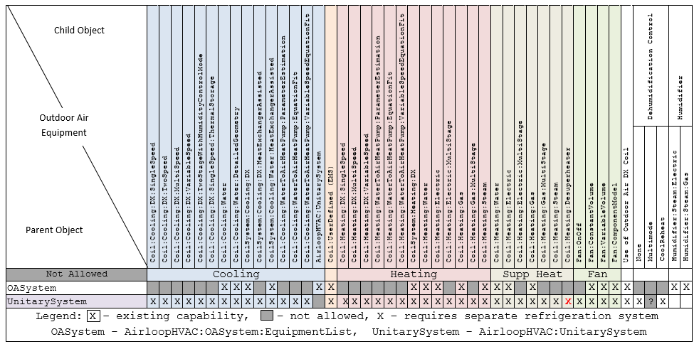
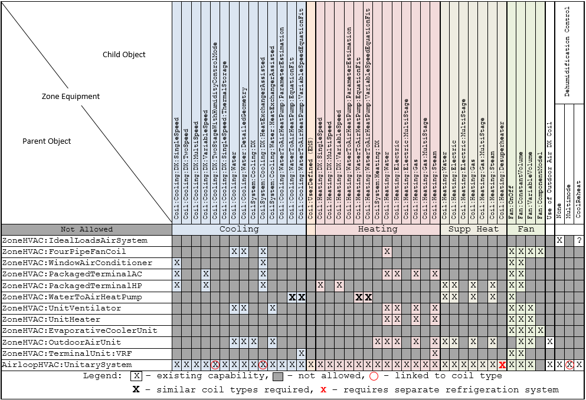
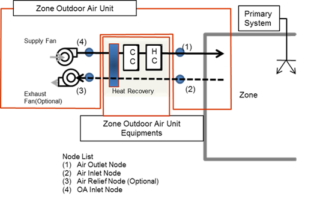
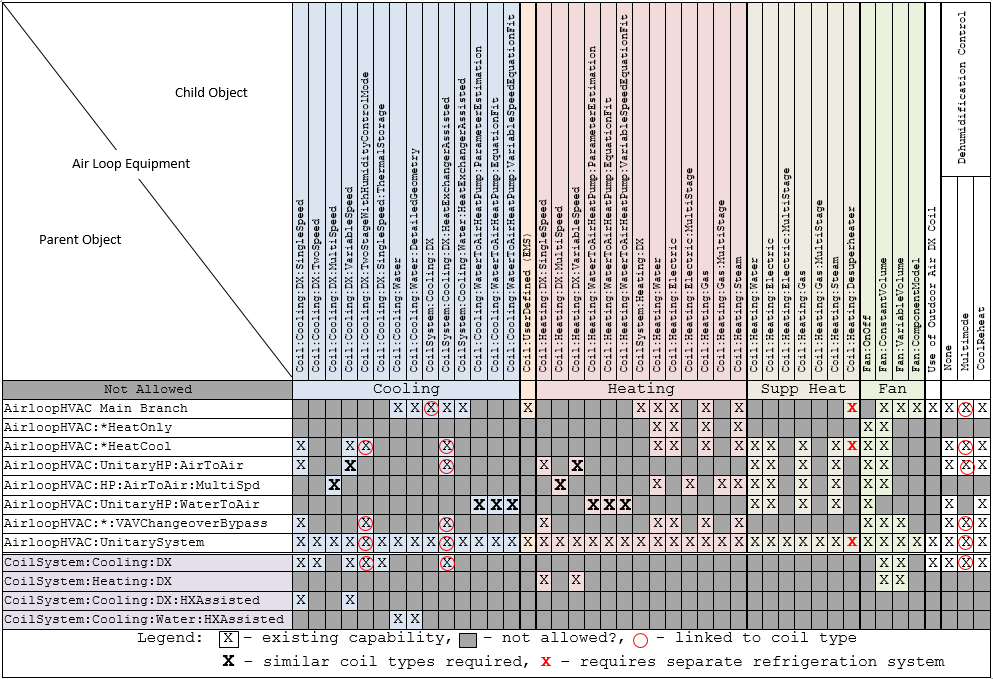

### GroundHeatExchanger:Vertical

The EnergyPlus Ground loop heat exchanger is a condenser component. This serves the condenser supply side in addition to the cooling towers and other condensing components. The following figure shows the Ground Heat Exchanger in the simulation environment.

The heat exchanger response is defined by a G-function. This is a non-dimensional function that is used to calculate the response to square heat pulses of different duration. (This function is not the same as ‘G-factors’ referred to in the ASHRAE Applications Handbook). This continuous function is specified by a series of data pairs (LNTTS*i*, GFNC*i*) where,

- LNTTS*i* is the non-dimensional time: *ln(T/T<sub>s</sub>)*

- GFNC*i* is the G-function value

The G-function is different for each borehole field configuration (i.e. a 4x4 field has a different response than a 80x80 field) and the borehole thermal resistance. It is also dependant on the ratio of borehole spacing to depth. G-function values, for accurate simulation, have to be calculated for each specific heat exchanger design. This can be done using some commercial ground loop heat exchanger design tool and the like. A reference data set, containing examples input data for 1x2, 4x4 and 8x8 configurations and for both standard and thermally enhanced grout, have also been provided. These data are provided as examples only. Custom G-function values may be generated using an external program such as GLHEPro. For more information about the datasets and GLHEPro, see the Auxiliary Programs document section “G-Function Spreadsheet.”

Further details of the implementation of this model can be found in:

Murugappan, A. *Implementing Ground Source Heat Pump and Ground Loop Heat Exchanger Models in the EnergyPlus Simulation Environment*. M.S. Thesis, Oklahoma State University, December 2002.


Figure 83. Schematic of EnergyPlus Ground Loop Heat Exchanger

The data definition for the ground loop heat exchanger from the Energy+.idd is shown below. The syntax to the specification of Borehole, U-tube and ground are illustrated in the example following.

#### Field: Name

This alpha field contains the identifying name for the ground heat exchanger (GHE).

#### Field: Inlet Node Name

This alpha field contains the ground heat exchanger inlet node name.

#### Field: Outlet Node Name

This alpha field contains the ground heat exchanger outlet node name.

#### Field: Design Flow Rate

This numeric field contains the GHE design flow rate in cubic meters per second {m<sup>3</sup>/s}.

#### Field: Number of Bore Holes

This numeric field contains the number of bore holes in the GHE installation.

#### Field: Bore Hole Length

This numeric field contains the length of the borehole in meters {m}.

#### Field: Bore Hole Radius

This numeric field contains the radius of the borehole in meters.

#### Field: Ground Thermal Conductivity

This numeric field contains the thermal conductivity of the ground in W/m-K.

#### FieldSet: Ground Thermal Heat Capacity

This numeric field contains the thermal heat capacity of the ground in J/m<sup>3</sup>-K.

#### Field: Ground Temperature

This numeric field contains the far field temperature of the ground in °C.

#### Field: Grout Thermal Conductivity

This numeric field contains the thermal conductivity of the filler material in W/m-K.

#### Field: Pipe Thermal Conductivity

This numeric field contains the thermal conductivity of the pipe in W/m-K.

#### Field: Pipe Out Diameter

This numeric field contains the outer diameter of the U-tube (pipe) in meters {m}.

#### Field: U-Tube Distance

This numeric field contains the distance between the two legs of the U-tube in meters {m}.

#### Field: Pipe Thickness

This numeric field contains the outer diameter of the U-tube (pipe) in meters.

#### Field: Maximum Length of Simulation

This numeric field contains the maximum number of years of simulation to be carried out.

#### Field: G-Function Reference Ratio

The G-Functions may be formulated slightly differently based on the program which generated them. The “raw” G-Functions are based on an borehole radius to active length ratio of 0.0005. If the physical ratio is different from this, a correction must be applied. EnergyPlus will apply the correction, based on the reference ratio entered in this field. Therefore, therefore two possible input configurations.

- If the G-Functions have not had a correction applied, then the G-Functions are still based on a reference of 0.0005, so use a value of 0.0005 in this field. EnergyPlus will adjust the G-Functions internally to create the properly referenced G-Function.

- If the correction has already been applied, then the input G-Functions are based on a reference to the actual (physical) radius/length ratio, so enter the physical radius/length in this field. Entering the actual value will nullify any internal corrections, which will avoid re-basing the G-Function set.

The software GLHEPro has been making this “pre-correction” to the data sets since version 3.1 of that software, so this input field should match the actual (physical) radius/length ratio.

#### Field: Number of Data Pairs of the G Function

The borehole response is defined by a non-dimensional ‘G-function’. This is specified as a series of data points giving values of non-dimensional time *vs* G-function value (LNTTS1, GFUNC1), (LNTTS2, GFUNC2), (LNTTS3, GFUNC3) …….. (LNTTS*n*, GFUNC*n*), This numeric field contains the number of data pairs to be read in (*n*).

#### Field: G-Function Ln(T/Ts) Value &lt;x&gt;

This numeric field contains the natural log of time/steady state time: *ln(T/T<sub>s</sub>)*

#### Field: G-Function 'G' Value &lt;x&gt;

This numeric field contains the G-function value of the corresponding LNTTS.

The following is an example input:

```idf
GroundHeatExchanger:Vertical,
Vertical Ground Heat Exchanger, !- Name
GHE Inlet Node,                 !- Inlet Node Name
GHE Outlet Node,                !- Outlet Node Name
0.00330000,                     !- Design Flow Rate {m3/s}
120,                            !- Number of Bore Holes
76.2,                           !- Bore Hole Length {m}
.635080E-01,                    !- Bore Hole Radius {m}
.692626E+00,                    !- Ground Thermal Conductivity {W/m-K}
.234700E+07,                    !- Ground Thermal Heat Capacity {J/m3-K}
13.375,                         !- Ground Temperature {C}
.692626E+00,                    !- Grout Thermal Conductivity {W/m-K}
.391312E+00,                    !- Pipe Thermal Conductivity {W/m-K}
2.66667E-02,                    !- Pipe Out Diameter {m}
2.53977E-02,                    !- U-Tube Distance {m}
2.41285E-03,                    !- Pipe Thickness {m}
2,                              !- Maximum Length of Simulation
0.0005,                         !- G-Function Reference Ratio
35,                             !- Number of Data Pairs of the G Function
! The G-function is defined by the following data pairs
-15.2996, -0.348322,            ! G-Function Ln(T/Ts) Value 1, G-Function G Value 1
-14.201,  0.022208,             ! G-Function Ln(T/Ts) Value 2, G-Function G Value 2
-13.2202, 0.412345,             ! G-Function Ln(T/Ts) Value 3, G-Function G Value 3
-12.2086, 0.867498,             ! G-Function Ln(T/Ts) Value 4, G-Function G Value 4
-11.1888, 1.357839,             ! G-Function Ln(T/Ts) Value 5, G-Function G Value 5
-10.1816, 1.852024,             ! G-Function Ln(T/Ts) Value 6, G-Function G Value 6
-9.1815,  2.345656,             ! G-Function Ln(T/Ts) Value 7, G-Function G Value 7
-8.6809,  2.593958,             ! G-Function Ln(T/Ts) Value 8, G-Function G Value 8
-8.5,     2.679,                ! etc, etc.
-7.8,     3.023,
-7.2,     3.32,
-6.5,     3.681,
-5.9,     4.071,
-5.2,     4.828,
-4.5,     6.253,
-3.963,   7.894,
-3.27,    11.82,
-2.864,   15.117,
-2.577,   18.006,
-2.171,   22.887,
-1.884,   26.924,
-1.191,   38.004,
-0.497,   49.919,
-0.274,   53.407,
-0.051,   56.632,
0.196,    59.825,
0.419,    62.349,
0.642,    64.524,
0.873,    66.412,
1.112,    67.993,
1.335,    69.162,
1.679,    70.476,
2.028,    71.361,
2.275,    71.79,
3.003,    72.511;               !- 35 PAIRS
```

### Vertical Ground Heat Exchanger Outputs

* HVAC,Average,Ground Heat Exchanger Average Borehole Temperature [C]

* HVAC,Average,Ground Heat Exchanger Heat Transfer Rate [W]

* HVAC,Average,Ground Heat Exchanger Inlet Temperature [C]

* HVAC,Average,Ground Heat Exchanger Outlet Temperature [C]

* HVAC,Average,Ground Heat Exchanger Mass Flow Rate [kg/s]

* HVAC,Average,Ground Heat Exchanger Average Fluid Temperature [C]

#### Ground Heat Exchanger Average Borehole Temperature [C]

This is the model result for the average temperature of the borehole heat exchanger.

#### Ground Heat Exchanger Heat Transfer Rate [W]

This is the rate of heat transfer between the working fluid and the ground heat exchanger, in Watts.

#### Ground Heat Exchanger Inlet Temperature [C]

This is the temperature of the working fluid entering the ground heat exchanger.

#### Ground Heat Exchanger Outlet Temperature [C]

This is the temperature of the working fluid leaving the ground heat exchanger.

#### Ground Heat Exchanger Mass Flow Rate [kg/s]

This is the mass flow rate of the working fluid through the heat exchanger.

#### Ground Heat Exchanger Average Fluid Temperature [C]

This is the average temperature of the working fluid inside the heat exchanger.


### GroundHeatExchanger:Slinky

The GroundHeatExchanger:Slinky use the g-functions to calculate the GHX temperature response, similar to the GroundHeatExchanger:Vertical model, however for this model g-functions are automatically calculated by EnergyPlus without the need of external software or data.

Horizontal slinky-loop ground heat exchangers (GHXs) consist of coiled tubing, with the individual rings spread out along the direction of the trench either horizontally or vertically, as shown in [Figure](#SlinkyIOFig1). A schematic of a slinky GHX can be seen in [Figure](#SlinkyIOFig2). Compared to conventional straight tube horizontal GHXs, slinky loops have a higher tube density; hence, with the same cooling/heating loads, slinky-loop GHXs require less land area and excavation work than straight tube HGHXs.


Figure: Slinky Ground Heat Exchanger Configurations. <a name="SlinkyIOFig1"></a>


Figure: Schematic of Slinky HX. <a name="SlinkyIOFig2"></a>

An example GroundHeatExchanger:Slinky object is shown below.

```idf
GroundHeatExchanger:Slinky,
  Slinky GHX,       !- Name
  GHE Inlet Node,   !- Inlet Node
  GHE Outlet Node,  !- Outlet Node
  0.0033,           !- Design Flow Rate [m3/s]
  1.2,              !- Soil Thermal Conductivity [W/m-K]
  3200,             !- Soil Density [kg/m3]
  850,              !- Soil Specific Heat [J/kg-K]
  1.8,              !- Pipe Thermal Conductivity [W/m-K]
  920,              !- Pipe Density [kg/m3]
  2200,             !- Pipe Specific Heat [J/kg-K]
  0.02667,          !- Pipe Outside Diameter [m]
  0.002413,         !- Pipe Wall Thickness [m]
  Vertical,         !- Heat Exchanger Configuration (Vertical, Horizontal)
  1,                !- Coil Diameter [m]
  0.2,              !- Coil Pitch [m]
  2.5,              !- Trench Depth [m]
  40,               !- Trench Length [m]
  15,               !- Number of Parallel Trenches
  2,                !- Trench Spacing [m]
  Site:GroundTemperature:Undisturbed:KusudaAchenbach, !- Type of Undisturbed Ground Temperature Object
  KATemps,          !- Name of Undisturbed Ground Temperature Object
  10;               !- Maximum length of simulation [years]
```


#### Field: Name

Alpha field used as identifying field for heat exchanger

#### Field: Inlet Node

This alpha field is the name of the inlet node of the component on a plant loop.

#### Field: Outlet Node

This alpha field is the name of the outlet node of the component on a plant loop.

#### Field: Design Flow Rate

This numeric field is the design flow rate in m3/s for the heat exchanger. The plant loop will attempt to meet this request based on loop and flow conditions.

#### Field: Soil Thermal Conductivity

This numeric field is the thermal conductivity of the soil, in W/m-K.

#### Field: Soil Density

This numeric field is the density of the soil, in kg/m3.

#### Field: Soil Specific Heat

This numeric field is the specific heat of the soil, in J/kg-K.

#### Field: Pipe Thermal Conductivity

This numeric field is the thermal conductivity of the heat exchanger pipe.

#### Field: Pipe Density

This numeric field is the density of the heat exchanger pipe, in kg/m3.

#### Field: Pipe Specific Heat

This numeric field is the specific heat of the heat exchanger pipe, in J/kg-K.

#### Field: Pipe Outside Diameter

This numeric field is the outside pipe diameter, in meters.

#### Field: Pipe Wall Thickness

This numeric field is the pipe wall thickness, in meters.

#### Field: Heat Exchanger Configuration

This alpha field is heat exchanger configuration, either Vertical or Horizontal.

#### Field: Coil Diameter

This numeric is the diameter of the slinky coil, in meters.

#### Field: Coil Pitch

This numeric field is the center-to-center distance between heat exchanger coils, in meters.

#### Field: Trench Depth

This numeric field is the distance from the bottom of the trench to the ground surface, in meters.

#### Field: Trench Length

This numeric field is the length of the heat exchanger trench, in meters. This assumes the heat exchanger runs the full length of the trench.

#### Field: Number of Parallel Trenches

This numeric field is the number of parallel trenches. Design flow rate will be equally divided among all parallel trenches.

#### Field: Trench Spacing

This numeric field is the center-to-center distance in between parallel trenches, in meters.

#### Field: Type of Undisturbed Ground Temperature Object

The type of undisturbed ground temperature object used to determine ground temperature for the farfield boundary conditions.

#### Field: Name of Undisturbed Ground Temperature Object

The name of the undisturbed ground temperature object used to determine ground temperature for the farfield boundary conditions.

#### Field: Maximum Length of Simulation

This numeric field contains the maximum number of years of simulation to be carried out.

### GroundHeatExchanger:Slinky Outputs

The following output variables are available.

* HVAC,Average,Ground Heat Exchanger Average Borehole Temperature [C]

* HVAC,Average,Ground Heat Exchanger Heat Transfer Rate [W]

* HVAC,Average,Ground Heat Exchanger Inlet Temperature [C]

* HVAC,Average,Ground Heat Exchanger Outlet Temperature [C]

* HVAC,Average,Ground Heat Exchanger Mass Flow Rate [kg/s]

* HVAC,Average,Ground Heat Exchanger Average Fluid Temperature [C]

#### Ground Heat Exchanger Average Borehole Temperature [C]

This is the model result for the average temperature of the borehole heat exchanger.

#### Ground Heat Exchanger Heat Transfer Rate [W]

This is the rate of heat transfer between the working fluid and the ground heat exchanger, in Watts.

#### Ground Heat Exchanger Inlet Temperature [C]

This is the temperature of the working fluid entering the ground heat exchanger.

#### Ground Heat Exchanger Outlet Temperature [C]

This is the temperature of the working fluid leaving the ground heat exchanger.

#### Ground Heat Exchanger Mass Flow Rate [kg/s]

This is the mass flow rate of the working fluid through the heat exchanger.

#### Ground Heat Exchanger Average Fluid Temperature [C]

This is the average temperature of the working fluid inside the heat exchanger.


### GroundHeatExchanger:Pond

The pond heat exchanger model represents a shallow pond with submerged hydronic tubes through which the heat transfer fluid is circulated. The model represents a 'shallow' pond in that no attempt is made to model any stratification effects that may  be present in deeper ponds.

This type of heat exchanger is intended to be connected to the supply side of a condenser loop, and can be used with any type of plant loop. The pond may be specified as the only heat exchanger on the condenser loop (as shown in Figure 84) or it may be connected in parallel with other condenser loop heat exchangers (such as cooling towers, ground surface heat exchangers) as shown in the second figure below.


Figure 84. Example of Pond Ground Heat Exchanger as only heat exchanger on condenser loop


Figure 85. Pond Ground Heat Exchanger with other heat exchangers on condenser loop

#### Field: Name

This alpha field contains the identifying name for the outside pond heat exchanger.

#### Field: Fluid Inlet Node Name

This alpha field contains the fluid inlet node name.

#### Field: Fluid Outlet Node Name

This alpha field contains the fluid outlet node name.

#### Field: Pond Depth

This numeric field contains the pond depth {m}.

#### Field: Pond Area

This numeric field contains the pond area {m<sup>2}</sup>.

#### Field: Hydronic Tubing Inside Diameter

This numeric field contains the hydronic tubing inside diameter {m}.

#### Field: Hydronic Tubing Outside Diameter

This numeric field contains the hydronic tubing outside diameter {m}.

#### Field: Hydronic Tubing Thermal Conductivity

This numeric field contains the hydronic tubing thermal conductivity in W/mK.

#### Field: Ground Thermal Conductivity

This numeric field contains the ground thermal conductivity in W/m<sup>2</sup>K.

#### Field: Number of Tubing Circuits

This numeric field contains the number of hydronic tubing circuits, total in parallel in this pond..

#### Field: Length of Each Tubing Circuit

This numeric field contains length {m} of each hydronic tubing circuit.

An example of the IDF is shown below.

```idf
  GroundHeatExchanger:Pond,
    Pond 1,                  !- Name
    Condenser Tower 1 Inlet Node,  !- Fluid Inlet Node Name
    Condenser Tower 1 Outlet Node,  !- Fluid Outlet Node Name
    2.0,                     !- Pond Depth {m}
    1000.0,                  !- Pond Area {m2}
    0.02,                    !- Hydronic Tubing Inside Diameter {m}
    0.025,                   !- Hydronic Tubing Outside Diameter {m}
    0.4,                     !- Hydronic Tubing Thermal Conductivity {W/m-K}
    1.0,                     !- Ground Thermal Conductivity {W/m2-K}
    10,                      !- Number of Tubing Circuits
    50.0;                    !- Length of Each Tubing Circuit {m}
```


### Pond Heat Exchanger Outputs

* HVAC,Average,Pond Heat Exchanger Heat Transfer Rate [W]

* HVAC,Sum,Pond Heat Exchanger Heat Transfer Energy [J]

* HVAC,Average,Pond Heat Exchanger Mass Flow Rate [kg/s]

* HVAC,Average,Pond Heat Exchanger Inlet Temperature [C]

* HVAC,Average,Pond Heat Exchanger Outlet Temperature [C]

* HVAC,Average,Pond Heat Exchanger Bulk Temperature [C]

#### Pond Heat Exchanger Heat Transfer Rate [W]

#### Pond Heat Exchanger Heat Transfer Energy [J]

These outputs are the pond ground heat exchanger heat transfer rate and total energy exchange for the timestep.

#### Pond Heat Exchanger Mass Flow Rate [kg/s]

#### Pond Heat Exchanger Inlet Temperature [C]

#### Pond Heat Exchanger Outlet Temperature [C]

These outputs are the pond fluid inlet and outlet temperatures and mass flow rate.

#### Pond Heat Exchanger Bulk Temperature [C]

This output is the pond bulk temperature.


### GroundHeatExchanger:Surface

The surface heat exchanger model is to simulate hydronic surface ground heat exchangers. This includes pavement surfaces with embedded pipes for snow-melting or heat rejection from hybrid ground source heat pump systems.

The heat exchanger may be ground coupled or not. In the latter case the bottom surface is exposed to the wind but not solar gains. This type of heat exchanger is intended to be connected to the supply side of a condenser loop, and can be used with any type of plant loop. The surface heat exchanger may be specified as the only heat exchanger on the condenser loop (as shown in the first figure below) or it may be connected in parallel with other condenser loop heat exchangers (such as cooling towers, ground surface heat exchangers) as shown in the second figure below.


Figure 86. Example of Surface Ground Heat Exchanger as only heat exchanger on condenser loop


Figure 87. Surface Ground Heat Exchanger with other heat exchangers on condenser loop

#### Field: Name

This alpha field contains the identifying name for the outside panel heat exchanger.

#### Field: Construction Name

This alpha field contains the construction name. It must contain a valid “Construction” name that is usual for Surfaces. (Ref: Group – Surface Construction Elements).

#### Field: Fluid Inlet Node Name

This alpha field contains the fluid inlet node name.

#### Field: Fluid Outlet Node Name

This alpha field contains the fluid outlet node name.

#### Field: Hydronic Tubing Inside Diameter

This numeric field contains the hydronic tubing inside diameter in m.

#### Field: Number of Tubing Circuits

This numeric field contains the number of hydronic tubing circuits.

#### Field: Hydronic Tube Spacing

This numeric field contains the hydronic tube spacing in m.

#### Field: Surface Length

This numeric field contains the surface length in m.

#### Field: Surface Width

This numeric field contains the surface width in m.

#### Field: Lower Surface Environment

This alpha field expresses the lower surface exposure: Exposed or Ground.

An example of this statement in an IDF is shown below:

```idf
  GroundHeatExchanger:Surface,
    SURFACE 1,               !- Name
    Outside Surface Construction,  !- Construction Name
    Condenser Tower 1 Inlet Node,  !- Fluid Inlet Node Name
    Condenser Tower 1 Outlet Node,  !- Fluid Outlet Node Name
    0.02,                    !- Hydronic Tubing Inside Diameter {m}
    10.0,                    !- Number of Tubing Circuits
    0.3,                     !- Hydronic Tube Spacing {m}
    100.0,                   !- Surface Length {m}
    100.0,                   !- Surface Width {m}
    GROUND;                  !- Lower Surface Environment
```


### Surface Ground Heat Exchanger Outputs

* HVAC,Average,Ground Heat Exchanger Heat Transfer Rate [W]

* HVAC,Average,Ground Heat Exchanger Surface Heat Transfer Rate [W]

* HVAC,Sum,Ground Heat Exchanger Heat Transfer Energy [J]

* HVAC,Average,Ground Heat Exchanger Mass Flow Rate [kg/s]

* HVAC,Average,Ground Heat Exchanger Inlet Temperature [C]

* HVAC,Average,Ground Heat Exchanger Outlet Temperature [C]

* HVAC,Average,Ground Heat Exchanger Top Surface Temperature [C]

* HVAC,Average Ground Heat Exchanger Bottom Surface Temperature [C]

* HVAC,Average,Ground Heat Exchanger Top Surface Heat Transfer Energy per Area [J/m2]

* HVAC,Average,Ground Heat Exchanger Bottom Surface Heat Transfer Energy per Area[J/m2]

* HVAC,Sum,Ground Heat Exchanger Surface Heat Transfer Energy [J]

* HVAC,Average,Ground Heat Exchanger Source Temperature [C]


#### Ground Heat Exchanger Heat Transfer Rate [W]

#### Ground Heat Exchanger Surface Heat Transfer Rate [W]

#### Ground Heat Exchanger Heat Transfer Energy [J]

These outputs are the source heat transfer rate, surface heat transfer rate and the total source energy input for the timestep.

#### Ground Heat Exchanger Mass Flow Rate [kg/s]

#### Ground Heat Exchanger Inlet Temperature [C]

#### Ground Heat Exchanger Outlet Temperature [C]

These outputs are the surface heat exchanger fluid inlet and outlet temperatures and mass flow rate.

#### Ground Heat Exchanger Top Surface Temperature [C]

#### Ground Heat Exchanger Bottom Surface Temperature [C]

These outputs are the surface heat exchanger top and bottom surface temperatures.

#### Ground Heat Exchanger Top Surface Heat Transfer Energy per Area  [J/m<sup>2</sup>]

#### Ground Heat Exchanger Bottom Surface Heat Transfer Energy per Area [J/m<sup>2</sup>]

These outputs are the surface heat exchanger top and bottom surface flux.

#### Ground Heat Exchanger Surface Heat Transfer Energy [J]

This is the total surface energy exchange for the timestep.

#### Ground Heat Exchanger Source Temperature [C]

This is the surface heat exchanger source temperature.


### GroundHeatExchanger:HorizontalTrench

The horizontal trench ground heat exchanger object provides an alternate interface to the detailed PipingSystem:Underground:\* objects.  The same underlying simulation algorithm is utilized, providing a transient numerical simulation of soil with buried pipes and a detailed surface heat balance.  The input syntax is much smaller and useful for simple applications.  For full flexibility, use the PipingSystem:Underground:\* objects to build a detailed simulation domain and piping circuit.  For information regarding the simulation algorithms, see the engineering reference document section covering the buried piping system objects.

***Field: Name***

This alpha field is used as an identifying field for the ground heat exchanger.

***Field: Inlet Node Name***

This alpha field is the name of the inlet node of this component on a plant loop, and must match other topology definitions such as branch objects.

***Field: Outlet Node Name***

This alpha field is the name of the outlet node of this component on a plant loop, and must match other topology definitions such as branch objects.

***Field: Design Flow Rate [m3/s]***

This numeric field is the designed flow rate for this heat exchanger; the plant loop solver will attempt to meet this request based on flow and loop conditions.

***Field: Trench Length in Pipe Axial Direction [m]***

This numeric field represents the axial length of each pipe trench.  Each pipe defined for this ground heat exchanger will have the same length.  If different pipes have different lengths, they must use separate GroundHeatExchanger:HorizontalTrench objects with different lengths.

***Field: Number of Trenches***

This integer field is the number of trenches for this heat exchanger.  Since each trench has a single pipe, this defines the number of “pipe segments” for this overall heat exchanger.  The total piping length is then calculated as the trench length times the number of trenches.

***Field: Horizontal Spacing Between Pipes [m]***

This numeric field represents the horizontal spacing (pipe centroid to pipe centroid) between pipes/trenches.

***Field: Pipe Inner Diameter [m]***

This numeric field is the inner diameter of the pipe.  The same pipe properties are used for all pipes in this heat exchanger.

***Field: Pipe Outer Diameter [m]***

This numeric field is the outer diameter of the pipe.  The same pipe properties are used for all pipes in this heat exchanger.

***Field: Burial Depth [m]***

This numeric field is the burial depth of each pipe, from ground surface to pipe cross section centroid. The same pipe depth is used for all pipes in this heat exchanger.

***Field: Soil Thermal Conductivity [W/mK]***

This numeric field is the soil thermal conductivity.

***Field: Soil Density [kg/m3]***

This numeric field is the soil density.

***Field: Soil Specific Heat [J/kgK]***

This numeric field is the nominal soil specific heat, but is corrected for moisture content and in freezing conditions.

***Field: Pipe Thermal Conductivity [W/mK]***

This numeric field is the pipe thermal conductivity.

***Field: Pipe Density [kg/m3]***

This numeric field is the pipe density.

***Field: Pipe Specific Heat [J/kgK]***

This numeric field is the pipe specific heat.

***Field: Soil Moisture Content Percent [%]***

This numeric field represents the volume fraction, in percent, of water content in the soil.

***Field: Soil Moisture Content Percent at Saturation [%]***

This numeric field represents the volume fraction, in percent, of water content in the soil which results in saturation.

#### Field: Type of Undisturbed Ground Temperature Object

The type of undisturbed ground temperature object used to determine ground temperature for the farfield boundary conditions.

#### Field: Name of Undisturbed Ground Temperature Object

The name of the undisturbed ground temperature object used to determine ground temperature for the farfield boundary conditions.

***Field: Evapotranspiration Ground Cover Parameter [-]***

This numeric field specifies the ground cover effects used in the evapotranspiration model at the ground surface heat balance.  The values range from 0 (solid, non-permeable ground surface) to 1.5 (wild growth).

An example of this statement in an IDF is shown below:

```idf
GroundHeatExchanger:HorizontalTrench,
   My Pipe Circuit, !- Name
   Plant Supply Intermediate Node, !- Inlet Node Name
   Plant Supply Outlet Node, !- Outlet Node Name
   0.004,       !- Design Flow Rate
   75,          !- Trench Length in Pipe Axial Direction
   2,           !- Number of Trenches
   2.0,         !- Horizontal Spacing Between Pipes
   0.016,       !- Pipe Inner Diameter
   0.02667,     !- Pipe Outer Diameter
   1.25,        !- Burial Depth
   1.08,        !- Soil Thermal Conductivity
   962,         !- Soil Density
   2576,        !- Soil Specific Heat
   0.3895,      !- Pipe Thermal Conductivity {W/m-K}
   641,         !- Pipe Density {kg/m3}
   2405,        !- Pipe Specific Heat {J/kg-K}
   30,          !- Soil Moisture Content Volume Fraction {percent}
   50,          !- Soil Moisture Content Volume Fraction at Saturation {percent}
   Site:GroundTemperature:Undisturbed:KusudaAchenbach, !- Type of Undisturbed Ground Temperature Object
   KATemps,     !- Name of Undisturbed Ground Temperature Object
   0.408;       !- Evapotranspiration Ground Cover Parameter
```

### Horizontal Trench Ground Heat Exchanger Outputs

* HVAC,Average,Ground Heat Exchanger Mass Flow Rate [kg/s]

* HVAC,Average,Ground Heat Exchanger Inlet Temperature [C]

* HVAC,Average,Ground Heat Exchanger Outlet Temperature [C]

* HVAC,Average,Ground Heat Exchanger Fluid Heat Transfer Rate [W]


#### Ground Heat Exchanger Mass Flow Rate [kg/s]

The output provides the mass flow rate currently being sent through the heat exchanger.

#### Ground Heat Exchanger Inlet Temperature [C]

#### Ground Heat Exchanger Outlet Temperature [C]

Temperature of fluid at the inlet and outlet of the heat exchanger.

#### Ground Heat Exchanger Fluid Heat Transfer Rate [W]

Heat transfer rate for the heat exchanger, defined as positive for ***fluid heat loss***.

### HeatExchanger:FluidToFluid

A fluid-to-fluid heat exchanger designed to couple the supply side of one plant or condenser loop to the demand side of another plant or condenser loop. This heat exchanger is fairly general and can be configured for use in any application where any two loops need to be connected together. The only constraints are that that one side must be connected to the supply side of one loop and the other side connected to the demand side of a different loop.  Because the heat exchanger is intended to be generic, its two sides are distinguished by the nature of loop side being connected.  One side is called “Loop Supply Side” to indicate the heat exchanger is situated on the supply side of a loop. The other side is called “Loop Demand Side” to indicate it is on the demand side of a loop.  The heat exchanger is intended to act as a supply component for the loop connected to it as the “Loop Supply Side” and as a demand component for the loop connected to it as the “Loop Demand Side.”  From the point of view of the heat exchanger model itself, the Loop Demand Side fluid serves as the source/sink to supply heating/cooling to the fluid in the Loop Supply Side.  Only hydronic “plant” fluids are allowed, no air-side connections are possible with this heat exchanger.


Figure 88. Plant Fluid-to-Fluid Heat Exchanger

Various options are available for the heat exchanger model. The heat transfer between the two sides can be modeled using one of seven different models for different types of heat exchangers. Heat transfer is calculated and reported using a sign convention from chilled water applications where positive heat transfer indicates energy was extracted from the Loop Supply Side and added to the Loop Demand Side.

There are eleven options for different ways to control the heat exchanger.  One general type of control is “OnOff” where the flow through the heat exchanger is either fully on or fully off.  Another type of control is “Modulated” where the flow through the Loop Demand Side is controlled to try and meet a target setpoint or load on the Loop Supply Side.

This heat exchanger can be used for a wide variety of applications including chilled water, hot water, condenser, ground source, primary-secondary systems, etc.  As of Version 8.0, this object replaces three separate objects that were available prior to version 8.0 of EnergyPlus.  The former HeatExchanger:Hydronic object corresponds to a situation where the Loop Demand Side is the demand side of condenser loop, the Loop Supply Side is a the supply side of a chilled water loop, the control type is “CoolingSetpointOnOffWithComponentOverride,” and the remote override component is a chiller. The former HeatExchanger:WatersideEconomizer object corresponds to a situation where the Loop Demand Side is the demand side of condenser loop, the Loop Supply Side is a the supply side of a chilled water loop, and the control type is “CoolingDifferentialOnOff.”  The former HeatExchanger:Plate object corresponds to a situation where the Loop Demand Side is the demand side of a condenser loop, the Loop Supply Side is the supply side of a second condenser loop, and the control type is “UncontrolledOn.”

#### Field: Name

This alpha field provides the unique identifying name for this heat exchanger.

#### Field: Availability Schedule Name

This field specifies the name of an availability schedule that can be used for supervisory control of the device.  If blank, the default is that heat exchanger is always available.  If a scheduled is named here, then the heat exchanger is available for use whenever the schedule value is greater than zero.  The heat exchanger is not available whenever the schedule value is zero or less.

#### Field: Loop Demand Side Inlet Node Name

This field specifies the name of a plant system node that connects an inlet of the heat exchanger to the demand side of a loop.  This node must be on a branch located on the demand side of a plant or condenser loop.

#### Field: Loop Demand Side Outlet Node Name

This field specifies the name of a plant system node that connects an outlet of the heat exchanger to the demand side of a loop.  This node must be on a branch located on the demand side of a plant or condenser loop.

#### Field: Loop Demand Side Design Flow Rate

This field specifies the design flow rate, in m<sup>3</sup>/s, of the hydronic fluid passing through the heat exchanger on the Loop Demand Side. This field is autosizable. When autosized, this design flow rate is set to equal the design flow rate for the Loop Supply Side.

#### Field: Loop Supply Side Inlet Node Name

This field specifies the name of a plant system node that connects an inlet of the heat exchanger to the supply side of a loop.  This node must be on a branch located on the supply side of a plant or condenser loop.

#### Field: Loop Supply Side Outlet Node Name

This field specifies the name of a plant system node that connects an outlet of the heat exchanger to the supply side of a loop.  This node must be on a branch located on the supply side of a plant or condenser loop.

#### Field: Loop Supply Side Design Flow Rate

This field specifies the design flow rate, in m<sup>3</sup>/s, of the fluid passing through the heat exchanger on the Loop Supply Side. This field is autosizable. When autosized, this design flow rate is set equal to the overall design flow rate of the loop that is connected.  If a sizing factor is entered in the field below, then it is multiplied to modify the design flow rate.

#### Field: Heat Exchange Model Type

This alpha field identifies the nature of heat exchanger.  Heat exchanger model type is specified by one of the following four key word choices:

- **CrossFlowBothUnMixed**.  Specifies a single-pass, cross-flow heat exchanger.  The effectiveness will be calculated using a cross-flow heat exchanger correlation for both streams unmixed.

- **CrossFlowBothMixed**.  Specifies a single-pass, cross-flow heat exchanger. The effectiveness will be calculated using a cross-flow heat exchanger correlation for both streams mixed.

- **CrossFlowSupplyMixedDemandUnMixed**.  Specifes a single-pass, cross-flow heat exchanger.  The effectiveness will be calculated using a cross-flow heat exchanger correlation for flow mixed on the Loop Supply side and flow unmixed on the Loop Demand Side.

- **CrossFlowSupplyUnMixedDemandMixed**.   Specifes a single-pass, cross-flow heat exchanger.  The effectiveness will be calculated using a cross-flow heat exchanger correlation for flow unmixed on the Loop Supply side and flow mixed on the Loop Demand Side.

- **CounterFlow**. Specifies a counter-flow shell and tube heat exchanger.  The effectiveness will be calculated using a counter-flow shell and tube heat exchanger correlation.

- **ParallelFlow**. Specifies a parallel-flow shell and tube heat exchanger.  The effectiveness will be calculated using a parallel-flow shell and tube heat exchanger correlation.

- **Ideal**. Specifies an ideal heat exchanger.  The effectiveness will be set to '1.0' and the specified UA will be ignored.  The heat transfer rate will be calculated as the maximum possible heat transfer rate.

#### Field: Heat Exchanger U-Factor Times Area Value

This numerical field is used to specify the overall U-Factor Times Area (UA) {W/K} for use in the calculation of the heat exchanger effectiveness using the appropriate D-NTU correlation.  If **Ideal** is specified as the heat exchanger type, the effectiveness will be set to 1.0. When set to autosize Heat Exchanger U-Factor Times Area Value is calculated based on an effectiveness of 1.0 where capacity is such that the temperatures in the Sizing:Plant objects for the two loops can be maintained.

#### Field: Control Type

This field is used to specify how the heat exchanger is to be controlled during operation.  Different applications for connecting two loops will require different control behavior and different control options are needed depending on the desired behavior.  There are the following eleven key choice options to choose from:

- **UncontrolledOn**. This control mode is applicable to situations where the heat exchanger is passively running all the time and always transfers as much heat as possible between the fluid streams.  However there is one aspect of control in that it will only request flow on the Loop Demand Side when there is non-zero flow into the heat exchanger on the Loop Supply Side.  This control mode corresponds to that available in the HeatExchanger:Plate object prior to version 8.0.

- **OperationSchemeModulated**.  This control mode is applicable to situations where the heat exchanger is controlled by an operation scheme (see objects called PlantEquipmentOperationScheme or CondenserEquipmentOperationSchemes).  When using this control mode the heat exchanger must be listed in PlantEquipmentList or a CondenserEquipmentList and it serves as a supply component.  The operation scheme will dispatch a load request to the heat exchanger which it will try meet by conditioning the fluid stream connected as the Loop Supply Side.  If the heat exchanger could exceed the load request, then the flow through the fluid stream connected as the Loop Demand Side will be modulated to just meet the load request.

- **OperationSchemeOnOff**. This control mode is applicable to situations where the heat exchanger is controlled by an operation scheme (see objects called PlantEquipmentOperationScheme or CondenserEquipmentOperationSchemes).  When using this control mode the heat exchanger must be listed in PlantEquipmentList or a CondenserEquipmentList and it serves as a supply component.  The operation scheme will dispatch a load request to the heat exchanger which it will use as an on/off signal to decide if the heat exchange should run or not.  If it runs, it will run at full capacity and may exceed the load request.

- **HeatingSetpointModulated**.  This control mode is applicable to situations where the Loop Demand Side can provide useful heating to the Loop Supply Side.  A heating setpoint is obtained from a node named in the following field.  If the setpoint and inlet temperatures are such that heat exchanger could transfer heat from the Loop Demand Side to the Loop Supply Side to meet the heating setpoint, then the heat exchanger will run.  The inlet temperatures must differ by more than the value set in the field called Minimum Temperature Difference to Activate Heat Exchanger for the heat exchanger to operate.  If the heat exchanger could overshoot the setpoint, then the flow through the fluid stream connected as the Loop Demand Side will be modulated to just meet the setpoint.

- **HeatingSetpointOnOff**. This control mode is applicable to situations where the Loop Demand Side can provide useful heating to the Loop Supply Side.  A heating setpoint is obtained from a node named in the following field.  If the setpoints and inlet temperatures are such that heat exchanger could transfer heat from the Loop Demand Side to the Loop Supply Side to meet the heating setpoint, then the heat exchanger will run. The inlet temperatures must differ by more than the value set in the field called Minimum Temperature Difference to Activate Heat Exchanger for the heat exchanger to operate.  If it runs, it will run at full capacity and may overshoot the setpoint.

- **CoolingSetpointModulated**.  This control mode is applicable to situations where the Loop Demand Side can provide useful cooling to the Loop Supply Side.  A cooling setpoint is obtained from a node named in the following field.  If the setpoints and inlet temperatures are such that heat exchanger could transfer heat from the Loop Supply Side to the Loop Demand Side to meet the cooling setpoint, then the heat exchanger will run. The inlet temperatures must differ by more than the value set in the field called Minimum Temperature Difference to Activate Heat Exchanger for the heat exchanger to operate. If the heat exchanger could undershoot the setpoint, then the flow through the fluid stream connected as the Loop Demand Side will be modulated to just meet the setpoint.

- **CoolingSetpointOnOff**. This control mode is applicable to situations where the Loop Demand Side can provide useful cooling to the Loop Supply Side.  A cooling setpoint is obtained from a node named in the following field.  If the setpoints and inlet temperatures are such that heat exchanger could transfer heat from the Loop Supply Side to the Loop Demand Side to meet the cooling setpoint, then the heat exchanger will run. The inlet temperatures must differ by more than the value set in the field called Minimum Temperature Difference to Activate Heat Exchanger for the heat exchanger to operate. If it runs, it will run at full capacity and may undershoot the setpoint.  This control mode corresponds to that available in the HeatExchanger:WatersideEconomizer object prior to version 8.0.

- **DualDeadbandSetpointModulated**. This control mode is applicable to situations where the Loop Demand Side can provide either useful cooling or heating to the Loop Supply Side.  A dual deadband setpoint is obtained from a node named in the following field.  If the setpoints and inlet temperatures are such that heat exchanger could transfer heat from the Loop Demand Side to the Loop Supply Side to meet the lower setpoint, then the heat exchanger will run. If the setpoints and inlet temperatures are such that heat exchanger could transfer heat from the Loop Supply Side to the Loop Demand Side to meet the high setpoint, then the heat exchanger will run. The inlet temperatures must differ by more than the value set in the field called Minimum Temperature Difference to Activate Heat Exchanger for the heat exchanger to operate.  If the heat exchanger could overshoot the lower setpoint, or undershoot the higher setpoint, then the flow through the fluid stream connected as the Loop Demand Side will be modulated to just meet the deadband setpoint.

- **DualDeadbandSetpointOnOff**. This control mode is applicable to situations where the Loop Demand Side can provide either useful cooling or heating to the Loop Supply Side.  A dual deadband setpoint is obtained from a node named in the following field.  If the setpoints and inlet temperatures are such that heat exchanger could transfer heat from the Loop Demand Side to the Loop Supply Side to meet the lower setpoint, then the heat exchanger will run. If the setpoints and inlet temperatures are such that heat exchanger could transfer heat from the Loop Supply Side to the Loop Demand Side to meet the high setpoint, then the heat exchanger will run. The inlet temperatures must differ by more than the value set in the field called Minimum Temperature Difference to Activate Heat Exchanger for the heat exchanger to operate. If the heat exchanger runs, it will run at full capacity and may overshoot the lower setpoint or undershoot the higher setpoint.

- **CoolingDifferentialOnOff**.  This control mode is applicable to situations where the Loop Demand Side can provide useful cooling to the Loop Supply Side.  This mode is similar to CoolingSetpointOnOff except that it ignores any cooling setpoint and its control is based only on the temperature difference between Loop Demand Side and the Loop Supply Side.  The inlet temperatures must differ by more than the value set in the field called Minimum Temperature Difference to Activate Heat Exchanger for the heat exchanger to operate.   This control mode corresponds to that available in the HeatExchanger:WatersideEconomizer object prior to version 8.0.

- **CoolingSetpointOnOffWithComponentOverride**.  This control mode is applicable to situations where the heat exchanger operation is integrated with the operation of a specific chiller.  When conditions are favorable for the heat exchanger to provide cooling to the Loop Supply Side, the heat exchanger is run and the integrated chiller is turned off.  A cooling setpoint is obtained from a node named in the following field.   If it runs it will run at full capacity and may undershoot the setpoint.  The chiller that is integrated with the heat exchanger is identified by entering the names of the chiller’s inlet nodes in the input fields below.  The control decision can be based on one of three different temperature signals selected in the field below called Component Override Cooling Control Temperature Mode.  The setpoint and control signal temperatures must differ by more than the value set in the field called Minimum Temperature Difference to Activate Heat Exchanger for the heat exchanger to operate. This control mode corresponds to that available in the HeatExchanger:Hydronic object prior to version 8.0.

#### Field: Heat Exchanger Setpoint Node Name

This field specifies the name of a plant system node located on loop attached to the Loop Supply Side.  This field is used and required when the previous field is set to one of the “Setpoint” control types.  The node must have a temperature setpoint placed on it by a setpoint manager (or EMS actuator).

If the previous field is set to DualDeadbandSetpointModulated or DeadbandSetpointOnOff then there must be a setpoint manager that places both a high and low setpoint on the node named in this field. (see SetpointManager:Scheduled:DualSetpoint).

#### Field: Minimum Temperature Difference to Activate Heat Exchanger

This field specifies the value of a temperature tolerance used in control decisions, in deg. Celsius.  Whenever the control logic needs to compare two temperatures, the value entered in this field is used as a threshold for comparisons.

#### Field: Heat Transfer Metering End Use Type

This field specifies how the metering for heat transfer will be accounted with respect to end uses.  Although the heat exchanger consumes no energy that needs to be metered, there are also meters for heat transfers that apply to the model. The nature of the end use may vary depending on the application that the heat exchanger is being used for.  The available choices are FreeCooling, HeatRecovery, HeatRejection, HeatRecoveryForCooling, HeatRecoveryForHeating, and LoopToLoop.

#### Field: Component Override Loop Supply Side Inlet Node Name

This field specifies the name of an inlet node for the remote component that will be integrated with this heat exchanger.  This inlet should be on the supply side of a loop -- typically chilled water inlet or return for a chiller.  This field and the next two are only used for the control type called CoolingSetpointOnOffWithComponentOverride.

#### Field: Component Override Loop Demand Side Inlet Node Name

This field specifies the name of an inlet node for the remote component that will be integrated with this heat exchanger.  This inlet should be on the demand side of a loop -- typically condenser water inlet or return for a water-cooled chiller.  This field is only used for the control type called CoolingSetpointOnOffWithComponentOverride.

#### Field: Component Override Cooling Control Temperature Mode

This field specifies which type of temperature is used to control a heat exchanger that uses the control type called CoolingSetpointOnOffWithComponentOverride.  There are three options: Loop, WetBulbTemperature, and DryBulbTemperature.  The option called “Loop” directs the program to use the inlet fluid temperature at the Loop Demand Side connection of  heat exchanger for the temperature used as a signal to be compared with the setpoint. The option call “WetBulbTemperature” uses the outdoor air wetbulb temperature as the signal.  The option called “DryBulbTemperature” uses the outdoor air drybulb temperature as the signal.

#### Field: Sizing Factor

This optional field can be used to modify the results of autosize calculations.  This sizing factor is used for this heat exchanger and modifies sizing results by multiplying them by the factor entered here.  This factor is applied to the Loop Supply Side Design Flow rate and in turn affects the heat exchanger UA and the loop demand side flow rate which are derived from that flow rate.  This allows fine control over the size of the heat exchanger when using autosize in those fields.

#### Field: Operation Minimum Temperature Limit

This optional field can be used to provide supervisory control of the heat exchanger. If either of the inlet temperatures are below this limit (°C), the heat exchanger will not operate.

#### Field: Operation Maximum Temperature Limit

This optional field can be used to provide supervisory control of the heat exchanger. If either of the inlet temperatures are above this limit  (°C), the heat exchanger will not operate.


Some example IDF input objects follow.

```idf

  HeatExchanger:FluidToFluid,
    CondenserLoop HX,!- Name
    ALWAYS_ON,     !- Availability Schedule Name
    CondenserLoop HX HX Inlet Node, !- Loop Demand Side Inlet Node Name
    CondenserLoop HX HX Outlet Node, !- Loop Demand Side Outlet Node Name
    autosize,                     !- Loop Demand Side Design Flow Rate
    CondenserLoop Pump- HXNode,   !- Loop Supply Side Inlet Node Name
    CondenserLoop HX- ChillerNode,!- Loop Supply Side Outlet Node Name
    autosize,                !- Loop Supply Side Design Flow Rate
    CounterFlow,             !- Heat Exchange Model Type
    autosize,                !- Heat Exchanger U-Factor Times Area Value
    CoolingDifferentialOnOff,    !- Control Type
    ,   !- Heat Exchanger Setpoint Node Name
    2.0,         !- Minimum Temperature Difference to Activate Heat Exchanger
    FreeCooling;             !- Heat Transfer Metering End Use Type


HeatExchanger:FluidToFluid,
    SOURCE to TRANSFER HX , !- Name
    AlwaysOnSchedule, !- Availability Schedule Name
    SOURCE Demand HX Inlet Node , !- Loop Demand Side Inlet Node Name
    SOURCE Demand HX Outlet Node , !- Loop Demand Side Outlet Node Name
    0.003 , !- Loop Demand Side Design Flow Rate
    TRANSFER HX Supply Inlet Node, !- Loop Supply Side Inlet Node Name
    TRANSFER HX Supply Outlet Node, !- Loop Supply Side Outlet Node Name
    0.003 , !- Loop Supply Side Design Flow Rate
    CrossFlow, !- Heat Exchange Model Type
    15000 , !- Heat Exchanger U-Factor Times Area Value
    DualDeadbandSetpointModulated , !- Control Type
    TRANSFER Supply Outlet Node, !- Heat Exchanger Setpoint Node Name
    0.2 , !- Minimum Temperature Difference to Activate Heat Exchanger
    LoopToLoop; !- Heat Transfer Metering End Use Type
```


### Fluid to Fluid Heat Exchanger Outputs

#### Fluid Heat Exchanger Heat Transfer Rate [W]

#### Fluid Heat Exchanger Heat Transfer Energy [J]

These outputs are the rate and energy transferred from the Loop Supply Side to the Loop Demand Side.  The sign convention is taken from cooling or heat rejection applications such that positive values indicate cooling of the Loop Supply Side.

#### Fluid Heat Exchanger Loop Supply Side Mass Flow Rate [kg/s]

This is the system mass flow of fluid through the heat exchanger side connected as the Loop Supply Side, in kg/s.

#### Fluid Heat Exchanger Loop Supply Side Inlet Temperature [C]

This is the temperature, in degrees Celsius, of the fluid entering the heat exchanger on the side connected as the Loop Supply Side.

#### Fluid Heat Exchanger Loop Supply Side Outlet Temperature [C]

This is the temperature, in degrees Celsius, of the fluid leaving the heat exchanger on the side connected as the Loop Supply Side.

#### Fluid Heat Exchanger Loop Demand Side Mass Flow Rate [kg/s]

This is the system mass flow of fluid through the heat exchanger side connected as the Loop Demand Side, in kg/s.

#### Fluid Heat Exchanger Loop Demand Side Inlet Temperature [C]

This is the temperature, in degrees Celsius, of the fluid entering the heat exchanger on the side connected as the Loop Demand Side.

#### Fluid Heat Exchanger Loop Demand Side Outlet Temperature [C]

This is the temperature, in degrees Celsius, of the fluid leaving the heat exchanger on the side connected as the Loop Demand Side.

#### Fluid Heat Exchanger Operation Status [0=off, 1= on]

This output is a numeric flag that indicates whether or not the heat exchanger was operating or not.  If the value is 0, then the heat exchanger was not operating.  If the value is 1, then the heat was operating.

#### Fluid Heat Exchanger Effectiveness [ ]

This output is the calculated heat exchanger effectiveness (non-dimensional).  It is an intermediate value in the NTU model calculations for heat flow rate.  Values range between 0 and 1.0.  A value of 1.0 indicates ideal heat transfer.

Group – Plant-Condenser Flow Control
------------------------------------

The connector list described earlier determines how the branches of a particular loop will be hooked together. These connections can be classified either as a separation of a single stream into several outlet streams (splitter) or the merging of several streams into a single outlet stream (mixer). Due to the limitation per branch of a single splitter and a single mixer, the connector list can only have two pieces of equipment as a maximum. The names defined for either/both the splitter or/and the mixer refer then to “component” definitions as described below.

### Connector:Splitter, Connector:Mixer

The format of both the **Connector:Splitter** and **Connector:Mixer** statements is similar. Both begin with an identifying name followed by the branch name of the “single side” of the component. In the case of the splitter, this is the inlet since the inlet stream is broken into several outlet streams. In the case of the mixer, this is the outlet since several streams are mixed together to form a single outlet. The remaining list of up to 50 names is simply the branch names of the outlet legs in the case of the splitter and inlet legs in the case of the mixer. No control logic is assume in these components—a determination of how much air to split in which direction using the splitter must be defined by other components.

### Connector:Splitter

#### Field: Name

This alpha field contains the identifying name for the Splitter.

#### Field: Inlet Branch Name

This alpha field contains the identifying name for the Splitter Inlet Branch.

#### Field: Outlet Branch &lt;x&gt; Name

This alpha field contains the identifying names for the Splitter Outlet Branches and you enter as many outlet branches as needed.

### Connector:Mixer

#### Field: Name

This alpha field contains the identifying name for the Mixer.

#### Field: Outlet Branch Name

This alpha field contains the identifying name for the Mixer Outlet Branch.

#### Field: Inlet Branch &lt;x&gt; Name

This alpha field contains the identifying names for the Mixer Inlet Branches and you enter as many inlet branch names as needed..

An example of these statements in an IDF is:

```idf
Connector:Splitter,
             CW Loop Splitter,
             CW Pump Branch,
             Little Chiller Branch,
             Big Chiller Branch,
             Purchased Cooling Branch,
             Supply Bypass Branch;
Connector:Mixer,
             CW Loop Mixer,
             Cooling Supply Outlet,
             Little Chiller Branch,
             Big Chiller Branch,
             Purchased Cooling Branch,
             Supply Bypass Branch;
```


### TemperingValve

This object is used for special cases where plant flow control is needed to make efficient use of thermal storage. In certain solar hot water and heat recovery situations, a thermal storage tank may become warmer than is necessary or allowable for safe use of the hot water. Although real installations of a tempering, or anti-scald valve, would more commonly mix a new stream of mains water with the hot water to achieve a desired outlet temperature, this is difficult to model directly within EnergyPlus because plant loops need to be closed circuits. For many installations where the water entering the splitter is directly from the mains, such as make up water entering a water heater tank, the modeling provided with this object should be thermodynamically equivalent.

The TemperingValve object models a temperature-controlled diversion valve. It models a valve on a bypass pipe that can open to divert flow around one or more plant components. It can only be used on one of two branches between a Splitter and a Mixer. The figure below shows the use of the tempering valve with a Water Heater:Mixed component on “Stream 2.”  The tempering valve acts to divert flow through the branch it is on in order to adjust the temperature at the outlet of the mixer. If the temperature at Stream 2 Source Node is warmer than the setpoint and the inlet flow is cooler than the setpoint, then a controller determines how much flow should bypass the storagew tank to achieve the desired setpoint.


Figure 89. Tempering Valve Schematic

The TemperingValve is an **Active** component and the other path should have only **Passive** components. Only two paths in the splitter/mixer can be used; bypasses are not allowed. No other Connector:Splitter and Connector:Mixer pair can be used on the supply side of the plant loop.

#### Field: Name

This field should contain an unique name for each TemperingValve object

#### Field: Inlet Node Name

This field should contain the name of node which is the inlet for the valve.

#### Field: Outlet Node Name

This field should contain the name of node which is the outlet for the valve

#### Field: Stream 2 Source Node Name

This field should contain the name of node that is the inlet to the Mixer object for the second stream containing the component whose flow is being diverted.

#### Field: Temperature Setpoint Node Name

This field should contain the name of a node that has a temperature setpoint assigned to it. A separate set point manager object is needed to provide a set point on the node listed here.

#### Field: Pump Outlet Node Name

This field should contain the name of the node that is the outlet for the pump that is one the same plant loop. This is node is used to sense the total flow rate.

This object is demonstrated in the example file called SolarCollectorFlatPlateWater.idf. An example of this object is:

```idf
TemperingValve,
        DHW Anti-Scald Diverter,
        DHW Anti-Scald Inlet Node, ! Inlet Node Name
        DHW Anti-Scald Outlet Node, ! Outlet Node Name
        SHW Storage Tank Use Outlet Node, ! Stream 2 Source Node Name
        DHW Instantaneous Boost Outlet Node, ! Temperature Setpoint Node Name
        DHW Use Side Pump Outlet;  ! pump outlet node
```


### Tempering Valve Outputs

Use output variables for System Nodes for flow and temperature results.

Group – Air Distribution
------------------------

### AirLoopHVAC

Air loops along with zone equipment form the entire forced air heating and cooling system (air side). The main statement for defining an air loop is the *AirLoopHVAC* object described here. As with the main plant and condenser statements, several of the items in the AirLoopHVAC object definition are actually names that refer to other objects in the input file. After the AirLoopHVAC object name, four such list pointers are encountered: for controllers, system availability, branches, and connectors. The Controller List defines how the air loop will respond due to various inputs (control signals). The Availability Manager List refers to methods for controlling when a system is operational. This may be as simple as a schedule to define when the system is shutdown. The Branch List lists the branches that comprise the primary air system. Finally, the Connector List lists the connections between the branches. The branches and connections together define the primary air system topology.

The only numeric input is the design primary air flow rate. This item is input just before the BranchList name.

The next series of names refer to nodes for the various inlet and outlet points of the air loop. The air loop starts where the zone equipment ends. This is a single point consisting of the return air duct once all of the zone return air streams have been collected. While in reality, there is really only one point, for clarity within the simulation components and consistency with the other HVAC loop sections, this point in the systems is defined as two points: one that resides with the zone equipment simulation and one that is acted upon by the air loop simulation. Both node names must be entered into the input file, and both nodes must have unique names. Similarly, the end points of the air loop that also correspond to the beginning points of the zone equipment loop must also be defined. These consist of names referencing lists of up to three pairs of node names as shown below. Up to three air loop outlets are allowed to accommodate the simulation of three deck systems.

#### Field: Name

This field is a unique, user assigned name for a single instance of an AirLoopHVAC object. Any other object referencing this AirLoopHVAC will use this name.

#### Field: Controller List Name

This field is the name of a ControllerList object. A Controller List is simply a list of controllers giving both controller name and type. This Controller List specifies all the controllers that will act on this primary air loop. The order of the controllers in the list is significant: controllers are simulated sequentially in the order given in the Controller List.

#### Field: Availability Manager List Name

This field is the name of a AvailabilityManagerList object. A Availability Manager List is a list of Availability Managers giving both Availability Manager type and name. The availability managers in the list apply to this primary air loop. That is, they determine when and if this air loop is on or off, overriding the control provided by the central fan on/off schedule.

#### Field: Design Supply Air Flow Rate

This is the system primary air design volumetric flow rate in cubic meters per second.

#### Field: Branch List Name

This field is the object name of a BranchList object (see BranchList and Branch). The BranchList named here specifies all the branches composing the primary air system. These branches, together with the Connectors listed in the ConnectorList, define the primary air system topology.

#### Field: Connector List Name

This field is the name of ConnectorList object. This ConnectorList object lists all the Connectors (by type and name) that are included in this primary air system. These Connectors, together with the Branches in the BranchList, define the topology of the primary air system.

#### Field: Supply Side Inlet Node Name

The name of the air entrance node of this primary air system. This is the inlet node for return air for this air system.

#### Field: Demand Side Outlet Node Name

The name of the air outlet node for the zone equipment group (ZoneHVAC:EquipmentConnections objects) attached to the primary air system. This should be the outlet node of a AirLoopHVAC:ZoneMixer in the AirLoopHVAC:ReturnPath for the zone equipment group attached to this primary air system.

#### Field: Demand Side Inlet Node Names

This field can be the name of a node which is the air inlet node for the zone equipment group (see ZoneHVAC:EquipmentConnections objects) attached to this primary air system. Or, this field can be the name of a node list containing one or more nodes (up to 3). These nodes should be the inlet nodes to the AirLoopHVAC:ZoneSplitter or AirLoopHVAC:SupplyPlenum in each of the AirLoopHVAC:SupplyPaths for the zone equipment groups attached to this primary air system. For single duct systems, there is only one node name in this list. For two and three duct systems, the order of the nodes in this list must correspond with the order of the nodes in the Supply Side Outlet Node Names list.

#### Field: Supply Side Outlet Node Names

This field can be the name of a node which is the air outlet node for each supply duct of this primary air system. Or, this field can be the name of a node list containing one or more nodes (up to 3). The list can contain the names of up to three nodes. For single duct systems, there is only one node name in this list. For two and three duct systems, the order of the nodes in this list must correspond with the order of the nodes in the Demand Side Inlet Node Names list.

An example of this statement in an IDF is:

```idf
AirLoopHVAC,
  Main Dual Duct Air Loop,           ! Primary Air Loop Name
  Dual Duct System 1 Controllers,    ! Controller List
  Dual Duct System 1 Schedule List , ! System Availability Manager List
  1.3 ,                              ! Primary air design volumetric flow rate
  Dual Duct Air Loop Branches ,      ! Air Loop Branch List Name
  Dual Duct Connectors ,             ! Air Loop Connector List Name
  Supply Fan Inlet Node ,            ! ReturnAir AirLoop Inlet Node
  Return Air Mixer Outlet ,          ! ZoneEquipGroup Outlet Node
  Zone Equipment Inlet Node List ,   ! SupplyAirPath ZoneEquipGroup Inlet Nodes
  Air Loop Outlet Node List ;        ! AirLoop Outlet Nodes
```


### AirLoopHVAC Outputs

* HVAC,Average,Air System Simulation Cycle On Off Status

* HVAC,Sum,HVAC System Solver Iteration Count []

* HVAC,Sum,Air System Solver Iteration Count []

* HVAC,Sum,Air System Simulation Maximum Iteration Count []

* HVAC,Sum,Air System Simulation Iteration Count []

* HVAC,Sum,Air System Component Model Simulation Calls []


#### Air System Simulation Cycle On Off Status

This field is the availability status of an AirLoopHVAC. This status flag is a result of the calculations made by the System Availability Manager(s) listed in a System Availability Manager List. When a single availability manager is used in a System Availability Manager List, this is also the availability status reported by the specific availability manager (Ref. System Availability Manager Outputs). When multiple availability managers are used in a System Availability Manager List, the loop availability status is determine by the rules associated with AirLoopHVACs (see rules described for Group – System Availability Managers). The control status outputs are represented using integers 0 through 3.. These integers represent *NoAction* (0), *ForceOff* (1), *CycleOn* (2), and *CycleOnZoneFansOnly* (3). Since the status output is averaged, the output result may not correspond to the values described here when output variable frequencies other than detailed are used. Use the “detailed” reporting frequency (Ref. Output:Variable object) to view the availability status at each simulation timestep.

#### HVAC System Solver Iteration Count []

#### Air System Solver Iteration Count []

#### Air System Simulation Maximum Iteration Count []

#### Air System Simulation Iteration Count []

#### Air System Component Model Simulation Calls []

These variables are simply counters of how many iterations were executed. The count for any given HVAC time step will be the iterations executed before convergence was achieved, or the max allowed in which case the simulation throws a warning and proceeds to the next time step.

### Outdoor Air Ventilation Outputs

This section provides more detailed information on the reporting available for outdoor air ventilation.  Sixteen cooling and heating load variables and eight energy summary variables are available that report the impact of system outdoor air on zone loads, system demand and total energy use. The representative air system shown in the diagram below shows outdoor air (OA), return air (RA), supply air (SA) and mixed air (MA).


Figure 90. Example System for Ventilation Loads Report

The overall effect of outdoor air on the system shown above can be summarized by considering the mixing box. In this system, part or all of the return air is replaced by outdoor air. The presence of any heat recovery will already be taken into account and thus will automatically be accounted for by using the outdoor air inlet conditions to the mixing box (point OA in the diagram) rather than actual outdoor air conditions. Thus, the overall energy impact of outdoor air (ventilation) on a particular system can be evaluated by multiplying the outdoor air mass flow rate by the enthalpy difference between the outdoor air entering the mixing box (OA) and the return air entering the mixing box (RA’) as shown in the following equation.

<div>\[{\dot q_{OA}} = {\dot m_{OA}}\left( {{h_{OA}} - {h_{RA'}}} \right) = {\dot m_{sys}}\left( {{h_{MA}} - {h_{RA'}}} \right)\]</div>

#### Ventilation Flow Outputs

The fresh air flow into each zones are reported using the ventilation flow output variables. The total outdoor air flow in a primary air system is divided to each zone based on the fraction of flow each zone is supplied. There are six variables which deals with the mechanical ventilation flow reporting. Those six variables are:

#### Zone Mechanical Ventilation Mass Flow Rate [kg/s]

Reports the average outdoor air mass flow rate to any zone over the reporting interval.

#### Zone Mechanical Ventilation Mass [kg]

Reports the total outdoor air mass that has been supplied to any zone over the reporting interval.

#### Zone Mechanical Ventilation Standard Density Volume Flow Rate [m3/s]

Reports the average outdoor air volume flow rate to any zone over the reporting interval, calculated using a standard density for air.  Standard density in EnergyPlus corresponds to 20ºC drybulb, dry air, and nominally adjusted for elevation.

#### Zone Mechanical Ventilation Standard Density Volume [m3]

Reports the total outdoor air volume that has been supplied to a zone over the reporting interval, calculated using a standard density for air.  Standard density in EnergyPlus corresponds to 20ºC drybulb, dry air, and nominally adjusted for elevation.

#### Zone Mechanical Ventilation Current Density Volume Flow Rate [m3/s]

Reports the average outdoor air volume flow rate to any zone over the reporting interval, calculated using the current density for zone air.

#### Zone Mechanical Ventilation Current Density Volume [m3]

Reports the total outdoor air volume that has been supplied to a zone over the reporting interval, calculated using the current density for zone air.

#### Zone Mechanical Ventilation Air Changes per Hour [ach]

Reports the air changes per hour in the zone due to the outside fresh air supplied by mechanical ventilation system.

The example syntax below shows the basic ventilation flow variables reported on an hourly basis.

* Output:Variable,\*,Zone Mechanical Ventilation Mass Flow Rate,Hourly;

* Output:Variable,\*,Zone Mechanical Ventilation Mass,Hourly;

* Output:Variable,\*,Zone Mechanical Ventilation Standard Density Volume Flow Rate,Hourly;

* Output:Variable,\*,Zone Mechanical Ventilation Standard Density Volume,Hourly;

* Output:Variable,\*,Zone Mechanical Ventilation Current Density Volume Flow Rate,Hourly;

* Output:Variable,\*,Zone Mechanical Ventilation Current Density Volume,Hourly;

* Output:Variable,\*, Zone Mechanical Ventilation Air Changes per Hour,Hourly;


#### Ventilation Load Reports

The impact of system outdoor air on a particular zone may be calculated by summing the mass flow weighted <span>\({\dot q_{OA}}\)</span> over the supply air paths (both cooling and heating) serving the zone as follows:

<div>\[{\dot q_{OA,Zone\;1}} = \sum\limits_{n = 1}^{AirPathNum} {{{\dot q}_{OA}}\frac{{{{\dot m}_n}}}{{{{\dot m}_{sys}}}}} \]</div>

Four output variables each for cooling and heating report the impact of the ventilation air on the zone load in the absence of ventilation air system interactions. The ventilation load output variables are:

#### Zone Mechanical Ventilation Cooling Load Increase Due to Overheating Energy [J]

#### Zone Mechanical Ventilation Heating Load Increase Due to Overcooling Energy [J]

The cooling/heating load that would occur once ventilation air met the zone cooling/heating load and continued to overcool/overheat the zone. No system effects are accounted for.

#### Zone Mechanical Ventilation Cooling Load Decrease Energy [J]

#### Zone Mechanical Ventilation Heating  Load Decrease[J]

The decrease in zone cooling/heating load that would occur as a result of ventilation air introduced directly into the zone. No system effects are accounted for.

#### Zone Mechanical Ventilation No Load Heat Removal Energy [J]

#### Zone Mechanical Ventilation No Load Heat Addition Energy [J]

The addition or removal of heat to a zone with no load. The heat addition or removal is due to mechanical ventilation while the zone thermostat is in the deadband.

To summarize:

**Cooling:**

***1.    Zone Mechanical Ventilation No Load Heat Removal Energy [J]***

Cooling that would be provided directly to zone by ventilation air. Ventilation occurred with no zone load.

***2.    Zone Mechanical Ventilation Cooling Load Increase Energy [J]***

The increase in zone cooling load that would occur as a result of ventilation air introduced directly into the zone. No system effects are accounted for.

***3.    Zone Mechanical Ventilation Cooling Load Increase Due to Overheating Energy [J]***

The cooling load that would occur once ventilation air met the zone heating load and continued to overheat the zone. No system effects are accounted for.

***4.    Zone Mechanical Ventilation Cooling Load Decrease Energy [J]***

The decrease in zone cooling load that would occur as a result of ventilation air introduced directly into the zone. No system effects are accounted for.

**Heating:**

***1.    Zone Mechanical Ventilation No Load Heat Addition Energy [J]***

Heating that would be provided directly to zone by ventilation air. Ventilation occurred with no zone load.

***2.    Zone Mechanical Ventilation Heating Load Increase Energy [J]***

The increase in zone heating load that would occur as a result of ventilation air introduced directly into the zone. No system effects are accounted for.

***3.    Zone Mechanical Ventilation Heating Load Increase Due to Overcooling Energy [J]***

The heating load that would occur once ventilation air met the zone cooling load and continued to overcool the zone. No system effects are accounted for.

***4.    Zone Mechanical Ventilation Heating Load Decrease Energy [J]***

The decrease in zone heating load that would occur as a result of ventilation air introduced directly into the zone. No system effects are accounted for.

The output variables are calculated by comparing the zone ventilation load with the zone cooling or heating load.  ‘Ventilation cooling’ decreases the zone cooling load until the cooling load has been eliminated. The remaining ‘ventilation cooling’ is reported as ‘overcooling’. ‘Overheating’ is calculated in the same manner. The actual system operation, which determines whether or not an ‘overcooling’ or ‘overheating’ load actually results in increased energy consumption, is not considered in the calculation of these output variables.

The ventilation zone load output variables are shown in Table 24. The variables report the maximum potential “cost” or “benefit” of ventilation air introduced directly into the zone.

Table 24. Ventilation Load Output Variables

<table class="table table-striped">
  <tr>
    <th></th>
    <th>No Zone Load</th>
    <th>Zone Cooling Load</th>
    <th>Zone Heating Load</th>
  </tr>
  <tr>
    <td rowspan="2">Ventilation Cooling</td>
    <td rowspan="2">Zone Mechanical Ventilation No Load Heat Removal Energy</td>
    <td>Zone Mechanical Ventilation Cooling Load Decrease Energy</td>
    <td rowspan="2">Zone Mechanical Ventilation Heating Load Increase Energy</td>
  </tr>
  <tr>
    <td>Zone Mechanical Ventilation Heating Load Increase Due to Overcooling Energy</td>
  </tr>
  <tr>
    <td rowspan="2">Ventilation Heating</td>
    <td rowspan="2">Zone Mechanical Ventilation No Load Heat Addition Energy</td>
    <td rowspan="2">Zone Mechanical Ventilation Cooling Load Increase Energy</td>
    <td>Zone Mechanical Ventilation Heating Load Decrease Energy</td>
  </tr>
  <tr>
    <td>Zone Mechanical Ventilation Cooling Load Increase Due to Overheating Energy</td>
  </tr>
</table>

The example syntax below shows the basic ventilation load variables reported on a monthly basis.

*   Output:Variable,\*,Zone Mechanical Ventilation Heating Load Increase Energy,monthly;

*   Output:Variable,\*,Zone Mechanical Ventilation Heating Load Decrease Energy,monthly;

*   Output:Variable,\*,Zone Mechanical Ventilation No Load Heat Addition Energy,monthly;

*   Output:Variable,\*,Zone Mechanical Ventilation Cooling Load Increase Energy,monthly;

*   Output:Variable,\*,Zone Mechanical Ventilation Cooling Load Decrease Energy,monthly;

*   Output:Variable,\*,Zone Mechanical Ventilation No Load Heat Removal Energy,monthly;

Reporting on a timestep or hourly level would produce a detailed report with variables intermingled with the other output variables that might be requested in the input file.

Another method will more easily encapsulate the report:
```idf
OutputControl:Table:Style, HTML;     !- ColumnSeparator


Output:Table:Monthly,
  Ventilation Loads,       !- Name
  ,                        !- DigitsAfterDecimal
  Zone Mechanical Ventilation No Load Heat Removal Energy,
         SumOrAverage,
  Zone Mechanical Ventilation Cooling Load Increase Due to Overheating Energy,
         SumOrAverage,
  Zone Mechanical Ventilation Cooling Load Decrease Energy,
         SumOrAverage,
  Zone Mechanical Ventilation Cooling Load Increase Energy,
         SumOrAverage,
  Zone Mechanical Ventilation No Load Heat Addition Energy,
         SumOrAverage,
  Zone Mechanical Ventilation Heating Load Increase Due to Overcooling Energy,
         SumOrAverage,
  Zone Mechanical Ventilation Heating Load Decrease Energy,
         SumOrAverage,
  Zone Mechanical Ventilation Heating Load Increase Energy,
         SumOrAverage;
```

This combination will report the ventilation loads on a monthly basis in a HTML style report that can be easily read in a web browser. Review the Output:Table:Monthly object for other methods of display or further options on this report item.

### Systems Level Reporting

Most output variables are a single entity reporting. Meters are a combination of like variables – specifically for Energy Consumption. This section introduces a slightly different concept – where output variables described herein are a combination of several similar items – specifically targeted at HVAC/System level reporting. This reporting is coupled with an Air Loop (ref: AirLoopHVAC)

All items shown in this section are typical “output variables” and can be reported with the Output:Variable object.

Or, as is shown by example here, perhaps a more readable form is to generate them in Tabular Form with the “Output:Table:Monthly” object.


Figure 91. View of System Level Reporting


### System Loads Outputs

In this category, the total system load is reported. Two aspects are reported here: Heating and Cooling. The following two variables report the heat energy that system components (including packaged equipment, fans, main coils, reheat coils, humidifiers, desiccant dehumidifiers, evaporative coolers and heat exchangers) add or remove from the air loop. Each variable within these grouping wil

#### Air System Total Heating Energy

Heat Addition to the Air Loop (Sum of all components) in Joules

#### Air System Total Cooling Energy

Heat Removal from the Air Loop (Sum of all components) in Joules

In ‘Output:Table:Monthly’ format shown below.


```idf
  OutputControl:Table:Style,HTML;

  Output:Table:Monthly,
    System Loads,       !- Name
    ,                        !- DigitsAfterDecimal
    Air System Total Heating Energy,  SumOrAverage,
    Air System Total Cooling Energy,  SumOrAverage;
```


### System Energy Use Outputs

System Energy Use consists of six output variables that report the total energy (in Joules) and water consumption (in m<sup>3</sup>) for all system components and including packaged equipment, fans, main coils, reheat coils, humidifiers, desiccant dehumidifiers, and evaporative coolers. The output variables shown below show hot and cold water, steam, electric and gas energy. Hot and cold water energy includes all ‘district cooling’ and ‘district heating’ energy.

#### Air System Hot Water Energy

Hot Water Consumption for the system (Joules).

#### Air System Steam Energy

Steam Consumption for the system (Joules).

#### Air System Chilled Water Energy

Chilled Water Consumption for the system (Joules).

#### Air System Electric Energy

Electric Consumption for the system (Joules).

#### Air System Gas Energy

Gas (Natural Gas and Propane) Consumption for the system (Joules).

#### Air System Water Volume

Water Consumption for the system (humidifiers and evaporative coolers) (m3).

The Standard reports file includes these variables reporting in the Tabular report form as “Air Loop System Energy and Water Use”.

```idf
  OutputControl:Table:Style,HTML;

  Output:Table:Monthly,
    Air Loop System Energy and Water Use,       !- Name
    ,                        !- DigitsAfterDecimal
    Air System Hot Water Energy ,  SumOrAverage,
    Air System Steam Energy ,  SumOrAverage,
    Air System Chilled Water Energy,  SumOrAverage,
    Air System Electric Energy,  SumOrAverage,
    Air System Gas Energy,  SumOrAverage,
    Air System Water Volume,  SumOrAverage;
```

### System Component Loads Outputs

Reporting System Component Loads shows the energy transferred to or extracted from the air loop by system component type. Fans, Cooling Coils, Heating Coils, Heat exchangers, humidifiers, evaporative coolers, and desiccant dehumidifiers show heat transfer rates in Joules. The components may be located in outdoor air systems bundled with packaged equipment or specified as stand-alone components. The reporting accounts for both main branch and reheat coils.

The Standard reports file includes these variables reporting in the Tabular report form as “Air Loop System Component Loads”.


```idf
  OutputControl:Table:Style,HTML;


  Output:Table:Monthly,
    Air Loop System Component Loads,       !- Name
    ,                        !- DigitsAfterDecimal
    Air System Fan Air Heating Energy,  SumOrAverage,
    Air System Cooling Coil Total Cooling Energy,  SumOrAverage,
    Air System Heating Coil Total Heating Energy,  SumOrAverage,
    Air System Heat Exchanger Total Heating Energy,  SumOrAverage,
    Air System Heat Exchanger Total Cooling Energy,  SumOrAverage,
    Air System Humidifier Total Heating Energy,  SumOrAverage,
    Air System Evaporative Cooler Total Cooling Energy,  SumOrAverage,
    Air System Desiccant Dehumidifier Total Cooling Energy,  SumOrAverage;
```


#### Air System Fan Air Heating Energy

Energy added to the air loop by Fans (Joules)

#### Air System Cooling Coil Total Cooling Energy

Energy removed from air loop by Cooling Coils (Joules)

#### Air System Heating Coil Total Heating Energy

Energy added to air loop by Heating Coils (Joules)

#### Air System Heat Exchanger Total Heating Energy

Energy added to air loop by air-to-air heat recovery heat exchangers (Joules)

#### Air System Heat Exchanger Total Cooling Energy

Energy removed from air loop by air-to-air heat recovery heat exchangers (Joules)

#### Air System Humidifier Total Heating Energy

Energy added to air loop by humidifiers (Joules)

#### Air System Evaporative Cooler Total Cooling Energy

Energy removed from air loop by evaporative coolers (Joules)

#### Air System Desiccant Dehumidifier Total Cooling Energy

Energy removed from air loop by desiccant dehumidifiers (Joules)

#### Air System Solar Collector Total Heating Energy

Energy added to air loop by solar collectors (Joules)

#### Air System Solar Collector Total Cooling Energy

Energy removed from air loop by solar collectors (Joules)

#### Air System User Defined Air Terminal Total Heating Energy

Energy added to air loop by user defined air terminal units (Joules)

#### Air System User Defined Air Terminal Total Cooling Energy

Energy removed from air loop by user defined air terminal units (Joules)

### System Component Energy Use Outputs

Reporting System Component Energy Use consists of eleven output variables that report the total energy consumption (in Joules) of system components by energy type and coil type. Electric energy consumption is reported for fans, heating and cooling coils in packaged (DX) systems, electric resistance heating coils, humidifiers, evaporative coolers and desiccant dehumidifiers.

#### Air System Fan Electric Energy

Electric consumption for fans. (Joules)

#### Air System Heating Coil Hot Water Energy

Consumption for heating coil hot water (both purchased and plant supplied) (Joules)

#### Air System Cooling Coil Chilled Water Energy

Consumption for cooling coil chilled water (both purchased and plant supplied) (Joules)

#### Air System DX Heating Coil Electric Energy

Compressor plus condenser fan electricity use. (Joules)

#### Air System DX Cooling Coil Electric Energy

Compressor plus condenser fan electricity use. (Joules)

#### Air System Heating Coil Electric Energy

Electricity consumption for the heating coil. (Joules)

#### Air System Heating Coil Gas Energy

Gas (Propane and Natural Gas) consumption for the heating coil. (Joules)

#### Air System Heating Coil Steam Energy

Steam consumption for the heating coil (steam coils). (Joules)

#### Air System Humidifier Electric Energy

Electricity consumption for the humidifiers. (Joules)

#### Air System Evaporative Cooler Electric Energy

Electricity consumption for the evaporative coolers. (Joules)

#### Air System Desiccant Dehumidifier Electric Energy

Electricity consumption for the desiccant dehumidifiers. (Joules)

The Standard reports file includes these variables reporting in the Tabular report form as “Air Loop System Component Energy Use”.


```idf
  OutputControl:Table:Style,HTML;


  Output:Table:Monthly,
    Air Loop System Component Energy Use,       !- Name
    ,                        !- DigitsAfterDecimal
    Air System Fan Electric Energy,  SumOrAverage,
    Air System Heating Coil Hot Water Energy,  SumOrAverage,
    Air System Cooling Coil Chilled Water Energy,  SumOrAverage,
    Air System DX Heating Coil Electric Energy,  SumOrAverage,
    Air System DX Cooling Coil Electric Energy,  SumOrAverage,
    Air System Heating Coil Electric Energy,  SumOrAverage,
    Air System Heating Coil Gas Energy,  SumOrAverage,
    Air System Heating Coil Steam Energy,  SumOrAverage,
    Air System Humidifier Electric Energy,  SumOrAverage,
    Air System Evaporative Cooler Electric Energy,  SumOrAverage,
    Air System Desiccant Dehumidifier Electric Energy,  SumOrAverage;
```


### Overall Air Loop Syntax

A map for Air Loop input syntax is shown in the following diagram.


Figure 92. Air Loop Input Syntax Map

### AirLoopHVAC:ControllerList

The syntax for the AirLoopHVAC:ControllerList definition is shown below. As with other lists in EnergyPlus input, the object title and identifying name are followed by type-name pairs. In this case, the types are controller types. The order in which controllers appear on this list also define the priority as described below. The identifying name refers back to the name recorded in the AirLoopHVAC statement.

#### Field: Name

The user designated unique name of an instance of a Controller List. Any object referencing this Controller List will do so using this name.

#### Field Set (Object Type, Controller Name) up to 8

After the identifying name, input for the controller list consists of up to 8 pairs of data items: a controller type and a controller name. The first controller listed has the highest priority, the second the second highest priority, and so forth.

#### Field: Controller &lt;x&gt; Object Type

The type of  controller. This should be a key word defining a class of controllers such as Controller:WaterCoil.

#### Field: Controller &lt;x&gt; Name

The name of a controller object (such as a Controller:WaterCoil) defined elsewhere in the input file.

An example of this statement in an IDF is:

```idf
AirLoopHVAC:ControllerList,
           Dual Duct System 1 Controllers,
           Controller:WaterCoil, Main Cooling Coil Controller,
           Controller:WaterCoil, Main Heating Coil Controller;
```


### AvailabilityManagerAssignmentList

The AvailabilityManagerAssignmentList defines the applicable managers used for an AirLoopHVAC or PlantLoop. The priority of availability managers is based on a set of rules and are specific to the type of loop. The output from each Availability Manager is an availability status flag. This flag can have the values *NoAction*, *ForceOff*, *CycleOn*, or *CycleOnZoneFansOnly* (used only for air loops). The availability status flags for the Availability Managers referenced by an air or plant loop are used to set the availability status flag for each loop. For the air loops, *ForceOff* takes precedence: if any of the loop’s availability managers are showing status *ForceOff*, the loop status will be *ForceOff*. Next in precedence is *CycleOnZoneFansOnly,* followed by *CycleOn*, and *NoAction*. For the plant loops, there is no precedence among the Availability Manager status flag values. Instead, the first availability manager giving a status flag value other than *NoAction* sets the status for the loop. The Availability Managers are executed in Availability Manager List order.

Special rules also apply for which managers may be listed in a Availability Manager list. The Hybrid Ventilation Control Manager (object: AvailabilityManager:HybridVentilation) is a special type of manager and is never specified in a Availability Manager List (it is used stand-alone for a specific air loop). All other types of availability managers may be listed in the Availability Manager List used for AirLoopHVACs. For Plant Loops, the Night Cycle and Night Ventilation managers (objects: AvailabilityManager:NightCycle  and AvailabilityManager:NightVentilation) are not allowed in the Availability Manager List.

#### Field: Name

The name of the AvailabilityManagerAssignmentList  object. This is referenced by AirLoopHVAC and PlantLoop objects.

#### Field Set (Availability Manager Object Type, Name)

Managers are listed by pairs of data items:  *Availability Manager Object Type* and *Availability Manager Name*. The managers are simulated down the list and calculate a control status for use by the AirLoopHVAC or PlantLoop. The priority of each manager used for a specific loop is based on the rules described above. Availability managers are not currently used for condenser loops. The availability managers, along with the AirLoopHVAC and PlantLoop object, report the control status calculated each simulation timestep. These output variables can be used to prioritize the managers according to the required control strategy. Six managers are accomodated in the list by default, however, this IDD specification is extensible. Additional pairs may be added by directly editing the IDD.

#### Field: Availability Manager &lt;x&gt; Object Type

The key word defining the type of manager, e.g. AvailabilityManager:NightCycle.

#### Field: Availability Manager&lt;x&gt;  Name

The name of a AvailabilityManager object defined elsewhere in the input file.

An example of this statement in an IDF is:

```idf
AvailabilityManagerAssignmentList,
  Collector Loop Availability Manager List,  !- Name
  AvailabilityManager:HighTemperatureTurnOff,    !- System Availability Manager Type 1
  High Temperature Turn Off Availability Manager,  !- System Availability Manager Name 1
  AvailabilityManager:LowTemperatureTurnOn ,     !- System Availability Manager Type 2
  Low Temperature Turn On Availability Manager,  !- System Availability Manager Name 2
  AvailabilityManager:DifferentialThermostat,    !- System Availability Manager Type 3
  Differential Thermostat Availability Manager;  !- System Availability Manager Name 3
```


### AirLoopHVAC:OutdoorAirSystem

The Outside Air System (object AirLoopHVAC:OutdoorAirSystem) is a subsystem of an AirLoopHVAC. It handles the mixed air portion of the primary air system: the system relief air, the outside air inlet, and any components and controllers associated with the system relief air and outside air streams. From the perspective of the primary air loop the Outside Air System is treated as a single component. As a subsystem, it can contain one or more components and controllers.

The input for the Outside Air System consists of a system name, a controller list name, an equipment list name, and an availability manager list name. The controller list simply lists, by type and unique name, all the controllers in the subsystem. The controllers will be simulated in list order. The equipment list lists all the components in the subsystem, by type and name. The equipment is simulated in list order. Finally, the availability manager list gives the type and name of the availability managers used by the subsystem.

The equipment inlet/outlet must be sequential with no loops - the simulation can only handle a straight-through air path, both on the primary air side and on the secondary air side, if any. Heat exchanger secondary air inlets need to be independent of the primary air stream – usually relief air is used.

#### Field: Name

The unique, user assigned name for a single instance of an Outside Air System. Any other object referencing this Outside Air System will use this name.

#### Field: Name: Controller List Name

This field is the name of a AirLoopHVAC:ControllerList object. A AirLoopHVAC:ControllerList is simply a list of controllers giving both controller name and type. This Controller List specifies all the controllers that will act on this outside air system. The order of the controllers in the list is significant: controllers are simulated sequentially in the order given in the Controller List. Typically the Controller List would contain a Controller:OutdoorAir. If there are chilled water or hot water coils in the outdoor air system, each such coil will need a Controller:WaterCoil.

#### Field: Outdoor Air Equipment List Name

This field is the name of an AirLoopHVAC:OutdoorAirSystem:EquipmentList object. An AirLoopHVAC:OutdoorAirSystem:EquipmentList is simply a list of components giving both component name and type. This Outdoor Air Equipment List specifies all the components that will be simulated in this outside air system. The order of the components in the list is significant: components are simulated sequentially in the order given in the Outdoor Air Equipment List. Typically the equipment list would contain at least an OutdoorAir:Mixer. If there is more than one component, the components must be listed in order from the outside air to the OutdoorAir:Mixer (the OutdoorAir:Mixer is last).

#### Field: Availability Manager List Name

This field is the name of a AvailabilityManagerAssignmentList object. An Availability Manager List is a list of Availability Managers giving both Availability Manager Object Type and Name. **Use of this input is optional.** This field may be omitted; it is not currently used by the program.

An IDF example, including the AirLoopHVAC, and the controller and equipment lists.


```idf
AirLoopHVAC,Typical Terminal Reheat 1,
           Reheat System 1 Controllers,
           Reheat System 1 Avail List,
           1.3,
           Air Loop Branches,,
           Air Loop Inlet Node, Return Air Mixer Outlet,
           Zone Equipment Inlet Node, Air Loop Outlet Node;

AirLoopHVAC:ControllerList,
           Reheat System 1 Controllers,
           Controller:WaterCoil, Main Cooling Coil Controller;

BranchList, Air Loop Branches,
           Air Loop Main Branch;

Branch, Air Loop Main Branch,
           1.3,
           ,
           AirLoopHVAC:OutdoorAirSystem, OA Sys 1,
           Air Loop Inlet Node, Mixed Air Node,PASSIVE
           Fan:ConstantVolume, Supply Fan 1,
           Mixed Air Node, Cooling Coil Air Inlet Node, ACTIVE,
           Coil:Cooling:Water:DetailedGeometry, Detailed Cooling Coil,
           Cooling Coil Air Inlet Node, Air Loop Outlet Node, PASSIVE;

AvailabilityManagerAssignmentList, Reheat System 1 Avail List,
           AvailabilityManager:Scheduled, Reheat System 1 Avail;

AvailabilityManager:Scheduled, Reheat System 1 Avail,
           FanAndCoilAvailSched;

AirLoopHVAC:OutdoorAirSystem,
           OA Sys 1,
           OA Sys 1 Controllers,
           OA Sys 1 Equipment;

AirLoopHVAC:ControllerList,
           OA Sys 1 Controllers,
           Controller:OutdoorAir, OA Controller 1;

AirLoopHVAC:OutdoorAirSystem:EquipmentList,
           OA Sys 1 Equipment,
           HeatExchanger:AirToAir:FlatPlate,OA Heat Recovery 1,
           OutdoorAir:Mixer, OA Mixing Box 1;
```


### Outdoor Air System Outputs

The impact of using outside air/mechanical ventilation is described in the section: Outdoor Air Ventilation Outputs.

### AirLoopHVAC:OutdoorAirSystem:EquipmentList

Used to specify the components in the outdoor air system. The components will be simulated in the order in which they occur in the list.

The following HVAC equipment types are allowed as outdoor air system equipment. The component matrix shows which coils and fans are allowed with which equipment models.



#### Field: Name

The user designated unique name of an instance of an Air Loop Equipment List. Any object referencing this Air Loop Equipment List will do so using this name.

#### Field Set (Component Object Type,, Component Name) up to 8

After the identifying name, the list consists of up to 8 pairs of data items:

#### Field: Component &lt;x&gt; Object Type

This field specifies the keyword for the type of component used.

#### Field: Component &lt;x&gt; Name

This field is the unique name of the component specified in the previous field. This named object must appear in the IDF.

An example from an IDF:

```idf
AirLoopHVAC:OutdoorAirSystem:EquipmentList,
           OA Sys 1 Equipment,
           HeatExchanger:AirToAir:FlatPlate,OA Heat Recovery 1,
           OutdoorAir:Mixer, OA Mixing Box 1;
```

### OutdoorAir:Node

The OutdoorAir:Node object declares an HVAC system node for outdoor air conditions. The program automatically sets the air conditions at these nodes to correspond to the ambient environmental conditions at the beginning of every timestep. The outdoor air node is typically used as the inlet air node to an HVAC component such as the OutdoorAir:Mixer object. Multiple OutdoorAir:Node objects can be used in an input file, however, duplicate node names are not allowed.

The *Height Above Ground* field is used to adjust the weather file air conditions, e.g., outdoor dry-bulb and wet-bulb air temperatures, for atmospheric variation with height. This variation can become a significant factor when modeling tall buildings. See the Engineering Reference section on Atmospheric Variation for a description of the algorithm for variation of atmospheric properties with height. A blank entry or a value less than zero for this field indicates that the height will be ignored and the weather file conditions will be used.

**OutdoorAir:Node** and **OutdoorAir:NodeList** both set a node to outdoor air conditions. **OutdoorAir:Node** modifies the weather file conditions if a height has been specified. **OutdoorAir:NodeList** does not have a height input and always uses the weather file conditions without modification. The same node name may not be used with both of these objects.

#### Field: Name

The unique name for this outdoor air node.

#### Field: Height Above Ground

The height [m] of the node above ground level. A value greater than zero allows the weather file conditions, e.g., outdoor dry-bulb and wet-bulb air temperatures, to be adjusted according to atmospheric variation with height.

A blank entry or value less than zero indicates that the height will be ignored and the weather file conditions will be used.

An example IDF:

```idf
OutdoorAir:Node,
  OA Node 1;  !- Name

OutdoorAir:Node,
  Floor 10 Outdoor air Inlet Node,  !- Name
  30.0;  !- Height Above Ground {m}
```


### Outdoor Air Node outputs:

The ambient dry-bulb air temperature and flow rate at the outdoor air node can be monitored using the system node output variables:

* HVAC,Average,System Node Temperature [C]

* HVAC,Average,System Node Mass Flow Rate [kg/s]

e.g.

```idf
Output:Variable,
  Floor 10 Outdoor air Inlet Node,
  System Node Temperature,
  Hourly;
```


### OutdoorAir:NodeList

The program needs to know which HVAC system nodes are inlets for outdoor air. Knowing this, the program can set the conditions at these nodes to the outdoor conditions at the start of each major timestep. The OutdoorAir:NodeList provides the means for specifying which nodes are outdoor air nodes.

The input is flexible: there may be one or more OutdoorAir:NodeList in each input file. Each list contains up to 25 names. The names can be the name of a unique HVAC system node, or the name of a Node List which will contain the actual node names. Duplicate node names are ignored.

**OutdoorAir:Node** and **OutdoorAir:NodeList** both set a node to outdoor air conditions. **OutdoorAir:Node** modifies the weather file conditions if a height has been specified. **OutdoorAir:NodeList** does not have a height input and always uses the weather file conditions without modification. The same node name may not be used with both of these objects.

#### Field: Node or NodeList name

The name of an HVAC system node or of a NodeList object. There can be up to 25 names.

An example IDF:

```idf
OutdoorAir:NodeList,
    OutsideAirInletNodes;

NodeList,OutsideAirInletNodes,
    Outdoor air Inlet Node;
```


### OutdoorAir:Mixer

The OutdoorAir:Mixer is the most common component used in an outdoor air system. The outdoor air mixer has 2 inlet air streams: the system return air and the outdoor air. It has 2 outlet air streams: the system relief air and the mixed air. This is a passive component. It takes the inlet mass flows and conditions plus the relief air mass flow and calculates the mixed air flow rate and conditions (as well as the relief air conditions). The inlet and relief mass flow must be set outside the component – most commonly by an outdoor air controller. The OutdoorAir:Mixer can also be used in compound components such as a fan coil unit.

Input for this object is very simple: a unique name plus the node names of the 2 inlet nodes and the 2 outlet nodes.

#### Field: Name

A unique user assigned name for a particular outdoor air mixer component. Any reference to this component by another object will use this name.

#### Field: Mixed Air Node Name

The name of the HVAC system node which is the outlet for the mixed air stream.

#### Field: Outdoor Air Stream Node Name

The name of the HVAC system node which is the inlet for the outdoor air stream.

#### Field: Relief Air Stream Node Name

The name of the HVAC system node which is the outlet for the system relief air.

#### Field: Return Air Stream Node Name

The name of the HVAC system node which is the inlet for the return air stream.

An IDF example:

```idf
OutdoorAir:Mixer,
    Zone1WindACOAMixer,           ! name
    Zone1WindACOAMixerOutletNode, ! mixer outlet node
    Zone1WindACOAInNode,          ! mixer OA node
    Zone1WindACExhNode,           ! mixer relief node
    Zone1WindACAirInletNode;      ! mixer inlet node
```


Group – Airflow Network
-----------------------

### Overview

The Airflow Network model provides the ability to simulate multizone airflows driven by wind and also by a forced air distribution system. The model can also simulate the heat and moisture gains or losses from the air distribution system itself (e.g., ductwork). When modeling an air distribution system, the current version of the Airflow Network model is restricted to a single forced air system (i.e., AirLoopHVAC object) with a constant volume supply air fan (Fan:ConstantVolume or Fan:OnOff). The capabilities of the model are to:

- Simulate zone pressures due to envelope leakage and forced air distribution during HVAC system fan operation

- Simulate node pressures in a forced air distribution system during HVAC system fan operation

- Calculate multizone airflows due to forced air, wind, and surface leakage, including adjacent zones and outdoors, during HVAC system fan operation

- Simulate distribution system airflows, including supply and return air leaks, during HVAC system fan operation

- Simulate air distribution system node temperatures and humidity ratios during HVAC system fan operation

- Calculate duct conduction losses during HVAC system fan operation

- Calculate vapor diffusion losses of ducts during HVAC system fan operation

- Calculate sensible and latent loads on the surrounding zones due to supply and return air leaks in the air distribution system during HVAC system fan operation

- Simulate zone pressures due to envelope leakage driven by wind when the HVAC system fan is off or if no air distribution system is specified

- Calculate multizone airflows due to wind and surface leakage, including adjacent zones and outdoors when the HVAC system fan is off or if no air distribution system is specified

- Allow zone exhaust fans to be included as part of the airflow network

- For airflow networks with a forced air distribution system, calculate zone sensible and latent loads for two different supply air fan operation modes as required: cycling fan, cycling compressor (CyclingFanAndCompressor) and continuous fan, cycling compressor (ContinuousFanWithCyclingCompressor)

### Summary of Objects

Before describing the Airflow Network input objects in detail, we list all of the objects and then give a short description of what the objects do.

The Airflow Network input objects are:

**AirflowNetwork:SimulationControl**

**AirflowNetwork:Multizone:Zone**

**AirflowNetwork:Multizone:Surface**

**AirflowNetwork:MultiZone:Component:SimpleOpening**

**AirflowNetwork:MultiZone:Component:DetailedOpening**

**AirflowNetwork:MultiZone:Component:HorizontalOpening**

**AirflowNetwork:MultiZone:Surface:Crack**

**AirflowNetwork:MultiZone:ReferenceCrackConditions**

**AirflowNetwork:MultiZone:Surface:EffectiveLeakageArea**

**AirflowNetwork:MultiZone:Component:ZoneExhaustFan**

**AirflowNetwork:MultiZone:ExternalNode**

**AirflowNetwork:MultiZone:WindPressureCoefficientArray**

**AirflowNetwork:MultiZone:WindPressureCoefficientValues**

**AirflowNetwork:Intrazone:Node**

**AirflowNetwork:Intrazone:Linkage**

**AirflowNetwork:Distribution:Node**

**AirflowNetwork:Distribution:Component:Leak**

**AirflowNetwork:Distribution:Component:LeakageRatio**

**AirflowNetwork:Distribution:Component:Duct**

**AirflowNetwork:Distribution:Component:ConstantPressureDrop**

**AirflowNetwork:Distribution:Component:ConstantVolumeFan**

**AirflowNetwork:Distribution:Component:Coil**

**AirflowNetwork:Distribution:Component:HeatExchanger**

**AirflowNetwork:Distribution:Component:TerminalUnit**

**AirflowNetwork:Distribution:Linkage**

** **

- **AirflowNetwork:SimulationControl** defines basic run parameters for the air flow calculations and specifies whether wind pressure coefficients are input by the user or, for rectangular buildings, calculated by the program.

- The **AirflowNetwork:Multizone:Zone** object specifies the ventilation control that applies to all of the openable exterior and interior windows and doors in the corresponding thermal zone. Surface-level ventilation control can be used to override the zone-level ventilation control if required (see AirflowNetwork: Multizone:Surface object below).

- **AirflowNetwork:Multizone:Surface** object indicates whether a heat transfer surface (wall, window, etc.) has a crack or opening and references an **AirflowNetwork:MultiZone:Surface:Crack,
 AirflowNetwork:MultiZone:Surface:EffectiveLeakageArea,
 AirflowNetwork:MultiZone:Component:SimpleOpening,
 AirflowNetwork:MultiZone:Component:DetailedOpening,
 AirflowNetwork:MultiZone:Component:HorizontalOpening
 or AirflowNetwork:MultiZone:Component:ZoneExhaustFan** object that gives the air flow characteristics of that crack, opening, or zone exhaust fan. The AirflowNetwork:Multizone:Surface object can also be used to specify individual ventilation control for openable exterior and interior windows and doors.

- **AirflowNetwork:MultiZone:ReferenceCrackConditions** is used to normalize crack information that is based on measurements of crack air flow.

- **AirflowNetwork:Distribution:Node** represents air distribution system nodes for the AirflowNetwork model. A set of an AirLoopHVAC and ZoneHVAC:EquipmentList nodes is a subset of the AirflowNetwork:Distribution:Nodes.

- **AirflowNetwork:Distribution:Component** objects consist of **Leak, LeakageRatio, Duct, ConstantPressureDrop, ConstantVolumeFan, Coil,** and **TerminalUnit.** The components provide a relationship between pressure and airflow. The **Leak** and **Leakage** components can be used to simulate supply and/or return leaks in an air distribution system**.** The **Duct** and **ConstantPressureDrop components** can be used to deliver forced air into conditioned spaces. The components **ConstantVolumeFan, Coil, and TerminalUnit** reference normal EnergyPlus objects. The Airflow Network model gets information from these objects to perform an airflow network simulation.

- **AirflowNetwork:Distribution:Linkage** object represents a connection between two node objects and an AirflowNetwork component. The node objects can be an AirflowNetwork:Distribution:Node, AirflowNetwork:MultiZone:ExternalNode or AirflowNetwork:Multizone:Zone.

If you input wind pressure coefficients, **AirflowNetwork:Multizone:Surface** also has an associated **AirflowNetwork:MultiZone:ExternalNode**, that, via the **AirflowNetwork:Multizone:WindPressureCoefficientArray** and **AirflowNetwork:MultiZone:WindPressureCoefficientValues** objects, gives the wind pressure distribution vs. wind direction for that node and, implicitly, for the cracks and openings in the exterior surfaces associated with that node.

Figure 93 shows the relationships among AirflowNetwork:Multizone objects and between AirflowNetwork:Multizone objects and regular EnergyPlus objects. In this figure an arrow from object A to object B means A references B, i.e., one of the inputs in A is the name of object B. For example, one input for AirflowNetwork: Multizone:Surface is the name of a heat transfer surface, and another is the name of a crack or opening object. The arrow between AirflowNetwork:Multizone:Surface and AirflowNetwork:MultiZone:ExternalNode is shown dashed to indicate that this reference is not used when wind pressure coefficients are calculated by the program rather than being input by the user.

Figure 93 also shows the relationships among AirflowNetwork:Distribution objects and between AirflowNetwork:Distribution objects and regular EnergyPlus objects. The AirflowNetwork:Distribution:Linkage objects link two nodes from AirflowNetwork:Distribution:Node and/or AirflowNetwork:Multizone:Zone objects with a component defined in the object AirflowNetwork:Distribution:Component. The solid arrows show a reference from object A to object B. The dashed arrows indicate the components which can be used in a linkage object. The red arrows pointing to the Zone object indicate the components that interact with the zone air. For example, the temperature in a zone where a supply leak terminates is used to calculate duct leakage energy loss. The temperature in a zone where a duct component is located is also used to calculate duct conduction loss.


Figure 93. Relationships among AirflowNetwork objects (right-hand side) and between AirflowNetwork objects and regular EnergyPlus objects. An arrow from object A to object B means that A references B.

Much of the information needed for the air flow calculation is automatically extracted from the building description for thermal modeling. This includes things like the volume and neutral height of the zones, and the orientation and location of the building surfaces that contain cracks or openings through which air flows. From all of this information the program creates a “pressure-flow network” that is solved each timestep using iterative solution methods to obtain the unknown pressures and air flows.

Figure 94 shows a plan view of a very simple air flow network that you can construct using the above AirflowNetwork objects. There are three thermal zones, Zone-1, Zone-2 and Zone-3. There are openable exterior windows—Window-1, Window-2 and Window-3—and openable interior doors—Door-12 and Door-23. Two External Nodes are indicated. ExternalNode-1 is associated with the façade that contains Window-1 and Window-2. ExternalNode-2 is associated with the façade containing Window-3.

One possible air flow pattern is shown in this figure. The actual air flow pattern in a particular timestep, and the size of the flows, depends on many factors, such as (1) What is the wind pressure distribution seen by the exterior windows? (2) Are the exterior windows open or closed, and if open, how far are they open? (3) Are the interior doors open or closed? (4) What are the air temperature differences between zones and between zones and the outdoor air (which affect buoyancy flows)?


Figure 94. Plan view of a simple air flow network showing a possible air flow pattern in which all of the windows and doors are open.

Figure 94 shows a possible air flow pattern in which all of the windows and doors are open. Associated with the external nodes are wind pressure coefficient distributions as a function of wind direction that are input using two AirflowNetwork:Multizone:Wind Pressure Coefficient objects. The nature of the air flows through the windows and doors is specified using AirflowNetwork:MultiZone:Component:DetailedOpening and AirflowNetwork:MultiZone:Component:SimpleOpening objects. The Airflow Network model calculates the flows each system timestep depending on various factors, including wind direction and speed, size and vertical position of openings, outdoor air temperature, and zone air temperatures.

### Airflow Network Example Files (included in the installation)

* AirflowNetwork3zVent.idf

* AirflowNetwork3zVentAutoWPC.idf

* AirflowNetwork\_Simple\_House.idf

* AirflowNetwork\_Simple\_SmallOffice.idf

* AirflowNetwork\_Multizone\_House.idf

* AirflowNetwork\_MultiZone\_House\_OvercoolDehumid.idf

* AirflowNetwork\_Multizone\_House\_TwoSpeed.idf

* AirflowNetwork\_Multizone\_SmallOffice.idf

* AirflowNetwork\_Multizone\_SmallOffice\_CoilHXAssistedDX.idf

* AirflowNetwork\_MultiZone\_SmallOffice\_GenericContam.idf

* AirflowNetwork\_Multizone\_SmallOffice\_HeatRecoveryHXSL.idf

* AirflowNetwork\_Multizone\_SmallOffice\_VAV.idf

* AirflowNetwor\_Multizone\_HorizontalOpening.idf

* CrossVent\_1Zone\_AirflowNetwork.idf

* DisplacementVent\_Nat\_AirflowNetwork.idf

* HybridVentilationControl.idf

### What the Airflow Network Model Can and Cannot Do

Here is a list of some of the things that the Airflow Network calculation can and cannot model.

#### Can Do

1)   Air flow through cracks in exterior or interzone surfaces.

2)   Air flow through cracks around windows and doors when closed.

3)   Natural ventilation (i.e., air flow through open or partially open exterior windows and doors).

4)   Zone level control of natural ventilation (all windows/doors in a zone that are defined with a component opening object have identical controls).

5)   Individual surface control of natural ventilation for a subsurface (window, door, or glassdoor).

6)   Modulation of natural ventilation to prevent large zone air temperature swings.

7)   Interzone air flow (i.e., air flow through open interzone windows and doors, and through cracks in interzone surfaces).

8)   Dependence of air flow on buoyancy effects and wind pressure.

9)   Dependence of wind pressure on wind speed, wind direction and surface orientation.

10)  Supply and return air leaks in an air distribution system.

11)  Account for the effect of supply-air and/or return-air leakage on zone pressure when a forced air distribution system is present and is operating.

12)  When duct leakage is modeled and the HVAC system is on, interzone airflow or infiltration/exfiltration can occur due to changes in zone pressure.

13)  Bi-directional flow through large openings. See discussion below under AirflowNetwork:MultiZone:Component:DetailedOpening, AirflowNetwork:Multizone:Component:HorizontalOpening, and AirflowNetwork:Multizone:Component:SimpleOpening.

14)  Calculate air flows and pressures in ducts or other components of a forced air distribution system.

15)  Calculate zone loads when the supply air fan cycles on and off during a system timestep using the CyclingFanAndCompressor fan operation mode (Fan:OnOff).

16)  Determine the impact of zone exhaust fans on air flows, pressures, air temperatures/humidity levels and energy consumption.

#### Cannot Do or Restricted

1)   The model is restricted to using a constant volume fan (Fan:ConstantVolume and Fan:OnOff) and cannot model variable volume fan equipment.

2)   Air circulation and/or air temperature stratification within a thermal zone. For example, you should not try to divide a high space, such as an atrium, into subzones separated by artificial horizontal surfaces that have cracks or openings with the expectation that AirflowNetwork will give you a realistic temperature in each subzone and/or a realistic air flow between subzones.

3)   The model is restricted to eleven types of coils that can be in the air distribution system (Coil:Cooling:DX:SingleSpeed, Coil:Heating:Gas, Coil:Heating:Electric,  Coil:Heating:DX:SingleSpeed, Coil:Cooling:Water, Coil:Heating:Water, Coil:Cooling:Water:DetailedGeometry, Coil:Cooling:DX:TwoStageWithHumidityControlMode, Coil:Cooling:DX:MultiSpeed, Coil:Heating:DX:MultiSpeed, and Coil:Heating:Desuperheater).

4)   The model is restricted to a single type of air distribution equipment terminal units (AirTerminal:SingleDuct:ConstantVolume:Reheat).

5)   Pollutant transport cannot currently be modeled.

6)   Supply and return leaks are not allowed in an AirLoopHVAC. They can only be modeled in the Zone Equipment portion of the air loop (i.e., return leaks may be modeled between the zone return node and the zone mixer inlet or the zone mixer outlet and the zone equipment loop outlet; and supply leaks may be modeled between the zone equipment loop inlet and the AirLoopHVAC:ZoneSplitter inlet node or the AirLoopHVAC:ZoneSplitter outlet node and the zone supply node).

7)   An air distribution system must be located inside the building (i.e., the ducts must pass through zones within the building).

8)   Zone exhaust fans must be defined in ZoneHVAC:EquipmentConnections objects.


The input specifications consist of five main sections: **AirflowNetwork:SimulationControl object, AirflowNetwork multizone data objects, AirflowNetwork distribution node objects, AirflowNetwork distribution component objects,** and **AirflowNetwork distribution linkage objects.** Each of these object types is described in detail below.

### AirflowNetwork:SimulationControl

The basic run parameters for this model are defined in this unique object which has the following input specifications:

#### Field: Name

This is a unique character string associated with this instance of the AirflowNetwork:SimulationControl object. At this time, only one AirflowNetwork:SimulationControl object can be specified in an input data file (idf).

#### Field: AirflowNetwork Control

The following selections are available to control the Airflow Network simulation:

**MultizoneWithDistribution:** Multizone air flow calculations are performed during all simulation timesteps, including the impacts of the air distribution system when a HVAC system fan is operating. Any **ZoneInfiltration:\***, **ZoneVentilation:\***, **ZoneMixing** and **ZoneCrossMixing** objects specified in the input data file are not simulated.

**MultizoneWithoutDistribution**: Multizone air flow calculations are performed during all simulation timesteps, but the air distribution system portion of the network is not modeled even if it is specified in the input data file. Any **ZoneInfiltration:\***, **ZoneVentilation:\***, **ZoneMixing** and **ZoneCrossMixing** objects specified in the input data file are not simulated.

**MultizoneWithDistributionOnlyDuringFanOperation:** Multizone air flow calculations, including the impacts of the air distribution system, are only performed when the HVAC system fan is operating. Any **ZoneInfiltration:\***, **ZoneVentilation:\***, **ZoneMixing** and **ZoneCrossMixing** objects specified in the input data file are used when the HVAC system fan is OFF (if none are specified, then no air flow calculations are performed when the fan is OFF).

**NoMultizoneOrDistribution:** No multizone air flow calculations (with or without the air distribution system portion of the network) are performed during the simulation. Any **ZoneInfiltration:\***, **ZoneVentilation:\***, **ZoneMixing** and **ZoneCrossMixing** objects specified in the input data file are simulated (if none are specified, then no air flow calculations are performed). Note: Having an input data file with no AirflowNetwork:SimulationControl objects gives the same impact – no multizone air flow calculations. However, this choice is provided as a convenience to the user to easily disable the multizone air flow calculations for an input data file that already contains AirflowNetwork objects.

**Note:** A **ZoneInfiltration:\*** object indicates any one of **ZoneInfiltration:DesignFlowRate**, **ZoneInfiltration:EffectiveLeakageArea**,and **ZoneInfiltration:FlowCoefficient** objects.A object of**ZoneVentilation:\*** indicates any one of **ZoneVentilation:DesignFlowRate** and **ZoneVentilation:WindandStackOpenArea** objects**.**

#### Field: Wind Pressure Coefficient Type

Determines whether the wind pressure coefficients are input by the user or calculated. The choices are **Input** or **SurfaceAverageCalculation**, with the default being SurfaceAverageCalculation.

If INPUT, you must enter an AirflowNetwork:MultiZone:WindPressureCoefficientArray object, one or more AirflowNetwork:MultiZone:ExternalNode objects, and one or more AirflowNetwork:MultiZone:WindPressureCoefficientValues objects.

The second choice, SurfaceAverageCalculation, should only be used for **rectangular** buildings. In this case surface-average wind pressure coefficients vs. wind direction are calculated by the program for the four vertical facades and the roof based on user entries for “Building Type,” “Azimuth Angle of Long Axis of Building,” and “Ratio of Building Width Along Short Axis to Width Along Long Axis” (see description of these fields below). With this choice you do **not** have to enter any of the following objects: AirflowNetwork:MultiZone: Wind Pressure Coefficient Array, AirflowNetwork:MultiZone:ExternalNode and AirflowNetwork:MultiZone:WindPressureCoefficientValues.

#### Field: AirflowNetwork Wind Pressure Coefficient Array Name

This is the name of the AirflowNetwork:MultiZone:WindPressureCoefficientArray object that contains wind directions corresponding to the wind pressure coefficients given in the AirflowNetwork:MultiZone:WindPressureCoefficientValues objects.

A value need be entered only if Wind Pressure Coefficient Type = INPUT (see description of previous field).

#### Field: Height Selection for Local Wind Pressure Calculation

Determines whether the local wind pressure is calculated based on either given external node heights or surface opening heights. The choices are **ExternalNode** or **OpeningHeight**, with the default being OpeningHeight. The local outdoor wind speed calculation procedure is given in the section of “Local Wind Speed Calculation” in the Engineering Reference. The calculation procedure requires the height input.

If **ExternalNode**, the heights given in the AirflowNetwork:MultiZone:ExternalNode objects are used to calculate local wind pressures based on the given height local wind speed.  Used only if Wind Pressure Coefficient Type = INPUT (see description of previous field).

If **OpeningHeight**, the number of the AirflowNetwork:MultiZone:ExternalNode objects has to be equal to the number of external surfaces defined in the AirflowNetwork:MultiZone:Surface objects. The centroids in the z direction of the AirflowNetwork:MultiZone:Surface objects are the heights used in the local wind pressure calculation with the given height wind speed. The input is required if Wind Pressure Coefficient Type = INPUT (see description of previous field).

If Wind Pressure Coefficient Type = **SurfaceAverageCalculation**, a value in this field is not required and a blank may be entered. The default choice is used internally to generate the AirflowNetwork:MultiZone:ExternalNode objects

#### Field: Building Type

Used only if Wind Pressure Coefficient Type = SurfaceAverageCalculation. The choices for Building Type are LowRise and HighRise, with the default being LowRise.

LowRise corresponds to a rectangular building whose height is less than three times the width of the footprint (*w<sub>short</sub>* in Figure 95) and is less than three times the length of the footprint (*w<sub>long</sub>* in the same figure).

HighRise corresponds to a rectangular building whose height is more than three times the width of the footprint (*w<sub>short</sub>* in Figure 95) or is more than three times the length of the footprint (*w<sub>long</sub>* in the same figure).

#### Field: Maximum Number of Iterations

The maximum number of iterations allowed in finding an AirflowNetwork solution. If the number of iterations at each simulation timestep is above the maximum number of iterations defined by this field, the program could not find the solution and a Severe error is issued and the program is aborted. The default value is 500.

#### Field: Initialization Type

Designates which method is used for AirflowNetwork initialization. The choices for Initialization Type are LinearInitializationMethod and ZeroNodePressures, with the default being ZeroNodePressures.

#### Field: Relative Airflow Convergence Tolerance

The solution is assumed to have converged when <span>\({{\left| {\,\sum\limits_{} {{{\mathop m\limits^ \bullet  }_{_i}}} } \right|} \mathord{\left/ {\vphantom {{\left| {\,\sum\limits_{} {{{\mathop m\limits^ \bullet  }_{_i}}} } \right|} {\sum\limits_{} {\left| {{{\mathop m\limits^ \bullet  }_{_i}}} \right|} }}} \right. } {\sum\limits_{} {\left| {{{\mathop m\limits^ \bullet  }_{_i}}} \right|} }}\)</span>is less than the value specified for this input field. This convergence criteria is equivalent to the ratio of the absolute value of the sum of all network airflows (<span>\(\left| {\sum {{{\mathop m\limits^ \bullet  }_{_i}}} } \right|\)</span>) to the sum of network airflow magnitudes (<span>\(\sum\limits_{}^{} {\left| {{{\mathop m\limits^ \bullet  }_{_i}}} \right|} \)</span>). The default value is 1.0x10<sup>-4</sup>.

#### Field: Absolute Airflow Convergence Tolerance

The solution is assumed to have converged when the summation of the absolute value of all network airflows (<span>\(\left| {\sum {{{\mathop m\limits^ \bullet  }_{_i}}} } \right|\)</span>) is less than the value specified for this input field. The default value is 1.0x10<sup>-6</sup>.

#### Field: Convergence Acceleration Limit

If the ratio of successive pressure corrections is less than this limit, use Steffensen acceleration algorithm (Ref. AirflowNetwork Model in the EnergyPlus Engineering Reference). The range for this field is -1 to 1, with the default value being -0.5.

#### Field: Azimuth Angle of Long Axis of Building

Gives the orientation of a rectangular building for calculating wind pressure coefficients. This is the smaller of the angles, measured clockwise, between North and the long axis of the building (see Figure 95). Used only if Wind Pressure Coefficient Type = SurfaceAverageCalculation. The range for this input is 0 to 180, with the default value being 0.

#### Field: Ratio of Building Width Along Short Axis to Width Along Long Axis

This is the aspect ratio of a rectangular footprint. It is given by the width of the footprint along its short axis divided by the width along the long axis (see Figure 95). If the footprint is square, the value of this field is 1.0. Used only if Wind Pressure Coefficient Type = SurfaceAverageCalculation. The range for this input is &gt; 0 to 1, with the default value being 1.


Figure 95. Footprint of a rectangular building showing variables used by the program to calculate surface-average wind pressure coefficients. The angle a is the “Azimuth Angle of Long Axis of Building.”  *w<sub>short</sub>*/*w<sub>long</sub>* is the “Ratio of Building Width Along Short Axis to Width Along Long Axis.”

#### Field: Height Dependence of External Node Temperature

This is an optional field. Input is Yes or No. The default is No. Yes is that external node temperature is dependent on node height. No means that external node temperature is calculated with zero height.


An IDF example is shown below:

```idf
AirflowNetwork:SimulationControl,
    AirflowNetwork_All,      !- Name
    MultiZoneWithDistribution,  !- AirflowNetwork Control
    Input,                   !- Wind Pressure Coefficient Type
    Every 30 Degrees,        !- AirflowNetwork Wind Pressure Coefficient Array Name
    OpeningHeight,           !- Height Selection for Local Wind Speed Calculation
    LowRise,                 !- Building Type
    500,                     !- Maximum Number of Iterations {dimensionless}
    ZeroNodePressures,       !- Initialization Type
    1.0E-05,                 !- Relative Airflow Convergence Tolerance {dimensionless}
    1.0E-06,                 !- Absolute Airflow Convergence Tolerance {kg/s}
    -0.5,                    !- Convergence Acceleration Limit {dimensionless}
    0.0,                     !- Azimuth Angle of Long Axis of Building {deg}
    1.0;                     !- Ratio of Building Width Along Short Axis to Width Along Long Axis
```


AirflowNetwork:Multizone data objects are used to calculate multizone airflows. This section describes the input requirements for the following objects:

- AirflowNetwork:MultiZone:Zone

AirflowNetwork:Multizone data objects are used to calculate multizone airflows. This section describes the input requirements for the following objects:

- AirflowNetwork:MultiZone:Zone

- AirflowNetwork:MultiZone:Surface

- AirflowNetwork:MultiZone:Surface:Crack

- AirflowNetwork:MultiZone:ReferenceCrackConditions

- AirflowNetwork:MultiZone:Surface:EffectiveLeakageArea

- AirflowNetwork:MultiZone:Component:DetailedOpening

- AirflowNetwork:MultiZone:Component:SimpleOpening

- AirflowNetwork:MultiZone:Component:HorizontalOpening

- AirflowNetwork:MultiZone:Component:ZoneExhaustFan

- AirflowNetwork:MultiZone:ExternalNode

- AirflowNetwork:MultiZone:WindPressureCoefficientArray

- AirflowNetwork:MultiZone:WindPressureCoefficientValues

A detailed description for each of these objects is provided below.

### AirflowNetwork:Multizone:Zone

This object allows control of natural ventilation through exterior and interior openings in a zone, where “opening” is defined as an openable window or door. (Note that only window, door or glass door subsurfaces in a zone that are specified using AirflowNetwork:MultiZone:Component:DetailedOpening, AirflowNetwork:MultiZone:Component:HorizontalOpening or AirflowNetwork:Multizone:Component:SimpleOpening and have an associated AirflowNetwork:Multizone:Surface object are considered to be openings). The control will be applied in the same way to all of the openings in the zone.

This object is required to perform Airflow Network calculations. Note that ventilation control for all openings is provided at the zone level as default and individual ventilation control of a surface opening can be used to override the zone-level control (see the AirflowNetwork:Multizone:Surface object description below).

#### Field: Zone Name

The name of the EnergyPlus thermal zone corresponding to the AirflowNetwork zone.

#### Field: Ventilation Control Mode

Specifies the type of zone-level natural ventilation control.

Let T<sub>out</sub> equal the outdoor air temperature, T<sub>zone</sub> equal the previous timestep’s zone air temperature, T<sub>set</sub> equal the Vent Temperature Schedule value, H<sub>zone</sub> equal the specific enthalpy of zone air from the previous timestep, and H<sub>out</sub> equal the specific enthalpy of outdoor air. Then the four allowed choices for Ventilation Control Mode are:

**NoVent**: All of the zone’s openable windows and doors are closed at all times independent of indoor or outdoor conditions. The Venting Availability Schedule is ignored in this case. This is the default value for this field.

**Temperature**: All of the zone’s openable windows and doors are opened if T<sub>zone</sub> &gt; T<sub>out</sub> **and** T<sub>zone</sub> &gt; T<sub>set</sub> **and** Venting Availability Schedule (see below) allows venting.

**Enthalpy:** All of the zone’s openable windows and doors are opened if H<sub>zone</sub> &gt; H<sub>out</sub> **and** T<sub>zone</sub> &gt; T<sub>set</sub> **and** Venting Availability Schedule allows venting.

**Constant**: Whenever this object’s Venting Availability Schedule allows venting, all of the zone’s openable windows and doors are open, independent of indoor or outdoor conditions. Note that “Constant” here means that the size of each opening is fixed while venting; the air flow through each opening can, of course, vary from timestep to timestep.

**ASHRAE55Adaptive**: All of the zone’s operable windows and doors are opened if the operative temperature is greater than the comfort temperature (central line) calculated from the ASHRAE Standard 55-2010 adaptive comfort model and Venting Availability Schedule allows venting.

**CEN15251Adaptive:** All of the zone’s operable windows and doors are opened if the operative temperature is greater than the comfort temperature (central line) calculated from the CEN15251 adaptive comfort model and Venting Availability Schedule allows venting.

#### Field: Ventilation Control Zone Temperature Setpoint Schedule Name

The name of a schedule of zone air temperature set points that controls the opening of windows and doors in the thermal zone to provide natural ventilation. This setpoint is the temperature above which all the openable windows and doors in the zone will be opened if the conditions described in the previous field Ventilation Control Mode are met.

The Ventilation Control Zone Temperature Setpoint Schedule Name applies only to windows and doors in the zone that are specified using AirflowNetwork:MultiZone:Component:DetailedOpening, AirflowNetwork:MultiZone:Component:HorizontalOpening or AirflowNetwork:MultiZone:Component:SimpleOpening and have an associated AirflowNetwork:MultiZone:Surface object.

(The discussion under the field Window/Door Opening Factor in the AirflowNetwork:MultiZone:Surface object describes how the actual opening area of a window or door in a particular timestep is determined.)

*Modulation of Openings*

The following five fields can be used to modulate the window/door openings when Ventilation Control Mode = Temperature or Enthalpy. These fields determine a factor between 0 and 1 that multiplies the opening factor of each window and door in the zone according to the control action shown in Figure 96 for Ventilation Control Mode = Temperature and in Figure 97 for Ventilation Control Mode = Enthalpy. Modulation of the openings can reduce the large temperature swings that can occur if the windows/doors are open too far when they are venting, especially when there is a large inside-outside temperature difference.

The modulation takes the following form when Ventilation Control Mode = Temperature:

**if** T<sub>zone</sub> - T<sub>out</sub>  &lt;=  [Lower Value on Inside/Outside Temperature Difference for Modulating the Venting Open Factor]  **then**  Multiplication factor = 1.0

**if** [Lower Value on Inside/Outside Temperature Difference for Modulating the Venting Open Factor] &lt; T<sub>zone</sub> - T<sub>out</sub> &lt; [Upper Value on Inside/Outside Temperature Difference for Modulating the Venting Open Factor]  **then** Multiplication factor varies linearly from 1.0 to [Limit Value on Multiplier for Modulating Venting Open Factor]

**if** T<sub>zone</sub> - T<sub>out</sub> &gt;=  [Upper Value on Inside/Outside Temperature Difference for Modulating the Venting Open Factor]  **then**  Multiplication factor = [Limit Value on Multiplier for Modulating Venting Open Factor]

One way of “tuning” the following modulation control parameters is to perform a sensitivity analysis for winter and/or summer design days to determine what combination of values causes the biggest reduction in zone air temperature fluctuations due to venting.

Note that the default values for the following fields are such that, if none of the fields are specified, the default values are assigned.

#### Field: Minimum Venting Open Factor

See Figure 96 or Figure 97. This field applies only if Ventilation Control Mode = Temperature or Enthalpy. This value may be from zero to 1.0, with the default being 0.0.

#### Field: Indoor and Outdoor Temperature Difference Lower Limit For Maximum Venting Open Factor

See Figure 96. This field applies only if Ventilation Control Mode = Temperature. This value may be from zero to less than 100˚C, with the default being 0˚C. The value for this field must be less than the value specified for the following field.

#### Field: Indoor and Outdoor Temperature Difference Upper Limit for Minimun Venting Open Factor

See Figure 96. This field applies only if Ventilation Control Mode = Temperature. This value must be greater than 0˚C, with the default being 100˚C. The value for this field must be greater than the value specified for the previous field..

#### Field: Indoor and Outdoor Enthalpy Difference Lower Limit For Maximum Venting Open Factor

See Figure 97. This field applies only if Ventilation Control Mode = Enthalpy. This value may be from zero to less than 300,000 J/kg, with the default being 0 J/kg. The value for this field must be less than the value specified for the following field.

#### Field: Indoor and Outdoor Enthalpy Difference Upper Limit for Minimun Venting Open Factor

See Figure 97. This field applies only if Ventilation Control Mode = Enthalpy. This value must be greater than zero, with the default being 300,000 J/kg. The value for this field must be greater than the value specified for the previous field.

#### Field: Venting Availability Schedule Name

The name of a schedule that specifies when venting is available. A zero or negative schedule value means venting is not allowed. A value greater than zero means venting can occur if other venting control conditions (specified by Ventilation Control Mode and Vent Temperature Schedule Name) are satisfied. This schedule name should not be confused with Vent Temperature Schedule Name.

If a Venting Availability Schedule Name is not specified, it is assumed that venting is always available.

Using Venting Availability Schedule allows you to turn off venting at certain times of the day (at night, for example), of the week (on weekends, for example), or of the year (during the winter, for example).

If used with Ventilation Control Mode = Constant, the ventilation rate is constant only when this schedule allows venting; otherwise the ventilation rate is set to zero.

If Ventilation Control Mode = NoVent, this schedule has no effect.

#### Field: Occupant Ventilation Control Name
The name of an AirlowNetwork:OccupantVentilationControl object. The object is used to perform advanced window opening control based on occupant conditions. When an object name is given, advanced window opening control is performed and, the ventilation control defined in the Ventilation Control Mode field will be overridden.

**Note:** The Occupant Ventilation Control object can be assigned to a zone (AirflowNetwork:MultiZone:Zone) or a surface (AirflowNetwork:MultiZone:Surface). When the object is assigned to a zone, the Occupant Ventilation Control is assigned to the surfaces belonging to the zone automatically. The surface objects must have an associated AirflowNetwork:MultiZone:Component:DetailedOpening, AirflowNetwork:MultiZone:Component:HorizontalOpening, or  AirflowNetwork:MultiZone:Component:SimpleOpening component specified in the field of Leakage Component Name. All output variables will be shown under surface names only, and not under zone names.


Figure 96. Modulation of venting area according to inside-outside temperature difference.


Figure 97. Modulation of venting area according to inside-outside enthalpy difference.

**Note:** In order to establish an airflow network, each AirflowNetwork:Multizone:Zone object must have at least two surfaces defined with AirflowNetwork:Multizone:Surface objects, so that air can flow from one zone into other zones (or to outdoors) through the network (air mass flow conserved). In addition, for all AirflowNetwork:Multizone:Surface objects facing the same Zone (ref. BuildingSurface:Detailed), at least two different environments must be defined for the other side of these surfaces (e.g., an external node and an adjacent zone, two adjacent zones, or two external nodes).

An IDF example is shown below:


```idf
AirflowNetwork:MultiZone:Zone,
    RESISTIVE ZONE,          !- Name of Associated Thermal Zone
    Temperature,             !- Ventilation Control Mode
    WindowVentSched,         !- Vent Temperature Schedule Name
    0.3,                     !- Limit Value on Multiplier for Modulating Venting Open Factor
                             !- {dimensionless}
    5.0,                     !- Lower Value on Inside/Outside Temperature Difference for
                             !- Modulating the Venting Open Factor {deltaC}
    10.0,                    !- Upper Value on Inside/Outside Temperature Difference for
                             !- Modulating the Venting Open Factor {deltaC}
    0.0,                     !- Lower Value on Inside/Outside Enthalpy Difference for Modulating
                             !- the Venting Open Factor {J/kg}
    300000.0,                !- Upper Value on Inside/Outside Enthalpy Difference for Modulating
                             !- the Venting Open Factor {J/kg}
    VentingSched;            !- Venting Availability Schedule Name
```

### AirflowNetwork:Multizone:Surface

The AirflowNetwork:Multizone:Surface object specifies the properties of a surface “linkage” through which air flows. This linkage is always associated with a heat transfer surface (wall, roof, floor, or a ceiling) or subsurface (door, glass door, or window) with both faces exposed to air. The linkage specifies two connected nodes: two zone nodes defined in AirflowNetwork:Multizone:Zone objects based on inside and outside face environment for an interior surface, or a zone node defined in an AirflowNetwork:Multizone:Zone object based on inside face environment and an external node defined in an AirflowNetwork:MultiZone:ExternalNode object for an exterior surface. The associated leakage component for this surface can be a crack (or surface effective leakage area) in an exterior or interior heat transfer surface or subsurface, or an exterior or interior window, door or glass door (heat transfer subsurface) that can be opened to allow air flow. The allowed surface air leakage components are:

- AirflowNetwork:MultiZone:Surface:Crack

- AirflowNetwork:MultiZone:Surface:EffectiveLeakageArea

- AirflowNetwork:MultiZone:Component:DetailedOpening

- AirflowNetwork:MultiZone:Component:HorizontalOpening

- AirflowNetwork:MultiZone:Component:SimpleOpening

- AirflowNetwork:MultiZone:Component:ZoneExhaustFan

The two “opening” components are used to modulate openness based on required conditions.

The AirflowNetwork:Multizone:Surface object allows a heat transfer surface or subsurface to have one crack (or one surface effective leakage area object), or a subsurface (i.e., window, door or glass door) to have one opening (detailed or simple).

An interior heat transfer surface (BuildingSurface:Detailed) whose surface name is used as the input for the Outside Boundary Condition Object field represents a floor without ground contact and is not allowed as an AirflowNetwork:Multizone:Surface. A heat transfer surface defined in the BuildingSurface:Detailed:ExteriorNaturalVentedCavity is also not allowed.

When a triangular subsurface is used, the model provides a warning and treats this subsurface as rectangular. The effective width and height calculated in the ProcessSurfaceVertices function of the SurfaceGeometry module are used to represent a rectangular subsurface.

Effective width = 0.75 x Length between Vertex 1 and Vertex 2

Effective height = 4 x Area / ( 3 x Length between Vertex 2 and Vertex 3 )   

#### Field: Surface Name

This is the name of the corresponding surface (wall, roof, ceiling, floor, window, door or glass door).

Information on this surface is used by the program as follows:

(1)  For a linkage associated with an exterior heat transfer surface: air flow through this linkage is between the outside environment and the thermal zone to which the surface belongs.

(2)  For a linkage associated with an interior (i.e., interzone) heat transfer surface: air flow through this linkage is between the thermal zones separated by the surface (i.e., the thermal zone associated with the inside face environment and the thermal zone associated with the outside face environment).

(3)  This heat transfer surface determines the height of the linkage, which is used in calculating buoyancy-related flow through the linkage.

**Note:** It is possible to define an interzone surface twice in EnergyPlus, once in each of the zones that the surface separates. Previously this was a requirement of EnergyPlus (prior to version 2.0), but now it is optional and the user also has the option of only defining the surface once (EnergyPlus defines the second surface automatically within the program). For each interzone surface, use only one (of possible two) interzone surface names in the AirflowNetwork:Multizone:Surface object for “Surface Name.” **Do not** enter two AirflowNetwork:Multizone:Surface objects corresponding to the two possible interzone names. This would cause the air flow through the surface to be counted twice.

#### Field: Leakage Component Name

The name of the AirflowNetwork:MultiZone:Surface:Crack,
 AirflowNetwork:MultiZone:Surface:EffectiveLeakageArea,
 AirflowNetwork:MultiZone:Component:SimpleOpening,
 AirflowNetwork:MultiZone:Component:HorizontalOpening,
 AirflowNetwork:MultiZone:Component:DetailedOpening
 or AirflowNetwork:MultiZone:Component:ZoneExhaustFan object associated with this air flow linkage.

If the name of an opening component (i.e. AirflowNetwork:MultiZone:Component:DetailedOpening. AirflowNetwork:MultiZone:Component:HorizontalOpening,  or AirflowNetwork:MultiZone:Component:SimpleOpening is given here, then the Surface Name in the previous field must be that of a window, door or glass door heat transfer subsurface. Otherwise an error message will be reported.

If the name of an AirflowNetwork:MultiZone:Surface:Crack object or AirflowNetwork:MultiZone:Surface:EffectiveLeakageArea object is given here, the program will position the crack at the average height of the associated heat transfer surface or subsurface. The user can define multiple heat transfer surfaces (e.g., split a wall into several surfaces) to be more precise in establishing the crack location. Similarly, the user can define multiple heat transfer surfaces if a wall, for example, has multiple cracks or openings that need to be defined individually.

If the name of an AirflowNetwork:MultiZone:Component:ZoneExhaustFan is given here, then the Surface Name in the previous field must be that of an exterior heat transfer surface. The zone name defined in the Zone Name field for this heat transfer surface must be the same zone name defined in the ZoneHVAC:EquipmentConnections object (which references a ZoneHVAC:EquipmentList containing the name of the corresponding zone exhaust fan).Otherwise an error message will be reported. When this zone exhaust fan is operating for a simulation timestep, all surface-level controls described below are ignored for that timestep.


#### Field: External Node Name

The name of the associated AirflowNetwork:MultiZone:ExternalNode object, which determines the wind pressure coefficients for the heat transfer surface. Used only if Surface Name is for an exterior surface.

If Wind Pressure Coefficient Type = SurfaceAverageCalculation in the AirflowNetwork:SimulationControl object, this field is not used and a blank may be entered. If the surface is an interior (i.e., interzone) surface, leave this field blank.

#### Field: Window/Door Opening Factor, or Crack Factor

If this linkage is associated with an AirflowNetwork:MultiZone:Component:DetailedOpening or AirflowNetwork:MultiZone:Component:SimpleOpening object (which means it is an openable window or door), then this field is called “Window/Door Opening Factor” and represents the value of the Opening Factor that is in effect when the Vent Temperature Schedule (defined in the AirflowNetwork:Multizone:Zone object) indicates that this window or door is open.

The AirflowNetwork model uses a combination of factors to determine the actual opening area for a window or door when it is venting. For example, consider a window that is 1.5m high and 2.0m wide (excluding frame). Assume that the AirflowNetwork:MultiZone:Component:DetailedOpening for this window has Type of Large Vertical Opening = 1 (non-pivoting window), Height Factor = 0.5 and Width Factor = 0.8. Then when the window is fully open, the opening area = height of opening (0.5x1.5) times width of opening (0.8x2.0) = 0.75x1.6 = 1.2 m<sup>2</sup>. If the Window/Door Opening Factor is 0.75, then the opening area = 0.75x1.2 = 0.9 m<sup>2</sup>.

If, in addition, the window is in a thermal zone for which opening modulation has been specified (ref: AirflowNetwork:Multizone:Zone) and the multiplication factor due to modulation is 0.3 in a particular timestep, then the actual opening factor that timestep = 0.3x0.75 = 0.225 and the actual opening area that timestep = 0.3x0.9 = 0.27 m<sup>2</sup>.

If this linkage is associated with an AirflowNetwork:MultiZone:Surface:Crack object, the following crack air flow equation is used.

<sup><span>\(Q = {\rm{(Crack Factor)*}}{C_T}{\rm{*}}{C_Q}{\left( {\Delta P} \right)^n}\)</span></sup>

Where

*Q*   = air mass flow (kg/s)

*C<sub>Q</sub>* = air mass flow coefficient (kg/s @ 1 Pa)

*C<sub>T</sub>* = reference condition temperature correction factor (dimensionless). See AirflowNetwork:MultiZone:Surface:Crack object.

<span>\(\Delta P\)</span>= pressure difference across crack (Pa)

*n*   = air flow exponent (dimensionless)

*The following fields control venting. They are used only when Name of Associated Heat Transfer Surface is that of an openable exterior or interior window, door or glass door. They only apply to openings, and do not apply to surface cracks, effective leakage area or zone exhaust fans. If none of these fields is specified, or if Ventilation Control Mode = ZoneLevel, venting is controlled by the AirflowNetwork:Multizone:Zone object for the thermal zone containing the window or door (ref: AirflowNetwork:Multizone:Zone Data).*

#### Field: Ventilation Control Mode

Specifies the type of surface-level natural ventilation control.

Let T<sub>out</sub> equal the outdoor air temperature, T<sub>zone</sub> equal the previous timestep’s zone air temperature, T<sub>set</sub> equal the Vent Temperature Schedule value, H<sub>zone</sub> equal the specific enthalpy of zone air from the previous timestep, and H<sub>out</sub> equal the specific enthalpy of outdoor air. Then the four allowed choices for Ventilation Control Mode are:

**NoVent**: The openable window or door associated with this surface is closed at all times independent of indoor or outdoor conditions. The Venting Availability Schedule is ignored in this case.

**Temperature**: The openable window or door associated with this surface is opened if T<sub>zone</sub> &gt; T<sub>out</sub> **and** T<sub>zone</sub> &gt; T<sub>set</sub> **and** Venting Availability Schedule (see below) allows venting.

**Enthalpy:** The openable window or door associated with this surface is opened if H<sub>zone</sub> &gt; H<sub>out</sub> **and** T<sub>zone</sub> &gt; T<sub>set</sub> **and** Venting Availability Schedule allows venting.

**Constant**: Whenever this object’s Venting Availability Schedule allows venting, the openable window or door associated with this surface is open, independent of indoor or outdoor conditions. Note that “Constant” here means that the size of this opening is fixed while venting; the air flow through this opening can, of course, vary from timestep to timestep.

**ASHRAE55Adaptive**: The openable window or door associated with this surface is opened if the operative temperature is greater than the comfort temperature (central line) calculated from the ASHRAE Standard 55-2010 adaptive comfort model **and** Venting Availability Schedule allows venting.

**CEN15251Adaptive:** The openable window or door associated with this surface is opened if the operative temperature is greater than the comfort temperature (central line) calculated from the CEN15251 adaptive comfort model **and** Venting Availability Schedule allows venting.

**ZoneLevel**: Venting of the window or door is not controlled individually, but is controlled instead at the zone level. This means that the venting is determined by the AirflowNetwork:Multizone:Zone object for the thermal zone containing the window or door (ref: AirflowNetwork:Multizone:Zone object). This is the default value for this field.

**AdjacentTemperature**: This choice is used for an interior surface only. The openable interior window or door associated with this surface is opened if T<sub>zone</sub> &gt; T<sub>adjacent\\ zone</sub> **and** T<sub>zone</sub> &gt; T<sub>set</sub> **and** Venting Availability Schedule (see below) allows venting, where T<sub>adjacent\\ zone</sub>is the adjacent zone temperature.

**AdjacentEnthalpy:** This choice is also used for an interior surface only. The interior openable window or door associated with this surface is opened if H<sub>zone</sub> &gt; H<sub>adjacent\\ zone</sub> **and** T<sub>zone</sub> &gt; T<sub>set</sub> **and** Venting Availability Schedule allows venting, where H<sub>adjacent\\ zone</sub>is the adjacent zone specific enthalpy.

#### Field: Ventilation Control Zone Temperature Setpoint Schedule Name

The name of a schedule of zone air temperature set points that controls the opening of a window or door associated with this surface to provide natural ventilation. This setpoint is the temperature above which this openable window or door will be opened if the conditions described in the previous field Ventilation Control Mode are met.

The Ventilation Control Zone Temperature Setpoint Schedule applies only to a window or door attached to this surface that is specified using AirflowNetwork:MultiZone:Component:DetailedOpening or AirflowNetwork:MultiZone:Component:SimpleOpening.

(The discussion under the field Window/Door Opening Factor in this object describes how the actual opening area of a window or door in a particular timestep is determined.)

*Modulation of Openings*

The following five fields can be used to modulate this window/door opening when Ventilation Control Mode = Temperature or Enthalpy. These fields determine a factor between 0 and 1 that multiplies the opening factor of this window or door according to the control action shown in Figure 96 for Ventilation Control Mode = Temperature and in Figure 97 for Ventilation Control Mode = Enthalpy. Modulation of this opening can reduce the large temperature swings that can occur if the window/door is open too far when it is venting, especially when there is a large inside-outside temperature difference.

The modulation takes the following form when Ventilation Control Mode = Temperature:

**if** T<sub>zone</sub> - T<sub>out</sub> &lt;= [Lower Value on Inside/Outside Temperature Difference for Modulating the Venting Open Factor]  **then**  Multiplication factor = 1.0

**if** [Lower Value on Inside/Outside Temperature Difference for Modulating the Venting Open Factor] &lt; T<sub>zone</sub> - T<sub>out</sub> &lt; [Upper Value on Inside/Outside Temperature Difference for Modulating the Venting Open Factor]  **then**  Multiplication factor varies linearly from 1.0 to [Limit Value on Multiplier for Modulating Venting Open Factor]

**if** T<sub>zone</sub> - T<sub>out</sub> &gt;=  [Upper Value on Inside/Outside Temperature Difference for Modulating the Venting Open Factor]  **then**  Multiplication factor = [Limit Value on Multiplier for Modulating Venting Open Factor]

One way of “tuning” the following modulation control parameters is to perform a sensitivity analysis for winter and/or summer design days to determine what combination of values causes the biggest reduction in zone air temperature fluctuations due to venting.

Note that the default values for the following fields are such that, if none of the fields are specified, modulation will not occur.

#### Field: Minimum Venting Open Factor

See Figure 96 or Figure 97. This field applies only if Ventilation Control Mode = Temperature or Enthalpy. This value may be from zero to 1.0, with the default being 0.0.

#### Field: Indoor and Outdoor Temperature Difference Lower Limit For Maximum Venting Open Factor

See Figure 96. This field applies only if Ventilation Control Mode = Temperature. This value may be from zero to less than 100°C, with the default being 0°C. The value for this field must be less than the value specified for the following field.

#### Field: Indoor and Outdoor Temperature Difference Upper Limit for Minimun Venting Open Factor

See Figure 96. This field applies only if Ventilation Control Mode = Temperature. This value must be greater than 0°C, with the default being 100°C. The value for this field must be greater than the value specified for the previous field.

#### Field: Indoor and Outdoor Enthalpy Difference Lower Limit For Maximum Venting Open Factor

See Figure 97. This field applies only if Ventilation Control Mode = Enthalpy. This value may be from zero to less than 300,000 J/kg, with the default being 0 J/kg. The value for this field must be less than the value specified for the following field.

#### Field: Indoor and Outdoor Enthalpy Difference Upper Limit for Minimun Venting Open Factor

See Figure 97. This field applies only if Ventilation Control Mode = Enthalpy. This value must be greater than zero, with the default being 300,000 J/kg. The value for this field must be greater than the value specified for the previous field.

#### Field: Venting Availability Schedule Name

The name of a schedule that specifies when venting is available. A zero or negative schedule value means venting is not allowed. A value greater than zero means venting can occur if other venting control conditions (specified by Ventilation Control Mode and Vent Temperature Schedule Name) are satisfied. This schedule name should not be confused with Vent Temperature Schedule Name.

If a Venting Availability Schedule Name is not specified, it is assumed that venting is always available.

Using Venting Availability Schedule allows you to turn off venting at certain times of the day (at night, for example), week (on weekends, for example), or year (during the winter, for example).

If used with Ventilation Control Mode = Constant, the ventilation rate is constant only when this schedule allows venting; otherwise the ventilation rate is set to zero.

If Ventilation Control Mode = NoVent, this schedule has no effect.

**Note:** In order to establish an airflow network, each AirflowNetwork:Multizone:Zone object must have at least two surfaces defined with AirflowNetwork:Multizone:Surface objects, so that air can flow from one zone into other zones (or to outdoors) through the network (air mass flow conserved). In addition, for all AirflowNetwork:Multizone:Surface objects facing the same Zone Name (ref. BuildingSurface:Detailed), at least two different environments must be defined for the other side of these surfaces (e.g., an external node and an adjacent zone, two adjacent zones, or two external nodes).

#### Field: Occupant Ventilation Control Name
The name of an AirlowNetwork:OccupantVentilationControl object. The object is used to perform advanced window opening control based on occupant conditions. When an object name is given, advanced window opening control is performed and, the Ventilation Control defined in the Ventilation Control Mode field will be overridden.


IDF examples are provided below:


```idf
AirflowNetwork:MultiZone:Surface,
    Zn001:Wall001,           !- Name of Associated Heat Transfer Surface
    CR-1,                    !- Leakage Component Name
    SFacade,                 !- External Node Name
    1.0;                     !- Window/Door Opening Factor, or Crack Factor {dimensionless}

AirflowNetwork:MultiZone:Surface,
    Zn001:Wall001:Win001,    !- Name of Associated Heat Transfer Surface
    WiOpen1,                 !- Leakage Component Name
    SFacade,                 !- External Node Name
    0.5;                     !- Window/Door Opening Factor, or Crack Factor {dimensionless}

AirflowNetwork:MultiZone:Surface,
    Zn003:Wall003,           !- Name of Associated Heat Transfer Surface
    Zone3 Exhaust Fan,       !- Leakage Component Name
    EFacade,                 !- External Node Name
    1.0;                     !- Window/Door Opening Factor, or Crack Factor {dimensionless}

AirflowNetwork:MultiZone:Surface,
    Zn001:Wall001:Win002,    !- Name of Associated Heat Transfer Surface
    WiOpen2,                 !- Leakage Component Name
    WFacade,                 !- External Node Name
0.5;                     !- Window/Door Opening Factor, or Crack Factor {dimensionless}
    Temperature,             !- Ventilation Control Mode
    WindowVentSched,         !- Vent Temperature Schedule Name
    0.3,                     !- Limit Value on Multiplier for Modulating Venting Open Factor
                             !- {dimensionless}
    5.0,                     !- Lower Value on Inside/Outside Temperature Difference for
                             !- Modulating the Venting Open Factor {deltaC}
    10.0,                    !- Upper Value on Inside/Outside Temperature Difference for
                             !- Modulating the Venting Open Factor {deltaC}
    0.0,                     !- Lower Value on Inside/Outside Enthalpy Difference for Modulating
                             !- the Venting Open Factor {J/kg}
    300000.0,                !- Upper Value on Inside/Outside Enthalpy Difference for Modulating
                             !- the Venting Open Factor {J/kg}
    VentingSched;            !- Venting Availability Schedule Name
```


### AirflowNetwork:MultiZone:ReferenceCrackConditions

This object specifies the reference conditions for temperature, humidity, and pressure which correspond to the AirflowNetwork:MultiZone:Surface:Crack object.

#### Field: Name

The name of this Reference Crack Conditons object. This name is referenced by an AirflowNetwork:MultiZone:Surface:Crack object.

#### Field: Reference Temperature

The reference temperature in °C under which the Surface Crack Data were obtained. The default value is 20°C.

#### Field: Reference Barometric Pressure

The reference barometric pressure in Pa under which the Surface Crack Data were obtained. The default value is 101325 Pa.

#### Field: Reference Humidity Ratio

The reference humidity ratio in kgWater/kgDryAir under which the Surface Crack Data were obtained. The default value is 0 kgWater/kgDryAir.

An IDF example is provided below:

```idf
AirflowNetwork:MultiZone:ReferenceCrackConditions,
    ReferenceCrackConditions,      !- Name of Reference Crack Conditions
    20.0,                          !- Reference Temperature for Crack Data {C}
    101325,                        !- Reference Barometric Pressure for Crack Data {Pa}
    0.0;                           !- Reference Humidity Ratio for Crack Data {kgWater/kgDryAir}
```

### AirflowNetwork:MultiZone:Surface:Crack

This object specifies the properties of air flow through a crack and the associated measurement conditions. The following power law form is used that gives air flow through the crack as a function of the pressure difference across the crack:

<sup><span>\(Q = {\rm{(Crack Factor)*}}{C_T}{\rm{*}}{C_Q}{\left( {\Delta P} \right)^n}\)</span></sup>

Where

*Q*   = air mass flow (kg/s)

*C<sub>Q</sub>* = air mass flow coefficient (kg/s-Pa<sup>n</sup> @ 1 Pa)

*C<sub>T</sub>* = reference condition temperature correction factor (dimensionless)

<span>\(\Delta P\)</span>= pressure difference across crack (Pa)

*n*   = air flow exponent (dimensionless)

<div>\[{C_T} = {\left[ {\frac{{{\rho_o}}}{\rho }} \right]^{n - 1}}{\left[ {\frac{{{\nu_o}}}{\nu }} \right]^{2n - 1}}\]</div>

where

ρ = Air density at the specific air temperature and humidity ratio conditions [kg/m<sup>3</sup>]

ν = Air kinetic viscosity at the specific air temperature condition [m<sup>2</sup>/s]

ρ<sub>o</sub> = Air density at the reference air conditions provided by the object AirflowNetwork:MultiZone:ReferenceCrackConditions specified in the field Reference Crack Conditions [kg/m<sup>3</sup>]

ν<sub>o</sub> = Air kinetic viscosity at the reference air temperature provided by the object AirflowNetwork:MultiZone:ReferenceCrackConditions specified in the field Reference Crack Conditions [m<sup>2</sup>/s]

Note: The correction factor shown above is use for this particular component as specified.

#### Field: Name

This is a name for this AirflowNetwork:MultiZone:Surface:Crack object. It is referenced by an AirflowNetwork:Multizone:Surface object.

#### Field: Air Mass Flow Coefficient at Reference Conditions

The value of the air mass flow coefficient,<span>\({C_Q}\)</span>, in the crack air flow equation. It has units of kg/s at 1Pa. This value must be greater than zero.

#### Field: Air Mass Flow Exponent

The value of the exponent,* n*, in the crack air flow equation. The valid range is 0.5 to 1.0, with the default value being 0.65.

#### Field: Reference Crack Conditions

The name of the AirflowNetwork:MultiZone:ReferenceCrackConditions object which specifies the conditions under which the air mass flow coefficient was measured. If the user omits this field and only one AirflowNetwork:MultiZone:ReferenceCrackConditions object is defined in the input data file, then those reference crack conditions will be used. If the user omits this field and either zero or more than one AirflowNetwork:MultiZone:ReferenceCrackConditions objects are defined in the input data file, then the default conditions for the AirflowNetwork:Multizone: Reference Crack Conditions object will be used.

An IDF example is shown below:

```idf
AirflowNetwork:MultiZone:Surface:Crack,
    CR-1,                     !- Name of Surface Crack Component
    0.01,                     !- Air Mass Flow Coefficient at Reference Conditions {kg/s}
    0.667,                    !- Air Mass Flow Exponent {dimensionless}
    ReferenceCrackConditions; !- Reference Crack Conditions
```

### AirflowNetwork:MultiZone:Surface:EffectiveLeakageArea

The effective leakage area (ELA) object is used to define surface air leakage. It has

five fields. The relationship between pressure and airflow may be expressed as:

<div>\[\dot m = ELA*{C_d}\sqrt {2\rho } *{\left( {\Delta {P_r}} \right)^{0.5 - n}}{\left( {\Delta P} \right)^n}\]</div>

where

<span>\(\dot m\)</span>     = Air mass flow rate [kg/s]

*ELA*   = Effective leakage area [m<sup>2</sup>]

ρ       = Air density [kg/m<sup>3</sup>]

<span>\(\Delta {P_r}\)</span>  = Reference pressure difference [Pa]

<span>\(\Delta P\)</span>   = Pressure difference across this component [Pa]

C<sub>d           </sub> = Discharge coefficient [dimensionless]

-       = Air mass flow exponent [dimensionless]

#### Field: Name

This is a name for this AirflowNetwork:MultiZone:Surface:EffectiveLeakageArea object. It is referenced by an AirflowNetwork:Multizone:Surface object.

#### Field: Effective Leakage Area

This numeric field is used to input the effective leakage area  in square meters. The effective leakage area is used to characterize openings for infiltration calculations (ASHRAE Handbook of Fundamentals, 1997, pp 25.18). This value must be greater than zero.

#### Field: Discharge Coefficient

This numeric field is used to input the discharge coefficient. This value must be greater than zero, with a default value of 1.0.

#### Field: Reference Pressure Difference

This numeric field is used to input the reference pressure difference [Pa]. This value must be greater than zero, with a default value of 4.0 Pa.

#### Field: Air Mass Flow Exponent

This numeric field is used to input the pressure difference exponent. The valid range of the exponent is from 0.5 to 1.0, with a default value of 0.65.

Note: There are two common sets of reference conditions: C<sub>d</sub> = 1.0 and DP = 4 Pa, or C<sub>d</sub> = 0.6 and DP = 10 Pa

An IDF example is shown below:

```idf
AirflowNetwork:MultiZone:Surface:EffectiveLeakageArea,
    SurfaceELR,              !- Name of surface effective leakage area component
    0.07,                    !- Effective leakage area {dimensionless}
    1.00,                    !- Discharge coefficient {dimensionless}
    4.0,                     !- Reference pressure difference {Pa}
    0.65;                    !- Air mass flow exponent {dimensionless}
```

### AirflowNetwork:MultiZone:Component:DetailedOpening

This object specifies the properties of air flow through windows and doors (window, door and glass door heat transfer subsurfaces) when they are closed or open. The fields are similar to those for AirflowNetwork:Multizone:SurfaceCrack object when the window or door is closed, but additional fields are required to describe the air flow characteristics when the window or door is open. These additional fields include opening type, opening dimensions, degree of opening, and opening schedule.

The AirflowNetwork model assumes that open windows or doors are vertical or close to vertical; for this reason they are called “Large Vertical Openings.” Such openings can have air flow moving simultaneously in two different directions depending on stack effects and wind conditions (for example, flow from inside to outside at the top of a window and from outside to inside at the bottom). AirflowNetwork models such two-directional flow, but only for vertical openings.

It is assumed that the air flow through a window opening is unaffected by the presence of a shading device such as a shade or blind on the window. Also, the calculation of conductive heat transfer and solar gain through a window or door assumes that the window or door is closed.

The AirflowNetwork model does not have a model for bi-directional flow through large horizontal openings. For this reason, **AirflowNetwork:MultiZone:Component:DetailedOpening should not be used for horizontal openings**. The best modeling technique in this case is to put an AirflowNetwork:MultiZone:Surface:Crack object in a horizontal surface and use a large air mass flow coefficient. Crack flow is assumed to be uni-directional in any given timestep (but can reverse flow direction from timestep to timestep).

A subsurface multiplier may be used to represent multiple subsurfaces and calculates total air flow when the subsurface (window, glassdoor, or door) is either closed or open. The total airflow across the surface is equal to the airflow based on the surface geometry multiplied by the subsurface multiplier.

#### Field: Name

The name of this AirflowNetwork:MultiZone:Component:DetailedOpening object. It is referenced by an AirflowNetwork:Multizone:Surface object.

#### Field: Air Mass Flow Coefficient When Opening is Closed

Crack flow is assumed when the window or door is closed. The units for this air mass flow coefficient (<span>\({C_{Q,\;unit\;length}}\)</span>) are different from the units for <span>\({C_Q}\)</span>(kg/s at 1 Pa pressure difference) defined in an AirflowNetwork:MultiZone:Surface:Crack object. There is no default but the entered value must be greater than zero. The program will automatically generate four cracks around the perimeter of the window or door--one along the bottom, one along the top, and one on each side. The temperature correction factor used in the AirflowNetwork:MultiZone:Surface:Crack object is not used for this component to calculate air mass flow rate.

#### Field: Air Mass Flow Exponent When Opening Is Closed

Crack flow is assumed when the window or door is closed. In this case, the value of this field is the exponent,* n*, in the crack air flow equation. The valid range for this exponent is 0.5 to 1.0, with the default value being 0.65. Mass Flow Rate = Air Mass Flow Coefficient * (deltaP)^Air Mass Flow Exponent.

#### Field: Type of Rectanguler Large Vertical Opening (LVO)

This alpha field specifies the type of rectangular window or door. (Open windows or doors are also called Large Vertical Openings (LVOs). The choices for the opening type are **NonPivoted** (LVO Type 1) and **HorizontallyPivoted** (LVO Type 2) with the default being **NonPivoted**. The NonPivoted type represents a regular window or door. The HorizontallyPivoted type represents a window with a horizontal axis ((i.e., a horizontally-pivoting window) and cannot be used for a door.

#### Field: Extra Crack Length or Height of Pivoting Axis

Specifies window or door characteristics that depend on the LVO type.

For LVO Type 1 (rectangular non-pivoted windows and doors) this field is the extra crack length in meters due to multiple openable parts, if present. “Extra” here means in addition to the length, calculated by the program, of the cracks on the top, bottom and sides of the window/door.

For LVO Type 2 (rectangular horizontally-pivoted windows) this field gives the height of the pivoting axis measured from the bottom of the glazed part of the window (m).

#### Field: Number of Sets of Opening Factor Data

This is the number of the following sets of data for opening factor, discharge coefficient, width factor, height factor, and start height factor. From two to four of these sets must be defined. The first set should be for Opening Factor = 0.0 and the last set should be for Opening Factor = 1.0. For example, if only two sets are defined, the first set should be for Opening Factor = 0.0 and the second set should be for Opening Factor = 1.0, as shown below in the IDF example below.

An “opening factor” refers to the amount that a window or door is opened. The program linearly interpolates each timestep between the values of discharge coefficient, width factor, etc., in these sets using the opening factor for the window or door for the timestep. (See discussion under the field Window/Door Opening Factor in the AirflowNetwork:Multizone:Zone object for a description of how the AirflowNetwork model determines the time-step value of the opening factor.)

#### Field Group: Opening Factor, Discharge Coefficient, Width Factor, Height Factor, Start Height Factor

Each field is described for as many groups as required in the previous field (number of sets of opening factor data). As the final field has specific requirements, this field (n) will be described.

#### Field: Opening Factor 11

The first opening factor of a window or door. This value must be 0.0. The default value is also 0.0.

For LVO Type 1 (rectangular non-pivoted window or door), the Opening Factor corresponds to the fraction of window or door that is opened.

For LVO Type 2 (rectangular horizontally-pivoted windows), the Opening Factor is determined by the window opening angle. For example, an opening angle of 45° corresponds to an Opening Factor of 0.50 since the maximum opening angle is 90°.

#### Field: Discharge Coefficient for Opening Factor 1

The discharge coefficient of the window or door for Opening Factor 1. The range is greater than 0.0 to less than or equal to 1.0. The default value is 0.001. The Discharge Coefficient indicates the fractional effectiveness for air flow through a window or door at that Opening Factor.

**Note:** In the following, “window width” and “window height” are glazing dimensions; they do not include the frame, if present.

#### Field: Width Factor for Opening Factor 1

The Width Factor of the rectangular window or door for Opening Factor 1. The Width Factor is the opening width divided by the window or door width (see Figure 98). The range is 0.0 to 1.0. The default value is 0.0. Note that the width factor applies to rectangular windows or doors where the width is assumed constant along the entire height of the opening.

#### Field: Height Factor for Opening Factor 1

The Height Factor of the rectangular window or door for Opening Factor 1. The Height Factor is the opening height divided by the window or door height (see Figure 98). The range is 0.0 to 1.0. The default value is 0.0. Note that the height factor applies to rectangular windows or doors where the height is assumed constant along the entire width of the opening.

#### Field: Start Height Factor for Opening Factor 1

The Start Height Factor of the window or door for Opening Factor 1. The Start Height Factor is the Start Height divided by the window or door height (see Figure 98). The range is 0.0 to 1.0. The default is 0. Start Height is the distance between the bottom of the window or door and the bottom of the window or door opening. The sum of the Height Factor and the Start Height Factor must be less than 1.0 in order to have the opening within the window or door dimensions.


Figure 98. Window (or door) showing geometrical factors associated with an opening through which air flows.

#### Field: Opening Factor &lt;n&gt;

When Number of Sets of Opening Factor Data = n, the value of Opening Factor n must be set to 1.0.

#### Field: Discharge Coefficient for Opening Factor &lt;n&gt;

The discharge coefficient of the window or door for Opening Factor n. The range is greater than 0.0 to less than or equal to 1.0. The default value is 1.0.

#### Field: Width Factor for Opening Factor &lt;n&gt;

The Width Factor of the rectangular window or door for Opening Factor n. The Width Factor is the opening width divided by the window or door width (see Figure 98). The range is 0.0 to 1.0. The default value is 1.0.

#### Field: Height Factor for Opening Factor &lt;n&gt;

The Height Factor of the rectangular window or door for Opening Factor n. The Height Factor is the opening height divided by the window or door height (see Figure 98). The range is 0.0 to 1.0. The default value is 1.0.

#### Field: Start Height Factor for Opening Factor &lt;n&gt;

The Start Height Factor of the window or door for Opening Factor n. The Start Height Factor is the Start Height divided by the window or door height (see Figure 98). The range is 0.0 to 1.0. The default is 0.

When the opening factor value (as described under the field Window/Door Opening Factor in the AirflowNetwork:Multizone:Surface object) is between two Opening Factor field values, the values of Discharge Coefficient, Width Factor, Height Factor, and Start Height Factor are linearly interpolated.

An IDF example is shown below:

```idf
AirflowNetwork:MultiZone:Component:DetailedOpening,
    WiOpen1,                 !- Detailed Opening Name
    0.001,                   !- Air Mass Flow Coefficient When Opening is Closed {kg/s-m}
    0.667,                   !- Air Mass Flow Exponent When Opening is Closed {dimensionless}
    NonPivoted,             !- Type of Large Vertical Opening (LVO)
    0.0,                     !- Extra crack length for LVO type 1 with multiple openable parts,
                             !- or Height of pivoting axis for LVO type 2 {m}
    2,                       !- Number of Sets of Opening Factor Data
    0.0,                     !- Opening factor 1 {dimensionless}
    0.5,                     !- Discharge coefficient for opening factor 1 {dimensionless}
    0.0,                     !- Width factor for opening factor 1 {dimensionless}
    1.0,                     !- Height factor for opening factor 1 {dimensionless}
    0.0,                     !- Start height factor for opening factor 1 {dimensionless}
    1.0,  0.6,  1.0,  1.0,  0.0;  !-  Set of values for opening factor 2
```


### AirflowNetwork:MultiZone:Component:HorizontalOpening

This object specifies the properties of air flow through windows, doors and glass doors (heat transfer subsurfaces defined as a subset of FenestrationSurface:Detailed objects) when they are closed or open. This AirflowNetwork model assumes that these openings are horizontal or close to horizontal and are interzone surfaces. The second and third input fields are similar to those for AirflowNetwork:MultiZone:Surface:Crack, when the window or door is closed, but additional information is required to describe the air flow characteristics when the window or door is open. This additional information is specified in the last two input fields. The airflow across the opening consists of two types of flows: forced and buoyancy. The forced flow is caused by the pressure difference between two zones, while the buoyancy flow only occurs when the air density in the upper zone is greater than the air density in the lower zone. This opening also allows for the possibility of two-way flow when forced and buoyancy flows co-exist. This object’s openness can also be modulated based on the same opening factor control as an AirflowNetwork:MultiZone:Component:DetailedOpening object. However, the opening factor is only applied to the subsurface width. The opening width is equal to opening factor multiplied by the subsurface width.

A subsurface multiplier may be used to represent multiple subsurfaces and calculates total air flow when the subsurface (window, glassdoor, or door) is either closed or open. The total airflow across the surface is equal to the airflow based on the surface geometry multiplied by the subsurface multiplier.

#### Field: Name

This is a name for this AirflowNetwork:MultiZone:Component:HorizontalOpening object. It is referenced by an AirflowNetwork:Multizone:Surface object.

#### Field: Air Mass Flow Coefficient When Opening is Closed

The value of the air mass flow coefficient, <span>\({C_{Q,\;unit\;length}}\)</span>, in the horizontal opening air flow equation. It has units of kg/s-m at 1Pa. The temperature correction factor is not applied to the mass flow calculation. This is a required input field and the entered value must be greater than zero.

#### Field: Air Mass Flow Exponent When Opening is Closed

The value of the exponent,* n*, in the crack air flow equation. The valid range is 0.5 to 1.0, with the default value being 0.65.

#### Field: Sloping Plane Angle

This numeric field is used to represent the angle between the horizontal plane and a sloped plane under the horizontal opening. Sloping plane angle = 90 is equivalent to fully open. The valid range is &gt;0 to 90, with the default value being 90.

#### Field: Discharge Coefficient

This numeric field is used to input the discharge coefficient. This is a required field and the entered value must be greater than zero.

An IDF example is shown below:

```idf
AirflowNetwork:MultiZone:Component:HorizontalOpening,
    HrOpen,                  !- Name
    0.001,                   !- Air Mass Flow Coefficient When Opening is Closed {kg/s-m}
    0.667,                   !- Air Mass Flow Exponent When Opening is Closed {dimensionless}
    90.0,                    !- Sloping Plane Angle
    0.2;                     !- Discharge Coefficient
```

### AirflowNetwork:MultiZone:Component:SimpleOpening

This object specifies the properties of air flow through windows, doors and glass doors (heat transfer subsurfaces) when they are closed or open. The AirflowNetwork model assumes that open windows or doors are vertical or close to vertical. The second and third fields are similar to those for AirflowNetwork:MultiZone:Surface:Crack, when the window or door is closed, but additional information is required to describe the air flow characteristics when the window or door is open. This additional information is specified in the last two fields. Compared to the object AirflowNetwork:MultiZone:Component:DetailedOpening, which requires more inputs at different opening factors, this object needs comparatively less inputs. For this reason it is called a simple opening. This opening also allows for the possibility of two-way flow due to temperature and resulting density differences. Therefore, it is possible to have a positive pressure difference at the top of the opening, and a negative pressure difference at the bottom (or vice versa) when the neutral height is between the bottom and top heights of the associated surface. This object’s openness can also be modulated based on the same opening factor control as an AirflowNetwork:MultiZone:Component:DetailedOpening object. However, the opening factor is only applied to the subsurface width. The opening width is equal to opening factor multiplied by the subsurface width.

A subsurface multiplier may be used to represent multiple subsurfaces and calculates total air flow when the subsurface (window, glassdoor, or door) is either closed or open. The total airflow across the surface is equal to the airflow based on the surface geometry multiplied by the subsurface multiplier.

#### Field: Name

This is a name for this AirflowNetwork:MultiZone:Component:SimpleOpening object. It is referenced by an AirflowNetwork:Multizone:Surface object.

#### Field: Air Mass Flow Coefficient When Opening is Closed

The value of the air mass flow coefficient, <span>\({C_{Q,\;unit\;length}}\)</span>, in the simple opening air flow equation. It has units of kg/s-m at 1Pa. The temperature correction factor is not applied for mass flow calculation.

#### Field: Air Mass Flow Exponent When Opening is Closed

The value of the exponent,* n*, in the crack air flow equation. The valid range is 0.5 to 1.0, with the default value being 0.65. Mass Flow Rate = Air Mass Flow Coefficient * (deltaP)^Air Mass Flow Exponent.

#### Field: Minimum Density Difference for Two-Way Flow

This numeric field is used to input the minimum density difference above which two-way or one way flow may occur due to stack effect with the window being open. Two-way flow occurs only when the neutral plane is within the opening. Density differences less than this value result in one-way flow only with the window being closed. The minimum value for this field is greater than zero.

#### Field: Discharge Coefficient

This numeric field is used to input the discharge coefficient. This value must be greater than zero.

An IDF example is shown below:

```idf
 AirflowNetwork:MultiZone:Component:SimpleOpening,
    WiOpen2,                 !- Simple Opening Name
    0.001,                   !- Air Mass Flow Coefficient When Opening Is Closed {kg/s-m}
    0.650,                   !- Air Mass Flow Exponent When Opening Is Closed {dimensionless}
    0.0001,                  !- Minimum density difference for two-way flow (kg/m3)
    1.0;                     !- Discharge coefficient (dimensionless)
```

### AirflowNetwork:MultiZone:Component:ZoneExhaustFan

This object specifies the properties of air flow through an exterior heat transfer surface with a zone exhaust fan. The zone exhaust fan turns on or off based on the availability schedule defined in the corresponding Fan:ZoneExhaust object. When the exhaust fan mass flow rate is greater than zero, the airflow network model treats this object as a constant volume fan. When the fan is off based on the availability schedule, the model treats this object as a crack.

When the fan is on, the air mass flow rate modeled for the airflow network is based on the value defined in the MaximumFlow Rate field of the Fan:ZoneExhaust object. The airflow direction is from the corresponding zone to outdoors.

When the fan is off, the following power law form is used that gives air flow through the crack as a function of the pressure difference across the crack:

<sup><span>\(Q = {\rm{(Crack Factor)*}}{C_T}{\rm{*}}{C_Q}{\left( {\Delta P} \right)^n}\)</span></sup>

Where

*Q*   = air mass flow (kg/s)

*C<sub>Q</sub>* = air mass flow coefficient (kg/s-Pa<sup>n</sup> @ 1 Pa)

*C<sub>T</sub>* = reference condition temperature correction factor (dimensionless)

<span>\(\Delta P\)</span>= pressure difference across crack (Pa)

*n*   = air flow exponent (dimensionless)

<div>\[{C_T} = {\left[ {\frac{{{\rho_o}}}{\rho }} \right]^{n - 1}}{\left[ {\frac{{{\nu_o}}}{\nu }} \right]^{2n - 1}}\]</div>

where

ρ = Air density at the specific air temperature and humidity ratio conditions [kg/m<sup>3</sup>]

ν = Air kinetic viscosity at the specific air temperature condition [m<sup>2</sup>/s]

ρ<sub>o</sub> = Air density at the reference air conditions provided by the object AirflowNetwork:MultiZone:ReferenceCrackConditions specified in the field Reference Crack Conditions [kg/m<sup>3</sup>]

ν<sub>o</sub> = Air kinetic viscosity at the reference air temperature provided by the object AirflowNetwork:MultiZone:ReferenceCrackConditions specified in the field Reference Crack Conditions [m<sup>2</sup>/s]

Note: The correction factor shown above is used when the exhaust fan is off. The airflow direction is based on the pressure difference between the zone and outdoors.

#### Field: Name

This is the name for this instance of the AirflowNetwork:MultiZone:Component:ZoneExhaustFan object. This name must be the same name defined in the Fan:ZoneExhaust object. It is referenced by an AirflowNetwork:Multizone:Surface object.

#### Field: Air Mass Flow Coefficient When the Zone Exhaust Fan is Off at Reference Conditions

The value of the air mass flow coefficient,<span>\({C_Q}\)</span>, in the crack air flow equation. It has units of kg/s at 1Pa. This value must be greater than zero. The value is used when the fan is off.

#### Field: Air Mass Flow Exponent When the Zone Exhaust Fan is Off

The value of the exponent,* n*, in the crack air flow equation. The valid range is 0.5 to 1.0, with the default value being 0.65. The value is used when the fan is off.

#### Field: Reference Crack Conditions

The name of the AirflowNetwork:MultiZone:ReferenceCrackConditions object which specifies the conditions under which the air mass flow coefficient was measured. If the user omits this field and only one AirflowNetwork:MultiZone:ReferenceCrackConditions object is defined in the input data file, then those reference crack conditions will be used. If the user omits this field and either zero or more than one AirflowNetwork:MultiZone:ReferenceCrackConditions objects are defined in the input data file, then the default conditions for the AirflowNetwork:Multizone: Reference Crack Conditions object will be used.

An IDF example is shown below:

```idf
AirflowNetwork:MultiZone:Component:ZoneExhaustFan,
   Zone3 Exhaust Fan,       !- Name
   0.01,     !- Air Mass Flow Coefficient When the Zone Exhaust Fan is Off at Reference Conditions {kg/s}
    0.667;    !- Air Mass Flow Exponent When the Zone Exhaust Fan is Off{dimensionless}
    ReferenceCrackConditions; !- Reference Crack Conditions
```

### AirflowNetwork:MultiZone:ExternalNode

External nodes in the AirflowNetwork model define environmental conditions outside of the building. These conditions include wind pressure coefficients that vary from façade to façade and can be highly dependent on the building geometry.

AirflowNetwork:MultiZone:ExternalNode objects do **not** have to be entered if Wind Pressure Coefficient Type = SurfaceAverageCalculation in the AirflowNetwork:SimulationControl object.

#### Field: Name

The external node name is associated with a particular building façade. This name is referenced by the External Node Name field of an AirflowNetwork:MultiZone:WindPressureCoefficientValues object (which gives wind pressure coefficients for the façade as a function of angle of wind incident on the façade) and by the External Node Name field of an AirflowNetwork:MultiZone:Surface object.

#### Field: External Node Height

Designates the reference height, in meters, used to calculate relative pressure. The default value is 0 meters.

#### Field: Wind Pressure Coefficient Values Object Name

The name of a specific AirflowNetwork:MultiZone:WindPressureCoefficientValues object (which gives wind pressure coefficients for the façade as a function of angle of wind incident on the façade).

IDF examples are provided below:


```idf
AirflowNetwork:MultiZone:ExternalNode,
    NFacade,                 !- Name
    1.524,                   !- External Node Height {m}
    NFacade_WPCValue;        !- Wind Pressure Coefficient Values Object Name

AirflowNetwork:MultiZone:ExternalNode,
    EFacade,                 !- Name
    1.524,                   !- External Node Height {m}
    EFacade_WPCValue;        !- Wind Pressure Coefficient Values Object Name

AirflowNetwork:MultiZone:ExternalNode,
    SFacade,                 !- Name
    1.524,                   !- External Node Height {m}
    SFacade_WPCValue;        !- Wind Pressure Coefficient Values Object Name

AirflowNetwork:MultiZone:ExternalNode,
    WFacade,                 !- Name
    1.524,                   !- External Node Height {m}
    WFacade_WPCValue;        !- Wind Pressure Coefficient Values Object Name

AirflowNetwork:MultiZone:ExternalNode,
    Horizontal,              !- Name
    3.028,                   !- External Node Height {m}
    Horizontal_WPCValue;     !- Wind Pressure Coefficient Values Object Name
```


### AirflowNetwork:MultiZone:WindPressureCoefficientArray

The reference height and wind directions are first specified under the AirflowNetwork:MultiZone:WindPressureCoefficientArray object. The user may specify up to 36 different wind directions in ascending order. These are then referenced by AirflowNetwork:MultiZone:WindPressureCoefficientValues objects defined for each AirflowNetwork:MultiZone:ExternalNode.

The AirflowNetwork:MultiZone:WindPressureCoefficientArray object is unique and needs to be entered only if Wind Pressure Coefficient Type = INPUT in the AirflowNetwork:SimulationControl object. If Wind Pressure Coefficient Type = SurfaceAverageCalculation, this object is not required.

#### Field: Name

The name of this AirflowNetwork:MultiZone:WindPressureCoefficientArray object. This name is referenced by each AirflowNetwork:MultiZone:WindPressureCoefficientValues object which, for each AirflowNetwork:MultiZone:ExternalNode, gives the wind pressure coefficients at each of the wind directions listed in the AirflowNetwork:MultiZone:WindPressureCoefficientArray. This name is also referenced by the AirflowNetwork:SimulationControl object, indicating that this AirflowNetwork:MultiZone:WindPressureCoefficientArray and the pressure coefficients in the associated AirflowNetwork:MultiZone:WindPressureCoefficientValues objects will be used in the air flow simulation.

#### Field: Wind Direction 1-Wind Direction N

Each field references the wind direction corresponding to the first through the Nth WPC value in each of the AirflowNetwork:MultiZone:WindPressureCoefficientValues objects. *N* can be as high as 36.

An IDF example is provided below:


```idf
AirflowNetwork:MultiZone:WindPressureCoefficientArray,
    Every 30 Degrees,        !- WPC Array Name
    0,                       !- Wind Direction #1 {deg}
    30,                      !- Wind Direction #2 {deg}
    60,                      !- Wind Direction #3 {deg}
    90,                      !- Wind Direction #4 {deg}
    120,                     !- Wind Direction #5 {deg}
    150,                     !- Wind Direction #6 {deg}
    180,                     !- Wind Direction #7 {deg}
    210,                     !- Wind Direction #8 {deg}
    240,                     !- Wind Direction #9 {deg}
    270,                     !- Wind Direction #10 {deg}
    300,                     !- Wind Direction #11 {deg}
    330;                     !- Wind Direction #12 {deg}
```


### AirflowNetwork:MultiZone:WindPressureCoefficientValues

This object specifies up to 36 wind pressure coefficients (WPCs) for an AirflowNetwork:MultiZone:ExternalNode. These coefficients are defined for each of the wind directions defined in the unique AirflowNetwork:MultiZone:WindPressureCoefficientArray object. In the air flow calculation, interpolation of the specified WPC values is done for time-step values of wind direction.

AirflowNetwork:MultiZone:WindPressureCoefficientValues objects need to be entered only if the Wind Pressure Coefficient Type = INPUT in the AirflowNetwork:SimulationControl object. If Wind Pressure Coefficient Type = SurfaceAverageCalculation, this object is not required and is not used.

#### Field: Name

The name of this WindPressureCoefficientValues object. This name can be referenced by multiple AirflowNetwork:MultiZone:ExternalNode objects.

#### Field: WindPressureCoefficientArray Name

Name of the associated AirflowNetwork:MultiZone:WindPressureCoefficientArray, which lists the wind direction corresponding to each wind pressure coefficient value in this AirflowNetwork:MultiZone:WindPressureCoefficientValues object.

#### Field: Wind Pressure Coefficient Value 1 to Wind Pressure Coefficient Value N

The WPC (wind pressure coefficient) value for the building façade indicated by the External Node Name field above. This WPC value corresponds to the first wind direction in the AirflowNetwork:MultiZone:WindPressureCoefficientArray. Note that WPC values can be positive, negative or zero.

#### Obtaining WPC values

WPC values can be obtained from wind tunnel measurements, CFD calculations, or from published values for different building shapes.

For **rectangular buildings** EnergyPlus will automatically calculate surface-averaged Cp values for the walls and roof of the building if you specify Wind Pressure Coefficient Type = SurfaceAverageCalculation in the AirflowNetwork:SimulationControl object. In this case you do not have to enter any AirflowNetwork:MultiZone:WindPressureCoefficientValues objects.

Wind pressure coefficients are reported in the eplusout.eio either from inputs using “INPUT” as the choice for the Wind Pressure Coefficient Type field defined in the AirflowNetwork:SimulationControl object, or from internal calculation using SurfaceAverageCalculation as the choice for the Wind Pressure Coefficient Type field defined in the same object. Below is an output example from the eplusout.eio file:

```
AirflowNetwork Model:Wind Direction, 0.0,30.0,60.0,90.0,120.0,150.0,180.0,210.0,240.0,270.0,300.0,330.0
! <AirflowNetwork Model:Wind Pressure Coefficients, WPC Name, Wind Pressure Coefficients #1 to n (dimensionless)>
AirflowNetwork Model:Wind Pressure Coefficients, NFACADE, 0.60,0.48,4.00E-002,-0.56,-0.56,-0.42,-0.37,-0.42,-0.56,-0.56,4.00E-002,0.48
AirflowNetwork Model:Wind Pressure Coefficients, EFACADE, -0.56,4.00E-002,0.48,0.60,0.48,4.00E-002,-0.56,-0.56,-0.42,-0.37,-0.42,-0.56
AirflowNetwork Model:Wind Pressure Coefficients, SFACADE, -0.37,-0.42,-0.56,-0.56,4.00E-002,0.48,0.60,0.48,4.00E-002,-0.56,-0.56,-0.42
AirflowNetwork Model:Wind Pressure Coefficients, WFACADE, -0.56,-0.56,-0.42,-0.37,-0.42,-0.56,-0.56,4.00E-002,0.48,0.60,0.48,4.00E-002
```


An IDF example is provided below:


```idf
AirflowNetwork:MultiZone:WindPressureCoefficientValues,
    NFacade_WPCValue,        !- Name
    Every 30 Degrees,        !- AirflowNetwork:MultiZone:WindPressureCoefficientArray Name
    0.60,                    !- Wind Pressure Coefficient Value 1 {dimensionless}
    0.48,                    !- Wind Pressure Coefficient Value 2 {dimensionless}
    0.04,                    !- Wind Pressure Coefficient Value 3 {dimensionless}
    -0.56,                   !- Wind Pressure Coefficient Value 4 {dimensionless}
    -0.56,                   !- Wind Pressure Coefficient Value 5 {dimensionless}
    -0.42,                   !- Wind Pressure Coefficient Value 6 {dimensionless}
    -0.37,                   !- Wind Pressure Coefficient Value 7 {dimensionless}
    -0.42,                   !- Wind Pressure Coefficient Value 8 {dimensionless}
    -0.56,                   !- Wind Pressure Coefficient Value 9 {dimensionless}
    -0.56,                   !- Wind Pressure Coefficient Value 10 {dimensionless}
    0.04,                    !- Wind Pressure Coefficient Value 11 {dimensionless}
    0.48;                    !- Wind Pressure Coefficient Value 12 {dimensionless}
```

###AirflowNetwork:OccupantVentilationControl

The AirflowNetwork:OccupantVentilationControl object provides control options with minimum opening and closing time checks and opening and closing probability values. In general, the probability values could be a constant or a specific function. Due to lack of real data, two schedules are selected to represent probability values. If real data are available, this object may be modified to adopt new data.

#### Field: Name
This is the name of the object.

#### Field: Minimum Opening Time
The field represents the minimum time that windows will remain open. If a window has been open for a time less than this value, the window will remain open.

#### Field: Minimum Closing Time
The field represents the minimum time that windows will remain closed. If a window has been closed for a time less than this value, the window will remain closed.

#### Field: Thermal Comfort Low Temperature Curve Name
This alpha field defines the name of a curve to be used for thermal comfort temperature calculation at low outdoor dry-bulb temperature. This curve is a linear or quadratic equation using outdoor dry-bulb temperatures as an independent variable. This performance curve can be used to describe the thermal comfort temperature at low outdoor dry-bulb temperature. It allows maximum two curves to describe the thermal comfort temperature in two different outdoor dry-bulb temperature regions. If a single curve is used, blanks are entered in the following two fields.

#### Field: Thermal Comfort Temperature Boundary Point
When there are two piecewise curves to represent thermal comfort temperature calculation, this field represents a boundary point of outdoor dry-bulb temperature. The low temperature curve and the high temperature curve should have the same values at the boundary point. If a single curve is used, this field may be left blank.

#### Field: Thermal Comfort High Temperature Curve Name
This alpha field defines the name of a curve to be used for thermal comfort temperature calculation at high outdoor dry-bulb temperature. This curve is a linear or quadratic equation using outdoor dry-bulb temperatures as an independent variable. This performance curve can be used to describe the thermal comfort temperature at high outdoor dry-bulb temperature. It allows maximum two curves to describe the thermal comfort temperature in two different outdoor dry-bulb temperature regions. If a single curve is used, blanks are entered in this field.

#### Field: Maximum Threshold for Persons Dissatisfied PPD
This field is used to calculate the comfort band as a function of predicted percentage of dissatisfied (PPD). The default value is 10%. The equation is based on curve fit and is valid between 0% and 35%.

<div>\[\Theta = -0.0028 (100-PPD)^2 + 0.3419 (100-PPD) - 6.6275\]</div>

where

* <span>\(\Theta\)</span> is the comfort band (degC)
* PPD is predicted percentage person of dissatisfied (%)

#### Field: Occupancy Check
Input is Yes or No. The default is No. If Yes, an occupancy check is performed used in the opening probability check. If No, the occupancy check is bypassed.

#### Field: Opening Probability Schedule Name
The name of a schedule of opening probability that controls the opening of windows and doors in the thermal zone to provide natural ventilation. If the probability value is greater a random number, windows are allowed to open. Otherwise, the output will be false. This control will occur when minimum time checks for both opening and closing are satisfied.

#### Field: Closing Probability Schedule Name
The name of a schedule of closing probability that controls the closing of windows and doors in the thermal zone to reduce natural ventilation. If the probability value is greater a random number, windows are allowed to be closed. Otherwise, the output will be false. This control will occur when minimum time checks for both opening and closing are satisfied.

An IDF example is provided below:

```idf
AirlowNetwork:OccupantVentilationControl,
 VentilationControl,      !- Name
 5.0,                     !- Minimum Opening Time
 5.0,                     !- Minimum Opening Time
 ComfortLowTempCurve,     !- Thermal Comfort Low Temperature Curve Name
 10.0,                    !- Thermal Comfort Temperature Boundary Point
 ComfortHighTempCurve,    !- Thermal Comfort High Temperature Curve Name
 10.0,                    !- Maximum Threshold for Persons Dissatisfied PPD
 Yes,                     !- Occupancy Check
 OpeningProbabilitySch,   !- Opening Probability Schedule Name
 ClosingProbabilitySch;   !- Closing Probability Schedule Name
```

The next two objects of AirflowNetwork:Intrazone:Node and AirflowNetwork:Intrazone:Linkage are used with RoomAir:Node:AirflowNetwork objects together to simulate multiple internal airflows via multiple intrazone nodes and linkages in a thermal zone. The mixed-air assumption for zone air conditions is not always appropriate.  EnergyPlus includes several RoomAir models that can model the implications for different flow patterns on variations in temperature within the zone.  However none of them are generalized enough for different types of air flow situations and none are coupled tightly with AirflowNetwork.  A general RoomAir model based on pressure network solver will allow modeling a variety of spaces types not currently covered by existing models such as tall spaces.

Recent advancements have been made to AirflowNetwork to model large horizontal openings.  This new development makes AirflowNetwork useful for not only modeling air movement between zones (and outdoors), but also within individual thermal zones.

The possible combination will allow the EnergyPlus to simulate a thermal zone using a network approach by assuming internal nodes connected by user-defined patterns of temperatures and airflows.
It should be pointed out that the new model works when the MultizoneWithoutDistribution is selected in the field of AirflowNetwork Control of the AirflowNetwork:SimulationCOntrol object. The model cannot work with other choices.

### AirflowNetwork:Intrazone:Node

This object allows users to input multiple nodes in a zone. A single object represent a node. If there is only one node per zone, then use the AirflowNetwork:Multizone:Zone input object. The zone node is not defined in this object.

#### Field: Name
The name identifies the node for later reference and in the output listing. Each node should have a unique name. This name can be referenced as AirflowNetworkNodeNames.

#### Field: RoomAir:Node:AirflowNetwork Name

The name of a RoomAir:Node:AirflowNetwork object, which is also defined in a RoomAirSettings:AirflowNetwork object (zone based).

#### Field: Zone Name

The name of a zone object, which is also defined in a AirflowNetwork:MultiZone:Zone object (zone based).

#### Field: Node Height

This field requires input of node height in meters.

An IDF example is provided below:

 VentilationControl,      !- Name

```idf
AirflowNetwork:IntraZone:Node,
 LeftUpper,               !- Name
 LeftUpper,               !- RoomAir:Node:AirflowNetwork Name
 NORTH_ZONE,              !- Zone Name
 4.572;                   !- Node Height {m}
```

### AirflowNetwork:Intrazone:Linkage

The input object specifies a connection between two AirflowNetwork:Intrazone:Node objects and an AiflowNetwork component defined elsewhere. The object also allow users to specify a connection between an AirflowNetwork:Intrazone:Node and an adjacent zone defined in an AirflowNetwork:MultiZone:Zone object. This object provides flexibility to define a linkage either in the same zone or in two different zones.

#### Field: Name

The name identifies the linkage for later reference and in the output listing. Each linkage should have a unique name.

#### Field: Node 1 Name

The input designates a node name where airflow starts. The node name should be defined in an AirflowNetwork:Intrazone:Node object or an AirflowNetwork:MultiZone:Zone object.

#### Field: Node 2 Name

The input designates a node name where airflow ends. The node name should be defined in an AirflowNetwork:Intrazone:Node object or an AirflowNetwork:MultiZone:Zone object.

Note: One of Node 1 and Node 2 should be defined as an AirflowNetwork:Intrazone:Node object. In other words, both nodes cannot be defined as AirflowNetwork:MultiZone:Zone object. This type of connection should be defined as an AirflowNetwork:MultiZone:Surface object.

#### Field: Component Name

The input designates an AirflowNetwork component name associated with the two nodes. The component name should be one of the AirflowNetwork:Multizone:Component object names. The component is used for intrazone node connection only. If the next field is specified, the input of this field could be a blank.

It should be pointed out that an AirflowNetwork:Multizone:Surface object allows following five AirflowNetwork:Multizone:Component objects:

- AirflowNetwork:MultiZone:Component:DetailedOpening,
- AirflowNetwork:MultiZone:Component:SimpleOpening,
- AirflowNetwork:MultiZone:Surface:Crack,
- AirflowNetwork:MultiZone:Surface:EffectiveLeakageArea,
- AirflowNetwork:MultiZone:Component:HorizontalOpening

However, an AirflowNetwork:Intrazone:Linkage object without a surface connection has connection with two intrazone nodes in the same zone and allows two AirflowNetwork:Multizone:Component objects due to lack of geometry inputs.

- AirflowNetwork:MultiZone:Surface:Crack,
- AirflowNetwork:MultiZone:Surface:EffectiveLeakageArea,


#### Field: Connection Surface

The input specifies an AirflowNetwork:Multizone:Surface object name, when the nodes defined above are not located in the same zone. The surface linkage will be connected by the above two nodes, instead of zone nodes in normal definition. In other words, the connection defined in an AirflowNetwork:Multizone:Surface is removed. Instead, this new connection replaces the the connection specified before. A warning message is issued to let users be aware of the changes. Since each AirflowNetwork:Multizone:Surface object has its own component defined in the Leakage Component Name field, the input of the Component Name field in this object will be ignored.

An IDF example is provided below:

```idf
AirflowNetwork:IntraZone:Linkage,
 IntraZoneMiddleUpperLink, !- Name
 LeftUpper,               !- Node 1 Name
 CentralUpper,            !- Node 2 Name
 CR-1;                    !- Component Name

AirflowNetwork:IntraZone:Linkage,
 IntraZoneLeftUpperLink,
 LeftUpper,               !- Node 1 Name
 EAST_ZONE_T,             !- Node 2 Name
 CR-1,                    !- Component Name
 Surface_11_T;            !- Surface Name

```

The previous sections of this AirflowNetwork model discussion describe input objects used for multizone airflow calculations. The following sections describe input objects used for air distribution system simulations. These objects work when control option “MultiZone with Distribution” or “MultiZone with Distribution Only During Fan Operation” is defined in the AirflowNetwork Control field in the AirflowNetwork:SimulationControl object.

The first section presents the input object for distribution system nodes. Although thermal zones are required to perform air distribution system simulations, the thermal zones are already defined in the multizone input section (described previously), so that there is no need to repeat the inputs for thermal zones when modeling an air distribution system. The same is also true for surface air leakage. This section has only one object: AirflowNetwork:Distribution:Node.

### AirflowNetwork:Distribution:Node

The AirflowNetwork:Distribution:Node object is used to represent air distribution system nodes for the AirflowNetwork model. The EnergyPlus nodes defined in an AirLoopHVAC are a subset of the nodes used to simulate the distribution system using the AirflowNetwork model. For example, the inlet node of a fan and the outlet node of a coil defined in an AirLoopHVAC must be defined as nodes using the AirflowNetwork:Distribution:Node object. A set of EnergyPlus Zone Equipment nodes is also a subset of the AirflowNetwork:Distribution:Nodes. For example, zone inlet and outlet nodes must be defined as nodes using the AirflowNetwork:Distribution: Node object. In addition, although mixers and splitters are defined as objects with inlet and outlet nodes within EnergyPlus, the AirflowNetwork:Distribution:Node object treats mixers and splitters as single nodes. The node objects are referenced by AirflowNetwork:Distribution:Linkage objects.

In summary, all nodes used to define an AirLoopHVAC (except splitters, mixers, and outdoor air systems which are treated as single nodes) and its connections to a thermal zone must be specified as AirflowNetwork:Distribution:Nodes. If distribution system air leaks are to be modeled, additional AirflowNetwork:Distribution:Nodes may be defined along with AirflowNetwork:Distribution:Components (e.g., leak or leak ratio) to define the air leakage characteristics.

Note: Supply and return leaks are not allowed in an AirLoopHVAC. They can only be modeled in the Zone Equipment Loop (i.e., return leaks may be modeled between the zone return node and the zone mixer inlet or the zone mixer outlet and the zone equipment loop outlet; and supply leaks may be modeled between the zone equipment loop inlet and the AirLoopHVAC:ZoneSplitter inlet node or the AirLoopHVAC:ZoneSplitter outlet node and the zone supply node).

#### Field: Name

The name of an air distribution system node. This node name is referenced by an AirflowNetwork:Distribution:Linkage and in the output listing. Each node should have a unique name within the AirflowNetwork:Distribution:Node objects (however, the node name may be used elsewhere as regular EnergyPlus node names such as the fan inlet node or coil outlet node).

#### Field:Component Name or Node Name

Designates node names defined in another EnergyPlus object, so that the AirflowNetwork:Distribution:Node object is able to get input parameters and node conditions from the associated EnergyPlus node or object. The actual node name is entered here and represents a node already defined in an AirLoopHVAC or zone equipment loop. This field is left blank if the EnergyPlus Node Type field below is entered as Mixer, Splitter, Outdoor air System, or Other.

#### Field: Component Object Type or Node Type

This choice field distinguishes the node type for the EnergyPlus node or object name defined above. Five node types are available:

- **AirLoopHVAC:ZoneMixer**: Represents an AirLoopHVAC:ZoneMixer object defined in EnergyPlus

- **AirLoopHVAC:ZoneSplitter**: Represents an AirLoopHVAC:ZoneSplitter object defined in EnergyPlus

- **AirLoopHVAC:OutdoorAirSystem**: Represents an AirLoopHVAC:OutdoorAirSystem object used in EnergyPlus

- **OAMixerOutdoorAirStreamNode**: Represents an external node name specified as an Outdoor Air Stream Node Name in the OutdoorAir:Mixer object when the AirLoopHVAC:OutdoorAirSystem object is used.

- **OutdoorAir:NodeList**: Represents an external node name defined in the OutdoorAir:NodeList object when the AirLoopHVAC:OutdoorAirSystem object and an exhaust energy recovery system (air-to-air heat exchanger) are used.

- **OutdoorAir**: Represents an external node name defined in the OutdoorAir:Node object when the AirLoopHVAC:OutdoorAirSystem and an exhaust energy recovery system (air-to-air heat exchanger) are used.

- **Other**: Represents a type not already defined above.

Note: Both the OutdoorAir:NodeList and OutdoorAir:Node node types represent a node to outdoor air conditions. Either one of these node types can be used to represent an external node when an air-to-air heat exchanger is used to recover energy from the exhaust air stream as part of an AirLoopHVAC:OutdoorAirSystem object. Node type OAMixerOutdoorAirStreamNode does not represent an external node when an OutdoorAir:NodeList or OutdoorAir:Node object is specified. If no exhaust heat recovery system (i.e., air-to-air heat exchanger) is specified in the AirLoopHVAC:OutdoorAirSystem, the node type OAMixerOutdoorAirStreamNode represents an external node.

#### Field: Node Height

Designates the reference height in meters used to calculate relative pressure. The default value is 0 meters.

IDF examples are provided below:

```idf
AirflowNetwork:Distribution:Node,
    EquipmentInletNode,      !- Name
    Zone Equipment Inlet Node,  !- Component Name or Node Name
    Other,                   !- Component Object Type or Node Type
    3.0;                     !- Node Height {m}


AirflowNetwork:Distribution:Node,
    SupplyMainNode,          !- Name
    ,                        !- Component Name or Node Name
    Other,                   !- Component Object Type or Node Type
    3.0;                     !- Node Height {m}


AirflowNetwork:Distribution:Node,
    MainSplitterNode,        !- Name
    ,                        !- Component Name or Node Name
    AirLoopHVAC:ZoneSplitter,  !- Component Object Type or Node Type
    3.0;                     !- Node Height {m}


AirflowNetwork:Distribution:Node,
    MainSplitterNode,        !- Name of Node
    ,                        !- Name of Associated EnergyPlus Node or Object
    AirLoopHVAC:ZoneSplitter,  !- EnergyPlus Object or Node Type
    3.0;                     !- Node Height {m}
```


The next section describes AirflowNetwork Distribution Components, with 7 available types listed below. All required fields for each component represent a relationship between pressure difference and airflow. The components are referenced in AirflowNetwork:Distribution:Linkage objects.

- AirflowNetwork:Distribution:Component:Leak

- AirflowNetwork:Distribution:Component:LeakageRatio

- AirflowNetwork:Distribution:Component:Duct

- AirflowNetwork:Distribution:Component:ConstantVolumeFan

- AirflowNetwork:Distribution:Component:Coil

- AirflowNetwork:Distribution:Component:HeatExchanger

- AirflowNetwork:Distribution:Component:TerminalUnit

- AirflowNetwork:Distribution:Component:ConstantPressureDrop

### AirflowNetwork:Distribution:Component:Leak

This component may be also called a power law component and is used to represent a supply or return air leak in an air distribution system. Its relationship between pressure difference and airflow may be expressed as:

<div>\[\dot m = {C_T}C{\left( {\Delta P} \right)^n}\]</div>

where

<span>\(\dot m\)</span> = Air mass flow rate through the component [kg/s]

C = Air mass flow coefficient (kg/s at 1 Pa pressure difference)

<span>\(\Delta P\)</span> = Total pressure loss across the element [Pa]

n = Air mass flow exponent

C<sub>T</sub> = Temperature correction factor

<div>\[{C_T} = {\left[ {\frac{{{\rho_o}}}{\rho }} \right]^{n - 1}}{\left[ {\frac{{{\nu_o}}}{\nu }} \right]^{2n - 1}}\]</div>

where

ρ = Air density at the specific air temperature and humidity ratio conditions [kg/m<sup>3</sup>]

ν = Air kinetic viscosity at the specific air temperature condition [m<sup>2</sup>/s]

ρ<sub>o</sub> = Air density at air conditions of 20°C, 0 kg/kg and 101325 Pa [kg/m<sup>3</sup>]

ν<sub>o</sub> = Air kinetic viscosity at an air temperature of 20°C [m<sup>2</sup>/s]

Note: The correction factor shown above is use for this particular component as specified.

#### Field: Name

A unique name identifying a supply or return air leak in an air distribution system. This unique name will be referenced by an AirflowNetwork:Distribution:Linkage object to represent a component leak.

#### Field: Air Mass Flow Coefficient

This numeric field is defined as the air mass flow coefficient at 1 Pa pressure difference across this component. Valid entries must be greater than zero.

#### Field: Air Mass Flow Exponent

This numeric field is defined as the pressure difference exponent across the component. Valid entries are from 0.5 to 1.0, with the default value being 0.65.

An IDF example is provided below:


```idf
AirflowNetwork:Distribution:Component:Leak,
    MainSupplyLeak,          !- Name of Supply or Return Leak
    0.0001,                  !- Air Mass Flow Coefficient {kg/s}
    0.65;                    !- Air Mass Flow Exponent {dimensionless}


AirflowNetwork:Distribution:Component:Leak,
    ZoneSupplyLeak,          !- Name of Supply or Return Leak
    0.01,                    !- Air Mass Flow Coefficient {kg/s}
    0.65;                    !- Air Mass Flow Exponent {dimensionless}
```


### AirflowNetwork:Distribution:Component:LeakageRatio

The leakage ratio component is generally used to define supply and return leaks with respect to a constant fan flow. This object requires 5 inputs. The relationship between pressure and airflow may be expressed as a power law element:

<div>\[\dot m = {C_{equ}}{\left( {\Delta P} \right)^n}\]</div>

where

r = Air density [kg/m<sup>3</sup>]

<span>\(\Delta P\)</span> = Total pressure loss across the element [Pa]

n = Air mass flow exponent

C<sub>equ</sub> = Equivalent air mass flow coefficient

<div>\[{C_{equ}}\,\,\,\,\,\, = r*{Q_r}*\rho *{\left( {\Delta {P_r}} \right)^{ - n}}\]</div>

where

r = Effective leakage ratio [dimensionless]

Q<sub>r</sub> = Maximum airflow rate [m<sup>3</sup>/s]

<span>\(\Delta {P_r}\)</span> = Reference pressure difference [Pa]

n = Air mass flow exponent [dimensionless]

The above calculation is valid only for a HVAC system using a constant volume supply fan: Fan:ConstantVolume or Fan:OnOff.

#### Field: Name

A unique name identifying a supply or return air leak (ratio with respect to the constant volume fan flow rate) in an air distribution system. This unique name will be referenced in an AirflowNetwork:Distribution:Linkage object to represent a component.

#### Field: Effective Leakage Ratio

This numeric field is used to input the effective leakage ratio. This value must be greater than zero and less than or equal to 1. The effective leakage ratio is used to characterize supply and return leaks with respect to the constant fan flow (supply or return air leak flow rate divided by the maximum air flow rate for the fan). When a VAV system is used with Supply Fan Object Type = Fan:VariableVolume in the AirflowNetwork:Distribution:Component:Fan object, the ratio for a supply leak is defined as the value of supply air leak flow rate divided by the supply fan air flow rate at the current time step. The inputs of the rest of 3 fields are not used.

#### Field: Maximum Flow Rate

This numeric field is used to input the maximum flow rate for a constant volume fan [m<sup>3</sup>/s]. This value must be greater than 0 m<sup>3</sup>/s. When a VAV system is used with Supply Fan Object Type = Fan:VariableVolume in the AirflowNetwork:Distribution:Component:Fan object, this input is not used, because the real supply fan flow rate at the current time step is used to calculate the amount of a supply leak.

#### Field: Reference Pressure Difference

This numeric field is used to input the reference pressure difference [Pa]. This value must be greater than 0 Pa. When a VAV system is used with Supply Fan Object Type = Fan:VariableVolume in the AirflowNetwork:Distribution:Component:Fan object, this input is not used, because the real supply fan flow rate at the current time step is used to calculate the amount of a supply leak.

#### Field: Air Mass Flow Exponent

This numeric field is used to input the pressure difference exponent. The value of the exponent can be from 0.5 to 1.0, with the default value being 0.65. When a VAV system is used with Supply Fan Object Type = Fan:VariableVolume in the AirflowNetwork:Distribution:Component:Fan object, this input is not used, because the real supply fan flow rate at the current time step is used to calculate the amount of a supply leak.

Note: The reference pressure difference is defined as the difference between pressures of originate and terminate nodes for supply and return leaks. In general, it may require that a simulation be performed with an initial guess for reference pressure difference using design day conditions. After obtaining pressures at the leakage nodes, more realistic reference pressure differences can be entered. It should be pointed out that since pressures at the nodes vary with temperature and other conditions, the effective leakage ratio is only an estimate. In other words, the exact leakage ratio may not be available.

When a VAV system is used with Supply Fan Object Type = Fan:VariableVolume in the AirflowNetwork:Distribution:Component:Fan object, the AirflowNetwork:Distribution:Component:LeakageRatio object has to be used to define a supply leak. The other components cannot be used. In addition, the first node in a AirflowNetwork:Distribution:Linkage to define a supply leak has to be the node in the duct to originate a supply leak, and the second node has to be the node of a zone to terminate a supply leak. In other words, the supply leak has to flow from node 1 to node 2.  When this object is used to define a return leak, the first node in a AirflowNetwork:Distribution:Linkage has to be a thermal zone to originate a leak, and the second node has to be the node of a duct to terminate a leak.

An IDF example is provided below:


```idf
AirflowNetwork:Distribution:Component:LeakageRatio,
    Zone1SupplyLeakELA,      !- Name of Effective Leakage Ratio
    0.043527,                !- Effective Leakage Ratio {dimensionless}
    1.0,                     !- Maximum Flow Rate {m3/s}
    20.0,                    !- Reference Pressure Difference {Pa}
    0.65;                    !- Air Mass Flow Exponent {dimensionless}
```

### AirflowNetwork:Distribution:Component:Duct

This object represents a duct component and requires 9 input fields, one alpha field and 8 numeric fields. The relationship between pressure and airflow across the component may be expressed as (2001 ASHRAE Handbook of Fundamentals, Chapter 34):

<div>\[\dot m = \sqrt {\frac{{2\rho {A^2}\Delta P}}{{fL/D + \sum {C_d}}}} \]</div>

where

<span>\(\dot m\)</span> = Mass flow rate of air through the component [kg/s]

r= Air density [kg/m<sup>3</sup>]

A = Cross sectional area [m<sup>2</sup>]

<span>\(\Delta P\)</span> = Total pressure loss across the component [Pa]

L = Duct length [m]

D = Hydraulic diameter [m]

C<sub>d</sub> = Dynamic loss coefficient due to fitting [dimensionless]

f = Friction factor

The friction factor can be calculated using the nonlinear Colebrook equation (ASHRAE Handbook of Fundamentals, 1997. p. 2.9, Eq. 29b)

<div>\[\frac{1}{{\sqrt f }} = 1.44 + 2*\log \left( {\frac{D}{\varepsilon }} \right) - 2*\log \left( {1 + \frac{{9.3}}{{{\mathop{\rm Re}\nolimits} *\varepsilon /D*\sqrt f }}} \right)\]</div>

where

e= Surface roughness [m]

Re = Reynolds number = <span>\({\raise0.7ex\hbox{${\rho VD}$} \!\mathord{\left/ {\vphantom {{\rho VD} \mu }}\right.}\!\lower0.7ex\hbox{$\mu $}}\)</span>

#### Field: Name

A unique name for an AirflowNetwork duct component in an air distribution system. This unique name will be referenced by an AirflowNetwork:Distribution:Linkage object to represent a component.

#### Field: Duct Length

This numeric field is used to input duct length [m]. This value must be greater than zero.

#### Field: Hydraulic Diameter

This numeric field is used to input hydraulic diameter, which is defined as:

<div>\[{D_h} = \frac{{4A}}{P}\]</div>

where

D<sub>h</sub> = Hydraulic diameter [m]

A = Duct cross sectional area [m<sup>2</sup>]

P = Perimeter of cross section [m]

#### Field: Cross Section Area

This numeric field is used to input cross section area [m<sup>2</sup>]. The model assumes that this element has no area change along its length. Otherwise, effective cross sectional area is required.

#### Field: Surface Roughness

This numeric field is used to input surface roughness [m]. This value must be greater than zero, and the default value is 0.0009 m.

#### Field: Coefficient for Local Dynamic Loss Due to fitting

This numeric field is defined as a coefficient for dynamic loss [dimensionless]. It represents dynamic loss due to fittings (such as an elbow).

#### Field: Overall Heat Transmittance Coefficient (U-Factor) from Air to Air

This numeric field is defined as the overall heat transmittance coefficient (U value, W/m<sup>2</sup>-K) from air to air, including film coefficients at both surfaces.

#### Field: Overall Moisture Transmittance Coefficient from Air to Air

This numeric field is defined as the overall moisture transmittance coefficient (kg/m<sup>2</sup>) from air to air, including film coefficients at both surfaces.

An IDF example is provided below:

```idf
AirflowNetwork:Distribution:Component:Duct,
    MainTruck1,              !- Name of Duct Component
    3.0,                     !- Duct Length {m}
    0.6,                     !- Hydraulic Diameter {m}
    0.2827,                  !- Cross Section Area {m2}
    0.0009,                  !- Surface Roughness {m}
    0.01,                    !- Coefficient for local dynamic loss due to fitting {dimensionless}
    0.772,                   !- Overall heat transmittance coefficient (U value) from air to air
                             !- {W/m2-K}
    0.0001;                  !- Overall moisture transmittance coefficient from air to air {kg/m2}
```


### AirflowNetwork:Distribution:Component:Fan

This component represents a constant volume fan in the air distribution system (AirLoopHVAC). The air flow rate and air conditions (temperature and humidity) are obtained from the associated Fan:ConstantVolume, Fan:OnOff, or Fan:VariableVolume object.

#### Field: Fan Name

The name identifying an AirflowNetwork constant volume fan in an air distribution system. This name must be the same as the name of the associated Fan:ConstantVolume,  Fan:OnOff or Fan:VariableVolume object. This name will be referenced by an AirflowNetwork:Distribution:Linkage object to represent a component.

#### Field: Supply Fan Object Type

This choice field defines the type of fan. The only valid choices are Fan:OnOff,  Fan:ConstantVolume, and Fan:VariableVolume, with the default being Fan:ConstantVolume. Both cycling and continuous fan operating modes are allowed for Fan:OnOff. Only the continuous fan operating mode is allowed for Fan:ConstantVolume. The variable airflow rate is allowed for Fan:VariableVolume.

Note: Make sure that the volumetric air flow rates for the fan, coils, and parent components (e.g., unitary system or furnace) are the same so that fan energy and air distribution system losses/gains are properly calculated.


An IDF example is provided below:

```idf
AirflowNetwork:Distribution:Component:Fan,
    Supply Fan 1,            !- Name of Constant Volume Fan
    Fan:ConstantVolume;  !- Supply fan type
```


### AirflowNetwork:Distribution:Component:Coil

This component represents a cooling or heating coil. The main purpose for this object is to get calculated values (air flow and temperature/humidity conditions) from the associated coil models.

#### Field: Coil Name

The name identifying an AirflowNetwork cooling coil or heating coil defined in an air loop. This name must be the same name as the associated coil object. This unique name will be referenced by an AirflowNetwork:Distribution:Linkage object to represent a component.

#### Field: Coil Object Type

This field requires input of the coil type used in the AirflowNetwork model. The available choices are:

- Coil:Cooling:DX:SingleSpeed

- Coil:Heating:Gas

- Coil:Heating:Electric

- Coil:Heating:DX:SingleSpeed

- Coil:Cooling:Water

- Coil:Heating:Water

- Coil:Cooling:Water:DetailedGeometry

- Coil:Cooling:DX:TwoStageWithHumidityControlMode

- Coil:Cooling:DX:MultiSpeed

- Coil:Heating:DX:MultiSpeed

- Coil:Heating:Desuperheater

#### Field: Air Path Length

This numeric field is used to input air path length for the coil [m]. This value must be greater than 0 meters.

#### Field: Air Path Hydraulic Diameter

This numeric field is used to input hydraulic diameter of a coil’s air path, which is defined as:

<div>\[{D_h} = \frac{{4A}}{P}\]</div>

where

D<sub>h</sub> = Hydraulic diameter [m]

A = Duct cross section area [m<sup>2</sup>]

P = Perimeter of cross section [m]

For this component, the relationship between airflow and pressure is similar to the component AirflowNetwork:Distribution:Component:Duct. However, the model assumes very small surface roughness (10<sup>-4</sup>) and no local dynamic loss due to fittings for this component. Therefore, this component only requires two numerical fields. Heat and moisture exchange from surroundings is ignored.

Note: Make sure that the volumetric air flow rates for the fan, coils, and parent components (e.g., unitary system or furnace) are the same so that fan energy and air distribution system losses/gains are properly calculated.

An IDF example is provided below:

```idf
AirflowNetwork:Distribution:Component:Coil,
    ACDXCoil 1,                            !- Name of Associated EnergyPlus Coil
    Coil:Cooling:DX:SingleSpeed,           !- EnergyPlus Coil Type
    0.1,                                   !- Air Path Length {m}
1.00;                                  !- Air Path Hydraulic Diameter {m}


AirflowNetwork:Distribution:Component:Coil,
    HP Heating Coil 1,                     !- Name of Associated EnergyPlus Coil
    Coil:Heating:DX:SingleSpeed,           !- EnergyPlus Coil Type
    0.1,                                   !- Air Path Length {m}
    1.00;                                  !- Air Path Hydraulic Diameter {m}
```


### AirflowNetwork:Distribution:Component:HeatExchanger

This component represents an air-to-air heat exchanger typically used in combination with a cooling coil to enhance dehumidification or in an outside air system to recover energy from exhaust air to pretreat incoming outdoor ventilation air. The cooling coils with enhanced dehumidification are defined in the two objects CoilSystem:Cooling:DX:HeatExchangerAssisted and CoilSystem:Cooling:Water:HeatExchangerAssisted using one of three heat exchanger objects specified below. The exhaust air energy recovery system also has the same restriction using the one of three heat exchanger objects. The main purpose for this object is to obtain calculated values (air flow and temperature/humidity conditions) from the associated heat exchanger models for the airflow network calculations.

#### Field: Heat Exchanger Name

The name identifying an AirflowNetwork heat exchanger defined in an air loop. This name must be the same name that is used in the associated heat exchanger object. This unique name will be referenced by an AirflowNetwork:Distribution:Linkage object to represent a component.

#### Field: Heat Exchanger Object Type

This field requires input of the heat exchanger type. The available choices are:

-    HeatExchanger:AirToAir:FlatPlate

-    HeatExchanger:AirToAir:SensibleAndLatent

-    HeatExchanger:Desiccant:BalancedFlow

#### Field: Air Path Length

This numeric field is used to input air path length for the heat exchanger coil [m]. This value must be greater than 0 meters.

#### Field: Air Path Hydraulic Diameter

This numeric field is used to input hydraulic diameter of a heat exchanger coil’s air path, which is defined as:

<div>\[{D_h} = \frac{{4A}}{P}\]</div>

where

D<sub>h</sub> = Hydraulic diameter [m]

A = Duct cross section area [m<sup>2</sup>]

P = Perimeter of cross section [m]

For this component, the relationship between airflow and pressure is similar to the component AirflowNetwork:Distribution:Component:Duct. However, the model assumes very small surface roughness (10<sup>-4</sup>) and no local dynamic loss due to fittings for this component. Therefore, this component only requires two numerical fields. Heat and moisture exchange from surroundings are ignored.

Note: When a heat exchanger is used as a component of either CoilSystem:Cooling:DX:HeatExchangerAssisted or CoilSystem:Cooling:Water:HeatExchangerAssisted, the heat exchanger acts as two components in an air primary loop. For example, an air-to-air heat exchanger has a component connected to the supply air side (equivalent to a supply coil) and a component connected to exhaust air side (equivalent to an exhaust coil). The desiccant heat exchanger has a component connected to regeneration air side (equivalent to a regeneration air coil) and a component connected to process air side (equivalent to a process air coil). Therefore, each air-to-air heat exchanger used in this configuration requires two linkage objects (instead of only one linkage object as required for other AirflowNetwork components).

When a heat exchanger is used in an exhaust air energy recovery system (i.e., in an AirLoopHVAC:OutdoorAirSystem object to recover waste heat from exhaust air to pretreat incoming outdoor ventilation air), the heat exchanger is treated as a single component. The AirflowNetwork model only connects the two nodes associated with the incoming outdoor ventilation air, while the two exhaust nodes are not defined as part of the AirflowNetwork model. Therefore, each heat exchanger component used in an exhaust air energy recovery system has only one linkage object, similar to AirflowNetwork coil components.

An IDF example is provided below:

```idf
AirflowNetwork:Distribution:Component:HeatExchanger,
    OA Heat Recovery 1,      !- HeatExchanger Name
    HeatExchanger:AirToAir:SensibleAndLatent,  !- HeatExchanger Object Type
    0.1,                     !- Air Path Length {m}
    1.00;                    !- Air Path Hydraulic Diameter {m}


AirflowNetwork:Distribution:Component:HeatExchanger,
    Desiccant Heat Exchanger 1, !- HeatExchanger Name
    HeatExchanger:Desiccant:BalancedFlow,  !- HeatExchanger Object Type
    0.1,                     !- Air Path Length {m}
    1.00;                    !- Air Path Hydraulic Diameter {m}
```


### AirflowNetwork:Distribution:Component:TerminalUnit

This component represents a terminal unit for reheating the incoming supply air. The main purpose is to get calculated values from the terminal unit models.

#### Field: Terminal Unit Name

A name identifying an AirflowNetwork terminal unit defined in a zone equipment list. This name must be the same as the associated terminal unit object. This unique name will be referenced by an AirflowNetwork:Distribution:Linkage object to represent a component.

#### Field: Terminal Unit Object Type

This field requires input of the terminal unit type used in the AirflowNetwork model. The available types are AirTerminal:SingleDuct:ConstantVolume:Reheat and AirTerminal:SingleDuct:VAV:Reheat. The AirTerminal:SingleDuct:ConstantVolume:Reheat type is used when the Supply Fan Object Type in the AirflowNetwork:Distribution:Component:Fan is either Fan:ConstantVolume or Fan:OnOff. The AirTerminal:SingleDuct:VAV:Reheat type is used when the Supply Fan Object Type in the AirflowNetwork:Distribution:Component:Fan is Fan:VariableVolume only.

#### Field: Air Path Length

This numeric field is used to input the air path length for the terminal unit [m]. This value must be greater than 0 meters.

#### Field: Air Path Hydraulic Diameter

This numeric field is used to input hydraulic diameter for the terminal unit’s air path, which is defined as:

<div>\[{D_h} = \frac{{4A}}{P}\]</div>

where

D<sub>h</sub> = Hydraulic diameter [m]

A = Duct cross section area [m<sup>2</sup>]

P = Perimeter of cross section [m]

It should be noted that the relationship for this component between airflow and pressure is similar to the component AirflowNetwork:Distribution:Component:Duct. However, the model assumes very small surface roughness (10<sup>-4</sup>) and no local dynamic loss due to fittings for this component. Therefore, this component only requires two numerical fields. Heat and moisture exchange from surroundings is ignored.

Note: The AirflowNetwork:Distribution:Component:TerminalUnit object is used to represent an AirTerminal:SingleDuct:ConstantVolume:Reheat or an AirTerminal:SingleDuct:VAV:Reheat object in an AirflowNetwork simulation. The AirflowNetwork:Distribution:Component:TerminalUnit should not be used to represent any other air terminal unit types. When the ZoneHVAC:EquipmentList object specifies an Air:Terminal:SingleDuct:Uncontrolled object, the AirflowNetwork:Distribution:Component:Duct object should be used instead.

The AirTerminal:SingleDuct:VAV:Reheat object has two components: a damper and a reheat coil. When the AirTerminal:SingleDuct:VAV:Reheat type is used, two objects of AirflowNetwork:Distribution:Linkage have to be used to make two links, one of which is a link to connect two nodes for a damper, and the other is a link to connect two nodes for a reheat coil.

When a VAV system is used with Supply Fan Object Type = Fan:VariableVolume in the AirflowNetwork:Distribution:Component:Fan object, the type of all terminals has to be AirTerminal:SingleDuct:VAV:Reheat. The object of Air:Terminal:SingleDuct:Uncontrolled is not allowed.

An IDF example is provided below:

```idf
AirflowNetwork:Distribution:Component:TerminalUnit,
    Reheat Zone 1,                    !- Name of Associated Energyplus Terminal Unit
    AirTerminal:SingleDuct:ConstantVolume:Reheat,  !- EnergyPlus Terminal Unit Type
    0.1,                              !- Air Path Length {m}
    0.44;                             !- Air Path Hydraulic Diameter {m}
```


### AirflowNetwork:Distribution:Component:ConstantPressureDrop

This component represents a constant pressure drop component. It is generally used to simulate a constant pressure drop filter. The mathematical equation may be written as:

<div>\[\Delta P = const\]</div>

#### Field: Name

A unique name identifying an AirflowNetwork constant pressure drop component in an air distribution system. This unique name will be referenced by an AirflowNetwork: Distribution:Linkage object to represent a component.

#### Field: Pressure Difference across the Component

This numeric field is used to input the pressure difference across the element [Pa].

Note: This object should be used with caution. Each node connected to this object cannot be a node for a mixer or splitter, a node in an AirLoopHVAC, or a node in a zone configuration loop. It is recommended that duct components be specified at both ends of this object.

An IDF example is provided below:

```idf
AirflowNetwork:Distribution:Component:ConstantPressureDrop,
 SupplyCPDComp, ! Name of Constant Pressure Drop Component
 1.0;           ! Pressure Difference Across the Component [Pa]
```

### AirflowNetwork:Distribution:Linkage

The AirflowNetwork:Distribution:Linkage represents a connection between two AirflowNetwork:Distribution:Node objects and an AirflowNetwork component defined above. In addition, the relative height from node height to linkage height for each node is required.

#### Field: Name

The name identifies the linkage for later reference and in the output listing. Each linkage should have a unique name.

#### Field: Node 1 Name

Designates a node name where airflow starts. The node name should be defined in an AirflowNetwork:Distribution:Node object.

#### Field: Node 2 Name

Designates a node name where airflow ends. The node name should be defined in an AirflowNetwork:Distribution:Node object.

#### Field: Component Name

Designates an AirflowNetwork component name associated with the two nodes. The component name should be one of the AirflowNetwork:Distribution:Component… object names.

#### Field: Thermal Zone Name

Designates a thermal zone where the linkage is located. The information provides the ambient conditions for duct elements to calculate duct conduction losses (only used if component is AirflowNetwork:Distribution:Component:Duct).

An IDF example is provided below:

```idf
AirflowNetwork:Distribution:Linkage,
    Main Link 1,             !- Name of Linkage
    EquipmentInletNode,      !- Node 1 Name
    SupplyMainNode,          !- Node 2 Name
    MainTruck1,              !- Component Name
    Attic Zone;              !- Thermal Zone Name
```

### Airflow Network Outputs

The AirflowNetwork nodes in the following output variables includes zones defined in AirflowNetwork:Multizone:Zone objects, external nodes defined in AirflowNetwork:MultiZone:ExternalNode objects, and nodes defined in AirflowNetwork:Distribution:Node objects.

The AirflowNetwork linkage used in following output variables includes surfaces defined in AirflowNetwork:Multizone:Surface objects, and linkages defined in AirflowNetwork:Distribution:Linkage objects. The surface linkages represent airflows through surface cracks or openings between two zones or between a zone and outdoors. The distribution linkages represent airflows in an air distribution system.


* HVAC,Average,AFN Node Temperature [C]

* HVAC,Average,AFN Node Humidity Ratio [kgWater/kgDryAir]

* HVAC,Average,AFN Node Total Pressure [Pa]

* HVAC,Average,AFN Node Wind Pressure [Pa]

* HVAC,Average,AFN Node CO2 Concentration [ppm]

* HVAC,Average,AFN Node Generic Air Contaminant Concentration [ppm]

* HVAC,Average,AFN Linkage Node 1 to Node 2 Mass Flow Rate [kg/s]

* HVAC,Average,AFN Linkage Node 2 to Node 1 Mass Flow Rate [kg/s]

* HVAC,Average,AFN Linkage Node 1 to Node 2 Volume Flow Rate [m3/s]

* HVAC,Average,AFN Linkage Node 2 to Node 1 Volume Flow Rate [m3/s]

* HVAC,Average,AFN Linkage Node 1 to Node 2 Pressure Difference [Pa]

* HVAC,Average,AFN Surface Venting Window or Door Opening Factor []

* HVAC,Average,AFN Surface Venting Window or Door Opening Modulation Multiplier []

* HVAC,Average,AFN Surface Venting Inside Setpoint Temperature [C]

* HVAC,Average,AFN Surface Venting Availability Status []

* HVAC,Average,AFN Zone Infiltration Sensible Heat Gain Rate [W]

* HVAC,Sum,AFN Zone Infiltration Sensible Heat Gain Energy [J]

* HVAC,Average,AFN Zone Mixing Sensible Heat Gain Rate [W]

* HVAC,Sum,AFN Zone Mixing Sensible Heat Gain Energy [J]

* HVAC,Average,AFN Zone Infiltration Sensible Heat Loss Rate [W]

* HVAC,Sum,AFN Zone Infiltration Sensible Heat Loss Energy [J]

* HVAC,Average,AFN Zone Mixing Sensible Heat Loss Rate [W]

* HVAC,Sum,AFN Zone Mixing Sensible Heat Loss Energy [J]

* HVAC,Average,AFN Zone Infiltration Latent Heat Gain Rate [W]

* HVAC,Sum,AFN Zone Infiltration Latent Heat Gain Energy [J]

* HVAC,Average,AFN Zone Infiltration Latent Heat Loss Rate [W]

* HVAC,Sum,AFN Zone Infiltration Latent Heat Loss Energy [J]

* HVAC,Average,AFN Zone Mixing Latent Heat Gain Rate [W]

* HVAC,Sum,AFN Zone Mixing Latent Heat Gain Energy [J]

* HVAC,Average,AFN Zone Mixing Latent Heat Loss Rate [W]

* HVAC,Sum,AFN Zone Mixing Latent Heat Loss Energy [J]

* HVAC,Average,AFN Zone Duct Leaked Air Sensible Heat Gain Rate [W]

* HVAC,Sum,AFN Zone Duct Leaked Air Sensible Heat Gain Energy [J]

* HVAC,Average,AFN Zone Duct Leaked Air Sensible Heat Loss Rate [W]

* HVAC,Sum,AFN Zone Duct Leaked Air Sensible Heat Loss Energy [J]

* HVAC,Average,AFN Zone Duct Leaked Air Latent Heat Gain Rate [W]

* HVAC,Sum,AFN Zone Duct Leaked Air Latent Heat Gain Energy [J]

* HVAC,Average,AFN Zone Duct Leaked Air Latent Heat Loss Rate [W]

* HVAC,Sum,AFN Zone Duct Leaked Air Latent Heat Loss Energy [J]

* HVAC,Average,AFN Zone Duct Conduction Sensible Heat Gain Rate [W]

* HVAC,Sum,AFN Zone Duct Conduction Sensible Heat Gain Energy [J]

* HVAC,Average,AFN Zone Duct Conduction Sensible Heat Loss Rate [W]

* HVAC,Sum,AFN Zone Duct Conduction Sensible Heat Loss Energy [J]

* HVAC,Average,AFN Zone Duct Diffusion Latent Heat Gain Rate [W]

* HVAC,Sum,AFN Zone Duct Diffusion Latent Heat Gain Energy [J]

* HVAC,Average,AFN Zone Duct Diffusion Latent Heat Loss Rate [W]

* HVAC,Sum,AFN Zone Duct Diffusion Latent Heat Loss Energy [J]

* HVAC,Average,AFN Distribution Sensible Heat Gain Rate [W]

* HVAC,Sum,AFN Distribution Sensible Heat Gain Energy [J]

* HVAC,Average,AFN Distribution Sensible Heat Loss Rate [W]

* HVAC,Sum,AFN Distribution Sensible Heat Loss Energy [J]

* HVAC,Average,AFN Distribution Latent Heat Gain Rate [W]

* HVAC,Sum,AFN Distribution Latent Heat Gain Energy [J]

* HVAC,Average,AFN Distribution Latent Heat Loss Rate [W]

* HVAC,Sum,AFN Distribution Latent Heat Loss Energy [J]

* HVAC,Sum,AFN Zone Infiltration Volume [m3]

* HVAC,Sum,AFN Zone Infiltration Mass [kg]

* HVAC,Average,AFN Zone Infiltration Air Change Rate [ach]

* HVAC,Sum,AFN Zone Mixing Volume [m3]

* HVAC,Sum,AFN Zone Mixing Mass [kg]


**The following output variables are reported only when a Fan:OnOff object is used:**

* HVAC,Average,AFN Zone Average Pressure [Pa]

* HVAC,Average,AFN Zone On Cycle Pressure [Pa]

* HVAC,Average,AFN Zone Off Cycle Pressure [Pa]

* HVAC,Average,AFN Linkage Node 1 to 2 Average Mass Flow Rate [kg/s]

* HVAC,Average,AFN Linkage Node 2 to 1 Average Mass Flow Rate [kg/s]

* HVAC,Average,AFN Linkage Node 1 to 2 Average Volume Flow Rate [m3/s]

* HVAC,Average,AFN Linkage Node 2 to 1 Average Volume Flow Rate [m3/s]

* HVAC,Average,AFN Surface Average Pressure Difference [Pa]

* HVAC,Average,AFN Surface On Cycle Pressure Difference [Pa]

* HVAC,Average,AFN Surface Off Cycle Pressure Difference [Pa]


**The following output variables are reported only when an AirflowNetwork:OccupantVentilationControl object is used:**

* HVAC,Average,AFN Surface Venting Window or Door Opening Factor at Previous Time Step []

* HVAC,Average,AFN Surface Opening Elapsed Time [min]

* HVAC,Average,AFN Surface Closing Elapsed Time [min]

* HVAC,Average,AFN Surface Opening Status at Previous Time Step []

* HVAC,Average,AFN Surface Opening Status []

* HVAC,Average,AFN Surface Opening Probability Status []

* HVAC,Average,AFN Surface Closing Probability Status []


**The following are reported only when an integrated model of RoomAir and AirflowNetwork is used:**

* HVAC,Average, RoomAirflowNetwork Node Total Pressure [Pa]

* HVAC,Average, RoomAirflowNetwork Node Temperature [C]

* HVAC,Average, RoomAirflowNetwork Node Humidity Ratio [kgWater/kgDryAir]


#### AFN Node Temperature [C]

This is the AirflowNetwork node temperature output in degrees C. When a Fan:OnOff object is used and is scheduled to operate in the cycling fan operation mode, this value for AirflowNetwork:Distribution:Node objects reflects the temperature when the fan is operating (ON).

#### AFN Node Humidity Ratio [kgWater/kgDryAir]

This is the AirflowNetwork node humidity ratio output in kgWater/kgDryAir. When a Fan:OnOff object is used and is scheduled to operate in the cycling fan operation mode, this value for AirflowNetwork:Distribution:Node objects reflects the humidity ratio when the fan is operating (ON).

#### AFN Node Total Pressure [Pa]

This is the AirflowNetwork node total pressure in Pa with respect to outdoor barometric pressure. The total pressure is the sum of static pressure, dynamic pressure, and elevation impact at the node’s relative height. When a Fan:OnOff object is used and is scheduled to operate in the cycling fan operation mode, the value for AirflowNetwork:Distribution:Node objects reflects the total pressure when the fan is operating (ON). The total pressures for nodes associate with AirflowNetwork:Multizone:Zone objects are reported in different output variables (below).

#### AFN Node CO2 Concentration [ ppm]

This is the AirflowNetwork node carbon dioxide concentration level in parts per million (ppm). When a Fan:OnOff object is used and is scheduled to operate in the cycling fan operation mode, this value for AirflowNetwork:Distribution:Node objects reflects the carbon dioxide when the fan is operating (ON).

#### AFN Node Generic Air Contaminant Concentration [ppm]

This is the AirflowNetwork node generic contaminant concentration level in parts per million (ppm). When a Fan:OnOff object is used and is scheduled to operate in the cycling fan operation mode, this value for AirflowNetwork:Distribution:Node objects reflects the carbon dioxide when the fan is operating (ON).

#### AFN Zone Average Pressure [Pa]

This is the AirflowNetwork average zone total pressure in Pa with respect to outdoor barometric pressure. This output is only available when a Fan:OnOff object is used in the air distribution system. The average zone pressure is weighted by the system fan part-load ratio using the calculated zone pressures during the fan on and off periods for the system timestep. The system fan part-load ratio is defined as the ratio of the air distribution system mass flow rate (average for the simulation timestep) to the system design mass flow rate.

Average zone pressure = (Zone pressure during on cycle \* Part-load ratio) + Zone pressure during off cycle \* (1.0 – Part-load ratio)

#### AFN Zone On Cycle Pressure [Pa]

This is the AirflowNetwork zone total pressure in Pa with respect to outdoor barometric pressure when the air distribution system fan is operating (ON). This output is only available when a Fan:OnOff object is used in the air distribution system. When the fan part-load ratio is equal to 0.0, this pressure value will be zero because the air distribution system is not simulated when the fan is off for the entire timestep.

#### AFN Zone Off Cycle Pressure [Pa]

This is the AirflowNetwork zone total pressure in Pa with respect to outdoor barometric pressure when the air distribution system fan is not operating (OFF). This output is only available when a Fan:OnOff object is used in the air distribution system. Even if the fan part-load ratio is equal to 1.0, the pressure calculated as if the fan were not operating (OFF) is reported.

#### AFN Node Wind Pressure [Pa]

This is the AirflowNetwork wind pressure output in Pa. The wind pressure depends on several factors, including wind speed, wind direction, the wind-pressure coefficient (Cp) values for the AirflowNetwork:MultiZone:ExternalNode associated with the heat transfer surface and the site wind conditions.

When Wind Pressure Coefficient Type = “Input” in the AirflowNetwork:SimulationControl object, the output represents external node pressures driven by wind defined in an AirflowNetwork:MultiZone:ExternalNode object. When Wind Pressure Coefficient Type = “SurfaceAverageCalculation” in AirflowNetwork:SimulationControl, the program assumes five external nodes:

- FACADE1         Representing north orientation

- FACADE2         Representing east orientation

- FACADE3         Representing south orientation

- FACADE4         Representing west orientation

- ROOF               Representing horizontal orientation

In this case, the output represents the wind pressures for the five external nodes defined above.

#### AFN Linkage Node 1 to Node 2 Mass Flow Rate [kg/s]

This is the AirflowNetwork linkage mass flow rate output in kg/s in the direction from Node 1 to Node 2. It reports surface airflows through a crack or opening, and through linkages defined in an AirflowNetwork:Distribution:Linkage object. The surface linkage is divided into two types of surfaces, exterior surface and interior surface. Node 1 for an exterior surface linkage is a thermal zone and Node 2 is an external node. The value of AFN Linkage Node 1 to Node 2 Mass Flow Rate represents the flow rate from a thermal zone to outdoors. The flow direction through an interior surface crack or opening is defined from a thermal zone defined by a surface’s Zone Name (Node 1) to an adjacent thermal zone defined by a surface’s OutsideFaceEnvironment (Node 2). For an AirflowNetwork:Distribution:Linkage object, the value represents the air mass flow rate flowing from Node 1 to Node 2.

It should be pointed out that in general, each linkage has one directional flow at any given time, either from Node 1 to 2 or from Node 2 to 1. However, there are three components which may have flows in both directions simultaneously: AirflowNetwork:MultiZone:Component:DetailedOpening, AirflowNetwork:MultiZone:Component:SimpleOpening, and AirflowNetwork:MultiZone:Component:HorizontalOpening.

When a Fan:OnOff object is used, the air mass flow rates reported for the AirflowNetwork:Distribution:Linkage objects are the values when the fan is operating (ON). It is assumed that the air mass flow rates when the fan is off are zero for the distribution system air linkage objects. The air mass flow rates for the AirflowNetwork:Multizone:Surface object are reported in different output variables (below).

#### AFN Linkage Node 2 to Node 1 Mass Flow Rate [kg/s]

This is the AirflowNetwork linkage mass flow rate output in kg/s in the direction from Node 2 to Node 1. It reports airflows from surfaces through a crack or opening, and from linkages defined in an AirflowNetwork:Distribution:Linkage object. Node 1 and Node 2 for a surface or subsurface are defined in the same manner as AFN Linkage Node 1 to Node 2 Mass Flow Rate.

When a Fan:OnOff object is used, the air mass flow rates reported for the AirflowNetwork:Distribution:Linkage objects are the values when the fan is operating (ON). It is assumed that the air mass flow rates when the fan is off are zero for the distribution system air linkage objects. The air mass flow rates for the AirflowNetwork:Multizone:Surface object are reported in different output variables (below).

#### AFN Linkage Node 1 to 2 Average Mass Flow Rate [kg/s]

This is the AirflowNetwork linkage average mass flow rate in kg/s in the direction from Node 1 to Node 2 defined in the AirflowNetwork:Multizone:Surface objects. This output is only available when a Fan:OnOff object is used in the air distribution system. The average mass flow rate is weighted by the system fan part-load ratio using the calculated air mass flow rates during the fan on and off periods for the system timestep. The system fan part-load ratio is defined as the ratio of the air distribution system mass flow rate (average for the simulation timestep) to the system design mass flow rate.

Average surface mass flow rate = (Surface mass flow rate during on cycle \* Part-load ratio) + Surface mass flow rate during off cycle \* (1.0 – Part-load ratio)

#### AFN Linkage Node 2 to 1 Average Mass Flow Rate [kg/s]

This is the AirflowNetwork linkage average mass flow rate in kg/s in the direction from Node 2 to Node 1 defined in the AirflowNetwork:Multizone:Surface objects. This output is only available when a Fan:OnOff object is used in the air distribution system. The average mass flow rate is weighted by the system fan part-load ratio using the calculated air mass flow rates during the fan on and off periods for the system timestep. The system fan part-load ratio is defined as the ratio of the air distribution system mass flow rate (average for the simulation timestep) to the system design mass flow rate.

#### AFN Linkage Node 1 to Node 2 Volume Flow Rate [m<sup>3</sup>/s]

This is the AirflowNetwork linkage volume flow rate output in m<sup>3</sup>/s in the direction from the Node 1 to Node 2. It is defined in the same manner as AFN Linkage Node 1 to Node 2 Mass Flow Rate.

When a Fan:OnOff object is used, the air volume flow rates reported for the AirflowNetwork:Distribution:Linkage objects are the values when the fan is operating (ON). It is assumed that the air volume flow rates when the fan is off are zero for the distribution system air linkage objects. The air volume flow rates for the AirflowNetwork:Multizone:Surface object are reported in different output variables (below).

#### AFN Linkage Node 2 to Node 1 Volume Flow Rate [m<sup>3</sup>/s]

This is the AirflowNetwork linkage volume flow rate output in m<sup>3</sup>/s in the direction from Node 2 to Node 1. It is defined in the same manner as AFN Linkage Node 2 to Node 1 Mass Flow Rate.

When a Fan:OnOff object is used, the air volume flow rates reported for the AirflowNetwork:Distribution:Linkage objects are the values when the fan is operating (ON). It is assumed that the air volume flow rates when the fan is off are zero for the distribution system air linkage objects. The air volume flow rates for the AirflowNetwork:Multizone:Surface object are reported in different output variables (below).

#### AFN Linkage Node 1 to 2 Average Volume Flow Rate [m<sup>3</sup>/s]

This is the AirflowNetwork linkage average volume flow rate in m<sup>3</sup>/s in the direction from Node 1 to Node 2 defined in the AirflowNetwork:Multizone:Surface objects. This output is only available when a Fan:OnOff object is used. The average volume flow rate is weighted by the system fan part-load ratio using the calculated air volume flow rates during the fan on and off periods for the system timestep.

Average surface volume flow rate = (Surface volume flow rate during on cycle \* Part-load ratio) + Surface volume flow rate during off cycle \* (1.0 – Part-load ratio)

#### AFN Linkage Node 2 to 1 Average Volume Flow Rate [m<sup>3</sup>/s]

This is the AirflowNetwork linkage average volume flow rate in m<sup>3</sup>/s in the direction from Node 2 to Node 1 defined in the AirflowNetwork:Multizone:Surface objects. This output is only available when a Fan:OnOff object is used. The average volume flow rate is weighted by the system fan part-load ratio using the calculated air volume flow rates during the fan on and off periods for the system timestep.

#### AFN Linkage Node 1 to Node 2 Pressure Difference [Pa]

This is the pressure difference across a linkage in Pa. The linkage includes both objects: AirflowNetwork:Multizone:Surface and AirflowNetwork: Distribution:Linkage.

When a Fan:OnOff object is used, the pressure differences reported for the AirflowNetwork:Distribution:Linkage objects are the values calculated when the fan is operating (ON). It is assumed that the pressure differences when the fan is off are zero for the distribution system air linkage objects. The pressure differences defined in the AirflowNetwork:Multizone:Surface are reported in different output variables (below).

#### AFN Surface Average Pressure Difference [Pa]

This is the average pressure difference across a linkage in Pa for the AirflowNetwork:Multizone:Surface objects only when a Fan:OnOff object is used. The average pressure difference is weighted by the system fan part-load ratio using the calculated pressure differences during the fan on and off periods for the system timestep. The system fan part-load ratio is defined as the ratio of the air distribution system mass flow rate (average for the simulation timestep) to the system design mass flow rate.

Surface Average Pressure Difference = (Surface Average Pressure Difference during on cycle \* Part-load ratio) + Surface Average Pressure Difference during off cycle \* (1.0 - Part-load ratio)

#### AFN Surface On Cycle Pressure Difference [Pa]

This is the pressure difference across a linkage in Pa for the AirflowNetwork:Multizone:Surface objects only when the air distribution system fan is operating (ON). This output is only available when a Fan:OnOff object is used. When the fan part-load ratio is equal to 0.0, this pressure difference value will be zero because the air distribution system is not simulated when the fan is off for the entire timestep.

#### AFN Surface Off Cycle Pressure Difference [Pa]

This is the pressure difference across a linkage in Pa for the AirflowNetwork:Multizone:Surface objects only when the air distribution system fan is not operating (OFF). This output is only available when a Fan:OnOff object is used. Even if the fan part-load ratio is equal to 1.0, the pressure difference calculated as if the fan were not operating (OFF) is reported.

#### AFN Surface Venting Window or Door Opening Factor []

The current time-step value of the venting opening factor for a particular window or door. When the window or door is venting, this is the input value of the opening factor (see AirflowNetwork:Multizone:Surface, Window/Door Opening Factor) times the multiplier for venting modulation (see description of next output variable, “Opening Factor Multiplier for AirflowNetwork Venting Modulation”). For example, if  the input Window/Door opening factor is 0.5 and the modulation multiplier is 0.7, then the value of this output variable will be 0.5x0.7 = 0.35.

#### AFN Surface Venting Window or Door Opening Modulation Multiplier  []

This is the multiplier on a window or door opening factor when venting modulation is in effect. See “Modulation of Openings” under AirflowNetwork:Multizone:Zone for a description of how the multiplier is determined.

When modulation is in effect the value of the multiplier is between 0.0 and 1.0. When modulation does not apply the value of the multiplier may be –1.0. When modulation applies but the surface is not venting, the value is –1.0. This is summarized in the following table. In this table, “Zone” means a thermal zone for which AirflowNetwork:Multizone:Zone has been specified. See object AirflowNetwork: Multizone:Zone for definition of “Ventilation Control Mode.”


Table 25. Value of opening factor multiplier for different venting conditions.

<table class="table table-striped">
  <tr>
    <th>Is surface in a Zone?</th>
    <th>Ventilation Control Mode</th>
    <th>Is surface venting?</th>
    <th>Value of opening factor multiplier</th>
  </tr>
  <tr>
    <td rowspan="6">Yes</td>
    <td rowspan="2">Temperature</td>
    <td>Yes</td>
    <td>0.0 to 1.0</td>
  </tr>
  <tr>
    <td>No</td>
    <td>-1.0</td>
  </tr>
  <tr>
    <td rowspan="2">Enthalpy</td>
    <td>Yes</td>
    <td>0.0 to 1.0</td>
  </tr>
  <tr>
    <td>No</td>
    <td>-1.0</td>
  </tr>
  <tr>
    <td>Constant</td>
    <td>Yes</td>
    <td>1.0</td>
  </tr>
  <tr>
    <td>NoVent</td>
    <td>No</td>
    <td>-1.0</td>
  </tr>
</table>

#### AFN Surface Venting Inside Setpoint Temperature [C]

The time-step value of the venting setpoint temperature for the zone to which the surface belongs. This setpoint is determined from the Vent Temperature Schedule input (ref: AirflowNetwork:Multizone:Zone).

#### AFN Surface Venting Availability Status [ ]

A value of 1.0 means venting through the surface can occur if venting control conditions are satisfied. A value of 0.0 means venting through the surface cannot occur under any circumstances. This value is determined by the Venting Availability Schedule input (ref: AirflowNetwork:Multizone:Zone or AirflowNetwork:Multizone:Surface).

#### AFN Zone Infiltration Sensible Heat Gain Rate [W]

The average convective sensible heat gain rate, in Watts, to the zone air corresponding to the Zone Infiltration Volume averaged over the reporting period. This value is calculated for each timestep when the outdoor dry-bulb temperature is higher than the zone temperature; otherwise, the sensible gain rate is set to 0.

When a Fan:OnOff object is used, this reported value is weighted by the system run time fraction using the calculated infiltration sensible gain rate during the system on and off cycles for the reporting period:

Infiltration Sensible Gain Rate = (Infiltration Sensible Gain Rate during on cycle \* Run time fraction) + Infiltration Sensible Gain Rate during off cycle \* (1.0 – Run time fraction)

#### AFN Zone Infiltration Sensible Heat Gain Energy [J]

The average convective sensible heat gain, in Joules, to the zone air corresponding to the Zone Infiltration Volume averaged over the reporting period. This value is calculated for each timestep when the outdoor dry-bulb temperature is higher than the zone temperature; otherwise, the sensible gain rate is set to 0.

When a Fan:OnOff object is used, the reported value is weighted by the system run time fraction using the calculated infiltration sensible gain during the system on and off cycles for the reporting period:

Infiltration Sensible Gain = (Infiltration Sensible Gain during on cycle \* Run time fraction) + Infiltration Sensible Gain during off cycle \* (1.0 – Run time fraction)

#### AFN Zone Infiltration Sensible Heat Loss Rate [W]

The average convective sensible heat loss rate, in Watts, to the zone air corresponding to the Zone Infiltration Volume averaged over the reporting period.

When a Fan:OnOff object is used, the reported value is weighted by the system run time fraction using the calculated infiltration sensible loss rate during the system on and off cycles for the reporting period:

Infiltration Sensible Loss Rate = (Infiltration Sensible Loss Rate during on cycle \* Run time fraction) + Infiltration Sensible Loss Rate during off cycle \* (1.0 – Run time fraction)

#### AFN Zone Infiltration Sensible Heat Loss Energy [J]

The average convective sensible heat loss, in Joules, to the zone air corresponding to the Zone Infiltration Volume averaged over the reporting period.

When a Fan:OnOff object is used, the reported value is weighted by the system run time fraction using the calculated infiltration sensible loss rate during the system on and off cycles for the reporting period:

Infiltration Sensible Loss = (Infiltration Sensible Loss during on cycle \* Run time fraction) + Infiltration Sensible Loss during off cycle \* (1.0 – Run time fraction)

#### AFN Zone Infiltration Latent Heat Gain Rate [W]

The average convective latent heat gain rate, in Watts, to the zone air corresponding to the Zone Infiltration Volume averaged over the reporting period, when the outdoor humidity ratio is higher than the zone air humidity ratio.

When a Fan:OnOff object is used, the reported value is weighted by the system run time fraction using the calculated infiltration latent gain rate during the system on and off cycles for the reporting period:

Infiltration Latent Gain Rate = (Infiltration Latent Gain Rate during on cycle \* Run time fraction) + Infiltration Latent Gain Rate during off cycle \* (1.0 – Run time fraction)

#### AFN Zone Infiltration Latent Heat Gain Energy [J]

The total convective latent heat gain, in Joules, to the zone air corresponding to the Zone Infiltration Volume summed over the reporting period.

When a Fan:OnOff object is used, the reported value is weighted by the system run time fraction using the calculated infiltration latent gain during the system on and off cycles for the reporting period:

Infiltration Latent Gain = (Infiltration Latent Gain during on cycle \* Run time fraction) + Infiltration Latent Gain during off cycle \* (1.0 – Run time fraction)

#### AFN Zone Infiltration Latent Heat Loss Rate [W]

The average convective latent heat loss rate, in Watts, to the zone air corresponding to the Zone Infiltration Volume averaged over the reporting period.

When a Fan:OnOff object is used, the reported value is weighted by the system run time fraction using the calculated infiltration latent loss rate during the system on and off cycles for the reporting period:

Infiltration Latent Loss Rate = (Infiltration Latent Gain Loss Rate during on cycle \* Run time fraction) + Infiltration Latent Loss Rate during off cycle \* (1.0 – Run time fraction)

#### AFN Zone Infiltration Latent Heat Loss Energy [J]

The total convective latent heat loss, in Joules, to the zone air corresponding to the Zone Infiltration Volume summed over the reporting period.

When a Fan:OnOff object is used, the reported value is weighted by the system run time fraction using the calculated infiltration latent loss during the system on and off cycles for the reporting period:

Infiltration Latent Loss = (Infiltration Latent Gain Loss during on cycle \* Run time fraction) + Infiltration Latent Loss during off cycle \* (1.0 – Run time fraction)

#### AFN Zone Mixing Sensible Heat Gain Rate [W]

The average convective sensible heat gain rate, in Watts, to the zone air corresponding to the Zone Mixing Volume averaged over the reporting period. The mixing-volume is defined as incoming volume flow from other adjacent zones where the air temperature is higher than the temperature in this zone. For example, there are two zones (Zone 2 and Zone 3) adjacent to this zone (Zone 1). Zone 1 receives airflows from both Zone 2 and Zone 3. The air temperature is 21°C in Zone 1. The air temperatures are 20°C in Zone 2 and 22°C in Zone 3. The sensible gain rate only includes heat gain from Zone 3 with respect to Zone 1. The energy received from Zone 2 is considered as a sensible loss, instead of a gain, because the air temperature in Zone 2 is lower than in Zone 1.

When a Fan:OnOff object is used, the reported value is weighted by the system run time fraction using the calculated mixing sensible gain rate during the system on and off cycles for the reporting period:

Mixing Sensible Gain Rate = (Mixing Sensible Gain Rate during on cycle \* Run time fraction) + Mixing Sensible Gain Rate during off cycle \* (1.0 – Run time fraction)

#### AFN Zone Mixing Sensible Heat Loss Rate [W]

The average convective sensible heat loss rate, in Watts, to the zone air corresponding to the Zone Mixing Volume averaged over the reporting period.

When a Fan:OnOff object is used, the reported value is weighted by the system run time fraction using the calculated mixing sensible loss rate during the on and off cycles for the reporting period:

Mixing Sensible Loss Rate = (Mixing Sensible Loss Rate during on cycle \* Run time fraction) + Mixing Sensible Loss Rate during off cycle \* (1.0 – Run time fraction)

#### AFN Zone Mixing Sensible Heat Gain Energy [J]

The total convective sensible heat gain, in Joules, to the zone air corresponding to the Zone Mixing Volume summed over the reporting period.

When a Fan:OnOff object is used, the reported value is weighted by the system run time fraction using the calculated mixing sensible gain during the on and off cycles for the reporting period:

Mixing Sensible Gain = (Mixing Sensible Gain during on cycle \* Run time fraction) + Mixing Sensible Gain during off cycle \* (1.0 – Run time fraction)

#### AFN Zone Mixing Sensible Heat Loss Energy [J]

The total convective sensible heat loss, in Joules, to the zone air corresponding to the Zone Mixing Volume summed over the reporting period.

When a Fan:OnOff object is used, the reported value is weighted by the system run time fraction using the calculated mixing sensible loss during the on and off cycles for the reporting period:

Mixing Sensible Loss = (Mixing Sensible Loss during on cycle \* Run time fraction) + Mixing Sensible Loss during off cycle \* (1.0 – Run time fraction)

#### AFN Zone Mixing Latent Heat Gain Rate [W]

The average convective latent heat gain rate, in Watts, to the zone air corresponding to the Zone Mixing Volume averaged over the reporting period.

When a Fan:OnOff object is used, the reported value is weighted by the system run time fraction using the calculated mixing latent gain rate during the on and off cycles for the reporting period:

Mixing Latent Gain Rate = (Mixing Latent Gain Rate during on cycle \* Run time fraction) + Mixing Latent Gain Rate during off cycle \* (1.0 – Run time fraction)

#### AFN Zone Mixing Latent Heat Gain Energy [J]

The total convective latent heat gain, in Joules, to the zone air corresponding to the Zone Mixing Volume summed over the reporting period.

When a Fan:OnOff object is used, the reported value is weighted by the system run time fraction using the calculated mixing latent gain during the on and off cycles for the reporting period:

Mixing Latent Gain = (Mixing Latent Gain during on cycle \* Run time fraction) + Mixing Latent Gain during off cycle \* (1.0 – Run time fraction)

#### AFN Zone Mixing Latent Heat Loss Rate [W]

The average convective latent heat loss rate, in Watts, to the zone air corresponding to the Zone Mixing Volume averaged over the reporting period.

When a Fan:OnOff object is used, the reported value is weighted by the system run time fraction using the calculated mixing latent loss rate during the on and off cycles for the reporting period:

Mixing Latent Loss Rate = (Mixing Latent Loss Rate during on cycle \* Run time fraction) + Mixing Latent Loss Rate during off cycle \* (1.0 – Run time fraction)

#### AFN Zone Mixing Latent Heat Loss Energy [J]

The total convective latent heat loss, in Joules, to the zone air corresponding to the Zone Mixing Volume summed over the reporting period.

When a Fan:OnOff object is used, the reported value is weighted by the system run time fraction using the calculated mixing latent loss during the on and off cycles for the reporting period:

Mixing Latent Loss = (Mixing Latent Loss during on cycle \* Run time fraction) + Mixing Latent Loss during off cycle \* (1.0 – Run time fraction)

#### AFN Zone Mixing CO2 Mass Flow Rate [kg/s]

This is a sum of mass flow rates from adjacent zones multiplied by the corresponding zone carbon dioxide concentration level to the receiving zone. When a Fan:OnOff object is used, the reported value is weighted by the system fan part-load ratio using the mixing mass flow rate calculated during the fan on and off periods for the simulation timestep.

#### AFN Zone Mixing Generic Air Contaminant Mass Flow Rate [kg/s]

This is a sum of mass flow rates from adjacent zones multiplied by the corresponding zone generic contaminant concentration level to the receiving zone. When a Fan:OnOff object is used, the reported value is weighted by the system fan part-load ratio using the mixing mass flow rate calculated during the fan on and off periods for the simulation timestep.

#### AFN Zone Duct Leaked Air Sensible Heat Gain Rate [W]

This is the average sensible heat gain rate, in Watts, to a specific zone due to supply air leaks from the forced air distribution system. This value is averaged over the reporting period. A sensible heat gain occurs when duct air is warmer than zone air. It should be pointed out that when multiple supply air leaks are present in a single zone, the output value is the summation of all the supply air leak gains in this zone. When a Fan:OnOff object is used, the reported value is for the system on cycle.

#### AFN Zone Duct Leaked Air Sensible Heat Gain Energy [J]

This is the total sensible heat gain, in Joules, to a specific zone due to supply air leaks summed over the reporting period. When a Fan:OnOff object is used, the reported value is for the system on cycle.

#### AFN Zone Duct Leaked Air Sensible Heat Loss Rate [W]

This is the average sensible heat loss rate, in Watts, to a specific zone due to supply air leaks from the forced air distribution system. This value is averaged over the reporting period. A sensible heat loss occurs when duct air is cooler than zone air. It should be pointed out that when multiple supply air leaks are present in this zone, the output value is the summation of all the supply air leak losses in this zone. When a Fan:OnOff object is used, the reported value is for the system on cycle.

#### AFN Zone Duct Leaked Air Sensible Heat Loss Energy [J]

This is the total sensible heat loss, in Joules, to a specific zone due to supply air leaks summed over the reporting period. When a Fan:OnOff object is used, the reported value is for the system on cycle.

#### AFN Zone Duct Leaked Air Latent Heat Gain Rate [W]

This is the average latent heat gain rate, in Watts, to a specific zone due to supply air leaks from the forced air distribution system for the reported time period. When a Fan:OnOff object is used, the reported value is for the system on cycle.

#### AFN Zone Duct Leaked Air Latent Heat Gain Energy [J]

This is the total latent heat gain, in Joules, to a specific zone due to supply air leaks summed over the reporting period. When a Fan:OnOff object is used, the reported value is for the system on cycle.

#### AFN Zone Duct Leaked Air Latent Heat Loss Rate [W]

This is the average latent heat loss rate, in Watts, to a specific zone due to supply air leaks from the forced air distribution system for the reported time period. When a Fan:OnOff object is used, the reported value is for the system on cycle.

#### AFN Zone Duct Leaked Air Latent Heat Loss Energy [J]

This is the total latent heat loss, in Joules, to a specific zone due to supply air leaks summed over the reporting period. When a Fan:OnOff object is used, the reported value is for the system on cycle.

#### AFN Zone Duct Conduction Sensible Heat Gain Rate [W]

This is the average sensible heat gain rate, in Watts, of duct conduction to a specific zone where the ducts are located. This value is averaged over the reporting period. A sensible heat gain occurs when duct air is warmer than the zone air. It should be pointed out that when ducts are located in different zones, the total duct conduction loss should be the summation of the duct conduction losses in these zones. When a Fan:OnOff object is used, the reported value is for the system on cycle.

#### AFN Zone Duct Conduction Sensible Heat Gain Energy [J]

This is the total sensible heat gain, in Joules, to a specific zone due to duct conduction summed over the reporting period. When a Fan:OnOff object is used, the reported value is for the system on cycle.

#### AFN Zone Duct Conduction Sensible Heat Loss Rate [W]

This is the average sensible heat loss rate, in Watts, of duct conduction to a specific zone where the ducts are located. This value is averaged over the reporting period. A sensible heat loss occurs when duct air is cooler than the zone air. When a Fan:OnOff object is used, the reported value is for the system on cycle.

#### AFN Zone Duct Conduction Sensible Heat Loss Energy [J]

This is the total sensible heat loss, in Joules, to a specific zone due to duct conduction summed over the reporting period. When a Fan:OnOff object is used, the reported value is for the system on cycle.

#### AFN Zone Duct Diffusion Latent Heat Gain Rate [W]

This is the average latent heat gain rate, in Watts, of vapor diffusion through the walls of the air distribution system to a specific zone where the ducts are located. This value is averaged over the reporting period. When a Fan:OnOff object is used, the reported value is for the system on cycle.

#### AFN Zone Duct Diffusion Latent Heat Gain Energy [J]

This is the total latent heat gain, in Joules, to a specific zone due to duct vapor diffusion summed over the reporting period. When a Fan:OnOff object is used, the reported value is for the system on cycle.

#### AFN Zone Duct Diffusion Latent Heat Loss Rate [W]

This is the average latent heat loss rate, in Watts, of duct vapor diffusion to a specific zone where the ducts are located. This value is averaged over the reporting period. When a Fan:OnOff object is used, the reported value is for the system on cycle.

#### AFN Zone Duct Diffusion Latent Heat Loss Energy [J]

This is the total latent heat loss, in Joules, to a specific zone due to duct vapor diffusion summed over the reporting period. When a Fan:OnOff object is used, the reported value is for the system on cycle.

#### AFN Distribution Sensible Heat Gain Rate [W]

This is the average total sensible heat gain rate, in Watts, in a specific zone caused by the forced air distribution system. The total sensible gain rate is the sum of duct leakage sensible gain rate and duct conduction sensible gain rate. This value is averaged over the reporting period. The multizone airflow sensible gain rate is excluded in this output variable. The output of multizone airflow sensible gain is reported in the previously-described output variables AFN Zone Infiltration Sensible Heat Gain Rate and AFN Zone Mixing Sensible Heat Gain Rate. When a Fan:OnOff object is used, the reported value is for the system on cycle.

#### AFN Distribution Sensible Heat Gain Energy [J]

This is the total sensible heat gain, in Joules, in a specific zone caused by the forced air distribution system. The total sensible gain is the sum of duct leakage sensible gain and duct conduction sensible gain. This value is summed over the reporting period. The multizone airflow sensible gain is excluded in this output variable. The output of multizone airflow sensible gain is reported in the previously-described output variables AFN Zone Infiltration Sensible Heat Gain Energy and AFN Zone Mixing Sensible Heat Gain Energy. When a Fan:OnOff object is used, the reported value is for the system on cycle.

#### AFN Distribution Sensible Heat Loss Rate [W]

This is the average total sensible heat loss rate, in Watts, in a specific zone caused by the forced air distribution system. The total sensible loss rate is the sum of duct leakage sensible loss rate and duct conduction sensible loss rate. This value is averaged over the reporting period. The multizone airflow sensible loss rate is excluded in this output variable. The output of multizone airflow sensible loss rate is reported in the previously-described output variables AFN Zone Infiltration Sensible Heat Loss Rate and AFN Zone Mixing Sensible Heat Loss Rate. When a Fan:OnOff object is used, the reported value is for the system on cycle.

#### AFN Distribution Sensible Heat Loss Energy [J]

This is the total sensible heat loss, in Joules, in a specific zone caused by the forced air distribution system. The total sensible loss is the sum of duct leakage sensible loss and duct conduction sensible loss. This value is summed over the reporting period. The multizone airflow sensible loss is excluded in this output variable. The output of multizone airflow sensible loss is reported in the previously-described output variables AFN Zone Infiltration Sensible Heat Loss Energy and AFN Zone Mixing Sensible Heat Loss Energy. When a Fan:OnOff object is used, the reported value is for the system on cycle.

#### AFN Distribution Latent Heat Gain Rate [W]

This is the average total latent heat gain rate, in Watts, in a specific zone caused by the forced air distribution system. The total latent gain rate is the sum of duct leakage latent gain rate and duct conduction latent gain rate. This value is averaged over the reporting period. When a Fan:OnOff object is used, the reported value is for the system on cycle.

#### AFN Distribution Latent Heat Gain Energy [J]

This is the total latent heat gain, in Joules, in a specific zone caused by the forced air distribution system. The total latent gain is the sum of duct leakage latent gain and duct diffusion latent gain. This value is summed over the reporting period. When a Fan:OnOff object is used, the reported value is for the system on cycle.

#### AFN Distribution Latent Heat Loss Rate [W]

This is the average total latent heat loss rate, in Watts, in a specific zone caused by the forced air distribution system. The total latent loss rate is a sum of duct leakage latent loss rate and duct diffusion latent loss rate. This value is averaged over the reporting period. When a Fan:OnOff object is used, the reported value is for the system on cycle.

#### AFN Distribution Latent Heat Loss Energy [J]

This is the total latent heat loss, in Joules, in a specific zone caused by the forced air distribution system. The total latent loss is the sum of duct leakage latent loss and duct diffusion latent loss. This value is summed over the reporting period. When a Fan:OnOff object is used, the reported value is for the system on cycle.

**NOTE:** The following output variables should not be confused with similar output variables for the infiltration, mixing, and cross mixing objects (Ref. Infiltration Output, Mixing Output, or Cross Mixing Output). The output variables described below refer to infiltration, mixing, and cross-mixing when an Airflow Network Simulation is performed. The following output variables are always used to describe infiltration, mixing, and cross mixing when the AirflowNetwork Control field in the AirflowNetwork:SimulationControl object is set to “MultizoneWithoutDistribution” or “MultizoneWithDistribution”. In this case the output variables for the infiltration, mixing, and cross mixing objects will always be 0.

In contrast, the following output variables are only used to describe infiltration, mixing, and cross mixing when the AirflowNetwork Control field in the AirflowNetwork:SimulationControl object is set to “MultizoneAirflowWithDistributionOnlyDuringFanOperation” and the fan is operating. When the fan is not operating, the output variables for the infiltration, mixing, and cross mixing objects are used.

In the case where the AirflowNetwork Control field in the AirflowNetwork:SimulationControl object is set to “NoMultizoneOrDistribution”, the following output variables are not used and the output variables for the infiltration, mixing, and cross mixing objects are used instead.

#### AFN Zone Infiltration Sensible Heat Gain Energy [J]

The total convective sensible heat gain, in Joules, to the zone air corresponding to the Zone Infiltration Volume summed over the reporting period. This value is calculated for each timestep when the outdoor dry-bulb temperature is higher than the zone temperature, otherwise the sensible gain is set to 0. When a Fan:OnOff object is used, the reported value is for the system on cycle.

#### AFN Zone Infiltration Sensible Heat Loss Energy [J]

The total convective sensible heat loss, in Joules to the zone air corresponding to the Zone Infiltration Volume summed over the reporting period. When a Fan:OnOff object is used, the reported value is for the system on cycle.

#### AFN Zone Infiltration Volume [m3]

The volume of outdoor air flow into the zone from window/door openings and cracks in the exterior surfaces of the zone (i.e., the sum of ventilation and crack flows from the exterior into the zone). The zone air density is used to calculate the zone infiltration volume based on the mass flow rate. Note that AirflowNetwork Zone Infiltration Volume will be zero if all of the flows through the zone’s exterior surfaces are out of the zone. When a Fan:OnOff object is used, the reported value is weighted by the system fan part-load ratio using the infiltration volume calculated during the fan on and off periods for the simulation timestep.

#### AFN Zone Infiltration Mass [kg]

The mass of air corresponding to the AirflowNetwork Zone Infiltration Volume. When a Fan:OnOff object is used, the reported value is weighted by the system fan part-load ratio using the infiltration mass calculated during the fan on and off periods for the simulation timestep.

#### AFN Zone Infiltration Air Change Rate [ach]

The number of air changes per hour produced by outdoor air flow into the zone from window/door openings and cracks in the exterior surfaces of the zone (i.e. the sum of ventilation and crack flows from the exterior into the zone). The target zone air density is used to calculate the zone infiltration air change rate based on the mass flow rate Note that, like Zone Infiltration Volume, Zone Infiltration Air Change Rate will be zero if all flows through the zone’s exterior surfaces are out of the zone. When a Fan:OnOff object is used, the reported value is weighted by the system fan part-load ratio using the infiltration air change rate calculated during the fan on and off periods for the simulation timestep.

#### AFN Zone Mixing Volume [m3]

This is a measure of interzone air flow for each thermal zone. It is the volume of air flow into the zone from adjacent zones through window/door openings and cracks in the interior heat transfer surfaces of the zone. The target zone air density is used to calculate the zone mixing volume based on the mass flow rate. This variable does not include flows that are from the zone to adjacent zones. Note that Zone Mixing Volume will be zero if all flows through the zone’s interior surfaces are out of the zone. When a Fan:OnOff object is used, the reported value is weighted by the system fan part-load ratio using the mixing volume calculated during the fan on and off periods for the simulation timestep.

#### AFN Zone Mixing Mass [kg]

The mass of air corresponding to the AFN Zone Mixing Volume. When a Fan:OnOff object is used, the reported value is weighted by the system fan part-load ratio using the mixing mass calculated during the fan on and off periods for the simulation timestep.

#### AFN Zone Mixing Mass Flow Rate [kg/s]

This is a sum of mass flow rates from adjacent zones to the receiving zone. When a Fan:OnOff object is used, the reported value is weighted by the system fan part-load ratio using the mixing mass flow rate calculated during the fan on and off periods for the simulation timestep.

#### AFN Zone Outdoor Air CO2 Mass Flow Rate [kg/s]

This is a sum of mass flow rates from outdoors multiplied by the outdoor carbon dioxide concentration level to the receiving zone. When a Fan:OnOff object is used, the reported value is weighted by the system fan part-load ratio using the outdoor mass flow rate calculated during the fan on and off periods for the simulation timestep.

#### AFN Zone Outdoor Air Generic Air Contaminant Mass Flow Rate [kg/s]

This is a sum of mass flow rates from outdoors multiplied by the outdoor generic air contaminant concentration level to the receiving zone. When a Fan:OnOff object is used, the reported value is weighted by the system fan part-load ratio using the outdoor mass flow rate calculated during the fan on and off periods for the simulation timestep

#### AFN Zone Outdoor Air Mass Flow Rate [kg/s]

This is a sum of mass flow rates from outdoors to the receiving zone. When a Fan:OnOff object is used, the reported value is weighted by the system fan part-load ratio using the outdoor mass flow rate calculated during the fan on and off periods for the simulation timestep.

#### AFN Zone Total CO2 Mass Flow Rate [kg/s]

This is a sum of mass flow rates from adjacent zones or outdoors multiplied by the carbon dioxide concentration differences between the corresponding zone and the receiving zone.

#### AFN Zone Total Generic Air Contaminant Mass Flow Rate [kg/s]

This is a sum of mass flow rates from adjacent zones or outdoors multiplied by the generic contaminant concentration differences between the corresponding zone and the receiving zone.

The following output variables are reported only when an AirflowNetwork:OccupantVentilationControl object is used:

#### AFN Surface Venting Window or Door Opening Factor at Previous Time Step []

The value of the venting opening factor for a particular window or door at the previous time step. When the window or door is venting, this is the input value of the opening factor (see AirflowNetwork:Multizone:Surface, Window/Door Opening Factor) times the multiplier for venting modulation (see description of next output variable, "Opening Factor Multiplier for AirflowNetwork Venting Modulation"). For example, if  the input Window/Door opening factor is 0.5 and the modulation multiplier is 0.7, then the value of this output variable will be 0.5*0.7 = 0.35.

#### AFN Surface Opening Elapsed Time [min]

This output is the opening elapsed time in the units of minutes since the window opened.

#### AFN Surface Closing Elapsed Time [min]

This output is the opening elapsed time in the units of minutes since the windows closed.

#### AFN Surface Opening Status at Previous Time Step []

This is the window or door opening factor control status at the previous time step using an AirflowNetwork:OccupantVentilationControl object, which can have three integer values: 0, 1, and 2. A 0 value indicates no occupant ventilation control. The opening factor is determined by the Ventilation Control Mode field. A value of 1 indicates that a window or door is allowed to open. The value of 1 is determined when the opening elapsed time is less than the minimum opening time. A value of 2 denotes that a window or door is forced to close. The value of 2 is determined when the closing elapsed time is less than the minimum closing time.

#### AFN Surface Opening Status []

This is the window or door opening factor control status at the current time step using an AirflowNetwork:OccupantVentilationControl object, which can have three integer values: 0, 1, and 2. A 0 value indicates no occupant ventilation control. The opening factor is determined by the Ventilation Control Mode field. A value of 1 indicates that a window or door is allowed to open. The value of 1 is determined when the opening elapsed time is less than the minimum opening time. A value of 2 denotes that a window or door is forced to close. The value of 2 is determined when the closing elapsed time is less than the minimum closing time.

#### AFN Surface Opening Probability Status []

This is the opening probability status at the current time step using an AirflowNetwork:OccupantVentilationControl object, which can have three integer values: 0, 1, and 2. A 0 value indicates no opening probability control action. A value of 1 indicates that a window or door is forced to open when the opening status is 0. A value of 2 denotes that the status at the previous time step will be kept.

#### AFN Surface Closing Probability Status []

This is the closing probability status at the current time step using an AirflowNetwork:OccupantVentilationControl object, which can have three integer values: 0, 1, and 2. A 0 value indicates no closing probability control action. A value of 1 indicates that a window or door is forced to close when the opening status is 0. A value of 2 denotes that the status at the previous time step will be kept.

#### RoomAirflowNetwork Node Temperature [C]

This is the RoomAirflowNetwork node temperature output in degrees C.

#### RoomAirflowNetwork Node Humidity Ratio [kgWater/kgDryAir]

This is the RoomAirflowNetwork node humidity ratio output in kgWater/kgDryAir.

#### RoomAirflowNetwork Node Total Pressure [Pa]

This is the RoomAirflowNetwork node total pressure in Pa with respect to outdoor barometric pressure. The total pressure is the sum of static pressure, dynamic pressure, and elevation impact at the node’s relative height.

Group - Zone Equipment
----------------------

There are five main zone equipment statements that must be used to describe a block of zone equipment as shown in the below figure “Zone Equipment Input Syntax Map”.

Types of Zone equipment are listed below and shown below in figure “Zone Equipment”.

Table 26. Available Zone Equipment Types

<table class="table table-striped">
<tr>
<th>Air Distribution Equipment</th>
<td>AirTerminal:SingleDuct:Uncontrolled <BR>
AirTerminal:SingleDuct:ConstantVolume:Reheat <BR>
AirTerminal:SingleDuct:VAV:Reheat <BR>
AirTerminal:SingleDuct:VAV:NoReheat <BR>
AirTerminal:SingleDuct:VAV:Reheat:VariableSpeedFan <BR>
AirTerminal:DualDuct:ConstantVolume <BR>
AirTerminal:DualDuct:VAV <BR>
Powered Induction Units (Series and Parallel)</td>
</tr>
<tr>
<th>Zone Forced Air Units
 </td>
<td>ZoneHVAC:IdealLoadsAirSystem <BR>
ZoneHVAC:FourPipeFanCoil <BR>
ZoneHVAC:WindowAirConditioner <BR>
ZoneHVAC:RefrigerationChillerSet <BR>
Unit Ventilator/Heater <BR>
Air-to-Air Heat Pumps <BR>
Unitary Systems (heat only and heat/cool) <BR>
Furnaces (heat only and heat/cool) <BR>
Energy Recovery Ventilator:Stand Alone <BR>
CoilSystem:Cooling:DX</td>
</tr>
<tr>
<th>Radiative/Convective Units</th>
<td>Baseboard Heaters <BR>
Low Temp Radiant Systems <BR>
High Temp Radiant System</td>
</tr>
</table>


Figure 100. Representative Zone Equipment

The following figure (Air Loop/Zone Equipment Node Diagram) illustrates the connection between the zone equipment and the air loop systems.


Figure 101. Air Loop/Zone Equipment Node Diagram

Each zone served by an HVAC system must have three additional statements to complete the zone equipment specification. An ZoneHVAC:AirDistributionUnit allows equipment typically found within the zone inlet ductwork (such as dampers, reheat coils, etc.) to be attached to the supply air stream for a particular zone. A ZoneControl statement will allow the conditions in the zone to be managed. Finally, a ZoneHVAC:EquipmentConnections statement describes all of the pertinent information about the zone from an HVAC perspective. Each of these statements is described in more detail below.

### ZoneHVAC:AirDistributionUnit

The ZoneHVAC:AirDistributionUnit object gives further information on what air loop equipment (air terminal units) will be serving a particular zone. The ZoneHVAC:AirDistributionUnit is the part of the system that is supplied from a common main air handler simulated in the Air Loop Simulation and includes the equipment that controls or tempers the air going to each individual zone according to the desired thermostatic control. The current options for ZoneHVAC:AirDistributionUnit terminal unit types are:

* AirTerminal:DualDuct:ConstantVolume

* AirTerminal:DualDuct:VAV

* AirTerminal:DualDuct:VAV:OutdoorAir

* AirTerminal:SingleDuct:ConstantVolume:Reheat

* AirTerminal:SingleDuct:VAV:Reheat

* AirTerminal:SingleDuct:VAV:NoReheat

* AirTerminal:SingleDuct:SeriesPIU:Reheat

* AirTerminal:SingleDuct:ParallelPIU:Reheat

* AirTerminal:SingleDuct:ConstantVolume:FourPipeInduction

* AirTerminal:SingleDuct:VAV:Reheat:VariableSpeedFan

* AirTerminal:SingleDuct:VAV:HeatAndCool:Reheat

* AirTerminal:SingleDuct:VAV:HeatAndCool:NoReheat


Connections between the air distribution unit, the supply air duct, and the zone are specified in the input syntax for the air distribution unit and the AirLoopHVAC:ZoneSplitter. The input syntax also explicitly defines an outlet identifier. This implies a connection to a zone through a NodeList for zone inlets (see the ZoneHVAC:EquipmentConnections statement). The air distribution unit is limited to one combined component-controller unit; because controls are normally based on the zone thermostat and can work in parallel or series in complex fashion. Since the control and the flow resolution can be complex, each air distribution unit is unique in addressing these combinations and therefore only one is allowed per zone.

The Air Distribution unit also allows the user to specify leaks in the supply air duct system. These inputs are used in the EnergyPlus Simplified Duct Leakage Model (SDLM). This model simulates a specific configuration: supply leaks to a return plenum in a commercial VAV or CV system. The system must have a constant static pressure setpoint. Within these limitations SDLM allows the user to easily evaluate the energy penalty due to duct leakage.

#### Field: Name

Unique identifying name of the air distribution unit.

#### Field: Air Distribution Unit Outlet Node Name

Outlet node name for the air distribution unit to the attached zone.

#### Field: Air Terminal Object Type

Single combined component/controller unit for that attached zone. Selection of components as listed above.

#### Field: Air Terminal Name

The unique identifying component name.

#### Field: Nominal Upstream Leakage Fraction

This is the leakage upstream of the terminal unit as a fraction of the design flow rate through the unit. It is the leakage fraction at the design flow rate. It is used to calculate a leakage flow rate which is then held constant while the system air flow varies. This input is optional; the default is zero.

#### Field: Constant Downstream Leakage Fraction

This is the leakage downstream of the terminal unit as a fraction of the current flow rate through the terminal unit. This fraction is held constant, so the leakage flow rate will vary proportinally with the supply air flow rate. This input is optional; the default is zero.

Two example IDF excerpts (one with duct leakage, one without):

```idf
ZoneHVAC:AirDistributionUnit,
    SPACE1-1 ATU,            !- Air Distribution Unit Name
    SPACE1-1 In Node,        !- Air Dist Unit Outlet Node Name
    AIRTERMINAL:SINGLEDUCT:VAV:REHEAT,  !- KEY--System Component Type 1
    SPACE1-1 VAV Reheat;     !- Component Name 1

ZoneHVAC:AirDistributionUnit,
    SPACE4-1 ATU,            !- Air Distribution Unit Name
    SPACE4-1 In Node,        !- Air Dist Unit Outlet Node Name
    AIRTERMINAL:SINGLEDUCT:VAV:REHEAT,  !- KEY--System Component Type 1
    SPACE4-1 VAV Reheat,     !- Component Name 1
    0.05,                    !- upstream nominal leakage fraction
    0.07;                    !- downstream constant leakage fraction
```


### ZoneHVAC:EquipmentConnections

Finally, the ZoneHVAC:EquipmentConnections statement defines the remaining details about each thermal zone from an HVAC perspective (besides the controls which were defined above). As with other statements, the first two items in this object are the keyword and an identifying name which links the zone back to its geometrical input, internal gains, etc. and other statements in the HVAC section of the input. The next three items are names of lists (equipment, air inlet nodes, and air exhaust nodes) that are described in more detail below. Note that if there are no air exhaust nodes from the zone that field is left blank. And if there are no air inlet nodes, that field is left blank. Finally, two node names are necessary to complete the zone-HVAC description. The first node is the main air node for the zone upon which the air heat balance is performed. The other node begins the return air path from the zone.

Note that all nodes mentioned in the ZoneHVAC:EquipmentConnections input must be unique.  That is, all nodes in all the ZoneHVAC:EquipmentConnections statements referenced by the “Zone Air Inlet Nodes”, “Zone Air Exhaust Nodes”, “Zone Air Node Name” and “Zone Return Air Node Name” cannot have any node name appearing more than once.

#### Field: Zone Name

Name links this equipment list back to the heat balance for the zone.

#### Field: Zone Conditioning Equipment List Name

List of zone equipment for this zone in a ZoneHVAC:EquipmentList object. This list will consist of air distribution units or other direct convection or radiant equipment, i.e. window air conditioner, baseboard, fan coils, etc.

#### Field: Zone Air Inlet Node or NodeList Name

There can be more than one air inlet node depending on how many pieces of equipment are in the ZoneHVAC:EquipmentList. Generally there will be one air inlet node for each piece of zone equipment that delivers conditioned air to the zone. Components such as electric or hot water baseboards and radiant systems do not require zone air inlet nodes. If there is only one node – its name can be put in this field. If there is more than one node, this must be the name of a node list object (a node list object can also contain only one node name). If this field is not required (as in the baseboard system), it should be blank.

#### Field: Zone Air Exhaust Node or NodeList Name

List of exhaust nodes leaving the zone for exhaust fans, zone energy recovery, etc. However these nodes are also used as sources of zone air for zone components such as fan coil units, unit heaters and ventilators, and window air conditioners. For each such component attached to a zone there should be a unique zone exhaust node acting as the inlet node to the component. If there is only one node – its name can be put in this field. If there is more than one node, this must be the name of a node list object (a node list object can also contain only one node name). If there are no air exhaust nodes, this field should be blank.

#### Field: Zone Air Node Name

The conditions at this node represent the average state of the air in the zone. For zones modeled as fully mixed the conditions at this node are assumed to represent the air in the entire zone. This field is required for all ZoneHVAC:EquipmentConnections statements.

#### Field: Zone Return Air Node Name

The name of the return air node which attaches the zone to the return air path described above. Even if there is no return air or no return air path a unique name must be entered in this field. The conditions at this node represent the state of the air leaving the zone including any heat gain from light-heat-to-return.

#### Field: Zone Return Air Flow Rate Fraction Schedule Name

The name of a schedule to specify the return air flow rate as a fraction of the base return air. If the next field is blank, then the return air flow rate is the total supply inlet flow rate to the zone less the total exhaust node flow rate from the zone multiplied by this schedule name. If this field is left blank, the schedule defaults to 1.0 at all times.

#### Field: Zone Return Air Flow Rate Basis Node or NodeList Name

The name of a node or list of nodes (NodeList) that is used to calculate the return air flow rate for this zone. The sum of the current flow rates for this node(s) multiplied by the Zone Return Air Flow Rate Fraction Schedule determines the return air flow rate. If this field is blank, then the base return air flow rate is the total supply inlet flow rate to the zone less the total exhaust node flow rate from the zone.

An example of this statement in an IDF is:

```idf
ZoneHVAC:EquipmentConnections,
    SPACE3-1,              !- Zone Name
    SPACE3-1 Eq,           !- List Name: Zone Equipment
    SPACE3-1 In Nodes,     !- List Name: Zone Air Inlet Nodes
    ,                      !- List Name: Zone Air Exhaust Nodes
    SPACE3-1 Node,         !- Zone Air Node Name
    SPACE3-1 Out Node;     !- Zone Return Air Node Name
```

The following HVAC equipment types are allowed as zone equipment. The component matrix shows which coils and fans are allowed with which equipment models.



### ZoneHVAC:EquipmentList

The first list encountered in the ZoneHVAC:EquipmentConnections statement is the ZoneHVAC:EquipmentList. This object lists all HVAC equipment serving the zone. Each item in the list has four fields associated with it: Object Type, Name, Cooling Sequence and Heating or No-Load Sequence The Object Type and Name identify the specific equipment object. Cooling Sequence and Heating or No-Load Sequence specify the order of simulation for zones with more than one type of HVAC equipment.

Note that a ZoneHVAC:AirDistributionUnit or AirTerminal:SingleDuct:Uncontrolled must be listed in this statement if there is a forced air system serving the zone from an air loop.

#### Field: Name

Unique identifying name.

#### Field Set (Zone Equipment: Object Type, Name, Cooling Sequence, Heating or No-Load Sequence)

This set is used together in order to sequence the equipment for heating and cooling. The \#1 sequence equipment will try to meet the entire demand with its capacity and then pass the results on to the \#2 and so on for both heating and cooling. This field set is extensible by duplicating the last four fields.

Equipment is simulated in the order specified by Zone Equipment Cooling Sequence and Zone Equipment Heating or No-Load Sequence, depending on the current thermostat request. For equipment of similar type, assign sequence 1 to the first system intended to serve that type of load, assign sequence 2 to the next system, and so on. For situations where one or more equipment types has limited capacity or limited control capability, order the sequence so that the most controllable piece of equipment runs last. For example, with a dedicated outdoor air system (DOAS), the air terminal for the DOAS should be assigned Heating Sequence = 1 and Cooling Sequence = 1. Any other equipment should be assigned sequence 2 or higher so that it will see the net load after the DOAS air is added to the zone.

#### Field: Zone Equipment &lt;x&gt; Object Type

Type of zone equipment such as air distribution unit, baseboard, window air conditioner, etc. The current legal types are listed in the following table:

Table 27. Legal Zone Equipment Types (ZoneHVAC:EquipmentList)

<table class="table table-striped">
<tr>
<th>Legal Zone Equipment Types</th>
</tr>
<tr>
<td>AirTerminal:SingleDuct:Uncontrolled</td>
</tr>
<tr>
<td>Fan:ZoneExhaust</td>
</tr>
<tr>
<td>WaterHeater:HeatPump:PumpedCondenser</td>
</tr>
<tr>
<td>WaterHeater:HeatPump:WrappedCondenser</td>
</tr>
<tr>
<td>ZoneHVAC:AirDistributionUnit</td>
</tr>
<tr>
<td>ZoneHVAC:Baseboard:Convective:Electric</td>
</tr>
<tr>
<td>ZoneHVAC:Baseboard:Convective:Water</td>
</tr>
<tr>
<td>ZoneHVAC:Baseboard:RadiantConvective:Electric</td>
</tr>
<tr>
<td>ZoneHVAC:Baseboard:RadiantConvective:Water</td>
</tr>
<tr>
<td>ZoneHVAC:Baseboard:RadiantConvective:Steam</td>
</tr>
<tr>
<td>ZoneHVAC:Dehumidifier:DX</td>
</tr>
<tr>
<td>ZoneHVAC:EnergyRecoveryVentilator</td>
</tr>
<tr>
<td>ZoneHVAC:FourPipeFanCoil</td>
</tr>
<tr>
<td>ZoneHVAC:HighTemperatureRadiant</td>
</tr>
<tr>
<td>ZoneHVAC:IdealLoadsAirSystem</td>
</tr>
<tr>
<td>ZoneHVAC:LowTemperatureRadiant:ConstantFlow</td>
</tr>
<tr>
<td>ZoneHVAC:LowTemperatureRadiant:Electric</td>
</tr>
<tr>
<td>ZoneHVAC:LowTemperatureRadiant:VariableFlow</td>
</tr>
<tr>
<td>ZoneHVAC:OutdoorAirUnit</td>
</tr>
<tr>
<td>ZoneHVAC:PackagedTerminalAirConditioner</td>
</tr>
<tr>
<td>ZoneHVAC:PackagedTerminalHeatPump</td>
</tr>
<tr>
<td>ZoneHVAC:RefrigerationChillerSet</td>
</tr>
<tr>
<td>ZoneHVAC:UnitHeater</td>
</tr>
<tr>
<td>ZoneHVAC:UnitVentilator</td>
</tr>
<tr>
<td>ZoneHVAC:WindowAirConditioner</td>
</tr>
<tr>
<td>ZoneHVAC:WaterToAirHeatPump</td>
</tr>
<tr>
<td>ZoneHVAC:VentilatedSlab</td>
</tr>
</table>

#### Field: Zone Equipment &lt;x&gt; Name

Name of the zone equipment used in the object definition of its type.

#### Field: Zone Equipment &lt;x&gt; Cooling Sequence

Specifies the zone equipment simulation order when the zone thermostat requests cooling.

#### Field: Zone Equipment &lt;x&gt; Heating or No-Load Sequence


Specifies the zone equipment simulation order when the zone thermostat requests heating or no load.


Examples of this statement in an IDF are:

```idf
  ZoneHVAC:EquipmentList,
    Zone1Equipment,          !- Name
    ZoneHVAC:AirDistributionUnit,  !- Zone Equipment 1 Object Type
    Zone1TermReheat,         !- Zone Equipment 1 Name
    1,                       !- Zone Equipment 1 Cooling Sequence
    1;                       !- Zone Equipment 1 Heating or No-Load Sequence


  ZoneHVAC:EquipmentList,
    Zone1Equipment,          !- Name
    AirTerminal:SingleDuct:Uncontrolled,  !- Zone Equipment 1 Object Type
    Zone1DirectAir,          !- Zone Equipment 1 Name
    1,                       !- Zone Equipment 1 Cooling Sequence
    1,                       !- Zone Equipment 1 Heating or No-Load Sequence
    ZoneHVAC:WaterToAirHeatPump,  !- Zone Equipment 2 Object Type
    Zone1WTAHP,              !- Zone Equipment 2 Name
    2,                       !- Zone Equipment 2 Cooling Sequence
    2;                       !- Zone Equipment 2 Heating or No-Load Sequence
```

Group – Air Distribution Equipment
----------------------------------

The systems described in the Air Distribution Units (ADU’s) are shown below. A variety of air terminal units are available for connecting air systems to thermal zones. These single description ADU’s contain the reference to the components and the actual controls in one block of input. The idea is that the control volume is drawn tightly around the controls and loosely around the components. This allows complex interactions to take place between all of the components that respond to the Zone Thermostatic Control output. The coils that are referenced in the ADU’s are explained fully in the “Coils” section of this manual.

### AirTerminal:SingleDuct:Uncontrolled

Central system air is usually supplied to a zone through a terminal unit such as a single duct VAV reheat box. Sometimes, however, it is desirable to supply central system air directly to a zone without any zone level control or tempering. An example would be a single zone reheat system.

The control zone receives supply air directly from the central system since the supply air temperature has been adjusted to control the temperature in the control zone. The slave zones then have baseboards or reheat coils to allow some temperature adjustment. The AirTerminal:SingleDuct:Uncontrolled object creates the capability of supplying central system air directly to a zone. Its input consists of the object name, an availability (on/off) schedule, and a node name. This node is both a zone inlet node and an outlet node of the AirLoopHVAC:ZoneSplitter.

For the objects to work correctly, it is important in any systems including Direct Air objects for the sum of the maximum zone air flow rates to be equal to the maximum central system flow rate. The zone maximum flow rates are specified in the zone terminal unit or direct air inputs. The central air system flow rate is specified in the AirLoopHVAC input and also in the air loop branch and central fan inputs.

#### Field: Name

A unique user assigned name for each AirTerminal:SingleDuct:Uncontrolled component. Any other component that needs to use this direct air component will refer to it by this name.

#### Field: Availability Schedule Name

The name of the schedule (ref: Schedule) that denotes whether the component can run during a given time period. A schedule value greater than 0 (usually 1 is used) indicates that the component can be on during the time period. A value less than or equal to 0 (usually 0 is used) denotes that the component must be off for the time period. If this field is blank, the schedule has values of 1 for all time periods.

#### Field: Zone Supply Air Node Name

The name of the node to which the component is supplying air. This should be one of the supply air nodes for the zone the component is serving. This node should also be an outlet node of a AirLoopHVAC:ZoneSplitter component.

#### Field: Maximum Air Flow Rate

The design maximum volume flow rate  (m<sup>3</sup>/sec) specified for the AirTerminal:SingleDuct:Uncontrolled object.  This field is autosizable.

An example input follows.

```idf
AirTerminal:SingleDuct:Uncontrolled,
    Zone1DirectAir,
    FanAndCoilAvailSched,
    Zone 1 Inlet Node,
    0.47;
AirTerminal:SingleDuct:Uncontrolled,
    Zone2DirectAir,
    FanAndCoilAvailSched,
    Zone 2 Inlet Node,
    0.36;
AirTerminal:SingleDuct:Uncontrolled,
    Zone3DirectAir,
    FanAndCoilAvailSched,
    Zone 3 Inlet Node,
    0.47;
```


### Single Duct Uncontrolled AirTerminal Outputs

* HVAC,Sum,Zone Air Terminal Sensible Heating Energy [J]

* HVAC,Sum,Zone Air Terminal Sensible Cooling Energy [J]

* HVAC,Average,Zone Air Terminal Sensible Heating Rate [W]

* HVAC,Average,Zone Air Terminal Sensible Cooling Rate [W]

#### Zone Air Terminal Sensible Heating Energy  [J]

#### Zone Air Terminal Sensible Heating Rate [W]

These outputs are the sensible heating power and energy provided to the zone by the uncontrolled air terminal unit.

#### Zone Air Terminal Sensible Cooling Energy [J]

#### Zone Air Terminal Sensible Cooling Rate [W]

These outputs are the sensible cooling power and energy provided to the zone by the uncontrolled air terminal unit.

### AirTerminal:SingleDuct:ConstantVolume:Reheat

The AirTerminal:SingleDuct:ConstantVolume:Reheat or terminal reheat system is a constant volume reheat system. The systems cooling capabilities are provided by way of cooling coil that supplies cooling to the entire supply air volume. The cooling coil is controlled by a controller setpoint specified for the cooling coil. Zone control is accomplished by heating (reheating) the airflow into each zone as determined by the zone thermostat. Currently the reheat can be supplied by a electric, gas, or hot water coil that tries to meet the zone demand.

#### Field: Name

Unique name for the terminal reheat Air Distribution Unit (ADU).

#### Field: Availability Schedule Name

Schedule that this component will operate or is available to operate. A schedule value greater than 0 (usually 1 is used) indicates that the component can be on during the time period. A value less than or equal to 0 (usually 0 is used) denotes that the component must be off for the time period. If this field is blank, the schedule has values of 1 for all time periods.

#### Field: Air Outlet Node Name

The outlet node from the ADU to the zone. This is the same node as the reheat component air outlet node.

#### Field: Air Inlet Node Name

The air-inlet node name that connects the air splitter to the individual zone ADU. This is the same node as the reheat component air inlet node.

#### Field: Maximum Air Flow Rate

The design constant volume flow rate (m<sup>3</sup>/sec) specified for the terminal reheat ADU.

#### Field: Reheat Coil Object Type

The valid reheat component objects currently available are:

* Coil:Heating:Water

* Coil:Heating:Electric

* Coil:Heating:Gas

* Coil:Heating:Steam

#### Field: Reheat Coil Name

Reheat Coil Object name being simulated with this ADU. Applicable for all coils.

#### Field: Maximum Hot Water or Steam Flow Rate

This field is zero for gas and electric coils. Set to the maximum design hot water or steam volumetric flow rate in m<sup>3</sup>/s for the hot water or steam heating coil. The steam volumetric  flow rate is calculated at 100C and 101325 Pa.

#### Field: Minimum Hot Water or Steam Flow Rate

This field is zero for gas and electric coils. Set to the minimum design hot water or steam volumetric flow rate in m<sup>3</sup>/s for the hot water or steam coil, normally set to be a shut off valve that is set to zero. The steam volumetric  flow rate is calculated at 100C and 101325 Pa.

#### Field: Convergence Tolerance

The coil is controlled by knowing the zone demand determined by the zone thermostat and setting the outlet conditions to meet this demand. For the electric and gas coils, this is set exactly since the coil model solution can be inverted. With the hot water coil that uses an effectiveness-NTU method, the solution cannot be inverted directly. Therefore, to determine the correct mass flow rate for the hot water the solution is solved for by iteration. The iterative solution uses an interval halving routine and needs a termination criteria that is set with the Convergence Tolerance parameter. This control offset is set to a decimal fraction of the zone demand as the criteria, i.e. 0.001. The default for the field is 0.001.

#### Field: Maximum Reheat Air Temperature

This is the upper limit on the temperature in degrees C of the air leaving the terminal unit – reheat coil (and being delivered to the zone). If the user leaves this field blank, no maximum reheat air temperature is enforced.

An IDF example:

```idf
AirTerminal:SingleDuct:ConstantVolume:Reheat,
    Reheat Zone 1,  !- Name of System
    FanAndCoilAvailSched,  !- Availability schedule for VAV System
    Zone 1 Reheat Air Outlet Node,  !- Unit Air Outlet Node
    Zone 1 Reheat Air Inlet Node,  !- Unit Air Inlet Node
    0.59,  !- Maximum air flow rate {m3/s}
    COIL:Gas:Heating,  !- Reheat Component Object
    Reheat Coil Zone 1,  !- Name of Reheat Component
    0.0,  !- Max Reheat Water Flow {m3/s}
    0.0,  !- Min Reheat Water Flow {m3/s}
    0.001;  !- Convergence Tolerance
```

### Single Duct Constant Volume Reheat AirTerminal Outputs

There are no outputs for the constant volume reheat air terminal.

### AirTerminal:SingleDuct:VAV:Reheat

AirTerminal:SingleDuct:VAV:Reheat - Variable air volume (VAV) systems control the dry-bulb temperature inside a zone by varying the supply air volume instead of the air temperature. At full cooling the VAV damper is fully open supplying the specified maximum air flow rate. As the cooling load decreases, the damper closes until it reaches the minimum stop specified by the zone minimum air flow fraction.

VAV systems can be used for interior or perimeter zones with a common fan system, air temperature control, and reheating devices. The VAV concept may vary according to the VAV box locations, air temperature controls and types of heating elements. Heating can usually be provided by use of reheat coils or thermostatic baseboard.

#### Field: Name

Unique name for the AirTerminal:SingleDuct:VAV:Reheat Air Distribution Unit (ADU).

#### Field: Availability Schedule Name

Schedule that this component will operate or is available to operate. A schedule value greater than 0 (usually 1 is used) indicates that the component can be on during the time period. A value less than or equal to 0 (usually 0 is used) denotes that the component must be off for the time period. If this field is blank, the schedule has values of 1 for all time periods.

#### Field: Damper Air Outlet Node Name

The VAV damper outlet node. This is the outlet node of the damper and the inlet node of the reheat coil.

#### Field: Air Inlet Node Name

The air inlet node name that connects the air splitter to the individual zone ADU. This is *not* the same as the air inlet node of the reheat component: it is upstream of that node. This is the inlet node to the terminal unit and the damper

#### Field: Maximum Air Flow Rate

The design maximum volume flow rate (m<sup>3</sup>/sec) specified for VAV ADU.

#### Field: Zone Minimum Air Flow Method

This field is used to select how the program will determine the minimum flow rate to the zone while the system is operating.  There are three choices for selecting how the minimum flow rate is specified:  Constant, FixedFlowRate, and Scheduled.  If Constant is entered, then the program will use the value for the constant minimum air flow fraction entered in the following field.  If FixedFlowRate is entered, then the program will use the value entered in the field below called Fixed Minimum Air Flow Rate.If Scheduled is entered, then the program will obtain the value for minimum flow fraction from the schedule named in the field below called Minimum Air Flow Fraction Schedule Name.

#### Field: Constant Minimum Air Flow Fraction

The minimum flow rate to the zone while the system is operating, specified as a fraction of the maximum air flow rate. The minimum zone fraction is normally specified to meet the minimum ventilation requirement for the occupants. The reheat coil operates only when the damper is at this minimum flow rate when Damper Heating Action is set to Normal (the default).  This field is used if the previous field is set to Constant.  If the previous field is set to Scheduled (and the field Maximum Hot Water or Steam Flow Rate is set to autosize), then this field is optional and can be used to separately control the air flow rate used for sizing normal-action reheat coils. If this field and the following field have values, the greater of the two is used for sizing.

#### Field: Fixed Minimum Air Flow Rate

The minimum flow rate to the zone while the system is operating, specified as a fixed minimum air flow rate in meters cubed per second. The minimum air flow rate is normally specified to meet the minimum ventilation requirement for the occupants. The reheat coil operates only when the damper is at this minimum flow rate when Damper Heating Action is set to Normal (the default).  This field is used if the Zone Minimum Air Flow Method field is set to FixedFlowRate. If the Zone Minimum Air Flow Method field is set to Scheduled (and the field Maximum Hot Water or Steam Flow Rate is set to autosize), then this field is optional and can be used to separately control the air flow rate used for sizing normal-action reheat coils. Only one of these two minimum air flow fields (i.e., this field and the previous field) should be used at any time. If this field and the previous field have values, the greater of the two is used for sizing.

#### Field: Minimum Air Flow Fraction Schedule Name

The name of a schedule that determines the value of the minimum air flow fraction.  The schedule should contain fractions from 0.0 to 1.0.  These values will define the minimum flow rate to the zone while the system is operating, specified as a fraction of the maximum air flow rate.  The reheat coil operates only when the damper is at this minimum flow rate when Damper Heating Action is set to Normal (the default).  This field is used if the previous field is set to Scheduled.  If the previous field is left blank (and the field Maximum Hot Water or Steam Flow Rate is set to autosize), then the air flow rate usedfor sizing normal-action reheat coils is the average of the minimum and maximum values in this schedule.  The air flow rate used for reheat coil sizing is reported with other component sizing information as “Reheat Coil Sizing Air Volume Flow Rate.”

#### Field: Reheat Coil Object Type

The valid reheat component objects currently available are:

* Coil:Heating:Water

* Coil:Heating:Electric

* Coil:Heating:Gas

* Coil:Heating:Steam

If there is no reheat coil,use AirTerminal:SingleDuct:VAV:NoReheat instead of this object.

#### Field: Reheat Coil Name

Reheat Coil Object name being simulated with this ADU. Applicable for all coils. If there is no reheat coil,use object AirTerminal:SingleDuct:VAV:NoReheat instead of this object.

#### Field: Maximum Hot Water or Steam Flow Rate

This field is zero for gas and electric coils. Set to the maximum design hot water or steam volumetric flow rate in m<sup>3</sup>/s for the hot water or steam heating coil. The steam volumetric flow rate is calculated at 100C and 101325 Pa. This field is autosizable. If there is no reheat coil,  this is left blank.

#### Field: Minimum Hot Water or Steam Flow Rate

This field is zero for gas and electric coils. Set to the minimum design hot water or steam volumetric flow rate in m<sup>3</sup>/s for the hot water or steam heating coil, normally set to be a shut off valve that is set to zero. The steam volumetric flow rate is calculated at 100C and 101325 Pa. If there is no reheat coil,  this is left blank.

#### Field: Air Outlet Node Name

The terminal unit outlet node. This is the outlet node of the reheat coil and the zone inlet node.

#### Field: Convergence Tolerance

The coil is controlled by knowing the zone demand determined by the zone thermostat and setting the outlet conditions to meet this demand. For the electric and gas coils, this is set exactly since the coil model solution can be inverted. With the hot water coil that uses an effectiveness-NTU method, the solution cannot be inverted directly. Therefore, to determine the correct mass flow rate for the hot water the solution is solved for by iteration. The iterative solution uses an interval halving routine and needs a termination criteria that is set with the Convergence Tolerance parameter. This control offset is set to a decimal fraction of the zone demand as the criteria, i.e. 0.001. The default for the field is 0.001.

#### Field: Damper Heating Action

During heating operation, there are two control options for the damper controlling the air flow in the VAV terminal unit as the zone moves above or below the zone setpoint. With both control options, the damper is at the minimum air flow rate whenever the zone temperature is between the cooling and heating setpoints (deadband condition).

With **Normal** (the default) action, the damper will remain at the minimum air flow rate during heating operation. As the heating load increases, the water flow rate in the reheat coil will be increased to maintain temperature in the zone until the maximum water flow rate is reached or the user-specified maximum reheat air temperature is reached..  This is sometimes called the single maximum control logic as illustrated below.


Figure 102. The Single Maximum Control Logic

With **Reverse** action, as the heating load increases, the unit starts at minimum air flow and minimum hot water flow. The hot water flow is increased until it reaches maximum flow or the user-specified maximum reheat air temperature is reached, then the air damper starts to open to meet the load. This option is used if the minimum air flow rate is not adequate to serve the peak heating load. This is sometimes called the dual maximum control logic as illustrated in following figure. For heating coil types other than the hot-water coil, e.g. electric, steam, and gas, the reverse action works the same as the normal action – always keeping the air flow at the minimum during heating.

The dual-max control currently applies to the AirTerminal:SingleDuct:VAV:Reheat objects with reverse acting dampers and hot-water coils.


Figure 103.  The Dual Maximum Control Logic

#### Control Fields for Maximum Flow During Reheat:

The following two fields are used only when Reheat Coil Object Type = Coil:Heating:Water and Damper Heating Action = Reverse. Maximum Flow per Zone Floor Area During Reheat and Maximum Flow Fraction During Reheat are two optional methods to calculate the maximum allowable air flow rate during reheat operation. If both are entered, the greater resulting flow rate is used. If Design Specification Outdoor Air Object Name is also specified, it may increase this limit to meet the outdoor air flow rate requirement. At no time will the maximum flow rate calculated here exceed the value for Maximum Air Flow Rate.

This limit is active only when the zone thermostat requests heating and the VAV box damper is reverse acting.

#### Field: Maximum Flow per Zone Floor Area During Reheat

This factor (m<sup>3</sup>/s-m<sup>2</sup>) is multiplied by the zone area, to determine the maximum volume flow rate (m<sup>3</sup>/s) allowed during reheat operation (see detailed explanation above). This field is autocalculatable. If autocalculate is selected, the value is set to 0.002032 m<sup>3</sup>/s-m<sup>2</sup> (0.4 cfm/ft<sup>2</sup>). If this field and the following field are entered, the greater of the two inputs is used. If this field and the following field are left blank, the maximum flow will not be limited.

#### Field: Maximum Flow Fraction During Reheat

This fraction is multiplied by the Maximum Air Flow Rate to determine the maximum volume flow rate (m<sup>3</sup>/s) allowed during reheat operation (see detailed explanation above). This field is autocalculatable. If autocalculate is selected, the value is set to 0.002032 m<sup>3</sup>/s-m<sup>2</sup> (0.4 cfm/ft<sup>2</sup>) multiplied by the zone floor area divided by the Maximum Air Flow Rate. If this field and the previous field are entered, the greater of the two inputs is used. If this field and the previous field are left blank, the maximum flow will not be limited.

#### Field: Maximum Reheat Air Temperature

This field specifies a maximum supply air temperature (°C) leaving the reheat coil in a VAV terminal unit during heating operation. If leaving blank, the temperature of the supply air to the space in heating operation may get unrealistic high.

#### Field: Design Specification Outdoor Air Object Name

This alpha field specifies the name of a DesignSpecification:OutdoorAir object. When this field is used, the terminal unit will increase flow as needed to meet this outdoor air requirement. If Outdoor Air Flow per Person is non-zero, then the outdoor air requirement will be computed based on the current number of occupants in the zone. At no time will the supply air flow rate exceed the value for Maximum Air Flow Rate. If this field is blank, then the terminal unit will not be controlled for outdoor air flow. See documentation for the zone HVAC outdoor air object for further information (Ref DesignSpecification:OutdoorAir).

An IDF example:

```idf
AirTerminal:SingleDuct:VAV:Reheat,
    SPACE2-1 VAV Reheat,  !- Name of System
    ReheatCoilAvailSched,  !- Availability schedule for VAV System
    SPACE2-1 Zone Coil Air In Node,  !- Damper Air Outlet Node
    SPACE2-1 ATU In Node,  !- Unit Air Inlet Node
    autosize,  !- Maximum air flow rate {m3/s}
    Constant,  !- Zone Minimum Air Flow Input Method
    0.3,  !- Constant Minimum Air Flow Fraction
    ,  !- Fixed Minimum Air Flow Rate
    ,  !- Minimum Air Flow Fraction Schedule Name
    COIL:Gas:Heating,  !- Reheat Component Object
    SPACE2-1 Zone Coil,  !- Name of Reheat Component
    0.0,  !- Max Reheat Water Flow {m3/s}
    0.0,  !- Min Reheat Water Flow {m3/s}
    SPACE2-1 In Node,  !- Unit Air Outlet Node
    0.001,  !- Convergence Tolerance
    Reverse,  !- Damper Heating Action
    ,         !- Maximum Flow per Zone Floor Area During Reheat
    ,         !- Maximum Flow Fraction During Reheat
    35.0,     !- Maximum Reheat Air Temperature {C}
    ;         !- Design Specification Outdoor Air Object Name

  DesignSpecification:OutdoorAir,
    ZoneMinOARequirements,    !- Name
    Sum,                      !- Outdoor Air Method
    0.00472,                  !- Outdoor Air Flow per Person {m3/s}
    0.000508,                 !- Outdoor Air Flow per Zone Floor Area {m3/s-m2}
    ,                         !- Outdoor Air Flow per Zone
    ,                         !- Outdoor Air Flow Air Changes per Hour
    Min OARequirements Sched; !- Outdoor Air Flow Rate Fraction Schedule Name


  Schedule:Compact,
    Min OARequirements Sched,  !- Name
    Any Number,                !- Schedule Type Limits Name
    Through: 12/31,            !- Field 1
    For: Weekdays SummerDesignDay WinterDesignDay, !- Field 2
    Until: 24:00,1.0,          !- Field 7
    For: AllOtherDays,         !- Field 9
    Until: 24:00,0.25;         !- Field 10
    COIL:Heating:Gas,
    SPACE1-1 Zone Coil,  !- Coil Name
    ReheatCoilAvailSched,  !- Availability Schedule Name
    0.8,  !- Gas Burner Efficiency of the Coil
    autosize,  !- Nominal Capacity of the Coil {W}
    SPACE1-1 Zone Coil Air In Node,  !- Coil_Air_Inlet_Node
    SPACE1-1 In Node;  !- Coil_Air_Outlet_Node
```


### Single Duct VAV Reheat AirTerminal Outputs

* HVAC,Average,Zone Air Terminal VAV Damper Position []

* HVAC,Average,Zone Air Terminal Minimum Air Flow Fraction []

* HVAC,Average,Zone Air Terminal Outdoor Air Volume Flow Rate [m3/s]

#### Zone Air Terminal VAV Damper Position []

This output is the variable air volume damper position required to meet the zone load. This is the average value over the frequency being reported. The damper position is defined as the terminal unit air mass flow rate divided by the terminal unit’s maximum air mass flow rate.

#### Zone Air Terminal Minimum Air Flow Fraction []

This output is the value for the minimum air flow fraction setting on a VAV terminal.   This is the average value over the frequency being reported.  The minimum air flow fraction is defined as the lower limit on the terminal unit air mass flow rate divided by the terminal units maximum air mass flow rate.

#### Zone Air Terminal Outdoor Air Volume Flow Rate [m3/s]

This output is the amount of outdoor air entering the zone. This is the average value over the frequency being reported.  The amount of outdoor air is defined as the terminal unit air volume flow rate multiplied by the fraction of outdoor air entering the air loop’s outside air system.

### AirTerminal:SingleDuct:VAV:Reheat:VariableSpeedFan

The VAV terminal unit with variable-speed fan and reheat coil is an air system terminal unit consisting of a variable speed fan in series with a heating coil. These units are usually employed in underfloor air distribution (UFAD) systems where the air is supplied at low static pressure through an underfloor plenum. The fan is used to control the flow of conditioned air that enters the space. When the fan is off the plenum pressure drives the minimum air flow through the terminal unit. At maximum cooling the fan runs at its maximum speed. At full heating the fan runs at its heating maximum – usually less than the cooling maximum flow rate. Thus this unit has two separate maximum flow rates – one for heating and one for cooling.

For cooling, control is maintained simply by varying the fan speed. For heating, the unit first tries to meet the heating load by varying the heating coil output while keeping the air flow at minimum (fan off). If this is not adequate the fan turns on and operates in variable flow mode up to the heating maximum flow rate.

This unit is modeled in EnergyPlus as a compound component – a variable speed fan and a heating coil in series in the air stream. The unit is blow through – the fan is upstream of the heating coil.

#### Field: Name

A unique user assigned name for a particular VS fan VAV reheat terminal unit. Any reference to this unit by another object will use this name.

#### Field: Availability Schedule Name

The name of the schedule (ref: Schedule) that denotes whether the unit can run during a given time period. A schedule value greater than 0 (usually 1 is used) indicates that the unit can be on during the time period. A value less than or equal to 0 (usually 0 is used) denotes that the unit must be off for the time period. If this field is blank, the schedule has values of 1 for all time periods.

#### Field: Maximum Cooling Air Flow Rate

The maximum volumetric air flow rate through the unit in cubic meters per second when the thermostat is calling for cooling. Normally this is the same as the unit’s fan maximum volumetric flow rate.

#### Field: Maximum Heating Air Flow Rate

The maximum volumetric air flow rate through the unit in cubic meters per second when the thermostat is calling for heating.

#### Field: Zone Minimum Air Flow Fraction

The minimum flow rate to the zone while the system is operating, specified as a fraction of the maximum air flow rate. For this unit this is the flow rate when the fan is off.

#### Field: Air Inlet Node Name

The name of the HVAC system node that is the air inlet node for the terminal unit. This is also the air inlet node for the unit’s fan.

#### Field: Air Outlet Node Name

The name of the HVAC system node that is the air outlet node of the unit. This same node will be the unit heating coil’s air outlet node. This node is also a zone inlet node.

#### Field: Fan Object Type

The type of fan in the terminal unit. At this time the only type of fan allowed is *Fan:VariableVolume*.

#### Field: Fan Name

The name of the particular fan object in this terminal unit.

#### Field: Heating Coil Object Type

The type of heating coil in the terminal unit. The valid choices are:

* Coil:Heating:Water

* Coil:Heating:Electric

* Coil:Heating:Gas

* Coil:Heating:Steam

#### Field: Heating Coil Name

The name of the heating coil object contained in this terminal unit.

#### Field: Maximum Hot Water or Steam Flow Rate

The maximum hot water or steam volumetric flow rate in m<sup>3</sup>/s through the unit’s heating coil. The steam volumetric flow rate is calculated at 100C and 101325 Pa. If the heating coil is not a hot water or steam coil this field should be left blank.

#### Field: Minimum Hot Water or Steam Flow Rate

The minimum hot water or steam volumetric flow rate in m<sup>3</sup>/s through the unit’s heating coil. The steam volumetric flow rate is calculated at 100C and 101325 Pa. If the heating coil is not a hot water or steam  coil this field should be left blank.

The control tolerance for the unit heating output. The unit is controlled by matching the unit output to the zone demand. The model must be numerically inverted to obtain a specified output. The convergence tolerance is the error tolerance used to terminate the numerical inversion procedure. Basically this is the fraction:

<div>\[\frac{{\left| {{Q_{unit,out}} - {Q_{zone\;load}}} \right|}}{{{Q_{zone\;load}}}} \le ConvergenceTolerance\)\(\frac{{\left| {{Q_{PIU,out}} - {Q_{zone\;load}}} \right|}}{{{Q_{zone\;load}}}} \le ConvergenceTolerance\]</div>

The default is 0.001.

An IDF example:

```idf
AirTerminal:SingleDuct:VAV:Reheat:VariableSpeedFan,
    SPACE2-1 VAV Reheat,     !- Name of System
    ReheatCoilAvailSched,    !- System Availability schedule
    autosize,                !- Maximum cooling air volume flow rate
    autosize,                !- Maximum heating air volume flow rate
    0.05,                    !- Zone Minimum Air Flow Fraction
    SPACE2-1 ATU In Node,    !- Air Inlet Node Name
    SPACE2-1 In Node,        !- Air Outlet Node Name
    FAN:SIMPLE:VariableVolume,       !- Fan object
    SPACE2-1 Zone Fan,       !- Fan name
    COIL:Water:SimpleHeating,!- Heating coil object
    SPACE2-1 Zone Coil,      !- Heating coil name
    autosize,                !- Max hot water flow
    0.0,                     !- Min hot water flow
    0.001;                   !- Heating Convergence Tolerance

Coil:Heating:Water,
    SPACE2-1 Zone Coil,      !- Coil Name
    ReheatCoilAvailSched,    !- Availability Schedule Name
    autosize,                !- UA of the Coil {W/K}
    autosize,                !- Max Water Flow Rate of Coil {m3/s}
    SPACE2-1 Zone Coil Water In Node,  !- Coil_Water_Inlet_Node
    SPACE2-1 Zone Coil Water Out Node,  !- Coil_Water_Outlet_Node
    SPACE2-1 Zone Coil Air In Node,  !- Coil_Air_Inlet_Node
    SPACE2-1 In Node;        !- Coil_Air_Outlet_Node

Fan:VariableVolume,
    SPACE2-1 Zone Fan,       !- Fan Name
    FanAvailSched,           !- Availability Schedule Name
    0.7,                     !- Fan Total Efficiency
    125.0,                   !- Delta Pressure {Pa}
    autosize,                !- Max Flow Rate {m3/s}
    0.0,                     !- Min Flow Rate {m3/s}
    0.9,                     !- Motor Efficiency
    1.0,                     !- Motor In Airstream Fraction
    0.00153028,              !- FanCoefficient 1
    0.00520806,              !- FanCoefficient 2
    1.1086242,               !- FanCoefficient 3
    -.11635563,              !- FanCoefficient 4
    0.000,                   !- FanCoefficient 5
    SPACE2-1 ATU In Node,    !- Fan_Inlet_Node
    SPACE2-1 Zone Coil Air In Node;   !- Fan_Outlet_Node
```


### Single Duct VAV Reheat Variable Speed Fan AirTerminal Outputs

HVAC,Average,Zone Air Terminal VAV Damper Position []

#### Zone Air Terminal VAV Damper Position

This output is the variable air volume flow fraction required to meet the zone load. This is the average value over the frequency being reported. The flow fraction is defined as the terminal unit air mass flow rate divided by the terminal unit’s maximum air mass flow rate.

### AirTerminal:SingleDuct:VAV:HeatAndCool:Reheat

Variable air volume (VAV) systems typically control the dry-bulb temperature inside a zone by varying the supply air volume instead of the supply air temperature (ref: AirTerminal:SingleDuct:VAV:NoReheat). Reheat coils may be required to avoid overcooling (ref: AirTerminal:SingleDuct:VAV:Reheat).

This terminal unit is slightly different from the AirTerminal:SingleDuct:VAV:Reheat terminal unit. Both operate the same in cooling mode: the damper opens as needed to provide additional sensible cooling to the zone. The difference between the two is in heating mode.  For the Single Duct VAV Reheat terminal unit, the air flow rate is reduced to the minimum value (max air flow rate x zone minimum air flow fraction) when zone heating is required and the reheat coil output is modulated to meet the zone heating load.  For the AirTerminal:SingleDuct:VAV:HeatAndCool:Reheat terminal unit, the air flow rate in heating mode is increased to meet higher zone heating loads (similar to what is done in cooling mode). If additional heat is required (beyond what the terminal unit can provide with its damper fully open), then the reheat coil is modulated as needed to meet the additional heating load.

This terminal unit model was originally developed and tested for use with the changeover-bypass VAV unitary system.


Figure 104. Single Duct VAV Heat and Cool Reheat Schematic

#### Field: Name

Unique user-defined name for this Air Distribution Unit (ADU).

#### Field: Availability Schedule Name

This alpha field defines the name of the schedule (ref: Schedule) that denotes whether or not this component is available to operate during a given time period. A schedule value greater than 0 (usually 1 is used) indicates that the component can be on during the time period. A value less than or equal to 0 (usually 0 is used) denotes that the component must be off for the time period. If this field is blank, the schedule has values of 1 for all time periods.

#### Field: Damper Air Outlet Node Name

This alpha field defines the name of the VAV damper air outlet node. This is the outlet node of the damper and the inlet node of the reheat coil.

#### Field: Air Inlet Node Name

This alpha field defines the name of the air inlet node that connects the air splitter to the individual zone ADU. This is *not* the same as the air inlet node of the reheat component: it is upstream of that node. This is the inlet node to the terminal unit and the damper.

#### Field: Maximum Air Flow Rate

This numeric field defines the design maximum volumetric flow rate (m<sup>3</sup>/sec) specified for this VAV ADU. This flow rate must be greater than 0 or can be autosized.

#### Field: Zone Minimum Air Flow Fraction

This numeric field defines the minimum air volumetric flow rate to the zone while the system is operating, specified as a fraction of the maximum air flow rate. The minimum zone fraction is normally specified to meet the minimum ventilation requirement for the occupants. The reheat coil operates as needed to maintain the heating set point specified in the Zone Control:Thermostatic object. This value must be between 0 and 1.

#### Field: Reheat Coil Object Type

The valid reheat component objects currently available are:

* Coil:Heating:Water

* Coil:Heating:Electric

* Coil:Heating:Gas

* Coil:Heating:Steam

If no reheat coil is required, use AirTerminal:SingleDuct:VAV:HeatAndCool:NoReheat instead of this object.

#### Field: Reheat Coil Name

Unique coil name being simulated with this ADU. Applicable for all coils. If there is no reheat coil, use AirTerminal:SingleDuct:VAV:HeatAndCool:NoReheat instead of this object.

#### Field: Maximum Hot Water or Steam Flow Rate

This field is ignored for gas or electric reheat coils. If using a hot water or steam reheat coil, set to the maximum design water or steam volumetric flow rate in m<sup>3</sup>/s for the hot water or steam heating coil. The steam volume flow rate is calculated at 100C and 101325 Pa. This volumetric flow rate can be autosized.

#### Field: Minimum Hot Water or Steam Flow Rate

This field is ignored for gas and electric coils. Set to the minimum design water or steam volumetric flow rate in m<sup>3</sup>/s for the hot water or steam heating coil, normally set to be a shut-off valve that is set to zero. The steam volume flow rate is calculated at 100C and 101325 Pa.

#### Field: Air Outlet Node Name

This is the air outlet node for the ADU and is then connected to the zone. This is the same node as the air outlet node of the reheat component.

#### Field: Convergence Tolerance

The coil is controlled by knowing the zone demand determined by the zone thermostat and setting the outlet conditions to meet this demand. For the electric and gas coils, this is set exactly since the coil model solution can be inverted and this field is not used. With the hot water coil that uses an effectiveness-NTU method, the solution cannot be inverted directly. Therefore, to determine the correct mass flow rate for the hot water the solution is solved by iteration. The iterative solution uses an interval-halving routine and needs a termination criteria that is set with this Convergence Tolerance parameter. This control offset is set to a decimal fraction of the zone demand. The default value for this field is 0.001.

#### Field: Maximum Reheat Air Temperature

This is the upper limit on the temperature in degrees C of the air leaving the terminal unit – reheat coil (and being delivered to the zone). If the user leaves this field blank, no maximum reheat air temperature is enforced.

An IDF example is provided below:

```idf
AirTerminal:SingleDuct:VAV:HeatAndCool:Reheat,
    Zone 1 VAV System,             !- Name of System
    FanAndCoilAvailSched,          !- System Availability schedule
    Zone 1 Reheat Air Inlet Node,  !- DAMPER Air Outlet Node
    Zone 1 VAV Inlet Node,         !- UNIT Air Inlet Node
    0.583,                         !- Maximum air flow rate {m3/s}
    0.25,                          !- Zone Minimum Air Flow Fraction
    Coil:Heating:Electric,         !- Reheat Component Object
    Reheat Coil Zone 1,            !- Name of Reheat Component
    0.0,                           !- Max Reheat Water Flow {m3/s}
    0.0,                           !- Min Reheat Water Flow {m3/s}
    Zone 1 Reheat Air Outlet Node, !- UNIT Air Outlet Node
    0.001;                         !- Convergence Tolerance

Coil:Heating:Electric,
    Reheat Coil Zone 1,            !- Coil Name
    FanAndCoilAvailSched,          !- Availability Schedule Name
    1.0,                           !- Efficiency of the Coil
    3000.0,                        !- Nominal Capacity of the Coil {W}
    Zone 1 Reheat Air Inlet Node,  !- Coil_Air_Inlet_Node
    Zone 1 Reheat Air Outlet Node; !- Coil_Air_Outlet_Node
```


### Single Duct VAV Heat and Cool Reheat AirTerminal Outputs

HVAC,Average,Zone Air Terminal VAV Damper Position []

#### Zone Air Terminal VAV Damper Position []

This output is the damper position required to meet the zone load. This is the average value over the simulation timestep being reported. The damper position is defined as the terminal unit air mass flow rate divided by the terminal unit’s maximum air mass flow rate.

### AirTerminal:SingleDuct:VAV:NoReheat

Variable air volume (VAV) systems control the dry-bulb temperature inside a zone by varying the supply air volume instead of the air temperature. At full cooling the VAV damper is fully open supplying the specified maximum air flow rate. As the cooling load decreases, the damper closes until it reaches the minimum stop specified by the zone minimum air flow fraction.

VAV systems can be used for interior or perimeter zones with a common fan system and air temperature control. The VAV concept may vary according to the VAV box locations and air temperature controls. Heating can be provided if necessary by use of baseboard.

#### Field: Name

Unique name for the VAV Air Distribution Unit (ADU).

#### Field: Availability Schedule Name

Schedule that this component will operate or is available to operate. A schedule value greater than 0 (usually 1 is used) indicates that the component can be on during the time period. A value less than or equal to 0 (usually 0 is used) denotes that the component must be off for the time period. If this field is blank, the schedule has values of 1 for all time periods.

#### Field: Air Outlet Node Name

The VAV damper and Unit outlet node.

#### Field: Air Inlet Node Name

The air inlet node name that connects the air splitter to the individual zone ADU.

#### Field: Maximum Air Flow Rate

The design maximum volume flow rate (m<sup>3</sup>/sec) specified for VAV ADU. This is autosizable.

#### Field: Zone Minimum Air Flow Method

This field is used to select how the program will determine the minimum flow rate to the zone while the system is operating.  The minimum flow rate is modeled as a fraction of the maximum flow rate.  There are five choices:  Constant, FixedFlowRate, Scheduled, Sum and Maximum.  If Constant is entered, then the program will use the value for minimum flow fraction entered in the following field.  If FixedFlowRate is entered, then the program will use the value for minimum flow rate entered in the field below called Fixed Minimum Air Flow Rate.If Scheduled is entered, then the program will obtain the value for minimum flow fraction from the schedule named in the field below called Minimum Air Flow Fraction Schedule Name. Sum and Maximum are used to either provide the summation of all “entered” inputs or the maximum of all “entered” inputs.

#### Field: Constant Minimum Air Flow Fraction

The minimum flow rate to the zone while the system is operating, specified as a fraction of the maximum air flow rate. The minimum zone fraction is normally specified to meet the minimum ventilation requirement for the occupants. This field is only used if the Zone Minimum Air Flow Method field is set to Constant.

#### Field: Fixed Minimum Air Flow Rate

The minimum flow rate to the zone while the system is operating, specified as a fixed minimum air flow rate in meters cubed per second. The minimum air flow rate is normally specified to meet the minimum ventilation requirement for the occupants. This field is only used if the Zone Minimum Air Flow Method field is set to FixedFlowRate.

#### Field: Minimum Air Flow Fraction Schedule Name

The name of a schedule that determines the value of the minimum air flow fraction.  The schedule should contain fractions from 0.0 to 1.0.  These values will define the minimum flow rate to the zone while the system is operating, specified as a fraction of the maximum air flow rate. This field is only used if the Zone Minimum Air Flow Method field is set to Scheduled.

#### Field: Design Specification Outdoor Air Object Name

This alpha field specifies the name of a DesignSpecification:OutdoorAir object. When this field is used, the terminal unit will increase flow as needed to meet this outdoor air requirement. If Outdoor Air Flow per Person is non-zero, then the outdoor air requirement will be computed based on the current number of occupants in the zone. At no time will the supply air flow rate exceed the value for Maximum Air Flow Rate. If this field is blank, then the terminal unit will not be controlled for outdoor air flow. See documentation for the zone HVAC outdoor air object for further information (Ref DesignSpecification:OutdoorAir).

An IDF example:

```idf
  AirTerminal:SingleDuct:VAV:NoReheat,
    Zone 1 VAV System,       !- Name
    FanAndCoilAvailSched,    !- Availability Schedule Name
    Zone 1 Reheat Air Outlet Node,  !- Air Outlet Node Name
    Zone 1 Damper Inlet Node,!- Air Inlet Node Name
    0.47,                    !- Maximum Air Flow Rate {m3/s}
    Constant,                !- Zone Minimum Air Flow Input Method
    0.3,                     !- Constant Minimum Air Flow Fraction
    ,                        !- Fixed Minimum Air Flow Rate
    ,                        !- Minimum Air Flow Fraction Schedule Name
    ZoneOAData;              !- Design Specification Outdoor Air Object Name

  DesignSpecification:OutdoorAir,
    ZoneOAData,            !- Name
    Sum,                   !- Outdoor Air Method
    0.00236,               !- Outdoor Air Flow per Person {m3/s}
    0.00305,               !- Outdoor Air Flow per Zone Floor Area {m3/s-m2}
    ,                      !- Outdoor Air Flow per Zone {m3/s}
    ,                      !- Outdoor Air Flow Air Changes per Hour
    OARequirements Sched;  !- Outdoor Air Flow Rate Fraction Schedule Name

Schedule:Compact,
    OARequirements Sched,    !- Name
    Any Number,              !- Schedule Type Limits Name
    Through: 12/31,          !- Field 1
    For: Weekdays SummerDesignDay WinterDesignDay,  !- Field 2
    Until: 24:00, 1.0,       !- Field 4
    For: AllOtherDays,       !- Field 5
    Until: 24:00, 0.5;       !- Field 7
```


### Single Duct VAV NoReheat AirTerminal Outputs

* HVAC,Average,Zone Air Terminal VAV Damper Position []

* HVAC,Average,Zone Air Terminal Outdoor Air Volume Flow Rate [m3/s]

#### Zone Air Terminal VAV Damper Position []

This output is the damper position required to meet the zone load. This is the average value over the simulation timestep being reported. The damper position is defined as the terminal unit air mass flow rate divided by the terminal unit’s maximum air mass flow rate.

#### Zone Air Terminal Outdoor Air Volume Flow Rate [m3/s]

This output is the amount of outdoor air entering the zone. This is the average value over the frequency being reported.  The amount of outdoor air is defined as the terminal unit air volume flow rate multiplied by the fraction of outdoor air entering the air loop’s outside air system.

### AirTerminal:SingleDuct:VAV:HeatAndCool:NoReheat

Variable air volume (VAV) systems typically control the dry-bulb temperature inside a zone by varying the supply air volume instead of the supply air temperature (ref: AirTerminal:SingleDuct:VAV:NoReheat). Reheat coils may be required to avoid overcooling (ref: AirTerminal:SingleDuct:VAV:Reheat).

This terminal unit is slightly different from the AirTerminal:SingleDuct:VAV:NoReheat terminal unit. Both operate the same in cooling mode: the damper opens as needed to provide additional sensible cooling to the zone. The difference between the two is in heating mode. For the Single Duct VAV NoReheat terminal unit, the air flow rate is reduced to the minimum value (max air flow rate x zone minimum air flow fraction) when zone heating is required. For the AirTerminal:SingleDuct:VAV:HeatAndCool:NoReheat terminal unit, the air flow rate in heating mode is increased to meet higher zone heating loads (similar to what is done in cooling mode).

This terminal unit model was originally developed and tested for use with the changeover-bypass VAV unitary system..This object may be used when the central heating coil is sufficient to maintain the heating set point temperature. Additional heating may be provided, if necessary, by use of AirTerminal:SingleDuct:VAV:HeatAndCool:Reheat or ZoneHVAC:Baseboard:\* objects.


Figure 105. Single Duct VAV Heat and Cool NoReheat Schematic

#### Field: Name

Unique user-defined name for this Air Distribution Unit (ADU).

#### Field: Availability Schedule Name

This alpha field defines the name of the schedule (ref: Schedule) that denotes whether or not this component is available to operate during a given time period. If a schedule value is greater than zero then the system is available to operate; otherwise, the system is unavailable for that time period. If this field is blank, the schedule has values of 1 for all time periods.

#### Field: Air Outlet Node Name

This alpha field defines the name of the VAV damper air outlet node.

#### Field: Air Inlet Node Name

This alpha field defines the name of the air inlet node that connects the air splitter to the individual zone ADU.

#### Field: Maximum Air Flow Rate

This numeric field defines the design maximum volume flow rate (m<sup>3</sup>/sec) specified for this VAV ADU. This flow rate must be greater than 0 or can be autosized.

#### Field: Zone Minimum Air Flow Fraction

This numeric field defines the minimum air volume flow rate to the zone while the system is operating, specified as a fraction of the maximum air flow rate. The minimum zone fraction is normally specified to meet the minimum ventilation requirement for the occupants. This value must be between 0 and 1.

An IDF example is provided below:

```idf
AirTerminal:SingleDuct:VAV:HeatAndCool:NoReheat,
    Zone 3 VAV System,       !- Name of System
    FanAndCoilAvailSched,    !- System Availability schedule
    Zone 3 Reheat Air Outlet Node,  !- UNIT Air Outlet Node
    Zone 3 VAV Inlet Node,   !- UNIT Air Inlet Node
    0.584,                   !- Maximum air flow rate {m3/s}
    0.25;                    !- Zone Minimum Air Flow Fraction
```

### Single Duct VAV Heat and Cool NoReheat AirTerminal Outputs

HVAC,Average,Zone Air Terminal VAV Damper Position []

#### Zone Air Terminal VAV Damper Position []

This output is the damper position required to meet the zone load. This is the average value over the simulation timestep being reported. The damper position is defined as the terminal unit air mass flow rate divided by the terminal unit’s maximum air mass flow rate.

### AirTerminal:SingleDuct:SeriesPIU:Reheat

The series powered induction unit is an air system terminal unit that mixes varying amounts of secondary (recirculated) air and primary (conditioned supply) air to produce a fixed flow of air to a zone. The unit contains a small fan that acts to induce the secondary air and a heating coil for heating the mixed secondary and primary air. The fan runs at a constant volume flow rate whenever the unit is on (and the fan’s availability schedule is on or it is activated by an availability manager). The fan is downstream of the primary and secondary air inlets. The variable mixing is accomplished by a damper in the unit’s primary air supply inlet duct. This damper can move from fully open (100% primary air. 0% secondary air) to a minimum stop that is specified in the input description. At full cooling the damper will be fully open. At minimum cooling and for heating the damper will be at the minimum stop and the secondary air flow will be at its maximum.

The EnergyPlus model of the series PIU terminal unit is composed of three components: a zone mixer, a constant volume fan, and a heating coil (hot water, electric, or gas).


Figure 106. Series PIU Terminal Unit

#### Field: Name

A unique user assigned name for a particular series powered induction terminal unit. Any reference to this unit by another object will use this name.

#### Field: Availability Schedule Name

The name of the schedule (ref: Schedule) that denotes whether the unit can run during a given time period. A schedule value greater than 0 (usually 1 is used) indicates that the unit can be on during the time period. A value less than or equal to 0 (usually 0 is used) denotes that the unit must be off for the time period. If this field is blank, the schedule has values of 1 for all time periods.

#### Field: Maximum Air Flow Rate

The maximum volumetric air flow rate through the unit in cubic meters per second. Since this is a constant air volume unit, this is also the design, rated air flow rate of the unit.

#### Field: Maximum Primary Air Flow Rate

The maximum volumetric air flow rate of primary air through the unit in cubic meters per second. This is the primary air flow rate at full cooling load when the primary air damper is fully open. Usually this quantity is the same as the total unit flow rate, but it can be less.

#### Field: Minimum Primary Air Flow Fraction

The minimum volumetric air flow rate of primary air through the unit expressed as a fraction of the maximum volumetric air flow rate of primary air. This input can be 0.0.

#### Field: Supply Air Inlet Node Name

The name of the HVAC system node from which the unit draws its primary or supply air

#### Field: Secondary Air Inlet Node Name

The name of the HVAC system node from which the unit draws its secondary or recirculated air. The unit can draw secondary air from its conditioned zone directly or from a return air plenum. Thus this node should be one of the zones exhaust air nodes (see *Zone Air Exhaust Node* in **ZoneHVAC:EquipmentConnections**) or an induced air node outlet of a return plenum (see *Induced Air Outlet Node* in **AirLoopHVAC:ReturnPlenum**).

#### Field: Outlet Node Name

The name of the HVAC system node to which the unit sends its outlet air. This should be one of the inlet air nodes of the zone which is being served.

#### Field: Reheat Coil Air Inlet Node Name

The name of the HVAC system node which is the inlet node of the unit’s heating coil. This is also the outlet node of the unit’s fan.

#### Field: Zone Mixer Name

The name of an zone mixer component (object: AirLoopHVAC:ZoneMixer) which composes part of the unit. Note that some of the input for the mixer will duplicate input fields of the powered induction unit. One of the zone mixer inlet nodes should be the same as the supply air inlet node of the PIU; the other inlet node of the zone mixer should be the same as the secondary air inlet node of the PIU. The outlet node of the zone mixer should be the same as the inlet node of the PIU fan.

#### Field: Fan Name

The name of a fan component which composes part of the unit. Note that the fan’s maximum flow rate should be the same as the maximum air flow rate of the PIU and the type of fan object must be Fan:ConstantVolume. The fan’s inlet node should be the same as the zone mixer’s outlet node. The fan’s outlet node should be the same as the heating coil’s air inlet node. The secondary fan will run according to the Availability Schedule specified in the Fan:ConstantVolume object, unless it is overridden by an availability manager (ref. AvailabilityManager:NightCycle and others).

#### Field: Reheat Coil Object Type

The type of coil in the PIU. The valid choices are:

* Coil:Heating:Water

* Coil:Heating:Electric

* Coil:Heating:Gas

* Coil:Heating:Steam

In other words the PIU may have a hot water, gas, electric or steam reheat coil.

#### Field: Reheat Coil Name

The name of the heating coil component which composes part of the unit. Note that the heating coil’s air inlet node is the same as the fan outlet node and the heating coil’s air outlet node is the same as the PIU outlet node.

#### Field: Maximum Hot Water or Steam Flow Rate

The maximum hot water volumetric flow rate in m<sup>3</sup>/sec through the unit’s heating coil. If the heating coil is gas or electric this field should be blank.

#### Field: Minimum Hot Water or Steam Flow Rate

The minimum hot water volumetric flow rate in m<sup>3</sup>/sec through the unit’s heating coil. If the heating coil is gas or electric this field should be blank.

#### Field: Convergence Tolerance

The control tolerance for the unit heating output. The unit is controlled by matching the unit output to the zone demand. For units with water coils, the model must be numerically inverted to obtain a specified output. The convergence tolerance is the error tolerance used to terminate the numerical inversion procedure. Basically this is the fraction:

<div>\[\frac{{\left| {{Q_{PIU,out}} - {Q_{zone\;load}}} \right|}}{{{Q_{zone\;load}}}} \le ConvergenceTolerance\]</div>

For gas or electric heating coils, this input should be left blank. The default is 0.001.

An IDF example:

```idf
AirTerminal:SingleDuct:SeriesPIU:Reheat,
          Zone 1 SPIU ATU,          ! Name of air terminal unit
          FanAndCoilAvailSched,     ! Availability schedule for series PIU ATU
          0.47,                     ! Total volume flow rate through ATU
          0.47,                     ! Maximum primary air flow rate through terminal unit
          0.3,                      ! Minimum primary air flow rate (fraction of max)
          Zone 1 PIU Pri Air Inlet Node,   ! Air Terminal unit supply air inlet node
          Zone 1 PIU Sec Air Inlet Node,   ! Air Terminal unit secondary air inlet node
          Zone 1 PIU Air Outlet Node,      ! Air Terminal unit outlet node
          Zone 1 Reheat Air Inlet Node,    ! Reheat coil air inlet node (fan outlet node)
          Zone 1 PIU Mixer,                ! Air terminal unit mixer name
          Zone 1 PIU Fan,                  ! Air terminal unit fan name
          COIL:Heating:Water,              ! type of air terminal unit reheat coil
          Reheat Coil Zone 1,              ! name of air terminal unit reheat coil
          0.0013,                          ! Max Reheat Water Flow {Flow: m3/sec}
          0.0,                             ! Min Reheat Water Flow {Flow: m3/sec}
          0.001;                           ! Convergence tolerance
```


### Single Duct Series PIU Reheat AirTerminal Outputs

* HVAC,Average,Zone Air Terminal Heating Rate [W]

* HVAC,Sum,Zone Air Terminal Heating Energy [J]

* HVAC,Average,Zone Air Terminal Sensible Cooling Rate [W]

* HVAC,Sum,Zone Air Terminal Sensible Cooling Energy [J]

#### Zone Air Terminal Heating Rate [W]

This field reports the dry air heating addition rate of the series PIU terminal unit to the zone it is serving in Watts. This is determined by outlet and zone air conditions and the mass flow rate through the terminal unit.

#### Zone Air Terminal Heating Energy [J]

This field reports the dry air heat addition of the series PIU terminal unit  to the zone it is serving in Joules over the timestep being reported. This is determined by outlet and zone air conditions, the mass flow rate through the terminal unit, and the timestep.

#### Zone Air Terminal Sensible Cooling Rate [W]

This field reports the dry air sensible heat extraction rate of the series PIU terminal unit from the zone it is serving in Watts. This is determined by the outlet and zone conditions and the mass flow rate through the terminal unit.

#### Zone Air Terminal Sensible Cooling Energy [J]

This field reports the dry air sensible heat extraction of the series PIU terminal unit from the zone it is serving in Joules over the timestep being reported. This is determined by outlet and zone air conditions, the mass flow rate through the terminal unit, and the timestep.

### AirTerminal:SingleDuct:ParallelPIU:Reheat

The parallel powered induction unit is an air system terminal unit that mixes varying amounts of secondary (recirculated) air and primary (conditioned supply) air to produce a variable total flow of air to a zone. The unit contains a small fan that acts to induce the secondary air and a heating coil for heating the mixed secondary and primary air. The secondary and primary air streams enter the unit in parallel. The fan sits in the secondary air stream and runs only when the primary air flow is below the Fan On Flow Fraction and the fan’s availability schedule is on or it is activated by an availability manager. The primary air inlet contains a damper that can move from fully open (maximum primary air) to a minimum stop (minimum primary air).

At full cooling load the primary air damper is fully open and the fan is off. The primary air flow is at maximum and there is little or no secondary air flow. As the cooling load decreases, the primary air damper gradually closes and the secondary air flow remains close to zero. At some point, usually when the primary air flow has reached the minimum, the fan switches on and secondary air is induced. The heating coil will switch on as needed to meet any heating demand.

The EnergyPlus model of the parallel PIU terminal unit is composed of three components: a constant volume fan, a zone mixer, and a heating coil (hot water, electric, or gas).


Figure 107. Parallel PIU Terminal Unit

#### Field: Name

A unique user assigned name for a particular  parallel powered induction terminal unit. Any reference to this unit by another object will use this name.

#### Field: Availability Schedule Name

The name of the schedule (ref: Schedule) that denotes whether the unit can run during a given time period. A schedule value greater than 0 (usually 1 is used) indicates that the unit can be on during the time period. A value less than or equal to 0 (usually 0 is used) denotes that the unit must be off for the time period. If this field is blank, the schedule has values of 1 for all time periods.

#### Field: Maximum Primary Air Flow Rate

The maximum volumetric air flow rate of primary air through the unit in cubic meters per second. This is the primary air flow rate at full cooling load when the primary air damper is fully open.

#### Field: Maximum Secondary Air Flow Rate

The maximum volumetric air flow rate of secondary air through the unit in cubic meters per second. This flow rate can be any amount but is commonly less than the maximum primary air flow rate.

#### Field: Minimum Primary Air Flow Fraction

The minimum volumetric air flow rate of primary air through the unit expressed as a fraction of the maximum volumetric air flow rate of primary air. This input can be 0.0.

#### Field: Fan On Flow Fraction

The fraction of the primary air flow at which fan turns on. In the parallel PIU the fan operation is intermittent. If the primary air flow is above this fraction of the maximum, the fan is off. Otherwise the secondary fan will run according to the Availability Schedule specified in the Fan:ConstantVolume object (see Fan Name below), unless it is overridden by an availability manager (ref. AvailabilityManager:NightCycle and others).

#### Field: Supply Air Inlet Node Name

The name of the HVAC system node from which the unit draws its primary or supply air

#### Field: Secondary Air Inlet Node Name

The name of the HVAC system node from which the unit draws its secondary or recirculated air. The unit can draw secondary air from its conditioned zone directly or from a return air plenum. Thus this node should be one of the zones exhaust air nodes (see *Zone Air Exhaust Node* in **ZoneHVAC:EquipmentConnections**) or an induced air node outlet of a return plenum (see *Induced Air Outlet Node* in **AirLoopHVAC:ReturnPlenum**).

#### Field: Outlet Node Name

The name of the HVAC system node to which the unit sends its outlet air. This should be one of the inlet air nodes of the zone which is being served.

#### Field: Reheat Coil Air Inlet Node Name

The name of the HVAC system node which is the inlet node of the unit’s heating coil. This is also the outlet node of the unit’s zone mixer.

#### Field: Zone Mixer Name

The name of an zone mixer component (object: AirLoopHVAC:ZoneMixer) which composes part of the unit. Note that some of the input for the mixer will duplicate input fields of the powered induction unit. One of the zone mixer inlet nodes should be the same as the supply air inlet node of the PIU; the other inlet node of the zone mixer should be the same as the air outlet node of the fan. The outlet node of the zone mixer should be the same as the inlet node of the heating coil.

#### Field: Fan Name

The name of a fan component which composes part of the unit. Note that the fan’s maximum flow rate should be the same as the maximum secondary air flow rate of the PIU and the type of fan object must be Fan:ConstantVolume. The fan’s inlet node should be the same as the PIU secondary air inlet node. The fan’s outlet node should be the same as one of the zone mixer’s inlet nodes. When the primary air flow is below the Fan On Flow Fraction (above), the secondary fan will run according to the Availability Schedule specified in the Fan:ConstantVolume object, unless it is overridden by an availability manager (ref. AvailabilityManager:NightCycle and others).

#### Field: Reheat Coil Object Type

The type of coil in the PIU. The valid choices are:

* Coil:Heating:Water

* Coil:Heating:Electric

* Coil:Heating:Gas

* Coil:Heating:Steam

In other words the PIU may have a hot water, gas, electric or steam reheat coil.

#### Field: Reheat Coil Name

The name of the heating coil component which composes part of the unit. Note that the heating coil’s air inlet node is the same as the zone mixer’s outlet node and the heating coil’s air outlet node is the same as the PIU outlet node.

#### Field: Maximum Hot Water or Steam Flow Rate

The maximum hot water or steam volumetric flow rate in m<sup>3</sup>/s through the unit’s heating coil. The steam volumetric flow rate is calculated at 100C and 101325 Pa. If the heating coil is gas or electric this field should be blank.

#### Field: Minimum Hot Water or Steam Flow Rate

The minimum hot water or steam volumetric flow rate in m<sup>3</sup>/s through the unit’s heating coil. The steam volumetric flow rate is calculated at 100C and 101325 Pa. If the heating coil is gas or electric this field should be blank.

#### Field: Convergence Tolerance

The control tolerance for the unit heating output. The unit is controlled by matching the unit output to the zone demand. For units with water coils, the model must be numerically inverted to obtain a specified output. The convergence tolerance is the error tolerance used to terminate the numerical inversion procedure. Basically this is the fraction:

<div>\[\frac{{\left| {{Q_{PIU,out}} - {Q_{zone\;load}}} \right|}}{{{Q_{zone\;load}}}} \le ConvergenceTolerance\]</div>

For gas or electric heating coils, this input should be left blank. The default is 0.001.

An IDF example:

```idf
AirTerminal:SingleDuct:ParallelPIU:Reheat,
          Zone 3 PPIU ATU,          ! Name of air terminal unit
          FanAndCoilAvailSched,     ! Availability schedule for series PIU ATU
          0.47,                     ! Maximum primary air flow rate through terminal unit
          0.375,                    ! Maximum secondary air flow rate through the terminal unit
          0.1,                      ! Minimum primary air flow rate (fraction of max)
          0.1,                      ! fan on flow fraction
          Zone 3 PIU Pri Air Inlet Node,   ! Air Terminal unit supply air inlet node
          Zone 3 PIU Sec Air Inlet Node,   ! Air Terminal unit secondary air inlet node
          Zone 3 PIU Air Outlet Node,      ! Air Terminal unit outlet node
          Zone 3 Reheat Air Inlet Node,    ! Reheat coil air inlet node (fan outlet node)
          Zone 3 PIU Mixer,                ! Air terminal unit mixer name
          Zone 3 PIU Fan,                  ! Air terminal unit fan name
          Coil:Heating:Water,              ! type of air terminal unit reheat coil
          Reheat Coil Zone 3,              ! name of air terminal unit reheat coil
          0.0013,                          ! Max Reheat Water Flow {Flow: m3/sec}
          0.0,                             ! Min Reheat Water Flow {Flow: m3/sec}
          0.001;                           ! Convergence tolerance
```


### Single Duct Parallel PIU Reheat AirTerminal Outputs

* HVAC,Average,Zone Air Terminal Heating Rate [W]

* HVAC,Sum,Zone Air Terminal Heating Energy [J]

* HVAC,Average,Zone Air Terminal Sensible Cooling Rate [W]

* HVAC,Sum, Zone Air Terminal Sensible Cooling Energy [J]

#### Zone Air Terminal Heating Rate [W]

This field reports the dry air heating addition rate of the parallel PIU terminal unit to the zone it is serving in Watts. This is determined by outlet and zone air conditions and the mass flow rate through the terminal unit.

#### Zone Air Terminal Heating Energy [J]

This field reports the dry air heat addition of the parallel PIU terminal unit  to the zone it is serving in Joules over the timestep being reported. This is determined by outlet and zone air conditions, the mass flow rate through the terminal unit, and the timestep.

#### Zone Air Terminal Sensible Cooling Rate [W]

This field reports the sensible heat extraction rate of the parallel PIU terminal unit from the zone it is serving in Watts. This is determined by the outlet and zone conditions and the mass flow rate through the terminal unit.

#### Zone Air Terminal Sensible Cooling Energy [J]

This field reports the dry air sensible heat extraction of the parallel PIU terminal unit from the zone it is serving in Joules over the timestep being reported. This is determined by outlet and zone air conditions, the mass flow rate through the terminal unit, and the timestep.

### AirTerminal:SingleDuct:ConstantVolume:FourPipeInduction

The four pipe induction terminal unit provides local hot water heating or chilled water cooling of induced zone air which then mixes with centrally conditioned supply air. An air conditioning system consisting of these terminal units is effectively a mixed cental air / local hydronic system. The centrally conditioned air supplied to the induction terminal units is constant volume at quite high pressure. The central air is discharged through a nozzle in the terminal unit, inducing a flow of room air over a hydronic heating/cooling coil. The coil is connected either to a single inlet and outlet pipe (2 pipe unit) or to 2 inlets and 2 outlets (4 pipe unit). The heated or cooled induced air mixes with the centrally conditioned air before being discharged into the zone. The terminal units are usually expected to do only sensible cooling – any dehumidification is done by the central air conditioning system.

The EnergyPlus model of the four pipe induction terminal unit is a compound component consisting of a hot water heating coil, a chilled water cooling coil, and an air mixer. The unit has two inlet air streams: the centrally conditioned supply air and the induced air from the zone. The induced air passes first through the heating coil, then through the cooling coil and finally through the mixer. The central supply air goes directly into the mixer. The water flow through the hot or cold water coil is varied to meet the zone air conditioning requirement. Note that EnergyPlus models the four pipe induction terminal unit as having separate heating and cooling coils whereas real units have only a single coil used for both heating and cooling. Note also that the four pipe induction unit model can be used to model a two pipe unit by simply adjusting the heating and cooling coil schedules so that the heating coil is off when the cooling coil is on and vice versa.

#### Field: Name

A unique user assigned name for a particular  four pipe induction terminal unit. Any reference to this unit by another object will use this name.

#### Field: Availability Schedule Name

The name of the schedule (ref: Schedule) that denotes whether the unit can run during a given time period. A schedule value greater than 0 (usually 1 is used) indicates that the unit can be on during the time period. A value less than or equal to 0 (usually 0 is used) denotes that the unit must be off for the time period. If this field is blank, the schedule has values of 1 for all time periods.

#### Field: Maximum Total Air Flow Rate

The maximum volumetric air flow rate discharged from the unit in cubic meters per second. Since this is a constant air volume unit, this is also the design, rated air flow rate of the unit. Note that this is the total discharge flow rate – including both central supply and induced air.

#### Field: Induction Ratio

The ratio of induced air flow rate to primary supply air flow rate. The default is 2.5 the supply air induces zone air flow at 2.5 times the primary supply air flow rate.

#### Field: Supply Air Inlet Node Name

The name of the HVAC system node from which the unit draws its primary or supply air

#### Field: Induced Air Inlet Node Name

The name of the HVAC system node from which the unit draws its secondary or recirculated air. This should be the same node as one of the zone exhaust nodes.

#### Field: Air Outlet Node Name

The name of the HVAC system node to which the unit sends its outlet air. This should be one of the inlet air nodes of the zone which is being served.

#### Field: Heating Coil Object Type

The type of heating coil in the terminal unit. The choices are:

* Coil:Heating:Water

In other words the unit may have a hot water coil only.

#### Field: Heating Coil Name

The name of the heating coil component which composes part of the unit. Note that the heating coil’s air inlet node is the same as the terminal unit’s induced air inlet node. The heating coil’s air outlet node is the same as the cooling coil’s air inlet node.

#### Field: Maximum Hot Water Flow Rate

The maximum hot water volumetric flow rate in m<sup>3</sup>/sec through the unit’s heating coil.

#### Field: Minimum Hot Water Flow Rate

The minimum hot water volumetric flow rate in m<sup>3</sup>/sec through the unit’s heating coil.

#### Field: Heating Convergence Tolerance

The control tolerance for the unit heating output. The unit is controlled by matching the unit output to the zone demand. The model must be numerically inverted to obtain a specified output. The convergence tolerance is the error tolerance used to terminate the numerical inversion procedure. Basically this is the fraction:

<div>\[\frac{{\left| {{Q_{unit,out}} - {Q_{zone\;load}}} \right|}}{{{Q_{zone\;load}}}} \le ConvergenceTolerance\]</div>

The default is 0.001.

#### Field: Cooling Coil Object Type

The type of cooling coil in the terminal unit. The choices are:

* Coil:Cooling:Water

* Coil:Cooling:Water:DetailedGeometry

In other words the unit must use only the water cooling coils.

#### Field: Cooling Coil Name

The name of the cooling coil component which composes part of the unit. Note that the cooling coil’s air inlet node is the same as the heating coil’s air outlet node. The cooling coil’s air outlet node is the same as one of the zone mixer’s inlets.

#### Field: Maximum Cold Water Flow Rate

The maximum cold water volumetric flow rate in m<sup>3</sup>/sec through the unit’s cooling coil.

#### Field: Minimum Cold Water Flow Rate

The minimum cold water volumetric flow rate in m<sup>3</sup>/sec through the unit’s cooling coil.

#### Field: Cooling Convergence Tolerance

The control tolerance for the unit cooling output. The unit is controlled by matching the unit output to the zone demand. The model must be numerically inverted to obtain a specified output. The convergence tolerance is the error tolerance used to terminate the numerical inversion procedure. Basically this is the fraction:

<div>\[\frac{{\left| {{Q_{unit,out}} - {Q_{zone\;load}}} \right|}}{{{Q_{zone\;load}}}} \le ConvergenceTolerance\]</div>

The default is 0.001.

#### Field: Zone Mixer Name

The name of an zone mixer component (object: AirLoopHVAC:ZoneMixer) which composes part of the terminal unit. Note that some of the zone mixer’s inputs will duplicate some of the terminal units’s inputs. One of the zone mixer inlet nodes should be the same as the supply air inlet node of the terminal unit; the other inlet node of the zone mixer should be the same as the cooling coil air outlet node. The outlet node of the zone mixer should be the same as the outlet node of the terminal unit.

An IDF example:

```idf
AirTerminal:SingleDuct:ConstantVolume:FourPipeInduction,
    SPACE2-1 FPIU,            !- Name of System
    ReheatCoilAvailSched,     !- System Availability schedule
    autosize,                 !- Maximum total air volume flow rate
    1.0,                      !- Induction ratio
    SPACE2-1 ATU Supply Node, !- Terminal unit supply air inlet node
    SPACE2-1 ATU Induc Node,  !- Terminal unit induced air inlet node
    SPACE2-1 In Node,         !- Terminal unit air outlet node
    COIL:Heating:Water,       !- Heating coil object
    SPACE2-1 HW Coil,         !- Heating coil name
    autosize,                 !- Max hot water flow
    0.0,                      !- Min hot water flow
    0.001,                    !- Heating Convergence Tolerance
    COIL:Cooling:Water,       !- Cooling coil object
    SPACE2-1 CW Coil,         !- Cooling coil name
    autosize,                 !- Max cold water flow
    0.0,                      !- Min cold water flow
    0.001,                    !- Cooling Convergence Tolerance
    SPACE2-1 ATU Mixer;       !- Zone mixer component name

COIL:Heating:Water,
    SPACE2-1 HW Coil,        !- Coil Name
    ReheatCoilAvailSched,    !- Availability Schedule Name
    autosize,                !- UA of the Coil {W/K}
    autosize,                !- Max Water Flow Rate of Coil {m3/s}
    SPACE2-1 HW Coil Water In Node,  !- Coil_Water_Inlet_Node
    SPACE2-1 HW Coil Water Out Node, !- Coil_Water_Outlet_Node
    SPACE2-1 ATU Induc Node, !- Coil_Air_Inlet_Node
    SPACE2-1 HW Coil Air Out Node;   !- Coil_Air_Outlet_Node

COIL:Cooling:Water,
    SPACE2-1 CW Coil,        !- Coil Name
    CWCoilAvailSched,        !- Availability Schedule
    autosize,                !- UA of the Coil
    autosize,                !- Max Water Flow Rate of Coil
    ,                        !- Leaving Relative Humidity of Coil
    SPACE2-1 CW Coil Water In Node,  !- Coil_Water_Inlet_Node
    SPACE2-1 CW Coil Water Out Node, !- Coil_Water_Outlet_Node
    SPACE2-1 HW Coil Air Out Node,   !- Coil_Air_Inlet_Node
    SPACE2-1 CW Coil Air Out Node;   !- Coil_Air_Outlet_Node

AirLoopHVAC:ZoneMixer,
    SPACE2-1 ATU Mixer,              !- Mixer Name
    SPACE2-1 In Node,                !- Outlet_Node
    SPACE2-1 ATU Supply Node,        !- Inlet_Node_1
    SPACE2-1 CW Coil Air Out Node;   !- Inlet_Node_2
```

### Single Duct Constant Volume Four Pipe Induction AirTerminal Outputs

There are no specific outputs for the four pipe induction terminal units.

### AirTerminal:SingleDuct:ConstantVolume:FourPipeBeam

The four-pipe beam air terminal system is a mixed air-hydronic system. A central, single-duct forced-air system that supplies conditioned air to the zones. Chilled water circulates through ceiling-mounted fin-tube convector units to provide sensible cooling. Hot water circulates through the same convectors to provide heating.  Water flow rate through the beam unit is varied to meet the zone sensible cooling or heating load. Any dehumidification is done by the central forced-air system. Thermodynamically, the cooled beam system resembles the four-pipe induction unit (**AirTerminal:SingleDuct:ConstantVolume:FourPipeInduction**).

To model a typical four-pipe beam system the user will need to define a conventional central constant volume forced air system in order to deliver primary air to the beam. This central system (usually) provides outside air for ventilation.  Primary air is normally delivered at a fixed temperature but could be reset by a schedule or using an outdoor air reset setpoint manager. On the supply side of this air loop there will be the usual central conditioning equipment: outside air mixer, fan, heating and cooling coil. On the zone equipment (demand) side of the loop, the four-pipe beams will be represented as air terminal units. Because the four-pipe beam can provide heating the system can avoid over-cooling zones during times of low load with cool primary air temperatures, similar to the action of a reheat coil in a VAV terminal.  Therefore it is not necessary to have additional zone equipment (such as baseboard heaters) to handle heating (or reheating) loads.

Although the four-pipe beam equipment in a zone is treated by the program as a single terminal unit, the actual installation will often have multiple beam units in each zone. In this model, it is only the total length of all the beams and the total air flow of all the units that are described, not the number of individual beam units.

If needed, the program (in its sizing calculation for the system) determines the total length of beams and primary supply air flow that is needed to meet the zone design loads. The four pipe beam air terminal sizing differs from other air terminals in that the primary supply air flow rate is sized using the entire performance model and the flow rate is not the direct result from the Sizing:Zone and Sizing:System calculations. The flow rates will be somewhere between what an air terminal would size out using *VentilationRequirement* or *Sensible* in the Sizing:System object (either setting can be used).

The model includes two different types of inputs for flow rates, “design” and “rated … per-meter.”  The design values are the actual sizes of the flow rates as viewed from the zone and central air handler (but before zone multipliers).  The design values include all the individual beam units and their lengths.  The rated per-meter values are used to characterize product performance at nominal rating conditions in such a way that it can be scaled to match the size of a zone.  The performance characteristics at the rating point are not fixed in the program and can be entered by the user when they differ from default values.  The rated per meter values are normalized by the linear dimensions of the beam and are generally obtained from product catalog data by dividing by the length of the beam.  The rated primary air flow rate is assumed to be for sea level conditions while the design primary air flow rate is modeled for the location elevation above sea level.

#### Field: Name
A unique user-assigned name for a particular beam unit. Any reference to this unit by another object will use this name.

#### Field: Primary Air Availability Schedule Name
The name of the schedule that denotes whether the terminal unit is operating to provide primary air during a given time period. A schedule value greater than 0 (usually 1 is used) indicates that the unit is on and requesting primary air flow during the time period. A value less than or equal to 0 (usually 0 is used) denotes that the unit must be off for the time period. If this field is blank, the schedule has values of 1 for all time periods.

#### Field: Cooling Availability Schedule Name
The name of the schedule that denotes whether the terminal unit is operating to provide cooling during a given time period. A schedule value greater than 0 (usually 1 is used) indicates that the unit is on and available for beam cooling during the time period. A value less than or equal to 0 (usually 0 is used) denotes that the unit must be off for the time period. If this field is blank, the schedule has values of 1 for all time periods. The primary air availability schedule named in the previous input field must have a value that is “on” during times that cooling is available.

#### Field: Heating Availability Schedule Name
The name of the schedule that denotes whether the terminal unit can operate to provide heating during a given time period. A schedule value greater than 0 (usually 1 is used) indicates that the unit is on and available for beam heating during the time period. A value less than or equal to 0 (usually 0 is used) denotes that the unit must be off for the time period. If this field is blank, the schedule has values of 1 for all time periods. The primary air availability schedule named in the input field above must have a value that is “on” during times that heating is available.

#### Field: Primary Air Inlet Node Name
The name of the HVAC system air node from which the unit draws its primary air.

#### Field: Primary Air Outlet Node Name
The name of the HVAC system air node that connects this terminal unit to the zone. The will be the same as one of the zone inlet nodes.

#### Field: Chilled Water Inlet Node Name
The name of the chilled water inlet node.  If desired, the chilled water node connections can be omitted and the model will assume the intent is to model a two-pipe heating only beam.

#### Field: Chilled Water Outlet Node Name
The name of the chilled water outlet node.

#### Field: Design Primary Air Volume Flow Rate
This is the air flow rate (m3/s) of the primary air entering the air terminal unit from the central air handling unit. This input can be autosized.

#### Field: Design Chilled Water Volume Flow Rate
The maximum chilled water flow rate (m3/s) for the unit(s) serving the entire zone. This input can be autosized based on the zone design load.

#### Field: Design Hot Water Volume Flow Rate
The maximum hot water flow rate (m3/s) for the unit(s) serving the entire zone. This input can be autosized based on the zone design load.

#### Field: Zone Total Beam Length (m)
The total length of all the beams in the zone (m). The real spaces may actually have a number of individual beam units of a specific length and this is the length of individual beams times the total number of beams in the thermal zone. It need not be an even multiple of actual unit’s beam length but it can be if desired. This field is autosizable.

#### Field: Rated Primary Air Flow Rate per Beam Length (m3/s-m)
This is the primary air volume flow rate at rating conditions divided by the length of the beam, in m3/s-m.  This "catalog" value for volume flow rate input is converted to a mass flow rate using standard air density at sea level. This value will be used for sizing the design primary air volume flow rate if the total beam length is not also autosized. The default is 0.035 m3/s-m.

#### Field: Beam Rated Cooling Capacity per Beam Length (W/m)
This is the beam cooling capacity at rating conditions divided by the length of the beam, in W/m.  This is only the cooling contributed by the chilled water circulating through the convector and is separate from any cooling (or heating) that may also be provided by the primary air. The default is 600 W/m.

#### Field: Beam Rated Cooling Room Air Chilled Water Temperature Difference (Delta C)
This input defines the value of the temperature difference between the room air and entering chilled water at the rating point, in delta Celsius.  This "catalog" input helps to define the operating conditions that correspond with Rated Beam Cooling Capacity per Meter. It is used to normalize the independent variable in the input field called Beam Cooling Capacity Temperature Difference Modification Factor Curve or Table Name. The default is 10.0 delta C.

#### Field: Beam Rated Chilled Water Volume Flow Rate per Beam Length (m3/s-m)
This input defines the value of the chilled water flow rate per meter length of beam at the rating point, in m3/s-m.  This input helps to define the operating conditions that correspond with Rated Beam Cooling Capacity per Meter. It is used to normalize the independent variable in the input field called Beam Cooling Capacity Chilled Water Flow Modification Factor Curve or Table Name.  The default is 0.00005 m3/s-m.

#### Field: Beam Cooling Capacity Temperature Difference Modification Factor Curve Name
This field is the name of a curve or table object that describes how the beam convector’s cooling capacity varies as a function of the temperature difference between the zone air and the entering chilled water.  The single independent variable is the ratio of the current simulation results for the difference between the air and entering water and the difference at the rating point. The result of the curve or table is multiplied by the rated capacity to adjust the cooling capacity.

#### Field: Beam Cooling Capacity Air Flow Modification Factor Curve Name
This field is the name of a curve or table object that describes how the beam convector's cooling capacity varies as a function of the primary air flow rate.  The single independent variable is the ratio of the current primary air flow rate and the primary air flow rate at the rating point. The result of the curve or table is multiplied by the rated capacity to adjust the cooling capacity.  The factor is useful to adjust for a range of primary air flow rates that a given product can accommodate.  However since this is a constant volume air terminal, the modification does not typically vary during the simulation and the range of independent variable does not need to be all that broad in practice.

#### Field: Beam Cooling Capacity Chilled Water Flow Modification Factor Curve Name
This field is the name of a curve or table object that describes how the beam convector’s cooling capacity varies as a function of the water flow rate.  The single independent variable is the ratio of the current fluid flow rate to the fluid flow rate at the rating point. The result of the curve or table is multiplied by the rated capacity to adjust the cooling capacity.  The model will adjust the chilled water flow rate to vary cooling power to meet the zone load, so for control purposes, the range of the independent variable must include all the way down to zero flow, with zero capacity at zero flow.

#### Field: Beam Rated Heating Capacity per Beam Length (W/m)
This is the beam heating capacity at rating conditions divided by the length of the beam, in W/m.  This is only the heating contributed by the hot water circulating through the convector and is separate from any heating (or cooling) that may also be provided by the primary air.  The default is 1.200 W/m.

#### Field: Beam Rated Heating Room Air Hot Water Temperature Difference (Delta C)
This input defines the value of the temperature difference between the entering hot water and the room air at the rating point, in delta Celsius.  This input helps to define the operating conditions that correspond with Rated Beam Heating Capacity per Meter. It is used to normalize the independent variable in the input field called Beam Heating Capacity Temperature Difference Modification Factor Curve or Table Name. The default is 27.8 delta C.

#### Field: Beam Rated Hot Water Volume Flow Rate per Beam Length (m3/s-m)
This input defines the value of the hot water flow rate per meter length of beam at the rating point, in m3/s/m, or more strictly m3/s-m.  This input helps to define the operating conditions that correspond with Rated Beam Heating Capacity per Meter.   It is used to normalize the independent variable in the input field called Beam Heating Capacity Hot Water Flow Modification Factor Curve or Table Name.  The default is 0.00005 m3/s-m.

#### Field: Beam Heating Capacity Temperature Difference Modification Factor Curve Name
This field is the name of a curve or table object that describes how the beam convector’s heating capacity varies as a function of the temperature difference between the entering hot water and the zone air.  The single independent variable is the ratio of the current simulation results for the difference between the water and air and the difference at the rating point. The result of the curve or table is multiplied by the rated capacity to adjust the heating capacity.

#### Field: Beam Heating Capacity Air Flow Modification Factor Curve Name
This field is the name of a curve or table object that describes how the beam convectors heating capacity varies as a function of the primary air flow rate.  The single independent variable is the ratio of the current primary air flow rate and the primary air flow rate at the rating point. The result of the curve or table is multiplied by the rated capacity to adjust the heating capacity.  The factor is useful to adjust for a range of primary air rates that a given product can accommodate.  However since this is a constant volume air terminal, the modification does not typically vary during the simulation and the range of independent variable does not need to be all that broad in practice.

#### Field: Beam Heating Capacity Hot Water Flow Modification Factor Curve Name
This field is the name of a curve or table object that describes how the beam convector’s heating capacity varies as a function of the water flow rate.  The single independent variable is the ratio of the current fluid flow rate to the fluid flow rate at the rating point. The result of the curve or table is multiplied by the rated capacity to adjust the heating capacity.  The model will adjust the hot water flow rate to vary heating power to meet the zone load, so for control purposes, the range of the independent variable must include all the way down to zero flow, with zero capacity at zero flow.


An example input follows:

      AirTerminal:SingleDuct:ConstantVolume:FourPipeBeam,
        Zone One 4pipe Beam, !- Name
        ALWAYS_ON , !- Primary Air Availability Schedule Name
        ALWAYS_ON , !- Cooling Availability Schedule Name
        ALWAYS_ON , !- Heating Availability Schedule Name
        Zone One 4pipe Beam Inlet Node Name , !- Primary Air Inlet Node Name
        Zone One 4pipe Beam Outlet Node Name , !- Primary Air Outlet Node Name
        Zone One 4pipe Beam CW Inlet Node , !- Chilled Water Inlet Node Name
        Zone One 4pipe Beam CW Outlet Node , !- Chilled Water Outlet Node Name
        AUTOSIZE , !- Design Primary Air Volume Flow Rate
        AUTOSIZE , !- Design Chilled Water Volume Flow Rate
        AUTOSIZE , !- Design Hot Water Volume Flow Rate
        AUTOSIZE , !- Zone Total Beam Length
        0.036 , !- Rated Primary Air Flow Rate per Beam Length
        597 , !- Rated Beam Cooling Capacity per Beam Length
        10.0 , !- Rated Cooling Room Air Chilled Water Temperature Difference
        5.2E-5 , !- Rated Chilled Water Volume Flow Rate per Beam Length
        CapModFuncOfTempDiff, !- Beam Cooling Capacity Temperature Difference Modification Factor Curve or Table Name
        CoolCapModFuncOfSAFlow, !- Beam Cooling Capacity Air Flow Modification Factor Curve or Table Name
        CapModFuncOfWaterFlow, !- Beam Cooling Capacity Chilled Water Flow Modification Factor Curve or Table Name
        1548 , !- Rated Beam Heating Capacity per Beam Length
        27.8, !- Rated Heating Room Air Hot Water Temperature Difference
        5.2E-5, !- Rated Hot Water Volume Flow Rate per Beam Length
        CapModFuncOfTempDiff, !- Beam Heating Capacity Temperature Difference Modification Factor Curve or Table Name
        HeatCapModFuncOfSAFlow, !- Beam Heating Capacity Air Flow Modification Factor Curve or Table Name
        CapModFuncOfWaterFlow; !- Beam Heating Capacity Hot Water Flow Modification Factor Curve or Table Name

      Curve:Linear,  ! y = x
        CapModFuncOfTempDiff, !-Name
        0, !_ Coef Const
        1, !- Coef x
        0,  !- min x
        1.5, !- max x
        0.0 , !- min y
        1.5; ! max y

      Table:OneIndependentVariable,
        CoolCapModFuncOfSAFlow, !- Name
        quadratic,!- Curve Type
        EvaluateCurveToLimits,!- Interpolation Method
        0.714,!- min x
        1.2857,!- max x
        0.8234,!- min y
        1.1256,!- max y
        dimensionless, !-
        dimensionless, !-
        , !- normalization ref
        0.714286, 0.823403,
        1.0,      1.0,
        1.2857,   1.1256;

      Table:OneIndependentVariable,
        CapModFuncOfWaterFlow, !- Name
        quadratic,!- Curve Type
        EvaluateCurveToLimits,!- Interpolation Method
        0.0,!- min x
        1.333333,!- max x
        0.0,!- min y
        1.04,!- max y
        dimensionless, !-
        dimensionless, !-
         , !- normalization ref
        0.0,      0.0,
        0.05,     0.001,
        0.33333,  0.71,
        0.5,      0.85,
        0.666667, 0.92,
        0.833333, 0.97,
        1.0,      1.0,
        1.333333, 1.04;

      Table:OneIndependentVariable,
        HeatCapModFuncOfSAFlow, !- Name
        quadratic,!- Curve Type
        EvaluateCurveToLimits,!- Interpolation Method
        0.714,!- min x
        1.2857,!- max x
        0.8554,!- min y
        1.0778,!- max y
        dimensionless, !-
        dimensionless, !-
        , !- normalization ref
        0.714286, 0.8554,
        1.0,      1.0,
        1.2857,   1.0778;


### AirTerminal:SingleDuct:ConstantVolume:FourPipeBeam Outputs

#### Zone Air Terminal Beam Sensible Cooling Rate [W]
#### Zone Air Terminal Beam Sensible Cooling Energy [J]
These are the sensible cooling power and energy delivered by the beams to the zone, exclusive of any cooling or heating done by the primary air.

#### Zone Air Terminal Beam Sensible Heating Rate [W]
#### Zone Air Terminal Beam Sensible Heating Energy [J]
These are the sensible heating power and energy delivered by the beams to the zone, exclusive of any cooling or heating done by the primary air.

#### Zone Air Terminal Primary Air Sensible Cooling Rate [W]
Sensible cooling by the primary air to the zone, exclusive of any cooling or heating done by the beams.

#### Zone Air Terminal Primary Air Sensible Cooling Energy [J]
Sensible cooling by the primary air to the zone, exclusive of any cooling or heating done by the beams.

#### Zone Air Terminal Primary Air Sensible Heating Rate [W]
Heating by the primary air to the zone, exclusive of any cooling or heating done by the beams.

#### Zone Air Terminal Primary Air Sensible Heating Energy [J]
Heating by the primary air to the zone, exclusive of any cooling or heating done by the beams.

#### Zone Air Terminal Primary Air Flow Rate [m3/s]
Air flow rate from the central air handler into the zone in m3/s.  Note that this does not include any of the secondary air flow that is induced by the convector and nozzle action (the model does not resolve secondary air flow rate and the result are not available).


### AirTerminal:SingleDuct:ConstantVolume:CooledBeam

The Cooled Beam system is a mixed air-hydronic system. A central, single-duct forced-air system supplies conditioned ventilation air to the zones. Sensible cooling is done by chilled water circulating through ceiling mounted cooled beam units. Chilled water flow rate through the cooled beam units is varied to meet the zone sensible cooling load. Any dehumidification is done by the central ventilation air system. Heating is usually accomplished with hot water radiators. Thermodynamically, the cooled beam system resembles the four-pipe induction unit.

To model a typical cooled beam system the user will need to define a conventional central constant volume forced air system. This system will normally be 100% outside air delivered at a fixed supply temperature (which could be reset by schedule or by outside air temperature). On the supply side of this air loop there will be the usual central AC equipment: outside air mixer, fan, heating and cooling coil. On the zone equipment (demand) side of the loop, the chilled beams will be represented as terminal units. Additional zone equipment (such as baseboard heaters) will be needed to handle heating loads.

Although the cooled beam equipment in a zone is treated by the program as a single terminal unit, the actual installation will have multiple beams in each zone. The program (in its sizing calculation for the system) figures out how many beams of what length are needed to meet the zone design load.

#### Field: Name

A unique user assigned name for a particular chilled beam unit. Any reference to this unit by another object will use this name.

#### Field: Availability Schedule Name

The name of the schedule (ref: Schedule) that denotes whether the unit can run during a given time period. A schedule value greater than 0 (usually 1 is used) indicates that the unit can be on during the time period. A value less than or equal to 0 (usually 0 is used) denotes that the unit must be off for the time period. If this field is blank, the schedule has values of 1 for all time periods.

#### Field: Cooled Beam Type

Two types of units are modeled: *Active* or *Passive*. In the active unit, primary air is supplied through the beam, inducing some secondary zone air into contact with the coil. This unit acts as an active convector. The passive unit is simply a passive, finned convector. Primary air is supplied through a normal diffuser.

#### Field: Supply Air Inlet Node Name

The name of the HVAC system node from which the unit draws its primary or supply air. Note that this field should be specified for both types of unit, even though supply air does not pass through the passive unit.

#### Field: Supply Air Outlet Node Name

The name of the air node that connects this terminal unit to the zone. The will be the same as one of the zone inlet nodes. The name of this node must be entered even if the actual beams are passive and is not actually supplying air to the zone.

#### Field: Chilled Water Inlet Node Name

The name of the chilled water inlet node.

#### Field: Chilled Water Outlet Node Name

The name of the chilled water outlet node.

#### Field: Supply Air Volumetric Flow Rate

This is the air flow rate in cubic meters per second of the supply air entering the zone. This input would normally be autosized based on the ventilation requirement (see Zone Sizing).

#### Field: Maximum Total Chilled Water Volumetric Flow Rate

The maximum chilled water flow rate (in cubic meters per second) for the unit. This input would normally be autosized based on the zone design load.

#### Field: Number of Beams

The number of individual cooled beam units in the zone. Normally this unit would be autocalculated by the program based upon the previous field and the nominal flow rate for a single beam unit (set by the program to 0.07 kg/s).

#### Field: Beam Length

The length of an individual beam in meters. Normally this will be autocalculated by the program based upon the number of beam units and the zone design sensible cooling load. 1 to 4 meters is a typical length range.

#### Field: Design Inlet Water Temperature

The nominal or design inlet water temperature in degrees Celsius. The default is 15°C.

#### Field: Design Outlet Water Temperature

The nominal or design outlet water temperature in degrees Celsius. The default is 17°C.

*The following inputs are parameters used to characterize the performance of the chilled beam units. Values for a given unit can be obtained from the manufacturer. The parameters are used in the following equations.     *

*P<sub>beam</sub>* = *A·K·DT       *                         beam cooling output per unit length W/m

*K=a·DT<sup>n1</sup>·vr<sup>n2</sup>·w<sup>n3</sup>*                            coil heat transfer coefficient W/(m<sup>2</sup>K)

*vr=(q<sub>in</sub>*/a*<sub>0</sub>)·r<sub>air</sub>*                                  room air mass flow rate across coil kg/(m<sup>2</sup>s)

*q<sub>in</sub>=K<sub>1</sub>·DT<sup>n</sup>+K<sub>in</sub>·q<sub>pr</sub>*                 room air volumetric flow rate across coil per

unit length m<sup>3</sup>/(s-m)

DT is the room air –water temperature difference (average water temperature is used) in degrees C.

w is the water velocity in m/s.

q<sub>pr</sub> is the supply air flow rate per unit length m<sup>3</sup>/(s-m)

#### Field: Coil Surface Area per Coil Length

Surface area on the air side of the beam per unit beam length. The units are square meters per meter. The default is 5.422. This is *A* in the above equations.

#### Field: Model Parameter a (a)

This is ain the above equations. The default is 15.3

#### Field: Model Parameter n1

This is n1 in the above equations. The default is 0.

#### Field: Model Parameter n2

This is n2 in the above equations. The default is 0.84.

#### Field: Model Parameter n3

This is n3 in the above equations. The default is 0.12.

#### Field: Model Parameter a<sub>0</sub> (a)

This is a<sub>0</sub> in the above equations. It is the free area of the coil in plan view (for the air flow) per unit beam length. The units are square meters per meter. The default is 0.171.

#### Field: Model Parameter K<sub>1</sub> (K1)

This is K<sub>1</sub> in the above equations. The default is 0.005.

#### Field: Model Parameter n

This is n in the above equations. The default is 0.4.

#### Field: Coefficient of Induction K<sub>in</sub> (Kin)

The coefficient of induction K<sub>in</sub> in the above equations. The default is 2.0 for active beams and 0.0 for passive beams.

#### Field: Pipe Inside Diameter

The water pipe inside diameter in meters. The default is 0.0145.

An example input is:

```idf
  AirTerminal:SingleDuct:ConstantVolume:CooledBeam,
    SPACE2-1 CB,             !- Name
    CWCoilAvailSched,        !- Availability Schedule Name
    Active,                  !- Cooled Beam Type
    SPACE2-1 ATU Supply Node,!- Supply Air Inlet Node Name
    SPACE2-1 In Node,        !- Supply Air Outlet Node Name
    SPACE2-1 CW Coil Water In Node,  !- Chilled Water Inlet Node Name
    SPACE2-1 CW Coil Water Out Node, !- Chilled Water Outlet Node Name
    ,                        !- Supply Air Volumetric Flow Rate
    ,                   !- Maximum Total Chilled Water Volumetric Flow Rate
    ,                        !- Number of Beams
    ,                        !- Beam Length
    ,                        !- Design Inlet Water Temperature
    ,                        !- Design Outlet Water temperature
    ,                        !- Coil Surface Area per Coil Length
    ,                        !- Model Parameter a
    ,                        !- Model Parameter n1
    ,                        !- Model Parameter n2
   ,                        !- Model Parameter n3
    ,                        !- Model Parameter a0
    ,                        !- Model Parameter K1
    ,                        !- Model Parameter n
    ,                        !- Coefficient of Induction Kin
    ;                        !- Leaving Pipe Inside Diameter
```


### Singled Duct Constant Volume Cooled Beam AirTerminal Outputs

* HVAC,Sum,Zone Air Terminal Beam Sensible Cooling Energy [J]

* HVAC,Average,Zone Air Terminal Beam Sensible Cooling Rate [W]

* HVAC,Sum, Zone Air Terminal Supply Air Sensible Cooling Energy [J]

* HVAC,Average,Zone Air Terminal Supply Air Sensible Cooling Rate [W]

* HVAC,Sum,Zone Air Terminal Supply Air Sensible Heating Energy [J]

* HVAC,Average,Zone Air Terminal Supply Air Sensible Heating Rate [W]

* HVAC,Sum,Zone Air Terminal Beam Chilled Water Energy [J]

#### Zone Air Terminal Beam Sensible Cooling Rate [W]

Sensible cooling by the beams in the zone, exclusive of any cooling or heating done by the supply air.

#### Zone Air Terminal Beam Sensible Cooling Energy [J]

Sensible cooling by the beams in the zone, exclusive of any cooling or heating done by the supply air.

#### Zone Air Terminal Supply Air Sensible Cooling Rate [W]

Sensible cooling by the supply air to the zone, exclusive of any cooling done by the beams.

#### Zone Air Terminal Supply Air Sensible Cooling Energy [J]

Sensible cooling by the supply air to the zone, exclusive of any cooling done by the beams.

#### Zone Air Terminal Supply Air Sensible Heating Rate [W]

Heating by the supply air to the zone, exclusive of any cooling done by the beams.

#### Zone Air Terminal Supply Air Sensible Heating Energy [J]

Heating by the supply air to the zone, exclusive of any cooling done by the beams.

#### Zone Air Terminal Beam Chilled Water Energy [J]

The heat transfer energy for the chilled water serving the beams, in Joules.

### AirTerminal:SingleDuct:InletSideMixer

The inlet side mixer air terminal unit provides a means of supplying central system air to the air inlet of a zone AC unit such as a four pipe fan coil. Normally the central air would be ventilation air from a dedicated outside air system (DOAS).

The AirTerminal:SingleDuct:InletSideMixer simply mixes two inlet air streams into a single outlet stream. One inlet - designated the primary air stream - is from the DOAS. The other inlet - designated the secondary air stream - is recirculated air from the zone. The outlet air stream of the inlet side mixer is then the inlet to the zone AC unit.


Figure 108. Inlet Side Mixer Air Terminal Unit with Fan Coil

#### Field: Name

A unique user assigned name for a particular inlet side mixer terminal unit. Any reference to this unit by another object will use this name.

#### Field: ZoneHVAC Terminal Unit Object Type

The type of zone AC unit to which this terminal unit will be connected. This is a choice field. The choices are ZoneHVAC:FourPipeFanCoil or ZoneHVAC:WaterToAirHeatPump.

#### Field: ZoneHVAC Terminal Unit Name

The name of the zone AC unit to which this terminal will be connected.

#### Field: Terminal Unit Outlet Node Name

The name of the air outlet node of the inlet side mixer. This will be the inlet air node of the zone AC unit.

#### Field: Terminal Unit Primary Air Inlet Node Name

The name of the primary air inlet node of the inlet side mixer. This will be an outlet node of an AirLoopHVAC:ZoneSplitter, providing the connection to the DOAS system.

#### Field: Terminal Unit Secondary Air Inlet Node Name

The name of the secondary air inlet node of the inlet side mixer. This will be an exhaust node of the zone that is being conditioned.

An IDF example:

```idf
AirTerminal:SingleDuct:InletSideMixer,
    SPACE2-1 DOAS Air Terminal,  !- Name
    ZoneHVAC:FourPipeFanCoil,!- ZoneHVAC Terminal Unit Object Type
    SPACE2-1 Fan Coil,       !- ZoneHVAC Terminal Unit Name
    SPACE2-1 Fan Coil Inlet, !- Terminal Unit Outlet Node Name
    SPACE2-1 Air Terminal Mixer Primary Inlet,  !- Terminal Unit Primary Air Inlet Node Name
    SPACE2-1 Air Terminal Mixer Secondary Inlet;  !- Terminal Unit Secondary Air Inlet Node Name
```

### AirTerminal:SingleDuct:SupplySideMixer

The supply side mixer air terminal unit provides a means of supplying central system air to the air outlet of a zone AC unit such as a four pipe fan coil. Normally the central air would be ventilation air from a dedicated outside air system (DOAS).

The AirTerminal:SingleDuct:SupplySideMixer simply mixes two inlet air streams into a single outlet stream. One inlet - designated the primary air stream - is from the DOAS. The other inlet - designated the secondary air stream - is outlet air from the zone AC unit. The outlet air stream from the supply side mixer is then the inlet to the conditioned zone.


Figure 109. Supply Side Mixer Air Terminal Unit with Fan Coil

#### Field: Name

A unique user assigned name for a particular supply side mixer terminal unit. Any reference to this unit by another object will use this name.

#### Field: ZoneHVAC Terminal Unit Object Type

The type of zone AC unit to which this terminal unit will be connected. This is a choice field. The choices are ZoneHVAC:FourPipeFanCoil or ZoneHVAC:WaterToAirHeatPump.

#### Field: ZoneHVAC Terminal Unit Name

The name of the zone AC unit to which this terminal will be connected.

#### Field: Terminal Unit Outlet Node Name

The name of the air outlet node of the supply side mixer. This will be an inlet air node of the conditioned zone.

#### Field: Terminal Unit Primary Air Inlet Node Name

The name of the primary air inlet node of the supply side mixer. This will be an outlet node of an AirLoopHVAC:ZoneSplitter, providing the connection to the DOAS system.

#### Field: Terminal Unit Secondary Air Inlet Node Name

The name of the secondary air inlet node of the supply side mixer. This will be the outlet air node of the zone AC unit.

An IDF example:

```idf
AirTerminal:SingleDuct:SupplySideMixer,
    SPACE1-1 DOAS Air Terminal,  !- Name
    ZoneHVAC:FourPipeFanCoil,!- ZoneHVAC Terminal Unit Object Type
    SPACE1-1 Fan Coil,       !- ZoneHVAC Terminal Unit Name
    SPACE1-1 Supply Inlet,   !- Terminal Unit Outlet Node Name
    SPACE1-1 Air Terminal Mixer Primary Inlet,  !- Terminal Unit Primary Air Inlet Node Name
    SPACE1-1 Fan Coil Outlet;!- Terminal Unit Secondary Air Inlet Node Name
```

### AirTerminal:DualDuct:ConstantVolume

The AirTerminal:DualDuct:ConstantVolume simulation or the typical Multizone is described by this Air Distribution Unit (ADU). Multizone systems condition all the air in a central apparatus and distribute it to the conditioned zones through two parallel ducts. One duct carries cold air and the other warm air, providing air sources for both heating and cooling at all times. In each conditioned zone, a mixing valve responsive to a room thermostat mixes the warm and cold air in proper proportions to satisfy the prevailing heating or cooling load of the space. The Multizone ADU is the specific component that leads to the zone containing the mixer and the mixing damper and then connecting to the zone. The total airflow to each room is kept constant while the proportion of hot air to cold air is adjusted to maintain the temperature in each zone at the desired level.

#### Field: Name

Unique name for the Multizone ADU.

#### Field: Availability Schedule Name

Schedule that this component will operate or is available to operate for a given time period. A schedule value greater than 0 (usually 1 is used) indicates that the component can be on during the time period. A value less than or equal to 0 (usually 0 is used) denotes that the component must be off for the time period. If this field is blank, the schedule has values of 1 for all time periods.

#### Field: Air Outlet Node Name

The outlet node from the ADU to the zone.

#### Field: Hot Air Inlet Node Name

The air-inlet node name that connects the hot air splitter to the individual zone ADU.

#### Field: Cold Air Inlet Node Name

The air-inlet node name that connects the cold air splitter to the individual zone ADU.

#### Field: Maximum Air Flow Rate

The design constant volume flow rate  (m<sup>3</sup>/sec) specified for that Multizone ADU.

An IDF example:

```idf
AirTerminal:DualDuct:ConstantVolume,
    Zone2MixDamp,  !- Name
    FanAndCoilAvailSched,  !- Availability Schedule
    Zone 2 Dual Duct Outlet,  !- Unit Air Outlet Node
    Zone 2 Dual Duct Hot Inlet,  !- Unit Hot Air Inlet Node
    Zone 2 Dual Duct Cold Inlet,  !- Unit Cold Air Inlet Node
    0.36;  !- Max Air Flow Rate {m3/s}
```

### Dual Duct Constant Volume AirTerminal Outputs

* HVAC,Average,Zone Air Terminal Cold Supply Duct Damper Position []

* HVAC,Average,Zone Air Terminal Hot Supply Duct Damper Position []

#### Zone Air Terminal Cold Supply Duct Damper Position

This output is the damper position of the cold air stream in a dual duct air terminal. This is the average value over the frequency being reported. The damper position is defined as the terminal unit cold air mass flow rate divided by the terminal unit’s maximum cold air mass flow rate. This output is dimensionless and ranges from 0.0 to 1.0.

#### Zone Air Terminal Hot Supply Duct Damper Position

This output is the damper position of the hot air stream in a dual duct air terminal. This is the average value over the frequency being reported. The damper position is defined as the terminal unit hot air mass flow rate divided by the terminal unit’s maximum hot air mass flow rate. This output is dimensionless and ranges from 0.0 to 1.0.

### AirTerminal:DualDuct:VAV

AirTerminal:DualDuct:VAV (i.e., Dual duct variable air volume (DDVAV)) systems are used to obtain zone temperature control by mixing the cold and warm air in various volume combinations. The fan is sized for the anticipated maximum coincident hot or cold volume, not the sum of the instantaneous peaks. This system has an advantage of a true single path VAV system, except for warm port leakage. When cold air is modulated for control before mixing, it operates similar to the VAV induction when mixing occurs without hot deck reheat. It is similar to a reheat system when mixing occurs while the hot deck is using the reheat coil. It uses more energy than a true VAV system, but less than a constant volume dual duct system.

#### Field: Name

Unique name for the AirTerminal:DualDuct:VAV Air Distribution Unit (ADU).

#### Field: Availability Schedule Name

Schedule that this component will operate or is available to operate for a given time period. A schedule value greater than 0 (usually 1 is used) indicates that the component can be on during the time period. A value less than or equal to 0 (usually 0 is used) denotes that the component must be off for the time period. If this field is blank, the schedule has values of 1 for all time periods.

#### Field: Air Outlet Node Name

The outlet node from the ADU to the zone.

#### Field: Hot Air Inlet Node Name

The air-inlet node name that connects the hot air splitter to the individual zone ADU.

#### Field: Cold Air Inlet Node Name

The air-inlet node name that connects the cold air splitter to the individual zone ADU.

#### Field: Maximum Damper Air Flow Rate

The design maximum volume flow rate  (m<sup>3</sup>/sec) specified for DDVAV ADU.

#### Field: Zone Minimum Air Flow Fraction

The minimum flow rate to the zone while the system is operating, specified as a fraction of the Max Damper Air Flow Rate. The minimum zone fraction is normally specified to meet the minimum ventilation requirement for the occupants.

#### Field: Design Specification Outdoor Air Object Name

This alpha field specifies the name of a DesignSpecification:OutdoorAir object. When this field is used, the terminal unit will increase flow as needed to meet this outdoor air requirement. If Outdoor Air Flow per Person is non-zero, then the outdoor air requirement will be computed based on the current number of occupants in the zone. At no time will the supply air flow rate exceed the value for Maximum Air Flow Rate. If this field is blank, then the terminal unit will not be controlled for outdoor air flow. See documentation for the zone HVAC outdoor air object for further information (Ref DesignSpecification:OutdoorAir).

An IDF example:

```idf
  AirTerminal:DualDuct:VAV,
    Zone1MixDamp,            !- Name
    FanAndCoilAvailSched,    !- Availability Schedule Name
    Zone 1 Dual Duct Outlet, !- Air Outlet Node Name
    Zone 1 Dual Duct Hot Inlet,  !- Hot Air Inlet Node Name
    Zone 1 Dual Duct Cold Inlet,  !- Cold Air Inlet Node Name
    autosize,                !- Maximum Air Flow Rate {m3/s}
    0.1,                     !- Zone Minimum Air Flow Fraction
    ZoneMinOARequirements;   !- Design Specification Outdoor Air Object Name

! Outdoor air specification should be consistent with Sizing:Zone object inputs.
  DesignSpecification:OutdoorAir,
    ZoneMinOARequirements,    !- Name
    Sum,                      !- Outdoor Air Method
    0.00944,                  !- Outdoor Air Flow per Person {m3/s}
    0.000508,                 !- Outdoor Air Flow per Zone Floor Area {m3/s-m2}
    ,                         !- Outdoor Air Flow per Zone
    ,                         !- Outdoor Air Flow Air Changes per Hour
    Min OARequirements Sched; !- Outdoor Air Flow Rate Fraction Schedule Name

  Schedule:Compact,
    Min OARequirements Sched,  !- Name
    Any Number,                !- Schedule Type Limits Name
    Through: 12/31,            !- Field 1
    For: Weekdays SummerDesignDay WinterDesignDay, !- Field 2
    Until: 24:00,1.0,          !- Field 7
    For: AllOtherDays,         !- Field 9
    Until: 24:00,0.25;         !- Field 10
```

### Dual Duct VAV AirTerminal Outputs

* HVAC,Average,Zone Air Terminal Cold Supply Duct Damper Position []

* HVAC,Average,Zone Air Terminal Hot Supply Duct Damper Position []

* HVAC,Average,Zone Air Terminal Outdoor Air Volume Flow Rate [m3/s]


#### Zone Air Terminal Cold Supply Duct Damper Position []

This output is the damper position of the cold air stream in a dual duct air terminal. This is the average value over the frequency being reported. The damper position is defined as the terminal unit cold air mass flow rate divided by the terminal unit’s maximum cold air mass flow rate.

#### Zone Air Terminal Hot Supply Duct Damper Position []

This output is the damper position of the hot air stream in a dual duct air terminal. This is the average value over the frequency being reported. The damper position is defined as the terminal unit hot air mass flow rate divided by the terminal unit’s maximum hot air mass flow rate.

#### Zone Air Terminal Outdoor Air Volume Flow Rate [m3/s]

This output is the amount of outdoor air entering the zone. This is the average value over the frequency being reported.  The amount of outdoor air is defined as the terminal unit air volume flow rate multiplied by the fraction of outdoor air entering the air loop’s outdoor air system.

### AirTerminal:DualDuct:VAV:OutdoorAir

AirTerminal:DualDuct:VAV:OutdoorAir provides a model for a type of dual duct air system in which one duct provides outdoor air ventilation and the other provides VAV cooling.  The Outdoor Air stream and the Recirculated Air stream are conditioned and supplied through separate air streams as part of a centralized dedicated outdoor air  (DOAS) distribution system. The dual duct arrangement allows the ventilation air to be controlled separately using schedules or occupancy demand while the recirculated air is controlled to meet the dry-bulb zone temperature setpoint. The two airstreams remain decoupled until the terminal box where they are mixed. The terminal unit is meant for systems regulating outdoor air based only on demand control or code minimum settings and not on economizer operation.

This air terminal does not have heating coils and is not configured for conditions zones that need heat. Additional ZoneHVAC equipment, such as baseboards or fan coil units, are needed to provide heating to the zone when using this air terminal.

Although this air terminal is primarily for dual duct system, it is allowed to use just the outdoor air side in a single duct system. This can be useful for modeling single duct DOAS when the required volume of outdoor air varies over time.

#### Field: Name

Unique name for the AirTerminal:DualDuct:VAV:OutdoorAir Air Distribution Unit (ADU).

#### Field: Availability Schedule Name

Schedule that this component will operate or is available to operate for a given time period. A schedule value greater than 0 (usually 1 is used) indicates that the component can be on during the time period. A value less than or equal to 0 (usually 0 is used) denotes that the component must be off for the time period. If this field is blank, the schedule has values of 1 for all time periods.

#### Field: Air Outlet Node Name

The outlet node of the terminal unit.  This is the node leaving the unit and serving as the inlet to the zone. It is for the mixed flow leaving from both of the inlet node.

#### Field: Outdoor Air Inlet Node Name

The inlet node of the Outdoor Air (OA) stream deck of the Dual Duct system.

#### Field: Recirculated Air Inlet Node Name

The inlet node of the Recirculated Air (RA) stream deck of the Dual Duct system.  This input is optional.  If no node name is entered here, then the recirulation duct is disabled and the model functions as a single duct terminal and no second cooling deck is needed.

#### Field: Maximum Zone Total Airflow Rate

Max total airflow rate (in m3/s) at the terminal unit outlet including both the Outdoor Air stream and the Recirculated stream.  Can be autosized based on the Design Outdoor Airflow Rate and the zone thermal cooling load.  The autosized flow rate will be the sum of the maximum outdoor air requirement and the flow for cooling.  When autosizing, this maximum and the individual inlet flow rate sizes are reported to the eio file.

#### Field: Design Specification Outdoor Air Object Name

This field specifies the name of a DesignSpecification:OutdoorAir object.  This field is required for this object.  The terminal unit will modulate the Outdoor Air stream to meet this outdoor air requirement.  If Outdoor Air Flow per Person is applied, then the outdoor air required will be based on either the current number of occupants in the zone, as for demand controlled ventilation, or the design level of occupants depending on the setting in the next field.

#### Field: Per Person Ventilation Rate Mode

This field specifies how the outdoor air ventilation rates are calculated when based on a rate per person.  It can be either based on the current number of people as affected by time-varying occupancy schedules, or on the constant value for the maximum number of people.   Enter the key CurrentOccupancy for the former and DesignOccupancy for the later.


An example input object follows.

```idf
  AirTerminal:DualDuct:VAV:OutdoorAir,
    Media_Center Dual Duct Box Component,          !- Name
    ALWAYS_ON,                                     !- Availability Schedule Name
    Media_Center Dual Duct Box Outlet Node Name,   !- Air Outlet Node Name
    Media_Center Dual Duct Box Inlet Node Name,    !- Outdoor Air Inlet Node Name
    RC Media_Center Dual Duct Box Inlet Node Name, !- Recirculated Air Inlet Node Name
    AUTOSIZE,                                      !- Maximum Terminal Air Flow Rate {m3/s}
    Media_Center Dual Duct Box OA Design Spec,     !- Design Specification Outdoor Air Object Name
    CurrentOccupancy;                              !- Per Person Ventilation Rate Mode


  DesignSpecification:OutdoorAir,
    Media_Center Dual Duct Box OA Design Spec,  !- Name
    Sum,                     !- Outdoor Air Method
    0.004719,                !- Outdoor Air Flow per Person {m3/s-person}
    0.00061,                 !- Outdoor Air Flow per Zone Floor Area {m3/s-m2}
    0.0,                     !- Outdoor Air Flow per Zone {m3/s}
    0.0,                     !- Outdoor Air Flow Air Changes per Hour
    MinOA_Sched;             !- Outdoor Air Flow Rate Fraction Schedule Name
```


### Dual Duct VAV Outdoor Air AirTerminal Outputs

* Output:Variable,\*,Zone Air Terminal Outdoor Air Duct Damper Position,hourly; !- HVAC Average []

* Output:Variable,\*,Zone Air Terminal Recirculated Air Duct Damper Position,hourly; !- HVAC Average []

* Output:Variable,\*,Zone Air Terminal Outdoor Air Fraction,hourly; !- HVAC Average []

#### Zone Air Terminal Outdoor Air Duct Damper Position []

This output is the damper position of the outdoor air stream in a dual duct air terminal. This is the average value over the frequency being reported. The damper position is defined as the terminal unit outdoor air mass flow rate divided by the terminal unit’s maximum outdoor air mass flow rate.  This output is dimensionless and ranges from 0.0 to 1.0.

#### Zone Air Terminal Recirculated Air Duct Damper Position []

This output is the damper position of the recirculated cool air stream in a dual duct air terminal. This is the average value over the frequency being reported. The damper position is defined as the terminal unit cool air mass flow rate divided by the terminal unit’s maximum cool air mass flow rate.  This output is dimensionless and ranges from 0.0 to 1.0.

#### Zone Air Terminal Outdoor Air Fraction []

This output is the current fraction of outdoor air contained in the combined flow of aire entering the zone from the terminal unit. This is the average value over the frequency being reported. The outdoor air fraction is defined as the terminal unit outdoor air mass flow rate divided by the total air mass flow rate.  This output is dimensionless and ranges from 0.0 to 1.0.

Group – Zone Forced Air Units
-----------------------------

### ZoneHVAC:IdealLoadsAirSystem

The simplest piece of zone equipment is the ZoneHVAC:IdealLoadsAirSystem component. ZoneHVAC:IdealLoadsAirSystem is used in situations where the user wishes to study the performance of a building without modeling a full HVAC system. In such a case, the Ideal Loads Air System is usually the sole conditioning component: the user does not need to specify air loops, water loops, etc. All that is needed for the ideal system are zone controls, zone equipment configurations, and the ideal loads system component.

This component can be operated with infinite or finite heating and cooling capacity. For either mode – infinite or limited capacity – the user can also specify on/off schedules for heating and cooling and outdoor air controls. There are also optional controls for dehumidification, humidification, economizer, and heat recovery. This component may be used in combination with other HVAC equipment serving the same zone.

This component can be thought of as an ideal unit that mixes air at the zone exhaust condition with the specified amount of outdoor air and then adds or removes heat and moisture at 100% efficiency in order to produce a supply air stream at the specified conditions. The energy required to condition the supply air is metered and reported as DistrictHeating and DistrictCooling.

**Notes:** The ideal loads system uses the zone return node or an optional zone exhaust node to extract air from the zone. Every zone served by an HVAC component must have a return air node, even though this node may not be connected to anything.

The ideal loads system was significantly expanded in version 7.0 (October 2011). As part of this upgrade, any change in the moisture content of the supply air stream results in a latent cooling (dehumidification) or latent heating (humidification) load which is metered as DistrictCooling and DistrictHeating energy consumption. Prior to version 7.0, when the ideal loads system was in heating mode, only the energy for sensible heating was metered. This results in significant changes in reported energy use compared to earlier versions, especially when using the ***ConstantSupplyHumidityRatio*** option for Humidification Control Type.

Older idf files which are transitioned to version 7.0 will automatically be set to use the ***ConstantSupplyHumidityRatio*** option for both dehumidification and humidification controls, because this is equivalent to the controls used in the older version of this system. However, the user should review all of the humidity control options and select the one which best reflects the goal of the simulation.

#### Field: Name

A unique user assigned name for each ideal loads air system component.  This name is referenced in a ZoneHVAC:EquipmentList object.

#### Field: Availability Schedule Name

This alpha field defines the name of the schedule (ref: Schedule) that denotes whether or not this component is available to operate during a given time period. If the schedule value is greater than zero then the system is available to operate; otherwise, the system is unavailable for that time period. If this field is blank, the schedule has values of 1 for all time periods.

#### Field: Zone Supply Air Node Name

The name of the outlet air node of the ideal loads object. This should be the same as one of the zone air inlet nodes for the zone the ideal loads component is serving.

#### Field: Zone Exhaust Air Node Name

The name of the zone exhaust air node of the ideal loads object. This should be the same as one of the zone air exhaust nodes for the zone this component is serving. This node name is required if ZoneHVAC:IdealLoadsAirSystem is used in a zone which also has other forced air HVAC equipment. Otherwise this node name is optional but recommended.

#### Field: Maximum Heating Supply Air Temperature

The maximum air temperature (degrees C) of the air used for heating the zone. The default is 50C (122F).

#### Field: Minimum Cooling Supply Air Temperature

The minimum air temperature (degrees C) of the air used for cooling the zone. The default is 13C (55.4F).

#### Field: Maximum Heating Supply Air Humidity Ratio

The maximum humidity ratio (kg of water per kg of dry air) of the hot supply air. The default is 0.0156 kgWater/kgDryAir which corresponds to a 20%RH at 50C (122F) dry bulb.

#### Field: Minimum Cooling Supply Air Humidity Ratio

The minimum humidity ratio (kg of water per kg of dry air) of the cool supply air. The default is 0.0077 kgWater/kgDryAir which corresponds to a 10C (50F) dew point.

#### Field: Heating Limit

The input must be either ***LimitFlowRate, LimitCapacity, LimitFlowRateAndCapacity*** or ***NoLimit***. ***LimitFlowRate*** means that the heating supply air flow rate will be limited to the value specified in the next input field. ***LimitCapacity*** means that the sensible heating capacity will be limited to the value specified in the Maximum Sensible Heating Capacity field. ***LimitFlowRateAndCapacity*** means that both flow rate and capacity will be limited. ***NoLimit*** (the default) means that there will not be any limit on the heating supply air flow rate or capacity and the subsequent two fields will be ignored.

#### Field: Maximum Heating Air Flow Rate

The maximum heating supply air flow rate in cubic meters per second if heating limit is set to ***LimitFlowRate or LimitFlowRateAndCapacity*** *.* This field may be autosized. This field is ignored if heating limit is set to ***NoLimit*** or ***LimitCapacity***.  If blank, there is no limit.

#### Field: Maximum Sensible Heating Capacity

The maximum allowed sensible heating capacity in Watts if Heating Limit is set to ***LimitCapacity*** or ***LimitFlowRateAndCapacity***. This field may be autosized. If blank, there is no limit. If Heating Limit *is set to **NoLimit*** or ***LimitFlowRate***, this field is ignored.

#### Field: Cooling Limit

The input must be either ***LimitFlowRate, LimitCapacity, LimitFlowRateAndCapacity*** or ***NoLimit***. ***LimitFlowrate*** means that the cooling supply air flow rate will be limited to the value specified in the next input field. ***LimitCapacity*** means that the total cooling capacity will be limited to the value specified in the Maximum Total Cooling Capacity field. ***LimitFlowRateAndCapacity*** means that both flow rate and capacity will be limited. ***NoLimit*** (the default) means that there will not be any limit on the cooling supply air flow rate or capacity and the subsequent two fields will be ignored.

#### Field: Maximum Cooling Air Flow Rate

The maximum cooling supply air flow rate in cubic meters per second if Cooling Limit is set to ***LimitFlowRate*** or ***LimitFlowRateAndCapacity****.* This field may be autosized. This field is ignored if cooling limit is set to ***NoLimit*** or ***LimitCapacity***. If blank, there is no limit. If *Cooling Limit is set to **NoLimit**,* this field is ignored*.* This field is required if Outdoor Air Control Type is ***TemperatureEconomizer*** in order to establish an upper limit on outdoor air flow when the economizer is active***.***

#### Field: Maximum Total Cooling Capacity

The maximum allowed total (sensible plus latent) cooling capacity in Watts if Cooling Limit is set to ***LimitCapacity*** or ***LimitFlowRateAndCapacity***. This field may be autosized. If blank, there is no limit. If Cooling Limit *is set to **NoLimit*** or ***LimitFlowRate****,* this field is ignored*.*

#### Field: Heating Availability Schedule Name

The name of a schedule (ref: Schedule) that denotes whether heating is available. A schedule value greater than 0 (usually 1 is used) indicates that heating and humidification are available. A value less than or equal to 0 (usually 0 is used) denotes that heating and humidification are not available. If blank, heating and humidification are always available.

#### Field: Cooling Availability Schedule Name

The name of a schedule (ref: Schedule) that denotes whether cooling is available. A schedule value greater than 0 (usually 1 is used) indicates that cooling and dehumidification are available. A value less than or equal to 0 (usually 0 is used) denotes that cooling and dehumidification is not available. If blank, cooling and dehumidification are always available.

#### Field: Dehumidification Control Type

Select from ***ConstantSensibleHeatRatio***, ***Humidistat, None, or ConstantSupplyHumidityRatio***. ***ConstantSensibleHeatRatio*** (the default) means that the ideal loads system will be controlled to meet the sensible cooling load, and the latent cooling rate will be computed using a constant sensible heat ratio (SHR) (see next field). ***Humidistat*** means that there is a ZoneControl:Humidistat for this zone and the ideal loads system will attempt to meet the humidistat request (i.e. will dehumidify according to the Dehumidifying Relative Humidity Schedule in the ZoneControl:Humidistat object). ***None*** means that there is no dehumidification. ***ConstantSupplyHumidityRatio*** means that during cooling the supply air will always be at the Minimum Cooling Supply Humidity Ratio. For ***ConstantSensibleHeatRatio*** and ***Humidistat***, if the mixed air humidity ratio is less than the target humidity ratio, then the mixed air humidity ratio will be used. For all options, the supply air humidity ratio will never be allowed to exceed saturation at the supply dry bulb temperature.

The selected dehumidification control type is always applied when the unit is in cooling mode. If the unit is in deadband mode (not actively heating the supply air) control type ***Humidistat*** will be active. If the unit is in heating mode, control type ***Humidistat*** will be active if the Humidification Control Type field below is set to *Humidistat* or *None*.

This allows the ideal loads system to heat and dehumidify at the same time.

#### Field: Cooling Sensible Heat Ratio

When the Dehumidification Control Type is set to ***ConstantSensibleHeatRatio*** the ideal loads system will be controlled to meet the sensible cooling load, and the latent cooling rate will be computed using the value of Cooling Sensible Heat Ratio (SHR), where SHR = Sensible Cooling divided by Total Cooling (sensible plus latent). The default is 0.7. If Dehumidification Control Type is set to something other than ***ConstantSensibleHeatRatio*** then this field will be ignored.

#### Field: Humidification Control Type

Select from ***None***, ***Humidistat, or ConstantSupplyHumidityRatio***. ***None*** means that there is no humidification. ***Humidistat*** means that there is a ZoneControl:Humidistat for this zone and the ideal loads system will attempt to meet the humidistat request (i.e., humidify according to the Humidifying Relative Humidity Setpoint Schedule in the ZoneControl:Humidistat object). ***ConstantSupplyHumidityRatio*** means that during heating the supply air will always be at the Maximum Heating Supply Humidity Ratio. The default is ***None***. For ***Humidistat***, if the mixed air humidity ratio is greater than the target humidity ratio, then the mixed air humidity ratio will be used. For all options, the supply air humidity ratio will never be allowed to exceed saturation at the supply dry bulb temperature.

The selected humidification control type is always applied when the unit is in heating mode. If the unit is in deadband mode (not actively heating the supply air) control type ***Humidistat*** will be active. If the unit is in cooling mode, control type ***Humidistat*** will be active if the Dehumidification Control Type field above is set to *Humidistat* or *None*.

This allows the ideal loads system to cool and humidify at the same time.

#### Field: Design Specification Outdoor Air Object Name

This alpha field specifies the name of a DesignSpecification:OutdoorAir object which specifies the outdoor air requirements and schedule for this system. The outdoor air flow rate may also be affected by the next two fields, Demand Controlled Ventilation Type and Outdoor Air Economizer Type. If this field is blank, this system will have no outdoor air, and all outdoor air control and heat recovery options will be ignored..

#### Field: Outdoor Air Inlet Node Name

This alpha field specifies the node name of the outdoor air inlet node. This node name is also specified in an OutdoorAir:Node or OutdoorAir:NodeList object. If this field is blank, a node name will be created internally.

#### Field: Demand Controlled Ventilation Type

This field, along with the Design Specification Outdoor Air Object (if used) specifies how the minimum outdoor air flow rate is calculated. The choices are: ***None, OccupancySchedule or CO2Setpoint***. The default is ***None***.

- ***None*** means that the design occupancy level will be used when computing the minimum outdoor air flow rate based on the inputs in the Design Specification Outdoor Air Object (see previous field).

- ***OccupancySchedule*** means that the current occupancy level will be used when computing the minimum outdoor air flow rate based on the inputs in the Design Specification Outdoor Air Object (see previous field).

- ***CO2Setpoint*** means that the design occupancy level will be used when computing the minimum outdoor air flow rate based on the inputs in the Design Specification Outdoor Air Object (see previous field). In addition, the minimum outdoor air flow rate may be increased if necessary to maintain the level of indoor air carbon dioxide at or below the setpoint defined in a ZoneControl:ContaminantController object.

#### Field: Outdoor Air Economizer Type

This field specifies if there is an outdoor air economizer. The choices are: ***NoEconomizer, DifferentialDryBulb,*** or ***DifferentialEnthalpy***. The default is ***NoEconomizer***. ***DifferentialDryBulb*** and ***DifferentialEnthalpy*** mean that the economizer will increase the outdoor air flow rate above the minimum outdoor air flow (see fields Design Specification Outdoor Air Object Name and Demand Controlled Ventilation Type) when there is a cooling load and the outdoor air temperature or enthalpy is below the zone exhaust air temperature or enthalpy. The ***DifferentialDryBulb*** and ***DifferentialEnthalpy*** options require that the Maximum Cooling Air Flow Rate be specified which will be used as the limit for maximum outdoor air flow rate.

#### Field: Heat Recovery Type

Select from ***None***, **Sensible**, or ***Enthalpy***. ***None*** means that there is no heat recovery. ***Sensible*** means that there is sensible heat recovery whenever the zone exhaust air temperature is more favorable than the outdoor air temperature. ***Enthalpy*** means that there is latent and sensible heat recovery whenever the zone exhaust air enthalpy is more favorable than the outdoor air enthalpy. The default is ***None***.

#### Field: Sensible Heat Recovery Effectiveness

The sensible heat recovery effectiveness, where effectiveness is defined as the change in supply temperature divided by the difference in entering supply and relief air temperatures. The default is 0.70.

#### Field: Latent Heat Recovery Effectiveness

The latent heat recovery effectiveness, where effectiveness is defined as the change in supply humidity ratio divided by the difference in entering supply and relief air humidity ratios. The default is 0.65.

#### Field: Design Specification ZoneHVAC Sizing Object Name

This optional input field is the name of a DesignSpecification:ZoneHVAC:Sizing object. The name must correspond to unique name of a DesignSpecification:ZoneHVAC:Sizing object. A Design Sepcification Zone HVAC Sizing object defines scalable sizing methods for sizing input fields such as Maximum Heating Air Flow Rate and Maximum Cooling Air Flow Rate in a Ideal Load Air System zone HVAC object. The scaled maximum heating and cooling air flow rates are used to size the heating and cooling capacities.


An example of this object in an IDF is:


```idf
  ZoneHVAC:IdealLoadsAirSystem,
    Zone1 Ideal Loads System, !- Name
    AlwaysOn,                !- Availability Schedule Name
    Zone1 Ideal Loads Supply Node, !- Zone Supply Air Node Name
    Zone1 Ideal Loads Return Node, ! Zone Exhaust Air Node Name
    50,                      !- Maximum Heating Supply Air Temperature {C}
    13,                      !- Minimum Cooling Supply Air Temperature {C}
    0.0156,                  !- Maximum Heating Supply Air Humidity Ratio {kgWater/kgDryAir}
    0.0077,                  !- Minimum Cooling Supply Air Humidity Ratio {kgWater/kgDryAir}
    NoLimit,                 !- Heating Limit
    ,                        !- Maximum Heating Air Flow Rate {m3/s}
    ,                        !- Maximum Sensible Heating Capacity {W}
    NoLimit,                 !- Cooling Limit
    ,                        !- Maximum Cooling Air Flow Rate {m3/s}
    ,                        !- Maximum Total Cooling Capacity {W}
    ,                        !- Heating Availability Schedule Name
    ,                        !- Cooling Availability Schedule Name
    ConstantSensibleHeatRatio,  !- Dehumidification Control Type
    0.7,                     !- Cooling Sensible Heat Ratio
    None,                    !- Humidification Control Type
    Office OA Specification, !- Design Specification Outdoor Air Object Name
    Zone1 Ideal Loads OA Inlet Node, !- Outdoor Air Inlet Node Name
    None,                    !- Demand Controlled Ventilation Type
    NoEconomizer,            !- Outdoor Air Economizer Type
    Enthalpy,                !- Heat Recovery Type
    0.70,                    !- Sensible Heat Recovery Effectiveness
    0.65;                    !- Latent Heat Recovery Effectiveness
```

### ZoneHVAC:IdealLoadsAirSystem Outputs

* HVAC,Sum,Zone Ideal Loads Supply Air Sensible Heating Energy [J]

* HVAC,Sum,Zone Ideal Loads Supply Air Total Heating Energy [J]

* HVAC,Sum,Zone Ideal Loads Supply Air Sensible Cooling Energy [J]

* HVAC,Sum,Zone Ideal Loads Supply Air Latent Cooling Energy [J]

* HVAC,Sum,Zone Ideal Loads Supply Air Total Cooling Energy [J]

* HVAC,Sum,Zone Ideal Loads Supply Air Latent Heating Energy [J]

* HVAC,Sum,Zone Ideal Loads Zone Sensible Heating Energy [J]

* HVAC,Sum,Zone Ideal Loads Zone Latent Heating Energy [J]

* HVAC,Sum,Zone Ideal Loads Zone Total Heating Energy [J]

* HVAC,Sum,Zone Ideal Loads Zone Sensible Cooling Energy [J]

* HVAC,Sum,Zone Ideal Loads Zone Latent Cooling Energy [J]

* HVAC,Sum,Zone Ideal Loads Zone Total Cooling Energy [J]

* HVAC,Sum,Zone Ideal Loads Outdoor Air Sensible Heating Energy [J]

* HVAC,Sum,Zone Ideal Loads Outdoor Air Latent Heating Energy [J]

* HVAC,Sum,Zone Ideal Loads Outdoor Air Total Heating Energy [J]

* HVAC,Sum,Zone Ideal Loads Outdoor Air Sensible Cooling Energy [J]

* HVAC,Sum,Zone Ideal Loads Outdoor Air Latent Cooling Energy [J]

* HVAC,Sum,Zone Ideal Loads Outdoor Air Total Cooling Energy [J]

* HVAC,Sum,Zone Ideal Loads Heat Recovery Sensible Heating Energy [J]

* HVAC,Sum,Zone Ideal Loads Heat Recovery Latent Heating Energy [J]

* HVAC,Sum,Zone Ideal Loads Heat Recovery Total Heating Energy [J]

* HVAC,Sum,Zone Ideal Loads Heat Recovery Sensible Cooling Energy [J]

* HVAC,Sum,Zone Ideal Loads Heat Recovery Latent Cooling Energy [J]

* HVAC,Sum,Zone Ideal Loads Heat Recovery Total Cooling Energy [J]

* HVAC,Average,Zone Ideal Loads Supply Air Sensible Heating Rate [W]

* HVAC,Average,Zone Ideal Loads Supply Air Latent Heating Rate [W]

* HVAC,Average,Zone Ideal Loads Supply Air Total Heating Rate [W]

* HVAC,Average,Zone Ideal Loads Supply Air Sensible Cooling Rate [W]

* HVAC,Average,Zone Ideal Loads Supply Air Latent Cooling Rate [W]

* HVAC,Average,Zone Ideal Loads Supply Air Total Cooling Rate [W]

* HVAC,Average,Zone Ideal Loads Zone Sensible Heating Rate [W]

* HVAC,Average,Zone Ideal Loads Zone Latent Heating Rate [W]

* HVAC,Average,Zone Ideal Loads Zone Total Heating Rate [W]

* HVAC,Average,Zone Ideal Loads Zone Sensible Cooling Rate [W]

* HVAC,Average,Zone Ideal Loads Zone Latent Cooling Rate [W]

* HVAC,Average,Zone Ideal Loads Zone Total Cooling Rate [W]

* HVAC,Average,Zone Ideal Loads Outdoor Air Sensible Heating Rate [W]

* HVAC,Average,Zone Ideal Loads Outdoor Air Latent Heating Rate [W]

* HVAC,Average,Zone Ideal Loads Outdoor Air Total Heating Rate [W]

* HVAC,Average,Zone Ideal Loads Outdoor Air Sensible Cooling Rate [W]

* HVAC,Average,Zone Ideal Loads Outdoor Air Latent Cooling Rate [W]

* HVAC,Average,Zone Ideal Loads Outdoor Air Total Cooling Rate [W]

* HVAC,Average,Zone Ideal Loads Heat Recovery Sensible Heating Rate [W]

* HVAC,Average,Zone Ideal Loads Heat Recovery Latent Heating Rate [W]

* HVAC,Average,Zone Ideal Loads Heat Recovery Total Heating Rate [W]

* HVAC,Average,Zone Ideal Loads Heat Recovery Sensible Cooling Rate [W]

* HVAC,Average,Zone Ideal Loads Heat Recovery Latent Cooling Rate [W]

* HVAC,Average,Zone Ideal Loads Heat Recovery Total Cooling Rate [W]

* HVAC,Sum,Zone Ideal Loads Economizer Active Time [hr]

* HVAC,Sum,Zone Ideal Loads Heat Recovery Active Time [hr]

* HVAC,Average,Zone Ideal Loads Hybrid Ventilation Available Status []

* HVAC,Average,Zone Ideal Loads Outdoor Air Mass Flow Rate [kg/s]

* HVAC,Average,Zone Ideal Loads Outdoor Air Standard Density Volume Flow Rate [m3/s]

* HVAC,Average,Zone Ideal Loads Supply Air Mass Flow Rate [kg/s]

* HVAC,Average,Zone Ideal Loads Supply Air Standard Density Volume Flow Rate [m3/s]


#### Ideal Loads Output Variable Overview

All of the ZoneHVAC:IdealLoadsAirSystem loads and energy use are reported for Sensible Heating, Latent Heating, Total Heating, Sensible Cooling, Latent Cooling, and Total Cooling. To explain the relationship between the various outputs, Total Cooling Energy will be used.

*Zone Ideal Loads Supply Air Total Cooling Energy* is the district cooling energy consumed by the ideal loads system “cooling coil” to cool and dehumidify the supply air.

*Zone Ideal Loads Zone Total Cooling Energy* is the total (sensible plus latent) cooling energy delivered to the zone. If there is no outdoor air, then *Zone Ideal Loads Supply Air Total Cooling Energy = Zone Ideal Loads Zone Total Cooling Energy.*

*Zone Ideal Loads Outdoor Air Total Cooling Energy* is the total (sensible plus latent) cooling energy required to cool the outdoor air to the zone exhaust air temperature and humidity ratio.

*Zone Ideal Loads Heat Recovery Total Cooling Energy* is the total (sensible plus latent) cooling energy supplied by heat recovery. This offsets a portion of the *Zone Ideal Loads Outdoor Air Total Cooling Energy*.


When the economizer is not active, these values are related by the following equation:

*Zone Ideal Loads Supply Air Total Cooling Energy + Zone Ideal Loads Heat Recovery Total Cooling Energy =
 Zone Ideal Loads Zone Total Cooling Energy+ Zone Ideal Loads Outdoor Air Total Cooling Energy*

#### Zone Ideal Loads Supply Air Sensible Heating Energy [J]

#### Zone Ideal Loads Supply Air Sensible Heating Rate [W]

The sensible heating energy (or rate) added to raise the temperature of the mixed air stream to the temperature of the supply air stream. This is the ideal “heating coil” load.

#### Zone Ideal Loads Supply Air Latent Heating Energy [J]

#### Zone Ideal Loads Supply Air Latent Heating Rate [W]

The latent heating energy (or rate) added to raise the humidity ratio of the mixed air stream to the temperature of the supply air stream. This is the ideal “humidifier” load.

#### Zone Ideal Loads Supply Air Total Heating Energy [J]

#### Zone Ideal Loads Supply Air Total Heating Rate [W]

The total (sensible and latent) heating energy (or rate) added to raise the mixed air stream to the temperature and humidity ratio of the supply air stream. *Zone Ideal Loads Supply Air Total Heating Energy* is metered as DistrictHeating energy.

#### Zone Ideal Loads Supply Air Sensible Cooling Energy [J]

#### Zone Ideal Loads Supply Air Sensible Cooling Rate [W]

The sensible cooling energy (or rate) removed to lower the temperature of the mixed air stream to the temperature of the supply air stream. This is the ideal “cooling coil” sensible load.

#### Zone Ideal Loads Supply Air Latent Cooling Energy [J]

#### Zone Ideal Loads Supply Air Latent Cooling Rate [W]

The latent cooling energy (or rate) removed to lower the humidity ratio of the mixed air stream to the temperature of the supply air stream. This is the ideal “cooling coil” latent load.

#### Zone Ideal Loads Supply Air Total Cooling Energy [J]

#### Zone Ideal Loads Supply Air Total Cooling Rate [W]

The total (sensible and latent) cooling energy (or rate) removed to lower the mixed air stream to the temperature and humidity ratio of the supply air stream. *Zone Ideal Loads Supply Air Total Cooling Energy* is metered as DistrictCooling energy. This is the ideal “cooling coil” total load.

#### Zone Ideal Loads Zone Sensible Heating Energy [J]

#### Zone Ideal Loads Zone Sensible Heating Rate [W]

The sensible heating energy (or rate) added to the zone.

#### Zone Ideal Loads Zone Latent Heating Energy [J]

#### Zone Ideal Loads Zone Latent Heating Rate [W]

The latent heating energy (or rate) added to the zone.

#### Zone Ideal Loads Zone Total Heating Energy [J]

#### Zone Ideal Loads Zone Total Heating Rate [W]

The total (sensible and latent) heating energy (or rate) added to the zone.

#### Zone Ideal Loads Zone Sensible Cooling Energy [J]

#### Zone Ideal Loads Zone Sensible Cooling Rate [W]

The sensible cooling energy (or rate) removed from the zone.

#### Zone Ideal Loads Zone Latent Cooling Energy [J]

#### Zone Ideal Loads Zone Latent Cooling Rate [W]

The latent cooling energy (or rate) removed from the zone.

#### Zone Ideal Loads Zone Total Cooling Energy [J]

#### Zone Ideal Loads Zone Total Cooling Rate [W]

The total (sensible and latent) cooling energy (or rate) removed from the zone.

#### Zone Ideal Loads Outdoor Air Sensible Heating Energy [J]

#### Zone Ideal Loads Outdoor Air Sensible Heating Rate [W]

The sensible heating energy (or rate) required to raise the temperature of the outdoor air to the zone exhaust air temperature. This value will be calculated only when heating is active.

#### Zone Ideal Loads Outdoor Air Latent Heating Energy [J]

#### Zone Ideal Loads Outdoor Air Latent Heating Rate [W]

The latent heating energy (or rate) required to raise the humidity ratio of the outdoor air to the zone exhaust air humidity ratio. This value will be calculated only when humidification is active.

#### Zone Ideal Loads Outdoor Air Total Heating Energy [J]

#### Zone Ideal Loads Outdoor Air Total Heating Rate [W]

The total (sensible and latent) heating energy (or rate) required to raise the temperature and humidity ratio of the outdoor air to the zone exhaust air humidity ratio. This value will be calculated only when heating or humidification is active.

#### Zone Ideal Loads Outdoor Air Sensible Cooling Energy [J]

#### Zone Ideal Loads Outdoor Air Sensible Cooling Rate [W]

The sensible cooling energy (or rate) required to lower (or raise) the temperature of the outdoor air to the zone exhaust air temperature. This value will be calculated only when cooling is active.

#### Zone Ideal Loads Outdoor Air Latent Cooling Energy [J]

#### Zone Ideal Loads Outdoor Air Latent Cooling Rate [W]

The latent cooling energy (or rate) required to lower (or raise) the humidity ratio of the outdoor air to the zone exhaust air humidity ratio. This will be calculated only when dehumidification is active.

#### Zone Ideal Loads Outdoor Air Total Cooling Energy [J]

#### Zone Ideal Loads Outdoor Air Total Cooling Rate [W]

The total (sensible and latent) cooling energy (or rate) required to lower the temperature and humidity ratio of the outdoor air to the zone exhaust air temperature and humidity ratio. This value will be calculated only when cooling or dehumidification is active.

#### Zone Ideal Loads Heat Recovery Sensible Heating Energy [J]

#### Zone Ideal Loads Heat Recovery Sensible Heating Rate [W]

The sensible heating energy (or rate) added to the outdoor air stream from heat recovery.

#### Zone Ideal Loads Heat Recovery Latent Heating Energy [J]

#### Zone Ideal Loads Heat Recovery Latent Heating Rate [W]

The latent heating energy (or rate) added to the outdoor air stream from heat recovery.

#### Zone Ideal Loads Heat Recovery Total Heating Energy [J]

#### Zone Ideal Loads Heat Recovery Total Heating Rate [W]

The total (sensible and latent) heating energy (or rate) added to the outdoor air stream from heat recovery.

#### Zone Ideal Loads Heat Recovery Sensible Cooling Energy [J]

#### Zone Ideal Loads Heat Recovery Sensible Cooling Rate [W]

The sensible cooling energy (or rate) removed from the outdoor air stream from heat recovery.

#### Zone Ideal Loads Heat Recovery Latent Cooling Energy [J]

#### Zone Ideal Loads Heat Recovery Latent Cooling Rate [W]

The latent cooling energy (or rate) removed from the outdoor air stream from heat recovery.

#### Zone Ideal Loads Heat Recovery Total Cooling Energy [J]

#### Zone Ideal Loads Heat Recovery Total Cooling Rate [W]

The total (sensible and latent) cooling energy (or rate) removed from the outdoor air stream from heat recovery.

#### Zone Ideal Loads Economizer Active Time [hr]

Hours when the Ideal Loads economizer increased the outdoor air flow rate above the minimum.

#### Zone Ideal Loads Heat Recovery Active Time [hr]

Hours when the Ideal Loads heat recovery was actively heating or cooling the outdoor air stream.

#### Zone Ideal Loads Hybrid Ventilation Available Status []

This is the availability status of the ideal loads object as set by the hybrid ventilation manager. Rules to determine the availability status are described in the section ‘Group – System Availability Managers’. The control status outputs are represented using integers 0 and 1. These integers represent NoAction (0) and ForceOff (1). When the availability status is ForceOff, the unit is turned off regardless of its availability schedule. The other status flag i.e. NoAction does not control the unit and the controls of the unit turn it back on. Since the status output is averaged, the output result may not correspond to the values described here when output variable frequencies other than detailed are used. Use the “detailed” reporting frequency (Ref. Output:Variable object) to view the availability status at each simulation timestep.

#### Zone Ideal Loads Outdoor Air Mass Flow Rate [kg/s]

The mass flow rate of the outdoor air stream in kg/s.

#### Zone Ideal Loads Outdoor Air Standard Density Volume Flow Rate [m3/s]

The volume flow rate of the outdoor air stream in m3/s using the standard density. The standard density is determined for dry air at the standard barometric pressure for the location’s elevation and a temperature of 20.0ºC. The standard density does not vary over time.

#### Zone Ideal Loads Supply Air Mass Flow Rate [kg/s]

The mass flow rate of the supply air stream in kg/s.

#### Zone Ideal Loads Supply Air Standard Density Volume Flow Rate [m3/s]

The volume flow rate of the supply air stream in m3/s using the standard density. The standard density is determined for dry air at the standard barometric pressure for the location’s elevation and a temperature of 20.0ºC. The standard density does not vary over time.

### ZoneHVAC:FourPipeFanCoil

What is a fan coil unit? Like many HVAC terms, “fan coil unit” is used rather loosely. Sometimes it is used for terminal units that would be better described as powered induction units. Carrier and others use the term for the room side of refrigerant-based split systems. Here we are modeling in-room forced-convection hydronic units. The hydronic heating coil may be replaced with an electric heating coil. Typically these units are small (200 – 1200 cfm) and self-contained. They are mostly used in exterior zones, usually in hotels, apartments, or offices. They may be connected to ducted outside air, or have a direct outside air vent, but they do not have outside air economizers. Units with outside air economizers are marketed (in the United States) as unit ventilators. Unit ventilators are typically bigger than fan coils and are widely used in classrooms or other applications where ventilation is a priority. If a zonal unit with an outside economizer is desired, *ZoneHVAC:UnitVentilator* should be used.

The heating or cooling output of the unit ventilator is controlled by varying the air flow rate, the water flow rate, or both. Air flow rate can be controlled by cycling the fan on/off or with a variable speed fan drive. The most common setup is a two or three speed fan with the speed selected by hand. The fan then cycles on/off to control heating / cooling output. The controls are often a wall mounted thermostat with hand selection of heating/cooling and fan speed (off/low/medium/high). These controls may also be mounted on the unit.

Carrier offers a retrofit VSD motor for fan coil units. It claims up to 45% energy savings from such a retrofit, as well as increased comfort and less noise compared to a cycling fan (fan coil fans are typically noisy and inefficient). Some other manufacturers are also offering units with VSD fans. Variable speed fans appear to offer an easy way to significantly increase the efficiency of what have typically been very inefficient units.

EnergyPlus provides 6 capacity control methods for this unit:

  1. multi-speed cycling fan with constant water flow rate

  2. constant speed continuous fan with variable water flow rate

  3. variable-speed fan with constant water flow rate

  4. variable-speed fan with variable water flow rate

  5. multi-speed fan with cycling between speeds and  constant water flow.

  6. fan speed control based on ASHRAE 90.1

In EnergyPlus the fan coil units are modeled as compound components. That is, they are assembled from other components. Fan coils contain an outdoor air mixer, a fan, a heating coil and a cooling coil. These components are described elsewhere in this document. The fan coil input simply requires the names of these four components, which have to be described elsewhere in the input. The input also requires the name of an availability schedule, maximum airflow rate, outdoor airflow rate, and maximum and minimum hot (for hydronic heating coil only) and cold water volumetric flow rates. The unit is connected to the zone inlet and exhaust nodes and the outdoor air by specifying unit inlet, and outlet air node names and the outdoor air mixer object name. The outdoor air mixer child object provides the outdoor air and relief air nodes names. Note that the unit air inlet node should be the same as a zone exhaust node and the unit outlet node should be the same as a zone inlet node. The fan coil unit is connected to a hot water loop through its hot water coil or with no hot water loop when using an electric coil (demand side) and to a chilled water loop (demand side) through its cooling coil.

Note that the type of fan component associated with the fan coil unit depends on the type of capacity control method chosen. For *ConstantFanVariableFlow * a *Fan:OnOff* or *Fan:ConstantVolume* should be used. For *CyclingFan*, a *Fan:OnOff* should be used, for *VariableFanVariableFlow* or *VariableFanConstantFlow* a *Fan:VariableVolume*, for *MultiSpeedFan* a *Fan:OnOff* should be used, and for *ASHRAE90VariableFan*, a *Fan:OnOff* or *Fan:VariableVolume* should be chosen.

Fan coil units can be 4-pipe or 2-pipe. For 4-pipe units there are 2 supply pipes and 2 return pipes. For 2-pipe units there is a single supply pipe and a single return pipe and the supply is switched between hot and chilled water depending on the season. EnergyPlus models 4-pipe units, but the 4-pipe model can be used to model 2-pipe units by using the coil availability schedules to make sure that either hot or chilled water is exclusively available. Fan coil units with hydronic heat can instead be modeled using an electric heating coil if desired (i.e., replace the hydronic heating coil with an electric heating coil).

#### Field: Name

A unique user assigned name for an instance of a Fan Coil unit. Any reference to this Fan Coil unit by another object will use this name.

#### Field: Availability Schedule Name

The name of the schedule (ref: Schedule) that denotes whether the fan coil unit can run during a given time period. A schedule value greater than 0 (usually 1 is used) indicates that the component can be on during the time period. A value less than or equal to 0 (usually 0 is used) denotes that the component must be off for the time period. If this field is blank, the schedule has values of 1 for all time periods.

***Field: Capacity Control Method***

This input denotes how the unit’s output is controlled in order to meet zone heating or cooling requirement. The choices are ***ConstantFanVariableFlow***, ***CyclingFan***, ***VariableFanVariableFlow***, ***VariableFanConstantFlow***, ***MultiSpeedFan***, or ***ASHRAE90VariableFan***. For *ConstantFanVariableFlow*, the fan speed is held constant to produce a fixed air flow rate whenever the unit is scheduled on. The hot water or chilled flow rate is varied so that the unit output matches the zone heating or cooling requirement. For *CyclingFan*, the fan speed is chosen so that the unit capacity is greater than or equal to the heating / cooling load and the fan is cycled to match unit output with the load. For *VariableFanVariableFlow*  both air and water flow rates are varied to match the load. For *VariableFanConstantFlow,* the water flow rate is at full flow and the fan speed varies to meet the load. For *MultiSpeedFan* the water flow rate is at full flow when there is load or fully closed when there is no load and the supply air flow rate is varied by varying the fan speed in order to match the load. For *ASHRAE90VariableFan*, the fan air flow rate is reduced according to the low speed supply air flow ratio when the zone sensible load is less than the zone sensible load multiplied by the low speed supply air flow ratio. The water coil water flow rate, or the electric heating coil part-load ratio, is modulated to meet the zone load. If the zone sensible load is greater than the zone sensible load multiplied by the low speed supply air flow ratio, then the air and water flow rate is increased to meet the load. If the zone load is greater than the design sensible load, the fan air flow rate is maintained at the maximum value while the water flow rate is further increased to the maximum available while electric heating coils are maintained at the maximum output.

***Note: when ASHRAE90VariableFan is selected, if the the Minimum Supply Air Temperature in Cooling/Heating Mode inputs are not specified, the simulation must include zone sizing to calculate the zone design sensible cooling and heating load used to modulate the fan speed and, for water coils, the water flow rate or for electric heating coils, the part load ratio.***

***MultiSpeedFan:*** for a given load, the fan cycles between speeds when fan speed selected is higher than the minimum speed or the fan cycles on-off when the fan speed selected is the minimum and the fan operating schedule is cycling fan. When the fan is operating as a continuous fan, then the fan runs at minimum speed even when there is no load to meet. When the speed selected is higher than the minimum speed, then the fan cycles between consecutive speed regardless of the fan operating schedule type. The model selects at what fan speed to run depending on cooling or heating load.

#### Field: Maximum Supply Air Flow Rate

The maximum volumetric airflow rate (m<sup>3</sup>/sec) through the fan coil unit. This is also the design, rated airflow rate of the unit.

#### Field: Low Speed Supply Air Flow Ratio

This numerical field specifies the ratio of the low speed flow rate to the maximum supply air flow rate. This value should be less than the *Medium Speed Supply Air Flow Ratio.* If left blank, the default value is 0.33. Leave this field blank if the capacity control method selected is not *CyclingFan* or *ASHRAE90VariableFan*. The suggested value is 0.5 when using the ASHRAE90VariableFan capacity control method.

#### Field: Medium Speed Supply Air  Flow Ratio

This numerical field specifies the ratio of the medium speed flow rate to the maximum supply air flow rate. Its value should be greater than the *Low Speed Supply Air Flow Ratio* but less than 1. If left blank, the default value is 0.66. Leave this field blank if the capacity control method selected is not *CyclingFan* or *MultiSpeedFan*.

#### Field: Maximum Outdoor Air Flow Rate

If the fan coil unit uses outdoor air, this field specifies the outdoor air volumetric flow rate (m<sup>3</sup>/sec). This flow rate should be less than or equal to the maximum airflow rate. A value of zero specifies no outdoor air.

#### Field: Outdoor Air Schedule Name

The name of a schedule whose values (0.0 to 1.0) are used as multipliers to alter the outdoor air flow rate. If this field is left blank, the values will default to 1.0.

#### Field: Air Inlet Node Name

The name of the HVAC system node from which the fan coil unit draws its indoor air. This should be one of zone exhaust nodes for the zone which the fan coil unit is serving.

#### Field: Air Outlet Node Name

The name of the HVAC system node to which the fan coil unit sends its outlet air. This should be one of the inlet air nodes of the zone which is being served.

#### Field: Outdoor Air Mixer Object Type

This field specifies the type of outdoor air mixer used by this fan coil unit. The outdoor air mixer component is part of the fan coil compound object. The only available outdoor air mixer type is:

OutdoorAir:Mixer

#### Field: Outdoor Air Mixer Name

The name of an outdoor air mixer component (object:OutdoorAir:Mixer) which composes part of the fan coil unit. Note that the return air node of the outdoor air mixer should be the same node as the air inlet node of the fan coil unit. In addition, the outdoor air mixer’s mixed air node should be the same as the inlet air node of the fan coil unit’s fan.

#### Field: Supply Air Fan Object Type

This field specifies the type of supply air fan object used by this fan coil. The supply air fan is part of the fan coil compound object. The only valid supply air fan types are:

* Fan:OnOff

* Fan:ConstantVolume

* Fan:VariableVolume

#### Field: Supply Air Fan Name

The name of a fan component that composes part of the fan coil unit. Note that the fan’s maximum flow rate should be the same as the maximum airflow rate of the fan coil unit and the type of fan object should correspond to the capacity control method. Namely, for *ConstantFanVariableFlow * a *Fan:OnOff* or *Fan:ConstantVolume* should be used. For *CyclingFan*, a *Fan:OnOff* should be used. For *VariableFanVariableFlow* or *VariableFanConstantFlow* a *Fan:VariableVolume* should be chosen. For *MultiSpeedFan* a *Fan:OnOff* should be used. And for *ASHRAE90VariableFan*, a *Fan:OnOff* or *Fan:VariableVolume* should be chosen. 

    The fan’s inlet node should be the same as the outdoor air mixer’s mixed air node.
    The fan’s outlet node should be the same as the cooling coil’s air inlet node.

#### Field: Cooling Coil Object Type

This field specifies the type of chilled water cooling coil to be modeled for this fan coil unit. Only the following coil types can be used:

* Coil:Cooling:Water

* Coil:Cooling:Water:DetailedGeometry

* CoilSystem:Cooling:Water:HeatExchangerAssisted

The input requirements for these chilled water coil objects are described elsewhere in this document.

#### Field: Cooling Coil Name

The name of the cooling coil component that composes part of the fan coil unit. The cooling coil air inlet node should be the same as the fan outlet node. The cooling coil air outlet node should be the same as the heating coil air inlet node.

Only the following coil types can be used:

* Coil:Cooling:Water

* Coil:Cooling:Water:DetailedGeometry

* CoilSystem:Cooling:Water:HeatExchangerAssisted

#### Field: Maximum Cold Water Flow Rate

The maximum cold water volumetric flow rate (m<sup>3</sup>/sec) through the fan coil unit’s cooling coil.

#### Field: Minimum Cold Water Flow Rate

The minimum cold water volumetric flow rate (m<sup>3</sup>/sec) through the fan coil unit’s cooling coil.

#### Field: Cooling Convergence Tolerance

The convergence tolerance for the control of the unit cooling output. The unit is controlled by matching the unit output to the zone demand. For units with water coils, the model must be numerically inverted to obtain a specified output. The cooling convergence tolerance is the error tolerance used to terminate the numerical inversion procedure. Basically this is the fraction:

<div>\[\frac{{\left| {{Q_{fancoil,out}} - {Q_{zoneload}}} \right|}}{{{Q_{zoneload}}}} \le CoolingConvergenceTolerance\]</div>

#### Field: Heating Coil Object Type

This field is the type of coil that is used for heating in the fan coil system. It is used in conjunction with the heating coil name (see next field) to specify the heating coil present within the system. The only allowable heating coil types are:

* Coil:Heating:Water

* Coil:Heating:Electric

#### Field: Heating Coil Name

The name of the heating coil component that composes part of the fan coil unit. The heating coil air inlet node should be the same as the cooling coil outlet node. The heating coil air outlet node should be the same as the fan coil air outlet node.

Only the following coil types can be used:

* Coil:Heating:Water

* Coil:Heating:Electric

#### Field: Maximum Hot Water Flow Rate

The maximum hot water volumetric flow rate (m<sup>3</sup>/sec) through the fan coil unit’s heating coil. This field is not used with an electric heating coil.

#### Field: Minimum Hot Water Flow Rate

The minimum hot water volumetric flow rate (m<sup>3</sup>/sec) through the fan coil unit’s heating coil. This field is not used with an electric heating coil.

#### Field: Heating Convergence Tolerance

The convergence tolerance for the control of the unit heating output. The unit is controlled by matching the unit output to the zone demand. For units with water coils, the model must be numerically inverted to obtain a specified output. The heating convergence tolerance is the error tolerance used to terminate the numerical inversion procedure. Basically this is the fraction:

<div>\[\frac{{\left| {{Q_{fancoil,out}} - {Q_{zoneload}}} \right|}}{{{Q_{zoneload}}}} \le HeatingConvergenceTolerance\]</div>

#### Field: Availability Manager List Name

This optional input field is the name of an AvailabilityManagerAssignmentList object. An Availability Manager Assignment List is a list of Availability Managers giving both Availability Manager type and name. The availability managers in the list apply to this object’s fan. If the fan coil is available (per the Availability Schedule Name input field above) and this input field has a valid availability manager assignment list name, then the availability managers in the list determine when and if the fan of this object should be on or off.

#### Field: Design Specification ZoneHVAC Sizing Object Name

This optional input field is the name of a DesignSpecification:ZoneHVAC:Sizing object. The name must correspond to unique name of a DesignSpecification:ZoneHVAC:Sizing object. A Design Sepcification Zone HVAC Sizing object defines scalable sizing methods for sizing input fields such as Maximum Air Flow Rate in this Four Pipe FanCoil zone HVAC object. The scaled Maximum Air Flow Rate in turn is used to size cooling and heating capacity of the unit.

#### Field: Supply Air Fan Operating Mode Schedule Name
This input field is the name of a schedule that controls fan operation. Schedule Name values of 0
denote cycling fan operation (fan cycles with heating or cooling coil). Schedule values greater than 0 denote constant fan operation (fan runs continually regardless of coil operation). The fan operating mode defaults to cycling fan operation if this field is left blank. This input field is currently used with *MultiSpeedFan* capacity control method only.

#### Field: Minimum Supply Air Temperature in Cooling Mode
This optional input is used only when *Capacity Control Method = ASHRAE90VariableFan*. Specify the minimum supply air temperature in cooling mode. When the fan coil capacity is greater than the zone load, the fan speed will modulate down to the minimum fan speed, based on the Low Speed Supply Air Flow Ratio input field, and the water flow rate will also be reduced to maintain the zone thermostat set point temperature. When the zone load is one-half the fan coil capacity, the fan will operate at the minimum speed. When these fields are not entered, a zone sizing simulation must be performed. Both the cooling and heating supply air temperature must be entered or blank in unison. Values must be greater than 0 or this field is autosizable. A value of 0 (in both fields) will disregard these fields.

#### Field: Maximum Supply Air Temperature in Heating Mode
This optional input is used only when *Capacity Control Method = ASHRAE90VariableFan*. Specify the maximum supply air temperature in heating mode. When the fan coil capacity is greater than the zone load, the fan speed will modulate down to the minimum fan speed, based on the Low Speed Supply Air Flow Ratio input field, and the water flow rate will also be reduced to maintain the zone thermostat set point temperature. When the zone load is one-half the fan coil capacity, the fan will operate at the minimum speed. When these fields are not entered, a zone sizing simulation must be performed. Both the cooling and heating supply air temperature must be entered or blank in unison. Values must be greater than 0 or this field is autosizable. A value of 0 (in both fields) will disregard these fields.


An example input for a fan coil unit, including its constituent components, is shown below.

```idf
  ZoneHVAC:FourPipeFanCoil,
    Zone1FanCoil,            !- Name
    FanAndCoilAvailSched,    !- Availability Schedule Name
    ConstantFanVariableFlow, !- Capacity Control Method
    autosize,                !- Maximum Supply Air Flow Rate {m3/s}
    ,                        !- Low Speed Supply Air Flow Ratio
    ,                        !- Medium Speed Supply Air Flow Ratio
    autosize,                !- Maximum Outdoor Air Flow Rate {m3/s}
    OUTAIRFANCOILSCHEDULE,   !- Outdoor Air Schedule Name
    Zone1FanCoilAirInletNode,!- Air Inlet Node Name
    Zone1FanCoilAirOutletNode,  !- Air Outlet Node Name
    OutdoorAir:Mixer,        !- Outdoor Air Mixer Object Type
    Zone1FanCoilOAMixer,     !- Outdoor Air Mixer Name
    Fan:ConstantVolume,      !- Supply Air Fan Object Type
    Zone1FanCoilFan,         !- Supply Air Fan Name
    Coil:Cooling:Water,      !- Cooling Coil Object Type
    Zone1FanCoilCoolingCoil, !- Cooling Coil Name
    autosize,                !- Maximum Cold Water Flow Rate {m3/s}
    0.0,                     !- Minimum Cold Water Flow Rate {m3/s}
    0.001,                   !- Cooling Convergence Tolerance
    Coil:Heating:Water,      !- Heating Coil Object Type
    Zone1FanCoilHeatingCoil, !- Heating Coil Name
    autosize,                !- Maximum Hot Water Flow Rate {m3/s}
    0.0,                     !- Minimum Hot Water Flow Rate {m3/s}
    0.001;                   !- Heating Convergence Tolerance

OutdoorAir:Mixer,
    Zone1FanCoilOAMixer, ! name
    Zone1FanCoilOAMixerOutletNode, !Mixed Air Node Name
    Zone1FanCoilOAInNode, !Outdoor Air Stream Node Name
    Zone1FanCoilExhNode, !Relief Air Stream Node Name
    Zone1FanCoilAirInletNode; !Return Air Stream Node Name

Fan:OnOff,
   Zone1FanCoilFan,         !- Name
    FanAndCoilAvailSched,    !- Availability Schedule Name
    0.5,                     !- Fan Total Efficiency
    75.0,                    !- Pressure Rise {Pa}
    autosize,                !- Maximum Flow Rate {m3/s}
    0.9,                     !- Motor Efficiency
    1.0,                     !- Motor In Airstream Fraction
    Zone1FanCoilOAMixerOutletNode,  !- Air Inlet Node Name
    Zone1FanCoilFanOutletNode,  !-Air Outlet Node Name
    FanPowerRatioCurve,      !- Fan Power Ratio Function of Speed Ratio Curve Name
    FanEffRatioCurve;        !- Fan Efficiency Ratio Function of Speed Ratio Curve Name

Coil:Cooling:Water,
    Zone1FanCoilCoolingCoil, !- Name
    FanAndCoilAvailSched,    !- Availability Schedule Name
    autosize,                !- Design Water Flow Rate {m3/s}
    autosize,                !- Design Air Flow Rate {m3/s}
    autosize,                !- Design Inlet Water Temperature {C}
    autosize,                !- Design Inlet Air Temperature {C}
    autosize,                !- Design Outlet Air Temperature {C}
    autosize,                !- Design Inlet Air Humidity Ratio {kgWater/kgDryAir}
    autosize,                !- Design Outlet Air Humidity Ratio {kgWater/kgDryAir}
    Zone1FanCoilChWInletNode,!- Water Inlet Node Name
    Zone1FanCoilChWOutletNode,  !- Water Outlet Node Name
    Zone1FanCoilFanOutletNode,  !- Air Inlet Node Name
    Zone1FanCoilCCOutletNode,!-Air Outlet Node Name
    SimpleAnalysis,          !- Type of Analysis
    CrossFlow;               !- Heat Exchanger Configuration

Coil:Heating:Water,
    Zone1FanCoilHeatingCoil, !- Name
    FanAndCoilAvailSched,    !- Availability Schedule Name
    autosize,                !- U-Factor Times Area Value {W/K}
    autosize,                !- Maximum Water Flow Rate {m3/s}
    Zone1FanCoilHWInletNode, !- Water Inlet Node Name
    Zone1FanCoilHWOutletNode,!- Water Outlet Node Name
    Zone1FanCoilCCOutletNode,!- Air Inlet Node Name
    Zone1FanCoilAirOutletNode,  !-Air Outlet Node Name
    UFactorTimesAreaAndDesignWaterFlowRate,  !- Performance Input Method
    autosize,                !- Nominal Capacity {W}
    82.2,                    !- Design Inlet Water Temperature {C}
    16.6,                    !- Design Inlet Air Temperature {C}
    71.1,                    !- Design Outlet Water Temperature {C}
    32.2;                    !- Design Outlet Air Temperature {C}

Curve:Exponent,
    FanPowerRatioCurve,      !- Name
    0.0,                     !- Coefficient1 Constant
    1.0,                     !- Coefficient2 Constant
    3.0,                     !- Coefficient3 Constant
    0.0,                     !- Minimum Value of x
    1.5,                     !- Maximum Value of x
    0.01,                    !- Minimum Curve Output
    1.5;                     !- Maximum Curve Output

Curve:Cubic,
   FanEffRatioCurve,        !- Name
   0.33856828,              !- Coefficient1 Constant
   1.72644131,              !- Coefficient2 x
   -1.49280132,             !- Coefficient3 x**2
   0.42776208,              !- Coefficient4 x**3
   0.5,                     !- Minimum Value of x
   1.5,                     !- Maximum Value of x
   0.3,                     !- Minimum Curve Output
   1.0;                     !- Maximum Curve Output
```

### Fan Coil Outputs

* HVAC,Average,Fan Coil Heating Rate [W]

* HVAC,Sum,Fan Coil Heating Energy [J]

* HVAC,Average,Fan Coil Total Cooling Rate [W]

* HVAC,Sum,Fan Coil Total Cooling Energy [J]

* HVAC,Average,Fan Coil Sensible Cooling Rate [W]

* HVAC,Sum,Fan Coil Sensible Cooling Energy [J]

* HVAC,Average,Fan Coil Fan Electric Power[W]

* HVAC,Sum,Fan Coil Fan Electric Energy [J]

* HVAC,Average,Fan Coil Runtime Fraction []

* HVAC,Average, Fan Coil Fan Speed Level []

* HVAC,Average, Fan Coil Part Load Ratio []

* HVAC,Average, Fan Coil Availability Status []

* HVAC,Average, Fan Coil Part Load Ratio []

* HVAC,Average, Fan Coil Speed Ratio []


#### Fan Coil Heating Rate [W]

This field reports the dry air heating addition rate of the fan coil unit to the zone it is serving in Watts. This is determined by outlet and zone air conditions and the mass flow rate through the unit.

#### Fan Coil Heating Energy [J]

This field is the dry air heat addition of the fan coil unit to the zone it is serving in Joules over the timestep being reported. This is determined by outlet and zone air conditions, the mass flow rate through the unit, and the timestep.

#### Fan Coil Total Cooling Rate [W]

This field is the total (sensible and latent) heat extraction rate of the fan coil unit from the zone it is serving in Watts. This is determined by the outlet and zone conditions and the mass flow rate through the unit.

#### Fan Coil Total Cooling Energy [J]

This field is the total (sensible and latent)  heat extraction of the fan coil unit from the zone it is serving in Joules over the timestep being reported. This is determined by outlet and zone air conditions, the mass flow rate through the unit, and the timestep.

#### Fan Coil Sensible Cooling Rate [W]

This field reports the dry air sensible heat extraction rate of the fan coil unit from the zone it is serving in Watts. This is determined by the outlet and zone conditions and the mass flow rate through the unit.

#### Fan Coil Sensible Cooling Energy [J]

This field is the dry air sensible heat extraction of the fan coil unit from the zone it is serving in Joules over the timestep being reported. This is determined by the outlet and zone conditions, the mass flow rate through the unit, and the timestep.

#### Fan Coil Fan Electric Power [W]

This field reports the electricity consumption rate of the fan coil unit in Watts.

#### Fan Coil Fan Electric Energy [J]

This field is the electricity consumption of the fan coil unit in Joules over the timestep being reported.

#### Fan Coil Runtime Fraction[]

This field is the fraction of the system timestep the fan coil unit is running for the *CyclingFan* capacity control method.  This variable is defined only for the *CyclingFan* capacity control method.

#### Fan Coil Fan Speed Level []

This field is indicates the speed chosen for the fan in the *CyclingFan* and *MultiSpeedFan* capacity control methods.  A value of '0' means that the unit is off, '1' the fan is running at its low speed, '2' medium speed, and '3' high speed (maximum). This variable is defined only for the *CyclingFan* and *MultiSpeedFan* capacity control methods.

#### Fan Coil Part Load Ratio []

When the capacity control method is *VariableFanVariableFlow* or *VariableFanConstantFlow,* this output variable reports the unit part load ratio (ratio of unit heating / cooling output to the maximum heating / cooling output). This variable is defined only for *VariableFanVariableFlow*, *VariableFanConstantFlow* or *MultiSpeedFan* capacity control methods. The unit part load ratio is applicable to *MultiSpeedFan* only when the fan speed level selected is the minimum (Speed 1).

#### Fan Coil Availability Status []

This is the availability status of the fan coil unit fan. This status flag is a result of the calculations made by the Availability Manager(s) listed in an AvailabilityManagerAssignmentList object and/or calculations made by Hybrid Ventilation Manager object. The AvailabilityManagerAssignmentList is an optional input in the fan coil unit  object. When a single availability manager is used in an Availability Manager Assignment List, this is also the availability status reported by the specific availability manager (Ref. AvailabilityManager:\* Outputs). For multiple availability managers in an Availability Manager Assignment List (with or without Hybrid Ventilation Manager), rules to determine fan availability status are described in the section ‘Group – System Availability Managers’. The control status outputs are represented using integers 0 through 3. These integers represent NoAction (0), ForceOff (1), CycleOn (2), and CycleOnZoneFansOnly (3). Since the status output is averaged, the output result may not correspond to the values described here when output variable frequencies other than detailed are used. Use the “detailed” reporting frequency (Ref. Output:Variable object) to view the availability status at each simulation timestep.

#### Fan Coil Speed Ratio []
This output variable is the ratio of time in a system timestep that the fan coil unit is at rated speed between two consecutive speed levels ( [load – Capacity at Fan Speed i-1] / [Capacity at Fan Speed i – Capacity at Fan Speed i-1]). The fan speed ratio has minimum value of 0.0, and a maximum value of 1.0 and any value in between as it is averaged over the timestep. The value is 0.0 during Speed Level 1 operation.  Hydronic FanCoil units speed ratio depends on the fan speed and current load. The speed ratio represents how long the higher speed runs as a fraction of the system timestep, and the lower speed runs in the rest of the system timestep.


### ZoneHVAC:UnitVentilator

Unit ventilators are zone equipment units which are assembled from other components. They contain a built-in outdoor air mixer, a fan, a heating coil, and a cooling coil. These components are described elsewhere in this document, except the built-in outdoor air mixer which is contained within the unit ventilator statement. The unit ventilator input simply requires the names of these other three components, which have to be described elsewhere in the input. The input also requires the name of an availability schedule, maximum airflow rate, outdoor air control information (control type and schedules), an outdoor airflow rate, and maximum and minimum hot and cold water mass flow rates. The unit is connected to the zone inlet and exhaust nodes and the outdoor air by specifying unit inlet, outlet, outdoor air and exhaust (relief) air node names. Note that the unit air inlet node should be the same as a zone exhaust node and the unit outlet node should be the same as a zone inlet node. In general, the unit ventilator input is very similar to the fan coil unit input, and the unit is connected to a hot water loop (demand side) through its hot water coil and to a chilled water loop (demand side) through its cooling coil.

The main difference between the fan coil and unit ventilator input is that the unit ventilator has a built-in outdoor air mixer with its own specialized controls. The outdoor air control type can be selected from one of the following options: “variable percent”, “fixed temperature” or “fixed amount”. In fixed temperature control, the amount of outdoor air is varied between the minimum outdoor air fraction (specified by a schedule) and 100% outdoor air to obtain a mixed air temperature as close as possible to the temperature schedule defined in the input. Variable percent control will also vary the amount of outdoor air between the minimum and maximum fractions (both specified in input by the user) to meet the load without the use of a coil if possible. In fixed amount control, the outdoor air flow rate is fixed to the specified value by the user. In this control strategy, the maximum outdoor air flow rate and schedule are automatically set to be equal to the minimum outdoor air flow rate and schedule. These control types are based on the 2004 ASHRAE Systems and Equipment Handbook (pp. 31.1-31.3) description of unit ventilator systems.

The unit is controlled to meet the zone (remaining) heating or cooling demand. If there is a heating demand, the cooling coil is off and the hot water flow through the heating coil is throttled to meet the demand. The hot water control node must be specified (same as the hot water coil inlet node). If there is a cooling demand from the zone, the hot water coil is off and the chilled water flow through the cooling coil is throttled to meet the load. The cooling coil control node must be specified (same as the cooling coil inlet node). Finally both heating and cooling require a convergence tolerance, which is the tolerance denoting how closely the fan coil unit will meet the heating or cooling load. The tolerance is always relative to the zone load.

Overall, control of the unit must consider the outdoor air. Here is a more detailed description of the overall unit control:

**Off:** Unit is schedule off or there is no load on it. All flow rates are set to zero and the temperatures are set to zone conditions (except for the outdoor air inlet). Outdoor air requirements will not override this condition.

**Heating/No Coil/VariablePercent:** The unit is on, there is a heating load, no heating coil is present or it has been scheduled off, and variable percent outdoor air control type has been specified. In this case, the variable percent outdoor air controls what happens with the outdoor air. If the outside temperature is greater than the return temperature, then the outdoor air is set to the maximum as defined by the user input. If the outdoor air temperature is less than the return temperature from the zone, then the outdoor air is set to the minimum outdoor air flow rate as defined by the user. Since a coil is not present to further condition the supply air, the zone simply receives whatever temperature air results from the outdoor air controls.

**Heating/No Coil/FixedTemperature:** The unit is on, there is a heating load, no heating coil is present or it has been scheduled off, and fixed temperature has been specified. The unit ventilator tries to use outdoor air as best as possible to meet the temperature goal. If it cannot meet this goal because the temperature goal is not between the zone return temperature and the outdoor air temperature, then the unit ventilator will either use the maximum or minimum outdoor air flow rate.

**Heating/No Coil/FixedAmount:** The unit is on, there is a heating load, no heating coil is present or it has been scheduled off, and fixed amount control has been specified. The unit ventilator fixes the outdoor air flow rate as defined by the user and sets the maximum and minimum outdoor air flow rate to be equal in order to avoid the variation of outdoor air flow rate between the maximum and minimum values. Since a coil is not present to further condition the supply air, the zone simply receives whatever temperature air results from the outdoor air controls.

**Heating /With Coil/VariablePercent:** The unit is on, there is a heating load, and variable percent control is specified. The outdoor air fraction is set to the minimum outdoor air fraction (schedule based), and the heating coil is activated. The heating coil attempts to meet the remaining load on the zone being served by the unit ventilator.

**Heating /With Coil/FixedAmount:** The unit is on, there is a heating load, a heating coil is present and is scheduled on, and fixed amount control has been specified. The unit ventilator fixes the outdoor air flow rate as defined by the user and sets the maximum and minimum outdoor air flow rate to be equal in order to avoid the variation of outdoor air flow rate between the maximum and minimum values. The heating coil then attempts to meet any remaining zone heating load.

**Cooling/No Coil/VariablePercent:** The unit is on, there is a cooling load, no coil is present or it has been scheduled off, and variable percent outdoor air control type has been specified. In this case, the variable percent outdoor air controls what happens with the outdoor air. If the outside temperature is greater than the return temperature, then the outdoor air is set to the minimum as defined by the user input. If the outdoor air temperature is less than the return temperature from the zone, then the outdoor air is set to the maximum outdoor air flow rate as defined by the user. This may be somewhat simplistic in that it could result in overcooling of the space. However, since a temperature goal was not established, this is the best that can be done by the simulation. Since a coil is not present to further condition the supply air, the zone simply receives whatever temperature air results from the outdoor air controls.

**Cooling/No Coil/FixedTemperature:** The unit is on, there is a cooling load, no cooling coil is present or it has been scheduled off, and fixed temperature has been specified. The unit ventilator tries to use outdoor air as best as possible to meet the temperature goal. If it cannot meet this goal because the temperature goal is not between the zone return temperature and the outdoor air temperature, then the unit ventilator will either use the maximum or minimum outdoor air flow rate in the same fashion as the variable percent outdoor air control.

**Cooling/No Coil/FixedAmount:** The unit is on, there is a cooling load, no cooling coil is present or it has been scheduled off, and fixed amount control has been specified. The unit ventilator fixes the outdoor air flow rate as defined by the user and sets the maximum and minimum outdoor air flow rate to be equal in order to avoid the variation of outdoor air flow rate between the maximum and minimum values. Since a coil is not present to further condition the supply air, the zone simply receives whatever temperature air results from the outside air controls.

**Cooling/With Coil/VariablePercent:** The unit is on, there is a cooling load, a coil is present and is scheduled on, and variable percent outdoor air control type has been specified. In this case, the percentage of outdoor air is set to the minimum flow outdoor air flow rate. The coil then attempts to meet any remaining zone load.

**Cooling/With Coil/FixedTemperature:** The unit is on, there is a cooling load, a cooling coil is present and is scheduled on, and fixed temperature has been specified. The unit ventilator tries to use outdoor air as best as possible to meet the temperature goal. If it cannot meet this goal because the temperature goal is not between the zone return temperature and the outdoor air temperature, then the unit ventilator will either use the maximum or minimum outdoor air flow rate in the same fashion as the fixed temperature outdoor air control for the “no coil” conditions. The cooling coil then attempts to meet any remaining zone load.

**Cooling/With Coil/FixedAmount:** The unit is on, there is a cooling load, a cooling coil is present and is scheduled on, and fixed amount control has been specified. The unit ventilator fixes the outdoor air flow rate as defined by the user and sets the maximum and minimum outdoor air flow rate to be equal in order to avoid the variation of outdoor air flow rate between the maximum and minimum values. The cooling coil then attempts to meet any remaining zone cooling load.

Note: the unit ventilator controls are strictly temperature based and do not factor humidity into the equation (not an enthalpy economy cycle but rather a simple return air economy cycle). In addition, temperature predictions are not strict energy balances here in the control routine though in the mixing routine an energy balance is preserved.

#### Field: Name

This field is simply the identifying name that distinguishes one particular unit ventilator from another in the input data file. Like all other names in EnergyPlus, it is assumed that this is a unique character string and that no other unit ventilators use this same name.

#### Field: Availability Schedule Name

This field is a schedule name (ref: Schedule) that determines whether the unit ventilator is available to operate. A schedule value greater than 0 (usually 1 is used) indicates that the component can be on during the time period. A value less than or equal to 0 (usually 0 is used) denotes that the component must be off for the time period. If this field is blank, the schedule has values of 1 for all time periods.

#### Field: Maximum Supply Air Flow Rate

This field allows the user to enter the maximum volumetric flow rate of air through the unit ventilator system in m<sup>3</sup>/sec. This parameter should be some real number greater than zero.

#### Field: Outdoor Air Control Type

This field allows the user to control how outdoor air is used in the unit ventilator system. The unit ventilator system described by this syntax has its own outdoor air handler. The three options for outdoor air control are “**VariablePercent**”, “**FixedTemperature**” and “**FixedAmount**”. Those keys are the only allowed choices for this parameter. In general, the variable percent control will attempt to vary the amount of outdoor air between some minimum and maximum schedules of fractions (see next two fields) to best meet the current heating or cooling load. The fixed temperature control will vary the amount of outdoor air between the minimum schedule (fraction of maximum, see next field) and 100% available outdoor air to come as close as possible to a desired mixed air temperature (see 2 fields down) that can be scheduled. The fixed amount control will fix the outdoor air flow rate as minimum outdoor air flow rate and schedule specified by the user and automatically set the maximum and minimum outside flow rate to be equal by ignoring the maximum outdoor air flow rate. More information on the controls and operation of the unit ventilator are given in the introductory section above. For cycling fan operating mode, the outdoor air mass rate is capped by the actual supply air flow rate if the former is greater than the latter; otherwise, uses the amount calculated by the outdoor air control.

#### Field: Minimum Outdoor Air Flow Rate

This field allows the user to enter the minimum volumetric flow rate of outdoor air (in m<sup>3</sup>/sec) that will be brought in to the unit ventilator. The actual minimum outdoor air flow rate will be this number multiplied by the schedule value from the minimum outdoor air schedule. If “**FixedAmount**” type is selected as the outdoor air control strategy, the outdoor air flow rate will be fixed as this field and the unit ventilator will automatically set the maximum and minimum outside flow rate to be equal by ignoring the maximum outdoor air flow rate.

#### Field: Minimum Outdoor Air Schedule Name

This field contains a schedule name (ref: Schedule) that should contain values for the minimum outdoor air used by the unit ventilator system for IAQ or other reasons. Note that if the unit ventilator is scheduled off or if there is no load sensed in the zone that the system will not operate even to achieve the minimum air fraction. However, if the system is operating, it will always bring in this fraction of the minimum air flow rate (see minimum air flow rate field above). If “FixedAmount” type is selected as the outdoor air control strategy, the actual outdoor air flow rate will be this number multiplied by the minimum outdoor air flow rate in the field above. The unit ventilator will automatically set the maximum and minimum outdoor air schedule to be equal by ignoring the maximum outdoor air schedule.

#### Field: Maximum Outdoor Air Flow Rate

This field allows the user to enter the maximum volumetric flow rate of outdoor air that can be brought into the unit ventilator system in m<sup>3</sup>/sec. This parameter should be some real number greater than zero. Note that the value for this parameter may be less than the maximum air flow rate of the unit ventilator and this may affect the maximum fraction of outdoor air within the control strategy defined above. This parameter is an absolute maximum and will supercede any scheduled fraction of the unit ventilator maximum airflow rate. If “FixedAmount” type is selected as the outdoor air control strategy, this field will be ignored and be automatically set to be equal to the minimum outdoor air flow rate specified in the field above.

#### Field: Maximum Outdoor Air Fraction or Temperature Schedule Name

This field can have one of two meanings depending the type of control selected in the outdoor air control type parameter above. If “VariablePercent” or “FixedAmount” was selected, then this field is a schedule name (ref: Schedule) corresponding to a maximum air fraction schedule. Furthermore, if “FixedAmount” type is selected as the outdoor air control strategy, this field will be ignored and be automatically set to be equal to the minimum outdoor air fraction specified in the field below. Note that this is a fraction of the maximum airflow rate field (see parameter above) for the unit ventilator. If “FixedTemperature” control was selected, then this field is still a schedule name (ref: Schedule), but it corresponds to a schedule of mixed air temperatures that the outdoor air control will try to attain.

#### Field: Air Inlet Node Name

This field is a node name used to identify the node that serves as the inlet (air side) to the unit ventilator. In EnergyPlus, nodes represent points between components or at various points in the loops. In a unit ventilator, the air inlet node to the system will typically be the same node as a zone outlet node. While a node name may be referenced more than once in an input data file, each node must have a unique name.

#### Field: Air Outlet Node Name

This field is a node name used to identify the node that serves as the outlet (air side) to the unit ventilator. In EnergyPlus, nodes represent points between components or at various points in the loops. In a unit ventilator, the air outlet node from the system will typically be the same node as a zone inlet node. While a node name may be referenced more than once in an input data file, each node must have a unique name.

#### Field: Outdoor Air Node Name

This field is a node name used to identify the node associated with fresh air brought into the unit ventilator from the outdoor environment. You should also have defined an OutdoorAir:Node object with the same name and assign it an optional height (above ground).

#### Field: Exhaust Air Node Name

This field is a node name used to identify the node associated with air exhausted out of the unit ventilator to the outdoor environment. While from a simulation standpoint this name is arbitrary and not a “necessity”, assigning a name to this node allows the user to receive output on conditions at this node to verify the correct operation of the unit ventilator.

#### Field: Mixed Air Node Name

This field is a node name used to identify the node associated with the “mixed” air of the unit ventilator. These conditions are post-“mixing box” since they are the conditions of the fraction of return air combined with the outdoor air. Since this is a simple system, this can also be viewed as the conditions of the air being sent to the coils. While from a simulation standpoint this name is arbitrary and not a “necessity”, assigning a name to this node allows the user to receive output on conditions at this node to verify the correct operation of the unit ventilator.

#### Field: Supply Air Fan Object Type

This field specifies the type of supply air fan used by this unit ventilator. The supply air fan is part of the unit ventilator compound object. The only valid supply air fan types are:

* Fan:OnOff

* Fan:ConstantVolume

* Fan:VariableVolume

#### Field: Supply Air Fan Name

This field is the name of a fan (ref: Fan:OnOff, Fan:ConstantVolume, Fan: VariableVolume) that is part of the unit ventilator system. This name links the unit ventilator to particular fan data entered elsewhere in the input data file. A fan name is required since it is the prime mover of air in the unit ventilator system.

#### Field: Coil Option

This field allows the user to specify the coil operating options as one of the following options: **None**, **Heating**, **Cooling** or **HeatingAndCooling**. If **None** is selected, the unit ventilator does not have any coils, and any other input will be ignored. If either **Heating** or **Cooling** is selected, only a heating or cooling coil, respectively, is present. Thus, only four more inputs will be expected. If **HeatingAndCooling** is selected, both heating and cooling coil input must be entered, and the unit ventilator will have both a heating and a cooling coil.

#### Field: Supply Air Fan Operating Mode Schedule Name

This field is a schedule name (ref: Schedule) that determines the operating modes of the unit ventilator’s On:Off fan. A schedule value of 0 indicates cycling fan operation (fan cycles with cooling/heating coil). A schedule value greater than 0 (usually 1 is used) indicates constant fan operation (fan runs continually regardless of the coils operation). If this input field is left blank, then the operating mode of the On:Off fan type defaults to cycling operation.

#### Field: Heating Coil Object Type

This field is the type of coil that is used for heating in the unit ventilator system. It is used in conjunction with the heating coil name (see next field) to specify the heating coil present within the system. Allowable heating coil types are:

* Coil:Heating:Water

* Coil:Heating:Electric

* Coil:Heating:Gas

* Coil:Heating:Steam

#### Field: Heating Coil Name

This field is the name of the heating coil that is part of the unit ventilator system. It is assumed that there is always some sort of heating coil associated with a unit ventilator system. This name links the unit ventilator to particular heating coil data entered elsewhere in the input data file.

#### Field: Heating Convergence Tolerance

The control tolerance for the unit heating output. This field allows the user some control over how closely the heating coil will control the air side conditions. The relative size of this parameter relates directly to the closeness of the control. A very small value in this field will result in tight control and will probably result in larger numbers of iterations. A large value in this field will result in looser controls and could result in unsatisfactory fluctuations in supply conditions (that could in turn result in excessive iterations). Initial experience with this parameter lends to the recommendation of using 0.001 as a starting point. This field is ignored for gas and electric heating coils.

The unit is controlled by matching the unit output to the zone demand. For units with water coils, the model must be numerically inverted to obtain a specified output. The heating convergence tolerance is the error tolerance used to terminate the numerical inversion procedure. Basically this is the fraction:

<div>\[\frac{{\left| {{Q_{UnitVentilator,Out}} - {Q_{ZoneLoad}}} \right|}}{{{Q_{ZoneLoad}}}} \le HeatingConvergenceTolerance\]</div>

#### Field: Cooling Coil Object Type

This field is the type of coil that is used for cooling in the unit ventilator system. It is used in conjunction with the cooling coil name (see next field) to specify the cooling coil present within the system.

Only the following coil types can be used:

* Coil:Cooling:Water

* Coil:Cooling:Water:DetailedGeometry

* CoilSystem:Cooling:Water:HeatExchangerAssisted

#### Field: Cooling Coil Name

This field is the name of the cooling coil that is part of the unit ventilator system. This name links the unit ventilator to particular cooling coil data entered elsewhere in the input data file. Note that a cooling coil is not a required part of a unit ventilator system. If no cooling coil is present, the previous field may be followed by a semi-colon and the remaining parameters in this statement may be ignored.

#### Field: Cooling Convergence Tolerance

The convergence tolerance for the unit cooling output. This field allows the user some control over how closely the cooling coil will control the air side conditions. The relative size of this parameter relates directly to the closeness of the control. A very small value in this field will result in tight control and will probably result in larger numbers of iterations. A large value in this field will result in looser controls and could result in unsatisfactory fluctuations in supply conditions (that could in turn result in excessive iterations). Initial experience with this parameter lends to the recommendation of using 0.001 as a starting point.

The unit is controlled by matching the unit output to the zone demand. For units with water coils, the model must be numerically inverted to obtain a specified output. The cooling convergence tolerance is the error tolerance used to terminate the numerical inversion procedure. Basically this is the fraction:

<div>\[\frac{{\left| {{Q_{UnitVentilator,Out}} - {Q_{ZoneLoad}}} \right|}}{{{Q_{ZoneLoad}}}} \le CoolingConvergenceTolerance\]</div>

#### Field: Availability Manager List Name

This optional input field is the name of an AvailabilityManagerAssignmentList object. An Availability Manager Assignment List is a list of Availability Managers giving both Availability Manager type and name. The availability managers in the list apply to this unit ventilator object’s fan. If the unit ventilator is available (per the Availability Schedule Name input field above) and this input field has a valid availability manager assignment list name, then the availability managers in the list determine when and if the fan of this unit ventilator object should be on or off.

#### Field: Design Specification ZoneHVAC Sizing Object Name

This optional input field is the name of a DesignSpecification:ZoneHVAC:Sizing object. The name must correspond to unique name of a DesignSpecification:ZoneHVAC:Sizing object. A Design Sepcification Zone HVAC Sizing object defines scalable sizing methods for sizing input fields such as Maximum Air Flow Rate in this Unit Ventilator zone HVAC object. The scaled Maximum Air Flow Rate in turn is used to size cooling and heating capacity of the unit.


An example input for a unit ventilator, including its constituent components, is shown below.

```idf
ZoneHVAC:UnitVentilator,
    Zone1UnitVent,           !- Name
    UnitVentAvailability,    !- Availability Schedule Name
    0.84,                    !- Maximum Supply Air Flow Rate {m3/s}
    VariablePercent,         !- Outdoor Air Control Type
    0.168,                   !- Minimum Outdoor Air Flow Rate {m3/s}
    UnitVentMinOA,           !- Minimum Outdoor Air Schedule Name
    0.84,                    !- Maximum Outdoor Air Flow Rate {m3/s}
    UnitVentMaxOA,           !- Maximum Outdoor Air Fraction or Temperature Schedule Name
    Zone1UnitVentAirInletNode,  !- Air Inlet Node Name
    Zone1UnitVentAirOutletNode,  !- Air Outlet Node Name
    Zone1UnitVentOAInNode,   !- Outdoor Air Node Name
    Zone1UnitVentExhNode,    !- Exhaust Air Node Name
    Zone1UnitVentOAMixerOutletNode,  !- Mixed Air Node Name
    Fan: ConstantVolume,     !- Supply Air Fan Object Type
    Zone1UnitVentFan,        !- Fan Name
    HeatingAndCooling,       !- Coil Option
    Coil:Heating:Water,      !- Heating Coil Object Type
    Zone1UnitVentHeatingCoil,!- Heating Coil Name
    0.001,                   !- Heating Convergence Tolerance
    Coil:Cooling:Water,      !- Cooling Coil Object Type
    Zone1UnitVentCoolingCoil,!- Cooling Coil Name
    0.001;                   !- Cooling Convergence Tolerance

OutdoorAir:Node,
    Zone1UnitVentOAInNode,   !- Name
    -1.0;                    !- Height Above Ground {m}

Fan:ConstantVolume,
    Zone1UnitVentFan,        !- Name
    UnitVentAvailability,    !- Availability Schedule Name
    0.5,                     !- Fan Total Efficiency
    75.0,                    !- Pressure Rise {Pa}
    0.84,                    !- Maximum Flow Rate {m3/s}
    0.9,                     !- Motor Efficiency
    1.0,                     !- Motor In Airstream Fraction
    Zone1UnitVentOAMixerOutletNode,  !- Fan Inlet Node Name
    Zone1UnitVentFanOutletNode;  !- Fan Outlet Node Name

Coil:Cooling:Water,
    Zone1UnitVentCoolingCoil,!- Name
    FanAndCoilAvailSched,    !- Availability Schedule Name
    0.0010,                  !- Design Water Flow Rate {m3/s}
    0.84,                    !- Design Air Flow Rate {m3/s}
    6.67,                    !- Design Inlet Water Temperature {C}
    30,                      !- Design Inlet Air Temperature {C}
    12,                      !- Design Outlet Air Temperature {C}
    0.013,                   !- Design Inlet Air Humidity Ratio {kgWater/kgDryAir}
    0.008,                   !- Design Outlet Air Humidity Ratio {kgWater/kgDryAir}
    Zone1UnitVentChWInletNode,  !- Water Inlet Node Name
    Zone1UnitVentChWOutletNode,  !- Water Outlet Node Name
    Zone1UnitVentFanOutletNode,  !- Air Inlet Node Name
    Zone1UnitVentCCOutletNode,  !- Air Outlet Node Name
    SimpleAnalysis,          !- Type of Analysis
    CrossFlow;               !- Heat Exchanger Configuration

Coil:Heating:Water,
    Zone1UnitVentHeatingCoil,!- Name
    FanAndCoilAvailSched,    !- Availability Schedule Name
    400.,                    !- U-Factor Times Area Value {W/K}
    0.0005,                  !- Maximum Water Flow Rate {m3/s}
    Zone1UnitVentHWInletNode,!- Water Inlet Node Name
    Zone1UnitVentHWOutletNode,  !- Water Outlet Node Name
    Zone1UnitVentCCOutletNode,  !- Air Inlet Node Name
    Zone1UnitVentAirOutletNode,  !- Air Outlet Node Name
    UFactorTimesAreaAndDesignWaterFlowRate,  !- Performance Input Method
    autosize,                !- Nominal Capacity {W}
    82.2,                    !- Design Inlet Water Temperature {C}
    16.6,                    !- Design Inlet Air Temperature {C}
    71.1,                    !- Design Outlet Water Temperature {C}
    32.2;                    !- Design Outlet Air Temperature {C}
```


### Unit Ventilator Outputs

* HVAC,Average,Zone Unit Ventilator Heating Rate [W]

* HVAC,Sum,Zone Unit Ventilator Heating Energy [J]

* HVAC,Average,Zone Unit Ventilator Total Cooling Rate [W]

* HVAC,Sum,Zone Unit Ventilator Total Cooling Energy [J]

* HVAC,Average,Zone Unit Ventilator Sensible Cooling Rate [W]

* HVAC,Sum,Zone Unit Ventilator Sensible Cooling Energy [J]

* HVAC,Average,Zone Unit Ventilator Fan Electric Power[W]

* HVAC,Sum,Zone Unit Ventilator Fan Electric Energy [J]

* HVAC,Average,Zone Unit Ventilator Fan Availability Status []

* HVAC,Average, Zone Unit Ventilator Fan Part Load Ratio []

#### Zone Unit Ventilator Heating Rate [W]

This field reports the heating output rate of the unit ventilator system to the zone it is serving in Watts. This is determined by outlet and zone air conditions and the mass flow rate through the unit ventilator.

#### Zone Unit Ventilator Heating Energy [J]

This field is the heating output of the unit ventilator system to the zone it is serving in Joules over the timestep being reported. This is determined by outlet and zone air conditions, the mass flow rate through the unit ventilator, and the timestep.

#### Zone Unit Ventilator Total Cooling Rate [W]

This field reports the total cooling (sensible plus latent) output rate of the unit ventilator system to the zone it is serving in Watts. This is determined by outlet and zone air conditions and the mass flow rate through the unit ventilator.

#### Zone Unit Ventilator Total Cooling Energy [J]

This field is the total cooling (sensible plus latent) output of the unit ventilator system to the zone it is serving in Joules over the timestep being reported. This is determined by outlet and zone air conditions, the mass flow rate through the unit ventilator, and the timestep.

#### Zone Unit Ventilator Sensible Cooling Rate [W]

This field reports the sensible cooling output rate of the unit ventilator system to the zone it is serving in Watts. This is determined by outlet and zone air conditions and the mass flow rate through the unit ventilator.

#### Zone Unit Ventilator Sensible Cooling Energy [J]

This field is the sensible cooling output of the unit ventilator system to the zone it is serving in Joules over the timestep being reported. This is determined by outlet and zone air conditions, the mass flow rate through the unit ventilator, and the timestep.

#### Zone Unit Ventilator Fan Electric Power [W]

This field reports the electric power consumption rate of the fan of the unit ventilator in Watts.

#### Zone Unit Ventilator Fan Electric Energy [J]

This field reports the electric power consumed by the fan of the unit ventilator over the timestep in Joules.

#### Zone Unit Ventilator Fan Availability Status []

This is the availability status of the unit ventilator fan. This status flag is a result of the calculations made by the Availability Manager(s) listed in an AvailabilityManagerAssignmentList object and/or calculations made by Hybrid Ventilation Manager object. The AvailabilityManagerAssignmentList is an optional input in the unit ventilator  object. When a single availability manager is used in an Availability Manager Assignment List, this is also the availability status reported by the specific availability manager (Ref. AvailabilityManager:\* Outputs). For multiple availability managers in an Availability Manager Assignment List (with or without Hybrid Ventilation Manager), rules to determine fan availability status are described in the section ‘Group – System Availability Managers’. The control status outputs are represented using integers 0 through 3. These integers represent NoAction (0), ForceOff (1), CycleOn (2), and CycleOnZoneFansOnly (3). Since the status output is averaged, the output result may not correspond to the values described here when output variable frequencies other than detailed are used. Use the “detailed” reporting frequency (Ref. Output:Variable object) to view the availability status at each simulation timestep.

#### Zone Unit Ventilator Fan Part Load Ratio []

This is the fan’s part load ratio for the report timestep during which the fan had operated. This variable is available for OnOff supply air fan type only.

### ZoneHVAC:UnitHeater

Unit heaters are zone equipment units which are assembled from other components and are a simplification of unit ventilators. They contain only a fan and a heating coil. These components are described elsewhere in this document. The unit heater input simply requires the names of these components, which have to be described elsewhere in the input. The input also requires the name of an availability schedule, maximum airflow rate, and maximum and minimum hot water volumetric flow rates. The unit is connected to the zone inlet and exhaust nodes by specifying unit inlet and outlet node names. Note that the unit air inlet node should be the same as a zone exhaust node and the unit outlet node should be the same as a zone inlet node.

While the control of the heating coil is similar to the fan coil units and the unit ventilator, the overall control of the unit heater is much different. There are four different modes in which a unit heat can operate based on the user input:

**Off:** Unit is schedule off. All flow rates are set to zero and the temperatures are set to zone conditions.

**NoLoad OR Cooling/”No”** is specified in input field “Supply Air Fan Operation During No Heating”**:** Unit is available, but there is no heating load. With “No” specified for “Supply Air Fan Operation During No Heating” and the supply fan operating mode set to 0, the fan will be off since there is no heating load. All flow rates are set to zero and the temperatures are set to zone conditions.

**NoLoad OR Cooling/”Yes”** is specified in input field “Supply Air Fan Operation During No Heating”**:** Unit is available, the supply fan operating mode schedule value is greater than 0 (for OnOff Fan) and the fan is running (if it is scheduled to be available also). No heating is provided, only air circulation via the fan running. However, any heat added by the fan is introduced into the space with the circulation of the air.

**Heating:** The unit is on/available and there is a heating load. The heating coil is modulated (constant fan speed) to meet the heating load. When the fan type is not an OnOff fan then the  control of the heating coil and its flow rate is identical to the fan coil unit. In the case of OnOff fan, the fan cycles with heating coil if the current timestep supply fan operating mode is schedule value is 0, or else if the current timestep supply fan operating mode schedule value is greater than 0, then the supply fan runs continuously for the entire timestep.

#### Field: Name

This field is simply the identifying name that distinguishes one particular unit heater from another in the input data file. Like all other names in EnergyPlus, it is assumed that this is a unique character string and that no other unit heaters use this same name.

#### Field: Availability Schedule Name

This field is a schedule name (ref: Schedule) that determines whether the unit heater is available to operate. A schedule value greater than 0 (usually 1 is used) indicates that the component can be on during the time period. A value less than or equal to 0 (usually 0 is used) denotes that the component must be off for the time period. If this field is blank, the schedule has values of 1 for all time periods.

#### Field: Air Inlet Node Name

This field is a node name used to identify the node that serves as the inlet (air side) to the unit heater. In EnergyPlus, nodes represent points between components or at various points in the loops. In a unit heater, the air inlet node to the system will typically be the same node as a zone outlet node. While a node name may be referenced more than once in an input data file, each node must have a unique name.

#### Field: Air Outlet Node Name

This field is a node name used to identify the node that serves as the outlet (air side) to the unit heater. In EnergyPlus, nodes represent points between components or at various points in the loops. In a unit heater, the air outlet node from the system will typically be the same node as a zone inlet node. While a node name may be referenced more than once in an input data file, each node must have a unique name.

#### Field: Supply Air Fan Object Type

This field specifies the type of supply air fan used by this unit heater. The supply air fan is part of the unit heater compound object. The only valid supply air fan types are:

* Fan:OnOff

* Fan:ConstantVolume

* Fan:VariableVolume

#### Field: Supply Air Fan Name

This field is the name of a fan (ref: Fan:ConstantVolume, Fan:VariableVolume) that is part of the unit heater system. This name links the unit heater to particular fan data entered elsewhere in the input data file. A fan name is required since it is the prime mover of air in the unit heater system.

#### Field: Maximum Supply Air Flow Rate

This field allows the user to enter the maximum volumetric flow rate of air through the unit heater system in m<sup>3</sup>/s. This parameter should be some real number greater than zero.

#### Field: Heating Coil Object Type

This field is the type of coil that is used for heating in the unit heater system. It is used in conjunction with the heating coil name (see next field) to specify the heating coil present within the system. Allowable heating coil types are:

* Coil:Heating:Water

* Coil:Heating:Electric

* Coil:Heating:Gas

* Coil:Heating:Steam

#### Field: Heating Coil Name

This field is the name of the heating coil that is part of the unit heater system. It is assumed that there is always some sort of heating coil associated with a unit heater system. This name links the unit ventilator to particular heating coil data entered elsewhere in the input data file.

#### Field: Supply Air Fan Operating Mode Schedule Name

This field is a schedule name (ref: Schedule) that determines the operating modes of the unit heater’s On:Off fan. A schedule value of 0 indicates cycling fan operation (fan cycles with cooling/heating coil). A schedule value greater than 0 (usually 1 is used) indicates constant fan operation (fan runs continually regardless of the coils operation). If this input field is left blank, then the operating mode of the On:Off fan type defaults to cycling operation.

#### Field: Supply Air Fan Operation During No Heating

This choice field allows the user to define how the unit heater will operate under “no heating load” or cooling conditions. The user may select from two options (“Yes”, “No”). If the “**No**” control is selected, then the fan will not run unless there is a heating load. If the fan does not run, this effectively shuts the unit heater system off. If the “**Yes**” control is selected, the unit heater is available, and the fan is continuous, then the fan will always run. This will produce air movement in the zone but also add some amount of heat to the energy balance since the fan generates some heat. But if the “**Yes**” control is selected and the “Supply Air Fan Operating Mode Schedule” values is 0 (for OnOff fan), then the fan will NOT run.  This allows the user to schedule the operation of the fan when there is no load.

#### Field: Maximum Hot Water or Steam Flow Rate

This field allows the user to enter a maximum hot water or steam volumetric flow rate through the heating coil in m<sup>3</sup>/s. The steam volume flow rate is calculated at 100C and 101325 Pa. This number should be some number greater than zero and greater than the minimum hot water or steam volumetric flow rate (see next field). Note that this parameter has no meaning for either an electric or a gas heating coil.

#### Field: Minimum Hot Water or Steam Flow Rate

This field allows the user to enter a minimum hot water or steam volumetric flow rate through the heating coil in m<sup>3</sup>/s. The steam volume flow rate is calculated at 100C and 101325 Pa. This number should be some number greater than zero and less than the maximum hot water or steam volumetric flow rate (see previous field). Note that this parameter has no meaning for either an electric or a gas heating coil.

#### Field: Heating Convergence Tolerance

The convergence tolerance for the unit heating output. This field allows the user some control over how closely the heating coil will control the air side conditions. The relative size of this parameter relates directly to the closeness of the control. A very small value in this field will result in tight control and will probably result in larger numbers of iterations. A large value in this field will result in looser controls and could result in unsatisfactory fluctuations in supply conditions (that could in turn result in excessive iterations). Initial experience with this parameter lends to the recommendation of using 0.001 as a starting point. This field is ignored for gas and electric heating coils.

The unit is controlled by matching the unit output to the zone demand. For units with water coils, the model must be numerically inverted to obtain a specified output. The heating convergence tolerance is the error tolerance used to terminate the numerical inversion procedure. Basically this is the fraction:

<div>\[\frac{{\left| {{Q_{unit{\kern 1pt} heater,out}} - {Q_{zoneload}}} \right|}}{{{Q_{zoneload}}}} \le HeatingConvergenceTolerance\]</div>

#### Field: Availability Manager List Name

This optional input field is the name of an AvailabilityManagerAssignmentList object. An Availability Manager Assignment List is a list of Availability Managers giving both Availability Manager type and name. The availability managers in the list apply to this unit heater object’s fan. If the unit heater is available (per the Availability Schedule Name input field above) and this input field has a valid availability manager assignment list name, then the availability managers in the list determine when and if the fan of this unit heater object should be on or off.

#### Field: Design Specification ZoneHVAC Sizing Object Name

This optional input field is the name of a DesignSpecification:ZoneHVAC:Sizing object. The name must correspond to unique name of a DesignSpecification:ZoneHVAC:Sizing object. A Design Sepcification Zone HVAC Sizing object defines scalable sizing methods for sizing input fields *Maximum Supply Air Flow Rate* in this Unit Heater zone HVAC object. The scaled maximum supply air flow rates is used to size Maximum Hot Water or Steam Flow Rate if specified as autosize. The scaled Maximum Air Flow Rate in turn is used to size heating capacity of the unit.


An example input for a unit heater, including its constituent components, is shown below.

```idf
ZoneHVAC:UnitHeater,
    Zone1UnitHeat,           !- Name
    UnitHeatAvailability,    !- Availability Schedule Name
    Zone1UnitHeatAirInletNode,  !- Air Inlet Node Name
    Zone1UnitHeatAirOutletNode,  !- Air Outlet Node Name
    Fan: ConstantVolume,     !- Supply Air Fan Object Type
    Zone1UnitHeatFan,        !- Fan Name
    0.84,                    !- Maximum Supply Air Flow Rate {m3/s}
    Continuous,              !- Fan Control Type
    Coil:Heating:Water,      !- Heating Coil Object Type
    Zone1UnitHeatHeatingCoil,!- Heating Coil Name
    0.0005,                  !- Maximum Hot Water or Steam Flow Rate {m3/s}
    0.0,                     !- Minimum Hot Water or Steam Flow Rate {m3/s}
    0.001;                   !- Heating Convergence Tolerance


Fan:ConstantVolume,
    Zone1UnitHeatFan,        !- Name
    UnitHeatAvailability,    !- Availability Schedule Name
    0.5,                     !- Fan Total Efficiency
    75.0,                    !- Pressure Rise {Pa}
    0.84,                    !- Maximum Flow Rate {m3/s}
    0.9,                     !- Motor Efficiency
    1.0,                     !- Motor In Airstream Fraction
    Zone1UnitHeatAirInletNode,  !- Fan Inlet Node Name
    Zone1UnitHeatFanOutletNode;  !- Fan Outlet Node Name


Coil:Heating:Water,
    Zone1UnitHeatHeatingCoil,!- Name
    FanAndCoilAvailSched,    !- Availability Schedule Name
    400.,                    !- U-Factor Times Area Value {W/K}
    0.0005,                  !- Maximum Water Flow Rate {m3/s}
    Zone1UnitHeatHWInletNode,!- Water Inlet Node Name
    Zone1UnitHeatHWOutletNode,  !- Water Outlet Node Name
    Zone1UnitHeatFanOutletNode,  !- Air Inlet Node Name
    Zone1UnitHeatAirOutletNode,  !- Air Outlet Node Name
    UFactorTimesAreaAndDesignWaterFlowRate,  !- Performance Input Method
    autosize,                !- Nominal Capacity {W}
    82.2,                    !- Design Inlet Water Temperature {C}
    16.6,                    !- Design Inlet Air Temperature {C}
    71.1,                    !- Design Outlet Water Temperature {C}
    32.2;                    !- Design Outlet Air Temperature {C}
```


### Unit Heater Outputs

* HVAC,Average,Zone Unit Heater Heating Rate [W]

* HVAC,Sum,Zone Unit Heater Heating Energy [J]

* HVAC,Average,Zone Unit Heater Fan Electric Power[W]

* HVAC,Sum,Zone Unit Heater Fan Electric Energy [J]

* HVAC,Average, Zone Unit Heater Fan Availability Status []

* HVAC,Average, Zone Unit Heater Fan Part Load Ratio []

#### Zone Unit Heater Heating Rate [W]

This field reports the heating output rate of the unit heater system to the zone it is serving in Watts. This is determined by outlet and zone air conditions and the mass flow rate through the unit heater.

#### Zone Unit Heater Heating Energy [J]

This field is the heating output of the unit heater system to the zone it is serving in Joules over the timestep being reported. This is determined by outlet and zone air conditions, the mass flow rate through the unit heater, and the timestep.

#### Zone Unit Heater Fan Electric Power [W]

This field reports the electric power consumption rate of the fan of the unit heater in Watts.

#### Zone Unit Heater Fan Electric Energy [J]

This field reports the electric power consumed by the fan of the unit heater over the timestep in Joules.

#### Zone Unit Heater Fan Availability Status []

This is the availability status of the unit heater fan. This status flag is a result of the calculations made by the Availability Manager(s) listed in an AvailabilityManagerAssignmentList object and/or calculations made by Hybrid Ventilation Manager object. The AvailabilityManagerAssignmentList is an optional input in the unit heater  object. When a single availability manager is used in an Availability Manager Assignment List, this is also the availability status reported by the specific availability manager (Ref. AvailabilityManager:\* Outputs). For multiple availability managers in an Availability Manager Assignment List (with or without Hybrid Ventilation Manager), rules to determine fan availability status are described in the section ‘Group – System Availability Managers’. The control status outputs are represented using integers 0 through 3. These integers represent NoAction (0), ForceOff (1), CycleOn (2), and CycleOnZoneFansOnly (3). Since the status output is averaged, the output result may not correspond to the values described here when output variable frequencies other than detailed are used. Use the “detailed” reporting frequency (Ref. Output:Variable object) to view the availability status at each simulation timestep.

#### Zone Unit Heater Fan Part Load Ratio []

This is the fan’s part load ratio for the report timestep during which the fan had operated. This variable is available for OnOff supply air fan type only.

### ZoneHVAC:EvaporativeCoolerUnit

The zone evaporative cooler unit is a compound object made up of a fan and one or two evaporative cooler components.  This unit serves a single thermal zone as a forced-convection, cooling-only unit with supply fan.  It always draws 100% of its supply air from the outside, passes the air through a supply fan and evaporative cooler(s) and then into the zone.  The fan can be positioned upstream of the cooler(s) for a blow through placement.  Or it can be positioned downstream of the cooler(s) for a draw through placement.  If there is more than one evaporative cooler, then should be in series with the first cooler immediately upstream of the second cooler. There is an option to include a relief zone exhaust node to balance the air in the zone.

The unit can have either constant or variable speed fans.  This zone unit differs from other constant speed forced-air zone units in that its controls are not based on a part-load formulation with averaged air flow rates. Instead the unit is completely on or off during the entire timestep.  This means that it is beneficial to use relatively short timesteps. However for variable speed fans, the unit can modulate fan speed to just meet cooling loads and therefore operates similar to other zone HVAC units.

#### Field: Name

This alpha field defines a unique user-assigned name for an instance of a zone evaporative cooler unit.  References to this unit by other objects will use this name.

#### Field: Availability Schedule Name

This alpha field defines the name of a schedule that denotes whether the unit operates during a given time period. A schedule value equal to 0.0 denotes that the cooler unit must be off for that time period. A schedule value greater than 0.0 denotes that the cooler is available to operate during that time period. If this field is left blank, then the program assumes that the unit is always available as if the schedule was always set to 1.0.

#### Field: Availability Manager List Name

This optional alpha input field is the name of an AvailabilityManagerAssignmentList object. An Availability Manager Assignment List is a list of Availability Managers giving both Availability Manager type and name.  The availability managers in the list apply to this evaporative cooler unit’s operation. If this field is used and the cooler unit is scheduled to be available, based on the previous input field, then the unit will operate based on the result of the availability managers in the list.

#### Field: Outdoor Air Inlet Node Name

This alpha input field defines the name of the HVAC system node from which the evaporative cooler unit draws its supply air.  This node is usually declared to be an outdoor air node using OutdoorAir:Node or OutdoorAir:NodeList.

#### Field: Cooler Outlet Node Name

This alpha input field defines the name of the HVAC system node to which the evaporative cooler sends its outlet air.  This node name must be the name of a zone air inlet node (Ref. ZoneHVAC:EquipmentConnections).

#### Field: Zone Relief Air Node Name

This optional alpha input field defines the name of an HVAC system node which can extract air from the zone to balance the air supplied to the zone by the cooler outlet node.  This node name would match the name of a zone exhaust air node.

#### Field: Supply Air Fan Object Type

This alpha input field defines the type of fan used by the zone evaporative cooler unit.  There are four valid choices: Fan:ConstantVolume, Fan:OnOff, Fan:VariableVolume, or Fan:ComponentModel.  However the type of fan must be consistent with the control method defined below and a variable speed fan is needed with ZoneCoolingLoadVariableSpeedFan.

#### Field: Supply Air Fan Name

This alpha input field defines the user-defined name of the fan used by this cooler unit. The fan itself is defined elsewhere.  Note that the fan’s maximum flow rate should be greater than or equal to the Design Supply Air Flow Rate defined in the following field.  For a blow-through fan placement, the fan’s inlet node should be the same as the Outlet Air Inlet Node Name. For a draw-through fan placement, the fan’s outlet node should be the same as the Cooler Outlet Node Name.

#### Field: Design Supply Air Flow Rate [m<sup>3</sup>/s]

This numeric input field defines the evaporative cooler unit’s design supply air flow rate, in cubic meters per second.  This value is typically consistent with the maximum air flow rate of the fan, but it can be less if desired.

#### Field: Fan Placement

This alpha input field defines how the supply fan is arranged.  There are two choices, BlowThrough or DrawThrough.  The BlowThrough choice indicates that the fan is located upstream of the evaporative cooler(s). The DrawThrough choice indicates that the fan is located downstream of the evaporative cooler(s). These are the only configurations that are available and the HVAC system nodes used as inlets and outlet in the components must be arranged consistent with the flow path.

#### Field: Cooler Unit Control Method

This alpha field is used to determine how the unit is to be controlled.  There are three possible choices:

- **ZoneTemperatureDeadbandOnOffCycling**. This control method determines whether or not to operate the cooler based on the thermostat setpoint and the zone air temperature.  This thermostatic control method uses a throttling temperature range, determined in the following input field, to model hysteresis-type control to avoid excessive short-cycling.  If the zone air temperature is warmer than the cooling setpoint temperature plus one-half of the throttling range, then the unit is operated for the entire timestep at the design air mass flow rate.  If the zone air temperature is cooler than the cooling setpoint temperature minus one-half of the throttling range, then the unit is off for the entire timestep.  When the zone air temperatures are within the throttling range, then the unit will stay off if it was not running during the previous timestep and will stay on if it was already running. This control method does not usually behave in a smooth manner and zone conditions will tend to oscillate considerably during periods of low load.

- **ZoneCoolingLoadOnOffCycling**. This control method determines whether or not to operate the cooler based on the predicted zone load to cooling setpoint.  If there is a cooling load (and the unit is available), then the unit is operated for the entire timestep at the design air mass flow rate. If there is no cooling load, then the unit is not operated at all.  The magnitude of the cooling load that will trigger the unit to operate can be controlled using the field below called Cooling Load Control Threshold Heat Transfer Rate. This control method does not usually behave in a smooth manner and zone conditions will tend to oscillate considerably during periods of low load.

- **ZoneCoolingLoadVariableSpeedFan**.  This control method determines whether or not to operate the cooler based on the predicted zone load to cooling setpoint.  If there is a cooling load (and the unit is available), then the unit is operated for the entire timestep at a fan speed that is controlled to meet the sensible cooling load (if possible). The magnitude of the cooling load that will trigger the unit to operate can be controlled using the field below called Cooling Load Control Threshold Heat Transfer Rate.  This control method requires a variable speed fan and cannot be used with Fan:ConstantVolume or Fan:OnOff.

#### Field: Throttling Range Temperature Difference [DeltaC]

This numeric input field defines the throttling range to use for zone-temperature based control, in degrees Celsius. This value is used when the unit’s control method is ZoneTemperatureDeadbandOnOffCycling.  This temperature range is used for hysteresis thermostatic control.  It is modeled as symmetric about the cooling setpoint. The default is 1.0°C.

#### Field: Cooling Load Control Threshold Heat Transfer Rate [W]

This numeric input field defines the magnitude, in Watts, of a significant zone cooling load to use with zone-load-to-setpoint based control.  This value is used when the unit’s control method is ZoneCoolingLoadOnOffCycling or ZoneCoolingLoadVariableSpeedFan.  This is a sensible cooling load that is used as a threshold to determine when the cooling load is significant.  When the predicted zone load to cooling setpoint is less than this threshold, the cooler unit’s control will consider the load to be too small to trigger operation. The default is 100W.

#### Field: First Evaporative Cooler Object Type

This alpha input field defines the type of evaporative cooler used in the unit. The zone evaporative cooler unit can have one or two separate cooler components and this field is for the first cooler. There are five types of evaporative cooler component models to choose from: EvaporativeCooler:Direct:CelDekPad, EvaporativeCooler:Direct:ResearchSpecial, EvaporativeCooler:Indirect:CelDekPad, EvaporativeCooler:Indirect:WetCoil, or EvaporativeCooler:Indirect:ResearchSpecial.

#### Field: First Evaporative Cooler Object Name

This alpha input field defines the user-defined name of the first evaporative cooler component used by this zone unit.  The cooler component itself is defined elsewhere. For a blow through fan placement, the inlet node for the evaporative cooler should be the same as the fan’s outlet node.  For a draw through fan placement, the inlet node for the evaporative cooler should be the same as the unit’s Outdoor Air Inlet Node Name.

#### Field: Second Evaporative Cooler Object Type

This optional alpha input field defines the type of evaporative cooler used in the unit. This field is used when the zone evaporative cooler unit has two separate evaporative cooler sections arranged in series. For example, some coolers are arranged with both direct and indirect evaporative coolers. If the unit has only one type of cooler, this field should be left blank. There are five types of evaporative cooler component models to choose from: EvaporativeCooler:Direct:CelDekPad, EvaporativeCooler:Direct:ResearchSpecial, EvaporativeCooler:Indirect:CelDekPad, EvaporativeCooler:Indirect:WetCoil, or EvaporativeCooler:Indirect:ResearchSpecial

#### Field: Second Evaporative Cooler Name

This optional alpha input field defines the user-defined name of the second evaporative cooler component used by this zone unit.  The cooler component itself is defined elsewhere. The inlet node for the second evaporative cooler should be the same as the outlet node for the first evaporative cooler.  For a draw through fan placement, the outlet node for the second evaporative cooler should be the same as the unit’s fan inlet node.

#### Field: Design Specification ZoneHVAC Sizing Object Name

This optional input field is the name of a DesignSpecification:ZoneHVAC:Sizing object. The name must correspond to unique name of a DesignSpecification:ZoneHVAC:Sizing object defined elsewhere. A Design Sepcification Zone HVAC Sizing object defines scalable sizing methods for sizing input field *Design Supply Air Flow Rate* in Evaportaive Cooler zone HVAC object. The scaled design supply air flow rates in turn is used to size capacity of the unit.


An example input object follows.

```idf
ZoneHVAC:EvaporativeCoolerUnit,
   Zone Evap Unit, !- Name
   System Availability Schedule , !- Availability Schedule Name
   , !- Availability Manager List Name
   Cooler Unit OA inlet , !- Outdoor Air Inlet Node Name
   Main Zone Inlet Node, !- Cooler Outlet Node Name
   Main Zone Relief Node , !- Zone Relief Air Node Name
   Fan:ConstantVolume , !- Supply Air Fan Object Type
   Supply Fan , !- Supply Air Fan Name
   2.0, !- Design Supply Air Flow Rate
   DrawThrough , !- Fan Placement
   ZoneCoolingLoadOnOffCycling, !- Cooler Unit Control Method
   1.1, !- Throttling Range Temperature Difference
   100.0, !- Cooling Load Control Threshold Heat Transfer Rate
   EvaporativeCooler:Direct:CelDekPad, !- First Evaporative Cooler Object Type
   Evaporative Cooler, !- First Evaporative Cooler Object Name
    , !- Second Evaporative Cooler Object Type
    ; !- Second Evaporative Cooler Name
```


### ZoneHVAC:EvaporativeCoolerUnit Outputs

* HVAC,Average,Zone Evaporative Cooler Unit Total Cooling Rate [W]

* HVAC,Sum,Zone Evaporative Cooler Unit Total Cooling Energy [J]

* HVAC,Average,Zone Evaporative Cooler Unit Sensible Cooling Rate [W]

* HVAC,Sum,Zone Evaporative Cooler Unit Sensible Cooling Energy [J]

* HVAC,Average,Zone Evaporative Cooler Unit Latent Heating Rate [W]

* HVAC,Sum,Zone Evaporative Cooler Unit Latent Heating Energy [J]

* HVAC,Average,Zone Evaporative Cooler Unit Latent Cooling Rate [W]

* HVAC,Sum,Zone Evaporative Cooler Unit Latent Cooling Energy [J]

* HVAC,Average,Zone Evaporative Cooler Unit Fan Speed Ratio []

* HVAC,Average,Zone Evaporative Cooler Unit Fan Availability Status []


#### Zone Evaporative Cooler Unit Total Cooling Rate [W]

This output is the total (enthalpy) heat extraction rate of the zone evaporative cooler unit from the zone it is serving, in Watts.  This value is calculated using the enthalpy difference of the unit outlet air node and the zone air node and the air mass flow rate entering the zone.

#### Zone Evaporative Cooler Unit Total Cooling Energy [J]

This output is the total (enthalpy) heat extraction of the zone evaporative cooler unit from the zone it is serving, in Joules.  This value is calculated using the enthalpy difference of the unit outlet air node and the zone air node and the air mass flow rate entering the zone.

#### Zone Evaporative Cooler Unit Sensible Cooling Rate [W]

This output is the moist air sensible-only heat extraction rate of the zone evaporative cooler unit from the zone it is serving, in Watts. This value is calculated using the enthalpy difference of the unit outlet air node and the zone air node based on a single, minimum humidity ratio along with the air mass flow rate entering the zone.

#### Zone Evaporative Cooler Unit Sensible Cooling Energy [J]

This output is the moist air sensible-only heat extraction of the zone evaporative cooler unit from the zone it is serving, in Joules. This value is calculated using the enthalpy difference of the unit outlet air node and the zone air node based on a single, minimum humidity ratio along with the air mass flow rate entering the zone.

#### Zone Evaporative Cooler Unit Latent Heating Rate [W]

This output is the latent heat addition (humidification) rate of the zone evaporative cooler unit to the zone it is serving in Watts.  This value is calculated as the difference between the total cooling rate and the sensible cooling rate.  Because an evaporative cooler can provide sensible cooling while adding moisture the zone air, a unit can operate with both a positive sensible cooling load and a positive latent heating rate.

#### Zone Evaporative Cooler Unit Latent Heating Energy [J]

This output is the latent heat addition (humidification) of the zone evaporative cooler unit to the zone it is serving in Joules.  This value is calculated as the difference between the total cooling energy and the sensible cooling energy.

#### Zone Evaporative Cooler Unit Latent Cooling Rate [W]

This output is the latent heat extraction (dehumidification) rate of the zone evaporative cooler unit to the zone it is serving in Watts.  This value is calculated as the difference between the total cooling rate and the sensible cooling rate.

#### Zone Evaporative Cooler Unit Latent Cooling Energy [J]

This output is the latent heat extraction (dehumidification) of the zone evaporative cooler unit to the zone it is serving in Joules.  This value is calculated as the difference between the total cooling energy and the sensible cooling energy.

#### Zone Evaporative Cooler Unit Fan Speed Ratio [ ]

This output is the speed ratio of the fan for the zone evaporative cooler unit.  The speed ratio is defined as the current supply air mass flow rate divided by the design air mass flow rate.

#### Zone Evaporative Cooler Unit Fan Availability Status [ ]

This output is the availability status of the zone evaporative cooler unit’s fan.  This status flag is a result of the calculations made by the Availability Manager(s) listed in an AvailabilityManagerAssignmentList object and/or calculations made by Hybrid Ventilation Manager object.  The AvailabilityManagerAssignmentList is an optional input in the zone evaporative cooler object.  When a single availability manager is used in an Availability Manager Assignment List, this is also the availability status reported by the specific manager.  For multiple availability managers in an Availability Manager Assignment List (with or without Hybrid Ventilation Manager)), rules to determine fan availability status are described in the section on system availability managers.  The control status outputs are represented using integers 0 through 3.  These integers represent NoAction (0), ForceOff (1), CycleOn(2), and CycleOneZoneFansOnly (3).  It is recommend to report this output at the “Detailed” frequency because the integer status flags do not average out to meaningful values.

### ZoneHVAC:OutdoorAirUnit

The zone outdoor air unit (ZoneHVAC:OutdoorAirUnit) in EnergyPlus is intended to model dedicated outdoor air systems (DOAS) and other similar systems which aim to provide either additional outside air or some limited amount of sensible and/or latent conditioning.  The zone outdoor air unit is a piece of zone equipment that can consist of a supply fan, an exhaust fan (optional), heating and cooling coils, and heat recovery.  The outdoor air unit input simply requires information about flow rates, schedules, node names, and a list of component that are part of the unit.  These components require additional input as per the requirements for these components.  In addition, the input includes information about controls for the unit.  It should be noted that the components that make up the zone outdoor air unit do not require additional controls or setpoints.  The unit input defines how the unit outlet temperature is controlled as described below.



Figure 110. Zone Outdoor Air Unit Schematic

Zones may contain one or more zone outdoor air units.  The user can choose to have each unit have its own exhaust fan or may choose to have only one unit have a exhaust fan that will handle the flow of all of the zone outdoor air units.  Note that the user will need to account for any flow balance among the zone outdoor air units on the supply and exhaust sides.

The full input for zone outdoor air units is described below using a variety of fields.

#### Field: Name

This field is simply the identifying name that distinguishes one particular outdoor air unit from another in the input data file. Like all other names in EnergyPlus, it is assumed that this is a unique character string and that no other zone outdoor air units use this same name.

#### Field: Availability Schedule Name

This field is a schedule name (ref: Schedule) that determines whether the zone outdoor air unit is available to operate. A schedule value greater than 0 (usually 1 is used) indicates that the outdoor air unit can be on during the time period. A value less than or equal to 0 (usually 0 is used) denotes that the outdoor air unit must be off for the time period. If this field is blank, the schedule has values of 1 for all time periods. For any schedule value greater than zero, the outdoor air unit is considered available and will operate at the supply and exhaust flow rates defined by input field described below.

#### Field: Zone Name

This field is the name of the zone (Ref: Zone) in which the outdoor air unit is located and intended to affect.  Zone outdoor air units impact only a single zone.

#### Field: Outdoor Air Flow Rate

This field allows the user to enter the volumetric flow rate of outdoor air (in m<sup>3</sup>/sec) that will be brought in through the outdoor air unit. The actual outdoor air flow rate will be this number multiplied by the schedule value from the outdoor air schedule. This field is autosizable.  When autosized, the unit’s outdoor air flow rate will match the minimum outdoor air requirements specified through the Sizing:Zone object.

#### Field: Outdoor Air Schedule Name

This field contains a schedule name (ref: Schedule) that contains values for modifying the outdoor air flow rate.  The supply air flow rate is the product of the outdoor air flow rate and the outdoor air schedule value for the time of interest.  Note that if the outdoor air unit is scheduled off that the system will not operate regardless of the outdoor air schedule value. However, if the system is operating, it will always bring in this fraction of the outdoor air flow rate.

#### Field: Supply Fan Name

This field is the name of a fan (ref: Fan:ConstantVolume, Fan: VariableVolume) that is part of the zone outdoor air unit. This name links the outdoor air unit to particular fan data entered elsewhere in the input data file. A fan name is required since it is the prime mover of air in the outdoor air control unit.

#### Field: Fan Placement

This field has two choices: **BlowThrough** or **DrawThrough**. The first choice stands for “blow through fan”. It means that the unit consists of outdoor air node followed by a supply fan followed by the equipment that are part of the system. The second choice stands for “draw through fan”. It means that the supply fan placed at the end of supply air stream and supply fan outlet node is identified with the air outlet node. The fan “draws air through” the equipment system.

* BlowThrough

* DrawThrough

If the user does not select a fan placement type, **DrawThrough** is assumed as default by EnergyPlus.

#### Field: Exhaust Fan Name

This field is the name of a fan (ref: Fan:ConstantVolume, Fan: VariableVolume) that is part of the outdoor air unit. This name links the outdoor air unit to particular fan data entered elsewhere in the input data file. This field is optional.

#### Field: Exhaust Air Flow Rate

This field allows the user to enter the volumetric flow rate of air (in m<sup>3</sup>/sec) that will be exhausted to the outdoors. The actual exhaust air flow rate will be this number multiplied by the schedule value from the exhaust air schedule. If the exhaust fan name is left blank, this field will be ignored and automatically set to be equal to zero.

#### Field: Exhaust Air Schedule Name

This field contains a schedule name (ref: Schedule) that should contain values for modifying the exhaust air flow rate.  The actual exhaust air flow rate equals the exhaust air flow rate input (previous field) multiplied by the exhaust air schedule value. If the exhaust fan name is left blank, this field will be ignored and automatically set to be equal to zero.

#### Field: Unit Control Type

The unit control type field determines with conditions in the zone being served what the response of the zone outdoor air system will be. It is important to note that this only controls the temperature of the air being delivered to the space not whether or not the system will operate.  There are two options for this field: Neutral or Temperature. Neutral control tries to have no energy impact on the zone by delivering air at the temperature of the zone. This allows air to be delivered to the zone without affecting the zone air heat balance and thus provides outside air without impacting any other system providing conditioning to this zone. The temperature control option will supply air to the zone based on the high and low air control temperature schedules (see next two fields). For temperature control, when the outside air temperature is less than the low air control temperature, the zone outdoor air unit will provide whatever heating is available from its components to achieve the low air temperature value.  When the outside air temperature is above the high air control temperature, the zone outdoor air unit will provide whatever cooling is available from its components to achieve the high air temperature value.  When the outdoor air temperature is between the high and low air control temperatures, the unit will simply provide air at whatever the outdoor air conditions are, modified by any fan heat added by the supply fan. In summary, the user must select from the following two options:

* NeutralControl

* TemperatureControl

If the user does not select a unit control type, **NeutralControl** is assumed as the default by EnergyPlus.

#### Field: High Air Control Temperature Schedule Name

This field specifies the dry-bulb air temperature in degrees Celsius for the supply air temperature to the zone. When the outdoor air temperature or post-supply fan outlet temperature in the case of blow through is above the high air control temperature, a cooling coil, if available and specified by the user, is tuned on to conditioning the outdoor air to the high control temperature. This field only applies to zone outdoor air units that use Temperature Control (see previous field).

#### Field: Low Air Control Temperature Schedule Name

This field specifies the dry-bulb air temperature in degrees Celsius for the supply air temperature to the zone. When the outdoor air temperature or post-supply fan outlet temperature is below the low air control temperature, a heating coil, if available and specified by the user, is tuned on to conditioning the outdoor air to the low control temperature. This field only applies to zone outdoor air units that use Temperature Control (see two previous fields).

#### Field: Outdoor Air Node Name

This field is a node name used to identify the node associated with fresh air brought into the outdoor air unit from the outdoor environment. It should also be defined in an OutdoorAir:Node object with the same name and assigned an optional height (above ground).

#### Field: Air Outlet Node Name

This field is a node name used to identify the node that serves as the outlet (air side) from the zone outdoor air unit. In EnergyPlus, nodes represent points between components or at various points in the loops. In an outdoor air unit, the air outlet node from the system will typically be the same node as a zone inlet node. While a node name may be referenced more than once in an input data file, each node must have a unique name.

#### Field: Air Inlet Node Name

This field is a node name used to identify the node that serves as the inlet (air side) to the exhaust side of the outdoor air unit. In EnergyPlus, nodes represent points between components or at various points in the loops. In an outdoor air unit, the air inlet node of the system will typically be the same node as a zone outlet node. While a node name may be referenced more than once in an input data file, each node must have a unique name.

#### Field: Supply Fan Outlet Node Name

This field is a node name used to identify the node that serves as the outlet (air side) of the supply fan for the zone outdoor air unit. In EnergyPlus, nodes represent points between components or at various points in the loops. While a node name may be referenced more than once in an input data file, each node must have a unique name.

#### Field: Outdoor Air Unit List Name

This field is the name of an ZoneHVAC:OutdoorAirUnit:EquipmentList object. An ZoneHVAC:OutdoorAirUnit:EquipmentList  is simply a list of components giving both component name and type. This equipment list specifies all the components that will be simulated in this unit. The order of the components in the list is significant: components are simulated sequentially in the order given in the Equipment List.

#### Field: Availability Manager List Name

This optional input field is the name of an AvailabilityManagerAssignmentList object. An Availability Manager Assignment List is a list of Availability Managers giving both Availability Manager type and name. The availability managers in the list apply to this outdoor air unit  object’s fan. If the outdoor air unit is available (per the Availability Schedule Name input field above) and this input field has a valid availability manager assignment list name, then the availability managers in the list determine when and if the fan of this outdoor air unit  object should be on or off.

An example of this object defined in an input data file is shown below**:**

```idf
ZoneHVAC:OutdoorAirUnit,
    Zone5DXOutAir,           !- Name
    OAUnitOASched,           !- Availability Schedule Name
    SPACE5-1,                !- Zone Name
    0.42,                    !- Outdoor Air Flow Rate {m3/s}
    OAUnitOASched,           !- Outdoor Air Schedule Name
    Zone5OAUFan1,            !- Supply Fan Name
    BlowThrough,             !- Supply Fan Placement
    ,                        !- Exhaust Fan Name
    ,                        !- Exhaust Air Flow Rate {m3/s}
    ,                        !- Exhaust Air Schedule Name
    TemperatureControl,      !- Unit Control Type
    OAUHitemp2,              !- High Air Control Temperature Schedule Name
    OAULotemp2,              !- Low Air Control Temperature Schedule Name
    Zone5OAUOANode,          !- Outdoor Air Node Name
    Zone5OAUZoneInletNode,   !- AirOutlet Node Name
    Zone5OAUZoneOutletNode,  !- AirInlet Node Name
    Zone5OAUFanOutletNode,   !- Supply FanOutlet Node Name
    Zone5OAUEquip1;          !- Outdoor Air Unit List Name
```


### Outdoor Air Unit Outputs

* HVAC,Average, Zone Outdoor Air Unit Total Heating Rate [W]

* HVAC,Sum, Zone Outdoor Air Unit Total Heating Energy [J]

* HVAC,Average, Zone Outdoor Air Unit Total Cooling Rate [W]

* HVAC,Sum, Zone Outdoor Air Unit Total Cooling Energy [J]

* HVAC,Average, Zone Outdoor Air Unit Sensible Cooling Rate [W]

* HVAC,Sum, Zone Outdoor Air Unit Sensible Heating Energy [J]

* HVAC,Average, Zone Outdoor Air Unit Fan Electric Power [W]

* HVAC,Sum, Zone Outdoor Air Unit Fan Electric Energy [J]

* HVAC,Average, Zone Outdoor Air Unit Air Mass Flow Rate [kg/s]

* HVAC,Average, Zone Outdoor Air Unit Fan Availability Status []

* Zone Outdoor Air Unit Latent Cooling Energy

#### Zone Outdoor Air Unit Total Heating Rate [W]

This field reports the heating output rate of the outdoor air unit system to the zone it is serving in Watts. This is determined by outlet and zone air conditions and the mass flow rate through the zone outdoor air unit.

#### Zone Outdoor Air Unit Total Heating Energy [J]

This field is the heating output of the outdoor air unit system to the zone it is serving in Joules over the timestep being reported. This is determined by outlet and zone air conditions, the mass flow rate through the zone outdoor air unit, and the time step.

#### Zone Outdoor Air Unit Total Cooling Rate [W]

This field reports the total cooling (sensible plus latent) output rate of the outdoor air unit system to the zone it is serving in Watts. This is determined by outlet and zone air conditions and the mass flow rate through the zone outdoor air unit.

#### Zone Outdoor Air Unit Total Cooling Energy [J]

This field is the total cooling (sensible plus latent) output of the outdoor air unit system to the zone it is serving in Joules over the timestep being reported. This is determined by outlet and zone air conditions, the mass flow rate through the zone outdoor air unit, and the time step.

#### Zone Outdoor Air Unit Sensible Cooling Energy [J]

#### Zone Outdoor Air Unit Sensible Cooling Rate [W]

These reports are the sensible cooling output rate of the outdoor air unit system to the zone it is serving in Joules or Watts. This is determined by outlet and zone air conditions and the mass flow rate through the zone outdoor air unit.

#### Zone Outdoor Air Unit Sensible Heating Energy [J]

#### Zone Outdoor Air Unit Sensible Heating Rate [W]

These are the sensible heating output of the outdoor air unit system to the zone it is serving in Joules or Watts over the timestep being reported. This is determined by outlet and zone air conditions, the mass flow rate through the zone outdoor air unit, and the time step.

#### Zone Outdoor Air Unit Latent Cooling Energy [J]

#### Zone Outdoor Air Unit Latent Cooling Rate [W]

These are the latent cooling output of the outdoor air unit system to the zone it is serving, in Joules and Watts. This is determined by outlet and zone air conditions, the mass flow rate through the zone outdoor air unit, and the time step.

#### Zone Outdoor Air Unit Latent Heating Energy [J]

#### Zone Outdoor Air Unit Latent Heating Rate [W]

These are the latent heating output of the outdoor air unit system to the zone it is serving, in Joules and Watts. This is determined by outlet and zone air conditions, the mass flow rate through the zone outdoor air unit, and the time step.

#### Zone Outdoor Air Unit Fan Electric Power [W]

This field reports the electric power consumption rate of the fan of the outdoor air unit in Watts.

#### Zone Outdoor Air Unit Fan Electric Energy [J]

This field reports the electric power consumed by the fan of the outdoor air unit over the time step in Joules.

#### Zone Outdoor Air Unit Air Mass Flow Rate [kg/s]

This field reports the air mass flow rate of the zone outdoor air unit Outdoor Air Unit  in kilograms per second.

#### Zone Outdoor Air Unit Fan Availability Status []

This is the availability status of the outdoor air unit fan. This status flag is a result of the calculations made by the Availability Manager(s) listed in an AvailabilityManagerAssignmentList object and/or calculations made by Hybrid Ventilation Manager object. The AvailabilityManagerAssignmentList is an optional input in the outdoor air unit  object. When a single availability manager is used in an Availability Manager Assignment List, this is also the availability status reported by the specific availability manager (Ref. AvailabilityManager:\* Outputs). For multiple availability managers in an Availability Manager Assignment List (with or without Hybrid Ventilation Manager), rules to determine fan availability status are described in the section ‘Group – System Availability Managers’. The control status outputs are represented using integers 0 through 3. These integers represent NoAction (0), ForceOff (1), CycleOn (2), and CycleOnZoneFansOnly (3). Since the status output is averaged, the output result may not correspond to the values described here when output variable frequencies other than detailed are used. Use the “detailed” reporting frequency (Ref. Output:Variable object) to view the availability status at each simulation timestep.

### ZoneHVAC:OutdoorAirUnit:EquipmentList

This input syntax is used to specify the components in a zone outdoor air unit. The components will be simulated in the order in which they occur in this list.

#### Field: Name

The user designated unique name of an instance of a zone outdoor air unit equipment list.

#### Field Set (Component Object Type, Component Name, Control Node Name) up to 8

After the identifying name, the list consists of up to 8 pairs of data items.

#### Field: Component &lt;x&gt; Object Type

This field specifies the keyword for the type of component used.

#### Field: Component &lt;x&gt; Name

This field is the unique name of the component specified in the previous field. This named object must appear in the IDF.

Note: If any of the components use the autosized option at the component level, input data for zone sizing purposes are required for the proper sizing of the components. Please refer to the Sizing:Zone object for more information.

An example from an IDF:

```idf
ZoneHVAC:OutdoorAirUnit:EquipmentList,
    Zone5OAUEquip1,          !- Name
    Dehumidifier:Desiccant:NoFans,  !- Component 1 Object Type
    Z5Dessicant,             !- Component 1 Name
    HeatExchanger:AirToAir:FlatPlate,  !- Component 2 Object Type
    Zone5A2AHeat Recovery,   !- Component 2 Name
    CoilSystem:Cooling:DX,  !- Component 3 Object Type
    DX Cooling Coil System 5,!- Component 3 Name
    Coil:Heating:Electric,   !- Component 4 Object Type
    Zone5DESHCoil;           !- Component 4 Name
```


### ZoneHVAC:WindowAirConditioner

The Window Air Conditioner is a unit of zone equipment made up of other components. Each window air conditioner consists of an outdoor air mixer, a fan, and a direct expansion (DX) cooling coil. These components are described elsewhere in this document. The input for a window air conditioner requires the names of these three pieces of equipment, which are then specified individually elsewhere in the input. The input for a window air conditioner also requires the name of an availability schedule, the maximum unit airflow rate, and the maximum outdoor airflow rate for the unit. The unit is connected to a zone by specifying an air inlet node, which must be the same as a zone exhaust node; and an air outlet node, which must be the same as a zone inlet node (ref. ZoneHVAC:EquipmentConnections).

A supply air fan operating mode schedule must also be specified. The supply air fan operating mode schedule value determines if the supply air fan can run continuously with the DX coil cycling on/off to match the zone cooling demand or the fan and DX coil can cycle on/off together to meet the cooling demand. The placement of the supply air fan, in relation to the DX coil, must also be specified (blow through or draw through). The cooling convergence tolerance is required, which is the tolerance denoting how closely the window air conditioner will meet the cooling load. The tolerance is always relative to the zone load (i.e., the unit will operate to meet the zone load to within the tolerance value times the zone load for each simulation timestep). Finally, the DX cooling coil type must be specified.

#### Field: Name

A unique user assigned name for an instance of a window air conditioner unit. Any reference to this window air conditioner by another object will use this name.

#### Field: Availability Schedule Name

The name of the schedule (ref: Schedule) that denotes whether the window air conditioner unit can run during a given time period. A schedule value greater than 0 (usually 1 is used) indicates that the unit can be on during the time period. A value less than or equal to 0 (usually 0 is used) denotes that the unit must be off for the time period. If this field is blank, the schedule has values of 1 for all time periods.

#### Field: Maximum Supply Air Flow Rate

The maximum volumetric airflow rate through the window air conditioner in cubic meters per second. Since the unit operates by cycling on/off, this is also the design, rated airflow rate of the unit.

#### Field: Maximum Outdoor Air Flow Rate

If the window air conditioner uses outdoor air, this field specifies the outdoor air volumetric flow rate in cubic meters per second. This flow rate should be less than or equal to the maximum airflow rate. A value of zero specifies no outdoor air. Note that the outdoor airflow rate is fixed: it cannot change during the simulation

#### Field: Air Inlet Node Name

The name of the HVAC system node (see Node) from which the window air conditioner draws its indoor air. This should be one of the zone exhaust nodes for the zone which the window air conditioner is cooling.

#### Field: Air Outlet Node Name

The name of the HVAC system node (see Node) to which the window air conditioner sends its outlet air. This should be one of the inlet air nodes for the zone which is being cooled.

#### Field: Outdoor Air Mixer Object Type

This field specifies the type of outdoor air mixer used by this window air conditioner unit. The outdoor air mixer component is part of the window air conditioner compound object. The only available outdoor air mixer type is:

OutdoorAir:Mixer

#### Field: Outdoor Air Mixer Name

The name of an outdoor air mixer component which composes part of the window air conditioner unit. Note that the return air node of the outdoor air mixer should be the same node as the air inlet node of the window air conditioner. In addition, the outdoor air mixer’s mixed air node should be the same as the window air conditioner’s fan inlet air node (for blow through) or the air conditioner’s DX coil inlet node (for draw through)

#### Field: Supply Air Fan Object Type

This field specifies the type of supply air fan used by window air conditioner. The supply air fan is part of the window air conditioner compound object. The only valid supply air fan types are:

* Fan:OnOff

* Fan:ConstantVolume

#### Field:Supply Air Fan Name

The name of a constant volume fan component that composes part of the window air conditioner. Note that the fan’s maximum flow rate should be the same as the maximum airflow rate of the window air conditioner. A fan of type Fan:OnOff may be used with either cycling or continuous fan, and a fan of type Fan:ConstantVolume is used only with continuous fan (see Supply Air Fan Operating Mode Schedule field below). The fan’s inlet node should be the same as the outdoor air mixer’s mixed air node (for blow through) or the DX coil’s outlet node (for draw through). The fan’s outlet node should be the same as the DX coil’s air inlet node (for blow through) or the window air conditioner’s air outlet node (for draw through).

#### Field: Cooling Coil Object Type

This field specifies the type of cooling coil to be modeled for this window air conditioner. The input requirements for these cooling coil objects are described elsewhere in this document. If the user wants to control the enhanced dehumidification performance of the Heat Exchanger Assisted coil type based on zone air humidity level, then the input file must include a humidistat object (ref. ZoneControl:Humidistat) for the zone being served by this air conditioner and a high humidity set point manager (ref. SetpointManager:SingleZone:Humidity:Maximum) with the high humidity set point placed on the outlet node of the heat exchanger assisted cooling coil. Only allowable coil types are:

* Coil:Cooling:DX:SingleSpeed

* CoilSystem:Cooling:DX:HeatExchangerAssisted

#### Field: DX Cooling Coil Name

The name of a DX cooling coil component that composes part of the window air conditioner unit. The DX coil air inlet node should be the same as the fan outlet node (for blow through) or the outdoor air mixer’s mixed air node (for draw through). The DX coil air outlet node should be the same as the window air conditioner’s air outlet node (for blow through) or the fan’s inlet node (for draw through).

#### Field: Supply Air Fan Operating Mode Schedule Name

This alpha field specifies the name of the supply air fan operating mode schedule. The supply air fan operating mode may vary during the simulation based on time-of-day or with a change of season. Schedule values of 0 denote that the supply air fan and the heating or cooling coil cycle on and off together to meet the heating or cooling load (a.k.a. AUTO fan). Schedule values other than 0 denote that the supply air fan runs continuously while the heating or cooling coil cycles to meet the load. If this field is left blank, the model assumes the supply air fan cycles with the heating or cooling coil throughout the simulation.

#### Field: Fan Placement

This input field has two choices: **BlowThrough** or **DrawThrough**. The first choice stands for “blow through fan”. This means that the unit consists of an outdoor air mixer followed by a fan followed by a DX coil. The fan “blows through” the DX coil. The second choice stands for “draw through fan”. This means that the unit consists of an outdoor air mixer followed by a DX coil followed by a fan. The fan “draws air through” the coil.

#### Field: Cooling Convergence Tolerance

This input field defines the convergence tolerance for the unit’s cooling output. This field allows the user some control over how closely the air conditioner will control the air-side conditions. The relative size of this parameter relates directly to the closeness of the control. A very small value in this field will result in tight control and will probably result in larger numbers of iterations. A large value in this field will result in looser controls and could result in unsatisfactory fluctuations in zone air temperature. Initial experience with this parameter lends to the recommendation of using 0.001 as the starting point.

The window air conditioner is controlled by matching its sensible (temperature) cooling output to the zone sensible load (demand). Because the performance of the DX coil is frequently non-linear, the air conditioner model must call the DX coil model several times (iterate) to determine the proper run time fraction to meet the zone load. The cooling convergence tolerance is the error tolerance used to terminate the iteration procedure when the following equation is satisfied:

<div>\[\frac{{\left| {{Q_{ZoneLoad}} - {Q_{WindowAirConditioner,out}})} \right|}}{{{Q_{ZoneLoad}}}} \le Cooling{\kern 1pt} Convergence{\kern 1pt} Tolerance\]</div>

The maximum number of iterations is limited, with a warning message generated if the above equation is not satisfied within the maximum number of iterations.

#### Field: Availability Manager List Name

This optional input field is the name of an AvailabilityManagerAssignmentList object. An Availability Manager Assignment List is a list of Availability Managers giving both Availability Manager type and name. The availability managers in the list apply to this window air conditioner or object’s fan. If the window air conditioner is available (per the Availability Schedule Name input field above) and this input field has a valid availability manager assignment list name, then the availability managers in the list determine when and if the fan of this window air conditioner object should be on or off.

#### Field: Design Specification ZoneHVAC Sizing Object Name

This optional input field is the name of a DesignSpecification:ZoneHVAC:Sizing object. The name must correspond to unique name of a DesignSpecification:ZoneHVAC:Sizing object. A Design Sepcification Zone HVAC Sizing object defines scalable sizing methods for sizing input fields such as Maximum Air Flow Rate in this Window Air Conditioner zone HVAC object. The scaled Maximum Air Flow Rate in turn is used to size cooling capacity of the unit.


Following is an example input for the cycling window air conditioner, along with its constituent components.

```idf
ZoneHVAC:WindowAirConditioner,
       Zone3WindAC,                  ! name of window AC unit
       FanAndCoilAvailSched,         ! Availability Schedule Name
       0.6,                          ! Maximum Supply Air Flow Rate {m3/s}
       0.05,                         ! Maximum Outdoor Air Flow Rate {m3/s}
       Zone3WindACAirInletNode,      ! Air Inlet Node Name
       Zone3WindACAirOutletNode,     ! Air Outlet Node Name
       OutdoorAir:Mixer,             ! Outdoor Air Mixer Object Type
       Zone3WindACOAMixer,           ! Outdoor Air Mixer Name
       Fan:ConstantVolume,           ! Supply Air Fan Object Type
       Zone3WindACFan,               ! Fan Name
       Zone3WindACDXCoil,            ! DX Cooling Coil Name
       CyclingFanSch,                ! Supply Air Fan Operation Mode Schedule Name
       DrawThrough,                  ! Fan Placement
       0.001,                        ! Cooling Convergence Tolerance
       Coil:Cooling:DX:SingleSpeed;  ! Cooling Coil Object Type


Schedule:Compact,
       CyclingFanSch,                !- Name
       Fraction,                     !- ScheduleType
       Through: 12/31,               !- Complex Field \#1
       For: AllDays,                 !- Complex Field \#2
       Until: 24:00,                 !- Complex Field \#7
       0.0;                          !- Complex Field \#8


OutdoorAir:Mixer,
       Zone3WindACOAMixer,           ! Name
       Zone3WindACOAMixerOutletNode, ! Mixed Air Node Name
       Zone3WindACOAInNode,          ! Outdoor Air Stream Node Name
       Zone3WindACExhNode,           ! Relief Air Stream Node Name
       Zone3WindACAirInletNode;      ! Return Air Stream Node Name


Fan:ConstantVolume,
       Zone3WindACFan,               ! Name
       FanAndCoilAvailSched,         ! Availability Schedule Name
       0.5,                          ! Fan Total Efficiency
       75.0,                         ! Pressure Rise {Pa}
       0.6,                          ! Maximum Flow Rate {m3/s}
       0.9,                          ! Motor Efficiency
       1.0,                          ! Motor In Airstream Fraction
       Zone3WindACDXOutletNode,      ! Air Inlet Node Name
       Zone3WindACAirOutletNode;     ! Air Outlet Node Name


Coil:Cooling:DX:SingleSpeed,
    Zone3WindACDXCoil,       !- Name
    CoolingCoilAvailSched,   !- Availability Schedule Name
    autosize,                !- Rated Total Cooling Capacity {W}
    autosize,                !- Rated Sensible Heat Ratio
    3.0,                     !- Rated COP
    autosize,                !- Rated Air Flow Rate {m3/s}
    Zone3WindACOAMixerOutletNode,  !- Air Inlet Node Name
    Zone3WindACDXOutletNode, !- Air Outlet Node Name
    WindACCoolCapFT,         !- Total Cooling Capacity Function of Temperature Curve Name
    WindACCoolCapFFF,        !- Total Cooling Capacity Function of Flow Fraction Curve Name
    WindACEIRFT,             !- Energy Input Ratio Function of Temperature Curve Name
    WindACEIRFFF,            !- Energy Input Ratio Function of Flow Fraction Curve Name
    WindACPLFFPLR;           !- Part Load Fraction Correlation Curve Name
```


### Window Air Conditioner Outputs

* HVAC,Average,Zone Window Air Conditioner Total Cooling Rate [W]

* HVAC,Sum,Zone Window Air Conditioner Total Cooling Energy [J]

* HVAC,Average,Zone Window Air Conditioner Sensible Cooling Rate [W]

* HVAC,Sum,Zone Window Air Conditioner Sensible Cooling Energy [J]

* HVAC,Average,Zone Window Air Conditioner Latent Cooling Rate [W]

* HVAC,Sum,Zone Window Air Conditioner Latent Cooling Energy [J]

* HVAC,Average,Zone Window Air Conditioner Electric Power[W]

* HVAC,Sum,Zone Window Air Conditioner Electric Energy [J]

* HVAC,Average, Zone Window Air Conditioner Fan Part Load Ratio []

* HVAC,Average, Zone Window Air Conditioner Compressor Part Load Ratio []

* HVAC,Average,Zone Window Air Conditioner Fan Availability Status []

#### Zone Window Air Conditioner Total Cooling Rate [W]

This field is the total (sensible and latent) heat extraction rate of the window air conditioner unit from the zone it is serving in Watts. This is determined by the outlet and zone conditions and the mass flow rate through the unit.

#### Zone Window Air Conditioner Total Cooling Energy [J]

This is the total (sensible and latent) heat extraction of the window air conditioner unit from the zone it is serving in Joules over the timestep being reported. This is determined by outlet and zone air conditions, the mass flow rate through the unit, and the timestep.

#### Zone Window Air Conditioner Sensible Cooling Rate [W]

This field reports the moist air sensible heat extraction rate of the window air conditioner unit from the zone it is serving in Watts. This is determined by the outlet and zone conditions and the mass flow rate through the unit.

#### Zone Window Air Conditioner Sensible Cooling Energy [J]

This field reports the moist air sensible heat extraction of the window air conditioner unit from the zone it is serving in Joules over the timestep being reported. This is determined by the outlet and zone conditions and the mass flow rate through the unit.

#### Zone Window Air Conditioner Latent Cooling Rate [W]

This output is the latent heat extraction rate of the window air conditioner unit from the zone it is serving in Watts. This is determined by the outlet and zone conditions and the mass flow rate through the unit.

#### Zone Window Air Conditioner Latent Cooling Energy [J]

This is the latent heat extraction of the window air conditioner unit from the zone it is serving in Joules over the timestep being reported. This is determined by the outlet and zone conditions and the mass flow rate through the unit.

#### Zone Window Air Conditioner Electric Power[W]

This output is the electricity consumption rate of the window air conditioner unit in Watts. The consumption includes electricity used by the compressor and the fans (indoor supply air fan and the condenser fan).

#### Zone Window Air Conditioner Electric Energy [J]

This output is the electricity consumption of the window air conditioner unit in Joules for the time period being reported. The consumption includes electricity used by the compressor and the fans (indoor supply air fan and the condenser fan).

#### Zone Window Air Conditioner Fan Part Load Ratio []

This is the fan’s part load ratio for the report timestep during which the fan had operated.

#### Zone Window Air Conditioner Compressor Part Load Ratio []

This is the part load ratio of the report timestep during which the DX unit compressor had operated.

***Zone Window Air Conditioner Fan Availability Status []***

This is the availability status of the window air conditioner fan. This status flag is a result of the calculations made by the Availability Manager(s) listed in an AvailabilityManagerAssignmentList object and/or calculations made by Hybrid Ventilation Manager object. The AvailabilityManagerAssignmentList is an optional input in the window air conditioner object. When a single availability manager is used in an Availability Manager Assignment List, this is also the availability status reported by the specific availability manager (Ref. AvailabilityManager:\* Outputs). For multiple availability managers in an Availability Manager Assignment List (with or without Hybrid Ventilation Manager), rules to determine fan availability status are described in the section ‘Group – System Availability Managers’. The control status outputs are represented using integers 0 through 3. These integers represent NoAction (0), ForceOff (1), CycleOn (2), and CycleOnZoneFansOnly (3). Since the status output is averaged, the output result may not correspond to the values described here when output variable frequencies other than detailed are used. Use the “detailed” reporting frequency (Ref. Output:Variable object) to view the availability status at each simulation timestep.

### ZoneHVAC:PackagedTerminalAirConditioner

The packaged terminal air conditioner (PTAC) is a compound object made up of other components. Each PTAC consists of an outdoor air mixer, direct expansion (DX) cooling coil, heating coil (gas, electric, hot water, or steam) and a supply air fan. While the figure below shows the PTAC with draw through fan placement, blow through fan placement can also be modeled by positioning the supply air fan between the outdoor air mixer and the DX cooling coil. The packaged terminal air conditioner coordinates the operation of these components and is modeled as a type of zone equipment (Ref. ZoneHVAC:EquipmentList and ZoneHVAC:EquipmentConnections).


Figure 111.  Schematic of a packaged terminal air conditioner with draw through fan placement

Links to the PTAC’s supply air fan, DX cooling coil, heating coil, and outdoor air mixer specifications are provided in the air conditioner’s input syntax. Additional inputs include supply and outdoor air flow rates during cooling operation, heating operation, and when neither cooling or heating is required. A description of each input field for the packaged terminal air conditioner compound object is provided below.

#### Field: Name

This alpha field defines a unique user-assigned name for an instance of a packaged terminal air conditioner. Any reference to this air conditioner by another object will use this name.

#### Field: Availability Schedule Name

This alpha field defines the name of the schedule (ref: Schedule) that denotes whether the air conditioner operates during a given time period. A schedule value equal to 0 denotes that the air conditioner must be off for that time period. A value greater than 0 denotes that the air conditioner is available to operate during that time period. This schedule may be used to completely disable the air conditioner (all of its coils and the supply air fan) as required. If this field is blank, the schedule has values of 1 for all time periods.

#### Field: Air Inlet Node Name

This alpha field defines the name of the HVAC system node from which the air conditioner draws its inlet air. This node name must be the name of a zone air exhaust node (Ref. ZoneHVAC:EquipmentConnections).

#### Field: Air Outlet Node Name

This alpha field defines the name of the HVAC system node to which the air conditioner sends its outlet air. This node name must be the name of a zone air inlet node (Ref. ZoneHVAC:EquipmentConnections).

#### Field: Outdoor Air Mixer Object Type

This field specifies the type of outdoor air mixer used by this PTAC. The outdoor air mixer component is part of the PTAC unit. The only available outdoor air mixer type is:

* OutdoorAir:Mixer

#### Field: Outdoor Air Mixer Name

This alpha field defines the name of an outdoor air mixer component which composes part of the PTAC. The return air node of the outdoor air mixer should also be the same node as the air inlet node of the PTAC. Furthermore, the outdoor air mixer’s mixed air node should be the same as the PTAC’s fan inlet air node (for blow through fan placement) or the PTAC’s DX cooling coil inlet node (for draw through fan placement).

#### Field: Cooling Supply Air Flow Rate

This numeric field defines the supply air flow rate leaving the air conditioner in cubic meters per second when the DX cooling coil is operating. Values must be greater than 0 or this field is autosizable.

#### Field: Heating Supply Air Flow Rate

This numeric field defines the supply air flow rate leaving the air conditioner in cubic meters per second when the heating coil is operating. Values must be greater than 0 or this field is autosizable.

#### Field: No Load Supply Air Flow Rate

This numeric field defines the supply air flow rate leaving the air conditioner in cubic meters per second when neither cooling nor heating is required (i.e., DX coil and heater are off but the supply air fan operates). This field is only used when the air conditioner’s supply air fan operating mode schedule specifies continuous fan operation. Values must be greater than or equal to zero, or this field is autosizable. If the air conditioner’s supply air fan operating mode schedule specifies continuous fan operation and this value is set to zero or this field is left blank, then the model assumes that the supply air flow rate when no cooling/heating is needed is equal to the supply air flow rate when the cooling or heating coil was last operating (for cooling operation or heating operation).

#### Field: Cooling Outdoor Air Flow Rate

This numeric field defines the outdoor air flow rate through the air conditioner in cubic meters per second when the DX cooling coil is operating. Values must be greater than or equal to 0, or this field is autosizable. Note that the Cooling Outdoor Air Flow Rate is fixed; it cannot change during the simulation. In addition, the Cooling Outdoor Air Flow Rate cannot be greater than the air conditioner’s supply air volumetric flow rate during cooling operation.

#### Field: Heating Outdoor Air Flow Rate

This numeric field defines the outdoor air flow rate through the air conditioner in cubic meters per second when the heating coil is operating. Values must be greater than or equal to 0, or this field is autosizable. Note that the Heating Outdoor Air Flow Rate is fixed; it cannot change during the simulation. In addition, the Heating Outdoor Air Flow Rate cannot be greater than the air conditioner’s supply air volumetric flow rate during heating operation.

#### Field: No Load Outdoor Air Flow Rate

This numeric field defines the outdoor air flow rate through the air conditioner in cubic meters per second when neither cooling nor heating is required (i.e., cooling and heating coils are off but the supply air fan operates). Values must be greater than or equal to 0, or this field is autosizable. Note that the outdoor air flow rate when no cooling/heating is needed is fixed; it cannot change during the simulation. In addition, the outdoor air flow rate when no cooling/heating is needed cannot be greater than the air conditioner’s supply air volumetric flow rate when no cooling/heating is needed. This field is only used when the air conditioner’s supply air fan operating mode schedule specifies continuous fan operation. If the air conditioner’s supply air fan operating mode schedule specifies continuous fan operation and the field ‘Supply air volumetric flow rate when no cooling or heating is needed’ is set to zero or is left blank, then the model assumes that the outdoor air flow rate when no cooling/heating is needed is equal to the outdoor air flow rate when the cooling or heating coil was last operating (for cooling operation [i.e., Cooling Outdoor Air Flow Rate] or heating operation [i.e., Heating Outdoor Air Flow Rate]) and this field is not used.

#### Field: Supply Air Fan Object Type

This alpha field defines the type of fan used by this PTAC. The only valid choices are **Fan:OnOff** and **Fan:ConstantVolume**. A fan of type Fan:OnOff is used with cycling fan operating mode, and a fan of type Fan:ConstantVolume is used with continuous fan operating mode (see Supply Air Fan Operating Mode Schedule field below). The input requirements for these fan objects are described elsewhere in this document.

#### Field: Supply Air Fan Name

The name of a constant volume fan component that composes part of the PTAC. Note that the fan’s maximum flow rate should be greater than or equal to the maximum supply air flow rate for the PTAC. The fan’s inlet node should be the same as the outdoor air mixer’s mixed air node (for blow through fan placement) or the heating coil’s outlet node (for draw through fan placement). The fan’s outlet node should be the same as the DX cooling coil’s air inlet node (for blow through fan placement) or the PTAC’s air outlet node (for draw through fan placement).

#### Field: Heating Coil Object Type

This alpha field defines the type of heating coil to be used by this PTAC. The input requirements for this heating coil object are described elsewhere in this document. The hot water flow modulation through the heating coil does not require additional controller or Controller:WaterCoil object. The parent object (PTAC) itself provides the "controller" function of modulating water flow. Allowable heating coil types are:

* Coil:Heating:Water

* Coil:Heating:Electric

* Coil:Heating:Gas

* Coil:Heating:Steam

#### Field: Heating Coil Name

This alpha field defines the name of the heating coil used by this PTAC, and this name should match the name specified in the corresponding heating coil object.

#### Field: Cooling Coil Object Type

This alpha field defines the type of DX cooling coil used by this PTAC. The input requirements for these DX cooling coil objects are described elsewhere in this document. Only allowable coil types are:

* Coil:Cooling:DX:SingleSpeed

* CoilSystem:Cooling:DX:HeatExchangerAssisted

* Coil:Cooling:DX:VariableSpeed

#### Field: Cooling Coil Name

This alpha field defines the name of the cooling coil used by this PTAC, and this name should match the name specified in the corresponding DX cooling coil object.

#### Field: Fan Placement

This alpha field has two choices: **BlowThrough** or **DrawThrough**. The first choice stands for “blow through fan”. This means that the unit consists of an outdoor air mixer followed by a fan followed by the DX cooling coil and heating coil. The fan “blows through” the DX cooling coil and the heating coil. The second choice stands for “draw through fan”. This means that the unit consists of an outdoor air mixer followed by the DX cooling coil and heating coil with the fan located at the outlet of the PTAC. The fan “draws air through” the DX cooling coil and the heating coil. If this field is left blank, the default is draw through.

Note: the packaged terminal air conditioner’s supply air fan, cooling coil and heating coil must be connected according to the configuration shown above (Figure 111) for the draw through fan configuration. The only other valid configuration is with a blow through fan placement, where the fan is located between the outdoor air mixer and the DX cooling coil.

#### Field: Supply Air Fan Operating Mode Schedule Name

This alpha field specifies the name of the supply air fan operating mode schedule. The supply air fan operating mode may vary during the simulation based on time-of-day or with a change of season. Schedule values of 0 denote that the supply air fan and the heating or cooling coil cycle on and off together to meet the heating or cooling load (a.k.a. AUTO fan). Schedule values other than 0 denote that the supply fan runs continuously while the heating or cooling coil cycles to meet the load.

#### Field: Availability Manager List Name

This optional input field is the name of an AvailabilityManagerAssignmentList object. An Availability Manager Assignment List is a list of Availability Managers giving both Availability Manager type and name. The availability managers in the list apply to this packaged terminal air conditioner or object’s fan. If the packaged terminal air conditioner is available (per the Availability Schedule Name input field above) and this input field has a valid availability manager assignment list name, then the availability managers in the list determine when and if the fan of this packaged terminal air conditioner object should be on or off.

#### Field: Design Specification ZoneHVAC Sizing Object Name

This optional input field is the name of a DesignSpecification:ZoneHVAC:Sizing object. The name must correspond to unique name of a DesignSpecification:ZoneHVAC:Sizing object. A Design Sepcification Zone HVAC Sizing object defines scalable sizing methods for sizing input fields such as Cooling Supply Air Flow Rate in this Packaged Terminal Air Conditioner  zone HVAC object. The scaled Supply Air Flow Rate in turn is used to size cooling and heating capacity of the unit.

As shown in the example below, correct specification of the packaged terminal air conditioner requires the following objects in addition to the compound object itself:

1) Fan (Fan:OnOff or Fan:ConstantVolume)

2) DX cooling coil (Coil:Cooling:DX:SingleSpeed or CoilSystem:Cooling:DX:HeatExchangerAssisted)

3) Heating coil (Coil:Heating:Gas, Coil:Heating:Electric, Coil:Heating:Water, or Coil:Heating:Steam)

4) OutdoorAir:Mixer


```idf
ZoneHVAC:PackagedTerminalAirConditioner,
    Zone2PTAC,               !- Name
    FanAndCoilAvailSched,    !- Availability Schedule Name
    Zone2PTACAirInletNode,   !- Air Inlet Node Name
    Zone2PTACAirOutletNode,  !- Air Outlet Node Name
    OutdoorAir:Mixer,        !- Outdoor Air Mixer Object Type
    Zone2PTACOAMixer,        !- Outdoor Air Mixer Name
    autosize,              !- Cooling Supply Air Flow Rate {m3/s}
    autosize,              !- Heating Supply Air Flow Rate operation {m3/s}
    autosize,              !- No Load Supply Air Flow Rate {m3/s}
    autosize,              !- Cooling Outdoor Air Flow Rate {m3/s}
    autosize,              !- Heating Outdoor Air Flow Rate {m3/s}
    autosize,              !- No Load Outdoor Air Flow Rate  {m3/s}
    Fan:OnOff,                      !- Supply Air Fan Object Type
    Zone2PTACFan,                          !- Supply Air Fan Name
    Coil:Heating:Electric,                 !- Heating Coil Object Type
    Zone2PTACHeatCoil,                     !- Heating Coil Name
    Coil:Cooling:DX:SingleSpeed,  !- Cooling Coil Object Type
    Zone2PTACDXCoolCoil,                   !- Cooling Coil Name
    BlowThrough,                           !- Fan Placement
    SupplyFanSch;                          !- Supply Air Fan Operating Mode Schedule Name


Schedule:Compact,
    SupplyFanSch,            !- Name
    Fraction,                !- ScheduleType
    Through: 12/31,          !- Complex Field \#1
    For: AllDays,            !- Complex Field \#2
    Until:  7:00,            !- Complex Field \#3
    0.0,                     !- Complex Field \#4
    Until: 18:00,            !- Complex Field \#5
    1.0,                     !- Complex Field \#6
    Until: 24:00,            !- Complex Field \#7
    0.0;                     !- Complex Field \#8

OutdoorAir:Mixer,
    Zone2PTACOAMixer,            !- Name
    Zone2PTACOAMixerOutletNode,  !-Mixed Air Node Name
    Zone2PTACOAInNode,           !-Outdoor Air Stream Node Name
    Zone2PTACExhNode,            !- Relief Air Stream Node Name
    Zone2PTACAirInletNode;       !- Return Air Stream Node Name

  Fan:OnOff,
    Zone2PTACFan,                !- Name
    FanAndCoilAvailSched,        !- Availability Schedule Name
    0.5,                         !- Fan Total Efficiency
    75.0,                        !- Pressure Rise {Pa}
    autosize,                    !- Maximum Flow Rate{m3/s}
    0.9,                         !- Motor Efficiency
    1.0,                         !- Motor In Airstream Fraction
    Zone2PTACOAMixerOutletNode,  !- Air Inlet Node Name
    Zone2PTACFanOutletNode;      !- Air Outlet Node Name

Coil:Cooling:DX:SingleSpeed,
    Zone2PTACDXCoolCoil,         !- Coil Name
    CoolingCoilAvailSched,       !- Availability Schedule Name
    autosize,                    !- Rated Total Cooling Capacity (gross) {W}
    autosize,                    !- Rated SHR
    3.0,                         !- Rated COP
    autosize,                    !- Rated Air Volume Flow Rate {m3/s}
    Zone2PTACFanOutletNode,      !- Coil Air Inlet Node
    Zone2PTACCoolCoilOutletNode, !-Coil Air Outlet Node
    HPACCoolCapFT,               !- Total Cooling Capacity Modifier Curve (function of temperature)
    HPACCoolCapFFF,              !- Total Cooling Capacity Modifier Curve (function of flow fraction)
    HPACEIRFT,                   !- Energy Input Ratio Modifier Curve (function of temperature)
    HPACEIRFFF,                  !- Energy Input Ratio Modifier Curve (function of flow fraction)
    HPACPLFFPLR;                 !- Part Load Fraction Correlation (function of part load ratio)

Coil:Heating:Electric,
    Zone2PTACHeatCoil,           !- Coil Name
    HeatingCoilAvailSched,       !- Availability Schedule Name
    1.0,                         !- Efficiency
    autosize,                    !- Nominal Capacity {W}
    Zone2PTACCoolCoilOutletNode, !- Air Inlet Node Name
    Zone2PTACAirOutletNode;      !- Air Outlet Node Name
```

### Packaged Terminal Air Conditioner (PTAC) Outputs

* HVAC,Average,Zone Packaged Terminal Air Conditioner Total Heating Rate [W]

* HVAC,Sum,Zone Packaged Terminal Air Conditioner Total Heating Energy [J]

* HVAC,Average,Zone Packaged Terminal Air Conditioner Total Cooling Rate [W]

* HVAC,Sum,Zone Packaged Terminal Air Conditioner Total Cooling Energy [J]

* HVAC,Average,Zone Packaged Terminal Air Conditioner Sensible Heating Rate [W]

* HVAC,Sum,Zone Packaged Terminal Air Conditioner Sensible Heating Energy [J]

* HVAC,Average,Zone Packaged Terminal Air Conditioner Sensible Cooling Rate [W]

* HVAC,Sum,Zone Packaged Terminal Air Conditioner Sensible Cooling Energy [J]

* HVAC,Average,Zone Packaged Terminal Air Conditioner Latent Heating Rate [W]

* HVAC,Sum,Zone Packaged Terminal Air Conditioner Latent Heating Energy [J]

* HVAC,Average,Zone Packaged Terminal Air Conditioner Latent Cooling Rate [W]

* HVAC,Sum,Zone Packaged Terminal Air Conditioner Latent Cooling Energy [J]

* HVAC,Average,Zone Packaged Terminal Air Conditioner Electric Power [W]

* HVAC,Sum,Zone Packaged Terminal Air Conditioner Electric Energy [J]

* HVAC,Average,Zone Packaged Terminal Air Conditioner Fan Part Load Ratio []

* HVAC,Average,Zone Packaged Terminal Air Conditioner Compressor Part Load Ratio []

* HVAC,Average,Zone Packaged Terminal Air Conditioner Fan Availability Status []


#### Zone Packaged Terminal Air Conditioner Total Heating Rate [W]

This output field is the total (enthalpy) heat addition rate of the packaged terminal air conditioner to the zone it is serving in Watts. This value is calculated using the enthalpy difference of the air conditioner outlet air and inlet air streams, and the air mass flow rate through the air conditioner. This value is calculated for each HVAC system timestep being simulated, and the results (enthalpy addition only) are averaged for the timestep being reported.

#### Zone Packaged Terminal Air Conditioner Total Heating Energy [J]

This output field is the total (enthalpy) heat addition of the packaged terminal air conditioner to the zone it is serving in Joules over the timestep being reported. This value is calculated using the enthalpy difference of the air conditioner outlet air and inlet air streams, the air mass flow rate through the air conditioner, and the HVAC simulation timestep. This value is calculated for each HVAC system timestep being simulated, and the results (enthalpy addition only) are summed for the timestep being reported.

#### Zone Packaged Terminal Air Conditioner Total Cooling Rate [W]

This output field is the total (enthalpy) heat extraction rate of the packaged terminal air conditioner from the zone it is serving in Watts. This value is calculated using the enthalpy difference of the air conditioner outlet air and inlet air streams, and the air mass flow rate through the air conditioner. This value is calculated for each HVAC system timestep being simulated, and the results (enthalpy extraction only) are averaged for the timestep being reported.

#### Zone Packaged Terminal Air Conditioner Total Cooling Energy [J]

This output field is the total (enthalpy) heat extraction of the packaged terminal air conditioner from the zone it is serving in Joules over the timestep being reported. This value is calculated using the enthalpy difference of the air conditioner outlet air and inlet air streams, the air mass flow rate through the air conditioner, and the HVAC simulation timestep. This value is calculated for each HVAC system timestep being simulated, and the results (enthalpy extraction only) are summed for the timestep being reported.

#### Zone Packaged Terminal Air Conditioner Sensible Heating Rate [W]

This output field is the sensible heat addition rate of the packaged terminal air conditioner to the zone it is serving in Watts. This value is calculated using the enthalpy difference of the air conditioner outlet air and inlet air streams at a constant humidity ratio, and the air mass flow rate through the air conditioner. This value is calculated for each HVAC system timestep being simulated, and the results (heating only) are averaged for the timestep being reported.

#### Zone Packaged Terminal Air Conditioner Sensible Heating Energy [J]

This output field is the sensible heat addition of the packaged terminal air conditioner to the zone it is serving in Joules over the timestep being reported. This value is calculated using the enthalpy difference of the air conditioner outlet air and inlet air streams at a constant humidity ratio, the air mass flow rate through the air conditioner, and the HVAC simulation timestep. This value is calculated for each HVAC system timestep being simulated, and the results (heating only) are summed for the timestep being reported.

#### Zone Packaged Terminal Air Conditioner Sensible Cooling Rate [W]

This output field reports the moist air sensible heat extraction rate of the packaged terminal air conditioner from the zone it is serving in Watts. This value is calculated using the enthalpy difference of the air conditioner outlet air and inlet air streams at a constant humidity ratio, and the air mass flow rate through the air conditioner. This value is calculated for each HVAC system timestep being simulated, and the results (cooling only) are averaged for the timestep being reported.

#### Zone Packaged Terminal Air Conditioner Sensible Cooling Energy [J]

This output field reports the moist air sensible heat extraction of the packaged terminal air conditioner from the zone it is serving in Joules over the timestep being reported. This value is calculated using the enthalpy difference of the air conditioner outlet air and inlet air streams at a constant humidity ratio, the air mass flow rate through the air conditioner, and the HVAC simulation timestep. This value is calculated for each HVAC system timestep being simulated, and the results (cooling only) are summed for the timestep being reported.

#### Zone Packaged Terminal Air Conditioner Latent Heating Rate [W]

This output field is the latent heat addition (humidification) rate of the packaged terminal air conditioner to the zone it is serving in Watts. This value is calculated as the difference between the total energy rate and the sensible energy rate provided by the packaged terminal air conditioner. This value is calculated for each HVAC system timestep being simulated, and the results (latent heat addition only) are averaged for the timestep being reported.

#### Zone Packaged Terminal Air Conditioner Latent Heating Energy [J]

This output field is the latent heat addition (humidification) of the packaged terminal air conditioner to the zone it is serving in Joules over the timestep being reported. This value is calculated as the difference between the total energy delivered to the zone and the sensible energy delivered to the zone by the packaged terminal air conditioner. This value is calculated for each HVAC system timestep being simulated, and the results (latent heat addition only) are summed for the timestep being reported.

#### Zone Packaged Terminal Air Conditioner Latent Cooling Rate [W]

This output field is the latent heat extraction (dehumidification) rate of the packaged terminal air conditioner from the zone it is serving in Watts. This value is calculated as the difference between the total energy rate and the sensible energy rate provided by the packaged terminal air conditioner. This value is calculated for each HVAC system timestep being simulated, and the results (latent heat extraction only) are averaged for the timestep being reported.

#### Zone Packaged Terminal Air Conditioner Latent Cooling Energy [J]

This output field is the latent heat extraction (dehumidification) of the packaged terminal air conditioner from the zone it is serving in Joules over the timestep being reported. This value is calculated as the difference between the total energy delivered to the zone and the sensible energy delivered to the zone by the packaged terminal air conditioner. This value is calculated for each HVAC system timestep being simulated, and the results (latent heat extraction only) are summed for the timestep being reported.

#### Zone Packaged Terminal Air Conditioner Electric Power [W]

This output field is the electricity consumption rate of the packaged terminal air conditioner in Watts. The consumption includes electricity used by the compressor (including crankcase heater), fans (indoor supply air fan and the condenser fan), and the heating coil (includes electricity consumption rate for electric heating coil or parasitic electricity consumption rate for non-electric coils). This value is calculated for each HVAC system timestep being simulated, and the results are averaged for the timestep being reported.

#### Zone Packaged Terminal Air Conditioner Electric Energy [J]

This output field is the electricity consumption of the packaged terminal air conditioner in Joules for the time period being reported. The consumption includes electricity used by the compressor (including crankcase heater), fans (indoor supply air fan and the condenser fan), and the heating coil (includes electricity consumption for electric heating coil or parasitic electricity consumption for non-electric coils). This value is calculated for each HVAC system timestep being simulated, and the results are summed for the timestep being reported.

#### Zone Packaged Terminal Air Conditioner Fan Part Load Ratio []

This output field is the part-load ratio of the fan. The fan part-load ratio is defined as the average supply air mass flow rate divided by the maximum supply air mass flow rate. The maximum supply air mass flow rate depends on whether heating, cooling, or no heating or cooling is required during the timestep. This value is calculated for each HVAC system timestep being simulated, and the results are averaged for the timestep being reported.

#### Zone Packaged Terminal Air Conditioner Compressor Part Load Ratio []

This output field is the part-load ratio used by the coils (cooling and heating). Part-load ratio is defined as the total coil load divided by the coil steady-state capacity. This value is calculated for each HVAC system timestep being simulated, and the results are averaged for the timestep being reported.

#### Zone Packaged Terminal Air Conditioner Fan Availability Status []

This is the availability status of the packaged terminal air conditioner fan. This status flag is a result of the calculations made by the Availability Manager(s) listed in an AvailabilityManagerAssignmentList object and/or calculations made by Hybrid Ventilation Manager object. The AvailabilityManagerAssignmentList is an optional input in the packaged terminal air conditioner  object. When a single availability manager is used in an Availability Manager Assignment List, this is also the availability status reported by the specific availability manager (Ref. AvailabilityManager:\* Outputs). For multiple availability managers in an Availability Manager Assignment List (with or without Hybrid Ventilation Manager), rules to determine fan availability status are described in the section ‘Group – System Availability Managers’. The control status outputs are represented using integers 0 through 3. These integers represent NoAction (0), ForceOff (1), CycleOn (2), and CycleOnZoneFansOnly (3). Since the status output is averaged, the output result may not correspond to the values described here when output variable frequencies other than detailed are used. Use the “detailed” reporting frequency (Ref. Output:Variable object) to view the availability status at each simulation timestep.

### ZoneHVAC:PackagedTerminalHeatPump

The packaged terminal heat pump (PTHP) is a compound object made up of other components. Each PTHP consists of an outdoor air mixer, direct expansion (DX) cooling coil, DX heating coil, supply air fan, and a supplemental heating coil as shown in the figure below. These individual components are described elsewhere in this document. The packaged terminal heat pump coordinates the operation of these components and is modeled as a type of zone equipment (Ref. ZoneHVAC:EquipmentList and ZoneHVAC:EquipmentConnections).


Figure 112. Schematic of a packaged terminal heat pump (draw through fan placement)

Links to the PTHP’s supply air fan, DX coils, supplemental heating coil, and outdoor air mixer specifications are provided in the heat pump’s input syntax. Additional inputs include supply and outdoor air flow rates during cooling operation, heating operation, and when neither cooling or heating is required. A description of each input field for the packaged terminal heat pump compound object is provided below.

#### Field: Name

This alpha field defines a unique user-assigned name for an instance of a packaged terminal heat pump. Any reference to this heat pump by another object will use this name.

#### Field: Availability Schedule Name

This alpha field defines the name of the schedule (ref: Schedule) that denotes whether the heat pump operates during a given time period. A schedule value equal to 0 denotes that the heat pump must be off for that time period. A value greater than 0 denotes that the heat pump is available to operate during that time period. This schedule may be used to completely disable the heat pump (all of its coils and the supply air fan) as required. If this field is blank, the schedule has values of 1 for all time periods.

#### Field: Air Inlet Node Name

This alpha field defines the name of the HVAC system node from which the heat pump draws its inlet air. This node name must be the name of a zone air exhaust node (Ref. ZoneHVAC:EquipmentConnections).

#### Field: Air Outlet Node Name

This alpha field defines the name of the HVAC system node to which the heat pump sends its outlet air. This node name must be the name of a zone air inlet node (Ref. ZoneHVAC:EquipmentConnections).

#### Field: Outdoor Air Mixer Object Type

This field specifies the type of outdoor air mixer used by this PTHP. The outdoor air mixer component is part of the PTHP compound object. The only available outdoor air mixer type is:

* OutdoorAir:Mixer

#### Field: Outdoor Air Mixer Name

This alpha field defines the name of an outdoor air mixer component which composes part of the PTHP. Note that the return air node of the outdoor air mixer should also be the same node as the air inlet node of the PTHP. Furthermore, the outdoor air mixer’s mixed air node should be the same as the PTHP’s fan inlet air node (for blow through fan placement) or the PTHP’s DX cooling coil inlet node (for draw through fan placement).

#### Field: Cooling Supply Air Flow Rate

This numeric field defines the supply air flow rate leaving the heat pump in cubic meters per second when the DX cooling coil is operating. Values must be greater than 0 or this field is autosizable.

#### Field: Heating Supply Air Flow Rate

This numeric field defines the supply air flow rate leaving the heat pump in cubic meters per second when the DX heating coil and/or supplemental heater are operating. Values must be greater than 0 or this field is autosizable.

#### Field: No Load Supply Air Flow Rate

This numeric field defines the supply air flow rate leaving the heat pump in cubic meters per second when neither cooling or heating is required (i.e., DX coils and supplemental heater are off but the supply air fan operates). This field is only used when the heat pump’s supply air fan operating mode schedule specifies continuous fan operation. Values must be greater than or equal to zero, or this field is autosizable. If the heat pump’s supply air fan operating mode schedule specifies continuous fan operation and this value is set to zero or this field is left blank, then the model assumes that the supply air flow rate when no cooling/heating is needed is equal to the supply air flow rate when the cooling or heating coil was last operating (for cooling operation or heating operation).

#### Field: Cooling Outdoor Air Flow Rate

This numeric field defines the outdoor air flow rate through the heat pump in cubic meters per second when the DX cooling coil is operating. Values must be greater than or equal to 0, or this field is autosizable. Note that the Cooling Outdoor Air Flow Rate is fixed; it cannot change during the simulation. In addition, the Cooling Outdoor Air Flow Rate cannot be greater than the heat pump’s supply air volumetric flow rate during cooling operation.

#### Field: Heating Outdoor Air Flow Rate

This numeric field defines the outdoor air flow rate through the heat pump in cubic meters per second when the DX heating coil and/or supplemental heater are operating. Values must be greater than or equal to 0, or this field is autosizable. Note that the Heating Outdoor Air Flow Rate is fixed; it cannot change during the simulation. In addition, the Heating Outdoor Air Flow Rate cannot be greater than the heat pump’s supply air volumetric flow rate during heating operation.

#### Field: No Load Outdoor Air Flow Rate

This numeric field defines the outdoor air flow rate through the heat pump in cubic meters per second when neither cooling or heating is required (i.e., DX coils and supplemental heater are off but the supply air fan operates). Values must be greater than or equal to 0, or this field is autosizable. Note that the outdoor air flow rate when no cooling/heating is needed is fixed; it cannot change during the simulation. In addition, the outdoor air flow rate when no cooling/heating is needed cannot be greater than the heat pump’s supply air volumetric flow rate when no cooling/heating is needed. This field is only used when the heat pump’s supply air fan operating mode schedule specifies continuous fan operation. If the heat pump’s supply air fan operating mode schedule specifies continuous fan operation and the field ‘Supply air volumetric flow rate when no cooling or heating is needed’ is set to zero or is left blank, then the model assumes that the outdoor air flow rate when no cooling/heating is needed is equal to the outdoor air flow rate when the cooling or heating coil was last operating (for cooling operation [i.e., Cooling Outdoor Air Flow Rate] or heating operation [i.e., Heating Outdoor Air Flow Rate]) and this field is not used.

#### Field: Supply Air Fan Object Type

This alpha field defines the type of fan used by this PTHP. The only valid choices are Fan:OnOff and Fan:ConstantVolume. A fan of type Fan:OnOff may be used with either cycling or continuous fan operating mode, and a fan of type Fan:ConstantVolume is used only with continuous fan operating mode (see Supply Air Fan Operating Mode Schedule field below). The input requirements for these fan objects are described elsewhere in this document.

#### Field: Supply Air Fan Name

The name of a constant volume fan component that composes part of the PTHP. Note that the fan’s maximum flow rate should be greater than or equal to the maximum supply air flow rate for the PTHP. The fan’s inlet node should be the same as the outdoor air mixer’s mixed air node (for blow through fan placement) or the DX heating coil’s outlet node (for draw through fan placement). The fan’s outlet node should be the same as the DX cooling coil’s air inlet node (for blow through fan placement) or the supplemental heater’s air inlet node (for draw through fan placement).

#### Field: Heating Coil Object Type

This alpha field defines the type of DX heating coil to be used by this PTHP. The only valid choice are **Coil:Heating:DX:SingleSpeed** and **Coil:Heating:DX:VariableSpeed**. The input requirements for this DX heating coil object are described elsewhere in this document.

#### Field: Heating Coil Name

This alpha field defines the name of the DX heating coil used by this PTHP, and this name should match the name specified in the corresponding DX heating coil object.

#### Field: Heating Convergence Tolerance

This numeric field defines the convergence tolerance for the unit’s heating output. This field allows the user some control over how closely the heat pump will control the air-side conditions. The relative size of this parameter relates directly to the closeness of the control. A very small value in this field will result in tight control and will probably result in larger numbers of iterations. A large value in this field will result in looser controls and could result in unsatisfactory fluctuations in zone air temperature. Initial experience with this parameter lends to the recommendation of using 0.001 as the starting point.

The heat pump is controlled by matching its sensible (temperature) heating output to the zone sensible load (demand). Because the performance of the DX heating coil is frequently non-linear, the heat pump model must call the DX heating coil model several times (iterate) to determine the proper run time fraction to meet the zone load. The heating convergence tolerance is the error tolerance used to terminate the iteration procedure when the following equation is satisfied:

<div>\[\frac{{\left| {({Q_{ZoneLoad}} - {Q_{HeatPump,out}})} \right|}}{{{Q_{ZoneLoad}}}}\,\, \le \,\,Heating{\kern 1pt} Convergence{\kern 1pt} Tolerance\]</div>

The maximum number of iterations is limited, with a warning message generated if the above equation is not satisfied within the maximum number of iterations.

#### Field: Minimum Outdoor Dry-Bulb Temperature for Compressor Operation

This numeric field defines the minimum outdoor dry-bulb temperature in degrees Celsius for PTHP compressor operation. The compressor will not operate (for DX heating or DX cooling) when outdoor dry-bulb temperatures fall below this value. The minimum value must be greater than or equal to -20 °C. If this field is left blank, the default value is -8°C. This temperature should match the minimum compressor operating temperature specified for the heat pump’s DX heating coil (if they don’t match, the highest of the two temperatures will be the cut-off temperature for compressor operation).

#### Field: Cooling Coil Object Type

This alpha field defines the type of DX cooling coil used by this PTHP. The input requirements for these DX cooling coil objects are described elsewhere in this document. Only allowable coil types are:

* Coil:Cooling:DX:SingleSpeed

* CoilSystem:Cooling:DX:HeatExchangerAssisted

* Coil:Cooling:DX:VariableSpeed

#### Field: Cooling Coil Name

This alpha field defines the name of the cooling coil used by this PTHP, and this name should match the name specified in the corresponding DX cooling coil object.

#### Field: Cooling Convergence Tolerance

This numeric field defines the convergence tolerance for the unit’s cooling output. This field allows the user some control over how closely the heat pump will control the air-side conditions. The relative size of this parameter relates directly to the closeness of the control. A very small value in this field will result in tight control and will probably result in larger numbers of iterations. A large value in this field will result in looser controls and could result in unsatisfactory fluctuations in zone air temperature. Initial experience with this parameter lends to the recommendation of using 0.001 as the starting point.

The heat pump is controlled by matching its sensible (temperature) cooling output to the zone sensible load (demand). Because the performance of the DX cooling coil is frequently non-linear, the heat pump model must call the DX cooling coil model several times (iterate) to determine the proper run time fraction to meet the zone load. The cooling convergence tolerance is the error tolerance used to terminate the iteration procedure when the following equation is satisfied:

<div>\[\frac{{\left| {({Q_{ZoneLoad}} - {Q_{HeatPump,out}})} \right|}}{{{Q_{ZoneLoad}}}}\,\, \le \,\,Cooling{\kern 1pt} Convergence{\kern 1pt} Tolerance\]</div>

The maximum number of iterations is limited, with a warning message generated if the above equation is not satisfied within the maximum number of iterations.

#### Field: Supplemental Heating Coil Object Type

This alpha field defines the type of supplemental heating coil to be used by this PTHP. The input requirements for these heating coil objects are described elsewhere in this document. The hot water and steam heating coils require specifying plant loop, branches, and connector objects to support the heating coils, and are placed on the demand side of the plantloop. The hot water flow modulation through the supplemental heating coil does not require additional controller or Controller:WaterCoil object. The parent object (PTHP) itself provides the "controller" function of modulating water flow. Allowable coil types are:

* Coil:Heating:Electric

* Coil:Heating:Gas

* Coil:Heating:Water

* Coil:Heating:Steam

#### Field: Supplemental Heating Coil Name

This alpha field defines the name of the supplemental heating coil used by this PTHP, and this name should match the name specified in the corresponding heating coil object.

#### Field: Maximum Supply Air Temperature from Supplemental Heater

This numeric field defines the maximum supply air temperature in degrees Celsius exiting the heat pump supplemental heater coil. The supplemental heater will be controlled so that its supply air temperature does not exceed this value. This field is autosizable.

#### Field: Maximum Outdoor Dry-Bulb Temperature for Supplemental Heater Operation

This numeric field defines the maximum outdoor dry-bulb temperature in degrees Celsius for PTHP supplemental heater operation. The supplemental heater will not operate when the outdoor dry-bulb temperature is above this value. The maximum value must be less than or equal to 21°C. If this field is left blank, the default value is 21°C.

#### Field: Fan Placement

This alpha field has two choices: **BlowThough** or **DrawThrough**. The first choice stands for “blow through fan”. This means that the unit consists of an outdoor air mixer followed by a fan followed by the DX coils and supplemental heating coil. The fan “blows through” the cooling and heating coils. The second choice stands for “draw through fan”. This means that the unit consists of an outdoor air mixer followed by the DX coil(s) followed by a fan, with the supplemental heater located at the outlet of the fan. The fan “draws air through” the DX coil(s). If this field is left blank, the default is draw through.

Note: the packaged terminal heat pump’s supply air fan, cooling coil, heating coil and supplementary heating coil must be connected according to the configuration shown above (Figure 112) for the draw through fan configuration. The only other valid configuration is with a blow through fan placement, where the fan is located between the outdoor air mixer and the DX cooling coil.

#### Field: Supply Air Fan Operating Mode Schedule Name

This alpha field specifies the name of the supply air fan operating mode schedule. The supply air fan operating mode may vary during the simulation based on time-of-day or with a change of season. Schedule values of 0 denote that the supply air fan and the heating or cooling coil cycle on and off together to meet the heating or cooling load (a.k.a. AUTO fan). Schedule values other than 0 denote that the supply air fan runs continuously while the heating or cooling coil cycles to meet the load. If this field is left blank, the model assumes the supply air fan cycles with the heating or cooling coil throughout the simulation.

#### Field: Availability Manager List Name

This optional input field is the name of an AvailabilityManagerAssignmentList object. An Availability Manager Assignment List is a list of Availability Managers giving both Availability Manager type and name. The availability managers in the list apply to this packaged terminal heat pump or object’s fan. If the packaged terminal heat pump is available (per the Availability Schedule Name input field above) and this input field has a valid availability manager assignment list name, then the availability managers in the list determine when and if the fan of this packaged terminal heat pump object should be on or off.

#### Field: Design Specification ZoneHVAC Sizing Object Name

This optional input field is the name of a DesignSpecification:ZoneHVAC:Sizing object. The name must correspond to unique name of a DesignSpecification:ZoneHVAC:Sizing object. A Design Sepcification Zone HVAC Sizing object defines scalable sizing methods for sizing input fields such as Cooling Supply Air Flow Rate in this PTHP zone HVAC object. The scaled Supply Air Flow Rate in turn is used to size cooling and heating capacity of the unit.

As shown in the example below, correct specification of the packaged terminal heat pump requires the following objects in addition to the compound object itself:

1) Fan (Fan:OnOff or Fan:ConstantVolume)

2) DX cooling coil (Coil:Cooling:DX:SingleSpeed or CoilSystem:Cooling:DX:HeatExchangerAssisted)

3) DX heating coil (Coil:Heating:DX:SingleSpeed)

4) Supplemental heating coil (Coil:Heating:Gas or Coil:Heating:Electric)

5) OutdoorAir:Mixer

```idf
ZoneHVAC:PackagedTerminalHeatPump,
    Zone2PTHP,               !- Name
    FanAndCoilAvailSched,    !- Availability Schedule Name
    Zone2PTHPAirInletNode,   !- Air Inlet Node Name
    Zone2PTHPAirOutletNode,  !- Air Outlet Node Name
    OutdoorAir:Mixer,        !- Outdoor Air Mixer Object Type
    Zone2PTHPOAMixer,        !- Outdoor Air Mixer Name
    autosize,                !- Cooling Supply Air Flow Rate {m3/s}
    autosize,                !- Heating Supply Air Flow Rate {m3/s}
    autosize,                !- No Load Supply Air Flow Rate {m3/s}
    autosize,                !- Cooling Outdoor Air Flow Rate {m3/s}
    autosize,                !- Heating Outdoor Air Flow Rate {m3/s}
    autosize,                !- No Load Outdoor Air Flow Rate {m3/s}
    Fan:OnOff,               !- Supply Air Fan Object Type
    Zone2PTHPFan,            !- Supply Air Fan Name
    Coil:Heating:DX:SingleSpeed,  !- Heating Coil Object Type
    Zone2PTHPDXHeatCoil,     !- Heating Coil Name
    0.001,                   !- Heating Convergence Tolerance {dimensionless}
    2.0,                     !- Minimum Outdoor Dry-Bulb Temperature for Compressor Operation {C}
    Coil:Cooling:DX:SingleSpeed,  !- Cooling Coil Object Type
    Zone2PTHPDXCoolCoil,     !- Cooling Coil Name
    0.001,                   !- Cooling Convergence Tolerance {dimensionless}
    Coil:Heating:Electric,   !- Supplemental Heating Coil Object Type
    Zone2PTHPSupHeater,      !- Supplemental Heating Coil Name
    autosize,                !- Maximum Supply Air Temperature from Supplemental Heater {C}
    10.0,                    !- Maximum Outdoor Dry-Bulb Temperature for Supplemental Heater Operation {C}
    BlowThrough,             !- Fan Placement
    CyclingFanSch;           !- Supply Air Fan Operating Mode Schedule Name


Schedule:Compact,
    CyclingFanSch,               !- Name
    Fraction,                    !- ScheduleType
    Through: 12/31,              !- Complex Field \#1
    For: AllDays,                !- Complex Field \#2
    Until: 24:00,                !- Complex Field \#7
    0.0;                         !- Complex Field \#8

OutdoorAir:Mixer,
    Zone2PTHPOAMixer,            !- Name
    Zone2PTHPOAMixerOutletNode,  !-Mixed Air Node Name
    Zone2PTHPOAInNode,           !-Outdoor Air Stream Node Name
    Zone2PTHPExhNode,            !- Relief Air Stream Node Name
    Zone2PTHPAirInletNode;       !- Return Air Stream Node Name

Fan:OnOff,
    Zone2PTHPFan,                !- Name
    FanAndCoilAvailSched,        !- Availability Schedule Name
    0.5,                         !- Fan Total Efficiency
    75.0,                        !- Pressure Rise {Pa}
    autosize,                    !- Maximum Flow Rate {m3/s}
    0.9,                         !- Motor Efficiency
    1.0,                         !- Motor In Airstream Fraction
    Zone2PTHPOAMixerOutletNode,  !- Air Inlet Node Name
    Zone2PTHPFanOutletNode;      !- Air Outlet Node Name

Coil:Cooling:DX:SingleSpeed,
    Zone2PTHPDXCoolCoil,         !- Coil Name
    CoolingCoilAvailSched,       !- Availability Schedule
    autosize,                    !- Rated Total Cooling Capacity (gross) {W}
    autosize,                    !- Rated SHR
    3.0,                         !- Rated COP
    autosize,                    !- Rated Air Volume Flow Rate {m3/s}
    Zone2PTHPFanOutletNode,      !- Coil Air Inlet Node
    Zone2PTHPCoolCoilOutletNode, !- Coil Air Outlet Node
    HPACCoolCapFT,               !- Total Cooling Capacity Modifier Curve (function of temperature)
    HPACCoolCapFFF,              !- Total Cooling Capacity Modifier Curve (function of flow fraction)
    HPACEIRFT,                   !- Energy Input Ratio Modifier Curve (function of temperature)
    HPACEIRFFF,                  !- Energy Input Ratio Modifier Curve (function of flow fraction)
    HPACPLFFPLR;                 !- Part Load Fraction Correlation (function of part load ratio)

COIL:Heating:DX:SingleSpeed,
    Zone2PTHPDXHeatCoil,         !- Coil Name
    HeatingCoilAvailSched,       !- Availability Schedule
    autosize,                    !- Rated Total Heating Capacity {W}
    2.75,                        !- Rated COP
    autosize,                    !- Rated Air Volume Flow Rate {m3/s}
    Zone2PTHPCoolCoilOutletNode, !- Coil Air Inlet Node
    Zone2PTHPDXHeatCoilOutletNode, !- Coil Air Outlet Node
    HPACHeatCapFT,              !- Total heating capacity modifier curve (function of temperature)
    HPACHeatCapFFF,             !- Total heating capacity modifier curve (function of flow fraction)
    HPACHeatEIRFT,              !- Energy input ratio modifier curve (function of temperature)
    HPACHeatEIRFFF,             !- Energy input ratio modifier curve (function of flow fraction)
    HPACCOOLPLFFPLR,            !- Part load fraction correlation (function of part load ratio)
    ,                           !- Defrost energy input ratio modifier curve (function of temperature)
    2.0,                        !- Minimum Outdoor Dry-bulb Temperature for Compressor Operation {C}
    5.0,                        !- Maximum Outdoor Dry-bulb Temperature for Defrost Operation {C}
    200.0,                      !- Crankcase Heater Capacity {W}
    10.0,                       !- Maximum Outdoor Dry-bulb Temperature for Crankcase Heater Operation {C}
    Resistive,                  !- Defrost Strategy
    TIMED,                      !- Defrost Control
    0.166667,                   !- Defrost Time Period Fraction
    20000;                      !- Resistive Defrost Heater Capacity {W}

Coil:Heating:Electric,
    Zone2PTHPSupHeater,          !- Name
    HeatingCoilAvailSched,       !- Availability Schedule Name
    1.0,                         !- Efficiency
    autosize,                    !- Nominal Capacity {W}
    Zone2PTHPDXHeatCoilOutletNode, !- Air Inlet Node Name
    Zone2PTHPAirOutletNode;      !- Air Outlet Node Name
```


### Packaged Terminal Heat Pump (PTHP) Outputs

* HVAC,Average,Zone Packaged Terminal Heat Pump Total Heating Rate [W]

* HVAC,Sum,Zone Packaged Terminal Heat Pump Total Heating Energy [J]

* HVAC,Average,Zone Packaged Terminal Heat Pump Total Cooling Rate [W]

* HVAC,Sum,Zone Packaged Terminal Heat Pump Total Cooling Energy [J]

* HVAC,Average,Zone Packaged Terminal Heat Pump Sensible Heating Rate [W]

* HVAC,Sum,Zone Packaged Terminal Heat Pump Sensible Heating Energy [J]

* HVAC,Average,Zone Packaged Terminal Heat Pump Sensible Cooling Rate [W]

* HVAC,Sum,Zone Packaged Terminal Heat Pump Sensible Cooling Energy [J]

* HVAC,Average,Zone Packaged Terminal Heat Pump Latent Heating Rate [W]

* HVAC,Sum,Zone Packaged Terminal Heat Pump Latent Heating Energy [J]

* HVAC,Average,Zone Packaged Terminal Heat Pump Latent Cooling Rate [W]

* HVAC,Sum,Zone Packaged Terminal Heat Pump Latent Cooling Energy [J]

* HVAC,Average,Zone Packaged Terminal Heat Pump Electric Power [W]

* HVAC,Sum,Zone Packaged Terminal Heat Pump Electric Energy [J]

* HVAC,Average,Zone Packaged Terminal Heat Pump Fan Part Load Ratio []

* HVAC,Average,Zone Packaged Terminal Heat Pump Compressor Part Load Ratio []

* HVAC,Average,Zone Packaged Terminal Heat Pump Fan Availability Status []

#### Zone Packaged Terminal Heat Pump Total Heating Rate [W]

This output field is the total (enthalpy) heat addition rate of the packaged terminal heat pump to the zone it is serving in Watts. This value is calculated using the enthalpy difference of the heat pump outlet air and inlet air streams, and the air mass flow rate through the heat pump. This value is calculated for each HVAC system timestep being simulated, and the results (enthalpy addition only) are averaged for the timestep being reported.

#### Zone Packaged Terminal Heat Pump Total Heating Energy [J]

This output field is the total (enthalpy) heat addition of the packaged terminal heat pump to the zone it is serving in Joules over the timestep being reported. This value is calculated using the enthalpy difference of the heat pump outlet air and inlet air streams, the air mass flow rate through the heat pump, and the HVAC simulation timestep. This value is calculated for each HVAC system timestep being simulated, and the results (enthalpy addition only) are summed for the timestep being reported.

#### Zone Packaged Terminal Heat Pump Total Cooling Rate [W]

This output field is the total (enthalpy) heat extraction rate of the packaged terminal heat pump from the zone it is serving in Watts. This value is calculated using the enthalpy difference of the heat pump outlet air and inlet air streams, and the air mass flow rate through the heat pump. This value is calculated for each HVAC system timestep being simulated, and the results (enthalpy extraction only) are averaged for the timestep being reported.

#### Zone Packaged Terminal Heat Pump Total Cooling Energy [J]

This output field is the total (enthalpy) heat extraction of the packaged terminal heat pump from the zone it is serving in Joules over the timestep being reported. This value is calculated using the enthalpy difference of the heat pump outlet air and inlet air streams, the air mass flow rate through the heat pump, and the HVAC simulation timestep. This value is calculated for each HVAC system timestep being simulated, and the results (enthalpy extraction only) are summed for the timestep being reported.

#### Zone Packaged Terminal Heat Pump Sensible Heating Rate [W]

This output field is the sensible heat addition rate of the packaged terminal heat pump to the zone it is serving in Watts. This value is calculated using the enthalpy difference of the heat pump outlet air and inlet air streams at a constant humidity ratio, and the air mass flow rate through the heat pump. This value is calculated for each HVAC system timestep being simulated, and the results (heating only) are averaged for the timestep being reported.

#### Zone Packaged Terminal Heat Pump Sensible Heating Energy [J]

This output field is the sensible heat addition of the packaged terminal heat pump to the zone it is serving in Joules over the timestep being reported. This value is calculated using the enthalpy difference of the heat pump outlet air and inlet air streams at a constant humidity ratio, the air mass flow rate through the heat pump, and the HVAC simulation timestep. This value is calculated for each HVAC system timestep being simulated, and the results (heating only) are summed for the timestep being reported.

#### Zone Packaged Terminal Heat Pump Sensible Cooling Rate [W]

This output field reports the moist air sensible heat extraction rate of the packaged terminal heat pump from the zone it is serving in Watts. This value is calculated using the enthalpy difference of the heat pump outlet air and inlet air streams at a constant humidity ratio, and the air mass flow rate through the heat pump. This value is calculated for each HVAC system timestep being simulated, and the results (cooling only) are averaged for the timestep being reported.

#### Zone Packaged Terminal Heat Pump Sensible Cooling Energy [J]

This output field reports the moist air sensible heat extraction of the packaged terminal heat pump from the zone it is serving in Joules over the timestep being reported. This value is calculated using the enthalpy difference of the heat pump outlet air and inlet air streams at a constant humidity ratio, the air mass flow rate through the heat pump, and the HVAC simulation timestep. This value is calculated for each HVAC system timestep being simulated, and the results (cooling only) are summed for the timestep being reported.

#### Zone Packaged Terminal Heat Pump Latent Heating Rate [W]

This output field is the latent heat addition (humidification) rate of the packaged terminal heat pump to the zone it is serving in Watts. This value is calculated as the difference between the total energy rate and the sensible energy rate provided by the packaged terminal heat pump. This value is calculated for each HVAC system timestep being simulated, and the results (latent heat addition only) are averaged for the timestep being reported.

#### Zone Packaged Terminal Heat Pump Latent Heating Energy [J]

This output field is the latent heat addition (humidification) of the packaged terminal heat pump to the zone it is serving in Joules over the timestep being reported. This value is calculated as the difference between the total energy delivered to the zone and the sensible energy delivered to the zone by the packaged terminal heat pump. This value is calculated for each HVAC system timestep being simulated, and the results (latent heat addition only) are summed for the timestep being reported.

#### Zone Packaged Terminal Heat Pump Latent Cooling Rate [W]

This output field is the latent heat extraction (dehumidification) rate of the packaged terminal heat pump from the zone it is serving in Watts. This value is calculated as the difference between the total energy rate and the sensible energy rate provided by the packaged terminal heat pump. This value is calculated for each HVAC system timestep being simulated, and the results (latent heat extraction only) are averaged for the timestep being reported.

#### Zone Packaged Terminal Heat Pump Latent Cooling Energy [J]

This output field is the latent heat extraction (dehumidification) of the packaged terminal heat pump from the zone it is serving in Joules over the timestep being reported. This value is calculated as the difference between the total energy delivered to the zone and the sensible energy delivered to the zone by the packaged terminal heat pump. This value is calculated for each HVAC system timestep being simulated, and the results (latent heat extraction only) are summed for the timestep being reported.

#### Zone Packaged Terminal Heat Pump Electric Power [W]

This output field is the electricity consumption rate of the packaged terminal heat pump in Watts. The consumption includes electricity used by the compressor (including crankcase heater), fans (indoor supply air fan and the condenser fan), and the supplemental heating coil (if electric). This value is calculated for each HVAC system timestep being simulated, and the results are averaged for the timestep being reported.

#### Zone Packaged Terminal Heat Pump Electric Energy [J]

This output field is the electricity consumption of the packaged terminal heat pump in Joules for the time period being reported. The consumption includes electricity used by the compressor (including crankcase heater), fans (indoor supply air fan and the condenser fan), and the supplemental heating coil (if electric). This value is calculated for each HVAC system timestep being simulated, and the results are summed for the timestep being reported.

#### Zone Packaged Terminal Heat Pump Fan Part Load Ratio []

This output field is the part-load ratio of the fan. The fan part-load ratio is defined as the average supply air mass flow rate divided by the maximum supply air mass flow rate. The maximum supply air mass flow rate depends on whether heating, cooling, or no heating or cooling is required during the timestep. This value is calculated for each HVAC system timestep being simulated, and the results are averaged for the timestep being reported.

#### Zone Packaged Terminal Heat Pump Compressor Part Load Ratio []

This output field is the part-load ratio of the compressor used by the DX coils (cooling and heating). Compressor part-load ratio is defined as the total coil load divided by the coil steady-state capacity. This value is calculated for each HVAC system timestep being simulated, and the results are averaged for the timestep being reported.

#### Zone Packaged Terminal Heat Pump Fan Availability Status []

This is the availability status of the packaged terminal heat pump  fan. This status flag is a result of the calculations made by the Availability Manager(s) listed in an AvailabilityManagerAssignmentList object and/or calculations made by Hybrid Ventilation Manager object. The AvailabilityManagerAssignmentList is an optional input in the packaged terminal heat pump  object. When a single availability manager is used in an Availability Manager Assignment List, this is also the availability status reported by the specific availability manager (Ref. AvailabilityManager:\* Outputs). For multiple availability managers in an Availability Manager Assignment List (with or without Hybrid Ventilation Manager), rules to determine fan availability status are described in the section ‘Group – System Availability Managers’. The control status outputs are represented using integers 0 through 3. These integers represent NoAction (0), ForceOff (1), CycleOn (2), and CycleOnZoneFansOnly (3). Since the status output is averaged, the output result may not correspond to the values described here when output variable frequencies other than detailed are used. Use the “detailed” reporting frequency (Ref. Output:Variable object) to view the availability status at each simulation timestep.

### ZoneHVAC:RefrigerationChillerSet

The ZoneHVAC:RefrigerationChillerSet object works in conjunction with one or multiple air chillers, compressor racks, refrigeration systems, or refrigeration secondary system objects (Ref. Refrigeration:AirChiller Refrigeration:CompressorRack, Refrigeration:System, or Refrigeration:SecondarySystem) to simulate the performance of a group of air chillers cooling a single zone. The chiller set model passes information about the zone conditions to determine the performance of individual chiller coils within the set, thus providing the sensible and latent heat exchange with the zone environment.

The refrigeration chiller set object inputs include a name, an availability schedule name, the name of the zone cooled by the chiller set, the air inlet node name, the air outlet node name, and an extensible list of air chiller names (Ref. Refrigeration:AirChiller).

#### Field: Name

A unique user-assigned name for an instance of a refrigeration chiller. Any reference to this refrigeration chiller by another object (may be listed in a Refrigeration:CaseAndWalkInList, Refrigeration:System, Refrigeration:SecondarySystem, or Refrigeration:CompressorRack) will use this name.

#### Field: Availability Schedule Name

The name of the schedule (ref: Schedule) that denotes whether the refrigeration chiller can operate during a given time period. A schedule value greater than 0 (maximum schedule value of 1.0 is typically used) indicates that the refrigeration chiller will operate during a given time period. A value equal to 0 denotes that the case does not operate (everything is OFF: refrigeration, fans, lights, anti-sweat, etc.). Typically the refrigeration chiller will operate throughout the day (i.e., the schedule will contain 1 for all time periods); however, refrigeration chillers require maintenance and/or cleaning and this can be modeled accordingly using this schedule if desired. If this field is left blank, the default schedule has a value of 1 for all time periods.

#### Field: Zone Name

A unique user-assigned name for the zone cooled by this refrigeration chiller. This zone must represent a conditioned space, that is, it must appear in a ZoneHVAC:EquipmentConnections object.

#### Field: Air Inlet Node Name

Not used, reserved for future use.  Current version exchanges energy directly with the zone, external of any air system. (Future: The name of the zone exhaust node (see Node) from which the refrigeration chiller draws its indoor air. This should be one of the zone exhaust nodes for the zone cooled by the chiller set.)

#### Field: Air Outlet Node Name

Not used, reserved for future use.  Current version exchanges energy directly with the zone, external of any air system. (Future: The name of the node where the chiller coil sends its outlet air, which must be one of the inlet air nodes for the zone which is being cooled.)

#### Field: Air Chiller \#1  Name

The name of the first air chiller that will be used to meet the zone cooling load.

#### Field: Air Chiller \#2  Name

The name of the second air chiller that will be used to meet the zone cooling load.

#### Field: Air Chiller \#3  Name

The name of the third air chiller that will be used to meet the zone cooling load.

#### Field: Air Chiller \#n  Name (Extensible list, 20 provided in the IDD)

The name of the nth air chiller that will be used to meet the zone cooling load.


The following is an example input for a refrigeration chiller set.

```idf
   ZoneHVAC:RefrigerationChillerSet,
    SubFreezerChillerSet ,     !- Name
    ,                         !- Availability Schedule Name
    SubFreezer,                !- Zone Name
    NODE_142,                   !- Air Inlet Node Name
    NODE_141,                   !- Air Outlet Node Name
    SubFreezerAirChiller_1,    !- Air Chiller \#1 Name
    SubFreezerAirChiller_2,    !- Air Chiller \#2 Name
    SubFreezerAirChiller_3;    !- Air Chiller \#3 Name
```


There are no outputs variables for a ZoneHVAC:RefrigerationChillerSet. Outputs for the refrigeration impact on any zone are listed in the Group:Refrigeration.

### ZoneHVAC:WaterToAirHeatPump

The zone water-to-air heat pump is a compound component consisting of a fan, water-to-air cooling and heating coils, and a supplemental heating coil. Links to the fan, WaterToAirHeatPump cooling coil, WaterToAirHeatPump heating coil, and supplementary heating coil specifications are provided in the heat pump’s input data syntax. The heat pump switches between cooling and heating depending on the zone’s demand. The load side (air) of the zone water-to-air heat pump consists of an On/Off fan component, a WaterToAirHeatPump cooling coil component, a WaterToAirHeatPump heating coil component, and a Gas or Electric supplemental heating coil component. The source side (water) of the heat pump is connected to a condenser loop with a heat exchanger (ground heat exchanger or other type) or a plant loop with a heating source such as a boiler and a cooling source such as a chiller or cooling tower.  The diagram below shows the setup and connection of the heat pump for the source side and load side for a ground heat exchanger configuration. Note that on the load side, the WaterToAirHeatPump cooling coil must always be placed before the WaterToAirHeatPump heating coil.

For this zone heat pump,there are two types of WaterToAirHeatPump coil model allowed:

* Coil:Cooling:WaterToAirHeatPump:EquationFit

* Coil:Heating:WaterToAirHeatPump:EquationFit

* Coil:Cooling:WaterToAirHeatPump:VariableSpeedEquationFit

* Coil:Heating:WaterToAirHeatPump:VariableSpeedEquationFit


Figure 113. Zone Water to Air Heat Pump Schematic for a DrawThrough Configuration with Ground Heat Exchanger

#### Field: Name

This alpha field contains the identifying name for the zone system heat pump.

#### Field: Availability Schedule Name

This alpha field defines the name of the schedule (ref: Schedule) that denotes whether the heat pump operates during a given time period. A schedule value equal to 0 denotes that the heat pump must be off for that time period. A value greater than 0 denotes that the heat pump is available to operate during that time period. This schedule may be used to completely disable the heat pump (all of its coils and the supply air fan) as required. If this field is blank, the schedule has values of 1 for all time periods.

#### Field: Air Inlet Node Name

This alpha field contains the name of the HVAC system node from which the heat pump draws its inlet air. This node must be a zone exhaust node as specified in a ZoneHVAC:EquipmentConnections object.

#### Field: Air Outlet Node Name

This alpha field contains the name of the HVAC system node to which the heat pump sends its outlet air. This node must be a zone inlet node as specified in a ZoneHVAC:EquipmentConnections object.

#### Field: Outdoor Air Mixer Object Type

This field specifies the type of outdoor air mixer used by this WaterToAirHeatPump unit. The outdoor air mixer component is part of the WaterToAirHeatPump compound object. The only available outdoor air mixer type is:

* OutdoorAir:Mixer

#### Field: Outdoor Air Mixer Name

This alpha field defines the name of an outdoor air mixer component which composes part of the zone WaterToAirHeatPump. The return air stream node of the outdoor air mixer should also be the same node as the air inlet node of the WaterToAirHeatPump. Furthermore, the outdoor air mixer’s mixed air node should be the same as the WaterToAirHeatPump’s fan inlet air node (for blow through fan placement) or the WaterToAirHeatPump’s cooling coil inlet node (for draw through fan placement).

#### Field: Cooling Supply Air Flow Rate

This numeric field defines the supply air flow rate leaving the heat pump in cubic meters per second when the DX cooling coil is operating. Values must be greater than 0 or this field is autosizable.

#### Field: Heating Supply Air Flow Rate

This numeric field defines the supply air flow rate leaving the heat pump in cubic meters per second when the DX heating coil and/or supplemental heater are operating. Values must be greater than 0 or this field is autosizable.

#### Field: No Load Supply Air Flow Rate

This numeric field defines the supply air flow rate leaving the heat pump in cubic meters per second when neither cooling or heating is required (i.e., DX coils and supplemental heater are off but the supply air fan operates). This field is only used when the heat pump’s supply air fan operating mode schedule specifies continuous fan operation. Values must be greater than or equal to zero, or this field is autosizable. If the heat pump’s supply air fan operating mode schedule specifies continuous fan operation and this value is set to zero or this field is left blank, then the model assumes that the supply air flow rate when no cooling/heating is needed is equal to the supply air flow rate when the cooling or heating coil was last operating (for cooling operation or heating operation).

#### Field: Cooling Outdoor Air Flow Rate

This numeric field defines the outdoor air flow rate through the heat pump in cubic meters per second when the DX cooling coil is operating. Values must be greater than or equal to 0, or this field is autosizable. Note that the outside air flow rate during cooling operation is fixed; it cannot change during the simulation. In addition, the outside air flow rate during cooling operation cannot be greater than the heat pump’s supply air flow rate during cooling operation.

#### Field: Heating Outdoor Air Flow Rate

This numeric field defines the outdoor air flow rate through the heat pump in cubic meters per second when the DX heating coil and/or supplemental heater are operating. Values must be greater than or equal to 0, or this field is autosizable. Note that the outside air flow rate during heating operation is fixed; it cannot change during the simulation. In addition, the outside air flow rate during heating operation cannot be greater than the heat pump’s supply air flow rate during heating operation.

#### Field: No Load Outdoor Air Flow Rate When No Cooling or Heating is Needed

This numeric field defines the outdoor air flow rate through the heat pump in cubic meters per second when neither cooling or heating is required (i.e., DX coils and supplemental heater are off but the supply air fan operates). Values must be greater than or equal to 0, or this field is autosizable. Note that the no load outdoor air flow rate cannot change during the simulation. In addition, the no load outdoor air flow rate cannot be greater than the heat pump's no load supply air flow rate. This field is only used when the heat pump's supply air fan operating mode schedule specifies continuous fan operation. If the heat pump's supply air fan operating mode schedule specifies continuous fan operation and the field "No Load Supply Air Flow Rate" is set to zero or is left blank, then the model assumes that the no load outdoor air flow rate is equal to the outdoor air flow rate when the cooling or heating coil was last operating (for cooling operation [i.e., Cooling outdoor air flow rate] or heating operation [i.e., Heating outdoor air flow rate]) and this field is not used.

#### Field: Supply Air Fan Object Type

This alpha field contains the identifying type of supply air fan specified in the heat pump. Fan type must be Fan:OnOff.

#### Field: Supply Air Fan Name

This alpha field contains the identifying name given to the heat pump supply air fan, and should match the name specified in the corresponding fan object.

#### Field: Heating Coil Object Type

This alpha field contains the identifying type of heating coil specified in the heat pump. The only valid types are Coil:Heating:WaterToAirHeatPump:EquationFit Coil:Heating:WaterToAirHeatPump:VariableSpeedEquationFit..

#### Field: Heating Coil Name

This alpha field contains the identifying name given to the WaterToAirHeatPump heating coil, and should match the name specified in the corresponding WaterToAirHeatPump heating coil object.

#### Field: Cooling Coil Object Type

This alpha field contains the identifying type of cooling coil specified in the heat pump. The only valid types are Coil:Cooling:WaterToAirHeatPump:EquationFit and Coil:Cooling:WaterToAirHeatPump:VariableSpeedEquationFit.

#### Field: Cooling Coil Name

This alpha field contains the identifying name given to the WaterToAirHeatPump cooling coil, and should match the name specified in the corresponding WaterToAirHeatPump cooling coil object.

#### Field: Maximum Cycling Rate

This numeric field contains the maximum on-off cycling rate for the compressor, which occurs at 50% run time fraction. Suggested values are shown below (Henderson et al. 1999):


#### Field: Heat Pump Time Constant

This numeric field contains the time constant for the cooling coil's capacity to reach steady state after startup. Suggested values are shown below (Henderson et al. 1999):


#### Field: Fraction of On-Cycle Power Use

This numeric field contains the fraction of on-cycle power use to adjust the part load fraction based on the off-cycle power consumption due to crankcase heaters, controls, fans, and etc. Suggested value values are below (Henderson et al. 1999):


#### Field: Heat Pump Fan Delay Time

This numeric field contains the time delay in seconds for the heat pump supply air fan to shut off after compressor cycle off. This value can be obtained from the manufacturer or the heat pump catalog. Suggested value is 60 seconds. This value is disregared at times when the WaterToAirHeatPump’s fan operating mode schedule value is greater than 0 (i.e., continuous fan mode).

#### Field: Supplemental Heating Coil Object Type

This is the object type of the supplemental heating coil. The hot water and steam heating coils require specifying plant loop, branches, and connector objects to support the heating coils, and are placed on the demand side of the plantloop. The hot water flow modulation through the supplemental heating coil does not require additional controller or Controller:WaterCoil object. The parent object (Zone Water to Air Heat Pump) itself provides the "controller" function of modulating water flow. The valid choices are:

* Coil:Heating:Electric

* Coil:Heating:Gas

* Coil:Heating:Water

* Coil:Heating:Steam

#### Field: Supplemental Heating Coil Name

This alpha field contains the identifying name given to the supplemental heating coil, and should match the name specified in the corresponding supplemental heating coil object.

#### Field: Maximum Supply Air Temperature from Supplemental Heater

This numeric field defines the maximum allowed supply air temperature exiting the heat pump supplemental heating coil in degrees Celsius.

#### Field: Maximum Outdoor Dry-Bulb Temperature for Supplemental Heater Operation

This numeric field defines the outdoor air dry-bulb temperature in degrees Celsius above which the heat pump supplemental heating coil is disabled. The temperature for this input field must be less than or equal to 21°C. If this input field is left blank, the default value is 21°C.

#### Field: Outdoor Dry-Bulb Temperature Sensor Node Name

This alpha field specifies the name of the outdoor node which controls the operation of the supplemental heating coil. If this field is left blank, the outdoor temperature is based solely on the weather data. If this field is not blank, the node name specified must also be listed in an OutdoorAir:Node object where the height of the node is taken into consideration when calculating outdoor temperature from the weather data. Alternately, the node name must be specified in an OutdoorAir:NodeList object where the outdoor temperature is taken directly from the weather data.

#### Field: Fan Placement

This alpha field has two choices: **BlowThrough** or **DrawThrough**. The first choice represents a blow through system where the supply air fan is before the WaterToAirHeatPump cooling/heating coil and the supplementary heating coil. The second choice represents a draw through system where the supply fan is between the WaterToAirHeatPump cooling/heating coil and the supplementary heating coil. If this input field is left blank, the default is blow through.

#### Field: Supply Air Fan Operating Mode Schedule Name

This alpha field specifies the name of the supply air fan operating mode schedule. The supply air fan operating mode may vary during the simulation based on time-of-day or with a change of season. Schedule values of 0 denote that the supply air fan and the heating or cooling coil cycle on and off together to meet the heating or cooling load (a.k.a. AUTO fan). Schedule values other than 0 denote that the supply air fan runs continuously while the heating or cooling coil cycles to meet the load. If this field is left blank, the model assumes the supply air fan cycles with the heating or cooling coil throughout the simulation.

As shown in the example below, correct specifications of the WatertoAirHeatPump requires specification of the following objects in addition to the ZoneHVAC:WaterToAirHeatPump object:

- On/Off fan

- WatertoAirHeatPump cooling coil (EquationFit only)

- WatertoAirHeatPump heating coil (EquationFit only)

- Supplementary heating coil

- Outdoor air mixer

- Condenser loop or plant loop demand branches

#### Field: Availability Manager List Name

This optional input field is the name of an AvailabilityManagerAssignmentList object. An Availability Manager Assignment List is a list of Availability Managers giving both Availability Manager type and name. The availability managers in the list apply to this WatertoAirHeatPump or object’s fan. If the WatertoAirHeatPump is available (per the Availability Schedule Name input field above) and this input field has a valid availability manager assignment list name, then the availability managers in the list determine when and if the fan of this WatertoAirHeatPump object should be on or off.

#### Field: Heat Pump Coil Water Flow Mode

This field specifies the way in which water flow through the heat pump coils will be modeled.  This field is only used when WatertoAirHeatPump:EquationFit coils are used. There are three options:

- Cycling

- Constant

- CyclingOnDemand

**Cycling** varies water flow through the coil based on the heat pump Part Load Ratio.  This control method is appropriate for modeling heat pumps that are outfitted with a soleniod valve which allows water to flow through the coil only when the compressor is active. This is the default for EnergyPlus V8 and later.

**Constant** provides a constant water flow regardless of heat pump operation.  Remember that EnergyPlus has two coils (a heating coil and a cooling coil) to approximate the operation of one coil that can operate in either heating mode or cooling mode.  Therefore, when the water flow mode is constant, there will be full flow through either the heating coil or the cooling coil, but not both at the same time.

**ConstantOnDemand** provides full flow through the coil whenever there is a load.  When there is no load, there is zero flow through the coil.  This control strategy represents the way EnergyPlus modeled heat pump water flow prior to Version 8.

#### Field: Design Specification ZoneHVAC Sizing Object Name

This optional input field is the name of a DesignSpecification:ZoneHVAC:Sizing object. The name must correspond to unique name of a DesignSpecification:ZoneHVAC:Sizing object.  A Design Sepcification Zone HVAC Sizing object defines scalable sizing methods for sizing input fields such as Cooling Supply Air Flow Rate in this Water To Air Heat Pump zone HVAC object.  The scaled Supply Air Flow Rate in turn is used to size cooling and heating capacity of the unit.


Examples of IDF use:

```idf
ZoneHVAC:WaterToAirHeatPump,
    Zone1WTAHP,               !- Name
    FanAndCoilAvailSched,     !- Availability Schedule Name
    Zone 1 Outlet Node,       !- Air Inlet Node Name
    Zone 1 Inlet Node,        !- Air Outlet Node Name
    OutdoorAir:Mixer,         !- Outdoor air mixer object type
    Zone 1 Mixer,             !- Outdoor Air Mixer Name
    Autosize,                 !- Cooling Supply Air Flow Rate {m3/s}
    Autosize,                 !- Heating Supply Air Flow Rate {m3/s}
    ,                         !- No Load Supply Air Flow Rate {m3/s}
    0.0,                      !- Cooling Outdoor Air Flow Rate {m3/s}
    0.0,                      !- Heating Outdoor Air Flow Rate {m3/s}
    ,                         !- No Load Outdoor Air Flow Rate {m3/s}
    Fan:OnOff,                !- Supply Air Fan Object Type
    Zone 1 Fan,               !- Supply Air Fan Name
    Coil:Heating:WaterToAirHeatPump:EquationFit,  !- Heating Coil Object Type
    Sys 1 Heat Pump Heating Mode,  !- Heating Coil Name
    Coil:Cooling:WaterToAirHeatPump:EquationFit, !- Cooling Coil Object Type
    Sys 1 Heat Pump Cooling Mode, !- Cooling Coil Name
    2.5,                      !- Maximum Cycling Rate
    60.0,                     !- Heat Pump Time Constant
    0.01,                     !- Fraction of On-Cycle Power Use
    60,                       !- Heat Pump Fan Delay Time
    Coil:Heating:Gas,         !- Supplemental Heating Coil Object Type
    Heat Pump DX Supp Heating Coil 1, !- Supplemental Heating Coil Name
    60.0,                  !- Maximum Supply Air Temperature from Supplemental Heater {C}
    20.0,                  !- Maximum Outdoor Dry-Bulb Temperature for Supplemental Heater Operation {C}
    Sys 1 Outside Air Inlet Node, !- Outdoor Dry-Bulb Temperature Sensor Node Name
    BlowThrough,              !- Fan Placement
    CyclingFanSch;            !- Supply Air Fan Operating Mode Schedule Name

Schedule:Compact,
    CyclingFanSch,           !- Name
    Fraction,                !- Schedule Type Limits Name
    Through: 12/31,          !- Field 1
    For: AllDays,            !- Field 2
    Until: 24:00,            !- Field 3
    0.0;                     !- Field 4

  Coil:Heating:WaterToAirHeatPump:EquationFit,
    Sys 1 Heat Pump Heating Mode,  !- Name
    Sys 1 Water to Air Heat Pump Source Side2 Inlet Node,   !- Water Inlet Node Name
    Sys 1 Water to Air Heat Pump Source Side2 Outlet Node,  !- Water Outlet Node Name
    Sys 1 Heating Coil Air Inlet Node,      !- Air Inlet Node Name
    Sys 1 SuppHeating Coil Air Inlet Node,  !- Air Outlet Node Name
    Autosize,                !- Rated Air Flow Rate {m3/s}
    Autosize,                !- Rated Water Flow Rate {m3/s}
    Autosize,                !- Rated Heating Capacity {W}
    4.75,                    !- Rated Heating Coefficient of Performance
    -1.361311959,            !- Heating Capacity Coefficient 1
    -2.471798046,            !- Heating Capacity Coefficient 2
    4.173164514,             !- Heating Capacity Coefficient 3
    0.640757401,             !- Heating Capacity Coefficient 4
    0.0,                     !- Heating Capacity Coefficient 5
    -2.176941116,            !- Heating Power Consumption Coefficient 1
    0.832114286,             !- Heating Power Consumption Coefficient 2
    1.570743399,             !- Heating Power Consumption Coefficient 3
    0.690793651,             !- Heating Power Consumption Coefficient 4
    0.0;                     !- Heating Power Consumption Coefficient 5

  OutdoorAir:Mixer,
    Zone 1 Mixer,          !- Name
    Sys 1 Mixed Air Node,  !- Mixed Air Node Name
    Sys 1 Outside Air Inlet Node,  !- Outdoor Air Stream Node Name
    Sys 1 Relief Air Outlet Node,  !- Relief Air Stream Node Name
    Zone 1 Outlet Node;  !- Return Air Stream Node Name

  Fan:OnOff,
    Zone 1 Fan,              !- Name
    FanAndCoilAvailSched,    !- Availability Schedule Name
    0.7,                     !- Fan Total Efficiency
    300.0,                   !- Pressure Rise {Pa}
    Autosize,                !- Maximum Flow Rate {m3/s}
    0.9,                     !- Motor Efficiency
    1.0,                     !- Motor In Airstream Fraction
    Sys 1 Mixed Air Node,    !- Air Inlet Node Name
    Sys 1 Cooling Coil Air Inlet Node;  !- Air Outlet Node Name

  Coil:Heating:Gas,
    Heat Pump DX Supp Heating Coil 1,  !- Name
    FanAndCoilAvailSched,    !- Availability Schedule Name
    0.8,                     !- Gas Burner Efficiency
    32000,                   !- Nominal Capacity {W}
    Sys 1 SuppHeating Coil Air Inlet Node,  !- Air Inlet Node Name
    Zone 1 Inlet Node;  !-Air Outlet Node Name

  BRANCH,
    Gshp Cooling Condenser Branch,  !- Name
    0,  !- Maximum Flow Rate {m3/s}
     ,  !- Pressure Drop Curve Name
    Coil:Cooling:WaterToAirHeatPump:ParameterEstimation,  !- Component 1 Object Type
    Heat Pump Cooling Mode,  !- Component 1 Name
    Water to Air Heat Pump Source Side1 Inlet Node,  !- Component 1 Inlet Node Name
    Water to Air Heat Pump Source Side1 Outlet Node, !- Component 1 Outlet Node Name
    ACTIVE;  !- Component 1 Branch Control Type

  BRANCH,
    Gshp Heating Condenser Branch,  !- Name
    0,  !- Maximum Flow Rate {m3/s}
     ,  !- Pressure Drop Curve Name
    Coil:Heating:WaterToAirHeatPump:ParameterEstimation,  !- Component 1 Object Type
    Heat Pump Heating Mode,  !- Component 1 Name
    Water to Air Heat Pump Source Side2 Inlet Node,   !- Component 1 Inlet Node Name
    Water to Air Heat Pump Source Side2 Outlet Node,  !- Component 1 Outlet Node Name
    ACTIVE;  !- Component 1 Branch Control Type
```


### Water to Air Heat Pump (ZoneHVAC) Outputs

* HVAC,Average,Zone Water to Air Heat Pump Total Heating Rate [W]

* HVAC,Sum,Zone Water to Air Heat Pump Total Heating Energy [J]

* HVAC,Average,Zone Water to Air Heat Pump Total Cooling Rate [W]

* HVAC,Sum,Zone Water to Air Heat Pump Total Cooling Energy [J]

* HVAC,Average,Zone Water to Air Heat Pump Sensible Heating Rate [W]

* HVAC,Sum,Zone Water to Air Heat Pump Sensible Heating Energy [J]

* HVAC,Average,Zone Water to Air Heat Pump Sensible Cooling Rate [W]

* HVAC,Sum,Zone Water to Air Heat Pump Sensible Cooling Energy [J]

* HVAC,Average,Zone Water to Air Heat Pump Latent Heating Rate [W]

* HVAC,Sum,Zone Water to Air Heat Pump Latent Heating Energy [J]

* HVAC,Average,Zone Water to Air Heat Pump Latent Cooling Rate [W]

* HVAC,Sum,Zone Water to Air Heat Pump Latent Cooling Energy [J]

* HVAC,Average,Zone Water to Air Heat Pump Electric Power [W]

* HVAC,Sum,Zone Water to Air Heat Pump Electric Energy [J]

* HVAC,Average,Zone Water to Air Heat Pump Fan Part Load Ratio []

* HVAC,Average,Zone Water to Air Heat Pump Compressor Part Load Ratio []

* HVAC,Average,Zone Water to Air Heat Pump Fan Availability Status []

#### Zone Water to Air Heat Pump Total Heating Rate [W]

This output field is the total (enthalpy) heat addition rate of the Water to Air Heat Pump to the zone it is serving in Watts. This value is calculated using the enthalpy difference of the heat pump outlet air and inlet air streams, and the air mass flow rate through the heat pump. This value is calculated for each HVAC system time step being simulated, and the results (enthalpy addition only) are averaged for the time step being reported.

#### Zone Water to Air Heat Pump Total Heating Energy [J]

This output field is the total (enthalpy) heat addition of the Water to Air Heat Pump to the zone it is serving in Joules over the time step being reported. This value is calculated using the enthalpy difference of the heat pump outlet air and inlet air streams, the air mass flow rate through the heat pump, and the HVAC simulation time step. This value is calculated for each HVAC system time step being simulated, and the results (enthalpy addition only) are summed for the time step being reported.

#### Zone Water to Air Heat Pump Total Cooling Rate [W]

This output field is the total (enthalpy) heat extraction rate of the Water to Air Heat Pump from the zone it is serving in Watts. This value is calculated using the enthalpy difference of the heat pump outlet air and inlet air streams, and the air mass flow rate through the heat pump. This value is calculated for each HVAC system time step being simulated, and the results (enthalpy extraction only) are averaged for the time step being reported.

#### Zone Water to Air Heat Pump Total Cooling Energy [J]

This output field is the total (enthalpy) heat extraction of the Water to Air Heat Pump from the zone it is serving in Joules over the time step being reported. This value is calculated using the enthalpy difference of the heat pump outlet air and inlet air streams, the air mass flow rate through the heat pump, and the HVAC simulation time step. This value is calculated for each HVAC system time step being simulated, and the results (enthalpy extraction only) are summed for the time step being reported.

#### Zone Water to Air Heat Pump Sensible Heating Rate [W]

This output field is the sensible heat addition rate of the Water to Air Heat Pump to the zone it is serving in Watts. This value is calculated using the enthalpy difference of the heat pump outlet air and inlet air streams at a constant humidity ratio, and the air mass flow rate through the heat pump. This value is calculated for each HVAC system time step being simulated, and the results (heating only) are averaged for the time step being reported.

#### Zone Water to Air Heat Pump Sensible Heating Energy [J]

This output field is the sensible heat addition of the Water to Air Heat Pump to the zone it is serving in Joules over the time step being reported. This value is calculated using the enthalpy difference of the heat pump outlet air and inlet air streams at a constant humidity ratio, the air mass flow rate through the heat pump, and the HVAC simulation time step. This value is calculated for each HVAC system time step being simulated, and the results (heating only) are summed for the time step being reported.

#### Zone Water to Air Heat Pump Sensible Cooling Rate [W]

This output field reports the moist air sensible heat extraction rate of the Water to Air Heat Pump from the zone it is serving in Watts. This value is calculated using the enthalpy difference of the heat pump outlet air and inlet air streams at a constant humidity ratio, and the air mass flow rate through the heat pump. This value is calculated for each HVAC system time step being simulated, and the results (cooling only) are averaged for the time step being reported.

#### Zone Water to Air Heat Pump Sensible Cooling Energy [J]

This output field reports the moist air sensible heat extraction of the Water to Air Heat Pump from the zone it is serving in Joules over the time step being reported. This value is calculated using the enthalpy difference of the heat pump outlet air and inlet air streams at a constant humidity ratio, the air mass flow rate through the heat pump, and the HVAC simulation time step. This value is calculated for each HVAC system time step being simulated, and the results (cooling only) are summed for the time step being reported.

#### Zone Water to Air Heat Pump Latent Heating Rate [W]

This output field is the latent heat addition (humidification) rate of the Water to Air Heat Pump to the zone it is serving in Watts. This value is calculated as the difference between the total energy rate and the sensible energy rate provided by the WaterToAirHP heat pump. This value is calculated for each HVAC system time step being simulated, and the results (latent heat addition only) are averaged for the time step being reported.

#### Zone Water to Air Heat Pump Latent Heating Energy [J]

This output field is the latent heat addition (humidification) of the Water to Air Heat Pump to the zone it is serving in Joules over the time step being reported. This value is calculated as the difference between the total energy delivered to the zone and the sensible energy delivered to the zone by the WaterToAirHP heat pump. This value is calculated for each HVAC system time step being simulated, and the results (latent heat addition only) are summed for the time step being reported.

#### Zone Water to Air Heat Pump Latent Cooling Rate [W]

This output field is the latent heat extraction (dehumidification) rate of the Water to Air Heat Pump from the zone it is serving in Watts. This value is calculated as the difference between the total energy rate and the sensible energy rate provided by the WaterToAirHP heat pump. This value is calculated for each HVAC system time step being simulated, and the results (latent heat extraction only) are averaged for the time step being reported.

#### Zone Water to Air Heat Pump Latent Cooling Energy [J]

This output field is the latent heat extraction (dehumidification) of the Water to Air Heat Pump from the zone it is serving in Joules over the time step being reported. This value is calculated as the difference between the total energy delivered to the zone and the sensible energy delivered to the zone by the WaterToAirHP heat pump. This value is calculated for each HVAC system time step being simulated, and the results (latent heat extraction only) are summed for the time step being reported.

#### Zone Water to Air Heat Pump Electric Power [W]

This output field is the electricity consumption rate of the Water to Air Heat Pump in Watts. The consumption includes electricity used by the compressor (including crankcase heater), fans (indoor supply air fan and the condenser fan), and the supplemental heating coil (if electric). This value is calculated for each HVAC system time step being simulated, and the results are averaged for the time step being reported.

#### Zone Water to Air Heat Pump Electric Energy [J]

This output field is the electricity consumption of the Water to Air Heat Pump in Joules for the time period being reported. The consumption includes electricity used by the compressor (including crankcase heater), fans (indoor supply air fan and the condenser fan), and the supplemental heating coil (if electric). This value is calculated for each HVAC system time step being simulated, and the results are summed for the time step being reported.

#### Zone Water to Air Heat Pump Fan Part Load Ratio []

This output field is the part-load ratio of the fan. The fan part-load ratio is defined as the average supply air mass flow rate divided by the maximum supply air mass flow rate. The maximum supply air mass flow rate depends on whether heating, cooling, or no heating or cooling is required during the time step. This value is calculated for each HVAC system time step being simulated, and the results are averaged for the time step being reported.

#### Zone Water to Air Heat Pump Compressor Part Load Ratio []

This output field is the part-load ratio of the compressor used by the DX coils (cooling and heating). Compressor part-load ratio is defined as the total coil load divided by the coil steady-state capacity. This value is calculated for each HVAC system time step being simulated, and the results are averaged for the time step being reported.

#### Zone Water to Air Heat Pump Fan Availability Status []

This is the availability status of the zone water source heat pump  fan. This status flag is a result of the calculations made by the Availability Manager(s) listed in an AvailabilityManagerAssignmentList object and/or calculations made by Hybrid Ventilation Manager object. The AvailabilityManagerAssignmentList is an optional input in the zone water source heat pump  object. When a single availability manager is used in an Availability Manager Assignment List, this is also the availability status reported by the specific availability manager (Ref. AvailabilityManager:\* Outputs). For multiple availability managers in an Availability Manager Assignment List (with or without Hybrid Ventilation Manager), rules to determine fan availability status are described in the section ‘Group – System Availability Managers’. The control status outputs are represented using integers 0 through 3. These integers represent NoAction (0), ForceOff (1), CycleOn (2), and CycleOnZoneFansOnly (3). Since the status output is averaged, the output result may not correspond to the values described here when output variable frequencies other than detailed are used. Use the “detailed” reporting frequency (Ref. Output:Variable object) to view the availability status at each simulation timestep.

### ZoneHVAC:Dehumidifier:DX

This object can be used for modeling conventional mechanical dehumidifiers. These systems use a direct expansion (DX) cooling coil to cool and dehumidify an airstream. Heat from the DX system’s condenser section is rejected into the cool/dehumidified airstream, resulting in warm dry air being supplied from the unit. In EnergyPlus, this object is modeled as a type of zone equipment (ref. ZoneHVAC:EquipmentList and ZoneHVAC:EquipmentConnections).


Figure 114. Schematic of a mechanical dehumidifier

The model has inputs for water removal, energy factor and air flow rate at rated conditions (26.7°C, 60% RH). Curve objects must be specified to describe performance at off-rated conditions. A part-load cycling curve input must also be specified to account for inefficiencies due to cycling. Other inputs including minimum and maximum operating temperatures for dehumidifier operation, off-cycle parasitic load, and an input to direct the removed water to a storage tank.

The model assumes that this equipment dehumidifies and heats the air. If used in tandem with another system that cools and dehumidifies the zone air, then the zone dehumidifier should be specified as the lowest cooling priority in the ZoneHVAC:EquipmentList object for best control of zone temperature and humidity levels (e.g., if there are 3 pieces of equipment in ZoneHVAC:EquipmentList, then the zone dehumidifier should have Cooling Priority = 3). With this zone equipment prioritization, the other cooling and dehumidification system would operate first to meet the temperature setpoint (and possibly meet the high humidity setpoint as well). If additional dehumidification is needed, then the zone dehumidifier would operate. The sensible heat generated by the dehumidifier is carried over to the zone air heat balance for the next HVAC time step.

#### Field: Name

A unique user-assigned name for an instance of a zone DX dehumidifier unit. Any reference to this dehumidifier by another object will use this name.

#### Field: Availability Schedule Name

This alpha field defines the name of the schedule (ref: Schedule) that denotes whether the dehumidifier operates during a given time period. A schedule value equal to 0 denotes that the dehumidifier will not operate for that time period. A value greater than 0 denotes that the dehumidifier is available to operate during that time period. If this field is left blank, the schedule has a value of 1 for all time periods.

#### Field: Air Inlet Node Name

This alpha field defines the name of the HVAC system node from which the dehumidifier draws its inlet air. This node name must be the name of a zone air exhaust node (ref. ZoneHVAC:EquipmentConnections).

#### Field: Air Outlet Node Name

This alpha field defines the name of the HVAC system node to which the dehumidifier sends its outlet air. This node name must be the name of a zone air inlet node (ref. ZoneHVAC:EquipmentConnections).

#### Field: Rated Water Removal

This numeric input is the full load water removal rate, in liters per day, at rated conditions (air entering the dehumidifier at 26.7°C [80°F] dry-bulb and 60% relative humidity, and air flow rate as defined by field “Rated Air Flow Rate” below). This is a required input field and the entered value must be greater than zero.

#### Field: Rated Energy Factor

This numeric input is the energy factor (liters of water removed per kWh of electricity consumed) at rated conditions (air entering the dehumidifier at 26.7°C [80°F] dry-bulb and 60% relative humidity, and air flow rate as defined by field “Rated Air Flow Rate” below). This is a required input field and the entered value must be greater than zero.

#### Field: Rated Air Flow Rate

This numeric input is the volumetric air flow rate through the dehumidifier, in m<sup>3</sup> per second, at rated conditions (air entering the dehumidifier at 26.7°C [80°F] dry-bulb and 60% relative humidity). This is a required input field and the entered value must be greater than zero.

#### Field: Water Removal Curve Name

This alpha field defines the name of a biquadratic performance curve (ref: Performance Curves) that parameterizes the variation of water removal as a function of the dry-bulb temperature (°C) and relative humidity (%) of the air entering the dehumidifier. The output of this curve is multiplied by the Rated Water Removal to give the water removal of the dehumidifier at specific operating conditions (i.e., at temperatures and relative humidity levels different from the rating point conditions). The curve should be normalized to have the value of 1.0 at the rating point (air entering the dehumidifier at 26.7°C [80°F] dry-bulb and 60% relative humidity, and air flow rate as defined by field “Rated Air Flow Rate” above).

#### Field: Energy Factor Curve Name

This alpha field defines the name of a biquadratic performance curve (ref: Performance Curves) that parameterizes the variation of the energy factor as a function of the dry-bulb temperature (°C) and relative humidity (%) of the air entering the dehumidifier. The output of this curve is multiplied by the Rated Energy Factor to give the energy factor of the dehumidifier at specific operating conditions (i.e., at temperatures and relative humidity levels different from the rating point conditions). The curve should be normalized to have the value of 1.0 at the rating point (air entering the dehumidifier at 26.7°C [80°F] dry-bulb and 60% relative humidity, and air flow rate as defined by field “Rated Air Flow Rate” above).

#### Field: Part Load Fraction Correlation Curve Name

This alpha field defines the name of a quadratic or cubic performance curve (ref: Performance Curves) that parameterizes the variation of electrical power input to the dehumidifier as a function of the part load ratio (PLR, defined as the water removal load to be met (kg/s) divided by the dehumidifier’s water removal rate (kg/s) at the current operating conditions). The part load fraction (PLF) correlation accounts for efficiency losses due to compressor cycling.

The part load fraction correlation should be normalized to a value of 1.0 when the part load ratio equals 1.0 (i.e., no efficiency losses when the dehumidifier runs continuously for the simulation timestep). For PLR values between 0 and 1 (0 &lt;= PLR &lt; 1), the following rules apply:

0.7 &lt;= PLF &lt;= 1.0   and   PLF &gt;= PLR

If PLF &lt; 0.7 a warning message is issued, the program resets the PLF value to 0.7, and the simulation proceeds. The runtime fraction of the dehumidifier is defined as PLR/PLF. If PLF &lt; PLR, then a warning message is issued and the runtime fraction of the dehumidifier is set to 1.0.

Mechanical dehumidifier typically have long runtimes with minimal compressor cycling. So, a typical part load fraction correlation might be:

      PLF = 0.95 + 0.05(PLR)

If the user wishes to model no efficiency degradation due to compressor cycling, the part load fraction correlation should be defined as follows:

      PLF = 1.0 + 0.0(PLR)

#### Field: Minimum Dry-Bulb Temperature for Dehumidifier Operation

This numeric field defines the minimum inlet air dry-bulb temperature for dehumidifier operation. The dehumidifier will not operate if the inlet air temperature is below this value. This input value must be less than the Maximum Dry-Bulb Temperature for Dehumidifier Operation, and the default value is 10°C.

#### Field: Maximum Dry-Bulb Temperature for Dehumidifier Operation

This numeric field defines the maximum inlet air dry-bulb temperature for dehumidifier operation. The dehumidifier will not operate if the inlet air temperature is above this value. This input value must be greater than the Minimum Dry-Bulb Temperature for Dehumidifier Operation, and the default value is 35°C.

#### Field: Off-Cycle Parasitic Electric Load

This numeric field contains the off-cycle parasitic electric power in Watts. This is the parasitic electric power consumed by controls or other electrical devices associated with the dehumidifier. This parasitic electric load is consumed whenever the dehumidifier is available to operate, but is not operating. The model assumed that this parasitic power contributes to heating the zone air (i.e., affects the zone air heat balance). The minimum value for this field is 0.0, and the default value is also 0.0 if this field is left blank.

#### Field: Condensate Collection Water Storage Tank Name

This field is optional. It is used to specify where condensate from the dehumidifier is collected. If blank or omitted, then any water (condensate) removed is discarded. Enter the name of a Water Storage Tank (ref. WaterUse:Storage) object defined elsewhere and the condensate will then be collected in that tank.

Following is an example input for a zone DX dehumidifier object. A ZoneControl:Humidistat object must also be specified for the zone to which the dehumidifier is connected (connect via a zone air exhaust node and a zone air inlet node, ref. ZoneHVAC:EquipmentConnections).


```idf
  ZoneHVAC:Dehumidifier:DX,
    North Zone Dehumidifier,  !- Name
    ON,                       !- Availability Schedule Name
    Zone3DehumidifierInlet,   !- Air Inlet Node Name
    Dehumidifier Outlet Node, !- Air Outlet Node Name
    50.16,                    !- Rated Water Removal {L/day} (106 pints/day)
    3.412,                    !- Rated Energy Factor {L/kWh} (7.21 pints/kWh)
    0.12036,                  !- Rated Air Flow Rate {m3/s} (255 cfm)
    ZoneDehumidWaterRemoval,  !- Water Removal Curve Name
    ZoneDehumidEnergyFactor,  !- Energy Factor Curve Name
    ZoneDehumidPLFFPLR,        !- Part Load Fraction Correlation Curve Name
    10.0,  !- Minimum Dry-Bulb Temperature for Compressor Operation {C}
    32.0,  !- Maximum Dry-Bulb Temperature for Compressor Operation {C}
    0.0;   !- Off Cycle Parasitic Electric Load {W}


  ZoneControl:Humidistat,
    Zone 3 Humidistat,       !- Name
    NORTH ZONE,              !- Zone Name
    Seasonal Relative Humidity Sch;  !- Relative Humidity Setpoint Schedule Name
```


### DX Dehumidifier (ZoneHVAC) Outputs

* HVAC,Average,Zone Dehumidifier Sensible Heating Rate [W]

* HVAC,Sum,Zone Dehumidifier Sensible Heating Energy [J]

* HVAC,Average,Zone Dehumidifier Removed Water Mass Flow Rate [kg/s]

* HVAC,Sum,Zone Dehumidifier Removed Water Mass [kg]

* HVAC,Average,Zone Dehumidifier Electric Power [W]

* HVAC,Sum,Zone Dehumidifier Electric Energy [J]

* HVAC,Average,Zone Dehumidifier Off Cycle Parasitic Electric Power [W]

* HVAC,Sum,Zone Dehumidifier Off Cycle Parasitic Electric Energy [J]

* HVAC,Average,Zone Dehumidifier Part Load Ratio []

* HVAC,Average,Zone Dehumidifier Runtime Fraction []

* HVAC,Average,Zone Dehumidifier Outlet Air Temperature [C]


If Condensate Collection Water Storage Tank Name is specified:

* HVAC,Average,Zone Dehumidifier Condensate Volume Flow Rate [m3/s]

* HVAC,Sum,Zone Dehumidifier Condensate Volume [m3]


#### Zone Dehumidifier Sensible Heating Rate [W]

This output field is the sensible heating rate output of the dehumidifier in Watts. This is determined by the water removal rate, enthalpy of water evaporation, and the zone dehumidifier electric power. To reduce simulation time, this heating is carried over to the zone air heat balance for the next HVAC time step (i.e., it is reported here for the current time step but actually impacts the zone air heat balance on the following HVAC time step). This value is calculated for each HVAC system timestep, and the results are averaged for the timestep being reported.

#### Zone Dehumidifier Sensible Heating Energy [J]

This output field is the sensible heating output of the dehumidifier in Joules over the timestep being reported. This is determined by the water removal rate, enthalpy of water evaporation, and the zone dehumidifier electric power. To reduce simulation time, this heating is carried over to the zone air heat balance for the next HVAC time step (i.e., it is reported here for the current time step but actually impacts the zone air heat balance on the following HVAC time step). This value is calculated for each HVAC system timestep, and the results are summed for the timestep being reported.

#### Zone Dehumidifier Removed Water Mass Flow Rate [kg/s]

This output field is the water removal rate by the dehumidifier in kg/s. This value is calculated for each HVAC system timestep, and the results are averaged for the timestep being reported.

#### Zone Dehumidifier Removed Water Mass [kg]

This output field is the water removed by the dehumidifier in kg. This value is calculated for each HVAC system timestep, and the results are summed for the timestep being reported.

#### Zone Dehumidifier Electric Power [W]

#### Zone Dehumidifier Electric Energy [J]

These outputs are the electric power and electric consumption of the dehumidifier for the time period being reported. They include all electricity used by the dehumidifier (including off-cycle electric parasitics). These values are calculated for each HVAC system timestep, and the results are averaged (power) or summed (consumption) for the timestep being reported. The electric consumption output is also added to a meter with Resource Type = Electricity, End Use Key = Cooling, Group Key = System (ref. Output:Meter objects).

#### Zone Dehumidifier Off Cycle Parasitic Electric Power [W]

#### Zone Dehumidifier Off Cycle Parasitic Electric Energy [J]

These outputs are the parasitic electric power and electric consumption for controls or other electrical devices associated with the dehumidifier. This parasitic electric load is consumed whenever the dehumidifier is available to operate, but is not operating. The model assumes that this parasitic power contributes to heating the zone air (i.e., affects the zone air heat balance). These outputs values are included in the Zone Dehumidifier Electric Power and Zone Dehumidifier Electric Energy output variables.

#### Zone Dehumidifier Part Load Ratio []

This output field is the part-load ratio for the dehumidifier. Part-load ratio is defined as the water removal load to be met (kg/s) divided by the dehumidifier’s water removal rate (kg/s) at the current operating conditions. This value is calculated for each HVAC system timestep, and the results are averaged for the timestep being reported.

#### Zone Dehumidifier Runtime Fraction []

This output field is the runtime fraction for the dehumidifier. This value is calculated for each HVAC system timestep, and the results are averaged for the timestep being reported.

#### Zone Dehumidifier Outlet Air Temperature [C]

This output field is dry-bulb temperature of the air leaving the dehumidifier in Celsius. This value represents the dry-bulb temperature of the air leaving the dehumidifier when it is operating. For periods when the dehumidifier is not operating, the outlet air temperature is set equal to the inlet air temperature. This value is calculated for each HVAC system timestep, and the results are averaged for the timestep being reported.

#### Zone Dehumidifier Condensate Volume Flow Rate [m3/s]

#### Zone Dehumidifier Condensate Volume [m3]

These outputs are the rate and volume of water removed as condensate by the dehumidifier. These reports only appear if a water storage tank is named in the input object. The condensate volume output is also added to a meter with Resource Type = OnSiteWater, End Use Key = Condensate, Group Key = System (ref. Output:Meter objects).

### ZoneHVAC:EnergyRecoveryVentilator

The ZoneHVAC:EnergyRecoveryVentilator - stand alone energy recovery ventilator (ERV) is a single-zone HVAC component used for exhaust air heat recovery (Figure 115). This compound object consists of 3 required components: a generic air-to-air heat exchanger (see object Heat Exchanger:Air to Air:Generic), a supply air fan, and an exhaust air fan (see object Fan:OnOff).

An optional controller (see object ZoneHVAC:EnergyRecoveryVentilator:Controller) may be used to simulate economizer (free cooling) operation, modify air flow rates based on high indoor humidity, or simulate a “push-button” type economizer controller.


Figure 115. ZoneHVAC:EnergyRecoveryVentilator compound object Schematic

This compound object models the basic operation of supply and exhaust air fans and an air-to-air heat exchanger. The stand alone ERV operates whenever the unit is scheduled to be available (Availability schedule). The stand alone ERV object can be used in conjunction with an economizer feature whereby heat exchange is suspended whenever free cooling is available (i.e., air flow is fully bypassed around a fixed-plate heat exchanger or the rotation of a rotary heat exchanger is stopped). The economizer feature may also be activated based on a time-of-day schedule. Heat exchange is also suspended when air flow rates through the heat exchanger are modified in response to a zone humidistat. When an economizer is used in conjunction with high humidity control, high humidity control has the priority.

To model a stand alone ERV connected to a single zone, the input data file should include the following objects:

- ZoneHVAC:EnergyRecoveryVentilator

- HeatExchanger:AirToAir:SensibleAndLatent

- Fan:OnOff (supply air)

- Fan:OnOff (exhaust air)

- ZoneHVAC:EnergyRecoveryVentilator:Controller (if economizer [free cooling] mode or high humidity control operation is desired)

- ZoneControl:Humidistat (required for high humidity control option)

- SetpointManager:Scheduled (if supply air outlet temperature control is used, Ref. Heat Exchanger:Air to Air:Generic for additional guidance)

- ZoneHVAC:EquipmentConnections

- ZoneHVAC:EquipmentList

- OutdoorAir:NodeList

A description of each input field for this compound object is provided below.

#### Field: Name

A unique user-assigned name for the stand alone ERV unit. Any reference to this unit by another object will use this name.

#### Field: Availability Schedule Name

The name of the schedule (ref: Schedule) that denotes whether the unit can operate during a given time period. A schedule value greater than 0 (usually 1 is used) indicates that the unit can operate during the time period. A value less than or equal to 0 (usually 0 is used) denotes that the unit will not operate. If this field is left blank, the schedule has a value of 1 for all time periods.

#### Field: Heat Exchanger Name

The user-assigned name corresponding to the air-to-air heat exchanger used in this compound object. The only allowable type is:.

HeatExchanger:AirToAir:SensibleAndLatent

#### Field: Supply Air Flow Rate

The supply air flow rate through the ERV unit in cubic meters per second at standard temperature and pressure (dry air at 20<sup>o</sup> C drybulb). The program uses local barometric pressure to account for altitude using the equation for "standard atmospheric" pressure on p 6.1 of the ASHRAE 1997 HOF (SI edition) to initialize the air systems being simulated.

p=101325\*(1-2.25577E-05\*Z)\*\*5.2559

where p=pressure in Pa and Z=altitude in m

Note that this flow rate must be within the valid air flow range for the heat exchanger (ref: HeatExchanger:AirToAir:SensibleAndLatent in the Engineering Document). In addition, this flow rate must be less than or equal to the supply fan air flow rate (Fan:OnOff). If the supply air flow rate is less than the exhaust air flow rate, the zone infiltration (ref: ZoneInfiltration) should be specified accordingly (the infiltration induced by imbalanced air flows is not accounted for automatically). The ERV supply air flow rate may also be autosized using the ventilation rate per floor area and/or ventilation rate per occupant fields below. When autosizing, the heat exchanger and fan air flow rates should also be autosized.

Note: The supply air inlet node specified in the generic heat exchanger object must be an outdoor air node (ref: OutdoorAir:Node and OutdoorAir:NodeList). The supply air outlet node specified in the generic heat exchanger object must be a zone air inlet node (ref: ZoneHVAC:EquipmentConnections).

#### Field: Exhaust Air Flow Rate

The exhaust air flow rate through the ERV unit in cubic meters per second at standard temperature and pressure (dry air at 20<sup>o</sup> C drybulb). The program uses local barometric pressure to account for altitude using the equation for "standard atmospheric" pressure on p 6.1 of the ASHRAE 1997 HOF (SI edition) to initialize the air systems being simulated.

p=101325\*(1-2.25577E-05\*Z)\*\*5.2559

where p=pressure in Pa and Z=altitude in m

Note that this flow rate must be within the valid air flow range for the heat exchanger (ref: HeatExchanger:AirToAir:SensibleAndLatent in the Engineering Document). In addition, this flow rate must be less than or equal to the exhaust fan air flow rate (Fan:OnOff). If the exhaust air flow rate is greater than the supply air flow rate, the zone infiltration (ref: ZoneInfiltration) should be specified accordingly (the infiltration induced by imbalanced air flows is not accounted for automatically). The ERV exhaust air flow rate may also be autosized using the ventilation rate per floor area and/or ventilation rate per occupant fields below. When autosizing, the heat exchanger and fan air flow rates should also be autosized.

Note: The exhaust air inlet node specified in the generic heat exchanger object must be a zone air exhaust node (ref: ZoneHVAC:EquipmentConnections).

#### Field: Supply Air Fan Name

The name of the supply air fan used in this object. Fan type must be Fan:OnOff.

#### Field: Exhaust Air Fan Name

The name of the exhaust air fan used in this object. Fan type must be Fan:OnOff.

#### Field: Controller Name

This optional field specifies the name of the controller used by this compound component if economizer (free cooling) mode or high humidity control operation is desired. Controller type must be ZoneHVAC:EnergyRecoveryVentilator:Controller.

#### Field: Ventilation Rate per Unit Floor Area

This optional numeric field defines the ventilation rate per unit floor area in cubic meters per second per square meter. This field is only used when the supply and exhaust air flow rates are autosized.

#### Field: Ventilation Rate per Occupant

This optional numeric field defines the ventilation rate per occupant in cubic meters per second per occupant. This field is only used when the supply and exhaust air flow rates are autosized.

#### Field: Availability Manager List Name

This optional input field is the name of an AvailabilityManagerAssignmentList object. An Availability Manager Assignment List is a list of Availability Managers giving both Availability Manager type and name. The availability managers in the list apply to this Stand Alone ERV  object’s fan. If the Stand Alone ERV is available (per the Availability Schedule Name input field above) and this input field has a valid availability manager assignment list name, then the availability managers in the list determine when and if the fan of this Stand Alone ERV  object should be on or off.


Following is an example input for this compound object and associated objects that may be defined:


```idf
ZoneHVAC:EnergyRecoveryVentilator,
    Stand Alone ERV 1,                        !- Stand alone ERV name
    FanAndCoilAvailSched,                     !- Availability schedule name
    OA Heat Recovery 1,                       !- Heat exchanger name
    0.05,                                     !- Supply air flow rate {m3/s}
    0.05,                                     !- Exhaust air flow rate {m3/s}
    Stand Alone ERV Supply Fan,               !- Supply air fan name
    Stand Alone ERV Exhaust Fan,              !- Exhaust air fan name
    ERV OA Controller 1;                      !- ERV controller name


OutdoorAir:NodeLine,
    OutsideAirInletNodes;       !- 1st Node name or node list name


NodeList,
    OutsideAirInletNodes,       !- Node List Name
    ERV Outdoor air Inlet Node; !- Node_ID_1


ZoneHVAC:EquipmentConnections,
    RESISTIVE ZONE,      !- Zone Name
    Zone1Equipment,      !- List Name: Zone Equipment
    Zone1Inlets,         !- List Name: Zone Inlet Nodes
    Zone1Exhausts,       !- List Name: Zone Exhaust Nodes
    Zone 1 Node,         !- Zone Air Node Name
    Zone 1 Outlet Node;  !- Zone Return Air Node Name


ZoneHVAC:EquipmentList,
    Zone1Equipment,                          !-Name
ZoneHVAC:EnergyRecoveryVentilator,  !- KEY--Zone Equipment Type 1
    Stand Alone ERV 1,                       !- Type Name 1
    1,                                       !- Cooling Priority
    1;                                       !- Heating Priority


NodeList,
    Zone1Inlets,                             !- Node List Name
    Stand Alone ERV Supply Fan Outlet Node;  !- Node_ID_1


NodeList,
    Zone1Exhausts,         !- Node List Name
    Zone 1 Exhaust Node;   !- Node_ID_1


ZoneHVAC:EnergyRecoveryVentilator:Controller,
    ERV OA Controller 1,           !- ERV controller name
    0.05,                          !- Outdoor air flow rate {m3/s}
    19.,                           !- Temperature high limit {C}
    14.,                           !- Temperature low limit {C}
    0.0,                           !- Enthalpy high limit {J/kg}
    NoExhaustAirTemperatureLimit,     !- Exhaust air temperature limit
    NoExhaustAirEnthalpyLimit; !- Exhaust air enthalpy limit


HeatExchanger:AirToAir:SensibleAndLatent,
    OA Heat Recovery 1,            !- Heat exchanger name
    FanAndCoilAvailSched,          !- Availability schedule name
    0.05,                          !- Nominal supply air flow rate {m3/s}
    .76,                           !- Sensible effectiveness at 100% airflow heating condition
    .68,                           !- Latent effectiveness at 100% airflow heating condition
    .81,                           !- Sensible effectiveness at 75% airflow heating condition
    .73,                           !- Latent effectiveness at 75% airflow heating condition
    .76,                           !- Sensible effectiveness at 100% airflow cooling condition
    .68,                           !- Latent effectiveness at 100% airflow cooling condition
    .81,                           !- Sensible effectiveness at 75% airflow cooling condition
    .73,                           !- Latent effectiveness at 75% airflow cooling condition
    ERV Outdoor air Inlet Node,    !- Supply air inlet node name
    Heat Recovery Outlet Node,     !- Supply air outlet node name
    Zone 1 Exhaust Node,           !- Exhaust air inlet node name
    Heat Recovery Secondary Outlet Node,  !- Exhaust air outlet node name
    50.0,                          !- Nominal electric power {W}
    Yes,                           !- Supply air outlet temperature control
    Rotary,                        !- Heat exchanger type
    MinimumExhaustTemperature,   !- Frost control type
    1.7;                           !- Threshold temperature


Fan:OnOff,
    Stand Alone ERV Supply Fan,               !- Fan Name
    FanAndCoilAvailSched,                     !- Availability Schedule Name
    0.5,                                      !- Fan Total Efficiency
    75.0,                                     !- Delta Pressure {Pa}
    0.05,                                     !- Max Flow Rate {m3/s}
    0.9,                                      !- Motor Efficiency
    1.0,                                      !- Motor In Airstream Fraction
    Heat Recovery Outlet Node,                !- Fan_Inlet_Node
    Stand Alone ERV Supply Fan Outlet Node;   !- Fan_Outlet_Node


Fan:OnOff,
    Stand Alone ERV Exhaust Fan,              !- Fan Name
    FanAndCoilAvailSched,                     !- Availability Schedule Name
    0.5,                                      !- Fan Total Efficiency
    75.0,                                     !- Delta Pressure {Pa}
    0.05,                                     !- Max Flow Rate {m3/s}
    0.9,                                      !- Motor Efficiency
    1.0,                                      !- Motor In Airstream Fraction
    Heat Recovery Secondary Outlet Node,      !- Fan_Inlet_Node
    Stand Alone ERV Exhaust Fan Outlet Node;  !- Fan_Outlet_Node


SetpointManager:Scheduled,
    Heat Exhchanger Supply Air Temp Manager,  !- Name
    Temperature,  !- Control variable
    Heat Exchanger Supply Air Temp Sch,  !- Schedule Name
    Heat Exchanger Supply Air Nodes;     !- Name of the set point Node List


NodeList,
    Heat Exchanger Supply Air Nodes,  !- Node List Name
    Heat Recovery Outlet Node;        !- Node_ID_1
```


### Energy Recovery Ventilator (ERV) (ZoneHVAC) Outputs

* HVAC,Average,Zone Ventilator Electric Power[W]

* HVAC,Sum,Zone Ventilator Electric Energy [J]

* HVAC,Average,Zone Ventilator Total Cooling Rate [W]

* HVAC,Sum,Zone Ventilator Total Cooling Energy [J]

* HVAC,Average,Zone Ventilator Total Heating Rate [W]

* HVAC,Sum,Zone Ventilator Total Heating Energy [J]

* HVAC,Average,Zone Ventilator Sensible Cooling Rate [W]

* HVAC,Sum,Zone Ventilator Sensible Cooling Energy [J]

* HVAC,Average,Zone Ventilator Sensible Heating Rate [W]

* HVAC,Sum,Zone Ventilator Sensible Heating Energy [J]

* HVAC,Average,Zone Ventilator Latent Cooling Rate [W]

* HVAC,Sum,Zone Ventilator Latent Cooling Energy [J]

* HVAC,Average,Zone Ventilator Latent Heating Rate [W]

* HVAC,Sum,Zone Ventilator Latent Heating Energy [J]

* HVAC,Average,Zone Ventilator Supply Fan Availability Status []

#### Zone Ventilator Electric Power [W]

This output field is the electric consumption rate of the stand alone energy recovery ventilator in Watts. This rate includes the electric consumption by the supply air fan, exhaust air fan and the generic air-to-air heat exchanger.

#### Zone Ventilator Electric Energy [J]

This output field is the electric consumption of the stand alone energy recovery ventilator in Joules for the timestep being reported. This value includes the electric consumption by the supply air fan, exhaust air fan and the generic air-to-air heat exchanger.

#### Zone Ventilator Total Cooling Rate [W]

This output field is the total (enthalpy) heat extraction rate of the stand alone energy recovery ventilator from the zone in Watts. This value is calculated using the supply air outlet mass flow rate, and the enthalpy difference of the supply outlet and exhaust inlet air streams. This value is calculated for each HVAC system timestep being simulated, and the results (enthalpy extraction only) are averaged for the timestep being reported.

#### Zone Ventilator Total Cooling Energy [J]

This output field is the total (enthalpy) heat extraction of the stand alone energy recovery ventilator from the zone in Joules over the timestep being reported. This value is calculated using the supply air outlet mass flow rate, the enthalpy difference of the supply outlet and exhaust inlet air streams, and the HVAC system timestep. This value is calculated for each HVAC system timestep being simulated, and the results (enthalpy extraction only) are summed for the timestep being reported.

#### Zone Ventilator Total Heating Rate [W]

This output field is the total (enthalpy) heat addition rate of the stand alone energy recovery ventilator to the zone in Watts. This value is calculated using the supply air outlet mass flow rate, and the enthalpy difference of the supply outlet and exhaust inlet air streams. This value is calculated for each HVAC system timestep being simulated, and the results (enthalpy addition only) are averaged for the timestep being reported.

#### Zone Ventilator Total Heating Energy [J]

This output field is the total (enthalpy) heat addition of the stand alone energy recovery ventilator to the zone in Joules over the timestep being reported. This value is calculated using the supply air outlet mass flow rate, the enthalpy difference of the supply outlet and exhaust inlet air streams, and the HVAC system timestep. This value is calculated for each HVAC system timestep being simulated, and the results (enthalpy addition only) are summed for the timestep being reported.

#### Zone Ventilator Sensible Cooling Rate [W]

This output is the moist air sensible heat extraction rate of the stand alone energy recovery ventilator from the zone in Watts. This value is calculated using the supply air outlet mass flow rate, and the enthalpy difference of the supply outlet and exhaust inlet air streams at a constant humidity ratio. This value is calculated for each HVAC system timestep being simulated, and the results (cooling only) are averaged for the timestep being reported.

#### Zone Ventilator Sensible Cooling Energy [J]

This output is the moist air sensible heat extraction of the stand alone energy recovery ventilator from the zone in Joules over the timestep being reported. This value is calculated using the supply air outlet mass flow rate, the enthalpy difference of the supply outlet and exhaust inlet air streams at a constant humidity ratio, and the HVAC system timestep. This value is calculated for each HVAC system timestep being simulated, and the results (cooling only) are summed for the timestep being reported.

#### Zone Ventilator Sensible Heating Rate [W]

This output is the sensible heat addition rate of the stand alone energy recovery ventilator to the zone in Watts. This value is calculated using the supply air outlet mass flow rate, and the enthalpy difference of the supply outlet and exhaust inlet air streams at a constant humidity ratio. This value is calculated for each HVAC system timestep being simulated, and the results (heating only) are averaged for the timestep being reported.

#### Zone Ventilator Sensible Heating Energy [J]

This output is the sensible heat addition of the stand alone energy recovery ventilator to the zone in Joules over the timestep being reported. This value is calculated using the supply air outlet mass flow rate, the enthalpy difference of the supply outlet and exhaust inlet air streams at a constant humidity ratio, and the HVAC system timestep. This value is calculated for each HVAC system timestep being simulated, and the results (heating only) are summed for the timestep being reported.

#### Zone Ventilator Latent Cooling Rate [W]

This output is the latent heat extraction (dehumidification) rate of the stand alone energy recovery ventilator from the zone in Watts. This value is calculated as the difference between the total energy rate and the sensible energy rate provided by the stand alone ERV. This value is calculated for each HVAC system timestep being simulated, and the results (latent heat extraction only) are averaged for the timestep being reported.

#### Zone Ventilator Latent Cooling Energy [J]

This output is the latent heat extraction (dehumidification) of the stand alone energy recovery ventilator from the zone in Joules over the timestep being reported. This value is calculated as the difference between the total energy delivered to the zone and the sensible energy delivered to the zone by the stand alone ERV. This value is calculated for each HVAC system timestep being simulated, and the results (latent heat extraction only) are summed for the timestep being reported.

#### Zone Ventilator Latent Heating Rate [W]

This output is the latent heat addition (humidification) rate of the stand alone energy recovery ventilator to the zone in Watts. This value is calculated as the difference between the total energy rate and the sensible energy rate provided by the stand alone ERV. This value is calculated for each HVAC system timestep being simulated, and the results (latent heat addition only) are averaged for the timestep being reported.

#### Zone Ventilator Latent Heating Energy [J]

This output is the latent heat addition (humidification) of the stand alone energy recovery ventilator to the zone in Joules over the timestep being reported. This value is calculated as the difference between the total energy delivered to the zone and the sensible energy delivered to the zone by the stand alone ERV. This value is calculated for each HVAC system timestep being simulated, and the results (latent heat addition only) are summed for the timestep being reported.

#### Zone Ventilator Supply Fan Availability Status []

This is the availability status of the Stand Alone ERV  fan. This status flag is a result of the calculations made by the Availability Manager(s) listed in an AvailabilityManagerAssignmentList object and/or calculations made by Hybrid Ventilation Manager object. The AvailabilityManagerAssignmentList is an optional input in the Stand Alone ERV  object. When a single availability manager is used in an Availability Manager Assignment List, this is also the availability status reported by the specific availability manager (Ref. AvailabilityManager:\* Outputs). For multiple availability managers in an Availability Manager Assignment List (with or without Hybrid Ventilation Manager), rules to determine fan availability status are described in the section ‘Group – System Availability Managers’. The control status outputs are represented using integers 0 through 3. These integers represent NoAction (0), ForceOff (1), CycleOn (2), and CycleOnZoneFansOnly (3). Since the status output is averaged, the output result may not correspond to the values described here when output variable frequencies other than detailed are used. Use the “detailed” reporting frequency (Ref. Output:Variable object) to view the availability status at each simulation timestep.

### ZoneHVAC:TerminalUnit:VariableRefrigerantFlow

Zone terminal units with variable refrigerant flow DX coils are used exclusively with variable refrigerant flow (VRF) air conditioning systems (Ref. AirConditioner:VariableRefrigerantFlow object). The zone terminal units are connected to a zone using the inlet and exhaust node names specified in a ZoneHVAC:EquipmentConnections object. The zone exhaust node has the same name as the terminal unit air inlet node. The zone inlet node has the same name as the terminal unit air outlet node. The zone terminal unit is also listed in a zone’s equipment list and will typically be the first equipment operating for both cooling and heating (i.e., Sequence = 1 in the ZoneHVAC:EquipmentList). Other ZoneHVAC equipment may be used in the same zone and should be sequenced to operate after the zone terminal units (i.e., sequence = 2 or higher)

The terminal units operate to satisfy a heating or cooling load in a zone based on a zone thermostat temperature set point. A direct-expansion (DX) cooling and/or DX heating coil is specified depending on the operating mode required. Both a DX cooling and DX heating coil will typically be installed in the terminal unit, however only one may be used if desired. Outdoor ventilation air is modeled with the use of an optional outside air mixer object. Outside air may be provided to the zone only when the coil is operating or can be supplied continuously even when the coil is not operating. A supply air fan is also required and can be modeled as either draw through or blow through.

#### Field: Zone Terminal Unit Name

This alpha field defines a unique user-assigned name for an instance of a variable refrigerant flow zone terminal unit. Any reference to this terminal unit by another object will use this name. The zone terminal unit name must be specified in a ZoneTerminalUnitList object to connect this terminal unit to an AirConditioner:VariableRefrigerantFlow object.

#### Field: Availability Schedule Name

This alpha field defines the name of the schedule (ref: Schedule) that denotes whether the terminal unit operates during a given time period. A schedule value equal to 0 denotes that the terminal unit must be off for that time period. A value greater than 0 denotes that the terminal unit is available to operate during that time period. This schedule may be used to completely disable the terminal unit as required. If this field is left blank, the schedule has a value of 1 for all time periods.

#### Field: Terminal Unit Air Inlet Node Name

This alpha field defines the name of the terminal unit air inlet node. This node name should be the same as a zone exhaust node (ref: ZoneHVAC:EquipmentConnections).

#### Field: Terminal Unit Air Outlet Node Name

This alpha field defines the name of the terminal unit air outlet node. This node name should be the same as a zone inlet node (ref: ZoneHVAC:EquipmentConnections).

#### Field: Cooling Supply Air Flow Rate

This numeric field defines the terminal unit’s operating volumetric air flow rate in cubic meters per second. This volumetric air flow rate is used when the terminal unit is operating in cooling mode.

#### Field: No Cooling Supply Air Flow Rate

This numeric field defines the terminal unit’s operating volumetric air flow rate in cubic meters per second. This volumetric air flow rate is used when the terminal unit’s cooling coil is not operating and the previous mode was cooling.

#### Field: Heating Supply Air Flow Rate

This numeric field defines the terminal unit’s operating volumetric air flow rate in cubic meters per second. This volumetric air flow rate is used when the terminal unit is operating in heating mode.

#### Field: No Heating Supply Air Flow Rate

This numeric field defines the terminal unit’s operating volumetric air flow rate in cubic meters per second. This volumetric air flow rate is used when the terminal unit’s heating coil is not operating and the previous mode was heating.

#### Field: Cooling Outdoor Air Flow Rate

This numeric field defines the outdoor air volumetric air flow rate in cubic meters per second. This volumetric air flow rate is used when the terminal unit is operating in cooling mode.

#### Field: Heating Outdoor Air Flow Rate

This numeric field defines the outdoor air volumetric air flow rate in cubic meters per second. This volumetric air flow rate is used when the terminal unit is operating in heating mode.

#### Field: No Load Outdoor Air Flow Rate

This numeric field defines the outdoor air volumetric air flow rate in cubic meters per second. This volumetric air flow rate is used when the terminal unit is not operating in cooling or heating mode.

#### Field: Supply Air Fan Operating Mode Schedule Name

This alpha field defines the name of the supply air fan operating mode schedule. Schedule values equal to 0 denote cycling fan/cycling coil operation. All other schedule values denote constant fan/cycling coil operation.

#### Field: Supply Air Fan Placement

This alpha field has two choices: **BlowThrough** or **DrawThrough**. If this field is left blank, the default is blow through.

The first choice stands for “blow through fan”. This means that the unit consists of a fan followed by the DX coils. The fan “blows through” the cooling and heating coils. If an outside air mixer is used, the fan inlet connects to the outside air mixer’s mixed air node. If an outside air mixer is not used, the fan inlet connects to the zone exhaust node. For this configuration, the fan outlet always connects to the DX cooling coil inlet node (or if a DX cooling coil is not used, the DX heating coil inlet node).

The second choice stands for “draw through fan”. This means that the unit consists of the DX coil(s) followed by a fan. The fan “draws air through” the DX coil(s). In this case the fan inlet always connects to the DX heating coil outlet node (or if a DX heating coil is not use, the DX cooling coil outlet node) and the fan outlet node always connects to the zone inlet node.

#### Field: Supply Air Fan Object Type

This choice field contains the identifying type of supply air fan specified for the furnace. Fan type must be **Fan:OnOff** or **Fan:ConstantVolume**. Fan:ConstantVolume is used when the Supply Air Fan Operating Mode Schedule values are never 0 and the fan operates continuously. Fan:OnOff is used when the fan cycles on and off with the cooling or heating coil (i.e. Supply Air Fan Operating Mode Schedule values are at times 0).

#### Field: Supply Air Fan Object Name

This alpha field defines the name of the terminal unit’s supply air fan.

#### Field: Outside Air Mixer Object Type

This alpha field contains the identifying type of outside air mixer specified for the terminal unit. Outside air mixer type must be **OutsideAir:Mixer**. This field should be left blank when an outside air mixer is not simulated.

#### Field: Outside Air Mixer Object Name

This alpha field defines the name of the terminal unit’s outside air mixer. If this field is left blank, an outside air mixer is not simulated.

#### Field: DX Cooling Coil Object Type

This choice field contains the identifying type of the terminal unit’s DX cooling coil. The only valid DX cooling coil type is **Coil:Cooling:DX:VariableRefrigerantFlow**. This field should be left blank when a DX cooling coil is not simulated.

#### Field: DX Cooling Coil Name

This alpha field defines the name of the terminal unit’s DX cooling coil. If this field is left blank, a DX cooling coil is not simulated.

#### Field: DX Heating Coil Object Type

This choice field contains the identifying type of the terminal unit’s DX heating coil. The only valid DX heating coil type is **Coil:Heating:DX:VariableRefrigerantFlow**. This field should be left blank when a DX heating coil is not simulated.

#### Field: DX Heating Coil Object Name

This alpha field defines the name of the terminal unit’s DX heating coil. This field should be left blank when a DX heating coil is not simulated.

#### Field: Zone Terminal Unit On Parasitic Electric Energy Use

This numeric field defines the parasitic electrical energy use of the zone terminal unit when either terminal unit coil is operating. When in cooling mode, this electric energy use is reported in a zone terminal unit cooling electric consumption output variable. When in heating mode, this electric energy use is reported in a zone terminal unit heating electric consumption output variable.

#### Field: Zone Terminal Unit Off Parasitic Electric Energy Use

This numeric field defines the parasitic electrical energy use of the zone terminal unit when the terminal unit coil(s) is not operating. When the previous mode was cooling, this electric energy use is reported in a zone terminal unit cooling electric consumption output variable. When the previous mode was heating, this electric energy use is reported in a zone terminal unit heating electric consumption output variable.

#### Field: Rated Total Heating Capacity Sizing Ratio

This numeric field defines the ratio of the heating coil to cooling coil size when autosizing is used. The model assumes that when used, this value will be greater than 1. This field supersedes the Rated Total Heating Capacity Sizing Ratio entered in the AirConditioner:VariableRefrigerantFlow object. If this field is left blank, the value entered in the parent object is used for sizing. If neither field is used, the sizing ratio is assumed to be 1.

#### Field: Availability Manager List Name

This optional input field is the name of an AvailabilityManagerAssignmentList object. An Availability Manager Assignment List is a list of Availability Managers giving both Availability Manager type and name. The availability managers in the list apply to this Zone Terminal Unit object’s fan. If the Zone Terminal Unit is available (per the Availability Schedule Name input field above) and this input field has a valid availability manager assignment list name, then the availability managers in the list determine when and if the fan of this Zone Terminal Unit object should be on or off.

#### Field: Design Specification ZoneHVAC Sizing Object Name

This optional input field is the name of a DesignSpecification:ZoneHVAC:Sizing object. The name must correspond to unique name of a DesignSpecification:ZoneHVAC:Sizing object. A Design Sepcification Zone HVAC Sizing object defines scalable sizing methods for sizing input fields such as Cooling Supply Air Flow Rate in this VRF terminal unit zone HVAC object. The scaled Supply Air Flow Rate in turn is used to size cooling and heating capacity of the unit.


Following is an example input for a ZoneHVAC:TerminalUnit:VariableRefrigerantFlow object.

```idf
ZoneHVAC:TerminalUnit:VariableRefrigerantFlow,
    Zone 1 TU,               !- Zone Terminal Unit Name
    TU Availability Schedule,!- Terminal Unit Availability schedule
    TU1 Inlet Node,          !- Terminal Unit Air Inlet Node Name
    TU1 Outlet Node,         !- Terminal Unit Air Outlet Node Name
    0.005,                   !- Cooling Supply Air Flow Rate {m3/s}
    0,                       !- No Cooling Supply Air Flow Rate {m3/s}
    0.005,                   !- Heating Supply Air Flow Rate {m3/s}
    0,                       !- No Heating Supply Air Flow Rate {m3/s}
    0.001,                   !- Cooling Outdoor Air Flow Rate
    0.001,                   !- Heating Outdoor Air Flow Rate
    0,                       !- No Load Outdoor Air Flow Rate
    TU1 Fan Op Schedule,     !- Supply Air Fan Operating Mode Schedule Name
    drawthrough,             !- Supply Air Fan placement
    Fan:ConstantVolume,      !- Supply Air Fan Object Type
    TU1 SA Fan,              !- Supply Air Fan Object Name
    OutdoorAir:Mixer,        !- Outside Air Mixer Object Type
    TU1 OA Mixer,            !- Outside Air Mixer Object Name
    COIL:Cooling:DX:VariableRefrigerantFlow,  !- Cooling Coil Object Type
    TU1 VRF DX Cooling Coil, !- Cooling Coil Object Name
    COIL:Heating:DX:VariableRefrigerantFlow,  !- Heating Coil Object Type
    TU1 VRF DX Heating Coil, !- Heating Coil Object Name
    30,                      !- Zone Terminal Unit On Parasitic Electric Energy Use {W}
    20,                      !- Zone Terminal Unit Off Parasitic Electric Energy Use {W}
    ,                        !- Rated Total Heating Capacity Sizing Ratio {W/W}
    ;                        !- Availability Manager List Name
```

### Variable Refrigerant Flow (VRF) Terminal Unit (ZoneHVAC) Outputs

* HVAC,Average,Zone VRF Air Terminal Total Cooling Rate [W]

* HVAC,Sum, Zone VRF Air Terminal Total Cooling Energy [J]

* HVAC,Average, Zone VRF Air Terminal Sensible Cooling Rate [W]

* HVAC,Sum, Zone VRF Air Terminal Sensible Cooling Energy [J]

* HVAC,Average, Zone VRF Air Terminal Latent Cooling Rate [W]

* HVAC,Sum, Zone VRF Air Terminal Latent Cooling Energy [J]

* HVAC,Average,Zone VRF Air Terminal Total Heating Rate [W]

* HVAC,Sum, Zone VRF Air Terminal Total Heating Energy [J]

* HVAC,Average, Zone VRF Air Terminal Sensible Heating Rate [W]

* HVAC,Sum, Zone VRF Air Terminal Sensible Heating Energy [J]

* HVAC,Average, Zone VRF Air Terminal Latent Heating Rate [W]

* HVAC,Sum, Zone VRF Air Terminal Latent Heating Energy [J]

* HVAC,Average, Zone VRF Air Terminal Cooling Electric Power [W]

* HVAC,Sum, Zone VRF Air Terminal Cooling Electric Energy [J]

* HVAC,Average,Zone VRF Air Terminal Heating Electric Power [W]

* HVAC,Sum,Zone VRF Air Terminal Heating Electric Energy [J]

* HVAC,Average, Zone VRF Air Terminal Fan Availability Status []


#### Zone VRF Air Terminal Total Cooling Rate [W]

This field is the total (sensible and latent) cooling rate output of the terminal unit in Watts. This is determined by terminal unit inlet and outlet air conditions and the air mass flow rate through the unit. This value describes the total energy rate delivered to the zone.

#### Zone VRF Air Terminal Total Cooling Energy [J]

This is the total (sensible plus latent) cooling output of the terminal unit in Joules over the time step being reported. This is determined by the terminal unit inlet and outlet air conditions and the air mass flow rate through the unit. This value describes the total cooling energy delivered to the zone.

#### Zone VRF Air Terminal Sensible Cooling Rate [W]

This output is the moist air sensible cooling rate output of the terminal unit in Watts. This is determined by enthalpy difference between the inlet and outlet air temperature at a constant humidity ratio, using the minimum of the inlet and outlet air node humidity ratios, and the air mass flow rate through the unit. This value describes the sensible cooling energy rate delivered to the zone.

#### Zone VRF Air Terminal Sensible Cooling Energy [J]

This is the moist air sensible cooling output of the terminal unit in Joules for the time step being reported. This is determined by enthalpy difference between the inlet and outlet air temperature at a constant humidity ratio, using the minimum of the inlet and outlet air node humidity ratios, and the air mass flow rate through the unit. This value describes the sensible cooling energy delivered to the zone.

#### Zone VRF Air Terminal Latent Cooling Rate [W]

This is the latent cooling rate output of the terminal unit in Watts. This is determined by the inlet and outlet air humidity ratios and the air mass flow rate through the unit. This value describes the latent cooling energy rate delivered to the zone.

#### Zone VRF Air Terminal Latent Cooling Energy [J]

This is the latent cooling output of the terminal unit in Joules for the time step being reported. This is determined by the inlet and outlet air humidity ratios and the air mass flow rate through the unit. This value describes the latent cooling energy delivered to the zone.

#### Zone VRF Air Terminal Total Heating Rate [W]

This field is the total enthalpic heating rate output of the terminal unit in Watts. This is determined by the terminal unit inlet and outlet air conditions and the air mass flow rate through the unit. This value describes the total heating energy rate delivered to the zone.

#### Zone VRF Air Terminal Total Heating Energy [J]

This is the total enthalpic heating output of the terminal unit in Joules over the time step being reported. This is determined by the terminal unit inlet and outlet air conditions and the air mass flow rate through the unit. This value describes the total heating energy delivered to the zone.

#### Zone VRF Air Terminal Sensible Heating Rate [W]

This output is the moist air sensible heating rate output of the terminal unit in Watts. This is determined by enthalpy difference between the inlet and outlet air temperature at a constant humidity ratio, using the minimum of the inlet and outlet air node humidity ratios, and the air mass flow rate through the unit. This value describes the sensible heating energy rate delivered to the zone.

#### Zone VRF Air Terminal Sensible Heating Energy [J]

This is the moist air sensible heating output of the terminal unit in Joules for the time step being reported. This is determined by enthalpy difference between the inlet and outlet air temperature at a constant humidity ratio, using the minimum of the inlet and outlet air node humidity ratios, and the air mass flow rate through the unit. This value describes the sensible heating energy delivered to the zone.

#### Zone VRF Air Terminal Latent Heating Rate [W]

This is the latent heating rate output of the terminal unit in Watts. This is determined by the inlet and outlet air specific humidity ratios and the air mass flow rate through the unit. This value describes the latent heating energy rate delivered to the zone.

#### Zone VRF Air Terminal Latent Heating Energy [J]

This is the latent heating output of the terminal unit in Joules for the time step being reported. This is determined by the inlet and outlet air specific humidity ratios and the air mass flow rate through the unit. This value describes the latent heating energy delivered to the zone.

#### Zone VRF Air Terminal Cooling Electric Power[W]

This output field is the parasitic electricity consumption rate of the zone terminal unit in Watts. The consumption rate includes parasitic electricity used by the zone terminal unit’s transformers, controls, or other electricity consuming devices. This value is calculated for each HVAC system time step being simulated, and the results are averaged for the time step being reported. The terminal unit parasitic on and off electricity is reported in this cooling output variable when the unit operates in cooling mode or the most recent operation was for cooling.

#### Zone VRF Air Terminal Cooling Electric Energy [J]

This output field is the electricity consumption of the zone terminal unit in Joules for the time period being reported. The consumption includes parasitic electricity used by the zone terminal unit’s transformers, controls, or other electricity consuming devices. This value is calculated for each HVAC system time step being simulated, and the results are summed for the time step being reported. The terminal unit parasitic on and off electricity consumption is reported in this cooling output variable when the unit operates in cooling mode or the most recent operation was for cooling. This output is also added to a meter with Resource Type = Electricity, End Use Key = Cooling, Group Key = System (ref. Output:Meter objects).

#### Zone VRF Air Terminal Heating Electric Power[W]

This output field is the parasitic electricity consumption rate of the zone terminal unit in Watts. The consumption rate includes parasitic electricity used by the zone terminal unit’s transformers, controls, or other electricity consuming devices. This value is calculated for each HVAC system time step being simulated, and the results are averaged for the time step being reported. The terminal unit parasitic on and off electricity is reported in this heating output variable when the unit operates in heating mode or the most recent operation was for heating.

#### Zone VRF Air Terminal Heating Electric Energy [J]

This output field is the electricity consumption of the zone terminal unit in Joules for the time period being reported. The consumption includes parasitic electricity used by the zone terminal unit’s transformers, controls, or other electricity consuming devices. This value is calculated for each HVAC system time step being simulated, and the results are summed for the time step being reported. The terminal unit parasitic on and off electricity consumption is reported in this heating output variable when the unit operates in heating mode or the most recent operation was for heating. This output is also added to a meter with Resource Type = Electricity, End Use Key = Heating, Group Key = System (ref. Output:Meter objects).

#### Zone VRF Air Terminal Fan Availability Status []

This is the availability status of the Zone Terminal Unit fan. This status flag is a result of the calculations made by the Availability Manager(s) listed in an AvailabilityManagerAssignmentList object and/or calculations made by Hybrid Ventilation Manager object. The AvailabilityManagerAssignmentList is an optional input in the Zone Terminal Unit object. When a single availability manager is used in an Availability Manager Assignment List, this is also the availability status reported by the specific availability manager (Ref. AvailabilityManager:\* Outputs). For multiple availability managers in an Availability Manager Assignment List along with Hybrid Ventilation Manager, rules to determine fan availability status are described in the section ‘Group – System Availability Managers’. The control status outputs are represented using integers 0 through 3. These integers represent NoAction (0), ForceOff (1), CycleOn (2), and CycleOnZoneFansOnly (3). Since the status output is averaged, the output result may not correspond to the values described here when output variable frequencies other than detailed are used. Use the “detailed” reporting frequency (Ref. Output:Variable object) to view the availability status at each simulation timestep.

Group – Unitary Equipment
-------------------------

### Furnace and Unitary Systems

The components

* AirLoopHVAC:UnitarySystem

* AirLoopHVAC:Unitary:Furnace:HeatOnly

* AirLoopHVAC:Unitary:Furnace:HeatCool

* AirLoopHVAC:UnitaryHeatOnly

* AirLoopHVAC:UnitaryHeatCool

* AirLoopHVAC:UnitaryHeatPump:AirToAir

* AirLoopHVAC:UnitaryHeatPump:AirToAir:MultiSpeed

are compound components usually placed in the primary air loop as the sole component. On the zone equipment side they are usually connected to one or more zones through uncontrolled terminal units (i.e., AirTerminal:SingleDuct:Uncontrolled objects). The maximum or design air flow rate through the furnace or unitary system should usually be set equal to the sum of the maximum air flow rates through the terminal unit objects. However, the simulation program can usually account for unequal air flows if the user wishes to model this scenario.

The following HVAC equipment types are allowed in the air loop. The component matrix shows which coils and fans are allowed with which equipment models.



### AirLoopHVAC:UnitarySystem

The AirloopHVAC:UnitarySystem object is intended to replace all other air loop equipment, although other system types are still available. This system is unique in that it can accommodate all fan and coil types whereas other system types are specific to the type of fan and coil available for simulation. Additionally, although the AirloopHVAC:UnitarySystem is intended for use in the primary airloop, this object can be modeled as zone equipment (i.e., listed in a ZoneHVAC:EquipmentList) or as an outside air system component (i.e., listed in a AirLoopHVAC:OutdoorAirSystem:EquipmentList).

The AirLoopHVAC:UnitarySystem object is a “virtual” component that consists of a fan component (OnOff, ConstantVolume, VariableVolume, or ComponentModel), a cooling coil component, a heating coil component, and a reheat coil as shown in Figure 117. When a draw through configuration is desired, the fan is placed directly after the heating coil. If dehumidification control is selected, a reheat coil component is also required. If the reheat coil is present and the dehumidification control type input is not specified as CoolReheat, the reheat coil will not be active.  All of the fan and coil components are optional which allows the AirLoopHVAC:UnitarySystem object to be configured for fan-only, heating-only, cooling-only, or both heating and cooling.  It may also be applied without a fan, controlling one or more coils, similar to the function of CoilSystem:Cooling:DX.


Figure 1. Schematic of the EnergyPlus Unitary System

Links to the fan, cooling coil, heating coil and reheat coil specifications are provided in the unitary system input data syntax. In addition, the control zone name and the system design operating conditions are specified by the unitary system inputs.

#### Multi-Speed Fan and Water Coils In Unitary System
Multi-speed fan chilled and hot water coils Air Handling Unit (AHU) can be modeled using Airloop Unitary System HVAC object (AirloopHVAC:UnitarySystem). AHU with chilled and hot water coils is setup by specifying Fan:OnOff and DesignSpecificationPerformance:MultiSpeed objects in Unitary System. The design specification performance object allows running the chilled and hot water coils capacity control using a multi-speed supply air fan. The multi-speed fan capacity control for chilled and hot water coil AHU is performed by modulating the supply air flow rate while maintaining a constant water flow rate. The chilled or hot water flow rates is set at maximum fixed flow rate when there is cooling or heating load and the water flow rate is set to zero when there is no load. Such control strategy is called two-position cooling or heating coil control. The fan speed selection depends on the current load, at lower load the fan is operated at minimum speed (Speed = 1) and the fan speed level increases progressively as the load increases until it reaches the maximum speed level specified. The multi-speed fan operation is modulated between the speeds to meet the current load. When the supply air fan is cycling between consecutive speeds levels, the speed ratio is calculated that indicates what fraction of the time step that the system run at the higher of the two speeds. At lower load, the fan may cycle on-off or run continuously depending the fan operating schedule specified.  When the fan is cycling a part-load ratio is calculated to reflect the proportion of the system timestep the fan and coils were operating. In continuous fan operating mode only the coil cycles on-off and the part-load ratio applies to the coil only. Multi-speed fan capacity control is allowed with load based control type only.

#### Field: Name

This alpha field contains the identifying name for the unitary system.

#### Field: Control Type

This alpha field contains control type i.e. load based or setpoint based for the unitary system. Valid choices are Load and SetPoint. Load control requires a Controlling Zone name and SetPoint control requires set points at each coil outlet node. A single set point at the outlet of the system is allowed but not recommended.

#### Field: Controlling Zone or Thermostat Location

This alpha field contains the identifying zone name where the thermostat controlling the unitary system is located.

#### Field: Dehumidification Control Type

This alpha field contains the type of dehumidification control. The following options are valid for this field:

**None** - meet sensible load only, no active dehumidification control

**Multimode** - activate enhanced dehumidification mode as needed and meet sensible load. This option is used to model DX equipment with a controllable heat exchanger assisting the DX cooling coil for improved dehumidification. It is valid only with cooling coil type = CoilSystem:Cooling:DX:HeatExchangerAssisted.

**CoolReheat** - cool beyond the dry-bulb temperature set point as required to meet the high humidity setpoint. If cooling coil type = CoilSystem:Cooling:DX:HeatExchangerAssisted, then the heat exchanger is assumed to always transfer energy between the cooling coil’s inlet and outlet airstreams when the cooling coil is operating.

The default is **None**. For the other dehumidification control modes, the maximum humidity setpoint is used. This must be set using a **ZoneControl:Humidistat** object. When extra dehumidification is required, the system may not be able to meet the humidity setpoint if its full capacity is not adequate. If the dehumidification control type is specified as **CoolReheat**, then two additional inputs (reheat coil type and name) are also required as shown below. Although the reheat coil is required only when **CoolReheat** is selected, the optional reheat coil may be present for any of the allowed Dehumidification Control Types. If the reheat coil is present and the dehumidification control type is not specified as **CoolReheat**, the reheat coil will not be active,

#### Field: Availability Schedule Name

This alpha field contains the schedule name which contains information on the availability of the unitary system to operate. A schedule value equal to 0 denotes that the unitary system must be off for that time period. A value greater than 0 denotes that the unitary system is available to operate during that time period. This schedule may be used to completely disable the unitary system as required. If this field is left blank, the schedule has a value of 1 for all time periods.

#### Field: Unitary System Air Inlet Node Name

This alpha field contains the unitary system inlet node name.

#### Field: Unitary System Air Outlet Node Name

This alpha field contains the unitary system outlet node name.

#### Field: Supply Fan Object Type

This alpha field contains the identifying type of supply air fan specified for the unitary system. Fan type must be **Fan:OnOff,** **Fan:ConstantVolume, Fan:VariableVolume, or Fan:ComponentModel**. Fan:ConstantVolume is used when the Supply Air Fan Operating Mode Schedule values are never 0 and the fan operates continuously. Fan:OnOff is used when the fan cycles on and off with the cooling or heating coil (i.e. Supply Air Fan Operating Mode Schedule values are at times 0). Fan:VariableVolume is used for variable air volume systems or multi- or variable-speed coils. The Fan:ComponentModel may be used in place of the ConstantVolume or VariableVolume fan types to more accurately represent fan performance.

#### Field: Supply Fan Name

This alpha field contains the identifying name given to the unitary system fan.

#### Field: Fan Placement

This alpha field has two choices: **BlowThrough** or **DrawThrough**. The first choice stands for “blow through fan”. This means that the unit consists of a fan followed by the main cooling and heating coils and supplemental heating coil. The fan “blows through” the cooling and heating coils. The second choice stands for “draw through fan”. This means that the unit consists of the main cooling/heating coil(s) followed by a fan, with the supplemental heater located at the outlet of the fan. The fan “draws air through” the cooling/heating coil(s). If this field is left blank, the default is blow through.

***Field: Supply Air Fan Operating Mode Schedule Name***

This alpha field specifies the name of the supply air fan operating mode schedule. The supply air fan operating mode may vary during the simulation based on time-of-day or with a change of season. Schedule values of 0 denote that the unitary system supply air fan and the heating or cooling coil cycle on and off together to meet the heating or cooling load (a.k.a. AUTO fan). Schedule values other than 0 denote that the supply fan runs continuously while the heating or cooling coil cycles to meet the load.

#### Field: Heating Coil Object Type

This alpha field contains the identifying type of heating coil specified in the unitary system. The hot water and steam heating coils require specifying plant loop, branches, and connector objects to support the heating coils, and are placed on the demand side of the plantloop. Allowable coil types are:

* Coil:Heating:DX:SingleSpeed

* Coil:Heating:DX:TwoSpeed

* Coil:Heating:DX:MultiSpeed

* Coil:Heating:DX:VariableSpeed

* Coil:Heating:WaterToAirHeatPump:ParameterEstimation

* Coil:Heating:WaterToAirHeatPump:EquationFit

* Coil:Heating:WaterToAirHeatPump:VariableSpeedEquationFit

* Coil:Heating:Gas

* Coil:Heating:Gas:MultiStage

* Coil:Heating:Electric

* Coil:Heating:Electric:MultiStage

* Coil:Heating:Water

* Coil:Heating:Steam

* Coil:Heating:Desuperheater

* Coil:UserDefined

#### Field: Heating Coil Name

This alpha field contains the identifying name given to the unitary system heating coil.

#### Field: DX Heating Coil Sizing Ratio

This numeric field is used to adjust heat pump heating capacity with respect to DX cooling capacity. It is used only for DX heat pump configurations (i.e., a DX cooling and heating coil is used).

#### Field: Cooling Coil Object Type

This alpha field contains the identifying type of cooling coil specified in the unitary system. Allowable coil types are:

* Coil:Cooling:DX:SingleSpeed

* Coil:Cooling:DX:SingleSpeed:ThermalStorage

* Coil:Cooling:DX:TwoSpeed

* Coil:Cooling:DX:MultiSpeed

* Coil:Cooling:DX:VariableSpeed

* Coil:Cooling:DX:TwoStageWithHumidityControlMode

* CoilSystem:Cooling:DX:HeatExchangerAssisted

* Coil:Cooling:WaterToAirHeatPump:ParameterEstimation

* Coil:Cooling:WaterToAirHeatPump:EquationFit

* Coil:Cooling:WaterToAirHeatPump:VariableSpeedEquationFit

* Coil:Cooling:Water

* Coil:Cooling:Water:DetailedGeometry

* CoilSystem:Cooling:Water:HeatExchangerAssisted

* Coil:UserDefined

#### Field: Cooling Coil Name

This alpha field contains the identifying name given to the unitary system cooling coil.

#### Field: Use DOAS DX Cooling Coil

This input field eanbles DX Cooling coils to be used for 100% outdoor air dedicated outdor air system applications. There are two choices Yes or No. If Yes, the DX coil is used as 100% outdoor DX coil. If No, the DX coil is used as regular DX coil. This input file d is optional and the default is No.

#### Field: DOAS DX Cooling Coil Leaving Minimum Air Temperature

This input field is DX Cooling coils leaving minimum air temperature for frost control. The DX cooling coil leaving air temperature is not allowed to exceed this minimum air temperature. The DX cooling coil frost controller adjusts or limits the desired coil outlet air setpoint temperature when the coil outlet temperature exceeds this minimum temperature limit specified. This input field is optional and only used along with in the input field above. The minimum and maximum values of this input field are 0.0C and 7.2C, and the default value is 2.0°C.

#### Field: Latent Load Control

This alpha field defines the latent load control method. Available choices are SensibleOnlyLoadControl, LatentOnlyLoadControl, LatentWithSensibleLoadControl, or LatentOrSensibleLoadControl. The default choice is SensibleOnlyLoadControl. The SensibleOnlyLoadControl choice will operate to meet only a sensible load, and the LatentOnlyLoadConrol will operate to meet only a latent load. The LatentWithSensibleLoadControl will operate to meet the latent load only if there is a sensible load. The LatentOrSensibleLoadControl will operate to meet either a latent or sensible load.

#### Field: Supplemental Heating Coil Object Type

This alpha field contains the identifying type of supplemental heating coil specified in the unitary system. The hot water and steam heating coils require specifying plant loop, branches, and connector objects to support the heating coils, and are placed on the demand side of the plantloop. The Coil:UserDefined object must be configured as a heating coil. Supplemental heating type must be one of:

* Coil:Heating:Electric

* Coil:Heating:Gas

* Coil:Heating:Desuperheater

* Coil:Heating:Water

* Coil:Heating:Steam

* Coil:UserDefined

#### Field: Supplemental Heating Coil Name

This alpha field contains the identifying name given to the unitary system reheat coil.

#### Field: Cooling Supply Air Flow Rate Method

This alpha field defines the supply air flow method during cooling operation. Available choices are SupplyAirFlowRate, FlowPerFloorArea, FractionOfAutosizedCoolingValue, FlowPerCoolingCapacity. For each of the choices, a corresponding air flow rate for cooling must be specified.

#### Field: Cooling Supply Air Flow Rate

This numeric field defines the supply air flow rate leaving the unitary system in cubic meters per second when the cooling coil is operating. Values must be greater than 0 or this field is autosizable. Required field when Cooling Supply Air Flow Rate Method is **SupplyAirFlowRate**.

#### Field: Cooling Supply Air Flow Rate Per Floor Area

This numeric field defines the supply air flow rate per floor area leaving the unitary system in meters per second when the cooling coil is operating. Values must be greater than 0 or this field is autosizable. Required field when Cooling Supply Air Flow Rate Method is **FlowPerFloorArea**.

#### Field: Cooling Fraction of Autosized Design Cooling Supply Air Flow Rate

This numeric field defines the fraction of autosized supply air flow rate leaving the unitary system when the cooling coil is operating. Values must be greater than 0 or this field is autosizable. Required field when Cooling Supply Air Flow Rate Method is **FractionOfAutosizedCoolingValue**.

#### Field: Cooling Supply Air Flow Rate Per Unit of Capacity

This numeric field defines the supply air flow rate per unit of capacity leaving the unitary system when the cooling coil is operating. Values must be greater than 0 or this field is autosizable. Required field when Cooling Supply Air Flow Rate Method is **FlowPerCoolingCapacity**.

#### Field: Heating Supply Air Flow Rate Method

This alpha field defines the supply air flow method during heating operation. Available choices are SupplyAirFlowRate, FlowPerFloorArea, FractionOfAutosizedHeatingValue, FlowPerHeatingCapacity. For each of the choices, a corresponding air flow rate for heating must be specified.

#### Field: Heating Supply Air Flow Rate

This numeric field defines the supply air flow rate leaving the unitary system in cubic meters per second when the heating coil is operating. Values must be greater than 0 or this field is autosizable. Required field when Heating Supply Air Flow Rate Method is **SupplyAirFlowRate**.

#### Field: Heating Supply Air Flow Rate Per Floor Area

This numeric field defines the supply air flow rate per floor area leaving the unitary system in meters per second when the heating coil is operating. Values must be greater than 0 or this field is autosizable. Required field when Heating Supply Air Flow Rate Method is **FlowPerFloorArea**.

#### Field: Heating Fraction of Autosized Design Heating Supply Air Flow Rate

This numeric field defines the fraction of autosized supply air flow rate leaving the unitary system when the heating coil is operating. Values must be greater than 0 or this field is autosizable. Required field when Heating Supply Air Flow Rate Method is **FractionOfAutosizedHeatingValue**.

#### Field: Heating Supply Air Flow Rate Per Unit of Capacity

This numeric field defines the supply air flow rate per unit of capacity leaving the unitary system when the heating coil is operating. Values must be greater than 0 or this field is autosizable. Required field when Heating Supply Air Flow Rate Method is **FlowPerHeatingCapacity**.

#### Field: No Load Supply Air Flow Rate Method

This alpha field defines the supply air flow method when neither cooling or heating is required. Available choices are SupplyAirFlowRate, FlowPerFloorArea, FractionOfAutosizedCoolingValue, FractionOfAutosizedHeatingValue, FlowPerCoolingCapacity, FlowPerHeatingCapacity. For each of the choices, a corresponding air flow rate must be specified.

#### Field: No Load Supply Air Flow Rate

This numeric field defines the supply air flow rate leaving the unitary system in cubic meters per second when neither cooling or heating is required (i.e., main cooling/heating coils and supplemental heater are off but the supply air fan operates). This field is only used when the unitary system operating mode is specified as continuous fan operation. Values must be greater than or equal to zero, or this field is autosizable. If the unitary system operating mode is specified as continuous fan operation and this value is set to zero or this field is left blank, then the model assumes that the supply air flow rate when no cooling/heating is needed is equal to the supply air flow rate when the compressor was last operating (for cooling operation or heating operation).

#### Field: No Load Supply Air Flow Rate Per Floor Area

This numeric field defines the supply air flow rate per floor area leaving the unitary system in meters per second when neither cooling or heating coil is operating. Values must be greater than 0 or this field is autosizable. Required field when No Load Supply Air Flow Rate Method During is **FlowPerFloorArea**.

#### Field: No Load Fraction of Autosized Cooling Supply Air Flow Rate

This numeric field defines the fraction of autosized supply air flow rate leaving the unitary system when neither cooling or heating coil is operating. Values must be greater than 0 or this field is autosizable. Required field when No Load Supply Air Flow Rate Method is **FractionOfAutosizedCoolingValue**.

#### Field: No Load Fraction of Autosized Heating Supply Air Flow Rate

This numeric field defines the fraction of autosized supply air flow rate leaving the unitary system when the neither cooling or heating coil is operating. Values must be greater than 0 or this field is autosizable. Required field when No Load Supply Air Flow Rate Method is **FractionOfAutosizedHeatingValue**.

#### Field: No Load Supply Air Flow Rate Per Unit of Capacity During Cooling Operation

This numeric field defines the supply air flow rate per unit of capacity leaving the unitary system when neither cooling or heating is operating. Values must be greater than 0 or this field is autosizable. Required field when No Load Supply Air Flow Rate Method is **FlowPerCoolingCapacity**.

#### Field: No Load Supply Air Flow Rate Per Unit of Capacity During Heating Operation

This numeric field defines the supply air flow rate per unit of capacity leaving the unitary system when neither cooling or heating is operating. Values must be greater than 0 or this field is autosizable. Required field when No Load Supply Air Flow Rate Method is **FlowPerHeatingCapacity**.

#### Field: Maximum Supply Air Temperature

This numeric field contains the design operating air outlet temperature in degrees C when the unitary system is heating. If this input field is left blank, the default value is 80 C.

#### Field: Maximum Outdoor Dry-Bulb Temperature for Supplemental Heater Operation

This numeric field defines the outdoor air dry-bulb temperature above which the heat pump supplemental heating coil is disabled.  The temperature for this input field must be less than or equal to 21 C. If this input field is left blank, the default value is 21 C.

#### Field: Outdoor Dry-Bulb Temperature Sensor Node Name

This alpha field specifies the name of the outdoor node which controls the operation of the supplemental heating coil. If this field is left blank, the outdoor temperature is based solely on the weather data. If this field is not blank, the node name specified must also be listed in an OutdoorAir:Node object where the height of the node is taken into consideration when calculating outdoor temperature from the weather data. Alternately, the node name must be specified in an OutdoorAir:NodeList object where the outdoor temperature is taken directly from the weather data.

#### Field: Maximum Cycling Rate

This numeric field contains the maximum on-off cycling rate for the compressor, which occurs at 50% run time fraction. Suggested values are shown below (Henderson et al. 1999):


#### Field: Heat Pump Time Constant

This numeric field contains the time constant for the cooling coil's capacity to reach steady state after startup. Suggested values are shown below (Henderson et al. 1999):


#### Field: Fraction of On-Cycle Power Use

This numeric field contains the fraction of on-cycle power use to adjust the part load fraction based on the off-cycle power consumption due to crankcase heaters, controls, fans, and etc. Suggested value values are below (Henderson et al. 1999):


#### Field: Heat Pump Fan Delay Time

This numeric field contains the time delay for the heat pump supply air fan to shut off after the compressor cycles off in seconds. This value can be obtained from the manufacturer or the heat pump catalog. Enter a value of zero when the heat pump’s fan operating mode is continuous. Suggested value is 60 seconds.

#### Field: Ancillary On-Cycle Electric Power

This field defines ancillary electrical power (W) consumed during the on-cycle period (i.e., when the cooling or heating coil is operating). The model assumes that this ancillary power does not contribute to heating the supply air. The minimum value for this field is 0.0, and the default value is also 0.0 if the field is left blank.

#### Field: Ancillary Off-Cycle Electric Power

This field defines ancillary electrical power (W) consumed during the off-cycle period (i.e., when the cooling and heating coil are not operating). The model assumes that this ancillary power does not contribute to heating the supply air. The minimum value for this field is 0.0, and the default value is also 0.0 if the field is left blank.

#### Field: Design Heat Recovery Water Flow Rate

This optional input field defines the design water flow rate used if the heat recovery option is being simulated. If this value is greater than 0.0 then a heat recovery loop must be specified and attached to the multispeed heat pump using the next 2 node fields. To determine how the heat recovery algorithm works, refer to the EnergyPlus Engineering Reference in the AirLoopHVAC:UnitarySystem with Heat Recovery section. The units for this input value are cubic meters per second.

#### Field: Maximum Temperature for Heat Recovery

This field sets the maximum temperature (in degrees C) that this heat pump can produce for heat recovery. The idea behind this field is that the current models do not take temperatures into account for availability and they just pass Q's around the loop without a temperature limit. This temperature limit puts an upper bound on the recovered heat and limits the max temperature leaving the component.

As temperatures in the loop approach the maximum temperature, the temperature difference between the entering water and the surfaces in the piece of equipment becomes smaller. For the given heat recovery flow rate and that temperature difference the amount of heat recovered will be reduced, and eventually there will be no heat recovered when the entering water temperature is equal to the maximum temperature specified by the user in this field. The reduced amount of heat recovered will diminish if the temperature of the loop approach is the maximum temperature, and this will show up in the reporting. This allows the user to set the availability or the quality of the heat recovered for usage in other parts of the system or to heat domestic hot water supply.

#### Field: Heat Recovery Water Inlet Node Name

This alpha field contains the identifying name for the heat recovery side inlet node.

#### Field: Heat Recovery Water Outlet Node Name

This alpha field contains the identifying name for the heat recovery side outlet node.

#### Field: Design Specification Multispeed Object Type

This alpha field contains the identifying type for the design specification multispeed object. This field is only needed when multispeed cooling or heating coil is specified.

#### Field: Design Specification Multispeed Object Name

This alpha field contains the identifying name for the design specification multispeed object. This field is only needed when multispeed cooling or heating coil is specified.

As shown in the example below, correct specification of the heat/cool unitary system requires specification of the following objects in addition to the unitary system object:

1) Fan (Fan:OnOff or Fan:ConstantVolume)

2) Cooling coil

3) Heating coil

4) Reheat coil

5) Direct air unit (AirTerminal:SingleDuct:Uncontrolled) for each zone served by the unitary system

```idf
AirLoopHVAC:UnitarySystem,
   DXAC Heat Pump 1,        !- Name
   Load,                    !- Control Type
   East Zone,               !- Controlling Zone or Thermostat Location
   ,                        !- Dehumidification Control Type
   FanAndCoilAvailSched,    !- Availability Schedule Name
   Mixed Air Node,          !- Air Inlet Node Name
   Air Loop Outlet Node,    !- Air Outlet Node Name
   Fan:OnOff,               !- Supply Air Fan Object Type
   Supply Fan 1,            !- Supply Air Fan Name
   BlowThrough,             !- Fan Placement
   FanModeSchedule,         !- Supply Air Fan Operating Mode Schedule Name
   Coil:Heating:DX:MultiSpeed,  !- Heating Coil Object Type
   Heat Pump DX Heating Coil 1, !- Heating Coil Name
   ,                            !- DX Heating Coil Sizing Ratio
   Coil:Cooling:DX:MultiSpeed,  !- Cooling Coil Object Type
   Heat Pump ACDXCoil 1,    !- Cooling Coil Name
   ,                        !- Use DOAS DX Cooling Coil
   ,                        !- DOAS DX Cooling Coil Leaving Minimum Air Temperature
   ,                        !- Latent Load Control
   Coil:Heating:Gas,        !- Supplemental Heating Coil Object Type
   Supp Gas Heating Coil 1, !- Supplemental Heating Coil Name
   SupplyAirFlowRate,       !- Cooling Supply Air Flow Rate Method
   1.7,                     !- Cooling Supply Air Flow Rate {m3/s}
   ,                        !- Cooling Supply Air Flow Rate Per Floor Area
   ,                        !- Cooling Fraction of Autosized Cooling Supply Air Flow Rate
   ,                        !- Cooling Supply Air Flow Rate Per Unit of Cooling Capacity
   SupplyAirFlowRate,       !- Heating Supply Air Flow Rate Method
   1.7,                     !- Heating Supply Air Flow Rate {m3/s}
   ,                        !- Heating Supply Air Flow Rate Per Floor Area
   ,                        !- Heating Fraction of Autosized Heating Supply Air Flow Rate
   ,                        !- Heating Supply Air Flow Rate Per Unit of Heating Capacity
   SupplyAirFlowRate,       !- No Load Supply Air Flow Rate Method
   0.2,                     !- No Load Supply Air Flow Rate {m3/s}
   ,                        !- No Load Supply Air Flow Rate Per Floor Area
   ,                        !- No Load Fraction of Autosized Cooling Supply Air Flow Rate
   ,                        !- No Load Fraction of Autosized Heating Supply Air Flow Rate
   ,                        !- No Load Supply Air Flow Rate Per Unit of Cooling Capacity
   ,                        !- No Load Supply Air Flow Rate Per Unit of Heating Capacity
   50,                      !- Maximum Supply Air Temperature {C}
   21,  !- Maximum Outdoor Dry-Bulb Temperature for Supplemental Heater Operation
   ,  !- Outdoor Dry-Bulb Temperature Sensor Node Name
   ,  !- Maximum Cycling Rate
   ,  !- Heat Pump Time Constant
   ,  !- Fraction of On-Cycle Power Use
   ,  !- Heat Pump Fan Delay Time
   ,  !- Ancillary On-Cycle Electric Power
   ,  !- Ancillary Off-Cycle Electric Power
   ,  !- Design Heat Recovery Water Flow Rate
   ,  !- Maximum Temperature for Heat Recovery (Maximum Heat Recovery Outlet Temperature?)
   ,  !- Heat Recovery Water Inlet Node Name
   ,  !- Heat Recovery Water Outlet Node Name
   UnitarySystemPerformance:Multispeed,  !- Design Specification Multispeed Heat Pump Object Type
   MyMultispeedHPSpec;  !- Design Specification Multispeed Heat Pump Object Name

UnitarySystemPerformance:Multispeed,
   MyMultispeedHPSpec,      !- Name
   4,                       !- Number of Speeds for Heating
   4,                       !- Number of Speeds for Cooling
   No,                      !- Single Mode Operation
   0.235294118,             !- Heating Speed 1 Supply Air Flow Rate {m3/s}
   0.235294118,             !- Cooling Speed 1 Supply Air Flow Rate {m3/s}
   0.470588235,             !- Heating Speed 2 Supply Air Flow Rate {m3/s}
   0.470588235,             !- Cooling Speed 2 Supply Air Flow Rate {m3/s}
   0.705882353,             !- Heating Speed 3 Supply Air Flow Rate {m3/s}
   0.705882353,             !- Cooling Speed 3 Supply Air Flow Rate {m3/s}
   1.0,                     !- Heating Speed 4 Supply Air Flow Rate {m3/s}
   1.0;                     !- Cooling Speed 4 Supply Air Flow Rate {m3/s}
```


### Unitary System (AirLoopHVAC) Outputs

* HVAC,Average, Unitary System Fan Part Load Ratio []

* HVAC,Average, Unitary System Compressor Part Load Ratio

* HVAC,Average,Unitary System Total Cooling Rate [W]

* HVAC,Average,Unitary System Total Heating Rate [W]

* HVAC,Average,Unitary System Sensible Cooling Rate [W]

* HVAC,Average,Unitary System Sensible Heating Rate [W]

* HVAC,Average,Unitary System Latent Cooling Rate [W]

* HVAC,Average,Unitary System Latent Heating Rate [W]

* HVAC,Average,Unitary System Ancillary Electric Power[W]

Two speed coil outputs

* HVAC,Average,Unitary System Cycling Ratio []

Multi speed coil outputs

* HVAC,Average,Unitary System DX Coil Cycling Ratio []

* HVAC,Average,Unitary System DX Coil Speed Ratio []

* HVAC,Average,Unitary System DX Coil Speed Level []

* HVAC,Average,Unitary System Electric Power[W]

* HVAC,Sum,Unitary System Electric Energy [J]

* HVAC,Sum,Unitary System Cooling Ancillary Electric Energy [J]

* HVAC,Sum,Unitary System Heating Ancillary Electric Energy [J]

Multi speed coil outputs(If heat recovery is specified)

* HVAC,Average, Unitary System Heat Recovery Rate [W]

* HVAC,Average, Unitary System Heat Recovery Inlet Temperature [C]

* HVAC,Average, Unitary System Heat Recovery Outlet Temperature [C]

* HVAC,Average, Unitary System Heat Recovery Fluid Mass Flow Rate [kg/s]

* HVAC,Sum, Unitary System Heat Recovery Energy [J]

Water to air heat pump outputs

* HVAC,Average, Unitary System Requested Sensible Cooling Rate [W]

* HVAC,Average, Unitary System Requested Latent Cooling Rate [W]

* HVAC,Average, Unitary System Requested Heating Rate [W]

* HVAC,Average, Unitary System Water Coil Cycling Ratio []

* HVAC,Average, Unitary System Water Coil Speed Ratio []

* HVAC,Average, Unitary System Water Coil Speed Level []


#### Unitary System Fan Part Load Ratio []

This output variable is the ratio of actual air mass flow rate through the unitary system to the unitary system’s design air mass flow rate (i.e., design volumetric flow rate converted to dry air mass flow rate). For continuous fan operation mode, this variable is always 1.0 when the unitary system is available (based on the availability schedule). For cycling fan/cycling coil operation mode, the actual air mass flow rate is calculated based on the ratio of the sensible heating (or cooling) load to the steady-state unitary system heating (or cooling) capacity. For the cycling fan mode, the runtime fraction for the unitary system fan may be different from the fan part-load ratio reported here due the part-load performance of the unitary system’s heating (or cooling) coil (delay at start-up to reach steady-state output). In general, runtime fractions are reported by individual components where appropriate (e.g., Fan:OnOff). When the speed number is greater than 1, the value is 1.0.

#### Unitary System Compressor Part Load Ratio []

This output variable is the ratio of the sensible load (heating or cooling) to the steady-state capacity of the unitary system’s DX heating or cooling coil at Speed 1. The runtime fraction for the unitary system compressor may be different from the compressor part-load ratio reported here due the part-load performance of the heating/cooling coil (delay at start-up to reach steady-state output). In general, runtime fractions are reported by individual components where appropriate. When the speed number is greater than 1, the value is 1.0.

#### Unitary System DX Coil Cycling Ratio []

This output variable is the ratio of the sensible load (heating or cooling) to the steady-state capacity of the unitary system’s DX heating or cooling coil (Speed 1) for the entire system timestep. The value is between 0.0 and 1.0 when the unitary system is cycling on and off its lowest speed (Speed 1) and 1.0 when the unitary system operates at speeds above 1.

When Single Mode Operation is specified, the value is between 0.0 and 1.0 when the heat pump is cycling on at any given speed. 

#### Unitary System DX Coil Speed Ratio []

This output variable is the ratio of time in a system timestep that the compressor is at rated speed between two consecutive speed numbers ( [Compressor Speed - Compressor speed at Speed i-1] / [Compressor speed at Speed i - Compressor speed at Speed i-1]). The compressor speed ratio reports (1.0 is max, 0.0 is min) and any value in between as it is averaged over the timestep. The value is 0.0 during Speed 1 operation.

The physical meaning of the speed ratio is dependent on the compressor configuration defined in the field of child coil object: Apply Part Load Fraction to Speeds greater than 1. The allowed choice is either Yes or No. When No is entered, one compressor is assumed for all speeds.  The speed ratio represents how long the higher speed runs as a fraction of the system timestep, and the lower speed runs in the rest of the system timestep. When Yes is entered, multiple compressors are assumed, and each compressor has associated speed. The speed ratio represents how long the higher speed runs as a fraction of the system timestep, and the low speed runs in a whole system timestep.

When Single Mode Operation is specified, the speed ratio is set to 0 at Speed 1 and 1 at Speed > 1.

#### Unitary System DX Coil Speed Level []

This output variable reports the maximum speed needed when the unitary system operates to meet the sensible load (heating or cooling) in a system timestep. When the value is 1, the unitary system operates at Speed 1 (lowest speed). For this case the cycling ratio is between 0.0 and 1.0, while the speed ratio is 0.0. When the speed number output variable is above one, such as i, the unitary system operation is determined by the speed ratio through linear interpolation. For example, when the speed ratio is 0.4 and the speed number is 3, the unitary system operates at Speed 3 for 40% of a system timestep and at Speed 2 for 60% of a system timestep for a single compressor. For multiple compressors, the unitary system operates at Speed 3 in the 40% of a system timestep and at Speed 2 in the whole system timestep.

#### Unitary System Total Heating Rate [W]

This output field is the total (enthalpy) heat addition rate of the unitary system to the zones it is serving in Watts. This value is calculated using the enthalpy difference of the unitary system outlet air and inlet air streams, and the air mass flow rate through the unitary system. This value is calculated for each HVAC system timestep being simulated, and the results (enthalpy addition only) are averaged for the timestep being reported.

#### Unitary System Total Cooling Rate [W]

This output field is the total (enthalpy) heat extraction rate of the unitary system from the zones it is serving in Watts. This value is calculated using the enthalpy difference of the unitary system outlet air and inlet air streams, and the air mass flow rate through the unitary system. This value is calculated for each HVAC system timestep being simulated, and the results (enthalpy extraction only) are averaged for the timestep being reported.

#### Unitary System Sensible Heating Rate [W]

This output field reports the sensible heat addition rate of the unitary system to the zones it is serving in Watts. This value is calculated using the enthalpy difference of the unitary system outlet air and inlet air streams at a constant humidity ratio, and the air mass flow rate through the unitary system. This value is calculated for each HVAC system timestep being simulated, and the results (heating only) are averaged for the timestep being reported.

#### Unitary System Sensible Cooling Rate [W]

This output field reports the moist air sensible heat extraction rate of the unitary system from the zones it is serving in Watts. This value is calculated using the enthalpy difference of the unitary system outlet air and inlet air streams at a constant humidity ratio, and the air mass flow rate through the unitary system. This value is calculated for each HVAC system timestep being simulated, and the results (cooling only) are averaged for the timestep being reported.

#### Unitary System Latent Heating Rate [W]

This output field is the latent heat addition (humidification) rate of the unitary system in Watts. This value is calculated as the difference between the total energy rate and the sensible energy rate provided by the unitary system. This value is calculated for each HVAC system timestep being simulated, and the results (latent heat addition only) are averaged for the timestep being reported.

#### Unitary System Latent Cooling Rate [W]

This output field is the latent heat extraction (dehumidification) rate of the unitary system in Watts. This value is calculated as the difference between the total energy rate and the sensible energy rate provided by the unitary system. This value is calculated for each HVAC system timestep being simulated, and the results (latent heat extraction only) are averaged for the timestep being reported.

#### Unitary System Electric Power [W]

This output field is the electricity consumption rate of the unitary system in Watts. The consumption includes electricity used by the DX coils (including crankcase heater if the fuel type is electricity), fans (indoor supply air fan and the condenser fans associated with the DX coil[s]), auxiliary power during on and off period, and the supplemental heating coil (if electric). This value is calculated for each HVAC system timestep being simulated, and the results are averaged for the timestep being reported. Any non-electric energy use is not reported by the unitary system object but is reported in the associated coil objects as appropriate.

#### Unitary System Electric Energy [J]

This output field is the electricity consumption of the unitary system in Joules for the timestep being reported. The consumption includes electricity used by the DX compressor (including crankcase heater if the fuel type is electricity), fans (indoor supply air fan and the condenser fans associated with the DX coil[s]), auxiliary power during on and off period, and the supplemental heating coil (if electric). This value is calculated for each HVAC system timestep being simulated, and the results are summed for the timestep being reported. Any non-electric energy use is not reported by the unitary system object but is reported in the associated coil objects as appropriate.

#### Unitary System Ancillary Electric Power [W]

This output field is the average auxiliary electricity consumption rate (including both on-cycle and off-cycle) in Watts for the timestep being reported.

#### Unitary System Cooling Ancillary Electric Energy [J]

This is the auxiliary electricity consumption in Joules for the timestep being reported. This is the auxiliary electricity consumption during periods when the unitary system is providing cooling (DX cooling coil is operating). This output is also added to a meter with Resource Type = Electricity, End Use Key =Cooling, Group Key = System (ref. Output:Meter objects).

#### Unitary System Heating Ancillary Electric Energy [J]

This is the auxiliary electricity consumption in Joules for the timestep being reported. This is the auxiliary electricity consumption during periods when the unitary system is providing heating (DX heating coil is operating). This output is also added to a meter with Resource Type = Electricity, End Use Key =Heating, Group Key = System (ref. Output:Meter objects).

#### Unitary System Heat Recovery Inlet Temperature [C]

#### Unitary System Heat Recovery Outlet Temperature [C]

#### Unitary System Heat Recovery Fluid Mass Flow Rate [kg/s]

These outputs are the heat recovery inlet and outlet temperatures and water mass flow rate for unitary systems with heat recovery.

#### Unitary System Heat Recovery Rate [W]

#### Unitary System Heat Recovery Energy [J]

For multispeed unitary systems with heat recovery, these outputs are the recoverable energy rate (in Watts) and energy (in Joules).

#### Unitary System Requested Sensible Cooling Rate [W]

This output variable is the sensible cooling requested from the zone thermostat in watts. This value is calculated using the unitary system outlet air and zone conditions, the specific heat of the zone air, and the supply air mass flow rate entering/leaving the system. This value is calculated for each HVAC system timestep being simulated, and the results are averaged for the timestep being reported.

#### Unitary System Requested Latent Cooling Rate [W]

This output variable is the latent cooling requested from the zone humidistat in watts. This value is calculated using the unitary system outlet air and zone conditions, the heat of vaporization of water at the current zone conditions, and the supply air mass flow rate entering/leaving the system. This value is calculated for each HVAC system timestep being simulated, and the results are averaged for the timestep being reported.

#### Unitary System Requested Heating Rate [W]

This output variable is the sensible heating requested from the zone thermostat in watts. This value is calculated using the unitary system outlet air and zone conditions, the specific heat of the zone air, and the supply air mass flow rate entering/leaving the system. This value is calculated for each HVAC system timestep being simulated, and the results are averaged for the timestep being reported.

#### Unitary System Water Coil Cycling Ratio []
This output variable is the ratio of the sensible load (heating or cooling) to the steady-state capacity of the multispeed fan chilled water or hot water coil for the entire system timestep. The value is between 0.0 and 1.0 when the AHU is cycling on and off its lowest speed (fan speed 1) and 1.0 when the multispeed fan chilled water or hot water AHU operates at speed levels above 1.

#### Unitary System Water Coil Speed Ratio []
This output variable is the ratio of time in a system timestep that the AHU fan is at rated speed between two consecutive speed levels ( [System Load – Capacity at Fan Speed i-1] / [Capacity at Fan Speed i – Capacity at Fan Speed i-1]). The fan speed ratio reports (1.0 is max, 0.0 is min) and any value in between as it is averaged over the timestep. The value is 0.0 during Speed 1 operation. AHU speed ratio depends on the system load and the supply air fan speed. The speed ratio represents how long the higher speed runs as a fraction of the system timestep, and the lower speed runs in the rest of the system timestep.

#### Unitary System Water Coil Speed Level []
This output variable reports the maximum speed needed when the system operates to meet the sensible load (heating or cooling) in a system timestep. When the value is 1, the AHU operates at Speed 1 (lowest speed). For this case the cycling ratio is between 0.0 and 1.0, while the speed ratio is 0.0. When the speed level is above the minimum (speed =1), the system operation is determined by the speed ratio. For example, when the speed ratio is 0.4 and the speed lever is 3, then the supply air fan and water coil operate at Speed 3 for 40% of a system timestep and at Speed 2 for 60% of a system timestep.

### UnitarySystemPerformance:Multispeed

#### Field: Name

This alpha field contains the identifying name for the multispeed performance specification.

#### Field: Number of Speeds for Heating

This field defines the number of heating speeds for the heat pump, and must match the number of heating speeds defined in the associated heating coil. The value for this input field defines the number of airflow rate ratios that must be defined for heating in the fields below. The minimum value for this field is one and the maximum value is the number specified in the coil object. If the heating coil type used in the unitary system object is not a multispeed coil type, then this field should be 1.

#### Field: Number of Speeds for Cooling

This field defines the number of cooling speeds for the heat pump, and must match the number of cooling speeds defined in the associated DX cooling coil. The value for this input field defines the number of airflow rate ratios that must be defined for cooling in the fields below. The minimum value for this field is one and the maximum value is the number specified in the coil object. If the cooling coil type used in the unitary system object is not a multispeed coil type, then this field should be 1.

#### Field: Single Mode Operation

This field specifies the coil operation mode for multiple speed DX cooling and heating coils during each HVAC timestep. The allowed choice is Yes or No. The No choice allows a coil works between two adjacent speeds when a system load is greater than the coil capacity at speed 1. The Yes choice allows a coil works with a single capacity at a different speed. The speed number is determined by a system load.  

#### Field: Heating Speed 1 Supply Air Flow Ratio

This numeric field defines the ratio of supply air flow rate leaving the unitary system to the maximum air flow rate specified in the coil object at maximum speed when the heating coil and/or supplemental heater are operating at Speed 1 (lowest speed). Values must be greater than 0.

#### Field: Cooling Speed 1 Supply Air Flow Ratio

This numeric field defines the ratio of supply air flow rate leaving the unitary system to the maximum air flow rate specified in the coil object at maximum speed when the DX cooling coil is operating at Speed 1 (lowest speed). Values must be greater than 0.

#### Field: Heating Speed 2 Supply Air Flow Ratio

This numeric field defines the ratio of supply air flow rate leaving the unitary system to the maximum air flow rate specified in the coil object at maximum speed when the heating coil and/or supplemental heater are operating at Speed 2. Values must be greater than 0. The entered value must be greater or equal to the flow rate ratio specified for heating speed 1.

#### Field: Cooling Speed 2 Supply Air Flow Ratio

This numeric field defines the ratio of supply air flow rate leaving the unitary system to the maximum air flow rate specified in the coil object at maximum speed when the DX cooling coil is operating at Speed 2. Values must be greater than 0. The entered value must be greater or equal to the flow rate ratio specified for cooling speed 1.

#### Field: Heating Speed 3 Supply Air Flow Ratio

This numeric field defines the ratio of supply air flow rate leaving the unitary system to the maximum air flow rate specified in the coil object at maximum speed when the heating coil and/or supplemental heater are operating at Speed 3. Values must be greater than 0. The entered value must be greater or equal to the flow rate ratio specified for heating speed 2.If the ‘Number of Speeds for Heating’ is less than 3, then this field can be left blank.

#### Field: Cooling Speed 3 Supply Air Flow Ratio

This numeric field defines the ratio of supply air flow rate leaving the unitary system to the maximum air flow rate specified in the coil object at maximum speed when the DX cooling coil is operating at Speed 3. Values must be greater than 0. The entered value must be greater or equal to the flow rate ratio specified for cooling speed 2.If the ‘Number of Speeds for Cooling’ is less than 3, then this field can be left blank.

#### Field: Heating Speed 4 Supply Air Flow Ratio

This numeric field defines the ratio of supply air flow rate leaving the unitary system to the maximum air flow rate specified in the coil object at maximum speed when the DX heating coil and/or supplemental heater are operating at Speed 3. Values must be greater than 0. The entered value must be greater or equal to the flow rate ratio specified for heating Speed 3.If the ‘Number of Speeds for Heating’ is less than 4, then this field can be left blank.

#### Field: Cooling Speed 4 Supply Air Flow Ratio

This numeric field defines the ratio of supply air flow rate leaving the unitary system to the maximum air flow rate specified in the coil object at maximum speed when the DX cooling coil is operating at Speed 4. Values must be greater than 0. The entered value must be greater or equal to the flow rate ratio specified for cooling Speed 3.If the ‘Number of Speeds for Cooling’ is less than 4, then this field can be left blank.

### AirLoopHVAC:Unitary:Furnace:HeatCool

The heat/cool furnace is a “virtual” component that consists of a fan component (OnOff or ConstantVolume), a DX cooling coil component, and a Gas or Electric heating coil component. The blow through furnace configuration is shown in Figure 116 below. When a draw through furnace configuration is desired, the fan is placed directly after the heating coil. If the dehumidification control type is specified as CoolReheat, a reheat coil component is also required. If the reheat coil is present and the dehumidification control type input is not specified as CoolReheat, the reheat coil will not be active,


Figure 116. Schematic of EnergyPlus Heat/Cool Furnace

Note: the coil order shown here has been revised from previous versions (prior to V4.0) of Energyplus to configure the cooling coil upstream of the heating coil. This configuration provides uniformity with all unitary equipment. However, for unitary HeatCool systems that do not use a reheat coil, the heating coil can also be placed upstream of the cooling coil. This optional coil placement is retained to allow compatibility with previous versions of Energyplus. For input files developed using previous versions of Energyplus, it is recommended that the coil order be revised according to the figure above.

Links to the fan, heating coil, DX cooling coil and optional reheat coil specifications are provided in the furnace input data syntax. In addition, the control zone name and the furnace design operating conditions are specified by the furnace inputs.

#### Field: Name

This alpha field contains the identifying name for the unit.

#### Field: Availability Schedule Name

This alpha field contains the schedule name which contains information on the availability of the furnace to operate. A schedule value equal to 0 denotes that the furnace must be off for that time period. A value greater than 0 denotes that the furnace is available to operate during that time period. This schedule may be used to completely disable the furnace as required. If this field is left blank, the schedule has a value of 1 for all time periods.

#### Field: Furnace Air Inlet Node Name

This alpha field contains the furnace inlet node name.

#### Field: Furnace Air Outlet Node Name

This alpha field contains the furnace outlet node name.

#### Field: Supply Air Fan Operating Mode Schedule Name

This alpha field specifies the name of the supply air fan operating mode schedule. The supply air fan operating mode may vary during the simulation based on time-of-day or with a change of season. Schedule values of 0 denote that the furnace supply air fan and the heating or cooling coil cycle on and off together to meet the heating or cooling load (a.k.a. AUTO fan). Schedule values other than 0 denote that the supply fan runs continuously while the heating or cooling coil cycles to meet the load.

#### Field: Maximum Supply Air Temperature

This numeric field contains the design operating furnace air outlet temperature in degrees C when the furnace is heating. If this input field is left blank, the default value is 80 C.

#### Field: Cooling Supply Air Flow Rate

This numeric field defines the supply air flow rate leaving the furnace in cubic meters per second when the DX cooling coil is operating. Values must be greater than 0 or this field is autosizable.

#### Field: Heating Supply Air Flow Rate

This numeric field defines the supply air flow rate leaving the furnace in cubic meters per second when the DX heating coil and/or supplemental heater are operating. Values must be greater than 0 or this field is autosizable.

#### Field: No Load Supply Air Flow Rate

This numeric field defines the supply air flow rate leaving the furnace in cubic meters per second when neither cooling or heating is required (i.e., DX coils and supplemental heater are off but the supply air fan operates). This field is only used when the furnace operating mode is specified as continuous fan operation. Values must be greater than or equal to zero, or this field is autosizable. If the furnace operating mode is specified as continuous fan operation and this value is set to zero or this field is left blank, then the model assumes that the supply air flow rate when no cooling/heating is needed is equal to the supply air flow rate when the compressor was last operating (for cooling operation or heating operation).

#### Field: Controlling Zone or Thermostat Location

This alpha field contains the identifying zone name where the thermostat controlling the furnace is located.

#### Field: Supply Fan Object Type

This alpha field contains the identifying type of supply air fan specified for the furnace. Fan type must be **Fan:OnOff** or **Fan:ConstantVolume**. Fan:ConstantVolume is used when the Supply Air Fan Operating Mode Schedule values are never 0 and the fan operates continuously. Fan:OnOff is used when the fan cycles on and off with the cooling or heating coil (i.e. Supply Air Fan Operating Mode Schedule values are at times 0).

#### Field: Supply Fan Name

This alpha field contains the identifying name given to the furnace fan.

#### Field: Fan Placement

This alpha field has two choices: **BlowThrough** or **DrawThrough**. The first choice stands for “blow through fan”. This means that the unit consists of a fan followed by the DX coils and supplemental heating coil. The fan “blows through” the cooling and heating coils. The second choice stands for “draw through fan”. This means that the unit consists of the DX coil(s) followed by a fan, with the supplemental heater located at the outlet of the fan. The fan “draws air through” the DX coil(s). If this field is left blank, the default is blow through.

#### Field: Heating Coil Object Type

This alpha field contains the identifying type of heating coil specified in the furnace. The hot water and steam heating coils require specifying plant loop, branches, and connector objects to support the heating coils, and are placed on the demand side of the plantloop. The hot water flow modulation through the heating coil does not require additional controller or Controller:WaterCoil object. The parent object (Unitary Heat and Cool Furnace) itself provides the "controller" function of modulating water flow. Allowable coil types are:

* Coil:Heating:Electric

* Coil:Heating:Gas

* Coil:Heating:Water

* Coil:Heating:Steam

#### Field: Heating Coil Name

This alpha field contains the identifying name given to the furnace heating coil.

#### Field: Cooling Coil Object Type

This alpha field contains the identifying type of cooling coil specified in the furnace. Only allowable coil types are:

* Coil:Cooling:DX:SingleSpeed

* CoilSystem:Cooling:DX:HeatExchangerAssisted

* Coil:Cooling:DX:VariableSpeed

#### Field: Cooling Coil Name

This alpha field contains the identifying name given to the furnace cooling coil.

#### Field: Dehumidification Control Type

This alpha field contains the type of dehumidification control. The following options are valid for this field:

* **None** - meet sensible load only, no active dehumidification control

* **Multimode** - activate enhanced dehumidification mode as needed and meet sensible load. This option is used to model DX equipment with a controllable heat exchanger assisting the DX cooling coil for improved dehumidification. It is valid only with cooling coil type = CoilSystem:Cooling:DX:HeatExchangerAssisted.

* **CoolReheat** - cool beyond the dry-bulb temperature set point as required to meet the high humidity setpoint. If cooling coil type = CoilSystem:Cooling:DX:HeatExchangerAssisted, then the heat exchanger is assumed to always transfer energy between the cooling coil’s inlet and outlet airstreams when the cooling coil is operating.

The default is **None**. For the other dehumidification control modes, the maximum humidity setpoint is used. This must be set using a **ZoneControl:Humidistat** object. When extra dehumidification is required, the system may not be able to meet the humidity setpoint if its full capacity is not adequate. If the dehumidification control type is specified as **CoolReheat**, then two additional inputs (reheat coil type and name) are also required as shown below. Although the reheat coil is required only when **CoolRheat** is selected, the optional reheat coil may be present for any of the allowed Dehumidification Control Types. If the reheat coil is present and the dehumidification control type is not specified as **CoolReheat**, the reheat coil will not be active,

#### Field: Reheat Coil Object Type

This alpha field contains the identifying type of reheat coil specified in the furnace. The hot water and steam heating coils require specifying plant loop, branches, and connector objects to support the heating coils, and are placed on the demand side of the plantloop. The hot water flow modulation through the reheat coil does not require additional controller or Controller:WaterCoil object. The parent object (Unitary Heat and Cool Furnace) itself provides the "controller" function of modulating water flow. Reheat coil type must be one of:

* Coil:Heating:Electric

* Coil:Heating:Gas

* Coil:Heating:Desuperheater

* Coil:Heating:Water

* Coil:Heating:Steam

#### Field: Reheat Coil Name

This alpha field contains the identifying name given to the furnace reheat coil.

As shown in the example below, correct specification of the heat/cool furnace requires specification of the following objects in addition to the furnace object:

1) fan (Fan:OnOff or Fan:ConstantVolume)

2) cooling coil (Coil:Cooling:DX:SingleSpeed or CoilSystem:Cooling:DX:HeatExchangerAssisted)

3) heating coil (Coil:Heating:Gas or Coil:Heating:Electric)

4) reheat coil (optional, Coil:Heating:Gas, Coil:Heating:Electric, or Coil:Heating:Desuperheater)

5) terminal unit (AirTerminal:SingleDuct:Uncontrolled) for each zone served by the furnace

Note: the furnace's fan, cooling coil, heating coil and optional reheat coil must be connected in the air loop according to the configuration shown above (Figure 116) when CoolReheat is selected as the dehujmidificaiton control type. In addition, the volumetric air flow rate specified in the terminal air unit for the controlling zone should properly reflect the fractional volumetric air flow rate specified in the furnace object.

```idf
AirLoopHVAC:Unitary:Furnace:HeatCool,
    GasHeat DXAC Furnace 1, !- Name of furnace
    FanAndCoilAvailSched,   !- Availability schedule
    Air Loop Inlet Node,    !- Furnace inlet node name
    Air Loop Outlet Node,   !- Furnace outlet node name
    CycFanSchedule,         !- Supply Air Fan Operating Mode Schedule Name
    80,                     !- Maximum supply air temperature from furnace heater {C}
    1.3,                    !- Cooling Supply Air Flow Rate {m3/s}
    1.3,                    !- Heating Supply Air Flow Rate {m3/s}
    0.0,                    !- No Load Supply Air Flow Rate {m3/s}
    East Zone,              !- Controlling zone or thermostat location
    Fan:OnOff,              !- Supply fan type
    Supply Fan 1,           !- Supply fan name
    BlowThrough,            !- Fan Placement
    Coil:Heating:Gas,       !- Heating coil type
    Furnace Heating Coil 1, !- Heating coil name
    Coil:Cooling:DX:SingleSpeed,  !- Cooling coil type
    Furnace ACDXCoil 1,     !- Cooling coil name
    None;                   !- Dehumidificatioin Control Type


Coil:Heating:Gas,
    Furnace Heating Coil 1,         !- Coil Name
    FanAndCoilAvailSched,           !- Availability Schedule Name
    0.8,    !- Gas Burner Efficiency of the Coil
    25000,  !- Nominal Capacity of the Coil {W}
    Heating Coil Air Inlet Node,    !- Coil\_Air\_Inlet\_Node
    Air Loop Outlet Node;           !- Coil\_Air\_Outlet\_Node

  Coil:Cooling:DX:SingleSpeed,
    Furnace ACDXCoil 1,    !- Coil Name
    FanAndCoilAvailSched,  !- Availability Schedule
    25000,  !- Rated Total Cooling Capacity (gross) {W}
    0.75,   !- Rated SHR
    3.0,    !- Rated COP
    1.3,    !- Rated Air Volume Flow Rate {m3/s}
    DX Cooling Coil Air Inlet Node, !- Coil Air Inlet Node
    Heating Coil Air Inlet Node,    !- Coil Air Outlet Node
    WindACCoolCapFT,  !- Total Cooling Capacity Modifier Curve (function of temperature)
    WindACCoolCapFFF, !- Total Cooling Capacity Modifier Curve (function of flow fraction)
    WindACEIRFT,      !- Energy Input Ratio Modifier Curve (function of temperature)
    WindACEIRFFF,     !- Energy Input Ratio Modifier Curve (function of flow fraction)
    WindACPLFFPLR,    !- Part Load Fraction Correlation (function of part load ratio)
    CyclingFanAndCompressor;    !- Supply Air Fan Operation Mode

  Fan:OnOff,
    Supply Fan 1,                !- Fan Name
    FanAndCoilAvailSched,        !- Availability Schedule Name
    0.7,    !- Fan Total Efficiency
    600.0,  !- Delta Pressure {Pa}
    1.3,    !- Max Flow Rate {m3/s}
    0.9,    !- Motor Efficiency
    1.0,    !- Motor In Airstream Fraction
    Air Loop Inlet Node,         !- Fan\_Inlet\_Node
    DX Cooling Coil Air Inlet Node; !- Fan\_Outlet\_Node

  AirTerminal:SingleDuct:Uncontrolled,
    Zone1DirectAir,        !- Direct Air Name
    FanAndCoilAvailSched,  !- Schedule name for on/off schedule
    Zone 1 Inlet Node,     !- Zone Supply Air Node Name
    0.47;  !- Maximum air flow rate {m3/s}

  AirTerminal:SingleDuct:Uncontrolled,
    Zone2DirectAir,        !- Direct Air Name
    FanAndCoilAvailSched,  !- Schedule name for on/off schedule
    Zone 2 Inlet Node,     !- Zone Supply Air Node Name
    0.36;  !- Maximum air flow rate {m3/s}

  AirTerminal:SingleDuct:Uncontrolled,
    Zone3DirectAir,        !- Direct Air Name
    FanAndCoilAvailSched,  !- Schedule name for on/off schedule
    Zone 3 Inlet Node,     !- Zone Supply Air Node Name
    0.47;  !- Maximum air flow rate {m3/s}
```

 Example of Heat/Cool Furnace Specification

### Unitary System/Furnace Heat and Cool (AirLoopHVAC) Outputs

HVAC,Average,Unitary System Fan Part Load Ratio []

HVAC,Average,Unitary System Compressor Part Load Ratio []

#### Unitary System Fan Part Load Ratio

This output variable is the ratio of actual air mass flow rate through the furnace to the furnace’s design air mass flow rate (i.e., design volumetric flow rate converted to dry air mass flow rate). For continuous fan operation mode, this variable is always 1.0 when the furnace is available (based on the availability schedule). For cycling fan/cycling coil operation mode, the actual air mass flow rate is calculated based on the ratio of the sensible heating (or cooling) load to the steady-state furnace heating (or cooling) capacity. For the cycling fan mode, the runtime fraction for the furnace fan may be different from the fan part-load ratio reported here due the part-load performance of the furnace’s heating (or cooling) coil (delay at start-up to reach steady-state output). In general, runtime fractions are reported by individual components where appropriate (e.g., Fan:OnOff).

Unitary System Compressor Part Load Ratio []

###  AirLoopHVAC:UnitaryHeatCool

The AirLoopHVAC:UnitaryHeatCool object is the identical model to the AirLoopHAVC:Unitary:Furnace:HeatCool object. The heat/cool unitary system is a “virtual” component that consists of a fan component (OnOff or ConstantVolume), a DX cooling coil component and a Gas or Electric heating coil component as shown in Figure 117. When a draw through configuration is desired, the fan is placed directly after the heating coil. If dehumidification control is selected, a reheat coil component is also required. If the reheat coil is present and the dehumidification control type input is not specified as CoolReheat, the reheat coil will not be active,


Figure 117. Schematic of Blow Through Heat/Cool Unitary System

Note: the coil order shown here has been revised from previous versions (prior to V4.0) of Energyplus to configure the cooling coil upstream of the heating coil. This configuration provides uniformity with all unitary equipment. However, for unitary HeatCool systems that do not use a reheat coil, the heating coil can also be placed upstream of the cooling coil. This optional coil placement is retained to allow compatibility with previous versions of Energyplus. For input files developed using previous versions of Energyplus, it is recommended that the coil order be revised according to the figure above.

Links to the fan, DX cooling coil, heating coil and optional reheat coil specifications are provided in the unitary system input data syntax. In addition, the control zone name and the system design operating conditions are specified by the unitary system inputs.

#### Field: Name

This alpha field contains the identifying name for the unitary system.

#### Field: Availability Schedule Name

This alpha field contains the schedule name which contains information on the availability of the unitary system to operate. A schedule value equal to 0 denotes that the unitary system must be off for that time period. A value greater than 0 denotes that the unitary system is available to operate during that time period. This schedule may be used to completely disable the unitary system as required. If this field is left blank, the schedule has a value of 1 for all time periods.

#### Field: Unitary System Air Inlet Node Name

This alpha field contains the unitary system inlet node name.

#### Field: Unitary System Air Outlet Node Name

This alpha field contains the unitary system outlet node name.

***Field: Supply Air Fan Operating Mode Schedule Name***

This alpha field specifies the name of the supply air fan operating mode schedule. The supply air fan operating mode may vary during the simulation based on time-of-day or with a change of season. Schedule values of 0 denote that the unitary system supply air fan and the heating or cooling coil cycle on and off together to meet the heating or cooling load (a.k.a. AUTO fan). Schedule values other than 0 denote that the supply fan runs continuously while the heating or cooling coil cycles to meet the load.

#### Field: Maximum Supply Air Temperature

This numeric field contains the design operating air outlet temperature in degrees C when the unitary system is heating. If this input field is left blank, the default value is 80 C.

#### Field: Cooling Supply Air Flow Rate

This numeric field defines the supply air flow rate leaving the unitary system in cubic meters per second when the DX cooling coil is operating. Values must be greater than 0 or this field is autosizable.

#### Field: Heating Supply Air Flow Rate

This numeric field defines the supply air flow rate leaving the unitary system in cubic meters per second when the DX heating coil and/or supplemental heater are operating. Values must be greater than 0 or this field is autosizable.

#### Field: No Load Supply Air Flow Rate

This numeric field defines the supply air flow rate leaving the unitary system in cubic meters per second when neither cooling or heating is required (i.e., DX coils and supplemental heater are off but the supply air fan operates). This field is only used when the unitary system operating mode is specified as continuous fan operation. Values must be greater than or equal to zero, or this field is autosizable. If the unitary system operating mode is specified as continuous fan operation and this value is set to zero or this field is left blank, then the model assumes that the supply air flow rate when no cooling/heating is needed is equal to the supply air flow rate when the compressor was last operating (for cooling operation or heating operation).

#### Field: Controlling Zone or Thermostat Location

This alpha field contains the identifying zone name where the thermostat controlling the unitary system is located.

#### Field: Supply Fan Object Type

This alpha field contains the identifying type of supply air fan specified for the unitary system. Fan type must be **Fan:OnOff** or **Fan:ConstantVolume**. Fan:ConstantVolume is used when the Supply Air Fan Operating Mode Schedule values are never 0 and the fan operates continuously. Fan:OnOff is used when the fan cycles on and off with the cooling or heating coil (i.e. Supply Air Fan Operating Mode Schedule values are at times 0).

#### Field: Supply Fan Name

This alpha field contains the identifying name given to the unitary system fan.

#### Field: Fan Placement

This alpha field has two choices: **BlowThrough** or **DrawThrough**. The first choice stands for “blow through fan”. This means that the unit consists of a fan followed by the DX coils and supplemental heating coil. The fan “blows through” the cooling and heating coils. The second choice stands for “draw through fan”. This means that the unit consists of the DX coil(s) followed by a fan, with the supplemental heater located at the outlet of the fan. The fan “draws air through” the DX coil(s). If this field is left blank, the default is blow through.

#### Field: Heating Coil Object Type

This alpha field contains the identifying type of heating coil specified in the unitary system. The hot water and steam heating coils require specifying plant loop, branches, and connector objects to support the heating coils, and are placed on the demand side of the plantloop. The hot water flow modulation through the heating coil does not require additional controller or Controller:WaterCoil object. The parent object (Unitary Heat and Cool System) itself provides the "controller" function of modulating water flow. Allowable coil types are:

* Coil:Heating:Electric

* Coil:Heating:Gas

* Coil:Heating:Water

* Coil:Heating:Steam

#### Field: Heating Coil Name

This alpha field contains the identifying name given to the unitary system heating coil.

#### Field: Cooling Coil Object Type

This alpha field contains the identifying type of cooling coil specified in the unitary system. Only allowable coil types are:

* Coil:Cooling:DX:SingleSpeed

* CoilSystem:Cooling:DX:HeatExchangerAssisted

* Coil:Cooling:DX:VariableSpeed

#### Field: Cooling Coil Name

This alpha field contains the identifying name given to the unitary system cooling coil.

#### Field: Dehumidification Control Type

This alpha field contains the type of dehumidification control. The following options are valid for this field:

* **None** - meet sensible load only, no active dehumidification control

* **Multimode** - activate enhanced dehumidification mode as needed and meet sensible load. This option is used to model DX equipment with a controllable heat exchanger assisting the DX cooling coil for improved dehumidification. It is valid only with cooling coil type = CoilSystem:Cooling:DX:HeatExchangerAssisted.

* **CoolReheat** - cool beyond the dry-bulb temperature set point as required to meet the high humidity setpoint. If cooling coil type = CoilSystem:Cooling:DX:HeatExchangerAssisted, then the heat exchanger is assumed to always transfer energy between the cooling coil’s inlet and outlet airstreams when the cooling coil is operating.

The default is **None**. For the other dehumidification control modes, the maximum humidity setpoint is used. This must be set using a **ZoneControl:Humidistat** object. When extra dehumidification is required, the system may not be able to meet the humidity setpoint if its full capacity is not adequate. If the dehumidification control type is specified as **CoolReheat**, then two additional inputs (reheat coil type and name) are also required as shown below. Although the reheat coil is required only when **CoolReheat** is selected, the optional reheat coil may be present for any of the allowed Dehumidification Control Types. If the reheat coil is present and the dehumidification control type is not specified as **CoolReheat**, the reheat coil will not be active,

#### Field: Reheat Coil Object Type

This alpha field contains the identifying type of reheat coil specified in the unitary system. The hot water and steam heating coils require specifying plant loop, branches, and connector objects to support the heating coils, and are placed on the demand side of the plantloop. The hot water flow modulation through the reheat coil does not require additional controller or Controller:WaterCoil object. The parent object (Unitary Heat and Cool System) itself provides the "controller" function of modulating water flow. Reheat coil type must be one of:

* Coil:Heating:Electric

* Coil:Heating:Gas

* Coil:Heating:Desuperheater

* Coil:Heating:Water

* Coil:Heating:Steam

#### Field: Reheat Coil Name

This alpha field contains the identifying name given to the unitary system reheat coil.

As shown in the example below, correct specification of the heat/cool unitary system requires specification of the following objects in addition to the unitary system object:

1)   Fan (Fan:OnOff or Fan:ConstantVolume)

2)   Cooling coil (Coil:Cooling:DX:SingleSpeed or CoilSystem:Cooling:DX:HeatExchangerAssisted)

3)   Heating coil (Coil:Heating:Gas or Coil:Heating:Electric)

4)   Reheat coil (optional, Coil:Heating:Gas, Coil:Heating:Electric, or Coil:Heating:Desuperheater)

5)   Direct air unit (AirTerminal:SingleDuct:Uncontrolled) for each zone served by the unitary system

Note: the unitary system’s fan, cooling coil, heating coil and optional reheat coil must be connected in the air loop according to the configuration shown above (Figure 117). In addition, the volumetric air flow rate specified in the direct air unit for the controlling zone should properly reflect the fractional volumetric air flow rate specified in the unitary system object.


```idf
AirLoopHVAC:Unitary:Furnace:HeatCool,
    GasHeat DXAC Unitary System 1, !- Name of unitary system
    FanAndCoilAvailSched,   !- Availability schedule
    Air Loop Inlet Node,    !- Unitary system inlet node name
    Air Loop Outlet Node,   !- Unitary system outlet node name
    CycFanSchedule,         !- Supply Air Fan Operating Mode Schedule Name
    80,                     !- Maximum supply air temperature from unitary system heater {C}
    1.3,                    !- Cooling Supply Air Flow Rate {m3/s}
    1.3,                    !- Heating Supply Air Flow Rate {m3/s}
    0.0,                    !- No Load Supply Air Flow Rate {m3/s}
    East Zone,              !- Controlling zone or thermostat location
    Fan:OnOff,              !- Supply fan type
    Supply Fan 1,           !- Supply fan name
    BlowThrough,            !- Fan Placement
    Coil:Heating:Gas,       !- Heating coil type
    Unitary System Heating Coil 1,   !- Heating coil name
    Coil:Cooling:DX:SingleSpeed,  !- Cooling coil type
    Unitary System ACDXCoil 1,       !- Cooling coil name
    None;        !- High humidity control

  Coil:Heating:Gas,
    Unitary System Heating Coil 1,  !- Coil Name
    FanAndCoilAvailSched,           !- Availability Schedule Name
    0.8,    !- Gas Burner Efficiency of the Coil
    25000,  !- Nominal Capacity of the Coil {W}
    Heating Coil Air Inlet Node,    !- Coil\_Air\_Inlet\_Node
    Air Loop Outlet Node;           !- Coil\_Air\_Outlet\_Node


  Coil:Cooling:DX:SingleSpeed,
    Unitary System ACDXCoil 1,      !- Coil Name
    FanAndCoilAvailSched,  !- Availability Schedule
    25000,  !- Rated Total Cooling Capacity (gross) {W}
    0.75,   !- Rated SHR
    3.0,    !- Rated COP
    1.3,    !- Rated Air Volume Flow Rate {m3/s}
    DX Cooling Coil Air Inlet Node, !- Coil Air Inlet Node
    Heating Coil Air Inlet Node,    !- Coil Air Outlet Node
    WindACCoolCapFT,  !- Total Cooling Capacity Modifier Curve (function of temperature)
    WindACCoolCapFFF, !- Total Cooling Capacity Modifier Curve (function of flow fraction)
    WindACEIRFT,      !- Energy Input Ratio Modifier Curve (function of temperature)
    WindACEIRFFF,     !- Energy Input Ratio Modifier Curve (function of flow fraction)
    WindACPLFFPLR,    !- Part Load Fraction Correlation (function of part load ratio)
    CyclingFanAndCompressor;    !- Supply Air Fan Operation Mode


  Fan:OnOff,
    Supply Fan 1,                !- Fan Name
    FanAndCoilAvailSched,        !- Availability Schedule Name
    0.7,    !- Fan Total Efficiency
    600.0,  !- Delta Pressure {Pa}
    1.3,    !- Max Flow Rate {m3/s}
    0.9,    !- Motor Efficiency
    1.0,    !- Motor In Airstream Fraction
    Air Loop Inlet Node,         !- Fan\_Inlet\_Node
    DX Cooling Coil Air Inlet Node; !- Fan\_Outlet\_Node

  AirTerminal:SingleDuct:Uncontrolled,
    Zone1DirectAir,        !- Direct Air Name
    FanAndCoilAvailSched,  !- Schedule name for on/off schedule
    Zone 1 Inlet Node,     !- Zone Supply Air Node Name
   0.47;  !- Maximum air flow rate {m3/s}

  AirTerminal:SingleDuct:Uncontrolled,
    Zone2DirectAir,        !- Direct Air Name
    FanAndCoilAvailSched,  !- Schedule name for on/off schedule
    Zone 2 Inlet Node,     !- Zone Supply Air Node Name
   0.36;  !- Maximum air flow rate {m3/s}

  AirTerminal:SingleDuct:Uncontrolled,
    Zone3DirectAir,        !- Direct Air Name
    FanAndCoilAvailSched,  !- Schedule name for on/off schedule
    Zone 3 Inlet Node,     !- Zone Supply Air Node Name
   0.47;  !- Maximum air flow rate {m3/s}
```


Example of Heat/Cool Unitary System Specification

### Unitary System Heat and Cool (AirLoopHVAC) Outputs

* HVAC,Average, Unitary System Fan Part Load Ratio []

* HVAC,Average, Unitary System Compressor Part Load Ratio

#### Unitary System Fan Part Load Ratio []

This output variable is the ratio of actual air mass flow rate through the unitary system to the system’s design air mass flow rate (i.e., design volumetric flow rate converted to dry air mass flow rate). For continuous fan operation mode, this variable is always 1.0 when the unitary system is available (based on the availability schedule). For cycling fan/cycling coil operation mode, the actual air mass flow rate is calculated based on the ratio of the sensible heating (or cooling) load to the steady-state unitary system heating (or cooling) capacity. For the cycling fan mode, the runtime fraction for the unitary system fan may be different from the fan part-load ratio reported here due the part-load performance of the system’s heating (or cooling) coil (delay at start-up to reach steady-state output). In general, runtime fractions are reported by individual components where appropriate (e.g., Fan:OnOff).

#### Unitary System Compressor Part Load Ratio []

This output variable is the ratio of the sensible cooling load to the steady-state cooling capacity of the unitary system’s DX cooling coil. The runtime fraction for the DX cooling coil compressor may be different from the compressor part-load ratio reported here due the part-load performance of the cooling coil (delay at start-up to reach steady-state output). In general, runtime fractions are reported by individual components where appropriate.

### AirLoopHVAC:UnitaryHeatPump:AirToAir

The unitary air-to-air heat pump is a “virtual” component that consists of a fan component (OnOff or ConstantVolume), a DX cooling coil component, a DX heating coil component, and a Gas or Electric supplementary heating coil component as shown in the Figure below.

 

Figure 118. Schematic of EnergyPlus Unitary Air-to-Air Heat Pump (Blow Through Configuration)

Links to the fan, DX cooling coil, DX heating coil, and supplementary heating coil specifications are provided in the heat pump’s input data syntax. In addition the control zone name and the system design operating conditions are specified by the heat pump inputs.

####  Field: Name

This alpha field contains the identifying name for the unitary system heat pump.

#### Field: Availability Schedule Name

This alpha field contains the schedule name (ref. Schedule objects) that contains information on the availability of the heat pump to operate. A schedule value greater than 0 (usually 1 is used) indicates that the unit can be on during the hour. A value less than or equal to 0 (usually 0 is used) denotes that the unit must be off for the hour. If this field is left blank, the schedule has a value of 1 for all time periods.

#### Field: Air Inlet Node Name

This alpha field contains the  name of the HVAC system node from which the heat pump draws its inlet air.

#### Field: Air Outlet Node Name

This alpha field contains the  name of the HVAC system node to which the heat pump sends its outlet air.

#### Field: Cooling Supply Air Flow Rate

This numeric field defines the supply air flow rate leaving the heat pump in cubic meters per second when the DX cooling coil is operating. Values must be greater than 0 or this field is autosizable.

#### Field: Heating Supply Air Flow Rate

This numeric field defines the supply air flow rate leaving the heat pump in cubic meters per second when the DX heating coil and/or supplemental heater are operating. Values must be greater than 0 or this field is autosizable.

#### Field: No Load Supply Air Flow Rate

This numeric field defines the supply air flow rate leaving the heat pump in cubic meters per second when neither cooling or heating is required (i.e., DX coils and supplemental heater are off but the supply air fan operates). This field is only used when the heat pump operating mode is specified as continuous fan operation. Values must be greater than or equal to zero, or this field is autosizable. If the heat pump operating mode is specified as continuous fan operation and this value is set to zero or this field is left blank, then the model assumes that the supply air flow rate when no cooling/heating is needed is equal to the supply air flow rate when the compressor was last operating (for cooling operation or heating operation).

#### Field: Controlling Zone or Thermostat Location

This alpha field contains the identifying zone name where the thermostat controlling the heat pump is located.

#### Field: Supply Air Fan Object Type

This alpha field contains the identifying type of supply air fan specified for the heat pump. Fan type must be **Fan:OnOff** or **Fan:ConstantVolume**. Fan:ConstantVolume is used when the Supply Air Fan Operating Mode Schedule values are never 0 and the fan operates continuously. Fan:OnOff is used when the fan cycles on and off with the cooling or heating coil (i.e. Supply Air Fan Operating Mode Schedule values are at times 0).

#### Field: Supply Air Fan Name

This alpha field contains the identifying name given to the heat pump supply air fan, and should match the name specified in the corresponding fan object.

#### Field: Heating Coil Object Type

This alpha field contains the identifying type of heating coil specified in the heat pump. Heating coil type must be either Coil:Heating:DX:SingleSpeed or Coil:Heating:DX:VariableSpeed.

#### Field: Heating Coil Name

This alpha field contains the identifying name given to the heat pump DX heating coil, and should match the name specified in the corresponding DX heating coil object.

#### Field: Cooling Coil Object Type

This alpha field contains the identifying type of cooling coil specified in the heat pump. There are three valid choices for this field:

* Coil:Cooling:DX:SingleSpeed

* CoilSystem:Cooling:DX:HeatExchangerAssisted

* Coil:Cooling:DX:VariableSpeed

#### Field: Cooling Coil Name

This alpha field contains the identifying name given to the heat pump cooling coil, and should match the name specified in the corresponding DX cooling coil object.

#### Field: Supplemental Heating Coil Object Type

This alpha field contains the identifying type of supplemental heating coil specified in the heat pump. The hot water and steam heating coils require specifying plant loop, branches, and connector objects to support the heating coils, and are placed on the demand side of the plantloop. The hot water flow modulation through the supplemental heating coil does not require additional controller or Controller:WaterCoil object. The parent object (Airloop Air to Air Heat Pump) itself provides the "controller" function of modulating water flow. Heating coil type must be:

* Coil:Heating:Electric

* Coil:Heating:Gas

* Coil:Heating:Water

* Coil:Heating:Steam

#### Field: Supplemental Heating Coil Name

This alpha field contains the identifying name given to the heat pump supplemental heating coil, and should match the name specified in the corresponding heating coil object.

#### Field: Maximum Supply Air Temperature from Supplemental Heater

This numeric field defines the maximum allowed supply air temperature exiting the heat pump supplemental heating coil.

#### Field: Maximum Outdoor Dry-Bulb Temperature for Supplemental Heater Operation

This numeric field defines the outdoor air dry-bulb temperature above which the heat pump supplemental heating coil is disabled. The temperature for this input field must be less than or equal to 21 C. If this input field is left blank, the default value is 21 C.

#### Field: Fan Placement

This alpha field has two choices: **BlowThrough** or **DrawThrough**. The first choice represents a blow through system where the supply air fan is before the DX cooling/heating coil and the supplementary heating coil. The second choice represents a draw through system where the supply air fan is between the DX cooling/heating coil and the supplementary heating coil. If this input field is left blank, the default is blow through.

***Field: Supply Air Fan Operating Mode Schedule Name***

This alpha field specifies the name of the supply air fan operating mode schedule. The supply air fan operating mode may vary during the simulation based on time-of-day or with a change of season. Schedule values of 0 denote that the unitary system supply air fan and the heating or cooling coil cycle on and off together to meet the heating or cooling load (a.k.a. AUTO fan). Schedule values other than 0 denote that the supply fan runs continuously while the heating or cooling coil cycles to meet the load.

As shown in the example below, correct specification of the air-to-air heat pump requires specification of the following objects in addition to the heat pump object:

1)   Fan (Fan:OnOff or Fan:ConstantVolume)

2)   Heating coil (Coil:Heating:DX:SingleSpeed)

3)   Cooling coil (Coil:Cooling:DX:SingleSpeed or CoilSystem:Cooling:DX:HeatExchangerAssisted)

4)   Supplemental heating coil (Coil:Heating:Gas or Coil:Heating:Electric)

5)   Direct air unit (AirTerminal:SingleDuct:Uncontrolled)for each zone served by the unitary system

#### Field: Dehumidification Control Type

This alpha input field contains the type of dehumidification control. The following options are valid for this field:

* **None** - meet sensible load only, no active dehumidification control

* **Multimode** - activate enhanced dehumidification mode as needed and meet sensible cooling load. This option is used to model DX equipment with a controllable heat exchanger assisting the DX cooling coil for improved dehumidification. It is valid only with cooling coil type = CoilSystem:Cooling:DX:HeatExchangerAssisted.

* **CoolReheat** - cool beyond the dry-bulb temperature set point as required to meet the high humidity setpoint. The excess cooling beyond the cooling set point temperature is offset by the supplemental heating coil. If cooling coil type = CoilSystem:Cooling:DX:HeatExchangerAssisted, then the heat exchanger is assumed to always transfer energy between the cooling coil’s inlet and outlet airstreams when the cooling coil is operating.

The default is **None**. For the other dehumidification control modes, the maximum humidity setpoint is required. This must be set using a **ZoneControl:Humidistat** object. When extra dehumidification is required, the system may not be able to meet the humidity setpoint if its full capacity is not adequate. Supplemental heating coil (supplemental heating coil type and name) is a required input in AirToAir HeatPumps. The supplemental heating coil capacity must be adequate enough to meet the heating coil load and offset the excess cooling load due to extra dehumidification required to meet the high relative humidity setpoint.

Note: the air-to-air heat pump’s fan, cooling coil, heating coil and supplementary heating coil must be connected in the air loop according to the configuration shown above (Figure 118) for the blow-through fan configuration. The only other valid configuration is with a draw-through fan placement, where the fan is located between the DX heating coil and the supplementary heating coil.

#### AirLoopHVAC:UnitaryHeatPump:AirToAir Example Specification

```idf
AirLoopHVAC:UnitaryHeatPump:AirToAir,
      DXAC Heat Pump 1,            ! Heat Pump name
      FanAndCoilAvailSched,        ! Heat Pump availability schedule
      Mixed Air Node,              ! Heat Pump air inlet  node
      Air Loop Outlet Node,        ! Heat Pump air outlet  node
      1.3,                  !- Cooling Supply Air Flow Rate {m3/s}
      1.3,                  !- Heating Supply Air Flow Rate {m3/s}
      0.0,                  !- No Load Suuply Air Flow Rate {m3/s}
      East Zone,                   ! Controlling zone or thermostat location
      Fan:OnOff,            ! Supply air fan type
      Supply Fan 1,                ! Supply air fan name –- same name used in fan object
      Coil:Heating:DX:SingleSpeed,    ! Heating coil type
      Heat Pump DX Heating Coil 1, ! Heating coil name –- same name used in DX heating coil object
      Coil:Cooling:DX:SingleSpeed, !  Cooling coil type
      Heat Pump ACDXCoil 1,        ! Cooling coil name –- same name used in DX cooling coil object
      Coil:Heating:Gas,            ! Supplemental heating coil type
      Heat Pump DX Supp Heating Coil 1, ! Supplemental heating coil name–- same as in heating coil object
      50,                          ! Maximum supply air temperature from supplemental heater [C]
      21,                      ! Maximum outdoor dry-bulb temp for supplemental heating coil operation [C]
      BlowThrough,                ! Fan  placement
      CycFanSchedule,              ! Supply air fan operating mode schedule name
      CoolReheat;                  !- Dehumidification Control Type

   Coil:Heating:DX:SingleSpeed,
      Heat Pump DX Heating Coil 1,     ! Name of heating coil
      FanAndCoilAvailSched,            ! Heating coil schedule
      35000,                           ! Rated total heating capacity [W] (at 21.11C/8.33C)
      2.75,                            ! Rated heating COP
      1.7,                             ! Rated air flow rate [m3/s]
      Heating Coil Air Inlet Node,     ! Coil air inlet node
      SuppHeating Coil Air Inlet Node, ! Coil air outlet node
      HPACHeatCapFT,                   ! Heating capacity modifier curve (temperature,C)
      HPACHeatCapFFF,                  ! Heating capacity modifier curve (flow fraction)
      HPACHeatEIRFT,                   ! Energy input ratio modifier curve (temperature,C)
      HPACHeatEIRFFF,                  ! Energy input ratio modifier curve (flow fraction)
      HPACCoolPLFFPLR,                 ! Part load fraction modifier curve (function of part-load ratio)
      ,                         ! defrost EIR modifier curve (temp, C) not required for resistive defrost
      CyclingFanAndCompressor,                   ! Operation mode (cycling fan, cycling compressor)
      -5.0,                            ! Minimum OAT for heat pump compressor operation [C]
      5.0,                             ! Maximum outdoor dry-bulb temp for defrost operation [C]
      200.0,                           ! Crankcase heater capacity[W]
      10.0,                            ! Maximum OAT for crankcase heater operation [C]
      resistive,                       ! Defrost strategy (resistive or reverse-cycle)
      timed,                           ! Defrost control (timed or on-demand)
      0.166667,                        !Defrost time period fraction (used for timed defrost control only)
      20000;                           ! Resistive defrost heater capacity [W]

   Coil:Cooling:DX:SingleSpeed,
      Heat Pump ACDXCoil 1,            ! Name of cooling coil
      FanAndCoilAvailSched,            ! Availability schedule
      32000,                           ! Rated total cooling capacity [W]
      0.75,                            ! Rated sensible heat ratio
      3.0,                             ! Rated COP
      1.7,                             ! Rated air flow rate [m3/s]
      DX Cooling Coil Air Inlet Node,  ! Coil air inlet node
      Heating Coil Air Inlet Node,     ! Coil air outlet node
      HPACCoolCapFT,                   ! Cooling capacity modifier curve (temperature,C)
      HPACCoolCapFFF,                  ! Cooling capacity modifier curve (flow fraction)
      HPACCoolEIRFT,                   ! Energy input ratio modifier curve (temperature,C)
      HPACCoolEIRFFF,                  ! Energy input ratio modifier curve (flow fraction)
      HPACCoolPLFFPLR,                 ! Part load factor modifier curve (function of part-load ratio)
      CyclingFanAndCompressor;                   ! Operation mode (cycling fan, cycling compressor)

   Coil:Heating:Gas,
      Heat Pump DX Supp Heating Coil 1, ! Name of heating coil
      FanAndCoilAvailSched,             ! Availability schedule
      0.8 ,                             ! Gas Burner Efficiency of the Coil
      32000,                            ! Nominal Capacity of the Coil [W]
      SuppHeating Coil Air Inlet Node,  ! Supplementary heating coil air side inlet node
      Air Loop Outlet Node;             ! Supplementary heating coil air side outlet node

   Fan:OnOff,
      Supply Fan 1,                    ! Fan Name
      FanAndCoilAvailSched,            ! Fan Schedule
      0.7,                             ! Fan Total Efficiency
      300.0,                           ! Delta Pressure [N/M^2]
      1.7,                             ! Max Vol Flow Rate  [m^3/Sec]
      0.9,                             ! motor efficiency
      1.0,                             ! motor in air stream fraction
      Mixed Air Node,                  ! fan inlet node
      DX Cooling Coil Air Inlet Node;  ! fan outlet node

   AirTerminal:SingleDuct:Uncontrolled,
      Zone1DirectAir,                  ! direct air unit name
     FanAndCoilAvailSched,            ! schedule name for on/off schedule
      Zone 1 Inlet Node,               ! zone supply air node name
     0.612;                           ! maximum air flow rate, m3/s

   AirTerminal:SingleDuct:Uncontrolled,
      Zone2DirectAir,                  ! direct air unit name
     FanAndCoilAvailSched,            ! schedule name for on/off schedule
      Zone 2 Inlet Node,               ! zone supply air node name
     0.476;                           ! maximum air flow rate, m3/s

   AirTerminal:SingleDuct:Uncontrolled,
      Zone3DirectAir,                  ! direct air unit name
     FanAndCoilAvailSched,            ! schedule name for on/off schedule
      Zone 3 Inlet Node,               ! zone supply air node name
     0.612;                           ! maximum air flow rate, m3/s
```


### Unitary Air to Air Heat Pump (AirLoopHVAC) Outputs

* HVAC, Average, Unitary System Fan Part Load Ratio []

* HVAC, Average, Unitary System Compressor Part Load Ratio []

* HVAC, Average, Unitary System Dehumidification Induced Heating Demand Rate [W]

#### Unitary System Fan Part Load Ratio []

This output variable is the ratio of actual air mass flow rate through the heat pump to the heat pump’s design air mass flow rate (i.e., design volumetric flow rate converted to dry air mass flow rate). For continuous fan operation mode, this variable is always 1.0 when the furnace is available (based on the availability schedule). For cycling fan/cycling coil operation mode, the actual air mass flow rate is calculated based on the ratio of the sensible heating (or cooling) load to the steady-state heat pump heating (or cooling) capacity. For the cycling fan mode, the runtime fraction for the heat pump fan may be different from the fan part-load ratio reported here due the part-load performance of the heat pump’s heating (or cooling) coil (delay at start-up to reach steady-state output). In general, runtime fractions are reported by individual components where appropriate (e.g., Fan:OnOff).

#### Unitary System Compressor Part Load Ratio []

This output variable is the ratio of the sensible load (heating or cooling) to the steady-state capacity of the heat pump’s DX heating or cooling coil. The runtime fraction for the heat pump compressor may be different from the compressor part-load ratio reported here due the part-load performance of the heating/cooling coil (delay at start-up to reach steady-state output). In general, runtime fractions are reported by individual components where appropriate.

#### Unitary System Dehumidification Induced Heating Demand Rate [W]

This output variable is the additional heating demand rate of the supplemental heating coil of an Air-to-Air heat pumps in Watts.  This additional heating demand is induced when zone air overshoots the heating setpoint due to extra dehumidification requirement to meet the high humidity setpoint. This value is always positive. This value is calculated for each HVAC system timestep, and the results are averaged for the timestep being reported.

### AirLoopHVAC:UnitaryHeatPump:AirToAir:MultiSpeed

The multispeed air-to-air heat pump is a “virtual” component that consists of a fan component (On/Off or ConstVolume), a DX multispeed cooling coil component, a DX multispeed heating coil component, and a Gas or Electric supplemental heating coil component. This system also includes the option to use available waste energy to heat water. A schematic diagram of the air-to-air multispeed heat pump is shown below. The component connection sequence for the blow through option (shown below) from inlet to outlet is fan, cooling coil, heating coil, and supplemental heater. The connection sequence for the draw through option is cooling coil, heating coil, fan, and supplemental heater.

The main difference between this heat pump object and other EnergyPlus heat pump objects is that this object allows from two to four discrete compressor speeds for heating and cooling operation (instead of a single speed for each mode). The lowest speed is called Speed 1, and the highest speed is called Speed n (2, 3 or 4 as specified in the input syntax). This object allows a different number of speeds for cooling and heating, and each speed has an associated airflow rate. The airflow rates for the various heating speeds can be different from the airflow rates for the cooling speeds. In addition, the airflow rate when no cooling or heating is needed can also be defined. The number of cooling and heating speeds defined by the user in this heat pump object must equal the number of speeds defined in the associated coils (child objects). For example, the number of speeds for cooling defined in this heat pump object must be equal to the number of speeds defined in the associated cooling coil object.

Links to the fan, DX multispeed cooling coil, DX multispeed heating coil, and supplementary heating coil specifications are provided in the heat pump’s input data syntax. In addition, the control zone name and airflow rates at the corresponding compressor speeds are specified by the heat pump syntax.

If the ZoneControl:Thermostat:StagedDualSetpoint object and other zone control thermostat and humidistat are assigned to the same controlled zone in the Controlling Zone or Thermostat Location field, the ZoneControl:Thermostat:StagedDualSetpoint object takes precedence and the stage number provided by the the ZoneControl:Thermostat:StagedDualSetpoint object is used to set the speed number.


Figure 119. Schematic of EnergyPlus Unitary Air-to-Air Multi Speed Heat Pump

#### Field: Name

This alpha field contains the identifying name for the multispeed heat pump.

#### Field: Availability Schedule Name

This alpha field contains the schedule name (ref. Schedule objects) that contains information on the availability of the heat pump to operate. A schedule value greater than 0 (usually 1 is used) indicates that the unit can be on during the time period. A value less than or equal to 0 (usually 0 is used) denotes that the unit must be off for the time period. If this field is left blank, the schedule has a value of 1 for all time periods.

#### Field: Air Inlet Node Name

This alpha field contains the name of the HVAC system node from which the heat pump draws its inlet air.

#### Field: Air Outlet Node Name

This alpha field contains the name of the HVAC system node to which the heat pump sends its outlet air.

#### Field: Controlling Zone or Thermostat Location

This alpha field contains the identifying zone name where the thermostat controlling the multispeed heat pump is located.

#### Field: Supply Air Fan Object Type

This alpha field contains the identifying type of supply air fan specified for the heat pump. Fan type must be Fan:OnOff or Fan:ConstantVolume. Fan:ConstantVolume can only be used when the supply air fan operating mode is continuous (see field ‘Supply air fan operating mode schedule name).

#### Field: Supply Air Fan Name

This alpha field contains the identifying name given to the heat pump supply air fan, and should match the name specified in the corresponding fan object.

#### Field: Supply Air Fan Placement

This alpha field has two choices: **BlowThrough** or **DrawThrough**. The first choice stands for “blow through fan”. This means that the unit consists of a fan followed by a DX multispeed cooling coil, DX multispeed heating coil, and a supplemental heating coil. The fan “blows through” the cooling and heating coils. The second choice stands for “draw through fan”. This means that the unit consists of the DX cooling and heating coils followed by a fan, with the supplemental heater located at the outlet of the fan.  The fan “draws” air through the DX coils.

**Note**: the multispeed heat pump’s supply air fan, cooling coil, heating coil and supplemental heating coil must be connected according to the configuration shown above (Figure 119) for the ‘blow through’ fan configuration. For the ‘draw through’ fan configuration the fan must be located between the DX heating coil and the supplemental heater, whose outlet node is the system outlet node. In addition, the DX cooling coil and DX heating coil operation mode must be specified consistently with the heat pump’s supply air fan operating mode (e.g., with the heat pump’s supply air fan set to cycle on and off with the cooling/heating load, the DX cooling and heating coil operation mode must be CyclingFanAndCompressor). If the operation modes in the parent (heat pump) and child (coil) objects are specified differently, the operation mode in the parent object prevails.

#### Field: Supply Air Fan Operating Mode Schedule Name

This alpha field contains the schedule name (ref. Schedule objects) that contains information to control the supply air fan. Schedule values of zero mean that the supply air fan will cycle off if there is no cooling or heating load in the control zone. Non-zero schedule values mean that the supply air fan will operate continuously even if there is no cooling or heating load in the control zone. If this field is left blank, the supply air fan will operate continuously for the entire simulation period.

#### Field: Heating Coil Object Type

This alpha field contains the identifying type of heating coil specified in the heat pump.  Allowable choices for Heating coil type  are **Coil:Heating:DX:MultiSpeed**, **Coil:Heating:Electric:MultiStage**, **Coil:Heating:Gas:MultiStage**, **Coil:Heating:Water**, and  **Coil:Heating:Steam**.

#### Field: Heating Coil Name

This alpha field contains the identifying name given to the DX heating coil, and should match the name specified in the corresponding DX heating coil object.

#### Field: Minimum Outdoor Dry-Bulb Temperature for Compressor Operation

This numeric field defines the outdoor air dry-bulb temperature below which the DX heating coil turns off.  The temperature for this input field must be greater than or equal to –20 C.  If this input field is left blank, the default value is -8 C. This temperature should match the minimum compressor operating temperature specified for the multispeed heat pump’s DX heating coil. This field is only needed when Heating Coil Object Type above is **Coil:Heating:DX:MultiSpeed**.

#### Field: Cooling Coil Object Type

This alpha field contains the identifying type of cooling coil specified in the heat pump.  Cooling coil type must be Coil:Cooling:DX:MultiSpeed.

#### Field: Cooling Coil Name

This alpha field contains the identifying name given to the heat pump cooling coil, and should match the name specified in the corresponding DX cooling coil object.

#### Field: Supplemental Heating Coil Object Type

This alpha field contains the identifying type of supplemental heating coil specified in the heat pump. The hot water and steam heating coils require specifying plant loop, branches, and connectors objects to support the heating coils, and are placed on the demand side of the plantloop. The hot water flow modulation through the supplemental heating coil does not require additional controller or Controller:WaterCoil object. The parent object (Unitary MultiSpeed Air to Air Heat Pump) itself provides the "controller" function of modulating water flow. Heating coil type must be:

* Coil:Heating:Electric

* Coil:Heating:Gas

* Coil:Heating:Water

* Coil:Heating:Steam

#### Field: Supplemental Heating Coil Name

This alpha field contains the identifying name given to the heat pump supplemental heating coil, and should match the name specified in the corresponding heating coil object.

#### Field: Maximum Supply Air Temperature from Supplemental Heater

This numeric field defines the maximum allowed supply air temperature (in degrees C) exiting the heat pump supplemental heating coil. If the calculated supply air temperature exiting the supplemental heater exceeds this value, then it is reset to this maximum temperature. This field is autosizable.

#### Field: Maximum Outdoor Dry-Bulb Temperature for Supplemental Heater Operation

This numeric field defines the outdoor air dry-bulb temperature above which the heat pump supplemental heating coil is disabled.  The temperature for this input field must be less than or equal to 21 C. If this input field is left blank, the default value is 21 C.

#### Field: Auxiliary On-Cycle Electric Power

This field defines auxiliary electrical power (W) consumed during the on-cycle period (i.e., when the cooling or heating coil is operating). The model assumes that this auxiliary power does not contribute to heating the supply air. The minimum value for this field is 0.0, and the default value is also 0.0 if the field is left blank.

#### Field: Auxiliary Off-Cycle Electric Power

This field defines auxiliary electrical power (W) consumed during the off-cycle period (i.e., when the cooling and heating coil are not operating). The model assumes that this auxiliary power does not contribute to heating the supply air. The minimum value for this field is 0.0, and the default value is also 0.0 if the field is left blank.

#### Field: Design Heat Recovery Water Flow Rate

This optional input field defines the design water flow rate used if the heat recovery option is being simulated. If this value is greater than 0.0 then a heat recovery loop must be specified and attached to the multispeed heat pump using the next 2 node fields. To determine how the heat recovery algorithm works, refer to the EnergyPlus Engineering Reference in the AirLoopHVAC:UnitaryHeatPump:AirToAir:MultiSpeed with Heat Recovery section. The units for this input value are cubic meters per second.

#### Field: Maximum Temperature for Heat Recovery

This field sets the maximum temperature (in degrees C) that this heat pump can produce for heat recovery. The idea behind this field is that the current models do not take temperatures into account for availability and they just pass Q's around the loop without a temperature limit. This temperature limit puts an upper bound on the recovered heat and limits the max temperature leaving the component.

As temperatures in the loop approach the maximum temperature, the temperature difference between the entering water and the surfaces in the piece of equipment becomes smaller. For the given heat recovery flow rate and that temperature difference the amount of heat recovered will be reduced, and eventually there will be no heat recovered when the entering water temperature is equal to the maximum temperature specified by the user in this field. The reduced amount of heat recovered will diminish if the temperature of the loop approach is the maximum temperature, and this will show up in the reporting. This allows the user to set the availability or the quality of the heat recovered for usage in other parts of the system or to heat domestic hot water supply.

#### Field: Heat Recovery Water Inlet Node Name

This alpha field contains the identifying name for the heat recovery side inlet node.

#### Field: Heat Recovery Water Outlet Node Name

This alpha field contains the identifying name for the heat recovery side outlet node.

#### Field: No Load Supply Air Flow Rate

This numeric field defines the supply air flow rate leaving the heat pump in cubic meters per second when neither cooling nor heating is required (i.e., DX coils and supplemental heater are off but the supply air fan operates). This field is only used when the heat pump supply air fan is scheduled to operate continuously regardless of DX coil operation (ref. field “Supply Air Fan Operating Mode Schedule). Values must be greater than or equal to zero, or this field is autosizable. If the heat pump supply air fan is scheduled to operate continuously and the input value for this field is set to zero or this field is left blank, then the model assumes that the supply air flow rate when no cooling/heating is needed is equal to the supply air flow rate when the compressor was last operating (for cooling operation or heating operation).

#### Field: Number of Speeds for Heating

This field defines the number of heating speeds for the heat pump, and must match the number of heating speeds defined in the associated heating coil. The value for this input field defines the number of airflow rates that must be defined for heating in the field below. The minimum value for this field is one and the maximum value is four. If the Heating Coil Object Type above are **Coil:Heating:Water** or **Coil:Heating:Steam**, then this field should be 1.

#### Field: Number of Speeds for Cooling

This field defines the number of cooling speeds for the heat pump, and must match the number of cooling speeds defined in the associated DX cooling coil. The value for this input field defines the number of airflow rates that must be defined for cooling in the field below. The minimum value for this field is two and the maximum value is four.

#### Field: Heating Speed 1 Supply Air Flow Rate

This required numeric field defines the supply air flow rate leaving the heat pump in cubic meters per second when the DX heating coil and/or supplemental heater are operating at Speed 1 (lowest speed). Values must be greater than 0 or this field is autosizable.

#### Field: Heating Speed 2 Supply Air Flow Rate

This required numeric field defines the supply air flow rate leaving the heat pump in cubic meters per second when the DX heating coil and/or supplemental heater are operating at Speed 2. Values must be greater than 0 or this field is autosizable. If not autosized, the entered value must be greater or equal to the flow rate specified for heating Speed 1.

#### Field: Heating Speed 3 Supply Air Flow Rate

This numeric field defines the supply air flow rate leaving the heat pump in cubic meters per second when the DX heating coil and/or supplemental heater are operating at Speed 3. Values must be greater than 0 or this field is autosizable. If not autosized, the entered value must be greater or equal to the flow rate specified for heating Speed 2. If the ‘Number of Speeds for Heating’ is less than 3, then this field can be left blank.

#### Field: Heating Speed 4 Supply Air Flow Rate

This numeric field defines the supply air flow rate leaving the heat pump in cubic meters per second when the DX heating coil and/or supplemental heater are operating at Speed 4 (high speed). Values must be greater than 0 or this field is autosizable. If not autosized, the entered value must be greater or equal to the flow rate specified for heating Speed 3. If the ‘Number of Speeds for Heating’ is less than 4, then this field can be left blank.

**Note**: When autosizable is selected for any of the supply air volumetric flow rate fields, all supply air flow fields at the different speeds must be specified as autosizable. Otherwise, a fatal error will be issued and the simulation will terminate.

#### Field: Cooling Speed 1 Supply Air Flow Rate

This required numeric field defines the supply air flow rate leaving the heat pump in cubic meters per second when the DX cooling coil is operating at Speed 1 (lowest speed). Values must be greater than 0 or this field is autosizable.

#### Field: Cooling Speed 2 Supply Air Flow Rate

This required numeric field defines the supply air flow rate leaving the heat pump in cubic meters per second when the DX cooling coil is operating at Speed 2. Values must be greater than 0 or this field is autosizable. If not autosized, the entered value must be greater or equal to the flow rate specified for cooling Speed 1.

#### Field: Cooling Speed 3 Supply Air Flow Rate

This numeric field defines the supply air flow rate leaving the heat pump in cubic meters per second when the DX cooling coil is operating at Speed 3. Values must be greater than 0 or this field is autosizable. If not autosized, the entered value must be greater or equal to the flow rate specified for cooling Speed 2. If the ‘Number of Speeds for Cooling’ is less than 3, then this field can be left blank.

#### Field: Cooling Speed 4 Supply Air Flow Rate

This numeric field defines the supply air flow rate leaving the heat pump in cubic meters per second when the DX cooling coil is operating at Speed 4 (highest speed). Values must be greater than 0 or this field is autosizable. If not autosized, the entered value must be greater or equal to the flow rate specified for cooling Speed 3. If the ‘Number of Speeds for Cooling’ is less than 4, then this field can be left blank.

Following is an example input for the object and its associated components.

```idf
AirLoopHVAC:UnitaryHeatPump:AirToAir:MultiSpeed,
    DXAC Heat Pump 1,        !- Name of multispeed heat pump
    FanAndCoilAvailSched,    !- Availability schedule
    Mixed Air Node,          !- Heat pump air inlet node name
    Air Loop Outlet Node,    !- Heat pump air outlet node name
    East Zone,               !- Controlling zone or thermostat location
    Fan:OnOff,               !- Supply air fan type
    Supply Fan 1,            !- Supply air fan name
    BlowThrough,             !- Supply air fan placement
    FanModeSchedule,         !- Supply air fan operating mode schedule name
    Coil:Heating:DX:MultiSpeed, Heat Pump DX Heating Coil 1,  !- Heating coil type & name
    -8.0,                    !- Minimum outdoor dry-bulb temperature for compressor operation
    Coil:Cooling:DX:MultiSpeed, Heat Pump ACDXCoil 1,    !- Cooling coil type & name
    Coil:Heating:Gas,        !- Supplemental heating coil type
    Supp Gas Heating Coil 1, !- Supplemental heating coil name
    50.0,                    !- Maximum supply air temperature from supplemental heater
    21,                      !- Maximum outdoor dry-bulb temperature for supplemental heater operation
    0,                       !- Auxiliary On-Cycle Electric Power {W}
    0,                       !- Auxiliary Off-Cycle Electric Power {W}
    0.00,                    !- Design Heat Recovery Water Flow Rate {m3/s}
    80.0,,,                    !- Maximum Temp for Heat Recovery {C} & Node names (none)
    0.2,                     !- Supply air volumetric flow rate when no cooling or heating is needed
    4,                       !- Number of speeds for heating
    4,                       !- Number of speeds for cooling
    0.4,                     !- Heating Speed 1 Supply Air Flow Rate
    0.8,                     !- Heating Speed 2 Supply Air Flow Rate
    1.2,                     !- Heating Speed 3 Supply Air Flow Rate
    1.7,                     !- Heating Speed 4 Supply Air Flow Rate
    0.4,                     !- Cooling Speed 1 Supply Air Flow Rate
    0.8,                     !- Cooling Speed 2 Supply Air Flow Rate
    1.2,                     !- Cooling Speed 3 Supply Air Flow Rate
    1.7;                     !- Cooling Speed 4 Supply Air Flow Rate

Coil:Heating:DX:MultiSpeed,
    Heat Pump DX Heating Coil 1,  !- Name of heat pump heating coil
    FanAndCoilAvailSched,    !- Availability Schedule
    Heating Coil Air Inlet Node,  !- Coil Air Inlet Node
    SuppHeating Coil Air Inlet Node,  !- Coil Air Outlet Node
    CyclingFanAndCompressor,           !- Supply Air Fan Operation Mode
    -8.0,                    !- Minimum Outdoor Dry-bulb Temperature for Compressor Operation {C}
    200.0,                   !- Crankcase Heater Capacity {W}
    10.0,                    !- Maximum Outdoor Dry-bulb Temperature for Crankcase Heater
                         !- Operation {C}
    HPACDefrostCAPFT,        !- Defrost energy input ratio modifier curve (temperature)
    7.22,                    !- Maximum Outdoor Dry-bulb Temperature for Defrost Operation
    reverse-cycle,           !- Defrost Strategy
    timed,                   !- Defrost Control
    0.058333,                !- Defrost Time Period Fraction
    2000.0,                  !- Resistive Defrost Heater Capacity {W}
    No,                      !- Apply Part Load Fraction to Speeds greater than 1
    NaturalGas,              !- Fuel type
    4,                       !- Number of speeds
    7500,                    !- Rated Total Heating Capacity, Speed 1 {W}
    2.75,                    !- Rated COP, Speed 1
    0.45,                    !- Rated Air Volume Flow Rate, Speed 1 {m3/s}
    HPACHeatCapFT Speed 1,   !- Total Heating Capacity Modifier Curve, Speed 1 (temperature)
    HPACHeatCapFF Speed 1,   !- Total Heating capacity modifier curve, Speed 1 (flow fraction)
    HPACHeatEIRFT Speed 1,   !- Energy input ratio modifier curve, Speed 1 (temperature)
    HPACHeatEIRFF Speed 1,   !- Energy input ratio modifier curve, Speed 1 (flow fraction)
    HPACHeatPLFFPLR Speed 1, !- Part load fraction correlation, Speed 1 (part load ratio)
    0.2,                     !- Rated waste heat fraction of power input, Speed 1
    HAPCHeatWHFT Speed 1,    !- Waste heat modifier curve, Speed 1 (temperature)
    17500,                   !- Rated Total Heating Capacity, Speed 2 {W}
    2.75,                    !- Rated COP, Speed 2
    0.85,                    !- Rated Air Volume Flow Rate, Speed 2 {m3/s}
    HPACHeatCapFT Speed 2,   !- Total Heating Capacity Modifier Curve, Speed 2 (temperature)
    HPACHeatCapFF Speed 2,   !- Total Heating capacity modifier curve, Speed 2 (flow fraction)
    HPACHeatEIRFT Speed 2,   !- Energy input ratio modifier curve, Speed 2 (temperature)
    HPACHeatEIRFF Speed 2,   !- Energy input ratio modifier curve, Speed 2 (flow fraction)
    HPACHeatPLFFPLR Speed 2, !- Part load fraction correlation, Speed 2 (part load ratio)
    0.2,                     !- Rated waste heat fraction of power input, Speed 2
    HAPCHeatWHFT Speed 2,    !- Waste heat modifier curve, Speed 2 (temperature)
    25500,                   !- Rated Total Heating Capacity, Speed 3 {W}
    2.75,                    !- Rated COP, Speed 3
    1.25,                    !- Rated Air Volume Flow Rate, Speed 3 {m3/s}
    HPACHeatCapFT Speed 3,   !- Total Heating Capacity Modifier Curve, Speed 3 (temperature)
    HPACHeatCapFF Speed 3,   !- Total Heating capacity modifier curve, Speed 3 (flow fraction)
    HPACHeatEIRFT Speed 3,   !- Energy input ratio modifier curve, Speed 3 (temperature)
    HPACHeatEIRFF Speed 3,   !- Energy input ratio modifier curve, Speed 3 (flow fraction)
    HPACHeatPLFFPLR Speed 3, !- Part load fraction correlation, Speed 3 (part load ratio)
    0.2,                     !- Rated waste heat fraction of power input, Speed 3
    HAPCHeatWHFT Speed 3,    !- Waste heat modifier curve, Speed 3 (temperature)
    35500,                   !- Rated Total Heating Capacity, Speed 4 {W}
    2.75,                    !- Rated COP, Speed 4
    1.75,                    !- Rated Air Volume Flow Rate, Speed 4 {m3/s}
    HPACHeatCapFT Speed 4,   !- Total Heating Capacity Modifier Curve, Speed 4 (temperature)
    HPACHeatCapFF Speed 4,   !- Total Heating capacity modifier curve, Speed 4 (flow fraction)
    HPACHeatEIRFT Speed 4,   !- Energy input ratio modifier curve, Speed 4 (temperature)
    HPACHeatEIRFF Speed 4,   !- Energy input ratio modifier curve, Speed 4 (flow fraction)
    HPACHeatPLFFPLR Speed 4, !- Part load fraction correlation, Speed 4 (part load ratio)
    0.2,                     !- Rated waste heat fraction of power input, Speed 4
    HAPCHeatWHFT Speed 4;    !- Waste heat modifier curve, Speed 4 (temperature)


  COIL:Cooling:DX:MultiSpeed,
    Heat Pump ACDXCoil 1,    !- Coil Name
    FanAndCoilAvailSched,    !- Availability Schedule
    DX Cooling Coil Air Inlet Node,  !- Coil Air Inlet Node
    Heating Coil Air Inlet Node,  !- Coil Air Outlet Node
    CyclingFanAndCompressor,           !- Supply Air Fan Operation Mode
    Outdoor Condenser Air Node, !- Condenser Air Inlet Node Name
    AirCooled,              !- Condenser Type
    ,                        !- Name of Water Storage Tank for Supply
    ,                        !- Name of Water Storage Tank for Condensate Collection
    No,                      !- Apply Part Load Fraction to Speeds greater than 1
    No,                      !- Apply Latent Degradation to Speeds greater than 1
    200.0,                   !- Crankcase Heater Capacity {W}
10.0,                    !- Maximum Outdoor Dry-bulb Temperature for Crankcase Heater
                         !- Operation {C}
    NaturalGas,              !- Fuel type
    4,                       !- Number of speeds
    7500,                    !- Rated Total Cooling Capacity, Speed 1 (gross) {W}
    0.75,                    !- Rated SHR, Speed 1
    3.0,                     !- Rated COP, Speed 1
    0.40,                    !- Rated Air Volume Flow Rate, Speed 1 {m3/s}
    HPACCoolCapFT Speed 1,   !- Total Cooling Capacity Modifier Curve, Speed 1 (temperature)
    HPACCoolCapFF Speed 1,   !- Total Cooling Capacity Modifier Curve, Speed 1 (flow fraction)
    HPACCOOLEIRFT Speed 1,   !- Energy Input Ratio Modifier Curve, Speed 1 (temperature)
    HPACCOOLEIRFF Speed 1,   !- Energy Input Ratio Modifier Curve, Speed 1 (flow fraction)
    HPACCOOLPLFFPLR Speed 1, !- Part Load Fraction Correlation, Speed 1 (part load ratio)
    1000.0,                  !- Nominal Time for Condensate Removal to Begin, Speed 1 {s}
1.5,                     !- Ratio of Initial Moisture Evaporation Rate and Steady-state Latent
                         !- Capacity, Speed 1 {dimensionless}
    3.0,                     !- Maximum ON/OFF Cycling Rate, Speed 1 {cycles/hr}
    45.0,                    !- Latent Capacity Time Constant, Speed 1 {s}
    0.2,                     !- Rated waste heat fraction of power input, Speed 1 {dimensionless}
    HAPCCoolWHFT Speed 1,    !- Waste heat modifier curve, Speed 1 (temperature)
    0.9,                     !- Evaporative Condenser Effectiveness, Speed 1 {dimensionless}
    0.05,                    !- Evaporative Condenser Air Volume Flow Rate, Speed 1 {m3/s}
    50,                      !- Evaporative Condenser Pump Rated Power Consumption, Speed 1 {W}
    17500,                   !- Rated Total Cooling Capacity, Speed 2 (gross) {W}
    0.75,                    !- Rated SHR, Speed 2
    3.0,                     !- Rated COP, Speed 2
    0.85,                    !- Rated Air Volume Flow Rate, Speed 2 {m3/s}
    HPACCoolCapFT Speed 2,   !- Total Cooling Capacity Modifier Curve, Speed 2 (temperature)
    HPACCoolCapFF Speed 2,   !- Total Cooling Capacity Modifier Curve, Speed 2 (flow fraction)
    HPACCOOLEIRFT Speed 2,   !- Energy Input Ratio Modifier Curve, Speed 2 (temperature)
    HPACCOOLEIRFF Speed 2,   !- Energy Input Ratio Modifier Curve, Speed 2 (flow fraction)
    HPACCOOLPLFFPLR Speed 1, !- Part Load Fraction Correlation, Speed 2 (part load ratio)
    1000.0,                  !- Nominal Time for Condensate Removal to Begin, Speed 2 {s}
1.5,                     !- Ratio of Initial Moisture Evaporation Rate and Steady-state Latent
                         !- Capacity, Speed 2 {dimensionless}
    3.0,                     !- Maximum ON/OFF Cycling Rate, Speed 2 {cycles/hr}
    45.0,                    !- Latent Capacity Time Constant, Speed 2 {s}
    0.2,                     !- Rated waste heat fraction of power input, Speed 2 {dimensionless}
    HAPCCoolWHFT Speed 2,    !- Waste heat modifier curve, Speed 2 (temperature)
    0.9,                     !- Evaporative Condenser Effectiveness, Speed 2 {dimensionless}
    0.1,                     !- Evaporative Condenser Air Volume Flow Rate, Speed 2 {m3/s}
    60,                      !- Evaporative Condenser Pump Rated Power Consumption, Speed 2 {W}
    25500,                   !- Rated Total Cooling Capacity, Speed 3 (gross) {W}
    0.75,                    !- Rated SHR, Speed 3
    3.0,                     !- Rated COP, Speed 3
    1.25,                    !- Rated Air Volume Flow Rate, Speed 3 {m3/s}
    HPACCoolCapFT Speed 3,   !- Total Cooling Capacity Modifier Curve, Speed 3 (temperature)
    HPACCoolCapFF Speed 3,   !- Total Cooling Capacity Modifier Curve, Speed 3 (flow fraction)
    HPACCOOLEIRFT Speed 3,   !- Energy Input Ratio Modifier Curve, Speed 3 (temperature)
    HPACCOOLEIRFF Speed 3,   !- Energy Input Ratio Modifier Curve, Speed 3 (flow fraction)
    HPACCOOLPLFFPLR Speed 1, !- Part Load Fraction Correlation, Speed 3 (part load ratio)
    1000.0,                  !- Nominal Time for Condensate Removal to Begin, Speed 3 {s}
1.5,                     !- Ratio of Initial Moisture Evaporation Rate and Steady-state Latent
                         !- Capacity, Speed 3 {dimensionless}
    3.0,                     !- Maximum ON/OFF Cycling Rate, Speed 3 {cycles/hr}
    45.0,                    !- Latent Capacity Time Constant, Speed 3 {s}
    0.2,                     !- Rated waste heat fraction of power input, Speed 3 {dimensionless}
    HAPCCoolWHFT Speed 3,    !- Waste heat modifier curve, Speed 3 (temperature)
    0.9,                     !- Evaporative Condenser Effectiveness, Speed 3 {dimensionless}
    0.2,                     !- Evaporative Condenser Air Volume Flow Rate, Speed 3 {m3/s}
    80,                      !- Evaporative Condenser Pump Rated Power Consumption, Speed 3 {W}
    35500,                   !- Rated Total Cooling Capacity, Speed 4 (gross) {W}
    0.75,                    !- Rated SHR, Speed 4
    3.0,                     !- Rated COP, Speed 4
    1.75,                    !- Rated Air Volume Flow Rate, Speed 4 {m3/s}
    HPACCoolCapFT Speed 4,   !- Total Cooling Capacity Modifier Curve, Speed 4 (temperature)
    HPACCoolCapFF Speed 4,   !- Total Cooling Capacity Modifier Curve, Speed 4 (flow fraction)
    HPACCOOLEIRFT Speed 4,   !- Energy Input Ratio Modifier Curve, Speed 4 (temperature)
    HPACCOOLEIRFF Speed 4,   !- Energy Input Ratio Modifier Curve, Speed 4 (flow fraction)
    HPACCOOLPLFFPLR Speed 1, !- Part Load Fraction Correlation, Speed 4 (part load ratio)
    1000.0,                  !- Nominal Time for Condensate Removal to Begin, Speed 4 {s}
1.5,                     !- Ratio of Initial Moisture Evaporation Rate and Steady-state Latent
                         !- Capacity, Speed 4 {dimensionless}
    3.0,                     !- Maximum ON/OFF Cycling Rate, Speed 4 {cycles/hr}
    45.0,                    !- Latent Capacity Time Constant, Speed 4 {s}
    0.2,                     !- Rated waste heat fraction of power input, Speed 4 {dimensionless}
    HAPCCoolWHFT Speed 4,    !- Waste heat modifier curve, Speed 4 (temperature)
    0.9,                     !- Evaporative Condenser Effectiveness, Speed 4 {dimensionless}
    0.3,                     !- Evaporative Condenser Air Volume Flow Rate, Speed 4 {m3/s}
    100;                     !- Evaporative Condenser Pump Rated Power Consumption, Speed 4 {W}

Coil:Heating:Gas,
    Supp Gas Heating Coil 1,  !- Coil Name
    FanAndCoilAvailSched,    !- Availability Schedule Name
    0.8,                     !- Gas Burner Efficiency of the Coil
    45000,                   !- Nominal Capacity of the Coil {W}
    SuppHeating Coil Air Inlet Node,  !- Coil\_Air\_Inlet\_Node
    Air Loop Outlet Node;    !- Coil\_Air\_Outlet\_Node

Fan:OnOff,
    Supply Fan 1,            !- Fan Name
    FanAndCoilAvailSched,    !- Availability Schedule Name
    0.7,                     !- Fan Total Efficiency
    300.0,                   !- Delta Pressure {Pa}
    1.7,                     !- Max Flow Rate {m3/s}
    0.9,                     !- Motor Efficiency
    1.0,                     !- Motor In Airstream Fraction
    Mixed Air Node,          !- Fan\_Inlet\_Node
    DX Cooling Coil Air Inlet Node;  !- Fan\_Outlet\_Node

AirTerminal:SingleDuct:Uncontrolled,
      Zone1DirectAir,                  ! direct air unit name
     FanAndCoilAvailSched,            ! schedule name for on/off schedule
      Zone 1 Inlet Node,               ! zone supply air node name
     0.612;                           ! maximum air flow rate, m3/s

AirTerminal:SingleDuct:Uncontrolled,
      Zone2DirectAir,                  ! direct air unit name
     FanAndCoilAvailSched,            ! schedule name for on/off schedule
      Zone 2 Inlet Node,               ! zone supply air node name
     0.476;                           ! maximum air flow rate, m3/s

AirTerminal:SingleDuct:Uncontrolled,
      Zone3DirectAir,                  ! direct air unit name
     FanAndCoilAvailSched,            ! schedule name for on/off schedule
      Zone 3 Inlet Node,               ! zone supply air node name
     0.612;                           ! maximum air flow rate, m3/s
```

### Unitary Air to Air MultiSpeed Heat Pump (AirLoopHVAC) Outputs

* HVAC,Average,Unitary System Fan Part Load Ratio []

* HVAC,Average,Unitary System Compressor Part Load Ratio []

* HVAC,Average,Unitary System DX Coil Cycling Ratio []

* HVAC,Average,Unitary System DX Coil Speed Ratio []

* HVAC,Average,Unitary System DX Coil Speed Level []

* HVAC,Average,Unitary System Electric Power[W]

* HVAC,Sum,Unitary System Electric Energy [J]

* HVAC,Average,Unitary System Total Cooling Rate [W]

* HVAC,Average,Unitary System Total Heating Rate [W]

* HVAC,Average,Unitary System Sensible Cooling Rate [W]

* HVAC,Average,Unitary System Sensible Heating Rate [W]

* HVAC,Average,Unitary System Latent Cooling Rate [W]

* HVAC,Average,Unitary System Latent Heating Rate [W]

* HVAC,Average,Unitary System Ancillary Electric Power[W]

* HVAC,Sum,Unitary System Cooling Ancillary Electric Energy [J]

* HVAC,Sum,Unitary System Heating Ancillary Electric Energy [J]

If heat recovery is specified:

* HVAC,Average, Unitary System Heat Recovery Rate [W]

* HVAC,Average, Unitary System Heat Recovery Inlet Temperature [C]

* HVAC,Average, Unitary System Heat Recovery Outlet Temperature [C]

* HVAC,Average, Unitary System Heat Recovery Fluid Mass Flow Rate [kg/s]

* HVAC,Sum, Unitary System Heat Recovery Energy [J]

#### Unitary System Fan Part Load Ratio []

This output variable is the ratio of actual air mass flow rate through the multispeed heat pump to the heat pump’s design air mass flow rate (i.e., design volumetric flow rate converted to dry air mass flow rate) at Speed 1. For continuous fan operation mode, this variable is always 1.0 when the heat pump is available (based on the availability schedule). For cycling fan/cycling coil operation mode, the actual air mass flow rate is calculated based on the ratio of the sensible heating (or cooling) load to the steady-state heat pump heating (or cooling) capacity. For the cycling fan mode, the runtime fraction for the heat pump fan may be different from the fan part-load ratio reported here due the part-load performance of the heat pump’s heating (or cooling) coil (delay at start-up to reach steady-state output). In general, runtime fractions are reported by individual components where appropriate (e.g., Fan:OnOff). When the speed number is greater than 1, the value is 1.0.

#### Unitary System Compressor Part Load Ratio []

This output variable is the ratio of the sensible load (heating or cooling) to the steady-state capacity of the multispeed heat pump’s DX heating or cooling coil at Speed 1. The runtime fraction for the heat pump compressor may be different from the compressor part-load ratio reported here due the part-load performance of the heating/cooling coil (delay at start-up to reach steady-state output). In general, runtime fractions are reported by individual components where appropriate. When the speed number is greater than 1, the value is 1.0.

#### Unitary System DX Coil Cycling Ratio []

This output variable is the ratio of the sensible load (heating or cooling) to the steady-state capacity of the multispeed heat pump’s DX heating or cooling coil (Speed 1) for the entire system timestep. The value is between 0.0 and 1.0 when the heat pump is cycling on and off its lowest speed (Speed 1) and 1.0 when the multispeed heat pump operates at speeds above 1.

When Single Mode Operation is specified, the value is between 0.0 and 1.0 when the heat pump is cycling on at any given speed. 

#### Unitary System DX Coil Speed Ratio []

This output variable is the ratio of time in a system timestep that the compressor is at rated speed between two consecutive speed numbers ( [Compressor Speed - Compressor speed at Speed i-1] / [Compressor speed at Speed i - Compressor speed at Speed i-1]). The compressor speed ratio reports (1.0 is max, 0.0 is min) and any value in between as it is averaged over the timestep. The value is 0.0 during Speed 1 operation.

The physical meaning of the speed ratio is dependent on the compressor configuration defined in the field of child coil object: Apply Part Load Fraction to Speeds greater than 1. The allowed choice is either Yes or No. When No is entered, one compressor is assumed for all speeds.  The speed ratio represents how long the higher speed runs as a fraction of the system timestep, and the lower speed runs in the rest of the system timestep. When Yes is entered, multiple compressors are assumed, and each compressor has associated speed. The speed ratio represents how long the higher speed runs as a fraction of the system timestep, and the low speed runs in a whole system timestep.

When Single Mode Operation is specified, the speed ratio is set to 0 at Speed 1, and 1 at Speed > 1

#### Unitary System DX Coil Speed Level []

This output variable reports the maximum speed needed when the heat pump operates to meet the sensible load (heating or cooling) in a system timestep. When the value is 1, the heat pump operates at Speed 1 (lowest speed). For this case the cycling ratio is between 0.0 and 1.0, while the speed ratio is 0.0. When the speed number output variable is above one, such as i, the heat pump operation is determined by the speed ratio through linear interpolation. For example, when the speed ratio is 0.4 and the speed number is 3, the heat pump operates at Speed 3 for 40% of a system timestep and at Speed 2 for 60% of a system timestep for a single compressor. For multiple compressors, the heat pump operates at Speed 3 in the 40% of a system timestep and at Speed 2 in the whole system timestep.

#### Unitary System Total Heating Rate [W]

This output field is the total (enthalpy) heat addition rate of the multispeed heat pump to the zones it is serving in Watts. This value is calculated using the enthalpy difference of the heat pump outlet air and inlet air streams, and the air mass flow rate through the heat pump. This value is calculated for each HVAC system timestep being simulated, and the results (enthalpy addition only) are averaged for the timestep being reported.

#### Unitary System Total Cooling Rate [W]

This output field is the total (enthalpy) heat extraction rate of the multispeed heat pump from the zones it is serving in Watts. This value is calculated using the enthalpy difference of the heat pump outlet air and inlet air streams, and the air mass flow rate through the heat pump. This value is calculated for each HVAC system timestep being simulated, and the results (enthalpy extraction only) are averaged for the timestep being reported.

#### Unitary System Sensible Heating Rate [W]

This output field reports the sensible heat addition rate of the multispeed heat pump to the zones it is serving in Watts. This value is calculated using the enthalpy difference of the heat pump outlet air and inlet air streams at a constant humidity ratio, and the air mass flow rate through the heat pump. This value is calculated for each HVAC system timestep being simulated, and the results (heating only) are averaged for the timestep being reported.

#### Unitary System Sensible Cooling Rate [W]

This output field reports the moist air sensible heat extraction rate of the multispeed heat pump from the zones it is serving in Watts. This value is calculated using the enthalpy difference of the heat pump outlet air and inlet air streams at a constant humidity ratio, and the air mass flow rate through the heat pump. This value is calculated for each HVAC system timestep being simulated, and the results (cooling only) are averaged for the timestep being reported.

#### Unitary System Latent Heating Rate [W]

This output field is the latent heat addition (humidification) rate of the multispeed heat pump in Watts. This value is calculated as the difference between the total energy rate and the sensible energy rate provided by the multispeed heat pump. This value is calculated for each HVAC system timestep being simulated, and the results (latent heat addition only) are averaged for the timestep being reported.

#### Unitary System Latent Cooling Rate [W]

This output field is the latent heat extraction (dehumidification) rate of the multispeed heat pump in Watts. This value is calculated as the difference between the total energy rate and the sensible energy rate provided by the multispeed heat pump. This value is calculated for each HVAC system timestep being simulated, and the results (latent heat extraction only) are averaged for the timestep being reported.

#### Unitary System Electric Power [W]

This output field is the electricity consumption rate of the multispeed heat pump in Watts. The consumption includes electricity used by the DX coils (including crankcase heater if the fuel type is electricity), fans (indoor supply air fan and the condenser fans associated with the DX coil[s]), auxiliary power during on and off period, and the supplemental heating coil (if electric). This value is calculated for each HVAC system timestep being simulated, and the results are averaged for the timestep being reported. Any non-electric energy use is not reported by the heat pump object but is reported in the associated coil objects as appropriate.

#### Unitary System Electric Energy [J]

This output field is the electricity consumption of the multispeed heat pump in Joules for the timestep being reported. The consumption includes electricity used by the DX compressor (including crankcase heater if the fuel type is electricity), fans (indoor supply air fan and the condenser fans associated with the DX coil[s]), auxiliary power during on and off period, and the supplemental heating coil (if electric). This value is calculated for each HVAC system timestep being simulated, and the results are summed for the timestep being reported. Any non-electric energy use is not reported by the heat pump object but is reported in the associated coil objects as appropriate.

#### Unitary System Ancillary Electric Power [W]

This output field is the average auxiliary electricity consumption rate (including both on-cycle and off-cycle) in Watts for the timestep being reported.

#### Unitary System Cooling Ancillary Electric Energy [J]

This is the auxiliary electricity consumption in Joules for the timestep being reported. This is the auxiliary electricity consumption during periods when the heat pump is providing cooling (DX cooling coil is operating). This output is also added to a meter with Resource Type = Electricity, End Use Key =Cooling, Group Key = System (ref. Output:Meter objects).

#### Unitary System Heating Ancillary Electric Energy [J]

This is the auxiliary electricity consumption in Joules for the timestep being reported. This is the auxiliary electricity consumption during periods when the heat pump is providing heating (DX heating coil is operating). This output is also added to a meter with Resource Type = Electricity, End Use Key =Heating, Group Key = System (ref. Output:Meter objects).

#### Unitary System Heat Recovery Inlet Temperature [C]

#### Unitary System Heat Recovery Outlet Temperature [C]

#### Unitary System Heat Recovery Fluid Mass Flow Rate [kg/s]

These outputs are the heat recovery inlet and outlet temperatures and water mass flow rate for multispeed heat pumps with heat recovery.

#### Unitary System Heat Recovery Rate [W]

#### Unitary System Heat Recovery Energy [J]

For multispeed heat pumps with heat recovery, these outputs are the recoverable energy rate (in Watts) and energy (in Joules).

### AirLoopHVAC:Unitary:Furnace:HeatOnly

The EnergyPlus furnace is a “virtual” component that consists of a fan component  (OnOff or ConstantVolume) and a Gas or Electric heating coil component. The blow through furnace configuration is shown in the Figure below.


Figure 120. Schematic of Blow Through Furnace Model

Links to the fan and heating coil specifications are provided in the furnace input data syntax. In addition the control zone name and the furnace design operating conditions are specified by the furnace inputs.

#### Field: Name

This alpha field contains the identifying name for the furnace.

#### Field: Availability Schedule Name

This alpha field contains the schedule name which contains information on the availability of the furnace to operate. A schedule value equal to 0 denotes that the furnace must be off for that time period. A value greater than 0 denotes that the furnace is available to operate during that time period. This schedule may be used to completely disable the unitary system as required. If this field is left blank, the schedule has a value of 1 for all time periods.

#### Field: Furnace Inlet Node Name

This alpha field contains the furnace inlet node name.

#### Field: Furnace Outlet Node Name

This alpha field contains the furnace outlet node name.

***Field: Supply Air Fan Operating Mode Schedule Name***

This alpha field specifies the name of the supply air fan operating mode schedule. The supply air fan operating mode may vary during the simulation based on time-of-day or with a change of season. Schedule values of 0 denote that the furnace supply air fan and the heating coil cycle on and off together to meet the heating load (a.k.a. AUTO fan). Schedule values other than 0 denote that the supply fan runs continuously while the heating coil cycles to meet the load.

#### Field: Maximum Supply Air Temperature

This numeric field contains the design operating furnace air outlet temperature in degrees C when the furnace is heating. If this input field is left blank, the default value is 80 C.

#### Field: Heating Supply Air Flow Rate

This numeric field contains the design volumetric flow rate of the furnace in cubic meters per second. This volumetric flow rate should match the flow rate specified for the furnace fan.

#### Field: Controlling Zone or Thermostat Location

This alpha field contains the identifying zone name where the thermostat controlling the furnace is located.

#### Field: Supply Fan Object Type

This alpha field contains the identifying type of supply air fan specified for the furnace. Fan type must be **Fan:OnOff** or **Fan:ConstantVolume**. Fan:ConstantVolume is used when the Supply Air Fan Operating Mode Schedule values are never 0 and the fan operates continuously. Fan:OnOff is used when the fan cycles on and off with the cooling or heating coil (i.e. Supply Air Fan Operating Mode Schedule values are at times 0).

#### Field: Supply Fan Name

This alpha field contains the identifying name given to the furnace fan.

#### Field: Fan Placement

This alpha field has two choices: **BlowThrough** or **DrawThrough**. The first choice stands for “blow through fan”. This means that the unit consists of a fan followed by the heating coil. The fan “blows through” the heating coil. The second choice stands for “draw through fan”. This means that the unit consists of the heating coil followed by a fan. The fan “draws air through” the heating coil. If this field is left blank, the default is blow through.

#### Field: Heating Coil Object Type

This alpha field contains the identifying type of heating coil specified in the furnace. The hot water and steam heating coils require specifying plant loop, branches, and connectors objects to support the heating coils, and are placed on the demand side of the plantloop. The hot water flow modulation through the heating coil does not require additional controller or Controller:WaterCoil object. The parent object (Unitary Heat Only Furnace) itself provides the "controller" function of modulating water flow. Heating coil type must be:

* Coil:Heating:Electric

* Coil:Heating:Gas

* Coil:Heating:Water

* Coil:Heating:Steam

#### Field: Heating Coil Name

This alpha field contains the identifying name given to the furnace heating coil.

As shown in the example below, correct specification of the furnace requires specification of the following objects in addition to the furnace object:

1)   fan (Fan:OnOff or Fan:ConstantVolume)

2)   heating coil (Coil:Heating:Gas or Coil:Heating:Electric)

3)   direct air unit (AirTerminal:SingleDuct:Uncontrolled) for each zone served by the furnace

Note: the furnace’s fan and heating coil must be connected in the air loop according to the configuration shown above (Figure 120) when a blow through fan configuration is specified. If a draw through fan is used, the fan is located down stream of the heating coil. In addition, the volumetric air flow rate specified in the direct air unit for the controlling zone should properly reflect the fractional volumetric air flow rate specified in the furnace object.
```idf
AirLoopHVAC:Unitary:Furnace:HeatOnly,
    Gas Furnace 1,        !- Name
    FanAndCoilAvailSched, !- Availability Schedule Name
    Air Loop Inlet Node,  !- Furnace Air Inlet Node Name
    Air Loop Outlet Node, !- Furnace Air Outlet Node Name
    CycFanSchedule,       !- Supply Air Fan Operating Mode Schedule Name
    80,                   !- Maximum Supply Air Temperature {C}
    1.3,                  !- Heating Supply Air Flow Rate {m3/s}
    East Zone,            !- Controlling Zone or Thermostat Location
    Fan:OnOff,            !- Supply Fan Object Type
    Supply Fan 1,         !- Supply Fan Fame
    BlowThrough,          !- Fan Placement
    Coil:Heating:Gas,     !- Heating Coil Object Type
    Furnace Coil;         !- Heating Coil Name


  Coil:Heating:Gas,
    Furnace Coil,          !- Coil Name
    FanAndCoilAvailSched,  !- Availability Schedule Name
    0.8,                   !- Gas Burner Efficiency of the Coil
    20000,                 !- Nominal Capacity of the Coil {W}
    Heating Coil Air Inlet Node,  !- Coil_Air_Inlet_Node
    Air Loop Outlet Node,         !- Coil_Air_Outlet_Node
    ,                      !- Coil_Temp_Setpoint_Node
    100,                   !- Parasitic Electric Load {W}
    PLFCurveforGasFurnace, !- Part load fraction correlation (function of part load ratio)
    10;                    !- Parasitic Gas Load {W}


Curve:Cubic,
    PLFCurveforGasFurnace, !- Name
    0.8,  !- Coefficient1 Constant
    0.2,  !- Coefficient2 x
    0.0,  !- Coefficient3 x**2
    0.0,  !- Coefficient4 x**3
    0,  !- Minimum Value of x
    1;  !- Maximum Value of x


  Fan:OnOff,
    Supply Fan 1,          !- Fan Name
    FanAndCoilAvailSched,  !- Availability Schedule Name
    0.7,    !- Fan Total Efficiency
    600.0,  !- Delta Pressure {Pa}
    1.3,    !- Max Flow Rate {m3/s}
    0.9,    !- Motor Efficiency
    1.0,    !- Motor In Airstream Fraction
    Air Loop Inlet Node,          !- Fan_Inlet_Node
    Heating Coil Air Inlet Node;  !- Fan_Outlet_Node


  AirTerminal:SingleDuct:Uncontrolled,
    Zone1DirectAir,       !-Direct Air Name
    FanAndCoilAvailSched, !- Schedule name for on/off schedule
    Zone 1 Inlet Node,    !- Zone Supply Air Node Name
   0.47;   !- Maximum air flow rate {m3/s}


  AirTerminal:SingleDuct:Uncontrolled,
    Zone2DirectAir,       !- Direct Air Name
   FanAndCoilAvailSched, !- Schedule name for on/off schedule
    Zone 2 Inlet Node,    !- Zone Supply Air Node Name
   0.36;   !- Maximum air flow rate {m3/s}


  AirTerminal:SingleDuct:Uncontrolled,
    Zone3DirectAir,       !- Direct Air Name
   FanAndCoilAvailSched, !- Schedule name for on/off schedule
    Zone 3 Inlet Node,    !- Zone Supply Air Node Name
   0.47;   !- Maximum air flow rate {m3/s}
```


Example of Heat-Only Furnace Specification

### Unitary/Furnace Heat Only (AirLoopHVAC) Outputs

* HVAC,Average,Unitary System Fan Part Load Ratio []

#### Unitary System Fan Part Load Ratio []

This output variable is the ratio of actual air mass flow rate through the furnace to the furnace’s design air mass flow rate (i.e., design volumetric flow rate converted to dry air mass flow rate). For continuous fan operation mode, this variable is always 1.0 when the furnace is available (based on the availability schedule). For cycling fan/cycling coil operation mode, the actual air mass flow rate is calculated based on the ratio of the sensible heating load to the furnace heating capacity. For the cycling fan mode, the runtime fraction for the furnace fan may be different from the fan part-load ratio reported here due the part-load performance of the furnace’s heating coil (delay at start-up to reach steady-state heating output). In general, runtime fractions are reported by individual components where appropriate (e.g., Fan:OnOff).

### AirLoopHVAC:UnitaryHeatOnly

The AirLoopHVAC:UnitaryHeatOnly is identical to the AirLoopHVAC:Unitary:Furnace:HeatOnly model. The heat-only unitary system is a “virtual” component that consists of a fan component (OnOff or ConstantVolume) and a Gas or Electric heating coil component. The blow through unitary system configuraion is shown in the Figure below.


Figure 121. Schematic of Blow Through Heat-Only Unitary System

Links to the fan and heating coil specifications are provided in the unitary system input data syntax. In addition, the control zone name and the unitary system design operating conditions are specified by the unitary system syntax.

#### Field: Name

This alpha field contains the identifying name for the unitary system.

#### Field: Availability Schedule Name

This alpha field contains the schedule name which contains information on the availability of the unitary system to operate. A schedule value equal to 0 denotes that the unitary system must be off for that time period. A value greater than 0 denotes that the unitary system is available to operate during that time period. This schedule may be used to completely disable the unitary system as required. If this field is left blank, the schedule has a value of 1 for all time periods.

#### Field: Unitary System Air Inlet Node Name

This alpha field contains the unitary system inlet node name.

#### Field: Unitary System Air Outlet Node Name

This alpha field contains the unitary system outlet node name.

***Field: Supply Air Fan Operating Mode Schedule Name***

This alpha field specifies the name of the supply air fan operating mode schedule. The supply air fan operating mode may vary during the simulation based on time-of-day or with a change of season. Schedule values of 0 denote that the furnace supply air fan and the heating coil cycle on and off together to meet the heating load (a.k.a. AUTO fan). Schedule values other than 0 denote that the supply fan runs continuously while the heating coil cycles to meet the load.

#### Field: Maximum Supply Air Temperature

This numeric field contains the design  air outlet temperature in degrees C when the unitary system is heating. If this input field is left blank, the default value is 80 C.

#### Field: Heating Supply Air Flow Rate

This numeric field contains the design volumetric flow rate of the unitary system in cubic meters per second. This volumetric flow rate should match the flow rate specified for the unitary system fan.

#### Field: Controlling Zone or Thermostat Location

This alpha field contains the identifying zone name where the thermostat controlling the unitary system is located.

#### Field: Supply Fan Object Type

This alpha field contains the identifying type of supply air fan specified for the unitary system. Fan type must be **Fan:OnOff** or **Fan:ConstantVolume**. Fan:ConstantVolume is used when the Supply Air Fan Operating Mode Schedule values are never 0 and the fan operates continuously. Fan:OnOff is used when the fan cycles on and off with the cooling or heating coil (i.e. Supply Air Fan Operating Mode Schedule values are at times 0).

#### Field: Supply Fan Name

This alpha field contains the identifying name given to the unitary system fan.

#### Field: Fan Placement

This alpha field has two choices: **BlowThrough** or **DrawThrough**. The first choice stands for “blow through fan”. This means that the unit consists of a fan followed by the heating coil. The fan “blows through” the heating coil. The second choice stands for “draw through fan”. This means that the unit consists of the heating coil followed by a fan. The fan “draws air through” the heating coil. If this field is left blank, the default is blow through.

#### Field: Heating Coil Object Type

This alpha field contains the identifying type of heating coil specified in the unitary system. The hot water and steam heating coils require specifying plant loop, branches, and connectors objects to support the heating coils, and are placed on the demand side of the plantloop. The hot water flow modulation through the heating coil does not require additional controller or Controller:WaterCoil object. The parent object (Unitary Heat Only) itself provides the "controller" function of modulating water flow. Heating coil type must be:

* Coil:Heating:Electric

* Coil:Heating:Gas

* Coil:Heating:Water

* Coil:Heating:Steam

#### Field: Heating Coil Name

This alpha field contains the identifying name given to the unitary system heating coil.

As shown in the example below, correct specification of the heat-only unitary system requires specification of the following objects in addition to the unitary system object:

1)   fan (Fan:OnOff or Fan:ConstantVolume)

2)   heating coil (Coil:Heating:Gas or Coil:Heating:Electric)

3)   direct air unit (AirTerminal:SingleDuct:Uncontrolled) for each zone served by the furnace

Note: the unitary system’s fan and heating coil must be connected in the air loop according to the configuration shown above (Figure 121) when a blow through fan configuration is specified. If a draw through fan is used, the fan is located down stream of the heating coil. In addition, the volumetric air flow rate specified in the direct air unit for the controlling zone should properly reflect the fractional volumetric air flow rate specified in the unitary system object.

```idf
AirLoopHVAC:UnitaryHeatOnly,
    Gas Unitary System 1, !- Name
    FanAndCoilAvailSched, !- Availability Schedule Name
    Air Loop Inlet Node,  !- Unitary System Air Inlet Node Name
    Air Loop Outlet Node, !- Unitary System Air Outlet Node Name
    CycFanSchedule,       !- Supply Air Fan Operating Mode Schedule Name
    80,                   !- Maximum Supply Air Temperature {C}
    1.3,                  !- Heating Supply Air Flow Rate {m3/s}
    East Zone,            !- Controlling Zone or Thermostat Location
    Fan:OnOff,            !- Supply Fan Object Type
    Supply Fan 1,         !- Supply Fan Name
    BlowThrough,          !- Fan Placement
    Coil:Heating:Gas,     !- Heating Coil Object Type
    Unitary System Heating Coil; !- Heating Coil Name


  Coil:Heating:Gas,
    Unitary System Heating Coil, !- Coil Name
    FanAndCoilAvailSched,        !- Availability Schedule Name
    0.8,                         !- Gas Burner Efficiency of the Coil
    20000,                       !- Nominal Capacity of the Coil {W}
    Heating Coil Air Inlet Node, !- Coil_Air_Inlet_Node
    Air Loop Outlet Node,        !- Coil_Air_Outlet_Node
    ,                            !- Coil_Temp_Setpoint_Node
    100,                         !- Parasitic Electric Load {W}
    PLFCurveforUnitarySystem,    !- Part load fraction correlation (function of part load ratio)
    10;                          !- Parasitic Gas Load {W}


Curve:Cubic,
    PLFCurveforUnitarySystem,  !- Name
    0.8,  !- Coefficient1 Constant
    0.2,  !- Coefficient2 x
    0.0,  !- Coefficient3 x**2
    0.0,  !- Coefficient4 x**3
    0,  !- Minimum Value of x
    1;  !- Maximum Value of x


Fan:OnOff,
    Supply Fan 1,          !- Fan Name
    FanAndCoilAvailSched,  !- Availability Schedule Name
    0.7,    !- Fan Total Efficiency
    600.0,  !- Delta Pressure {Pa}
    1.3,    !- Max Flow Rate {m3/s}
    0.9,    !- Motor Efficiency
    1.0,    !- Motor In Airstream Fraction
    Air Loop Inlet Node,          !- Fan_Inlet_Node
    Heating Coil Air Inlet Node;  !- Fan_Outlet_Node


  AirTerminal:SingleDuct:Uncontrolled,
    Zone1DirectAir,       !-Direct Air Name
    FanAndCoilAvailSched, !- Schedule name for on/off schedule
    Zone 1 Inlet Node,    !- Zone Supply Air Node Name
   0.47;   !- Maximum air flow rate {m3/s}


  AirTerminal:SingleDuct:Uncontrolled,
    Zone2DirectAir,       !- Direct Air Name
   FanAndCoilAvailSched, !- Schedule name for on/off schedule
    Zone 2 Inlet Node,    !- Zone Supply Air Node Name
   0.36;   !- Maximum air flow rate {m3/s}


  AirTerminal:SingleDuct:Uncontrolled,
    Zone3DirectAir,       !- Direct Air Name
   FanAndCoilAvailSched, !- Schedule name for on/off schedule
    Zone 3 Inlet Node,    !- Zone Supply Air Node Name
   0.47;   !- Maximum air flow rate {m3/s}
```

Example of Heat-Only Unitary System Specification

### Unitary Heat Only (AirLoopHVAC) Outputs

* HVAC,Average,Unitary System Fan Part Load Ratio []

#### Unitary System Fan Part Load Ratio []

This output variable is the ratio of actual air mass flow rate through the unitary system to the unitary system’s design air mass flow rate (i.e., design volumetric flow rate converted to dry air mass flow rate). For continuous fan operation mode, this variable is always 1.0 when the unitary system is available (based on the availability schedule). For cycling fan/cycling coil operation mode, the actual air mass flow rate is calculated based on the ratio of the sensible heating load to the unitary system heating capacity. For the cycling fan mode, the runtime fraction for the unitary system fan may be different from the fan part-load ratio reported here due the part-load performance of the unitary system’s heating coil (delay at start-up to reach steady-state heating output). In general, runtime fractions are reported by individual components where appropriate (e.g., Fan:OnOff).

### AirLoopHVAC:UnitaryHeatPump:WaterToAir

The unitary water-to-air heat pump is similar to the unitary air-to-air heat pump except water is used on the source side. Links to the fan, WaterToAirHeatPump cooling coil, WaterToAirHeatPump heating coil, and supplementary heating coil specifications are provided in the heat pump’s input data syntax. The heat pump switches between cooling and heating depending on the zone’s demand. The load side (air) of the unitary water-to-air heat pump consists of an On/Off fan component, a WaterToAirHeatPump cooling coil component, a WaterToAirHeatPump heating coil component, and a Gas, Electric, Steam, or Hot Water supplemental heating coil component. The source side (water) of the heat pump is connected to a condenser loop with a heat exchanger (ground heat exchanger or other type) or a plant loop with a heating source such as a boiler and a cooling source such as a chiller or cooling tower. The diagram below shows the setup and connection of the heat pump for the source side and load side for a ground heat exchanger configuration. Note that on the load side, the WaterToAirHeatPump cooling coil must always be placed before the WaterToAirHeatPump heating coil.

There are three type of WaterToAirHeatPump coil models available:

* Coil:Cooling:WaterToAirHeatPump:ParameterEstimation

* Coil:Heating:WaterToAirHeatPump:ParameterEstimation

* Coil:Cooling:WaterToAirHeatPump:EquationFit

* Coil:Heating:WaterToAirHeatPump:EquationFit

* Coil:Cooling:WatertoAirHeatPump:VariableSpeedEquationFit

* Coil:Heating:WatertoAirHeatPump:VariableSpeedEquationFit


Figure 122. Water to Air Heat Pump Schematic for a BlowThrough Configuration with Ground Heat Exchanger

In addition, the control zone name and the system design operating conditions are specified by the heat pump inputs.

#### Field: Name

This alpha field contains the identifying name for the unitary system heat pump.

#### Field: Availability Schedule Name

This alpha field contains the schedule name (ref. Schedule objects) that contains information on the availability of the heat pump to operate. A schedule value greater than 0 (usually 1 is used) indicates that the unit can be on during the time period. A value less than or equal to 0 (usually 0 is used) denotes that the unit must be off for the time period. If this field is left blank, the schedule has a value of 1 for all time periods.

#### Field: Air Inlet Node Name

This alpha field contains the name of the HVAC system node from which the heat pump draws its inlet air.

#### Field: Air Outlet Node Name

This alpha field contains the name of the HVAC system node to which the heat pump sends its outlet air.

#### Field: Supply Air Flow Rate

This numeric field contains the design volumetric flow rate through the heat pump in cubic meters per second. This volume flow rate is only used when the cooling and heating coil object type is Coil:\*:WaterToAirHeatPump:ParameterEstimation. Although a value greater than 0 is required (input cannot be blank or 0), this input is not used for the EquationFit model. Instead, the supply air flow rate is determined by the input in the corresponding Coil:\*:WaterToAirHeatPump:EquationFit objects.

#### Field: Controlling Zone or Thermostat Location

This alpha field contains the identifying zone name where the thermostat controlling the heat pump is located.

#### Field: Supply Air Fan Object Type

This alpha field contains the identifying type of supply air fan specified in the heat pump. Fan type must be Fan:OnOff.

#### Field: Supply Air Fan Name

This alpha field contains the identifying name given to the heat pump supply air fan, and should match the name specified in the corresponding fan object.

#### Field: Heating Coil Object Type

This alpha field contains the identifying type of heating coil specified in the heat pump. Heating coil types are:

* Coil:Heating:WaterToAirHeatPump:ParameterEstimation

* Coil:Heating:WaterToAirHeatPump:EquationFit

* Coil:Heating:WaterToAirHeatPump:VariableSpeedEquationFit

#### Field: Heating Coil Name

This alpha field contains the identifying name given to the WaterToAirHeatPump heating coil, and should match the name specified in the corresponding WaterToAirHeatPump heating coil object.

#### Field: Heating Convergence

This numeric value allows the user to determine how close the air side has to be controlled. Lower the value of convergence better the control of air side conditions and less the zone temperature fluctuations. However in a poorly designed system, a lower convergence might result in warning errors which are caused due to the iteration limit for run time fraction calculation is limited to 20.

#### Field: Cooling Coil Object Type

This alpha field contains the identifying type of cooling coil specified in the heat pump. Cooling coil types are:

* Coil:Cooling:WaterToAirHeatPump:ParameterEstimation

* Coil:Cooling:WaterToAirHeatPump:EquationFit

* Coil:Cooling:WaterToAirHeatPump:VariableSpeedEquationFit

#### Field: Cooling Coil Name

This alpha field contains the identifying name given to the WaterToAirHeatPump cooling coil, and should match the name specified in the corresponding WaterToAirHeatPump cooling coil object.

#### Field: Cooling Convergence

This numeric value allows the user to determine how close the air side has to be controlled. Lower the value of convergence better the control of air side conditions and less the zone temperature fluctuations. However in a poorly designed system, a lower convergence might result in warning errors which are caused due to the iteration limit for run time fraction calculation is limited to 20.

#### Field: Maximum Cycling Rate

This numeric field contains the maximum on-off cycling rate for the compressor, which occurs at 50% run time fraction. Suggested values are shown below (Henderson et al. 1999):


#### Field: Heat Pump Time Constant

This numeric field contains the time constant for the cooling coil's capacity to reach steady state after startup. Suggested values are shown below (Henderson et al. 1999):


#### Field: Fraction of On-Cycle Power Use

This numeric field contains the fraction of on-cycle power use to adjust the part load fraction based on the off-cycle power consumption due to crankcase heaters, controls, fans, and etc. Suggested value values are below (Henderson et al. 1999):


#### Field: Heat Pump Fan Delay Time

This numeric field contains the time delay for the heat pump supply air fan to shut off after the compressor cycles off in seconds. This value can be obtained from the manufacturer or the heat pump catalog. Enter a value of zero when the heat pump’s fan operating mode is continuous. Suggested value is 60 seconds.

#### Field: Supplemental Heating Coil Object Type

This is the object type of the supplemental heating coil. The hot water and steam heating coils require specifying plant loop, branches, and connectors objects to support the heating coils, and are placed on the demand side of the plantloop. The hot water flow modulation through the supplemental heating coil does not require additional controller or Controller:WaterCoil object. The parent object (AirLoop Unitary Water to Air Heat Pump) itself provides the "controller" function of modulating water flow. The valid choices are:

* Coil:Heating:Electric

* Coil:Heating:Gas

* Coil:Heating:Water

* Coil:Heating:Steam

#### Field: Supplemental Heating Coil Name

This alpha field contains the identifying name given to the supplemental heating coil, and should match the name specified in the corresponding supplemental heating coil object.

#### Field: Maximum Supply Air Temperature from Supplemental Heater

This numeric field defines the maximum allowed supply air temperature exiting the heat pump supplemental heating coil in degrees Celsius.

#### Field: Maximum Outdoor Dry-Bulb Temperature for Supplemental Heater Operation

This numeric field defines the outdoor air dry-bulb temperature in degrees Celsius above which the heat pump supplemental heating coil is disabled. The temperature for this input field must be less than or equal to 21°C. If this input field is left blank, the default value is 21°C.

#### Field: Outdoor Dry-Bulb Temperature Sensor Node Name

This alpha field specifies the name of the outdoor node which controls the operation of the supplemental heating coil. If this field is left blank, the outdoor temperature is based solely on the weather data. If this field is not blank, the node name specified must also be listed in an OutdoorAir:Node object where the height of the node is taken into consideration when calculating outdoor temperature from the weather data. Alternately, the node name must be specified in an OutdoorAir:NodeList object where the outdoor temperature is taken directly from the weather data.

#### Field: Fan Placement

This alpha field has two choices: **BlowThrough** or **DrawThrough**. The first choice represents a blow through system where the supply air fan is before the WaterToAirHeatPump cooling/heating coil and the supplementary heating coil. The second choice represents a draw through system where the supply fan is between the WaterToAirHeatPump cooling/heating coil and the supplementary heating coil. If this input field is left blank, the default is blow through.

#### Field: Supply Air Fan Operating Mode Schedule Name

This alpha field specifies the name of the supply air fan operating mode schedule. The supply air fan operating mode may vary during the simulation based on time-of-day or with a change of season. Schedule values of 0 denote that the supply air fan and the heating/cooling coil cycle on and off together to meet the heating or cooling load (a.k.a. AUTO fan). Schedule values other than 0 denote that the supply air fan runs continuously while the heating or cooling coil cycles to meet the load. If this field is left blank, the model assumes the supply air fan cycles with the heating or cooling coil throughout the simulation period.

As shown in the example below, correct specification of the water-to-air heat pump requires specification of the following objects in addition to the AirLoopHVAC:UnitaryHeatPump:WaterToAir object:

- On/Off fan

- WaterToAirHeatPump cooling coil

- WaterToAirHeatPump heating coil

- Supplementary heating coil

- Direct air unit for each zone served by the heat pump

- Condenser demand branches

It should be noted that the volumetric air flow rate specified in the direct air unit for the controlling zone should properly reflect the fractional volumetric air flow rate specified in the heat pump object.

#### Field: Dehumidification Control Type

This alpha input field contains the type of dehumidification control. The following options are valid for this field:

**None** - meet sensible load only, no active dehumidification control

**CoolReheat** - cool beyond the dry-bulb temperature set point as required to meet the high humidity setpoint. The excess cooling beyond the cooling set point temperature is offset by the supplemental heating coil.

The default is **None**. For **CoolReheat** dehumidification control modes, the maximum humidity setpoint is required. This must be set using a **ZoneControl:Humidistat** object. When extra dehumidification is required, the system may not be able to meet the humidity setpoint if its full capacity is not adequate. Supplemental heating coil (supplemental heating coil type and name) is a required input in WaterToAir HeatPumps. When dehumidification control is active the heating and the reheat load due to extra dehumidification are met with supplemetal heating coil. The supplemental heating coil capacity must be adequate enough to meet the heating coil load and offset the excess cooling load due to  extra dehumidification. The dehumidification control type CoolReheat works only with Coil:Cooling:WaterToAirHeatPump:EquationFit cooling coil type.

#### Field: Heat Pump Coil Water Flow Mode

This field specifies the way in which water flow through the heat pump coils will be modeled.  This field is only used when WatertoAirHeatPump:EquationFit coils are used. There are three options:

- Cycling

- Constant

- CyclingOnDemand

**Cycling** varies water flow through the coil based on the heat pump Part Load Ratio.  This control method is appropriate for modeling heat pumps that are outfitted with a soleniod valve which allows water to flow through the coil only when the compressor is active. This is the default for EnergyPlus V8 and later.

**Constant** provides a constant water flow regardless of heat pump operation.  Remember that EnergyPlus has two coils (a heating coil and a cooling coil) to approximate the operation of one coil that can operate in either heating mode or cooling mode.  Therefore, when the water flow mode is constant, there will be full flow through either the heating coil or the cooling coil, but not both at the same time.

**ConstantOnDemand** provides full flow through the coil whenever there is a load.  When there is no load, there is zero flow through the coil.  This control strategy represents the way EnergyPlus modeled heat pump water flow prior to Version 8.


Following is an example of IDF usage:
```idf
AirLoopHVAC:UnitaryHeatPump:WaterToAir,
    DXAC Heat Pump 1,        !- Name
    FanAndCoilAvailSched,    !- Availability Schedule Name
    Mixed Air Node,          !- Air Inlet Node Name
    Air Loop Outlet Node,    !- Air Outlet Node Name
    2,                       !- Supply Air Flow Fate {m3/s}
    East Zone,               !- Controlling Zone or Thermostat Location
    Fan:OnOff,        !- Supply Air Fan Object Type
    Supply Fan 1,            !- Supply Air Fan Name
    Coil:Heating:WaterToAirHeatPump:ParameterEstimation,  !- Heating Coil Object Type
    Heat Pump Heating Mode,  !- Heating Coil Name
    0.001,                   !- Heating Convergence
    Coil:Cooling:WaterToAirHeatPump:ParameterEstimation,  !- Cooling Coil Object Type
    Heat Pump Cooling Mode,  !- Cooling Coil Name
    0.001,                   !- Cooling Convergence
    2.5, !- Maximum Cycling Rate {cycles/hr}
    60, !- Heat Pump Time Constant {s}
    0.01, !- Fraction of On-Cycle Power Use
    60,    !- Heat Pump Fan Delay Time {s}
    Coil:Heating:Gas,        !- Supplemental Heating Coil Object Type
    Heat Pump DX Supp Heating Coil 1,  !- Supplemental Heating Coil Name
    50,                      !- Maximum Supply Air Temperature from Supplemental Heater {C}
    21,                      !- Maximum Outdoor Dry-Bulb Temperature for Supplemental Heater Operation {C}
    Outside Air Inlet Node, !- Outdoor Dry-Bulb Temperature Sensor Node Name
    BlowThrough,             !- Fan Placement
    CyclingFanSch,           !- Supply Air Fan Operating Mode Schedule Name
    CoolReheat;              !- Dehumidification Control Type


Schedule:Compact,
    CyclingFanSch,           !- Name
    Fraction,                !- Schedule Type Limits Name
    Through: 12/31,          !- Field 1
    For: AllDays,            !- Field 2
    Until: 24:00,            !- Field 3
    0.0;                     !- Field 4


  Coil:Cooling:WaterToAirHeatPump:ParameterEstimation,
    Heat Pump Cooling Mode,  !- Name
    Scroll,                !- Compressor Type
    R22,                   !- Refrigerant Type
    0.0015,                  !- Design Source Side Flow Rate {m3/s}
    38000,  !- Nominal Cooling Coil Capacity {W)
    0,            !- Nominal Time for Condensate Removal to Begin {s}
    0,      !- Ratio of Initial Moisture Evaporation Rate and Steady State Latent Capacity
    3000000,                 !- High Pressure CutOff {Pa}
    0,                       !- Low Pressure CutOff {Pa}
    Water to Air Heat Pump Source Side1 Inlet Node,  !- Water Inlet Node Name
    Water to Air Heat Pump Source Side1 Outlet Node,  !- Water Outlet Node Name
    Cooling Coil Air Inlet Node,  !- Air Inlet Node Name
    Heating Coil Air Inlet Node,  !- Air Outlet Node Name
    3.78019E+03,!-Parameter 1 {W/K}
    2.80303E+03,!- Parameter 2 {W/K}
   7.93591E-01,!- Parameter 3 {C}
    1.91029E+03,!- Parameter 4 {W}
    2.66127E+00,!- Parameter 5
    1.06009E-02,!- Parameter 6
    1.65103E+00,!- Parameter 7
    9.73887E-03,!- Parameter 8
    1.04563E+03;!- Parameter 9


 Coil:Heating:WaterToAirHeatPump:ParameterEstimation,
    Heat Pump HEATING Mode,  !- Name
    Scroll,                !- Compressor Type
    R22,                   !- Refrigerant Type
    0.0015,                  !- Design Source Side Flow Rate {m3/s}
    38000,                   !- Nominal Heating Coil Capacity {W}
    3000000,                 !- High Pressure CutOff
    0,                       !- Low Pressure CutOff {Pa}
    Water to Air Heat Pump Source Side2 Inlet Node,  !- Water Inlet Node Name
    Water to Air Heat Pump Source Side2 Outlet Node,  !- Water Outlet Node Name
    Heating Coil Air Inlet Node,  !- Air Inlet Node Name
    SuppHeating Coil Air Inlet Node,  !- Air Outlet Node Name
    3.91379E+03,  !-Parameter 1 {W/K}
   5.94753E-01,  !- Parameter 2 {C}
    2.49945E+03,  !- Parameter 3 {W}
    8.68734E-01,  !- Parameter 4
    7.23595E-03,  !- Parameter 5
    3.69126E+00,  !- Parameter 6
    1.75701E-05,  !- Parameter 7
   3.65348E+03;  !-Parameter 8


  Coil:Heating:Gas,
    Heat Pump DX Supp Heating Coil 1,  !- Name
    FanAndCoilAvailSched,    !- Availability Schedule Name
    0.8,                     !- Gas Burner Efficiency
    32000,                   !- Nominal Capacity {W}
    SuppHeating Coil Air Inlet Node,  !- Air Inlet Node Name
    Air Loop Outlet Node;    !- Air Outlet Node Name


  BRANCH,
    Gshp Cooling Condenser Branch,  !- Name
    0,  !- Maximum Flow Rate {m3/s}
     , !- Pressure Drop Curve Name
    Coil:Cooling:WaterToAirHeatPump:ParameterEstimation,  !- Component 1 Object Type
    Heat Pump Cooling Mode,  !- Component 1 Name
    Water to Air Heat Pump Source Side1 Inlet Node, !- Component 1 Inlet Node Name
    Water to Air Heat Pump Source Side1 Outlet Node, !- Component 1 Outlet Node Name
    ACTIVE;  !- Component 1 Branch Control Type


  BRANCH,
    Gshp Heating Condenser Branch,  !- Name
    0,  !- Maximum Flow Rate {m3/s}
     , !- Pressure Drop Curve Name
    Coil:Heating:WaterToAirHeatPump:ParameterEstimation,  !- Component 1 Object Type
    Heat Pump Heating Mode,  !- Component 1 Name
    Water to Air Heat Pump Source Side2 Inlet Node,  !- Component 1 Inlet Node Name
    Water to Air Heat Pump Source Side2 Outlet Node,  !- Component 1 Outlet Node Name
    ACTIVE;  !- Component 1 Branch Control Type


  Fan:OnOff,
    Supply Fan 1,          !- Name
    FanAndCoilAvailSched,  !- Availability Schedule Name
    0.7,                   !- FanTotal Efficiency
    300.0,                 !– Pressure Rise {Pa}
    2.0,                   !- Maximum Flow Rate {m3/s}
    0.9,                   !- Motor Efficiency
    1.0,                   !- Motor In Airstream Fraction
    Mixed Air Node,        !- Air Inlet_Node Name
    Cooling Coil Air Inlet Node;  !- Air Outlet Node Name


  AirTerminal:SingleDuct:Uncontrolled,
    Zone1DirectAir,        !- Name
    FanAndCoilAvailSched,  !- Availability Schedule Name
   Zone 1 Inlet Node,     !- Zone Supply Air Node Name
   0.7;                   !- Maximum Air Flow Rate {m3/s}


  AirTerminal:SingleDuct:Uncontrolled,
    Zone2DirectAir,        !- Name
    FanAndCoilAvailSched,  !- Availability Schedule Name
   Zone 2 Inlet Node,     !- Zone Supply Air Node Name
   0.6;                   !- Maximum Air Flow Rate {m3/s}


  AirTerminal:SingleDuct:Uncontrolled,
    Zone3DirectAir,        !- Name
    FanAndCoilAvailSched,  !- Availability Schedule Name
   Zone 3 Inlet Node,     !- Zone Supply Air Node Name
   0.7;                   !- Maximum Air Flow Rate {m3/s}
```


### Unitary Water to Air Heat Pump (AirLoopHVAC) Outputs

Energy use reporting for the water-to-air heat pump is documented under the heat pump coil object types:

* Coil:Cooling:WaterToAirHeatPump:ParameterEstimation

* Coil:Heating:WaterToAirHeatPump:ParameterEstimation

* Coil:Cooling:WaterToAirHeatPump:EquationFit

* Coil:Heating:WaterToAirHeatPump:EquationFit


The heat pump *demand* as well as the compressor and fan part-load ratios may be obtained with the output variables shown below.

* HVAC,Average, Unitary System Requested Sensible Cooling Rate [W]

* HVAC,Average, Unitary System Requested Latent Cooling Rate [W]

* HVAC,Average, Unitary System Requested Heating Rate [W]

* HVAC,Average, Unitary System Compressor Part Load Ratio []

* HVAC,Average, Unitary System Fan Part Load Ratio

* HVAC,Average, Unitary System Dehumidification Induced Heating Demand Rate [W]


#### Unitary System Requested Sensible Cooling Rate [W]

This output variable is the sensible cooling requested from the zone thermostat in watts. This value is calculated using the unitary heat pump outlet air and zone conditions, the specific heat of the zone air, and the supply air mass flow rate entering/leaving the system. This value is calculated for each HVAC system timestep being simulated, and the results are averaged for the timestep being reported.

#### Unitary System Requested Latent Cooling Rate [W]

This output variable is the latent cooling requested from the zone humidistat in watts. This value is calculated using the unitary heat pump outlet air and zone conditions, the heat of vaporization of water at the current zone conditions, and the supply air mass flow rate entering/leaving the system. This value is calculated for each HVAC system timestep being simulated, and the results are averaged for the timestep being reported.

#### Unitary System Requested Heating Rate [W]

This output variable is the sensible heating requested from the zone thermostat in watts. This value is calculated using the unitary heat pump outlet air and zone conditions, the specific heat of the zone air, and the supply air mass flow rate entering/leaving the system. This value is calculated for each HVAC system timestep being simulated, and the results are averaged for the timestep being reported.

#### Unitary System Compressor Part Load Ratio []

This output variable is the ratio of actual load on the unitary system to the unitary system’s steady state output.  This ratio is based on the nominal capacity of the unit.

#### Unitary System Fan Part Load Ratio []

This output variable is the ratio of actual air mass flow rate through the unitary system to the unitary system’s design air mass flow rate (i.e., design volumetric flow rate converted to dry air mass flow rate). For continuous fan operation mode, this variable is always 1.0 when the unitary system is available (based on the availability schedule).

#### Unitary System Dehumidification Induced Heating Demand Rate [W]

This output variable is the additional heating demand rate of the supplemental heating coil of a Water-to-Air heat pumps in Watts.  This additional heating demand is induced when zone air overshoots the heating setpoint due to extra dehumidification requirement to meet the high humidity setpoint. This value is always positive. This value is calculated for each HVAC system timestep, and the results are averaged for the timestep being reported.

### AirLoopHVAC:UnitaryHeatCool:VAVChangeoverBypass

The changeover-bypass variable air volume (CBVAV) unitary system is a compound object made up of other components. Each CBVAV system consists of an outdoor air mixer, direct expansion (DX) cooling coil, heating coil, and a supply air fan as shown in the figures below. Zone thermostats and terminal units are required in each zone served by this system. The terminal units are specific to this system type and are either AirTerminal:SingleDuct:VAV:HeatAndCool:Reheat or AirTerminal:SingleDuct:VAV:HeatAndCool:NoReheat. A zone humidistat and single zone max humidity set point manager may also be specified to help control high humidity levels. These individual components are described elsewhere in this document. The CBVAV unitary system object coordinates the operation of these components and is modeled as a type of air loop equipment (Ref. AirLoopHVAC).


Figure 123. Schematic of a CBVAV unitary system (draw through fan placement)


Figure 124. Schematic of a CBVAV unitary system (blow through fan placement)

Links to the CBVAV system’s supply air fan, coils, and outdoor air mixer specifications are provided in the object’s input syntax. Additional inputs include system and outdoor air flow rates during heating and cooling operation, the priority control mode, and dehumidification control type. A description of each input field for the CBVAV unitary system compound object is provided below.

#### Field: Name

This alpha field defines a unique user-assigned name for an instance of a changeover-bypass VAV system. Any reference to this system by another object will use this name.

#### Field: Availability Schedule Name

This alpha field defines the name of the schedule (ref: Schedule) that denotes whether the system operates during a given time period. A schedule value equal to 0 denotes that the system must be off for that time period, and a schedule value greater than 0 denotes that the system is available to operate during that time period. This schedule may be used to completely disable the system (all of its coils and the supply air fan) as required. If this field is left blank, the schedule has a value of 1 for all time periods.

#### Field: Cooling Supply Air Flow Rate

This numeric field defines the air flow rate through the system (i.e., through the fan and heating/cooling coils) in cubic meters per second when the DX cooling coil is operating. Values must be greater than 0, or this field is autosizable.

#### Field: Heating Supply Air Flow Rate

This numeric field defines the air flow rate through the system (i.e., through the fan and heating/cooling coils) in cubic meters per second when the heating coil is operating. Values must be greater than 0, or this field is autosizable.

#### Field: No Load Supply Air Flow Rate

This numeric field defines the air flow rate through the system (i.e., through the fan and heating/cooling coils) in cubic meters per second when neither cooling nor heating is required (i.e., the DX cooling coil and heating coil are off but the supply air fan operates). Values must be greater than or equal to zero, or this field is autosizable. This field is only used when the unitary system’s supply air fan operating mode is specified as continuous fan operation (Ref. Field: Supply air fan operating mode schedule name). If the system’s supply air fan operating mode is specified as continuous fan operation and this value is set to zero or the field is left blank, then the model assumes that the system air flow rate when no heating/cooling is needed is equal to the system air flow rate when the coils were last operating (for cooling operation or heating operation).

#### Field: Cooling Outdoor Air Flow Rate

This numeric field defines the outdoor air flow rate through the system (i.e., through the Outdoor air Mixer’s Outside\_Air\_Stream\_Node) in cubic meters per second when the DX cooling coil is operating. Values must be greater than or equal to 0, or this field is autosizable. Note that the Cooling Outdoor Air Flow Rate can be changed during the simulation using a multiplier schedule (Ref. Field: Outdoor air volumetric flow rate multiplier schedule name). For any simulation timestep, the Cooling Outdoor Air Flow Rate cannot exceed the system air volumetric flow rate during cooling operation.

#### Field: Heating Outdoor Air Flow Rate

This numeric field defines the outdoor air flow rate through the system (i.e., through the Outdoor air Mixer’s Outside\_Air\_Stream\_Node) in cubic meters per second when the heating coil is operating. Values must be greater than or equal to 0, or this field is autosizable. Note that the Heating Outdoor Air Flow Rate can be changed during the simulation using a multiplier schedule (Ref. Field: Outdoor air volumetric flow rate multiplier schedule name). For any simulation timestep, the Heating Outdoor Air Flow Rate cannot exceed the system air volumetric flow rate during heating operation.

#### Field: No Load Outdoor Air Flow Rate When No Cooling or Heating is Needed

This numeric field defines the outdoor air flow rate through the system (i.e., through the Outdoor air Mixer's Outside_Air_Stream_Node) in cubic meters per second when neither cooling nor heating is required (i.e., the DX cooling coil and heating coil are off but the supply air fan operates). Values must be greater than or equal to 0, or this field is autosizable. Note that the no load outdoor air flow rate can be changed during the simulation using a multiplier schedule (Ref. Field: Outdoor air volumetric flow rate multiplier schedule name). For any simulation timestep, the no load outdoor air flow rate cannot exceed the no load supply air flow rate. This field is only used when the unitary system's supply air fan operating mode is specified as continuous fan operation (Ref. Field: Supply air fan operating mode schedule name). If the system's supply air fan operating mode is specified as continuous fan operation and this value is set to zero or the field is left blank, then the model assumes that the no load outdoor air flow rate is equal to the outdoor air flow rate when the coils were last operating (for cooling operation [i.e. Cooling outdoor air flow rate] or heating operation [i.e. Heating outdoor air flow rate]) and this field is not used.

#### Field: Outdoor Air Flow Rate Multiplier Schedule Name

This alpha field defines the name of a schedule (ref: Schedule) that contains multipliers for the outdoor air volume flow rates (heating, cooling, no heating/cooling). Schedule values must be from zero to 1. If this field is left blank, then the model assumes that the outdoor air multiplier is 1 for the entire simulation period.

#### Field: Air Inlet Node Name

This alpha field defines the name of the HVAC system node from which the system draws its inlet air.

#### Field: Bypass Duct Mixer Node Name

This alpha field defines the name of the HVAC system node where the bypass air mixes with the unitary system's inlet air. This name should match the name of the Return Air Stream Node Name for the OutdoorAir:Mixer associated with this system. This node name must be different from the system’s air inlet node name.

#### Field: Bypass Duct Splitter Node Name

This alpha field defines the name of the HVAC system node where the conditioned air is split into bypass air and supply air leaving the system (e.g., delivered to the terminal units). This splitter air node name should match the outlet node name for the last component (furthest downstream) in this unitary system. For blow through fan placement, the splitter air node is the outlet node of the heating coil. For draw through fan placement, the splitter node is the outlet node of the supply air fan.

#### Field: Air Outlet Node Name

This alpha field defines the name of the HVAC system node to which the system sends its outlet air.

#### Field: Outdoor Air Mixer Object Type

This field specifies the type of outdoor air mixer used by this CBVAV unitary system. The outdoor air mixer component is part of the CBVAV unitary compound object. The only available outdoor air mixer type is:

* OutdoorAir:Mixer

#### Field: Outdoor Air Mixer Name

This alpha field defines the name of an outdoor air mixer component that composes part of the CBVAV system. The name of the outdoor air mixer’s Return\_Air\_Stream\_Node should match the bypass duct mixer node name, and be different from the CBVAV system’s air inlet node name. The Mixed Air Node Name of the outdoor air mixer should be the same as the CBVAV system’s supply fan inlet air node (for blow through fan placement) or the system’s DX cooling coil inlet node (for draw through fan placement).

#### Field: Supply Air Fan Object Type

This alpha field defines the type of fan used by this unitary system. The only valid choices are **Fan:OnOff** and **Fan:ConstantVolume**. The input requirements for these fan objects are described elsewhere in this document.

#### Field: Supply Air Fan Name

This alpha field defines the name of the fan component that composes part of this unitary system. Note that the fan component’s maximum flow rate should be greater than or equal to the largest system air volumetric flow rate specified for this unitary system (heating, cooling, and no heating/cooling). In addition, the fan’s inlet air node should be the same as the outdoor air mixer’s Mixed Air Node (for blow through fan placement) or the heating coil’s outlet node (for draw through fan placement). The fan outlet air node should be the same as the DX cooling coil’s air inlet node (for blow through fan placement) or the system’s bypass duct splitter node (for draw through fan placement).

#### Field: Supply Air Fan Placement

This alpha field defines the placement of the supply air fan within this unitary system. The only valid choices are **BlowThrough** and **DrawThrough**. With blow through placement, the supply air fan is located immediately upstream of the system’s cooling coil. With draw through placement, the supply air fan is located immediately downstream of the heating coil.

#### Field: Supply Air Fan Operating Mode Schedule Name

This alpha field defines the name of a schedule that specifies the supply air fan operating mode during the simulation. A schedule value of 0 denotes the fan cycles off when no cooling or heating is required, and any other value denotes that the fan runs continuously regardless of the need for heating or cooling. If this field is left blank, the model assumes continuous supply air fan operation for the entire simulation period.

#### Field: Cooling Coil Object Type

This alpha field defines the type of cooling coil used by this unitary system. There are three valid choices for this field:

* Coil:Cooling:DX:SingleSpeed

* CoilSystem:Cooling:DX:HeatExchangerAssisted

* Coil:Cooling:DX:TwoStageWithHumidityControlMode

The input requirements for these cooling coil objects are described elsewhere in this document.

#### Field: Cooling Coil Name

This alpha field defines the name of the cooling coil used by this unitary system, and this name should match the name specified in the corresponding cooling coil object.

#### Field: Heating Coil Object Type

This alpha field defines the type of heating coil used by this unitary system. The hot water and steam heating coils require specifying plant loop, branches, and connector objects to support the heating coils, and are placed on the demand side of the plantloop. The hot water flow modulation through the heating coil does not require additional controller or Controller:WaterCoil object. The parent object (CBVAV Unitary System) itself provides the "controller" function of modulating water flow. The valid choices are:

* Coil:Heating:Electric

* Coil:Heating:Gas

* Coil:Heating:DX:SingleSpeed

* Coil:Heating:Water

* Coil:Heating:Steam

The input requirements for these heating coil objects are described elsewhere in this document.

#### Field: Heating Coil Name

This alpha field defines the name of the heating coil used by this unitary system, and this name should match the name specified in the corresponding heating coil object.

#### Field: Priority Control Mode

This choice field defines the cooling or heating priority control mode for the unitary system. Valid choices are:

* CoolingPriority

* HeatingPriority

* ZonePriority

If CoolingPriority is selected, the system operates to meet the cooling load if any zone served by this system (air loop) requires cooling. If no zones require cooling, then the system operates in heating mode if needed. If HeatingPriority is selected, the system operates to meet the heating load if any zone requires heating. If no zones require heating, then the system operates in cooling mode if needed. If ZonePriority is selected, the system operates based on the maximum number of zones requiring either heating or cooling. If the number of zones requiring cooling is greater than the number of zones requiring heating, then the system operates in cooling mode. If the number of zones requiring heating is greater than the number of zones requiring cooling, then the system operates in heating mode. If the number of zones requiring cooling equals the number of zones requiring heating, then the largest combined load (i.e., the sum of the cooling loads for zones requiring cooling compared to the sum of the heating loads for zones that require heating) sets the cooling or heating operating mode for the system during that simulation timestep.

#### Field: Minimum Outlet Air Temperature During Cooling Operation

This numeric field defines the minimum outlet air temperature leaving the system when the unit is operating to provide cooling. Values are specified in degrees Celsius and must be greater than 0. The default value is 8°C. This value must be less than or equal to the maximum outlet air temperature during heating operation.

#### Field: Maximum Outlet Air Temperature During Heating Operation

This numeric field defines the maximum outlet air temperature leaving the system when the unit is operating to provide heating. Values are specified in degrees Celsius and must be greater than 0. The default value is 50°C. This value must be greater than or equal to the minimum outlet air temperature during cooing operation.

#### Field: Dehumidification Control Type

This alpha field contains the type of dehumidification control. The following options are valid for this field:

**None** - meet sensible load only, no active dehumidification control

**Multimode** - activate enhanced dehumidification mode as needed and meet sensible load. This option is used to model DX equipment with a controllable heat exchanger assisting the DX cooling coil for improved dehumidification. It is valid only with cooling coil type = Coil:Cooling:DX:TwoStageWithHumidityControlMode.

**CoolReheat** - cool beyond the dry-bulb temperature set point as required to meet the high humidity setpoint. It is valid only with cooling coil type = Coil:Cooling:DX:TwoStageWithHumidityControlMode.

The default is **None**. For the other dehumidification control modes, the maximum humidity setpoint on the CBVAV system’s air outlet node is used. This must be set using a **ZoneControl:Humidistat** and one of:

- **SetpointManager:SingleZone:Humidity:Maximum**

- **SetpointManager:MultiZone:Humidity:Maximum**

- **SetpointManager:MultiZone:MaximumHumidity:Average**

objects. When extra dehumidification is required, the system may not be able to meet the humidity setpoint if its full capacity is not adequate.

As shown in the example below, correct specification of the CBVAV unitary system requires specification of the following objects in addition to the AirLoopHVAC:UnitaryHeatCool:VAVChangeoverBypass object:

1)   outdoor air mixer (OutdoorAir:Mixer)

2)   fan (Fan:OnOff or Fan:ConstantVolume)

3)   cooling coil (Coil:Cooling:DX:SingleSpeed, CoilSystem:Cooling:DX:HeatExchangerAssisted, or Coil:Cooling:DX:TwoStageWithHumidityControlMode)

4)   heating coil (Coil:Heating:Gas, Coil:Heating:Electric, or Coil:Heating:DX:SingleSpeed)

5)   terminal unit for each zone being served by this system (AirTerminal:SingleDuct:VAV:HeatAndCool:Reheat or AirTerminal:SingleDuct:VAV:HeatAndCool:NoReheat)

Note: The fan, heating coil, cooling coil, and outdoor air mixer must be connected in the air loop according to the configurations shown above (Figure 123 and Figure 124).

```idf
AirLoopHVAC:UnitaryHeatCool:VAVChangeoverBypass,
    GasHeat CBVAV System,  !- Name of unitary system
    FanAndCoilAvailSched,  !- Availability schedule name
    1.8,                   !- Cooling Supply Air Flow Rate {m3/s}
    1.7,                   !- Heating Supply Air Flow Rate {m3/s}
    1.6,                   !- No Load Supply Air Flow Rate {m3/s}
    0.32,                  !- Cooling Outdoor Air Flow Rate {m3/s}
    0.3,                   !- Heating Outdoor Air Flow Rate {m3/s}
    0.27,                  !- No Load Outdoor Air Flow Rate {m3/s}
    Outdoor Air Multiplier Schedule, !- Outdoor air volumetric flow rate multiplier schedule name
    Air Loop Inlet Node,     !- Air inlet node name
    Mixer Inlet Node,        !- Bypass duct mixer node name
    Heating Coil Air Outlet Node,    !- Bypass duct splitter node name
    Air Loop Outlet Node,    !- Air outlet node name
    OutdoorAir:Mixer,        !- Outdoor Air Mixer Object Type
    Outdoor air Mixer,       !- Outdoor air mixer name
    Fan:OnOff,        !- Supply air fan type
    Supply Fan 1,            !- Supply air fan name
    BlowThrough,            !- Supply air fan placement
    Fan OpMode Schedule,     !- Supply air fan operating mode schedule name
    Coil:Cooling:DX:TwoStageWithHumidityControlMode,  !- Cooling coil type
    ACDXCoil 2,              !- Cooling coil name
    Coil:Heating:Gas,        !- Heating coil type
    Furnace Heating Coil 1,  !- Heating coil name
    CoolingPriority,        !- Priority control mode
    10.0,                    !- Minimum outlet air temperature during cooling operation {C}
    50.0,                    !- Maximum outlet air temperature during heating operation {C}
    None;                    !- Dehumidification control type

OutdoorAir:Mixer,
    Outdoor air Mixer,       !- Name
    Mixed Air Node,          !- Mixed Air Node Name
    Outdoor air Inlet Node,  !- Outdoor Air Stream Node
    Relief Air Outlet Node,  !- Relief Air Stream Node Name
    Mixer Inlet Node;        !- Return Air Stream Node Name

Fan:OnOff,
    Supply Fan 1,            !- Fan Name
    FanAndCoilAvailSched,    !- Availability Schedule Name
    0.7,                     !- Fan Total Efficiency
    600.0,                   !- Delta Pressure {Pa}
    1.8,                     !- Max Flow Rate {m3/s}
    0.9,                     !- Motor Efficiency
    1.0,                     !- Motor In Airstream Fraction
    Mixed Air Node,          !- Fan\_Inlet\_Node
    DX Cooling Coil Air Inlet Node;  !- Fan\_Outlet\_Node

Coil:Cooling:DX:TwoStageWithHumidityControlMode,
    ACDXCoil 2,              !- Coil Name
    FanAndCoilAvailSched,    !- Availability Schedule
    DX Cooling Coil Air Inlet Node, !- Coil Air Inlet Node
    Heating Coil Air Inlet Node,    !- Coil Air Outlet Node
    ,                        !- Crankcase Heater Capacity {W}
    ,                        !- Maximum Outdoor Dry-bulb Temperature for Crankcase Heater Operation {C}
    2,                       !- Number of Capacity Stages
    0,                       !- Number of Enhanced Dehumidification Modes
    CoilPerformance:DX:Cooling,  !- Normal Mode Stage 1 Coil Performance Object Type
    ACDXCoil 2 Standard Mode-Stage 1,  !- Normal Mode Stage 1 Coil Performance Object Name
    CoilPerformance:DX:Cooling,  !- Normal Mode Stage 1+2 Coil Performance Object Type
    ACDXCoil 2 Standard Mode-Stage 1&2;  !- Normal Mode Stage 1+2 Coil Performance Object Name

Coil:Heating:Gas,
    Furnace Heating Coil 1,  !- Coil Name
    FanAndCoilAvailSched,    !- Availability Schedule Name
    0.8,                     !- Gas Burner Efficiency of the Coil
    35000,                   !- Nominal Capacity of the Coil {W}
    Heating Coil Air Inlet Node,  !- Coil\_Air\_Inlet\_Node
    Heating Coil Air Outlet Node; !- Coil\_Air\_Outlet\_Node

AirTerminal:SingleDuct:VAV:HeatAndCool:Reheat,
    Zone 1 VAV System,       !- Name of System
    FanAndCoilAvailSched,    !- System Availability schedule
    Zone 1 Reheat Air Inlet Node,  !- DAMPER Air Outlet Node
    Zone 1 VAV Inlet Node,   !-UNIT Air Inlet Node
    0.583,                   !- Maximum air flow rate {m3/s}
    0.25,                    !- Zone Minimum Air Flow Fraction
    ,                        !- Control node
    Coil:Heating:Electric,   !- Reheat Component Object
    Reheat Coil Zone 1,      !- Name of Reheat Component
    0.0,                     !- Max Reheat Water Flow {m3/s}
    0.0,                     !- Min Reheat Water Flow {m3/s}
    Zone 1 Reheat Air Outlet Node,  !- UNIT Air Outlet Node
    0.001;                   !- Convergence Tolerance

AirTerminal:SingleDuct:VAV:HeatAndCool:Reheat,
    Zone 2 VAV System,       !- Name of System
    FanAndCoilAvailSched,    !- System Availability schedule
    Zone 2 Reheat Air Inlet Node,  !- DAMPER Air Outlet Node
    Zone 2 VAV Inlet Node,   !-UNIT Air Inlet Node
    0.583,                   !- Maximum air flow rate {m3/s}
    0.25,                    !- Zone Minimum Air Flow Fraction
    ,                        !- Control node
    Coil:Heating:Electric,   !- Reheat Component Object
    Reheat Coil Zone 2,      !- Name of Reheat Component
    0.0,                     !- Max Reheat Water Flow {m3/s}
    0.0,                     !- Min Reheat Water Flow {m3/s}
    Zone 2 Reheat Air Outlet Node,  !- UNIT Air Outlet Node
    0.001;                   !- Convergence Tolerance

AirTerminal:SingleDuct:VAV:HeatAndCool:NoReheat,
    Zone 3 VAV System,       !- Name of System
    FanAndCoilAvailSched,    !- System Availability schedule
    Zone 3 Reheat Air Outlet Node,  !- UNIT Air Outlet Node
    Zone 3 VAV Inlet Node,   !-UNIT Air Inlet Node
    0.584,                   !- Maximum air flow rate {m3/s}
    0.25;                    !- Zone Minimum Air Flow Fraction
```

### Unitary VAV Changeover Bypass Heat and Cool (AirLoopHVAC) Outputs

* HVAC,Average,Unitary System Total Heating Rate [W]

* HVAC,Sum,Unitary System Total Heating Energy [J]

* HVAC,Average,Unitary System Total Cooling Rate [W]

* HVAC,Sum,Unitary System Total Cooling Energy [J]

* HVAC,Average,Unitary System Sensible Heating Rate [W]

* HVAC,Sum,Unitary System Sensible Heating Energy [J]

* HVAC,Average,Unitary System Sensible Cooling Rate [W]

* HVAC,Sum,Unitary System Sensible Cooling Energy [J]

* HVAC,Average,Unitary System Latent Heating Rate [W]

* HVAC,Sum,Unitary System Latent Heating Energy [J]

* HVAC,Average,Unitary System Latent Cooling Rate [W]

* HVAC,Sum,Unitary System Latent Cooling Energy [J]

* HVAC,Average,Unitary System Electric Power [W]

* HVAC,Sum,Unitary System Electric Energy [J]

* HVAC,Average,Unitary System Fan Part Load Ratio []

* HVAC,Average,Unitary System Compressor Part Load Ratio []

* HVAC,Average,Unitary System Bypass Air Mass Flow Rate [kg/s]

* HVAC,Average,Unitary System Air Outlet Setpoint Temperature [C]

#### Unitary System Total Heating Rate [W]

This output field is the total (enthalpy) heat addition rate of the CBVAV system in Watts. This value is calculated using the enthalpy difference of the outlet air and inlet air streams, and the supply air mass flow rate entering/leaving the system. This value is calculated for each HVAC system timestep being simulated, and the results (enthalpy addition only) are averaged for the timestep being reported.

#### Unitary System Total Heating Energy [J]

This output field is the total (enthalpy) heat addition of the CBVAV system in Joules over the timestep being reported. This value is calculated using the enthalpy difference of the outlet air and inlet air streams, the supply air mass flow rate entering/leaving the system, and the HVAC simulation timestep. This value is calculated for each HVAC system timestep being simulated, and the results (enthalpy addition only) are summed for the timestep being reported.

#### Unitary System Total Cooling Rate [W]

This output field is the total (enthalpy) heat extraction rate of the CBVAV system in Watts. This value is calculated using the enthalpy difference of the outlet air and inlet air streams, and the supply air mass flow rate entering/leaving the system. This value is calculated for each HVAC system timestep being simulated, and the results (enthalpy extraction only) are averaged for the timestep being reported.

#### Unitary System Total Cooling Energy [J]

This output field is the total (enthalpy) heat extraction of the CBVAV system in Joules over the timestep being reported. This value is calculated using the enthalpy difference of the outlet air and inlet air streams, the supply air mass flow rate entering/leaving the system, and the HVAC simulation timestep. This value is calculated for each HVAC system timestep being simulated, and the results (enthalpy extraction only) are summed for the timestep being reported.

#### Unitary System Sensible Heating Rate [W]

This output field is the sensible heat addition rate of the CBVAV system in Watts. This value is calculated using the enthalpy difference of the outlet air and inlet air streams at a constant humidity ratio, and the supply air mass flow rate entering/leaving the system. This value is calculated for each HVAC system timestep being simulated, and the results (heating only) are averaged for the timestep being reported.

#### Unitary System Sensible Heating Energy [J]

This output field is the sensible heat addition of the CBVAV system in Joules over the timestep being reported. This value is calculated using the enthalpy difference of the outlet air and inlet air streams at a constant humidity ratio, the supply air mass flow rate entering/leaving the system, and the HVAC simulation timestep. This value is calculated for each HVAC system timestep being simulated, and the results (heating only) are summed for the timestep being reported.

#### Unitary System Sensible Cooling Rate [W]

This output field reports the moist air sensible heat extraction rate of the CBVAV system in Watts. This value is calculated using the enthalpy difference of the outlet air and inlet air streams at a constant humidity ratio, and the supply air mass flow rate entering/leaving the system. This value is calculated for each HVAC system timestep being simulated, and the results (cooling only) are averaged for the timestep being reported.

#### Unitary System Sensible Cooling Energy [J]

This output field reports the moist air sensible heat extraction of the CBVAV system in Joules over the timestep being reported. This value is calculated using the enthalpy difference of the outlet air and inlet air streams at a constant humidity ratio, the supply air mass flow rate entering/leaving the system, and the HVAC simulation timestep. This value is calculated for each HVAC system timestep being simulated, and the results (cooling only) are summed for the timestep being reported.

#### Unitary System Latent Heating Rate [W]

This output field is the latent heat addition (humidification) rate of the CBVAV system in Watts. This value is calculated as the difference between the total energy rate and the sensible energy rate provided by the system. This value is calculated for each HVAC system timestep being simulated, and the results (latent heat addition only) are averaged for the timestep being reported.

#### Unitary System Latent Heating Energy [J]

This output field is the latent heat addition (humidification) of the CBVAV system in Joules over the timestep being reported. This value is calculated as the difference between the total energy and the sensible energy delivered by the system. This value is calculated for each HVAC system timestep being simulated, and the results (latent heat addition only) are summed for the timestep being reported.

#### Unitary System Latent Cooling Rate [W]

This output field is the latent heat extraction (dehumidification) rate of the CBVAV system in Watts. This value is calculated as the difference between the total energy rate and the sensible energy rate provided by the system. This value is calculated for each HVAC system timestep being simulated, and the results (latent heat extraction only) are averaged for the timestep being reported.

#### Unitary System Latent Cooling Energy [J]

This output field is the latent heat extraction (dehumidification) of the CBVAV system in Joules over the timestep being reported. This value is calculated as the difference between the total energy and the sensible energy delivered by the system. This value is calculated for each HVAC system timestep being simulated, and the results (latent heat extraction only) are summed for the timestep being reported.

#### Unitary System Electric Power [W]

This output field is the electricity consumption rate of the CBVAV system in Watts. The consumption includes electricity used by the DX compressor (including crankcase heater), fans (indoor supply air fan and the condenser fans associated with the DX coil[s]), and the heating coil (if electric). This value is calculated for each HVAC system timestep being simulated, and the results are averaged for the timestep being reported.

#### Unitary System Electric Energy [J]

This output field is the electricity consumption of the CBVAV system in Joules for the time period being reported. The consumption includes electricity used by the DX compressor (including crankcase heater), fans (indoor supply air fan and the condenser fans associated with the DX coil[s]), and the heating coil (if electric). This value is calculated for each HVAC system timestep being simulated, and the results are summed for the timestep being reported.

#### Unitary System Fan Part Load Ratio []

This output field is the part-load ratio of the supply air fan, which will be either zero or 1 for each simulation timestep. For this system, the fan will operate continuously for the simulation timestep if the system is available (ref. Field: Availability schedule name) and there is a cooling or heating load to be met (i.e., fan part-load ratio will equal 1). When the system is available but there is no cooling or heating load to be met, the fan will either be off for the entire timestep or on for the entire timestep depending on the supply air fan operating mode schedule (ref. Field: Supply Air Fan Operating Mode Schedule Name). This value is set for each HVAC system timestep being simulated, and the results are averaged for the timestep being reported.

#### Unitary System Compressor Part Load Ratio []

This output field is the part-load ratio of the compressor used by the DX coils (cooling and heating). The compressor part-load ratio is defined as the total coil load divided by the coil steady-state capacity (steady-state capacity of first stage for multi-mode coils). This value is calculated for each HVAC system timestep being simulated, and the results are averaged for the timestep being reported.

#### Unitary System Bypass Air Mass Flow Rate [kg/s]

This output field is the mass flow rate of air, in kg/s, being bypassed from the supply air path and blended with the air entering the CBVAV system. This value is calculated for each HVAC system timestep being simulated, and the results are averaged for the timestep being reported.

#### Unitary System Air Outlet Setpoint Temperature [C]

This output field is the dry-bulb set point temperature in degrees Celsius. This set point temperature is calculated by the model based on the zone cooling/heating loads calculated by EnergyPlus, and the priority control mode and the dehumidification control type specified for this unitary system. The CBVAV system attempts to achieve the outlet air set point temperature to the extent possible.


Group – Variable Refrigerant Flow Equipment
-------------------------------------------

This group of EnergyPlus input objects describes the configurations of Variable Refrigerant Flow (VRF, or Variable Refrigerant Volume) air-conditioning systems.

A VRF system is an air-conditioning system that varies the refrigerant flow rate using variable speed compressor(s) in the outdoor unit, and the electronic expansion valves (EEVs) located in each indoor unit. The system meets the space cooling or heating load requirements by maintaining the zone air temperature at the setpoint. The ability to control the refrigerant mass flow rate according to the cooling and/or heating load enables the use of as many as 60 or more indoor units with differing capacities in conjunction with one single outdoor unit. This unlocks the possibility of having individualized comfort control, simultaneous heating and cooling in different zones, and heat recovery from one zone to another. It may also lead to more efficient operations during part-load conditions.

There are two alternative VRF models in EnergyPlus:

 1. **System curve based model (VRF-SysCurve)**. In this model, a number of system level curves are used to describe the VRF system performance. This model corresponds to the *AirConditioner:VariableRefrigerantFlow* object.

 2. **Physics based model (VRF-FluidTCtrl)**. This model is able to consider the dynamics of more operational parameters and is applicable for fluid temperature control. This model corresponds to the *AirConditioner:VariableRefrigerantFlow:FluidTemperatureControl* object.

( Please refer to the engineering reference for more technical details of the two models).

In the VRF system model, direct-expansion cooling and/or heating coils are configured in a zone terminal unit, which is connected to a zone via the zone inlet and exhaust nodes. The zone terminal units are identified in a *ZoneTerminalUnitList* object, the name of which is entered as an input to the *AirConditioner:VariableRefrigerantFlow* or *AirConditioner:VariableRefrigerantFlow:FluidTemperatureControl* object.

The Energyplus connection methodology is shown as dashed and greyed arrows in the figure below according to the following rules:

  * The zone inlet and zone exhaust node names are defined in a *ZoneHVAC:EquipmentConnections* object (bottom of figure).

  * A *ZoneHVAC:TerminalUnit:VariableRefrigerantFlow* object will identify these zone exhaust and zone inlet node names as the terminal unit’s air inlet and air outlet nodes, respectively.

  * All zone terminal units that are connected to the same *AirConditioner:VariableRefrigerantFlow* or *AirConditioner:VariableRefrigerantFlow:FluidTemperatureControl* object are listed in a *ZoneTerminalUnitList* object.

  * The name of the *ZoneTerminalUnitList* object is an input to the *AirConditioner:VariableRefrigerantFlow* or *AirConditioner:VariableRefrigerantFlow:FluidTemperatureControl* object.

  * The *AirConditioner:VariableRefrigerantFlow:FluidTemperatureControl* or *AirConditioner:VariableRefrigerantFlow* object is not listed in an AirloopHVAC object, and therefore, can only be simulated if the terminal units are connected to the *AirConditioner:VariableRefrigerantFlow* or *AirConditioner:VariableRefrigerantFlow:FluidTemperatureControl* object using the ZoneTerminalUnitList.

  * Secondary ZoneHVAC equipment objects may be used in the same zones as the terminal units for other purposes (e.g., code compliance)

The following schematic demonstrates these connection rules.


Figure 125. Variable Refrigerant Flow Schematic

Energyplus object type and object name, and node name relationships are also shown in the following figure to aid in the assembly of this HVAC system type.


*(a) VRF model based on system curves (VRF-SysCurve)*


*(b) VRF model based on physics (VRF-FluidTCtrl)*

Figure 126. Variable Refrigerant Flow Object Links


### AirConditioner:VariableRefrigerantFlow

#### Field: Heat Pump Name

This alpha field defines a unique user-assigned name for an instance of a variable refrigerant flow heat pump. Any reference to this heat pump will use this name. Since this object is not listed in an AirloopHVAC object, the most likely use of this name would be for reporting purposes.

#### Field: Availability Schedule Name

This alpha field defines the name of the schedule (ref: Schedule) that denotes whether the heat pump operates during a given time period. A schedule value equal to 0 denotes that the heat pump must be off for that time period. A value other than 0 denotes that the heat pump is available to operate during that time period. This schedule may be used to completely disable the heat pump (and all of its terminal units) as required. If this field is blank, the unit is enabled the entire simulation.

#### Field: Gross Rated Total Cooling Capacity

This numeric field defines the total cooling capacity (sensible + latent) of the heat pump at rated conditions in watts. The cooling capacity must be greater than 0 or set to autosize.

#### Field: Gross Rated Cooling COP

This numeric field defines the cooling coefficient of performance at rated conditions. The cooling coefficient of performance includes compressor power and condenser fan power. This COP value does not account for impacts due to the supply air fan. The nominal heat pump cooling COP must be greater than 0. If this field is left blank, a default coefficient of performance of 3.3 is assumed.

#### Field: Minimum Outdoor Temperature in Cooling Mode

This numeric field defines the minimum source temperature allowed for cooling operation. For air-cooled equipment outdoor dry-bulb temperature is used. For water-cooled equipment inlet water temperature is used. Below this temperature, cooling is disabled. If this field is left blank, the default value is -6ºC.

#### Field: Maximum Outdoor Temperature in Cooling Mode

This numeric field defines the maximum source temperature allowed for cooling operation. For air-cooled equipment outdoor dry-bulb temperature is used. For water-cooled equipment inlet water temperature is used. Above this temperature, cooling is disabled. If this field is left blank, the default value is 43ºC.

#### Field: Cooling Capacity Ratio Modifier Function of Low Temperature Curve Name

This alpha field defines the cooling capacity ratio modifier at low outdoor dry-bulb temperatures. This curve is a bi-quadratic equation using weighted average indoor wet-bulb temperature (i.e., the indoor terminal units weighted average inlet temperatures) and condenser entering air dry-bulb temperature as the independent variables. This performance curve can be used to describe the cooling capacity ratio at low outdoor temperatures (i.e., the following two curves are used) or can be used to describe the performance for all outdoor temperatures (i.e., the following two curves are not used). For this system type it is likely that all three of these performance curves will be required. See the Engineering Reference for more discussion on using this input field.

#### Field: Cooling Capacity Ratio Boundary Curve Name

This alpha field defines the cooling capacity ratio boundary curve name. This curve is a linear, quadratic or cubic curve that defines a change in cooling capacity at a specific condenser entering air dry-bulb temperature as a function of indoor air wet-bulb temperature. This curve is used when the trend in cooling capacity changes dramatically as outdoor temperature changes. If the cooling capacity does not change dramatically with changes in outdoor conditions, this field may be left blank. See the Engineering Reference for more discussion on using this input field.

#### Field: Cooling Capacity Ratio Modifier Function of High Temperature Curve Name

This alpha field defines the cooling capacity ratio modifier at high outdoor temperatures. This curve is a bi-quadratic equation using weighted average indoor wet-bulb temperature and condenser entering air dry-bulb temperature as the independent variables. This curve is used when the trend in cooling capacity changes dramatically as outdoor temperature changes. If the cooling capacity does not change dramatically with changes in outdoor conditions, this field may be left blank. See the Engineering Reference for more discussion on using this input field.

#### Field: Cooling Energy Input Ratio Modifier Function of Low Temperature Curve Name

This alpha field defines the cooling energy input ratio modifier at low outdoor temperatures. This curve is a bi-quadratic equation with a weighted average indoor wet-bulb temperature and condenser entering air dry-bulb temperature as the independent variables. This performance curve can be used to describe the cooling energy input ratio at low outdoor temperatures (i.e., the following two curves are used) or can be used to describe the performance for all outdoor temperatures (i.e., the following two curves are not used). For this system type it is likely that all three of these performance curves will be required. See the Engineering Reference for more discussion on using this input field.

#### Field: Cooling Energy Input Ratio Boundary Name

This alpha field defines the cooling energy input ratio boundary curve name. This curve is a linear, quadratic or cubic curve that defines a change in cooling energy at a specific condenser entering air dry-bulb temperature as a function of indoor air wet-bulb temperature. This curve is used when the trend in cooling energy changes dramatically as outdoor temperature changes. If the cooling energy does not change dramatically with changes in outdoor conditions, this field may be left blank. See the Engineering Reference for more discussion on using this input field.

#### Field: Cooling Energy Input Ratio Modifier Function of High Temperature Curve Name

This alpha field defines the cooling energy input ratio modifier at high outdoor temperatures. This curve is a bi-quadratic equation with weighted average indoor wet-bulb temperature and condenser entering air dry-bulb temperature as the independent variables. This curve is used when the trend in cooling energy changes dramatically as outdoor temperature changes. If the cooling energy does not change dramatically with changes in outdoor conditions, this field may be left blank. See the Engineering Reference for more discussion on using this input field.

#### Field: Cooling Energy Input Ratio Modifier Function of Low Part-Load Ratio Curve Name

This alpha field defines the cooling energy input ratio modifier (function of part-load ratio when PLR is less than or equal to 1) curve name. This curve is a linear, quadratic or cubic equation with cooling part-load ratio used as the independent variable. The cooling energy input ratio modifier curve is normalized to 1 at a part-load ratio of 1 and is used only when the operating part-load ratio is less than or equal to 1.

#### Field: Cooling Energy Input Ratio Modifier Function of HIgh Part-Load Ratio Curve Name

This alpha field defines the cooling energy input ratio modifier (function of part-load ratio when PLR is greater than 1) curve name. This curve is a linear, quadratic or cubic equation with cooling part-load ratio used as the independent variable. The cooling energy input ratio modifier curve is normalized to 1 at a part-load ratio of 1 and is used only when the operating part-load ratio is greater than 1.

#### Field: Cooling Combination Ratio Correction Factor Curve Name

This alpha field defines the cooling combination ratio (CR) correction factor curve name for combination ratios greater than or equal to 1. The combination ratio is defined as the total rated indoor terminal unit cooling capacity divided by this heat pump’s gross rated total cooling capacity. The curve is a linear, quadratic or cubic equation and uses the minimum value of x in the curve object to determine the maximum part-load ratio which is linearly proportional to capacity (i.e., the minimum value of x [CR] in the curve object must be ≥1). The output of this curve provides a multiplier (&gt;1) which is applied to this heat pump’s Gross Rated Total Cooling Capacity. Between a combination ratio of 1 and the curve’s minimum value of x, the multiplier is linearly interpolated. For combination ratio’s less than 1 (i.e., the total indoor terminal unit capacity is less than this heat pump’s rated total capacity), capacity is directly proportional to part-load ratio and this curve will not be used.

#### Field: Cooling Part-Load Fraction Correlation Curve Name

This alpha field defines the cooling part-load fraction correlation curve name. This curve is used to define the cycling losses when the condenser’s compressors cycle on and off. The compressor cycles when the cooling part-load ratio is less than the Minimum Heat Pump Part-Load Ratio specified later in this object’s inputs.

#### Field: Gross Rated Heating Capacity

This numeric field defines the gross total heat pump heating capacity at rated conditions in watts. The nominal heat pump heating capacity must be greater than 0 or set to autosize.

#### Field: Rated Heating Capacity Sizing Ratio

This numeric field defines the ratio of gross heating to gross cooling capacity. The model assumes that when used, this value will be greater than 1. A similar input is available in the ZoneHVAC:TerminalUnit:VariableRefrigerantFlow object. When the heating capacity is autosized, if this field is non-blank, this ratio is used to scale the heating capacity to the gross rated total cooling capacity regardless of the value entered in the terminal unit objects. When the heating capacity is not autosized, the gross rated heating capacity will be equal to the value specified in the Gross Rated Heating Capacity input field and this value will be compared to the sum of the terminal unit heating coil size. If these values are more than 10% different, a warning will be issued when Output:Diagnostics, DisplayExtraWarnings; is included in the input file. If this field is blank and the terminal unit sizing ratio input is also blank, then the heating capacity sizing ratio is assumed to be 1. If this field is not blank and the heating capacity sizing ratio in the terminal unit object(s) is blank, then this ratio also applies to each heating coil. If this field is not blank and the heating capacity sizing ratio in the terminal units is also not blank, then the terminal unit heating coil capacity sizing ratio input applies to each heating coil.

#### Field: Gross Rated Heating COP

This numeric field defines the heating coefficient of performance at rated conditions. The heating coefficient of performance includes compressor power and condenser fan power. This gross COP value does NOT account for  the supply air fan. The nominal heat pump heating COP must be greater than 0. If this field is left blank, a coefficient of performance of 3.4 is assumed.

#### Field: Minimum Outdoor Temperature in Heating Mode

This numeric field defines the minimum source temperature allowed for heating operation. For air-cooled equipment outdoor dry-bulb temperature is used. For water-cooled equipment inlet water temperature is used. Below this temperature, heating is disabled. If this field is left blank, the default value is -20ºC.

#### Field: Maximum Outdoor Temperature in Heating Mode

This numeric field defines the maximum source temperature allowed for heating operation. For air-cooled equipment outdoor dry-bulb temperature is used. For water-cooled equipment inlet water temperature is used. Above this temperature, heating is disabled. If this field is left blank, the default value is 16ºC.

#### Field: Heating Capacity Ratio Modifier Function of Low Temperature Curve Name

This alpha field defines the heating capacity ratio modifier at low temperature curve name. This curve is a bi-quadratic equation with a weighted average indoor dry-bulb temperature (i.e., the indoor terminal units weighted average inlet temperatures) and condenser entering air dry-bulb or wet-bulb temperature as the independent variables. Since manufacturers may provide performance data using either outdoor dry-bulb or wet-bulb temperatures, either of these temperature types may be used for heating performance curves as specified in the Heating Performance Curve Outdoor Temperature Type input field below. This performance curve can be used to describe the heating capacity ratio at low outdoor temperatures (i.e., the following two curves are used) or can be used to describe the performance for all outdoor temperatures (i.e., the following two curves are not used). For this system type it is likely that all three of these performance curves will be required. See the Engineering Reference for more discussion on using this input field.

#### Field: Heating Capacity Ratio Boundary Curve Name

This alpha field defines the heating capacity ratio boundary curve name. This curve is a quadratic or cubic curve that defines a change in heating capacity at a specific condenser entering air dry-bulb or wet-bulb temperature as a function of indoor air dry-bulb temperature. Since manufacturers may provide performance data using either outdoor dry-bulb or wet-bulb temperatures, either of these temperature types may be used for heating performance curves as specified in the Heating Performance Curve Outdoor Temperature Type input field below. This curve is used when the trend in heating capacity changes dramatically as outdoor temperature changes. If the heating capacity does not change dramatically with changes in outdoor conditions, this field may be left blank.

#### Field: Heating Capacity Ratio Modifier Function of High Temperature Curve Name

This alpha field defines the heating capacity ratio modifier at high temperature curve name. This curve is a bi-quadratic equation with a weighted average indoor dry-bulb temperature and condenser entering air dry-bulb or wet-bulb temperature as the independent variables. Since manufacturers may provide performance data using either outdoor dry-bulb or wet-bulb temperatures, either of these temperature types may be used for heating performance curves as specified in the Heating Performance Curve Outdoor Temperature Type input field below. This curve is used when the trend in heating capacity changes dramatically as outdoor temperature changes. If the heating capacity does not change dramatically with changes in outdoor conditions, this field may be left blank.

#### Field: Heating Energy Input Ratio Modifier Function of Low Temperature Curve Name

This alpha field defines the heating energy input ratio modifier at low temperature curve name. This curve is a bi-quadratic equation with a weighted average indoor dry-bulb temperature and condenser entering air dry-bulb or wet-bulb temperature as the independent variables. Since manufacturers may provide performance data using either outdoor dry-bulb or wet-bulb temperatures, either of these temperature types may be used for heating performance curves as specified in the Heating Performance Curve Outdoor Temperature Type input field below. This performance curve can be used to describe the heating energy input ratio at low outdoor temperatures (i.e., the following two curves are used) or can be used to describe the performance for all outdoor temperatures (i.e., the following two curves are not used).

#### Field: Heating Energy Input Ratio Boundary Curve Name

This alpha field defines the heating energy input ratio boundary curve name. This curve is a quadratic or cubic curve that defines a change in heating energy at a specific condenser entering air dry-bulb or wet-bulb temperature as a function of indoor air dry-bulb temperature. Since manufacturers may provide performance data using either outdoor dry-bulb or wet-bulb temperatures, either of these temperature types may be used for heating performance curves as specified in the Heating Performance Curve Outdoor Temperature Type input field below. This curve is used when the trend in heating energy changes dramatically as outdoor temperature changes. If the heating energy does not change dramatically with changes in outdoor conditions, this field may be left blank.

#### Field: Heating Energy Input Ratio Modifier Function of High Temperature Curve Name

This alpha field defines the heating energy input ratio modifier at high temperature curve name. This curve is a bi-quadratic equation with a weighted average indoor dry-bulb temperature and condenser entering air dry-bulb or wet-bulb temperature as the independent variables. Since manufacturers may provide performance data using either outdoor dry-bulb or wet-bulb temperatures, either of these temperature types may be used for heating performance curves as specified in the Heating Performance Curve Outdoor Temperature Type input field below. This curve is used when the trend in heating energy changes dramatically as outdoor temperature changes. If the heating energy does not change dramatically with changes in outdoor conditions, this field may be left blank.

#### Field: Heating Performance Curve Outdoor Temperature Type

This choice field defines the outdoor temperature type used for all performance curves. The valid choices are DryBulbTemperature and WetBulbTemperature. The default value is WetBulbTemperature. Manufacturers will typically provide heating performance data as a function of outdoor air wet-bulb temperatures. This means that the performance (e.g., capacity and energy input ratio) curves will use outdoor wet-bulb temperature as one of the independent variables. At times, manufacturers will only provide performance data as a function of outdoor dry-bulb temperatures. In this case, all performance curves shall be developed using outdoor dry-bulb temperature and this field shall be selected as DryBulbTemperature.

#### Field: Heating Energy Input Ratio Modifier Function of Low Part-Load Ratio Curve Name

This alpha field defines the heating energy input ratio modifier (function of part-load ratio when PLR is less than or equal to 1) curve name. This curve is a linear, quadratic, or cubic equation with heating part-load ratio used as the independent variable. The heating energy input ratio modifier curve is normalized to 1 at a part-load ratio of 1 and is used only when the part-load ratio is less than or equal to 1.

#### Field: Heating Energy Input Ratio Modifier Function of High Part-Load Ratio Curve Name

This alpha field defines the heating energy input ratio modifier (function of part-load ratio when PLR is greater than 1) curve name. This curve is a linear, quadratic, or cubic equation with heating part-load ratio used as the independent variable. The heating energy input ratio modifier curve is normalized to 1 at a part-load ratio of 1 and is used only when the part-load ratio is greater than 1.

#### Field: Heating Combination Ratio Correction Factor Curve Name

This alpha field defines the heating combination ratio (CR) correction factor curve name for combination ratios greater than or equal to 1. The combination ratio is defined as the total rated indoor heating capacity divided by the rated heat pump heating capacity. The curve is either quadratic or cubic and uses the minimum value of x in the curve object to determine the maximum part-load ratio which is linearly proportional to capacity (i.e., the minimum value of x in the curve object must be ≥1). The output of this curve provides a multiplier (&gt;1) which is applied to the Nominal Heat Pump Heating Capacity. Between a combination ratio of 1 and the curve’s minimum value of x, the multiplier is linearly interpolated. For combination ratio’s less than 1, capacity is directly proportional to part-load ratio and this curve will not be used. If this field is left blank, the Cooling Combination Ratio Correction factor will be used.

#### Field: Heating Part-Load Fraction Correlation Curve Name

This alpha field defines the heating part-load fraction correlation curve name. This curve is used to define the cycling losses when the condenser’s compressors cycle on and off. The compressor cycles when the indoor to outdoor heating capacity ratio is less than the Minimum Heat Pump Part-Load Ratio specified in the following field.

#### Field: Minimum Heat Pump Part-Load Ratio

This numeric field specifies the minimum operating part-load ratio (PLR) of the heat pump. When the heat pump operates at a PLR below this value, the heat pump’s compressor will cycle to meet the cooling or heating demand. Above this value, the heat pump’s compressor operates the entire time step to meet the cooling or heating demand. The minimum value for this field is 0. If this field is left blank, the default value is 0.15. When the heat pump compressor cycles, the previous field is used to determine cycling losses.

#### Field: Zone Name for Master Thermostat Location

This alpha field defines the name of the zone where the “master” thermostat is located. When the heat pump is connected to multiple zone terminal units, one terminal unit must be selected as the master thermostat. The remaining thermostats are slaves and can operate only in the same mode as the master thermostat.

#### Field: Master Thermostat Priority Control Type

This choice field determines the logic used to simulate the “master” thermostat. Valid choices are LoadPriority, ZonePriority, ThermostatOffsetPriority, MasterThermostatPriority, and Scheduled. The default value is MasterThermostatPriority. When LoadPriority is selected, the total zone load is used to choose the operating mode as either cooling or heating. When ZonePriority is selected, the number of zones requiring cooling or heating determines the operating mode. When ThermostatOffsetPriority is selected, the zone farthest from the thermostat set point determines the operating mode. The MasterThermostatPriority choice operates the system according the zone load where the master thermostat is located. The heat pump can also be scheduled to operate in either cooling or heating mode. For scheduled operation, a schedule name is entered in the following field.

#### Field: Thermostat Priority Schedule Name

This alpha field identifies the schedule used when the previous field is set to Scheduled. Schedule values of 0 denote heating mode while values of 1 denote cooling mode. Any other values will force the system off.

#### Field: Zone Terminal Unit List Name

This alpha field defines the name of the zone terminal unit list. The name specified here should match the name of a valid ZoneTerminalUnitList object. In addition, each name specified in this list should match the name of a valid ZoneHVAC:TerminalUnit: VariableRefrigerantFlow object. All terminal units connected to this heat pump must be listed in this ZoneTerminalUnitList object.

Note: the previous field is designated at the last field necessary to simulate the variable refrigerant flow heat pump. The following fields do not have to be entered, however, piping loses, defrost operation, crankcase heater operation, and basin heater operation will not be modeled. Defaults for fields not entered may also not apply. These remaining fields must be entered if that portion of the model is to be simulated.

#### Field: Heat Pump Waste Heat Recovery

This choice field defines the configuration of the heat pump refrigeration system. Valid choices are **Yes** and **No**. If Yes is selected, heat recovery is enabled and the heat pump can independently cool and heat different zones. If No is selected, the heat pump is only able to cool or heat for any given time step.

#### Field: Equivalent Piping Length used for Piping Correction Factor in Cooling Mode

This numeric field defines the equivalent pipe length in meters between the farthest terminal unit and the heat pump condenser. This value includes the gas refrigerant line length (for both horizontal and vertical distances), fitting losses, pipe bends, and other connections that contribute to piping losses. This field is used to calculate the piping correction factor in cooling mode. This value defines the head losses due to the pipe length between the farthest terminal unit and the heat pump condenser and impacts the maximum available capacity in cooling mode.

#### Field: Vertical Height used for Piping Correction Factor

This numeric field defines the vertical pipe height in meters between the highest or lowest terminal unit and the heat pump condenser. This value defines the gravitational losses due to a change in height between the highest (positive value), or lowest (negative value) terminal unit and the heat pump condenser. The distance specified here is applied to the piping correction factor calculation for both cooling and heating. If the distance between the highest terminal unit above the heat pump condenser is greater than the distance between the lowest terminal unit below the condenser enter the difference between the highest and lowest terminal units as a positive distance, otherwise enter this difference as a negative distance. Example: if the distance from the heat pump condenser to the highest terminal unit above the condenser is 10 m and the distance from the heat pump condenser to the lowest terminal unit below the condenser is -15 m, then enter a value of -5 m in this field. This head loss impacts the maximum available capacity in cooling mode.

#### Field: Piping Correction Factor for Length in Cooling Mode Curve Name

This alpha field defines the linear, quadratic, or cubic curve name used to calculate the piping correction factor for length in cooling mode. Piping losses are a function of piping length. If sufficient piping loss information is available where piping losses are also a function of combination ratio (i.e., in addition to length), a biquadratic performance curve may be used.

#### Field: Piping Correction Factor for Height in Cooling Mode Coefficient

This numeric field defines the coefficient used to calculate the piping correction factor for height in cooling mode.

#### Field: Equivalent Piping Length used for Piping Correction Factor in Heating Mode

This numeric field defines the equivalent pipe length in meters between the farthest terminal unit and the heat pump condenser. This value includes the liquid refrigerant line length (for both horizontal and vertical distances), fitting losses, pipe bends, and other connections that contribute to piping losses. This field is used to calculate the piping correction factor in heating mode. This value defines the head losses due to the pipe length between the farthest terminal unit and the heat pump condenser and impacts the maximum available capacity in heating mode.

#### Field: Piping Correction Factor for Length in Heating Mode Curve Name

This alpha field defines the linear, quadratic, or cubic curve name used to calculate the piping correction factor for length in heating mode. Piping losses are a function of piping length. If sufficient piping loss information is available where piping losses are also a function of combination ratio (i.e., in addition to length), a biquadratic performance curve may be used.

#### Field: Piping Correction Factor for Height in Heating Mode Coefficient

This numeric field defines the coefficient used to calculate the piping correction factor for height in heating mode.

#### Field: Crankcase Heater Power per Compressor

This numeric field defines the electrical power consumed by the crankcase heater in watts for *each* compressor. This crankcase heater power is consumed when the outdoor temperature is below the maximum outdoor dry-bulb temperature for crankcase heater operation. The minimum value for this field is 0. If this field is left blank, the default value is 33 watts. Crankcase heater electrical consumption is applied only when the compressor is off or is applied during the off cycle when the compressor is cycling below the Minimum Heat Pump Part-Load Ratio. This field is only used to calculate crankcase heater power and has no impact on heat pump performance.

#### Field: Number of Compressors

This numeric field defines the number of compressors in the heat pump condensing unit and is used exclusively to determine the operating characteristics of the crankcase heater. For example, if the number of compressors is 3, one crankcase heater will operate when the heat pump condensing unit’s part-load ratio is less than or equal to 0.67 (when the ratio of compressor size to total compressor capacity input is 0.33) and the outdoor temperature is below the maximum outdoor temperature for crankcase heater operation. Similarly, two crankcase heaters will operate when the heat pump condensing unit’s PLR is less than or equal to 0.33 and the outdoor temperature is below the maximum outdoor temperature for crankcase heater operation. If the heat pump condensing unit is off, all 3 crankcase heaters will operate if the outdoor temperature is below the maximum outdoor temperature for crankcase heater operation. The minimum value for this field is 1. If this field is left blank, the default value is 2. This field is only used to calculate crankcase heater power and has no impact on heat pump performance.

#### Field: Ratio of Compressor Size to Total Compressor Capacity

This numeric field defines the size of the first stage compressor to the total compressor capacity and is used exclusively for calculating crankcase heater energy. If this field and the previous field are left blank, the default value is 0.5.  If this field is left blank and the previous field is not blank, the compressors are assumed to be equally sized. When the number of compressors is greater than 2, the 2<sup>nd</sup> stage compressor and all additional compressors are assumed to be equally sized. This field is only used to calculate crankcase heater power and has no impact on heat pump performance.

#### Field: Maximum Outdoor Dry-bulb Temperature for Crankcase Heater

This numeric field defines the maximum outdoor temperature, in degrees Celsius, below which the crankcase heater will operate. If this field is left blank, the default value is 0°C. This field is only used to calculate crankcase heater power and has no impact on heat pump performance.

#### Field: Defrost Strategy

This alpha field has two choices: reverse-cycle or resistive. If the reverse-cycle strategy is selected, the heating cycle is reversed periodically to provide heat to melt frost accumulated on the outdoor coil. If a resistive defrost strategy is selected, the frost is melted using an electric resistance heater. If this input field is left blank, the default defrost strategy is reverse-cycle. Defrost can be disabled by entering a resistive defrost strategy using a timed defrost control, a 0 defrost time period fraction and a 0 resistive defrost heater capacity in the following inputs fields. This method is used when the Maximum Outdoor Dry-Bulb Temperature for Defrost Operation field value is greater than the expected minimum outdoor dry-bulb temperature simulated in the weather file.

#### Field: Defrost Control

This alpha field has two choices: timed or on-demand. If timed control is selected, the defrost time period is calculated based on a fixed value of compressor runtime whether or not frost has actually accumulated. For timed defrost control, the fractional amount of time the unit is in defrost is entered in the input field “Defrost Time Period Fraction” described below. If on-demand defrost control is selected, the defrost time period is calculated based on outdoor weather (humidity ratio) conditions. Regardless of which defrost control is selected, defrost does not occur above the user specified outdoor temperature entered in the input field “Maximum Outdoor Dry-bulb Temperature for Defrost Operation” described above. If this input field is left blank, the default defrost control is timed.

#### Field: Defrost Energy Input Ratio Modifier Function of Temperature Curve Name

This alpha field defines the name of a bi-quadratic performance curve (ref: Performance Curves) that parameterizes the variation of the energy input ratio (EIR) during reverse-cycle defrost periods as a function of the outdoor air dry-bulb temperature and the weighted average wet-bulb temperature of the air entering the indoor terminal units. The output of this curve is multiplied by the coil capacity, the fractional defrost time period and the runtime fraction of the heating coil to give the defrost power at the specific temperatures at which the indoor and outdoor coils are operating. The curve is normalized to a value of 1.0 at the rating point conditions.

#### Field: Defrost Time Period Fraction

This numeric field defines the fraction of compressor runtime when the defrost cycle is active. For example, if the defrost cycle is active for 3.5 minutes for every 60 minutes of compressor runtime, then the user should enter 3.5/60 = 0.058333. The value for this input field must be greater than or equal to 0. If this input field is left blank, the default value is 0.058333.

#### Field: Resistive Defrost Heater Capacity

This numeric field defines the capacity of the resistive defrost heating element in Watts. This input field is used only when the selected defrost strategy is ‘resistive’ (see input field “Defrost Strategy” above). The value for this input field must be greater than or equal to 0. If this input field is left blank, the default value is 0.

#### Field: Maximum Outdoor Dry-bulb Temperature for Defrost Operation

This numeric field defines the outdoor air dry-bulb temperature above which outdoor coil defrosting is disabled. If this input field is left blank, the default value is 5 C. Defrost can be completely eliminated by selecting a temperature lower than the minimum expected outdoor temperature found in the weather file.

#### Field: Condenser Type

This choice field defines the configuration of the heat pump condenser. Valid choices are **AirCooled**, **EvaporativelyCooled**, and **WaterCooled**.

#### Field: Condenser Inlet Node Name

This alpha field defines the name of the condenser inlet air or water node. For Condenser type = AirCooled, this node name should also be listed in an OutdoorAir:Node or OutdoorAir:NodeList object. If this field is blank, the model assumes an air-cooled condenser and the weather file is used to define the outdoor conditions entering the condenser. If this field is not blank, the node conditions are used to define the outdoor air or inlet water conditions entering the condenser. A node name is typically entered here for air-cooled systems when conditions other than those found in the weather file should be used (ref. OutdoorAir:Node related to height above ground).

#### Field: Condenser Outlet Node Name

This alpha field defines the name of the condenser outlet water node. This field is only used for water-cooled systems.

#### Field: Water Condenser Volume Flow Rate

This numeric field defines the condenser water volume flow rate in cubic meters per second. This field is autosizable and only used for water-cooled systems.

#### Field: Evaporative Condenser Effectiveness

The effectiveness of the evaporative condenser, which is used to determine the temperature of the air entering the outdoor condenser coil as follows:

<div>\[Tcond\,inlet = \,\left( {Twb,o} \right)\,\, + \,\,\left( {1 - EvapCondEffectiveness} \right)\left( {Tdb,o\,\, - Twb,o} \right)\]</div>

where

*T<sub>cond\\ inlet</sub>* = the temperature of the air entering the condenser coil (C)

*T<sub>wb,o</sub>* = the wet-bulb temperature of the outdoor air (C)

*T<sub>db,o</sub>* = the dry-bulb temperature of the outdoor air (C)

The resulting condenser inlet air temperature is used by the Cooling Capacity Ratio Modifier Curve (function of temperature) and the Cooling Energy Input Ratio Modifier Curve (function of temperature). The default value for this field is 0.9, although valid entries can range from 0.0 to 1.0. This field is not used when Condenser Type = Air Cooled and the simulation is calculating heating performance.

If the user wants to model an air-cooled condenser, they should simply specify AirCooled in the field Condenser Type. In this case, the Cooling Capacity Ratio Modifier Curve (function of temperature) and the Cooling Energy Input Ratio Modifier Curve (function of temperature) input fields for this object should reference performance curves that are a function of outdoor dry-bulb temperature.

If the user wishes to model an evaporative-cooled condenser AND they have performance curves that are a function of the wet-bulb temperature of air entering the condenser coil, then the user should specify Condenser Type = EvapCooled and the evaporative condenser effectiveness value should be entered as 1.0. In this case, the Cooling Capacity Ratio Modifier Curve (function of temperature) and the Cooling Energy Input Ratio Modifier Curve (function of temperature) input fields for this object should reference performance curves that are a function of the wet-bulb temperature of air entering the condenser coil.

If the user wishes to model an air-cooled condenser that has evaporative media placed in front of it to cool the air entering the condenser coil, then the user should specify Condenser Type = EvapCooled. The user must also enter the appropriate evaporative effectiveness for the media. In this case, the Cooling Capacity Ratio Modifier Curve (function of temperature) and the Cooling Energy Input Ratio Modifier Curve (function of temperature) input fields for this object should reference performance curves that are a function of outdoor dry-bulb temperature. Be aware that the evaporative media will significantly reduce the dry-bulb temperature of the air entering the condenser coil, so the Cooling Capacity and Cooling EIR Modifier Curves must be valid for the expected range of dry-bulb temperatures that will be entering the condenser coil.

#### Field: Evaporative Condenser Air Flow Rate

The air volume flow rate, in m<sup>3</sup> per second, entering the evaporative condenser. This value is used to calculate the amount of water used to evaporatively cool the condenser inlet air. The minimum value for this field must be greater than zero, and this input field is autosizable (equivalent to 0.000144 m<sup>3</sup>/s per watt of rated total cooling capacity [850 cfm/ton]). This field is not used when Condenser Type = AirCooled.

#### Field: Evaporative Condenser Pump Rated Power Consumption

The rated power of the evaporative condenser water pump in Watts. This value is used to calculate the power required to pump the water used to evaporatively cool the condenser inlet air. The default value for this input field is zero, but it is autosizable (equivalent to 0.004266 W per watt [15 W/ton] of rated total cooling capacity). This field is not used when Condenser Type = AirCooled.

#### Field: Supply Water Storage Tank Name

This alpha field defines the name of the water storage tank when an evaporatively-cooled condenser is used.

#### Field: Basin Heater Capacity

This numeric field contains the capacity of the heat pump’s electric basin heater in watts per degree Kelvin. This field only applies for Condenser Type = EvaporativelyCooled. This field is used in conjunction with the Basin Heater Setpoint Temperature described in the following field. The basin heater electric power is equal to this field multiplied by the difference between the basin heater set point temperature and the outdoor dry-bulb temperature. The basin heater only operates when the heat pump compressor(s) is off, regardless of the basin heater schedule described below. The basin heater capacity must be greater than or equal to zero, with a default value of zero if this field is left blank.

#### Field: Basin Heater Setpoint Temperature

This numeric field contains the set point temperature (˚C) for the basin heater described in the previous field. This field only applies for Condenser Type = EvaporativelyCooled. The basin heater is active when the outdoor air dry-bulb temperature falls below this setpoint temperature, as long as the heat pump is off. This set point temperature must be greater than or equal to 2˚C, and the default value is 2˚C if this field is left blank.

#### Field: Basin Heater Operating Schedule Name

This alpha field contains the name of the basin heater operating schedule. This field only applies for Condenser Type = EvaporativelyCooled. The basin heater operating schedule is assumed to be an on/off schedule and the heater is available to operate any time the schedule value is greater than 0. The basin heater operates when scheduled on and the outdoor air dry-bulb temperature is below the set point temperature described in the previous field. If this field is left blank, the basin heater is available to operate throughout the simulation. Regardless of this schedule, the basin heater may only operate when the heat pump is off.

#### Field: Fuel Type

This alpha field determines the type of fuel that this variable refrigerant flow system uses.  This field has seven choices: Electricity, NaturalGas, PropaneGas, Diesel, Gasoline, FuelOil\#1, FuelOil\#2, OtherFuel1, and OtherFuel2. The default is Electricity. The use of alternate fuel types assumes an engine drives the variable speed compression system and also accounts for condenser air flow (i.e., a fan attached to the engine provides air flow through the outdoor condenser.

#### Field: Minimum Outdoor Temperature in Heat Recovery Mode

This numeric field defines the minimum outdoor dry-bulb temperature allowed for heat recovery operation. Below this temperature, heat recovery is disabled. This input must be greater than the larger of the minimum outdoor temperature in cooling or heating mode. If this field is left blank, the default value is the higher of the Minimum Outdoor Temperature in Cooling Mode or Minimum Outdoor Temperature in Heating Mode inputs. This system may still operate in cooling or heating only mode when outdoor temperatures are below the minimum outdoor temperature in heat recovery mode. This input is only used when Heat Pump Waste Heat Recovery is selected as Yes.

#### Field: Maximum Outdoor Temperature in Heat Recovery Mode

This numeric field defines the maximum outdoor dry-bulb temperature allowed for heat recovery operation. Above this temperature, heat recovery is disabled. This input must be less than the smaller of the maximum outdoor temperature in cooling or heating mode. If this field is left blank, the default value is the lower of the Maximum Outdoor Temperature in Cooling Mode or Maximum Outdoor Temperature in Heating Mode inputs.. This system may still operate in cooling or heating only mode when outdoor temperatures are above the maximum outdoor temperature in heat recovery mode. This input is only used when Heat Pump Waste Heat Recovery is selected as Yes.

#### Field: Heat Recovery Cooling Capacity Modifier Curve Name

This alpha field defines the cooling capacity modifier when heat recovery mode is active. This modifier is used as a multiplier for available cooling capacity, and when in heat recovery mode, this modifier is usually less than 1. This curve is either a bi-quadratic equation using weighted average indoor temperature (i.e., the indoor terminal units weighted average inlet temperatures) and condenser entering air temperature as the independent variables or a cubic curve based on part-load ratio. This performance curve can be used to describe the cooling capacity modifier as either a constant (e.g., temperature or part-load ratio term coefficients are 0), a cooling modifier that varies with either indoor temperature and/or outdoor temperature, or part-load ratio (e.g., one or more temperature or part-load ratio term coefficients are 0), or varies with both indoor and outdoor temperatures or part-load ratio (e.g., all temperature or part-load ratio term coefficients are non-zero). If this field is left blank, and heat recovery operating mode is selected, the default constant modifier is 0.9. This modifier is applied only when heat recovery mode is active. To model a heat recovery system which has no degradation in cooling performance when heat recovery mode is active, or if the degradation is not constant at different operating conditions, a performance curve object must be used. This input is only used when Heat Pump Waste Heat Recovery is selected as Yes and the system changes from cooling only mode to heat recovery mode.

#### Field: Initial Heat Recovery Cooling Capacity Fraction

This numeric field defines the fraction of cooling capacity available when the system transitions from cooling only operation to simultaneous cooling and heating. It is common for the cooling capacity to decrease before the system recovers. If this field is left blank, a default value of 0.5 is used (50% reduction in cooling capacity at the start of heat recovery mode). The system will recovery according to the time constant entered in Heat Recovery Cooling Capacity Time Constant input field. If the transition period will not be modeled, this input field must be set to 1. This input is only used when Heat Pump Waste Heat Recovery is selected as Yes and the system changes from cooling only mode to heat recovery mode. Refer to the engineering reference document discussion on the variable refrigerant flow heat pump model section for transition from cooling only mode to heat recovery mode for a more detailed description.

#### Field: Heat Recovery Cooling Capacity Time Constant

This numeric field defines the cooling capacity time constant, in hours, used to model the time it takes for the system to change from cooling only operation to simultaneous cooling and heating. Total response time is defined as 5 time constants. If this field is left blank, a default value of 0.083 is used. If the transition period will not be modeled, the Initial Heat Recovery Cooling Capacity Fraction field must be set to 1. This input is only used when Heat Pump Waste Heat Recovery is selected as Yes and the system changes from cooling only mode to heat recovery mode. Refer to the engineering reference document discussion on the variable refrigerant flow heat pump model section for transition from cooling only mode to heat recovery mode for a more detailed description.

#### Field: Heat Recovery Cooling Energy Modifier Curve Name

This alpha field defines the cooling energy modifier when heat recovery mode is active. This modifier is used as a multiplier for operating cooling energy, and when in heat recovery mode, this modifier is usually greater than 1. This curve is a bi-quadratic equation using weighted average indoor temperature (i.e., the indoor terminal units weighted average inlet temperatures) and condenser entering air temperature as the independent variables. This performance curve can be used to describe the cooling energy modifier as either a constant (e.g., temperature term coefficients are 0), a cooling energy modifier that varies with indoor and/or outdoor temperatures (e.g., one or more temperature term coefficients are 0), or varies with both indoor and outdoor temperatures (e.g., temperature term coefficients are non-zero). If this field is left blank, and heat recovery operating mode is selected, the default constant modifier is 1.1. This modifier is applied only when heat recovery mode is active. To model a heat recovery system which has no degradation in cooling performance when heat recovery mode is active, or if the degradation is not constant at different operating conditions, a performance curve object must be used. This input is only used when Heat Pump Waste Heat Recovery is selected as Yes and the system changes from cooling only mode to heat recovery mode.

#### Field: Initial Heat Recovery Cooling Energy Fraction

This numeric field defines the fraction of cooling energy consumed when the system transitions from cooling only operation to simultaneous cooling and heating. It is common for the cooling energy to drop before the system recovers. If this field is left blank, a default value of 1 is used (no change in energy at the start of heat recovery mode). If the transition period will not be modeled, this input field must be set to 1. This input is only used when Heat Pump Waste Heat Recovery is selected as Yes and the system changes from cooling only mode to heat recovery mode. Refer to the engineering reference document discussion on the variable refrigerant flow heat pump model section for transition from cooling only mode to heat recovery mode for a more detailed description.

#### Field: Heat Recovery Cooling Energy Time Constant

This numeric field defines the cooling energy time constant, in hours, used to model the time it takes for the system to transition from cooling only operation to simultaneous cooling and heating. Total response time is defined as 5 time constants. If this field is left blank, a default value of 0.0 is used. If the transition period will not be modeled, the Initial Heat Recovery Cooling Energy Fraction field must be set to 1. This input is only used when Heat Pump Waste Heat Recovery is selected as Yes and the system changes from cooling only mode to heat recovery mode. Refer to the engineering reference document discussion on the variable refrigerant flow heat pump model section for transition from cooling only mode to heat recovery mode for a more detailed description.

#### Field: Heat Recovery Heating Capacity Modifier Curve Name

This alpha field defines the heating capacity modifier when heat recovery mode is active. This modifier is used as a multiplier for available heating capacity, and when in heat recovery mode, this modifier is usually less than 1. This curve is a bi-quadratic equation using weighted average indoor temperature (i.e., the indoor terminal units weighted average inlet temperatures) and condenser entering air temperature as the independent variables. This performance curve can be used to describe the heating capacity modifier as either a constant (e.g., temperature term coefficients are 0), a heating modifier that varies with indoor and/or outdoor temperatures (e.g., one or more temperature term coefficients are 0), or varies with both indoor and outdoor temperatures (e.g., temperature term coefficients are non-zero). If this field is left blank, and heat recovery operating mode is selected, the default constant modifier is 0.9. This modifier is applied only when heat recovery mode is active. To model a heat recovery system which has no degradation in heating performance when heat recovery mode is active, or if the degradation is not constant at different operating conditions, a performance curve object must be used. This input is only used when Heat Pump Waste Heat Recovery is selected as Yes and the system changes from heating only mode to heat recovery mode.

#### Field: Initial Heat Recovery Heating Capacity Fraction

This numeric field defines the fraction of heating capacity available when the system changes from heating only operation to simultaneous heating and cooling. It is common for the heating capacity to decrease before the system recovers. If this field is left blank, a default value of 0.5 is used (50% reduction in heating capacity at the start of heat recovery mode). The system will recovery according to the time constant entered in Heat Recovery Heating Capacity Time Constant input field. If the transition period will not be modeled, this input field must be set to 1. This input is only used when Heat Pump Waste Heat Recovery is selected as Yes and the system changes from heating only mode to heat recovery mode. Refer to the engineering reference document discussion on the variable refrigerant flow heat pump model section for transition from cooling only mode to heat recovery mode for a more detailed description.

#### Field: Heat Recovery Heating Capacity Time Constant

This numeric field defines the heating capacity time constant, in hours, used to model the time it takes for the system to transition from cooling only operation to simultaneous cooling and heating. Total response time is defined as 5 time constants. If this field is left blank, a default value of 0.083 is used. If the transition period will not be modeled, the Initial Heat Recovery Heating Capacity Fraction field must be set to 1. This input is only used when Heat Pump Waste Heat Recovery is selected as Yes and the system changes from heating only mode to heat recovery mode. Refer to the engineering reference document discussion on the variable refrigerant flow heat pump model section for transition from cooling only mode to heat recovery mode for a more detailed description.

#### Field: Heat Recovery Heating Energy Modifier Curve Name

This alpha field defines the heating energy modifier when heat recovery mode is active. This modifier is used as a multiplier for operating heating energy, and when in heat recovery mode, this modifier is usually greater than 1. This curve is a bi-quadratic equation using weighted average indoor temperature (i.e., the indoor terminal units weighted average inlet temperatures) and condenser entering air temperature as the independent variables. This performance curve can be used to describe the heating energy modifier as either a constant (e.g., temperature term coefficients are 0), a heating energy modifier that varies with indoor and/or outdoor temperatures (e.g., one or more temperature term coefficients are 0), or varies with both indoor and outdoor temperatures (e.g., temperature term coefficients are non-zero). If this field is left blank, and heat recovery operating mode is selected, the default constant modifier is 1.1. This modifier is applied only when heat recovery mode is active. To model a heat recovery system which has no degradation in heating performance when heat recovery mode is active, or if the degradation is not constant at different operating conditions, a performance curve object must be used. This input is only used when Heat Pump Waste Heat Recovery is selected as Yes and the system changes from heating only mode to heat recovery mode.

#### Field: Initial Heat Recovery Heating Energy Fraction

This numeric field defines the fraction of heating energy consumed when the system changes from heating only operation to simultaneous heating and cooling. It is common for the heating energy to decrease before the system recovers. If this field is left blank, a default value of 0.5 is used (50% reduction in heating energy at the start of heat recovery mode). The system will recovery according to the time constant entered in Heat Recovery Heating Energy Time Constant input field. If the transition period will not be modeled, this input field must be set to 1. This input is only used when Heat Pump Waste Heat Recovery is selected as Yes and the system changes from heating only mode to heat recovery mode. Refer to the engineering reference document discussion on the variable refrigerant flow heat pump model section for transition from cooling only mode to heat recovery mode for a more detailed description.

#### Field: Heat Recovery Heating Energy Time Constant

This numeric field defines the heating energy time constant, in hours, used to model the time it takes for the system to change from cooling only operation to simultaneous cooling and heating. Total response time is defined as 5 time constants. If this field is left blank, a default value of 0.0 is used. If the transition period will not be modeled, the Initial Heat Recovery Heating Energy Fraction field must be set to 1. This input is only used when Heat Pump Waste Heat Recovery is selected as Yes and the system changes from heating only mode to heat recovery mode. Refer to the engineering reference document discussion on the variable refrigerant flow heat pump model section for transition from cooling only mode to heat recovery mode for a more detailed description.

Following is an example input for a AirConditioner:VariableRefrigerantFlow system.


```idf
AirConditioner:VariableRefrigerantFlow,
  VRF Heat Pump,        !- Heat Pump Name
  VRFCondAvailSched,    !- Availability Schedule Name
  autosize,             !- Gross Rated Total Cooling Capacity {W}
  3.16038,              !- Gross Rated Cooling COP {W}
  -5,                   !- Minimum Outdoor Temperature in Cooling Mode {C}
  43,                   !- Maximum Outdoor Temperature in Cooling Mode {C}
  VRFCoolCapFT,         !- Cooling Capacity Ratio Modifier Function of Low Temperature Curve Name
  VRFCoolCapFTBoundary, !- Cooling Capacity Ratio Boundary Curve Name
  VRFCoolCapFTHi,       !- Cooling Capacity Ratio Modifier Function of High Temperature Curve Name
  VRFCoolEIRFT,         !- Cooling Energy Input Ratio Modifier Function of Low Temperature Curve Name
  VRFCoolEIRFTBoundary, !- Cooling Energy Input Ratio Boundary Curve Name
  VRFCoolEIRFTHi,       !- Cooling Energy Input Ratio Modifier Function of High Temperature Curve Name
  CoolingEIRLowPLR,     !- Cooling Energy Input Ratio Modifier Function of Low Part-Load Ratio Curve Name
  CoolingEIRHiPLR,      !- Cooling Energy Input Ratio Modifier Function of High Part-Load Ratio Curve Name
  CoolingCombRatio,     !- Cooling Combination Ratio Correction Factor Curve Name
  VRFCPLFFPLR,          !- Cooling Part-Load Fraction Correlation Curve Name
  autosize,             !- Gross Rated Heating Capacity {W}
  ,                     !- Rated Heating Capacity Sizing Ratio (W/W)
  3.40909,              !- Gross Rated Heating COP
  -20,                  !- Minimum Outdoor Temperature in Heating Mode {C}
  15.5,                 !- Maximum Outdoor Temperature in Heating Mode {C}
  VRFHeatCapFT,         !- Heating Capacity Ratio Modifier Function of Low Temperature Curve Name
  VRFHeatCapFTBoundary, !- Heating Capacity Ratio Boundary Curve Name
  VRFHeatCapFTHi,       !- Heating Capacity Ratio Modifier Function of High Temperature Curve Name
  VRFHeatEIRFT,         !- Heating Energy Input Ratio Modifier Function of Low Temperature Curve Name
  VRFHeatEIRFTBoundary, !- Heating Energy Input Ratio Boundary Curve Name
  VRFHeatEIRFTHi,       !- Heating Energy Input Ratio Modifier Function of High Temperature Curve Name
  WetBulbTemperature,   !- Heating Performance Curve Outdoor Temperature Type
  HeatingEIRLowPLR,     !- Heating Energy Input Ratio Modifier Function of Low Part-Load Ratio Curve Name
  HeatingEIRHiPLR,      !- Heating Energy Input Ratio Modifier Function of High Part-Load Ratio Curve Name
  HeatingCombRatio,     !- Heating Combination Ratio Correction Factor Curve Name
  VRFCPLFFPLR,          !- Heating Part-Load Fraction Correlation Curve Name
  0.25,                 !- Minimum Heat Pump Part-Load Ratio
  SPACE1-1,             !- Zone Name for Master Thermostat Location
  LoadPriority,         !- Master Thermostat Priority Control Type
  ,                     !- Thermostat Priority Schedule Name
  VRF Heat Pump TU List, !- Zone Terminal Unit List Name
  No,                   !- Heat Pump Waste Heat Recovery
  30,                   !- Equivalent Piping Length used for Piping Correction Factor in Cooling Mode {m}
  10,                   !- Vertical Height used for Piping Correction Factor {m}
  CoolingLengthCorrectionFactor,  !- Piping Correction Factor for Length in Cooling Mode Curve Name
  -0.000386,            !- Piping Correction Factor for Height in Cooling Mode Coefficient
  30,                   !- Equivalent Piping Length used for Piping Correction Factor in Heating Mode {m}
  ,                     !- Piping Correction Factor for Length in Heating Mode Curve Name
  ,                     !- Piping Correction Factor for Height in Heating Mode Coefficient
  15,                   !- Crankcase Heater Power per Compressor {W}
  3,                    !- Number of Compressors
  0.33,                 !- Ratio of Compressor Size to Total Compressor Capacity
  7,                    !- Maximum Outdoor Dry-bulb Temperature for Crankcase Heater {C}
  Resistive,            !- Defrost Strategy
  Timed,                !- Defrost Control
  ,                     !- Defrost Energy Input Ratio Modifier Function of Temperature Curve Name
  ,                     !- Defrost Time Period Fraction
  autosize,             !- Resistive Defrost Heater Capacity {W}
  7,                    !- Maximum Outdoor Dry-bulb Temperature for Defrost Operation {C}
  EvaporativelyCooled,  !- Condenser Type
  MyVRFOANode,          !- Condenser Inlet Node Name
  ,                     !- Condenser Outlet Node Name
  ,                     !- Water Condenser Volume Flow Rate
  ,                     !- Evaporative Condenser Effectiveness {dimensionless}
  autosize,             !- Evaporative Condenser Air Flow Rate {m3/s}
  autosize,             !- Evaporative Condenser Pump Rated Power Consumption {W}
  ,                     !- Supply Water Storage Tank Name
  200,                  !- Basin Heater Capacity {W/K}
  ,                     !- Basin Heater Set Point Temperature (C)
  ,                     !- Basin Heater Operating Schedule Name
  ,                     !- Fuel Type
  ,                     !- Minimum Outdoor Temperature in Heat Recovery Mode (C)
  ,                     !- Maximum Outdoor Temperature in Heat Recovery Mode (C)
  ,                     !- Heat Recovery Cooling Capacity Modifier Function of Temperature Curve Name
  ,                     !- Initial Heat Recovery Cooling Capacity Fraction
  ,                     !- Heat Recovery Cooling Capacity Time Constant (hr)
  ,                     !- Heat Recovery Cooling Energy Modifier Function of Temperature Curve Name
  ,                     !- Initial Heat Recovery Cooling Energy Fraction
  ,                     !- Heat Recovery Cooling Energy Time Constant (hr)
  ,                     !- Heat Recovery Heating Capacity Modifier Function of Temperature Curve Name
  ,                     !- Initial Heat Recovery Heating Capacity Fraction
  ,                     !- Heat Recovery Heating Capacity Time Constant (hr)
  ,                     !- Heat Recovery Heating Energy Modifier Function of Temperature Curve Name
  ,                     !- Initial Heat Recovery Heating Energy Fraction
  ;                     !- Heat Recovery Heating Energy Time Constant (hr)
```


### AirConditioner:VariableRefrigerantFlow:FluidTemperatureControl

#### Field: Heat Pump Name

This alpha field defines a unique user-assigned name for an instance of a variable refrigerant flow heat pump. Any reference to this heat pump will use this name. Since this object is not listed in an AirloopHVAC object, the most likely use of this name would be for reporting purposes.

#### Field: Availability Schedule Name

This alpha field defines the name of the schedule (ref: Schedule) that denotes whether the heat pump operates during a given time period. A schedule value equal to 0 denotes that the heat pump must be off for that time period. A value other than 0 denotes that the heat pump is available to operate during that time period. This schedule may be used to completely disable the heat pump (and all of its terminal units) as required. If this field is blank, the unit is enabled the entire simulation.

#### Field: Zone Terminal Unit List Name

This alpha field defines the name of the zone terminal unit list. The name specified here should match the name of a valid ZoneTerminalUnitList object. In addition, each name specified in this list should match the name of a valid ZoneHVAC:TerminalUnit:VariableRefrigerantFlow object. All terminal units connected to this heat pump must be listed in this ZoneTerminalUnitList object.

#### Field: Refrigerant Type

This alpha field defines the name of the refrigerant used in the VRF system. The name specified here should match the name of a valid FluidProperties:Name object.

####Field: Rated Evaporative Capacity

This numeric field defines the total evaporative capacity in watts at rated conditions. This is the capacity corresponding to the max compressor speed at rated conditions. The actual evaporative capacity is obtained by multiplying the rated capacity with the modification factor calculated by Evaporative Capacity Multiplier Function of Temperature Curve. The value must be greater than 0. If this field is left blank, a default value of 40,000 W is assumed.

####Field: Rated Compressor Power Per Unit of Rated Evaporative Capacity

This numeric field defines the rated compressor power per Watt of rated evaporative capacity. Rated compressor power corresponds to the max compressor speed at rated conditions. The actual compressor power is obtained by multiplying the rated power with the modification factor calculated by Compressor Power Multiplier Function of Temperature Curve. The value must be greater than 0. If this field is left blank, a default value of 0.35 W/W is assumed.

####Field: Minimum Outdoor Air Temperature in Cooling Mode

This numeric field defines the minimum outdoor dry-bulb temperature allowed for cooling operation. Below this temperature, cooling is disabled. If this field is left blank, the default value is -6ºC.

####Field: Maximum Outdoor Air Temperature in Cooling Mode

This numeric field defines the maximum outdoor dry-bulb temperature allowed for cooling operation. Above this temperature, cooling is disabled. If this field is left blank, the default value is 43ºC.

####Field: Minimum Outdoor Air Temperature in Heating Mode

This numeric field defines the minimum outdoor temperature allowed for heating operation. Below this temperature, heating is disabled. If this field is left blank, the default value is -20ºC.

####Field: Maximum Outdoor Air Temperature in Heating Mode

This numeric field defines the maximum outdoor temperature allowed for heating operation. Above this temperature, heating is disabled. If this field is left blank, the default value is 16ºC.

#### Field: Outdoor Unit Reference Superheating

This numeric field defines the reference superheating degrees of the outdoor unit. If this field is blank, the default value of 3.0ºC is used.

#### Field: Outdoor Unit Reference Subcooling

This numeric field defines the reference subcooling degrees of the outdoor unit. If this field is blank, the default value of 3.0ºC is used.

#### Field: Refrigerant Temperature Control Algorithm for Indoor Unit

This alpha field specifies the algorithm for the refrigerant temperature control. Two choices are available: ConstantTemp or VariableTemp. The indoor unit evaporating temperature at cooling mode or condensing temperature at heating are fixed in the ConstantTemp algorithm, while in VariableTemp algorithm they can be varied.

#### Field: Reference Evaporating Temperature for Indoor Unit

This numeric field defines the reference evaporating temperature for the indoor unit when VRF runs at cooling mode. This field is required if Refrigerant Temperature Control Algorithm is ConstantTemp. If this field is blank, the default value of 6.0ºC is used.

#### Field: Reference Condensing Temperature for Indoor Unit

This numeric field defines the reference condensing temperature for the indoor unit when VRF runs at heating mode. This field is required if Refrigerant Temperature Control Algorithm is ConstantTemp. If this field is blank, the default value of 44.0ºC is used.

#### Field: Variable Evaporating Temperature Minimum for Indoor Unit

This numeric field defines the minimum evaporating temperature for the indoor unit when VRF runs at cooling mode. This field is required if Refrigerant Temperature Control Algorithm is VariableTemp. If this field is blank, the default value of 4.0ºC is used.

#### Field: Variable Evaporating Temperature Maximum for Indoor Unit

This numeric field defines the maximum evaporating temperature for the indoor unit when VRF runs at cooling mode. This field is required if Refrigerant Temperature Control Algorithm is VariableTemp. If this field is blank, the default value of 13.0ºC is used.

#### Field: Variable Condensing Temperature Minimum for Indoor Unit

This numeric field defines the minimum condensing temperature for the indoor unit when VRF runs at heating mode. This field is required if Refrigerant Temperature Control Algorithm is VariableTemp. If this field is blank, the default value of 42.0ºC is used.

#### Field: Variable Condensing Temperature Maximum for Indoor Unit

This numeric field defines the maximum condensing temperature for the indoor unit when VRF runs at heating mode. This field is required if Refrigerant Temperature Control Algorithm is VariableTemp. If this field is blank, the default value of 46.0ºC is used.

#### Field: Outdoor Unit Fan Power Per Unit of Rated Evaporative Capacity

This numeric field defines the outdoor unit fan power per watt of rated evaporative capacity. If this field is blank, the default value of 4.25E-3 W/W is used.

#### Field: Outdoor Unit Fan Flow Rate Per Unit of Rated Evaporative Capacity

This numeric field defines the outdoor unit fan volumetric flow rate per watt of rated evaporative capacity. If this field is blank, the default value of 7.50E-5 m<sup>3</sup>/s-W is used.

#### Field: Outdoor Unit Evaporating Temperature Function of Superheating Curve Name

This alpha field defines the name of a quadratic performance curve that parameterizes the variation of outdoor unit evaporating temperature as a function of superheating degrees. The output of this curve is the temperature difference between the coil surface air temperature and the evaporating temperature.

#### Field: Outdoor Unit Condensing Temperature Function of Subcooling Curve Name

This alpha field defines the name of a quadratic performance curve that parameterizes the variation of outdoor unit condensing temperature as a function of subcooling degrees. The output of this curve is the temperature difference between the condensing temperature and the coil surface air temperature.

#### Field: Diameter of Main Pipe Connecting Outdoor Unit to Indoor Units

This numeric field defines the diameter of main pipe connecting outdoor unit to indoor units. This value is used to calculate the piping loss of the refrigerant when going through the main pipe, including the heat loss and pressure drop. If this field is blank, the default value of 0.0254m is used.

#### Field: Length of Main Pipe Connecting Outdoor Unit to Indoor Units

This numeric field defines the length of main pipe connecting outdoor unit to indoor units. This value is used to calculate the heat loss of the refrigerant when going through the main pipe. The value should be greater than 0. If this field is blank, the default value of 30m is used.

#### Field: Equivalent Length of Main Pipe Connecting Outdoor Unit to Indoor Units

This numeric field defines the equivalent length of main pipe connecting outdoor unit to indoor units. This value is used to calculate the pressure drop of the refrigerant when going through the main pipe. The value should be greater than the real pipe length specified in the above field. If this field is blank, the default value of 36m is used.

#### Field: Height Difference Between Outdoor Unit and Indoor Units

This numeric field defines the height difference between the outdoor unit node and indoor unit node of the main pipe. This value is used to calculate the piping loss of the refrigerant when going through the main pipe. The value can be positive, zero, or negative. Positive means outdoor unit is higher than indoor unit, while negative means outdoor unit is lower than indoor unit.

#### Field: Main Pipe Insulation Thickness

This numeric field defines the insulation thickness of the main pipe. This value is used to calculate the heat loss of the refrigerant when going through the main pipe. The value should be greater than 0. If this field is blank, the default value of 0.02m is used.

#### Field: Main Pipe Insulation Thermal Conductivity

This numeric field defines the thermal conductivity of the main pipe insulation material. This value is used to calculate the heat loss of the refrigerant when going through the main pipe. The value should be greater than 0. If this field is blank, the default value of 0.032 W/m-K is used.

#### Field: Crankcase Heater Power per Compressor

This numeric field defines the electrical power consumed by the crankcase heater in watts for each compressor. This crankcase heater power is consumed to warm the refrigerant and oil when the compressor is off when the outdoor temperature is below the maximum outdoor dry-bulb temperature for crankcase heater operation. The minimum value for this field is 0. If this field is left blank, the default value is 33 watts. Crankcase heater electrical consumption is applied only when the compressor is off or is applied during the off cycle when the compressor is cycling below the Minimum Heat Pump Part-Load Ratio. This field is only used to calculate crankcase heater power and has no impact on heat pump performance.

#### Field: Number of Compressors

This numeric field defines the number of compressors in the heat pump condensing unit and is used exclusively to determine the operating characteristics of the crankcase heater. For example, if the number of compressors is 3, one crankcase heater will operate when the heat pump condensing unit’s part-load ratio is less than or equal to 0.67 (when the ratio of compressor size to total compressor capacity input is 0.33) and the outdoor temperature is below the maximum outdoor temperature for crankcase heater operation. Similarly, two crankcase heaters will operate when the heat pump condensing unit’s PLR is less than or equal to 0.33 and the outdoor temperature is below the maximum outdoor temperature for crankcase heater operation. If the heat pump condensing unit is off, all 3 crankcase heaters will operate if the outdoor temperature is below the maximum outdoor temperature for crankcase heater operation. The minimum value for this field is 1. If this field is left blank, the default value is 2. This field is only used to calculate crankcase heater power and has no impact on heat pump performance.

#### Field: Ratio of Compressor Size to Total Compressor Capacity

This numeric field defines the size of the first stage compressor to the total compressor capacity and is used exclusively for calculating crankcase heater energy. If this field and the previous field are left blank, the default value is 0.5.  If this field is left blank and the previous field is not blank, the compressors are assumed to be equally sized. When the number of compressors is greater than 2, the 2<sup>nd</sup> stage compressor and all additional compressors are assumed to be equally sized. This field is only used to calculate crankcase heater power and has no impact on heat pump performance.

#### Field: Maximum Outdoor Dry-bulb Temperature for Crankcase Heater

This numeric field defines the maximum outdoor temperature, in degrees Celsius, below which the crankcase heater will operate. If this field is left blank, the default value is 5°C. This field is only used to calculate crankcase heater power and has no impact on heat pump performance.

#### Field: Defrost Strategy

This alpha field has two choices: reverse-cycle or resistive. If the reverse-cycle strategy is selected, the heating cycle is reversed periodically to provide heat to melt frost accumulated on the outdoor coil. If a resistive defrost strategy is selected, the frost is melted using an electric resistance heater. If this input field is left blank, the default defrost strategy is reverse-cycle. Defrost can be disabled by entering a resistive defrost strategy using a timed defrost control, a 0 defrost time period fraction and a 0 resistive defrost heater capacity in the following inputs fields. This method is used when the Maximum Outdoor Dry-Bulb Temperature for Defrost Operation field value is greater than the expected minimum outdoor dry-bulb temperature simulated in the weather file.

#### Field: Defrost Control

This alpha field has two choices: timed or on-demand. If timed control is selected, the defrost time period is calculated based on a fixed value of compressor runtime whether or not frost has actually accumulated. For timed defrost control, the fractional amount of time the unit is in defrost is entered in the input field “Defrost Time Period Fraction” described below. If on-demand defrost control is selected, the defrost time period is calculated based on outdoor weather (humidity ratio) conditions. Regardless of which defrost control is selected, defrost does not occur above the user specified outdoor temperature entered in the input field “Maximum Outdoor Dry-bulb Temperature for Defrost Operation” described above. If this input field is left blank, the default defrost control is timed.

#### Field: Defrost Energy Input Ratio Modifier Function of Temperature Curve Name

This alpha field defines the name of a bi-quadratic performance curve (ref: Performance Curves) that parameterizes the variation of the energy input ratio (EIR) during reverse-cycle defrost periods as a function of the outdoor air dry-bulb temperature and the weighted average wet-bulb temperature of the air entering the indoor terminal units. The output of this curve is multiplied by the coil capacity, the fractional defrost time period and the runtime fraction of the heating coil to give the defrost power at the specific temperatures at which the indoor and outdoor coils are operating. The curve is normalized to a value of 1.0 at the rating point conditions.

#### Field: Defrost Time Period Fraction

This numeric field defines the fraction of compressor runtime when the defrost cycle is active. For example, if the defrost cycle is active for 3.5 minutes for every 60 minutes of compressor runtime, then the user should enter 3.5/60 = 0.058333. The value for this input field must be greater than or equal to 0. If this input field is left blank, the default value is 0.058333.

#### Field: Resistive Defrost Heater Capacity

This numeric field defines the capacity of the resistive defrost heating element in Watts. This input field is used only when the selected defrost strategy is ‘resistive’ (see input field “Defrost Strategy” above). The value for this input field must be greater than or equal to 0. If this input field is left blank, the default value is 0.

#### Field: Maximum Outdoor Dry-bulb Temperature for Defrost Operation

This numeric field defines the outdoor air dry-bulb temperature above which outdoor coil defrosting is disabled. If this input field is left blank, the default value is 5°C. Defrost can be completely eliminated by selecting a temperature lower than the minimum expected outdoor temperature found in the weather file.

#### Field: Compressor maximum delta Pressure

This numeric field defines the maximum pressure increase that the compressor can provide. The value should be greater than 0. If this field is blank, the default value of 4,500,000 Pa is used.

#### Field: Number of Compressor Loading Index Entries

This numeric field defines the number of compressor loading index entries. Loading index specifies the VRF operational modes at various load conditions. In a single compressor system, loading index reflects the compressor speed. The model requires at least two loading indices. The first index represents the minimal capacity operation, while the last index represents full capacity operation.

#### Field: Compressor Speed at Loading Index i

This numeric field defines the compressor speed at the i-th loading index. The value must be greater than 0.

#### Field: Loading Index i Evaporative Capacity Multiplier Function of Temperature Curve Name

This alpha field defines the name of a BiQuadratic curve for the VRF operational mode corresponding to the i-th loading index. It parameterizes the variation of VRF evaporating capacity as a function of operating conditions, i.e., evaporating and condensing temperatures. The output of this curve is a dimensionless multiplier to be applied on the rated evaporative capacity to calculate the actual capacity.

#### Field: Loading Index i Compressor Power Multiplier Function of Temperature Curve Name

This alpha field defines the name of a BiQuadratic curve for the VRF operational mode corresponding to the i-th loading index. It parameterizes the variation of compressor power as a function of operating conditions, i.e., evaporating and condensing temperatures. The output of this curve is a dimensionless multiplier to be applied on the rated compressor power to calculate the actual compressor power.

Following is an example input for a AirConditioner:VariableRefrigerantFlow:FluidTemperatureControl system.


```idf

  AirConditioner:VariableRefrigerantFlow:FluidTemperatureControl,
    VRF Heat Pump,           !- Heat Pump Name
    VRFCondAvailSched,       !- Availability Schedule Name
    VRF Heat Pump TU List,   !- Zone Terminal Unit List Name
    R410A,                   !- Refrigerant Type
    41300,                   !- Rated Evaporative Capacity {W}
    0.344,                   !- Rated Compressor Power Per Unit of Rated Evaporative Capacity {W/W}
    ,                        !- Minimum Outdoor Air Temperature in Cooling Mode {C}
    ,                        !- Maximum Outdoor Air Temperature in Cooling Mode {C}
    ,                        !- Minimum Outdoor Air Temperature in Heating Mode {C}
    ,                        !- Maximum Outdoor Air Temperature in Heating Mode {C}
    3,                       !- Reference Outdoor Unit Superheating Degrees {C}
    3,                       !- Reference Outdoor Unit Subcooling Degrees {C}
    VariableTemp,            !- Refrigerant Temperature Control Algorithm for Indoor Unit
    ,                        !- Reference Evaporating Temperature for Indoor Unit {C}
    ,                        !- Reference Condensing Temperature for Indoor Unit {C}
    6,                       !- Variable Evaporating Temperature Minimum for Indoor Unit {C}
    13,                      !- Variable Evaporating Temperature Maximum for Indoor Unit {C}
    42,                      !- Variable Condensing Temperature Minimum for Indoor Unit {C}
    46,                      !- Variable Evaporating Temperature Maximum for Indoor Unit {C}
    4.12E-3,                 !- Outdoor Unit Fan Power Per Unit of Rated Evaporative Capacity {W/W}
    7.26E-5,                 !- Outdoor Unit Fan Flow Rate Per Unit of Rated Evaporative Capacity {m3/s-W}
    OUEvapTempCurve,         !- Outdoor Unit Evaporating Temperature Function of Superheating Curve Name
    OUCondTempCurve,         !- Outdoor Unit Condensing Temperature Function of Subcooling Curve Name
    0.0508,                  !- Diameter of main pipe connecting outdoor unit to indoor units {m}
    30,                      !- Length of main pipe connecting outdoor unit to indoor units {m}
    36,                      !- Equivalent length of main pipe connecting outdoor unit to indoor units {m}
    5,                       !- Height difference between the outdoor unit node and indoor unit node of the main pipe {m}
    0.02,                    !- Insulation thickness of the main pipe {m}
    0.032,                   !- Thermal conductivity of the main pipe insulation material {W/m-K}
    33,                      !- Crankcase Heater Power per Compressor {W}
    1,                       !- Number of Compressors
    0.33,                    !- Ratio of Compressor Size to Total Compressor Capacity
    7,                       !- Maximum Outdoor Dry-bulb Temperature for Crankcase Heater {C}
    ,                        !- Defrost Strategy
    ,                        !- Defrost Control
    ,                        !- Defrost Energy Input Ratio Modifier Function of Temperature Curve Name
    ,                        !- Defrost Time Period Fraction
    ,                        !- Resistive Defrost Heater Capacity {W}
    ,                        !- Maximum Outdoor Dry-bulb Temperature for Defrost Operation {C}
    4500000,                 !- Compressor maximum delta Pressure {Pa}
    3,                       !- Number of Compressor Loading Index Entries
    1500,                    !- Compressor Speed at Loading Index 1 {rev/min}
    MinSpdCooling,           !- Loading Index 1 Evaporative Capacity Multiplier Function of Temperature Curve Name
    MinSpdPower,             !- Loading Index 1 Compressor Power Multiplier Function of Temperature Curve Name
    3600,                    !- Compressor Speed at Loading Index 2 {rev/min}
    Spd1Cooling,             !- Loading Index 2 Evaporative Capacity Multiplier Function of Temperature Curve Name
    Spd1Power,               !- Loading Index 2 Compressor Power Multiplier Function of Temperature Curve Name
    6000,                    !- Compressor Speed at Loading Index 3 {rev/min}
    Spd2Cooling,             !- Loading Index 3 Evaporative Capacity Multiplier Function of Temperature Curve Name
    Spd2Power;               !- Loading Index 3 Compressor Power Multiplier Function of Temperature Curve Name

  Curve:Quadratic,
    OUEvapTempCurve,         !- Name
    0,                       !- Coefficient1 Constant
    6.05E-1,                 !- Coefficient2 x
    2.50E-2,                 !- Coefficient3 x**2
    0,                       !- Minimum Value of x
    15,                      !- Maximum Value of x
    ,                        !- Minimum Curve Output
    ,                        !- Maximum Curve Output
    Temperature,             !- Input Unit Type for X
    Temperature;             !- Output Unit Type

  Curve:Quadratic,
    OUCondTempCurve,         !- Name
    0,                       !- Coefficient1 Constant
    -2.91,                   !- Coefficient2 x
    1.180,                   !- Coefficient3 x**2
    0,                       !- Minimum Value of x
    20,                      !- Maximum Value of x
    ,                        !- Minimum Curve Output
    ,                        !- Maximum Curve Output
    Temperature,             !- Input Unit Type for X
    Temperature;             !- Output Unit Type

  Curve:Biquadratic,
    MinSpdCooling,           !- Name
    3.19E-01,                !- Coefficient1 Constant
    -1.26E-03,               !- Coefficient2 x
    -2.15E-05,               !- Coefficient3 x**2
    1.20E-02,                !- Coefficient4 y
    1.05E-04,                !- Coefficient5 y**2
    -8.66E-05,               !- Coefficient6 x*y
    15,                      !- Minimum Value of x
    65,                      !- Maximum Value of x
    -30,                     !- Minimum Value of y
    15,                      !- Maximum Value of y
    ,                        !- Minimum Curve Output
    ,                        !- Maximum Curve Output
    Temperature,             !- Input Unit Type for X
    Temperature,             !- Input Unit Type for Y
    Dimensionless;           !- Output Unit Type

  Curve:Biquadratic,
    MinSpdPower,             !- Name
    8.79E-02 ,               !- Coefficient1 Constant
    -1.72E-04,               !- Coefficient2 x
    6.93E-05 ,               !- Coefficient3 x**2
    -3.38E-05,               !- Coefficient4 y
    -8.10E-06,               !- Coefficient5 y**2
    -1.04E-05,               !- Coefficient6 x*y
    15,                      !- Minimum Value of x
    65,                      !- Maximum Value of x
    -30,                     !- Minimum Value of y
    15,                      !- Maximum Value of y
    ,                        !- Minimum Curve Output
    ,                        !- Maximum Curve Output
    Temperature,             !- Input Unit Type for X
    Temperature,             !- Input Unit Type for Y
    Dimensionless;           !- Output Unit Type

  Curve:Biquadratic,
    Spd1Cooling,             !- Name
    8.12E-01 ,               !- Coefficient1 Constant
    -4.23E-03,               !- Coefficient2 x
    -4.11E-05,               !- Coefficient3 x**2
    2.97E-02 ,               !- Coefficient4 y
    2.67E-04 ,               !- Coefficient5 y**2
    -2.23E-04,               !- Coefficient6 x*y
    15,                      !- Minimum Value of x
    65,                      !- Maximum Value of x
    -30,                     !- Minimum Value of y
    15,                      !- Maximum Value of y
    ,                        !- Minimum Curve Output
    ,                        !- Maximum Curve Output
    Temperature,             !- Input Unit Type for X
    Temperature,             !- Input Unit Type for Y
    Dimensionless;           !- Output Unit Type

  Curve:Biquadratic,
    Spd1Power,               !- Name
    3.26E-01 ,               !- Coefficient1 Constant
    -2.20E-03,               !- Coefficient2 x
    1.42E-04 ,               !- Coefficient3 x**2
    2.82E-03 ,               !- Coefficient4 y
    2.86E-05 ,               !- Coefficient5 y**2
    -3.50E-05,               !- Coefficient6 x*y
    15,                      !- Minimum Value of x
    65,                      !- Maximum Value of x
    -30,                     !- Minimum Value of y
    15,                      !- Maximum Value of y
    ,                        !- Minimum Curve Output
    ,                        !- Maximum Curve Output
    Temperature,             !- Input Unit Type for X
    Temperature,             !- Input Unit Type for Y
    Dimensionless;           !- Output Unit Type

  Curve:Biquadratic,
    Spd2Cooling,             !- Name
    1.32E+00 ,               !- Coefficient1 Constant
    -6.20E-03,               !- Coefficient2 x
    -7.10E-05,               !- Coefficient3 x**2
    4.89E-02 ,               !- Coefficient4 y
    4.59E-04 ,               !- Coefficient5 y**2
    -3.67E-04,               !- Coefficient6 x*y
    15,                      !- Minimum Value of x
    65,                      !- Maximum Value of x
    -30,                     !- Minimum Value of y
    15,                      !- Maximum Value of y
    ,                        !- Minimum Curve Output
    ,                        !- Maximum Curve Output
    Temperature,             !- Input Unit Type for X
    Temperature,             !- Input Unit Type for Y
    Dimensionless;           !- Output Unit Type

  Curve:Biquadratic,
    Spd2Power,               !- Name
    6.56E-01 ,               !- Coefficient1 Constant
    -3.71E-03,               !- Coefficient2 x
    2.07E-04 ,               !- Coefficient3 x**2
    1.05E-02 ,               !- Coefficient4 y
    7.36E-05 ,               !- Coefficient5 y**2
    -1.57E-04,               !- Coefficient6 x*y
    15,                      !- Minimum Value of x
    65,                      !- Maximum Value of x
    -30,                     !- Minimum Value of y
    15,                      !- Maximum Value of y
    ,                        !- Minimum Curve Output
    ,                        !- Maximum Curve Output
    Temperature,             !- Input Unit Type for X
    Temperature,             !- Input Unit Type for Y
    Dimensionless;           !- Output Unit Type

```


### Variable Refrigerant Flow (VRF) Air Conditioner Outputs

* HVAC,Average,VRF Heat Pump Total Cooling Rate [W]

* HVAC,Average,VRF Heat Pump Total Heating Rate [W]

* HVAC,Average,VRF Heat Pump Cooling COP []

* HVAC,Average,VRF Heat Pump Heating COP []

* HVAC,Average,VRF Heat Pump COP []

* HVAC,Average,VRF Heat Pump Part Load Ratio []

* HVAC,Average,VRF Heat Pump Runtime Fraction []

* HVAC,Average,VRF Heat Pump Cycling Ratio []

* HVAC,Average,VRF Heat Pump Operating Mode []

* HVAC,Average,VRF Heat Pump Condenser Inlet Temperature [C]

* HVAC,Average,VRF Heat Pump Maximum Capacity Cooling Rate [W]

* HVAC,Average,VRF Heat Pump Maximum Capacity Heating Rate [W]

* HVAC,Average,VRF Heat Pump Crankcase Heater Electric Power [W]

* HVAC,Sum,VRF Heat Pump Crankcase Heater Electric Energy [J]

* HVAC,Average,VRF Heat Pump Terminal Unit Heating Load Rate [W]

* HVAC,Average,VRF Heat Pump Terminal Unit Cooling Load Rate [W]


Heat Recovery:

* HVAC,Average,VRF Heat Pump Heat Recovery Status Change Multiplier []


Evap-cooled:

* HVAC,Sum,VRF Heat Pump Evaporative Condenser Water Use Volume [m3]

* HVAC,Average,VRF Heat Pump Evaporative Condenser Pump Electric Power [W]

* HVAC,Sum,VRF Heat Pump Evaporative Condenser Pump Electric Energy [J]

* HVAC,Average,VRF Heat Pump Basin Heater Electric Power [W]

* HVAC,Average,VRF Heat Pump Basin Heater Electric Energy [J]

* HVAC,Average,VRF Heat Pump Heat Recovery Status Change Multiplier []


Water-cooled:

* HVAC,Average,VRF Heat Pump Condenser Outlet Temperature [C]

* HVAC,Average,VRF Heat Pump Condenser Mass Flow Rate [kg/s]

* HVAC,Sum,VRF Heat Pump Condenser Heat Transfer Energy [J]

* HVAC,Average, VRF Heat Pump Condenser Heat Transfer Rate [W]


Electric Fuel type (default):

* HVAC,Average,VRF Heat Pump Cooling Electric Power [W]

* HVAC,Sum,VRF Heat Pump Cooling Electric Energy [J]

* HVAC,Average,VRF Heat Pump Heating Electric Power [W]

* HVAC,Sum,VRF Heat Pump Heating Electric Energy [J]


Electric defrost always used for Defrost Strategy = Resistive regardless of fuel type

* HVAC,Average,VRF Heat Pump Defrost Electric Power [W]

* HVAC,Sum,VRF Heat Pump Defrost Electric Energy [J]


Alternate Fuel types (e.g., FuelType = NaturalGas):

* HVAC,Average,VRF Heat Pump Cooling &lt;FuelType&gt; Rate [W]

* HVAC,Sum,VRF Heat Pump Cooling &lt;FuelType&gt; Energy [J]

* HVAC,Average,VRF Heat Pump Heating &lt;FuelType&gt; Rate [W]

* HVAC,Sum,VRF Heat Pump Heating &lt;FuelType&gt; Energy [J]

* HVAC,Average,VRF Heat Pump Defrost &lt;FuelType&gt; Rate [W]

* HVAC,Sum,VRF Heat Pump Defrost &lt;FuelType&gt; Energy [J]


For the pysics based VRF model (VRF-FluidTCtrl) only:

* VRF Heat Pump Indoor Unit Evaporating Temperature at Cooling Mode [C]

* VRF Heat Pump Outdoor Unit Condensing Temperature at Cooling Mode [C]

* VRF Heat Pump Indoor Unit Condensing Temperature at Heating Mode [C]

* VRF Heat Pump Outdoor Unit Evaporating Temperature at Heating Mode [C]

* VRF Heat Pump Compressor Electric Power at Cooling Mode [W]

* VRF Heat Pump Compressor Electric Power at Heating Mode [W]

* VRF Heat Pump Compressor Rotating Speed [rev/min]

* VRF Heat Pump Outdoor Unit Fan Power [W]


Note: refer to the rdd file after a simulation for exact output variable names


#### VRF Heat Pump Total Cooling Rate  [W]

This output field is the operating total cooling capacity of the variable refrigerant flow heat pump in Watts. This value is calculated for each HVAC system time step being simulated, and the results are averaged for the time step being reported. This value should match the sum of the individual zone terminal unit output variables for Zone VRF Air Terminal Total Cooling Rate.

#### VRF Heat Pump Total Heating Rate [W]

This output field is the operating total heating capacity of the variable refrigerant flow heat pump in Watts. The capacity includes any degradation due to defrost mode. This value is calculated for each HVAC system time step being simulated, and the results are averaged for the time step being reported. This value should match the sum of the individual zone terminal unit output variables for Zone VRF Air Terminal Total Heating Rate.

#### VRF Heat Pump Cooling Electric Power [W]

This output field is the cooling mode electricity consumption rate of the variable refrigerant flow heat pump in Watts. The consumption includes electricity used by the compressor and the condenser fan. This value is calculated for each HVAC system time step being simulated, and the results are averaged for the time step being reported. The choice of an alternate fuel type (see Fuel Type input) will result in a change in the output variable name (e.g., Variable Refrigerant Flow Heat Pump Cooling NaturalGas Consumption Rate).

#### VRF Heat Pump Cooling Electric Energy [J]

This output field is the cooling mode electricity consumption of the variable refrigerant flow heat pump in Joules for the time period being reported. The consumption includes electricity used by the compressor and the condenser fan. This value is calculated for each HVAC system time step being simulated, and the results are summed for the time step being reported. This output is also added to a meter with Resource Type = Electricity, End Use Key = Cooling, Group Key = System (Ref. Output:Meter objects). The choice of an alternate fuel type (see Fuel Type input) will result in a change in the output variable name (e.g., Variable Refrigerant Flow Heat Pump Cooling NaturalGas Consumption). The resource type meter will also be modified to reflect the chosen fuel type (e.g., Resource Type = NaturalGas).

#### VRF Heat Pump Heating Electric Power [W]

This output field is the heating mode electricity consumption rate of the variable refrigerant flow heat pump in Watts. The consumption includes electricity used by the compressor (including crankcase heater), additional energy required for defrost, and the condenser fan. This value is calculated for each HVAC system time step being simulated, and the results are averaged for the time step being reported. The choice of an alternate fuel type (see Fuel Type input) will result in a change in the output variable name (e.g., Variable Refrigerant Flow Heat Pump Heating NaturalGas Consumption Rate).

#### VRF Heat Pump Heating Electric Energy [J]

This output field is the heating mode electricity consumption of the variable refrigerant flow heat pump in Joules for the time period being reported. The consumption includes electricity used by the compressor (including crankcase heater), additional energy required for defrost, and the condenser fan. This value is calculated for each HVAC system time step being simulated, and the results are summed for the time step being reported. This output is also added to a meter with Resource Type = Electricity, End Use Key = Heating, Group Key = System (Ref. Output:Meter objects). The choice of an alternate fuel type (see Fuel Type input) will result in a change in the output variable name (e.g., Variable Refrigerant Flow Heat Pump Heating NaturalGas Consumption). The resource type meter will also be modified to reflect the chosen fuel type (e.g., Resource Type = NaturalGas).

#### VRF Heat Pump Cooling COP[]

This is the operating cooling coefficient of performance for the heat pump. This value is calculated using the ratio of VRF Heat Pump Total Cooling Rate and Variable Refrigerant Flow Heat Pump Cooling Electric Consumption Rate output variables. Crankcase heater (usually 0 in cooling mode), evaporative condenser water pump, and defrost (usually 0 in cooling mode) consumption rate output variables are included in this calculation. This value is specific to outdoor unit performance in cooling mode, is calculated for each HVAC system time step being simulated, and the results are averaged for the time step being reported.

#### VRF Heat Pump Heating COP[]

This is the operating heating coefficient of performance for the heat pump. This value is calculated using the ratio of VRF Heat Pump Total Heating Rate and Variable Refrigerant Flow Heat Pump Heating Electric Consumption Rate output variables. Crankcase heater, evaporative condenser water pump (usually 0 in heating mode), and defrost consumption rate output variables are included in this calculation. This value is specific to outdoor unit performance in heating mode, is calculated for each HVAC system time step being simulated, and the results are averaged for the time step being reported.

#### VRF Heat Pump COP[]

This is the operating coefficient of performance for the heat pump. This value is calculated using the ratio of the total terminal unit coil capacity (cooling plus heating and accounts for piping losses) and total system electric consumption rate (compressor, crankcase heater, evaporative condenser water pump, defrost, and terminal unit parasitic electric consumption rate). This output variable does not include pump power for a water-cooled system. This value is specific to overall system performance, is calculated for each HVAC system time step being simulated, and the results are averaged for the time step being reported.

#### VRF Heat Pump Defrost Electric Power [W]

This is the electricity consumption rate of the heat pump defrost in Watts when the unit is in defrost mode (timed, reverse-cycle). . The choice of an alternate fuel type (see Fuel Type input) will result in a change in the output variable name (e.g., Variable Refrigerant Flow Heat Pump NaturalGas Defrost Consumption Rate).

#### VRF Heat Pump Defrost Electric Energy [J]

This is the electricity consumption of the heat pump in Joules for the time step being reported. This consumption is applicable when the unit is in defrost mode (reverse-cycle or resistive). This output is also added to a meter with Resource Type = Electricity, End Use Key = Heating, Group Key = System (Ref. Output:Meter objects). The choice of an alternate fuel type (see Fuel Type input) will result in a change in the output variable name (e.g., Variable Refrigerant Flow Heat Pump NaturalGas Defrost Consumption). The resource type meter will also be modified to reflect the chosen fuel type (e.g., Resource Type = NaturalGas).

#### VRF Heat Pump Part Load Ratio

This output field is the part-load ratio of the heat pump condenser. Heat pump part-load ratio is defined as the total coil load divided by the heat pump’s maximum available capacity at the current operating conditions. This value is calculated for each HVAC system time step being simulated, and the results are averaged for the time step being reported.

#### VRF Heat Pump Runtime Fraction []

This output field is the runtime fraction of the heat pump condenser’s first stage compressor. Heat pump runtime fraction is defined as the fraction of time the first stage compressor is on during a given time period and includes cycling losses. This value is calculated as the ratio of the VRF Heat Pump Cycling Ratio and the output of the Cooling Part-Load Fraction Correlation Curve object as the specific cycling ratio. This value is calculated for each HVAC system time step being simulated, and the results are averaged for the time step being reported.

#### VRF Heat Pump Cycling Ratio []

This output field is the cycling ratio of the heat pump condenser’s first stage compressor. Heat pump cycling ratio is defined as the fraction of time the first stage compressor is on during a given time period. This value is calculated for each HVAC system time step being simulated, and the results are averaged for the time step being reported.

#### VRF Heat Pump Operating Mode []

This output field is an integer representation of the operating mode of the variable refrigerant flow heat pump. The operating mode for cooling mode is indicated by a 1 and heating mode is indicated by a 2. A value of 0 is reported if the heat pump is off. This value is calculated for each HVAC system time step being simulated, and the results are averaged for the time step being reported.

#### VRF Heat Pump Condenser Inlet Temperature [C]

This is the inlet air temperature entering the condenser coil in degrees C. This value can represent the outdoor air dry-bulb temperature, wet-bulb temperature, or somewhere in between from the weather data being used, depending on the value used in the input field “Evaporative Condenser Effectiveness”. The temperature reported here is used in the various modifier curves related to temperature (e.g., Total Cooling Capacity Modifier Curve [function of temperature]). (The use of the word *Condenser* here is taken from cooling operation -- the same device can also be an evaporator during heating operation.)

#### VRF Heat Pump Condenser Outlet Temperature [C]

This is the condenser coil outlet water temperature in degrees C. This value is calculated for each HVAC system time step being simulated, and the results are averaged for the time step being reported. This value is only reported for water-cooled systems.  (The use of the word *Condenser* here is taken from cooling operation -- the same device can also be an evaporator during heating operation.)

#### VRF Heat Pump Condenser Mass Flow Rate [kg/s]

This is the condenser coil outlet water mass flow rate in kilograms per second. This value is calculated for each HVAC system time step being simulated, and the results are averaged for the time step being reported. This value is only reported for water-cooled systems. (The use of the word *Condenser* here is taken from cooling operation -- the same device can also be an evaporator during heating operation.)

#### VRF Heat Pump Condenser Heat Transfer Rate [W]

This is the condenser coil heat transfer rate in Watts. This value is calculated for each HVAC system time step being simulated, and the results are averaged for the time step being reported. This value is only reported for water-cooled systems. (The use of the word *Condenser* here is taken from cooling operation -- the same device can also be an evaporator during heating operation.)

#### VRF Heat Pump Condenser Heat Transfer Energy [J]

This is the condenser coil heat transfer in Joules. This value is calculated for each HVAC system time step being simulated, and the results are summed for the time step being reported. This value is only reported for water-cooled systems. (The use of the word *Condenser* here is taken from cooling operation -- the same device can also be an evaporator during heating operation.)

#### VRF Heat Pump Maximum Capacity Cooling Rate [W]

This output field is the maximum available terminal unit cooling capacity in Watts allowed for the current time step being reported. If the terminal units request more capacity than is actually available from the variable refrigerant flow heat pump, the individual terminal units will be limited to this value. A maximum limit of 1E+20 is reported when there is sufficient capacity available to meet all requests from the terminal units. This output variable easily identifies times when the total terminal unit cooling load exceeds the heat pump’s available cooling capacity.

#### VRF Heat Pump Maximum Capacity Heating Rate [W]

This output field is the maximum available terminal unit heating capacity in Watts allowed for the current time step being reported. If the terminal units request more capacity than is actually available from the variable refrigerant flow heat pump, the individual terminal units will be limited to this value. A maximum limit of 1E+20 is reported when there is sufficient capacity available to meet all requests from the terminal units. This output variable easily identifies times when the total terminal unit heating load exceeds the heat pump’s available heating capacity.

#### VRF Heat Pump Terminal Unit Cooling Load Rate [W]

This output field is the sum of the terminal unit cooling coil loads in Watts for the current time step being reported. This value is derived directly from the cooling coils and represents the total cooling load on the VRF system after piping losses have been accounted for. The total cooling load will be less than the variable refrigerant flow total cooling capacity reported when piping losses are modeled (i.e., when piping losses are &lt; 1).

#### VRF Heat Pump Terminal Unit Heating Load Rate [W]

This output field is the sum of the terminal unit heating coil loads in Watts for the current time step being reported. This value is derived directly from the heating coils and represents the total heating load on the VRF system after piping losses have been accounted for. The total heating load will be less than the variable refrigerant flow total heating capacity reported when piping losses are modeled (i.e., when piping losses are &lt; 1).

#### VRF Heat Pump Crankcase Heater Electric Power [W]

This output field is the average electricity consumption rate of the heat pump’s crankcase heaters in Watts for the time step being reported.

#### VRF Heat Pump Crankcase Heater Electric Energy [J]

This output field is the electricity consumption rate of the heat pump’s crankcase heaters in Joules for the time step being reported. This output is also added to a meter with Resource Type = Electricity, End Use Key = Cooling, Group Key = System (ref. Output:Meter objects).

#### VRF Heat Pump Evaporative Condenser Water Use Volume [m3]

This output is the amount of water used to evaporatively cool the condenser coil inlet air, in cubic meters. This output is also added to a meter with Resource Type = Water, End Use Key = Cooling, Group Key = System (ref. Output:Meter objects).

#### VRF Heat Pump Evaporative Condenser Pump Electric Power [W]

This is the average electricity consumption rate of the evaporative condenser water pump in Watts for the time step being reported.

#### VRF Heat Pump Evaporative Condenser Pump Electric Energy [J]

This is the electricity consumption rate of the evaporative condenser water pump in Joules for the time step being reported. This output is also added to a meter with Resource Type = Electricity, End Use Key = Cooling, Group Key = System (ref. Output:Meter objects).

#### VRF Heat Pump Basin Heater Electric Power [W]

This output is the electric consumption rate of the heat pump’s basin heater (for evaporatively-cooled condenser type) in Watts. This basin heater only operates when the variable refrigerant flow heat pump’s compressor(s) is off and therefore is reported as 0 anytime the compressor operates. If the compressor is cycling (see VRF Heat Pump Cycling Ratio output variable above), the basin heater electric power is proportional to one minus the cycling ratio of the compressor (i.e., the basin heater is on when the compressor is off).

#### VRF Heat Pump Basin Heater Electric Energy [J]

This output is the electric consumption of the heat pump’s basin heater (for evaporatively-cooled condenser type) in Joules. This output is also added to a meter with Resource Type = Electricity, End Use Key = Cooling, Group Key = System (Ref. Output:Meter objects).

#### VRF Heat Pump Heat Recovery Status Change Multiplier []

This output applies only when heat recovery is used and represents the multiplier used to derate the capacity of the system when transitioning from cooling or heating mode to heat recovery mode. This value is 1 when derating does not apply (i.e., the system has not recently changed modes to provide heat recovery). Derating during a transition period is applied according to the inputs for Heat Recovery Fraction and Heat Recovery Time Constant. To turn transition derating off, set Heat Recovery Fraction to 1. Refer to the engineering reference document discussion on the variable refrigerant flow heat pump model section for transition from cooling only mode to heat recovery mode for a more detailed description.


#### VRF Heat Pump Indoor Unit Evaporating Temperature at Cooling Mode [C]

This output only applies for the VRF-FluidTCtrl model. This is the evaporating temperature of the VRF system operating at cooling mode. This value is manipulated by the VRF system considering the load conditions of all the zones it serves. It affects the indoor unit cooling coil surface temperature and thus the cooling capacity of the indoor unit. It also affects the compressor operating conditions and thus the compressor energy consumption.

#### VRF Heat Pump Outdoor Unit Condensing Temperature at Cooling Mode [C]

This output only applies for the VRF-FluidTCtrl model. This is the condensing temperature of the VRF system operating at cooling mode. This value is related with the outdoor air conditions as well as the system operational mode. It affects the condensing capacity of the outdoor unit. It also affects the compressor operating conditions and thus the compressor energy consumption.

#### VRF Heat Pump Indoor Unit Condensing Temperature at Heating Mode [C]

This output only applies for the VRF-FluidTCtrl model. This is the condensing temperature of the VRF system operating at heating mode. This value is manipulated by the VRF system considering the load conditions of all the zones it serves. It affects the indoor unit heating coil surface temperature and thus the heating capacity of the indoor unit. It also affects the compressor operating conditions and thus the compressor energy consumption.

#### VRF Heat Pump Outdoor Unit Evaporating Temperature at Heating Mode [C]

This output only applies for the VRF-FluidTCtrl model. This is the evaporating temperature of the VRF system operating at heating mode. This value is related with the outdoor air conditions as well as the system operational mode. It affects the evaporating capacity of the outdoor unit. It also affects the compressor operating conditions and thus the compressor energy consumption.

#### VRF Heat Pump Compressor Electric Power at Cooling Mode [W]

This output only applies for the VRF-FluidTCtrl model. This is the electric power of the compressor running at the cooling mode. This value is related with the compressor speed as well as the operational conditions, i.e., evaporating and condensing temperatures of the system.

#### VRF Heat Pump Compressor Electric Power at Heating Mode [W]

This output only applies for the VRF-FluidTCtrl model. This is the electric power of the compressor running at the heating mode. This value is related with the compressor speed as well as the operational conditions, i.e., evaporating and condensing temperatures of the system.

#### VRF Heat Pump Compressor Rotating Speed [rev/min]

This output only applies for the VRF-FluidTCtrl model. This is the rotating speed of the compressor, which indicates the loading index.

#### VRF Heat Pump Outdoor Unit Fan Power [W]

This output only applies for the VRF-FluidTCtrl model. This is the power consumed by the fan located in the VRF outdoor unit.


### ZoneTerminalUnitList

The zone terminal unit list defines the names of the terminal units connected to a single variable refrigerant flow air-conditioning system. The zone terminal unit list is used exclusively in the variable refrigerant flow (VRF) air conditioner object (ref: AirConditioner:VariableRefrigerantFlow). Up to 20 terminal units may be connected to a single VRF outdoor condensing unit. This list is extensible if additional indoor terminal units are required. The name of this zone terminal unit list object is then input into the corresponding variable refrigerant flow air conditioner object. The following figure demonstrates this concept.


Figure 127. Zone Terminal Unit List Diagram

#### Field: Zone Terminal List Name

This alpha field specifies the name of the zone terminal unit list. This name must be specified in the AirConditioner:VariableRefrigerantFlow object.

#### Field: Zone Terminal Unit Name &lt;x&gt;

This alpha field defines the name of the zone terminal unit used in a variable refrigerant air conditioner. The zone terminal unit must be connected to a zone using the ZoneHVAC:EquipmentConnections object. The terminal unit air inlet node is the same name as a zone exhaust node. The terminal unit air outlet node is the same name as a zone inlet node. The IDD is supplied with 20 fields for this.  The object is extensible and you can change the IDD by adding more fields or, if you are using text editor for your input file, just add to the list of names.

Following is an example input for a ZoneTerminalUnitList object.

```idf
ZoneTerminalUnitList,
   VRF Heat Pump TU List, !- Zone Terminal Unit List Name
   TU3,                   !- Zone Terminal Unit Name 1
   TU4,                   !- Zone Terminal Unit Name 2
   TU1,                   !- Zone Terminal Unit Name 3
   TU2,                   !- Zone Terminal Unit Name 4
   TU5;                   !- Zone Terminal Unit Name 5
```


Group – Radiative **/** Convective Units
----------------------------------------

This section describes the radiative/convective zone equipment units.  The following units are included in this section:

- ZoneHVAC:Baseboard:Convective:Electric

- ZoneHVAC:Baseboard:RadiantConvective:Water

- ZoneHVAC:Baseboard:RadiantConvective:Steam

- ZoneHVAC:Baseboard:RadiantConvective:Electric

- ZoneHVAC:Baseboard:Convective:Water

- ZoneHVAC:HighTemperatureRadiant

- ZoneHVAC:LowTemperatureRadiant:ConstantFlow

- ZoneHVAC:LowTemperatureRadiant:Electric

- ZoneHVAC:LowTemperatureRadiant:VariableFlow

### ZoneHVAC:Baseboard:RadiantConvective:Water

The objective of this model is to calculate the convective and radiant heat transfer from water baseboard heaters to the people and the surfaces within a zone so that surface heat balances can take into account the radiant heat transfer to the surfaces and thus enhance the accuracy of thermal comfort predictions within the space. The radiant heat gains are distributed to the surfaces by fractions defined by user input.

#### Field: Name

A unique user assigned name for an instance of a hot water baseboard heater unit. Any reference to this unit by another object will use this name.

#### Field: Availability Schedule Name

The name of the schedule (ref: Schedule) that denotes whether the hot water baseboard heater unit can run during a given time period. A schedule value equal to 0 denotes that the unit must be off for that time period. A value greater than 0 denotes that the unit is available to operate during that time period. If this field is left blank, the schedule has a value of 1 for all time periods.

#### Field: Inlet Node Name

This field is the name of the hot water inlet node for the baseboard heater.

#### Field: Outlet Node Name

This field is the name of the hot water outlet node for the baseboard heater.

#### Field: Rated AverageWaterTemperature

This field is the rated average water temperature for the baseboard heater which is published in the manufacturer’s literature in degree Celsius. It typically ranges from 65.56°C to 115.36°C in the I=B=R rating document while the lowest allowable temperature is 32.22°C. The default value is 87.78°C. If the user does not enter this field, the default value is assumed.

#### Field: Rated Water Mass Flow Rate

This field is the rated standard water flow rate in kg/s which is published as part of the manufacturer’s literature. It is used by the manufacturers when determining the rated capacity (see next field). The default value is 0.063kg/s. If it is blank or zero, the default values is assumed.

#### Field: Heating Design Capacity Method

Enter the method used to determine the heating design capacity or the method for scalable sizing. Input allowed is either *HeatingDesignCapacity*, *CapacityPerFloorArea*, and *FractionOfAutosizedHeatingCapacity*. If this input field is left blank or zero, then autosizing is assumed. *HeatingDesignCapacity* means user specifies the magnitude of heating capacity or the program calculates the design heating capacity if autosize is specified. *CapacityPerFloorArea* means the program calculates the design heating capacity from user specified heating capacity per floor area and floor area of the zone served by the radiant baseboard unit. *FractionOfAutosizedHeatingCapacity* means the program calculates the design heating capacity from user specified fraction and the auto-sized design heating capacity. The default method is *HeatingDesignCapacity*.

#### Field: Heating Design Capacity {W}

This field is the radiant-convective water baseboard rated capacity in watts at a rated water mass flow rate (see input field Rated Mass Flow Rate). Almost all publications from manufacturers indicate it as W/m (Btuh per linear foot). The user thus must multiply it by the active length of the unit. The active length is available in the literature. Manufacturers are required to publish the difference between active and total length of the unit (I=B=R rating for boilers baseboard radiation, 2009).If it is blank or zero, autosizing is assumed. Design day sizing run must be specified for autosizing.

#### Field: Heating Design Capacity Per Floor Area {W/m2}

Enter the rated heating capacity per unit floor area of radiant-convective water baseboard unit in m3/s-m2. This field is required field when the Heating Design Capacity Method is *CapacityPerFloorArea*. The program calculates the heating capacity from floor area of the zone served by the radiant baseboard unit and the heating capacity per unit floor area value specified by the user. This field may be left blank.

#### Field: Fraction of Autosized Heating Design Capacity {-}

Enter the heating capacity as a fraction of the autosized heating capacity of radiant-convective water baseboard. This input field is required when the Heating Design Capacity Method is *FractionOfAutosizedHeatingCapacity*. The program calculates the heating capacity from the design autosized heating capacity and user specified fraction. Design day sizing run must be specified. This field may be left blank. Default value is 1.0.

#### Field: Maximum Water Flow Rate

This field is the maximum water volumetric flow rate in m<sup>3</sup>/sec.  It can be autosized by EnergyPlus.

#### Field: Convergence Tolerance

This field is the control tolerance for the unit heating output. The unit is controlled by matching the unit output to the zone demand. For hot water baseboards, the model must be numerically inverted to obtain a specified output. The convergence tolerance is the error tolerance used to terminate the numerical inversion procedure. Basically this is the fraction:

<div>\[\frac{{\left| {({Q_{bb,out}} - {Q_{ZoneLoad}})} \right|}}{{{Q_{ZoneLoad}}}} \le Convergence{\kern 1pt} Tolerance\]</div>

The default is 0.001.

#### Field: Fraction Radiant

This field specifies what fraction of the power input to the baseboard heater is actually transferred to the space as radiant heat. The fraction should be between 0 and 1. This is the portion of the total power that is modeled as radiation. The portion that is radiant heat transfer from the baseboard heater is distributed to people and specific surfaces using the remaining fields. Note that the sum of the fractions in the remaining fields (people and surfaces) must equal 1.0 so that all the radiant power is distributed properly. For more information on the specification of this parameter, please see the Engineering Reference for EnergyPlus.

#### Field: Fraction of Radiant Energy Incident on People

This field specifies the fraction of radiant portion of heat transfer to the zone from the baseboard heater that is incident directly on people within the space. This has an impact on the predicted thermal comfort of the zone occupants. Note that although this energy is “radiant” it is actually modeled in the zone heat balance as convective energy (like an internal gain). The basic assumption here is that most radiant energy falling on people will most likely be rereleased to the zone air by convection. This is a simplification of reality, but it maintains the overall energy balance.

#### Field Set: Surface Name, Fraction of Radiant Energy to Surface

The following two items are repeated up to a maximum of 20 surface/fraction pairs. At least one surface/fraction pair must appear in an input file. In other words, at least one surface must be identified as a recipient of radiant energy from the baseboard heater.

#### Field: Surface &lt;x&gt; Name

This field is the name of the first surface to which radiant heat transfer from the baseboard heater is distributed. Used in conjunction with the next field, it helps to define the distribution of the radiant energy on the surfaces within the zone. Note that up to 20 pairs of surface names and corresponding fractions may be entered for a single radiant heater system.

#### Field: Fraction of Radiant Energy to Surface &lt;x&gt;

This field is paired with the preceding surface name (previous field) to define the fraction of radiant heat transfer leaving the baseboard heater that is incident on a particular surface. Users should take into account the directionality of baseboard heaters and their location when defining the value for this input field.

***Note on Fraction of Radiant Energy Incident on People and to Surfaces***

The radiant energy from the baseboard heater is defined by the total energy input to the baseboard heater from the water loop times the fraction radiant field shown above. This radiant energy is distributed to surfaces and people using the surface and fraction pairs and the fraction to people input by the user. These fractions to people and surfaces must add up to 1.0. In other words, in an input file, the following relation should be maintained by the user input:

<div>\[FractionIndicentOnPeople + \sum {FractionToSurfaces = 1} \]</div>

An example IDF for the water baseboard is shown below.

```idf
ZoneHVAC:Baseboard:RadiantConvective:Water,
    SPACE2-1 Baseboard,      !- Baseboard Name
    ReheatCoilAvailSched,    !- Availability Schedule Name
    SPACE2-1 Zone Coil Water In Node,  !- Inlet\_Node
    SPACE2-1 Zone Coil Water Out Node,  !- Outlet\_Node
    76.67,                   !- Average Water Temperature {C}
    0.063,                   !- Standard Water Mass Flow Rate {Kg/s}
    HeatingDesignCapacity,   !- Heating Design Capacity Method
    3000.0,                  !- Heating Design Capacity{ W }
    ,                        !- Heating Design Capacity Per Floor Area{ W / m2 }
    ,                        !- Fraction of Autosized Heating Design Capacity{ -}
    0.0013,                  !- Max Water Volumetric Flow Rate {m3/s}
    0.001,                   !- Convergence Tolerance
    0.3,                     !- Fraction radiant
    0.3,                     !- Fraction of radiant energy incident on people
    C2-1,                    !- Surface 1 Name
    0.1,                     !- Fraction of radiant energy from heater distributed to surface 1
    F2-1,                    !- Surface 2 Name
    0.2,                     !- Fraction of radiant energy from heater distributed to surface 2
    SB21,                    !- surface 3 Name
    0.1,                     !- fraction of radiant energy from heater distributed to surface 3
    SB23,                    !- surface 4 Name
    0.1,                     !- fraction of radiant energy from heater distributed to surface 4
    SB25,                    !- surface 5 Name
    0.1,                     !- fraction of radiant energy from heater distributed to surface 5
    WR-1,                    !- surface 6 Name
    0.1;                     !- fraction of radiant energy from heater distributed to surface 6
```

### Baseboard (Water) Radiant Convective (ZoneHVAC) Outputs

* HVAC,Average,Baseboard Total Heating Rate [W]

* HVAC,Average,Baseboard Convective Heating Rate [W]

* HVAC,Average,Baseboard Radiant Heating Rate [W]

* HVAC,Sum,Baseboard Total Heating Energy [J]

* HVAC,Sum,Baseboard Total Heating Energy [J]

* HVAC,Sum,Baseboard Convective Heating Energy [J]

* HVAC,Sum,Baseboard Radiant Heating Energy [J]

* HVAC,Meter,Baseboard:EnergyTransfer [J]

#### Baseboard Total Heating Rate [W]

This is the actual convective heat addition rate of the baseboard to the zone in Watts.  This value includes the heat convected to the zone air from the baseboard unit, the heat radiated to people in the zone from the baseboard unit, and the additional convection from surfaces within the zone that have been heated by radiation from the baseboard unit.  This value will be different from (and almost always less than) the next field.

#### Baseboard Convective Heating Rate [W]

This field reports the rate at which convective heat addition is transferred from the baseboard to the zone in Watts.

#### Baseboard Radiant Heating Rate [W]

This field reports the rate at which radiant heat addition is transferred from the baseboard to the people and the surfaces within the zone in Watts.

#### Baseboard Total Heating Energy  [J]

This is the actual, total convective energy transferred directly and indirectly from the baseboard to the zone it is serving in Joules.  Direct convective heat transfer includes the convective portion of the baseboard unit.  Indirect convective heat transfer includes heat radiated to people that is then convected to the zone air and heat that is radiated to the surfaces and then convected to the zone air.

#### Baseboard Convective Heating Energy [J]

This field reports the amount of convective energy transferred from the baseboard directly to the zone air in Joules.

#### Baseboard Radiant Heating Energy [J]

This field reports the amount of radiant energy transferred from the baseboard to the zone in Joules.

#### Baseboard Hot Water Mass Flow Rate [kg/s]

This field reports the water mass flow rate at the inlet node of a baseboard unit.

#### Baseboard Air Mass Flow Rate [kg/s]

This field reports the air mass flow rate at the inlet node of a baseboard unit.

#### Baseboard Water Inlet Temperature [C]

This field reports the water temperatures at the inlet node of a baseboard unit.

#### Baseboard Water Outlet Temperature [C]

This field reports the water temperatures at the outlet node of a baseboard unit.

#### Baseboard Air Inlet Temperature [C]

This field reports the air temperatures at the inlet node of a baseboard unit.

#### Baseboard Air Outlet Temperature [C]

This field reports the air temperatures at the outlet node of a baseboard unit.

### ZoneHVAC:Baseboard:RadiantConvective:Steam

The objective of this model is to calculate the convective and radiant heat transfer from steam baseboard heaters to the people and the surfaces within a zone so that surface heat balances can take into account the radiant heat transfer to the surfaces and thus enhance the accuracy of thermal comfort predictions within the space. The radiant heat gains are distributed to the surfaces by fractions defined by the user. Users are requested to provide degree of sub cooling to estimate the outlet conditions of the condensate.

#### Field: Name

A unique user assigned name for an instance of a steam baseboard heater unit. Any reference to this unit by another object will use this name.

#### Field: Availability Schedule Name

The name of the schedule (ref: Schedule) that denotes whether the steam baseboard heater unit can run during a given time period. A schedule value equal to 0 denotes that the unit must be off for that time period. A value greater than 0 denotes that the unit is available to operate during that time period. If this field is left blank, the schedule has a value of 1 for all time periods.

#### Field: Inlet Node Name

This field is the name of the steam inlet node for the baseboard heater.

#### Field: Outlet Node Name

This field is the name of the steam outlet node for the baseboard heater.

#### Field: Heating Design Capacity Method

Enter the method used to determine the heating design capacity for scalable sizing. Input allowed is either *HeatingDesignCapacity*, *CapacityPerFloorArea*, and *FractionOfAutosizedHeatingCapacity*. If this input field is left blank or zero, then autosizing is assumed. *HeatingDesignCapacity* means user specifies the magnitude of maximum heating capacity or the program calculates the maximum design heating capacity if autosize is specified. *CapacityPerFloorArea* means the program calculates the design heating capacity from user specified heating capacity per floor area and floor area of the zone served by the radiant baseboard unit. *FractionOfAutosizedHeatingCapacity* means the program calculates the design heating capacity from user specified fraction and the auto-sized design heating capacity. The default method is *HeatingDesignCapacity*.

#### Field: Heating Design Capacity {W}

This field is for the a radiant/convective steam baseboard unit heating capacity in watts. This field can be autosized by EnergyPlus. When the Heating Design Capacity Method is *HeatingDesignCapacity*  and this input is is blank, autosizing is assumed. Design day sizing run must be specified.

#### Field: Heating Design Capacity Per Floor Area {W/m2}

Enter the heating capacity per unit floor area in m3/s-m2 of radiant/convective steam baseboard. This field is required field when the Heating Design Capacity Method is *CapacityPerFloorArea*. The program calculates the heating capacity from floor area of the zone served by the steam baseboard unit and the heating capacity per unit floor area value specified by the user. This field may be left blank.

#### Field: Fraction of Autosized Heating Design Capacity {-}

Enter the heating capacity as a fraction of the autosized heating capacity of a radiant/convective steam baseboard unit. This input field is required when the Heating Design Capacity Method is *FractionOfAutosizedHeatingCapacity*. The program calculates the heating capacity from the design autosized heat capacity and user specified fraction. Design day sizing run must be specified. This field may be left blank. Default value is 1.0.

#### Field: Degree of SubCooling

This field is the temperature drop of the condensate in the coil of the baseboard heater. The steam condensates in the coil and changes the phase to the water, giving up the latent heat of steam to the air in the steam to air heat exchanger. The condensate due to the phase change then cools by certain degree in the coil, so that this amount of heat is added to the zone. The minimum value is 1.0° Celsius and default is 5.0° Celsius.

#### Field: Maximum Steam Flow Rate

This field is the maximum steam volumetric flow rate in m<sup>3</sup>/s through the steam baseboard heater.  The steam volumetric flow rate is calculated at 100C and 101325 Pa. It can be autosized by EnergyPlus.

#### Field: Convergence Tolerance

This field is the control tolerance for the unit heating output. The unit is controlled by matching the unit output to the zone demand. For steam baseboards, the model must be numerically inverted to obtain a specified output. The convergence tolerance is the error tolerance used to terminate the numerical inversion procedure. Basically this is the fraction:

<div>\[\frac{{\left| {({Q_{bb,out}} - {Q_{ZoneLoad}})} \right|}}{{{Q_{ZoneLoad}}}} \le Convergence{\kern 1pt} Tolerance\]</div>

The default is 0.001.

#### Field: Fraction Radiant

This field specifies what fraction of the power input to the baseboard heater is actually transferred to the space as radiant heat. The fraction should be between 0 and 1. This is the portion of the total power that is modeled as radiation. The portion that is radiant heat transfer from the baseboard heater is distributed to people and specific surfaces using the remaining fields. Note that the sum of the fractions in the remaining fields (people and surfaces) must equal 1.0 so that all the radiant power is distributed properly.

#### Field: Fraction of Radiant Energy Incident on People

This field specifies the fraction of radiant portion of heat transfer to the zone from the baseboard heater that is incident directly on people within the space. This has an impact on the predicted thermal comfort of the zone occupants. Note that although this energy is “radiant” it is actually modeled in the zone heat balance as convective energy (like an internal gain). The basic assumption here is that most radiant energy falling on people will most likely be rereleased to the zone air by convection. This is a simplification of reality, but it maintains the overall energy balance.

#### Field Set: Surface Name, Fraction of Radiant Energy to Surface

The following two items are repeated up to a maximum of 20 surface/fraction pairs. At least one surface/fraction pair must appear in an input file. In other words, at least one surface must be identified as a recipient of radiant energy from the baseboard heater.

#### Field: Surface &lt;x&gt; Name

This field is the name of the first surface to which radiant heat transfer from the baseboard heater is distributed. Used in conjunction with the next field, it helps to define the distribution of the radiant energy on the surfaces within the zone. Note that up to 20 pairs of surface names and corresponding fractions may be entered for a single radiant heater system.

#### Field: Fraction of Radiant Energy to Surface &lt;x&gt;

This field is paired with the preceding surface name (previous field) to define the fraction of radiant heat transfer leaving the baseboard heater that is incident on a particular surface. Users should take into account the directionality of baseboard heaters and their location when defining the value for this input field.

#### Note on Fraction of Radiant Energy Incident on People and to Surfaces

The radiant energy from the baseboard heater is defined by the total energy input to the baseboard heater from the steam loop times the fraction radiant field shown above. This radiant energy is distributed to surfaces and people using the surface and fraction pairs and the fraction to people input by the user. These fractions to people and surfaces must add up to 1.0. In other words, in an input file, the following relation should be maintained by the user input:

<div>\[FractionIndicentOnPeople + \sum {FractionToSurfaces = 1} \]</div>

An example IDF for the steam baseboard is shown below.

```idf
ZoneHVAC:Baseboard:RadiantConvective:Steam,
    Zone1Baseboard,       !- Baseboard name
    FanAndCoilAvailSched, !- On/off schedule
    Steam Inlet Node,     !- Steam inlet node
    Steam Outlet Node,    !- Steam outlet node
    HeatingDesignCapacity,!- Heating Design Capacity Method
    autosize,             !- Heating Design Capacity{ W }
    ,                     !- Heating Design Capacity Per Floor Area{ W / m2 }
    ,                     !- Fraction of Autosized Heating Design Capacity{ -}
    5.0,                  !- Degree of sub cooling in the coil {C}
    autosize,             !- Maximum steam volumetric flow rate {m3/s}
    0.001,                !- Tolerance
    0.3,                  !- Fraction radiant
    0.3,                  !- Fraction of radiant energy that is incident directly on people
    OuterWall,            !- Surface 1 Name
    0.4,                  !- Fraction of radiant energy from heater distributed to surface 1
    Ceiling,              !- Surface 2 Name
    0.1,                  !- Fraction of radiant energy from heater distributed to surface 2
    InnerWall,            !- Surface 3 Name
    0.1,                  !- Fraction of radiant energy from heater distributed to surface 3
    Floor,                !- Surface 4 Name
    0.1;                  !- Fraction of radiant energy from heater distributed to surface 4
```

### Baseboard (Steam) Radiant Convective (ZoneHVAC) Outputs

* HVAC,Average,Baseboard Total Heating Rate [W]

* HVAC,Average,Baseboard Convective Heating Rate [W]

* HVAC,Average,Baseboard Radiant Heating Rate [W]

* HVAC,Sum,Baseboard Total Heating Energy [J]

* HVAC,Sum,Baseboard Convective Heating Energy [J]

* HVAC,Sum,Baseboard Radiant Heating Energy [J]

* HVAC,Meter,Baseboard:EnergyTransfer [J]

* HVAC,Average,Baseboard Steam Mass Flow Rate [kg/s]

* HVAC,Average,Baseboard Steam Inlet temperature [C]

* HVAC,Average,Baseboard Steam Outlet temperature [C]

#### Baseboard Total Heating Rate [W]

This is the actual convective heat addition rate of the baseboard to the zone in Watts.  This value includes the heat convected to the zone air from the baseboard unit, the heat radiated to people in the zone from the baseboard unit, and the additional convection from surfaces within the zone that have been heated by radiation from the baseboard unit. This value will be different from (and almost always less than) the next field.

#### Baseboard Convective Heating Rate [W]

This field reports the rate at which convective heat addition is transferred from the baseboard to the zone in Watts.

#### Baseboard Radiant Heating Rate [W]

This field reports the rate at which radiant heat addition is transferred from the baseboard to the people and the surfaces within the zone in Watts.

#### Baseboard Total Heating Energy [J]

This is the actual, total convective energy transferred directly and indirectly from the baseboard to the zone it is serving in Joules. Direct convective heat transfer includes the convective portion of the baseboard unit. Indirect convective heat transfer includes heat radiated to people that is then convected to the zone air and heat that is radiated to the surfaces and then convected to the zone air.

#### Baseboard Convective Heating Energy [J]

This field reports the amount of convective energy transferred from the baseboard directly to the zone air in Joules.

#### Baseboard Radiant Heating Energy [J]

This field reports the amount of radiant energy transferred from the baseboard to the zone in Joules.

#### Baseboard Steam Energy [J]

#### Baseboard Steam Rate [W]

These are the total heat addition energy and rate of steam used by the baseboard to heat the zone it is serving in Joules and Watts.

#### Baseboard Steam Mass Flow Rate [kg/s]

This field reports the steam mass flow rate at the inlet node of a baseboard unit.

#### Baseboard Steam Inlet Temperature [C]

This field reports the steam temperatures at the inlet node of a baseboard unit.

#### Baseboard Steam Outlet Temperature [C]

This field reports the steam temperatures at the outlet node of a baseboard unit.

### ZoneHVAC:Baseboard:RadiantConvective:Electric

The electric baseboard heater is a component in the zone equipment simulation. Heat from this device is radiated to people and surfaces and also convected to the surrounding air. The electric baseboard model includes the impact of the radiant heat addition to people and surfaces so that the thermal comfort and surface heat balances are impacted. The component is controlled to meet any remaining zone load not met by other equipment baseboard operates to meet the remaining zone load and the total electric consumption is calculated by dividing by the efficiency of the baseboard.

#### Field: Name

A unique user assigned name for an instance of an electric baseboard heater unit. Any reference to this unit by another object will use this name.

#### Field: Availability Schedule Name

The name of the schedule (ref: Schedule) that denotes whether the electric baseboard heater unit can run during a given time period. A schedule value greater than 0 (usually 1 is used) indicates that the unit can be on during the time period. A value less than or equal to 0 (usually 0 is used) denotes that the unit will be off for the time period. If this field is blank, the schedule has values of 1 for all time periods.

#### Field: Heating Design Capacity Method

Enter the method used to determine the heating design capacity for scalable sizing. Input allowed is either *HeatingDesignCapacity*, *CapacityPerFloorArea*, and *FractionOfAutosizedHeatingCapacity*. If this input field is left blank or zero, then autosizing is assumed. *HeatingDesignCapacity* means user specifies the magnitude of maximum or nominal heating capacity or the program calculates the maximum or nominal design heating capacity if autosize is specified. *CapacityPerFloorArea* means the program calculates the design heating capacity from user specified heating capacity per floor area and floor area of the zone served by the radiant baseboard unit. *FractionOfAutosizedHeatingCapacity* means the program calculates the design heating capacity from user specified fraction and the auto-sized design heating capacity. The default method is *HeatingDesignCapacity*.

#### Field: Heating Design Capacity {W}

This field is for the radiant-convective electric baseboard unit nominal heating capacity in watts. This field can be autosized by EnergyPlus. This input field is autosizable. When the Heating Design Capacity Method is *HeatingDesignCapacity*  and this input is is blank, autosizing is assumed. Design day sizing run must be specified.

#### Field: Heating Design Capacity Per Floor Area {W/m2}

Enter the heating capacity per unit floor area in m3/s-m2 of radiant/convective electric baseboard. This field is required field when the Heating Design Capacity Method is *CapacityPerFloorArea*. The program calculates the heating capacity from floor area of the zone served by the radiant baseboard unit and the heating capacity per unit floor area value specified by the user. This field may be left blank.

#### Field: Fraction of Autosized Heating Design Capacity {-}

Enter the heating capacity as a fraction of the autosized heating capacity for radiant/convective electric baseboard. This input field is required when the Heating Design Capacity Method is *FractionOfAutosizedHeatingCapacity*. The program calculates the heating capacity from the design autosized heat capacity and user specified fraction. Design day sizing run must be specified. This field may be left blank. Default value is 1.0.

#### Field: Efficiency

This is the overall electrical efficiency of the electric baseboard unit. The zone load met by this unit is divided by the electrical efficiency to obtain the total electric energy used.

#### Field: Fraction Radiant

This field specifies what fraction of the power input to the baseboard heater is actually transferred to the space as radiant heat. The fraction should be between 0 and 1. This is the portion of the total power that is modeled as radiation. The portion that is radiant heat transfer from the baseboard heater is distributed to people and specific surfaces using the remaining fields. Note that the sum of the fractions in the remaining fields (people and surfaces) must equal 1.0 so that all the radiant power is distributed properly.

#### Field: Fraction of Radiant Energy Incident on People

This field specifies the fraction of the radiant portion of heat transfer to the zone from the baseboard heater that is incident directly on people within the space. This has an impact on the predicted thermal comfort of the zone occupants. Note that although this energy is “radiant” it is actually modeled in the zone heat balance as a convective energy (like an internal gain). The basic assumption here is that radiant energy falling on people will most likely be rereleased to the zone air by convection. This is a simplification of reality, but it maintains the overall energy balance.

#### Field Set: Surface Name, Fraction of Radiant Energy to Surface

The following two items are repeated up to a maximum of 20 surface/fraction pairs. At least one surface/fraction pair must appear in an input file. In other words, at least one surface must be identified as a recipient of radiant energy from the baseboard heater.

#### Field Set: Surface &lt;x&gt; Name

This field is the name of the first surface to which radiant heat transfer from the baseboard heater is distributed. Used in conjunction with the next field, it helps to define the distribution of the radiant energy on the surfaces within the zone. Note that up to 20 pairs of surface names and corresponding fractions may be entered for a single radiant heater system.

#### Field Set: Fraction of Radiant Energy to Surface &lt;x&gt;

This field is paired with the preceding surface name (previous field) to define the fraction of radiant heat transfer leaving the baseboard heater that is incident on a particular surface. Users should take into account the directionality of baseboard heaters and their location when defining the value for this input field.

#### Note on Fraction of Radiant Energy Incident on People and to Surfaces

The radiant energy from the baseboard heater is defined by the total energy input to the baseboard heater times the fraction radiant field shown above. This radiant energy is distributed to surfaces and people using the surface and fraction pairs and the fraction to people input by the user. These fractions to people and surfaces must add up to 1.0. In other words, in an input file, the following relation should be maintained by the user input:

<div>\[FractionIndicentOnPeople + \sum {FractionToSurfaces = 1} \]</div>

Below is an example input for an Electric Baseboard Heater.

```idf
ZoneHVAC:Baseboard:RadiantConvective:Electric,
    Baseboard 1,   !- Name
    BB Schedule,   !- Availability Schedule Name
    HeatingDesignCapacity,   !- Heating Design Capacity Method
    5000,          !- Heating Design Capacity{ W }
    ,              !- Heating Design Capacity Per Floor Area{ W / m2 }
    ,              !- Fraction of Autosized Heating Design Capacity{ -}
    0.97,          !- Efficiency of the baseboard
    0.3,           !- Fraction radiant
    0.3,           !- Fraction of radiant energy that is incident directly on people
    EastWall,      !- Surface 1 name
    0.3,           !- Fraction of radiant energy from heater distributed to surface 1
    WestWall,      !- Surface 2 name
    0.1,           !- Fraction of radiant energy from heater distributed to surface 2
    NorthWall,     !- Surface 3 name
    0.1,           !- Fraction of radiant energy from heater distributed to surface 3
    SouthWall,     !- Surface 4 name
    0.1,           !- Fraction of radiant energy from heater distributed to surface 4
    Ceiling,       !- Surface 5 name
    0.1;           !- Fraction of radiant energy from heater distributed to surface 5
```

### Baseboard (Electric) Radiant Convective (ZoneHVAC) Outputs

* HVAC,Average,Baseboard Total Heating Rate [W]

* HVAC,Average,Baseboard Radiant Heating Rate [W]

* HVAC,Average,Baseboard Convective Heating Rate [W]

* HVAC,Average,Baseboard Electric Power[W]

* HVAC,Sum,Baseboard Total Heating Energy [J]

* HVAC,Sum,Baseboard Radiant Heating Energy [J]

* HVAC,Sum,Baseboard Convective Heating Energy [J]

* HVAC,Sum,Baseboard Electric Energy [J]

* HVAC,Meter,Baseboard:EnergyTransfer [J]

* HVAC,Meter,Heating:Electricity[J]

#### Baseboard Total Heating Rate [W]

This is the actual convective heat addition rate of the baseboard to the zone in Watts. This value includes the heat convected to the zone air from the baseboard unit, the heat radiated to people in the zone from the baseboard unit, and the additional convection from surfaces within the zone that have been heated by radiation from the baseboard unit. This value will be different from (and almost always less than) the next field.

#### Baseboard Radiant Heating Rate [W]

This field reports the rate at which radiant heat addition is transferred from the baseboard to the people and the surfaces within the zone in Watts.

#### Baseboard Convective Heating Rate [W]

This field reports the rate at which convective heat addition is transferred from the baseboard to the zone in Watts.

#### Baseboard Electric Energy [J]

This is the electric energy used by the baseboard in Joules.

#### Baseboard Electric Power [J]

This is the electric power required by the baseboard to heat the zone it is serving in Watts

#### Baseboard Total Heating Energy [J]

This is the actual convective energy transferred directly and indirectly from the baseboard heater to the zone it is serving in Joules. Direct convective heat transfer includes the convective portion of the baseboard unit. Indirect convective heat transfer includes heat radiated to people that is then convected to the zone air and heat that is radiated to the surfaces and then convected to the zone air.

#### Baseboard Radiant Heating Energy [J]

This field reports the amount of radiant energy transferred from the baseboard to the zone in Joules.

#### Baseboard Convective Heating Energy [J]

This field reports the amount of convective energy transferred from the baseboard directly to the zone air in Joules.

### ZoneHVAC:Baseboard:Convective:Water

The hot water baseboard heater is a component of zone equipment. The component is controlled to meet any remaining zone load not met by other equipment in the zone that have higher heating priority. The control is accomplished by throttling the hot water flow. Input resembles that for the simple heating coil: there is an availability schedule, an overall UA, and a maximum hot water mass flow rate. The unit is connected to a hot water loop (demand side) with an inlet and outlet node. Finally, there is the convergence tolerance, which is the tolerance on how closely the baseboard outlet will meet the zone load. Of course, this tolerance is relative to the zone load.

#### Field: Name

A unique user assigned name for an instance of a hot water baseboard heater unit. Any reference to this unit by another object will use this name.

#### Field: Availability Schedule Name

The name of the schedule (ref: Schedule) that denotes whether the hot water baseboard heater unit can run during a given time period. A schedule value greater than 0 (usually 1 is used) indicates that the unit can be on during the time period. A value less than or equal to 0 (usually 0 is used) denotes that the unit must be off for the time period. If this field is blank, the schedule has values of 1 for all time periods.

#### Field: Inlet Node Name

The name of the hot water inlet node for the baseboard heater.

#### Field: Outlet Node Name

The name of the hot water outlet node for the baseboard heater.

#### Field: Heating Design Capacity Method

Enter the method used to determine the heating design capacity for scalable sizing. Input allowed is either *HeatingDesignCapacity*, *CapacityPerFloorArea*, and *FractionOfAutosizedHeatingCapacity*. If this input field is left blank or zero, then autosizing is assumed. *HeatingDesignCapacity* means user specifies the magnitude of maximum or nominal heating capacity or the program calculates the maximum or nominal design heating capacity if autosize is specified. *CapacityPerFloorArea* means the program calculates the design heating capacity from user specified heating capacity per floor area and floor area of the zone served by the hot water baseboard heater. *FractionOfAutosizedHeatingCapacity* means the program calculates the design heating capacity from user specified fraction and the auto-sized design heating capacity. The default method is *HeatingDesignCapacity*.

#### Field: Heating Design Capacity {W}

This field is for the hot water baseboard heater design heating capacity in watts. This field can be autosized by EnergyPlus. This input field is autosizable. When the Heating Design Capacity Method is *HeatingDesignCapacity*  and this input is is blank, autosizing is assumed. Design day sizing run must be specified id autosize is specified.

#### Field: Heating Design Capacity Per Floor Area {W/m2}

Enter the heating capacity per unit floor area in m3/s-m2 of hot water baseboard heater. This field is required field when the Heating Design Capacity Method is *CapacityPerFloorArea*. The program calculates the heating capacity from floor area of the zone served by hot water baseboard heater and the heating capacity per unit floor area value specified by the user. This field may be left blank.

#### Field: Fraction of Autosized Heating Design Capacity {-}

Enter the heating capacity as a fraction of the autosized heating capacity for the hot water baseboard heater. This input field is required when the Heating Design Capacity Method is *FractionOfAutosizedHeatingCapacity*. The program calculates the heating capacity from the design autosized heat capacity and user specified fraction. Design day sizing run must be specified. This field may be left blank. Default value is 1.0.

#### Field: U-Factor Times Area Value

The overall heat transfer coefficient for the baseboard heater in watts per degree Celsius at design conditions. The U-Factor Times Area Value (UA) is used in an NTU - effectiveness calculation. An estimate of the UA can be obtained from:

<div>\[q = UA \times ({T_{water,avg}} - {T_{air,avg}})\]</div>

where q is the heat transferred from water to the air in watts; T<sub>water,\\ avg</sub> is the average water temperature in degrees C; and T<sub>air,\\ avg</sub> is the average air temperature in degrees C. Or the LMTD temperature difference can be used.

#### Field: Maximum Water Flow Rate

The maximum hot water volumetric flow rate in m<sup>3</sup>/sec.

#### Field Convergence Tolerance

The control tolerance for the unit heating output. The unit is controlled by matching the unit output to the zone demand. For hot water baseboards, the model must be numerically inverted to obtain a specified output. The convergence tolerance is the error tolerance used to terminate the numerical inversion procedure. Basically this is the fraction:

<div>\[\frac{{\left| {({Q_{bb,out}} - {Q_{ZoneLoad}})} \right|}}{{{Q_{ZoneLoad}}}} \le Convergence{\kern 1pt} Tolerance\]</div>

The default is 0.001.

An example IDF for the hot water convective baseboard is shown below.

```idf
ZoneHVAC:Baseboard:Convective:Water,
        Zone3Baseboard, ! name
        FanAndCoilAvailSched, ! on/off schedule
        Zone 3 Reheat Water Inlet Node, ! water inlet node
        Zone 3 Reheat Water Outlet Node, ! water outlet node
        HeatingDesignCapacity, !- Heating Design Capacity Method
        autosize,!- Heating Design Capacity{ W }
        ,        !- Heating Design Capacity Per Floor Area{ W / m2 }
        ,        !- Fraction of Autosized Heating Design Capacity{ -}
        500.,    ! UA
        0.0013,  ! maximum water flow rate m3/s
        0.001;   ! tolerance
```

### Baseboard (Water) Convective (ZoneHVAC) Outputs

* HVAC,Average,Baseboard Total Heating Rate [W]

* HVAC,Sum,Baseboard Total Heating Energy [J]

* HVAC,Sum,Baseboard Hot Water Energy [J]

* HVAC,Average,Baseboard Hot Water Mass Flow Rate [kg/s]

* HVAC,Average,Baseboard Air Mass Flow Rate [kg/s]

* HVAC,Average,Baseboard Air Inlet Temperature [C]

* HVAC,Average,Baseboard Air Outlet Temperature [C]

* HVAC,Average,Baseboard Water Inlet Temperature [C]

* HVAC,Average,Baseboard Water Outlet Temperature [C]

#### Baseboard Total Heating Rate [W]

This is the heat addition rate of the convective baseboard to the zone it is serving in Watts.

#### Baseboard Total Heating Energy [J]

This is the heat addition of the convective baseboard to the zone it is serving in Joules over the timestep being reported.

#### Baseboard Hot Water Energy [J]

This is the energy in the hot water used by the baseboard to heat the zone, in Joules.

#### Baseboard Hot Water Mass Flow Rate [kg/s]

This field reports the water mass flow rate at the inlet node of a baseboard unit.

#### Baseboard Air Mass Flow Rate [kg/s]

This field reports the air mass flow rate at the inlet node of a baseboard unit.

#### Baseboard Water Inlet Temperature [C]

This field reports the water temperatures at the inlet node of a baseboard unit.

#### Baseboard Water Outlet Temperature [C]

This field reports the water temperatures at the outlet node of a baseboard unit.

#### Baseboard Air Inlet Temperature [C]

This field reports the air temperatures at the inlet node of a baseboard unit.

#### Baseboard Air Outlet Temperature [C]

This field reports the air temperatures at the outlet node of a baseboard unit.

### ZoneHVAC:Baseboard:Convective:Electric

The electric baseboard heater is a component in the zone equipment simulation. The component is controlled to meet any remaining zone load not met by other equipment in the zone that have higher heating priority. The control is accomplished by taking the remaining zone load and dividing by the efficiency of the baseboard.

#### Field: Name

A unique user assigned name for an instance of a electric baseboard heater unit. Any reference to this unit by another object will use this name.

#### Field: Availability Schedule Name

The name of the schedule (ref: Schedule) that denotes whether the electric baseboard heater unit can run during a given time period. A schedule value greater than 0 (usually 1 is used) indicates that the unit can be on during the time period. A value less than or equal to 0 (usually 0 is used) denotes that the unit must be off for the time period. If this field is blank, the schedule has values of 1 for all time periods.

#### Field: Heating Design Capacity Method

Enter the method used to determine the heating design capacity or enter the method for scalable sizing of heating capacity of electric baseboard unit. Input allowed is either *HeatingDesignCapacity*, *CapacityPerFloorArea*, and *FractionOfAutosizedHeatingCapacity*. If this input field is left blank or zero, then autosizing is assumed. *HeatingDesignCapacity* means user specifies the magnitude of maximum or nominal heating capacity or the program calculates the maximum or nominal design heating capacity if autosize is specified. *CapacityPerFloorArea* means the program calculates the design heating capacity from user specified heating capacity per floor area and floor area of the zone served by the electric convective baseboard unit. *FractionOfAutosizedHeatingCapacity* means the program calculates the design heating capacity from user specified fraction and the auto-sized design heating capacity. The default method is *HeatingDesignCapacity*.

#### Field: Heating Design Capacity {W}

This field is for the convective electric baseboard nominal heating capacity in watts. This field can be autosized by EnergyPlus. This input field is autosizable. Design day sizing run must be specified. This input field may be left blank.

#### Field: Heating Design Capacity Per Floor Area {W/m2}

Enter the heating capacity per unit floor area in m3/s-m2 of electric convective baseboard unit. This field is required field when the Heating Design Capacity Method is *CapacityPerFloorArea*. The program calculates the heating capacity from floor area of the zone served by the electric convective baseboard unit and the heating capacity per unit floor area value specified by the user. This field may be left blank.

#### Field: Fraction of Autosized Heating Design Capacity {-}

Enter the heating capacity as a fraction of the autosized heating capacity for convective electric baseboard unit. This input field is required when the Heating Design Capacity Method is *FractionOfAutosizedHeatingCapacity*. The program calculates the heating capacity from the design autosized heating capacity and user specified fraction. Design day sizing must be specified. This field may be left blank.  Default value is 1.0.

#### Field: Efficiency

This is the overall electrical efficiency of the electric baseboard. The zone load met by this unit is divided by the electrical efficiency to obtain the total electric energy used.

An example IDF for the electric convective baseboard is shown below.

```idf
ZoneHVAC:Baseboard:Convective:Electric,
    Zone1Baseboard,  !- Baseboard Name
    FanAndCoilAvailSched,  !- Availability Schedule Name
    HeatingDesignCapacity,   !- Heating Design Capacity Method
    5000,                    !- Heating Design Capacity{ W }
    ,                        !- Heating Design Capacity Per Floor Area{ W / m2 }
    ,                        !- Fraction of Autosized Heating Design Capacity{ -}
    0.97;  !- Efficiency of the BaseBoard
```

### Baseboard (Electric) Convective (ZoneHVAC) Outputs

* HVAC,Average,Baseboard Total Heating Rate [W]

* HVAC,Sum,Baseboard Total Heating Energy [J]

* HVAC,Meter,Baseboard:EnergyTransfer [J]

* HVAC,Sum,Baseboard Electric Energy [J]

* HVAC,Average,Baseboard Electric Power[W]

* HVAC,Meter,Heating:Electricity[J]

#### Baseboard Total Heating Rate [W]

This is the heat addition rate of the electric convective baseboard to the zone it is serving in Watts.

#### Baseboard Total Heating Energy [J]

This is the heat addition of the convective baseboard to the zone it is serving in Joules over the timestep being reported.

#### Baseboard Electric Energy [J]

This is the total electric consumption of the baseboard for the zone it is serving in Joules over the timestep being reported.

#### Baseboard Electric Power [W]

This is the electric power required by the baseboard to the zone it is serving in Watts.

### ZoneHVAC:LowTemperatureRadiant:VariableFlow

This low temperature radiant system (hydronic) is a component of zone equipment that is intended to model any “radiant system” where water is used to supply/remove energy to/from a building surface (wall, ceiling, or floor). The component is controlled to meet any remaining zone load not met by other equipment in the zone that have higher priority. The control is accomplished by throttling the hot or chilled water flow to the unit. Note that this system will only control based on the radiant system controls defined by this input syntax and not via a zone thermostat such as is used for forced air systems. Note also that because this unit does not require a thermostat that in cases where no other systems are serving the zone in which this system resides that it will use the heating equipment priority to determine which system will run first.  If the radiant system is serving a zone with forced air equipment, the radiant system will follow the priority order established by the zone thermostat but will still base its response on the controls defined by the user for the radiant system.

This model covers a wide range of low temperature radiant systems: heating and/or cooling, panel or embedded pipes, etc. It is not intended to simulate high temperature electric or gas radiant heaters. Those devices will be handled by a separate model and different input syntax. Low temperature radiant systems that use electric resistance heating should also be defined using separate input syntax (ref: ZoneHVAC:LowTemperatureRadiant:Electric).

#### Field: Name

This field is an unique user assigned name for an instance of a hydronic low temperature radiant system. Any reference to this unit by another object will use this name.

#### Field: Availability Schedule Name

This field is the name of the schedule (ref: Schedule) that denotes whether the hydronic low temperature radiant system can run during a given time period. A schedule value less than or equal to 0 (usually 0 is used) denotes that the unit must be off for that time period. A value greater than 0 (usually 1 is used) denotes that the unit is available to operate during that time period. If this field is left blank, the schedule has a value of 1 for all time periods.

#### Field: Zone Name

This field is the name of the zone (Ref: Zone) in which the hydronic low temperature radiant system is principally located and intended to affect. A system that is between two zones will still act upon each zone; however, the zone name referenced here should be the zone that controls the radiant system response.

#### Field: Surface Name or Radiant Surface Group Name

This field is the name of the surface (Ref: BuildingSurface) or surface list (Ref: ZoneHVAC:LowTemperatureRadiant:SurfaceGroup) in which the hydronic tubing is embedded/contained. This specification attaches the source or sink from the radiant system to a particular surface and the contribution of the system to the heat balances of that surface. If this field is a surface list, then the source or sink is attached to all of the surfaces in the list with the radiant system surface group defining the breakdown of how flow rate is split between the various surfaces. Base surfaces (e.g., BuildingSurface:Detailed), door surfaces and internal mass are valid. Window surfaces are not valid surface types for embedded radiant systems.

#### Field: Hydronic Tubing Inside Diameter

This field is the inside diameter of the tubes through which water is circulated for the system being defined by this statement. The inside diameter should be recorded in meters and is used to determine the convective heat transfer from the water to the inside surface of the hydronic tubing.

#### Field: Hydronic Tubing Length

This field is the total length of pipe embedded in the surface named above in the surface name field. The length of the tube should be entered in meters and is used to determine the effectiveness of heat transfer from the fluid being circulated through the tubes and the tube/surface. Longer tubing lengths result in more heat will be transferred to/from the radiant surface to the circulating fluid. Note that if the user elects to autosize this field that a standard zone thermostat such as would be used for a forced air system must be defined as autosizing calculations are based on the zone thermostat value and not on the radiant system control values.

#### Field: Temperature Control Type

This field specifies along with the throttling range and setpoint schedules how the user wishes to control the hydronic radiant system. The temperature denoted in the setpoint schedule can refer to one of five different temperatures: the zone mean air temperature, the zone mean radiant temperature, the zone operative temperature, the outdoor dry-bulb temperature, or the outdoor wet-bulb temperature. The choice of temperature is controlled by the current field—temperature control type. The user must select from the following options:

* MeanAirTemperature

* MeanRadiantTemperature

* OperativeTemperature

* OutdoorDryBulbTemperature

* OutdoorWetBulbTemperature

Operative temperature for radiant system controls is the average of Mean Air Temperature and Mean Radiant Temperature. If the user does not select a control type, **MeanAirTemperature** control is assumed by EnergyPlus. See the throttling range and control temperature schedule fields below for more information.

#### Field: Heating Design Capacity Method

Enter the method used to determine the heating design capacity for scalable sizing. Input allowed is either *HeatingDesignCapacity*, *CapacityPerFloorArea*, and *FractionOfAutosizedHeatingCapacity*. If this input field is left blank or zero, then autosizing is assumed. *HeatingDesignCapacity* means user specifies the magnitude of maximum or nominal heating capacity or the program calculates the design heating capacity if autosize is specified. *CapacityPerFloorArea* means the program calculates the design heating capacity from user specified heating capacity per floor area and floor area of the zone served by the low temperature radiant variable flow unit. *FractionOfAutosizedHeatingCapacity* means the program calculates the design heating capacity from user specified fraction and the auto-sized design heating capacity. The default method is *HeatingDesignCapacity*.

#### Field: Heating Design Capacity {W}

This field is for the low temperature radiant variable flow unit design heating capacity in watts. This field can be autosized by EnergyPlus. This input field is autosizable. When the Heating Design Capacity Method is *HeatingDesignCapacity*  and this input is is blank, autosizing is assumed. Design day sizing run must be specified if autosized.

#### Field: Heating Design Capacity Per Floor Area {W/m2}

Enter the heating capacity per unit floor area in m3/s-m2 of low temperature radiant variable flow unit. This field is required field when the Heating Design Capacity Method is *CapacityPerFloorArea*. The program calculates the heating capacity from floor area of the zone served by the low temperature radiant variable flow unit and the heating capacity per unit floor area value specified by the user. This field may be left blank.

#### Field: Fraction of Autosized Heating Design Capacity {-}

Enter the heating capacity as a fraction of the autosized heating capacity for low temperature radiant variable flow unit. This input field is required when the Heating Design Capacity Method is *FractionOfAutosizedHeatingCapacity*. The program calculates the heating capacity from the design autosized heat capacity and user specified fraction. Design day sizing run must be specified. This field may be left blank. Default value is 1.0.

#### Field: Maximum Hot Water Flow

This field is the maximum flow rate of hot water through the radiant system in m<sup>3</sup>/sec. The controls for the radiant system will vary the flow rate of hot water through the surface using zero flow and the maximum flow rate specified in this field as the lower and upper bounds, respectively. Note that if the user elects to autosize this field that a standard zone thermostat such as would be used for a forced air system must be defined as autosizing calculations are based on the zone thermostat value and not on the radiant system control values.

#### Field: Heating Water Inlet Node Name

This field contains the name of the hot water inlet node to the radiant system. Note that this node name must also show up in the branch description when defining the plant demand side network in a manner identical to defining a heating coil.

#### Field: Heating Water Outlet Node Name

This field contains the name of the hot water oulet node to the radiant system. Note that this node name must also show up in the branch description when defining the plant demand side network in a manner identical to defining a heating coil.

#### Field: Heating Control Throttling Range

This field specifies the range of temperature in degrees Celsuis over which the radiant system throttles from zero flow rate up to the maximum defined by the maximum hot water flow rate field described above. The throttling range parameter is used in conjunction with the control temperature to define the response of the system to various zone conditions. The heating control temperature schedule specifies the “setpoint” temperature where the flow rate to the system is at half of the maximum flow rate. For example, if the heating control temperature setpoint is currently 15°C and the heating throttling range is 2°C, the water flow rate to the radiant system will be zero when the controlling temperature (MAT, MRT, Operative Temperature, ODB, or OWB; see control type field above) is at or above 16°C and the maximum flow rate when the controlling temperature is at or below 14°C. This represents a throttling range of 2°C around the setpoint of 15°C. In between 14°C and 16°C, the flow rate to the radiant system is varied linearly.

#### Field: Heating Control Temperature Schedule Name

This field specifies the heating setpoint or control temperature for the radiant system in degrees Celsius. Used in conjunction with the previous field (heating control throttling range), it will define whether or not the system is running and the current flow rate. Water flow rate to the system is varied linearly around the setpoint temperature based on the throttling range and the maximum heating flow rate parameters (see above). It should be noted that this control schedule will allow different setpoint temperatures throughout the year for heating. The control of the radiant system is based solely on the heating control temperature schedule, the cooling control temperature schedule (see below), and the control temperature type listed above. The radiant system will not use any zone thermostat that might be used by other systems serving the zone in which the radiant system resides.

#### Field: Cooling Design Capacity Method

Enter the method used to determine the cooling design capacity for scalable sizing. Input allowed is either *CoolingDesignCapacity*, *CapacityPerFloorArea*, and *FractionOfAutosizedCoolingCapacity*. If this input field is left blank or zero, then autosizing is assumed. *CoolingDesignCapacity* means user specifies the design cooling capacity or the program calculates the design cooling capacity if autosize is specified. *CapacityPerFloorArea* means the program calculates the design cooling capacity from user specified heating capacity per floor area and floor area of the zone served by the low temperature radiant variable flow unit. *FractionOfAutosizedCoolingCapacity* means the program calculates the design cooling capacity from user specified fraction and the auto-sized design cooling capacity. The default method is *CoolingDesignCapacity*.

#### Field: Cooling Design Capacity {W}

This field is for the low temperature radiant variable flow unit design cooling capacity in watts. This field can be autosized by EnergyPlus. This input field is autosizable. When the Cooling Design Capacity Method is *CoolingDesignCapacity* and this input is is blank, autosizing is assumed. Design day sizing run must be specified if autosized.

#### Field: Cooling Design Capacity Per Floor Area {W/m2}

Enter the cooling capacity per unit floor area in m3/s-m2 of low temperature radiant variable flow unit. This field is required field when the Cooling Design Capacity Method is *CapacityPerFloorArea*. The program calculates the cooling capacity from floor area of the zone served by the low temperature radiant variable flow unit and the cooling capacity per unit floor area value specified by the user. This field may be left blank.

#### Field: Fraction of Autosized Cooling Design Capacity {-}

Enter the cooling capacity as a fraction of the autosized cooling capacity for low temperature radiant variable flow unit. This input field is required when the Cooling Design Capacity Method is *FractionOfAutosizedCoolingCapacity*. The program calculates the cooling capacity from the design autosized cooling capacity and user specified fraction. Design day sizing run must be specified. This field may be left blank. Default value is 1.0.

#### Field: Maximum Cold Water Flow

This field is the maximum flow rate of cold water through the radiant system in m<sup>3</sup>/sec. The controls for the radiant system will vary the flow rate of cold water through the surface using zero flow and the maximum flow rate specified in this field as the lower and upper bounds, respectively. Note that this field is optional and not required for a heating only system. Note also that if the user elects to autosize this field that a standard zone thermostat such as would be used for a forced air system must be defined as autosizing calculations are based on the zone thermostat value and not on the radiant system control values.

#### Field: Cooling Water Inlet Node Name

This field contains the name of the cold water inlet node to the radiant system. Note that this node name must also show up in the branch description when defining the plant demand side network in a manner identical to defining a cooling coil. As with the maximum cold water flow rate, this field is optional and not required for a heating only system.

#### Field: Cooling Water Outlet Node Name

This field contains the name of the cold water oulet node to the radiant system. Note that this node name must also show up in the branch description when defining the plant demand side network in a manner identical to defining a cooling coil. As with the maximum cold water flow rate, this field is optional and not required for a heating only system.

#### Field: Cooling Control Throttling Range

This field specifies the range of temperature in degrees Celsuis over which the radiant system throttles from zero flow rate up to the maximum defined by the maximum cold water flow rate field described above. The throttling range parameter is used in conjunction with the control temperature to define the response of the system to various zone conditions. The cooling control temperature schedule specifies the “setpoint” temperature where the flow rate to the system is at half of the maximum flow rate. For example, if the cooling control temperature setpoint is currently 25°C and the cooling throttling range is 2°C, the water flow rate to the radiant system will be zero when the controlling temperature (MAT, MRT, Operative Temperature, ODB, or OWB; see control type field above) is at or below 24°C and the maximum flow rate when the controlling temperature is at or above 26°C. This represents a throttling range of 2°C around the setpoint of 25°C. In between 24°C and 26°C, the flow rate to the radiant system is varied linearly.

#### Field: Cooling Control Temperature Schedule Name

This field specifies the cooling setpoint or control temperature for the radiant system in degrees Celsius. Used in conjunction with the previous field (cooling control throttling range), it will define whether or not the system is running and the current flow rate. Water flow rate to the system is varied linearly around the setpoint temperature based on the throttling range and the maximum cooling flow rate parameters (see above). It should be noted that this control schedule will allow different setpoint temperatures throughout the year for cooling. The control of the radiant system is based solely on the heating control temperature schedule listed above, the cooling control temperature schedule, and the control temperature type listed above. The radiant system will not use any zone thermostat that might be used by other systems serving the zone in which the radiant system resides.

#### Field: Condensation Control Type

When radiant systems do cooling, there is the possibility that condensation will occur on the surface that is being cooled.  This is due to the fact that the surface temperature may drop below the dew-point temperature of the space.  When this occurs, condensation on the surface will occur.  In EnergyPlus, users have several options for handling this situation including: Off and SimpleOff.  When the user chooses the Off option, EnergyPlus will not do anything other than produce a warning message when condensation is predicted to occur.  The program will simply continue on; no moisture will be removed from the zone air and there will be no adjustment of the surface temperature as a result of the condensation.  When the user chooses the SimpleOff option, the program will predict cases where condensation will occur and shut-off the radiant system to avoid this situation.  With this option, the users also have the opportunity to adjust when the system will shut down.  This is specified with the next parameter (field: condensation differential parameter). This parameter is optional and EnergyPlus will use the SimpleOff strategy when this parameter is not specified.

#### Field: Condensation Control Dewpoint Offset

This optional parameter is only valid with the SimpleOff condensation handling algorithm (see previous input parameter).  It establishes the difference between the calculated dew-point temperature of the space and the allowed surface temperature to which the surface can drop before the radiant system shuts down in degrees Celsius.  This parameter can be any positive, negative, or zero value.  When this parameter is zero, the radiant system will shut down when the surface temperature drops to the dew-point temperature or below.  When this parameter is positive, the radiant system will shut down when the surface is the number of degrees Celsius above the dew-point temperature.  This allows some extra safety to avoid condensation.  When this parameter is negative, the radiant system will shut down when the surface temperature is the number of degrees Celsius below the dew-point temperature.  While not recommended, this strategy allows the user to simulate a situation where small amounts of condensation are tolerable.

#### Field: Number of Circuits

This optional input allows the user to choose between modeling each surface in the radiant system as a single hydronic circuit or to allow the program to divide the surface into multiple parallel hydronic circuits based on the next input field *Circuit Length*. To model as a single circuit choose *OnePerSurface*. To model as multiple circuits choose *CalculateFromCircuitLength*. It is recommended that *CalculateFromCircuitLength* be chosen. The default is *OnePerSurface* for backward compatibility with older versions of EnergyPlus.

#### Field: Circuit Length

The length in meters of each parallel hydronic circuit in a surface. Used when the previous input field is set to *CalculateFromCircuitLength*. The default is 106.7 meters (350 feet), which is the maximum circuit length allowed in Title 24.

An example IDF with a hydronic low temperature radiant system is shown below.

```idf
  ZoneHVAC:LowTemperatureRadiant:VariableFlow,
    SPACE1-1 Zone Radiant Floor,  !- Name
    RADIANTSYSAVAILSCHED,    !- Availability Schedule Name
    SPACE1-1,                !- Zone Name
    C1-1,                    !- Surface Name or Radiant Surface Group Name
    0.013,                   !- Hydronic Tubing Inside Diameter {m}
    autosize,                !- Hydronic Tubing Length {m}
    OperativeTemperature,    !- Temperature Control Type
    HeatingDesignCapacity,   !- Heating Design Capacity Method
    autosize,                !- Heating Design Capacity{ W }
    ,                        !- Heating Design Capacity Per Floor Area{ W / m2 }
    ,                        !- Fraction of Autosized Heating Design Capacity{ -}
    0.0004,                  !- Maximum Hot Water Flow {m3/s}
    SPACE1-1 Zone Radiant Water Inlet Node,  !- Heating Water Inlet Node Name
    SPACE1-1 Zone Radiant Water Outlet Node,  !- Heating Water Outlet Node Name
    2.0,                     !- Heating Control Throttling Range {deltaC}
    RADIANT HEATING SETPOINTS,  !- Heating Control Temperature Schedule Name
    CoolingDesignCapacity,   !- Cooling Design Capacity Method
    autosize,                !- Cooling Design Capacity{ W }
    ,                        !- Cooling Design Capacity Per Floor Area{ W / m2 }
    ,                        !- Fraction of Autosized Cooling Design Capacity{ -}
    autosize,                !- Maximum Cold Water Flow {m3/s}
    SPACE1-1 Cooling Water Inlet Node,  !- Cooling Water Inlet Node Name
    SPACE1-1 Cooling Water Outlet Node,  !- Cooling Water Outlet Node Name
    2.0,                     !- Cooling Control Throttling Range {deltaC}
    RADIANT COOLING SETPOINTS,  !- Cooling Control Temperature Schedule Name
    Off,                     !- Condensation Control Type
    1.0,                     !- Condensation Control Dewpoint Offset
    CalculateFromCircuitLength,   !- Number of Circuits
    106.7;                   !- Circuit Length
```

### Low Temperature Radiant Variable Flow (ZoneHVAC) Outputs

* HVAC,Average,Zone Radiant HVAC Heating Rate [W]

* HVAC,Sum,Zone Radiant HVAC Heating Energy [J]

* HVAC,Average,Zone Radiant HVAC Cooling Rate [W]

* HVAC,Sum,Zone Radiant HVAC Cooling Energy [J]

* HVAC,Average,Zone Radiant HVAC Mass Flow Rate [kg/s]

* HVAC,Average,Zone Radiant HVAC Inlet Temperature [C]

* HVAC,Average,Zone Radiant HVAC Outlet Temperature [C]

* HVAC,Sum,Zone Radiant HVAC Moisture Condensation Time[s]

* HVAC,Sum,Zone Radiant HVAC Heating Fluid Energy [J]

* HVAC,Sum,Zone Radiant HVAC Cooling Fluid Energy [J]

#### Zone Radiant HVAC Heating Rate [W]

This field reports the heating input rate to the low temperature radiant system in Watts. This is the heat source to the surface that is defined as the radiant system. The heating rate is determined by the zone conditions and the control scheme defined in the user input.

#### Zone Radiant HVAC Heating Energy [J]

This field reports the heating input to the low temperature radiant system in Joules. This is the heat source to the surface that is defined as the radiant system. The heating rate is determined by the zone conditions, the control scheme defined in the user input, and the timestep.

#### Zone Radiant HVAC Cooling Rate [W]

This field reports the cooling input rate to the low temperature radiant system in Watts. This is the heat sink to the surface that is defined as the radiant system. The cooling rate is determined by the zone conditions and the control scheme defined in the user input.

#### Zone Radiant HVAC Cooling Energy [J]

This field reports the cooling input to the low temperature radiant system in Joules. This is the heat sink to the surface that is defined as the radiant system. The cooling rate is determined by the zone conditions, the control scheme defined in the user input, and the timestep.

#### Zone Radiant HVAC Mass Flow Rate Rate [kg/s]

This field reports the mass flow rate of water through the low temperature radiant system in kilograms per second.

#### Zone Radiant HVAC Inlet Temperature [C]

This field reports the temperature of water entering the low temperature radiant system in Celsius.

#### Zone Radiant HVAC Outlet Temperature [C]

This field reports the temperature of water leaving the low temperature radiant system in Celsius.

#### Zone Radiant HVAC Moisture Condensation Time[s]

This field reports the amount of time when condensation is occurring.  When using the Off condensation control, this simply reports the amount of time when condensation occurs.  When using the SimpleOff condensation control, this indicates the amount of time when the system has been shut off because of the potential danger of condensation.

#### Zone Radiant HVAC Heating Fluid Energy [J]

This is the demand placed on the hot fluid plant loop connection serving the low temperature radiant system, in Joules.

#### Zone Radiant HVAC Cooling Fluid Energy [J]

This is the demand placed on the cooling fluid plant loop connection serving the low temperature radiant system, in Joules.

### ZoneHVAC:LowTemperatureRadiant:ConstantFlow

This low temperature radiant system (hydronic) is a component of zone equipment that is intended to model any “radiant system” where water is used to supply/remove energy to/from a building surface (wall, ceiling, or floor). The component is controlled via control schedules as described in the syntax below and does not require a zone thermostat. Note that because this unit does not require a thermostat that in cases where no other systems are serving the zone in which this system resides that it will use the heating equipment priority to determine which system will run first.  If the radiant system is serving a zone with forced air equipment, the radiant system will follow the priority order established by the zone thermostat but will still base its response on the controls defined by the user for the radiant system.

The constant flow system differs from the hydronic system describe above in what it controls. The hydronic system varies the flow rate through the radiant system based on some control temperature. The constant flow system keeps flow rate constant via a local circulation pump and varies the water temperature that is sent to the radiant system. This is accomplished with a mixing valve that is controlled by a sensor. This model covers a wide range of low temperature radiant systems: heating and/or cooling, panel or embedded pipes, etc. It is not intended to simulate high temperature electric or gas radiant heaters. Those devices will be handled by a separate model and different input syntax. Low temperature radiant systems that use electric resistance heating should also be defined using separate input syntax (ref: ZoneHVAC:LowTemperatureRadiant:Electric). Low temperature radiant systems that vary the flow rate through the radiant system should also be defined using separate input syntax (ref: ZoneHVAC:LowTemperatureRadiant:VariableFlow)

One of the other differences between this model and the variable flow hydronic radiant system is that the constant flow radiant system has a built-in local secondary loop. It will recirculate flow coming out of the system and mix this with flow from the loop to arrive at the desired inlet temperature to the radiant system (note that this model has the temperature sensor AFTER the pump to insure proper inlet temperature to the radiant system). The local loop also contains a pump which is assumed to be upstream of the radiant system and after the mixing valve. So, the local loop can have some recirculation. The flow from the main loop may also bypass the radiant system if more than enough flow is available and the main loop is also a constant flow system.

#### Field: Name

This field is an unique user assigned name for an instance of a constant flow low temperature radiant system. Any reference to this unit by another object will use this name.

#### Field: Availability Schedule Name

This field is the name of the schedule (ref: Schedule) that denotes whether the constant flow low temperature radiant system can run during a given time period. A schedule value less than or equal to 0 (usually 0 is used) denotes that the unit must be off for that time period. A value greater than 0 (usually 1 is used) denotes that the unit is available to operate during that time period. If this field is left blank, the schedule has a value of 1 for all time periods.

#### Field: Zone Name

This field is the name of the zone (Ref: Zone) in which the constant flow low temperature radiant system is principally located and intended to affect. A system that is between two zones will still act upon each zone; however, the zone name referenced here should be the zone that controls the radiant system response.

#### Field: Surface Name or Radiant Surface Group Name

This field is the name of the surface (Ref: BuildingSurface:Detailed) or surface list (Ref: ZoneHVAC:LowTemperatureRadiant:SurfaceGroup) in which the hydronic tubing is embedded/contained. This specification attaches the source or sink from the radiant system to a particular surface and the contribution of the system to the heat balances of that surface. If this field is a surface list, then the source or sink is attached to all of the surfaces in the list with the radiant system surface group defining the breakdown of how flow rate is split between the various surfaces. Base surfaces (e.g., BuildingSurface:Detailed), door surfaces and internal mass are valid. Window surfaces are not valid surface types for embedded radiant systems.

#### Field: Hydronic Tubing Inside Diameter

This field is the inside diameter of the tubes through which water is circulated for the system being defined by this statement. The inside diameter should be recorded in meters and is used to determine the convective heat transfer from the water to the inside surface of the hydronic tubing.

#### Field: Hydronic Tubing Length

This field is the total length of pipe embedded in the surface named above in the surface name field. The length of the tube should be entered in meters and is used to determine the effectiveness of heat transfer from the fluid being circulated through the tubes and the tube/surface. Longer tubing lengths result in more heat being transferred to/from the radiant surface to the circulating fluid. This field is autosizable.

#### Field: Temperature Control Type

This field specifies along with setpoint (control) and water schedules how the user wishes to control the constant flow radiant system. The temperature denoted in the setpoint schedule can refer to one of five different temperatures: the zone mean air temperature, the zone mean radiant temperature, the zone operative temperature, the outdoor dry-bulb temperature, or the outdoor wet-bulb temperature. The choice of temperature is controlled by the current field—temperature control type. The user must select from the following options:

* MeanAirTemperature

* MeanRadiantTemperature

* OperativeTemperature

* OutdoorDryBulbTemperature

* OutdoorWetBulbTemperature

Operative temperature for radiant system controls is the average of Mean Air Temperature and Mean Radiant Temperature. If the user does not select a control type, **MeanAirTemperature** control is assumed by EnergyPlus. See the throttling range and control temperature schedule fields below for more information.

#### Field: Rated Flow Rate

This field is the maximum flow rate of water through the radiant system in m<sup>3</sup>/sec. This flow rate is held constant by the local component pump, but the user has the option of varying this flow rate via a schedule (see next input field). The constant flow system will accept this flow rate and control the inlet temperature based on the control and water temperature schedules defined below. This field is autosizable.

#### Field: Pump Flow Rate Schedule Name

This field modifies the maximum flow rate of water through the radiant system in m<sup>3</sup>/sec. This input is “optional”. If the user does not enter a schedule, the flow rate through the radiant system is assumed to be constant during all hours that it is operating based on the value entered in the previous input field. Note that the values for this schedule must be between zero and one. The values in this schedule are multipliers on the previous field – Rated Flow Rate.

#### Field: Rated Pump Head

This numeric field contains the pump’s rated head in Pascals.

#### Field: Rated Power Consumption

This numeric field contains the pump’s rated power consumption in Watts.

#### Field: Motor Efficiency

This numeric field contains the pump’s efficiency in decimal form (0 = 0%, 1 = 100%).

#### Field: Fraction of Motor Inefficiencies to Fluid Stream

This numeric field contains the pump’s fraction of power loss to the fluid.

#### Field: Heating Water Inlet Node Name

This field contains the name of the hot water inlet node to the radiant system. Note that this node name must also show up in the branch description when defining the plant demand side network in a manner identical to defining a heating coil.

#### Field: Heating Water Outlet Node Name

This field contains the name of the hot water outlet node to the radiant system. Note that this node name must also show up in the branch description when defining the plant demand side network in a manner identical to defining a heating coil.

#### Field: Heating High Water Temperature Schedule Name

This field specifies the high water temperature in degrees Celsius for the temperature control of a constant flow radiant heating system. Water and control temperatures for heating work together to provide a linear function that determines the water temperature sent to the radiant system. The current control temperature (see Temperature Control Type above) is compared to the high and low control temperatures at the current time. If the control temperature is above the high temperature, then the system will be turned off and the water mass flow rate will be zero. If the control temperature is below the low temperature, then the inlet water temperature is set to the high water temperature. If the control temperature is between the high and low value, then the inlet water temperature is linearly interpolated between the low and high water temperature values.  For more information and a graph of how the water and control schedules affect the system operation, please consult the Engineering Reference document.

#### Field: Heating Low Water Temperature Schedule Name

This field specifies the low water temperature in degrees Celsius for the temperature control of a constant flow heating radiant system. For more information on its interpretation, see Heating High Water Temperature Schedule above.

#### Field: Heating High Control Temperature Schedule Name

This field specifies the high control temperature in degrees Celsius for the temperature control of a constant flow heating radiant system. For more information on its interpretation, see Heating High Water Temperature Schedule above.

#### Field: Heating Low Control Temperature Schedule Name

This field specifies the low control temperature in degrees Celsius for the temperature control of a constant flow heating radiant system. For more information on its interpretation, see Heating High Water Temperature Schedule above.

#### Field: Cooling Water Inlet Node Name

This field contains the name of the cold water inlet node to the radiant system. Note that this node name must also show up in the branch description when defining the plant demand side network in a manner identical to defining a cooling coil. As with the maximum cold water flow rate, this field is optional and not required for a heating only system.

#### Field: Cooling Water Outlet Node Name

This field contains the name of the cold water outlet node to the radiant system. Note that this node name must also show up in the branch description when defining the plant demand side network in a manner identical to defining a cooling coil. As with the maximum cold water flow rate, this field is optional and not required for a heating only system.

#### Field: Cooling High Water Temperature Schedule Name

This field specifies the high water temperature in degrees Celsius for the temperature control of a constant flow radiant cooling system. Water and control temperatures for heating work together to provide a linear function that determines the water temperature sent to the radiant system. The current control temperature (see Temperature Control Type above) is compared to the high and low control temperatures at the current time. If the control temperature is above the high temperature, then the inlet water temperature is set to the low water temperature. If the control temperature is below the low temperature, then system will be turned off and the water mass flow rate will be zero. If the control temperature is between the high and low value, then the inlet water temperature is linearly interpolated between the low and high water temperature values.  For more information and a graph of how the water and control schedules affect the system operation, please consult the Engineering Reference document.

#### Field: Cooling Low Water Temperature Schedule Name

This field specifies the low water temperature in degrees Celsius for the temperature control of a constant flow cooling radiant system. For more information on its interpretation, see Cooling High Water Temperature Schedule above.

#### Field: Cooling High Control Temperature Schedule Name

This field specifies the high control temperature in degrees Celsius for the temperature control of a constant flow cooling radiant system. For more information on its interpretation, see Cooling High Water Temperature Schedule above.

#### Field: Cooling Low Control Temperature Schedule Name

This field specifies the low control temperature in degrees Celsius for the temperature control of a constant flow cooling radiant system. For more information on its interpretation, see Cooling High Water Temperature Schedule above.

#### Field: Condensation Control Type

When radiant systems do cooling, there is the possibility that condensation will occur on the surface that is being cooled.  This is due to the fact that the surface temperature may drop below the dew-point temperature of the space.  When this occurs, condensation on the surface will occur.  In EnergyPlus, users have several options for handling this situation including: Off and SimpleOff.  When the user chooses the Off option, EnergyPlus will not do anything other than produce a warning message when condensation is predicted to occur.  The program will simply continue on; no moisture will be removed from the zone air and there will be no adjustment of the surface temperature as a result of the condensation.  When the user chooses the SimpleOff option, the program will predict cases where condensation will occur and shut-off the radiant system to avoid this situation.  With this option, the users also have the opportunity to adjust when the system will shut down.  This is specified with the next parameter (field: condensation differential parameter). This parameter is optional and EnergyPlus will use the SimpleOff strategy when this parameter is not specified.

#### Field: Condensation Control Dewpoint Offset

This optional parameter is only valid with the SimpleOff condensation handling algorithm (see previous input parameter).  It establishes the difference between the calculated dew-point temperature of the space and the allowed surface temperature to which the surface can drop before the radiant system shuts down in degrees Celsius.  This parameter can be any positive, negative, or zero value.  When this parameter is zero, the radiant system will shut down when the surface temperature drops to the dew-point temperature or below.  When this parameter is positive, the radiant system will shut down when the surface is the number of degrees Celsius above the dew-point temperature.  This allows some extra safety to avoid condensation.  When this parameter is negative, the radiant system will shut down when the surface temperature is the number of degrees Celsius below the dew-point temperature.  While not recommended, this strategy allows the user to simulate a situation where small amounts of condensation are tolerable.

#### Field: Number of Circuits

This optional input allows the user to choose between modeling each surface in the radiant system as a single hydronic circuit or to allow the program to divide the surface into multiple parallel hydronic circuits based on the next input field *Circuit Length*. To model as a single circuit choose *OnePerSurface*. To model as multiple circuits choose *CalculateFromCircuitLength*. It is recommended that *CalculateFromCircuitLength* be chosen. The default is *OnePerSurface* for backward compatibility with older versions of EnergyPlus.

#### Field: Circuit Length

The length in meters of each parallel hydronic circuit in a surface. Used when the previous input field is set to *CalculateFromCircuitLength*. The default is 106.7 meters (350 feet), which is the maximum circuit length allowed in Title 24.


An example IDF with a constant flow low temperature radiant system is shown below.

```idf
ZoneHVAC:LowTemperatureRadiant:ConstantFlow,
    Resistive Zone Radiant Floor,  !- name of CONSTANT FLOW low temperature radiant system
    RadiantSysAvailSched,  !- availability schedule
    Resistive Zone,  !- Zone name
    Zn001:Flr001,  !- Surface name or group
    0.012,  !- Hydronic tubing inside diameter {m}
    400.0,  !- Hydronic tubing length {m}
    MeanAirTemperature,  !- temperature control type
    0.0004,  !- maximum water volumetric flow rate {m3/s}
    ,  !-schedule for flow rate (optional, non-existent means constant)
    30000, !-Rated Pump Head in Pa
    50,  !-Rated Power Consumption in W
    0.87,  !-Motor Efficiency
    0.1,  !-Fraction of Motor Inefficiencies to Fluid Stream
    Resistive Zone Radiant Water Inlet Node,  !- heating water inlet node
    Resistive Zone Radiant Water Outlet Node,  !- heating water outlet node
    RadHeatHighWaterTemp,  !-high water temperature schedule
    RadHeatLowWaterTemp,   !-low water temperature schedule
    RadHeatHighControlTemp, !-high control temperature schedule
    RadHeatLowControlTemp,  !-low control temperature schedule
    Zone 1 Cooling Water Inlet Node,  !- cooling water inlet node
    Zone 1 Cooling Water Outlet Node,  !- cooling water outlet node
    RadCoolHighWaterTemp, !-cooling high water temperature schedule
    RadCoolLowWaterTemp,  !-cooling low water temperature schedule
    RadCoolHighControlTemp, !- cooling high control temperature schedule
    RadCoolLowControlTemp,  !- cooling low control temperature schedule
    SimpleOff,              !- condensation control type
    0.5,                    !- condensation control dewpoint offset
    CalculateFromCircuitLength,   !- Number of Circuits
    106.7;                   !- Circuit Length
```

### Low Temperature Radiant Constant Flow (ZoneHVAC) Outputs

* HVAC,Average,Zone Radiant HVAC Heating Rate [W]

* HVAC,Sum,Zone Radiant HVAC Heating Energy [J]

* HVAC,Average,Zone Radiant HVAC Cooling Rate [W]

* HVAC,Sum,Zone Radiant HVAC Cooling Energy [J]

* HVAC,Average,Zone Radiant HVAC Mass Flow Rate [kg/s]

* HVAC,Average,Zone Radiant HVAC Injection Mass Flow Rate [kg/s]

* HVAC,Average,Zone Radiant HVAC Recirculation Mass Flow Rate [kg/s]

* HVAC,Average,Zone Radiant HVAC Inlet Temperature [C]

* HVAC,Average,Zone Radiant HVAC Outlet Temperature [C]

* HVAC,Average,Zone Radiant HVAC Pump Inlet Temperature [C]

* HVAC,Average,Zone Radiant HVAC Pump Electric Power[W]

* HVAC,Sum,Zone Radiant HVAC Pump Electric Energy [J]

* HVAC,Average,Zone Radiant HVAC Pump Mass Flow Rate [kg/s]

* HVAC,Average,Zone Radiant HVAC Pump Fluid Heat Gain Rate [W]

* HVAC,Sum,Zone Radiant HVAC Pump Fluid Heat Gain Energy [J]

* HVAC,Sum,Zone Radiant HVAC Moisture Condensation Time [s]

* HVAC,Sum,Zone Radiant HVAC Cooling Fluid Heat Transfer Energy [J]

* HVAC,Sum,Zone Radiant HVAC Heating Fluid Heat Transfer Energy [J]


#### Zone Radiant HVAC Heating Rate [W]

This field reports the heating input rate to the low temperature radiant system in Watts. This is the heat source to the surface that is defined as the radiant system. The heating rate is determined by the zone conditions and the control scheme defined in the user input.

#### Zone Radiant HVAC Heating Energy [J]

This field reports the heating input to the low temperature radiant system in Joules. This is the heat source to the surface that is defined as the radiant system. The heating rate is determined by the zone conditions, the control scheme defined in the user input, and the timestep.

#### Zone Radiant HVAC Cooling Rate [W]

This field reports the cooling input rate to the low temperature radiant system in Watts. This is the heat sink to the surface that is defined as the radiant system. The cooling rate is determined by the zone conditions and the control scheme defined in the user input.

#### Zone Radiant HVAC Cooling Energy [J]

This field reports the cooling input to the low temperature radiant system in Joules. This is the heat sink to the surface that is defined as the radiant system. The cooling rate is determined by the zone conditions, the control scheme defined in the user input, and the timestep.

#### Zone Radiant HVAC Mass Flow Rate [kg/s]

This field reports the mass flow rate of water through the low temperature radiant system in kilograms per second. This should be identical to the pump flow rate for the system.

#### Zone Radiant HVAC Injection Mass Flow Rate [kg/s]

This field reports the mass flow rate of water that is injected into the radiant system from the main loop. A valve will control the injection and recirculation mass flow rates (see next field) to match the temperature controls specified by the user and dictated by the current simulation conditions.

#### Zone Radiant HVAC Recirculation Mass Flow Rate [kg/s]

This field reports the mass flow rate of water that is recirculated from the radiant system outlet and mixed with the injection flow from the main loop. A valve will control the injection and recirculation mass flow rates (see next field) to match the temperature controls specified by the user and dictated by the current simulation conditions.

#### Zone Radiant HVAC Inlet Temperature [C]

This field reports the temperature of water entering the low temperature radiant system in Celsius. This may differ from the inlet node temperature for the component since this component has its own local secondary loop.

#### Zone Radiant HVAC Outlet Temperature [C]

This field reports the temperature of water leaving the low temperature radiant system in Celsius. This may differ from the outlet node temperature for the component since this component has its own local secondary loop.

#### Zone Radiant HVAC Pump Inlet Temperature [C]

This field reports the temperature of water entering the low temperature radiant system pump in Celsius. This may differ from the inlet node temperature for the component since this component has its own local secondary loop. It is assumed that the pump is upstream of the radiant system.

#### Zone Radiant HVAC Pump Electric Power [W]

This field reports the rate of electric power consumption for the pump which supplies flow to the constant flow radiant system in Watts.

#### Zone Radiant HVAC Pump Electric Energy [J]

This field reports the electric power consumption for the pump which supplies flow to the constant flow radiant system in Joules.

#### Zone Radiant HVAC Pump Mass Flow Rate [kg/s]

This field reports the mass flow rate of water through the low temperature radiant system pump in kilograms per second. This should be identical to the flow rate for the system.

#### Zone Radiant HVAC Pump Fluid Heat Gain Rate [W]

This field reports the rate at which heat is added to the fluid stream as it passes through the pump in Watts. This heat is reflected in the radiant system inlet temperature which will be different from the pump inlet temperature if this field has a non-zero value.

#### Zone Radiant HVAC Pump Fluid Heat Gain Energy [J]

This field reports the amount of heat energy added to the fluid stream as it passes through the pump in Joules. This heat is reflected in the radiant system inlet temperature which will be different from the pump inlet temperature if this field has a non-zero value.

#### Zone Radiant HVAC Moisture Condensation Time [s]

This field reports the amount of time when condensation is occurring.  When using the Off condensation control, this simply reports the amount of time when condensation occurs.  When using the SimpleOff condensation control, this indicates the amount of time when the system has been shut off because of the potential danger of condensation.

#### Zone Radiant HVAC Cooling Fluid Heat Transfer Energy [J]

The heat transfer energy for the cooling fluid connection, in Joules.

#### Zone Radiant HVAC Heating Fluid Heat Transfer Energy [J]

The heat transfer energy for the heating fluid connection, in Joules.

### ZoneHVAC:LowTemperatureRadiant:Electric

This low temperature radiant system (electric) is a component of zone equipment that is intended to model any “radiant system” where electric resistance heating is used to supply energy (heat) to a building surface (wall, ceiling, or floor). The component is controlled by the radiant system controls that are defined in the syntax below and this control does not require the use of a zone thermostat unless the unit is being autosized. Note also that because this unit does not require a thermostat that in cases where no other systems are serving the zone in which this system resides that it will use the heating equipment priority to determine which system will run first.  If the radiant system is serving a zone with forced air equipment, the radiant system will follow the priority order established by the zone thermostat but will still base its response on the controls defined by the user for the radiant system.

The control is accomplished by varying the electrical power supplied to the unit. This model covers either a radiant panel system or wires embedded in entire walls, floors, or ceilings. It is not intended to simulate high temperature electric or gas radiant heaters. Those devices will be handled by a separate model and different input syntax. Low temperature radiant systems that use water flowing through tubes to provide heat to the system should also be defined using separate input syntax (ref: Low Temp Radiant System:Hydronic).

#### Field: Name

This field is an unique user assigned name for an instance of an electric low temperature radiant system. Any reference to this unit by another object will use this name.

#### Field: Availability Schedule Name

This field is the name of the schedule (ref: Schedule) that denotes whether the electric low temperature radiant system can operate during a given time period. A schedule value less than or equal to 0 (usually 0 is used) denotes that the unit must be off for that time period. A value greater than 0 (usually 1 is used) denotes that the unit is available to operate during that time period. If this field is left blank, the schedule has a value of 1 for all time periods.

#### Field: Zone Name

This field is the name of the zone (Ref: Zone) in which the electric low temperature radiant system is principally located and intended to affect. A system that is between two zones will still act upon each zone; however, the zone name referenced here should be the zone that controls the radiant system response.

#### Field: Surface Name or Radiant Surface Group Name

This field is the name of the surface (Ref: BuildingSurface) or surface list (Ref: ZoneHVAC:LowTemperatureRadiant:SurfaceGroup) in which the hydronic tubing is embedded/contained. This specification attaches the source or sink from the radiant system to a particular surface and the contribution of the system to the heat balances of that surface. If this field is a surface list, then the source or sink is attached to all of the surfaces in the list with the radiant system surface group defining the breakdown of how flow rate is split between the various surfaces. Base surfaces (e.g., BuildingSurface:Detailed), door surfaces and internal mass are valid. Window surfaces are not valid surface types for embedded radiant systems.

#### Field: Heating Design Capacity Method

Enter the method used to determine the maximum electrical power (heating design capacity ) or enter the method for scalable sizing the maximum electrical power of low temperature radiant electric unit. Input allowed is either *HeatingDesignCapacity*, *CapacityPerFloorArea*, and *FractionOfAutosizedHeatingCapacity*. If this input field is left blank or zero, then autosizing is assumed. *HeatingDesignCapacity* means user specifies the magnitude of maximum or nominal heating capacity or the program calculates the maximum or nominal design heating capacity if autosize is specified. *CapacityPerFloorArea* means the program calculates the design heating capacity from user specified heating capacity per floor area and floor area of the zone served by the low temperature radiant electric unit. *FractionOfAutosizedHeatingCapacity* means the program calculates the design heating capacity from user specified fraction and the auto-sized design heating capacity. The default method is *HeatingDesignCapacity*.

#### Field: Heating Design Capacity {W}

This field is for the maximum amount of electric energy rate (electric power) converted into heat in low temperature radiant electric unit in watts. This input field is autosizable. The controls for the radiant system will vary the amount of power supplied to the surface between zero input and the maximum power specified in this field as the lower and upper bounds, respectively. Note that if the user elects to autosize this field that a standard zone thermostat such as would be used for a forced air system must be defined as autosizing calculations are based on the zone thermostat value and not on the low temperature radiant electric unit control values. The default input for this input field is autosize.

#### Field: Heating Design Capacity Per Floor Area {W/m2}

Enter the heating capacity per unit floor area in m3/s-m2 of low temperature radiant electric system. This field is required field when the Heating Design Capacity Method is *CapacityPerFloorArea*. The program calculates the heating capacity from floor area of the zone served by the low temperature radiant electric unit and the heating capacity per unit floor area value specified by the user. This field may be left blank.

#### Field: Fraction of Autosized Heating Design Capacity {-}

Enter the heating capacity as a fraction of the autosized heating capacity of low temperature radiant electric unit. This input field is required when the Heating Design Capacity Method is *FractionOfAutosizedHeatingCapacity*. The program calculates the heating capacity from the design autosized heating capacity and user specified fraction. Design day sizing must be specified. This field may be left blank. The default value is 1.0.

#### Field: Temperature Control Type

This field specifies along with the throttling range and setpoint schedules how the user wishes to control the low temperature electric radiant system. The temperature denoted in the setpoint schedule can refer to one of three different temperatures: the zone mean air temperature, the zone mean radiant temperature, the zone operative temperature, the outdoor dry-bulb temperature, or the outdoor wet-bulb temperature. The choice of temperature is controlled by the current field—temperature control type. The user must select from the following options:

* MeanAirTemperature

* MeanRadiantTemperature

* OperativeTemperature

* OutdoorDryBulbTemperature

* OutdoorWetBulbTemperature

Operative temperature for radiant system controls is the average of Mean Air Temperature and Mean Radiant Temperature. If the user does not select a control type, **MeanAirTemperature** control is assumed by EnergyPlus. See the throttling range and control temperature schedule fields below for more information.

#### Field: Heating Throttling Range

This field specifies the range of temperature in degrees Celsuis over which the radiant system throttles from zero heat input via the electric resistance wires up to the maximum defined by the maximum electrical power field described above. The throttling range parameter is used in conjunction with the control temperature (see below) to define the response of the system to various zone conditions. The heating control temperature schedule specifies the “setpoint” temperature where the power input to the system is at half of the maximum power input. For example, if the heating control temperature setpoint is currently 15°C and the heating throttling range is 2°C, the electrical power supplied to the radiant system will be zero when the controlling temperature (MAT, MRT, Operative Temperature, ODB, or OWB; see control type field above) is at or above 16°C and the maximum power input when the controlling temperature is at or below 14°C. This represents a throttling range of 2°C around the setpoint of 15°C. In between 14°C and 16°C, the power input to the radiant system is varied linearly.

#### Field: Heating Setpoint Temperature Schedule Name

This field specifies the heating setpoint or control temperature for the radiant system in degrees Celsius. Used in conjunction with the previous field (heating throttling range), it will define whether or not the system is running and the current power input to the radiant surface. Power input to the system is varied linearly around the setpoint temperature based on the throttling range and the maximum electrical power parameters (see above). It should be noted that this control schedule will allow different setpoint temperatures throughout the year for heating. In addition, this schedule may be different that the thermostatic control schedule defined for overall operation of components serving the zone in which the radiant system is located. The thermostatic control determines whether or not there is a heating or cooling load in the space and thus whether the systems should be operating. This field simply controls the flow rate to the radiant system.

An example IDF with an electric low temperature radiant system is shown below.

```idf
ZoneHVAC:LowTemperatureRadiant:Electric, Zone 2 Radiant Floor,
         RadiantPanelAvailSched ,    ! Availability schedule
         EAST ZONE ,                 ! Zone name (name of zone system is serving)
         Zn002:Flr001 ,              ! Surface name (name of surface system is embedded in)
         HeatingDesignCapacity,      !- Heating Design Capacity Method
         10000,                      !- Heating Design Capacity{ W }
         ,                           !- Heating Design Capacity Per Floor Area{ W / m2 }
         ,                           !- Fraction of Autosized Heating Design Capacity{ -}
         MeanAirTemperature,         ! control type (control on mean air temperature)
         2.0 ,                       ! heating throttling range (in C)
         Radiant Heating Setpoints ; ! heating setpoint temperatures
```

### Low Temperature Radiant Electric (ZoneHVAC) Outputs

* HVAC,Average, Zone Radiant HVAC Electric Power[W]

* HVAC,Sum, Zone Radiant HVAC Electric Energy [J]

* HVAC,Sum,Zone Radiant HVAC Heating Energy [J]

* HVAC,Average, Zone Radiant HVAC Heating Rate [W]

#### Zone Radiant HVAC Electric Power [W]

This field reports the rate at which electric energy is “burned” in the low temperature radiant system in Watts. This is the heat source to the surface that is defined as the radiant system. The heating rate is determined by the zone conditions and the control scheme defined in the user input.

#### Zone Radiant HVAC Electric Energy [J]

This field reports the amount of electric energy “burned” in the low temperature radiant system in Joules. This is the heat source to the surface that is defined as the radiant system. The heating rate is determined by the zone conditions, the control scheme defined in the user input, and the timestep.

#### Zone Radiant HVAC Heating Energy [J]

#### Zone Radiant HVAC Heating Rate [W]

These outputs are the heating provided by the low temperature radiant system to the zone, in Watts or Joules.

### ZoneHVAC:LowTemperatureRadiant:SurfaceGroup

A low temperature radiant system (hydronic or electric) may consist of multiple active surfaces that are serving to condition the space. Surfaces that act serially can be specified as multiple radiant systems using the standard radiant system input described above. However, if the multiple surfaces act in parallet, the Radiant System Surface Group input line is used to specify which surfaces are acting in a coordinated fashion and how flow rate is split between the surfaces. This list of surfaces (the name it is assigned) replaces the name of a single surface in the radiant system input described above. Note that all of the surfaces within a single list must be a part of the same zone and that the zone of these surfaces must also match the zone the radiant system is attempting to condition.

#### Field: Name

This field is an unique user assigned name for the list of surfaces that are acting in coordination with one another. Any reference to this list by a radiant system will use this name.

#### Field Set: Surface Name, Flow Fraction to Surface

The pairs of Surface Name, Flow Fraction to Surface are used in several objects. There can be up to 10 specified. The object is extensible so more can be added.

#### Field: Surface &lt;x&gt; Name

This field is the name of a surface in the zone being conditioned by the radiant system. Base surfaces (e.g., BuildingSurface:Detailed), door surfaces and internal mass are valid. Window surfaces are not valid surface types for embedded radiant systems.

#### Field: Flow Fraction for Surface &lt;x&gt;

This field is the fraction of the total radiant system flow rate that is being sent to this particular surface. Note that the Surface Name/Surface Flow Fraction pair can be repeated up to 10 times. Flow rate fractions must sum to unity, otherwise the program will not accept the input as valid.

An example IDF with an electric low temperature radiant system is shown below.

```idf
ZoneHVAC:LowTemperatureRadiant:SurfaceGroup,
    Zone 1 Radiant Surfaces, !- name of surface list
    Zn001:Flr001,            !- Surface name 1
    0.75,                    !- Flow fraction for surface 1
    Zn001:Roof001,           !- Surface name 2
    0.25;                    !- Flow fraction for surface 2
```

### ZoneHVAC:HighTemperatureRadiant

The high temperature radiant system (gas-fired or electric) is a component of zone equipment that is intended to model any “high temperature” or “high intensity” radiant system where electric resistance or gas-fired combustion heating is used to supply energy (heat) to a building occupants directly as well as the building surfaces (wall, ceiling, or floor). The component is controlled by the radiant system controls defined in the syntax below and this control does not require the use of a zone thermostat unless the unit is being autosized. Note also that because this unit does not require a thermostat that in cases where no other systems are serving the zone in which this system resides that it will use the heating equipment priority to determine which system will run first.  If the radiant system is serving a zone with forced air equipment, the radiant system will follow the priority order established by the zone thermostat but will still base its response on the controls defined by the user for the radiant system.

The control is accomplished by varying the electrical power supplied to or gas consumed by the unit. It is not intended to simulate low temperature electric or hydronic radiant systems. Those devices will be handled by a separate model and different input syntax (ref: the low temperature systems described elsewhere).

#### Field: Name

This field is an unique user assigned name for an instance of the high temperature radiant system. Any reference to this unit by another object will use this name.

#### Field: Availability Schedule Name

This field is the name of the schedule (ref: Schedule) that denotes whether the high temperature radiant system can operate during a given time period. A schedule value less than or equal to 0 (usually 0 is used) denotes that the unit must be off for that time period. A value greater than 0 (usually 1 is used) denotes that the unit is available to operate during that time period. If this field is left blank, the schedule has a value of 1 for all time periods.

#### Field: Zone Name

This field is the name of the zone (Ref: Zone) in which the high temperature radiant system is principally located and intended to affect.

#### Field: Heating Design Capacity Method

Enter the method used to determine the maximum electrical power (heating design capacity ) or enter the method for scalable sizing the maximum electrical power of high temperature radiant system unit. Input allowed is either *HeatingDesignCapacity*, *CapacityPerFloorArea*, and *FractionOfAutosizedHeatingCapacity*. If this input field is left blank or zero, then autosizing is assumed. *HeatingDesignCapacity* means user specifies the magnitude of maximum or nominal heating capacity or the program calculates the maximum or nominal design heating capacity if autosize is specified. *CapacityPerFloorArea* means the program calculates the design heating capacity from user specified heating capacity per floor area and floor area of the zone served by the high temperature radiant electric unit. *FractionOfAutosizedHeatingCapacity* means the program calculates the design heating capacity from user specified fraction and the auto-sized design heating capacity. The default method is *HeatingDesignCapacity*.

#### Field: Heating Design Capacity {W}

This field is for the maximum amount of electric energy rate (electric power) converted into heat in high temperature radiant electric unit in watts. This input field is autosizable. The controls for the radiant system will vary the amount of power supplied to the surface between zero input and the maximum power specified in this field as the lower and upper bounds, respectively. Note that if the user elects to autosize this field that a standard zone thermostat such as would be used for a forced air system must be defined as autosizing calculations are based on the zone thermostat value and not on the radiant system control values. The default input for this field is autosize.

#### Field: Heating Design Capacity Per Floor Area {W/m2}

Enter the heating capacity per unit floor area in m3/s-m2 of high temperature radiant electric unit. This field is required field when the Heating Design Capacity Method is *CapacityPerFloorArea*. The program calculates the heating capacity from floor area of the zone served by the high temperature radiant electric unit and the heating capacity per unit floor area value specified by the user. This field may be left blank.

#### Field: Fraction of Autosized Heating Design Capacity {-}

Enter the heating capacity as a fraction of the autosized heating capacity for high temperature radiant electric unit. This input field is required when the Heating Design Capacity Method is *FractionOfAutosizedHeatingCapacity*. The program calculates the heating capacity from the design autosized heating capacity and user specified fraction. Design day sizing run must be specified. This field may be left blank. The default value is 1.0.

#### Field: Fuel Type

This field denotes the type of high temperature radiant heater: gas or electric. The user must specify this by inputting either the keyword “**NaturalGas**” or “**Electricity**” for this field.

#### Field: Combustion Efficiency

This field is the combustion efficiency for a gas high temperature radiant heater. This value should be greater than 0 and less than or equal to 1. It is intended to take into account any potential inefficiencies in the combustion process inside the radiant heater. The heater gas consumption is the ratio of heater output over the combustion efficiency. This parameter has no meaning for an electric high temperature radiant heater and is ignored when the previous field is equal to “Electric”.

#### Field: Fraction of Input Converted to Radiant Energy

This field specifies what fraction of the power input to the high temperature radiant heater is actually radiant heat transfer. The fraction should be between 0 and 1. In conjunction with the next two parameters, it defines the breakdown of how the power input to the heater is distributed to the rest of the zone. The sum of these fractions must be less than or equal to 1. If the fractions are less than one, the remaining energy is added to the zone as convective heat transfer. The radiant heat transfer from the heat is distributed to people and surfaces using the distribution fractions listed below.

#### Field: Fraction of Input Converted to Latent Energy

This field specifies the fraction of the power input to the high temperature radiant heater that is converted to a latent heat gain within the space. This may be appropriate when a combustion process produces moisture that is transferred into the space. The latent heat addition from a high temperature radiant heater is handled as any other latent heat gain within the space, affecting the moisture balance on the zone air.

#### Field: Fraction of Input that Is Lost

This field specifies the fraction of power input to the high temperature radiant heater that is “lost”. This energy is a loss term, and this fraction of the input power has no effect on the zone heat balances.

#### Field: Temperature control type

This field specifies along with the throttling range and setpoint schedules how the user wishes to control the high temperature radiant system. The temperature denoted in the setpoint schedule can refer to one of three different temperatures: a mean air temperature, a mean radiant temperature, or an operative temperature. The choice of temperature is controlled by the current field—temperature control type. The user must select from the following options:

* MeanAirTemperature

* MeanRadiantTemperature

* OperativeTemperature

* MeanAirTemperatureSetpoint

* MeanRadiantTemperatureSetpoint

* OperativeTemperatureSetpoint

If the user does not select a control type, OperativeTemperature control is assumed by EnergyPlus. For the setpoint control strategies (those ending in Setpoint above), EnergyPlus will attempt to find the correct heater output to meet the heating setpoint temperature (see below) through iteration and interpolation. This will more closely match the operation of an actual thermostat, but it will require significantly longer execution times.  For more information on the standard piecewise linear control algorithm used by the Mean Air Temperature, Mean Radiant Temperature, and Operative Temperature control types (the “non-Setpoint” controls), see the throttling range and control temperature schedule fields below for more information.

#### Field: Heating Throttling Range

This field specifies the range of temperature in degrees Celsuis over which the radiant system throttles from zero heat input via the electric resistance wires up to the maximum defined by the maximum electrical power field described above. The throttling range parameter is used in conjunction with the control temperature (see below) to define the response of the system to various zone conditions. The heating control temperature schedule specifies the “setpoint” temperature where the power input to the system is at half of the maximum power input. For example, if the heating control temperature setpoint is currently 15°C and the heating throttling range is 2°C, the electrical power supplied to the radiant system will be zero when the controlling temperature (Mean Air Temperature, Mean Radiant Temperature, and Operative Temperature; see control type field above) is at or above 16°C and the maximum power input when the controlling temperature is at or below 14°C. This represents a throttling range of 2°C around the setpoint of 15°C. In between 14°C and 16°C, the power input to the radiant system is varied linearly.

#### Field: Heating Setpoint Temperature Schedule Name

This field specifies the heating setpoint or control temperature for the radiant system in degrees Celsius. Used in conjunction with the previous field (heating throttling range), it will define whether or not the system is running and the current power input to the radiant surface. Power input to the system is varied linearly around the setpoint temperature based on the throttling range and the maximum electrical power parameters (see above). It should be noted that this control schedule will allow different setpoint temperatures throughout the year for heating. In addition, this schedule may be different that the thermostatic control schedule defined for overall operation of components serving the zone in which the radiant system is located. The thermostatic control determines whether or not there is a heating or cooling load in the space and thus whether the systems should be operating. This field simply controls the flow rate to the radiant system.

#### Field: Fraction of Radiant Energy Incident on People

This field specifies the fraction of radiant heat transfer to the zone from the radiant heater that is incident directly on people within the space. This has an impact on the predicted thermal comfort of the zone occupants. Note that since the thermal comfort models only use the results of the zone heat balances this energy is accounted for within the heat balance as convective energy, directly affecting the zone air heat balance. The basic assumption here is that most radiant energy falling on people will most likely be convected to the surroundings. This is a simplification of reality, but it maintains the overall energy balance.

#### Field Set: Surface Name, Fraction of radiant energy to Surface

The pairs of Surface Name, Fraction of Radiant Energy to Surface are used in several objects. There can be up to 20 specified.

#### Field: Surface &lt;x&gt; Name

This field is the name of the first surface to which radiant heat transfer from the high temperature radiant heater is distributed. Used in conjunction with the next field, it helps to define the distribution of the radiant energy on the surfaces within the zone. Note that up to 20 pairs of surface names and corresponding fractions may be entered for a single radiant heater system.

#### Field: Fraction of Radiant Energy to Surface &lt;x&gt;

This field is paired with the preceding surface name (previous field) to define the fraction of radiant heat transfer leaving the high temperature radiant system that is incident on a particular surface. Users should take into account the directionality of high temperature radiant heaters and their location when defining the value for this input field. Note that the sum of all fractions plus the fraction of radiant energy incident on people must add up to less than or equal to 1.

An example IDF with a high temperature radiant system is shown below.

```idf
ZoneHVAC:HighTemperatureRadiant, Zone 2 Radiant Heater,
         RadiantPanelAvailSched ,   ! Availability schedule
         EAST ZONE ,                ! Zone name (name of zone system is serving)
         10000,                     !- Heating Design Capacity{ W }
         ,                          !- Heating Design Capacity Per Floor Area{ W / m2 }
         ,                          !- Fraction of Autosized Heating Design Capacity{ -}
         Gas,                       ! type of heater (either gas or electric)
         0.8,                       ! combustion efficiency (ignored for electric radiant heaters)
         0.80,                      ! fraction radiant
         0.00,                      ! fraction latent
         0.00,                      ! fraction lost
         OperativeTemperature,      ! temperature control type (controls on operative temperature)
         2.0 ,                      ! heating throttling range (in C)
         Radiant Heating Setpoints, ! heating setpoint temperatures
         0.04,                      ! fraction of radiant energy that is incident directly on people
         Zn002:Flr001, 0.80,        ! fraction of radiant energy that is incident on the surface indicated
         Zn002:Wall001, 0.04,       ! fraction of radiant energy that is incident on the surface indicated
         Zn002:Wall002, 0.04,       ! fraction of radiant energy that is incident on the surface indicated
         Zn002:Wall003, 0.04,       ! fraction of radiant energy that is incident on the surface indicated
         Zn002:Wall004, 0.04;       ! fraction of radiant energy that is incident on the surface indicated
```

### High Temperature Radiant (ZoneHVAC) Outputs

* HVAC,Average, Zone Radiant HVAC Heating Rate [W]

* HVAC,Sum, Zone Radiant HVAC Heating Energy [J]

* HVAC,Average, Zone Radiant HVAC Gas Rate [W]

* HVAC,Sum, Zone Radiant HVAC Gas Energy [J]

* HVAC,Average, Zone Radiant HVAC Electric Power[W]

* HVAC,Sum, Zone Radiant HVAC Electric Energy [J]

#### Zone Radiant HVAC Heating Rate [W]

This field reports the rate at which energy is transferred from the high temperature radiant system to the zone in Watts. This rate is determined by the zone conditions and the control scheme defined in the user input. Note that this amount takes into account any combustion inefficiency and thus could be different that the gas consumption rate in a high temperature gas radiant system.

#### Zone Radiant HVAC Heating Energy [J]

This field reports the amount of energy transferred from the high temperature gas radiant system to the zone in Joules. This amount is determined by the zone conditions, the control scheme defined in the user input, and the timestep. Note that this amount takes into account any combustion inefficiency and thus could be different that the gas consumption in a high temperature gas radiant system.

#### Zone Radiant HVAC Gas Rate [W]

This field reports the rate at which gas is “burned” in a high temperature gas radiant system in Watts. This rate is determined by the zone conditions and the control scheme defined in the user input.

#### Zone Radiant HVAC Gas Energy [J]

This field reports the amount of gas “burned” in a high temperature gas radiant system in Joules. This amount is determined by the zone conditions, the control scheme defined in the user input, and the timestep.

#### Zone Radiant HVAC Electric Power[W]

This field reports the rate at which electric energy is “burned” in a high temperature electric radiant system in Watts. This rate is determined by the zone conditions and the control scheme defined in the user input.

#### Zone Radiant HVAC Electric Energy [J]

This field reports the amount of electric energy “burned” in a high temperature electric radiant system in Joules. This amount is determined by the zone conditions, the control scheme defined in the user input, and the timestep.

### ZoneHVAC:VentilatedSlab

Ventilated slab systems in general use outdoor air to “precool” slabs with colder nighttime air.  This method of precooling the thermal mass of a space can be very effective when nighttime temperatures are low and the mass of the system is high enough to provide a significant amount of cooling potential during the day to counteract internal heat gains within a zone.  Nearly all ventilated slabs are simple systems such as that shown in the right side of Figure 128.  The fan is shown in a blow through position, but the model will allow either a blow or draw through configuration.


Figure 128. Ventilated Slab model - basic system

#### Field: Name

This field is a unique user assigned name for an instance of a ventilated slab system. Any reference to this unit by another object will use this name. Other objects that use this ventilated slab system will reference it by this name.

#### Field: Availability Schedule Name

This field is the name of the schedule (ref: Schedule) that denotes whether the ventilated slab system can run during a given time period. A schedule value less than or equal to 0 (usually 0 is used) denotes that the unit must be off for that time period. A value greater than 0 (usually 1 is used) denotes that the unit is available to operate during that time period. If this field is left blank, the schedule has a value of 1 for all time periods.


Figure 129. Example operating schedule for Ventilated Slab

#### Field: Zone Name

This field is the name of the zone (Ref: Zone) in which the ventilated slab system is principally located and intended to affect. A system that is between two zones will still act upon each zone; however, the zone name referenced here should be the zone that controls the system response.

#### Field: Surface Name or Radiant Surface Group Name

This field is the name of the surface (Ref: Surface) or surface list (Ref: ZoneHVAC:VentilatedSlab:SlabGroup) in which the hollow cores are embedded/contained. This specification attaches the source or sinks from the radiant system to a particular surface and the contribution of the system to the heat balances of that surface. If this field is a surface list, then the source or sink is attached to all of the surfaces in the list with the radiant system surface group defining the breakdown of how flow rate is split between the various surfaces. Only base surfaces (Walls, Roofs, Floors) are valid. Window/Door surfaces and Internal Mass are not valid surface types for embedded radiant systems.

#### Field: Maximum Air Flow Rate

This field allows the user to enter the maximum volumetric flow rate of air through the ventilated slab system in m<sup>3</sup>/sec.  This parameter should be some real number greater than zero.

#### Field: Outdoor Air Control Type

This field allows the user to control how outdoor air is used in the ventilated slab system.  The ventilated slab system described by this syntax has its own outdoor air handler.  The three options for outdoor air control are “**VariablePercent**”, “**FixedTemperature**” and “**FixedAmount**”. Those keywords are the only allowed choices for this parameter.  In general, the variable percent control will attempt to vary the amount of outdoor air between some minimum and maximum schedules of fractions (see next two fields) to best meet the current heating or cooling load. The fixed temperature control will vary the amount of outdoor air between the minimum schedule (fraction of maximum, see next field) and 100% available outdoor air to come as close as possible to a desired mixed air temperature (see two fields down) that can be scheduled. The fixed amount control will fix the outdoor air flow rate as minimum outdoor air flow rate and schedule specified by the user and automatically set the maximum and minimum outside flow rate to be equal by ignoring the maximum outdoor air flow rate. More information on the controls and operation of the ventilated slab are given in the section above (preceding the IDF description).

#### Field: Minimum Outdoor Air Flow Rate

This field allows the user to enter the minimum volumetric flow rate of outdoor air (in m<sup>3</sup>/sec) that will be brought in to the ventilated slab. The actual minimum outdoor air flow rate will be this number multiplied by the schedule value from the minimum outdoor air schedule. If “FixedAmount” type is selected as the outdoor air control strategy, the outdoor air flow rate will be fixed at the value of this field and the ventilated slab will automatically set the maximum and minimum outside flow rate to be equal by ignoring the maximum outdoor air flow rate.

#### Field: Minimum Outdoor Air Schedule Name

This field contains a schedule name (ref: Schedule) that should contain values for the minimum outdoor air used by the ventilated slab system for IAQ or other reasons.  Note that if the ventilated slab is scheduled off or if there is no load sensed in the zone that the system will not operate even to achieve the minimum air fraction.  However, if the system is operating, it will always bring in at least this fraction of the minimum air flow rate (see minimum air flow rate field above). If “FixedAmount” type is selected as the outdoor air control strategy, the actual outdoor air flow rate will be this number multiplied by the minimum outdoor air flow rate in the field above. The ventilated slab will automatically set the maximum and minimum outdoor air schedule to be equal by ignoring the maximum outdoor air schedule.

#### Field: Maximum Outdoor Air Flow Rate

This field allows the user to enter the maximum volumetric flow rate of outdoor air that can be brought into the ventilated slab in m<sup>3</sup>/sec.  This parameter should be some real number greater than zero.  Note that the value for this parameter may be less than the maximum air flow rate of the ventilated slab and this may affect the maximum fraction of outdoor air within the control strategy defined above. This parameter is an absolute maximum and will supercede any scheduled fraction of the ventilated slab maximum airflow rate. If “FixedAmount” type is selected as the outdoor air control strategy, this field will be ignored and be automatically set to be equal to the minimum outdoor air flow rate specified in the field above.

#### Field: Maximum Outdoor Air Fraction or Temperature Schedule Name

This field can have one of two meanings depending the type of control selected in the outdoor air control type parameter above.  If “VariablePercent” or “FixedAmount” was selected, then this field is a schedule name (ref: Schedule) corresponding to a maximum air fraction schedule. Furthermore, if “FixedAmount” type is selected as the outdoor air control strategy, this field will be ignored and be automatically set to be equal to the minimum outdoor air fraction specified in the field below. Note that this is a fraction of the maximum airflow rate field (see parameter above) for the ventilated slab. If “FixedTemperature” control was selected, then this field is still a schedule name (ref: Schedule), but it corresponds to a schedule of mixed air temperatures that the outdoor air control will try to attain.

#### Field: System Configuration Type

This field allows the user to control how the air is circulated using the ventilated slab system.  The options for system configuration are

* SlabOnly

* SlabAndZone

* SeriesSlabs

In the **SlabOnly**, the ventilation air is sent to the slab only and does not enter the zone.  In the **SlabAndZone**, the air first enters the slab and then is delivered to the zone before returning to the system. With the **SeriesSlabs** option, the user specifies a list of slabs (ZoneHVAC:VentilatedSlab:SlabGroup). This list determines the order of slabs through which the air passes.  In this option, air is not delivered to any zone.

#### Field: Hollow Core Inside Diameter

This field is the inside diameter of the cores through which air is circulated for the system being defined by this statement.  The inside diameter should be recorded in meters and is used to determine the convective heat transfer from the circulated air to the inside surface of the ventilated slab.

#### Field: Hollow Core Length

This field is the length of core embedded in the surface named above in the surface name field.  In other words, this should be the distance that air travels as it through the slab.  The length of the hollow core in the slab should be entered in meters and is used to determine the effectiveness of heat transfer from the air being circulated through the cores and the core inside surface.  Longer core lengths result in more heat transferred to/from the radiant surface to the circulating fluid.

#### Field: Number of Cores

This field allows the user to specify how many cores there are in the ventilated slab.  Air flow will be divided equally among the different cores.

#### Field: Temperature Control Type

This field specifies along with the throttling range and setpoint schedules how the user wishes to control the ventilated slab system.  The temperature denoted in the set temperature schedule can refer to one of seven different temperatures: the zone mean air temperature, the zone mean radiant temperature, the zone operative temperature, the surface temperature of the ventilated slab, the outdoor dry-bulb temperature, the outdoor wet-bulb temperature, or the dewpoint temperature of zone mean air temperature.  The choice of temperature is controlled by the current field—temperature control type.  The user must select from the following options:

* MeanAirTemperature

* MeanRadiantTemperature

* OperativeTemperature

* OutdoorDryBulbTemperature

* OutdoorWetBulbTemperature

* SurfaceTemperature

* ZoneAirDewPointTemperature

If the user does not select a control type, **MeanAirTemperature** control is assumed by EnergyPlus. See the control temperature schedule fields below for more information.

#### Field: Heating High Air Temperature Schedule Name

This field specifies the high air temperature in degrees Celsius for the temperature control of a ventilated slab system. Air and control temperatures for heating work together to provide a linear function that determines the air temperature sent to the ventilated slab. The current control temperature (see Temperature Control Type above) is compared to the high and low control temperatures at the current time.      If the control temperature is above the high temperature, then the inlet air temperature is set to the low air temperature. If the control temperature is below the low temperature, then the inlet air temperature is set to the high air temperature. If the control temperature is between the high and low value, then the inlet air temperature is linearly interpolated between the low and high air temperature values.

#### Field: Heating Low Air Temperature Schedule Name

This field specifies the low air temperature in degrees Celsius for the temperature control of a ventilated slab. For more information on its interpretation, see Heating High Air Temperature Schedule above.

#### Field: Heating High Control Temperature Schedule Name

This field specifies the high control temperature in degrees Celsius for the temperature control of a ventilated slab. For more information on its interpretation, see Heating High Air Temperature Schedule above.

#### Field: Heating Low Control Temperature Schedule Name

This field specifies the low control temperature in degrees Celsius for the temperature control of a ventilated slab. For more information on its interpretation, see Heating High Air Temperature Schedule above.

#### Field: Cooling High Air Temperature Schedule Name

This field specifies the high air temperature in degrees Celsius for the temperature control of a ventilated slab system. Air and control temperatures for cooling work together to provide a linear function that determines the air temperature sent to the ventilated slab system. The current control temperature (see Temperature Control Type above) is compared to the high and low control temperatures at the current time. If the control temperature is above the high temperature, then the inlet air temperature is set to the low air temperature. If the control temperature is below the low temperature, then the inlet air temperature is set to the high air temperature. If the control temperature is between the high and low value, then the inlet air temperature is linearly interpolated between the low and high air temperature values.

#### Field: Cooling Low Air Temperature Schedule Name

This field specifies the low air temperature in degrees Celsius for the temperature control of a constant flow cooling radiant system. For more information on its interpretation, see Cooling High Air Temperature Schedule above.

#### Field: Cooling High Control Temperature Schedule Name

This field specifies the high control temperature in degrees Celsius for the temperature control of a constant flow cooling radiant system. For more information on its interpretation, see Cooling High Air Temperature Schedule above.

#### Field: Cooling Low Control Temperature Schedule Name

This field specifies the low control temperature in degrees Celsius for the temperature control of a ventilated slab system. For more information on its interpretation, see Cooling High Air Temperature Schedule above.

#### Field: Return Air Node Name

This field is a node name used to identify the node that serves as the zone return air inlet to the ventilated slab system. This node is one of the inlets to the outdoor air mixer which is implicit in the ventilated slab system model. For “SlabAndZone” configuration, the Return Air Node will typically be the same node as a zone exhaust node. For “SlabOnly” or “SeriesSlabs” configuration, this node name is required but will have zero flow.

#### Field: Slab In Node Name

This field is a node name used to identify the node that serves as the inlet of the ventilated slab or series of slabs, after the outdoor air mixer, fan, and optional coils.

#### Field: Zone Supply Air Node Name

This field is a node name used to identify the node that serves as the outlet from the ventilated slab system to the zone when using the “SlabAndZone” configuration. It is the node exiting the slab section of the system. This node will typically be the same node as a zone inlet node. In the case of “SlabOnly” or “SeriesSlabs” configuration, this field will be ignored and it should be left BLANK.

#### Field: Outdoor Air Node Name

This field is a node name used to identify the node associated with fresh outdoor air brought into the ventilated slab system outdoor air mixer.  This node should also be specified in an OutdoorAir:Node or OutdoorAir:NodeList object.

#### Field: Relief Air Node Name

This field is a node name used to identify the node associated with air exhausted out of the ventilated slab system to the outdoor environment.

#### Field: Outdoor Air Mixer Outlet Node Name

This field is a node name used to identify the node associated with the “mixed” air of the ventilated slab.  These conditions are post-“mixing box” since they are the conditions of the fraction of return air combined with the outdoor air.  Since this is a simple system, this can also be viewed as the conditions of the air being sent to the coils.

#### Field: Fan Outlet Node Name

This field is a node name used to identify the node that serves as the air outlet from the fan.

#### Field: Fan Name

This field is the name of a fan (ref: Fan:ConstantVolume) that is part of the ventilated slab system.  This name links the ventilated slab to particular fan data entered elsewhere in the input data file.  A fan name is required since it is the prime mover of air in the ventilated slab system.

#### Field: Coil Option Type

This field allows the user to specify the coil operating options as one of the following options:

* None

* Heating

* Cooling

* HeatingAndCooling

If **None** is selected, the ventilated slab does not have any coils, and any other input will be ignored. If either **Heating** or **Cooling** is selected, only a heating or cooling coil, respectively, is present.  Thus, only four more inputs will be expected. If **HeatingAndCooling** is selected, both heating and cooling coil input must be entered, and the ventilated slab will have both a heating and a cooling coil.

#### Field: Heating Coil Object Type

This field is the type of coil (ref: Coil:Heating:Water, Coil:Heating:Electric, Coil:Heating:Gas, Coil:Heating:Steam) that is used for heating in the ventilated slab system. This field must be one of the following keywords: Coil:Heating:Water, Coil:Heating:Electric, Coil:Heating:Gas, Coil:Heating:Steam.  It is used in conjunction with the heating coil name (see next field) to specify the heating coil present within the system.

#### Field: Heating Coil Name

This field is the name of the heating coil that is part of the ventilated slab system.  It is assumed that there is always some sort of heating coil associated with a ventilated slab system.  This name links the ventilated slab to particular heating coil data entered elsewhere in the input data file.

#### Field: Hot Water or Steam Inlet Node Name

This field corresponds to the water inlet node to the heating coil for a water coil.  The water inlet node controls how a water heating coil operates.  This field is ignored/not needed for gas and electric heating coils.

#### Field: Cooling Coil Object Type

This field is the name of the cooling coil (ref: Coil:Cooling:Water, Coil:Cooling:Water:DetailedGeometry, CoilSystem:Cooling:Water:HeatExchangerAssisted) that is part of the ventilated slab system.  This name links the ventilated slab system to particular cooling coil data entered elsewhere in the input data file. If no cooling coil is present, the previous field may be followed by a semi-colon and the remaining parameters in this statement may be ignored.

#### Field: Cooling Coil Name

This field is the name of the cooling coil that is part of the ventilated slab system.  It is assumed that there is always some sort of cooling coil associated with a ventilated slab system.  This name links the ventilated slab to particular cooling coil data entered elsewhere in the input data file.

#### Field: Cold Water Inlet Node Name

This field corresponds to the water inlet node to the cooling coil.  The water inlet node controls how a water cooling coil operates and is required for the ventilated slab system that has a cooling coil associated with it to function properly.

#### Field: Availability Manager List Name

This optional input field is the name of an AvailabilityManagerAssignmentList object. An Availability Manager Assignment List is a list of Availability Managers giving both Availability Manager type and name. The availability managers in the list apply to this ventilated slab object’s fan. If the ventilated slab is available (per the Availability Schedule Name input field above) and this input field has a valid availability manager assignment list name, then the availability managers in the list determine when and if the fan of this ventilated slab object should be on or off.

#### Field: Design Specification ZoneHVAC Sizing Object Name

This optional input field is the name of a DesignSpecification:ZoneHVAC:Sizing object. The name must correspond to unique name of a DesignSpecification:ZoneHVAC:Sizing object. A Design Sepcification Zone HVAC Sizing object defines scalable sizing methods for sizing input fields such as Maximum Air Flow Rate in this Ventilated Slab zone HVAC object. The scaled Maximum Air Flow Rate in turn is used to size cooling and heating capacity of the coils.

An example IDF with a ventilated slab is shown below.
```idf
  ZoneHVAC:VentilatedSlab,
    Zone4VentSlab,           !- Name
    VentSlabAvailability,    !- Availability Schedule Name
    SPACE4-1,                !- Zone Name
    F4-1,                    !- Surface Name or Radiant Surface Group Name
    0.84,                    !- Maximum Air Flow Rate {m3/s}
    VariablePercent,         !- Outdoor Air Control Type
    0.168,                   !- Minimum Outdoor Air Flow Rate {m3/s}
    U2MinOASched,            !- Minimum Outdoor Air Schedule Name
    0.84,                    !- Maximum Outdoor Air Flow Rate {m3/s}
    VentSlabMaxOA,           !- Maximum Outdoor Air Fraction or Temperature Schedule Name
    SlabAndZone,             !- System Configuration Type
    0.050,                   !- Hollow Core Inside Diameter {m}
    15.0,                    !- Hollow Core Length {m}
    50.0,                    !- Number of Cores
    MeanRadiantTemperature,  !- Temperature Control Type
    VentSlabHotHighAir,      !- Heating High Air Temperature Schedule Name
    VentSlabHotLowAir,       !- Heating Low Air Temperature Schedule Name
    VentSlabHotHighControl,  !- Heating High Control Temperature Schedule Name
    VentSlabHotLowControl,   !- Heating Low Control Temperature Schedule Name
    VentSlabCoolHighAir,     !- Cooling High Air Temperature Schedule Name
    VentSlabCoolLowAir,      !- Cooling Low Air Temperature Schedule Name
    VentSlabCoolHighControl, !- Cooling High Control Temperature Schedule Name
    VentSlabCoolLowControl,  !- Cooling Low Control Temperature Schedule Name
    Zone4VentSlabReturnAirNode,  !- Return Air Node Name
    Zone4VentslabSlabInNode, !- Slab In Node Name
    Zone4Inlets,             !-Zone Supply Air Node Name
    Zone4VentSlabOAInNode,   !- Outdoor Air Node Name
    Zone4VentSlabExhNode,    !- Relief Air Node Name
    Zone4VentSlabOAMixerOutletNode,  !-Outdoor Air Mixer Outlet Node Name
    Zone4VentSlabFanOutletNode,  !- Fan Outlet Node Name
    Zone4VentSlabFan,        !- Fan Name
    HeatingAndCooling,       !- Coil Option Type
    Coil:Heating:Electric,   !- Heating Coil Object Type
    Zone4VentSlabHeatingCoil,!- Heating Coil Name
    ,                        !- Hot Water or Steam Inlet Node Name
    Coil:Cooling:Water,      !- Cooling Coil Object Type
    Zone4VentSlabCoolingCoil,!- Cooling Coil Name
    Zone4VentSlabChWInletNode;  !- Cold Water Inlet Node Name
```


### Ventilated Slab (ZoneHVAC) Outputs

* HVAC,Average,Zone Ventilated Slab Radiant Heating Rate [W]

* HVAC,Sum,Zone Ventilated Slab Radiant Heating Energy [J]

* HVAC,Average,Zone Ventilated Slab Radiant Cooling Rate [W]

* HVAC,Sum,Zone Ventilated Slab Radiant Cooling Energy [J]

* HVAC,Average,Zone Ventilated Slab Coil Heating Rate [W]

* HVAC,Sum,Zone Ventilated Slab Coil Heating Energy [J]

* HVAC,Average,Zone Ventilated Slab Coil Total Cooling Rate [W]

* HVAC,Sum,Zone Ventilated Slab Coil Total Cooling Energy [J]

* HVAC,Average,Zone Ventilated Slab Coil Sensible Cooling Rate [W]

* HVAC,Sum,Zone Ventilated Slab Coil Sensible Cooling Energy [J]

* HVAC,Average,Zone Ventilated Slab Coil Latent Cooling Rate [W]

* HVAC,Sum,Zone Ventilated Slab Coil Latent Cooling Energy [J]

* HVAC,Average, Zone Ventilated Slab Air Mass Flow Rate [kg/s]

* HVAC,Average, Zone Ventilated Slab Fan Electric Power [W]

* HVAC,Sum,Zone Ventilated Slab Fan Electric Energy [J]

* HVAC,Average,Zone Ventilated Slab Inlet Air Temperature [C]

* HVAC,Average,Zone Ventilated Slab Outlet Air Temperature [C]

* HVAC,Average,Zone Ventilated Slab Zone Inlet Air Temperature [C]

* HVAC,Average,Zone Ventilated Slab Return Air Temperature [C]

* HVAC,Average,Zone Ventilated Slab Fan Outlet Air Temperature [C]

* HVAC,Average,Zone Ventilated Slab Fan Availability Status []

#### Zone Ventilated Slab Radiant Heating Rate  [W]

This field reports the radiant heating input rate of the ventilated slab system to the zone it is serving in Watts.  This is determined by outlet and zone air conditions and the mass flow rate through the ventilated slab system.

#### Zone Ventilated Slab Radiant Heating Energy [J]

This field is the heating radiant input of the ventilated slab system to the zone it is serving in Joules over the timestep being reported.  This is determined by outlet and zone air conditions, the mass flow rate through the ventilated slab system, and the timestep.

#### Zone Ventilated Slab Radiant Cooling Rate [W]

This field reports the radiant cooling input rate to the ventilated slab system in Watts. This is the heat sink to the surface that is defined as the ventilated slab system. The cooling rate is determined by the zone conditions and the control scheme defined in the user input.

#### Zone Ventilated Slab Radiant Cooling Energy [J]

This field reports the radiant cooling input to the ventilated slab system in Joules. This is the heat sink to the surface that is defined as the radiant system. The cooling rate is determined by the zone conditions, the control scheme defined in the user input, and the timestep.

#### Zone Ventilated Slab Coil Heating Rate [W]

This field reports the heating input rate of the heating coil of ventilated slab system the zone it is serving in Watts.  This is determined by return air and zone air conditions and the mass flow rate through the ventilation slab system.

#### Zone Ventilated Slab Coil Heating Energy [J]

This field is the heating output of the heating coil of the ventilated slab system the zone it is serving in Joules over the timestep being reported.  This is determined by return air and zone air conditions, the mass flow rate through the ventilation slab system, and the timestep.

#### Zone Ventilated Slab Coil Total Cooling Rate [W]

This field reports the total cooling (sensible plus latent) output rate of the cooling coil of the ventilated slab system to the zone it is serving in Watts.  This is determined by outlet and zone air conditions and the mass flow rate through the ventilation slab system.

#### Zone Ventilated Slab Coil Total Cooling Energy [J]

This field is the total cooling (sensible plus latent) output of the cooling coil of the ventilated slab system to the zone it is serving in Joules over the timestep being reported.  This is determined by outlet and zone air conditions, the mass flow rate through the ventilation slab system, and the timestep.

#### Zone Ventilated Slab Coil Sensible Cooling Rate [W]

This field reports the sensible cooling output rate of the cooling coil of the ventilated slab system to the zone it is serving in Watts.  This is determined by outlet and zone air conditions and the mass flow rate through the ventilation slab system.

#### Zone Ventilated Slab Coil Sensible Cooling Energy [J]

This field is the sensible cooling output of the cooling coli of the ventilated slab system to the zone it is serving in Joules over the timestep being reported.  This is determined by outlet and zone air conditions, the mass flow rate through the ventilation slab system, and the timestep.

#### Zone Ventilated Slab Coil Latent Cooling Rate [W]

This field reports the latent cooling output rate of the cooling coil of the ventilated slab system to the zone it is serving in Watts.  This is determined by outlet and zone air conditions and the mass flow rate through the ventilation slab system.

#### Zone Ventilated Slab Coil Latent Cooling Energy [J]

This field is the latent cooling output of the cooling coli of the ventilated slab system to the zone it is serving in Joules over the timestep being reported.  This is determined by outlet and zone air conditions, the mass flow rate through the ventilation slab system, and the timestep.

#### Zone Ventilated Slab Air Mass Flow Rate [kg/s]

This field reports the mass flow rate of air through the ventilated slab system in kilograms per second.

#### Zone Ventilated Slab Fan Electric Power [W]

This field reports the electric power consumption rate of the fan of the ventilated slab system in Watts.

#### Zone Ventilated Slab Fan Electric Energy [J]

This field reports the electric power consumed by the fan of the ventilated slab system over the timestep in Joules.

#### Zone Ventilated Slab Inlet Air Temperature [C]

This field reports the temperature of air entering the ventilated slab system in Celsius.

#### Zone Ventilated Slab Outlet Air Temperature [C]

This field reports the temperature of air leaving the ventilated slab system in Celsius.

#### Zone Ventilated Slab Zone Inlet Air Temperature [C]

This field reports the temperature of air entering the zone in Celsius.

#### Zone Ventilated Slab Return Air Temperature [C]

This field reports the temperature of air leaving the zone in Celsius. When system does not circulate air to zone(“SlabOnly” Configuration), the slab outlet temperature and return air temperature will be the same.

#### Zone Ventilated Slab Fan Outlet Air Temperature [C]

This field reports the fan outlet air temperature for the ventilated slab system in Celsius.

#### Zone Ventilated Slab Fan Availability Status []

This is the availability status of the ventilated slab fan. This status flag is a result of the calculations made by the Availability Manager(s) listed in an AvailabilityManagerAssignmentList object and/or calculations made by Hybrid Ventilation Manager object. The AvailabilityManagerAssignmentList is an optional input in the ventilated slab object. When a single availability manager is used in an Availability Manager Assignment List, this is also the availability status reported by the specific availability manager (Ref. AvailabilityManager:\* Outputs). For multiple availability managers in an Availability Manager Assignment List along with Hybrid Ventilation Manager, rules to determine fan availability status are described in the section ‘Group – System Availability Managers’. The control status outputs are represented using integers 0 through 3. These integers represent NoAction (0), ForceOff (1), CycleOn (2), and CycleOnZoneFansOnly (3). Since the status output is averaged, the output result may not correspond to the values described here when output variable frequencies other than detailed are used. Use the “detailed” reporting frequency (Ref. Output:Variable object) to view the availability status at each simulation timestep.

### ZoneHVAC:VentilatedSlab:SlabGroup

A ventilated slab system may consist of multiple active slabs that are serving to condition the zone. Slabs that act serially can be specified as multiple radiant systems using the standard ventilated slab input described above. This list of surfaces (the name it is assigned) replcaces the name of a single surface in the ventilated slab system input described above.

#### Field : Name of Ventilated Slab Surface Group

This field is a unique user assigned name for the list of surfaces that are acting in coordination with one another. Any reference to this list by a ventilated slab system will use this name.

#### Field: Zone Name

This field is the name of the zone in which the surface is principally located and intended to affect.

#### Field: Surface Name

This field is the name of a surface in the zone being conditioned by the ventilated slab system. Only base surfaces like walls, floors and roofs are valid. Door/Window Surface and Internal Mass are not valid surface types for the ventilated slab system.

#### Field: Core Diameter

This field is the inside diameter of the cores through which air is circulated for the surface being defined by this statement.  The inside diameter should be recorded in meters and is used to determine the convective heat transfer from the circulated air to the inside surface of the ventilated slab.

#### Field: Core length

This field is the length of core embedded in the surface named above in the surface name field.  In other words, this should be the distance that air travels as it through the slab.  The length of the hollow core in the surface should be entered in meters and is used to determine the effectiveness of heat transfer from the air being circulated through the cores and the core inside surface.  Longer core lengths result in more heat transferred to/from the radiant surface to the circulating fluid.

#### Field: Number of Cores

This field allows the user to specify how many cores there are in the ventilated slab.  Air flow will be divided equally among the different cores.

#### Field: Slab Inlet Node Name

This field is a node name (character string) used to identify the node that serves as the inlet (air side) to the surface.  In EnergyPlus, nodes represent points between components or at various points in the loops.  While a node name may be referenced more than once in an input data file, each node must have a unique name.

#### Field: Slab Outlet Node Name

This field is a node name (character string) used to identify the node that serves as the outlet (air side) of the surface.  In EnergyPlus, nodes represent points between components or at various points in the loops.  While a node name may be referenced more than once in an input data file, each node must have a unique name.

An Example IDF with a ventilated slab system is shown below

```idf
ZoneHVAC:VentilatedSlab:SlabGroup,
    Z125,                    !- Name
    SPACE1-1,                !- Zone 1 Name
    C1-1,                    !- Surface 1 Name
    0.05,                    !- Core Diameter for Surface 1
    30,                      !- Core Length for Surface 1
    20,                      !- Core Numbers for Surface 1
    Z1VentslabIn,            !- Slab In Node Name for Surface 1
    Z1VentSlabout,           !- Slab Outlet Node Name for Surface 1
    SPACE2-1,                !- Zone 2 Name
    C2-1,                    !- Surface 2 Name
    0.05,                    !- Core Diameter for Surface 2
    15,                      !- Core Length for Surface 2
    20,                      !- Core Numbers for Surface 2
    Z2VentSlabIn,            !- Slab In Node Name for Surface 2
    Z2VentSlabOut,           !- Slab Outlet Node Name for Surface 2
    SPACE5-1,                !- Zone 3 Name
    C5-1,                    !- Surface 3 Name
    0.05,                    !- Core Diameter for Surface 3
    30,                      !- Core Length for Surface 3
    20,                      !- Core Numbers for Surface 3
    Z5VentSlabIn,            !- Slab In Node Name for Surface 3
    Z5VentSlabOut;           !- Slab Outlet Node Name for Surface 3
```


Group – Refrigeration
---------------------

There are two ways to model a supermarket refrigeration system.  The first, and simplest, approach models the combination of compressor(s) and condenser as a single refrigeration compressor rack object. (A list is used to enter multiple case or walk-in names.)

For the first approach, the input objects needed are:

- One Refrigeration:CompressorRack object

- At least one refrigeration load, which may be any combination of:

- Refrigeration:Case or

- Refrigeration:WalkIn or

- Refrigeration:CaseAndWalkInList objects .

The second approach requires more input objects but also allows the user to model more complex systems.  This detailed approach must be used whenever loads are transferred from one system to another, such as with secondary loops, cascade condensers, or mechanical subcoolers. Again lists are used to enter multiple load or compressor names.

For the detailed approach, the input objects needed are:

- One Refrigeration:System object

- At least one refrigeration load object which may include any combination of:

- Refrigeration:Case,

- Refrigeration:WalkIn,

- Refrigeration:CaseAndWalkInList (may include any combination of cases and walk in cooler names, OR, a list of air chiller names)

- Refrigeration:SecondarySystem,

- Refrigeration:Condenser:Cascade (as a load, cooling a lower-temperature system) objects,

- Refrigeration:TransferLoadList (may include cascade condenser loads and/or secondary loop loads)

- Refrigeration:AirChiller

- At least one Refrigeration:Compressor object (multiple compressors are entered using a Refrigeration:CompressorList),

- One condenser object which may be either:

- Refrigeration:Condenser:AirCooled,

- Refrigeration:Condenser:EvaporativeCooled,

- Refrigeration:Condenser:WaterCooled, or

- Refrigeration:Condenser:Cascade (rejecting heat from this system)

- The object Refrigeration:Subcooler may optionally be included to describe either a liquid suction or mechanical subcooler.

Output variables are also available to describe the total heat exchange between all refrigeration objects and the zones containing these objects. These variables are described at the end of this section after all the refrigeration objects.

### Refrigeration:CompressorRack

The refrigeration compressor rack object works in conjunction with the refrigeration case and walkin objects (Ref. Refrigeration:Case and Refrigeration:WalkIn) to simulate the performance of a refrigerated case system. This object models the electric consumption of the rack compressors and the condenser fans. Heat removed from the refrigerated cases, walkins, and compressor/condenser fan heat can be rejected either outdoors or to a zone. Compressor rack waste heat can also be reclaimed for use by an optional air- or water-heating coil (Ref. Coil:Heating:Desuperheater and Coil:WaterHeating:Desuperheater).

If heat is rejected outdoors, condenser cooling can either be accomplished by direct air flow, evaporative water cooling, or a by water-cooled condenser with appropriate plant loop piping. With evaporative cooling, water is sprayed through the air stream to effectively lower the air temperature experienced by the condenser coil as a result of water evaporation. The use of a water-cooled condenser requires the definition of a plant loop to supply cooling to the condenser.  Waste heat can be reclaimed and stored using a water storage device.

The inputs for the compressor rack object include a name, the heat rejection location, the compressor rack coefficient of performance (COP) at design conditions, the design condenser fan power, and the type of condenser cooling. The model requires two curve objects to describe performance at off-design conditions. If the condenser is water-cooled, the inlet and outlet node names as well as the water outlet temperature schedule name are required.  If the condenser has evaporative cooling, additional inputs for evaporative condenser effectiveness, condenser air flow rate, basin heater parameters, water pump power, water source, and an evaporative cooling availability schedule are available. The names of refrigerated cases and walkins connected to the compressor rack are the final inputs to the model.

#### Field: Name

A unique user-assigned name for an instance of a refrigeration compressor rack. Any reference to this compressor rack by another object will use this name.

#### Field: Heat Rejection Location

The location of the compressor rack’s condenser. The compressor rack condenser heat can be directed “Outdoors” to model an outdoor air or water-cooled condenser or “Zone” to model a condenser located in a zone (e.g., a stand-alone packaged refrigerated case with integral condenser located in a conditioned zone). The default for this field is “Outdoors”. If the heat rejection location is “Zone” and no walk-in coolers are served by this compressor rack, then all refrigerated cases connected to this compressor rack must be located in the same zone. If however, walk-in coolers are also served by this compressor rack, then the heat rejection zone name must be specified (see Heat Rejection Zone Name field below) and cases and walk-ins can be located in multiple zones.

NOTE: When modeling a heat reclaim coil, the heat rejection location must be “Outdoors”. If the heat rejection location is “Zone”, the total amount of waste heat available for reclaim (e.g., by a desuperheater heating coil) is set to zero by this compressor rack object and the simulation proceeds.

#### Field: Design Compressor Rack COP

The coefficient of performance (COP) for the compressor rack at design conditions (compressors only, excluding condenser fan power). This value must be greater than zero, with a default value of 2.0 if this field is left blank. This value should represent the compressor rack COP corresponding to the lowest evaporating temperature of any case or walkin served by the rack.

#### Field: Compressor Rack COP Function of Temperature Curve Name

The name of the curve object defining the change in compressor rack COP as a function of the temperature of air entering the condenser. The curve object will be evaluated using the zone air dry-bulb temperature when rack heat rejection location equals “Zone” and the outdoor air dry-bulb temperature when rack heat rejection location equals “Outdoors” and the condenser type is air-cooled. As explained below, if the condenser is cooled by evaporative or water loop cooling, the curve object is evaluated using an effective temperature. The output from this curve is multiplied by the design compressor rack COP to yield the actual COP at the specific air temperature entering the condenser. This curve must be cubic or quadratic (Curve:Cubic or Curve:Quadratic), and should be normalized to 1.0 at the condenser entering air temperature at which the design compressor rack COP occurs. This curve should represent the compressor rack COP corresponding to the lowest evaporating temperature of any case served by the rack.

#### Field: Design Condenser Fan Power

This field defines the design power for the condenser fan(s) in Watts. This field is applicable for air or evaporative cooling only.  If the condenser is water-cooled, the fan power is captured in the cooling object (e.g., cooling tower).  If applicable, this value must be greater than 0.0, with a default value of 250 Watts if this field is left blank.

#### Field: Condenser Fan Power Function of Temperature Curve Name

This field is the name of the curve object defining the change in condenser fan power as a function of the temperature of air entering the condenser. This curve is used to simulate the modulation of air flow by the condenser fans (e.g., staging, multi-speed, or variable speed) as a function of temperature.  The curve object will be evaluated using the zone air dry-bulb temperature when rack heat rejection location equals “Zone” and the outdoor air dry-bulb temperature when rack heat rejection location equals “Outdoors” and the condenser type is air-cooled. As explained below, if the condenser is cooled by evaporative cooling, the curve object is evaluated using an effective temperature. The output from this curve is multiplied by the design condenser fan power to yield the actual fan power at the specific air temperature entering the condenser. This curve must be cubic or quadratic (Curve:Cubic or Curve:Quadratic), and should be normalized to 1.0 at the condenser entering air temperature at which the design condenser fan power occurs. The actual condenser fan power is not allowed to exceed the design condenser fan power defined in the previous input field or go below zero (i.e., the output of the curve object is limited to values from 0.0 to 1.0). If this field is left blank, then the model assumes the condenser fan power is at the design power level when any of the refrigerated cases connected to this rack are operating.

#### Field: Condenser Type

When the heat rejection location is “Outdoors”, the condenser may be either cooled by dry air by specifying “AirCooled”, by wet evaporative cooling by specifying “EvaporativelyCooled”, or by a water loop by specifying “WaterCooled”.  If the condenser type is “WaterCooled”, then a plant cooling loop will need to be defined using other EnergyPlus objects, e.g., plant loop, pump, cooling tower, etc.  The default value is “AirCooled”.

#### Field: Water-cooled Condenser Inlet Node Name

When the condenser type is “WaterCooled”, a node name for the water-side condenser inlet must be provided.

#### Field: Water-cooled Condenser Outlet Node Name

When the condenser type is “WaterCooled”, a node name for the water-side condenser outlet must be provided.

#### Field: Water-cooled Loop Flow Type

When the condenser type is “WaterCooled”, the type of flow loop should be specified.  The two choices are **VariableFlow**, in which a Pump:VariableSpeed needs to  be included in the plant loop, or **ConstantFlow**, in which the loop circuit has a constant flow rate, typically associated with a Pump:ConstantSpeed object.  If the flow type is VariableFlow, the flow needed to remove the condenser heat energy will be calculated and requested of the pump.  If the flow type is Constant Flow, the outlet water temperature will be determined based on the fixed loop flow rate and heat energy to be removed.  The default type is **VariableFlow**. Refer to additional discussion in the Engineering Reference.

#### Field: Water-cooled Condenser Outlet Temperature Schedule Name

When the condenser type is “WaterCooled”, and when the water-cooled loop flow type is “Variable Flow”, the name of a schedule (Ref: Schedule) that defines the desired condenser water outlet temperature must be provided.  The schedule may define an outlet temperature that varies through time.

#### Field: Water-cooled Condenser Design  Flow Rate

When the condenser type is “WaterCooled”, and when the water-cooled loop flow type is “Constant Flow”, this is the design water flow rate in m<sup>3</sup>/s that will be requested initially.  This requested flow will be passed to the loop simulation, and resulting actual flow will be dependent upon supply system capabilities (e.g., pump capability).  The design flow rate must always be less than the maximum flow rate, defined below.

#### Field: Water-cooled Condenser Maximum  Flow Rate

When the condenser type is “Water Cooled”, this is the maximum water flow rate in m<sup>3</sup>/s that will be allowed through the condenser.  When the loop flow type is Variable Flow, if the calculated flow rate is higher than the maximum flow rate, an error message will be generated, and the flow rate will be reset to the maximum flow rate.

#### Field: Water-cooled Condenser Maximum Water Outlet Temperature

When the condenser type is “WaterCooled”, this field specifies the maximum allowed water temperature in degrees C leaving the compressor rack condenser. The default value is 55 degrees C.

#### Field: Water-cooled Condenser Minimum Water Inlet Temperature

When the condenser type is “WaterCooled”, this field specifies the minimum allowed water temperature in degrees C entering the compressor rack condenser. The default value is 10 degrees C.  Refer to additional discussion in the Engineering Reference.

#### Field: Evaporative Condenser Availability Schedule Name

When the condenser type is “EvaporativelyCooled”, the name of the optional schedule (Ref: Schedule) that specifies the time periods that evaporative cooling is available/unavailable. In some colder climates, evaporative cooling is periodically discontinued and the basin sumps drained to avoid freezing. In these times, the condenser runs as a typical dry air cooled condenser, and related evaporative cooling systems (e.g., water pump, basin heaters) do not operate. Use of this optional schedule permits modeling of planned, seasonal interruptions of evaporative cooling. All schedule values must be greater than or equal to zero. Typically, an ON/OFF schedule type is used with values being either 0 or 1. A schedule value of 1 indicates that evaporative cooling is available during the defined time period, and a value of 0 denotes that evaporative cooling is not available during the defined time period. If the schedule name is omitted (blank) and Condenser Type = “Evap Cooled”, then the model assumes that evaporative cooling of the condenser is available for the entire simulation period.

#### Field: Evaporative Condenser Effectiveness

When the condenser type is “EvaporativelyCooled”, this field specifies the effectiveness of the evaporative system in modifying the temperature of the air entering the condenser coil. The resulting effective temperature is determined as

<div>\[{T_{effective}} = {T_{owb}} + (1 - \varepsilon )*[{T_{odb}} - {T_{owb}}]\]</div>

where:

<span>\({T_{effective}}\)</span>       = effective dry-bulb temperature of air entering the condenser cooling coil (°C)

<span>\({T_{owb}}\)</span>           = outdoor air wet-bulb temperature (°C)

<span>\({T_{odb}}\)</span>           = outdoor air dry-bulb temperature (°C)

<span>\(\varepsilon \)</span>               = evaporative condenser effectiveness.

The resulting condenser inlet air temperature is used by the Compressor Rack COP as a Function of Temperature Curve and the Condenser Fan Power as a Function of Temperature Curve. The default value for this field is 0.9, although valid entries can range from 0.0 to 1.0.

If the two function-of-temperature curves (i.e., Compressor Rack COP as a Function of Temperature Curve and Condenser Fan Power as a Function of Temperature Curve) are based on wet-bulb temperature rather than dry-bulb temperature, the evaporative condenser effectiveness should be set to 1.0 for consistency.

#### Field: Evaporative Condenser Air Flow Rate

When the condenser type is “EvaporativelyCooled”, the air volume flow rate, in m<sup>3</sup>per second, entering the evaporative condenser. This value is used to calculate the amount of water evaporated when evaporatively cooling the condenser inlet air. The value for this field must be greater than zero. This input field is also autocalculatable, equivalent to 0.000144 m<sup>3</sup>/s per watt of total cooling capacity [850 cfm/ton] where the total cooling capacity is the sum of the rated total cooling capacities for the refrigerated cases connected to this compressor rack (Ref. Refrigeration:Case).

#### Field: Basin Heater Capacity

When the condenser type is “EvaporativelyCooled”, this field defines the power level of the basin heater, if applicable, used to avoid water freezing in an outdoor evaporative cooler basin. This numeric field contains the capacity of the electric basin heater in Watts per degree Kelvin. This field is used in conjunction with the Basin Heater Set Point Temperature described in the following field. The basin heater electric power is equal to this field multiplied by the difference between the basin heater set point temperature and the dry-bulb temperature of the condenser coil inlet air. The basin heater only operates when the condenser fan is off (i.e., no compressor heat rejection). The basin heater capacity must be greater than or equal to zero, with a default value of 200 W/K if this field is left blank.

#### Field: Basin Heater Setpoint Temperature

When the condenser type is “EvaporativelyCooled”, this numeric field contains the set point temperature (°C) for the basin heater described in the previous field. The basin heater is active when the outdoor air dry-bulb temperature falls below this set point temperature, as long as the condenser fan is off. The default value is 2°C if this field is left blank.

#### Field: Design Evaporative Condenser Water Pump Power

When the condenser type is “EvaporativelyCooled”, the rated power of the evaporative condenser water pump in Watts. This value is used to calculate the power required to pump the water used to evaporatively cool the condenser inlet air. The value for this field must be greater than or equal to 0, with a default value of 1000 Watts if this field is left blank. This input field is also autocalculatable, equivalent to 0.004266 W per watt [15 W/ton] of total cooling capacity where the total cooling capacity is the sum of the rated total cooling capacities for the refrigerated cases and walk-ins connected to this compressor rack (Ref. Refrigeration:Case and Refrigeration:WalkIn)).

#### Field: Evaporative Water Supply Tank Name

When the condenser type is “EvaporativelyCooled”, this field is used to define where the compressor rack obtains water used for evaporative cooling of its condenser. If this field is left blank, the unit will obtain water directly from the mains (Ref. Water Mains Temperatures). If the name of a Water Storage Tank object is used here, then the unit will obtain its water from that tank.

#### Field: Condenser Air Inlet Node Name

This optional alpha field contains the name of the node from which the outdoor compressor rack condenser draws its outdoor air. This field is applicable only when the heat rejection location is “Outdoors” (if the heat rejection location is “Zone”, this field is disregarded). If this field is left blank, the outdoor air temperature entering the condenser (dry-bulb or wet-bulb) is taken directly from the weather data. If this field is not blank, this node name must also be specified in an OutdoorAir:Node object where the height of the node is taken into consideration when calculating outdoor air temperature from the weather data. Alternately, the node name may be specified in an OutdoorAir:NodeList object where the outdoor air temperature is taken directly from the weather data.

#### Field: End-Use Subcategory

This field allows the specification of a user-defined end-use subcategory (e.g., "Low Temperature Rack"). A new meter for reporting is created for each unique subcategory (Ref: Output:Meter objects). Subcategories are also reported in the ABUPS table. If this field is left blank, the equipment will be assigned to the "General" end-use subcategory.

#### Field: Refrigeration Case Name or WalkIn Name or CaseAndWalkInList Name

This alpha field is the name of a single refrigerated case, a single walk in cooler,  the name of a CaseAndWalkInList for multiple refrigerated cases and/or walk-ins, the name of a refrigeration chiller, or the name of a CaseAndWalkInList for multiple refrigeration chillers connected to this compressor rack. Note that if a CaseAndWalkInList contains the name(s) of refrigeration chillers, it CANNOT have the name(s) or any refrigerated cases or walkins . This field is required.

#### Field: Heat Rejection Zone Name

If the Heat Rejection Location is “Zone” and any walk-in coolers are connected to this compressor rack, then this field is required. The compressor rack heat rejection will impact the air heat balance in this zone.


The following is an example input for a  Refrigeration Compressor Rack with water cooled condenser.

```idf
Refrigeration:CompressorRack,
    MediumTempRack,          !- Name
    Outdoors,                !- Heat Rejection Location
    1.7,                     !- Design Compressor Rack COP {W/W}
    RackCOPfTCurve,          !- Compressor Rack COP as a Function of Temperature Curve Name
    1025.0,                  !- Design Condenser Fan Power {W}
    RackCondFanCurve,        !- Condenser Fan Power as a Function of Temperature Curve Name
    WaterCooled,             !- Condenser Type
    Condenser Inlet Node,    !- Water-cooled Condenser Inlet Node Name
    Condenser Outlet Node,   !- Water-cooled Condenser Outlet Node Name
    VariableFlow,            !- Water-cooled Loop Flow Type
    Cond Outlet Temp Sch,    !- Water-cooled Condenser Outlet Temperature Schedule Name
    ,                        !- Water-cooled Condenser Design Flow Rate {m3/s}
    0.003,                   !- Water-cooled Condenser Maximum Flow Rate {m3/s}
    55,                      !- Water-cooled Condenser Maximum Water Outlet Temperature {C}
    ,                        !- Water-cooled Condenser Minimum Water Inlet Temperature {C}
    ,                        !- Evaporative Condenser Availability Schedule Name
    ,                        !- Evaporative Condenser Effectiveness {dimensionless}
    ,                        !- Evaporative Condenser Air Volume Flow Rate {m3/s}
    ,                        !- Basin Heater Capacity {W/K}
    ,                        !- Basin Heater Set Point Temperature {C}
    ,                        !- Design Evaporative Condenser Water Pump Power {W}
    ,                        !- Evaporative Water Supply Tank Name
    ,                        !- Condenser Air Inlet Node Name
    ,                        !- End-Use Subcategory
    MediumTempCaseList;      !- Refrigeration Case Name or WalkIn Name or CaseAndWalkInList Name
```


### Refrigeration Compressor Rack Outputs

If Condenser Type = Water Cooled:

* System,Average, Refrigeration Compressor Rack Condenser Refrigerant Mass Flow Rate [kg/s]

* System,Average, Refrigeration Compressor Rack Condenser Heat Transfer Rate [W]

* System,Sum, Refrigeration Compressor Rack Condenser Heat Transfer Energy [J]


IF THE RACK SERVES CASES AND/OR WALKINS:

* Zone,Average, Refrigeration Compressor Rack Electric Power [W]

* Zone,Sum, Refrigeration Compressor Rack Electric Energy [J]

* Zone,Average, Refrigeration Compressor Rack Condenser Fan Electric Power [W]

* Zone,Sum, Refrigeration Compressor Rack Condenser Fan Electric Energy [J]

* Zone,Average, Refrigeration Compressor Rack Total Heat Transfer Rate [W]

* Zone,Sum, Refrigeration Compressor Rack Total Heat Transfer Energy [J]

* Zone,Average, Refrigeration Compressor Rack COP [W/W]


If Condenser Type = Evap Cooled:

* Zone,Average, Refrigeration Compressor Rack Evaporative Condenser Pump Electric Power [W]

* Zone,Sum, Refrigeration Compressor Rack Evaporative Condenser Pump Electric Energy [J]

* Zone,Average, Refrigeration Compressor Rack Evaporative Condenser Basin Heater Electric Power [W]

* Zone,Sum, Refrigeration Compressor Rack Evaporative Condenser Basin Heater Electric Energy [J]

* Zone,Average, Refrigeration Compressor Rack Evaporative Condenser Water Volume Flow Rate [m<sup>3</sup>/s]

* Zone,Sum, Refrigeration Compressor Rack Evaporative Condenser Water Volume [m<sup>3</sup>]


If Heat Rejection Location = Zone:

* Zone,Average, Refrigeration Compressor Rack Zone Sensible Heating Rate [W]

* Zone,Sum,Refrigeration Compressor Rack Zone Sensible Heating Energy [J]

* Zone,Average, Refrigeration Compressor Rack Return Air Sensible Heating Rate [W]

* Zone,Sum,Refrigeration Compressor Rack Return Air Sensible Heating Energy [J]


IF THE RACK SERVES REFRIGERATION CHILLERS

* HVAC,Average, Refrigeration Air Chiller Compressor Rack Electric Power [W]

* HVAC,Sum, Refrigeration Air Chiller Compressor Rack Electric Energy [J]

* HVAC,Average,Refrigeration Air Chiller System Compressor Runtime Fraction []

* HVAC,Average, Refrigeration Air Chiller Compressor Rack Condenser Fan Electric Power [W]

* HVAC,Sum, Refrigeration Air Chiller Compressor Rack Condenser Fan Electric Energy [J]

* HVAC,Average, Refrigeration Air Chiller Compressor Rack Total Heat Transfer Rate [W]

* HVAC,Sum, Refrigeration Air Chiller Compressor Rack Total Heat Transfer Energy [J]

* HVAC,Average, Refrigeration Air Chiller Compressor Rack COP [W/W]


If Condenser Type = Evap Cooled:

* HVAC,Average, Refrigeration Air Chiller Compressor Rack Evaporative Condenser Pump Electric Power [W]

* HVAC,Sum, Refrigeration Air Chiller Compressor Rack Evaporative Condenser Pump Electric Energy [J]

* HVAC,Average, Refrigeration Air Chiller Compressor Rack Evaporative Condenser Basin Heater Electric Power [W]

* HVAC,Sum, Refrigeration Air Chiller Compressor Rack Electric PowerRefrigeration Air Chiller Compressor Rack Evaporative Condenser Basin Heater Electric Energy [J]

* HVAC,Average, Refrigeration Air Chiller Compressor Rack Evaporative Condenser Water Volume Flow Rate [m3/s]

* HVAC,Sum, Refrigeration Air Chiller Compressor Rack Evaporative Condenser Water Volume [m3]


If Heat Rejection Location = Zone:

* HVAC,Average, Refrigeration Air Chiller Compressor Rack Zone Sensible Heating Rate [W]

* HVAC,Sum,Refrigeration Air Chiller Compressor Rack Zone Sensible Heating Energy [J]

* HVAC,Average, Refrigeration Air Chiller Compressor Rack Return Air Sensible Heating Rate [W]

* HVAC,Sum,Refrigeration Air Chiller Compressor Rack Return Air Sensible Heating Energy [J]

#### Refrigeration Compressor Rack Condenser Mass Flow Rate [kg/s]

When condenser type is Water Cooled, this is the mass flow rate of water flowing through the water cooled condenser.

#### Refrigeration Compressor Rack Condenser Heat Transfer Rate [W]

When condenser type is Water Cooled, this is the total heat transfer across the condenser (i.e., compressor energy and case cooling).

#### Refrigeration Compressor Rack Condenser Heat Transfer Energy [J]

When condenser type is Water Cooled, this is the total heat energy flowing across the condenser for the timestep being reported.

#### IF THE RACK SERVES CASES AND OR WALKINS:

#### Refrigeration Compressor Rack Electric Power [W]

This output is the electric power input to the rack compressor(s) in Watts.

#### Refrigeration Compressor Rack Electric Energy [J]

This is the electricity consumption of the rack compressor(s) in Joules for the timestep being reported. This output is also added to a meter with Resource Type = Electricity, End Use Key = Refrigeration, Group Key = Plant (Ref. Output:Meter objects).

#### Refrigeration Compressor Runtime Fraction []

This is the runtime operating ratio for the compressor.

#### Refrigeration Compressor Rack Condenser Fan Electric Power [W]

This output is the electric input to the rack condenser fan(s) in Watts.

#### Refrigeration Compressor Rack Condenser Fan Electric Energy [J]

This is the electricity consumption of the rack condenser fan(s) in Joules for the timestep being reported. This output is also added to a meter with Resource Type = Electricity, End Use Key = Refrigeration, Group Key = Plant (Ref. Output:Meter objects).

#### Refrigeration Compressor Rack Total Heat Transfer Rate [W]

This output is the total heat transfer rate of the  refrigeration compressor rack in Watts. It is the sum of all of the heat transfer rates for the refrigerated cases and walk-ins that are connected to this rack. This value does not include compressor or condenser fan heat.

#### Refrigeration Compressor Rack Total Heat Transfer Energy [J]

This is the total heat transfer of the  refrigeration compressor rack in Joules for the timestep being reported. This output is also added to a meter with Resource Type = EnergyTransfer, End Use Key = Refrigeration, Group Key = Plant (Ref. Output:Meter objects).

#### Refrigeration Compressor Rack COP [W/W]

This field is the  refrigeration compressor rack coefficient of performance. It is the actual compressor rack COP for the timestep being reported, accounting for the COP variation as a function of temperature. It is calculated as the Design Compressor Rack COP times the Compressor Rack COP as a Function of Temperature Curve evaluated at the effective condenser entering air temperature for the timestep being reported.

#### Refrigeration Compressor Rack Evaporative Condenser Pump Electric Power [W]

This is the electrical power requirement in Watts for the timestep being reported for the water pump used with evaporative cooling of the compressor rack condenser.

#### Refrigeration Compressor Rack Evaporative Condenser Pump Electric Energy [J]

This is the electricity consumption in Joules of the water pump used with evaporative cooling of the compressor rack condenser for the timestep being reported. This output is also added to a meter with Resource Type = Electricity, End Use Key = Refrigeration, Group Key = Plant. Use of an optional subkey category is also available, with default to the General end-use subcategory (Ref. Output:Meter objects).

#### Refrigeration Compressor Rack Evaporative Condenser Basin Heater Electric Power [W]

This is the electrical power requirement in Watts for the timestep being reported for the water heater in the basin of the evaporative system used to cool the compressor rack condenser.

#### Refrigeration Compressor Rack Evaporative Condenser Basin Heater Electric Energy [J]

This is the electricity consumption in Joules of the water heater used to prevent freezing of the evaporative cooling system for the compressor rack condenser for the timestep being reported. This output is also added to a meter with Resource Type = Electricity, End Use Key = Refrigeration, Group Key = Plant. Use of an optional subkey category is also available, with default to the General end-use subcategory (Ref. Output:Meter objects).

#### Refrigeration Compressor Rack Evaporative Condenser Water Volume Flow Rate [m3/s]

The volumetric flow rate in m<sup>3</sup>/s of water consumed while providing evaporative cooling of the compressor rack condenser.

#### Refrigeration Compressor Rack Evaporative Condenser Water Volume [m3]

This is the water consumed by evaporation in m<sup>3</sup> while providing evaporative cooling of the compressor rack condenser for the timestep being reported. This output is also added to a meter with Resource Type = Water, End Use Key = Refrigeration, Group Key = Plant. Use of an optional subkey category is also available, with default to the General end-use subcategory (Ref. Output:Meter objects).

#### Refrigeration Compressor Rack Zone Sensible Heating Rate [W]

This field is the rate of sensible heating in Watts provided to the zone by condenser waste heat rejection, which impacts the zone air heat balance.

#### Refrigeration Compressor Rack Zone Sensible Heating Energy [J]

This field is the sensible heating energy in Joules provided to the zone by condenser waste heat rejection for the timestep being reported.

#### Refrigeration Compressor Rack Return Air Sensible Heating Rate [W]

This field is the rate of sensible heating in Watts provided by condenser waste heat rejection to the HVAC return air (zone return air path outlet node), which impacts the HVAC return air temperature. If the HVAC system is off for a simulation timestep (no return air mass flow), then this sensible heating is actually provided to the zone air instead (even though a non-zero value is reported here).

#### Refrigeration Compressor Rack Return Air Sensible Heating Energy [J]

This field is the sensible heating energy in Joules provided by condenser waste heat rejection to the HVAC return air (zone return air path outlet node) for the timestep being reported. If the HVAC system is off for a simulation timestep (no return air mass flow), then this sensible heating is actually provided to the zone air instead (even though a non-zero value is reported here).

#### IF THE RACK SERVES CHILLERS

#### Refrigeration Air Chiller Compressor Rack Electric Power [W]

This output is the electric power input to the rack compressor(s) in Watts.

#### Refrigeration Air Chiller Compressor Rack Electric Energy [J]

This is the electricity consumption of the rack compressor(s) in Joules for the timestep being reported. This output is also added to a meter with Resource Type = Electricity, End Use Key = Refrigeration, Group Key = Plant (Ref. Output:Meter objects).

#### Refrigeration Air Chiller System Compressor Runtime Fraction []

This is the runtime fraction for the compressor serving air chillers.

#### Refrigeration Air Chiller Compressor Rack Condenser Fan Electric Power [W]

This output is the electric input to the rack condenser fan(s) in Watts.

#### Refrigeration Air Chiller Compressor Rack Condenser Fan Electric Energy [J]

This is the electricity consumption of the rack condenser fan(s) in Joules for the timestep being reported. This output is also added to a meter with Resource Type = Electricity, End Use Key = Refrigeration, Group Key = Plant (Ref. Output:Meter objects).

#### Refrigeration Air Chiller Compressor Rack Total Heat Transfer Rate [W]

This output is the total heat transfer rate of the  refrigeration compressor rack in Watts. It is the sum of all of the heat transfer rates for the refrigerated cases and walk-ins that are connected to this rack. This value does not include compressor or condenser fan heat.

#### Refrigeration Air Chiller Compressor Rack Total Heat Transfer Energy [J]

This is the total heat transfer of the  refrigeration compressor rack in Joules for the timestep being reported. This output is also added to a meter with Resource Type = EnergyTransfer, End Use Key = Refrigeration, Group Key = Plant (Ref. Output:Meter objects).

#### Refrigeration Air Chiller Compressor Rack COP [W/W]

This field is the  refrigeration compressor rack coefficient of performance. It is the actual compressor rack COP for the timestep being reported, accounting for the COP variation as a function of temperature. It is calculated as the Design Compressor Rack COP times the Compressor Rack COP as a Function of Temperature Curve evaluated at the effective condenser entering air temperature for the timestep being reported.

#### Refrigeration Air Chiller Compressor Rack Evaporative Condenser Pump Electric Power [W]

This is the electrical power requirement in Watts for the timestep being reported for the water pump used with evaporative cooling of the compressor rack condenser.

#### Refrigeration Air Chiller Compressor Rack Evaporative Condenser Pump Electric Energy [J]

This is the electricity consumption in Joules of the water pump used with evaporative cooling of the compressor rack condenser for the timestep being reported. This output is also added to a meter with Resource Type = Electricity, End Use Key = Refrigeration, Group Key = Plant. Use of an optional subkey category is also available, with default to the General end-use subcategory (Ref. Output:Meter objects).

#### Refrigeration Air Chiller Compressor Rack Evaporative Condenser Basin Heater Electric Power [W]

This is the electrical power requirement in Watts for the timestep being reported for the water heater in the basin of the evaporative system used to cool the compressor rack condenser.

#### Refrigeration Air Chiller Compressor Rack Evaporative Condenser Basin Heater Electric Energy [J]

This is the electricity consumption in Joules of the water heater used to prevent freezing of the evaporative cooling system for the compressor rack condenser for the timestep being reported. This output is also added to a meter with Resource Type = Electricity, End Use Key = Refrigeration, Group Key = Plant. Use of an optional subkey category is also available, with default to the General end-use subcategory (Ref. Output:Meter objects).

#### Refrigeration Air Chiller Compressor Rack Evaporative Condenser Water Volume Flow Rate [m<sup>3</sup>/s]

The volumetric flow rate in m<sup>3</sup>/s of water consumed while providing evaporative cooling of the compressor rack condenser.

#### Refrigeration Air Chiller Compressor Rack Evaporative Condenser Water Volume [m<sup>3</sup>]

This is the water consumed by evaporation in m<sup>3</sup> while providing evaporative cooling of the compressor rack condenser for the timestep being reported. This output is also added to a meter with Resource Type = Water, End Use Key = Refrigeration, Group Key = Plant. Use of an optional subkey category is also available, with default to the General end-use subcategory (Ref. Output:Meter objects).

#### Refrigeration Air Chiller Compressor Rack Zone Sensible Heating Rate [W]

This field is the rate of sensible heating in Watts provided to the zone by condenser waste heat rejection, which impacts the zone air heat balance.

#### Refrigeration Air Chiller Compressor Rack Zone Sensible Heating Energy [J]

This field is the sensible heating energy in Joules provided to the zone by condenser waste heat rejection for the timestep being reported.

#### Refrigeration Air Chiller Compressor Rack Return Air Sensible Heating Energy [J]

#### Refrigeration Air Chiller Compressor Rack Return Air Sensible Heating Rate [W]

These are the sensible heating energy, in Joules or Watts, provided to the HVAC system return air node by condenser heat rejection at the compressor rack.

### Refrigeration:Case

The Refrigeration Case object works in conjunction with a compressor rack, a refrigeration system, or a secondary loop object (Refrigeration:CompressorRack, Refrigeration:System, or Refrigeration:SecondarySystem) to simulate the performance of a refrigerated case system. The refrigerated case model uses performance information at rated conditions along with performance curves for latent case credits and defrost heat load to determine performance at off-rated conditions. Energy use for lights, fans and anti-sweat heaters is modeled based on inputs for nominal power, schedules, and control type. The refrigerated case model accounts for the sensible and latent heat exchange with the surrounding environment (termed "case credits") which impacts the temperature and humidity in the zone where the case is located.

***A dataset has been provided containing refrigerated case input data for a large number of refrigerated cases from multiple manufacturers. See RefrigerationCases.idf.***

The Refrigeration Case object inputs include a case name, an availability schedule name, the zone name for the location of the case, and the temperature and relative humidity of the ambient (zone) air surrounding the refrigerated case at the rating conditions for case performance. Additional inputs include the total cooling capacity, latent heat ratio, and run time fraction of the refrigerated case at rated conditions. The case length and operating temperature (average temperature of air/products within the case) must also be specified.

The refrigerated case model requires two curves to describe performance at off-rated conditions (i.e., at different zone temperature and humidity levels): the latent case credit curve and the defrost energy correction curve. The user must enter cubic performance curves with the independent variable being user selectable (case temperature, zone relative humidity, or zone dewpoint temperature).

The user can select from eight case defrost types, with additional inputs being required depending on the type selected. The user must enter a defrost schedule (unless Case Defrost Type = None), and an optional defrost drip-down schedule can be specified to allow additional time for melted frost to drain from the cooling coil following the regular defrost period.

Inputs are required for case fans, lights, and anti-sweat heaters. Case lighting can be controlled by the user through entering a schedule. The case fans operate whenever the cooling coil is operating and during defrost periods for certain case defrost types. Anti-sweat heater power can be controlled by several methods which are user selectable. The model assumes that the fans are contained within the thermal envelope of the case and provide a direct heat load on the case cooling coil. For lighting and anti-sweat heaters, the user can specify the fraction of their respective heat loads that directly impact the case cooling coil (with the remainder of their heat load impacting the surrounding zone air).

The user has the option of specifying a case restocking schedule and a schedule for modifying the case credits if needed. Finally, the user can specify the under case HVAC return air fraction which determines the portion of the case credits that directly impact the HVAC return air conditions (with the remainder of the case credits impacting the zone sensible and latent loads).

#### Field: Name

A unique user-assigned name for an instance of a refrigerated case. Any reference to this case by another object will use this name.

#### Field: Availability Schedule Name

The name of the schedule (ref: Schedule) that denotes whether the refrigerated case can operate during a given time period. A schedule value greater than 0 (maximum schedule value of 1.0 is typically used) indicates that the case will operate during a given time period. A value equal to 0 denotes that the case does not operate (everything is OFF: refrigeration, fans, lights, anti-sweat, etc.). Typically the refrigerated case will operate throughout the day (i.e., the schedule will contain 1 for all time periods); however, cases require maintenance and/or cleaning and this can be modeled accordingly using this schedule if desired. If this field is left blank, the case is assumed to be available at all time periods.

#### Field: Zone Name

The name of the zone where the refrigerated case is located. The refrigerated case will impact the air heat balance in this zone. When modeling multiple refrigerated cases connected to a single compressor rack where the condenser heat is rejected to the zone (ref: Refrigeration:CompressorRack), **all** of the refrigerated cases connected to that compressor rack must be located in the same zone.

#### Field: Rated Ambient Temperature

Dry-bulb temperature of the ambient (zone) air surrounding the refrigerated case at the rating conditions for refrigerated case performance. The default value for this field is 23.9˚C (75˚F). This temperature must be greater than 0˚C and greater than the case operating temperature.

#### Field: Rated Ambient Relative Humidity

Relative humidity of the ambient (zone) air surrounding the refrigerated case at the rating conditions for refrigerated case performance. The default value for this field is 55% RH.

#### Field: Rated Total Cooling Capacity per Unit Length

The total, full load cooling capacity (sensible plus latent) in watts per unit length of refrigerated case (W/m) at rated conditions (i.e., at the Rated Ambient Temperature, Rated Ambient Relative Humidity, Case Operating Temperature, and with the Standard Case Fan Power per Unit Length and the Standard Case Lighting Power per Unit Length). The value entered for this field must be greater than zero, with a default value of 1900 W/m if the field is blank.

#### Field: Rated Latent Heat Ratio

The latent heat ratio (LHR=latent capacity divided by total cooling capacity) of the refrigerated case at rated conditions (i.e., at the Rated Ambient Temperature, Rated Ambient Relative Humidity, Case Operating Temperature, and with the Standard Case Fan Power per Unit Length and the Standard Case Lighting Power per Unit Length). The value for this field can range from zero to 1.0, with a default value of 0.3 if the field is blank.

#### Field: Rated Runtime Fraction

The runtime fraction of the refrigerated case at rated conditions (i.e., at the Rated Ambient Temperature, Rated Ambient Relative Humidity, and Case Operating Temperature). Even at rated conditions, refrigerated cases typically include additional cooling capacity to account for product stocking and recovery from defrost. The rated runtime fraction for refrigerated cases typically ranges from 0.8 to 0.9. The entered value for this field must be greater than 0.0 and less than or equal to 1.0, and the default value is 0.85 if the field is blank.

#### Field: Case Length

The length of the refrigerated case in meters. The entered value for this field must be greater than 0.0, and the default value is 3 meters if the field is blank.

#### Field: Case Operating Temperature

The average temperature of the air and products within the refrigerated case in ˚C. The refrigerated case manufacturer typically provides this information in the product literature. Typical operating temperatures for medium temperature cases are 1.6˚C to 7.2˚C (35˚F to 45˚F). Typical operating temperatures for low temperatures cases are -28.9˚C to -17.8˚C        (-20˚F to 0˚F). The entered value for this field must be less than 20˚C and lower than the Rated Ambient Temperature. The default value is 1.1˚C if the field is blank.

#### Field: Latent Case Credit Curve Type

This alpha field defines the form of the curve used to modify the latent case credits (latent heat removed from the zone where the refrigerated case is located) at off-rated conditions. The valid choices for this field are:

- CaseTemperatureMethod

This method defines the variation in latent case credits as a cubic function of Case Operating Temperature. The result from the cubic curve is multiplied by the difference between the rated ambient relative humidity and the actual zone relative humidity, and one minus this value is multiplied by the Rated LHR to give the operating LHR at the actual zone humidity condition. (Representative cooefficient values for single-shelf horizontal and multi-shelf vertical display cases are given in the EnergyPlus Engineering Reference.)

- RelativeHumidityMethod

This method defines the variation in latent case credits as a cubic function of ambient (zone) air relative humidity.

- DewpointMethod

This method defines the variation in latent case credits as a cubic function of ambient (zone) air dewpoint temperature.

The default curve type is the Case Temperature Method. Refer to the Engineering Reference for further information on how latent case credits are modeled.

#### Field: Latent Case Credit Curve Name

The name of a **cubic** performance curve (ref: Performance Curves) that parameterizes the variation of the latent case credits at off-rated conditions. The curve should be normalized to have a value of 1.0 at the rated ambient air conditions defined above.

#### Field: Standard Case Fan Power per Unit Length

The total standard fan power in Watts per unit length of refrigerated case (W/m). This value represents the fan power included in the field Rated Total Cooling Capacity per Unit Length, and is used to determine the sensible case credits. The entered value for this field must be greater than or equal to zero, and the default value is 75.0 W/m if the field is blank.

#### Field: Operating Case Fan Power per Unit Length

The total operating fan power in Watts per unit length of refrigerated case (W/m). Enter the actual power for the installed fans. The entered value for this field must be greater than or equal to zero, and the value is set equal to the standard case fan powers if the field is blank.

#### Field: Standard Case Lighting Power per Unit Length

The total standard lighting power in Watts per unit length of refrigerated case (W/m). This value should represent the lighting power provided by the case manufacturer and included in the “Rated Total Cooling Capacity per Unit Length” field and is used to determine the sensible case credits. For cases where the manufacturer does not include the lights in the Rated Total Cooling Capacity, this value should be zero (0.0). The entered value for this field must be greater than or equal to zero, and the default value is 90.0 W/m if the field is blank.

#### Field: Installed Case Lighting Power per Unit Length

The total installed lighting power in Watts per unit length of refrigerated case (W/m). Enter the actual power for the installed lights. This number may be greater or less than the standard lighting power value, depending upon the manufacturer’s practice in specifying the case rated cooling capacity and whether or not energy-efficient lights are being modeled.  The next field (i.e. Case Lighting Schedule Name) may be used to specify the name of a schedule that contains the fraction of the Installed Case Lighting Power per Unit Length to be modeled for each timestep of the simulation period. The entered value for this field must be greater than or equal to zero, and the value is set equal to the standard case lighting power if the field is blank.

#### Field: Case Lighting Schedule Name

The name of the schedule (ref: Schedule) that denotes the fraction of installed refrigerated case lights that operate during a given time period. A schedule value greater than 0 indicates that the lights will operate during that time period (maximum schedule value of 1.0 means lights are fully on at the Installed Case Lighting Power per Unit Length level). A schedule value of zero denotes that the lights are off. The refrigerated case lights will typically operate only when the store is open for business and can be scheduled off as desired via this schedule. If this field is left blank, the default schedule has a value of 1 for all time periods.

#### Field: Fraction of Lighting Energy To Case

The fraction of the lighting energy that directly contributes to the case heat load. The remainder of the lighting energy (1 – fraction) is a heating load to the zone where the case is located. This field can be used to model lighting ballasts and bulbs located outside the air curtain of the refrigerated case. The value for this field can range from zero to 1.0, with a default value of 1.0 if the field is blank.

#### Field: Case Anti-Sweat Heater Power per Unit Length

The electric anti-sweat heater power in watts per unit length of refrigerated case (W/m). The entered value for this field must be greater than or equal to zero, and the default value is 0 W/m if the field is blank.

#### Field: Minimum Anti-Sweat Heater Power per Unit Length

The minimum electric anti-sweat heater power in watts per unit length of refrigerated case (W/m). Anti-sweat heater power will remain at or above this value for anti-sweat heater control types linear, dewpoint method, or heat balance method. Other anti-sweat heater control types disregard this field. The entered value for this field must be greater than or equal to zero, and the default value is 0 W/m if the field is blank.

#### Field: Anti-Sweat Heater Control Type

The type of anti-sweat heater control used for this refrigerated case. Valid choices are None, Constant, Linear, DewpointMethod, or HeatBalanceMethod. The default is None if the field is blank. Refer to the Engineering Reference for further information on how the different anti-sweat heater controls are modeled.

#### Field: Humidity at Zero Anti-Sweat Heater Energy

The value of this numeric field is only used when the Linear anti-sweat heater control type is selected. Enter the zone relative humidity where anti-sweat heater energy use is zero. Negative values for relative humidity may be entered. Other anti-sweat heater control types disregard this field. The value entered for this field must be less than the Rated Ambient Relative Humidity specified above. The default for this field is -10.0.

#### Field: Case Height

The value of this numeric field is used when Heat Balance Method anti-sweat heater control is selected. Enter the case height in meters. Other anti-sweat heater control types disregard this field. The entered value for this field must be greater than zero when Heat Balance Method anti-sweat heater control is selected, and the default value is 1.5 meters if the field is blank.

#### Field: Fraction of Anti-Sweat Heater Energy To Case

This value denotes the fraction of anti-sweat heater energy that results in a direct heat load to the refrigerated case. The remainder of the anti-sweat heater energy (1-fraction) is a heating load to the zone where the refrigerated case is located. The value for this field can range from zero to 1.0, with a default value of 1.0 if the field is blank.

#### Field: Case Defrost Power per Unit Length

The defrost power in watts per unit length of refrigerated case (W/m). This input is required for hot-gas, hot-fluid, or electric defrost types and is used to evaluate the load on the case as well as power or heat consumption. Refrigerated case manufacturers do not typically provide information on the heat input for hot-gas and hot-fluid defrost. Information provided for electric defrost power can be substituted here for refrigerated cases using hot-gas or hot-fluid defrost if other information is not available. Only electric Case Defrost Types consume electricity during the defrost period. The entered value for this field must be greater than or equal to zero, and the default value is 0 W/m if the field is blank.

#### Field: Case Defrost Type

The type of defrost used for this refrigerated case. Valid choices are None, OffCycle, HotGas, HotGaswithTemperatureTermination, Electric, ElectricwithTemperatureTermination, HotFluid, and HotFluidwithTemperatureTermination. The default defrost type is OffCycle if the field is blank. Refer to the Engineering Reference for further information on how the different case defrost types are modeled. In particular, hot-fluid defrost systems may be effective with much shorter defrost times than other systems, which should be reflected in the defrost and drip-down schedules.

#### Field: Case Defrost Schedule Name

The name of the schedule (ref: Schedule) that denotes whether the refrigerated case requires defrosting. A schedule value of 1.0 indicates that defrost will be on during a given time period. A value equal to 0 denotes that the defrost is off. Defrost schedules normally repeat the duration and number of defrost cycles for each day of the year. The refrigerated case manufacturer typically provides this information with the product literature. The use of Compact Schedules (ref. Schedules) are ideal for this purpose. In a typical supermarket with many cases, it is important to diversify the defrost schedules in order to avoid large swings in the load placed upon the remainder of the refrigeration system.

#### Field: Case Defrost Drip-Down Schedule Name

The name of the schedule (ref: Schedule) that denotes whether the refrigerated case requires additional time for draining condensate after the defrost period. A schedule value of 1.0 indicates that the defrost drip-down period is on during a given time period. A value equal to 0 denotes that the defrost drip-down period is over. The refrigerated case manufacturer typically provides this information with the product literature.

Each defrost drip-down period specified in this schedule should start at the same time as the corresponding defrost period specified in the schedule for Case Defrost Schedule, and the drip-down schedule defrost period should always be longer than or equal to the length of the defrost schedule time period. For example, if the case defrost schedule contains a defrost period from 7:00 to 7:15, you would specify a case defrost drip-down period from 7:00 to 7:20 if you wanted to model a 5 minute condensate drip-down period after the regular defrost period. If no drip-down schedule is entered, then the case defrost schedule (specified for the previous input field) will be used. The use of Compact Schedules (ref. Schedules) are ideal for this purpose.

#### Field: Defrost Energy Correction Curve Type

This alpha field defines the form of the correction curve used to modify the defrost energy use (and the associated load on the case cooling coil) at off-rated conditions. The valid choices for this field are:

- None

This choice specifies that a defrost energy correction curve will not be used.

- CaseTemperatureMethod

This method defines the variation in defrost energy as a cubic function of Case Operating Temperature. The result from the cubic curve is multiplied by the difference between the rated ambient relative humidity and the actual zone relative humidity, and one minus this value is multiplied by the Case Defrost Power to give the (average) operating defrost power at the actual zone humidity condition. (Representative cooefficient values for single-shelf horizontal and multi-shelf vertical display cases are given in the EnergyPlus Engineering Reference.)

- RelativeHumidityMethod

This method defines the variation in defrost energy as a cubic function of ambient (zone) air relative humidity.

- DewpointMethod

This method defines the variation in defrost energy as a cubic function of ambient (zone) air dewpoint temperature.

The default curve type is None. The methods described here (e.g. Case Temperature, Relative Humidity, and Dewpoint) are applicable only to Electric with Temperature Termination, Hot-Gas with Temperature Termination, and Hot-Brine with Temperature Termination case defrost types. Refer to the Engineering Reference for further information on how the defrost energy correction types are modeled.

#### Field: Defrost Energy Correction Curve Name

The name of a **cubic** performance curve (ref: Performance Curves) that parameterizes the variation of the defrost energy (and the associated load on the case cooling coil) at off-rated conditions. The curve should be normalized to have the value of 1.0 at the rated ambient air conditions defined above. The defrost energy correction curve name is used only for the Electric with Temperature Termination, Hot-Gas with Temperature Termination, and Hot-Brine with Temperature Termination case defrost types.

#### Field: Under Case HVAC Return Air Fraction

This field denotes the fraction of HVAC system (air loop) return air that passes beneath the refrigerated case, if any. At times it is necessary to design HVAC systems with under case returns to avoid overcooling the area around the refrigerated case, thus providing a more comfortable environment for the zone occupants. This return air fraction affects the portion of the case credits (sensible and latent) that are applied to the air returning to the HVAC system, while the remainder of the case credits directly impacts the zone air heat balance. Refer to the Engineering Reference for further information on how this is modeled. The sum of the Under Case HVAC Return Air Fractions for all refrigerated cases located in a single zone must be less than or equal to 1.0. The value for this field can range from zero to 1.0, with a default value of 0 if the field is blank.

#### Field: Refrigerated Case Restocking Schedule Name

The name of the schedule (ref: Schedule) that denotes whether the refrigerated case is being restocked with product. The schedule should contain values in units of Watts per unit length of refrigerated case (W/m). This field can be used to denote the additional load imposed on the refrigerated case from stocking the case with product that is warmer than the refrigerated case temperature. This information is difficult to find and may require additional research for proper modeling; however, this schedule is available for this purpose if desired. If restocking of the refrigerated case will not be simulated, enter a schedule with values of zero for all time periods or leave this field blank.

#### Field: Case Credit Fraction Schedule Name

The name of the schedule (ref: Schedule) that denotes a fraction of both the sensible and latent case credits to be applied to the zone and/or the HVAC system return air. Schedule values must be from 0 to 1. This allows correction of the case credits for various refrigerated case types. For instance, if glass door refrigerated display cases are installed in a store that is operated 12 hours per day, then the doors will remain closed during the unoccupied times and would therefore reduce the sensible and latent case credits during the unoccupied time. Leaving this field blank will result in no case credit fraction being applied during the simulation.

#### Field: Design Evaporator Temperature or Brine Inlet Temperature

The value of this numeric field is used only with the detailed refrigeration system and is not read for the compressor-rack system. For the refrigeration system, it is used to evaluate compressor performance and is also used when the evaporator pressure and temperature are allowed to float at loads less than the design load. If the case is cooled by a secondary system (ref: Refrigeration:SecondarySystem), this value is the brine inlet temperature. The minimum value is -70C and the maximum value is 40C.  The default value is 5C less than the case temperature.

#### Field: Average Refrigerant Charge Inventory

The value of this optional field is the refrigerant inventory present in the refrigerated case during ordinary operation. The value is used to produce an estimate of the total refrigerant present in the refrigeration system. The value is entered in kg/m.


The following is an example input for a refrigerated case.

```idf
 Refrigeration:Case,
  Multi-Deck Dairy/Deli Merchandiser with Synergy-E,  !- Name [Based on Hill Phoenix 6DMLH-NRG]
  ,   !- Availability Schedule [Used to turn case on/off including all power draws (ie fans, lights, etc)]
  UserProvideZoneName,    !- Zone Name [Location of Fixture]
  23.89,                  !- Rated Ambient Temperature {C}  [75øF]
  55,                     !- Rated Ambient Relative Humidity {percent}
  1394,         !- Rated Total Cooling Capacity per Unit length {W/m}  [1,450 Btu/hr/ft = 11,600 Btu/hr]
  0.30,                   !- Rated Latent Heat Ratio  [ Rated Latent Capacity]
  0.85,                   !- Rated Runtime Fraction
  2.4,                    !- Case Length {m}  [8 ft]
  3.33,                   !- Case Operating Temperature {C}  [38øF]
  CaseTemperatureMethod,  !- Latent Case Credit Curve Type
  Multi_Shelf_Vertical_Latent_Case_Credit_Curve,            !- Latent Case Credit Curve Name
  27.3,                   !- Standard Case Fan Power per Unit Length {W/m}  [8.3 W/ft]
  27.3,                   !- Operating Case Fan Power per Unit Length {W/m}  [8.3 W/ft = 67 W]
  0.0,                    !- Standard Case Lighting Power per Unit Length {W/m}  [0.0 W/ft]
  114.8,                  !- Installed Case Lighting Power per Unit Length {W/m}  [35.0 W/ft = 280 W]
  ,                       !- Case Lighting Schedule Name
  1.0,                    !- Fraction Of Lighting Energy To Case
  0.0,                    !- Case Anti-Sweat Heater Power per Unit Length {W/m}  [0.0 W/ft = 0 W]
  ,                       !- Minimum Anti-Sweat Heater Power per Unit Length {W/m}  []
  None,                   !- Anti-Sweat Heater Control Type
  ,                       !- Humidity At Zero Anti-Sweat Heater Energy {%}
  ,                       !- Case Height {m}  []
  1.0,                    !- Fraction of Anti-Sweat Heater Energy To Case
  0.0,                    !- Case Defrost Power per Unit Length {W/m}  [0.0 W/ft  0 W]
  Off Cycle,              !- Case Defrost Type
  UserProvideDefSched6PerDay45MinEa,                        !- Case Defrost Schedule Name
  UserProvideDefSched4PerDay42MinEa,                        !- Case Defrost Drip-Down Schedule
  CaseTemperatureMethod,  !- Defrost Energy Correction Curve Type
  Multi Shelf Vertical,   !- Defrost Energy Correction Curve Name
  0.00,                   !- Under Case HVAC Return Air Fraction
  ,                       !- Refrigerated Case Restocking Schedule Name  [Not modeling any restocking]
  ,                       !- Case Credit Fraction Schedule Name
  -3.33,                  !- Design Evaporator Temperature or Brine Inlet Temperature {C}  [26øF]
  ;                       !- Average Refrigerant Charge Inventory {kg/m}  [ = ]
```


### Refrigeration:Case Outputs

* Zone,Average,Refrigeration Case Evaporator Total Cooling Rate [W]

* Zone,Sum,Refrigeration Case Evaporator Total Cooling Energy [J]

* Zone,Average,Refrigeration Case Evaporator Sensible Cooling Rate [W]

* Zone,Sum,Refrigeration Case Evaporator Sensible Cooling Energy [J]

* Zone,Average, Refrigeration Case Evaporator Latent Cooling Rate [W]

* Zone,Sum, Refrigeration Case Evaporator Latent Cooling Energy [J]

* Zone,Average,Refrigeration Case Zone Sensible Cooling Rate [W]

* Zone,Sum,Refrigeration Case Zone Sensible Cooling Energy [J]

* Zone,Average,Refrigeration Case Zone Sensible Heating Rate [W]

* Zone,Sum,Refrigeration Case Zone Sensible Heating Energy [J]

* Zone,Average,Refrigeration Case Zone Latent Rate [W]

* Zone,Sum,Refrigeration Case Zone Latent Energy [J]

* Zone,Average,Refrigeration Case Return Air Sensible Cooling Rate [W]

* Zone,Sum,Refrigeration Case Return Air Sensible Cooling Energy [J]

* Zone,Average,Refrigeration Case Return Air Sensible Heating Rate [W]

* Zone,Sum,Refrigeration Case Return Air Sensible Heating Energy [J]

* Zone,Average,Refrigeration Case Return Air Latent Rate [W]

* Zone,Sum,Refrigeration Case Return Air Latent Energy [J]

* Zone,Average,Refrigeration Case Evaporator Fan Electric Power [W]

* Zone,Sum,Refrigeration Case Evaporator Fan Electric Energy [J]

* Zone,Average,Refrigeration Case Lighting Electric Power [W]

* Zone,Sum,Refrigeration Case Lighting Electric Energy [J]

* Zone,Average,Refrigeration Case Latent Credit Curve Value []

If case defrost type is Electric, Hot-Gas, or Hot-Brine with Temperature Termination

* Zone,Average,Refrigeration Case Defrost Energy Correction Curve Value

If anti-sweat heater control type is not equal to None:

* Zone,Average,Refrigeration Case Anti Sweat Electric Power [W]

* Zone,Sum,Refrigeration Case Anti Sweat Electric Energy [J]

If case defrost type is Electric or Electric with Temperature Termination:

* Zone,Average,Refrigeration Case Defrost Electric Power [W]

* Zone,Sum,Refrigeration Case Defrost Electric Energy [J]

#### Refrigeration Case Evaporator Total Cooling Rate [W]

This field is the total (sensible plus latent) cooling rate of the refrigerated case evaporator coil in Watts.

#### Refrigeration Case Evaporator Total Cooling Energy [J]

This field is the total (sensible plus latent) cooling of the refrigerated case evaporator coil in Joules over the timestep being reported. This output is also added to a meter with Resource Type = EnergyTransfer, End Use Key = Refrigeration, Group Key = Building (Ref. Output:Meter objects).

#### Refrigeration Case Evaporator Sensible Cooling Rate [W]

This field is the sensible cooling rate of the refrigerated case evaporator coil in Watts.

#### Refrigeration Case Evaporator Sensible Cooling Energy [J]

This field is the sensible cooling of the refrigerated case evaporator coil in Joules over the timestep being reported.

#### Refrigeration Case Evaporator Latent Cooling Rate [W]

This field is the latent cooling (dehumidification) rate of the refrigerated case evaporator coil in Watts.

#### Refrigeration Case Evaporator Latent Cooling Energy [J]

This field is the latent cooling (dehumidification) of the refrigerated case evaporator coil in Joules over the timestep being reported.

#### Refrigeration Case Zone Sensible Cooling Rate [W]

This field is the rate of sensible cooling case credits delivered to the zone in Watts. If an under case return duct is simulated, only a portion of the sensible case credits are applied to the zone. A positive value is reported when the zone is cooled by sensible case credits, otherwise a zero is reported.

#### Refrigeration Case Zone Sensible Cooling Energy [J]

This field is the amount of sensible cooling case credit energy delivered to the zone in Joules. If an under case return duct is simulated, only a portion of the sensible case credits are applied to the zone. A positive value is reported when the zone is cooled by sensible case credits, otherwise a zero is reported.

#### Refrigeration Case Zone Sensible Heating Rate [W]

This field is the rate of sensible heating case credits delivered to the zone in Watts. If an under case return duct is simulated, only a portion of the sensible case credits are applied to the zone. A positive value is reported when the zone is heated by sensible case credits, otherwise a zero is reported.

#### Refrigeration Case Zone Sensible Heating Energy [J]

This field is the amount of sensible heating case credit energy delivered to the zone in Joules. If an under case return duct is simulated, only a portion of the sensible case credits are applied to the zone. A positive value is reported when the zone is heated by sensible case credits, otherwise a zero is reported.

#### Refrigeration Case Zone Latent Rate [W]

This field is the rate of latent cooling (dehumidification) case credits delivered to the zone in Watts. If an under case return duct is simulated, only a portion of the latent case credits are applied to the zone. A negative value (or zero) will be reported when the refrigerated case provides dehumidification (thereby reducing the zone latent load).

#### Refrigeration Case Zone Latent Energy [J]

This field is the amount of latent cooling (dehumidification) case credit energy delivered to the zone in Joules. If an under case return duct is simulated, only a portion of the latent case credits are applied to the zone. A negative value (or zero) will be reported when the refrigerated case provides dehumidification (thereby reducing the zone latent load).

#### Refrigeration Case Return Air Sensible Cooling Rate [W]

This field is the rate of sensible cooling case credits delivered to the return air duct (zone return air node) in Watts. If an under case return duct is simulated, a portion of the sensible case credits are applied to the HVAC (zone) return air. A positive value is reported when the return air is cooled by sensible case credits, otherwise a zero is reported. If the HVAC system is off for a simulation timestep (no return air mass flow), then this sensible cooling is actually provided to the zone air instead (even though a non-zero value is reported here).

#### Refrigeration Case Return Air Sensible Cooling Energy [J]

This field is the amount of sensible cooling case credit energy delivered to the return air duct (zone return air node) in Joules. If an under case return duct is simulated, a portion of the sensible case credits are applied to the HVAC (zone) return air. A positive value is reported when the return air is cooled by sensible case credits, otherwise a zero is reported. If the HVAC system is off for a simulation timestep (no return air mass flow), then this sensible cooling is actually provided to the zone air instead (even though a non-zero value is reported here).

#### Refrigeration Case Return Air Sensible Heating Rate [W]

This field is the rate of sensible heating case credits delivered to the return air duct (zone return air node) in Watts. If an under case return duct is simulated, a portion of the sensible case credits are applied to the HVAC (zone) return air. A positive value is reported when the return air is heated by sensible case credits, otherwise a zero is reported. If the HVAC system is off for a simulation timestep (no return air mass flow), then this sensible heating is actually provided to the zone air instead (even though a non-zero value is reported here).

#### Refrigeration Case Return Air Sensible Heating Energy [J]

This field is the amount of sensible heating case credit energy delivered to the return air duct (thereby reducing the zone latent load). If the HVAC system is off for a simulation timestep (no return air mass flow), then this latent energy is actually provided to the zone air instead (even though a non-zero value is reported here).

#### Refrigeration Case Return Air Latent Energy [J]

#### Refrigeration Case Return Air Latent Rate [W]

These are the amount of latent cooling (dehumidification) case credit energy delivered to the return air duct (zone return air node) in Joules or Watts. If an under case return duct is simulated, only a portion of the latent case credits are applied to the HVAC (zone) return air. A negative value (or zero) will be reported since the refrigerated case provides dehumidification (thereby reducing the zone latent load). If the HVAC system is off for a simulation timestep (no return air mass flow), then this latent energy is actually provided to the zone air instead (even though a non-zero value is reported here).

#### Refrigeration Case Evaporator Fan Electric Power [W]

This field is the electric power input to the refrigerated case fan(s) in Watts.

#### Refrigeration Case Evaporator Fan Electric Energy [J]

This field is the electricity consumption of the refrigerated case fan(s) in Joules over the timestep being reported. This output is also added to a meter with Resource Type = Electricity, End Use Key = Refrigeration, Group Key = Building (Ref. Output:Meter objects).

#### Refrigeration Case Lighting Electric Power [W]

This field is the electric power input to the refrigerated case lights in Watts.

#### Refrigeration Case Lighting Electric Energy [J]

This field is the electricity consumption of the refrigerated case lights in Joules over the timestep being reported. This output is also added to a meter with Resource Type = Electricity, End Use Key = Refrigeration, Group Key = Building (Ref. Output:Meter objects).

#### Refrigeration Case Defrost Energy Correction Curve Value

This field is the output of the Defrost Energy Correction Curve which denotes the variation in defrost energy at off-rated conditions. The output of the defrost energy correction curve directly impacts the energy used during the defrost time period. It does not, however, impact the duration of the defrost period. This output is available only for Electric with Temperature Termination, Hot-Gas with Temperature Termination, or Hot-Brine with Temperature Termination case defrost types.

#### Refrigeration Case Latent Credit Curve Value []

This field is the output of the Latent Case Credit Curve which denotes the variation in latent case credits at off-rated conditions. The output of the latent case credit curve directly impacts the amount of frost formation on the refrigerated case evaporator coil and the requirement for defrost.

#### Refrigeration Case Anti Sweat Electric Power [W]

This field is the electric power input to the refrigerated case anti-sweat heater in Watts. This output is available unless anti-sweat heater control type is specified as NONE.

#### Refrigeration Case Anti Sweat Electric Energy [J]

This field is the total electricity consumption of the refrigerated case anti-sweat heater in Joules over the timestep being reported. This output is also added to a meter with Resource Type = Electricity, End Use Key = Refrigeration, Group Key = Building (Ref. Output:Meter objects). This output is available unless anti-sweat heater control type is specified as NONE.

#### Refrigeration Case Defrost Electric Power [W]

This field is the electric power input to the refrigerated case electric defrost heater(s) in Watts. This output is available if case defrost type is Electric or Electric with Temperature Termination.

#### Refrigeration Case Defrost Electric Energy [J]

This field is the total electricity consumption of the refrigerated case electric defrost heater(s) in Joules over the timestep being reported. This output is also added to a meter with Resource Type = Electricity, End Use Key = Refrigeration, Group Key = Building (Ref. Output:Meter objects). This output is available if case defrost type is Electric or Electric with Temperature Termination.

### Refrigeration:CaseAndWalkInList

This object provides a list of all the refrigerated cases and/or walk in coolers cooled by a single refrigeration system (ref: Refrigeraion:CompressorRack and Refrigeration:System). This list is extensible. Note that the names of all cases, walk-ins,air chillers, and caseandwalkinlists must be unique.  That is, you cannot give a list the same name as one of the cases.  Similarly, a walkin cannot have the same name as a case.This list may contain a combination of case and walk-in names OR a list of air chiller names.  Air chillers may not be included in any list that also includes cases or walk-ins.

#### Field: Name

A unique user-assigned name for an instance of a CaseAndWalkInList. Any reference to this list by another object will use this name.

#### Field: Case or WalkIn or Air Chiller &lt;x&gt; Name

Identifies a particular refrigerated case or walk-in. The name will be validated against the  Refrigeration Case, Refrigeration WalkIn, and Air Chiller names (ref: Refrigeration:Case,  Refrigeration:WalkIn, and Refrigeration:AirChiller) in the input file. Up to 20 are provided in the IDD; this object is extensible.

The following is an example input for a CaseAndWalkInList.

```idf
Refrigeration:CaseAndWalkInList,
    MediumTempCaselist,      !- Name
    UprightDairyCase,        !- Refrigeration Case or WalkIn Name \#1
    LunchmeatCase,           !- Refrigeration Case or WalkIn Name \#2
    MeatWalkIn,              !- Refrigeration Case or WalkIn Name \#3
    DeliCaseOne;             !- Refrigeration Case or WalkIn Name \#4
```


### Refrigeration:WalkIn

The Refrigeration WalkIn object works in conjunction with a compressor rack, a refrigeration system, or a refrigeration secondary system object (Ref. Refrigeration:CompressorRack, Refrigeration:System, or Refrigeration:SecondarySystem) to simulate the performance of a walk-in cooler. The walk-in cooler model uses information at rated conditions along with input descriptions for heat transfer surfaces facing multiple zones to determine performance. Energy use for lights, fans, and floor and anti-sweat heaters is modeled based on inputs for nominal power, schedules, and control type. The walk-in cooler model accounts for the sensible and latent heat exchange with the surrounding environment (termed "case credits") which impacts the temperature and humidity in each zone adjacent to the walk-in.

The walk-in cooler object inputs include a name, an availability schedule name, the rated cooling capacity, the rated operating temperature, the rated cooling source temperature, the rated total heating power and heating power schedule, the rated fan and lighting power and schedules, defrost type, defrost control type, defrost schedule name, drip-down schedule name, defrost power, the portion of the defrost energy used to melt ice (only for temperature termination control type), restocking schedule, refrigerant inventory, and the floor area and U-value.

For each zone adjacent to the walk-in, the user must input the zone name and the insulated surface area and U-value facing that zone. The user must also specify, for two types of doors, the door area, height, U-value, door opening schedule name, and any door opening protection.

Under case HVAC return air fraction, available for refrigerated cases, is not available for walk-in coolers.

#### Field: Name

A unique user-assigned name for an instance of a refrigerated walk-in. Any reference to this walk-in by another object will use this name.

#### Field: Availability Schedule Name

The name of the schedule (ref: Schedule) that denotes whether the walk in can operate during a given time period. A schedule value greater than 0 (maximum schedule value of 1.0 is typically used) indicates that the walkin will operate during a given time period. A value equal to 0 denotes that the case does not operate (everything is OFF: refrigeration, fans, lights, anti-sweat, etc.). Typically the walkin will operate throughout the day (i.e., the schedule will contain 1 for all time periods); however, walkins require maintenance and/or cleaning and this can be modeled accordingly using this schedule if desired. If this field is left blank, the default schedule has a value of 1 for all time periods.

#### Field: Rated Coil Cooling Capacity

The total, full load cooling capacity (sensible plus latent) in watts (W) at rated conditions The value entered for this field must be greater than zero, with no default value.

#### Field: Operating Temperature

The rated average temperature of the air and products within the walk-in cooler in ˚C. The entered value for this field must be less than 20˚C. There is no default value.

#### Field: Rated Cooling Source Temperature

For a DX evaporator coil, enter the saturated evaporating temperature in ˚C.  For a fluid coil, enter the fluid coil entrance temperature in ˚C. There is no default value. This number is used, with temperatures for other refrigeration loads on any one system, to set that system’s minimum suction pressure or minimum circulating fluid temperature. (This value is not used if the walkin is cooled by a compressor rack object.)

#### Field: Rated Total Heating Power

The total heating power in watts including all anti-sweat, door, drip-pan, and floor heaters (W). This value is required and has no default value.

#### Field: Heating Power Schedule Name

The name of the schedule (ref: Schedule) that denotes the fraction of heater power that operates during a given time period. A schedule value of zero denotes that all heaters are off. A schedule value greater than 0 indicates that some portion of the total heater power will operate during that time period (maximum schedule value of 1.0 means all heaters are fully on). For example, if door and floor heaters represent 50% of the total heater power and are on all the time, the minimum schedule value would be 0.5. If anti-sweat heaters represent 40% of the total heater power and are only on during certain hours, the schedule value during those hours would be increased by 0.4. If this field is left blank, the default schedule has a value of 1 for all time periods.

#### Field: Rated Cooling Coil Fan Power

The cooling coil fan power in watts (W). This value has a default value of 375W. This fan is assumed to run continuously except during electric, hot brine, or hot gas defrost periods.

#### Field: Rated Circulation Fan Power

The circulation fan power in watts (W). This value has a default value of 0 W. This fan is assumed to run continuously.

#### Field: Rated Total Lighting Power

The total lighting power in watts including both display and task lighting (W). This value is required and has no default value.

#### Field: Lighting Schedule Name

The name of the schedule (ref: Schedule) that denotes the fraction of walk-in lights that operate during a given time period. A schedule value greater than 0 indicates that the lights will operate during that time period (maximum schedule value of 1.0 means lights are fully on). A schedule value of zero denotes that the lights are off. If this field is left blank, the default schedule has a value of 1 for all time periods.

#### Field: Defrost Type

The type of defrost used for this walk-in. Valid choices are None, Off-Cycle, HotFluid, and Electric. The default defrost type is Electric if the field is blank. HotFluid includes both hot gas and hot brine defrost systems. Refer to the Engineering Reference for further information on how the different defrost types are modeled.

#### Field: Defrost Control Type

The type of defrost control used for this walkin. Valid choices are TimeSchedule and TemperatureTermination. The default is TimeSchedule if the field is blank. Refer to the Engineering Reference for further information on how the different defrost controls are modeled.

#### Field: Defrost Schedule Name

The name of the schedule (ref: Schedule) that denotes when the walkin requires defrosting. A schedule value of 1.0 indicates that defrost will be on during a given time period if the defrost control type is “TimeSchedule”. For the TemperatureTermination defrost control type, the defrost will start with the schedule value changes from 0 to 1, but will end when the ice is melted. A value equal to 0 denotes that the defrost is off. Defrost schedules normally repeat the duration and number of defrost cycles for each day of the year. The walkin manufacturer typically provides this information with the product literature. If TemperatureTermination control type is used, the defrost schedule is used for the defrost cycle start time and the defrost cycle end time is not allowed to extend beyond the scheduled off time. The use of Compact Schedules (ref. Schedules) are ideal for this purpose.

#### Field: Defrost Drip-Down Schedule Name

The name of the schedule (ref: Schedule) that denotes whether the walkin requires additional time for draining condensate after the defrost period. A schedule value of 1.0 indicates that the defrost drip-down period is on during a given time period. A value equal to 0 denotes that the defrost drip-down period is over. The walkin manufacturer typically provides this information with the product literature.

Each defrost drip-down period specified in this schedule should start at the same time as the corresponding defrost period specified in the schedule for Defrost Schedule, and the drip-down schedule defrost period should always be longer than or equal to the length of the defrost schedule time period. For example, if the defrost schedule contains a defrost period from 7:00 to 7:15, you would specify a case defrost drip-down period from 7:00 to 7:20 if you wanted to model a 5 minute condensate drip-down period after the regular defrost period. If no drip-down schedule is entered, then the defrost schedule (specified for the previous input field) will be used. The use of Compact Schedules (ref. Schedules) are ideal for this purpose.

#### Field: Defrost Power

The defrost power in watts. This input is required for hot-fluid (hot gas or hot brine), or electric defrost types. Walkin manufacturers do not typically provide information on the heat input for hot gas and hot brine defrost. Information provided for electric defrost power can be substituted here for walkins using hot-gas or hot-brine defrost if other information is not available. Only electric Defrost Types consume electricity during the defrost period. The entered value for this field must be greater than or equal to zero.

#### Field: Temperature Termination Defrost Fraction to Ice

When cooling coils go through a defrost cycle, only a portion of the defrost energy is actually used to melt the ice.  The rest of the defrost energy goes to increasing the temperature of the coils themselves and to the walkin environment. The Temperature Termination defrost control type calculates the end of the defrost cycle that corresponds to melting all the ice. Therefore, the user must input this fractional value. The default value is 0.7 for electric defrost and 0.3 for hot fluid defrost. Refer to the Engineering Reference for further information on how the defrost energy control types are modeled.

#### Field: Restocking Schedule Name

The name of the schedule (ref: Schedule) that denotes whether the walkin is being restocked with product. The schedule should contain values in units of Watts (note this is different from the restocking schedule values for cases that are entered per unit length). This field can be used to denote the additional load imposed on the walkin from stocking the walkin with product that is warmer than the walkin temperature. This information is difficult to find and may required additional research for proper modeling; however, this schedule is available for this purpose if desired. If restocking of the refrigerated walkin will not be simulated, enter a schedule with values of zero for all time periods or leave this field blank.

#### Field: Average Refrigerant Charge Inventory

The value of this optional field is the refrigerant inventory present in the walkin during ordinary operation. The value is used to produce an estimate of the total refrigerant present in the refrigeration system. The value is entered in kg.

#### Field: Insulated Floor Surface Area

The floor area in square meters. This value is required and has no default value.

#### Field: Insulated Floor U-Value

The floor themal transmittance (in W/m<sup>2</sup>-K). This value has a default value of 0.3154. (This corresponds to R18 in Archaic American Insulation Units.  To convert other R-values to thermal transmittance, divide 5.678 by the R-value.  For example, R15 is 0.3785 W/m<sup>2</sup>-K and R5 is 1.136 W/m<sup>2</sup>-K.)

***THE REMAINING 12 FIELDS FOR THE WALK-IN COOLER MUST BE REPEATED FOR EACH ZONE WHICH IS IN CONTACT WITH A WALK-IN WALL, CEILING, OR DOOR. The IDD includes fields for 3 zones, but can be extended by repeating the last 12 values in the object.***

#### Field: Zone &lt;x&gt; Name

The name of a zone adjoining the walkin. The walkin will impact the air heat balance in this zone. This zone must represent a conditioned space, that is, it must appear in a ZoneHVAC:EquipmentConnections object.

#### Field: Total Insulated Surface Area Facing  Zone &lt;x&gt;

The total surface area (walls and ceilings) facing this particular zone in square meters. This value is required and has no default value.

#### Field: Insulated Surface U-Value Facing Zone &lt;x&gt;

The surface (walls and ceilings) themal transmittance (in W/m<sup>2</sup>-K). This value has a default value of 0.3154. (This corresponds to R18 in Archaic American Insulation Units.  To convert other R-values to thermal transmittance, divide 5.678 by the R-value.  For example, R15 is 0.3785 W/m<sup>2</sup>-K and R5 is 1.136 W/m<sup>2</sup>-K.)

#### Field: Area of Glass Reach In Doors Facing Zone &lt;x&gt;

The total area of glass doors facing this particular zone in square meters. The default is 0.0.

#### Field: Height of Glass Reach In Doors Facing Zone &lt;x&gt;

The glass reach in door height in meters. The default is 1.5.

#### Field: Glass Reach In Door U-Value Facing Zone &lt;x&gt;

The glass door themal transmittance (in W/m<sup>2</sup>-K). This field has a default value of 1.136. (This corresponds to R5 in Archaic American Insulation Units.)

#### Field: Glass Reach In Door Opening Schedule Name Facing Zone &lt;x&gt;

The name of the schedule (ref: Schedule) that denotes the fraction of time glass doors are open during a given time period. The schedule values should be between 0 and 1.0. If no schedule is specified, the doors are assumed to be open 5% of the time (corresponding to a schedule value of 0.05).

#### Field: Area of Stocking Doors Facing Zone &lt;x&gt;

The total area of stock doors facing this particular zone in square meters. The default is 0.0.

#### Field: Height of Stocking Doors Facing Zone &lt;x&gt;

The stocking door height in meters. The default is 2.0.

#### Field: Stocking Door U-Value Facing Zone &lt;x&gt;

The stocking door themal transmittance (in W/m<sup>2</sup>-K). This value has a default value of 0.3785. (This corresponds to R15 in Archaic American Insulation Units.)

#### Field: Stocking Door Opening Schedule Name Facing Zone &lt;x&gt;

The name of the schedule (ref: Schedule) that denotes the fraction of time stocking doors are open during a given time period. The schedule values should be between 0 and 1.0. If no schedule is specified, the doors are assumed to be open 5% of the time (corresponding to a schedule value of 0.05).

#### Field: Stocking Door Opening Protection Type Facing Zone &lt;x&gt;

The type of stocking door opening protection used for this walkin. Valid choices are None, AirCurtain, and StripCurtain. The default is AirCurtain if the field is blank. Use the type, StripCurtain, for both hanging strips and airlock vestibules. Refer to the Engineering Reference for further information on how the door protection types are modeled.

The following is an example input for a refrigeration walkin.

```idf
   Refrigeration:WalkIn,
    WalkInFreezer,           !- Name
    CaseOperatingSched,      !- Availability Schedule Name
    4690.,                   !- Rated Coil Cooling Capacity {W}
    -2.22,                   !- Operating Temperature {C}
    -6.67,                   !- Rated Cooling Source Temperature {C}
    0.0,                     !- Rated Total Heating Power {W}
    CaseOperatingSched,      !- Heating Power Schedule Name
    735.,                    !- Rated Cooling Coil Fan Power {W}
    0.0,                     !- Rated Circulation Fan Power {W}
    120.,                    !- Rated Total Lighting Power {W}
    CaseLightingSched2,      !- Lighting Schedule Name
    Electric,                !- Defrost Type
    TimeSchedule,            !- Defrost Control Type
    CaseDefrostSched3,       !- Defrost Schedule Name
    CaseDripDownSched3,      !- Defrost Drip-Down Schedule Name
    5512.,                   !- Defrost Power {W}
    ,                        !- Temperature Termination Defrost Fraction to Ice {dimensionless}
    WalkInStockingSched,     !- Restocking Schedule Name
    ,                        !- Average Refrigerant Charge Inventory {kg}
    13.0,                    !- Insulated Floor Surface Area {m2}
    0.207,                   !- Insulated Floor U-Value {W/m2-C}
    BackRoom,                !- Zone Name
    43.4,                    !- Total Insulated Surface Area Facing this Zone {m2}
    .235,                    !- Insulated Surface U-Value Facing this Zone {W/m2-C}
    ,                        !- Area of Glass Reach In Doors Facing this Zone {m2}
    ,                        !- Height of Glass Reach In Doors Facing this Zone {m}
    ,                        !- Glass Reach In Door U Value Facing this Zone {W/m2-C}
    ,                        !- Glass Reach In Door Opening Schedule Name Facing this Zone
    2.0,                     !- Area of Stocking Doors Facing this Zone {m2}
    2.0,                     !- Height of Stocking Doors Facing this Zone {m}
    ,                        !- Stocking Door U Value Facing this Zone {W/m2-C}
    WIStockDoorOpenSch,      !- Stocking Door Opening Schedule Name Facing this Zone
    StripCurtain;            !- Stocking Door Opening Protection Type Facing this Zone
```


### Refrigeration Case and WalkIn Outputs

* Zone,Average,Refrigeration Walk In Evaporator Total Cooling Rate [W]

* Zone,Sum,Refrigeration Walk In Evaporator Total Cooling Energy [J]

* Zone,Average,Refrigeration Walk In Evaporator Sensible Cooling Rate [W]

* Zone,Sum,Refrigeration Walk In Evaporator Sensible Cooling Energy [J]

* Zone,Average,Refrigeration Walk In Evaporator Latent Cooling Rate [W]

* Zone,Sum,Refrigeration Walk In Evaporator Latent Cooling Energy [J]

* Zone,Average,Refrigeration Walk In Ancillary Electric Power [W]

* Zone,Sum,Refrigeration Walk In Ancillary Electric Energy [J]

* Zone,Average,Refrigeration Walk In Fan Electric Power [W]

* Zone,Sum,Refrigeration Walk In Fan Electric Energy [J]

* Zone,Average,Refrigeration Walk In Lighting Electric Power [W]

* Zone,Sum,Refrigeration Walk In Lighting Electric Energy [J]

* Zone,Average,Refrigeration Walk In Heater Electric Power [W]

* Zone,Sum,Refrigeration Walk In Heater Electric Energy [J]


*Report only for WalkIns using electric defrost*

* Zone,Average,Refrigeration Walk In Defrost Electric Power [W]

* Zone,Sum,Refrigeration Walk In Defrost Electric Energy [J]


***Report for each Zone exchanging energy with the WalkIn***

* Zone,Average,Refrigeration Walk In Zone Sensible Cooling Rate [W]

* Zone,Sum,Refrigeration Walk In Zone Sensible Cooling Energy [J]

* Zone,Average, Zone,Average,Refrigeration Walk In Zone Sensible Heating Rate [W]

* Zone,Sum,Refrigeration Walk In Zone Sensible Heating Energy [J]

* Zone,Average,Zone,Average,Refrigeration Walk In Zone Latent Rate [W]

* Zone,Sum,Refrigeration Walk In Zone Latent Energy [J]

#### Refrigeration Walk In Evaporator Total Cooling Rate [W]

This field is the total (sensible plus latent) cooling rate of the WalkIn evaporator coil in Watts.

#### Refrigeration Walk In Evaporator Total Cooling Energy [J]

This field is the total (sensible plus latent) cooling of the WalkIn evaporator coil in Joules over the timestep being reported. This output is also added to a meter with Resource Type = EnergyTransfer, End Use Key = Refrigeration, Group Key = Building (Ref. Output:Meter objects).

#### Refrigeration Walk In Evaporator Sensible Cooling Rate [W]

This field is the sensible cooling rate of the WalkIn evaporator coil in Watts.

#### Refrigeration Walk In Evaporator Sensible Cooling Energy [J]

This field is the sensible cooling of the WalkIn evaporator coil in Joules over the timestep being reported.

#### Refrigeration Walk In Evaporator Latent Cooling Rate [W]

This field is the latent cooling (dehumidification) rate of the WalkIn evaporator coil in Watts.

#### Refrigeration Walk In Evaporator Latent Cooling Energy [J]

This field is the latent cooling (dehumidification) of the WalkIn evaporator coil in Joules over the timestep being reported.

#### Refrigeration Walk In Ancillary Electric Power [W]

This field is the total electricity (fan, heaters, lights, and electric defrost) used by the walkin in Watts.

#### Refrigeration Walk In Ancillary Electric Energy [J]

This field is the electricity (fan, heaters, lights, and electric defrost)used by the WalkIn in Joules over the timestep being reported.

#### Refrigeration Walk In Fan Electric Power [W]

This field is the electric power input to the WalkIn fan(s) in Watts.

#### Refrigeration Walk In Fan Electric Energy [J]

This field is the electricity consumption of the WalkIn fan(s) in Joules over the timestep being reported. This output is also added to a meter with Resource Type = Electricity, End Use Key = Refrigeration, Group Key = Building (Ref. Output:Meter objects).

#### Refrigeration Walk In Lighting Electric Power [W]

This field is the electric power input to the WalkIn lights in Watts.

#### Refrigeration Walk In Lighting Electric Energy [J]

This field is the electricity consumption of the WalkIn lights in Joules over the timestep being reported. This output is also added to a meter with Resource Type = Electricity, End Use Key = Refrigeration, Group Key = Building (Ref. Output:Meter objects).

#### Refrigeration Walk In Heater Electric Power [W]

This field is the electric power input to the WalkIn heaters in Watts.

#### Refrigeration Walk In Heater Electric Energy [J]

This field is the total electricity consumption of the WalkIn heaters in Joules over the timestep being reported. This output is also added to a meter with Resource Type = Electricity, End Use Key = Refrigeration, Group Key = Building (Ref. Output:Meter objects).

#### Refrigeration Walk In Defrost Electric Power [W]

This field is the electric power input to the WalkIn electric defrost heater(s) in Watts. This output is available if case defrost type is Electric.

#### Refrigeration Walk In Defrost Electric Energy [J]

This field is the total electricity consumption of the WalkIn electric defrost heater(s) in Joules over the timestep being reported. This output is also added to a meter with Resource Type = Electricity, End Use Key = Refrigeration, Group Key = Building (Ref. Output:Meter objects). This output is available if case defrost type is Electric.

*The following output variables are available for each zone adjacent to the walkin. An output variable identification is created for each zone exchanging energy with the walkin.  For example if the walkin, “DairyWalkIn”, were exchanging energy with the zone, “SalesArea”, the output variable identification would be “DairyWalkInInZoneSalesArea”.*

#### Refrigeration Walk In Zone Sensible Cooling Rate [W]

This field is the rate of sensible cooling case credits delivered to the zone in Watts. A positive value is reported when the zone is cooled by sensible case credits, otherwise a zero is reported.

#### Refrigeration Walk In Zone Sensible Cooling Energy [J]

This field is the amount of sensible cooling case credit energy delivered to the zone in Joules. A positive value is reported when the zone is cooled by sensible case credits, otherwise a zero is reported.

#### Refrigeration Walk In Zone Sensible Heating Rate [W]

This field is the rate of sensible heating case credits delivered to the zone in Watts. A positive value is reported when the zone is heated by sensible case credits, otherwise a zero is reported.

#### Refrigeration Walk In Zone Sensible Heating Energy [J]

This field is the amount of sensible heating case credit energy delivered to the zone in Joules. A positive value is reported when the zone is heated by sensible case credits, otherwise a zero is reported.

#### Refrigeration Walk In Zone Latent Rate [W]

This field is the rate of latent cooling (dehumidification) case credits delivered to the zone in Watts. A negative value (or zero) will be reported when the WalkIn provides dehumidification (thereby reducing the zone latent load).

#### Refrigeration Walk In Zone Latent Energy [J]

This field is the amount of latent cooling (dehumidification) case credit energy delivered to the zone in Joules. A negative value (or zero) will be reported when the WalkIn provides dehumidification (thereby reducing the zone latent load).

### Refrigeration:System

The refrigeration system object simulates the performance of a supermarket refrigeration system when used along with other objects to define the refrigeration load(s), the compressor(s), and the condenser.

At least one refrigeration load object must be defined which may be one of four types of load, a refrigerated case, a walk-in cooler, a chiller providing refrigeration to a secondary loop, or a cascade condenser which absorbs heat rejected by a lower-temperature system (Ref. Refrigeration:Case, Refrigeration:WalkIn, Refrigeration:SecondarySystem,  and Refrigeration:Condenser:Cascade) If multiple loads are served by the same system , the user should use one or both of the list objects available to assign loads to the system. The first list includes all cases and walkins cooled directly by this system (Ref. Refrigeration:CaseAndWalkInList). The second list includes any ‘transfer’ loads, that is refrigeration loads borne by this system that are transferred from another refrigeration system via either a secondary loop chiller or a cascade condenser (Ref. Refrigeration:TransferLoadList, see the Engineering Reference for more information about these types of systems).

The refrigeration system object is capable of modeling both single-stage and two-stage compression refrigeration systems.  The name of at least one compressor must be defined and a list object is available if the system is served by more than one compressor (Ref. Refrigeration:Compressor and Refrigeration:CompressorList).

Heat is rejected outdoors in a condenser by direct air flow, evaporative water cooling, by a water-cooled condenser with appropriate plant loop piping, or to a cascade condenser cooled by another refrigeration system(ref: Refrigeration:Condenser:AirCooled, Refrigeration:Condenser:EvaporativeCooled, Refrigeration:Condenser:WaterCooled, Refrigeration:Condenser:Cascade). With evaporative cooling, water is sprayed through the air stream to effectively lower the air temperature experienced by the condenser coil as a result of water evaporation. The use of a water-cooled condenser requires the definition of a plant loop to supply cooling to the condenser.  If a cascade condenser is specified, the refrigeration system absorbing the rejected heat must also be defined.

The refrigeration system may also include a liquid suction and/or mechanical subcooler (Ref. Refrigeration:Subcooler).

The system object coordinates the energy flows between the other refrigeration objects and is used to set system parameters. Compressor waste heat can also be reclaimed for use by an optional air- or water-heating coil (Ref. Coil:Heating:Desuperheater and Coil:WaterHeating:Desuperheater).

The inputs for the refrigeration system object, in addition to the names of the other refrigeration objects described above, include a name for this system, the minimum condensing temperature, the refrigeration system working fluid, and the type of saturated suction temperature control. Optional input fields are also provided for users seeking to keep track of refrigerant inventory and suction pipe heat gains.

#### Field: Name

A unique user-assigned name for an instance of a refrigeration system. Any reference to this refrigeration system by another object will use this name.

#### Field: Refrigerated Case or WalkIn or CaseAndWalkInList Name

Identifies a single case, a single walkin, single air chiller, or a particular list of refrigerated cases and walkins or air chillers, that is cooled by this refrigeration system. The name will be validated against the case, walkin, air chiller and CaseAndWalkInList names  (ref: Refrigeration:Case, Refrigeration:WalkIn, Refrigeration:AirChiller, and Refrigeration:CaseAndWalkInList) in the input file. Only cases and walkins or air chillers served directly by the system should be included in this list.  Any cases, walkins, or air chillers served indirectly via a secondary loop should NOT be included in this list. Note that any system that serves an air chiller cannot also serve a case or walkin.

#### Field: Refrigeration Transfer Load or TransferLoad List Name

Identifies a single SecondarySystem, a single Cascade Condenser, OR or a list of Transfer Loads (where the list is comprised of SecondarySystems and/or Cascade Condensers) that are cooled by this refrigeration system. The name will be validated against the secondary system, cascade condenser, and TransferLoad list names (ref: Refrigeration:SecondarySystem, Refrigeration:Condenser:Cascade, and Refrigeration:TransferLoadList) in the input file. Only secondary systems and cascade condensers served directly by the system should be included in this list. (NOTE – this entry is for a cascade condenser *cooled by* this system, not a condenser *absorbing heat rejected by* this system.)

#### Field: Condenser Name

The name of the condenser that is used to *reject heat from* this refrigeration system. The name will be validated against the condenser names (ref: Refrigeration:Condenser:AirCooled, Refrigeration:Condenser:WaterCooled, Refrigeration:Condenser:EvaporativeCooled, and Refrigeration:Condenser:Cascade) in the input file.

#### Field:Compressor or  Compressor List Name

Identifies a single compressor, or a particular list of compressors, that provide cooling energy to this refrigeration system. The name will be validated against the compressor list names (ref: List:Refrigeration:Compressors) in the input file.  If the refrigeration systems contains two stages of compression, this field identifies the low-stage compressors connected to the two-stage system.

#### Field: Minimum Condensing Temperature

This numeric field specifies the minimum condensing temperature (C), which is usually determined by the temperature required to maintain acceptable thermal expansion valve performance.

#### Field: Refrigeration System Working Fluid Type

The type of refrigerant used by the system.  Valid choices are R11, R123, R134A, R12, R22, R404A, R507A, or R410A. This name will be validated against Fluid Names (ref: Fluid Properties section) in the input file. Note that the corresponding property data, available in FluidPropertiesRefData.idf, must by supplied in the input file.

#### Field: Suction Temperature Control Type

The type of saturated suction temperature control used by the system. Valid choices are **FloatSuctionTemperature** and **ConstantSuctionTemperature**.  If the field is blank, the default will be **ConstantSuctionTemperature**. See the Engineering Reference section, Variable Evaporator Temperature, for a discussion of this option.

#### Field: Mechanical Subcooler Name

This optional field identifies a mechanical subcooler that absorbs heat from this refrigeration system. This field should not be used for a mechanical subcooler that absorbs heat from another system. The name will be validated against the subcooler names (ref: Refrigeration:Subcooler) in the input file.

#### Field: Liquid Suction Heat Exchanger Subcooler Name

This optional field Identifies a particular liquid suction heat exchanger (LSHX) subcooler present in this refrigeration system. The name will be validated against the subcooler names (ref: Refrigeration:Subcooler) in the input file.

#### Field: Sum UA Suction Piping

This optional field is typically used when trying to determine the impact of pipe heat gains on system performance and zone heat balance, particularly in comparing a DX system to a secondary system. Enter the value for suction piping heat gain (in W/C).  That is, sum up the product of the pipe wall insulation conductance times the outer surface area of the pipe insulation. Please see the Engineering Reference for guidance in calculating this value. If the Sum UA Suction Piping is entered, the Suction Piping Zone Name is also required.

#### Field: Suction Piping Zone Name

This optional field is typically used when trying to determine the impact of pipe heat gains on system performance, particularly in comparing a DX system to a secondary system. (If the previous field, Sum UA Suction Piping, is blank, this field will not be used.) Enter the name of the zone where the suction piping is located. The suction piping heat gains will be calculated based upon the air temperature within this zone. The heat balance of this zone will also be affected by the piping heat exchange. Additional output variables are described at the end of this “Group-Refrigeration” section for the total impact of refrigeration on zones, including suction pipe heat exchange.

#### Field: End-Use Subcategory

This field allows the specification of a user-defined end-use subcategory (e.g., "Low Temperature Rack"). A new meter for reporting is created for each unique subcategory (Ref: Output:Meter objects). Subcategories are also reported in the ABUPS table. If this field is left blank, the equipment will be assigned to the "General" end-use subcategory.

#### Field: Number of Compressor Stages

This field determines whether the refrigeration system contains one or two stages of compression.  In this field, enter either “1” for single-stage compression systems or “2” for two-stage compression systems.  If two stages of compression are selected, then an intercooler will be used between the compressor stages to cool the discharge of the low-stage compressors.  The default value is “1”.

#### Field: Intercooler Type

This field determines the type of intercooler which is used for two-stage compression systems.  Valid choices for this field include “None”, “Flash Intercooler” or “Shell-and-Coil Intercooler”.  Single-stage systems require “None” while two-stage systems require either “Flash Intercooler” or “Shell-and-Coil Intercooler”.  The default selection is “None”, corresponding to a single-stage compression system.

#### Field: Shell-and-Coil Intercooler Effectiveness

When a shell-and-coil intercooler is selected for two-stage compression systems, this field allows the specification of the shell-and-coil intercooler effectiveness.  Values in this field will only be valid if “Shell-and-Coil Intercooler” is selected in the “Intercooler Type” field above.  The valid range of values for this field is between 0.0 and 1.0.  A default value of 0.80 will be used if none is specified.

#### Field: High-Stage Compressor or CompressorList Name

Identifies a single compressor, or a particular list of compressors, that comprise the high-stage compression of a two-stage compression refrigeration system. The name will be validated against the compressor list names (ref: List:Refrigeration:Compressors) in the input file.  Names in this field are only valid if two compressor stages have been specified in the “Number of Compressor Stages” field above.

The following is an example input for a single-stage compression refrigeration system.

```idf
 Refrigeration:System,
    MediumTempSystem,        !- Refrigeration System Name
   MediumTempCaselist,      !-  Refrigeration Case or Walkin or CaseAndWalkInList Name
    ,                        !- Refrigeration Transfer Load or TransferLoad List Name
    AirCooledCondenserA,     !- Refrigeration Condenser Name
    MediumTempCompressorlist, !- Refrigeration Compressor or CompressorList Name
    25.0,                    !- Minimum Condensing Temperture {C}
    R134a,                   !- Refrigeration System Working Fluid
    ConstantSuctionTemperature,  !- Suction Temperature Control Type
    ,                        !- Optional mechanical subcooler name
    ,                        !- Optional LSHX subcooler name
    ,                        !- Sum UA Distribution Piping {W/K}
    ,                        !- Distribution Piping Zone Name
    MedTempRefrig;           !- End-Use Subcategory
```


The following is an example input for a two-stage compression refrigeration system.

```idf
 Refrigeration:System,
    LowTempSystem,           !- Refrigeration System Name
   LowTempCaselist,         !-  Refrigeration Case or Walkin or CaseAndWalkInList Name
    ,                        !- Refrigeration Transfer Load or TransferLoad List Name
    AirCooledCondenserB,     !- Refrigeration Condenser Name
    LowStageCompressorList,  !- Refrigeration Compressor or CompressorList Name
    25.0,                    !- Minimum Condensing Temperture {C}
    R404A,                   !- Refrigeration System Working Fluid
    ConstantSuctionTemperature,  !- Suction Temperature Control
    ,                        !- Optional mechanical subcooler name
    ,                        !- Optional LSHX subcooler name
    ,                        !- Sum UA Distribution Piping {W/K}
    ,                        !- Distribution Piping Zone Name
    LowTempRefrig,           !- End-Use Subcategory
    2,                       !- Number of Compressor Stages
    Shell-and-Coil Intercooler,  !- Intercooler Type
    0.7,                     !- Shell-and-Coil Intercooler Effectiveness
    HiStageCompressorList    !- High-Stage Compressor or CompressorList Name
```


### Refrigeration System Outputs

THE FOLLOWING OUTPUTS ARE AVAILABLE FOR SYSTEMS THAT SERVE CASES AND/OR WALKINS:

* Zone,Average, Refrigeration System Total Compressor Electric Power [W]

* Zone,Sum, Refrigeration System Total Compressor Electric Energy [J]

* Zone,Average, Refrigeration System Average Compressor COP [W/W]

* Zone,Average, Refrigeration System Total Compressor Heat Transfer Rate [W]

* Zone,Sum, Refrigeration System Total Compressor Heat Transfer Energy [J]

* Zone,Average, Refrigeration System Total Cases and Walk Ins Heat Transfer Rate [W]

* Zone,Sum, Refrigeration System Total Cases and Walk Ins Heat Transfer Energy [J]

* Zone,Average, Refrigeration System Total Transferred Load Heat Transfer Rate [W]

* Zone,Sum, Refrigeration System Total Transferred Load Heat Transfer Energy [J]

* Zone,Average, Refrigeration System Total Suction Pipe Heat Gain Rate [W]

* Zone,Sum, Refrigeration System Total Suction Pipe Heat Gain Energy [J]

* Zone,Average, Refrigeration System Net Rejected Heat Transfer Rate [W]

* Zone,Sum, Refrigeration System Net Rejected Heat Transfer Energy [J]

* Zone,Average,Refrigeration System Estimated Refrigerant Inventory Mass [kg]

* Zone,Average, Refrigeration System Liquid Suction Subcooler Heat Transfer Rate [W]

* Zone, Sum, Refrigeration System Liquid Suction Subcooler Heat Transfer Energy [J]

* Zone,Average, Refrigeration System Estimated Refrigerant Inventory [kg]

* Zone,Average, Refrigeration System Estimated Refrigerant Mass Flow Rate [kg/s]

* Zone,Average, Refrigeration System Condensing Temperature [C]'

* Zone,Average, Refrigeration System Evaporating Temperature [C]

* Zone,Average, Refrigeration System Suction Pipe Suction Temperature [C]

* Zone,Average, Refrigeration System Thermostatic Expansion Valve Liquid Temperature [C]

* Zone,Average, Refrigeration System Estimated High Stage Refrigerant Mass Flow Rate [kg/s]

* Zone,Sum,Refrigeration System Total High Stage Compressor Electric Energy [J]

* Zone,Average,Refrigeration System Total High Stage Compressor Electric Power [W]

* Zone,Sum,Refrigeration System Total High Stage Compressor Heat Transfer Energy [J]

* Zone,Average,Refrigeration System Total High Stage Compressor Heat Transfer Rate [W]

* Zone,Sum,Refrigeration System Total Low and High Stage Compressor Electric Energy [J]

* Zone,Sum,Refrigeration System Total Low Stage Compressor Electric Energy [J]

* Zone,Average,Refrigeration System Total Low Stage Compressor Electric Power [W]

* Zone,Sum,Refrigeration System Total Low Stage Compressor Heat Transfer Energy [J]

* Zone,Average,Refrigeration System Total Low Stage Compressor Heat Transfer Rate [W]

* Zone,Average,Refrigeration System Estimated Low Stage Refrigerant Mass Flow Rate [kg/s]


THE FOLLOWING OUTPUTS ARE AVAILABLE FOR SYSTEMS THAT SERVE AIR CHILLERS:


* HVAC,Average, Refrigeration Air Chiller System Total Compressor Electric Power [W]

* HVAC,Sum, Refrigeration Air Chiller System Total Compressor Electric Energy [J]

* HVAC,Average, Refrigeration Air Chiller System Average Compressor COP [W/W]

* HVAC,Average, Refrigeration Air Chiller System Total Compressor Heat Transfer Rate [W]

* HVAC,Sum, Refrigeration Air Chiller System Total Compressor Heat Transfer Energy [J]

* HVAC,Average, Refrigeration Air Chiller System Total Air Chiller Heat Transfer Rate [W]

* HVAC,Sum, Refrigeration Air Chiller System Total Case and Walk In Heat Transfer Energy [J]

* HVAC,Average, Refrigeration Air Chiller System Total Transferred Load Heat Transfer Rate [W]

* HVAC,Sum, Refrigeration Air Chiller System Total Transferred Load Heat Transfer Energy [J]

* HVAC,Average, Refrigeration Air Chiller System Total Suction Pipe Heat Gain Rate [W]

* HVAC,Sum, Refrigeration Air Chiller System Total Suction Pipe Heat Gain Energy [J]

* HVAC,Average, Refrigeration Air Chiller System Net Rejected Heat Transfer Rate [W]

* HVAC,Sum, Refrigeration Air Chiller System Net Rejected Heat Transfer Energy [J]

* HVAC,Average, Refrigeration Air Chiller System Liquid Suction Subcooler Heat Transfer Rate [W]

* HVAC, Sum, Refrigeration Air Chiller System Liquid Suction Subcooler Heat Transfer Energy [J]

* HVAC,Average, Refrigeration Air Chiller System Estimated Refrigerant Inventory Mass [kg]

* HVAC,Average, Refrigeration Air Chiller System Estimated Refrigerant Mass Flow Rate [kg/s]

* HVAC,Average,Refrigeration Air Chiller System Intercooler Temperature [C]

* HVAC,Average,Refrigeration Air Chiller System Intercooler Pressure [Pa]

* HVAC,Average, Refrigeration Air Chiller System Condensing Temperature [C]'

* HVAC,Average, Refrigeration Air Chiller System Evaporating Temperature [C]

* HVAC,Average, Refrigeration Air Chiller System Suction Temperature [C]

* HVAC,Average, Refrigeration Air Chiller System TXV Liquid Temperature [C]

* HVAC,Average,Refrigeration Air Chiller System Estimated High Stage Refrigerant Mass Flow Rate [kg/s]

* HVAC,Sum,Refrigeration Air Chiller System Total High Stage Compressor Electric Energy [J]

* HVAC,Average,Refrigeration Air Chiller System Total High Stage Compressor Electric Power [W]

* HVAC,Sum,Refrigeration Air Chiller System Total High Stage Compressor Heat Transfer Energy [J]

* HVAC,Average,Refrigeration Air Chiller System Total High Stage Compressor Heat Transfer Rate [W]

* HVAC,Sum, Refrigeration Air Chiller System Total Low and High Stage Compressor Electric Energy [J]

* HVAC,Sum,Refrigeration Air Chiller System Total Low Stage Compressor Electric Energy [J]

* HVAC,Average,Refrigeration Air Chiller System Total Low Stage Compressor Electric Power [W]

* HVAC,Sum, Refrigeration Air Chiller System Total Low Stage Compressor Heat Transfer Energy [J]

* HVAC,Average,Refrigeration Air Chiller System Total Low Stage Compressor Heat Transfer Rate [W]

* HVAC,Average,Refrigeration Air Chiller System Estimated Low Stage Refrigerant Mass Flow Rate [kg/s]


#### THE FOLLOWING OUTPUTS ARE AVAILABLE FOR SYSTEMS THAT SERVE CASES AND/OR WALKINS

#### Refrigeration System Total Compressor Electric Power [W]

This output is the total electric power input to the system compressor(s) in Watts.

#### Refrigeration System Total Compressor Electric Energy [J]

This is the electricity consumption of the system’s compressor(s) in Joules for the timestep being reported. The individual consumption for each compressor is also added to a meter with Resource Type = Electricity, End Use Key = Refrigeration, Group Key = Plant (Ref. Output:Meter objects).

#### Refrigeration System Total Low Stage Compressor Electric Power [W]

This output is the total electric power input to the system’s low-stage compressor(s) in Watts.  This output is valid only for two-stage compression systems.

#### Refrigeration System Total Low Stage Compressor Electric Energy [J]

This is the electricity consumption of the system’s low-stage compressor(s) in Joules for the timestep being reported. The individual consumption for each compressor is also added to a meter with Resource Type = Electricity, End Use Key = Refrigeration, Group Key = Plant (Ref. Output:Meter objects).  This output is valid only for two-stage compression systems.

#### Refrigeration System Total High Stage Compressor Electric Power [W]

This output is the total electric power input to the system’s high-stage compressor(s) in Watts.  This output is valid only for two-stage compression systems.

#### Refrigeration System Total High Stage Compressor Electric Energy [J]

This is the electricity consumption of the system’s high-stage compressor(s) in Joules for the timestep being reported. The individual consumption for each compressor is also added to a meter with Resource Type = Electricity, End Use Key = Refrigeration, Group Key = Plant (Ref. Output:Meter objects).  This output is valid only for two-stage compression systems.

#### Refrigeration System Total Low and High Stage Compressor Electric Energy  [J]

This is the total electricity consumption of the system’s low- and high-stage compressor(s) in Joules for the timestep being reported. The individual consumption for each compressor is also added to a meter with Resource Type = Electricity, End Use Key = Refrigeration, Group Key = Plant (Ref. Output:Meter objects).  This output is valid only for two-stage compression systems.

#### Refrigeration System Average Compressor COP [W/W]

This output is the system average compressor COP, the total refrigeration effect divided by the total power to the compressors.

#### Refrigeration System Total Compressor Heat Transfer Rate [W]

This output is the total heat transfer rate of the Refrigeration Compressor rack in Watts. It is the sum of all of the heat transfer rates for the refrigerated cases, walk-ins, secondary loops, cascade condensers, and mechanical subcoolers that are cooled by this system. This value does not include compressor or condenser fan heat. If specified as in input value, the suction pipe heat gains are included in this value.

#### Refrigeration System Total Compressor Heat Transfer Energy [J]

This is the total heat transfer of the Refrigeration Compressor rack in Joules for the timestep being reported. This output is also added to a meter with Resource Type = EnergyTransfer, End Use Key = Refrigeration, Group Key = Plant (Ref. Output:Meter objects).

#### Refrigeration System Total Low Stage Compressor Heat Transfer Rate [W]

This output is the total heat transfer rate of the low-stage compressors in Watts. It is the sum of all of the heat transfer rates for the refrigerated cases, walk-ins, secondary loops, cascade condensers, and mechanical subcoolers that are cooled by this system. This value does not include compressor or condenser fan heat. If specified as in input value, the suction pipe heat gains are included in this value.  This output is valid only for two-stage compression systems.

#### Refrigeration System Total Low Stage Compressor Heat Transfer Energy [J]

This is the total heat transfer of the low-stage compressors in Joules for the timestep being reported. This output is also added to a meter with Resource Type = EnergyTransfer, End Use Key = Refrigeration, Group Key = Plant (Ref. Output:Meter objects).  This output is valid only for two-stage compression systems.

#### Refrigeration System Total High Stage Compressor Heat Transfer Rate [W]

This output is the total heat transfer rate of the high-stage compressors in Watts. It is the sum of all of the heat transfer rates for the refrigerated cases, walk-ins, secondary loops, cascade condensers, and mechanical subcoolers that are cooled by this system. This value does not include compressor or condenser fan heat. If specified as in input value, the suction pipe heat gains are included in this value.  This output is valid only for two-stage compression systems.

#### Refrigeration System Total High Stage Compressor Heat Transfer Energy [J]

This is the total heat transfer of the high-stage compressors in Joules for the timestep being reported. This output is also added to a meter with Resource Type = EnergyTransfer, End Use Key = Refrigeration, Group Key = Plant (Ref. Output:Meter objects).  This output is valid only for two-stage compression systems.

#### Refrigeration System Total Cases and Walk Ins Heat Transfer Rate [W]

This output is the total heat transfer rate from the refrigerated cases and walk-ins served directly by this system in Watts. It is the sum of all of the heat transfer rates for the refrigerated cases and walk-ins that are connected directly to this system. This value does not include compressor or condenser fan heat or the heat transfer for cases and walk-ins served by any connected secondary systems.

#### Refrigeration System Total Cases and Walk Ins Heat Transfer Energy [J]

This output is the total heat transfer energy from the refrigerated cases and walk-ins served directly by this system in Joules. It is the sum of all of the heat transfered for the refrigerated cases and walk-ins that are connected directly to this system. This value does not include compressor or condenser fan heat or the heat transfer for cases and walk-ins served by any connected secondary systems.

#### Refrigeration System Total Transferred Load Heat Transfer Rate [W]

This output is the sum of the heat transfer rates for any secondary loops, cascade condensers, and mechanical subcoolers cooled by this system, minus the benefit of any mechanical subcooler providing cooling to this system in Watts. Therefore, if the only transfer load between two systems is a mechanical subcooler, the same amount will show as a negative value for the system receiving the cooling effect and as a positive number for the system serving that cooling load. It also includes the pump energy for any secondary loops and the compressor energy for any cascade condenser systems that are cooled by this system. (See the Engineering Reference for more details about the loads placed by secondary systems upon the primary system.)

#### Refrigeration System Total Transferred Load Heat Transfer Energy [J]

This output is the sum of the heat transfered for any secondary loops, cascade condensers, and mechanical subcoolers cooled by this system, minus the benefit of any mechanical subcooler providing cooling to this system in Joules. Therefore, if the only transfer load between two systems is a mechanical subcooler, the same amount will show as a negative value for the system receiving the cooling effect and as a positive number for the system serving that cooling load. It also includes the pump energy for any secondary loops and the compressor energy for any cascade condenser systems that are cooled by this system. (See the Engineering Reference for more details about the loads placed by secondary systems upon the primary system.)

#### Refrigeration System Total Suction Pipe Heat Gain Rate [W]

This output is the total heat transfer rate for suction piping served by this system in Watts. Note this is an optional input, and is only available if the user has described the suction piping heat gain characteristics in the input.

#### Refrigeration System Total Suction Pipe Heat Gain Energy [J]

This output is the total heat transfer rate for suction piping served by this system in Watts. Note this is an optional input, and is only available if the user has described the suction piping heat gain characteristics in the input.

#### Refrigeration System Net Rejected Heat Transfer Rate [W]

This output is the total heat rejected by this system to the system condenser in Watts. It does not include system heat rejection that has been recovered for useful purposes. However, if a water-cooled condenser was used to provide heat to a separate water loop, the energy transferred to that loop is included here.

#### Refrigeration System Net Rejected Heat Transfer Energy [J]

This output is the total heat rejected by this system to the system condenser in Joules for the timestep being reported. It does not include system heat rejection that has been recovered for useful purposes. However, if a water-cooled condenser was used to provide heat to a separate water loop, the energy transferred to that loop is included here.

#### Refrigeration System Liquid Suction Subcooler Heat Transfer Rate [W]

This output is the total heat transferred from the liquid condensate before the thermal expansion valve to the suction gas.

#### Refrigeration System Liquid Suction Subcooler Heat Transfer Energy [J]

This output is the total heat transferred from the liquid condensate before the thermal expansion valve to the suction gas.

#### Refrigeration System Estimated Refrigerant Inventory Mass [kg]

This output is the sum of the input inventory values for the condenser, receiver, cases, and liquid pipes that are a part of this system.

#### Refrigeration System Estimated Refrigerant Mass Flow Rate [kg/s]

This output is the calculated refrigerant mass flow through the compressors for this system.

#### Refrigeration System Estimated Low Stage Refrigerant Mass Flow Rate [kg/s]

This output is the calculated refrigerant mass flow through the low-stage compressors for this system.  This output is valid only for two-stage compression systems.

#### Refrigeration System Estimated High Stage Refrigerant Mass Flow Rate [kg/s]

This output is the calculated refrigerant mass flow through the high-stage compressors for this system.  This output is valid only for two-stage compression systems.

#### Refrigeration System Intercooler Temperature [C]

This is the saturation temperature in the intercooler.  This output is valid only for two-stage compression systems.

#### Refrigeration System Intercooler Pressure [Pa]

This is the saturation pressure in the intercooler.  This output is valid only for two-stage compression systems.

#### Refrigeration System Condensing Temperature [C]

This is the saturated condensing temperature.

#### Refrigeration System Evaporating Temperature [C]

This is the saturated evaporating temperature.

#### Refrigeration System Suction Pipe Suction Temperature [C]

This is the temperature at the compressor inlet including superheat after the cases and superheat from any liquid suction heat exchangers.

#### Refrigeration System Thermostatic Expansion Valve Liquid Temperature [C]

This is the temperature entering the thermal expansion valve before the cases, equal to the condensing temperature minus any subcooling included in the condenser or provided by mechanical and/or liquid suction heat exchanger subcoolers.

#### THE FOLLOWING OUTPUTS ARE AVAILABLE FOR SYSTEMS THAT SERVE AIR CHILLERS

#### Refrigeration Air Chiller System Total Compressor Electric Power [W]

This output is the total electric power input to the system compressor(s) in Watts.

#### Refrigeration Chiller System Total Compressor Electric Energy [J]

This is the electricity consumption of the system’s compressor(s) in Joules for the timestep being reported. The individual consumption for each compressor is also added to a meter with Resource Type = Electricity, End Use Key = Refrigeration, Group Key = Plant (Ref. Output:Meter objects).

#### Refrigeration Air Chiller System Total Low Stage Compressor Electric Power [W]

This output is the total electric power input to the system’s low-stage compressor(s) in Watts.  This output is valid only for two-stage compression systems.

#### Refrigeration Air Chiller System Total Low Stage Compressor Electric Energy [J]

This is the electricity consumption of the system’s low-stage compressor(s) in Joules for the timestep being reported. The individual consumption for each compressor is also added to a meter with Resource Type = Electricity, End Use Key = Refrigeration, Group Key = Plant (Ref. Output:Meter objects).  This output is valid only for two-stage compression systems.

#### Refrigeration Air Chiller System Total High Stage Compressor Electric Power [W]

This output is the total electric power input to the system’s high-stage compressor(s) in Watts.  This output is valid only for two-stage compression systems.

#### Refrigeration Air Chiller System Total High Stage Compressor Electric Energy [J]

This is the electricity consumption of the system’s high-stage compressor(s) in Joules for the timestep being reported. The individual consumption for each compressor is also added to a meter with Resource Type = Electricity, End Use Key = Refrigeration, Group Key = Plant (Ref. Output:Meter objects).  This output is valid only for two-stage compression systems.

#### Refrigeration Air Chiller System Total Low and High Stage Compressor Electric Energy [J]

This is the total electricity consumption of the system’s low- and high-stage compressor(s) in Joules for the timestep being reported. The individual consumption for each compressor is also added to a meter with Resource Type = Electricity, End Use Key = Refrigeration, Group Key = Plant (Ref. Output:Meter objects).  This output is valid only for two-stage compression systems.

#### Refrigeration Air Chiller System Average Compressor COP [W/W]

This output is the system average compressor COP, the total refrigeration effect divided by the total power to the compressors

#### Refrigeration Air Chiller System Total Compressor Heat Transfer Rate [W]

This output is the total heat transfer rate of the Refrigeration Compressor rack in Watts. It is the sum of all of the heat transfer rates for the refrigerated cases, walk-ins, secondary loops, cascade condensers, and mechanical subcoolers that are cooled by this system. This value does not include compressor or condenser fan heat. If specified as in input value, the suction pipe heat gains are included in this value.

#### Refrigeration Air Chiller System Total Compressor Heat Transfer Energy [J]

This is the total heat transfer of the Refrigeration Compressor rack in Joules for the timestep being reported. This output is also added to a meter with Resource Type = EnergyTransfer, End Use Key = Refrigeration, Group Key = Plant (Ref. Output:Meter objects).

#### Refrigeration Air Chiller System Total Low Stage Compressor Heat Transfer Rate [W]

This output is the total heat transfer rate of the low-stage compressors in Watts. It is the sum of all of the heat transfer rates for the refrigerated cases, walk-ins, secondary loops, cascade condensers, and mechanical subcoolers that are cooled by this system. This value does not include compressor or condenser fan heat. If specified as in input value, the suction pipe heat gains are included in this value.  This output is valid only for two-stage compression systems.

#### Refrigeration Air Chiller System Total Low Stage Compressor Heat Transfer Energy [J]

This is the total heat transfer of the low-stage compressors in Joules for the timestep being reported. This output is also added to a meter with Resource Type = EnergyTransfer, End Use Key = Refrigeration, Group Key = Plant (Ref. Output:Meter objects).  This output is valid only for two-stage compression systems.

#### Refrigeration Air Chiller System Total High Stage Compressor Heat Transfer Rate [W]

This output is the total heat transfer rate of the high-stage compressors in Watts. It is the sum of all of the heat transfer rates for the refrigerated cases, walk-ins, secondary loops, cascade condensers, and mechanical subcoolers that are cooled by this system. This value does not include compressor or condenser fan heat. If specified as in input value, the suction pipe heat gains are included in this value.  This output is valid only for two-stage compression systems.

#### Refrigeration Air Chiller System Total High Stage Compressor Heat Transfer Energy [J]

This is the total heat transfer of the high-stage compressors in Joules for the timestep being reported. This output is also added to a meter with Resource Type = EnergyTransfer, End Use Key = Refrigeration, Group Key = Plant (Ref. Output:Meter objects).  This output is valid only for two-stage compression systems.

#### Refrigeration Air Chiller System Total Air Chiller Heat Transfer Rate [W]

This output is the total heat transfer rate from the refrigerated cases and walk-ins served directly by this system in Watts. It is the sum of all of the heat transfer rates for the refrigerated cases and walk-ins that are connected directly to this system. This value does not include compressor or condenser fan heat or the heat transfer for cases and walk-ins served by any connected secondary systems.

#### Refrigeration Air Chiller System Total Case and Walk In Heat Transfer Energy [J]

This output is the total heat transfer energy from the refrigerated cases and walk-ins served directly by this system in Joules. It is the sum of all of the heat transfered for the refrigerated cases and walk-ins that are connected directly to this system. This value does not include compressor or condenser fan heat or the heat transfer for cases and walk-ins served by any connected secondary systems.

#### Refrigeration Air Chiller System Total Transferred Load Heat Transfer Rate [W]

This output is the sum of the heat transfer rates for any secondary loops, cascade condensers, and mechanical subcoolers cooled by this system, minus the benefit of any mechanical subcooler providing cooling to this system in Watts. Therefore, if the only transfer load between two systems is a mechanical subcooler, the same amount will show as a negative value for the system receiving the cooling effect and as a positive number for the system serving that cooling load. It also includes the pump energy for any secondary loops and the compressor energy for any cascade condenser systems that are cooled by this system. (See the Engineering Reference for more details about the loads placed by secondary systems upon the primary system.)

#### Refrigeration Air Chiller System Total Transferred Load Heat Transfer Energy [J]

This output is the sum of the heat transfered for any secondary loops, cascade condensers, and mechanical subcoolers cooled by this system, minus the benefit of any mechanical subcooler providing cooling to this system in Joules. Therefore, if the only transfer load between two systems is a mechanical subcooler, the same amount will show as a negative value for the system receiving the cooling effect and as a positive number for the system serving that cooling load. It also includes the pump energy for any secondary loops and the compressor energy for any cascade condenser systems that are cooled by this system. (See the Engineering Reference for more details about the loads placed by secondary systems upon the primary system.)

#### Refrigeration Air Chiller System Total Suction Pipe Heat Gain Rate [W]

This output is the total heat transfer rate for suction piping served by this system in Watts. Note this is an optional input, and is only available if the user has described the suction piping heat gain characteristics in the input.

#### Refrigeration Air Chiller System Total Suction Pipe Heat Gain Energy [J]

This output is the total heat transfer rate for suction piping served by this system in Watts. Note this is an optional input, and is only available if the user has described the suction piping heat gain characteristics in the input.

#### Refrigeration Air Chiller System Net Rejected Heat Transfer Rate [W]

This output is the total heat rejected by this system to the system condenser in Watts. It does not include system heat rejection that has been recovered for useful purposes. However, if a water-cooled condenser was used to provide heat to a separate water loop, the energy transferred to that loop is included here.

#### Refrigeration Air Chiller System Net Rejected Heat Transfer Energy [J]

This output is the total heat rejected by this system to the system condenser in Joules for the timestep being reported. It does not include system heat rejection that has been recovered for useful purposes. However, if a water-cooled condenser was used to provide heat to a separate water loop, the energy transferred to that loop is included here.

#### Refrigeration Air Chiller System Liquid Suction Subcooler Heat Transfer Rate [W]

This output is the total heat transferred from the liquid condensate before the thermal expansion valve to the suction gas.

#### Refrigeration Air Chiller System Liquid Suction Subcooler Heat Transfer Energy [J]

This output is the total heat transferred from the liquid condensate before the thermal expansion valve to the suction gas.

#### Refrigeration Air Chiller System Mechanical Subcooler Heat Transfer Energy [J]

#### Refrigeration Air Chiller System Estimated Refrigerant Inventory Mass [kg]

This output is the sum of the input inventory values for the condenser, receiver, cases, and liquid pipes that are a part of this system.

#### Refrigeration Air Chiller System Estimated Refrigerant Mass Flow Rate [kg/s]

This output is the calculated refrigerant mass flow through the compressors for this system.

#### Refrigeration Air Chiller System Estimated Low Stage Refrigerant Mass Flow Rate [kg/s]

This output is the calculated refrigerant mass flow through the low-stage compressors for this system.  This output is valid only for two-stage compression systems.

#### Refrigeration Air Chiller System Estimated High Stage Refrigerant Mass Flow Rate [kg/s]

This output is the calculated refrigerant mass flow through the high-stage compressors for this system.  This output is valid only for two-stage compression systems.

#### Refrigeration Air Chiller System Intercooler Temperature [C]

This is the saturation temperature in the intercooler.  This output is valid only for two-stage compression systems.

#### Refrigeration Air Chiller System Intercooler Pressure [Pa]

This is the saturation pressure in the intercooler.  This output is valid only for two-stage compression systems.

#### Refrigeration Air Chiller System Condensing Temperature [C]

This is the saturated condensing temperature.

#### Refrigeration Air Chiller System Evaporating Temperature [C]

This is the saturated evaporating temperature.

#### Refrigeration Air Chiller System Suction Temperature [C]

This is the temperature at the compressor inlet including superheat after the cases and superheat from any liquid suction heat exchangers.

#### Refrigeration Air Chiller System TXV Liquid Temperature [C]

This is the temperature entering the thermal expansion valve before the cases, equal to the condensing temperature minus any subcooling included in the condenser or provided by mechanical and/or liquid suction heat exchanger subcoolers.

### Refrigeration:TranscriticalSystem

The Refrigeration:TranscriticalSystem object allows users to model detailed transcritical carbon dioxide (CO<sub>2</sub>) booster refrigeration systems used in supermarkets.  The object allows for modeling either a single stage system with medium-temperature loads or a two stage system with both medium- and low-temperature loads.

The input objects required to model a detailed transcritical CO<sub>2</sub> refrigeration system include the following:

- One Refrigeration:TranscriticalSystem object,

- At least one refrigeration load object which may include any combination of the following:

- Refrigeration:Case,

- Refrigeration:WalkIn,

- Refrigeration:CaseAndWalkInList (may include both cases and/or walk-in cooler names),

- At least one Refrigeration:Compressor object (multiple compressors are entered using a Refrigeration:CompressorList),

- One Refrigeration:GasCooler:AirCooled object,

Output variables are available to describe the total heat exchange between all the refrigeration objects and the zones containing these objects.  These variables are described at the end of this section.

At least one refrigeration load object must be defined which may be one of two types of loads, including a refrigerated display case and a walk-in cooler, (Ref. Refrigeration:Case, and Refrigeration:WalkIn).  If multiple loads are served by the same system, the user should use the refrigerated case and walk-in list object available to assign all cases and walk-ins cooled directly by this system (Ref. Refrigeration:CaseAndWalkInList).

The name of at least one compressor must be defined and a list object is available if the system is served by more than one compressor (Ref. Refrigeration:Compressor and Refrigeration:CompressorList).

Heat is rejected to the outdoors via an air-cooled gas cooler (Ref. Refrigeration:GasCooler:AirCooled).

The Refrigeration:TranscriticalSystem object coordinates the energy flows between the other refrigeration objects and is used to set system parameters.

The inputs for the refrigeration system object, in addition to the names of the other refrigeration objects described above, include a name for this system, the receiver pressure, the subcooler effectiveness, and the refrigeration system working fluid.  Optional input fields are also provided for users seeking to keep track of suction pipe heat gains.

A detailed description of the transcritical CO<sub>2</sub> booster refrigeration system may be found in the Refrigeration section of the Engineering Reference.

#### Field: Name

A unique user-assigned name for an instance of a transcritical CO<sub>2</sub> refrigeration system.  Any reference to this refrigeration system by another object will use this name.

#### Field: System Type

Identifies the transcritical CO<sub>2</sub> refrigeration system as either a single-stage system with only medium-temperature loads, or a two-stage system with both medium- and low-temperature loads.  Valid choices are:  SingleStage for single stage systems or TwoStage for two stage systems.

#### Field: Medium Temperature Refrigerated Case or WalkIn or CaseAndWalkInList Name

Identifies a single case, a single walk-in, or a particular list of refrigerated cases and walk-ins, that is cooled by the medium-temperature stage of the refrigeration system.  The name will be validated against the case, walk-in, and CaseAndWalkInList names (Ref. Refrigeration:Case, Refrigeration:WalkIn, and Refrigeration:CaseAndWalkInList) in the input file.  Only medium temperature cases and walk-ins served directly by the system should be included in this list.  Note that this entry is required for both single-stage and two-stage systems.

#### Field: Low Temperature Refrigerated Case or WalkIn or CaseAndWalkInList Name

Identifies a single case, a single walk-in, or a particular list of refrigerated cases and walk-ins, that is cooled by the low-temperature stage of the refrigeration system.  The name will be validated against the case, walk-in, and CaseAndWalkInList names (Ref. Refrigeration:Case, Refrigeration:WalkIn, and Refrigeration:CaseAndWalkInList) in the input file.  Only low temperature cases and walk-ins served directly by the system should be included in this list.  Note that this entry is valid only for two-stage systems.

#### Field: Refrigeration Gas Cooler Name

The name of the gas cooler that is used to reject heat from the transcritical refrigeration system.  The name will be validated against the gas cooler names (Ref. Refrigeration:GasCooler:AirCooled) in the input file.

#### Field: High Pressure Compressor or Compressor List Name

Identifies a single compressor, or a particular list of compressors, that provides compression for a single-stage system or the high pressure stage of a two-stage system.  The name will be validated against the compressor list names (Ref. List:Refrigeration:Compressors) in the input file.  Note that this entry is required for both single-stage and two-stage systems.

#### Field: Low Pressure Compressor or Compressor List Name

Identifies a single compressor, or a particular list of compressors, that provides compression for the low pressure stage of a two-stage system.  The name will be validated against the compressor list names (Ref. List:Refrigeration:Compressors) in the input file.  Note that this entry is valid only for two-stage systems.

#### Field: Receiver Pressure

This numeric field specifies the refrigerant pressure (Pa) in the receiver.  The default value for the receiver pressure is 4.0 × 10<sup>6</sup> Pa.

#### Field: Subcooler Effectiveness

This numeric field specifies the heat exchanger effectiveness of the subcooler.  The default value for the subcooler effectiveness is 0.4.

#### Field: Refrigeration System Working Fluid Type

The type of refrigerant used by the system.  It is assumed that carbon dioxide will be the refrigerant used in the transcritical CO<sub>2</sub> refrigeration system.  However, the user must specify the name used in the input file which refers to carbon dioxide.  This name will be validated against Fluid Names (Ref. Fluid Properties section) in the input file.  Note that the corresponding property data for carbon dioxide (R744), available in FluidPropertiesRefData.idf, must be supplied in the input file.

#### Field: Sum UA Suction Piping for Medium Temperature Loads

This optional field is typically used to determine the impact of pipe heat gains on system performance and zone heat balance.  Enter the value for suction piping heat gain (in W/C) for the medium-temperature suction line, i.e., sum up the product of the pipe wall insulation conductance times the outer surface area of the pipe insulation.  Please see the Engineering Reference for guidance in calculating this value.  If the Sum UA Suction Piping for Medium Temperature Loads is entered, the Medium Temperature Suction Piping Zone Name is also required.

#### Field: Medium Temperature Suction Piping Zone Name

This optional field is typically used to determine the impact of pipe heat gains on system performance.  If the previous field, Sum UA Suction Piping for Medium Temperature Loads, is blank, this field will not be used.  Enter the name of the zone where the medium-temperature suction piping is located.  The suction piping heat gains will be calculated based upon the air temperature within this zone.  The heat balance of this zone will also be affected by the piping heat exchange.  Additional output variables are described at the end of this section for the total impact of refrigeration on zones, including suction pipe heat exchange.

#### Field: Sum UA Suction Piping for Low Temperature Loads

This optional field is typically used to determine the impact of pipe heat gains on system performance and zone heat balance.  Enter the value for suction piping heat gain (in W/C) for the low-temperature suction line, i.e., sum up the product of the pipe wall insulation conductance times the outer surface area of the pipe insulation.  Please see the Engineering Reference for guidance in calculating this value.  If the Sum UA Suction Piping for Low Temperature Loads is entered, the Low Temperature Suction Piping Zone Name is also required.  Note that this entry is valid only for two-stage systems.

#### Field: Low Temperature Suction Piping Zone Name

This optional field is typically used to determine the impact of pipe heat gains on system performance.  If the previous field, Sum UA Suction Piping for Low Temperature Loads, is blank, this field will not be used.  Enter the name of the zone where the low-temperature suction piping is located. The suction piping heat gains will be calculated based upon the air temperature within this zone.  The heat balance of this zone will also be affected by the piping heat exchange.  Additional output variables are described at the end of this section for the total impact of refrigeration on zones, including suction pipe heat exchange.  Note that this entry is valid only for two-stage systems.

#### Field: End-Use Subcategory

This field allows the specification of a user-defined end-use subcategory (e.g., "Medium Temperature System").  A new meter for reporting is created for each unique subcategory (Ref. Output:Meter objects).  Subcategories are also reported in the ABUPS table.  If this field is left blank, the equipment will be assigned to the "General" end-use subcategory.

The following is an example input for a transcritical CO<sub>2</sub> refrigeration system.

```idf
Refrigeration:TranscriticalSystem,
    TransRefrigSys,          !- Name
    TwoStage,                !- System Type
    MTLoads,                 !- Medium Temperature Refrigerated Case or Walkin or CaseAndWalkInList Name
    LTLoads,                 !- Low Temperature Refrigerated Case or Walkin or CaseAndWalkInList Name
    RefrigGasCooler,         !- Refrigeration Gas Cooler Name
    HPCompressors,           !- High Pressure Compressor or CompressorList Name
    LPCompressors,           !- Low Pressure Compressor or CompressorList Name
    4000000,                 !- Receiver Pressure
    0.4,                     !- Subcooler Effectiveness
    R744,                    !- Refrigeration System Working Fluid Type
    ,                        !- Sum UA Suction Piping for Medium Temperature Loads
    ,                        !- Medium Temperature Suction Piping Zone Name
    ,                        !- Sum UA Suction Piping for Low Temperature Loads
    ,                        !- Low Temperature Suction Piping Zone Name
    TransRefrigSys;          !- End-Use Subcategory
```


### Refrigeration Transcritical System Outputs

* Zone,Average, Refrigeration Transcritical System Total High Pressure Compressor Electric Power [W]

* Zone,Sum, Refrigeration Transcritical System Total High Pressure Compressor Electric Energy [J]

* Zone,Average, Refrigeration Transcritical System Low Pressure Compressor Electric Power [W]

* Zone,Sum, Refrigeration Transcritical System Low Pressure Compressor Electric Energy [J]

* Zone,Sum, Refrigeration Transcritical System Total Compressor Electric Energy [J]

* Zone,Average, Refrigeration Transcritical System Average COP [W/W]

* Zone,Average, Refrigeration Transcritical System Medium Temperature Cases and Walk Ins Heat Transfer Rate [W]

* Zone,Sum, Refrigeration Transcritical System Medium Temperature Cases and Walk Ins Heat Transfer Energy [J]

* Zone,Average, Refrigeration Transcritical System Low Temperature Cases and Walk Ins Heat Transfer Rate [W]

* Zone,Sum, Refrigeration Transcritical System Low Temperature Cases and Walk Ins Heat Transfer Energy [J]

* Zone,Sum, Refrigeration Transcritical System Total Cases and Walk Ins Heat Transfer Energy [J]

* Zone,Average, Refrigeration Transcritical System Medium Temperature Suction Pipe Heat Transfer Rate [W]

* Zone,Sum, Refrigeration Transcritical System Medium Temperature Suction Pipe Heat Transfer Energy [J]

* Zone,Average, Refrigeration Transcritical System Low Temperature Suction Pipe Heat Transfer Rate [W]

* Zone,Sum, Refrigeration Transcritical System Low Temperature Suction Pipe Heat Transfer Energy [J]

* Zone,Average, Refrigeration Transcritical System High Pressure Compressor Heat Transfer Rate [W]

* Zone,Sum, Refrigeration Transcritical System High Pressure Compressor Heat Transfer Energy [J]

* Zone,Average, Refrigeration Transcritical System Low Pressure Compressor Heat Transfer Rate [W]

* Zone,Sum, Refrigeration Transcritical System Low Pressure Compressor Heat Transfer Energy [J]

* Zone,Average, Refrigeration Transcritical System Net Rejected Heat Transfer Rate [W]

* Zone,Sum, Refrigeration Transcritical System Net Rejected Heat Transfer Energy [J]

* Zone,Average, Refrigeration Transcritical System Estimated Refrigerant Inventory Mass [kg]

* Zone,Average, Refrigeration Transcritical System Refrigerant Mass Flow Rate [kg/s]

* Zone,Average, Refrigeration Transcritical System Medium Temperature Evaporating Temperature [C]

* Zone,Average, Refrigeration Transcritical System Medium Temperature Suction Temperature [C]

* Zone,Average, Refrigeration Transcritical System Low Temperature Evaporating Temperature [C]

* Zone,Average, Refrigeration Transcritical System Low Temperature Suction Temperature [C]


#### Refrigeration Transcritical System Total High Pressure Compressor Electric Power [W]

This output is the total electric power input to the system’s high pressure compressor(s) in Watts.

#### Refrigeration Transcritical System Total High Pressure Compressor Electric Energy [J]

This is the electricity consumption of the system’s high pressure compressor(s) in Joules for the timestep being reported.  The individual consumption for each compressor is also added to a meter with Resource Type = Electricity, End Use Key = Refrigeration, Group Key = Plant (Ref. Output:Meter objects).

#### Refrigeration Transcritical System Low Pressure Compressor Electric Power [W]

This output is the total electric power input to the system’s low pressure compressor(s) in Watts.

#### Refrigeration Transcritical System Low Pressure Compressor Electric Energy [J]

This is the electricity consumption of the system’s low pressure compressor(s) in Joules for the timestep being reported.  The individual consumption for each compressor is also added to a meter with Resource Type = Electricity, End Use Key = Refrigeration, Group Key = Plant (Ref. Output:Meter objects).

#### Refrigeration Transcritical System Total Compressor Electric Energy [J]

This output is the total electric power input to all of the system’s compressor(s) in Watts.

#### Refrigeration Transcritical System Average COP [W/W]

This output is the system average compressor COP, which is the total refrigeration effect divided by the total power to all of the compressors.

#### Refrigeration Transcritical System Medium Temperature Cases and Walk Ins Heat Transfer Rate [W]

This output is the total heat transfer rate from the medium temperature refrigerated cases and walk-ins served directly by this system in Watts.  It is the sum of all of the heat transfer rates for the medium temperature refrigerated cases and walk-ins that are connected directly to this system.

#### Refrigeration Transcritical System Medium Temperature Cases and Walk Ins Heat Transfer Energy [J]

This output is the total heat transfer energy from the medium temperature refrigerated cases and walk-ins served directly by this system in Joules. It is the sum of all of the heat transferred for the medium temperature refrigerated cases and walk-ins that are connected directly to this system.

#### Refrigeration Transcritical System Low Temperature Cases and Walk Ins Heat Transfer Rate [W]

This output is the total heat transfer rate from the low temperature refrigerated cases and walk-ins served directly by this system in Watts.  It is the sum of all of the heat transfer rates for the low temperature refrigerated cases and walk-ins that are connected directly to this system.

#### Refrigeration Transcritical System Low Temperature Cases and Walk Ins Heat Transfer Energy [J]

This output is the total heat transfer energy from the low temperature refrigerated cases and walk-ins served directly by this system in Joules. It is the sum of all of the heat transferred for the low temperature refrigerated cases and walk-ins that are connected directly to this system.

#### Refrigeration Transcritical System Total Cases and Walk Ins Heat Transfer Energy [J]

This output is the total heat transfer energy from all the low- and medium-temperature refrigerated cases and walk-ins served directly by this system in Joules. It is the sum of all of the heat transferred for all the refrigerated cases and walk-ins that are connected directly to this system.

#### Refrigeration Transcritical System Medium Temperature Suction Pipe Heat Transfer Rate [W]

This output is the total heat transfer rate for the medium-temperature suction piping served by this system in Watts.  Note this is an optional input, and is only available if the user has described the medium-temperature suction piping heat gain characteristics in the input.

#### Refrigeration Transcritical System Medium Temperature Suction Pipe Heat Transfer Energy [J]

This output is the total heat transfer rate for the medium-temperature suction piping served by this system in Watts.  Note this is an optional input, and is only available if the user has described the medium-temperature suction piping heat gain characteristics in the input.

#### Refrigeration Transcritical System Low Temperature Suction Pipe Heat Transfer Rate [W]

This output is the total heat transfer rate for the low-temperature suction piping served by this system in Watts.  Note this is an optional input, and is only available if the user has described the low-temperature suction piping heat gain characteristics in the input.

#### Refrigeration Transcritical System Low Temperature Suction Pipe Heat Transfer Energy [J]

This output is the total heat transfer rate for the low-temperature suction piping served by this system in Watts.  Note this is an optional input, and is only available if the user has described the low-temperature suction piping heat gain characteristics in the input.

#### Refrigeration Transcritical System High Pressure Compressor Heat Transfer Rate [W]

This output is the total heat transfer rate of the high pressure Compressors in Watts.  It is the sum of all of the heat transfer rates for the low- and medium-temperature refrigerated cases and walk-ins as well as the low pressure compressors that are cooled by this system.  This value does not include compressor or condenser fan heat.  If specified as in input value, the suction pipe heat gains are included in this value.

#### Refrigeration Transcritical System High Pressure Compressor Heat Transfer Energy [J]

This is the total heat transfer of the high pressure compressors in Joules for the timestep being reported. This output is also added to a meter with Resource Type = EnergyTransfer, End Use Key = Refrigeration, Group Key = Plant (Ref. Output:Meter objects).

#### Refrigeration Transcritical System Low Pressure Compressor Heat Transfer Rate [W]

This output is the total heat transfer rate of the low pressure Compressors in Watts.  It is the sum of all of the heat transfer rates for the low temperature refrigerated cases and walk-ins that are cooled by this system.  This value does not include compressor or condenser fan heat.  If specified as in input value, the suction pipe heat gains are included in this value.

#### Refrigeration Transcritical System Low Pressure Compressor Heat Transfer Energy [J]

This is the total heat transfer of the low pressure compressors in Joules for the timestep being reported. This output is also added to a meter with Resource Type = EnergyTransfer, End Use Key = Refrigeration, Group Key = Plant (Ref. Output:Meter objects).

#### Refrigeration Transcritical System Net Rejected Heat Transfer Rate [W]

This output is the total heat rejected by this system to the system gas cooler in Watts.  It does not include system heat rejection that has been recovered for useful purposes.

#### Refrigeration Transcritical System Net Rejected Heat Transfer Energy [J]

This output is the total heat rejected by this system to the system gas cooler in Joules for the timestep being reported.  It does not include system heat rejection that has been recovered for useful purposes.

#### Refrigeration Transcritical System Estimated Refrigerant Inventory Mass [kg]

This output is the sum of the input refrigerant inventory values for the gas cooler, receiver, cases, and liquid pipes that are a part of this system.

#### Refrigeration Transcritical System Refrigerant Mass Flow Rate [kg/s]

This output is the calculated refrigerant mass flow rate through the high pressure compressors for this system.

#### Refrigeration Transcritical System Medium Temperature Evaporating Temperature [C]

This is the saturated evaporating temperature for the medium temperature loads.

#### Refrigeration Transcritical System Medium Temperature Suction Temperature [C]

This is the temperature at the high pressure compressor inlet including superheat after the display cases and superheat from the suction line heat exchanger.

#### Refrigeration Transcritical System Low Temperature Evaporating Temperature [C]

This is the saturated evaporating temperature for the low-temperature loads.

#### Refrigeration Transcritical System Low Temperature Suction Temperature [C]

This is the temperature at the low pressure compressor inlet including superheat after the display cases.

### Refrigeration:Compressor

The compressors are described here using manufacturer’s data for curves that provide the efficiency, cooling capacity, and power consumption.  The corresponding rated values for cycle superheat and subcooling are also required.

**A dataset has been provided containing the compressor rating data, including the performance curve inputs, for a large number of compressors.  See RefrigerationCompressorCurves.idf.**

#### Field: Name

A unique user-assigned name for an instance of a compressor. Any reference to this compressor by another object will use this name.

#### Field: Refrigeration Compressor Power Curve Name

This required field provides the name of the curve object that describes the compressor power as a function of the evaporating and condensing temperatures, as specified in ARI 540. The curve is of the bicubic form(ref: Curve:Bicubic).  However, the input order for the Energy Plus bicubic curve does not match the ARI 540 standard order. When this curve is entered, the user should use the following assignments:

N1 is ARI C1 and N2 is ARI C2.

N3 is ARI C4 and N4 is ARI C3.

N5 is ARI C6 and N6 is ARI C5,

N7 is ARI C7.

N8 is ARI C10, N9 is ARI C8, and N10 is ARI C9.

N11 is the Minimum evaporating temperature and N12 is the Maximum evaporating temperature.

N13 is the the Minimum condensing temperature and N14 is the Maximum condensing temperature

#### Field: Refrigeration Compressor Capacity Curve Name

This required field provides the name of the curve object that describes the compressor cooling capacity as a function of the evaporating and condensing temperatures, as specified in ARI 540. The curve is of the bicubic form(ref: Curve:Bicubic).  However, the input order for the Energy Plus bicubic curve does not match the ARI 540 standard order. When this curve is entered, the user should use the following assignments:

N1 is ARI C1 and N2 is ARI C2.

N3 is ARI C4 and N4 is ARI C3.

N5 is ARI C6 and N6 is ARI C5,

N7 is ARI C7.

N8 is ARI C10, N9 is ARI C8, and N10 is ARI C9.

N11 is the Minimum evaporating temperature and N12 is Maximum evaporating temperature.

N13 is the Minimum condensing temperature and N14 is the Maximum condensing temperature

#### Field: Rated Superheat

Some manufacturers specify a constant return gas temperature while others specify a constant superheat (the difference between the saturated evaporating temperature and the actual return gas temperature). Use this field for compressors that provide their rated superheat. (Do NOT use both this field and the Rated Return Gas Temperature field.) The rated superheat is specified in units of delta C.

#### Field: Rated Return Gas Temperature

Some manufacturers specify a constant return gas temperature ( which may also be called the Rated Suction Temperature) while others specify a constant superheat.  Use this field for compressors that provide their rated return gas temperature. (Do NOT use both this field and the Rated Superheat field.) The rated return gas temperature is specified in units of C.

#### Field: Rated Liquid Temperature

Some compressor manufactures rate their equipment according to a constant subcooling (the difference between the saturated condensing temperature and the actual liquid temperature entering the thermal expansion valve before the refrigeration load). Other manufacturers specify a constant liquid temperature.Use this field if the manufacturer specifies the rated liquid temperature.  (Do NOT use both this field and the Rated Subcooling field.) The units for this field are degrees C.

#### Field: Rated Subcooling

Some compressor manufactures rate their equipment according to a constant subcooling (the difference between the saturated condensing temperature and the actual liquid temperature entering the thermal expansion valve before the refrigeration load). Other manufacturers specify a constant liquid temperature.Use this field if the manufacturer specifies the rated subcooling.  (Do NOT use both this field and the Rated Liquid Temperature field.) The units for this field are delta C.

#### Field: End-Use Subcategory

This field allows the specification of a user-defined end-use subcategory (e.g., "Low Temperature System"). A new meter for reporting is created for each unique subcategory (Ref: Output:Meter objects). Subcategories are also reported in the ABUPS table. If this field is left blank, the equipment will be assigned to the "General" end-use subcategory.


The following is an example input for a refrigeration compressor.

```idf
Refrigeration:Compressor,
    CompressorA,             !- Name
    PowerCurveCompA,         !- Refrigeration Compressor Power Curve Name
    CapCurveCompA,           !- Refrigeration Compressor Capacity Curve Name
    10.0,                    ! – Rated Superheat {delta C}
    ,                        !- Rated Return Gas Temperature {C}
    ,                        ! – Rated Liquid Temperature{C}
    15.0,                    !- Rated Subcooling {delta C}
    MedTempRefrig;           !- End-Use Subcategory
```

### Refrigeration Compressor Outputs

THE FOLLOWING OUTPUTS ARE AVAILABLE FOR SYSTEMS THAT SERVE CASES AND/OR WALKINS:

* Zone,Average,Refrigeration Compressor Electric Power [W]

* Zone,Sum,Refrigeration Compressor Electric Energy [J]

* Zone,Average,Refrigeration Compressor Heat Transfer Rate [W]

* Zone,Sum,Refrigeration Compressor Heat Transfer Energy [J]

* Zone,Sum,Refrigeration Compressor Run Time Fraction []

THE FOLLOWING OUTPUTS ARE AVAILABLE FOR SYSTEMS THAT SERVE AIR CHILLERS:

* HVAC,Average,Refrigeration Air Chiller System Compressor Electric Power [W]

* HVAC,Sum,Refrigeration Air Chiller System Compressor Electric Energy [J]

* HVAC,Average,Refrigeration Air Chiller System Compressor Heat Transfer Rate [W]

* HVAC,Sum,Refrigeration Air Chiller System Compressor Heat Transfer Energy [J]

* HVAC,Average,Refrigeration Chiller Compressor Run TimeFraction []

#### THE FOLLOWING OUTPUTS ARE AVAILABLE FOR SYSTEMS THAT SERVE CASES AND/OR WALKINS

#### Refrigeration Compressor Electric Power [W]

This output is the electric power input to the compressor in Watts.

#### Refrigeration Compressor Electric Energy [J]

This is the electric energy consumed by the compressor in Joules for the timestep being reported. This output is also added to a meter with Resource Type = Electricity, End Use Key = Refrigeration, Group Key = Plant (Ref. Output:Meter objects).

#### Refrigeration Compressor Heat Transfer Rate [W]

This output is the heat removed from the refrigerated cases by the compressor in Watts.

#### Refrigeration Compressor  Heat Transfer Energy [J]

This is the heat removed from the refrigerated cases by the compressor in Joules for the timestep being reported.

#### Refrigeration Compressor Run Time  Fraction []

This is the fraction of the time step when the compressor ran to meet the load.  It is a value between 0.0 and 1.0.

#### THE FOLLOWING OUTPUTS ARE AVAILABLE FOR SYSTEMS THAT SERVE AIR CHILLERS

#### Refrigeration Air Chiller System Compressor Electric Power [W]

This output is the electric power input to the compressor in Watts.

#### Refrigeration Air Chiller System Compressor Electric Energy [J]

This is the electric energy consumed by the compressor in Joules for the timestep being reported. This output is also added to a meter with Resource Type = Electricity, End Use Key = Refrigeration, Group Key = Plant (Ref. Output:Meter objects).

#### Refrigeration Air Chiller System Compressor Heat Transfer Rate [W]

This output is the heat removed from the refrigerated cases by the compressor in Watts.

#### Refrigeration Air Chiller System Compressor Heat Transfer Energy [J]

This is the heat removed from the refrigerated cases by the compressor in Joules for the timestep being reported.

#### Refrigeration Chiller Compressor Run Time  Fraction []

This is the fraction of the time step when the compressor ran to meet the load.  It is a value between 0.0 and 1.0.

### Refrigeration:CompressorList

This object provides a list of all the compressors included within a single refrigeration system (Ref: Refrigeration:System). Each list must contain at least one compressor. The order in which the individual compressors are listed here will be the order in which the compressors are dispatched to meet the system load.  That is, at very low loads, only compressor \#1 will be operating.  As the load increases, the first two compressors will be operating, and so on. This list is extensible.

#### Field: Name

A unique user-assigned name for an instance of a compressor list. Any reference to this compressor list by another object will use this name. The compressor list cannot have the same name as any individual compressor.

#### Field: Refrigeration Compressor &lt;x&gt; Name

Identifies a particular compressor that works in conjunction with the other compressors on this list to provides cooling to a single refrigeration system. The name will be validated against the compressor names (ref: Refrigeration:Compressor) in the input file. Up to 20 are available in the IDD; this object is extensible.


The following is an example input for a compressor list.

```idf
Refrigeration:CompressorList,
    MediumTempCompressorlist, !- Refrigeration Compressor List Name
    CompressorA,             !- Refrigeration Compressor Name \#1
    CompressorB,             !- Refrigeration Compressor Name \#2
    CompressorC;             !- Refrigeration Compressor Name \#3
```


### Refrigeration:Subcooler

Two types of subcoolers are modeled by the detailed refrigeration system.  As described in the Engineering Reference, the liquid suction heat exchanger uses cool suction gas to subcool the hot condensate after it leaves the condenser and before it reaches the thermal expansion valve.  For the liquid suction heat exchanger, both the source and sink of energy are located within the same refrigeration system.  In contrast, a mechanical subcooler is used to transfer cooling capacity from one refrigeration system to another. The mechanical subcooler is listed as a part of the system for which the condensate is cooled.  However, the input data for the mechanical subcooler includes a field that identifies the system that provides the cooling capacity.

#### Field: Name

A unique user-assigned name for an instance of a subcooler. Any reference to this subcooler by another object will use this name.

#### Field: Subcooler Type

The type of subcooler. Valid choices are Mechanical and LiquidSuction.  If the field is blank, the default will be LiquidSuction.

#### Field: Liquid Suction Design Subcooling Temperature Difference

This numeric field is the design subcooling temperature difference (DeltaC) for a liquid suction heat exchanger and should be blank for a mechanical subcooler.

#### Field: Design Liquid Inlet Temperature

This numeric field is the design inlet temperature (C) for the hot liquid entering a liquid suction heat exchanger and should be blank for a mechanical subcooler.

#### Field: Design Vapor Inlet Temperature

This numeric field is the design inlet temperature (C) for the cool vapor entering a liquid suction heat exchanger and should be blank for a mechanical subcooler.

#### Field: Capacity-Providing System

This field is the name of the refrigeration system object that provides the cooling capacity for the mechanical subcooler (ref: Refrigeration:System Name). This field should be blank for a liquid suction heat exchanger.

#### Field: Outlet Control Temperature

This numeric field is the controlled outlet temperature (C) for subcooled liquid exiting a mechanical subcooler. This field should be blank for a liquid suction heat exchanger.

The following is example input for both liquid suction and mechanical subcoolers.

```idf
REFRIGERATION:SUBCOOLER,
       SampleLSHx,          !Subcooler Name
       LiquidSuction,             !subcooler type
       6,                   !design liquid suction subcooling {deltaC}
       16,                  !design inlet temperature on liquid side {C}
       0,                   !design inlet temperature on vapor side {C}
       ,                    !Refrigeration System Detailed Name providing cooling capacity
       ;                    !Control Temperature Out for subcooled liquid {C}
```


! Mechanical Subcooler (uses Med Temp System to cool low temp liquid to 10C)

```idf
  REFRIGERATION:SUBCOOLER,
       SampleMSC,           !Subcooler Name
       Mechanical,          !subcooler type
       ,                    !design liquid suction subcooling {C}
       ,                    !design inlet temperature on liquid side {C}
       ,                    !design inlet temperature on vapor side {C}
       MediumTempSystem,    !Refrigeration System Detailed Name providing cooling capacity
       10;                  !Control Temperature Out for subcooled liquid {C}
```


### Refrigeration Subcooler Outputs

FOR SUBCOOLERS ON SYSTEMS SERVING CASES AND/OR WALKINS:

* Zone,Average, Refrigeration System Mechanical Subcooler Heat Transfer Rate [W]

* Zone,Sum, Refrigeration System Mechanical Subcooler Heat Transfer Energy [J]

FOR SUBCOOLERS ON SYSTEMS SERVING AIR CHILLERS:

* Zone,Average, Refrigeration Air Chiller System Mechanical Subcooler Heat Transfer Rate [W]

* Zone,Sum, Refrigeration Air Chiller System Mechanical Subcooler Heat Transfer Energy [J]

#### FOR SUBCOOLERS ON SYSTEMS SERVING CASES AND/OR WALKINS:

#### Refrigeration System Mechanical Subcooler Heat Transfer Rate [W]

This output is the cooling energy transferred from one system’s compressor group to the refrigerant leaving the condenser for another refrigeration system in Watts.

#### Refrigeration System Mechanical Subcooler Heat Transfer Energy [J]

This output is the cooling energy transferred from one system’s compressor group to the refrigerant leaving the condenser for another refrigeration system in Joules.

#### FOR SUBCOOLERS ON SYSTEMS SERVING AIR CHILLERS

#### Refrigeration Air Chiller System Mechanical Subcooler Heat Transfer Rate [W]

This output is the cooling energy transferred from one system’s compressor group to the refrigerant leaving the condenser for another refrigeration system in Watts.

#### Refrigeration Air Chiller System Mechanical Subcooler Heat Transfer Energy [J]

This output is the cooling energy transferred from one system’s compressor group to the refrigerant leaving the condenser for another refrigeration system in Joules.


### Refrigeration:Condenser:AirCooled

The refrigeration system requires a single condenser to reject the system heat.  The air cooled condenser object is one of four options for this condenser. In an air-cooled condenser, the total heat of rejection is characterized by a linear relationship between the difference between the inlet air (usually the outside drybulb) and condensing temperatures. This curve is commonly found in the condenser manufacturers’ literature. This rating curve, which corresponds to ARI 460 standards, also has an associated rated value for subcooling that should be entered. The rated condenser fan power and fan speed control type must be specified. If the condenser is not at ground level, the user may specify an air inlet node name (ref: OutdoorAir:Node name). If the condenser is located inside a conditioned zone, the zone name may be specified(ref: bbbZoneNamebbb). Optional input is provided to help the user compare refrigerant inventories for different systems.  These inputs represent the design values for the refrigerant inventory within the condenser, within a receiver beneath the condenser, and in the liquid pipes between the condenser and the refrigerated cases.

#### Field: Name

Identifies a particular condenser that rejects heat for a one or more refrigeration system(s). The name must be unique and will be validated against all the condenser names (ref: Refrigeration:Condenser:\*) in the input file, including names used for evaporative-cooled, water-cooled, and cascade-cooled condensers.

#### Field: Rated Effective Total Heat Rejection Rate Curve Name

This field is the name of a curve object defining the condenser heat rejection as a function of the difference between the condensing and entering air temperatures. The curve should be linear (Curve:Linear). See the Engineering Reference for more discussion on the curve coefficients.

#### Field: Rated Subcooling Temperature Difference

This numeric field specifies the rated subcooling (DeltaC) specified by the manufacturer, consistent with the heat rejection curve rating data.

#### Field: Condenser Fan Speed Control Type

The type of fan speed control used by the condenser fan. Valid choices are **Fixed**, **FixedLinear,** **VariableSpeed**, and **TwoSpeed**.  If the field is blank, **Fixed** will be used. See the Engineering Reference for a discussion of this option’s effect on fan energy consumption.

#### Field: Rated Fan Power

This numeric field specifies the rated fan power (W) specified by the manufacturer, under standard rating conditions.

#### Field: Minimum Fan Air Flow Ratio

Fan controls often include a minimum air flow ratio to avoid overheating the fan motor or for other reasons. This numeric field should be between 0. and 1. and has a default value of 0.2**.**

#### Field: Air Inlet Node Name or Zone Name

This optional alpha field contains the name of the node from which the condenser draws its outdoor air or the name of the conditioned zone where the condenser is located. If this field is left blank, the outdoor air drybulb temperature entering the condenser is taken directly from the weather data. If this field is not blank and an outdoor air node name is entered, this node name must also be specified in an OutdoorAir:Node object where the height of the node is taken into consideration when calculating outdoor air temperature from the weather data. Alternately, the node name may be specified in an OutdoorAir:NodeList object where the outdoor air temperature is taken directly from the weather data. If a zone name is entered, the temperature of that zone is used.

#### Field: End-Use Subcategory

This field allows the specification of a user-defined end-use subcategory (e.g., "Low Temperature Rack"). A new meter for reporting is created for each unique subcategory (Ref: Output:Meter objects). Subcategories are also reported in the ABUPS table. If this field is left blank, the equipment will be assigned to the "General" end-use subcategory.

#### Field: Condenser Refrigerant Operating Charge Inventory

This numeric field specifies the amount of refrigerant present within the condenser (kg) specified by the manufacturer, under standard rating conditions.

#### Field: Condensate Receiver Refrigerant Inventory

This numeric field specifies the amount of refrigerant present within the condensate receiver (kg) specified by the manufacturer or system designer, under standard rating conditions.

#### Field: Condensate Piping Refrigerant Inventory

This numeric field specifies the amount of refrigerant present within the condensate piping (kg) specified by the system designer, under standard rating conditions.

The following is an example input for an air-cooled condenser.

```idf
Refrigeration:Condenser:AirCooled,
    MediumTempCondenser,     !- Name of condenser
    MediumTempCondenserHRCurve, !-name of condenser heat of rejection curve, linear
    0.,                      ! Rated subcooling {deltaC}
    VariableSpeed,           ! Fan speed control type
    4000.,                   ! Design condenser fan power {W}
    0.25,                    !Minimum air flow fraction through condenser fan {dimensionless}
    Refrigeration MediumTempSystem CondenserNode,  !- Condenser Air Inlet Node Name or Zone Name
    MediumTempRefrig;        !- End-Use Subcategory
```

### Refrigeration Condenser (AirCooled) Outputs

FOR CONDENSERS COOLING SYSTEMS SERVING CASES AND/OR WALKINS:

* Zone,Average, Refrigeration System Condenser Fan Electric Power [W]

* Zone, Sum, Refrigeration System Condenser Fan Electric Energy [J]

* Zone,Average, Refrigeration System Condenser Heat Transfer Rate [W]

* Zone, Sum, Refrigeration System Condenser Heat Transfer Energy [J]

* Zone,Average, Refrigeration System Condenser Total Recovered Heat Transfer Rate [W] Zone, Sum, Refrigeration System Condenser Total Recovered Heat Transfer Energy [J]

* Zone,Average, Refrigeration System Condenser Non Refrigeration Recovered Heat Transfer Rate [W]

* Zone, Sum, Refrigeration System Condenser Heat Recovered for Non-Refrigeration Purposes Energy [J]

* Zone,Average, Refrigeration System Condenser Defrost Recovered Heat Transfer Rate [W]

* Zone, Sum, Refrigeration System Condenser Defrost Recovered Heat Transfer Energy [J]

FOR CONDENSERS COOLING SYSTEMS SERVING AIR CHILLERS:

* HVAC,Average, Refrigeration System Condenser Fan Electric Power [W]

* HVAC, Sum, Refrigeration System Condenser Fan Electric Consumption [J]

* HVAC,Average, Refrigeration Air Chiller System Condenser Heat Transfer Rate [W]

* HVAC, Sum, Refrigeration Air Chiller System Condenser Heat Transfer Energy [J]

* HVAC,Average, Refrigeration Air Chiller System Condenser Total Recovered Heat Transfer Rate [W] HVAC, Sum, Refrigeration Air Chiller System Condenser Total Recovered Heat Transfer Energy [J]

* HVAC,Average, Refrigeration Air Chiller System Condenser Non Refrigeration Recovered Heat Transfer Rate [W]

* HVAC, Sum, Refrigeration Air Chiller System Condenser Non Refrigeration Recovered Heat Transfer Energy [J]

* HVAC,Average, Refrigeration Air Chiller System Condenser Defrost Recovered Heat Transfer Rate [W]

* HVAC, Sum, Refrigeration Air Chiller System Condenser Defrost Recovered Heat Transfer Energy [J]

#### FOR CONDENSERS ON SYSTEMS SERVING CASES AND/OR WALKINS:

#### Refrigeration System Condenser Fan Electric Power [W]

This output is the electric input to the system’s condenser fan(s) in Watts.

#### Refrigeration System Condenser Fan Electric Consumption [J]

This is the electricity consumption of the system’s condenser fan(s) in Joules for the timestep being reported. This output is also added to a meter with Resource Type = Electricity, End Use Key = Refrigeration, Group Key = Plant (Ref. Output:Meter objects).

#### Refrigeration System Condenser Heat Transfer Rate [W]

This is the total heat transfer across the condenser (i.e., compressor energy and refrigeration load minus any heat recovered for defrost or other purposes).

#### Refrigeration System Condenser Heat Transfer Energy [J]

This is the total heat energy flowing across the condenser for the timestep being reported  (i.e., compressor energy and refrigeration load minus any heat recovered for defrost or other purposes).

#### Refrigeration System Condenser Total Recovered Heat Transfer Rate [W]

This is the total heat recovered from the condenser inlet flow for all purposes including defrost and water or air heating.

#### Refrigeration System Condenser Total Recovered Heat Transfer Energy [J]

This is the total heat recovered from the condenser inlet flow for all purposes including defrost and water or air heating for the timestep being reported.

#### Refrigeration System Condenser Non Refrigeration Recovered Heat Transfer Rate  [W]

This is the total heat recovered from the condenser inlet flow for purposes such as water or air heating.

#### Refrigeration System Condenser Non Refrigeration Recovered Heat Transfer Energy [J]

This is the total heat recovered from the condenser inlet flow for purposes such as water or air heating for the timestep being reported.

#### Refrigeration System Condenser Defrost Recovered Heat Transfer Rate [W]

This is the total heat recovered from the condenser inlet flow for defrost purposes within the refrigeration system.

#### Refrigeration System Condenser Defrost Recovered Heat Transfer Energy [J]

This is the total heat recovered from the condenser inlet flow for defrost purposes within the refrigeration system for the timestep being reported.

#### FOR CONDENSERS ON SYSTEMS SERVING AIR CHILLERS:

#### Refrigeration Air Chiller System Condenser Fan Electric Power [W]

This output is the electric input to the system’s condenser fan(s) in Watts.

#### Refrigeration Air Chiller System Condenser Fan Electric Energy [J]

This is the electricity consumption of the system’s condenser fan(s) in Joules for the timestep being reported. This output is also added to a meter with Resource Type = Electricity, End Use Key = Refrigeration, Group Key = Plant (Ref. Output:Meter objects).

#### Refrigeration Air Chiller System Condenser Heat Transfer Rate [W]

This is the total heat transfer across the condenser (i.e., compressor energy and refrigeration load minus any heat recovered for defrost or other purposes).

#### Refrigeration Air Chiller System Condenser Heat Transfer Energy [J]

This is the total heat energy flowing across the condenser for the timestep being reported  (i.e., compressor energy and refrigeration load minus any heat recovered for defrost or other purposes).

#### Refrigeration Air Chiller System Condenser Total Recovered Heat Transfer Rate [W]

This is the total heat recovered from the condenser inlet flow for all purposes including defrost and water or air heating.

#### Refrigeration Air Chiller System Condenser Total Recovered Heat Transfer Energy [J]

This is the total heat recovered from the condenser inlet flow for all purposes including defrost and water or air heating for the timestep being reported.

#### Refrigeration Air Chiller System Condenser Non Refrigeration Recovered Heat Transfer Rate  [W]

This is the total heat recovered from the condenser inlet flow for purposes such as water or air heating.

#### Refrigeration Air Chiller System Condenser Non Refrigeration Recovered Heat Transfer Energy [J]

This is the total heat recovered from the condenser inlet flow for purposes such as water or air heating for the timestep being reported.

#### Refrigeration Air Chiller System Condenser Defrost Recovered Heat Transfer Rate [W]

This is the total heat recovered from the condenser inlet flow for defrost purposes within the refrigeration system.

#### Refrigeration Air Chiller System Condenser Defrost Recovered Heat Transfer Energy [J]

This is the total heat recovered from the condenser inlet flow for defrost purposes within the refrigeration system for the timestep being reported.

### Refrigeration:Condenser:EvaporativeCooled

Each refrigeration system requires a single condenser.  The evaporative cooled condenser object is one of four options for this condenser. In an evaporative-cooled condenser, the total heat of rejection is characterized by a four-factor relationship between the condensing temperature and the difference between the outside wetbulb and condensing temperatures. This curve must be developed by regression from the condenser manufacturers’ literature. This rating curve, which is based upon rated data taken according to ARI 460 standards, also has an associated rated value for subcooling that should be entered. The rated condenser fan power and fan speed control type must be specified. If the condenser is not at ground level, the user may specify an air inlet node name (ref: OutdoorAir:Node name). Optional input is provided to help the user compare refrigerant inventories for different systems.  These input represent the design values for the refrigerant inventory within the condenser, within a receiver beneath the condenser, and in the liquid pipes between the condenser and the refrigerated cases.

Additional inputs are needed for basin heater parameters, water pump power, and water source. An evaporative cooling availability schedule is available.

#### Field: Name

Identifies a particular condenser that rejects heat for a one or more refrigeration system(s). The name must be unique and will be validated against all the condenser names (ref: Refrigeration:Condenser:\*) in the input file, including names used for air-cooled, water-cooled and cascade-cooled condensers.

#### Field: Rated Effective Total Heat Rejection Rate

This numeric field should be the rated heat rejection effect (W) at standard rating conditions per ARI 490.  Be sure the rating corresponds to the correct refrigerant.

#### Field: Rated Subcooling Temperature Difference

This numeric field specifies the rated subcooling (DeltaC) specified by the manufacturer, consistent with the rated value for total heat rejection.

#### Field: Fan Speed Control Type

The type of fan speed control used by the condenser fan. Valid choices are **Fixed**, **FixedLinear**, **VariableSpeed**, and **TwoSpeed**.  If the field is blank, **Fixed** will be used. See the Engineering Reference for a discussion of this option’s effect on fan energy consumption.

#### Field: Rated Fan Power

This numeric field specifies the rated fan power (W) specified by the manufacturer, under standard rating conditions.

#### Field: Minimum Fan Air Flow Ratio

Fan controls often include a minimum air flow ratio to avoid overheating the fan motor or for other reasons. This numeric field has a minimum value of 0. and a default value of 0.2.

#### Field: Approach Temperature Constant Term

As described in the Engineering Reference (ref Refrigeration:Condenser:Evaporative), the heat rejection capacity factor is specified according to the form (where Twetbulb and Tcondense are in C):

Tcondense=A1 + A2(hrcf) + A3/(hrcf) + (1 + A4)(Twb)

This numeric field is the value for A1 and has a default value of 6.63, a minimum of 0. and a maximum of 20. (C)

#### Field: Approach Temperature Coefficient 2

As described in the Engineering Reference (ref Refrigeration:Condenser:Evaporative), the heat rejection capacity factor is specified according to the form (where Twetbulb and Tcondense are in C):

Tcondense=A1 + A2(hrcf) + A3/(hrcf) + (1 + A4)(Twb)

This numeric field is the value for A2 and has a default value of 0.468, a minimum of 0, and a maximum of 20 (C).

#### Field: Approach Temperature Coefficient 3

As described in the Engineering Reference (ref Refrigeration:Condenser:Evaporative), the heat rejection capacity factor is specified according to the form (where Twetbulb and Tcondense are in C):

Tcondense =A1 + A2(hrcf) + A3/(hrcf) +(1 + A4)(Twb)

This numeric field is the value for A3 and has a default value of 17.93, a minimum of 0, and a maximum of 30 (C).

#### Field: Approach Temperature Coefficient 4

As described in the Engineering Reference (ref Refrigeration:Condenser:Evaporative), the heat rejection capacity factor is specified according to the form (where Twetbulb and Tcondense are in C):

Tcondense =A1 + A2(hrcf) + A3/(hrcf) + (1 + A4)(Twb)

This numeric field is the value for A4 and has a default value of -0.322, a minimum of -20., and a maximum of 20 (dimensionless).

#### Field: Minimum Capacity Factor

This numeric field is the minimum heat rejection capacity factor in the manufacturer’s data used to develop the equation described in the preceding four fields. The default value is 0.5.

#### Field: Maximum Capacity Factor

This numeric field is the maximum heat rejection capacity factor in the manufacturer’s data used to develop the equation described in the preceding four fields. The default value is 5.0.

#### Field: Air Inlet Node Name

This optional alpha field contains the name of the node from which the condenser draws its outdoor air. If this field is left blank, the outdoor air drybulb temperature entering the condenser is taken directly from the weather data. If this field is not blank, this node name must also be specified in an OutdoorAir:Node object where the height of the node is taken into consideration when calculating outdoor air temperature from the weather data. Alternately, the node name may be specified in an OutdoorAir:NodeList object where the outdoor air temperature is taken directly from the weather data.

#### Field: Rated Air Flow Rate

The air volume flow rate, in m<sup>3</sup>per second, entering the evaporative condenser. This value is used to calculate the amount of water evaporated when evaporatively cooling the condenser inlet air. The value for this field must be greater than zero. This input field is also autocalculatable, equivalent to 0.000144 m<sup>3</sup>/s per watt of total cooling capacity [850 cfm/ton] where the total cooling capacity is the total heat of rejection.

#### Field: Basin Heater Capacity

This field defines the power level of the basin heater, if applicable, used to avoid water freezing in an outdoor evaporative cooler basin. This numeric field contains the capacity of the electric basin heater in Watts per degree C. This field is used in conjunction with the Basin Heater Set Point Temperature described in the following field. The basin heater electric power is equal to this field multiplied by the difference between the basin heater set point temperature and the dry-bulb temperature of the condenser coil inlet air. The basin heater only operates when the condenser fan is off (i.e., no compressor heat rejection). The basin heater capacity must be greater than or equal to zero, with a default value of 200 W/C if this field is left blank.

#### Field: Basin Heater Setpoint Temperature

This numeric field contains the set point temperature (°C) for the basin heater described in the previous field. The basin heater is active when the outdoor air dry-bulb temperature falls below this set point temperature, as long as the condenser fan is off. The default value is 2°C if this field is left blank.

#### Field: Rated Water Pump Power

The rated power of the evaporative condenser water pump in Watts. This value is used to calculate the power required to pump the water used to evaporatively cool the condenser inlet air. The value for this field must be greater than or equal to 0, with a default value of 1000 Watts if this field is left blank. This input field is also autocalculatable, equivalent to 0.004266 W per Watt [15 W/ton] of total cooling capacity.

#### Field: Evaporative Water Supply Tank Name

This field is used to define where the condenser obtains water used for evaporative cooling. If this field is left blank, the unit will obtain water directly from the mains (Ref. Water Mains Temperatures). If the name of a Water Storage Tank object is used here, then the unit will obtain its water from that tank.

#### Field: Evaporative Condenser Availability Schedule Name

For evaporative cooled condensers, the name of the optional schedule (Ref: Schedule) that specifies the time periods that evaporative cooling is available/unavailable. In some colder climates, evaporative cooling is periodically discontinued and the basin sumps drained to avoid freezing and to avoid ice formation on the condenser. In these times, the condenser runs as a typical dry air cooled condenser, and related evaporative cooling systems (e.g., water pump, basin heaters) do not operate. Use of this optional schedule permits modeling of planned, seasonal interruptions of evaporative cooling. All schedule values must be greater than or equal to zero. Typically, an ON/OFF schedule type is used with values being either 0 or 1. A schedule value of 1 indicates that evaporative cooling is available during the defined time period, and a value of 0 denotes that evaporative cooling is not available during the defined time period. If the schedule name is omitted (blank), then the model assumes that evaporative cooling of the condenser is available for the entire simulation period. Note: the use of this schedule is the correct way to model an evaporative condenser in a climate subject to freezing weather.  However, because some users will take a single model description and run it for a multiple climates, the code also includes an automatic switch from wet to dry operation, as described in the Engineering Reference.

#### Field: End-Use Subcategory

This field allows the specification of a user-defined end-use subcategory (e.g., "Low Temperature Rack"). A new meter for reporting is created for each unique subcategory (Ref: Output:Meter objects). Subcategories are also reported in the ABUPS table. If this field is left blank, the equipment will be assigned to the "General" end-use subcategory.

#### Field: Condenser Refrigerant Operating Charge Inventory

This numeric field specifies the amount of refrigerant present within the condenser (kg) specified by the manufacturer, under standard rating conditions.

#### Field: Condensate Receiver Refrigerant Inventory

This numeric field specifies the amount of refrigerant present within the condensate receiver (kg) specified by the manufacturer or system designer, under standard rating conditions.

#### Field: Condensate Piping Refrigerant Inventory

This numeric field specifies the amount of refrigerant present within the condensate piping (kg) specified by the system designer, under standard rating conditions.


The following is an example input for an evaporative condenser

```idf
Refrigeration:Condenser:EvaporativeCooled,
    MedTempEvapCooledCondenser ,  !- Refrigeration Condenser Name
    64800. ,                    !- Rated Total Heat Rejection Effect, {W}
    0. ,                        !- Rated Subcooling
    VariableSpeed ,             !- Condenser Fan Speed Control
    746.,                       !- Rated Condenser Fan Power
    0.25,                       !- Minimum air flow fraction through condenser fan {dimensionless}
    6.63  ,                     !- Evaporative Condenser Approach Temp Const, {C}
    0.468 ,                     !- Evaporative Condenser Approach Temp HRCF Cooefficient
    17.93 ,                     !- Evaporative Condenser Approach Temp 1/hrcf coefficient
    -0.322,                     !- Evaporative Condenser Approach Temp Twb coefficient {1/C}
    0.6  ,                      !- Minimum Condenser Capacity Factor
    4.8  ,                      !- Maximum Condenser Capacity Factor
    Outside Air Inlet Node,     !- Condenser Air Inlet Node Name
    1.79 ,                      !- Rated Air Flow Rate {m3/s}
    66.7 ,                      !- Basin Heater Capacity {W/C}
    1.0  ,                      !- Basin Heater Set Point Temperature {C}
    250. ,                      !- Rated Water Pump Power {W}
    EvapWaterStorageTank,       !- Evaporative Water Supply Tank Name
    EvapCondAvail,              !- Evaporative Condenser Availability Schedule Name
    ,                           !- End-UseSubcategory
    21.9 ,                      !- Condenser Refrigerant Operating Charge {kg}
    10.  ,                      !- Condensate Receiver Refrigerant Inventory
    25. ;                       !- Condensate Piping Refrigerant Inventory
```


### Refrigeration Condenser (EvaporativeCooled) Outputs

* Zone,Average, Refrigeration System Condenser Fan Electric Power [W]

* Zone, Sum, Refrigeration System Condenser Fan Electric Consumption [J]

FOR CONDENSERS COOLING SYSTEMS SERVING CASES AND/OR WALKINS:

* Zone,Average, Refrigeration System Condenser Heat Transfer Rate [W]

* Zone, Sum, Refrigeration System Condenser Heat Transfer Energy [J]

* Zone,Average, Refrigeration System Condenser Total Recovered Heat Transfer Rate [W]

* Zone, Sum, Refrigeration System Condenser Total Recovered Heat Transfer Energy [J]

* Zone,Average, Refrigeration System Condenser Non Refrigeration Recovered Heat Transfer Rate [W]

* Zone, Sum, Refrigeration System Condenser Non Refrigeration Recovered Heat Transfer Energy [J]

* Zone,Average, Refrigeration System Condenser Defrost Recovered Heat Transfer Rate [W]

* Zone, Sum, Refrigeration System Condenser Defrost Recovered Heat Transfer Energy [J]

* Zone,Average, Refrigeration System Condenser Pump Electric Power [W]

* Zone, Sum, Refrigeration System Condenser Pump Electric Energy [J]

* Zone,Average, Refrigeration System Condenser Basin Heater Electric Power [W]

* Zone, Sum, Refrigeration System Condenser Basin Heater Electric Energy [J]

* Zone,Average, Refrigeration System Condenser Evaporated Water Volume Flow Rate  [m3/s]

* Zone, Sum, Refrigeration System Condenser Evaporated Water Volume [m3]

FOR CONDENSERS COOLING SYSTEMS SERVING AIR CHILLERS:

* HVAC,Average, Refrigeration Air Chiller System Condenser Heat Transfer Rate [W]

* HVAC, Sum, Refrigeration Air Chiller System Condenser Heat Transfer Energy [J]

* HVAC,Average, Refrigeration Air Chiller System Condenser Total Recovered Heat Transfer Rate [W]

* HVAC, Sum, Refrigeration Air Chiller System Condenser Total Recovered Heat Transfer Energy [J]

* HVAC,Average, Refrigeration Air Chiller System Condenser Non Refrigeration Recovered Heat Transfer Rate [W]

* HVAC, Sum, Refrigeration Air Chiller System Condenser Non Refrigeration Recovered Heat Transfer Energy [J]

* HVAC,Average, Refrigeration Air Chiller System Condenser Defrost Recovered Heat Transfer Rate [W]

* HVAC, Sum, Refrigeration Air Chiller System Condenser Defrost Recovered Heat Transfer Energy [J]

* HVAC,Average, Refrigeration Air Chiller System Condenser Pump Electric Power [W]

* HVAC, Sum, Refrigeration Air Chiller System Condenser Pump Electric Energy [J]

* HVAC,Average, Refrigeration Air Chiller System Condenser Basin Heater Electric Power [W]

* HVAC, Sum, Refrigeration Air Chiller System Condenser Basin Heater Electric Energy [J]

* HVAC,Average, Refrigeration Air Chiller System Condenser Evaporated Water Volume Flow Rate [m3/s]

* HVAC, Sum, Refrigeration Air Chiller System Condenser Evaporated Water Volume [m3]

#### FOR CONDENSERS ON SYSTEMS SERVING CASES AND/OR WALKINS:

#### Refrigeration System Condenser Fan Electric Power [W]

This output is the electric input to the system’s condenser fan(s) in Watts.

#### Refrigeration System Condenser Fan Electric Energy [J]

This is the electricity consumption of the system’s condenser fan(s) in Joules for the timestep being reported. This output is also added to a meter with Resource Type = Electricity, End Use Key = Refrigeration, Group Key = Plant (Ref. Output:Meter objects).

#### Refrigeration System Condenser Heat Transfer Rate [W]

This is the total heat transfer across the condenser (i.e., compressor energy and refrigeration loads) in Watts.

#### Refrigeration System Condenser Heat Transfer Energy [J]

This is the total heat energy flowing across the condenser for the timestep being reported.

#### Refrigeration System Condenser Total Recovered Heat Transfer Rate  [W]

This is the total heat recovered from the condenser refrigerant inlet flow for any purpose.

#### Refrigeration System Condenser Total Recovered Heat Transfer Energy [J]

This is the total heat recovered from the condenser refrigerant inlet flow for any purpose for the timestep being reported.

#### Refrigeration System Condenser Non Refrigeration Recovered Heat Transfer Rate  [W]

This is the total heat recovered from the condenser refrigerant inlet flow for purposes such as water or air heating.

#### Refrigeration System Condenser Heat Recovered for Non-Refrigeration Purposes Energy [J]

This is the total heat recovered from the condenser refrigerant inlet flow for purposes such as water or air heating for the timestep being reported.

#### Refrigeration System Condenser Defrost Recovered Heat Transfer Rate [W]

This is the total heat recovered from the condenser refrigerant inlet flow for defrost purposes within the refrigeration system..

#### Refrigeration System Condenser Defrost Recovered Heat Transfer Energy [J]

This is the total heat recovered from the condenser refrigerant inlet flow for defrost purposes within the refrigeration system for the timestep being reported.

#### Refrigeration System Condenser Pump Electric Power [W]

This is the electrical power requirement in Watts for the timestep being reported for the water pump used with evaporative cooling of the condenser.

#### Refrigeration System Condenser Pump Electric Energy [J]

This is the electricity consumption in Joules of the water pump used with evaporative cooling of the condenser for the timestep being reported. This output is also added to a meter with Resource Type = Electricity, End Use Key = Refrigeration, Group Key = Plant. Use of an optional subkey category is also available, with default to the General end-use subcategory (Ref. Output:Meter objects).

#### Refrigeration System Condenser Basin Heater Electric Power [W]

This is the electrical power requirement in Watts for the timestep being reported for the water heater in the basin of the evaporative system used to cool the condenser.

#### Refrigeration System Condenser Basin Heater Electric Energy [J]

This is the electricity consumption in Joules of the water heater used to prevent freezing of the evaporative cooling system for the condenser for the timestep being reported. This output is also added to a meter with Resource Type = Electricity, End Use Key = Refrigeration, Group Key = Plant. Use of an optional subkey category is also available, with default to the General end-use subcategory (Ref. Output:Meter objects).

#### Refrigeration System Condenser Evaporated Water Volume Flow Rate [m<sup>3</sup>/s]

The volumetric flow rate in m<sup>3</sup>/s of water consumed while providing evaporative cooling of the condenser.

#### Refrigeration System Condenser Evaporated Water Volume [m<sup>3</sup>]

This is the water consumed by evaporation in m<sup>3</sup> while providing evaporative cooling of the condenser for the timestep being reported. This output is also added to a meter with Resource Type = Water, End Use Key = Refrigeration, Group Key = Plant. Use of an optional subkey category is also available, with default to the General end-use subcategory (Ref. Output:Meter objects).

#### FOR CONDENSERS ON SYSTEMS SERVING AIR CHILLERS:

#### Refrigeration Air Chiller System Condenser Fan Electric Power [W]

This output is the electric input to the system’s condenser fan(s) in Watts.

#### Refrigeration Air Chiller System Condenser Fan Electric Energy [J]

This is the electricity consumption of the system’s condenser fan(s) in Joules for the timestep being reported. This output is also added to a meter with Resource Type = Electricity, End Use Key = Refrigeration, Group Key = Plant (Ref. Output:Meter objects).

#### Refrigeration Air Chiller System Condenser Heat Transfer Rate [W]

This is the total heat transfer across the condenser (i.e., compressor energy and refrigeration loads) in Watts.

#### Refrigeration Air Chiller System Condenser Heat Transfer Energy [J]

This is the total heat energy flowing across the condenser for the timestep being reported.

#### Refrigeration Air Chiller System Condenser Total Recovered Heat Transfer Rate  [W]

This is the total heat recovered from the condenser refrigerant inlet flow for any purpose.

#### Refrigeration Air Chiller System Condenser Total Recovered Heat Transfer Energy [J]

This is the total heat recovered from the condenser refrigerant inlet flow for any purpose for the timestep being reported.

#### Refrigeration Air Chiller System Condenser Non Refrigeration Recovered Heat Transfer Rate  [W]

This is the total heat recovered from the condenser refrigerant inlet flow for purposes such as water or air heating.

#### Refrigeration Air Chiller System Condenser Non Refrigeration Recovered Heat Transfer Energy [J]

This is the total heat recovered from the condenser refrigerant inlet flow for purposes such as water or air heating for the timestep being reported.

#### Refrigeration Air Chiller System Condenser Defrost Recovered Heat Transfer Rate [W]

This is the total heat recovered from the condenser refrigerant inlet flow for defrost purposes within the refrigeration system.

#### Refrigeration Air Chiller System Condenser Defrost Recovered Heat Transfer Energy [J]

This is the total heat recovered from the condenser refrigerant inlet flow for defrost purposes within the refrigeration system for the timestep being reported.

#### Refrigeration Air Chiller System Condenser Pump Electric Power [W]

This is the electrical power requirement in Watts for the timestep being reported for the water pump used with evaporative cooling of the condenser.

#### Refrigeration Air Chiller System Condenser Pump Electric Energy [J]

This is the electricity consumption in Joules of the water pump used with evaporative cooling of the condenser for the timestep being reported. This output is also added to a meter with Resource Type = Electricity, End Use Key = Refrigeration, Group Key = Plant. Use of an optional subkey category is also available, with default to the General end-use subcategory (Ref. Output:Meter objects).

#### Refrigeration Air Chiller System Condenser Basin Heater Electric Power [W]

This is the electrical power requirement in Watts for the timestep being reported for the water heater in the basin of the evaporative system used to cool the condenser.

#### Refrigeration Air Chiller System Condenser Basin Heater Electric Energy [J]

This is the electricity consumption in Joules of the water heater used to prevent freezing of the evaporative cooling system for the condenser for the timestep being reported. This output is also added to a meter with Resource Type = Electricity, End Use Key = Refrigeration, Group Key = Plant. Use of an optional subkey category is also available, with default to the General end-use subcategory (Ref. Output:Meter objects).

#### Refrigeration Air Chiller System Condenser Evaporated Water Volume Flow Rate [m3/s]

The volumetric flow rate in m<sup>3</sup>/s of water consumed while providing evaporative cooling of the condenser.

#### Refrigeration Air Chiller System Condenser Evaporated Water Volume [m3]

This is the water consumed by evaporation in m<sup>3</sup> while providing evaporative cooling of the condenser for the timestep being reported. This output is also added to a meter with Resource Type = Water, End Use Key = Refrigeration, Group Key = Plant. Use of an optional subkey category is also available, with default to the General end-use subcategory (Ref. Output:Meter objects).


### Refrigeration:Condenser:WaterCooled

The refrigeration system requires a single condenser.  The water cooled condenser object is one of four options for this condenser. Manufacturer’s data is required for the rated total heat rejection, the rated condensing temperature, and the rated leaving liquid refrigerant temperature, all per ARI 450.  These values are used to calculate the subcooling included in the rated capacity. The inlet and outlet node names as well as the water outlet temperature schedule name are required.  Optional input is provided to help the user compare refrigerant inventories for different systems.  These input represent the design values for the refrigerant inventory within the condenser, within a receiver beneath the condenser, and in the liquid pipes between the condenser and the refrigerated cases.

#### Field: Name

Identifies a particular condenser that rejects heat for one or more refrigeration system(s). The name must be unique and will be validated against all the condenser names (ref: Refrigeration:Condenser) in the input file, including names used for air-cooled, evaporative-cooled, and cascade-cooled condensers.

#### Field: Rated Effective Total Heat Rejection Rate

This numeric field should be the rated heat rejection effect (W) at standard rating conditions per ARI 450.  Be sure the rating corresponds to the correct refrigerant.

#### Field: Rated Condensing Temperature

This numeric field provides the rated condensing temperature (C) corresponding to the rated heat rejection capacity.

#### Field: Rated Subcooling Temperature Difference

This numeric field provides the rated liquid refrigerant subcooling (DeltaC) corresponding to the rated heat rejection capacity. Note this is equal to the difference between the saturated condensing temperature and the leaving liquid refrigerant temperature.

#### Field: Rated Water Inlet Temperature

This numeric field provides the rated water inlet temperature (C) corresponding to the rated heat rejection capacity at the rated condensing temperature.

#### Field: Water Inlet Node Name

A node name for the water-side condenser inlet must be provided.

#### Field: Water Outlet Node Name

A node name for the water-side condenser outlet must be provided.

#### Field: Water-Cooled Loop Flow Type

The type of flow loop should be specified.  The two choices are **VariableFlow**, in which a Pump:VariableSpeed must be included in the plant loop, or **ConstantFlow**, in which the loop circuit has a constant flow rate, typically associated with a Pump:ConstandSpeed object.  If the flow type is VariableFlow, the flow needed to remove the condenser heat energy will be calculated and requested of the pump.  If the flow type is ConstantFlow, the outlet water temperature will be determined based on the fixed loop flow rate and heat energy to be removed.  The default type is VariableFlow. Refer to additional discussion in the Engineering Reference.

#### Field: Water Outlet Temperature Schedule Name

When the water-cooled loop flow type is “VariableFlow”, the name of a schedule (Ref: Schedule) that defines the desired condenser water outlet temperature must be provided.  The schedule may define an outlet temperature that varies through time.

#### Field: Water Design Flow Rate

When the water-cooled loop flow type is “ConstantFlow”, this is the design water flow rate in m<sup>3</sup>/s that will be requested initially.  This requested flow will be passed to the loop simulation, and resulting actual flow will be dependent upon supply system capabilities (e.g., pump capability).  The design flow rate must always be less than the maximum flow rate, defined below.

#### Field: Water Maximum Flow Rate

This numeric field is the maximum water flow rate in m<sup>3</sup>/s that will be allowed through the condenser.  When the loop flow type is Variable Flow, if the calculated flow rate is higher than the maximum flow rate, an error message will be generated, and the flow rate will be reset to the maximum flow rate.

#### Field: Maximum Water Outlet Temperature

This numeric field specifies the maximum allowed water temperature in degrees C leaving the condenser. The default value is 55 degrees C.

#### Field: Minimum Water Inlet Temperature

This numeric field specifies the minimum allowed water temperature in degrees C entering the compressor rack condenser. The default value is 10 degrees C.  Refer to additional discussion in the Engineering Reference.

#### Field: End-Use Subcategory

This field allows the specification of a user-defined end-use subcategory (e.g., "Low Temperature System"). A new meter for reporting is created for each unique subcategory (Ref: Output:Meter objects). Subcategories are also reported in the ABUPS table. If this field is left blank, the equipment will be assigned to the "General" end-use subcategory.

#### Field: Condenser Refrigerant Operating Charge Inventory

This numeric field specifies the amount of refrigerant present within the condenser (kg) specified by the manufacturer, under standard rating conditions.

#### Field: Condensate Receiver Refrigerant Inventory

This numeric field specifies the amount of refrigerant present within the condensate receiver (kg) specified by the manufacturer or system designer, under standard rating conditions.

#### Field: Condensate Piping Refrigerant Inventory

This numeric field specifies the amount of refrigerant present within the condensate piping (kg) specified by the system designer, under standard rating conditions.


The following is an example input for a water cooled condenser.

```idf
Refrigeration:Condenser:WaterCooled,
    MediumTempCondenser ,    !- Name
    58000. ,                 !- Rated Effective Total Heat Rejection Rate {W}
    29.4 ,                   !- Rated Condensing Temperature {C}
    0.0 ,                    !- Rated Subcooling Temperature Difference{deltaC}
    10.0,                    !- Rated Water Inlet Temperature {C}
    Condenser Inlet Node,    !- Water Inlet Node Name
    Condenser Outlet Node,   !- Water- Outlet Node Name
    Variable Flow,           !- Water-cooled Loop Flow Type
    Cond Outlet Temp Sch,    !- Water Outlet Temperature Schedule Name
    ,                        !- Water Design Flow Rate {m3/s}
    0.003,                   !- Water Maximum Flow Rate {m3/s}
    55.,                     !- Maximum Water Outlet Temperature {C}
    ,                        !- Minimum Water Inlet Temperature {C}
    ,                        !- End-Use Subcategory
    30. ,                    !- Condenser Refrigerant Operating Charge {kg}
    65. ,                    !- Condensate Receiver Refrigerant Inventory {kg}
    20. ;                    !- Condensate Piping Refrigerant Inventory {kg}
```

### Refrigeration Condenser (WaterCooled) Outputs

FOR CONDENSERS COOLING SYSTEMS SERVING CASES AND/OR WALKINS:

* Zone,Average, Refrigeration System Condenser Heat Transfer Rate [W]

* Zone, Sum, Refrigeration System Condenser Heat Transfer Energy [J]

* Zone,Average, Refrigeration System Condenser Total Recovered Heat Transfer Rate [W] Zone, Sum, Refrigeration System Condenser Total Recovered Heat Transfer Energy [J]

* Zone,Average, Refrigeration System Condenser Non Refrigeration Recovered Heat Transfer Rate [W]

* Zone, Sum, Refrigeration System Condenser Heat Recovered for Non-Refrigeration Purposes Energy [J]

* Zone,Average, Refrigeration System Condenser Defrost Recovered Heat Transfer Rate [W]

* Zone, Sum, Refrigeration System Condenser Defrost Recovered Heat Transfer Energy [J]

* Zone,Average, Refrigeration System Condenser Water Mass Flow Rate [kg/s]

FOR CONDENSERS COOLING SYSTEMS SERVING AIR CHILLERS:

* HVAC,Average, Refrigeration Air Chiller System Condenser Heat Transfer Rate [W]

* HVAC, Sum, Refrigeration Air Chiller System Condenser Heat Transfer Energy [J]

* HVAC,Average, Refrigeration Air Chiller System Condenser Total Recovered Heat Transfer Rate [W] HVAC, Sum, Refrigeration Air Chiller System Condenser Total Recovered Heat Transfer Energy [J]

* HVAC,Average, Refrigeration Air Chiller System Condenser Non Refrigeration Recovered Heat Transfer Rate [W]

* HVAC, Sum, Refrigeration Air Chiller System Condenser Non Refrigeration Recovered Heat Transfer Energy [J]

* HVAC,Average, Refrigeration Air Chiller System Condenser Defrost Recovered Heat Transfer Rate [W]

* HVAC, Sum, Refrigeration Air Chiller System Condenser Defrost Recovered Heat Transfer Energy [J]

* HVAC,Average, Refrigeration Air Chiller System Condenser Fluid Mass Flow Rate [kg/s]


#### FOR CONDENSERS ON SYSTEMS SERVING CASES AND/OR WALKINS:

#### Refrigeration System Condenser Heat Transfer Rate [W]

This is the total heat transfer across the condenser (i.e., compressor energy and refrigeration loads) in Watts.

#### Refrigeration System Condenser Heat Transfer Energy [J]

This is the total heat energy flowing across the condenser for the timestep being reported.

#### Refrigeration System Condenser Total Recovered Heat Transfer Rate  [W]

This is the total heat recovered from the condenser refrigerant inlet flow for any purpose.

#### Refrigeration System Condenser Total Recovered Heat Transfer Energy [J]

This is the total heat recovered from the condenser refrigerant inlet flow for any purpose for the timestep being reported.

#### Refrigeration System Condenser Non Refrigeration Recovered Heat Transfer Rate [W]

This is the total heat recovered from the condenser inlet flow for purposes such as water or air heating.

#### Refrigeration System Condenser Heat Recovered for Non-Refrigeration Purposes Energy  [J]

This is the total heat recovered from the condenser inlet flow for purposes such as water or air heating for the timestep being reported.

#### Refrigeration System Condenser Defrost Recovered Heat Transfer Rate [W]

This is the total heat recovered from the condenser inlet flow for defrost purposes within the refrigeration system..

#### Refrigeration System Condenser Heat Energy Recovered for Refrigeration Defrost Energy [J]

This is the total heat recovered from the condenser inlet flow for defrost purposes within the refrigeration system for the timestep being reported.

#### Refrigeration System Condenser Water Mass Flow Rate [kg/s]

This is the mass flow rate of the water used to cool the condenser in kg/s.

#### FOR CONDENSERS ON SYSTEMS SERVING AIR CHILLERS:

#### Refrigeration Air Chiller System Condenser Heat Transfer Rate [W]

This is the total heat transfer across the condenser (i.e., compressor energy and refrigeration loads) in Watts.

#### Refrigeration Air Chiller System Condenser Heat Transfer Energy [J]

This is the total heat energy flowing across the condenser for the timestep being reported.

#### Refrigeration Air Chiller System Condenser Total Recovered Heat Transfer Rate  [W]

This is the total heat recovered from the condenser refrigerant inlet flow for any purpose.

#### Refrigeration Air Chiller System Condenser Total Recovered Heat Transfer Energy [J]

This is the total heat recovered from the condenser refrigerant inlet flow for any purpose for the timestep being reported.

#### Refrigeration Air Chiller System Condenser Non Refrigeration Recovered Heat Transfer Rate [W]

This is the total heat recovered from the condenser inlet flow for purposes such as water or air heating.

#### Refrigeration Air Chiller System Condenser Non Refrigeration Recovered Heat Transfer Energy  [J]

This is the total heat recovered from the condenser inlet flow for purposes such as water or air heating for the timestep being reported.

#### Refrigeration Air Chiller System Condenser Defrost Recovered Heat Transfer Rate [W]

This is the total heat recovered from the condenser inlet flow for defrost purposes within the refrigeration system.

#### Refrigeration Chiller System Condenser Heat Energy Recovered for Refrigeration Defrost Energy [J]

This is the total heat recovered from the condenser inlet flow for defrost purposes within the refrigeration system for the timestep being reported.

#### Refrigeration Air Chiller System Condenser Fluid Mass Flow Rate [kg/s]

This is the mass flow rate of the water used to cool the condenser in kg/s.

### Refrigeration:Condenser:Cascade

The refrigeration system requires a single condenser.  The cascade condenser object is one of four options for this condenser. The cascade condenser is unlike the other condenser options because it rejects heat to another, higher-temperature, refrigeration system. That is, the cascade condenser acts as a heat rejection object for one system, but acts as a refrigeration load for another system.  Therefore, this object will be referenced twice: first for the system rejecting heat (see the field Refrigeration Condenser Name for the object Refrigeration:System), and second for the system absorbing the heat (see the input for the field Refrigeration Transfer Load or TransferLoad List Name for the object Refrigeration:System or the field Cascade Condenser Name or Secondary System Name for the object Refrigeration:TransferLoadList).

Manufacturer’s data is required for the rated condensing temperature and the rated approach temperature difference. The user must also specify the condensing temperature control type.  There are two choices. The user can specify “Fixed” and the condensing temperature will be held constant at the input value.  The user can specify “Float” if they want the condensing temperature to be set by other refrigeration loads served by the higher-temperature system.

The rated heat rejection capacity is not used except as a rough input value check on the overall system sizing. Optional input is provided to help the user compare refrigerant inventories for different systems.  These inputs represent the design values for the refrigerant inventory within the condenser, within a receiver beneath the condenser, and in the liquid pipes between the condenser and the refrigerated cases.

#### Field: Name

Identifies a particular condenser that rejects heat for a single refrigeration system. The name must be unique and will be validated against all the condenser names (ref: Refrigeration:Condenser:\*) in the input file, including names used for air-cooled, evaporative-cooled, and water-cooled condensers.

#### Field: Rated Condensing Temperature

This numeric field provides the rated condensing temperature (C).

#### Field: Rated Approach Temperature Difference

This numeric field provides the rated difference (Delta C) between the saturated condensing temperature for the system rejecting heat and the saturated evaporating refrigerant temperature for the system absorbing heat. The default value is 3.0 C.

#### Field: Rated Effective Total Heat Rejection Rate

This numeric field should be the rated heat rejection effect (W).  Be sure the rating corresponds to the correct refrigerant(s). This value is used for system sizing error checking.

#### Field: Condensing Temperature Control Type

The type of control used to set the saturated condensing temperature. Valid choices are **Fixed** and **Float**.  If the field is blank, **Fixed** will be used. Fixed will hold the condensing temperature constant at the value specified.  **Float** will consider the specified input as a minimum condensing temperature.  This value will be compared to the evaporating temperatures required by other loads on the higher-temperature refrigeration system, and will use the lowest temperature required to meet those loads, along with the Approach Temperature Difference, to set the condensing temperature.

#### Field: Condenser Refrigerant Operating Charge Inventory

This numeric field specifies the amount of refrigerant present within the condenser (kg) specified by the manufacturer, under standard rating conditions. This refrigerant is on the side of the condenser rejecting heat, not on the side of the condenser absorbing the heat.

#### Field: Condensate Receiver Refrigerant Inventory

This numeric field specifies the amount of refrigerant present within the condensate receiver (kg) specified by the manufacturer or system designer, under standard rating conditions.

#### Field: Condensate Piping Refrigerant Inventory

This numeric field specifies the amount of refrigerant present within the condensate piping (kg) specified by the system designer, under standard rating conditions.


The following is an example input for a cascade condenser.

```idf
Refrigeration:Condenser:Cascade,
    CascadeCondenser1 ,      !- Name
    -4. ,                    !- Rated Condensing Temperature {C}
    3. ,                     !- Rated Approach Temperature Difference {DeltaC}
    20000.0 ,                !- Rated Effective Total Heat Rejection Rate {W}
    Fixed;                   !- Condensing Temperature Control Type
```

### Refrigeration Condenser (Cascade) Outputs

FOR CONDENSERS COOLING SYSTEMS SERVING CASES AND/OR WALKINS:

* Zone,Average, Refrigeration System Condenser Heat Transfer Rate [W]

* Zone, Sum, Refrigeration System Condenser Heat Transfer Energy [J]

FOR CONDENSERS COOLING SYSTEMS SERVING AIR CHILLERS:

* HVAC,Average, Refrigeration Air Chiller System Condenser Heat Transfer Rate [W]

* HVAC, Sum, Refrigeration Air Chiller System Condenser Heat Transfer Energy [J]


#### FOR CONDENSERS ON SYSTEMS SERVING CASES AND/OR WALKINS:

#### Refrigeration System Condenser Heat Transfer Rate [W]

This is the total heat transfer across the condenser (i.e., compressor energy and refrigeration loads) in Watts.

#### Refrigeration System Condenser Heat Transfer Energy [J]

This is the total heat energy flowing across the condenser for the timestep being reported.

#### FOR CONDENSERS ON SYSTEMS SERVING AIR CHILLERS:

#### Refrigeration Air Chiller System Condenser Heat Transfer Rate [W]

This is the total heat transfer across the condenser (i.e., compressor energy and refrigeration loads) in Watts.

#### Refrigeration Air Chiller System Condenser Heat Transfer Energy [J]

This is the total heat energy flowing across the condenser for the timestep being reported.


### Refrigeration:GasCooler:AirCooled

The transcritical refrigeration system requires a single gas cooler to reject the system heat.  The total heat of rejection is characterized by a linear relationship between the difference between the outside dry-bulb and gas cooler outlet temperatures.  The rated gas cooler fan power and fan speed control type must be specified.  If the gas cooler is not at ground level, the user may specify an air inlet node name (Ref. OutdoorAir:Node name).  Optional input is provided to help the user track refrigerant inventories.  These inputs represent the design values for the refrigerant inventory within the gas cooler, within a receiver, and in the liquid pipes between the gas cooler and the refrigerated cases.

#### Field: Name

Identifies a particular gas cooler that rejects heat for a single refrigeration system.  The name must be unique and will be validated against all the gas cooler names (Ref. Refrigeration:GasCooler:AirCooled) in the input file.

#### Field: Rated Total Heat Rejection Rate Curve Name

This field is the name of a curve object defining the gas cooler heat rejection as a function of the difference between the gas cooler outlet and entering air temperatures. The curve should be linear (Curve:Linear). See the Engineering Reference for more discussion on the curve coefficients.

#### Field: Gas Cooler Fan Speed Control Type

The type of fan speed control used by the gas cooler fan.  Valid choices are Fixed, FixedLinear, VariableSpeed, and TwoSpeed.  If the field is blank, Fixed will be used.  Note that fan energy consumption for the air-cooled gas cooler is computed in the same way as that of the air-cooled condenser.  For further information on fan energy calculations, see the discussion regarding air-cooled condenser fan energy in the Engineering Reference.

#### Field: Rated Fan Power

This numeric field specifies the rated fan power (W) specified by the manufacturer, under standard rating conditions.  If this field is blank, the default value of 5000 W will be used

#### Field: Minimum Fan Air Flow Ratio

Fan controls often include a minimum air flow ratio to avoid overheating the fan motor or for other reasons.  This numeric field should be between 0. and 1. and has a default value of 0.2.

#### Field: Transition Temperature

This is the temperature (C) at which the gas cooler and the refrigeration system transitions between subcritical and transcritical operation.  If this field is blank, the default value of 27.0°C will be used.

#### Field: Transcritical Approach Temperature

This is the temperature difference (C) between the refrigerant (CO<sub>2</sub>) exiting the gas cooler and the air entering the gas cooler during transcritical operation.  If this field is blank, the default value of 3.0°C will be used.

#### Field: Subcritical Temperature Difference

This is the temperature difference (C) between the condensing temperature and the ambient air temperature during subcritical operation.  If this field is blank, the default value of 10.0°C will be used.

***Field: Minimum Condensing Temperature***

This numeric field specifies the minimum condensing temperature (C) required to maintain stable subcritical operation.  If this field is blank, the default value of 10.0°C will be used.

***Field: Air Inlet Node Name***

This optional alpha field contains the name of the node from which the gas cooler draws its outdoor air.  If this field is left blank, the outdoor air dry-bulb temperature entering the gas cooler is taken directly from the weather data.  If this field is not blank, this node name must also be specified in an OutdoorAir:Node object where the height of the node is taken into consideration when calculating outdoor air temperature from the weather data.  Alternately, the node name may be specified in an OutdoorAir:NodeList object where the outdoor air temperature is taken directly from the weather data.

#### Field: End-Use Subcategory

This field allows the specification of a user-defined end-use subcategory (e.g., "Low Temperature Rack").  A new meter for reporting is created for each unique subcategory (Ref. Output:Meter objects). Subcategories are also reported in the ABUPS table.  If this field is left blank, the equipment will be assigned to the "General" end-use subcategory.

#### Field: Gas Cooler Refrigerant Operating Charge Inventory

This numeric field specifies the amount of refrigerant present within the gas cooler (kg) specified by the manufacturer, under standard rating conditions.  If this field is blank, the default value of 0.0 kg will be used.

#### Field: Gas Cooler Receiver Refrigerant Inventory

This numeric field specifies the amount of refrigerant present within the gas cooler receiver (kg) specified by the manufacturer or system designer, under standard rating conditions.  If this field is blank, the default value of 0.0 kg will be used.

#### Field: Gas Cooler Outlet Piping Refrigerant Inventory

This numeric field specifies the amount of refrigerant present within the gas cooling outlet piping (kg) specified by the system designer, under standard rating conditions.  If this field is blank, the default value of 0.0 kg will be used.


The following is an example input for an air-cooled gas cooler.

```idf
Refrigeration:GasCooler:AirCooled,
    RefrigGasCooler,         !- Name
    GasCoolerHRCurve,        !- Rated Total Heat Rejection Rate Curve Name
    Fixed,                   !- Gas Cooler Fan Speed Control Type
    6400,                    !- Rated Fan Power
    0.2,                     !- Minimum Fan Air Flow Ratio
    27.0,                    !- Transition Temperature
    3.0,                     !- Transcritical Approach Temperature
    10.0,                    !- Subcritical Temperature Difference
    10.0,                    !- Minimum Condensing Temperature
    ,                        !- Air Inlet Node Name
    RefrigGasCooler,         !- End-Use Subcategory
    ,                        !- Gas Cooler Refrigerant Operating Charge Inventory
    ,                        !- Gas Cooler Receiver Refrigerant Inventory
    ;                        !- Gas Cooler Outlet Piping Refrigerant Inventory
```


### Refrigeration GasCooler (AirCooled) Outputs

* Zone,Average, Refrigeration Transcritical System Gas Cooler Heat Transfer Rate [W]

* Zone,Sum, Refrigeration Transcritical System Gas Cooler Heat Transfer Energy [J]

* Zone,Average, Refrigeration Transcritical System Gas Cooler Fan Electric Power [W]

* Zone,Sum, Refrigeration Transcritical System Gas Cooler Fan Electric Energy [J]

* Zone,Average, Refrigeration Transcritical System Gas Cooler Outlet Temperature [C]

* Zone,Average, Refrigeration Transcritical System Gas Cooler Outlet Pressure [Pa]

* Zone,Average, Refrigeration Transcritical System Gas Cooler Defrost Recovered Heat Transfer Rate [W]

* Zone,Sum, Refrigeration Transcritical System Gas Cooler Defrost Recovered Heat Transfer Energy [J]


#### Refrigeration Transcritical System Gas Cooler Heat Transfer Rate [W]

This output is the total heat transfer rate from the gas cooler in Watts, and includes compressor energy and the refrigeration load.

#### Refrigeration Transcritical System Gas Cooler Heat Transfer Energy [J]

This output is the total heat transferred from the gas cooler to the surroundings, in Joules, for the timestep being reported.

#### Refrigeration Transcritical System Gas Cooler Fan Electric Power [W]

This output is the electric input to the system’s gas cooler fan(s) in Watts.

#### Refrigeration Transcritical System Gas Cooler Fan Electric Energy [J]

This is the electricity consumption of the system’s gas cooler fan(s) in Joules for the timestep being reported.  This output is also added to a meter with Resource Type = Electricity, End Use Key = Refrigeration, Group Key = Plant (Ref. Output:Meter objects).

#### Refrigeration Transcritical System Gas Cooler Outlet Temperature [C]

This output is the temperature (in C) of the refrigerant exiting the gas cooler.

#### Refrigeration Transcritical System Gas Cooler Outlet Pressure [Pa]

This output is the pressure (in Pa) of the refrigerant exiting the gas cooler.

#### Refrigeration Transcritical System Gas Cooler Defrost Recovered Heat Transfer Rate [W]

This is the total heat recovered from the gas cooler inlet flow for defrost purposes within the refrigeration system.

#### Refrigeration Transcritical System Gas Cooler Defrost Recovered Heat Transfer Energy [J]

This is the total heat recovered from the gas cooler inlet flow for defrost purposes within the refrigeration system for the timestep being reported.

### Refrigeration:TransferLoadList

A refrigeration system may provide cooling to other, secondary, systems through either a secondary loop or a cascade condenser (Ref. Refrigeration:SecondarySystem and Refrigeration:Condenser:Cascade). If multiple transfer loads are served by a single primary system, use this list to group them together for reference by the primary system (see the field “Refrigeration Transfer Load or TransferLoad List Name” in the Refrigeration:System object).

#### Field: Name

A unique user-assigned name for an instance of a refrigeration transfer load list. Any reference to this list by another object will use this name. In particular, the primary refrigeration system absorbing the heat from all the loads listed here will use this name to reference those loads.

#### Field: Cascade Condenser Name or Secondary System Name

Identifies a cascade condenser or secondary loop that is cooled, along with the other transfer loads listed here, by a single system. The name will be validated against the Refrigeration:SecondarySystem and Refrigeration:Condenser:Cascade names in the input file (the name will also be compared against all the other condenser names, but an error will be issued if it refers to any type of condenser other than a cascade condenser).


The list is extensible; ten fields are provided in the IDD.


The following is an example input for a transfer load list.

```idf
Refrigeration:TransferLoadList,
    MedTempTransferLoads ,   !- Name
    CascadeCondFrozen,       !- Cascade Condenser Name or Secondary System Name
    SecondLoopDairy;         !- Cascade Condenser Name or Secondary System Name
```

### Refrigeration:SecondarySystem

A refrigeration secondary system works in conjunction with refrigerated cases and walkins (Ref. Refrigeration:SecondarySystem, Refrigeration:CaseAndWalkInList, Refrigeration:Case, and Refrigeration:WalkIn) to simulate the performance of a secondary loop supermarket refrigeration system. Heat from the refrigeration loads served by the secondary loop is absorbed by a primary refrigeration system (ref: Refrigeration:System). The SecondarySystem object simulates a heat exchanger that is an evaporator, or refrigeration load, on the primary refrigeration system.

The inputs for the refrigeration secondary system object include a name, which is also referenced to identify the load placed upon the primary refrigeration system. The inputs that describe the loads placed upon the secondary loop include the name of a single refrigerated case, the name of a single walk-in cooler, or a list of cases and walkin coolers.  The circulating fluid type specifies whether or not the secondary fluid remains in the liquid state throughout the loop (e.g., a glycol or brine solution) or undergoes a partial phase change while serving the refrigeration loads (e.g., a CO<sub>2</sub> liquid overfeed system). The circulating fluid name must also be specified and must correspond to a name used to provide the fluid properties.

If the secondary fluid remains a liquid, the heat exchanger between the primary and secondary systems functions as an evaporator on the primary side and chills the circulating fluid on the secondary side. Inputs that describe the evaporator performance at rated conditions are used to calculate the heat exchanger effectiveness. These values include the rated evaporator capacity (which can be specified in terms of energy or fluid flow rate), the rated evaporating temperature, the rated approach temperature difference, and the rated range temperature difference.

If the secondary fluid undergoes a partial phase change, the heat exchanger between the primary and secondary systems functions as an evaporator on the primary side and as a condenser on the secondary side. The evaporator capacity, evaporating temperature, and approach temperature difference, all at full-load design conditions, are input.

The balance of the secondary system object describes the pumping system. The pumping options include a single constant speed pump, multiple constant speed pumps, or a variable frequency-drive pump.  The user can also keep track of distribution piping and receiver shell heat gains.

#### Field: Name

A unique user-assigned name for an instance of a refrigeration secondary system. Any reference to this refrigeration secondary system by another object will use this name. In particular, the primary refrigeration system absorbing the heat from this system will use this name to define that load.

#### Field: Refrigerated Case or WalkIn or CaseAndWalkInList Name

Identifies a single case, or walkin, or a particular list of refrigerated cases and walkins, that are cooled by this refrigeration secondary system. The name will be validated against the case, walkin, and CaseAndWalkInList names (ref. Refrigeration:Case, Refrigeration:WalkIn and Refrigeration:CaseAndWalkInList) in the input file.

#### Field: Circulating Fluid Type

Specifies whether the fluid is always liquid (e.g., glycol solution), or undergoes a partial phase change (e.g., CO<sub>2</sub> liquid overfeed system).  The options are “FluidAlwaysLiquid” and “FluidPhaseChange”.

#### Field: Circulating Fluid Name

The name of the secondary circulating fluid.

For “FluidAlwaysLiquid”, this name must correspond to either an ethylene or propylene glycol (ref: FluidProperties:GlycolConcentration) or to a user-defined glycol (ref: FluidProperties:Name and FluidProperties: GlycolConcentration) in the input file. Note that the corresponding property data, including FluidProperties:Concentration, FluidProperties:Temperatures, and FluidProperties:GlycolConcentration must also be included in the input file and are provided in GlycolPropertiesRefData.idf for typical ethylene and propylene glycols.

For “FluidPhaseChange”, the refrigerant used by the secondary system must be listed in the FluidProperties:Name object.  The corresponding property data must also be supplied in the input file. Property data for many refrigererants, including R11, R123, R134A, R12, R22, R404A, R507A, R410A, and R744, are available in FluidPropertiesRefData.idf.

#### Field: Evaporator Capacity

For “FluidAlwaysLiquid”, this numeric field should be the rated heat evaporator capacity (W).  Be sure the rating corresponds to the correct refrigerant and secondary circulating fluid. If this variable is specified and the rated evaporator flow rate for secondary fluid is not, then the flow rate will be calculated.  At least one of these two input variables is required.

For “FluidPhaseChange”, this numeric field should be the evaporator capacity (W) at full-load design conditions. If this input is left blank, the capacity will be set to the sum of the capacities of the cases and walk-ins served by the secondary loop plus the pump motor load at full-load design conditions.

#### Field: Evaporator Flow Rate for Secondary Fluid

For “FluidAlwaysLiquid” systems, this is the rated evaporator secondary fluid flow rate in m<sup>3</sup>/s.  If this variable is specified and the rated evaporator capacity in watts is not, then the rated capacity will be calculated. At least one of these two input variables is required.

For “FluidPhaseChange”, this field is not used (see “Phase Cange Circulating Rate”).

#### Field:Evaporator Evaporating Temperature

This numeric field provides the evaporating temperature (C) corresponding to the evaporator capacity. This is the evaporating temperature on the primary side of the heat exchanger used to chill or condense the secondary loop circulating fluid.  It is NOT the temperature in any cases or walkins served by the secondary loop.

#### Field: Evaporator Approach Temperature Difference

For “FluidAlwaysLiquid”, this numeric field is the rated temperature difference (DeltaC) between the circulating secondary fluid leaving the heat exchanger and the heat exchanger’s evaporating temperature.

For “FluidPhaseChange”, this is the temperature difference (DeltaC) between the primary refrigerant evaporating and secondary refrigerant condensing temperatures at full-load design conditions.

#### Field: Evaporator  Range Temperature Difference

For “FluidAlwaysLiquid”, this numeric field is the rated temperature difference (DeltaC) between the circulating secondary fluid entering and leaving the heat exchanger. This value is not used for “FluidPhaseChange”.

#### Field: Number of Pumps in Loop

This numeric field provides the integer number of pumps used to circulate the secondary heat transfer fluid. The default value is 1. Unless a variable speed pump is specified, pump energy will be calculated in linear steps to achieve the necessary flow rate.

#### Field: Total Pump Flow Rate

This is the secondary fluid circulating flow rate in m<sup>3</sup>/s at full-load design conditions.  For “FluidAlwaysLiquid”, if no value is input, the Evaporator Flow Rate for Secondary Fluid will be used. For “FluidPhaseChange”, if no value is input, the flow rate will be calculated using the Evaporator Capacity and the PhaseChange Circulating Rate.

#### Field: Total Pump Power

This numeric field should be the pump power (W) at full-load design conditions.  Be sure the rating corresponds to the correct secondary circulating fluid at the design fluid temperature. EITHER the Total Pump Power OR the Total Pump Head is required.

#### Field: Total Pump Head

This numeric field should be the design pressure drop, or head, across the secondary loop (Pa) at full load design conditions.  Be sure the rating corresponds to the correct secondary circulating fluid at the design fluid temperature. EITHER the Total Pump Power OR the Total Head is required.

#### Field: PhaseChange Circulating Rate

This field is not used for “FluidAlwaysLiquid”.

For “FluidPhaseChange”, the Circulating Rate is defined as the total mass flow at the pump divided by the mass flow rate of vapor returning to the separator. Values between 2.1 and 3 are common for CO<sub>2</sub> systems and the default is 2.5. If Total Pump Flow Rate is also defined, the PhaseChange Circulating Rate will only be used to check whether the two values are consistent.

#### Field: Pump Drive Type

Specifies whether the pump(s) is constant speed or variable speed.  The options are “Constant” and “Variable”. The default is “Constant”.

#### Field: Variable Speed Pump Cubic Curve Name

The name of a **cubic** performance curve (ref: Performance Curves) that parameterizes the variation of the variable speed pump power (and the associated load on the secondary refrigeration load) at off-rated conditions. The curve should be normalized to have the value of 1.0 at full-load design conditions. The variable speed pump cubic curve name is used only for the a pump drive type of “Variable”.

#### Field: Pump Motor Heat to Fluid

This choice field determines how much of the pump motor heat will be added to the circulating secondary fluid. This represents the motor efficiency for a non-hermetic motor. The default is 0.85.  For a semi-hermetic motor, enter 1.0. The value entered must be between 0.5 and 1.0.

#### Field: Sum UA Distribution Piping

This optional field is typically used when trying to compare the impact of pipe heat gains on system performance, particularly in comparing a DX system to a secondary system. Enter the value for secondary loop distribution piping heat gain (in W/C).  That is, sum up the product of the pipe insulation conductance times the outer piping insulation surface area. Please see the Engineering Reference for guidance in calculating this value.

#### Field: Distribution Piping Zone Name

This optional field is used when trying to determine the impact of pipe heat gains on system performance, particularly in comparing a DX system to a secondary system. (If the previous field, Sum UA Distribution Piping, is blank, this field will not be used.) Enter the name of the zone where the Distribution piping is located. The distribution piping heat gains will be calculated based upon the air temperature within this zone and will count as a cooling credit for this zone.

#### Field: Sum UA Receiver/Separator Shell

This optional field is typically used when trying to compare the impact of refrigeration component heat gains on system performance, particularly in comparing a conventional primary DX system to a secondary system. Enter the value for receiver/separator heat gain (in W/C).  That is, sum up the product of the tank insulaton conductance times the outer tank insulation surface area. Please see the Engineering Reference for guidance in calculating this value.

#### Field: Receiver/Separator Zone Name

This optional field is used when trying to determine the impact of refrigeration component heat gains on system performance, particularly in comparing a conventional primary DX system to a secondary system. (If the previous field, Sum UA Receiver/Separator, is blank, this field will not be used.) Enter the name of the zone where the receiver/separator is located. The heat gains will be calculated based upon the air temperature within this zone and will count as a cooling credit for this zone.

#### Field: Evaporator Refrigerant Inventory

The secondary loop is chilled by a primary system via a heat exchanger.  This field is the refrigerant inventory on the cold (primary) side of that heat exchanger, in kg. The default value is zero.

#### Field: End-Use Subcategory

This field allows the specification of a user-defined end-use subcategory (e.g., "Low Temperature Rack"). A new meter for reporting is created for each unique subcategory (Ref: Output:Meter objects). Subcategories are also reported in the ABUPS table. If this field is left blank, the equipment will be assigned to the "General" end-use subcategory.


The following is an example input for a brine-type (“FluidAlwaysLiquid”)refrigeration secondary system.

```idf
  Refrigeration:SecondarySystem,
    SecondaryMedLoop,        !- Name
    MedTempCaseList,         !- Refrigerated Case or Walkin or CaseAndWalkInList Name
    FluidAlwaysLiquid,       !- Circulating Fluid Type
    ProGly30Percent,         !- Circulating Fluid Name
    3.5E4,                   !- Evaporator Capacity {W}
    0.0021,                  !- Evaporator Flow Rate for Secondary Fluid {M3/s}
    -12.6,                   !- Evaporator Evaporating Temperature {C}
    2.7,                     !- Evaporator Approach Temperature Difference {DeltaC}
    4.,                      !- Evaporator Range Temperature Difference {DeltaC}
    3,                       !- Number of Pumps in Loop
    .0023,                   !- Total Pump Flow Rate {M3/s}
    ,                        !- Total Pump Power {W}
    2.09E5,                  !- Total Pump Head {Pa}
    ,                        !- PhaseChange Circulating Rate
    ,                        !- Pump Drive Type
    ,                        !- Variable Speed Pump Cubic Curve Name
    1.0,                     !- Pump Motor Heat to Fluid
    21.,                     !- Sum UA Distribution Piping {W/C}
    SalesFloor,              !- Distribution Piping Zone Name
    ,                        !- Sum UA Receiver/Separator Shell
    ,                        !- Receiver/Separator Zone Name
    ,                        !- Evaporator Refrigerant Inventory {kg}
    ;                        !- End-Use Subcategory
```


The following is an example input for a liquid-overfeed-type (“FluidPhaseChange”) refrigeration secondary system.

```idf
  Refrigeration:SecondarySystem,
    SecondaryLowLoop,        !- Name
    LowTempCaseList,         !- Refrigerated Case or Walkin or CaseAndWalkInList Name
    FluidPhaseChange,        !- Circulating Fluid Type
    R744,                    !- Circulating Fluid Name
    ,                        !- Evaporator Capacity {W}
    ,                        !- Evaporator Flow Rate for Secondary Fluid {M3/s}
    -39.2,                   !- Evaporator Evaporating Temperature {C}
    2.,                      !- Evaporator Approach Temperature Difference {DeltaC}
    ,                        !- Evaporator Range Temperature Difference {DeltaC}
    3,                       !- Number of Pumps in Loop
    ,                        !- Total Pump Flow Rate {M3/s}
    ,                        !- Total Pump Power {W}
    2.09E5,                  !- Total Pump Head {Pa}
    2.5,                     !- PhaseChange Circulating Rate
    Variable,                !- Pump Drive Type
    SecondaryVarSpeedPump,   !- Variable Speed Pump Cubic Curve Name
    1.0,                     !- Pump Motor Heat to Fluid
    10.4,                    !- Sum UA Distribution Piping {W/C}
    SalesFloor,              !- Distribution Piping Zone Name
    1.4,                     !- Sum UA Receiver/Separator Shell
    BackRoom,                !- Receiver/Separator Zone Name
    ,                        !- Evaporator Refrigerant Inventory {kg}
    ;                        !- End-Use Subcategory
```

### Refrigeration Secondary System Outputs

FOR SECONDARY SYSTEMS SERVING CASES AND/OR WALKINS:

* Zone,Average,Refrigeration Secondary Loop Pump Electric Power [W]

* Zone,Sum,Refrigeration Secondary Loop Pump Electric Energy [J]

* Zone,Average,Refrigeration Secondary Loop Load Heat Transfer Rate [W]

* Zone,Sum,Refrigeration Secondary Loop Load Heat Transfer Energy [J]

* Zone,Average,Refrigeration Secondary Loop Total Heat Transfer Rate [W]

* Zone,Sum,Refrigeration Secondary Loop Total Heat Transfer Energy [J]

* Zone,Average,Refrigeration Secondary Loop Estimated Refrigerant Inventory Mass[kg] Zone,Average,Refrigeration Secondary Loop Volume Flow Rate [m3/s]

* Zone,Average,Refrigeration Secondary Loop Pipe Heat Gain Rate [W]

* Zone,Average,Refrigeration Secondary Loop Pipe Heat Gain Energy [J]

* Zone,Average,Refrigeration Secondary Loop Receiver Heat Gain Rate [W]

* Zone,Average,Refrigeration Secondary Loop Receiver Heat Gain Energy [J]

FOR SECONDARY SYSTEMS SERVING AIR CHILLERS:

* HVAC,Average,Refrigeration Air Chiller Secondary Loop Pump Electric Power [W]

* HVAC,Sum,Refrigeration Air Chiller Secondary Loop Pump Electric Energy [J]

* HVAC,Average,Refrigeration Air Chiller Secondary Loop Load Heat Transfer Rate [W]

* HVAC,Sum,Refrigeration Air Chiller Secondary Loop Load Heat Transfer Energy [J]

* HVAC,Average,Refrigeration Air Chiller Secondary Loop Total Heat Transfer Rate [W]

* HVAC,Sum,Refrigeration Air Chiller Secondary Loop Total Heat Transfer Energy [J]

* HVAC,Average,Refrigeration Air Chiller Secondary Loop Estimated Refrigerant Inventory Mass[kg]

* HVAC,Average,Refrigeration Air Chiller Secondary Loop Volume Flow Rate [m3/s]

* HVAC,Average,Refrigeration Air Chiller Secondary Loop Pipe Heat Gain Rate [W]

* HVAC,Average,Refrigeration Air Chiller Secondary Loop Pipe Heat Gain Energy [J]

* HVAC,Average,Refrigeration Air Chiller Secondary Loop Receiver Heat Gain Rate [W]

* HVAC,Average,Refrigeration Air Chiller Secondary Loop Receiver Heat Gain Energy [J]


#### FOR SECONDARY SYSTEMS SERVING CASES AND/OR WALKINS:

#### Refrigeration Secondary Loop Pump Electric Power [W]

This output is the total electric power input to the pump(s) in Watts.

#### Refrigeration Secondary Loop Pump Electric Energy [J]

This is the electricity consumption of the system’s pump(s) in Joules for the timestep being reported. This output is also added to a meter with Resource Type = Electricity, End Use Key = Refrigeration, Group Key = Plant (Ref. Output:Meter objects).

#### Refrigeration Secondary Loop Load Heat Transfer Rate [W]

This is the amount of refrigeration provided to the cases and walkins served by the secondary loop in W.

#### Refrigeration Secondary Loop Load Heat Transfer Energy [J]

This is the amount of refrigeration provided to the cases and walkins served by the secondary loop in Joules for the timestep being reported.

#### Refrigeration Secondary Loop Total Heat Transfer Rate [W]

This is the total amount of refrigeration load placed upon the primary refrigeration system (including loads due to the cases and walkins plus the loads from the secondary loop pumps and any energy absorbed by the loop via pipe heat gains) in W.

#### Refrigeration Secondary Loop Total Heat Transfer Energy [J]

This is the total amount of energy placed upon the primary refrigeration system by the secondary loop in Joules for the timestep being reported.

#### Refrigeration Secondary Loop Estimated Refrigerant Inventory Mass [kg]

This output is the sum of the input inventory values for the cases and walkins and the refrigerant circulating through the loop.

#### Refrigeration Secondary Loop Volume Flow Rate [m3/]s

This output is the calculated volume flow through the pumps for this secondary loop.

#### Refrigeration Secondary Loop Pipe Heat Gain Rate  [W]

This output is the total heat transferred to the pipes in Watts.

#### Refrigeration Secondary Loop Pipe Heat Gain Energy [J]

This is the total heat transferred to the pipes in Joules for the timestep being reported.

#### Refrigeration Secondary Loop Receiver Heat Gain Rate  [W]

This output is the total heat transferred to the receiver in Watts.

#### Refrigeration Secondary Loop Receiver Heat Gain Energy [J]

This is the total heat transferred to the receiver in Joules for the timestep being reported.

#### FOR SECONDARY SYSTEMS SERVING AIR CHILLERS:

#### Refrigeration Air Chiller Secondary Loop Pump Electric Power [W]

This output is the total electric power input to the pump(s) in Watts.

#### Refrigeration Air Chiller Secondary Loop Pump Electric Energy [J]

This is the electricity consumption of the system’s pump(s) in Joules for the timestep being reported. This output is also added to a meter with Resource Type = Electricity, End Use Key = Refrigeration, Group Key = Plant (Ref. Output:Meter objects).

#### Refrigeration Air Chiller Secondary Loop Load Heat Transfer Rate [W]

This is the amount of refrigeration provided to the air chillers served by the secondary loop in W.

#### Refrigeration Air Chiller Secondary Loop Load Heat Transfer Energy [J]

This is the amount of refrigeration provided to the air chillers served by the secondary loop in Joules for the timestep being reported.

#### Refrigeration Air Chiller Secondary Loop Total Heat Transfer Rate [W]

This is the total amount of refrigeration load placed upon the primary refrigeration system (including loads due to the air chillers plus the loads from the secondary loop pumps and any energy absorbed by the loop via pipe heat gains) in W.

#### Refrigeration Air Chiller Secondary Loop Total Heat Transfer Energy [J]

This is the total amount of energy placed upon the primary refrigeration system by the secondary loop in Joules for the timestep being reported.

#### Refrigeration Air Chiller Secondary Loop Estimated Refrigerant Inventory Mass [kg]

This output is the sum of the input inventory values for the air chillers  and the refrigerant circulating through the loop.

#### Refrigeration Air Chiller Secondary Loop Volume Flow Rate [m3/]s

This output is the calculated volume flow of coolant through the pumps for this secondary loop.

#### Refrigeration Air Chiller Secondary Loop Pipe Heat Gain Rate  [W]

This output is the total heat transferred to the pipes in Watts.

#### Refrigeration Air Chiller Secondary Loop Pipe Heat Gain Energy [J]

This is the total heat transferred to the pipes in Joules for the timestep being reported.

#### Refrigeration Air Chiller Secondary Loop Receiver Heat Gain Rate  [W]

This output is the total heat transferred to the receiver in Watts.

#### Refrigeration Air Chiller Secondary Loop Receiver Heat Gain Energy [J]

This is the total heat transferred to the receiver in Joules for the timestep being reported.

### Additional Refrigeration Outputs Available for Each Zone

Multiple refrigeration cases and walkins may be located within a single zone.  Each zone may also exchange heat with refrigeration system suction piping, secondary loop distribution piping, and secondary loop receivers. Output variables have been prepared to sum up the total heat exchange due to all refrigeration objects within a single zone.  The output variables that start with “Zone Refrigeration” do not account for refrigeration provided by refrigeration chiller sets or any piping from systems serving air chillers.  The output variables that start with “Zone Chillers” account for all the refrigeration system elements serving air chillers.

### Additional Refrigeration Outputs for Each Zone

FOR THE SUM OF ALL COOLING SYSTEMS SERVING CASES AND/OR WALKINS:

* Zone,Average, Refrigeration Zone Case and Walk In Sensible Cooling Rate [W]

* Zone,Sum, Refrigeration Zone Case and Walk In Sensible Cooling Energy [J]

* Zone,Average, Refrigeration Zone Case and Walk In Heating Rate [W]

* Zone,Sum, Refrigeration Zone Case and Walk In Heating Energy [J]

* Zone,Average, Refrigeration Zone Case and Walk In Total Sensible Cooling Rate [W]

* Zone,Sum, Refrigeration Zone Case and Walk In Total Sensible Cooling Energy [J]

* Zone,Average, Refrigeration Zone Case and Walk In Total Latent Cooling Rate [W]

* Zone,Sum, Refrigeration Zone Case and Walk In Total Latent Cooling Energy [J]

* Zone,Sum, Refrigeration Zone Case and Walk In Total Cooling Energy [J]

* Zone,Average,Refrigeration Zone Case and Walk In Total Cooling Rate [W]

* Zone,Average, Refrigeration Zone Case and Walk In Total Heat Transfer Rate [W]

* Zone,Sum, Refrigeration Zone Case and Walk In Total Heat Transfer Energy [J]


FOR THE SUM OF ALL COOLING SYSTEMS SERVING CHILLERS:

* HVAC,Average, Refrigeration Zone Air Chiller Sensible Heat Transfer Rate [W]

* HVAC,Sum, Refrigeration Zone Air Chiller Sensible Heat Transfer Energy  [J]

* HVAC,Average, Refrigeration Zone Air Chiller Latent Cooling Rate [W]

* HVAC,Sum, Refrigeration Zone Air Chiller Latent Cooling Energy [J]

* HVAC,Average, Refrigeration Zone Air Chiller Total Cooling Rate [W]

* HVAC,Sum, Refrigeration Zone Air Chiller Total Cooling Energy [J]

#### FOR THE SUM OF ALL COOLING SYSTEMS SERVING CASES AND/OR WALKINS:

#### Refrigeration Zone Case and Walk In Total Sensible Cooling Rate [W]

This output is the total sensible heat transfer between all refrigeration objects located in the zone in Watts. A negative value will be reported when the refrigeration objects cool (that is, remove heat from) the zone.

***Refrigeration Zone Case and Walk In Total Sensible Cooling Energy [J]***

This is the total sensible heat transfer between all refrigeration objects located in the zone in Joules for for the timestep being reported. A negative value will be reported when the refrigeration objects cool (that is, remove heat from) the zone.

#### Refrigeration Zone Case and Walk In Total Latent Cooling Rate [W]

This output is the total latent heat transfer between all refrigeration objects located in the zone in Watts. A negative value will be reported when the refrigeration equipment provides dehumidification (thereby reducing the zone latent load).

***Refrigeration Zone Case and Walk In Total Latent Cooling Energy [J]***

This is the total latent heat transfer between all refrigeration objects located in the zone in Joules for for the timestep being reported. A negative value will be reported when the refrigeration equipment provides dehumidification (thereby reducing the zone latent load).

#### Refrigeration Zone Case and Walk In Total Heat Transfer Rate [W]

This output is the total heat transfer (sensible plus latent) between all refrigeration objects located in the zone in Watts. A negative value will be reported when the refrigeration objects cool (that is, remove heat from) the zone.

***Refrigeration Zone Case and Walk In Total Heat Transfer Energy [J]***

This is the total heat transfer (sensible plus latent) between all refrigeration objects located in the zone in Joules for for the timestep being reported. A negative value will be reported when the refrigeration objects cool (that is, remove heat from) the zone.

#### Refrigeration Zone Case and Walk In Sensible Cooling Rate [W]

This output is the total sensible cooling from all refrigeration objects located in the zone in Watts.

***Refrigeration Zone Case and Walk In Sensible Cooling Energy [J]***

This is the total sensible cooling from all refrigeration objects located in the zone in Joules for for the timestep being reported.

#### Refrigeration Zone Case and Walk In Heating Rate [W]

This output is the total heating from all refrigeration objects located in the zone in Watts.

***Refrigeration Zone Case and Walk In Heating Energy [J]***

This is the total heating from all refrigeration objects located in the zone in Joules for for the timestep being reported.

#### Refrigeration Zone Case and Walk In Total Cooling Rate [W]

This output is the total cooling (sensible plus latent) from all refrigeration objects located in the zone in Watts.

***Refrigeration Zone Case and Walk In Total Cooling Energy [J]***

This is the total cooling (sensible plus latent) from all refrigeration objects located in the zone in Joules for for the timestep being reported.

#### FOR THE SUM OF ALL COOLING SYSTEMS SERVING AIR CHILLERS:

#### Refrigeration Zone Air Chiller Heating Rate  [W]

This output is the total heating from all air chillers located in the zone in Watts.

***Refrigeration Zone Air Chiller Heating Energy [J]***

This is the total heating from all air chillers located in the zone in Joules for for the timestep being reported.

#### Refrigeration Zone Air Chiller Sensible Cooling Rate   [W]

This output is the total sensible cooling from all air chillers located in the zone in Watts.

***Refrigeration Zone Air Chiller Sensible Cooling Energy [J]***

This is the total sensible cooling from all air chillers located in the zone in Joules for for the timestep being reported.

#### Refrigeration Zone Air Chiller Sensible Heat Transfer Rate  [W]

This output is the total sensible heat transfer from all air chillers located in the zone in Watts. A negative value will be reported when the refrigeration objects cool (that is, remove heat from) the zone.

#### Refrigeration Zone Air Chiller Sensible Heat Transfer Energy  [J]

This is the total sensible heat transfer from all air chillers located in the zone in Joules for for the timestep being reported. A negative value will be reported when the refrigeration objects cool (that is, remove heat from) the zone.

#### Refrigeration Zone Air Chiller Latent Cooling Rate  [W]

This output is the total latent cooling from all air chillers located in the zone in Watts.

***Refrigeration Zone Air Chiller Latent Cooling Energy [J]***

This is the total latent cooling from all air chillers located in the zone in Joules for for the timestep being reported.

#### Refrigeration Zone Air Chiller Water Removed Mass Flow Rate  [kg/s]

This is the total amount of water removed by all air chillers located in the zone in kg/s for for the timestep being reported.

#### Refrigeration Zone Air Chiller Total Cooling Rate  [W]

This output is the total cooling (sensible plus latent) from all air chillers located in the zone in Watts.

***Refrigeration Zone Air Chiller Total Cooling Energy [J]***

This is the total cooling (sensible plus latent) from all air chillers located in the zone in Joules for for the timestep being reported.

### Refrigeration:AirChiller

The Refrigeration:AirChiller object works in conjunction with a refrigeration chiller set, compressor rack, a refrigeration system, or a refrigeration secondary system object (Ref. ZoneHvac:RefrigerationChillerSet, and a Refrigeration:CompressorRack, Refrigeration:System, or Refrigeration:SecondarySystem) to simulate the performance of an air chiller, similar to one found in a refrigerated warehouse. The air chiller model uses information at rated conditions along with the zone conditions to determine performance. Energy use for fans and heaters is modeled based on inputs for nominal power, schedules, and control type. The refrigeration chiller model accounts for the sensible and latent heat exchange with the surrounding environment.

The refrigeration chiller cooler object inputs include a name, an availability schedule name, the rated cooling capacity, the rated operating temperature, the rated cooling source temperature, the rated total heating power and heating power schedule, the rated fan power and schedules, defrost type, defrost control type, defrost schedule name, drip-down schedule name, defrost power, the portion of the defrost energy used to melt ice (only for temperature termination control type), and refrigerant inventory.

Chiller coils are rated under multiple conventions. Each rating is typically based upon a selected fin material and refrigerant cycle, with correction factors for other materials or refrigerants. Fields are provided here for those correction factors. The performance of all chiller coils depends upon the inlet air temperature, relative humidity, and flow rate. Multiple methods of expressing this relationship are provided here to accommodate the way information is provided by different manufacturers.

#### Field: Name

A unique user-assigned name for an instance of a refrigeration chiller. Any reference to this refrigeration chiller by another object will use this name.

#### Field: Availability Schedule Name

The name of the schedule (ref: Schedule) that denotes whether the refrigeration chiller can operate during a given time period. A schedule value greater than 0 (maximum schedule value of 1.0 is typically used) indicates that the refrigeration chiller will operate during a given time period. A value equal to 0 denotes that the case does not operate (everything is OFF: refrigeration, fans, lights, anti-sweat, etc.). Typically the refrigeration chiller will operate throughout the day (i.e., the schedule will contain 1 for all time periods); however, refrigeration chillers require maintenance and/or cleaning and this can be modeled accordingly using this schedule if desired. If this field is left blank, the default schedule has a value of 1 for all time periods.

#### Field: Capacity Rating Type

The type of capacity rating used for this refrigeration chiller. Valid choices are UnitLoadFactorSensibleOnly, CapacityTotalSpecificConditions, EuropeanSC1Standard, EuropeanSC1NominalWet, EuropeanSC2Standard, EuropeanSC2NominalWet, EuropeanSC3Standard, EuropeanSC3NominalWet, EuropeanSC4Standard, EuropeanSC4NominalWet, EuropeanSC5Standard, and EuropeanSC5NominalWet. In each case, select the rating option that corresponds to the expected service conditions.  For example, U.S. manufacturers quote a separate Unit Load Factor for wet or frosted coils.  If the evaporating temperature is less than 0C, input the frosted coil value. Within the European convention, select SC1, 2, 3, 4, or 5 depending upon the expected evaporating temperature. This field is required and there is no default value. Refer to the Engineering Reference for further information on these rating types. NOTE: If the CapacityTotalSpecificConditions rating type is specified, the input file must include the manufacturer’s coil capacity correction curve in tabular form using the Table:MultiVariableLookup object. An example of this may be found in the RefrigeratedWarehouse.idf example file.

#### NOTE – ONLY ONE OF THE FOLLOWING TWO FIELDS IS USED

#### Field: Rated Unit Load Factor

The sensible cooling capacity in watts (W/C) at rated conditions. The value entered for this field must be greater than zero, with no default value. This value is only used if the Capacity Rating Type is UnitLoadFactorSensibleOnly. The value given must be based upon the difference between the chiller inlet and outlet air temperatures, not on the difference between the zone mean temperature and the outlet air temperature.

#### Field: Rated Capacity

The cooling capacity in watts (W) at rated conditions. The value entered for this field must be greater than zero, with no default value. This field is only used if the Capacity Rating Type is CapacityTotalSpecificConditions, EuropeanSC1Standard, EuropeanSC1NominalWet, EuropeanSC2Standard, EuropeanSC2NominalWet, EuropeanSC3Standard, EuropeanSC3NominalWet, EuropeanSC4Standard, EuropeanSC4NominalWet, EuropeanSC5Standard, or EuropeanSC5NominalWet. For CapacityTotalSpecificConditions, this capacity includes both sensible and latent at the conditions given in the next two fields.  Note that the European Standard ratings are sensible only and the European Nominal ratings include latent capacity as well. The value given here must correspond to the capacity rating type given previously.

#### Field: Rated Relative Humidity

This field is ONLY used if the Capacity Rating Type is CapacityTotalSpecificConditions and represents the relative humidity at rated conditions, expressed as a percent. The default is 85.

#### Field: Rated Cooling Source Temperature

For a DX evaporator coil, enter the saturated evaporating temperature in ˚C.  For a fluid coil, enter the fluid coil entrance temperature in ˚C. There is no default value. This number is used, with temperatures for other refrigeration loads on any one system, to set that system’s minimum suction pressure or minimum circulating fluid temperature.

#### Field: Rated Temperature Difference DT1

The rated difference between the air entering the refrigeration chiller and the cooling source temperature in ˚C. The entered value for this field must be less than 20˚C. There is no default value.

#### Field: Maximum Difference Between Inlet Air and Evaporating Temperature

The maximum difference between the air entering the refrigeration chiller and the cooling source temperature in °C used to limit capacity during pull-down. The default is 1.3 times the Rated Temperature Difference DT1.

#### Field: Coil  Material Correction Factor

This field is used to enter the manufacturer’s correction factor for coil material corresponding to the rating previously input. The default is 1.0 (dimensionless).

#### Field: Refrigerant Correction Factor

This field is used to enter the manufacturer’s correction factor for refrigerant corresponding to the rating previously input. The default is 1.0 (dimensionless). (Note, the refrigerant itself is specified for the detailed system or secondary loop providing the refrigerant to this coil.)

#### Field: Capacity Correction Curve Type

The type of capacity correction curve used to account for the impact of the room air conditions on the chiller capacity. Valid choices are LinearSHR60, QuadraticSHR, European, and TabularRHxDT1xTRoom. This field will default to LinearSHR60, unless the CapacityTotalSpecificConditions rating type is specified, in which case, the TabularRHxDT1xTRoom correction curve type must be used. Refer to the Engineering Reference for further information on these curve types. The resulting correction factor for LinearSHR60, QuadraticSHR, and European types will be applied to the sensible capacity and must have output values between 1 and 2. The resulting correction factor for TabularRHxDT1xTRoom will be applied to the CapacityTotalSpecificConditions capacity and can have values between 0.2 and 2. If TabularRHxDT1xTRoom is used, the curve type within the table must be specified as “Quadratic”.

#### Field: Capacity Correction Curve Name

The name of the curve object defining the total refrigerating capacity. For correction curve types LinearSHR60 and QuadraticSHR, the independent variable is the Sensible Heat Ratio and the output values are between 1.0 and 2.0. For correction curve type European, EnergyPlus contains built-in capacity correction curves and specification of a capacity correction curve name is not required. For correction curve type TabularRHxDT1xTRoom, enter the name of a Table:MultiVariableLookup object that gives the total capacity (in W) as a function of RH, DT1, and Room Temperature; IN THAT ORDER. An example of a TabularRHxDT1xTRoom correction curve using the Table:MultiVariableLoopkup object may be found in the RefrigeratedWarehouse.idf example file.

#### Field: SHR60 Correction Factor

This field is only used when the capacity correction curve type is LinearSHR60. It should correspond to the capacity factor, that is, the total capacity divided by the sensible capacity corresponding to a Sensible Heat Ratio of 0.6. The default is 1.48 (dimensionless).

#### Field: Rated Total Heating Power

The total heating power in watts including drip-pan and any other heaters (W). This value is required and has no default value.

#### Field: Heating Power Schedule Name

The name of the schedule (ref: Schedule) that denotes the fraction of heater power that operates during a given time period. A schedule value of zero denotes that all heaters are off. A schedule value greater than 0 indicates that some portion of the total heater power will operate during that time period (maximum schedule value of 1.0 means all heaters are fully on). If this field is left blank, the default schedule has a value of 1 for all time periods.

#### Field: Fan Speed Control Type

The type of fan speed control used by the cooling coil’s fan(s). Valid choices are **Fixed**, **FixedLinear**, **VariableSpeed**, and **TwoSpeed**.  If the field is blank, **Fixed** will be used. See the Engineering Reference for a discussion of this option’s effect on fan energy consumption.

#### Field: Rated Fan Power

The cooling coil fan power in watts (W). This value has a default value of 375W. This fan is assumed to run continuously except during electric, hot brine, or hot gas defrost periods.

#### Field: Rated Air Flow

The cooling coil fan rated air flow in cubic meters per second (m<sup>3</sup>/s). This value has no default value and must be input.

#### Field: Minimum Fan Air Flow Ratio

The minimum fraction of the rated air flow for part-load fan operation, must be between 0. and 1.0. The default value is 0.2.

#### Field: Defrost Type

The type of defrost used for this refrigeration chiller. Valid choices are None, Off-Cycle, HotFluid, and Electric. The default defrost type is Electric if the field is blank. HotFluid includes both hot gas and hot brine defrost systems. Refer to the Engineering Reference for further information on how the different defrost types are modeled.

#### Field: Defrost Control Type

The type of defrost control used for this refrigeration chiller. Valid choices are TimeSchedule and TemperatureTermination. The default is TimeSchedule if the field is blank. Refer to the Engineering Reference for further information on how the different defrost controls are modeled.

#### Field: Defrost Schedule Name

The name of the schedule (ref: Schedule) that denotes when the refrigeration chiller requires defrosting. A schedule value of 1.0 indicates that defrost can be on during a given time period. A value equal to 0 denotes that the defrost is off. Defrost schedules normally repeat the duration and number of defrost cycles for each day of the year. The refrigeration chiller manufacturer typically provides this information with the product literature. If TemperatureTermination control type is used, the defrost schedule is used for the defrost cycle start time and the defrost cycle end time is not allowed to extend beyond the scheduled off time. The use of Compact Schedules (ref. Schedules) are ideal for this purpose.

#### Field: Defrost Drip-Down Schedule Name

The name of the schedule (ref: Schedule) that denotes whether the refrigeration chiller requires additional time for draining condensate after the defrost period. A schedule value of 1.0 indicates that the defrost drip-down period is on during a given time period. A value equal to 0 denotes that the defrost drip-down period is over. The refrigeration chiller manufacturer typically provides this information with the product literature.

Each defrost drip-down period specified in this schedule should start at the same time as the corresponding defrost period specified in the schedule for Defrost Schedule, and the drip-down schedule defrost period should always be longer than or equal to the length of the defrost schedule time period. For example, if the defrost schedule contains a defrost period from 7:00 to 7:15, you would specify a case defrost drip-down period from 7:00 to 7:20 if you wanted to model a 5 minute condensate drip-down period after the regular defrost period. If no drip-down schedule is entered, then the defrost schedule (specified for the previous input field) will be used. The use of Compact Schedules (ref. Schedules) are ideal for this purpose.

#### Field: Defrost Power

The defrost power in watts. This input is required for hot-fluid (hot gas or hot brine), or electric defrost types. Refrigeration chiller manufacturers do not typically provide information on the heat input for hot gas and hot brine defrost. Information provided for electric defrost power can be substituted here for refrigeration chillers using hot-gas or hot-brine defrost if other information is not available. Only electric Defrost Types consume electricity during the defrost period. The entered value for this field must be greater than or equal to zero.

#### Field: Temperature Termination Defrost Fraction to Ice

When cooling coils go through a defrost cycle, only a portion of the defrost energy is actually used to melt the ice.  The rest of the defrost energy goes to increasing the temperature of the coils themselves and to the refrigeration chiller environment. The Temperature Termination defrost control type calculates the end of the defrost cycle that corresponds to melting all the ice. Therefore, the user must input this fractional value. The default value is 0.7 for electric defrost and 0.3 for hot fluid defrost. Refer to the Engineering Reference for further information on how the defrost energy control types are modeled.

#### Field: Vertical Location

The vertical location for this refrigeration chiller. Valid choices are Floor, Middle, and Ceiling. The default is Middle if the field is blank. The vertical location is used to transform the mixed zone air temperature to the coil inlet air temperature. Refer to the Engineering Reference for further information on how the different vertical locations are modeled.

#### Field: Average Refrigerant Charge Inventory

The value of this optional field is the refrigerant inventory present in the refrigeration chiller during ordinary operation. The value is used to produce an estimate of the total refrigerant present in the refrigeration system. The value is entered in kg.


The following is an example input for a refrigeration air chiller.

```idf
   Refrigeration:AirChiller,
    Freezer_1AirChiller_1,    !- Name
    AvailAllYear,             !- Availability Schedule Name
    UnitLoadFactorSensibleOnly, !- Capacity Rating Type
    10900.,                   !- Rated Unit Load Factor {W/deltaC}
    ,                         !- Rated Capacity {W}
    ,                         !- Rated Relative Humidity
    -26.,                     !- Rated Cooling Source Temperature {C}
    8.,                       !- Rated Temperature Difference DT1 {DeltaC}
    11.,                      !- Maximum Temperature Difference DT1 {DeltaC}
    ,                         !- Material Correction Factor
    ,                         !- Refrigerant Correction Factor
    LinearSHR60,              !- Capacity Correction Curve Type
    ,                         !- Capacity Correction Curve Name
    1.5,                      !- SHR60 Correction Factor {dimensionless}
    200.,                     !- Rated Total Heating Power {W}
    AirChillerDripDownSched1,    !- Heating Power Schedule Name
    ,                         !- Fan Speed Control Type
    375.,                     !- Rated Fan Power {W}
    12.4,                     !- Rated Air Flow {m3/s}
    ,                         !- Minimum Fan Air Flow Ratio
    Electric,                 !- Defrost Type
    TimeSchedule,             !- Defrost Control Type
    AirChillerDefrostSched1,  !- Defrost Schedule Name
    AirChillerDripDownSched1, !- Defrost Drip-Down Schedule Name
    55066.,                  !- Defrost Power {W}
    ,                         !- Temperature Termination Defrost Fraction to Ice
    ,                         !- Vertical Location
    ;                         !- Average Refrigerant Charge Inventory {kg}
```


The following is an example input for a refrigeration air chiller.

```idf
   Refrigeration:AirChiller,
    Freezer_1AirChiller_1,    !- Name
    AvailAllYear,             !- Availability Schedule Name
    UnitLoadFactorSensibleOnly, !- Capacity Rating Type
    10900.,                   !- Rated Unit Load Factor {W/deltaC}
    ,                         !- Rated Capacity {W}
    ,                         !- Rated Relative Humidity
    -26.,                     !- Rated Cooling Source Temperature {C}
    8.,                       !- Rated Temperature Difference DT1 {DeltaC}
    11.,                      !- Maximum Temperature Difference DT1 {DeltaC}
    ,                         !- Material Correction Factor
    ,                         !- Refrigerant Correction Factor
    LinearSHR60,              !- Capacity Correction Curve Type
    ,                         !- Capacity Correction Curve Name
    1.5,                      !- SHR60 Correction Factor {dimensionless}
    200.,                     !- Rated Total Heating Power {W}
    AirChillerDripDownSched1,    !- Heating Power Schedule Name
    ,                         !- Fan Speed Control Type
    375.,                     !- Rated Fan Power {W}
    12.4,                     !- Rated Air Flow {m3/s}
    ,                         !- Minimum Fan Air Flow Ratio
    Electric,                 !- Defrost Type
    TimeSchedule,             !- Defrost Control Type
    AirChillerDefrostSched1,  !- Defrost Schedule Name
    AirChillerDripDownSched1, !- Defrost Drip-Down Schedule Name
    55066.,                  !- Defrost Power {W}
    ,                         !- Temperature Termination Defrost Fraction to Ice
    ,                         !- Vertical Location
    ;                         !- Average Refrigerant Charge Inventory {kg}
```


### Refrigeration Air Chiller Outputs

* HVAC,Average,Refrigeration Zone Air Chiller Total Cooling Rate [W]

* HVAC,Sum,Refrigeration Zone Air Chiller Total Cooling Energy [J]

* HVAC,Average,Refrigeration Zone Air Chiller Sensible Cooling Rate [W]

* HVAC,Sum,Refrigeration Zone Air Chiller Sensible Cooling Energy [J]

* HVAC,Average,Refrigeration Zone Air Chiller Latent Cooling Rate [W]

* HVAC,Sum,Refrigeration Zone Air Chiller Latent Cooling Energy [J]

* HVAC,Average, Refrigeration Zone Air Chiller Water Removed Mass Flow Rate [kg/s]

* HVAC,Average,Refrigeration Zone Air Chiller Total Electric Power [W]

* HVAC,Sum,Refrigeration Zone Air Chiller Total Electric Energy [J]

* HVAC,Average,Refrigeration Zone Air Chiller Fan Electric Power [W]

* HVAC,Sum,Refrigeration Zone Air Chiller Fan Electric Energy [J]

* HVAC,Average,Refrigeration Zone Air Chiller Heater Electric Power [W]

* HVAC,Sum,Refrigeration Zone Air Chiller Heater Electric Energy [J]

* HVAC,Average,Refrigeration Zone Air Chiller Sensible Heat Ratio []

* HVAC,Average,Refrigeration Zone Air Chiller Frost Accumulation Mass [kg]

* HVAC,Average,Refrigeration Zone Air Chiller Zone Total Cooling Rate [W]

* HVAC,Sum,Refrigeration Zone Air Chiller Zone Total Cooling Energy [J]

* HVAC,Average,Refrigeration Zone Air Chiller Zone Sensible Cooling Rate [W]

* HVAC,Sum,Refrigeration Zone Air Chiller Zone Sensible Cooling Energy [J]

* HVAC,Average,Refrigeration Zone Air Chiller Zone Heating Rate [W]

* HVAC,Sum,Refrigeration Zone Air Chiller Zone Heating Energy [J]


*Report only for Air Chillers using electric defrost*

* HVAC,Average,Refrigeration Zone Air Chiller Defrost Electric Power [W]

* HVAC,Sum,Refrigeration Zone Air Chiller Defrost Electric Energy [J]


***Report for each Zone exchanging energy with the Air Chiller***

* HVAC,Average,Refrigeration Zone Air Chiller Sensible Cooling Rate [W]

* HVAC,Sum,Refrigeration Zone Air Chiller Sensible Cooling Energy [J]

* HVAC,Average, Refrigeration Zone Air Chiller Heating Rate [W]

* HVAC,Sum,Refrigeration Zone Air Chiller Heating Energy [J]

* HVAC,Average, Refrigeration Zone Air Chiller Latent Cooling Rate [W]

* HVAC,Sum,Refrigeration Zone Air Chiller Latent Cooling Energy [J

* HVAC,Average,Refrigeration Zone Air Chiller Total Cooling Rate [W]

* HVAC,Sum,Refrigeration Zone Air Chiller Total Cooling Energy [J]

* HVAC,Average,Refrigeration Zone Air Chiller Water Removed Mass Flow Rate [kg/s]

#### Refrigeration Zone Air Chiller Total Cooling Rate [W]

This field is the total (sensible plus latent) cooling rate of the Air Chiller evaporator coil in Watts.

#### Refrigeration Zone Air Chiller Total Cooling Energy [J]

This field is the total (sensible plus latent) cooling of the Air Chiller evaporator coil in Joules over the timestep being reported. This output is also added to a meter with Resource Type = EnergyTransfer, End Use Key = Refrigeration, Group Key = Building (Ref. Output:Meter objects).

#### Refrigeration Zone Air Chiller Sensible Cooling Rate [W]

#### Refrigeration Zone Air Chiller Sensible Heat Transfer Rate [W]

This field is the sensible cooling rate of the Air Chiller evaporator coil in Watts.

#### Refrigeration Zone Air Chiller Sensible Cooling Energy  [J]

#### Refrigeration Zone Air Chiller Sensible Heat Transfer Energy [J]

This field is the sensible cooling of the Air Chiller evaporator coil in Joules over the timestep being reported.

#### Refrigeration Zone Air Chiller Latent Cooling Rate  [W]

This field is the latent cooling (dehumidification) rate of the Air Chiller evaporator coil in Watts.

#### Refrigeration Zone Air Chiller Latent Cooling Energy  [J]

This field is the latent cooling (dehumidification) of the Air Chiller evaporator coil in Joules over the timestep being reported.

#### Refrigeration Zone Air Chiller Water Removed Mass Flow Rate  [kg/s]

This field is the latent cooling (dehumidification) of the Air Chiller evaporator coil in kilograms per second over the timestep being reported.

#### Refrigeration Zone Air Chiller Total Electric Power [W]

This field is the total electricity (fan, heaters, lights, and electric defrost) used by the Air Chiller in Watts.

#### Refrigeration Zone Air Chiller Total Electric Energy [J]

This field is the electricity (fan, heaters, lights, and electric defrost)used by the Refrigeration chiller in Joules over the timestep being reported.

#### Refrigeration Zone Air Chiller Fan Electric Power [W]

This field is the electric power input to the Air Chiller fan(s) in Watts.

#### Refrigeration Zone Air Chiller Fan Electric Energy  [J]

This field is the electricity consumption of the Air Chiller fan(s) in Joules over the timestep being reported. This output is also added to a meter with Resource Type = Electricity, End Use Key = Refrigeration, Group Key = Building (Ref. Output:Meter objects).

#### Refrigeration Zone Air Chiller Heater Electric Power  [W]

This field is the electric power input to the Air Chiller heaters in Watts.

#### Refrigeration Zone Air Chiller Heater Electric Energy [J]

This field is the total electricity consumption of the Air Chiller heaters in Joules over the timestep being reported. This output is also added to a meter with Resource Type = Electricity, End Use Key = Refrigeration, Group Key = Building (Ref. Output:Meter objects).

#### Refrigeration Zone Air Chiller Defrost Electric Power  [W]

This field is the electric power input to the Air Chiller electric defrost heater(s) in Watts. This output is available if case defrost type is Electric.

#### Refrigeration Zone Air Chiller Defrost Electric Energy [J]

This field is the total electricity consumption of the Air Chiller electric defrost heater(s) in Joules over the timestep being reported. This output is also added to a meter with Resource Type = Electricity, End Use Key = Refrigeration, Group Key = Building (Ref. Output:Meter objects). This output is available if case defrost type is Electric.

#### Refrigeration Zone Air Chiller Sensible Heat Ratio

This field is the Sensible Cooling Energy  Rate divided by the Total Cooling Energy Rate.

#### Refrigeration Zone Air Chiller Frost Accumulation Mass [kg]

This field is the total amount of frost present on the coil during the timestep being reported.

#### Refrigeration Zone Air Chiller Zone Total Cooling Rate [W]

This field is the rate of total cooling delivered to the zone in Watts. A positive value is reported when the zone is cooled by the air chiller, otherwise a zero is reported.

#### Refrigeration Zone Air Chiller Zone Total Cooling Energy  [J]

This field is the amount of total cooling energy delivered to the zone in Joules. A positive value is reported when the zone is cooled by the air chiller, otherwise a zero is reported.

#### Refrigeration Zone Air Chiller Zone Sensible Cooling Rate [W]

This field is the rate of sensible cooling delivered to the zone in Watts. A positive value is reported when the zone is cooled by the air chiller, otherwise a zero is reported.

#### Refrigeration Zone Air Chiller Zone Sensible Cooling Energy [J]

This field is the amount of sensible cooling energy delivered to the zone in Joules. A positive value is reported when the zone is cooled by the air chiller, otherwise a zero is reported.

#### Refrigeration Zone Air Chiller Zone Heating Rate [W]

This field is the rate of sensible heating delivered to the zone in Watts. A positive value is reported when the zone is heated by the air chiller (typically only occurs during defrost), otherwise a zero is reported.

#### Refrigeration Zone Air Chiller Zone Heating Energy [J]

This field is the amount of sensible heating energy delivered to the zone in Joules. A positive value is reported when the zone is heated by the air chiller (typically only occurs during defrost), otherwise a zero is reported.

*The following output variables are available for each zone served by any Air Chiller. An output variable identification is created for each zone exchanging energy with the Air Chiller.  For example if the Air Chiller, “DairyRefrigeration chiller”, were exchanging energy with the zone, “SalesArea”, the output variable identification would be “DairyRefrigeration chillerInZoneSalesArea”.*

#### Refrigeration Zone Air Chiller Sensible Cooling Rate  [W]

This field is the rate of sensible cooling delivered to the zone, net of any auxiliary heat input,  in Watts..

#### Refrigeration Zone Air Chiller Sensible Cooling Energy [J]

This field is the amount of sensible cooling energy, net of any auxiliary heat input, delivered to the zone in Joules.

#### Refrigeration Zone Air Chiller Latent Cooling Rate [W]

This field is the rate of latent cooling (dehumidification) delivered to the zone in Watts. A negative value will be reported when the Air Chiller provides dehumidification (thereby reducing the zone latent load).

#### Refrigeration Zone Air Chiller Water Removed Mass Flow Rate  [kg/s]

This field is the rate of latent cooling (dehumidification) delivered to the zone in kg/s. A negative value (or zero) will be reported when the Air Chiller provides dehumidification (thereby reducing the zone latent load).

#### Refrigeration Zone Air Chiller Latent Cooling Energy [J]

This field is the amount of latent cooling (dehumidification) energy delivered to the zone in Joules. A negative value (or zero) will be reported when the Air Chiller provides dehumidification (thereby reducing the zone latent load).

#### Refrigeration Zone Air Chiller Total Cooling Rate [W]

This field is the total rate of cooling, sensible plus latent, delivered to the zone in Watts.

#### Refrigeration Zone Air Chiller Total Cooling Energy [J]

This field is the total amount of cooling, sensible plus latent, energy delivered to the zone in Joules.

#### Refrigeration Zone Air Chiller Heating Rate  [W]

This field is the rate of net heating due to any auxiliary or defrost heat input delivered to the zone,  in Watts.

#### Refrigeration Zone Air Chiller Heating Energy [J]

This field is the amount of net heating energy due to any auxiliary heat input, delivered to the zone in Joules.

